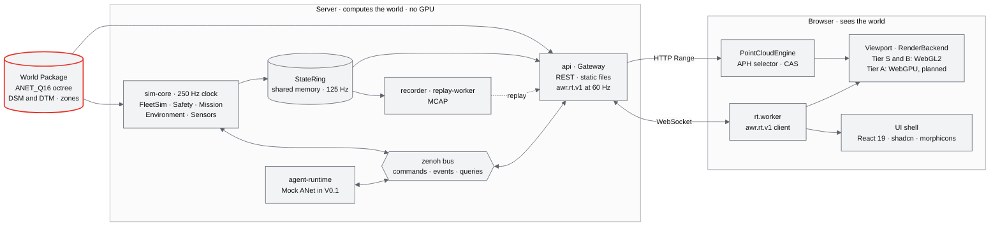

<div align="center">


<h3>Reality in, swarms out.</h3>

A real-world grounded 4D world runtime for autonomous multi-agent drones.<br/>
Stream a city-scale point cloud into any browser, fly a simulated fleet (built for up to 1,000 drones) through wind
and weather on one server clock, and let the drones discover and delegate work to each other over <a href="https://github.com/ANetResearch/ANet">ANet</a>.<br/>
No GPU needed on the server.

[](LICENSE)
[](#roadmap)
[](pyproject.toml)
[](apps/web/package.json)
[](apps/web/package.json)
[](https://threejs.org)
[](#how-it-works)
[](#quick-start)
[](#documentation)
[](https://github.com/ANetResearch/ANet)

[Quick start](#quick-start) · [Features](#features) · [How it works](#how-it-works) · [Roadmap](#roadmap) · [Docs](#documentation) · [ANet](https://github.com/ANetResearch/ANet)

**English** · [简体中文](README.zh-CN.md)

</div>

---

## Why ANet-Drone4D

Drone simulators usually start from the vehicle and put a hand-made map around it. Digital twins usually show a place
but cannot fly anything in it. ANet-Drone4D starts from the place: a captured or reconstructed point cloud becomes a
versioned **World**, and an environment field, a fleet of drones and their agents all run on that World and on one
clock, while a browser watches it from anywhere. The whole chain is
**Reality → Reconstruction → World → Environment → Simulation → Agent**. "4D" is 3D space plus time: drones, weather
and the timeline share one simulation clock, so any moment can be paused, stepped, recorded and replayed.

- **The World is the core, not the drone.** Captures, reconstructions and simulations all meet in one versioned World
  Package: geometry for physics and queries, a point cloud for the eye, semantics and no-fly zones, anchored to the
  real place. The built-in simulator reads it today; PX4 SIH, Gazebo and Isaac backends will read the same World.
- **The browser sees the world; the server computes it.** Physics, safety, planning and the environment run on a
  headless Linux server with no GPU. The browser only streams and draws, so a laptop over an SSH tunnel is enough.
- **City-scale point clouds, streamed like video.** A five-million-point city opens with a few HTTP Range requests
  and fills in progressively. A closed-loop controller trades point density for frame time, so the same world runs on a
  software renderer and on a desktop GPU.
- **The environment is a 4D field.** Wind, turbulence, visibility, rain, snow, fog and dust form one field
  E(x, y, z, t). The same numbers push on the airframes, through relative airspeed, and paint the sky.
- **Drones are physical agents.** A drone publishes what it can do; other agents find it, ask it for a quote and
  delegate a task. ANet is the collaboration plane, never the control plane: every flight command still passes the
  simulator's admission and safety checks.

## Features

> [!NOTE]
> The illustrations on this page are concept art made for this README with an image model and graded to the ANet
> Graphite palette. They are not screenshots of the current build.

### Reality → World


`worldpkg` normalizes a raw point cloud (units, up axis, levelling, north, origin, normals, ground model, height above
ground, classes) into **World Package v1**: a Potree 2.0-compatible octree with the 12-byte ANET_Q16 point encoding,
DSM and DTM rasters, semantics and zones. The six built-in cities (Shenzhen, Shanghai, New York, San Francisco,
Suzhou and Chicago, about 5 million points each) build on the CPU in 27 to 35 s per city and pass `validate --deep`
with zero errors. The reconstruction interface (Engine Adapter v2, Recon IR, a job state machine) already runs end
to end with a mock engine and produces a World the browser loads; GPU engines arrive in V0.5.

### Streaming city-scale point clouds


The first-screen levels arrive in one Range request per octree root; the rest streams in a Web Worker. The **APH selector** picks
octree nodes best-first under a two-level point budget, and the **CAS controller** moves that budget and a 7-rung
quality ladder (soft-min to ultra) from measured frame time, so density follows the view and the device. Every point
is drawn in a single draw call from a paged GPU point pool, and the canvas never resizes when quality changes. The
product selector matches the research prototype frame by frame on three cities and five budgets.

### Environment as a 4D field


The EnvironmentService evaluates wind (a height profile plus a turbulence box), visibility and precipitation, with
12 weather presets from clear to sandstorm. Physics reads the field in Python at 50 Hz, and wind acts on each airframe
through its relative airspeed. The browser evaluates the same formulas in TypeScript, and wind also in TSL on the GPU,
to draw rain, snow, dust, fog, clouds and wind arrows. Golden tests hold both sides together (10,261 cases), and GPU
wind matches the CPU reference within 0.01·v_max + 0.02 m/s.

### Many drones, one clock


**FleetSim** steps every drone as one structure of arrays on a shared 250 Hz clock: a PX4-style position and attitude
cascade (L1, at 125 Hz) compiled with numba, bit-identical to its numpy reference and checked against PX4 SIH flight
recordings. It is built for 1 to 1,000 drones (the 1,000-drone fleet ladder runs in the performance phase) of two
types: x500 and a P600 digital twin (its parameters are placeholders until identification in V0.4). Safety runs inside
the same loop: a 14-state flight state machine, geofences, energy-aware return to home, fleet separation and a
link-loss policy. Missions come from 8 generators, from a helical facade scan to formations and area coverage.

### Drones as physical agents


Each drone joins an agent network with its capabilities. In the S3 search-and-rescue scenario a camera drone spots a
possible target, finds thermal drones through capability discovery, collects quotes priced by the simulator's own
estimator, and delegates the confirmation to the best one; the result is checked against a receipt and an acceptance
predicate (TSIR, from ANetCore). V0.1 runs this on an in-process Mock ANet, and S3 passes in a lockstep test harness;
the multi-process run waits on agent leases in sim-core. Real ANet arrives in V1.0.

### And also

- **Time as an axis.** Pause, single-step and speeds from ×0.25 to ×10; recording and replay (MCAP) with replayed
  frames byte-identical to the recording; deterministic re-simulation from the input log.
- **Missions and swarms.** Helix scan, orbit, expanding square, corridor, terrain following, lawnmower, formation and
  follow-path generators; safe transit over the height map, 2.5D A*, CAPT formation assignment, area coverage and an
  energy pre-check before take-off.
- **Geometry queries on the World.** Height, AGL, clearance, line of sight, ray hit and path validation, used by
  safety, planning and the click-to-GoTo interaction alike.
- **Sensors.** Gimbals and camera frustums, GNSS and IMU noise models, a mock detector and thermal frames.
- **Scenarios.** S1 Shenzhen facade inspection, S2 Shanghai formation, S3 New York search and rescue with agents, S4
  Chicago lakeshore, S5 San Francisco terrain following, S6 Suzhou corridor, a fleet ladder from 10 to 1,000 drones,
  and a soak run.
- **Remote by design.** The server binds to loopback and is reached through an SSH tunnel; viewer, operator and admin
  roles, with a single operator seat. LAN mode is opt-in.
- **Contracts first.** 75 JSON Schemas generate the Python and TypeScript types, and golden files keep both sides in
  step. A supervisor with heartbeats, backoff and circuit breaking runs every process.

### Measured so far

All numbers come from one 8-core x86-64 virtual machine with **no GPU**. Browser cases ran in headless Chromium 151
with SwiftShader (software WebGL2, the Tier S path). The performance-phase benchmarks (frame pacing, fleet ladder,
gateway load, soak) have not run yet; see [Roadmap](#roadmap).

| What | Result | Conditions |
|---|---|---|
| StateRing publish, 1,000 drones at 125 Hz | p99 151.7 µs (gate ≤ 300 µs) | `make bench-ipc`, median of 3 runs |
| Tick data age at the reader | p99 8.0 ms (gate ≤ 15 ms) | same run, shared-memory read path only; the full gateway run is pending |
| Command admission round trip | p99 10.3 ms over 3,010 commands, 0 failures (gate ≤ 25 ms) | `bench_cmd`, bus and event layer with a simulated sim-core and gateway |
| Checkpoint save, 1,000 drones | p99 0.36 ms | `tests/runtime/test_checkpoint.py` |
| FleetSim budget, 1,000 drones | about 0.26 of one CPU core (numba), a budget built from prototype measurements; the fused L1 kernel alone measured 0.125 core at 250 Hz | research prototype g08; the product fleet ladder has not run yet |
| World build | 27.3 to 35.1 s per city; all six in 65.0 s with 3 jobs | CPU only; `validate --deep` 0 errors |
| First points on screen | 207 to 265 ms for Shenzhen, New York, San Francisco, Chicago; 0.6 to 2.5 s for Shanghai and Suzhou | functional smoke runs, not under the performance lock |
| Agent collaboration (S3) | target confirmed after 154.6 s of simulated time (limit 300 s); identical evidence chain across runs | lockstep harness with a simulated bridge |

Sources: the implementation reports in [docs/impl/](docs/impl/) (M03-M04, M05, M11-R, M14) and
[research note g08](docs/research/g08-gap.md).

## Quick start

**You need** Linux x86-64 (Ubuntu 22.04 or 24.04), Python 3.12, Node 22.12 (`.nvmrc`), make and git, about 20 GB of
disk and 1 GiB free in `/dev/shm`. The server needs no GPU. Any desktop browser with WebGL2 can connect; a GPU on the
viewing machine unlocks the higher quality rungs.

```sh
git clone https://github.com/ANetResearch/ANet-Drone4D.git
cd ANet-Drone4D
make setup        # locked install: .venv (uv pip sync) and npm ci, then generated-file checks (3-8 min)
make fetch-data   # UrbanScene3D sampled cities: 253 MB download, about 720 MB unpacked, sha256-checked
make worlds       # build the six city World Packages into worlds/ (never committed), about 1-2.5 min
make run          # production build if needed, then the supervisor; prints READY and an SSH command
```

Open **http://localhost:8000/world/shenzhen**. The demo profile loads Shenzhen and scenario S1: two P600s spiral down
the facade of the tallest tower in a 6 m/s wind from the south-east. Stop with Ctrl+C or `make stop`.

**From another machine.** The server listens on 127.0.0.1 only; forward the port and open the same URL locally:

```sh
ssh -N -L 8000:127.0.0.1:8000 -o ExitOnForwardFailure=yes -o Compression=no <user>@<server>
```

For a LAN demo, `AWR_BIND=0.0.0.0 AWR_ORIGINS=http://<server-ip>:8000 make run` opens the port to the network.

> [!IMPORTANT]
> The built-in worlds are generated from **UrbanScene3D**, which its authors provide for **non-commercial use only**
> and forbid redistributing, in original or altered form. This repository contains none of its points and no World
> Package, raster or recording built from it. `make fetch-data` downloads it from the authors' release on your behalf,
> so read and accept their terms first; see [Data and citation](#data-and-citation).

<details>
<summary><b>More commands</b></summary>

<br/>

| Command | What it does |
|---|---|
| `make dev` | Development start: Vite on :5173 with hot reload (profile dev) |
| `make demo` | Pre-flight checks, a presenter card, then `make run` with Shenzhen and S1 |
| `make status` | Processes, 1 Hz metrics, active alerts and capacity |
| `make logs P=sim-core` | Logs of one process (`F=1` follows) |
| `make stop` | Stop the current run |
| `make doctor` | Environment diagnosis (`DEEP=1` adds sha256 and deep world checks) |
| `make validate` | Deep-validate every World Package |
| `make fetch-data VERIFY=1` | Check local data against `configs/data.yaml` without downloading |
| `make vehicles-models` | Build the P600 glTF models (falls back to the procedural low-poly model without the Prometheus STL) |
| `make ci` | The merge gate: lint, contract checks, tsc, production build, pytest and Vitest |
| `make perf CASE=<id>` | Performance cases under the exclusive performance lock ([docs/18](docs/18-性能与测试方案.md)) |

The full runbook, ports, environment variables and failure handling are in
[docs/19](docs/19-部署与运维说明书.md) (Chinese).

</details>

## How it works



1. **Open.** `/world/shenzhen` loads the world manifest and octree hierarchy; one Range request per octree root
   brings the first-screen levels, and a Web Worker unpacks ANET_Q16 points into the GPU point pool.
2. **Stream.** Every frame the APH selector chooses nodes under the point budget; CAS adjusts the budget and the
   quality rung from measured frame time.
3. **Simulate.** sim-core advances all drones in one numba kernel on a 4 ms tick (L1 on every second tick), runs
   safety, missions, environment and sensors as registered pipeline stages, and publishes state into the StateRing.
4. **Serve.** The Gateway reads the ring at 60 Hz, applies each client's interest set and credit, and sends binary
   Lite32 records for the whole swarm and Full64 records for the drones you focus on.
5. **Draw.** The browser interpolates everything on one render time and draws drones, trails, zones, frustums and
   weather over the point cloud.
6. **Act.** Clicking the ground runs a `ray_hit` query on the DSM. The GoTo command passes admission (lease,
   parameters, capabilities, geofence) and comes back as `accepted`, `running`, then `succeeded`.

### The chain, today and next

| Stage | What it means | In V0.1 | Next |
|---|---|---|---|
| **Reality** | Point clouds, images, LiDAR and GNSS from a real place | UrbanScene3D sampled city point clouds (6 cities, about 5 M points each) | Capture sessions with a Livox MID-360 and RTK (V0.5) |
| **Reconstruction** | Turn captures into metric 3D | Engine Adapter v2, Recon IR and the job state machine, end to end with a mock engine (CLI) | LingBot-Map, DA3-Streaming and MapAnything on a GPU worker (V0.5) |
| **World** | The core asset, versioned | World Package v1 with geometry queries; progressive Web streaming | COPC and 3D Tiles export (V0.5); 3DGS visual layer (V0.8) |
| **Environment** | One field E(x, y, z, t) | L0/L1 wind with turbulence, 12 presets, wind as force, Low visuals, streamlines | L2 wind field library (V0.3); sensor degradation (V0.4) |
| **Simulation** | Many drones, one clock | FleetSim L1 built for 1 to 1,000 drones (fleet ladder pending), safety, missions, recording and replay | PX4 SIH (V0.2), SITL lockstep (V0.4), HITL (V0.6) |
| **Agent** | Drones discover and delegate | In-process Mock ANet, contract net, scenario S3 | Real ANet: ANetHub plus a daemon per drone, CBBA (V1.0) |

## Design system

The Web sandbox follows **ANet Graphite**, a palette of technology grey, black and white with a single red: 13 cool
greys and 5 reds derived from the ANet logo red. On any screen, at most one element is red, and it is the one that
needs your attention. `make lint` enforces the rules: no emoji, no colour literals outside the token files, no
backdrop blur, no stray icon packs.

| Token | Value | Role (dark theme) |
|---|---|---|
| `--g950` |  | App background, viewport clear colour |
| `--g900` |  | Panels and HUD cards |
| `--g800` |  | Muted surfaces, hover |
| `--g600` |  | Tracks, ground grid (never data) |
| `--g400` |  | Secondary data, focus ring, unselected trails |
| `--g200` |  | Secondary text, airframe body |
| `--g50` |  | Text and primary data |
| `--r500` |  | The one brand red: logo and the single red mark |
| `--r600` |  | Solid red behind white text |
| `--r400` |  | Red text on dark backgrounds |

| Layer | Built with |
|---|---|
| Components | [shadcn/ui](https://github.com/shadcn-ui/ui), `base-mira` style on [Base UI](https://base-ui.com), installed offline and adapted by codemods |
| Motion | [Transitions.dev](https://transitions.dev) duration, easing and recipe tokens, with full, lite and reduced motion tiers |
| Icons | [lucide](https://lucide.dev) geometry, morphed between states with [morphicons](https://github.com/guillermolg00/morphicons) |
| Charts | The [lieflat](https://github.com/larashero3-dotcom/lieflat-charts) visual language (hairline marks, rung bars, tick gauges, log tables), reimplemented in React |
| Type | Inter and JetBrains Mono, self-hosted |

The full specification, with contrast ratios and 3D scene colours, is [docs/15](docs/15-视觉设计规范与色卡.md)
(Chinese). Thanks to the authors of shadcn/ui, Base UI, Transitions.dev, lucide, morphicons and lieflat-charts; the
terms of each are in [THIRD_PARTY_NOTICES.md](THIRD_PARTY_NOTICES.md).

## Documentation

The design documents are written in Chinese, with technical terms in English. Start from the
[documentation map](docs/README.md), which gives a reading order for each role.

| | |
|---|---|
| **[03 Design baseline and decision record](docs/03-设计基线与决策记录.md)** | The single baseline: principles, architecture, path ownership, 53 ADRs, the version plan, D1 scope and acceptance (D1-AC-01 to D1-AC-35) |
| **[10 Architecture](docs/10-系统架构说明书.md)** · **[11 Technology selection](docs/11-技术选型说明书.md)** | Process topology, data flow, concurrency and capacity; every technology choice with locked versions |
| **[12 Business logic](docs/12-业务逻辑设计说明书.md)** · **[13 Product PRD](docs/13-产品设计PRD.md)** · **[14 UI interaction](docs/14-UI交互设计PRD.md)** | Flight states, command admission, leases, safety, scenarios and contract net; product scope; layout and interaction |
| **[15 Visual design and palette](docs/15-视觉设计规范与色卡.md)** · **[16 World data](docs/16-World数据规范.md)** · **[17 API and realtime protocol](docs/17-接口与实时协议规范.md)** | ANet Graphite tokens; World Package v1, ANET_Q16 and every file format; REST and `awr.rt.v1` byte layouts |
| **[18 Performance and testing](docs/18-性能与测试方案.md)** · **[19 Deployment and operations](docs/19-部署与运维说明书.md)** | Budgets, flight60, fleet ladder, performance protocol and lint rules; install, run, access and monitoring |
| **Module PRDs** | [M01 Reconstruction](docs/modules/M01-重建引擎PRD.md) · [M02 LiDAR fusion and georeferencing](docs/modules/M02-LiDAR融合与地理配准PRD.md) · [M03 World model and tiling](docs/modules/M03-World模型与Ingest切片PRD.md) · [M04 Geometry queries](docs/modules/M04-几何世界查询服务PRD.md) · [M05 Web point cloud engine](docs/modules/M05-Web点云引擎PRD.md) · [M06 Viewport and render backends](docs/modules/M06-Web视口与渲染后端PRD.md) · [M07 Environment](docs/modules/M07-环境引擎PRD.md) · [M08 Simulation core and vehicles](docs/modules/M08-仿真内核与飞行器适配PRD.md) · [M09 Safety and health](docs/modules/M09-安全与健康PRD.md) · [M10 Missions, planning and swarms](docs/modules/M10-任务规划与集群PRD.md) · [M11 Realtime gateway](docs/modules/M11-实时网关PRD.md) · [M12 Timeline, recording and replay](docs/modules/M12-时间轴录制与回放PRD.md) · [M13 Sensor simulation](docs/modules/M13-传感器仿真PRD.md) · [M14 Agent runtime and ANet](docs/modules/M14-智能体运行时与ANet-PRD.md) · [M15 UI shell and design system](docs/modules/M15-前端UI壳与设计体系组件PRD.md) · [M16 Demo data, scenarios and smoothness tests](docs/modules/M16-演示数据剧本与流畅性测试PRD.md) |
| **[Research notes](docs/research/00-index.md)** | 46 notes behind the decisions: reconstruction, Web point clouds, flight stacks, swarms, weather, realtime transport, the design system and ANet |
| **[Implementation reports](docs/impl/)** | What each work package built and tested; the [INT-1 integration report](docs/impl/INT-1-集成报告.md) is the current status |
| **[Original design](docs/01-design.md)** | The founding design (read-only), from which the baseline was derived |

## Roadmap

One complete chain first, then every layer covered by a mock, then real backends swapped in one layer at a time
behind interfaces that do not change ([docs/03](docs/03-设计基线与决策记录.md) §8.1).

| Version | Theme | Highlights | Status |
|---|---|---|---|
| **V0.1 (D1)** | A world runtime with every layer in place | Six cities, point-cloud streaming, FleetSim for 1 to 1,000 drones, safety, missions, L0/L1 environment, recording and replay, Mock ANet | **In progress**: integrated, performance phase next |
| V0.2 | The real flight stack in the loop | PX4 SIH (up to 8 drones) through MAVSDK, Prometheus backend, virtual MID-360, ingest of any PLY or LAS cloud, a Python `awr.rt.v1` client | Planned |
| V0.3 | Environment physics and planning | L2 mass-consistent wind library, GPU wind sampling, High environment tier, B-spline and ESDF planning | Planned |
| V0.4 | Environment into sensors and dynamics | Camera and LiDAR degradation, L2 aerodynamic moments, PX4 SITL lockstep, rewind and what-if forks, P600 parameter identification | Planned |
| V0.5 | Real-world fusion | GPU reconstruction, capture sessions with RTK, relocalization, a real P600 over Prometheus, COPC and 3D Tiles export | Planned |
| V0.6 | Swarms at scale | Three-layer deconfliction (4D reservations, ORCA-3D), energy-aware coverage routing, OpenFOAM wind, HITL | Planned |
| V0.8 | Visual World and high-fidelity sensors | 3DGS LOD streaming next to point clouds, 3D Tiles terrain, Isaac sensor backends, dynamic objects | Planned |
| V1.0 | Physical multi-agent world | Real ANet (ANetHub plus a daemon per drone), CBBA under network cuts, LLM and MCP through the trusted guard, heterogeneous agents | Planned |

### Where D1 stands

From the [INT-1 integration report](docs/impl/INT-1-集成报告.md) (2026-09-29):

- **Integrated.** The whole chain passes end to end: World → Range → point cloud on screen → FleetSim → StateRing →
  Gateway → WebSocket → drone on screen → GoTo round trip. `make run` brings every process to RUNNING with no error
  in the logs.
- **Acceptance D1-AC-01 to D1-AC-35 (38 items): 15 pass, 2 fail, 21 not measured yet.** Most of the 21 are
  performance cases (frame pacing, streaming, fleet ladder, gateway, soak) that run in the performance phase under the
  exclusive performance protocol; the rest are extension scenarios and chaos cases.
- **The two failures.** Scenario S1 triggers an energy return to home near its end, because the design check missed
  the worst point behind the tower; this is a specification conflict to be settled by an ADR (with a margin of 1.0,
  all nine predicates pass), and S1 at ×10 takes 286 s of wall time against a 210 s limit. After a crash, sim-core
  restarts in 3.17 s against a 3.0 s limit; the api already recovers within 3 s.
- **Also open.** The ladder n10 smoke scenario (spawn spacing), agent leases in sim-core (they block the
  multi-process S3 run), the reconstruction entry in the UI (the CLI works), and the Tier A WebGPU backend.
- **Tests.** In the full INT-1 run, 2,435 pytest cases passed (6 failed, 4 of them fixed since) and 908 Vitest cases
  passed (1 load-sensitive failure).

## Relation to ANet


ANet-Drone4D is part of the ANet family from Agent Network Research:
[ANet](https://github.com/ANetResearch/ANet), the A2A network for AI agents;
[ANetHub](https://github.com/ANetResearch/ANetHub), the hub; and
[ANetCore](https://github.com/ANetResearch/ANetCore), the protocol kernel and cryptography.

Here a drone is the first kind of **physical agent**. It publishes what it can do, other agents discover it, ask for
quotes and delegate tasks, and the outcome is checked against a receipt and an acceptance predicate. ANet is the
collaboration plane, not the control plane: a delegated task becomes an AGENT lease and ordinary commands, which pass
the same admission and safety checks as any operator's. V0.1 runs an in-process Mock ANet with these semantics
(agent-runtime); V1.0 moves to real ANet with a self-hosted ANetHub and one daemon per drone.

## Data and citation

**UrbanScene3D.** The six built-in worlds are built on your machine from the sampled virtual-city point clouds of
[UrbanScene3D](https://vcc.tech/UrbanScene3D) (Lin et al., ECCV 2022). Its authors make it available for
non-commercial use only, forbid redistributing it or any altered version, and ask every work that uses it to cite
it. This repository contains no UrbanScene3D points and no World Package, raster or recording built from it; `worlds/`,
`runs/` and `data/raw/` are never committed. A few small test fixtures keep only metadata of the built worlds (octree
node counts and bounding boxes, manifest fields and a test camera path), never point data. `make fetch-data` downloads
`UrbanScene3D-virtual_cities-sampled.7z` from the
[authors' release](https://github.com/Linxius/UrbanScene3D/releases/tag/v0.0.1) and checks every sha256 against
[configs/data.yaml](configs/data.yaml). The commercial permission in our LICENSE does not extend to the dataset. The
authors' terms are quoted in full in [THIRD_PARTY_NOTICES.md](THIRD_PARTY_NOTICES.md) §4.

```bibtex
@inproceedings{UrbanScene3D,
  title     = {Capturing, Reconstructing, and Simulating: the UrbanScene3D Dataset},
  author    = {Liqiang Lin and Yilin Liu and Yue Hu and Xingguang Yan and Ke Xie and Hui Huang},
  booktitle = {ECCV},
  year      = {2022}
}
```

**Citing ANet-Drone4D.** GitHub's "Cite this repository" reads [CITATION.cff](CITATION.cff); in BibTeX:

```bibtex
@software{anet_drone4d_2026,
  title   = {ANet-Drone4D: A Real-World Grounded 4D World Runtime for Autonomous Multi-Agent Drones},
  author  = {{Agent Network Research}},
  year    = {2026},
  version = {0.1.0},
  url     = {https://github.com/ANetResearch/ANet-Drone4D}
}
```

<details>
<summary><b>ANet research</b></summary>

<br/>

The agent side builds on the ANet research program on the value of connection in agent networks:
[ANet Patu-1](https://arxiv.org/abs/2607.15053) and the position paper
[Agent Network for Open Multi-Agent Collaboration with Shared Cognition](https://www.sciopen.com/article/10.26599/TST.2026.9010062).

```bibtex
@article{yuan2026patu1,
  title   = {ANet Patu-1: The Value of Connection in the Agent Network},
  author  = {Yuan, Mu and Song, Jinke and Zhou, Zhaomeng and Zhang, Lan},
  journal = {arXiv preprint arXiv:2607.15053},
  year    = {2026}
}

@article{zhang2026agentnetwork,
  title   = {Agent Network for Open Multi-Agent Collaboration with Shared Cognition},
  author  = {Zhang, Lan and Liu, Yunhao},
  journal = {Tsinghua Science and Technology},
  volume  = {31},
  number  = {6},
  pages   = {2611--2629},
  year    = {2026},
  doi     = {10.26599/TST.2026.9010062}
}
```

</details>

## Acknowledgements

ANet-Drone4D stands on open work: [three.js](https://threejs.org) and
[React Three Fiber](https://github.com/pmndrs/react-three-fiber) for the viewport,
[Potree](https://github.com/potree/potree) for the octree container layout, [zenoh](https://zenoh.io) for the bus,
[numba](https://numba.pydata.org) for the fleet kernels, [PX4](https://github.com/PX4/PX4-Autopilot) for the control
cascade and SIH reference flights, [Prometheus](https://github.com/amov-lab/Prometheus) for the P600 airframe, and
UrbanScene3D for the cities. Everything included or adapted is listed, with its license, in
[THIRD_PARTY_NOTICES.md](THIRD_PARTY_NOTICES.md).

## Contributing

Issues and pull requests are welcome in English or Chinese; start with [CONTRIBUTING.md](CONTRIBUTING.md). Anything
that changes a contract (file formats, `awr.rt.v1`, the REST API, reason codes) starts as an issue, behaviour is
specified in `docs/` before it is coded, and `make ci` is the merge gate. Performance reports from real GPUs are
especially welcome. Security reports go to hi@anet0.com ([SECURITY.md](SECURITY.md)).

## License

ANet-Drone4D is released under the **ANet Open Source License (ANet-Drone4D)**, a modified Apache License 2.0:

- **Use it commercially.** Embed the world runtime, the World Package tools or the Web sandbox in your product, or
  run it on your own infrastructure.
- **Two added conditions.** Operating a *multi-tenant hosted simulation or digital twin service*, offered to unrelated
  organizations or individuals, needs written authorization (a service for one person or inside one organization, a
  free research or teaching service run by or for a university, a school or a public or non-profit research body,
  and letting others watch an instance you run are exempt); and the ANet logo and copyright notices in the Web
  sandbox and the `awr` CLI stay in place.
- **Data and third-party parts keep their own terms.** UrbanScene3D is non-commercial only and may not be
  redistributed; included and adapted components are listed in [THIRD_PARTY_NOTICES.md](THIRD_PARTY_NOTICES.md).

See [LICENSE](LICENSE) and [NOTICE](NOTICE) for the full terms. Commercial licensing and questions: hi@anet0.com.

---

<div align="center">

**[Start with the documentation map →](docs/README.md)**

*The World is the core. Drones are its first agents.*

<br/>

Questions, ideas and flight logs are welcome in
[GitHub Issues](https://github.com/ANetResearch/ANet-Drone4D/issues).

</div>
