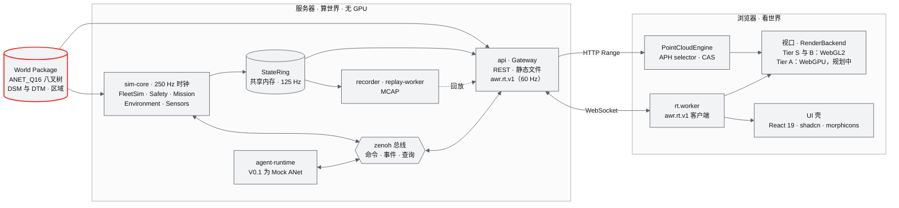

<div align="center">


<h3>从真实世界，到无人机集群。</h3>

面向自主多智能体无人机的真实世界 4D World Runtime。<br/>
把城市级点云流式送进任何浏览器，让仿真机群（按至多 1,000 架设计）在同一个服务器时钟下穿行风雨，并通过 <a href="https://github.com/ANetResearch/ANet">ANet</a> 互相发现能力、委派任务。<br/>
服务器不需要 GPU。

[](LICENSE)
[](#版本路线)
[](pyproject.toml)
[](apps/web/package.json)
[](apps/web/package.json)
[](https://threejs.org)
[](#工作原理)
[](#快速开始)
[](#文档)
[](https://github.com/ANetResearch/ANet)

[快速开始](#快速开始) · [核心特性](#核心特性) · [工作原理](#工作原理) · [版本路线](#版本路线) · [文档](#文档) · [ANet](https://github.com/ANetResearch/ANet)

[English](README.md) · **简体中文**

</div>

---

## 为什么是 ANet-Drone4D

无人机仿真器通常从飞行器出发，再给它配一张手工搭建的地图；数字孪生通常能展示一个地方，却不能在里面飞任何东西。ANet-Drone4D 从地方出发：采集或重建得到的点云成为一个带版本的 **World**，环境场、无人机机群和它们的智能体都运行在这个 World 上、共用同一个时钟，浏览器则可以在任何地方观看。整条链路是 **Reality → Reconstruction → World → Environment → Simulation → Agent**。所谓"4D"，是三维空间加上时间：无人机、天气与时间轴共用一个仿真时钟，任何时刻都可以暂停、单步、录制和回放。

- **World 是核心，而不是 Drone。** 采集、重建与仿真都汇入同一个带版本的 World Package：供物理与查询使用的几何、供眼睛看的点云、语义与禁飞区，并锚定在真实地点上。目前由内置仿真器读取；PX4 SIH、Gazebo 与 Isaac 后端将来读取同一个 World。
- **浏览器看世界，服务器算世界。** 物理、安全、规划与环境都运行在没有 GPU 的无头 Linux 服务器上。浏览器只负责流式加载与绘制，所以一台笔记本经 SSH 隧道就够了。
- **城市级点云，像视频一样流式加载。** 一座五百万点的城市只需几次 HTTP Range 请求就能打开，然后渐进补全。闭环控制器用点的疏密换帧时间，同一个世界既能在软件渲染器上运行，也能在桌面 GPU 上运行。
- **环境是一个 4D 场。** 风、湍流、能见度、雨、雪、雾与沙尘构成同一个场 E(x, y, z, t)。同一组数字既经相对空速作用于机体，也用来绘制天空。
- **无人机是 Physical Agent。** 每架无人机公布自己能做什么；其他智能体发现它、向它询价并委派任务。ANet 是协作平面，而不是控制平面：每一条飞行命令仍要通过仿真器的准入与安全检查。

## 核心特性

> [!NOTE]
> 本页插图是为 README 制作的概念图，由图像模型生成并按 ANet Graphite 色卡调色，不是当前版本的截图。

### Reality → World


`worldpkg` 把原始点云规范化（单位、上方向、调平、北向、原点、法线、地面模型、离地高度、分类），写成 **World Package v1**：与 Potree 2.0 兼容的八叉树加 12 字节的 ANET_Q16 点编码、DSM 与 DTM 栅格、语义与区域。六座内置城市（深圳、上海、纽约、旧金山、苏州、芝加哥，各约 500 万点）在 CPU 上单城构建 27 到 35 s，`validate --deep` 零错误。重建接口（Engine Adapter v2、Recon IR、任务状态机）已经用 Mock 引擎端到端跑通，产出的 World 可以直接在浏览器中加载；GPU 重建引擎在 V0.5 接入。

### 城市级点云流式加载


首屏层级按每个八叉树根一次 Range 请求取回，其余部分在 Web Worker 中流式加载。**APH 选择器**在两级点预算下按 best-first 挑选八叉树节点，**CAS 控制器**根据实测帧时间调节预算，并在 7 档画质阶梯（soft-min 到 ultra）之间换档，让点的疏密跟随视角与设备变化。所有点来自按页分配的 GPU 点池，一次 draw call 画完；画质变化时画布尺寸始终不变。产品选择器在三座城市、五档预算下与研究原型逐帧一致。

### 环境是一个 4D 场


EnvironmentService 计算风（高度廓线加湍流盒）、能见度与降水，提供从晴到沙尘暴共 12 个天气预设。物理以 50 Hz 在 Python 中读取这个场，风经相对空速作用于每架机体。浏览器用 TypeScript 计算同一套公式，风场还在 GPU 上用 TSL 计算，用来绘制雨、雪、沙尘、雾、云与风箭头。两端由 golden 测试约束（10,261 例），GPU 风场与 CPU 参考值的偏差在 0.01·v_max + 0.02 m/s 以内。

### 多机同钟


**FleetSim** 把所有无人机放在一个 SoA（数组结构）里，在共享的 250 Hz 时钟上推进：PX4 风格的位置与姿态级联（L1，125 Hz）由 numba 编译，与 numpy 参考实现逐位一致，并与 PX4 SIH 飞行记录对照。它按 1 到 1,000 架设计（1,000 架机群阶梯在性能阶段运行），支持两种机型：x500 与 P600 数字孪生（P600 参数在 V0.4 辨识之前为占位值）。安全逻辑运行在同一个循环里：14 态 Flight FSM、地理围栏、能量感知返航、机间间距守护与链路丢失策略。任务来自 8 种生成器，从螺旋立面扫描到编队与区域覆盖。

### 无人机即智能体


每架无人机带着自己的能力加入智能体网络。在 S3 搜救剧本中，一架相机无人机发现疑似目标，通过能力发现找到热成像无人机，收集由仿真器自身估价器给出的报价，把确认任务委派给最合适的一架；结果依据回执与验收谓词（TSIR，来自 ANetCore）核验。V0.1 在进程内 Mock ANet 上运行这一流程，S3 已在锁步测试环境中通过；多进程运行还在等待 sim-core 的 agent 租约。真 ANet 在 V1.0 接入。

### 还有这些

- **时间是一根轴。** 暂停、单步，倍速 ×0.25 到 ×10；录制与回放（MCAP），回放帧与录制逐字节一致；可以依据输入日志确定性地重新仿真。
- **任务与集群。** 螺旋扫描、环绕、扩展方形、走廊、地形跟随、割草机式、编队与沿路径飞行等生成器；基于高度图的安全转场、2.5D A*、CAPT 编队分配、区域覆盖，以及起飞前的能量预检。
- **World 上的几何查询。** 高度、AGL、净空、视线、射线求交与路径校验，安全、规划和"点地面即 GoTo"交互都用它。
- **传感器。** 云台与相机视锥、GNSS 与 IMU 噪声模型、Mock 检测器与热成像帧。
- **剧本。** S1 深圳立面巡检、S2 上海编队、S3 纽约搜救（智能体协作）、S4 芝加哥湖岸、S5 旧金山地形跟随、S6 苏州走廊，以及 10 到 1,000 架的机群阶梯和 soak 长跑。
- **天生支持远程。** 服务器只监听回环地址，经 SSH 隧道访问；viewer、operator、admin 三种角色，只有一个操作席位。局域网模式需要显式开启。
- **契约优先。** 75 份 JSON Schema 生成 Python 与 TypeScript 类型，golden 文件让两端保持一致。所有进程由带心跳、退避与熔断的 supervisor 管理。

### 目前的实测数据

以下数字全部来自一台 8 核 x86-64 虚拟机，**没有 GPU**。浏览器用例运行在 headless Chromium 151 + SwiftShader（软件 WebGL2，即 Tier S 路径）上。性能阶段的基准（帧节奏、机群阶梯、网关负载、soak）尚未运行，见[版本路线](#版本路线)。

| 项目 | 结果 | 条件 |
|---|---|---|
| StateRing 发布，1,000 架、125 Hz | p99 151.7 µs（门禁 ≤ 300 µs） | `make bench-ipc`，3 次取中位 |
| 读端 tick 数据年龄 | p99 8.0 ms（门禁 ≤ 15 ms） | 同一次运行，仅共享内存读取路径；完整网关口径待测 |
| 命令准入往返 | 3,010 条命令 p99 10.3 ms、失败 0（门禁 ≤ 25 ms） | `bench_cmd`，总线与事件层，sim-core 与网关为模拟进程 |
| checkpoint 保存，1,000 架 | p99 0.36 ms | `tests/runtime/test_checkpoint.py` |
| FleetSim 预算，1,000 架 | 约 0.26 个 CPU 核（numba），由原型分项实测汇总的预算；其中融合 L1 核单项实测 250 Hz 下 0.125 核 | 研究原型 g08；产品版机群阶梯基准尚未运行 |
| World 构建 | 单城 27.3 到 35.1 s；3 并行时六城共 65.0 s | 仅 CPU；`validate --deep` 零错误 |
| 首帧出点 | 深圳、纽约、旧金山、芝加哥 207 到 265 ms；上海与苏州 0.6 到 2.5 s | 功能冒烟，未持性能锁 |
| 智能体协作（S3） | 仿真时间 154.6 s 确认目标（上限 300 s）；多次运行证据链一致 | 锁步测试环境，仿真桥为 fake |

来源：[docs/impl/](docs/impl/) 中的实现报告（M03-M04、M05、M11-R、M14）与[研究笔记 g08](docs/research/g08-gap.md)。

## 快速开始

**需要** Linux x86-64（Ubuntu 22.04 或 24.04）、Python 3.12、Node 22.12（`.nvmrc`）、make 与 git，约 20 GB 磁盘，`/dev/shm` 至少 1 GiB 空闲。服务器不需要 GPU。任何支持 WebGL2 的桌面浏览器都能连接；观看端有 GPU 时可以用到更高的画质档。

```sh
git clone https://github.com/ANetResearch/ANet-Drone4D.git
cd ANet-Drone4D
make setup        # 锁定安装：.venv（uv pip sync）与 npm ci，再做生成物校验（3-8 min）
make fetch-data   # UrbanScene3D 六城采样点云：下载 253 MB，解压约 720 MB，逐个校验 sha256
make worlds       # 在本机把六城构建为 World Package，写入 worlds/（永不入库），约 1-2.5 min
make run          # 需要时先做生产构建，再启动 supervisor；打印 READY 与 SSH 转发命令
```

打开 **http://localhost:8000/world/shenzhen**。demo profile 加载深圳与 S1 剧本：两架 P600 在 6 m/s 的东南风中沿最高塔楼的立面螺旋下降。按 Ctrl+C 或执行 `make stop` 停止。

**从另一台机器访问。** 服务器只监听 127.0.0.1；转发端口后在本地打开同一个地址：

```sh
ssh -N -L 8000:127.0.0.1:8000 -o ExitOnForwardFailure=yes -o Compression=no <user>@<server>
```

局域网演示时，`AWR_BIND=0.0.0.0 AWR_ORIGINS=http://<server-ip>:8000 make run` 会把端口开放到网络。

> [!IMPORTANT]
> 内置世界由 **UrbanScene3D** 生成。其作者只允许**非商业使用**，并禁止再分发原始数据或其任何改动版本。本仓库既不包含该数据的点，也不包含由其生成的 World Package、栅格或录制。`make fetch-data` 代你从作者的发布页下载，请先阅读并接受其条款，见[数据与引用](#数据与引用)。

<details>
<summary><b>更多命令</b></summary>

<br/>

| 命令 | 作用 |
|---|---|
| `make dev` | 开发启动：Vite 在 :5173，支持热更新（profile dev） |
| `make demo` | 演示前检查、打印演示提示卡，然后以深圳与 S1 执行 `make run` |
| `make status` | 进程、1 Hz 指标、活动告警与容量 |
| `make logs P=sim-core` | 查看某个进程的日志（`F=1` 持续跟随） |
| `make stop` | 停止当前运行 |
| `make doctor` | 环境诊断（`DEEP=1` 加做 sha256 与世界深度校验） |
| `make validate` | 深度校验全部 World Package |
| `make fetch-data VERIFY=1` | 只按 `configs/data.yaml` 校验本地数据，不下载 |
| `make vehicles-models` | 构建 P600 的 glTF 模型（缺少 Prometheus STL 时退回程序生成的低模） |
| `make ci` | 合并门禁：lint、契约检查、tsc、生产构建、pytest 与 Vitest |
| `make perf CASE=<id>` | 持排他性能锁运行性能用例（[docs/18](docs/18-性能与测试方案.md)） |

完整的运行手册、端口、环境变量与故障处理见 [docs/19](docs/19-部署与运维说明书.md)。

</details>

## 工作原理



1. **打开。** `/world/shenzhen` 加载世界清单与八叉树层级；每个八叉树根一次 Range 请求取回首屏层级，Web Worker 把 ANET_Q16 点解包进 GPU 点池。
2. **流式。** 每一帧由 APH 选择器在点预算内挑选节点；CAS 根据实测帧时间调整预算与画质档。
3. **仿真。** sim-core 以 4 ms 为一个 tick，用一个 numba 核推进全部无人机（L1 每两个 tick 执行一次），把安全、任务、环境与传感器作为已登记的 pipeline stage 运行，并把状态发布到 StateRing。
4. **服务。** Gateway 以 60 Hz 读取环，按每个客户端的兴趣集与 credit 发送二进制数据：整个机群用 Lite32 记录，你关注的无人机用 Full64 记录。
5. **绘制。** 浏览器在唯一的渲染时刻上插值，在点云之上绘制无人机、轨迹、区域、视锥与天气。
6. **操作。** 点击地面会在 DSM 上执行一次 `ray_hit` 查询。GoTo 命令通过准入（租约、参数、能力、围栏），依次返回 `accepted`、`running`、`succeeded`。

### 链路的现在与下一步

| 环节 | 含义 | V0.1 现状 | 下一步 |
|---|---|---|---|
| **Reality** | 来自真实地点的点云、影像、LiDAR 与 GNSS | UrbanScene3D 六城采样点云（各约 500 万点） | Livox MID-360 与 RTK 采集会话（V0.5） |
| **Reconstruction** | 把采集数据变成有尺度的三维 | Engine Adapter v2、Recon IR 与任务状态机，Mock 引擎端到端跑通（CLI） | GPU worker 上的 LingBot-Map、DA3-Streaming 与 MapAnything（V0.5） |
| **World** | 核心资产，带版本 | World Package v1 与几何查询；Web 渐进式流式加载 | COPC 与 3D Tiles 导出（V0.5）；3DGS 视觉层（V0.8） |
| **Environment** | 同一个场 E(x, y, z, t) | L0/L1 风与湍流、12 个预设、风作用为力、Low 档视觉、流线 | L2 风场库（V0.3）；传感器退化（V0.4） |
| **Simulation** | 多机同钟 | FleetSim L1 按 1 到 1,000 架设计（机群阶梯待测），安全、任务、录制与回放 | PX4 SIH（V0.2）、SITL lockstep（V0.4）、HITL（V0.6） |
| **Agent** | 无人机发现彼此并委派任务 | 进程内 Mock ANet、合同网、S3 剧本 | 真 ANet：ANetHub 加每机一个 daemon，CBBA（V1.0） |

## 设计体系

Web 沙盘采用 **ANet Graphite** 色卡：科技灰、黑、白，只有一种红，共 13 阶冷灰与 5 阶红（由 ANet logo 红派生）。任何一屏上至多只有一处红色，它就是需要你注意的那一处。`make lint` 强制执行这些规则：禁止 emoji，token 文件之外禁止颜色字面量，禁止背景模糊，禁止混入其他图标包。

| Token | 色值 | 用途（暗色主题） |
|---|---|---|
| `--g950` |  | 应用背景、视口清屏色 |
| `--g900` |  | 面板与 HUD 卡片 |
| `--g800` |  | 次级表面、悬停 |
| `--g600` |  | 轨道、地面网格（不画数据） |
| `--g400` |  | 次要数据、焦点环、未选中轨迹 |
| `--g200` |  | 次要文字、机体主色 |
| `--g50` |  | 文字与主要数据 |
| `--r500` |  | 唯一的品牌红：logo 与那一处红色标记 |
| `--r600` |  | 承载白字的红色实底 |
| `--r400` |  | 暗底上的红色文字 |

| 层 | 采用 |
|---|---|
| 组件 | [shadcn/ui](https://github.com/shadcn-ui/ui) 的 `base-mira` 风格，基于 [Base UI](https://base-ui.com)，离线安装并经 codemod 改造 |
| 动效 | [Transitions.dev](https://transitions.dev) 的时长、缓动与配方 token，分 full、lite、reduced 三个动效档 |
| 图标 | [lucide](https://lucide.dev) 图形，由 [morphicons](https://github.com/guillermolg00/morphicons) 在状态之间形变切换 |
| 图表 | [lieflat](https://github.com/larashero3-dotcom/lieflat-charts) 视觉语言（细线标记、阶梯条、刻度仪表、日志式表格），用 React 重新实现 |
| 字体 | Inter 与 JetBrains Mono，本地托管 |

完整规范（含对比度与 3D 场景配色）见 [docs/15](docs/15-视觉设计规范与色卡.md)。感谢 shadcn/ui、Base UI、Transitions.dev、lucide、morphicons 与 lieflat-charts 的作者；各自的条款见 [THIRD_PARTY_NOTICES.md](THIRD_PARTY_NOTICES.md)。

## 文档

设计文档以中文撰写，技术术语保留英文。建议从[文档地图](docs/README.md)开始，它按角色给出了阅读顺序。

| | |
|---|---|
| **[03 设计基线与决策记录](docs/03-设计基线与决策记录.md)** | 唯一基线：原则、架构、路径所有权、53 条 ADR、版本路线、D1 范围与验收（D1-AC-01 至 D1-AC-35） |
| **[10 系统架构](docs/10-系统架构说明书.md)** · **[11 技术选型](docs/11-技术选型说明书.md)** | 进程拓扑、数据流、并发与容量；每项技术选型及锁定版本 |
| **[12 业务逻辑](docs/12-业务逻辑设计说明书.md)** · **[13 产品设计 PRD](docs/13-产品设计PRD.md)** · **[14 UI 交互](docs/14-UI交互设计PRD.md)** | 飞行状态、命令准入、租约、安全、剧本与合同网；产品范围；布局与交互 |
| **[15 视觉设计规范与色卡](docs/15-视觉设计规范与色卡.md)** · **[16 World 数据规范](docs/16-World数据规范.md)** · **[17 接口与实时协议](docs/17-接口与实时协议规范.md)** | ANet Graphite token；World Package v1、ANET_Q16 与全部文件格式；REST 与 `awr.rt.v1` 字节布局 |
| **[18 性能与测试方案](docs/18-性能与测试方案.md)** · **[19 部署与运维](docs/19-部署与运维说明书.md)** | 性能预算、flight60、机群阶梯、性能运行协议与 lint 规则；安装、运行、访问与监控 |
| **模块 PRD** | [M01 重建引擎](docs/modules/M01-重建引擎PRD.md) · [M02 LiDAR 融合与地理配准](docs/modules/M02-LiDAR融合与地理配准PRD.md) · [M03 World 模型与切片](docs/modules/M03-World模型与Ingest切片PRD.md) · [M04 几何世界查询](docs/modules/M04-几何世界查询服务PRD.md) · [M05 Web 点云引擎](docs/modules/M05-Web点云引擎PRD.md) · [M06 视口与渲染后端](docs/modules/M06-Web视口与渲染后端PRD.md) · [M07 环境引擎](docs/modules/M07-环境引擎PRD.md) · [M08 仿真内核与飞行器适配](docs/modules/M08-仿真内核与飞行器适配PRD.md) · [M09 安全与健康](docs/modules/M09-安全与健康PRD.md) · [M10 任务、规划与集群](docs/modules/M10-任务规划与集群PRD.md) · [M11 实时网关](docs/modules/M11-实时网关PRD.md) · [M12 时间轴、录制与回放](docs/modules/M12-时间轴录制与回放PRD.md) · [M13 传感器仿真](docs/modules/M13-传感器仿真PRD.md) · [M14 智能体运行时与 ANet](docs/modules/M14-智能体运行时与ANet-PRD.md) · [M15 UI 壳与设计体系](docs/modules/M15-前端UI壳与设计体系组件PRD.md) · [M16 演示数据、剧本与流畅性测试](docs/modules/M16-演示数据剧本与流畅性测试PRD.md) |
| **[研究笔记](docs/research/00-index.md)** | 支撑各项决策的 46 篇笔记：重建、Web 点云、飞控栈、集群、天气、实时传输、设计体系与 ANet |
| **[实现报告](docs/impl/)** | 各工作包实现了什么、测了什么；当前状态以 [INT-1 集成报告](docs/impl/INT-1-集成报告.md)为准 |
| **[原始设计](docs/01-design.md)** | 项目的原始设计（只读），基线由它派生 |

## 版本路线

先打通一条完整链路，再用 Mock 覆盖所有层，然后在接口不变的前提下逐层换成真实后端（[docs/03](docs/03-设计基线与决策记录.md) §8.1）。

| 版本 | 主题 | 主要内容 | 状态 |
|---|---|---|---|
| **V0.1（D1）** | 所有层就位的 World Runtime | 六城、点云流式加载、FleetSim 1 到 1,000 架、安全、任务、L0/L1 环境、录制与回放、Mock ANet | **进行中**：已完成集成，下一步是性能阶段 |
| V0.2 | 真实飞控栈进入回路 | 经 MAVSDK 接入 PX4 SIH（至多 8 架）、Prometheus 后端、虚拟 MID-360、任意 PLY 或 LAS 点云 ingest、Python 版 `awr.rt.v1` 客户端 | 规划中 |
| V0.3 | 环境物理化与规划 | L2 质量守恒风场库、GPU 风场采样、环境 High 档、B-spline 与 ESDF 规划 | 规划中 |
| V0.4 | 环境作用于传感器与动力学 | 相机与 LiDAR 退化、L2 气动力矩、PX4 SITL lockstep、倒带与 what-if 分叉、P600 参数辨识 | 规划中 |
| V0.5 | 真实世界融合 | GPU 重建、带 RTK 的采集会话、重定位、经 Prometheus 接入真 P600、COPC 与 3D Tiles 导出 | 规划中 |
| V0.6 | 规模化集群 | 三层互避（4D 预约、ORCA-3D）、带电量约束的覆盖路由、OpenFOAM 风场、HITL | 规划中 |
| V0.8 | Visual World 与高保真传感器 | 3DGS LOD 流式加载与点云同帧、3D Tiles 地形、Isaac 传感器后端、动态物体 | 规划中 |
| V1.0 | Physical Multi-Agent World | 真 ANet（ANetHub 加每机一个 daemon）、断网下的 CBBA、经受信守卫接入 LLM 与 MCP、异构智能体 | 规划中 |

### D1 当前进展

依据 [INT-1 集成报告](docs/impl/INT-1-集成报告.md)（2026-09-29）：

- **已完成集成。** 整条链路端到端通过：World → Range → 点云上屏 → FleetSim → StateRing → Gateway → WebSocket → 无人机上屏 → GoTo 闭环。`make run` 下所有进程进入 RUNNING，日志中没有 ERROR。
- **验收 D1-AC-01 至 D1-AC-35（共 38 项）：15 项通过，2 项未通过，21 项尚未测。** 这 21 项大多是性能用例（帧节奏、流式、机群阶梯、网关、soak），将在性能阶段按排他性能运行协议执行；其余是扩展剧本与混沌用例。
- **两项未通过。** S1 剧本在接近结束时触发能量返航，原因是设计校核漏算了塔楼远侧的最坏点；这是规格冲突，将以 ADR 裁决（裕度取 1.0 时九个谓词全部为真）；另外 S1 在 ×10 下墙钟 286 s，超过 210 s 的限额。sim-core 崩溃后重启需要 3.17 s，阈值为 3.0 s；api 已能在 3 s 内恢复。
- **其他未完成项。** ladder n10 冒烟剧本（出生点间距）、sim-core 的 agent 租约（阻塞多进程 S3）、UI 中的重建入口（CLI 可用），以及 Tier A WebGPU 后端。
- **测试。** INT-1 全量运行中，pytest 2,435 例通过（6 例失败，其中 4 例已修复），Vitest 908 例通过（1 例受负载影响失败）。

## 与 ANet 的关系


ANet-Drone4D 属于 Agent Network Research 的 ANet 项目家族：[ANet](https://github.com/ANetResearch/ANet)（面向 AI agent 的 A2A 网络）、[ANetHub](https://github.com/ANetResearch/ANetHub)（hub）与 [ANetCore](https://github.com/ANetResearch/ANetCore)（协议内核与密码学）。

在这里，无人机是第一种 **Physical Agent**。它公布自己能做什么，其他智能体发现它、询价并委派任务，结果依据回执与验收谓词核验。ANet 是协作平面，而不是控制平面：一次委派落到仿真器里是一份 AGENT 租约和一组普通命令，与任何操作员的命令一样要经过准入与安全检查。V0.1 在进程内 Mock ANet（agent-runtime）上实现同样的语义；V1.0 改用真 ANet：自建 ANetHub，每架无人机一个 daemon。

## 数据与引用

**UrbanScene3D。** 六座内置世界由 [UrbanScene3D](https://vcc.tech/UrbanScene3D)（Lin 等，ECCV 2022）的虚拟城市采样点云在你的机器上生成。其作者只允许非商业使用，禁止再分发数据或其任何改动版本，并要求所有使用它的工作引用原论文。本仓库不包含任何 UrbanScene3D 点数据，也不包含由其生成的 World Package、栅格或录制；`worlds/`、`runs/` 与 `data/raw/` 永不入库。少量测试夹具只保留已构建世界的元数据（八叉树节点计数与包围盒、清单字段、一条测试相机路径），不含任何点数据。`make fetch-data` 从[作者的发布页](https://github.com/Linxius/UrbanScene3D/releases/tag/v0.0.1) 下载 `UrbanScene3D-virtual_cities-sampled.7z`，并按 [configs/data.yaml](configs/data.yaml) 逐个校验 sha256。本项目 LICENSE 中的商用许可不延及该数据集。作者条款原文见 [THIRD_PARTY_NOTICES.md](THIRD_PARTY_NOTICES.md) 第 4 节。

```bibtex
@inproceedings{UrbanScene3D,
  title     = {Capturing, Reconstructing, and Simulating: the UrbanScene3D Dataset},
  author    = {Liqiang Lin and Yilin Liu and Yue Hu and Xingguang Yan and Ke Xie and Hui Huang},
  booktitle = {ECCV},
  year      = {2022}
}
```

**引用 ANet-Drone4D。** GitHub 的"Cite this repository"读取 [CITATION.cff](CITATION.cff)；BibTeX 如下：

```bibtex
@software{anet_drone4d_2026,
  title   = {ANet-Drone4D: A Real-World Grounded 4D World Runtime for Autonomous Multi-Agent Drones},
  author  = {{Agent Network Research}},
  year    = {2026},
  version = {0.1.0},
  url     = {https://github.com/ANetResearch/ANet-Drone4D}
}
```

<details>
<summary><b>ANet 研究</b></summary>

<br/>

智能体部分建立在 ANet 关于"智能体网络中连接的价值"的研究之上：[ANet Patu-1](https://arxiv.org/abs/2607.15053) 与立场论文 [Agent Network for Open Multi-Agent Collaboration with Shared Cognition](https://www.sciopen.com/article/10.26599/TST.2026.9010062)。

```bibtex
@article{yuan2026patu1,
  title   = {ANet Patu-1: The Value of Connection in the Agent Network},
  author  = {Yuan, Mu and Song, Jinke and Zhou, Zhaomeng and Zhang, Lan},
  journal = {arXiv preprint arXiv:2607.15053},
  year    = {2026}
}

@article{zhang2026agentnetwork,
  title   = {Agent Network for Open Multi-Agent Collaboration with Shared Cognition},
  author  = {Zhang, Lan and Liu, Yunhao},
  journal = {Tsinghua Science and Technology},
  volume  = {31},
  number  = {6},
  pages   = {2611--2629},
  year    = {2026},
  doi     = {10.26599/TST.2026.9010062}
}
```

</details>

## 致谢

ANet-Drone4D 建立在开放的工作之上：视口用 [three.js](https://threejs.org) 与 [React Three Fiber](https://github.com/pmndrs/react-three-fiber)，八叉树容器布局来自 [Potree](https://github.com/potree/potree)，总线用 [zenoh](https://zenoh.io)，机群内核用 [numba](https://numba.pydata.org)，控制级联与 SIH 参考飞行来自 [PX4](https://github.com/PX4/PX4-Autopilot)，P600 机体来自 [Prometheus](https://github.com/amov-lab/Prometheus)，城市来自 UrbanScene3D。所有被包含或改写的内容及其许可都列在 [THIRD_PARTY_NOTICES.md](THIRD_PARTY_NOTICES.md) 中。

## 参与贡献

欢迎用中文或英文提交 issue 与 PR，先看 [CONTRIBUTING.md](CONTRIBUTING.md)。凡是改变契约的改动（文件格式、`awr.rt.v1`、REST API、原因码）先开 issue 讨论；行为先在 `docs/` 中规定再写代码；`make ci` 是合并门禁。特别欢迎来自真实 GPU 的性能报告。安全问题请发到 hi@anet0.com（[SECURITY.md](SECURITY.md)）。

## 许可证

ANet-Drone4D 以 **ANet 开源许可证（ANet-Drone4D）** 发布，它是改版的 Apache License 2.0：

- **可以商用。** 把 World Runtime、World Package 工具或 Web 沙盘嵌入你的产品，或在你自己的基础设施上运行。
- **两项附加条件。** 运营面向互不相关的组织或个人的*多租户托管仿真或数字孪生服务*需要书面授权（仅供个人或仅在一个组织内部使用的服务、由大学、学校、公共或非营利科研机构运营或为其运营的免费科研或教学服务、让他人观看你自己运行的实例，均不需要授权）；Web 沙盘与 `awr` CLI 中的 ANet 标志和版权信息须保留。
- **数据与第三方部分适用各自条款。** UrbanScene3D 仅限非商业使用且不得再分发；被包含和改写的组件列在 [THIRD_PARTY_NOTICES.md](THIRD_PARTY_NOTICES.md) 中。

完整条款见 [LICENSE](LICENSE) 与 [NOTICE](NOTICE)。商业授权与问题：hi@anet0.com。

---

<div align="center">

**[从文档地图开始 →](docs/README.md)**

*World 是核心，无人机是它的第一批智能体。*

<br/>

欢迎在 [GitHub Issues](https://github.com/ANetResearch/ANet-Drone4D/issues) 提问、交流想法，也欢迎分享你的飞行记录。

</div>
