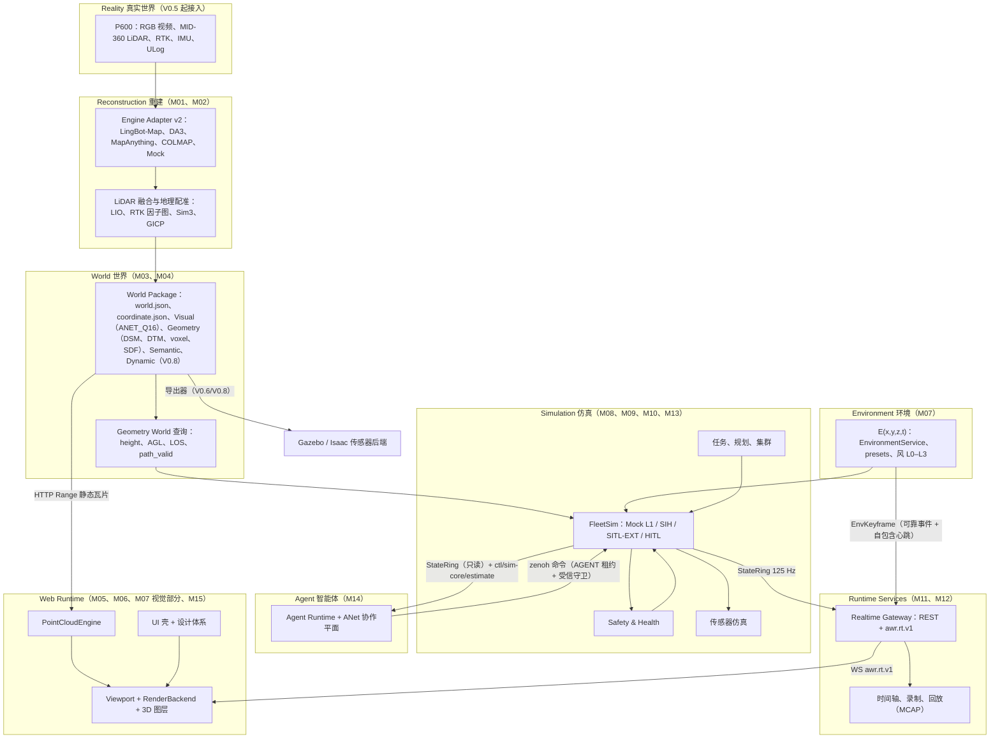
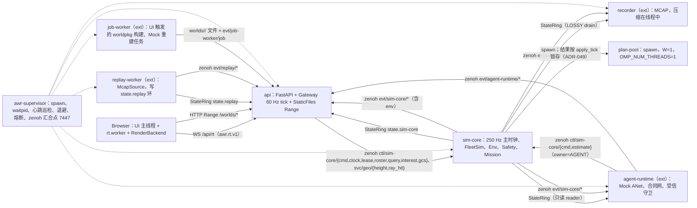
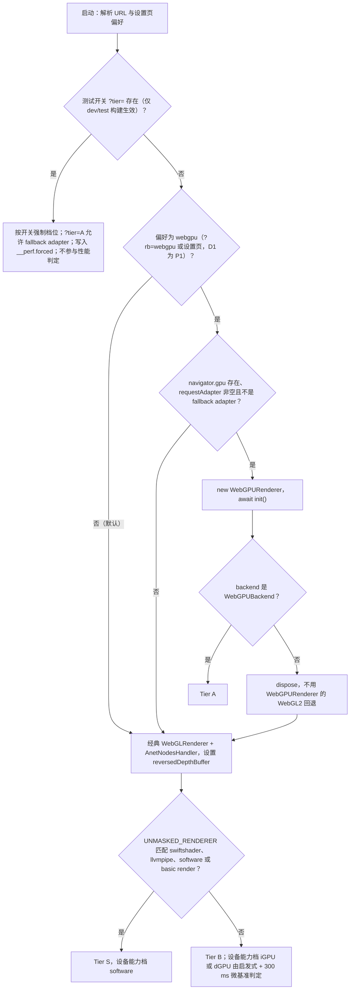
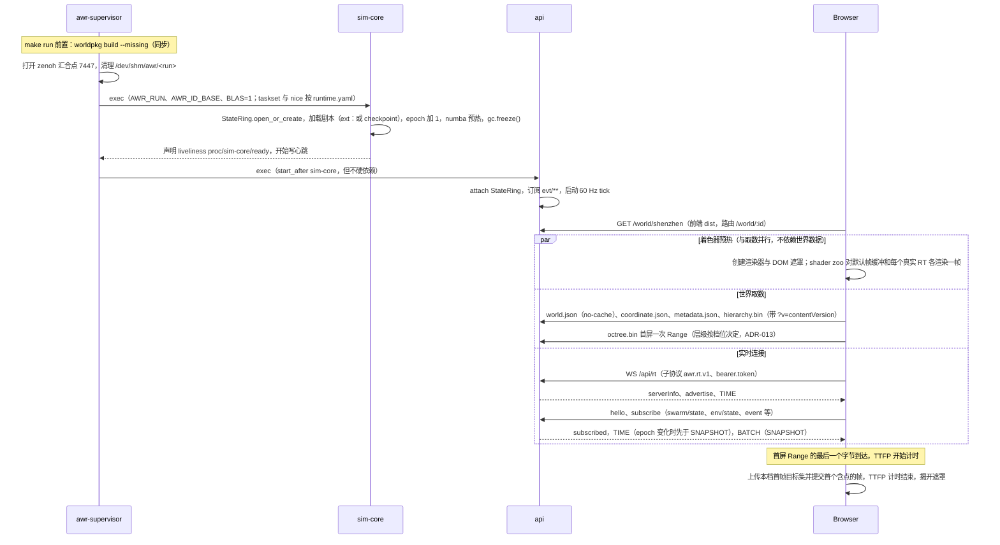
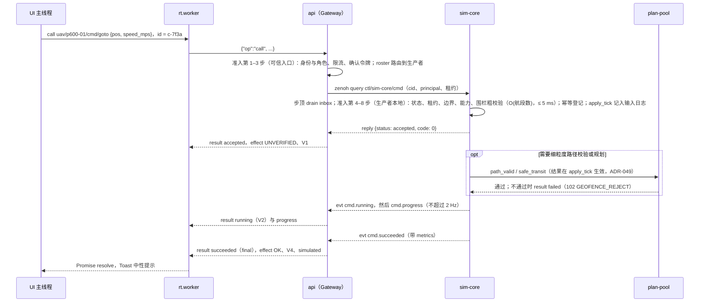
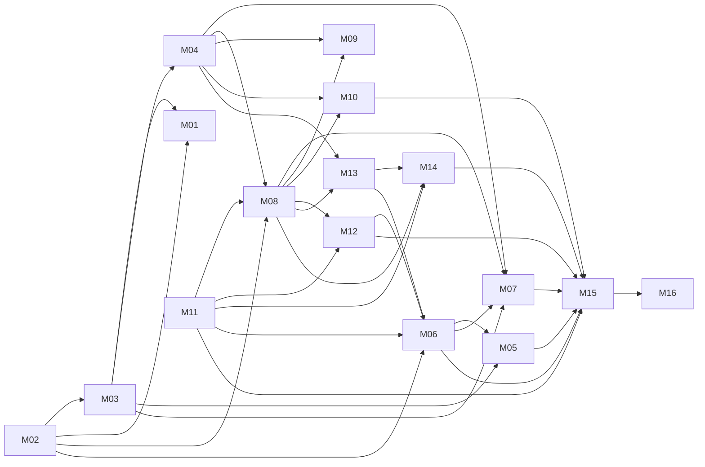

# 03 设计基线与决策记录（Design Baseline & Decision Record）

| 项 | 内容 |
|---|---|
| 文档编号 | AWR-03 |
| 标题 | 设计基线与决策记录 |
| 版本 | v1.1 |
| 日期 | 2026-09-28 |
| 状态 | 评审通过（2026-09-28 第 1 轮四视角交叉评审，84 条意见的处置见附录 D.1；第 2 轮为 26 份下游文档作者对基线的反馈，由文档总编逐条处置，见附录 D.2；全部 blocker 已关闭） |
| 上游文档 | 用户硬性要求 R1–R4（§2.4）；[01-design.md](01-design.md)（原始设计，用户本人撰写）、[02-refs.md](02-refs.md)、[research/00-index.md](research/00-index.md)、[research/g01–g08](research/)（缺口深挖定案，研究结论中优先级最高）、其余研究笔记 r01–r27、d01–d05、x01、n01–n05 |
| 下游文档 | [10-系统架构说明书](10-系统架构说明书.md) 至 [19-部署与运维说明书](19-部署与运维说明书.md) 共 10 份说明书；[modules/M01](modules/M01-重建引擎PRD.md) 至 [modules/M16](modules/M16-演示数据剧本与流畅性测试PRD.md) 共 16 份模块 PRD（清单见 §10）；工作包 M00 不单独成文，其要求分布在 16、17、18、19 号文档（§6.1） |
| 适用版本范围 | V0.1（即本期交付 D1）至 V1.0 |
| 修订记录 | v1.1（2026-09-28，第 2 轮）：处置下游 26 份文档对基线的反馈（附录 D.2），修订 §3.3、§3.5、§3.6、§4.1、§4.3、§4.4、§5.1、§5.2、§5.6、§5.10、§6.3、§8.1–§8.5、§9、§10.4、§11、附录 A、附录 B，修订 ADR-004、008–014、016–019、021、022、025–030、032–038、040、041、043、045、046、049，新增 ADR-051（D1 进程间 key 与逐机详情）、ADR-052（能量口径与 S1 定稿）、ADR-053（三角色与会话世界切换） |

## 0. 摘要

1. 本文是"二次优化设计"的总纲与唯一基线：保留原设计"World 是核心、Reality → Reconstruction → World → Environment → Simulation → Agent"的理念，把 38 个研究单元与 g01–g08 的定案收敛为可实施、可验收的约束；用户硬性要求 R1–R4 位于裁决顺序最顶端，并逐条追溯到 ADR、模块与验收（§2.4）。
2. 设计原则 14 条，核心为：World 唯一真源；浏览器看世界、服务器算世界；可视化与物理分离；服务端权威；闭环自适应；契约先行；保真度阶梯；仿真永不阻塞；确定性分级；新仓库与高 star 优先但以实测为准。
3. 架构为 7 层加 2 个横切包（`packages/contracts`、`python/awr/runtime`）；Python 统一为单一命名空间 `awr`（ADR-050）。后端多进程：supervisor、api、sim-core（含 plan-pool），D1 扩展层另有 recorder、replay-worker、agent-runtime、job-worker。进程间三平面：StateRing、zenoh、文件与 HTTP。
4. 渲染：硬件浏览器默认 Tier B（经典 WebGLRenderer + AnetNodesHandler），本机为 Tier S；Tier A（WebGPURenderer）在 D1 为显式开启的 P1。设备能力档与渲染后端档分离（ADR-044）。Tier S 有逐图层帧预算与硬上限（§3.8），PerfGovernor 先降可选图层、后让点云越过质量下限（ADR-041）。
5. 点云：Potree 2.0 + ANET_Q16 v1、APH 选择器、PointPool + DrawTable 单次 draw、Lite 点径、CAS 级联控制器与 7 档阶梯；首屏层级与驻留按档位计算，CPU 缓存与 GPU 驻留分层。仿真：FleetSim L1（PX4-lite，主时钟 250 Hz、L1 125 Hz、numba）；FlightState 14 态；Full64/Lite32 v1；`awr.rt.v1`；全局唯一渲染时刻 tRender，插值延迟以仿真时间计（ADR-046）；计时器按时钟域归属（ADR-045）。
6. 设计体系：shadcn base-mira（Base UI）、transitions.dev（含项目扩展 token 表）、morphicons、lieflat 视觉语言；色卡 ANet Graphite（科技灰、黑、白，加品牌红 `#E93024`）；全站禁止 emoji（定义与扫描范围见 §10.2）。
7. **D1 即 V0.1，分两层交付**：D1-core（P0，发布阻塞）只含直接支撑 R3 的主链路——六城 World、点云引擎、Tier S/B 渲染、FleetSim L1 与 Safety 子集、StateRing、zenoh、Gateway、UI 壳与设计体系、S1、flight60 与机群阶梯；D1-ext（P1，可豁免）含录制回放、混沌恢复、Mock ANet 与 S3、环境 Med、Tier A、完整租约、Mock 重建链路等，接口在 MS1 冻结。ADR-042 明确取代 01-design §43、§31 的相应条款并给出理由（§8）。
8. 本文冻结 53 条 ADR（第 2 轮新增 ADR-051 至 ADR-053，处置记录见附录 D.2）、16 个模块 PRD 与工作包 M00、10 份说明书的职责边界、路径所有权与写作规范。下游文档不得与本文冲突；如需变更，一律追加 ADR。

---

## 1. 基线的地位与使用规则

### 1.1 地位与冲突裁决顺序

1. 本文是后续 26 份文档并行撰写与本期实现的**唯一基线**。文档之间出现不一致时，按以下优先级裁决（高者为准）：
   **用户硬性要求 R1–R4（§2.4，逐条编号）> 本文（AWR-03）> g01–g08 > 00-index（含 §8 冲突裁决）> 其余研究笔记 > 01-design**。
2. 01-design 虽然排在研究笔记之后，但 §2.5 列出的"受保护的原设计意图"**只能通过 ADR 修改**，研究结论不得默认压过这些意图；本文对 01-design 各章的处置（沿用、修订、取代、推迟、删除）逐节列在附录 C。
3. 研究笔记中已被 g 系列或本文修订、作废的结论，逐条列在附录 B。下游文档**不得**引用已作废的结论。
4. 原设计 01-design 的章节在下游文档中引用时，必须同时按附录 C 注明"已由 AWR-xx 取代"或"沿用"。

### 1.2 规范用语

| 用语 | 含义 |
|---|---|
| 必须 / 禁止 | 强制要求；违反即为缺陷，CI 或评审必须拦截 |
| 应 / 不应 | 默认要求；偏离时必须在文档中写明理由 |
| 可 | 允许，但不强制 |

### 1.3 变更控制

1. 修改基线只能**追加 ADR**，编号接在最大编号之后，并写明"取代 ADR-0xx"。原 ADR 状态改为"已取代"，不删除。
2. 例外：第 1 轮交叉评审的处置直接修订了原文（包括 ADR-007、008、010–014、016–022、025–042 的正文，并新增 ADR-043 至 ADR-050），未走追加流程；全部改动及理由记入附录 D。自本版起严格执行第 1 条。
3. 验收阈值：下游文档可以**收紧**，不能**放宽**。放宽必须先追加 ADR。标注"暂定"的阈值按 §8.4 规定的里程碑实测后，以追加 ADR 的方式冻结（冻结值可以比暂定值宽或严，但必须附实测数据）。
4. 契约演进：1.x 版本只允许新增可选字段；二进制布局的任何改动都必须升级 `formatVersion` 或 schemaName 的版本号（§5.11）。
5. 顶层目录与路径所有权（§4）只能通过 ADR 增删；子目录由各模块 PRD 在本文目录树和所有权表的范围内细化。

### 1.4 依据引用格式

- 研究笔记：`依据 g02 §7.2`、`依据 00-index §3.5、C18`、`依据 r27 §3.8`。
- 本文：`依据 AWR-03 ADR-012`、`依据 AWR-03 §5.3`。
- 原设计：`依据 01-design §14`。用户要求：`依据 R3`。
- 没有研究依据的新数字写"本文设定"，并说明理由；标"暂定"的数字写明冻结里程碑。

---

## 2. 设计目标与原则

### 2.1 定位与目标

平台定位保持原设计不变：**A Real-World Grounded 4D Physical World Runtime for Autonomous Agents**。平台要沉淀的核心资产是 **World Runtime**，而不是某个无人机模型或某个仿真器；无人机是第一个用来验证 World Runtime 的具身载体，World 中的主体将扩展到 UGV、机器人、车辆、传感器与人（ADR-047）。这里的"4D"指随时间变化的世界状态，不是 4DGS（依据 00-index §7 第 12 条）。

| 编号 | 目标 | 可度量的表述 | 首次达成版本 |
|---|---|---|---|
| G1 | World 资产化 | 任一真实或虚拟场景都能生成带版本、可校验、可复现的 World Package；六个内置城市在 `make run` 时自动生成缺失者，并通过 `--deep` 校验 | V0.1 |
| G2 | 流畅的 Web 世界 | 本机软件渲染（Tier S）按固定 30 fps 节奏：纯点云基线 p95 ≤ 50 ms（D1-AC-03a）；默认整景 p95 ≤ 66.7 ms（暂定，MS5 冻结，D1-AC-03b）；真 GPU 按刷新率节奏，掉帧 ≤ 2–5%；首屏 TTFP ≤ 1 s（定义见 §11） | V0.1（Tier S）；真 GPU 阈值在 GPU runner 或 `/bench` 回传数据上固化 |
| G3 | 可信的机群仿真 | Mock L1 与 PX4 SIH 黄金数据对照的 17 项指标全部落在容差内；1000 架在 RTF = 1 下 sim-core ≤ 0.6 核、单步 p99 ≤ 3 ms | V0.1 |
| G4 | 物理一致的环境 | 视觉、动力学、传感器共用同一个环境真值；Python 与 TS 两端对拍满足混合容差（§5.1 规则 8） | V0.1（L0/L1）；V0.4（传感器退化） |
| G5 | 多智能体协同 | 基于能力的合同网在 S3 剧本中把目标置信度从 0.42 提到 ≥ 0.9；报价与 FleetSim 同一机型与电池模型；效果状态可验证 | V0.1（D1-ext，进程内 Mock，P1）；V1.0（真 ANet） |
| G6 | 科研可复现 | G6a：录制回放逐字节一致（Full64、事件、环境关键帧）；G6b：同一输入日志重仿真逐位一致（同一内核、同一版本）（ADR-049） | V0.1（D1-ext，P1） |

### 2.2 对原设计的继承与二次优化总览

逐节处置见附录 C；本表只列章节组。

| 原设计章节 | 保留 | 二次优化（本文定案） | 依据 |
|---|---|---|---|
| §1 项目目标 | World 是核心而不是 Drone；主体可扩展 | 契约层预留实体种类 `kind`，DroneAdapter 定义为 EntityAdapter 的特化；Dynamic Objects/Tracks 层在 V0.8 | ADR-047 |
| §3–4 总体架构、浏览器与服务器分工 | "浏览器看世界、服务器算世界" | 细化为 7 层加 2 个横切包；给出多进程拓扑、三平面 IPC 与帧序契约 | ADR-017、ADR-018；g05 |
| §5–6 重建与融合 | LingBot-Map 为主视觉引擎；LiDAR 加 RTK 融合 | Engine Adapter v2，统一 C2W（OpenCV 光学帧）输出契约与 `scale_status`；GNSS Sim3 接口前移到 V0.1 冻结；融合为轨迹优先 Sim(3) → Sim(3)-GICP → 因子图；真推理在 V0.5 的 GPU 节点；D1 交付 Mock 重建链路（P1，D1-AC-22） | ADR-035；00-index §3.2–3.3 |
| §7–8 World Model 双表达 | Geometry World 与 Visual World | 跨模块契约（坐标、时间、单位、命名）；World Package v1；ingest 规范化为必经阶段；碰撞代理与动态层分版本（附录 C） | ADR-001 至 ADR-006；g03 |
| §9–13 Web 3D 与 WebGPU | React + Three.js | 事实更正：WebGPU 下点恒为 1 px，GLSL 材质不能在 WebGPURenderer 上运行，"WGSL"改为"TSL"；RenderBackend 三档，经典 WebGL2 是一等公民、CI 主路径与硬件默认 | ADR-007、ADR-008、ADR-044；g01 |
| §14 点云 LOD（"远处 10K / 近处 1M"） | 空间分块、八叉树、流式加载 | **删除阈值表**，改为 APH 两级预算选择、CAS 闭环、7 档阶梯、Lite 点径、按档位的首屏一次 Range | ADR-009 至 ADR-013；g02 |
| §15 数据格式 | 内部 PLY/LAZ，Web 端二进制瓦片 | 运行时用 Potree 2.0 + ANET_Q16；3D Tiles 只作导出，COPC 作归档 | ADR-004 |
| §17–25 环境 | E(x,y,z,t)，风分 L0–L3，视觉与物理分开 | MOR 作为唯一能见度真值；湍流为共享冻结盒；风场分级、查询契约、推送方式全部定案 | ADR-023 至 ADR-025；g06 |
| §26、§29、§35 仿真 | 不从零自研飞控，走 PX4 语义；多后端共用同一 World Model | 保真度阶梯：Mock L1（本期）→ SIH（V0.2）→ SITL-EXT lockstep（V0.4）→ HITL（V0.6）；gz 与 Isaac 经 World 导出器共用 World（V0.6/V0.8）；多机共用同一时钟 | ADR-020、ADR-021、ADR-048；g08 |
| §27 P600 Digital Twin | 11 个组成部分，真机与虚拟机尽可能一致 | 以 Vehicle Package 为载体逐项映射模块、版本与一致性指标 | ADR-043 |
| §28 DroneState | 统一状态模型 | 七轴正交；FlightState 14 态；Full64/Lite32 字节级定稿 | ADR-015；g04 |
| §30 控制模式 | Takeoff/Land/GoTo/FollowPath/Orbit/Hover/ReturnHome | 共 10 个命令，统一调用生命周期和 ACK 语义；新增 SafetyStop、Pause、Velocity 与 Control Lease | ADR-016、ADR-027 |
| §31–32 ANet | 能力发现、搜救流程；"多机仿真成熟之后再引入 ANet" | ANet 定位为协作平面；合同网；S3 剧本作为 V1.0 验收用例。D1 的 Mock ANet 为 D1-ext（P1），排在机群核心验收（MS5 出口）之后，满足"多机成熟之后"的顺序 | ADR-036、ADR-042；d05 |
| §33–34 技术栈 | FastAPI、React、shadcn、Zustand | 精确锁定版本与锁文件；ROS2/DDS 不再是必经环节；进程间总线为 zenoh | ADR-037、ADR-038 |
| §36–37 通信与频率 | REST + WebSocket，按层分频；Web Rendering 60 FPS | 自研 `awr.rt.v1`；频率按订阅分级；插值延迟以仿真时间计、全局单一渲染时刻；Tier S 目标 30 fps，**取代** §37 的 60 FPS（硬件档仍按刷新率） | ADR-014、ADR-044、ADR-046；r27 |
| §38–40 UI | 数字沙盘、左右两栏、Timeline、相机模式、选中机交互 | 设计体系四件套、浮层式布局（画布固定全屏）、命令面板、性能 HUD、告警模型、相机参考系；D1 交互编辑范围见 §8.2 | ADR-028 至 ADR-032 |
| §41–42 World 文件结构与仓库结构 | 独立 World Package，monorepo | World Package 目录见 §4.4；仓库按 §4 定稿，Python 单一命名空间 | §4；ADR-050 |
| §43–50 MVP 与版本 | 先打通一条完整链路（保留为 MS3 walking skeleton 集成门禁） | **取代** §43 的"第一阶段不同时做 Multi-Agent、完整天气、100 架"与 §44 的 V0.1 内容：D1 分 core/ext 两层，理由见 ADR-042；版本路线重排见 §8.1 | ADR-042；§8 |

### 2.3 设计原则

| 编号 | 原则 | 含义 | 落地约束（必须遵守） | 依据 |
|---|---|---|---|---|
| P-01 | **World 是唯一真源** | 所有模块都从同一个 World Package 取得几何、坐标、语义与环境资产，模块不得私自维护另一套坐标或几何副本 | World ENU 是唯一度量帧；所有派生资产（DTM、DSM、风场库、规划栅格）都要记录 `coordinate.sha256`，不一致时拒绝加载；World 原点变化必须升级 `contentVersion` 并重建派生物；录制文件同样绑定 `contentVersion` 与 `coordinate.sha256`（ADR-040） | g03 §2.4；ADR-001、ADR-006 |
| P-02 | **浏览器看世界，服务器算世界**（沿用） | 浏览器是可视化运行时，服务器是物理运行时 | 飞控、动力学、碰撞、规划、传感器、风场求解、重建一律在服务端执行；浏览器 GPU 的计算结果不回流物理 | 01-design §4、§13 |
| P-03 | **可视化与物理分离** | Visual World 只负责"好看、流畅"，Geometry World 只负责"准确" | 碰撞、规划、传感器、AGL 只读 Geometry World（全分辨率源点云、DSM/DTM、体素、SDF），**绝不读 LOD 瓦片或 3DGS**；前端的 LOD 疏密变化不改变任何物理结果 | 00-index §3.1；r03、r09、r13 |
| P-04 | **服务端权威** | 仿真时钟、环境状态、飞行状态、控制租约、事件序号只有一个权威，即服务端 | 客户端只做插值、有限外推（≤ 3/f，之后 HOLD）与视觉短阻尼；每帧只有一个全局渲染时刻 tRender，插值延迟 D 以仿真时间计（ADR-046）；客户端可以用与服务端相同的纯函数求值环境，但只用于画面 | r27 §3.10；g06 §3；ADR-046 |
| P-05 | **闭环自适应，而非阈值表** | 画面疏密、动效档位、可选图层由实测帧节奏闭环决定，不按距离或设备写死 | 点云由 CAS 连续调节；可选图层由 PerfGovernor 按预算仲裁顺序调整（ADR-041）；各图层有按档位的硬上限（§3.8）；禁止"远处 N 点、近处 M 点"这类静态规则 | g02 §6；ADR-012 |
| P-06 | **契约先行** | 跨模块数据先定 schema、golden、夹具与代码生成，再写实现 | `packages/contracts` 是唯一真源（§5.10）；Python 与 TS 的类型、访问器由生成器产出；`make ci` 必须跑 schema 校验、golden 对拍与字节往返测试；MS1 交付假数据源与录制夹具，前端不等后端 | g03 §6；g04 §9；g06 §9；ADR-050 |
| P-07 | **保真度阶梯，接口不变** | 先用 Mock 打通，再逐级换成真后端；替换后端时 UI 与协议不变 | SimBackend、EntityAdapter 与其特化 DroneAdapter、EngineAdapter、EnvironmentService、WorldQuery、Bus、Source 八个接口在 V0.1 冻结；能力差异（含时钟能力 `caps.clock`）通过 `caps` 声明表达 | ADR-020、ADR-045、ADR-047；g04 §6.5 |
| P-08 | **单一权威与正交状态** | 每根状态轴只有一个计算者，一个现象只落在一根轴上 | 七轴模型（生命周期、飞行相位、原生飞控态、控制权、定位、任务、调用与效果）；FlightState 是唯一的飞行相位 | g04 §1 |
| P-09 | **仿真永不阻塞** | sim-core 的固定步长不受任何消费者影响 | 状态走有损的最新值（StateRing）；所有 zenoh 发送用 DROP；可靠性靠 seq + replay 与 cid 幂等；回调只入队；慢任务每 tick ≤ 1 ms；序列化与落盘在后台线程。唯一例外：lockstep 外部飞控（SITL-EXT）放在独立 FleetSim 实例中，不与大规模 L1 共用主循环（ADR-045） | g05 §0 第 5 条、§4 |
| P-10 | **确定性分级与可回放** | 相同输入产生相同输出，任何时刻都可以复现 | 固定步长；RNG 按流（`PCG64(SeedSequence([world_seed, stream_id]))`，流表见 g08 §2 与 ADR-049）；外部输入以 apply_tick 记入输入日志；环境阵风由服务端调度、两端确定性求值；逐位一致只要求"同一内核、同一版本、同一输入日志"（ADR-049） | g08 §2；g06 §5.4；ADR-040、ADR-049 |
| P-11 | **相对量可测** | 本机没有 GPU，验收只采信与负载无关或受控负载下的量 | 本机验收用帧节奏、配对比值和行为指标，并执行性能运行协议（排他锁、负载前置条件、3 次取中位，ADR-033）；绝对 fps 阈值只在真 GPU 上执行；画质、点数与 CPU 占用阈值只在 load < 6 时执行 | g02 §8；ADR-033 |
| P-12 | **设计体系强约束** | 视觉语言统一，不靠个人发挥 | UI 只由 shadcn 组件组合；图表与表格按 lieflat 规范（适用范围见 ADR-031）；动效只引用 transitions.dev token 与项目扩展 token；图标用 morphicons；颜色只能取 token；"一处红"按 ADR-032 界定；**全站禁止 emoji**，也禁止用 Unicode 符号代替图标 | ADR-028 至 ADR-032 |
| P-13 | **安全默认** | 任何指挥方（包括 AI agent）都要经过同一条准入流水线 | 规范准入顺序唯一（ADR-016），每步有确定的执行位置；安全类命令（Land、Hover、RTL、SafetyStop）**免租约但仍受准入矩阵约束**；SafetyStop 对 agent 不可用；agent 逻辑视为不可信指挥官，agent-runtime 属可信基础设施；Safety 自动转移只能升级、不能降级 | ADR-016、ADR-026、ADR-027；g04 §6.1 |
| P-14 | **新仓库与高 star 优先，实测为准**（R4） | 选型时优先 2026 年新仓库与 star 多的项目 | 同等契合度下优先 2026 新仓库与高 star；契合度与本机实测优先于 star；偏离时在 AWR-11 写明理由；AWR-11 每个技术点必须列出 star、最后提交日期、是否 2026 新项目、偏离理由 | R4；00-index §1.2、§6 |

### 2.4 用户硬性要求与追溯矩阵

用户硬性要求按原话逐条编号（依据任务说明；本文只拆分子项，不改写含义）：

| 编号 | 用户原话（摘录） | 子项 |
|---|---|---|
| R1 | "在 docs 内逐个分模块撰写详尽 PRD，并形成系统架构说明书、技术选型说明书、业务逻辑设计说明书、UI 交互设计 PRD、产品设计 PRD 等文档；在原设计基础上做二次优化设计" | R1a 分模块 PRD；R1b 五类及以上说明书；R1c 二次优化 |
| R2 | "所有图表、表格用 lieflat-charts 的视觉语言；所有动效与切换用 transitions.dev；所有图标与图标切换用 morphicons，严禁 emoji；UI 全量严格使用 shadcn 组件库；产品色为科技灰、黑、白、红（logo 红 #E93024），自行设计色卡；logo 使用 anet-logo.svg 与 GitHub 头像" | R2a lieflat；R2b transitions.dev；R2c morphicons 与禁 emoji；R2d 全量 shadcn；R2e 色卡；R2f logo |
| R3 | "按设计文档实现系统：内置 UrbanScene3D 点云（六个虚拟城市 *_sampled_5m.ply）+ 无人机，可做模拟 mock 与系统流畅性测试；支持渐进加载、点云疏密自动调节，保证非常流畅" | R3a 内置六城点云；R3b 无人机与 Mock；R3c 系统流畅性测试；R3d 渐进加载；R3e 疏密自动调节；R3f 非常流畅 |
| R4 | "科研用途，忽略 license。优先 2026 年新仓库与 star 多的项目" | R4a 忽略 license；R4b 2026 新仓库与高 star 优先 |

| 子项 | ADR / 原则 | 模块或文档 | D1 验收（§8.4） |
|---|---|---|---|
| R1a | §10.1、§10.4 | M01–M16 PRD；M00 要求见 16–19 | 文档评审（§10.2 规范） |
| R1b | §10.1 | AWR-10 至 AWR-19 | 文档评审 |
| R1c | §2.2、附录 C | 全部 | 文档评审 |
| R2a | ADR-031；P-12 | M15；AWR-15 | D1-AC-20（lint-lf）；测试报告按 lieflat reports 模板 |
| R2b | ADR-029 | M15；AWR-15 | D1-AC-20（motion-lint）、D1-AC-23 |
| R2c | ADR-030；§10.2 第 1 条 | M15 | D1-AC-20（check-icons、no-emoji、运行时净化） |
| R2d | ADR-028 | M15 | D1-AC-20（no-raw-controls） |
| R2e | ADR-032 | AWR-15 | D1-AC-20（token 外 hex 为 0） |
| R2f | ADR-032 | M15 | D1-AC-20（品牌资产检查） |
| R3a | ADR-034、ADR-001 至 ADR-006 | M03 | D1-AC-01 |
| R3b | ADR-020、ADR-021、ADR-043 | M08、M09 | D1-AC-07、D1-AC-12、D1-AC-15、D1-AC-32 |
| R3c | ADR-033 | M16 | D1-AC-03、D1-AC-09、D1-AC-23、D1-AC-29 |
| R3d | ADR-009、ADR-010、ADR-013 | M05 | D1-AC-02、D1-AC-06 |
| R3e | ADR-011、ADR-012、ADR-041 | M05 | D1-AC-04、D1-AC-05 |
| R3f | §3.8、ADR-044、ADR-046 | M05、M06、M15 | D1-AC-03、D1-AC-24、D1-AC-25、D1-AC-26 |
| R4a | ADR-034 | M03、AWR-19 | — |
| R4b | P-14 | AWR-11 | AWR-11 评审清单（每个技术点四列齐全） |

### 2.5 受保护的原设计意图

以下意图来自 01-design，**只能通过追加 ADR 修改**；下游文档与实现不得以研究结论为由悄悄压过它们。

| 意图 | 01-design 出处 | 本文落点 |
|---|---|---|
| World 是核心，而不是 Drone；主体可扩展到 UGV、机器人、车辆、传感器、人 | §1 | ADR-047 |
| 以真实世界为基础（Real-World Grounded），链路从采集、重建到 World | §1、§5–6 | M01、M02；ADR-035；D1-AC-22 |
| World 双表达：Geometry World 服务物理，Visual World 服务渲染 | §7–8 | P-03；ADR-004、ADR-006 |
| 环境是统一场 E(x,y,z,t)，视觉与物理分开但同源 | §17–25 | ADR-023 至 ADR-025 |
| P600 Digital Twin：真机与虚拟机尽可能一致 | §27 | ADR-043 |
| 多机共享同一个世界与时钟 | §29 | ADR-020、ADR-021 |
| ANet 能力协作，而不是控制回路 | §31–32 | ADR-036 |
| 多个仿真后端共用同一个 World Model | §35 | ADR-048 |
| 版本递进：先打通一条完整链路，再逐层增强 | §43–50 | §8.1（每版替换一层，接口不变）；MS3 walking skeleton |
| 浏览器看世界，服务器算世界 | §4 | P-02 |

---

## 3. 总体架构

### 3.1 总览图



`packages/contracts`（唯一契约真源，工作包 M00）与 `python/awr/runtime`（StateRing、Bus、事件、心跳、supervisor、checkpoint，M11 在 MS1 交付）是横切所有层的两个包，图中没有画出。

### 3.2 各层职责（一句话）

| 层 | 一句话职责 | 模块 | D1-core（P0） | D1-ext（P1） |
|---|---|---|---|---|
| Reality | 把 P600 的视频、LiDAR、RTK、IMU 与飞行日志，以统一的数据语义（时间基见 §5.2 第 8 条、FLU、m/s²）接入平台 | M02、M13（契约） | 只冻结契约 | — |
| Reconstruction | 把视频与 LiDAR 转换为带度量尺度、对齐重力与地理配准的几何（Recon IR），交给 World 层入库 | M01、M02 | 接口与 Recon IR schema | MockEngine → Recon IR → ingest → Web 全链路（D1-AC-22） |
| World | 把任意来源的点云规范化为 World ENU，切片成 Visual World，并派生 Geometry World，对外提供带版本的 World Package 与几何查询 | M03、M04 | 六城完整交付；`make run` 自动生成缺失世界 | job-worker 触发的 UI 构建 |
| Environment | 以 E(x,y,z,t) 作为环境的唯一物理真值，同时驱动动力学、传感器与前端视觉 | M07 | L0/L1 风、湍流盒、12 个预设、关键帧推送、视觉 Low | 视觉 Med（体积云）、AWSL 流线 |
| Simulation | 在单一世界时钟下，推进机群动力学、安全守卫、任务规划与传感器 | M08、M09、M10、M13 | Mock L1（1–1000 架）、Safety 子集、基础任务与 safe_transit、传感器位姿与 FOV | 故障注入、2.5D A*、编队与覆盖、GNSS/IMU 噪声、Mock 检测器、输入日志重仿真 |
| Agent | 把每架机抽象为按能力协作的 Physical Agent，通过合同网分配与验收任务 | M14 | 契约（capability、task、effect schema） | agent-runtime 进程内 Mock ANet，跑通 S3 |
| Runtime Services | 把仿真状态、事件与环境以 `awr.rt.v1` 推送给客户端，并负责录制与回放 | M11、M12 | 网关全部 op（`m4`、playback 除外）、实时时钟控制 | recorder、replay-worker、回放 seek、checkpoint 恢复 |
| Web Runtime | 在浏览器中流畅地渲染世界、机群与环境，并提供数字沙盘交互 | M05、M06、M07、M15 | Tier S/B、点云引擎、无人机与任务图层、UI 壳、HUD、D1 交互编辑（§8.2） | Tier A、回放 UI、AGENTS 面板、航点编辑、区域绘制 |

### 3.3 进程拓扑

**D1 进程集合**（节点名中标注 ext 的进程属于 D1-ext，其余为 D1-core；虚线表示 supervisor 的监管关系）：



| 进程 | 入口 | 运行模型 | CPU 预算与亲和性（本机，`configs/runtime.yaml`） | D1 | 崩溃影响与恢复 | 依据 |
|---|---|---|---|---|---|---|
| awr-supervisor | `python -m awr.runtime.supervisor -c configs/runtime.yaml` | asyncio | ≤ 0.02 核，不钉核 | core（P0） | 子进程收到 PDEATHSIG 后退出，由容器或用户重启 | g05 §7 |
| api | `uvicorn awr.api.main:app --host ${AWR_BIND:-127.0.0.1} --port 8000 --loop uvloop --ws websockets --ws-per-message-deflate false --ws-max-size 262144 --workers 1`（端口随 `AWR_PORT_OFFSET` 平移；uvicorn 0.54.0 默认开启 permessage-deflate，ADR-014 的"关闭"必须写进启动参数） | asyncio 单线程 + zenoh 回调线程 | 1000 架、3 个客户端时 ≤ 0.35 核；钉 core0 | core（P0） | 客户端重连；仿真不受影响 | g05 §2.2、§5 |
| sim-core | `python -m awr.sim.runtime` | 同步固定步长循环，外加 zenoh 回调线程（只入队）与后台序列化线程 | 1000 架约 0.3 核，上限 0.6 核；钉 core1，nice −5（需要 `CAP_SYS_NICE`，否则 0）；逐 stage 预算见 M08/M09 | core（P0） | D1-core：supervisor 重启并从剧本起点重开，epoch + 1；D1-ext：从 checkpoint 恢复，回滚 ≤ 1 s | g05 §4、§7.4；g08 §11 |
| plan-pool | 由 sim-core 创建的 `ProcessPoolExecutor(spawn)` | 同步 | 按需，1 核（core7） | core（P0，W=1） | 重建进程池，请求重试 1 次，仍失败则降级 | g05 §6 |
| recorder | `python -m awr.recorder` | 同步 drain 循环 + zstd 压缩线程（释放 GIL） | ≤ 0.1 核（N = 1000，按 ADR-040 录制频率策略） | ext（P1） | 录制出现缺口，记 `recorder.gap` | g05 §6；ADR-040 |
| replay-worker | `python -m awr.recorder.replay --run <run>` | 同步；解压与解析在本进程 | ≤ 1 核，钉 core7（进入回放前实时会话已暂停，plan-pool 空闲，ADR-040）；按 N、录制频率与事件率限制最大回放倍速 | ext（P1） | 回放中断，UI 提示并可重新 seek | ADR-040 |
| agent-runtime | `python -m awr.agent.runtime` | asyncio；定时器由仿真时钟驱动 | ≤ 0.05 核 | ext（P1） | 进行中的协作任务标记 `interrupted` | ADR-036、ADR-045 |
| job-worker | `python -m awr.jobs.worker` | 同步，一次一个任务，nice 10 | 按需 | ext（P1） | 任务标记为 `failed(resumable)` | g05 §6 |
| geo-worker | `python -m awr.world.geometry.worker` | Open3D RaycastingScene | 2–4 线程 | 否（V0.2），只服务 `svc/geo/{raycast,los,lidar}`；D1 的 `svc/geo/{height,ray_hit}` 由 sim-core 内 M04 的 `GeoProbeServer` 在慢任务中服务（ADR-051） | — | g05 §2.2；AWR-10 AD-04 |
| sim-orch | `python -m awr.sim.orchestrator` | asyncio；全系统唯一持有 `docker.sock` 的进程，编排 SIH 容器 | — | 否（V0.2） | 已启动的 SIH 容器保持运行，重启后重新接管 | r22 §4.2；M08 F-02 |
| px4-bridge-k | `python -m awr.sim.backends.px4_bridge` | MAVSDK asyncio，每个进程 ≤ 16 架 | — | 否（V0.2） | — | g05 §6 |

- **世界自动生成**：`make run` 在启动 supervisor 之前同步执行 `worldpkg build --missing`（缺失或 `contentVersion` 校验失败的世界重建，每城 ≤ 60 s），因此"首次启动自动生成缺失世界"不依赖 job-worker（依据 g03 §7）；随后执行 M04 的 `geo-warm`，预先派生 `worlds/.geo-cache/`（否则 sim-core 在缓存缺失时现场派生，旧金山约 4 s，超出 D1-AC-11a 的 3 s 重启窗口）。
- **端口与访问模式**（本机是无显示器环境，演示与人工验收从另一台机器访问）：
  1. **回环模式（默认）**：api 绑定 `127.0.0.1:8000`；远程浏览器通过 SSH 端口转发访问，例如在用户机器上执行 `ssh -N -L 8000:127.0.0.1:8000 <user>@<host>`，然后打开 `http://localhost:8000/world/shenzhen`。`localhost` 属于安全上下文，WebGPU 与 COOP/COEP 均可用。Origin 白名单默认包含 `http://localhost:*` 与 `http://127.0.0.1:*`（任意端口）。
  2. **局域网模式（可选）**：`AWR_ACCESS_MODE=lan AWR_BIND=0.0.0.0 AWR_ORIGINS=http://<host>:8000 make run`。此模式下签发 operator token 必须提供管理口令；Origin 白名单由 `AWR_ORIGINS` 配置。非 https 的局域网地址不是安全上下文，WebGPU 不可用（硬件默认 Tier B 不受影响），因此推荐优先用回环模式加 SSH 转发。
  3. **访问模式判定**：以显式的 `AWR_ACCESS_MODE ∈ {loopback, lan}` 为准；未设置时由 `AWR_BIND` 是否为回环地址推导。容器内必须绑定 0.0.0.0 而宿主只在回环发布端口，因此容器部署必须显式设置（AWR-19）。
  4. **角色与管理口令**：角色为 viewer、operator、admin（ADR-053）。管理口令在两种模式下都于启动时打印在终端并写入 `runs/<run>/admin.token`（权限 0600）；admin token 在任何模式下都必须提供管理口令，operator token 只在局域网模式下需要。
  5. **Host 白名单**（防 DNS 重绑定）：REST、WS 与静态服务校验 `Host` 头的主机部分 ∈ {localhost, 127.0.0.1} ∪ `AWR_ALLOWED_HOSTS`（局域网模式由 `AWR_ORIGINS` 推导），不在白名单时返回 HTTP 400（`323 HOST_FORBIDDEN`）；REST 写请求同时执行 Origin 校验（17 §3.3）。
  6. **端口偏移**：同机并行运行多个 worktree 时设置 `AWR_PORT_OFFSET=k`（0–31，ADR-055 由 0–9 扩展），8000、7447、5173、4173 与静态拆分端口 8001 统一加 `10·k`（默认 0；k = 9 留给测试夹具，AWR-19 §5）。
  - zenoh 汇合点为 `tcp/127.0.0.1:7447`，任何模式下都只监听回环地址（V0.5 跨主机总线另开 TLS 端点，暂定 7448，mTLS + ACL，由 V0.5 的 ADR 确定）；Vite 开发服务器为 5173，代理 `/api`、`/worlds`（含跨世界共享资产 `/worlds/_shared/`）以及 WS，`/assets/` 是 Vite 构建产物前缀，不作代理；远程开发同样经 SSH 转发 5173。
- **运行目录**：`/dev/shm/awr/<run>/` 放 StateRing、心跳、tmpfs checkpoint 与 Gateway 的 `gw.epoch`（api 重启后沿用全局 epoch，ADR-019）；`runs/<run>/` 放日志、checkpoint 镜像、`rec-<seg>.mcap`（每个录制段一个文件）、`inputs.msgpack`（输入日志）、`audit.jsonl`、`audit.agent-runtime.jsonl`（ext）、`meta.json`、`artifacts/`（派生产物，例如 S3 的 thermal 帧，计入本 run）。`audit.jsonl` 有多个写者（生产者准入第 ⑩ 步、supervisor 的 `proc.*`、api 入口拒绝），每个写者以 `O_APPEND` 单次 `write()` 追加整行，每 1 s fsync；agent-runtime 受信守卫的拒绝只写单写者文件 `audit.agent-runtime.jsonl`。`runs/` 总配额默认 20 GB，超出时自动删除最旧的运行，由 supervisor 启动时与每 10 min 检查一次；配额只统计并回收名称符合 run id 规则（§5.6）的运行目录，当前运行、回放中的运行与标记 `keep` 的运行豁免；`runs/jobs.db`、`runs/jobs/`（任务工作目录，进行中的任务不回收，M01、M03）、`runs/perf-reports/`、`runs/.perf.lock` 与 `runs/current` 不计入配额。
- **`--inproc` 模式**：api 与 sim-core（D1-ext 时加 agent-runtime）同进程运行，使用 LocalBus 与内存环。只用于单元测试、集成测试和 ≤ 50 架的降级演示，不参与性能验收（依据 g05 §3.7）。它不是前端早期开发的数据源；前端在 MS1 起使用 `tools/fake/fake_gw.py` 与 `net/rt/FakeSource.ts`（§8.6）。

### 3.4 关键数据流

| 流 | 路径 | 频率与协议 | 权威 | 依据 |
|---|---|---|---|---|
| World 加载 | 浏览器 `openWorld` → `world.json`（no-cache）→ `coordinate.json` → 各根的 `metadata.json` → `hierarchy.bin`（整体 GET）→ `octree.bin` 首屏一次 Range（层级按档位决定，ADR-013）→ 按需 Range；已下载节点字节进入 CPU LRU 缓存，上传到 GPU 池受驱逐规则约束（ADR-010） | HTTP/1.1 Range，immutable 缓存 | World Package | g03 §5.3 |
| 实时状态 | FleetSim tap（125 Hz；快进时按墙钟节流到 ≤ 250 Hz）→ StateRing（K = 32）→ Gateway 60 Hz tick 取最新值 → BATCH（Lite32 整群、Full64 单机）→ rt.worker → rAF 拉取 → M12 插值环 → 3D | swarm 10–20 Hz（任何情况下不低于 10 Hz）；关注集 30 Hz；选中机 60 Hz | sim-core | g05 §3.2；r27 §3.8；g08 §11.2 |
| 命令 | UI → WS `call`（身份、角色、限流、确认令牌在 api）或 agent → agent-runtime 受信守卫 → `ctl/sim-core/cmd`（携带 principal 与租约）→ 步边界锁存与准入（状态、租约、边界、能力、围栏粗校验）→ reply（accepted/rejected）→ 事件 `cmd.*` → WS `result`/`progress` | 准入 RTT p99 ≤ 25 ms | sim-core（CommandEngine） | g04 §6.2、§7；g05 §3.3；ADR-016 |
| 环境 | `env/set` 或 `env/preset` → EnvironmentService 生成**自包含**的完整 EnvKeyframe（version + 1，< 1 KB）→ 变化时走可靠事件 `evt/sim-core/env`（seq + `_replay`）；另有 1 Hz 心跳 `state/sim-core/env`（DROP，同样携带完整关键帧与 version，接收方发现 version 缺口时向 `_replay` 补拉）→ api 缓存最新完整帧供迟到客户端 → WS `env/state`（自包含 latest）→ 前端 `eval_env(kf, tRender)` 每帧求值 | msgpack，< 1 KB/s | sim-core（EnvironmentService） | g06 §8；g05 §3.6；ADR-025 |
| 智能体估价 | agent-runtime 通过 StateRing reader 读取位置与 SOC；报价的 eta、能耗与可行性经 `ctl/sim-core/estimate`（query/reply）由 FleetSim 同一机型 profile 与电池模型计算 | 按需，≤ 20 次/s | sim-core | ADR-036 |
| 录制与回放（D1-ext） | StateRing 与 `evt/**` → recorder（按 ADR-040 录制频率策略）→ `runs/<run>/rec-<seg>.mcap`；回放时 replay-worker 读 MCAP 写 `state.replay` 环与 `evt/replay/*` → Gateway（serverInfo.mode = replay）→ 同一客户端路径 | 见 ADR-040；seek 时 epoch + 1 并做 backfill | 录制文件 | r27 §3.11；ADR-040 |

### 3.5 渲染后端与设备能力档

渲染后端档（A/B/S，决定代码路径）与设备能力档（dGPU、iGPU、software，决定起步画质档、T* 与验收阈值）是两个独立维度（ADR-044）。



| 渲染档 | 渲染器 | 点径策略 | EDL | 渲染比例 | 环境视觉 | 动效起步档 | D1 | 本机可测 |
|---|---|---|---|---|---|---|---|---|
| A | WebGPURenderer（默认 HalfFloat 输出） | `quad`（vertex-pulling 四边形，drawRange = 6·Σcnt） | 按档位 | 按档位，以内部 RT 缩放实现，画布缓冲尺寸不变 | Med（High 在 V0.3） | full | P1：`?rb=webgpu` 或设置页显式开启；GPU runner 或 `/bench` 数据证明更快后再由 ADR 改为默认 | 只做功能测试（`?tier=A`，SwiftShader WebGPU） |
| B | WebGLRenderer + AnetNodesHandler | `glpoint`（GLPointsNodeMaterial） | 按档位 | 按档位，以内部 RT 缩放实现（与 EDL 合成 pass 合并），画布缓冲尺寸不变 | D1-core 为 Low；Med 为 D1-ext | full | P0：硬件浏览器的默认后端 | 只做功能测试（`?tier=B`） |
| S | 同 B | `glpoint` | 关 | **固定 0.5**（0、1 两档都锁定；soft 档只放宽预算带） | Low | lite | P0 | **性能验收主档** |

| 设备能力档 | 判定 | 起步画质档 | T* | 验收阈值 |
|---|---|---|---|---|
| software | UNMASKED_RENDERER 或 `adapter.info.{architecture,description}` 匹配 swiftshader、llvmpipe、software、basic render | 0 soft-min，B0 = 25k | 33.3 ms（固定 30 fps） | §8.4 本机阈值 |
| iGPU | vendor 与 renderer 字符串启发式（集成显卡家族），或 300 ms 微基准（100 万点 glpoint，timer query 可用时取 GPU 时间）高于校准阈值 | 3 low | 刷新周期 | g02 §8.2"集显"列 |
| dGPU | 其余硬件 | 4 medium；微基准余量充足时 +1，最高 5 | 刷新周期 | g02 §8.2"独显"列 |

- 启动时一次性决定后端，运行中**不切换**。`onDeviceLost` 与 `webglcontextlost` 统一触发整页重建渲染器。
- 首次会话中若 CAS 在最低允许档下限饱和累计超过 30 s，把"起步档 − 1"（Tier A 时改为 Tier B）写入 localStorage，下次启动生效，设置页可清除（P1）。
- 渲染比例只在 Tier B/A 按档位变化，并通过内部 RT 缩放实现；运动降载同样只作用于 Tier B/A 的内部渲染比例（由 M06 计算子视口、M05 读取 `cloudScale`，Tier S 不叠加）。τ、`minPx`、`maxPx` 一律以点通道的光栅像素计（`H_px = drawingBufferHeight·cloudScale`），不再换算为设备像素（ADR-011）。任何档位变化都不改变画布 drawing buffer 尺寸（ADR-029），因此禁止使用 drei `AdaptiveDpr` 以及任何调用 `setDpr` 或 `setPixelRatio` 的组件（ADR-008）。
- `wgpu-gl`（WebGPURenderer 加 forceWebGL）只作为 CI 回归变体，不是生产档位（依据 g01 §6.1）。
- 内置 `/bench` 自检页（P1）：在用户的 GPU 浏览器上跑 flight60，结果 POST 到 `/api/sys/perf-report` 并写入 `runs/perf-reports/`，用于在没有 GPU runner 时收集真 GPU 数据与校准 iGPU 微基准阈值。

### 3.6 前端帧序契约

每个渲染帧按下列相位顺序执行，由 `apps/web/src/engine/loop.ts` 驱动（Canvas 设 `frameloop="never"`，在 rAF 中调用 R3F `advance(timestampMs / 1000)`；R3F 9.8.1 在该模式下以秒计算 delta）。各模块通过 `loop.register(phase, id, fn)` 注册，不直接修改 `loop.ts`。

| 相位 | 序 | 内容 |
|---|---|---|
| telemetry | −4 | 取走上一次 pull 已返回并就绪的 SoA 缓冲，归还已消费的缓冲并发出下一次 pull（预分配的 3 槽环形缓冲，transferable，不新建）；Worker 与主线程之间只能异步传递消息，同一帧内"发 pull 并使用其结果"不成立（AWR-10 AD-06） |
| clock | −3 | M12 的 SimClockView 求 `simNow`；全局唯一渲染时刻 `tRender = simNow − D_global`（ADR-046） |
| drones | −2 | 无人机插值、外推，写入实例属性；Third（跟随）/FPV 焦点机按 D_focus 例外（ADR-046） |
| camera | −1 | 相机模式更新与相机飞行 |
| world | 0 | 点云选择、上传与 DrawTable；环境 `eval_env(kf, tRender)`/`derive` 与 uniform；标签布局（只算屏幕坐标） |
| render | 1 | 引擎把本相位注册为 R3F **唯一的 priority 1 订阅者**，由 RenderBackend 按 pass 渲染；R3F 因此不再自动调用 `gl.render`（`loop.ts` 中无 priority 订阅者时才自动渲染），`advance()` 只负责声明式对象的更新 |
| overlay | 2 | DOM HUD、标签与 ViewCube：每帧只写 transform；文本内容以 ≤ 4 Hz 合批写入 |
| governor | 3 | FrameSampler 记录；CAS `sample()`（冻结条件见 ADR-012）；PerfGovernor（1 Hz）；就地更新预分配的 `window.__perf` |

规则：
1. **热路径零分配**：`engine/**` 与 `net/**` 中每帧执行的代码禁止分配对象与数组，一律使用预分配的 TypedArray、对象池与环形缓冲；Worker 与主线程之间的缓冲往返复用。
2. **出图唯一**：每帧 `renderer.info.render.calls` 必须等于 pass 计划（由 `apps/web/tests/loop.render-calls.spec.ts` 断言），防止 R3F 与引擎重复渲染。前提：`renderer.info.autoReset = false`，由 `loop.ts` 在每帧开始时手动 `reset()`（默认的 autoReset 会在多 pass 时逐次清零）。
3. 依据：00-index §3.6；g01 §6.4；n05；R3F 9.8.1 `core/loop.ts`（无 priority 订阅者时自动 `gl.render`）。

### 3.7 关键时序（规范时序，下游文档展开细节时不得改变其顺序）

**（1）启动与世界加载**



**（2）命令调用（以 goto 为例）**



依据：g03 §5.3；g04 §6.2、§7.2；g05 §3.3、§7.6；r27 §3.3、§3.12；g01 §4.3。

### 3.8 Tier S 帧预算与图层上限

Tier S 的 33.3 ms 帧预算只在纯点云条件下验证过（g02 §6.4：节点全部预驻留，无无人机、环境、UI）；唯一的整景实测（g01 §4.4 D2：4 万点、200 架 InstancedMesh、20 条轨迹、3000 个雨滴、地面与天空，负载 14）稳态 wall 为 74 ms。因此整景必须有逐图层预算与硬上限，CAS 才有调节空间。下表为**本文设定、暂定**，在 D1-MS5 第一周用"全图层 flight60 + 200 架"实测后以 ADR 冻结（§8.4 D1-AC-03b）。

| 图层 | Tier S 预算（配对增量，ms） | Tier S 硬上限 | Tier B/A 上限 | PerfGovernor 旋钮（ADR-041） |
|---|---|---|---|---|
| 点云（选择、上传、绘制） | ≤ 16（由 CAS 保证） | B 在档位预算带内；质量下限 B ≥ 20k（可选图层降完之前） | 按档位 | CAS |
| 无人机 | ≤ 2.5 | 低模实例 ≤ 32 个（每个 ≤ 150 三角形）；P600 模型 ≤ 2 个；其余一律为标记点（1 个点 / 架） | 低模 ≤ 300 个（≤ 300 三角形）；P600 ≤ 6 个 | 分档阈值（低模 → 标记点的屏幕半径阈值上调；低模上限 32 → 16 → 8） |
| 轨迹、视锥与叠加（含任务叠加、zones、GlyphLayer） | ≤ 1 | 轨迹只画选中机与关注集，≤ 16 架，每架 ≤ 256 段；视锥只画选中机 | 轨迹 ≤ 64 架 × 1024 段；视锥 ≤ 16 | 轨迹条数与长度减半；视锥关闭 |
| 环境视觉 | ≤ 2.5 | Low：降水 ≤ 2000 个四边形、解析高度雾、2D 云；无体积云 | Med：降水 ≤ 5 万（B）/ 20 万（A） | Low → Off（降水与云关闭，雾保留） |
| 地面网格与天空 | ≤ 1 | TSL 地面网格 + 解析渐变天空 | 同左 | — |
| 标签与 DOM 覆盖 | ≤ 2 | 标签 ≤ 16；每帧只写 transform，文本 ≤ 4 Hz；同屏常驻循环动画 ≤ 2 | 标签 ≤ 48 | 标签上限 16 → 8 → 4 |
| HUD 与图表 | ≤ 1 | LfScheduler：HUD 4 Hz，可见流式图 ≤ 4 张 | 聚焦图 ≤ 10 Hz | 不可见即暂停 |
| 主线程 JS（选择、DrawTable、插值、Worker 交换） | ≤ 4 | 每帧上传 ≤ 20k 点 | 每帧上传 ≤ 8 MiB | — |
| 余量 | ≥ 3.3 | — | — | — |

- **固定层合计**（无人机、轨迹、环境、地面天空、DOM、HUD）≤ 10 ms。测法：flight60，B 锁定 25k，逐层开启，与"纯点云"配对比较 wall 中位数的增量，3 次取中位（ADR-033 运行协议）。SwiftShader 下 GPU 时间只有在测试构建中同步等待光栅完成才计入 wall（1 像素同步回读；Chrome 的 WebGL `finish()` 不等待，ADR-064），DOM 图层（标签、HUD）无法在绘制缓冲内配对；两种配对方法见 18 §5.2。
- `window.__perf.layers[<layer>]` 按图层记录每帧 CPU 提交耗时、draw 数与顶点数；超过预算的图层在性能 HUD 中标出。
- 上限对 Tier B/A 同样生效（数值取右列），保证真 GPU 上最坏情况可控。

---

## 4. 统一目录结构与工程约定

### 4.1 目录树（本期实现严格按此落地）

Python 代码全部位于 `python/awr/` 之下的单一命名空间 `awr`（ADR-050）；下文与下游文档中的 Python 路径 `awr/<x>` 一律指 `python/awr/<x>`。Node 侧只有 `apps/web` 与 `packages/contracts` 两个 workspace。

```text
anet-drone/
├── Makefile                         # 只含总目标与 include mk/*.mk：setup | worlds | run | dev | build | test | perf | chaos | lint | ci
├── mk/                              # 扩展点：每个模块一个 <module>.mk（追加 TEST_TARGETS、LINT_TARGETS 等变量）
├── pyproject.toml                   # Python 包 awr（setuptools，packages.find where=["python"]）
├── requirements.lock                # uv pip compile 生成的锁文件；make setup 用 uv pip sync 安装到 .venv
├── package.json / package-lock.json # npm workspaces：apps/web、packages/contracts
├── .gitignore  .pre-commit-config.yaml
├── apps/
│   └── web/                         # 前端（Vite 8 + React 19.3 + TS 7）；Node 侧唯一应用
│       ├── index.html
│       ├── components.json          # shadcn 配置：aliases.ui = "@/ui/components/ui"（迁移步骤见 ADR-037）
│       ├── tsconfig.json            # TS 7 显式 rootDir、types、paths（n05 §3.2）
│       ├── public/brand/            # anet-logo.svg、avatar-96.png、avatar-460.png、favicon（本地托管）
│       ├── public/bench/flight60/   # <city>.bin / .json（生成物）
│       ├── src/
│       │   ├── app/                 # App.tsx、Providers（Theme、Tooltip、Toast、Query）；routes/*.tsx（路由注册扩展点，含 /world/:id）
│       │   ├── ui/
│       │   │   ├── components/ui/   # shadcn base-mira 源码（经 codemod；只有此处可以 import @base-ui/react）
│       │   │   ├── icons/           # Icon、StateIcon、registry（条目数以注册表为准，ADR-030）、lucide-compat、custom
│       │   │   ├── motion/          # tier.ts、MotionNumber、SwapText 等 hooks；tokens.ts 只再导出 lib/tokens/*.gen.ts
│       │   │   ├── lf/              # lieflat 图表组件、LfScheduler、M4 降采样
│       │   │   ├── layout/          # AppHeader、WorldSidebar、DroneRail、BottomDock、ViewportOverlay（浮层式，ADR-028）
│       │   │   └── panels/          # 面板壳：registry.ts（面板清单扩展点）+ world、layers、env、drones、mission、timeline、events、perf、agents、settings
│       │   ├── viewport/            # R3F 宿主、renderer.ts、anetNodesHandler.ts、layers/*（每个薄适配层 ≤ 150 行）
│       │   ├── engine/              # 纯 TS 命令式，不依赖 React
│       │   │   ├── index.ts         # 门面：只做 export * from './<mod>/index'
│       │   │   ├── loop.ts          # 相位调度（loop.register 扩展点）
│       │   │   ├── pointcloud/  drones/  camera/  mission/  labels/  picking/  perf/  anim/
│       │   │   ├── geo/             # frames.ts（帧换算，M02）
│       │   │   ├── sensors/         # intrinsics.ts、frustum 参数（M13）
│       │   │   ├── time/            # SimClockView、插值环（M12）
│       │   │   └── environment/     # EnvStore、eval_env、视觉层（M07）
│       │   ├── net/                 # rt/（rt.worker.ts、client.ts、FakeSource.ts、layouts.ts 生成物）、api.ts（只含 fetcher 与 token；QueryClient、query key 与 queryOptions 在 app/query/，M15）
│       │   ├── stores/              # zustand vanilla store：每个领域一个文件（fleet、env、mission*、timeline、agents、perf、layers、world、selection、prefs、safety、sensors、jobs；georef 为 V0.5）
│       │   ├── lib/                 # utils.ts（createCn）、format.ts（数字格式）、sanitize.ts（运行时文本净化）、tokens/*.gen.ts（motion、scene、input token 生成物，engine 可 import）、redArbiter.ts（一处红仲裁纯函数）
│       │   └── styles/              # index.css、theme.css（色卡）、motion/{tokens,ext-tokens,base-ui,tiers}.css、lf.css、icons.css
│       ├── tests/<module>/          # vitest（unit、browser、bench），按模块分目录
│       ├── perf/                    # Playwright 流畅性用例（flight60、ladder、env-gpu、feat-matrix、soak、ui-overhead）；模块用例放 perf/m<nn>/（例如 perf/m05/），由 perf/m<nn>/cases.mjs 登记
│       └── dev/oracles/             # 对照页（potree-core、voxelkloud、per-node O1），仅 dev
├── python/
│   └── awr/                         # 唯一 Python 包（import awr.*）
│       ├── runtime/                 # statering、bus、events、heartbeat、child、supervisor、checkpoint、cli
│       ├── contracts/               # 生成物（类型、dtype、访问器），提交入库，禁止手改
│       ├── api/                     # api 进程：main.py、rest/*.py（自动发现的路由扩展点）、rt/（protocol、layouts、channels、scheduler、
│       │                            #   session、clock、rpc、ws、sources/{live.py,base.py}、bus_bridge.py）、static.py
│       ├── recorder/                # recorder 进程（MCAP 写入）与 replay.py（replay-worker 进程，McapSource）
│       ├── sim/
│       │   ├── runtime/             # sim-core 主循环、dispatch、clock、慢任务轮转、checkpoint 接线、输入日志
│       │   ├── fleet/               # state、pipeline、stages/（registry.py 为 stage 注册扩展点）、px4lite、setpoint、aero、kernels_l1、profiles
│       │   ├── core/                # state_model、fuser、command、authority（Lease）、admission、estimate
│       │   ├── safety/              # flight_fsm、fast_guard、mission_guard、fleet_guard、geofence、battery、faults
│       │   ├── mission/             # engine、generators、primitives、scenario_loader
│       │   ├── planning/            # transit、astar、pool、（bspline、esdf：V0.3）
│       │   ├── sensors/             # noise、camera、detector、lidar（桩）
│       │   ├── backends/            # base（SimBackend、EntityAdapter、DroneAdapter）、mock、replay、px4_sih（桩）、prometheus（桩）
│       │   └── orchestrator/        # SIH 容器编排（V0.2，目录预留）
│       ├── environment/             # conventions、field（EnvironmentService）、wind/、weather/、atmosphere/、io/
│       ├── world/                   # ingest/（含 urbanscene3d.py，唯一的 UrbanScene3D 适配器）、pointcloud/、georef/、terrain/、
│       │                            #   geometry/、semantic/、package/（含 cli.py：worldpkg）、qa/、export/（V0.5 起）
│       ├── reconstruction/          # ir/、engines/（base、mock，其余为桩）、jobs/
│       ├── agent/                   # runtime/、capabilities/、anet_mock/、anet_bridge/（桩）、guard/
│       ├── swarm/                   # formation/、coverage/、allocation/（纯算法，不依赖 awr.sim）
│       ├── jobs/                    # job-worker（SQLite 任务队列、registry.py 任务注册扩展点）
│       └── datasets/                # 数据集辅助（UrbanScene3D 航线文件解析，P2）；不含 ingest 适配器
├── packages/
│   └── contracts/                   # 唯一真源（§5.10）：schemas/、classes/、rt/、env/、bus/、scenario/、vehicle/、recon/、sensor/、agent/、
│                                    #   golden/、fixtures/（*.awrrt 实时协议夹具、样例载荷）、gen/ts/（生成物，npm 包 @awr/contracts）
├── scenarios/                       # S1–S6 剧本与 ladder 剧本（JSON）
├── vehicles/
│   ├── x500/params.yaml             # 回归机体
│   └── p600/                        # params.yaml、model/（p600.glb、p600_lowpoly.glb 生成物）、sensors/（camera、mid360、gnss、thermal、imu）
├── worlds/<id>/                     # World Package 生成物（gitignore；目录见 §4.4）
├── configs/                         # runtime.yaml（进程、亲和性、nice、配额）、logging.yaml、data.yaml（原始数据与预构建制品的地址与 sha256 唯一真源，M03）、worldpkg.yaml（M03）
├── runs/<run>/                      # 运行产物（gitignore，配额 20 GB）
├── tools/                           # 不可 import 的脚本目录（没有 __init__.py；用 python tools/... 或 node tools/... 调用）：
│                                    #   bench/{flight60,fleet_ladder,ipc}/、contracts/（gen.mjs、gen.py、golden）、fake/（fake_gw.py）、
│                                    #   lint/（no-emoji、no-hex、lint-lf、motion-lint、check-icons、no-raw-controls、check-brand、check-deps、check_py_imports.py）、
│                                    #   shadcn/（mirror、codemods）、vehicles/（stl2glb、lowpoly）、ci/（make ci 的实现）
├── tests/<module>/                  # pytest，按模块分子目录；tests/e2e、tests/chaos 归 M16；tests/golden/sih_x500_px4-1.18rc1 归 M08
├── data/raw/urbanscene3d/           # 原始数据（已存在，gitignore；获取方式见 ADR-034）
├── docs/
└── refs/  .cache/                   # 参考仓库与研究产物（只读，不参与构建，gitignore）
```

`pyproject.toml` 的冻结片段：

```toml
[build-system]
requires = ["setuptools>=80"]
build-backend = "setuptools.build_meta"

[project]
name = "awr"
version = "0.1.0"
requires-python = ">=3.12,<3.13"

[project.scripts]
worldpkg = "awr.world.package.cli:main"
awr = "awr.runtime.cli:main"

[tool.setuptools.packages.find]
where = ["python"]
include = ["awr*"]

[tool.pytest.ini_options]
testpaths = ["tests"]
addopts = "--import-mode=importlib"
```

安装方式：`uv pip sync requirements.lock --python .venv/bin/python && .venv/bin/pip install -e . --no-deps`（editable）。所有进程入口一律 `python -m awr.<pkg>`；禁止依赖工作目录的相对 import。

### 4.2 目录规则

1. **Python 包边界**：
   - `awr.api` 只能依赖 `awr.runtime`、`awr.contracts`、`awr.api.*`、`awr.world.package`（只读清单），以及执行时间 < 1 ms 的纯函数；**禁止**在事件循环中调用 numpy 大数组运算、Open3D、small_gicp、scipy.optimize、MCAP 解压，也禁止用 `asyncio.to_thread` 去包装它们（依据 g05 §5）。
   - `awr.swarm` 与 `awr.environment.weather` 是纯算法，不依赖 `awr.sim`。
   - `tools/` 下的脚本可以 import `awr.*`；`awr.*` 禁止 import `tools`。
2. **TypeScript 边界**（用 oxlint `no-restricted-imports` 强制）：
   - `engine/**`、`net/**` 禁止 import `react`、`ui/**`、`viewport/**`、`stores/**`；
   - `ui/**` 只能通过 `engine/index.ts` 门面访问引擎；
   - 只有 `ui/components/ui/**` 可以 import `@base-ui/react`；
   - 全仓库禁止 import `lucide-react`，图标一律经过 `ui/icons`。
3. **生成物**：`worlds/`、`runs/`、`python/awr/contracts/`、`packages/contracts/gen/`、`apps/web/public/bench/`、`vehicles/*/model/*.glb` 都是生成物。其中 `python/awr/contracts/` 与 `packages/contracts/gen/` 需要提交，以便前端在没有 Python 的环境下构建，`make ci` 校验它们与源 schema 一致；其余生成物不入库。
4. **研究原型迁移**：`.cache/research/<unit>/` 中的原型迁入正式目录时，必须按附录 B 的更名表改名，并补上测试（迁移表见 §8.7）。
5. **文件命名**：Python 用 snake_case，TS 模块用 camelCase，React 组件用 PascalCase，CSS 变量用 kebab-case。
6. **路径更名**（相对研究笔记）：`sim/world/heightmap.py` 改为 `awr/world/geometry/heightmap.py`；`apps/web/src/features/drone/state-ui.ts` 改为 `ui/panels/drones/state-ui.ts`；`engine/pointcloud/render/glsl/*` 取消（TSL 单源）；`lib/lf/tokens.ts` 改为 `ui/lf/tokens.ts`；研究笔记与原型中的 `apps/api`、`packages/runtime/awr_runtime`、`awr_jobs`、`datasets/` 分别改为 `awr/api`、`awr/runtime`、`awr/jobs`、`awr/datasets`。

### 4.3 路径所有权与扩展点（作用相当于 CODEOWNERS）

每个路径只有一个所有者模块；其他模块需要修改时，向所有者提交变更请求（同一 worktree 分支内不得越权修改）。M00 是"工程骨架与契约"工作包，不单独成 PRD，其要求分别写在 16（文件 schema）、17（线上契约与代码生成）、18（lint、CI 门禁、性能运行协议）、19（Makefile、锁文件、git、安装）号文档中（ADR-050）。

| 路径 | 唯一所有者 | 扩展方式（热点文件的扩展点） |
|---|---|---|
| `Makefile`、`mk/common.mk`、`mk/ops.mk`、`pyproject.toml`、`requirements.lock`、`package.json`、`package-lock.json`、`.nvmrc`、`.gitignore`、`.pre-commit-config.yaml`、`configs/logging.yaml`、`tools/docker/**`、`tools/systemd/**`、`tests/ops/**` | M00 | 各模块只新增 `mk/<module>.mk`；依赖增删向 M00 提交请求，由 M00 更新锁文件 |
| `packages/contracts/**`、`python/awr/contracts/**`（生成物）、`tools/contracts/**`、`tools/lint/**`、`tools/ci/**`、`tools/fake/**`、`tests/contracts/**` | M00 | 契约变更由提出模块起草，M00 合入并重新生成；语义以 16、17 号文档为准 |
| `python/awr/runtime/**`、`configs/runtime.yaml` | M11 | 进程清单为 `runtime.yaml` 的 `procs:` 列表，各模块追加自己的条目 |
| `python/awr/api/**`（`rest/<domain>.py` 除外）、`apps/web/src/net/**`、`tools/bench/ipc/**` | M11 | `awr/api/main.py` 自动发现 `awr/api/rest/*.py` 中导出的 `router`（按文件名排序注册） |
| `python/awr/api/rest/<domain>.py` | 领域模块：`world_query.py` M04、`env.py` M07、`fleet.py` M08、`scenarios.py` M10、`runs.py` M12、`agents.py` M14、`jobs.py` M03、`recon.py` M01（ext）、`georef.py` M02（V0.5）；`auth.py`、`sys.py`、`worlds.py`、`sessions.py`、`commands.py` M11 | 同上 |
| `python/awr/recorder/**`、`apps/web/src/engine/time/**`、`apps/web/src/stores/timeline.ts`、`tools/bench/rec/**` | M12 | 插值环与 SimClockView 只在 `engine/time`，`net/rt` 只负责把 TIME 帧交给它 |
| `python/awr/sim/{runtime,fleet,core,backends,orchestrator}/**`（含 SimClock `runtime/clock.py`）、`vehicles/*/params.yaml`、`tools/vehicles/**`、`tools/bench/fleet_ladder/**`、`tests/golden/**` | M08 | sim pipeline 通过 `awr/sim/fleet/stages/registry.py` 的 `@register_stage(name, every, phase, order)` 装配；M09、M10、M13、M07 各自注册 stage，不修改 `awr/sim/runtime`；其余注册表：准入检查、`register_energy_model`（M09 电量模型）、`register_safety_hooks`（Velocity watchdog、apply 时复检）、`register_slow_task`、`register_query`（M07 `env/query`）、`register_motion_provider`（M10 轨迹跟踪）与度量注册表 `awr/sim/core/metrics.py` |
| `python/awr/sim/safety/**`、`apps/web/src/stores/safety.ts` | M09 | 注册 stage |
| `python/awr/sim/{mission,planning}/**`（含剧本导演 `mission/director.py`）、`python/awr/swarm/**`、`apps/web/src/stores/mission*.ts` | M10 | 剧本加载器 `scenario_loader.py` 与剧本导演属 M10；剧本文件属 M16；度量注册表在 M08 的 `awr/sim/core/metrics.py`（M09、M10、M14 注册度量） |
| `python/awr/sim/sensors/**`、`vehicles/*/sensors/**`、`apps/web/src/engine/sensors/**`、`apps/web/src/stores/sensors.ts` | M13 | FPV 相机内参 `engine/sensors/intrinsics.ts` 只在此处 |
| `python/awr/environment/**`、`apps/web/src/engine/environment/**`、`apps/web/src/stores/env.ts` | M07 | — |
| `python/awr/world/{ingest,pointcloud,terrain,semantic,package,qa,export}/**`、`python/awr/jobs/**`、`configs/{data,worldpkg}.yaml`、`worlds/{.locks,.status,.staging,.trash}/`、`apps/web/src/stores/jobs.ts` | M03 | UrbanScene3D 适配器只在 `awr/world/ingest/urbanscene3d.py`；任务类型经 `awr/jobs/registry.py` 注册（M01 注册重建任务） |
| `python/awr/world/georef/**`、`apps/web/src/engine/geo/**`、`apps/web/src/stores/georef.ts`（V0.5）、`vehicles/<model>/calib/<serial>/**`（V0.5） | M02 | `frames.py` 与 `frames.ts` 是全仓库唯一的帧换算实现 |
| `python/awr/world/geometry/**`、`worlds/.geo-cache/`（派生缓存）、`tools/bench/geo/**`、`apps/web/src/engine/collision/**`（V0.4） | M04 | — |
| `python/awr/reconstruction/**` | M01 | — |
| `python/awr/agent/**`、`apps/web/src/stores/agents.ts`、`tools/anet/**`、`tools/bench/agent/**` | M14 | — |
| `apps/web/src/engine/pointcloud/**`、`apps/web/src/stores/{world,layers}.ts`、`apps/web/public/bench/**`、`apps/web/dev/oracles/**`、`tools/bench/flight60/**` | M05 | — |
| `apps/web/src/viewport/**`（`layers/<layer>.tsx` 除外）、`apps/web/src/engine/{index.ts,loop.ts,drones,camera,mission,labels,picking,perf,anim}/**`、`apps/web/src/stores/perf.ts` | M06 | `engine/index.ts` 只再导出各模块的 `engine/<mod>/index.ts`；相位经 `loop.register` 注册；图层适配 `viewport/layers/<layer>.tsx` 归图层所属模块（`pointcloud.tsx` M05、`environment.tsx` M07，其余 M06），经 `viewport/layers/registry.ts` 登记 |
| `apps/web/src/stores/fleet.ts` | M11 | 4–10 Hz 机群摘要 |
| `apps/web/src/stores/mission.ts` | M10 | — |
| `apps/web/src/{app,ui,lib,styles}/**`（含 `app/query/**`、`lib/tokens/**`、`lib/redArbiter.ts`）、`apps/web/src/stores/{selection,prefs}.ts`、`apps/web/public/brand/**`（含 `brand.lock.json`）、`apps/web/components.json`、`tools/shadcn/**` | M15 | 面板经 `ui/panels/registry.ts` 登记；领域模块提供 `stores/<domain>.ts`（vanilla store、selector、`use<Domain>` hook 与字段说明），M15 只写面板 JSX；路由经 `app/routes/*.tsx` 登记 |
| `scenarios/**`、`python/awr/datasets/**`、`apps/web/perf/**`（含 `playwright.config.ts`）、`tests/e2e/**`、`tests/chaos/**` | M16 | 各模块在 `apps/web/perf/m<nn>/`（例如 `perf/m05/`）下提交自己的 spec，并在 `perf/m<nn>/cases.mjs` 登记，由 M16 的 harness 统一调度 |
| `tests/<module>/**`、`apps/web/tests/<module>/**` | 对应模块 | 目录名见下方"测试目录归属"；跨模块集成用例放 `tests/e2e/`（M16），不得在其他模块的测试目录中新建文件，只能引用 |

**测试目录归属**（第 2 轮登记，按各模块 PRD 实际采用的目录名冻结；新增目录须先登记）：

| 模块 | `tests/` 下（pytest） | `apps/web/tests/` 下（Vitest） | `apps/web/perf/` 下（Playwright） |
|---|---|---|---|
| M00 | `contracts/`、`ops/`、`fixtures/` | `contracts/`、`fixtures/` | — |
| M01 | `reconstruction/` | — | `m01/` |
| M02 | `georef/` | `geo/` | `m02/` |
| M03 | `world/`、`jobs/` | — | `m03/` |
| M04 | `world_query/` | — | — |
| M05 | `pointcloud/` | `pointcloud/` | `m05/` |
| M06 | `m06/` | `m06/`、`perf/` | `m06/` |
| M07 | `environment/` | `environment/` | `m07/` |
| M08 | `sim/`、`golden/` | — | — |
| M09 | `safety/` | — | — |
| M10 | `mission/`、`planning/`、`swarm/` | `mission/` | — |
| M11 | `rt/`、`runtime/` | `m11/`、`net/` | `m11/` |
| M12 | `recorder/` | `time/` | `m12/` |
| M13 | `sensors/` | `sensors/` | — |
| M14 | `agent/` | — | `m14/` |
| M15 | `m15/` | `m15/` | `m15/` |
| M16 | `e2e/`、`chaos/`、`scenarios/` | `m16/` | 根目录、`harness/`、`report/`、`baselines/` |

### 4.4 World Package 目录（引用 g03 §5.1，并对应 01-design §41）

```text
worlds/<id>/
├── world.json                       # 入口，no-cache（D1）
├── coordinate.json                  # 坐标契约 v1（D1）
├── visual/pointcloud/               # ANET_Q16 八叉树；森林为 visual/pointcloud/r-<i>/（D1）
├── visual/pointcloud-default/       # --twin-default 对照容器（P2）
├── visual/gaussian/                 # 3DGS LOD（V0.8）
├── visual/mesh/                     # 3D Tiles 网格与地形底座（V0.8）
├── geometry/terrain/dtm_10m.{json,f32}  dsm_2m.{json,f32}   # D1；可选 dsm_2m_n（逐格观测点数 u8，M04 的观测感知闭运算使用）
├── geometry/pointcloud/source/      # 全分辨率点云（物理权威，D1）
├── geometry/{collision,voxel,sdf}/  # 碰撞代理 L1–L2：体素与 SDF/ESDF（V0.3）
├── semantic/anet-classes@1.json     # 码表副本（D1）
├── semantic/zones.geojson           # 禁飞区、限制区（D1 查看；编辑 V0.2）
├── environment/env.json             # 逐世界环境默认值（粗糙度 z0、廓线、默认预设；取值由 M07 定、M03 写出，D1）
├── environment/wind/                # 物理风场库（f16 + zstd）与前端可视化体数据 AWRV 的 manifest（V0.3，原设计的 *.vdb 改为此格式）
├── environment/streamlines/         # AWSL（D1-ext 为解析场流线；V0.3 为 L2 流线）
├── reconstruction/<session>/        # Recon IR（cameras 与 trajectory 即 recon-ir@1 的位姿序列，alignment.json 记 T_world_engine）（D1-ext Mock）
├── localization/                    # Map Release 层：manifest.json、tiles/、global_rough.bin、pads.json（V0.5 可选，M02；格式由 16 定义）
├── dynamic/                         # Dynamic Objects 与 Tracks 层（V0.8，ADR-047）
├── export/                          # 3D Tiles、COPC、gz、USD 导出（V0.5 起，M03 设计）
└── qa/report.json                   # D1

worlds/_shared/env/{turb,weather,cloud}/   # 跨世界共享资产（湍流盒、噪声纹理，D1）；`_shared` 不满足 world id 正则，不会与世界冲突
worlds/{.staging,.trash,.locks,.status}/   # 原子发布、构建锁与状态（M03）
worlds/.geo-cache/                         # M04 派生缓存（不属于 World Package）
```

与 01-design §41 的对应：`metadata.json` → `world.json`；`geometry/mesh` → `visual/mesh`（网格服务渲染，碰撞另有代理）；`environment/{wind,weather,atmosphere}` → `environment/wind`（AWRV）与 `presets.json`（天气与大气是参数化预设，不落盘为场数据）；`reconstruction/{cameras,trajectory}` → `reconstruction/<session>/`（Recon IR）；`visual/{texture,gaussian}` → `visual/gaussian`（V0.8），纹理并入网格层。碰撞代理分级：L0 = DSM/DTM 2.5D（D1，M04）；L1 = 体素占据（V0.3）；L2 = SDF/ESDF（V0.3）；L3 = 网格 BVH 与 Open3D RaycastingScene（V0.2 geo-worker；Embree 不能直接用点云，V0.2 的 L3 是由有效 DSM 构造的混合网格，V0.5 起可由 M02 融合的 TSDF 或 Poisson 网格替换）。

World Package 内 JSON 的大小写按 §5.6：只有第 1 条列出的清单文件用 camelCase，包内其他 JSON（zones、qa 报告、源点云 sidecar、`env.json`、导出清单、Recon IR）按第 2 条用 snake_case，同一个包内出现两种大小写是预期行为。

### 4.5 版本控制与并行开发

1. D1-MS1 的第一项交付是 `git init`，并提交 `.gitignore`（至少包含 `worlds/`、`runs/`、`refs/`、`.cache/`、`data/raw/`、`node_modules/`、`.venv/`）。
2. 每个模块在独立的 git worktree 与分支上开发（分支名 `m<nn>/<topic>`）；合并到主干前必须本地通过 `make ci`：lint（§10.2 与 D1-AC-20 的全部规则）、contracts check（生成物一致、golden 对拍、字节往返）、pytest（不含 perf 标记）、vitest（不含 browser bench）。`pre-commit` 钩子运行 no-emoji、no-hex、ruff 与 oxlint 的快速子集。
3. CI 的承载方式是本机脚本 `tools/ci/run.sh`（由 `make ci` 调用），不依赖外部服务。性能类用例不进合并门禁，按 ADR-033 的运行协议在里程碑出口与每日一次执行。仓库公开后另设托管 CI（GitHub Actions，`.github/workflows/ci.yml`）运行 G1 的无数据子集 G1h（AWR-18 §12.1）：不需要 GPU、浏览器与 UrbanScene3D 数据，阻塞 PR 合并，但不替代本机 `make ci`（ADR-078）。
4. GPU runner 暂缺时：真 GPU 阈值保持"设计阈值"状态，不阻塞任何版本发布；数据来源为用户浏览器上的 `/bench` 回传（§3.5），累计 3 份同一设备能力档的报告后才可用于冻结阈值。

---

## 5. 跨模块契约

本章所有条款对全部模块具有强制力。字段级细节以 §5.10 所列的契约文件为准（文件内容由 [16-World数据规范](16-World数据规范.md) 与 [17-接口与实时协议规范](17-接口与实时协议规范.md) 展开），但**不得**与本章矛盾。

### 5.1 坐标与帧

| 帧名 | 定义 | 单位与手性 | 出现位置 | 依据 |
|---|---|---|---|---|
| `earth` | ECEF（WGS84） | m，右手 | `coordinate.T_ecef_world`（派生，可校验）、导出 | g03 §2.1 |
| `world` | **锚点处的 ENU 切平面**：X 东、Y 北、Z 上。**全系统唯一的度量帧** | m，右手，+Z 上 | 几何、物理、规划、环境场、DroneState、WS 载荷 | g03 §2.1；r15 R1 |
| `map` | LIO 或融合地图帧 | m | `registration.T_world_map`（Sim3） | g03 §0 #5 |
| `engine` | 视觉重建引擎的规范帧 | 无尺度或 m | `reconstruction/<session>/alignment.json` 中的 `T_world_engine` | g03 §0 #5 |
| `source` | 数据集原始帧 | 由数据集决定 | `coordinate.source.T_world_source` | g03 §2.2 |
| `uavNN/base_link` | 机体 FLU（REP-103） | m，右手 | 姿态、角速度、传感器挂载 | r15；r21 |
| `uavNN/<sensor>_optical` | 相机光学帧 RDF | — | 传感器仿真、内参投影 | 00-index §3.1 |
| `tiles/<id>` | 图层局部帧，**只允许刚体** | m | `world.json` 中的 `layers[].T_world_layer` | g03 §5.2 |
| `three` | three.js 渲染帧，Y-up | m | 仅在 Web 渲染层使用 | ADR-002 |
| `ned` / `frd` | PX4 的 NED 与 FRD | m | **只在** PX4 适配器边界使用；FleetSim 内部是唯一例外（在 tap 转换） | g08 §2 |
| `uavNN/odom` | LIO 里程计帧，重力对齐、连续（V0.5）；控制在 odom 帧，规划与显示在 world 帧，重定位估计 `T_world_odom` | m，右手 | V0.5 定位层（M02） | M02 §14 第 12 条 |
| `uavNN/local` | 外部飞控的局部 NED 帧，原点为该机 EKF 原点（GPS_GLOBAL_ORIGIN 或起飞点）；每机一个 `T_world_local` | m，右手，+Z 下 | PX4、Prometheus 适配器边界；`T_world_local` 写入 roster 与 `state_ext.frames` | g04 §6.3；ADR-020 |

规则：

1. **矩阵记法**：`T_<to>_<from>` 满足 `p_to = T · [p_from; 1]`。JSON 中一律写**嵌套行主序 4×4**，最后一行必须是 `[0,0,0,1]`。第三方边界的换算：three.js 用 `Matrix4.set(...m.flat())`，Cesium 用 `Matrix4.fromRowMajorArray`，3D Tiles 的 `transform` 用列主序平铺（依据 g03 §2.1）。
2. **Sim3**：`{s, q:[x,y,z,w], t}`，含义为 `x_to = s·R(q)·x_from + t`；与 gtsam `Similarity3` 交换时 `t_gtsam = t/s`。
3. **原点**：真实数据以 RTK 或测量锚点为原点，**禁止**取"首条 GPS"。合成数据（UrbanScene3D）的 XY 取包围盒中心，Z 取 DTM 中位数；`anchor.kind = "synthetic"`，`georeferenced = false`；由地标反推的经纬度**只作示意**（用于太阳、天空和 UI 显示），**禁止**用于真实导航，UI 必须标注"示意坐标"；但可以作为 SIH/SITL 的仿真 datum，此时 `SIH_LOC_LAT0/LON0/H0` 必须与锚点及 spawn 位姿一致，由 M02 的唯一实现换算（依据 g03 §2.1、§8 R1；g04 §6.3）。从另一个世界派生的重建世界（Mock 重建链路）继承源世界的锚点与原点，与源世界处于同一 `world` 帧，便于 C2C 比较（M01）。
4. **精度**：GPU 上只允许相对坐标（节点局部量化值，或相对局部 ENU 的 float32）；要求 `float32UlpMm < 1` 且最大半径 ≤ 10 km，否则必须分区或移动原点；**禁止用 float16 存储世界坐标**（实测纽约尺度误差 1 m、上海 4 m）（依据 g03 §2.1；00-index §3.4）。
5. **渲染映射**：WorldLayer 根节点 `rotation.x = −π/2`，three 坐标 `(x, y, z) = (E, U, −N)`；矢量换算为 `enu_to_three(u,v,w) = (u, w, −v)`，`three_to_enu(x,y,z) = (x, −z, y)`（依据 ADR-002；g06 §2.2）。
6. **PX4 边界**（闭式公式，由 r21 数值验证）：轴置换 `p_ned = (N, E, −U)` 只适用于**同原点**的换算。每架外部飞控机体有自己的局部帧 `uavNN/local`（原点为其 EKF 原点），`p_world = T_world_local · [p_local_enu; 1]`，其中 `p_local_enu = (E, N, −D)` 由局部 NED 轴置换得到；`T_world_local` 的来源：已地理配准的世界由 GPS_GLOBAL_ORIGIN 经锚点求得，合成世界由 spawn 位姿与 `SIH_LOC_*` 构造；它写入 roster 与 `state_ext.frames`，EKF 原点重置时更新并发出 `sim.frame.reset` 事件（依据 g04 §6.3 的 `T_local←world`）。**刚体 `T_world_local` 只用于合成世界与显示**：PX4 的局部帧是球面方位等距投影（R = 6371000 m）加海拔，M02 在合肥实测刚体近似的误差为北向 +2.80 m/km、东向 −2.05 m/km、高度 7.9 cm/km；已地理配准的真实世界中，px4-bridge 与 Prometheus 后端的位置与航点一律经 M02 的精确换算（`awr/world/georef/frames.py`），roster 可选携带 `px4_origin{lat_deg, lon_deg, alt_msl_m}`（V0.2 起生效，M02 §14 第 1 条）。四元数 ENU/FLU → NED/FRD 为 `q' = (1/√2)·(w+z, x+y, x−y, w−z)`（按 (w,x,y,z) 顺序书写，这是一个对合变换）；`yaw_ned = π/2 − ψ_enu`；FLU 与 FRD 之间 `B = diag(1, −1, −1)`；矩阵形式 `R_enu_flu = T·R_ned_frd·B`，其中 `T = [[0,1,0],[1,0,0],[0,0,−1]]`（依据 00-index §3.1；g08 §2）。
7. **three 相机相对 FLU**：`R_flu_cam = [[0,0,−1],[−1,0,0],[0,1,0]]`（three 相机为 RUB）；相机光学帧为 RDF，二者之间只差一个固定旋转，由 M13 的 `engine/sensors/intrinsics.ts` 统一处理。
8. **唯一实现**：Python 为 `awr/world/georef/frames.py` 与 `awr/environment/conventions.py`；TS 为 `apps/web/src/engine/geo/frames.ts` 与 `engine/environment/state/conventions.ts`。其他代码**禁止**自写换算公式。golden 对拍使用**混合容差** `|a − b| ≤ atol + rtol·|b|`，rtol = 1e-9，atol 按量纲取值：位置与长度 1e-6 m，角度 1e-12 rad，速度 1e-9 m/s，无量纲量 1e-12（纯相对误差对 6.4e6 m 量级的 ECEF 过松，对接近 0 的量又没有意义）。

### 5.2 时间

1. 线上与存储一律使用 **int64 `t_sim_ns`**，从会话（run）起点开始计。墙钟时间用 `t_wall_ns`（UNIX ns，只用于显示与审计）。Gateway 的 TIME 帧第三个 64 位字段与 `pong.server_ns` 使用 `t_srv_ns`（Gateway 单调时钟，相对 api 进程启动时刻），供客户端做间隔外推；UNIX 时间只由 `pong.unix_ns` 与 `serverInfo.serverUnix_ns` 提供（17 §6.4；附录 B.1）。
2. sim-core 主时钟每 tick 4 ms：`t_sim_ns = tick × 4_000_000`（依据 g08 §3.2）。
3. JS：绝对纳秒**禁止**放进 Number。相对会话起点的 `t_sim_ns` 在 2⁵³ ns（约 104 天）以内可以放进 Number；超过这个时长的录制必须启用 `useBigInt64`。渲染层使用 float64 毫秒或秒（相对会话起点）。GPU 使用 float32 秒，相对于块起点，每块 ≤ 2 h（依据 r15 R8；g06 §2.1）。
4. **epoch（纪元）**：全局 epoch 在 seek、剧本重置（即开始新的录制段，ADR-040）、切换实时与回放时 +1；生产者（sim-core 从 checkpoint 恢复、V0.2 起的 px4-bridge 重启）的纪元变化不改变全局 epoch，只在该生产者各 channel 的下一条记录置 `rflags.RESET`（bit3），客户端只清空这些 channel 的插值环与尾迹。线上（BATCH、TIME）的全局 epoch 为 u16，只做相等比较，允许回绕；StateRing 头部为 u32。epoch 变化时同一 sender 必须先发 TIME 再发 SNAPSHOT；客户端对未知的新 epoch 的 BATCH 暂存一帧等待 TIME，对旧 epoch 的帧一律丢弃（依据 r27 §3.4；g05 §7.4、§7.6；ADR-014）。**两种纪元变化的判别**以 StateRing 头部为准（ADR-018）：头部 `segment` 变化（剧本重置、无 checkpoint 重启）→ 全局 epoch + 1；`segment` 不变而生产者 `epoch` 变化（checkpoint 恢复、桥进程重启）→ 只置 `RESET`；可靠事件 `sim.started{epoch, segment, reason}` 只作一致性校验与审计。全局 epoch 由 Gateway 持久化在 `/dev/shm/awr/<run>/gw.epoch`，api 重启后沿用，不回到 0（ADR-019）。
5. 只使用单调时钟：浏览器用 `performance.now()`，服务端用 `CLOCK_MONOTONIC`。**禁止**用 `Date.now()` 做任何间隔计算。Worker 与主线程的 `performance.timeOrigin` 不同，跨线程传递的时间戳必须按两者之差换算（在 `rt.worker` 中完成，M11）。
6. **TIME.state 枚举（v1，统一 r27 与 g05 的两套定义）**：低 4 位取值 `0 STOPPED、1 PLAYING、2 PAUSED、3 STEPPING、4 BUFFERING、5 ENDED、6 STALLED、7 RESTARTING、8 FAILED、9 LIVE`；bit7 为 REPLAY 标志。其中 BUFFERING 与 ENDED 只出现在回放；STALLED、RESTARTING、FAILED 来自进程健康状态；LIVE 表示实时从动、不可暂停（SIH、HITL、真机在场，ADR-045）（附录 B C21）。客户端 SimClockView 读取前先屏蔽 bit7，**只在 PLAYING 与 LIVE 下推进 simNow**，其余状态一律冻结。StateRing 头部的 `clock_state` 复用同一个 `TimeState` 枚举（`rt/enums.json`），不另设取值（g05 原型头部只定义了 0–3，作废）。
7. **时钟域**：每个计时器必须声明属于仿真时间还是墙钟；规则与清单见 ADR-045，新增计时器在 17 号文档登记。
8. **真实会话时间**（V0.5 生效，本期冻结条款）：接入真实数据时，`t_sim_ns` 为从会话起点起的统一时基（推荐 GPS 时间，或 PTP 域）；每个传感器流保留原始时间戳、同步类型（`ptp`、`gps_pps`、`px4_timesync`、`none`；虚拟传感器为 `sim`）、时间尺度（`utc`、`tai`、`gpst`、`host_mono`；PTP 通常为 TAI，GPRMC 为 UTC，二者相差 37 s）与估计偏移；GPST 比 UTC 快若干闰秒（2026 年为 18 s），换算只在 `awr/world/georef/time.py`（M02）一处实现；M02 与 M13 的 LiDAR 帧 schema、ADR-040 的真飞日志转换都引用本条。

### 5.3 姿态与四元数

1. 线上与存储一律为 `[x, y, z, w]`（Hamilton 约定，单位范数），语义为 **WORLD←BODY(FLU)**。Lite32 中以 `q_snorm` 存储，比例因子为 1/32767。
2. 欧拉角只用于显示，采用 ZYX 顺序（yaw、pitch、roll）。**航向显示**为度，北为 0，顺时针：`heading_deg = (90° − ψ_enu,deg) mod 360`。
3. 例外：FleetSim 内部采用 NED/FRD 和 `(w,x,y,z)`，与 PX4 源码逐行对应；只允许出现在 `awr/sim/fleet/**` 内，并在 tap 阶段转换（依据 g08 §2）。
4. **线上 yaw** 一律为 ψ_enu（rad，东为 0，逆时针为正，字段名 `yaw_rad`）；显示航向按第 2 条换算。

### 5.4 单位与角度

| 量 | 线上单位 | 字段后缀 | 说明 |
|---|---|---|---|
| 长度、位置 | m | `_m` | 位置矢量字段 `pos` 例外，不带后缀 |
| 速度 | m/s | `_mps` | 例如 `speed_mps`、`vmax_mps`、`gust_amp_mps` |
| 加速度 | m/s² | `_mps2` | IMU 加速度在网关统一换算为 m/s²（MID-360 原始单位为 g） |
| 角度 | rad | `_rad` | 线上默认用弧度，例如 `yaw_rad` |
| 角速度 | rad/s | `_rad_s` | — |
| 角度（气象与 UI） | ° | `_deg` | 只有带 `_deg` 后缀的字段才用度，例如 `dir_from_deg` |
| 时间点 | ns（int64） | `_ns` | — |
| 时长类参数 | ms 或 s | `_ms`（**只表示毫秒**）或 `_s` | 例如 `timeout_ms`、`latency_ms`、`ttl_s` |
| 百分比 | 0–100 | `_pct` | u8 字段中 255 表示未知 |
| 降水 | mm/h | `_mmh` | 雪按水当量计 |
| 能见度 | m（MOR） | `_m` | **禁止**显示无单位的 0–1 雾浓度（原设计中的"Fog 0.21"作废） |
| 气压、温度、密度 | Pa、°C、kg/m³ | `_pa`、`_c`、`_kgm3` | ISA 模型 |
| 功率、能量 | W、Wh | `_w`、`_wh` | 电池与合同网估价 |

规则：`_ms` 只能表示毫秒；契约生成器维护单位后缀字典（`packages/contracts/rt/units.json`），lint 拒绝未登记的后缀和把 `_ms` 用于速度的字段。没有通用后缀的复合单位（例如 IMU 的噪声密度 rad/s/√Hz、随机游走 rad/s²/√Hz）沿用行业惯例键名（`noise_density`、`random_walk`、`turn_on_sigma`），单位写在 schema 的 `unit` 属性中，并在 `units.json` 的例外表逐字段登记（第 2 轮修订，M13、16）。研究笔记中表示 m/s 的 `speed_ms`、`gust_amp_ms`、`vmax_ms`、`w_mean_ms`、`turb_sigma_u_ref_ms` 一律改为 `_mps`；g04 的命令参数 `speed`、`radius`、`vmax`、`yaw` 改为 `speed_mps`、`radius_m`、`vmax_mps`、`yaw_rad`（附录 B.1）。二进制布局字段名以 `layouts.json` 为准，单位写在其 `unit` 属性中。

UI 的显示格式（千分位、有效位、tabular 数字、`STALE 3.2 S` 等）以 [15-视觉设计规范与色卡](15-视觉设计规范与色卡.md) 为准（依据 d01 §3.8）。

### 5.5 高程

- 三种高程并存：`h_ellipsoid_m`、`h_msl_m`、`z`（world），另外派生 **`agl = z − dtm(x, y)`**（依据 00-index §3.1）。
- `coordinate.ground.zM` = DTM 中位数在 world 中的高度：合成数据的原点 Z 取 DTM 中位数，因此按构造为 0；真实数据的原点是 RTK 或测量锚点（可能在三脚架或楼顶上），由 ingest 计算，schema 中不加常量约束。合成数据中 `hEllipsoidM := hMslM`，误差不超过当地大地水准面起伏（最多约 35 m），只影响太阳和天空（依据 g03 §2.1）。
- ISA 与一切需要海拔的计算统一用 `h_msl = anchor.hMslM + z`。
- 环境廓线在物理侧用 `z − dtm(x,y)`（地形跟随，屋顶不重置廓线）；前端没有 DTM 纹理时退化为 `z − ground_z`（依据 g06 §2.1）。
- 云底、云顶、雾顶一律按 AGL 表示。

### 5.6 命名

| 对象 | 规则 | 示例 | 依据 |
|---|---|---|---|
| World id | `^[a-z0-9-]{1,63}$` | `shenzhen`、`shanghai`、`newyork`、`sanfrancisco`、`suzhou`、`chicago` | g03 §2.2 |
| 机体 id（uav id） | `^[a-z0-9]+(-[a-z0-9]+)*$`，推荐写法 `<model>-<nn>`；只在二进制记录中使用 u16 `agent_no` | `p600-01`、`x500-003`；阶梯压测用 `sim-0001` | r27 §3.6 |
| 实体种类 `kind` | `uav`、`ugv`、`robot`、`vehicle`、`sensor`、`human`；D1 只有 `uav`；实体 topic 一律为 `<kind>/{id}/...` | `uav/p600-01/state`；`swarm/uav/state`（D1 的 `swarm/state` 为其别名） | ADR-047 |
| run id | `r<YYYYMMDD>-<HHMMSS>-<4hex>` | `r20260928-143200-a3f1` | 本文 |
| WS topic、zenoh key | zenoh key-expr 子集：chunk 为 `[a-z0-9][a-z0-9_-]*`；通配符只能出现在订阅里 | `uav/p600-01/state`、`swarm/state`、`env/state` | r27 §3.6 |
| zenoh 命名空间 | `awr/<world>/<run>/` + key（**不再使用 `anet/` 前缀**） | `awr/shenzhen/r20260928-143200-a3f1/ctl/sim-core/cmd` | g05 §3.3；ADR-014 |
| ROS 名 | `/` + key，`-` 换成 `_` | `/uav/p600_01/state` | r27 §3.6 |
| schema 名 | `awr.<Name>.v<N>` | `awr.DroneState64.v1`、`awr.env.keyframe.v1` | g04 §0 #4 |
| 格式注册名 | `<family>/<variant>@<ver>` | `potree2/anet-q16@1`、`anet-classes@1`、`recon-ir@1` | g03 §5.2 |
| 原因码 | 数值加名称，唯一真源为 `reasons.json` | `102 GEOFENCE_REJECT` | g04 §7.4 |

**JSON 字段大小写规则（统一 g03、g06、r27 的差异；附录 B C22）**：

1. **World Package 的清单文件**（world.json、coordinate.json、`metadata.json` 中的 `anet` 扩展、grid json、类别码表）用 **camelCase**，单位作后缀（例如 `hEllipsoidM`、`cellM`），以 g03 的 schema 为准。
2. **其余所有 JSON 与 msgpack**（REST 请求和响应体、`awr.rt.v1` 各 op 的业务载荷 args、data、result、EnvKeyframe、事件 data、bus 消息、scenario、`presets.json`、vehicle `params.yaml`）用 **snake_case**，并带单位后缀。
3. `awr.rt.v1` **信封字段**（`op`、`sessionId`、`tickHz`、`dataStart_ns` 等）沿用 r27 的原名，由 17 号文档列出冻结清单，不再改动。
4. **页内快照例外**：`window.__perf`（`awr.perf.v1`）与 `window.__ux` 是页内 TypeScript 对象的快照，沿用 camelCase；它们一旦落盘或上报（`awr.perf.report.v1`、`POST /api/sys/perf-report`），一律按第 2 条改用 snake_case（18 §11.2）。
5. World Package 中第 1 条未列出的 JSON（zones、qa 报告、源点云 sidecar、`env.json`、导出清单、Recon IR）按第 2 条用 snake_case；同一个包内出现两种大小写是预期行为（§4.4）。

### 5.7 未知值与哨兵值

| 通道 | 未知值 | 说明 |
|---|---|---|
| 二进制浮点 | NaN | 不用 0 |
| 二进制枚举 | 0 = UNKNOWN | 例如 `flight_state = 0` |
| 二进制整数哨兵 | u8 用 255（如 `battery_pct`），u16 用 0xFFFF（如 `mission_item`） | 以 `layouts.json` 的 `none` 字段为准 |
| JSON | `null` | 不写 NaN |
| 可过滤纹理（线性采样） | **禁止出现 NaN** | 实体或无效区域用 alpha 通道表示（AWRV 的 `a` 为实体占比） |
| UI | 未知显示为"—"，过期显示为 `STALE <t> S`（虚线样式） | 依据 d01 §3.2 |

### 5.8 可视化与物理分离

1. 碰撞、AGL、围栏、规划、传感器光线求交只读 **Geometry World**：全分辨率源点云、DSM/DTM 栅格、Height_map、体素或 SDF。**绝不读** Visual World 的 LOD 瓦片或 3DGS（依据 00-index §3.1）。
2. 浏览器 GPU 计算（粒子、流线、剔除、排序）只服务于可视化，结果**不回流**物理。浏览器可以**只读** Geometry World 的 `dtm_10m` 栅格，用于 HAG 着色、HAG 拾取显示与相机地面限位（首屏之后下载）；反向（视觉数据进入物理）一律禁止。
3. 前端的环境视觉与服务端物理使用同一套纯函数（`eval_env`、`derive`、`optical_depth`、风合成）与同一份 f16 资产。视觉档位可以省略某些项（例如 Low 档不加湍流），但**不能改变公式**（依据 g06 §5.1、§10）。
4. 点云画质档位、点预算、点径的变化，对任何物理量、事件或录制内容都**零影响**。

### 5.9 状态权威与单一计算者

| 状态 | 唯一计算者 | 线上位置 | 依据 |
|---|---|---|---|
| 仿真时钟（t、rate、state、epoch） | sim-core `SimClock`；Gateway 维护全局 WS epoch（只在 seek、剧本重置、切换实时与回放时 +1） | TIME、StateRing 头部 | r27 §3.10；g05 §7.6 |
| A 生命周期 | Orchestrator（D1 中由 sim-core 的 roster 承担） | 事件 `sim.vehicle.state`、`state_ext.lifecycle` | g04 §1 |
| B 飞行相位 FlightState | Mock：Safety FSM；PX4/Prometheus：StateFuser 推导 | Full64/Lite32 byte 2 | g04 §3、§4 |
| C 原生飞控态 | 各 Adapter | `state_ext.px4`、`.prom`；归一化后写入 ctrl.native | g04 §4.2–4.4 |
| D 控制权（Lease） | sim-core `LeaseManager`（`awr/sim/core/authority.py`） | ctrl byte、`state_ext.lease` | g04 §4.9 |
| E 定位 | LocalizationService 或 Adapter（Mock 用真值） | flags.LOC_OK、flags.LOC_DEGRADED | g04 §4.7 |
| F 任务 | 任务引擎（sim-core）；agent 任务由 agent-runtime 负责 | `mission_item`、`state_ext.mission`、`agent/*` | g04 §1 |
| G 调用与效果 | CommandEngine（sim-core） | RPC `result`、`progress` | g04 §7 |
| 环境 | EnvironmentService（sim-core） | `env/state` | g06 §3 |
| 事件序号 | 各生产者按 (producer, epoch) 维护 seq；Gateway 另分配全局 seq | `event.seq` | g05 §3.4 |
| World 内容版本 | World Package 生成器（`contentVersion`） | world.json | g03 §5.2 |
| 渲染时刻 tRender | 客户端 M12 SimClockView（由 TIME 与 D_global 推导，只用于画面） | — | ADR-046 |

### 5.10 契约文件清单（`packages/contracts`，唯一真源）

| 路径 | 内容 | 来源 | 语义所属文档 | D1 |
|---|---|---|---|---|
| `schemas/world/{common,world,coordinate,pointcloud-metadata,class-table,grid}.schema.json` | World Package v1 | g03 | 16 | 是 |
| `classes/anet-classes-v1.json` | 类别码表 | g03 §3 | 16 | 是 |
| `rt/layouts.json` | Full64、Lite32、EnvSample32、VelSetpoint16、SensorPose48（`awr.SensorPose48.v1`）、SwarmLite32Block（录制块消息）的字节布局；LidarScan8（V0.2） | g04 §5；g06 §6.4；r27；M13 | 17 | 是 |
| `rt/enums.json` | FlightState、子模式、Owner、Native、PoseSrc、Lifecycle、LocStatus、CallStatus、EffectStatus、TimeState、Kind、ScaleStatus | g04 §5.3；本文 §5.2 | 17（语义在 12） | 是 |
| `rt/commands.json` | 服务名、参数 schema、准入矩阵、完成判据参数 | g04 §6 | 17（语义在 12） | 是 |
| `rt/reasons.json` | 原因码（区间与模块码段以 17 §8.1、§8.4 为唯一真源） | g04 §7.4；g05 | 17 | 是 |
| `rt/ops.schema.json`、`rt/payloads/*.schema.json`、`rest/*.schema.json`、`rest/openapi.snapshot.json` | 控制面 op、事件与 RPC 载荷、REST 请求与响应的 schema 真源（MS1 生成快照） | 17 | 17 | 是 |
| `rt/safety_codes.json`、`rt/faults.schema.json` | Safety 事件码表与故障注入参数 | M09 | 17（语义在 M09、12） | 是（故障注入实现为 ext） |
| `rt/caps/{mock,replay,px4_sih,prometheus}.json` | 后端能力声明（含 `caps.clock`，ADR-045） | g04 §6.5 | 17 | mock、replay（L0）为是，其余为桩 |
| `sim/session_spec.schema.json` | V0.2 Orchestrator 的 SessionSpec | M08 | 17 | 桩 |
| `rt/topics.json` | topic 表（kind、编码、原生频率、默认 rate、优先级） | r27 §3.6；g06 §8 | 17 | 是 |
| `bus/{keys.json,command.schema.json,event.schema.json,roster.schema.json,replay.schema.json}` | 进程间 key 空间与消息（g05 §3.6 的 key 表，另加 `evt/sim-core/env`（可靠）、`state/sim-core/env`（自包含心跳）、`ctl/sim-core/{estimate,query,interest,gcs}`、`state/sim-core/{detail,sensor,perf}`、`svc/geo/{height,ray_hit}`（D1 由 sim-core 服务）、`ctl/recorder/*`、`ctl/replay-worker/*`、`sys/{start,stop}`、`evt/replay/*`，全表以 17 §9.3 为准，ADR-051；roster 含 `kind` 与 `T_world_local`） | g05 §3 | 17 | 是 |
| `env/{env_state.schema.json,presets.json,presets.schema.json,wind_manifest.schema.json,env_world.schema.json,env_world_defaults.json}`、`env/golden/*` | 环境契约、逐世界默认值（`env.json`）与对拍数据 | g06 | M07（格式在 16） | 是（wind_manifest 为桩） |
| `env/formats/{awrv,awsl}.md` | 体数据与流线二进制格式 | g06 §7 | 16 | 是 |
| `scenario/{scenario,catalog}.schema.json` | 剧本与剧本清单（`awr.scenario_catalog.v1`） | x01 §3.11（改为 snake_case）；M16 | 16 | 是 |
| `vehicle/{vehicle_profile,model,camera,lidar_livox,gnss,thermal,imu}.schema.json` | 机型参数与置信度、模型与传感器文件 | g08 §10；M13 | 16 | 是 |
| `recon/*.schema.json` | Recon IR（按子 schema 拆分的目录级登记）、engine.json 与任务参数 | r02；n02；M01 | 16（语义在 M01） | 是（schema；Mock 链路为 ext） |
| `schemas/world/{zones,pointcloud-source,qa-report,export,ingest-config}.schema.json` | World Package 其余文件与 ingest 配置 | M03；16 | 16 | 是（export 为 V0.5） |
| `sensor/lidar_frame.schema.json` | Livox 语义的 LiDAR 帧（`awr.sensor.lidar_frame.v1`）：文件布局由 16 定义，真实驱动映射与时间语义由 M02 定义，虚拟生成由 M13 定义，二者共用同一组正反夹具 | r04 | 16（语义在 M02、M13） | 桩 |
| `perf/{perf-snapshot,perf-report,bench-result,flight60}.schema.json` | `awr.perf.v1`、`awr.perf.report.v1`、`awr.bench.result.v1`、`awr.flight60.v1` | 18 | 18 | 是 |
| `agent/{capability,task,effect}.schema.json` | 能力、任务、效果 | d05；g04 §7.5 | M14 | 是 |
| `rt/rng_streams.json`、`rt/units.json` | RNG 流表；单位后缀字典（lint 用） | ADR-049；§5.4 | 17 | 是 |
| `rec/{mcap_channels.json,meta.schema.json,inputlog.schema.json,markers.schema.json}` | MCAP channel 与 schema 清单、`meta.json`、输入日志、书签与标记 | ADR-040；M12 | 16 | 是（MS1 冻结，实现为 ext） |
| `fixtures/rt/*.awrrt`、`fixtures/payloads/*` | 实时协议录制夹具与样例载荷 | ADR-050 | 16、17 | 是 |
| `gen/ts/*`（npm 包 `@awr/contracts`）、`python/awr/contracts/*` | 生成的类型、dtype 与访问器 | 生成器 `tools/contracts/gen.{mjs,py}`（TS 类型经 json-schema-to-typescript 16.0.0；Python 为自研生成器输出 dataclass 与 numpy dtype） | 17 | 是 |

说明：sim-core 的 checkpoint 文件是 M11 定义、只在进程内部使用的格式（M11 §6.3.7，MS1 冻结），不属于上表的对外契约；`packages/contracts` 的完整文件树以 16、17、18 号文档为准。

### 5.11 契约演进

1. JSON schema：1.x 只允许新增可选字段，并且生成器写出的 `schemaVersion` 必须与 CI 使用的 schema 一致；生产环境的浏览器只做廉价校验，Ajv strict 校验只在 dev 与 test 下执行（依据 g03 §6.1）。
2. 二进制布局：只允许在末尾追加字段，并且 `size` 必须按 8 的倍数增长；语义发生不兼容变化时，升级 schemaName 的版本号。客户端按 `size` 跳过记录（依据 r27 §3.5）。
3. ANET_Q16：任何字节布局变化都要升级 `anet.formatVersion`，loader 遇到未知版本直接拒绝（依据 g03 §4.3）。
4. StateRing：`layout_id = hash(layouts.json)`，读者发现不一致时拒绝 attach，报 `LAYOUT_MISMATCH`（依据 g05 §10 R2）。
5. `presets.json` 的 sha256 写入 EnvKeyframe 的 `config.presets_sha256`，两端不一致时前端报警（依据 g06 §3.5）。
6. 录制文件绑定 world id、`contentVersion`、`coordinate.sha256`、`layout_id` 与 contracts 版本，McapSource 打开时校验（ADR-040）。

---

## 6. 模块清单 M01–M16 与工作包 M00

### 6.1 总表

"D1 范围"列的取值：**core**（D1-core，P0，本期必须交付并通过验收）、**ext**（D1-ext，P1，本期应交付，缺失时必须有豁免记录）、**桩**（本期只交付接口、schema、纯函数与测试替身，不交付真后端）、**否**（本期不做）。主目录与所有权以 §4.3 为准，Python 路径 `awr/<x>` 指 `python/awr/<x>`。

| 编号 | 名称 | 职责（一句话） | 所属进程 / 主目录 | D1 范围 | 依赖 | PRD |
|---|---|---|---|---|---|---|
| M00 | 工程骨架与契约（工作包） | 仓库骨架、构建与锁文件、契约真源与代码生成、lint 与本机 CI、假数据源与夹具 | 工具与构建 / `Makefile`、`mk/`、`packages/contracts/`、`awr/contracts/`、`tools/{contracts,lint,ci,fake}/` | core | — | 不单独成文；要求见 [16](16-World数据规范.md)、[17](17-接口与实时协议规范.md)、[18](18-性能与测试方案.md)、[19](19-部署与运维说明书.md) |
| M01 | 重建引擎（Reconstruction） | 以 Engine Adapter v2 统一各视觉重建引擎的输出，产出带 `scale_status` 的 Recon IR 并交给 World 入库 | job-worker、GPU worker（V0.5）/ `awr/reconstruction/` | core：接口与 schema；ext：Mock 重建链路 | M00、M02、M03 | [M01](modules/M01-重建引擎PRD.md) |
| M02 | LiDAR 融合与地理配准 | 提供坐标帧换算全集与真实会话时间基，并把 LIO、RTK 与视觉几何融合为度量 World（V0.5） | 库 / `awr/world/georef/`、`apps/web/src/engine/geo/` | core：帧换算库（Python 与 TS）；桩：LiDAR 契约、Sim3 配准；否：融合 | M00 | [M02](modules/M02-LiDAR融合与地理配准PRD.md) |
| M03 | World 模型、Ingest 规范化与切片 | 把原始点云规范化为 World ENU，派生 DTM/DSM/HAG/语义，切片为 ANET_Q16，并写出、校验 World Package | CLI `worldpkg`、job-worker / `awr/world/{ingest,pointcloud,terrain,semantic,package,qa,export}`、`awr/jobs/` | core | M00、M02 | [M03](modules/M03-World模型与Ingest切片PRD.md) |
| M04 | Geometry World 查询服务 | 基于全分辨率几何回答高度、AGL、净空、视线与路径可行性查询，是物理、安全与规划的唯一几何来源 | sim-core 内的库、plan-pool、REST 探针；geo-worker 在 V0.2 / `awr/world/geometry/` | core：numpy DSM 与 Height_map；否：Open3D、ESDF、SVO | M00、M03 | [M04](modules/M04-几何世界查询服务PRD.md) |
| M05 | Web 点云引擎（PointCloudEngine） | 按相机与帧节奏渐进加载 ANET_Q16 八叉树，并闭环调节点预算、密度与点径，保证流畅 | 浏览器 / `apps/web/src/engine/pointcloud/`、`viewport/layers/pointcloud.tsx` | core | M00、M03、M06 | [M05](modules/M05-Web点云引擎PRD.md) |
| M06 | Web 视口与渲染后端 | 选择并管理 RenderBackend 与设备能力档，承载 R3F 宿主、帧循环、相机模式，以及无人机、轨迹、任务、视锥等 3D 图层与拾取 | 浏览器 / `apps/web/src/{viewport,engine/{index.ts,loop.ts,drones,camera,mission,labels,picking,perf,anim}}` | core：Tier S/B；ext：Tier A | M00、M02、M11、M12、M13 | [M06](modules/M06-Web视口与渲染后端PRD.md) |
| M07 | 环境引擎（Environment Engine） | 维护 E(x,y,z,t) 的唯一物理真值（风、能见度、降水、云、热力学），实现 EnvironmentService 接口，并以同一套函数驱动前端天气视觉 | sim-core 与浏览器 / `awr/environment/`、`apps/web/src/engine/environment/` | core：L0/L1、12 个预设、关键帧推送、视觉 Low；ext：视觉 Med、AWSL；否：L2+、闪电、High、传感器退化 | M00、M03、M04、M06、M08 | [M07](modules/M07-环境引擎PRD.md) |
| M08 | 仿真内核 FleetSim 与 DroneAdapter | 在单一世界时钟下步进机群（Mock L1 PX4-lite），统一状态模型、命令引擎、准入与控制租约，定义 stage 注册表与 EnvironmentService、EntityAdapter 等接口，并以 DroneAdapter 屏蔽后端差异 | sim-core / `awr/sim/{runtime,fleet,core,backends}`、`vehicles/` | core：Mock L1、状态模型、命令、准入、租约（owner + operator 锁）、SimClock；ext：完整租约、输入日志重仿真；桩：SIH、Prometheus | M00、M04、M11（`awr.runtime` 库） | [M08](modules/M08-仿真内核与飞行器适配PRD.md) |
| M09 | 安全与健康（Safety & Health） | 以四层守卫与 Flight FSM 监控每架机，执行围栏准入检查、电量 RTL、链路丢失策略与故障注入 | sim-core / `awr/sim/safety/` | core：子集（§8.2）；ext：故障注入 | M00、M04、M08 | [M09](modules/M09-安全与健康PRD.md) |
| M10 | 任务、规划与集群 | 把剧本与任务转为可执行航段，提供安全转场、2.5D 规划、编队与区域覆盖 | sim-core 与 plan-pool / `awr/sim/{mission,planning}`、`awr/swarm/` | core：任务引擎、7 种生成器、safe_transit、剧本加载器；ext：2.5D A*、编队、覆盖；否：B-spline/ESDF、三层互避、CBBA | M00、M04、M08 | [M10](modules/M10-任务规划与集群PRD.md) |
| M11 | 实时网关（Realtime Gateway） | 实现 `awr.rt.v1` 服务端与参考客户端、REST 框架与 Range 静态服务，以及进程运行时库（StateRing、Bus、事件、心跳、supervisor、checkpoint）与 Source 接口 | api 与 supervisor / `awr/api/`、`awr/runtime/`、`apps/web/src/net/` | core（运行时库在 MS1 交付）；ext：checkpoint 恢复 | M00 | [M11](modules/M11-实时网关PRD.md) |
| M12 | 时间轴、录制与回放 | 定义时间语义（TIME、epoch、倍速），实现客户端 SimClockView 与插值环、MCAP 录制、replay-worker 回放 seek 与 backfill，以及前端 Timeline | recorder、replay-worker、浏览器 / `awr/recorder/`、`apps/web/src/engine/time/` | core：SimClockView、插值、Timeline 实时控制；ext：录制、回放 | M00、M08、M11 | [M12](modules/M12-时间轴录制与回放PRD.md) |
| M13 | 传感器仿真 | 为机体挂载相机、GNSS、IMU、LiDAR 等传感器模型，输出位姿、FOV、噪声与检测结果；提供前端相机内参与视锥几何 | sim-core 与浏览器 / `awr/sim/sensors/`、`apps/web/src/engine/sensors/` | core：位姿与 FOV、FPV 内参；ext：GNSS/IMU 噪声、S3 Mock 检测器；桩：虚拟 MID-360 | M00、M04、M08 | [M13](modules/M13-传感器仿真PRD.md) |
| M14 | 智能体运行时与 ANet 集成 | 把每架机抽象为按能力协作的 Physical Agent，执行合同网分配、TSIR 验收与证据链，作为 agent 命令的可信入口 | agent-runtime / `awr/agent/` | core：capability、task、effect schema；ext：进程内 Mock ANet 与 S3；桩：真 ANet 桥 | M00、M08、M11、M13 | [M14](modules/M14-智能体运行时与ANet-PRD.md) |
| M15 | 前端 UI 壳与设计体系组件 | 用 shadcn 组件搭建数字沙盘的浮层式布局与面板壳，并落地色卡、动效、图标、图表、HUD、快捷键与品牌 | 浏览器 / `apps/web/src/{app,ui,styles,lib}` | core；ext：AGENTS 面板、回放 UI | M00、M05、M06、M07、M10、M11、M12、M14 | [M15](modules/M15-前端UI壳与设计体系组件PRD.md) |
| M16 | 演示数据、剧本与流畅性测试 | 提供六城剧本、机群阶梯、flight60 场景、Playwright 流畅性 harness、混沌、soak 与测试报告 | 工具与测试 / `scenarios/`、`awr/datasets/`、`apps/web/perf/`、`tests/{e2e,chaos}/` | core：S1、ladder、flight60、阶梯；ext：S2–S6、混沌、soak | 全部 | [M16](modules/M16-演示数据剧本与流畅性测试PRD.md) |

### 6.2 模块依赖图



图中箭头 A → B 表示"B 依赖 A 的接口或数据"。所有模块都依赖 M00（未画出）；M16 依赖全部模块，图中只画了主链。图是无环的，规则如下：
1. 接口由被依赖方定义：M08 定义 stage 注册表、准入检查注册表、EnvironmentService 与 EntityAdapter 接口，M07、M09、M10、M13 注册实现，M08 不 import 它们；M11 定义 Bus 与 Source 接口，M12 实现 McapSource；M06 定义 RenderBackend 与 `loop.register`，M05、M07 注册图层。
2. `awr.runtime`（StateRing、Bus、事件、心跳、supervisor）由 M11 在 MS1 交付并冻结接口，M08 只依赖这个库，不依赖网关。
3. M13 的前端部分（`engine/sensors`）是纯数学，M06 用它画视锥与设置 FPV 相机；M13 不依赖任何渲染代码。

### 6.3 各模块的 D1 细目

| 模块 | D1-core（P0） | D1-ext（P1） | D1 桩 | 不在 D1 |
|---|---|---|---|---|
| M00 | `git init` 与 `.gitignore`；Makefile + `mk/`；`pyproject.toml` 与 `requirements.lock`、`package-lock.json`；`packages/contracts`（g03 schema、g04 enums/layouts/commands/reasons、g06 presets 与 golden、bus keys、`rng_streams.json`、单位后缀字典）与代码生成；契约 golden 夹具与 `.awrrt` 夹具；`tools/fake/fake_gw.py`；lint 全套（§10.2、D1-AC-20）；`make ci`、pre-commit | — | — | — |
| M01 | `awr/reconstruction/engines/base.py`（Engine Adapter v2 Protocol）；`recon-ir@1` schema（`T_world_cam` C2W，cam 为 OpenCV RDF；`q_xyzw`、`conf_u8 = round(255·(1−1/conf))`、`scale_status`、`engine.json`）；任务状态机 `QUEUED→PREPARING→SEGMENTING→INFERRING→FUSING→GEOREFERENCING→TILING→PACKAGING→SUCCEEDED/FAILED/CANCELLED`（进度事件节流到 250 ms） | MockEngine（从现有世界沿合成航线采样出一份 IR）→ schema 校验 → ingest → World Package → Web 加载；任务进度与 `scale_status` 的 UI（D1-AC-22） | — | LingBot-Map、DA3、MapAnything、COLMAP 真推理；GPU worker；DA3-SMALL CPU 冒烟（V0.2，P2） |
| M02 | 帧换算全集：WGS84、ECEF、ENU 三者互转，ENU 与 NED 互转，`uavNN/local` 与 world 的换算，ENU 与 three 互转，UE → ENU（Python 与 TS 双实现，golden 混合容差对拍）；GPST/UTC 换算函数 | RANSAC-Umeyama 与 LO-RANSAC 的 Sim3 基础实现（P1，D1-AC-22 的配准阶段依赖） | Livox 语义的 LiDAR 帧 schema（引用 §5.2 第 8 条；真实驱动映射与时间语义属 M02）；Sim3 的共线退化检测与重力增强（库与单测，P2） | LIO、因子图、GICP 融合、重定位 |
| M03 | `worldpkg ingest/tile/grid/validate/build [--missing]`（`package`、`status`、`clean` 为 P1，`export` 只保留子命令）；六城 CFG（SF 为 10.15 且 +90°，Chicago ×1000 且调平 2.03°，Suzhou Y-up）；DTM（10 m 栅格最小值加 9×9 开运算）、DSM（2 m）、逐点 HAG（HAG 栅格为 V0.2）、规则语义、`environment/env.json`；tiler（G=64、LEAF=20000、中心优先、Fisher–Yates、`levelsByteEnd`、`levelsPoints`、`hierarchy_ext`）；苏州 6 根森林；world/coordinate 清单；40 余条语义校验；`zones.geojson`（剧本用禁飞区）；`make fetch-data` | job-worker（UI 触发构建，`awr/jobs/`） | CSF 语义（P2）；`--twin-default` 对照容器（P2） | COPC、3D Tiles、gz、USD 导出（M03 完成设计，V0.5 实现），gzip、PDAL |
| M04 | `WorldQuery`：`height_dsm`、`ground_dtm`、`agl`、`clearance`、`segment_los`（2.5D 步进）、`ray_hit`、`path_valid(polyline, buffer)`（细粒度，plan-pool 中执行）、`path_coarse_check`（O(航段数)，同步准入用）、`heightmap_top`（膨胀加安全距离，含 max-pooled 金字塔与沿线段最大值查询）、`safe_transit_profile`；REST 探针 `POST /api/world/{id}/query`；`svc/geo/{height,ray_hit}` 由 sim-core 组合根装配的 `GeoProbeServer` 在慢任务中分片服务（ADR-051） | — | `svc/geo/{raycast,los,lidar}` key 与请求 schema（V0.2 geo-worker） | Open3D RaycastingScene、ESDF、SVO |
| M05 | `openWorld`（按档位首屏）、HierarchyLoader、Fetcher（Range、取消、退避）、CPU LRU 缓存、APH Selector、CAS（冻结条件、pending 定义、质量下限）、PointPool + DrawTable（B_ref 驱逐、容量钳制）、Lite 点径、自适应 maxPx、EDL（B）、`--duration-lod-fade` 节点淡入、多根森林、着色模式（Height、HAG、Normal、Class）、classMask、雾 Fn、Stats（4 Hz）、flight60 场景生成 | ID pass 拾取（点击触发，异步回读） | — | Tier A storage buffer（12 B/点）、compute 光栅、3DGS |
| M06 | RenderBackend（Tier S/B）、设备能力档判定与微基准、AnetNodesHandler、GLPointsNodeMaterial、自检、shader zoo 预热、设备丢失处理、异步 `readPixels`；R3F 宿主与 `loop.ts`（唯一出图订阅者）；相机模式（Orbit、Free、Third、FPV、BirdEye，另有跟随锁定修饰 followLock）与相机飞行；无人机三档（标记点、低模、P600）与图层上限（§3.8）；轨迹（屏幕空间四边形宽线环形缓冲，ADR-067）；任务叠加（航点、路径、区域、编队槽位、覆盖揭示）；传感器视锥；LabelLayer（Tier S ≤ 16，其余 ≤ 48）；DOM ViewCube；TSL 地面网格、天空几何与 pass（天空颜色函数由 M07 经 uniform 提供）、`SceneShadingProvider` 接口（`viewport/shading.ts`，含无环境时的恒等实现）；无人机悬停拾取（CPU 包围球，≤ 20 Hz）；`window.__perf`（含 layers、latency）；测试开关 | Tier A（WebGPURenderer、quad 点径）；`/bench` 自检页；偏好记忆；Tier B/A 运动降载（只改内部渲染比例的子视口，ADR-012） | — | FPV 画中画（drei View，V0.2）、3D Tiles 网格层 |
| M07 | EnvironmentService（L0 廓线、L1 阵风锋面、湍流盒、Dryden 回归）；derive、eval_env、anchors；12 个预设；EnvKeyframe 可靠推送与自包含心跳；EnvSample32；`env/query`、`env/set`、`env/preset`；前端 EnvStore；视觉 Low（降水无状态四边形、高度雾、2D 云、云阴影、天空着色函数（天顶色、地平线色，地平线色即雾色）、风箭头）；质量档与 GPU 预算；env-gpu 对拍（L0/L1 廓线 + 湍流盒 texture3D） | 视觉 Med（体积云）；解析场流线（AWSL） | `wind_manifest` schema 与 AWRV 解码器（V0.3 的前端风纹理采样在 V0.3 验收） | L2/L2.5/L3 风场库、闪电、High 档、传感器退化、takram 大气 |
| M08 | g08 规格的 FleetSim（state、pipeline、stage 注册表、px4lite oracle、setpoint、aero、numba 核、profiles 与自洽检查、contact）；sim-core runtime（慢任务轮转、gc 策略、CPU 亲和性、SimClock）；state_model、fuser、CommandEngine、准入流水线与检查注册表、LeaseManager（owner + operator 锁）、`ctl/sim-core/estimate`；SimBackend、EntityAdapter、DroneAdapter、EnvironmentService 接口；MockBackend、ReplayBackend（L0）；`caps/mock.json`（含 `caps.clock`）；Vehicle Package 与 Digital Twin 映射（ADR-043）；stl2glb 与低模生成 | 完整租约（HMAC、抢占表、确认令牌）；输入日志与 `--resim`（G6b）；checkpoint 恢复接线 | `derive_px4` 与 `derive_prometheus` 纯函数加 fake 测试；`caps/px4_sih.json`、`caps/prometheus.json` | SIH 容器、px4-bridge、SITL-EXT、HITL、L2 |
| M09 | Flight FSM（14 态，白名单，只升不降，锁存，1 s 宽限）；FastGuard（ADR-026 阈值）；地理围栏（棱柱、zones、STOP_MOTION 折线；准入粗校验注册为准入检查）；电量模型与 RTL；FleetGuard 间距；GCS 链路策略（`gcs_loss_policy`）；SafetyEvent | 故障注入（thrust_loss、motor_fail、link_drop、state_drop、gnss_denied、battery_drain）；kill 与 escalate（确认令牌） | HealthGraph（P2） | 真机预检、定位降级联动（V0.5） |
| M10 | 任务引擎（IDLE/RUNNING/PAUSED/DONE/ABORTED）；生成器（割草机、螺旋扫描、环绕、扩展方形、走廊、地形跟随、编队槽位）；轨迹原语；safe_transit（plan-pool）；剧本加载器 | 2.5D A*（plan-pool）；编队（虚拟结构加 CAPT，Python 与 TS golden 对拍）；覆盖（扫描线、BCD-lite、均衡切分、Hungarian）；航点编辑与区域绘制调用生成器的服务端接口 | 外部输入 `follow_path.bspline`（B-spline 在 D1-core 中作为 follow_path 与 orbit 的唯一内部执行表示，由折线生成，TOPP-lite 时间参数化） | ESDF 与 L-BFGS-B、风场感知规划（V0.4）、三层互避、CBBA、VRP |
| M11 | `awr.runtime`（StateRing K=32、ZenohBus、LocalBus、事件按步合批、心跳、child、supervisor、checkpoint 格式）；`awr.rt.v1` 全部 op（`m4` 与 playback 除外）；scheduler、session、credit（W 与 ack 联动）、EventRing、RPC 幂等、鉴权、访问模式与 Origin 校验；REST 框架（`rest/*` 自动发现）；StaticFiles Range；参考客户端 `net/rt` 与 `FakeSource.ts`；`stores/fleet.ts` | playback op（配合 M12 回放）；checkpoint 恢复与混沌 | `ZenohStateBus`（跨主机） | foxglove 调试旁路、rosbridge、WebTransport |
| M12 | TIME 与 epoch 语义（含 LIVE 与 RESET 规则）；客户端 SimClockView 与插值环（ADR-046）；Timeline 实时控制（play、pause、speed、step）与时间语义 | recorder（MCAP，录制频率策略、谱系标记、配额）；replay-worker（McapSource、seek、backfill、0.1–20×）；runs 索引与回放 UI | — | 实时倒带与 what-if 分叉（V0.4）、真飞日志导入（V0.5） |
| M13 | 传感器位姿与 FOV 通道（`uav/{id}/sensor/{name}/pose`，`awr.SensorPose48.v1`，兴趣集 ∪ 标记集经 `state/sim-core/sensor` 发布）；前端 `engine/sensors`（相机内参、视锥几何） | GNSS Gauss-Markov 与 IMU 噪声；S3 Mock 检测器（`P_d = P0·exp(−(r/R_fp)²)·LOS·vis`，即 `thermal.imaging` 能力） | 虚拟 MID-360 扫描模式参数与帧契约；离线 CLI 以 DSM 2.5D 测试替身生成 `lidar_frame` 夹具（P2，不接入运行时与 UI） | LiDAR 光线求交（V0.2）、相机与 LiDAR 退化（V0.4）、物理热成像与 Radar（ADR-048） |
| M14 | capability、task、effect schema 与静态能力目录（`contracts` 中的 capability catalog；运行时 Registry 属 D1-ext） | agent-runtime 进程；MockANet（hub 与 daemon 为内存对象，往返延迟 0.9–1.1 s，仿真时钟驱动）；合同网与打分（经 `ctl/sim-core/estimate`）；任务 A2A 七态加 `awr.phase`；TSIR 验收；黑板；证据链事件；AGENT 租约；受信守卫流水线；S3 流程；AGENTS 面板数据 `stores/agents.ts` | `anet_bridge` 接口 | 真 daemon 与 hub、CBBA、LLM/MCP |
| M15 | 浮层式布局（顶栏、左栏、视口与 HUD、底部 Dock、右栏机群，ADR-028）；shadcn 安装、codemod 与 TS 7 路径迁移；色卡主题（暗色默认，浅色用于导出）；动效 token（含扩展表，生成到 `lib/tokens/*.gen.ts`）、tier 与 `@layer motion`；图标注册表（初始 208 个，条目数以注册表与 check-icons 为准，ADR-030）；lieflat 图表约 16 型与 LfScheduler；命令面板；快捷键；Toast（合并）；虚拟化列表；设置；品牌落点（ADR-032）；性能 HUD；运行时文本净化；路由 `/world/:id` 与测试报告路由 `/reports/:rid`（自研零依赖路由，D1 不引入路由库）；i18n 运行时与 zh-CN（en 键对齐检查为 P1）；D1 交互编辑的 UI（§8.2） | AGENTS 面板；回放 UI；航点编辑与区域绘制 UI | — | 移动端 |
| M16 | S1 与 ladder 剧本；flight60 两种场景配置（pc、full）与六城回归；机群阶梯工具；Playwright harness（性能运行协议）；IPC 基准调度；SIH 黄金数据回归调度；lieflat 测试报告；一键演示 | S2–S6 剧本；混沌测试；soak；UI 开销配对测试 | 航线文件（paths）解析（P2） | — |

---

## 7. 架构决策记录（ADR）

每条 ADR 的格式为：背景、决策、备选方案（及否决理由）、后果、依据。第 2 轮修订直接改写在各 ADR 正文中，并以"第 2 轮修订"标注；逐条来源见附录 D.2。涉及用户硬性要求（R1–R4）的 ADR（ADR-028 至 ADR-032、ADR-034、ADR-042）必须五项齐全；决策自明、没有实质备选的 ADR 可以省略背景或备选。除特别注明外，状态均为"已采纳"。

### 7.0 ADR 索引

| 编号 | 主题 | 类别 | 第 1 轮评审 | 第 2 轮（附录 D.2） |
|---|---|---|---|---|
| ADR-001 | World ENU 唯一度量坐标系与帧名冻结 | 契约 | — | — |
| ADR-002 | 渲染坐标：three Y-up + WorldLayer 根旋转 | 契约 | — | — |
| ADR-003 | 时间、姿态、单位、未知值统一 | 契约 | — | — |
| ADR-004 | 点云运行时格式：Potree 2.0 + ANET_Q16 v1 | 数据 | — | 修订 |
| ADR-005 | 类别码表 anet-classes@1 | 数据 | — | — |
| ADR-006 | World Package v1 清单与缓存语义 | 数据 | — | — |
| ADR-007 | RenderBackend 三档、TSL 单源与 shader zoo 预热 | 前端渲染 | 修订 | — |
| ADR-008 | R3F 宿主 + 命令式引擎（唯一出图订阅者） | 前端渲染 | 修订 | 修订 |
| ADR-009 | LOD 选择器 APH | 点云 | — | 修订 |
| ADR-010 | GPU 组织 PointPool + DrawTable 与两层驻留 | 点云 | 修订 | 修订 |
| ADR-011 | 点径 Lite + 自适应 maxPx（按档位） | 点云 | 修订 | 修订 |
| ADR-012 | 疏密控制器 CAS + 7 档阶梯（冻结条件、质量下限） | 点云 | 修订 | 修订 |
| ADR-013 | 首屏协议（按档位）与 Range 静态服务 | 点云 | 修订 | 修订 |
| ADR-014 | 实时协议 awr.rt.v1 | 通信 | 修订 | 修订 |
| ADR-015 | DroneState 七轴模型与 Full64/Lite32 v1 | 通信 | — | — |
| ADR-016 | 命令调用生命周期、规范准入顺序与原因码 | 业务 | 修订 | 修订 |
| ADR-017 | 后端进程模型与 CPU 分区 | 后端 | 修订 | 修订 |
| ADR-018 | IPC 三平面 | 后端 | 修订 | 修订 |
| ADR-019 | 崩溃恢复：checkpoint + epoch | 后端 | 修订 | 修订 |
| ADR-020 | 仿真保真度阶梯与 DroneAdapter | 仿真 | 修订 | — |
| ADR-021 | Mock FleetSim L1 规格与实时性保障 | 仿真 | 修订 | 修订 |
| ADR-022 | 机型 profile：x500 回归，p600_mid360 默认 | 仿真 | 修订 | 修订 |
| ADR-023 | 能见度唯一真值：MOR 与加性消光 | 环境 | — | — |
| ADR-024 | 风场分级与湍流模型 | 环境 | — | — |
| ADR-025 | 环境状态推送（可靠、自包含）与资产格式 | 环境 | 修订 | 修订 |
| ADR-026 | Safety 四层守卫、FastGuard 阈值与链路策略 | 安全 | 修订 | 修订 |
| ADR-027 | 控制租约、信任边界与不可信指挥官守卫 | 安全 | 修订 | 修订 |
| ADR-028 | UI 基座：shadcn base-mira 与浮层式布局 | 设计体系 | 修订 | 修订 |
| ADR-029 | 动效方案：transitions.dev（含扩展 token 与 DOM 动效预算） | 设计体系 | 修订 | 修订 |
| ADR-030 | 图标方案：morphicons | 设计体系 | 修订 | 修订 |
| ADR-031 | 图表方案：lieflat 视觉语言 | 设计体系 | 修订 | — |
| ADR-032 | 色卡 ANet Graphite 与品牌使用 | 设计体系 | 修订 | 修订 |
| ADR-033 | 测试与验收口径（含性能运行协议） | 质量 | 修订 | 修订 |
| ADR-034 | World Package 生成与分发策略 | 数据 | 修订（原名"数据合规"） | 修订 |
| ADR-035 | 重建路线：Engine Adapter v2 | 重建 | 修订 | 修订 |
| ADR-036 | ANet 定位：协作平面 | 智能体 | 修订 | 修订 |
| ADR-037 | 前端工程栈版本锁定 | 选型 | 修订 | 修订 |
| ADR-038 | 后端工程栈版本锁定 | 选型 | 修订 | 修订 |
| ADR-039 | 规划服务分期 | 业务 | 修订 | — |
| ADR-040 | 录制与回放：MCAP + 统一 Player | 业务 | 修订 | 修订 |
| ADR-041 | 性能调节器 PerfGovernor：预算仲裁 | 前端性能 | 修订 | 修订 |
| ADR-042 | D1 即 V0.1：分层交付，以及对 01-design §43、§44、§31 的取代 | 范围 | 修订 | — |
| ADR-043 | P600 Digital Twin 定义 | 仿真 | 新增 | 修订 |
| ADR-044 | 设备能力档、默认后端与帧率目标 | 前端渲染 | 新增 | — |
| ADR-045 | 时钟域与计时器归属 | 契约 | 新增 | 修订 |
| ADR-046 | 渲染时刻与插值延迟 | 契约 | 新增 | 修订 |
| ADR-047 | 实体种类：World 是核心，不是 Drone | 契约 | 新增 | — |
| ADR-048 | 多后端共用 World 与传感器落点 | 仿真 | 新增 | — |
| ADR-049 | 确定性分级与输入日志 | 业务 | 新增 | 修订 |
| ADR-050 | 工程布局、路径所有权与并行开发 | 工程 | 新增 | — |
| ADR-051 | D1 进程间 key 补充与逐机详情按兴趣集生产 | 后端 | — | 新增 |
| ADR-052 | 能量口径（可用能量）与 S1 定稿 | 业务 | — | 新增 |
| ADR-053 | 三角色（viewer、operator、admin）与会话世界切换 | 安全、业务 | — | 新增 |
| ADR-054 | 能量 RTL 的绕行返航：t_rtl 按实际返航路线计算（附录 E） | 仿真、业务 | — | 验收加固阶段新增 |
| ADR-055 | 同机并行端口偏移扩展到 0–31（附录 E） | 部署、工程 | — | 验收加固阶段新增 |
| ADR-056 | 产品显示名 ANet Drone4D 与关于区块（附录 E） | 产品、品牌 | — | 验收加固阶段新增 |
| ADR-057 | 慢任务公平轮转、预算借贷与有界时延（附录 E） | 仿真、实时性 | — | 验收加固阶段新增 |
| ADR-058 | sim-core 服务面的追加扩展点与生命周期（附录 E） | 仿真、契约 | — | 验收加固阶段新增 |
| ADR-059 | S3 布设、观测高度与收尾修订（附录 E） | 业务、剧本 | — | 验收加固阶段新增 |
| ADR-060 | S1 ×10 可达与大机群固定开销：env stage 慢变量按 10 Hz 摊销、cmd_watch 向量化与进度限流（附录 E） | 仿真、实时性 | — | 验收加固阶段新增 |
| ADR-061 | sim-core 重启时限：supervisor 退避首档 0.1 s 与启动路径（附录 E） | 部署、实时性 | — | 验收加固阶段新增 |
| ADR-062 | ladder 布局 20 m 交错格网、环绕 1.2 m/s 与编组间距校验 V-SC-14、V-SC-15（附录 E） | 业务、剧本 | — | 验收加固阶段新增 |
| ADR-063 | 点云非叶节点点径上限（τ 受限帧，附录 E） | 前端渲染 | — | 验收加固阶段新增 |
| ADR-064 | Tier S 光栅成本：逐顶点输出变换与雾、远平面网格天空、DrawTable 块索引，以及层配对与 GC 的测法（附录 E） | 前端渲染、测试 | — | 验收加固阶段新增 |
| ADR-065 | sim-core 大机群实时性与恢复：分片准入与下发节流、调度相位、GC 与 GIL、checkpoint 主线程开销、挂死即杀与毒性代判定（附录 E） | 仿真、实时性、部署 | — | 验收加固阶段新增 |
| ADR-066 | Tier S UI 壳的合成与栅格约束：栅格岛、表面分层、共享 UI 节拍、无 mask 渐隐与收起栏不绘制（附录 E） | 前端 UI、性能 | — | 验收加固阶段新增 |
| ADR-067 | Tier S 大机群、选中态与天气过渡的帧节奏，焦点低延迟的到达统计，命令到可见与 Tier A 功能矩阵的验收口径（附录 E） | 前端引擎、性能、验收 | — | 验收加固阶段新增 |
| ADR-068 | 多进程倍速一致：agent-runtime 的仿真时间锚点与只读查询合并，剧本开局屏障（请求 M10、M08，附录 E） | 业务、确定性 | — | 验收加固阶段新增 |
| ADR-069 | Tier S UI 的首次绘制前移与事件风暴调度：遮罩下预光栅阶段与预热舞台、Toast 帧后投递与限频、折叠面板冻结订阅、大批量选择的延迟渲染（附录 E） | 前端 UI、性能 | — | 验收加固阶段新增 |
| ADR-070 | sim-core 大机群稳态与恢复（第 3 轮）：成对推进、后台线程隔离与 checkpoint 写线程让路、调度相位与 stage 拆分、热备用接替、剧本间距余量与 ladder 稳态标记（附录 E） | 仿真、实时性、部署 | — | 验收加固阶段新增 |
| ADR-071 | Tier S WebGL 侧首次成本与切换成本（第 4 轮）：SwiftShader 例程首次编译前移、GPU 资源揭开前预分配与上传字节预算、切换提前一帧准备、主循环无布局读取、D_focus 进入初始化与统计窗口、LoAF 主循环识别（附录 E） | 前端引擎、性能、验收 | — | 验收加固阶段新增 |
| ADR-072 | Tier S UI 壳稳态开销与任务编辑（第 4 轮）：订阅粒度与共享节拍、正交 ViewCube、任务编辑页与视口编辑层、图表抖动与 LF-CHART-01 的独立实现（附录 E） | 前端 UI、性能、许可 | — | 验收加固阶段新增 |
| ADR-073 | sim-core 大机群单步尾部与并发（第 4 轮）：空闲窗口门控与后台拷贝、调度均衡与固定开销、准入限时、风暴批量化、state_ext 空闲窗口发布、客户端分区守护、剧本开局屏障（附录 E） | 仿真、实时性、部署、性能工具 | — | 验收加固阶段新增 |
| ADR-074 | sim-core 大机群单步尾部（第 5 轮）：roster 回复预编码、全表查询分片与大回复后台发送、state_ext 兜底片挑轮、coverage 空转与转场被拒的记忆，客户端并发单步 p99（D1-AC-28）与 state_ext 实际刷新率列为已知问题（附录 E） | 仿真、实时性、验收 | — | 验收加固阶段新增 |
| ADR-075 | D1-AC-29 长稳 JS 堆的测法与冻结（第 5 轮，FX2-R5-web-ui）：强制 GC 后的保留堆、未强制读数只作记录、堆增长、RSS 与重连阈值冻结（附录 E） | 前端 UI、性能、验收 | — | 验收加固阶段新增 |
| ADR-076 | Tier S 揭开后与天气过渡的帧节奏（第 5 轮）：整景 CAS 起步预算、⑥ motion 只计时间驱动动画、点云预热后的可见性、遮罩下的命令面板与 Toast 预演、D1-AC-19/25 的测量窗口、页面隐藏用例，以及 D1-AC-02、03b、09a、26 的暂定阈值冻结（附录 E） | 前端引擎、前端 UI、性能、验收 | — | 验收加固阶段新增 |
| ADR-077 | 合成演示世界 synthcity：零下载试用与可再分发截图的定位、确定性生成、`semantic = provided` 与默认世界回退规则（DEMO-W，附录 E） | 数据、部署、演示 | — | 验收加固阶段新增 |
| ADR-078 | 托管 CI 无数据门禁 G1h（GitHub Actions）与干净克隆纪律：步骤、无数据用例必须跳过、npm 包源、`.gitignore` 锚定（SHOW-CI，附录 E） | 工程流程、测试、部署 | — | 验收加固阶段新增 |
| ADR-079 | 发布面合规：发布集合检查 REL-01 至 03（单文件 ≤ 5 MB、不含世界与点云数据、不含凭据）、发布面文档纳入 emoji 与禁用字形扫描、表格一律在 table.log 皮肤作用域内、配方颜色两种主题都指向语义 token、生产包测试开关扫描并入 `make build`（FINAL-REVIEW，附录 E） | 工程流程、发布、设计体系 | — | 发布前终审新增 |
| ADR-080 | D1-AC-09a 最大间隔与 D1-AC-26 命令到可见、关注集切换、×10 HOLD、选中机通道频率的暂定阈值按原值冻结；t_sim 到像素与 09b 仍暂定（FINAL-REVIEW，附录 E） | 性能、验收 | — | 发布前终审新增 |
| ADR-081 | Toast 的首次插入与首次合成（FX-TOAST）：布局后投递与同帧让路、常驻预合成的固定尺寸 Toast 容器（`contain: size layout paint style`）、只用 transform/opacity 动画、堆叠变化只重算 Toast 根、`?chrome=0` 不挂 Toast（非 DOM 通道）、遮罩下 Toast 预演覆盖起始 motion 档与 reduced 档；纽约 `scene=pc` PerfGovernor 首轮属正常降级（附录 E） | 前端 UI、前端引擎、性能 | — | 发布前修复新增 |
| ADR-082 | 公开演示访问模式 public：匿名只签 viewer、operator 与 admin 必须部署时配置的管理口令（缺省一律拒绝）、Origin 精确白名单、可信反向代理与客户端地址、世界白名单、演示站不提供的功能族 404、按地址限流与 WS 上限，以及 public 运行 profile（DEMO-PUBLIC，附录 E） | 安全、部署、接口 | — | 公开演示站新增 |
| ADR-083 | 前端公开演示构建 VITE_AWR_DEMO=public：编译期开关与测试开关互斥、"/" 为不加载 three 的落地页、只注册沙盘与世界列表路由、只读原因统一为"公开演示为只读模式"、不出现申请控制权、落地页媒体与 dist/bench 排除（DEMO-PUBLIC，附录 E） | 前端 UI、设计体系、部署 | — | 公开演示站新增 |
| ADR-084 | 剧本循环 on_complete = reset：结束 8 s【仿真】后在步边界外重置并从头重开，每轮天气序列循环左移一位；修复重置后 RTF 统计为负使 sim-core 崩溃（DEMO-PUBLIC，附录 E） | 业务、剧本、仿真 | — | 公开演示站新增 |
| ADR-085 | 部署拓扑 T4 公开演示站：nginx TLS 终止与反向代理、api 只监听回环、systemd 外层保活与资源上限、发布目录与回滚、部署套件 tools/deploy/emax（DEMO-PUBLIC，附录 E） | 部署、运维、安全 | — | 公开演示站新增 |

### ADR-001 World ENU 唯一度量坐标系与帧名冻结
- **背景**：UrbanScene3D 六城的单位、上方向与倾斜各不相同：旧金山 10.15 m/单位且需绕 Z 转 +90°；芝加哥 ×1000 且需调平 2.03°；苏州 Y-up 且没有地面。研究笔记中的"world"一词，有时指重建世界，有时指 ENU。
- **决策**：`world` = 锚点处的 ENU（m、右手、+Z 上），是唯一的度量帧；帧名 `earth/world/map/engine/source/base_link/three/ned` 冻结（§5.1）；矩阵统一记作 `T_to_from`，嵌套行主序；Sim3 记作 `{s,q,t}`；ingest 规范化是 V0.1 的必经阶段；GPU 上只放相对坐标，禁止 float16 世界坐标。
- **备选**：①保留各数据集的原生坐标、运行时再换算（否决：每个消费者都得理解六套约定）；②以 ECEF 为主坐标（否决：float32 精度不够，也不直观）。
- **后果**：所有派生资产都绑定 `coordinate.sha256`；World 原点一旦变化，必须升级 `contentVersion` 并重建派生物；x01 的 SF 10.1 产物与 r17 的 SF 风场作废。
- **依据**：g03 §0 #4/#5/#10、§2.1；x01 §3.3；00-index §3.1、C15、C20。

### ADR-002 渲染坐标：three Y-up + WorldLayer 根旋转
- **背景**：r15 建议把 `Object3D.DEFAULT_UP` 改为 Z-up；x01、r10、r14 建议保持 Y-up 并在根节点做一次旋转。
- **决策**：three 场景保持 Y-up；WorldLayer 根节点 `rotation.x = −π/2`，其内部全部使用 ENU；映射为 `(E, U, −N)`；不修改 `DEFAULT_UP`。
- **备选**：全局改 `DEFAULT_UP = (0,0,1)`（否决：drei、camera-controls 等辅助组件默认 Y-up，会错位）。
- **后果**：相机控制器在 three 空间内工作；所有换算只经过 `engine/geo/frames.ts`。
- **依据**：00-index C4；x01 §3.5(c)；r14。

### ADR-003 时间、姿态、单位、未知值统一
- **背景**：各笔记的时间表示（float 秒、ms、ns）、四元数顺序（xyzw、wxyz）与帧（NED、ENU）各不相同。
- **决策**：线上时间为 int64 `t_sim_ns`；四元数为 `[x,y,z,w]` WORLD←BODY(FLU)；使用 SI 单位与弧度；未知值用 NaN、`null` 或 0=UNKNOWN；PX4 的 NED/FRD 只在适配器边界出现（FleetSim 内部为例外，在 tap 转换）；TIME.state 采用 §5.2 的统一枚举。
- **备选**：①float64 秒（否决：跨语言回放难以逐位一致，且大数值会丢精度）；②wxyz（否决：与 three、ROS 不一致）。
- **后果**：Python 与 TS 各有一份换算库，CI 做 golden 对拍。
- **依据**：00-index §3.1；r15 R8；r21；g08 §2；g05 §7.6。

### ADR-004 点云运行时格式：Potree 2.0 容器 + ANET_Q16 v1 + HTTP Range
- **背景**：r10 主张运行时直接用 3D Tiles 1.1；r09、r12、r13、n01、x01 主张 Potree 2.0 加自定义编码。
- **决策**：
  - 编码为 12 B/点：`pos` 为 unorm16x4（xyz 是节点局部量化坐标，w 是 oct16 法线，0x0000 表示无法线）；`col` 为 unorm8x4（rgb 是 sRGB 底色，a 是类别紧凑索引）；可选的 `ext` 流使点宽变为 16 B。
  - 节点内用固定种子做 Fisher–Yates 打散，因此任意前缀都是均匀子采样。
  - `octree.bin` 按层级优先的 BFS 顺序连续写出，`levelsByteEnd` 保证首屏只需一次 Range；`hierarchy.bin` 整体 GET；`hierarchy_ext.bin` 与 `hierarchy.bin` 逐条镜像，记录子树紧包围盒。
  - attribute 名为 `anet:pos` / `anet:col`；多根森林记在 `world.json` 的 `roots[]` 中。
  - 压缩：本机用 none。公网部署时只对整体获取的文件（`world.json`、`coordinate.json`、`metadata.json`、`hierarchy*.bin`）启用 HTTP 压缩；`octree.bin` **永不**使用 `Content-Encoding`（Range 偏移作用于编码后的字节，会破坏 `levelsByteEnd` 与节点偏移，206 响应也不压缩）；若将来需要压缩点数据，只能按节点编码并升级 `anet.formatVersion`（第 2 轮修订）。
  - 3D Tiles 1.1 只作导出格式（V0.5），COPC 只作归档格式（V0.5）。
- **备选**：①3D Tiles 1.1 隐式八叉树作运行时格式（否决：需要解码，不能分段绘制前缀）；②Potree DEFAULT 编码（否决：int32 AoS 体积大，还要解码）。
- **后果**：potree、potree-core、three-loader 读不了 ANET_Q16，对照需要 `--twin-default` 孪生容器；每城 `octree.bin` 约 60 MB，首屏 1.3–5 MB。
- **依据**：g03 §0、§4；00-index C3、§3.4；r09。

### ADR-005 类别码表 anet-classes@1
- **背景**：x01 用 LAS 65 表示屋顶，n02 用 65 表示低矮物；n02 追加的 u8 单字节流会破坏 4 字节对齐。
- **决策**：分两层。运行时存 0–15 的紧凑索引（用 u32 `classMask` 做图层开关，改开关不需要重新加载数据）；归档和导出存 LAS 码。屋顶取 LAS 6（索引 5），65 表示低矮物（索引 7）。禁飞区、限制区不是点类别，放在 `semantic/zones.geojson`。
- **备选**：直接存 LAS 码（否决：mask 需要 256 位）。
- **后果**：x01 的类别 npy 作废；类别超过 32 个时，升级到 `@2`，改用 256 位 mask 纹理。
- **依据**：g03 §3；n02 §3.10。

### ADR-006 World Package v1 清单与缓存语义
- **背景**：`coordinate.json` 有六套字段写法；`world.json` 尚未定义；缓存策略未定。
- **决策**：
  - `world.json` v1 为唯一入口，按 no-cache 请求。`contentVersion` = 对全部文件 sha256 汇总后取 12 位；其余请求带 `?v=` 参数，响应 `Cache-Control: public, max-age=31536000, immutable`（206 响应同样适用）。
  - `coordinate.json` v1 合并各方字段；`T_world_layer` 只允许刚体变换。
  - 使用 JSON Schema 2020-12，加上 40 余条语义校验（Python `jsonschema` 与 Ajv strict 都要通过）。
  - World Package 是生成物，不入库。
- **备选**：无清单，由前端逐个探测文件（否决：无法校验，也无法做缓存）。
- **后果**：前端只需要一个入口；风场库等 manifest 都通过 `coordinate.sha256` 绑定坐标。
- **依据**：g03 §2、§5、§6。

### ADR-007 RenderBackend：Tier A/B/S 与 TSL 单源
- **背景**：WebGPU 下点恒为 1 px；WebGPURenderer 的 WebGL2 后端把 `gl_PointSize` 写死为 1；软件档下 WebGPURenderer 默认固定开销 34–42 ms，经典渲染器约 3 ms。SwiftShader 经典路径冷首帧编译为 151 ms（单对象，低负载）到 940–1051 ms（全图层，高负载），`compileAsync` 在经典路径上消除不了这部分成本（g01 §4.3、§4.4）。
- **决策**：
  - 分档：Tier A 用 WebGPURenderer（真 WebGPU adapter，且不是 fallback；D1 中只在显式偏好时启用，ADR-044）；Tier B/S 用经典 WebGLRenderer 加 `AnetNodesHandler`（修复 RT 重复 sRGB 编码，以及 `scene.fogNode` 被忽略的问题）。硬件浏览器默认 Tier B。
  - 着色：**所有图层只写一套 TSL**；共享路径禁止使用 RenderPipeline、`pass()`、MRT、storage texture 和 compute；EDL、云合成与内部渲染比例缩放统一用"显式 RT + 全屏四边形"实现。
  - 点径：B/S 用 `GLPointsNodeMaterial`（公开 API，并给程序缓存键加后缀），A 用 quad。
  - 约束：int/uint uniform 一律改为 float；每个 InstancedMesh 使用独立材质；热路径上禁用逐对象的 `onObjectUpdate`；任何后端都不设 `texture.internalFormat`。
  - **预热（shader zoo）**：应用启动即创建渲染器，与 `world.json`、hierarchy 的请求并行；在 DOM 遮罩下构造一个包含**全部图层、全部档位变体**的预热场景（点材质用 1 texel 的哑池纹理与 1 条 DrawTable，无人机标记点、低模与 P600、轨迹、视锥、环境 Low 与 Med、地面与天空、EDL 与云合成四边形、ID pass 材质），让每个材质可见一次，分别渲染到**真实目标**：默认帧缓冲，以及格式、深度、采样数都与实际一致的每个 RT。WebGL 在支持 `KHR_parallel_shader_compile` 时并行编译；WebGPU 用 `compileAsync` 按实际目标格式建 pipeline。预热不依赖世界数据，遮罩只等数据落地与首帧上传。
  - **回读**：`RenderBackend.readPixels` 一律异步：WebGL2 用 three r186 的 `readRenderTargetPixelsAsync`（PBO + fence），WebGPU 用原生异步回读；行序由该接口统一。
- **备选**：①全应用使用 WebGPURenderer，靠私有 API 补丁恢复 `gl_PointSize`（否决：依赖私有 API，软件档固定开销也高）；②GLSL 与 TSL 各写一套（否决：维护成本翻倍，而 g01 已验证单源在三个后端上逐像素一致）；③只对 1×1 RT 真实渲染一帧预热（否决：three r186 `WebGLPrograms.getParameters` 在渲染到非 XR RT 时 `outputColorSpace` 取工作色彩空间，上屏时取 `renderer.outputColorSpace`，见 `WebGLPrograms.js` L217，并写入程序键 L441、L454，所以只能预热 RT 变体；WebGPU 的 pipeline 还与目标格式相关）；④同步 `readRenderTargetPixels`（否决：SwiftShader 上要等 GPU 队列排空，每次阻塞主线程约一帧光栅时间）。
- **后果**：drei 的 GizmoHelper、Line、Text、Grid、Sky 不能进入共享代码，分别由 DOM ViewCube、`Line2NodeMaterial`、LabelLayer、TSL 地面网格替代；CI 的像素回归一律用 RT 回读，不用截图；揭开遮罩后 `renderer.info.programs.length` 不得增加（D1-AC-25）。
- **依据**：g01 §0、§4.3、§6、§7；three r186 `src/renderers/webgl/WebGLPrograms.js` L217、L441、L454，`WebGLRenderer.js` L3236；00-index C1。

### ADR-008 3D 宿主：R3F 9 宿主 + 命令式引擎（B′）
- **背景**：把 LOD 节点增删做成声明式时，每个 tick 耗时 2–154 ms；500 架遥测走 React commit 时，每次 6.5–8.4 ms。
- **决策**：
  - R3F 9.8.1 只负责三件事：挂载（`<primitive>`）、按相位驱动引擎、声明式管理低频可编辑对象。点云、无人机、环境、标签、拾取都是 `engine/` 下的纯 TS 命令式类。
  - `gl` 必须使用 async 工厂；Canvas 设 `flat`；`frameloop="never"`，由 `engine/loop.ts` 按 §3.6 的相位调用 `advance()`。引擎的 render 相位注册为 R3F **唯一的 priority 1 订阅者**，从而关闭 R3F 的自动 `gl.render`（R3F 9.8.1 `core/loop.ts` 在没有 priority 订阅者时自动渲染），出图只由 RenderBackend 负责。
  - 遥测禁止进入 React state，zustand 只承载 ≤ 10 Hz 的摘要。
  - drei 白名单：Html（最多 3 个）、Detailed、Bvh、AdaptiveEvents、Instances、Billboard、Bounds、Hud、View。**不含** `AdaptiveDpr`（它调用 R3F `setDpr`，R3F 9.8.1 `core/store.ts` L316–L324 随之执行 `setPixelRatio` 与 `setSize` 并重分配 drawing buffer，违反 ADR-011、ADR-029 与 D1-AC-24）与 `PerformanceMonitor`（会成为 ADR-041 单一仲裁者之外的第二个性能控制器）；相机控制直接依赖 `camera-controls` 3.1.2，在 §3.6 的 camera 相位命令式更新，不使用 drei `CameraControls`（它在 `useFrame(-1)` 中更新，晚于 world 相位，点云选择会用到上一帧相机）（第 2 轮修订）。
- **备选**：①全部声明式（否决：性能不可接受）；②不用 React 的纯 three（否决：UI 面板与可编辑 3D 对象难以组合）。
- **后果**：`loop.ts` 的相位语义与 `@pmndrs/scheduler` 一致；V0.3 评估迁移到 R3F v10 时，只需替换 loop 实现；每帧 `renderer.info.render.calls` 等于 pass 计划（§3.6 规则 2）。
- **依据**：r14；g01 §5、§6.4；00-index §3.6、C5；n05；R3F 9.8.1 `packages/fiber/src/core/loop.ts`。

### ADR-009 LOD 选择器：APH
- **背景**：各笔记的方案互相矛盾：两级预算、目标集加分段、150 px 节点阈值。
- **决策**：
  - 以 voxelkloud 两级预算 best-first 为基础，另加两处修改：第一个被预算拒绝的 required 节点画前缀（≥ 512 点）；±10% 迟滞。
  - 误差按点通道的光栅像素计：`e = spacing_L · 0.5·H_px / (tan(fovY/2)·d)`，`H_px = drawingBufferHeight·cloudScale`（g02 的 τ、minPx、maxPx 都是在点通道光栅像素下实测的），其中 `d = max(eye 到 tight AABB 的距离, near)`（第 2 轮修订，原写"设备像素"）。
  - τ 由档位决定，τ_min = τ/4，headroom 0.15，maxNodes 4096，maxSkips 32。
  - 屏幕中心与焦点加权**只用于下载排序**，不进入选择键。
  - 每帧运行一次；输出 `limitedBy` 与 `achievedScreenError`。
  - 原设计的"远处 10K / 近处 1M"删除。
- **备选**：①r12 目标集方案（否决：流式期间填充率只有 0.71–0.98，空洞率高 1.5–3 倍）；②150 px 节点阈值（否决：只用到预算的 47%）。
- **后果**：选择器输出的点数随预算 B 近似线性变化，为 CAS 提供了单调的执行器。
- **依据**：g02 §3；00-index C2。

### ADR-010 GPU 组织：PointPool + DrawTable 单次 draw
- **背景**：候选方案有：逐节点 VBO（O1）、单缓冲加 liveness（O2）、multi-draw（O3m）、页池加二分（O3d）。首屏数据量（上海 L3 418,818 点）大于 Tier S 点池容量（约 24.2 万点），必须区分"已下载"与"已上传"。
- **决策**：采用 O3d。
  - 池：RGBA32UI 纹理，宽 4096，每点占 1 texel（16 B/点），按页首次适配分配；**页为 256 texel**，地址线性、可跨行（g02 §4.4 的"1 行 = 1 页 = 4096 点"作废：实测节点点数中位数 3.9k–7.5k，行页利用率只有 75–80%，Tier S 最多只能驻留约 59 个节点；256 点为页时利用率 98%，M05 §6.6）。
  - **容量按设备能力档的自动上限档确定**：`行数 = ceil(hi(自动上限档) / (0.6 · 4096))`，保证自动上限档在容量钳制后不退化。software（Tier S，自动上限 1 soft，150k）62 行（253,952 点，约 4.1 MB）；iGPU（自动上限 4 medium，3M）1221 行（5,001,216 点，约 80 MB）；dGPU（自动上限 5 high，6M）2442 行（10,002,432 点，约 160 MB）；Tier A 与所在设备能力档相同（改用 storage buffer、12 B/点是 V0.3 的优化）。`MAX_TEXTURE_SIZE` 不足时截断行数并同步下调自动上限档（第 2 轮修订：原 Tier S 59 行、Tier B 1172 行与 B ≤ 0.6·容量的钳制组合后，soft 档上沿只剩 145k，high 档整个落在自身下限之下）。
  - DrawTable：每帧重写，每条为 `(prefixStart, poolBase, cnt, nodeIdx)`，参数一律用 float uniform。
  - 绘制：无属性的 `THREE.Points` 设 drawRange 后一次绘制；TSL 顶点着色器按 `vertexIndex` 在 DrawTable 上二分。
  - **驻留分两层**：①CPU 缓存：已下载、已解析的节点字节，LRU，上限 Tier S 64 MB、Tier B/A 256 MB（本文设定），超出时按最久未用驱逐；②GPU 池：已上传的节点。"驻留点数"验收只约束 GPU 池（D1-AC-06）。
  - **GPU 池驱逐**：GPU 驻留点数 > 1.5·B_ref 时驱逐到 1.15·B_ref，B_ref = 当前档位的 B_hi（不随 CAS 的 B 每 250 ms 变化），被驱逐节点有 1 s 驻留保护；被驱逐节点仍在 CPU 缓存中，再次需要时只重新上传，不重新下载。
  - **容量钳制**：B ≤ 0.6·池容量（保证 1.5·B ≤ 0.9·容量）；档位预算带超过时（只会发生在手动选择 ultra，或容量被 `MAX_TEXTURE_SIZE` 截断时），B 被钳制，性能 HUD 标"受点池容量限制"；钳制后下限不小于上限的档位为"退化档"，自动模式不进入（M05 §6.8.4）。V0.3 改用 storage buffer 后可按需重新分配，但不得超过 `MAX_TEXTURE_SIZE` 或 `maxStorageBufferBindingSize`。
  - O1 只做 dev 对照；O3m 作为可选优化保留。
- **备选**：O2 否决：顶点数等于高水位，慢 18–50%，而且不能画前缀；O1 否决：CPU 按每对象开销计为 3.6–29 ms；驱逐阈值跟随瞬时 B（否决：B 下探即驱逐、回升即重下载，形成颠簸）。
- **后果**：三种后端共用一套分配器；flight60 的重复下载比（下载字节 / 去重后字节）≤ 1.3（D1-AC-06）。
- **依据**：g02 §4、§7.2；g01 §4.5。

### ADR-011 点径：Lite + 自适应 maxPx
- **决策**：用每节点 8 位的 `childDrawnMask`，点径最多缩小 1 级；覆盖系数 `sizeK = 1.7`；`minPx`、`maxPx`（受 τ 约束 / 受预算约束两值）、渲染比例与 EDL **一律按档位取自 M05 阶梯表**（即 g02 §7.2：0、1 档 minPx 2、maxPx 8/16；2、3 档 1.5、8/12；4–6 档 1、8/8），`maxPx` 以 300 ms 时间常数平滑；Tier S 在 0、1 两档的渲染比例都锁定为 0.5，soft 档只放宽预算带；τ、minPx、maxPx 一律以点通道的光栅像素计（`H_px = drawingBufferHeight·cloudScale`），Tier B/A 换档或运动降载时不再二次换算（第 2 轮修订：原"换算为设备像素"会把 maxPx 8 在渲染比例 0.75 下变成 6 个光栅像素，与 g02 实测口径不符）。
- **备选**：octree cut 纹理（否决：在"缩小最多 1 级"的前提下与 Lite 数学等价，画质指标完全相同，反而多花 3–8%）。
- **后果**：不需要每帧构建和上传 cut 纹理；档位变化不改变画布尺寸（ADR-029）。
- **依据**：g02 §5、§7.2。

### ADR-012 疏密自动调节：CAS 级联控制器 + 7 档阶梯
- **背景**：画质阶梯（QL）在 SwiftShader 上卡死在 0 档；AIMD（AB）每分钟反向 23–46 次；两者叠加（QL+AB）会出现档位翻转。g02 的实时验证是在节点全部预驻留（pending 恒为 false）、N 点径、maxPx 8、无无人机与 UI 的条件下做的。
- **决策**：
  - **内环**：每 250 ms 评估一次，在对数域做 AIMD。超载比 r > 1.10 时按 `(1/r)^0.8` 下降（限制在 0.5–0.92）；p90 超过 tailK·T* 时乘 0.9；连续 2 次 r < 0.85 且没有积压时乘 1.08；落在目标带内时，每 2 s 做一次 +3% 慢探测；**有积压时仍允许 +3% 慢探测**，只禁止 ×1.08 的快速加点。
  - **积压（pending）定义**：上传队列超过 2 帧的上传配额（Tier S 为 40k 点，Tier B/A 为 16 MiB），或在途请求数达到上限。
  - **冻结条件**：页面隐藏；模态框打开且主动限帧；覆盖视口 ≥ 90% 的全屏浮层页打开（画布限到 5 fps）；揭开遮罩后或切换世界后的前 30 帧；本帧发生着色器编译（`renderer.info.programs` 数增加）；用户主动限帧。冻结期间不评估，恢复时清空采样窗口。
  - **质量下限**（与 ADR-041 联动）：Tier S 的 B 在可选图层降完之前不低于 20k（soft-min 档预算带为 [10k, 40k]）；只有 PerfGovernor 把可选图层降到最低后，CAS 才可越过下限下探到档位的 lo。**最低允许档按设备能力档**：software 为 0（soft-min，B_floor = 20k）；iGPU 与 dGPU 为 2（minimum，B_floor = 150k），PerfGovernor 第 ⑦ 步才解锁 1、0 两档（M05 §6.8.2、M06 §6.18）。
  - **外环**：只在内环饱和时换档，换档无扰（降档从新档位的上沿开始，升档从下沿开始）；升档后又降档时，等待时间翻倍，最长 120 s。
  - **目标**：Tier S 的 T* 固定为 33.3 ms，tailK 取 2.0；硬件档 T* 取刷新周期，tailK 取 1.6。
  - **阶梯**（渲染比例 / 预算带 / τ）：soft-min 0.5 / [10k, 40k] / 4.0，起步 B0 = 25k；soft 0.6（Tier S 锁定 0.5）/ [40k, 150k] / 3.0；minimum 0.6 / [150k, 750k] / 2.7；low 0.75 / [750k, 1.5M] / 2.0；medium 1.0 / [1.5M, 3M] / 1.35；high 1.0 / [3M, 6M] / 1.0；ultra 1.0 / [6M, 12M] / 0.7（只能手动选择，受 ADR-010 容量钳制）。起步档按设备能力档（ADR-044）。
  - 运动降载只作用在 Tier B/A 的内部渲染比例上（M06 计算因子并只改子视口，M05 从 `ctx.cloudScale` 读取），不改变 DPR 与 drawing buffer（Tier S 不叠加这一项；第 2 轮修订，原"DPR 或内部渲染比例"）。
- **备选**：QL、AB、QL+AB（均否决，原因见背景）；250k 软件档预算（否决：只有 3–4 fps）。
- **后果**：g02 实测（预驻留）p95 = 50 ms、没有换档、平均点数随主机负载在 11k–30k 之间变化；D1-MS5 出口必须在"流式加载 + Lite 点径 + maxPx 16 + S1 无人机"条件下重跑 live 闭环，之后才冻结 D1-AC-03/04/05 的阈值。
- **依据**：g02 §6、§7；00-index C14。

### ADR-013 首屏协议与静态服务
- **决策**：
  - 首屏按 `openWorld` 协议加载（§3.4）。首屏层级**按档位**在运行时决定：利用 metadata 中的逐层累计点数 `levelsPoints`（森林为各根之和），取满足 `levelsPoints ≤ min(4.5e5, 0.8·GPU 池容量, 2.5·B_hi(起步档))` 的最深一层，并用一次 Range 取回（`levelsByteEnd`）。结果：Tier S 上限约 1e5 点；Tier B/A 仍为 4.5e5 点。
  - 首屏数据先进 CPU 缓存；本档首帧目标集（选择器以起步 B 选出的节点）上传到 GPU 池。
  - `hierarchy.bin` 用不带 Range 的 GET 整体取回；请求中不使用 `multipart/byteranges`。
  - 静态文件由 Starlette `StaticFiles` 直接服务 Range（206 已实测），不引入 nginx；若 D1-AC-08 在"3 个客户端同时跑 flight60"的条件下 tick 数据年龄 p99 超标，则把 `/worlds` 静态服务拆到独立进程（第二个 uvicorn 进程），仍不引入 nginx。**拆分形态**（AWR-10 AD-07）：`static` 进程监听 `AWR_STATIC_PORT`（默认 8001，随端口偏移平移）；`/worlds/*` 响应带 `Cross-Origin-Resource-Policy: cross-origin` 与按 Origin 白名单的 CORS（含 `Access-Control-Expose-Headers: Content-Range, Content-Length`）；前端从 `GET /api/sys/config` 的 `worlds_base` 读取地址；SSH 转发模式需要多转发一个端口。WS 网关必须单 worker，不能用 SO_REUSEPORT 与静态服务共端口。
  - 首屏加载进度用 shadcn `Progress` 显示，数值为 `|首帧目标集 ∩ GPU 驻留| / |首帧目标集|`。
- **后果**：TTFP（定义见 §11）≤ 1.0 s（Tier S）；上海、苏州（6 根森林）纳入 TTFP 与 D1-AC-06 用例；森林的 TTFP 起点为全部根的首屏 Range 中最后完成的一个。所有根共用同一层级 L 时苏州在 Tier S 上取 L0（20,327 点，低于起步 B0 = 25k），逐根选层能让首帧更饱满且仍每根一次 Range，由 M05 评估，采纳时另立 ADR。
- **依据**：g03 §0、§4.4、§5.3、§7；g02 §7.2；00-index §1.3、§3.5。

### ADR-014 实时协议：自研 awr.rt.v1
- **背景**：rosbridge 的 JSON 编码比 raw struct 慢 2–3 个数量级；Foxglove ws-protocol 已归档，也没有 credit 背压；zenoh-ts 在浏览器直连总线是反例；Python 的 WebTransport 实现不可用。
- **决策**：
  - 端点 `/api/rt`，子协议 `awr.rt.v1`，token 通过 `bearer.<token>` 子协议传入，服务端按访问模式校验 Origin（§3.3）。
  - **控制面**：JSON，有界 FIFO（1024），满时以 1013 断开。**事件按 tick 合批**：同一连接在一个 60 Hz tick 内的事件，1 条用 `event`，≥ 2 条合并为一条 `events`（每条 ≤ 256 项）；批量命令（`uav: "*"` 或 id 列表）的逐机 `cmd.*` 事件不逐条下发，由 Gateway 汇总为 `fleet.batch.progress`（≤ 2 Hz），准入 reply 附逐机结果（17 §6.12；第 2 轮修订）。
  - **数据面**：BATCH（16 B 帧头 + 16 B 记录头，8 字节对齐），单槽 mailbox，新帧覆盖旧帧（单槽保存的是"待发意图"，在发送时才装帧，避免覆盖未发出的帧导致尾帧丢失，M11）；TIME 24 B，10 Hz，第三个 64 位字段为 `t_srv_ns`（§5.2 第 1 条）；CLIENT_DATA 用于客户端发布。记录头 `rflags` 新增 bit3 `RESET`：该 channel 的生产者纪元变化，客户端只清空该 channel 的插值环与尾迹。
  - **顺序**：epoch 变化时同一 sender 必须先发 TIME 再发 SNAPSHOT；rt.worker 收到 TIME 后立即更新 epoch，再把随后的 BATCH 放进 mailbox；遇到未知的新 epoch 的 BATCH 时暂存一帧等待 TIME。
  - **调度**：60 Hz tick；rate class 为 {1,2,5,10,15,20,30,60}；对齐 tick 网格取最新值并保证尾帧；每个 (channel, seq) 只编码一次；懒生产。
  - **背压**：credit 窗口与 ack 策略联动：`W = clamp(ceil(max_rate·(srtt + ack_interval)) + 2, 3, 8)`，其中 srtt 由服务端以"帧发出到被 ack 覆盖"的最小时延估计（ping 由客户端发起，服务端测不到 RTT）；ack 合并为"每 3 帧或 50 ms 一次"，因此默认 W = 6（与 r27 §3.9 L1 及其 10 客户端实测一致）。
  - **客户端**：WebSocket 放在 Worker 中，rAF 拉取，transferable 缓冲往返复用。
  - 关闭 permessage-deflate（必须写进 uvicorn 启动参数 `--ws-per-message-deflate false`，并设 `--ws-max-size 262144`，§3.3）；大块数据走 HTTP；ROS2 不作为必经环节。协议名为 `awr`，以区别于 ANet 的 `anet.*` 事件。
- **备选**：rosbridge、Foxglove 线格式、zenoh-ts、WebTransport（均否决，原因见背景）；W = 3 且每 3 帧 ack（否决：窗口在 ack 发出前耗尽，60 Hz 通道周期性被跳过，实际约 40–50 Hz）。
- **后果**：1000 架 raw struct 编码 5.7 µs、解码 15 µs；需要维护 `/api/rt/inspect` 调试端点；选中机 60 Hz 通道在 Tier B 上实际 ≥ 57 Hz、Tier S 上不低于 rAF 频率，credit_skips ≤ 1%（D1-AC-26）。
- **依据**：r27 §3.3–3.14（§3.9 L1）；00-index C10、C17。

### ADR-015 DroneState：七轴模型 + FlightState 14 态 + Full64/Lite32 v1
- **决策**：
  - 七轴正交（§5.9）。FlightState 取值 0–13，冻结为：`UNKNOWN, DISARMED, PREFLIGHT, READY, TAKING_OFF, FLYING, CORRECTING, HOLD, RTL, LANDING, ELAND, FAILSAFE, LANDED, CRASHED`；另有 3 位子模式，byte 2 = `state | sub<<5`。
  - flags 为 `ARMED, IN_AIR, LOC_OK, FAILSAFE, GCS_LINK, FCU_LINK, LOC_DEGRADED, ALERT`。
  - byte 7 为 `ctrl`：owner 3 位、locked 1 位、native 2 位、pose_src 2 位；Lite32 的 byte 31 同样改为 `ctrl`。
  - schema 名为 `awr.DroneState64.v1` 与 `awr.SwarmLite32.v1`，`enums.json` 是唯一真源。
  - Mock 的规范态直接取 Safety FSM；`state_ext.px4` 中的显示仿真数据只用于显示。
- **备选**：r27 原布局（`authority`、`rtk_fix`、`simulated` 位）（否决：把低频或静态信息占进了热路径）。
- **后果**：`accept_commands` 不上线，由 `(state, sub, FAILSAFE)` 查准入矩阵得到；UI 的 Badge 映射按 g04 §3.1 实现，只用灰、黑、白、红四色。
- **依据**：g04 §1、§3、§5；00-index C12。

### ADR-016 命令调用生命周期、效果状态与原因码
- **背景**：g04 §6.2 的 9 步准入顺序与 n03 的 11 步守卫顺序不一致；sim-core 看不到 WS 会话的角色，agent-runtime 又直连 `ctl/sim-core/cmd`；长航线的逐米围栏离散在 4 ms tick 内无法同步完成。
- **决策**：
  - **命令集**：takeoff、land、goto、follow_path、orbit、hover（别名 hold）、rtl、velocity、safety_stop、pause；辅助命令为 arm、disarm、kill（需要确认令牌并按住 1 s，D1-ext）、resume、cancel、escalate（整体为 D1-ext，含确认令牌）、acquire、release；另有 api 转发到 `ctl/sim-core/cmd` 的内部命令 `fleet/add`、`fleet/remove`、`env/set`、`env/preset`（与命令共享幂等、审计、输入日志，17 §9.4）。批量调用（`uav: "*"` 或 id 列表）一次准入、逐机分发，结果与进度汇总返回（ADR-014）。参数带单位后缀（`speed_mps`、`radius_m`、`vmax_mps`、`yaw_rad`，位置矢量 `pos` 例外；§5.4）。
  - **规范准入顺序**（唯一，取代 g04 §6.2 与 n03 的两套顺序）：①身份与角色 ②限流 ③确认令牌 ④状态（准入矩阵）⑤租约 ⑥参数边界 ⑦后端能力 ⑧围栏粗校验 ⑨分发 ⑩审计。①–③在**可信入口**执行（UI 经 api；agent 经 agent-runtime 的受信守卫），入口把 principal（会话 id、角色、入口签发的 principal token）随请求转发；④–⑨在**生产者本地**执行；⑩在生产者写 `audit.jsonl`。原因码优先级按此顺序。
  - **同步准入 ≤ 5 ms**：⑧只做 O(航段数) 的粗校验（航段包围盒对 zones、max-pooled `heightmap_top`；zones 中 nofly 与 restricted 要素合计 ≤ 64，每环 ≤ 1024 顶点，由 M04 的栅格预筛保证预算）；几何谓词归 M04，折线构造、`effective_max_z`、目标净空、原因码映射与补救建议归 M09；并限制单次命令的航点数 ≤ 1000、总长度 ≤ 20 km（本文设定，超限返回 `PARAM_OUT_OF_RANGE`）。细粒度 `path_valid`（每米 20 步离散，作用于膨胀后的高度栅格；zones 用线段与多边形的精确相交，结果不宽于逐点采样）交给 plan-pool；细校验完成前调用停在 `accepted`，不进入 `running`；细校验失败时以 `failed` 结束（102 GEOFENCE_REJECT）。
  - **调用状态**：`accepted`（准入通过且拿到原生确认）→ `running`（状态读回符合预期）→ `succeeded`、`failed` 或 `canceled`；另有 `rejected` 与 `timeout` 两个出口。
  - 每个 result 帧都附带 `effect{status, verify_trust}`；Mock 的 succeeded 为 V4 并标 `simulated`；succeeded **必须**带 metrics。
  - **原因码**：0–10 与 MAV_RESULT 同值；100–114 为准入类；200–210 为执行类；追加 211 SIM_UNAVAILABLE、212 SIM_ROLLBACK、213 SERVICE_UNAVAILABLE、214 PLANNER_CRASHED。其余区间（115–125 入口与预检、300–329 协议与接入、330–349 重建与任务、350–369 数据与格式、400–499 模块码段）与各码段的所有者**以 17 §8.1、§8.4 为唯一真源**，模块新增码必须先在 17 登记（第 2 轮修订）。
  - 同一调用 id 在 60 s（墙钟）内幂等；新的导航命令取代正在执行的导航调用。
- **备选**：只返回 accepted/rejected（否决：无法表达"已接受但未生效"，也无法对接 ANet 的效果验证）；在准入中同步完成逐米路径离散（否决：数 km 航线可达 10⁵ 个采样点，会在 4 ms tick 内阻塞步进，违反 ADR-039 的 2 ms 规则）。
- **后果**：UI 与 agent 共用同一套调用语义；完成判据写在规范态上，与后端无关；17 号文档的 `commands.json` 按本条登记准入步骤与执行位置。
- **依据**：g04 §6、§7；g05 §7.6；n03；ADR-039。

### ADR-017 后端进程模型
- **背景**：PX4-lite 在 1000 架时每步耗时毫秒级；Open3D、small_gicp 持有 GIL；规划要求单线程 BLAS；Gateway 是单核 asyncio；本机 8 核同时承载 SwiftShader 光栅与全部后端进程。
- **决策**：
  - V0.1 起 api 与 sim-core 分成两个进程。
  - 持有 GIL 的重计算各自放进独立进程：geo-worker、job-worker、plan-pool、px4-bridge、replay-worker（MCAP 解压与解析不进 api 事件循环）。
  - 自研 `awr-supervisor`：用 exec 启动子进程；用 waitpid 加主循环心跳检测崩溃与挂死；退避间隔为 0.5/1/2/4/8 s；60 s 内第 6 次启动时熔断为 FAILED；启动顺序为 sim-core 先、api 后，api 必须能容忍 sim-core 缺席。
  - **CPU 分区**（`configs/runtime.yaml`，本机 8 核）：api 钉 core0；sim-core 钉 core1，nice −5（有 `CAP_SYS_NICE` 时）；plan-pool 钉 core7；replay-worker 钉 core7（进入回放前实时会话必须已暂停，plan-pool 空闲，ADR-040；20× 回放最多 1 核，不得扰动 core0 与 core1）；性能测试时 Chromium 与 SwiftShader 用 `taskset` 限制在 core2–6；其余进程不钉核。
  - **numba 缓存**：`NUMBA_CACHE_DIR` 必须持久且可写（默认 `~/.cache/awr/numba`，容器挂卷；不放在源码目录，源码目录在容器中可能只读，supervisor 清理 `/dev/shm/awr/<run>` 也不影响它），`make run` 在启动 supervisor 前做一次预热编译；g08 实测首次编译 2–5 s，缓存未命中时 sim-core 重启超过 D1-AC-11a 的 3 s 窗口（第 2 轮修订）。
  - V0.2 增加 `sim-orch` 进程（全系统唯一持有 `docker.sock`，编排 SIH 容器，§3.3）。
  - D1 进程集合见 §3.3：D1-core 为 supervisor、api、sim-core（含 plan-pool）；recorder、replay-worker、agent-runtime、job-worker 属 D1-ext。`--inproc` 模式只用于测试和 ≤ 50 架的降级场景。
- **备选**：①单进程（否决：1000 架的步进会卡住事件循环）；②supervisord 或 docker restart（否决：检不出挂死）；③McapSource 放在 api 进程内（否决：20× 回放 1000 架时每秒需解压解析约 240 MB，违反 §4.2 第 1 条，也超出 api 0.35 核预算）。
- **后果**：需要维护 `awr.runtime`；进程状态通过 `/api/sys/procs` 与 WS `status` 暴露。
- **依据**：g05 §0、§2、§7；g05 §2.2（进程清单的钉核列：api core0、sim-core core1）。

### ADR-018 IPC 三平面
- **决策**：
  - **状态平面**：StateRing，即 `/dev/shm/awr/<run>/state.<producer>` 上的 mmap seqlock 环，单写多读，**K = 32（可配置，下限 16）**，cap = 1024（按生产者计，含该生产者承载的 L0 回放机体；超过 1000 架的 L0 群体需要独立生产者，V0.6 分片），存放 AoS 线格式（Full64 + Lite32）。头部在 g05 原型之外新增 `segment`（剧本重置、无 checkpoint 重启时 + 1，用于判别两种纪元变化，§5.2 第 4 条）、`clock_seq`（时钟组写入的 seqlock 序号，头部一致性读以它为准）、`rtf_milli`、`id_base`、`id_count`；`clock_state` 复用 `TimeState` 枚举（布局以 17 §9.2 为准，第 2 轮修订）。sim-core 在每次 L1 更新后发布，即 125 Hz 仿真频率；快进时按墙钟节流到 ≤ 250 Hz（依据 g08 §11.2 规则 4）。K = 32 在 125 Hz 下覆盖 256 ms 历史，足以吸收 recorder 的 chunk flush 与 GC 停顿（K = 8 只有 64 ms）。
  - **控制与事件平面**：zenoh 1.10.1，peer 模式，只在本机，关闭 SHM；命令用 query/reply；事件用 pub/sub，靠 seq 加 `_replay` queryable 保证可恢复；在线状态用 liveliness；sim-core 发出的所有流量都用 DROP（最多等 1 ms）；**事件按步合批**：`EventPublisher` 每个 topic 每 tick 最多一次 put（g05 §3.4、§4）；逐机详情（safety、传感器位姿、EnvSample32）只为兴趣集 ∪ 标记集生产（ADR-051）；命令按生产者路由到 `ctl/{producer}/cmd`，机体到生产者的映射由 roster 提供。
  - **大块数据平面**：文件或 HTTP，加版本通知。
  - **禁止**使用 `multiprocessing.shared_memory`、`multiprocessing.Queue`、UDS 流、Redis 和 ZeroMQ。
- **备选**：UDS 流（否决：实测复现了死锁，sim-core 卡在 `sendall`）；用 zenoh 传状态（否决：CPU 是 StateRing 的 2–3 倍，保留为 V0.5 跨主机方案 `ZenohStateBus`）；逐条事件 put（否决：1000 架事件风暴时每条最多等 1 ms，会拖慢 tick）。
- **后果**：seqlock 依赖 x86-64 TSO 内存模型；在 ARM 上部署必须加 fence 或改用 ZenohStateBus；环文件约 3 MB/生产者。
- **依据**：g05 §3、§4、§10；g08 §3.2、§11.2。

### ADR-019 崩溃恢复：checkpoint + epoch
- **决策**：
  - **D1 分层**：D1-core 只要求 supervisor 重启 sim-core 并从剧本起点重开（epoch + 1）；checkpoint 恢复、毒性标记与混沌验收属 D1-ext（P1，D1-AC-11）。epoch、`SIM_UNAVAILABLE`、`SIM_ROLLBACK` 等契约在 MS1 冻结。
  - sim-core 每 1 s 仿真时间写一次 checkpoint 到 tmpfs，保留 3 代，每 10 s（墙钟）镜像到磁盘。内容包括 SoA、时钟、epoch、事件 seq、RNG、任务、Lease、FSM、围栏与 cid 幂等表。**主循环内只做 numpy 拷贝（慢任务预算内）**，序列化（g05 实测 1–2 MB）与落盘在后台线程执行。
  - 重启时复用原来的 ring 文件，生产者 epoch + 1，并下发 TIME 与 backfill；恢复区间在录制中按 epoch 谱系标记为作废（ADR-040）。
  - **api 重启**：Gateway 把全局 epoch 持久化在 `/dev/shm/awr/<run>/gw.epoch`，重启后沿用，客户端不因 api 重启而清空插值环（D1-AC-11a）；api 缺席期间 sim-core 收不到 GCS 心跳（`ctl/sim-core/gcs`），策略为 `hold_rtl` 的机体按 ADR-026 在 3 s 进入 HOLD/LINK_LOSS，这是预期行为（第 2 轮修订）。
  - 恢复后 5 s 内再次崩溃，就把该 checkpoint 标记为毒性，改用上一代。
  - 在途命令返回 `SIM_UNAVAILABLE` 或 `SIM_ROLLBACK`。
  - 恢复后默认回到崩溃前的播放状态。
  - `AWR_SECRET` 与租约状态随 run 持久化（`runs/<run>/secret`，权限 0600），使从 checkpoint 恢复的租约 token 仍然有效（ADR-027）。
- **后果**：kill -9 后 0.8 s 恢复出帧，挂死后 3.4 s 恢复出帧；回滚不超过 1 s。
- **依据**：g05 §4、§7.4、§9。

### ADR-020 仿真保真度阶梯与 DroneAdapter
- **背景**：01-design §35 规定第一阶段 PX4 + Gazebo、第二阶段加 Isaac Sim；本机无 GPU，SIH 每机约 0.22 核；外部飞控有自己的时钟与局部坐标原点。
- **决策**：保真度分为以下几档，统一放在 `SimBackend`/`DroneAdapter`（`EntityAdapter` 的特化，ADR-047）接口与 `caps` 声明之后，UI 不感知差异：
  - L0：运动学回放（V0.1）。
  - **L1：PX4-lite（D1 默认）**。
  - L2：气动力矩与下洗（V0.3–V0.4）。
  - SIH：每机一个容器（V0.2），SIH 自带时钟，`caps.clock.mode = slaved_realtime`。
  - **SITL-EXT**：PX4 SITL 经 simulator_mavlink（TCP 4560+i）由 sim-core 物理驱动，lockstep（V0.4）。
  - **HITL**：飞控硬件经 USB/UART 连接，NuttX 无 lockstep 调度器，只能实时运行（`slaved_realtime`，V0.6）。
  - Prometheus：模拟器（V0.2），真机（V0.5，`live`）。
  - gz 与 Isaac：作为 GPU 节点上的传感器后端，经 World 导出器共用同一 World（ADR-048）。
- **时钟与分片规则**：lockstep 机体（SITL-EXT）放在独立的 FleetSim 实例或分片中，不与大规模 L1 共用主循环（否则 lockstep 屏障每 tick 最长等 50 ms，会拖住 1000 架 L1，违反 P-09）；世界中存在非 lockstep 机体（SIH、HITL、真机）时，SimClock 锁定 rate = 1 并禁用 pause 与 step，UI 置灰（ADR-045）。
- **坐标规则**：每架外部飞控机体都有 `uavNN/local` 帧与 `T_world_local`（§5.1 规则 6）。
- **备选**：MVP 直接接 PX4 SITL/Gazebo（否决：需要 GPU 或大量 CPU，多进程时钟会漂移，本机无法运行 1000 架）；把 TCP 4560 称为 HIL（否决：那是 SITL 的 simulator_mavlink 接口，与飞控硬件在环是两件事）。
- **后果**：本期不依赖 PX4 与 Gazebo；SIH 与 Prometheus 只提供推导纯函数与测试替身；V0.4 退出标准改为"SITL-EXT 8 架 lockstep 稳定运行 10 min"，HITL 放到 V0.6。
- **依据**：00-index §3.9、C11；g08 §1、§3.2；g04 §6.3、§6.5；r22。

### ADR-021 Mock FleetSim L1 规格
- **决策**：
  - **时钟**：主时钟 250 Hz。L1 控制与物理 `every=2`（125 Hz）；**env 固定 50 Hz**（删除"N > 250 时 25 Hz"，确需降频时只能作为显式的 FleetConfig 参数写入 run meta 并纳入回归）；guard 50 Hz；battery 与 fleet_guard 10 Hz；tap 125 Hz。所有子频率 stage 按 phase 错峰；快进时 env 与 guard 不降频（g08 §11.2）。冻结的是**每架机的采样频率**（env 50 Hz、guard 50 Hz 等），同一 stage 可以按机体分片到不同 slot 错峰执行，无需新 ADR（例如 N = 1000 时 env 约 1.6 ms，按 slot 分片后避免与 L1 组同 tick 叠加；第 2 轮修订）。
  - **骨架**：Crazyflow 式命名 pipeline，门控用整数 every/phase；stage 经 `awr/sim/fleet/stages/registry.py` 注册。
  - **控制**：PX4-lite 外环，使用 PX4 原生 ARW。参考生成器为 PositionSmoothing-lite：用 `vmax_from_dist(j,a,d)` 做减速约束，并补上 `time_stretch`（XY 2.0 m、Z 1.0 m）。重定目标时执行 STOP_MOTION，围栏按折线 `[p, p_stop, goal]` 校验。
  - **气动**：组合模型 `F = −½ρ·CdA·|v_r|·v_r − ΣΩ·c_rd·v_r⊥`，x500 取 CdA = 0.02065 m²、c_rd = 8.06428e-5。
  - **实现**：L1 热路径为 numba 融合核（`@njit(cache=True, fastmath=False)`），numpy 版本作为 oracle。对拍分两项：①单步等价：从同一状态出发走一步，相对误差 ≤ 1e-12；②轨迹容差：100 架自由运行 10 s 后，位置差 ≤ 1e-6 m、速度差 ≤ 1e-6 m/s，guard 事件序列完全一致。逐位确定性只要求"同一实现、同一版本、同一种子"。
  - **实时性保障**：①1000 架规模下 ≥ 50 Hz 的逻辑（含 CommandEngine 准入后的执行、任务引擎推进、Flight FSM 白名单裁决、FleetGuard 网格哈希、事件生成）必须向量化或用 numba，逐机 Python 分支只允许由事件触发；②慢任务轮转（checkpoint 拷贝、state_ext、租约过期、inbox drain 以外的杂项）每 tick ≤ 1 ms（g05 §4 `slow.run(budget_us=1000)`）；③启动预热完成后调用 `gc.freeze()` 并关闭自动 gen2 回收，改在 checkpoint 边界手动触发；没有 checkpoint（D1-core）时由慢任务每 ≥ 30 s【墙钟】手动执行一次 gen2；④M08、M09、M10、M13 的 PRD 必须给出逐 stage CPU 预算表（在 g08 §11.2 的基础上补齐 Safety FSM、任务、CommandEngine、事件、checkpoint 拷贝、inbox drain；M08 合计约 0.32 核，g08 实测的 0.26 核只含六项，低于 0.40 核告警线）。
  - **追帧**：单次追帧上限 `max_batch = max(5, ⌈5·rate⌉)`；×5、×10 下达到上限时标注 `rtf_limited`，D1-AC-07 的"追帧饱和 0 次"只在 ×1 下判定。
  - **回归门禁**：与 SIH 对照的 17 项容差（g08 §9.3），在 `every ∈ {1,2}` 与 `aero ∈ {linear, composite}` 的组合下都要通过。
- **备选**：r23 的 Lee 控制器加条件积分（否决：会形成第二套抗饱和，手感不一致）；物理 100 Hz（否决：不能整除 250 Hz 主时钟）；numba 与 numpy 逐 tick 误差 ≤ 1e-9（否决：两者运算顺序与超越函数实现不同，饱和与 ARW 分支一旦翻转误差会离散放大，g08 R9 从未验证过该阈值）。
- **后果**：快进 ×N 时 CPU 按 N 线性增长；1000 架最多约 ×3.5；fleet_ladder 基准前移到 D1-MS4 第一周，作为 sim-core 骨架的门禁。
- **依据**：g08 全文（§3.2、§9.4、§11）；g05 §4；g06 §6；00-index C11。

### ADR-022 机型 profile：x500 回归，p600_mid360 为产品默认
- **决策**：
  - x500（linear 与 composite 两套气动）是 CI 回归机体，参数永远等于注入 SIH 黄金数据的值。
  - p600_mid360 是产品默认机型：3.5 kg、19.23 N/桨、TWR 2.24、CdA 0.035、c_rd 1.05e-4；状态为 placeholder，UI 标注"参数未辨识"；限速配置默认 `prometheus_outdoor`（3 m/s）。
  - 参数按置信度 A–E 取值，加载时必须通过自洽检查。1.505 kg 的 SDF 值未通过检查，已拒绝。
  - 模型资产：P600 模型由 Prometheus 的 `p600.stl`（75,152 个三角形）经 `tools/vehicles/stl2glb`（trimesh 读入，gltf-transform `simplify` 基于 meshoptimizer 减面，写出 glb）减到 ≤ 5k 三角形；低模（≤ 300 三角形，Tier S 用 ≤ 150 三角形的一档）由 `tools/vehicles/lowpoly.py` 按机型的 `frame.type` 与 `motor.n` 程序化生成（十字臂 + 机身盒 + 桨盘；P600 与 x500 均为四旋翼 X 型，第 2 轮修订，原写"六旋翼"与物理参数矛盾），不依赖外部资产。`p600.stl` 位于 refs（不入库），其来源地址与 sha256 登记在 `configs/data.yaml` 的 `assets.p600_stl`，其他机器由 `make fetch-data` 获取。
  - P600 Digital Twin 的组成映射与一致性指标见 ADR-043。
- **后果**：V0.4 用真机 ULog 辨识 P600 参数，并生成 P600 自己的 SIH 黄金数据。
- **依据**：g08 §10；01-design §27。

### ADR-023 能见度唯一真值：MOR 与加性消光
- **背景**：r16 用 σ = 3.0/MOR（5% 阈值）；r04、r06、r11、r23 用 3.912/V（2% 阈值）。两者描述的是不同的量，问题出在混用。
- **决策**：
  - `K_MOR = ln 20 = 2.9957`，σ₅₅₀ = K_MOR / MOR。
  - 状态量为 `mor_bg_m`（背景 MOR，不含降水）；降水的 σ_precip 另外相加；总 MOR 是派生量，用于 UI 主数字。
  - 3.912 = ln 50 只用于 Kim 模型的波长换算。
  - 雾一律按 `exp(−optical_depth)` 计算，禁止使用 `FogExp2`。
  - 所有模块共用同一个 `optical_depth` 函数。
- **后果**：调高雨强时 MOR 会自动下降；12 个预设可以无损转换到新状态量。
- **依据**：g06 §0 #1、§4；00-index C9。

### ADR-024 风场分级与湍流模型
- **决策**：
  - **分级**：L0 为廓线（log 或 power）；L1 = L0 + 阵风锋面（由服务端调度，两端确定性求值）+ 湍流；L2 为质量守恒诊断风场库（V0.3，在规范化后的 World 上重建）；L2.5 为 LBM（V0.4+）；L3 为 OpenFOAM 扇区库（V0.6+）。
  - **湍流**：默认用全场共享的冻结 von Kármán 盒（64³ × 4 m，由 seed 决定；平移采样坐标、旋转输出矢量）。Dryden 只用于回归，必须按标准化状态做精确离散：`Φz = e^{−r}[[1+r, r],[−r, 1−r]]`，`Qz = I − ΦzΦzᵀ`。
  - **方向**：标量方向只有 `dir_from_deg`（气象来向，从网格北顺时针）；矢量一律是去向 ENU。
  - **力耦合**：风只通过相对空速 `v_rel` 进入动力学；禁止使用 gz WindEffects 的默认系数 k = 1。
- **备选**：①每机独立 Dryden（否决：不确定，没有空间相关，回放还要保存 RNG 状态）；②RotorPy GustModelBase（否决：σ 未标定，尺度放大了 2 倍）。
- **后果**：r17 的 SF 风场库作废；湍流盒资产在物理侧与前端共用。
- **依据**：g06 §5；g08 §6、§8；r17。

### ADR-025 环境状态推送与资产格式
- **背景**：原方案把变化关键帧与 1 Hz 心跳都放在 DROP pub/sub 上，且心跳只带 `t_ns` 与 anchors 增量（约 150 B）；一旦变化关键帧被丢，api、recorder 与前端就会与物理侧分叉，违反 P-03 与 G4。
- **决策**：
  - `env/state` 为 EnvKeyframe（config、from/via/to、anchors、events、version）。**每一帧都是自包含的完整关键帧**，不存在增量帧。大小：稳态帧与预设切换帧 < 1 KB（典型 0.8–1.0 KB，标量按 EnvScalars 位置编码，过渡路由只传预设 id）；任意值 `env/set` 帧最坏 ≤ 1.5 KB（M07 实测 1149 B；第 2 轮修订，原"< 1 KB"按典型值解释）。新关键帧在下一个 20 ms env 网格点生效；EnvKeyframe 的 `epoch` 是生产者纪元，不是全局 WS epoch。
  - 变化时（preset 切换、`env/set`、阵风锋面事件表更新、过渡开始与结束）走**可靠事件** `evt/sim-core/env`（seq + `_replay`）；另有 1 Hz 心跳 `state/sim-core/env`（DROP），同样携带完整关键帧与 version；接收方发现 version 缺口时向 `_replay` 补拉。
  - api 缓存最新完整帧，WS 上的 `env/state` 是"自包含 latest"通道（17 号文档标注），被 credit 挡住时发送的最新值也是完整帧；recorder 录完整帧。
  - 两端使用同一套纯函数 `eval_env`/`derive`，golden 对拍按 §5.1 规则 8 的混合容差。
  - 过渡窗口、速率、路由与常数全部写在 `presets.json` 中，代码不得硬编码。
  - 风体纹理为 AWRV v1（RGBA16F，rgb 按流体占比预乘，a 为实体占比，V0.3 起使用）；流线为 AWSL v1（D1-ext 为解析场流线）。
  - `env/wind/field` 废弃。
  - 单机真实风走 `uav/{id}/env`（EnvSample32），10 Hz，只推选中的机体。
- **备选**：r16 的 5–20 Hz 状态推送（否决：带宽大，seek 不精确，还会占用 credit 窗口）；心跳只发增量（否决：丢帧不可恢复，见背景）。
- **后果**：60 fps 下过渡平滑、seek 精确，带宽低于 1 KB/s；录制时原样记录全部关键帧（D1-AC-18）。
- **依据**：g06 §3、§7、§8、§9；g05 §3.4。

### ADR-026 Safety 四层守卫与 FastGuard 阈值
- **决策**：
  - **守卫分层**：FastGuard 50 Hz（向量化，只发事件）；MissionGuard 10 Hz；FleetGuard 10 Hz（间距；D1-core 行为为 10 m 告警、3 s CPA 让行、3 m 违规、碰撞半径检查与五键让行优先级，阈值由 M09 冻结，AWR-12 F37）；HealthGraph 1 Hz（V0.2）。
  - **裁决**：Flight FSM 按白名单裁决，自动转移只升不降，ELAND 与 FAILSAFE 锁存到解锁为止，模式切换后有 1 s 宽限；裁决结果在下一个 tick 的 ingest 执行。
  - **阈值**（全部为仿真时间域，ADR-045）：
    - pos_err（以 time_stretch 后的参考为基准）：ELAND > 3.0 m，持续 0.5 s；FAILSAFE > 5.0 m。
    - 油门饱和：推力 ≥ 0.95·THR_MAX，且低于参考 0.5 m，持续 1 s。
    - 倾角：> 75° 时 ELAND，> 90° 时 CRASHED 或 KILLED；倾角误差 > 20° 持续 0.5 s。
    - 电量 RTL：`t_rem < 1.3·t_rtl`，阈值 0.15/0.07/0.05。
  - **链路类判据**（墙钟域，暂停期间冻结判定，ADR-045）：
    - 流式指令 watchdog：250 ms（超时则调用以 209 canceled 结束，机体进入 HOLD/LINK_LOSS；g04 §6.3 的 500 ms 作废）；倍速 ≠ 1 时 Velocity 遥操作不可用。
    - **GCS 链路丢失**：1.5 s 告警，3 s 进入 HOLD/LINK_LOSS，13 s 进入 RTL；策略 `gcs_loss_policy ∈ {hold_rtl, ignore}`（g04 §4.8）。
  - **GCS 链路的定义与默认策略**：机体由 OPERATOR 持有租约时，链路 = 持有者会话心跳；由 AGENT 持有时，链路 = agent-runtime 的 liveliness（`proc/agent-runtime`）；由 MISSION 或 SWARM 持有时，链路 = sim-core 自身，恒为正常。**默认**：机体在本 run 内从未被 operator 获取过租约时，策略为 `ignore`；operator 获取租约后，该机切换为 `hold_rtl`，直到租约交还给 MISSION 或 AGENT。剧本与无头测试在 scenario 中显式声明策略（S1、ladder、S3 默认 `ignore`）。
  - 命令必须先通过围栏（棱柱、zones、折线加 1 m 缓冲），违规返回 102。
  - SafetyEvent 走可靠通道。
- **备选**：r24 的 1.5 m / 2.5 m 阈值（否决：中度湍流加 12 m/s 侧风时会误报）；链路判据按仿真时间计（否决：×10 时浏览器 1 Hz 心跳与 20–50 Hz setpoint 必然触发 HOLD 与 watchdog）。
- **后果**：所有 SIH 回归场景与鲁棒场景零误报；推力损失 45% 时，2.07 s 触发 THROTTLE_SAT；pytest 剧本用例（无 WS 客户端、10× 速度）不会因链路判据失败。
- **依据**：r24；g08 §7；g04 §3、§4.8、§6.3。

### ADR-027 控制租约与不可信指挥官守卫
- **背景**：同一机体可能同时被 operator、agent、任务与集群指挥；agent 与 LLM 的输出不可信；本机 zenoh 上任何 peer 都能发起 query。
- **决策**：
  - **D1-core（P0）**：租约只实现 owner 字段（OPERATOR、AGENT、MISSION、SWARM）、单席位锁（同一运行会话同时只允许一个 operator 或 admin 持有写权限，席位被占时返回 `116 SEAT_TAKEN`，持有者断线后席位宽限 30 s【墙钟】，AWR-12 §4.2.2）与"安全类命令免租约"；owner 写入 `ctrl` 字节与 `state_ext.lease`。operator 可以按静态优先级从 MISSION、SWARM 接管机体（点选 GoTo 即如此），接管前的持有者压入交还栈，交还时恢复（TTL 与 HMAC 仍为 D1-ext，第 2 轮修订）。
  - **D1-ext（P1）**：完整 Control Lease：owner、优先级、TTL（墙钟，每 5 s 续约）与 HMAC token，各生产者在本地校验；抢占顺序为 SAFETY（不参与租约，直接接管）> PILOT > OPERATOR override > OPERATOR > AGENT > MISSION > SWARM；kill 与 escalate 的确认令牌。
  - **安全类命令**：Land、Hover、RTL、SafetyStop **免租约，但仍受准入矩阵约束**（例如 CORRECTING、ELAND、FAILSAFE 下返回 101 SAFETY_ACTIVE，g04 §6.2）；任意 operator 可用；agent 只能对自己持有租约的机体发 Land、Hover、RTL；**SafetyStop 对 agent 不可用**（g04 §6.1，同步写入 `commands.json`）。
  - **信任边界**：agent-runtime 属于**可信基础设施**，其中的守卫流水线是 agent 命令的可信入口；agent 逻辑（含 LLM）是不可信指挥官。准入顺序与执行位置见 ADR-016。
  - **身份**：`ctl/sim-core/lease` 的 acquire 必须携带可信入口签发的 principal token；认证（会话 token）与租约（lease token）使用不同的密钥，均由 `AWR_SECRET` 派生（HKDF，不同 info），`AWR_SECRET` 随 run 持久化（`runs/<run>/secret`，0600），以支持崩溃恢复。
  - **角色**：viewer、operator、admin（ADR-053）；单席位（operator 或 admin）加多个 viewer（Q5）。principal token 由可信入口签发，签名密钥为 `AWR_SECRET` 经 HKDF 派生（info `awr/entry/v1`；各密钥的 info 与 token 格式以 17 §3.2 为准）。
  - `cmd.*`、`safety.*`、`proc.*`、`lease.*`、`auth.*` 事件写入 `audit.jsonl`，每 1 s fsync 一次；写者为生产者（准入第 ⑩ 步）、supervisor（`proc.*`）与 api（入口拒绝与 `auth.*`），各自以 `O_APPEND` 单次 `write()` 追加整行（§3.3）；agent-runtime 受信守卫的拒绝写 `audit.agent-runtime.jsonl`。
  - V0.5 zenoh 跨主机时启用 TLS 与 ACL（按 key 前缀授权 `ctl/**` 的调用方）。
- **备选**：D1 就上 HMAC 与 7 级抢占（否决：D1 只有单 operator 与本机回环，完整租约不在 R3 主链路上，挤占并行开发资源）；把 agent-runtime 视为不可信（否决：那样 agent 命令就没有可信入口执行身份、限流与确认令牌）。
- **后果**：UI 必须显示控制权徽标（持有者、SIM/REAL 标识）；租约契约字段在 MS1 冻结，D1-ext 只增加校验，不改线格式。
- **依据**：g04 §4.8、§4.9、§6.1、§6.2；n03（droneserver）；r21；g05 §3.4；d05。

### ADR-028 UI 基座：shadcn 4.21 base-mira（Base UI 1.8）与浮层式布局
- **背景**：R2 要求"UI 全量严格使用 shadcn 组件库"。shadcn 的 sidebar-16、sidebar-07、sidebar-15 都是挤压式布局，侧栏开合时 SidebarInset 宽度会变；g07 §2.3 第 01 行又把 `sidebar-gap`、`sidebar-container` 的宽度过渡设为 300 ms，这会让画布在 300 ms 内逐帧 resize（R3F 的 ResizeObserver 不防抖，逐帧重分配 drawing buffer 与 RT，并扰动 CAS）。d02 §4.1 主张浮层，d04 §3.10 主张防抖。
- **决策**：
  - **"全量严格使用 shadcn"的定义**：所有 UI 控件、浮层与布局原语**只能**来自 `ui/components/ui`（shadcn 源码，经 codemod 处理）；应用层禁止自造同类基础控件，也禁止直接使用 `@base-ui/react`。判定规则（`tools/lint/no-raw-controls.mjs`，基于 oxc-parser AST）：`ui/components/ui/**` 之外禁止原生 `button`、`input`、`select`、`textarea`、`dialog` 元素，禁止 `role="dialog|menu|listbox|tooltip|combobox"`，禁止自建浮层定位（直接使用 floating-ui 或手写 `getBoundingClientRect` 定位浮层）；白名单为视口 canvas 与 DOM ViewCube 的内部结构。
  - **非视觉行为库**允许使用，不属于"自造控件"：`@tanstack/react-virtual`（超过 100 行的列表必须虚拟化）、`@tanstack/react-table`（d04 §3.8 Data Table）；拖拽排序需要的 `@dnd-kit/sortable` 为 V0.2 候选，D1 的航点表用"上移 / 下移"菜单项与 Alt+↑/↓ 排序。
  - **路由**：D1 不引入路由库，由 M15 基于 URLPattern 与 history 自研零依赖路由（`/world/:id`、`/reports/:rid` 等，含查询参数深链接）；TanStack Router 在 V0.4 重新评估（第 2 轮修订）。
  - 用 `anet-base.json` 一次完成 init，约 45 个 MVP 组件，其余按需 add。
  - **布局冻结**：3D 画布是固定的全视口底层，尺寸只随窗口变化；底部 Dock 的水平范围在左右两栏的内沿之间，侧栏保持全高，未遮挡视觉中心据此计算（FPV 例外：保持传感器内参的主点，不应用 view offset）；顶栏、左栏、右栏（DroneRail）与底部 Dock 一律作为**浮层**叠在画布上：Sidebar 使用 `variant="floating"` 与 `collapsible="offcanvas"`，codemod 把 `sidebar-gap` 占位宽度设为 0，折叠只改 transform 与 opacity；Resizable v4 只调整浮层 Dock 与侧栏自身的尺寸，不改变画布；"未被遮挡的视觉中心"用 `camera.setViewOffset` 表达。block 取自 sidebar-16（顶栏）、sidebar-07（左栏）、sidebar-15（右栏）的结构，但都改为浮层变体。
  - **列表规模**：DroneRail、事件列表等超过 100 行的列表必须虚拟化；每行只订阅自己的数据（selector）；只有可见行与选中行的 StateIcon 做 morph，其余行用 swap 或 set（d03 §7 第 6 条）。
  - 通知用 Base UI Toast，不用 Sonner；Toast 按类型与原因码合并（例如"37 架进入 HOLD"），前端事件以 ≤ 4 Hz 批量写入 store，事件列表设上限（5000 条，本文设定）。
  - shadcn chart（Recharts）不采用，图表由 lieflat 组件承担（理由见 ADR-031），并以 shadcn `Card` 作容器。
  - `DropdownMenuLabel` 必须放在 `DropdownMenuGroup` 内；`cn` 用 `createCn` 登记自定义类名；删除模板 ThemeProvider 的 `d` 键绑定；控件圆角 `--radius` 取 0.45rem。
- **备选**：①Radix 基座（否决：shadcn 4.13 起默认基座为 Base UI，而且卸载等待语义已由 g07 验证）；②挤压式布局加 resize 防抖（否决：过渡期间画面拉伸或跳变，且仍有一次 RT 重分配；浮层方案零 resize）；③自造虚拟列表（否决：违反"禁止自造"，且 TanStack Virtual 无视觉样式，不与 shadcn 冲突）。
- **后果**：d02 的 radix.css keyframes 层作废；Ctrl+B 与分隔条拖动不改变 drawing buffer 尺寸（D1-AC-24）。
- **依据**：d04 §3.8、§3.10；d02 §4.1；d03 §7 第 6 条；g07 §2.3；00-index C6、C8。

### ADR-029 动效方案：transitions.dev token + Base UI 状态属性 + motion tier
- **背景**：R2 要求"所有动效与切换用 transitions.dev"。transitions.dev 的 `_root.css` 只有 7 个 duration（40–500 ms），而点云节点淡入、相机飞行、图表入场、logo 入场需要额外时长；d02 §4.7 在本机实测了 DOM 动效对 WebGL 画布的开销（60 个 number pop-in @2 Hz 使帧率降 44%，20 个 shimmer 常驻循环降 57%，60 个文本字段 @20 Hz 降 15–23%）。
- **决策**：
  - **唯一 token 源 = `_root.css` + 项目扩展 token 表**（d02 §3.1：`--distance-drawer`、`--stagger-cap`、`--duration-camera-min/max`、`--duration-lod-fade`、`--telemetry-anim-interval`、`--telemetry-text-interval`、`--ease-spring-snappy`，另加本文的 `--duration-chart-enter: 900ms`、`--duration-chart-slow: 1200ms`）。前者生成 `@theme static` 并为 `--transition-duration-*` 建别名；扩展表放在 `styles/motion/ext-tokens.css`，并由生成器导出 `lib/tokens/motion.gen.ts`（另有 `scene.gen.ts` 与 `input.gen.ts`），供 TS 与 TSL 使用；`engine/**` 可以 import `lib/**`，不能 import `ui/**`（§4.2），因此 `ui/motion/tokens.ts` 只做再导出（第 2 轮修订，原落点为 `ui/motion/tokens.ts`）。
  - **非 DOM 动效只能引用上述 token**：点云节点淡入用 `--duration-lod-fade`（250 ms，取代原 M05 的 220 ms）；相机飞行时长为 `clamp(0.4 + 0.15·ln(1 + d/20), 0.4, 1.2)` s，上下限即 `--duration-camera-min/max`；图表入场与更新、KPI 与 logo 入场的映射见 ADR-031、ADR-032。motion-lint 同时扫描 TS 与 TSL 源码中的时长与缓动数字常量，只允许出现在生成的 `lib/tokens/*.gen.ts` 中；输入判定阈值（点击容差、右键判定窗口、悬停拾取频率、校验空闲时间等）不是动效，登记为 `input.*` 组，motion-lint 视其为合法来源；具名物理常数表（例如环境的流光曝光时间、湿度时间常数）与 17 §10.7 已登记的 ADR-045 计时器不属于动效时长，豁免。
  - 动效 CSS 放在 `@layer motion`，声明在 utilities 之后，禁止对 transition 使用 `!important`。
  - 映射规则：`[data-starting-style]` 表示前置态；默认规则表示打开终态，打开时长写在这里；`[data-ending-style]` 表示关闭态，关闭时长写在这里。
  - motion tier（full / lite / reduced）取 `min(OS 偏好, 用户设置, PerfGovernor)`；Tier S 起步为 lite；reduced 档下 Base UI 部件用 0s，JS 配方用 0.01ms。另有测试档 off：只在 dev/test 构建经 `?motion=off` 生效，用于确定性截图与"只有画布"基线，不进入 PerfGovernor 降级链（15 号文档；第 2 轮修订）。
  - **DOM 动效预算**（d02 §4.7，按档位）：全站禁止 `backdrop-filter`；大面积表面（> 240×240 px 或全高面板）不做 blur 动画，lite 档 blur 一律为 0；同时进行的带 blur 动画 ≤ 12 个；number pop-in 全站合计 ≤ 24 次/s；同屏常驻循环动画（shimmer、Skeleton pulse、spinner 等）≤ 2 个，屏幕外暂停；连续遥测文本在 rAF 中合批写入，Tier S ≤ 4 Hz、其余 ≤ 10 Hz；Tier S 标签 ≤ 16 个，每帧只写 transform。motion-lint 检查常驻循环动画数量。
  - **画布尺寸**：3D 画布始终全屏，禁止用 width 动画或布局挤压触发 canvas resize（ADR-028）；窗口 resize 这类无法避免的尺寸变化，过渡期间只做 CSS 拉伸，在 `transitionend` 或 120 ms 防抖后一次性调用 `setSize`。
  - 遥测数字分为 C、D、E、S 四类处理。
- **备选**：只以 `_root.css` 为唯一源（否决：点云淡入、相机飞行、图表入场等只能写死数字，违背 R2"所有动效用 transitions.dev"的可追溯性）。
- **后果**：32 个配方按 g07 §2.3 落地（其中第 01 行 card-resize 只作用于浮层自身，不再作用于画布宿主）；动效断言与帧率无关；UI 叠加造成的性能损失有专门验收（D1-AC-23）。
- **依据**：g07 §1–§3；d02 §3.1、§4.7；d01 §3.1.4；00-index §3.13。

### ADR-030 图标方案：morphicons 1.7.1 + lucide 1.48.0 数据
- **背景**：R2 要求"所有图标与图标切换用 morphicons，严禁 emoji"；shadcn 组件内部原生 import `lucide-react`。
- **决策**：
  - 静态图标用 `<Icon>`（canonicalD 单 path）；状态图标用 `<StateIcon>`，白名单内的图标对做 morph，其余用 swap，reduced 档直接 set。并发 morph ≤ 8，空闲时预热，状态分档带 1.5 s 迟滞；列表中只有可见行与选中行做 morph（ADR-028）。
  - 初始清单 208 个：lucide 202 个，加自定义 6 个（PointCloud、SandDust、OctreeLod、DroneHexa、Formation、CameraFrustum）。**条目数以注册表为唯一真源**，下游新增图标必须通过 d03 白名单与 check-icons，并在 15 §7.6 登记（第 2 轮修订：14、15、M08、M13 已补登 Velocity、控制租约、HOLD、数据过期、禁飞区、效果验证、Undo2、Redo2、Ghost、Snowflake 等，数目随注册表变化，文档中不再硬编码总数）。
  - shadcn 组件内部通过 `lucide-compat` 兼容层使用 16 个图标（按 canonical 名导入）；全仓库禁止 import `lucide-react`。
  - 连续角度（航向、风向）用 CSS rotate 表示。
  - 严禁用 emoji 或 Unicode 字形（例如勾选框、三角形、星标、对勾）代替图标；emoji 的定义与扫描范围见 §10.2 第 1 条。
- **备选**：d04 在组件内部保留 lucide-react（否决：依据 g07，改用兼容层，升级 shadcn 时不需要重跑 codemod）。
- **后果**：`check-icons` 校验所有图标都来自注册表；运行时来自 agent、LLM、剧本与用户输入的文本在显示前经 `lib/sanitize.ts` 剥离 emoji（§10.2）。
- **依据**：d03（§7 第 6 条）；g07 §4；00-index C7。

### ADR-031 图表方案：lieflat 视觉语言、自研 React 组件
- **背景**：R2 要求"所有图表、表格用 lieflat-charts 的视觉语言"，同时要求"UI 全量严格使用 shadcn"。shadcn 的 chart 组件基于 Recharts。
- **决策**：
  - 不引入 ECharts、Chart.js、Recharts，也不安装 shadcn `chart`，理由（d04 §3.8）：①它把 `recharts@3.8.0` 锁成硬依赖，而 lieflat 规定"禁止退回图表库默认样式"；②d01 实测 SVG 在 10 Hz 更新时会拖到 4.7 fps，Recharts 的 React 组件树开销更大；③`ChartStyle` 用 `dangerouslySetInnerHTML` 为每个图注入颜色变量，主题切换依赖 `.dark` 选择器。
  - **与"全量 shadcn"的兼容方式**：图卡外壳用 shadcn `Card`（`size="sm"`、`rounded-xl`）；表格用 shadcn `Table` 加 lieflat `table.log` 皮肤（d01 §3.9）；图表配置沿用 shadcn `ChartConfig` 的形状（`LfConfig`，颜色限定为角色 data、data2、faint、hero）。
  - 按 lieflat 模板自研约 16 个图型：LfChartCard、LfStat、LfSparkline、LfLiveLine、LfTickGauge、LfRungBars、LfTickRows、LfHistogram、LfHairlineLine/Area、LfTable 等。
  - 流式图用 CPU canvas（`willReadFrequently`），静态图用 SVG。全应用只有一个 LfScheduler：HUD 4 Hz、聚焦图 ≤ 10 Hz、不可见时暂停；Tier S 同屏流式图 ≤ 4 张。数据用 Float32 环形缓冲，按 M4 降采样。
  - HUD 规格为 `size="sm"`、`rounded-xl`、`text-hud-*` 字阶（13/11/22/10），不加 border。
  - **动效映射**：lieflat 的 `--dur-chart-enter 900ms` → `--duration-chart-enter`；`--dur-chart-slow 1200ms` → `--duration-chart-slow`；`--dur-fast 120ms` → `--duration-quick`（150 ms）；`--dur-base 240ms` → `--duration-fast`（250 ms）；`--ease-out-quart cubic-bezier(.25,1,.5,1)` → `--ease-smooth-out`（0.22,1,0.36,1，二者差异 < 2%）；KPI 数字 400 ms cubicOut → `--duration-slow` + `--ease-smooth-out`。
  - **适用范围**：产品 UI 的全部图表与表格；导出报告；测试报告（flight60、机群阶梯、soak 的 HTML 报告按 lieflat reports 模板 R10 `table.log` 与 R12 版式生成，d01 §0）。文档内的 mermaid 图**应**使用 Graphite 主题初始化片段（灰阶、单处 r500 强调，片段由 15 号文档给出），这一点是否为强制要求记为待用户确认项 Q9。
- **备选**：安装 shadcn chart 并覆盖样式（否决：见上述三条理由）；ECharts（否决：包体大，默认样式与 lieflat 冲突）。
- **后果**：12 张图 × 1200 点 @10 Hz 实测保持 60 fps；图表同样遵守"一处红"。
- **依据**：d01（§0、§3.1.4、§3.9）；d04 §3.8；g07 §5。

### ADR-032 色卡 ANet Graphite 与品牌使用
- **背景**：R2 要求产品色为科技灰、黑、白、红（logo 红 `#E93024`），并使用 anet-logo.svg 与 GitHub 头像。D1 有故障注入、链路丢失与最多 1000 架机群，多架机同时 critical 很常见。
- **决策**：
  - **色阶**：冷灰 13 阶（g950 `#0A0B0D` 至 white `#FBFBFC`）；红 5 阶（r700 `#B4241B`、r600 `#D12A20`、**r500 `#E93024` 为唯一品牌红**、r400 `#FF5242`、r300 `#FF8374`）。数据阶只用 5 档。白字放在 r500 上对比度只有 4.13:1，因此带文字的红色实心底（告警计数徽标、胜出者 Badge）用 r600（`--brand-solid`，5.00:1）；遮罩色为 token `--overlay`（g950 的 60%），视口清屏色用 g950，不引入第 14 阶灰。
  - **主题**：暗色为默认（数字沙盘）；浅色用于报告导出。
  - **一处红**：一张"图"最多一个红色实心元素。"图"的边界：一张图卡、3D 视口、一个列表（DroneRail、事件列表）、一张报告页、Timeline、HUD 各算一张；顶栏中只有告警计数徽标可以是红色实心，连接断开用红色描边表示。优先级为严重告警 > 当前选中的无人机 > 数据主角。开关与切换按钮的激活态用前景色图标加 `bg-muted`，不用品牌红（d03 §4.4 的红色 `--icon-active` 作废）。
  - **多告警聚合**：同一张图内有多个 critical 时，只有最高严重度（同级取最新）的一个用红色实心，其余 critical 用红色描边加 critical 图标（`OctagonAlert`），warning 用红色描边加 warning 图标（`TriangleAlert`），以形状区分；顶栏告警计数徽标承担全局的一处红。列表选中态用 `bg-muted` 加 2 px 前景色竖条。
  - **状态不引入新色相**：critical 为红色实心，warning 为红色描边空心，stale 为虚线，并且一律配图标与文字。
  - **品牌**：完整徽章只用于宽度 ≥ 480 px 的品牌场合（最小 320 px），原样使用，**禁止改色**；暗色 UI 上的轮廓由红框承担，徽章不得直接浮在点云画布上。顶栏锁定组合为"头像 24 px + ANet Drone + 分隔线 + World Runtime"（产品显示名自 ADR-056 起为 ANet Drone4D，锁定组合相应为"头像 24 px + ANet Drone4D + 分隔线 + World Runtime"）。头像（`https://avatars.githubusercontent.com/u/305781773?s=96&v=4`）下载到 `public/brand/` 本地托管。
  - **D1 品牌落点**（d05 §3.11）：加载遮罩（完整徽章，宽 ≥ 480 px，入场 `--duration-fast` + `--ease-smooth-out`，取代 d05 的 220 ms 与 `cubic-bezier(.2,.8,.2,1)`）；关于对话框（徽章 320 px）；空状态（全视口空状态用完整徽章；面板内空状态宽度通常不足 320 px，用 48 px 头像标）；导出报告与测试报告封面（徽章）；favicon 16/32 px（头像标）；顶栏头像 24 px。
- **备选**：g07 建议做一个"白色填充变体"（否决：违反 d05 的禁止改色规则。它观察到的"暗色下只剩红框"发生在宽度 < 320 px 时，这种场合本来就应该用头像标）；把 critical 列为一处红的例外（否决：1000 架时满屏红色失去显著性）。
- **后果**：色值只能来自 token，lint 拦截 token 以外的 hex 值（扫描范围见 D1-AC-20）；`tools/lint/check-brand.mjs` 检查上述落点引用了 `public/brand/` 资产、各资产字节与 `public/brand/brand.lock.json` 记录的 sha256 一致（未改色；该文件记录来源与获取日期）、徽章不在视口画布容器内。
- **依据**：d01 §3.2；d05 §3.11；g07 §6 #9。

### ADR-033 测试与验收口径
- **决策**：
  - 本机即 Tier S（SwiftShader，headless Chromium 151），只采信相对量与帧节奏（呈现间隔的 p50/p95/p99、> 50 ms 的帧占比）。帧节奏全部统计量（p50/p95/p99、超时帧占比、最大帧间隔）的窗口为 t ∈ (2, 60] s；画质、点数与 CPU 占用阈值只在运行期间 1 分钟 loadavg 的**运行内均值** < 6 时执行。性能门禁一律使用真实后端（`source=live`），`fake_gw` 只用于前端隔离诊断（第 2 轮修订）。
  - **性能运行协议**（全部性能用例必须遵守）：①用排他锁 `flock -x` 锁住**主仓库**的 `runs/.perf.lock`（多 worktree 共用同一把锁，路径可由 `AWR_PERF_LOCK` 覆盖），同一时刻只跑一个性能用例；`make build`、`make test`、`make ci` 持同一把锁的共享锁（`flock -s`），因此不会与性能用例并发；②开跑前等待 1 分钟 loadavg ≤ 4（测试进程启动前测量，最长等 10 min），超时记为"环境不满足"而不是失败；③每个用例跑 3 次取中位数，报告中记录每次的 loadavg；④帧节奏阈值在运行期间 loadavg ≤ 12.8（g02 §6.4 验证过的上限）时强制执行，超过时只告警；⑤按 ADR-017 做 CPU 分区（Chromium 与 SwiftShader 在 core2–6）；⑥开发期间并行编码 agent 的构建与测试不得与性能用例同时运行，由①的共享锁与排他锁保证。
  - 真 GPU 阈值是设计阈值，按设备能力档（ADR-044）取 g02 §8.2 的"集显"与"独显"列，必须在 GPU runner 或 `/bench` 回传数据上复测后固化。
  - **flight60**（固定 60 s、六段相机脚本）有两种场景配置：`scene=pc`（纯点云，与 g02 同条件，用于 D1-AC-03a）；`scene=full`（默认整景：深圳 + S1 + 环境 Low + HUD + DroneRail 展开 + 默认订阅，用于 D1-AC-03b 与 D1-AC-09）。深圳为门禁城市；六城全部做回归（TTFP 与 p95），纽约与上海为主回归。机群阶梯为 N ∈ {10, 50, 200, 500, 1000}。
  - 动效断言使用与帧率无关的判据（`getAnimations()`、`finished` 与卸载的先后）；Playwright 点击 Base UI 触发器前先 hover；像素回归用 RT 回读，不用截图（WebGPU canvas 截图是白屏）；强制档位（`?tier=`）只用于功能测试。
  - 测试报告按 lieflat reports 模板生成（ADR-031）。
- **后果**：[18-性能与测试方案](18-性能与测试方案.md) 按本口径展开，本文 §8.4 给出 D1 门槛。
- **依据**：g02 §2、§6.4、§8；g01 §0 #10；g07 §6 #5；n05；00-index §1.3（研究期间 load 5–98）。

### ADR-034 World Package 生成与分发策略
- **背景**：R3 要求"内置 UrbanScene3D 点云"；R4 要求"科研用途，忽略 license"。原始数据为 `data/raw/urbanscene3d/` 下六个 `*_sampled_5m.ply`（各约 120 MB）与 7z 包（253 MB）；每城 World Package 约 60 MB 加 Geometry 栅格，单城构建 21–35 s（g03 §7）。数据与生成物都不适合放进 git 历史。
- **决策**：
  - 不再以 license 为由限制内置或演示；是否入库只按体积与构建时间决定。`world.json` 与 `engine.json` 仍记录数据来源、版本与许可文本，便于追溯。
  - **内置途径**：①本机已有 `data/raw/urbanscene3d/`，直接使用；②其他机器执行 `make fetch-data`，从 `configs/data.yaml` 配置的地址（项目 Release 制品或 Git LFS 上的 7z 包，校验 sha256）下载并解压（7z 解压用 py7zr，属 `fetch` 可选依赖组，或以系统 `7z` 为前置条件）；`configs/data.yaml` 是原始数据、P600 STL 与预构建制品的地址与 sha256 的**唯一真源**（M03），`data/raw/urbanscene3d/MANIFEST.json` 由 `make fetch-data` 从它生成；③可选下载预构建的六城 World Package 制品（`make fetch-worlds`），跳过本地构建。
  - `make run` 前置检查：原始数据缺失时提示 `make fetch-data`；世界缺失或校验失败时同步执行 `worldpkg build --missing`（P0，不依赖 job-worker）。
  - `worlds/`、`data/raw/` 在 `.gitignore` 中。
- **备选**：World Package 入 git（否决：含全分辨率源点云与 2 m DSM 后每城约 140–190 MB、六城约 1 GB，且每次重建都会产生新的二进制历史；第 2 轮修订，原估算"六城约 400 MB 以上"漏计源点云）；以 license 为由不内置（否决：与 R4 冲突）。
- **后果**：R3a 在任何按文档安装的机器上成立；job-worker 只负责 UI 触发的构建与 Mock 重建任务（D1-ext）。
- **依据**：R3、R4；00-index Q3、§3.14；g03 §5.2、§7。

### ADR-035 重建路线：Engine Adapter v2
- **决策**：
  - 统一输出契约：位姿为 C2W 加 `q_xyzw`，其中 **cam 为 OpenCV 光学帧 RDF（x 右、y 下、z 前）**；命名上，引擎原始层记 `T_engine_cam`，配准后为 `T_world_cam = T_world_engine ∘ T_engine_cam`（`alignment.json` 记 `T_world_engine`，§5.1）；Recon IR 的 JSON 按 §5.6 第 2 条用 snake_case，`scale_status` 与 `scaleStatus` 共用同一枚举；W2C 输出由适配器求逆；导出到 OpenGL/nerfstudio/3DGS 约定（RUB）时右乘 `diag(1, −1, −1)`（作用于旋转部分）。置信度为 `conf_u8`。
  - `scale_status` 取 `coordinate.scaleStatus` 七值（relative、assumed、landmark、gnss、lidar、rtk、survey）的子集 `{relative, gnss, rtk, lidar}`，两者在 `rt/enums.json` 中共用一个定义；UI 必须显示。`engine.json` 记录引擎、版本、权重与许可。
  - 引擎：LingBot-Map 为主引擎（需要 ≥ 24 GB GPU，V0.5）；另有 DA3-Streaming、MapAnything、VGGT（P2，V0.5）、COLMAP 4.2（基准）和 Mock；`rt/enums.json` 的 ReconEngine 与 ReconStage 随之登记。
  - GNSS Sim3 的接口在 V0.1 冻结：RANSAC-Umeyama，直线航带做共线退化检测并用重力增强。语义与门禁由 M01 定义，数值实现在 M02；Umeyama 与 LO-RANSAC 的基础实现为 P1（D1-AC-22 的配准阶段依赖），共线退化检测与重力增强保持 P2。
  - 融合采用轨迹优先：Sim3 → Sim(3)-GICP → gtsam 因子图。
  - **D1 分层**：D1-core 交付 Engine Adapter v2 接口、Recon IR schema 与任务状态机；D1-ext（P1）交付 MockEngine（从现有世界沿合成航线采样出一份 Recon IR）→ `recon-ir@1` schema 校验 → `worldpkg ingest` → World Package → Web 加载的完整 Mock 链路，UI 显示任务进度与 `scale_status`（D1-AC-22）；DA3-SMALL CPU 冒烟为 V0.2（P2；允许提前实现，但不计入 D1 验收）。
- **后果**：Real-World Grounded 链路（§2.5）在 D1 有一条可运行、可验收的 Mock 通路；真推理只替换引擎，不改 IR 与 ingest。
- **依据**：00-index §0 第 2 条、§3.2、§3.3、§7 第 8 条、Q1、Q2；r01（LingBot-Map 使用 OpenCV 约定）；r02；n02；g03 §2.2（scaleStatus 七值）。

### ADR-036 ANet 定位：协作平面，不是控制平面
- **决策**：
  - ANet 用于秒级协作（实测一次委派往返约 1 s），不进入控制回路。
  - 一机一个 AID；能力 id 用裸形式（例如 `thermal.imaging`、`rgb.zoom`、`lidar.mapping`、`relay.communication`）。
  - 采用合同网：find → quote → score → delegate。打分函数为 `U = 1.0·conf − 0.6·eta_s/η_norm − 0.3·energy_wh/E_norm − 0.2·load − 0.5·risk`，归一化常数随机型取值，写在 vehicle profile 的 `anet.score_norm` 中（p600_mid360 与 x500 的默认值由 M14 PRD 按其巡航速度与电池容量给出；d05 原型的 120 s 与 10 Wh 只适用于 d05 的 4.5 kg 原型参数）。
  - **能量口径**：SOC、能量 RTL、能量预检与报价一律以可用能量 `E_use = usable_frac·capacity_wh` 为基准（ADR-052）；归一化常数 `anet.score_norm` 为 `params.yaml` 的可选字段，缺省时按 M14 §6.10.3 由巡航速度与可用能量推导。
  - **报价与可行性只能用 FleetSim 的同一机型与电池模型计算**：由 sim-core 提供 `ctl/sim-core/estimate`（query/reply，输入机体 id 与目标，返回 `eta_s`、`energy_wh`、`soc_after_pct`、`feasible`、原因码），使用 vehicle profile 的质量、悬停功率、限速配置（p600_mid360 默认 `prometheus_outdoor` 3 m/s）与电池模型；返航后电量 < 20% 或环境超出传感器限值时判为不可行。agent-runtime 通过 StateRing reader 读取位置与 SOC。
  - 效果状态与任务状态是两条独立的轴；长任务分两阶段返回。
  - **D1 形态（D1-ext，P1）**：agent-runtime 进程内 Mock ANet 语义：hub 与 daemon 是内存对象，注入 0.9–1.1 s 的往返延迟。**所有定时器与注入延迟都以仿真时钟为准**（订阅 TIME 或 clock 事件驱动，暂停时冻结，倍速时同比缩放）；延迟随机数使用独立 RNG 流 `stream_id = anet_mock_latency`（登记到 g08 的流表，ADR-049）。V1.0 接入自建 ANetHub 与每机一个 daemon，真 ANet 按墙钟运行，此时剧本倍速锁定为 1。
  - **排期**：Mock ANet 在 D1-MS6 实施，即机群核心验收（D1-MS5 出口）之后，满足 01-design §31"多机仿真成熟之后再引入 Agent Network"的顺序要求。
- **备选**：用 d05 原型参数直接估价（否决：p600_mid360 为 3.5 kg、悬停约 515 W、限速 3 m/s，d05 原型为 4.5 kg、397.5 W、8 m/s，ETA 被低估约 1.7–2.7 倍、能耗低估约 2–3.5 倍，中标机可能途中触发电量 RTL）；墙钟延迟（否决：10× 剧本与暂停下 S3 结果不可复现，违反 P-10）。
- **依据**：d05；g08 §10、§11；00-index §3.12；x01 §3.11（S3）；01-design §31。

### ADR-037 前端工程栈版本锁定
- **决策**：Vite 8.3.1 + @vitejs/plugin-react 6.1.1；React 19.3.0；TypeScript 7.0.2（只用作 tsc）；oxlint 1.86.0 + oxlint-tsgolint 7.0.2003；Prettier 3.9.9；Tailwind 4.3.3；shadcn 4.21.0 base-mira + @base-ui/react 1.8.0 + cn 0.4.0；three 0.186.1（精确锁定，不用 `~`）+ @types/three 0.186.0；@react-three/fiber 9.8.1；@react-three/drei 10.7.9（白名单）；camera-controls 3.1.2；three-mesh-bvh 在 D1 无调用方，V0.8 网格层引入时锁 0.9.x 的最新补丁；zustand 5.0.15；@tanstack/react-query 5.104.0；@tanstack/react-virtual 3.14.13；@msgpack/msgpack 3.1.3；Vitest 5.0.2 + @vitest/browser-playwright；@playwright/test 1.63.0（`executablePath` 指向本地 Chrome 151）；stats-gl 4.2.3；morphicons 1.7.1；lucide 1.48.0；react-scan 0.5.7（仅 dev）；ajv 8.20.0（dev 与 test 下的 strict 校验）；json-schema-to-typescript 16.0.0（契约类型生成，由 `tools/contracts/gen.mjs` 调用）；@gltf-transform/cli 4.5.0（`tools/vehicles/stl2glb` 的减面与 glb 写出，simplify 基于 meshoptimizer）；shadcn 伴随包与工具（class-variance-authority、cmdk、react-resizable-panels、tw-animate-css、@fontsource-variable/inter 与 jetbrains-mono、@tanstack/react-table、oxc-parser、@types/react、@types/react-dom、@types/node 22.x）的精确版本以 AWR-11 §3.2、§3.6 的 BOM 为准，一律在 `package-lock.json` 精确锁定。Node 以 `.nvmrc` 锁定 22.12.0，`engines.node` 为 `>=22.12 <23`（Vitest 5 要求 Node ^22.12）。dev 与 preview 都开启 COOP/COEP；包管理用 npm workspaces，`package-lock.json` 入库（第 2 轮修订）。
- **TS 7 与 shadcn 路径迁移**（g07 样板在 TS 6 与默认 `src/components/ui` 下验证，需显式迁移）：`tsconfig.json` 显式写 `rootDir: "."`、`types: ["vite/client", "node"]`、`paths: {"@/*": ["./src/*"]}`（TS 7 移除了 baseUrl，依据 n05 §3.2）；`components.json` 的 `aliases.components = "@/ui/components"`、`aliases.ui = "@/ui/components/ui"`、`aliases.utils = "@/lib/utils"`；`tools/shadcn/mirror` 与 codemod 按新路径改写 import；MS1 以 g07 样板在新路径下重跑 `tsc --noEmit` 与 Playwright 冒烟作为出口。
- **后果**：R3F v10 与 drei v11 在 V0.3 评估；如果届时它们仍要求 React < 19.3，再降级 React。
- **依据**：00-index §2.12、§4；n05 §3.1、§3.2；g07；d04 §3.8。

### ADR-038 后端工程栈版本锁定
- **决策**：Python 3.12，venv `/data/projs/anet-drone/.venv`；FastAPI 0.141.1 + uvicorn 0.54.0（uvloop 0.22.1、websockets 17.1 显式锁定，不用 `[standard]` extra；Starlette 1.7.0 随之锁定）；numpy 2.5.3（ADR-049 的逐位重仿真要求同一版本，精确锁定）；numba 0.67.0；PyYAML 6.0.3（读取 `configs/*.yaml` 与 `params.yaml`）；eclipse-zenoh 1.10.1；msgpack 1.2.2；mcap 1.5.0（Python writer，zstd）；zstandard 0.25.0；scipy 1.18.1（Hungarian、EDT）；plyfile 1.1.5；laspy 2.7.0；jsonschema 4.26；pydantic 2.13；pytest 9.1.1；trimesh 5.1.0（STL 读入）；Open3D 0.20（从 V0.2 的 geo-worker 起使用，需要 libEGL）；pyproj 可选；可选依赖组 `geo`（pyproj、cloth-simulation-filter 1.1.7）、`tools`（trimesh）、`test`（pytest、pymavlink 2.4.50）、`fetch`（py7zr）、`dev`（ruff、pre-commit），V0.3 起 pyamg；精确版本以 AWR-11 §3.6 为准。锁文件由 uv 0.12.19 生成：`uv pip compile pyproject.toml --generate-hashes -o requirements.lock`（与 npm 锁的 integrity 对等）；本机默认没有 uv，`make setup` 先执行 `.venv/bin/pip install uv==0.12.19` 引导，再用 `uv pip sync` 安装到 `.venv`，最后 `pip install -e . --no-deps`。
- **现状与 MS1 交付**：项目 `.venv` 目前只有 numpy、open3d、laspy、plyfile、jsonschema、pydantic（另有 py7zr），缺 scipy 与 PyYAML；fastapi、uvicorn、zenoh、numba、scipy、msgpack 分散在各研究 venv 中。mcap 已在 `.cache/research/m12` 实测（N = 1000 块消息写入约 0.037 核、32.3 MB/min，合成平滑轨迹），MS1 以该脚本作为冒烟并在真实 recorder 上复测（写入 ≤ 0.1 核）。MS1 必须交付 `requirements.lock` 并在项目 `.venv` 中安装通过。
- **后果**：numba 不可用时自动退回 numpy oracle（也可用 `AWR_KERNEL=numpy` 显式选择），但此时只保证 ≤ 300 架（ADR-042），`meta.json` 记录实际内核。
- **依据**：00-index §4；r27 §3.1.5；g05；g08 §11；本机研究 venv 中的实际版本（`.cache/research/*venv*`）。

### ADR-039 规划服务分期
- **决策**：
  - D1-core：`safe_transit`（Height_map 2.5D 最大高度加膨胀与安全裕度，生成高度剖面）与细粒度 `path_valid`，在 plan-pool 中执行（spawn，`OMP_NUM_THREADS=1`）；D1-ext：2.5D A*（DSM 栅格 4 m）、覆盖切分、CAPT、大规模 Hungarian。任何预计耗时 > 2 ms 的计算都必须进入 plan-pool。
  - **结果生效时刻确定化**：请求记录 `request_tick`；实时模式下结果在就绪后的下一个步边界生效，实际 `apply_tick` 写入输入日志；重仿真模式下结果在日志记录的 `apply_tick` 生效，未就绪则阻塞等待（ADR-049）。
  - 轨迹契约为均匀三次 B-spline（`order, ts, ctrl_pts, t0, traj_id`），D1 中由折线生成。
  - V0.3 加入 ESDF 与 L-BFGS-B 优化，以及时间拉伸；V0.4 加入风场感知规划（00-index §7 第 13 条）。
- **后果**：规划不会阻塞 250 Hz 的主循环；规划结果对重仿真是确定的。
- **依据**：r25；g05 §6、§11；00-index §3.10、§7 第 13 条。

### ADR-040 录制与回放：MCAP + 统一 Player
- **背景**：原生频率录制 N = 1000 时 Full64 + Lite32 约 96 B × 1000 × 125 Hz ≈ 12 MB/s（约 43 GB/h，未压缩），本机磁盘剩余约 53 GB；若按"channel = topic"为每机建通道，每秒 12.5 万条 MCAP 消息，Python 写入器做不到；r27 的体积估算只针对 20 架。
- **决策**：
  - **D1 分层**：录制、回放、seek 与 backfill 属 D1-ext（P1）；MCAP channel 与 schema、Source 接口、`meta.json` 字段在 MS1 冻结。
  - **格式**：MCAP，`log_time = publish_time = t_sim_ns`，1 s（墙钟）一个 chunk，zstd 压缩在独立线程执行（zstd 释放 GIL）。
  - **录制频率策略**：①每个生产者 tick 写一条 swarm AoS 块消息（`awr.SwarmLite32Block.v1`，全群 Lite32），默认 25 Hz（仿真时间等间隔）；②Full64 只对选中机与标记机（≤ 16 架）按 125 Hz 录制，N ≤ 50 时全部机体按 125 Hz 录制；③事件、完整 EnvKeyframe、`state_ext`（全机 2 Hz）、safety 摘要、传感器位姿（标记机）全量录制——录制通道集合 = LiveSource 对外发布的全部 channel（按本策略降采样），但**存储形态可以是块消息**：`state_ext` 与 safety 以全群块消息（增量 + 每 5 s 关键帧）存储，replay-worker 再拆回逐机 channel；safety 与传感器位姿只对兴趣集 ∪ 标记集生产（ADR-051），N ≤ 64 时 recorder 在兴趣集消息中请求 `record_scope = all` 以全量录制，N > 64 时只录兴趣集并在 `meta.json` 写 `detail_coverage`；EnvSample32（`uav/{id}/env`）可由 EnvKeyframe 与机体位置确定性重算，不录制；④倍速 > 2 时，recorder 按墙钟上限 50 Hz 执行抽取，仿真时间分辨率 = rate/50 s，写入 `meta.json`。回放 backfill 从块消息中切出单机记录。
  - **开关与配额**：recorder 只在剧本运行或用户手动开启时工作；机群阶梯压测默认关闭。`runs/` 总配额 20 GB，超出时自动删除最旧的运行。
  - **时间线谱系**：每条消息带 epoch；epoch 变化（崩溃恢复）时 recorder 写 timeline 元数据，标记作废区间 `[restored_t, last_t]`；McapSource 只沿最新有效谱系 seek 与 backfill。**剧本重置（含 D1-core 下 sim-core 无 checkpoint 重启后的剧本重开）即结束当前录制段、开始新的录制段**（`runs/<run>/rec-<seg>.mcap`，全局 epoch + 1）；同一录制段内 `t_sim_ns` 只在崩溃回滚时回退，且回退区间已被标记。
  - **绑定**：`meta.json` 与 MCAP header 写入 world id、`contentVersion`、`coordinate.sha256`、`layout_id`、contracts 版本、sim 内核（numba 或 numpy）与版本；McapSource 打开时校验，world 或 layout 不一致时拒绝，contracts 小版本不一致时告警。
  - **回放**：McapSource 运行在独立的 replay-worker 进程，读 MCAP 后写同一格式的 StateRing（`state.replay`）与 `evt/replay/*`，api 在实时与回放两种模式下走同一条路径；seek 流程为：epoch + 1，backfill 每个 channel ≤ t 的最后一条，下发 SNAPSHOT。回放倍速 0.1–20×，最大倍速 = min(20, 64 MB/s ÷ 每仿真秒录制字节数, 5000 条/s ÷ 每仿真秒事件数)（本文设定，保证 replay-worker ≤ 1 核；N = 1000 按本策略约 0.93 MB/仿真秒，可达 20×；570 条/s 的事件风暴录制约 8.8×；事件项为第 2 轮新增，MS6 实测后冻结）。backfill 必须使用逐 channel 的消息索引（M12 实测 p50 10.9 ms），不得用 MCAP 反向 `iter_messages`（N = 1000、39 个 channel、10 min 时每次 seek 648–838 ms，超过 D1-AC-18 的 500 ms）。Gateway 只读回放环的最新槽，因此 replay-worker 按块节奏发布合成帧（Lite32 块 + 同一时刻的 Full64 子集），`segment` 用作回放代号（17 §9.7）。
  - **回放与实时会话互斥**：进入回放要求实时会话已暂停（只有席位持有者可以打开回放，所有客户端同步观看同一回放，服务端 `mode = replay`）；回放期间一切写操作返回 `118 READ_ONLY_MODE`，倍速越界返回 `117 CLOCK_CONSTRAINT` 或按 AWR-12 §4.11 钳制，录制绑定不一致返回 `122 RECORDING_INCOMPATIBLE`；关闭回放后实时会话保持暂停（AWR-12 §4.11；第 2 轮修订）。
  - D1 中实时模式只支持 pause、play、speed、step，**不支持倒带**（checkpoint 倒带与分叉在 V0.4）。
  - 真飞日志在 V0.5 转换为同一套 channel 集。
- **备选**：原生频率全量录制（否决：见背景）；McapSource 放在 api 进程（否决：ADR-017）。
- **后果**：N = 1000 录制 60 s 时 recorder ≤ 0.1 核、写入量 ≤ 60 MB/min（压缩后，本文设定，MS6 实测冻结；M12 原型实测写入约 0.037 核、32.3 MB/min）；回放帧中的 Full64 字节与录制逐字节一致（G6a）。
- **依据**：r27 §3.11；g05 §6；00-index §3.11；本机 `df` 实测剩余约 53 GB。

### ADR-041 性能调节器 PerfGovernor：预算仲裁
- **背景**：r27 主张先降通信档，d02 主张先降 UI 动效，g02 的 CAS 连续调节点云。原顺序只在 CAS 下限饱和 3 s 后才降离散旋钮，点云永远第一个被牺牲；而降低 swarm 频率并不减少客户端帧成本（1000 架解码 15 µs），反而让插值恶化。
- **决策**：
  - 统一性能信号：呈现间隔（与 CAS 相同的采样窗口）、长任务、Worker 解码耗时。PerfGovernor 是唯一的性能仲裁者，禁止引入 drei `PerformanceMonitor` 等第二个控制器（ADR-008）。
  - **点云 CAS 是唯一的连续执行器**，但在 Tier S 上先工作在 `[max(lo, B_floor), hi]`，`B_floor = 20k`（ADR-012）。
  - **降级顺序**（1 Hz 评估，CAS 在 B_floor 处下限饱和持续 ≥ 2 s 时，每步间隔 ≥ 2 s）：①轨迹条数与长度减半（直到只剩选中机）；②视锥只保留选中机后关闭；③标签上限减半（16 → 8 → 4）；④无人机分档阈值上调（低模实例上限 32 → 16 → 8，其余转标记点）；⑤环境视觉降一档（Med → Low → Off，雾保留）；⑥motion 降一档（full → lite → reduced）；⑦以上全部到底后，允许 CAS 越过 B_floor 下探到档位的 lo，再由 CAS 外环按 ADR-012 换档。硬件档的 B_floor 即最低允许档（iGPU 与 dGPU 为 2 minimum，ADR-012）的 lo，第 ⑦ 步解锁 1、0 两档：真 GPU 上固定层成本低、点云是主要开销，因此先由 CAS 外环逐档下调，到最低允许档后再按①–⑥降可选图层。
  - **通信档不参与帧预算仲裁**：删除原第③步"swarm rate 降一档且关注集 K 减半"；swarm 频率任何情况下不低于 10 Hz；客户端消费能力由 credit 背压自动适配。
  - **恢复**：CAS 上限饱和（或 B ≥ 0.9·hi）持续 ≥ 10 s 时按逆序恢复一步；每步之间至少间隔 10 s。
  - 初始档位按设备能力档（ADR-044）。
- **后果**：可选图层先让位，点云保持质量下限；所有降级都在性能 HUD 显示，并用合并后的 Toast 说明原因（例如"帧间隔超过目标 20%，已隐藏轨迹"）。
- **依据**：g02 §6.3、§9 第 5 条；r27 §3.1、§3.8；d02 §4.7；g07 §3.6；g01 §4.4。

### ADR-042 D1 即 V0.1：分层交付，以及对 01-design §43、§44、§31 的取代
- **背景**：
  - 用户硬性要求 R3 的原话是"按设计文档实现系统：内置 UrbanScene3D 点云（六个虚拟城市）+ 无人机，可做模拟 mock 与系统流畅性测试；支持渐进加载、点云疏密自动调节，保证非常流畅"。它**没有**要求"完整系统"，也没有要求"录制回放"（录制回放来自 01-design §10"回放真实飞行"与 §39 Timeline，属于原设计意图，不是硬性要求）。
  - 01-design §43 写"第一阶段千万不要同时做：CFD、3DGS、Multi-Agent、Radar、完整天气、100 架无人机"，并要求"首个版本只实现一条完整链路"；§44 的 V0.1 内容是 LingBot-Map 真实重建；§31 写"多机仿真成熟之后再引入 Agent Network"。
  - 本机无 GPU；D1 由多个并行编码 agent 在同一台 8 核机器上开发；流畅性主链路（R3）是用户最看重的部分。
- **决策**：
  - **本期交付 D1 ≡ V0.1 发布，分两层**：
    - **D1-core（P0，发布阻塞）**：直接支撑 R3 的主链路——六城 World（M03、M04，`make run` 自动生成缺失世界）；PointCloudEngine（APH、CAS、PointPool、Lite 点径）；Tier S/B 渲染；FleetSim L1（1–1000 架）与 Safety 子集；StateRing、zenoh、supervisor；Gateway（`awr.rt.v1`）；UI 壳与设计体系；环境 L0/L1 与视觉 Low；S1 剧本；flight60 与机群阶梯；D1 交互编辑的核心部分（§8.2）。
    - **D1-ext（P1，缺失时必须有豁免记录）**：录制回放（D1-AC-18）；checkpoint 恢复、混沌与毒性 checkpoint（D1-AC-11）；agent-runtime 与 Mock ANet、S3（D1-AC-16）；环境视觉 Med 与 AWSL 流线；Tier A；完整 Control Lease（HMAC、抢占表、确认令牌）；故障注入；2.5D A*、编队与覆盖、S2、S4–S6；Mock 重建链路（D1-AC-22）；输入日志重仿真（G6b）；航点编辑与区域绘制；前端 1000 架阶梯；soak。
    - D1-ext 的接口与 schema 在 D1-MS1 冻结，实现排在 D1-MS6（机群核心验收之后）。
  - **明确取代 01-design 的条款**：
    - 取代 §43 中"第一阶段不同时做 Multi-Agent、完整天气、100 架无人机"。理由：①§43 的风险来源是"真实重建链路 + 多个重型子系统"同时开发；D1 不做 CFD、3DGS、Radar，也不做完整天气（只有 L0/L1 与视觉 Low，L2 以上、闪电、传感器退化都在后续版本）；②"1000 架"是向量化 FleetSim L1 的规模压测（g08 实测约 0.26 核），属于 R3"系统流畅性测试"，不是 1000 个独立仿真器；③Multi-Agent（Mock ANet）降为 D1-ext，并排在机群核心验收之后。
    - 保留 §43 的核心原则"先打通一条完整链路"：D1-MS3 walking skeleton（一城 World → 点云上屏 → 1 架 FleetSim → StateRing → Gateway → WS → 无人机上屏 → goto 闭环）是所有并行开发铺开之前的集成门禁。
    - 取代 §44 的 V0.1 内容（LingBot-Map 真实重建）：本机无 GPU（Q1）；真实重建移到 V0.5，D1 以 Mock 重建链路保留 Reality → World 的接口通路（ADR-035）。
    - §31"多机仿真成熟之后再引入 ANet"不被取代：Mock ANet 在 D1-MS5 出口（机群核心验收通过）之后实施；真 ANet 在 V1.0。
- **备选**：①D1 全部 16 个模块都作为 P0（否决：非核心 P0 与流畅性主链路争抢同一批并行 agent 与集成时间，风险集中在最后）；②D1 只做 R3 的最小子集、不冻结扩展接口（否决：后续版本替换 Mock 时要返工契约，违反 P-06、P-07）。
- **后果**：需求条目的"目标版本"与"D1"字段含义：D1-core 条目为 P0、V0.1、D1 = 是；D1-ext 条目为 P1、V0.1、D1 = 是（可豁免）；D1 = 桩的条目只交付接口或测试替身。发布规则见 §8.1。
- **依据**：R3（原话）；01-design §10、§31、§39、§43、§44；00-index §0 第 2 条、Q1、Q2；g08 §11；g05 §9。

### ADR-043 P600 Digital Twin 定义
- **背景**：01-design §27 要求为 P600 建立由 11 个组成部分构成的 Digital Twin，并使"真实 P600 与 Virtual P600 尽可能保持一致"。此前这一意图散落在 ADR-022 的占位参数、glb 模型与"V0.4 辨识"三处，没有归属模块与一致性度量。
- **决策**：Digital Twin 的载体是 Vehicle Package `vehicles/p600/`（`params.yaml`、`model/`、`sensors/`），主责模块 M08，M13 与 M09 协同。逐项映射如下：

  | 组成部分 | 载体（字段或文件） | 模块 | D1 状态 | 目标版本 | 一致性指标（真机与虚拟机） |
  |---|---|---|---|---|---|
  | Geometry | `model/p600.glb`（由 p600.stl 减面，≤ 5k 三角形）、`params.yaml` 的 `geometry{arm_xy_m, wheelbase_m, rotor_d_m, collision_radius_m}`（字段名以 AWR-16 §11 为准） | M08（M06 显示） | 是（显示与碰撞半径） | V0.1 | 外形尺寸误差 ≤ 2 cm（对照 STL） |
  | Mass | `mass_kg`（3.5，置信度 B：厂商规格折算，g08 §10.4） | M08 | 占位 | V0.4 辨识 | 称重误差 ≤ 1% |
  | Inertia | `inertia_kgm2{xx,yy,zz}` | M08 | 占位 | V0.4 | 姿态阶跃响应 RMSE ≤ 2°（ULog 对照） |
  | Motor | `motor{tau_s, k_f, omega_max_rad_s}`（角速度按 §5.4 用 rad/s） | M08 | 占位 | V0.4 | 推力台测曲线误差 ≤ 5% |
  | Propeller | `prop{d_m, c_rd}` | M08 | 占位（c_rd 1.05e-4，D 级） | V0.4 | 同上 |
  | Battery | `battery{cells, capacity_wh, usable_frac, p_hover_w}`（字段归 M08 的 Vehicle Package）与 M09 电量模型（可用能量口径，ADR-052） | M08（字段）、M09（模型） | 是 | V0.4 | 悬停功率误差 ≤ 10%，续航误差 ≤ 10% |
  | Flight Controller | 保真度阶梯：PX4-lite（L1）→ SIH → SITL-EXT → HITL（ADR-020） | M08 | L1 | V0.2 SIH；V0.4 SITL-EXT；V0.6 HITL | SIH 或 ULog 对照 17 项容差（g08 §9.3） |
  | Camera | `sensors/camera.yaml`（内参、挂载 `T_base_cam`） | M13 | 是（FOV 与位姿） | V0.4 退化 | 重投影误差 ≤ 1 px（标定板） |
  | LiDAR | `sensors/mid360.yaml`（扫描模式、挂载） | M13 | 桩 | V0.2 光线求交 | 点密度分布 KL 散度 ≤ 0.1（r04 模式对照） |
  | RTK | `sensors/gnss.yaml`（Gauss-Markov 参数） | M13 | P1（D1-ext） | V0.5 | 静态定位误差分布与实测一致（95% 分位误差差值 ≤ 1 cm） |
  | Payload | `payload[]`（质量、挂点、能力 id） | M08 | 否（待定） | V0.6 | 质量与挂点误差 ≤ 1% |

  - V0.4 退出标准增加"P600 真机与虚拟机同一航线：位置 RMSE ≤ 0.5 m、速度 RMSE ≤ 0.3 m/s、悬停功率误差 ≤ 10%"（本文设定）。
  - UI 在机体详情中显示各组成部分的置信度（A–E）与"参数未辨识"标识。
- **备选**：只在 ADR-022 中保留占位参数（否决：原设计的受保护意图没有度量与归属，§2.5）。
- **后果**：术语表新增 Digital Twin；M08 PRD 以本表为范围章节的一部分。
- **依据**：01-design §27；g08 §9.3、§10；r04；ADR-020、ADR-022。

### ADR-044 设备能力档、默认后端与帧率目标
- **背景**：原 §3.5 把"渲染后端档"与"设备能力档"混为一谈：桌面 Chrome 在大多数集显上都提供 WebGPU，于是集显会被判为 Tier A，起步档 4–5（150 万–600 万点）、quad 点径（每点 6 顶点）、HalfFloat 离屏输出，并按独显阈值验收；"核数 ≥ 8 时 +1"又用 CPU 核数代理 GPU 能力。本机无显示器，用户实际从自己的 GPU 浏览器远程查看 D1，而 Tier A 在 D1 只有 SwiftShader 功能测试。01-design §37 写"Web Rendering 60 FPS"。
- **决策**：
  - 渲染后端档（A/B/S）与设备能力档（dGPU、iGPU、software）是两个独立维度（§3.5）。起步画质档、T* 与验收阈值只按设备能力档取值；后端档只决定代码路径。
  - **硬件浏览器默认 Tier B**（经典 WebGLRenderer + glpoint，与 Tier S 共享同一套代码路径，风险最小）；集显一律走经典路径。Tier A 在 D1 为 P1，只在 `?rb=webgpu` 或设置页显式开启；GPU runner 或 `/bench` 回传数据证明 WebGPU quad 更快后，再由 ADR 改为默认；量化判据（18 §2.4 第 3 条）：同一设备能力档至少 3 台设备上 A 与 B 交替跑 flight60，A 的掉帧率不高于 B、点数达到 B 的 1.1 倍以上、TTFP 不超过 B + 100 ms，且功能零回归。
  - 设备能力档判定：`adapter.info`（vendor、architecture、description，可在不创建 WebGPURenderer 的情况下读取）与 UNMASKED_RENDERER 的启发式规则，加一次约 300 ms 的启动微基准（100 万点 glpoint；有 timer query 时取 GPU 时间），阈值在 `/bench` 数据上校准。删除"核数 ≥ 8 时 +1"。
  - **帧率目标**：Tier S（software）目标为固定 30 fps（T* = 33.3 ms），**取代 01-design §37 的"Web Rendering 60 FPS"**（依据：g02 §6.4 实测本机 headless 管线呈现间隔中位数钉在 33.3 ms，与点数无关）；iGPU 与 dGPU 仍按刷新率（≥ 60 Hz）为目标。
  - **测试开关**（只在 dev/test 构建生效，生产构建中移除）：`?tier=A|B|S`、`?rb=webgpu&allowFallback=1`；实际生效的开关写入 `window.__perf.forced`，强制档位不参与性能判定。SwiftShader WebGPU 的 adapter `isFallbackAdapter` 为真（r11），所以本机只能用 `?tier=A` 做 Tier A 功能验收。
  - 偏好记忆与 `/bench` 自检页见 §3.5（均为 P1）。
- **备选**：按 API 分档（否决：见背景）；硬件默认 Tier A（否决：用户最可能看到的恰是验证最少的路径）。
- **后果**：D1-AC-14 改为"各后端分别等于 g01 §3 的预期值"；真 GPU 阈值按 g02 §8.2 的"集显"与"独显"两列解释。
- **依据**：g02 §6.4、§7.2、§8.2；g01 §3、§4；r11；01-design §37。

### ADR-045 时钟域与计时器归属
- **背景**：基线原本只要求"使用单调时钟"，没有规定每个计时器属于仿真时间还是墙钟。实时运行允许 ×0.25–×10 倍速与 pause/step：按仿真时间计，×10 时浏览器心跳与 setpoint 必然触发链路丢失；按墙钟计，暂停期间断线会排入 RTL，结果随主机负载变化。外部飞控（SIH、HITL、真机）自带实时时钟，pause、speed、step 对它们无效。
- **决策**：
  - **规则**：①机体物理与安全判据一律仿真时间；②与外部进程或人的链路一律墙钟，**暂停期间冻结判定**（不计时）；③仿真进程内部为外部协作者模拟的延迟（Mock ANet）用仿真时间；④倍速 ≠ 1 时 Velocity 遥操作不可用（UI 置灰）。
  - **计时器清单**（下游文档新增计时器时必须在 17 号文档登记时钟域）：

    | 计时器 | 时钟域 | 暂停时 | 倍速时 |
    |---|---|---|---|
    | FastGuard 持续时间、模式切换宽限 1 s、电量与 RTL 判据、ELAND 下降、任务完成判据、阵风调度、checkpoint 周期 1 s | 仿真 | 冻结 | 随仿真 |
    | GCS 链路 1.5 / 3 / 13 s、流式 setpoint watchdog 250 ms、租约 TTL 与 5 s 续约 | 墙钟 | 冻结判定 | 墙钟（不放大） |
    | RPC 超时、cid 幂等保留 60 s、progress 2 Hz 节流、磁盘镜像 10 s、recorder chunk 1 s、supervisor 心跳与退避 | 墙钟 | 继续 | 墙钟 |
    | Mock ANet 往返 0.9–1.1 s、T_quote 3 s、agent-runtime 的协作定时器（委派往返、报价截止、执行超时、升级等待、驻留窗口） | 仿真（订阅 TIME 与 clock 事件） | 冻结 | 随仿真 |
    | agent-runtime 的基础设施定时器（总线调用超时 1 s × 3、AGENT 租约续约 5 s、状态发布、证据 fsync、调度轮询） | 墙钟 | 继续（租约按上一行规则冻结判定） | 墙钟 |
    | 真 ANet（V1.0）、真机与 HITL 链路 | 墙钟 | 不可暂停 | 锁定 ×1 |

  - **TIME.state 增加 `9 LIVE`**：实时从动、不可暂停（真机、SIH、HITL 在场时）。客户端 SimClockView 只在 PLAYING 与 LIVE 下推进 simNow（读取前先屏蔽 bit7）。
  - **caps 增加时钟能力**：`caps.clock = {mode: lockstep | slaved_realtime | free_running | live, pausable, max_speed, steppable}`。世界中出现非 lockstep 机体时，SimClock 锁定 rate = 1 并禁用 pause 与 step，t_sim_ns 定义为从 run 起点起的单调墙钟，UI 置灰相应控件。
  - lockstep 外部飞控放在独立 FleetSim 实例（ADR-020）。
- **备选**：全部按仿真时间（否决：倍速下链路误判）；全部按墙钟（否决：暂停期间误判，且违反 P-10）。
- **后果**：D1-AC-15、16、17 在 scenario 中写明倍速与 `gcs_loss_policy`；UI 对后端时钟能力零硬编码（P-07）。
- **依据**：g04 §4.8、§6.5；g05 §7.6；g08 §1、§3.2；d05；r27 §3.10（原 TIME 有 live 态）。

### ADR-046 渲染时刻与插值延迟
- **背景**：原 §3.6 只有一个 `tRender = simNow − D`，而 §8.5 与 r27 §3.10 按每个 channel 的 hz_eff 分别计算 D（swarm 10 Hz 约 200–250 ms，关注集 30 Hz 约 70–100 ms，选中机 60 Hz 为 60 ms）。逐机使用不同的渲染时刻时，编队内相对位置误差约为 v·ΔD（12–15 m/s 时约 1.7–2 m），机体进出关注集时 D 跳变造成 2–3 m 瞬移；D 的上限 250 ms 小于 5 Hz 对应的 400 ms；D 按墙钟计却从仿真时间中减去，快进与快速回放时持续外推并进入 HOLD。
- **决策**：
  - **D 以仿真时间计**：`D_sim = rate · clamp(2/hz_eff + jitter_p95, 60 ms, 300 ms)`，其中 rate 为当前时钟倍率，hz_eff 与 jitter_p95 按墙钟测量。上限 300 ms ≥ 2.5/f_min（swarm 任何情况下不低于 10 Hz，ADR-041）。
  - **全局唯一渲染时刻**：`tRender = simNow − D_global`，D_global 取可见机群所用最低频通道（swarm）的 D，1 s 时间常数平滑，变化速率 ≤ 10%/s，并带 5% 迟滞。关注集与选中机的高频通道只用来加密各自机体的插值样本，不改变渲染时刻。环境、事件、轨迹、视锥一律用 tRender。
  - **焦点例外**：Third（跟随）与 FPV 相机模式，以及 Orbit、BirdEye 的跟随锁定（followLock）下，焦点机及相机本身使用 `D_focus`（按其 60 Hz 通道计算），UI 标注"焦点低延迟"；进入与退出例外时 D 在 300 ms 内平滑过渡。
  - **时钟冻结与倍率变化**：时钟冻结（暂停、seek、step）时 D 在 150 ms 内衰减到 0，使画面与读数一致；恢复播放与倍率变化时 D 以 1 s 线性斜坡回到目标值，tRender 保持单调（斜坡期间渲染速度 ≥ 0.7·rate）；10%/s 的变化速率上限只约束墙钟量 D_wall（M12；第 2 轮修订）。
  - **关注集迟滞**：屏幕半径 ≥ 8 px 进入、< 6 px 退出，至少停留 1 s；关注集每 250 ms 重算一次，K ≤ 32。
  - 外推最多 3/f（仿真时间按 rate 换算），之后 HOLD 并显示"信号延迟"徽标。
  - **时延指标**（`window.__perf.latency`）：t_sim 到像素（每帧对焦点机或选中机计算 `simNow_at_present − t_sample`）；命令到画面可见（call 发出到对应状态变化首次上屏）。
- **备选**：逐 channel 的 D（否决：见背景）；只用最慢通道且没有焦点例外（否决：FPV 与跟随相机体验差）。
- **后果**：验收见 D1-AC-26：Third（跟随）/FPV 焦点机 t_sim 到像素 p95 ≤ 150 ms（Tier S）；命令到可见 p95 ≤ D_global + 150 ms；关注集切换时位置不连续 ≤ 0.5 m；×10 实时与 20× 回放时 HOLD 占比 < 1%（本文设定，MS5 实测冻结）。
- **依据**：r27 §3.8、§3.10；00-index §3.6；g08 §3.3。

### ADR-047 实体种类：World 是核心，不是 Drone
- **背景**：01-design §1 的核心结论是"整个系统的核心应当是 World，而不是 Drone"，主体将扩展到 UGV、机器狗、汽车、Camera、IoT、Human，World Model 中也有 Dynamic Objects。原基线在 V0.1 冻结的契约全部以无人机为中心（`uav/{id}` topic、`DroneAdapter`、`agents[] = {uav_id, …}`）。
- **决策**：
  - advertise 与 roster 增加 `kind ∈ {uav, ugv, robot, vehicle, sensor, human}`；topic 与 zenoh key 约定为 `<kind>/{id}/...`，`uav/` 是其中一种 kind；D1 只实现 `uav`。
  - `awr/sim/backends/base.py` 定义通用 `EntityAdapter`（生命周期、位姿、能力、命令分发），`DroneAdapter` 是它的特化，P-07 冻结的是 DroneAdapter 与 EntityAdapter 两个接口的签名。
  - 线格式按 kind 定义：`awr.DroneState64.v1`、`awr.SwarmLite32.v1` 属于 uav；其他 kind 以 `awr.<Kind>State.v1` 追加，通道为 `swarm/<kind>/state`（D1 的 `swarm/state` 即 `swarm/uav/state` 的别名）。
  - World Package 增加 `dynamic/` 层（Dynamic Objects 与 Tracks，V0.8），承载原设计 §30 第二阶段的 Tracking 与 00-index §7 第 10 条的 Track 与 Dynamic 层；异构实体在 V1.0。
- **备选**：等出现第二种实体时再改契约（否决：届时 topic、roster、advertise 都要破坏性升级）。
- **后果**：契约层零成本预留；UI 的实体列表与图例按 kind 分组（D1 只有一组）。
- **依据**：01-design §1、§7、§30；00-index §7 第 10 条。

### ADR-048 多后端共用 World 与传感器落点（Gazebo、Isaac、Radar、Thermal）
- **背景**：01-design §35 要求第二阶段加入 Isaac Sim（高保真渲染、相机、LiDAR、Radar、传感器物理），并且"最终 Gazebo 与 Isaac 共同使用同一个 World Model"；§16、§40、§42 列有 Radar 与 Thermal。原基线只有一句"gz 与 Isaac 只在 GPU 节点上用于传感器"，版本路线中没有条目。
- **决策**：
  - **World 导出器**：`awr/world/export/gz.py`（SDF world + DSM 高度图网格 + 建筑代理网格，V0.6，供 SITL-EXT 与 Gazebo 传感器）；`awr/world/export/usd.py`（USD stage：点云、网格、语义，V0.8，供 Isaac）。两者都以 World ENU 为唯一坐标，导出清单记录 `coordinate.sha256`。
  - **传感器后端**：Gazebo 传感器（相机、LiDAR）随 SITL-EXT 在 V0.6 可选；Isaac Sim 作为 GPU 节点上的高保真传感器后端（相机、LiDAR、Radar、热成像）在 V0.8，依赖 Q1 的 GPU 到位。它们通过 M13 的传感器接口接入，不替代 FleetSim 的动力学。
  - **Radar**：D1 不做；V1.0 经 Isaac RTX Radar 提供；GPU 不可用时保持"不支持"，caps 中声明。
  - **Thermal**：D1 的 `thermal.imaging` 是 S3 使用的 Mock 检测器能力（M13，`P_d = P0·exp(−(r/R_fp)²)·LOS·vis`，D1-ext）；物理热成像（语义类别温度场 + 大气透过率）在 V0.8，经 Isaac 或 M13 自研近似。
  - GPU 长期不可用时，M13 的自研近似作为唯一传感器实现，导出器仍交付，供外部用户使用。
- **备选**：放弃 Isaac 与 Gazebo（否决：违反受保护意图"多个仿真后端共用同一个 World Model"，§2.5）；把 Isaac 作为核心仿真器（否决：需要 GPU，且多进程时钟问题同 ADR-020）。
- **依据**：01-design §16、§35、§40、§42；00-index §7 第 5 条；ADR-020。

### ADR-049 确定性分级与输入日志
- **背景**：原 G6 声称"同一种子、同一命令序列下仿真逐位可复现"，但命令在"下一个步顶"锁存，生效 tick 取决于墙钟到达时刻；plan-pool 结果的生效 tick 取决于 worker 耗时；Mock ANet 延迟曾按墙钟；numba 与 numpy 只保证容差一致。只有状态回放，没有输入日志，无法验证。
- **决策**：
  - **G6a 状态回放一致**（D1-ext，P1）：回放帧中的 Full64、事件与完整 EnvKeyframe 与录制逐字节一致（D1-AC-18）。
  - **G6b 输入日志重仿真一致**（D1-ext，P1）：sim-core 把全部外部输入（命令、时钟操作、租约操作、`env/set` 与 preset、故障注入、plan-pool 与 geo 结果、roster 变化）连同实际 `apply_tick` 与载荷哈希写入 `runs/<run>/inputs.msgpack`；`python -m awr.sim.runtime --resim runs/<run>` 以批处理方式（不受墙钟约束）在记录的 apply_tick 注入输入，plan 结果未就绪时阻塞等待（ADR-039）。
  - `meta.json` 记录 sim 内核（numba 或 numpy）、numba、numpy、Python 与 contracts 版本、`fastmath=False`、FleetConfig（含 env 50 Hz）、world `contentVersion`、`world_seed`；重仿真时任何一项不一致即拒绝。逐位一致只在"同一内核、同一版本、同一输入日志"下承诺。
  - RNG 流表（`packages/contracts/rt/rng_streams.json`）在 g08 §2 的基础上登记 `anet_mock_latency`、`faults`、`sensor_noise`、`detector` 等流，由 M08 维护。**与观看者无关**：白噪声类观测使用计数器式 RNG，以 `(world_seed, stream, agent_no, tick, channel)` 为键，不随"谁在看"改变抽样顺序；有状态过程对全部机体按固定频率推进；事件驱动的 agent-runtime 可用逐消息键控子序列 `SeedSequence([world_seed, stream, k0, k1])`（第 2 轮修订）。
- **备选**：只做状态回放（否决：无法复现仿真本身，也无法做 what-if 分叉的前置验证）。
- **后果**：D1-AC-31（S1 重仿真后 Full64 逐位一致）；V0.4 的 what-if 分叉以输入日志为基础。
- **依据**：g08 §2、§9.4；g05 §3.3；ADR-021、ADR-036、ADR-039、ADR-040。

### ADR-050 工程布局、路径所有权与并行开发
- **背景**：原布局把 `sim`、`environment`、`world`、`agent`、`swarm`、`apps`、`tools`、`datasets` 作为顶层 Python 包：`datasets` 会与 HuggingFace `datasets` 冲突，`tools`、`world`、`agent` 也容易被遮蔽；`awr_runtime`、`awr_contracts`、`awr_jobs` 分散在三处，需要专门的 package-dir 映射；`apps/` 同时是 Python 包与 Node workspace。项目根目录还不是 git 仓库；MS1 关键路径上的 `packages/contracts` 与 `tools/contracts` 没有归属模块，多个热点文件被多模块共改；模块依赖图存在 M08 与 M09、M10、M11 之间以及 M11 与 M12 之间的环。
- **决策**：
  - **Python 单一命名空间**：全部 Python 代码位于 `python/awr/`，入口一律 `python -m awr.<pkg>`，`pyproject.toml` 片段与安装方式见 §4.1；`tools/` 是不可 import 的脚本目录；Node 侧只有 `apps/web` 与 `packages/contracts`。
  - **工作包 M00"工程骨架与契约"**：拥有仓库骨架、Makefile 与 `mk/common.mk`、锁文件、`.gitignore`、pre-commit、`packages/contracts`、代码生成、lint、CI 脚本、`tools/fake`。M00 不单独成 PRD（文档清单不变），其要求分别写在 16、17、18、19 号文档，需求编号沿用这些文档的前缀。
  - **路径所有权与扩展点**：见 §4.3；热点文件一律改为扩展点（`include mk/*.mk`、`awr/api/rest/*.py` 自动发现、stage 注册表、`engine/<mod>/index.ts` 再导出、`loop.register`、`ui/panels/registry.ts`、`app/routes/*.tsx`、`runtime.yaml` 的 `procs:` 列表）。
  - **依赖方向**：所有模块依赖 M00；`awr.runtime`（M11 在 MS1 交付）是横切库，M08 依赖它而不依赖 M11 的网关；M09、M10、M13 通过 stage 注册表依赖 M08 定义的接口，M08 不依赖它们；M12 实现 M11 定义的 Source 接口，M11 不依赖 M12（§6.2）。
  - **版本控制与合并门禁**：见 §4.5（`git init`、worktree、`make ci`、pre-commit、本机 CI 脚本、GPU runner 暂缺时的处理）。
  - **早期数据源**：MS1 交付 `tools/fake/fake_gw.py`（基于 r27 `gw_proto.py`，按 `layouts.json` 合成 N 架 Lite32/Full64、TIME、EnvKeyframe 与事件流，并能回放 `.awrrt` 夹具）、`apps/web/src/net/rt/FakeSource.ts`（纯前端单测用）与契约 golden 夹具，前端与 M15 不必等 MS4。
- **备选**：保留原顶层包并只给 `datasets` 改名（否决：`awr_*` 分散与 `apps/` 双重用途仍在）；新增 M00 PRD（否决：文档清单保持不变，M00 的要求天然属于 16–19 号文档）。
- **后果**：MS1 当天冻结 import 路径与所有权表；并行 agent 按 worktree 隔离，合并前通过 `make ci`。
- **依据**：r27 §3.1；g05 §8；n05 §3.1；§4 评审意见（附录 D）。


### ADR-051 D1 进程间 key 补充与逐机详情按兴趣集生产
- **背景**：§8.2 要求点选 GoTo 经 `POST /api/world/{id}/query {op: "ray_hit"}` 求交，但 §4.2 禁止 api 依赖 `awr.world.geometry`，原 §5.10 又把 `svc/geo/*` 全部列为 V0.2 geo-worker 的桩；机体增删、`env/set`、GCS 链路心跳、兴趣集、逐机详情、sim-core 逐 stage 统计、recorder 与按需进程的启停都没有登记 bus key。逐机详情若对 1000 架全部编码，约 20 µs/架（r27 §3.1.1），合计约 20 ms，远超 sim-core 慢任务每 tick ≤ 1 ms 的预算（ADR-021）。
- **决策**：
  - **几何探针**：`svc/geo/{height,ray_hit}` 为 D1-core，由 sim-core 组合根装配的 M04 `GeoProbeServer` 在慢任务中分片服务（256 m 一片、每片 ≤ 0.5 ms，`max_range_m` ≤ 5000，队列上限 64，满时 `213 SERVICE_UNAVAILABLE`）；V0.2 起 geo-worker 只服务 `svc/geo/{raycast,los,lidar}`，两组 key 不重叠，避免两个服务方同时回复。M04 实测 5 km 射线 p50 0.55–0.63 ms、p99 1.65 ms，因此必须按片执行，AWR-10 原估算"20 km 射线 0.2–0.5 ms"作废。
  - **兴趣集**：api 汇总全部连接订阅了逐机详情（`state_ext`、`safety`、`env`、传感器位姿）的机体并集（兴趣集，≤ 64）与剧本或录制标记集（≤ 16），经 `ctl/sim-core/interest` 下推（变化后 250 ms 去抖，另每 1 s 全量重发）；sim-core 只为二者之并按 10 Hz 生产 `state/sim-core/safety`（变化行 + 1 Hz 全量）、`state/sim-core/sensor`（SensorPose48）与 `state/sim-core/detail`（只承载 EnvSample32）；`state/sim-core/ext` 为全机 2 Hz，由慢任务按每片 ≤ 16 架分片编码。
  - **其余 key**：`ctl/sim-core/gcs`（GCS 链路心跳，5 Hz【墙钟】）、`ctl/sim-core/query`（`env/query`，每次 ≤ 256 点，在慢任务预算内执行）、`state/sim-core/perf`（1 Hz 逐 stage 统计）、`ctl/recorder/{start,stop}`、`ctl/replay-worker/*`、`sys/{start,stop}`（只允许 `runtime.yaml` 中 `on_demand: true` 的进程，例如 replay-worker）、`sys/run`（会话世界切换，ext，ADR-053）、只在 `ci` profile 注册的 `sys/inject`（混沌注入）。
  - **写入类操作即命令**：机体增删与 `env/set`、`env/preset` 由 api 转为 `ctl/sim-core/cmd` 上的命令（op `fleet/add`、`fleet/remove`、`env/set`、`env/preset`），与导航命令共享可信入口、幂等、审计与输入日志。
  - key 全表、QoS 与载荷以 17 §9.3、§9.4 为唯一真源。
- **备选**：api 直接 import M04（否决：违反 §4.2，WorldQuery 会在两个进程各加载一份）；D1 就起 geo-worker（否决：需要 libEGL，且 D1 没有 LiDAR 光线求交需求）；逐机详情全机生产（否决：见背景）。
- **后果**：D1-AC-32 的求交路径闭合；逐机详情的编码成本与机群规模无关（≤ 80 架）；录制的 safety 覆盖范围随兴趣集变化，见 ADR-040。
- **依据**：AWR-10 AD-04、AD-05、AD-10；17 §9.3、§9.4；M04 §5.1；r27 §3.1.1；ADR-021。

### ADR-052 能量口径（可用能量）与 S1 定稿
- **背景**：g08 §10.4 的 P600 悬停功率 515 W 是按 0.85 × 222 Wh ÷ 22 min 反推的，以 222 Wh 全包能量为 SOC 基准会把悬停续航算成 25.9 min，比厂商值乐观 17.6%。x01 §3.11 的 S1（峰值点 (−162.0, 98.5) 为心、半径 45 m、Δz 9.24 m、4 m/s）两架机各需约 25–27 min 扫描，单架次不可行；AWR-12 v1.0 草稿的修正方案（Δz 16.16 m、4 m/s）在可用能量口径下上段扫描末段触发 ENERGY RTL，D1-AC-15 不可能通过；几何复核还发现峰值点位于塔体北缘，半径 45 m 的螺旋有 8%–16% 的圆周穿入塔体。12、16、M09、M10、M16 一度给出三套不同参数。
- **决策**：
  - **能量口径**：SOC、电量与能量 RTL 判据、剧本与任务的能量预检、合同网估价一律以可用能量 `E_use = usable_frac·capacity_wh` 为基准（P600 为 0.85 × 222 = 188.7 Wh）；功率按 `P_hover·(T/T_hover)^1.5` 计入相对空速下的气动阻力，爬升另加 `m·g·v_z / 0.5`；预检判据为 `soc_now − E_need / E_use ≥ 0.20`（AWR-12 §5.8）。ADR-036 的"返航后电量 < 20% 判为不可行"按此口径执行。
  - **S1 定稿**（数值以 AWR-12 §7.2 为唯一定义方，剧本文件由 M16 落地）：螺旋中心取塔体足迹形心 (−162.2, 77.3)，半径 57 m（角点立面距离 ≥ 30 m），标称 Δz 18.47 m/圈并按整圈取整，6 m/s，`speed_profile = px4_default`，两架 P600 均**自上而下**：p600-01 为 252 → 50 m（11 圈），p600-02 为 391 → 248 m（8 圈）；估算落地 SOC 0.36 与 0.32（P_hover 上浮 10% 时 0.30 与 0.26），两机最小三维间距 15.4 m。
  - D1-AC-15 的"两架机完成扫描"措辞不变，另加"能量 RTL 次数为 0"；S2–S6 的数值由 M16 按同一口径定稿，业务语义由 AWR-12 §7.3 约束。
- **备选**：以 222 Wh 全包能量为基准（否决：比厂商续航乐观 17.6%）；四架机分四段扫描（否决：改变 D1-AC-15"两架机"的表述，而定稿方案已在两架机下可行）；允许后续机体在电量返航后续扫（否决：`energy_rtl_count == 0` 用于排除"中途返航后补飞"的假成功）。
- **后果**：x01 §3.11 的 S1 参数与 AWR-12 v1.0 草稿的 S1 参数作废（附录 B.2）；world z 273 m 以上的平均风（13.5–15.1 m/s）超过 P600 抗风 13.8 m/s，只告警不拒绝，阵风期间零守卫事件与 pos_err < 3 m 须在 MS4 用 FleetSim 实测，不达标时以 ADR 改用较弱的风廓线；7 m/s 为已复核的备选速度。
- **依据**：AWR-12 §5.8、§7.2；M09 §6.8.6；M10 §6.5.9；M16 §6.4.2–§6.4.3；g08 §10.4；x01 §3.10–§3.11。

### ADR-053 三角色（viewer、operator、admin）与会话世界切换
- **背景**：原 §8.5 只有 viewer 与 operator 两个角色，而席位接管、删除录制、构建世界、`sys/restart` 没有归属角色。§8.2 的"在 UI 中切换世界"没有定义后端行为：AWR-13 PRD-FR-002 把"机群与剧本随世界重置"列为 P0，AWR-12 §4.1.4 把会话世界切换列为 ext。
- **决策**：
  - **角色**：viewer（只读，任意模式免口令）、operator（viewer 能力 + 命令、时钟、环境写入、机体增删、录制与回放控制；回环模式免口令，局域网模式需要管理口令）、admin（operator 的超集，另可 `sys/restart`、`seat/takeover`、删除 runs、构建世界、查看审计；任何模式都需要管理口令）。operator 与 admin 共用每个运行会话唯一的席位；角色无权返回 `115 ROLE_FORBIDDEN`，席位被占返回 `116 SEAT_TAKEN`（17 §3.1）。
  - **视图世界与运行世界**：后端同一时刻只有一个运行会话与运行世界，D1-core 由启动参数 `make run WORLD=<id> SCENARIO=<id>` 选择。UI 的世界切换器与 `/world/:id` 只切换客户端的**视图世界**（D1-core，D1-AC-02 的"切换世界 ≤ 1.5 s"即此义）；视图世界与运行世界不同时客户端为静态浏览：只加载点云，不订阅仿真通道，界面标明"静态浏览"。
  - **会话世界切换**（D1-ext，P1）：席位持有者调用 `session/start{world_id, scenario_id?}` 或 `POST /api/sessions`，api 经 `sys/run` 请 supervisor 编排：停止当前 run 的 `run_scoped` 进程，以新 run id 与新 zenoh 命名空间启动，全局 epoch + 1，发 `session.switching` 与 `session.switched{run_id, world_id}`；WS 连接不断开，绑定旧 run 的 token 失效（`302 TOKEN_INVALID`），客户端用同一 `principal_hint` 重新签发；就绪时间目标 ≤ 1.5 s（AWR-10 设定，MS4 实测冻结）。
- **备选**：切换视图世界时强制切换运行会话（否决：会让所有在线客户端的仿真随一个人的浏览行为重置，也使 D1-core 依赖进程编排）；多世界并行运行（否决：本机资源不允许，且与单席位模型冲突）。
- **后果**：PRD-FR-002 拆为视图世界切换（core）与会话世界切换（ext）；17 登记 `session/start`、`session.switching`、`session.switched`、`sys/run` 与 `POST /api/sessions`。
- **依据**：AWR-10 AD-01、AD-09；AWR-12 §4.1.4、§4.2.2；AWR-14 §5；17 §3.1；Q5。

---

## 8. 版本路线修订与本期交付 D1

### 8.1 版本路线（V0.1–V1.0）

原设计的版本主题是：V0.1 Reality → Web World、V0.2 Drone Simulation、V0.3 Environment、V0.4 Physical Environment、V0.5 Real World Fusion、V0.6 Multi-UAV、V1.0 Physical Multi-Agent World。修订后的路线改为"**先打通一条完整链路（walking skeleton），再以 Mock 覆盖全层，然后逐级把 Mock 换成真实后端**"：每个版本替换或增强某一层，但接口不变（P-07）。

**原版本目标到修订版本的对照**（依据 01-design §44–§50；取代关系见 ADR-042）：

| 原版本与主题 | 原内容 | 修订后落点 |
|---|---|---|
| V0.1 Reality → Web World | LingBot-Map 重建、点云、Web Viewer、相机、世界漫游、P600 模型 | 点云、Web Viewer、相机、漫游、P600 模型 → V0.1（D1-core）；LingBot-Map 真实重建 → V0.5；D1 以 Mock 重建链路保留接口通路（D1-ext） |
| V0.2 Drone Simulation | PX4 SITL、Drone State、Takeoff、Land、GoTo、Trajectory、WebSocket | Mock L1、DroneState、10 个命令、WebSocket → V0.1（D1-core）；PX4 SIH → V0.2；SITL-EXT lockstep → V0.4 |
| V0.3 Environment | Wind、Rain、Fog、Cloud、Sand，视觉为主 | L0/L1 风与视觉 Low → V0.1（core）；视觉 Med → V0.1（ext）；High、闪电、L2 风场库 → V0.3 |
| V0.4 Physical Environment | 风 → 力、雾与雨 → 传感器、环境 → 动力学 | 风 → 力（相对空速耦合）→ V0.1（core）；传感器退化、L2 气动 → V0.4 |
| V0.5 Real World Fusion | MID-360、RTK、IMU，metric World | 不变，接口与契约在 V0.1 冻结 |
| V0.6 Multi-UAV | Swarm、Formation、Planning、Avoidance | 同钟多机与 1000 架阶梯 → V0.1（core）；编队、覆盖、2.5D A* → V0.1（ext）；三层互避、覆盖 VRP → V0.6 |
| V1.0 Physical Multi-Agent World | ANet、能力发现、任务分配、协作、异构、传感器协作 | Mock ANet 与 S3 → V0.1（ext，排在 MS5 出口之后）；真 ANet、CBBA、异构实体 → V1.0 |

| 版本 | 主题 | 主要内容 | 退出标准（全部满足才能发布） |
|---|---|---|---|
| **V0.1（= D1，本期）** | Mock 覆盖全层的 World Runtime | 见 §8.2 | D1-core 的全部 P0 验收通过；标"暂定"的阈值已按 §8.6 以 ADR 冻结；D1-ext 的 P1 通过率 ≥ 90%，未通过项有豁免记录 |
| V0.2 | 真飞控与真传感器接入仿真 | 候选：可配置 ingest（任意 PLY/LAS 点云，M03）、Python `awr.rt.v1` 参考客户端（M11）、会话性能摘要上报（FSR，需 ADR 与 17 登记）、`/api/worlds/{id}/query` 复数别名；PX4 SIH 容器编排（sim-orch，最多 8 架）与 px4-bridge（MAVSDK 4.0，每进程 ≤ 16 架，`uavNN/local` 帧换算）；Prometheus 模拟器后端；geo-worker（Open3D RaycastingScene）与虚拟 MID-360；foxglove-sdk 调试旁路；HealthGraph；DA3-SMALL CPU 冒烟；FPV 画中画；Velocity 遥操作完善；zones 编辑；DebugLayer 与 FrameTree（坐标轴、速度、力、风矢量） | SIH 8 架 RTF ≥ 0.92；10 个命令在 SIH 上完整走完生命周期，并与 Mock 共用同一套 UI；LiDAR 2 万条射线 ≤ 10 ms；S1 可在 SIH 后端上跑通（`caps.clock = slaved_realtime`，UI 置灰暂停）；UI 代码对后端零改动 |
| V0.3 | 环境物理化 I 与规划 | L2 质量守恒风场库（六城在规范化 World 上重建）与 L2 流线；前端 AWRV 风纹理采样（env-gpu 的 AWRV 用例）；环境 High 档（Tier A compute 粒子、体积云光照缓存）；闪电；Tier A 点池改为 storage buffer，评估 compute 光栅；Planning 引入 B-spline 与 ESDF；碰撞代理 L1–L2（体素、SDF）；`m4` 订阅；评估 R3F v10 迁移 | 风场入库验收（散度 ≤ 1e-5、壁面通量为 0、入口廓线 RMSE 达标）；GPU runner 或 `/bench` 数据通过 [18](18-性能与测试方案.md) 的 iGPU/dGPU 阈值；单次规划 ≤ 100 ms（p95） |
| V0.4 | 环境到传感器与动力学的闭环，加 SITL-EXT | 相机与 LiDAR 退化（共用 σ）；L2 气动力矩 stage；SITL-EXT lockstep（PX4 SITL simulator_mavlink，TCP 4560+i，独立 FleetSim 实例）；基于输入日志的 checkpoint 倒带与 what-if 分叉；P600 参数辨识（ADR-043）；L2.5 LBM；SVO 相机防穿模；风场感知规划 | SITL-EXT 8 架 lockstep 稳定运行 10 min；分叉结果可复现；P600 profile 状态变为 identified，并满足 ADR-043 的一致性指标 |
| V0.5 | 真实世界融合 | GPU 重建 worker（LingBot-Map、DA3-Streaming、MapAnything）；V0.5a 采集会话（Capture Session）与 Map Release（RTK 下 ATE ≤ 5 cm）；V0.5b 重定位；V0.5c 融合 QA；真实会话时间基（§5.2 第 8 条）；zenoh 跨主机（ZenohStateBus，TLS + ACL）；rosbridge；真 P600 经 Prometheus 协议接入（`caps.clock = live`）；COPC 与 3D Tiles 导出；PDAL | 合肥园区真实数据走完"采集 → 重建 → 融合 → World → Web → 真机状态回放"全流程；真机状态与控制端到端可用 |
| V0.6 | 规模化多机 | 三层互避（4D 预约、椭球代价、ORCA-3D）；带电量约束的覆盖 VRP；编队进阶；OpenFOAM L3 风场库；3DGS 离线训练；sim-core 分片预研；HITL（飞控硬件，`slaved_realtime`）；gz 导出器与 Gazebo 传感器（ADR-048）；可选 deck.gl 2D 态势图 | 100 架随机任务 30 min 零碰撞；ORCA 每 tick ≤ 2 ms（100 架）；HITL 4 架稳定运行 10 min |
| V0.8 | Visual World 升级与高保真传感器 | 3DGS LOD 流式加载（与点云共享预算）；3D Tiles 网格与地形底座（3DTilesRendererJS）；可选 Cesium 地球视图；USD 导出器与 Isaac 传感器后端（相机、LiDAR、热成像）；Dynamic Objects 与 Tracks 层（ADR-047） | 3DGS 与点云同帧渲染，满足 dGPU 阈值；同一 World 在 FleetSim、Gazebo、Isaac 三个后端加载且坐标一致（锚点误差 ≤ 1 cm） |
| V1.0 | Physical Multi-Agent World | 真 ANet：自建 ANetHub 加每机一个 daemon；CBBA 断网分配；LLM/MCP 接入（经受信守卫流水线）；异构实体（kind ≠ uav）；Radar（经 Isaac）；sim-core 分片与 Gateway 多 worker；英文界面（i18n 键在 D1 已对齐） | S3 用真 ANet 跑通（置信度从 0.42 提到 ≥ 0.9，委派往返 ≤ 2 s）；断网条件下 CBBA 可以收敛 |

### 8.2 D1 的精确范围

**D1 = 一套在本机（8 核 CPU、无 GPU、headless Chromium 151 + SwiftShader、Node 22、Python 3.12）可完整运行、可从另一台机器远程访问的系统，分为 D1-core 与 D1-ext 两层（ADR-042）。**逐项对应 §6.3。

**D1-core（P0，发布阻塞）**：
1. **World**：六个 UrbanScene3D 虚拟城市（`data/raw/urbanscene3d/*_sampled_5m.ply`，每城约 500 万点）完成 ingest 规范化、DTM/DSM/HAG/规则语义、ANET_Q16 切片（苏州为 6 根森林），写出 World Package v1 并通过 `--deep` 校验；`make run` 前置自动生成缺失的世界（ADR-034）。
2. **工程骨架与契约**（M00）：git 与合并门禁、锁文件、契约与代码生成、lint、假数据源与夹具。
3. **后端**：
   - api 进程：REST、静态 Range 服务、`awr.rt.v1` 网关（`m4`、playback 之外的全部 op）、鉴权（viewer、operator、admin，ADR-053）、两种访问模式与 Origin、Host 校验；
   - awr-supervisor（心跳、退避、熔断，sim-core 崩溃后从剧本起点重开），StateRing 与 zenoh 两个 IPC 平面。
4. **sim-core**：
   - Mock FleetSim L1（numba 核加 numpy oracle），支持 1–1000 架；机型为 x500 与 p600_mid360；
   - 状态模型、10 个命令、规范准入流水线、租约（owner + 单 operator 锁 + 安全类免租约）、`ctl/sim-core/estimate`；
   - Safety 子集（Flight FSM、FastGuard、围栏、电量 RTL、FleetGuard 间距、GCS 链路策略）；
   - 基础任务（7 种生成器）与 safe_transit（plan-pool）；
   - EnvironmentService：L0/L1 风、湍流盒、12 个天气预设、可靠关键帧推送；
   - 传感器：位姿与 FOV。
5. **Web 前端**：
   - shadcn base-mira 构成的浮层式 UI 壳；设计体系四件套（色卡、动效含扩展 token、图标、图表）与品牌落点；
   - RenderBackend Tier S（性能验收）与 Tier B（硬件默认，功能验收），设备能力档判定，shader zoo 预热；
   - 点云引擎：按档位首屏、渐进加载、APH、CAS 疏密自动调节、PointPool、Lite 点径、EDL（B）；
   - 无人机、轨迹、任务、传感器视锥图层（按 §3.8 上限）；环境视觉 Low；相机模式；Timeline 实时控制；性能 HUD；lieflat 遥测图表；
   - D1 交互编辑的 core 部分（下表）。
6. **流畅性与压力测试**：flight60（`scene=pc` 与 `scene=full`，深圳门禁、六城回归）；机群阶梯（sim-core 10–1000 架，前端 200 架）；IPC 基准；SIH 黄金数据回归；环境对拍；契约校验；walking skeleton；性能运行协议。
7. **演示**：S1 与 ladder 剧本；默认进入 `/world/shenzhen` 并自动加载 S1。

**D1-ext（P1，缺失时必须有豁免记录）**：会话世界切换（在另一个世界启动新的运行会话，ADR-053）；录制与回放（recorder、replay-worker、回放 UI）；checkpoint 恢复、混沌与毒性 checkpoint；agent-runtime 与 Mock ANet、S3、AGENTS 面板；环境视觉 Med 与 AWSL 流线；Tier A 与 `/bench` 自检页；完整 Control Lease（HMAC、抢占表、确认令牌与 kill）；故障注入；2.5D A*、编队、覆盖与 S2、S4–S6；GNSS/IMU 噪声与 Mock 检测器；Mock 重建链路与 job-worker（D1-AC-22）；输入日志重仿真（G6b）；航点编辑与区域绘制；前端 1000 架阶梯；soak。

**D1 交互编辑范围**（依据 01-design §4.1、§10、§40、§43）：

| 交互 | D1 | 验收 |
|---|---|---|
| 路由 `/world/:id` 直达，以及在 UI 中切换**视图世界**（只切换客户端加载的世界；与运行世界不同时为静态浏览，只加载点云，不订阅仿真通道，ADR-053） | core | D1-AC-32、D1-AC-02 |
| 切换**运行世界**：在选定世界启动新的运行会话（剧本或空场景，新 run id，全局 epoch + 1，WS 不断开，只有席位持有者可发起） | ext | ADR-053 |
| 在视口中点选地面或建筑表面后对选中机下发 GoTo（点击射线经 `POST /api/world/{id}/query {op: "ray_hit"}` 由 M04 在 DSM 上求交；目标点取命中点正上方：默认保持当前高度，且不低于命中点 + 10 m，用户可指定 AGL，AWR-14） | core | D1-AC-32 |
| 运行时添加与移除虚拟 P600（`POST /api/fleet/vehicles`、`DELETE /api/fleet/vehicles/{id}`，api 转为 `ctl/sim-core/cmd` 上的 `fleet/add`、`fleet/remove` 命令，走生命周期轴；空中机体的非强制移除先降落再移除，AWR-12 §5.14） | core | D1-AC-32 |
| 禁飞区与限制区（`zones.geojson`）叠加显示 | core | D1-AC-32 |
| 设置风速与天气预设（`env/set`、`env/preset`，经 `ctl/sim-core/cmd` 命令，需要 operator 席位；环境不是机体，不涉及租约）、播放与暂停任务 | core | D1-AC-19、D1-AC-15 |
| 选中机后 Third（跟随）、FPV、跟随锁定、轨迹、相机 FOV 开关 | core | D1-AC-25、D1-AC-26 |
| 航点增删改拖（follow_path 编辑器） | ext | D1-AC-17 |
| 框选区域生成覆盖或搜索任务（调用 M10 生成器） | ext | D1-AC-17 |
| zones 编辑 | V0.2 | — |
| Thermal、LiDAR 视图，Wind Force 与 Velocity 叠加（01-design §40） | Thermal 为 S3 检测结果叠加（ext）；LiDAR 视图 V0.2；力与速度叠加随 DebugLayer 在 V0.2 | — |
| 回放真实飞行 | V0.5 | — |

**明确不在 D1 范围内**：真实 GPU 重建（LingBot-Map、DA3-Streaming、MapAnything、gsplat）；真实 LiDAR 融合与重定位；PX4 SIH、SITL、Gazebo、Isaac 的真实运行（只交付 `derive_px4` 纯函数与 fake 测试）；Prometheus 真机与模拟器；geo-worker（Open3D）与虚拟 MID-360 光线求交；L2 及以上风场；闪电；环境 High 档；传感器退化；实时倒带与分叉；3DGS；3D Tiles、COPC、gz、USD 导出；跨主机 zenoh；真 ANet；LLM/MCP；Radar；移动端。

### 8.3 重型机制的取舍（D1 实现哪一版、哪些只留接口）

| 机制 | 研究建议 | D1 实现 | 层 | 只留接口（后续版本） | 理由 |
|---|---|---|---|---|---|
| StateRing（mmap seqlock） | g05：V0.1 起采用 | **实现**产品版（K = 32、读者游标 8 个、`open_or_create`、`identity`、`layout_id` 校验），外加 `LocalRing`（用于 `--inproc`）；只支持 x86-64 | core | `ZenohStateBus`（V0.5 跨主机）；ARM fence | 原型已达产品质量（约 300 行），Gateway CPU 1.5%，而且是 sim-core 与 api 分进程的前提 |
| zenoh 控制与事件总线 | g05：V0.1 起采用 | **实现** `ZenohBus`：peer 模式，只监听 127.0.0.1，关闭 SHM，DROP；query/reply，seq + `_replay`，liveliness，事件按步合批；另实现 `LocalBus`；zenoh 只允许在 `awr/runtime/bus.py` 中 import | core | 跨主机 lease 3 s、TLS 与 ACL（V0.5）；rmw_zenoh；AdvancedPublisher | eclipse-zenoh 1.10.1 可以用 pip 安装（已核实） |
| numba | g08：MVP 就上 | **实现** `kernels_l1.py`（refgen、pos_ctrl、att、motor、aero、integrate 融合核，`@njit(cache=True, fastmath=False)`，启动时预热）；numpy stage 作为 oracle，按 ADR-021 两项对拍 | core | — | 1000 架全 pipeline：numba 约 0.26 核，numpy 约 1 核；numba 不可用时自动退回 numpy，并把机群上限限制为 300 架 |
| supervisor | g05 | **实现**（约 250 行）：exec 启动、waitpid、5 Hz 心跳巡检、退避、熔断、`sys/procs` 与 `sys/restart`、`runs/` 配额检查 | core | — | 检测挂死的唯一可靠手段 |
| checkpoint + epoch 恢复 | g05 | **实现**：1 s 周期，3 代，主循环只拷贝、后台线程序列化，毒性标记，崩溃后恢复 | ext | checkpoint 倒带与 what-if 分叉（V0.4） | 混沌验收为 P1；epoch 契约在 MS1 冻结 |
| recorder（MCAP） | r27 与 g05 定在 V0.2 | **实现**：独立进程、LOSSY drain、录制频率策略、压缩线程、谱系标记、配额 | ext | foxglove-sdk 调试旁路（V0.2） | 录制回放来自 01-design §10、§39，是原设计意图但不是硬性要求（ADR-042） |
| replay-worker | 本文 | **实现**：McapSource 独立进程，写 `state.replay` 环 | ext | — | 回放解压不得进入 api 事件循环（ADR-017） |
| 输入日志与重仿真 | 本文 | **实现** `inputs.msgpack` 与 `--resim` | ext | what-if 分叉（V0.4） | G6b（ADR-049） |
| plan-pool | g05：规划上线时 | **实现**：W = 1、spawn、`OMP_NUM_THREADS=1`；core 承担 safe_transit 与细粒度 `path_valid`，ext 承担 A*、覆盖切分、CAPT、大规模 Hungarian | core | B-spline 与 ESDF 优化（V0.3） | 预计 > 2 ms 的计算不得进入 250 Hz 主循环 |
| Control Lease 完整版 | 00-index Q5：V0.2 | core 只做 owner 字段、单 operator 锁与安全类免租约；ext 做 HMAC token、7 级抢占、确认令牌 | core / ext | 多 operator（不计划） | 单 operator 本机回环场景下完整租约不在 R3 主链路上（ADR-027） |
| agent-runtime（Mock ANet） | 00-index §0 第 10 条：V0.6；§3.14：V1.0 验收用例 | **实现**进程内 Mock，排在 MS6 | ext | 真 ANet（V1.0） | 01-design §31 的"多机成熟之后"由里程碑顺序保证（ADR-036） |
| job-worker | g05 | **实现** UI 触发的构建与 Mock 重建任务；世界自动生成不依赖它 | ext | GPU 重建任务（V0.5） | ADR-034 |
| geo-worker（Open3D） | g05：V0.2 | **不实现**；AGL、碰撞、LOS 由 M04 的 numpy DSM 提供；`svc/geo/{height,ray_hit}` 由 sim-core 服务（ADR-051） | 否 | `svc/geo/{raycast,los,lidar}` 的 key 与 schema | 需要 libEGL；D1 没有 LiDAR 光线求交需求 |
| px4-bridge / SIH | V0.2 | **不实现**真后端；实现 `derive_px4`、`caps/px4_sih.json`、`sih_params.yaml`，以及 `fake_px4` 回放测试 | 桩 | DroneAdapter 接口 | 本机不跑 SIH 容器（每机 0.22 核，16 架时 RTF 约 0.72） |
| Tier A 专用路径 | g01、g02 | **实现** WebGPURenderer 分档与 quad 点径，点池使用与 B/S 相同的纹理；只在显式偏好时启用 | ext | storage buffer、compute 光栅、High 档环境（V0.3） | 本机只能做功能测试，硬件默认 Tier B（ADR-044） |
| 环境视觉 Med 与 AWSL | g06：V0.2 | **实现**体积云与解析场流线 | ext | L2 流线（V0.3） | Tier S 只用 Low；Med 只影响 Tier B/A 的画面 |
| SharedArrayBuffer 环 | r27：V0.3 | **不实现**，使用 transferable ArrayBuffer（缓冲往返复用） | 否 | V0.3 | 实测 transferable 已经够用 |
| @pmndrs/scheduler | 00-index：V0.2 | **不引入**；自研 `engine/loop.ts`（约 150 行），相位语义与 scheduler 一致 | — | 迁移 R3F v10 时替换（V0.3） | 少一个 0.x 版本的依赖 |
| gzip 瓦片 | g03 | **不启用**（本机用 `compression=none`） | — | 公网部署时只对整体获取的文件（world.json、coordinate.json、metadata.json、hierarchy*.bin）启用 HTTP 压缩；`octree.bin` 永不使用 Content-Encoding（ADR-004） | 本机带宽不是瓶颈 |

### 8.4 D1 验收标准（V0.1 退出标准）

环境列中，"本机 S"指本机 Tier S（SwiftShader、1280×720 CSS 画布、0.5 渲染比例、headless Chromium 151），"本机 CPU"指本机 Python 进程。**所有性能类用例执行 ADR-033 的性能运行协议**（排他锁、开跑前 load ≤ 4、3 次取中位、帧节奏在运行期间 load ≤ 12.8 时强制、画质点数与 CPU 占用在 load < 6 时判定）。标"暂定"的阈值在 D1-MS5 出口用整景基线实测后以 ADR 冻结（§1.3 第 3 条）；其余阈值只能由下游文档收紧。优先级 P0 = D1-core，P1 = D1-ext。

| 编号 | 类别 | 度量 | 阈值 | 测试方法 | 环境 | 优先级 | 依据 |
|---|---|---|---|---|---|---|---|
| D1-AC-01 | World | 六城 World Package 生成与校验；缺失自动生成 | `worldpkg validate worlds/* --deep` 零错误；单城构建耗时 ≤ 60 s（load ≤ 6）；Ajv strict 校验通过；删除任一世界后 `make run` 自动重建且 `/world/<id>` 可访问 | `make worlds && make validate`；`pytest tests/world/test_autobuild.py` | 本机 CPU | P0 | g03 §6–§7；ADR-034 |
| D1-AC-02 | 首屏 | TTFP（§11：全部首屏 Range 中最后完成者的最后一个字节到达 → 首屏 `Progress` = 1 的那一帧提交；若届时 shader zoo 预热尚未完成，等待时长单独记为 `load.warmupWaitMs` 并从 TTFP 中扣除）；UI 切换视图世界后首帧；冷启动可交互（navigationStart → 遮罩揭开，含编译） | TTFP ≤ 1.0 s（深圳、纽约、上海、苏州为 P0；旧金山、芝加哥同一阈值，P1）；切换视图世界 ≤ 1.5 s；冷启动可交互 ≤ 4.0 s（`scene=pc`，ADR-076 冻结；整景冷启动为记录项） | Playwright 读取 `window.__perf.load.{ttfp,switchMs,tti,warmupWaitMs}`（首像素 `load.ttfpFirstPixel` 只作诊断） | 本机 S | P0（四城 TTFP、切换）/ P1（两城 TTFP、冷启动） | ADR-007、ADR-013；g01 §4.3 |
| D1-AC-03a | 帧节奏（纯点云基线） | flight60 `scene=pc`（深圳）呈现间隔 p50 / p95 / p99；超时帧占比；最大帧间隔（全部统计量的窗口为 t ∈ (2, 60] s，ADR-033） | ≤ 33.4 / ≤ 50 / ≤ 100 ms；> 50 ms 的帧 ≤ 5%；> 100 ms 的帧 ≤ 0.5%；最大间隔 ≤ 250 ms（**不再排除着色器首编译**） | `npm run perf:flight60 -- --city shenzhen --scene pc`；纽约、上海为主回归，其余三城回归 TTFP 与 p95 | 本机 S | P0 | g02 §6.4、§8.1 |
| D1-AC-03b | 帧节奏（默认整景） | flight60 `scene=full`（深圳 + S1 + 环境 Low + HUD + DroneRail 展开 + 默认订阅）同上指标；固定层配对增量 | p50 ≤ 33.4、p95 ≤ 66.7、p99 ≤ 116.7 ms；> 50 ms 的帧 ≤ 10%；> 100 ms 的帧 ≤ 1%；固定层合计 ≤ 10 ms（§3.8）（以上 ADR-071 冻结）；最大间隔 ≤ 250 ms（ADR-076 冻结） | `npm run perf:flight60 -- --scene full`；`npm run perf:layers`（B 锁定 25k，逐层配对） | 本机 S | P0 | §3.8；g01 §4.4；ADR-041 |
| D1-AC-04 | 控制器 | CAS 行为（两种场景） | 60 s 内换档 ≤ 2 次，没有 10 s 内来回；B 反向 ≤ 15 次/分钟；2 s 内进入目标带；揭开遮罩后 30 帧与页面隐藏期间不评估 | 同上，读 `__perf.cas`；页面隐藏子项用 `cas-hidden.spec.ts`（模拟隐藏，ADR-076） | 本机 S | P0 | g02 §8.3；ADR-012 |
| D1-AC-05 | 画质 | 12 个采样帧的平均空洞率；平均绘制点数 | ≤ 25%；≥ 20k（仅当 load < 6） | 与全量参考渲染逐像素回读对比 | 本机 S | P1 | g02 §8.1 |
| D1-AC-06 | 流式 | 失败节点数；GPU 驻留点数；CPU 缓存；选择耗时 p95；我方长任务（含拾取）；重复下载比 | 0；≤ 1.5·B_hi(当前档位，容量钳制后) + 根节点；≤ 档位上限（64/256 MB）；≤ 0.5 ms；遮罩揭开后，单个 LoAF 条目中归因到我方脚本的执行时长 > 50 ms 的次数为 0（SwiftShader 光栅与同步 IPC 造成的 render 阶段长帧由 D1-AC-03 约束，只报告不判定；归因方法见 18 §6.3）；下载字节 / 去重后字节 ≤ 1.3 | `__perf` 加 LoAF；深圳、上海、苏州 | 本机 S | P0 | g02 §8.1；ADR-010、ADR-013 |
| D1-AC-07 | 机群（sim-core） | N = 1000 时 60 s 的 RTF、CPU、单步耗时；numba 与 numpy 对拍 | RTF ≥ 0.99；CPU ≤ 0.6 核；单步 p99 ≤ 3 ms、最大 ≤ 12 ms、追帧饱和 0 次（在 ×1 下判定；×N 时单次追帧上限为 max(5, ⌈5·rate⌉) 并标注 `rtf_limited`）；单步等价相对误差 ≤ 1e-12；100 架 10 s 后位置差 ≤ 1e-6 m、速度差 ≤ 1e-6 m/s、guard 事件一致 | `python tools/bench/fleet_ladder/run.py --n 10,50,200,500,1000 --dur 60`；`pytest tests/sim/test_kernel_parity.py` | 本机 CPU | P0 | g08 §9.4、§11；ADR-021 |
| D1-AC-08 | 网关 | N = 1000、3 个无头客户端同时跑 flight60（持续 Range 流式）时的 api CPU 与 tick 数据年龄 | api ≤ 0.35 核；tick 时数据年龄 p99 ≤ 15 ms；超标则按 ADR-013 拆分静态服务后复测 | `python tools/bench/ipc/bench_state.py --clients 3 --with-flight60` | 本机 CPU 与本机 S | P0 | g05 §9；ADR-013 |
| D1-AC-09a | 前端与机群 | N = 200 时 `scene=full` 的帧节奏 | 与 D1-AC-03b 相同：p50 ≤ 33.4、p99 ≤ 116.7 ms、> 50 ms ≤ 10%、> 100 ms ≤ 1%（ADR-071 冻结）；p95 ≤ 66.7 ms（ADR-076 冻结）；最大间隔 ≤ 250 ms（ADR-080 冻结）；若实测不可达，以 ADR 调整阈值或降为 P1，并附数据 | `npm run perf:ladder -- --n 200` | 本机 S | P0 | r27 §3.8；n05；§3.8 |
| D1-AC-09b | 前端与机群 | N = 1000 时的帧节奏；Worker 解码 | 暂定：p95 ≤ 83.3 ms，> 100 ms 的帧 ≤ 3%；Worker 解码 p95 ≤ 2 ms | `npm run perf:ladder -- --n 1000` | 本机 S | P1 | r27 §3.8 |
| D1-AC-10 | 命令 | 准入 RTT；事件可靠性 | 50 条命令/s 时失败为 0，RTT p99 ≤ 25 ms；570 条事件/s 压测下缺口与乱序都为 0；缺口可在 1 s 内通过 replay 补齐 | `python tools/bench/ipc/bench_cmd.py` | 本机 CPU | P0 | g05 §9 |
| D1-AC-11a | 进程恢复（core） | kill -9 api；kill -9 sim-core（无 checkpoint） | kill api 时仿真不中断（全局 epoch 从 `gw.epoch` 延续，客户端不清插值环），客户端 ≤ 3 s 重连，用同一 cid 重发得到 duplicate；api 缺席期间 sim-core 收不到 GCS 心跳，策略为 `hold_rtl` 的机体在 3 s 时进入 HOLD/LINK_LOSS 属于预期行为（ADR-026，声明 `ignore` 的剧本不受影响）；kill sim-core 后 supervisor ≤ 3 s 重启、剧本重开、客户端收到新 epoch 的 TIME 与 SNAPSHOT（numba 缓存命中为前提：`NUMBA_CACHE_DIR` 持久可写，`make run` 预热编译；版本升级后的首次启动不计入） | `make chaos-core` | 本机 CPU | P0 | g05 §9 |
| D1-AC-11b | 混沌（ext） | kill -9 sim-core（checkpoint）；主循环挂死；毒性 checkpoint | 新 epoch 首帧 ≤ 1.5 s，回滚 ≤ 1 s，在途调用全部到达终态；挂死 ≤ 2.5 s 检出、≤ 4 s 恢复；5 s 内再次崩溃时改用上一代 | `make chaos` | 本机 CPU | P1 | g05 §9；ADR-019 |
| D1-AC-12 | 动力学 | SIH 黄金数据对照 17 项；鲁棒用例 R4–R8 | 全部落在 g08 §9.3 容差内，guard 事件为 0；R4–R8 断言全部成立 | `pytest tests/sim/test_fleet_sih_parity.py tests/sim/test_fleet_robust.py` | 本机 CPU | P0 | g08 §9 |
| D1-AC-13 | 契约 | 状态模型自检；layouts 字节往返；环境 golden；帧换算 golden（含 `uavNN/local`、GPST/UTC）；TIME 编解码（含 LIVE 与 bit7）；单位后缀字典；GPU 采样 | `state_model` 的 7 组断言全部通过；Python 与 TS 解码一致；golden 满足混合容差（§5.1 规则 8）；env-gpu 用例对 L0/L1 解析廓线加湍流盒 texture3D 的 GPU 采样与 CPU 求值对拍，误差 ≤ 0.01·vmax + 0.02 m/s（AWRV 采样用例在 V0.3） | `make test-contracts`；Playwright `env-gpu.spec.ts` | 本机 CPU 与本机 S | P0 | g04 §9；g06 §9 |
| D1-AC-14 | 渲染后端 | 功能矩阵 28 项；R3F 冒烟；出图唯一 | 每一项在各后端上分别等于 g01 §3 的预期值（含预期不可用项，例如 WebGPU 下 GLSL `ShaderMaterial` 不可用、PointPool 为 1 px 点 84277 像素；经典路径点径 6400、PointPool 185071 像素）；每帧 `renderer.info.render.calls` 等于 pass 计划 | `npm run perf:feat-matrix`（`?tier=B`、`?tier=S`、`?tier=A&allowFallback=1`） | 本机 S 与 SwiftShader WebGPU | P0（B、S）/ P1（A） | g01 §3、§9；ADR-044 |
| D1-AC-15 | 剧本 S1 | 深圳双机立面螺旋扫描（参数以 AWR-12 §7.2 为准，ADR-052；能量 RTL 的 t_rtl 按实际返航路线计算，塔远侧经绕行点，ADR-054） | 两架机完成扫描，且能量 RTL 次数为 0；最小间距 ≥ 10 m；guard 事件为 0；阵风事件期间 pos_err 最大值 < 3.0 m；scenario 声明 `gcs_loss_policy: ignore` 与 ×10 | `pytest tests/e2e/test_scenarios.py::test_s1` | 本机 CPU | P0 | x01 §3.11；ADR-045 |
| D1-AC-16 | 剧本 S3 | Mock ANet 协同 | 仿真时间 300 s 内置信度从 0.42 升到 ≥ 0.9，×1 与 ×10 下结果一致（同一种子）；委派调用 effect = OK 且 `simulated = true`；报价来自 `ctl/sim-core/estimate`；证据链事件完整（find、quote、delegate、result） | `pytest tests/e2e/test_scenarios.py::test_s3` | 本机 CPU | P1 | ADR-036、ADR-045 |
| D1-AC-17 | 剧本 S2、S4、S5、S6 与任务编辑 | 编队、覆盖、地形跟随、走廊；航点编辑；区域绘制 | 按各剧本的 `success` 条件判定；航点增删改拖后 follow_path 调用 succeeded；框选区域生成的覆盖任务执行完成 | pytest 同上；Playwright `mission-edit.spec.ts` | 本机 CPU 与本机 S | P1 | x01 §3.11 |
| D1-AC-18 | 录制与回放 | S1 录制 10 min 后回放；N = 1000 录制；20× 回放 | seek 到任意时刻后首个 backfill 帧 ≤ 500 ms；回放帧中的 Full64、事件、EnvKeyframe 与录制逐字节一致（G6a）；N = 1000、×1 连续录制 10 min 缺口为 0，recorder ≤ 0.1 核，写入 ≤ 60 MB/min；20× 回放时 api ≤ 0.35 核、tick 数据年龄 p99 ≤ 15 ms、HOLD 占比 < 1%；world 或 layout 不一致的录制被拒绝 | `pytest tests/recorder/test_replay.py`；Playwright `timeline.spec.ts` | 本机 CPU 与本机 S | P1 | ADR-040 |
| D1-AC-19 | 环境 | 预设切换（Low）；实时与回放一致性 | 30 s 过渡期间 > 100 ms 的帧 ≤ 0.5%，`renderer.info.programs` 数不增加；同一 `t` 上实时与回放的 `eval_env` 满足混合容差 | vitest 加 Playwright（过渡在揭开且 PerfGovernor 静止后开始，ADR-076） | 本机 S | P0（切换）/ P1（回放一致） | ADR-025 |
| D1-AC-20 | 设计体系 | lint 与规范检查（扫描范围见下注） | emoji 为 0；禁用字形为 0；token 以外的 hex 为 0（只扫描代码与样式，见下注第 3 条）；`backdrop-filter` 为 0；`lucide-react` import 为 0；`no-raw-controls` 违规为 0；motion-lint（含 TS 与 TSL 常量、常驻循环动画 ≤ 2）、check-icons 与 `check_py_imports`（Python 包边界，§4.2）通过；check-brand 通过；reduced 档下 Base UI 部件的动画数为 0；运行时净化用例通过 | `make lint`；Playwright `motion.spec.ts`、`brand.spec.ts`、`sanitize.spec.ts` | 本机 | P0 | ADR-028 至 ADR-032；§10.2 |
| D1-AC-21 | 可用性 | 键盘与可访问性 | 所有纯图标按钮都有 `aria-label`；焦点可见；快捷键表（§8.5）全部生效，并且在输入框中不会误触发 | Playwright `a11y.spec.ts` | 本机 S | P1 | d04 §3.11 |
| D1-AC-22 | 重建链路 | Mock 重建任务端到端 | 对深圳提交 Mock 重建任务，状态机走完到 SUCCEEDED；产出的 `recon-ir@1` 通过 schema 校验；ingest 后生成的 World Package 通过 `--deep` 校验并在 Web 加载（TTFP 满足 D1-AC-02）；UI 显示任务进度（≤ 4 Hz）与 `scale_status` | `pytest tests/reconstruction/test_mock_chain.py`；Playwright `recon.spec.ts` | 本机 CPU 与本机 S | P1 | ADR-035；00-index §7 第 8 条 |
| D1-AC-23 | UI 开销 | flight60 `scene=full`："UI 壳 + HUD + DroneRail 展开"对"只有画布"的配对比较 | p50 不变；> 50 ms 的帧占比增加 ≤ 1 个百分点 | Playwright `ui-overhead.spec.ts` | 本机 S | P1 | d02 §4.7；ADR-029 |
| D1-AC-24 | 画布尺寸稳定 | flight60 中 Ctrl+B 切换 10 次、拖动 Dock 分隔条 5 次 | drawing buffer 尺寸不变；RT 重分配次数（`__perf.rtAllocs`）不变；该时段 > 50 ms 的帧占比不高于同段基线 + 1 个百分点 | Playwright `layout.spec.ts` | 本机 S | P0 | ADR-028、ADR-029 |
| D1-AC-25 | 无运行期编译 | 揭开遮罩后依次执行：首次切换天气预设、首次选中无人机、首次 Third（跟随）与 FPV、首次出现 P600 模型、首次点击拾取 | `renderer.info.programs.length` 不增加；每个操作后 1 s 内最大帧间隔 ≤ 150 ms | Playwright `warmup.spec.ts`（操作在揭开后 PerfGovernor 首轮走完后开始，ADR-076） | 本机 S | P0 | ADR-007 |
| D1-AC-26 | 时延与插值 | Third（跟随）/FPV 焦点机 t_sim 到像素 p95；命令到画面可见 p95；关注集切换时位置不连续；×10 实时运行 HOLD 占比；选中机 60 Hz 通道实际频率与 credit_skips | t_sim 到像素 ≤ 150 ms（暂定）；≤ D_global + 150 ms；≤ 0.5 m；< 1%；Tier S 下选中机通道实际频率不低于 rAF 频率，credit_skips ≤ 1%（credit_skips 由 ADR-076 冻结，其余四项由 ADR-080 冻结）。Tier B ≥ 57 Hz 为 GPU 设计阈值（`/bench` 数据），不阻塞 D1 | Playwright `latency.spec.ts`，读 `__perf.latency` | 本机 S | P0 | ADR-014、ADR-046 |
| D1-AC-27 | 事件风暴与大规模 UI | 对 1000 架全机下发 RTL（一次批量调用 `uav: "*"`，逐机结果由 `fleet.batch.progress` 汇总，事件以 `events` 批量 op 下发，17 §6.12）；对 500 架注入 link_drop | 主线程没有归因到我方脚本且 > 50 ms 的 LoAF（口径同 D1-AC-06）；控制面 FIFO 峰值 < 256；sim-core 单步最大 ≤ 12 ms；Toast 合并后 ≤ 3 条；DroneRail 实际渲染行数 ≤ 可见行 + 10 | Playwright `storm.spec.ts` 加 `tools/bench/fleet_ladder` | 本机 S 与本机 CPU | P0（RTL）/ P1（link_drop） | ADR-018、ADR-028 |
| D1-AC-28 | sim-core 并发实时性 | N = 1000，checkpoint、recorder 与 3 个客户端同时开启，并与 flight60 并发 | 单步 p99 ≤ 3 ms、最大 ≤ 12 ms；追帧饱和 0 次；tick 数据年龄 p99 ≤ 15 ms | `python tools/bench/fleet_ladder/run.py --n 1000 --with-recorder --with-checkpoint --clients 3 --with-flight60` | 本机 CPU 与本机 S | P1 | ADR-017、ADR-021；g05 §4；单步 p99 在 Tier S 本机为 D1 已知问题（阈值不变，ADR-074 第 7 条） |
| D1-AC-29 | 长时稳定性（soak） | S1 加 200 架，Tier S 连续 30 min；期间切换世界 3 次、切换预设 5 次、seek 10 次（有回放时） | 保留 JS 堆（每 30 s 经 CDP 强制完整 GC 后的 JSHeapUsedSize，首尾各 5 min 中位数之比；未强制读数只作记录）增长 ≤ 20%；GPU 池高水位不单调上升；帧节奏满足 D1-AC-03b；api 与 sim-core RSS 增长 ≤ 10%；非预期 WS 重连为 0（堆、RSS、重连三项 ADR-075 冻结） | Playwright `soak.spec.ts` | 本机 S | P1 | n05；ADR-075 |
| D1-AC-30 | GC | flight60 `scene=full` 期间 V8 GC 停顿总时长 | ≤ 帧时间总和的 1% | CDP Tracing（`v8.gc` 类别） | 本机 S | P1 | §3.6 规则 1 |
| D1-AC-31 | 确定性 | S1 从输入日志重仿真 | Full64 字节逐位一致（同一内核、同一版本）；内核或版本不一致时拒绝重仿真 | `pytest tests/sim/test_resim.py` | 本机 CPU | P1 | ADR-049 |
| D1-AC-32 | 交互 | `/world/:id` 直达；点选 GoTo；添加与移除虚拟 P600；zones 显示 | 直达后 TTFP 满足 D1-AC-02；点选后 goto 调用 accepted → succeeded，机体停在下发目标点（点击命中点正上方，§8.2）3 m 内；添加后 ≤ 1 s 在 DroneRail 与视口出现，移除后 ≤ 1 s 消失，生命周期事件完整；zones 叠加与 `zones.geojson` 一致 | Playwright `interaction.spec.ts` | 本机 S | P0 | 01-design §10、§43 |
| D1-AC-33 | 远程访问 | 回环加 SSH 转发；局域网模式 | 对 `http://localhost:<任意端口>` 与 `http://127.0.0.1:<任意端口>` 的 Origin 放行，其他 Origin 返回 403；伪造 `Host: evil.example` 的 token 签发、REST 与静态请求返回 400（`323 HOST_FORBIDDEN`）；局域网模式下缺少管理口令时签发 operator token 返回 401；任何模式下缺少管理口令时签发 admin token 返回 401；经 `ssh -L` 转发时 WS 与 Range 冒烟通过 | `pytest tests/rt/test_access.py`；`tests/e2e/remote_smoke.sh` | 本机 CPU | P0 | §3.3 |
| D1-AC-34 | 集成门禁 | walking skeleton | 一城 World → Range → 点云上屏 → 1 架 FleetSim → StateRing → Gateway → WS → 无人机上屏 → goto 闭环全程通过，无 pageerror | `npx playwright test perf/skeleton.spec.ts` | 本机 S 与本机 CPU | P0 | ADR-042 |
| D1-AC-35 | 早期数据源 | `fake_gw.py` 与 `FakeSource.ts` | 按 `layouts.json` 合成 N ∈ {1, 200, 1000} 的 BATCH、TIME、EnvKeyframe 与事件，参考客户端解码结果与 golden 一致；能回放 `.awrrt` 夹具；前端在无后端时可跑 flight60 `scene=full` | `make test-fixtures` | 本机 | P0 | ADR-050 |

**D1-AC-20 的扫描范围与规则**：
1. **包含**：`apps/`、`python/`、`packages/`、`tools/`、`scenarios/`、`configs/`、`vehicles/`、`tests/`、`mk/`、`Makefile`，以及 `docs/03-*.md`、`docs/1[0-9]-*.md`、`docs/modules/**`、`docs/README.md`；发布面文档 `docs/impl/**`、根目录的 `README.md`、`README.zh-CN.md`、`CONTRIBUTING.md`、`SECURITY.md`、`THIRD_PARTY_NOTICES.md`、`NOTICE`、`CITATION.cff` 与 `.github/**`（ADR-079）。文档与发布面文档只执行 emoji 与禁用字形规则，见第 3 条。
2. **排除**：`docs/research/**`、`docs/01-design.md`、`docs/02-refs.md`（用户原稿与研究产物，不改写）、`refs/**`、`.cache/**`、`node_modules/**`、`data/**`、`worlds/**`、`runs/**`。
3. **hex 规则的范围与豁免**：hex 规则**只扫描代码与样式**（`apps/`、`python/`、`packages/`、`tools/`、`scenarios/`、`configs/`、`vehicles/`、`tests/`），不扫描 `docs/**`：色卡文档必须写出色值，mermaid 的 `themeVariables` 也不接受 CSS 变量，文档中的 Graphite 主题初始化片段（15 §9.10）与 `classDef` 只能写 hex。emoji 与禁用字形两条规则仍扫描 `docs/03-*.md`、`docs/1[0-9]-*.md`、`docs/modules/**` 与 `docs/README.md`。代码中的豁免：`apps/web/public/brand/*.svg`（原样品牌资产，改由 check-brand 校验字节与 `brand.lock.json` 一致）、色卡 token 定义文件 `apps/web/src/styles/theme.css`、由 `_root.css` 生成的 `styles/motion/tokens.css`、生成的 `lib/tokens/scene.gen.ts`。
4. **emoji 规则**：Unicode 属性 `Extended_Pictographic=Yes` 或 `Emoji_Presentation=Yes` 的字符，以及变体选择符 U+FE0F，一律禁止。**禁用字形规则**另列（按码位区段定义，便于 lint 实现，文档中也只以码位书写）：几何图形区 U+25A0–U+25FF（实心与空心圆点、方块、菱形、三角形）、杂项符号区 U+2600–U+26FF（星标、勾选框、警告符号）、装饰符号区 U+2700–U+27BF（对勾、叉号），以及箭头区中 U+2190–U+2193 以外的字符（U+2194–U+21FF）。允许：箭头 U+2190–U+2193 与数学、单位符号（乘号、间隔点、不等号、正负号、度、根号、上标、µ、Ω）。
5. **运行时净化**：来自 agent、LLM、ANet 返回、剧本名与用户输入的文本，在 UI 显示前经 `lib/sanitize.ts` 剥离 emoji 与禁用字形（D1-AC-20 的 `sanitize.spec.ts`）。

真 GPU 的绝对阈值按设备能力档（ADR-044）采用 g02 §8.2：iGPU 取"集显"列（p50 等于刷新周期，掉帧 ≤ 5%，TTFP ≤ 700 ms），dGPU 取"独显"列（掉帧 ≤ 2%，TTFP ≤ 500 ms）。它们**不是** D1 的阻塞项，由 [18](18-性能与测试方案.md) 列为 GPU runner 用例；没有 GPU runner 时以 `/bench` 回传数据（同一设备能力档至少 3 份）为准固化。

### 8.5 D1 运行形态与默认配置

| 项 | 默认值 | 依据 |
|---|---|---|
| 一键命令 | `make setup`（首次先引导安装 uv：`.venv/bin/pip install uv==0.12.19`，本机默认没有 uv；uv 按 `requirements.lock` 安装 Python 依赖；Node 按 `.nvmrc` 22.12.0，npm ci；Playwright 使用本地 Chrome 151）→ `make run`（前置 `worldpkg build --missing`；supervisor 后端加已构建的前端）；开发时用 `make dev`（后端加 Vite 5173）；数据不在本机时先 `make fetch-data` | ADR-034、ADR-050 |
| 访问方式 | 默认回环：`ssh -N -L 8000:127.0.0.1:8000 <user>@<host>` 后打开 `http://localhost:8000/world/shenzhen`；可选局域网：`AWR_BIND=0.0.0.0 AWR_ORIGINS=http://<host>:8000 make run` | §3.3 |
| 默认世界与剧本 | `/world/shenzhen`，S1 自动加载，时钟自动开始播放 | x01 §3.11 |
| 默认机型 | `p600_mid360`（placeholder）；CI 回归用 `x500` | ADR-022 |
| sim-core 时钟 | 主时钟 250 Hz；L1 125 Hz；env 固定 50 Hz；guard 50 Hz；StateRing 发布 125 Hz（快进时墙钟 ≤ 250 Hz）；checkpoint 1 s（ext） | ADR-021 |
| Gateway | tick 60 Hz；TIME 10 Hz；credit 窗口按 ADR-014 公式，默认 W = 6；ack 每 3 帧或 50 ms | ADR-014 |
| 默认订阅 | `swarm/state`：Tier S 10 Hz，Tier B/A 20 Hz，任何情况下 ≥ 10 Hz；关注集（K ≤ 32，屏幕半径 ≥ 8 px 进入、< 6 px 退出、至少停留 1 s）的 `uav/{id}/state` 30 Hz；选中机或 FPV 60 Hz；`state_ext` 2 Hz；`safety` 5 Hz；`env/state` 取自包含 latest；`uav/{id}/env` 10 Hz（仅选中机）；`event` 取 all（前端 ≤ 4 Hz 批量入 store）；`perf/server` 1 Hz | r27 §3.6、§3.8；g06 §8；ADR-046 |
| 插值 | 全局唯一 `tRender = simNow − D_global`，`D_sim = rate · clamp(2/hz_eff + jitter_p95, 60 ms, 300 ms)`；Third（跟随）/FPV 焦点机用 D_focus；位置用 Hermite 插值（利用速度），姿态用 slerp；最多外推 3/f，之后 HOLD 并显示"信号延迟"徽标 | ADR-046 |
| 无人机渲染分档 | 屏幕半径 < 4 px 用标记点；4–48 px 用低模实例（Tier S ≤ 32 个、≤ 150 三角形；其余 ≤ 300 个、≤ 300 三角形）；> 48 px 用 P600 模型（`p600.stl` 减面为 glb，≤ 5k 三角形；Tier S ≤ 2 个，其余 ≤ 6 个）；超出上限者降为下一档 | §3.8；ADR-022 |
| 标签 | Tier S 最多 16 个，其余最多 48 个；单个 DOM 覆盖层，按网格去重叠；每帧只写 transform，文本 ≤ 4 Hz | §3.8；ADR-029 |
| 相机模式（快捷键 1–5） | 1 Orbit（默认）、2 Free（WASD/QE）、3 Third（第三人称跟随，速度系；模式 id `third`，界面显示名"跟随"）、4 FPV（姿态锁定）、5 BirdEye（ENU 俯视）；`L` 为 Orbit 与 BirdEye 的跟随锁定修饰（followLock，不增加模式） | 01-design §40；r15；AWR-14；M06 |
| 其他快捷键 | Ctrl/⌘+K 命令面板；Ctrl/⌘+B 左栏折叠（浮层，不改变画布）；Space 播放或暂停；`[` 与 `]` 调倍速；Esc 取消选择或关闭浮层 | d04 §3.11 |
| 倍速 | 实时运行 ×0.25、×0.5、×1、×2、×5、×10（受 RTF 限制；非 lockstep 机体在场时锁定 ×1；倍速 ≠ 1 时 Velocity 遥操作不可用）；回放 0.1–20×（受 ADR-040 最大倍速限制） | ADR-040、ADR-045；g08 §3.3 |
| GCS 链路策略 | 机体从未被 operator 获取租约时为 `ignore`；operator 获取后为 `hold_rtl`（1.5/3/13 s，墙钟，暂停冻结）；剧本显式声明 | ADR-026、ADR-045 |
| 鉴权 | `POST /api/auth/token {role}`，用 `AWR_SECRET`（每次运行生成并持久化到 `runs/<run>/secret`，0600）经 HKDF 派生的密钥签发 HMAC token（17 §3.2）；角色为 viewer、operator、admin（admin 是 operator 的超集，与 operator 共用唯一席位）；同一个运行会话同时只允许一个席位持有者；局域网模式下签发 operator token 需要管理口令，admin token 在任何模式下都需要管理口令 | ADR-027、ADR-053；Q5 |
| 录制（ext） | 剧本运行时默认开启，手动运行与机群阶梯默认关闭；`runs/` 配额 20 GB，超出删除最旧 | ADR-040 |
| 公开演示站（T4） | `https://drone4d.agentnetwork.org.cn`：public profile（只起 sim-core 与 api，只服务 synthcity，S0 循环运行）、访问模式 public（匿名只读）、前端 `VITE_AWR_DEMO=public` 演示构建（落地页 + 只读沙盘），nginx 反向代理到回环 18640；部署套件 `tools/deploy/emax/` | ADR-082 至 ADR-085；AWR-19 §3.7 |
| 视口 | 只支持桌面，最小 1280×720 CSS 像素；更小的窗口显示 `Empty` 提示 | Q6 |
| UI 语言 | 中文界面，技术名词保留英文（FPV、RTL、MOR 等） | 本文 |

### 8.6 D1 实施顺序（里程碑）

| 里程碑 | 内容 | 出口（对应验收） | 前置 |
|---|---|---|---|
| D1-MS1 契约、骨架与夹具 | `git init` 与 `.gitignore`；Makefile、`mk/`、`pyproject.toml`、`requirements.lock`、`package-lock.json`；路径所有权表生效；`packages/contracts`（g03 schema、g04 enums/layouts/commands/reasons、g06 presets 与 golden、bus keys、RNG 流表、单位后缀字典、MCAP channel 与 Source 接口等 D1-ext 契约）与代码生成；`awr.runtime`（StateRing、Bus、事件、心跳、child、supervisor）；`tools/fake/fake_gw.py`、`FakeSource.ts`、`.awrrt` 与契约 golden 夹具；lint 全套与 `make ci`；g07 样板迁入新路径（TS 7） | D1-AC-13（契约部分）、D1-AC-20（lint 部分）、D1-AC-35 | — |
| D1-MS2 World | `worldpkg`（ingest、tile、validate、build `--missing`）；六城生成；M04 WorldQuery；DSM 与 zones；`make fetch-data` | D1-AC-01 | MS1 |
| D1-MS3 Walking skeleton（集成门禁） | 深圳 World → Range → 点云上屏（Tier S，固定 B）→ 1 架 FleetSim（numpy oracle 即可）→ StateRing → Gateway → WS → 无人机上屏 → goto 闭环；此后 MS4 与 MS5 才全面铺开 | D1-AC-34 | MS1、MS2 |
| D1-MS4 后端 core | 第一周：fleet_ladder 基准作为 sim-core 骨架门禁（逐 stage CPU 预算）；sim-core（numba 与 oracle、state_model、CommandEngine、准入、租约 owner、Safety 子集、Env L0/L1、任务基础、safe_transit、plan-pool、慢任务与 gc 策略、CPU 分区）；api（REST、Range、`awr.rt.v1`、访问模式）；supervisor 重启 | D1-AC-07、D1-AC-08、D1-AC-10、D1-AC-11a、D1-AC-12、D1-AC-15、D1-AC-33 | MS3 |
| D1-MS5 Web core 与基线冻结 | 第一周：全图层 flight60 + 200 架整景实测（固定层配对增量）；UI 壳与设计体系；RenderBackend S/B 与设备能力档；点云引擎；无人机、轨迹、任务、视锥图层；环境 Low；Timeline 实时；HUD 与图表；D1 交互编辑 core。出口：在"流式加载 + Lite 点径 + maxPx 16 + S1 无人机"条件下重跑 g02 live 闭环，并以 ADR 冻结 D1-AC-03b、04、05、09a、26 的暂定阈值 | D1-AC-02、03a、03b、04、06、09a、14、19（切换）、20、24、25、26、27（RTL）、32 | MS3（与 MS4 并行；数据源为 fake_gw 与 MS3 骨架） |
| D1-MS6 D1-ext 与收尾 | 录制回放（recorder、replay-worker、回放 UI）；checkpoint 恢复与混沌；Mock ANet 与 S3；环境 Med、AWSL；Tier A 与 `/bench`；完整租约与 kill；故障注入；A*、编队、覆盖、S2、S4–S6；GNSS/IMU 噪声与 Mock 检测器；Mock 重建链路；输入日志重仿真；航点编辑与区域绘制；soak；文档与演示脚本 | 全部 P1 验收 | MS4、MS5 出口 |

### 8.7 研究原型迁移表（原型 → 正式落点）

| 原型（`.cache/research/`） | 正式落点 | 迁移要求 |
|---|---|---|
| `g03/schemas/*`、`g03/classes/*`、`g03/worldpkg_validate.py`、`g03/g03_build.py` | `packages/contracts/schemas/world/`、`classes/`、`awr/world/package/validate.py`、`awr/world/ingest/urbanscene3d.py`、`awr/world/pointcloud/tiler.py` | SF 单位取 10.15；拆分为 ingest 与 tile 两步；CLI 统一为 `worldpkg`；metadata 增加 `levelsPoints`；不再写入与 ADR-011、ADR-012 冲突的 `lod.budgets`、`render.pointSizeK`、逐档 `render.edl`，以及破坏字节确定性的 `metadata.anet.generator.seconds`（附录 B.2） |
| `g04/state_model.py` | `awr/sim/core/state_model.py`，并导出 `rt/enums.json`、`rt/commands.json` | 原型 `_selftest` 的 7 组断言迁入 `tests/contracts/`；命令参数改为带单位后缀（§5.4）；SafetyStop 对 agent 不可用 |
| `g05/statering.py`、`g05/supervisor_proto.py`、`g05/bench_*.py` | `awr/runtime/`、`tools/bench/ipc/` | 读者游标扩到 8 个；K 改为 32（可配置）；增加 `open_or_create` 与 `identity`；EventPublisher 按步合批 |
| `g06/env_ref.py`、`g06/derive_check.mjs` | `awr/environment/{conventions,weather,wind,atmosphere}/`、`tools/contracts/gen_env_golden.py` | golden 由 Python 生成，两端按混合容差对拍；字段 `*_ms`（m/s）改为 `*_mps`；删除 N > 250 时 25 Hz 的分支 |
| `g08/fleetsim_g08.py`、`g08/fleet_nb.py`、`g08/regress_g08.py`、`g08/robust_g08.py`、`g08/vehicles/p600/params.yaml` | `awr/sim/fleet/`、`tests/sim/`、`vehicles/` | 按 ADR-021 拆成两项对拍 |
| `r20/x500_n3/{inst0.csv,inst1.csv,inst2.csv,marks.csv,log.txt}`、`r20/models_x500_model.sdf`、`r20/models_x500_base_model.sdf` | `tests/golden/sih_x500_px4-1.18rc1/` | SIH 黄金数据（被 `regress_g08.py` 引用）；记录 PX4 版本与 SIH 参数；**本机无法重新生成，必须入库** |
| `g02/lod.mjs`、`g02/ctrl.mjs`、`g02/prep.py::flight` | `apps/web/src/engine/pointcloud/core/{Selector,CascadeController}.ts`、`tools/bench/flight60/` | 选择器与原型做差分测试，逐帧一致；CAS 补冻结条件、pending 定义与质量下限 |
| `g01/src/{common,feat,pool}.js`、`g01/run.mjs` | `apps/web/src/viewport/{renderer,anetNodesHandler}.ts`、`engine/pointcloud/render/`、`apps/web/perf/feat-matrix.spec.ts` | 28 项功能矩阵作为回归页，预期值按后端分列；预热改为 shader zoo；`wrapGl` 的同步 `readPixels` 改为 `readRenderTargetPixelsAsync` |
| `g07/sample/` | `apps/web/` 骨架（styles、ui/components、ui/icons、ui/lf、ui/motion、lib/utils） | codemod 与补丁脚本一并迁入 `tools/shadcn/`；按 ADR-037 迁移到 TS 7 与 `src/ui/components/ui`；Sidebar 改为浮层变体（ADR-028） |
| `r27/gw_proto.py`、`r27/bench_encode.py`、`r27/node/bench_decode.mjs` | `awr/api/rt/`、`apps/web/src/net/rt/`、`tools/fake/fake_gw.py` | 帧头第 3 个字段由 count 改为 epoch；schema 名改为 `awr.*`；TIME.state 按 §5.2 重新编号，读取前屏蔽 bit7，SimClockView 只在 PLAYING 与 LIVE 下推进（原型在 `state === 0 或 3` 时冻结，是旧编号）；contracts golden 增加 TIME 编解码用例；W 与 ack 按 ADR-014；`flush()` 改为缓冲往返复用 |
| `n05/trial/src/perf/*`、`n05/trial/perf/*` | `apps/web/src/engine/perf/`、`apps/web/perf/` | 输出统一写到 `window.__perf`（预分配对象）；执行性能运行协议 |
| `x01/analyze.py`（Height_map、剧本、生成器公式） | `awr/world/geometry/heightmap.py`、`awr/sim/mission/generators.py`、`scenarios/*.json` | 剧本 JSON 改为 snake_case，并声明 `gcs_loss_policy` 与倍速 |
| `d05/agent_runtime_proto.py`、`d05/mock_drone_svc.py` | `awr/agent/runtime/`、`awr/agent/anet_mock/` | 按 ADR-036 实现进程内 hub 与 daemon；定时器改为仿真时钟驱动；报价改用 `ctl/sim-core/estimate` |

---

## 9. 待决问题 Q1–Q10 的默认决策

以下默认值自本文起生效。产品负责人给出不同结论时，通过追加 ADR 修订。

| # | 问题 | 默认决策 | 对设计的影响 | 依据 |
|---|---|---|---|---|
| Q1 | 是否有 ≥ 24 GB 显存的 GPU 服务器，何时可用？ | D1 不依赖 GPU。GPU worker 以 Docker 形式交付（V0.5），通过 capability 探测开启。在 GPU 到位之前，真实重建、3DGS 与 Isaac 传感器不进入任何版本的退出标准 | M01 本期交付接口与 Mock 链路；[19](19-部署与运维说明书.md) 预留 GPU 节点部署章节；ADR-048 | 00-index §8.2 |
| Q2 | 演示时是否需要现场跑"真实飞行视频 → 重建 → 进入世界"？ | 不需要。D1 演示采用"内置六城世界 + Mock 重建任务（D1-ext，P1，D1-AC-22）"；DA3-SMALL CPU 冒烟放在 V0.2（P2） | 产品 PRD 的演示脚本以 S1 为主线，S3 与 Mock 重建为扩展段落 | 00-index §8.2；ADR-035 |
| Q3 | 如何处理 UrbanScene3D 的数据条款？ | 科研用途忽略 license（R4）；内置途径为本机现有数据、`make fetch-data` 或预构建制品；`make run` 自动生成缺失世界；来源与许可仍记入 `world.json` 以便追溯 | M03 与 [19](19-部署与运维说明书.md) 的数据获取章节；World Package 不入 git（体积原因） | R4；ADR-034 |
| Q4 | 真 P600 接入走哪条路线？ | 状态与控制走 Prometheus 地面站协议后端（纯 Python codec，55556 心跳必须常驻）；需要话题级数据（LIO、点云）时再补 rosbridge；RTL 由 Gateway 仿真，发送 UAVCommand 前必须确认 `control_state == 2`；位置指令经 `T_local←world` 换算（§5.1 规则 6） | M08 的 `derive_prometheus` 与 caps 本期作为桩交付 | 00-index §8.2；g04 §0 #7、§6.3 |
| Q5 | 是否需要多个 operator 同时在线？ | 单 operator 加多个 viewer。D1-core 提供 owner 字段与单 operator 锁（比 00-index 建议的 V0.2 提前，但只做最小集）；HMAC 租约、抢占表与确认令牌为 D1-ext（P1） | M08 LeaseManager、M11 鉴权、M15 控制权徽标 | 00-index §8.2；ADR-027 |
| Q6 | 目标浏览器与硬件档位？ | 桌面 Chrome/Edge 为主；经典 WebGL2（Tier B/S）必须保证并且是硬件默认，WebGPU（Tier A）为显式开启的增强；不保证移动端；最小视口 1280×720 | RenderBackend 三档与设备能力档；测试矩阵以 Tier S 为主 | 00-index §8.2；ADR-044 |
| Q7 | 是否认可暗色为默认主题、浅色只用于报告？ | 认可 | M15 主题；[15](15-视觉设计规范与色卡.md) 给出两套 token | 00-index §8.2；d01；d04 |
| Q8 | 是否接受"一处红"规则，以及"状态不引入绿色和黄色"？ | 接受。状态用形状、图标、文字三重编码，色觉异常校验已通过；多告警聚合规则见 ADR-032 | 告警模型、Badge 与图表规范 | 00-index §8.2；d01 §3.2 |
| Q9 | R2"所有图表、表格用 lieflat 视觉语言"是否覆盖设计文档内的 mermaid 图？ | 默认"应"：文档 mermaid 使用 15 号文档给出的 Graphite 主题初始化片段；不作为 CI 门禁，待用户确认后再决定是否强制；片段中的 hex 不受 D1-AC-20 的 hex 规则约束（该规则不扫描 docs，§8.4 注第 3 条） | 10–19 号文档与模块 PRD 的图示 | R2；ADR-031 |
| Q10 | 是否修改用户原稿 01-design 中的文字错误（`:chatgpt-content-reference` 残留、缺字、§41 树形）？另：用户早期任务文本中产品色一句缺"白"字，现行任务文本已写明"科技灰、黑、白、红"，01-design 本身没有产品色句子 | 不修改用户原稿；勘误与取代关系在 [13-产品设计PRD](13-产品设计PRD.md) 的附录中给出，逐节处置见本文附录 C | AWR-13 附勘误表 | 00-index §7 第 20 条 |

---

## 10. 文档地图与写作规范

### 10.1 文档清单与职责边界

| 编号 | 文档 | 需求前缀 | 负责回答的问题（写什么） | 不写什么（引用谁） | 主要依据 |
|---|---|---|---|---|---|
| AWR-03 | 本文 | — | 基线、原则、契约总则、模块划分、ADR、版本与 D1 | — | 全部研究 |
| AWR-10 | [系统架构说明书](10-系统架构说明书.md) | ARCH | 分层、进程拓扑、部署视图、运行时序（启动、停止、崩溃恢复）、端到端数据流、线程与并发模型、容量模型、架构级约束的展开 | 字段与字节格式（引用 16、17）；业务状态机（引用 12）；选型理由（引用 11） | ADR-001、ADR-007、ADR-017 至 ADR-019；g05；g01 |
| AWR-11 | [技术选型说明书](11-技术选型说明书.md) | TECH | 每个技术点的候选、评估维度、实测数字、结论（adopt/port/reference/skip）、锁定版本、升级与替换条件；每个技术点必须列出 star、最后提交日期、是否 2026 新项目与偏离 P-14 的理由（自研项填所移植上游主项目的 star 与最后提交日期，并注明自研理由） | 架构细节（引用 10）；实现参数（引用模块 PRD） | 00-index §2、§4、§6；ADR-037、ADR-038 |
| AWR-12 | [业务逻辑设计说明书](12-业务逻辑设计说明书.md) | BIZ | 跨模块业务状态机与流程的**语义**：FlightState 与子模式、命令生命周期与准入矩阵、租约抢占、任务与剧本执行、Safety 升级链、环境过渡、Agent 合同网、回放与 seek | 线格式（引用 17）；模块内部算法（引用模块 PRD） | g04；g08 §7；g06 §3；d05 |
| AWR-13 | [产品设计 PRD](13-产品设计PRD.md) | PRD | 产品定位、用户角色、使用场景、功能地图、版本范围（与 §8 一致）、演示脚本、产品级验收、度量指标、01-design 勘误与取代表（Q10） | 交互细节（引用 14）；技术实现 | §2、§8、§9；x01 §3.11 |
| AWR-14 | [UI 交互设计 PRD](14-UI交互设计PRD.md) | UX | 信息架构、布局、每个面板与控件的交互、状态（空、加载、错误、过期）、快捷键、相机交互、Timeline 交互、告警与通知、可访问性 | 色值、字阶、动效参数（引用 15）；组件实现（引用 M15） | d04 §3.5；g07；01-design §38–40 |
| AWR-15 | [视觉设计规范与色卡](15-视觉设计规范与色卡.md) | VIS | 色卡与 token（暗色与浅色）、红色使用规则、字体与字阶、间距与圆角、图标规范、动效 token 与 32 个配方、图表与表格视觉规范、品牌使用、3D 场景配色（点云渐变、选中高亮、轨迹） | 交互流程（引用 14） | d01、d02、d03、d05、g07；ADR-028 至 ADR-032 |
| AWR-16 | [World 数据规范](16-World数据规范.md) | DATA | 所有**文件与资产格式**：World Package v1（world.json、coordinate.json、ANET_Q16、hierarchy、类别码表、栅格、zones）、AWRV、AWSL、presets.json 文件结构、Vehicle Package、Scenario、Recording（MCAP 的 channel 与 schema）、Recon IR、LiDAR 帧；以及校验规则；M00 的文件类契约（`.awrrt` 夹具、`meta.json`） | 线上消息（引用 17）；物理公式（引用 M07、M08） | g03、g06 §7、g08 §10、x01 §3.11、r27 §3.11 |
| AWR-17 | [接口与实时协议规范](17-接口与实时协议规范.md) | API | 所有**线上接口**：REST（路径、方法、请求与响应、错误码）、`awr.rt.v1`（握手、op、帧格式、topic 表、订阅、背压、TIME、playback、RPC、事件）、字节布局（Full64、Lite32、EnvSample32、VelSetpoint16）、enums、commands、reasons、caps、内部 bus key 空间与消息；契约代码生成、单位后缀字典、RNG 流表与时钟域登记（M00） | 业务语义（引用 12）；文件格式（引用 16） | r27、g04、g05、g06 §6、§8 |
| AWR-18 | [性能与测试方案](18-性能与测试方案.md) | PERF | 性能预算、测试分层（unit、contract、integration、e2e、perf、chaos）、flight60 与机群阶梯、度量采集（`window.__perf`、LoAF、服务端指标）、各设备能力档的阈值、CI 门禁、GPU runner 与 `/bench` 计划；性能运行协议；§3.8 帧预算的实测与冻结；lint 规则与扫描范围（M00） | 功能描述 | g02 §8；g05 §9；g08 §9；n05；ADR-033 |
| AWR-19 | [部署与运维说明书](19-部署与运维说明书.md) | OPS | 环境准备、安装与构建、配置（`configs/runtime.yaml`、环境变量）、启停、日志与审计、监控面板、故障处理手册、Docker（`shm_size`）、数据生成与清理、升级与回滚、GPU 节点（V0.5）；访问模式（SSH 转发、局域网）；数据获取（`make fetch-data`）；Makefile、锁文件、git 与 worktree 流程（M00） | 架构原理（引用 10） | g05 §7；ADR-034 |
| AWR-M01 至 AWR-M16 | 模块 PRD | M01 至 M16 | 单个模块的范围（D1-core、D1-ext、后续版本、不做）、功能与非功能需求、内部设计（接口签名、数据结构、状态机、算法与参数）、错误处理、验收、依赖与追溯 | 其他模块的内部实现；跨模块语义（引用 12）与格式（引用 16、17） | §6；对应研究单元 |

**单一真源规则**：同一个事实只在一份文档中给出完整定义，其他文档只能引用（写"见 [16 §4.2](16-World数据规范.md)"），不得复制表格。冲突时以下表中的"定义方"为准：

| 主题 | 定义方 | 引用方 |
|---|---|---|
| 坐标、时间、单位、命名总则 | AWR-03 §5 | 全部 |
| World Package、ANET_Q16、AWRV、AWSL、Scenario、Vehicle、MCAP 布局 | AWR-16 | M03、M05、M07、M08、M10、M12 |
| REST、`awr.rt.v1`、字节布局、enums、reasons、bus key | AWR-17 | M08、M11、M12、M14、M15 |
| FlightState 语义、命令准入与完成判据、租约、Safety 升级链、合同网流程 | AWR-12 | M08、M09、M10、M14、M15 |
| 点云选择器、CAS 与阶梯参数 | AWR-M05 | 14（HUD）、18（阈值） |
| RenderBackend、帧序、相机模式 | AWR-M06 | 10、14 |
| derive、eval_env、风合成公式、presets 取值 | AWR-M07 | 12、16、17 |
| FleetSim pipeline、控制律、气动与机型参数 | AWR-M08 | 12、16、18 |
| FastGuard 阈值、Flight FSM 白名单 | AWR-M09 | 12 |
| 色值、字阶、动效 token、图标清单 | AWR-15 | 14、M15 |
| 布局与交互 | AWR-14 | M15 |
| 性能阈值与测试用例 | AWR-18（以本文 §8.4 为下限） | 全部模块的验收章节 |
| 路径所有权与扩展点 | AWR-03 §4.3 | 全部 |
| 帧预算与图层上限 | AWR-03 §3.8（MS5 冻结后由 AWR-18 维护数值） | M05、M06、M07、M15 |
| 时钟域登记、单位后缀字典 | AWR-17（总则见 AWR-03 §5.2、§5.4、ADR-045） | 全部 |
| 性能运行协议 | AWR-18（以 ADR-033 为准） | M16 与全部性能用例 |

[docs/README.md](README.md) 是文档体系总览与按角色的阅读指南（含 D1 范围一页纸），只做导航与摘要，不定义任何事实；与本表不一致时以本表与各定义方为准。

### 10.2 通用写作规范（全部文档必须遵守）

1. **语言**：用中文撰写，技术名词保留英文。**严禁使用任何 emoji**，也不得用符号字形（对勾、叉号、星标、实心或空心圆点、三角形等）表达状态；状态一律用文字表达（例如"通过"、"不通过"、"是"、"否"）。emoji 与禁用字形的定义、扫描范围以及运行时净化规则见 §8.4 D1-AC-20 的注；箭头 → ← ↑ ↓ 与数学符号允许。
2. **文首元信息表**：文首必须有如下元信息表，然后是"## 0. 摘要"（不超过 10 行，只写结论）。

   | 项 | 内容 |
   |---|---|
   | 文档编号 | AWR-xx（模块 PRD 为 AWR-Mxx） |
   | 标题 | 与 §10.1 一致 |
   | 版本 | v1.0 |
   | 日期 | 2026-09-28 |
   | 状态 | 草案或评审通过（首版提交为"草案"，交叉评审后改为"评审通过"） |
   | 上游文档 | 至少包含本文（AWR-03）及相关研究笔记 |
   | 下游文档 | 按 §10.1 填写 |
   | 适用版本范围 | 例如"V0.1（D1）至 V1.0" |

3. **需求编号**：功能需求写作 `<前缀>-FR-###`，非功能需求写作 `<前缀>-NFR-###`，验收用例写作 `<前缀>-AC-###`；三位数字，从 001 起连续编号，不得复用。前缀见 §10.3。
4. **需求表格式**（每条需求必须包含下列列）：

   | 编号 | 需求描述 | 优先级 | 目标版本 | D1 | 验收要点 | 依据 |
   |---|---|---|---|---|---|---|
   | M05-FR-001 | 选择器实现 APH：两级预算 best-first，首个被拒 required 节点画前缀（≥ 512 点），±10% 迟滞 | P0 | V0.1 | 是 | M05-AC-003：与 `g02/lod.mjs::selA` 差分测试逐帧一致 | g02 §3.3；ADR-009 |

   - **优先级**：P0 表示该版本的阻塞项；P1 表示该版本应交付，缺失时必须有豁免记录；P2 表示可选，可以延期。
   - **目标版本**：取 V0.1、V0.2、V0.3、V0.4、V0.5、V0.6、V0.8、V1.0 之一。
   - **D1 列**：取"是"、"桩"、"否"之一。D1 = 是的条目，目标版本必须为 V0.1，并以优先级区分层次：D1-core 为 P0，D1-ext 为 P1（ADR-042）；D1 = 桩表示本期交付接口或测试替身，真实实现的目标版本写在需求描述中。
5. **依据**：关键数字、参数与选型结论都必须注明依据，格式见 §1.4（例如"依据 g02 §4"）。没有依据的新数字必须标注"本文设定"，并说明理由。
6. **图示**：使用 mermaid（`flowchart`、`sequenceDiagram`、`stateDiagram-v2`、`classDiagram`）或 ASCII，放在代码块中。mermaid 节点文字含标点时，用双引号包起来；mermaid 应使用 15 号文档给出的 Graphite 主题初始化片段（Q9）。
7. **接口**：必须给出签名，以及每个字段的名称、类型、单位、默认值、取值范围和说明；线上字段遵守 §5.6 的大小写规则。
8. **状态机**：必须以表格形式给出"状态、事件、守卫、动作、目标状态"，并附 `stateDiagram-v2`。
9. **错误码**：统一引用 `reasons.json`（17 号文档）；模块内部新增的错误码先在 17 号文档登记，再使用。
10. **验收**：每条验收都必须可测试，写明度量、阈值、测试方法（命令或用例路径）和环境（本机 Tier S / 本机 CPU / 真 GPU 档）。阈值不得比本文 §8.4 宽松。
11. **引用**：引用其他文档一律用相对路径链接，例如 `[17 §3.2](17-接口与实时协议规范.md)`；模块 PRD 引用说明书时用 `../` 前缀。
12. **篇幅与风格**：宁可具体、可实施，也不要写空话套话；不重复堆砌其他文档已定义的内容。
13. **追溯**：每份文档必须有"追溯"小节（位于文末，或与"对基线的反馈"相邻；模块 PRD 可与研究依据索引合并为 §13），列出落实的用户硬性要求子项（R1a–R4b，§2.4）、ADR 编号、本文条款（如 §5.3），以及研究笔记的具体小节。

### 10.3 需求编号前缀

| 前缀 | 文档 | 前缀 | 文档 |
|---|---|---|---|
| ARCH | 10 系统架构说明书 | M01 | 重建引擎 |
| TECH | 11 技术选型说明书 | M02 | LiDAR 融合与地理配准 |
| BIZ | 12 业务逻辑设计说明书 | M03 | World 模型、Ingest 与切片 |
| PRD | 13 产品设计 PRD | M04 | 几何世界查询服务 |
| UX | 14 UI 交互设计 PRD | M05 | Web 点云引擎 |
| VIS | 15 视觉设计规范与色卡 | M06 | Web 视口与渲染后端 |
| DATA | 16 World 数据规范 | M07 | 环境引擎 |
| API | 17 接口与实时协议规范 | M08 | 仿真内核与飞行器适配 |
| PERF | 18 性能与测试方案 | M09 | 安全与健康 |
| OPS | 19 部署与运维说明书 | M10 | 任务、规划与集群 |
| — | — | M11 | 实时网关 |
| — | — | M12 | 时间轴、录制与回放 |
| — | — | M13 | 传感器仿真 |
| — | — | M14 | 智能体运行时与 ANet |
| — | — | M15 | 前端 UI 壳与设计体系组件 |
| — | — | M16 | 演示数据、剧本与流畅性测试 |

工作包 M00 不单独成文，其需求编号沿用 16（DATA）、17（API）、18（PERF）、19（OPS）号文档的前缀。

### 10.4 模块 PRD 的章节模板

第 2 轮评审起统一为下列 15 节结构（16 份模块 PRD 已按此撰写；第 1 轮的 11 节模板作废）：

```text
元信息表
0. 摘要（不超过 10 行，只写结论）
1. 背景与目标（引用 AWR-03 的原则与 ADR；对原设计的继承、修正与增强）
2. 范围（D1-core / D1-ext / 桩 / 后续版本 / 不做；与 AWR-03 §6.3 一致）
3. 用户与用例
4. 功能需求（FR 表）
5. 非功能需求（NFR 表：性能、资源、可靠性、可测试性、安全）
6. 设计方案（模块结构与文件落点、数据结构、状态机（表 + stateDiagram-v2）、算法与参数（逐项给出依据）、时序（sequenceDiagram））
7. 接口（对外签名、字段、单位、默认值；线上格式引用 16、17；错误码引用 17 §8）
8. UI 与交互（遵循 14、15；组件由 M15 实现；没有 UI 的模块写明"无"）
9. 实现指引（目录与文件清单、关键签名、可复用的研究原型、第三方依赖与版本）
10. 测试与验收（AC 表：度量、阈值、方法、环境）
11. 风险与对策
12. 里程碑（对应 §8.6 的 MS1–MS6）
13. 研究依据索引与追溯（可把"追溯"拆为文末单列小节）
14. 对基线的反馈
```

---

## 11. 术语表

| 中文 | 英文 | 定义（本项目语义） |
|---|---|---|
| 世界运行时 | World Runtime | 向下连接真实世界的数据与物理规律，向上连接无人机、机器人与智能体的平台核心 |
| 世界包 | World Package | `worlds/<id>/` 下带版本、可校验的世界资产集合，入口为 world.json |
| 几何世界 | Geometry World | 服务物理、碰撞、规划、传感器的全分辨率几何（源点云、DSM/DTM、体素、SDF） |
| 视觉世界 | Visual World | 服务渲染的 LOD 表达（ANET_Q16 八叉树；后续为网格与 3DGS） |
| 世界坐标系 | World ENU（`world`） | 锚点处的东北天切平面坐标系，全系统唯一的度量帧 |
| 锚点 | Anchor | World 原点的大地坐标；类型为 `rtk`、`survey`、`gnss` 或 `synthetic` |
| 数字表面模型 / 数字地面模型 | DSM / DTM | 含地物的最大高度栅格 / 裸地面高度栅格 |
| 地上高度 / 离地高度 | HAG / AGL | 点相对 DTM 的高度 / 机体相对 DTM 的高度 |
| 规范化 | Ingest Normalization | 把原始数据换算到 World ENU 的流程：单位 → 上方向 → 调平 → 北向 → 原点 → 法线 → DTM → HAG → 分类 |
| 八叉树切片器 | Tiler（`worldpkg tile`） | 生成 Potree 2.0 加 ANET_Q16 容器的离线工具 |
| 点编码 | ANET_Q16 | 12 B/点的节点局部量化编码（v1） |
| 首屏层级 | First-screen level | 用一次 Range 请求就能取回的最浅若干层 |
| 屏幕空间误差 | SSE（Screen-Space Error） | 节点点间距在屏幕上的投影，单位为设备像素 |
| 点预算 | Point budget（B） | 每帧允许绘制的点数上限 |
| APH 选择器 | APH selector | 两级预算 best-first，加前缀和迟滞的 LOD 选择算法 |
| 级联自适应控制器 | CAS（Cascade Adaptive Scheduler） | 内环在档内调预算 B、外环在饱和时换档的疏密闭环控制器 |
| 画质阶梯 / 档 | Quality ladder / rung | soft-min 到 ultra 共 7 档参数组合 |
| 点池 / 绘制表 | PointPool / DrawTable | 按页分配的点纹理，以及每帧重写的节点绘制索引表 |
| Lite 点径 | Lite point size | 按子节点绘制掩码决定点径，最多缩小 1 级 |
| 视差照明 | EDL（Eye-Dome Lighting） | 基于深度的点云轮廓增强后处理 |
| 首帧出点时间 | TTFP（Time To First Points） | 从首屏 Range 响应的最后一个字节到达（森林为全部根的首屏 Range 中最后完成的一个），到首帧目标集全部驻留并绘制（首屏 `Progress` = 1）的那一帧提交的时间；着色器编译不计入（启动时并行预热；预热晚于数据完成时，等待时长记为 `load.warmupWaitMs` 并扣除）；第一帧出现点的时刻只作诊断（`load.ttfpFirstPixel`）。另设冷启动可交互时间（navigationStart 到遮罩揭开，含编译） |
| 渲染后端档 | Tier A / B / S | WebGPURenderer（显式开启）/ 经典 WebGLRenderer（硬件默认）/ 经典 WebGLRenderer 且为软件渲染；与设备能力档相互独立 |
| 渲染后端 | RenderBackend | 封装渲染器选择、能力、RT 回读与预热的接口 |
| 着色语言 | TSL（Three Shading Language） | three 的节点着色语言，本项目唯一的着色器源 |
| 机群仿真内核 | FleetSim | SoA 加命名 pipeline 的向量化多机仿真器 |
| PX4 精简控制级联 | PX4-lite | 移植自 PX4 的位置、速度、姿态控制级联 |
| PX4 内置仿真 / 软件在环 / 硬件在环 | SIH / SITL / HIL | PX4 的三种仿真方式 |
| 保真度阶梯 | Fidelity ladder | L0、L1、L2、SIH、HIL 等逐级提升的仿真后端 |
| 飞行器适配器 | DroneAdapter / SimBackend | 屏蔽后端差异的统一接口，配合 `caps` 能力声明；DroneAdapter 是通用 EntityAdapter 的特化 |
| 飞行相位 | FlightState | 14 态的全系统唯一飞行相位，另带 3 位子模式 |
| 控制租约 | Control Lease | 规定谁可以指挥某架机的带时限授权（owner、优先级、TTL） |
| 调用状态 / 效果状态 | Call status / Effect status | 命令的生命周期状态 / 效果是否得到验证（OK、UNVERIFIED、FAILED、UNAVAILABLE） |
| 信任等级 | verify_trust（V0–V4） | 效果证据的强度，从无证据到仿真真值 |
| 状态环 | StateRing | tmpfs 上 mmap 的单写多读 seqlock 环，承载状态平面 |
| 总线 | Bus | 封装 zenoh（或 LocalBus）的控制与事件平面接口 |
| 纪元 | epoch | 全局时间线版本号，在 seek、剧本重置或切换实时与回放时加 1；生产者重启以 `rflags.RESET` 表达 |
| 检查点 | checkpoint | sim-core 的周期性全状态快照 |
| 监管器 | awr-supervisor | 负责启动、检测、重启和熔断全部后端进程 |
| 实时协议 | `awr.rt.v1` | 浏览器与 Gateway 之间的 WebSocket 协议（awr = ANet World Runtime） |
| 批帧 / 时间帧 / 客户端数据帧 | BATCH / TIME / CLIENT_DATA | `awr.rt.v1` 的三种二进制帧 |
| 信用窗口 | Credit window | 未确认帧数的上限，用于背压 |
| 频率档 | Rate class | 订阅频率的量化档：1、2、5、10、15、20、30、60 Hz |
| 回填 | Backfill | 订阅或 seek 后下发的各 channel 当前值快照 |
| 录制格式 | MCAP | 录制与回放使用的容器格式 |
| 环境场 | E(x,y,z,t) / EnvironmentService | 风、能见度、降水、云、热力学的统一场与查询服务 |
| 气象光学视程 | MOR（Meteorological Optical Range） | 能见度的唯一真值，单位 m，采用 5% 对比阈值 |
| 消光系数 | Extinction σ | `σ = ln20 / MOR`，加上降水项 |
| 阵风锋面 | Gust front | 由服务端调度、两端确定性求值的 1−cos 阵风 |
| 冻结湍流盒 | Frozen turbulence box | 64³ 周期性 von Kármán 湍流场，随平均风平移 |
| 环境关键帧 / 积分锚点 | EnvKeyframe / anchors | 环境状态的线上形态 / 积分量（`S_m`、`D_enu_m` 等）的权威值 |
| 体数据与流线格式 | AWRV / AWSL | 风体纹理与流线的二进制格式 |
| 动效档 | Motion tier | full、lite、reduced 三档动效 |
| 状态图标 | StateIcon | 在白名单图标对之间做 morph 的动态图标组件 |
| 图卡 | LfChartCard | 按 lieflat 视觉语言实现的图表卡片容器 |
| 一处红 | One-red rule | 一张图最多只有一个红色元素的规则 |
| 性能调节器 | PerfGovernor | 按预算仲裁顺序先降可选图层、再允许点云越过质量下限的慢速控制器 |
| 智能体网络 | ANet（Agent Network） | 身份、能力发现、签名委派与证据的协作网络 |
| 智能体身份 | AID | ANet 中一架机（一个 agent）的身份 |
| 能力 | Capability | 裸形式的能力 id，例如 `thermal.imaging` |
| 合同网 | Contract net | find → quote → score → delegate 的分配协议 |
| 任务验收谓词 | TSIR | 基于效果证据判定任务是否完成的规则 |
| 黑板 / 证据链 | Blackboard / Evidence chain | agent 共享的事实板 / 可追溯的效果证据序列 |
| 剧本 | Scenario | `scenarios/*.json` 中的世界、机群、环境、任务与成功条件 |
| 60 秒飞行基线 | flight60 | 固定的 60 s 六段相机脚本，是流畅性的唯一基线；有 `scene=pc`（纯点云）与 `scene=full`（默认整景）两种配置 |
| 机群阶梯 | Fleet ladder | 10/50/200/500/1000 架的规模压测 |
| 本期交付 | D1 | 等同于 V0.1 发布的本机可运行系统，分 D1-core 与 D1-ext 两层 |
| 桩 | Stub | 只交付接口、schema、纯函数与测试替身，不交付真后端 |
| 核心层 / 扩展层 | D1-core / D1-ext | D1 中发布阻塞的 P0 部分 / 应交付、缺失时需豁免记录的 P1 部分 |
| 集成骨架 | Walking skeleton | 一城 World 到无人机上屏并完成 goto 闭环的最小端到端链路，D1-MS3 的门禁 |
| 设备能力档 | Device class | dGPU、iGPU、software；决定起步画质档、T* 与验收阈值（ADR-044） |
| 着色器预热集 | Shader zoo | 启动时让全部图层与档位变体的材质各可见一次、渲染到真实目标的预热场景（ADR-007） |
| 固定层 | Fixed layers | 点云以外的图层（无人机、轨迹、环境、地面天空、DOM、HUD），Tier S 合计预算 ≤ 10 ms（§3.8） |
| 质量下限 | B_floor | Tier S 可选图层降完之前点预算不得低于的值（20k） |
| 渲染时刻 / 全局插值延迟 | tRender / D_global | 每帧唯一的渲染仿真时刻 / 由 swarm 通道决定、以仿真时间计的插值延迟（ADR-046） |
| 焦点延迟 | D_focus | Third（跟随）/FPV 焦点机与相机使用的低延迟插值延迟 |
| 时钟域 | Clock domain | 计时器所属的时间基：仿真时间或墙钟（ADR-045） |
| 链路丢失策略 | gcs_loss_policy | `hold_rtl` 或 `ignore`，决定 GCS 链路丢失时是否 HOLD 与 RTL |
| 输入日志 | Input log | 以 apply_tick 记录全部外部输入、用于重仿真的日志 `inputs.msgpack`（ADR-049） |
| 数字孪生 | Digital Twin | 真实 P600 与 Virtual P600 按 11 个组成部分逐项对应并可度量一致性的双胞胎（ADR-043） |
| 实体种类 / 实体适配器 | kind / EntityAdapter | World 中主体的种类（uav、ugv 等）/ 通用实体适配接口（ADR-047） |
| 工程骨架与契约 | M00 | 不单独成文的工作包，拥有骨架、契约、代码生成、lint 与本机 CI（ADR-050） |
| 性能运行协议 | Perf run protocol | 排他锁、负载前置条件、3 次取中位的性能用例执行规则（ADR-033） |
| CPU 缓存 / GPU 驻留 | CPU cache / GPU residency | 已下载解析的节点字节（LRU）/ 已上传到点池的节点（ADR-010） |
| 回放进程 | replay-worker | 读取 MCAP、写回放 StateRing 的独立进程（ADR-040） |
| 估价服务 | estimate | `ctl/sim-core/estimate`：用 FleetSim 同一机型与电池模型计算 eta、能耗与可行性（ADR-036） |
| 运行会话 | Session（run） | 后端同一时刻唯一的运行实例：一个运行世界、一个 sim-core、一个 run id 与 zenoh 命名空间；会话世界切换即开始新的运行会话（ADR-053）。AWR-12 的"会话"均指此义 |
| 客户端会话 | ClientSession | 一条 WS 连接及其 `sessionId`（`awr.rt.v1` 信封字段），与运行会话是两回事；席位由 principal 持有，不由连接持有 |
| 视图世界 / 运行世界 | View world / Run world | 客户端当前加载显示的世界 / 后端运行会话所在的世界；二者不同时客户端为静态浏览（只加载点云，不订阅仿真通道，ADR-053） |
| 席位 | Seat | 每个运行会话至多一个的写权限持有者（operator 或 admin），权威在 sim-core LeaseManager；断线后宽限 30 s【墙钟】（AWR-12 §4.2.2） |
| 采集会话 | Capture Session | 一次真实数据采集得到的数据集（V0.5，M02），与运行会话无关；V0.5a 的"建图 Session"即此义 |
| World Model 四层 | World Model layers | Geometry（物理权威）、Visual、Localization（V0.5）、Semantic 四个主层，加 Environment 与 Dynamic 两个横切层；各层的权威与消费者见 M03 §6.2 |
| 可用能量 | Usable energy（E_use） | `usable_frac·capacity_wh`，SOC、能量 RTL、能量预检与合同网估价的唯一基准；P600 为 0.85 × 222 = 188.7 Wh（ADR-052） |
| 兴趣集 / 标记集 | detail set / marks | api 汇总的、客户端订阅了逐机详情的机体集合（≤ 64）/ 剧本或录制标记的机体集合（≤ 16）；sim-core 只为二者之并生产 10 Hz 逐机详情（ADR-051） |

---

## 附录 A 关键数字速查（设计取值的依据）

| 领域 | 数字 | 依据 |
|---|---|---|
| 六城规范化 | SF：10.15 m/单位，Rz +90°；Chicago：×1000，调平 2.03°；Suzhou：Y-up，6 根森林；最高建筑：深圳 381 m、上海 637 m、纽约 287 m、芝加哥 443 m | x01 §3.3；g03 §7 |
| 切片 | G = 64，LEAF = 20000；每城约 60 MB；`hierarchy.bin` 14.5–18.7 KB；单城端到端 21–35 s | g03 §7 |
| 首屏 | 深圳 L2 124,673 点、1.50 MB；纽约 L2 181,771 点、2.18 MB；上海 L3 418,818 点、5.03 MB；苏州 6 根共 166,529 点、2.00 MB（按原首屏规则，即 Tier B/A 口径；Tier S 按 ADR-013 截断到约 1e5 点） | g03 §7 |
| SwiftShader 点开销 | 每个绘制点 0.5–1.3 µs；本机 headless 管线的呈现间隔中位数停在 33.3 ms | g02 §6.4、§7.1 |
| 渲染器固定开销（软件档） | 经典 2.9 ms；WebGPURenderer（WebGL2 后端）默认 34.1 ms，direct 模式 2.8 ms；WebGPU fallback 17–42 ms | g01 §4.1 |
| CAS 实测 | p95 50 ms，没有换档，B 每分钟反向 6–13 次；平均点数 11k–30k（随负载）；条件为节点全部预驻留、纯点云 | g02 §6.4 |
| 协议编解码 | 1000 架 raw struct 编码 5.7 µs、解码 15 µs；JSON 编码 40.7 ms | r27 §3.1 |
| IPC | StateRing：Gateway CPU 1.5%，tick 年龄 p99 11.4 ms；命令 RTT p99 13–22 ms；kill -9 后 0.79 s 恢复，挂死后 3.4 s 恢复 | g05 §3、§7.4 |
| FleetSim | numba 1000 架 L1 核 0.046–0.125 核；g08 实测六项 pipeline 约 0.26 核，补齐 ADR-021 ④ 的各项后约 0.32 核（M08 预算），加 M10 约 0.03 核；numpy 约 0.87 核（125 Hz） | g08 §11；M08；M10 |
| SIH 对照 | 阶跃 vmax 11.89 m/s、t90 5.00 s；GoTo 巡航 5.16 m/s；8 m/s 风中俯仰 −7.85° | g08 §9.3 |
| 气动 | x500：CdA 0.02065 m²、c_rd 8.06428e-5；P600：CdA 0.035、c_rd 1.05e-4（D 级） | g08 §6 |
| 环境 | K_MOR = ln 20 = 2.9957；湍流盒 64³×4 m，生成 0.25 s，1000 点查询约 0.5 ms；env 查询 N = 1000 时 2.2 ms | g06 §4、§5.5、§6.2 |
| ANet | 一次委派往返 921–1016 ms；每个 daemon 约 14 MB | d05 |
| UI | CPU canvas 12 图 × 1200 点 @10 Hz 保持 60 fps；Base UI 在动画 finished 后 2–13 ms 卸载；morphicons 挂载 1000 个图标 14.5 ms | d01；g07 §1.3；d03 |
| 整景（Tier S） | 4 万点 + 200 架 + 20 条轨迹 + 3000 雨滴 + 地面天空，480×270：稳态 wall 74 ms，rAF 66.7–83.3 ms（负载 14）；冷首帧 940 ms | g01 §4.4 |
| 冷首帧编译 | 经典 + handler 1051 ms（64k 点，高负载）；`compileAsync` 在经典路径上不能消除 | g01 §4.3 |
| DOM 动效开销（SwiftShader） | 60 个 number pop-in @2 Hz 降 44%；20 个 shimmer 常驻循环降 57%；60 个文本 @20 Hz 降 15–23% | d02 §4.7 |
| 录制体积 | N = 1000 原生频率约 12 MB/s（43 GB/h）；按 ADR-040 策略约 0.93 MB/仿真秒 | ADR-040 |
| P600 模型 | `p600.stl` 75,152 个三角形 → glb ≤ 5k | 本机实测；ADR-022 |
| 原始数据与磁盘 | 六城 `*_sampled_5m.ply` 各约 120 MB；7z 包 253 MB；本机磁盘剩余约 53 GB；World Package 含源点云与 2 m DSM 后每城约 140–190 MB，六城约 1 GB | 本机实测；AWR-16 F-10 |
| 点池容量 | 页 256 texel；Tier S 62 行（253,952 点，约 4.1 MB）；iGPU 1221 行（约 500 万点，80 MB）；dGPU 2442 行（约 1000 万点，160 MB） | ADR-010；M05 §6.6 |
| S1 能量 | 可用能量 188.7 Wh；定稿方案落地 SOC 0.36 / 0.32；两机最小三维间距 15.4 m | ADR-052；AWR-12 §5.8.5 |
| 录制实测 | N = 1000 块消息写入约 0.037 核、32.3 MB/min（合成轨迹）；逐 channel 索引 seek p50 10.9 ms | M12；`.cache/research/m12` |

## 附录 B 研究结论修订、作废清单与补充裁决

### B.1 更名表（写文档与迁移原型时必须照此执行）

| 原写法（出处） | 定稿写法 |
|---|---|
| `T_enu_world`（r01、r07）、`T_enu_map`（r08） | `T_world_map` |
| `T_enu_engine`（r02） | `T_world_engine` |
| `T_enu_src`（x01）、`T_source_to_world`（r09） | `T_world_source` |
| `anet.rt.v1`（r27） | `awr.rt.v1` |
| `anet.DroneState64.v1`、`anet.SwarmLite32.v1`（r27） | `awr.DroneState64.v1`、`awr.SwarmLite32.v1` |
| Full64 byte 7 `authority`；Lite32 byte 31 `_reserved`（r27） | `ctrl` |
| flags 的 bit6 `rtk_fix`、bit7 `simulated`（r27） | bit6 `LOC_DEGRADED`、bit7 `ALERT` |
| zenoh 前缀 `anet/{world}/{run}/`（r27） | `awr/<world>/<run>/` |
| `uav/{id}/cmd/**` 每机一个 queryable（r27 §3.15） | `ctl/{producer}/cmd`，由 roster 路由；WS 服务名保持 `uav/{id}/cmd/{op}` |
| `env/weather`、`env/wind/field`（r27） | `env/state`（EnvKeyframe）；风场改为 AWRV 静态资产 |
| `nnMedian`（x01） | `stats.nnMedianM` |
| 类别 65 = 屋顶（x01） | 索引 5 / LAS 6 = 屋顶；65 = 低矮物 |
| `sim/world/heightmap.py` | `awr/world/geometry/heightmap.py` |
| `packages/runtime/awr_runtime`、`apps/api`、`apps/recorder`、`awr_jobs`、`datasets/`（研究笔记与本文评审前版本） | `awr/runtime`、`awr/api`、`awr/recorder`、`awr/jobs`、`awr/datasets`（位于 `python/awr/`） |
| `datasets/urbanscene3d/` 数据适配器 | `awr/world/ingest/urbanscene3d.py`（唯一） |
| `apps/web/src/net/rt/clock.ts`（r27） | `apps/web/src/engine/time/`（M12 SimClockView） |
| `engine/camera/intrinsics.ts` | `engine/sensors/intrinsics.ts`（M13） |
| `speed_ms`、`gust_amp_ms`、`vmax_ms`、`w_mean_ms`、`turb_sigma_u_ref_ms`（g04、g06，含义为 m/s） | `speed_mps`、`gust_amp_mps`、`vmax_mps`、`w_mean_mps`、`turb_sigma_u_ref_mps` |
| 命令参数 `speed`、`radius`、`vmax`、`yaw`（g04） | `speed_mps`、`radius_m`、`vmax_mps`、`yaw_rad` |
| TIME.state `0 paused, 1 playing, 2 buffering, 3 ended, 4 live`（r27） | §5.2 统一枚举（含 `9 LIVE`） |
| HIL lockstep（TCP 4560+i）（本文评审前 ADR-020） | SITL-EXT（TCP 4560+i，V0.4）；HITL 指飞控硬件在环（V0.6） |
| TIME 帧第三字段 `t_wall_ns`（r27） | `t_srv_ns`（Gateway 单调时钟）；UNIX 时间改由 `pong.unix_ns`、`serverInfo.serverUnix_ns` 提供（§5.2 第 1 条） |
| `awr.SensorPose.v1`（16 早期稿） | `awr.SensorPose48.v1` |
| `awr.perf_report.v1`（17 v1.0） | `awr.perf.report.v1`（字段 snake_case，18 §11.2） |
| 相机模式 `follow`、"3 Follow"（本文 v1.0 §8.5） | 模式 id `third`（显示名"跟随"）加跟随锁定修饰 `followLock` |
| `vehicle.add`、`vehicle.remove`（10 AD-05 初稿） | `fleet/add`、`fleet/remove`（`ctl/sim-core/cmd` 的 op） |
| SensorPose48 经 `state/sim-core/detail`（M13 初稿） | `state/sim-core/sensor`；`detail` 只承载 EnvSample32 |
| `AWR_DISABLE_NUMBA`（19 初稿） | `AWR_KERNEL=numpy` |
| `motor.max_rpm`、`geometry.arm_m`（本文 v1.0 ADR-043） | `motor.omega_max_rad_s`、`geometry.arm_xy_m`（另有 `wheelbase_m`） |
| 数据类原因码 300–307（16 初稿）；`308 JOB_WORKER_UNAVAILABLE`（M03 初稿） | 350–356；`213 SERVICE_UNAVAILABLE` + detail `JOB_WORKER_UNAVAILABLE`（17 §8.4） |
| `awr-principal-v1` 等 HKDF info（10 初稿） | `awr/<x>/v1`，x ∈ {auth, lease, entry, confirm}（17 §3.2） |
| `ui/motion/tokens.ts`（本文 v1.0 ADR-029 的生成落点） | `lib/tokens/*.gen.ts`，`ui/motion/tokens.ts` 只再导出 |
| 模块性能用例目录 `apps/web/perf/<module>/`（名称不定：pointcloud、environment、rt 等） | `apps/web/perf/m<nn>/` |
| `/assets/env/turb/`（g06） | `worlds/_shared/env/turb/`（经 `/worlds` 路由服务） |
| "V0.5a 建图 Session"（本文 v1.0 §8.1） | 采集会话（Capture Session） |

### B.2 已作废的结论（下游文档不得引用）

| 原结论（出处） | 作废原因与替代 |
|---|---|
| 点云"远处 10K / 近处 1M"（01-design §14） | 由 APH 与 CAS 替代（ADR-009、ADR-012） |
| Tier B/S 的 EDL 与云合成需要 GLSL 版本（00-index §3.5–§3.6） | TSL 单源（ADR-007） |
| 默认用 cut 纹理点径，软件档用 Lite（00-index §3.5） | 全部用 Lite（ADR-011） |
| 档内用 AdaptiveBudget 连续微调（00-index §3.5） | 改为 CAS（ADR-012） |
| V0.1 先用逐节点 Points（00-index C18） | 改为 PointPool + DrawTable（ADR-010） |
| drei GizmoHelper、Line、Text 进入白名单（00-index §3.6） | 替换为 DOM ViewCube、Line2NodeMaterial、LabelLayer（ADR-007） |
| 首帧前调用 `compileAsync` 预热（00-index §3.6） | 在经典路径上不能消除首帧编译；改为启动即并行的 shader zoo 预热（ADR-007） |
| MVP 仿真与 Gateway 同进程（r27 §3.13；00-index §3.11） | 从 V0.1 起分进程（ADR-017） |
| Planning Service 放在仿真内核进程内（00-index §3.10） | 由 sim-core 调度、在 plan-pool 中执行（ADR-039） |
| `multiprocessing.Queue`、ZeroMQ（r06）；Redis（r07） | 由 StateRing 与 zenoh 替代（ADR-018） |
| StateRing `publish_hz = min(100, physics_hz)`（g05） | 改为每次 L1 更新后发布，即 125 Hz（g08 §3.2） |
| "1000 架 @250 Hz 单核 3.5 ms"（00-index §0、§3.9） | 这只是控制加积分；全 pipeline numba 约 0.26 核（g08 §11） |
| 限速公式 `min(vmax, Kp·d, √(2·0.7·amax·d))` 加条件积分（00-index §3.9） | 改为 `vmax_from_dist`、PX4 原生 ARW 与 time_stretch（ADR-021） |
| Mock 默认用 x500 参数（00-index §3.9） | CI 用 x500，产品默认 p600_mid360（ADR-022） |
| FastGuard pos_err 阈值 1.5 m / 2.5 m、`max_throttle 0.8`（r24） | 改为 3.0 m / 5.0 m 与双条件油门判据（ADR-026） |
| 物理 100 Hz、控制 100 Hz（n03 §3.5） | 主时钟 250 Hz，L1 125 Hz（ADR-021） |
| σ = 3.0/MOR 作为唯一换算（00-index C9） | 常数取 ln 20，状态量改为 `mor_bg_m`，采用加性分解（ADR-023） |
| 客户端 τ ≈ 0.3 s 阻尼，状态 5–20 Hz 推送（00-index §3.7；r16） | 关键帧推送加两端同一函数求值（ADR-025） |
| Dryden"dt = 0.02 时 σ 偏高约 10%"（r17）；移植 RotorPy Dryden（n03） | 前者是样本误差；改用标准化状态的精确离散（ADR-024） |
| g06 §5.5.3 在物理坐标下保存 Dryden 状态 | 空速变化时会发散；改为标准化状态（g08 §8） |
| r17 的 SF 风场库；x01 的 `enu_sanfrancisco.npy`（单位 10.1） | 按 10.15 在规范化 World 上重建（ADR-001） |
| n05 trial 数据布局 `u16 x,y,z,pad` | 按 ANET_Q16 v1 重新生成 |
| d02 的 `radix.css` keyframes 层；Sonner；`SlidingTabsList`；`useTooltipTravel` | 改为 Base UI 映射、Base UI Toast、`Tabs.Indicator`、`Tooltip.createHandle`（ADR-028、ADR-029） |
| d03 中 new-york-v4 的 16 个 lucide 名字；shadcn 组件内部保留 lucide-react（00-index C7） | 改为 base-mira 的 16 个名字加兼容层（ADR-030） |
| LfChartCard 使用 `border`、`--radius: .75rem`（d01） | 改为 `size="sm"`、`rounded-xl`、`--radius .45rem`（ADR-031） |
| potree、potree-core、three-loader 可以直接对照 ANET_Q16（n01、r12） | 不成立，需要 `--twin-default` 孪生容器（ADR-004） |
| g04 UI 映射中的"Sonner 提示" | 改为 Base UI Toast |
| 对 1×1 RT 真实渲染一帧作为预热（本文评审前 ADR-007；g01 §4.3） | 只能编译 RT 变体；改为 shader zoo 渲染到真实目标（ADR-007） |
| TTFP 从 metadata 返回开始计时并包含编译（本文评审前术语表） | §11 新定义（C37） |
| env 在 N > 250 时降为 25 Hz（g06 §6、§8） | 固定 50 Hz（ADR-021） |
| credit 默认 W = 3 且每 3 帧 ack（本文评审前 ADR-014） | W 与 ack 联动，默认 6（ADR-014） |
| StateRing K = 8（g05） | K = 32，可配置（ADR-018） |
| PerfGovernor 第③步降通信档（本文评审前 ADR-041；r27） | 删除；通信不参与帧预算仲裁（ADR-041） |
| Mock ANet 按墙钟注入延迟；合同网按 d05 原型参数估价（d05） | 仿真时钟驱动；`ctl/sim-core/estimate`（ADR-036） |
| `coordinate.ground.zM` 恒为 0（本文评审前 §5.5） | 由 ingest 计算，合成数据按构造为 0（§5.5） |
| numba 与 numpy 逐 tick 误差 ≤ 1e-9（g08 §9.4 R9） | 单步 ≤ 1e-12 加 10 s 轨迹容差（ADR-021） |
| Tier A 起步档"核数 ≥ 8 时 +1"；集显可被判为 Tier A（g02 §7.2；本文评审前 §3.5） | 设备能力档独立判定（ADR-044） |
| M05 节点淡入 220 ms（本文评审前 §6.3） | `--duration-lod-fade` 250 ms（ADR-029） |
| 挤压式 Sidebar 与 `card-resize` 作用于画布宿主（g07 §2.3 第 01 行；本文评审前 ADR-028） | 浮层式布局，画布尺寸不随侧栏变化（ADR-028） |
| D1 全部 16 个模块均为 P0（本文评审前 ADR-042） | D1-core/D1-ext 分层（ADR-042） |
| "数据条款禁止再分发，公开演示不内置"（本文评审前 ADR-034；00-index Q3） | R4 忽略 license，按体积决定分发方式（ADR-034） |
| EnvKeyframe 心跳只带 `t_ns` 与 anchors 增量（g06 §8） | 每帧自包含（ADR-025） |
| S1 参数：塔心 (−162.0, 98.5)、半径 45 m、Δz 9.24 m、4 m/s、下段 10–195 m 与上段 190–391 m 均上行（x01 §3.11）；Δz 16.16 m、4 m/s（AWR-12 v1.0 草稿与 16 §12.4 v1.0 样例）；5 m/s、Δz 18.47 m、分段 225 m、均上行（M16 v1.0） | 能量或几何不可行；以 AWR-12 §7.2 定稿为准（ADR-052） |
| x01 §3.11 的 S2、S4、S5、S6 原参数；芝加哥湖岸走廊 x = +600 | 单架次能量不可行、走廊 ±20 m 内有 177 m 障碍；数值以 M16 §6.4 为准（走廊东移到 x = +800） |
| SOC 以 222 Wh 全包能量为基准（AWR-12 v1.0 草稿） | 以可用能量 188.7 Wh 为基准（ADR-052） |
| Velocity watchdog 500 ms 后悬停（g04 §6.3） | 250 ms，调用以 209 结束，机体 HOLD/LINK_LOSS（ADR-026） |
| Mock RTL 只规定 `rtl.alt = 30 m`（g04 §6.3） | `z_rtl = max(z_now, z_home + 30, H_top(返航线) + 5 m)`（AWR-12 §5.8.3），固定高度在城市世界会撞楼 |
| drei `AdaptiveDpr`、`PerformanceMonitor` 进入白名单（本文 v1.0 ADR-008） | 移出白名单（ADR-008） |
| 运动降载作用于 DPR（本文 v1.0 ADR-012） | 只作用于 Tier B/A 内部渲染比例（ADR-012） |
| minPx、maxPx 按渲染比例换算为设备像素（本文 v1.0 §3.5、ADR-011） | 一律以点通道光栅像素计（ADR-011） |
| 点池页 = 1 行 = 4096 点（g02 §4.4）；Tier S 59 行、Tier B 1172 行（本文 v1.0 ADR-010） | 页 256 texel；行数按设备能力档的自动上限档计算（ADR-010） |
| g03 `world.json` 中的 `lod.budgets`（含已否决的 250k 软件档预算）、`render.pointSizeK = 1.2`、逐档 `render.edl`、`metadata.anet.generator.seconds` | 不再写入（与 ADR-011、ADR-012 冲突，且耗时字段破坏字节确定性；16 修订第 2、3、12 条） |
| g06 §7.4 流线色带"灰 → 白 → `#E93024`"；g03 §3 类别码表中电力线用 r500 | 风速只用灰阶；电力线红色纳入 RedArbiter，视口已有更高优先级的红色实体时降为 g50（ADR-032、15） |
| d03 §4.4 的 `--icon-active` 品牌红激活态；d04 的视口清屏色 `#060708`；g07 `base-ui.css` 的遮罩 `rgb(0 0 0 / 0.6)` | 激活态用前景色图标加 `bg-muted`；清屏色 g950；遮罩 token `--overlay`（ADR-032） |
| r26 §3.8.6、§3.12 的旧金山覆盖数字（按 10.1 单位计算） | 几何含义作废，耗时数字仍可参考；按 10.15 在规范化 World 上重测（M10） |
| n03 R13 的 UE 航迹换算 `(x/100, −y/100, z/100)` 与取负的 yaw | 采用 x01 §3.5(a)：E = Y/100、N = X/100、ψ = 90° − yaw（M02） |
| 16 §13.6 以 MCAP 反向 `iter_messages` 做 backfill 的成本估算 | 实测每次 seek 648–838 ms，改为逐 channel 索引（ADR-040） |
| "mcap 本机从未安装与实测"（本文 v1.0 ADR-038） | 已在 M12 原型实测（ADR-038） |
| AWR-10 §4.2"20 km 射线 2 m 步长 0.2–0.5 ms" | 5 km 射线 p50 0.55–0.63 ms、p99 1.65 ms，必须分片执行（ADR-051） |
| 顶栏高 48 px、Tooltip 延迟 80 ms（15 初稿、d05 §3.11） | 顶栏 44 px、Tooltip 全局 400 ms（AWR-14 为布局与交互定义方） |
| 点云节点 fade"Weyl 220 ms"（任务说明的旧写法） | `--duration-lod-fade` 250 ms，保留 Weyl 哈希（ADR-029） |
| 图标"共 208 个"（本文 v1.0 ADR-030） | 以注册表为准（ADR-030） |

### B.3 本文补充的冲突裁决（C21–C50，接续 00-index §8.1；C39–C50 为第 2 轮）

| # | 冲突 | 裁决 |
|---|---|---|
| C21 | TIME.state 枚举：r27 为 paused、playing、buffering、ended、live；g05 为 stopped、playing、paused、stepping、stalled、restarting、failed | 统一为 §5.2 的 9 值枚举，bit7 表示 REPLAY |
| C22 | JSON 字段大小写：g03 用 camelCase；g06 用 snake_case 带单位；r27 信封字段混用 | 按 §5.6 分域：World Package 清单用 camelCase；其余载荷用 snake_case；信封字段冻结不改 |
| C23 | StateRing 发布频率：g05 为 100 Hz；g08 为 125 Hz | 125 Hz（主时钟 250 Hz 不能被 100 Hz 整除） |
| C24 | logo 暗色变体：g07 建议做白色填充；d05 禁止改色 | 原样使用，宽度 < 320 px 时改用头像标（ADR-032） |
| C25 | 降级顺序：r27 先降通信；d02 先降 UI 动效 | 由 PerfGovernor 预算仲裁：先降可选图层（轨迹、视锥、标签、无人机分档、环境、motion），点云保持质量下限，通信不参与（ADR-041） |
| C26 | lucide 的使用方式：00-index C7（d04）在组件内保留 lucide-react；g07 建议兼容层 | 采用兼容层，全仓库禁止 import lucide-react（ADR-030） |
| C27 | 原设计的 V0.1 含真实重建；研究建议双链路 | D1 ≡ V0.1：内置世界链路为 D1-core，Mock 重建链路为 D1-ext，真实重建放在 V0.5（ADR-042、ADR-035） |
| C28 | Control Lease 的上线版本：00-index Q5 为 V0.2 | 提前到 V0.1：D1-core 只做 owner 字段、单 operator 锁与安全类免租约；HMAC、抢占表与确认令牌为 D1-ext；多 operator 仍不支持 |
| C29 | Mock ANet 的版本：00-index §0 第 10 条为 V0.6，§3.14 把 S3 作为 V1.0 验收用例；本文评审前版本提前到 D1 并列为 P0 | D1-ext（P1），排在 MS5 出口之后；S3 用真 ANet 的正式验收仍在 V1.0（ADR-036、ADR-042） |
| C30 | recorder 的版本：r27 与 g05 为 V0.2 | D1-ext（P1），契约在 MS1 冻结（ADR-040） |
| C31 | AWSL 流线：g06 为 V0.2 | D1-ext（P1），只做解析场流线（§6.3 M07） |
| C32 | env 采样频率：g06 为"N > 250 时 25 Hz"；g08 预算按 50 Hz 且快进不降频 | 固定 50 Hz（ADR-021） |
| C33 | 布局：d04 §3.10 主张挤压加防抖，d02 §4.1 主张浮层；g07 §2.3 的 card-resize | 浮层式布局，画布尺寸只随窗口变化（ADR-028、ADR-029） |
| C34 | 准入顺序：g04 §6.2 为 9 步，n03 为 11 步 | 唯一的 10 步规范顺序，写明执行位置（ADR-016） |
| C35 | agent 能否用 SafetyStop：本文评审前 ADR-027 允许对自有机体发安全类命令；g04 §6.1 规定 agent 不可用 | SafetyStop 对 agent 不可用；Land、Hover、RTL 可对自有机体使用（ADR-027） |
| C36 | 合同网估价参数：d05 原型 4.5 kg、397.5 W、8 m/s；g08 p600_mid360 3.5 kg、约 515 W、3 m/s | 一律用 vehicle profile 与 FleetSim 电池模型，经 `ctl/sim-core/estimate` 计算（ADR-036） |
| C37 | TTFP 口径：g01 §4.3 从首批点落地计时、编译不计；00-index 从首屏 Range 返回计时；本文评审前版本从 metadata 返回计时且含编译 | 统一为"首屏 Range 最后一个字节到达 → 首个含点帧提交"，编译不计入，另设冷启动可交互时间（§11、ADR-007） |
| C38 | credit 窗口：r27 §3.9 为每 3 帧 ack 时 W = 6；本文评审前版本默认 W = 3 | W 与 ack 联动，默认 6（ADR-014） |
| C39 | 会话世界切换：AWR-13 PRD-FR-002 为 P0；AWR-12 §4.1.4 为 ext | 视图世界切换为 core，会话世界切换为 ext（ADR-053） |
| C40 | S1 与能量口径：AWR-12 v1.0 以 222 Wh 定稿 Δz 16.16 m；M09、M16 以 188.7 Wh 各给一套参数 | 可用能量口径；S1 以 AWR-12 §7.2 定稿（ADR-052） |
| C41 | 纪元分类：AWR-10 初稿依据 `sim.started{reason}`；17 依据 StateRing 头部 `segment` | 以头部 `segment` 为准，事件只作一致性校验（§5.2 第 4 条、ADR-018） |
| C42 | 事件合批：AWR-10 初稿把数组装进一条 `event`；17 新增 `events` op | 以 17 为准：1 条用 `event`，≥ 2 条用 `events`（ADR-014） |
| C43 | SensorPose48 的 bus key：M13 初稿 `state/sim-core/detail`；17、M11、M12 为 `state/sim-core/sensor` | `state/sim-core/sensor`；`detail` 只承载 EnvSample32（ADR-051） |
| C44 | 空中机体移除：AWR-12 §5.14.2 先降落再移除；17 v1.1 非强制移除只在 LANDED 或 DISARMED 时允许，否则 105 | 以 AWR-12 为准（业务语义定义方），17 回改 |
| C45 | 顶栏高度：AWR-14、M15、g07 为 44 px；AWR-15 为 48 px。Tooltip 延迟：AWR-14、M15、d04 为 400 ms；AWR-15 为 80 ms | 44 px、400 ms（AWR-14 为布局与交互定义方），AWR-15 回改 |
| C46 | 重试退避：AWR-10 §5.1 为 0.25/0.5/1 s；AWR-18 §4.1 与 n01 为 30/120/480 帧 | M05 为参数定义方：墙钟 0.5/2/8 s，失败节点 10 s 后重排 |
| C47 | 并发请求上限：AWR-18 §4.1 为 Tier B/A 8、12 个；17 §5.3 在 HTTP/1.1 下为 4（可调到 5） | `min(档位值, HTTP 上限)`，上限由 `nextHopProtocol` 判定；8、12 只在 HTTP/2（V0.5）下生效 |
| C48 | 回放倍速越界：17 v1.0 返回 117；AWR-12 §4.11 P06 钳制并告警 | 超出 [0.1, 20] 返回 110；超过 speed_max 钳制并返回 `SPEED_CLAMPED` 告警（AWR-12） |
| C49 | 回滚重跑区间能否 seek：AWR-14 初稿为不可 seek；AWR-12 §4.11 P05 为沿最新有效谱系 seek | 可 seek（区间已重跑，只作斜线标注），AWR-14 回改 |
| C50 | mermaid 片段与 no-hex：Q9 要求文档使用含 hex 的 Graphite 片段；D1-AC-20 的 hex 规则扫描 docs | hex 规则只扫描代码与样式（§8.4 注第 3 条） |

---

## 附录 C 01-design 逐节处置表

处置取值：沿用、修订、部分取代、取代、推迟（写明版本）、删除。下游文档引用 01-design 时按本表注明（§1.1 第 4 条）。01-design 是用户原稿，本文不修改其文字；文字勘误（`:chatgpt-content-reference` 残留、缺字、§41 树形）见 [13-产品设计PRD](13-产品设计PRD.md) 附录（Q10）；"产品色缺白"出自用户早期任务文本而非 01-design，现行任务文本已完整，AWR-13 以勘误 E-10 记录其来源。

| 章节 | 标题 | 处置 | 落点与说明 |
|---|---|---|---|
| §1 | 项目目标 | 沿用 | 定位与"World 是核心"见 §2.1、§2.5；主体扩展见 ADR-047 |
| §2 | 首期硬件平台 | 沿用 | 采集数据项（RGB、LiDAR、RTK、IMU、Pose、Velocity、Attitude、Battery、Flight Log）由 M02、M13 的契约承接，V0.5 接入 |
| §3 | 总体架构 | 修订 | §3（7 层 + 2 个横切包、多进程拓扑） |
| §4 | 核心架构原则（浏览器不是仿真核心） | 沿用 | P-02；浏览器的 Mission Editing 与 World Editing 职责见 §8.2 交互表 |
| §5 | Reality Reconstruction（LingBot-Map） | 修订，推迟 V0.5 | ADR-035；D1 为 Mock 重建链路（D1-ext） |
| §6 | LiDAR 与视觉融合 | 修订，推迟 V0.5 | ADR-035；M02 |
| §7 | World Model | 修订 | ADR-001 至 ADR-006；§4.4；碰撞代理分级 L0–L3 |
| §8 | 世界的两种表达 | 沿用 | P-03 |
| §9 | Web 3D 技术选型 | 修订 | ADR-007、ADR-008、ADR-037 |
| §10 | 为什么选择 Web | 沿用 | URL 直达为 D1 的 `/world/:id`；远程访问见 §3.3 访问模式；多人访问为单 operator 加多 viewer（Q5）；"回放真实飞行"推迟 V0.5 |
| §11 | Three.js vs Cesium vs Unreal | 修订 | Three.js 为主；Cesium 算法移植与可选地球视图（V0.8）；deck.gl 2D 态势图可选（V0.6）；Foxglove/Lichtblick 作为回放架构参考（ADR-040）；3DTilesRendererJS 为 V0.8 网格与地形底座 |
| §12 | WebGPU 的定位 | 修订 | 事实更正与后端分档（ADR-007、ADR-044） |
| §13 | WebGPU 不做什么 | 沿用 | P-02、§5.8 |
| §14 | 点云 Web 渲染架构 | 取代 | "远处 10K / 近处 1M"删除；ADR-009 至 ADR-013 |
| §15 | 点云数据格式 | 修订 | ADR-004 |
| §16 | Three.js 场景结构 | 修订 | WorldLayer 根旋转（ADR-002）；EnvironmentLayer（M07）；DroneLayer（M06）；SensorLayer：Camera FOV 为 D1，LiDAR FOV 为 V0.2，Radar FOV 为 V1.0（ADR-048）；MissionLayer 为 D1；DebugLayer（坐标、速度、力、风矢量）推迟 V0.2 |
| §17 | Environment Engine | 沿用 | ADR-023 至 ADR-025 |
| §18 | 环境场模型 | 修订 | E(x,y,z,t) 为唯一真值；"4D"指时变世界状态 |
| §19 | 风场系统 | 修订 | ADR-024 |
| §20 | 风场分级实现 | 修订 | L0/L1 为 D1；L2 为 V0.3；L2.5 为 V0.4；L3 为 V0.6 |
| §21 | 风场的 Web 可视化 | 修订 | 风箭头为 D1-core；AWSL 解析场流线为 D1-ext；L2 流线为 V0.3 |
| §22 | Rain Engine | 修订 | 视觉 Low（core）与 Med（ext）；物理（传感器退化）V0.4 |
| §23 | Fog Engine | 修订 | MOR 为唯一真值（ADR-023）；"Fog 0.21"作废 |
| §24 | 沙尘 | 修订 | 作为 12 个预设之一（D1）；传感器影响 V0.4 |
| §25 | 云 | 修订 | 2D 云（Low，core）、体积云（Med，ext）、High（V0.3） |
| §26 | Drone Simulation | 修订 | ADR-020、ADR-021 |
| §27 | P600 Digital Twin | 修订 | ADR-043（11 个组成部分的映射与一致性指标） |
| §28 | 无人机状态模型 | 修订 | ADR-015；`acceleration` 不进入 Full64（64 B 热路径），前端由速度差分派生，需要时经 `state_ext.accel_mps2`（2 Hz）提供；"10–50 Hz 推送"改为订阅分级 |
| §29 | 多无人机架构 | 修订 | "每机一个 PX4 SITL"改为同钟 FleetSim（ADR-020、ADR-021）；每机独立的 State、Sensor、Mission、Controller、Agent 保留为逻辑划分 |
| §30 | 控制模式 | 修订 | 第一阶段 7 个命令加 SafetyStop、Pause、Velocity（ADR-016，D1-core）；Area Coverage 与 Formation 为 D1-ext；Search 为 S3（D1-ext）；Tracking 为 V0.8（ADR-047 Tracks 层）；Collision Avoidance：FleetGuard 间距为 D1，三层互避为 V0.6；Swarm：编队为 D1-ext，规模化为 V0.6 |
| §31 | Agent Network 接入 | 沿用 | "多机仿真成熟之后再引入"由里程碑顺序保证（ADR-036、ADR-042） |
| §32 | Multi-Agent Workflow | 修订 | S3 剧本（D1-ext 为 Mock；V1.0 真 ANet 验收） |
| §33 | Backend 技术栈 | 修订 | ADR-038；ROS2/DDS 不是必经环节 |
| §34 | Frontend 技术栈 | 修订 | ADR-037 |
| §35 | Simulation Backend | 修订 | ADR-020 保真度阶梯；ADR-048（Gazebo 与 Isaac 经导出器共用 World） |
| §36 | 前后端实时通信 | 修订 | ADR-014 |
| §37 | 世界状态更新频率 | 部分取代 | Physics 主时钟 250 Hz、L1 125 Hz（在原 100–1000 Hz 范围内）；Backend State 125 Hz（StateRing）；WebSocket 按订阅 10–60 Hz；Web Rendering：Tier S 为 30 fps，**取代** 60 FPS（ADR-044），硬件档按刷新率 |
| §38 | UI 设计 | 修订 | ADR-028 至 ADR-032；勾选框等 Unicode 字形改为 shadcn Switch 与 Checkbox 加 morphicons；"Fog 0.21"改为 MOR 米数 |
| §39 | Timeline | 修订 | 实时控制为 D1-core；Replay 与 Seek 为 D1-ext（ADR-040）；时钟域见 ADR-045 |
| §40 | Drone Interaction | 修订 | §8.2 交互表：Third（跟随）、FPV、跟随锁定、Trajectory、Camera FOV、Mission 为 D1-core；Thermal 为 S3 检测结果叠加（D1-ext）；LiDAR 视图为 V0.2；Wind Force 与 Velocity 叠加随 DebugLayer 在 V0.2；五种相机模式为 D1-core |
| §41 | World 文件结构 | 修订 | §4.4（逐目录对应） |
| §42 | GitHub Repo 架构 | 取代 | §4（`python/awr` 单一命名空间）；`simulation/{px4,gazebo,isaac}` 改为 `awr/sim/backends` 与 ADR-048 的导出器；`sensors/*` 改为 `awr/sim/sensors` |
| §43 | MVP 开发范围 | 部分取代 | ADR-042：取代"第一阶段不同时做 Multi-Agent、完整天气、100 架"；保留"先打通一条完整链路"（D1-MS3）；最终 Demo 中"上传视频 → 重建"推迟 V0.5，"添加虚拟 P600 → 控制无人机飞行"为 D1-core（D1-AC-32） |
| §44 | V0.1 | 取代 | §8.1 原版本对照表 |
| §45 | V0.2 | 修订 | §8.1 |
| §46 | V0.3 | 修订 | §8.1 |
| §47 | V0.4 | 修订 | §8.1 |
| §48 | V0.5 | 沿用 | §8.1 |
| §49 | V0.6 | 修订 | §8.1 |
| §50 | V1.0 | 沿用 | §8.1 |
| §51 | 最终技术架构结论 | 沿用 | §2.1 定位与 §2.5 受保护意图 |

---

## 追溯

**用户硬性要求**：R1–R4 的逐条落点见 §2.4 追溯矩阵。

**00-index §7 的 20 条优化建议**（逐条落实状态）：

| # | 建议（摘要） | 状态 | 落点与理由 |
|---|---|---|---|
| 1 | 跨模块契约一章 | 落实 | §5；ADR-001 至 ADR-003 |
| 2 | Ingest 规范化作为 V0.1 必经环节；公开发布时本地生成 | 落实（分发策略修订） | ADR-001、M03；分发按 R4 改为 ADR-034 新版 |
| 3 | 重写点云 LOD | 落实（参数以 g02 为准） | ADR-009 至 ADR-013；cut 点径改为 Lite，τ 按档位 |
| 4 | 更正渲染事实并定义 RenderBackend；粒子数按档位分级 | 落实 | ADR-007、ADR-044；粒子上限见 §3.8 |
| 5 | 仿真后端保真度阶梯 | 落实 | ADR-020、ADR-048 |
| 6 | 实时协议成章 | 落实；"PX4 → MAVLink UDP → Gateway"推迟 V0.2 | ADR-014；px4-bridge 在 V0.2 |
| 7 | DroneState 字节级规范 | 落实 | ADR-015 |
| 8 | MVP 双链路与可测验收 | 部分落实 | 内置世界链路为 D1-core；Mock 重建链路为 D1-ext（D1-AC-22）；DA3 冒烟推迟 V0.2（P2）；record → replay 为 D1-ext；流畅性验收见 §8.4 |
| 9 | 重建与融合 | 推迟 V0.5，接口在 V0.1 冻结 | ADR-035 |
| 10 | World Model 扩展 | 部分落实 | Geometry：DSM/DTM 为 D1，体素与 SDF 为 V0.3，碰撞代理 L0–L3 分级见 §4.4；Visual：LOD 瓦片为 D1，3DGS 为 V0.8，surfel 不单列（并入 V0.8 与 3DGS 共同评估）；Localization 为 V0.5；Semantic（zones 矢量体）为 D1；Track 与 Dynamic 层为 V0.8（ADR-047）；world.json 与 Vehicle Package 为 D1 |
| 11 | Safety & Health 模块 | 落实 | M09；HealthGraph 在 V0.2 |
| 12 | 环境 | 落实（湍流模型按 g06 修订为共享冻结盒） | ADR-023 至 ADR-025 |
| 13 | Planning Service 与三层互避；风场感知规划 | 部分落实 | ADR-039：D1 为 safe_transit 与 A*（ext）；三层互避 V0.6；风场感知规划 V0.4 |
| 14 | ANet | 落实 | ADR-036（Mock 为 D1-ext，真 ANet 为 V1.0） |
| 15 | UI 设计体系、FrameTree、FPV 画中画、LabelLayer 等 | 部分落实 | ADR-028 至 ADR-032；FrameTree 与 DebugLayer 推迟 V0.2；FPV 画中画推迟 V0.2 |
| 16 | 后端栈表修正 | 落实 | ADR-038；AWR-11 |
| 17 | §11 表格（Cesium、deck.gl、Potree、Foxglove/Lichtblick、3DTilesRendererJS） | 部分落实 | Cesium 与 3DTilesRendererJS 为 V0.8；deck.gl 为 V0.6 可选；Foxglove/Lichtblick 作为回放架构参考（ADR-040），foxglove-sdk 调试旁路 V0.2；3DTilesRendererJS 的 SSE 口径只作 dev 对照（P2）；Potree 三行进入 AWR-11 |
| 18 | Timeline | 落实 | ADR-040、ADR-045、ADR-046；what-if 分叉 V0.4 |
| 19 | 仓库结构重排 | 落实 | §4、ADR-050 |
| 20 | 01-design 文字修正 | 以勘误表方式落实 | 不修改用户原稿；勘误表在 AWR-13 附录（Q10），逐节处置见附录 C |

**00-index §9 的缺口**：G1 → ADR-007、ADR-008、ADR-044；G2 → ADR-009 至 ADR-012、§3.8；G3 → ADR-004 至 ADR-006；G4 → ADR-015、ADR-016；G5 → ADR-017 至 ADR-019；G6 → ADR-023 至 ADR-025；G7 → ADR-028 至 ADR-030；G8 → ADR-021、ADR-022、ADR-026、ADR-043。

**冲突裁决**：00-index §8.1 的 C1–C20 按 g 系列定案全部关闭；本文补充 C21–C50（附录 B.3，C39–C50 为第 2 轮）；§8.2 的 Q1–Q8 默认决策及新增 Q9、Q10 见 §9。

**评审处置**：第 1 轮交叉评审的 84 条意见逐条处置见附录 D。

---

## 附录 D 评审处置记录

### D.1 第 1 轮（2026-09-28，四视角交叉评审）

视角代码：K = D1 可交付性与本机可行性；P = 性能与流畅性；E = 长期演进与正确性；U = 用户需求符合性与可追溯性。共 84 条：blocker 1 条（已关闭），major 42 条，minor 41 条；采纳 79 条，部分采纳 5 条，不采纳 0 条。

| 编号 | 视角 | 严重度 | 问题摘要 | 处置 | 说明 |
|---|---|---|---|---|---|
| K-01 | K | major | 16 个模块全为 P0，Mock ANet、租约、recorder、AWSL、混沌等提前，推翻 01-design §43 却无说明，"完整系统"放大了 R3 | 采纳 | ADR-042 重写为 D1-core/D1-ext 分层，明确取代 01-design §43、§44 并给出理由，背景改为 R3 原话；录制回放、混沌与毒性 checkpoint、Mock ANet 与 S3、环境 Med 与 AWSL、Tier A、完整租约降为 D1-ext，接口在 MS1 冻结（§8.2、§8.3）。与建议的差异：环境 L0/L1 与视觉 Low、Safety 子集保留在 core（S1 阵风与整景帧预算需要），SIH 对照与 IPC 基准保留 core（原型现成、成本低） |
| K-02 | K | major | MS3 前前端无数据源；首次端到端要到 MS5 | 采纳 | MS1 交付 `tools/fake/fake_gw.py`、`FakeSource.ts`、`.awrrt` 与契约 golden 夹具（D1-AC-35）；新增 D1-MS3 walking skeleton 集成门禁（D1-AC-34）；`--inproc` 不再作为前端数据源（§3.3、§8.6、ADR-050） |
| K-03 | K | major | 文件所有权有空洞与重叠，热点文件无扩展点，job-worker 与自动生成世界不一致 | 部分采纳 | 新增 §4.3 路径所有权表与扩展点；M00 作为工作包，要求写入 16–19 号文档，不新增 PRD（保持文档清单不变）；逐项消除重叠（scenarios 归 M16、UrbanScene3D 适配器只在 `awr/world/ingest`、frames 归 M02、intrinsics 归 M13、客户端时钟与插值归 M12、面板数据由领域 `stores/<domain>.ts` 提供）；世界自动生成改为 `make run` 前置同步执行（P0），job-worker 为 ext |
| K-04 | K | major | Python 顶层包名冲突、`awr_*` 分散、`apps/` 双重用途 | 采纳 | `python/awr` 单一命名空间，给出 pyproject 片段与 editable 安装，`tools/` 不可 import，Node 侧只剩 `apps/web`（§4.1、ADR-050） |
| K-05 | K | major | Tier S 帧节奏阈值只来自纯点云实测，AC-09 N=200 无依据 | 采纳 | §3.8 固定层逐层预算（合计 ≤ 10 ms）与硬上限；AC-03 拆为 03a（纯点云）与 03b（整景，暂定）；MS5 第一周做全图层 + 200 架实测，出口以 ADR 冻结；PerfGovernor 增加无人机分档、标签上限、轨迹长度旋钮（ADR-041） |
| K-06 | K | major | "任意负载"下性能门禁不可复现 | 采纳 | ADR-033 性能运行协议：flock 排他、开跑前 load ≤ 4、3 次取中位并记录 loadavg、运行期间 load ≤ 12.8 强制否则告警、CPU 分区 |
| K-07 | K | major | TTFP 口径与 g01 不一致，编译计入窗口 | 采纳 | §11 统一 TTFP 为"首屏 Range 最后一个字节到达 → 首个含点帧提交"，编译不计入；预热改为启动即并行的 shader zoo（ADR-007、§3.7）；另设冷启动可交互 ≤ 4.0 s（暂定，P1） |
| K-08 | K | major | 远程 GPU 浏览器默认走未验证的 Tier A；AC-14 字面不可过 | 采纳 | 硬件默认 Tier B，Tier A 为 `?rb=webgpu` 显式开启的 P1；`/bench` 自检页回传真 GPU 数据；D1-AC-14 改为"各后端等于 g01 §3 的预期值（含预期不可用项）"（§3.5、ADR-044） |
| K-09 | K | major | 录制规模、channel 粒度、配额与依赖版本缺失 | 采纳 | ADR-040 录制频率策略（25 Hz 全群块消息、Full64 仅关注机 125 Hz、事件与完整 EnvKeyframe 全量）、剧本时开启与阶梯默认关闭、`runs/` 配额 20 GB；锁定 mcap 1.5.0、zstandard 0.25.0（ADR-038）；D1-AC-18 增加 N = 1000 录制验收 |
| K-10 | K | minor | AC-13 GPU 采样依赖范围外的 AWRV | 采纳 | env-gpu 改测 L0/L1 廓线加湍流盒 texture3D；AWRV 用例移到 V0.3（D1-AC-13、§6.3 M07） |
| K-11 | K | minor | AC-20 无扫描范围，开工即不过 | 采纳 | D1-AC-20 注给出包含与排除清单、hex 豁免文件、emoji 与禁用字形两条规则 |
| K-12 | K | minor | numba 与 numpy 状态差 ≤ 1e-9 未验证且难稳定 | 采纳 | 拆为单步 ≤ 1e-12 与 10 s 轨迹（1e-6 m、1e-6 m/s、guard 事件一致）；逐位一致只要求同一实现（ADR-021、D1-AC-07） |
| K-13 | K | minor | 无头测试与默认演示会触发 GCS 链路丢失 | 采纳 | `gcs_loss_policy` 默认规则写入 ADR-026 与 §8.5，剧本显式声明 |
| K-14 | K | minor | Mock ANet 延迟时间域未定义 | 采纳 | 定时器与注入延迟以仿真时钟为准，独立 RNG 流 `anet_mock_latency`（ADR-036、ADR-045、ADR-049） |
| K-15 | K | minor | 依赖未锁定，stl2glb 与低模无工具，TS 7 迁移未验证，golden 来源漏列 | 采纳 | `requirements.lock`（uv）与 `package-lock.json`；锁定 mcap、zstandard、scipy、msgpack、pytest、trimesh、ajv、json-schema-to-typescript、@gltf-transform/cli；低模程序化生成；TS 7 与 `components.json` 迁移步骤；§8.7 补 `r20/x500_n3` 源路径（ADR-022、ADR-037、ADR-038） |
| K-16 | K | minor | 项目根不是 git 仓库，无合并门禁 | 采纳 | MS1 第一项 `git init`；worktree、`make ci`、pre-commit、本机 CI 脚本、GPU runner 暂缺时的处理（§4.5） |
| K-17 | K | minor | "驻留"口径未定义，与首屏冲突 | 采纳 | CPU 缓存与 GPU 池两层，D1-AC-06 只约束 GPU 池，首屏按档位（ADR-010、ADR-013） |
| K-18 | K | minor | 缺长时稳定性用例 | 采纳 | 新增 D1-AC-29 soak（P1） |
| K-19 | K | minor | headless 本机的远程访问路径不可用 | 采纳 | §3.3 回环加 SSH 转发与局域网两种模式、Origin 白名单、token 获取、命令示例；D1-AC-33 |
| K-20 | K | minor | sim-core CPU 预算是拼算，逐机 Python 逻辑未计入 | 采纳 | ADR-021 实时性保障：≥ 50 Hz 逻辑必须向量化或 numba，逐 stage 预算表由 M08、M09 给出；fleet_ladder 前移到 MS4 第一周作为门禁 |
| P-01 | P | blocker | Tier S 帧预算只验证过纯点云，整景无预算分配与降级执行器，AC-03/09 无余量 | 采纳（已关闭） | §3.8 帧预算分配表与按档硬上限，`__perf.layers` 逐层计量；ADR-041 改为预算仲裁（先降可选图层，点云质量下限 B ≥ 20k，删除降通信档）；AC-03b、AC-09a 写明被测场景组成并标暂定，MS5 用整景基线冻结；"任意负载"改为运行协议 |
| P-02 | P | major | 预热打错程序变体；TTFP 三种口径；懒加载材质运行中编译 | 采纳 | shader zoo 渲染到真实目标（默认帧缓冲与各 RT），依据 three r186 `WebGLPrograms.js` L217、L441、L454；TTFP 统一；删除"排除 shader 首编译"豁免；新增 D1-AC-25（揭开遮罩后 programs 数不增加） |
| P-03 | P | major | ADR-028 挤压式布局与 ADR-029 画布全屏矛盾，Ctrl+B 逐帧 resize | 采纳 | ADR-028 冻结浮层式布局（floating/offcanvas、gap 宽 0、setViewOffset）；ADR-029 窗口 resize 只 CSS 拉伸并防抖；D1-AC-24 |
| P-04 | P | major | 插值 D 在四个方面自相矛盾，缺端到端时延指标 | 采纳 | ADR-046：D 以仿真时间计、全局唯一 tRender、焦点例外、关注集迟滞、上限 300 ms、swarm ≥ 10 Hz；时延指标与 D1-AC-26 |
| P-05 | P | major | 1000 架录制与回放不成立（K=8、数据量、回放在 api 循环内） | 采纳 | K = 32；压缩在线程中；录制降采样；快进时 tap 节流；replay-worker 独立进程；最大回放倍速限制；D1-AC-18（ADR-017、ADR-018、ADR-040） |
| P-06 | P | major | 首屏不分档，与 Tier S 点池和驻留上限冲突 | 采纳 | 首屏层级按档位（Tier S 约 1e5 点）；CPU LRU 缓存；进度分母为首帧目标集；上海与苏州纳入 TTFP 与 D1-AC-06（ADR-013） |
| P-07 | P | major | CAS 与流式、驱逐耦合未闭合 | 采纳 | 驱逐基于档位 B_hi；pending 精确定义且允许 +3% 慢探测；冻结条件；MS5 出口在流式条件下重跑 live 闭环后冻结 AC-03/04/05；重复下载比 ≤ 1.3（ADR-010、ADR-012） |
| P-08 | P | major | 渲染后端档与设备能力档混淆；Tier S 30 fps 未显式取代 §37 | 采纳 | ADR-044：设备能力档独立判定（adapter.info、UNMASKED_RENDERER、300 ms 微基准），起步档与阈值按设备档；集显默认经典路径；删除"核数 +1"；Tier S 30 fps 显式取代 01-design §37 的 60 FPS |
| P-09 | P | major | 1000 架下列表与事件无防卡顿约束 | 采纳 | 超过 100 行必须虚拟化并允许 @tanstack/react-virtual；行级 selector、仅可见行 morph；EventPublisher 按步合批；前端 ≤ 4 Hz 批量、Toast 合并、事件列表上限；D1-AC-27 |
| P-10 | P | major | d02 的 DOM 动效预算未写入基线 | 采纳 | ADR-029 写入按档预算（Tier S 标签 ≤ 16、只写 transform、文本 ≤ 4 Hz、常驻循环 ≤ 2）；motion-lint 检查常驻循环数；D1-AC-23 |
| P-11 | P | major | sim-core 实时性缺保障（慢任务、GC、CPU 分区、单步抖动） | 部分采纳 | 慢任务每 tick ≤ 1 ms、后台序列化、`gc.freeze()` 与手动 gen2、CPU 亲和性与 nice（ADR-017、ADR-019、ADR-021）；并发条件用例 D1-AC-28。与建议的差异：单步 p99 取 3 ms 而非 2 ms，因为 env（50 Hz）步约 1.6 ms 与 L1 步在同一 tick 时合计约 2.1 ms（g08 §11.2） |
| P-12 | P | minor | credit 窗口与 ack 合并不匹配 | 采纳 | W 公式计入 ack 间隔，默认 W = 6（ADR-014）；D1-AC-26 检查实际频率与 credit_skips |
| P-13 | P | minor | 渲染比例规定自相矛盾，换档重建画布 | 采纳 | Tier S 0、1 档锁 0.5；Tier B/A 用内部 RT 缩放，画布缓冲不变；minPx、maxPx 同步换算（§3.5、ADR-011） |
| P-14 | P | minor | ultra 档超过点池容量 | 采纳 | B ≤ 0.6·容量钳制并在 HUD 标注；V0.3 改 storage buffer 后按需重新分配（ADR-010） |
| P-15 | P | minor | 本机无法强制进入 Tier A/B | 采纳 | `?tier=`、`?rb=webgpu&allowFallback=1`（仅 dev/test），写入 `__perf.forced`，不参与性能判定（§3.5、ADR-044） |
| P-16 | P | minor | 拾取回读同步阻塞 | 采纳 | `readRenderTargetPixelsAsync`（PBO + fence）；ID pass 只在点击时；悬停用 CPU 包围球 ≤ 20 Hz；拾取计入长任务（ADR-007、§6.3 M06） |
| P-17 | P | minor | R3F 可能重复渲染 | 采纳 | 引擎 render 相位为唯一 priority 1 订阅者；`render.calls` 断言（§3.6、ADR-008） |
| P-18 | P | minor | 热路径零分配未规定 | 采纳 | §3.6 规则 1；Worker 缓冲往返复用；D1-AC-30（GC ≤ 1%） |
| P-19 | P | minor | `/worlds` 静态服务与 60 Hz tick 共用事件循环 | 采纳 | D1-AC-08 改为 3 客户端 flight60 流式条件；超标即拆分静态服务进程（ADR-013） |
| E-01 | E | major | 计时器未规定时钟域，pytest 剧本会触发链路丢失 | 采纳 | ADR-045 计时器清单与规则；`gcs_loss_policy`；倍速 ≠ 1 禁用 Velocity；AGENT、MISSION 持有租约时的链路定义（ADR-026）；AC-15/16/17 写明倍速与策略 |
| E-02 | E | major | G6 逐位可复现既做不到也无法验证 | 采纳 | G6 拆为 G6a（回放一致）与 G6b（输入日志重仿真）；plan 结果按 apply_tick 确定化；meta 记录内核与版本；D1-AC-31（P1）（ADR-049、ADR-039） |
| E-03 | E | major | `state/sim-core/env` 走 DROP 且心跳为增量 | 采纳 | 变化帧走可靠事件 `evt/sim-core/env`，心跳也携带完整帧与 version，api 与 WS 只发自包含帧（ADR-025、§3.4、§5.10） |
| E-04 | E | major | 录制契约缺口（时间线回退、通道不全、倍速规模、未绑定 World） | 采纳 | epoch 谱系标记；剧本重置即开始新的录制段；录制通道 = LiveSource 全部 channel；频率策略与可配 K；meta 与 header 绑定 world、contentVersion、coordinate.sha256、layout_id、contracts 版本（ADR-040） |
| E-05 | E | major | `_ms` 同时表示 m/s 与毫秒；命令参数无单位后缀；yaw 语义未定 | 采纳 | 速度 `_mps`、加速度 `_mps2`、角速度 `_rad_s`、角度 `_rad`，`_ms` 只表示毫秒；命令参数带后缀；后缀字典 lint；线上 yaw 为 ψ_enu（§5.3、§5.4、附录 B.1） |
| E-06 | E | major | 帧序只有一个 tRender 而 D 按通道计算 | 采纳 | 同 P-04（ADR-046） |
| E-07 | E | major | 两套准入顺序、agent 绕过入口、P-13 与准入矩阵矛盾、SafetyStop 归属、密钥恢复 | 采纳 | 唯一的 10 步准入顺序与执行位置（ADR-016）；agent-runtime 为可信基础设施；lease acquire 携带 principal token、认证与租约分钥；P-13 改为"免租约但受准入矩阵约束"；SafetyStop 对 agent 不可用；V0.5 zenoh TLS + ACL；`AWR_SECRET` 随 run 持久化（ADR-027、ADR-019） |
| E-08 | E | major | 合同网估价用 d05 原型参数，与 g08 机型不一致 | 采纳 | `ctl/sim-core/estimate` 用同一 vehicle profile 与电池模型；归一化常数随机型；agent-runtime 经 StateRing reader 取状态（ADR-036、§3.3） |
| E-09 | E | major | PX4 边界假设 EKF 原点等于 World 原点；示意锚点不能作 SIH datum | 采纳 | 新增 `uavNN/local` 帧与 `T_world_local` 及其来源与更新；规则 3 允许示意锚点作为 SIH/SITL 仿真 datum（§5.1） |
| E-10 | E | major | TIME 删了 live；HIL 与 SITL lockstep 混淆；lockstep 屏障拖住 1000 架 | 采纳 | TIME.state 增加 `9 LIVE`；`caps.clock`；SITL-EXT（V0.4）与 HITL（V0.6）拆分；lockstep 机体放独立 FleetSim 实例，P-09 写明例外（ADR-020、ADR-045） |
| E-11 | E | minor | env 在 N > 250 时降到 25 Hz 与 g08 冲突 | 采纳 | 固定 50 Hz，降频只能作为显式 FleetConfig 参数（ADR-021） |
| E-12 | E | minor | `ground.zM` 恒为 0 只对合成数据成立 | 采纳 | §5.5 改写；ISA 统一用 `h_msl = anchor.hMslM + z` |
| E-13 | E | minor | ADR-011 与 g02 阶梯表不一致 | 采纳 | ADR-011 与 §3.5 改为按档位取自 M05 阶梯表，Tier S soft 档锁 0.5 |
| E-14 | E | minor | TIME 与 SNAPSHOT 的到达顺序；全局 epoch 因单个生产者重启清空全部插值 | 部分采纳 | 规定 TIME 先于 SNAPSHOT、未知 epoch 暂存一帧；全局 epoch 只在 seek、剧本重置、切换回放时 +1。与建议的差异：不在 16 B 记录头中增加生产者 epoch 字段（记录头没有空余字节），改用 `rflags` 保留位 bit3 `RESET` 表示该生产者纪元变化（§5.2、ADR-014） |
| E-15 | E | minor | r27 SimClockView 冻结条件用旧编号 | 采纳 | §8.7 r27 行补重新编号、屏蔽 bit7、只在 PLAYING 与 LIVE 下推进，并加 TIME 编解码 golden |
| E-16 | E | minor | W = 3 与每 3 帧 ack 不自洽 | 采纳 | 同 P-12 |
| E-17 | E | minor | 本机走产品路径只能得到 Tier S | 采纳 | 同 P-15 |
| E-18 | E | minor | golden 纯相对误差对 ECEF 过松、对零附近无意义 | 采纳 | 混合容差 `atol + rtol·abs(b)`，按量纲给出 atol（§5.1 规则 8） |
| E-19 | E | minor | `T_world_cam` 的 cam 轴约定未定；scale_status 两套枚举 | 采纳 | ADR-035：cam 为 OpenCV RDF，导出 OpenGL 时右乘 `diag(1,−1,−1)`；scale_status 取 scaleStatus 子集并共用枚举 |
| E-20 | E | minor | 缺真实会话时间基 | 采纳 | §5.2 第 8 条（V0.5 生效，D1 冻结条款；M02 实现 GPST/UTC 换算） |
| E-21 | E | minor | 同步准入 ≤ 5 ms 与逐米路径校验矛盾 | 采纳 | 同步只做 O(航段数) 粗校验，细校验进 plan-pool，调用停在 accepted；航点数与总长度上限（ADR-016） |
| E-22 | E | minor | 模块依赖存在环 | 采纳 | §6.2 改为无环：接口由被依赖方定义并用注册表扩展；`awr.runtime` 为横切库；M11 不依赖 M12；M00 作为工作包 |
| E-23 | E | minor | AC-07/08 的 CPU 阈值没有负载前提 | 采纳 | CPU 类阈值在运行期间 load < 6 时判定，开跑前 load ≤ 4（ADR-033） |
| U-01 | U | major | 裁决顺序与追溯中没有用户硬性要求；R4b 无落点 | 采纳 | §1.1 裁决顺序顶端加入 R1–R4；§2.4 追溯矩阵；新增 P-14；AWR-11 必填四列（§10.1）；§2.5 受保护的原设计意图 |
| U-02 | U | major | ADR-042 误引用户要求扩大 D1；推翻 §43、§31 无 ADR；无核心与扩展分层 | 采纳 | 同 K-01；ADR-042 背景改为 R3 原话，录制回放标注来自 01-design §10、§39；§8.1 原版本对照表；附录 B.3 登记 C29（Mock ANet 由 V0.6 提前到 D1-ext）；§31 通过里程碑顺序保留 |
| U-03 | U | major | Reality → World 的 Mock 链路未闭合，优先级互相矛盾 | 采纳 | MockEngine 与 Recon IR → ingest → Web 提升为 D1-ext（P1），新增 D1-AC-22；§2.2、ADR-035、§3.3、§6.3、Q2 表述统一；DA3 冒烟为 V0.2（P2） |
| U-04 | U | major | "落实 00-index §7 全部 20 条"与事实不符 | 采纳 | "追溯"改为逐条表（落点、状态、理由），对 Track/Dynamic、碰撞代理、surfel、风场感知规划、FrameTree、deck.gl、Foxglove/Lichtblick、3DTilesRendererJS、文字修正逐一给出结论 |
| U-05 | U | major | P600 Digital Twin 被拆散 | 采纳 | 新增 ADR-043（11 个组成部分的载体、模块、版本、一致性指标）；术语表增加 Digital Twin |
| U-06 | U | major | Isaac、gz 共用 World 的意图落空；Radar、Thermal 无落点 | 采纳 | 新增 ADR-048：gz 导出 V0.6、USD 与 Isaac 传感器 V0.8、Radar V1.0、Thermal 在 D1 为 Mock 检测器能力 |
| U-07 | U | major | 契约以无人机为中心，"World 是核心"只剩口号 | 采纳 | 新增 ADR-047：`kind` 字段、`<kind>/{id}` 约定、EntityAdapter、`dynamic/` 层（V0.8）、异构实体（V1.0）；§5.6 |
| U-08 | U | major | 缺交互编辑范围（GoTo、航点、区域、zones、添加 P600、URL 直达） | 采纳 | §8.2 交互表：`/world/:id`、点选 GoTo、增删虚拟 P600、zones 显示为 core；航点编辑与区域绘制为 ext；zones 编辑为 V0.2；D1-AC-32 |
| U-09 | U | major | 流畅性验收依据不足、覆盖不全、图层未定义 | 采纳 | ADR-033 写明 flight60 两种场景配置；D1-AC-03b 默认整景；六城回归；暂定阈值与 MS5 冻结规则；D1-AC-09a 附冻结与降级规则 |
| U-10 | U | major | 真 GPU 用户默认走验证最少的 Tier A | 采纳 | 同 K-08；另加首次会话 CAS 下限饱和 > 30 s 的偏好记忆；风险写入 ADR-044 |
| U-11 | U | major | 动效 token 体系不统一 | 采纳 | ADR-029：唯一源 = `_root.css` + 扩展 token 表；非 DOM 动效只引用 token；点云淡入改为 `--duration-lod-fade`（250 ms）；ADR-031 给出 lieflat 动效映射；ADR-032 给出 logo 入场映射；motion-lint 扫描 TS 与 TSL 常量 |
| U-12 | U | major | emoji 验收在现有写法下不可过、定义不清、无运行时净化 | 采纳 | 同 K-11；不修改用户原稿与研究笔记（排除扫描）；`lib/sanitize.ts` 运行时净化（§10.2 第 1 条、D1-AC-20） |
| U-13 | U | major | ADR-034 以 license 为由限制内置，与 R4 冲突 | 采纳 | ADR-034 改名"World Package 生成与分发策略"，删除以 license 为由的限制；`make fetch-data`、预构建制品；`make run` 自动生成缺失世界（P0） |
| U-14 | U | minor | lieflat 视觉语言的适用范围未写明 | 部分采纳 | ADR-031 写明适用于产品 UI、导出报告与测试报告（lieflat reports 模板）；文档 mermaid 为"应"使用 Graphite 初始化片段，是否强制记为待用户确认项 Q9 |
| U-15 | U | minor | "一处红"在多告警时无裁决 | 采纳 | ADR-032 定义"图"的边界与多告警聚合规则（最高严重度实心，其余描边加图标，顶栏计数徽标） |
| U-16 | U | minor | 品牌落点与资产检查缺失 | 采纳 | ADR-032 列出 D1 品牌落点；`check-brand` 纳入 D1-AC-20 |
| U-17 | U | minor | 多条 ADR 缺背景或备选 | 部分采纳 | 补齐 ADR-028、029、030、031、032、034 的背景与备选（ADR-031 引用 d04 §3.8 的三条理由并说明与全量 shadcn 的兼容方式）；§7 格式说明改为"涉及用户硬性要求的 ADR 必须齐全，决策自明的 ADR 可省略背景或备选"，其余 ADR 不逐条补写 |
| U-18 | U | minor | 首次提交即标"评审通过" | 采纳 | 本轮评审全部处置后才标"评审通过"，元信息表注明评审日期、轮次与附录 D |
| U-19 | U | minor | 缺 World Package 目录树，§41 追溯断链 | 采纳 | 新增 §4.4（引用 g03 §5.1，逐目录对应 01-design §41，含碰撞代理分级） |
| U-20 | U | minor | 缺 01-design 逐节处置 | 采纳 | 新增附录 C（§1–§51），含 acceleration 的去向、URL 直达、远程访问、DebugLayer、Tracking 等 |
| U-21 | U | minor | "在 components/ui 之外自造基础控件为 0"不可执行 | 采纳 | ADR-028 给出判定规则与白名单，由 `tools/lint/no-raw-controls.mjs`（oxc-parser AST）实现，纳入 D1-AC-20 |
| U-22 | U | minor | 迁移表漏列 SIH 黄金数据实际来源 | 采纳 | §8.7 增加 `r20/x500_n3` 行，注明不可在本机重新生成、必须入库 |

### D.2 第 2 轮：下游文档对基线的反馈（2026-09-28，文档总编处置）

来源为 10–19 号说明书与 M01–M16 模块 PRD 文末"对基线的反馈"及其审校遗留项，共 26 份文档、334 条（编号写作"文档#序号"或文档自带的编号，例如"18 F-02""M16 H1"表示高优先级第 1 条）。同主题的条目合并为一行。处置取值：采纳（已修订基线并同步受影响文档）、部分采纳、转交（由所列文档或版本处理，基线不变）、已由下游解决、不适用。全部条目均已归入下表；尚未关闭的事项汇总在表后。

| 编号 | 来源 | 问题摘要 | 处置 | 落点与说明 |
|---|---|---|---|---|
| R2-01 | 10#11；12 余留；14#14；15#1；17#6；18 F-01；M02#7；M08 余留；M09#12；M15#12 | D1-AC-20 的 no-hex 规则扫描 docs，而 Q9 要求的 mermaid Graphite 片段与色卡只能写 hex，MS1 的 `make lint` 必然失败 | 采纳 | D1-AC-20 注第 1、3 条：hex 规则只扫描代码与样式，emoji 与禁用字形仍扫描文档（含 README）；Q9；C50；18 §13.2 同步 |
| R2-02 | 11 F-05；M06#1、#2；M05#14 | drei `AdaptiveDpr` 经 `setDpr` 重分配 drawing buffer，`PerformanceMonitor` 成为第二个性能控制器；drei `CameraControls` 在 `useFrame(-1)` 中更新晚于 world 相位；运动降载归属不明 | 采纳 | ADR-008 白名单移除二者并直接依赖 camera-controls 3.1.2；ADR-012 运动降载只改 Tier B/A 内部渲染比例（M06 计算，M05 读取）；§3.5；ADR-037；§6.3 M06 行 |
| R2-03 | M06#3、#4；10#7 | R3F `advance()` 的单位是秒；多 pass 时 `info.autoReset` 会逐次清零；telemetry 相位"同帧 pull 并使用"不可实现 | 采纳 | §3.6 引言、telemetry 行与规则 2 |
| R2-04 | M05#13；M06 余留 #16；18 余留 F-15 | τ、minPx、maxPx 在 g02 中按点通道光栅像素实测，基线写"换算为设备像素"会二次换算 | 采纳 | ADR-009、ADR-011、§3.5 改为光栅像素（`H_px = drawingBufferHeight·cloudScale`） |
| R2-05 | M05#2、#3 | 点池行数与 B ≤ 0.6·容量的钳制组合后 soft 档上沿只剩 145k、high 档整个退化；页大小未定义，行页利用率仅 75–80% | 采纳 | ADR-010：行数按设备能力档自动上限档计算（Tier S 62、iGPU 1221、dGPU 2442 行），页 256 texel；M05、10、18 数值同步；附录 A、B.2 |
| R2-06 | M05#8；M06#8 | "最低允许档"未按设备能力档定义 | 采纳 | ADR-012、ADR-041：software 为 0，iGPU/dGPU 为 2，第 ⑦ 步解锁 1、0 两档 |
| R2-07 | 14#13 | 全屏浮层页不在 CAS 冻结条件中 | 采纳 | ADR-012 冻结条件增加覆盖视口 ≥ 90% 的浮层页 |
| R2-08 | 10#12；18 F-04、F-10（部分）；13#3 | TTFP 在森林与预热晚到时口径不清；D1-AC-02 只列四城 | 采纳 | §11 与 D1-AC-02：起点为最后完成的首屏 Range，终点为首屏 Progress = 1 的帧，预热等待记 `load.warmupWaitMs` 并扣除；旧金山、芝加哥同阈值为 P1；18 §4.2 与 §9.2 同步 |
| R2-09 | 16 F-06 | 所有根共用同一层级 L 时苏州首帧只有 20,327 点 | 转交 M05 评估 | ADR-013 后果注明，采纳时另立 ADR |
| R2-10 | 11 F-06 | 公网 gzip 会破坏 `octree.bin` 的 Range 偏移 | 采纳 | ADR-004、§8.3：只压缩整体获取的文件，`octree.bin` 永不使用 Content-Encoding |
| R2-11 | 10#8；19#9 | 静态服务拆分进程后的跨源、COEP、SSH 端口与基址问题 | 采纳 | ADR-013 写明拆分形态（8001、CORP、CORS、`worlds_base`） |
| R2-12 | 10#3；14#3；17#10 | 1000 架全机 RTL 时逐条事件塞满 1024 的控制 FIFO；没有机群级批量命令 | 采纳 | ADR-014 `events` 合批与 `fleet.batch.progress`；ADR-016 批量调用；D1-AC-27 写明批量调用与 FIFO 峰值 < 256 |
| R2-13 | 10#2、#9；17#2、#11 | StateRing 头部无法区分剧本重置与 checkpoint 恢复；`clock_state` 取值；api 重启后全局 epoch 回到 0 | 采纳 | §5.2 第 4、6 条；ADR-018 头部新增 `segment`、`clock_seq` 等；ADR-019 `gw.epoch` 持久化；C41 |
| R2-14 | 17#1 | TIME 第三字段为 UNIX 时间，与"间隔计算只用单调时钟"冲突 | 采纳 | §5.2 第 1 条改为 `t_srv_ns`；ADR-014；B.1 |
| R2-15 | M11#1、#2、#7、#8 | uvicorn 默认开启 permessage-deflate；单槽覆盖丢尾帧；srtt 来源；Worker 与主线程 timeOrigin 不同 | 采纳 | §3.3 api 入口参数；ADR-014；§5.2 第 5 条 |
| R2-16 | 10#4、#5、#6；17#8；M04#1、#2；M11#3；M12 F-04；M09#6；M14#3、#4 | 几何探针、兴趣集、GCS 心跳、逐机详情、env/query、perf、recorder 与按需进程的 bus key 缺失；逐机详情全机编码约 20 ms；ray_hit 耗时估算偏低 | 采纳 | 新增 ADR-051；§3.3 图与进程表；§5.10 bus 行；§6.3 M04 行；§8.3；17 §9.3 的 `ctl/sim-core/query` 增加 agent-runtime 消费者；B.2 |
| R2-17 | M11#4 | `GET /api/sys/config`、`GET /api/sys/perf` 未登记 | 已由 17 v1.1 解决 | 17 R59、R60 |
| R2-18 | 12#1；17#4；19#15；14#6 | 只有 viewer 与 operator 两个角色；第二个 operator 的错误码与席位保持时间未定义 | 采纳 | 新增 ADR-053；ADR-027；§3.3 第 4 条；§8.2；§8.5；席位被占 116，断线宽限 30 s；M11-FR-014 改为两种模式都生成 `admin.token` |
| R2-19 | 10#1；12#7；14#5；13 余留 | "在 UI 中切换世界"的后端行为未定义，P0 与 ext 冲突 | 采纳 | ADR-053：视图世界切换为 core，会话世界切换为 ext；§8.2；C39；13 PRD-FR-002 拆出 PRD-FR-088 |
| R2-20 | 10#15；12#8；14#8 | 回放期间实时会话的行为未定义 | 采纳 | ADR-040：进入回放前实时会话必须暂停，席位持有者独占回放控制，关闭后保持暂停；117、118、122 |
| R2-21 | 12#2；17#7；M01#13；M05#7；16 余留；M02 余留 | 原因码只写到 214；各模块并行申请码段互相冲突 | 采纳 | ADR-016 以 17 §8.1、§8.4 为唯一真源；17 §8.4 把 490–499 分配给 M02；16 §18.2 改为 350–356，撤回 125、126、450–452 |
| R2-22 | 12#3；13#1（major）；16 余留；M09#1（P0）、#2；M16 H1；M10 余留 | S1 在 222 Wh 口径与原几何下不可行，三份文档三套参数，D1-AC-15 有 P0 风险 | 采纳 | 新增 ADR-052：可用能量口径；S1 以 AWR-12 §7.2 定稿；D1-AC-15 增加能量 RTL 次数为 0；16 §12.4 样例与 RK-11、M09 §6.8.6 同步；B.2 |
| R2-23 | 12#4 | Mock RTL 固定 30 m 在城市世界会撞楼 | 采纳 | B.2；§6.3 M04 行增加沿线段最大值查询（AWR-12 §5.8.3 的 z_rtl 规则） |
| R2-24 | 12#5 | ADR-027 D1-core 未说明 operator 能否从 MISSION 接管机体 | 采纳 | ADR-027：D1-core 静态优先级接管与交还栈；17 的 210 与 `lease.preempted` 改为 core |
| R2-25 | 12#6；M02#13；M03 F-10 | "会话"一词两义；采集会话；World Model 四层没有定义 | 采纳 | §11 新增运行会话、客户端会话、视图世界与运行世界、席位、采集会话、World Model 四层、可用能量、兴趣集；§8.1 V0.5a 改名 |
| R2-26 | 12#9 | escalate 的层次不明 | 采纳 | ADR-016：escalate 整体为 D1-ext；§6.3 M09 行 |
| R2-27 | 12#10 | env/set 需要"租约"的说法不成立 | 采纳 | §8.2：需要 operator 席位，不涉及租约 |
| R2-28 | 12#11 | Velocity watchdog 三种说法 | 采纳 | ADR-026：250 ms、209、HOLD/LINK_LOSS；g04 的 500 ms 列入 B.2 |
| R2-29 | 12#12 | FleetGuard 的 D1-core 行为未定义 | 采纳 | ADR-026 写明 10 m 告警、3 s CPA 让行、3 m 违规与五键让行优先级，阈值由 M09 冻结 |
| R2-30 | 13#2 | Q10 把"产品色缺白"归到 01-design | 采纳 | §9 Q10 与附录 C 引言改写，AWR-13 以勘误 E-10 记录来源 |
| R2-31 | 13#4、#5、#6；17#3 | 可用性指标、北极星指标数据源、可配置 ingest、Python 客户端、REST 路径单复数与新测试文件归属 | 部分采纳 | §8.1 V0.2 行列为候选（需 ADR 与 17 登记，含 `/api/worlds/{id}/query` 复数别名；D1 保持 `/api/world/{id}/query`）；可用性阈值 MS6 以 ADR 冻结（AWR-18 登记）；测试文件按 §4.3 的 `tests/<module>/` 与 `apps/web/perf/m<nn>/` 规则归属 |
| R2-32 | 14#1；M06#12 | "3 Follow"混淆了跟随开关与第三人称相机 | 采纳 | §8.5：模式 id `third`（显示名"跟随"）加 `L` 跟随锁定修饰；ADR-046 焦点例外覆盖 Third、FPV 与跟随锁定；B.1 |
| R2-33 | 14#2；15#4；M15#4 | ADR-030 硬编码"图标共 208 个" | 采纳 | ADR-030：以注册表为唯一真源；15 §7.6 新增 N 组（Undo2、Redo2、MousePointer2、SquareDashedMousePointer、ScanLine、Ghost、Snowflake、Rotate3d、MoveVertical）；§6.3 M15 行 |
| R2-34 | 14#4 | D1-AC-32"停在点击位置 3 m 内"未说明高度 | 采纳 | §8.2 与 D1-AC-32：目标取命中点正上方，按"下发目标点 3 m 内"判定；12 §6.3 的"法线外推 2.2 m"规则同步作废 |
| R2-35 | 14#7 | 拖拽排序需要 @dnd-kit | 部分采纳 | ADR-028：V0.2 候选；D1 用上移、下移与 Alt+↑/↓ |
| R2-36 | 14#9、#10、#11；15 余留；M15#7、#8 | "图"的边界、激活态红色 token、顶栏 44 与 48 px、Tooltip 80 与 400 ms 不一致 | 采纳 | ADR-032；C45；15 §4.5 改 44 px、§8.3 第 17 行改 400 ms |
| R2-37 | 14#12；M07#9；M12 余留 F-21 | 输入判定阈值、物理常数与已登记计时器被 motion-lint 误伤 | 采纳 | ADR-029：`input.*` 组为合法来源，物理常数表与 ADR-045 计时器豁免 |
| R2-38 | 15#2；M06#11；M15#5 | token 生成到 `ui/motion/tokens.ts`，engine 无法 import | 采纳 | ADR-029 与 §4.1：生成到 `lib/tokens/*.gen.ts`，`ui/motion/tokens.ts` 只再导出；B.1 |
| R2-39 | 15#3 | 任务要求 full/lite/reduced/off 四档 | 采纳 | ADR-029：off 为只在 dev/test 生效的测试档，不进入 PerfGovernor |
| R2-40 | 15#5、#6、#7、#8、#9 | r600 用途；g06 流线与 g03 电力线的红色；徽章空状态与 320 px 冲突；品牌资产基准；遮罩字面量 | 采纳 | ADR-032（r600、空状态分两种、`brand.lock.json`、`--overlay`、清屏色 g950）；§4.3 M15 行；B.2 |
| R2-41 | 16 F-01；M01#8；17 余留；18 余留 F-14 | World Package 内大小写混用；Recon IR 与页内 `__perf` 快照的大小写 | 采纳 | §5.6 第 4、5 条与 §4.4 注；17 §4.3.11 改为 snake_case |
| R2-42 | 16 F-02、F-09；17#9；M07#4；M02#4；M04#4、#12 | World Package 目录缺 env.json、export、_shared、staging、localization、dsm_2m_n；`/assets` 代理与 Vite 冲突；L3 措辞 | 采纳 | §4.4 与 §3.3 |
| R2-43 | 11 F-01、F-02、F-03、F-04；16 F-03；19#7、#14 | 锁定清单缺包、three 用 `~`、numpy 只写次版本、没有 PyYAML、本机没有 uv、Node 未锁、7z 解压依赖、无哈希锁 | 采纳 | ADR-037、ADR-038、§8.5 一键命令 |
| R2-44 | 16 F-04；M08 F-08、F-09、F-10；13 余留；19#5 | ADR-043 字段名与单位规则冲突、质量置信度、电池字段归属、低模"六旋翼"与四旋翼矛盾、P600 STL 来源 | 采纳 | ADR-022、ADR-043 |
| R2-45 | 16 F-05；17#5；18 F-06；M08 F-01；M09#5；M12 F-08；M13#7；M03 F-07；M01#15；M16 Me3 | §5.10 契约清单缺 schema、布局、性能契约、caps/replay、catalog 与目录级登记 | 采纳 | §5.10 增补各行与 checkpoint 说明 |
| R2-46 | 16 F-07 | g03 world.json 字段与 ADR-011、ADR-012 冲突 | 采纳 | §8.7 g03 行；B.2 |
| R2-47 | 16 F-08；M12 F-03、F-05、F-06、F-07、F-17；11 余留 | 录制存储形态、backfill 成本、回放环合成帧、safety 覆盖范围、倍速事件项、mcap 已实测 | 采纳 | ADR-040、ADR-038；B.2 |
| R2-48 | 16 F-10；19#12 | "六城约 400 MB"漏计源点云与 DSM | 采纳 | ADR-034、附录 A |
| R2-49 | 11 F-07 | Python 包边界没有执行工具 | 采纳 | §4.1 lint 列表增加 `check_py_imports.py`；D1-AC-20 |
| R2-50 | 11 F-08 | 自研项的 star 与最后提交如何填写 | 采纳 | §10.1 AWR-11 行 |
| R2-51 | 11 F-09；19 余留 | numba 缓存未命中时 sim-core 重启超过 3 s | 采纳 | ADR-017：`NUMBA_CACHE_DIR` 默认 `~/.cache/awr/numba` 且 `make run` 预热；D1-AC-11a；19 同步 |
| R2-52 | 18 F-02 | "长任务为 0"与允许 5% 慢帧冲突 | 采纳 | D1-AC-06、D1-AC-27 改为"归因到我方脚本的 LoAF" |
| R2-53 | 18 F-03、F-08 | 统计窗口、load 取值与数据源未定义 | 采纳 | ADR-033：(2, 60] s，运行内均值，`source=live` |
| R2-54 | 18 F-05 | §3.8 配对比较方法 | 采纳 | §3.8 引用 18 §5.2 |
| R2-55 | 18 F-07；19#1 | 锁挡不住构建与测试；多 worktree 下锁路径失效 | 采纳 | ADR-033：主仓库锁、`flock -x` 与 `flock -s` |
| R2-56 | 18 F-09 | WebGPU 改为默认没有量化判据 | 采纳 | ADR-044 |
| R2-57 | 18 F-10 | UI 预算、弱网、多客户端与收敛时间的验收 | 采纳（暂定） | 不改 §8.4；18 以 P1 暂定值执行，MS5、MS6 出口以 ADR 冻结 |
| R2-58 | 19#2、#3、#4、#8 | 端口冲突、访问模式判定、DNS 重绑定、跨主机 zenoh | 采纳 | §3.3 第 3–6 条；D1-AC-33；17 §3.3 第 5、6 条与 323；7448 为 V0.5 暂定 |
| R2-59 | 19#6；M01#5、#11；M02#5、#8；M03 F-04；M04#5、#10；M06#6、#7；M09#7；M10#3、#9；M11#6；M12 F-10；M13#6；M14#12；M15#1、#2 | 路径所有权空缺 | 采纳 | §4.3、§4.1（含 `rest/{recon,georef,sessions,commands}.py`、`stores/{safety,sensors,jobs,georef,mission*}.ts`、`app/query/`、`lib/redArbiter.ts`、`tools/bench/{rec,geo,agent}`、`worlds/.geo-cache` 等）；M06 的 sprite 与 `iconKeys.ts` 纳入 check-icons 由 M15 提供 |
| R2-60 | 19#10、#11 | 按需进程启停、运维事件与 CLI 退出码未登记 | 部分采纳 | `sys/start`、`sys/stop` 已在 17 §9.3 登记（ADR-051）；`runs.deleted`、`runs.kept` 与 CLI 退出码仍待 17 登记（遗留） |
| R2-61 | 19#13；M01#10；M13#15 | `runs/` 配额的统计对象、任务目录与产物目录 | 采纳 | §3.3 运行目录 |
| R2-62 | 10#13；10#14 | audit 多写者；principal token 的签名密钥 | 采纳 | §3.3 与 ADR-027（O_APPEND 整行写入、`K_entry`，以 17 §3.2 为准） |
| R2-63 | 10#10 | replay-worker 未钉核 | 采纳 | ADR-017 与 §3.3：钉 core7；18 PR-6 |
| R2-64 | M01#1 | DA3-SMALL 是否进入 D1 | 部分采纳 | ADR-035：允许提前实现，不计入 D1 验收 |
| R2-65 | M01#2、#7、#9；M01#3 | `T_world_cam` 命名、VGGT、派生世界的原点、Sim3 优先级 | 采纳 | ADR-035、§5.1 规则 3、§6.3 M02 行（Umeyama 与 LO-RANSAC 为 P1） |
| R2-66 | M01#4 | synthetic 锚点禁止 rtk 的规则把两个概念混在一个字段 | 转交（V0.5 前） | 16 与 M01 在 V0.5 前修订 |
| R2-67 | M01#6 | 任务进度 2 Hz 与 250 ms 节流冲突 | 采纳（基线不变） | 10 §5.6、§8.5 改为 250 ms（≤ 4 Hz） |
| R2-68 | M01#12 | 12 的 `source` 与 `input` 字段名 | 转交 | 12 与 M01 统一（遗留） |
| R2-69 | M01#14；M03 F-09；M11#12；M13 余留 | §10.4 模板为 11 节，实际按 15 节撰写 | 采纳 | §10.4 改为 15 节；§10.2 第 13 条 |
| R2-70 | M02#1 | 刚体 `T_world_local` 对真实地理配准世界不准 | 采纳 | §5.1 规则 6（V0.2 生效）；M08-FR-071 与 M12-FR-054 待回改（遗留） |
| R2-71 | M02#2；M13#4 | LiDAR 帧契约两个所有者；schema 名不一致 | 采纳 | §5.10：文件布局 16、真实映射与时间语义 M02、虚拟生成 M13，名称统一为 `awr.sensor.lidar_frame.v1` |
| R2-72 | M02#3；M13#5 | 缺时间尺度与虚拟传感器的同步类型 | 采纳 | §5.2 第 8 条 |
| R2-73 | M02#6 | V0.5 依赖的 import 例外 | 转交（V0.5） | AWR-11 §3.4 在 V0.5 登记 |
| R2-74 | M02#9 | UE 航迹换算两种写法 | 采纳 | B.2 |
| R2-75 | M02#10 | 重建任务没有人工复核等待态 | 转交（V0.5） | M01 与 12 §4.12 在 V0.5 前增加 |
| R2-76 | M02#11、#12、#14 | M08 依赖 M02；缺 odom 帧；COLMAP 迭代说明 | 采纳（#14 知悉） | §6.2 增加 M02 → M08；§5.1 增加 `uavNN/odom` |
| R2-77 | M03 F-01、F-03、F-06 | 导出的版本、CLI 清单、HAG 措辞 | 采纳 | §6.3 M03 行 |
| R2-78 | M03 F-02 | "5M 点建树 5–6 s"出自随机优先级 | 不适用 | 本文附录 A 无此条（出自研究笔记）；M03 以 NFR-002 ≤ 7.0 s 为准 |
| R2-79 | M03 F-05 | sha256 真源分裂 | 采纳 | ADR-034：`configs/data.yaml` 唯一真源 |
| R2-80 | M03 F-08 | job-worker 不可用的原因码 | 已由 17 v1.1 解决 | 213 + detail；B.1 |
| R2-81 | M04#3、#11；M09#9 | 逐米校验对 zones 的含义、zones 要素上限、几何谓词与安全逻辑的边界 | 采纳 | ADR-016 |
| R2-82 | M04#5 | make run 链路缺 geo-warm | 采纳 | §3.3 世界自动生成 |
| R2-83 | M04#6、#7 | 新增 op 与字段、测试路径 | 采纳 | 17 §4.3.2 1.x 追加与 API-AC-034 路径 |
| R2-84 | M04#8、#9 | H_top 保守采样；航线剖面图 | 转交 | M09 在 CLIMB 结束时用精确版本重算（12 §5.8.3 第 4 条）；LfProfile 为 V0.2 的 15 候选 |
| R2-85 | M05#1；M05#4、#5、#6、#9、#10、#11、#12、#15、#16 | 淡入时长、重试退避、在途上限、父节点"隐藏"与 headroom 措辞、预言补丁、__perf 字段、DTM 只读、TextureOps | 采纳（#11 待 MS5 实测） | B.2；C46、C47；§5.8 第 2 条；14 §7.4、15 §8.7 改写；10 §5.1 改为 0.5/2/8 s；18 已登记 M05 字段与预言补丁；M06 提供 TextureOps |
| R2-86 | M06#5、#9、#10、#13、#14 | 机型 glb 路由、天空归属、图层预算行名、FPV 例外、perf 报告名 | 采纳 | 17 §5.1 已登记路由；§6.3 M06、M07 行；§3.8 行名；ADR-028 与 14 §3.4 FPV 例外；B.1 |
| R2-87 | M07#1、#2、#3 | 关键帧大小、天空与 SceneShadingProvider | 采纳 | ADR-025；§6.3 M06、M07 行 |
| R2-88 | M07#5、#6、#7、#8、#11、#12、#13、#14 | 16 字段、14 字段名、暴风雪图标、错误码、12 的四点语义、AWSL 分档、用例目录、env.json 默认值 | 采纳（多数已由下游落实） | 17 §8.4 已登记 440–443；15 §7.6 与 §10.13；ADR-025 补两点语义；用例目录统一为 `perf/m<nn>/` |
| R2-89 | M07#10 | Tier S 第 ⑤ 步只剩 Low → Off | 转交（MS5） | MS5 实测后以 ADR 决定是否插入"降水 ×0.5"子步 |
| R2-90 | M08 F-02、F-03、F-04、F-05、F-06、F-07；M09#3、#10 | sim-orch、env 分片、追帧上限、CPU 合计、注册表清单、cap 口径、stage 表 | 采纳 | §3.3、ADR-017、ADR-018、ADR-021、§4.3 M08 行、附录 A；10 §8.3 stage 表按 M08 §6.4 重写 |
| R2-91 | M09#4 | enums.json 没有自动 kill 的仲裁秩 | 采纳（不改契约） | 仲裁秩 7 为 M09 内部常量 |
| R2-92 | M09#8、#11、#13 | 剧本 safety 覆盖块与布设间距、故障注入层次、机间碰撞优先级 | 部分采纳 | 故障注入按基线保持 ext；M08-FR-037 与 AC-018 升为 P0；safety 覆盖块转交 16（遗留） |
| R2-93 | M10#1、#2、#4、#5、#6、#7、#8、#10、#11、#12、#13、#14、#15 | TRAJ 模式与运动提供者、B-spline 在 D1-core 的角色、简单互避的范围、125 Hz、PLAN_FAILED、线上新增、astar25、计时器、CPU、端点柱规则、能量积分、队形图标、r26 数字 | 采纳（#12 部分） | §6.3 M10 行；§4.3 M08 注册表；17 §7.6 改 125 Hz；ADR-021 ④；B.2；简单互避确认为战略层子集（不跨任务）；端点柱规则待 12 §5.3 与 M04 对齐（遗留） |
| R2-94 | M11#5、#9、#10、#11 | 10 与 17 的写法差异、httpx、checkpoint 格式归属、kill api 时的链路预期 | 采纳（#9 由 M00 决定） | 10 已按 17 对齐；§5.10 说明 checkpoint 为 M11 内部格式；D1-AC-11a 与 ADR-019 |
| R2-95 | M12 F-01、F-02、F-09、F-11、F-12、F-13、F-14、F-15、F-16 | 倍速范围、冻结与倍率变化时的 D、17 登记、回滚区间可 seek、快捷键、倍速越界、schema 名、按需进程、M11 交叉项 | 采纳（F-01 无需改） | ADR-046；C48、C49；14 §6.10 增加 Home/End，回滚区间改为可 seek；17 已登记 |
| R2-96 | M13#1、#2、#3、#8、#9、#10、#11、#12、#13、#14 | 简化 LiDAR 的 D1 地位、scan topic 版本、flags 与 state_ext 扩展、传感器事件、ENU 视图、计数器 RNG、扫描层预算、图标与遮罩 token、P_d 时间基 | 采纳（#12 转 V0.2） | §6.3 M13 行（D1 桩，不进演示）；17 §6.6 改 V0.2 与 `awr.LidarScan8.v1`、事件 level 1–2；ADR-049；15 §7.6、§10.2；12 §6.10 打分公式；§5.4 复合单位例外 |
| R2-97 | M14#1、#2、#5、#6、#7、#8、#9、#10、#11、#13、#14、#15、#16、#17、#18 | 计时器措辞、EstimateReq 扩展、度量名、score_norm、REST 编号、码段、agent 审计、RNG、身份目录、S3 机队、倍速锁定、alt_agl_m 与风险限幅、能力注册表措辞、thermal 与事件、post_step_hooks | 采纳（#11 转 V1.0 ADR） | ADR-045、ADR-036、ADR-049、§3.3 审计文件、§6.3 M14 行；12 的能力高度字段与风险公式改写；17 已登记 R73–R77 与 470–486 |
| R2-98 | M15#3、#6、#9、#10、#11 | 路由库、revealAt 写者、报告路由、英文界面、Dock 水平范围 | 采纳 | ADR-028；§6.3 M15 行；§8.1 V1.0 行；18 §9.2 写者改为 M06 `perf.markReveal()` |
| R2-99 | M16 H2、H3、H4；Me1、Me2、Me4、Me5、Me6；L1–L8 | 剧本语法与度量名、阶梯定义、profile 参数、100 表征点、文件名与 mk、S3 家园点、湖岸走廊、S5 与 S6、链路质量、orbit 相位、主题映射、PQ-1、YAML、报告降级、S3 世界切换、扩展点 | 采纳（多数已由下游落实） | 12 §7.2 谓词与 §7.4 错时起飞；16 登记 `vehicle_sets[].mission.start`、S4 走廊；17 `sim/reset{profile}`；19 `AWR_SCENARIO_PROFILE` 与默认 id、`perf` profile；100 只作表征点，无需 ADR；其余为模块内事项 |
| R2-100 | 18 余留；M16 余留 #22；M07#13；M11#6；M12 F-10 | 模块测试与性能用例目录命名不一致（pointcloud、environment、rt、timeline 等），部分模块在他模块的测试目录中放用例 | 采纳 | §4.1 与 §4.3：性能用例统一为 `apps/web/perf/m<nn>/`，新增"测试目录归属"表；M07、M10、M12 放在 `tests/rt/` 的用例迁回本模块目录；D1-AC-18 改为 `tests/recorder/test_replay.py` |

**第 2 轮后仍未关闭的事项**（均不阻塞 MS1 的契约冻结，按所列时点关闭）：

1. **待实测后以 ADR 冻结**：S1 高空风（13.5–15.1 m/s）下的阵风位置误差与零守卫事件（MS4，ADR-052）；D1-AC-03b、09a、26 的暂定阈值与 CAS 闭环阈值（MS5）；Tier S 环境降级子步（MS5）；回放最大倍速的事件项与录制写入量（MS6）；各文档标注"本文设定"的阈值。
2. **待下游文档回改**：M08-FR-071 与 M12-FR-054 按 §5.1 规则 6 的精确换算（V0.2 前）；12 §5.3 的目标点规则与 M04 端点柱规则对齐；12 与 M01 的 `source`、`input` 字段名；16 的剧本 safety 覆盖块与 fault.inject 参数 schema；17 的 `runs.deleted`、`runs.kept` 事件与 19 §16.2 CLI 退出码登记；AWR-16 §14 与 M01 的 Recon IR 六处语义差异（MS1 前）。
3. **后续版本的 ADR**：V0.2 的 LiDAR 扫描图层预算与 PerfGovernor 插入点；V0.5 的跨主机 zenoh TLS 端点、Map Release 层与 synthetic 锚点规则；V1.0 的 `runs/.anet/` 身份目录。
4. **文档状态**：26 份文档保持"草案"，上述第 2 条关闭并完成交叉评审后改为"评审通过"（§10.2 第 2 条）。

## 附录 E 验收与加固阶段 ADR（接续 §7 编号）

本附录收录 D1 验收与加固阶段（INT-1 之后的 FX 工作包）形成的决策，格式同 §7；新编号接续 ADR-053，§7.0 索引同步登记。

### ADR-054 能量 RTL 的绕行返航：t_rtl 按实际返航路线计算（FX-SIM1，修订 AWR-12 §5.8.3 第 1、3 条，M09-FR-011、FR-052、FR-053，M08-FR-027）

- **背景**：INT-1 §7.1：D1-AC-15（S1）唯一的未通过根因是规格冲突。AWR-12 §5.8.3 的返航路线为"原地爬升到 z_rtl → 水平直飞 home 上方 → 下降"，z_rtl 取 p→home 直线走廊上界加 5 m。p600-01 的下段螺旋绕到主塔（HAG 381 m）远侧时，直线返航必须翻越塔顶：z_rtl ≈ 389 m，t_rtl ≈ 444 s，而 t_rem_usable 只有 471 s，低于 1.3·t_rtl = 578 s，于是触发 `SAF.BAT.ENERGY_RTL`（本包复测：773 s，world z 56.7 m，soc 0.41；INT-1 的记录为 671–685 s，552.99 < 560.69）。下段任务随即 ABORTED，返航爬升把 soc_min 拉到 0.178，剧本兜底事件 `soc-guard-01` 计 1 次 guard，`missions_done`、`guard_events`、`battery_soc_min`、`energy_rtl_count` 四个谓词连锁失败。ADR-052 的 S1 设计检查只在扫描终点（朝向 home 的入场方位）计算 t_rtl，没有覆盖扫描途中塔远侧的最坏点。M09 按规格执行，本身没有错；问题在于能量判据所估计的返航路线（翻越 381 m 的塔）比实际可飞的路线（绕过塔体）长数倍，等于在塔远侧为一条不会去飞的路线预留了三分之一的可用能量。
- **决策**：
  1. **返航路线**为直飞，或经一个绕行点 via 的两段折线。直飞所需的越障爬升 `z_rtl − max(z_now, z_home + rtl.alt_m)` 超过 `detour_min_climb_m`（10 m）、且离 home 的水平距离 ≥ `detour_min_dist_m`（30 m，候选侧移至少 30 m，更近时绕行不会更短；也避免在 home 上方爬升或下降的机体每秒做无效评估）时，M09 评估 18 个候选 `via = p + f·L·u + k·w·n`：f ∈ {0.25, 0.5, 0.75}，k ∈ {±1, ±2, ±3}，w = max(30 m, L/4)，L 为水平距离，u 为 p→home 单位向量，n 为其左法向。每个候选的 z_rtl = max(z_now, z_home + 30 m, 两段走廊上界 + 5 m)，走廊上界取 M04 `heightmap_top_along`（与直飞同一 `tol_m`）；t_rtl 用 §5.8.3 的同一公式，水平航程取两段之和，v_c 取 z_rtl 处的逆风扣减值。选出 t_rtl 最小、且比直飞至少少 `detour_min_gain_s`（5 s）的候选。两段在 z_rtl 高度按 10 m 采样，不得越出 border、不得进入生效的 nofly，border 余量须 ≥ `warn_margin_m`；z_rtl 超过 `effective_max_z − 1 m` 的候选无效。每次 battery stage 最多为 16 架机评估绕行（1000 架同时需要时按轮转分摊，M09-FR-052 的刷新节奏不变）。
  2. **接口只追加**：`RtlPlan` 增加可选字段 `via_enu_m`（World ENU 水平坐标，None 表示直飞），M08 §7.1.5 的既有字段不变。M08 执行 RTL 时（rtl 命令、SupAction RTL、批量 RTL）把绕行点写入 FleetState `rtl_via`（NED，NaN 表示直飞）。CRUISE 子阶段先飞向绕行点，参考点进入接受半径（3 m，本文设定）后把 `rtl_via` 清为 NaN，再转向 home 上方；CLIMB、DESCEND、FINAL 与原规则相同。融合核与 numpy oracle 对此逐位一致。
  3. CLIMB 结束时的重算（M09-FR-011）在有绕行点时取 p→via、via→home 两段的走廊上界。
  4. 可选方法 `EnergyModel.rtl_route(p, home, slot) -> (via_xy | None, z_rtl)` 按同一选择规则给出任意点的返航路线。M10 的任务能量预检（12 §5.8.4）按该路线抽样返航段，与运行期判据一致。
  5. 判据不变：ENERGY 仍为 `t_rem_usable < 1.3·t_rtl`，1.3 的裕度不调整；S1 剧本参数不变。
- **备选**：② 调整 S1 参数，使全程最坏点满足判据：要么把 p600-01 的下段缩短到不再绕到塔远侧，要么降低入场高度，都会改变立面覆盖与剧本结构；而且任何"环绕高楼"的任务都有同样的问题。否决。③ 把裕度降到 1.0，或声明 1.3 只适用于 H_top 未被高估的场景：会削弱所有剧本的电量保护。否决。④ 多绕行点或 M04 走廊图搜索：在 S1 中单绕行点已把塔远侧的 t_rtl 从 444 s 降到 61 s，图搜索的复杂度与 1000 架轮转成本不值得，留待 V0.2 视需要再评估。
- **实测**（深圳世界，功能剖析，不是性能基准）：
  - `tests/safety/test_rtl_detour.py`：在塔远侧（world z 62 m），直飞走廊上界 > 300 m。返航计划带绕行点，z_rtl < 150 m，t_rtl 不到直飞方案的一半，两段都满足 `z_rtl ≥ 走廊上界 + 5 m`；`EnergyModel.rtl_route` 给出同一路线。rtl 实飞经过绕行点（≤ 5 m），全程 DSM 净空 ≥ 2 m，巡航最高 ≤ z_rtl + 1 m，在 home 2 m 内触地，用时 ≤ t_rtl + 10 s。塔的 home 一侧返航计划不带绕行点（与原规则一致）。
  - `tests/sim/test_kernel_parity.py::test_rtl_via_equivalence`（10 个种子）：RTL 各子阶段与绕行点在融合核与 numpy oracle 之间单步逐字段一致。
  - S1 全程（ci profile，进程内全插件，每 1 s【仿真】采样一次）：p600-01 有 273/821 个样本走绕行路线。全程 `t_rem/t_rtl` 的最小值为 5.55；按直飞口径的最小值为 1.06（< 1.3，出现在 773 s，即上文的触发点），此时绕行路线的 z_rtl 为 57 m，t_rtl 为 61 s。p600-02 有 163/832 个样本走绕行路线，最小比值 2.67（直飞口径 1.59）。
  - `tests/e2e/test_scenarios.py::test_s1`（多进程，ci profile ×10）的 9 个谓词全部为真：facade_coverage 0.997，min_separation 15.55 m，guard 0，阵风期间 pos_err 0.67 m，soc_min 0.347，energy_rtl 0，home 误差 0.10 m；剧本在 846.7 s【仿真】结束，墙钟 159.9 s（含启动 4.5 s）。
- **后果**：12 §5.8.3（第 1、3 条）、§5.8.5（结论第 2 条）与 §7.2 修订；M09-FR-011、FR-052、FR-053 与 §6.8.3、§6.8.4、§6.8.6 修订；M08-FR-027 与 §7.1.5（`RtlPlan.via_enu_m`、`rtl_route`）修订；M10-FR-004 的返航段按 `rtl_route` 计算；M16 §6.4.2 加注。`scenarios/s1-shenzhen-facade.json` 不变。

### ADR-055 同机并行端口偏移扩展到 0–31
- **背景**：§3.3 第 6 条与 AWR-19 §5 规定 `AWR_PORT_OFFSET = k`（0–9），8000、7447、5173、4173 与 8001 统一加 `10·k`，k = 9 留给测试夹具。验收与加固阶段同一台主机上有 14 个并行编码 agent（INT-1 §7.9），10 档不够：两个 worktree 被迫共用偏移时 api、zenoh 汇合点与 vite 端口冲突，`awr doctor --quick` 以退出码 3 失败，`tests/runtime/test_cli.py` 在 1–8 档全部被占时跳过。
- **决策**：
  - `net.port_offset` 的取值范围扩展为 **0–31**（`python/awr/runtime/config.py` 的 pydantic 校验 `le=31`；32 及以上仍以退出码 2 拒绝并给出键路径）。端口公式不变：+10·k 作用于 AWR-19 §5 表中"偏移"列为 +10k 的端口。
  - 冲突检查（k ≤ 31）：8000 + 10k 取 8000–8310、8001 + 10k 取 8001–8311、7447 + 10k 取 7447–7757、5173 + 10k 取 5173–5483、4173 + 10k 取 4173–4483、V0.2 的 8765 + 10k 取 8765–9075；各基准端口个位互不相同，同一 k 与不同 k 之间都不相交，也不落入 AWR-19 §5 的避让段（14540–14550、18570 起）与 Linux 默认临时端口段（32768 起）。
  - k = 9 仍保留给本机 CI 测试夹具；0 仍为缺省。测试工具选空闲偏移时跳过 9（`tests/runtime/test_cli.py` 在 1–8、10–31 中找）。
- **备选**：改用 +1·k 的连续端口（否决：与现有 10·k 规划与已写入文档、脚本的端口不兼容）；按 worktree 动态分配空闲端口（否决：supervisor、vite、Playwright 与 SSH 转发说明都依赖可预期的端口，动态端口只用于测试夹具自起的后端，已如此实现）。
- **后果**：AWR-19 §3.2、§5 规则 1、§6 的 `runtime.yaml` 注释与 `net.port_offset` 行、`AWR_PORT_OFFSET` 环境变量行同步改为 0–31；`configs/runtime.yaml` 注释同步。已知遗留：几个 Playwright 规格自带的静态服务端口（例如 `perf/m15/smoke.spec.ts` 的 4183 + 10k）与相邻偏移的 vite preview（4173 + 10(k + 1)）相同，这在 0–9 时已存在，由所属模块在各自规格中改用空闲端口。
- **依据**：INT-1 §7.9；AWR-19 OPS-FR-002；FX-GW 任务书第 3 条；实测：`AWR_PORT_OFFSET=31` 时 `port_effective = 8310`、`rendezvous_effective = tcp/127.0.0.1:7757`、`vite_port_effective = 5483`（`tests/runtime/test_config.py`）。

### ADR-056 产品显示名 ANet Drone4D 与关于区块
- **背景**：基线与界面把产品称为"ANet Drone / World Runtime"（ADR-032、13 §2.6），而 GitHub 仓库、LICENSE、NOTICE 与 CITATION.cff 用"ANet-Drone4D"；页面标题、顶栏、关于与报告各写一套，演示与论文引用无法对应到仓库。LICENSE 附加条件 1b 要求界面中的 ANet 标志与版权信息不得移除或修改，但 D1 界面此前没有版权行；M16-FR-006 要求关于中给出数据来源与"科研用途"。
- **决策**：
  - 产品显示名统一为 **ANet Drone4D**（与仓库 ANetResearch/ANet-Drone4D 一致）。"World Runtime"是运行时名，只作副名：顶栏锁定组合为"头像 24 px + ANet Drone4D + 分隔线 + World Runtime"，紧凑档省略副名。代码、包名、路径、契约、命令行与文档中的缩写 AWR 不变。
  - 页面标题为"<视图> · ANet Drone4D"（Sandbox 取世界 id，覆盖页与页面层取其名称，14 §2.2）；启动遮罩阶段文字"ANet Drone4D · World Runtime"；关于的版本行"ANet Drone4D · World Runtime <版本>"。
  - 关于区块（帮助 › 关于与设置 › 关于共用一个组件）必须包含：完整徽章 320 px（原样）、产品名与版本、许可摘要（Apache 2.0 修改版；多租户托管需书面授权；界面标志与版权不得移除）、仓库链接、数据来源与引用（UrbanScene3D，Lin et al., ECCV 2022，仅限非商业科研用途，不随仓库分发）、保真度声明（Mock L1 仿真值、示意坐标）、版权行"Copyright (c) 2026 Agent Network Research（anet0.com）"、contracts 版本与会话信息。帮助菜单增加"项目仓库"。
  - 版权行写"(c)"，不用版权符号字符：U+00A9 属 Extended_Pictographic，会被 D1-AC-20 的 emoji 规则拦截。
- **备选**：保留"ANet Drone"（否决：与仓库名、许可与引用格式不一致）；连同"World Runtime"一起去掉（否决：代码与文档以它为运行时名，AWR 缩写由它而来，保留副名便于追溯）。
- **后果**：13 §2.6 与定位陈述、14 §2.2（页面标题）、§2.3（帮助菜单）、§3.2 线框、§4.1、§5.6、UX-FR-009，15 §4.5，M15-FR-110 同步改写；ADR-032 的锁定组合文字以本条为准；`apps/web/index.html` 标题、i18n `brand.product` 与 `tests/m15/i18n.test.ts` 同步；check-brand 规则不变（徽章与头像资产字节未改）。
- **依据**：LICENSE 附加条件 1b；NOTICE；CITATION.cff；M16-FR-006；FX-WEB2 任务书第 4 条。

### ADR-057 慢任务公平轮转、预算借贷与有界时延（FX-SIM2，修订 ADR-021 ② 与 M08-FR-004）

- **背景**：M08-FR-004 原规则"不可分片请求只在剩余预算 ≥ 其 p99 时启动"与每轮预算上限（1000 µs）矛盾：估价、`env/query` 的 p99 一旦超过上限便永不再启动，`ctl/sim-core/{estimate,query}` 挂起到调用方超时（M07-to-M08 第 5 条、M14-to-M08 第 2 条；INT-1 以"顺延满 50 ms 墙钟强制执行"临时兜底）。另一个现象在 S3 多进程实跑中暴露：×10 请求下 sim-core 持续追帧（实际 RTF 约 2.2），每轮执行约 50 个 tick、历时约 90 ms，按"2800 µs − 本轮已用"算出的慢任务预算恒为 100 µs 下限，十余个慢任务轮转一圈要 1 s 以上，合同网的 3 个报价中 2 个超过 3 s【仿真】截止（475），b3 的估价 3 × 1 s 无回复（BusTimeout）。
- **决策**：
  1. **预算按本轮 tick 数折算**：`budget = max(100, min(slow_budget_us, n·tick_budget_us − 本轮已用))`，n 为本轮执行的 tick 数（n = 1 时与原式相同，×1 的单步口径不变）。
  2. **不可分片任务的启动门槛**为 `min(p99, slow_budget_us)`；有待处理请求而剩余预算不足时，把本轮剩余预算记为该任务的积分，并让下一轮从它开始（队首），`剩余 + 积分 ≥ 门槛` 即启动；因积分每轮至少增加 100 µs，顺延至多 ⌈1000 / 100⌉ = 10 轮，另设 10 轮硬上界与 20 ms【墙钟】上界（追帧时一轮很长）。
  3. **预算借贷**：启动后超出本轮剩余预算的部分记入借贷（上限 4 ms），之后各轮从预算中扣还，每轮保留 100 µs 下限，长期平均占用不超过名义预算。
  4. **批处理**：不可分片任务启动后在同一轮内继续处理后续请求（≤ 4 条；强制启动时不看预算），排队的突发请求（合同网同时对 3 架报价）不逐轮排队。
  5. `ctl/sim-core/query` 排队 > 8 个时回 111（M08 §7.2 已有规定，补实现）；暂停时有被顺延的请求则主循环不阻塞等待。
  6. `state/sim-core/perf` 增加 `slow_ms_per_s{<task>}`（慢任务按名计时，M13-to-M08 第 5 条）与诊断 `slow_debt_us`、`slow_deferred`、`slow_defer_max{<task>}`。
- **依据与实测**（功能用例，假时钟，非性能基准）：`tests/sim/test_slow_tasks.py`：p99 2500 µs、其他任务占满预算时 20 次请求全部在 ≤ 10 轮内执行（FR-004 原规则为 0 次）；每轮只剩 100 µs 下限时 p99 1000 µs 的查询每 ≤ 11 轮执行一次；一轮 50 ms 的追帧下 3 条排队估价在同一轮完成；借贷在其后若干轮扣清且每轮不低于 100 µs。`tests/sim/test_service_surface.py::test_query_bounded_latency_under_slow_estimate`：每次估价耗时 3 ms（3 倍于每轮预算）时，排在其后的 20 次查询最长等待 ≤ 11 轮。S3 多进程实跑（纽约世界，×10 请求、实际 RTF 2.2–5）：修改前 b2、b3 报价迟到 475、b3 估价超时；修改后 3 个报价都在截止前返回（b1 0.07、b2 0.016、b3 不可行 119），b1 中标。
- **后果**：M08-FR-004、§6.10.4、§7.2、§7.6 同步修订；M08-NFR-002/006 的 ×1 口径不变（n = 1 时预算公式不变，借贷只在超支之后扣还），性能阶段按 ADR-033 在 fleet_ladder 与 D1-AC-07/28 中复核单步 p99；INT-1 的 50 ms 墙钟兜底由本 ADR 取代。

### ADR-058 sim-core 服务面的追加扩展点与生命周期（FX-SIM2；不改 M08 §7.1.1 冻结签名，只追加）

- **背景**：D1-AC-16（S3）与 D1-AC-11b 所需的 sim-core 服务面缺口：插件命令只有 accepted（M07-to-M08 第 1 条，INT-1 以准入时立即 succeeded 临时处理）；`ctl/sim-core/lease` 只接受 operator（M14-to-M08 第 1 条，S3 停在 AGENT 租约）；`scenario/metric` 只读（第 3 条）；`--inproc` 缺锁步钩子（第 5 条）；state_ext 的 GNSS 与云台字段恒为 null（M13-to-M08 第 2 条）；escalate 第⑦步回 109；checkpoint 不含插件扩展段（M09-to-M08 第 6 条、M07-to-M08 第 4 条）；`fault/inject` 没有命令路由（M08-to-M09 第 1 条）。
- **决策**：
  1. **插件命令生命周期**：`register_command_handler` 的命令与机体命令同一套 `cmd.*` 事件：准入 accepted（V1，native_ack）→ apply_tick 的 ingest 发 running（V2，observed_state `applied`）→ 处理者回复中没有 `watch` 时同一步 succeeded（OK、V4、simulated、metrics `t_exec_s`，data 带处理者的 `result`）；回复带 `watch(ctx) -> None | {status: succeeded|failed, code?, result?, metrics?}` 时每步判定，截止（`deadline_s`，缺省 10 s【仿真】）未决以 failed 202 结束；剧本重置 canceled 6；`extend_deadline` 与幂等 duplicate 覆盖此类调用。
  2. **agent 租约**：`ctl/sim-core/lease` 接受 agent principal（`agent:<aid>`，entry agent-runtime，K_entry 验签，不要求席位）的 `acquire{owner: AGENT}` 与 `release{return_to: previous}`：按 ADR-027 的静态优先级抢占 MISSION、SWARM 并入栈，OPERATOR 持有时 100；agent 的席位操作与非 AGENT 类别 115；`lease.*` 事件 data 带 owner、holder、by。
  3. **外部度量接收器**：`metrics.register_external_metric(name, owner, keys)` 声明进程外生产者写入的剧本度量（M08 声明 M14 的 `target_confidence{target_id}`、`t_conf_s{target_id, threshold}`）；`scenario/metric{name, args, value}` 由 agent（或 admin、内部）principal 写入，写输入日志、apply_tick 生效；尚无取值时读取抛 LookupError（谓词为假）；剧本重置清空；随 checkpoint 扩展段保存。
  4. **锁步钩子**：`SimCore.register_post_step_hook(fn)`，`fn(t_sim_ns, epoch, segment)` 在每个 tick 的 pipeline 之后于主循环线程同步调用；登记后主循环逐 tick 推进（M14 `LockstepDriver.step_to` 直接挂接）。
  5. **state_ext 钩子**：`register_state_ext_hook(fn, owner=)`，`fn(slots, t_sim_ns, out)` 在每片打包时原地合并字段；M13 登记 `SensorRuntime.state_ext_fields`（`loc.gnss_fix/sats/eph_m/epv_m/hdop`、`loc.err_enu_m`、`sens.gimbal/imu`，字段已在 `uav_state_ext.schema.json` 登记）。
  6. **escalate**（ext）：第⑦步放行，确认令牌由网关第③步校验、生产者复核存在性（缺失 112），未装配 M09 时 109；apply 时调用 `SafetyHooks.apply_operator`（HOLD/ESCALATE → ELAND → FAILSAFE），调用随即 succeeded。
  7. **checkpoint 扩展段**：`capture` 的 meta 增加 `ext{safety, env, metrics}`（M09 `SafetyHooks.checkpoint()`、M07 `EnvironmentService.checkpoint()`、外部度量），恢复时逐段 `restore`，`sim.restarted` 的 data 带已恢复的段名；roster 条目的 `sensors[]` 随 checkpoint 保存。
  8. **故障注入命令路由**：M09 登记 `fault/inject`、`fault/clear`（需席位；内部 principal 放行），REST R16、R62 改经 `ctl/sim-core/cmd`，注入因此写入输入日志并有调用终态；查询路由 `safety/fault` 保留给进程内同步调用。
  9. **运动提供者（TRAJ）的停滞判据**（M10-to-M08 第 5 条）：提供者接管的调用只在"参考在 5 s【仿真】窗口内前进 ≥ 0.2 m 而机体不动"时判 203，规划中或等待时参考静止不判；M08 自身判定的 202、203 先撤销提供者并交回 HOLD，失败后的残留轨迹不再驱动机体。
- **依据**：`tests/sim/test_service_surface.py`（生命周期、agent 租约、外部度量、锁步、state_ext 钩子）、`tests/safety/test_ext_wiring.py`（escalate、fault 路由、扩展段）、`tests/sim/test_traj_provider.py::test_traj_stall_uses_reference_progress`、`tests/agent/test_simcore_integration.py::test_agent_explicit_lease`（原 xfail 转为通过）；S3 多进程实跑中 b1 以 AGENT 租约抢占 MISSION、委派完成后 `release(previous)` 交还并续飞，`target_confidence{t1}` 0.9、`t_conf_s` 158.9 s 经外部度量进入剧本谓词。
- **后果**：M08 PRD FR-062、FR-088、§7.1.1、§7.2、§7.6，M09 PRD §6.12，M13-FR-041，17 §9.4 Command 行同步修订；M14 的 xfail 用例转绿；D1-AC-11b 的 checkpoint 用例由 skip 改为实测（perf 标记，验收阶段在排他锁下执行）。

### ADR-059 S3 布设、观测高度与收尾修订（FX-SIM2，修订 M16 §6.4.5）

- **背景**：S3 首次多进程端到端运行（真实 sim-core + api + agent-runtime，M09 FleetGuard 在环）暴露出剧本定稿的三处几何与时序问题，与模块实现无关：①出生点间距 6 m，同时起飞时相邻机体水平 6 m（低于 FleetGuard 10 m 告警线，`min_separation_m ≥ 10` 必然不成立），且 b1（东去）在 b2（西去）以西，两条待命航线起步 2–3 s 即交叉，实测 2.57 m、两次 `SAF.SEP.AVOIDING`（`guard_events` 2）；②`thermal-verify` 观测高度 60 m 与搜索机 a1 航线同高，实测最小间距 10.03 m；③b1、b2、c1 在搜索任务结束（约 710 s）后才返航，900 s 时限时 b1、b2 未落地、c1 刚触地，`landed_all` 为假，导演以超时判 FAILED（超时一律 FAILED）。M14 锁步用例使用假 SimBridge，未覆盖这些相互作用。
- **决策**（剧本由 `awr.datasets.scenarios.authoring` 生成，`scenarios/s3-newyork-sar.json` 同步重生成）：
  1. 出生点 x 依次为 b2 −94、a1 −82、b1 −70、b3 −58、c1 −46（y = −1515，间距 12 m，DSM 与 DTM 同为 −0.14 m 的开阔岸边），各待命航线首航点随之平移；
  2. 观测高度 `alt_agl_m` 60 → 75 m（能力目录允许 30–120 m），与搜索航线至少错开 15 m；
  3. 复核确认（`target_confidence{t1} ≥ 0.9`）后，b1、b2、c1 先 `mission.abort`（任务 `on_abort = rtl`，ABORTED 后 M10 不再续飞）再 `cmd rtl` 兜底（任务已 DONE 时 abort 回 105）。
- **实测**：×10 请求（实际 RTF 约 5）多进程运行：确认时刻 158.9 s，`t_conf_s` 158.9 s ≤ 300；b1 中标（报价 b1 0.07、b2 0.016、b3 不可行 119）；最小间距 11.8 m；`guard_events` 0；b1、b2、c1 于 300–335 s 落地，a1 于 709 s 落地，剧本 711 s 结束 SUCCEEDED；无 incidental 确认。
- **后果**：M16 §6.4.5 表与示例 JSON、M14 §6.10.3 示例注记同步修订；D1-AC-16 的判定命令不变（`pytest tests/e2e/test_scenarios.py::test_s3`，`AWR_E2E_FULL=1`）。

### ADR-060 S1 ×10 可达与大机群固定开销：env stage 慢变量按 10 Hz 摊销、cmd_watch 向量化与进度限流（FX-SIM1，修订 M07-FR-017、M08-FR-057）

- **背景**：
  - INT-1 §7.1：S1 ci profile（×10）多进程墙钟 286 s，超过 M16-NFR-008 与 `test_s1` 的 210 s 限额。实测每 tick 0.8–1.3 ms，其中 safety 约 33%、env stage 约 21%，其余主要在 cmd_watch、M10 tracker 与 contact；`guard`、`mission_guard` 持续报 `sim.stage.overbudget`。S1 只有 2 架机，开销几乎全是每次调用的 Python 与小数组固定成本。
  - 本包另以进程内剖析检查大机群（ladder 剧本，M10 任务驱动）：在途调用逐行判定，n200 时 cmd_watch 每次调用 8.2 ms，n1000 时 28.6 ms（50 Hz，即每 tick 摊 5.7 ms）；ingest 每 tick 逐条扫描 roster 生命周期，n1000 时 1.1 ms/tick；M09 对出生点上方爬升中的机体每秒做无效的绕行评估。n1000 的 pipeline 均值达 11.0 ms/tick，与 D1-AC-07 的单步预算相去甚远。
- **决策**：
  1. **env stage 慢变量 10 Hz 摊销（修订 M07-FR-017）**：风（平均风、阵风、湍流）与 `env_gust` 仍每个 env tick（50 Hz）求值。rho、env_flags 与 EnvSample32 行缓存的其余列（光学、降水、热力、湍流谱）每 5 个 env tick（`tick % 25 == 0`，10 Hz）全量求值一次；关键帧变化或出现新机体（行缓存无效）时立即全量。零阶保持语义不变。这些量随时间与高度缓变：以 6 m/s 爬升 0.1 s 时密度的相对变化约 7e-5；EnvSample32 的兴趣集详情本身就是 10 Hz 发布。
  2. **cmd_watch 大机群路径（M08-FR-057 的实现约束）**：在途调用 ≥ 32 条时，完成判据（goto、follow_path、orbit、hover 的判据与 `_hold` 计时）以及停滞、截止、暂停顺延的判据改为向量预筛。没有事件的行按向量更新判据计时与停滞参照；判为完成、停滞（203）、截止（202）或需发进度的行，仍按行号升序交给逐行实现处理，判据、运算次序（距离按同一 IEEE 次序求和开方，半径用同一 `math.hypot`）与结束顺序都与逐行实现一致。小机群保持逐行路径。调用表追加 `prov`、`batched` 两列（创建时确定，checkpoint 恢复时由 meta 重建）。
  3. **进度限流**：每个调用的 `cmd.progress` 仍 ≤ 2 Hz【墙钟】；每次 cmd_watch 至多发 16 条，多于此数时取最久未发者（同为最久时按行号）。避免 1000 个同时开始的调用在同一 tick 集中发出上千条进度事件。
  4. **只做等价改写、不改语义的固定开销优化**（逐位一致，以对拍与等价用例覆盖）：
     - pipeline 按 `tick % L` 预展开调度表；
     - M09 每 tick 只建一次上下文与活动集；FastGuard 逐机扫描改为 numba 核 `fast_guard_scan`（numpy 路径作 oracle）；mission_guard 只对条件位变化的机体调用 `set_cond`；battery 状态判定用查表代替 `np.isin`，逆风分量一次批量查询；
     - roster 生命周期没有可推进条目且未变更时跳过逐条扫描，`S.lifecycle` 只在 roster 或生命周期变更后同步；
     - `SimCore.stop()` 调用 `gc.unfreeze()`：`start()` 的 `gc.freeze()` 会把当时存活的对象（含该实例自身的引用环）移入永久代，同一进程内反复启停（`--inproc`、测试）时每次约泄漏 3.6 MB；sim-core 进程停止即退出，不受影响；
     - 小机群机间碰撞直接枚举无序对（与排序配对得到同一候选集）；`set_traj_enu` 的写入融合；同一 tick 内 contact 复用 l1 的筛选；M10 tracker 小机群且无任务级暂停时跳过数组筛选；M04 网格双线性插值的标量快速路径；覆盖戳记以广播视图代替 `meshgrid` 与 `np.c_`。
  5. **语义修正**：battery 轮转刷新按"每次调用 n/10 架"的配额累加取整（M09-FR-052"每机每秒一次"）；此前小机群每次调用至少刷新 1 架，即每机每秒 5 次。绕行评估只对离 home ≥ 30 m 的机体进行（ADR-054）。
  6. **不降频**：M09 的 guard、fsm、battery、mission_guard、fleet_guard 频率（ADR-026：50、250、10、10、10 Hz）不变。
- **实测**（进程内全插件、假墙钟全速推进的功能剖析，机器上有其他并行任务，负载 5–11；不是性能基准）：
  - S1 ci profile（2 架机，剧本在 850 s【仿真】结束）：
    - 进程内全速推进，机器空闲时：212 505 个 tick 用时 129.5 s，即 609.6 µs/tick（pipeline 574 µs/tick）。INT-1 为 0.8–1.3 ms/tick。主要 stage（µs/tick）：env 113.5、M10 mission 62.7、cmd_watch 59.2、fsm 56.3、l1 46.8、sensors 45.5、guard 28.3、contact 25.7、mission_guard 23.6、battery 22.3。
    - 多进程（supervisor + sim-core + api，与 `test_s1` 同一路径）：墙钟 159.9 s（含启动 4.5 s），INT-1 为 286 s，限额 210 s。9 个谓词全部为真。剧本期间 `sim.stage.overbudget` 共 29 条，其中 6 条在启动的 0.4 s 内；guard 不再出现。
    - `tests/e2e/test_scenarios.py::test_s1` 通过。
  - ladder n1000（M10 orbit 任务驱动，稳态 45–55 s【仿真】）：pipeline 均值由 11.0 ms/tick 降到 3.6 ms/tick。其中 cmd_watch 由 5.73 降到 0.45 ms/tick，ingest 由 1.12 降到 0.17 ms/tick，battery 由 0.17 降到 0.07 ms/tick。
  - 等价性：
    - `tests/sim/test_cmd_watch_vec.py`：36 架，脚本含 takeoff、goto、有限圈与持续 orbit、follow_path、hover、pause/resume、rtl、land，并构造 203 与 202 各一条。逐行路径与向量路径的 `cmd.*` 事件序列（种类、cid、原因码、effect、进度）、调用表判据计时与机群状态逐位一致；单次 cmd_watch 的进度峰值为 16。
    - `tests/sim/test_kernel_parity.py`（含 `fast_guard_scan`）：numba 与 numpy 逐字段一致。
- **后果**：
  - M07-FR-017 与 §7.1 装配示意修订；M08-FR-057 与 §7.4 `cmd.progress` 行修订；M09-FR-052 加注配额与绕行条件。
  - 性能结论（D1-AC-07、D1-AC-28 的单步 p99 与最大值，M07-NFR-001、M09-NFR-002 的 stage 预算）按 ADR-033 在验收阶段的排他锁下以 fleet_ladder 判定。本包只确认功能与相对改进。
  - n1000 的 M10 tracker（约 0.84 ms/tick）、StateRing 发布 tap（约 0.52 ms/tick）与 env 全量 tick（约 2 ms/次）是剩余的主要固定开销，列为验收阶段的观察项。

### ADR-061 sim-core 重启时限：supervisor 退避首档 0.1 s 与启动路径（FX-SIM1，修订 AWR-19 §4.2、OPS-FR-014、M11-FR-012）

- **背景**：D1-AC-11a 要求 kill -9 sim-core 后 supervisor ≤ 3 s 重启并回到 RUNNING（RUNNING 判据：liveliness `proc/sim-core/ready` 或 StateRing 首个心跳）。INT-1 §7.3 实测 3.17 s，按 `make run` 日志拆分：退避首档 0.5 s；spawn 到 `init_child` 0.86 s（`python -m awr.sim.runtime` 先导入 main 模块，其中 numba 约 0.4 s）；`init_child` 到 ready 1.5 s（世界载入与插件导入，`awr.sim.safety` 约 0.7 s，numba 缓存加载）；supervisor 巡检 ≤ 0.2 s。
- **决策**：
  1. supervisor 退避序列由 0.5/1/2/4/8 s 改为 **0.1/1/2/4/8 s**，只改首档；60 s 窗口与"第 6 次重启熔断"不变。首档只需让崩溃现场在一个调度周期内释放：kill 时 zenoh 会话断开即撤销 liveliness，StateRing 以复用文件、`epoch`、`segment` 各加 1 的方式接续。抑制崩溃循环由第 2 档起的 1/2/4/8 s 与窗口熔断承担。0.5 s 首档占去 3 s 预算的六分之一，却不带来额外保护。
  2. 启动路径去掉与就绪无关的工作，结果不变：
     - numba 首次编译或读缓存时的 BLAS 探测不再导入 `scipy.linalg`（sim-core 的 njit 核都不用 BLAS；真正编译 BLAS 类函数时仍经 numba 自身的 `ensure_blas()` 导入，判定结果相同）；
     - M04 `heightmap` 只在派生（缓存未命中）或非缺省膨胀时才导入 `scipy.ndimage`；
     - 机型与传感器 YAML 改用 libyaml 的 `CSafeLoader`（同一 SafeConstructor）；
     - 机型（M08）、传感器（M13）、剧本（M10）三个 jsonschema 校验器共用一次 `packages/contracts` 扫描（`awr.sim.schemas.contracts_registry`），不再各扫一遍。
  3. **就绪语义不变**：numba 预热（M08-FR-005 的哑数组调用，含 M09 的核）仍在 ready 之前完成，首个 tick 不出现 JIT 或缓存加载停顿；RUNNING 判据不变。
- **备选**：
  - INT-1 建议的"先 `init_child` 再延迟导入 numba 核、插件导入与世界载入并行"：本机实测线程并行没有收益。GIL 下"numba 导入与预热"与"世界、机型、插件"两组工作并行用 2.69–2.75 s，串行为 2.35–2.59 s；demo profile 下 sim-core 还钉在单核。延迟导入只是把同一工作挪到 ready 之前的另一处。
  - 把预热放到 ready 之后：首个 tick 停顿约 0.6 s，违反 M08-FR-005。否决。
  - zygote（预导入并预热后 fork 出 sim-core）：可再省约 1 s，但改变 supervisor 的进程模型（pid、日志管道、CPU 亲和、退出码采集），留待 V0.2 评估。
- **实测**（功能剖析）：机器空闲时连续 3 次（各自新起后端，均为窗口内第 1 次重启），`kill -9` 到 RUNNING 为 2.10–2.11 s。日志时间线为：kill → 0.1 s 退避 → `init_child` 1.04 s → sim-core ready 2.07 s → RUNNING 2.11 s。同机有其他并行任务时（负载 5–9）为 2.21–2.27 s，负载 11（8 核）时为 3.1 s。同一窗口内的第 2 次重启按第 2 档 1 s 退避，为 3.19 s（D1-AC-11a 只判第一次）。`make chaos-core` 通过（`test_kill_api`、`test_kill_sim_core`）。修正：`tests/chaos/rtprobe.py` 此前只按记录的 RESET 或关键帧标志判定 SNAPSHOT，现改为按 BATCH 帧头 flags bit0 判定（17 §6.4、§9.7 第 3 条：无 checkpoint 重启是 segment 变化，只置帧头 SNAPSHOT）。此前重启超过 3 s，该断言从未执行到。正式计时在验收阶段的排他锁下复核。
- **后果**：AWR-19 §1 第 3 条、OPS-FR-014、§4.1 进程表、§4.2 BACKOFF 行与计数口径、§6.2 `runtime.yaml` 与 `defaults.restart.backoff_s` 行、OPS-AC-008 同步修订；10 §4.7 状态表与 §8.4、17 §10.7 时钟域登记表、18 §8.2 supervisor 行、M11-FR-012、§6.5 参数表与 §6.6.4 状态表同步修订；`configs/runtime.yaml` 与 `python/awr/runtime/config.py` 的缺省值随之修改，`tests/runtime/test_config.py` 断言 `[0.1, 1, 2, 4, 8]`。

### ADR-062 ladder 布局：20 m 交错格网、环绕 1.2 m/s 与编组间距校验 V-SC-14、V-SC-15（FX-SIM1，修订 M16 §6.4.8、AWR-12 §7.4、AWR-16 §12.6）

- **背景**：INT-1 §7.2：`test_ladder_smoke`（ladder n10，×5）失败，`missions_done`、`landed_all`、`guard_events` 20、`min_separation_m` 9.66 m（要求 ≥ 14）四项为假。原因有两个：
  1. 布局依赖时序。v1 为 12 m 交错格网（同层 24 m、跨层水平 12 m），靠"高层先飞 5 s"提供约 15 m 的垂直间隔。实跑中剧本加载与预检使 at_s 0 与 5 的两层都在约 6.8 s 起飞，爬升段垂直间隔为 0，入圆后跨层水平只剩 6–12 m。
  2. 偏航角速度不可达。3 m 半径、2 m/s、航向朝心的环绕需要 38.2°/s 的偏航角速度，P600 自动模式上限为 30°/s。航向误差约 35 s 后累积到 180° 附近，姿态环耦合触发 `TILT_ERR_KILL`。
- **决策**：
  1. **布局与时序无关**：4 层改为 20 m 交错格网（同层格距 40 m，L1、L2、L3 相对 L0 偏移 (20, 0)、(0, 20)、(20, 20)），任意两机出生点水平距离 ≥ 20 m。爬升与返航下降都在出生点正上方，入圆后偏离出生点至多 3 m，因此在平地上任意两机三维距离 ≥ 20 − 3 = 17 m，与错时起飞是否生效无关。错时（L3 0 s、L2 5 s、L1 10 s、L0 15 s）保留为画面与负载节奏。中心随占地调整：n10–n100 为 (−375, 20)，n200 为 (−435, 20)，n500 为 (−510, 20)，n1000 为 (−505, −45)，满足出生点 8 m 内 HAG ≤ 35 m、border 余量 ≥ 50 m；n200 东缘出生点保持 x = −285，soak 中与 S1 的水平距离为 52.9 m。
  2. **环绕 1.2 m/s**（半径 3 m 不变，向心加速度 0.48 m/s²，一圈 15.7 s）：v/R = 22.9°/s ≤ 30°/s 的 90%。soak 的 ladder 圈数由 200 改为 120（约 31 min 不变）。
  3. **加载器校验**（M10，`vehicle_sets` 展开后执行，失败 121）：V-SC-14 要求任务时段相交的编组机对的几何下界 ≥ max(10 m, 成功谓词 `min_separation_m` 的要求)，几何下界取"竖直段 + 绕飞圆"的占位，与时序无关，有世界时按 DSM 与 DTM + agl 取高度；V-SC-15 要求航向朝心的 orbit 满足 v/R ≤ 0.9 × 机体偏航上限。orbit 生成器在生成时对同一条件返回 110。
- **备选**：
  - 只靠错时：错时依赖剧本启动与预检的时序，实测已失效，且任何启动延迟都会让它再次失效。否决。
  - 加大层间高度差：120 m AGL 上限下 4 层只能各差 20 m，跨层仍可能在同一高度交错。否决。
  - 保留 2 m/s 改用 `yaw = tangent`：机头不朝向中心，画面与传感器朝向语义改变。否决。
  - 加大半径到 5 m、保持 2 m/s（v/R 同为 22.9°/s）：竖直段对绕飞圆的下界降为 20 − 5 = 15 m，两圆的水平下界降为 10 m，含地形时 n1000 将低于谓词 14 m；入圆段也变长。否决。
- **实测**：
  - n10 以 ×5 多进程运行（与 `test_ladder_smoke` 同一变体）：SUCCEEDED，4 个任务全部 DONE，全部落地，`guard_events` 0，FleetGuard 冲突事件 0，`ladder.steady` 在 45 s 出现，剧本在 508.5 s【仿真】结束。
  - 进程内每 0.1 s【仿真】采样全部空中机对：最小三维间距 16.7 m（L0 机在圆周，L1 机在出生点上方爬升、水平偏离出生点 1.1 m，含风与跟踪误差），高于谓词 14 m。
  - V-SC-14 下界：平地全部规模 17.0 m；含地形 n10–n200 为 17.0 m、n500 为 16.3 m、n1000 为 14.0 m（相邻出生点 DTM 不同，两层绕飞高度差小于 15 m），均满足要求值 14 m。
  - flight60 视锥内平均可见比例：n10–n500 为 0.53–0.55（v1 为 0.52–0.55），n1000 为 0.46（v1 为 0.50）。占地 n1000 由 372 m × 372 m 增至 620 m × 620 m。
- **后果**：M16 §6.4.8（布局表、各规模表、阶段间距表）、§7.3.3 示例、§7.3.4 soak、FR-021、M16-NFR-006、SCN-E002、摘要第 5 条与对照表修订；AWR-12 §7.4 修订；AWR-16 §12.6 登记 V-SC-14、V-SC-15，DATA-FR-045、DATA-AC-012 同步；M10-FR-013、FR-062 修订。`scenarios/ladder-shenzhen.json` 与 `soak-shenzhen.json` 由 `awr.datasets.scenarios.authoring` 重新生成（`generate --check` 0 差异），`tests/e2e/test_scenarios_static.py` 的布局表、构造间距与 soak 断言同步。前端 ladder 性能用例（D1-AC-09a/b）的机体分布范围随之扩大，验收阶段以新布局为基线。

### ADR-063 点云非叶节点点径上限（τ 受限帧；FX-WEB1，修订 ADR-011 的自适应 maxPx 与 M05-FR-029、FR-030）

- **背景**：Lite 点径最多缩小 1 级（ADR-011；g02 §5.2–§5.3）。τ 受限（非稀疏）帧中，前沿层 L（τ ≤ key < 2τ）与其父层（子八分体已绘制时 pitch = 子层间距）画 `sizeK·key < 2·sizeK·τ` px；两级及以上的祖先层 pitch ≥ 2 倍前沿间距，按 Lite 公式得到的点径更大，被 g02 的 maxPx 8 钳住后在 5–6 级层级的城市上叠成一层 8 px 圆盘，盖住细层（"气泡"观感）。g02 以空洞率为判据（maxPx 8 → 16 空洞率约减半），没有评价这种叠盖。FX-WEB1 六城 Tier B 高预算复核（`?tier=B&fixedB=2000000`，high 档 τ 1 px，`perf/m05/visual-tierb.spec.ts`）中深圳、纽约、旧金山、芝加哥的楼体与地面都呈气泡状。
- **决策**：
  1. 非稀疏帧中**非叶节点**的点径上限为 `maxPxCap = min(maxPx, max(4, ⌈2.5·sizeK·τ⌉))`：soft-min、soft、minimum、low 四档为 8（不变，因此 Tier S 全部档位不变），medium 6、high 5、ultra 4。系数取 2.5 而非 2：选择器 ±10% 迟滞与"键取节点包围盒最近点"使前沿与父层的实际点径可略超 `2·sizeK·τ`。
  2. **叶节点**（数据中无子节点，即相机附近数据已耗尽之处）保持档位 maxPx，最细的点仍能闭合表面。上限按节点区分：NodeTable t1 由 `[spacing_L, level, 0, 0]` 改为 `[spacing_L, level, leaf, 0]`（打开世界时写一次），顶点程序 `size = clamp(px, minPx, leaf ? maxPxEff : maxPxCapEff)`，拾取 ID 材质同式（拾取窗口与屏幕点径一致）。
  3. 稀疏态（`limitedBy ∈ {budget, nodes}` 或覆盖率 < 0.95）两者都取 `maxPxSparse`（不变）。两者都按 300 ms 平滑；`__perf.pc.maxPxEff` 仍是所有点的上限（叶节点上限，语义不变），非叶上限只在引擎统计 `maxPxCapEff` 中给出。
  4. 阶梯数值（ADR-012、g02 §7.2）、Lite 公式与 `sizeK = 1.7`、Tier S 方点均不变。
- **备选**：①帧级上限 `max(maxPxCap, ⌈sizeK·leafKey⌉)`（leafKey 为本帧最近叶节点的键，FX-WEB1 中途方案）：一个近处叶节点就把整帧上限抬回 8，纽约、旧金山、上海、芝加哥的斜视中景又出现气泡，否决；②全自适应点径（octree cut 纹理）：g02 §5.2 已否决；③直接下调阶梯 maxPx：改 ADR-012 冻结值，且叶节点空洞增加，否决；④Tier S 稀疏点径 16 → 12（M05 RK-M05-02 的候选）：见依据，否决。
- **依据与实测**（SwiftShader，Tier B 测试构建，功能运行，非性能基准；背景穿透率 = cloudRT 下部 55% 中背景像素的比例，含建筑间的真实背景）：high 档约 1.70M 点，g02 原值 → 本 ADR：深圳近景 0.0055% → 0.022%、中景 0.024% → 0.051%、街景 0.039% → 0.12%；纽约 0.14% → 0.37%、0.077% → 0.21%、5.8% → 7.0%；芝加哥 0.52% → 1.04%、0.083% → 0.19%、15.3% → 18.6%。六城斜视中景（相机距最高楼 700 m、俯约 27°）的表面内部空洞（背景像素且 8 邻域中 ≥ 6 个有点）为 0.011%–0.42%，截图 `.cache/impl/shots/fx-web1-tierB-<城市>.png`。Tier S 复核（`fixedB=25000`，深圳）：soft-min、soft 的 maxPxSparse 16 → 12 使背景穿透率近景 1.0% → 3.0%、街景 11.7% → 18.2%，方块观感不消失而楼体开始破碎，保持 16。
- **后果**：M05 PRD FR-029、FR-030、§6.2.3、§6.7.3、§6.8.1 注与 RK-M05-02 同步修订；D1-AC-05 画质（18 §4.4–§4.5，参考渲染对比）在验收阶段按本 ADR 的点径复测；Tier S 与 D1-AC-03a/03b 不受影响（选择、点数与 Tier S 点径都不变）。

### ADR-064 Tier S 光栅成本：逐顶点输出变换与雾、远平面网格天空、DrawTable 块索引，以及层配对与 GC 的测法（FX2-R2 web-engine；修订 M05 §6.7.2–§6.7.5、M06 §6.4–§6.5、AWR-18 §5.2、§6.3 第 3、7 条）

- **背景**：D1 验收第 1 轮（`docs/impl/D1-验收报告-第1轮.md` 4.2）中 Tier S 帧节奏全面不达标：深圳 `scene=pc` p50 50 / p95 83.3 ms、> 50 ms 18.7%；整景 p50 83.3 / p95 183.3 ms、> 50 ms 90.4%。同机 g02 原型在相同标志下 p50 33.3、p95 50 ms，主线程我方 JS 每帧中位不到 2 ms，GPU 进程主线程几乎全部时间在 `SwapBuffers`，即瓶颈是 SwiftShader 的光栅工作量。FX2-R2 用逐层配对（下文第 5 条修正后的测法，测试构建，`fixedB=25000`，深圳 flight60 路径，每次渲染后 1 像素同步回读）定位到四处产品独有的开销：
  1. 点材质的逐片元输出：场景雾（3 个 `exp`、长度与除法）与 sRGB 输出变换（3 个 `pow`）在每个片元上计算。2.5 万点的点通道 35.1 ms，同材质只去掉这两项为 18.9 ms（1 像素点径下为 15.8 ms，即剩余部分主要在顶点阶段）。
  2. Tier S 的 SkyQuad 是第一个绘制、关闭深度测试的全屏四边形，640 × 360 的每个像素都计算环境天空（2D 云纹理采样、天空雾 `exp`、渐变 `pow` 与输出变换），约 15 ms；地面网格约 3 ms，两者合计 17–18 ms（AWR-03 §3.8 预算 ≤ 1 ms）。
  3. 顶点拉取在整张 DrawTable 上做 12 步二分查找（12 次相互依赖的纹素读取），约 4.3 ms；另外 three r186 的 `texture(t)` 默认对每次 `load()` 乘纹理矩阵，类别与子八分体位测试各用一次 `pow`。
  4. 测法本身失真：Chrome 151 的 WebGL `finish()` 在命令入队后即返回，层配对实际只测到提交耗时（2.5 万点的点通道读作 0.19 ms，四个固定层合计 0.33 ms）；配对渲染到离屏 RT，three 为 RT 另编一套程序（输出色彩空间是程序键的一部分），揭开遮罩后编译翻倍并耗尽 uniform buffer 绑定点（控制台错误 "Maximum number of simultaneously usable uniforms groups reached"）。GC 用例把所有线程、所有嵌套层级的 GC 事件相加（同一段 20 s 中按旧口径 0.94%，渲染主线程实际停顿 0.16%）。LoAF 归因用"处理回调时是否已揭开"判断，遮罩下 1.3 s 的着色器预热帧因观察者回调延迟送达而被计为揭开后的我方长帧。
- **决策**：
  1. **点的逐顶点输出**（M05）：GL 点精灵上的变化量都来自同一个顶点，片元阶段的雾与输出变换在顶点阶段计算结果相同。点材质在顶点阶段计算 `mix(c, fogColor, fogFactor(p))`（场景着色提供者的同一组项，等于 `scene.fogNode`）与输出变换，片元阶段只写 `vPcColor`（Tier B/A 另有圆盘 discard），材质 `fog = false`、`userData.awrOutputInVertex = true`。输出变换由 `engine/shading.ts` 的 `outputTransform()` 按构建目标给出：画布为 `workingToColorSpace(c, renderer.outputColorSpace)`，渲染目标保持线性（与 AnetNodesHandler 第 1 条一致；输出色彩空间是程序键的一部分，两者各有程序）。AnetNodesHandler 第 4 条：带该标志的材质不再追加输出变换。
  2. **Tier S 天空**（M06）：SkyQuad 改为 32 × 18 格的全屏网格，放在远平面（NDC z = 0.999999，反向深度为 1e-6），天空颜色与输出变换逐顶点计算，深度测试开、不写深度，渲染顺序 1000（在全部不透明物体之后、透明物体之前），只填充仍为清除深度的像素。Tier B/A 仍由 P2 合成逐像素计算天空。网格格距 20 光栅像素：环境天空（`(1 − up)^3` 渐变、天空雾、2D 云遮罩）的线性插值误差在 1/255 以内；无环境时的恒等天空（`pow(仰角, 0.45)`，地平线处斜率无界）在 640 × 360 上 97% 以上像素误差 ≤ 1/255、最大 8/255（`tests/m06/vertexOutput.browser.test.ts`）。格数的取舍见实测。
  3. **地面网格与禁飞区墙面**（M06）：两种线色、墙面颜色在顶点阶段做输出变换（平面上为常量，墙面按禁飞区为常量），片元阶段不再有传递函数；网格只在主次线混色的抗锯齿边缘像素上与逐片元编码有差别。Tier S 墙面不生成阴影线项（`uHatch` 恒为 0）。
  4. **DrawTable 块索引**（M05）：每 64 个顶点为一块，`DrawTables.block`（R32UI，1024 宽，行数按池容量）记录块首顶点所在的条目，最后一个字为最后一个条目；顶点阶段只在 `[block[b], block[b + 1]]` 内二分，区间只剩一个条目即停止（最多 7 步，通常 0–1 步）。块索引每帧随 DrawTable 生成并只上传用到的行（three r186 的更新区间按 4 分量折算，单分量纹理的区间乘 4）。拾取子表仍用整表二分。位测试改为整数移位；纹素读取的纹理节点关闭 uv 矩阵（`updateMatrix = false`，纹理矩阵恒为单位阵）。
  5. **测法**（M06 测试构建、M16 用例）：`finishForBench` 改为对当前目标做 1 像素同步回读（`viewport/backend/benchFinish.ts`，与设备微基准同为 M06-L-03 的例外）；层配对改在帧自身渲染之前画到绘制缓冲（同尺寸、同格式、同一套程序，帧渲染随后清屏重画并重置 `renderer.info`，出图唯一断言不受影响）。LoAF 只统计起点不早于 `load.revealAt`、且不早于最近一次 `__perf.reset()` 的条目。D1-AC-30 的 GC 停顿取渲染主线程（`CrRendererMain`）上 GC 事件区间的并集占帧时间之和的比例，并行辅助线程与 Worker 不计入停顿；旧口径（全部线程、全部层级之和）以 `gc_all_threads_pct` 写入 metrics.json 作诊断。
  6. **首帧与降级时的合成停顿**：SwiftShader 下 Chrome 合成器第一次光栅某类 DOM 内容（例如第一个 Toast）时要新建 Vulkan 管线，GPU 进程的 `SwapBuffers` 因此停顿 0.2–0.5 s（trace：`RasterDecoderImpl::DoEndRaster` 之后紧跟 `ANGLEPlatformImpl::RunWorkerTask` 与管线缓存写盘）。`scene=pc` 中唯一的最大间隔 452 ms 就是 PerfGovernor 第 ① 步（轨迹，该场景下根本不显示）弹出的 Toast。PerfGovernor 旋钮增加可选的 `visible(level)`：变化不在屏上时照常降级与记录，但不发 `governor.step` 事件、不弹 Toast（轨迹、视锥按当前是否绘制，标签与低模按当前数量是否超过新上限，motion 在 `?chrome=0` 下为假）。
  7. **启动与目标带**：shader zoo 前的自检改为先发出绘制、读回在 zoo 之后再等待（自检结果只用于报告，点材质在它之前已建好；整景冷启动中读回轮询被 UI 壳挂载阻塞约 2.5 s）；`cas.inBandAtMs` 按 AWR-18 §1.5 的定义逐帧以"最近 1 s 呈现间隔的 p50 ≤ 1.1·T* 或 B = 档位 lo"判定，不再只在 CAS 评估时判定（CAS 在揭开后 30 帧冻结，按评估判定会把进入时间推迟到冻结结束之后）；晴天（云阴影权重为 0）时 `lambert()` 的云阴影项（天气图采样与 `exp`）放在 uniform 分支内跳过。
  8. **其他**：`scene=pc`（画布独显基线，其余图层在页面生命期内隐藏）只预热点云的程序；`?chrome=0` 不挂载 ViewCube；逐帧路径上的 `Math.hypot` 改为逐步复现 V8 算法的 `hypot2/3/4`（V8 的 `Math.hypot` 每次调用都为参数分配数组；结果与 `Math.hypot` 逐位相同，g02 选择器预言不受影响）；`__perf.meta` 填写画布 CSS 尺寸、绘制缓冲、比例、世界与场景，并加启动时间线标记（`boot.canvas/gl/backend/selftest/zoo/warm`、`pc.open/firstScreen`）。
  9. 不改变任何阈值、阶梯数值、点径公式与预算带；画面除第 2、3 条所述插值差别外不变。
- **备选**：①整页改用 sRGB 绘制缓冲（`drawingBufferStorage(SRGB8_ALPHA8)`）、全部材质输出线性：一次去掉所有片元传递函数，但透明叠加改为线性空间混合，画面整体改变，且依赖较新的浏览器接口，否决；②天空保持逐像素、仅移到不透明物体之后并做深度测试：只省去被点覆盖的像素，未覆盖区仍按像素计算全部天空项，否决；③天空网格 64 × 36：误差更小，但三角形建立成本使天空约 6 ms，否决；④删除 Tier S 天空或改为纯色清屏：违反 AWR-15 §10.9 的 Tier S Low 档视觉，否决；⑤沿用 RT 做层配对、为 RT 共享程序：three 的程序键含输出色彩空间，无法共享，否决。
- **实测**（本机 Tier S，排他锁下的诊断运行，单次，不作判定；运行内 load 见各项）：
  - 点通道（2.5 万点，配对基底）：原材质 35.1 ms → 逐顶点输出 18.9 ms；块索引等之后在绘制缓冲上为 18.3 ms（含 1 像素回读）。
  - 地面与天空（配对增量）：17–18 ms → 4.8 ms（天空 32 × 18 约 2.0 ms，网格 2.8 ms）；格数实验：64 × 36 为 6.1 ms、32 × 18 为 2.2 ms、16 × 9 为 1.6 ms、单个四边形 1.1 ms（仅填充）。固定层合计（drones、trails、environment、groundSky）由失真的 0.33 ms 更正为 7.6 ms（≤ 10 ms）。
  - flight60 深圳 `scene=pc`：诊断运行（单次，load 3.5–5.3）p50 33.3、p95 50、p99 66.7 ms，> 50 ms 1.8%，> 100 ms 0，最大间隔 83 ms；harness 3 次中位（`runs/perf/fx2r2-web-selfcheck/`，同机其他修复包运行中，运行内 load 最大 9.0–9.7）p50 33.3、p95 66.7、p99 83.3 ms，> 50 ms 5.97%（4.29–9.75），> 100 ms 0.21%，最大间隔 150 ms，tti 3.64 s，进入目标带 1.77 s，我方长帧 0，平均点数 2.07 万。第 1 轮为 p50 50、p95 83.3、> 50 ms 18.7%、最大 483 ms、tti 4.55 s、进入目标带 5.8 s、点数 1.41 万。固定 B（测试构建，安静机器）：1 万点 > 50 ms 0.17%，2 万点 1.18%（p95 50、最大 83），3 万点 6.2%。
  - flight60 整景（FakeSource，45 s，诊断）：p50 33.3、p95 66.7、p99 83.3 ms，> 50 ms 6.6%，> 100 ms 0.19%，最大间隔 333 ms（揭开后约 2.7 s，UI 壳首次光栅）；第 1 轮 live 为 p50 83.3、p95 183.3、> 50 ms 90.4%。
  - 尖峰归因（trace）：200–500 ms 的帧间隔全部是 GPU 进程 `SwapBuffers` 等待，紧跟合成器首次光栅 DOM 图块与 ANGLE 新建管线；`scene=pc` 的 452 ms 尖峰来自 PerfGovernor 第 ① 步弹出的 Toast，第 6 条之后该场景最大间隔 83–183 ms。
  - 冷启动（`__perf.marks`）：`scene=pc` zoo 1.36 s → 0.27 s；整景自检开始到 zoo 开始 2.5 s → 0.23 s。
  - GC（整景 20 s）：渲染主线程停顿 0.16%，旧口径 0.94%。
- **后果**：M05 PRD §6.7.2（顶点拉取的块索引）、§6.7.5（逐顶点雾与输出变换）；M06 PRD §6.5（Tier S 天空、网格）、§6.4 第 4 条（`scene=pc` 预热范围）；AWR-18 §5.2 第 1 条（1 像素回读、绘制缓冲配对）、§6.3 第 3 条（LoAF 起点判定）与第 7 条（GC 停顿口径）同步修订。验收阶段按 ADR-033 运行协议复测 D1-AC-03a、03b、04、05、06、09a、19、25、26、30。

### ADR-065 sim-core 大机群实时性与恢复：分片准入与下发节流、调度相位、GC 与 GIL、checkpoint 主线程开销、挂死即杀与毒性代判定（FX2-R2-sim；修订 M08-FR-005、FR-057、FR-078、FR-083，M09-FR-052、FR-080，M10 §6.3.4 与编队状态表，M11-FR-016、FR-017，M16 §6.4.4、§6.4.6、§6.4.7，AWR-19 §4.2，AWR-18 §7.4、§7.6）

- **背景**：D1 验收第 1 轮（`docs/impl/D1-验收报告-第1轮.md` 4.1、4.3、4.4、4.6、4.7）中 sim 区域的 P0、P1 不通过项有共同根因：大机群下若干操作在单个 tick 内完成 O(N) 甚至 O(N²) 的 Python 工作，超过 2 s 活性阈值或 12 ms 单步上限；运行期签名未预热的 numba 核在主循环内编译；supervisor 挂死判定后还有 1 s SIGTERM 宽限；毒性 checkpoint 只标记恢复点本身。逐项定位（本机 E5-2603 v4 1.7 GHz，进程内、假墙钟、`thread_time_ns` 计 CPU 时间；其他代理同时运行，load 4–10，数值偏高，只作相对比较）：
  1. 冷缓存下 S1 崩溃循环：M09 `fleet_scan`（float32 记分板、只读视图）、`geofence_scan`、M10 `track_step`（只读 ENU 视图）、M07 湍流采样、M08 contact（只读网格）的运行期签名不在预热集合内，主循环内编译 3–4 s；单机发布时结构化字段视图为 C 连续，`tap_fill` 另编一个签名（本轮签名覆盖用例发现）。
  2. N = 1000 起不来：布设逐架重复 51 ms 的平坦格搜索；ladder 导演同一 tick 逐架 `fleet/add`，每次全量重建 `agent_slot`、线性找空槽。
  3. 稳态单步：大机群固定开销集中在少数 tick 类型上——偶数 tick（l1、tap、contact）叠加 50 Hz 的 env（1.8 ms）或 10 Hz 的 M09 stage（battery 1.6、mission_guard 1.9、fleet_guard 每片 1.1 ms、第 3 片 3.3 ms）；机间碰撞检查按调用计数定相，N = 1000 时恰与 env 同 tick；cmd_watch 对起飞逐行求值（1000 架起飞期间约 6 ms/次）；fleet_guard 第 4 片定稿时逐对更新机对最小间距字典；链路监视每 50 Hz 两次 `np.isin`。
  4. 单步最大值：checkpoint 主线程 13–24 ms（数组先 `.copy()` 再被 CheckpointStore 拷贝一遍；roster、幂等表、在途调用、租约逐条建字典；机对最小间距逐对编码）；其后台线程以一次 5–10 ms 不释放 GIL 的 `msgpack.packb` 编码元数据，主循环同期拿不到 GIL；手动 gen2 每 5 s 一次，全机 RTL 期间约 9 ms；年轻代回收的预计耗时不准时 gen1 约 4–5 ms。
  5. 全机 RTL 风暴：每次迭代准入 8 架（约 3 ms）+ 下一 tick 生效 8 架（1.4 ms）+ cmd_watch 读回 64 条 running（约 1.9 ms）+ FSM 每 tick 重算 32 架 RTL 爬升终点（约 0.8 ms），单步 15–19 ms。
  6. 挂死检出 3.34 s：`stale_s 2.0` + 5 Hz 巡检 + SIGUSR1 0.1 s + SIGTERM 1 s 宽限之后进程才退出，`/api/sys/procs` 在退出前一直报告 RUNNING。毒性 checkpoint：恢复后崩溃进程又写出更晚的代，第二次恢复取到 4.104 s（晚于第一次 4.064 s）。
  7. 工具口径：`fleet_ladder` 未设 `AWR_SCENARIO_LOAD=0`，supervisor 缺省剧本 S1 把机群换成 2 架；只启动 sim-core 时没有网关发 GCS 信标，operator 租约的链路源判为丢失，机体 HOLD 后 RTL；层间 8 m、6 m 网格使相邻机 3D 距离约 10 m（M09 告警线），8 m 半径的环绕圆相交；sim-core 起不来时写出 NaN；并发参数只解析不执行。
- **决策**：
  1. **预热**（M08-FR-005）：`awr.sim.runtime.warm`（`make numba-warm`，`make run` 前置；e2e 夹具在启动 supervisor 前执行）按运行期类型调用全部插件核；单机发布走 numpy 路径；`tests/sim/test_numba_signatures.py` 以 S1（含 RTL）比较 `start()` 之后与运行结束时的签名集合，运行期不得新增。
  2. **布设与增删**：出生基点每个 SimCore 只求一次，N > 64 时排成 C 列网格（C ≡ 2 mod 4）；`agent_slot` 增量维护，空槽查找带下界；导演每次 stage 至多增删 50 架。
  3. **分片准入与下发节流**：批量命令（`uav` 为列表或 `"*"`、`fleet/cmd/<op>`）多于 4 架时，每次主循环迭代准入 4 架，整批完成后一次回复（重发随整批回复）；各分片以 `batch_chunk` 写入输入日志，重仿真按同一分片注入；cmd_watch 每次至多读回 16 条 running；FSM 每 tick 至多重算 16 架 RTL 爬升终点，M09 battery 的爬升终点按 16 架一组求走廊上界；M10 任务引擎对 ≥ 32 架的任务每次 stage 至多下发 4 条新调用、处理 16 条终态（转场完成后直接起步作业项同样计入），按轮转续做。计数节流，不读墙钟，确定性与 ×1/×10 等价不变。
  3a. **能量预检分批**（M10、M09）：≥ 32 架的任务在启动前按每次 stage 全部任务合计 8 架分批预检，算完前任务保持 IDLE（计数分批，×1 与 ×10 的启动时刻相同）；M09 `EnergyModel.path_wh` 在无风调用（M10 预检的调用方式）时按段向量化、按段序累加。此前 ladder n1000 的 4 个任务在同一 stage 内各预检 250 架（逐样本 Python 循环），单个 tick 约 2.5 s，多进程运行中 sim-core 被判挂死、反复重启（FX2-R2 排他锁自测发现；进程内运行没有活性看门狗，未暴露）。
  4. **调度相位**：M10 跟踪器移到奇数 tick（phase 1），与偶数 tick 的 l1、contact、tap 错开；机间碰撞检查按 tick 定相（偶数 tick 2m、m mod 5 = 3，即 tick ≡ 6 mod 10，落在 50 Hz guard 的相位上），相位不再取决于首次有机体的时刻，checkpoint 恢复后不变。
  5. **单步耗时口径实现**（AWR-18 §7.6、PERF-AC-030）：`step_us` 按每次迭代"drain 开始到慢任务结束"除以本次推进的 tick 数（此前只计管线）；`pipe_us` 另存管线部分作诊断。
  6. **GC 与 GIL**：sim-core 关闭自动回收；年轻代由慢任务在剩余预算放得下预计耗时时回收（计数超过强制阈值时不看预算）；gen2 每 2 s【墙钟】一次并随即 `gc.freeze()`，单次停顿只与这 2 s 新增的存活对象成正比（30 s 稳态实测冻结对象中仅约 330 个成为不可达的环，泄漏可忽略）；`sys.setswitchinterval(0.001)`，后台线程至多占 GIL 约 1 ms。
  7. **checkpoint 主线程**（M08-FR-083、M11-FR-016）：数组不再预先拷贝（CheckpointStore 拷贝进双缓冲）；调用表只存活动行高水位以下；在途调用以"不变字段字典（准入时生成）+ 可变字段列表"表示；roster 按 (roster_version, lc_gen)、租约按 `LeaseManager.gen`、幂等表按队列增量缓存；机对最小间距改为逐机最小值数组（`min_separation(slots)` 结果相同）。后台编码 `pack_meta` 与 `msgpack.packb` 逐字节相同，但按 64 个元素一批编码并在批间让出 GIL。checkpoint 文件格式不变，恢复兼容旧的逐调用字典与机对列表。
  8. **大机群固定开销**：state_ext 按剩余预算自适应分片、逐片流式编码；tap、机间碰撞、cmd_watch（含起飞完成判据）、fleet_scan（按格排序的连续副本与无开方上界预筛，访问次序不变）用 numba 融合核；env stage 的"只求风" tick 走 numba 融合路径（地面高、廓线、高度缩放、近地衰减、湍流盒或 Dryden、CALM 标志一次遍历，与 numpy 路径逐位相同，`tests/environment/test_wind_fused.py`）；链路全部正常时跳过 HOLD/RTL 候选的集合运算；mission_guard 无 Velocity 机体时不做集合差。以上均与原实现逐位相同（各自的对拍用例）。
  9. **挂死即杀**（AWR-19 §4.2）：判定挂死即把进程转为 STOPPING（reason hung，对外可见），SIGUSR1 转储栈 0.1 s 后直接 SIGKILL（附 SIGCONT，被 SIGSTOP 的进程也能回收），不再给 SIGTERM 宽限；检出时延 ≤ `stale_s` + 一个巡检周期（2.0 + 0.2 s），阈值不变。
  10. **毒性代**（M11-FR-017）：恢复后 5 s 内再次崩溃时，除把恢复点标记 `.poison` 外，把恢复点之后由崩溃进程写出的各代标记 `.stale`（`load_latest` 跳过，不计入"连续 3 代中毒"），恢复改用恢复点的上一代。
  11. **fleet_ladder 口径**（M08-FR-078，AWR-18 §7.4、§7.6）：缺省按 M08-FR-078 运行 `ladder-shenzhen` 剧本（profile `n<N>`，`AWR_SIM_N=0`），订阅剧本标记、见到 `ladder.steady` 后开始测量；`--scenario none` 为骨架布设，设 `AWR_SCENARIO_LOAD=0`，负载以 2 Hz 代发 GCS 信标，按层批量起飞（层高 30/42/54/66 m，层间 12 m 等于 M09 `rearm_m`），≥ 95% FLYING 后逐架 3 m 半径环绕，再稳定 5 s 开始测量；`--clients K [--with-flight60]` 同时启动 api 并复用 `tools/bench/ipc` 的客户端编排，窗口结束取 tick 数据年龄；`--with-recorder` 同时启动 recorder 并计 CPU 与 `rec-*.mcap` 写入速率；`--with-checkpoint` 为口径声明（监管下恒挂接）。sim-core 未就绪、机群未就绪或窗口内重启时该规模点记为失败（明细写 `fleet-ladder.json`），不写 NaN，退出码 1。
  12. **编队与多机覆盖**（M10）：跟踪器在锚点终点把编队成员交回 HOLD 时，以 `CommandEngine.retarget_goal(cid, pos, slot)` 把成员调用的完成判据目标点改为交回点（此前目标点按生成时的终点航向算出，与滤波航向下的交回点相差约 1.2 m，成员停在原地直到 202 截止、挂起后续飞整圈）；编队解散返航按 rank 分层（rank k 的 RTL `alt_m` = 当前高度 + 12k m，不超过围栏 max_z − 10 m）；多机割草只在航带之间切分（`exact_split=False`：航带内切分时相邻两块共享切点，一块反向飞行就会在同一航带上对飞）。
  13. **剧本参数**（M16，经 authoring 生成）：S2、S4 编组出生间距 6 → 12 m（同 ADR-059 对 S3 的修订）；S4 `m-loop` 的 `side_overlap` 0.7 → 0.55（M10 能量预检判 b-05 落地 SOC 0.153 < 0.20，任务被拒、覆盖无值）；S5 `params.speed_mps` = 6（`terrain_follow` 取该参数，此前缺省 5 m/s 时仿真落地 SOC 0.239 < 0.25）。成功谓词不变。
  14. 不改变任何 D1 阈值与门禁（RTF ≥ 0.99、CPU ≤ 0.6 核、单步 p99 ≤ 3 ms、最大 ≤ 12 ms、饱和 0；挂死 ≤ 2.5 s 检出、≤ 4 s 恢复；各剧本成功谓词）。
- **备选**：①放宽 sim-core 活性阈值或启动宽限：掩盖主循环内的长操作，挂死检出更慢，否决；②批量命令整批一次准入、回复后再分 tick 生效：准入本身就是 O(N) 的 Python 工作，否决；③按墙钟预算节流下发与读回：×1 与 ×10 的时序不同，破坏确定性，否决；④gen2 不冻结、每次全量回收：N = 1000 时约 35–114 ms，否决；⑤checkpoint 改为跨 tick 增量拷贝：快照不再对应同一 tick，恢复后与不中断运行不一致（M07-AC-032、M09 扩展段），否决；⑥把 fleet_guard 四片改到不与 cmd_watch 同相的 tick：M09 判定时刻整体后移，收益只有 cmd_watch 的 0.2 ms，暂不采用。
- **实测**（诊断运行，非判定；N = 1000 骨架布设、按决策第 11 条的环绕负载、进程内 CPU 时间，load 4–10）：
  - 稳态每次迭代（12–30 s 窗口）：p50 2.5 ms、p99 3.9–4.2 ms、最大 7.2–8.7 ms；同一负载与脚本在第 7、8 条之前为 p99 5.7 ms、最大 9.5 ms，checkpoint 改动之前最大 18.9 ms。管线部分 p99 3.3 ms；p99 由"偶数 tick + env"与"偶数 tick + battery/mission_guard"两类 tick 决定（各约 2.5–2.9 ms），在无干扰负载下需复测。各 stage 均值：env 1.78 → 1.12 ms（"只求风" tick 的风场查询 0.43 → 0.12–0.36 ms），guard 1.17 → 0.53 ms，fleet_guard 每片 1.1 → 0.72 ms、第 3 片 3.3 → 1.2 ms，checkpoint 13.5 → 2.8 ms（最大 24 → 5.6 ms），cmd_watch 起飞期间 6.4 → 0.2 ms。
  - 全机 RTL（1000 架，20 s）：单步最大 15–19 → 10.7 ms（load 10），p99 7.2 → 6.8 ms；准入 1000 架用时约 1 s（250 次迭代）。
  - 挂死与恢复：判定即 STOPPING，检出 ≤ 2.2 s + 采样；`tests/runtime`、`tests/chaos` 用例更新为以 `step_seq` 首次前进计恢复（排他锁下的判定由验收阶段执行）。
  - 签名覆盖：S1 160 s（含 RTL）运行期新增签名 0。
  - 剧本（进程内 ×10，真实世界数据，plan-pool 进程模式）：S5 soc_min 0.239 → 0.310，SUCCEEDED；S2 soc_min 0.117 → 0.400、guard_events 6 → 0、`min_separation_m` 5.78 → 10.0 m，SUCCEEDED（间距余量很小）；S4 覆盖任务由被拒变为完成（`area_coverage` 1.0）、guard_events 0、soc_min 0.27，`min_separation_m` 仍为 6.6 m（覆盖组从一字排开的出生点同时转场，低层机体从相邻机的爬升柱上方飞过，未解决）。
  - 挂死（排他锁，机器空闲）：判定 2.14 s 转 STOPPING，2.22 s 退出，2.40 s 新进程 STARTING，4.43 s RUNNING，4.54 s 新进程出帧；检出满足 ≤ 2.5 s，恢复 4.5–5.5 s 仍高于 4 s，主要是 sim-core 启动约 2.0 s（导入 0.8 s、插件装配与 numba 缓存加载 0.9 s），需按 ADR-061 备选的 zygote 方式另行处理。
- **后果**：M08 PRD（FR-005 预热、FR-057 cmd_watch 读回节流、FR-078 fleet_ladder 口径、FR-083 checkpoint 表示）、M09 PRD（FR-052 爬升终点分组、FR-080 机对最小间距存法）、M10 PRD §6.3.4（下发节流）、M11 PRD（FR-016 编码让出 GIL、FR-017 `.stale`）、AWR-19 §4.2 挂死行、AWR-18 §7.4 与 §7.6 同步修订。验收阶段按 ADR-033 运行协议复测 D1-AC-07、09b、11b、15、27、28。

### ADR-066 Tier S UI 壳的合成与栅格约束：栅格岛、表面分层、共享 UI 节拍、无 mask 渐隐与收起栏不绘制（FX2-R2-web-ui；修订 ADR-029 的实现约束、M15-FR-024、FR-034、FR-072、NFR-001 与 AWR-18 §6.1）

- **背景**：D1 验收第 1 轮（`docs/impl/D1-验收报告-第1轮.md` §3、§4.2）D1-AC-23 不通过：flight60 `scene=full`（深圳，live）"UI 壳 + HUD + DroneRail 展开"对 `?chrome=0`，p50 增加 16.7 ms，> 50 ms 帧占比增加 10.3 个百分点；同期我方主线程 JS 每帧中位只有 1.6 ms。FX2-R2-web-ui 用 Chrome trace（C1 标志、`taskset -c 2-6`、排他锁下的诊断运行）定位：Tier S 上 GPU 进程主线程 100% 忙，几乎全部时间在 `SkiaOutputSurfaceImplOnGpu::SwapBuffers`（等待 SwiftShader 执行 WebGL、GPU 栅格与合成），UI 壳的代价不在 JS 而在 GPU 进程，来自四处：
  1. **GPU 栅格**：4 Hz 的遥测文本、时间轴读数、播放头画布与 Slider 拇指都落在 1280 px 宽的 header、timeline 条或被挤压的整屏浮层层里，每次改动重栅格整条（OOP-R）。8 s 内 timeline 条栅格 41 次、header 27 次、浮层 34 次；前一帧有栅格的 `SwapBuffers` 平均 108.7 ms，无栅格 85.5 ms；按层分：header +20–37 ms、timeline +29–50 ms、浮层 +6–11 ms。
  2. **相位分散**：fleet、timeline、perf 摘要，C 类文本，LfScheduler 各有自己的 4 Hz 相位，HUD KPI 还经 rAF 延后一帧写，时间轴画布在提交后的下一帧才画，约一半的帧带 DOM 或画布改动。
  3. **合成面积**：header、timeline 条与浮层被 Chrome 挤压（squash）成一个 1280 × 720 的层，GPU 栅格的整宽瓦片每帧在画布上混合；DroneRail 列表的 `scroll-fade-y` 是 `mask-image`，一旦列表里有合成子层，每帧多一个离屏 render pass（每帧 render pass 由 2 个变为 3 个）。
  4. **不可见的绘制**：收起的左栏与 Dock 只是 `opacity: 0` 并平移，其中的面板（事件表、时间轴面板的 Slider、进度条的宽度过渡）仍按 store 频率重绘根层（8 s 内根层重绘 118 次）。
- **决策**：
  1. **栅格岛**：自行变化的内容带 `data-island`，成为独立的小合成层（`[data-island] { will-change: transform }`，`span` 改为 inline-block 使提示生效）：`BoundText`、`MotionNumber`（默认是岛，外层已成岛时 `island={false}`）、PerfHud、时间轴读数与轨道区、DroneRail 每行的遥测行；所有 lieflat 图表（`.lf-canvas`、`.lf-svg`，与 AWR-18 §6.2"SVG 在独立合成层"一致）。改动只重栅格该岛（画布只重新上传）。
  2. **表面分层**：header、timeline 条、打开的栏（`sidebar-inner`）与视口浮层锚点（`[data-anchor]`）各自成层，合成器只混合它们自己的面积，不再有整宽瓦片。
  3. **共享 UI 节拍**（`stores/uiTick.ts`）：周期发布者在同一帧写，周期等于 `--telemetry-text-interval`（Tier S 250 ms、B/A 100 ms，与 TIME_PARAMS.storeHz、fleet/perf 摘要原频率相同）。overlay 相位首个任务判定本帧是否为节拍帧，各发布者保留原注册 id、档位与 perf 图层，以 `uiTickDue(ctx)` 代替自带的 `fps`；Tier S 的 LfScheduler 只在节拍帧重画（频率检查容许 1 ms 帧量化）；HUD KPI 在 store 写入时同步写。两次节拍之间的帧只做 WebGL 与合成。
  4. **无 mask 渐隐**：含栅格岛的滚动容器不用 `mask-image`，改用覆盖渐变 `.fade-scroll-y`（表面色到透明的两个伪元素，同样由命名滚动时间线驱动，只在有内容被卷走的一侧出现）。
  5. **收起栏不绘制**：栏宿主在关闭过渡结束、变为 inert 之后 `visibility: hidden`；reduced/off 档下 Progress 指示条的过渡时长为 0（也是 D1-AC-20"reduced 档 Base UI 部件无动画"的要求）。
  6. **DroneRail 列表高度受限**：页栈单元格 `grid-rows-[minmax(0,1fr)]`，列表 PanelBody `fill`。此前列表视口随行数增高、由外层 SidebarContent 滚动，虚拟列表没有生效（第 1 轮诊断运行多渲染 989 行）；现在 N = 200 时渲染 25 行（可见 10 行 + 两侧 overscan）。这也是第 1 条"每行一个岛"的岛数有界的前提。
  7. 阈值不变：D1-AC-23 仍为"p50 不变，> 50 ms 增量 ≤ 1 个百分点"；ADR-029 的 Tier S 文本 ≤ 4 Hz、只写 transform 不变，本 ADR 是其在 SwiftShader 合成模型下的实现约束。
- **备选**：①降低 Tier S 文本频率到 2 Hz：栅格次数减半，但每次仍重栅格整条，且违背 4 Hz 的可读性设定，否决；②只做相位对齐：带栅格的帧变少，但每帧代价不变（20–50 ms），否决作为单独手段；③每个文本都单独成岛、行内不合并：N = 1000 时虚拟列表约 30 行 × 3 个岛，合成层数过多，改为每行一个岛；④保留 `scroll-fade-y` mask、去掉行内岛：行的 4 Hz 改动回到整栏重栅格，否决；⑤收起栏用 `content-visibility: hidden` 或 `display: none`：前者使 react-resizable-panels 与 ResizeObserver 量到 0 尺寸，后者丢失滚动与画布尺寸，取 `visibility: hidden`；⑥改 Chrome 栅格标志（如关闭 GPU 栅格）：性能运行协议的标志集固定（ADR-033、AWR-18 §10），否决。
- **依据与实测**（本机 Tier S，C1，`taskset -c 2-6`，排他锁下的诊断运行，FakeSource 两架，flight60 深圳路径，揭开遮罩后预热 20 s 使 PerfGovernor 稳定，再测 12 s，每组交替 2 轮；GPU/帧为 GPU 进程 CPU 时间除以帧数）：
  - 同一引擎快照、未改 UI 的对照构建：`chrome=0` 均值间隔 41.7/44.4 ms、> 50 ms 12.5/12.9%；UI 壳开 60.7/58.0 ms、37.4/31.9%；GPU/帧 193/196 → 278/261 ms。
  - 本 ADR 全部改动：`chrome=0` 均值 38.4/37.0 ms、p50 33.3/33.3 ms、> 50 ms 8.5/5.3%、GPU/帧 171/164 ms；UI 壳开 39.2/40.4 ms、p50 33.3/33.3 ms、> 50 ms 6.5/8.0%、GPU/帧 178/182 ms（两组 PerfGovernor 都停在第 1 步）。
  - 分项（trace 与消融）：栅格岛后带栅格的帧 `SwapBuffers` 不再高于无栅格的帧（中位 37–40 ms 对 44–46 ms）；覆盖渐变代替 mask 后每帧 render pass 由 3 个回到 2 个，GPU/帧 222/212 → 200/203 ms；收起栏不绘制后根层重绘 118 → 36 次/8 s；header 与 timeline 分层后已绘制层面积 4060 → 3193 千像素，GPU/帧 193–199 → 177 ms。
  - 门禁自测（live S1，`perf/harness/run.mjs --case ui-overhead`，60 s × 交替 3 次）：p50 差 0 ms（第 1 轮 +16.7），> 50 ms 关 7.2%、开 11.7%，差 +4.4 个百分点（第 1 轮 +10.3，开壳绝对值由 77–87% 降到 9–12%）；仍高于 1 个百分点，剩余构成与建议见 `docs/impl/FX2-R2-web-ui-报告.md` 第 7 节（ViewCube 每帧样式重算、节拍帧的 `:has()` 失效、Governor 收敛期与测量噪声）。第 2 次自测运行内 load 最大 13.4（> 12.8，WARN），不作判定。
- **后果**：M15 PRD FR-024、FR-034、FR-072、NFR-001 与 AWR-18 §6.1（新增第 5、6 条）同步修订；新增周期性 UI 写入必须挂在共享 UI 节拍上，新增自行变化的 DOM 必须成岛或放进已有岛内，含合成子层的容器禁止 mask；验收阶段按 ADR-033 运行协议复测 D1-AC-23，并顺带复核 D1-AC-27 的 DroneRail 渲染行数。仍留在 UI 壳上的成本：ViewCube 每帧写 3D 变换（`?chrome=0` 已不挂载，属 M06）与渲染进程约 +5 ms/帧的样式、布局与分层工作。

### ADR-067 Tier S 大机群、选中态与天气过渡的帧节奏，焦点低延迟的到达统计，命令到可见与 Tier A 功能矩阵的验收口径（FX2-R3-web-engine；修订 M06-FR-042、FR-076、FR-078 与 §6.10、§6.16、M06-AC-011，M07-FR-043 ⑤旋钮，M11 §6.3.8、M11-FR-091，M12-FR-005，AWR-17 §6.9 L1，AWR-18 §4.7，AWR-15 §10.5；落实 AWR-18 §5.2 第 4 条与 §8.5 latency 用例）

- **背景**：D1 验收第 2 轮（`docs/impl/D1-验收报告-第2轮.md` 4.2）web-engine 区域四项不通过：D1-AC-09a（n200 整景 > 50 ms 14.05%、> 100 ms 1.08%，PerfGovernor 60 s 内降级 11 步到点云下限）、D1-AC-26（选中一架机后帧间隔 p50 由 50 ms 变为 100 ms，t_sim 到像素 p95 钳在 300 ms，credit_skips 与发送数同量级，三个子项无用例）、D1-AC-19（预设过渡 > 100 ms 帧 1.55%）、D1-AC-14 的 P1 子项（Tier A 功能矩阵无用例）。本包在排他锁下用三种手段定位（本机 Tier S，C1，`taskset -c 2-6`，同机其他修复包运行中，运行内 load 多在 5–10）：同页面块交替 A/B（2.5–5 s 一块，配对差的中位数）与 GPU 进程 CPU 时间/帧（SwiftShader 工作量，比帧间隔更不受负载影响）、PerfGovernor 固定档位对照、Chrome trace（含 `gpu.angle` 类别）。
  1. **实例化宽线按实例计费**：轨迹三批与计划路径、zones 顶部轮廓用 `LineSegments2` + `Line2NodeMaterial`（每段一个实例），`instanceCount` 恒为全部分配的段数。SwiftShader 逐实例执行实例化 draw：选中一架机后选中轨迹与光晕两批共 2 × 1024 个实例（4 槽 × 256 段，只有 8 段有效），配对 A/B 中隐藏这两批使平均帧间隔 102 → 48 ms、GPU 进程 CPU 每帧 −179 ms；只把 `instanceCount` 改为 16 同样 −177 ms，把空段移到远处则无变化（成本按实例，不按像素）。关注集轨迹一批为 16 × 256 = 4096 个实例。这是 D1-AC-26"选中后帧率减半"的全部原因（`chrome=0` 下同样 +187 ms/帧，与 UI 壳无关），也是大机群在有关注集轨迹的路段变重的原因之一。
  2. **点预算是 n200 的主导成本，可选图层几乎无效**：live ladder n200、整景、关闭调度器、飞行中每 2.5 s 交替：B 20k → 10k 平均帧间隔 −7.9 ms、> 50 ms −9.5 个百分点、GPU 每帧 −44 ms；把 ①–⑥ 全部可选图层降到底（B 保持 20k）平均帧间隔 0、GPU 每帧 −6.5 ms；B 20k → 15k −2.3 个百分点。整段对照：默认 16.4%/1.19%（> 50 ms / > 100 ms），关闭调度器 15.5%/1.31%，开局即为全部降级终态 5.1%/0.07%，只去掉降级 Toast 15.5%/1.19%。即瓶颈不在 Toast，而在"到达点云下限释放之前"耗时过长：调度器每个子步骤都等 2 s，而这一路径上多数子步骤（无可见轨迹时的轨迹三级、未选中时的视锥、少于上限的标签与低模、晴天的环境视觉）对画面和成本都没有影响。
  3. **焦点通道的到达统计取错了时基**：M12 的 D_focus 用主线程摄入时刻统计 60 Hz 通道的 hz 与抖动；rt.worker 每帧只把每个 channel 的最新一条记录放进槽，主线程侧的到达间隔就是帧间隔（10 fps 时 hz ≈ 10、抖动 ≈ 帧抖动，D_focus = 2/10 + 抖动 → 钳到 300 ms）。AWR-18 §7.3 的预算按 60 Hz 通道取 D_focus ≈ 60 ms，等待主线程拉取的时延计在 L（由外推吸收），不计入 D。
  4. **命令到可见的判据与预算不是同一个量**：M06 §6.16 的判据是运动学的（hover 为速度模 ≤ 0.3 m/s 等），S1 中 6 m/s 巡航的机体 hover 后减速约 1–2 s，而 AWR-18 §7.3 的预算"准入 + 锁存 + 发布 + D_global + 呈现 ≤ D_global + 104 ms"度量的是效果首次上屏。sim 的 hover 不改变飞行状态（仍为 FLYING），只改变其子状态（HOVER，状态字节第 5–7 位），且 hover 免租约，控制字节 owner 不变；S1 剧本随后取消该调用、收回控制。另外延迟度量只检查焦点机或主选中机，Third 模式下给另一架机下发的命令永远不闭合。
  5. **天气过渡中的长帧**：调度器在 30 s 过渡内走完全部步骤（第 ⑤ 步把环境降到 Off，降水根本不出现），每个可见步骤弹 Toast，第一个 Toast 时 trace 中有 18 次 `Compile/Link`、10 次 `ShaderTranslateTask`、6 次 `ProgramExecutableVk::warmUpGraphicsPipelineCache`（合成器首次光栅新 DOM，436 ms）；关闭调度器后仍有：降水开始的 2–3 帧（约 175 ms，关闭降水子层或提前显示过一次雷暴后消失），以及约 5–8 s 处一帧 300–470 ms（与降水无关，trace 中只有 GPU 进程 `ContextVk::finishImpl` 等待，原因未定位）。
- **决策**：
  1. **宽线不用实例化**（M06，`engine/lines/quadLines.ts`）：轨迹三批（`TrailBatch`）与粗线批次（`WideLineBatch`：计划路径、zones 顶部轮廓）改为每段一个显式四边形（4 顶点、6 索引；交错缓冲每顶点 9 个 float：起点、终点、两个附加量（轨迹为起止时间，虚线为起止距离）、调色板索引；静态角点属性）。顶点阶段投影两端，一端在近平面之后时在视空间裁到近平面，按光栅线宽的一半横向偏移并沿段做方头延伸（连续段无缝），无效段（轨迹时间 −1）与完全在相机后的段折叠到裁剪体之外（不光栅化）。线宽（CSS px × 光栅/CSS 比，至少 1 光栅 px）、绘制缓冲尺寸、相机近平面为每帧 uniform；轨迹绘制范围止于最后一个占用槽；脏段按段区间 `addUpdateRange` 增量上传；虚线以世界米计（3 m 实、6 m 虚，与原批次相同）。视觉规格（线宽、颜色、年龄透明度、虚线）不变，只是端点由圆头改为方头。
  2. **不可见子步骤不等 2 s**（M06-FR-076，ADR-041 的实现）：旋钮报告变化不在屏上（`visible(level)` 为假）的子步骤没有可等待的效果，与下一子步骤在同一次评估中执行，直到执行了一个可见子步骤；ADR-041 的"每步间隔 ≥ 2 s"约束相邻的可见步骤（恢复同理）；历史条目原因加后缀 `:hidden`。M07 的 ⑤ 旋钮在 Low 层没有可隐藏的内容（无降水、2D 云遮罩 cover × alpha ≤ 0.01、无风箭头与流线）时报告不可见；⑥ motion 只在 UI 有正在运行的动画或过渡（`document.getAnimations()` 非空，仅在步骤变化时查询）时报告可见。降级顺序、阈值、间隔与点云下限规则都不变。
  3. **D_focus 用 Worker 侧到达统计**（M11 §6.3.8、M12-FR-005）：rt.worker 记录 60 Hz（选中机）通道每条记录在 Worker 的到达时刻，每 1 s 窗口输出最近 64 个到达间隔 Δw 的 |Δw − 1000/selHz| 的 p95，写入槽头偏移 228（f32 `selJitterMs`，不足 8 个间隔或无 60 Hz 通道时为 NaN）；M12 的焦点通道 hz 与抖动取槽头 `selHz`、`selJitterMs`，两者未知时退回主线程摄入时刻。ADR-046 的公式与 [60, 300] ms 钳位不变。
  3b. **跟随锁定启用焦点例外**（M06 相机，ADR-046 原文）：Orbit、BirdEye 的跟随锁定（L 热键）此前不调用 M12 `setFocus`，焦点机按全局渲染时刻（D_global ≈ 200–245 ms）显示，latency 用例的"跟随"测到的正是这一点（第 2 轮 t_sim 到像素 p95 300 ms 的另一半原因）；现在锁定、解锁、平移解锁、模式切换与焦点丢失都同步焦点例外。
  3c. **ack 在槽交付时发出**（AWR-17 §6.9 L1、M11-FR-091）：rt.worker 在把槽交给主线程本帧的拉取时即以槽中最大 `frame_seq` 为已消费（原为主线程归还该槽之后，多一个帧间隔），合并规则改为"每 3 帧或距上次 ≥ 34 ms"（两个 60 Hz tick；30 fps 以下即每次拉取确认一次）。每帧至多一次拉取，服务端节奏仍锁定在客户端渲染节奏；服务端 W 公式与 `ack_interval = 0.05 s` 不变（作为上界）。
  4. **命令到可见的判据**（M06 §6.16、M06-FR-078）：以效果首次上屏为主判据：该机最新样本的飞行状态或控制权按命令切换（takeoff 切到 TAKING_OFF、land 切到 LANDING；hover、goto 为状态字节变化，即 FLYING 的子状态 HOVER、GOTO，或控制字节 owner 切到 OPERATOR；hover 属免租约的安全类命令，owner 不一定变），与 mark 时显示的不同（效果样本时刻一经观察即保留，S1 剧本随后收回控制也不影响判定），且渲染时刻（tRender，焦点机为 tFocus）已到达携带该切换的样本时刻（InterpRing 在状态字节或控制字节 owner、native 位变化时记录 `stateSinceMs`）；原运动学判据保留为"二者先到者"。有待闭合命令的机体每帧都检查，不限于焦点机或主选中机；效果样本时刻一经观察即保留（S1 剧本随后收回控制不影响）；同一机体的新命令使尚无效果的旧命令作废、不记录（否则新命令的效果会被记到旧命令上，测得 8.2 s）。
  5. **用例落实**（M16 用例、AWR-18 §5.2 第 4 条、§8.5）：layers 用例改用 ladder-shenzhen n200（drones 层按 200 架负载配对）；latency 用例补齐 D1-AC-26 的子项：跟随 30 s 的 t_sim 到像素、选中机通道频率与 rAF 之比、credit_skips 占 60 Hz tick 的比例，hover 两次（H 热键，经 M06 命令路径打 `cmd.sent`）的命令到可见，跟随与 Home 交替 5 次的关注集切换不连续（`focusJumpM` 最大值），三档升速到 ×10 后 20 s 的 HOLD 帧占比；阈值键 `focus_jump_m`（≤ 0.5 m）、`sel_hz_over_raf`（≥ 1）、`credit_skips_sel_pct`（≤ 1%）、`hold_pct`（< 1%，×10）登记在 `perf/thresholds.json`，数值即 D1-AC-26 原文，不放宽。governor 用例修正时间单位（历史 t 为 ms）并按可见步骤判定间隔。
  6. **Tier A 功能矩阵**（M06-AC-011，D1-AC-14 P1）：回归页 `viewport/dev/featMatrixWgpu.ts` 在 C2 标志下自建 WebGPURenderer（WebGPU 后端；fallback adapter 只在 `allowFallback=1` 时接受），跑与经典页相同的 28 项 + PointPool，预期值为 `featMatrix.expected.ts` 的 `WGPU` 列（g01 `F_feat_wgpu.json` 与 `P_pool.jsonl` 逐项）；产品页在 `?tier=A` 下按 M06-FR-012 的回退分支走经典路径（M06-E013），用例断言无 `pageerror`、`forced.tier = "A"`、每帧 calls 等于 pass 计划。产品的 Tier A 后端（FR-012）仍属 D1-MS6，不在本 ADR。
  7. 阈值：没有放宽任何阈值，也没有以本 ADR 冻结暂定阈值（本包的测量都在其他修复包同时运行的机器上，见下）；D1-AC-03b、09a、26 的冻结按 AWR-18 §5.3 在验收阶段的 3 次中位数据上进行。
- **备选**：①保留实例化、只把 `instanceCount` 设为有效段数：选中轨迹满 256 段时仍是 2 × 256 个实例（按 A/B 推算约 25 µs 帧时间/实例，约 13 ms），关注集 16 × 256 时约 100 ms，否决；②Tier S 关闭选中光晕或轨迹：违反 AWR-15 §10.5，且不解决计划路径，否决；③调度器开局即置为降级终态（"按设备能力档的初始档位"）：n200 立即达标（5.1%），但 S1 两架机也会无谓地丢掉 2 万点下限与可选图层，违反 AWR-18 §2.3"可选图层降完前 B ≥ 20k"，否决；④Tier S 把点云下限释放提前到可选图层之前：与 ADR-041 的质量优先顺序冲突，且隐藏子步骤串联后释放时刻已由 33–47 s 提前到约 20 s，否决；⑤D_focus 改为按焦点样本的到达年龄计算：改变 ADR-046 的公式，否决；⑥命令到可见只保留运动学判据并改阈值：把机体动力学计入时延，与 AWR-18 §7.3 的分解不一致，否决。
- **实测**（排他锁下的诊断运行，单次，非判定；同机其他修复包运行中，运行内 load 见各项）：
  - 选中态（FakeSource S1、`fixedB=20000`、调度器关闭、块交替 5 s × 10）：取消选中 / 选中 47–56 / 98–157 ms、GPU 每帧 241–260 / 416–478 ms；修复后（同条件、UI 壳开）选中不再增加帧间隔（−6.7 ms，GPU −4.5 ms，噪声内）；跟随（Third）与 Orbit 无差别（33–36 ms，GPU 168–173 ms）。
  - n200（live ladder，生产构建，单次 flight60）：仅隐藏子步骤串联 11.26%/0.87%（load 7.8）、6.69%/0.55%；再加非实例化宽线 4.81%/0.27%（p95 50、p99 83.3，load 6.5）、6.61%/0.20%（p95 66.7、p99 83.3）、15.18%/1.36%（运行内 load 10.3）；最大间隔 300–667 ms 都在 t = 1–3 s（揭开后约 2–4 s 的 UI 首次光栅，ADR-069 处理）。第 2 轮验收为 14.05%/1.08%。
  - S1 整景（live，生产构建，单次）：3.75%/0.25%、p95 50、p99 66.7、最大 333 ms（t = 2.x s，同上）；第 2 轮验收 10.57%/0.22%、最大 433 ms。
  - 焦点通道（FakeSource 驱动的 rt.worker 单测，60 Hz 订阅，30 fps 拉取）：Worker 侧 selHz > 55、抖动 < 16.7 ms、credit_skips 0；10 fps 拉取时 credit 窗口造成的发送停顿表现为抖动（约 58 ms），不再是帧时刻。
  - latency 用例（live S1，生产构建，harness 单次运行，同机负载 2–7）：修复前跟随视角 rAF 8.8 Hz、选中机通道 17.7 Hz、credit_skips 占 tick 84%，用例因 swarm 频率断言失败；只修宽线后 rAF 18–22 Hz、credit_skips 52–62%、t_sim 到像素 p95 300 ms（焦点例外未启用，D 为全局值）；再加 3b、3c 后：D_focus 60 ms（下限，Worker 侧 hz 60），t_sim 到像素 p50 60 ms、p95 194–224 ms（跟随锁定段帧率约 22 Hz）与 133.6 ms（最后一次，PASS），选中机通道 60 Hz（为 rAF 的 2.7 倍），credit_skips 3.2–6.5%，×10 下 HOLD 帧 0（约 445 帧），关注集切换 20 次、位置不连续最大 0.009 m；命令到可见三次 hover 为 88/135/119 ms（p95 − D_global < 0，PASS）与 104/689/851 ms（两次在 S1 剧本收回控制、子状态切换未上屏时只能等后续状态变化）。
  - Tier A：C2 标志下 29 项与 g01 WebGPU 列逐项相等（PointPool 84277 像素，GLSL `ShaderMaterial` 不兼容 0 像素，WGSL 无点径三项 skipped）。
- **后果**：M06-FR-042、FR-076、FR-078、§6.10（GPU 批次、线宽与材质、任务叠加、zones）、§6.16 判据、M06-AC-011；M07 ⑤ 旋钮可见性；M11 §6.3.8 槽头；M12-FR-005；AWR-18 §4.7 施压与恢复两行；AWR-15 §10.5 实现说明；§3 模块表"轨迹"同步修订。仍未解决、移交验收复测或后续工作包：天气过渡中降水开始的 2–3 帧与约 5–8 s 处的一帧长帧（第 5 条），整景揭开后约 2–4 s 的 UI 首次光栅尖峰（ADR-069），跟随锁定视角下整景帧率约 22 Hz 时 credit 窗口仍跳过 3–7% 的 tick（`credit_skips_sel_pct` 依赖帧率，见本包报告）；S1 剧本中 hover 被剧本立即收回，命令到可见的样本不稳定，用例场景需要一个不被收回控制的机体（M16 与 sim，见本包报告）。

### ADR-068 多进程倍速一致：agent-runtime 的仿真时间锚点与只读查询合并，剧本开局屏障（FX2-R3-other；修订 M14 §6.11.1、§6.12.2、§6.13、§6.18、§7.8、M14-FR-050、M14-AC-027、M14 §14 第 23 条；请求 M10、M08）

- **背景**：D1 验收第 2 轮（`docs/impl/D1-验收报告-第2轮.md` 第 3 节）D1-AC-16 不通过：`test_s3` 通过，`test_s3_rate_equivalence` 决策一致，但 ×10 与 ×1 的 accepted 仿真时刻为 161.13 s 对 150.95 s（差 10.18 s，M14-FR-050 要求 ≤ 1.0 s；第 1 轮 8.48 s）。FX2-R3-other 以真实 supervisor 多进程运行 S3、转储全部事件逐段比对（本机 8 核 E5-2603 v4，其他工作包并行，load 1–9）：
  1. **开局（sim 侧，约 8.9 s）**：M10 在 sim-core 绑定时提交 plan-pool 预热（spawn、导入、GeoWorld），剧本开局的 4 个 generator 作业排在其后；结果"就绪后的下一个步边界生效"（ADR-039）。预热与 generator 合计墙钟约 1.0–1.8 s，×1 时开局任务在 1.43 s 生效，×10 时在 10.33 s 生效（`plan.warm` 1.03 s 对 7.84 s）。
  2. **首次检出（放大）**：搜索机 a1 的轨迹整体平移后，M13 检测器按 (world_seed, stream, agent_no, tick, channel) 键控的抽样不再落在同一位置，首检 62.29 s 对 77.89 s（平移 8.9 s，首检再变化 6.7 s）；b1 在待命航线上的位置随之不同，到站用时 72.8 s 对 64.1 s，部分抵消。
  3. **agent-runtime 侧（约 1.6 s，×10）**：S3 在 ×10 时 sim-core 受 RTF 限制（有效倍速约 4–5，每轮至多 50 tick），一次 sim-core 往返折合 0.2–0.9 s【仿真】，事件到达滞后 0.1–0.3 s【仿真】。检出到提交 0.12 s；报价每候选 4 次串行往返（两次高度、估价、环境），3 个报价在 find 后 1.05、1.65、2.25 s 收齐（×1 为 1.01 s）；执行前复核（两次高度与估价）0.94 s；驻留自处理器收到 goto 终态并下发 orbit 之后起算（+0.29 s）；结果回传含交还租约的往返（+0.07–0.25 s）。
  4. **sim-core 命令锁存（sim 侧）**：租约与 goto 各一次往返（×10 时合计 0.8–1.8 s），hover 锁存 0.2–0.4 s；锁存时刻取决于墙钟到达（ADR-049 已承认），只影响完成时刻。
- **决策**：
  1. **M14 仿真时间锚点**（§6.13 规则 ⑥）：凡由 sim-core 事件引出的协作计时，起点取事件自带的 `t_sim_ns`：检出触发任务的 find 自检出时刻起算（`Task.t_anchor_ns`，`AgentNetwork.find(t0_ns)`；重新分配从当前时刻起算）；`thermal.imaging`、`rgb.zoom` 的驻留自 goto 终态事件起算；长任务最终结果自处理器声明的结果时刻（hover 终态事件，`HandlerCtx.event_time`）起算，其后的 returning 进度同样以它为起点。锚点只改变计时起点，不改变决策输入；锚点已过期的计时器立即触发（退化为原行为）。
  2. **只读查询合并**（`SharedReads`）：观测点 `ground_dtm`、`height_dsm` 是 world 静态数据，按 (op, x, y) 缓存，并发同键请求合并、失败不缓存，任务提交时预热目标处高度；目标处环境查询与估价并行发出、并发同键合并、不跨时间缓存。每候选报价由 4 次串行往返降为至多 1 次高度（共用）加 1 次"估价 ∥ 环境"。
  3. **委派在途预取**：Mock 长任务请求在 t_send 发出、t_send + L − d_resp 投递；其间提供方预取只读准备（观测点、执行前复核估价），投递时直接取用；健康、忙、包络登记、租约与命令仍在投递之后执行；预取保留 60 s【仿真】后丢弃。估价次数不变（预取即复核估价）。
  4. **开局屏障（请求 M10、M08，本工作包不实施，属 sim 区域）**：剧本加载后、开局任务的 generator 作业（及排在前面的 warm）结果就绪之前，SimClock 不推进仿真时间；主循环照常迭代、写心跳、处理 bus 与慢任务（不触发 ADR-065 的 2.0 s 挂死判定，M10-NFR-015"预热不阻塞 sim-core ready"不变）；屏障在作业提交的 tick 生效（设置期间每轮至多 1 tick，或在 `fleet.step` 内逐 tick 检查），就绪后下一 tick 生效，墙钟上限 10 s（与 123 WORLD_NOT_READY 一致）后放行并告警。设计与原型数据登记于 M14 §14 第 23 条。
  5. 阈值不变：M14-FR-050 的完成时刻差 ≤ 1.0 s【仿真】、D1-AC-16 全部条款不变。
- **备选**：①放宽 1.0 s：该值不是暂定阈值，且主因（开局漂移）可修，否决；②agent-runtime 以时钟操作暂停世界等待自己：越权（时钟操作属操作员）且对外显示 PAUSED、写入输入日志，否决；③跨进程锁步或"时间授权"协议（sim-core 不越过 agent-runtime 给出的时刻）：确定性最好，但属 M08 协议级改动、每次授权一次往返，D1 不采用，记作 V0.4 what-if 分叉前的候选；④plan-pool 结果按"请求 tick + 固定 K"生效、未就绪即阻塞：每个规划都加 K 的时延，影响 S1 与大机群（P0），否决；⑤在 mission stage 内阻塞等待 plan-pool（本工作包的第一个诊断原型）：主循环停顿 1.53–1.75 s（预热）加 0.22–0.35 s（generator），逼近 2.0 s 挂死阈值；load 8 时预热超过 2 s，sim-core 被判挂死、反复重启（两次运行都起不来），否决作为实现；⑥只在 agent-runtime 侧修复：开局漂移与检出放大不在 agent-runtime，单独修复后 D1-AC-16 仍不通过。
- **依据与实测**（多进程，真实 supervisor 与 ci profile，S3 `seed 7`，诊断脚本转储 `/api/events` 全部事件；原型以诊断用 sitecustomize 注入，未入库）：
  - 未修复（第 2 轮复现）：开局 1.43 s 对 10.33 s，首检 62.29 s 对 77.89 s，accepted 150.95 s 对 161.71 s（差 10.76 s）。
  - 只加开局屏障原型（agent-runtime 为修复前代码）：两种倍速开局都在 0.932 s、首检都在 62.288 s；报价 63.51 s 对 64.67 s，goto 锁存 64.66 s 对 67.62 s，到站 137.04 s 对 137.22 s，accepted 150.50 s 对 150.93 s（差 0.42 s）。
  - 开局屏障原型加本 ADR 第 1–3 条：find 62.488 s、报价 63.500 s、委派投递 64.510 s 在两种倍速下逐毫秒相同；到站 137.04 s 对 137.08 s；accepted 151.19 s 对 150.93 s（差 0.26 s）。
  - 非阻塞开局屏障原型（按第 4 条：设置期每轮至多 1 tick，mission stage 发现未完成作业即置 hold，`steps_due` 返回 0 并重锚，作业全部就绪后放行）加本 ADR 全部改动：sim-core 在 tick 1–5 保持 2.07–2.09 s、在 tick 35 保持 0.31 s，主循环照常迭代，未触发挂死判定；开局都在 0.932 s、首检都在 62.288 s、find 都在 62.488 s；本次 ×10 的报价晚到（find 后 1.84 s，×1 为 1.01 s，sim-core 估价与 `env/query` 慢任务时延，见报告第 6 节），委派投递后立即进入租约阶段（预取生效），到站 137.04 s 对 137.18 s，hover 锁存晚 0.30 s，accepted 150.50 s 对 150.90 s（差 0.40 s）。
  - 锁步替身的多进程时序模型（`tests/agent/test_rate_anchor.py`：×10 取往返 0.4 s、事件滞后 0.3 s【仿真】、推进粒度 60 ms）：accepted 差 0.70 s（往返 0.2 s、滞后 0.1 s 时 0.34 s）；find 与报价相对检出的偏移与 ×1 相同。
  - 判定用例（`AWR_E2E_FULL=1`，其他工作包并行，load 4–9）：本 ADR 第 1–3 条入库后，`test_s3` 通过（144 s）；`test_s3_rate_equivalence` 不加开局屏障时仍不通过（accepted 161.08 s 对 151.04 s，差 10.04 s，决策一致），加开局屏障原型时通过；新增的 `test_s3_start_rate_invariant`（只跑到开局，约 20 s）不加屏障为 XFAIL、加屏障原型为 XPASS，供 sim 侧修复快速核对。
- **后果**：M14 PRD §6.11.1、§6.12.2、§6.13（规则 ⑥ 与多进程实测修正）、§6.18、§7.8、M14-FR-050、M14-AC-027、§14 第 23 条同步修订；新增 `tests/agent/test_rate_anchor.py` 与 FakeSim 的多进程时序模型（`rtt_ns`、`event_lag_ns`）。D1-AC-16 的通过依赖 M10、M08 实施第 4 条；实施后按 ADR-033 运行协议复测 `test_s3_rate_equivalence`（`AWR_E2E_FULL=1`）。

### ADR-069 Tier S UI 的首次绘制前移与事件风暴调度：遮罩下预光栅阶段与预热舞台、Toast 帧后投递与限频、折叠面板冻结订阅、大批量选择的延迟渲染（FX2-R3-web-ui；修订 M15-FR-006、FR-024、FR-036、FR-089、NFR-005 与 §6.3.3，AWR-14 §11.4 第 2 条，AWR-18 §6.1）

- **背景**：D1 验收第 2 轮（`docs/impl/D1-验收报告-第2轮.md` §3、§4.3）把 D1-AC-03b（整景 > 50 ms 10.57%、最大 433 ms）、04（整景进入目标带 4.02 s）、23（UI 开销 +4.22 个百分点）、25（首次操作后最大间隔中位 350 ms）、27（风暴中我方 > 50 ms LoAF 18–19 次）归到 web-ui。FX2-R3-web-ui 在本机 Tier S（C1、`taskset -c 2-6`、排他锁下的诊断运行，Chrome trace 含 `gpu.angle` 与 `disabled-by-default-skia.gpu`，CPU profile 与 LoAF 脚本明细）定位到两类 UI 自身的成本，并确认一类不属于 UI：
  1. **首次绘制**：SwiftShader 下一类 DOM 内容第一次被栅格或合成时，GPU 进程要编译 Skia 程序（trace 中的 `Compile/Link`，栅格在 `DoEndRaster` 内，合成在 `SkiaOutputSurfaceImplOnGpu::FinishPaintCurrentFrame` 的 `TextureOp` 内），随后 SwiftShader 为实际绘制状态即时编译例程，表现为 0.1–0.5 s 的 `SwapBuffers`。不透明遮罩使合成器裁掉其下的全部内容，UI 壳因此在揭开后才第一次被栅格与合成：FakeSource 整景 trace 中揭开后 0.3–1.7 s 编译 5 个 Skia 程序，伴随 472、527 ms 的帧；遮罩淡出时首次成为合成层，480 px 徽章在揭开那一刻被重新栅格（含路径与文字，帧 470 ms）。揭开后才出现的内容同理：第一次打开命令面板编译 2 个程序且首次挂载约 100 个条目的渲染任务 97 ms，第一个 Toast 编译 3 个程序；ViewCube 的六个圆角裁剪 3D 面各是一个 render pass，相机第一次转动时新面可见，揭开后 1–2 s 内再编译 2–4 个程序。
  2. **周期任务中的我方脚本**：1000 架全机 RTL 期间每 250 ms 一次的事件桥刷入耗时 20–96 ms，其中约 45% 是强制布局：合并 Toast 每次刷入都改写计数文本，Base UI `ToastContent` 的 MutationObserver 随即 `style.height = auto` + `offsetHeight` + `flushSync` 重测根高度，强制布局刷入同一任务里 React 刚提交的整页改动；15 s 内 ToastViewport 重渲染 175 次。同期折叠在 Dock 中的事件表随每次刷入重渲染（67 次/15 s），环境面板为四个本机读数整面板重渲染（45 次/15 s），告警合并以 `subjects.includes` 逐条扫描 1000 个主体（10 s 内 50 ms），全选 1000 架的按键任务 47–55 ms（顶栏、视口工具条与批量操作条在按键任务内同步重渲染），URL 回写（1 Hz）以新的路由对象通知全部路由订阅者，选择后 1 s 整个壳、视口宿主与面板重渲染一次（41.7 ms 的任务）。
  3. **不属于 UI**：揭开 2 s 之后的整景尖峰（300–650 ms）在 `?chrome=0` 下同样出现，trace 中这些帧没有 UI 的栅格、没有程序编译，只有画布与标签的绘制，是 WebGL 侧新绘制状态的即时编译或上传（web-engine 区域，见 FX2-R3-web-ui 报告第 7 节）。另：`engine/perf/loaf.ts` 以 16 帧时间环识别引擎主循环回调，风暴中有 3–5 个 LoAF 条目把主循环（20–90 ms）计为我方脚本（同一构建按脚本源位置排除主循环后为 0–1 次），属 web-engine 区域的测量口径问题。
- **决策**：
  1. **预光栅阶段**：UI 壳挂载时（`?chrome=0` 不做）`BootMask` 登记启动闸门 `uiWarm`；其余闸门（首个含点帧、shader zoo）全部满足后，遮罩图层以不透明度 0.996 绘制（`data-prewarm`；合成器不再裁掉其下的壳，透出不超过一个 8 bit 色阶），并显示预热舞台；连续两帧呈现间隔 ≤ 100 ms（至少 6 帧且 400 ms）或满 2 s 后解除闸门并揭开。遮罩从一开始就是独立合成层（`will-change: opacity`），淡出复用已编译的半透明图层绘制，不重新栅格徽章；错误态恢复不透明遮罩。
  2. **预热舞台**（`app/boot/WarmStage.tsx`）：揭开后才会出现的内容的样本——四级 Toast（真实 Toast 部件、独立的 toast manager）、对话框与警示对话框、命令面板列表（真实 `PaletteList`，约 100 个条目）、弹出层与菜单、Tooltip、遮罩底色、按钮与徽标各变体、表单控件，以及与 ViewCube 同构的 3D 立方体（预光栅阶段逐帧转动，使每个面朝向与透视状态各绘制一次）。样本用同样的组件与类名但不挂 Base UI 根（无焦点陷阱、无滚动锁、无 portal），`inert` 且 `aria-hidden`，阶段外 `display: none`，揭开的同一任务内隐藏，随后卸载。新增一类揭开后才出现的 DOM 内容时，必须在预热舞台加样本（AWR-18 §6.1 第 7 条）。
  3. **Toast 帧后投递与限频**：`notify()` 只记录每个合并键的最新内容；Toast 管理器在下一呈现帧之后的空闲期调用（rAF 后 `requestIdleCallback`，上限 300 ms；页面隐藏时直接 macrotask），每次至多写一条 Toast，其余留到下一个空闲期；同一条 Toast 的改写 ≤ 1 Hz（内容总是最新合并计数；级别变化立即改写；内容相同不改写）。AWR-14 §11.4 的"更新 ≤ 4 Hz"据此收紧。
  4. **折叠面板冻结订阅**：`PanelBody` 提供可见性上下文，面板以 `useVisibleState(store)` 订阅 4 Hz store，折叠的栏与非活动标签页中保持最后一次可见时的状态（事件表、图表的选择）；重新可见时读一次。环境面板的本机读数拆成独立组件。
  5. **大批量选择的延迟渲染**：选择变化在按键任务内只做必要的同步工作；DroneRail 的行高亮与批量操作条、视口浮层（工具条、徽标、HUD）以 `useDeferredValue` 在 React 的分片渲染中更新；顶栏只有聚焦面包屑订阅选择。告警合并的主体去重改为集合（O(1)）。
  6. **URL 静默回写**：只镜像应用状态的参数（`sel`、`cam`）以 `updateSearch(…, { silent: true })` 写回，路由对象不换、不通知订阅者；驱动 UI 的参数（settings、replay）照旧通知。
  7. 阈值不变：D1-AC-03b、04、23、25、27 与 M15-NFR-005 的条款与数值都不变；整景冷启动可交互（记录项，不在 D1-AC-02 口径内）因预光栅阶段增加 1.5–3 s（下限为闸门的 400 ms，上限 2 s 加揭开前最后一帧）。
- **备选**：①遮罩全程半透明（启动之初即绘制壳）：揭开前的编译最充分，但 SwiftShader 在整个启动期间每帧多合成整套 UI 与预热舞台，同快照对照整景冷启动由 9.0–9.8 s 增到 15.8–16.6 s，否决，改为引擎就绪后的有界阶段；②在揭开后空闲时预热：用户已可见，与目标相反，否决；③关闭 GPU 栅格或改合成标志：性能运行协议的标志集固定（ADR-033），否决；④Toast 改用自研组件、去掉 Base UI 的高度重测：违背 UI 只用 shadcn（ADR-028），且重测是 Toast 堆叠动画所需，否决，改为调度与限频；⑤事件桥刷入本身分片：刷入的纯 JS 只占 10%，成本在其触发的同步渲染与强制布局，分片不解决，否决；⑥命令面板 `keepMounted` 常驻：关闭后仍在 DOM 中，与 M15-AC-034"finished 到卸载 ≤ 1 帧"冲突，改为在预热舞台中渲染一次列表。
- **依据与实测**（本机 Tier S，C1，`taskset -c 2-6`，排他锁下的诊断运行；机器上同时有其他工作包的进程，运行内 load 4–8.7；对照组 A 与改动组 B 从同一份冻结快照构建，只差本 ADR 的 web-ui 改动）：
  - 首次绘制（FakeSource 整景 trace）：A 揭开后 0.3–1.7 s 编译 5 个 Skia 程序；B 在预光栅阶段编译约 16 个程序，揭开后 10 s 内编译 0 个。
  - 事件风暴（live `ladder-shenzhen` n1000，`storm.spec.ts` 同样的操作，LoAF 全量脚本明细）：A 的 `loaf.oursOver50` 12、9（第 2 轮验收 18，修复前当前树 27、17、20），刷入单次最大 52–145 ms；B 最终版为 4、4、3，按脚本源位置排除主循环后 0、0、0（A 为 8、6），每个 LoAF 中我方脚本最大 32–46 ms，刷入单次 ≤ 9 ms，全选按键 13–17 ms（A 39–41 ms），Toast 投递单次 ≤ 37 ms；15 s 内 ToastViewport 重渲染 175 次降到 66–95 次，事件表 67 次降到 1 次。
  - 其余数据（整景帧节奏与进入目标带、首次操作间隔、冷启动）见 `docs/impl/FX2-R3-web-ui-报告.md` 第 6 节。
- **后果**：M15 PRD FR-006、FR-024、FR-036、FR-089、NFR-005 与 §6.3.3 状态表、AWR-14 §11.4 第 2 条、AWR-18 §6.1（新增第 7、8 条）同步修订。整景冷启动记录值增加 1.5–3 s；`?chrome=0`（`scene=pc` 与 UI 开销用例的对照组）不受影响。D1-AC-03b 的最大间隔与 D1-AC-04 的进入目标带中仍有 WebGL 侧的尖峰（web-engine）；LoAF 的主循环识别口径需由 web-engine 修正后，D1-AC-27 的我方长帧计数才反映我方脚本。

### ADR-070 sim-core 大机群稳态与恢复（第 3 轮）：成对推进、后台线程隔离与 checkpoint 写线程让路、调度相位与 stage 拆分、热备用接替、剧本间距余量与 ladder 稳态标记（FX2-R3-sim；修订 ADR-017 的 CPU 分区实现、ADR-065 第 4、6、8 条，M08-FR-003、FR-004、FR-005、FR-083，M09 §5.2 相位安排，M07-FR-017 的全量 tick，M10 §6.4.1 集结与入场，M11-FR-012、FR-016，M16 §6.4.8 与 §7.3.4，AWR-10 §10.4，AWR-18 §7.6、§8.7(2)，AWR-19 §4.2、§6.2）

- **背景**：D1 验收第 2 轮（`docs/impl/D1-验收报告-第2轮.md` 第 3 节、4.1、4.1b、4.1c）sim 区域仍不通过 D1-AC-07（P0）、08（P0）、11b、17、28：
  N = 1000 的测量窗口（`ladder.steady` = 仿真 45 s）落在起飞与转场期（RTF 0.758、CPU 0.755 核、单步 p99 37.6 ms、饱和 674）；挂死恢复 5.33 s；S2、S4 最小间距 9.73、6.95 m；
  被 SIGKILL 的 sim-core 留下 plan-pool 孤儿。FX2-R3 逐项定位（本机为 VMware 虚拟机 8 vCPU，E5-2603 v4 1.7 GHz；以下"生产口径"为真实 supervisor + sim-core、
  排他锁、开跑前 load ≤ 1，`fleet_ladder --n 1000 --dur 60 --runs 1`，另以诊断钩子逐 tick 记录各 stage 墙钟；"进程内"为假墙钟单步驱动）：
  1. 稳态时刻：进程内逐 5 s 统计 n1000 的直线入圆段到 100 s 才全部转入环绕（85 s 仍有 255 架在爬升，受下发节流与 3 m/s 爬升约束）；n500 为 70 s。
  2. 主线程 CPU：生产口径主线程 0.53–0.58 核，进程内同一负载 0.49 核；checkpoint 写线程另占 0.058 核，且全部线程（zenoh I/O、写线程、输入日志、
     plan-pool 管理线程）都继承 supervisor 给 sim-core 的单核亲和性，与 250 Hz 主循环在同一个核上。
  3. 写线程：每代编码约 40 ms CPU（元数据 `pack_meta` 约 29 ms，其中在途调用 9 ms、幂等表 7 ms、roster 7 ms、租约 4 ms；每代新分配约 3.5 MB 的
     bytearray 再 `bytes()` 拷贝一次，两次缺页各约 7 ms）；编码期间与主循环交替持有 GIL，checkpoint 之后的 5–10 个 tick 各被拖长 0.5–1.5 ms
     （生产口径逐 tick 记录：每秒 checkpoint 所在迭代之后的那一轮里 M10 跟踪器从 0.45 ms 变成 1.8 ms）。
  4. 虚拟机空闲唤醒：主循环每 tick 睡约 2 ms，vCPU HLT 退出后缓存变冷；把休眠改为自旋（诊断，CPU 1.0 核，不可采用）后各 stage 墙钟下降 12–20%
     （l1 850 → 741 µs、env 974 → 885、sensors 721 → 623、guard 551 → 460、tap 242 → 206 µs），单步 p99 5.6 → 4.8 ms。
  5. tick 结构：偶数 tick 承担 l1 组（l1、tap、contact、fsm、ingest、faults，生产口径约 1.35 ms）再叠加一个 50 Hz stage（env 0.8–1.0、sensors 0.7–0.9、
     guard 0.6、cmd_watch 0.55 ms）或 tick % 5 = 3 上的 10 Hz stage；50 Hz（5 tick）与 10 Hz（25 tick）的周期都是奇数，任何相位安排下都各有一半落在
     偶数 tick 上；奇数 tick 只有 M10 跟踪器（0.45 ms）与半数的 50 Hz、10 Hz stage。逐 tick 中位数偶数 1.7–2.5 ms、奇数 1.0–1.6 ms。
  6. 慢任务：每轮预算下限 100 µs，偶数 tick 的管线已用满预算时仍执行，state_ext 分片、年轻代回收与周期任务常把重 tick 再抬高 0.1–0.5 ms；
     gen1 强制阈值 30 次 gen0（约 1 s）先于每秒一次的 gen2 到达，约 2 ms 的 gen1 落在任意 tick 上；4 个 250 机任务的兜底全量检查同在一次 stage。
  7. 挂死恢复：判定 2.14 s、退出 2.22 s、新进程 STARTING 2.40 s、RUNNING 4.43 s、出帧 4.54 s；sim-core 冷启动约 2.0 s
     （导入 0.8 s，其中 numba 0.4 s；插件装配与 34 个 numba 缓存条目加载约 0.6–1.0 s；机型表 jsonschema 校验 0.2–0.3 s）。
  8. S2、S4：CAPT 集结按最小间距 10 m 恰好规划（直线同步插值的最小间距 10.2–10.4 m 时不错层），多进程实测 S2 10.23 m、S4 10.56 m，余量 0.2–0.6 m；
     S2 的 9.73 m（第 2 轮）来自解散段：rank 0 解散即横飞，rank 1 仍在原地爬升到分层高度；S4 的 6.95 m 来自覆盖组 5 机一字排开同时转场。
  9. 工具与剧本：`bench_state.py` 客户端口径的 `--secs` 缺省 15 s（文档 60 s）；soak 的 ladder 环绕 `turns = 120` 超出 orbit 命令校验 `[0, 100]`，
     200 架的 orbit 全部以 110 被拒后反复重试（FX2-R3-gateway 8.1）。
- **决策**：
  1. **成对推进**（M08-FR-003）：×1 下（非锁步、非单步）刚执行完偶数 tick 时，主循环休眠到其后的偶数 tick 到期（不提前 150 µs 醒来）再一并推进
     奇、偶两个 tick，主循环按 125 Hz 唤醒；StateRing 发布（tap，偶数 tick）的时刻不变，奇数 tick 的 stage 晚至多 4 ms 执行、计算顺序与结果不变；
     命令与流式 setpoint 在每轮开头 drain，最长等待由 4 ms 变为 8 ms。单步耗时按 AWR-18 §7.6 的批次均摊口径计（每轮"drain 开始到慢任务结束"
     除以本轮 tick 数），阈值不变；`AWR_SIM_PAIR_TICKS=0` 关闭。
  2. **重轮慢任务让出**（M08-FR-004）：每轮预算不足 100 µs（本轮管线已用尽 tick 预算）时预算记 0，只执行已到饿死上界的任务（不可分片任务顺延满
     20 ms【墙钟】或 10 轮、整块周期任务顺延满 1 s）；其余留给预算宽裕的轮次。tick 预算 2800 → 2300 µs（为墙钟抖动留余量）。
  3. **调度相位与 stage 拆分**（M09 §5.2、M08 §6.4.1、M07-FR-017）：10 Hz stage 全部落在 tick % 5 = 3 的五个相位（battery 3；mission_guard 13；
     fleet_guard 四片 8、13、18、23；M10 mission_engine 与 director 8、coverage 23），不与 50 Hz 的 env、guard、sensors、cmd_watch 同 tick；
     battery 的 RTL 轮转刷新拆为 `battery_rtl`（every 50、phase 43，每次 n/5 架，每机仍每秒一次）；机间碰撞检查拆为 M08 `collide`（order 091、
     every 10、phase 9，25 Hz 奇数 tick）；env 全量求值在 tick % 50 = 5、35（奇数 tick，平均仍 10 Hz）；分片 stage 的同一字段写者按 `<name>.<k>`
     识别（`x.a` 与 `x.b` 仍是两个写者）。均为计数调度，确定性与 ×1/×10 等价不变。
  4. **大机群固定开销**（逐位等价，各有对拍用例）：M13 云台与 GNSS 分片推进、M07 行缓存写入、M09 mission_guard 围栏段、M08 cmd_watch 分诊用 numba
     融合核；state_ext 逐键直接编码；M10 状态发布按轨道数轮转（每次 stage ≤ 256 条轨道）并对大编组任务缓存进度与 ETA；大编组任务的候选轨道按事件登记，
     兜底全量检查每 10 次 stage 一次、按任务序号错开相位；orbit 作业项的入圆段可证无障碍时直接下发 orbit，入圆段按巡航速度飞；gc gen2 每 1 s
     紧随 checkpoint；gen1 强制阈值 30 → 120 次 gen0（gen2 清零各代计数，强制阈值只在 gen2 迟迟不来时生效）。
  5. **后台线程亲和性**（ADR-017 CPU 分区的细化，AWR-10 §10.4）：sim-core 主循环线程保持 supervisor 给定的 `cpus`（core1）；其余线程改到
     `AWR_SIM_AUX_CPUS`（缺省为主循环亲和性之外的全部 CPU），慢任务每 2 s【墙钟】重扫 `/proc/self/task`（新线程继承创建者的亲和性）；主循环未钉核
     （ci profile）时不调整。CPU 统计口径不变（线程仍属 sim-core 进程）。plan-pool 工作进程同样避开 sim-core 的核，继承的负 nice 恢复为 0，
     设 PDEATHSIG 后复核父进程 pid（父进程已先行死亡即退出，第 2 轮 4.1b 的孤儿竞态）。
  6. **checkpoint 写线程让路**（M08-FR-083、M11-FR-016）：①编码缓存：M11 `pack_meta` 对带 `ck_pack_parts` 的对象调用其自行编码（约定与对它
     `packb` 逐字节相同）；sim-core 的在途调用缓存不变字段字典的编码（`Call.ck_raw`）并在可变字段不变时整条复用（`Call.ck_tail`），roster 与租约按
     各自缓存键整体缓存编码，幂等表逐行缓存；②`serialize(out=...)` 在写线程复用的缓冲中编码（对齐填充与目录区显式清零，与不复用时逐字节相同），
     目录按列构造；③**空闲门控**：CheckpointStore 可带 `gate`（sim-core 主循环休眠期间置位），写线程在每个让出点（每 64 个元素、每复制约 128 KB 或
     8 个数组）等 gate（至多 20 ms，保证进度），只在主循环休眠时编码；停止时解除门控。checkpoint 文件格式、内容与恢复语义不变。
  7. **热备用接替**（M11-FR-012、AWR-19 §4.2、§6.2）：`procs[].standby: true` 的进程（sim-core）在主进程启动或接替时另起一个同命令、带
     `AWR_STANDBY=1` 的备用进程（新会话，钉在 `standby_cpus`，缺省为 `cpus` 之外的 CPU，sim-core 取 core7），它完成导入、插件装配、numba 缓存加载、
     机型表与剧本校验器预热后在 stdout 打印 `AWR_STANDBY_READY` 并阻塞读 stdin（设 PDEATHSIG，supervisor 退出或 stdin EOF 即退出）。任何原因需要
     启动该进程（退避到期、`sys/restart`、熔断复位）且备用进程已就绪时，supervisor 按 `cpus`、`nice` 重新调度它、经 stdin 写入一行当前子进程环境
     （含 `AWR_RESTART_COUNT`、`AWR_LAST_EXIT`），记为该进程的新实例并进入 STARTING，随即再起下一个备用进程；未就绪时照常冷启动。退避、熔断计数、
     挂死判定与日志语义不变；停止该进程时一并停止备用进程。`fleet_ladder` 按进程扫描 pid 时跳过启动环境含 `AWR_STANDBY=1` 的进程。
  8. **剧本与集群**（M10、M16，经 authoring 生成）：①`ladder.steady` 按规模：n10–n200 45 s，n500 75 s，n1000 110 s；ladder 转场不按 rank 分层
     （`layer_dz_m 0`，入圆段在各自出生点的竖直柱内）；②soak 的 ladder 环绕 `turns` 120 → 100、`speed_mps` 1.2 → 1.0（一圈 18.8 s，约 31 min，
     ≥ 30 min soak），`test_scenarios_static.py` 增加"剧本生成的 orbit 参数满足命令校验"；③M10 编队集结（CAPT）按 `min_sep_m + 0.5 m`
     规划（直线同步插值不足时三段式错层；起终构型的上限仍为 0.95 × 起终最小间距）；④编队解散的分层返航先分层、后横飞（rank k ≥ 1 先在原地竖直升到
     当前高度 + 12k m，rank 0 原地悬停，全员到层或等待 30 s【仿真】后各自返航）；⑤2–12 机的非编队任务做入场转场 4D 消解（收集全员转场轨迹，
     plan-pool 只给起步延迟，阈值 `min_sep_m + 1 m`），覆盖组不再同时从一字排开的出生点横飞越过相邻机的爬升柱。
  9. **工具**：`bench_state.py` 的 `--secs` 缺省按口径取值（客户端口径 60 s，合成写者 15 s），与 AWR-18 §8.7(2) 一致。
  10. 不改变任何 D1 阈值与门禁（D1-AC-07 的 RTF ≥ 0.99、CPU ≤ 0.6 核、单步 p99 ≤ 3 ms、最大 ≤ 12 ms、饱和 0；D1-AC-08、11b、17、28 全部条款）；
      `fleet_ladder` 的单步 p99 仍取"窗口内各秒 p99 的最大值"（比 60 s 窗口 p99 更严，不作修改）。
- **备选**：①休眠改为自旋或"提前醒来后自旋"：缓存保持温热、各 stage 快 12–20%，但 sim-core 占满 1 核（实测 1.02 核 > 0.6 核门禁），否决；
  ②把 `stale_s` 从 2.0 降到 1.5 s：恢复约快 0.5 s，但主循环内任何 > 1.5 s 的停顿（运行期加载剧本、冷缓存编译）都会被判挂死，否决；③zygote（主进程
  fork 出备用子进程）：supervisor 无法监管孙进程，挂死处置回收进程组时备用进程一并被杀，否决；④checkpoint 序列化移到独立进程：需经共享内存再拷贝一次
  约 3.5 MB，复杂度高，门控已消除 GIL 争用，暂不采用；⑤env 全量求值按 slot 奇偶分两组错开（5、35 与 15、45）：进程内峰值 905 → 590 µs，
  但生产口径下两组各约 2 ms（冷缓存下固定开销为主），重 tick 数加倍，已撤回；⑥把 `fleet_ladder` 的 p99 改为 60 s 窗口 p99：与 AC 文字一致，
  本轮 15 s 逐 tick 诊断记录的窗口 p99 为 2.93 ms，但属于测量口径放宽，不采用（只作诊断数据报告）。
- **实测**（生产口径，排他锁，开跑前 load ≤ 1；ladder n1000，`ladder.steady` 之后 60 s；单次运行，非 3 次中位，只作修复验证）：
  | 阶段 | RTF | CPU（核） | 单步 p50 / p99（各秒最大）/ 最大（ms） | 饱和 |
  |---|---|---|---|---|
  | 第 2 轮验收（45 s 标记，转场期） | 0.758 | 0.755 | 8.4 / 37.6 / 41.1 | 674 |
  | 110 s 标记 + 写线程编码缓存 + 后台线程亲和性 | 1.000 | 0.608 | 2.19 / 6.87 / 11.7 | 0 |
  | + 成对推进 + 重轮让出 | 0.997 | 0.566 | 2.15 / 5.53 / 6.67 | 1 |
  | + 写线程空闲门控 | 0.997 | 0.564 | 2.14 / 5.00 / 7.49 | 1 |
  | + gen1 阈值、全量检查错相、拷贝让出（最终代码，2 次） | 0.9999、1.000 | 0.551、0.552 | 2.14、2.16 / 3.39、4.28 / 5.76、6.59 | 0、0 |
  线程：主线程 0.578 → 0.53 核，写线程 0.058 → 0.023 核（其余线程合计 < 0.005 核，均已离开 core1）。各秒 p99：门控之前中位约 3.8 ms、60 s 中
  57–58 个秒超过 3.0 ms；最终代码中位 2.80、2.89 ms，60 s 中 11、25 个秒超过 3.0 ms（D1-AC-07 的 p99 仍未达标，其余四项满足）；超出的秒都含 M10 事件驱动的尖峰（个别 ladder 机体转场规划未通过细校验后按退避反复重试，一次重试在
  跟踪器 stage 内准入 6–9 ms）或 gen1 回收；每秒一次的 checkpoint + gen2 迭代（约 10 ms，按两 tick 均摊约 5 ms）是各秒最大值，不进入 p99。
  写线程每代编码 40 → 11.5 ms CPU（进程内）。
  - 挂死（`test_main_loop_hang` 5 次通过；时间线 4 次）：判定 2.16–2.23 s，退出 2.32–2.38 s，接替 2.44–2.47 s，RUNNING 2.72–2.79 s，新 epoch 首帧
    2.76–2.81 s（第 2 轮 5.33 s，阈值 4 s）；`test_checkpoint_recovery`、`test_poison_checkpoint` 通过；之后无残留进程。
  - S2、S4：多进程（ci profile，×10）最终代码 10.21、10.56 m，均 SUCCEEDED（改 CAPT 之前 10.23、10.56 m）。CAPT 余量取 1 m 时 S2 11.64 m，但 S4 返程编队
    改为错层集结后一名成员以 203（STALLED）中止并单独转场，9.46 m 不通过（进程内同配置 11.29 m），因此取 0.5 m，错层集结的停滞判据留待 M10 查明。
- **后果**：M08 PRD（FR-003 主循环休眠、FR-004 慢任务预算与重轮让出、FR-005 热备用模式、FR-083 编码缓存与门控）、M09 §5.2 相位表、M07-FR-017、
  M10 §6.4.1（集结余量、入场消解、解散分层）、M11-FR-012 与 FR-016、M16 §6.4.8 与 §7.3.4、AWR-10 §10.4、AWR-18 §7.6 与 §8.7(2)、AWR-19 §4.2
  状态表与 §6.2 配置表同步修订。验收阶段按 ADR-033 运行协议复测 D1-AC-07、08、09b、11a、11b、17、27、28、29。

### ADR-071 Tier S WebGL 侧首次成本与切换成本（第 4 轮）：SwiftShader 顶点输入槽规范化与两种例程变体的遮罩下编译、预热集的完整性、D_focus 进入过渡与统计窗口、主循环不读样式、LoAF 主循环识别，以及 D1-AC-03b、09a 与固定层预算的冻结（P4-WEB；修订 ADR-007 的 shader zoo 实现、ADR-046 焦点例外的进入方式、ADR-067 第 2 条的 ⑥ motion 可见性查询方式，M06-FR-009、FR-074，M12-FR-005，AWR-18 §5.1、§6.3 第 3 条、§8.5 latency 行，D1-AC-03b、09a 的暂定阈值）

- **背景**：D1 验收第 3 轮（`docs/impl/D1-验收报告-第3轮.md` 4.2、4.2a、第 5 节）web-engine 区域：整景最大帧间隔 317 ms（3 次 433、150、317）、n200 467 ms、soak 之后的整景 450 ms，`chrome=0` 下同样出现，属 WebGL 侧；整景进入目标带 2.95 s；天气过渡 > 100 ms 帧 1.09%；首次操作后 1 s 内最大间隔中位 483 ms；跟随视角 t_sim 到像素 p95 199.8 ms、credit_skips 4.44%；LoAF 探针在 Chrome 151 下从不排除主循环；主循环回调内有 47.5–51 ms 的强制样式与布局。P4-WEB 在排他锁下定位（本机 Tier S，C1，`taskset -c 2-6`，单次诊断运行，其他修复包同时在本机）：
  1. **尖峰不是新的 GL 状态或资源**：页面初始化脚本包装 WebGL2 全部调用，以（程序、顶点数组各属性格式、图元、索引类型、混合、深度、剔除、颜色掩码、帧缓冲附件格式、所采样纹理的格式与采样状态）为键：揭开之后整景 60 s 内新键 0、缓冲与纹理分配 0、同步调用 0，每帧上传 ≤ 94 KB。
  2. **是 SwiftShader 的 JIT 编译**：按线程读取 GPU 进程 `/proc/<pid>/task/*/schedstat`，每个尖峰期间只有一个未命名线程（SwiftShader 队列线程）忙 300–560 ms，8 个光栅工作线程大部分空闲；同时 `/proc/<pid>/maps` 中 `memfd:swiftshader_jit` 映射新增（点云程序的顶点例程 236 KB，揭开之后每次运行 1–3 次）。跳过点云绘制后大尖峰消失；把默认帧缓冲改到自有 FBO 不消失。
  3. **键的来源**：SwiftShader 以全部 32 个顶点输入槽的格式为顶点例程的缓存键（`VertexProcessor::State::input[].format`），而 `vkCmdSetVertexInputEXT` 只覆盖调用列出的位置（`CmdSetVertexInput`），ANGLE 只为程序的活动属性设置顶点输入。于是一个程序的例程取决于同一次提交里在它之前画过什么。最小用例（`B→A`、`C→A` 各使 A 多编译一个 8 KB 例程，中间插入一次 16 属性的光栅化丢弃绘制后不再增加）与一个 Vulkan 层（记录每个绘制的管线与槽格式集合）证实：点云管线揭开后出现第二个槽集合（空集合）时即编译 236 KB 例程。空集合来自 ANGLE 在两个绘制之间提交（75 s 的 trace 内 GPU 进程 6166 次提交，其中 4082 次发生在 `GLContextEGL::MakeCurrent`，即 GPU 主线程在 WebGL、合成器与栅格上下文之间切换时），之后的绘制开启新的提交，状态从未定义开始。
  4. **预热集不完整**：依赖无人机运行时的图层（轨迹三批、符号、视锥、任务叠加）在无人机运行时创建之后的下一次提交才注册，晚于 shader zoo；zoo 中 `compileAsync` 需要数秒，期间 loop 的逐帧任务把批次重新隐藏；three 的 `WebGLNodesHandler` 在构建节点材质后的微任务里对几何调用 `dispose()`（`updateGeometryAttributes`），zoo 上传的缓冲与顶点数组随即释放。于是第一次选中时选中轨迹与光晕两批重新分配 6 个缓冲、新建 2 个顶点数组并出现新的绘制状态。
  5. **主循环内的强制样式**：PerfGovernor 串联到 ⑥ motion 时先改写 `<html data-motion>`，可见性判断随即调用 `document.getAnimations()`，在 loop 回调内强制整页样式重算（47.5–51 ms）。
  6. **焦点通道的初始化**：进入焦点例外时 Worker 的 1 s 窗口尚未填满（`selJitterMs` 为 NaN），M12 退回主线程按摄入时刻测量，测到的是帧率（约 22 Hz），D_focus 被初始化在 100–200 ms，再按 10%/s 限速降到 60 ms 需要 6–8 s，而 latency 用例在按 L 之后 2 s 开始统计。
- **决策**：
  1. **顶点输入槽规范化**（M06，`viewport/backend/attribSlots.ts`，仅 SwiftShader）：渲染器上下文的每个绘制之前，以光栅化丢弃画一个 16 属性程序的一个点（两个顶点数组交替，保证 ANGLE 每次都重新发出其顶点输入），之后重新绑定 three 缓存的程序与顶点数组；帧的最后一个绘制之后再画一次。真实绘制未用的槽因此总是同一组格式（变体 A）。ANGLE 在复位与真实绘制之间提交时，真实绘制在新的提交中以"只有自身槽"的状态执行（变体 B）；shader zoo 对每个目标再渲染一遍，其中每个绘制之前做一次 1 像素 blit 与 flush（使其成为新提交的第一个绘制），变体 B 也在遮罩下编译。设置与像素例程的键不含顶点输入，不受影响。
  2. **预热集的完整性**（M06-FR-009）：图层注册静止（120 ms 内无新注册，至多 1.5 s）后再收集预热集；`compileAsync` 之后重新使各条目可绘制；渲染之后等一个宏任务再渲染一遍，重新上传被 nodes handler 释放的几何；预热之后才注册的图层在下一帧 world 相位内（本帧自身渲染之前，不改变上屏内容）预热两次。
  3. **GPU 资源与上传**：按第 1 条的测量，揭开之后整景没有缓冲或纹理分配、每帧上传 ≤ 94 KB，点云上传已有每帧 2 万点（320 KB）的配额（M05-FR-023），不另设全局字节预算；第一次选中、跟随、近景、拾取的分配与新绘制状态由第 2 条提前到遮罩之下。天气预设切换与第二次选中剩余的 133–200 ms 间隔来自合成器侧（Skia 程序与其自身的槽状态变体，Vulkan 层记录的新管线都属合成器），属 web-ui。
  4. **D_focus 进入过渡与统计窗口**（M12-FR-005，AWR-18 §8.5）：进入焦点例外时，Worker 窗口尚未填满（`selHz` 已知、`selJitterMs` 为 NaN）不测量；首个焦点样本之后 1.5 s 内一直没有 Worker 统计才退回主线程测量；首个有效测量到达后，D_focus_wall 从当时的 D_global 在 1 s 内线性过渡到目标（不受 10%/s 限速，300 → 60 ms 时焦点机速度至多为 rate 的 1.24 倍，渲染时刻单调），此后按常规平滑。新增 `__perf.time.focusSettled`（焦点例外生效、混合完成、过渡结束且 D_focus_wall 在目标 ±10% 内）。D1-AC-26 t_sim 到像素的**统计窗口**自跟随锁定后 `focusSettled` 首次为真起（至多等 10 s），统计 30 s；阈值 150 ms 不变。
  5. **主循环不读样式**（M06）：⑥ motion 旋钮的可见性改为读取空闲回调中约每秒采样一次的 `document.getAnimations()` 结果（帧渲染之后样式已干净，至多 1 s 旧），loop 回调内不再调用。
  6. **LoAF 主循环识别**（M06-FR-074，AWR-18 §6.3 第 3 条）：rAF 回调脚本按 `invokerType === 'frame-request-callback'` 或（Chrome 151）`user-callback` 加 `invoker === 'FrameRequestCallback'` 认定；其 `startTime` 与 loop 记录的最近 256 帧回调开始时刻之一相差 ≤ 0.5 ms 时为 loop 回调，并记住其源位置（`sourceURL` + `sourceCharPosition`），此后源位置相同者一律为 loop 回调。
  7. **阈值**（03 §1.3 第 3 条，数据为第 2、3 轮验收的 3 次中位，见 `docs/impl/D1-验收报告-第3轮.md` 第 5 节）：D1-AC-03b 的 p50 ≤ 33.4、p95 ≤ 66.7、p99 ≤ 116.7 ms、> 50 ms ≤ 10%、> 100 ms ≤ 1% 按暂定值冻结（两轮均满足：第 3 轮 33.3、50、66.7 ms、4.59%、0.12%）；最大间隔 ≤ 250 ms 维持暂定、不放宽，待下一轮验收的 3 次数据冻结。D1-AC-09a 的 p50、p99、> 50 ms、> 100 ms 按暂定值冻结（第 3 轮 33.3、83.3 ms、6.51%、0.46%）；p95 与最大间隔维持暂定。固定层合计 ≤ 10 ms 冻结（第 3 轮 6.20 ms）；单层预算按实测重分为 drones ≤ 2.5、trails（含视锥与叠加）≤ 1.5、groundSky ≤ 6 ms，environment 待配对口径修正后再定。D1-AC-26 t_sim 到像素 ≤ 150 ms 与 credit_skips ≤ 1% 维持暂定（统计窗口按第 4 条明确）。没有放宽任何阈值。
- **备选**：①放宽最大间隔或把揭开后若干秒排除出统计：尖峰可修，否决；②关闭 ANGLE 的图形管线库或动态顶点输入：只能改浏览器标志，性能运行协议的标志集固定（ADR-033），且实测关闭图形管线库后尖峰照旧，否决；③给每个程序补足 16 个活动属性（每个绘制自身覆盖全部槽，不需要复位绘制）：要改写 three 生成的着色器并在链接前确定活动属性（需同步链接两次），风险与启动代价更大，留作备选；④每个复位之前强制提交（同步回读）：zoo 由 1.5 s 增到 6.6 s，否决，改为 1 像素 blit 加 flush；⑤只为点云编译变体 B：其余程序的变体 B 在运行中各编译一次（40–120 KB，单帧 100–250 ms），否决；⑥D_focus 改按到达年龄计算：改变 ADR-046 的公式，否决。
- **依据与实测**：见 `docs/impl/P4-WEB-报告.md` 第 2、6 节。诊断（整景 live S1，单次）：修复前每次运行揭开后 1–3 次 236 KB 编译、最大间隔 450–733 ms；只做复位 1 次；复位加变体 B 之后 0 次，flight 窗口最大间隔 150–167 ms。自测（M16 harness，生产构建，单次）：见报告 6.2。
- **后果**：M06-FR-009（预热的两种变体与预热集完整性）、FR-074（LoAF 识别），M12-FR-005（进入过渡、Worker 统计门槛、`focusSettled`），AWR-18 §5.1（冻结值列）、§6.3 第 3 条、§8.5 latency 行，`apps/web/perf/latency.spec.ts`（统计窗口）同步修订；03 §8.4 D1-AC-03b、09a 行的冻结状态以本 ADR 为准。每个 WebGL 绘制多一次光栅化丢弃的单点绘制（Tier S 每帧约 10–15 次，SwiftShader 只做顶点阶段）；整景冷启动（记录项）因预热集包含依赖无人机的图层而增加约 2 s，`scene=pc` 的预热集只有点云，不受影响。合成器侧（Skia）同样受槽状态变体影响，首次出现的 UI 内容仍有 100–200 ms 的编译帧，移交 web-ui。


### ADR-072 Tier S UI 壳稳态开销与任务编辑（第 4 轮）：订阅粒度与共享节拍、正交 ViewCube、任务编辑页与视口编辑层、图表抖动与 LF-CHART-01 的独立实现（P4-UI；修订 M15-FR-022、FR-024、FR-034、FR-072、NFR-001、M15-AC-016，M06-FR-068 与 §6.13、§7.1 门面，AWR-15 §12 LF-CHART-01，AWR-18 §6.1（新增第 9、10 条）、§8.5、§13.1，`apps/web/perf/thresholds.json` 的 D1-AC-23/24 判定键）

- **背景**：D1 验收第 3 轮（`docs/impl/D1-验收报告-第3轮.md` §3、§4.3）归到 web-ui 的三项：D1-AC-23 UI 壳开比关壳 > 50 ms 帧多 3.00 个百分点（阈值 1）；D1-AC-17 的任务编辑子项（航点增删改拖、框选区域生成任务）没有入口也没有用例；D1-AC-25 首次操作后最大帧间隔中"选中、配色、切换世界"的 UI 侧提交。另有许可卫生：`ui/lf/rnd.ts` 的抖动表达式与 `lint-lf.mjs` 的 LF-CHART-01 三项检查此前沿用 lieflat-charts（PolyForm Noncommercial 1.0.0）的写法。P4-UI 在本机 Tier S（C1、`taskset -c 2-6`、排他锁下的诊断运行；同机有其他工作包，运行内 load 4–8）用三种工具定位 D1-AC-23 的稳态成本：
  1. **逐块计数**（live S1 整景 flight60，同一浏览器开、关壳交替，`Performance.getMetrics`、`/proc` 的 GPU 进程与渲染进程 CPU、MutationObserver、最小 React devtools 钩子）：开壳每秒 6.3 次 React 提交、124 条 DOM 变更记录，86% 的帧带 DOM 写入；渲染进程每帧 8.4 对 4.4 ms，GPU 进程每帧多 7–13 ms CPU。按"本次提交中自己开始渲染的组件"统计 58 s：时间轴读数与轨道区各 218 次（每个节拍一次，连带 HoverCard、ContextMenu、Slider）、DronesPanel 217 次（搜索框与筛选菜单随之重渲染）、LayersPanel 107 次（点云统计在自己的 4 Hz 相位写 `stores/world`，与节拍错开）、PerfHud 53 次、WorldPanel 28 次。变更记录中 55 条/s 是 Base UI Switch 与 Slider 的隐藏 input 每次渲染改写 `name`、`type` 属性，23 条/s 是 ViewCube 每帧写 3D 变换。
  2. **同页交替 A/B**（同一页面每 4 s 切换一次 CSS 变体，3 轮，消去机器负载漂移）：隐藏 ViewCube 使平均帧间隔 37.2 → 34.0 ms、> 50 ms 4.17% → 2.23%、GPU 进程每帧 160.0 → 148.8 ms CPU；面不裁圆角 155.5、固定朝向（三面可见）181.4、背面也绘制 164.5——成本与绘制的面数成正比：`preserve-3d` 中每个可见面每帧都是一个 render pass。ViewCube 约占 D1-AC-23 增量的 2 个百分点。
  3. **单操作**（D1-AC-25）：行点击把右栏切到详情页时，`useShellLayout` 与 BottomDock、AppHeader 订阅整个 `layout` 对象，页码变化使整个壳（顶栏六个菜单、Dock 中全部面板）重渲染一次；配色切换使 LayersPanel 整组（9 个 Switch）重渲染。
- **决策**：
  1. **订阅粒度**（AWR-18 §6.1 第 9 条）：周期摘要只让读取它的最小组件重渲染。时间轴读数改为 C 类绑定文本；时间轴两条画布的视窗、播放头与总览范围由 LfScheduler 在重画前读取（`LfTimelineTrack` 的 `read`），轨道区不再订阅它们；无障碍 Slider 拆成独立组件，直播时值与范围以 10 s 为步长（直播时它只承担"直播不能回退"的说明，每次渲染都会改写 Base UI 隐藏 input）。DronesPanel 拆成外壳（搜索、筛选，不订阅机群摘要）与 FleetList；FleetList 订阅"栏键"（行数与全部行签名的散列），行以行签名（飞行状态、子状态、标志、电量、owner、告警、STALE 组合成一个数）memo，点击回调稳定，稳态中只有绑定文本（高度、速度）按节拍写入。LayersPanel 拆成逐层开关、配色、类别、画质与预算各自订阅；WorldPanel 的点数、PerfHud 的明细行与红色判定（布尔选择器）独立。`useShellLayout`、BottomDock、AppHeader 只订阅各自用到的字段，`prefs.setLayout` 保持未变化切片的对象身份。`<html>` 上的 `data-tier`、`data-motion` 只在值变化时写（原先随每次性能摘要写入约 1.2 次/s，每次都使全文档的属性选择器失效）。
  2. **共享节拍覆盖引擎统计复制**：`viewport/layers/pointcloud.tsx` 的 `stores/world` 复制改挂共享 UI 节拍（Tier B/A 仍 ≤ 4 Hz），与其他周期写入同帧。
  3. **正交 ViewCube**（AWR-18 §6.1 第 10 条，M06-FR-068）：不再用 CSS 3D 渲染上下文；立方体矩阵在 JS 中作用于六个面，每个面写一个 2D `matrix()`，只显示法线朝向观察者的面，面为 `will-change: transform` 的合成层；矩阵元素变化小于 0.006（立方体角点约 0.3 px）时不写；Tier S 上只在共享 UI 节拍的帧写（4 Hz，与其他周期写入同帧），Tier B/A 逐帧。外观由透视 400 px 改为正交投影（72 px 的立方体上差别很小）；26 个区域、方向映射、点击飞行与可访问性不变。预热舞台的样本立方体同构。
  4. **任务编辑**（D1-AC-17、UX-FR-023、UX-FR-024）：右栏第 3 页 `mission-edit` 随启动注册（`ui/panels/mission-edit/`）；入口为单机详情的"编辑航线"与任务标签的"编辑航线"、"绘制区域"。状态机按 AWR-14 §6.8（CLEAN、DIRTY、SUBMITTING，撤销重做 ≤ 50 步，提交前粗校验无违规且在 ADR-016 上限内）；AGL 航点在提交前经 M04 `ground_dtm` 换算为 world z，`follow_path` 进入 running 后编辑页关闭并回到详情页，详情页显示航线结果。视口编辑层只在编辑页打开时挂载：拖动航点与 Shift 改高在 window 捕获阶段处理（相机控制收不到这次按下），普通单击与双击经门面新增的 `pick.setClickConsumer` 交给编辑工具（相机控制照常收到完整的指针序列，视口的选择与 GoTo 预览标记不发生）；所选航点与插入手柄是两个只写 transform 的 DOM 标记，航线、违规航段（r500 虚线与中点警示三角，warning 形态）、区域与服务端预览路径由 MissionLayer 经 `mission.setDraft` 绘制（下一帧重建）。区域闭合后可选覆盖（lawnmower，`fixed_agl`）或搜索（expanding_square），预览走 R26（能量预检不可行的机体在分配列表中描边并列出），生成任务走 R25 再 `mission/{mid}/start`；所分配机体中由操作员持有租约的先 `release`（`return_to: none`），否则任务引擎的 MISSION 调用被拒并无限退避。门面新增 `viewport.screenRay`、`viewport.groundZ`、`pick.setClickConsumer`、`mission.setDraft`（只增不改）。验收用例 `apps/web/perf/mission-edit.spec.ts`（harness `e2e.mission-edit`，生产构建，free-shenzhen）。
  5. **许可卫生**：`ui/lf/rnd.ts` 改为独立实现（黄金比 Weyl 步进折叠 (i, k)，再经 MurmurHash3 32 位终混函数，公有领域）；LF-CHART-01 改为 `tools/lint/lf-chart.mjs` 的 AST 规则（oxc-parser），按 AWR-15/18 的规则文本重写为三类：取随机源、整体重建子树、常量元素 id（比原"同文件重复 id"更严：图表可同时出现多份）。`THIRD_PARTY_NOTICES.md` 改为"只取视觉语言，不含 lieflat 代码"。
  6. **判定键**：`thresholds.json` 中 D1-AC-23、D1-AC-24 改用新键 `ui_over50_delta_pct`（1 个百分点，按 AWR-03 §8.4），原 `over50_delta_pct`（2 个百分点）只留给弱网剖面（AWR-18 §8.7(3)）。这是把 harness 对齐到 03 的既有阈值（收紧），不是放宽。
  7. 阈值不变，本 ADR 不冻结任何暂定阈值。
- **备选**：①ViewCube 在 Tier S 改为每个 UI 节拍写一次：写入少了，但三个 render pass 仍每帧合成，GPU 成本不变，否决；②ViewCube 改画到 2D canvas：需要自己做区域命中与焦点环，违背 ViewCube 的 DOM 无障碍结构，否决；③取消栅格岛（`will-change` 层）以减少合成层：同页 A/B 中无可判定收益，且 ADR-066 已证明整条宽层重栅格更贵，保留；④编辑页手柄全部用 DOM：1000 个航点时每帧写 1000 个 transform，违背 Tier S 标签与 DOM 预算，改为 GPU 符号绘制、DOM 只放两个标记；⑤拖动时在视口单击路径里判断：相机控制在 document 上监听 pointerup，吞掉 pointerup 会使其停在按下状态，改为捕获阶段只吞拖动手柄的整次按下，其余单击走 click consumer。
- **依据与实测**：见 `docs/impl/P4-UI-报告.md` 第 2、6 节（诊断计数、同页 A/B、ui-overhead 用例、单操作与任务编辑用例的数值）。
- **后果**：M15-FR-022（编辑页随启动注册）、FR-024（行签名）、FR-034（读数绑定文本、画布输入调度时读取）、FR-072（时间轴画布）、NFR-001（实现约束引用 §6.1 第 9、10 条）、M15-AC-016（用例路径）、M06-FR-068 与 §6.13（正交 ViewCube）、M06 §7.1（门面四个新成员）、AWR-15 §12、AWR-18 §6.1、§8.5、§13.1 同步修订。新增一类揭开后才出现的 DOM 内容（任务编辑页的单元格输入、选择框与标记）已加入预热舞台。

### ADR-073 sim-core 大机群单步尾部与并发（第 4 轮）：空闲窗口门控与后台拷贝、调度均衡与固定开销、准入限时、风暴批量化、客户端分区守护、剧本开局屏障（P4-SIM；修订 ADR-017 的分区实现，ADR-065 第 4 条，ADR-070 第 3、4、6 条，M07-FR-017，M08-FR-001、FR-003、FR-004、FR-083 与 §6.4.1，M09-FR-052、FR-092 与 §5.2，M10-FR-030、§6.4.1、NFR-015 并新增 M10-FR-069，M11-FR-016，M14 §14 第 23 条，AWR-10 §10.4，AWR-18 PR-6，AWR-19 §6.2）

- **背景**：D1 验收第 3 轮（`docs/impl/D1-验收报告-第3轮.md` §3、§4.1、§4.1c）sim 区域仍不通过：D1-AC-07（P0，N = 1000 单步 p99 4.96 ms，三次 5.12、3.85、4.96）、
  D1-AC-08（P0，3 个 SwiftShader 客户端时 tick 数据年龄 p99 16.66 ms）、D1-AC-27（全机 RTL 单步最大 12.2 ms，link_drop 500 架 32.6–39.2 ms）、D1-AC-28
  （客户端并发单步 p99 10.57 ms、最大 18.2 ms、饱和 57）与 D1-AC-16（S3 ×1 与 ×10 的 accepted 时刻差 12.08 s，开局屏障未实施）。P4-SIM 的定位
  （生产口径：真实 supervisor + sim-core、排他锁、开跑前 load ≤ 4，`fleet_ladder --n 1000 --dur 60 --runs 1`；诊断钩子逐轮记录墙钟、线程 CPU、
  run-queue 等待（`/proc/thread-self/schedstat`）、等锁时长与各 stage 墙钟，不进仓库；"进程内"为假墙钟单步驱动）：
  1. checkpoint：每秒一次的"gen2 + 拷贝"在主循环慢任务内约 8.5–9 ms（按两 tick 均摊约 4.5 ms），另一个尖峰落在同一秒时它成为该秒的第二大值；
     写线程被 `save()` 唤醒后立即编码首段（2–3 ms，第一个让出点之前不看门控），并在窗口末尾开始不可中断的段，其后一轮主循环等 GIL 1.1–2.7 ms。
  2. 调度：最重的 tick 对是 battery_rtl（43、44）与 env 全量（35、36 和 5、6），生产口径 5.0–5.6 ms；env 全量求值的非风字段（湍流谱、光学、
     降水、ISA 热力、标志）逐字段 numpy 约 1 ms。
  3. 事件驱动尖峰：n1000 稳态中个别 ladder 机体的转场确定性失败、按 30 s 退避续飞；每次续飞在 mission_engine stage 内重做一次入圆段粗校验
     （约 2.5 ms），12 个 tick 后转场结果到达、在跟踪器 stage 内准入一条 1000 航点的 follow_path（约 4.7 ms：输入日志 `_plain` 逐元素转换 3.5 ms
     已先行修掉，其余为准入、样条装载与路径发布），两个尖峰落在同一秒；state_ext 末片按 0.7/0.3 指数平均估计逐机耗时，估计被轻片压低后
     一片取满 48 架（2.1–2.5 ms）落在只剩约 0.8 ms 预算的轮次上。
  4. 风暴：link_drop 每次注入后 M09 `faults.step` 逐故障 Python 循环（500 个活动故障约 2.5 ms/次），M10 对数百条挂起轨道逐 stage 尝试续飞
     （每条一次粗校验），20 条并发命令在同一轮内全部准入；全机 RTL 期间 gen2 约 10 ms。
  5. 客户端并发：3 个 flight60 客户端运行时逐轮 run-queue 等待占主循环离核时间的 84–98%，`/proc/*/task/*/stat` 采样（55 s）显示 core1 上
     除 sim-core 外累计运行了约 15 s 的 Chromium 线程（`Thread<NN>`，SwiftShader 的 marl 工作线程）：marl 创建工作线程时把亲和性设为全部 CPU，
     不继承 harness 的 `taskset -c 2-6`（AWR-18 PR-6 本意包含 SwiftShader 线程）。各 stage 本身的耗时与无客户端时相近。
  6. state_ext 发布：api 与 recorder 订阅时 N = 1000 的单次 zenoh `put` 生产口径中位 4.2 ms、最大 6.7 ms（复制与分片大部分时间持有 GIL），
     无远端订阅者时约 0.3 ms。
  7. S3 开局：plan-pool 预热与开局 generator 作业按墙钟到达，×1 在 1.43 s、×10 在 10.33 s 生效（ADR-068 第 4 条请求 M10、M08 的开局屏障）。
- **决策**：
  1. **空闲窗口门控**（M08-FR-003、FR-083；取代 ADR-070 第 6 条③的事件门控）：`IdleGate` 带截止时刻——主循环休眠前 `open(预计醒来时刻)`，
     醒来后 `close()`；写线程开始编码前与每个让出点（TOC 每 32 个数组、元数据区写入前）等一个"打开且距截止 ≥ 0.4 ms"的窗口（至多 0.25 s，超时
     照常继续）。兼容 `threading.Event` 接口。
  2. **gc 与 checkpoint 的后台拷贝**（M08-FR-004、FR-083）：gen2 并入 checkpoint，顺序 gen2 → 拷贝 → 冻结拷贝出的元数据；上一次 gen2 估计
     > 3 ms 或自上次以来准入 ≥ 64 条调用（风暴）时本次只冻结，连续至多 30 次。sim-core 进程中慢任务只按 250 ms【仿真】检查到期并提出请求，
     后台线程分两步（gen2；`capture` + 数组拷贝 + 冻结），每步等一个"窗口剩余 + 主循环等待余量 ≥ 估计 × 1.1 + 0.6 ms"的窗口，关闭该窗口后持
     仿真状态锁（`state_lock`，主循环每轮迭代持有，计时在取锁之前）执行，0.5 s【墙钟】内等不到时照常执行（`AWR_SIM_CKPT_BG=0` 关闭后台拷贝）；估计取最近 5 次的中位数（前 2 次
     首次填充双缓冲，不计入）；请求在途时每轮慢任务预算压到 200 µs。**主循环等待余量**：×1 成对推进时窗口另带 slack = max(0, 2 × 2.6 ms −
     下一轮相位（tick % 50）的迭代耗时上包络)，即允许拷贝越过窗口末尾、让主循环醒来后等它，只要该轮（两个 tick）仍在 2 × 2.6 ms 之内。拷贝线程
     留在主循环核上（`AuxPinner.keep`）。总线键匹配改为模块级函数（不再每次构造递归闭包的引用环）。快照仍是同一 tick 边界的一致状态，
     checkpoint 文件格式、内容与恢复语义不变。
  3. **调度均衡与固定开销**（M08 §6.4.1、M09 §5.2、M07-FR-017）：battery_rtl 相位 43 → 17（放在最轻的 tick 对 (17, 18)），coverage 23 → 1；
     重的低频 stage 按 tick 对错峰，任何 tick 对至多一个，env 10 Hz 全量 tick 所在的 tick 对内没有（`test_worst_tick_sets` 守护）。env 全量求值
     的非风字段改为 numba 融合核 `kernels_rows.full_rest`（与 numpy 路径逐字节相同，`test_full_query_rest_kernel_matches_numpy`），进程内 1.01 →
     0.70 ms/次。M10 大编组状态汇总分片累加（每次 ≤ 64 条轨道）。state_ext 逐机耗时取上包络（实测更大时取实测、每次至多翻倍，否则每片向实测
     靠拢 10%）；末片之后剩余预算放不下发布时顺延一次调用；sim-core 进程中 `put` 交给空闲窗口发布线程（`bgpub.GatedPublisher`：等剩余 ≥ 估计 ×
     1.25 + 0.6 ms 的窗口，至多 0.25 s，同一发布者在途时只发最新一份；`AWR_SIM_EXT_BG=0` 关闭），载荷与发布频率不变。
  4. **准入限时**（M08-FR-003）：每轮 drain 墙钟 ≤ 1.5 ms（至少处理 1 条，FIFO 不变），余下的请求留到下一轮。
  5. **风暴与事件驱动尖峰**（M09、M10、M08）：M09 `FaultInjector.step` 按故障分组向量化（到期转移按登记顺序，同槽重复时退回逐条），机上侧分组
     提交；M10 大编组任务每次 stage 至多 2 次入圆段粗校验、FCU 链路丢失的机体不续飞（链路恢复由每 1 s 的兜底检查发现），粗校验不通过时记下
     （入圆点、生效区、位置），同一输入且机体移动 ≤ 1 m 时不再重做（新增 M10-FR-069）；输入日志 `_plain` 对纯数值列表走快速路径（msgpack 字节
     不变），follow_path 的航点数组按参数对象缓存。
  6. **CPU 分区**（ADR-017 的实现细化，AWR-10 §10.4、AWR-18 PR-6）：`configs/runtime.yaml` 的 sim-core `env.AWR_SIM_AUX_CPUS = "7"`（后台线程只放
     core7，不再是"其余全部 CPU"）；checkpoint 拷贝线程例外，留在 core1。自行启动客户端的性能工具（`fleet_ladder --clients`、`bench_state --clients`）
     以 `AffinityGuard` 每 0.25 s 把客户端进程树中亲和性越出本工具集合的线程改回（工具由 harness 以 `taskset -c 2-6` 启动），改回数写入明细
     `client_affinity`。这是把 PR-6 已写明的分区落实到 SwiftShader 线程，不是放宽口径。
  7. **剧本开局屏障**（ADR-068 第 4 条；M08-FR-001、M10-FR-030）：SimClock 增加内部保持 `hold(reason, timeout_s, ready)`（保持期间 `steps_due`
     返回 0 并重锚，不欠账；对外仍为 PLAYING、照写心跳；`reset` 解除）与设置期逐 tick 推进（`per_tick`：某个 tick 置下保持后本轮不再推进）；M10
     在剧本加载后开一个 1 s【仿真】的设置期，期间提交的 plan-pool 作业登记（`pool.on_submit`），有未到达的作业即保持时钟，全部到达（`pending_of`）
     或 10 s【墙钟】超时（`mission.warning SETUP_BARRIER_TIMEOUT`）放行；`AWR_SCENARIO_BARRIER=0` 关闭；同一进程复用（崩溃恢复）时不对第一次加载
     设屏障。生效 tick 只取决于提交 tick，与倍速和负载无关。
  8. 阈值不变：D1-AC-07、08、16、27、28 的全部条款与 `fleet_ladder` 的"窗口内各秒 p99 的最大值"口径不变；本 ADR 不冻结任何暂定阈值。
- **备选**：①把 checkpoint 拷贝拆成多段分别在不同窗口执行：各段跨越不同 tick，快照不一致，否决；②拷贝线程放在后台核：与 plan-pool 争核、
  跨核取数，生产口径中位 4.9 ms（core1 上 4.5 ms），且主循环醒来时更常需要等锁，未采用；③state_ext 改为分片多条消息发布：改变
  `state/sim-core/ext` 契约（网关与录制按整帧处理），否决；④用 `nice`/实时调度保护 core1：本机无 `CAP_SYS_NICE`（supervisor 日志
  "nice not permitted"），不可用；⑤battery_rtl 拆成两次 n/10（相位 22、47）：每次固定开销 0.4–0.6 ms，总量不减、重 tick 对加倍，撤回；
  ⑥退避上限从 30 s 加大以减少确定性失败的重试：改变 M16-to-M10 的退避约定，且重试仍在，未采用（改为记忆粗校验结果）。
- **实测**（生产口径；单次运行，非 3 次中位，只作修复验证；同机有其他工作包，取锁时 load 见各行）：
  | 阶段（N = 1000，无客户端） | 取锁时 load（工具等到 ≤ 4 才开跑） | RTF | CPU（核） | 单步 p50 / p99（各秒最大）/ 最大（ms） | 饱和 | 60 s 中 p99 > 3 ms 的秒数 |
  |---|---|---|---|---|---|---|
  | 本轮起点（第 3 轮代码） | ≤ 4 | 0.994 | 0.564 | 2.18 / 5.04 / 7.51 | 1 | — |
  | + 第 1 条、env 融合核、相位调整 | ≤ 4 | 0.994 | 0.564 | 2.13 / 3.88 / 6.82 | 1 | — |
  | + 输入日志与航点缓存、后台拷贝（首版） | 2.2 | 1.000 | 0.538 | 2.13 / 3.30 / 5.60 | 0 | — |
  | + 拷贝线程留在 core1 | 2.5 | 1.000 | 0.554 | 2.15 / 3.37 / 6.63 | 0 | 4 |
  | + 主循环等待余量（强制拷贝 101/109 → 20/133） | 1.1 | 1.000 | 0.541 | 2.12 / 2.88 / 3.66 | 0 | 0 |
  | + 粗校验记忆、state_ext 上包络与顺延 | 0.9 | 1.000 | 0.546 | 2.09 / 2.90 / 5.66 | 0 | 0 |
  | 最终代码（+ state_ext 空闲窗口发布；2 次，不带诊断钩子） | 0.4、0.5 | 1.000、1.000 | 0.529、0.522 | 2.09、2.12 / 2.90、2.86 / 5.46、5.92 | 0、0 | 0、0 |
  客户端并发（`fleet_ladder --clients 3 --with-flight60 --with-recorder --with-checkpoint`，工具在 `taskset -c 2-6` 下）：守护之前单步 p50 2.92–3.20、
  p99 8.95–10.72、最大 14.2–15.9 ms，饱和 7–15，tick 数据年龄 p99 16.8 ms；守护之后（4 次）p50 2.06–2.13、p99 3.85–5.94、最大 6.15–7.61 ms，
  饱和 0，tick 数据年龄 p99 9.79–12.15 ms（D1-AC-08 的 15 ms 之内），RTF 0.9999–1.000；单步 p99 仍超过 3 ms（D1-AC-28 不通过），剩余为内存带宽与
  缓存竞争下个别 stage 的偶发拉长（线程 CPU 同步增长）与机上其他进程在 core1 上的少量运行。风暴（进程内墙钟，成对推进，n1000 稳态之后）：
  link_drop 500 架每轮最大 31.3 → 10.5 ms（单步 15.7 → 5.3 ms），全机 RTL 每轮最大 11.2 ms（单步 5.6 ms，不含在测试台中仍内联的 checkpoint）。
  S3（`AWR_E2E_FULL=1`，多进程）：`test_s3_start_rate_invariant` 由 XFAIL 转为通过，`test_s3_rate_equivalence`（×1 与 ×10 决策一致、accepted 时刻差 ≤ 1.0 s）通过（第 3 轮差 12.08 s）。
- **后果**：M07-FR-017、M08-FR-001、FR-003、FR-004、FR-083 与 §6.4.1、M09-FR-052、FR-092 与 §5.2、M10-FR-030、§6.4.1、NFR-015 与新增 FR-069、
  M11-FR-016、M14 §14 第 23 条、AWR-10 §10.4、AWR-18 PR-6、AWR-19 §6.2 同步修订；`tests/golden/m08_schedule/` 随相位调整重新生成。验收阶段
  按 ADR-033 运行协议复测 D1-AC-07、08、16、27、28。Playwright 用例（`apps/web/perf/harness`）启动的 Chromium 同样有 SwiftShader 线程越出
  2–6 的问题（同一原因），建议 web 侧 harness 采用同样的守护（例如周期执行 `taskset -a -p -c 2-6 <pid>`），列为 P4-SIM 报告的遗留项。

### ADR-074 sim-core 大机群单步尾部（第 5 轮）：roster 回复预编码、全表查询分片与大回复后台发送、state_ext 兜底片挑轮、coverage 空转与转场被拒的记忆，以及客户端并发单步 p99（D1-AC-28）与 state_ext 实际刷新率的处置（FX2-R5-sim；修订 ADR-051 的实现说明、ADR-073 第 3 条，M08-FR-004 与 §7.1 `ctl/sim-core/{roster,query}`、§7.3 `GET /api/fleet/vehicles` 行，M10-FR-069 与 §6.8 coverage 行，AWR-03 §8.4 D1-AC-28 依据列，AWR-18 §7.4）

- **背景**：D1 验收第 4 轮（`docs/impl/D1-验收报告-第4轮.md` §3、§4.1）sim 区域三条不通过：D1-AC-07（P0，N = 1000 单步 p99 3.051 ms，三次
  3.051、2.891、3.108，其余四项满足）、D1-AC-27 的 P1 子项（link_drop 单步最大 32.6 ms，三次 34.0、32.6、32.4）与 D1-AC-28（P1，客户端并发单步
  p99 4.13 ms，60 s 中 21–26 秒越线）。FX2-R5-sim 的定位（生产口径：真实 supervisor + sim-core、排他锁、开跑前 load ≤ 4；诊断钩子逐轮记录墙钟、
  线程 CPU、run-queue 等待与各 stage、各 drain 请求类别、各慢任务的墙钟，不进仓库）：
  1. **D1-AC-07 的越线秒是测量工具自己的 roster 请求**：第 4 轮 N = 1000 越线的都是窗口第 0 秒（运行 1、3，该秒最大 3.74、3.67 ms）。`fleet_ladder`
     见到 `ladder.steady` 后先经 `ctl/sim-core/roster` 取机体列表再开窗口，StateRing 头部第一个 1 s 统计段覆盖这次请求；sim-core 在步边界 drain 内
     同步重建 1000 个条目、整体 msgpack 编码并经 zenoh 回复（约 160 KB），逐轮记录中这一项 6555 µs（该轮 3 个 tick、11.1 ms，均摊 3.7 ms），其中
     zenoh 回复约 2.7 ms、其余为重建与编码。同一路径也服务网关（`roster.changed` 后刷新）、recorder 与 agent-runtime。
  2. **link_drop 的 34.8 ms 是注入前的全表查询**：`storm.spec.ts` 注入前先 `GET /api/fleet/vehicles` 取 500 个 id；sim-core 的 `fleet/vehicles`
     在一次慢任务内为 1000 架构造条目（解码已发布的 state_ext 行、组装字典、整体编码约 0.73 MB 并回复），逐轮记录中 `slow.query` 61 ms（成对推进
     均摊约 31–35 ms，与验收诊断"注入开始约 1.3 s、该秒只有一次孤立长迭代"一致）；500 条故障注入本身每轮 9–11.5 ms（均摊 ≤ 5.8 ms）。
  3. **state_ext 的片长卡在下限、兜底片不挑轮**：N = 1000 时每片固定开销约 0.6 ms（三个钩子与 M08 字段各十余次小数组 numpy 运算），8 架一片
     0.9–1.2 ms；逐机上包络（ADR-073 第 3 条）把固定开销摊进逐机估计（约 130–150 µs/架），`budget / per` 恒小于 8，片长停在下限、全部由 50 ms 饿死
     兜底推进，且兜底不看本轮轻重（48% 的片落在剩余预算不足 600 µs 的轮次）：无客户端时各秒第 1–3 大的迭代中 78% 含一片 state_ext（客户端并发时 36%）。由此还有两点：①N = 1000 的全机
     state_ext 实际约 7 s 刷新一轮（16 s 内 280 片 × 8 架），不是 ADR-051 的 2 Hz；②末片之后的拼接（约 0.6 MB）在主线程上 1–5 ms。
  4. **coverage stage 在环绕任务上空转**：ladder 的 4 个 250 机 orbit 任务不累计覆盖，但 stage 每次都逐轨道筛选一遍，约 0.72 ms，落在最重的
     tick 对 (1, 2)。
  5. **每 30 s 一次的转场重试是确定性的围栏拒绝**：ladder n1000 中 sim-0406 的转场（profile 规划器，长 679 m、最高点 377.76 m、335.5 s）每次都以
     102 GEOFENCE_REJECT 失败、按 30 s 退避续飞（127.4、157.5 s……），每次 12 tick 后的下发与准入在主循环内约 7 ms（mission 5.3–6.6 ms + 输入日志
     2 ms，均摊约 5.5 ms），落在窗口第 17、47 秒；与同秒另一次较大的迭代叠加时该秒 p99 越线（自测一次 3.049 ms）。
  6. **D1-AC-28 的剩余超出来自争用下的 stage 尾部拉长**：同一代码（第 1–4 条之后）无客户端与 3 个 flight60 客户端并发的逐轮记录对比：各 stage
     平均耗时变化 −3% 至 +7%，但每次调用的 p99 拉长 13–58%（mission +34%、contact +58%、sensors +22%、l1 +14%），每 tick CPU 的 p99 由 2.73 升到
     3.01 ms，离核 > 0.5 ms 的迭代由 0.28% 升到 0.68%；拉长的单次调用（env 2.6–4.4 ms、mission 2.3–6.6 ms、l1 3.3–4.9 ms、sensors 3–9 ms）线程
     CPU 与墙钟同步增长，随机落在各 tick 对上，不是某个可调度的固定开销。各秒 p99 的中位因此由 2.69 升到 2.92 ms（含诊断钩子），约 4 成的秒越过 3 ms。
- **决策**：
  1. **roster 回复预编码与后台发送**（M08 §7.1）：各条目的 msgpack 编码在加入与生命周期转移时生成并按 slot 缓存（按条目对象身份与生命周期
     校验，checkpoint 恢复或直接改写后重编），整份回复按 (roster_version, lc_gen, 条目数) 缓存，与 `packb(snapshot())` 逐字节相同
     （`tests/sim/test_roster_packed.py`）；sim-core 进程中回复交给空闲窗口发布线程（`GatedPublisher.submit`，至多 0.25 s【墙钟】后照常发出）。
     N = 1000 时主循环内命中约 0、一条变更后重拼约 0.4–0.7 ms。
  2. **全表查询分片与大回复后台发送**（M08-FR-004、§7.3）：N > 64 时 `fleet/vehicles` 全表查询转入分片作业（按不可分片任务的公平轮转与借贷
     启动，每次按剩余预算编码 8–64 架，作业存在超过 200 ms【墙钟】后每次 64 架；静态字段按条目缓存，state_ext 直接拼接最近一次发布的已编码行，
     N = 1000 时逐机约 9 µs），完成后的拼接与 zenoh 回复交给空闲窗口发布线程。回复与同步构造逐字节相同（状态不变时，
     `tests/sim/test_vehicles_sliced.py`），各机来自相邻的若干 tick；N = 1000 的回复时延约 0.5–0.75 s（REST 总线超时 1.5 s）。单机查询与 N ≤ 64
     仍同步。
  3. **state_ext 的拼接移出主线程**（ADR-073 第 3 条的细化）：主线程只把已编码的各片交给发布线程（`GatedPublisher.put_parts`），拼接与 `put`
     都在空闲窗口内完成；载荷逐字节不变。
  4. **state_ext 兜底片挑轮**（M08-FR-004）：饿死（50 ms）后只在本轮剩余预算 ≥ 600 µs 的轮次强制最小片，连续 150 ms 未推进时不再挑轮；
     刷新率与 CPU 不变（自测：落在剩余预算不足 600 µs 轮次的片 48% → 8%，落在最重三成 tick 对的 26% → 1%）。
  5. **coverage 只处理覆盖类任务**（M10 §6.8）：helix_scan、lawnmower、corridor、terrain_follow 与 formation 以外的任务不逐轨道筛选；
     覆盖、编队误差与进度事件不变（`tests/mission/test_coverage_skip.py`）。
  6. **转场被拒的记忆**（新增 M10-FR-069 ⑤，与①的粗校验记忆同一规则）：转场 follow_path 以 102 失败后记下该转场（规划器、长度、最高点、
     生效区、机体位置），之后规划出的转场与之相同（规划器与生效区相同、长度与最高点各差 < 1 m、机体离记下的位置 ≤ 1 m）时不再下发，保持
     SUSPENDED 并按原退避续飞；转场不同或成功后照常下发（`tests/mission/test_transit_reject_memo.py`）。结果与此前相同（该机体本来就飞不出去），
     只是不再每 30 s 在主循环内花约 7 ms。该转场为何爬升到约 378 m（规划器的高度上限与围栏不一致）不在本 ADR 处理，列为 M10、M04 与 M16 的遗留项。
  7. **D1-AC-28（P1）降级为已知问题并列入路线图**：阈值（单步 p99 ≤ 3 ms、最大 ≤ 12 ms、饱和 0、tick 数据年龄 p99 ≤ 15 ms）不放宽、口径不变；
     D1 发布时单步 p99 按"不通过（已知问题）"处理，其余三项照常判定且须满足。依据见背景第 6 条与实测：剩余超出是 5 个核被 SwiftShader 光栅
     占满时内存带宽与末级缓存争用造成的 stage 尾部拉长，sim-core 侧可调度的固定开销已在本 ADR 与 ADR-073 中移出或错峰。对用户的影响：Tier S
     （无 GPU，3 个 SwiftShader 客户端与 sim-core 同机）时 1000 架仿真的单步偶发 3–5 ms，RTF 仍 ≥ 0.999、追帧饱和 0、tick 数据年龄 p99 约 10–11 ms，
     画面与控制不受影响；有 GPU 的客户端（Tier A）不产生这种争用。路线图（V0.2，M08 与 M16）：①降低每 tick 的内存流量（状态数组的工作集与逐字段
     拷贝、tap 与 sensors 的整列写入），目标是最重的 tick 对在争用下仍 ≤ 2 × 3 ms；②验收环境为 sim-core 独占物理核（cgroup cpuset 或
     `isolcpus`，需要管理员权限）或以 Tier A 客户端复测。按 AWR-18 §12.3，G4 发布前由评审人在 `apps/web/perf/waivers.yaml` 登记豁免（本 ADR
     只提出，不代为批准）。
  8. **state_ext 实际刷新率列为已知问题**：ADR-051 的"全机 2 Hz"在 N 较大时由预算决定：按本轮实测（8 架一片约 1 ms、约 18 片/s），全机一轮
     约 N/140 s（N = 200 约 1.4 s、N = 1000 约 7 s），兴趣集机体同样按此周期刷新。D1 不提高刷新率：按每片固定开销约 0.6 ms、逐机 25–35 µs，
     N = 1000 时 2 Hz 需要约 0.07–0.09 核，会把 D1-AC-07 的 CPU（约 0.53 核）推到 0.6 核门禁附近。路线图（V0.2，M08、M09、M13）：列式编码（各钩子的
     逐机标量按周期整列取出、逐行只做拼接，或 numba 生成编码），目标 N = 1000 时 2 Hz ≤ 0.03 核；或兴趣集 2 Hz 单独成批（需修订 17 §9.3 与 M11
     DetailDemux 的整帧约定，ADR-073 备选③）。
  9. 阈值与口径不变：D1-AC-07、27、28 的全部条款，`fleet_ladder` 的"窗口内各秒 p99 的最大值"与测量窗口均不变；本 ADR 不冻结任何暂定阈值。
- **备选**：①把 `fleet_ladder` 的测量窗口推迟到 roster 请求之后一个统计周期：只是避开工具自身的请求，网关与 recorder 的 roster 请求仍会在
  主循环内花 6.5 ms，否决（改为修产品路径，工具与口径不变）；②roster 在 zenoh 回调线程直接回复只读快照（M08 §7.1 原文）：回调线程与主循环
  并发读写 roster，需要额外的锁或复制，且回复仍持 GIL 2–3 ms，未采用；③`fleet/vehicles` 只回复静态字段、去掉 state_ext：改变 R12 的响应，
  否决；④state_ext 片长下限降到 4 架：固定开销不变，片数翻倍，CPU 上升，否决；⑤转场被拒后停止续飞（不再规划）：围栏或生效区变化后不会
  自动恢复，否决（记忆只跳过与上次相同的下发，规划仍按退避进行）；⑥为 D1-AC-28 把 env 全量、battery_rtl 等再次拆分或调相：FX2-R3 与 P4-SIM
  已试过拆分（固定开销不减、重 tick 对加倍），争用下拉长的是随机的单次调用而不是固定的重 tick 对，收益有限，未采用；⑦放宽 D1-AC-28 的 p99：
  P1 阈值可经 ADR 调整，但本轮数据不支持选出一个与体验相关的新值，维持 3 ms 并列为已知问题。
- **实测**（生产口径；单次运行，非 3 次中位，只作修复验证；同机有其他工作包，开跑前 load 见报告）：
  | 运行（N = 1000，无客户端，`fleet_ladder --n 1000 --dur 60 --runs 1`，不带诊断钩子） | 代码状态 | 取锁时 load | RTF | CPU（核） | 单步 p99（各秒最大）/ 各秒 p99 中位 / 最大（ms） | 饱和 | > 3 ms 的秒（第几秒：p99） |
  |---|---|---|---|---|---|---|---|
  | 第 4 轮验收（3 次中位） | 第 4 轮代码 | ≤ 4 | 1.000 | 0.529 | 3.051 / 2.69–2.75 / 5.65 | 0 | 运行 1、3 各 1 秒（第 0 秒） |
  | fix1-a、fix1-b | 第 1–5 条（roster 与全表查询的回复仍在主循环内发出） | 6.1（工具等到 ≤ 4） | 1.000 | 0.528 | 5.29、2.84 / 2.54、2.62 / 5.92、6.52 | 0 | a：第 8–10、20、32 秒（3.3–5.3，同机其他进程，见后果）；b：无 |
  | fix3-a、fix3-b | + roster 后台回复 | 5.9 | 1.000 | 0.538 | 2.80、3.05 / 2.59、2.53 / 6.78、6.22 | 0 | b：第 47 秒 3.05（sim-0406 转场重试同秒叠加） |
  | fix4-a、fix4-b、fix5 | + 转场被拒的记忆 | 6.9、6.2 | 1.000 | 0.532、0.528 | 3.38、2.87、5.09 / 2.54、2.61、2.61 / 3.94、3.96、5.74 | 0 | a：第 9 秒 3.38；fix5：第 12、15 秒 5.09、4.10（同机其他进程，见后果） |
  | fin1-a、fin1-b | 最终代码（+ 条目编码可信时直接拼接） | 5.5 | 1.000 | 0.534 | 2.89、2.80 / 2.64、2.60 / 4.57、2.94 | 0 | 无 |
  诊断钩子运行（逐轮记录，钩子自身开销约 3–5%）：fix2、d1 的各秒 p99 中位 2.69、2.75 ms，除钩子在窗口末尾落盘的那一秒外各秒都 ≤ 3 ms；d1 同时
  以 core2–6 上的采样器统计 core1 上的线程（70 s）：sim-core 主线程 36.7 s、拷贝线程 0.31 s，另有其他会话的 `tsgolint` 0.61 s、node 0.07 s 等，即
  其他工作包的进程会被调度到 core1。客户端并发（`fleet_ladder --n 1000 --with-recorder --with-checkpoint --clients 3 --with-flight60`，工具在
  `taskset -c 2-6` 下，守护每次改回 24 个线程）：conc1（带钩子）p99 5.15 ms、各秒 p99 中位 2.78 ms、60 s 中 16 秒越线、最大 6.90 ms、饱和 0、tick 数据
  年龄 p99 10.84 ms、RTF 0.9999；conc2（不带钩子）p99 5.02、中位 3.06、35 秒越线、最大 6.50、饱和 0、tick 10.14 ms、RTF 1.0001（第 4 轮验收 p99 4.13、
  21–26 秒越线）。link_drop（sim-core 侧复现：live ladder n1000、sim-core + api，`ladder.steady` 后 5 s 以 Python 客户端按 `storm.spec.ts` 的顺序取 token、
  `GET /api/fleet/vehicles`、500 条 R16 每批 20 条）：修复前单步最大 32.7 ms（注入后 +1.0 s，`slow.query` 61 ms）；第 2 条之后 5.5 ms，全表回复时延约 0.74 s，
  500 条注入 1.93 s（修复前 2.01 s）。harness `storm.linkdrop`（生产构建、浏览器，`--runs 1` 两次）：我方 > 50 ms LoAF 0、Toast 3、多渲染 9 行，同窗口
  `sim.step_max_us` 最大 7.30、9.37 ms（第 4 轮 32.4–34.0 ms），RTF 1.000–1.011。
- **后果**：M08-FR-004 与 §7.1、§7.3，M10-FR-069、§6.8，AWR-03 §8.4 D1-AC-28 的依据列、AWR-18 §7.4 同步修订；新增
  `tests/sim/test_roster_packed.py`、`tests/sim/test_vehicles_sliced.py`、`tests/mission/test_coverage_skip.py`、`tests/mission/test_transit_reject_memo.py`，
  `tests/sim/test_bgpub.py`、`tests/sim/test_state_ext_budget.py` 增加用例。验收阶段按 ADR-033 复测 D1-AC-07、27（storm.linkdrop）与 28。遗留（不影响
  本条判定）：sim-0406 的转场高度（第 6 条）；checkpoint 后台拷贝约一半等不到足够长的窗口（每秒一次约 4.8 ms），是单步最大的主要来源；
  同机其他进程被调度到 core1 时（本机无 `CAP_SYS_NICE`，sim-core 不能提高优先级）单秒可出现 3–5 ms 的 p99，验收须按 ADR-033 在无其他负载时运行。
- **依据**：`docs/impl/FX2-R5-sim-报告.md`；`docs/impl/D1-验收报告-第4轮.md` §3、§4.1；ADR-051、ADR-057、ADR-070、ADR-073；AWR-18 §7.4、§12.3。

### ADR-075 D1-AC-29 长稳 JS 堆的测法与暂定阈值冻结（第 5 轮）：强制 GC 后的保留堆、未强制读数只作记录、堆增长、RSS 与重连冻结（FX2-R5-web-ui；修订 AWR-03 §8.4 D1-AC-29 的阈值列，AWR-18 §6.3 第 7 条、§7.5、§8.8 soak 行，M15-NFR-013、M15-AC-061，M16 §6.12 soak 行，`apps/web/perf/thresholds.json` 的 D1-AC-29 三个判定键）

- **背景**：D1 验收第 4 轮（`docs/impl/D1-验收报告-第4轮.md` §3、§4.3、§5）D1-AC-29 只因 JS 堆不通过：首尾 5 min 的未强制 `JSHeapUsedSize` 中位数 34.7 → 43.7 MB（+26.2%，阈值 20%），各窗口最小值 30.5 → 32.3 MB（+5.9%）；RSS api +0.46%、sim-core +0.05%，重连 0，GPU 池高水位不变，结束后整景帧节奏满足 D1-AC-03b。第 1–3 轮同一口径为 19.5%、14.3%、16.5%。FX2-R5-web-ui 的定位（本机 Tier S、C1，live `soak-shenzhen`，生产构建，诊断运行持共享锁、`taskset -c 2-6`；V8 `--trace-gc` 只在诊断中使用）：
  1. **第 4 轮序列重分析**：5 s 读数在两种形态间切换——"大步"形态中每 5 s 稳定上升 6.0–6.5 MB（1.2–1.3 MB/s）、每 10–30 s 回落 6–20 MB；"平缓"形态中每 5 s 只升 0.0–0.4 MB。切换与世界切换、预设、浮层操作都不对应，切换前后窗口最小值不变。各 5 min 窗口中大步所占比例 20%、11%、33%、53%、93%、100%，中位数 34.7、34.5、34.8、36.3、38.5、43.7 MB 随之上升；第 3 轮比例 64%–93%，中位数 40.7–47.9 MB。
  2. **同场景复现**（一个连续页面，同样的预设与浮层操作，10 min）：按 scavenge 回收量累计的分配速率每分钟 0.96–1.18 MB/s，前后不变；每次 scavenge 回收的量（新生代在回收时的占用）在 4 min 内从 3.6 MB 依次长到 4.4、6.1、9.8 MB，周期 1.5 → 12 s，`JSHeapTotalSize` 40 → 57 MB；第一次强制完整 GC 后新生代回到每次 1.5 MB、周期 1.4 s 并保持。未强制读数的分钟中位数前 5 min 37–40 MB、后 5 min 34.1–34.5 MB。强制 GC 后的保留堆在两次 10 min 运行中为 33.0–33.9 MB（揭开后头一分钟场景装载使它上升约 1.4 MB，之后没有单调上升）；第 150 s 与第 594 s 的堆快照按类型聚合，自身大小合计 83.34 → 83.04 MB（JS 对象 +56 KB、字符串 +52 KB、字节码 −518 KB），没有持续增长的类型。
  3. **分配来源**（60 s 分配采样，含已回收对象，1179 KiB/s）：`engine/drones`（DroneLayer、buckets、TrailRing）33%、`engine/time`（interpRing、hermite）30%、three 13%、`viewport` 6%、`net/rt` 4%、`engine/environment` 4%、UI 壳与 store 约 8%；引擎部分主要是每机每帧调用未内联函数时 double 参数的装箱，不是保留对象。
  结论：未强制的 `JSHeapUsedSize` 等于保留堆加采样时刻的新生代占用。新生代容量由 V8 自行伸缩（存活量累积时扩大，分配吞吐低或发生内存压缩型完整 GC 时收缩），soak 的主线程分配约 1.2 MB/s 恰在其门槛附近，新生代在每次回收 1.5 MB 与 10–25 MB 两种量级之间来回切换，首尾中位数之比随切换落在哪个窗口摆动 20–30%，保留堆与分配速率都没有变化。按原口径同一份代码可以通过也可以不通过，且原口径分辨不出 20–30% 以下的慢速保留型泄漏。
- **决策**：
  1. **度量改为保留堆**：soak 每 30 s 先经 CDP `HeapProfiler.collectGarbage` 强制完整 GC，再读 `JSHeapUsedSize`，即保留 JS 堆；D1-AC-29 的"JS 堆增长"= 末 5 min 保留堆样本中位数相对首 5 min 的增长（每个窗口约 10 个样本）。阈值 20% 不变。
  2. **未强制读数只作记录**：5 s 一次的未强制读数照常采样，报告其中位数之比（`heap_used_growth_pct`）与窗口最小值之比（`heap_floor_growth_pct`），不判定；强制 GC 会使新生代收缩，二者与第 1–4 轮的数值不可比。强制 GC 的耗时记作 `gc_forced_ms_max`（本机 128–267 ms，含 CDP 往返）。soak 循环内不判定帧节奏，结束后的整景 flight60 期间不强制 GC，D1-AC-03b 的判定不受影响。
  3. **冻结**（§1.3 第 3 条）：保留堆增长 ≤ 20%、api 与 sim-core RSS 增长 ≤ 10%、非预期 WS 重连 0 冻结。依据：保留堆 30 min 全程运行为 +3.31%（首窗中位 30.63 MB、尾窗 31.65 MB；首窗含揭开时与第一次世界切换后的场景装载，最后 12.6 min 在 31.15–31.68 MB 之间）；10 min 连续页面上漂移 ≤ 2%；人工注入 0.3 MB/min 的保留型泄漏时，新口径的保留堆斜率比无注入的同类运行高 281 KB/min（注入 307 KB/min），即新口径比原口径更能发现泄漏，不是放宽；RSS 在 EventRing 改造后两轮 +0.55%、+0.46%（sim-core +0.05%），本包全程运行 api +0.45%、sim-core +0.003%；重连四轮与本包运行均为 0。
  4. **分配来源列入路线图**：主线程约 1.2 MB/s 的分配不是泄漏，但使 GC 余量偏小（D1-AC-30 第 2 轮通过、余量小）。引擎热路径的 double 参数装箱（`interpRing.push` 16 个参数、`TrailRing.append`、`sampleSlot`、`slerpInto`、`buckets.radii`）改为写入预分配的标量槽或让调用点内联，属 web-engine 的后续优化（V0.2），不阻塞 D1。
- **备选**：①采用各窗口未强制读数的最小值：不扰动 GC，但最小值仍含 0–1.5 MB 新生代占用，且取决于 5 s 采样是否恰好落在回收之后、首窗是否含揭开时的装载期（第 4 轮 +5.9%；本包 30 min 全程运行中窗口最小值之比 +11.25%，同一运行的保留堆 +3.31%），否决；②以 V8 参数固定新生代大小（`--max-semi-space-size`）：改变被测浏览器的标志组合（C1 固定，AWR-18 §10），否决；③把分配速率降到 1 MB/s 以下、让中位数贴近底部：判定仍取决于 V8 的伸缩门槛，任何功能多出 0.2 MB/s 都会再次翻转，只作为第 4 条的优化，不作为验收口径；④用堆快照对比做门禁：35 MB 的堆一次快照需数秒、占用数百 MB 内存，只作诊断。
- **依据与实测**：`docs/impl/FX2-R5-web-ui-报告.md` 第 2 节（第 4 轮序列重分析、`--trace-gc` 分钟统计、强制 GC 序列、堆快照聚合、分配采样）与第 6 节（6 min 与 30 min harness 运行、人工泄漏）。
- **后果**：AWR-03 §8.4 D1-AC-29、AWR-18 §6.3 第 7 条、§7.5、§8.8 soak 行、M15-NFR-013、M15-AC-061、M16 §6.12 soak 行、`thresholds.json`（三个键改为 frozen）同步修订；`apps/web/perf/soak.spec.ts` 按第 1、2 条实现（新增 `gcEvery` 参数，默认 6 个采样即 30 s），soak 用例登记三个记录项，harness CLI 增加 `--minutes`（缩短的 soak 只用于自测，M16 §7.1）。产品代码不变。

### ADR-076 Tier S 揭开后与天气过渡的帧节奏（第 5 轮）：整景 CAS 起步预算、⑥ motion 可见性只计时间驱动动画、点云预热后的可见性、遮罩下的命令面板与 Toast 预演、D1-AC-19 与 D1-AC-25 的测量窗口、页面隐藏用例，以及 D1-AC-02、03b、09a、26 的暂定阈值冻结（FX2-R5-web-engine；修订 ADR-069 的预光栅阶段，M05-FR-037、FR-042 与 §6.8 起步 B，M06-FR-076，M07-AC-018，M15-FR-006，M16 §6.7.4 用例表，AWR-18 §4.4 冻结行、§6.2 无运行期编译行、§8.5 warmup / env-switch 行、PERF-AC-004、K-09，`apps/web/perf/thresholds.json` 的 `frame_p95_full`、`tti_ms`、`credit_skips_sel_pct` 状态，D1-AC-02、03b、09a、26 的暂定阈值）

- **背景**：D1 验收第 4 轮（`docs/impl/D1-验收报告-第4轮.md` §3、§4.2、§4.2b、§5）web-engine 区域三项 P0 不通过：D1-AC-04 整景进入目标带 2.42 s（2.27、2.42、2.44；阈值 2 s），D1-AC-19 clear 到 thunderstorm 30 s 过渡 > 100 ms 帧 1.10%（1.10、0.54、1.23%；阈值 0.5%），D1-AC-25 操作后 1 s 内最大间隔 183 ms（167、183、283；阈值 150 ms）；另有新发现 4.2b（个别运行中点云整段不绘制）。FX2-R5-web-engine 在排他锁下定位（本机 Tier S，C1，`taskset -c 2-6` 加 PR-6 守护，单次诊断运行；同机有其他修复包，开跑前 load ≤ 4）。工具：逐帧 rAF 时间线与 LoAF、PerfGovernor 历史、GPU 进程 `/proc/<pid>/maps` 中 `memfd:swiftshader_jit` 映射的增量（每个新映射是一次 SwiftShader 例程编译）：
  1. **D1-AC-04**：整景揭开后约 2 s 内的帧在任何降载组合下都是 50–67 ms（PerfGovernor 关闭、①–⑥ 预先全降、①–⑦ 全降各 2 次：前 2 s 窗口 p50 都是 50–67 ms，①–⑦ 全降的稳态 33 ms 从约 2.5 s 起才出现）；CAS 在揭开后冻结 30 帧（03 §8.4 规定），再要 6 个样本才首次评估，在 15–20 fps 下首次评估落在约 2.3 s。按 18 §1.5 的定义，进入目标带需要"最近 1 s p50 ≤ 36.7 ms"或"B = 当前档位 lo"，两者在 2 s 前都不可能成立：整景以 25k 起步，首次评估才降到 lo = 20k。第 4 轮全部整景运行都在首次评估时把 25k 降到 20k（ACC-4 4.2），起步 25k 是只有点云时的取值（g02 原型、`scene=pc`），在整景下没有一次用上，却使揭开后约 2 s 的帧多画 5k 点（FX2-R3 2.2：B 2 万到 1.5 万的 GPU 进程时间差约 15 ms/帧）。
  2. **⑥ motion 的可见性误判**：揭开后 1、2.5、4 s 的 `document.getAnimations()` 中持续"运行"的只有 `.fade-scroll-y` 两条边缘渐隐（`fade-scroll-show`、`fade-scroll-hide`，`animation-timeline` 为滚动时间线）。它们只要元素存在就报告 running，且不受 `html[data-motion]` 影响，于是 ⑥ 每次都被判为可见：首轮串联停在 ⑥（揭开后 4.5–5.1 s），弹一条 motion Toast，Toast 首次合成在 0.3 s 后带来 10 次左右的 JIT（约 80 KB，153–180 ms 的帧），⑦ 再等 2–15 s（第 4 轮 6.6–19.8 s）。
  3. **D1-AC-19 的窗口**：`env-switch.spec.ts` 等 `__env` 出现后 1.5 s 就开始 30 s 过渡，此时遮罩尚未揭开：诊断中揭开发生在过渡开始后 1.0 s，0.67–1.26 s 的 4 帧（671、123、112、219 ms）是揭开与遮罩下预编译的尾部（这段时间每 40 ms 新增 2–5 个 JIT 映射）；随后 PerfGovernor 首轮在过渡中执行（⑤ 因云已出现而可见、Toast 与 7 个 JIT 映射，133 ms；⑥ 的整页样式重算 88 ms；⑦ 的 Toast），并在约 5.7 s 把环境降到 Off，此后降水根本不绘制。30 s 内 10 帧 > 100 ms（1.44%）中 7 帧来自揭开与 PerfGovernor，不是天气过渡。同一构建在揭开且 PerfGovernor 静止后、环境保持 Low（03 §8.4 写明"预设切换（Low）"）过渡 30 s：746 帧中 1 帧 > 100 ms（0.13%），云量 0.05 → 1、降水 236 → 1947 个四边形，过渡期间 JIT 映射增量 0。
  4. **D1-AC-25**：`warmup.spec.ts` 在揭开后固定等 3 s 开始操作，而 Tier S 的 PerfGovernor 首轮在揭开后 4.5–5.1 s：串联帧（117–133 ms）、⑥ 的样式重算与其 Toast 的首次合成都可能落进前两个操作的 1 s 窗口。诊断（揭开后 3 s 开始，单次）：切换天气 383 ms（操作后 448 ms 一个 398 ms 的帧，帧内脚本 0、render 14 ms，同窗口 JIT 24 个映射、212 KB），选中 150 ms（JIT 8 个、88 KB），跟随、近景、拾取 50–67 ms。"切换天气"经命令面板选中第一项 `clear`（S1 本就是 clear），画面上环境不变，变化只有命令面板与成功 Toast。把操作改到 PerfGovernor 静止之后并拆开（各 2 次）：只打开命令面板、输入并按 Esc 的第一次 283、250 ms（JIT 15、13 个映射，168、136 KB），第二次 167、100 ms（JIT 1、0）；其后带成功 Toast 的切换天气 100、83 ms（JIT 0）。即首次成本几乎全部来自命令面板第一次合成（全视口遮罩层、弹层、聚焦的输入框与过滤后的列表），ADR-069 预热舞台的静态样本覆盖不到：SwiftShader 按同一提交内此前的绘制为合成器绘制取例程变体（ADR-071 后果段），只有真实层叠顺序下的真实对话框才得到相同变体。只在 `?chrome=0` 下经 `__vp.select` 选中（无 UI）只有 2 个映射、117 ms，选中操作的其余成本也在 UI 侧。
  5. **4.2b 点云整段不绘制**：`PointCloudEngine.warmupBegin()` 在 shader zoo 第一次 `prepare()` 时保存根节点可见性，`warmupEnd()` 恢复它；图层适配器挂载时 `setVisible(true)` 在世界打开前执行（`t === null`，根节点为 false），zoo 随后 `await compileAsync` 数秒，期间世界打开（`open()` 把根节点设为可见），`warmupEnd()` 又把它恢复成 false。根节点可见性不是逐帧重算的，此后整个会话不绘制点云，而选择、上传与 CAS 照常（pass 计划少一项、`pc.drawn` 正常）。只在世界打开晚于 zoo 首次 `prepare()` 时发生，与第 4 轮"2/47、ladder n200 4/9"的偶发形态一致；Node 单测按该时序复现（修复前根节点为 false）。
- **决策**：
  1. **整景 CAS 起步预算**（M05-FR-042、§6.8.4）：software 设备在固定层（无人机、轨迹、环境、地面与天空）与点云同帧时，起步 B = `startBudget` = max(B_floor, b0 ·(T* − F)/T*)，b0 = 25k、T* = 33.3 ms、F = 10 ms（18 §5.1 Tier S 固定层合计预算，ADR-071 冻结），即 20k = 该档 lo；只有点云的 flight60 `scene=pc` 仍为 25k（D1-AC-05 的平均绘制点数在该场景判定）。硬件档不变。整景因此从揭开起就处于"B = lo"，按 18 §1.5 即在目标带内；有余量时 CAS 照常按 ×1.08 / +3% 向上探（单测：30 fps 下 3 s 内高于 lo）。这不改变目标带的定义、冻结帧数或 2 s 阈值。
  2. **⑥ motion 只计时间驱动动画**（M06-FR-076）：可见性只看挂在文档时间线上、`playState` 为 running 的动画（CSS 动画、过渡、WAAPI）；滚动驱动动画不计。采样仍在空闲回调中约每秒一次（ADR-071 第 5 条），实现移到 `viewport/animationSampler.ts`。整景首轮串联因此 ①–⑥ 都不可见、在同一次评估中执行到 ⑦（揭开后 4.5–5.1 s，⑦ 可见、一条 Toast），30 fps 由第 4 轮的 6.6–19.8 s 提前到约 5 s。ADR-041 的顺序、间隔与恢复规则不变。
  3. **点云预热后的可见性**（M05-FR-037）：`warmupEnd()` 把根节点可见性设为当时的实际状态（`visible && t !== null`），不恢复开始时的快照；DrawTable 与绘制范围由下一帧重建。
  4. **D1-AC-19 的测量窗口**（M07-AC-018，AWR-18 §8.5）：过渡在遮罩揭开且 PerfGovernor 静止（揭开 ≥ 8 s 且最近 6 s 无步骤，至多 45 s）后开始，环境保持 Low（Tier S 上 PerfGovernor 首轮可能已把 ⑤ 降到 Off，测试构建经 `__env` 把旋钮置回 Low，与用例随后的 Low → Off → Low 切换同一入口）；> 100 ms 帧的时刻、间隔与每秒的环境采样写入 `<runDir>/env-switch.json`。阈值（≤ 0.5%、programs 不增加）不变。揭开与 PerfGovernor 的帧仍由 D1-AC-03b（最大间隔、> 100 ms ≤ 1%）与 D1-AC-04 判定。
  5. **遮罩下的命令面板与 Toast 预演**（M15-FR-006，修订 ADR-069 的预光栅阶段）：预热舞台稳定后先隐藏舞台，在 0.996 遮罩下打开真实命令面板，稳定后输入一次查询（列表过滤后的状态），再稳定后清空查询并关闭，等其遮罩层卸载后再过一帧；Tier S 上随后把 PerfGovernor 的 motion 输入临时设为 reduced 重做一遍（PerfGovernor ⑥ 多在揭开后约 5 s 设为 reduced，弹层无过渡时合成器用另一组程序变体），并在这一遍之后用页面自己的 toaster 显示、关闭一条 info 与一条 success Toast（揭开后的第一条 Toast 来自 ⑦，与 ⑥ 在同一次评估中，即 reduced），最后恢复 motion 输入。每一阶段在至少 3 帧且连续两帧 ≤ 100 ms 或 0.8 s 后结束，关闭至多等 0.8 s。面板已被打开时跳过。整景冷启动（记录项）因此增加约 2.5–3 s（实测见依据）；`scene=pc` 无 UI 壳，不受影响。
  6. **D1-AC-25 的测量窗口**（AWR-18 §6.2、§8.5）：操作在揭开后 PerfGovernor 首轮走完（揭开 ≥ 3 s 且最近 6 s 无步骤，至多 45 s，`PerfPage.waitGovernorSettled`）后开始；首次成本与操作时刻无关，PerfGovernor 的步骤不应计入操作窗口。逐操作的最大间隔写入 `metrics.json`（`after_op_gap_<op>_ms`）。阈值（programs 不增加、≤ 150 ms）不变。
  7. **页面隐藏子项的用例**（D1-AC-04，PERF-AC-004，AWR-18 K-09）：新增 `perf/cas-hidden.spec.ts`（harness `cas.hidden`，生产构建，live `free-shenzhen`，`scene=pc`）：初始化脚本使 `document.visibilityState` 与 `document.hidden` 可覆写，揭开后 4 s 模拟隐藏 6 s：隐藏期间 `__perf.cas.evals` 增量 0、`frozenFrames` 随帧增加，恢复后 3 s 内重新评估。headless Chromium 151 无法真正隐藏页面（ACC-4 4.2），真实隐藏时 rAF 停止、返回后首帧由 `CascadeController.sample` 丢弃（`cas.unit.test.ts`）。
  8. **阈值冻结**（03 §1.3 第 3 条；数据为 D1 验收第 2–4 轮的 3 次中位，`docs/impl/D1-验收报告-第4轮.md` 第 5 节）：D1-AC-03b 最大间隔 ≤ 250 ms 冻结（第 4 轮 116.7 ms（116.7、133.3、116.7），PR-6 守护前后一致；第 3 轮 317 ms 的尖峰由 ADR-071 消除）；D1-AC-09a p95 ≤ 66.7 ms 冻结（第 3、4 轮 66.7、50.0 ms）；D1-AC-02 冷启动可交互 ≤ 4.0 s（P1，`scene=pc`）冻结（第 2–4 轮六城 3.12–3.66 s）；D1-AC-26 credit_skips ≤ 1% 冻结（第 4 轮 0.67%（0.78、0.67、0.56），焦点通道修复之后）。D1-AC-09a 最大间隔、D1-AC-26 的 t_sim 到像素与命令到可见维持暂定（前者待 4.2b 修复后以 3 次有效运行决定，后者待 `focusSettled` 目标值来源与命令段机体的处理）。没有放宽任何阈值。
- **备选**：①整景以 ①–⑥ 预先降载揭开：诊断中前 2 s 的帧不变（50–67 ms），而 ⑤ 预先降到 Off 会使 Tier S 上的天气从不出现，否决；②揭开后首次评估所需证据缩短（冻结帧少于 30）：03 §8.4 明文规定揭开后 30 帧不评估，否决；③把进入目标带改为从首次评估起计：改变 18 §1.5 的定义，否决；④D1-AC-19 不把环境置回 Low、照常让 PerfGovernor 决定：Tier S 上首轮会把 ⑤ 降到 Off，过渡只剩雾与光照，用例测不到 03 §8.4 写明的 Low，否决；⑤PerfGovernor 对 ⑥ 的写入延后到空闲回调：样式重算只是换到下一帧（56–65 ms），否决；⑥预热舞台里再加命令面板的静态副本：静态样本已经包含面板列表，首次打开仍编译 13–15 个例程，否决；⑦D1-AC-25 的"切换天气"改走环境面板的按钮：只是换一条更便宜的 UI 路径，命令面板的首次成本仍在，否决。
- **依据与实测**：`docs/impl/FX2-R5-web-engine-报告.md` 第 2、4 节；诊断原始数据在 `.cache/fx2r5web/diag/`（不进仓库）。M16 harness 自测（生产构建，3 次，排他锁，开跑前 load ≤ 4，同机有其他修复包）：整景进入目标带 41、55、58 ms（另一轮 59、54、61 ms），换档 0、来回 0，整景帧节奏 p99 66.7 ms、> 50 ms 3.46%、> 100 ms 0.06%、最大 116.7 ms；`m07.env-switch`（测试构建）> 100 ms 0、0.13、0.25%，programs 不增加；`warmup` 每次运行的最大值 117、117、100 ms（另一轮 100、133、150 ms），programs 增量 0；`cas.hidden` 隐藏 6 s 200 帧、CAS 评估 0；`m06.warmup` 各步 50–100 ms。整景冷启动（记录项）17.7 s（第 4 轮 14.5 s）。
- **后果**：M05-FR-037、FR-042 与 §6.8 起步 B、首帧目标集说明，M06-FR-076，M07-AC-018，M15-FR-006，M16 §6.7.4（`cas.hidden` 行、`warmup` 行），AWR-18 §4.4 冻结行、§6.2 无运行期编译行、§8.5 warmup / env-switch / cas-hidden 行、PERF-AC-004、K-09 同步修订；03 §8.4 D1-AC-02、03b、09a、26 行的冻结状态以本 ADR 为准；`thresholds.json` 中 `frame_p95_full`、`tti_ms`、`credit_skips_sel_pct` 改为 frozen。整景在揭开后约 4.5–5 s 有一条"放开点云质量下限"的 Toast（原来是 motion Toast，⑦ 的 Toast 推迟到 6.6–19.8 s）；`scene=pc`、硬件档与 Tier B/A 的行为不变。

### ADR-077 合成演示世界 synthcity：零下载试用与可再分发截图的定位、确定性生成与默认世界回退（DEMO-W；补充 ADR-034 的内置途径，修订 M03-FR-044 与 M03 §6.12（3）的状态映射、AWR-16 §3.5 条件 ⑤ 与 §12.3 `env.preset` 参数、AWR-19 §4.3 与 §8.3；新增 M03-FR-066、FR-067，M16-FR-075，DATA-FR-066，OPS-FR-042）

- **背景**：UrbanScene3D 的作者条款禁止再分发原始数据及其任何改动版本（ADR-034 已据此规定 `worlds/` 与 `data/raw/` 永不入库）。仓库公开后出现两个缺口：①README 与发布页需要可以自由展示的截图与录屏，而六城的任何画面都派生自 UrbanScene3D；②新用户 `make setup && make run` 时没有原始数据，`make worlds` 以退出码 4 中止，必须先阅读条款并下载 253 MB 才能看到任何东西。基线中没有不依赖外部数据的世界，也没有"默认世界不可用"时的回退规则（ADR-053 只规定了视图世界与运行世界）。
- **决策**：
  1. **定位**：新增内置的合成演示世界 `synthcity`（显示名 ANet Synthetic City）。它由 M03 `awr/world/ingest/synthetic.py` 按固定种子程序化生成，不读取任何外部数据；世界包、截图与录屏可自由再分发（仓库 LICENSE 覆盖，`dataset.redistribution = true`）。它是演示与回退世界，不承担科研数据角色：性能门禁城市仍是深圳（catalog 的 `gate`），D1 验收表不因它增减条目。
  2. **内容与生成**（M03 §6.18）：约 1.2 km × 1.2 km、约 400 万点（`configs/worldpkg.yaml` 的 `synthetic.synthcity`：种子 20261003、边长 1200 m、目标点数 4,000,000）：道路网格与路口（车道线、斑马线）、跨河桥、街区内矩形、L 形、围合院落、板楼、塔楼、阶梯退台与圆柱塔、坡屋顶低层，两座 300 m 级地标（圆柱 ANet Tower 塔冠 318 m、桅杆 352 m；阶梯退台塔 286 m），立面窗格密度纹理，屋顶设备，行道树与公园、河道。点带法线与 `anet-classes@1` 类别（地面、低矮/中等/高植被、屋顶、立面、水面、路面、桥面）。每个子系统用独立的 `default_rng([seed, k, i])`，坐标舍入到 1 mm；同一平台与 numpy 版本下逐字节一致。生成帧即 World ENU（包围盒中心与 DTM 中位数都在原点，`T_world_source` 为单位阵）。
  3. **入流水线**：`SyntheticAdapter` 走与六城相同的十步 ingest、切片、派生、`--deep` 校验与原子发布。唯一差别是第 8 步：`IngestConfig.semantic` 新增取值 `provided`，类别取自适配器的 `RawCloud.class_index`（与 `IngestFromArrays.class_index` 同一语义），不做规则分类，因为规则分类不产生植被、水面与路面。`coordinate.source.kind = simulation`；`anchor.kind = synthetic`，示意锚点 (30.0, 120.0)，标签 `illustrative: ANet Synthetic City, procedurally generated; no real location`（`IngestConfig.anchor_label`）；`trueNorth = exact`（+Y 即北由构造给出）；`scaleStatus = assumed`（米制由构造给出，枚举没有"合成"值，不声称测量级置信度）。规范字节流（魔数 + xyz + normal + class）的 sha256 写入 `coordinate.source.files` 与 `dataset.sourceFiles`，作为输入指纹，满足 V-W-12。
  4. **`--missing`**（AWR-16 §3.5 条件 ⑤ 的合成世界口径）：`generator.params.synthetic = {generator, version, seed, sizeM, targetPoints, sourceSha256}` 与当前配置不同时判定 `raw_changed`（生成器版本、种子、尺寸、目标点数或生成器源文件 sha256 前 16 位变化）；其余条件不变。未显式点名时，已发布的合成世界保持新鲜；未发布的只在回退需要时生成（第 5 条）。
  5. **默认世界回退规则**：①显式指定（环境变量 `AWR_WORLD`、`.env.local` 或 `--set run.world=`）永远优先，不回退；②否则主默认世界取 `configs/runtime.yaml` 的 `run.world`（深圳），已构建即用它；③否则若新增键 `run.fallback_world`（缺省 `synthcity`，`null` 关闭）已构建，改用它，剧本未显式指定时取 `scenarios/catalog.json` 中它的 `default`（`s0-synthcity-showcase`）；④都没有时仍报主默认世界。`make worlds`（`build --missing`）在"未显式指定世界、主默认世界未构建且其原始文件不在本机"时自动生成回退世界，因此全新机器上 `make setup && make run` 即可试用；有原始数据时先构建深圳，默认仍是深圳与 S1。规则在 M03（`awr.world.package.defaults`，供 `worldpkg default-world` 与 `make worlds` 判定"默认世界不可用"）与 runtime（`awr.runtime.config.apply_world_fallback`，供 supervisor、`awr doctor`、`awr status`；runtime 不得 import `awr.world`，AWR-10 §3.3 规则 2）各实现一次，测试对拍。`make demo-world` 单独生成或刷新 synthcity；`make demo` 仍固定深圳与 S1。
  6. **状态映射修订**：原始数据缺失时世界保持 ABSENT（AWR-16 §3.5 状态表第 2 行），目录服务把 `.status` 原因为 `raw_missing` 的失败记录报为 `missing`（此前报 `failed`，无数据的机器上六城会显示"构建失败"）；其他原因的失败仍为 `failed`。
  7. **前端**：World Hub 把运行中与可用的世界排在前面，未构建的城市显示"需要原始数据：make fetch-data，再 make worlds"；世界面板对 `dataset.redistribution = true` 的世界写"程序生成，可自由再分发"（仍标"示意坐标"）；关于区块增加一句合成城市说明。`/` 在没有上次世界时先跳到 `/world/shenzhen`，首个 `serverInfo` 的运行世界不同则替换为运行世界（只修正这一次临时跳转，显式 `/world/<id>` 不变）。
  8. **剧本**（M16 §6.4.9）：`s0-synthcity-showcase` 7 架：地标立面两段螺旋（120 → 80 m、80 → 40 m）、两机街区覆盖、三机 V 形编队沿河巡航，天气晴 → 45 s 小雨 → 150 s 雾；约 4.8 min【仿真】，ci profile ×5。剧本事件 `env.preset` 的参数即 `env/preset` 命令参数 `{name, duration_s}`（`rt/commands.json`）；AWR-16 §12.3 原写 `{preset, duration_s}` 与命令契约（`additionalProperties: false`）冲突，从未能执行，现改为 `name`，旧写法由剧本导演改写、V-SC-08 两者都接受。
- **备选**：①预构建的六城世界包放在 Release 供下载（ADR-034 途径 ③）：仍是 UrbanScene3D 的派生物，违反作者条款，且解决不了截图的再分发，否决；②体素化或网格化真实城市后再采样：同样是派生物，否决；③只提供一个空的平地世界：无法展示立面扫描、点云疏密调节与天气，也不能作为 README 截图，否决；④回退规则只放在 Makefile：直接运行 `python -m awr.runtime.supervisor` 或 `awr doctor` 时行为不一致，而且 Makefile 无法区分"用户显式指定"与"缺省值"，否决；⑤有原始数据时也把默认世界改为 synthcity：会改变门禁城市与既有演示（D1-AC-15 的 S1），否决；⑥按地标反推锚点：synthcity 没有真实地标，写成真实地点会误导，改用固定示意锚点与明示"no real location"的标签。
- **后果**：M03-FR-044 补充回退规则；M03 新增 FR-066、FR-067、§6.18 与 AC-033 至 AC-036，§6.12（3）状态映射与 §7.1 CLI（`ingest synthetic`、`default-world`）修订；AWR-16 §3.5（条件 ⑤ 与自动生成）、新增 §10.5、§12.1 与 §12.5（S0 行）、§12.3（`env.preset` 参数）、V-SC-08、DATA-FR-066；M16 新增 FR-075、§6.2.5、§6.4.9、AC-043、AC-044，§6.4.1 主题表、§7.3.1 catalog 与 §9.1 文件清单修订；AWR-19 §4.3（流程图与回退说明）、§6.2（`run.fallback_world`）、§7.2（`make demo-world`）、新增 §8.6 与 OPS-FR-042；`configs/runtime.yaml` 新增 `run.fallback_world`，`configs/worldpkg.yaml` 新增 `synthetic` 段；README 增加"零下载试用"。六城的数据、世界包与验收口径不变；暂定阈值不受影响，本条不冻结、不放宽任何阈值。
- **依据与实测**（本机 8 vCPU、无 GPU，numpy 2.5.3，`docs/impl/DEMO-W-报告.md`）：生成 3,924,500 点用时 5.0 s；完整构建 23.4–25.0 s（峰值 RSS 1.27 GB），1 根、深度 5、439 节点，`nnMedianM` 0.382，地面占比 29.3%，法线翻正 2.4%，`validate --deep` 0 错误 0 警告，世界包约 104 MB；两次独立构建（含空 `worlds/`、无原始数据的 `make worlds`）的 `contentVersion` 与全部内容文件逐字节一致。无原始数据时 `make worlds` 27 s、退出码 0，supervisor 打印回退提示并以 `world=synthcity` READY，`/` 落到 `/world/synthcity`。S0 ci ×5：`SUCCEEDED`，7 个谓词全真（立面覆盖 1.0、区域覆盖 1.0、编队误差 0.23 m、最小间距 11.84 m、守卫事件 0），285.6 s【仿真】，墙钟 65.1 s。浏览器（SwiftShader）：Tier S 首帧 2.0 万点、随后流式增长，CAS 档位与预算下限正常；强制 Tier B 时帧时余量不足，CAS 停在最低档，与深圳的序列相同；Tier B 锁定预算 60 万时流式加载到 15.5 万点。

### ADR-078 托管 CI 无数据门禁 G1h（GitHub Actions）与干净克隆纪律：步骤与分路、无数据用例必须跳过、不入库输入的生成器检查、`.gitignore` 锚定与 npm 包源（SHOW-CI；修订 §4.5 第 3 条，AWR-18 §8.2、§12.1、§12.2，AWR-19 §7.2、§7.3、§7.5 第 4 条、§8.4 与 OPS-FR-013，M15-FR-045；新增 `.github/workflows/ci.yml`、`mk/hosted-ci.mk`）

- **背景**：仓库已在 github.com/ANetResearch/ANet-Drone4D 公开，而 §4.5 第 3 条规定 CI 只在本机 `make ci`、不依赖外部服务，README 与 CONTRIBUTING 也写着没有托管 CI；外部贡献者没有 UrbanScene3D 原始数据、六城世界与 Chrome for Testing 151，PR 得不到任何自动反馈。SHOW-CI 只复制"将要入库"的文件（`git ls-files --cached --others --exclude-standard`，2,288 个）到空目录，新建 `.venv` 与 `node_modules`、不带 `data/raw` 与 `worlds/`，按 README 与 19 §7.3 走一遍，发现：①`.gitignore` 中不锚定的 `coverage/` 把源码包 `python/awr/swarm/coverage/`（5 个文件；`helix_scan` 生成器与 M10 覆盖规划依赖它）挡在仓库之外，干净克隆在 pytest 收集期即 `ModuleNotFoundError`，已公开的提交同样缺这个包；②`make lint` 的 `gen-motion-tokens.py --check` 读取不入库的 `refs/` 快照而崩溃；③pytest 有 2 个用例、Vitest 有 4 个文件在没有已构建世界时失败而不是跳过，另有 52 个 pytest 用例需要世界却没有 `needs_data` 标记（只靠运行期 skip），其中 `test_processes` 的夹具要白等 120 s；④只有 synthcity、没有深圳时（零下载用户的常态），`test_supervisor` 的一个用例按写死的 `awr/shenzhen/<run>` 命名空间查询，而 supervisor 已按 ADR-077 回退到 synthcity，查询永远无回复；另一个用例的假子进程在 `PYTHONUNBUFFERED=1` 下把正文与换行分两次写入合并日志管道，重负载时被 api 的日志线程插入，日志行被拼坏；⑤`package-lock.json` 的 1,023 个 tarball 地址全部指向 registry.npmmirror.com。
- **决策**：
  1. **G1h**：新增 GitHub Actions 工作流 `.github/workflows/ci.yml`：`ubuntu-latest`，Python 3.12（setup-python）与 Node 按 `.nvmrc`（22.12.0），npm 下载由 setup-node 缓存、uv 与 pip 下载由 actions/cache 缓存（键为 `requirements.lock` 哈希）；push 到 `main`、所有 PR 与手动触发；按 PR 号或 ref 分并发组并取消进行中的旧运行；令牌只读 `contents`。
  2. **作业与分路**：`checks`（超时 30 min）依次 `make setup`、`make lint`、`make test-contracts`、`make typecheck`、`make test-web-unit`（Vitest unit 与 `tests/safety/web`、`tests/agent/web`）、`make build`、`make demo-world`、`make validate-demo-world`、`make test-demo-world`；`pytest`（矩阵两路，各超时 45 min）`make setup` 后 `make test-py-nodata PYTEST_SHARD=1|2`，过滤式固定为 `-m "not perf and not slow and not needs_data"`，第 1 路为 `tests/{sim,mission,planning,swarm,safety}`，第 2 路以 `--ignore` 排除第 1 路后运行其余全部（新目录自动落入第 2 路），两路收集数之和等于不分路的收集数。工作流只调用 `mk/hosted-ci.mk` 的 make 目标；本机 `make ci-nodata` 依次运行同一组目标（到 `make build` 为止）。
  3. **范围**：不含 Vitest browser、Playwright、perf 与 chaos、`slow`、需要六城的 `needs_data`、任何 GPU 与 UrbanScene3D 步骤。合成演示城市只需要仓库内的生成器（ADR-077），因此 G1h 构建并深度校验 synthcity，并运行只依赖它、不标 `slow` 的 `needs_data` 用例（`-k synthcity`：已发布事实与 5 组剧本加载器规则），覆盖 README 的零下载试用路径。S0 ci ×5 端到端标 `slow` 且断言墙钟 ≤ 120 s，干净克隆冷 numba 缓存下实测 162 s，只在 G1 中运行。
  4. **阻塞语义**：G1h 是 PR 的必需状态检查，失败不得合并；它不替代 G1，合并前仍须本机 `make ci`（PR 模板勾选）。性能用例仍不进入 G0、G1、G1h。
  5. **无数据纪律**（落实 AWR-18 §8.2）：读取 `data/raw/` 或 `worlds/*` 的 pytest 用例必须带 `needs_data` 标记并在缺失时 skip；标记方式为模块级 `pytestmark`、装饰器，或在目录 conftest 中按"使用加载已构建世界的夹具"补标记（`tests/rt` 的 `stack`、`tests/reconstruction` 的 `recon_base`，以 `tryfirst` 钩子在 `-m` 筛选前加上）。只有部分断言依赖世界的用例改为数据无关：runs REST 兼容性在无世界时为 api 注入 RUN 的 `contentVersion`，仍验证"content_version 不同即不兼容"；`/api/health/ready` 在无世界时断言 `sim = ok`、`world_loaded = false` 的 503。Vitest 用 `describe.skipIf` 或 `it.skipIf`，被跳过的 `describe` 体内不得在收集期读世界文件（Vitest 收集时仍执行 `describe` 体）。用例不得假定运行世界是深圳：从 supervisor 的 READY 行或配置取运行世界（ADR-077 回退后可能是 synthcity）。
  6. **不入库输入的生成器检查**：生成器的 `--check` 依赖 `refs/` 等不入库快照时，快照缺失只确认生成物存在且带生成文件头，打印说明后通过（`gen-motion-tokens.py`，M15-FR-045）；有快照时照旧逐字节比较。
  7. **`.gitignore`**：生成物与缓存的目录名一律锚定到仓库根或具体目录（`/coverage/`、`/apps/web/coverage/`），不写可能与源码目录同名的通配目录名；本条修正后 `python/awr/swarm/coverage/` 进入待入库清单。
  8. **npm 包源**：锁文件不改写（本机开发者经 npmmirror 安装更快，依赖变更流程见 AWR-19 §7.4）；G1h 设 `npm_config_registry=https://registry.npmjs.org/` 与 `npm_config_replace_registry_host=always`，从公共源取同一批 tarball，锁文件的 integrity 照常校验。
  9. **文档与实现对齐**：P600 glb 与低模的前端副本 `apps/web/public/models/*.glb` 已入库，`make setup` 不生成它们（`make vehicles-models` 重新生成）；AWR-19 §7.2、§7.3、§8.4 与 OPS-FR-013 原写"`make setup` 生成、不入库"，改为与实现一致，干净克隆不需要 Prometheus STL。
- **备选**：①托管 CI 跑完整 `make ci`：需要六城世界与 Chrome for Testing 151，UrbanScene3D 条款禁止再分发，CI 也不能代用户接受条款下载，否决；②把六城世界或原始数据放进 CI 缓存或制品：同样构成再分发，否决；③只跑 lint 与构建：发现不了 pytest 收集期才暴露的缺文件（本次的 `awr.swarm.coverage`），否决；④单作业串行：pytest 是长杆（本机两路合计约 37 min），分两路把墙钟降到约一半；⑤引入 pytest-xdist：属新增依赖（本阶段禁止），且大量用例启动真实进程与固定端口段，留作 Q-PERF-1；⑥把锁文件的 `resolved` 改写为 npmjs：改动锁文件走 M00 依赖流程，收益只在 CI，改用环境变量；⑦把只在部分断言上依赖世界的用例整体标 `needs_data`：会让 G1h 丢掉网关健康与 runs 兼容性的覆盖，否决。
- **后果**：§4.5 第 3 条补充托管 CI；AWR-18 §8.2 增加 G1h 的无数据纪律，§12.1 新增 G1h 行，§12.2 新增 `mk/hosted-ci.mk` 入口；AWR-19 §7.2 新增 `make ci-nodata` 行并修正 `make setup` 行，§7.3 删去车辆模型一行，§7.5 第 4 条合并门禁增加 G1h，§8.4 与 OPS-FR-013 改为车辆模型前端副本入库；M15-FR-045 补充快照缺失时的 `--check` 行为；CONTRIBUTING 与 README（中英）增加 CI 徽章与 `make ci-nodata`；测试改动只涉及标记、跳过与数据无关断言，不改变任何被测行为。暂定阈值不受影响，本条不冻结、不放宽任何阈值。
- **依据与实测**（本机 8 vCPU E5-2603 v4 1.7 GHz、无 GPU，与其他工作包并行，负载均值约 9；干净克隆 `.cache/cleanroom/`，CI 同款环境变量，`PW_CHROME` 指向不存在的路径，`NUMBA_CACHE_DIR` 为空目录；修复后两轮从零开始的完整验证，下列为第 2 轮，`docs/impl/SHOW-CI-报告.md`）：复制 2,294 个文件 7.4 s；`make setup` 68.5 s（uv 与 npm 下载缓存已热）；`make lint` 28.6 s；`make test-contracts` 73.5 s；`make typecheck` 8.9 s；`make test-web-unit` 42.4 s（Vitest unit 898 通过、34 跳过，另两个配置 12 通过）；`make build` 5.9 s；`make demo-world` 30.6 s（`contentVersion` 9e05c2364f58，与 DEMO-W 一致）；`make validate-demo-world` 4.4 s（0 错误 0 警告，11 个 JSON 通过 Ajv strict）；`make test-demo-world` 22.0 s（6 通过）；`make test-py-nodata PYTEST_SHARD=1` 1,198.1 s（585 通过、1 跳过；1 例对调度敏感的 M08 用例在负载下失败，重跑该路 1,021.2 s 全部通过）；`PYTEST_SHARD=2` 577.2 s（1,884 通过）；两路收集数之和 2,471 等于不分路的收集数。修复前同一子集不分路一次 1,882 s，2 失败（另有 120 s 白等）。单包实测 npm 10.9 在上述两个环境变量下改从 registry.npmjs.org 取 tarball 且 integrity 校验通过。

### ADR-079 发布面合规（FINAL-REVIEW）：发布集合检查 REL-01 至 REL-03、发布面文档纳入 emoji 与禁用字形扫描、表格一律在 table.log 皮肤作用域内、transitions.dev 配方颜色在两种主题下都指向语义 token、生产包测试开关扫描并入 `make build`（修订 §8.4 D1-AC-20 注第 1 条，AWR-18 §13.1、§13.2，AWR-15 §9.6，M15-FR-045，M06-AC-010 的测试方法；新增 `tools/lint/check-release.mjs`）

- **背景**：仓库已公开（github.com/ANetResearch/ANet-Drone4D），发布前对抗式终审逐条核对用户硬约束 R2、R3 与发布合规，发现四处现有门禁覆盖不到的缺口：①README 引用的演示动图 `docs/media/demo-flight.webp` 为 6,037,146 字节（SHOW-M 按"≤ 8 MB"导出），超过发布规则"单文件 ≤ 5 MB"，而 `make lint` 与托管 CI 都没有文件大小、数据目录与凭据的检查，入库范围只靠人工 `git ls-files` 核对；②D1-AC-20 的 emoji 与禁用字形规则只扫描 `docs/03-*.md`、`docs/1[0-9]-*.md`、`docs/modules/**` 与 `docs/README.md`，仓库首页 `README.md`、`README.zh-CN.md`、`CONTRIBUTING.md`、`SECURITY.md`、通知文件、`.github/**` 与 `docs/impl/**` 都在扫描范围之外（README-V2 §5 第 6 条），只能靠写作者手工运行；③AWR-15 §9.6 要求表格一律用 table.log 皮肤，但皮肤的 CSS 只在 `[data-lf-table]` 作用域内生效，`DroneDetailPanel` 的任务、传感器两张表与快捷键表直接用 shadcn `Table` 而没有该作用域：数字单元格写了 `data-num` 却不右对齐、没有 tabular-nums，行分隔是实线；④`gen-motion-tokens.py` 只在 `.dark` 中把 transitions.dev 配方的颜色变量改指 Graphite 语义 token，浅色报告主题（`:root` 去掉 `.dark`，M15-FR-080）下这些变量仍是 transitions.dev 原值（`#7c7c7c`、`#f1f1f1`、`#f40051` 等），不满足"颜色只用 token"。⑤`make scan-m06-bundle`（M06-AC-010）对当前生产构建报 10 处 `allowFallback`：`viewport/testHooks.ts` 在 `TEST_SWITCHES` 守卫之后以动态 import 引用功能矩阵页，打包器在分块之后才把这段代码当作死代码删除，生产包里留下两个无人引用的 `featMatrix*` 块（含测试开关代码）；该扫描不在 `make build`、`make ci` 与 G1h 中，FX-WEB1 之后的回归无人发现。
- **决策**：
  1. **发布集合检查**（`tools/lint/check-release.mjs`，并入 `make lint`）：发布集合 = `git ls-files --cached --others --exclude-standard`（即一次提交工作树会发布的全部文件；遵从 `GIT_DIR`、`GIT_WORK_TREE`）。REL-01：任何文件 > 5,000,000 字节；REL-02：`worlds/`、`data/raw/`、`runs/`、`refs/`、`.cache/`、`apps/web/dist/` 下的任何文件，以及点云文件（`.ply`、`.las`、`.laz`、`.e57`、`.pcd`）与 Potree 容器（`octree.bin`、`hierarchy.bin`）——UrbanScene3D 条款禁止再分发，世界包在本机重建（ADR-034）；REL-03：私钥块与常见令牌形态（`sk-`、`AKIA`、`ghp_` 等），以及 `~/.config/awr/*.env` 中长度 ≥ 12 的每个取值在文本文件中的逐字出现——取值只在内存中比较，报告只给文件与键名，不打印取值。不在 git 仓库内或没有 git 时打印说明并通过（托管 CI 总在克隆内运行，本机 git 目录在工作树之外时设置 `GIT_DIR` 与 `GIT_WORK_TREE`）。README 媒体、夹具与 golden 都受 REL-01 约束；超限的媒体降低编码质量或缩短，不放宽 5 MB。
  2. **演示动图**：`demo-flight.webp` 按同一组 200 帧母版、同一帧时（50 ms，共 10.0 s，无限循环）、同一尺寸（960 × 540）以 WebP quality 72（method 6）重新编码，4,630,188 字节。
  3. **扫描范围**：D1-AC-20 的 emoji 与禁用字形两条规则（只这两条，hex 规则范围不变）在原范围之外增加 `docs/impl/**`、根目录的 `README.md`、`README.zh-CN.md`、`CONTRIBUTING.md`、`SECURITY.md`、`THIRD_PARTY_NOTICES.md`、`NOTICE`、`CITATION.cff` 与 `.github/**`。`docs/01-design.md`、`docs/02-refs.md`（用户原稿）与 `docs/research/**` 仍排除。
  4. **表格作用域**：凡在 `ui/lf/LfTable` 之外直接使用 shadcn `Table` 的数据表与参考表，外层必须是 `[data-lf-table]` 容器，与 LfTable 同一套 table.log 皮肤（数字右对齐与 tabular-nums、表头前景色实线、行间点线、无斑马纹、选中行为 `bg-muted` 加左侧竖条）。
  5. **配方颜色**：生成器把配方颜色的改指块放在 `:root, .dark` 上（位于逐字配方之后），两种主题都取语义 token；`.dark` 保留，使嵌套的暗色容器（`[data-viewport]`）按自身的暗色 token 重新求值。
  6. **生产包扫描**：只在测试构建中存在的动态 import 必须以内联的 `import.meta.env.DEV || import.meta.env.VITE_AWR_TEST_SWITCHES === '1'` 条件包住（编译期即折叠，打包器不再为它分块），不能只放在从其他模块导入的 `TEST_SWITCHES` 守卫之后；`make build`（未设 `VITE_AWR_TEST_SWITCHES=1` 时）在 vite build 之后运行 `scan-m06-bundle`，扫描不通过即构建失败，因此 `make ci`、`make run` 的重建与 G1h 都覆盖 M06-AC-010。
- **备选**：①把 5 MB 上限放宽到 8 MB（SHOW-M 的导出上限）：违反发布规则，克隆与 README 页面都变重，否决；②改用 GIF 或 MP4：GIF 试算 35.5 MB（SHOW-M），MP4 在 GitHub README 中不能内联自动播放，否决；③缩短到 7–8 s 保持 quality 80：动图展示的是一段完整的螺旋、覆盖与编队，截短会丢掉编队转弯，且 PSNR 只比 q72 高约 1.1 dB，否决；④REL 规则只放在托管 CI 的工作流里：本机设置 `GIT_DIR` 时无法提前发现，规则也就没有统一编号与输出格式，否决；⑤REL-03 只查令牌形态：项目实际使用的出图服务密钥不是常见形态，必须与本机配置的取值逐字比对；⑥把 `docs/research/**` 与用户原稿也纳入扫描：违反"用户原稿与研究产物不改写"（D1-AC-20 注第 2 条），否决；⑦表格皮肤改为全局作用于所有 `[data-slot=table]`：会改变 shadcn 组件的默认外观、影响将来非数据用途的表格，且与 AWR-15 §9.6"shadcn Table 原样使用，只覆盖 className"的口径不符，否决。⑧生产包扫描只放进 `make ci`：`make run` 会按需重建生产包，托管 CI 的 `make build` 也不经过 `make ci`，放在 `make build` 末尾覆盖全部入口；⑨扫描豁免无人引用的块：块里仍是测试开关代码且随 `dist/` 分发，否决。
- **后果**：§8.4 D1-AC-20 注第 1 条的包含集扩大（只对 emoji 与禁用字形）；AWR-18 §13.1 新增 REL-01 至 REL-03 一行，§13.2 第 1 条同步包含集并新增发布集合一条；AWR-15 §9.6 补充表格作用域；M15-FR-045 补充配方颜色在两种主题下改指语义 token；`mk/lint.mk` 登记 `lint-check-release`，`tools/lint/selftest.mjs` 增加 REL 规则的合成用例。`DroneDetailPanel`（任务、传感器表）与 `ShortcutHelp` 的表格加上 `[data-lf-table]` 容器；`styles/motion/tokens.css` 重新生成（只改一行选择器）；`viewport/testHooks.ts` 的功能矩阵入口改为内联条件，`mk/m06.mk` 把 `scan-m06-bundle` 登记进 `BUILD_TARGETS`（测试构建除外），M06-AC-010 的测试方法写明由 `make build` 执行。没有阈值变化，本条不冻结、不放宽任何验收阈值。
- **依据与实测**（本机 8 vCPU、无 GPU；`docs/impl/FINAL-REVIEW-报告.md`）：发布集合 2,299 个文件、合计 46,050,654 字节；修复前大于 1 MB 的只有 `demo-flight.webp`（6,037,146）与 `packages/contracts/env/golden/derive.json`（1,447,889）。重新编码：q72 为 4,630,188 字节，第 100 帧对 PNG 母版的 PSNR 38.10 dB（原 q80 为 39.23 dB，q66 为 4,233,700 字节、37.65 dB），ANMF 解析 200 帧、合计 10,000 ms、循环 0。`check-release` 对发布集合 0 违规（943 ms，本机配置的 3 个取值参与比较）；以原 q80 文件做反例时报 REL-01。凭据核对：`~/.config/awr/gravitex.env` 的 3 个取值在发布集合的 2,298 个文件中逐字出现 0 次（密钥另按任意 16 字符窗口比对，0 次），在仓库 20 个提交的全部可达内容中 0 次（`git grep`）；令牌形态扫描 0 处。扩大后的 emoji 与禁用字形扫描 2,200 个文件（原 2,129 个），0 违规；把发布集合的全部文本文件显式传入时，只有被排除的用户原稿 `docs/01-design.md`、`docs/02-refs.md` 报 18 处（不改写）。生产包：修复前 `scan-m06-bundle` 报 10 处（`featMatrix-*.js`、`featMatrixWgpu-*.js` 两个无人引用的块），修复后 clean、生产包不再含 `featMatrix*` 块；测试构建仍含这两个块并由入口引用（D1-AC-14 的功能矩阵不受影响）。`make lint` 通过。

### ADR-080 D1-AC-09a 最大间隔与 D1-AC-26 四个子项的暂定阈值冻结（FINAL-REVIEW；修订 §8.4 D1-AC-09a、D1-AC-26 的阈值列，AWR-18 PERF-AC-012、PERF-AC-040，`apps/web/perf/thresholds.json` 的 `max_gap`（D1-AC-09a 口径）、`cmd_to_visible_excess_ms`、`hold_pct`、`focus_jump_m`、`sel_hz_over_raf` 状态）

- **背景**：V0.1 的退出标准包括"标暂定的阈值已按 §8.6 以 ADR 冻结"（§8.1、AWR-18 G4）。ADR-071、ADR-075、ADR-076 已冻结 D1-AC-02、03b、09a 的其余子项、26 的 `credit_skips` 与 29；D1 验收报告第 5 轮 §5 建议再冻结 D1-AC-09a 最大间隔与 D1-AC-26 命令到可见，并说明 t_sim 到像素须待 `focusSettled` 修正后再冻结、D1-AC-09b 须先复测。D1-AC-26 的另三个子项（关注集切换不连续、×10 HOLD、选中机通道频率）第 3 至 5 轮都有数据，一直远离阈值，但没有登记冻结。
- **决策**：按原值冻结，不收紧、不放宽：
  1. D1-AC-09a 最大间隔 ≤ 250 ms（与 03a、03b 同值）。
  2. D1-AC-26 命令到画面可见 p95 ≤ D_global + 150 ms。
  3. D1-AC-26 关注集切换时位置不连续 ≤ 0.5 m。
  4. D1-AC-26 ×10 实时运行 HOLD 占比 < 1%（×1 同一口径）。
  5. D1-AC-26 Tier S 下选中机通道实际频率不低于 rAF 频率。
  仍为暂定：D1-AC-26 焦点机 t_sim 到像素 p95 ≤ 150 ms（第 4、5 轮各有一次运行在 `focusSettled` 为真时 D_focus 尚未收敛，单次 146、243 ms；先由 M12 修正 `focusSettled` 的目标值来源，再用 3 次数据冻结，不放宽）；D1-AC-09b 全部子项（第 2 轮之后未复测）；AWR-18 §5.1 environment 单层预算（配对口径待修正）。
- **备选**：①把 09a 最大间隔收紧到 200 ms：PerfGovernor 串联帧本身 117–167 ms，第 4 轮有效运行出现过 233 ms，余量不足，否决；②命令到可见收紧到 D_global + 100 ms：第 4 轮中位 −26 ms 时单次 476 ms 的离群来自剧本收回控制（用例问题），收紧前应先改用例的命令对象，暂不收紧；③连同 t_sim 一起冻结：两轮各有一次运行越线或贴线的原因是统计窗口起点而非产品时延，现在冻结会把用例缺陷固化进门禁，否决；④继续全部保持暂定：数据已经三轮稳定，保持暂定使 G4 的"暂定阈值已冻结"一项无法收敛，否决。
- **后果**：§8.4 D1-AC-09a、D1-AC-26 的阈值列改写冻结状态；AWR-18 PERF-AC-012、PERF-AC-040 同步；`thresholds.json` 中上述键的 `status` 改为 `frozen` 并在 `source` 中注明 ADR-080（`max_gap` 原本已因 03a、03b 冻结，`source` 改写为 09a 也已冻结）。判定逻辑与数值不变，已判定的各轮结果不受影响。
- **依据与实测**（ADR-033 性能运行协议，3 次中位；`docs/impl/D1-验收报告-第3轮.md`、`第4轮.md`、`第5轮.md` §3、§5）：D1-AC-09a 最大间隔第 5 轮 116.7 ms（116.7、116.7、166.7；3 次 pass 计划都含点云，即 3 次有效运行），第 4 轮 4 次有效运行 150、167、233、267 ms（267 ms 一次发生在 ADR-076 修复点云预热后可见性之前）。D1-AC-26 命令到可见减 D_global：第 3、4、5 轮中位 −69、−26、−62 ms（第 5 轮 −54、−68、−62）；关注集切换不连续最大 0.005、0.003、0.003 m（每次 20 次切换）；×10 HOLD 0%、0%、0%（×1 为 0.28%、0%、0%）；选中机通道为 rAF 的 2.71、2.60、2.55 倍。

### ADR-081 Toast 的首次插入与首次合成（发布前修复 FX-TOAST）：布局后投递与同帧让路、常驻预合成的固定尺寸 Toast 容器、只用 transform/opacity 动画、堆叠变化只重算 Toast 根、无壳页面不挂 Toast（非 DOM 通道）、预演覆盖每一种能出现 Toast 的模式，以及纽约 `scene=pc` PerfGovernor 首轮的定性（修订 ADR-069 第 3 条、ADR-076 第 5 条；修订 M15-FR-004、FR-006、FR-064、FR-089、FR-097、NFR-005、§6.7.3 BU Toast 行与 §7.1.7 `toasts` 行，AWR-14 §7.5 原则段、§8.2 第 10 行、§11.4 第 1、2 条，AWR-15 §8.3 配方 22 行，AWR-18 §6.1 第 7、8 条与 §9.5 `?chrome=0` 行）

- **背景**：D1 验收第 5 轮（`docs/impl/D1-验收报告-第5轮.md` §1、§4.2a、§4.3）两处 P0 退化同一根子——页面第一条 Toast 的插入与首次合成，由 PerfGovernor 的可见步骤触发：
  1. **D1-AC-03a 纽约 `scene=pc` 最大间隔 383 ms**（400、350、383；阈值 250 ms）：3 次都在揭开后 3.9–7.0 s 一次串联到 ⑦，⑦ 的提示是该页面第一条 Toast，空闲回调中插入 43 ms（强制样式与布局 21 ms），随后 GPU 进程为它首次编译约 22 个 SwiftShader 例程（约 180 KB），形成一帧 350–400 ms。`?chrome=0` 不挂 UI 壳，也就没有 ADR-076 第 5 条的遮罩下 Toast 预演，但 `Providers` 中的 toaster 仍在；这与 M15-FR-004"只保留 WorldCanvas 与 LabelLayer"不符。
  2. **D1-AC-27 全机 RTL 的我方 > 50 ms LoAF 1**（1、0、1）：ToastProvider 在空闲回调中插入 Toast 单次 25–46 ms，其中强制样式与布局 17–31 ms，与同帧图标预热空闲切片与 Toast 自身的 ResizeObserver 回调相加越过 50 ms。ADR-069 第 3 条假定"已呈现帧之后的空闲期布局是干净的"；风暴中主线程很少真正空闲，`requestIdleCallback` 多由 300 ms 上限触发，此时 React 已提交事件表与栏的改动，Base UI 挂载 Toast 时的高度测量（布局 effect 中 `style.height = auto` + `offsetHeight`，随后 `flushSync`）强制布局整页。
  3. **纽约 PerfGovernor 为何本轮提早触发**（第 5 轮未定位）：从第 3–5 轮每次运行快照的帧间隔环按 CAS 的规则重放评估（每 250 ms、24 帧窗口，`p50 > 1.1·T*` 或 `p90 > tailK·T*` 且 B 在下限即"停在下限"），纽约 9 次运行都在 CAS 首次评估（揭开后 30 帧冻结结束，与 flight60 开始运动同时，揭开后约 1.0–1.9 s）起出现一段连续"停在下限"的评估：第 3 轮最长 7、5、5 个，第 4 轮 3、4、5 个，第 5 轮 9、10、8 个；PerfGovernor 的条件是连续 ≥ 2 s（8–9 个评估），只有第 5 轮越过。纽约的这段飞行在 B_floor 2 万时帧间隔在 33 与 50 ms 之间摆动（每 0.5 s 11–14 帧，第 3–5 轮相同；深圳、上海 4 s 后稳定在 33 ms），起步 2.5 万在首次评估即降到 2 万（三轮相同）。第 4 轮到第 5 轮之间 `chrome=0` 路径上的改动（ADR-076 的起步预算只作用于有固定层的整景、点云预热后的可见性、⑥ 的动画采样，⑥ 在无壳页面本就不可见；预演只在有壳时运行）都不改变这段帧的成本，各轮运行内 load 相当（4.3–5.8 对 4.4–5.1）。即纽约 `scene=pc` 在本机 Tier S 上处于下限边缘，⑦ 是否在 60 s 内触发取决于开头那段流式加载帧的统计起伏，属 ADR-041 设计内的正常降级；问题只在降级步骤带来的 DOM 突发（第一条 Toast）。
  4. **布局后投递之后风暴中剩下的成本**（FX-TOAST 诊断，与 `storm.spec.ts` 同流程，LoAF 逐脚本归因与一次 Chrome trace）：投递移到布局后时段后，Toast 的改写（`toast.update`）只剩 6–11 ms（强制布局 1–3 ms），新增一条仍要 13–36 ms，其中强制样式 5–26 ms。trace 显示这部分几乎全是样式重算本身：一次新增重算 52–77 个元素（新 Toast 约 16 个，加上栈中每条 Toast 因 `--toast-index` 等继承变量改变而整棵重算），布局 < 1.5 ms；同一结构在静止页面中 3–5 ms，风暴中主线程与 SwiftShader 线程争用 5 个核，变成 4–5 倍。另有两项与新增同帧：①每条已有 Toast 的内容盒是 `h-full`，栈高随最前一条变化，Base UI 对每个内容的 ResizeObserver 都以 `flushSync` 重测一次（3 × 7–9 ms），诊断中被计入的一条正是"新增 35.9 ms + 3 个内容 ResizeObserver 23.8 ms + 图标预热空闲切片 7.1 ms"；②我方其他周期性 UI 工作（4 Hz 事件桥刷入至多约 21 ms，图标预热的空闲切片至多约 21 ms）落在同一帧窗口时与新增相加。另试过把布局后时钟的 ResizeObserver 提前到应用挂载之前创建（观察者按创建顺序通知），新增的成本不变，说明不是其他观察者先弄脏了布局；时钟仍提前创建，作为顺序上的保证。
- **决策**：
  1. **布局后投递**（M15-FR-089，修订 ADR-069 第 3 条的投递时段）：`notify()` 仍只记录每个合并键的最新内容、同一条 ≤ 1 Hz、级别变化立即改写、每次至多写一条；toast manager 改在下一帧的布局后时段调用：`ui/notify/afterLayout.ts` 以 `<body>` 下一个 1 × 1、隐藏、`contain: strict` 的哨兵元素和一个 ResizeObserver 实现，请求时切换哨兵宽度（1/2 px）以安排一帧，ResizeObserver 回调（HTML 渲染步骤中样式与布局之后、绘制之前）执行队列。此刻整页布局是干净的，Base UI 的高度测量只布局 Toast 本身；Toast 内容自身的 ResizeObserver 比哨兵深，在同一帧内送达。页面隐藏或没有 ResizeObserver 时用 macrotask，1 s 内没有帧时以计时器兜底。时钟在应用挂载之前创建（`main.tsx` 的 `installLayoutClock()`），是页面的第一个 ResizeObserver。**同帧让路**：LoAF 把两次渲染之间我方的全部脚本相加，而 Toast 写入总是帧内最后一段；事件桥刷入与图标预热的空闲切片结束时登记（`noteUiWork()`），Toast 写入在其后 150 ms 内让到下一帧（至多 4 帧，之后照常写入），图标预热在有 Toast 待写时让出本次空闲期（M15-FR-064）。
  2. **常驻、预先成层、固定尺寸的 Toast 容器**（M15-FR-089，AWR-14 §11.4 第 1 条）：页面 toaster 的视口（不含预热舞台样本）从第一次提交起常驻，`will-change: transform` 使它在任何 Toast 出现前就是独立合成层，`contain: size layout paint style` 使它成为布局边界，Toast 的增删改不再弄脏页面布局；尺寸固定为 Toast 列宽 22.5 rem 加四周 1.5 rem（阴影、焦点环与 16 px 入场位移），高为可容纳三条两行描述的展开 Toast 的 24 rem 加上下 1.5 rem；Toast 以同样的 1.5 rem 内移，右下角仍在未遮挡区内 12 px 处。更高的内容在容器顶边被裁剪。
  3. **只用 transform 与 opacity 动画**（AWR-15 §8.3 配方 22，M15 §6.7.3，AWR-14 §8.2）：Toast 根只过渡 transform 与 opacity（时长、缓动、16 px 位移、.97 缩放照 transitions.dev 配方 22 与 32），不用配方的 blur 2 px（滤镜每帧一个 render surface 与模糊 pass，Tier S 首条 Toast 还多一组 SwiftShader 例程）与堆叠时的高度过渡（每帧布局）；被压在后面的 Toast 改高度时立即生效（其内容在前一条之后不可见）。
  3a. **堆叠变化只重算 Toast 根**（M15-FR-089）：页面 toaster 中 Toast 的内容盒取自身高度（不随根的 `--height` 拉伸），新增或移除一条时已有 Toast 的内容尺寸不变，Base UI 不再逐条以 `flushSync` 重测；只在 Toast 根上使用的栈变量（Base UI 内联的 `--toast-index`、`--toast-offset-y`、`--toast-height`、`--toast-swipe-movement-x/y` 与 toast.tsx 和配方中的 `--height`、`--offset-y`、`--peek`、`--scale`、`--shrink`）以 `@property`（`syntax: '*'`）登记为不继承，序号变化只重算各条 Toast 的根，不再整棵重算（四条 Toast 时一次新增的样式重算减少 35–40%，静止页面测量）。`--gap` 被根的 `::after`（堆叠间的悬停桥）读取，`--toast-frontmost-height` 由视口传给各根，两者保持继承。页面 toaster 用 shadcn toast.tsx 的同一组部件组合（与其 Toaster 相同的 Provider、Portal、Viewport 与每条 Toast 的结构、图标与类名），列表按 Toast 对象记忆化（Base UI 对未变化的 Toast 保持同一对象）：一次新增、新 Toast 的高度回报与某一条的 1 Hz 改写只重渲染变化的那一条，其余各条的根仍经自身的 store 订阅跟随栈位置。
  4. **无壳页面不挂 Toast，提示走非 DOM 通道**（M15-FR-004、FR-097，AWR-14 §7.5）：`?chrome=0` 不挂载 toaster（toaster 是应用的兄弟节点，切换只挂卸 toaster，不重挂常驻画布）；`notify()` 在没有 Toast 表面时只把提示记入非 DOM 通道（`headlessNotices()`，最近 16 条；测试构建 `__ux.toasts.headless` 计数），不调 toast manager、不写 DOM。PerfGovernor 的降级仍照常记录在 `__perf.governor.history`；在无壳页面任何降级步骤（含改变点云的 ⑦）都不产生 DOM 写入（⑥ 改写 `<html data-motion>` 的属性仍在，无壳页面的 DOM 只有画布与标签层）。同理无壳页面不做图标 morph 的空闲预热（没有图标）。
  5. **预演覆盖每一种能出现 Toast 的模式**（M15-FR-006，修订 ADR-076 第 5 条）：遮罩下的 Toast 预演在起始 motion 档（Tier S 为 lite，Tier B/A 为 full 或用户设置）与 Tier S 的 reduced 档各做一遍：Tier S 上 PerfGovernor 走不到 ⑥ 的会话、⑥ 之前的命令结果，以及风暴中第一个可见步骤为 ①（轨迹）的第一条 Toast 都在 lite 档；命令面板已被打开时只跳过面板预演，Toast 预演照常。无壳页面没有 Toast 表面，无需预演；遮罩下不为它增加任何阶段（`scene=pc` 冷启动 ≤ 4.0 s，苏州第 5 轮 3.76 s）。
  6. **纽约 `scene=pc` 的 PerfGovernor 首轮**：按背景第 3 条属正常降级，ADR-041 的条件（停在下限 ≥ 2 s）、间隔与顺序不变，CAS 起步预算与目标带不变；修复落在"降级步骤不产生 DOM 突发"（第 4 条）。
  7. 阈值与测法不变：D1-AC-03a、06、27 与 M15-NFR-005 的条款与数值都不变。
- **备选**：①遮罩下为 `?chrome=0` 也做一次 Toast 预演：要把遮罩改为 0.996 并等首次合成的编译（约 0.3 s 的 GPU 进程帧）与稳定判据，`scene=pc` 冷启动增加约 0.5–1 s，苏州余量只有 0.24 s，且无壳页面本不该有 UI，否决；②只在无壳页面跳过 ⑦ 的 Toast：`backend.notice`、连接状态等其他提示仍会成为无壳页面的第一条 Toast，否决；③空闲回调中检查 `IdleDeadline.timeRemaining()`，不足时推迟到下一个空闲期：风暴中可能一直推迟，到上限时布局照样是脏的，否决；④Toast 固定高度、去掉 Base UI 的高度测量：测量写在 Base UI 的 ToastRoot 与 ToastContent 内，要么改第三方源码，要么自研 Toast，违背 ADR-028（UI 只用 shadcn），否决（固定尺寸放在容器上，测量留在布局后时段）；⑤PerfGovernor 对短时的流式加载帧放宽"停在下限"判定（例如揭开后若干秒不评估）：改变 ADR-041 与 03 §8.4 已冻结的行为，且降级本身是合理的，否决；⑥在 rAF 回调里插入：rAF 在本帧样式与布局之前运行，此时布局含上一帧以来的全部改动，否决；⑦风暴中合并 PerfGovernor 的提示：不解决单次插入的强制布局，留作后续优化；⑧被 `limit` 挤出（`data-limited`）的 Toast 立即关闭以减少栈中的元素：改变 AWR-14 §11.4 的行为（前面的 Toast 关闭后被挤出的会重新出现），否决。
- **依据与实测**（`docs/impl/FX-TOAST-报告.md`；本机 Tier S，C1，harness 与诊断都持排他锁、开跑前 load ≤ 4、PR-6 守护；单次短时自测，非验收；同机另有其他工作包未持锁的 pytest 与一个未钉核的 `public` profile 后端，运行内 load 均值 2.3–6.1）：①`flight60.newyork.pc` 修复前构建（同时段 A/B）最大间隔 333 ms、我方 > 50 ms LoAF 1，⑦ 在揭开后 4.0 s；最终构建最大间隔 83.3 ms、我方 0，p95 50 ms、> 50 ms 2.06%、> 100 ms 0，⑦ 仍在揭开后 4.0 s 但没有 Toast、没有 DOM 写入、⑦ 之后 SwiftShader 例程新增 0。今天两种构建的纽约运行 ⑦ 都在 4.0–5.0 s，帧间隔环重放的连续"停在下限"评估 9–13 个（背景第 3 条）。②`storm.rtl`（各 1 次）：只有布局后投递时 1、提前创建时钟后 1，加上内容自身高度与不继承的栈变量后 0，再加同帧让路与记忆化列表后 0、0；同流程诊断中一次新增的我方脚本由 25–46 ms（第 5 轮）降到 10–35 ms，内容的 ResizeObserver 重测与新增同帧的情况不再出现；唯一一次被计入（80 ms）发生在诊断运行中途另一工作包启动 pytest（约 70% CPU）时。③静止页面中四条 Toast 时一次新增的样式重算：全部样式 4.4–5.6 ms，登记不继承后 3.1–3.5 ms。
- **后果**：M15 PRD FR-004、FR-006、FR-089、FR-097、NFR-005、§6.7.3 BU Toast 行、§7.1.7 `toasts` 行，AWR-14 §7.5 原则段、§8.2 第 10 行、§11.4 第 1、2 条，AWR-15 §8.3 配方 22 行，AWR-18 §6.1 第 7、8 条与 §9.5 `?chrome=0` 行同步修订。Toast 进出不再有模糊；整景冷启动（记录项）因 Tier S 多一遍 lite 档 Toast 预演而增加（自测中 `boot.warm` 到揭开 6.5–8.0 s，第 5 轮 5.9–6.2 s，同机负载更高，两者叠加，待验收复测）；`scene=pc`（无壳）冷启动不变；D1-AC-23 的"只有画布"基线少了一个空的 toaster 视口（不影响配对口径）。纽约 `scene=pc` 在本机仍可能于揭开后约 4 s 走到 ⑦（B 降到 1–1.5 万），这是 CAS 与 PerfGovernor 的设计行为，D1-AC-05 的平均绘制点数只在深圳判定。

### ADR-082 公开演示访问模式 public：匿名只签 viewer、管理口令只取部署配置、Origin 精确白名单、可信代理与客户端地址、世界白名单、功能族隐藏、按地址限流与 WS 上限，以及 public 运行 profile（DEMO-PUBLIC；扩展 ADR-053 与 AWR-17 §3.1–§3.4、§3.6，修订 M11-FR-021、FR-022、FR-026，新增 M11-FR-120 至 FR-124；`configs/runtime.yaml` 新增 `net.trusted_proxies`、`net.worlds_allow`、`net.ws_max`、`net.ws_max_per_ip`、`defaults.standby` 与 profile `public`）

- **背景**：用户要求在服务器 emax（4 核、约 2.8 GB 可用内存、无 GPU，已运行 ANet 生产服务与 nginx）上开一个无需登录、点击即进入的公开演示站 `https://drone4d.agentnetwork.org.cn`，只做纯网页端展示。基线只有两种访问模式（17 §3.3）：回环模式 operator 免口令，面向单用户主机；局域网模式面向演示网段，operator 需要管理口令，但口令是 supervisor 每个 run 随机生成的（`runs/<run>/admin.token`），Origin 白名单固定包含回环正则，连接上限按 principal 计（principal 由浏览器自报，对公网没有约束力），限流在无 token 时按 TCP 对端地址计（在反向代理之后全部是 127.0.0.1），viewer 还能写性能报告（R47）、调用规划预览（R44 只读但耗 CPU）、读取录制与任务列表，而且世界目录会列出本机的全部世界——UrbanScene3D 六城禁止再分发（ADR-034），公开站只能提供合成城市 synthcity（ADR-077）。
- **决策**：
  1. **第三种访问模式 `public`**（`AWR_ACCESS_MODE=public` 或 `net.access_mode: public`，17 §3.3 访问模式表第 3 行）：只能监听回环地址（由反向代理对外，绑定非回环地址以退出码 2 拒绝启动），必须配置 `AWR_ORIGINS`（缺省即退出码 2）。token 的 `mode` 与 `POST /api/auth/token` 回复的 `access_mode` 增加取值 `public`。
  2. **角色**：匿名（无口令）只签发 viewer，不占席位。operator 与 admin 都要求管理口令，口令只取部署时配置的 `AWR_ADMIN_SECRET_FILE`（文件首行；api 不读 `runs/<run>/admin.token`，supervisor 在公开模式下不生成随机口令，配置了才写 `admin.token` 供本机 CLI 使用，READY 行从不打印口令）。未配置时 operator 与 admin 一律 403 `115 ROLE_FORBIDDEN`（`detail.why = PUBLIC_READONLY`）；配置后口令错误 401 `304`。viewer 的写入沿用 17 §3.5：WS `call` 在入口 ① 以 115 拒绝（命令、时钟、环境、机群、席位与会话切换）。
  3. **Origin 与 Host**：Origin 白名单只有 `AWR_ORIGINS` 的精确值，不再隐含回环正则（经 SSH 转发排查时需要显式加上 `http://127.0.0.1:<port>`）；Host 白名单不变（{localhost, 127.0.0.1} ∪ `AWR_ALLOWED_HOSTS`，部署时为站点域名）。
  4. **客户端地址**：`AWR_TRUSTED_PROXIES`（IP 或 CIDR，任何模式可设）列出可信反向代理；对端属于其中时按 `X-Forwarded-For` 自右向左取第一个不可信地址（遇到不可解析的条目即停止，其左侧视为客户端可伪造的内容），没有转发头时取 `X-Real-IP`，否则为对端地址。客户端地址只用于限流键、WS 连接计数与审计、日志的来源字段，绝不参与鉴权。
  5. **世界白名单**：`AWR_WORLDS_ALLOW`（逗号分隔，任何模式可设，缺省不限制）；`/worlds/<id>/**`、`/api/worlds/<id>`、`/api/world/<id>/**` 中不在白名单的世界在 Host 与 Origin 校验之后统一 404 `305`（静态与 REST 相同，`_shared/env` 共享资产不算世界），`GET /api/worlds` 只列白名单内的世界。public profile 的白名单只有 synthcity。
  6. **公开模式的 REST 策略**（`awr.api.public.public_policy`，在路由依赖之前执行）：演示站不提供的功能族——录制与回放（`/api/runs/**`）、重建与任务（`/api/jobs/**`、`/api/recon/**`）、智能体（`/api/agents/**`、`/api/agent-tasks/**`）、性能报告（`/api/sys/perf-report*`）、进程表与审计（`/api/sys/procs`、`/api/sys/audit`）、rt 调试（`/api/rt/inspect`、`/api/rt/topics`）与 OpenAPI——对 admin 以外的角色 404 `305`；写类请求（POST、PUT、PATCH、DELETE）对 operator 以下的角色只放行 token 签发、`env/query` 与 world query 三个只读查询，其余 403 `115` 并记审计 `auth.denied`（why `public_readonly`）。`/api/sys/info` 的绑定与版本细节只给 admin。
  7. **限流与连接**：公开模式按客户端地址追加三个令牌桶（17 §3.4）：全部 `/api/**`（健康检查除外）20 次/s、突发 120；token 签发 0.5 次/s、突发 10；world query 20 次/s、突发 40；超限 429 `111` + `Retry-After`。WS 连接总数上限改由 `AWR_WS_MAX`（`net.ws_max`，缺省 32 不变）给出，新增每个客户端地址的上限 `AWR_WS_MAX_PER_IP`（`net.ws_max_per_ip`，缺省不限制），超限 `error 316` + 4429。public profile 取 64 与 4。
  8. **public 运行 profile**（`configs/runtime.yaml`，AWR-19 §6.2）：`procs_enable: [core]`（只起 sim-core 与 api，recorder、agent-runtime、job-worker 与按需的 replay-worker 都不启动）；新增 `defaults.standby`（热备用总开关，缺省 true，其他 profile 不变），public 关闭以省一个 sim-core 进程的内存；钉核关闭；世界 synthcity、剧本 `s0-synthcity-showcase` 的剧本 profile `public`（循环运行，ADR-084）、`fallback_world: null`；api 端口 18640、总线汇合点 127.0.0.1:18647（避开同机其他服务常用的 8000 与 7447）；可信代理 127.0.0.1 与 ::1；runs 配额 2 GB。supervisor 把 `net` 的新键作为 `AWR_ALLOWED_HOSTS`、`AWR_TRUSTED_PROXIES`、`AWR_WORLDS_ALLOW`、`AWR_WS_MAX`、`AWR_WS_MAX_PER_IP` 注入子进程（此前 `AWR_ALLOWED_HOSTS` 只靠继承 supervisor 的环境）。
- **备选**：①沿用局域网模式加 nginx 认证：公开站要求无需登录；局域网模式的随机口令与回环 Origin 不适合公网，否决。②在 nginx 层拦截全部写请求与隐藏路径、api 不改：WS `call` 在一条连接里，nginx 看不到；限流与连接计数仍需要客户端地址，而 api 只看得到 127.0.0.1；世界白名单也必须进 `/api/worlds` 的列表，否决（nginx 仍保留同口径的第二道限流与连接上限，ADR-085）。③为公开站新写一个只读网关：重复实现 awr.rt.v1 的调度、背压与订阅，违反单一实现，否决。④按 principal 计连接与限流：principal 由浏览器自报的 `principal_hint` 派生，可无限换新，否决。⑤信任任意 `X-Forwarded-For`：直连 api 的客户端可伪造，否决，只在对端是可信代理时才解析。⑥公开模式下 operator 也免口令但限制命令种类：任何写入都会影响所有观众看到的同一个仿真，否决。
- **后果**：AWR-17 §3.1 角色表、§3.2 `mode`、§3.3 访问模式表（新增第 3 行与规则 7、8）、§3.4 限流表（新增 3 行与 2 个连接上限）、§3.6 审计来源；M11 PRD 新增 FR-120 至 FR-124 与 AC-060 至 AC-062；AWR-19 §3.7、§6.2、§6.3、§12.3；`packages/contracts/rest/openapi.snapshot.json`（`TokenResponse.access_mode` 增加 `public`）重新生成。回环与局域网模式的行为不变：新键缺省值等于原值，新增的检查只在公开模式或显式配置时生效。
- **依据与实测**（本机，`docs/impl/DEMO-PUBLIC-报告.md`）：`tests/rt/test_public_mode.py` 11 例（匿名只签 viewer、未配置口令 403 `115`、配置后 401 `304` 与放行、Origin 只认站点域名、Host 白名单、viewer 写入 403 与功能族 404、世界白名单、可信代理之后按地址的 WS 上限与 token 桶、审计来源为客户端地址、纯函数）与 `tests/runtime/test_config.py` 的 public profile 用例通过；以 public profile 在 127.0.0.1:18640 启动、带站点 Host 与 Origin 用 curl 核对 21 项（落地页与沙盘 200、`/worlds/shenzhen/world.json` 404、operator 与 admin token 403、viewer 命令与环境写入 403、录制与任务 404、世界列表只有 synthcity），WS 上 viewer 的 `land`、`env/preset`、`sim/pause`、`seat/takeover` 都以 115 拒绝，回环与其他 Origin 的 WS 升级 403。

### ADR-083 前端公开演示构建 VITE_AWR_DEMO=public：编译期开关、落地页与入口分流、演示路由与入口隐藏、只读说明、媒体与夹具（DEMO-PUBLIC；新增 M15-FR-120 至 FR-124 与 AC-070 至 AC-073，修订 AWR-14 §2.2 页面标题与 §5.6 关于、M15-FR-003 路由表、M15-FR-037 申请控制、M15-FR-110 关于区块；补充 ADR-079 第 6 条的适用范围）

- **背景**：公开演示站面向从未见过本项目的访客：打开即是全屏 3D 沙盘、首屏就下载约 1.2 MB 的 three 与引擎，不利于传播；沙盘中的重建任务、录制列表、GPU 自检、测试报告依赖服务端重计算或本机录制，公开站不提供；只读访客看到的是"只读模式 · 申请控制后可下发命令"与"申请控制"入口，而公开站任何人都拿不到控制权。默认构建（`make build`）必须完全不受影响，生产包中不得残留演示以外的测试开关（ADR-079 第 6 条）。
- **决策**：
  1. **编译期开关** `VITE_AWR_DEMO=public`（`lib/demo.ts` 的 `DEMO_PUBLIC`，构建时常量折叠）：默认构建中所有演示分支被消除（复核：默认构建中没有任何演示专有标识）；`vite.config.ts` 拒绝与 `VITE_AWR_TEST_SWITCHES=1` 同时使用，也拒绝 `public` 以外的取值。演示构建与默认构建一样经 `prod-bundle-scan` 扫描（M06-AC-010）。
  2. **入口分流与落地页**：演示构建把 `index.html` 的入口换成 `app/demo/entry.tsx`：`/` 渲染落地页（React、shadcn base-mira 部件、morphicons 图标与 i18n，不加载 three、引擎与实时客户端），其余路径按需加载应用（`main.tsx`，独立分块）。`index.html` 内联一行脚本，在任何模块执行前给 `/` 打上 `data-landing`，启动遮罩在落地页上不绘制。构建分组新增 `landing`：只捕获落地页实际用到的模块及其依赖（含 Vite 预加载辅助模块），使落地页的静态依赖只有运行时、react 与 landing 三个分块（实测约 156 KB gzip 的脚本加约 30 KB gzip 的样式）。落地页内容：品牌头图（`public/demo/drone4d-banner.jpg`）、一句话定位、主按钮"进入演示 / Launch demo"（`/world/synthcity`，整页跳转进入带遮罩的正常启动）、合成城市的真实截图与 `demo-flight.webp`（懒加载，构建时由 `docs/media` 复制到 `dist/demo`，仓库内不重复存放）、四个功能要点、"演示说明"（公开只读演示、synthcity 为程序生成城市、未包含 GPU 重建等服务端重计算功能、性能取决于访客设备 GPU）、lieflat 表格皮肤的"本站运行的内容"、仓库与文档链接、中英切换（只作用于落地页，选择记在本浏览器）。颜色只用 ANet Graphite token，入场用 brand-enter 配方（transitions.dev token）。
  3. **路由与入口**：演示构建只注册 `/`、`/world/:id`、`/worlds`、`/settings`；`/world/:id` 只接受 synthcity，其他 id 与 `/jobs`、`/runs`、`/bench`、`/reports` 等一样回到世界列表；应用内导航到 `/` 时进入 `/world/synthcity`。顶栏菜单去掉重建任务、录制列表、回放录制、GPU 自检，帮助菜单增加"演示首页"；面包屑的 run 不再链接录制列表；命令面板与快捷键去掉打开重建任务与录制列表的动作；时间轴不再提供录制列表入口。世界列表与世界选择只列 synthcity（服务端同样过滤，ADR-082）。时间轴不再请求 `/api/runs/**`（录制状态与服务端书签），书签只保留本机。
  4. **只读**：页面 token 一律按 viewer 申请；`hint.readOnly`、`detail.readOnly`、`hint.needSeat`、`hint.replaySeat` 在演示构建中都显示"公开演示为只读模式"（键不变，所有守卫、Tooltip 与说明照常比较与显示），`role.viewer` 显示"公开演示 · 只读"，`hint.liveNoRewind` 不再提录制列表。顶栏角色徽标换成带 shadcn Tooltip 的只读徽标，不出现"申请控制"（顶栏、详情页、设置的账户页都去掉）；环境面板的预设与滑块在只读时由 Tooltip 说明原因；时间轴的"添加书签"禁用并以 Tooltip 说明。相机模式、选择、遥测、图层、着色、画质、时间轴实时查看与 Perf 面板等纯前端交互照常。
  5. **页面标题与关于**：标题为"<视图> · ANet Drone4D 公开演示"（英文 "ANet Drone4D Public Demo"）；关于区块在最前面增加"演示站"一行（只读、只运行 synthcity 与循环剧本 S0、不提供 GPU 重建与录制回放等服务端功能、帧率取决于访客设备 GPU）。
  6. **夹具与媒体**：演示构建不发布 `dist/bench`（`public/bench` 是 UrbanScene3D 城市的 flight60 夹具，禁止再分发），api 新增静态前缀 `/demo/**`（no-cache + ETag）服务落地页媒体。
  7. **顺带修复**（ADR-079 第 6 条的同类缺口）：`/dev/design` 的设计样例页此前在 `TEST_SWITCHES` 守卫之后懒加载，普通生产构建仍产出一个无人引用的 `DesignSample` 分块；改为内联 `import.meta.env` 条件后，默认构建与演示构建都不再产出该分块。
- **备选**：①单独的落地页站点（静态 HTML）：设计体系、i18n 与品牌资产要复制一份，两边会漂移，否决。②运行期开关（服务端在 `serverInfo` 里声明公开模式）：默认构建会带上全部演示分支，且落地页仍要先加载应用才能知道模式，否决（服务端仍独立执行同样的策略，ADR-082）。③落地页与应用同一入口、靠路由懒加载沙盘：`main.tsx` 的静态导入链（引擎、视口、面板注册）会让落地页同样下载 three，否决。④把截图与动图复制进 `public/demo`：仓库多存约 7 MB 重复媒体、默认构建也带上它们，否决（只按要求复制头图）。⑤保留"申请控制"但服务端拒绝：给访客一个必然失败的入口，否决。
- **后果**：M15 PRD 新增 FR-120 至 FR-124、AC-070 至 AC-073 与 §6.21；AWR-14 §2.2（标题）、§5.6（关于）补充演示构建；M15-FR-003、FR-037、FR-110 补充演示构建条款；`make demo-build` 与 `make deploy-pack`（`mk/deploy.mk`）。默认构建的分块结构与行为不变（实测分块与扫描结果一致，且少了无人引用的 `DesignSample` 分块）。
- **依据与实测**（本机 Chrome 151 SwiftShader，`docs/impl/DEMO-PUBLIC-报告.md`）：`tests/m15/demo.test.ts` 2 例与前端单元测试全部通过；Playwright 在公开模式（演示构建、127.0.0.1:18640）上：落地页只请求 4 个脚本分块（无 three、r3f、engine、ui、main）、启动遮罩不绘制、中英切换生效、无 pageerror 与 console.error；点击"进入演示"后约 17 s 揭开，点云上屏（Tier S 1–2 万点）、机群列表 7 架、标题含"公开演示"、只读徽标与 Tooltip、环境面板 Tooltip、详情页只读说明均为"公开演示为只读模式"，页面中没有"申请控制"，工具、帮助、仿真菜单中没有重建、录制与 GPU 自检入口，`/jobs` 回到只有 synthcity 的世界列表。截图 `.cache/impl/shots/demo-*.png`。

### ADR-084 剧本循环 on_complete = reset：结束后在步边界外重置并从头重开、每轮天气序列循环左移一位，以及重置后 RTF 统计为负的修复（DEMO-PUBLIC；实现 AWR-16 §12.1 `on_complete` 的 reset 取值，修订 M10-FR-063、M08-FR-008 的实现约束，新增 M10-FR-090、M16-FR-080；S0 新增剧本 profile `public`）

- **背景**：公开演示站要求剧本 S0 循环运行，结束后自动从头重开并轮换天气。剧本契约早已定义 `on_complete ∈ {pause, continue, reset}`（`scenario.schema.json`），但导演只实现了 pause；`continue` 让落地后的机群停在原地，访客在约 4.8 min 之后进来只能看到静止的城市。导演 stage 运行在 tick 之内，不能就地调用 SimCore 的剧本重置（重置会改写时钟、roster 与状态块）。本机验证循环时还发现：`sim/reset` 之后第一次 1 Hz 步长统计用重置前的仿真时刻作起点，算出负的 RTF，写 StateRing 的 u32 字段抛 OverflowError，sim-core 主循环崩溃并被 supervisor 重启——任何 `sim/reset` 都会触发，此前没有用例在重置后继续运行超过 1 s。
- **决策**：
  1. **reset 的语义**（M10-FR-090）：导演发出 `scenario.result` 后（全部任务结束且全部机体上锁，或到达 `time_limit_s`），停留 `LOOP_GAP_S` = 8 s【仿真】（机群已落地，观众看得到结束画面），经 `M10Runtime.request_loop_reset()` 请求一次剧本重置；SimCore 新增 `request_reset(reason, args)`，把请求放入步边界 inbox，下一次 drain 时执行与 `sim/reset` 相同的路径（epoch + 1、segment + 1、机群在家点重生、租约 FREE、在途调用 canceled），事件 `sim.reset` 的原因为 `scenario_loop`。前端沿用 epoch 变化的提示（"仿真已从剧本起点重开"）。
  2. **天气轮换**：重置钩子带回下一轮的序号 `loop_index`；重新加载剧本时，若剧本为循环剧本且 `loop_index > 0`，按 `scenario_loader.rotate_weather` 把天气序列（顶层 `env.preset` 初值加按触发时刻排序的 `env.preset` 事件）的预设名循环左移 `loop_index` 位，触发时刻、过渡时长与其余字段不变（深拷贝，`sha256` 仍指剧本文件）。S0 三轮一个周期：晴 → 小雨 → 雾、小雨 → 雾 → 晴、雾 → 晴 → 小雨。人工 `sim/reset` 与崩溃重启的轮次归零。
  3. **S0 的 `public` 剧本 profile**（M16-FR-080，经 `awr.datasets.scenarios.authoring` 生成）：`{rate: 1, record: false, on_complete: reset}`；其余 profile 与成功谓词不变。
  4. **RTF 修复**：`sim/reset` 时清零 RTF 窗口起点，步长统计的 RTF 取值不小于 0。
- **备选**：①supervisor 定时重启 sim-core：每轮冷启动约 2 s 黑屏、所有连接重新握手，且与剧本结束时刻无关，否决。②剧本里写满一长串事件（多轮）：剧本长度与验证都失控，且仍会结束，否决。③在剧本 schema 中新增 `loop` 段描述天气轮换：需要改契约与生成类型，且轮换规则只有"左移"一种实际需要，否决，用既有的 `on_complete = reset` 与剧本自身的天气序列推导。④轮换时固定首轮为晴：要引入额外的预设表，与"使用剧本作者选择的预设"相悖；第 3 轮开局有约 45 s 的雾，可以接受。
- **后果**：AWR-16 §12.1 `on_complete` 行补充 reset 的定义；M10 PRD 新增 FR-090 与 AC-050，M08 PRD §6 补充 `request_reset`；M16 PRD 新增 FR-080 与 §6.4.9 的 public profile；`scenarios/s0-synthcity-showcase.json` 重新生成（只增加 profile）。pause 与 continue 的行为不变。
- **依据与实测**：`tests/mission/test_director.py::test_loop_reset_rotates_weather`（结束后约 8 s 重置一次、epoch + 1、两轮的天气序列、人工重置归零）通过；本机 public profile 实跑：`scenario.result` SUCCEEDED 于 285.8 s【仿真】，293.8 s 发 `sim.reset{reason: scenario_loop}`、epoch 2，第二轮 45 s 的过渡目标为 fog（初值小雨），sim-core 没有崩溃或重启；RTF 修复前同一用例在重置后 1 s 抛 OverflowError。

### ADR-085 部署拓扑 T4 公开演示站：反向代理之后的回环 api、systemd 外层保活与资源上限、发布目录与回滚、部署套件 tools/deploy/emax（DEMO-PUBLIC；扩展 AWR-19 §3.1 拓扑表，新增 §3.7 与 OPS-FR-050 至 OPS-FR-054；新增 `tools/deploy/emax/`、`mk/deploy.mk`）

- **背景**：基线的四种拓扑（T0–T3）都假定访问者是开发者或演示者本人：回环加 SSH 转发，或演示网段内的局域网模式。公开演示站要在一台共用的生产服务器上长期运行：不能影响已有的 ANet 服务与 nginx 站点，资源要有硬上限，更新要能一键回滚，UrbanScene3D 数据不能出现在服务器上。
- **决策**：
  1. **拓扑 T4**：nginx 1.24 终止 TLS（certbot webroot `/var/www/certbot`、ECDSA 证书，TLS 1.2/1.3，HSTS 只对本主机名）并反向代理到 `127.0.0.1:18640`；`/api/rt` 做 WebSocket 升级、长超时、不缓冲；只压缩文本、脚本、样式、JSON 与 SVG，点云 `.bin` 等二进制不压缩；缓存头由 api 给出、原样透传；`client_max_body_size 1m`；按地址的 limit_req 与 limit_conn（WS 每地址 4 条）与 api 侧同口径（ADR-082）。站点文件中的全部区域、upstream、map 变量与 SSL 会话缓存都带 `drone4d` 前缀；部署只新增本站点，不修改 `nginx.conf` 与其他站点。首次申请证书用只含 80 端口的引导站点文件。
  2. **进程与资源**：systemd 单元 `anet-drone4d.service` 只保活 supervisor（用户 awr、`WorkingDirectory=/opt/anet-drone4d`、`EnvironmentFile=/etc/anet-drone4d/env`（0600）、`Restart=always`、`CPUQuota=200%`、`MemoryMax=2G`、`Nice=5`、`NoNewPrivileges`、`ProtectSystem=full`、`ProtectHome`、`PrivateTmp`、日志进 journal、`KillMode=mixed` 让 supervisor 自己按序停止子进程）；运行形态为 public profile（ADR-082）与循环剧本（ADR-084）。机群 7 架（≤ 8）。
  3. **目录与发布**：代码与该发布的 `.venv` 在 `/opt/anet-drone4d/releases/<release>`（root 所有，服务只读），`current` 符号链接原子切换；世界（只有 synthcity 与 `_shared/env`）、运行目录与 numba 缓存在 `/opt/anet-drone4d/var`（awr 所有），升级与回滚不动它们。`.venv` 按 `requirements.lock` 用 uv 0.12.19 建（服务器 Python 3.12），awr 源码经 `.pth` 加入 `sys.path`（等价于可编辑安装，不在只读源码树里写 egg-info，ROOT 仍由源码位置推导）。安装时预编译字节码并预热 numba（sim-core 启动时只读缓存）。
  4. **部署套件** `tools/deploy/emax/`（脚本目录，不可 import）：`build-local.sh` 在开发机构建演示前端并打包（复核：无 `worlds/`、`data/`、`refs/`、`.cache/`、点云文件、超过 5 MB 的文件与本机凭据，前端为演示构建且通过生产包扫描，可选附带校验过 `dataset.redistribution` 的 synthcity 世界包）；`install.sh` 在服务器上幂等地建用户与目录、建 venv、预热、准备世界（解开世界包或生成 synthcity）、首次生成 `env`、可选生成管理口令（`--admin-secret`，0600，绝不入库）、安装单元、切换并等待健康检查（失败自动回滚），保留最近 3 个发布，提供 `--rollback` 与 `--status`；nginx 与 certbot 的步骤只打印命令，由人工执行。`README.md` 为中文部署手册（前置条件、首次部署、更新、回滚、日志、卸载）。
- **备选**：①Docker 容器部署（AWR-19 §10.2 的可选后端镜像）：emax 上没有为本站准备容器运行时与镜像仓库，且 StateRing 的 `/dev/shm` 与 zenoh 回环需要额外配置，否决，保持与 T0/T1 相同的进程模型。②api 直接监听公网 443：要在 Python 里做 TLS 与证书续期，并与已有的 nginx 抢端口，否决。③install.sh 自动 reload nginx 与申请证书：共用服务器上自动改 nginx 风险高于收益，否决，改为打印命令。④单一 venv 跨发布复用：回滚到依赖不同的旧发布时会装错版本，否决（uv 缓存使每个发布的 venv 在依赖不变时几乎零成本）。
- **后果**：AWR-19 新增 §3.7、OPS-FR-050 至 OPS-FR-054 与 OPS-AC-030 至 OPS-AC-032，§3.1 拓扑表与总览图、§5 端口规划、§6.2 配置、§12.3 访问模式补充 T4；AWR-03 §8.5 运行形态表补充公开演示站一行。
- **依据与实测**（本机 8 vCPU 1.7 GHz 无 GPU，`docs/impl/DEMO-PUBLIC-报告.md`）：`build-local.sh --with-world` 20 s，部署包 14 MB、世界包 63 MB，复核全部通过；按 install.sh 的布局在本机模拟（发布目录、uv 建 venv 与 `.pth`、numba 预热 95 s、按 `env.example` 的环境与单元的 ExecStart 启动），1 s 内健康检查就绪，curl 21 项与 Playwright 全部通过；稳态资源（无访客）sim-core 0.26 核、api 0.04 核、supervisor 0.02 核，常驻内存合计约 0.59 GB（sim-core 235 MB、规划进程 192 MB、api 93 MB、supervisor 67 MB），每个浏览器访客使 api 增加约 0.02 核；`shellcheck` 两个脚本无告警。服务器上的实际部署由人工按 README 执行，本包没有连接 emax。
