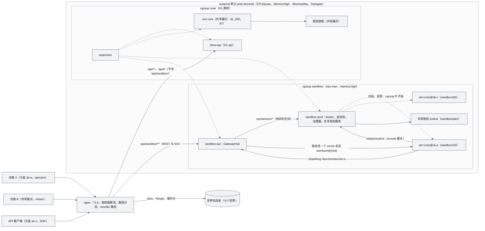
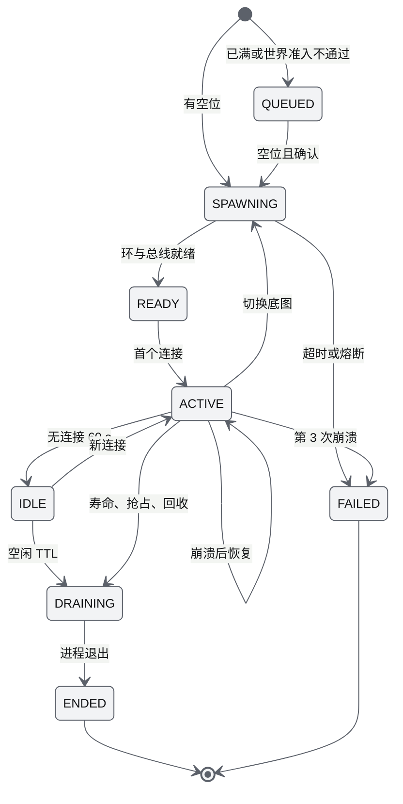
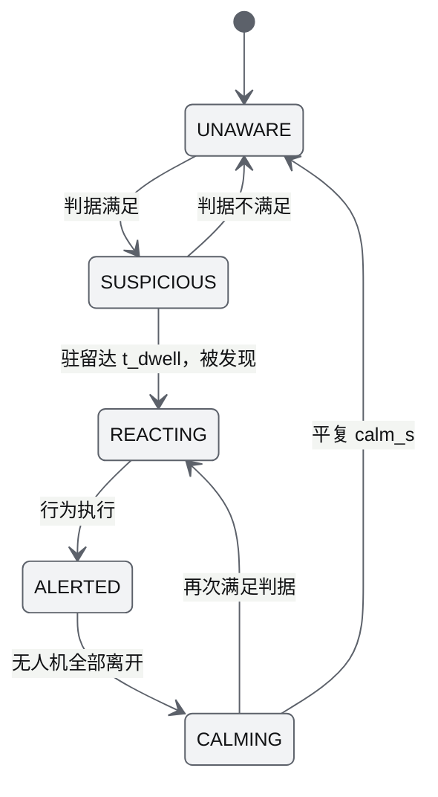
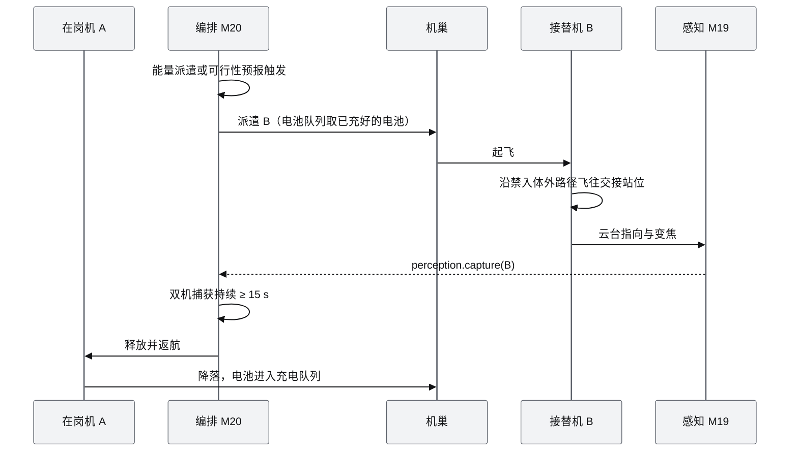

# 04 D2 设计增补与决策记录（D2 Design Supplement & Decision Record）

| 项 | 内容 |
|---|---|
| 文档编号 | AWR-04 |
| 标题 | D2 设计增补与决策记录 |
| 版本 | v1.2 |
| 日期 | 2026-10-05 |
| 状态 | 草案（v1.1 已处置第 1 轮交叉评审的 52 条意见，见附录 A；v1.2 已处置下游文档对基线的反馈并完成跨文档一致性扫描，见附录 B；第 2 轮交叉评审待进行） |
| 上游文档 | 用户 D2 需求原文与 2026-10-05 补充决定 [inputs/D2-需求原文-2026-10-05.md](inputs/D2-需求原文-2026-10-05.md)（含 P600 MID-360 硬件规格）；[AWR-03](03-设计基线与决策记录.md)（ADR-001 至 ADR-087）；[10](10-系统架构说明书.md) 至 [19](19-部署与运维说明书.md)；[M04](modules/M04-几何世界查询服务PRD.md)、[M08](modules/M08-仿真内核与飞行器适配PRD.md)、[M10](modules/M10-任务规划与集群PRD.md)、[M11](modules/M11-实时网关PRD.md)、[M13](modules/M13-传感器仿真PRD.md)、[M14](modules/M14-智能体运行时与ANet-PRD.md)、[M15](modules/M15-前端UI壳与设计体系组件PRD.md)、[M16](modules/M16-演示数据剧本与流畅性测试PRD.md)；[D1 交付总结](impl/D1-交付总结.md)、[DEMO-PUBLIC 报告](impl/DEMO-PUBLIC-报告.md)、[FX-UBO](impl/FX-UBO-报告.md)、[VERIFY-UBO](impl/VERIFY-UBO-报告.md)；研究 r04、r19、r20、r23、r25、r26、n03、d05、x01、g04、g06、g08 |
| 下游文档 | 新增模块 PRD：[M17 沙盒会话与开放接口](modules/M17-沙盒会话与开放接口PRD.md)、[M18 与 M19 识别物与感知对抗（合并）](modules/M18-M19-识别物与感知对抗PRD.md)、[M20 任务编排、机巢与接力监控](modules/M20-任务编排机巢与接力监控PRD.md)、M21 机型目录与固定翼动力学（待写）；[AWR-20 机型与传感器目录](20-机型与传感器目录.md)；文档集与状态见 §1.3；10–19 号说明书与 M03、M04、M06、M07、M08、M10、M11、M13、M14、M15、M16 PRD 的 D2 增补节；D2 实现与验收报告（`docs/impl/D2-*`） |
| 适用版本范围 | V0.2-demo（即本期交付 D2）至 V1.0 |
| 修订记录 | v1.0（2026-10-05）：首版，ADR-088 至 ADR-110、模块 M17–M21、R-D2-01 至 R-D2-27、D2-AC-01 至 D2-AC-32。v1.1（2026-10-05）：处置第 1 轮交叉评审（容量与可行性、物理与模型、需求覆盖与体验三个视角，52 条，其中 blocker 3 条）：UrbanScene3D 六城按用户补充决定在公开站开放；多租户进程模型改为"D1 共享展示原样 + sandbox-pool + sandbox-api"；容量模型按世界加权、并发上限按实测公式计算；感知、接力、GSD 扫描的物理口径修订并给出可行窗口表；新增 ADR-111 至 ADR-113、R-D2-28、D2-AC-33 至 D2-AC-39；工作包增至 16 个、里程碑改为 7 周。v1.2（2026-10-05）：文档总编处置下游文档（M17、M18-M19、M20 PRD，AWR-20，14 §20、17 §17，M08、M10、M11、M13、M15 的 D2 增补节）对基线的反馈 119 条与跨文档一致性扫描发现的冲突 22 项（附录 B）：PRD 文件按模块编号更名、登记 AWR-20；§9.2 可行窗口表按 `K_MOR = ln 20` 复算；排队改为长轮询票；原因码名称与新码登记；充电时间、盘旋半径、限速档、版本存档、传感器槽位与 `sensor/mode` 载荷统一；新增 ADR-114 至 ADR-116 |

## 0. 摘要

1. **多租户沙盒**：每位访客或 API 客户端领取一个匿名沙盒 token，获得一个独立的 sim-core 进程（时钟档 sandbox100，独立时钟、机群、识别物、机巢与任务）。D1 的共享展示（supervisor、api、sim-core、规划进程）原样保留；新增两个由 supervisor 监管的进程：**sandbox-pool**（M17：会话池、broker、倍速治理、共享规划服务、cgroup 与回收，状态落盘）与 **sandbox-api**（M11：GatewayHub，按会话实例化 D1 的 Gateway，每会话一个总线会话）；nginx 按路径分流，并直接服务 `/worlds/` 静态文件（ADR-089、ADR-092、ADR-113）。
2. **容量**（本机口径，含评审补测）：单沙盒 ×1 约 0.15 核（感知预算打满），匿名页 S 级世界约 140 MB、L 级世界约 155 MB；Grid25 预生成进 M04 派生缓存并以 memmap 共享；cgroup 分为 `core`（共享展示）与 `sandbox` 两组，CPU 限流与内存回收只落在沙盒组；**并发沙盒上限 N_max 按实测成本公式计算，本机口径在 CPUQuota 250% 时为 4、200% 时为 2（配置硬上限 6）**，内存按世界加权准入；倍速 ×10 只对小机群可达，满载会话约 ×5（ADR-091）。
3. **底图**：按用户 2026-10-05 补充决定，公开站开放 synthcity 与 UrbanScene3D 六城共 7 个世界（共享展示可静态浏览、沙盒可创建与切换）；世界包与派生缓存随部署包上传并校验；NOTICE 与 THIRD_PARTY_NOTICES 注明"经数据集权利方授权使用"并保留 ECCV 2022 引用（ADR-109）。
4. **机型目录**（M21）以用户 P600 MID-360 规格修订 P600 profile（3.825 kg、MTOW 4.1 kg、悬停 29 min），预置 4 个通用化模拟参考机型（轻型与重载四旋翼、长航时固定翼、垂起固定翼）；固定翼用协调转弯运动学与能量模型，盘旋半径计入风；传感器目录新增两种夜间远距手段：LWIR 75/100 mm 镜头与 3 W 远距 850 nm 照明器（ADR-095、ADR-096、ADR-101）。
5. **识别物**（M18）：人、机、狗、车、物五类，带尺寸、运动、外观、反射率、热、RCS、周期声源与 RF；"被发现"有两种模式：**geometric（缺省，与原文一致：无人机进入配置的敏感范围并驻留即被发现，接力禁入体就是配置体）**与 physical（配置体与声学、视觉准则体之交；物理模型同时给出"建议半径"）（ADR-097 至 ADR-099）。
6. **感知**（M19）：Johnson 准则与 TTPF 统一检测、识别、确认三级；关键维度按视线方向的投影面积计算；有效像素计入视线、对比度或热对比（含背景杂波）、照度、残余模糊与衍射；视线按射线计预算（每仿真秒 ≤ 250 条）；"明确捕获" = 成像传感器在 P ≥ 0.9 的所需等级下持续 1 s（ADR-100 至 ADR-102）。
7. **编排**（M20）：六类任务加组合任务"区域值守"（巡航 + 巡边，发现即转接力）；GSD 扫描按逐像素足迹公式反推，剔除障碍格并补洞，`T_max` 缺省值使超出一个架次的区域自动多机；贪心分配加"同一扫描的条带组分给不同机体"等硬约束；接力先查可行窗口表，按昼夜预报提前派遣，计入电池与充电通道吞吐，dry-run 给出"可持续 7×24"结论与瓶颈（ADR-103 至 ADR-106、ADR-112）。
8. **接口与体验**：沙盒 REST v1 与 `awr.rt.v1` 扩展、逐传感器数据产品表、OpenAPI 页与 Python SDK；沙盒场景模板（每个世界一套）与新手引导；共享展示访客不占槽位也能用的交互清单；演示构建改为运行期按会话角色切换界面（ADR-107、ADR-108、ADR-111、ADR-112）。D2 验收 39 条（P0 36 条），里程碑 D2-MS1 至 MS6（7 周），16 个工作包（§14）。
9. **v1.2 总编处置**：下游 PRD 按模块编号更名并登记 AWR-20（ADR-114）；119 条反馈与 22 项跨文档冲突逐条裁决（附录 B），其中可行窗口表按 `K_MOR = ln 20` 复算、排队改为长轮询票、原因码与 `sensor/mode` 载荷统一；新增 ADR-115（Vehicle Package schema 1.1 与传感器型号库）、ADR-116（录制兼容按布局哈希集合判定）。

---

## 1. 本文的地位与使用规则

### 1.1 地位与裁决顺序

1. 本文是 D2 全部文档与实现的**唯一基线**。D2 范围内的冲突按以下顺序裁决（高者为准）：**用户 D2 需求原文与 2026-10-05 补充决定（R-D2，§2.1）> 用户硬性要求 R1–R4（AWR-03 §2.4，继续有效）> 本文（AWR-04）> AWR-03 > g01–g08 > 其余研究笔记 > 01-design**。
2. 本文不重述 AWR-03 已定义的内容；凡未在本文修改的条款（坐标、时间、单位、命名、契约演进、设计体系、写作规范、性能运行协议 ADR-033 等）原样适用于 D2。
3. 本文对 AWR-03 的修改一律以 ADR-088 起的追加 ADR 表达，并在 ADR 标题中写明"修订 ADR-0xx 或某节"；AWR-03 §7.0 ADR 索引与附录 E 增加索引行指向本文 §12（v1.2 已完成），原 ADR 不删除。
4. 写作规范沿用 AWR-03 §10.2（中文、技术名词英文、需求编号、依据、mermaid、可测试验收、严禁 emoji 与状态字形）。新增编号规则见 §1.2。
5. 本文中的成本、内存与上限凡标"本机口径"，均为 8 vCPU Xeon E5-2603 v4 1.7 GHz 上的实测或由实测外推，emax 上以 D2-MS5 实测冻结（ADR-091）。

### 1.2 编号、版本与术语

| 项 | 规则 |
|---|---|
| 用户需求 | `R-D2-xx`（本文 §2.1，按原文逐句拆分；R-D2-28 为 2026-10-05 补充决定） |
| 本期交付 | **D2 = V0.2-demo**。它是 V0.2 主题（AWR-03 §8.1 的 SIH、geo-worker 等）之外的一条演示与开放接口切片，不改变 V0.2 原退出标准；需求表的"目标版本"列允许取值 `V0.2-demo` |
| 验收 | `D2-AC-xx`（§13）；模块 PRD 的 AC 仍用 `<前缀>-AC-###` 并在"验收要点"列引用 D2-AC |
| ADR | 从 ADR-088 起连续编号（§12），v1.1 新增 ADR-111 至 ADR-113，v1.2 新增 ADR-114 至 ADR-116 |
| 新增模块 | M17–M21（§3.3）；需求前缀为模块号，例如 `M18-FR-001`；文件名以模块编号开头，M18 与 M19 合并为一份 PRD（ADR-114） |
| D2 新增说明书 | [AWR-20 机型与传感器目录](20-机型与传感器目录.md)，需求前缀 `CAT`：机型与传感器参数数值、Vehicle Package 的 D2 扩展与校验规则的定义方（ADR-114） |
| 沙盒 sid | `sb-` 加 10 位小写 base32，正则 `^sb-[a-z2-7]{10}$`（满足 zenoh chunk 规则；前端路由据此区分 `/sandbox/api`） |
| 原因码 | 新增码段 500–599（ADR-107），按模块划分子段 |
| 优先级 | P0 为 D2 发布阻塞；P1 应交付，缺失须有豁免记录；P2 可延期。PRD 需求表的"D1"列在 D2 文档中改为"D2"列，取值"是、桩、否" |
| 术语 | **沙盘**：D1 的主 3D 视图（`ui/views/Sandbox.tsx`）。**沙盒**：D2 的隔离仿真会话（一个 run）。代码中会话一律命名 `sandboxSession`（前端 `stores/sandboxSession.ts`、后端 `awr.sandbox`），不得与 `Sandbox` 视图混用。**共享展示**：公开站的 D1 run（viewer 只读）。**S 级与 L 级世界**：按派生缓存体量分档，S 级为 synthcity、shenzhen、suzhou、newyork，L 级为 chicago、shanghai、sanfrancisco（§4.4） |

### 1.3 D2 文档集与状态

| 文档 | 文件 | 定义的内容 | 状态（v1.2） |
|---|---|---|---|
| 用户需求原文 | [inputs/D2-需求原文-2026-10-05.md](inputs/D2-需求原文-2026-10-05.md) | R-D2 的追溯源（含 P600 MID-360 规格与 2026-10-05 补充决定） | 只读 |
| AWR-04 | 本文 | D2 唯一基线：范围、架构、ADR-088 至 ADR-116、D2-AC | 草案 v1.2 |
| AWR-20 | [20-机型与传感器目录.md](20-机型与传感器目录.md) | 机型与传感器参数数值、派生值、Vehicle Package 的 D2 扩展、目录与型号库文件格式、校验规则 | 草案 v1.0 |
| AWR-M17 | [modules/M17-沙盒会话与开放接口PRD.md](modules/M17-沙盒会话与开放接口PRD.md) | sandbox-pool、会话与排队、配额、开放 REST 的会话端点、SDK、公开站部署配置 | 草案 v1.0 |
| AWR-M18、AWR-M19 | [modules/M18-M19-识别物与感知对抗PRD.md](modules/M18-M19-识别物与感知对抗PRD.md) | 识别物、敏感体与被发现判据（M18）；感知判据、明确捕获、可行窗口纯函数（M19） | 草案 v1.0 |
| AWR-M20 | [modules/M20-任务编排机巢与接力监控PRD.md](modules/M20-任务编排机巢与接力监控PRD.md) | 任务分解、机巢与电池队列、GSD 扫描、贪心分配、接力监控、可持续性评估 | 草案 v1.0 |
| AWR-M21 | `modules/M21-机型目录与固定翼动力学PRD.md` | 目录与实例服务、固定翼与 VTOL stage、`rest/catalog.py` | 待写（参数与文件格式已由 AWR-20 定义） |
| D2 增补节（已写） | [14 §20](14-UI交互设计PRD.md)、[17 §17](17-接口与实时协议规范.md)、M08、M10、M11、M13、M15 的 §15 | UI、线上接口与各模块的 D2 改动 | 草案 |
| D2 增补节（待写） | 10、11、12、13、15、16、18、19 号说明书；M03、M04、M06、M07、M09、M12、M14、M16 | 见 §3.2 影响表；17 与 M17 PRD 已引用的"19 D2 增补"（nginx、systemd、cgroup 模板）以 M17 PRD §8 为临时定义 | 待写（附录 B.3） |

下游文档的"对基线的反馈"节保留为记录，处置结果一律以本文附录 B 为准。

---

## 2. 需求追溯

### 2.1 原文逐句拆分

"原文摘录"一列是用户原话（只截取，不改写）；"模块"列的主责在前。

| 编号 | 原文摘录 | 需求解释 | 模块 | 版本 | 优先级 | 验收 |
|---|---|---|---|---|---|---|
| R-D2-01 | "网页展示版本载入的时候加入一个极简的进度条" | 落地页进入沙盘、首屏点云与预热期间显示单调、确定性的进度条与阶段文字；不改变 D1 的揭开门控 | M15、M05、M06 | V0.2-demo | P0 | D2-AC-01 |
| R-D2-02 | "当前开放的功能有点少，可以适当开放一些低成本交互功能" | 公开站在不影响他人的前提下开放写操作：每人一个隔离沙盒；共享展示仍只读，但开放一批不占沙盒槽位的只读交互（§10.3） | M17、M11、M15 | V0.2-demo | P0 | D2-AC-02 至 07、37 |
| R-D2-03 | "定点巡航" | 到点悬停（多旋翼）或盘旋 loiter（固定翼，半径计入风），可设驻留时长与传感器指向 | M20、M21 | V0.2-demo | P0 | D2-AC-16 |
| R-D2-04 | "多点指定后巡线" | 折线航线，单次、往返、循环三种模式 | M20 | V0.2-demo | P0 | D2-AC-16 |
| R-D2-05 | "多机协同巡查指定区域" | 区域分割为若干子区，多机并行持续巡查，给出重访周期 | M20、M10 | V0.2-demo | P0 | D2-AC-16 |
| R-D2-06 | "划定区域后自行决定启动多少无人机进行指定分辨率的区域完整扫描（即不能只用一台通过很远的距离用视锥覆盖，而是需要多台巡查）" | 由 GSD 与传感器反推航高与条带宽度；`T_max` 缺省为"每架只飞一个架次且不超过 10 min"，超出即自动多机；以航高上限与离轴角上限限定单站足迹；障碍格剔除、覆盖补洞后全覆盖可校验 | M20、M19 | V0.2-demo | P0 | D2-AC-17 |
| R-D2-07 | "增加一个待识别物的管理页面……手工加入待识别的人机狗车物等识别物" | 识别物列表、增删改、类别模板（人、机、狗、车、物，可扩展） | M18、M15 | V0.2-demo | P0 | D2-AC-11 |
| R-D2-08 | "待识别物要有不同的观测范围，即敏感范围，有视觉敏感和声音敏感等多个范围空间" | 每个识别物可挂多个敏感空间体（形状、半径、高度、方向性）；视觉、声学为 P0，雷达与 RF 为可扩展类型 | M18 | V0.2-demo | P0 | D2-AC-12 |
| R-D2-09 | "如果无人机进入敏感感知范围，则会被待识别物发现" | 缺省 geometric 模式：进入配置的敏感体并驻留即发 `target.discovered`；physical 模式为可选（§7.3） | M18 | V0.2-demo | P0 | D2-AC-12 |
| R-D2-10 | "识别物具有真实的大小尺寸、热量（热辐射系数）、声音（以波形形式周期性模拟）" | 三向尺寸（关键维度按视线方向投影）、表面温度与发射率、周期声源波形（频率、幅度、占空、谱） | M18 | V0.2-demo | P0 | D2-AC-11 |
| R-D2-11 | "以及等其他若干需要你补充的属性" | 补充属性集（§2.2），每项给出单位、默认值与取值依据 | M18 | V0.2-demo | P0 | D2-AC-11 |
| R-D2-12 | "在视锥覆盖且分辨率大于阈值的时候被无人机明确捕获并提示" | 视锥、视线、像素阈值（Johnson，阈值可按识别物或任务设置）、消光与光照的统一判据；`perception.capture` 事件、Toast 与 HUD 像素进度 | M19、M15 | V0.2-demo | P0 | D2-AC-13、14 |
| R-D2-13 | "无人机不一定是 P600，要有一个无人机管理页面，管理配置模拟的无人机的各种参数以及视觉、传感器等的参数配置" | 机型目录（只读预置 + 会话内克隆编辑）、机队实例增删改、传感器挂载配置 | M21、M19、M15 | V0.2-demo | P0 | D2-AC-09 |
| R-D2-14 | "传感器包括日视、夜视、红外、雷达波、声波" | 五类全部 P0：EO 可变焦、夜视（低照度与 850 nm 主动照明）、LWIR、毫米波雷达、声阵列，另含 MID-360；雷达与声阵列的基础检测、配置与数据输出为 P0，微多普勒分类与地杂波门限为 P1 | M19、M13 | V0.2-demo | P0（进阶项 P1） | D2-AC-14、31、33 |
| R-D2-15 | "从这里整理值得放入模拟配置的参数，并预置几个尺寸和类型的无人机的型号，要求有四旋翼版本的，也要有固定翼版本的" | P600 参数表（§5.1）；预置 2 个以上四旋翼与 2 个固定翼（长航时、VTOL） | M21 | V0.2-demo | P0 | D2-AC-09、10 |
| R-D2-16 | "用户划定区域后，不同地方的无人机机巢内的不同种类的无人机自行决定……完成巡航、巡边任务编排" | 多机巢、多机型的自动分配与编排；组合任务"区域值守"一键生成巡航与巡边 | M20 | V0.2-demo | P0 | D2-AC-18、34 |
| R-D2-17 | "默认使用贪心算法、不引入llm智能，只做demo用，后续提供模型和llm、agent接入" | 默认贪心分配器；`Allocator` 接口预留 ANet 合同网、模型与 LLM agent | M20、M14 | V0.2-demo（接口）；V1.0（LLM） | P0（接口与贪心） | D2-AC-18 |
| R-D2-18 | "允许用户自行添加、编辑、管理待识别物，并将待识别物添加到底图内" | 在底图上点选放置、拖动、画路径，DSM 贴地 | M18、M15 | V0.2-demo | P0 | D2-AC-11 |
| R-D2-19 | "巡航任务发现待识别物后实现7*24h不进入敏感范围的接力巡航监控" | 发现即生成接力监控：可行窗口预检、敏感范围外选站、按电量与昼夜预报提前派遣、零间隙交接、移动目标跟随；24 h 与 7×24 h 批处理验证；dry-run 给出可持续性结论 | M20、M19、M18 | V0.2-demo | P0 | D2-AC-19、20、34 |
| R-D2-20 | "手工添加、删除管理无人机" | 机队实例增删改（沙盒内），与机巢库存联动 | M21、M17 | V0.2-demo | P0 | D2-AC-09、35 |
| R-D2-21 | "手动控制某一个无人机" | 选中机：键盘（独占作用域）与虚拟摇杆速度遥控、FPV 与传感器视图；接管与任务、敏感范围的关系 | M15、M06、M08、M20 | V0.2-demo | P0 | D2-AC-21 |
| R-D2-22 | "支持以接口形式控制" | 沙盒 REST 与 WS 命令（含租约与速度 setpoint），同一准入流水线 | M17、M11 | V0.2-demo | P0 | D2-AC-22、35 |
| R-D2-23 | "支持以接口形式获取到无人机所有sensor、status信息" | 按"逐传感器数据产品表"（§11.7）提供全部状态、配置、检测与数据产品，可查询、可订阅 | M17、M19、M13、M11 | V0.2-demo | P0 | D2-AC-22、35 |
| R-D2-24 | "提供一个沙盒模拟器对外开放" | 多租户沙盒、配额、限流、场景模板、OpenAPI 页、Python SDK | M17 | V0.2-demo | P0 | D2-AC-02 至 07、22、23、33、38 |
| R-D2-25 | "UrbanScene3D可以作为可选底图加入进来，允许用户切换选择进行使用" | 沙盒创建与切换可选七个世界（切换时载入目标世界的同名场景模板）；共享展示可静态浏览六城 | M17、M03、M15、M16 | V0.2-demo | P0 | D2-AC-24 |
| R-D2-26 | "不同地方的无人机机巢内" | 机巢实体：位置、容量、机型库存、充电通道或换电、起降间隔；每个世界的模板给出机巢位置与链路距离缺省值 | M20、M16 | V0.2-demo | P0 | D2-AC-18、19 |
| R-D2-27 | 随附"硬件指标（以 MID360 配置）" | 规格逐项入目录，标注置信度与在仿真中的用途；P600 profile 升至 v2 | M21、M13 | V0.2-demo | P0 | D2-AC-09 |
| R-D2-28 | 补充决定："我们得到了 urbanscene3d 的授权，你直接用就是了，我确认。" | 六城在所有部署形态（含公开站）开放；README 与截图可用六城画面；NOTICE、THIRD_PARTY_NOTICES 注明"经数据集权利方授权使用"并保留 ECCV 2022 BibTeX；世界包不入 git，公开站经部署包上传 | M03、M17、M15、M00 | V0.2-demo | P0 | D2-AC-24 |

承接要求：设计体系（R2：shadcn、lieflat、transitions.dev、morphicons、ANet Graphite、禁 emoji）对 D2 全部新页面强制适用（D2-AC-25）；D1 的 P0 验收不得回退（D2-AC-26）。

### 2.2 识别物的补充属性（落实 R-D2-10、R-D2-11）

属性分 9 组，字段名与单位按 AWR-03 §5.4、§5.6（单位后缀、snake_case）。默认值按类别给出（§7.2 类别模板表），本表给出定义、取值范围与依据。

| 组 | 字段 | 单位与范围 | 用途 | 取值依据 |
|---|---|---|---|---|
| 几何 | `size_m{l,w,h}`；`critical_dim_m`（可选覆盖值，缺省不填） | m | 渲染包围体；Johnson 像素按视线方向的关键维度 `d_c = √A_proj`，`A_proj = abs(sin ε)·l·w + abs(cos ε)·(abs(cos β)·w·h + abs(sin β)·l·h)`（ε 俯视角，β 相对航向的方位角；长方体投影面积的精确式）；运动目标在规划中取 β 最不利值 | Johnson 准则以"关键维度"计像素；关键维度随观察方向变化，机载视角多为斜视或俯视，固定取平视值会偏乐观约 2 倍（评审意见，附录 A 第 17 条）。人平视 0.72 m、俯视 0.39 m；轿车正面 1.64 m、侧面 2.60 m、俯视 2.85 m（NVESD 常用的 2.3 m 是坦克级标准目标，不用于轿车） |
| 运动 | `motion.mode ∈ {static, path, random_walk}`；`speed_mps`、`speed_max_mps`、`accel_mps2`、`turn_rate_max_rad_s`；路径模式 `path[]`、`loop ∈ {once, pingpong, loop}`；随机游走 `region`（多边形）、`speed_sigma_mps`、`turn_tau_s` | — | 运动学推进（10 Hz）、雷达多普勒、站位跟随 | 步行 1.4 m/s 为行人平均速度；其余为本文设定 |
| 外观 | `color_srgb`（渲染）、`albedo_vis`（0–1）、`contrast0`（相对典型背景的固有对比度，−1 至 +4）、`camouflage`（0–1）、`occlusion`（0–1，局部遮蔽比例） | 无量纲 | 有效对比度 `C = contrast0·(1−camouflage)`；有效像素乘 `(1−occlusion)` | 5% 对比度阈值与 MOR 定义一致（ADR-023 的 `K_MOR = ln 20`） |
| 反射率 | `reflect_850`（夜视近红外）、`reflect_905`（激光雷达） | 0–1 | NIR 主动照明回波、MID-360 量程 | MID-360 量程按反射率缩放（r04 §3.1，`exponent` 0.269） |
| 热 | `thermal.mode ∈ {relative, absolute}`；`delta_t_k`（relative：相对当地背景地表温度的温差）或 `t_surface_c`（absolute）；`emissivity`（0–1）；`hot_fraction`（热斑面积占比，< 1 时 LWIR 的关键维度乘 `√max(hot_fraction, 0.25)`，ΔT 取热斑温差） | K、°C | LWIR 表观温差 ΔT（§6.2） | 人体着装表面 28–32 °C、发射率约 0.95–0.98 为热像常识值；本文作模拟参考值 |
| 雷达 | `rcs_m2`、`rcs_fluct ∈ {swerling0, swerling1}`、`rcs_band`（参考波段 77 GHz） | m² | 雷达方程 SNR | 人约 0.5 m²、车约 10 m²、小型无人机约 0.01 m² 为常见量级（模拟参考值） |
| 声源 | `sound{waveform, f0_hz, harmonics[], lw_dba, period_s, duty, phase_s, bandwidth_hz}`（§7.5） | Hz、dB(A)、s | 被无人机声阵列检测；狗吠、引擎声等 | ISO 9613-2 传播公式；声功率级为模拟参考值 |
| 射频（可扩展） | `rf{freq_mhz, eirp_dbm, duty}` | MHz、dBm | 预留 RF 侦测传感器与 RF 敏感体 | V0.3 起使用；D2 只入 schema |
| 感知与行为 | `criterion_mode ∈ {geometric, physical}`（缺省 geometric，§7.3）、`alertness`（0–1）、`sensitivity[]`（敏感空间体）、`reaction`（§7.4）、`calm_s`、`alert_radius_m`、`level_req ∈ {D, R, I}`（缺省 R）与可选 `n_req_px`（覆盖所需像素） | — | 被发现判据、行为状态机、明确捕获阈值 | 本文设定；`level_req` 与 `n_req_px` 落实原文"分辨率大于阈值" |

### 2.3 无人机侧的补充属性

识别物在 physical 模式下"发现"无人机需要无人机自身的可探测性（ADR-097）。这些属性属于机型目录（M21），每型的默认值见 §5.2。

| 字段 | 单位 | 定义 | 依据 |
|---|---|---|---|
| `acoustic.lwa_hover_dba` | dB(A) | 悬停推力下的 A 计权总声功率级 | 模拟参考值；量级与公开实测的多旋翼声功率（约 80–98 dB(A)）一致 |
| `acoustic.band_shape_db[]` | dB | 1/3 倍频程（50 Hz–10 kHz，24 带）相对谱形，A 计权后求和等于 `L_WA`；缺省谱形按构型给出（多旋翼：BPF 与前 4 个谐波带突出 `tonal_db`，宽带峰在 1–2 kHz） | 多旋翼 A 计权能量主要在 0.5–4 kHz，BPF 在 A 计权下被压低 16–19 dB（评审意见，附录 A 第 28 条） |
| `acoustic.thrust_exp` | — | `L_WA(T) = L_WA,hover + 10·k·lg(T/T_hover)`，缺省 k = 1.5 | 本文设定：旋翼诱导功率 ∝ T^1.5，声效率按常数近似 |
| `acoustic.bpf_hz`、`acoustic.tonal_db` | Hz、dB | 桨叶通过频率 `BPF = B·Ω/2π` 与其谐波带相对宽带的突出量 | 旋翼噪声的主成分为 BPF 谐波（教科书结论） |
| `visual.area_m2{top,side,front}` | m² | 三向投影面积；可见特征尺寸 `D_vis = √A`（按观察方向取） | 本文设定 |
| `visual.contrast_sky`、`visual.contrast_ground` | — | 对天空、对地物背景的固有对比度 | 深色机体对亮天空约 −0.8（本文设定） |
| `visual.lights{nav, strobe}` | 开或关 | 夜间可见性：关灯时夜间视觉发现只在近距（缺省 30 m）成立；开防撞灯时视觉发现半径取配置上限 | 本文设定 |
| `rcs_m2` | m² | 供识别物侧雷达或反无人机设备使用（可扩展） | 模拟参考值 |
| `ir.motor_delta_t_k` | K | 电机与电池热斑温升（供识别物侧热像，可扩展） | 模拟参考值 |

---

## 3. 范围与模块

### 3.1 D2 范围

| 层 | D2 交付（P0） | D2 交付（P1） | 桩 | 不在 D2 |
|---|---|---|---|---|
| 沙盒与接口 | sandbox-pool（会话池、broker、配额、空闲回收、排队与降级、倍速治理、状态落盘）、sandbox-api（GatewayHub）、沙盒 token、沙盒 REST v1、topic 扩展、逐传感器数据产品、OpenAPI 页、Python SDK 与示例、场景模板、会话恢复 | 观摩链接、预热 sim-core（`sandbox.prewarm`） | API key 分级配额 | 跨主机会话池 |
| 仿真 | sandbox100 时钟档、P600 v2 与 4 个预置机型、固定翼与 VTOL 运动学、识别物与敏感范围（两种判据模式）、感知（EO、夜视、LWIR、MID-360、毫米波雷达与声阵列的基础检测）、机巢与充电通道、仿真日历与太阳高度、批处理自由运行模式 | 雷达微多普勒分类与地杂波门限、声阵列谐波分类 | RF 发射与侦测 | L2 气动、真实图像渲染 |
| 编排 | 六类任务与区域值守、默认贪心分配、GSD 扫描反推与补洞、接力监控（静止与移动目标）、可行窗口与可持续性评估、24 h 与 7×24 h 批处理验证、共享规划服务 | 公开站 S7 连续 7 天线上统计 | `Allocator` 的 ANet 与 LLM 实现 | CBBA、VRP |
| 前端 | 载入进度条、机队、识别物、机巢、任务四个管理面板、沙盒状态条、手动控制（独占键位作用域）、FPV 与三种传感器视图、捕获与被发现提示、底图选择与切换、场景模板与新手引导、viewer 可用交互（§10.3）、演示构建的运行期角色切换（ADR-111） | 声音波形图、接力统计曲线图 | — | 移动端专门布局 |
| 运维 | emax 容量模型、cgroup 两组布局、public profile v2、部署套件更新（nginx 静态世界、七个世界包与派生缓存、cgroup 启动包装）、部署前 24 h 浸泡 | emax 实测冻结上限 | — | 多实例水平扩展 |

### 3.2 对既有模块的影响

既有路径的 D2 改动由原所有者实现，经本文授权；逐文件的变更请求见 §14.3。

| 模块 | D2 增补 |
|---|---|
| M00 | 契约合入与生成；部署套件 `tools/deploy/emax/**`（nginx 路径分流与静态世界、systemd 单元、cgroup 启动包装、install.sh 校验世界包与派生缓存）；NOTICE、THIRD_PARTY_NOTICES 与 README 的授权说明 |
| M03 | 世界白名单在 public profile v2 中列出七个世界；世界包随部署包分发；`world.json` 的 `dataset.terms` 写授权说明 |
| M04 | Grid25 规划栅格并入派生缓存（memmap，只读共享）；`los_batch` numba 化；公开模式 `allow_derive = false` 时缓存缺失的处置（§4.4）；`rest/world_query.py` 改用请求级上下文依赖 |
| M05 | 世界与 run 不一致时的静态浏览（只加载点云与地形）；进度条的点云字节计数 |
| M06 | FPV 与三种传感器视图的着色变体、shader zoo 登记（识别物、敏感体、站位、条带等图层由领域模块提供，见 §14.2） |
| M07 | 仿真日历与太阳位置、照度档；按波长的消光 `sigma_lambda` 与按湿度的 LWIR 水汽项；地表温度与发射率、昼夜热交叉；声学背景随日历的剖面；`rest/env.py` 改用请求级上下文依赖；`environment/{stage,field}.py` 写死的 `TICK_NS` 与按 250 Hz 推算的全量求值相位改由时钟档读取（ADR-090） |
| M08 | 时钟档参数化（`clock_profile ∈ {d1_250, sandbox100}`）；实体层 `kind = target` 的状态块与 roster；`loiter`、`gimbal`、`zoom` 命令；批处理自由运行；空载 tap 开销优化；`state/sim-core/perf` 自报 `cost_core_per_rate`；预热模式（P1）；`rest/fleet.py` 改用请求级上下文依赖；`tools/bench/fleet_ladder` 增加 `--clock` 与识别物负载；按档调度表与 order 区段（M21 086–089、M18 170–174、M19 175–184、M20 185–194）；会话配置 `session.json` 冷启动加载与 `sim/reset{sandbox_config}`；velocity setpoint 入口的软围栏钩子（§10.6）；机型版本存档、按构型的 schema 1.1 校验、限速表 `LT` 扩为 6 列与每型限速档 `<id>_std`（ADR-115） |
| M09 | 能量与能量 RTL 按构型取功率（固定翼与 VTOL 的功率模型经 M08 注册表由 M21 提供，§5.3）；`BatteryModel.swap_pack(slot, soc)` 供机巢换电（M20） |
| M10 | 规划作业注册点 `register_plan_kind`（替换 worker 中的 if/elif 分派）；`PlanPoolClient` 增加 `remote` 模式（作业提交给共享规划服务）；规划服务端核心 `sim/planning/server.py`（公平队列、可杀 worker）；覆盖分割、条带与匈牙利分配作为 M20 的库被调用；`rest/scenarios.py` 改用请求级上下文依赖；禁入体经契约 `KeepoutVolume` 进入 `MissionConstraints.keepouts`，有禁入体时转场与航段用 2.5D A*（Grid25 叠加作业级掩码）；固定翼架次编译为 `fw_path` 与 `loiter`，交 M21 的运动提供者执行 |
| M11 | api 改造为"按请求解析运行上下文"（`settings`、`main`、`deps`、`security`、`middleware`、`ratelimit`、`public`），D1 show-api 行为不变；新进程入口 sandbox-api 与 GatewayHub；`awr.runtime.cgroup`（进程加入叶子组）；`runtime.yaml` 的 `sandbox:` 段与 public profile v2；前端 `net/**` 的 API 基址可配置；`runtime/child.py` 增加 `AWR_DETACHED`（池拉起的沙盒 sim-core 不随池退出、输出写文件）；sandbox-api 入口 `api/sandbox_main.py` |
| M12 | 录制兼容按布局哈希集合判定（ADR-116）；`recorder/synth.py` 的 `TICK_NS` 改由时钟档读取 |
| M13 | 传感器挂载与云台沿用；新传感器类型的 spec schema 由 M19 起草；MID-360 由桩升为参与感知的模型并提供限频扫描 topic；P600 的 `sensors/` 增加 GX40 挂载（新槽位 `eo`）与 `nir_ill_l` 可选挂载，`camera`、`thermal` 保留为只供 D1 剧本的槽位；`sensor_no` 按映射顺序编号（ADR-115）；成像模式、照明器与分析分辨率的状态（`payload` 块）与 `sensor/mode` 命令处理（§11.2） |
| M14 | `Allocator` 的 ANet 合同网实现（V1.0）；`thermal.imaging` Mock 检测器保留给 S3，D2 的感知以 M19 为准；`agent/runtime/clock.py` 的 `TICK_NS` 改由时钟档读取；V1.0 的 `llm_agent` 缺省只产出 `hints`（§8.5） |
| M15 | 进度条、四个管理面板、沙盒状态条、手动控制作用域、传感器视图、场景选择与新手引导、OpenAPI 文档页、演示构建的运行期角色切换与新路由（ADR-111） |
| M16 | 剧本 S7、沙盒场景模板（`scenarios/sandbox/**`）、世界成本测量、沙盒容量与浸泡用例、24 h 与 7×24 h 批处理用例、emax cgroup 模拟 harness |

### 3.3 新增模块 M17–M21

| 编号 | 名称 | 职责（一句话） | 所属进程 / 主目录 | 依赖 | PRD |
|---|---|---|---|---|---|
| M17 | 沙盒会话与开放接口 | 管理匿名沙盒会话的领取、排队、配额、倍速治理、回收与共享规划服务，签发沙盒 token，提供沙盒会话 REST、OpenAPI 页与 Python SDK | sandbox-pool（独立进程）与 sandbox-api 内的会话路由 / `awr/sandbox/`、`awr/api/rest/sandbox.py`、`tools/sdk/` | M00、M10、M11、M08 | [`modules/M17-沙盒会话与开放接口PRD.md`](modules/M17-沙盒会话与开放接口PRD.md) |
| M18 | 识别物与敏感范围 | 定义识别物实体、类别模板与属性，推进识别物运动与声源，判定"被发现"并执行被发现后的行为 | sim-core stage / `awr/sim/targets/`、`awr/api/rest/targets.py`、`apps/web/src/engine/targets/` | M00、M04、M07、M08、M21 | [`modules/M18-M19-识别物与感知对抗PRD.md`](modules/M18-M19-识别物与感知对抗PRD.md)（与 M19 合并，ADR-114） |
| M19 | 感知与捕获 | 以统一判据计算各传感器对识别物的检测、识别、确认等级，输出检测与"明确捕获"事件，并给出可行观测几何与可行窗口的纯函数 | sim-core stage / `awr/sim/perception/`、`awr/api/rest/perception.py`、`apps/web/src/engine/perception/` | M00、M04、M07、M08、M13、M18 | 同上（合并 PRD） |
| M20 | 任务编排、机巢与接力监控 | 把用户任务分解为工作项并以贪心分配给多机巢多机型，生成航段，执行 GSD 扫描反推、7×24 接力监控与可持续性评估 | sim-core（慢任务）与共享规划服务（重计算）/ `awr/tasking/`、`awr/sim/tasking/`、`awr/api/rest/tasking.py` | M00、M04、M08、M09、M10、M18、M19、M21 | [`modules/M20-任务编排机巢与接力监控PRD.md`](modules/M20-任务编排机巢与接力监控PRD.md) |
| M21 | 机型目录与固定翼动力学 | 维护机型目录与预置型号、机队实例与传感器挂载配置，实现固定翼与 VTOL 运动学、能量与声学签名模型 | sim-core stage 与库 / `awr/sim/catalog/`、`awr/sim/fixedwing/`、`awr/api/rest/catalog.py`、`vehicles/awr_*/` | M00、M08、M13 | `modules/M21-机型目录与固定翼动力学PRD.md`（待写；参数数值、文件格式扩展与校验规则由 [AWR-20](20-机型与传感器目录.md) 定义） |

依赖方向沿用 AWR-03 §6.2 规则：M18、M19、M20、M21 通过 M08 的 stage 注册表与查询注册表接入 sim-core，M08 不 import 它们；M19 只读 M18 的识别物状态块；M20 调用 M19 的纯函数（`feasible_view`、`perception_level`、`feasibility_window`）与 M10 的覆盖库，重计算作业经 M10 的 `register_plan_kind` 注册后在共享规划服务中执行；M17 只依赖 `awr.runtime`、M10 的规划服务端核心与契约，不 import 仿真包。视线缓存 `LosCache` 放在 M18 的包内（`awr/sim/targets/los_cache.py`），M19、M20 只读 import，符合上述依赖方向。

---

## 4. 架构变化：多租户沙盒

### 4.1 总览



要点：

1. **一个会话 = 一个 run = 一个 sim-core 进程**。沙盒 run id 形如 `sb-<base32 10 位>`，沿用 D1 的 StateRing 路径、zenoh 命名空间 `awr/<world>/<run>` 与 per-run 密钥，sim-core 内部的命令、事件、租约、席位、RNG、时钟天然按 run 隔离。sim-core 的 D2 改动（时钟档、实体层、批处理、perf 自报、规划 remote 模式）见 §3.2，不涉及多会话逻辑。
2. **D1 共享展示原样保留**：supervisor 主流程、api、共享展示 sim-core 与其规划进程的代码路径与 D1 public 形态一致（剧本改为 S7）；public profile v2 只在 `runtime.yaml` 的进程清单中追加 sandbox-pool 与 sandbox-api 两个条目，由 supervisor 按 D1 语义监管（心跳、退避、熔断）。
3. **sandbox-pool**（M17，§4.9）：沙盒 sim-core 的拉起与监管、run 目录与密钥、cgroup 叶子组、配额回收（保护全部活动 run）、broker（会话表、排队票、配额计数、倍速授予、世界准入）与共享规划服务；状态落盘，重启后重新接管仍在运行的沙盒。
4. **sandbox-api**（M11，§4.7）：GatewayHub 为每个活动会话持有一个 SessionContext（自己的总线会话与按 run 实例化的 D1 Gateway）；沙盒的 REST 与 WS 都在 `/api/sandbox/` 前缀下，由 nginx 按路径分流。共享展示与沙盒因此分属两个 api 进程、两个故障域，各自一个事件循环的 CPU 上限互不挤占（ADR-092）。
5. **静态世界文件由 nginx 直接服务**：`/worlds/<世界>/**` 以 `alias` 指向世界包目录，世界白名单写成 location 正则，Range 与缓存头由 nginx 处理（与 D1 api 的头对拍），静态 IO 移出 api 的事件循环，页缓存也不再计入本服务的 cgroup。
6. **重计算放进可杀进程**：沙盒的规划、站位选择、覆盖校验等作业提交给 sandbox-pool 的共享规划服务（一个可杀 worker，按会话公平排队，超时即 kill 并重建），sim-core 内只保留有界的廉价计算（ADR-113）。

### 4.2 本机实测

环境：本机 8 vCPU Intel Xeon E5-2603 v4 1.7 GHz、无 GPU、Python 3.12.3、numpy 2.5.3、numba 0.67.0，世界 synthcity，机型 p600_mid360（v1），D1 时钟（主时钟 250 Hz、L1 125 Hz），测量时 load 均值 0.2–0.7。工具：`tools/bench/fleet_ladder/run.py --scenario none --smoke`（真实 supervisor + sim-core，机群分层起飞后持续环绕，窗口 30–40 s）与两个探针脚本（并发会话内存、识别物与感知原型）；原始数据在 `.cache/research/d2/`（不入库），D2-MS1 由 M16 以正式 harness 复测入库。

| 场景 | 每墙钟秒执行的 tick | sim-core CPU（核） | 单步 p50 / p99（µs） | 内存 |
|---|---|---|---|---|
| 空载 N = 0，×1 | 250 | 0.171 | 569 / 1147 | RSS 217 MB，PSS 120 MB |
| 10 架飞行，×0.25 | 62.5 | 0.080 | 1039 / 2763 | — |
| 10 架飞行，×0.5 | 125 | 0.147 | 983 / 2637 | — |
| 10 架飞行，×1 | 250 | 0.228 | 866 / 1597 | RSS 221 MB（匿名页 115 MB、文件页 111 MB），PSS 124 MB |
| 10 架飞行，×2 | 500 | 0.509 | 864 / 1736 | — |
| 10 架飞行，×5 | 1250 | 0.925 | 562 / 1026 | — |
| 10 架飞行，×10 | 2500 | 1.005（RTF 9.77，追帧饱和 801 次） | 657 / 1249 | — |
| 4 个会话并发（各 10 架在地，线程规划，未触发规划） | 各 250 | 各 0.193–0.206 | — | RSS 合计 884 MB，PSS 合计 467 MB；每增加一个会话 PSS 约 +114 MB |
| 规划进程（进程模式） | — | 空闲 | — | RSS 172 MB，PSS 69 MB |
| supervisor | — | 约 0.02 | — | RSS 65 MB |

识别物与感知原型（v1.0 原型：每对 1 条射线、视觉敏感半径统一 150 m、识别物随机均匀散布、不含站位选择；运动 10 Hz、敏感判定 10 Hz、三传感器检测 5 Hz）：10 × 30 为 11.2–11.9 ms/仿真秒，20 × 60 为 25.7 ms，30 × 100 为 54.3 ms。**该原型低估了接力与巡查场景**（无人机刻意靠近识别物，门控通过率高），D2-MS1 按 3 射线、模板半径与接力、巡查几何复测，§4.4 已按"射线预算打满"取最坏值。

评审补测（同口径，10 架在地、线程规划；附录 A 第 1、5、11 条）：

| 项 | synthcity | 其他世界 |
|---|---|---|
| sim-core 匿名页 | 112.2 MB | sanfrancisco 130.7 MB |
| 首次规划时 M10 在进程内构建 Grid25 的额外匿名页 | +9 MB | shenzhen +10 MB；sanfrancisco +71 MB，构建 2.17 s |
| M04 派生缓存（每条目，memmap 文件页） | 7.5 MB | shenzhen 19、suzhou 16、newyork 48、chicago 172、shanghai 246、sanfrancisco 280 MB |
| 世界包 | 103 MB | 133–197 MB（六城合计约 965 MB） |
| DSM 2 m 范围 | 1.2 × 1.2 km | shenzhen 1.9 × 2.0、suzhou 4.4 × 0.7、newyork 2.9 × 3.2、chicago 4.2 × 8.0、shanghai 7.7 × 6.2、sanfrancisco 7.3 × 7.5 km |
| M04 `los_batch` 单条射线（2 m 步长、斜距 100–500 m、64 对一批） | 31–35 µs | sanfrancisco 相近 |
| 每多一个 zenoh 会话 | +1 MB RSS、约 +1.5 个线程 | — |

结论：

1. sim-core 的成本由**每 tick 固定开销**主导：10 架时 `c ≈ 0.031 + 0.00079·n_tick` 核。空载每 tick 约 0.56 ms，其中 `tap` 一项 58.8 ms/s，是 D2-MS1 的优化项（M08）。
2. **快进上限是单核**：单进程主循环受 GIL 约束，满载会话（12 架 + 30 识别物，感知预算打满）的成本约 `0.03 + 0.12·r` 核，`r ≤ 0.85/0.12 ≈ 7`，落到档位为 ×5；小机群（≤ 3 架、≤ 5 识别物）约 `0.02 + 0.06·r`，可达 ×10。以 sandbox100 实测为准（D2-AC-07）。
3. **内存的边际成本是匿名页**，并且随世界变化：S 级世界约 140 MB/会话、L 级约 155 MB/会话（含识别物、感知与编排状态、StateRing 与 tmpfs checkpoint）；Grid25 若在进程内构建，L 级世界每会话再多 71 MB，因此必须预生成进派生缓存并 memmap 共享。派生缓存与世界包是按世界计一次的文件页工作集，L 级世界达 220–350 MB，进入准入计算（§4.4.2）。
4. **视线是唯一可能爆炸的项**：每条射线约 33 µs，必须先做距离、视锥与像素门控，按射线计预算，并把 `los_batch` numba 化（§6.3）。

### 4.3 方案选择：每会话一个进程，而不是单进程多会话分区

| 维度 | A：每会话一个 sim-core 进程（会话池） | B：单 sim-core 多会话分区 |
|---|---|---|
| 独立时钟与快进 | 天然：每个进程一个 SimClock，倍速互不影响 | 需要在一个主循环里为每个分区维护不同的 tick 节拍与追帧，等价于在 sim-core 内再写一个调度器；ADR-045 的计时器归属与 ADR-049 的 apply_tick 语义都要按分区重写 |
| 隔离与故障域 | 进程级：一个会话崩溃、挂死或被回收不影响他人；沙盒控制面与共享展示分属两组进程 | 同一故障域：任一分区的异常拖垮全部访客，包括共享展示 |
| 多核利用 | 多进程自然用满 4 核 | 单进程受 GIL 约束，所有分区挤在一个核上 |
| 改造量 | sim-core 不含多会话逻辑；新增 sandbox-pool 进程、sandbox-api 进程与 api 的"按请求解析上下文"改造（§4.7），估 2–3 周（WP-03、WP-04） | StateRing、事件序号、roster、租约、准入、RNG 流、checkpoint 全部增加分区维度，D1 冻结的契约要破坏性升级 |
| 资源计量与配额 | 按进程（cgroup 叶子组、RSS、CPU）直接计量与限额 | 只能在进程内自估，无法用操作系统手段兜底 |
| 代价 | 每会话 140–155 MB 匿名页与 ×1 约 0.15 核 | 内存更省 |

决策：**采用 A**（ADR-089）。B 唯一的优势是内存，而 A 的内存在按世界加权的准入下可控（§4.4.2）；B 在独立时钟、隔离与多核三点上与需求正面冲突。

### 4.4 emax 容量模型与上限

emax：4 核、约 2.6 GB 可用内存、无 GPU，与 ANet 生产服务共用。D1 的 systemd 上限为 `CPUQuota=200%`、`MemoryMax=2G`（ADR-085）。D2 建议 CPUQuota 提到 250%（Q-D2-01），并新增 `MemoryHigh=1.8G`；常驻内存将从 D1 的约 0.6 GB 升至峰值约 1.75 GB（含可回收文件页），需运维确认（Q-D2-09）。下表全部为本机口径的最坏值，CPU 预算保留 10% 余量；D2-MS1 以正式 harness 复测、D2-MS5 在 emax 实测后以 ADR 冻结。

#### 4.4.1 CPU 成本表（×1）

| 项 | 预算（核） | 依据 | D2-MS1 复测项 |
|---|---|---|---|
| supervisor | 0.02 | D1 实测 0.017–0.018 | — |
| 共享展示 sim-core（S7，d1_250，8 架 + 3 识别物） | 0.30 | S0（7 架）实测 0.26，加 1 架与识别物、感知、接力编排估 0.04 | S7 单列实测 |
| 共享展示规划进程 | 0.05（平均） | 接力重规划约每分钟一次 | 实测 |
| show-api（≤ `ws_max_show` = 24 个 viewer） | 0.52 | 空闲 0.04 + 每 viewer 0.02（D1：1 个浏览器访客 +0.01–0.016，S7 的 topic 更多，上调）；静态文件已移出 | 每 viewer 成本 |
| **共享展示合计 C_core** | **0.89** | | |
| sandbox-pool | 0.03 | 估算（asyncio、每会话 1 Hz 心跳与 perf、cgroup 读写、状态落盘） | 实测 |
| sandbox-api 空闲 | 0.04 | 同 show-api 空闲 | 每上下文空转成本 |
| 共享规划 worker | 0.15（平均预留；叶子组 `cpu.max` 0.5 核） | 作业受 §11.5 规模配额约束；Grid25 已移入派生缓存 | 作业成本分布 |
| **沙盒控制面合计 C_ctl** | **0.22** | | |
| 每会话 sim-core（12 架 + 30 识别物，感知预算打满） | 0.15 | 0.110（100 tick/s）+ 10%（L1 每 tick）+ 0.025（感知 25 ms/仿真秒，含 ≤ 250 条射线）+ 0.005（识别物与编排） | sandbox100 实测（D2-AC-08） |
| 每会话 sandbox-api 份额 | 0.08 | 2 条 operator 连接 × 0.03（含 perception 5 Hz、target 10 Hz 等新 topic）+ 上下文 0.01 + REST 0.01（每会话 10 次/s 配额） | 每 operator 客户端、每次 REST 请求成本 |
| **每会话合计 c_s** | **0.23** | | |
| 倍速余量下限 B_ff,min | 0.20 | 至少容得下一个满载会话 ×2 | — |

**并发上限公式**：`N_max = min(6, ⌊(0.9·Q − C_core − C_ctl − B_ff,min) / c_s⌋)`，Q 为 CPUQuota（核）。本机口径：**Q = 2.5 时 N_max = ⌊0.94/0.23⌋ = 4**；Q = 2.0 时 N_max = ⌊0.49/0.23⌋ = 2。各项由 MS1 实测替换后由 broker 在启动时计算（`sandbox.max_sessions: auto`），硬上限 6；emax 主频高于本机时 N_max 相应上升，以 MS5 实测冻结。任一 api 进程在 `ws_max` 与配额打满时的 CPU 不得超过 0.7 核（单事件循环余量），超过即下调该进程的 `ws_max`（D2-AC-04）。

#### 4.4.2 内存与按世界加权的准入

口径：**匿名页 + shmem**（不可回收部分，准入与 L4 的依据）与**文件页工作集**（可回收，按世界计一次）分列；共享库文件页约 110 MB 计一次。

| 项 | 匿名页 + shmem（MB） | 文件页（MB） | 依据 |
|---|---|---|---|
| supervisor | 45 | — | RSS 65–71 MB |
| show-api | 65 | — | RSS 93–94 MB |
| 共享展示 sim-core（S7） | 135 | — | 匿名页约 115 + S7 识别物与编排 20（MS1 复测） |
| 共享展示规划进程 | 70 | — | PSS 69 MB |
| 共享库与 synthcity 文件页 | — | 135 | 实测 110 + synthcity 派生缓存与 Grid25 约 25 |
| **core 组合计** | **315** | **135** | `memory.min = 450M` |
| sandbox-pool | 45 | — | 估算 |
| sandbox-api | 65 + 5/会话 | — | 每会话上下文（环读者、事件环 8192 条、通道注册表、总线会话）估 5 MB；D1 的 65 536 条事件环不用于沙盒上下文，MS1 实测回填 |
| 共享规划 worker | 70 | 只映射活动世界的 Grid25 与派生缓存（LRU ≤ 4，会话结束即解除映射；计入下方世界工作集） | PSS 69 MB |
| **沙盒控制面（4 会话时）** | **200** | — | |
| 每会话 sim-core | S 级 140、L 级 155 | — | 匿名页 112–131 + 识别物、感知与编排状态 + StateRing 3.1 + tmpfs checkpoint ≤ 5 |
| 世界文件页工作集 `ws(w)`（初值） | — | synthcity 25、shenzhen 30、suzhou 30、newyork 65、chicago 220、shanghai 310、sanfrancisco 350 | 初值取派生缓存条目与 Grid25 全量之和（保守上界）；MS1 以 mincore 在模板运行 10 min 后实测替换 |

**准入规则**（sandbox-pool，创建与切换底图时检查）：`N + 1 ≤ N_max`，且 `Σ_会话 anon(w_i) + Σ_活跃世界 ws(w) ≤ M_sb`，其中 `M_sb = sandbox 组 memory.high（1300 MB）− 控制面（200 MB）= 1100 MB`。新会话所选世界已活跃时不再计 `ws`。不满足时返回 409 `508 SANDBOX_WORLD_CAPACITY`，回复中给出"当前可立即开始的世界"与排队选项，UI 提示"该城市当前容量不足，可改用 synthcity 立即开始或排队"。

| 组合示例 | 匿名页 | 文件页 | 合计 | 结果 |
|---|---|---|---|---|
| 4 × synthcity | 560 | 25 | 585 | 准入 |
| 4 × sanfrancisco | 620 | 350 | 970 | 准入 |
| 2 × synthcity + 2 × newyork | 560 | 90 | 650 | 准入 |
| sanfrancisco + chicago + synthcity | 450 | 595 | 1045 | 准入；第 4 个会话任何世界都超额，排队 |
| sanfrancisco + shanghai | 310 | 660 | 970 | 准入；第 3 个会话排队 |

全服务峰值：core 450 + sandbox 组 ≤ 1300 = 1750 MB ≤ MemoryHigh 1.8 GB；匿名页 + shmem 最坏 315 + 200 + 4 × 155 = 1135 MB。

#### 4.4.3 冻结的初始上限（`configs/runtime.yaml` 新段 `sandbox:`）

| 参数 | 值 | 依据 |
|---|---|---|
| 并发沙盒上限 `max_sessions` | `auto`（本机口径 Q = 2.5 时 4，Q = 2.0 时 2；硬上限 6） | §4.4.1 公式 |
| 世界准入 | `world_costs`（每世界 anon 与 ws，MS1 生成）、`mem_sandbox_mb: 1100` | §4.4.2 |
| 单会话机群上限 | 12 架 | 10 架实测加 20% 余量；兴趣集与逐机详情不超过 ADR-051 的 64 |
| 单会话识别物上限 | 30 个 | 感知射线预算（§6.3）下 12 × 30 ≤ 25 ms/仿真秒 |
| 敏感体 | 每识别物 ≤ 4，会话内启用 ≤ 64（超出 `542`） | 与 §10.5 的图层上限一致 |
| 克隆机型与快照 | 克隆机型 ≤ 8；配置快照 ≤ 512 KiB | M17 PRD 设定 |
| 单会话机巢与任务 | 机巢 ≤ 4，活动任务 ≤ 6 | 本文设定，限制规划负载；任务输入规模见 §11.5 |
| 物理步长 | 主时钟 100 Hz（10 ms），L1 100 Hz（ADR-090） | 成本较 250 Hz 降约 55% |
| 倍速 | 档位沿用 {0.25, 0.5, 1, 2, 5, 10}；单会话上限 `min(10, 0.85/c_i)`，实际由治理器授予 | §4.2 结论 2 |
| 空闲 TTL | 无 WS 连接且无 API 调用 10 min【墙钟】 | 本文设定 |
| 寿命 | 浏览器与 API 会话均为 30 min；队列为空时自动（浏览器）或经 keepalive（API）每次续 30 min，最长 120 min；队列非空时不续期 | 防止长期占位（§4.6） |
| 排队 | 队列 ≤ 20；每个地址前缀 1 张票（同一 principal 幂等）；`waiting` 票 120 s 无长轮询即作废（`ticket_idle_s`，可配），`slot_ready` 后 60 s 未领取即作废并转给下一张 | §11.5；v1.1 的"票 10 min 未领取作废"含义不明，v1.2 拆为两个计时 |
| 地址前缀配额 | 每前缀（IPv4 /32、IPv6 /64）活动沙盒 ≤ `min(2, ⌈N_max/2⌉)`（浏览器与 API 合计；N_max = 2 时为 1，避免一个出口占满全部槽位）；每聚合前缀（IPv4 /24、IPv6 /48）≤ ⌈N_max/2⌉；创建 ≤ 6 次/h | §11.5 |
| 进程优先级 | 沙盒 sim-core `nice +5`；共享规划 worker `nice +10` | 无委派时的兜底 |
| 预热 sim-core `prewarm` | 0（P1：内存额度允许时设 1，+115 MB） | §4.6 |

#### 4.4.4 cgroup 布局（`Delegate=yes`）

| cgroup（相对单元） | 成员 | CPU | 内存 |
|---|---|---|---|
| 单元根 | 无进程（cgroup v2 "无内部进程"规则） | `CPUQuota=250%`（Q-D2-01） | `MemoryHigh=1.8G`、`MemoryMax=2G` |
| `core/` | supervisor、show-api、共享展示 sim-core 与规划进程 | `cpu.weight 400`，不设 `cpu.max` | `memory.min 450M` |
| `sandbox/` | 无进程 | `cpu.max = 0.9·Q − C_core`（Q = 2.5 时 1.36 核，2.0 时 0.91 核），`cpu.weight 100` | `memory.high 1.30G`、`memory.max 1.45G` |
| `sandbox/ctl/` | sandbox-pool、sandbox-api | `cpu.weight 300` | `memory.min 150M` |
| `sandbox/plan/` | 共享规划 worker | `cpu.max 0.5` 核、`cpu.weight 50` | `memory.max 250M` |
| `sandbox/sb/<sid>/` | 该会话 sim-core | `cpu.weight 100` | `memory.high` S 级 230M、L 级 250M；`memory.max 320M` |

1. **建立**：systemd 单元的 ExecStart 前置包装 `tools/deploy/emax/cgroup-exec.sh`：先创建 `core/` 与 `sandbox/{ctl,plan,sb}`，把自身 PID 写入 `core/cgroup.procs`，再在单元根、`sandbox/`、`sandbox/sb/` 的 `cgroup.subtree_control` 启用 `+cpu +memory`，写入上表限值，最后 `exec` supervisor。supervisor 的子进程继承 `core/`；sandbox-pool 与 sandbox-api 启动时按环境变量 `AWR_CGROUP=sandbox/ctl` 调用 `awr.runtime.cgroup.join()` 把自己移入 `sandbox/ctl/`；sandbox-pool 在拉起沙盒 sim-core 时于子进程 exec 之前写入 `sandbox/sb/<sid>/cgroup.procs`。supervisor 代码不改。
2. **效果**：CPU 带宽限流只作用于 `sandbox/`，且 `sandbox/` 的上限加 `C_core` 不超过单元配额的 90%，单元级限流只在共享展示自身超出预留时才可能发生；`core/` 的 `memory.min` 使单元触及 MemoryHigh 时优先回收沙盒组；`MemoryHigh` 让页缓存在触及 MemoryMax 之前先被回收。
3. **无委派时**（Q-D2-07）：包装脚本检测到无写权限即跳过；沙盒 sim-core 以 `nice +5` 运行，sandbox-pool 以 RSS 看门狗兜底（单会话匿名页 > 320 MB 即终止），治理器改用 `/proc/<pid>/stat` 计量；`N_max` 减 1。

#### 4.4.5 倍速治理器（M17，ADR-091）

1. 每个沙盒 sim-core 在 `state/sim-core/perf` 中 1 Hz 自报窗口 CPU、实际倍速与 `cost_core_per_rate`（窗口 CPU ÷ 实际倍速的指数平均，记 c_i），由 M08 实现。
2. 授予：会话申请 r 时，取 `r_cap,i = min(10, 0.85/c_i)`，在档位中取不超过 `min(r, r_cap,i)` 且满足 `Σ_j c_j·r_j ≤ B_sim` 的最大档位，`B_sim = cpu.max(sandbox) − C_ctl − 0.08·N − 0.05`。受限时调用仍成功，结果带 `granted_rate` 与警告 `SANDBOX_RATE_LIMITED`（码 501 只作警告，不作错误），UI 显示"本会话可达倍速 ×k"与受限原因。
3. 回调：授予后 5 s 内按实测 RTF 复核，`RTF < 0.95·r` 时把授予值降到实测可达的档位；这 5 s 不计入 L3 的 RTF 判定。其后每 5 s 复核一次。
4. 任何活动会话不会被降到 ×1 以下；手动控制期间该会话锁定 ×1（ADR-045 第 ④ 条）。
5. `B_sim` 中的 api 项 `0.08·N` 按每会话 2 条 operator 连接估计，而每会话 WS 上限为 4；MS1 实测后改为按实际连接数计（`Σ (0.02 + 0.03·ws_i)`，池从 sandbox-api 的 `activity` 报告取得 `ws_i`）。

#### 4.4.6 降级阶梯

| 级 | 触发 | 动作 |
|---|---|---|
| L0 | 正常 | 按需创建会话 |
| L1 | `N = N_max` 或世界准入不满足 | 新访客留在共享只读展示，领取排队票（非模态排队卡片显示位置与预计等待）；队列非空期间全部会话停止续期，持有已超过 30 min 的会话按"已持有时长最长"依次抢占（提前 60 s 推送 `sandbox.expiring{reason: preempted}`）；有空位时排队票转为 `slot_ready`：排队访客没有沙盒 WS，经长轮询 `GET /queue/{ticket_id}?wait_s≤25` 得知（SDK 转为同名回调 `sandbox.slot_ready`），60 s 内领取 |
| L2 | 沙盒组 CPU 压力：`sandbox/cpu.stat` 的 `nr_throttled` 增量 > 5% 周期（10 s 窗口）、PSI `some avg10 > 20%`，或治理器预算用尽 | 全部快进会话降为 ×1，暂停授予新快进 |
| L3 | 任一沙盒 RTF < 0.95 持续 30 s（不含授予回调窗口），或共享展示 RTF < 0.98 持续 10 s | 停止创建；按超额分 `e_i = c_i·r_i/(B_sim/N) + 10·max(0, 0.95 − RTF_i) + max(0, anon_i − anon(w_i))/50` 从高到低回收，超额会话之后才轮到无连接的空闲会话；回收前 60 s 推送 `sandbox.expiring{reason}` |
| L4 | `sandbox/memory.stat` 的 anon + shmem > 1000 MB，或 `sandbox/memory.pressure` 的 `some avg10 > 10%` 持续 10 s | 同 L3，超额分以内存项为主；越过叶子组 `memory.max` 的会话只在其叶子组内被内核终止，按崩溃处理 |

共享展示会话永远不在回收之列。

#### 4.4.7 世界包、派生缓存与磁盘

1. 部署包（WP-16）附带七个世界包（约 1.07 GB）与当前版本的派生缓存条目（含 Grid25，约 1.0 GB）；`install.sh` 按 `MANIFEST.sha256` 校验，并核对派生缓存键与世界 `contentVersion`、`coordinate.sha256`、`GeoParams`、`DERIVE_VERSION` 一致。emax 需预留 ≥ 5 GB 可用磁盘（世界与缓存约 2.1 GB、保留 3 个发布、runs 配额 2 GB），列入 Q-D2-09。
2. 公开模式 `allow_derive = false`：sandbox-pool 启动时逐世界以只读方式打开 WorldQuery；缓存缺失或键不一致的世界在 `GET /api/sandbox/v1/worlds` 中标为 `available: false, reason: derived_cache_missing`，创建返回 409 `507 SANDBOX_WORLD_FORBIDDEN{why: cache_missing}`，绝不在线派生；共享展示的静态浏览不依赖派生缓存。
3. 城市尺度超过 P600 数传 3.5 km（sanfrancisco 7.3 × 7.5 km）：每个世界的沙盒模板给出机巢位置，保证模板内任务区域在缺省机型链路距离之内（§10.4）。

### 4.5 沙盒时钟档 sandbox100

| 量 | d1_250（D1，共享展示） | sandbox100（D2 沙盒） | 依据 |
|---|---|---|---|
| 主时钟 | 250 Hz（4 ms） | 100 Hz（10 ms） | ADR-090 |
| L1 控制与物理（多旋翼） | 125 Hz（every 2） | 100 Hz（every 1） | dt 10 ms 对电机时间常数 0.04 s 为 0.25，积分稳定；须重跑 SIH 17 项 |
| 固定翼与 VTOL 运动学 | — | 50 Hz（every 2） | ADR-096 |
| env、FastGuard | 50 Hz | 50 Hz（every 2） | 保持 ADR-021 冻结的逐机采样频率 |
| battery、fleet_guard | 10 Hz | 10 Hz（every 10） | 同上 |
| tap（StateRing 发布） | 125 Hz | 50 Hz（every 2） | 网关 60 Hz 取最新值，选中机通道样本率 50 Hz，插值不受影响 |
| 识别物运动、敏感判定 | — | 10 Hz | M18 |
| 感知 | — | 5 Hz，按 slot 分 20 片；视线 ≤ 8 条/tick、≤ 250 条/仿真秒 | M19；单 tick ≤ 1 ms（§6.3） |
| 编排与接力 | — | 1 Hz 慢任务（站位跟随复核在射线预算内）；重计算提交共享规划服务 | M20、ADR-113 |
| checkpoint | 1 s，tmpfs + 磁盘镜像 | 5 s，只写 tmpfs 1 代 | 崩溃后从最近一代恢复，失败则按会话配置快照重建 |
| 录制与输入日志 | 按剧本 | 关闭（API 可显式开启输入日志，P2） | 省内存与磁盘 |

### 4.6 会话生命周期

| 状态 | 事件 | 守卫 | 动作 | 目标状态 |
|---|---|---|---|---|
| — | `POST /sessions{world, template?}` | 同一 `principal_hint` 与地址前缀已有会话 | 幂等返回已有会话（不含 token：`principal_hint` 不是凭据；浏览器存储丢失 token 时可带 `force_new` 另开一个，占该前缀的第二个名额） | 原状态 |
| — | `POST /sessions` | 需要人机验证时已通过（§11.5）；前缀配额通过；`N < N_max` 且世界准入通过 | 分配 sid、签 token、拉起 sim-core | SPAWNING |
| — | `POST /sessions` | 已满或世界准入不通过 | 发排队票（或 508 并给出可立即开始的世界） | QUEUED |
| QUEUED | 空位出现 | 票未过期且世界准入通过 | 票转 `slot_ready` 并预留槽位，挂起的长轮询立即返回 | QUEUED（等待领取） |
| QUEUED | 访客确认 | 60 s 内 | 拉起 | SPAWNING |
| SPAWNING | StateRing 可附着且总线应答 | — | sim-core 冷启动时加载池写入的 `session.json`（场景模板或配置快照）原地装配机巢、机队、识别物与任务（会话内载入模板或快照经 `sim/reset{sandbox_config}`，不经多次 RPC 拼装）；sandbox-api 创建 SessionContext | READY |
| SPAWNING | 30 s 超时或熔断 | — | 释放槽位，返回 `502 SANDBOX_SPAWN_FAILED` | FAILED |
| READY | 首个 WS 连接或 API 调用 | — | 启动时钟（×1） | ACTIVE |
| ACTIVE | 最后一条 WS 断开且 60 s 无 API 调用（sandbox-api 每 1 s 向池报告活动） | — | 开始空闲计时 | IDLE |
| IDLE | 任意 WS 连接或 API 调用 | — | 清除空闲计时 | ACTIVE |
| ACTIVE、IDLE | `POST /sessions/{sid}/world`（切换底图） | 目标世界准入通过 | 导出配置快照；以关闭码 1012（`world_switch`）断开该会话全部 WS；在新世界重启 sim-core 并载入同名场景模板；sid 不变，客户端按新 `hello.world` 重连 | SPAWNING |
| IDLE | 空闲达 TTL | — | 推送 `sandbox.expiring`，导出配置快照（浏览器保存；池内保存 10 min 并随状态落盘） | DRAINING |
| ACTIVE、IDLE | 达寿命、用户结束、抢占、L3/L4 回收 | — | 同上 | DRAINING |
| ACTIVE、IDLE | sim-core 崩溃 | 60 s 内重启 < 3 次 | 池重启进程，从 tmpfs checkpoint 恢复，epoch + 1 | ACTIVE |
| ACTIVE、IDLE | sim-core 崩溃 | 第 3 次 | 释放槽位 | FAILED |
| DRAINING | sim-core 退出 | ≤ 5 s | 删除 `/dev/shm/awr/<sid>`、`var/sandbox/runs/<sid>`、cgroup 叶子组，token 失效 | ENDED |



**会话恢复与多标签页**：前端把 `{sid, token, expires_unix_ns}` 存入 sessionStorage，并在会话寿命内备份到 localStorage（键带站点前缀，过期即删）；刷新或崩溃后经 `GET /sessions/{sid}` 校验并恢复，同一浏览器的第二个标签页加入同一沙盒（同一 principal 共享席位）。`principal_hint` 为浏览器本地生成的随机 id，只用于幂等与配额聚合，不参与鉴权。

**启动时间**：无预热时，SPAWNING → READY 的冷启动由 import 与 numba 缓存加载主导（D1 本机约 2 s，8 核空闲），在 4 核且多会话并发的 emax 上取初值 ≤ 6 s、崩溃恢复 ≤ 6 s，由 MS5 在 cgroup 模拟下实测冻结（D2-AC-02、03）；同一时刻只允许一个会话处于 SPAWNING（冷启动的单核突发不叠加）。P1 的预热 sim-core 已完成 import 与 numba 加载，领取 sid 后只做世界绑定与总线打开。

### 4.7 sandbox-api 与 GatewayHub（ADR-092）

D1 代码的单 run 假设：`ZenohBus.build_config` 把 namespace 写进会话配置（会话级前缀），一个总线会话只能看见一个 run；`Gateway`（1089 行）把席位、roster、时钟、rpc、事件、环境缓存、兴趣集、gcs 都做成单 run 成员；`ApiSettings` 的 `run_id` 与 `ring_path` 来自 `AWR_RUN`；REST 一律经 `app.state.awr` 取唯一的 ApiContext。据此：

1. **RunBinding 与上下文依赖**（M11）：新增 `RunBinding{run_id, world_id, ring_path, namespace, secret_path}`；`Gateway` 构造时接收 RunBinding，不再读进程级设置；新增请求级依赖 `ctx_for(request)`：show-api 中恒返回唯一上下文（D1 行为不变），sandbox-api 中按路径 sid 与 token 解析。须改动的文件：`api/{settings,main,deps,security,middleware,ratelimit,public}.py`（M11）与各领域 `rest/*.py`（把 `request.app.state.awr` 改为 `Depends(ctx_for)`，按 §14.3 的变更请求由领域所有者实现）。
2. **SessionContext** = `{RunBinding, Bus（该会话自己的 zenoh 会话，namespace awr/<world>/<sid>）, Gateway（按 RunBinding 实例化的 D1 类）, LiveSource(StateRing)}`。实测每多一个 zenoh 会话约 +1 MB、+1.5 个线程，代价可忽略。上下文在会话 READY 时创建、ENDED 时销毁。
3. **路由**：nginx 把 `/api/sandbox/` 前缀（REST 与 WS）转发到 sandbox-api（`127.0.0.1:18641`），其余 `/api/**` 与 `/api/rt` 转发到 show-api（D1）。sandbox-api 在 `/api/sandbox/v1/sessions/{sid}/` 下挂载沙盒资源路由（§11.1，各领域 rest 文件提供）与 WS `/api/sandbox/v1/sessions/{sid}/rt`；token 的 `sid` 必须等于路径 sid，否则 403 `503 SANDBOX_SCOPE`。D1 的 runs、jobs、recon、agents、sys、scenarios 路由不在 sandbox-api 挂载。
4. **网关 tick**：一个 60 Hz 循环只对"有订阅者的上下文"调用其 Gateway 的 tick；每个上下文独立做 BATCH 装帧、credit 与兴趣集下推。无订阅者的上下文不读环、不编码。
5. **连接与背压**：sandbox-api `ws_max_sbx = 4·N_max`（Q = 2.5 时 16）、每地址前缀 4、每会话 4；show-api `ws_max_show` 24（由 MS1 的每 viewer 成本反推，保证 ≤ 0.7 核）、每地址前缀 4。单个上下文的事件风暴只影响本上下文的连接。
6. **重启恢复**：sandbox-api 启动时经池命名空间的 `sys/session/list` 取回全部活动会话的 RunBinding 并重建上下文；token 由持久化的签名密钥 `var/sandbox/token.key`（0600）签发，重启后继续有效；客户端按 D1 的重连退避在 ≤ 5 s 内恢复（D2-AC-03）。show-api 重启不影响沙盒，反之亦然。

### 4.8 鉴权：沙盒 token

| 项 | 规则 |
|---|---|
| 领取 | `POST /api/sandbox/v1/sessions`，匿名，按地址前缀限流与配额（§11.5）；需要时先完成轻量工作量证明；回复 201 `{sid, token, expires_unix_ns, expires_in_s, limits}`（时间字段按 17 §1.3 以 `_unix_ns` 十进制字符串传输），满员时 202 `{ticket_id, ticket_token, position, eta_s}` |
| token 载荷 | 沿用 17 §3.2，`role = operator`、`run = <sid 的 run>`、`mode = public`，新增 `scope = sandbox`、`sid`；`exp` = 当前寿命截止（续期时换发） |
| 密钥 | token 以 `K_sbauth = HKDF(token.key, salt "awr-sandbox", info "awr/sandbox-auth/v1")` 签名，`token.key` 由 sandbox-pool 生成并持久化（`var/sandbox/token.key`，0600），sandbox-api 重启后 token 仍有效；命令进入 sim-core 仍以该 run 的 per-run `K_entry` 签名（17 §17.3.1） |
| 席位 | 领取者的 principal 自动持有该 run 的席位；同一 principal 的多条连接与多个标签页共享；其他 principal 不能为该 run 签发 token（观摩链接为 P1：只签 viewer） |
| 权限 | 在本 run 内为 operator：命令、时钟、环境、机群增删、识别物、机巢、任务；`seat/takeover`、`sys/*`、`rec/*`、`kill`、`escalate` 一律 115 |
| 隔离 | 沙盒 token 访问其他 run（含共享展示）的任何写入或订阅返回 `302 TOKEN_INVALID` 或 `503 SANDBOX_SCOPE`；共享展示的 viewer 策略（ADR-082）不变 |
| 准入 | 命令仍走 ADR-016 的规范准入顺序，可信入口为 sandbox-api；sim-core 以该 run 的 `K_entry` 验签，跨 run 的签名天然无效 |

### 4.9 sandbox-pool（M17，ADR-089、ADR-113）

| 职责 | 规则 |
|---|---|
| 进程与监管 | `python -m awr.sandbox.pool`，由 supervisor 按 D1 语义监管；以 `setsid` 拉起沙盒 sim-core（独立进程组，环境变量 `AWR_DETACHED=1`：不设 PDEATHSIG，标准输出写 `var/sandbox/runs/<sid>/` 下的日志文件，池崩溃不连带终止沙盒），心跳经各会话的总线会话，崩溃按 §4.6 恢复 |
| run 目录与密钥 | 沙盒 run 目录在独立根 `var/sandbox/runs/<sid>/`（D1 supervisor 的 `gc_runs` 只管 `runs/`，不会误删活动沙盒）；per-run secret、`K_entry` 与 StateRing `/dev/shm/awr/<sid>/` 由池生成与清理；池自己的回收保护全部活动 sid |
| broker | 会话表、排队票、地址前缀计数、倍速授予、世界准入；对外以池命名空间 `awr/_sandbox/pool`（以 `_` 开头的 chunk 为系统保留，17 §17.10.1）的 `sys/session/{create,get,list,keepalive,stop,rate,activity}` 提供给 sandbox-api，只接受 sandbox-api 的内部 principal |
| 状态落盘 | 上述状态与会话配置快照（10 min）原子写入 `var/sandbox/state.json`（变更合批，≤ 1 Hz）；重启后加载，按 pid、cmdline 与心跳重新接管仍在运行的 sim-core，已退出者从 checkpoint 恢复或结束；配额与排队票不因重启清零 |
| 治理与降级 | §4.4.5、§4.4.6；cgroup 叶子组的创建、限值写入与删除 |
| 共享规划服务 | 沙盒 sim-core 的总线会话只能看见自己的命名空间，因此池在每个会话命名空间内声明 queryable `ctl/plan/submit` 与 `ctl/plan/cancel`，接收 `PlanPoolClient` remote 模式提交的作业（query 超时 = 预算 × 3 + 5 s，结果随回复返回，> 1 MB 时经 `/dev/shm/awr/<sid>/plan/` 文件），按会话轮转的公平队列交给一个可杀 worker（M10 的 `sim/planning/server.py` 核心，位于 `sandbox/plan/`）；作业超出预算 × 3 即 SIGKILL worker 并重建（≤ 5 s），该作业以 `125 PLAN_FAILED`（detail `PLAN_TIMEOUT`）失败，同会话 10 min 内 3 次超时则冻结其规划 5 min（原因 `586 PLAN_THROTTLED`）；Grid25 与派生缓存以 memmap 只读打开 |

### 4.10 时钟、快进与 7×24 h

1. **沙盒内**：倍速 ×0.25 至 ×10（受治理）。手动控制（velocity）期间时钟锁定 ×1，UI 置灰倍速。
2. **共享展示会话**：D2 起默认运行剧本 S7（接力监控展示，ADR-094），仿真日历与北京时间同步、×1 连续运行；每个仿真日 04:00（北京时间）做一次软重置：统计归档到 `relay_stats` 日表，清理事件环之外的累积结构（发现计数明细、交接记录、日志轮转），机群、任务与识别物状态不变，访客侧无可见中断。公开站因此是一个持续进行的 7×24 h 接力演示，统计对所有访客可见。
3. **验证**：sim-core 批处理自由运行模式 `python -m awr.sim.runtime --batch --until <s> --config <session.json>`（不受墙钟节拍约束，结果写 `relay_stats.json`）。按 §4.4 成本，24 h 仿真在本机单核约 2–3 h（D2-AC-19），7×24 h 约 17 h，作为夜间任务运行（D2-AC-20，P0）。本机与局域网部署可经 API 提交批处理评估（`POST /sessions/{sid}/batch`）；公开站不开放批处理，只提供解析式可持续性评估（§9.6）。

---

## 5. 机型目录（M21）

### 5.1 P600（MID-360 配置）参数整理

置信度沿用 ADR-022：A 实测、B 厂商规格、C 同型号几何或执行器参数、D 推断。"用途"列说明该参数在仿真中被谁使用；只作能力标签、不进入物理的项标"标签"。

| 组 | 规格（用户原文） | 仿真字段 | 用途 | 置信度 |
|---|---|---|---|---|
| 飞行器 | 四旋翼 | `frame.type = quad_x` | 选择 L1 多旋翼模型 | B |
| | 起飞重量约 3.825 kg（含电池），最大起飞重量 4.1 kg | `mass_kg = 3.825`、`mtow_kg = 4.1` | 悬停推力、能量、挂载余量校验（余量 0.275 kg） | B（v1 为 3.5 kg、4.0 kg，ADR-095 修订） |
| | 对角线轴距 600 mm；尺寸 469 × 469 × 400 mm | `geometry.wheelbase_m`、`geometry.size_m` | 碰撞半径、渲染包围盒、可见截面 | B |
| | 悬停续航约 29 min | `battery.hover_endurance_s = 1740` | 派生悬停功率 | B（v1 为 22 min） |
| | 悬停精度：RTK 垂直 0.015 m、水平 0.01 m；三维激光 SLAM 垂直 0.2 m、水平 0.1 m | `nav.hold_sigma_m{rtk:{h:0.01,v:0.015}, slam:{h:0.1,v:0.2}}` | 站位保持误差注入、接力站位与 FleetGuard 间距余量 | B |
| | 工作温度 6–40 °C | `env_limits.temp_c = [6, 40]` | 环境温度越界时给出警告 `VEHICLE_ENV_LIMIT`（码 521，只告警，§11.3） | B |
| 飞控 | STM32H743、ICM20689、BMP388、PX4IO-v2、8 PWM、3 UART、1 CAN | `labels.fcu` | 标签；IMU 与气压计噪声沿用 M13 imu.yaml（C 级） | 标签 |
| 机载计算 | Allspark Orin NX（IA160_V1），16 GB，100 TOPS，约 188 g，10–26 V @ 3 A | `capabilities: [compute.orin_nx]`、`compute_tops = 100` | 能力标签：允许 M19 以 4K 分析分辨率做机载识别；无此标签的机型只能 1080P | B |
| 动力电池 | LPB610HV，10000 mAh，1.2 kg，22–26.1 V，存放 23.1 V，180 × 90 × 63 mm | `battery{cells: 6, capacity_ah: 10, v_range_v: [22.0, 26.1], v_nominal_v: 22.8, capacity_wh: 228, mass_kg: 1.2}` | 能量模型、换电库存 | B（标称 22.8 V 按 HV 电芯 3.8 V 取，C） |
| 遥控器 | G16，16 通道，2.4/5.8 GHz，9–10 h | `labels.rc` | 标签（D2 不模拟射频） | 标签 |
| 数传 | GR01，3.5 km | `link.range_m = 3500` | 任务可行性（站位与机巢距离）；超距按 M09 GCS 链路策略 | B |
| 光电吊舱 | GX40，全部光学参数见 §6.1 | 型号库 `vehicles/sensor_models/eo_gx40.yaml`，P600 以新槽位 `eo` 挂载（`camera`、`thermal` 保留为只供 D1 剧本的槽位，AWR-20 §3.4） | 感知 | B |
| | 云台 85.8 × 86 × 129.3 mm、405 g；GCU 18.6 g；14–53 V | `payload[]` 质量 | 质量预算 | B |
| | RTSP；H.264/H.265/MJPEG；0.25–16 Mbps | `stream{codecs, bitrate_mbps}` | 标签（API 描述与 FPV 码率提示） | 标签 |
| RTK | RTK405，1408 通道，650 g，8–12 h，410–490 MHz，BDS/GPS/GLONASS/Galileo/QZSS/SBAS | 机巢能力 `rtk_base`；`gnss.yaml` RTK 档 | 定位精度档（有基站时取 RTK 悬停精度，否则取 SLAM 档） | B |
| 充电器 | C1-XR，0.1–10 A，1–6 节 | 机巢 `chargers[{model: c1_xr, count, channels: 1, i_max_a: 10, cells_max: 6}]` | 充电时间模型（AWR-20 §4.5 的 `charge_time_s`：电流 `min(i_max_a, c_max·C)` 恒流至 80%、恒压段电流一阶衰减、另计 300 s 降温，0→95% 为 4178 s，约 70 min）；`cells_max = 6` 不能充 12S 电池（Q9、V1 用参考 12S 充电器） | B（时间模型为 D） |
| 三维激光雷达 | MID-360：905 nm；40 m @ 10%（100 klx）；截止 100 m；盲区 0.1 m；水平 360°、竖直 −7°~52°；20 万点/s；10 Hz；PTPv2/GPS；IMU ICM40609；−20~55 °C；IP67；6.5 W；9–27 V；65 × 65 × 60 mm；265 g | `sensors/mid360.yaml` v2：`range.hard_max_m` 由 70 改为 100，其余沿用 r04 拟合 | 感知（点数判据）、量程随反射率缩放、限频扫描数据产品（§11.7） | B |

派生值（M21 自洽检查写入 `derived`）：可用能量 `E_use = 0.85 × 228 = 193.8 Wh`（ADR-052 口径）；悬停功率 `P_hover = E_use / (1740 s) = 401 W`（v1 为 515 W）；单桨悬停推力 9.38 N、推重比 2.05、悬停油门 0.488；加挂远距照明器 `nir_ill_l`（0.18 kg、3 W，§6.1）时起飞重量 4.005 kg（≤ MTOW），悬停功率按 `P ∝ m^1.5` 约 433 W、悬停续航约 26.9 min；沙盒缺省限速档 `p600_std`（巡航 8 m/s、最大 12 m/s、水平加速度 3 m/s²、偏航 60°/s，本文设定），由目录字段 `catalog.limits_default` 指定，不复用 PX4 缺省的 `px4_default`（巡航 5 m/s，与 x500 回归机体共用，AWR-20 §4.3）；D1 剧本仍按剧本指定的限速档运行。照明器功率按 3 W 标称值（与 GX40 机内 0.8 W 同一效率假设）同时用于 `R_nir` 与电功率，取得厂商资料后按实际电光效率修订（Q-D2-10）。

### 5.2 预置型号

P600 之外的型号为**通用化名称的模拟参考机型**，`catalog.reference = true`，UI 与 API 一律标注"模拟参考值，非任何真实产品"。x500 保留为 CI 回归机体，目录中隐藏。续航口径：`续航 = E_use ÷ 功率`，`E_use = 0.85·E_nom`（ADR-052），不含任务余量（规划另扣 20%）。

| 参数 | P600（MID-360） | AWR-Q1 轻型四旋翼 | AWR-Q9 重载四旋翼 | AWR-F1 长航时固定翼 | AWR-V1 垂起固定翼 |
|---|---|---|---|---|---|
| id | `p600_mid360` | `awr_q1` | `awr_q9` | `awr_f1` | `awr_v1` |
| 构型 | quad_x | quad_x | quad_x | fixed_wing（推进式） | vtol_quadplane（4+1） |
| 起飞重量 / MTOW（kg） | 3.825 / 4.1 | 0.95 / 1.05 | 9.0（含 1.6 kg 载荷）/ 9.5 | 6.0 / 7.0 | 9.5 / 11.0 |
| 外形 | 轴距 0.60 m，0.47 × 0.47 × 0.40 m | 轴距 0.38 m，0.35 × 0.29 × 0.11 m | 轴距 0.90 m，0.81 × 0.67 × 0.43 m | 翼展 2.6 m，机长 1.4 m，翼面积 0.65 m² | 翼展 2.8 m，机长 1.6 m，翼面积 0.85 m² |
| 电池 | 6S HV 10 Ah，228 Wh | 4S 5 Ah，77 Wh | 2 × 12S 5.9 Ah，524 Wh | 6S 锂离子 22 Ah，475 Wh | 12S 锂离子 22 Ah，950 Wh |
| 续航 | 悬停 29 min | 悬停 35 min | 悬停 32 min（典型载荷） | 巡航 120 min（18 m/s）；盘旋 190 min（V_loiter 13.5 m/s） | 纯巡航 112 min（20 m/s）；任务剖面巡航段 102 min（剖面另含 180 s 悬停与两次过渡，总时长 105.5 min）；盘旋 189 min（V_loiter 15 m/s） |
| 功率（派生） | 悬停 401 W | 悬停 112 W | 悬停 835 W（约 93 W/kg） | 巡航 201 W，盘旋 127 W | 巡航 431 W，盘旋 256 W，悬停约 1300 W，过渡 15 s 与 10 s |
| 速度 | 巡航 8、最大 12 m/s | 巡航 10、最大 15 m/s | 巡航 12、最大 20 m/s | 失速 11.1、最小 13.5、巡航 18、最大 28 m/s | 失速 11.7、最小 14、巡航 20、最大 30 m/s |
| 垂直 | 爬升 5、下降 3 m/s | 6 / 5 | 6 / 5 | 爬升 4、下沉 3 m/s | 固定翼 3 / 3；垂直 2.5 / 1.5 m/s |
| 转弯 | — | — | — | 最大滚转 35°，R_min（15 m/s，无风）32.8 m；风 10 m/s 时对地盘旋半径下限 96.5 m（以 V_loiter 13.5 m/s 盘旋；以 15 m/s 盘旋时为 109 m） | 最大滚转 30°，R_min（16 m/s，无风）45.2 m；风 10 m/s 时 132.5 m（V_loiter 15 m/s；以 16 m/s 盘旋时为 143 m） |
| 抗风（m/s） | 13.8 | 12 | 15 | 15 | 14 |
| 声功率 L_WA（dB(A)） | 悬停 88，BPF 约 150 Hz | 82，约 220 Hz | 94，约 120 Hz | 巡航 80，约 200 Hz | 悬停 92、巡航 81 |
| 可见截面 top/side/front（m²） | 0.22 / 0.19 / 0.19 | 0.07 / 0.03 / 0.03 | 0.45 / 0.25 / 0.25 | 0.80 / 0.25 / 0.12 | 1.00 / 0.30 / 0.18 |
| RCS（m²，77 GHz 量级） | 0.05 | 0.01 | 0.10 | 0.10 | 0.20 |
| 链路距离 | 3.5 km | 8 km | 15 km | 30 km | 30 km |
| 缺省挂载 | GX40、MID-360；可选 `nir_ill_l` | 一体化 EO 变焦（1080P，f 4.4–35 mm）；可选 LWIR 13 mm | GX40、LWIR 100 mm、毫米波雷达、声阵列；可选 `nir_ill_l` | 两轴吊舱：GX40 级 EO + LWIR 75 mm | GX40 级 EO + LWIR 100 mm + `nir_ill_l` |
| 起降与机巢 | 机巢箱，换电（6S） | 机巢箱，换电 | 机巢箱，换电（12S 充电器） | 弹射起飞、伞降回收（发射回收站，`crewed = true`：需地勤回收与复装，不参与无人值守 7×24） | 垂直起降、自动换电（VTOL 起降台，12S 充电器） |
| 置信度 | B（规格）/ D（派生） | D（模拟参考值） | D | D | D |

取值说明：多旋翼悬停功率一律按 ADR-052 由"可用能量 ÷ 悬停续航"反推；Q9 的 32 min 按同级六轴、双电池机型 9 kg 时约 90–100 W/kg 的量级取值（v1.0 的 40 min 对应 74 W/kg，偏乐观）。固定翼功率由 §5.3 的能量模型按 `C_D0`（F1 0.035、V1 0.045）、Oswald 效率 0.8、推进总效率 0.55、航电 20–25 W 计算；最省功率速度低于最小速度，因此 `V_loiter` 取最小速度（F1）或最小速度加 1 m/s 的转弯余量（V1）。失速速度由 `C_Lmax`（F1 1.2、V1 1.3）计算；声功率与可见截面见 ADR-097。全部预置机型的完整参数（L1、签名谱形、电池包与充电器、能力标签、限速档）以 AWR-20 §3–§5 为准；多旋翼的垂直速度限值要在 M08 限速表 `LT` 扩为 6 列后才生效（D1 L1 为全局常量 3.0、1.5 m/s，§14.3），合入前目录显示值与仿真值不一致，UI 与 API 须注明。

### 5.3 固定翼与 VTOL 运动学（ADR-096）

状态：位置 `p`（ENU）、空速 `V_a`、**航向** `ψ`（空气系机头方位，自北顺时针）、航迹倾角 `γ`、滚转 `φ`、能量；对地航迹角 `χ = atan2(v_g,E, v_g,N)` 单独定义。输入由导引层给出：指令空速 `V_c`、指令滚转 `φ_c`（由 L1 横向导引按期望对地曲率求得 `φ_c = atan(V_g²·κ/g)`）、指令爬升率 `ḣ_c`。50 Hz 积分：

```text
V̇_a = clamp((V_c − V_a)/τ_V, −a_dec, a_acc),         V_a ∈ [V_min, V_max]，τ_V = 2 s
φ̇   = clamp((φ_c − φ)/τ_φ, −p_max, p_max),          |φ| ≤ φ_max(V_a) = min(φ_max, acos((V_s/V_a)²))，τ_φ = 0.5 s
ψ̇   = g·tan φ / V_a                                  （协调转弯，无侧滑）
ḣ   = clamp(ḣ_c, −sink_max, climb_max)，γ = asin(ḣ / V_a)
v_g = V_a·[cos γ·sin ψ, cos γ·cos ψ, sin γ] + w(p, t) （w 取 M07 EnvironmentService，与多旋翼同源）
R_min(V_a) = V_a² / (g·tan φ_max)                     （空气系内最小转弯半径）
R_loiter,min = 1.2·(V_a + w_max)² / (g·tan φ_max)      （保持对地圆的半径下限，w_max 为会话风场预测上限）
P_elec = (½ρV_a³·S·C_D0 + 2n²W²/(ρ·V_a·S·π·e·AR) + m·g·max(ḣ, 0)) / η + P_av，n = 1/cos φ
```

命令映射：`goto` 到点后转入盘旋；`hover`、`hold` 映射为以当前位置为心、半径 `max(R_loiter,min, r_loiter_default)` 的盘旋（缺省 80 m，风大时自动加大）；新增命令 `loiter{center, radius_m, dir, alt_m}`；`orbit` 与 `loiter` 等价，半径小于 `R_loiter,min` 时以 `110 PARAM_OUT_OF_RANGE` 拒绝并给出下限；`velocity`（手动）映射为"空速、转弯率、爬升率"三通道；`takeoff` 为弹射（1 s 内加速至 `V_min`，随后 4 m/s 爬升至 60 m AGL）；`land` 为进近后伞降（垂直 5 m/s 并随风漂移，落点不可控，需地勤）至发射回收站附近。任何使 `V_a < V_min` 的指令以 `110 PARAM_OUT_OF_RANGE` 拒绝；风速大于 `V_a − 3 m/s` 时盘旋不可保持，发 `fw.wind_exceeds` 并改为逆风折线等待航线。站位可行性与禁入余量按对地航迹相对标称圆的偏差计（M20）。

VTOL：模式 MC（复用 L1 多旋翼，使用 V1 的升力系统参数）→ TRANSITION_FW（15 s，空速线性升至 `V_min`，功率按悬停计）→ FW（上式）→ TRANSITION_MC（10 s）。单架次悬停累计不超过 `hover_max_s = 180`，超出时准入拒绝悬停类命令并建议盘旋。

**执行归属与原因码**：固定翼与 VTOL 固定翼段的架次由 M10 编译为 `fw_path` 与 `loiter`（不生成 B-spline、不进入 TRAJ），由 M21 经 M08 登记的运动提供者执行；准入阶段的 `V < V_min` 与盘旋半径不足一律 `110`（detail `FW_AIRSPEED` 或 `LOITER_RADIUS_MIN`），执行中风速超出保持能力且无可用逆风等待航线时调用以 `523 FW_AIRSPEED` 失败。盘旋指令空速随风抬高的规则（`V_loiter` 起步，风大时提高以满足抗风与半径）与各风速下的半径表见 AWR-20 §5.3。

FlightState 映射沿用 14 态：弹射与爬升为 TAKING_OFF，盘旋为 HOLD，进近与伞降为 LANDING。M09 的能量 RTL 对固定翼使用"返航距离 ÷ 地速 × 巡航功率 + 回收能量"计算（ADR-054 的绕行返航口径不变）。

### 5.4 目录、实例与配置

1. **目录**：`vehicles/catalog.json`（M21）列出机型 id、显示名、类别、`reference` 标志与 Vehicle Package 路径；每型一个 `vehicles/<id>/`（`params.yaml`、`model/`、`sensors/`）。`awr.vehicle.v1` 以可选字段扩展（1.x 只增可选字段，AWR-03 §5.11）：`airframe`（固定翼参数）、`acoustic`、`visual`、`rcs_m2`、`link`、`nav.hold_sigma_m`、`env_limits`、`capabilities[]`、`catalog`；`frame.type` 枚举增加 `fixed_wing`、`vtol_quadplane`。按 ADR-115：schema 1.1 对多旋翼字段按 `frame.type` 条件必填；传感器规格放在型号库 `vehicles/sensor_models/`，各机型的挂载文件以 `spec_ref` 引用；旧版本存档为 `vehicles/<dir>/history/params-<version>.yaml`；`sensor_no` 按映射顺序编号。文件格式细则见 AWR-20 §7。
2. **会话内克隆编辑**：访客可从目录克隆机型并修改质量、电池、速度限值、声功率与挂载；保存时重跑 M08 的自洽检查（VH-1 至 VH-4，另加固定翼检查：`V_min ≥ 1.1·V_s`、`R_min` 与滚转一致、续航与功率一致；挂载检查：总质量 ≤ MTOW），不通过返回 `522 VEHICLE_CLONE_INVALID` 与逐项原因（文件级加载失败仍为 D1 的 `353 VEHICLE_PROFILE_INVALID`）。克隆型号 id 为 `<源 id>_c<n>`（例如 `p600_mid360_c1`，每会话 ≤ 8 个），只存在于该会话。
3. **机队实例**：`{vehicle_id, model_id, nest_id, sensors[]（挂载与参数覆盖）, limits_profile, label}`；增删改即 D1 的 `fleet/add`、`fleet/remove` 加 `fleet/update`（仅在机体落地上锁时允许改挂载）。实例与机巢的兼容性（机巢类型、充电器 `cells_max` 与电池节数）不满足时返回 `525 NEST_INCOMPATIBLE`。

---

## 6. 传感器套件与统一感知判据（M19）

### 6.1 传感器规格

物理计算全部在服务端（P-02）；前端 FPV 的"传感器视图"只是视觉近似（ADR-108），不回流任何判据。

| 传感器 | 关键参数 | 来源 |
|---|---|---|
| EO 可变焦 `eo_gx40` | 1/2.8" CMOS，8.29 MP，原生 3840 × 2160，像元 1.45 µm（靶面 5.57 × 3.13 mm）；焦距 4.8–48 mm（10× 光学），F1.7–3.2；HFOV 60.2°–6.6°、VFOV 36.1°–3.7°、DFOV 67.2°–7.6°（由靶面与焦距复算得 60.2/6.64、36.1/3.74、67.3/7.61，误差 ≤ 0.1°）；输出 4K、1080P、SXGA 1280 × 1024、1.3M 1280 × 960、720P，均 30 fps；快门 1–1/30000 s；机内激光补光 850 ± 10 nm、0.8 W、≤ 200 m | 用户规格（B） |
| | 等效像元 `p_eff = 1.45 µm × W_crop / W_out`：4K 1.45、1080P 2.90、720P 4.35；SXGA 与 1.3M 为中心裁切（2700 × 2160、2880 × 2160）后缩放，3.06、3.26 µm；**有效像元 `p' = max(p_eff, λ·F#)`**（衍射极限：550 nm、F3.2 时 1.76 µm，只约束 4K；850 nm 时 2.72 µm）；分析分辨率缺省 1080P，带 `compute.orin_nx` 的机型可选 4K | 本文设定；衍射项为评审意见（附录 A 第 27 条） |
| | 云台俯仰 −90°~+30°、偏航 ±160°、角速率 90°/s；全程变焦 4 s；自动曝光日间 1/1000 s、低照度 1/30 s；彩色最低照度 0.5 lx | 模拟参考值（D） |
| 夜视 `nir` | ①低照度被动（同 EO，照度 0.05–0.5 lx 时转黑白，`E_min,mono = 0.05 lx`）；②850 nm 主动照明：单色，有效距离 `R_nir = R_ref·(θ_ref/θ)·√(P/P_ref)·√(ρ_850/0.3)·τ_850(R)`（照度 ∝ P/(θ²R²)，回波按单程透过率的平方，开方后为 τ）。GX40 机内照明：P 0.8 W、发散角随变焦取 HFOV（6.6°–60.2°），`R_ref = 200 m @ 6.6°`，即 60° 广角时约 22 m；外挂远距照明器 `nir_ill_l`：3 W、固定 5.5°、`R_ref ≈ 465 m`、0.18 kg，可挂 P600、Q9、V1 | 用户规格 + 本文设定（`nir_ill_l` 为模拟参考值） |
| 红外热像 `lwir640` | 非制冷 VOx，640 × 512，像元 12 µm，8–14 µm，NETD 50 mK（F1.0），30 Hz，积分 10 ms；镜头 13 mm（HFOV 32.9°、VFOV 26.6°）、25 mm（17.5°、14.0°）、75 mm（5.9°、4.7°）、100 mm（4.4°、3.5°）；数字变焦 1–4× **只影响显示，N 一律按原生像元计算**；调色板：白热、黑热（灰阶，ADR-108） | 模拟参考值（D） |
| 毫米波雷达 `mmw77` | 77 GHz FMCW；方位 ±60°、俯仰 ±15°；`R_ref = 180 m`（σ = 1 m²，P_d 0.9、P_fa 1e-6，单脉冲 Swerling 0 所需 SNR 13.2 dB（Albersheim 解为 13.14 dB，取 13.2 dB 为略保守值）；即车 10 m² 约 320 m、人 0.5 m² 约 151 m）；距离分辨 0.3 m、方位分辨 Δθ_az 4°、速度分辨 0.1 m/s、方位精度 1°；输出航迹（距离、方位、俯仰、径向速度），仿真 5 Hz | 模拟参考值（D；v1.0 的 300 m 约为车载远距雷达的 1.8 倍，下调） |
| 声阵列 `mic8` | 8 麦克风、孔径 0.3 m、100 Hz–8 kHz；波束形成增益 `10·lg 8 = 9 dB`；自噪声抑制 NR 多旋翼 25 dB、固定翼 35 dB；方位精度 ±5°；1/3 倍频程分析 | 模拟参考值（D） |
| 激光雷达 `mid360` | 见 §5.1；量程 `R_max(ρ) = 40 m·(ρ_905/0.1)^0.269`，截止 100 m；每帧 2 万点，按非重复扫描近似为均匀角密度约 3500 点/sr | 用户规格；r04 §3.1 |

GSD 与像素：垂直于视线的像素尺寸 `GSD(R) = R·p'/f`。天底针孔相机拍平地时，离轴像素的角宽为 `p·cos²θ/f`、斜距为 `H/cos θ`，地面足迹恰为 `H·p/f`，即**平地 GSD 处处等于 `H·p'/f`**；斜视目标沿视线方向的地面尺寸再除以 `sin(俯视角)`。示例（1080P）：f = 4.8 mm 时 100 m 处 6.0 cm、300 m 处 18.1 cm；f = 48 mm 时 300 m 处 1.8 cm、1000 m 处 6.0 cm。

### 6.2 检测、识别、确认三级判据

关键维度上的像素数 `N = d_c·f / (R·p')`，`d_c = √A_proj`（§2.2，按当前视线方向；运动目标在规划中取最不利方位）。三级沿用 Johnson 准则（每周期 2 像素），概率用目标传递概率函数 TTPF：`P(N) = (N/N50)^E / (1 + (N/N50)^E)`，`E = 2.7 + 0.7·(N/N50)`。P = 0.9 时 `N/N50 = 1.75`。

| 等级 | 含义 | N50（周期） | 50% 像素 | P ≥ 0.9 像素（"明确"阈值） | 人 1080P/48 mm 下 P ≥ 0.9 的最大斜距：平视（d_c 0.72 m）/ 天底（d_c 0.39 m） |
|---|---|---|---|---|---|
| D 检测 | 发现有物体 | 1.0 | 2.0 | 3.5 | 3427 m / 1832 m（受消光与对比度另限） |
| R 识别 | 判明类别（人、狗、车、机、物） | 4.0 | 8.0 | 14.0 | 857 m / 458 m（4K 受衍射约束：平视 1412 m） |
| I 确认 | 判明个体特征 | 6.4 | 12.8 | 22.4 | 535 m / 286 m（4K 平视 882 m） |

推论：GSD 3 cm 的天底扫描中人只有 0.39/0.03 ≈ 13 像素，达不到 R 级；巡查与扫描任务按目标类别与等级反推所需 GSD（俯视关键维度 ÷ 所需像素，人 R 级 ≤ 2.7 cm，§8.1）。

有效像素 `N_eff = N·k_los·k_c·k_light·k_blur·(1 − occlusion)`，每个系数在 [0, 1]：

| 系数 | EO 与夜视 | LWIR |
|---|---|---|
| `k_los` | 对识别物顶部、中心、底部三条 DSM 视线，可见条数 / 3 | 同左 |
| `k_c`（对比度） | `C_app = abs(contrast0)·(1 − camouflage)·τ_λ(R)`，`k_c = clamp((C_app − 0.05)/(0.25 − 0.05), 0, 1)`；0.05 与 MOR 的 5% 定义一致 | relative：`ΔT_app = τ_LW(R)·ε_t·ΔT_rel·k_cross`；absolute：`ΔT_app = τ_LW(R)·[ε_t·T_t + (1 − ε_t)·T_sky − ε_b·T_b − (1 − ε_b)·T_sky]`；`T_b`、`ε_b`、`T_sky` 与昼夜热交叉系数 `k_cross`（日出后与日落前约 1 h 降为 0.5）由 M07 按地表类别与日历给出；`SNR_T = ΔT_app / √(NETD² + σ_clutter²)`，`σ_clutter` 缺省日间 2.0 K、夜间 1.0 K（会话可改）；`k_c = clamp((SNR_T − 1)/3, 0, 1)` |
| `k_light` | 被动：`clamp(lg(E/E_min)/2, 0, 1)`，`auto` 模式取彩色（`E_min` 0.5 lx）与黑白（0.05 lx）两条曲线的较大值，保证随照度单调，强制模式 `day`、`lowlight` 各取其一；主动 NIR：`clamp((R_nir − R)/(0.2·R_nir), 0, 1)` 且识别物在照明锥内 | 1 |
| `k_blur` | `GSD / √(GSD² + b²)`，`b = v_res·t_exp + R·σ_jit`；`v_res` 在云台跟踪中取 `0.1·abs(v_t⊥)`（跟踪残差），未跟踪时取平台与目标的相对横向速度；`σ_jit` 为曝光内残余角抖动：10 µrad（t_exp ≤ 1/250 s）、30 µrad（1/30 s） | 同左，积分 10 ms、`σ_jit` 20 µrad |

v1.0 的 `k_blur = min(1, 0.5·GSD/(v_rel·t_exp))` 未定义 `v_rel`，若取平台与目标的相对速度，夜间 1/30 s 曝光下任何运动平台的 N_eff 都近于 0；上式以"云台补偿后的残余像面运动"定义，与 D2-AC-13、14 的运动平台用例一致。

非成像传感器只给 D（P0）与 R（P1）：
- **雷达**：`SNR = 13.2 + 10·lg(σ/1 m²) − 40·lg(R/R_ref) − 2·γ_rain·R/1000`（dB）。P0：SNR ≥ 13.2 为 D，输出航迹并可引导云台。P1：SNR ≥ 20 且驻留 2 s 为 R（微多普勒分类）；径向速度 < 0.3 m/s 的地面目标须满足 `σ ≥ 10·σ_0·A_cell`，`A_cell = R·Δθ_az·ΔR·sec ψ_g`（ψ_g 为擦地角），`σ_0 = −20 dB`。
- **声阵列**：逐 1/3 倍频程带 `SNR_b = L_t,b + 9 − 10·lg(10^((L_ego,b − NR)/10) + 10^(L_bg,b/10))`。P0：任一带 ≥ 6 dB 为 D，输出方位与各带 SNR。P1：≥ 3 个谐波带同时 ≥ 10 dB 为 R。
- **MID-360**：1 s 内落在识别物上的点数 `n = 3500·(A_t/R²)·10`，≥ 10 为 D、≥ 100 为 R，且 `R ≤ R_max(ρ_905)`。

### 6.3 可见性管线与预算

按成本由低到高逐级门控，只有通过前级的（传感器，识别物）对才进入下一级：

```text
1 距离门：R ≤ min(传感器上限, 该等级在 f_max 下的最大斜距)
2 视锥门：当前云台指向与变焦下的视锥（可行观测查询用云台极限代替当前指向）
3 像素门：N（未计衰减）≥ 所需像素
4 环境：τ_λ(R)（M07 按波长：Kim 模型 sigma_lambda，550、850 nm；LWIR 用 Kim 外推加水汽项 σ_wv = 0.03 + 0.012·ρ_v /km，ρ_v 为水汽密度 g/m³，中纬度夏季约 0.15–0.27 /km）、照度 E、ΔT
5 视线：3 条 DSM 射线（M04 los_batch），结果按（机体 5 m 格，识别物 2 m 格）缓存 1 s
6 等级判定与迟滞：升级需持续满足 t_hold，降级需持续不满足 2 s
```

预算以**射线**为单位：每 tick ≤ 8 条、每仿真秒 ≤ 250 条（按 33 µs/条约 8.3 ms），以令牌桶实现（每 tick 补充 250/tick_hz 条、容量 8 条，避免每秒前若干 tick 即用完预算），M18 的 physical 视觉判据与 M20 的站位跟随复核各有 ≤ 25 条/仿真秒的子配额，三者共用 `LosCache`（§3.3）；超出部分按（机体序号，识别物序号）确定性轮转（与 M13 Mock 检测器同一规则）；整个感知 stage 每仿真秒 ≤ 25 ms、单 tick ≤ 1 ms。站位选择与可行观测查询的射线不在 sim-core 内执行，而是作为共享规划服务的作业单独计量（每次 ≤ 64 个候选 × 3 条，§9.2）；sim-core 内的站位跟随复核（每 1 s 对当前站位 3 条）计入上述预算。`los_batch` 的 numba 化列为 D2-MS2 必做项（M04）。

### 6.4 "明确捕获"与事件

**明确捕获**（ADR-100）：同一成像传感器（EO、夜视、LWIR）对同一识别物同时满足：在当前视锥内；`k_los ≥ 2/3`；`N_eff ≥ N_req`；持续 `t_hold = 1.0 s`【仿真】。`N_req` 缺省为所需等级（识别物或任务的 `level_req`，缺省 R）在 P ≥ 0.9 时的像素数（D 3.5、R 14、I 22.4），可由 `n_req_px` 覆盖，落实原文"分辨率大于阈值"。失去条件持续 2 s 判为丢失。雷达、声阵列、激光雷达只产生检测与引导（自动把云台转向检测方位），不能单独构成明确捕获。

**量测与航迹**：M19 的每条检测结果同时给出量测位置 `meas_enu_m` 与 `sigma_m`（`σ = √((R·1 mrad)² + GSD² + σ_hold²)`；成像传感器的数据关联按识别物 id 视为理想，并在 OpenAPI 中注明），并为每个识别物维护一条三维恒速 Kalman 航迹（TENTATIVE → CONFIRMED → COASTING → DROPPED，M18-M19 PRD §6.12）；M20 只读该航迹用于接力的站位预测、云台指向与跟随（§9.1），不另建滤波器。

| 事件 | 载荷要点 | 去向 |
|---|---|---|
| `perception.level` | `uav, sensor, target, level_from, level_to, n_eff, n_req, range_m, gsd_m, p, limiting ∈ {fov, los, pixels, light, contrast, blur}` | 事件环、`uav/{id}/perception` |
| `perception.capture` | 同上 + `level_req, t_hold_s` | Toast"已明确捕获"（同一识别物 30 s 内只提示一次）、视口识别物徽标、事件面板、FPV 叠加框 |
| `perception.capture_lost` | `uav, sensor, target, reason ∈ {fov, los, pixels, light, contrast, blur}, t_last_ok_ns`（最后一次满足条件的仿真时刻，间隙从此起算，§9.4） | 事件面板 |

FPV HUD 对视锥内最近的识别物显示像素进度 `N_eff / N_req`（例如 9.6 / 14 px）与当前限制因素（`limiting`），访客据此理解"为什么还没有捕获"。

### 6.5 仿真日历、太阳高度与照度（ADR-102）

会话配置 `calendar{start_utc, tz}`，仿真日历时刻 `t_cal = start_utc + t_sim`；地点取世界锚点经纬度（synthcity 为示意锚点 30.0°N、120.0°E，ADR-077；六城取各自的地理锚点）。太阳方位与高度用 NOAA 太阳位置算法（基于 Meeus，误差远小于验收阈值 0.1°），sim-core 1 Hz【仿真】计算，变化 ≥ 0.5° 或照度档变化时随 EnvKeyframe 下发（`sun.mode = clock`），前端用同一函数画天空。照度近似：太阳高度 h ≥ 10° 时 `E ≈ 1.2e5·sin h` lx；0–10° 线性降至 400 lx；民用晨昏（−6°–0°）对数插值 400 → 3 lx；航海晨昏（−12°–−6°）3 → 0.008 lx；更低为 0.001 lx，加月光（满月 0.1 lx，可选）；云量 c 时乘 `(1 − 0.7·c)`。照度档：日间（h ≥ 6°）、低照（−6° ≤ h < 6°）、夜间（h < −6°），供 UI 显示、识别物视觉判据与接力的昼夜预报（§9.3）使用。被动 EO 的 `k_light` 在 E ≈ 50 lx（h ≈ −2.5°）开始下降，h ≈ −5.4° 时降到 0.5。

---

## 7. 识别物模型（M18）

### 7.1 实体与状态

识别物是 World 的动态实体层（ADR-047 的 `dynamic/` 层在运行时的落点，ADR-098）：roster 的 `kind = target`，状态块为 SoA（容量每会话 32），线格式 `awr.TargetLite32.v1`（32 B：id、类别、位置、航向、速度、感知态、最佳捕获等级、标志），通道 `swarm/target/state`（10 Hz）；逐个详情 `target/{id}/detail`（msgpack，2 Hz，含当前警觉度、有效敏感体半径、被发现计数、声源相位）。识别物在 sim-core 中由 M18 的 stage 推进，不走 DroneAdapter；"机"类识别物（他方无人机、机器）同样是 target，不进入我方机群与租约。M18 的状态块名为 `targets`、字段前缀 `tgt_`，与 D1 Mock 检测器的 `sensor_targets` 表（前缀 `tg_`）互不可见（ADR-100）。`awr.TargetLite32.v1` 的字节布局以 [17 §17.7.3](17-接口与实时协议规范.md) 为准（定义方），M18-M19 PRD §7.3 草稿中多出的字段在 D2-MS1 契约冻结时合并（附录 B.3）。

### 7.2 类别模板

类别模板 `packages/contracts/target/class_defaults.json`；新增类别只需增加模板条目（可扩展）。数值为模拟参考值。敏感体缺省半径的取值原则：缺省 geometric 模式下，目录中至少有一种机型与传感器组合能在昼夜两档以 R 级在禁入体外看住该类识别物（§9.2 可行窗口表）；访客加大半径后若不可行，dry-run 给出原因与换型建议。

| 属性 | 人 person | 机 uav（他方小型多旋翼） | 机 machine（发电机等） | 狗 dog | 车 vehicle（轿车） | 物 object（箱包） |
|---|---|---|---|---|---|---|
| 尺寸 l × w × h（m） | 0.5 × 0.3 × 1.75 | 0.35 × 0.35 × 0.10 | 1.0 × 0.7 × 0.8 | 0.9 × 0.3 × 0.6 | 4.5 × 1.8 × 1.5 | 0.6 × 0.4 × 0.4 |
| 关键维度 d_c（投影计算，平视最不利 / 俯视，m） | 0.72 / 0.39 | 0.19 / 0.35 | 0.75 / 0.84 | 0.42 / 0.52 | 1.64 / 2.85 | 0.40 / 0.49 |
| 运动缺省 | 随机游走 1.4 m/s，`turn_rate_max` 1.0 rad/s | 路径或悬停 5 m/s | 静止 | 随机游走 1.5 m/s，奔跑 8 m/s，`turn_rate_max` 2.0 rad/s | 沿路径 10 m/s，0.5 rad/s | 静止 |
| contrast0 / albedo_vis | 0.4 / 0.25 | −0.6 / 0.10 | 0.3 / 0.30 | 0.3 / 0.20 | 0.5 / 0.40 | 0.3 / 0.30 |
| reflect_850 / reflect_905 | 0.45 / 0.40 | 0.10 / 0.10 | 0.30 / 0.30 | 0.35 / 0.30 | 0.50 / 0.50 | 0.30 / 0.30 |
| 热：ΔT（K）/ ε / 热斑占比 | +8 / 0.97 / 1.0 | +25（电机）/ 0.90 / 0.2 | +40（排气）/ 0.90 / 0.3 | +6 / 0.95 / 1.0 | +50（发动机舱）/ 0.90 / 0.2 | +0.5 / 0.90 / 1.0 |
| RCS（m²） | 0.5 | 0.01 | 2.0 | 0.1 | 10 | 0.3 |
| 声源 | 人声，脉冲串 f0 200 Hz，L_W 70 dB(A)，周期 8 s、占空 0.25 | 旋翼，谐波 f0 220 Hz，83 dB(A)，连续 | 电机嗡声，谐波 f0 100 Hz，95 dB(A)，连续 | 吠叫，脉冲串 f0 600 Hz，100 dB(A)，周期 6 s、占空 0.15 | 发动机，谐波 f0 30 Hz，95 dB(A)，连续 | 无（可选 1 kHz 蜂鸣，占空 0.05） |
| 敏感体缺省 | 视觉：扇形 半角 60°、半径 300 m、高度 0–300 m；声学：半球 300 m | 视觉：锥（随其云台）半角 40°、800 m | 无 | 视觉：扇形 半角 90°、200 m；声学：半球 250 m | 视觉：前向扇形 半角 60°、150 m；声学：半球 100 m（physical 模式另计车内衰减 25 dB） | 无 |
| 警觉度 / 听阈 / 声学优势 | 0.5 / 20 dB(A) / 0 dB | 1.0 / — / — | — | 0.7 / 15 dB(A) / 5 dB | 0.3 / 20 dB(A) / 0 dB | — |
| 被发现后的行为 | 驻足注视 10 s 后远离（2.5 m/s） | 远离并返航 | — | 吠叫（声源占空升至 0.6）并靠近 20 m | 继续行驶 | — |

依据：步行 1.4 m/s 为常用参考值；关键维度由三向尺寸按 §2.2 的投影式计算（v1.0 的人 0.75 m、车 2.3 m 为平视固定值，车的 2.3 m 实为坦克级标准目标）；人声与吠叫声功率按近距声压级（人声 1 m 处约 60 dB、犬吠 1 m 处约 90 dB）反推；v1.0 的人声学 500 m、狗声学 800 m 在夜间超出目录中任何传感器的识别距离（§9.2），v1.1 下调；其余为本文设定。

### 7.3 敏感范围空间体与"被发现"判据

每个识别物可挂至多 4 个敏感体（会话内启用 ≤ 64，超出 `542`）`sensitivity[] = {kind ∈ {visual, acoustic, radar, rf}, shape, radius_max_m, z_min_m, z_max_m（相对识别物）, half_angle_deg, azimuth_offset_deg（相对航向）, gain_back_db, enabled}`；`shape ∈ {sphere, hemisphere, cylinder, sector}`，`sector` 为水平扇形柱（方向性），`gain_back_db` 表示背向衰减（physical 模式的声学方向性）。

**判据模式**（识别物字段 `criterion_mode`，ADR-099）：

| 模式 | "被发现"判据 | 接力与规划的禁入体 | 用途 |
|---|---|---|---|
| `geometric`（缺省） | 无人机进入**配置体**（任一 enabled 的敏感体）并连续驻留 `t_dwell` | 配置体外扩 m；运动识别物的 `sector` 一律按整圆处理 | 与原文"进入敏感感知范围即被发现"一致：访客画出的范围就是触发"被发现"与接力避让的边界 |
| `physical`（可选） | 无人机位于配置体内**且**满足下表的准则，连续驻留 `t_dwell`；有效敏感体 = 配置体 ∩ 准则体 | 有效体按保守口径（警觉度 +0.2、背景 −3 dB）外扩 m；运动识别物的 `sector` 同样按整圆 | 研究机型噪声与可见性差异；物理模型同时为 geometric 模式提供"建议半径"，UI 一键采纳 |

physical 模式的准则：

| 类型 | 准则（无人机位于配置体内时） | 有效半径（供可视化与规划） |
|---|---|---|
| 视觉 | DSM 视线可见；角尺寸 `D_vis/r ≥ θ_th`，`D_vis = √A`（按观察方向取 top 或 side 截面），`θ_th = θ_0/(0.5 + a)`，`θ_0` 缺省 1.0′（人眼对亮天空背景下暗目标的检测阈约 0.5–1′；参数化并标注为模拟参考值）；低照乘 2，夜间不开灯时改为"仅 30 m 内可见"，开防撞灯时视为可见；表观对比度 `abs(C_drone)·τ_550(r) ≥ 0.05` | `r_vis = min(radius_max, D_vis/θ_th, r(C_app = 0.05))` |
| 声学 | 逐 1/3 倍频程带：`L_p,b = L_W,b(T) − 20·lg r − 11 − α_b·r/1000 − g_back`（ISO 9613-2 自由场，`L_W,b` 由 `L_WA` 与 `band_shape_db` 得到，α_b 取该带 20 °C、70% RH 的大气吸收）；任一带满足 `L_p,b ≥ max(L_th,b, L_bg,b + M_b) + 6·(1 − a) − adv` 即可闻；`M_b` 为临界带掩蔽余量，BPF 谐波带（纯音）取 −4 dB、宽带取 0 dB | 解等号得 `r_ac`，再与 radius_max 取小 |
| 雷达、RF | 可扩展：识别物侧设备的雷达方程或链路预算 | D2 只入 schema |

背景噪声由 M07 按日历给出剖面：会话配置 `acoustic_bg ∈ {rural, suburban, urban}`，日间与夜间缺省 rural 40/30、suburban 50/40、urban 60/50 dB(A)，晨昏按太阳高度线性过渡，谱形取对应环境的参考谱；降水按雨强 +5 至 +10 dB。`t_dwell = 3·(1.2 − a)` s【仿真】（a = 1 时 0.6 s，a = 0 时 3.6 s），满足即发 `target.discovered{target, uav, kind, mode, range_m, margin_db | margin_ratio}`。被发现次数是接力监控的硬指标（= 0）。

physical 模式算例（单带退化口径：`band_shape` 取单一 1 kHz 带、α = 5.0 dB/km，供 D2-AC-12 对拍；逐带模型由参考实现另给数值）：P600 悬停 88 dB(A)，人（a = 0.5、听阈 20 dB(A)）：乡村日间 `L_bg` 40 dB(A) 时 `r_ac = 48.7 m`，乡村夜间 30 dB(A) 时 `r_ac = 145.7 m`；保守口径（a = 0.7、L_bg 27 dB(A)）夜间 225.7 m。同条件下 AWR-V1 盘旋（81 dB(A)）对人的夜间保守 `r_ac ≈ 108 m`；狗（优势 5 dB、a 0.7）对 P600 的夜间保守 `r_ac ≈ 414 m`，超出目录中任何传感器对狗的夜间识别距离，P600 夜间盯狗在 physical 模式下不可行（§9.2）。

### 7.4 被发现后的行为

| 状态 | 事件 | 守卫 | 动作 | 目标状态 |
|---|---|---|---|---|
| UNAWARE | 判据在配置体内满足 | — | 开始驻留计时 | SUSPICIOUS |
| SUSPICIOUS | 判据不满足 | — | 清零计时 | UNAWARE |
| SUSPICIOUS | 驻留 ≥ t_dwell | — | 发 `target.discovered`；警觉度 +0.2（上限 1）；计数 + 1；向 `alert_radius_m`（缺省 50 m）内同类识别物广播 | REACTING |
| REACTING | 行为时长结束 | — | 执行 `reaction`：`ignore`、`freeze`、`look_at`、`flee{speed_mps, dist_m}`、`hide`（移向最近 DSM 遮蔽格并把 occlusion 置 0.8）、`approach{dist_m}`、`alert_others`、`emit{sound}` | ALERTED |
| ALERTED | 所有无人机离开全部敏感体（按当前模式） | — | 开始平复计时 | CALMING |
| CALMING | 平复 ≥ `calm_s`（缺省 60 s） | — | 恢复原运动模式；警觉度按 0.01/s 回落至基线 | UNAWARE |
| CALMING | 再次满足判据 | — | 立即发现（t_dwell 减半） | REACTING |

行为分两段：onset 在进入 REACTING 时执行一次（驻足、转身注视、吠叫开始等），response 在 ALERTED 与 CALMING 中持续（远离、靠近、隐藏等）。同一告警轮次内，每架我方机体首次满足驻留即各计一次被发现并各发一条 `target.discovered`（被发现次数是接力硬指标）。逐状态动作见 M18-M19 PRD §6.4。



### 7.5 周期声源

`sound = {waveform ∈ {tone, harmonic, pulse_train, noise_band}, f0_hz, harmonics_db[]（相对基频，缺省 [0, −6, −10, −14]）, lw_dba, period_s, duty, phase_s, bandwidth_hz（noise_band 用）}`。仿真不合成音频采样，而是按 1/3 倍频程带求每带声功率：开启相位内为满幅，关闭相位为 −40 dB；`pulse_train` 的占空即开启相位比例。声压级在 10 Hz stage 内按相位推进，供声阵列判据与"声音波形"图（P1）使用；UI 的波形图（lieflat 线图）由同一参数在前端合成一个周期的示意波形 `s(t) = Σ a_k·sin(2π k f0 t)·gate(t)`，只作展示（ADR-108）。

### 7.6 运动

`static`；`path{points[], loop ∈ {once, pingpong, loop}, speed_mps, dwell_s[]}`；`random_walk{region（多边形）, speed_mps, speed_sigma_mps, turn_tau_s, pause_prob}`：航向按 Ornstein-Uhlenbeck 过程扰动，转向率截断在 `turn_rate_max_rad_s`；预测 2 s 内将越出区域边界时，以不超过 `turn_rate_max` 的转向率转向区域内侧（不做瞬时反射，避免航向瞬间翻转约 180°）；速度截断在 `[0, speed_max_mps]`。高度：地面类贴 DSM（`height_dsm`，车辆与人遇到高于 0.5 m 的台阶时绕行），uav 类按相对高度。RNG 用新流 `targets_motion`（`rng_streams.json`，ADR-049 的计数器式键控），保证同一会话配置与种子下可复现。

---

## 8. 任务类型与编排（M20）

### 8.1 任务类型

任务被分解为**工作项**（work item）后分配；工作项是分配的最小单位。全部任务的输入规模受 §11.5 配额约束（面积、顶点、条带、工作项、候选站位），超出以 `585 PLAN_INPUT_TOO_LARGE` 拒绝，sandbox-api 与 sim-core 准入双重校验。

| 类型 | 参数 | 分解为工作项 | 适用机型 | 完成判据 |
|---|---|---|---|---|
| `point_watch` 定点巡航 | 点、高度（AGL 或绝对）、驻留时长或"直到取消"、传感器指向（look-at 点或航向） | 1 项 | 多旋翼悬停；固定翼与 VTOL 盘旋（半径 ≥ `R_loiter,min`，§5.3） | 驻留时长达到 |
| `polyline_patrol` 多点巡线 | 航点 ≥ 2、模式 once/pingpong/loop、圈数或时长、速度、高度、传感器朝向（前、下、侧） | 长度 > 单架可飞长度时按航段切分 | 全部 | 圈数或时长达到 |
| `area_patrol` 多机协同区域巡查 | 多边形、架数（自动或指定）、目标类别与等级（据此反推所需 GSD = 俯视关键维度 ÷ 所需像素，人 R 级 ≤ 2.7 cm）、重访周期 | 均衡面积分割为 n 个子区（等时切分，保证每个子区的重访周期；机巢距离只影响接替频度，不参与加权），每子区一项 | 全部 | 时长达到；输出每格最近访问时刻 |
| `area_scan_gsd` 按 GSD 完整扫描 | 多边形、GSD（cm/px）、侧向重叠（缺省 0.1）、离轴上限 θ_max（缺省 15°）、时间上限 `T_max`（缺省见 §8.3）、高度上限、`allow_multi_sortie`（缺省 false） | §8.3 反推条带后按架数分组 | 多旋翼、固定翼（条带转弯半径约束） | 可见格覆盖 100%（§8.3 定义） |
| `perimeter_patrol` 巡边 | 多边形、内外偏移、方向、重访周期 | 周长按 n 架等相位分布，n = ceil(L/(v·T_rev)) | 全部 | 时长达到 |
| `relay_watch` 接力监控 | 识别物、所需等级（缺省取识别物 `level_req`）、时长或"持续"、允许机型 | 站位工作项（§9），按续航滚动生成 | 全部（需通过 §9.2 可行窗口预检） | 时长达到或取消 |
| `area_guard` 区域值守（组合） | 多边形、目标类别与等级、重访周期、允许机巢与机型 | 自动生成一个 `area_patrol`（内部）与一个 `perimeter_patrol`（边界），`on_detect` 缺省 `relay` | 全部 | 持续，直到取消 |

公共参数：优先级、开始时刻、允许机巢、允许机型、`on_detect ∈ {notify, relay, ignore}`（巡查与扫描任务发现识别物后的动作，缺省 `notify`，`area_guard` 缺省 `relay`；选 `relay` 时首个达到所需等级的检测自动生成接力监控任务）。所有航段的规划都把识别物的禁入体（geometric 模式为配置体，physical 模式为保守口径的有效体，运动识别物的扇形按整圆，§7.3）外扩 `m = 20 m + 3σ_hold` 作为禁入体，与 zones 一起交给 M10 的 2.5D A*（见下文"禁入体的交接"）。`area_guard` 是应用场景一（"用户划定区域后……自行决定完成巡航、巡边任务编排……发现待识别物后实现 7×24h 接力"）的一键入口，并作为每个世界的缺省场景模板（§10.4）。

**情报与感知的边界**：规划与守卫所用的禁入体取自已布设识别物的敏感体配置（场景情报；geometric 模式即配置体），识别物的状态（位置、类别、等级）只来自感知，接力只用感知航迹（§9.1）。巡查与巡边的条带在禁入体处被截断后形成"洞"，天底相机看不到洞中心，因此对每个洞插入看洞航段（禁入体外、满足所需等级的斜视观察点），保证 `on_detect = relay` 可以触发。"未发现前不设禁入"的 `perceived` 模式列入 V0.3。

**禁入体的交接**：禁入体以契约 `target/keepout.schema.json`（`KeepoutVolume`，M18 起草；半径已含外扩 m，M10 只再加碰撞半径）进入 M10 的 `MissionConstraints.keepouts`；有禁入体时转场与航段一律用 2.5D A*，在只读 Grid25 上叠加作业级禁入掩码。`safe_transit` 的越障爬升剖面不用于绕开禁入体（敏感体的高度区间通常高于 H_cap，只能水平绕行）。

### 8.2 机巢

`nest = {id, name, pos（DSM 贴地或屋顶）, kind ∈ {box, launcher, vtol_pad}, crewed, slots, inventory[{model_id, count}], energy{mode ∈ {swap, charge}, swap_s（缺省 180）, packs[{cells, count}]}, chargers[{model, count, channels, i_max_a, cells_max}], turnaround_s（检查，缺省 60）, launch_interval_s（缺省 30）, wind_max_mps（缺省 12）, rtk_base, link_range_m}`。`box` 只收多旋翼；`launcher` 收固定翼（弹射与伞降回收，`turnaround_s` 缺省 600，`crewed = true`：假设有地勤回收与复装，不参与无人值守 7×24 编排）；`vtol_pad` 收 VTOL 与多旋翼，自动降落与换电。`inventory` 是由机队实例的 `nest_id` 汇总得到的只读视图；创建机巢时附带 `inventory` 视为便捷放入（创建对应实例并返回 `vehicle_ids`）；巢内有机体时删除机巢返回 `105`。

**电池队列**：换电模式下每个充电通道同一时刻充一块电池，按 AWR-20 §4.5 的 `charge_time_s` 计时（电流取 `min(i_max_a, c_max·C)`，节数超过 `cells_max` 的电池不可充，挂载检查返回 525）；可用电池耗尽时派遣延后并记录原因 `battery`。机巢状态 1 Hz 发布于 `nest/{id}/status`（槽位、库存、各通道充电进度、电池队列、起降队列）。

**稳态检查**（dry-run 与可持续性评估，§9.6）：对持续 n_t 个目标的接力，每个目标平均每 `t_on` 消耗一块电池，须满足

```text
充电通道   n_ch    ≥ n_t · ceil(t_charge / t_on)
电池总数   n_pack  ≥ n_t · ceil((t_on + 2·t_tr + t_swap + t_charge) / t_on)
```

P600 例：`t_charge`（0→95%，10 A）为 4178 s，`t_on = 1192 s`（§9.3）时每目标需 4 个通道、5 块电池；夜间挂 `nir_ill_l` 时 `t_on ≈ 1090 s`，需 4 个通道、6 块电池。v1.0 的"备用 4 块、并行充电"在约 3–4 h 后耗尽库存，24 h 用例必然失败（评审意见，附录 A 第 20、44 条）。

### 8.3 GSD 扫描反推与"禁止单机远距视锥覆盖"

```text
给定：GSD 目标 g、输出宽 W_out（像素）、p'、焦距范围 [f_min, f_max]、θ_max、H_cap（缺省 120 m AGL）、净空 c（缺省 20 m）
0 障碍：AOI 内 DSM − DTM > H* − c 的格为"障碍格"，连同 10 m 外扩转为禁入体，并从覆盖分母中剔除（单列统计）
  H_floor = P99(障碍格以外的 DSM − DTM) + c；H* = clamp(H_cap − 10 m, H_floor, H_cap)，H_floor > H_cap 时不可行（原因 TASK_INFEASIBLE.height）
1 天底平地 GSD 处处为 H·p'/f（§6.1），故 f* = H*·p'/g
  f* < f_min：H* 降至 g·f_min/p'
  f* > f_max：H* 降至 g·f_max/p'
  调整后 H* ∉ [H_floor, H_cap] 即不可行（580，why = height）
2 条带宽 w = min(W_out·g, 2·H*·tan θ_max)；θ_e = atan(W_out·p'/(2f*)) ≤ θ_max 时 w = W_out·g，否则只用 ±θ_max 内的像素（w 由 θ_max 约束）
  条带间距 d = (1 − s)·w
3 速度上限 v ≤ min(机型巡航, 0.5·g / t_exp, 帧间航向重叠约束)
4 条带按最优扫描角生成（M10 coverage，r26 §3.8.3），被障碍禁入体截断的条带按 safe_transit 绕行
5 覆盖校验与补洞：以 2 m 格检查"存在一帧使该格在视锥内、视线可见、离轴角 ≤ θ_max 且 GSD ≤ g"；未覆盖的可见格聚类后按贪心集合覆盖插入补拍航点（悬停或减速通过、云台天底），插入最近条带的航线
6 架数：缺省 T_max = min(600 s, 0.8·t_sortie − 2·t_transit)，t_sortie 为候选机型单架次可用续航；
  n = 满足 makespan(n) = max_i(t_launch,i + t_transit,i + L_i/v) ≤ T_max 且每架只飞一个架次的最小 n；
  可用同类机少于 n 时返回所需架数与缺口（580，why = fleet_short）；allow_multi_sortie = true 时才允许以换电架次补足
```

**"可见格"**：在 H* 与 θ_max 下至少存在一个可飞视点（不在禁入体内）能看到的非障碍格。DSM 为 2.5D，任一格的顶面从其正上方可见，因此只有落在障碍禁入体下方或被高楼遮挡且正上方不可飞的格才不计入；覆盖目标是可见格 100%，并单列"条带直接覆盖率"（补洞前）与"补拍航点数"。

**约束的意义**：在 `H ≤ H_cap`、离轴 ≤ θ_max 下，单个站位能覆盖的地面足迹直径上界为 `2·H_cap·tan θ_max ≈ 64 m`（120 m、15°）；整个区域只能靠飞条带覆盖，所需时间与面积 / (w·v) 成正比，`T_max` 一旦小于单机时间，架数就必须增加。"单机升高斜视、用一个大视锥远距离覆盖整个区域"同时违反航高上限与离轴上限，在几何上不可行（以 580 拒绝，why = `single_station_far_view`）。

**算例**（synthcity 验证区 AOI-A：x ∈ [0, 600] m、y ∈ [−600, −200] m，ENU；g = 3 cm、GX40 1080P（W_out 1920、p' 2.9 µm）、H_cap 120 m、θ_max 15°）：障碍格（> 90 m）占 0.24%，障碍外 `H_floor = 61.7 m`，H* = 110 m；f* = 10.63 mm，θ_e = 14.7° ≤ θ_max，w = 57.6 m（= W_out·g），d = 51.8 m；沿 x 向 8 条带，总长约 5.16 km（不含补洞）；补洞前条带直接覆盖约 97.5% 的非障碍格（本机以 DSM 射线抽样估计，D2-AC-17 以正式实现复核）。P600 以 8 m/s 扫完约 10.8 min；机巢距区域 1 km（单程转场 125 s，起飞间隔 30 s）；缺省 `T_max = min(600 s, 0.8 × 1740 − 250) = 600 s`。n = 1 的完工 12.8 min 不满足，n = 2 为 8.0 min 满足，因此派 2 架。反例：f 固定 4.8 mm 时 H = g·f/p' = 49.7 m < H_floor（61.7 m），在 AOI-A 上直接以 580（`height`）拒绝；在无高层的 AOI 上，θ_e = 30.1° > θ_max，有效条带只有 2 × 49.7 × tan 15° = 26.6 m，时间翻倍而不是"一架飞高扫完"。

### 8.4 默认贪心分配

```text
输入：工作项 J（位置或区域、所需能力与等级、工作量、截止、优先级、所属任务）
     候选机 I（机巢内可用或空中空闲；机型、传感器、SOC、位置、可起飞时刻）
1 J 按（优先级降序，截止升序，工作量降序）排序
2 对每个 j：
    C = {i | 能力匹配(i, j) ∧ 能量可行(i, j) ∧ 硬约束(i, j)}
    硬约束：同一扫描或巡查任务的不同条带组 / 子区分给不同机体；i 不得已持有同任务的其他工作项
    C 为空：j 可分割且大于最小粒度 → 二分后放回队首；
           allow_multi_sortie 且存在换电后可行的 i → 排入 i 的下一架次；
           否则 j 记为不可行，原因 ∈ {capability, energy, range, nest, keepout, fleet_short}
    否则取 argmin cost(i, j)，并列按 vehicle_id 升序（确定性）；更新 i 的可用时刻、预计位置与 SOC
3 区域类任务的 n 个子区与 n 架机复核配对：一次性任务（扫描）用瓶颈指派（阈值二分 + Hungarian 可行性，最小化最大完工时间），
  持续性任务（巡查、巡边）用 M10 Hungarian 以 ETA 之和为代价
4 复算各任务 makespan，超过 T_max 时增机重分配；无可增机时以 580（fleet_short）返回缺口
5 计划经与人工命令相同的准入（围栏粗校验、能量预检、禁入体）后下发
cost(i, j) = 0.4·ETA/T_ref + 0.3·(1 − margin) + 0.2·(1 − match) + 1.0·noise_risk + 0.1·type_cost
  T_ref  = max(60 s, 该工作项全部可行候选 ETA 的中位数)（按工作项自适应归一化）
  ETA    = t_ready,i + L_transit(safe_transit，绕开禁入体) / v_cruise,i
  margin = (E_avail − E_need − 0.2·E_use) / E_use（ADR-052 口径，< 0 即不可行）
  match  = 1（可在可行站位以 P ≥ 0.9 达到所需等级）、0.5（只能达到 50% 像素）、0（排除）
  noise_risk = 航段穿越禁入体的长度占比（规划正确时为 0）
  type_cost  = 机型单位时间能耗归一化（优先用小机型执行短任务）
```

复杂度 O(|J|·|I|)，D2 规模（工作项 ≤ 50、机 ≤ 12）在共享规划服务内 ≤ 200 ms。**返航与接替**：每架执行机每 1 s 预测服务结束时刻 `t_end = now + (E_avail − E_rtl − E_res)/P_task`；当 `t_end − now ≤ ETA_接替 + t_handover + 60 s` 时把该工作项的剩余部分（扫描的剩余条带、巡线的剩余航段、接力的站位）作为新工作项重新分配；原机在交接完成或到达 `t_end` 时返航（M09 能量 RTL 作为兜底不变）。**手动接管**：访客接管某机时抢占 M20 对该机的租约，其工作项立即按上述规则重新分配，统计记"手动接管"；释放后该机回到可用池（空中则就近悬停或盘旋待命，电量低于返航阈值时返航）。

### 8.5 Allocator 接口（预留模型、LLM 与 agent）

```python
class Allocator(Protocol):
    name: str                                    # "greedy" | "external" | "anet_cnp" | "llm_agent"
    def plan(self, snap: TaskingSnapshot, budget_ms: int) -> AllocationPlan: ...
```

`TaskingSnapshot` 与 `AllocationPlan` 是可序列化契约（`packages/contracts/tasking/{snapshot,plan}.schema.json`）。D2 交付 `greedy` 与 `external`：外部程序经 `GET .../tasking/snapshot` 取快照、`POST .../tasking/plans` 提交计划；任何来源的计划都经同一可行性检查器（能力、能量、禁入体、围栏、站位约束、§8.4 硬约束）与 ADR-016 准入，失败逐项返回原因码。`anet_cnp`（M14 合同网，报价复用 `ctl/sim-core/estimate`）与 `llm_agent`（经 agent-runtime 受信守卫，AGENT 租约，ADR-027）在 V1.0 实现，接口在 D2 冻结。与 M14 §6.14.3"LLM 只产出 TaskIntent、分配由确定性 Allocator 完成"一致，`llm_agent` 缺省只产出 `AllocationPlan.hints`（收紧候选、调整并列次序），由 `greedy` 完成分配；只有经 operator 确认（CRITICAL 工具）才可经 `external` 路径提交完整计划，两者都经同一检查器。

---

## 9. 7×24 h 不进入敏感范围的接力监控（M20）

### 9.1 触发

巡查、扫描与区域值守任务在 `on_detect = relay` 时，识别物的首个达到所需等级（`level_req`，缺省 R）的检测即生成 `relay_watch`；用户也可在识别物详情中手动发起。生成前先做 §9.2 的可行窗口预检，不可行时不起飞，返回 `581 NO_FEASIBLE_STATION` 与原因（当前照度档、缺少的传感器、禁入半径大于识别距离等）和换型建议。接力监控只使用感知输出的**航迹**（捕获位置的滤波估计与协方差），不读识别物真值，真值只用于统计与验收。

### 9.2 观测站位选择与可行窗口

**可行窗口**（M19 纯函数 `feasibility_window(target, sensor, light, mor, mode, drone) → [d_lo, d_hi] | ∅`，纳入单测）：在不计视线遮挡时，以水平距离表示的站位可行区间。下界为禁入体（按 §8.1 口径，球与半球按三维距离、扇形与柱按水平距离，运动目标扇形按整圆）外扩 m 后的水平距离；上界为 `N_eff ≥ N_req` 的最大水平距离（含方向投影的 d_c、τ、k_c、k_light 衰减段、k_blur，站位 AGL 在 {40, 60, 80, 100, 120} m 中取最优）。

下表为缺省模板、所需等级 R（14 px）、MOR 10 km / 3 km 的输出（单位 m，"—"为不可行）：

| 识别物 | 模式与机型 | 下界 | 日间 EO 1080P 48 mm | 夜间 GX40 机内 NIR | 夜间 `nir_ill_l` | 夜间 LWIR 75 mm | 夜间 LWIR 100 mm |
|---|---|---|---|---|---|---|---|
| 人（静止或游走） | geometric，任意机型 | 320 | 320–850 / 320–660 | —（上界 195） | 320–455 / 320–385 | —（上界 310） | 320–425 / 320–425 |
| 狗（游走） | geometric，任意机型 | 242 | 242–550 / 242–405 | — | 242–370 / 242–315 | — | 242–275 / 242–275 |
| 车（路径） | geometric，任意机型 | 170 | 170–2065 / 170–1155 | 170–225 / 170–205 | 170–500 / 170–410 | 170–450 | 170–575 |
| 人 | physical，P600（88 dB(A)，夜间保守 r_ac 226 m） | 日 320、夜 215 | 320–850 / 320–660 | — | 215–440 / 215–365 | 225–310 | 215–410 |
| 狗 | physical，P600（夜间保守 r_ac 414 m） | 日 220、夜 434（三维） | 220–550 / 220–405 | — | — | — | — |
| 狗 | physical，AWR-V1 盘旋（81 dB(A)） | 日 220、夜 194 | 220–550 / 220–405 | — | 194–370 / 194–315 | 194–205 | 194–275 |

读表结论：①白天被动 EO 窗口宽；②夜间 GX40 机内照明（200 m 级）对任何缺省模板都不够，夜间必须使用远距照明器或长焦 LWIR；③LWIR 100 mm 对消光不敏感，雾霾时优先；④v1.0 §9.2 的"P600 夜间盯人 180–245 m"使用了名义 r_ac（160 m）并忽略了 k_light 在 0.8–1.0 R_nir 的衰减段，按保守口径实际为空，已作废。⑤v1.2 复核：v1.1 的表按 σ = 3.912/MOR（2% 对比度阈值）生成，与 ADR-023 及 M07 实际使用的 `K_MOR = ln 20` 不一致；v1.2 只改消光常数重算，MOR 3 km 与远距单元的上界增大 2%–19%，LWIR 列不变，结论不变。本表为参考值，D2-MS1 由 M19 `feasibility_window` 参考实现重新生成并入库（`tests/perception/golden/feasibility_table.json`），作为 D2-AC-14、19 的对拍基准；窗口宽度 < 10 m 时按不可行处理（避免"刀刃可行"，例如夜间 LWIR 75 mm 对人）。⑥固定翼盘旋平台在夜间 1/30 s 曝光下的残余模糊使 EO 与 NIR 无论如何变焦都达不到 R 级（M18-M19 PRD §14 第 10 条），固定翼夜间接力只用 LWIR。

**候选与评分**：以识别物预测位置为心，水平距离在可行窗口内每 25 m 一环、方位每 15°、AGL ∈ {40, 60, 80, 100, 120} m（≤ 2400 个），向量化过滤后对剩余 ≤ 64 个做三射线视线，作为共享规划服务的作业执行（ADR-113）。硬约束：在全部禁入体外；`N_eff ≥ N_req`；`k_los ≥ 2/3`；云台俯仰在 [−90°, +30°]；净空 ≥ 10 m、AGL ≥ 30 m；在 zones、链路距离与抗风限内；与其他站位间距 ≥ 15 m（FleetGuard）。评分：`S = 0.30·min(1, d_keep/50 m) + 0.25·min(1, (N_eff/N_req − 1)/0.5) − 0.15·t_transit/T_ref − 0.10·P_station/P_hover + 0.10·[相邻 30 m 内存在第二可行站位] + 0.10·[站位同时落在下一照度档的可行窗口内]`（最后一项在照度档切换前 30 min 起生效，使昼夜切换不必搬站）。取最高分为主站位，并保留相邻的交接站位。

**固定翼**：站位是以识别物为心的盘旋圆，半径 `r ≥ max(d_lo, R_loiter,min)`（§5.3，计入风）且在可行窗口内，并要求整圈满足视线与像素条件；不满足时改用两架相位相差 180° 的盘旋（每架可见弧段 ≥ 50%），否则判该机型不可行。评审在 synthcity 实测：半径 150–200 m、AGL 50–80 m 的盘旋圆整圈视线可见的为 0/40，可见弧段 ≥ 50% 的只有 10%–25%；因此城区的接力以多旋翼悬停站位为主，固定翼用于开阔区与区域巡查。

### 9.3 提前派遣、昼夜预报与无缝交接

```text
在岗机 A：t_end,A = now + (E_avail,A − E_rtl,A − 0.2·E_use,A) / P_station,A    （P_station 按 ADR-052 计入风）
能量派遣：t_end,A − now ≤ ETA_B + t_acq + t_overlap + t_margin + t_plan
         t_acq = 10 s（云台转向与变焦），t_overlap = 15 s，t_margin = 60 s
         t_plan = max(2 s, r·L95)（实时运行：r 为倍速，L95 为共享规划服务作业时延的 p95；批处理以固定 L_sim 建模，ADR-106）
可行性预报：每 60 s 以太阳位置（确定量）与天气关键帧预测未来 45 min 内当前站位与传感器的可行性；
         预测在 t_f 失效时，按 t_f − (ETA_B + t_acq + t_overlap + t_margin + t_plan) 预派可行机型到下一照度档的站位
交接：B 到达交接站位 → B 明确捕获 → 双机同时捕获持续 ≥ t_overlap → A 释放并沿禁入体外路径返航
每目标稳态所需机体：N_air = ceil((t_on + 2·t_tr + t_turn) / t_on)，推荐 N_air + 1
电池与充电通道：§8.2 稳态检查；不满足时可持续性评估给出瓶颈 battery 或 charger
```

算例：P600，机巢距识别物 1 km、转场 10 m/s（t_tr = 100 s），`t_on = 0.8 × 1740 − 2 × 100 = 1192 s`。换电（180 + 60 + 60 = 300 s）时周期 1692 s，`N_air = 2`，推荐 3 架；电池与通道按 §8.2 每目标 5 块电池、4 个通道；只充电不换电时 `N_air = 5`。夜间挂 `nir_ill_l` 时 `t_on ≈ 1090 s`，每目标 6 块电池、4 个通道。AWR-V1 盘旋接力（城区以外）：`t_on ≈ 0.8 × 102 min − 2·t_tr ≈ 4700 s`，12S 22 Ah 电池在 10 A 下 0→95% 约 2.45 h（AWR-20 §4.5），每目标 3 块电池、2 个通道。AWR-F1 的发射回收站需地勤，不用于无人值守接力。



### 9.4 零间隙判据与移动目标

- 捕获指示 `G(t) = 1` 当且仅当存在一架机对该识别物处于所需等级的明确捕获；首次捕获之后，任何 `G = 0` 且长度 ≥ 1 个感知周期（0.2 s）的区间都计为一次间隙。**零间隙 = 间隙次数 0、最大间隙 0 s**（按原因分列的豁免类见 D2-AC-19）。间隙从 `perception.capture_lost` 的 `t_last_ok_ns` 起算，明确捕获最长 2 s 的丢失迟滞不计为"未失去"。
- **硬优先级**：不进入敏感范围优先于保持捕获。识别物向在岗机移动时，在岗机先后撤（禁入体按 `v_t·τ_pred`，τ_pred = 5 s 外扩），宁可产生间隙也不被发现；该类间隙在统计中单列原因 `keepout_priority`。
- **方向性与转向**：运动识别物的扇形敏感体在规划中按整圆处理。依据：人扇形半径 300 m、保守 `t_dwell` 1.5 s，站在背后 100–300 m 的机体一旦被转身的扇形扫到，需要 100 m/s 以上的速度才能在驻留时间内退出；"保持相对方位"的跟随在 150 m 半径、1 rad/s 转向时需要 150 m/s 的切向速度。静止识别物可利用扇形方向性。
- **跟随**：站位 = 预测位置 + 偏移向量（保持相对方位与距离），1 Hz 复核（射线计入 sim-core 预算）；偏移不可行或识别物移动 > 20 m 时提交共享规划服务重选，转移路径同样避开禁入体。捕获丢失 > 5 s 进入搜索：在禁入体外以预测位置为心做扩展方形，重新捕获后恢复。

### 9.5 统计指标

每个接力任务 1 Hz 发布 `relay/{tid}/stats`，结束或批处理完成时写 `relay_stats.json`：监控时长、捕获覆盖率 `∫G dt / T`、间隙次数与最大间隙（按原因 `keepout_priority`、`illum_transition`、`infeasible`、`battery`、`other` 分列）、被发现次数（只计我方机体触发的 `target.discovered`）、进入配置体的次数与累计时长（physical 模式下仍单列）、交接次数与平均重叠、最小禁入体余量、架次、机时、能耗、电池队列最短可用库存、能量 RTL 次数。验收口径见 D2-AC-19、20。

### 9.6 可持续性评估（dry-run）

接力与区域值守任务的 dry-run 与 `GET .../tasks/{tid}/sustainability` 返回解析式评估，任务面板显示"可持续 7×24：是 / 否"与瓶颈：

| 检查 | 依据 | 瓶颈码 |
|---|---|---|
| 每个照度档（日、低照、夜）与天气档的可行窗口非空，且存在视线可见的站位 | §9.2，按日历逐小时 | `night_sensor`、`los`、`weather` |
| 机体周转 `N_air` ≤ 可用同类机 | §9.3 | `airframe` |
| 充电通道与电池总数 | §8.2 稳态检查 | `charger`、`battery` |
| 机巢与站位的链路距离、抗风限 | §5.2 | `link_range`、`wind` |

评估不可行的时段在批处理与实时运行中按 `infeasible` 归类，其总时长与评估的偏差是 D2-AC-19 的检查项。公开站 S7 的机队与机巢按该评估配置（ADR-094）。

---

## 10. 交互与 UI（M15 主责，领域 store 与图层由各模块提供）

### 10.1 载入进度条（R-D2-01，ADR-108）

1. **节点**：复用 `index.html` 已有的 `#boot-mask .boot-progress > i`（D1 已有节点，`--boot-p` 从未赋值），CSS 由 `width` 改为 `transform: scaleX(var(--boot-p))`（`transform-origin` 左），2 px，位于品牌徽标下方，配一行阶段文字。
2. **门控不变**：揭开仍只由 D1 BootController 的门控决定（shell、canvas、firstFrame、warmup、uiWarm），"揭开从不等待 WebSocket"的约定不变；进度条只是这些门控与两个**非门控分段**（应用脚本、世界清单）的加权显示，揭开时置 100%。沙盒的就绪与排队不进入启动遮罩，在揭开后由沙盒状态条与非模态排队卡片显示（§10.2）。

| 分段 | 权重 | 段内进度来源 | 阶段文字（i18n 键） |
|---|---|---|---|
| 应用脚本 | 0.15 | 构建期清单给出各分块字节数；入口内联的极小加载器以 Resource Timing（`PerformanceObserver`）在分块完成时按其字节计入（不重复请求，也不改变脚本执行方式；main 分块下载期间不动，已写明为可接受行为） | `boot.phase.bundle` |
| 世界清单与层级 | 0.10 | `world.json`、各根 `hierarchy.bin` 完成数 | `boot.phase.world` |
| 首屏点云 | 0.40 | 首屏 Range 的已收字节 / `levelsByteEnd` 给出的总字节 | `boot.phase.points` |
| 预热 | 0.30 | shader zoo 已编译程序数 / 总数，加 uiWarm 预光栅帧 | `boot.phase.warming` |
| 揭开 | 0.05 | 全部门控解析 | — |

规则：进度单调不减（段内估计变小时保留最大值）；写入频率 ≤ 10 Hz，只用 transitions.dev 的时长与缓动 token，`prefers-reduced-motion` 下按段跳变；颜色只取中性 token（不占"一处红"）；不得推迟揭开，也不得在遮罩下引入新的长帧（ADR-069、ADR-081 的约束不变）。切换底图与静态浏览的加载层使用同一进度条与分段（无应用脚本段）。

### 10.2 页面、路由与入口（ADR-111）

| 项 | 规则 |
|---|---|
| 路由（演示构建） | `/` 落地页；`/world/:id`（七个世界之一：与共享展示 run 同世界时进入共享展示，否则为**静态浏览**：只加载点云与地形，不建 WS 订阅，状态条提示"静态浏览，开启沙盒即可在此城市运行仿真"）；`/worlds`；`/settings`；`/sandbox/:sid`（沙盒视图，世界取自会话）；`/sandbox/api`（OpenAPI 文档页，先于 `/sandbox/:sid` 登记；sid 按 §1.2 的正则匹配）。其余路径回到世界列表 |
| 角色切换 | 演示构建在运行期按会话角色切换界面：持有该 sid 的沙盒 token 时为 operator 界面（管理面板、命令、手动控制），否则为 viewer 界面（D1 演示构建的只读界面）；服务端独立执行同样的策略（ADR-082、ADR-093） |
| 落地页 | 两个主按钮"进入演示"与"开启我的沙盒"；后者打开世界与场景模板选择（shadcn Sheet，缺省 synthcity + 区域值守模板），确认后 `POST /sessions` 并进入 `/sandbox/:sid`；排队时进入共享展示并显示非模态排队卡片（位置、预计等待、离开队列）；窗口小于 1280 × 720 时该按钮禁用并说明"沙盒需要桌面浏览器窗口 ≥ 1280 × 720"，不创建会话 |
| 沙盒会话条（顶栏下方 32 px，与回放横幅同构；紧凑档把次要项折叠为"更多"菜单） | 世界、会话剩余时间（可续期时显示"续期"）、倍速（受限时标"本会话可达 ×k"并给原因）、机、识别物、机巢计数、"载入场景"、"重置"、"结束会话"；启动中显示"沙盒启动中"，就绪后消失 |
| 文案 | 角色徽标：共享展示"公开演示 · 只读"，沙盒"我的沙盒 · 可操作"；只读提示改为"共享展示为只读，开启我的沙盒即可操作"；关于与落地页"演示说明"：共享展示运行 S7（7×24 接力演示）、每位访客可开一个隔离沙盒（30 min 起、可续期）、七个世界、UrbanScene3D 六城经数据集权利方授权使用并附引用、帧率取决于访客 GPU |
| 底图 | 创建沙盒时选择世界；会话内"切换底图"（`POST /sessions/{sid}/world`）= 在新世界重启 sim-core 并载入目标世界的**同名场景模板**（不搬运坐标；sid 不变，WS 以 1012 关闭后按新世界重连，§4.6）；当前配置可导出快照，只能在同一世界恢复；世界列表显示每个世界是否可立即开沙盒（§4.4.2 准入） |

### 10.3 共享展示（viewer）可用交互

以下交互只在客户端执行或只读，不占沙盒槽位，满员排队期间访客同样可用（R-D2-02）：

| 交互 | 数据来源 |
|---|---|
| 任意 S7 机的 FPV 与日视、夜视、红外三种传感器视图，HUD 像素进度 | `uav/{id}/perception`、`uav/{id}/payload`（只读订阅） |
| 识别物列表与详情（只读），敏感体"配置体 / 对选中机型的有效体"可视化切换 | `swarm/target/state`、`target/{id}/detail` |
| 接力统计面板（覆盖率、间隙、被发现次数、交接） | `relay/{tid}/stats` |
| 机型目录与 P600 参数浏览（只读卡片与参数表） | `GET /api/sandbox/v1/catalog/*`（公开、可缓存） |
| 六城静态浏览 | 静态世界文件（nginx） |
| GSD 与最大识别距离计算器（选机型、传感器、焦距、识别物类别与距离，即时给出 GSD、N、TTPF 与可行窗口） | 前端纯函数（与 M19 同一公式的 TypeScript 移植，单测对拍） |

### 10.4 沙盒场景模板与新手引导（ADR-112）

1. **模板**：每个世界一套配置快照 `scenarios/sandbox/<world>/<template>.json`，由 `tools/sandbox/gen_templates.py`（M16）从世界锚点文件 `scenarios/sandbox/anchors/<world>.json`（机巢位置在缺省机型链路距离内、经 H_floor 与覆盖验证的 AOI、经可行窗口与视线验证的识别物位置）生成，CI 校验每个模板在对应世界上可加载并运行 60 s：

| 模板 | 内容 | 首次反馈 |
|---|---|---|
| T1 定点巡航 | 1 机巢、2 架 P600、1 个静止识别物，`point_watch` | 约 40 s 明确捕获 |
| T2 多点巡线 | 1 机巢、1 架 P600，四点循环巡线 | 航段与 FPV |
| T3 多机区域巡查 | 2 机巢、3 架（P600 与 AWR-Q1），`area_patrol` 与 3 个游走识别物 | 子区与检测 |
| T4 GSD 完整扫描 | 1 机巢、4 架 P600，AOI 验证区，`area_scan_gsd` 先 dry-run | 架数与完工曲线 |
| T5 区域值守与接力（缺省，应用场景一） | 2 机巢（机巢箱、VTOL 起降台）、P600 与 AWR-V1、2 个识别物，`area_guard`，`on_detect = relay` | 会话 ACTIVE 后 ≤ 60 s【仿真】首次明确捕获，随后转入接力 |
| T6 手动飞行与传感器视图 | 1 架已起飞的 P600、1 个识别物，日历可选夜间 | 接管提示 |

2. **接口**：`POST /sessions{world, template}`（缺省 T5），SDK `create(world=..., template=...)`；沙盒状态条"载入场景"在会话内重新装配。
3. **新手引导**：4 步引导浮层（shadcn Popover，可跳过，`localStorage` 记录已看过）：①沙盒状态条与寿命；②识别物面板与敏感范围；③任务面板（区域值守已在运行，可"查看分配"；新建任务时可"预览分配"）；④捕获提示与 FPV。各面板空状态沿用 AWR-14 §7.2 的 Empty 写法给出下一步提示。

### 10.5 管理面板

沙盒视图沿用 D1 的浮层式布局（ADR-028），新增面板经 `ui/panels/registry.ts` 登记，表格一律 lieflat table.log 皮肤，宽表单用 shadcn Sheet，图标经 morphicons 注册表（新增 person、dog、car、package、drone、nest、radar、mic、thermometer 等条目，缺失的入 `ui/icons/custom`）。D2 的管理面板为四个：机队、识别物、机巢、任务；另有沙盒会话条、手动控制与 FPV 传感器视图三类交互件。面板支持 URL 深链 `?panel=<id>`，可分享与收藏，满足原文"管理页面"的访问方式。

| 面板 | 内容 | 数据来源 |
|---|---|---|
| 机队 | 机型目录卡片（参数表，参考机型标"模拟参考值"）、克隆编辑、实例增删改、传感器挂载与参数（带边界校验与即时 GSD、最大识别距离与可行窗口提示） | `stores/catalog.ts`（M21）、`stores/fleet.ts` |
| 识别物 | 列表与筛选；按类别模板新增；在底图点选放置（`ray_hit` 求交贴地）、拖动、画路径与游走区域；属性表单（含判据模式、`level_req`、"采纳建议半径"）；敏感体三维可视化（可切换"配置体"与"对选中机型的有效体"）；声音波形 lieflat 线图（P1）；感知态与被发现计数 | `stores/targets.ts`（M18） |
| 机巢 | 放置、类型、库存、能量模式、充电通道与电池队列、起降队列 | `stores/tasking.ts`（M20） |
| 任务 | 视口工具条（点、折线、多边形）复用 D1 `ui/panels/mission-edit` 的 `EditViewportLayer`、LfTable 航点表与撤销重做；类型与参数表单；"预览分配"（dry-run：在视口画出子区、条带、补拍航点、航段、站位，给出架数与完工曲线、选择 n 的理由与"单站足迹上界"说明、可持续性结论与瓶颈；不可行时逐项列原因）；启动、暂停、取消；接力统计 KPI（覆盖率曲线为 P1）。D1 的任务编辑在沙盒中作为"手工指定架次"子模式并入本面板（P1，P0 路径不依赖），不再单独出现 | `stores/tasking.ts` |

传感器视图的三个着色变体进入 shader zoo 并在遮罩下预热，切换时不产生运行期编译（D1-AC-25 口径）；新增图层（识别物与敏感体由 M18、站位与条带由 M20 提供）在 AWR-03 §3.8 的 Tier S 图层预算表中登记上限（识别物 ≤ 32、敏感体 ≤ 64 个网格、条带 ≤ 512 段），由 PerfGovernor 管理。

### 10.6 手动控制（R-D2-21）

1. **接管**：选中机"接管"即申请租约，抢占 M20 对该机的租约，其工作项按 §8.4 重新分配；接管期间时钟锁 ×1、倍速置灰。
2. **键位作用域**：热键注册表增加作用域 `manual`（tool 级，优先于 global；D1 注册表尚无作用域概念，由 M15 增加）。进入接管后该作用域独占飞行键并暂停相机自由键（相机切到跟随或 FPV）：W/S 前后、A/D 左右、Q/E 下降与上升（与 D1 自由相机的 Q/E 语义一致）、←/→ 偏航（作用域内屏蔽单步与回退）、C 切换速度档（慢、常、快）、Esc 退出接管。飞行键不使用 Shift，因此全局安全热键 Shift+R（返航）、Shift+L（降落）、Shift+X（安全停止）保持有效且不会被误触；F（相机聚焦）、G（D1 点选 GoTo）与 Space（播放暂停）在作用域内屏蔽。接管时显示键位提示浮层，ShortcutHelp 登记新作用域。
3. **输入与映射**：触屏与鼠标的虚拟双摇杆；以 30 Hz 发送 VelSetpoint16，松开即 `velocity_stop`；固定翼映射为空速、转弯率、爬升率（Setpoint32 `frame = 2`，即 `frame: "fw"`，17 §17.7.6）。
4. **敏感范围**：手动飞行时始终显示禁入体；预测 3 s 内将进入任一敏感体时 HUD 与 Toast 警告（UI 只做告警与显示）。软围栏由服务端执行：sim-core 在 velocity setpoint 入口（M08 钩子）按 M18 的禁入体把朝敏感体方向的速度分量钳为 0，结果带警告 `KEEPOUT_CLAMPED`；会话参数 `keepout_guard` 缺省开启，可在设置中关闭，关闭后进入即按判据计发现。UI、SDK 与 REST 的速度控制因此受同一保护。
5. **释放**：释放后该机回到可用池（空中则悬停或盘旋待命，电量低于返航阈值时返航），或点击"返回机巢"。

### 10.7 提示与"一处红"

| 事件 | 提示 | 红色仲裁（AWR-15 §3.7） |
|---|---|---|
| `perception.capture` | Toast"已明确捕获"（中性） | FPV 视图中的捕获框是该图的 HERO 候选 |
| `target.discovered` | 告警 Toast，带"确认"操作 | 视口中以 RedCandidate `{entity: {kind: 'target', id}, level: 'critical'}` 进入仲裁：未确认时按 critical 取红色实心（高于焦点机）；确认后退为红色描边加告警图标（AWR-15 §3.7.1 第 3 条允许）；同时多个被发现时按 critical 规则取最新者，其余为红色描边；与无人机 critical 的相对等级为 rank 5（与 ELAND 同级，同级取最新） |
| 事件面板 | 新增"感知""识别物""编排"三个筛选 | — |

LWIR 只提供白热与黑热两种灰阶调色板，取消 v1.0 的"Graphite 红热"（会在一张图中产生大面积、多个红色实体，违反 VP-3）。D2-AC-25 增加与 UX-AC-030 同类的 RedArbiter 像素统计用例。

### 10.8 设计体系

全部新页面只用 shadcn（base-mira）组件、transitions.dev token、morphicons 图标、lieflat 图表与表格、ANet Graphite token；禁止 emoji 与状态字形；运行时文本净化覆盖识别物名称等用户输入。`make lint` 的全部规则（no-emoji、no-hex、lint-lf、motion-lint、check-icons、no-raw-controls、check-brand）对新代码生效（D2-AC-25）。

---

## 11. 开放接口（M17 主责，资源路由由领域模块提供）

### 11.1 沙盒 REST v1

前缀 `/api/sandbox/v1`（nginx 转发到 sandbox-api）；除创建、目录与世界列表外均需沙盒 token，路径中的 sid 必须与 token 一致。资源路由按 `rest/<domain>.py` 规则由领域模块提供，sandbox-api 统一挂载在 `/api/sandbox/v1/sessions/{sid}/` 下。资源字段以契约 schema 为准（§11.6）。完整端点表（SB-00 至 SB-68，含方法、鉴权、幂等、限流类别与 HTTP 状态）以 [17 §17.5](17-接口与实时协议规范.md) 为准，本表只列资源分组与所有者文件。

| 方法与路径 | 说明 | 文件（所有者） |
|---|---|---|
| `POST /sessions` | 创建（或排队）：`{world?, template?, calendar?, acoustic_bg?, seed?, config_snapshot?, principal_hint, pow?}` → 201 `{sid, token, expires_unix_ns, expires_in_s, limits}` 或 202 排队票（§4.8） | `rest/sandbox.py`（M17） |
| `GET /meta`、`GET /challenge` | 接口与契约版本、访问模式与队列概况；领取工作量证明题目 | `rest/sandbox.py` |
| `GET /queue/{ticket_id}?wait_s≤25`、`POST /queue/{ticket_id}/claim`、`DELETE /queue/{ticket_id}` | 排队票长轮询、领取、离队（以票据令牌鉴权，§4.4.6） | `rest/sandbox.py` |
| `GET /sessions/{sid}`、`DELETE /sessions/{sid}`、`POST /sessions/{sid}/keepalive`、`POST /sessions/{sid}/end-beacon`（P1） | 状态（状态机、剩余寿命、倍速授予、可达倍速）、结束、续期、关闭页面时结束 | `rest/sandbox.py` |
| `GET /sessions/{sid}/snapshot`、`POST /sessions/{sid}/restore`、`POST /sessions/{sid}/template`、`POST /sessions/{sid}/world` | 会话配置快照导出与导入、载入场景模板、切换底图（§4.6） | `rest/sandbox.py` |
| `GET /worlds`、`GET /templates` | 可用世界（含 `available`、可否立即开沙盒）与场景模板 | `rest/sandbox.py` |
| `POST /sessions/{sid}/clock`、`GET .../events?since_seq=` | 时钟（倍速经治理器）、事件补拉（同时接受 D1 的 `since` 作别名） | `rest/sandbox.py` |
| `POST /sessions/{sid}/batch`、`GET .../batch/{batch_id}` | 批处理评估（异步 202 加轮询取回 `relay_stats`；只在本机与局域网部署开放，公开站 404） | `rest/sandbox.py` |
| `GET /catalog/models`、`GET /catalog/models/{id}`、`GET /catalog/sensors`；`GET/POST /sessions/{sid}/models`、`PATCH/DELETE .../models/{id}` | 机型与传感器目录（公开、可缓存）、会话内克隆机型 | `rest/catalog.py`（M21） |
| `GET /target_classes`（P1） | 识别物类别模板（公开、可缓存） | `rest/targets.py`（M18） |
| `GET/POST /sessions/{sid}/vehicles`、`GET/PATCH/DELETE .../vehicles/{vid}`、`GET .../vehicles/{vid}/state`、`GET .../vehicles/{vid}/sensors`、`POST .../vehicles/{vid}/commands`、`POST .../vehicles/{vid}:{acquire,release}`（`vid` 不含冒号，OpenAPI 显式列出两条路由） | 机队实例、全部状态（Full64 解码与 state_ext）、传感器配置与指向变焦、命令（与 WS `call` 同一准入与幂等，含 `loiter`、`gimbal`、`zoom`、`sensor/mode`）、租约 | `rest/fleet.py`（M08） |
| `GET .../vehicles/{vid}/perception`、`GET .../detections?since_seq=`；P1：`GET .../tracks`、`POST .../perception/feasibility` | 当前感知结果与检测补拉（§11.7）；感知航迹；服务端可行窗口查询（与 §10.3 计算器同一公式） | `rest/perception.py`（M19） |
| `GET/POST /sessions/{sid}/targets`、`GET/PATCH/DELETE .../targets/{id}`、`GET .../targets/{id}/state`、`GET .../targets/{id}/suggested_radius?model_id=` | 识别物、感知态、有效敏感体、physical 模型的建议半径 | `rest/targets.py`（M18） |
| `GET/POST /sessions/{sid}/nests`、`PATCH/DELETE .../nests/{id}`；`POST .../tasks?dry_run=`、`GET .../tasks/previews/{preview_id}`（dry-run 排队超时后的异步取回）、`GET .../tasks/{tid}`、`POST .../tasks/{tid}:{start,pause,resume,cancel}`、`GET .../tasks/{tid}/sustainability`；`GET .../tasking/snapshot`、`POST .../tasking/plans`；`GET .../relay/{tid}/stats` | 机巢、任务与分配预览、可持续性评估、外部 Allocator（§8.5）、接力统计 | `rest/tasking.py`（M20） |
| `POST .../env/preset`、`POST .../env/calendar`、`POST .../env/query` | 天气、仿真日历、环境查询 | `rest/env.py`（M07） |
| `GET /openapi.json` | 沙盒 OpenAPI 3.1（公开；D1 的全站 OpenAPI 在公开模式下仍隐藏） | sandbox-api 入口（M11） |

### 11.2 实时协议扩展（`awr.rt.v1`，只新增）

WS 端点 `/api/sandbox/v1/sessions/{sid}/rt`（沙盒）；共享展示仍为 `/api/rt`。

| topic | 编码 | 原生频率 | 说明 |
|---|---|---|---|
| `swarm/target/state` | raw `awr.TargetLite32.v1` | 10 Hz | 全部识别物摘要 |
| `target/{id}/detail` | msgpack | 2 Hz | 警觉度、有效敏感体半径 `radius_eff_m{model_id: m}`（覆盖会话内全部机型，≤ 8 项；不按连接的选中机型生成，保持每个 (channel, seq) 只编码一次）、计数、声源相位 |
| `uav/{id}/perception` | msgpack | 5 Hz | 每个成像传感器：视锥内识别物、等级、N_eff、N_req、斜距、GSD、限制因素、捕获计时 |
| `uav/{id}/payload` | msgpack | 2 Hz | 云台角、焦距、传感器模式、照明开关 |
| `uav/{id}/sensor/nav`、`.../radar/tracks`、`.../acoustic/bearings`、`.../lidar/scan` | msgpack 或 raw | 见 §11.7 | 逐传感器数据产品 |
| `nest/{id}/status` | msgpack | 1 Hz | 槽位、库存、充电通道、电池队列、起降队列 |
| `task/{tid}/status` | msgpack | 1 Hz | 任务状态、工作项分配、进度 |
| `relay/{tid}/stats` | msgpack | 1 Hz | §9.5 指标 |
| `sandbox/session` | msgpack | 1 Hz | 会话状态、剩余寿命、倍速授予与可达倍速、配额用量、排队位置 |

新事件：`target.discovered`、`target.state`、`perception.level`、`perception.capture`、`perception.capture_lost`、`nest.launch`、`nest.recover`、`nest.swap_done`、`task.*`、`relay.dispatch`、`relay.handover`、`relay.gap`、`sandbox.slot_ready`、`sandbox.rate`、`sandbox.expiring`。新命令（`rt/commands.json`）：`loiter`、`gimbal`、`zoom`、`sensor/mode`、`target/{add,update,remove}`、`nest/{add,update,remove}`、`task/{create,start,pause,resume,cancel}`、`fleet/update`、`env/calendar`；全部走 ADR-016 准入，写入类操作即命令（ADR-051 第 4 条的口径）。手动速度经 CLIENT_DATA 发送 VelSetpoint16（D1 已有）。

`sensor/mode` 的载荷统一为 `{sensor, active?: bool, mode? ∈ {auto, day, lowlight, nir}, illum?: {builtin? ∈ {auto, on, off}, ext? ∈ {auto, on, off}}, resolution? ∈ {1080p, 4k}, palette? ∈ {white_hot, black_hot}, cue? ∈ {on, off}}`：成像模式、照明器与分析分辨率的状态（`payload` 块）与命令处理归 M13，判据语义归 M19，机体命令路由由 M08 承载；`palette` 只影响显示，`resolution = 4k` 需要 `compute.orin_nx`（否则 `561`），`illum.ext = on` 而未挂载照明器时 `563`。MID-360 扫描与 nav 等按机体生成的数据流经兴趣下推按需生成：M11 在 `ctl/sim-core/interest` 载荷中追加 `streams{}`，sim-core 据此只为被订阅的机体生成。

### 11.3 原因码段 500–599

| 码段 | 所有者 | 已登记 |
|---|---|---|
| 500–519 | M17 | 500 SANDBOX_FULL、501 SANDBOX_RATE_LIMITED（只作警告）、502 SANDBOX_SPAWN_FAILED、503 SANDBOX_SCOPE、504 SANDBOX_QUOTA、505 SANDBOX_ENTITY_LIMIT、506 SANDBOX_EXPIRED、507 SANDBOX_WORLD_FORBIDDEN（`why ∈ {not_allowed, cache_missing}`）、508 SANDBOX_WORLD_CAPACITY、509 SANDBOX_CHALLENGE_REQUIRED、510 SANDBOX_PREEMPTED、511 SANDBOX_TICKET_INVALID、512 SANDBOX_SNAPSHOT_INVALID、513 SANDBOX_STATE、514 SANDBOX_BATCH_BUSY；WS 关闭码 4410（沙盒不可用） |
| 520–539 | M21 | 520 MODEL_UNKNOWN、521 VEHICLE_ENV_LIMIT（只作警告；v1.1 的 `ENV_LIMIT` 与 D1 的 120 重名）、522 VEHICLE_CLONE_INVALID（v1.1 的 `VEHICLE_PROFILE_INVALID` 与 D1 的 353 重名）、523 FW_AIRSPEED（只用于执行中风速超出保持能力；准入阶段为 110，§5.3）、524 VTOL_HOVER_LIMIT、525 NEST_INCOMPATIBLE |
| 540–559 | M18 | 540 TARGET_PLACEMENT_INVALID、541 SOUND_PARAM_INVALID、542 SENSITIVITY_PARAM_INVALID、543 TARGET_NOT_FOUND（命令载荷引用的识别物不存在；REST 路径不存在仍为 305）、544 MOTION_PARAM_INVALID |
| 560–579 | M19（传感器码段，M13 与 M19 共用，M19 登记） | 560 SENSOR_UNSUPPORTED、561 SENSOR_PARAM_INVALID、562 LEVEL_UNREACHABLE、563 ILLUMINATOR_UNAVAILABLE |
| 580–599 | M20 | 580 TASK_INFEASIBLE（`why` 含 `height`、`fleet_short`、`single_station_far_view`）、581 NO_FEASIBLE_STATION、582 NEST_EMPTY、583 KEEPOUT_VIOLATION、584 PLAN_REJECTED、585 PLAN_INPUT_TOO_LARGE、586 PLAN_THROTTLED |

名称、HTTP 映射与 detail 以 [17 §17.9](17-接口与实时协议规范.md) 为准。码 500–599 与 HTTP 5xx 无关（`503 SANDBOX_SCOPE` 的 HTTP 状态为 403），文档与日志写"码 503"或"HTTP 503"以示区分。会话处于 SPAWNING 或重启中时，需要 sim-core 的端点返回 HTTP 503 `211 SIM_UNAVAILABLE`（`Retry-After: 1`）；会话级状态冲突（例如 DRAINING 时的写入）返回 409 `513`。警告（`warnings[]`）：`SANDBOX_RATE_LIMITED`、`VEHICLE_ENV_LIMIT`、`KEEPOUT_CLAMPED`、`PREVIEW_RECOMPUTED`。

### 11.4 OpenAPI 页与 Python SDK

- **OpenAPI 页**：前端路由 `/sandbox/api`，由 M15 用 shadcn 组件渲染 `openapi.json`（分组、参数表、示例、可复制的 curl），不引入 Swagger UI（设计体系约束）；快照 `packages/contracts/rest/sandbox.openapi.snapshot.json` 由 CI 校验与路由一致。
- **Python SDK**：单文件 `tools/sdk/awr_sandbox.py`（依赖 httpx、websockets、msgpack；二进制帧按 `rt/layouts.json` 解码；需要时自动求解工作量证明）与示例 `tools/sdk/examples/`（含应用场景二的端到端示例）。最小用法：

```python
from awr_sandbox import Sandbox

sb = Sandbox("https://drone4d.agentnetwork.org.cn").create(world="synthcity", template="t6_manual")
nest = sb.nests.create(name="N1", pos=[-120.0, 80.0], kind="box",
                       inventory=[{"model_id": "p600_mid360", "count": 3}])
uav = sb.vehicles.add(model_id="p600_mid360", nest_id=nest["id"])
sb.command(uav["id"], "takeoff", alt_m=60.0)
with sb.acquire(uav["id"]):                                # 租约；退出时自动 release
    for _ in range(100):
        sb.velocity(uav["id"], vx=3.0, vy=0.0, vz=0.0, yaw_rate=0.1)   # CLIENT_DATA VelSetpoint16
        sb.sleep(0.05)
sb.targets.create(cls="person", pos=[150.0, -40.0],
                  motion={"mode": "random_walk", "speed_mps": 1.2})
plan = sb.tasks.create(type="area_scan_gsd", polygon=[[0, -600], [600, -600], [600, -200], [0, -200]],
                       gsd_cm=3.0, dry_run=True)
print(plan["n_vehicles"], plan["makespan_s"])
for msg in sb.stream([f"uav/{uav['id']}/state", f"uav/{uav['id']}/perception",
                      f"uav/{uav['id']}/sensor/nav", "event"], seconds=30):
    print(msg.topic, msg.data)
print(sb.vehicles.sensors(uav["id"]))
sb.vehicles.remove(uav["id"])
sb.close()
```

### 11.5 配额与限流（公开模式，叠加 ADR-082 的按地址令牌桶）

**地址聚合**：配额与限流按"地址前缀"计：IPv4 取 /32、IPv6 取 /64；聚合前缀 IPv4 取 /24、IPv6 取 /48。nginx 以 `map` 从客户端地址截取前缀作为 `limit_req` 与 `limit_conn` 的键（`$drone4d_prefix`），api 由可信代理解析出的客户端地址按同一口径截取（v1.0 按完整 128 位 IPv6 地址计数，一个 /64 即可无限换地址）。nginx 的速率单位最小为 r/m，且无法从压缩文本形式精确截取 IPv6 /64，因此 nginx 只做粗粒度限流（创建端点 `2r/m` 加近似前缀键），精确的前缀计数与"6 次/h"由 sandbox-pool 执行。

| 项 | 值 | 超限 |
|---|---|---|
| 会话创建 | 每前缀 6 次/h（突发 2），每聚合前缀 12 次/h | 429 `504` + `Retry-After` |
| 活动沙盒 | 每前缀 ≤ `min(2, ⌈N_max/2⌉)`（浏览器与 API 合计；同一 principal 与前缀的重复创建幂等返回已有会话）；每聚合前缀 ≤ ⌈N_max/2⌉ | 409 `504` |
| 排队票 | 每前缀 1 张（同一 principal 幂等）；队列 ≤ 20 | 409 `504` |
| 人机验证 | 队列非空、该前缀 1 h 内创建 ≥ 3 次或聚合前缀超阈时，创建须附自托管工作量证明（SHA-256 hashcash，难度使浏览器约 1–2 s；SDK 自动求解）；不引入第三方验证服务 | 409 `509` |
| 寿命与抢占 | §4.4.3；队列非空时不续期，持有已超过 30 min 的会话按持有时长最长者先被抢占 | `510`（随 `sandbox.expiring` 提前 60 s 告知） |
| 沙盒 REST（每会话） | 10 次/s，突发 30 | 429 `111` |
| 命令 `call`（每会话） | 20 次/s，突发 40 | `111` |
| 时钟操作 | 2 次/s | `111` |
| 实体增删改（机、识别物、机巢） | 5 次/s；数量上限见 §4.4.3 | `111`、`505` |
| 任务创建与 dry-run | 1 次/s | `111` |
| 规划输入规模 | 巡查与扫描多边形面积 ≤ 1 km²、顶点 ≤ 64；条带 ≤ 200；每任务工作项 ≤ 50；站位候选 ≤ 2400；覆盖校验格 ≤ 250 000；单作业预算：扫描 2 s、站位 0.5 s、分配 0.2 s（墙钟，超出 × 3 即终止 worker） | `585`；超时 `125`，10 min 内 3 次则 `586` 冻结 5 min |
| velocity setpoint | ≤ 50 Hz（CLIENT_DATA，超出丢弃并计数） | — |
| WS 连接 | sandbox-api 全站 `4·N_max`、show-api 全站 24、每前缀 4、每会话 4 | 4429 |

### 11.6 契约文件（`packages/contracts`，由提出模块起草、M00 合入）

| 路径 | 内容 | 起草 |
|---|---|---|
| `sandbox/{session,limits,snapshot,template,world_costs}.schema.json` | 会话、上限、配置快照、场景模板、世界成本表 | M17 |
| `target/{target,sensitivity,sound,keepout,class_defaults}.schema.json`、`target/class_defaults.json` | 识别物（含 `criterion_mode`、`level_req`）、敏感体、声源、禁入体 `KeepoutVolume`（半径已含外扩，§8.1）、类别模板 | M18 |
| `sensor/{eo_zoom,nir,nir_illuminator,lwir,radar_mmw,acoustic_array,nav,payload,perception,radar_tracks,acoustic_bearings,detection}.schema.json`、`sensor/perception_levels.json` | 新传感器 spec 与数据产品；Johnson N50 与 TTPF 参数 | M19（`nav`、`payload` 由 M13） |
| `tasking/{task,nest,snapshot,plan,relay_stats,sustainability}.schema.json` | 任务（含 `area_guard`）、机巢（含 `chargers`）、Allocator 快照与计划、接力统计、可持续性评估 | M20 |
| `vehicle/vehicle_profile.schema.json`（schema 1.1：可选字段扩展与按 `frame.type` 条件必填，ADR-115）、`vehicle/catalog.schema.json`、`vehicle/clone.schema.json` | 固定翼、声学（含 `band_shape_db`）、可见性、链路、目录（含 `sensor_models[]`、`packs[]`、`chargers[]`）、会话克隆补丁 | M21（AWR-20 §7） |
| `rt/layouts.json`（`awr.TargetLite32.v1`）、`rt/topics.json`、`rt/commands.json`、`rt/reasons.json`（500–599）、`rt/enums.json`（`frame.type`、感知等级、识别物感知态、判据模式；`Kind` 追加 `target`；`SensorKind` 只追加 `illuminator = 7`、`acoustic = 8`，二者不进入 SensorPose48）、`rt/rng_streams.json`（stream_id 17 `targets_motion` 归 M18、18 `perception` 归 M19）、`rt/units.json`（新后缀 `_db`、`_dba`、`_dbm`、`_lx`、`_px`、`_urad`）、`bus/keys.json`（`sys/session/*`、`ctl/plan/{submit,cancel}`（会话命名空间，池声明）、`ctl/sim-core/{target,tasking,snapshot}`、`state/sim-core/{targets,target_detail,perf}`）、`env/env_state.schema.json`（`sun.mode = clock`、`calendar`、湿度、地表温度、声学背景剖面）、`rest/sandbox.openapi.snapshot.json` | 线上契约 | M11、M08、M07、M17 |

### 11.7 逐传感器数据产品表（R-D2-23）

"所有 sensor、status 信息"以本表为准；D2-AC-22 逐项校验字段覆盖。

| 类别 | 数据产品 | WS topic / REST | 频率 | schema | D2 |
|---|---|---|---|---|---|
| 状态 | Full64 + `state_ext`（SOC、能量、FlightState、租约、限速档、健康） | `uav/{id}/state`；`GET .../vehicles/{vid}/state` | 选中 60 Hz，摘要 4–10 Hz | `rt/layouts.json`、`state_ext` | 是 |
| 导航 | IMU（比力、角速度；飞控 IMU 按 10 Hz 取样，MID-360 内置 IMU 不单独输出，V0.4 HIL 起提供）、GNSS（位置、速度、fix、精度档 RTK 或 SLAM）、气压高度 | `uav/{id}/sensor/nav` | 10 Hz（订阅时） | `sensor/nav` | 是 |
| 云台与载荷 | 云台角、焦距、FOV、传感器模式、照明开关 | `uav/{id}/payload`；`GET .../vehicles/{vid}/sensors` | 2 Hz | `sensor/payload` | 是 |
| EO、夜视、LWIR | 视锥内识别物的检测：等级、N_eff、N_req、斜距、GSD、限制因素、捕获计时、量测位置 `meas_enu_m` 与 `sigma_m`；LWIR 另给 ΔT_app | `uav/{id}/perception`；`GET .../perception` | 5 Hz | `sensor/perception` | 是；**不提供图像**（P2：低分辨率合成帧） |
| 毫米波雷达 | 航迹：距离、方位、俯仰、径向速度、SNR、航迹 id（不外露识别物真值 id） | `uav/{id}/sensor/radar/tracks` | 5 Hz | `sensor/radar_tracks` | 是 |
| 声阵列 | 方位、各 1/3 倍频程带 SNR、检测等级 | `uav/{id}/sensor/acoustic/bearings` | 2 Hz | `sensor/acoustic_bearings` | 是 |
| MID-360 | 扫描点云（每帧 ≤ 20 000 点，`awr.LidarScan8.v1` 编码，每点 8 B、每帧 ≤ 160 KB；v1.1 误写为 ANET_Q16，那是 World Package 的点云编码）与点数判据结果 | `uav/{id}/sensor/lidar/scan`（AWR-17 已登记的 V0.2 topic） | ≤ 2 Hz，订阅时生成，每会话同时 ≤ 1 路 | 沿用 AWR-17 | 是 |
| 检测历史 | 全部传感器的检测事件 | `GET .../detections?since_seq=` | — | `sensor/detection` | 是 |

---

## 12. 架构决策记录（ADR-088 至 ADR-116）

### 12.0 索引

| ADR | 标题 | 修订或扩展 | v1.1 / v1.2 |
|---|---|---|---|
| 088 | D2 基线地位、V0.2-demo 与编号 | AWR-03 §1.1、§8.1 | 裁决顺序含补充决定 |
| 089 | 多租户沙盒：每会话一个 sim-core，D1 共享展示原样，sandbox-pool 监管 | 扩展 ADR-017、ADR-053 | 重写 |
| 090 | 沙盒时钟档 sandbox100 | ADR-021（只在沙盒档内） | — |
| 091 | emax 容量模型、世界加权准入、cgroup 两组、倍速治理与降级阶梯 | 扩展 ADR-082、ADR-085 | 重写 |
| 092 | sandbox-api 与 GatewayHub：双 api、按会话实例化 Gateway、nginx 路径分流与静态世界 | 扩展 ADR-014、ADR-051、ADR-085 | 重写 |
| 093 | 沙盒 token、权限与隔离 | 扩展 ADR-053、ADR-082 | 修订 |
| 094 | 共享展示会话：只读，默认剧本 S7 | 修订 ADR-084 的默认剧本 | 修订 |
| 095 | 机型目录与 P600 profile v2 | 修订 ADR-022、ADR-043、ADR-052 的 P600 数值 | 修订 |
| 096 | 固定翼与 VTOL 运动学与能量模型 | 扩展 ADR-020 | 修订 |
| 097 | 无人机声学与可见性签名 | 新增 | 修订 |
| 098 | 识别物实体层 | 扩展 ADR-047 | — |
| 099 | 敏感范围的两种判据模式、被发现与行为 | 新增 | 重写 |
| 100 | 统一感知判据与"明确捕获" | 新增；与 M13 Mock 检测器并存 | 修订 |
| 101 | 传感器物理近似与按波长消光 | 扩展 ADR-023、ADR-048 | 修订 |
| 102 | 仿真日历、太阳位置与照度 | 扩展 ADR-025、ADR-045 | 修订 |
| 103 | 任务模型、机巢与 GSD 扫描反推 | 扩展 M10 生成器与覆盖 | 修订 |
| 104 | 默认贪心分配器与 Allocator 接口 | 扩展 ADR-036 | 修订 |
| 105 | 7×24 接力监控 | 新增 | 修订 |
| 106 | 7×24 验证口径 | 扩展 ADR-049 | 修订 |
| 107 | 开放接口、配额与原因码段 500–599 | 扩展 ADR-014、ADR-082 第 6、7 条 | 修订 |
| 108 | 前端：进度条、管理面板、手动控制与传感器视图 | 扩展 ADR-069、ADR-081 | 修订 |
| 109 | 底图：七个世界在全部部署形态开放 | 修订 ADR-034、ADR-077、ADR-082 第 5 条、ADR-083 第 3、6 条 | 重写 |
| 110 | D2 路径所有权与模块 M17–M21 | 扩展 AWR-03 §4.1、§4.3、ADR-050 | 重写 |
| 111 | 演示构建的运行期角色切换与沙盒路由 | 修订 ADR-083 第 3、4、5 条与 M15-FR-120 至 FR-124、AC-070 至 AC-073 | 新增 |
| 112 | 沙盒场景模板、区域值守与访客路径 | 新增 | 新增 |
| 113 | 沙盒共享规划服务、规划输入规模配额与 Grid25 预生成 | 在沙盒内修订 ADR-017 的"每 sim-core 一个规划进程" | 新增 |
| 114 | D2 文档集、文件名与定义方 | 扩展 AWR-03 §10.1、§10.3；修订 ADR-110 的 PRD 文件名 | v1.2 新增 |
| 115 | Vehicle Package schema 1.1：按构型条件必填、传感器型号库、版本存档与 `sensor_no` | 修订 AWR-03 §5.11 的适用方式、ADR-095 的存档机制 | v1.2 新增 |
| 116 | 录制兼容按布局哈希集合判定 | 修订 ADR-040 的兼容判定与 17 §10.1 `layout_id` 的用途 | v1.2 新增 |

v1.2 对既有 ADR 的修订（ADR-088、090、092、094、095、097、100、101、102、104、105、106、107、108、109、110、111）以"v1.2："开头追加在各条末尾，逐条来源见附录 B。

### ADR-088 D2 基线地位、V0.2-demo 与编号（修订 AWR-03 §1.1、§8.1）
- **背景**：D2 需求（R-D2）超出 AWR-03 的 D1 范围，又要求与 D1 的契约、设计体系和公开站形态衔接。
- **决策**：本文为 D2 唯一基线，裁决顺序见 §1.1（用户原文与 2026-10-05 补充决定居首）；D2 = V0.2-demo，与 V0.2 原主题并行，不改其退出标准；编号规则见 §1.2；AWR-03 附录 E 增加索引行。
- **后果**：10–19 号说明书与受影响 PRD 各增"D2 增补"节；新增 M17–M21 PRD；`tools/lint/no-emoji.mjs` 的文档扫描范围增加 `docs/04-*.md`。v1.2：扫描范围另加 `docs/20-*.md`；`docs/inputs/` 是原样保存的用户原文（含注册商标符号等 lint 禁用字符），不在扫描范围；D2 文档集与状态见 §1.3、ADR-114。

### ADR-089 多租户沙盒：每会话一个 sim-core，D1 共享展示原样，sandbox-pool 监管（扩展 ADR-017、ADR-053）
- **背景**：沙盒要求独立时钟（可快进）、独立机群与任务、互不影响；emax 只有 4 核。D1 的 supervisor（1237 行）只有一套 `run_id`、`run_dir`、namespace 与 secret，`procs` 按进程名索引，配额回收 `gc_runs(..., self.run_id)` 只保护当前 run，`sys/run` 未实现；它又是 systemd 主进程，缺陷会连带共享展示。
- **决策**：一个会话 = 一个 run = 一个 sim-core 进程（时钟档 sandbox100）；D1 共享展示的 supervisor、api、sim-core 与规划进程原样保留；新增由 supervisor 按 D1 语义监管的 sandbox-pool 进程（§4.9），负责沙盒 sim-core 的拉起与监管（setsid、cgroup 叶子组）、独立 run 根 `var/sandbox/runs/`、密钥、回收（保护全部活动 run）、broker 与状态落盘；run 目录、StateRing、zenoh 命名空间与密钥按 run 隔离；崩溃只影响该会话。
- **备选**：①单 sim-core 多会话分区（否决，§4.3）。②在 supervisor 内加会话实例池（否决：对单 run 结构的改造落在 systemd 主进程上，风险连带共享展示）。③每会话一个 api 进程（否决：每个约 93 MB）。④容器化（否决，同 ADR-085）。
- **依据**：§4.2 实测与评审补测；chaos 用例 kill sandbox-pool、kill sandbox-api 后沙盒与共享展示的恢复（D2-AC-03）。

### ADR-090 沙盒时钟档 sandbox100（只在沙盒档内修订 ADR-021）
- **背景**：成本由每 tick 固定开销主导（§4.2）；ADR-021 否决"物理 100 Hz"的理由是不能整除 250 Hz 主时钟。
- **决策**：时钟档参数化，`d1_250` 不变；`sandbox100` 主时钟即 100 Hz，频率表见 §4.5，逐机采样频率（env、guard 50 Hz，battery 10 Hz）保持 ADR-021 冻结值。进入条件：SIH 17 项在 L1 every 1 @ 100 Hz 下全部在容差内、S1 在 sandbox100 下成功（D2-AC-08）。不满足时退回主时钟 125 Hz（L1 every 1），env 与 guard 取 62.5 Hz，另以 ADR 记录，并按 §4.4.1 公式重算 N_max。
- **后果**：`TICK_NS` 由时钟档给出，`clock.py` 与 `pipeline.py` 不再写死；`caps.clock` 增加 `tick_hz`。v1.2：凡依赖 tick 长度的常量（M07 `environment/{stage,field}.py`、M12 `recorder/synth.py`、M14 `agent/runtime/clock.py`）一律经时钟档读取；D1 插件 stage 在 sandbox100 下的 `(every, phase)` 由 M08 维护的按档调度表 `stages/rates.py` 给出，插件不改注册代码，D2 新模块一律以 `hz` 声明（M08-FR-202）。

### ADR-091 emax 容量模型、世界加权准入、cgroup 两组、倍速治理与降级阶梯（扩展 ADR-082、ADR-085）
- **决策**：①并发上限按 §4.4.1 公式计算（`max_sessions: auto`，本机口径 Q = 2.5 时 4、2.0 时 2，硬上限 6），每个 api 进程满载 ≤ 0.7 核；②内存按 §4.4.2 的世界加权规则准入；③cgroup 两组布局，限流与回收只落在 `sandbox/`，单元增设 `MemoryHigh`（§4.4.4）；④倍速单进程上限与 5 s 回调（§4.4.5）；⑤降级阶梯按超额分回收（§4.4.6）；⑥CPUQuota 建议 250%（Q-D2-01），内存与磁盘待运维确认（Q-D2-09）。全部为初始值，D2-MS5 在 emax 实测后以 ADR 冻结。
- **备选**：①固定并发 6（否决：只在 synthcity 上测过，未计大城市的匿名页、规划栅格与文件页，也未计 api 成本）。②只给子组设 `cpu.weight`（否决：单元级 CFS 带宽限流对整棵子树生效，沙盒突发会冻结共享展示）。③L4 用 `memory.current`（否决：含页缓存，稳态即接近上限）。④固定倍速上限不治理（否决：两个 ×10 会话即可吃满 2 核）。

### ADR-092 sandbox-api 与 GatewayHub：双 api、按会话实例化 Gateway、nginx 路径分流与静态世界（扩展 ADR-014、ADR-051、ADR-085）
- **背景**：D1 总线把 namespace 写进会话配置（会话级前缀），`Gateway` 与 `ApiSettings` 都是单 run；api 是 uvicorn 单 worker、单事件循环，上限 1 核，而共享展示 24 个 viewer 加 4 个沙盒的 operator 连接、REST 配额与 5 个上下文的 tick 合计约 0.9 核（§4.4.1），超过单事件循环 0.7 核的余量；`/worlds` 点云由 Python 的 `RangeFileResponse` 在同一事件循环里分块发送。
- **决策**：新增 sandbox-api 进程（§4.7）：每会话一个 SessionContext（自己的 zenoh 会话 + 按 `RunBinding` 实例化的 D1 Gateway）；api 改为请求级上下文依赖 `ctx_for`，show-api 行为不变；nginx 把 `/api/sandbox/` 转发到 sandbox-api、其余 `/api/` 转发到 show-api，并以 `alias` 直接服务 `/worlds/`（白名单 location 正则、Range、缓存头与 D1 对拍）；连接上限分进程设置；sandbox-api 重启后从池重建上下文，token 用持久化密钥签发。
- **备选**：①单 api 多会话、单 zenoh 会话按上下文订阅（否决：与 D1 总线的会话级 namespace 不符，且单事件循环在满载下超过 0.7 核、共享展示与沙盒同一故障域）。②所有会话共用一个 StateRing（否决：破坏 run 隔离与 epoch 语义）。③每会话一个 api（否决，ADR-089）。
- **后果**：内存 +约 85 MB（sandbox-api）；M11 与各领域 rest 文件的改动见 §14.3。v1.2：sandbox-api 的 `ws_max_sbx = 4·N_max`；沙盒上下文的事件环 8192 条；切换底图时以 1012 关闭该会话的连接。

### ADR-093 沙盒 token、权限与隔离（扩展 ADR-053、ADR-082）
- **决策**：匿名领取（需要时先过工作量证明）；载荷增加 `scope = sandbox`、`sid`，`role = operator`，`run` 绑定会话；路径 sid 必须与 token 一致；领取者自动持席位，同一 principal 的多个标签页共享；本 run 内 operator 能力（不含 `sys/*`、`seat/takeover`、`rec/*`、`kill`、`escalate`）；跨 run 一律 302 或 503；签名密钥持久化；准入仍按 ADR-016，sim-core 以本 run 的 `K_entry` 验签。
- **备选**：登录后才能用沙盒（否决：公开站要求无需登录）；在共享 run 上开放受限 operator（否决，ADR-082 备选 ⑥ 的理由不变）；第三方人机验证（否决：引入外部依赖与隐私问题，D2 用自托管工作量证明）。

### ADR-094 共享展示会话：只读，默认剧本 S7（修订 ADR-084 的默认剧本，S0 保留）
- **决策**：共享展示保持 d1_250 与 viewer 只读；默认剧本改为 `s7-synthcity-relay`：机巢 A（机巢箱：6 架 P600，均挂 `nir_ill_l`；8 个 6S 充电通道、14 块电池）与机巢 B（VTOL 起降台：2 架 AWR-V1；2 个 12S 通道、4 块电池）；3 个识别物（静止的人、随机游走的人作为接力目标，沿路车辆只做巡查检测）；先区域值守发现、再接力；机队与机巢按 §9.6 可持续性评估配置；仿真日历与北京时间同步，×1 连续运行，每仿真日 04:00 软重置累积结构；天气按日历时段轮换，夜间 MOR 不低于 3 km；统计面板对所有访客可见。容量满时访客落在此会话，并可使用 §10.3 的只读交互。
- **后果**：公开站本身就是持续的 7×24 h 接力演示；部署前做 ≥ 24 h 浸泡（D2-AC-39）；S0 循环作为 `run.scenario` 的可选值保留。v1.2：`area_guard` 的巡查与巡边各需一个连续在岗位，机巢 B 的 2 架 AWR-V1 按 §9.3 只够维持一个，因此 S7 采用"值守周期"合并工作项（单机能在重访周期内完成巡边一圈加区域一遍时由一个在岗位承担，M20 PRD §6.5.3）；区域面积与重访周期由 M16 在剧本中给出，`GET .../sustainability` 返回"是"是 S7 配置的验收前提。

### ADR-095 机型目录与 P600 profile v2（修订 ADR-022、ADR-043、ADR-052 的 P600 数值）
- **背景**：用户随附规格给出 3.825 kg、MTOW 4.1 kg、悬停约 29 min，与 v1（3.5 kg、4.0 kg、22 min）不同；用户规格位于裁决顺序顶端。
- **决策**：P600 profile 升至 2.0.0（§5.1），可选挂载 `nir_ill_l`；新增 4 个通用化参考机型（§5.2，Q9 续航按 93 W/kg 取 32 min），`reference = true`；x500 隐藏；`awr.vehicle.v1` 以可选字段扩展。D1 剧本 S1–S6 用 v2 复跑，任何 D1 门禁回退时，D1 剧本固定引用 `p600_mid360@1.0.0`。v1.2：v1 存档为 `vehicles/p600/history/params-1.0.0.yaml`，按 `id@profile_version` 加载（ADR-115）；沙盒缺省限速档为每型 `<id>_std`（P600 为 `p600_std`），D1 的 `limits_profiles.default` 不变。
- **依据**：R-D2-15、R-D2-27；ADR-052 的可用能量口径。

### ADR-096 固定翼与 VTOL 运动学与能量模型（扩展 ADR-020）
- **决策**：保真度阶梯增加 `fw_kin` 档：协调转弯运动学（§5.3），50 Hz，由 M21 注册 stage；ψ 为空气系航向、χ 为对地航迹角；盘旋半径下限 `R_loiter,min = 1.2·(V_a + w_max)²/(g·tan φ_max)`；能量按抛物线极曲线，续航口径与 `V_loiter` 见 §5.2；VTOL 为 MC、过渡、FW 三模式；发射回收站 `crewed = true`。
- **备选**：PX4 固定翼 SITL（否决：每机约 0.2 核且需容器）；六自由度气动（否决：没有可信参数）。
- **后果**：D2-AC-10 的解析对照（无风与有风盘旋、风三角、续航）。

### ADR-097 无人机声学与可见性签名
- **决策**：声功率 `L_WA(T) = L_WA,hover + 15·lg(T/T_hover)`；1/3 倍频程相对谱形 `band_shape_db`（BPF 谐波带突出 `tonal_db`）；传播按 ISO 9613-2 自由场简化，逐带计吸收与掩蔽；可见特征尺寸取三向投影面积的平方根，视觉阈值 `θ_0` 参数化（缺省 1.0′）；防撞灯开关决定夜间可见性；RCS 与红外热斑为可扩展字段。全部数值为模拟参考值并在 UI 标注。v1.2：`bpf_hz` 为独立参数，不由 L1 参数派生（P600 的 `omega_max_rad_s` 是 SDF 模板值，派生出的 333 Hz 与实际不符）。
- **依据**：本文扩展：physical 判据模式与"建议半径"需要无人机噪声与可见性（v1.0 写"用户要求判据含无人机噪声与可见性"，原文无此句，已更正）。
- **备选**：A 计权单数值配 BPF 吸收（否决：A 计权能量主要在 0.5–4 kHz，与 BPF 吸收不自洽，纯音可在 A 计权背景之下被听到）。

### ADR-098 识别物实体层（扩展 ADR-047）
- **决策**：roster 增加 `kind = target`；SoA 状态块（每会话容量 32）；线格式 `awr.TargetLite32.v1` 与 `swarm/target/state`；类别模板与属性见 §7.1–§7.2、§2.2；M18 拥有推进与判据，M19 只读。识别物不经 DroneAdapter，不进入租约与准入（增删改作为命令经准入）。

### ADR-099 敏感范围的两种判据模式、被发现与行为
- **决策**：识别物字段 `criterion_mode`：`geometric`（缺省）为"进入配置体并驻留即被发现，禁入体 = 配置体外扩 m"，与原文一致；`physical`（可选）为"配置体 ∩ 准则体"，准则见 §7.3，禁入体按保守口径；运动识别物的扇形在规划中一律按整圆；physical 模型在任一模式下都可为配置体给出"建议半径"，UI 一键采纳；驻留 `t_dwell = 3·(1.2 − a)` s；行为状态机见 §7.4；判据完全确定，不抽随机数。
- **备选**：①v1.0 的"只有 physical"（否决：无人机可停在访客画出的敏感范围内而不被发现，与原文"进入敏感感知范围则会被发现"字面不符）。②概率式发现（否决：硬指标"被发现 0"需要可判定、可复现；可在 V0.3 作为可选模式）。

### ADR-100 统一感知判据与"明确捕获"
- **决策**：Johnson 准则与 TTPF（§6.2）统一检测、识别、确认三级；关键维度按视线方向的投影面积计算；有效像元 `p' = max(p_eff, λ·F#)`；有效像素乘视线、对比度或热对比、照度、残余模糊、遮挡五个系数（残余模糊按云台跟踪后的像面运动与角抖动定义）；明确捕获 = 成像传感器、视锥内、`k_los ≥ 2/3`、`N_eff ≥ N_req`、持续 1 s；`N_req` 由 `level_req`（缺省 R）或 `n_req_px` 给出；HUD 显示像素进度与限制因素。M13 的 Mock 检测器保留给 S3 与 M14，D2 的捕获与接力只以 M19 为准。v1.2：M18 的状态块名 `targets`（前缀 `tgt_`），与 Mock 检测器的 `sensor_targets`（前缀 `tg_`）互不可见；被动 EO 的 `k_light` 在 `auto` 模式取彩色与黑白两条曲线的较大值；检测结果附量测位置与协方差，航迹由 M19 维护、M20 只读。
- **依据**：Johnson 准则与 NVESD TTPF 为成像传感器作用距离评估的通行方法；5% 对比度阈值与 ADR-023 的 MOR 定义一致；方向性关键维度与模糊定义来自评审（附录 A 第 17、18 条）。

### ADR-101 传感器物理近似与按波长消光（扩展 ADR-023、ADR-048）
- **决策**：EO（GX40 实参，衍射约束 4K）；夜视（低照度与 850 nm 主动照明，`R_nir` 随发散角与功率缩放，新增 3 W 远距照明器 `nir_ill_l`）；LWIR（13/25/75/100 mm 镜头，N 按原生像元，k_c 按表观温差与背景杂波，`T_b`、`ε_b`、热交叉由 M07 给出，灰阶调色板）；毫米波雷达（`R_ref = 180 m`、地杂波单元面积公式；基础检测 P0、分类与杂波门限 P1）；声阵列（带 SNR 与自噪声抑制；基础检测 P0、谐波分类 P1）；MID-360（点数判据与限频扫描）按 §6.1–§6.2 实现于 M19；消光统一调用 M07 的 `sigma_lambda`，LWIR 加按湿度参数化的水汽项。ADR-048 中"Radar 经 Isaac（V1.0）、物理热成像 V0.8"不变，D2 的实现是 ADR-048 已允许的自研近似。v1.2：成像模式、照明器与分析分辨率的状态（`payload` 块）与 `sensor/mode` 命令处理归 M13，判据归 M19，载荷见 §11.2；`SensorKind` 只追加 `illuminator = 7`、`acoustic = 8`。
- **后果**：D2 不渲染真实传感器图像；前端传感器视图只是视觉近似（ADR-108）。

### ADR-102 仿真日历、太阳位置与照度（扩展 ADR-025、ADR-045）
- **决策**：会话配置 `calendar{start_utc, tz}`；sim-core 按 NOAA 算法 1 Hz【仿真】计算太阳位置，EnvKeyframe 增加 `sun.mode = clock`、日历、湿度、地表温度与声学背景剖面字段（1.x 只增可选字段），变化 ≥ 0.5° 或照度档变化时下发；照度分段近似与三档见 §6.5；前端用同一纯函数画天空；接力的可行性预报使用同一函数。快进时日历随仿真时间推进（ADR-045 规则 ①）。v1.2：日历输入用 `InputGroup`（文本加正则）与快捷时段 `ToggleGroup`，不解禁 AWR-14 §4.7 在 V0.6 前禁用的 `calendar` 组件。

### ADR-103 任务模型、机巢与 GSD 扫描反推（扩展 M10）
- **决策**：六类任务、组合任务 `area_guard` 与工作项（§8.1）；机巢模型含充电通道、电池队列与 `crewed`（§8.2）；GSD 扫描按"平地 GSD = H·p'/f"反推焦距，条带宽取 `min(W_out·g, 2H·tan θ_max)`，障碍格剔除并外扩为禁入体，`H_floor` 取障碍外 P99，覆盖以"可见格"100% 为目标并补洞；`T_max` 缺省 `min(600 s, 0.8·t_sortie − 2·t_transit)`，多架次补足须显式开启；"单机远距视锥覆盖"以单站足迹上界与时间约束排除（§8.3）。条带生成、扫描角与子区分割复用 M10 coverage 库。
- **依据**：评审在 synthcity 实测：600 × 400 m 的 AOI 以 50 m 步长取 221 个位置，`P99 + 20 m` 的中位数为 164 m，只有 12.7% ≤ 110 m，全部 AOI 都含高于 90 m 的结构；剔除障碍后全部 AOI 的 `H_floor ≤ 110 m`（本文复核）。

### ADR-104 默认贪心分配器与 Allocator 接口（扩展 ADR-036）
- **决策**：贪心算法与代价函数见 §8.4：同一扫描或巡查任务的条带组与子区分给不同机体、分配后复算 makespan、`T_ref` 按工作项自适应、可用机不足返回 `fleet_short`；并列按 vehicle_id 打破，结果确定；`Allocator` 协议与快照、计划契约在 D2 冻结；D2 实现 `greedy` 与 `external`；`anet_cnp`、`llm_agent` 在 V1.0 实现，任何来源的计划都经同一可行性检查与准入。
- **备选**：D2 即接入 LLM（否决：用户明确"默认贪心、不引入 LLM、只做 demo"）。
- **v1.2**：一次性任务的配对复核改用瓶颈指派（Hungarian 最小化 ETA 之和，而扫描的验收量是完工时间），持续性任务保留 Hungarian；`llm_agent` 缺省只产出 `hints`，完整计划只在 operator 确认后经 `external` 提交（§8.5，与 M14 §6.14.3 一致）。

### ADR-105 7×24 接力监控
- **决策**：只使用感知航迹；生成前做可行窗口预检（M19 纯函数，§9.2）；站位优化与约束见 §9.2，固定翼要求整圈或半圈弧段视线；按能量与昼夜可行性预报提前派遣，交接需双机同时捕获 ≥ 15 s；电池与充电通道按稳态检查配置；零间隙判据、硬优先级、运动目标扇形按整圆与跟随见 §9.4；间隙按原因分列（§9.5）；dry-run 给出可持续性结论与瓶颈（§9.6）。
- **后果**：编排器给出机型可行性与不可行原因，并可自动换型；不可行时段不起飞、不进入禁入体，统计为 `infeasible`。
- **v1.2**：禁入体取自场景情报（已布设识别物的敏感体配置），识别物状态只来自感知，禁入洞插入看洞航段（§8.1）；航迹由 M19 维护（CV Kalman），M20 只读；派遣阈值计入规划时延 `t_plan`（§9.3）；间隙从 `t_last_ok_ns` 起算（§9.4）。

### ADR-106 7×24 验证口径（扩展 ADR-049）
- **决策**：sim-core 批处理自由运行模式 `--batch --until --config`；24 h【仿真】（D2-AC-19）与 7×24 h【仿真】（D2-AC-20，夜间任务）均为 P0；公开站 S7 连续 7 天的线上统计作为 P1 补充（D2-AC-27），部署前 24 h 浸泡为 P0（D2-AC-39）；批处理结果在同一内核、版本、快照与种子下逐字节一致（D2-AC-32）。
- **备选**：以公开站线上统计替代 7×24 批处理（否决：用户自定义场景无法验证，且线上统计不可复现）。
- **v1.2**：批处理中规划作业 inline 执行，若零时延生效会比实时乐观，且 D1"结果就绪即在下一步边界生效"使 apply_tick 随负载变化、无法逐字节一致。因此批处理模式下规划结果按固定延迟 `lat_ticks(kind)`（由各作业类别的 `L_sim` 换算）在步边界生效，未返回即阻塞（M08-FR-221、M20 PRD §6.13）。

### ADR-107 开放接口、配额与原因码段 500–599（扩展 ADR-014、ADR-082 第 6、7 条）
- **决策**：沙盒 REST v1（§11.1，资源路由按领域文件拆分）、topic 与命令扩展（§11.2）、原因码段（§11.3）、公开的沙盒 OpenAPI 与渲染页、单文件 Python SDK（含租约与速度控制，§11.4）、配额（§11.5：地址前缀聚合、工作量证明、队列非空时停止续期与抢占、规划输入规模）、契约文件（§11.6）、逐传感器数据产品表（§11.7）。全站 OpenAPI 在公开模式下仍隐藏（ADR-082 不变）。v1.2：排队改为长轮询票（§4.4.6）；登记码 511–514、543、544、563 与关闭码 4410，521、522 改名，523 只用于执行阶段（§11.3）；完整端点表以 17 §17.5 为准。

### ADR-108 前端：进度条、管理面板、手动控制与传感器视图（扩展 ADR-069、ADR-081）
- **决策**：§10 的进度条（复用 D1 节点，加权显示，不新增揭开门控）；四个管理面板、沙盒状态条、viewer 可用交互；任务面板复用 D1 mission-edit 组件；手动控制的 `manual` 键位作用域；`target.discovered` 以 critical 候选进入 RedArbiter，确认后退为红色描边；LWIR 只用灰阶调色板；传感器视图为视觉近似并纳入 shader zoo 预热；手动控制期间时钟锁 ×1。
- **v1.2**：软围栏由服务端执行（§10.6）；会话条位于顶栏下方；进度条的应用脚本段用 Resource Timing；面板支持 `?panel=` 深链；`manual` 作用域屏蔽 G；`target.discovered` 的红色仲裁等级为 rank 5。
- **备选**：不确定进度的旋转指示（否决：用户要求进度条，且已有可测量的门控）；把会话就绪作为揭开门控（否决：违反"揭开从不等待 WebSocket"，排队时访客会被卡在遮罩上）。

### ADR-109 底图：七个世界在全部部署形态开放（修订 ADR-034、ADR-077、ADR-082 第 5 条、ADR-083 第 3、6 条）
- **背景**：v1.0 依据 x01 §1.1 的数据条款把 UrbanScene3D 在公开站默认关闭；用户于 2026-10-05 补充决定："我们得到了 urbanscene3d 的授权，你直接用就是了，我确认。"（R-D2-28），按 §1.1 裁决顺序居首。
- **决策**：①synthcity 与六城在本机、局域网与公开站全部开放：public profile v2 的 `net.worlds_allow` 与 `sandbox.worlds_allow` 均列出七个世界；共享展示可静态浏览六城，沙盒可在七个世界创建与切换。②ADR-082 第 5 条"public profile 的白名单只有 synthcity"、ADR-083 第 3 条"世界列表只列 synthcity"、ADR-034 与 ADR-077 中关于 UrbanScene3D 公开分发的限制，按本 ADR 修订。③NOTICE 与 THIRD_PARTY_NOTICES 注明"经数据集权利方授权使用"，保留 ECCV 2022 BibTeX 引用；README 与产品截图可以使用六城画面；`world.json` 的 `dataset.terms` 写同一说明，关于页显示。④原始 `*.ply` 与世界包仍不入 git（`data/raw/`、`worlds/` 保持 gitignore），公开站经部署包上传世界包与派生缓存（§4.4.7）。⑤ADR-083 第 6 条"不发布 `dist/bench`"由 WP-13 评估六城 flight60 夹具是否随演示构建发布，评估前保持不发布。
- **后果**：R-D2-25 升为 P0；D2-AC-24 改为"公开站列出七个世界并可在六城创建沙盒"；部署包体积与 emax 磁盘见 §4.4.7、Q-D2-09。v1.2：AWR-14 §5.6 关于页"UrbanScene3D 仅限非商业科研用途，不随仓库分发"一句与 `apps/web/src/lib/demo.ts` 中"只有 synthcity"的注释与常量按本 ADR 改写（WP-12，14 §20.16 `about.dataset.d2`）。

### ADR-110 D2 路径所有权与模块 M17–M21（扩展 AWR-03 §4.1、§4.3、ADR-050）
- **决策**：新增路径与所有者见 §14.2；不新增顶层目录（SDK 放 `tools/sdk/`）；AWR-03 §4.1 目录树增加 `python/awr/{sandbox,tasking}/`、`scenarios/sandbox/`、`tools/sandbox/`；AWR-03 §4.3 修订三处：①`vehicles/*/params.yaml`（M08）与 `vehicles/*/sensors/**`（M13）收窄为 `vehicles/{p600,x500}/…`，新机型目录 `vehicles/awr_*/**` 整体归 M21；②`python/awr/api/rest/` 新增 `sandbox.py`（M17）、`catalog.py`（M21）、`targets.py`（M18）、`perception.py`（M19）、`tasking.py`（M20）；③视口图层按领域归属：`viewport/layers/targets.tsx`（识别物与敏感体，M18）、`viewport/layers/tasking.tsx`（站位、条带、补拍航点，M20），M06 只负责 FPV 与 shader zoo；测试目录登记 `tests/{sandbox,targets,perception,tasking,catalog}/`、`apps/web/tests/{m17,m18,m19,m20,m21}/`、`apps/web/perf/{m17,m18,m19,m20}/`；既有路径的 D2 改动由原所有者按 §14.3 的变更请求实现。v1.2 补登：`vehicles/sensor_models/**` 归 M21（M19 起草与评审）；`apps/web/src/net/sandbox/**`（工作量证明 Worker 与沙盒 REST 客户端）与 `configs/sandbox/**`（世界成本表，由 M16 工具生成）归 M17；`python/awr/api/sandbox_main.py` 与 `python/awr/runtime/procutil.py` 归 M11；stage order 区段 M21 086–089、M18 170–174、M19 175–184、M20 185–194（M08-FR-204），包归属 `awr.sim.{catalog,fixedwing}` → M21、`awr.sim.targets` → M18、`awr.sim.perception` → M19、`awr.sim.tasking` → M20。PRD 文件名见 ADR-114。

### ADR-111 演示构建的运行期角色切换与沙盒路由（修订 ADR-083 第 3、4、5 条与 M15-FR-120 至 FR-124、AC-070 至 AC-073）
- **背景**：ADR-083 的演示构建是编译期只读：只注册四个路由，去掉"申请控制"，只读提示统一为"公开演示为只读模式"，世界只列 synthcity。照此实现，公开站上的写入界面在编译期就被剔除，沙盒无法使用。
- **决策**：①演示构建保留编译期开关与落地页分流（ADR-083 第 1、2 条不变），但写入界面不再在编译期剔除，改为运行期按会话角色切换：持有该 sid 沙盒 token 时为 operator 界面，否则为 viewer 界面；服务端独立执行同样的策略。②路由表见 §10.2：增加 `/sandbox/:sid` 与 `/sandbox/api`，`/world/:id` 接受七个世界（非共享展示世界为静态浏览）。③落地页、关于页、只读提示与角色徽标按 §10.2 改写，加入沙盒与六城授权说明。④M15 的 FR-120 至 FR-124 与 AC-070 至 AC-073 按本 ADR 修订（WP-12）。
- **备选**：沙盒另做一个独立前端构建（否决：两套构建的设计体系与引擎会漂移，访客在共享展示与沙盒之间切换需要整页重载）。
- **v1.2 后果**：编译期剔除取消后写入口进入公开站分块，写入口一律懒加载，`prod-bundle-scan` 增加检查项：viewer 首屏分块不含写入口（K9）。

### ADR-112 沙盒场景模板、区域值守与访客路径
- **背景**：没有预置场景时，访客进入空世界后需要 6–10 步才能看到第一次捕获或被发现，对首次到访的公开站访客门槛过高；切换底图时搬运坐标得到的场景基本不可用。
- **决策**：每个世界一套场景模板（T1–T6，§10.4），由世界锚点文件生成并在 CI 中逐世界加载运行；缺省模板为 T5"区域值守与接力"（应用场景一）；`POST /sessions{template}` 与 SDK 同名参数；切换底图载入目标世界的同名模板；4 步可跳过的新手引导；访客路径验收：落地页到第一次捕获 Toast ≤ 3 次点击、≤ 90 s（D2-AC-34）。
- **后果**：M16 新增 `scenarios/sandbox/**` 与 `tools/sandbox/gen_templates.py`；M20 提供 `area_guard`。

### ADR-113 沙盒共享规划服务、规划输入规模配额与 Grid25 预生成（在沙盒内修订 ADR-017 的"每 sim-core 一个规划进程"）
- **背景**：v1.0 让沙盒用线程规划以省内存，但 D1 的 `PlanPoolClient._check_timeouts` 超时只把结果判为 PLAN_TIMEOUT 并丢弃，线程无法终止，失控作业持续争抢 GIL，W = 1 时后续作业全部排队；任务输入也无规模上限（例如 5 km × 5 km 的 2 m 覆盖校验为 625 万格）；首次规划在进程内构建 Grid25，sanfrancisco 额外 71 MB、耗时 2.17 s。D1 选择独立规划进程正是为了隔离 GIL（ADR-017）。
- **决策**：①全部沙盒共用 sandbox-pool 内的一个共享规划服务：按会话轮转的公平队列、一个可杀 worker（`sandbox/plan/` 叶子组，`cpu.max` 0.5 核），超时即 SIGKILL 并重建，内存一次性约 +70 MB；②M10 增加 `register_plan_kind` 注册点（替换 worker 的 if/elif 分派）与 `PlanPoolClient` 的 `remote` 模式，M20 的分配、GSD 反推、站位选择、覆盖校验作业经注册在服务中执行；③sim-core 内只保留有界的廉价计算（站位跟随复核、可行窗口的解析部分），计入射线预算；④§11.5 的输入规模配额在 sandbox-api 与 sim-core 准入双重校验；⑤Grid25 规划栅格并入 M04 派生缓存，worker 以 memmap 只读打开，不再在进程内构建。共享展示的规划进程不变。
- **备选**：每个沙盒一个规划进程（否决：每个 PSS 约 69 MB，4 个会话 +276 MB）；线程规划加作业分片让出（否决：超时作业仍无法终止，输入无上界时分片也无法保证）。


### ADR-114 D2 文档集、文件名与定义方（扩展 AWR-03 §10.1、§10.3；修订 ADR-110 的 PRD 文件名）
- **背景**：D2 的三份模块 PRD 按派工以 M17、M18、M19 的文件名起草，与 §3.3 的模块编号错位（M17 文件写识别物与感知、M18 文件写编排、M19 文件写沙盒），三位作者都已按基线编号书写需求前缀；新增说明书 AWR-20 未在 AWR-03 §10.1、§10.3 登记；下游文档之间出现了同一事实的两三种写法（附录 B.2）。
- **决策**：①文件名以模块编号为准：`modules/M17-沙盒会话与开放接口PRD.md`、`modules/M18-M19-识别物与感知对抗PRD.md`（M18、M19 合并一份 PRD，需求前缀仍分别为 `M18-`、`M19-`）、`modules/M20-任务编排机巢与接力监控PRD.md`；M21 PRD 待写。②AWR-20（[20-机型与传感器目录.md](20-机型与传感器目录.md)，需求前缀 `CAT`）是"机型与传感器参数数值、派生值、Vehicle Package 的 D2 扩展与校验规则"的定义方，引用方为 M08、M13、M18–M21、16、17；与本文冲突时以本文为准。③线上字节布局（含 `awr.TargetLite32.v1`）、原因码名称与 HTTP 映射、端点全表以 17 §17 为准；字段语义冲突时以语义所有者 PRD 为准并回改 17。④下游文档对基线的反馈逐条在附录 B 处置，下游文档的反馈节保留为记录。
- **备选**：保留派工文件名、在文首注明真实编号（否决：`M18-FR-xxx` 会在两个文件中表示不同模块）；把 M18 与 M19 拆成两份（否决：二者共享敏感体、视线缓存与可行窗口，拆分只增加交叉引用；V0.3 需要时再拆）。
- **后果**：AWR-03 §7.0、§10.1、§10.3 与 docs/README 增加索引行；文件更名不改变任何需求编号。

### ADR-115 Vehicle Package schema 1.1：按构型条件必填、传感器型号库、版本存档与 `sensor_no`（修订 AWR-03 §5.11 的适用方式、ADR-095 的存档机制）
- **背景**：D1 的 `vehicle_profile.schema.json` 把 `motor`、`prop`、`aero`、`inertia_kgm2` 列为必填，对固定翼无意义，"1.x 只增可选字段"无法容纳固定翼；GX40 的规格会在 P600、Q9、F1、V1 四处重复；D1 加载器按 id 建唯一索引，无法按 ADR-095 固定引用 `p600_mid360@1.0.0`；M13 的 `sensor_no` 按"有视场者在前"编号，P600 v2 新增 GX40 后 gnss、imu 的编号会变化，影响 D1 录制与黄金数据；限速档按名字全局唯一，沙盒缺省限速不能复用 `px4_default`。
- **决策**：①schema 1.1 按 `frame.type` 条件必填：多旋翼字段对多旋翼与 VTOL 升力系统必填，`airframe` 对 `fixed_wing`、`vtol_quadplane` 必填；对既有文件是放宽，D1 文件全部仍有效；M08 加载器先按构型分支再校验。②传感器型号库 `vehicles/sensor_models/<id>.yaml`（M21 所有，M19 起草与评审）；挂载文件以 `spec_ref: <id>@<model_version>` 引用，只允许覆盖白名单字段。③旧版本存档为 `vehicles/<dir>/history/params-<version>.yaml`，只在显式引用 `id@profile_version` 时加载，不进入目录。④`sensors` 映射增加对象形式（缺省挂载、可拆卸），`sensor_no` 按映射顺序编号，D1 机型编号不变；P600 的 `camera`、`thermal` 保留为只供 D1 剧本的槽位，GX40 挂在新槽位 `eo`。⑤会话克隆 id 为 `<源 id>_c<n>`；限速档每型 `<id>_std`，沙盒缺省由 `catalog.limits_default` 指定。细则见 AWR-20 §3.4、§4.3、§7。
- **备选**：固定翼另开 `awr.vehicle_fw.v1`（否决：目录、实例与挂载要处理两套 schema）；`vehicles/<pkg>/versions/<v>.yaml`（M08 草案的写法，与 `history/` 等价，统一为后者）；把 `camera` 改指 GX40（M13 草案的写法；否决：会改变 D1 S3 的 Mock 检测器所用的相机与 D1 录制中的传感器编号）。
- **后果**：M08（加载器、ProfileTable、`LT`）、M13（`spec.py` 的 `spec_ref` 合并与编号）与 M21（目录与型号库）的变更请求见 §14.3；D2-AC-09、26 覆盖。

### ADR-116 录制兼容按布局哈希集合判定（修订 ADR-040 的兼容判定与 17 §10.1 `layout_id` 的用途）
- **背景**：`layout_id` 是 `layouts.json` 全文的哈希，D2 只新增 `awr.TargetLite32.v1` 也会使全部 D1 录制在回放时被判为 `122 RECORDING_INCOMPATIBLE`。
- **决策**：录制在 `meta.json` 记录所用布局的 `{schemaName: 布局哈希}` 集合；回放兼容判定改为"录制所用的每个布局在当前契约中都存在且哈希一致"；`layout_id` 只用于 StateRing 附着校验。契约只增布局时 D1 录制保持可回放。
- **备选**：每次契约增量都升 `layout_id` 并提供迁移工具（否决：只增布局不需要迁移，徒增维护）。
- **后果**：M12 recorder 与 replay-worker 改判定逻辑（§14.3）；17 §10.1 与 §17.11 同步；D2-AC-26 的 D1 回放用例覆盖。

---

## 13. D2 范围与验收标准

D2 退出标准：P0 验收全部通过；§4.4 的初始上限与世界成本表已按 emax 实测以 ADR 冻结；P1 通过率 ≥ 80%，未通过项有豁免记录。环境"本机"指 8 vCPU、无 GPU 的开发机，"cgroup 模拟"指在本机以 4 核 cpuset 与 §4.4.4 的单元与子组限值模拟 emax；性能类用例按 ADR-033 运行协议（排他锁、负载前置条件、3 次取中位）。共 39 条，P0 36 条、P1 3 条。

| 编号 | 优先级 | 度量与阈值 | 方法 | 环境 |
|---|---|---|---|---|
| D2-AC-01 进度条 | P0 | 进度全程单调；≥ 4 个阶段文字；揭开时为 100%；共享路径的 TTFP 与揭开时刻相对 D1 劣化 ≤ 5%；沙盒路径的揭开时刻相对同世界共享路径劣化 ≤ 5%，且揭开不等待会话就绪；遮罩下与揭开后我方 > 50 ms 长帧增量 0；切换底图的加载层使用同一进度条 | Playwright `perf/m15/boot-progress`（演示构建） | 本机 Tier S |
| D2-AC-02 沙盒创建 | P0 | cgroup 模拟下已有 N_max − 1 个会话运行时：`POST /sessions` 到 READY ≤ 6 s、到首个 TIME ≤ 7 s（numba 缓存命中）；同一时刻至多 1 个 SPAWNING | `tests/e2e/test_sandbox_lifecycle.py` | 本机（cgroup 模拟） |
| D2-AC-03 隔离与故障恢复 | P0 | 沙盒 A 的 token 对 B 与共享 run 的写入与订阅全部 302 或 503；kill -9 A 的 sim-core：B 与共享展示 RTF ≥ 0.99 且 epoch 不变，A ≤ 6 s 恢复；kill -9 sandbox-pool：沙盒 sim-core 继续运行，池 ≤ 10 s 重新接管，配额与排队票不清零，共享展示不受影响；kill -9 sandbox-api：客户端 ≤ 5 s 回到原 sid，token 仍有效；kill -9 show-api：沙盒不受影响 | e2e、`tests/chaos/` | 本机（cgroup 模拟） |
| D2-AC-04 并发容量 | P0 | cgroup 模拟（单元 250%，Q-D2-01 维持 200% 时取 200% 与对应 N_max；MemoryHigh 1.8 GB、MemoryMax 2 GB、§4.4.4 子组）。变体 A：S7 + N_max 个 synthcity 沙盒（各 10 架飞行 + 30 识别物 + 1 个接力 + 触发规划，×1）+ `ws_max_show` 个 viewer + 每沙盒 2 个 operator 客户端（REST 按配额 50% 打流）；变体 B：sanfrancisco 与 shanghai 两个沙盒，再请求第 3 个（期望 508）；变体 C：N_max − 1 个会话 ×1 加 1 个会话申请 ×5。各 30 min：全部会话 RTF ≥ 0.99；沙盒单步 p99 ≤ 8 ms；共享展示单步 p99 ≤ 3 ms 且 `core/cpu.stat` 的 `nr_throttled` 增量为 0；网关 tick 年龄 p99 ≤ 25 ms；每个 api 进程 CPU ≤ 0.7 核、事件循环延迟 p99 ≤ 20 ms；匿名页 + shmem 峰值 ≤ 1.25 GB 且 `memory.current` ≤ MemoryHigh；OOM 与非预期重启 0 | `tools/bench/sandbox/capacity.py`（M16） | 本机（cgroup 模拟） |
| D2-AC-05 排队与降级 | P0 | 第 N_max + 1 个请求得到排队票并落在共享只读（非模态卡片显示位置与预计等待）；世界准入不通过时 508 且回复给出可立即开始的世界；任一会话结束后 ≤ 5 s 长轮询返回 `slot_ready`，领取后 ≤ 6 s 进入新会话；`slot_ready` 后 60 s 未领取即转给下一张票，`waiting` 票 120 s 无长轮询即作废 | e2e | 本机 |
| D2-AC-06 回收、寿命与抢占 | P0 | 空闲 TTL（测试配置 30 s）到期后 ≤ 5 s 进程退出，`/dev/shm/awr/<sid>`、`var/sandbox/runs/<sid>` 与叶子组删除，沙盒组内存回落到创建前 + 10 MB 以内；队列为空时续期生效；队列非空时续期被拒，持有超过阈值（测试配置缩短）的会话按持有时长最长者先被抢占并提前 60 s 告知（510）；D1 `gc_runs` 不触及活动沙盒 | e2e | 本机 |
| D2-AC-07 倍速治理 | P0 | 两个满载会话同时申请 ×10：授予满足 `Σ c·r ≤ B_sim × 1.1` 且每个不超过 `min(10, 0.85/c_i)` 的档位；受限方收到 501、授予档位与可达倍速；满载会话的授予值不超过实测上限且 L3 未被触发；小机群会话（≤ 3 架、≤ 5 识别物）×10 时 RTF ≥ 0.95；注入 CPU 压力后 ≤ 10 s 全部降为 ×1 | e2e | 本机（cgroup 模拟） |
| D2-AC-08 sandbox100 | P0 | SIH 17 项在 sandbox100 下全部在容差内；S1 在 sandbox100 下 SUCCEEDED 且能量 RTL 0；10 架 + 30 识别物（射线预算打满）×1 时 sim-core ≤ 0.16 核 | `make regress-sih`（加时钟档参数）、fleet_ladder `--clock sandbox100 --targets 30` | 本机 |
| D2-AC-09 机型目录 | P0 | 5 个可见机型加载并通过自洽检查（含挂载总质量 ≤ MTOW）；P600 v2 与 §5.1 逐项对拍一致；克隆编辑越界返回 522（`VEHICLE_CLONE_INVALID`）与逐项原因；6S 充电器的机巢收 12S 电池机型返回 525；实例增删改 ≤ 1 s 生效 | pytest、e2e | 本机 |
| D2-AC-10 固定翼与 VTOL | P0 | 无风盘旋半径与 `V²/(g·tanφ)` 误差 ≤ 2%；10 m/s 风下以 `R_loiter,min` 盘旋的对地航迹相对标称圆偏差 ≤ 10 m，小于下限的 `loiter` 以 110 拒绝；`V < V_min` 指令以 110 拒绝；`hover` 映射为盘旋；10 m/s 侧风下风三角误差 ≤ 1%；续航与 §5.2 解析值误差 ≤ 5%（F1 巡航 120 min、盘旋 190 min，V1 纯巡航 112 min、任务剖面巡航段 102.1 min）；10 m/s 风下对地盘旋半径下限 F1 96.5 m、V1 132.5 m（AWR-20 §5.3）；VTOL 过渡时长与悬停上限生效 | pytest | 本机 |
| D2-AC-11 识别物 | P0 | 五类模板属性齐全（schema 校验）；关键维度投影与解析式误差 ≤ 1%；三种运动模式，随机游走的转向率在边界处也不超过 `turn_rate_max`；放置贴地误差 ≤ 0.5 m；声源周期与占空误差 ≤ 1 个 stage 周期；上限 30 个与 505 | pytest、e2e | 本机 |
| D2-AC-12 被发现判据 | P0 | 两种模式 × 视觉与声学 × 进入、驻留不足、驻留足、离开、遮挡、背景噪声变化的矩阵：事件时刻与解析值误差 ≤ 1 个 stage 周期；geometric 下在配置体内驻留足即发现（与准则无关）；physical 单带退化锚点（L_WA 88 dB(A)、α 5.0 dB/km、L_bg 30 dB(A)、a 0.5）`r_ac = 145.7 m`，误差 ≤ 0.5 m；逐带模型与独立参考实现 `tests/targets/ref_acoustic.py` 一致（≤ 0.1 dB）；运动识别物的扇形禁入体为整圆 | `tests/targets/` | 本机 |
| D2-AC-13 感知判据 | P0 | GX40 FOV 与规格误差 ≤ 0.2°；N、GSD 与解析式误差 ≤ 1%（含方向投影 d_c、4K 的衍射约束、LWIR 数字变焦不改变 N）；TTPF 与参考实现一致；各系数单调；夜间运动平台用例（F1 15 m/s 盘旋、R 190 m、云台跟踪；EO 1/30 s 且 f = 16 mm 与 LWIR 75 mm 两档）`k_blur ≥ 0.5`；射线预算每 tick ≤ 8 条、每仿真秒 ≤ 250 条，12 × 30 在接力与巡查几何下 ≤ 25 ms/仿真秒、单 tick ≤ 1 ms | `tests/perception/`、基准 | 本机 |
| D2-AC-14 明确捕获与提示 | P0 | 满足条件 1 s 后发 `perception.capture` 且 Toast 出现（同一识别物 30 s 内不重复）；被建筑遮挡时不发；夜间被动 EO 不发；850 nm 照明按 `N_eff ≥ N_req` 的有效距离发（以 `feasibility_window` 参考实现生成的黄金表上界 ±3% 为准，§9.2，GX40 机内照明广角时按 1/θ 缩短），越界不发；LWIR 按 ΔT 与杂波发；`level_req = I` 或 `n_req_px` 覆盖时阈值随之改变；HUD 像素进度与限制因素正确 | pytest、Playwright | 本机 Tier S |
| D2-AC-15 消光与昼夜 | P0 | 太阳高度与 NOAA 参考值误差 ≤ 0.1°（12 组日期与地点）；MOR 由 5 km 降到 500 m 时 N_eff 单调下降；LWIR 水汽项随湿度单调；照度档变化时 EnvKeyframe 下发 | pytest | 本机 |
| D2-AC-16 四类任务 | P0 | synthcity 上定点（多旋翼、固定翼，含 10 m/s 风）、巡线三模式、区域巡查（3 架）、巡边（2 架）端到端完成；航段全部在禁入体外；被发现 0 | e2e 剧本 | 本机 |
| D2-AC-17 GSD 扫描 | P0 | AOI-A（§8.3）、缺省 `T_max` 下 n = 2 且 n = 1 不可行；f* 与 w 与 §8.3 算例误差 ≤ 1%；障碍格单列且不计入分母；补洞后可见格覆盖 100%，每格最优帧 GSD ≤ g、离轴 ≤ θ_max；输出条带直接覆盖率与补拍航点数；所有帧航高 ≤ H_cap；单机斜视方案以 580（`single_station_far_view`）拒绝；只有一架同型机时返回 580（`fleet_short`）与缺口，`allow_multi_sortie = true` 时以两个架次完成 | pytest、e2e | 本机 |
| D2-AC-18 贪心分配 | P0 | ≥ 2 机巢、≥ 3 机型：分配全部满足能力、能量与硬约束（同一任务的条带组与子区分给不同机体）；小规模（工作项 ≤ 4、机 ≤ 5）代价与穷举最优之比 ≤ 1.3；同输入两次结果逐字节一致；分配作业 ≤ 200 ms；分配后 makespan ≤ `T_max` 或返回 `fleet_short`；外部计划不可行时 584 与逐项原因 | `tests/tasking/` | 本机 |
| D2-AC-19 接力 24 h | P0 | 批处理 sandbox100，synthcity，日历含两次昼夜切换，晴（MOR ≥ 10 km）并含一个 3 km 霾时段。(a) 静止人：3 架 P600（挂 `nir_ill_l`）、单机巢 4 个通道 6 块电池；(b) 随机游走人（1.2 m/s），同配置；(c) 不可行声明：physical 模式夜间狗、只配不挂照明器的 P600。判据：(a)(b) 间隙 0（`keepout_priority` 类 ≤ 3 次且单次 ≤ 30 s；每次昼夜切换的 `illum_transition` ≤ 1 次且 ≤ 30 s，目标 0）、被发现 0、进入配置体 0、能量 RTL 0、碰撞 0、交接重叠 ≥ 15 s、无 `battery` 原因的派遣延误、昼夜切换在预报时刻前完成交接；(c) dry-run 返回 581 与按日历预测的不可行时段，运行中被发现 0，间隙全部归类 `infeasible` 且总时长与预测偏差 ≤ 5%；统计与事件流对拍一致 | `tools/bench/sandbox/relay_batch.py` | 本机 |
| D2-AC-20 接力 7×24 h | P0 | D2-AC-19 (a)(b) 的 7 天【仿真】批处理（夜间任务）同样通过；dry-run 可持续性结论为"是"且与批处理结果一致；人为减少一个充电通道时评估给出瓶颈 `charger`，批处理出现 `battery` 类派遣延误 | 同上 | 本机 |
| D2-AC-21 手动控制与传感器视图 | P0 | 键盘与虚拟摇杆 setpoint 送达 ≥ 25 Hz；命令到可见 p95 ≤ D_global + 150 ms（D1-AC-26 口径）；三种视图切换 ≤ 300 ms 且 programs 增量 0；接管期间倍速置灰；`manual` 作用域内按 Shift+R 只发出返航、按 F 不改变相机、按 Q/E 只改变升降；接管时该机的工作项被重新分配；预测进入敏感体前 3 s 告警，软围栏开启时不进入；释放后机体进入可用池 | Playwright、e2e | 本机 Tier S |
| D2-AC-22 开放接口 | P0 | 沙盒 OpenAPI 快照覆盖全部路由；SDK 示例端到端通过（含租约与速度控制）；§11.7 的数据产品对每个机型逐项可经 REST 与 WS 取得（字段覆盖测试以该表为准） | pytest、脚本 | 本机 |
| D2-AC-23 配额与限流 | P0 | §11.5 每条的超限码与 `Retry-After` 正确；伪造 `X-Forwarded-For` 无法绕过；同一 /64 内轮换 IPv6 地址、同一 /24 内多地址创建均按前缀与聚合前缀计数；触发条件下要求工作量证明且 SDK 自动通过；超规模任务 585 | pytest | 本机 |
| D2-AC-24 底图 | P0 | public profile 列出七个世界；共享展示可静态浏览六城；可在六城创建沙盒并切换底图（载入同名模板）；派生缓存缺失的世界标 `available: false` 且创建返回 507（`cache_missing`）；NOTICE、THIRD_PARTY_NOTICES、README 与关于页含"经数据集权利方授权使用"与 ECCV 2022 BibTeX；`install.sh` 校验世界包与派生缓存 | e2e、脚本 | 本机 |
| D2-AC-25 设计体系 | P0 | `make lint` 全过；新面板 a11y 用例通过；RedArbiter 像素统计（UX-AC-030 口径）：被发现、手动控制焦点机与捕获框同时存在时每张图红色实心实体 ≤ 1；LWIR 视图除捕获框外无红色像素 | `make lint`、Playwright | 本机 |
| D2-AC-26 D1 不回退 | P0 | D1-AC-03a、03b、07、08、10、15、26、27（全机 RTL 子项）、32、33 按 ADR-033 复测通过；show-api 在 `tests/rt/test_public_mode.py` 下行为不变 | M16 harness | 本机 |
| D2-AC-27 公开站部署 | P1 | emax 部署后 72 h：OOM 0、非预期重启 0、共享展示 RTF ≥ 0.99；在 emax 实测 §4.4.1 各项成本与世界成本表并以 ADR 冻结 N_max；S7 连续 7 天线上统计被发现 0、间隙按原因分列 | 线上观测 | emax |
| D2-AC-28 内存 | P0 | 单沙盒（12 架 + 30 识别物、已触发规划）匿名页 + shmem：S 级世界 ≤ 150 MB、sanfrancisco ≤ 170 MB，Grid25 不在 sim-core 匿名页中；共享规划 worker PSS ≤ 90 MB；4 会话时沙盒组匿名页 + shmem ≤ 0.85 GB；七个世界的成本表由 harness 生成并入库 | 基准 | 本机 |
| D2-AC-29 安全 | P0 | `tests/rt/test_public_mode.py` 全部通过；沙盒 token 在共享 run 上的写入全部拒绝；沙盒不能调用 `sys/*`、`seat/takeover`、`rec/*`；池的 `sys/session/*` 只接受 sandbox-api 的内部 principal；公开站批处理端点 404 | pytest | 本机 |
| D2-AC-30 可视化性能 | P0 | 30 识别物 + 敏感体 + 12 架的整景在 Tier S 满足 D1-AC-03b 阈值（不放宽），synthcity 与 sanfrancisco 两个底图各一次；新图层在 §3.8 登记 | Playwright flight60 变体 | 本机 Tier S |
| D2-AC-31 雷达与声阵列（基础） | P0 | 可在机型目录与机队面板挂载与配置；雷达 SNR 符合 R⁻⁴ 律（`R_ref` 180 m）、声阵列带 SNR 与自噪声抑制生效；两者产生 D 级检测并按 §11.7 输出航迹与方位，可引导云台；不单独构成明确捕获 | pytest、e2e | 本机 |
| D2-AC-32 确定性 | P1 | 同一快照与种子下批处理 1 h 两次：识别物轨迹、事件序列与 relay_stats 逐字节一致 | pytest | 本机 |
| D2-AC-33 雷达与声阵列（进阶） | P1 | 雷达微多普勒 R 级与地杂波门限（`A_cell` 公式）、声阵列谐波 R 级生效，与解析值对拍 | pytest | 本机 |
| D2-AC-34 访客路径与模板 | P0 | 落地页揭开后到第一次 `perception.capture` Toast ≤ 3 次点击、≤ 90 s（T5，×1；不含启动遮罩时间，其中会话 ACTIVE 后 ≤ 60 s【仿真】）；T1–T6 在七个世界上全部可加载并运行 60 s 无错误；切换底图载入同名模板；新手引导可跳过且只出现一次；窗口小于 1280 × 720 时"开启我的沙盒"禁用且不创建会话 | Playwright、CI | 本机 Tier S |
| D2-AC-35 应用场景一端到端 | P0 | 在 UI 中于 synthcity 画区域、放置 2 个识别物，≥ 2 个机巢（机巢箱与 VTOL 起降台）、≥ 2 种机型，创建 `area_guard`：自动生成巡航与巡边，巡查发现后自动转入接力；批处理连续 24 h 被发现 0、间隙按 D2-AC-19 口径；在 sanfrancisco 以对应模板运行 2 h 同样通过 | Playwright + 批处理 | 本机 |
| D2-AC-36 应用场景二端到端 | P0 | 只经 SDK：增删无人机、申请租约后以速度指令手动控制并释放、拉取 §11.7 全部 sensor 与 status 字段、订阅 perception 与事件，全部通过且字段与表一致 | `tools/sdk/examples/` 脚本 | 本机 |
| D2-AC-37 共享展示可用交互 | P0 | §10.3 全部交互在 viewer token 下可用且不产生任何写请求；满员排队期间可用；GSD 与识别距离计算器与 M19 参考实现误差 ≤ 1% | Playwright | 本机 Tier S |
| D2-AC-38 会话恢复与同一出口 | P0 | 刷新后 ≤ 3 s 回到同一 sid；第二个标签页加入同一沙盒；同一 principal 重复创建幂等；同一 NAT 出口（同前缀）下两个浏览器在有空位时都能领到沙盒，第三个返回 504（在 N_max = 4 的配置下执行；N_max = 2 时每前缀上限为 1，第二个即返回 504） | Playwright、e2e | 本机 |
| D2-AC-39 S7 浸泡 | P0 | cgroup 模拟下 S7 带 `ws_max_show` 个 viewer 连续运行 ≥ 24 h（含 1 次软重置）：sim-core 与 show-api 的 RSS 斜率 ≤ 2 MB/h、非预期重启 0、被发现 0 | `tools/bench/sandbox/soak.py` | 本机（cgroup 模拟） |

---

## 14. 里程碑与工作包

### 14.1 里程碑（7 周）

| 里程碑 | 周 | 出口 |
|---|---|---|
| D2-MS1 契约、桩与测量 | 1–2 | §11.6 契约合入并生成；WP-01 冻结 M19 `feasible_view`、`perception_level`、`feasibility_window` 的签名与 M18 状态块，并提供前后端共用的桩与夹具；sandbox100 与 SIH 回归（D2-AC-08 前半）；M16 harness 复测 §4.2，并实测 §4.4.1 的 api 四项成本（每 viewer、每 operator 客户端、每上下文空转、每次 REST）、七个世界的成本表（匿名页、Grid25、文件页工作集）与 S7 共享展示成本；Grid25 并入派生缓存；api 的 `ctx_for` 改造、sandbox-api 与 sandbox-pool 骨架（拉起、监管、状态落盘）、cgroup 启动包装；P600 v2 与目录加载 |
| D2-MS2 仿真核心 | 2–4 | M18、M19（含 `los_batch` numba 化）、M21、M07、机巢与电池队列；D2-AC-09 至 15、31；第 4 周末用 S7 原型（真实 M18 与 M19、简化 M20）在 cgroup 模拟下跑一次容量探针（D2-AC-04 变体 A 的 10 min 版），据此调整 N_max 与进程参数 |
| D2-MS3 编排与接力 | 2–5（第 2 周起基于桩开发） | 七类任务、贪心、GSD 扫描与补洞、可行窗口与可持续性评估、接力、共享规划服务作业、批处理模式、剧本 S7、场景模板；D2-AC-16 至 20 |
| D2-MS4 UI 与开放接口 | 2–6（与 MS2、MS3 并行，前端用 FakeSource 与夹具先行） | 进度条、面板、手动控制、传感器视图、模板与引导、演示构建角色切换、REST v1、OpenAPI 页、SDK；D2-AC-01、21 至 25、30、34、36 至 38 |
| D2-MS5 容量、浸泡与公开站 | 6 | cgroup 模拟 harness 全量、治理器调参；D2-AC-02 至 07、26、28、29、35、39（24 h 浸泡与其他用例并行）；部署包（七个世界与派生缓存）、emax 部署（人工按部署手册）与实测，冻结上限 ADR |
| D2-MS6 验收 | 7 | 全部 D2-AC，D2 交付总结 |

**关键路径**：WP-01（第 1 周）→ WP-02（第 1–2 周）→ WP-05（第 2–3 周）→ WP-06（第 2–4 周）→ WP-07（第 2–5 周）→ WP-13 的 S7 与模板（第 4–5 周）→ MS5 浸泡与容量（第 6 周）→ MS6（第 7 周），浮动 0。WP-03、WP-04 需在第 4 周末容量探针前可用（浮动 0–1 周）；WP-14、WP-15 需在第 3 周交付 Grid25 与 remote 模式（浮动 0–1 周）；WP-08、WP-09、WP-10 浮动 1 周；WP-11、WP-12 浮动 1 周；WP-16 浮动 1 周。

### 14.2 工作包与路径所有权（ADR-110）

| 工作包 | 所有者 | 路径（新增或 D2 改动） | 依赖 | 周 |
|---|---|---|---|---|
| WP-01 契约与桩 | M00 | `packages/contracts/{sandbox,target,tasking}/**`（新）、`sensor/*`、`vehicle/*`、`rt/*.json`、`bus/keys.json`、`env/env_state.schema.json`、`rest/sandbox.openapi.snapshot.json`；`tools/fake/**`（沙盒、识别物、感知夹具，M19 纯函数与 M18 状态块的桩） | 各起草模块 | 1 |
| WP-02 时钟档、实体层与 sim-core 运行时 | M08 | `python/awr/sim/{runtime,fleet,core,backends}/**`（时钟档、`kind = target`、批处理、`loiter`/`gimbal`/`zoom`、tap 优化、perf 自报、预热模式 P1）、`python/awr/api/rest/fleet.py`（`ctx_for`、租约端点）、`vehicles/{p600,x500}/params.yaml`、`vehicles/p600/history/**`、`tools/vehicles/**`（固定翼低模）、`tools/bench/fleet_ladder/**`（`--clock`、`--targets`） | WP-01 | 1–2 |
| WP-03 网关与运行时 | M11 | `python/awr/api/**`（`rest/<domain>.py` 除外：`settings`、`main`、`deps`、`security`、`middleware`、`ratelimit`、`public`、`rt/hub.py`、sandbox-api 入口）、`python/awr/runtime/**`（`cgroup.py`、`procutil.py`、`child.py` 的 `AWR_DETACHED`、`RunBinding`）、`python/awr/api/sandbox_main.py`、`configs/runtime.yaml`（`sandbox:` 段、public profile v2）、`apps/web/src/net/**`（API 基址可配置） | WP-01 | 1–4 |
| WP-04 沙盒池与开放接口 | M17 | `python/awr/sandbox/**`（pool、broker、治理器、准入、状态落盘、规划服务宿主、工作量证明）、`python/awr/api/rest/sandbox.py`、`tools/sdk/**`、`apps/web/src/stores/sandboxSession.ts`、`apps/web/src/net/sandbox/**`、`configs/sandbox/**` | WP-03、WP-15 | 1–5 |
| WP-05 识别物 | M18 | `python/awr/sim/targets/**`、`python/awr/api/rest/targets.py`、`apps/web/src/engine/targets/**`、`apps/web/src/viewport/layers/targets.tsx`（识别物与敏感体）、`apps/web/src/stores/targets.ts` | WP-02 | 2–3 |
| WP-06 感知 | M19 | `python/awr/sim/perception/**`（含 `feasibility_window`）、`python/awr/api/rest/perception.py`、`apps/web/src/engine/perception/**`（含计算器的 TS 移植）、`apps/web/src/stores/perception.ts`；新传感器 YAML 由 M19 起草、M13 或 M21 合入 | WP-02、WP-05、WP-09、WP-14 | 2–4 |
| WP-07 编排与接力 | M20 | `python/awr/tasking/**`（分配、GSD 反推与补洞、站位、可持续性评估）、`python/awr/sim/tasking/**`（stage、慢任务与规划作业注册）、`python/awr/api/rest/tasking.py`、`apps/web/src/stores/tasking.ts`、`apps/web/src/viewport/layers/tasking.tsx`（站位、条带、补拍航点） | WP-01 桩（第 2 周起）、WP-05、WP-06、WP-08、WP-15 | 2–5 |
| WP-08 目录与固定翼 | M21 | `python/awr/sim/{catalog,fixedwing}/**`、`python/awr/api/rest/catalog.py`、`vehicles/catalog.json`、`vehicles/sensor_models/**`、`vehicles/awr_*/**`（含 `params.yaml` 与 `sensors/`）、`apps/web/src/stores/catalog.ts` | WP-02 | 2–3 |
| WP-09 环境 | M07 | `python/awr/environment/**`（日历、太阳、照度、`sigma_lambda`、湿度水汽项、地表温度与热交叉、声学背景剖面）、`python/awr/api/rest/env.py`（`ctx_for`）、`apps/web/src/engine/environment/**` | WP-01 | 2–3 |
| WP-10 传感器挂载 | M13 | `python/awr/sim/sensors/**`（云台变焦状态、MID-360 限频扫描、nav 数据产品）、`vehicles/p600/sensors/**`（eo_gx40、nir、`nir_ill_l`、mid360 v2）、`apps/web/src/engine/sensors/**`（变焦内参） | WP-01 | 2–3 |
| WP-11 FPV 与传感器视图 | M06 | `apps/web/src/viewport/**`（`layers/<layer>.tsx` 除外：FPV、三种着色变体、shader zoo 登记）、`apps/web/src/engine/{camera,drones}/**` | WP-10 | 3–5 |
| WP-12 UI 壳 | M15 | `apps/web/src/{app,ui,lib,styles}/**`（进度条、面板、热键作用域与手动控制、模板选择与引导、viewer 交互、OpenAPI 页、演示构建角色切换与路由、文案） | 各 store | 2–6 |
| WP-13 剧本、模板与验收 | M16 | `scenarios/s7-synthcity-relay.json`、`scenarios/sandbox/**`、`tools/sandbox/**`（模板生成）、`apps/web/perf/**`、`tests/{e2e,chaos}/**`、`tools/bench/sandbox/**`（容量、世界成本、浸泡、批处理接力）；评估六城 flight60 夹具是否随演示构建发布 | 全部 | 1、4–7 |
| WP-14 几何 | M04 | `python/awr/world/geometry/**`（Grid25 并入派生缓存、`los_batch` numba 化、`allow_derive = false` 的探测接口）、`python/awr/api/rest/world_query.py`（`ctx_for`）、`tools/bench/geo/**` | WP-01 | 1–3 |
| WP-15 规划服务端 | M10 | `python/awr/sim/planning/{jobs,worker,pool,server}.py`（`register_plan_kind`、remote 模式、可杀 worker 与公平队列核心）、`python/awr/api/rest/scenarios.py`（`ctx_for`） | WP-01、WP-14 | 1–3 |
| WP-16 部署套件与发布面 | M00 | `tools/deploy/emax/**`（nginx 路径分流与 `/worlds/` alias、前缀限流 map、systemd 单元 `MemoryHigh` 与 `Delegate`、`cgroup-exec.sh`、`install.sh` 校验世界包与派生缓存）、`mk/deploy.mk`（部署包含七个世界与派生缓存）；发布面文档 `NOTICE`、`THIRD_PARTY_NOTICES.md`、`README.md`、`README.zh-CN.md`（授权说明、ECCV 2022 引用、六城截图，ADR-079 的发布面范围） | WP-03、WP-04 | 4–6 |

并行规则沿用 AWR-03 §4.5：每个工作包独立 worktree 与分支 `d2/<wp>`，合并前通过 `make ci`；跨所有权的改动以变更请求交给所有者（§14.3）。

### 14.3 跨所有权变更请求

| 文件 | 所有者 | 变更 | 提出方 | 所在工作包 |
|---|---|---|---|---|
| `python/awr/api/rest/fleet.py` | M08 | `request.app.state.awr` 改为 `Depends(ctx_for)`；租约端点；在 sandbox-api 中挂载 | M11、M17 | WP-02 |
| `python/awr/api/rest/env.py` | M07 | 同上；日历端点 | M11 | WP-09 |
| `python/awr/api/rest/world_query.py` | M04 | 同上 | M11 | WP-14 |
| `python/awr/api/rest/scenarios.py` | M10 | 同上（sandbox-api 不挂载） | M11 | WP-15 |
| `python/awr/sim/planning/{jobs,worker}.py` | M10 | `register_plan_kind` 注册点替换 if/elif 分派 | M20 | WP-15 |
| `python/awr/sim/planning/pool.py` | M10 | `remote` 模式（经 `ctl/plan/submit` 提交到共享规划服务） | M17 | WP-15 |
| `python/awr/sim/runtime/**` | M08 | `state/sim-core/perf` 自报 `cost_core_per_rate`；预热模式（P1） | M17 | WP-02 |
| `python/awr/world/geometry/**` | M04 | Grid25 并入派生缓存；`los_batch` numba 化 | M10、M19 | WP-14 |
| `vehicles/p600/sensors/**` | M13 | `nir_ill_l` 可选挂载 | M19 | WP-10 |
| `tools/bench/fleet_ladder/**` | M08 | `--clock`、`--targets` | M16 | WP-02 |
| `python/awr/sim/fleet/stages/{budgets,rates}.py` | M08 | `ORDER_RANGES`（M21 086–089、M18 170–174、M19 175–184、M20 185–194）、`BUDGET_CORE` 增 `targets`、`perception`、`tasking`、`PACKAGE_OWNER` 增四个包；按档调度表 | M18、M19、M20、M21 | WP-02 |
| `python/awr/sim/fleet/**`（ProfileTable、限速表 `LT`、加载器） | M08 | schema 1.1 按构型分支；`history/` 版本化加载；克隆 id `<源 id>_c<n>`；`LT` 扩为 6 列（垂直速度按机型）；每型限速档 `<id>_std` | M21 | WP-02 |
| `python/awr/sim/runtime/**`（会话配置与命令入口） | M08 | `session.json` 冷启动加载、`sim/reset{sandbox_config}`、`ctl/sim-core/snapshot`；velocity setpoint 入口的软围栏钩子（`keepout_guard`）；`submit_internal` 接受 `tasking:<tid>` principal（owner MISSION）；`uav/{id}/cmd/sensor/mode` 转交 M13 处理函数 | M17、M18、M20、M13 | WP-02 |
| `python/awr/sim/safety/battery.py` | M09 | 按构型的功率模型（固定翼、VTOL 经 M08 注册表由 M21 提供）与能量 RTL 固定翼口径；`BatteryModel.swap_pack(slot, soc)` | M21、M20 | WP-08 |
| `python/awr/sim/mission/**` | M10 | `MissionConstraints.keepouts`（`KeepoutVolume`）、2.5D A* 的作业级禁入掩码、`MissionEngine` 的 `origin = tasking`；固定翼 `fw_path` 与 `loiter` 编译 | M20、M21 | WP-15 |
| `python/awr/environment/{stage,field}.py` | M07 | `TICK_NS` 与按 250 Hz 推算的全量求值相位改由时钟档读取（`ctx.call_index`、`ctx.dt`） | M08 | WP-09 |
| `python/awr/recorder/**` | M12 | `synth.py` 的 `TICK_NS` 经时钟档；录制兼容按布局哈希集合判定（ADR-116） | M08、M11 | WP-02 期间由 M12 实现 |
| `python/awr/agent/runtime/clock.py` | M14 | `TICK_NS` 经时钟档 | M08 | WP-02 期间由 M14 实现 |
| `python/awr/runtime/child.py` | M11 | `AWR_DETACHED`（不设 PDEATHSIG，输出写文件） | M17 | WP-03 |
| `python/awr/sim/sensors/{spec,enums}.py` | M13 | `spec_ref` 合并、`sensor_no` 按映射顺序、`SensorKind` 追加 7、8；`sensor/mode` 处理与 `payload` 块 | M21、M19 | WP-10 |
| `packages/contracts/rt/units.json` | M00 | 新后缀 `_db`、`_dba`、`_dbm`、`_lx`、`_px`、`_urad` | M13、M18、M19 | WP-01 |
| `apps/web/src/lib/demo.ts` | M15 | 按 ADR-109、ADR-111 改写"只有 synthcity"等注释与常量 | — | WP-12 |
| AWR-03 §4.1 目录树、§4.3 路径表、附录 E | 文档总编 | 按 ADR-110 修订（`python/awr/{sandbox,tasking}/`、`scenarios/sandbox/`、`tools/sandbox/`、`vehicles` 两个 glob 收窄、新 rest 文件、领域图层）；v1.2 已在 AWR-03 §4.1、§4.3 增加 D2 增补段，§7.0 与附录 E 增加索引行 | — | 文档（已完成） |
| M15 PRD FR-120 至 FR-124、AC-070 至 AC-073 | M15 | 按 ADR-111 修订 | — | WP-12 |
| AWR-03 ADR-082 第 5 条、ADR-083 第 3、6 条 | 文档总编 | 在 AWR-03 附录 E 以索引指向 ADR-109、ADR-111（原文不删）；v1.2 已完成 | — | 文档（已完成） |

---

## 15. 风险与待决问题

### 15.1 风险

| 风险 | 影响 | 对策 |
|---|---|---|
| emax 单核性能与可用内存与本机不同 | N_max 偏松或偏紧 | 成本与世界成本表全部可配置；`max_sessions: auto` 按公式计算；MS1、MS5 实测后以 ADR 冻结 |
| api 改造（单 run → 按请求解析上下文）引入 D1 回归 | 共享展示行为变化 | show-api 中 `ctx_for` 恒返回单上下文；D1 public 用例与 D2-AC-26 必过；沙盒与共享展示分进程 |
| sandbox-pool 缺陷 | 沙盒不可用 | 独立进程、状态落盘、沙盒 sim-core 以 setsid 独立运行可被重新接管；supervisor 主流程不改；chaos 用例（D2-AC-03） |
| 共享规划服务排队拥塞 | 规划延迟 | 按会话公平队列、输入规模配额、超时 kill、冻结滥用会话；worker 数可配为 2（内存 +70 MB） |
| 感知视线成本 | 单 tick 超预算 | 射线预算与确定性轮转、缓存、`los_batch` numba 化（MS2 必做） |
| 公开沙盒被脚本滥用 | 资源耗尽、挤占 ANet 生产服务 | 地址前缀聚合配额、工作量证明、队列非空时停续期与抢占、按超额回收、cgroup 硬上限、只开放声明式接口（不执行用户代码） |
| 大城市文件页工作集与内存抖动 | 感知与规划变慢 | 世界加权准入、`MemoryHigh`、MS1 以 mincore 实测工作集替换保守初值 |
| emax 磁盘与部署包体积（世界与缓存约 2.1 GB） | 部署失败 | Q-D2-09；`install.sh` 校验；不足时只部署 synthcity 与 S 级三城，L 级标不可用 |
| 夜间可行性依赖新增照明器与长焦 LWIR | 夜间接力间隙 | 可行窗口表与预检；模板半径按目录可行性取值；不可行时段如实统计为 `infeasible` |
| 固定翼在城区视线弧段不足 | 固定翼接力不可行 | 城区以多旋翼悬停站位为主，固定翼用于开阔区与巡查 |
| sandbox100 未通过 SIH 17 项 | 沙盒成本无法下降 | 退回 125 Hz 主时钟（ADR-090），按公式重算 N_max |
| Tier S 下新增图层拖慢帧节奏 | D1-AC-03b 回退 | 图层上限登记、PerfGovernor 先降敏感体与条带（D2-AC-30） |
| 关键路径无浮动 | 延期 | 第 2 周起基于桩开发 M20；第 4 周末容量探针前移风险；7 周排期 |
| 声学与视觉发现模型的真实性 | 演示结论被误读为真实性能 | 全部参数标注"模拟参考值"；缺省 geometric 模式以访客配置的范围为准；模型与参数公开在目录与 OpenAPI 中 |
| 真实世界中对人员的持续监视涉及隐私与法规 | 合规风险 | D2 仅为仿真，公开站只用合成识别物；任何真机接入（V0.5 起）须另行合规评审 |

### 15.2 待决问题

| 编号 | 问题 | 默认决策（未答复时执行） |
|---|---|---|
| Q-D2-01 | emax 上本服务的 CPUQuota 能否从 200% 提到 250% | 维持 200%，按 §4.4.1 公式 N_max = 2 |
| Q-D2-02 | 公开站能否开放 UrbanScene3D 六城 | **已答复（用户 2026-10-05 补充决定）：开放**，见 R-D2-28、ADR-109 |
| Q-D2-03 | 公开沙盒是否需要登录或人机验证 | 不需要登录；队列非空、单前缀创建超限或聚合前缀超阈时启用自托管工作量证明（§11.5），不引入第三方服务 |
| Q-D2-04 | 共享展示 S7 的仿真日历是否与北京时间同步 | 同步（夜间访客看到夜视与热像） |
| Q-D2-05 | P600 电池标称电压取 22.8 V（HV）还是沿用 22.2 V | 22.8 V；S1 以 v2 复跑，回退则 D1 剧本固定 v1 |
| Q-D2-06 | GX40 云台角度范围与最低照度未在规格中给出 | 采用 §6.1 的模拟参考值，取得厂商资料后更新置信度 |
| Q-D2-07 | emax 的 systemd 是否支持 `Delegate=yes`（cgroup v2） | 不支持时退化为 nice 与 RSS 看门狗，N_max 减 1 |
| Q-D2-08 | API 客户端是否需要 key 与更高配额 | D2 与浏览器同配额；API key 分级为 P2 |
| Q-D2-09 | emax 运维能否确认：常驻内存峰值约 1.75 GB（匿名页约 1.15 GB，其余为可回收文件页）、`MemoryHigh=1.8G`、`MemoryMax=2G`，以及 ≥ 5 GB 可用磁盘 | `MemoryHigh` 取 1.6G，沙盒组 `memory.high` 相应降为 1.15G，世界准入自动收紧；磁盘不足时只部署 synthcity 与 S 级三城 |
| Q-D2-10 | `nir_ill_l` 的 3 W 是光功率还是电功率 | 按标称功率处理（与 GX40 机内 0.8 W 同一效率假设）；若为光功率，电功率约 8 W，P600 挂载后续航为 26.6 min 而非 26.9 min，结论不变 |

---

## 16. 追溯

| 需求 | ADR | 模块 | 验收 |
|---|---|---|---|
| R-D2-01 | 108 | M15、M05、M06 | D2-AC-01 |
| R-D2-02、R-D2-24 | 089、091、092、093、094、107、111、112、113 | M17、M11、M15 | D2-AC-02 至 07、22、23、27 至 29、34、37 至 39 |
| R-D2-03 至 R-D2-05 | 103、096 | M20、M21、M10 | D2-AC-16 |
| R-D2-06 | 103、100、104 | M20、M19 | D2-AC-17 |
| R-D2-07、R-D2-10、R-D2-11、R-D2-18 | 098、099 | M18、M15 | D2-AC-11 |
| R-D2-08、R-D2-09 | 097、099 | M18 | D2-AC-12 |
| R-D2-12 | 100、101、102 | M19、M15 | D2-AC-13 至 15 |
| R-D2-13、R-D2-15、R-D2-20、R-D2-27 | 095、096、097 | M21、M13 | D2-AC-09、10 |
| R-D2-14 | 101 | M19、M13 | D2-AC-14、31、33 |
| R-D2-16、R-D2-17、R-D2-26 | 103、104、112 | M20、M14 | D2-AC-18、35 |
| R-D2-19 | 105、106 | M20、M19、M18 | D2-AC-19、20、32、35 |
| R-D2-21 | 108、090 | M15、M06、M08、M20 | D2-AC-21 |
| R-D2-22、R-D2-23 | 107、092 | M17、M11、M19、M13 | D2-AC-22、36 |
| R-D2-25、R-D2-28 | 109、111 | M17、M03、M15、M00 | D2-AC-24 |
| R2（设计体系，继承） | 108；AWR-03 ADR-028 至 032 | M15 | D2-AC-25 |
| R3（流畅性，继承） | 090、108 | M05、M06、M16 | D2-AC-26、30 |
| 文档集、机型包与录制兼容（v1.2） | 114、115、116 | M21、M08、M13、M12 | D2-AC-09、26 |

本文条款引用：AWR-03 §1.3、§3.3、§4.1、§4.3、§5.4、§5.6、§5.11、§8.1、§10.2，ADR-014、016、017、020、021、022、023、025、027、032、033、034、036、043、045、047、048、049、051、052、053、069、077、079、081、082、083、084、085；AWR-15 §3.7；AWR-14 §7.2。研究依据：r04 §3.1（MID-360 量程与扫描）、r19（P600 与 Prometheus）、r20（PX4 参数）、r23 §3.10（传感器噪声）、r25 与 r26 §3.8（覆盖与 GSD 足迹）、n03（仿真与任务分配）、d05（ANet 协作平面）、x01 §1.1（UrbanScene3D 条款，已由 R-D2-28 取代其对公开分发的限制）、g04（状态模型）、g06（环境契约与 MOR）、g08 §9.3、§10（SIH 17 项与机型参数）；实测见 §4.2。

---

## 附录 A 评审处置记录（第 1 轮交叉评审，v1.1）

评审视角：C 为 emax 资源与实现可行性（对照 D1 代码与本机补测），P 为物理与模型正确性，U 为需求覆盖与体验。52 条全部处置：接受 50 条，部分接受 2 条（第 7、37 条，理由见表）；3 条 blocker（第 1、15、32 条）均已解决。评审复核为正确的项（GX40 靶面与 FOV、TTPF、Albersheim、ISO 9613-2 系数、F1/V1 失速与 R_min、F1 巡航功率与续航、V1 巡航功率、P600 与 Q1 悬停功率、MID-360 角密度）保持不变。

| 序 | 视角 | 严重度 | 问题摘要 | 处置 | 落点 |
|---|---|---|---|---|---|
| 1 | C | blocker | 与用户补充决定冲突；容量只在 synthcity 上测，六城的匿名页、Grid25、派生缓存与世界包量级差得多 | 接受。七个世界在公开站开放（ADR-109 重写）；补测数据入 §4.2；容量按"匿名页 + 按世界计一次的文件页"加权准入；Grid25 并入派生缓存 memmap 共享；部署包附世界包与派生缓存并由 install.sh 校验，`allow_derive = false` 时缓存缺失的世界标不可用；D2-AC-04、28 增加大城市变体 | §0、§2.1、§4.2、§4.4.2、§4.4.7、ADR-109、ADR-113、D2-AC-04、24、28 |
| 2 | C | major | api CPU 低估，未考虑单事件循环上限 | 接受。成本表按每 viewer、每 operator、每上下文、每次 REST 四项列出，MS1 实测；按评估总量超过 0.7 核，直接采用"show-api + sandbox-api"两进程；`/worlds/` 改由 nginx alias 服务；D2-AC-04 增加每个 api 的 CPU 与事件循环延迟门槛 | §4.4.1、§4.7、ADR-092、D2-AC-04 |
| 3 | C | major | "sim-core 零改动、单 zenoh 会话"与 D1 代码不符，改造量低估 | 接受。§4.7 重写：每会话自己的总线会话、按 `RunBinding` 实例化 D1 Gateway、请求级 `ctx_for`，列出改动文件；supervisor 主流程不动，新增 sandbox-pool；WP-03 估 2–3 周；增加 kill pool 与 kill api 的 chaos 用例 | §4.1、§4.7、§4.9、§14.3、ADR-089、ADR-092、D2-AC-03 |
| 4 | C | major | cgroup：父组 CFS 限流冻结共享展示；L4 用含页缓存的 memory.current；委派的无内部进程规则 | 接受。布局 `core/` 与 `sandbox/{ctl,plan,sb}`，`cpu.max` 只设在 `sandbox/`，`core/` 设 `memory.min`；单元增设 `MemoryHigh`；L4 改用 anon + shmem 与内存 PSI；`cgroup-exec.sh` 先把自身移入叶子组再启用控制器；D2-AC-04 断言 `nr_throttled` | §4.4.4、§4.4.6、ADR-091、D2-AC-04 |
| 5 | C | major | 视线预算自相矛盾，原型低估 | 接受。按射线计预算（每 tick ≤ 8、每仿真秒 ≤ 250）；站位选择与可行观测查询移到共享规划服务单独计量；MS1 按 3 射线、模板半径与接力、巡查几何复测；容量按预算打满取值；`los_batch` numba 化为 MS2 必做 | §4.2、§4.4.1、§6.3、D2-AC-13 |
| 6 | C | major | 满载到不了 ×10，治理器可能授予兑现不了的倍速并误伤他人 | 接受。授予加单进程上限 `min(10, 0.85/c_i)`，授予后 5 s 回调且不计入 L3，UI 显示可达倍速；§4.2 结论改为满载约 ×5、小机群 ×10；D2-AC-07 增加可达性用例 | §4.2、§4.4.5、D2-AC-07 |
| 7 | C | major | 匿名沙盒可被零成本占满（IPv6 换址、长寿命、回收对象选错、无人机验证） | 部分接受。地址前缀聚合（/32、/64，聚合 /24、/48），nginx map 与 api 同口径；队列非空时停止续期、寿命 30 min 起、按持有时长抢占；回收按超额分；Q-D2-03 默认改为在排队或超限时启用人机验证，但只采用自托管工作量证明，不采用 Turnstile 类第三方服务（外部依赖与隐私）；D2-AC-23 增加前缀轮换与多地址场景 | §4.4.3、§4.4.6、§11.5、ADR-093、Q-D2-03、D2-AC-23 |
| 8 | C | major | 线程规划无法终止失控作业，任务输入无规模上限 | 接受。共享规划服务（可杀 worker、按会话公平队列、超时 kill 并重建）作为默认；§11.5 规模配额（面积 1 km²、顶点 64、条带 200、工作项 50、候选 2400、覆盖格 25 万）并双重校验；Grid25 预生成 | §4.9、§11.5、ADR-113 |
| 9 | C | major | 工作包路径与 D1 路径所有权冲突，若干改动无人认领 | 接受。WP-03 改为 `python/awr/api/**`（领域 rest 除外）；§14.3 列出跨所有权变更请求（含 `register_plan_kind`、perf 自报、fleet_ladder）；`vehicles/awr_*/**` 归 M21 并在 ADR-110 收窄 D1 两个 glob；图层按领域归属，WP-11 只负责 FPV 与 shader zoo；REST 拆为 `sandbox.py` 加各领域文件；同步修订 AWR-03 §4.1、§4.3 | §11.1、§14.2、§14.3、ADR-110 |
| 10 | C | minor | 关键路径串行，容量验收过晚 | 接受。WP-01 冻结 M19 纯函数签名与 M18 状态块并提供桩，M20 第 2 周起开发；第 4 周末容量探针；标出关键路径与浮动；排期改为 7 周 | §14.1 |
| 11 | C | minor | 若干预算缺乏实测或口径不一 | 接受。MS1 正式 harness 按真实负载复测并单列 S7；容量表统一为"匿名页 + shmem"并单列文件页，计入 StateRing、tmpfs 与冷启动串行化；CPU 保留 10% 余量；新增 Q-D2-09 | §4.4、§4.6、§15.2 |
| 12 | C | minor | broker 状态只在 api 内存 | 接受（方案调整）：broker 移入 sandbox-pool 并落盘 `var/sandbox/state.json`；sandbox-api 重启后从 `sys/session/list` 重建，token 由持久化密钥签发；chaos 用例 | §4.7、§4.9、D2-AC-03 |
| 13 | C | minor | 恢复 3 s、创建 4 s 无依据 | 接受。阈值改为 cgroup 模拟下 READY ≤ 6 s、恢复 ≤ 6 s，MS5 实测冻结；同一时刻至多 1 个 SPAWNING；预热 sim-core 作为 P1 配置项 | §4.6、D2-AC-02、03 |
| 14 | C | minor | S7 不重置，缺长时内存斜率检验 | 接受。部署前 ≥ 24 h 浸泡（D2-AC-39，RSS 斜率 ≤ 2 MB/h）；每仿真日软重置累积结构 | §4.10、ADR-094、D2-AC-39 |
| 15 | P | blocker | 按保守口径夜间接力无可行窗口 | 接受。M19 纯函数 `feasibility_window` 生成可行窗口表（保守口径、计入 k_light 衰减段）并纳入单测；目录新增 3 W 远距照明器 `nir_ill_l` 与 LWIR 75/100 mm；类别模板缺省半径按目录可行性下调；D2-AC-19 只纳入预检通过的组合，另设"不可行声明"用例；S7 按可持续性评估配置 | §6.1、§7.2、§9.2、§9.6、ADR-101、ADR-105、D2-AC-19 |
| 16 | P | major | 会转向的识别物，扇形敏感体不能靠站在背后规避 | 接受。运动识别物的扇形在规划中按整圆；random_walk 改为受 `turn_rate_max` 限制的转向；日间人的窗口改为 320–850 m | §7.3、§7.6、§9.2、§9.4 |
| 17 | P | major | 关键维度与观察方向无关，俯视偏乐观约 2 倍；车 2.3 m 来源不当 | 接受。`d_c = √A_proj`（长方体投影精确式），`critical_dim_m` 只作覆盖；车按投影计算并写明 2.3 m 为坦克级标准目标；更新 §6.2 表；推论人 R 级天底 GSD ≤ 2.7 cm | §2.2、§6.2、§7.2、§8.1 |
| 18 | P | major | k_blur 的 v_rel 未定义 | 接受。改为云台跟踪后的残余像面运动与曝光内角抖动，以平方和形式进入；夜间运动平台用例写入 D2-AC-13 | §6.2、D2-AC-13 |
| 19 | P | major | 盘旋半径下限未计风 | 接受。`R_loiter,min = 1.2·(V_a + w_max)²/(g·tan φ_max)`（F1 109 m、V1 143 m @ 10 m/s）；禁入余量按对地航迹偏差；D2-AC-10 增加有风用例 | §5.2、§5.3、ADR-096、D2-AC-10 |
| 20 | P | major | 换电模式稳态电池周转未建模 | 接受。机巢增加 `chargers` 与电池队列，稳态检查给出通道与电池下限；机体与电池约束分列，可持续性评估给出瓶颈；S7 与 D2-AC-19 按此配置 | §8.2、§9.3、§9.6、ADR-094 |
| 21 | P | major | 多机扫描只靠无缺省的 T_max，贪心不强制多机，T_ref 未定义 | 接受。`T_max` 缺省 `min(600 s, 0.8·t_sortie − 2·t_transit)`；多架次补足须显式开启；同一任务的条带组分给不同机体、分配后复算 makespan、可用机不足返回 `fleet_short`；定义 `T_ref`；D2-AC-17、18 覆盖单机反例 | §8.1、§8.3、§8.4、ADR-104 |
| 22 | P | major | 城区 H_floor 使多数 AOI 不可行，覆盖不保证 | 接受。障碍格剔除并转禁入体，H_floor 取障碍外 P99；"可见格"定义；增加补洞步骤；D2-AC-17 指定 AOI-A（本文复核：障碍 0.24%、H_floor 61.7 m、条带直接覆盖约 97.5%） | §8.3、ADR-103、D2-AC-17 |
| 23 | P | major | 只按当前照度选站，黄昏与黎明必有间隙 | 接受。按太阳位置做可行性预报与预派；站位评分偏好昼夜窗口交集；D2-AC-19 显式检查昼夜切换并定义 `illum_transition` 口径 | §9.2、§9.3、D2-AC-19 |
| 24 | P | minor | 天底 GSD 公式多乘 1/cos²θ | 接受。改为平地 GSD = H·p'/f；算例改为 f* 10.63 mm、θ_e 14.7°、w 57.6 m、d 51.8 m，反例航高 49.7 m；以单站足迹上界论证；条带宽取 min | §6.1、§8.3 |
| 25 | P | minor | NIR 有效距离与发散角无关；验收口径与判据不一致 | 接受。`R_nir` 随 1/θ 与 √P 缩放；验收按 `N_eff ≥ N_req` 的有效距离 | §6.1、D2-AC-14 |
| 26 | P | minor | LWIR：数字变焦、k_c 恒为 1、T_b 等未定义、水汽项偏低 | 接受。N 按原生像元；k_c 按表观温差与背景杂波；T_b、ε_b、热交叉由 M07 给出；水汽项按湿度参数化 | §6.1、§6.2、§6.3、ADR-101 |
| 27 | P | minor | 4K 距离未计衍射 | 接受。有效像元 `p' = max(p_eff, λ·F#)`，4K R 级改为 1412 m | §6.1、§6.2 |
| 28 | P | minor | 声学 A 计权单数值与 BPF 吸收不自洽等 | 接受。逐 1/3 倍频程带模型与纯音掩蔽余量；背景噪声随日历的剖面；视觉阈值 θ_0 参数化（缺省 1.0′）；D2-AC-12 给出精确锚点与 α | §2.3、§7.3、ADR-097、D2-AC-12 |
| 29 | P | minor | 续航口径、Q9 偏乐观、ψ 概念混淆 | 接受。补 `V_loiter` 与续航口径（F1 盘旋 127 W/190 min；V1 纯巡航 112 min、任务续航 102 min、盘旋 189 min）；Q9 下调为 32 min；ψ 改称航向，另定义 χ | §5.2、§5.3 |
| 30 | P | minor | 雷达 R_ref 偏乐观，A_cell 无公式 | 接受。`R_ref` 180 m；`A_cell = R·Δθ_az·ΔR·sec ψ_g`，方位分辨 4° | §6.1、§6.2、D2-AC-33 |
| 31 | P | minor | 固定翼弹射伞降需地勤 | 接受。发射回收站 `crewed = true`，不参与无人值守 7×24；夜间接力主力为多旋翼加远距照明器，V1 为补充 | §5.2、§8.2、§9.3 |
| 32 | U | blocker | 与用户补充决定冲突，授权相关的发布面修改未安排 | 接受（同第 1 条）。ADR-109 重写并修订 ADR-082 第 5 条、ADR-083 第 3、6 条、ADR-034、ADR-077；Q-D2-02 标为已答复；R-D2-25 升 P0，新增 R-D2-28；D2-AC-24 改写；WP-16 负责 NOTICE、THIRD_PARTY_NOTICES、README 与世界包上传，WP-13 评估 flight60 夹具 | §1.1、§2.1、ADR-109、§14.2、§15.2、D2-AC-24 |
| 33 | U | major | 单沙盒成本与并发上限只在 synthcity 测过；磁盘与链路距离未考虑 | 接受（同第 1 条）。另增磁盘风险与 Q-D2-09；每个世界的模板给出机巢位置与链路距离 | §4.4.7、§10.4、§15 |
| 34 | U | major | session 门控与"揭开从不等待 WS"冲突 | 接受。会话就绪与排队不进入启动遮罩；复用 index.html 节点并改为 scaleX；应用脚本段流式统计或按分块阶跃；切换底图同一进度条；D2-AC-01 分路径阈值 | §10.1、ADR-108、D2-AC-01 |
| 35 | U | major | 无新手引导与预置场景，空世界门槛过高 | 接受。每世界一套场景模板 T1–T6、`POST /sessions{template}`、4 步引导、Empty 提示、切换底图载入同名模板、访客路径验收 | §10.4、ADR-112、D2-AC-34 |
| 36 | U | major | 共享展示访客能用哪些新功能未定义 | 接受。§10.3 清单；浏览器会话缺省 30 min、队列为空时自动续期；排队卡片显示预计等待；D2-AC-37 | §4.4.3、§10.3、D2-AC-37 |
| 37 | U | major | token 存储与恢复未定义，NAT 下只能一人 | 部分接受。sessionStorage + localStorage 备份、恢复、多标签页加入、按 principal 与前缀幂等均采用；每前缀上限取 2 并加聚合前缀上限，未采用"每地址 3 个"（与第 7 条防滥用折中：N_max 为 4 时 3 个会让一个出口占满大部分槽位）；D2-AC-38 | §4.6、§11.5、D2-AC-38 |
| 38 | U | major | 手动控制键位与 D1 绑定冲突 | 接受。`manual` 键位作用域；Q/E 与相机一致为升降，方向键偏航，C 切换速度档，不用 Shift；全局安全热键保持；D2-AC-21 增加用例 | §10.6、D2-AC-21 |
| 39 | U | major | 被发现提示绕开 RedArbiter；红热调色板违反 VP-3 | 接受。`target.discovered` 为 critical 候选，确认后退为红色描边（AWR-15 §3.7.1 第 3 条允许）；LWIR 只用灰阶；D2-AC-25 增加像素统计 | §10.7、ADR-108、D2-AC-25 |
| 40 | U | major | 未修订 ADR-083，写入界面在编译期被剔除 | 接受。新增 ADR-111：运行期角色切换、新路由、文案、M15 FR 与 AC 修订 | §10.2、ADR-111、§14.3 |
| 41 | U | major | "配置体 ∩ 准则体"使无人机可停在访客画出的范围内；ADR-097 依据追溯错误 | 接受。`criterion_mode`：geometric 缺省、physical 可选，建议半径一键采纳，统计单列进入配置体；更正 ADR-097 依据；按缺省模式重算可行窗口并调整模板半径 | §7.3、§9.2、§9.5、ADR-097、ADR-099 |
| 42 | U | major | 雷达与声阵列整体 P1，缩减用户明确的范围 | 接受。拆为 P0 基础（挂载、配置、检测、数据输出）与 P1 进阶；D2-AC-31 改 P0，新增 D2-AC-33（P1） | §2.1、§3.1、§6.2、D2-AC-31、33 |
| 43 | U | major | 7×24 只 P1，用户场景无法验证可持续性 | 接受。D2-AC-20 改 P0（批处理夜间任务）；dry-run 可持续性评估；本机部署开放批处理 API，公开站不开放；S7 按评估配置 | §4.10、§9.6、ADR-106、D2-AC-20 |
| 44 | U | major | 电池与充电器吞吐未计入 | 接受（同第 20 条）；D2-AC-19 增加"无 battery 原因的派遣延误" | §8.2、§9.3、D2-AC-19 |
| 45 | U | major | T_max 无缺省时退化为单机多架次 | 接受（同第 21 条）；任务面板显示架数与完工曲线、选择 n 的理由与单站足迹上界说明；D2-AC-17 缺省参数下 n = 2 | §8.3、§10.5、D2-AC-17 |
| 46 | U | major | 应用场景一需手工拼接，两个场景无端到端验收 | 接受。组合任务 `area_guard`（`on_detect` 缺省 relay）并作为缺省模板；新增 D2-AC-35、36 | §8.1、§10.4、D2-AC-35、36 |
| 47 | U | major | "所有 sensor 信息"未定义 | 接受。§11.7 逐传感器数据产品表（不提供图像，P2 为低分辨率合成帧）；D2-AC-22 按表校验；SDK 增 acquire、release、velocity | §11.4、§11.7、D2-AC-22 |
| 48 | U | minor | 新任务面板与 D1 航线编辑器重复 | 接受。复用 `EditViewportLayer`、LfTable 与撤销重做，D1 任务编辑作为"手工指定架次"子模式并入 | §10.5 |
| 49 | U | minor | 手动接管与任务、敏感范围的关系未定义 | 接受。接管抢占 M20 租约并重分配；敏感体显示、3 s 预警与软围栏；释放回可用池；写入 D2-AC-21 | §8.4、§10.6、D2-AC-21 |
| 50 | U | minor | 像素阈值不可设，HUD 不显示进度 | 接受。`level_req` 与 `n_req_px`；HUD 像素进度与限制因素 | §2.2、§6.4 |
| 51 | U | minor | 优先级、面板计数与"沙盘/沙盒"术语不一致 | 接受。声音波形图与接力曲线统一为 P1；统一为"四个管理面板 + 三类交互件"；§1.2 增术语，代码命名 `sandboxSession` | §1.2、§3.1、§10.5 |
| 52 | U | minor | 小窗口访客白占沙盒槽位 | 接受。窗口小于 1280 × 720 时禁用并说明，视口检查通过后才创建 | §10.2、D2-AC-34 |

## 附录 B 第 2 轮：下游文档对基线的反馈与跨文档一致性扫描（文档总编处置，v1.2）

### B.1 反馈处置

来源缩写：**SB** = [M17 PRD](modules/M17-沙盒会话与开放接口PRD.md) §13；**PC** = [M18-M19 PRD](modules/M18-M19-识别物与感知对抗PRD.md) §14；**TK** = [M20 PRD](modules/M20-任务编排机巢与接力监控PRD.md) §14；**CAT** = [AWR-20](20-机型与传感器目录.md) §14；**UX** = [14](14-UI交互设计PRD.md) §20.24；**API** = [17](17-接口与实时协议规范.md) §17.18；**M08、M10、M11、M13、M15** = 各 PRD 的 §15.11（D2Fxx）；**扫描** = B.2 的跨文档一致性扫描。共 119 条反馈与 22 项扫描冲突（与反馈重叠者合并），合并同类后 99 行：接受 89 行（其中 14 行因多份文档给出不同写法而由本附录裁决），只由扫描发现并裁决 5 行，登记 1 行，部分接受 3 行，不接受 1 行。下游文档的反馈节保留为记录，以本表为准。

| 序 | 来源 | 问题摘要 | 处置 | 落点 |
|---|---|---|---|---|
| 1 | SB1、PC1、TK1、M10 D2F-01 | PRD 文件名与模块编号错位（M17 文件写识别物与感知、M18 文件写编排、M19 文件写沙盒） | 接受：按模块编号更名，M18 与 M19 合并一份 PRD，M21 PRD 待写 | ADR-114、§1.2、§1.3、§3.3 |
| 2 | CAT F-09 | AWR-20 的编号、前缀与定义方角色未登记 | 接受：前缀 `CAT`，单一真源表加一行 | ADR-114、AWR-03 §10.1、§10.3 |
| 3 | PC2 | §9.2 可行窗口表按 σ = 3.912/MOR 生成，与 `K_MOR = ln 20` 不一致 | 接受：按 ln 20 复算全表（只改消光常数）；MS1 由 `feasibility_window` 生成黄金表；窗口宽度 < 10 m 视为不可行 | §9.2、D2-AC-14 |
| 4 | PC3 | 被动 EO 的 `k_light` 在彩色与黑白硬切换处随照度先降后升 | 接受：`auto` 取两条曲线较大值 | §6.2、ADR-100 |
| 5 | PC4 | 感知航迹、类别模板、服务端可行窗口无对外接口 | 接受（P1）：`GET .../tracks`、`GET /target_classes`、`POST .../perception/feasibility` | §11.1 |
| 6 | PC5、M13 FR-205、扫描 | `sensor/mode` 所有者未定；M13、M19 PRD 与 17 的载荷三种写法 | 接受并裁决：状态与命令处理归 M13、判据语义归 M19、路由 M08；统一载荷（17、M13、M18-M19 PRD 已改） | §11.2、ADR-101、§14.3 |
| 7 | PC6 | 射线预算在 100 Hz 下需要平滑规则；M18、M20 的射线未计 | 接受：令牌桶（每 tick 补 250/tick_hz、容量 8），M18、M20 子配额各 25 条/s，`LosCache` 放在 M18 包内 | §6.3、§3.3 |
| 8 | PC7、M08 D2F-06、TK7（部分）、扫描 | M18、M19、M20 接入 sim-core 的 M08 改动未列；三份文档给出的 order 区段互相冲突 | 接受并裁决：以 M08-FR-204 为准（M21 086–089、M18 170–174、M19 175–184、M20 185–194），感知 20 片在一个 stage 内轮转（M18-M19、M20 PRD 已改） | ADR-110、§14.3 |
| 9 | PC8 | 敏感体数量无服务端上限 | 接受：每识别物 ≤ 4、会话启用 ≤ 64，超出 542 | §4.4.3、§7.3 |
| 10 | PC9 | REACTING 的行为执行时点、多机同轮次的计数未定义 | 接受：onset 与 response 两段；每架机首次满足驻留各计一次 | §7.4 |
| 11 | PC10 | D2-AC-13 夜间运动平台用例未指定传感器与焦距 | 接受：EO 16 mm 与 LWIR 75 mm 两档；固定翼夜间接力只用 LWIR | D2-AC-13、§9.2 |
| 12 | PC11 | 新 RNG 流无 stream_id | 接受：17 `targets_motion`（M18）、18 `perception`（M19） | §11.6 |
| 13 | PC12 | D1 Mock 检测器与识别物命名易混 | 接受：块名 `targets`、前缀 `tgt_`，二者互不可见 | §7.1、ADR-100 |
| 14 | TK2 | §8.3 降焦或升焦后未复核 `H_floor`，反例在 AOI-A 上实际不可行 | 接受 | §8.3 |
| 15 | TK3 | 情报与感知的边界未写明；禁入洞中的识别物永远看不到 | 接受：禁入体取自场景情报，状态只来自感知；插入看洞航段；`perceived` 模式列 V0.3 | §8.1、ADR-105 |
| 16 | TK4 | 快进下派遣阈值缺规划时延 | 接受：`t_plan = max(2 s, r·L95)`，批处理固定 `L_sim` | §9.3、ADR-105、ADR-106 |
| 17 | TK5、扫描 | "感知航迹"的生产者未指定；M18-M19 PRD §6.12 与 M20 PRD 的 FR-051 各建了一个 Kalman 航迹 | 接受并裁决：航迹由 M19 维护（检测另附 `meas_enu_m`、`sigma_m`），M20 只读，不另建滤波器（M20 PRD 已改） | §6.4、§11.7、§11.1 |
| 18 | TK6 | 间隙计时与明确捕获迟滞不一致 | 接受：`perception.capture_lost` 加 `t_last_ok_ns` | §6.4、§9.4 |
| 19 | TK7、M10 D2F-02 | 禁入体交给 M10 的方式与契约缺失；`safe_transit` 不能绕开高敏感体 | 接受：`KeepoutVolume` 契约（M18 起草）、2.5D A* 加作业级掩码，变更请求入表 | §8.1、§11.6、§14.3 |
| 20 | TK8、CAT F-13、扫描 | 充电时间的两个数值隐含不同参数；M20 PRD（4198 s、8532 s）与 AWR-20（4178 s、8832 s）给出两个函数 | 接受并裁决：AWR-20 §4.5 的 `charge_time_s` 为唯一实现（含 300 s 降温与按化学体系的倍率上限），M20 调用；稳态结论（P600 4 通道 5 块，挂照明器 6 块；V1 2 通道 3 块）不变（M20 PRD 已改） | §5.1、§8.2、§9.3 |
| 21 | TK9 | 一次性任务的配对用 Hungarian 不对应完工时间 | 接受：瓶颈指派 | §8.4、ADR-104 |
| 22 | TK10 | `area_patrol`"按机巢距离加权"使远端子区重访变慢 | 接受：删去 | §8.1 |
| 23 | TK11 | S7 的区域值守只有 2 架 V1，维持不了两个在岗位 | 接受：值守周期合并工作项；`sustainability` 为"是"是 S7 的验收前提 | ADR-094 |
| 24 | TK12、API16 | 缺 dry-run 异步取回、机巢删除冲突码；批处理同步端点不可用、时延建模缺失 | 接受：`GET .../tasks/previews/{preview_id}`、`105`、批处理 202 加轮询、固定 `L_sim` | §11.1、§8.2、ADR-106 |
| 25 | TK13 | `llm_agent` 产出完整计划与 M14"LLM 只产出 TaskIntent"冲突 | 接受：缺省只产出 `hints`，完整计划须 operator 确认并经 `external` | §8.5、ADR-104 |
| 26 | SB2、UX7、API4 | 排队访客没有沙盒 WS，无法收到 `sandbox.slot_ready` 推送 | 接受：长轮询票，线上状态值 `slot_ready`（M17 PRD 内部状态名 OFFERED 与之对应；M17 PRD 的线上取值与 `/claim` 路径已改） | §4.4.6、§4.6、§11.1 |
| 27 | SB3、UX6、API5、M15 D2F-02、扫描 | §11.1 缺端点（排队票、切换底图、`/meta`、`/challenge` 等）；M15 用 `template` 端点切换世界 | 接受：完整端点表以 17 §17.5 为准；切换底图为 `POST /sessions/{sid}/world`（M15 反馈表中借用 `template` 端点的写法作废） | §11.1、§10.2 |
| 28 | SB4、扫描 | "票 10 min 未领取作废"含义不明；17 写成 10 min 无长轮询，M17 PRD 写成 120 s | 接受并裁决：`waiting` 票 120 s 无长轮询作废（`ticket_idle_s` 可配），`slot_ready` 后 60 s 未领取作废（17 已改） | §4.4.3 |
| 29 | SB5、API8、扫描 | `expires_at` 不符合 17 §1.3；M11 写成 `expires_at_unix_ms` | 接受并裁决：`expires_unix_ns`（十进制字符串）加 `expires_in_s`（M11、M15 已改） | §4.6、§4.8 |
| 30 | SB6 | sandbox-api 以多次 RPC 装配会话，崩溃重启与确定性难保证 | 接受：sim-core 冷启动加载 `session.json`，会话内 `sim/reset{sandbox_config}` | §4.6、§14.3 |
| 31 | SB7 | D1 `init_child` 的 PDEATHSIG 与管道输出会使池崩溃连带沙盒 | 接受：`AWR_DETACHED`，输出写文件 | §4.9、§14.3 |
| 32 | SB8 | 每会话上下文 5 MB 与 D1 事件环 65 536 条不符 | 接受：沙盒上下文事件环 8192 条，MS1 实测回填 | §4.4.2 |
| 33 | SB9 | N_max = 2 时每前缀 2 个会占满全部槽位 | 接受：每前缀 `min(2, ⌈N_max/2⌉)`；D2-AC-38 在 N_max = 4 下执行 | §4.4.3、§11.5、D2-AC-38 |
| 34 | SB10 | 若干新路径未登记所有权 | 接受 | ADR-110、§14.2 |
| 35 | SB11、扫描 | 新原因码与关闭码未登记；17 与 14 的 511 为排队票，M17 PRD 的 511 为快照 | 接受并裁决：511 TICKET_INVALID、512 SNAPSHOT_INVALID、513 STATE、514 BATCH_BUSY、关闭码 4410；PATCH 的 `If-Match` 冲突暂借 321（M17 PRD、17 已改） | §11.3 |
| 36 | SB12、扫描 | 规划作业可达数秒，`ctl/plan/submit` 只有提交方向；M17 PRD 提议 `plan_done` 回传，M10 采用长 query | 部分接受，裁决：采用 M10 的长 query（超时 = 预算 × 3 + 5 s），不新增 `plan_done`；增加 `ctl/plan/cancel`（M17 PRD 已改，17 已增） | §4.9、§11.6 |
| 37 | SB13 | nginx 无法做 6 次/h 与精确 IPv6 /64 前缀 | 接受：nginx 粗粒度、池精确计数 | §11.5 |
| 38 | SB14 | `B_sim` 的 api 项按 2 条连接估计而上限为 4 | 部分接受：保持基线公式，MS1 实测后按实际连接数计 | §4.4.5 |
| 39 | CAT F-01、API1、M08 D2F-08、扫描 | 521、522 与 D1 的 120、353 重名；三份文档提出三种新名 | 接受并裁决：521 `VEHICLE_ENV_LIMIT`（只作警告）、522 `VEHICLE_CLONE_INVALID`（M08、AWR-20 已改） | §11.3、§5.1、§5.4、D2-AC-09 |
| 40 | CAT F-02、M08 D2F-01、扫描 | 沙盒缺省限速写成 `px4_default`；M08 提议 `awr_sandbox`，AWR-20 提议每型 `<id>_std` | 接受并裁决：每型 `<id>_std`（P600 为 `p600_std`，数值与 M08 草案相同），由 `catalog.limits_default` 指定（M08 已改） | §5.1、ADR-095、ADR-115 |
| 41 | CAT F-03 | 多旋翼的垂直速度在 D1 L1 中不生效 | 接受：M08 `LT` 扩为 6 列的变更请求；合入前 UI 注明 | §5.2、§14.3 |
| 42 | CAT F-04 | 盘旋半径按 15、16 m/s 计算，与 `V_loiter` 不一致 | 接受：10 m/s 风下 F1 96.5 m、V1 132.5 m | §5.2、D2-AC-10 |
| 43 | CAT F-05 | V1"任务续航 102 min"的口径不明 | 接受：任务剖面巡航段 102.1 min，剖面总时长 105.5 min | §5.2、D2-AC-10 |
| 44 | CAT F-06 | "1.x 只增可选字段"容不下固定翼 | 接受：schema 1.1 按构型条件必填 | ADR-115 |
| 45 | CAT F-07 | 传感器 YAML 在各机型目录重复 | 接受：型号库 `vehicles/sensor_models/` 加 `spec_ref` | ADR-115、ADR-110 |
| 46 | CAT F-08 | 新增 GX40 会改变 gnss、imu 的 `sensor_no` | 接受：按映射顺序编号 | ADR-115 |
| 47 | CAT F-10 | `bpf_hz` 不得由 L1 参数派生 | 接受 | ADR-097 |
| 48 | CAT F-11、扫描 | D1 加载器无版本化加载；M08 用 `versions/`，AWR-20 用 `history/` | 接受并裁决：`history/params-<version>.yaml`（M08 已改） | ADR-115、ADR-095 |
| 49 | CAT F-12 | `nir_ill_l` 的 3 W 同时用作光功率与电功率 | 接受：按标称功率处理，列 Q-D2-10 | §5.1、§15.2 |
| 50 | CAT F-13 | 雷达所需 SNR 13.2 dB 与 Albersheim 13.14 dB 略有差异 | 接受：注明略保守 | §6.1 |
| 51 | UX1 | 44 px 顶栏放不下会话信息 | 接受：顶栏下方 32 px 会话条 | §10.2 |
| 52 | UX2、M15 D2F-01 | 对模块分块再做流式 fetch 会重复下载 | 接受：Resource Timing 按完成字节 | §10.1 |
| 53 | UX3、API11、M15 D2F-03 | 软围栏执行位置未定，SDK 不受约束 | 接受：服务端 `keepout_guard`（M08 钩子、M18 禁入体），UI 只告警（M15 已改） | §10.6、ADR-108、§14.3 |
| 54 | UX4 | "≤ 90 s 首次捕获"未扣除启动与点击 | 接受：T5 会话 ACTIVE 后 ≤ 60 s【仿真】；D2-AC-34 不含启动遮罩 | §10.4、D2-AC-34 |
| 55 | UX5 | `/sandbox/api` 与 `/sandbox/:sid` 匹配歧义 | 接受：sid 正则 `^sb-[a-z2-7]{10}$`，`/sandbox/api` 先登记 | §1.2、§10.2 |
| 56 | UX8 | 被发现与无人机 critical 的相对等级未给 | 接受：rank 5 | §10.7 |
| 57 | UX9 | 运行中的任务应是"查看分配" | 接受 | §10.4 |
| 58 | UX10、M15 D2F-06 | 关于页与 `lib/demo.ts` 仍写"UrbanScene3D 不得再分发" | 接受 | ADR-109、§14.3 |
| 59 | UX11 | 日历输入控件未定 | 接受：`InputGroup` 加 `ToggleGroup`，不解禁 `calendar` | ADR-102 |
| 60 | UX12 | `principal_hint` 不是凭据，幂等返回不能给 token | 接受：幂等返回不带 token，提供 `force_new` | §4.6 |
| 61 | UX13 | D1 任务编辑并入的优先级未给 | 接受：P1 | §10.5 |
| 62 | UX14 | 写入口进入公开站分块后 bundle 扫描未同步 | 接受：懒加载并检查 viewer 首屏分块 | ADR-111 |
| 63 | API3 | 新增布局使全部 D1 录制判为不兼容 | 接受 | ADR-116 |
| 64 | API6 | 501 作为错误与"按授予值生效"矛盾 | 接受：501 只作警告 | §4.4.5、§11.3 |
| 65 | API7、M11 D2F-01、扫描 | 沙盒 token 的签名密钥口径未写；17 用全局 `K_sbauth`，M11 用按 sid 派生 | 接受并裁决：17 §17.3.1 的全局 `K_sbauth`，`K_entry` 仍按 run（M11 已改） | §4.8 |
| 66 | API9、M13 D2F-01 | MID-360 扫描写成 ANET_Q16 编码 | 接受：`awr.LidarScan8.v1` | §11.7 |
| 67 | API10 | 固定翼速度控制没有 `frame` 取值 | 接受：`frame: "fw"`（Setpoint32 `frame = 2`） | §10.6 |
| 68 | API12 | 机巢 `inventory` 语义与 `vehicles.add(nest_id)` 重叠 | 接受：派生只读视图，创建时视为便捷放入 | §8.2 |
| 69 | API13、M10 D2F-03 | 沙盒 sim-core 无法寻址池命名空间 | 接受：池在每个会话命名空间内声明 queryable | §4.9 |
| 70 | API14 | 池命名空间 `_sandbox` 不符合 chunk 规则 | 接受：`_` 开头为保留 chunk（17 §17.10.1 已登记） | §4.9 |
| 71 | API15、M10 D2F-04 | `125 PLAN_TIMEOUT` 名称不对 | 接受：`125 PLAN_FAILED`（detail `PLAN_TIMEOUT`） | §4.9 |
| 72 | API17 | `since_seq` 与 D1 的 `since` 同义两名 | 接受：沙盒用 `since_seq` 并接受 `since` 作别名 | §11.1 |
| 73 | API18 | `target/{id}/detail` 按连接的选中机型生成会破坏只编码一次 | 接受：给出全部机型的 `radius_eff_m{}` | §11.2 |
| 74 | M08 D2F-02、D2F-09 | `TICK_NS` 写死在 M07、M12、M14；D1 插件在 100 Hz 下的 `(every, phase)` 无人给出 | 接受：一律经时钟档；按档调度表归 M08 | ADR-090、§3.2、§14.3 |
| 75 | M08 D2F-03 | M09 的改动未列 | 接受 | §3.2、§14.3 |
| 76 | M08 D2F-04 | 识别物状态从 sim-core 到 api 的通道未定 | 接受：`state/sim-core/targets` | §11.6 |
| 77 | M08 D2F-05 | 批处理的规划结果生效时刻不定，无法逐字节一致 | 接受：固定延迟 `lat_ticks(kind)` | ADR-106 |
| 78 | M08 D2F-07、API2、扫描 | 同一情形 110 与 523 两个码；AWR-20 的 FW-2 也用 523 | 接受并裁决：准入一律 110（带 detail），523 只用于执行中（AWR-20 已改） | §5.3、§11.3 |
| 79 | M08 D2F-10 | 仓库没有 `make test-golden` | 接受：`make regress-sih` | D2-AC-08 |
| 80 | M10 D2F-05 | 固定翼架次由谁执行未说明 | 接受：M10 编译、M21 执行 | §5.3 |
| 81 | M10 D2F-06 | 共享 worker 的世界缓存无上限 | 接受：只映射活动世界，LRU ≤ 4 | §4.4.2 |
| 82 | M13 D2F-02、扫描 | `SensorKind` 追加项未列；M13 与 AWR-20 的 7、8 顺序相反，是否进入 SensorPose48 也不一致；17 的 TargetLite32 把另一套编号也叫 SensorKind | 接受并裁决：`illuminator = 7`、`acoustic = 8`，二者不进 SensorPose48（AWR-20 已改）；TargetLite32 `best` 的高 4 位改称"感知传感器类别"（17 已改） | §11.6 |
| 83 | M13 D2F-03、扫描 | P600 v2 的 `camera`、`thermal` 去留；M13 把 `camera` 改指 GX40，AWR-20 保留 D1 槽位并新增 `eo` | 接受并裁决：采用 AWR-20（M13 已改） | §5.1、ADR-115 |
| 84 | M13 D2F-04 | 传感器参数错误由 M13 判定 | 接受：560–579 为 M13 与 M19 共用码段 | §11.3 |
| 85 | M13 D2F-05、M11 D2F-03 | "订阅时生成""每会话 ≤ 1 路"的订阅如何传到 sim-core | 接受：兴趣下推载荷追加 `streams{}` | §11.2 |
| 86 | M13 D2F-06 | MID-360 内置 IMU 不在数据产品表 | 接受：注明不单独输出 | §11.7 |
| 87 | M13 D2F-07 | `_db`、`_dba`、`_dbm` 后缀未登记 | 接受：连同 `_lx`、`_px`、`_urad` 登记 | §11.6、§14.3 |
| 88 | M15 D2F-04 | 接管期间 G 键会触发 GoTo | 接受：`manual` 作用域屏蔽 G | §10.6 |
| 89 | M15 D2F-05 | 原文为"管理页面"，浮层面板不可分享 | 接受：`?panel=` 深链 | §10.5 |
| 90 | M11 D2F-02 | `ws_max` 16 写死 | 接受：`4·N_max` | §4.7、§11.5 |
| 91 | M11 D2F-04 | 切换底图时已连接客户端的行为未定 | 接受：1012 `world_switch`，状态表补行 | §4.6 |
| 92 | M11 D2F-05 | 冒号动词 `:acquire` 在路径参数与 OpenAPI 上不友好 | 不接受（保持 17 §17.5 的 SB-36、SB-37）：`vid` 禁止含冒号，OpenAPI 显式列出两条路由；理由是与 SB-55 的任务动作写法一致，改名收益小于再改三份文档 | §11.1 |
| 93 | M11 D2F-06 | 原因码 503 与 HTTP 503 同号 | 部分接受：码值不变，文档写"码 503""HTTP 503"区分 | §11.3 |
| 94 | 扫描 | `awr.TargetLite32.v1` 在 17 §17.7.3 与 M18-M19 PRD §7.3 有两版（字段与类别码不同） | 裁决：以 17 为准；PRD 多出的 `capture_uav_no`、`level_req`、`cfg_rev`、`vz_cms` 作为增补请求在 MS1 契约冻结时合并 | §7.1、B.3 L-03 |
| 95 | 扫描 | 会话 SPAWNING 时的返回：17 为 503 `211`，M17 PRD 为 409 `513` | 裁决：需要 sim-core 的端点 `211`，会话级状态冲突 `513`（M17 PRD 已改） | §11.3 |
| 96 | 扫描 | 克隆机型 id：M08 为 `s<n>-<id>`（不符合 17 的 id 正则），17 为 `<源 id>_c<n>` | 裁决：`<源 id>_c<n>`（M08 与 AWR-20 的 CL-1 已改；AWR-20 原写 `c-xxxxxx`） | §5.4 |
| 97 | 扫描 | 543 TARGET_NOT_FOUND、544 MOTION_PARAM_INVALID、563 ILLUMINATOR_UNAVAILABLE 已被 M18-M19 PRD 使用但未登记 | 登记（17 已增） | §11.3 |
| 98 | 扫描 | SDK 的 `principal_hint` 存放位置两处写法不同 | 裁决：`~/.config/awr_sandbox/principal`（0600，17 §17.13.1；M17 PRD 已改） | — |
| 99 | 扫描 | 主动照明开关的命令字段：14 写 `{illuminator}`，统一载荷为 `illum{}` | 裁决：`illum{builtin, ext}`（14 已改） | §11.2 |

### B.2 跨文档一致性扫描

扫描范围：本文、AWR-20、M17、M18-M19、M20 PRD，14 §20、17 §17，M08、M10、M11、M13、M15 的 §15；方法为 grep 加逐处核对。

| 扫描项 | 结果 |
|---|---|
| ADR 编号 | 全部引用在 ADR-088 至 ADR-113 之内，无越界与复用；v1.2 新增 ADR-114 至 ADR-116 只在本文 |
| 模块编号 | 正文中的需求前缀与职责全部按 §3.3（M17 沙盒、M18 识别物、M19 感知、M20 编排、M21 目录）；错位只在三份 PRD 的文件名，已更名 |
| D2-AC 编号 | 引用全部在 D2-AC-01 至 D2-AC-39 之内 |
| GX40 视场与焦距 | 4.8–48 mm、F1.7–3.2、HFOV 60.2°–6.6°、VFOV 36.1°–3.7°、DFOV 67.2°–7.6°、像元 1.45 µm 在各文档一致；14 的示例（f 10.6 mm、条带 57.6 m；HFOV 14.5° 时斜距 312 m 的 GSD 4.1 cm）与公式一致 |
| GSD 公式 | 平地 `H·p'/f`、斜距 `R·p'/f`、有效像元 `max(p_eff, λ·F#)` 一致，无 1/cos²θ 残留 |
| 并发与容量 | `N_max` 公式与 4、2、6 一致；M17 PRD 的"MemoryHigh 1.6G 时沙盒额度 950 MB"与 Q-D2-09 默认决策一致；`ws_max` 与每前缀上限改为公式（B.1 第 33、90 行） |
| topic 名称 | 12 个新 topic 的名称在各文档一致；载荷冲突两处（`sensor/mode`、TargetLite32）已裁决 |
| 错误码段 | 码段划分一致；名称与使用冲突 5 处（521、522、511 与 512、523、SPAWNING 的码）已裁决，未登记的 543、544、563 已登记 |
| 机型名称 | `p600_mid360`、`awr_q1`、`awr_q9`、`awr_f1`、`awr_v1` 与显示名一致；克隆 id 与限速档命名冲突已裁决 |
| 关键数值 | 充电时间、盘旋半径、V1 剖面续航、可行窗口表、`SensorKind` 编号、P600 传感器槽位、版本存档目录、stage order 区段已统一 |
| emoji 与禁用字形 | `tools/lint/no-emoji.mjs` 对全部 D2 文档通过 |

### B.3 遗留事项

| 编号 | 事项 | 负责 | 期限 |
|---|---|---|---|
| L-01 | M21 PRD（目录与实例服务、固定翼与 VTOL stage、`rest/catalog.py`）未写；参数与文件格式已由 AWR-20 定义 | M21 | D2-MS1 前 |
| L-02 | 10、11、12、13、15、16、18、19 号说明书与 M03、M04、M06、M07、M09、M12、M14、M16 的 D2 增补节未写；17 与 M17 PRD 引用的"19 D2 增补"（nginx、systemd、cgroup 模板）暂以 M17 PRD §8 为准 | 各所有者 | D2-MS1 |
| L-03 | `awr.TargetLite32.v1` 两版布局合并（以 17 为底，增补 PRD 字段），合并后 M18-M19 PRD §7.3 改为引用 | M00、M18、M19 | D2-MS1 契约冻结 |
| L-04 | 下游文档中与本附录裁决不一致的残余文字：本轮已改正 B.1 标注"已改"的各处；其余由所有者在契约冻结前对齐，契约 CI（名称唯一、布局哈希、OpenAPI 快照）兜底 | 各所有者 | D2-MS1 |
| L-05 | §9.2 可行窗口表由 `feasibility_window` 生成黄金表并入库 | M19 | D2-MS1 |
| L-06 | emax 实测与运维确认（Q-D2-01、Q-D2-07、Q-D2-09），冻结 N_max 与世界成本表 | 运维、M16 | D2-MS5 |
| L-07 | 全部 D2 文档的 mermaid 只做过语法目检，未实际渲染；以 mermaid CLI 渲染校验并入 `make lint` | M00 | D2-MS1 |
| L-08 | 第 2 轮交叉评审（容量、物理、体验三个视角）针对 v1.2 与下游 PRD | 文档总编 | D2-MS1 前 |
| L-09 | `tools/lint/no-emoji.mjs` 的缺省文档扫描范围（`tools/lint/_common.mjs`）尚未包含 `docs/04-*.md`、`docs/20-*.md`（ADR-088）；本轮以显式文件参数扫描全部 D2 文档并通过 | M00 | D2-MS1 |
