# 10 系统架构说明书（System Architecture Specification）

| 项 | 内容 |
|---|---|
| 文档编号 | AWR-10 |
| 标题 | 系统架构说明书 |
| 版本 | v1.0 |
| 日期 | 2026-09-28 |
| 状态 | 草案 |
| 上游文档 | 用户硬性要求 R1–R4（[AWR-03 §2.4](03-设计基线与决策记录.md)）；[03-设计基线与决策记录](03-设计基线与决策记录.md)（AWR-03，唯一基线）；[01-design.md](01-design.md)（原始设计）；[research/00-index.md](research/00-index.md) §0、§3.0、§3.1、§3.6、§3.9、§3.11、§8；[g01](research/g01-gap.md)、[g02](research/g02-gap.md)、[g03](research/g03-gap.md)、[g04](research/g04-gap.md)、[g05](research/g05-gap.md)、[g06](research/g06-gap.md)、[g08](research/g08-gap.md)；[r14](research/r14-r3f-drei.md)、[r15](research/r15-cesium-deckgl-foxglove.md)、[r27](research/r27-realtime-bridges.md)、[n05](research/n05-discover-web-stack.md) |
| 下游文档 | [11-技术选型说明书](11-技术选型说明书.md)、[12-业务逻辑设计说明书](12-业务逻辑设计说明书.md)、[13-产品设计PRD](13-产品设计PRD.md)、[14-UI交互设计PRD](14-UI交互设计PRD.md)、[16-World数据规范](16-World数据规范.md)、[17-接口与实时协议规范](17-接口与实时协议规范.md)、[18-性能与测试方案](18-性能与测试方案.md)、[19-部署与运维说明书](19-部署与运维说明书.md)；模块 PRD [M01](modules/M01-重建引擎PRD.md) 至 [M16](modules/M16-演示数据剧本与流畅性测试PRD.md) |
| 适用版本范围 | V0.1（即本期交付 D1，含 D1-core 与 D1-ext）至 V1.0 |

## 0. 摘要

1. 本文把 AWR-03 §3 的总体架构展开为 4+1 视图：逻辑视图（7 层 + 2 个横切包、M00 与 M01–M16、8 个 V0.1 冻结接口、单向无环依赖）、进程视图（进程、线程、IPC 三平面、启停与恢复时序、容量模型）、部署视图（本机回环 + SSH 转发为主，演进到 GPU 节点与跨主机总线）、开发视图（目录、生成物、边界 lint、并行开发替身）与场景视图（8 个端到端场景）。
2. 五条核心数据流逐跳给出落点进程、频率、延迟预算与失败处置：World ingest → 切片 → Range 渐进加载；遥测 sim-core → StateRing → Gateway → rt.worker → engine；命令 UI → Gateway → 准入与 Safety → sim-core → ACK；环境 E(x,y,z,t) 服务端权威 → 前端视觉与传感器；录制 → 回放。
3. 前端为"R3F 宿主 + 命令式引擎"，`engine/loop.ts` 以 8 个相位驱动且唯一出图，遥测经 Worker 以可转移缓冲进入引擎，UI 只读 ≤ 10 Hz 摘要；渲染按 RenderBackend Tier S/B/A 分档，TSL 单源、shader zoo 预热、按档 pass 计划，点云 CAS 与 PerfGovernor 构成双闭环。
4. 后端为 supervisor + api（REST、Range 静态服务、`awr.rt.v1` 网关）+ sim-core（250 Hz 主时钟、stage 注册表、准入注册表）+ worker 进程；铁律"sim-core 永不阻塞在任何消费者上"贯穿进程与协议设计。
5. 扩展点统一为"被依赖方定义接口、实现方注册"：SimBackend/EntityAdapter/DroneAdapter、EngineAdapter v2、SensorModel、EnvironmentService、WorldQuery、Source、loop.register、图层与面板注册表、`runtime.yaml` 进程清单。
6. 本文在基线未定义处给出 10 条架构决定 AD-01 至 AD-10（世界切换即 run 切换、纪元按环头部 `segment` 分类、事件按 tick 合批、D1 几何探针落点、机体增删走命令平面、逐机详情按兴趣集生产等），均不改变任何 ADR；多数已被 17、M04、M08、M11 采纳，其余与需要冻结处列入文末"对基线的反馈"。
7. 需求 ARCH-FR 56 条、ARCH-NFR 22 条、验收 ARCH-AC 29 条；阈值只收紧不放宽（AWR-03 §1.3）；§18 给出 01-design 第 1–51 节"原设计 → 优化后 → 理由"的逐章对照。

---

## 1. 文档定位与阅读指引

### 1.1 本文回答什么、不回答什么

| 本文负责（ARCH 前缀） | 本文不写，引用谁 |
|---|---|
| 分层与模块划分、模块在进程中的落点、接口骨架与依赖规则 | 模块内部算法与参数：各模块 PRD |
| 进程拓扑、线程与并发模型、IPC 三平面的语义与参数、启停与恢复时序 | 字节布局、topic 表、REST 路径、原因码：[17](17-接口与实时协议规范.md) |
| 五条核心数据流的端到端路径、频率、延迟预算与失败处置 | 文件格式（World Package、MCAP channel、Recon IR）：[16](16-World数据规范.md) |
| 前端架构（宿主、帧序、stores、net worker）与渲染架构（RenderBackend、pass 计划、闭环） | 业务状态机语义（FlightState、准入矩阵、租约抢占、合同网）：[12](12-业务逻辑设计说明书.md) |
| 后端架构（api、gateway、sim-core、supervisor、worker） | 技术选型理由与版本比较：[11](11-技术选型说明书.md) |
| 扩展点、可靠性、安全、可观测性的架构机制 | 性能阈值总表与测试用例细节：[18](18-性能与测试方案.md)；安装、配置、运维手册：[19](19-部署与运维说明书.md) |
| 容量模型（CPU、内存、带宽、磁盘、/dev/shm） | 交互与视觉：[14](14-UI交互设计PRD.md)、[15](15-视觉设计规范与色卡.md) |
| 与 01-design 的逐章差异对照（§18） | 01-design 的文字勘误：[13](13-产品设计PRD.md) 附录 |

单一真源规则沿用 AWR-03 §10.1：本文引用 ADR 与基线条款时只写结论与落点，不复制其表格；本文新增的架构决定以 AD-xx 编号（§2.4）。

### 1.2 本文新增术语

其余术语见 AWR-03 §11。

| 中文 | 英文 | 定义 |
|---|---|---|
| 运行世界 | Running world | 后端当前 run（AWR-12 的 Session）绑定的唯一 World（`awr/<world>/<run>/` 命名空间中的 `<world>`）；前端路由 `/world/:id` 所示的视觉世界与它不同时为"静态浏览"（AD-01） |
| run 切换 | Run switch | 由 supervisor 编排的"停止当前 run 的仿真类进程、以新 world 与剧本开启新 run"的过程，是 AWR-12 会话世界切换（`session/start`）的实现机制，内部经 `sys/run`（17 §9.3）触发；api 与 WS 连接保持不断（AD-01） |
| 生产者纪元 | Producer epoch | 单个状态生产者（sim-core、replay-worker、V0.2 起的 px4-bridge-k）写入 StateRing 头部的 u32 `epoch`，只在 checkpoint 恢复或生产者进程重启后续跑时 + 1；与全局 WS epoch（u16）不同（AWR-03 §5.2 第 4 条） |
| 段号 | Segment | StateRing 头部的 u32 `segment`（17 §9.2 offset 68），剧本重置与无 checkpoint 重启时 + 1，随 checkpoint 持久化；与录制段 `rec-<seg>.mcap` 一一对应；Gateway 据它区分"全局 epoch + 1"与"只置 RESET"（AD-02） |
| 兴趣集 | Interest set | 各连接对逐机详情通道订阅的机体并集（`detail`，≤ 64 架）加录制标记集（`marks`，≤ 16 架），由 api 经 `ctl/sim-core/interest` 下推，决定 sim-core 为哪些机体生产逐机详情（AD-10；M11-FR-071） |
| 摘要写入器 | SummaryWriter | 在 overlay 相位按 Tier S 4 Hz、其余 10 Hz 把引擎 SoA 汇总写入 zustand 领域 store 的前端组件（ADR-029） |
| 帧计划 | Pass plan | RenderBackend 每帧写入预分配结构的 pass 序列与预期 draw 数，用于"出图唯一"断言（AWR-03 §3.6 规则 2；M06 §6.2） |
| 慢任务轮转 | Slow-task rotation | sim-core 每轮迭代在自适应预算 `min(1000 µs, 2800 µs − 本 tick 已用)`（下限 100 µs）内执行的杂项任务（checkpoint 拷贝、state_ext 分片、租约过期、几何探针分片等），任务按轮转指针跨迭代续做（g05 §4；M08-FR-004） |
| 组合根 | Composition root | sim-core 启动时按配置导入 stage 与准入检查实现的唯一装配点，使 M08 不静态依赖 M07、M09、M10、M13（§3.3） |

### 1.3 规范用语与引用

- "必须 / 禁止 / 应 / 不应 / 可"的含义同 AWR-03 §1.2。
- 依据格式同 AWR-03 §1.4：`依据 g05 §3.2`、`依据 AWR-03 ADR-018`、`依据 01-design §36`。没有研究依据的新数字标"本文设定"并说明理由；标"暂定"的阈值按 AWR-03 §8.4 在 D1-MS5 出口冻结。
- 需求表列：编号、需求描述、优先级、目标版本、D1、验收要点、依据（AWR-03 §10.2 第 4 条）。D1-core 条目为 P0、V0.1、D1 = 是；D1-ext 条目为 P1、V0.1、D1 = 是（可豁免）；D1 = 桩只交付接口或替身。
- 图示：mermaid 代码块首行一律使用 [AWR-15 §9.10](15-视觉设计规范与色卡.md) 的 Graphite 主题初始化片段（AWR-03 Q9 默认"应"），sequenceDiagram 另加该节规定的参与者与信号变量；本文不使用 `hero` 强调类。片段中的色值是 AWR-15 定义的原样引用，正文不出现其他色值（与 D1-AC-20 no-hex 扫描范围的关系见 §21 第 11 条）。

### 1.4 架构驱动因素

| 驱动因素 | 来源 | 对架构的约束 | 落点 |
|---|---|---|---|
| R3a–R3f：六城点云 + 无人机、Mock、流畅性测试、渐进加载、疏密自动调节、"非常流畅" | R3 | 点云必须流式、闭环调节、单 draw；遥测不进 React；主线程热路径零分配；浏览器只看世界 | §5.1、§5.2、§6、§7 |
| 本机 8 核、无 GPU、SwiftShader，Tier S 为性能验收主档 | AWR-03 §8.2、ADR-044 | Tier S 固定 30 fps 节奏、0.5 渲染比例；后端进程钉核与 Chromium 分区；只采信相对量 | §4.9、§7.1、§10.4 |
| 1000 架规模压测 | ADR-021、D1-AC-07 | sim-core 独立进程、numba 核、状态平面有损取最新、Gateway 编码一次 | §4.2、§4.4、§5.2 |
| 服务端权威、确定性分级 | P-04、P-10、ADR-049 | 时钟、环境、飞行状态、租约只在 sim-core 计算；外部输入按 apply_tick 记入输入日志 | §3.5、§5.3、§13.4 |
| 保真度阶梯，接口不变 | P-07、ADR-020 | 8 个冻结接口；后端差异只经 `caps` 表达；UI 对后端零硬编码 | §3.4、§9 |
| R2：设计体系四件套 | R2、ADR-028 至 ADR-032 | 画布固定全屏、UI 为浮层；动效与 HUD 受 DOM 预算约束；图表单一调度器 | §6.7 |
| R1、R4：分模块并行开发、优先 2026 新仓库与高 star | R1、R4、ADR-050 | 路径所有权与扩展点；契约先行；替身与早期数据源；选型理由写在 AWR-11 | §11 |
| 远程访问（本机无显示器） | AWR-03 §3.3 | 默认回环 + SSH 转发；Origin 白名单；局域网模式需管理口令 | §10.1、§14 |

---

## 2. 架构总览

### 2.1 设计原则到架构机制的映射

| 原则（AWR-03 §2.3） | 架构机制 | 本文章节 |
|---|---|---|
| P-01 World 唯一真源 | World Package 是一切几何、坐标与环境资产的来源；运行时所有派生物绑定 `coordinate.sha256` 与 `contentVersion`；世界切换即 run 切换（AD-01） | §5.1、§8.6、§13.3 |
| P-02 浏览器看世界，服务器算世界 | 浏览器进程内没有任何物理、碰撞、规划、传感器计算；前端 `eval_env` 与服务端同一函数，只用于画面 | §5.4、§6 |
| P-03 可视化与物理分离 | sim-core 内的 WorldQuery 只读 Geometry World（DSM/DTM/源点云）；点云 LOD 状态不跨进程 | §3.4、§5.1 |
| P-04 服务端权威 | 状态权威全部位于 sim-core（表见 AWR-03 §5.9）；客户端只做插值、≤ 3/f 外推与短阻尼；全局唯一 tRender | §5.2、§6.3 |
| P-05 闭环自适应 | CAS（250 ms）+ PerfGovernor（1 Hz）+ motion tier，三者共享同一帧节奏信号 | §7.7 |
| P-06 契约先行 | `packages/contracts` 生成 Python 与 TS 代码；替身（fake_gw、FakeSource、LocalBus、LocalRing）在 MS1 交付 | §11.2、§11.4 |
| P-07 保真度阶梯 | SimBackend/DroneAdapter + `caps.clock`；外部后端以独立生产者进程接入 StateRing 与 roster | §9.2 |
| P-08 单一权威与正交状态 | 每根状态轴只有一个计算者，且都在 sim-core 或其注册的 stage 中 | §3.5 |
| P-09 仿真永不阻塞 | StateRing 有损读者、zenoh 全 DROP、回调只入队、慢任务按剩余预算自适应（≤ 1 ms）并跨迭代续做、序列化与落盘在后台线程 | §4.2、§4.4 |
| P-10 确定性分级与可回放 | 固定步长、RNG 流表、步边界锁存、输入日志、录制绑定 | §5.3、§5.5、§13.4 |
| P-11 相对量可测 | `window.__perf` 与服务端自报指标；性能运行协议 | §15 |
| P-12 设计体系强约束 | UI 壳与画布分层；LfScheduler、motion tier 与 PerfGovernor 联动 | §6.7 |
| P-13 安全默认 | 规范准入 10 步在"可信入口 + 生产者本地"两处执行；agent-runtime 为可信基础设施 | §14 |
| P-14 新仓库与高 star 优先 | 架构只依赖已锁定版本（ADR-037、ADR-038）；替换点集中在接口之后 | §9、AWR-11 |

### 2.2 4+1 视图索引

| 视图 | 关注点 | 主要读者 | 本文章节 |
|---|---|---|---|
| 逻辑视图 | 层、模块、接口、依赖、状态权威 | 全部模块负责人 | §3 |
| 进程视图 | 进程、线程、IPC、时钟、启停与恢复、容量 | M08、M11、M12、M16、运维 | §4、§5 |
| 部署视图 | 主机、端口、目录、容器、演进拓扑 | M11、运维（AWR-19） | §10 |
| 开发视图 | 目录、生成物、边界 lint、CI、替身 | 全部实现者、M00 | §11 |
| 场景视图（+1） | 8 个端到端场景对四个视图的串联验证 | 评审、测试（M16） | §12 |
| 横切 | 前端与渲染架构、后端架构、扩展点、可靠性、安全、可观测性 | 按章 | §6–§9、§13–§15 |

### 2.3 架构总图

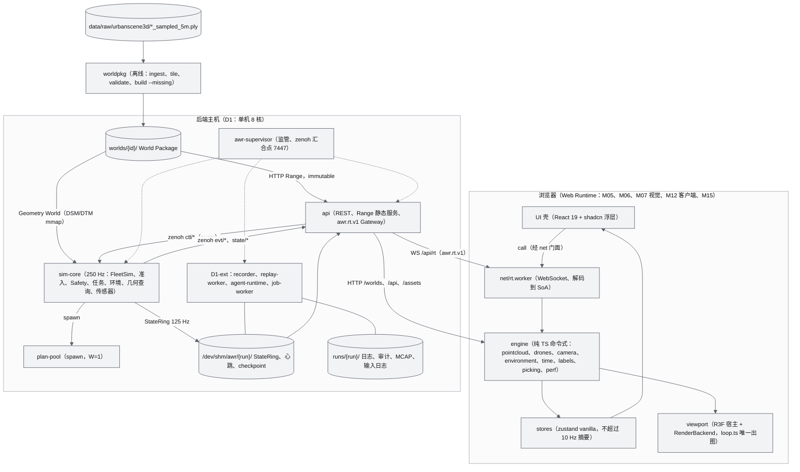

图中未画出两个横切包：`packages/contracts`（M00，契约唯一真源，生成 `python/awr/contracts` 与 `@awr/contracts`）与 `python/awr/runtime`（M11 在 MS1 交付的 StateRing、Bus、事件、心跳、child、supervisor、checkpoint 库）。

### 2.4 本文的架构决定（AD）

以下决定是在 AWR-03 未定义处的细化，不修改任何 ADR。17 号文档（线上契约定义方）与 M08、M11 已按其中多数决定落地；本表的"落地状态"指出与 17 的对应关系，尚未登记的由 M00/M11 在 MS1 登记，需要以 ADR 冻结的已列入 §21。

| 编号 | 决定 | 理由 | 影响的文档与落地状态 |
|---|---|---|---|
| AD-01 | **会话世界切换即 run 切换**：后端同一时刻只有一个运行世界（AWR-12 §4.1.4 的 Session）。D1-core 以启动参数 `make run WORLD=<id> SCENARIO=<id>` 选择运行世界；路由世界与运行世界不同时前端只做"静态浏览"（只加载点云，不订阅仿真通道）。会话世界切换（ext）由席位持有者调用 `session/start{world_id, scenario_id?}`（或 `POST /api/sessions`）触发，api 经 `sys/run` 请 supervisor 编排：停当前 run 的 `run_scoped` 进程、以新 run id 与新命名空间启动，全局 epoch + 1，客户端收到 `session.switched{run_id, world_id}`；WS 连接不断开，REST token 因绑定 run 而失效（`302 TOKEN_INVALID`），客户端以同一 principal 重新签发 | zenoh 命名空间、StateRing 路径、录制与 checkpoint 都按 `<world>/<run>` 绑定（AWR-03 §5.6、ADR-040）；在进程内热换世界会让 WorldQuery、EnvironmentService、风场与录制绑定出现跨世界混用；D1-AC-29 要求切换世界期间"非预期 WS 重连为 0"；会话语义与优先级以 AWR-12 §4.1.4 为准 | 12、14、17、M11、19；17 §9.3 已登记 `sys/run`，M11-AC-043 已按此验收 |
| AD-02 | **纪元分类以 StateRing 头部 `segment` 为准**：Gateway 每 tick 一致性读生产者环头部，`segment` 变化（剧本重置、无 checkpoint 重启）→ 全局 epoch + 1，先 TIME 后 SNAPSHOT，recorder 开新段；`segment` 不变而生产者 `epoch` 变化（checkpoint 恢复、V0.2 桥进程重启）→ 只对该生产者的 channel 置 `rflags.RESET`。可靠事件 `sim.started{epoch, segment, reason}` 与 `sim.restarted` 只作一致性校验与审计，与头部不一致时以头部为准并记 WARNING | AWR-03 §5.2 第 4 条规定了两种处置但 g05 原型头部无法区分；头部字段与环数据同源、无跨平面时序竞争，不需要"等待事件、超时猜测"（本文初稿"1 s 内无分类事件按剧本重置"的规则作废） | 17 §6.10、§9.2 已定义 `segment`；M11、M12 |
| AD-03 | **WS 事件按 tick 合批**：同一连接在一个 60 Hz tick 内的事件，1 条用 `event`，≥ 2 条合并为一条 `events`（每条 ≤ 256 项）；批量命令（`uav: "*"` 或列表）的逐机 `cmd.*` 不逐条下发，由 Gateway 汇总为 `fleet.batch.progress`（≤ 2 Hz），准入 reply 附逐机结果 `per_uav` | 1000 架全机 RTL 时逐条 JSON 会在 1 s 内塞满容量 1024 的控制 FIFO 并触发 1013 断开（ADR-014），与 D1-AC-27 冲突 | 17 §6.12 已定义 `events` 与 `fleet.batch.progress`；M11-FR-066 |
| AD-04 | **D1 几何探针落点**：`POST /api/world/{id}/query` 由 api 只做转发：点类操作（`height_dsm`、`ground_dtm`、`agl`、`clearance`、`segment_los`、`path_coarse_check` 等）走 `svc/geo/height`，`ray_hit` 走 `svc/geo/ray_hit`；D1 由 sim-core 组合根装配的 M04 `GeoProbeServer` 在慢任务中分片服务（柱体精确遍历，256 m 一片、每片 ≤ 0.5 ms，`max_range_m` ≤ 5000）；V0.2 起 geo-worker 只服务 `svc/geo/{raycast,los,lidar}` 精确光线类 | AWR-03 §4.2 禁止 `awr.api` 依赖 `awr.world.geometry`；D1 没有 geo-worker；WorldQuery 只在 sim-core 一处加载（P-03）；按操作拆 key 避免 V0.2 两个服务方同时回复（g05 §3.3 的教训） | M04-FR-025 已实现；17 §9.3 仍把 `height` 列在 geo-worker 名下，见 §21 第 4 条 |
| AD-05 | **机体增删与环境操作是命令**：`POST/DELETE /api/fleet/vehicles` 与 `env/set`、`env/preset` 由 api 转为 `ctl/sim-core/cmd` 上的命令（op 名 `fleet/add`、`fleet/remove`、`env/set`、`env/preset`，17 §9.4），走可信入口①–③、写输入日志；生命周期事件 `sim.vehicle.state` 可靠推送 | 与命令共享幂等、审计、确定性与崩溃恢复（ADR-016、ADR-049）；不另开控制通道 | 17、M08（L01–L08 生命周期）、M07 |
| AD-06 | **telemetry 相位语义**：主线程在 telemetry 相位取走"上一次 pull 已返回并就绪"的 SoA 缓冲（环形 3 槽），并归还已消费槽、发出下一次 pull；Worker 在收到归还时对其中最大 frame_seq 发 ack | Worker 与主线程之间只能异步传递消息，同帧内"pull 并使用"不可实现；归还即证明消费，ack 与渲染节奏耦合（r27 §3.9 L1） | M11-FR-090、091 已实现；M06、M12 |
| AD-07 | **静态服务拆分回退形态**：仅当 D1-AC-08 不达标时启用：`static` 进程监听 `AWR_STATIC_PORT`（默认 8001），`/worlds/*` 响应带 `Cross-Origin-Resource-Policy: cross-origin` 与按 Origin 白名单的 CORS，前端从 `GET /api/sys/config` 的 `worlds_base` 读取地址 | ADR-013 只规定"拆到独立 uvicorn 进程"；WS 网关必须单 worker，不能 SO_REUSEPORT 共端口；页面开启 COEP，跨端口资源必须带 CORP | M11-FR-084、19 §5（8001）已采用；`GET /api/sys/config` 待 17 登记 |
| AD-08 | **Python 包边界由 AST lint 强制**：M00 提供 `tools/lint/py-imports.py`，按 AWR-03 §4.2 与本文 §3.3 规则检查 `awr.*` 之间的 import 与禁用调用 | AWR-03 §4.2 给出了规则但只有 TS 侧（oxlint）指定了执行工具 | 18、M00 |
| AD-09 | **run 级总线会话**：run 切换时 supervisor 与 api（以及 job-worker 等 `run_scoped: false` 进程）以新命名空间重开 zenoh 会话（汇合点端口不变）；sim-core 等 run 级进程随新 run 重启；Gateway 的全局 epoch 在内存中延续并写入新 run 的 `gw.epoch` | 保持 AWR-03 §5.6 的命名空间规则不变；zenoh 会话开启 3–15 ms（g05 §7.4）；全局 epoch 不回退才能让未断开的客户端丢弃旧 run 的帧 | M11、19 |
| AD-10 | **逐机详情按兴趣集生产**：api 聚合各连接对 `uav/{id}/{state_ext,safety,env}`、`uav/{id}/sensor/*/pose` 的订阅机体并集（`detail` ≤ 64）与录制标记集（`marks` ≤ 16），以 `ctl/sim-core/interest`（pub/sub，变化后 250 ms 去抖 + 每 1 s 重发）下推；sim-core 只为 `detail ∪ marks` 发布 10 Hz 逐机详情：`state/sim-core/safety`（变化行 + 1 Hz 全量）、`state/sim-core/sensor`（SensorPose48）、`state/sim-core/detail`（EnvSample32）；`state/sim-core/ext` 按 17 §9.3 为全机 2 Hz，由慢任务按每片 ≤ 16 架分片编码 | 逐机 msgpack 编码约 20 µs/架（r27 §3.1.1，1000 架 19.5 ms）：全机 10 Hz 需约 0.2 核，超出 sim-core 预算；全机 2 Hz 的 state_ext 约 0.04 核，分片后每轮 ≤ 0.35 ms，可纳入慢任务，且录制（ADR-040 第③条）与 `GET /api/fleet/vehicles/{id}` 需要全机数据；StateRing 只承载 Full64/Lite32 热路径 | M11-FR-071、M09-FR-101、M07-FR-023 已采用；key 与 M13、M12 的差异见 §21 第 6 条 |

---
## 3. 逻辑视图

### 3.1 七层与两个横切包

层的一句话职责与 D1 分层见 AWR-03 §3.2，本节只补充每层对外暴露的**关键抽象**与**运行时落点**，这是后续进程视图与扩展点的依据。

| 层 | 对外关键抽象 | 运行时落点（D1） | 演进落点 | 模块 |
|---|---|---|---|---|
| Reality | LiDAR 帧 schema（Livox 语义）、真实会话时间基（`awr/world/georef/time.py`） | 只有契约与纯函数 | V0.5：机载与地面采集适配器 | M02、M13 |
| Reconstruction | `EngineAdapter`（v2）、Recon IR（`recon-ir@1`）、重建任务状态机 | job-worker（ext，MockEngine） | V0.5：GPU worker（LingBot-Map、DA3、MapAnything） | M01、M02 |
| World | World Package v1、`worldpkg` CLI、`WorldQuery`、帧换算库 | 离线 CLI（`make run` 前置）；sim-core 进程内库；plan-pool；前端 `engine/geo` | V0.2 geo-worker；V0.5 导出器；V0.8 Dynamic 层 | M02、M03、M04 |
| Environment | `EnvironmentService`、EnvKeyframe、`eval_env`/`derive` 纯函数、`presets.json` | sim-core 的 `env` stage；前端 `engine/environment` | V0.3 L2 风场库；V0.4 传感器退化 | M07 |
| Simulation | `SimClock`、`FleetSim` 与 stage 注册表、`CommandEngine` 与准入检查注册表、`LeaseManager`、Flight FSM、`MissionEngine`、`SensorModel`、`SimBackend`/`EntityAdapter`/`DroneAdapter` | sim-core 主进程；plan-pool | V0.2 px4-bridge-k；V0.4 SITL-EXT 独立 FleetSim 实例 | M08、M09、M10、M13 |
| Agent | agent-runtime、Mock ANet、合同网、受信守卫流水线 | agent-runtime 进程（ext） | V1.0 真 ANet daemon 与 hub | M14 |
| Runtime Services | `Source`、`ChannelRegistry`、`Scheduler`、`ClientSession`、REST 框架、recorder、replay-worker | api 进程；recorder、replay-worker（ext） | V1.0 Gateway 多 worker | M11、M12 |
| Web Runtime | `PointCloudEngine`、`RenderBackend`、`loop.register`、图层注册表、`RtClient`、领域 store、面板注册表 | 浏览器主线程 + rt.worker | V0.3 Tier A 存储缓冲；V0.8 3DGS | M05、M06、M07、M12、M15 |
| 横切：契约 | JSON Schema、`layouts.json`、`enums.json`、`commands.json`、`reasons.json`、`caps/*.json`、bus keys、生成器 | 构建期生成物（Python 与 TS） | 1.x 只增可选字段 | M00 |
| 横切：运行时库 | `StateRing`、`Bus`（`ZenohBus`、`LocalBus`）、`EventPublisher`/`EventSubscriber`、`Heartbeat`、`init_child`、`Supervisor`、`CheckpointStore` | 每个 Python 进程 | V0.5 `ZenohStateBus` | M11 |

### 3.2 模块划分与运行时落点

模块职责、D1 细目与路径所有权以 AWR-03 §6.1、§6.3、§4.3 为准。下表给出架构视角的"模块 → 进程 → 提供 → 消费"关系，用于评审跨模块接口是否完整。

| 模块 | 运行时落点（进程 / 线程） | 对外提供（接口、通道、REST） | 消费 |
|---|---|---|---|
| M00 | 构建与 CI；无运行时 | 生成物 `awr.contracts`、`@awr/contracts`；`fake_gw.py`、`FakeSource.ts`、`.awrrt` 夹具；lint | — |
| M01 | job-worker（ext）；V0.5 GPU worker | `EngineAdapter` Protocol；任务类型 `recon.*`（经 `awr/jobs/registry.py`）；`evt/job-worker/job` 进度 | M02 Sim3 与帧换算；M03 ingest |
| M02 | 进程内库（Python 与 TS 各一份） | `frames.py`/`frames.ts`、`time.py`（全仓库唯一帧与时间换算实现） | — |
| M03 | `worldpkg` CLI（`make run` 前置）；job-worker（ext） | World Package 文件；`/worlds/<id>/*` 静态资源；`rest/jobs.py` | M02 |
| M04 | sim-core 进程内库；plan-pool；`svc/geo/{height,ray_hit}`（AD-04）；`rest/world_query.py` 只做转发 | `WorldQuery`（height、AGL、净空、LOS、path_valid、path_coarse_check、heightmap_top、safe_transit_profile、ray_hit） | M03 的 Geometry World 文件 |
| M05 | 浏览器主线程 `engine/pointcloud` | `PointCloudEngine` 门面；图层 `viewport/layers/pointcloud.tsx`；`stores/{world,layers}.ts` | M06 `RenderBackend` 与 `loop.register`；M03 文件 |
| M06 | 浏览器主线程 `viewport`、`engine/{loop,drones,camera,mission,labels,picking,perf,anim}` | `RenderBackend`、`loop.register`、图层注册表、相机模式、`window.__perf`、`stores/perf.ts` | M02 `frames.ts`；M11 `RtClient`；M12 `SimClockView`；M13 `intrinsics.ts` |
| M07 | sim-core `env` stage 与 `EnvironmentService` 实现；浏览器 `engine/environment` | EnvKeyframe（`evt/sim-core/env`、`state/sim-core/env`、WS `env/state`）；EnvSample32（`state/sim-core/detail`）；`env/query`（`ctl/sim-core/query`，经 `register_query`）；`rest/env.py`；`stores/env.ts` | M03 地形；M04；M06 图层接口；M08 `EnvironmentService` 接口与 stage 注册表 |
| M08 | sim-core 主循环与组合根 | `SimClock`、`FleetSim`、stage 注册表、准入检查注册表、`CommandEngine`、`LeaseManager`、`estimate`、roster；`SimBackend`/`EntityAdapter`/`DroneAdapter`/`EnvironmentService` 接口；`rest/fleet.py` | M04；M11 `awr.runtime` |
| M09 | sim-core stage（guard 50 Hz、battery 10 Hz、fleet_guard 10 Hz）；准入检查（状态矩阵、围栏粗校验） | Flight FSM；SafetyEvent（`evt/sim-core/safety`，可靠）；兴趣集逐机行 `state/sim-core/safety`；`EnergyModel`、`SafetyHooks` 实现 | M04；M08 注册表 |
| M10 | sim-core `mission` stage；plan-pool 任务 | `MissionEngine`、生成器、`safe_transit`；剧本加载器；`rest/scenarios.py`；`stores/mission.ts` | M04；M08 |
| M11 | api 进程；`awr.runtime`（全部 Python 进程）；浏览器 `net/**` | `awr.rt.v1` 服务端与参考客户端 `RtClient`；REST 框架与自动发现；StaticFiles Range；`Source` 接口；supervisor；`stores/fleet.ts` | M00 契约 |
| M12 | recorder、replay-worker（ext）；浏览器 `engine/time` | `SimClockView`、插值环；`McapSource`（实现 `Source`）；`rest/runs.py`；`stores/timeline.ts` | M08 事件与状态；M11 `Source` 与 Bus |
| M13 | sim-core `sensors` stage；浏览器 `engine/sensors`（纯数学） | `SensorModel` 注册；SensorPose48（`state/sim-core/sensor` → WS `uav/{id}/sensor/{name}/pose`）；FPV 内参与视锥几何 | M04；M08 |
| M14 | agent-runtime 进程（ext） | 受信守卫（agent 命令的可信入口）；合同网；AGENTS 面板数据 `stores/agents.ts`；`rest/agents.py` | M08 `estimate` 与命令平面；M11 Bus；M13 检测器能力 |
| M15 | 浏览器主线程 `app`、`ui`、`styles`、`lib` | UI 壳、面板注册表、路由、设计体系组件、`stores/{selection,prefs}.ts` | 各领域 store；`engine/index.ts` 门面 |
| M16 | 测试与工具 | 剧本、flight60、阶梯、harness、混沌、soak | 全部 |

### 3.3 依赖关系与强制手段

**依赖图**（按层与落点重绘，箭头 A → B 表示"B 依赖 A 定义的接口或数据"；与 AWR-03 §6.2 的模块图一致，只是加上接口名）：

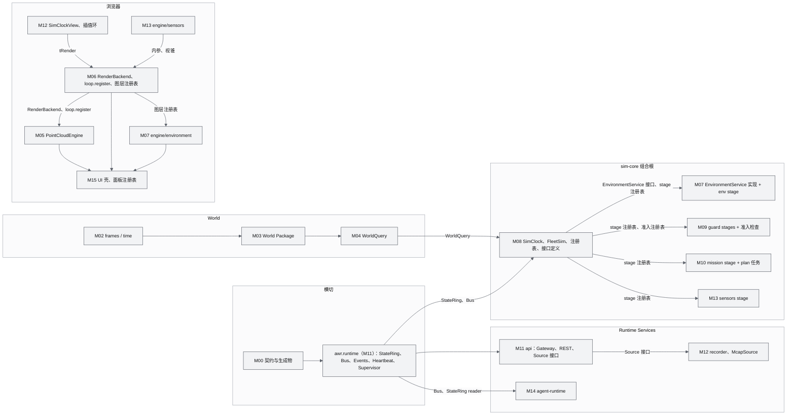

**规则**：

1. 依赖只允许自下而上、自横切包向外；接口由被依赖方定义，实现方通过注册表挂入（AWR-03 §6.2）。M08 不 import M07、M09、M10、M13 的实现；它们由 sim-core 的**组合根**按配置装配：`configs/runtime.yaml` 中 sim-core 的 `plugins:` 列表（默认 `awr.environment.stage`、`awr.sim.safety`、`awr.sim.mission`、`awr.sim.sensors`）在启动时经 `importlib` 导入，导入时执行 M08 注册表函数（`register_stage`、`register_state_block`、`register_admission_check`、`register_slow_task`、`register_query`、`register_energy_model`、`register_safety_hooks`，签名见 M08 §7.1.1）。M04 的 `WorldQuery` 与 `GeoProbeServer` 由组合根直接实例化（M08 依赖 M04，属正向依赖）。静态 import 图因此保持无环。
2. **Python 边界**（AWR-03 §4.2 的展开，由 AD-08 的 `tools/lint/py-imports.py` 执行）：

   | 包 | 允许依赖 | 禁止依赖 |
   |---|---|---|
   | `awr.contracts` | 无 | 任何 `awr.*` |
   | `awr.runtime` | `awr.contracts`、numpy、msgpack、zenoh（只在 `bus.py`） | 其他 `awr.*` |
   | `awr.api`（含 `rest/*`） | `awr.runtime`、`awr.contracts`、`awr.world.package`（只读清单）、白名单纯函数模块（执行 < 1 ms，登记在 `tools/lint/py-imports.toml`） | `awr.sim`、`awr.world.geometry`、`awr.environment`（白名单外）、`awr.recorder`、`awr.agent` |
   | `awr.sim.*` | `awr.runtime`、`awr.contracts`、`awr.world.{geometry,georef,package}`、`awr.environment`、`awr.swarm` | `awr.api`、`awr.recorder`、`awr.agent` |
   | `awr.sim.{runtime,fleet,core,backends}`（M08） | 同上 | `awr.sim.{safety,mission,planning,sensors}`、`awr.environment.{field,stage}`（均经组合根装配） |
   | `awr.environment.{conventions,weather,wind,atmosphere,io}`、`awr.swarm`、`awr.world.*` | `awr.contracts`、numpy、scipy | `awr.sim`、`awr.api` |
   | `awr.environment.{field,stage}`（M07 的 EnvironmentService 实现与 stage） | 上一行 + M08 的接口与注册表模块（`awr.sim.backends.base`、`awr.sim.fleet.stages.registry`） | `awr.sim` 的其他模块、`awr.api` |
   | `awr.agent` | `awr.runtime`、`awr.contracts`、`awr.swarm` | `awr.sim`（只经 Bus 与 StateRing reader 交互） |
   | `awr.recorder` | `awr.runtime`、`awr.contracts` | 其他 |
   | `awr.reconstruction`、`awr.jobs` | `awr.runtime`、`awr.contracts`、`awr.world.{georef,ingest,pointcloud,package}` | `awr.sim`、`awr.api` |

3. **TypeScript 边界**（oxlint `no-restricted-imports`，AWR-03 §4.2）：`engine/**`、`net/**` 不依赖 React、`ui/**`、`viewport/**`、`stores/**`；`stores/**` 可以依赖 `engine/index.ts` 门面（用于注册摘要任务），反之禁止；`ui/**` 只经门面访问引擎；`@base-ui/react` 只在 `ui/components/ui/**`；全仓库禁止 `lucide-react`。
4. 依赖图无环由 CI 断言（Python 由 py-imports 生成模块级图并做拓扑排序；TS 由 oxlint 的 `import/no-cycle`）。
5. 第三方运行时依赖按进程的允许与禁止清单见 [AWR-11 §3.4](11-技术选型说明书.md)，与本节规则共同构成引入边界。

### 3.4 核心抽象与接口骨架

P-07 冻结的 8 个接口（SimBackend、EntityAdapter、DroneAdapter、EngineAdapter、EnvironmentService、WorldQuery、Bus、Source）与前端的 RenderBackend、`loop.register` 构成系统的"缝"。下面是**架构级骨架**：方法名、职责与不变量在 V0.1 冻结；参数与返回类型的字段级定义以对应模块 PRD 和 [17](17-接口与实时协议规范.md) 为准。

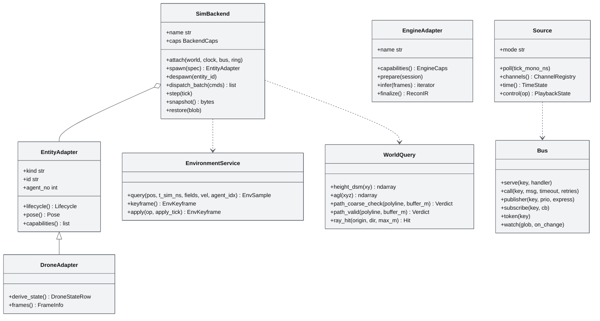

**Python 骨架**（`awr/sim/backends/base.py` 等；类型名以 M08、M07、M04、M01、M11 PRD 为准）：

```python
class SimBackend(Protocol):                       # M08 定义；Mock、Replay 为 D1 实现；px4_sih、prometheus 为桩
    name: str                                     # "mock" | "replay" | "px4_sih" | "prometheus"
    caps: BackendCaps                             # 取自 packages/contracts/rt/caps/<name>.json，含 caps.clock（ADR-045）
    def attach(self, world: WorldHandle, clock: SimClock, bus: Bus, ring: StateRing | None) -> None
    def spawn(self, spec: EntitySpec) -> EntityAdapter            # 生命周期命令 fleet/add 的落点（AD-05）
    def despawn(self, entity_id: str) -> None
    def dispatch_batch(self, cmds: Sequence[AdmittedCommand]) -> list[DispatchResult]   # 准入④–⑧之后调用，向量化
    def step(self, tick: int) -> None             # lockstep 与进程内后端推进一步；slaved_realtime/live 后端为空操作
    def snapshot(self) -> bytes; def restore(self, blob: bytes) -> None               # checkpoint（ext）

class EntityAdapter(Protocol):                    # ADR-047：通用实体；Mock 的实现是 SoA 行视图，不持有逐机对象状态
    kind: Literal["uav", "ugv", "robot", "vehicle", "sensor", "human"]
    id: str; agent_no: int
    def lifecycle(self) -> Lifecycle
    def pose(self) -> Pose                        # World ENU、FLU、[x,y,z,w]（AWR-03 §5.1、§5.3）
    def capabilities(self) -> list[str]           # 裸能力 id，例如 "thermal.imaging"

class DroneAdapter(EntityAdapter, Protocol):
    def derive_state(self) -> DroneStateRow       # 七轴状态到 Full64 字段；外部后端调用 derive_px4 / derive_prometheus
    def frames(self) -> FrameInfo                 # uavNN/local 与 T_world_local（外部飞控才有）

class EnvironmentService(Protocol):               # M08 定义，M07 实现；字段级签名见 M08 §7.1.5、M07 §7.1
    def query(self, pos: np.ndarray, t_sim_ns: int, *, fields: int, vel: np.ndarray | None = None,
              agent_idx: np.ndarray | None = None, out: EnvSampleSoA | None = None) -> EnvSampleSoA
                                                  # 向量化；D1（L1 + 湍流盒）N = 1000 单次 p99 ≤ 1.6 ms（M07-NFR-001）；V0.3 的 L2 扇区 + 湍流盒约 2.2 ms（g06 §6.2）
    def keyframe(self) -> EnvKeyframe             # 自包含完整关键帧（ADR-025）
    def apply(self, op: EnvOp, apply_tick: int) -> ApplyResult    # env/set、env/preset 经 CommandEngine 锁存；记入输入日志
    def checkpoint(self) -> bytes; def restore(self, blob: bytes) -> None   # ext

class Source(Protocol):                           # M11 定义；LiveSource（M11）与 McapSource（M12）实现
    mode: Literal["live", "replay"]
    def poll(self, tick_mono_ns: int) -> None     # 60 Hz tick 调用，每生产者 ≤ 0.1 ms（g05 §5）
    def channels(self) -> ChannelRegistry
    def time(self) -> TimeState                   # t_sim_ns、rate、state（AWR-03 §5.2 第 6 条）、全局 epoch
    async def control(self, op: PlaybackOp) -> PlaybackState      # 只有 replay 支持 seek
```

**TypeScript 骨架**（`viewport/renderer.ts`、`engine/loop.ts`；字段级定义以 M06 §6.2.1 为准，本文只列架构约束涉及的成员）：

```ts
export interface RenderBackend {                       // ADR-007、ADR-044；g01 §6.1 的修订版
  readonly tier: 'A' | 'B' | 'S'
  readonly deviceClass: 'dGPU' | 'iGPU' | 'software'
  readonly kind: 'webgl2' | 'webgpu'
  readonly renderer: WebGLRenderer | WebGPURenderer
  readonly pointSizeMode: 'glpoint' | 'quad' | 'pixel' // pixel 只在点径自检失败时出现（g01 §6.3）
  readonly caps: BackendCaps                           // reversedZ、timerQuery、parallelCompile、compute、mrt（恒 false）、readbackTopDown …
  createRT(name: RTName, o?: { depthTexture?: boolean; halfFloat?: boolean; scaleOfCanvas?: number }): RenderTarget
  readPixels(rt: RenderTarget, x: number, y: number, w: number, h: number, out: Uint8Array): Promise<Uint8Array> // 一律异步，行序统一为自下而上
  warmup(zoo: WarmupSet): Promise<WarmupReport>        // shader zoo：默认帧缓冲 + 每个真实 RT
  plan(ctx: FrameCtx, out: PassPlan): void             // 本帧 pass 序列与预期 draw 数，写入预分配结构（零分配）
  renderFrame(ctx: FrameCtx, plan: PassPlan): void     // 全应用唯一调用 renderer.render 的地方
  programsCount(): number                              // D1-AC-25 断言
  onLost(cb: (reason: string) => void): () => void
  dispose(): Promise<void>
}
export type Phase = 'telemetry' | 'clock' | 'drones' | 'camera' | 'world' | 'render' | 'overlay' | 'governor'
export function register(phase: Phase, id: string, fn: (ctx: FrameCtx) => void,
                         opts?: { order?: number; fps?: number; tiers?: readonly Tier[]; layer?: LayerId }): () => void
                                                       // 返回注销函数；fn 内禁止分配；layer 用于 __perf.layers 计量（M06-FR-017）
```

### 3.5 状态权威的进程落点

"谁计算"见 AWR-03 §5.9；本表补充"在哪个进程、经哪个平面到达消费者"。

| 状态 | 计算者（进程） | 到达 api 的平面 | 到达浏览器的形态 | 浏览器侧只读副本 |
|---|---|---|---|---|
| 仿真时钟 t、rate、state、生产者纪元 | `SimClock`（sim-core） | StateRing 头部（每次迭代） | TIME（10 Hz 与变化时） | `SimClockView`（M12） |
| 全局 epoch | Gateway（api） | — | TIME、BATCH 帧头 | 同上 |
| 机体七轴状态 | FleetSim、Safety FSM、LeaseManager、MissionEngine、CommandEngine（sim-core） | StateRing（Full64/Lite32）；`state/sim-core/ext`（2 Hz）；`evt/sim-core/*` | BATCH 记录；`state_ext`；`event` | 插值环；`stores/fleet.ts` 摘要 |
| 调用与效果 | CommandEngine（sim-core） | query reply + `evt/sim-core/cmd` | `result`、`progress` | `RtClient` 调用表 |
| 环境 | EnvironmentService（sim-core） | `evt/sim-core/env`（可靠）+ `state/sim-core/env`（1 Hz 心跳） | `env/state`（自包含 latest） | `EnvStore`（M07） |
| 事件序号 | 各生产者 `EventPublisher`；Gateway 全局 seq | zenoh（seq + `_replay`） | `event`（全局 seq） | 事件列表（上限 5000） |
| 进程健康 | supervisor | `sys/procs`、`evt/supervisor/proc` | `status` op、TIME.state 6/7/8 | 顶栏与"进程"面板 |
| World 内容版本 | `worldpkg`（离线） | 文件 | `world.json` | `OpenedWorld` |
| 渲染时刻 tRender | `SimClockView`（浏览器） | — | — | 只用于画面（ADR-046） |

---

## 4. 进程视图

### 4.1 进程、线程与故障域

进程清单、入口命令、CPU 预算与钉核见 AWR-03 §3.3 与 ADR-017。本表补充**线程模型**与**端点**，这是并发正确性的依据。

| 进程 | 线程 | 持有的权威状态 | 服务的端点 | 心跳来源（supervisor 判挂死） | 故障域 |
|---|---|---|---|---|---|
| awr-supervisor | asyncio 单线程；zenoh 运行时线程 | 进程表、重启计数、run id | zenoh 汇合点 `tcp/127.0.0.1:7447`；`sys/{procs,restart}`（core）、`sys/{run,start,stop}`（ext） | 由容器或用户监管 | 全部子进程收到 PDEATHSIG 退出 |
| api | asyncio 主线程（uvloop）；zenoh 回调线程（只做 `call_soon_threadsafe`）；anyio 线程池 ≤ 4（只做静态文件 I/O） | WS 会话、订阅、在途调用表、全局 EventRing、全局 epoch、最新 EnvKeyframe 缓存 | `:8000` HTTP（REST、`/worlds`、`/assets`、SPA）与 WS `/api/rt` | `hb.api`（10 Hz asyncio task 写入，阈值 5 s） | 客户端断线重连；仿真不受影响 |
| sim-core | 主线程：同步固定步长循环；zenoh 回调线程（只入队）；后台线程：checkpoint 序列化与落盘、日志 `QueueHandler` 写出 | 七轴状态、SimClock、环境、租约、cid 幂等表、事件环、输入日志 | queryable：`ctl/sim-core/{cmd,clock,lease,roster,estimate,query}`、`svc/geo/{height,ray_hit}`（AD-04）、`evt/sim-core/_replay`；订阅：`ctl/sim-core/{setpoint,gcs,interest}` | StateRing 头部 `heartbeat_ns`（主循环每次迭代写，阈值 2 s） | D1-core 剧本重开；D1-ext checkpoint 恢复 |
| plan-pool | 每 worker 一个进程（spawn），`OMP_NUM_THREADS=1` | 无（只读 DSM/ESDF mmap） | 由 sim-core 通过 `ProcessPoolExecutor` 调用 | sim-core 感知 `BrokenProcessPool`（约 7 ms，g05 §6） | 重建进程池，重试 1 次后降级 |
| recorder（ext） | 主线程 drain 循环；zstd 压缩线程（释放 GIL） | MCAP 写入器、段号 | `ctl/recorder/{start,stop}`；订阅 `ctl/sim-core/interest` 的 `marks` | `hb.recorder`（阈值 5 s） | 录制缺口 `recorder.gap` |
| replay-worker（ext，`on_demand`） | 主线程（解压、解析、写环） | 回放游标 | 写 `state.replay` 环；`evt/replay/*`；`ctl/replay-worker/{open,seek,play,pause,speed,close}` | `hb.replay-worker`（阈值 5 s，启动宽限 15 s，19 §6.2） | 回放中断，可重新 seek |
| agent-runtime（ext） | asyncio 主线程；zenoh 回调线程 | agent 任务、黑板、证据链 | `ctl/agent-runtime/*`；`evt/agent-runtime/*` | `hb.agent-runtime`（阈值 5 s） | 进行中的协作任务 `interrupted` |
| job-worker（ext） | 同步单任务 | SQLite 任务队列 | `svc/job/{submit,cancel,status}` | `hb.job-worker`（阈值 120 s，g05 §6） | 任务 `failed(resumable)` |
| 浏览器 | 主线程（React、引擎、R3F、loop）；rt.worker（WebSocket、解码）；Chromium GPU 进程（SwiftShader 光栅） | 无权威状态 | — | — | WS 重连、整页重建渲染器 |

### 4.2 sim-core 主循环与每 tick 预算

sim-core 是同步固定步长循环（不使用 asyncio），结构沿用 g05 §4，频率与 stage 表以 ADR-021 与 g08 §3.2 为准：

```python
# awr/sim/runtime/main.py（骨架；M08 所有）
def run(cfg):
    ctx = init_child("sim-core")                                   # PDEATHSIG、父进程检查、BLAS=1 断言、faulthandler、JSON 日志
    compose_plugins(cfg.plugins)                                   # 组合根：importlib 导入 stage 与准入检查实现（§3.3 规则 1）
    ring, reused = StateRing.open_or_create(ctx.run_dir / "state.sim-core", capacity=1024, slots=cfg.ring_slots,
                                            layout_id=LAYOUT_ID, id_base=ctx.id_base, id_count=ctx.id_count)   # 17 §9.2
    snap = ckpt.load_latest(skip_poisoned=True) if cfg.restore else None   # D1-ext；D1-core 恒为 None
    hdr = ring.header()                                            # 一致性读（17 §9.2）；新建文件时 epoch = 1、segment = 0
    epoch = hdr.epoch + 1; ring.set_epoch(epoch)
    segment = snap.segment if snap else hdr.segment + 1; ring.set_segment(segment)   # AD-02：checkpoint 恢复不换段
    fleet, clock, env, world = build(cfg.world, cfg.scenario, snap)        # WorldQuery mmap DSM/DTM；EnvironmentService；numba 预热
    events.emit("sim.restarted" if snap else "sim.started", epoch=epoch, segment=segment,
                reason=cfg.start_reason)                            # 只作一致性校验与审计（AD-02）
    gc.collect(); gc.freeze()                                       # ADR-021 第 3 条：之后关闭自动 gen2，只在慢任务中手动回收（M08-NFR-011）
    bus.token("proc/sim-core/ready")
    while not ctx.stopping:
        t0 = mono_us()
        ring.heartbeat(clock.t, clock.state, clock.rate_milli)       # 主循环写心跳（不得由后台线程代写）
        drain(inbox, limit=512)                                     # ① 步边界锁存：cmd、clock、lease、roster、estimate、query、geo 探针、plan 结果
        for _ in range(clock.steps_due(max_catchup=5)):             # ② 固定 4 ms 步；落后时最多追 5 步，不跳步
            fleet.step()                                            #    stage 按 every/phase 调度（g08 §3.2）
            if fleet.l1_updated and publish_gate.due(clock):        #    L1 后发布；快进时按墙钟节流到 ≤ 250 Hz
                ring.publish(fleet.full, fleet.lite, clock.t, roster.version)
        events.flush()                                              # ③ 每 topic 每迭代最多一次 put，DROP
        slow.run(budget_us=max(100, min(1000, 2800 - (mono_us() - t0))))   # ④ 自适应慢任务预算（M08-FR-004）
        ring.set_step_stats(p99_us, budget_us, rtf_milli)
        if clock.playing: sleep_until(clock.next_deadline())
        else: wait_inbox(timeout_s=0.0 if slow.pending else 0.05)   # 暂停：20 Hz 空转写心跳，有请求或未完成分片即继续（本文设定）
```

**慢任务轮转内容**（每迭代预算 `min(1000 µs, 2800 µs − 本迭代已用)`，下限 100 µs；未完成的任务按轮转指针顺延，M08-FR-004）：checkpoint 的 numpy 拷贝（ext，1 s 仿真时间一次）；`state/sim-core/ext` 全机 2 Hz，msgpack 编码按每片 ≤ 16 架（约 0.32 ms）跨迭代完成；兴趣集 `detail ∪ marks`（≤ 80 架）的 10 Hz 逐机详情：`state/sim-core/safety`（M09 拷贝字段后编码）、`state/sim-core/sensor`（SensorPose48，raw 结构体）、`state/sim-core/detail`（EnvSample32，raw 结构体）（AD-10）；租约 TTL 过期（ext）；`state/sim-core/env` 1 Hz 心跳；几何探针 `svc/geo/{height,ray_hit}` 的分片执行（`ray_hit` 的 `max_range_m` ≤ 5000，柱体精确遍历每 256 m 一片、每片 ≤ 0.5 ms，六城实测单次 p50 0.55–0.63 ms、p99 ≤ 1.65 ms，M04 §6.4.3 与实测表；队列上限 64，满时回复 213）；`env/query`（≤ 256 点，经 `register_query`）；`estimate` 请求（≤ 20 次/s，ADR-036）；roster 快照更新；gc gen2 手动回收。

**暂停时的唤醒**：g05 §4 的原型在暂停时固定睡 50 ms，使暂停期间命令准入与几何探针的往返最坏多出 50 ms（M04-NFR-002 因此把 PAUSED 下 `ray_hit` 放宽到 p95 ≤ 80 ms）。产品版改为在 inbox 上带 50 ms 超时的阻塞等待：无请求时行为与 20 Hz 空转相同（心跳照写），有请求时立即进入下一轮迭代执行 drain 与慢任务；慢任务仍有未完成的分片时不等待，但每轮仍受上述自适应预算约束，因此暂停期间 sim-core 的 CPU 只随请求量增长。

**每 tick 预算**（N = 1000、RTF = 1，由 g08 §11.2 的核占比折算为单 tick 毫秒，tick = 4 ms）：

| stage | 频率 | 相位 | 单次耗时（ms） | 依据 |
|---|---|---|---|---|
| L1 核（refgen、pos_ctrl、att、motor、aero、integrate） | 125 Hz | 偶数 tick | 0.48 | g08 §11.2：0.06 核 |
| env（均值风 + 湍流盒） | 50 Hz | phase 0 | 1.6 | g08 §11.2：0.08 核 |
| guard（FastGuard） | 50 Hz | phase 1 | 1.0 | g08 §11.2：0.05 核 |
| contact | 125 Hz | 偶数 tick | 0.08 | g08 §11.2：0.01 核 |
| sensors、battery、fleet_guard | 50 / 10 / 10 Hz | phase 2 / 3 / 4 | 合计 ≤ 1.0 | g08 §11.2：0.03 核（估算） |
| tap（ENU 转换 + publish） | 125 Hz | 偶数 tick | 0.16 | g08 §11.2：0.02 核；g05 §3.2 publish p50 77 µs |
| 最坏 pipeline tick（L1 + env + contact + tap 同 tick，每 10 个 tick 出现一次） | — | — | 约 2.3 | 由上列相加 |
| inbox drain + events.flush | 每迭代 | — | ≤ 0.3 | g05 §3.3（单条事件 put 2.7 µs）；本文设定 |
| 慢任务 | 每迭代 | — | `min(1.0, 2.8 − 已用)`，下限 0.1 | M08-FR-004 |
| 单步（drain 开始到慢任务结束，D1-AC-07 与 M08-NFR-002 的口径） | — | — | 最坏 tick 约 2.3 + 0.3 + 0.1 ≈ 2.7；其余 tick ≤ 2.8 | 满足 D1-AC-07 单步 p99 ≤ 3 ms |

phase 错峰保证 env 与 guard 不落在同一 tick（g08 §3.2），这是"单步 p99 ≤ 3 ms、最大 ≤ 12 ms"可达的前提：固定 1 ms 的慢任务预算叠加到最坏 tick 上会达到约 3.6 ms，因此慢任务预算必须按本迭代已用时间自适应。env 与 L1 同 tick 时余量只有约 0.3 ms，若 MS4 实测 env 单次超过 1.6 ms，由 M07 按 M08 注册表的分片 stage（`shards = 2`，phase 0 与 2）拆开（M08 §14 F-03）。M08、M09 PRD 必须给出逐 stage 的实测预算表（ADR-021 第 4 条）。

### 4.3 api 事件循环与 tick 预算

api 是单线程 asyncio，客户端扩展性瓶颈在这一个核上（g05 §1 C1）。60 Hz tick（16.7 ms）的工作顺序：

1. `Source.poll()`：对每个生产者 `read_latest`（96 KB 拷贝，约 33 µs，g05 §3.2），更新 `swarm/state`（各生产者 Lite32 按 id 顺序拼接）与 `uav/{id}/state`（有订阅才切片，懒生产）；检查生产者健康与纪元（§4.8）。
2. 事件：zenoh 回调线程收到的 `evt/**` 已经 `call_soon_threadsafe` 进入主循环，按 (producer, epoch) 检查 seq 缺口，缺口经 `_replay` 补拉，然后并入全局 EventRing。
3. `Scheduler.on_tick(k)`：逐会话按 rate class 与对齐网格挑选到期记录，按 `(channel, seq)` 编码一次、所有会话共享；credit 窗口不足则跳过（记 `credit_skips`）；本 tick 的事件按连接过滤后，1 条用 `event`，≥ 2 条合并为 `events`（每条 ≤ 256 项），批量命令只下发汇总的 `fleet.batch.progress`（AD-03）。
4. 每会话 sender task：先排空控制 FIFO（容量 1024，满即 1013），再发数据单槽 mailbox。
5. 每 60 个 tick：检查各环的 `identity()`（inode、writer pid、纪元、段号），inode 或 pid 变化即重新 attach；纪元与段号的比较每 tick 在第 1 步完成（§4.8）。

规则：事件循环内禁止任何 > 1 ms 的同步调用（Open3D、small_gicp、scipy.optimize、> 10 万元素的 numpy 运算、MCAP 解压），也禁止用 `asyncio.to_thread` 包装它们（g05 §5、AWR-03 §4.2）；默认 executor 限 4 线程只做文件 I/O；心跳由 10 Hz task 写 `hb.api`，事件循环被卡住时心跳停写；`faulthandler.dump_traceback_later(2.5)` 每 0.5 s 重新布置，挂死时留下全部线程栈。

### 4.4 IPC 三平面

平面划分与禁用项见 ADR-018；线上 key、消息 schema 与 StateRing 字节布局以 [17](17-接口与实时协议规范.md) 为准。本节给出架构语义与参数。

**（1）状态平面：StateRing**

| 项 | 取值 | 依据 |
|---|---|---|
| 文件 | `/dev/shm/awr/<run>/state.<producer>`；D1 生产者：`sim-core`，ext 加 `replay` | g05 §3.2 |
| 结构 | 头部（256 B）+ 读者游标 8 个 × 32 B + K 个槽；每槽 64 B 槽头 + Full64[cap] + Lite32[cap] | g05 §3.2（读者游标由原型的 4 个扩到 8 个） |
| K / cap | K = 32（可配置，下限 16）；cap = 1024 | ADR-018 |
| 文件大小 | 每槽 98,368 B，K = 32 时约 3.0 MiB | 由布局计算 |
| 历史覆盖 | 125 Hz 发布时 256 ms；快进节流到 250 Hz 时 128 ms | ADR-018 |
| 协议 | seqlock：写者先写奇数锁字，再写负载与槽头，最后写偶数锁字与 head；读者前后两次读锁字相等才接受 | g05 §3.2（x86-64 TSO 正确；ARM 需 fence 或 ZenohStateBus） |
| 读者模式 | LOSSY（api、agent-runtime、recorder 实时模式、诊断工具）；LOSSLESS 只允许批处理或超实时评测模式下的 recorder，写者等待 ≤ 250 ms 后把卡住的读者降级为 LOSSY | g05 §3.2 |
| 读者游标分配 | api 1 个、recorder 1 个、agent-runtime 1 个、诊断与基准 1 个，余 4 个备用；supervisor 只读头部、不占游标 | 本文设定：按 D1 进程集合分配，留足 V0.2 px4-bridge 调试余量 |
| 身份与校验 | `layout_id = hash(layouts.json)`，不一致拒绝 attach（`312 LAYOUT_MISMATCH`）；`identity() = (st_ino, writer_pid, epoch, segment)` 每 1 s 检查 | AWR-03 §5.11 第 4 条；17 §9.2 |
| 头部自报 | `epoch`、`segment`（AD-02）、`heartbeat_ns`、`t_sim_ns`、`rate_milli`、`clock_state`（TimeState 统一枚举 0–9，bit7 为 REPLAY，取代 g05 原型的 4 值枚举）、`roster_version`、`step_seq`、`step_budget_us`、`step_p99_us`、`rtf_milli`、`id_base`、`id_count`；Gateway 以"`heartbeat_ns` 前后两读相等"做头部一致性读 | g05 §3.2；17 §9.2 |

**（2）控制与事件平面：zenoh**（key 的定义方为 17 §9.3；下表标"新增"的由 M11 引入、待 17 登记，见 §21 第 6 条）

| key 类 | 模式 | 语义 | QoS 与可靠性 | D1 |
|---|---|---|---|---|
| `ctl/sim-core/{cmd,clock,lease,roster,estimate,query}`；V0.2 起 `ctl/{producer}/cmd` | query/reply | 请求应答，at-most-once 执行；`query` 为 `env/query` 等经 `register_query` 登记的只读查询 | 调用方 `INTERACTIVE_HIGH`（roster、estimate、query 为 `INTERACTIVE_LOW`）、DROP、express、超时 1 s、同 cid 重试 2 次；生产者以 cid 幂等表去重（60 s、4096 条） | core |
| `ctl/sim-core/setpoint` | pub/sub | 遥操作最新值（raw 32 B） | `REAL_TIME`、DROP、express；250 ms watchdog（墙钟，ADR-026） | core（Velocity） |
| `ctl/sim-core/gcs`（新增） | pub/sub | 席位持有者链路心跳，供 ADR-026 的 GCS 链路判据 | 5 Hz【墙钟】；sim-core 1 s 收不到即视为链路年龄持续增长（M11-FR-024） | core |
| `ctl/sim-core/interest`（新增） | pub/sub | 兴趣集全量消息（AD-10） | 变化后 250 ms 去抖 + 每 1 s 重发（自愈）；recorder 只读 `marks` | core |
| `evt/{producer}/{cmd,safety,mission,sim,env,lease,proc,rec,job,agent}`；V0.2 桥进程另有 `health` | pub/sub | 有序、可恢复 | DROP（最多等 1 ms）；每 (producer, epoch) 独立 seq；环 4096；缺口经 `evt/{producer}/_replay` 补拉；每 topic 每迭代最多一次 put（按步合批） | core |
| `state/{producer}/{ext,safety,sensor,mission,env}`；`state/sim-core/{detail,perf}`（新增） | pub/sub | 最新值 | `DATA_LOW`、DROP；`ext` 全机 2 Hz；`safety`、`sensor`、`detail` 10 Hz，只含兴趣集 ∪ 标记集（AD-10）；`mission` 2 Hz；`env` 为自包含 1 Hz 心跳（ADR-025）；`perf` 1 Hz 逐 stage 统计 | core |
| `svc/geo/{height,ray_hit}` | query/reply | 几何探针 | D1 由 sim-core 的 `GeoProbeServer` 服务（AD-04） | core |
| `svc/geo/{raycast,los,lidar}` | query/reply | 精确光线类 | geo-worker；lidar 为 `BACKGROUND`，与 sim-core 之间开 SHM（池 8 MiB） | 桩（V0.2） |
| `svc/job/{submit,cancel,status}` | query/reply | 任务队列 | `INTERACTIVE_LOW` | ext |
| `ctl/replay-worker/{open,seek,play,pause,speed,close}`、`ctl/recorder/{start,stop}`（新增）、`ctl/agent-runtime/{task,cancel}` | query/reply | 回放、录制与协作任务控制 | `INTERACTIVE_HIGH`（回放）或 `INTERACTIVE_LOW` | ext |
| `sys/{procs,restart}`；`sys/run`；`sys/{start,stop}`（新增） | query/reply | 监管；会话世界切换（AD-01）；`on_demand` 进程启停 | 只接受 api 的调用；角色在 api 校验（`restart` 为 admin，`run` 为席位持有者）；`run` 超时 10 s、不重试、supervisor 以 cid 去重 | core（`run`、`start`、`stop` 为 ext） |
| `proc/{name}/{alive,ready}` | liveliness | 在线与就绪 | 本机 kill 后 6–8 ms 可见（r27 §3.1.4）；**不能**用于判挂死（g05 §0 第 6 条） | core |

会话配置：peer 模式，只监听回环，关闭多播 scouting、开启 gossip，关闭 SHM，`lease: 3000`（g05 §3.6）。zenoh 只允许在 `awr/runtime/bus.py` 中 import；所有回调函数体只允许入队、`call_soon_threadsafe` 或字典赋值（g05 §10 R4）。

**（3）大块数据平面**：World Package、MCAP、checkpoint 镜像、风场库（V0.3）一律走文件或 HTTP；WS 与总线只传 URL 与版本号（r27 §0 第 12 条）。禁止 `multiprocessing.shared_memory`、`multiprocessing.Queue`、UDS 流、Redis、ZeroMQ（ADR-018）。

**（4）本文 AD 引入、尚待 17 登记的内部接口**（msgpack，全部带 `v: 1`，字段 snake_case；登记后以 17 为准）：

| 接口 | 方向 | 字段（类型，单位，默认或范围） | 依据 |
|---|---|---|---|
| `ctl/sim-core/interest` | api → sim-core、recorder | `seq`（u64，单调递增）；`detail`（u16[] agent_no，≤ 64，超出按最近订阅优先截断并发 `status{id: "interest.truncated"}`）；`marks`（u16[]，≤ 16，剧本 `marked` 优先）；`topics`（str[]，本次生效的详情类别，取自 `state_ext`、`safety`、`sensor`、`env`） | AD-10；M11-FR-071 |
| `ctl/sim-core/gcs` | api → sim-core | `seq`（u64）；`principal_id`（str 或 null，席位空闲时为 null）；`seat_state`（enum：FREE、HELD、GRACE）；`ping_age_ms`（u32，ms，席位持有者全部连接中最新 ping 的年龄） | ADR-026；M11-FR-024 |
| `sys/run` | api → supervisor | 请求：`cid`（str，UUIDv7）、`world_id`（str，`^[a-z0-9-]{1,63}$`）、`scenario_id`（str 或 null，缺省取该世界 `default_scenario_id`）、`principal`（17 §9.4）；回复：`status`（ok、rejected、duplicate）、`code`（0、123 WORLD_NOT_READY、213）、`run_id`（str）、`world_id`、`scenario_id`、`segment`（u32，新 run 为 1）；调用超时 10 s【墙钟】，不重试 | AD-01、AD-09 |
| `sys/start`、`sys/stop` | api → supervisor | 请求：`cid`、`name`（str，只允许 `runtime.yaml` 中 `on_demand: true` 的进程）、`args`（object，replay-worker 为 `{run, segment}`）；回复：`status`、`code`、`pid`（int 或 null）；`start` 在 `proc/<name>/ready` 出现或启动宽限到期后回复 | M11-FR-079；19 §6.2 |
| `GET /api/sys/config` | 浏览器 → api | `worlds_base`（str，默认 `/worlds`，拆分回退时为 `http://<host>:8001/worlds`）、`static_split`（bool，默认 false）、`access_mode`（enum：loopback、lan）、`tick_hz`（int，60）、`rate_classes`（int[]，`[1,2,5,10,15,20,30,60]`）；无需 token，`Cache-Control: no-store` | AD-07；M11 §7.2 |

### 4.5 时间与时钟的流动

```mermaid
%%{init: {"theme": "base", "themeVariables": {"fontFamily": "Inter, PingFang SC, Microsoft YaHei, Noto Sans CJK SC, sans-serif", "fontSize": "13px", "background": "#FBFBFC", "primaryColor": "#F2F3F5", "primaryTextColor": "#111214", "primaryBorderColor": "#5C616A", "secondaryColor": "#E4E6E9", "tertiaryColor": "#FBFBFC", "lineColor": "#5C616A", "textColor": "#111214", "mainBkg": "#F2F3F5", "nodeBorder": "#5C616A", "clusterBkg": "#FBFBFC", "clusterBorder": "#A7ABB3", "edgeLabelBackground": "#FBFBFC", "noteBkgColor": "#E4E6E9", "noteTextColor": "#111214", "noteBorderColor": "#81868F"}}}%%
flowchart LR
  SC["SimClock（sim-core）：tick x 4 ms，rate，state，生产者纪元，segment"] -- "StateRing 头部（一致性读）" --> GW["Gateway：全局 epoch（u16，持久化 gw.epoch），TIME 10 Hz + 变化即发"]
  SC -- "evt/sim-core/sim（sim.clock、sim.started，只作校验）" --> GW
  GW -- "TIME 24 B（先于同纪元 SNAPSHOT）" --> WK["rt.worker：更新纪元，丢旧纪元帧，暂存未知纪元一帧"]
  WK -- "ctrl 消息" --> CV["SimClockView（M12）：只在 PLAYING、LIVE 推进 simNow"]
  CV -- "tRender = simNow - D_global" --> PH["帧相位 clock：全局唯一渲染时刻"]
  PH --> DR["drones：插值与 ≤ 3/f 外推"]
  PH --> EV["world：eval_env(kf, tRender)"]
  PH --> TR["轨迹、视锥、事件标注"]
```

- 计时器的时钟域登记见 ADR-045：物理与安全判据用仿真时间；与外部进程或人的链路用墙钟且暂停时冻结判定；RPC 超时、幂等保留、supervisor 退避用墙钟。
- `D_sim = rate · clamp(2/hz_eff + jitter_p95, 60 ms, 300 ms)`，D_global 取 swarm 通道；Follow/FPV 焦点机用 D_focus（ADR-046）。
- 非 lockstep 机体在场时（V0.2 起的 SIH、HITL、真机），SimClock 锁定 rate = 1、禁用 pause 与 step，TIME.state 为 `9 LIVE`（ADR-045）。

### 4.6 启动、停止与 run 切换

**启动**（规范时序见 AWR-03 §3.7（1），本文不改变其顺序）：`make run` → 同步执行 `worldpkg build --missing`（缺失或校验失败的世界重建，每城 ≤ 60 s）→ 启动 supervisor → 清理并创建 `/dev/shm/awr/<run>/` 与 `runs/<run>/` → 打开汇合点 → exec sim-core（剧本起点、numba 缓存预热、`proc/sim-core/ready`）→ exec api（`start_after` 只是顺序，不是硬依赖）→ ext 进程（recorder、agent-runtime、job-worker）→ 浏览器访问 `/world/shenzhen`，并行执行 shader zoo 预热、世界取数与 WS 握手。

**停止**：

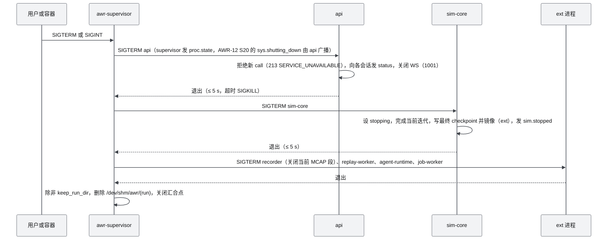

**会话世界切换 = run 切换（AD-01、AD-09；ext，语义见 AWR-12 §4.1.4）**：

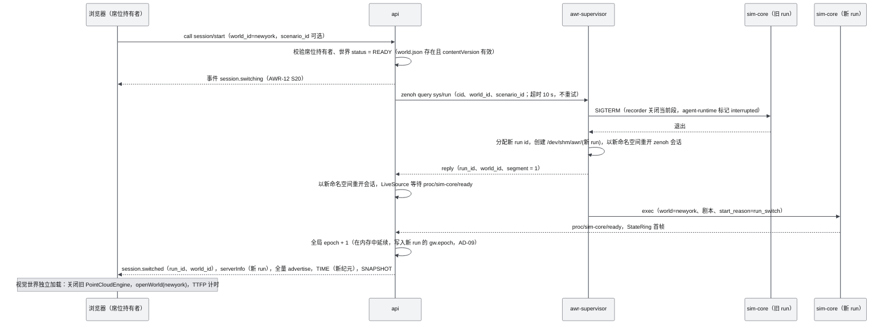

- 视觉世界的加载与后端 run 切换并行，互不等待；`switchMs`（D1-AC-02 ≤ 1.5 s）只计视觉世界首个含点帧，因此 D1-core 的静态浏览同样满足它。
- 任何角色打开与运行世界不同的 `/world/:id` 都只进入静态浏览（只加载点云、不订阅仿真通道、隐藏机群图层），不会触发会话切换；仍停留在旧世界页面的客户端收到 `session.switched` 后转为静态浏览并提示跳转（AWR-12 §4.1.4）。
- 后端 run 切换目标：`sys/run` 应答到新 run 的 `proc/sim-core/ready` ≤ 1.5 s（本文设定，理由：kill -9 冷启动实测 0.29 s，numba 缓存命中，剧本加载与 DSM mmap 估算小于 0.5 s，g05 §7.4；由 ARCH-AC-015 实测确认）。`sys/run` 本身的应答包含旧 run 的停止（SIGTERM 宽限 ≤ 5 s），因此调用超时取 10 s。
- token 绑定 run（17 §3.2）：切换后已建立的 WS 连接继续有效，但旧 token 的 REST 调用返回 `302 TOKEN_INVALID`，客户端以同一 principal 重新签发；席位随新 run 重新登记（M11-AC-043）。
- 失败处置：新 run 的 sim-core 在启动宽限内未就绪时，supervisor 停止新 run 的进程、以旧 world 与剧本重新开启一个 run，并以 `session.error{code: 213}` 通知（§19 R6）。

### 4.7 supervisor 的进程状态机

每次状态转移 supervisor 都发一条可靠事件 `proc.state{name, from, to, restarts, rc?}`（17 §6.12），下表"动作"列只写额外动作；各进程的 `startup_grace_s`、`stale_s` 取值以 `configs/runtime.yaml`（19 §6.2）为准。

| 当前状态 | 事件 | 守卫 | 动作 | 目标状态 |
|---|---|---|---|---|
| STOPPED | start（启动、`sys/restart`、`sys/start`、run 切换） | 依赖进程已发出 start（不等其就绪） | exec，注入 `AWR_RUN`、`AWR_ID_BASE`、`AWR_ID_COUNT`、`AWR_RESTART_COUNT`、`AWR_LAST_EXIT`；按 `runtime.yaml` 设置 taskset 与 nice | STARTING |
| STARTING | ready（`proc/{name}/ready` 或首次心跳） | — | 开始心跳巡检（5 Hz） | RUNNING |
| STARTING | 启动宽限超时（sim-core、api 15 s，job-worker 30 s） | — | SIGTERM，1 s 后 SIGKILL | HUNG |
| RUNNING | 心跳年龄 > stale_s（sim-core 2 s、api 5 s、job-worker 120 s） | — | faulthandler 栈已在日志；SIGTERM，1 s 后 SIGKILL | HUNG |
| RUNNING、HUNG | exit(rc) | 策略 always，或 on-failure 且 rc ≠ 0 | 记录 rc 与 stderr 末尾 200 行 | BACKOFF |
| RUNNING | exit(0) | 策略 on-failure | — | STOPPED |
| BACKOFF | 退避到期（0.1、1、2、4、8 s；首档 AWR-03 ADR-061） | 60 s 窗口内启动次数 < 6 | 退避下标加 1；exec | STARTING |
| BACKOFF | 退避到期 | 60 s 窗口内第 6 次 | `proc.state` 的 level 为 CRITICAL | FAILED |
| FAILED | `sys/restart`（admin，17 R54） | — | 清零计数，exec | STARTING |
| STARTING、RUNNING、BACKOFF、HUNG | stop（SIGTERM、`sys/stop`、run 切换） | — | SIGTERM，等 grace 5 s，超时 SIGKILL | STOPPING |
| STOPPING | exit | — | — | STOPPED |

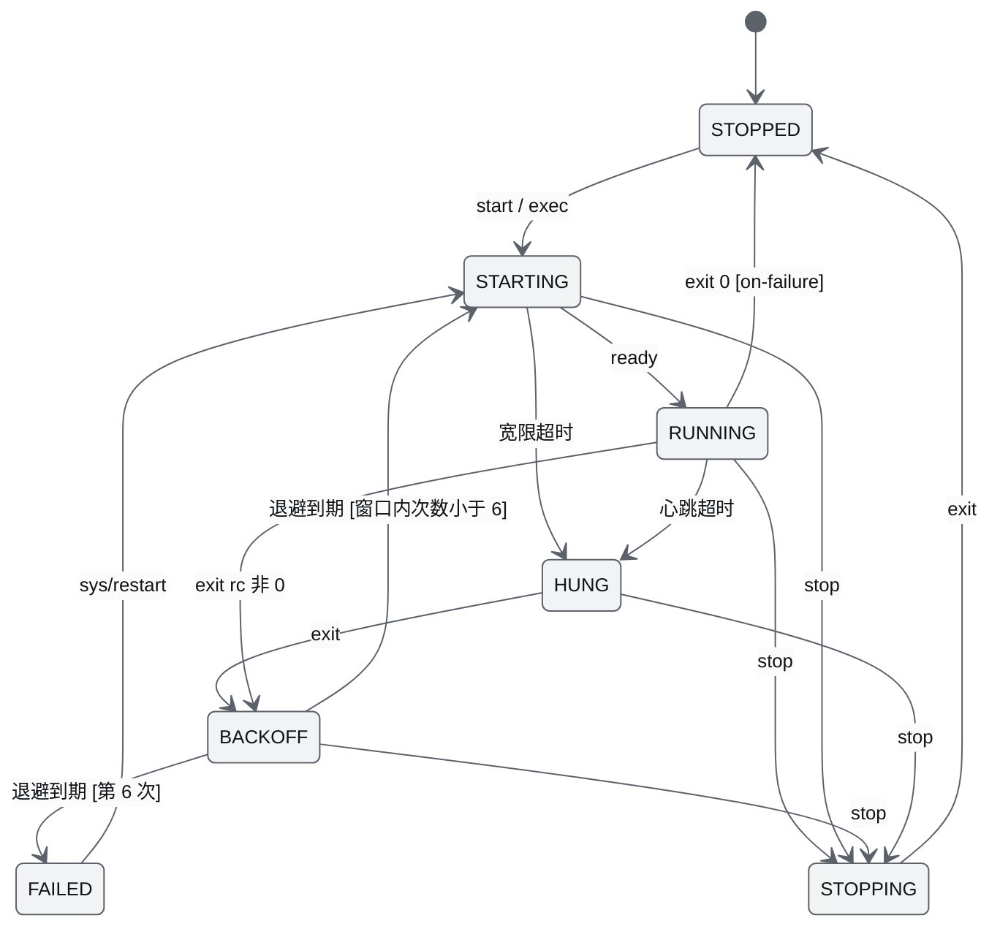

### 4.8 Gateway 的生产者健康与纪元处置

**健康**（每 tick 按环头部 `heartbeat_ns` 计算写者年龄）：年龄 < 250 ms 为 ok；250 ms–2 s 为 stalled（TIME.state = 6 STALLED）；> 2 s 或写者 pid 已死为 down；supervisor 处于 BACKOFF 或 STARTING 时为 restarting（7）；FAILED 时为 failed（8）。任一非 ok 状态下 SimClockView 冻结 simNow（AWR-03 §5.2 第 6 条），UI 显示状态条。

**纪元处置（AD-02；线上规则以 17 §6.10 为准）**：Gateway 每 tick 对各生产者环头部做一致性读，按下表处置；`sim.started`、`sim.restarted` 事件只用于一致性校验与审计。

| 检测到的变化 | 触发来源 | Gateway 动作 | 客户端效果 |
|---|---|---|---|
| 头部 `segment` 变化 | 剧本重置 `sim/reset`；D1-core 下 sim-core 无 checkpoint 重启（剧本重开） | 全局 epoch + 1 并写 `gw.epoch`；先发 TIME 再发 SNAPSHOT；recorder 结束当前段、开新段 | 清空全部插值环、尾迹与事件视图的时间锚 |
| `segment` 不变、生产者 `epoch` 变化 | D1-ext checkpoint 恢复；V0.2 起 px4-bridge 重启 | 该生产者全部 channel 的下一条记录置 `rflags.RESET`；下发该生产者的 backfill；全局 epoch 不变 | 只清空这些 channel 的插值环与尾迹 |
| 会话世界切换（ext） | `sys/run` 应答 + 新 run 首帧 | 全局 epoch + 1（在内存中延续到新 run）；另发 `session.switched`、`serverInfo`、全量 advertise | 同第一行，并核对视觉世界 |
| 回放 seek；实时与回放互切 | Source 控制 | 全局 epoch + 1（AWR-03 §5.2 第 4 条） | 同第一行 |
| 环 `identity()` 的 inode 或 pid 变化（文件被替换） | 每 1 s 检查 | 重新 attach，再按前两行规则比较 `segment` 与 `epoch` | — |
| api 自身重启 | supervisor 重启 api | 从 `/dev/shm/awr/<run>/gw.epoch` 恢复全局 epoch，不 + 1 | `sessionId` 变化：重置 ClockSync 与事件序号，不清空插值环 |
| 事件 `reason` 与头部判断不一致 | 一致性校验 | 以头部为准，记 WARNING 日志与 `perf/server.epoch_mismatch` 计数 | — |

### 4.9 容量模型

**CPU**（本机 8 核 Xeon 1.7 GHz；性能验收时的分区见 ADR-017）：

| 进程 | N = 10 | N = 200 | N = 1000 | 上限与依据 |
|---|---|---|---|---|
| sim-core（RTF = 1，numba） | ≈ 0.02 核 | ≈ 0.07 核 | ≈ 0.26 核 | ≤ 0.6 核（ADR-017）；g08 §11.2；快进 ×N 线性增长，1000 架最多约 ×3.5 |
| sim-core（numpy oracle 回退） | ≈ 0.27 核 | ≈ 0.4 核 | ≈ 0.87 核 | 回退时机群上限 300 架（ADR-038） |
| api（3 个客户端） | < 0.05 核 | ≈ 0.1 核 | ≤ 0.35 核 | ADR-017；r27 §3.1.5：200 架 10 客户端 34% |
| recorder（ext） | — | — | ≤ 0.1 核 | ADR-040 |
| replay-worker（20× 回放，ext） | — | — | ≤ 1 核 | ADR-040 |
| agent-runtime（ext） | ≤ 0.05 核 | ≤ 0.05 核 | ≤ 0.05 核 | AWR-03 §3.3 |
| Chromium + SwiftShader（Tier S 性能用例） | 限制在 core2–6 | 同左 | 同左 | ADR-033 运行协议 |

N = 10、200 两列由 g08 §11.1 的 numba 核实测与 env、guard 的线性分项插值估算，标"估算"，D1-MS4 第一周由 fleet_ladder 实测替换。

**内存与 /dev/shm**：

| 项 | 大小 | 依据 |
|---|---|---|
| StateRing（每生产者） | 约 3.0 MiB（K = 32、cap = 1024） | §4.4 |
| checkpoint（tmpfs，3 代） | 1–2 MB × 3 | g05 §7.4 |
| 心跳文件 | 16 B × 进程数 | g05 §7.3 |
| zenoh SHM | 0（关闭） | ADR-018；g05 §0 第 9 条 |
| 每 run 的 /dev/shm 总量 | ≤ 32 MB（本文设定，理由：上面各项合计 < 16 MB，留一倍余量给 `state.replay` 与诊断） | — |
| 浏览器 CPU 缓存 | Tier S 64 MB；Tier B/A 256 MB | ADR-010 |
| GPU 点池 | Tier S 约 4.1 MB（62 行，约 25.4 万点）；iGPU 约 80 MB（1221 行，约 500 万点）；dGPU 约 160 MB（2442 行，约 1000 万点） | ADR-010 |
| 前端插值环 | 1024 架 × 32 样本 × 11 个 float32 ≈ 1.4 MB | 本文设定：K = 32 与 r27 §3.14 的快照环容量一致 |

**WS 带宽**（每客户端，N = 1000，按默认订阅 AWR-03 §8.5 计算，含 16 B 记录头）：

| 通道 | Tier S | Tier B/A | 计算 |
|---|---|---|---|
| `swarm/state`（Lite32 整群） | 320 KB/s（10 Hz） | 640 KB/s（20 Hz） | 32 B × 1000 × 频率 |
| 关注集 `uav/{id}/state`（K ≤ 32，30 Hz） | 77 KB/s | 77 KB/s | 80 B × 32 × 30 |
| 选中机（60 Hz） | 4.8 KB/s | 4.8 KB/s | 80 B × 60 |
| `state_ext`（2 Hz）、`safety`（5 Hz），只订关注集与选中机 | ≤ 50 KB/s | ≤ 50 KB/s | msgpack，按每条 ≤ 250 B 估算 |
| TIME、`env/state`、事件、`perf/server` | < 5 KB/s | < 5 KB/s | ADR-025：环境 < 1 KB/s |
| 合计 | 约 0.46 MB/s | 约 0.78 MB/s | 与 r27 §3.8 的 397 KB/s（不含扩展通道）同量级 |

**磁盘**：六城 World Package 视觉部分每城约 60 MB（g03 §7），源点云与栅格以 M03 实测为准；`runs/` 配额 20 GB，超出删除最旧 run（`keep` 除外），supervisor 启动时与每 10 min 检查一次；N = 1000 录制 ≤ 60 MB/min（ADR-040）。

---
## 5. 五条核心数据流

### 5.0 总览

| 数据流 | 起点 → 终点 | 平面与协议 | 频率 | 权威 | D1 层 | 主要验收 |
|---|---|---|---|---|---|---|
| F1 World | 原始 PLY → World Package → 浏览器点池 | 文件；HTTP Range（immutable 缓存） | 离线一次；运行时按需 | `worldpkg`（contentVersion） | core | D1-AC-01、02、06 |
| F2 遥测 | FleetSim tap → StateRing → Gateway → rt.worker → engine | StateRing；`awr.rt.v1` BATCH | 125 Hz → 60 Hz tick → 10/20/30/60 Hz 订阅 | sim-core | core | D1-AC-08、09、26 |
| F3 命令 | UI / agent → 可信入口 → sim-core → result | WS `call`/`result`；zenoh query；`evt/*/cmd` | 按需（≤ 50 条/s 压测） | sim-core CommandEngine | core（agent 路径 ext） | D1-AC-10、27、32 |
| F4 环境 | `env/set`/`env/preset` → EnvironmentService → 物理与前端视觉 | zenoh 可靠事件 + 1 Hz 自包含心跳；WS `env/state` | 变化时 + 1 Hz | sim-core EnvironmentService | core（视觉 Med 为 ext） | D1-AC-13、19 |
| F5 录制回放 | StateRing + `evt/**` → MCAP → replay-worker → 同一客户端路径 | 文件（MCAP）；StateRing `state.replay` | 录制按 ADR-040 策略；回放 0.1–20× | 录制文件 | ext | D1-AC-18、31 |

### 5.1 F1：World ingest → 切片 → Web 渐进加载

**（1）离线阶段**（`worldpkg`，M03；在 `make run` 前置同步执行，不依赖 job-worker，ADR-034）：

```mermaid
%%{init: {"theme": "base", "themeVariables": {"fontFamily": "Inter, PingFang SC, Microsoft YaHei, Noto Sans CJK SC, sans-serif", "fontSize": "13px", "background": "#FBFBFC", "primaryColor": "#F2F3F5", "primaryTextColor": "#111214", "primaryBorderColor": "#5C616A", "secondaryColor": "#E4E6E9", "tertiaryColor": "#FBFBFC", "lineColor": "#5C616A", "textColor": "#111214", "mainBkg": "#F2F3F5", "nodeBorder": "#5C616A", "clusterBkg": "#FBFBFC", "clusterBorder": "#A7ABB3", "edgeLabelBackground": "#FBFBFC", "noteBkgColor": "#E4E6E9", "noteTextColor": "#111214", "noteBorderColor": "#81868F"}}}%%
flowchart LR
  RAW["data/raw/urbanscene3d/(city)_sampled_5m.ply（约 500 万点）"] --> ING["ingest 规范化：单位、上方向、调平、北向、原点 → World ENU（float64）"]
  ING --> NRM["法线估计与翻转修正"]
  NRM --> TER["DTM 10 m（格内最小值 + 9x9 开运算）、DSM 2 m、HAG、规则语义"]
  TER --> TIL["tiler：G=64、LEAF=20000、中心优先、Fisher-Yates、ANET_Q16 v1、levelsByteEnd、levelsPoints、hierarchy_ext；苏州 6 根森林"]
  TIL --> PKG["package：world.json、coordinate.json、semantic、geometry/terrain、geometry/pointcloud/source、contentVersion"]
  PKG --> VAL["validate --deep：JSON Schema 2020-12 + 40 余条语义校验"]
  VAL --> OUT[("worlds/(id)/")]
```

| 步 | 产物 | 参数与依据 | 失败处置 |
|---|---|---|---|
| ingest | World ENU 点（CPU float64，写出前转为节点局部量化） | 六城 CFG：SF 10.15 m/单位且 Rz +90°，Chicago ×1000 且调平 2.03°，Suzhou Y-up（x01 §3.3；g03 §7；ADR-001） | CFG 缺失或地标校验偏差超限：构建失败，不写半成品（先写 tmp 目录再原子 rename） |
| terrain | `dtm_10m.{json,f32}`、`dsm_2m.{json,f32}`（Geometry World） | g03 §5.1；grid schema | 同上 |
| tile | `visual/pointcloud/`（或 `r-<i>/`）三文件容器 | 12 B/点；`hierarchy.bin` 14.5–18.7 KB；每城约 60 MB（g03 §7） | 同上 |
| package | `world.json`（入口）、`contentVersion` = 全部文件 sha256 汇总取 12 位 | ADR-006 | — |
| validate | `qa/report.json` | `worldpkg validate worlds/* --deep` 零错误（D1-AC-01） | 校验失败的世界被 `build --missing` 视为缺失并重建 |

**（2）运行时的两个分支**：Visual World 走 HTTP 到浏览器；Geometry World 只进 sim-core 与 plan-pool（P-03）。

| 分支 | 消费者 | 读取方式 | 绑定校验 |
|---|---|---|---|
| Visual | 浏览器 PointCloudEngine | `world.json`（`Cache-Control: no-cache`）；其余请求带 `?v=<contentVersion>`，响应 `public, max-age=31536000, immutable`，206 同样适用 | 浏览器比较 `serverInfo` 或 `world` 控制消息中的 contentVersion，不一致则重新 `openWorld` |
| Geometry | sim-core 的 WorldQuery；plan-pool | `np.memmap` 只读映射 DSM/DTM 栅格；`zones.geojson` 解析为棱柱集合 | 启动时比对 `coordinate.sha256` 与 `contentVersion`，不一致拒绝启动（P-01） |

**（3）Web 渐进加载**（M05；首屏协议见 ADR-013 与 g03 §5.3，规范时序见 AWR-03 §3.7（1））：

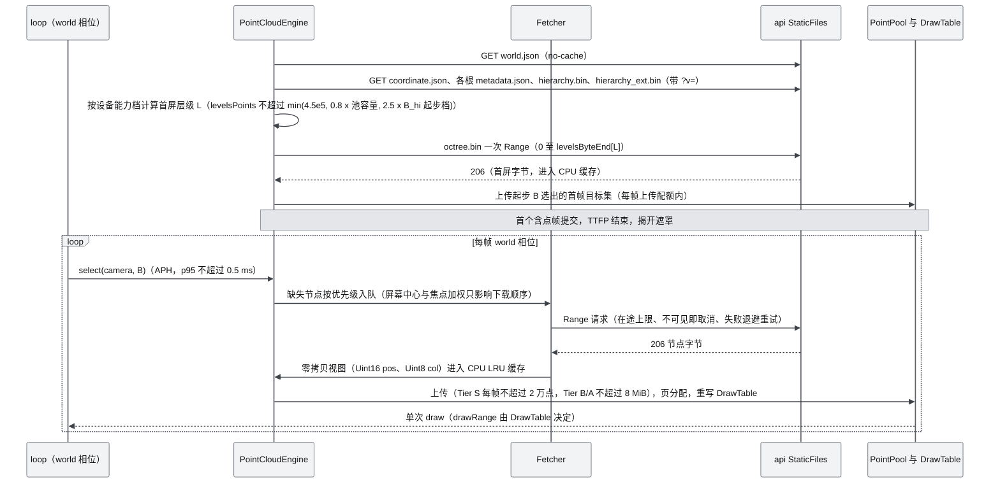

| 机制 | 取值 | 依据 |
|---|---|---|
| 首屏层级 | 满足 `levelsPoints ≤ min(4.5e5, 0.8·池容量, 2.5·B_hi(起步档))` 的最深层；森林按根汇总；Tier S 约 1e5 点，Tier B/A 仍为 4.5e5 点 | ADR-013；g03 §0 新发现 |
| 首屏体量（B/A 口径） | 深圳 1.50 MB、纽约 2.18 MB、上海 5.03 MB、苏州 6 根共 2.00 MB（6 次 Range） | g03 §7 |
| 选择器 | APH：两级预算 best-first + 首个被拒 required 节点画前缀（≥ 512 点）+ ±10% 迟滞；误差按设备像素 | ADR-009；g02 §3.3 |
| 两层驻留 | CPU 缓存 LRU（Tier S 64 MB、Tier B/A 256 MB）；GPU 池驱逐：驻留 > 1.5·B_ref 时驱逐到 1.15·B_ref，B_ref = 档位 B_hi，1 s 驻留保护 | ADR-010 |
| 容量钳制 | B ≤ 0.6·池容量 | ADR-010 |
| 疏密闭环 | CAS 内环 250 ms、外环饱和时换档；7 档阶梯；Tier S T* = 33.3 ms | ADR-012 |
| 淡入 | `--duration-lod-fade` 250 ms | ADR-029 |
| 重复下载比 | 下载字节 / 去重后字节 ≤ 1.3 | D1-AC-06 |

**失败处置**：

| 故障 | 检测 | 处置 | 用户可见 |
|---|---|---|---|
| `world.json` 404 | HTTP 状态 | 不创建引擎；列出可用世界 | 空状态（[14](14-UI交互设计PRD.md)） |
| `metadata.encoding` 不是 ANET_Q16 或 `formatVersion` 未知 | 解析 | 拒绝加载该根（ADR-004、AWR-03 §5.11 第 3 条） | 错误提示，不渲染半个世界 |
| Range 5xx、超时 | Fetcher | 墙钟退避重试 3 次（0.5、2、8 s，参数定义方为 M05 §6.5.2；AWR-03 附录 B.3 C46），仍失败则该节点标记失败并在 10 s 后允许重新入队 | 性能 HUD 记失败节点数；D1-AC-06 要求为 0 |
| 世界在两次会话之间被重建（contentVersion 变化；会话运行期间禁止重建其绑定世界，AWR-12 §4.1.4） | 重连后的 `serverInfo` 或 `session.switched` | 中止在途请求，丢弃 CPU 缓存与 GPU 池中旧世界的节点，重新 `openWorld` | 加载进度条 |
| 切换世界 | 路由变化 | 按"中止请求 → 注销图层 → 释放池页 → 清空 DrawTable → 打开新世界"的顺序进行（§6.6） | 进度条；CAS 在切换后 30 帧冻结（ADR-012） |

### 5.2 F2：遥测 sim-core → StateRing → Gateway → rt.worker → engine

```mermaid
%%{init: {"theme": "base", "themeVariables": {"fontFamily": "Inter, PingFang SC, Microsoft YaHei, Noto Sans CJK SC, sans-serif", "fontSize": "13px", "background": "#FBFBFC", "primaryColor": "#F2F3F5", "primaryTextColor": "#111214", "primaryBorderColor": "#5C616A", "secondaryColor": "#E4E6E9", "tertiaryColor": "#FBFBFC", "lineColor": "#5C616A", "textColor": "#111214", "mainBkg": "#F2F3F5", "nodeBorder": "#5C616A", "clusterBkg": "#FBFBFC", "clusterBorder": "#A7ABB3", "edgeLabelBackground": "#FBFBFC", "noteBkgColor": "#E4E6E9", "noteTextColor": "#111214", "noteBorderColor": "#81868F"}}}%%
flowchart LR
  TAP["FleetSim tap stage（125 Hz，NED/FRD 转 ENU/FLU，Full64 + Lite32 AoS）"] -- "publish p50 77 us" --> RING[("StateRing state.sim-core，K=32")]
  RING -- "read_latest，60 Hz tick" --> SRC["LiveSource：swarm 拼接、uav 懒切片"]
  SRC --> CH["ChannelRegistry：按 (channel, seq) 编码一次"]
  CH --> SCH["Scheduler：rate class、对齐网格、尾帧保证、credit W"]
  SCH --> SES["ClientSession：控制 FIFO + 数据单槽"]
  SES -- "WS BATCH" --> WK["rt.worker：按 channel 保留最新，解码到 SoA 槽"]
  WK -- "可转移缓冲（3 槽环）" --> TEL["telemetry 相位：取走就绪槽、归还已消费槽、发下一次 pull"]
  TEL --> RINGC["插值环（M12，每机 32 样本）"]
  RINGC --> DRN["drones 相位：Hermite 插值 + slerp，写实例属性"]
  TEL --> SUM["SummaryWriter（overlay 相位，4/10 Hz）→ stores/fleet.ts"]
```

**逐跳参数与延迟预算**：

| 跳 | 落点 | 频率 / 载荷 | 延迟预算 | 依据 |
|---|---|---|---|---|
| 仿真样本 → StateRing | sim-core tap（主线程） | 125 Hz；96 B/架（Full64 + Lite32）；快进时墙钟 ≤ 250 Hz | ≤ 8 ms（一个 L1 周期） | ADR-018、ADR-021；g08 §3.2 |
| StateRing → Gateway | api 60 Hz tick | 每 tick 读最新一帧（约 96 KB） | 数据年龄 p99 ≤ 15 ms | D1-AC-08；g05 §3.2（100 Hz 源实测 p99 11.4 ms） |
| 编码与调度 | api Scheduler | rate class {1,2,5,10,15,20,30,60}；swarm 一条 Lite32 记录，关注集与选中机 Full64 记录 | 等待网格 0 至 1/rate；编码 1000 架 5.7 µs | ADR-014；r27 §3.1、§3.8 |
| 发送 | api sender task → 回环或 SSH 转发 | credit `W = clamp(ceil(max_rate·(srtt + ack_interval)) + 2, 3, 8)`，默认 6；ack 每 3 帧或 50 ms | 回环 < 1 ms；SSH 转发另加链路 RTT | ADR-014 |
| 解码 | rt.worker | 每 BATCH 按 channel 覆盖最新；pull 时解码到空闲槽 | 1000 架 p95 ≤ 2 ms | D1-AC-09b；r27 §3.1（15 µs 纯解码） |
| 交接 | 主线程 telemetry 相位（AD-06） | 3 槽可转移缓冲环，零分配 | ≤ 1 帧（Tier S 33.3 ms） | AWR-03 §3.6 规则 1 |
| 插值 | clock + drones 相位 | 全局 tRender；D_sim = rate·clamp(2/hz_eff + jitter_p95, 60 ms, 300 ms) | D_focus 起步 60 ms；D_global 按 swarm 通道 | ADR-046 |
| 合计 | — | — | 焦点机 t_sim → 像素 p95 ≤ 150 ms；命令 → 画面可见 p95 ≤ D_global + 150 ms | D1-AC-26 |

**兴趣管理**（客户端驱动，服务端不按 ROI 过滤 `swarm/state`，以保持编码共享，r27 §3.8）：关注集每 250 ms 重算一次，K ≤ 32；屏幕半径 ≥ 8 px 进入、< 6 px 退出，至少停留 1 s；关注集订阅 `uav/{id}/state` 30 Hz，选中机与 FPV 60 Hz；其余机体只靠 `swarm/state`（Tier S 10 Hz、Tier B/A 20 Hz，任何情况下 ≥ 10 Hz）。通信档位不参与帧预算仲裁（ADR-041）。

**详情通道的兴趣集下推（AD-10）**：`uav/{id}/env`（EnvSample32）、`uav/{id}/sensor/{name}/pose`（SensorPose48）、`uav/{id}/safety` 这类 10 Hz 逐机详情不由 sim-core 对全部 N 架生产。api 把所有连接中这些 topic 与 `uav/{id}/state_ext` 的订阅机体并集（`detail`，≤ 64 架）以及录制标记集（`marks`，≤ 16 架）经 `ctl/sim-core/interest` 下推（变化后 250 ms 去抖，每 1 s 全量重发）；sim-core 在慢任务中只为 `detail ∪ marks` 发布 `state/sim-core/{safety,sensor,detail}`，api 按机体切片后原样装入 WS 记录（不重新编码，M11-FR-072）。`state/sim-core/ext` 为全机 2 Hz（17 §9.3），WS 侧仍只按订阅下发。理由：逐机 msgpack 编码约 20 µs/架（r27 §3.1.1），全机 10 Hz 约需 0.2 核；raw 结构体虽便宜，但全机 10 Hz 的 SensorPose48 与 EnvSample32 合计约 0.8 MB/s，会让 api 的 zenoh 回调占用可观的单核预算。

**失败与降级**：

| 情形 | 表现 | 处置 |
|---|---|---|
| sim-core 停滞 | 写者年龄 > 250 ms | TIME.state = 6 STALLED；客户端冻结 simNow，机体外推 ≤ 3/f 后 HOLD 并显示"信号延迟"（ADR-046） |
| 客户端渲染慢于数据 | credit 窗口满 | 该会话本 tick 跳过，只保留最新值，恢复后不补发积压帧（r27 §3.8 性质 4）；`credit_skips` 计入 `perf/server` |
| 纪元变化 | 见 §4.8 | TIME 先于 SNAPSHOT；未知纪元的 BATCH 暂存一帧 |
| WS 断线 | Worker `onclose` | 退避 500 ms 起按 ×1.5 增长、上限 10 s、±20% 抖动，连接超时 4 s（17 §6.13）；`sessionId` 相同则恢复订阅并按 `lastEventSeq` 补事件，不同则清空重订（r27 §3.7） |
| 解码耗时超标 | Worker 自报 `decodeMs` | 进入性能 HUD；不降通信档（ADR-041），由 credit 自适应 |

### 5.3 F3：命令 UI → Gateway → 准入与 Safety → sim-core → ACK

**准入的执行位置**（顺序唯一，ADR-016；语义与准入矩阵见 [12](12-业务逻辑设计说明书.md)）：

| 步 | 内容 | 执行位置 | 失败原因码（登记于 `reasons.json`） |
|---|---|---|---|
| ① | 身份与角色（会话 token；席位即单 operator 锁；只读态） | 可信入口：api（UI）或 agent-runtime 受信守卫（agent） | 115 ROLE_FORBIDDEN、116 SEAT_TAKEN、118 READ_ONLY_MODE |
| ② | 限流 | 同上 | 111 RATE_LIMITED |
| ③ | 确认令牌（kill、escalate，ext） | 同上 | 112 CONFIRM_REQUIRED |
| — | roster 路由到生产者 `ctl/{producer}/cmd`，附 principal（`principal_id`、`role`、`entry`、`conn_id`、`seat`，以 `K_entry` 签名，17 §9.4） | 可信入口 | 107 NO_VEHICLE |
| ④ | 状态（准入矩阵：FlightState、子模式、FAILSAFE；生命周期；时钟约束；SafetyStop 锁） | 生产者本地：M09 注册的准入检查；生命周期与时钟约束由 M08 执行 | 101 SAFETY_ACTIVE、103 PREFLIGHT_FAILED、104 NOT_ARMED、105 STATE、106 DUPLICATE（语义重复）、108 LINK_ERROR（生命周期不是 READY）、113 LOC_NOT_READY、114 LOCKED、117 CLOCK_CONSTRAINT |
| ⑤ | 租约（owner；ext 加 HMAC、优先级、TTL） | 生产者本地：LeaseManager | 100 LEASE_DENIED |
| ⑥ | 参数边界（`commands.json`；航点 ≤ 1000、总长 ≤ 20 km） | 生产者本地 | 110 PARAM_OUT_OF_RANGE |
| ⑦ | 后端能力（`caps`） | 生产者本地 | 109 BACKEND_UNSUPPORTED |
| ⑧ | 围栏粗校验（O(航段数)，≤ 5 ms） | 生产者本地：M09 注册的准入检查 | 102 GEOFENCE_REJECT |
| ⑨ | 分发（staged，下一 tick ingest 生效；apply_tick 记入输入日志） | 生产者本地：`SimBackend.dispatch_batch` | — |
| ⑩ | 审计（`runs/<run>/audit.jsonl`） | 生产者本地（入口拒绝由入口进程追加，§14.4） | — |

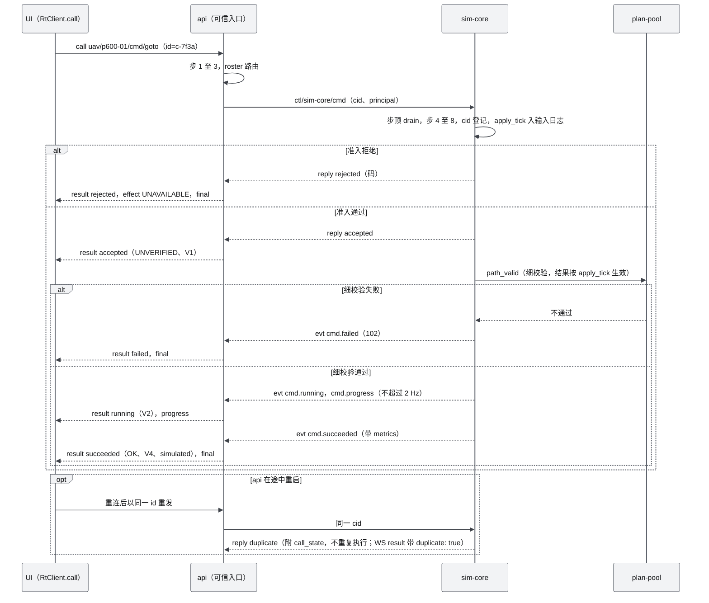

**Safety 覆盖路径**：FastGuard（50 Hz，向量化，只发事件）→ Flight FSM 按白名单裁决（只升不降、ELAND 与 FAILSAFE 锁存）→ 裁决结果作为 supervisor 命令排入下一 tick 的 ingest（固定 1 tick 延迟保证确定性，g08 §3.2）→ 被取代的导航调用以 `failed 204 PREEMPTED_BY_SAFETY` 结束 → `evt/sim-core/safety` 可靠推送。安全类命令（Land、Hover、RTL、SafetyStop）免租约但仍经④（ADR-027）。

**agent 路径（ext）**：agent 逻辑 → agent-runtime 受信守卫执行①–③ → `ctl/sim-core/cmd`（owner = AGENT、`K_entry` 签名的 principal）→ 同一套④–⑩。agent-runtime 通过 StateRing reader 读位置与 SOC，报价经 `ctl/sim-core/estimate`（ADR-036）。

**机体增删与环境操作**（AD-05）：`fleet/add`、`fleet/remove`、`env/set`、`env/preset` 都作为命令经同一路径进入 sim-core，因而同样具备幂等、审计、输入日志与崩溃恢复语义。

**时限与异常**：

| 项 | 取值 | 依据 |
|---|---|---|
| 准入（sim-core 内） | ≤ 5 ms | ADR-016 |
| 准入 RTT（api 发出到 reply） | p99 ≤ 25 ms（50 条/s） | D1-AC-10；g05 §3.3 实测 p99 13–22 ms |
| api 侧 query 超时与重试 | 1 s 超时，同 cid 重试 2 次；仍失败返回 211 SIM_UNAVAILABLE | g05 §3.3 |
| 幂等窗口 | 同一调用 id 60 s（墙钟） | ADR-016 |
| checkpoint 回滚（ext） | `t_accept` 晚于恢复点的调用以 212 SIM_ROLLBACK 结束 | ADR-019 |
| 取代 | 同机新导航命令取代旧调用（`canceled SUPERSEDED`） | ADR-016 |
| 批量命令 | 一次 reply 附逐机结果 `per_uav{accepted, rejected}`；Gateway 以 `fleet.batch.progress`（≤ 2 Hz）汇总，不逐机下发 `cmd.*`（AD-03） | g05 §3.3；17 §6.12 |

### 5.4 F4：环境 E(x,y,z,t) 服务端权威 → 物理、传感器与前端视觉

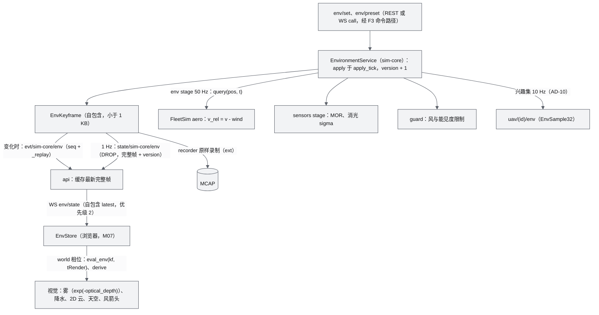

- **同一真值、同一函数**：服务端与前端使用同一套纯函数（`eval_env`、`derive`、`optical_depth`、风合成）与同一份 f16 资产；视觉档位可以省略项（例如 Low 不加湍流），但不改变公式（AWR-03 §5.8 第 3 条）。golden 对拍按混合容差 `|a − b| ≤ atol + rtol·|b|`（AWR-03 §5.1 规则 8）。
- **过渡**：过渡窗口、速率与路由写在 `presets.json`；两端按 `(kf, t)` 独立求值，因此 seek 精确、60 fps 下平滑、带宽 < 1 KB/s（ADR-025）。
- **能见度**：MOR 为唯一真值，`σ₅₅₀ = ln20 / MOR`，降水 σ 加性叠加（ADR-023）。

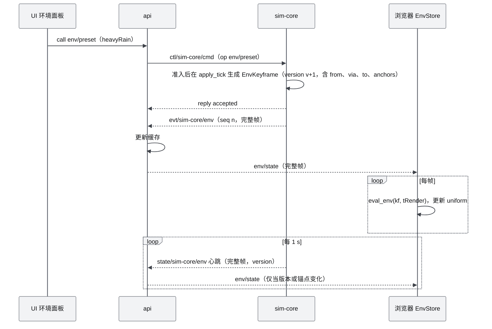

**失败处置**：可靠事件丢失时，下一个心跳（≤ 1 s）携带的 version 暴露缺口，api 向 `evt/sim-core/_replay` 补拉；api 重启后在 ≤ 1 s 内由心跳重建缓存；`presets_sha256` 两端不一致时前端显示告警并继续使用服务端关键帧（AWR-03 §5.11 第 5 条）；Tier S 切换预设期间 `renderer.info.programs` 不得增加（D1-AC-19，靠 shader zoo 预热全部环境变体）。

### 5.5 F5：录制 → 回放（D1-ext）

**录制**（recorder 进程，ADR-040）：

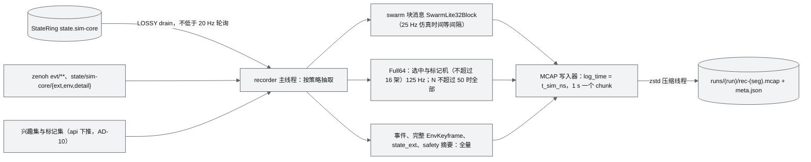

- K = 32 在 125 Hz 下覆盖 256 ms 历史，足以吸收 chunk flush 与 GC 停顿；出现 overrun 时发 `recorder.gap`（ADR-018、ADR-040）。
- 谱系：全局 epoch + 1（剧本重置，含 D1-core 下 sim-core 重启后的剧本重开）结束当前段、开始新段；checkpoint 恢复只在同段内写作废区间 `[restored_t, last_t]`。
- 绑定：`meta.json` 与 MCAP header 写入 world id、`contentVersion`、`coordinate.sha256`、`layout_id`、contracts 版本、sim 内核与版本。
- 倍速 > 2 时按墙钟上限 50 Hz 抽取，仿真时间分辨率写入 `meta.json`。

**回放**（replay-worker 进程 + 同一客户端路径）：

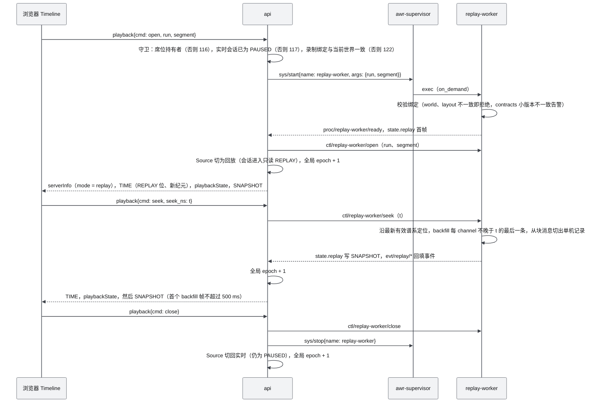

- 回放倍速 0.1–20×，最大倍速 = min(20, 64 MB/s ÷ 每仿真秒录制字节数)；N = 1000 约 0.93 MB/仿真秒，可达 20×（ADR-040）。
- 回放语义以 AWR-12 §4.11 为准：进入回放前实时会话必须已暂停（否则 117 CLOCK_CONSTRAINT）；录制绑定的 world、contentVersion、layout 必须与当前会话一致（否则 122 RECORDING_INCOMPATIBLE）；回放期间会话只读，命令、租约、环境、时钟与机群写操作返回 118 READ_ONLY_MODE；`playback/close` 后实时会话保持 PAUSED，全局 epoch + 1（切换实时与回放，AWR-03 §5.2 第 4 条）。架构上这保证回放与实时两条链路不会同时占用 api 与 CPU 预算。
- **G6a**：回放帧中的 Full64 字节、事件与完整 EnvKeyframe 与录制逐字节一致（D1-AC-18）。**G6b**：重仿真不经过 api，`python -m awr.sim.runtime --resim runs/<run>` 以批处理方式在记录的 apply_tick 注入输入（ADR-049，D1-AC-31）。

### 5.6 辅助数据流

| 流 | 路径 | 频率 | D1 |
|---|---|---|---|
| 合同网估价 | agent-runtime → `ctl/sim-core/estimate`（query/reply）→ 同一机型 profile 与电池模型 | ≤ 20 次/s | ext（ADR-036） |
| 规划 | sim-core → plan-pool（`safe_transit`、`path_valid`；ext 加 A*、覆盖切分、CAPT）→ done_callback 入 inbox → apply_tick 生效 | 按需；任何预计 > 2 ms 的计算都必须进 plan-pool | core（ADR-039） |
| UI 触发的世界构建与 Mock 重建 | REST `rest/jobs.py` → `svc/job/submit` → job-worker → `worlds/<id>/`（tmp 目录原子 rename）→ `evt/job-worker/job`（进度节流 250 ms，即 ≤ 4 Hz，AWR-03 §6.3 M01 行、D1-AC-22）→ 世界列表刷新 | 按需 | ext（D1-AC-22） |
| 真 GPU 性能回传 | `/bench` 页 → `POST /api/sys/perf-report` → `runs/perf-reports/` | 按需 | ext（ADR-044） |
| 进程状态 | supervisor → `sys/procs` 与 `evt/supervisor/proc`（`proc.state`）→ api → `/api/sys/procs`、WS `status` | 变化时 + 1 Hz | core |
| 环境点查询 | REST `POST /api/env/query`（≤ 256 点）→ `ctl/sim-core/query` → M07 经 `register_query` 登记的处理器在步顶与慢任务中执行 → msgpack SoA | 按需 | core（17 §4.2 R29） |
| GCS 链路心跳 | api → `ctl/sim-core/gcs`（5 Hz，席位持有者 ping 年龄）→ sim-core 链路判据（1.5 / 3 / 13 s，墙钟，暂停冻结） | 5 Hz | core（ADR-026；M11-FR-024） |
| 服务端性能统计 | sim-core → `state/sim-core/perf`（逐 stage µs/仿真秒、单步分位、内核）→ api 并入 `perf/server` | 1 Hz | core（18 §9.4） |

---
## 6. 前端架构

### 6.1 分层、线程与边界

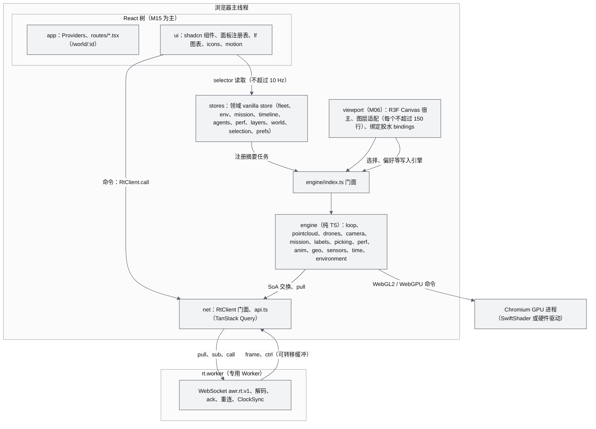

| 层 | 可以依赖 | 禁止依赖 | 执行者 |
|---|---|---|---|
| `engine/**` | `@awr/contracts`、three、three/tsl、`engine/**` 内部 | React、`ui/**`、`viewport/**`、`stores/**`、zustand | oxlint `no-restricted-imports`（n05 §3.10） |
| `net/**` | `@awr/contracts`、`@msgpack/msgpack` | 同上，另禁止 import `engine/**`（M12 的 `engine/time` 经 `RtClient.onTime` 订阅 TIME，依赖方向为 M11 → M12） | 同上 |
| `stores/**` | zustand、`engine/index.ts` 门面（只用于注册摘要任务与读取只读视图） | `ui/**`、`viewport/**` | 同上 |
| `viewport/**` | R3F、drei 白名单、门面、stores | `ui/**`（除布局偏移） | 同上 |
| `ui/**`、`app/**` | stores、门面、`ui/components/ui/**` | `@base-ui/react`（只在 `ui/components/ui/**`）、`lucide-react` | 同上 + `no-raw-controls` |

### 6.2 R3F 宿主 + 命令式引擎

决策见 ADR-008，依据 r14 §5.2（声明式 LOD 节点增删每 tick 2–154 ms，命令式 0.02–0.3 ms；500 架遥测走 React 每次提交 6.5–8.4 ms）。宿主写法：

```tsx
// apps/web/src/viewport/WorldCanvas.tsx（M06，骨架）
<Canvas flat frameloop="never" dpr={dprFor(tierHint)}       // tierHint 在 Canvas 挂载前由探测得出，未知时按 Tier S 的 0.5；后端就绪后 dpr 不再变化
  resize={{ scroll: false, debounce: { scroll: 50, resize: 120 } }}   // 窗口 resize 防抖 120 ms（§6.7 第 1 条）
  eventSource={viewportRoot} eventPrefix="client"
  gl={async ({ canvas }) => {                               // 三档一律 async 工厂（g01 §5：同步工厂下 drei Html 不挂载）
    const be = await createRenderBackend(canvas as HTMLCanvasElement, backendOptions())   // 设备能力档判定 + 渲染后端档
    backendRef.current = be
    void be.warmup(collectZoo(be)).then(markWarmupDone)     // shader zoo，与取数、WS 握手并行（ADR-007）
    return be.renderer as never
  }}>
  <LoopDriver />                                            {/* rAF 中执行 loop 相位并调用 advance() */}
  <RenderSubscriber />                                      {/* useFrame(render, 1)：R3F 唯一的 priority 1 订阅者 */}
  {layers.map(L => <L.Adapter key={L.id} />)}               {/* 图层注册表：<primitive object={engine.root} /> */}
  <EditableObjects />                                       {/* 低频可编辑对象：航点、区域、选中高亮（声明式） */}
</Canvas>
```

- `dprFor(tier)`：Tier S 固定 0.5（渲染比例锁定，画布缓冲尺寸只随窗口变化）；Tier B/A 取设备 DPR，档位的渲染比例经内部 RT 缩放实现（ADR-011、ADR-029）。宿主的字段级写法以 M06 §6.6 为准；ADR-008 白名单中的 drei `AdaptiveDpr` 会经 `setDpr` 重分配 drawing buffer，与 ADR-011、ADR-029 和 D1-AC-24 冲突，视口中不启用（白名单只是允许而非要求；冲突已由 M06 反馈第 1 条提请 ADR 裁决）。
- R3F 只做三件事：挂载、按相位驱动、声明式管理低频可编辑对象。drei 白名单与禁用项见 ADR-008；点云与地形的祖先节点禁止挂指针事件（r14 §0 第 8 条）。
- 每个图层适配 ≤ 150 行，引擎类不依赖 React，因此可以整体退回"纯命令式宿主"或把引擎搬进 OffscreenCanvas（r14 §5.2 第 3 条）。

### 6.3 帧序契约与 loop 实现

相位语义与规则见 AWR-03 §3.6。实现要点：

```ts
// apps/web/src/engine/loop.ts（M06，骨架；约 150 行，不引入 @pmndrs/scheduler，AWR-03 §8.3）
const PRE: Phase[] = ['telemetry', 'clock', 'drones', 'camera', 'world']
const POST: Phase[] = ['overlay', 'governor']
function frame(nowMs: number) {
  handle = requestAnimationFrame(frame)     // 先排下一帧，本帧异常不会停掉循环
  ctx.begin(nowMs)                          // 预分配的 FrameCtx：dtMs、nowMs、tRenderS、tier、moving、frozen
  for (const p of PRE) runPhase(p, ctx)     // 相位内按 order 执行；opts.fps 任务量化到帧边界
  advance(nowMs / 1000, true)               // R3F：秒为单位（frameloop="never" 时 clock.elapsedTime 直接取该值）；
                                            // 先跑声明式 useFrame（priority 不大于 0），再跑唯一的 priority 1 订阅者 = render 相位
  for (const p of POST) runPhase(p, ctx)
  ctx.end()                                 // 写入 window.__perf 的预分配结构
}
```

`advance` 的时间参数必须为秒：R3F 9.8.1 `core/loop.ts` 的 `update()` 在 `frameloop="never"` 时以传入值覆盖 `clock.elapsedTime` 并据此求 `delta`，传毫秒会使全部声明式 `useFrame` 的 delta 放大 1000 倍。

| 相位 | Tier S 预算（ms，取自 AWR-03 §3.8） | 主要工作 | 所有者 |
|---|---|---|---|
| telemetry | 与 clock、drones、world 的 CPU 部分合计 ≤ 4 | 交换 SoA 槽、发下一次 pull（AD-06） | M06（`engine/drones` 注册该相位，调用 M11 的 `RtClient.swapFrame()`，交接逻辑在 RtClient 内） |
| clock | 同上 | SimClockView 求 simNow 与 tRender | M12 |
| drones | 同上（绘制部分 ≤ 2.5） | 插值、外推、三档分级、实例属性写入 | M06 |
| camera | 同上 | 相机模式与相机飞行 | M06 |
| world | 同上（点云选择与上传含在点云 ≤ 16 中） | 点云选择、上传、DrawTable；`eval_env` 与 uniform；标签屏幕坐标 | M05、M07、M06 |
| render | 点云 ≤ 16、无人机 ≤ 2.5、轨迹与视锥 ≤ 1、环境 ≤ 2.5、地面与天空 ≤ 1 | 按 pass 计划出图 | M06（RenderBackend） |
| overlay | 标签与 DOM ≤ 2，HUD 与图表 ≤ 1 | 标签只写 transform，文本 ≤ 4 Hz；SummaryWriter；LfScheduler | M06、M15 |
| governor | 余量 ≥ 3.3 | FrameSampler、CAS `sample()`、PerfGovernor（1 Hz） | M05、M06 |

**AD-06 的交接细节**：Worker 持有 3 个可转移槽（本文设定：2 个槽时主线程占用一个、Worker 解码一个，若主线程晚归还则 Worker 无槽可写；3 个槽允许一次迟到）。主线程在 telemetry 相位：若 `onmessage` 已放入就绪槽，则把它换为当前槽，把上一个当前槽随 `pull` 消息归还；Worker 收到归还后对该槽的最大 `frame_seq` 发 ack（合并规则按 ADR-014），这就把 credit 背压锁定到实际渲染节奏。

### 6.4 状态管理

四层状态（n05 §3.9）：引擎 SoA（每帧读写，不经过 React）→ 领域 vanilla store（≤ 10 Hz 摘要）→ React 组件（selector 订阅）→ TanStack Query（REST 服务端状态）。

| store | 所有者 | 写入者与频率 | 内容 | 读者 |
|---|---|---|---|---|
| `fleet.ts` | M11 | SummaryWriter（overlay 相位，Tier S 4 Hz、其余 10 Hz） | 各 FlightState 计数、告警摘要、DroneRail 行摘要（虚拟化，每行 selector） | DroneRail、顶栏 |
| `env.ts` | M07 | EnvStore 在关键帧变化时与 4/10 Hz 派生量 | 预设、MOR、风、降水、过渡进度 | 环境面板、HUD |
| `mission.ts` | M10 | 事件批（≤ 4 Hz）与 REST | 任务与剧本状态 | 任务面板 |
| `timeline.ts` | M12 | TIME 到达时 | state、rate、全局 epoch、run 范围、回放状态 | Timeline |
| `agents.ts`（ext） | M14 | 事件批 | 任务、报价、证据链 | AGENTS 面板 |
| `perf.ts` | M06 | governor 相位 4 Hz | `window.__perf` 摘要、降级步骤 | 性能 HUD |
| `world.ts`、`layers.ts` | M05 | 加载进度与图层开关 | 世界清单、加载进度、classMask、着色模式 | 左栏 |
| `selection.ts`、`prefs.ts` | M15 | UI 操作；prefs 持久化到 localStorage | 选中集、关注、偏好 | 全部 |

规则：遥测与点云状态禁止进入 React state；引擎不 import store，store → 引擎方向的数据（选择、图层开关、偏好）由 `viewport/bindings/*` 订阅 store 后调用门面方法写入；事件在主线程缓冲，≤ 4 Hz 批量写入 store，事件列表上限 5000 条，Toast 按类型与原因码合并（ADR-028）；REST 缓存可被 WS 事件以 `setQueryData` 就地更新（n05 §3.9）。

### 6.5 net worker 与 RtClient

**主线程与 Worker 的消息**（全部预分配或可转移，热路径零分配；槽布局与字段级定义属 M11 §6.3.8）：

| 方向 | 消息 | 内容 | 频率 |
|---|---|---|---|
| 主 → Worker | `pull` | 归还已消费槽（可转移） | 每帧 1 次 |
| Worker → 主 | `frame` | 就绪槽（3 × 64 KiB 环）：槽头（epoch、`connState`、flags：EPOCH_CHANGED、SNAPSHOT、REPLAY、GAP、ROSTER_CHANGED、TIME_CHANGED）+ swarm SoA（pos、quat、vel、state、flags、battery、agentNo）+ 关注集与选中机 Full64 记录 + EnvSample32、SensorPose48 原始记录 + 各 channel seq 与样本时刻 | 每帧 ≤ 1 次 |
| Worker → 主 | `ctrl` | 本帧收到的控制消息批（TIME 视图、result、progress、`event`/`events`（含 `session.switched`）、status、advertise、playbackState） | 每帧 ≤ 1 次 |
| 主 → Worker | `sub` / `unsub` / `call` / `cancel` / `playback` / `setpoint` | 订阅变更（引用计数后）、RPC、遥操作上行 | 按需 |

**RtClient 门面**（`net/rt/client.ts`；完整签名见 M11 §7.5，下面只列架构相关成员）：

```ts
type ConnState = 'IDLE' | 'CONNECTING' | 'SYNCING' | 'LIVE' | 'DEGRADED' | 'RECONNECTING' | 'FATAL' | 'CLOSED'
interface RtClient {
  subscribe(topic: string, opts: { rate: RateClass; mode?: 'latest' | 'all'; priority?: 0 | 1 | 2 | 3 }): () => void  // 引用计数，同 topic 取最高 rate
  swapFrame(): TelemetryFrame | null                                  // AD-06：取走就绪槽、归还已消费槽、发出下一次 pull；热路径零分配
  call(service: string, args: object, opts?: { timeoutMs?: number; confirm?: string; id?: string }): CallHandle   // id 在客户端生成，重连后同 id 重发
  onEvents(cb: (batch: readonly RtEvent[]) => void): () => void       // 每帧至多一批（AD-03）
  onTime(cb: (t: TimeView) => void): () => void                       // M12 的 SimClockView 在 engine/time 中订阅；TimeView 为复用对象
  readonly status: ConnState
}
interface CallHandle { readonly id: string; readonly result: Promise<CallResult>; onProgress(cb: (p: Progress) => void): void; cancel(): void }
```

连接状态机（语义与 UI 表现见 [14 §7.7](14-UI交互设计PRD.md)，实现见 M11 §6.6.3）：IDLE → CONNECTING →（`serverInfo` 兼容，发 `hello` 与订阅）→ SYNCING →（首个 SNAPSHOT）→ LIVE；LIVE 下 TIME 超过 `input.staleAfterMs` 未到 → DEGRADED，恢复后回 LIVE；非 1000 关闭 → RECONNECTING（500 ms 起 ×1.5、上限 10 s、±20% 抖动，17 §6.13）→ CONNECTING；主版本不兼容（4426）或鉴权无法恢复 → FATAL；用户退出或世界卸载 → CLOSED。ClockSync 在 Worker 中计算，偏移换算到主线程时基（两侧 `performance.timeOrigin` 不同，M11-FR-092）。dev 与 preview 开启 COOP/COEP，计时精度从 100 µs 提升到 5 µs（n05 §0 第 10 条）。

测试替身：`net/rt/FakeSource.ts`（纯前端单测，按 `layouts.json` 合成 SoA）与 `tools/fake/fake_gw.py`（真实 WS 服务端替身，能回放 `.awrrt` 夹具），使前端在 MS1 起不依赖后端（ADR-050、D1-AC-35）。

### 6.6 启动、世界切换与设备丢失

**冷启动时间线**（Tier S 目标）：

| 时刻 | 事件 | 并行支路 |
|---|---|---|
| T0 | 导航开始，入口脚本执行 | — |
| T0 + 解析 | `createRenderBackend`（设备能力档、渲染后端档）；DOM 遮罩显示完整徽章与 Progress | 同时发 `world.json` 请求与 WS 握手 |
| 预热 | shader zoo：全部图层、全部档位变体对默认帧缓冲与每个真实 RT 各渲染一次（g01 §4.3、§4.4：经典路径全图层冷首帧 0.94–1.05 s，高负载实测；预热必须从 T0 起与取数并行，否则会落入 TTFP 窗口，§21 第 12 条） | 取数：coordinate、metadata、hierarchy、首屏 Range；WS：serverInfo、advertise、TIME、SNAPSHOT |
| 首屏 Range 最后一字节 | TTFP 开始 | — |
| 首个含点帧提交 | TTFP 结束（≤ 1.0 s，D1-AC-02） | — |
| 预热完成且首帧已提交 | 揭开遮罩；CAS 冻结 30 帧后开始评估 | 冷启动可交互 ≤ 4.0 s（暂定，P1） |

**世界切换**（路由变化，或收到 `session.switched` 后跳转）：①中止 Fetcher 在途请求；②注销该世界的图层并释放 GPU 池页、清空 DrawTable；③CPU 缓存按世界键清除；④`openWorld(new)`；⑤清空插值环与尾迹（与全局 epoch 变化合并处理）；⑥CAS 冻结 30 帧。切换不重建 RenderBackend，因此不产生新程序编译。

**设备丢失**：`webglcontextlost` 与 WebGPU `device.lost` 统一触发整页重建渲染器：卸载 Canvas → 重新 `createRenderBackend` → 重新预热 → 从 CPU 缓存重新上传当前目标集（不重新下载）。重建计入 `__perf.rebuilds`。

### 6.7 UI 壳与设计体系的架构约束

交互与视觉细节属 [14](14-UI交互设计PRD.md)、[15](15-视觉设计规范与色卡.md) 与 [M15](modules/M15-前端UI壳与设计体系组件PRD.md)，本节只列对架构有影响的约束：

1. **画布固定全屏**，顶栏、左栏、右栏（DroneRail）、底部 Dock 全部是浮层；折叠只改 transform 与 opacity；"未被遮挡的视觉中心"用 `camera.setViewOffset` 表达；窗口 resize 只做 CSS 拉伸，`transitionend` 或 120 ms 防抖后一次 `setSize`（ADR-028、ADR-029、D1-AC-24）。
2. **token 单一来源**：transitions.dev `_root.css` + 项目扩展 token 生成 CSS 变量与 `ui/motion/tokens.ts`；TS 与 TSL 中的时长、缓动常量只能来自生成的 `tokens.ts`（motion-lint 扫描）。
3. **单一调度器**：全应用只有一个 LfScheduler（HUD 4 Hz、聚焦图 ≤ 10 Hz、不可见即暂停，Tier S 同屏流式图 ≤ 4 张），在 overlay 相位执行（ADR-031）。
4. **motion tier** = min(OS 偏好, 用户设置, PerfGovernor)，Tier S 起步 lite（ADR-029）；DOM 动效预算按档执行。
5. **扩展点**：面板经 `ui/panels/registry.ts` 登记，路由经 `app/routes/*.tsx` 登记；领域模块提供 `stores/<domain>.ts`，M15 只写面板 JSX（AWR-03 §4.3）。
6. **外来文本净化**：来自 agent、ANet、剧本名与用户输入的文本在显示前经 `lib/sanitize.ts` 剥离 emoji 与禁用字形（AWR-03 §8.4 D1-AC-20 注第 5 条）。
7. **组件与图标单一入口**：全部控件来自 `ui/components/ui/**` 的 shadcn base-mira 源码（`no-raw-controls` 拦截裸 `<button>`、`<input>` 等，ADR-028）；全部图标经 `ui/icons` 注册表（morphicons 1.7.1 + lucide 1.48.0 数据，ADR-030），状态图标之间的切换一律用 morphicons 形变而不是替换节点，形变时长取 motion token 并受 motion tier 约束；表格与图表只用 `ui/lf/**` 的 lieflat 视觉语言组件（ADR-031）。这三条都是 lint 可检的依赖边界（§6.1 表、§11.3）。
8. **色彩与品牌只来自 token**：界面、HUD、3D 场景的颜色一律取自 AWR-15 的 ANet Graphite token（科技灰阶、黑、白与品牌红 r500），3D 场景颜色以 uniform 进入着色器，改色与告警切换不触发重编译（AWR-15 §10.1、D1-AC-25）；品牌资产只从 `public/brand/`（`anet-logo.svg`、`avatar-96.png`、`avatar-460.png`）本地加载，由 check-brand 校验字节与源文件一致（ADR-032）。

---

## 7. 渲染架构

### 7.1 RenderBackend 与设备能力档

选择流程见 AWR-03 §3.5，决策见 ADR-007、ADR-044，实测依据 g01 §0。架构不变量：

1. 渲染后端档（A/B/S，决定代码路径）与设备能力档（dGPU/iGPU/software，决定起步画质档、T* 与阈值）是两个独立维度。
2. 启动时一次性决定，运行中不切换；硬件浏览器默认 Tier B，Tier A 只在显式偏好下启用（D1 为 P1）；WebGPU 初始化得到 fallback adapter 或回退到 WebGL2 时，丢弃 WebGPURenderer 改走经典路径（g01 §4.1：SwiftShader WebGPU direct 仍有约 17 ms 固定开销）。
3. 测试开关 `?tier=`、`?rb=webgpu&allowFallback=1` 只在 dev/test 构建生效，写入 `__perf.forced`，不参与性能判定。

**三档的代码路径差异点**（除此之外全部共享）：

| 差异点 | Tier S | Tier B | Tier A |
|---|---|---|---|
| 渲染器 | WebGLRenderer + AnetNodesHandler | 同左 | WebGPURenderer（默认 HalfFloat 输出） |
| 点径策略 | `glpoint`（GLPointsNodeMaterial，公开 API + 程序缓存键后缀） | 同左 | `quad`（vertex-pulling，drawRange = 6·Σcnt） |
| 点池 | RGBA32UI 纹理，宽 4096，16 B/点，62 行 | 同左，iGPU 1221 行、dGPU 2442 行 | 同布局纹理（V0.3 改 storage buffer，12 B/点） |
| 渲染比例 | 画布 DPR 固定 0.5 | 档位比例经内部 RT 缩放（与 EDL 合成合并） | 同 B |
| EDL | 关 | 按档位 | 按档位 |
| 环境视觉 | Low | core Low，ext Med | Med（High 在 V0.3） |
| 回读行序 | 自下而上 | 自下而上 | 自上而下，由 `readPixels` 统一翻转 |
| 预热 | shader zoo，`KHR_parallel_shader_compile` 可用时并行 | 同左 | `compileAsync` 按实际目标格式建 pipeline |

### 7.2 pass 计划

| 档 | pass | 目标 | 内容 | draw 数 |
|---|---|---|---|---|
| S | P0 | 默认帧缓冲（DPR 0.5） | 地面与天空、点云、无人机三档、轨迹与视锥、任务叠加、环境 Low（降水、2D 云、云阴影） | 各图层 `drawCount()` 之和；点云恒为 1 |
| B/A | P1 | `cloudRT`（颜色 + DepthTexture，按档位内部比例） | 只画点云 | 1 |
| B/A | P2 | 默认帧缓冲 | EDL 全屏四边形：`colorNode = EDL(color, depth)`，`depthNode` 把点云深度写回 | 1 |
| B/A | P3 | 默认帧缓冲（`autoClear = false`） | 其余图层，与点云深度正确遮挡 | 各图层 `drawCount()` 之和 |
| B/A（Med，ext） | P4、P5 | 半分辨率云 RT → 默认帧缓冲 | 光线步进四边形；按深度门控的合成四边形 | 2 |
| 任意 | 拾取（点击时） | 1×1 scissor RT | ID pass（只在点击时，异步回读） | 按命中图层 |

- **出图唯一**：`RenderBackend.plan(ctx, out)` 把本帧 pass 与预期 draw 数写入预分配结构，`renderFrame` 是全应用唯一调用 `renderer.render` 的地方；`apps/web/tests/loop.render-calls.spec.ts` 断言 `renderer.info.render.calls` 与计划相等（AWR-03 §3.6 规则 2）。
- 共享路径禁止 `RenderPipeline`、`pass()`、MRT、storage texture、compute；EDL 与云合成一律"显式 RT + 全屏四边形 TSL"，三后端逐像素一致（g01 §0 第 2 条）。

### 7.3 图层体系

图层经 `viewport/layers/registry.ts` 登记，每个图层声明：`id`、所属模块、使用的相位、`drawCount()`、按档上限、PerfGovernor 旋钮、预热变体（`warmupVariants()`）。D1 图层：

| 图层 | 模块 | Tier S 上限（AWR-03 §3.8） | PerfGovernor 旋钮（ADR-041 顺序） |
|---|---|---|---|
| 点云 | M05 | B 在档位预算带内，质量下限 B ≥ 20k | CAS（唯一连续执行器） |
| 无人机（标记点 / 低模 / P600） | M06 | 低模 ≤ 32（≤ 150 三角形）、P600 ≤ 2、其余标记点 | ④低模上限 32 → 16 → 8 |
| 轨迹、视锥 | M06（视锥几何 M13） | 轨迹 ≤ 16 架 × 256 段；视锥只画选中机 | ①轨迹减半；②视锥只保留选中机后关闭 |
| 标签（DOM） | M06 | ≤ 16，文本 ≤ 4 Hz | ③16 → 8 → 4 |
| 环境视觉 | M07 | Low：降水 ≤ 2000 四边形、解析高度雾、2D 云 | ⑤Low → Off（雾保留） |
| 地面网格与天空 | M06 | TSL 程序化网格 + 解析渐变 | — |
| 任务叠加（航点、路径、区域、zones） | M06（数据 M10） | 计入固定层 | — |
| HUD 与图表 | M15 | LfScheduler，可见流式图 ≤ 4 | 不可见即暂停；⑥motion 降档 |

### 7.4 着色器单源、约束与预热

- **TSL 单源**：所有图层只写一套 TSL；经典路径由 AnetNodesHandler 修复 RT 重复 sRGB 编码与 `scene.fogNode` 被忽略两个问题（g01 §6.2），并逐 draw 绑定节点材质的 uniform block，使占用的 UBO 绑定点数等于单个程序的 block 数而不随材质数增长（WebGL2 只保证 24 个，ADR-086）。
- **handler 约束**（g01 §0 第 5 条）：int/uint uniform 一律改为 float 后在 shader 内 `int()`；每个 InstancedMesh 独立材质；热路径禁用逐对象 `onObjectUpdate`，每节点参数由模型矩阵或 DrawTable 推导；任何后端不设 `texture.internalFormat`；`onRenderUpdate` 回调必须幂等。
- **shader zoo 预热**：应用启动即创建渲染器，与取数并行；预热场景包含全部图层、全部档位变体（点材质用 1 texel 哑池纹理与 1 条 DrawTable），分别渲染到默认帧缓冲与格式、深度、采样数与实际一致的每个 RT。揭开遮罩后 `renderer.info.programs.length` 不得增加（D1-AC-25）。依据：three r186 `WebGLPrograms.js` L217、L441、L454 把输出色彩空间写入程序键，所以只预热 RT 变体会漏掉上屏变体（ADR-007）。
- **自检**：启动时用点材质把 1 个 4 px 的点画到 8×8 RT 并回读，点亮像素少于 4 个说明 three 升级改了 GLSL 模板，此时 `pointSizeMode` 降级为 `pixel` 并告警（g01 §6.3）。

### 7.5 坐标与精度

- WorldLayer 根节点 `rotation.x = −π/2`，其内部全部为 World ENU；`enu_to_three(u,v,w) = (u, w, −v)`；不修改 `DEFAULT_UP`（ADR-002）。所有换算只经 `engine/geo/frames.ts`（M02）。
- GPU 只放相对坐标：点云为节点局部 unorm16 量化；无人机与轨迹为相对局部 ENU 的 float32（10 km 内误差 ≤ 0.7 mm，r15 §0 第 2 条）；禁止 float16 世界坐标（AWR-03 §5.1 第 4 条）。
- 深度：reversed-Z（经典路径手动设 `renderer.reversedDepthBuffer`，g01 §2）；时间 uniform 为相对会话起点的 float32 秒，每块 ≤ 2 h（AWR-03 §5.2 第 3 条）。

### 7.6 回读与拾取

- `RenderBackend.readPixels` 一律异步：WebGL2 用 `readRenderTargetPixelsAsync`（PBO + fence），WebGPU 用原生异步回读，行序统一（ADR-007）。
- 无人机悬停拾取：CPU 包围球，≤ 20 Hz；点击同理。
- 地面与建筑点选（D1-core 的点选 GoTo）：屏幕射线 → `POST /api/world/{id}/query {op: "ray_hit", origin_enu_m, dir, max_range_m ≤ 5000}` → `svc/geo/ray_hit` → sim-core `GeoProbeServer` 在 DSM 柱体上精确遍历（AD-04）→ 目标点 → `goto` 调用。悬停预览与坐标读数同样走 `ray_hit`，前端限频 ≤ 5 Hz（14 `input.rayPreviewHz`）。点云 ID pass 拾取为 D1-ext（M05）。
- 所有拾取计入长任务统计；遮罩揭开后 > 50 ms 的我方长任务为 0（D1-AC-06）。

### 7.7 性能闭环

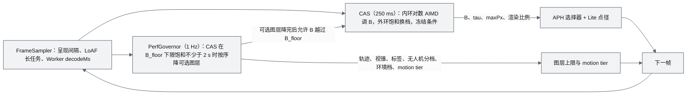

- CAS 与 PerfGovernor 共享同一采样窗口；冻结条件（页面隐藏、模态主动限帧、揭开遮罩或切换世界后的前 30 帧、本帧有新程序编译、用户主动限帧）期间两者都不评估（ADR-012、ADR-041）。
- 硬件档顺序相反：先由 CAS 外环逐档下调到最低允许档，再按①–⑥降可选图层（ADR-041）。
- 恢复：CAS 上限饱和（或 B ≥ 0.9·hi）持续 ≥ 10 s 按逆序恢复一步，步间 ≥ 10 s。
- 所有降级在性能 HUD 显示，并以合并后的 Toast 说明原因。
- **`window.__perf`**（预分配、就地更新，供 Playwright 读取）：`frame`（呈现间隔环与分位）、`cas`（B、档位、换档记录、反向次数）、`layers[<layer>]`（CPU 提交耗时、draw 数、顶点数）、`latency`（t_sim 到像素、命令到可见）、`ttfp`、`switchMs`、`tti`、`forced`、`rtAllocs`、`programs`、`rebuilds`、`net`（decodeMs、credit、重连）。字段定义属 [18](18-性能与测试方案.md)。

---
## 8. 后端架构

### 8.1 api 进程

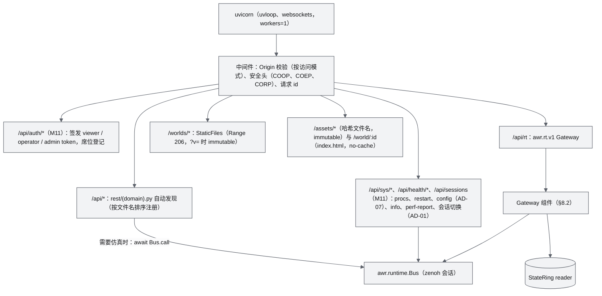

**REST 分组**（路径、请求与响应、错误码以 [17](17-接口与实时协议规范.md) 为准；文件所有权见 AWR-03 §4.3）：

| 文件（所有者） | 路径前缀 | 用途 | 执行方式 |
|---|---|---|---|
| `auth.py`（M11） | `/api/auth` | 签发 HMAC token（viewer / operator / admin）并经 `ctl/sim-core/lease` 的 `seat_claim` 登记席位；回环模式 operator 免口令，admin 与局域网模式需管理口令（17 §3.3） | api 本地 + `ctl/sim-core/lease` |
| `sys.py`（M11） | `/api/sys`、`/api/health`、`/api/events` | 进程列表与手动重启（admin）、前端配置 `GET /api/sys/config`（AD-07）、版本信息、`/bench` 回传、审计查询、事件补拉 | `sys/*` query 或本地 |
| `sessions.py`（M11） | `/api/sessions` | 当前会话；会话世界切换（ext，与 WS `session/start` 同一路径） | `sys/run`（AD-01） |
| `commands.py`（M11） | `/api/commands` | 调用的 REST 镜像（ext），与 WS `call` 共用幂等表 | `ctl/{producer}/cmd` |
| `worlds.py`（M11） | `/api/worlds` | 世界清单与 contentVersion（读 `world.json`） | api 本地（只读清单，AWR-03 §4.2） |
| `world_query.py`（M04） | `/api/world/{id}/query` | `height_dsm`、`ground_dtm`、`agl`、`clearance`、`segment_los`、`path_coarse_check`、`ray_hit` 探针（上限见 17 §4.2） | 转发 `svc/geo/{height,ray_hit}`（AD-04） |
| `fleet.py`（M08） | `/api/fleet` | roster、机体增删 | `ctl/sim-core/{roster,cmd}`（AD-05） |
| `env.py`（M07） | `/api/env` | 当前关键帧、预设列表、`env/query`、`env/set`、`env/preset` | 缓存读取；`env/query` 走 `ctl/sim-core/query`；写操作走 `ctl/sim-core/cmd` |
| `scenarios.py`（M10） | `/api/scenarios` | 剧本列表与加载 | `ctl/sim-core/cmd` |
| `runs.py`（M12） | `/api/runs` | run 与录制段索引、段下载、`keep` 标记（ext）；回放本身由 WS `playback` 控制 | 文件索引；回放经 `sys/start` 与 `ctl/replay-worker/*` |
| `agents.py`（M14，ext） | `/api/agents` | agent 任务、证据链查询 | `ctl/agent-runtime/*` |
| `jobs.py`（M03，ext） | `/api/jobs` | 提交、取消、查询任务 | `svc/job/*` |

规则：任何需要 sim-core 的 REST 处理函数都以 `await Bus.call(...)` 实现，sim-core 不在线时返回 503（`reason` 为 211 SIM_UNAVAILABLE 或 213 SERVICE_UNAVAILABLE）；处理函数内禁止 > 1 ms 的同步计算（§4.3）。

**静态服务**：Starlette `StaticFiles` 直接服务 Range（206 已实测，00-index §1.3）；`world.json` 与 `index.html` 为 no-cache；带 `?v=` 的世界资源与哈希命名的前端资源为 `public, max-age=31536000, immutable`。D1-AC-08（N = 1000、3 个客户端同时跑 flight60）超标时按 AD-07 拆出 `static` 进程。

### 8.2 Gateway 内部结构

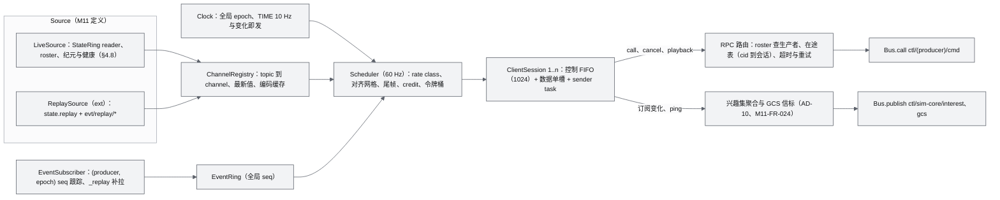

- **编码一次**：每个 `(channel, seq)` 只编码一次，所有会话共享同一 bytes；同 rate 的会话在同一对齐 tick 到期，编码缓存命中（r27 §3.8 性质 3）。
- **控制与数据分离**：控制 FIFO 满即以 1013 断开（不能丢）；数据单槽新帧覆盖旧帧；sender task 先排空控制面（r27 §3.9）。
- **结果路由**：`result` 与 `progress` 只发给发起调用的会话（按在途表）；`cmd.*` 事件按连接过滤后以 `event`/`events` 下发，批量命令只下发 `fleet.batch.progress` 汇总（AD-03）。
- **详情解复用**：`state/sim-core/{safety,sensor,detail}` 的负载按 agent_no 切片后原样装入 WS 记录，不重新编码（M11-FR-072）。
- **启动参数**：uvicorn 0.54.0 的 `--ws-per-message-deflate` 与 `--ws-max-size` 默认分别为 True 与 16 MiB（`uvicorn/main.py` 已核实），因此 ADR-014 的"关闭 permessage-deflate"与 §14.3 的入站上限必须写进 api 启动参数（§8.4 的 `runtime.yaml`），不能只靠应用层配置。
- **调试**：`/api/rt/inspect`（dev 与 test）返回 channel 表、会话统计与最近帧的解码结果（ADR-014）。

### 8.3 sim-core 进程

**组件与所有者**：

| 组件 | 所有者 | 说明 |
|---|---|---|
| 主循环、SimClock、组合根、dispatch、慢任务轮转、checkpoint 接线、输入日志 | M08 | `awr/sim/runtime/` |
| FleetSim（SoA、pipeline、stage 注册表、numba L1 核、numpy oracle、profiles） | M08 | `awr/sim/fleet/` |
| state_model、fuser、CommandEngine、准入检查注册表、LeaseManager、estimate、roster | M08 | `awr/sim/core/` |
| SimBackend 实现：MockBackend（L1）、ReplayBackend（L0） | M08 | `awr/sim/backends/` |
| EnvironmentService 实现与 `env` stage | M07 | 经组合根装配 |
| Flight FSM、guard、battery、fleet_guard、围栏、故障注入（ext）；准入检查"状态矩阵""围栏粗校验" | M09 | 经组合根装配 |
| MissionEngine、生成器、剧本加载器；plan-pool 任务 | M10 | 经组合根装配 |
| SensorModel（位姿与 FOV；ext 噪声与检测器） | M13 | 经组合根装配 |
| WorldQuery（DSM/DTM mmap、zones）与 `GeoProbeServer`（`svc/geo/{height,ray_hit}` 的慢任务分片服务） | M04 | 进程内库，由组合根实例化 |

**stage 表**（主时钟 250 Hz；pipeline 的定义方是 M08，完整的 order、every、phase、适用保真度与说明以 [M08 §6.4](modules/M08-仿真内核与飞行器适配PRD.md) 为准，本表只摘出注册方与顺序，第 2 轮与 M08 对齐：faults 前移到 025，新增 fsm、mission_guard、cmd_watch 与分片的 fleet_guard，mission 跟踪器位于 027）：

| 序 | stage | 每 | phase | 注册方 | 备注 |
|---|---|---|---|---|---|
| 000 | clock | 1 | 0 | M08 | V0.4 起 lockstep 屏障不在本实例（ADR-020） |
| 010 | ingest | 1 | 0 | M08 | staged → active；supervisor 命令优先；流式 watchdog |
| 020 | env | 5 | 0 | M07 | 同 tick 内所有消费者看到同一环境样本；可按 slot 分片错峰（ADR-021） |
| 025 | faults | 2 | 0 | M09（ext） | 执行器类故障，位于融合核之前 |
| 027 | mission（跟踪器） | 2 | 0 | M10 | 对 TRAJ 槽位求值 B-spline 或解析原语，写设定点 |
| 030–080 | refgen、pos_ctrl、att_ctrl、motor、aero、integrate | 2 | 0 | M08 | numba 融合核 |
| 085 | kinematic | 2 | 0 | M08 | L0 回放幽灵机 |
| 090 | contact | 2 | 0 | M08（查询 M04 DSM） | — |
| 100 | sensors | 5 | 2 | M13 | — |
| 110 | guard | 5 | 1 | M09 | 只发事件；链路判据按墙钟在此评估 |
| 115 | fsm | 1 | 0 | M09 | 白名单裁决，下一 tick 的 ingest 生效 |
| 120 | battery | 25 | 3 | M09 | — |
| 121 | mission_guard | 25 | 13 | M09 | 运行期围栏、高度与净空 |
| 128 | cmd_watch | 5 | 4 | M08 | 调用完成判据 |
| 130–133 | fleet_guard.0–3 | 25 | 4、9、14、19 | M09 | 网格哈希 + CPA，按 slot 分 4 片 |
| 140 | tap | 2 | 0 | M08 | 写 StateRing |
| 150、155、160 | mission_engine、coverage（ext）、director | 25、50、25 | 8、13、8 | M10 | 任务状态机、覆盖揭示、剧本导演 |

**sim-core 的 key**（定义以 17 §9.3 为准）：queryable `ctl/sim-core/{cmd,clock,lease,roster,estimate,query}`、`svc/geo/{height,ray_hit}`（AD-04）、`evt/sim-core/_replay`；订阅 `ctl/sim-core/{setpoint,gcs,interest}`；发布 `evt/sim-core/{cmd,safety,mission,sim,env,lease}`、`state/sim-core/{ext,safety,sensor,mission,env,detail,perf}`。所有 query 回调只把 `(kind, query)` 放入 inbox，由主循环在步顶处理，`Bus.serve` 包装器在 `finally` 中显式 `drop()`（g05 §10 R5；17 §9.4）；pub/sub 回调只做字典赋值（setpoint、gcs、interest 取最新值）。

### 8.4 supervisor

职责：exec 启动与依赖顺序；waitpid 与心跳巡检（5 Hz）；退避与熔断；run 切换编排（`sys/run`，AD-01）；`on_demand` 进程的按需启停（`sys/start`、`sys/stop`）；`runs/` 配额（启动时与每 10 min）；日志收集（stderr JSON 行写 `runs/<run>/logs/<name>.log`，10 MB × 5 轮转，内存保留最后 200 行）；`sys/{procs,restart}`；zenoh 汇合点。实现约 250 行，不用 supervisord 或 docker restart（它们检不出挂死，g05 §7.1）。

`configs/runtime.yaml` 的进程清单：文件属 M11，键的完整语义、profile 叠加与环境变量以 [19 §6.2](19-部署与运维说明书.md) 为准；下面只摘出与架构有关的键，其中 `run_scoped` 与 sim-core 的 `plugins` 是本文引入、待 19 §6.2 补入的键（§21 第 16 条）：

```yaml
procs:
  - name: sim-core
    layer: core
    cmd: [python, -m, awr.sim.runtime]
    run_scoped: true                  # 本文：run 切换时随旧 run 停止、随新 run 启动（AD-01）
    plugins: [awr.environment.stage, awr.sim.safety, awr.sim.mission, awr.sim.sensors]   # 本文：组合根（§3.3 规则 1）
    cpus: [1]
    nice: -5                          # 需要 CAP_SYS_NICE，否则取 0 并告警
    liveness: {ring: state.sim-core, stale_s: 2.0, startup_grace_s: 15}
    id_range: [0, 1024]
    standby: true                     # 热备用进程，重启时直接接替（AWR-19 §4.2，AWR-03 ADR-070）
    standby_cpus: [7]
  - name: api
    layer: core
    cmd: [uvicorn, awr.api.main:app, --host, "${net.bind}", --port, "${net.port_effective}",
          --loop, uvloop, --ws, websockets, --workers, "1",
          --ws-per-message-deflate, "false", --ws-max-size, "262144"]   # ADR-014；§14.3（uvicorn 默认为 True 与 16 MiB）
    run_scoped: false                 # 跨 run 存活，重开 zenoh 会话（AD-09）
    cpus: [0]
    start_after: [sim-core]           # 只是顺序，不是硬依赖
    liveness: {heartbeat: hb.api, stale_s: 5.0, startup_grace_s: 15}
  - {name: recorder, layer: ext, cmd: [python, -m, awr.recorder], run_scoped: true,
     liveness: {heartbeat: hb.recorder, stale_s: 5.0, startup_grace_s: 15}}
  - {name: replay-worker, layer: ext, on_demand: true, cmd: [python, -m, awr.recorder.replay], run_scoped: true,
     restart: {policy: on-failure}, liveness: {heartbeat: hb.replay-worker, stale_s: 5.0, startup_grace_s: 15}}   # sys/start、sys/stop
  - {name: agent-runtime, layer: ext, cmd: [python, -m, awr.agent.runtime], run_scoped: true,
     liveness: {heartbeat: hb.agent-runtime, stale_s: 5.0, startup_grace_s: 15}}
  - {name: job-worker, layer: ext, cmd: [python, -m, awr.jobs.worker], run_scoped: false, nice: 10,
     restart: {policy: on-failure}, liveness: {heartbeat: hb.job-worker, stale_s: 120, startup_grace_s: 30}}
  # geo-worker、px4-bridge-k 为 V0.2 条目；static 为 AD-07 的条件条目（端口 8001）
```

`run_scoped: true` 的进程在 run 切换时随旧 run 停止、随新 run 启动；`run_scoped: false` 的进程（api、job-worker）跨 run 存活并重开 zenoh 会话（AD-09）。`defaults`（BLAS 线程数 1；退避 0.1/1/2/4/8 s（首档 AWR-03 ADR-061），`max: {count: 5, window_s: 60}` 即 60 s 内第 6 次启动熔断；SIGTERM 宽限 5 s）与 `run`、`net`、`bus`、`quota`、`cpu` 段落见 19 §6.2。

### 8.5 worker 进程

| 进程 | 与 sim-core 或 api 的契约 | 失败语义 | D1 |
|---|---|---|---|
| plan-pool | sim-core 以 `ProcessPoolExecutor(spawn, W=1, max_tasks_per_child=500)` 创建；`OMP_NUM_THREADS=1` 在 spawn 前设置；结果按 `(mission_id, revision)` 去重，done_callback 入 inbox，按 apply_tick 生效 | `BrokenProcessPool` → 重建池、重试 1 次 → 降级（直线 + LOS）并发 214 PLANNER_CRASHED，任务 Pause | core |
| recorder | StateRing LOSSY 读者；订阅 `evt/**` 与 `state/sim-core/*`；从 `ctl/sim-core/interest` 读取 `marks`（AD-10）；服务 `ctl/recorder/{start,stop}` | overrun → `recorder.gap`；崩溃 → 录制缺口，重启后续写新段 | ext |
| replay-worker | `on_demand`，由 api 经 `sys/start` 启动、`sys/stop` 停止；读 MCAP，写 `state.replay` 环与 `evt/replay/*`；服务 `ctl/replay-worker/{open,seek,play,pause,speed,close}` | 中断 → UI 提示，可重新 seek | ext |
| agent-runtime | StateRing LOSSY 读者；`ctl/sim-core/{cmd,estimate}`（owner = AGENT）；定时器按仿真时钟 | 崩溃 → 进行中的协作任务 `interrupted`；租约按 TTL 过期（ext） | ext |
| job-worker | `svc/job/*`；复用 `awr.world.*` 库；产物写 tmp 目录后原子 rename；进度节流 250 ms（≤ 4 Hz） | 崩溃 → `failed(resumable)`，不自动重跑 | ext |
| geo-worker | `svc/geo/{raycast,los,lidar}`；Open3D RaycastingScene（持有 GIL，必须独立进程） | liveliness 消失 → 查询无回复，LiDAR 降级；AGL、碰撞不依赖它 | V0.2 |
| px4-bridge-k | 每进程 ≤ 16 架；写 `state.px4-bridge-k`；`ctl/px4-bridge-k/cmd`；id 区段 1024 + 16k 起 | 名下机体 `link_lost`；PX4 按自身 failsafe 处置 | V0.2 |

### 8.6 World 工具链

`worldpkg`（M03）是离线组件，不是常驻进程：`make run` 在启动 supervisor 之前同步执行 `worldpkg build --missing`（缺失或 `contentVersion` 校验失败的世界重建，每城 ≤ 60 s，ADR-034）；job-worker 在 UI 触发构建时复用同一 Python 库（不再起子进程调用 CLI）。世界目录只在构建完成并通过 `validate` 后才以原子 rename 出现在 `worlds/<id>/`，因此 api 与 sim-core 永远看不到半成品。

---

## 9. 扩展点

### 9.1 扩展点总表

| 扩展点 | 定义方 | 实现方（D1） | 注册方式 | 冻结 |
|---|---|---|---|---|
| `SimBackend` / `EntityAdapter` / `DroneAdapter` + `caps`（含 `caps.clock`） | M08 | MockBackend、ReplayBackend；桩：px4_sih、prometheus | `awr/sim/backends/*` + `rt/caps/<name>.json` | V0.1（P-07） |
| stage 注册表 `register_stage(name, every, phase, order, *, owner, fidelity, budget_core, writes, reads, shards)` 与状态块 `register_state_block` | M08 | M07、M09、M10、M13 | 组合根按 `plugins:` 导入（M08 §7.1.1；`owner`、`budget_core` 在 D1 必填） | V0.1 |
| 准入检查注册表 `register_admission_check(step ∈ {4, 8}, name, owner, fn)` | M08 | M09（④ 状态矩阵与预检、⑧ 围栏粗校验）、M10（任务类前置条件）；M08 自身执行 ④ 的生命周期与时钟约束及 ⑤–⑦ | 同上 | V0.1 |
| 慢任务与查询注册 `register_slow_task`、`register_query` | M08 | M07（1 Hz 环境心跳、`env/query`）、M09（safety 行）、M13（SensorPose48） | 同上；查询经 `ctl/sim-core/query` 路由 | V0.1 |
| 能量模型与安全钩子 `register_energy_model`、`register_safety_hooks` | M08（`awr/sim/core/interfaces.py`） | M09 | 同上；使 `estimate` 与看门狗不形成 M08 → M09 反向依赖（M08 §14 F-06） | V0.1 |
| `EnvironmentService` | M08 | M07 | 组合根注入 | V0.1 |
| `WorldQuery` | M04 | M04 numpy DSM；V0.2 geo-worker 补精确光线类 | 进程内库 + `svc/geo/*` | V0.1 |
| `EngineAdapter` v2 | M01 | MockEngine（ext）；桩：LingBot-Map、DA3、MapAnything、COLMAP | `awr/reconstruction/engines/*` + `awr/jobs/registry.py` | V0.1 |
| `SensorModel` | M13 | 位姿与 FOV（core）；GNSS/IMU 噪声、Mock 检测器（ext） | stage 注册 | V0.1 |
| `Bus`（`ZenohBus`、`LocalBus`） | M11 | M11 | `awr.runtime.bus` | V0.1；`ZenohStateBus` 在 V0.5 |
| `Source`（`LiveSource`、`McapSource`） | M11 | M11、M12 | `awr/api/rt/sources/*` | V0.1 |
| REST 路由 | M11 | 各领域模块 | `awr/api/rest/<domain>.py` 自动发现 | V0.1 |
| 进程清单 | M11 | 各模块 | `configs/runtime.yaml` 的 `procs:` | V0.1 |
| 任务类型 | M03 | M03、M01 | `awr/jobs/registry.py` | V0.1 |
| `RenderBackend` | M06 | Tier S、B（core）；A（ext） | `viewport/renderer.ts` | V0.1 |
| `loop.register(phase, id, fn)` | M06 | M05、M07、M11、M12、M15 | 引擎模块初始化时注册 | V0.1 |
| 图层注册表 | M06 | M05（点云）、M07（环境）、M06（其余） | `viewport/layers/registry.ts` | V0.1 |
| 面板注册表、路由 | M15 | 各领域模块提供 store，M15 写面板 | `ui/panels/registry.ts`、`app/routes/*.tsx` | V0.1 |
| 构建目标 | M00 | 各模块 | `mk/<module>.mk` | V0.1 |

### 9.2 仿真后端扩展：保真度阶梯到进程拓扑的映射

| 档位（ADR-020） | 进程形态 | 状态平面 | 命令路由 | `caps.clock.mode` | 版本 |
|---|---|---|---|---|---|
| L0 运动学回放 | sim-core 内 ReplayBackend | `state.sim-core` | `ctl/sim-core/cmd` | free_running | V0.1 |
| L1 PX4-lite（默认） | sim-core 内 MockBackend | `state.sim-core` | `ctl/sim-core/cmd` | free_running（可暂停、可步进、最大倍速受 RTF 限制） | V0.1 |
| L2 气动力矩 | 同上，替换 stage | 同上 | 同上 | 同上 | V0.3–V0.4 |
| SIH | 每机一个容器 + `px4-bridge-k`（≤ 16 架/进程） | `state.px4-bridge-k`，Gateway 按 id 拼接 | `ctl/px4-bridge-k/cmd`（roster 路由） | slaved_realtime（锁定 ×1，不可暂停） | V0.2 |
| SITL-EXT lockstep | 独立 FleetSim 实例进程（不与大规模 L1 共用主循环） | 独立环 | 独立 `ctl/.../cmd` | lockstep | V0.4 |
| HITL | 桥进程 + 飞控硬件 | 独立环 | 同上 | slaved_realtime | V0.6 |
| Prometheus（模拟器 / 真机） | 地面站协议桥进程（纯 Python codec，55556 心跳常驻） | 独立环 | 同上；RTL 由网关仿真 | slaved_realtime / live | V0.2 / V0.5 |

**新增一个后端的步骤**（接口不变，UI 零改动）：①写 `rt/caps/<name>.json`（命令实现方式、ACK、信任上限、时钟能力）；②实现 `derive_<name>` 纯函数（原生态 → 七轴，g04 §4）并用 fake 数据测试；③实现生产者进程，写自己的 StateRing 并在 roster 中登记 `kind`、`T_world_local`；④在 `runtime.yaml` 追加条目与 `id_range`（supervisor 校验区段不相交，冲突拒绝启动，g05 §10 R9）；⑤契约测试：准入矩阵、ACK 映射（g04 §7）、帧换算 golden（AWR-03 §5.1 规则 6）。世界中出现非 lockstep 机体时，SimClock 锁定 rate = 1 并禁用暂停与步进，UI 依 `caps.clock` 置灰（ADR-045）。

### 9.3 重建扩展：Engine Adapter v2

```mermaid
%%{init: {"theme": "base", "themeVariables": {"fontFamily": "Inter, PingFang SC, Microsoft YaHei, Noto Sans CJK SC, sans-serif", "fontSize": "13px", "background": "#FBFBFC", "primaryColor": "#F2F3F5", "primaryTextColor": "#111214", "primaryBorderColor": "#5C616A", "secondaryColor": "#E4E6E9", "tertiaryColor": "#FBFBFC", "lineColor": "#5C616A", "textColor": "#111214", "mainBkg": "#F2F3F5", "nodeBorder": "#5C616A", "clusterBkg": "#FBFBFC", "clusterBorder": "#A7ABB3", "edgeLabelBackground": "#FBFBFC", "noteBkgColor": "#E4E6E9", "noteTextColor": "#111214", "noteBorderColor": "#81868F"}}}%%
flowchart LR
  UP["视频 / 图像序列（V0.5）或 MockEngine 合成航线（D1-ext）"] --> JOB["job-worker：任务状态机 QUEUED 到 SUCCEEDED（进度不超过 4 Hz）"]
  JOB --> EA["EngineAdapter.infer：输出 T_world_cam（C2W，OpenCV RDF）、q_xyzw、conf_u8、scale_status"]
  EA --> IR["Recon IR（recon-ir@1）+ engine.json"]
  IR --> SIM3["M02：GNSS Sim3（RANSAC-Umeyama，共线退化检测与重力增强；D1 为接口与库）"]
  SIM3 --> ING["worldpkg ingest（与 UrbanScene3D 同一规范化流程）"]
  ING --> WP[("worlds/(id)/ + reconstruction/(session)/")]
```

真推理只替换引擎，不改 IR 与 ingest（ADR-035）。V0.5 的 GPU worker 以 Docker 交付，通过 capability 探测开启（AWR-03 Q1）；它作为一个远端 job 执行者注册到同一任务队列语义上。

### 9.4 传感器扩展

- **自研模型**：`SensorModel` 以 stage 注册（`sensors`，50 Hz，phase 2），挂载参数来自 Vehicle Package `vehicles/<model>/sensors/*.yaml`；输出通道统一为 `uav/{id}/sensor/{name}/{pose,scan,det}`，按兴趣集下推（AD-10）。光线类查询只读 Geometry World（P-03）：D1 为 DSM 2.5D 步进，V0.2 起经 `svc/geo/lidar` 批量光线求交（2 万条射线约 6–7 ms，g05 §6）。
- **外部传感器后端**（ADR-048）：Gazebo 传感器（V0.6，随 SITL-EXT）与 Isaac Sim 传感器（V0.8，GPU 节点）经 World 导出器（`awr/world/export/{gz,usd}.py`）加载同一个 World，输出经一个"传感器桥"进程转换为同名通道；它们不替代 FleetSim 的动力学。GPU 不可用时 `caps` 声明不支持（Radar 在 V1.0 前即如此）。

### 9.5 前端扩展

新图层按"引擎模块（纯 TS）+ 图层适配（≤ 150 行）+ 注册表登记 + 预热变体 + 预算与 PerfGovernor 旋钮"五件事交付；新面板按"领域 store + 面板注册"交付。V0.3 的 Tier A 存储缓冲、V0.8 的 3DGS 与网格图层都沿用这一扩展点，与点云共享同一个 PerfGovernor 预算仲裁（AWR-03 §8.1）。

### 9.6 实体种类扩展

依 ADR-047：advertise 与 roster 携带 `kind`；topic 与 zenoh key 为 `<kind>/{id}/...`；新 kind 追加 `awr.<Kind>State.v1` 线格式与 `swarm/<kind>/state` 通道；前端实体列表与图例按 kind 分组。D1 只实现 `uav`，其余 kind 的契约位置在 V0.1 已预留，不需要破坏性升级。

---

## 10. 部署视图

### 10.1 D1 本机部署

```mermaid
%%{init: {"theme": "base", "themeVariables": {"fontFamily": "Inter, PingFang SC, Microsoft YaHei, Noto Sans CJK SC, sans-serif", "fontSize": "13px", "background": "#FBFBFC", "primaryColor": "#F2F3F5", "primaryTextColor": "#111214", "primaryBorderColor": "#5C616A", "secondaryColor": "#E4E6E9", "tertiaryColor": "#FBFBFC", "lineColor": "#5C616A", "textColor": "#111214", "mainBkg": "#F2F3F5", "nodeBorder": "#5C616A", "clusterBkg": "#FBFBFC", "clusterBorder": "#A7ABB3", "edgeLabelBackground": "#FBFBFC", "noteBkgColor": "#E4E6E9", "noteTextColor": "#111214", "noteBorderColor": "#81868F"}}}%%
flowchart LR
  subgraph USR["用户机器（有 GPU 的桌面浏览器）"]
    BRW["Chrome / Edge：http://localhost:8000/world/shenzhen"]
    SSH["ssh -N -L 8000:127.0.0.1:8000"]
  end
  subgraph H["后端主机（8 核、无 GPU、无显示器）"]
    A8["api 127.0.0.1:8000（HTTP + WS）"]
    Z["zenoh 汇合点 127.0.0.1:7447（只监听回环）"]
    V["Vite 开发服务器 5173（make dev，代理 /api、/worlds、/assets、WS）"]
    SHM[("/dev/shm/awr/(run)/")]
    DISK[("worlds/、runs/、data/raw/")]
    CH["headless Chromium 151（CI 与性能用例，Tier S，core2 至 core6）"]
  end
  BRW --> SSH
  SSH -- "SSH 隧道" --> A8
  CH --> A8
  A8 --- Z
  A8 --- SHM
  A8 --- DISK
```

| 项 | 回环模式（默认） | 局域网模式（可选） |
|---|---|---|
| api 绑定 | `127.0.0.1:8000` | `AWR_BIND=0.0.0.0` |
| 浏览器访问 | SSH 转发后 `http://localhost:8000`（安全上下文，WebGPU 与 COOP/COEP 可用） | `http://<host>:8000`（非安全上下文，WebGPU 不可用，硬件默认 Tier B 不受影响） |
| Origin 白名单 | `http://localhost:*`、`http://127.0.0.1:*` | `AWR_ORIGINS` 配置 |
| operator / admin token | operator 免口令；admin 需管理口令（17 §3.3） | operator 与 admin 都需要启动时打印并写入 `runs/<run>/admin.token`（0600）的管理口令 |
| zenoh | 只监听回环 | 同左（任何模式都不对外） |
| 静态拆分回退（AD-07） | 需要额外转发 `AWR_STATIC_PORT` | 同左 |

目录：`/dev/shm/awr/<run>/`（StateRing、心跳文件 `hb.<name>`、tmpfs checkpoint、Gateway 全局纪元 `gw.epoch`）；`runs/<run>/`（日志、checkpoint 镜像、`rec-<seg>.mcap`、`inputs.msgpack`、`audit.jsonl`、`meta.json`、`secret`、`admin.token`）；`worlds/<id>/`（生成物）；`data/raw/urbanscene3d/`（原始数据）。安装、配置与故障手册见 [19](19-部署与运维说明书.md)。

### 10.2 容器形态（D1 可选）

单容器 `awr-backend`：`tini` 为 PID 1，入口 `python -m awr.runtime.supervisor -c configs/runtime.yaml`；`shm_size: 1g`（zenoh SHM 已关闭，此值留足 StateRing、checkpoint 与 V0.2 SHM 余量，g05 §0 第 9 条）；可选 `cap_add: [SYS_NICE]` 以启用 sim-core 的 nice −5；挂载 `worlds/`、`runs/`、`data/raw/`；`restart: unless-stopped`（supervisor 自身崩溃时由容器拉起，sim-core 从磁盘镜像 checkpoint 恢复，ext）。

### 10.3 演进部署

```mermaid
%%{init: {"theme": "base", "themeVariables": {"fontFamily": "Inter, PingFang SC, Microsoft YaHei, Noto Sans CJK SC, sans-serif", "fontSize": "13px", "background": "#FBFBFC", "primaryColor": "#F2F3F5", "primaryTextColor": "#111214", "primaryBorderColor": "#5C616A", "secondaryColor": "#E4E6E9", "tertiaryColor": "#FBFBFC", "lineColor": "#5C616A", "textColor": "#111214", "mainBkg": "#F2F3F5", "nodeBorder": "#5C616A", "clusterBkg": "#FBFBFC", "clusterBorder": "#A7ABB3", "edgeLabelBackground": "#FBFBFC", "noteBkgColor": "#E4E6E9", "noteTextColor": "#111214", "noteBorderColor": "#81868F"}}}%%
flowchart TB
  subgraph CORE["仿真主机"]
    SUPV["supervisor"]
    APIV["api / Gateway（V1.0 多 worker）"]
    SIMV["sim-core（V1.0 按空间分片）"]
    BR2["px4-bridge-k（V0.2）"]
    ORC["SIH 容器编排（V0.2）"]
  end
  subgraph GPUN["GPU 节点（V0.5 起，Docker）"]
    RECON["重建 worker：LingBot-Map、DA3、MapAnything"]
    ISAAC["Isaac 传感器后端（V0.8）"]
  end
  subgraph AIR["P600 机载 / 地面站（V0.5）"]
    PROM["Prometheus 协议桥、rosbridge"]
  end
  subgraph AN["ANet（V1.0）"]
    HUB["ANetHub + 每机 daemon"]
  end
  SIMV -- "StateRing（本机）" --> APIV
  PROM -- "ZenohStateBus（TLS + ACL）" --> APIV
  RECON -- "zenoh 跨主机：svc/job、evt/job" --> APIV
  ISAAC -- "传感器通道" --> SIMV
  HUB -- "协作平面（秒级）" --> APIV
  ORC --> BR2 --> APIV
```

| 版本 | 部署变化 | 架构要点 |
|---|---|---|
| V0.2 | 加 SIH 容器、px4-bridge-k、geo-worker | 多生产者 StateRing 由 Gateway 按 id 拼接；geo-worker 与 sim-core 之间开启 zenoh SHM（池 8 MiB） |
| V0.5 | GPU 节点、跨主机 zenoh、P600 接入 | 远端生产者改用 `ZenohStateBus`（同一 reader 接口）；zenoh 启用 TLS 与按 key 前缀的 ACL；`lease` 3 s |
| V0.6 | HITL、gz 导出与 Gazebo 传感器 | HITL 为 slaved_realtime；导出器记录 `coordinate.sha256` |
| V0.8 | Isaac 传感器后端、3DGS | 同一 World 在三个后端坐标一致（锚点误差 ≤ 1 cm） |
| V1.0 | sim-core 分片、Gateway 多 worker、真 ANet | 每分片一个 StateRing；Gateway 以 `SO_REUSEPORT` 起多个 worker 各自 attach（g05 §2.3） |

### 10.4 CPU 分区与资源配额

| 核 | 性能验收时的归属 | 依据 |
|---|---|---|
| core0 | api | ADR-017 |
| core1 | sim-core 主循环线程（nice −5，需 `CAP_SYS_NICE`；其余线程见 core7）；checkpoint 后台拷贝线程（只在主循环空闲窗口内持状态锁运行，`cpuaff.AuxPinner.keep`，ADR-073 第 2 条） | ADR-017、ADR-073 |
| core2–6 | headless Chromium 与 SwiftShader（SwiftShader 的 marl 线程池自行把工作线程亲和性设为全部 CPU、不继承 taskset，性能工具以 `AffinityGuard` 每 0.25 s 把客户端进程树的线程改回 2–6；未改回时 3 个 flight60 客户端在 core1 上累计约 0.27 核，ADR-073 第 6 条） | ADR-033 运行协议、ADR-073 |
| core7 | plan-pool；sim-core 热备用进程（等待期间，接替时改钉 core1，ADR-070）；sim-core 主循环以外的线程（zenoh I/O、checkpoint 写线程、state_ext 空闲窗口发布线程、输入日志、plan-pool 管理线程，继承 nice −5）：`configs/runtime.yaml` 的 sim-core `env.AWR_SIM_AUX_CPUS = "7"`，由 sim-core 慢任务每 2 s【墙钟】重扫（ADR-070 曾缺省为"其余全部 CPU"；持有 GIL 的后台线程在 api 或 Chromium 满载的核上被抢占时主循环醒来后要等 GIL，ADR-073 第 6 条） | ADR-017、ADR-073 |
| 不钉核 | supervisor、recorder、agent-runtime、job-worker（nice 10）、replay-worker | ADR-017；§21 反馈第 10 条 |

资源配额：`runs/` 20 GB；每 run 的 `/dev/shm` ≤ 32 MB（本文设定，§4.9）；日志每进程 10 MB × 5；审计文件随 run 保存。

---

## 11. 开发视图

### 11.1 代码组织

目录树与路径所有权以 AWR-03 §4.1、§4.3 为准。层与目录的对应：

| 层 | Python（`python/awr/`） | TypeScript（`apps/web/src/`） |
|---|---|---|
| Reality / Reconstruction | `reconstruction/`、`world/georef/` | `engine/geo/` |
| World | `world/{ingest,pointcloud,terrain,semantic,package,qa,geometry,export}/`、`jobs/` | `engine/pointcloud/` |
| Environment | `environment/` | `engine/environment/` |
| Simulation | `sim/{runtime,fleet,core,backends,safety,mission,planning,sensors,orchestrator}/`、`swarm/` | `engine/{drones,mission,sensors}/` |
| Agent | `agent/` | `stores/agents.ts` |
| Runtime Services | `api/`、`recorder/`、`runtime/` | `net/`、`engine/time/` |
| Web Runtime 宿主与 UI | — | `viewport/`、`engine/{loop,camera,labels,picking,perf,anim}`、`app/`、`ui/`、`stores/`、`styles/`、`lib/` |
| 横切 | `contracts/`（生成物） | `@awr/contracts`（生成物） |

### 11.2 构建与生成物流水线

```mermaid
%%{init: {"theme": "base", "themeVariables": {"fontFamily": "Inter, PingFang SC, Microsoft YaHei, Noto Sans CJK SC, sans-serif", "fontSize": "13px", "background": "#FBFBFC", "primaryColor": "#F2F3F5", "primaryTextColor": "#111214", "primaryBorderColor": "#5C616A", "secondaryColor": "#E4E6E9", "tertiaryColor": "#FBFBFC", "lineColor": "#5C616A", "textColor": "#111214", "mainBkg": "#F2F3F5", "nodeBorder": "#5C616A", "clusterBkg": "#FBFBFC", "clusterBorder": "#A7ABB3", "edgeLabelBackground": "#FBFBFC", "noteBkgColor": "#E4E6E9", "noteTextColor": "#111214", "noteBorderColor": "#81868F"}}}%%
flowchart LR
  C["packages/contracts（schemas、rt、bus、env、scenario、vehicle、recon、agent、fixtures）"] --> G["tools/contracts/gen.{mjs,py}"]
  G --> PY["python/awr/contracts（提交入库）"]
  G --> TS["packages/contracts/gen/ts = @awr/contracts（提交入库）"]
  PY --> BE["后端进程"]
  TS --> FE["apps/web（Vite 8 构建）"]
  RAWD["data/raw/urbanscene3d"] --> WPK["worldpkg build"] --> WLD["worlds/（不入库）"]
  STL["Prometheus p600.stl"] --> VT["tools/vehicles/{stl2glb,lowpoly}"] --> GLB["vehicles/*/model/*.glb（不入库）"]
  WLD --> F60["tools/bench/flight60"] --> BENCH["apps/web/public/bench/flight60/（不入库）"]
```

`make ci` 校验生成物与源 schema 一致、golden 对拍与字节往返（AWR-03 §4.2 第 3 条、§4.5）。

### 11.3 边界强制与合并门禁

| 门禁 | 内容 | 执行 |
|---|---|---|
| 依赖边界 | Python：`tools/lint/py-imports.py`（AD-08，§3.3 规则 2）；TS：oxlint `no-restricted-imports` 与 `import/no-cycle` | `make lint` |
| 设计体系 | no-emoji、no-hex、lint-lf、motion-lint、check-icons、no-raw-controls、check-brand（D1-AC-20） | `make lint` |
| 契约 | 生成物一致、golden 混合容差、`layouts.json` 字节往返、TIME 编解码（含 bit7 与 LIVE） | `make test-contracts` |
| 单元与集成 | pytest（不含 perf 标记）、vitest（不含 browser bench） | `make ci` |
| 性能 | 不进合并门禁；里程碑出口与每日按 ADR-033 运行协议执行 | `make perf` |

### 11.4 并行开发与替身

| 替身 | 替代对象 | 用途 | 交付 |
|---|---|---|---|
| `tools/fake/fake_gw.py` | api + sim-core | 前端在 MS1 起拿到真实 WS 流（N ∈ {1, 200, 1000}），回放 `.awrrt` 夹具 | MS1（D1-AC-35） |
| `net/rt/FakeSource.ts` | rt.worker 输出 | 纯前端单测 | MS1 |
| `LocalBus`、`LocalRing` | zenoh、StateRing | 单元与集成测试；`--inproc`（≤ 50 架，不参与性能验收） | MS1 |
| MockBackend | 真仿真后端 | D1 默认后端 | MS4 |
| MockEngine | 真重建引擎 | Mock 重建链路 | MS6（ext） |
| `fake_px4` 回放 | SIH | `derive_px4` 纯函数测试 | 桩 |

每个模块在独立 git worktree 与分支 `m<nn>/<topic>` 上开发，合并前本地通过 `make ci`（AWR-03 §4.5）。D1-MS3 walking skeleton（一城 World → 点云上屏 → 1 架 FleetSim → StateRing → Gateway → WS → 无人机上屏 → goto 闭环）是并行开发全面铺开前的集成门禁（D1-AC-34）。

---
## 12. 场景视图（+1）

每个场景串联逻辑、进程、部署与开发视图，并落到可执行验收。

### 12.1 S-A 首次启动到首屏

1. 用户执行 `make run`：原始数据缺失时提示 `make fetch-data`；`worldpkg build --missing` 同步生成缺失或校验失败的世界（每城 ≤ 60 s）。
2. supervisor 创建 run（`r<YYYYMMDD>-<HHMMSS>-<4hex>`），打开汇合点，exec sim-core（深圳 + S1，numba 缓存预热，`gc.freeze()`，`proc/sim-core/ready`），再 exec api。
3. 用户经 SSH 转发打开 `/world/shenzhen`：浏览器创建 RenderBackend（Tier B 或本机 Tier S）并开始 shader zoo；并行取 `world.json` 与首屏 Range；并行建立 WS（serverInfo、advertise、TIME、subscribe、SNAPSHOT）。
4. 首屏 Range 最后一个字节到达后，上传首帧目标集并提交首个含点帧，TTFP 结束；预热完成后揭开遮罩；S1 两架机随 SNAPSHOT 与后续 BATCH 上屏。

涉及：M03、M11、M08、M05、M06、M15。验收：D1-AC-01、D1-AC-02、ARCH-AC-003。

### 12.2 S-B 点选 GoTo 闭环（walking skeleton 的产品形态）

1. 用户选中 `p600-01`（CPU 包围球拾取），在建筑顶面点击。
2. 前端求屏幕射线 → `POST /api/world/shenzhen/query {op: "ray_hit"}` → api 转发 `svc/geo/ray_hit` → sim-core 慢任务中在 DSM 上求交（AD-04）→ 返回世界坐标。
3. 前端 `RtClient.call("uav/p600-01/cmd/goto", {pos, speed_mps})` → api 执行①–③并按 roster 路由 → sim-core 步顶执行④–⑧（围栏粗校验）→ reply accepted → plan-pool 细校验 → `cmd.running`、`cmd.progress` → `cmd.succeeded`（带 metrics）。
4. 机体停在点击位置 3 m 内；命令到画面可见 p95 ≤ D_global + 150 ms。

涉及：M04、M06、M08、M09、M10、M11、M12。验收：D1-AC-32、D1-AC-34、D1-AC-26。

### 12.3 S-C 1000 架阶梯与全机 RTL

1. 加载 ladder 剧本（N ∈ {10, 50, 200, 500, 1000}，`gcs_loss_policy: ignore`，录制默认关闭）。
2. sim-core 以 numba L1 步进，StateRing 125 Hz 发布；Gateway 编码一次，swarm 按档 10/20 Hz，关注集 ≤ 32 架。
3. operator 对 `uav: "*"` 下发 RTL：一次 reply 携带逐机结果 `per_uav`；sim-core 事件按步合批；Gateway 不逐机下发 `cmd.*`，而以 `fleet.batch.progress`（≤ 2 Hz）汇总，其余同 tick 事件合为一条 `events` 消息（AD-03）；前端 ≤ 4 Hz 批量写入 store，Toast 合并为"1000 架进入 RTL"。
4. DroneRail 只渲染可见行 + 10；Tier S 下无人机图层按分档上限渲染（低模 ≤ 32，其余标记点）。

涉及：M08、M09、M11、M06、M15、M16。验收：D1-AC-07、D1-AC-08、D1-AC-09a/b、D1-AC-27、ARCH-AC-008。

### 12.4 S-D 天气预设切换

operator 在环境面板选择 `heavyRain` → 命令路径进入 sim-core → EnvironmentService 生成新关键帧（含过渡）→ 可靠事件与 1 Hz 心跳 → api 缓存 → `env/state` → EnvStore 每帧 `eval_env(kf, tRender)`；物理侧 env stage 50 Hz 从同一关键帧求风与能见度，影响气动与 guard。因为 shader zoo 已预热全部环境变体，切换期间不产生新程序。验收：D1-AC-19、D1-AC-13（env-gpu 对拍）、ARCH-AC-013。

### 12.5 S-E sim-core 崩溃与恢复

- **D1-core**：kill -9 sim-core → supervisor waitpid 立即感知 → 退避 0.5 s → exec（剧本起点，头部 `segment` + 1）→ TIME.state 依次为 STALLED、RESTARTING、PLAYING → Gateway 读到 `segment` 变化，全局 epoch + 1，先 TIME 后 SNAPSHOT（AD-02）→ recorder（若在运行）结束当前段并开新段 → 客户端清空插值环。在途调用以 211 SIM_UNAVAILABLE 结束。验收：D1-AC-11a（≤ 3 s 重启）。
- **D1-ext**：从 tmpfs checkpoint 恢复（生产者 `epoch` + 1，`segment` 不变，发 `sim.restarted`）→ 只对 sim-core 的 channel 置 RESET → 晚于恢复点的调用以 212 SIM_ROLLBACK 结束 → 录制同段内标记作废区间。实测 kill -9 后 0.79 s 恢复出帧、挂死 3.4 s（g05 §7.4）。验收：D1-AC-11b。
- **主循环挂死**：心跳年龄 > 2 s → supervisor 判 HUNG → SIGTERM、1 s 后 SIGKILL → 同上；faulthandler 已在日志中留下全部线程栈。

### 12.6 S-F 世界切换（AD-01）

**D1-core（静态浏览）**：用户在顶栏选择"纽约" → 路由变为 `/world/newyork` → 前端关闭旧视觉世界并 `openWorld(newyork)`，机群图层隐藏、不订阅仿真通道，运行世界仍为深圳；首帧 ≤ 1.5 s。**D1-ext（会话世界切换）**：席位持有者再调用 `session/start{world_id: newyork}` → api 经 `sys/run` 请 supervisor 编排 run 切换（§4.6）→ 新 sim-core 就绪 → Gateway 全局 epoch + 1 → 客户端收到 `session.switched`、新 `serverInfo` 与全量 advertise，核对 contentVersion 并订阅新 roster，REST token 重新签发。两种情形下 WS 连接都不断开。验收：D1-AC-02（切换 ≤ 1.5 s）、D1-AC-29（切换 3 次，非预期 WS 重连为 0）、ARCH-AC-015。

### 12.7 S-G 录制回放与 seek（ext）

S1 运行时 recorder 按 ADR-040 策略录制 10 min → 席位持有者先暂停实时会话，再在 Timeline 发 `playback{cmd: open}`（AWR-12 §4.11）→ api 经 `sys/start` 启动 replay-worker 并调用 `ctl/replay-worker/open` → api 切换 Source、会话进入只读、全局 epoch + 1 → 用户拖动到任意时刻（`ctl/replay-worker/seek`）→ replay-worker backfill → 首个 backfill 帧 ≤ 500 ms → 回放帧中 Full64 字节与录制逐字节一致。验收：D1-AC-18。

### 12.8 S-H Mock ANet 协同搜救（ext）

S3 中 A 机检测置信度 0.42 → agent-runtime 发起合同网：find（按能力 `thermal.imaging`）→ quote（每个候选经 `ctl/sim-core/estimate` 用同一机型与电池模型估价）→ score → delegate（Mock ANet 往返 0.9–1.1 s，按仿真时钟计时）→ 受信守卫以 owner = AGENT 下发命令 → 执行、效果 OK 且 `simulated = true` → 证据链事件完整。×1 与 ×10 结果一致。验收：D1-AC-16。

---

## 13. 可靠性

### 13.1 故障模型与处置

| 组件 | 故障 | 检测 | 影响 | 恢复 | 时限 | 验收 |
|---|---|---|---|---|---|---|
| api | 崩溃或挂死 | waitpid；`hb.api` 年龄 > 5 s | WS 断开；仿真不受影响 | 退避重启；客户端重连并以同一 cid 重发得到 duplicate | 客户端 ≤ 3 s 重连 | D1-AC-11a |
| sim-core | 崩溃 | waitpid | 状态冻结在最后一帧（kill 后仍可读） | core：剧本重开；ext：checkpoint 恢复 | core ≤ 3 s；ext 首帧 ≤ 1.5 s、回滚 ≤ 1 s | D1-AC-11a/b |
| sim-core | 主循环挂死 | StateRing 心跳年龄 > 2 s | 同上 | 判定即 STOPPING，栈转储后 SIGKILL（ADR-065）→ 同上 | 检出 ≤ 2.5 s，恢复 ≤ 4 s | D1-AC-11b |
| sim-core | 连续崩溃 | 60 s 内第 6 次启动 | 仿真不可用 | 熔断 FAILED，UI 显示 stderr 末尾 200 行，admin 经 `sys/restart` 手动恢复 | — | ARCH-AC-006 |
| sim-core | 毒性 checkpoint（ext） | 恢复后 5 s 内再次崩溃 | — | 恢复点标记 `.poison`、其后由崩溃进程写出的各代标记 `.stale`（跳过、不计中毒代数），改用恢复点的上一代；连续 3 代失败则从剧本起点重来（ADR-065） | — | D1-AC-11b |
| plan-pool | worker 崩溃 | `BrokenProcessPool`（约 7 ms） | 相关任务暂停 | 重建池，重试 1 次，降级并发 214 | 约 0.3 s | ARCH-AC-006 |
| recorder | 崩溃或 overrun | waitpid；drain 返回 overrun | 录制缺口 | 重启续写新段；`recorder.gap` 事件 | — | D1-AC-18 |
| replay-worker | 崩溃 | waitpid | 回放中断 | UI 提示，可重新 seek | — | D1-AC-18 |
| agent-runtime | 崩溃 | waitpid；liveliness | 协作任务 `interrupted`；AGENT 持有的机体按 GCS 链路策略处理（ADR-026） | 重启后不自动续跑 | — | D1-AC-16 |
| supervisor | 崩溃 | 容器 | 全部子进程收到 PDEATHSIG 退出 | 容器拉起；ext 下 sim-core 从磁盘镜像 checkpoint 恢复（最多回滚 10 s） | — | g05 §9 |
| zenoh 汇合点 | supervisor 进程存活但其 zenoh 会话异常（supervisor 进程退出按上一行处理，子进程随之退出） | supervisor 自检会话 | peer 之间已建立的直连不受影响（g05 §3.6 实测：汇合点被 kill 后 B→C 仍收到 183/190 条）；新 peer 无法加入 | supervisor 重开会话并重新监听 7447 | — | — |
| 浏览器 | WS 断线 | `onclose` | 画面冻结，机体外推后 HOLD | 退避重连，按 sessionId 决定恢复或重订 | ≤ 3 s（回环） | D1-AC-11a |
| 浏览器 | WebGL 上下文丢失 | `webglcontextlost` | 画面停止 | 整页重建渲染器，从 CPU 缓存重新上传 | — | ARCH-AC-016 |
| StateRing | 布局不一致 | attach 时比较 `layout_id` | 读者拒绝 attach | `LAYOUT_MISMATCH` 写日志并发 `status`；需要统一重建契约生成物 | — | ARCH-AC-007 |
| 磁盘 | `runs/` 超配额 | supervisor 启动时与每 10 min | — | 删除最旧 run（`keep` 除外） | — | ARCH-AC-023 |
| World | 文件损坏或 contentVersion 不符 | 启动校验、`validate --deep` | sim-core 拒绝启动该世界 | `make run` 前置重建 | ≤ 60 s/城 | D1-AC-01 |

### 13.2 降级策略

| 触发 | 降级 | 恢复 | 依据 |
|---|---|---|---|
| numba 不可用 | 自动退回 numpy oracle，机群上限 300 架，`meta.json` 记录实际内核 | 安装后重启 | ADR-038 |
| RTF < 1（快进或规模过大） | 不跳步，最多追 5 步；Timeline 降档并提示"RTF 受限" | 负载下降后自动 | g05 §4；g08 §11.2 |
| plan-pool 连续失败 | 直线 + LOS 检查或 TOPP-lite；任务进入 Pause | 池重建成功后 | g05 §6 |
| api tick 数据年龄超标（3 客户端 flight60） | 拆出 `static` 进程（AD-07） | — | ADR-013 |
| 前端帧节奏超标 | PerfGovernor 按①–⑥降可选图层，之后允许 B 越过 B_floor | 上限饱和 ≥ 10 s 逐步恢复 | ADR-041 |
| 首次会话 CAS 在最低允许档下限饱和累计 > 30 s | 下次起步档 − 1（Tier A 时改为 Tier B），写 localStorage | 设置页清除 | AWR-03 §3.5（P1） |
| 外部后端在场（V0.2 起） | SimClock 锁定 ×1，禁用暂停与步进 | 外部后端离场 | ADR-045 |
| 回放吞吐不足 | 最大倍速 = min(20, 64 MB/s ÷ 每仿真秒字节数) | — | ADR-040 |

### 13.3 数据完整性

| 绑定 | 写入者 | 校验者 | 不一致时 |
|---|---|---|---|
| `contentVersion`（全部文件 sha256 汇总） | `worldpkg` | 浏览器（缓存键）、sim-core、recorder | 重新加载世界；拒绝启动；拒绝回放 |
| `coordinate.sha256` | `worldpkg` | 全部派生资产（DSM、DTM、风场库、规划栅格）、录制 | 拒绝加载（P-01） |
| `layout_id = hash(layouts.json)` | 契约生成器 | StateRing 读者、McapSource | `LAYOUT_MISMATCH`；拒绝回放 |
| `presets_sha256` | EnvironmentService | 前端 EnvStore | 告警，以服务端关键帧为准 |
| contracts 版本、sim 内核与版本、`world_seed` | sim-core、recorder | McapSource、`--resim` | 小版本告警，内核或版本不同拒绝重仿真 |

原子写：World Package、checkpoint、任务产物一律"写 tmp → `os.replace`"；审计文件每 1 s fsync 一次（ADR-027）。

### 13.4 确定性的架构保证

ADR-049 的分级在架构上依赖以下不变量：①固定 4 ms 步长，落后时追步不跳步；②外部输入（命令、时钟、租约、环境、故障注入、plan 与 geo 结果、roster 变化）只在步顶锁存，实际 `apply_tick` 写入 `runs/<run>/inputs.msgpack`（ext）；③Safety 裁决固定延迟 1 tick；④RNG 按流 `PCG64(SeedSequence([world_seed, stream_id]))`，流表在 `rt/rng_streams.json`；⑤仿真路径中禁止直接读取墙钟：`awr.sim.{fleet,core,safety,mission,sensors}` 与 `awr.environment` 不得调用 `time.time`、`time.monotonic`、`time.perf_counter`、`datetime.now`，仿真时间与"暂停冻结的链路墙钟"一律经组合根注入的 SimClock（`t_ns`、`wall_mono_ns()`，M08 §7.1.4）取得（ADR-045），由 py-imports 的 AST 规则拦截；⑥numba 核 `fastmath=False`。逐位一致只承诺"同一内核、同一版本、同一输入日志"。

### 13.5 架构级错误与原因码

原因码的唯一真源是 `packages/contracts/rt/reasons.json`，关闭码见 [17 §8](17-接口与实时协议规范.md)。本表只列出由架构机制（进程、平面、网关、会话）产生的错误及其产生者，码值全部取自 17。

| 场景 | 线上表现 | 码 / 名称 | 产生者 |
|---|---|---|---|
| sim-core 不在线、准入超时、inbox 满 | `result` rejected 或 failed；REST 503 | 211 SIM_UNAVAILABLE | api |
| checkpoint 回滚后晚于恢复点的调用（ext） | `result` failed | 212 SIM_ROLLBACK | api（依 `sim.restarted` 事件） |
| geo 探针队列满、job、agent-runtime 等服务不可用；服务停止中 | `result` failed；REST 503 | 213 SERVICE_UNAVAILABLE | api、sim-core（探针） |
| plan-pool 崩溃且重试失败 | `result` failed | 214 PLANNER_CRASHED | sim-core |
| 同一调用 id 60 s 内重发 | `result` 带 `duplicate: true`（不是错误）；bus 回复 `status = duplicate` | — | sim-core |
| 语义重复（准入矩阵"="） | `result` rejected，附 `dup_of` | 106 DUPLICATE | sim-core |
| 限流 | `result` rejected；REST 429 | 111 RATE_LIMITED | 可信入口 |
| 席位被他人持有；角色无权 | `result` rejected；REST 409 / 403；WS 关闭 4403（席位被接管） | 116 SEAT_TAKEN、115 ROLE_FORBIDDEN | api |
| 实时会话未暂停时打开回放；回放期间的写操作；录制与当前世界不一致 | `result` rejected | 117 CLOCK_CONSTRAINT、118 READ_ONLY_MODE、122 RECORDING_INCOMPATIBLE | api |
| 会话运行期间重建其绑定的世界；`sys/run` 目标世界未就绪 | REST 409；`result` rejected | 123 WORLD_NOT_READY | api |
| StateRing 或客户端布局哈希不一致 | 读者拒绝 attach，日志与 `status{id: "ring.layout_mismatch"}` | 312 LAYOUT_MISMATCH | 读者进程 |
| Origin 不在白名单 | 握手 HTTP 403（不升级）；REST 403 | 303 ORIGIN_FORBIDDEN | api |
| 子协议列表不含 `awr.rt.v1` | 握手 HTTP 400 | — | api |
| token 缺失、无效或不属于本 run | WS `error` 后关闭 4401；REST 401 | 301 AUTH_REQUIRED、302 TOKEN_INVALID | api |
| contracts 主版本不兼容 | `error` 后关闭 4426 | 311 PROTOCOL_UNSUPPORTED | api |
| 控制 FIFO 满 | `status` 后关闭 1013 | 318 CONTROL_BACKLOG | api |
| 入站消息超限 | 关闭 1009；REST 413 | 307 PAYLOAD_TOO_LARGE（REST） | api |
| 服务停止中 | WS 关闭 1001；REST 503 | 213 | api |

---

## 14. 安全

### 14.1 信任边界

```mermaid
%%{init: {"theme": "base", "themeVariables": {"fontFamily": "Inter, PingFang SC, Microsoft YaHei, Noto Sans CJK SC, sans-serif", "fontSize": "13px", "background": "#FBFBFC", "primaryColor": "#F2F3F5", "primaryTextColor": "#111214", "primaryBorderColor": "#5C616A", "secondaryColor": "#E4E6E9", "tertiaryColor": "#FBFBFC", "lineColor": "#5C616A", "textColor": "#111214", "mainBkg": "#F2F3F5", "nodeBorder": "#5C616A", "clusterBkg": "#FBFBFC", "clusterBorder": "#A7ABB3", "edgeLabelBackground": "#FBFBFC", "noteBkgColor": "#E4E6E9", "noteTextColor": "#111214", "noteBorderColor": "#81868F"}}}%%
flowchart LR
  subgraph U["不可信"]
    B["浏览器会话（viewer / operator / admin）"]
    AL["agent 逻辑（含 LLM）"]
  end
  subgraph T["可信入口（执行准入步 1 至 3，签发 principal）"]
    API["api"]
    AG["agent-runtime 受信守卫"]
  end
  subgraph P["生产者（执行步 4 至 10，校验 principal 与租约）"]
    SIM["sim-core"]
  end
  subgraph I["本机基础设施"]
    Z["zenoh（只监听回环）"]
    F[("runs/(run)/secret、admin.token（0600）")]
  end
  B -- "WS bearer token（子协议）、Origin 校验" --> API
  AL -- "进程内调用" --> AG
  API -- "ctl/*（principal，K_entry 签名）" --> Z
  AG -- "ctl/*（principal，K_entry 签名，owner = AGENT）" --> Z
  Z --> SIM
  F -.-> API
  F -.-> SIM
```

- 浏览器与 agent 逻辑不可信；api 与 agent-runtime 的受信守卫是仅有的两个可信入口（ADR-016、ADR-027）。
- 本机 zenoh 上任何进程都能发起 query，因此生产者不依赖"调用来自哪个进程"，而是校验请求携带的 principal 签名（入口以 `K_entry` 签发，17 §9.4）与租约 token（ext），`SafetyStop` 对 AGENT principal 一律拒绝。
- V0.5 跨主机后启用 zenoh TLS 与按 key 前缀授权 `ctl/**` 的 ACL（ADR-027）。

### 14.2 认证、授权与密钥

密钥派生与 token 格式的定义方为 [17 §3.2](17-接口与实时协议规范.md)：`AWR_SECRET` 为每个 run 生成的 32 字节随机数，`K_x = HKDF-SHA256(ikm = AWR_SECRET, salt = run_id, info = "awr/<x>/v1")`，x ∈ {auth, lease, entry, confirm}。本节只说明各凭据在架构中的用途与校验位置。

| 凭据 | 签发者 | 密钥 | 用途与校验位置 | 有效期 |
|---|---|---|---|---|
| 会话 token（viewer / operator / admin） | api `POST /api/auth/token`（operator 与 admin 同时经 `seat_claim` 占席位） | `K_auth`；`v1.<payload>.<sig>`，payload 含 `sub`、`role`、`run`、`mode`、`iat`、`exp`、`jti` | WS 子协议 `bearer.<token>`、REST `Authorization`；只在 api 校验 | 12 h 且绑定 run（会话切换后返回 302） |
| principal | 可信入口（api、agent-runtime 受信守卫） | `K_entry`：`sig = HMAC-SHA256(K_entry, msgpack(其余字段) + cid)` | 随 `ctl/*` 请求转发 `principal_id`、`role`、`entry`、`conn_id`、`seat`；生产者验签后才信任，使泄漏的会话 token 不能直接伪造总线请求 | 单次请求 |
| 租约 token（ext） | sim-core LeaseManager | `K_lease` | 各生产者本地校验，无需往返 | TTL 墙钟，每 5 s 续约 |
| 确认令牌（ext） | api `POST /api/auth/confirm` 或 WS `confirm/issue` | `K_confirm` | kill、escalate、强制移除机体、`seat/takeover`、override；绑定 principal、action、target | 10 s，单次使用 |

`AWR_SECRET` 持久化到 `runs/<run>/secret`（0600），使 checkpoint 恢复后租约仍然有效（ADR-019）；任何日志不得输出密钥与 token（日志过滤器按字段名脱敏）。授权规则（权限矩阵见 17 §3.5）：viewer 只读；operator 可写且同一 run 同时只有一个席位持有者（单 operator 锁，D1-core，AWR-12 §4.2.2）；安全类命令免租约但仍受准入矩阵约束（ADR-027）；会话世界切换（`sys/run`）只接受席位持有者；`sys/restart`、删除 run 与构建世界只接受 admin（17 R54）。

### 14.3 输入加固

| 面 | 措施 | 取值（定义方 17 §3.4） |
|---|---|---|
| WS 入站消息大小 | 超限即以 1009 关闭；上限同时写进 uvicorn `--ws-max-size`（§8.4） | 文本帧 ≤ 256 KiB（1000 航点 `follow_path` 约 30 KB）；二进制帧 ≤ 4 KiB |
| REST 请求体 | 超限 413（307 PAYLOAD_TOO_LARGE） | ≤ 1 MiB；`/api/sys/perf-report` ≤ 4 MiB |
| WS 连接数 | 超限关闭 4429 | 每 principal ≤ 8；全部 ≤ 32 |
| 订阅 | 超限 `error{code: 315}` | 每连接 ≤ 256；≥ 30 Hz 的 Full64 channel ≤ 64 |
| 控制 FIFO | 有界 1024，满即 1013（318） | ADR-014 |
| 调用频率 | 可信入口步②令牌桶限流（墙钟） | 参数见 17 §3.4 |
| 航线规模 | 航点 ≤ 1000、总长 ≤ 20 km | ADR-016 |
| 路径 | world id 以 `^[a-z0-9-]{1,63}$` 校验后才拼路径；StaticFiles 限定根目录 | AWR-03 §5.6 |
| 外来文本 | `lib/sanitize.ts` 剥离 emoji 与禁用字形 | D1-AC-20 |

### 14.4 审计

`runs/<run>/audit.jsonl` 记录 `cmd.*`、`safety.*`、`proc.*`、`lease.*`、`seat.*`、`auth.token_issued`、`auth.denied`（每来源每秒至多 1 条）以及入口拒绝（类别与字段以 17 §3.6 为准）。准入⑩由生产者写入（ADR-016）；入口①–③的拒绝与 `auth.*` 由入口进程写入；`proc.*` 由 supervisor 写入。多个写者一律以 `O_APPEND` 打开，每条记录一次 `write()` 写完整一行（单行 < 4 KiB，保证追加原子性），各自每 1 s fsync 一次；每行字段为 17 规定的 `t_wall_unix_ns`、`t_sim_ns`、`kind`、`principal_id`、`role`、`entry`、`cid`、`uav`、`code`、`detail`，本文另要求加 `writer`（进程名）与 `epoch`，便于多写者合并与谱系对齐（不含任何 token）。

---

## 15. 可观测性

### 15.1 指标

| 来源 | 指标 | 暴露方式 | 频率 |
|---|---|---|---|
| sim-core | `step_seq`、`step_budget_us`、`step_p99_us`、`rate_milli`、`rtf_milli`（StateRing 头部，每迭代）；逐 stage µs/仿真秒、单步 p50/p99/max、追帧饱和次数、inbox 深度、慢任务顺延次数、state_ext 年龄、事件 put 丢弃数、内核（numba 或 numpy） | 头部；`state/sim-core/perf` → `perf/server` | 头部每迭代；其余 1 Hz |
| api | 事件循环 lag p99、tick 数据年龄 p50/p99、每会话 `credit_skips`、`slot_overwrites`、控制 FIFO 峰值深度、编码次数与耗时、每会话字节率、在途调用数、兴趣集大小与截断次数、`epoch_mismatch` | `perf/server`（WS，字段见 M11-FR-085）；`/api/sys/procs` | 1 Hz |
| supervisor | 各进程状态、pid、重启次数、最近退出码、心跳年龄、CPU 与 RSS | `/api/sys/procs`；WS `status` | 1 Hz 与变化时 |
| recorder（ext） | overrun、写入 MB/min、当前段 | `perf/server` | 1 Hz |
| 浏览器 | `window.__perf`（§7.7）、LoAF、Worker `decodeMs`、JS 堆 | 页内；Playwright 读取；性能 HUD | HUD 4 Hz |

采集开销：服务端指标只做计数与分位环（预分配），合计 ≤ 1% 核（本文设定）；浏览器 `__perf` 为预分配结构、就地更新（AWR-03 §3.6 规则 1）。

### 15.2 日志

- 每个 Python 进程以 JSON 行写 stderr，由 supervisor 落到 `runs/<run>/logs/<name>.log`（10 MB × 5 轮转）并在内存保留最后 200 行供"进程"面板展示（g05 §7.3）；日志经 `QueueHandler` 在后台线程写出，主循环不做文件 I/O。
- 公共字段：`t_wall_ns`、`t_sim_ns`、`run`、`world`、`proc`、`epoch`、`level`、`event`，以及可选的 `cid`、`uav`、`seq`。
- `faulthandler` 在挂死时输出全部线程栈（api 每 0.5 s 重新布置 2.5 s 看门狗；sim-core 同理）。

### 15.3 关联标识

| 标识 | 生成者 | 贯穿范围 |
|---|---|---|
| run id | supervisor | 目录、zenoh 命名空间、日志、审计、录制、性能报告 |
| 全局 epoch / 生产者纪元 | Gateway / 生产者 | TIME、BATCH、事件、录制谱系 |
| 调用 id（cid） | 浏览器 `RtClient`（或 agent-runtime） | WS `call`、`ctl/*/cmd`、`cmd.*` 事件、审计、日志 |
| 事件 seq | 生产者 (producer, epoch) 与 Gateway 全局 | 事件补拉、断线恢复、录制 |
| frame_seq | Gateway 每连接 | credit、ack、丢帧统计 |
| contentVersion | `worldpkg` | 缓存键、录制绑定、性能报告 |

### 15.4 调试与报告

- `/api/rt/inspect`（dev 与 test）：channel 表、会话统计、最近帧解码。
- foxglove-sdk 调试旁路与 MCAP 直读（V0.2，r15 §3.19）。
- 开发期：react-scan、stats-gl 作为性能 HUD 数据源（ADR-037）。
- 测试报告（flight60、机群阶梯、soak）按 lieflat reports 模板生成 HTML（ADR-031、ADR-033）。

---
## 16. 需求

### 16.1 功能需求（ARCH-FR）

| 编号 | 需求描述 | 优先级 | 目标版本 | D1 | 验收要点 | 依据 |
|---|---|---|---|---|---|---|
| ARCH-FR-001 | 系统按 7 层 + 2 个横切包组织，模块运行时落点与 §3.2 一致；接口由被依赖方定义、实现方注册 | P0 | V0.1 | 是 | ARCH-AC-001、002 | AWR-03 §3、§6.2 |
| ARCH-FR-002 | Python 包边界由 `tools/lint/py-imports.py`（AST）按 §3.3 规则 2 强制；TS 边界由 oxlint `no-restricted-imports` 强制；两侧依赖图无环 | P0 | V0.1 | 是 | ARCH-AC-001 | AD-08；AWR-03 §4.2 |
| ARCH-FR-003 | sim-core 组合根按 `runtime.yaml` 的 `plugins:` 以 importlib 装配 stage 与准入检查；M08 代码不静态 import M07、M09、M10、M13 | P0 | V0.1 | 是 | ARCH-AC-001、002 | AWR-03 §6.2；ADR-050 |
| ARCH-FR-004 | SimBackend、EntityAdapter、DroneAdapter、EngineAdapter、EnvironmentService、WorldQuery、Bus、Source 以及 RenderBackend、`loop.register` 在 MS1 给出签名（§3.4）、契约测试与测试替身 | P0 | V0.1 | 是 | ARCH-AC-002 | P-07；ADR-020、ADR-047 |
| ARCH-FR-005 | roster、advertise 与 topic 预留实体种类 `kind`（`<kind>/{id}/...`）；D1 只实现 `uav` | P0 | V0.1 | 是 | ARCH-AC-002 | ADR-047 |
| ARCH-FR-006 | D1-core 进程集合为 supervisor、api、sim-core（含 plan-pool）；`make run` 前置同步执行 `worldpkg build --missing`；启动顺序 sim-core 先、api 后，api 容忍 sim-core 缺席 | P0 | V0.1 | 是 | ARCH-AC-003 | ADR-017、ADR-034 |
| ARCH-FR-007 | StateRing 产品版：K = 32（可配置，下限 16）、cap = 1024、读者游标 8 个、`open_or_create`、`identity()` 四元组、`layout_id` 校验、头部心跳与自报指标（含 `segment`、`rtf_milli`、`id_base`、`id_count`，17 §9.2）；另提供 `LocalRing`；只支持 x86-64 | P0 | V0.1 | 是 | ARCH-AC-004、007 | ADR-018；g05 §3.2；17 §9.2 |
| ARCH-FR-008 | ZenohBus：peer、只监听回环、关闭 SHM、全部 DROP（≤ 1 ms）、query/reply、seq + `_replay`（环 4096）、事件按步合批、liveliness；key 空间按 §4.4（2）与 17 §9.3；zenoh 只在 `awr/runtime/bus.py` import；另提供 `LocalBus` | P0 | V0.1 | 是 | ARCH-AC-005 | ADR-018；g05 §3 |
| ARCH-FR-009 | sim-core 主循环按 §4.2：步顶锁存、固定步长追步不跳步（max_catchup = 5）、回调只入队、慢任务按 `min(1000 µs, 2800 µs − 已用)` 自适应（下限 100 µs）并跨迭代续做、序列化与落盘在后台线程、预热后 `gc.freeze()`；暂停时以带 50 ms 超时的 inbox 等待代替固定睡眠 | P0 | V0.1 | 是 | ARCH-AC-006、027、028 | ADR-021；g05 §4；M08-FR-004 |
| ARCH-FR-010 | api 事件循环禁止 > 1 ms 同步调用与 `to_thread` 包装重计算；默认 executor ≤ 4；10 Hz 心跳；faulthandler 看门狗 | P0 | V0.1 | 是 | ARCH-AC-004、006 | g05 §5；AWR-03 §4.2 |
| ARCH-FR-011 | 命令按 roster 路由到 `ctl/{producer}/cmd`；机体 id 区段由 supervisor 分配（`AWR_ID_BASE`、`AWR_ID_COUNT`）并校验不相交 | P0 | V0.1 | 是 | ARCH-AC-005 | g05 §3.3、§10 R9 |
| ARCH-FR-012 | Gateway 按 §4.8 判定生产者健康，并以环头部 `segment` 与生产者 `epoch` 分类纪元变化（AD-02）：`segment` 变化全局 epoch + 1，否则只置 RESET（checkpoint 分支属 ext）；全局 epoch 持久化在 `gw.epoch`，api 重启不 + 1；事件 `reason` 只作一致性校验 | P0 | V0.1 | 是 | ARCH-AC-009 | AD-02；AWR-03 §5.2；17 §6.10 |
| ARCH-FR-013 | 世界与会话：D1-core 以 `make run WORLD=<id> SCENARIO=<id>` 选择运行世界，路由世界与运行世界不同时静态浏览（只加载点云、不订阅仿真通道）（P0）；会话世界切换经 `session/start` → `sys/run` → supervisor 重启 `run_scoped` 进程、api 以新命名空间重开会话、全局 epoch + 1、`session.switched` 事件与新 `serverInfo`，WS 不断开，REST token 重新签发（P1，AWR-12 §4.1.4） | P0 | V0.1 | 是 | ARCH-AC-015 | AD-01、AD-09；AWR-12 §4.1.4 |
| ARCH-FR-014 | `POST /api/world/{id}/query` 由 api 转发：点类操作到 `svc/geo/height`、`ray_hit` 到 `svc/geo/ray_hit`，D1 由 sim-core 的 M04 `GeoProbeServer` 在慢任务中分片服务（`ray_hit` 的 `max_range_m` ≤ 5000，每片 ≤ 0.5 ms，队列上限 64）；V0.2 geo-worker 只接管 `svc/geo/{raycast,los,lidar}` | P0 | V0.1 | 是 | ARCH-AC-027 | AD-04；M04-FR-025 |
| ARCH-FR-015 | 机体增删（`fleet/add`、`fleet/remove`）与环境操作（`env/set`、`env/preset`）作为命令经 F3 路径进入 sim-core，具备幂等、审计与输入日志 | P0 | V0.1 | 是 | ARCH-AC-005、020 | AD-05；ADR-049 |
| ARCH-FR-016 | 逐机详情按兴趣集生产：api 聚合订阅机体并集（`detail` ≤ 64）与标记集（`marks` ≤ 16），以 `ctl/sim-core/interest` 下推（250 ms 去抖 + 1 Hz 重发）；sim-core 只为 `detail ∪ marks` 发布 10 Hz 的 `state/sim-core/{safety,sensor,detail}`；`state/sim-core/ext` 为全机 2 Hz 并按每片 ≤ 16 架分片编码；api 切片转发不重新编码 | P0 | V0.1 | 是 | ARCH-AC-027 | AD-10；r27 §3.1.1；M11-FR-071 |
| ARCH-FR-017 | F1 离线：ingest → terrain → tile → package → validate；构建产物先写 tmp 再原子 rename；sim-core 启动时校验 `coordinate.sha256` 与 `contentVersion` | P0 | V0.1 | 是 | ARCH-AC-014 | ADR-006、ADR-034；g03 |
| ARCH-FR-018 | F1 在线：`openWorld` 按档首屏一次 Range、`?v=` immutable 缓存、APH、CPU 缓存与 GPU 池两层驻留、每帧上传配额、CAS 闭环 | P0 | V0.1 | 是 | ARCH-AC-014 | ADR-009 至 ADR-013 |
| ARCH-FR-019 | F2：tap 125 Hz → StateRing → 60 Hz tick → 按 (channel, seq) 编码一次 → rate class 对齐网格与尾帧保证 → credit W（默认 6）→ Worker 解码到 SoA → AD-06 交接 → 插值环 | P0 | V0.1 | 是 | ARCH-AC-004、012 | ADR-014、ADR-046；r27 §3.8 |
| ARCH-FR-020 | 兴趣管理：关注集 K ≤ 32，8 px 进入、6 px 退出、至少停留 1 s，每 250 ms 重算；swarm 任何情况下 ≥ 10 Hz；通信档不参与帧预算仲裁 | P0 | V0.1 | 是 | ARCH-AC-012 | ADR-041、ADR-046 |
| ARCH-FR-021 | F3：10 步准入按 §5.3 的执行位置实现；准入 reply 后以 `result`/`progress` 推进；调用 id 60 s 幂等（重发返回 `duplicate: true`）；新导航命令取代旧调用；批量命令 reply 附 `per_uav` | P0 | V0.1 | 是 | ARCH-AC-005、008 | ADR-016；g05 §3.3；17 §7 |
| ARCH-FR-022 | Safety 覆盖：FastGuard 事件 → Flight FSM → 下一 tick ingest；被取代调用以 204 结束；SafetyEvent 可靠推送 | P0 | V0.1 | 是 | ARCH-AC-005；D1-AC-15 | ADR-026；g08 §3.2 |
| ARCH-FR-023 | 同一连接在一个 tick 内的事件：1 条用 `event`，≥ 2 条合并为 `events`（每条 ≤ 256 项）；批量命令不逐机下发 `cmd.*`，以 `fleet.batch.progress`（≤ 2 Hz）汇总 | P0 | V0.1 | 是 | ARCH-AC-008 | AD-03；17 §6.12 |
| ARCH-FR-024 | F4：变化时可靠事件 + 1 Hz 自包含心跳；api 缓存最新完整帧；前端每帧 `eval_env(kf, tRender)`；version 缺口经 `_replay` 补拉 | P0 | V0.1 | 是 | ARCH-AC-013 | ADR-025；g06 §8 |
| ARCH-FR-025 | F5 录制：recorder 以 LOSSY 读者 drain StateRing、订阅 `evt/**` 与 `state/sim-core/*`，按 ADR-040 策略、谱系与分段写 MCAP，压缩在独立线程 | P1 | V0.1 | 是 | ARCH-AC-018 | ADR-040 |
| ARCH-FR-026 | F5 回放：`playback{open}` 的守卫（席位持有者、实时会话已暂停、录制绑定一致）由 api 执行；replay-worker 为 `on_demand` 独立进程，经 `sys/start`/`sys/stop` 启停，服务 `ctl/replay-worker/*`，写 `state.replay` 与 `evt/replay/*`；api 切换 Source，会话只读；open、seek、close 各使全局 epoch + 1；倍速上限按 ADR-040 公式 | P1 | V0.1 | 是 | ARCH-AC-018 | ADR-040；AWR-12 §4.11；17 §6.11 |
| ARCH-FR-027 | 输入日志 `inputs.msgpack` 与 `--resim` 批处理重仿真 | P1 | V0.1 | 是 | D1-AC-31 | ADR-049 |
| ARCH-FR-028 | agent 路径：受信守卫执行①–③并签发 principal；报价经 `ctl/sim-core/estimate`；状态经 StateRing reader | P1 | V0.1 | 是 | ARCH-AC-019；D1-AC-16 | ADR-036、ADR-027 |
| ARCH-FR-029 | R3F 宿主：`flat`、`frameloop="never"`、async `gl` 工厂、引擎 render 相位为唯一 priority 1 订阅者、图层适配 ≤ 150 行、drei 白名单 | P0 | V0.1 | 是 | ARCH-AC-010 | ADR-008；g01 §5 |
| ARCH-FR-030 | `engine/loop.ts` 按 8 相位驱动（§6.3），提供 `register(phase, id, fn, {order, fps})`；热路径零分配；每帧出图唯一 | P0 | V0.1 | 是 | ARCH-AC-010 | AWR-03 §3.6 |
| ARCH-FR-031 | 前端状态分四层（§6.4）；SummaryWriter 按 Tier S 4 Hz、其余 10 Hz 写 store；store → 引擎经 `viewport/bindings`；事件 ≤ 4 Hz 批量入 store，列表上限 5000 | P0 | V0.1 | 是 | ARCH-AC-008、010 | ADR-028、ADR-029；n05 §3.9 |
| ARCH-FR-032 | rt.worker 与 RtClient：§6.5 消息协议、3 槽可转移缓冲环、归还即 ack、连接状态机（IDLE、CONNECTING、SYNCING、LIVE、DEGRADED、RECONNECTING、FATAL、CLOSED）、退避重连（500 ms × 1.5ⁿ，≤ 10 s）与会话恢复、Worker 内 ClockSync 并换算到主线程时基；dev 与 preview 开启 COOP/COEP | P0 | V0.1 | 是 | ARCH-AC-012、016 | ADR-014；r27 §3.9、§3.14；M11 §6.6.3 |
| ARCH-FR-033 | 前端启动：渲染器创建与 shader zoo、世界取数、WS 握手三路并行；预热完成且首个含点帧提交后揭开遮罩 | P0 | V0.1 | 是 | ARCH-AC-011；D1-AC-02 | ADR-007、ADR-013 |
| ARCH-FR-034 | 世界切换按"中止请求 → 注销图层 → 释放池页 → 清 DrawTable → 按世界清 CPU 缓存 → openWorld"执行且不重建渲染器；设备丢失整页重建并从 CPU 缓存重新上传 | P0 | V0.1 | 是 | ARCH-AC-015、016 | ADR-007 |
| ARCH-FR-035 | UI 壳遵守 §6.7 的 6 条架构约束（浮层、token 单源、单一 LfScheduler、motion tier、注册表、外来文本净化） | P0 | V0.1 | 是 | D1-AC-20、23、24 | ADR-028 至 ADR-032 |
| ARCH-FR-036 | RenderBackend 按 §7.1 选择并在启动时固定；Tier S、B 为 core，Tier A 为 ext；测试开关只在 dev/test 构建生效并写入 `__perf.forced` | P0 | V0.1 | 是 | D1-AC-14 | ADR-007、ADR-044 |
| ARCH-FR-037 | `RenderBackend.plan()` 给出本帧 pass 与预期 draw 数；pass 结构按 §7.2；共享路径禁止 RenderPipeline、`pass()`、MRT、storage texture、compute | P0 | V0.1 | 是 | ARCH-AC-010 | ADR-007；g01 §6.5 |
| ARCH-FR-038 | 全部图层 TSL 单源并遵守 handler 约束；shader zoo 覆盖全部图层与档位变体、渲染到默认帧缓冲与每个真实 RT；启动自检点径 | P0 | V0.1 | 是 | ARCH-AC-011 | ADR-007；g01 §0、§6.3 |
| ARCH-FR-039 | 图层注册表：每个图层声明 `drawCount()`、按档上限、PerfGovernor 旋钮与预热变体；`__perf.layers` 逐层计量 | P0 | V0.1 | 是 | ARCH-AC-010；D1-AC-03b | AWR-03 §3.8；ADR-041 |
| ARCH-FR-040 | WorldLayer 根旋转、GPU 只放相对坐标、reversed-Z、时间 uniform 相对会话起点；换算只经 `engine/geo/frames.ts` | P0 | V0.1 | 是 | D1-AC-13 | ADR-001、ADR-002 |
| ARCH-FR-041 | 回读一律异步；无人机拾取用 CPU 包围球（≤ 20 Hz）；地面点选经 `ray_hit`；点云 ID pass 为 ext | P0 | V0.1 | 是 | D1-AC-32、D1-AC-06 | ADR-007 |
| ARCH-FR-042 | CAS 与 PerfGovernor 按 §7.7 共享采样与冻结条件；`window.__perf` 暴露 §7.7 字段 | P0 | V0.1 | 是 | D1-AC-03、D1-AC-04 | ADR-012、ADR-041 |
| ARCH-FR-043 | api 组成按 §8.1：Origin 与安全头中间件、REST 自动发现、StaticFiles Range 与缓存头、SPA 回退；uvicorn 启动参数显式关闭 permessage-deflate 并设 `--ws-max-size 262144` | P0 | V0.1 | 是 | ARCH-AC-004、014、019 | ADR-013、ADR-014 |
| ARCH-FR-044 | Gateway 组成按 §8.2：编码一次、控制与数据分离、结果只回发起会话、`/api/rt/inspect`（dev/test） | P0 | V0.1 | 是 | ARCH-AC-004 | ADR-014；r27 §3.13 |
| ARCH-FR-045 | supervisor：`runtime.yaml` 进程清单（含 `layer`、`on_demand`、`run_scoped`、`plugins`、`id_range`）、§4.7 状态机与 `proc.state` 事件、`runs/` 配额、日志收集、`sys/{procs,restart}`（core）与 `sys/{run,start,stop}`（ext） | P0 | V0.1 | 是 | ARCH-AC-003、006、023 | ADR-017；g05 §7；19 §6.2 |
| ARCH-FR-046 | checkpoint 恢复：1 s 周期、3 代、主循环只拷贝、毒性标记、在途命令 SIM_ROLLBACK | P1 | V0.1 | 是 | ARCH-AC-017 | ADR-019 |
| ARCH-FR-047 | 静态服务拆分回退（AD-07），只在 D1-AC-08 不达标时启用 | P1 | V0.1 | 是 | ARCH-AC-004 | AD-07；ADR-013 |
| ARCH-FR-048 | 外部后端以独立生产者进程接入（自有 StateRing、roster、id 区段、`caps.clock`）；非 lockstep 机体在场时锁定 ×1 | P0 | V0.1 | 桩 | ARCH-AC-002（替身）；真实现 V0.2 验收 | ADR-020、ADR-045 |
| ARCH-FR-049 | EngineAdapter v2 → Recon IR → ingest 的任务链路在 job-worker 中执行（MockEngine） | P1 | V0.1 | 是 | D1-AC-22 | ADR-035 |
| ARCH-FR-050 | SensorModel 以 stage 注册、通道命名 `uav/{id}/sensor/{name}/*`；外部传感器后端（Gazebo V0.6、Isaac V0.8）经导出器与桥进程接入同名通道 | P0 | V0.1 | 是（接口与位姿 FOV） | ARCH-AC-002 | ADR-048 |
| ARCH-FR-051 | 安全：`K_auth`、`K_lease`、`K_entry`、`K_confirm` 四把 HKDF 分钥（17 §3.2）；生产者验 principal 签名；席位（单 operator 锁）；Origin 白名单；局域网管理口令；§14.3 输入加固；日志脱敏 | P0 | V0.1 | 是 | ARCH-AC-019 | ADR-027；17 §3 |
| ARCH-FR-052 | 审计文件多写者以 `O_APPEND` 单次整行追加（单行 < 4 KiB），各写者每 1 s fsync；字段按 17 §3.6 并加 `writer`、`epoch` | P0 | V0.1 | 是 | ARCH-AC-020 | ADR-016、ADR-027 |
| ARCH-FR-053 | 指标、日志与关联标识按 §15 实现并暴露于 `perf/server`、`/api/sys/procs`、WS `status` | P0 | V0.1 | 是 | ARCH-AC-021 | g05 §7.3；r27 §3.4 |
| ARCH-FR-054 | 跨主机：远端生产者使用 `ZenohStateBus`（同一 reader 接口），zenoh 启用 TLS 与按 key 前缀 ACL | P1 | V0.5 | 否 | V0.5 退出标准 | ADR-018、ADR-027 |
| ARCH-FR-055 | 规模化：sim-core 按空间分片、每分片一个 StateRing；Gateway 多 worker 各自 attach | P1 | V1.0 | 否 | V1.0 退出标准 | g05 §2.3 |
| ARCH-FR-056 | §4.4（4）的内部接口（`ctl/sim-core/interest`、`ctl/sim-core/gcs`、`sys/run`、`sys/start`、`sys/stop`、`GET /api/sys/config`）按表中字段、类型、单位与默认值实现，并在 MS1 登记到 `packages/contracts/bus/*.schema.json` 与 17 | P0（`sys/run`、`sys/start`、`sys/stop` 为 P1） | V0.1 | 是 | ARCH-AC-029 | AD-01、AD-07、AD-10；M11 §7.3 |

### 16.2 非功能需求（ARCH-NFR）

| 编号 | 需求描述 | 优先级 | 目标版本 | D1 | 验收要点 | 依据 |
|---|---|---|---|---|---|---|
| ARCH-NFR-001 | sim-core：N = 1000、RTF = 1 时 CPU ≤ 0.6 核，单步 p99 ≤ 3 ms、最大 ≤ 12 ms，追帧饱和 0 次 | P0 | V0.1 | 是 | D1-AC-07 | ADR-021；g08 §11.2 |
| ARCH-NFR-002 | api：N = 1000、3 个客户端同时 flight60 时 CPU ≤ 0.35 核，tick 数据年龄 p99 ≤ 15 ms | P0 | V0.1 | 是 | ARCH-AC-004 | ADR-017；g05 §3.2 |
| ARCH-NFR-003 | 命令：50 条/s 时准入 RTT p99 ≤ 25 ms、失败 0；570 条事件/s 时缺口与乱序 0，缺口 1 s 内补齐 | P0 | V0.1 | 是 | ARCH-AC-005 | g05 §9 |
| ARCH-NFR-004 | 时延：焦点机 t_sim → 像素 p95 ≤ 150 ms；命令 → 可见 p95 ≤ D_global + 150 ms；关注集切换位置不连续 ≤ 0.5 m；×10 时 HOLD 占比 < 1% | P0 | V0.1 | 是 | ARCH-AC-012 | ADR-046 |
| ARCH-NFR-005 | 帧节奏：Tier S 满足 D1-AC-03a/03b；固定层合计 ≤ 10 ms | P0 | V0.1 | 是 | D1-AC-03a/b | AWR-03 §3.8 |
| ARCH-NFR-006 | TTFP ≤ 1.0 s；切换世界 ≤ 1.5 s；冷启动可交互 ≤ 4.0 s（暂定，P1） | P0 | V0.1 | 是 | D1-AC-02 | ADR-013 |
| ARCH-NFR-007 | Worker 解码 N = 1000 时 p95 ≤ 2 ms | P1 | V0.1 | 是 | D1-AC-09b | r27 §3.1 |
| ARCH-NFR-008 | 恢复：api 崩溃后客户端 ≤ 3 s 重连；sim-core 崩溃（core）≤ 3 s 重启；（ext）新纪元首帧 ≤ 1.5 s，挂死 ≤ 2.5 s 检出、≤ 4 s 恢复 | P0（ext 部分 P1） | V0.1 | 是 | ARCH-AC-017 | ADR-019；g05 §7.4 |
| ARCH-NFR-009 | 仿真永不阻塞：api 事件循环阻塞 3 s 或 recorder 被暂停 5 s 期间 sim-core 的 `step_seq` 连续、RTF ≥ 0.99 | P0（recorder 部分 P1） | V0.1 | 是 | ARCH-AC-006、018 | P-09；g05 §9 |
| ARCH-NFR-010 | 内存：每 run 的 `/dev/shm` ≤ 32 MB（本文设定）；GPU 池驻留 ≤ 1.5·B_hi + 根节点；CPU 缓存 ≤ 64 / 256 MB | P0 | V0.1 | 是 | ARCH-AC-022；D1-AC-06 | ADR-010；§4.9 |
| ARCH-NFR-011 | 带宽：N = 1000、Tier S 默认订阅下每客户端 ≤ 0.6 MB/s（本文设定：§4.9 估算 0.46 MB/s 加约 30% 余量） | P1 | V0.1 | 是 | ARCH-AC-022 | r27 §3.8；§4.9 |
| ARCH-NFR-012 | 磁盘：`runs/` ≤ 20 GB；N = 1000 录制 ≤ 60 MB/min | P0（录制部分 P1） | V0.1 | 是 | ARCH-AC-023；D1-AC-18 | ADR-040 |
| ARCH-NFR-013 | 启动与切换：世界已构建且 numba 缓存命中时，supervisor 启动到 `proc/sim-core/ready` ≤ 3 s、api 就绪 ≤ 5 s；run 切换到新 sim-core 就绪 ≤ 1.5 s（均为本文设定） | P1 | V0.1 | 是 | ARCH-AC-015、026 | g05 §7.4（冷启动 0.29 s） |
| ARCH-NFR-014 | 确定性：§13.4 的 6 条不变量成立（P0）；G6a 逐字节、G6b 逐位（P1） | P0 | V0.1 | 是 | D1-AC-18、31 | ADR-049 |
| ARCH-NFR-015 | 可移植性：D1 的 StateRing 只保证 x86-64；ARM 部署须加 fence 或改用 ZenohStateBus | P2 | V0.5 | 否 | ARM runner 10 万次撕裂检测 | ADR-018；g05 §10 R1 |
| ARCH-NFR-016 | 安全基线：zenoh 只监听回环；api 默认只绑回环；密钥文件 0600；日志不含 token | P0 | V0.1 | 是 | ARCH-AC-019 | AWR-03 §3.3；ADR-027 |
| ARCH-NFR-017 | 可观测性开销：服务端指标采集 ≤ 1% 核；`__perf` 预分配就地更新 | P0 | V0.1 | 是 | ARCH-AC-021 | AWR-03 §3.6 |
| ARCH-NFR-018 | 可维护性：图层适配 ≤ 150 行；热点文件全部改为扩展点；每条路径单一所有者 | P0 | V0.1 | 是 | ARCH-AC-001 | ADR-050；r14 §0 |
| ARCH-NFR-019 | 可测试性：每个冻结接口都有替身；`--inproc` 只用于 ≤ 50 架测试；前端在无后端时可跑 flight60 `scene=full` | P0 | V0.1 | 是 | ARCH-AC-002、025 | ADR-050 |
| ARCH-NFR-020 | 可演进性：契约 1.x 只增可选字段；二进制布局只在末尾追加且 size 按 8 的倍数增长；ANET_Q16 字节变化必须升 `formatVersion` | P0 | V0.1 | 是 | D1-AC-13 | AWR-03 §5.11 |
| ARCH-NFR-021 | GC：flight60 `scene=full` 期间 V8 GC 停顿 ≤ 帧时间总和的 1%（P1）；sim-core 预热后 `gc.freeze()`，gen2 只在 checkpoint 边界手动触发（P0） | P0 | V0.1 | 是 | ARCH-AC-010；D1-AC-30 | ADR-021 |
| ARCH-NFR-022 | 事件风暴下 UI 可用：1000 架全机 RTL 时主线程无 > 50 ms 长任务，Toast 合并后 ≤ 3 条，DroneRail 实际渲染行数 ≤ 可见行 + 10 | P0 | V0.1 | 是 | ARCH-AC-008 | D1-AC-27 |

---

## 17. 验收标准

环境列："本机 S" 指本机 Tier S（SwiftShader、1280×720 CSS、0.5 渲染比例、headless Chromium 151）；"本机 CPU" 指本机 Python 进程；性能类用例一律执行 ADR-033 性能运行协议。阈值不宽于 AWR-03 §8.4；标"本文设定"的新阈值为 P1，在 D1-MS5 出口实测后由 AWR-18 维护数值。

| 编号 | 度量 | 阈值 | 测试方法 | 环境 | 优先级 |
|---|---|---|---|---|---|
| ARCH-AC-001 | 依赖边界与无环 | py-imports、oxlint `no-restricted-imports` 与 `import/no-cycle` 违规为 0；向 `awr/api/rest/*.py` 注入 `import awr.sim` 的变异样例必须被拦截；每个图层适配文件 ≤ 150 行 | `make lint`；`pytest tests/contracts/test_py_imports.py` | 本机 | P0 |
| ARCH-AC-002 | 冻结接口契约 | 8 个接口与 RenderBackend、`loop.register` 的契约测试对 D1 实现与替身（MockBackend、LocalBus、LocalRing、FakeSource）全部通过；`kind` 字段存在于 roster 与 advertise | `pytest tests/contracts/test_interfaces.py`；`vitest run tests/contracts` | 本机 | P0 |
| ARCH-AC-003 | 进程拓扑 | `make run`（世界已构建）后 15 s 内（取 api 启动宽限，g05 §7.2）`/api/sys/procs` 显示 `runtime.yaml` 中全部 `d1: core` 进程为 RUNNING；`ss -ltn` 显示 7447 只监听 127.0.0.1，api 默认只监听 127.0.0.1:8000 | `pytest tests/e2e/test_topology.py` | 本机 CPU | P0 |
| ARCH-AC-004 | 状态平面与网关容量 | D1-AC-08 全部阈值；StateRing publish p99 ≤ 300 µs；无物理负载时 Gateway CPU ≤ 3%；WS 握手响应不含 `permessage-deflate` 扩展 | `python tools/bench/ipc/bench_state.py --n 1000 --clients 3 --with-flight60`；`pytest tests/rt/test_limits.py` | 本机 CPU 与本机 S | P0 |
| ARCH-AC-005 | 命令与事件平面 | D1-AC-10 全部阈值；注入丢弃第 k 条事件后 1 s 内经 `_replay` 补齐；`fleet/add`、`env/preset` 经同一路径并写入审计与输入日志 | `python tools/bench/ipc/bench_cmd.py`；`pytest tests/rt/test_command_plane.py` | 本机 CPU | P0 |
| ARCH-AC-006 | 慢消费者、熔断与 worker 崩溃 | api 事件循环被测试钩子阻塞 3 s：sim-core `step_seq` 连续、该窗口 RTF ≥ 0.99；sim-core 60 s 内第 6 次启动进入 FAILED，`sys/restart` 可恢复；kill plan-pool worker 后 ≤ 0.5 s 重建进程池，相关任务以重试成功或 214 结束 | `pytest tests/chaos/test_slow_consumer.py tests/chaos/test_breaker.py`；`make chaos-core` | 本机 CPU | P0 |
| ARCH-AC-007 | StateRing 语义 | 写者 125 Hz 并发、读者 10 万次读取：接受撕裂帧 0 次；`layout_id` 不一致时 attach 被拒并记 `LAYOUT_MISMATCH`；第 9 个读者注册被拒且不影响已有读者；环文件被替换后读者 ≤ 1 s 重新 attach | `pytest tests/runtime/test_statering.py` | 本机 CPU | P0 |
| ARCH-AC-008 | 事件合批与风暴 | 1000 架全机 RTL：不出现逐机 `cmd.*` 下发，只有 `fleet.batch.progress`（≤ 2 Hz）；每连接每 tick 的事件类控制消息数 ≤ ⌈本 tick 事件数 / 256⌉；不出现 1013 断开，控制 FIFO 峰值深度 < 256（本文设定，容量的 1/4）；并满足 D1-AC-27 | Playwright `storm.spec.ts` + Gateway 会话统计 | 本机 S 与本机 CPU | P0 |
| ARCH-AC-009 | 纪元规则（AD-02） | 注入 `sim/reset` 与 kill -9 sim-core（无 checkpoint）：头部 `segment` + 1，全局 epoch + 1，线上抓包中 TIME 先于 SNAPSHOT；注入 checkpoint 恢复（ext）：`segment` 不变，只有 sim-core channel 带 RESET，全局 epoch 不变；kill -9 api：重启后全局 epoch 等于 `gw.epoch`；伪造与头部矛盾的 `sim.started.reason`：以头部为准且 `epoch_mismatch` 计数 + 1 | `pytest tests/rt/test_epoch_rules.py` | 本机 CPU | P0（checkpoint 用例 P1） |
| ARCH-AC-010 | 出图唯一、帧序与零分配 | flight60 `scene=full` 全程每帧 `renderer.info.render.calls` 等于 `plan()`（Tier S 与 `?tier=B`）；相位执行顺序与 §6.3 一致；引擎与 net 每帧函数在 Node 中连续执行 1 万帧，强制 GC 后 `heapUsed` 增量 ≤ 64 KiB（本文设定） | `apps/web/tests/loop.render-calls.spec.ts`；`vitest run tests/engine/alloc.test.ts` | 本机 S；Node | P0 |
| ARCH-AC-011 | 无运行期编译 | D1-AC-25 全部操作，加上首次切换世界与首次切换预设：`renderer.info.programs.length` 不增加 | Playwright `warmup.spec.ts` | 本机 S | P0 |
| ARCH-AC-012 | 遥测端到端 | D1-AC-26 全部阈值；Worker 槽环无丢槽（`__perf.net.slotStarve = 0`） | Playwright `latency.spec.ts` | 本机 S | P0 |
| ARCH-AC-013 | 环境链路 | 丢弃一条可靠环境事件后客户端 ≤ 1.2 s 追上 version；api 重启后 ≤ 1 s 恢复 `env/state` 缓存；Python 与 TS 对拍满足混合容差；满足 D1-AC-19 | `pytest tests/environment/test_env_chain.py`；Playwright `env.spec.ts` | 本机 CPU 与本机 S | P0 |
| ARCH-AC-014 | World 数据流与服务 | D1-AC-01、02、06；`?v=` 资源的 200 与 206 响应都带 `immutable`，`world.json` 为 no-cache；篡改 `coordinate.sha256` 后 sim-core 拒绝启动该世界 | `pytest tests/world/test_serving.py`；Playwright `ttfp.spec.ts` | 本机 CPU 与本机 S | P0 |
| ARCH-AC-015 | 世界与会话（AD-01） | 静态浏览（P0）：深圳会话运行时打开 `/world/newyork`，D1-AC-02 切换 ≤ 1.5 s，不订阅任何仿真通道，WS 非预期重连 0 次；会话切换（P1）：`session/start` 后全部连接依次收到 `session.switched`、新 `serverInfo`、全量 advertise、TIME（新纪元）、SNAPSHOT，WS 不断开，旧 token 的 REST 调用返回 302，`sys/run` 应答到新 `proc/sim-core/ready` ≤ 1.5 s（本文设定）；新 sim-core 启动失败时回到旧世界并发 `session.error` | `pytest tests/e2e/test_world_switch.py`；Playwright `world-switch.spec.ts` | 本机 S 与本机 CPU | P0 / P1 |
| ARCH-AC-016 | 前端恢复 | 服务端 kill api 后客户端 ≤ 3 s 重连且订阅恢复（P0）；`WEBGL_lose_context` 触发后 ≤ 3 s 恢复出图，已缓存节点下载字节增量为 0（本文设定，P1） | Playwright `recovery.spec.ts` | 本机 S | P0 / P1 |
| ARCH-AC-017 | 进程恢复 | D1-AC-11a（P0）与 D1-AC-11b（P1） | `make chaos-core`；`make chaos` | 本机 CPU | P0 / P1 |
| ARCH-AC-018 | 录制回放 | D1-AC-18 全部阈值；recorder 被 SIGSTOP 5 s 期间 sim-core `step_seq` 连续，恢复后记 `recorder.gap` | `pytest tests/recorder/test_replay.py tests/chaos/test_recorder_stall.py` | 本机 CPU 与本机 S | P1 |
| ARCH-AC-019 | 安全 | D1-AC-33；本机另起 zenoh 客户端以伪造签名（非 `K_entry`）的 principal 调用 `ctl/sim-core/cmd` 被拒；AGENT principal 发 `safety_stop` 被拒（ext）；257 KiB 文本帧与 5 KiB 二进制帧均以 1009 关闭；全部日志中 grep 不到 token 与 secret | `pytest tests/rt/test_access.py tests/rt/test_principal.py tests/rt/test_limits.py` | 本机 CPU | P0（agent 用例 P1） |
| ARCH-AC-020 | 审计 | 3 个写者并发各追加 1000 行：文件逐行可解析、行数 3000；S1 + 50 条命令（含入口拒绝与生产者拒绝）后每条命令都有终态审计行；fsync 间隔 ≤ 1 s | `pytest tests/runtime/test_audit.py` | 本机 CPU | P0 |
| ARCH-AC-021 | 可观测性 | `/api/sys/procs` 字段齐全；`perf/server` 以 1 Hz（±10%）到达；一次 goto 的 cid 同时出现在 api 日志、sim-core 日志、`cmd.*` 事件与审计文件 | `pytest tests/rt/test_observability.py` | 本机 CPU | P0 |
| ARCH-AC-022 | 容量 | D1-AC-07；N = 1000 且 ext 进程全开时 `/dev/shm/awr/<run>` ≤ 32 MB；Tier S 默认订阅下每客户端 WS 字节率 ≤ 0.6 MB/s（P1） | `python tools/bench/fleet_ladder/run.py --n 1000`；`du -sb`；Gateway 会话统计 | 本机 CPU 与本机 S | P0 / P1 |
| ARCH-AC-023 | 配额 | 构造合计 21 GB 的旧 run（含 1 个 `keep`）：supervisor 启动时删除最旧的非 `keep` run 直到 ≤ 20 GB | `pytest tests/runtime/test_quota.py` | 本机 CPU | P0 |
| ARCH-AC-024 | 集成门禁 | D1-AC-34 | `npx playwright test perf/skeleton.spec.ts` | 本机 S 与本机 CPU | P0 |
| ARCH-AC-025 | 早期数据源 | D1-AC-35 | `make test-fixtures` | 本机 | P0 |
| ARCH-AC-026 | 启动时间 | 世界已构建且 numba 缓存命中：supervisor 启动到 `proc/sim-core/ready` ≤ 3 s，api 就绪 ≤ 5 s（本文设定） | `pytest tests/e2e/test_startup_time.py`（3 次取中位） | 本机 CPU | P1 |
| ARCH-AC-027 | 慢任务预算与探针 | N = 1000、`detail` 64 架 + `marks` 16 架、`ray_hit` 20 次/s（3 个客户端各按 14 `input.rayPreviewHz` 5 Hz 悬停预览，外加点选）、`estimate` 20 次/s 并发 60 s：单步 p99 ≤ 3 ms、最大 ≤ 12 ms（D1-AC-07 口径）；`ray_hit` REST 往返 p95 ≤ 30 ms（PLAYING，与 M04-NFR-002 一致）；`state/sim-core/{safety,sensor,detail}` 只含 `detail ∪ marks` 机体；`state/sim-core/ext` 全机刷新周期 ≤ 0.6 s | `pytest tests/sim/test_slow_tasks.py` | 本机 CPU | P0（时限 P1） |
| ARCH-AC-028 | 暂停时的请求时延 | 时钟 PAUSED、N = 1000：50 条命令/s 的准入 RTT p99 ≤ 25 ms（与 D1-AC-10 同阈值）；`ray_hit` REST 往返 p95 ≤ 30 ms（本文设定，严于 M04-NFR-002 的 80 ms）；无外部请求时 sim-core CPU ≤ 0.1 核（本文设定：只剩 20 Hz 心跳、2 Hz state_ext 与 1 Hz 心跳类发布，防止空转退化为忙等） | `pytest tests/sim/test_paused_latency.py` | 本机 CPU | P1 |
| ARCH-AC-029 | 内部接口契约 | §4.4（4）每个接口在 `packages/contracts/bus/*.schema.json` 有 schema 与 golden 夹具；`make test-contracts` 对 Python 与 TS 生成物往返一致；缺省值与范围校验（例如 `detail` 第 65 项被截断并发 `interest.truncated`，`sys/start` 对非 `on_demand` 进程返回拒绝） | `make test-contracts`；`pytest tests/rt/test_interest.py tests/runtime/test_supervisor.py` | 本机 | P0 |

真 GPU 档（iGPU、dGPU）的绝对阈值按 AWR-03 §8.4 末段与 [18](18-性能与测试方案.md) 执行，不阻塞 D1。

---

## 18. 与 01-design 的逐章差异对照（原设计 → 优化后 → 理由）

"处置"列与 AWR-03 附录 C 一致；"优化后"列只写与架构相关的落点，完整取代关系见 AWR-03 §2.2 与附录 C。

| 章节 | 原设计 | 优化后（本文落点） | 理由（依据） | 处置 |
|---|---|---|---|---|
| §1 项目目标 | World 是核心，主体可扩展到 UGV、机器狗、车辆、Camera、IoT、Human | 保持；契约层预留 `kind`，DroneAdapter 为 EntityAdapter 的特化，Dynamic 层 V0.8（§9.6） | 受保护意图需要落到契约，否则扩展时 topic、roster 要破坏性升级（ADR-047） | 沿用 |
| §2 首期硬件平台 | P600 采集 RGB、LiDAR、RTK、IMU、位姿、电池、日志 | 数据语义由 M02、M13 的契约承接，V0.5 接入；真机接入走 Prometheus 协议桥进程（§9.2） | Reality 层在 D1 只冻结契约（AWR-03 §3.2） | 沿用 |
| §3 总体架构 | 前后端分离 + GPU Server + Simulation Server；单一 Backend 内含 World、Simulation、Environment、Agent 服务；HTTP/WebSocket/WebRTC | 7 层 + 2 横切包；多进程（supervisor、api、sim-core、worker）；IPC 三平面；GPU 节点在 V0.5 作为远端 job 执行者；实时只用 WS，WebRTC 不在 V1.0 前的路线中 | 1000 架 PX4-lite 每步 3.56 ms，塞进网关事件循环会卡住每个 tick（g05 C2）；Open3D、small_gicp 持有 GIL（g05 C3、C4）；D1 没有需要 WebRTC 的媒体流 | 修订 |
| §4 核心架构原则 | 浏览器 = 可视化运行时，服务器 = 物理运行时 | P-02 由进程落点保证：浏览器进程内没有物理、碰撞、规划、传感器；前端 `eval_env` 只用于画面（§2.1） | 沿用并加以执行手段 | 沿用 |
| §5 LingBot-Map | 主视觉重建引擎 | Engine Adapter v2 + Recon IR；job-worker 执行，V0.5 GPU worker；D1 为 Mock 链路（§9.3） | 本机无 GPU；接口先冻结，真推理只换引擎（ADR-035） | 修订，推迟 V0.5 |
| §6 LiDAR 与视觉融合 | Open3D 配准、融合 | 轨迹优先 Sim3 → Sim(3)-GICP → 因子图（M02）；Open3D 调用放独立进程 | Open3D、small_gicp 持有 GIL（g05 C3、C4） | 修订，推迟 V0.5 |
| §7 World Model | Geometry、Geographic、Semantic、Environment、Dynamic Objects 的对象树 | World Package v1（AWR-03 §4.4）；环境为参数化预设与静态风场资产；碰撞代理 L0–L3 分版本 | 需要可校验、可缓存、可复现的入口与内容版本（ADR-006） | 修订 |
| §8 世界的两种表达 | Geometry World 与 Visual World | 由进程落点强制：Geometry 只进 sim-core 与 plan-pool，Visual 只经 HTTP 到浏览器（§5.1） | 画质档位不得影响物理（AWR-03 §5.8） | 沿用 |
| §9 Web 3D 选型 | React + Three.js + WebGPURenderer + WGSL | R3F 宿主 + 命令式引擎；硬件默认经典 WebGLRenderer（Tier B），WebGPU（Tier A）显式开启；TSL 单源 | WebGPU 点恒为 1 px；软件档 WebGPURenderer 固定开销 34–42 ms 对经典 3 ms（g01 §4.1）；声明式 LOD 每 tick 2–154 ms（r14） | 修订 |
| §10 为什么选择 Web | URL 直达、远程演示、多人访问、回放真实飞行 | `/world/:id` 直达；回环 + SSH 转发为默认访问；单 operator + 多 viewer；回放真实飞行 V0.5 | 本机无显示器（AWR-03 §3.3） | 沿用 |
| §11 Three.js vs Cesium vs Unreal | Three.js 核心，Cesium 后续 | Three.js 为唯一主渲染；Cesium、deck.gl 只移植算法，后续以独立视图接入 | 二者都要独占 WebGL 上下文，不能与主画布共用（r15 §0 第 10 条） | 修订 |
| §12 WebGPU 的定位 | WebGPU 承担点、粒子、风场、30 万粒子等 | 点径与 compute 按后端分档；粒子上限按档位（Tier S 降水 ≤ 2000）；compute 只在 Tier A | 事实更正（g01 §0；AWR-03 §3.8） | 修订 |
| §13 WebGPU 不做什么 | 浏览器不跑重建、CFD、PX4、复杂动力学 | 同左，浏览器 GPU 结果不回流物理 | P-02、AWR-03 §5.8 | 沿用 |
| §14 点云 Web 渲染架构 | 空间分块、八叉树、流式；"远处 10K / 近处 1M" | 删除阈值表；按档首屏一次 Range、APH、PointPool + DrawTable 单 draw、Lite 点径、CAS 闭环（§5.1、§7） | 闭环自适应而非阈值表（P-05；g02） | 取代 |
| §15 点云数据格式 | 内部 PLY/PCD/LAZ，Web 二进制瓦片 + 八叉树，后期 3D Tiles | 运行时 Potree 2.0 + ANET_Q16（零解码、前缀可画）；3D Tiles 导出 V0.5；COPC 归档 | ADR-004；g03 | 修订 |
| §16 Three.js 场景结构 | Scene 下 World、Environment、Drone、Sensor、Mission、Debug 六层 | WorldLayer 根旋转（Y-up + ENU）；图层注册表与引擎模块；DebugLayer 与 LiDAR FOV V0.2，Radar FOV V1.0（§7.3） | ADR-002；ADR-048 | 修订 |
| §17 Environment Engine | 区分视觉与物理 | 同一真值、同一纯函数、服务端权威（§5.4） | ADR-023 至 ADR-025 | 沿用 |
| §18 环境场模型 | E(x,y,z,t) 与 `environment.query` | EnvironmentService 在 sim-core，向量化查询 50 Hz；前端按关键帧求值 | g06 §6；ADR-025 | 修订 |
| §19 风场系统 | 常风 + 阵风 + 湍流 → 地形感知 → CFD | L0/L1（D1）+ 共享冻结湍流盒；风只经相对空速进入动力学 | ADR-024 | 修订 |
| §20 风场分级实现 | L0–L3，L3 用 OpenFOAM 离线 VDB | 风场库改为 AWRV 静态资产经 HTTP；L2 V0.3、L3 V0.6 | 浏览器与服务端共用同一资产（ADR-025） | 修订 |
| §21 风场 Web 可视化 | WebGPU 粒子、流线、箭头、热图 | 风箭头 D1-core；AWSL 解析流线 D1-ext；L2 流线 V0.3 | Tier S 预算（AWR-03 §3.8） | 修订 |
| §22 Rain Engine | 视觉 + 物理 | 视觉 Low（core）、Med（ext）；传感器影响 V0.4 | D1 范围（ADR-042） | 修订 |
| §23 Fog Engine | 雾作为传感器环境参数 | MOR 为唯一真值，`exp(−optical_depth)` 两端共用 | ADR-023 | 修订 |
| §24 沙尘 | 粒子 + 光学衰减 + LiDAR 退化 + 飞行影响 | 作为预设 `sandstorm`（D1）；传感器影响 V0.4 | 同上 | 修订 |
| §25 云 | 三档，第一阶段 Level 2 | 2D 云（Low，core）、体积云（Med，ext）、High（V0.3） | Tier S 不做体积云（§7.2） | 修订 |
| §26 Drone Simulation | PX4 SITL → MAVLink → ROS/MAVSDK → Simulation Service | 保真度阶梯；Mock L1 在 sim-core 进程内；SIH 经 px4-bridge 进程（V0.2）；SITL-EXT 为独立 FleetSim 实例（V0.4）（§9.2） | 本机无法运行多机 SITL；lockstep 屏障会拖住大规模 L1（ADR-020） | 修订 |
| §27 P600 Digital Twin | 11 个组成部分 | Vehicle Package 载体与一致性指标（ADR-043），sim-core 从 Vehicle Package 加载 profile | 受保护意图需要度量与归属 | 修订 |
| §28 无人机状态模型 | DroneState 字段集，10–50 Hz 推送 | 七轴模型；Full64/Lite32 经 StateRing 与 BATCH；按订阅分级 10–60 Hz；加速度不进热路径 | g04；r27 §3.1 | 修订 |
| §29 多无人机架构 | 每机一个 PX4 SITL | 单一时钟的向量化 FleetSim；外部后端作为独立生产者按 id 区段接入 | 多进程时钟漂移；1000 架规模（g08） | 修订 |
| §30 控制模式 | 第一阶段 7 个命令 | 10 个命令 + 生命周期命令，统一调用生命周期与准入流水线（§5.3） | ADR-016、AD-05 | 修订 |
| §31 Agent Network 接入 | 多机仿真成熟后再引入 | agent-runtime 独立进程（ext），排在 MS5 出口之后；协作平面，不进控制回路 | ADR-036、ADR-042 | 沿用 |
| §32 Multi-Agent Workflow | 山区搜救流程 | S3 剧本；报价经 `ctl/sim-core/estimate` 与 FleetSim 同一模型（§12.8） | 估价参数必须与仿真一致（ADR-036） | 修订 |
| §33 Backend 技术栈 | FastAPI、WebSocket、ROS2/DDS、PX4、MAVSDK、Gazebo、OpenFOAM、CUDA、ANet | FastAPI + uvicorn；内部总线 zenoh + StateRing；ROS2/DDS 不是必经环节；MAVSDK 在 px4-bridge 进程 | g05；ADR-038 | 修订 |
| §34 Frontend 技术栈 | React、TS、Three.js、WebGPURenderer、WGSL、WebGL2 回退、shadcn、Zustand、REST、WebSocket | 版本锁定；WebGL2 为一等公民；TSL；zustand vanilla；TanStack Query；WebSocket 在 Worker 中 | ADR-037；n05 | 修订 |
| §35 Simulation Backend | 第一阶段 PX4 + Gazebo，第二阶段 Isaac Sim，共用 World Model | Gazebo、Isaac 经 World 导出器作为传感器后端（V0.6、V0.8），不替代 FleetSim 动力学 | ADR-048 | 修订 |
| §36 前后端实时通信 | REST + WebSocket；PX4 → ROS2 → Gateway → WebSocket | `awr.rt.v1`：JSON 控制面 + 16 B 对齐二进制数据面、credit 背压、Worker 解码；大块数据走 HTTP（§5.2） | JSON 编码 1000 架 40.7 ms 对 raw struct 5.7 µs；浏览器无接收背压（r27 §0） | 修订 |
| §37 世界状态更新频率 | Physics 100–1000 Hz、飞控 100–400 Hz、Backend 50–100 Hz、WS 10–50 Hz、渲染 60 FPS | 主时钟 250 Hz、L1 125 Hz、StateRing 125 Hz、WS 按订阅 10–60 Hz；Tier S 30 fps，硬件档按刷新率 | g08 §3.3；ADR-044 | 部分取代 |
| §38 UI 设计 | 左右两栏数字沙盘；勾选框字形；"Fog 0.21" | 画布固定全屏、UI 全浮层；shadcn Switch 与 morphicons；能见度显示 MOR 米数（§6.7） | ADR-028、ADR-023 | 修订 |
| §39 Timeline | Pause、Play、Replay、Fast Forward、Seek | 实时控制 core；回放与 seek ext（replay-worker）；时钟域登记 | ADR-040、ADR-045 | 修订 |
| §40 Drone Interaction | Follow、FPV、Thermal、LiDAR、Trajectory、FOV、Wind Force、Velocity、Mission；四种相机 | D1 交互表（AWR-03 §8.2）；五种相机模式；Follow/FPV 使用 D_focus | ADR-046 | 修订 |
| §41 World 文件结构 | `metadata.json`、geometry、semantic、environment、reconstruction、visual | World Package v1 目录（AWR-03 §4.4） | ADR-006 | 修订 |
| §42 GitHub Repo 架构 | `drone-world/` 多个顶层 Python 目录 | `python/awr` 单一命名空间、`apps/web`、`packages/contracts`、`tools`（§11） | 包名冲突与路径所有权（ADR-050） | 取代 |
| §43 MVP 开发范围 | 只做一条完整链路；第一阶段不做 Multi-Agent、完整天气、100 架 | D1-core/D1-ext 分层；MS3 walking skeleton 保留"先打通一条链路" | ADR-042 | 部分取代 |
| §44 V0.1 | LingBot-Map 重建、点云、Web Viewer、P600 模型 | 真实重建推迟 V0.5；其余进入 V0.1 | ADR-042 | 取代 |
| §45 V0.2 | PX4 SITL、DroneState、基础命令、WebSocket | Mock L1、状态、命令、WS 提前到 V0.1；SIH 在 V0.2 | AWR-03 §8.1 | 修订 |
| §46 V0.3 | 环境视觉 | L0/L1 与视觉 Low 在 V0.1；High、闪电、L2 在 V0.3 | 同上 | 修订 |
| §47 V0.4 | 风 → 力、雾雨 → 传感器 | 风 → 力在 V0.1；传感器退化与 L2 气动在 V0.4 | 同上 | 修订 |
| §48 V0.5 | MID-360、RTK、IMU，metric World | 不变；接口与契约在 V0.1 冻结；跨主机 zenoh（§10.3） | 同上 | 沿用 |
| §49 V0.6 | 多机、编队、规划、避障 | 同钟多机与 1000 架阶梯在 V0.1；三层互避在 V0.6 | 同上 | 修订 |
| §50 V1.0 | ANet、能力发现、任务分配、异构 | Mock ANet 在 V0.1（ext）；真 ANet、CBBA、异构实体在 V1.0 | 同上 | 沿用 |
| §51 最终技术架构结论 | 各技术职责分离；World Runtime 是核心资产 | 以模块与进程落点实现职责分离：M01 构建世界，M02/M03 整理世界，M05/M06 展示世界，M07 描述环境，M08 模拟运动，ADR-048 的后端提供高保真传感器，M14 负责协作 | 沿用定位（AWR-03 §2.1） | 沿用 |

---

## 19. 风险与待决

| # | 风险或待决 | 影响 | 对策 | 关闭时点 |
|---|---|---|---|---|
| R1 | Tier S 整景阈值（D1-AC-03b、09a）为暂定 | 可能需要调整图层上限 | MS5 第一周全图层 flight60 + 200 架实测，以 ADR 冻结 | D1-MS5 |
| R2 | 预热晚于首屏数据到达时，首帧要等待编译完成 | TTFP 可能超标 | 预热在 T0 启动、与取数并行；`__perf` 单独记录预热等待时长（§21 反馈第 12 条） | D1-MS5 |
| R3 | api 单核同时承担网关与静态服务 | 3 客户端时 tick 年龄超标 | AD-07 拆分回退 | D1-MS4 |
| R4 | seqlock 依赖 x86-64 TSO | ARM 上可能读到撕裂帧 | D1 只支持 x86-64；ARM 用 fence 或 ZenohStateBus | V0.5 |
| R5 | zenoh 回调线程与 numpy 争 GIL，准入延迟约为 1 个步长 | 命令 RTT 约 10 ms | 已量化可接受；必要时步尾再排空 inbox | — |
| R6 | run 切换涉及多进程编排 | 切换失败会留下半个 run | 切换在 supervisor 单点串行执行（`sys/run` 以 cid 去重）；新 run 未就绪时停掉新进程、以旧 world 重开一个 run 并发 `session.error`（§4.6）；混沌用例覆盖 | D1-MS6 |
| R7 | AnetNodesHandler 依赖 three 内部结构 | three 升级后静默失效 | feat-matrix 28 项回归与启动自检（g01 §9）；真实 GPU uniform block 上限的模拟回归 `m06.gpu-limits`（ADR-086） | 每次升级 |
| R8 | V0.3 评估 R3F v10 迁移 | loop 与宿主改动 | `loop.ts` 相位语义已与 v10 对齐，只替换实现 | V0.3 |
| R9 | 远程访问经 SSH 隧道时，链路 RTT 叠加到时延指标 | 远程体验与本机验收不同 | D1-AC-26 在本机测；远程只做功能冒烟（D1-AC-33） | — |
| R10 | numba 首次编译 2–5 s（g08 §11.2） | 首次启动慢 | `cache=True`，sim-core 启动宽限 15 s（19 §6.2），`make setup` 后预编译 | D1-MS4 |
| R11 | 1000 架时 sim-core 单核限制快进 | ×10 不可达 | 最多约 ×3.5，Timeline 提示"RTF 受限"（g08 §11.2） | — |
| R12 | 说明书与模块 PRD 之间的 key 命名与生产范围尚未完全统一（SensorPose48 的 key、`state_ext` 的生产范围、`sys/run` 与 `svc/geo/height` 的登记） | 实现者按不同文档编码会互不兼容 | 以 17（线上定义方）与本文 §4.4 为准；MS1 由 M00 在 `bus/keys.json` 一次登记，契约测试（ARCH-AC-029）拦截 | D1-MS1 |
| Q-A | 路由世界与运行世界不同时的界面表现 | 产品体验 | 语义已由 AWR-12 §4.1.4 定为静态浏览；界面细节交 [14](14-UI交互设计PRD.md) | AWR-14 |
| Q-B | AWR-13 PRD-FR-002（P0："切换时机群与剧本随世界重置"）与 AWR-12 §4.1.4（会话世界切换为 ext）优先级不一致 | 会话切换是否为发布阻塞项 | 本文机制两种优先级都支持；默认按 AWR-12（语义定义方，AWR-03 §10.1）执行，见 §21 第 1 条 | 基线裁决 |

---

## 20. 追溯

**用户硬性要求**：

| 子项 | 本文落点 |
|---|---|
| R1a、R1b | 本文即系统架构说明书；§3.2 的模块落点与各模块 PRD 衔接 |
| R1c | §2.4 的 AD-01 至 AD-10；§18 逐章对照 |
| R2a | §6.7 第 3、7 条（单一 LfScheduler；表格与图表只用 `ui/lf/**` 的 lieflat 组件）、§15.4（lieflat 报告）；文中 mermaid 图使用 AWR-15 §9.10 的 Graphite 片段（§1.3） |
| R2b | §6.7 第 2、4 条（transitions.dev token 单源、motion tier）；§7.7 |
| R2c | §6.7 第 6、7 条（外来文本净化；图标只经 morphicons 注册表并以形变切换）、§14.3；全文不使用 emoji 与禁用字形 |
| R2d | §6.1 边界表（`@base-ui/react` 只在 `ui/components/ui/**`）、§6.7 第 1、7 条（全量 shadcn，`no-raw-controls`） |
| R2e、R2f | §6.7 第 8 条（色值只来自 AWR-15 的 ANet Graphite token，品牌资产本地加载并由 check-brand 校验）；引用 ADR-032；本文不定义色值 |
| R3a | §5.1（F1）、§8.6、§12.1 |
| R3b | §5.2、§5.3、§8.3、§12.2、§12.3 |
| R3c | §17、§11.3、§15 |
| R3d | §5.1（首屏一次 Range、流式、两层驻留） |
| R3e | §5.1、§7.7（CAS 与 PerfGovernor） |
| R3f | §4.2、§4.3、§6.3、§7.2、§7.7、§4.9 |
| R4a | §8.6（数据内置与构建，ADR-034） |
| R4b | 选型结论引用 AWR-11；本文只依赖 ADR-037、ADR-038 锁定版本 |

**ADR**：ADR-001、002（§7.5）；ADR-004 至 ADR-006、ADR-009 至 ADR-013（§5.1）；ADR-007、ADR-008、ADR-044（§6、§7）；ADR-014、ADR-015、ADR-046（§5.2）；ADR-016、ADR-026、ADR-027（§5.3、§14）；ADR-017 至 ADR-019（§4、§8、§13）；ADR-020、ADR-021、ADR-045、ADR-047、ADR-048（§4.2、§9）；ADR-023 至 ADR-025（§5.4）；ADR-028 至 ADR-032（§6.7）；ADR-033（§17）；ADR-034、ADR-035（§8.6、§9.3）；ADR-036（§5.6、§12.8）；ADR-037、ADR-038（§11）；ADR-039（§5.6、§8.5）；ADR-040、ADR-049（§5.5、§13.4）；ADR-041（§7.7）；ADR-042（§16 优先级）；ADR-050（§3.3、§11）。

**AWR-03 条款**：§2.3（§2.1）、§2.5（§18）、§3.1–§3.8（§2.3、§4、§5、§6.3、§7）、§4.1–§4.5（§3.3、§11）、§5.1–§5.11（§3.5、§7.5、§13.3）、§6.1–§6.3（§3.2、§3.3）、§8.2–§8.6（§12、§16、§17）、§10.1–§10.2（§1.1、写作规范）。

**研究笔记**：00-index §0、§3.0、§3.1、§3.6、§3.9、§3.11、§8（C1、C4、C13）、§9（G1、G5）；g01 §0、§2、§4、§5、§6、§9；g02 §0、§3.3、§6.4；g03 §0、§5、§7；g04 §0、§1、§6.5、§7；g05 §0–§10；g06 §6、§8；g08 §3.2、§3.3、§11；r14 §0、§3.1、§5.2；r15 §0、§3.6–§3.9、§3.19；r27 §0、§3.1.1、§3.1.4、§3.1.5、§3.2–§3.14；n05 §0、§3.6–§3.10。

**对齐的说明书与模块 PRD 条款**（线上与字段级定义以它们为准）：17 §3.2–§3.6、§4.2、§6.10–§6.13、§8.3、§9.2–§9.4；19 §5、§6.2；12 §4.1.4、§4.11；14 §7.7；M04-FR-025、M04-NFR-002；M06 §6.2.1、M06-FR-017；M08 §7.1、M08-FR-004；M11-FR-024、071、079、084、090–092、§7.3、§7.5。

**源码核实**：three r187dev `src/renderers/webgl/WebGLPrograms.js` L217、L441、L454（输出色彩空间进入程序键）；R3F 9.8.1 `packages/fiber/src/core/loop.ts` L79（无 priority 订阅者时自动 `gl.render`）与 `update()`（`frameloop="never"` 时以 `advance` 的参数作为秒级 `clock.elapsedTime`）；uvicorn 0.54.0 `main.py`（`--ws-per-message-deflate` 默认 True、`--ws-max-size` 默认 16777216）。

---

## 21. 对基线的反馈

第 2 轮处置（2026-09-28）：本节各条已由文档总编在 [AWR-03 附录 D.2](03-设计基线与决策记录.md) 逐条处置（采纳、部分采纳、转交或已由下游解决），基线已随之修订；本节保留为提出时的原文，结论以附录 D.2 与修订后的基线为准。

以下事项均未改变任何 ADR；本文在自身范围内给出了默认处理（AD 或"本文设定"），需要冻结或修订基线的请由 AWR-03 追加 ADR。

| # | 类别 | 事项 | 本文的默认处理 | 建议 |
|---|---|---|---|---|
| 1 | 缺口 / 不一致 | 基线只要求"在 UI 中切换世界"（§8.2、D1-AC-02、D1-AC-29），没有定义后端语义；AWR-12 §4.1.4 已把会话世界切换定为 ext、静态浏览定为 core，而 AWR-13 PRD-FR-002 把"切换时机群与剧本随世界重置"列为 P0 | AD-01：会话世界切换的实现机制为 run 切换（supervisor 经 `sys/run` 编排、WS 不断开）；优先级按 AWR-12 | 追加 ADR 裁决会话世界切换的优先级；17 登记 `session/start` 的 WS 服务、`session.switching` 与 `sys.shutting_down` 事件（AWR-12 S20 已使用）以及 `sys/run` 的请求与回复字段（§4.4（4））；18 明确 `switchMs` 的起止 |
| 2 | 缺口（已由 17 解决） | §5.2 第 4 条规定了"生产者纪元变化只置 RESET"与"剧本重置全局 epoch + 1"两种处置，但 g05 原型头部无法区分二者 | 17 §9.2 在头部 offset 68 增加 `segment`；本文 AD-02 改为以头部为准，事件只作校验（初稿"1 s 无事件按剧本重置"作废） | ADR-018 的"后果"补记 `segment` 字段；§5.2 第 4 条引用 17 §6.10 |
| 3 | 风险（已由 17 解决） | ADR-014 的控制 FIFO 容量 1024、满即 1013 断开，而 `event` 逐条下发时 1000 架全机 RTL 会在 1 s 内产生数千条事件，与 D1-AC-27 冲突 | 17 §6.12 新增 `events` op（≤ 256 项/条）与 `fleet.batch.progress`；AD-03 按此表述 | ADR-014 的"后果"补记 `events` 与批量汇总 |
| 4 | 缺口 / 不一致 | §8.2 要求点选 GoTo 经 `POST /api/world/{id}/query {op: "ray_hit"}` 由 M04 求交，但 §4.2 禁止 api 依赖 `awr.world.geometry`，§6.3 又把 `svc/geo/*` 列为 D1 桩；17 §9.3 仍把 `svc/geo/height` 列在 V0.2 geo-worker 名下 | AD-04：D1 由 sim-core 的 M04 `GeoProbeServer` 服务 `svc/geo/{height,ray_hit}`（M04-FR-025 已实现）；V0.2 geo-worker 只接管 `svc/geo/{raycast,los,lidar}` | 修订 AWR-03 §6.3 M04 行与 §5.10 bus keys；17 §9.3 把 `svc/geo/{height,ray_hit}` 改为 D1 core、服务方 sim-core |
| 5 | 缺口 | 运行时增删机体（`POST/DELETE /api/fleet/vehicles`）与 `env/set`、`env/preset` 进入 sim-core 的通道未定义 | AD-05：作为命令走 `ctl/sim-core/cmd` | 17 的 `commands.json` 登记 `vehicle.add`、`vehicle.remove`、`env.set`、`env.preset` 及其准入步骤 |
| 6 | 缺口 / 不一致 | 逐机详情通道由谁、按什么集合生产未定义；落实后各文档仍有差异：17 与 M11、M12 把 SensorPose48 放在 `state/sim-core/sensor`，M13-FR-013 写入 `state/sim-core/detail`；`state_ext` 在 17 与 M08 为全机 2 Hz，在 M12 录制表为"只含详情机体"；`ctl/sim-core/{interest,gcs}`、`state/sim-core/{detail,perf}`、`ctl/recorder/*`、`sys/{start,stop}` 尚未登记 | AD-10：`detail ∪ marks` 门控 10 Hz 的 `safety`、`sensor`、`detail`（EnvSample32）；`state_ext` 全机 2 Hz 分片编码；key 以 17 为准（§4.4） | 17 §9.3 与 AWR-03 §5.10 的 `bus/keys.json` 一次登记上述 key；M13-FR-013 改用 `state/sim-core/sensor`；M12 录制表按全机 `state_ext` 处理 |
| 7 | 澄清 | §3.6 的 telemetry 相位写"向 rt.worker 发 pull，与 Worker 以 SoA 缓冲往返交换"，而 Worker 通信是异步的，同帧内不可能"发 pull 并使用结果" | AD-06：取走上一次 pull 的就绪槽、归还已消费槽并发出下一次 pull；3 槽环 | §3.6 措辞按 AD-06 澄清（语义不变） |
| 8 | 不一致 | ADR-013 的静态服务拆分回退"拆到第二个 uvicorn 进程"与 §3.3 的单端口 SSH 转发、页面 COEP 要求存在冲突（WS 网关不能 SO_REUSEPORT 共端口；跨端口资源需要 CORP） | AD-07：独立端口 + CORP + CORS + `worldsBase`，远程需额外转发一个端口 | 在 ADR-013 的"后果"中写明访问模式影响，或改为同进程内零拷贝 `sendfile` 优化后再评估 |
| 9 | 澄清（已由 17 解决） | g05 原型的 StateRing 头部 `clock_state` 只定义 0–3（STOPPED、PLAYING、PAUSED、STEPPING），与 §5.2 第 6 条的 10 值 TIME.state 不一致 | 17 §9.2 规定头部 `clock_state` 使用 TimeState 统一枚举（0–9，bit7 REPLAY）；本文 §4.4 按此表述 | 无需基线修订 |
| 10 | 建议 | ADR-017 中 replay-worker 不钉核，20× 回放（≤ 1 核）时可能被调度到 core0 或 core1，干扰 D1-AC-18 对 api 的测量与 sim-core 的实时性 | 本文沿用不钉核 | 回放期间 plan-pool 空闲，建议把 replay-worker 钉到 core7，或限定在 core2–7 |
| 11 | 不一致 | D1-AC-20 的 no-hex 规则扫描范围包含 `docs/03-*.md` 与 `docs/1[0-9]-*.md`，但 R2 的原话与 AWR-03 自身都含品牌色 hex，Q9 要求的 AWR-15 §9.10 mermaid 片段也只能写 hex（themeVariables 不接受 CSS 变量） | 本文按 Q9 逐字使用该片段，正文不出现其他色值，色值一律以 token 名引用 | 与 AWR-15 的反馈一致：hex 规则只扫描代码目录，或把"与 AWR-15 §9.10 逐字一致的 init 行"与 AWR-15、AWR-03 列入豁免 |
| 12 | 澄清 | §11 的 TTFP 定义为"首屏 Range 最后一个字节到达 → 首个含点帧提交，编译不计入"，但当 shader zoo 预热晚于数据到达时，等待编译的时间会落入 TTFP 窗口 | 本文要求预热在 T0 启动、与取数并行（§6.6），并单独记录预热等待时长 | 18 明确 `__perf` 中 TTFP 与"预热等待"的拆分口径；如需改定义，追加 ADR |
| 13 | 澄清 | ADR-016 规定准入⑩"在生产者写 audit.jsonl"，ADR-027 与 g05 §3.4 又要求 `proc.*` 与入口拒绝写入同一文件，写者不止一个 | §14.4：多写者 `O_APPEND` 单次整行追加，各自每 1 s fsync | ADR-027 的"后果"中列明写者（生产者、入口进程、supervisor） |
| 14 | 澄清（已由 17 解决） | ADR-027 要求 lease acquire 携带"可信入口签发的 principal token"，但未规定其签名密钥 | 17 §3.2、§9.4：`K_entry = HKDF-SHA256(AWR_SECRET, salt = run_id, info = "awr/entry/v1")`，principal 以 `K_entry` 签名；本文 §14.2 按此表述（初稿自设的 info 串作废） | ADR-027 的"后果"引用 17 §3.2 的四把分钥 |
| 15 | 澄清（已由 AWR-12 回答） | ADR-040 规定回放走与实时相同的 Gateway 路径，但未规定进入回放时实时会话的状态 | 按 AWR-12 §4.11：进入回放前实时会话必须已暂停，回放期间只读，退出后保持 PAUSED（§5.5） | ADR-040 的"后果"引用 AWR-12 §4.11，并由 17 登记 117、118、122 |
| 16 | 缺口 | `configs/runtime.yaml` 的键由 19 §6.2 定义，但 AD-01 的 `run_scoped` 与组合根的 sim-core `plugins` 不在其中；19 §6.2 与 AWR-03 §3.3 的 api 启动命令都缺 `--ws-per-message-deflate false` 与 `--ws-max-size 262144`（uvicorn 0.54.0 默认分别为 True 与 16 MiB，本文核实） | §8.4 摘录中给出这些键与参数 | 19 §6.2 补入 `run_scoped`、`plugins` 与两个 uvicorn 参数；ADR-014 的"后果"写明"关闭 permessage-deflate 必须落到启动参数"（与 M11 反馈第 1 条相同） |
| 17 | 缺口 | AWR-03 §4.3 的 REST 领域文件清单没有 `sessions.py`、`commands.py`（17 §4.2 已使用，标 M11） | §8.1 按 M11 所有列出 | AWR-03 §4.3 补列这两个文件 |
| 18 | 不一致 | 暂停时 sim-core 按 g05 原型固定 20 Hz 空转，使命令准入与几何探针在 PAUSED 下最多多等 50 ms（M04-NFR-002 因此把 PAUSED 放宽到 80 ms），与"暂停后立刻点选 GoTo"的交互预期不符 | §4.2：暂停时改为带 50 ms 超时的 inbox 等待，有请求或未完成分片即继续（ARCH-AC-028） | M08-FR-003 的主循环顺序补记暂停唤醒；M04-NFR-002 可在 MS4 实测后收紧 |

---

## 附录 A 审校修订记录（2026-09-28，对下游有影响的变更）

| # | 位置 | 修订前 | 修订后 | 依据 |
|---|---|---|---|---|
| 1 | AD-02、§4.2、§4.8、ARCH-FR-012、ARCH-AC-009 | 以 `sim.started{reason}` 分类纪元，1 s 无事件按剧本重置 | 以环头部 `segment` 分类，事件只作校验；api 重启从 `gw.epoch` 恢复 | 17 §6.10、§9.2 |
| 2 | AD-03、§4.3、§5.3、§6.5、ARCH-FR-023、ARCH-AC-008 | 每 tick 一条 `event` 数组消息 | 1 条用 `event`、≥ 2 条用 `events`（≤ 256 项）；批量命令以 `fleet.batch.progress` 汇总 | 17 §6.12；M11-FR-066 |
| 3 | AD-01、§4.4、§4.6、§8.4、§12.6 | `sys/switch` | `sys/run`（超时 10 s、不重试、cid 去重）；REST token 因绑定 run 需重签 | 17 §3.2、§9.3；M11-AC-043 |
| 4 | AD-04、§4.2、§7.6、ARCH-FR-014、ARCH-AC-027 | `ray_hit` ≤ 20 km、2 m 步进 | `max_range_m` ≤ 5000，柱体精确遍历 256 m 一片、每片 ≤ 0.5 ms；REST p95 ≤ 30 ms | 17 §4.2；M04-FR-012、FR-025、NFR-002 |
| 5 | AD-10、§4.2、§4.4、§5.2、ARCH-FR-016 | 全部逐机详情经 `state/sim-core/detail`，`state_ext` 按兴趣集 | `safety`、`sensor`、`detail`（EnvSample32）按 `detail ∪ marks` 门控；`state_ext` 全机 2 Hz 分片编码；`interest` 为 pub/sub | 17 §9.3；M09-FR-101；M11-FR-071、072 |
| 6 | §4.2、ARCH-FR-009 | 慢任务固定 1 ms；暂停固定睡 50 ms | 慢任务 `min(1000, 2800 − 已用)` µs 自适应；暂停时 inbox 带超时等待 | M08-FR-004；本文 §21 第 18 条 |
| 7 | §6.3 | `advance(nowMs)` | `advance(nowMs / 1000, true)`（R3F 以秒计） | R3F 9.8.1 `core/loop.ts` |
| 8 | §8.4、ARCH-FR-043 | api 启动参数未关闭 permessage-deflate | 加 `--ws-per-message-deflate false --ws-max-size 262144`；`runtime.yaml` 结构对齐 19 §6.2（`layer`、`on_demand`；sim-core 启动宽限 15 s） | uvicorn 0.54.0 源码；19 §6.2 |
| 9 | §5.3、§13.5 | ① 用 114 LOCKED 表示 operator 锁被占；错误表中的关闭码与 HTTP 状态自拟 | ① 为 115、116、118；④ 补 103、106、108、113、114、117；错误表全部取自 17 | 17 §8 |
| 10 | §14.2 | 自拟 HKDF info `awr-auth-v1`、`awr-principal-v1`、`awr-lease-v1` | 17 的 `awr/<x>/v1`（auth、lease、entry、confirm），principal 以 `K_entry` 签名；`sys/restart` 为 admin | 17 §3.2、§9.4、R54 |
| 11 | §3.4、§9.1 | RenderBackend 骨架 `plan()` 返回新对象、无 `pixel` 点径；`register_stage` 四参数 | 对齐 M06 §6.2.1 与 M08 §7.1.1 的签名 | M06、M08 |
| 12 | §5.5、§8.5 | `ctl/replay/playback`；replay-worker 由 REST 启动 | `sys/start` 启动 `on_demand` 的 replay-worker，控制经 `ctl/replay-worker/{open,seek,play,pause,speed,close}` | 17 §6.11、§9.3；M11-FR-079 |
| 13 | §6.5、ARCH-FR-032 | 连接状态 CONNECTING/SUBSCRIBING/LIVE/RECONNECTING/CLOSED；退避 0.5–8 s | IDLE/CONNECTING/SYNCING/LIVE/DEGRADED/RECONNECTING/FATAL/CLOSED；退避 500 ms × 1.5ⁿ、≤ 10 s | 14 §7.7；17 §6.13；M11 §6.6.3 |
| 14 | §4.4（4）、ARCH-FR-056、ARCH-AC-029 | 本文引入的内部接口没有字段定义 | 补齐 `interest`、`gcs`、`sys/run`、`sys/{start,stop}`、`GET /api/sys/config` 的字段、类型、单位与默认值 | M11 §7.2、§7.3 |
