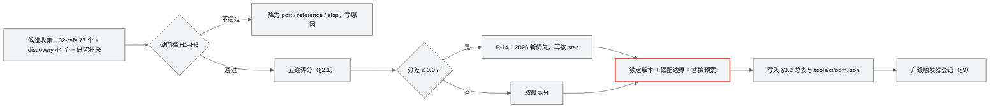
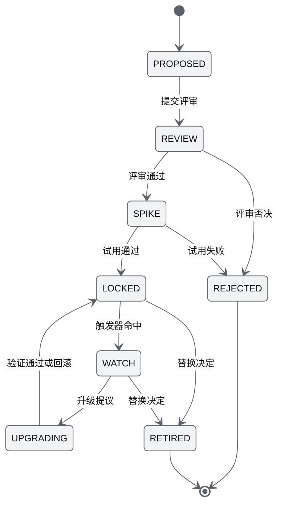

# 11 技术选型说明书（Technology Selection Specification）

| 项 | 内容 |
|---|---|
| 文档编号 | AWR-11 |
| 标题 | 技术选型说明书 |
| 版本 | v1.0 |
| 日期 | 2026-09-28 |
| 状态 | 草案 |
| 上游文档 | [03-设计基线与决策记录](03-设计基线与决策记录.md)（AWR-03，重点 P-14、ADR-004、ADR-007、ADR-008、ADR-014、ADR-017、ADR-018、ADR-020、ADR-028 至 ADR-031、ADR-037、ADR-038）；[01-design](01-design.md) §9、§11、§12、§15、§33–§37；[02-refs](02-refs.md)；[research/00-index](research/00-index.md) §1.2、§2、§4、§6、§8；研究笔记 r01–r27、d01–d05、x01、n01–n05、g01–g08 |
| 下游文档 | [10-系统架构说明书](10-系统架构说明书.md)、[16-World数据规范](16-World数据规范.md)、[17-接口与实时协议规范](17-接口与实时协议规范.md)、[18-性能与测试方案](18-性能与测试方案.md)、[19-部署与运维说明书](19-部署与运维说明书.md)、[modules/M01](modules/M01-重建引擎PRD.md) 至 [modules/M16](modules/M16-演示数据剧本与流畅性测试PRD.md)；工作包 M00 的锁文件与依赖治理 |
| 适用版本范围 | V0.1（D1）至 V1.0 |

## 0. 摘要

1. 选型按"硬门槛 → 五维评分（契合度 30、本机实测 25、MVP 价值 20、2026 活跃度 15、star 10）→ P-14 同分裁决"执行；低于 100 star 的仓库只 port 不 adopt（H6）；每个技术点都列出 star、最后提交、是否 2026 新项目与偏离 P-14 的理由（§2、§3.2）。
2. 前端锁定 Vite 8.3.1、TypeScript 7.0.2（仅 tsc）、oxlint 1.86.0、React 19.3.0、Tailwind 4.3.3、shadcn 4.21.0 base-mira（Base UI 1.8.0）、three ~0.186.1、R3F 9.8.1、drei 10.7.9 白名单、zustand 5.0.15、TanStack Query 5.104.0（ADR-037）。
3. 渲染：硬件默认 Tier B 与本机 Tier S 共用"经典 WebGLRenderer + AnetNodesHandler + TSL 单源"；WebGPURenderer 只作显式开启的 Tier A（g01 实测软件档固定开销 34–42 ms 对 3 ms）。
4. 点云引擎自研，移植 2026 新项目 voxelkloud 与 openlidarviewer 的算法；运行时格式为 Potree 2.0 容器 + ANET_Q16，3D Tiles 与 COPC 只作导出与归档。
5. 后端锁定 Python 3.12、FastAPI 0.141.1 + uvicorn 0.54.0、zenoh 1.10.1、numpy 2.5.3（ADR-038 写作 2.5.x，本文建议精确锁定）+ numba 0.67.0、mcap 1.5.0（ADR-038）；状态平面、实时协议、进程监管、FleetSim 均自研，Gazebo、Isaac、PX4 SIH 按保真度阶梯在 V0.2–V0.8 接入。
6. 设计体系按 R2 锁定 shadcn、transitions.dev、morphicons 1.7.1 + lucide 1.48.0、lieflat 视觉语言（自研 React 组件）；明确不用 Recharts、ECharts、Chart.js、Sonner、Motion、lucide-react。
7. 明确不选：Cesium 作主引擎、Gazebo 作 MVP 后端、3D Tiles 作运行时格式、ROS2/DDS 作必经链路、rosbridge 作主协议、nginx、supervisord、Redis、ZeroMQ（§5）。
8. 附录 A 给出 121 个本地参考仓库（02-refs 对应的 77 个与 discovery 的 44 个）的 adopt/port/reference/skip 矩阵；对基线的 10 条反馈见文末（F-05 的 drei 组件在反馈处置前按本文 TECH-FR-004 执行）。

---

## 1. 文档定位

### 1.1 本文回答什么

| 本文负责 | 不在本文展开（引用） |
|---|---|
| 每个技术点的候选、评估维度、实测数字、结论、锁定版本、理由、风险、替换预案与升级触发器 | 进程拓扑、线程模型与部署视图（[AWR-10](10-系统架构说明书.md)） |
| 依赖治理需求：锁文件、禁用依赖、引入边界、离线安装、版本漂移（M00 工作包的依赖部分） | 字段、字节布局与协议细节（[AWR-16](16-World数据规范.md)、[AWR-17](17-接口与实时协议规范.md)） |
| 参考仓库矩阵与 2026 新项目纳入结论 | 算法参数（各模块 PRD）；性能阈值与用例（[AWR-18](18-性能与测试方案.md)）；安装与运维步骤（[AWR-19](19-部署与运维说明书.md)） |

本文的选型结论不得与 AWR-03 的 ADR 冲突。ADR-037、ADR-038 已锁定的版本在本文中照录；其中只写到次版本或范围的（numpy 2.5.x、jsonschema 4.26、pydantic 2.13、three-mesh-bvh 0.9.x、three `~0.186.1`）由本文给出精确补丁版本；ADR 未覆盖的依赖由本文补齐锁定建议。两类都在文末"对基线的反馈"中请求以 ADR 追认。

### 1.2 术语

| 术语 | 含义 |
|---|---|
| adopt | 作为依赖或工具直接使用，锁定版本（依据 00-index §1.2） |
| port | 移植算法、公式或协议语义，重写进本项目代码，不引入其运行时 |
| reference | 只读参考，不移植代码 |
| skip | 不采用，写明原因 |
| 2026 新 | "是"：仓库创建于 2026 年；"2026 新能力"：仓库较老，但本项目依赖的关键能力或大版本发布于 2026 年；"否"：其余 |
| 偏离 P-14 | 最终选择不是同类中 star 最高或 2026 新的选项；按 P-14 必须写明理由 |
| 适配边界 | 某个第三方依赖只允许出现的目录或文件；替换依赖时只改这里 |
| 本机 S / 本机 CPU | AWR-03 §8.4 定义的两类本机测试环境；真 GPU 档见 ADR-044 |

---

## 2. 选型方法

### 2.1 评估维度与权重

| 维度 | 权重 | 口径 | 数据来源 |
|---|---|---|---|
| 契合度 | 30 | 与已冻结核心（three r186 + TSL、React 19.3 + R3F 9、shadcn base-mira、FastAPI、无 GPU 服务器、UrbanScene3D、World ENU 契约）的兼容度；能否被适配边界隔离与替换 | 源码核实、peer 依赖实测（n05 §1.1） |
| 本机实测 | 25 | 在本机（8 核 Xeon E5-2603 v4、62 GB、无 GPU、headless Chromium 151 + SwiftShader、Node 22.12.0、Python 3.12）跑通的原型与测量；SwiftShader 下只采信相对量与行为结论 | `.cache/research/<unit>/` 脚本（附录 B） |
| MVP 价值 | 20 | 能否直接进入 D1 主链路（R3：内置六城、渐进加载、疏密调节、Mock 机群、流畅性测试） | AWR-03 §8.2 |
| 2026 活跃度 | 15 | 默认分支最近一次提交（2026-09-28 采集）；2025 年以前停更的只取算法 | 研究笔记与本文补采 |
| star | 10 | GitHub star（2026-09-28 采集）；同类中高者加分，但不压过契合度与实测 | 同上 |

评分公式（本文设定）：`S = 0.30·契合 + 0.25·实测 + 0.20·MVP + 0.15·活跃 + 0.10·star`，每项 0–5 分，刻度如下；评分只在通过 §2.2 硬门槛的候选之间比较，示例见 §2.6。

| 维度 | 5 | 3 | 1 | 0 |
|---|---|---|---|---|
| 契合 | 完全兼容，且能被一个适配边界隔离 | 需要适配层或局部改造 | 需要引入新运行时，或与某项冻结核心冲突 | 与冻结核心不可调和 |
| 实测 | 本机实测达标 | 部分达标，有明确短板 | 未实测，只有源码或上游数据 | 实测不达标或出现阻断缺陷 |
| MVP | 直接进入 D1-core | D1-ext，或改造后进入 | 只在后续版本有用 | 无 |
| 活跃 | 最近提交在 30 天内 | 12 个月内（90 天内记 4） | 24 个月内 | 更早 |
| star | 同类候选中最高 | 同类中位 | 同类较低 | 无上游（自研且无移植来源） |

### 2.2 硬门槛（任一不满足即出局或降为 port/reference）

| 编号 | 门槛 | 依据 |
|---|---|---|
| H1 | 本机可安装、可运行：不需要 GPU、CUDA、root（Open3D 的 libEGL 例外，V0.2 起按 r06 §0 处置） | 00-index §1.3；Q1 |
| H2 | 与锁定核心 peer 兼容，不借助 `--legacy-peer-deps` | n05 §6 #1 |
| H3 | 不违反 R2：UI 只用 shadcn 组件、图表不退回图表库默认样式、图标经 morphicons、禁止 emoji | ADR-028 至 ADR-032 |
| H4 | 不违反架构原则：P-02（浏览器不做物理）、P-09（仿真永不阻塞）、P-03（可视化与物理分离） | AWR-03 §2.3 |
| H5 | 可被适配边界隔离：替换时影响面限于一个目录 | P-07 |
| H6 | 作为运行时依赖时：star ≥ 100 且近 12 个月有提交；否则只能 port。例外只有两类，且必须在 §3.2 "偏离 P-14 理由"列写明：①用户或原设计点名的平台（ANet，ADR-036）；②不进入本项目进程的外部既有组件（例如 P600 机载已内置的 FAST_LIO）。dev 对照依赖与构建工具不适用本条 | 00-index §6 判定口径 |

### 2.3 裁决规则

1. 评分最高者当选；分差 ≤ 0.3 视为同分，按 P-14 优先 2026 新项目、再优先 star 高者。
2. 契合度或实测低于 2 分的候选，无论 star 多少都不能成为该技术点的主选（例如 Cesium 作主渲染引擎的契合度为 1，Gazebo 作 D1 仿真内核的实测为 0）；同一仓库可在其他用途或后续版本另行评估（例如 rosbridge 作 V0.5 的 P600 适配器）。
3. 自研只在"候选全部未过硬门槛"或"关键性能差一个数量级以上"时成立，并且必须 port 至少一个上游的算法或语义作为出发点（例如 awr.rt.v1 移植 Foxglove 语义，StateRing 移植 g05 原型）。
4. 偏离 P-14 的每一项在 §3.2 的"偏离 P-14 理由"列写明；无偏离写"—"。
5. 结论的版本落点与 AWR-03 §6.3、§8.1 一致：D1 列取 core、ext、桩、否（写目标版本）。

### 2.4 证据等级

| 等级 | 含义 | 在本文中的写法 |
|---|---|---|
| E1 | 本机实测（有脚本与原始输出） | 依据 gNN/rNN §x 或"本机实测" |
| E2 | 源码核实（给出文件与行号） | 依据 rNN §x，或源码路径 |
| E3 | 上游文档、论文或发布说明 | 注明"上游数据" |
| E4 | 推算 | 注明"估算"或"本文设定" |

### 2.5 选型流程



> 注：本文 mermaid 图使用 [AWR-15 §9.10](15-视觉设计规范与色卡.md) 的 Graphite 初始化片段；每图至多一个 `hero` 节点（品牌红 2 px 描边，不填充），符合"一处红"（ADR-032）。

### 2.6 评分示例

分值由本文按 §2.1 刻度评定，数据依据见 §4 对应小节的候选表；自研条目的"活跃"与"star"取主要移植来源。

| 技术点 | 候选 | 契合 | 实测 | MVP | 活跃 | star | S | 结论 |
|---|---|---|---|---|---|---|---|---|
| 渲染后端（B/S 默认） | R4 经典 WebGLRenderer + AnetNodesHandler + TSL 单源 | 5 | 5 | 5 | 5 | 5 | 5.00 | 当选 |
| 渲染后端（B/S 默认） | R3 经典 WebGLRenderer，GLSL 与 TSL 双写 | 3 | 5 | 3 | 5 | 5 | 4.00 | 落选：维护翻倍 |
| 渲染后端（B/S 默认） | R2 WebGPURenderer + 私有点径补丁 | 2 | 3 | 3 | 5 | 5 | 3.20 | 落选：私有 API，作退路 |
| 渲染后端（B/S 默认） | R1 WebGPURenderer（WebGL2 后端） | 3 | 0 | 2 | 5 | 5 | 2.55 | 落选：34 ms 固定开销、点 1 px |
| 点云运行时格式 | Potree 2.0 + ANET_Q16 | 5 | 5 | 5 | 5 | 3 | 4.80 | 当选 |
| 点云运行时格式 | Potree 2.0 DEFAULT | 3 | 3 | 3 | 5 | 3 | 3.30 | 只作对照容器 |
| 点云运行时格式 | 3D Tiles 1.1 implicit | 2 | 3 | 2 | 4 | 5 | 2.85 | V0.5 导出 |
| 点云运行时格式 | COPC | 2 | 1 | 1 | 4 | 1 | 1.75 | V0.5 归档 |
| 实时协议 | 自研 awr.rt.v1 | 5 | 5 | 5 | 5 | 3 | 4.80 | 当选 |
| 实时协议 | Foxglove ws-protocol 线格式 | 3 | 3 | 3 | 1 | 1 | 2.50 | 只移植语义 |
| 实时协议 | zenoh-ts 浏览器直连 | 1 | 1 | 1 | 5 | 1 | 1.60 | skip |
| 实时协议 | rosbridge | 1 | 0 | 1 | 4 | 4 | 1.50 | V0.5 适配器 |
| 状态平面 | 自研 StateRing | 5 | 5 | 5 | 5 | 0 | 4.50 | 当选 |
| 状态平面 | zenoh pub/sub | 4 | 3 | 4 | 5 | 3 | 3.80 | V0.5 跨主机 |
| 状态平面 | Redis | 2 | 1 | 2 | 5 | 5 | 2.50 | skip |
| 状态平面 | UDS 流 | 3 | 0 | 3 | 5 | 0 | 2.25 | skip：实测死锁 |
| 状态平面 | `multiprocessing.shared_memory` | 3 | 0 | 3 | 5 | 0 | 2.25 | skip：unlink 缺陷 |
| D1 仿真内核 | 自研 FleetSim L1 | 5 | 5 | 5 | 5 | 4 | 4.90 | 当选 |
| D1 仿真内核 | PX4 SIH 容器 | 4 | 3 | 2 | 5 | 4 | 3.50 | V0.2 |
| D1 仿真内核 | Genesis | 1 | 1 | 1 | 5 | 5 | 2.00 | reference |
| D1 仿真内核 | Gazebo（纯物理模式） | 2 | 0 | 1 | 5 | 3 | 1.85 | V0.6 传感器后端 |

图表层的 Recharts、ECharts、Chart.js 在 H3（R2"禁止退回图表库默认样式"）即出局，不参与评分；Python WebTransport 在 H1（与浏览器握手失败）出局；Gazebo 的传感器模式在 H1（需 GPU）出局，表中只评其纯物理模式。示例说明：star 权重只有 10%，Genesis（29,992 star）与 Redis（76,518 star）仍因契合与实测低分落选，这是 P-14"实测为准"的体现。

---

## 3. 选型总览

### 3.1 分层技术栈

```text
+--------------------------------------------------------------------------------------------+
| 设计体系  shadcn 4.21 base-mira (Base UI 1.8) | transitions.dev token | morphicons 1.7.1 +   |
|           lucide 1.48 数据 | lieflat 视觉语言（自研 Lf* 组件） | Tailwind 4.3.3 | ANet Graphite |
+--------------------------------------------------------------------------------------------+
| Web 应用  React 19.3 | zustand 5 | TanStack Query 5 | TanStack Virtual 3 | Vite 8 | TS 7 (tsc) |
+-----------------------------------------+--------------------------------------------------+
| 3D 宿主   R3F 9.8.1 + drei 10.7.9 白名单 | 实时客户端  rt.worker（WebSocket in Worker）     |
| 引擎      engine/*（纯 TS 命令式）       |             raw struct + @msgpack/msgpack 3.1.3  |
| 点云      自研 PointCloudEngine          +--------------------------------------------------+
| 渲染      three ~0.186.1：Tier B/S 经典 WebGLRenderer + AnetNodesHandler；Tier A WebGPURenderer|
+--------------------------------------------------------------------------------------------+
| 传输      HTTP Range（Starlette StaticFiles） | WebSocket awr.rt.v1（websockets 17.1）         |
+--------------------------------------------------------------------------------------------+
| 服务      FastAPI 0.141.1 + uvicorn 0.54.0 + uvloop | awr-supervisor（自研）                 |
| IPC       StateRing（自研 mmap seqlock） | eclipse-zenoh 1.10.1 | 文件/HTTP                    |
| 仿真      FleetSim（numpy 2.5 + numba 0.67）| Safety | 任务与规划（scipy 1.18）| 环境（自研） |
| 录制      mcap 1.5.0 + zstandard 0.25.0（D1-ext）                                           |
| 世界      worldpkg：numpy 切片器 | plyfile 1.1.5 | laspy 2.7.0 | jsonschema 4.26 | pyproj 3.8 |
+--------------------------------------------------------------------------------------------+
| 后续接入  V0.2 PX4 SIH 容器 + MAVSDK 4.0 + Open3D 0.20 | V0.3 WindNinja 移植 + pyamg          |
|           V0.5 LingBot-Map/DA3/MapAnything + PDAL + small_gicp + gtsam | V0.6 gz-sim + OpenFOAM|
|           V0.8 Isaac Sim + 3DTilesRendererJS + 3DGS | V1.0 ANet daemon + hub               |
+--------------------------------------------------------------------------------------------+
| 工程      npm workspaces | uv 0.12.19 | Makefile + mk/*.mk | git worktree | Vitest 5 | ruff  |
|           Playwright 1.63（本机 Chrome 151）| pytest 9.1.1 | Docker（V0.2 起的外部后端）      |
+--------------------------------------------------------------------------------------------+
```

### 3.2 技术点总表（BOM，P-14 四列齐全）

star 均为 2026-09-28 采集（研究笔记，或本文用 `.cache/research/n05/meta.sh` 与 GitHub API 补采，原始输出见附录 B）；最后提交取本地克隆默认分支的最近提交（`git log -1`，按提交者时区的日期），未克隆者取 GitHub 默认分支最近提交或 `commits.atom`。"自研"条目的 star 列给出主要移植来源。T78–T81 为评审补录（M06、AWR-16、AWR-18 实际使用但原清单缺失的依赖，数据见 `.cache/research/t11/review_meta.tsv`）。T82 与 T71、T73 中标注"BOM 补录"的包为验收加固阶段编写 `tools/ci/bom.json` 时补录（锁文件中的直接依赖而本表缺行），star 与最后提交于 2026-10-01 经 GitHub API 补采（`stargazers_count` 与默认分支最近提交的提交者日期，UTC），BOM 条目以 `collectedAt` 单独标注。

| 编号 | 技术点 | 选型（结论） | 锁定版本 | star | 最后提交 | 2026 新 | 偏离 P-14 理由 | D1 | 依据 |
|---|---|---|---|---|---|---|---|---|---|
| T01 | 前端构建 | Vite + @vitejs/plugin-react（adopt） | 8.3.1 / 6.1.1 | 83,062 | 2026-09-28 | 2026 新能力（Vite 8 于 2026-03 发布） | 未选 Next.js（142,847）：纯 SPA 不需要 SSR | core | n05 §5.1；ADR-037 |
| T02 | 类型检查 | TypeScript，仅 tsc（adopt） | 7.0.2 | 111,253 | 2026-09-25 | 2026 新能力（Go 原生 7.0） | — | core | n05 §0 #2 |
| T03 | Lint | oxlint + oxlint-tsgolint（adopt） | 1.86.0 / 7.0.2003 | 22,904 / 1,446 | 2026-09-28 | 2026 新能力（type-aware） | 未选 ESLint（27,522）+ typescript-eslint（16,403）：peer 要求 TS < 6.1，与 TS 7 ERESOLVE | core | n05 §5.2 |
| T04 | 格式化 | Prettier + prettier-plugin-tailwindcss（adopt） | 3.9.9 / 0.8.1 | 52,317 | 2026-09-24 | 否 | — | core | n05 §5.2 |
| T05 | UI 运行时 | React（adopt） | 19.3.0 | 250,798 | 2026-09-22 | 2026 新版本（2026-09-09） | — | core | n05 §0 |
| T06 | 样式 | Tailwind CSS + @tailwindcss/vite（adopt） | 4.3.3 | 97,728 | 2026-09-25 | 2026 新版本 | — | core | n05 §1.1 |
| T07 | 组件分发 | shadcn CLI，base-mira，源码入库（adopt） | 4.21.0 | 124,753 | 2026-09-28 | 2026 新能力（Base UI 为默认基座） | — | core | d04；ADR-028 |
| T08 | 组件基座 | @base-ui/react（adopt，只在 `ui/components/ui/**`） | 1.8.0 | 11,015 | 2026-09-28 | 否 | 未选 Radix（19,341）：shadcn 4.13 起默认 Base UI，卸载等待 transition 已实测 | core | g07 §0 #1 |
| T09 | shadcn 运行时伴随包 | cn（`createCn`，adopt）；class-variance-authority；cmdk（Command 命令面板）；react-resizable-panels（Resizable v4）；@fontsource-variable/inter 与 jetbrains-mono（离线字体）；tw-animate-css（承载层） | 建议锁定：cn 0.4.0、cva 0.7.1、cmdk 1.1.1、react-resizable-panels 4.14.1、fontsource 5.3.0、tw-animate-css 1.4.0（npm 2026-09-28 版本，反馈 F-01） | 1,604；6,902；12,993；5,379；6,148；807 | 2026-09-28；2026-09-27；2025-10-29；2026-09-27；2026-09-28；2026-02-28 | cn 是（2026-08-31 创建）；其余否 | — | core | d04 §3；g07 §0 #3 |
| T10 | 列表与表格 | @tanstack/react-virtual（必用于 >100 行）；@tanstack/react-table（航点表，M15-FR-087） | 3.14.13；9.2.4（npm 2026-09-28，peer react `>=18`；反馈 F-01） | 7,125；28,463 | 2026-09-14；2026-09-16 | 否 | — | core；react-table 为 ext | ADR-028；M15-FR-087 |
| T11 | 3D 引擎 | three（adopt） | ~0.186.1（lock 精确到 0.186.1）；@types/three 0.186.0 | 116,014 | 2026-09-28 | 2026 新能力（r186 `setNodesHandler`、官方 GaussianSplat） | — | core | r11；n05 |
| T12 | 3D 宿主 | @react-three/fiber（adopt） | 9.8.1 | 32,586 | 2026-09-27 | 否 | 未选 2026 的 v10 alpha：peer `react <19.3`，alpha 阶段 | core | n05 §0 #1；ADR-008 |
| T13 | 3D 组件 | @react-three/drei 白名单（adopt；按 ADR-008 第 2 轮修订不含 `AdaptiveDpr`、`PerformanceMonitor`，相机控制用 T78 而不用 drei `CameraControls`，TECH-FR-004） | 10.7.9 | 9,902 | 2026-09-25 | 否 | 未选 v11 alpha：同上 | core | g01 §0 #9；ADR-008；M06-FR-020 |
| T14 | 空间加速 | three-mesh-bvh | 0.9.x，建议锁 0.9.15（npm 2026-09-28） | 3,495 | 2026-09-25 | 否 | — | 否（V0.8 网格层；ADR-037 已锁 0.9.x，但 D1 无调用方：M06 拾取走 Picker，drei `Bvh` 推迟，D1 不安装，反馈 F-01） | ADR-037；M06 §6.6 |
| T15 | 渲染后端 B/S | 经典 WebGLRenderer + AnetNodesHandler（three 内置 handler 的子类，自研约 25 行） | 同 T11 | 同 T11 | 同 T11 | 2026 新能力 | 未把 2026 主推的 WebGPURenderer 设为默认：软件档固定开销 34–42 ms，点恒 1 px | core | g01 §0 #1–#6 |
| T16 | 渲染后端 A | WebGPURenderer + quad 点径（显式开启） | 同 T11 | 同 T11 | 同 T11 | 2026 新能力 | — | ext | ADR-044 |
| T17 | 着色语言 | TSL 单源（WGSL 与 GLSL 由 three 生成） | 同 T11 | — | — | 2026 新能力 | — | core | g01 §0 #2；ADR-007 |
| T18 | 帧循环 | 自研 `engine/loop.ts`（相位语义对齐 @pmndrs/scheduler） | — | 8（scheduler） | 2026-09-27 | scheduler 为 2026 新仓库（2026-06 创建） | 未采用 scheduler 0.2.0：缺 fixed step、8 star；V0.3 随 R3F v10 迁移 | core | AWR-03 §8.3；n05 §0 #12 |
| T19 | 点云引擎 | 自研 PointCloudEngine（port voxelkloud、openlidarviewer、potree-core） | — | 0 / 23 / 255 | 2026-09-24 / 2026-09-28 / 2026-09-14 | 是（voxelkloud 2026-08、OLV 2026-06） | voxelkloud 0 star 仍列首位：契合度与源码质量最高；按 H6 只 port | core | n01 §0；g02 §0 |
| T20 | 点云运行时格式 | Potree 2.0 三文件容器 + ANET_Q16 v1 + HTTP Range | `potree2/anet-q16@1` | 818（PotreeConverter） | 2026-09-23 | 否 | 未选 3D Tiles 1.1（2,612）作运行时：需解码、不能画前缀 | core | ADR-004；r09 §0 |
| T21 | 切片器 | 自研 numpy `worldpkg tile`（port PotreeConverter 与 PDAL sample） | — | 818 / 1,416 | 2026-09-23 / 2026-09-21 | 否 | 未直接用 PotreeConverter：master 需 C++23，本机 GCC 13.3 编译失败 | core | r09 §0 #1–#2 |
| T22 | 前端状态 | zustand vanilla store（adopt） | 5.0.15 | 58,763 | 2026-08-24 | 否 | 未选 jotai 3.0（21,284，2026-09 新大版本）：同职责不引入第二套 | core | n05 §5.3 |
| T23 | 服务端状态 | @tanstack/react-query（adopt） | 5.104.0 | 50,371 | 2026-09-28 | 否 | — | core | n05 §0 |
| T24 | 控制面编解码（JS） | @msgpack/msgpack（adopt） | 3.1.3 | 1,558 | 2026-07-13 | 否 | 未选 msgpackr（695）records：与 Python 不互通 | core | n05 §5.4 |
| T25 | 实时协议 | 自研 `awr.rt.v1`（port Foxglove ws-protocol 语义、zenoh key 语法、moq QoS 语义） | awr.rt.v1 | 150 / 3,216 / 1,546（来源） | 2025-08-05 / 2026-09-15 / 2026-09-28 | moq 2026 新能力 | 未选 rosbridge（1,246）、Foxglove 线格式：JSON 慢 2–3 个数量级、无 credit 背压 | core | r27 §0；ADR-014 |
| T26 | WS 服务端库 | websockets（经 `uvicorn --ws websockets`） | 17.1（反馈 F-02） | 5,719 | 2026-09-24 | 否 | — | core | r27 venv 实测 |
| T27 | API 框架 | FastAPI + Starlette | 0.141.1 / 1.7.0 | 102,695 / 12,639 | 2026-09-25 / 2026-09-28 | 否 | — | core | ADR-038 |
| T28 | ASGI 服务器 | uvicorn + uvloop | 0.54.0 / 0.22.1（反馈 F-02） | 10,993 / 11,907 | 2026-09-27 / 2026-07-14 | 否 | — | core | ADR-038 |
| T29 | 静态与 Range | Starlette `StaticFiles`（不引入 nginx） | 1.7.0 | 12,639 | 2026-09-28 | 否 | 未选 nginx（31,742）：206 已实测，少一个进程与一份配置 | core | 00-index §1.3；ADR-013 |
| T30 | 状态平面 IPC | 自研 StateRing（tmpfs mmap seqlock） | — | — | — | — | 未选 Redis（76,518）、ZeroMQ（pyzmq 4,176）：多一跳且不满足"永不阻塞" | core | g05 §0 #3；ADR-018 |
| T31 | 控制与事件总线 | eclipse-zenoh（peer，本机） | 1.10.1 | 3,216 | 2026-09-15 | 否 | — | core | g05 §0 #4 |
| T32 | 进程监管 | 自研 awr-supervisor | — | — | — | — | 未选 supervisord（9,124）：检不出主循环挂死 | core | g05 §0 #6；ADR-017 |
| T33 | msgpack（Python） | msgpack | 1.2.2 | 2,104 | 2026-09-22 | 否 | — | core | ADR-038 |
| T34 | 录制 | mcap Python writer + zstandard | 1.5.0 / 0.25.0 | 1,102 / 642 | 2026-09-25 / 2026-09-14 | 否 | 未选 foxglove-sdk（311）作录制器：只作 V0.2 调试旁路 | ext | ADR-040 |
| T35 | 数值计算 | numpy | 2.5.3（ADR-038 写作 2.5.x；ADR-049 逐位一致要求同一版本，反馈 F-02） | 32,867 | 2026-09-28 | 否 | — | core | ADR-038；项目 `.venv` 与研究 venv 实装 2.5.3 |
| T36 | JIT | numba（llvmlite 0.49.0） | 0.67.0 | 11,167 | 2026-09-25 | 否 | — | core | g08 §11 |
| T37 | 科学计算 | scipy（EDT、Hungarian、L-BFGS-B） | 1.18.1 | 15,048 | 2026-09-28 | 否 | — | core | r25；ADR-038 |
| T38 | 仿真内核 | 自研 FleetSim L1（port PX4-lite、Crazyflow pipeline、MRS 安全语义、AirSim watchdog） | — | 12,708 / 180 / 640 / 18,516 | 2026-09-27 / 2026-09-26 / 2026-08-03 / 2026-09-15 | Crazyflow 2026 活跃 | 未选 Genesis（29,992）、IsaacLab（8,240）、Gazebo（1,520）：需 GPU 或无法同钟跑 1000 架 | core | g08 §0；ADR-020、ADR-021 |
| T39 | 真飞控后端 | PX4 SIH 容器 `px4io/px4-sitl`（V0.2） | v1.18 镜像，V0.2 锁 tag | 12,708 | 2026-09-27 | 否 | 未以 Gazebo 起步：Gazebo 固定加载 ogre2 传感器系统，需 GPU | 桩 | r20 §0 #1、#12；r22 §0 #1 |
| T40 | MAVLink SDK | mavsdk（v4 原生 Python） | 4.0.0 | 939 | 2026-09-28 | 2026 新能力（v4 去 gRPC） | 未选 MAVROS（1,226）：ROS 不进主链路 | 否（V0.2） | r21 §0 #1 |
| T41 | MAVLink 测试替身 | pymavlink（`fake_px4`） | 2.4.50（反馈 F-02） | 733 | 2026-09-26 | 否 | — | 桩 | r21；AWR-03 §8.3 |
| T42 | P600 协议 | Prometheus 地面站 codec（自研纯 Python，约 60 行） | — | 3,265 | 2025-11-21 | 否 | — | 桩（V0.2/V0.5） | r19 §0 #2 |
| T43 | 点云读写 | plyfile / laspy | 1.1.5 / 2.7.0 | 514 / 508 | 2026-07-26 / 2026-05-30 | 否 | 未选 Open3D 读写：D1 进程禁止 import Open3D | core | r09；ADR-038 |
| T44 | 契约校验 | jsonschema + pydantic（Py）；ajv strict（仅 dev/test） | 4.26.0 / 2.13.5（ADR-038 写到次版本，取项目 `.venv` 实装版本精确锁定）；8.20.0 | 4,987 / 28,892；14,842 | 2026-09-15 / 2026-09-25；2026-04-24 | 否 | — | core | g03 §6 |
| T45 | 契约类型生成 | json-schema-to-typescript + 自研 `gen.py` | 16.0.0 | 3,347 | 2026-09-06 | 否 | — | core | AWR-03 §5.10 |
| T46 | 大地测量 | pyproj（可选；帧换算以自研 frames.py 为准） | 3.8.0 | 1,228 | 2026-09-16 | 否 | — | core（可选） | r09 §0 #7 |
| T47 | 地面滤波 | CSF（`cloth-simulation-filter`） | 1.1.7（反馈 F-02） | 649 | 2026-09-12 | 否（2016 创建，2026 维护） | 未选 Pointcept（3,237）、Utonia（751）：需 GPU 与标注 | 桩（P2） | n02 §3.10 |
| T48 | 光线求交 | Open3D RaycastingScene（geo-worker） | 0.20.0 | 14,005 | 2026-09-16 | 否 | — | 否（V0.2） | r06 §0 |
| T49 | 配准 | small_gicp | 1.0.1 | 1,045 | 2026-08-31 | 否 | 未选 fast_gicp（1,700）：README 声明被取代 | 否（V0.5） | r07 §0 |
| T50 | 点云 ETL | PDAL（Docker `pdal/pdal`） | 2.10，V0.5 锁 tag | 1,416 | 2026-09-21 | 否 | — | 否（V0.5） | r09 §0 #7 |
| T51 | 导出与归档 | 3D Tiles 1.1 + 3d-tiles-validator；COPC（untwine 离线 CLI 写；读端 port copc.js） | V0.5 锁 | 2,612 / 475 / 78 / 63 | 2026-08-17 / 2026-09-16 / 2026-08-14 / 2026-08-10 | 否 | copc.js（63 star）按 H6 只 port；untwine 为离线工具，不适用 H6 | 否（V0.5） | r10；n01 §0 |
| T52 | 重建主引擎 | LingBot-Map（GPU worker，库方式调用） | commit 849e690 | 17,142 | 2026-09-08 | 是（2026-04 创建） | — | 桩（接口 + Mock） | r01 §0；ADR-035 |
| T53 | 重建辅助 | DA3（SMALL CPU 冒烟 V0.2，Streaming V0.5）、MapAnything（V0.5）、pycolmap（V0.5） | pycolmap 4.2.0；其余 V0.5 锁 | 6,403 / 3,771 / 12,828 | 2026-07-27 / 2026-08-07 / 2026-09-27 | DA3 2025-11、MapAnything 2025-09 创建 | — | 否 | n02 §0；r02 §0 |
| T54 | LIO | rko_lio（离线，pip）；FASTLIO2_ROS2 / Super-LIO（机载） | 0.4.0 | 660 / 761 / 602 | 2026-09-25 / 2026-08-10 / 2026-07-13 | 否 | 未选 FAST_LIO 主仓（5,225）作后端：2024-07 停更、依赖 ROS | 否（V0.2 测试床，V0.5） | n02 §0 #6 |
| T55 | 因子图 | gtsam | 4.3，V0.5 锁 | 3,718 | 2026-09-28 | 否 | — | 否（V0.5） | r07 §0 #3 |
| T56 | 环境服务 | 自研 EnvironmentService（port WindNinja 廓线、r17 冻结湍流盒、g06 纯函数） | — | 186（WindNinja） | 2026-09-22 | 否 | — | core | g06 §0；ADR-023 至 ADR-025 |
| T57 | 天气视觉 | 自研 TSL 图层（port natural-disasters、Eanpa-Sky） | — | 273 / 56 | 2026-08-31 / 2026-09-12 | 是（均 2026-08 创建） | 两者 star < 300：按 H6 只 port | core（Low）/ ext（Med） | r16 §0 |
| T58 | 大气 High 档 | takram three-atmosphere（有条件 adopt） | 0.19.1，需 r186 兼容修复 | 1,697 | 2026-05-27 | 否 | — | 否（V0.5） | n04 §0 #1 |
| T59 | 风场可视化 | 自研：风箭头、AWSL 无状态流线；V0.3 port webgl-wind 与 cesium-wind-layer | — | 1,108 / 0（上游 125） | 2026-06-18 / 2026-09-24 | cesium-wind-layer fork 为 2026 新 | — | core（箭头）/ ext（AWSL） | n04 §3.3 |
| T60 | L2 至 L3 风场 | WindNinja 质量守恒 port + pyamg（V0.3）；urban-wind-lab LBM port（V0.4）；OpenFOAM 13 Docker（V0.6） | pyamg 于 V0.3 锁 | 186 / 655 / 1 / 2,247 | 2026-09-22 / 2026-03-30 / 2026-09-26 / 2026-09-25 | urban-wind-lab 是（2026-09） | L2 未直接用 OpenFOAM：CPU 耗时与非线性 | 否 | r17 §0；n04 §0 #7；pyamg 当前 PyPI 版本 5.3.0 |
| T61 | 规划 | 自研 safe_transit/path_valid（numpy，core）+ 2.5D A*（numba，ext）+ Hungarian（scipy，ext） | — | 2,193 / 3,414（来源 EGO、Fast-Planner） | 2025-03-08 / 2024-10-24 | 否 | 未直接用 EGO-Swarm：ROS1、按局部未知地图设计 | core / ext | r25 §0；ADR-039 |
| T62 | 编队与覆盖 | 自研虚拟结构 + CAPT、BCD-lite 覆盖（r26 原型） | — | 97 / 16（来源） | 2024-03-02 / 2024-12-11 | 否 | 上游两仓均停更且有缺陷：只取算法 | ext | r26 §0 |
| T63 | 多机分配（V1.0） | CBBA（port CBBA-Python，修正 DMG） | — | 130 | 2021-04-22 | 否 | 唯一可用的 Python 实现，停更：只 port | 否（V1.0） | n03 §0 #9 |
| T64 | Agent 运行时 | 自研 agent-runtime + Mock ANet（port ANet 语义、droneserver 守卫、AerialClaw 技能语义） | — | 6 / 7 / 132 | 2026-09-06 / 2026-09-20 / 2026-07-08 | ANet、AerialClaw 为 2026 新 | 三者 star 均 < 300：按 H6 只 port | ext | d05；n03 §0 #6–#7；ADR-036 |
| T65 | 真 ANet | ANet daemon + 自建 hub | V1.0 锁 | 6 | 2026-09-06 | 是（2026-07） | star 少但为用户指定协作平面 | 否（V1.0） | ADR-036 |
| T66 | 动效 | transitions.dev token 与 32 个配方（vendor）+ Base UI 状态属性 + 项目扩展 token | commit `e2d5551656e4d3274e075d1cbd9a95af50f53225`（2026-09-21，记入 `tools/shadcn/VENDOR.md`） | 4,383 | 2026-09-21 | 是（2026-04） | — | core | d02；g07；ADR-029 |
| T67 | 图标 | morphicons + lucide 数据包（不装 lucide-react） | 1.7.1 / 1.48.0 | 2,709 / 24,764 | 2026-08-28 / 2026-09-24 | morphicons 是（2026-08） | — | core | d03；ADR-030 |
| T68 | 图表 | lieflat 视觉语言，port 为自研 React 组件 + LfScheduler | commit `eace082a317b696c5570c25826a53a7fa113e984`（2026-09-05） | 5,761 | 2026-09-05 | 是（2026-07） | 未选 ECharts（67,408）、Chart.js（67,721）、Recharts（27,596）：R2 禁止默认样式，SVG 10 Hz 只有 4.7 fps | core | d01 §0；ADR-031 |
| T69 | 单元与浏览器测试 | Vitest + @vitest/browser-playwright | 5.0.2 | 17,167 | 2026-09-28 | 2026 新版本（5.0 于 2026-09） | — | core | n05 §0 #6 |
| T70 | E2E 与性能 | @playwright/test，`executablePath` 指向本机 Chrome 151 | 1.63.0 | 96,819 | 2026-09-28 | 否 | — | core | n05 §0 #7 |
| T71 | Python 测试 | pytest；pytest-asyncio、httpx（异步用例与 REST 测试客户端，`test` 组；BOM 补录，2026-10-01 补采） | 9.1.1；1.4.0；0.28.1 | 14,545；1,664；15,524 | 2026-09-28；2026-09-30；2026-02-23 | 否 | — | core | ADR-038 |
| T72 | 性能数据源 | stats-gl StatsProfiler（HUD 自绘）；react-scan 仅 dev | 4.2.3；0.5.7 | 280；21,858 | 2026-07-10；2026-08-16 | 否 | 未选 r3f-perf（781）：2024-11 停更且只支持 WebGL | core | n05 §5.7 |
| T73 | Python 依赖管理 | uv（`pip compile` + `pip sync`）；pip、setuptools（`.venv` 自举与可编辑安装，`requirements.in`；BOM 补录，2026-10-01 补采） | 0.12.19；26.2.1；84.0.0 | 90,249；10,290；2,865 | 2026-09-28；2026-09-23；2026-09-08 | 否 | — | core | ADR-038 |
| T74 | Node 包管理 | npm workspaces | npm 10.9.0（随 Node 22.12.0） | — | — | 否 | 未选 pnpm（36,691）：见 §4.18 | core | ADR-037 |
| T75 | 3D 资产处理 | trimesh（读 STL）+ @gltf-transform/cli（meshoptimizer 减面） | 5.1.0 / 4.5.0 | 3,688 / 1,976 | 2026-08-31 / 2026-09-28 | 否 | — | core | ADR-022 |
| T76 | 调试旁路（V0.2） | foxglove-sdk、rerun-sdk（均仅 dev） | 0.27.0 / 0.38 以上，V0.2 锁 | 311 / 11,504 | 2026-09-24 / 2026-09-27 | 否 | — | 否（V0.2） | r15 §0 #9；n04 §0 #10 |
| T77 | 外部后端容器 | Docker Engine + Compose | 本机 29.4.2 / v5.1.3 | — | — | 否 | — | 否（D1 可选镜像；V0.2 起必需） | r22；AWR-19 |
| T78 | 相机控制 | camera-controls（adopt，在 `engine/camera` 的 camera 相位命令式驱动，不经 drei `CameraControls`） | 3.1.2（peer three `>=0.126.1`；drei 10.7.9 依赖 `^3.1.0`，与之同一份） | 2,430 | 2026-02-02 | 否 | 未用 drei `CameraControls`：它在 `useFrame` 中更新，无法保证相机先于点云选择（AWR-03 §3.6 帧序） | core | M06-FR-049；M06 §6.6 |
| T79 | 类型包 | @types/react、@types/react-dom、@types/three、@types/node | 19.3.0 / 19.3.0 / 0.186.0 / 22.20.4（npm 2026-09-28，22.x 最新补丁） | 51,444（DefinitelyTyped）/ 301（three-ts-types） | 2026-09-28 / 2026-09-08 | 否 | — | core（dev） | n05 trial `package.json`；ADR-037 |
| T80 | YAML 解析 | PyYAML（`yaml.safe_load`，只读 `configs/*.yaml`、`vehicles/*/params.yaml`、`ingest.yaml`） | 6.0.3 | 2,950 | 2026-06-17 | 否 | 未选 ruamel.yaml：只读无需保留注释与往返 | core | AWR-16 F-03；M03、M08 |
| T81 | Python lint 与提交钩子 | ruff（规则 PY-RUFF-01）+ pre-commit（运行 no-emoji、no-hex、ruff、oxlint 快速子集） | 0.16.9 / 4.6.2 | 49,825 / 15,600 | 2026-09-28 / 2026-08-17 | 否 | 未选 flake8 + black + isort：三个工具合一 | core（tool） | AWR-03 §4.5；AWR-18 §13.1 |
| T82 | 数据获取解压 | py7zr（`make fetch-data` 解压 7z 分卷，`fetch` 组；BOM 补录，2026-10-01 补采） | 1.1.3 | 558 | 2026-09-17 | 否 | — | core（tool） | ADR-038；AWR-19 §8.2 |

### 3.3 对原设计的继承、修正与增强

| 01-design 章节（原选型） | 处置（附录 C） | 本文的二次优化 |
|---|---|---|
| §9 "React + Three.js + WebGPURenderer + WGSL" | 修订 | 继承 React + Three.js；修正"WGSL"为 TSL 单源（手写 WGSL 会丢掉 WebGL2 路径，n05 §7 #1）；WebGPURenderer 降为 Tier A 显式开启，硬件默认经典 WebGLRenderer（T15、T16） |
| §11 Three.js / Cesium / Potree / Unreal / Unity / Isaac / Gazebo 定位表 | 修订 | 继承"Three.js 为核心"；Cesium 拆为"数学移植（D1）+ 可选地球视图（V0.8）"；Potree 拆为 potree 1.8 参考、Potree-Next 参考、potree-core 对照三行；新增 voxelkloud、3DTilesRendererJS、Foxglove/Lichtblick；Isaac 与 Gazebo 作为传感器后端（V0.8、V0.6） |
| §12 "WebGPU 承担 30 万粒子" | 修订 | 粒子上限按档位分级（Tier S 降水 ≤ 2000 个四边形，AWR-03 §3.8）；浏览器 compute 只做可视化，且只在 Tier A |
| §15 "PLY/PCD/LAZ 内部处理；Web 端 Binary Tile + Octree；后期兼容 3D Tiles" | 修订 | Binary Tile 具体化为 Potree 2.0 + ANET_Q16；3D Tiles 1.1 为 V0.5 导出；COPC 为归档；VDB 不作运行时（T20、T51） |
| §33 Backend 表（ROS2/DDS、Gazebo、MAVSDK、OpenFOAM、CUDA） | 修订 | Message 改为 StateRing + zenoh，ROS2/DDS 不是必经；Simulation 改为 FleetSim → SIH → SITL-EXT → HITL 阶梯；MAVSDK 改为 v4 原生 Python 并推迟 V0.2；OpenFOAM 13 Docker 推迟 V0.6；补充 numba、mcap、pycolmap、small_gicp、gtsam、PDAL（Docker） |
| §34 Frontend 表（React、TS、Three.js、WebGPURenderer、WGSL、WebGL2、shadcn、Zustand、REST、WebSocket） | 修订 | 全部写出版本；补齐 Vite 8、TS 7 + oxlint、Tailwind 4、Base UI、TanStack Query、raw struct + msgpack、Vitest 5 + Playwright 1.63、stats-gl；"Cesium later"落到 V0.8 |
| §35 "第一阶段 PX4 + Gazebo，第二阶段 Isaac" | 取代（ADR-020） | 本机无 GPU、1000 架同钟不可行；第一阶段为 Mock L1，Gazebo 与 Isaac 经 World 导出器共用 World（ADR-048） |
| §36 "PX4 → ROS2 → Gateway → WebSocket" | 修订（ADR-014） | 改为"PX4 → MAVLink(UDP) → px4-bridge（DroneAdapter，V0.2）→ StateRing 与 zenoh → Gateway → awr.rt.v1"；ROS 只在 P600 真机侧作适配（rosbridge，V0.5） |
| §37 刷新频率 | 部分取代 | Tier S 30 fps 取代 60 FPS（ADR-044）；本文补充"帧指标测量禁用 `--disable-gpu-vsync`"（T70） |


### 3.4 D1 各进程的运行时依赖

用于执行 TECH-FR-004 的引入边界与 [AWR-10](10-系统架构说明书.md) 的进程视图；"禁止"列为该进程不得 import 的依赖。

| 进程或运行位置 | 允许的第三方运行时依赖 | 禁止 |
|---|---|---|
| 浏览器主线程 | react、react-dom、@base-ui/react（仅 `ui/components/ui`）、cn、class-variance-authority、cmdk、react-resizable-panels、@tanstack/react-virtual、@tanstack/react-table（按需）、@tanstack/react-query、zustand、three、@react-three/fiber、@react-three/drei（TECH-FR-004 的收窄白名单）、camera-controls（仅 `engine/camera`）、three-mesh-bvh（V0.8 起）、@msgpack/msgpack（仅 `net/**`）、morphicons、lucide（数据）、stats-gl、@fontsource-variable/* | lucide-react、recharts、sonner、motion、drei `AdaptiveDpr` 与 `PerformanceMonitor`、任何 CDN 资源 |
| rt.worker | @msgpack/msgpack；`@awr/contracts` 生成的布局访问器 | react、three、zustand |
| supervisor | PyYAML（`configs/runtime.yaml`）、eclipse-zenoh（经 `awr.runtime.bus`）；其余只用标准库（`os.waitpid`、`mmap`、`signal`） | numpy 大数组运算、numba、open3d、fastapi |
| api | fastapi、starlette、uvicorn、uvloop、websockets、msgpack、pydantic、PyYAML（启动读配置）、eclipse-zenoh（经 `awr.runtime.bus`）、numpy（< 1 ms 的纯函数） | open3d、small_gicp、scipy.optimize、numba、mcap 解压（AWR-03 §4.2） |
| sim-core | numpy、numba、msgpack、PyYAML（`params.yaml`、`runtime.yaml`）、eclipse-zenoh（经 `awr.runtime.bus`）、scipy（仅 `ndimage` 与 `spatial` 的轻量调用，其余进 plan-pool） | open3d、fastapi、mcap |
| plan-pool | numpy、scipy、numba；`OMP_NUM_THREADS=1` 与单线程 BLAS | eclipse-zenoh（结果经 sim-core 返回） |
| recorder、replay-worker（ext） | mcap、zstandard、msgpack、numpy（块消息构建）、eclipse-zenoh | numba、open3d |
| agent-runtime（ext） | msgpack、pydantic、eclipse-zenoh | numba、open3d、fastapi |
| job-worker（ext）、`worldpkg` CLI | numpy、plyfile、laspy、jsonschema、PyYAML（`ingest.yaml`）、pyproj（可选）、cloth-simulation-filter（P2） | open3d（V0.2 前） |
| 构建与工具（不进入运行时） | vite、typescript、@types/*、oxlint、oxc-parser、prettier、ajv、json-schema-to-typescript、@gltf-transform/cli、trimesh、uv、ruff、pre-commit、pytest、vitest、@playwright/test；dev 对照 potree-core、@voxelkloud/react（只被 `dev/oracles/**` import） | — |


### 3.5 版本兼容矩阵（peer 与平台约束）

| 组合 | 约束（实测或源码） | 当前取值 | 结论 | 依据 |
|---|---|---|---|---|
| React × R3F 9 | R3F 9.8.1 peer `react >=19 <19.4` | 19.3.0 × 9.8.1 | 兼容 | n05 §1.1 |
| React × R3F 10 alpha、drei 11 alpha | peer `react >=19.0 <19.3`，`three >=0.185` | 不安装 | 冲突（实测 ERESOLVE） | n05 §0 #1 |
| three × @types/three | minor 必须一致 | 0.186.1 × 0.186.0 | 兼容 | n05 trial |
| three × takram three-atmosphere 0.19.1 | 需要 three r184；r186 下 TSL `struct()` 改为 Proxy 导致崩溃 | 不安装 | 冲突（V0.5 前修复） | n04 §0 #1 |
| three × potree-core 2.0.15（dev 对照） | peer three `>0.125`，上游开发版本 0.154，使用 `RawShaderMaterial` 与经典渲染器 | 与主应用共用 0.186.1 | 待 MS5 冒烟；不兼容时对照页改用离线参考帧比对 | r12 §0 #2 |
| three × @voxelkloud/react 0.6.0（dev 对照） | npm 上 react 包最新为 0.6.0（依赖 `@voxelkloud/view ^0.6.0`，view 最新 0.8.0）；二者 peer three `^0.180.0`，即 `>=0.180.0 <0.181.0` | 与 0.186.1 实测 ERESOLVE（npm 10.9.0）；根 `package.json` 加 `"overrides": {"@voxelkloud/react": {"three": "$three"}, "@voxelkloud/view": {"three": "$three"}}` 后安装成功，`npm ls --all` 退出码 0（标 overridden） | 有条件兼容：只允许 overrides，不得 `--legacy-peer-deps`；运行兼容性待 MS5 冒烟，不兼容则删除该对照（选择器差分以 `g02/lod.mjs` 为准） | 本文评审实测；`.cache/research/t11/review_meta.tsv` |
| Vite 8 × Node | `^20.19.0 \|\| >=22.12.0` | Node 22.12.0 | 兼容（恰在下限附近） | `.cache/research/n05/peers.txt` |
| Vitest 5 × Node / Vite / @types/node | Node `^22.12.0 \|\| ^24 \|\| >=26`；vite `^6.4–^8`；@types/node `^22 \|\| >=24` | 22.12.0；8.3.1；22.20.4 | 兼容（Node 恰为下限，反馈 F-04） | 同上 |
| @vitest/browser-playwright × vitest | peer `vitest 5.0.2` 精确 | 5.0.2 × 5.0.2 | 兼容 | 同上 |
| Playwright 1.63 × 浏览器 | 期望 chromium rev 1243（Chrome 153） | 本机 rev 1234（Chrome 151），经 `executablePath` | 兼容（已实测） | n05 §0 #7 |
| TypeScript 7 × typescript-eslint 8.70 | peer `typescript >=4.8.4 <6.1.0` | 不安装 | 冲突 | 同上 |
| React Compiler × oxc-transform-react | peer 锁 `^0.145.0`，npm latest 0.151.0 | D1 不启用 | — | n05 §0 #4 |
| numba × llvmlite × numpy | 研究 venv 实测 0.67.0 × 0.49.0 × 2.5.3 | 同左 | 兼容；三者同步锁定 | `.cache/research/n04/venv` |
| Python × Open3D 0.20 | wheel 硬链接 libEGL（非 root 需解包 deb 并设 `LD_LIBRARY_PATH`） | V0.2 | 有条件兼容 | r06 §0 #5 |
| eclipse-zenoh Python × 部署 | 本机 peer 模式，关闭 SHM；V0.5 跨主机需同版本 zenohd | 1.10.1 | 兼容 | g05 §0 #9 |
| mavsdk 4.0.0 × PX4 SIH 镜像 | 一个实例管 N 架；默认线程池 `min(32, cpu+4)` 会饥饿，需 `set_default_executor(ThreadPoolExecutor(8·N + 16))`（r21 实测 128 线程时 16 架失联下健康机调用从 2001 ms 降到 6 ms） | V0.2 | 兼容（需配置） | r21 §0 #3；g05 §1 C6 |

### 3.6 依赖清单片段（示意，以锁文件为准）

`apps/web/package.json` 的直接依赖（D1-core 与 D1-ext 合计；版本即 §3.2）：

```json
{
  "dependencies": {
    "react": "19.3.0", "react-dom": "19.3.0",
    "@base-ui/react": "1.8.0", "cn": "0.4.0",
    "@tanstack/react-query": "5.104.0", "@tanstack/react-virtual": "3.14.13",
    "zustand": "5.0.15", "@msgpack/msgpack": "3.1.3",
    "three": "0.186.1", "@react-three/fiber": "9.8.1", "@react-three/drei": "10.7.9",
    "morphicons": "1.7.1", "lucide": "1.48.0", "stats-gl": "4.2.3",
    "@tanstack/react-table": "9.2.4",
    "class-variance-authority": "0.7.1", "cmdk": "1.1.1",
    "react-resizable-panels": "4.14.1", "tw-animate-css": "1.4.0", "camera-controls": "3.1.2",
    "@fontsource-variable/inter": "5.3.0", "@fontsource-variable/jetbrains-mono": "5.3.0"
  },
  "devDependencies": {
    "vite": "8.3.1", "@vitejs/plugin-react": "6.1.1",
    "typescript": "7.0.2", "oxlint": "1.86.0", "oxlint-tsgolint": "7.0.2003",
    "prettier": "3.9.9", "prettier-plugin-tailwindcss": "0.8.1",
    "tailwindcss": "4.3.3", "@tailwindcss/vite": "4.3.3", "shadcn": "4.21.0",
    "vitest": "5.0.2", "@vitest/browser-playwright": "5.0.2", "@playwright/test": "1.63.0",
    "@types/react": "19.3.0", "@types/react-dom": "19.3.0",
    "@types/three": "0.186.0", "@types/node": "22.20.4", "oxc-parser": "0.151.0",
    "ajv": "8.20.0", "json-schema-to-typescript": "16.0.0", "@gltf-transform/cli": "4.5.0",
    "react-scan": "0.5.7",
    "potree-core": "2.0.15", "@voxelkloud/react": "0.6.0"
  },
  "engines": { "node": ">=22.12 <23" }
}
```

根 `package.json`（M00）中与依赖相关的字段如下（其余字段见 AWR-19）；npm 只执行根清单上的 `overrides`：

```json
{
  "private": true,
  "workspaces": ["apps/web", "packages/contracts"],
  "engines": { "node": ">=22.12 <23" },
  "overrides": {
    "@voxelkloud/react": { "three": "$three" },
    "@voxelkloud/view": { "three": "$three" }
  }
}
```

说明：
1. class-variance-authority、cmdk、react-resizable-panels、@fontsource-variable/*、tw-animate-css、camera-controls、oxc-parser、@types/react、@types/react-dom、@types/node 的版本为本文按 2026-09-28 的 npm 版本给出的锁定建议（ADR-037 未列，反馈 F-01）。`@types/node` 精确锁 22.x 的最新补丁 22.20.4（TECH-FR-001 要求精确版本；n05 trial 未锁时装到 26.6.3）。
2. three-mesh-bvh 在 D1 没有调用方（T14），不写入 D1 清单；V0.8 网格层引入时按 0.9.15 或届时 0.9.x 最新补丁锁定。
3. potree-core 与 @voxelkloud/react 只作 dev 对照（TECH-FR-011）；后者 peer three `^0.180.0`，依赖根 overrides（§3.5）。
4. `.nvmrc` 写 `22.12.0`（反馈 F-04）。

`pyproject.toml` 的依赖（`uv pip compile` 生成 `requirements.lock`）：

```toml
[project]
dependencies = [
  "fastapi==0.141.1", "starlette==1.7.0", "uvicorn==0.54.0",
  "uvloop==0.22.1", "websockets==17.1",
  "numpy==2.5.3", "numba==0.67.0", "scipy==1.18.1",
  "eclipse-zenoh==1.10.1", "msgpack==1.2.2",
  "mcap==1.5.0", "zstandard==0.25.0",
  "plyfile==1.1.5", "laspy==2.7.0", "jsonschema==4.26.0", "pydantic==2.13.5",
  "pyyaml==6.0.3",
]
[project.optional-dependencies]
geo = ["pyproj==3.8.0", "cloth-simulation-filter==1.1.7"]
tools = ["trimesh==5.1.0"]               # tools/vehicles/stl2glb
test = ["pytest==9.1.1", "pymavlink==2.4.50"]
dev = ["ruff==0.16.9", "pre-commit==4.6.2"]
geo-worker = ["open3d==0.20.0"]          # V0.2 起；D1 不安装
px4 = ["mavsdk==4.0.0"]                  # V0.2 起
```

D1 锁文件命令：`uv pip compile pyproject.toml --extra geo --extra tools --extra test --extra dev -o requirements.lock`（geo-worker、px4 不进入 D1 锁文件）。`jsonschema`、`pydantic` 在 ADR-038 中只写到次版本，本文取项目 `.venv` 实装的 4.26.0 与 2.13.5 精确锁定；uvicorn 不使用 `[standard]` extra，uvloop 与 websockets 显式列出，避免拉入 watchfiles 等不需要的包；PyYAML 补锁见 AWR-16 F-03。

### 3.7 选型对 R3 流畅性目标的支撑

| R3 子项 | 支撑它的选型 | 验收（AWR-03 §8.4） |
|---|---|---|
| R3a 内置六城 | 自研 `worldpkg`（numpy + plyfile）；Potree 2.0 + ANET_Q16；Starlette Range | D1-AC-01 |
| R3b 无人机与 Mock | FleetSim（numpy + numba）；StateRing + zenoh；`awr.rt.v1` raw struct | D1-AC-07、D1-AC-12 |
| R3c 流畅性测试 | Playwright 1.63 + 本机 Chrome 151；Vitest 5 bench；stats-gl + LoAF + CDP tracing；性能运行协议 | D1-AC-03、D1-AC-09、D1-AC-23 |
| R3d 渐进加载 | 首屏一次 Range（`levelsByteEnd`）；hierarchy 整体 GET；APH；PointPool 单次 draw | D1-AC-02、D1-AC-06 |
| R3e 疏密自动调节 | CAS + 7 档阶梯；Lite 点径；PerfGovernor 预算仲裁 | D1-AC-04、D1-AC-05 |
| R3f 非常流畅 | 经典 WebGLRenderer（软件档 3 ms 固定开销）；shader zoo 预热；R3F 只作宿主；遥测不进 React；CPU canvas 图表 + LfScheduler；Base UI 浮层不 resize 画布 | D1-AC-03、D1-AC-24、D1-AC-25、D1-AC-26 |

---

## 4. 分层选型

每层按"候选对比表 → 结论 → 锁定版本 → 理由 → 风险 → 替换预案"书写。star、最近提交的采集口径同 §3.2；"实测"列只列本机或源码核实过的数字。

### 4.1 前端构建

| 候选 | star | 最近提交 | 2026 新 | 实测或核实 | 结论 |
|---|---|---|---|---|---|
| Vite 8.3.1 + plugin-react 6.1.1（Rolldown + Oxc） | 83,062 | 2026-09-28 | 2026 新能力 | trial 生产构建 1.0–1.2 s；`resolve.tsconfigPaths` 内置；`manualChunks` 已废弃，改 `build.rolldownOptions.output.codeSplitting.groups`（n05 §0 #4） | adopt |
| Next.js 16 | 142,847 | 2026-09-28 | 否 | 未测；SSR 与 App Router 对单页 WebGPU 沙盘无价值（n05 §5.1） | skip |
| rolldown-vite 7.3.1 | — | — | 过渡包 | 已并入 Vite 8 本体 | skip |
| Rolldown 独立使用 | 13,956 | 2026-09-28 | 2026 | 随 Vite 8 安装（1.2.11） | reference |

- **结论**：Vite 8 单页应用，`build.target = es2023`；dev 与 preview 开启 COOP `same-origin` 与 COEP `require-corp`；生产由 api 进程提供 `apps/web/dist`，同样带这两个响应头（TECH-FR-007）。
- **锁定版本**：T01。React Compiler 在 D1 不启用（`oxc-transform-react` peer 锁 `^0.145.0` 而 npm latest 为 0.151.0，n05 §0 #4）。
- **理由**：构建约 1 s，插件不依赖 Babel；跨源隔离后 `performance.now()` 精度从 100 µs 提升到 5 µs，性能用例需要（n05 §0 #10）。
- **风险**：Vite 8 带 rolldown、lightningcss、oxide 原生二进制，离线或 arm64 安装可能失败（n05 §6 #18）；`three` 别名到 `three/webgpu` 可减 54 KB gzip，但 R3F 默认渲染器会变成 undefined，只有始终传 `gl` 工厂时才安全，列为 V0.2 可选优化（n05 §0 #5）；COEP 会拦截跨源资源，因此头像、字体全部本地托管（ADR-032、d04 §3）。
- **替换预案**：构建配置只放在 `apps/web/vite.config.ts`；Rolldown 回归时退到 Vite `previous` 标签 7.3.6（n05 §1.1），应用代码零改动。

### 4.2 语言与代码质量

| 候选 | star | 最近提交 | 2026 新 | 实测或核实 | 结论 |
|---|---|---|---|---|---|
| TypeScript 7.0.2（Go 原生，仅 tsc） | 111,253（typescript-go 26,165） | 2026-09-25 | 2026 新能力 | 全量 `tsc` 1.5–1.7 s；无 JS API（`exports["."]` 只指向 `lib/version.cjs`）；默认 `types: []`、移除 `baseUrl`（n05 §0 #2–#3） | adopt |
| TypeScript 6.0.3 | 同上 | 2026-04-16 发布 | 否 | 作为 `@typescript/typescript6` 别名，仅供需要 TS API 的工具 | reference（兜底） |
| oxlint 1.86.0 + oxlint-tsgolint 7.0.2003 | 22,904 / 1,446 | 2026-09-28 | 2026 新能力 | type-aware 3.2 s；`no-restricted-imports` 实测拦截 engine 层越界；抓到 `renderer.dispose()` 未 await（n05 §0 #14） | adopt |
| ESLint 10.11 + typescript-eslint 8.70 | 27,522 / 16,403 | 2026-09-28 / 2026-09-27 | 否 | peer `typescript <6.1.0`，与 TS 7 实测 ERESOLVE | skip |
| Biome 2.5.14 | 25,871 | 2026-09-28 | 否 | 未测；type-aware 能力有限 | reference（备选格式化） |
| Prettier 3.9.9 + tailwind 插件 0.8.1 | 52,317 | 2026-09-24 | 否 | 负责格式与 class 排序 | adopt |
| oxc-parser（自研 lint 的 AST） | 22,904（oxc） | 2026-09-28 | 2026 新能力 | ADR-028 的 `no-raw-controls` 基于它 | adopt（建议锁 0.151.0，反馈 F-01） |
| ruff 0.16.9（Python lint 与格式） | 49,825 | 2026-09-28 | 否 | AWR-03 §4.5 的 pre-commit 与 AWR-18 规则 PY-RUFF-01 指定使用；单一 Rust 二进制，wheel 可离线安装 | adopt（T81） |
| pre-commit 4.6.2 | 15,600 | 2026-08-17 | 否 | 运行 no-emoji、no-hex、ruff、oxlint 快速子集（AWR-03 §4.5）；钩子一律 `repo: local`，不在线拉取钩子仓库 | adopt（T81） |
| flake8 + black + isort | — | — | 否 | 三个工具的职责 ruff 已覆盖 | skip |

- **结论**：TS 7 只做类型检查；lint 统一 oxlint + tsgolint；AST 类自研 lint（no-raw-controls、check-icons、motion-lint、lint-lf、check-deps）基于 oxc-parser；Python 侧用 ruff，提交钩子用 pre-commit（`repo: local`，离线可用）。
- **锁定版本**：T02–T04、T79、T81；`tsconfig.json` 显式 `rootDir: "."`、`types: ["vite/client","node"]`、`paths: {"@/*": ["./src/*"]}`（ADR-037）；`@types/node` 精确锁 22.20.4（22.x 最新补丁；n05 §6 #4，trial 中未锁时装到了 26.6.3）；ruff 规则集写在 `pyproject.toml` 的 `[tool.ruff]`（M00，AWR-19）。
- **理由**：TS 7 类型检查快 8–12 倍；ESLint 路线被 TS 7 阻塞；oxlint 能执行 AWR-03 §4.2 的 TypeScript 边界规则。
- **风险**：TS 7 无 API 使 ts-morph、typescript-eslint 不可用（n05 §6 #2）；oxlint 每周发版，规则集变化可能让 CI 突然变红。
- **替换预案**：需要 TS API 时在 devDependencies 加 `"typescript": "npm:@typescript/typescript6@6.0.2"` 与 `"@typescript/native": "npm:typescript@7.0.2"`（微软官方迁移方案，本文改为精确版本；TS 6 包提供 `tsc6`，类型检查仍用 7.0.2 的 `tsc`，TECH-FR-008）；TS 7.1 补上 API 后重新评估 typescript-eslint（§9 触发器 U-03）；oxlint 规则集写在 `apps/web/.oxlintrc.json`，版本随 lock 固定，升级走单独 PR。

### 4.3 UI 框架与组件

| 候选 | star | 最近提交 | 2026 新 | 实测或核实 | 结论 |
|---|---|---|---|---|---|
| React 19.3.0 | 250,798 | 2026-09-22 | 2026 新版本 | 与 R3F 9.8.1 peer（`>=19 <19.4`）兼容；`<ViewTransition>` 稳定（n05 §0） | adopt |
| React 19.2.x | 同上 | — | 否 | 仅在迁移 R3F v10 时需要（v10 peer `<19.3`） | reference（降级预案） |
| shadcn 4.21.0 base-mira + @base-ui/react 1.8.0 | 124,753 / 11,015 | 2026-09-28 | 2026 新能力 | Base UI 在 Popup 自身动画 `finished` 后 2–13 ms 卸载；`DropdownMenuLabel` 不在 Group 内时报 error #31 并卸载整棵树；`cn` 必须 `createCn` 登记 `text-hud-*`（g07 §0） | adopt |
| shadcn radix 基座 + Radix Primitives | 19,341 | 2026-07-31 | 否 | Radix Presence 只等 `animationend`，transitions.dev 的 transition 配方关闭动画会被吞掉（d02 §0 #3） | skip |
| Tailwind 4.3.3 | 97,728 | 2026-09-25 | 2026 新版本 | `--ease-*` 必须写在 `@theme static`，否则不输出（g07 §0 #3） | adopt |
| cmdk、react-resizable-panels v4、class-variance-authority | 12,993 / 5,379 / 6,902 | 2025-10-29 / 2026-09-27 / 2026-09-27 | 否 | base 组件实际 import（`refs/design/ui/apps/v4/registry/bases/base/ui` 统计） | adopt（随 shadcn） |
| @tanstack/react-virtual 3.14.13 | 7,125 | 2026-09-14 | 否 | 无视觉样式，不与 shadcn 冲突（ADR-028） | adopt |
| tw-animate-css | 807 | 2026-02-28 | 否 | 随 shadcn 安装；codemod 删除 18 个 `data-slot` 上的 `animate-*` 类，`@layer motion` 兜底覆盖（g07 §2.4） | adopt（承载层，不写新用法） |
| MUI、Mantine | — | — | 否 | 与 shadcn 冲突（viser 用 Mantine，r01 §0） | skip |

- **结论**：React 19.3 + shadcn base-mira 源码入库（`ui/components/ui`，约 45 个 MVP 组件，`anet-base.json` 一次 init）+ Tailwind 4.3.3；非视觉行为库只允许 TanStack Virtual 与 TanStack Table。
- **锁定版本**：T05–T10。
- **理由**：R2 要求"全量 shadcn"；Base UI 的 transition 卸载语义与 transitions.dev 配方直接对应（g07）；浮层式布局保证画布不 resize（ADR-028）。
- **风险**：shadcn 组件是快照，不会自动升级，升级要 `add --diff` 并重放 codemod（d04 §6 #4）；Base UI 与 Radix 的 API 差异会让从 Radix 示例迁来的代码在运行时报错（g07 §0 +①）；Inter 不含 CJK 字形，中英混排需回退系统字体（d04 §6 #12）。
- **替换预案**：codemod 与补丁全部在 `tools/shadcn/`（可重放）；Base UI 只能在 `ui/components/ui/**` 被 import（oxlint 规则），切换基座时只重生成该目录；React 降到 19.2.x 只在 V0.3 决定迁移 R3F v10 时执行。

### 4.4 3D 引擎与宿主

| 候选 | star | 最近提交 | 2026 新 | 实测或核实 | 结论 |
|---|---|---|---|---|---|
| three ~0.186.1 | 116,014 | 2026-09-28 | 2026 新能力 | r186 提供 `WebGLRenderer.setNodesHandler`、`GaussianSplat`、TSL；约每 1–3 个月一个 minor（n05 §1.1） | adopt |
| R3F 9.8.1 宿主 + 命令式引擎（B′） | 32,586 | 2026-09-27 | 否 | 热路径命令式时与原生 three 无可测差异；LOD 节点声明式增删 2000 节点、100 增删为 99–154 ms/tick，命令式 0.2–0.3 ms（r14 §0 #2） | adopt |
| R3F 10.0.0-alpha.5 / drei 11.0.0-alpha.7 | 同上 | 2026-09-26 | 2026 | peer `react <19.3`，与 19.3.0 实测 ERESOLVE（n05 §0 #1） | reference（V0.3 迁移目标） |
| drei 10.7.9（白名单） | 9,902 | 2026-09-25 | 否 | 经典 + handler 下 23 个组件无报错、22 个画面正确；WebGPURenderer 下 GizmoHelper 崩溃整个 Canvas，Line/Segments/Edges 让整帧失效，Text 渲染成色块（g01 §0 #9）；`AdaptiveDpr` 经 R3F `setDpr` 触发 `gl.setPixelRatio` 与 `gl.setSize`（R3F 9.8.1 `packages/fiber/src/core/store.ts` L316–L324，本文源码核实） | adopt（白名单收窄，TECH-FR-004） |
| camera-controls 3.1.2（直接使用） | 2,430 | 2026-02-02 | 否 | drei `CameraControls` 的底层库；命令式放在 `camera` 相位，保证相机先于点云选择（M06 §6.6） | adopt（T78） |
| 纯 three、React 只做 UI 壳（A 方案） | — | — | — | 可编辑 3D 对象与面板组合困难（ADR-008 备选②） | skip |
| Babylon.js | 26,116 | 2026-09-28 | 否 | 引擎不同，UI 与生态不对口（n01 §1.1） | skip |
| CesiumJS 作主引擎 | 15,781 | 2026-09-25 | 否 | 独占 WebGL 上下文，源码中没有 WebGPU 后端（r15 §0 #10） | skip（主引擎）；port（数学，约 150 行） |
| deck.gl 作主引擎 | 14,615 | 2026-09-25 | 否 | 独占上下文；WebGPU 标为实验（r15 §0 #10） | skip（主引擎）；port（TripsLayer 思路） |
| Unreal / Unity 作主 UI | — | — | 否 | 违背"浏览器看世界"与 URL 直达（01-design §10） | skip |

- **结论**：three r186 + R3F 9.8.1 作宿主，点云、无人机、环境、标签、拾取都在 `engine/`（纯 TS）；Canvas `frameloop="never"`，引擎 render 相位为唯一 priority 1 订阅者（ADR-008）。
- **锁定版本**：T11–T14、T78。drei 白名单以 ADR-008 为上限；反馈 F-05 已由 AWR-03 第 2 轮采纳（ADR-008 白名单移除 `AdaptiveDpr`（会重分配 drawing buffer）与 `PerformanceMonitor`（第二个性能控制器），ADR-012 运动降载只作用于内部渲染比例），`CameraControls` 由 T78 直接替代；实际可用集合与 M06-FR-020 一致（TECH-FR-004）。
- **理由**：three 是唯一同时覆盖 WebGL2 经典路径与 WebGPU 的 Web 引擎；R3F 让面板与可编辑 3D 对象组合，热路径不受影响。
- **风险**：three 每个 minor 可能改 TSL 内部（例如 r186 的 `struct()` 改成 Proxy，导致 takram 0.19.1 崩溃，n04 §0 #1）；R3F v10 稳定后 peer 仍可能要求 React < 19.3。
- **替换预案**：`loop.ts` 的相位语义与 `@pmndrs/scheduler` 一致，迁移 v10 只替换 loop 实现（ADR-008 后果）；three 升级单独 PR 并跑 D1-AC-14 功能矩阵与 flight60（TECH-FR-010）。

### 4.5 渲染后端

| 候选组合 | 软件档固定开销（960×540，1 对象） | 每对象 JS 提交 | 点径能力 | 冷首帧（64k 点，7 材质） | 结论 |
|---|---|---|---|---|---|
| R4：经典 WebGLRenderer + AnetNodesHandler + TSL 单源 | 2.9–3.1 ms | 经典 GLSL 6–7 µs；经典 + handler 15–21 µs | `GLPointsNodeMaterial`（公开 API + 缓存键后缀），4×4 点 6400 px | 1051 ms | **adopt（Tier B/S）** |
| R1：WebGPURenderer（WebGL2 后端，默认输出） | 34.1 ms（direct 输出 2.8 ms） | 9–11 µs | `gl_PointSize` 写死 1.0，只能 quad | 1262 ms（direct 941） | skip（生产），CI 回归变体 |
| R1′：WebGPURenderer（WebGPU） | 42.5 ms（direct 17.2 ms） | 9–11 µs | 点恒 1 px，只能 quad（vertex pulling 比 1 px 慢 2–4 倍） | 1343 ms（direct 1245） | adopt（Tier A，显式开启，P1） |
| R2：WebGPURenderer + 私有 `GLSLNodeBuilder` 补丁 | 同 R1 | 同 R1 | 能恢复点径，但依赖私有 API | — | skip |
| R3：经典 WebGLRenderer，GLSL 与 TSL 各写一套 | 同 R4 | — | 有 | — | skip（维护翻倍，g01 已证明单源逐像素一致） |

数据来源：g01 §0 #3、#6、#7、#8（本机实测，SwiftShader，负载高，只作相对比较）；r11 §0 #3–#5；r12 §0 #3。

- **结论**：按 ADR-007、ADR-044 分档；设备能力档用 `adapter.info` 与 UNMASKED_RENDERER 启发式 + 300 ms 微基准判定；预热用 shader zoo 渲染到真实目标。
- **锁定版本**：T15–T17（three 内置 `examples/jsm/tsl/WebGLNodesHandler.js`，随 three 版本锁定）。
- **理由**：软件档固定开销差一个数量级；经典路径有真 `gl_PointSize`；TSL 单源在三后端输出一致（g01 §0 #1）。
- **风险**：handler 路径的 7 条约束（int uniform 失效、每个 InstancedMesh 需独立材质等，g01 §0 #5）必须写进 M06 编码规范；`WebGLNodesHandler` 是 examples 目录下的非核心代码，three 升级可能改接口；WebGPU canvas 在 headless 下截图为白屏，像素回归只能用 RT 回读（g01 §0 #10）。
- **替换预案**：`RenderBackend` 接口（M06）是唯一适配边界；若 three 移除 handler，退路是 R2 的私有补丁（r11 §0 #4 已实测可用）并锁定 three 版本；Tier A 在 `/bench` 或 GPU runner 数据证明 quad 更快后由 ADR 改为默认（ADR-044）。

### 4.6 点云引擎与格式

**引擎候选**

| 候选 | star | 最近提交 | 2026 新 | 实测或核实 | 结论 |
|---|---|---|---|---|---|
| voxelkloud（view/core/format-*） | 0 | 2026-09-24 | 是（2026-08-22 创建） | 两级预算 best-first 修正 Potree 参考实现 6 处缺陷；3M 预算 INP 56–72 ms（Potree 1.8 为 88–104 ms，上游数据）（n01 §0 #1、#5）；npm 包 peer three `^0.180.0`，与 r186 直接安装 ERESOLVE（本文实测） | port（Selector、质量阶梯、流式策略）；`@voxelkloud/react` 0.6.0 仅 dev 对照 |
| Aurtechmx/openlidarviewer | 23 | 2026-09-28 | 是（2026-06） | 驱逐 1.5/1.15 迟滞 + 1 s 驻留保护、Weyl 抖动淡入、按角速度降 DPR（n01 §0） | port（策略函数；运动降载改为作用于内部 RT 渲染比例，不改 DPR，见 F-05） |
| potree-core | 255 | 2026-09-14 | 否 | peer three `>0.125`，`RawShaderMaterial` 不能用于 WebGPURenderer；8 处缺陷（r12 §0 #2、#7） | port + dev 对照页 |
| pnext/three-loader | 285 | 2026-05-28 | 否 | TS 类型与有界 worker 池可取 | reference / port |
| potree 1.8 | 5,622 | 2026-01-08 | 否 | `minimumNodePixelSize=150` 在无人机高度只用到预算的 47%，空洞 2.7%（r13 §0 #1） | reference（着色器数学） |
| Potree-Next | 124 | 2025-10-07 | 否 | 遍历不读点预算，1M 预算下 73/120 帧超预算（r13 §0 #1） | port（reversed-Z、点 ID 拾取技巧） |
| 3DTilesRendererJS PotreePlugin | 2,476 | 2026-09-28 | 2026 新能力（2026-09 新增） | 点云材质基于经典 `PointsMaterial` 补丁 | reference（SSE 口径）；V0.8 adopt 网格层 |
| Spark 2.x | 3,662 | 2026-09-25 | 否（2025-05 创建） | 只接受 `THREE.WebGLRenderer`（`SparkRenderer.ts:30`） | port（预算贪心遍历）；V0.8 独立预览路由 |

**本机闭环实测（g02，三城 × 6 档预算 × 60 s 流式）**

| 维度 | 方案与数字 | 定案 |
|---|---|---|
| 选择器 | APH 预算受限区填充率 0.99–1.00；voxelkloud 原版 0.93–0.99；r12 目标集流式时 0.71–0.98 | APH（ADR-009） |
| GPU 组织 | O3d PointPool + DrawTable 与逐节点等速；单缓冲 liveness（O2）慢 18–50% | O3d（ADR-010） |
| 点径 | Lite 0.99、cut 纹理 1.08、cut 原版 1.03（相对 N），画质 4 位小数一致 | Lite（ADR-011） |
| 控制器 | QL+AB 每分钟 B 反向 23–46 次；CAS p95 50 ms、零换档 | CAS（ADR-012） |
| 软件档预算 | 每点 0.5–1.3 µs；250k 约 3–4 fps | Tier S 起步 25k，带 [10k, 40k] |

**格式候选**

| 候选 | 核实数据 | 结论 |
|---|---|---|
| Potree 2.0 容器 + ANET_Q16（12 B/点，节点内打散，`levelsByteEnd` 首屏一次 Range） | numpy 原型 5M 点 5–6 s；Potree 1.8 viewer 可加载同容器的 DEFAULT 版（r09 §0 #2）；首屏深圳 1.50 MB、上海 5.03 MB（g03 §7） | adopt（运行时） |
| Potree 2.0 DEFAULT | int32 AoS，需解码；potree 系 loader 会把 ANET_Q16 当 DEFAULT 解出乱码（g03 §0 #8） | 仅 `--twin-default` 对照容器（P2） |
| 3D Tiles 1.1 implicit OCTREE（glb POINTS） | r10 原型 SF 通过 validator；需 glTF 解码，不能画节点前缀 | 导出（V0.5） |
| COPC（LAZ 压缩） | 需 laz-perf wasm 解压（n01 §0） | 归档与交换（V0.5） |

- **结论**：PointCloudEngine 全部自研于 `engine/pointcloud/`，零第三方运行时依赖；运行时格式 Potree 2.0 + ANET_Q16 v1。
- **锁定版本**：格式注册名 `potree2/anet-q16@1`（AWR-16 定义）；dev 对照依赖 `potree-core@2.0.15`、`@voxelkloud/react@0.6.0`（npm 上 react 包的最新版，随带 `@voxelkloud/view` 0.6.x；peer three `^0.180.0`，靠根 overrides 解析，§3.5）写在 `apps/web` 的 devDependencies，只允许被 `apps/web/dev/oracles/**` import（TECH-FR-011）。移植的算法以本地克隆 `@voxelkloud/view` 0.8.0（commit `23fbd7f`，n01 文首）为准，不以 npm 对照包版本为准。
- **理由**：现有库都绑经典 GLSL 路径或不看预算；本项目的 CAS、Tier S 阶梯、PointPool 与 TSL 单源只能自研；voxelkloud 虽然 0 star，但算法与本栈一一对应，按 H6 只移植。
- **风险**：voxelkloud 很年轻，上游算法可能快速变化；自研引擎的正确性需要对照页与差分测试（`g02/lod.mjs` 逐帧一致，AWR-03 §8.7）。
- **替换预案**：选择器、控制器、池、格式四层接口分离；需要时可把 `io/` 换成 3DTilesRendererJS 的 3D Tiles 读取（V0.8）而不动选择器与控制器；voxelkloud 满足"star ≥ 100、发布 1.0 且 peer 覆盖当前 three minor"后重新评估 adopt（§9 U-09）。

### 4.7 前端状态与数据

| 候选 | star | 最近提交 | 2026 新 | 实测或核实 | 结论 |
|---|---|---|---|---|---|
| zustand 5.0.15（vanilla store + selector） | 58,763 | 2026-08-24 | 否 | R3F 内部同样用它；引擎侧可直接读写 | adopt（≤ 10 Hz 摘要） |
| jotai 3.0 / valtio 2.3 | 21,284 / 10,240 | 2026-09-08 / 2026-09-07 | jotai 3.0 为 2026 新大版本 | 同职责第二套 | skip |
| koota 0.6.6（ECS） | 744 | 2026-08-25 | 否 | 适合实体关系，不适合 GPU 热路径 | reference（V0.6） |
| TanStack Query 5.104.0 | 50,371 | 2026-09-28 | 否 | REST 服务端状态 | adopt |
| @msgpack/msgpack 3.1.3 | 1,558 | 2026-07-13 | 否 | Chromium 解码 500 架 849 µs；与 Python 互通（n05 §0 #11） | adopt（控制面与低频） |
| msgpackr 2.1.0 | 695 | 2026-08-27 | 否 | records 402 µs 但 Python 解不了 | reference |
| comlink 4.4.2 | 12,797 | 2025-06-18 | 否 | Worker 协议很简单，手写即可 | skip |
| partysocket 1.3.0 | 1,276 | 2026-08-03 | 否 | 默认 `binaryType='blob'`、队列无界（n05 §6 #17） | port（约 60 行重连逻辑） |

- **结论**：遥测永不进入 React state（500 架每次 commit 6.5–8.4 ms，r14 §0 #2）；领域 store 一律 `stores/<domain>.ts` vanilla store；REST 用 TanStack Query；高频走 raw struct（§4.8）。
- **锁定版本**：T22–T24。
- **风险**：@msgpack/msgpack 解出的 bin 是零拷贝视图，可能未对齐，`new Float32Array` 抛 RangeError（n05 §6 #16），大块数组必须走 raw 帧。
- **替换预案**：store 形状由领域模块定义，面板只经 `use<Domain>` hook 读取；编解码只在 `net/`，换库只改该目录。

### 4.8 实时协议与传输

| 候选 | star | 最近提交 | 2026 新 | 实测或核实 | 结论 |
|---|---|---|---|---|---|
| 自研 awr.rt.v1（WebSocket，16 B 对齐帧头，raw struct BATCH，credit W=6，Worker 持有 socket） | — | — | — | 1000 架编码 5.7 µs、解码 15 µs、64 KB；credit W=2 时延迟 p95 138 ms（push 模式涨到 4.2 s）；Worker 拉取 p95 104 ms（r27 §0 #1–#3） | **adopt** |
| rosbridge_suite | 1,246 | 2026-08-17 | 否 | 其默认 JSON 编码：1000 架 Python 编码 40.7 ms、388 KB（r27 同一基准的 JSON 字典项）；`queue_length=0` 时 throttle 为前沿丢弃，最后一个值永不送达（r27 §0 #2、#4） | skip（主协议）；V0.5 仅作 P600 ROS1 适配 |
| Foxglove ws-protocol | 150 | 2025-08-05（已归档） | 否 | 13 B 头导致 payload 不对齐，`new Float32Array(buf,13)` 抛 RangeError；无 credit | port（advertise、subscribe、TIME、Playback 语义） |
| foxglove-sdk | 311 | 2026-09-24 | 否 | 控制/数据平面分离实现可移植；MCAP 写 20k msg/s（r15 §0 #9） | port（平面分离）；V0.2 调试旁路 |
| zenoh-ts（浏览器直连总线） | 49 | 2026-09-15 | 否 | 每 socket 无界队列、每 tab 一个 session、无兴趣管理（r27 §0 表） | skip |
| WebTransport：pywebtransport / aioquic / wtransport（Rust） | 42 / 2,006 / 709 | 2026-08-23 / 2025-10-11 / 2026-09-22 | pywebtransport 2026 首发 | pywebtransport 自述与浏览器握手失败（KI-003）；aioquic 停更（n04 §0 #8） | skip（V1.0 可选 Rust 中继） |
| moq（moq-lite、relay） | 1,546 | 2026-09-28 | 2026 新能力 | priority/order/maxAge 三旋钮、Snapshot 轨道语义（n04 §3.6） | port（语义，V0.2）；V1.0 可选 relay |
| 编码：Protobuf / FlatBuffers | 72,077 / 26,529 | 2026-09 | 否 | 1000 架 Python 编码 17.8 ms / 52 ms（逐对象构造） | skip（热路径） |
| SharedArrayBuffer 环 | — | — | — | transferable 缓冲往返已够用（AWR-03 §8.3） | 推迟 V0.3 |

- **结论**：主协议自研 `awr.rt.v1`（ADR-014）；控制面 JSON，低频 msgpack，高频 raw struct；关闭 permessage-deflate（raw 帧只省 7.6–13%）；大块数据走 HTTP。
- **锁定版本**：T25、T26、T33；字节布局与 op 集以 [AWR-17](17-接口与实时协议规范.md) 为准。
- **理由**：任何"逐条 dict/message"的格式都进不了 1000 架 × 30 Hz 热路径（r27 §0 #2）；浏览器没有接收背压，必须应用层 credit（r27 §0 #3）。
- **风险**：自研协议需要长期维护 `/api/rt/inspect` 调试端点与 `.awrrt` 夹具（ADR-014 后果）；WebSocket 队头阻塞在公网高丢包时恶化（V1.0 再评估 WebTransport）。
- **替换预案**：客户端传输层按 moq"WebTransport/WebSocket 竞速"接口设计（`net/rt/transport.ts`），业务帧格式与传输解耦；服务端 `awr/api/rt/ws.py` 是唯一 socket 适配点。

### 4.9 后端服务、进程与 IPC

| 候选 | star | 最近提交 | 2026 新 | 实测或核实 | 结论 |
|---|---|---|---|---|---|
| FastAPI 0.141.1 + Starlette 1.7.0 + uvicorn 0.54.0（uvloop 0.22.1，websockets 17.1） | 102,695 / 12,639 / 10,993 | 2026-09 | 否 | StaticFiles 对 `Range: bytes=100-1099` 返回 206、字节一致（00-index §1.3） | adopt |
| nginx 作静态与反代 | 31,742 | 2026-09-25 | 否 | 非必需；D1-AC-08 超标时先拆第二个 uvicorn 进程（ADR-013） | skip |
| 状态平面：自研 StateRing | — | — | — | 1000 架 96 KB/帧：Gateway CPU 1.5%，tick 数据年龄 p99 11.4 ms，发布 p50 77 µs（g05 §0 #3） | adopt |
| 状态平面：zenoh | 3,216 | 2026-09-15 | 否 | 同数据量 Gateway CPU 3.2–4.5%，发布 p50 117–148 µs | V0.5 跨主机 `ZenohStateBus` |
| 状态平面：UDS 流 | — | — | — | CPU 2.7%，但首次压测即复现死锁（sim-core 卡在 `sendall`） | skip |
| `multiprocessing.shared_memory` / `Queue` | — | — | — | Python 3.12 attach 进程退出时 resource_tracker 会 unlink 段（g05 §0 #9） | skip |
| Redis / ZeroMQ（pyzmq） | 76,518 / 4,176 | 2026-09 / 2026-08 | 否 | 多一个服务或多一跳；不提供"生产者永不阻塞"的有损最新值语义（ADR-018 禁止） | skip |
| 控制与事件：zenoh 1.10.1 | 3,216 | 2026-09-15 | 否 | 命令 RTT p99 13–22 ms；570 事件/s 零丢失零乱序；空闲会话 0.13% CPU；关闭 SHM（每会话 16 MiB 池） | adopt |
| ROS2 / DDS | 6,095（ros2/ros2） | 2026-09-26 | 否 | P600 实为 ROS1 Noetic（r19 §0 #1）；非必经 | skip（主链路） |
| 进程监管：自研 awr-supervisor | — | — | — | waitpid + 主循环心跳：kill -9 后 0.79 s、挂死后 3.4 s 恢复出帧；zenoh liveliness 在主线程挂死 5 s 时仍不报 DELETE（g05 §0 #6–#7） | adopt |
| supervisord / docker restart / systemd | 9,124（supervisord） | 2025-12-21 | 否 | 只能检测进程退出，检不出挂死 | skip |
| 录制：mcap 1.5.0 + zstandard 0.25.0（独立 recorder 进程） | 1,102 / 642 | 2026-09-25 / 2026-09-14 | 否 | M12 研究本机实测（合成光滑轨迹，ADR-040 录制策略，N = 1000）：写入开销 0.037 核（总 0.102 核中数据合成占 0.065）、32.3 MB/min；10 min 录制按 channel 索引 seek p95 11.4 ms；回放解析 7.4 ms CPU/仿真秒（M12 §5.3；`.cache/research/m12/`）。ADR-038 的 MS1 冒烟（≤ 0.1 核）仍需在正式 recorder 上复测 | adopt（ext） |
| 配置解析：PyYAML 6.0.3 | 2,950 | 2026-06-17 | 否 | `configs/runtime.yaml`、`vehicles/*/params.yaml` 是基线文件，但 ADR-038 未锁 YAML 解析器，项目 `.venv` 无 `yaml` 模块（AWR-16 F-03） | adopt（T80，只用 `safe_load`） |
| 录制：foxglove-sdk | 311 | 2026-09-24 | 否 | 20 架 × 50 Hz 写 20k msg/s（r15） | V0.2 调试旁路 |

- **结论**：api 与 sim-core 分进程（ADR-017）；IPC 三平面（ADR-018）；zenoh 只允许在 `awr/runtime/bus.py` 中 import（AWR-03 §8.3）。
- **锁定版本**：T26–T34、T80。
- **理由**：1000 架 PX4-lite 每步 3.56 ms，与 Gateway 同进程会卡事件循环（g05 §0 #1）；StateRing 语义为有损最新值，满足 P-09。
- **风险**：StateRing 依赖 x86-64 TSO，上 ARM 须加 fence 或换 ZenohStateBus（ADR-018 后果）；mcap 的 0.037 核来自合成光滑轨迹，真实剧本数据压缩率可能更低（M12 §5.3）；uvloop、websockets、PyYAML 未写入 ADR-038（反馈 F-02）。
- **替换预案**：`Bus`、`Source`、`StateRing` 均为 M11 定义的接口（AWR-03 §6.2）；LocalBus/LocalRing 用于 `--inproc`；mcap 写入吞吐不达标时改为"块消息降频 + 独立压缩线程数 2"，仍不达标则换 foxglove-sdk 的 Rust writer（同为 MCAP 格式，读端不变）。

### 4.10 仿真内核与飞控后端

| 候选 | star | 最近提交 | 2026 新 | 实测或核实 | 结论 |
|---|---|---|---|---|---|
| 自研 FleetSim L1：PX4-lite 外环（port PX4）+ Crazyflow 式命名 pipeline + numba 融合核 | 12,708（PX4）/ 180（Crazyflow） | 2026-09-27 / 2026-09-26 | Crazyflow 2024-11 创建、2026 活跃 | 与 SIH 对照 17 项全在容差内；1000 架全 pipeline numba 约 0.26 核，numpy 约 1.0 核（g08 §0 #1、#10） | **adopt（自研）** |
| PX4 SIH（`px4io/px4-sitl` 每机一容器） | 12,708 | 2026-09-27 | 否 | 每实例 0.21–0.23 核；≤ 8 机 RTF ≥ 0.92，16 机 0.72；各实例时钟独立漂移（r20 §0 #1、#11） | adopt（V0.2，≤ 8 架） |
| Gazebo（gz-sim Harmonic） | 1,520 | 2026-09-25 | 否 | `server.config` 固定加载 sensors system 与 ogre2，本机只能 llvmpipe，相机与 gpu_lidar 不可用；`WindEffects` 默认 k=1 把 1 kg 机体吹出 143 m（r20 §0 #12；r23 §0 #3） | skip（MVP）；V0.6 经导出器作传感器后端 |
| gz-sim 11 `CpuLidar` | 同上 | main 分支 | 2026 新能力 | 无 GPU 的 LiDAR 光线求交，只在 11.0 pre1（r23 §0 #5） | V0.6 评估 |
| Isaac Sim / IsaacLab | 4,168 / 8,240 | 2026-09 | 否 | 必需 GPU | V0.8（传感器后端） |
| Genesis | 29,992 | 2026-09-27 | 否 | Taichi，推荐 GPU；未实测 | reference |
| AirSim | 18,516 | 2026-09-15（已归档） | 否 | FastPhysics numpy 移植 1000 架 5.5 ms/步；天气是纯视觉反例（r23 §0 #1、#6） | skip（运行）；port（watchdog、carrot） |
| MRS UAV（mrs_multirotor_simulator、managers） | 640 | 2026-08-03 | 否 | 安全梯级与锁存语义；逐机 Python FSM 363 µs/机太慢，需向量化（r24 §0 #2、#6） | port（Safety 语义与阈值结构） |
| RotorPy 3.0 | 311 | 2026-09-07 | 否 | 气动力矩可作 L2 stage；其 Dryden 在 σ=1 时输出 std 只有 0.029，不照搬（g06 §0 #5） | port（V0.3–V0.4 L2） |
| PegasusSimulator | 887 | 2026-07-24 | 否 | Backend 抽象与 lockstep HIL 参考 | port（接口，V0.4） |
| MAVSDK 4.0.0（原生 Python） | 939 | 2026-09-28 | 2026 新能力 | 一个实例管 N 架；每条消息 io 线程约 0.24 ms，20 架 × 50 Hz × 3 条占 73% 核；默认线程池饥饿 2 s（r21 §0 #1–#3） | adopt（V0.2，每进程 ≤ 16 架） |
| MAVROS | 1,226 | 2026-09-27 | 否 | 需 ROS；只取 `frame_tf` 公式与 timesync 滤波 | reference / port |
| Prometheus（P600） | 3,265 | 2025-11-21 | 否 | 地面站协议已与官方 .so 双向对拍；RTL 只能由 Gateway 仿真（r19 §0 #2；g04 §0 #7） | port（codec，V0.2/V0.5） |

- **结论**：D1 只运行自研 FleetSim L1；SIH、SITL-EXT、HITL、Prometheus 通过 `SimBackend`/`DroneAdapter` 按 ADR-020 阶梯接入；D1 交付 `derive_px4`、`derive_prometheus` 纯函数与 `fake_px4`（pymavlink 2.4.50）测试替身。
- **锁定版本**：T35–T42。numba 0.67.0 固定 `@njit(cache=True, fastmath=False)`（ADR-021）。
- **理由**：本机无 GPU；1000 架必须同钟（SIH 多进程漂移）；numba 使 1000 架全 pipeline 约 0.26 核（纯 numpy 约 1.0 核，g08 §0 #10）。
- **风险**：numba 与 numpy 次版本耦合（0.67 对应 numpy 2.5），升级 numpy 可能使 numba 不可用；首次 JIT 编译慢，影响 D1-AC-11a 的 3 s 重启窗口（TECH-NFR-004 要求缓存命中，反馈 F-09）。
- **替换预案**：numba 不可用时自动退回 numpy oracle 并把机群上限钳到 300 架（ADR-038、TECH-FR-005）；stage 注册表保证替换单个 stage 不动主循环；SIH 不达标时可直接进入 V0.4 SITL-EXT（sim-core 驱动物理）。

### 4.11 世界处理与数据工具

| 候选 | star | 最近提交 | 2026 新 | 实测或核实 | 结论 |
|---|---|---|---|---|---|
| 自研 `worldpkg`（numpy：ingest、tile、validate、build） | — | — | — | 5M 点建树 5.0–6.7 s；单城端到端 21–35 s（r09 §0 #2；g03 §7） | **adopt（自研）** |
| PotreeConverter 2.x | 818 | 2026-09-23 | 否 | master 用 C++23 `<print>`，本机 GCC 13.3 编译失败；输入只收 LAS/LAZ（r09 §0 #1） | port；> 1 亿点时 Docker 可选 |
| PDAL 2.10 | 1,416 | 2026-09-21 | 否 | PyPI 无二进制 wheel，本机无 conda（r09 §0 #7） | V0.5 Docker |
| plyfile 1.1.5 / laspy 2.7.0 | 514 / 508 | 2026-07-26 / 2026-05-30 | 否 | 已在项目 `.venv` | adopt |
| Open3D 0.20.0 | 14,005 | 2026-09-16 | 否 | RaycastingScene：2 万条光线 3.2 ms（天空方向为主）、命中型约 6.5 ms（MID-360 图案）；DSM 网格 BVH 提交 4–5 s、约 530 MB；绑定不释放 GIL（2 万射线调用 7.1 ms 时 Gateway 循环延迟 p99 升到 7.9 ms，g05 §1 C3）；wheel 硬链接 libEGL（r06 §0 #1、#5、#6）；张量 `voxel_down_sample` 5M 点 4–9 s（r06 §0 #2） | V0.2 geo-worker |
| small_gicp 1.0.1 | 1,045 | 2026-08-31 | 否 | 排序式体素降采样 5M 点 0.8 s（8 线程；r07 报告比 Open3D 快 18 倍，与 r06 的张量版相比约快 5–11 倍）；Sim(3)-GICP 基础（r07 §0） | V0.5 |
| CSF 1.1.7 | 649 | 2026-09-12 | 否 | 纽约 5M 点全流程 112 s（n02 §0 #7） | adopt（P2，D1 桩） |
| Pointcept / Utonia / myria3d | 3,237 / 751 / 294 | 2026 | Utonia 是（2026-02） | 需 spconv、flash-attn、GPU 与航测标注 | reference（V0.5+） |
| py3dtiles 12.1.1 | 234 | 2026-09-18 | 否 | `--spec-version 1.1` 输出 747 个 glb 报 748 个 ERROR（r10 §0 #7） | reference |
| 3d-tiles-tools / 3d-tiles-validator | 539 / 475 | 2026-07-24 / 2026-09-16 | 否 | tools 没有切片能力，只做升级、打包、合并（r10 §0 #6） | V0.5 adopt |
| copc.js + laz-perf + untwine | 63 / 103 / 78 | 2026-08 至 09 | 否 | COPC 读写事实标准；copc.js 与 untwine star < 100 | V0.5：untwine 作离线 CLI 工具 adopt；copc.js 按 H6 只 port（或 V0.5 评审时 star ≥ 100 再 adopt） |
| OpenVDB 13.1 | 3,418 | 2026-09-23 | 否 | SF 风场 VDB blosc f32 12.7 MB，f16 + zstd-3 6.4 MB（r17 §0 #4） | 只作导出；运行时用 AWRV |
| trimesh 5.1.0 + @gltf-transform/cli 4.5.0 | 3,688 / 1,976 | 2026-08-31 / 2026-09-28 | 否 | P600 STL 75,152 三角形减到 ≤ 5k（ADR-022） | adopt |

- **结论**：D1 世界链路只依赖 numpy、plyfile、laspy、jsonschema（+ 可选 pyproj）；Open3D、small_gicp、PDAL 按版本推迟；运行时不 import Open3D（TECH-FR-004）。
- **锁定版本**：T21、T43–T51、T75。
- **理由**：六城规范化（SF 10.15 m/单位、芝加哥 ×1000 且调平、苏州 Y-up）已由 x01/g03 用 numpy 实现并校验；D1 不需要 LiDAR 光线求交。
- **风险**：numpy 切片器是全内存算法，也没有 hierarchy proxy 分页；六城每城约 5M 点远在能力范围内，但超过约 1 亿点的真实航测数据需要 proxy 分页（step = 4）与外存处理（r09 §4、§6，本文不在 D1 实现）；CSF 地面在深圳坡地误判（n02 §0 #8），D1 用 DTM 开运算规则替代。
- **替换预案**：`worldpkg tile` 的输出格式与 PotreeConverter 兼容（DEFAULT 孪生），超大数据走 PotreeConverter Docker 再由 `worldpkg` 转码为 ANET_Q16；DSM 查询内核由 M04 的 `WorldQuery` 接口隔离，V0.2 起可替换为 Open3D 实现。

### 4.12 重建与融合（D1 只冻结契约）

| 候选 | star | 最近提交 | 2026 新 | 实测或核实 | 结论 |
|---|---|---|---|---|---|
| LingBot-Map | 17,142 | 2026-09-08 | 是（2026-04） | 输出 C2W、无尺度、不对齐重力；KV 池约 10.9 GB，推荐 ≥ 24 GB 显卡（估算，r01 §0） | adopt（V0.5 GPU worker）；D1 Mock |
| Depth-Anything-3 | 6,403 | 2026-07-27 | 否（2025-11） | DA3-SMALL CPU：8 帧 504×280 37.5 s，峰值 RSS 1.9 GB（n02 §0 #4） | V0.2 冒烟（P2），V0.5 Streaming |
| MapAnything | 3,771 | 2026-08-07 | 否（2025-09） | 可用 RTK 位姿与稀疏深度做度量条件 | V0.5 |
| VGGT / VGGT-Ω | 14,437 / 4,588 | 2026-05-18 / 2026-09-22 | VGGT-Ω 是（2026-05） | VGGT 输出 W2C，与 LingBot 相反；VGGT-Ω 权重需申请 | port 约定 / reference |
| COLMAP 4.2（pycolmap） | 12,828 | 2026-09-27 | 否 | CPU wheel；RTK 下 Umeyama 相机中心 RMSE 0.011 m；直线航带纯 Umeyama 旋转误差 60°–117°，重力增强两遍法后 RTK 0.00°、GPS 0.19°（r02 §0 #5–#6） | V0.5 adopt；D1 IR 骨架 |
| gsplat | 5,736 | 2026-09-19 | 否 | CUDA | V0.8 |
| rko_lio 0.4.0 | 660 | 2026-09-25 | 否（2025-09） | CPU 配准 p50 8.8–11.3 ms/扫描；1410 m ATE 0.39 m（n02 §0 #6） | V0.2 测试床，V0.5 |
| FAST_LIO / FASTLIO2_ROS2 / Super-LIO | 5,225 / 761 / 602 | 2024-07-23 / 2026-08-10 / 2026-07-13 | 否 | 主仓停更；ROS2 版需 8 处补丁（r08 §0 #5） | V0.5 机载 |
| small_gicp、gtsam 4.3、GLIM | 1,045 / 3,718 / 1,848 | 2026 | 否 | 7-DoF Sim(3)-GICP 与两阶段鲁棒因子图原型（r07 §0） | V0.5 |

- **结论**：D1-core 只交付 Engine Adapter v2 接口与 `recon-ir@1`；D1-ext 交付 MockEngine 链路（ADR-035）。
- **风险**：重建权重许可混杂（CC-BY-NC 等），按 R4 忽略但记入 `engine.json`；GPU 到位时间未定（Q1）。
- **替换预案**：所有引擎经 Adapter v2 归一为 C2W + OpenCV RDF，替换引擎不改 IR 与 ingest。

### 4.13 环境

| 候选 | star | 最近提交 | 2026 新 | 实测或核实 | 结论 |
|---|---|---|---|---|---|
| 自研 EnvironmentService + `eval_env`/`derive` 纯函数（Python 与 TS 双实现） | — | — | — | JS 与 Python golden 在 12 位小数内一致；湍流盒 64³ × 4 m 生成 0.25 s；N = 1000 查询 2.2 ms（g06 §0 #7；AWR-03 附录 A） | **adopt（自研）** |
| natural-disasters（WebGL2 天气） | 273 | 2026-08-31 | 是（2026-08） | 无状态闭式雨；实例化雨 1000 个 +55 ms，扁平四边形 5000 个 +12–23 ms（r16 §0 #2） | port（改写为 TSL） |
| Eanpa-Sky（three r186 WebGPU/TSL） | 56 | 2026-09-12 | 是（2026-08） | 世界锚定雨、积分相位、确定性闪电；整套资源 345 MB、着色器编译几十秒 | port（算法） |
| procedural-weather-threejs / procedural-clouds | 11 / 6 | 2026-02 | 是（2026-02） | 代码有多处 bug（r16 §2.3） | reference |
| takram three-atmosphere 0.19.1 | 1,697 | 2026-05-27 | 否 | r186 下模块求值崩溃，r184 可用；SwiftShader 上 skyBackground 使每帧 268 ms 升到 1,111 ms（n04 §0 #1） | V0.5 High 档，需修复 |
| three-clouds（takram） | 同上 | 2026-04-10（webgpu 分支） | 否 | 只有 GLSL，webgpu 分支无 raymarcher（n04 §0 #2） | port（算法改写 TSL） |
| 风可视化：webgl-wind / cesium-wind-layer fork / AWSL 无状态流线（自研） | 1,108 / 0 / — | 2026-06-18 / 2026-09-24 / — | fork 为 2026 新 | 屏幕空间拖尾在 3D 相机移动时糊成一团；无状态流线 1.6 万段 +32 ms（SwiftShader，n04 §0 #3–#4） | port；D1-ext 用 AWSL |
| WindNinja 质量守恒（port 为笛卡尔 MAC + scipy + pyamg） | 186 / 655 | 2026-09-22 / 2026-03-30 | 否 | SF 4 m 网格 134 万格：AMG 建立 17–32 s，每个风向 7–12 s，散度 ≤ 3e-6（r17 §0 #1） | V0.3（L2） |
| urban-wind-lab（D3Q19 LBM） | 1 | 2026-09-26 | 是（2026-09） | numba 移植 3.8–5.8 MLUPS（n04 §0 #7） | port（V0.4，L2.5） |
| OpenFOAM 13（Docker，`foamRun`） | 2,247 | 2026-09-25 | 否 | `simpleFoam` 已只是提示脚本（r17 §0 #8） | V0.6（L3 离线库） |
| FastEddy | 129 | 2026-08-12 | 否 | 需 GPU | reference |
| windinet / physicsnemo / neuraloperator | 12 / 3,297 / 3,918 | 2026 | windinet 是（2026-03） | 2D 行人层、需 CUDA；散度与壁面损失可作验收指标 | reference（V0.3 指标，V1.0 代理模型） |

- **结论**：物理真值与视觉共用同一套纯函数（ADR-025）；D1 视觉 Low 全部自研 TSL（移植 natural-disasters 与 Eanpa-Sky 的算法），Med 为 ext；L2 以上风场按版本引入。
- **锁定版本**：T56–T60；`presets.json` 与 golden 由 `tools/contracts/gen_env_golden.py` 生成。
- **理由**：MOR 与风的物理单位必须一致（ADR-023、ADR-024）；现成天气引擎要么只有 GLSL，要么只有 WebGPU，要么资源过重。
- **风险**：TSL 改写的着色器在经典 handler 路径上受 int uniform 等约束（g01 §0 #5）；takram 与 three minor 版本强耦合。
- **替换预案**：视觉层只经 `EnvStore` 与 `eval_env` 取值，替换渲染实现不影响物理；风场库以 AWRV + manifest（带 `coordinate.sha256`）交付，求解器可在 WindNinja 移植、LBM、OpenFOAM 之间替换。

### 4.14 规划与集群

| 候选 | star | 最近提交 | 2026 新 | 实测或核实 | 结论 |
|---|---|---|---|---|---|
| 自研 safe_transit + path_valid（numpy，plan-pool） | — | — | — | Height_map 2.5D + 膨胀 + 安全裕度（x01 §3.8） | adopt（core） |
| 自研 2.5D A*（numba）+ B-spline（scipy L-BFGS-B） | 3,414（Fast-Planner 来源） | 2024-10-24 | 否 | 城市 4 m 栅格 A* 典型 0.1–20 ms；B-spline 25–80 ms；BLAS 不设单线程时慢 40 倍（r25 §0 #2） | A* ext；B-spline V0.3 |
| ego-planner-swarm（master / ros2_version） | 2,193 | 2025-03-08 | 否 | 按机载局部未知地图设计；UDP `ONE_TRAJ` 报文已逐字节验证（r25 §0 #1、#5） | port（契约与 swarm 代价）；V0.6 adopt ROS2 分支 |
| 编队：虚拟结构 + CAPT（r26 自研）/ PX4_Swarm_Controller / XTDrone | — / 97 / 1,725 | — / 2024-03-02 / 2025-08-02 | 否 | 律 B RMS 0.01–0.09 m；仓库律 A 在 5 m/s 时 79% 周期断链（r26 §0 #2） | 自研 ext；上游 port 对照 |
| 覆盖：扫描线 + BCD-lite + Hungarian（r26 自研）/ mavsdk_drone_show | — / 325 | — / 2026-09-25 | 否 | SF 高于屋顶模式规划 119 ms，覆盖 100%（r26 §0 #6） | 自研 ext |
| ORCA-3D（numba 移植） | — | — | — | 100 架 1.6 ms/tick 零违规；对心汇聚不保证安全（r25 §0 #4） | V0.6 |
| CBBA-Python | 130 | 2021-04-22 | 否 | 打分违反 DMG，需改 `Δ = S(path + j) − S(path)`（n03 §0 #9） | V1.0 port |
| OR-tools / PyVRP | 14,115 / 702 | 2026-09 | 否 | 带电量约束 VRP | V0.6 PoC |

- **结论**：任何预计 > 2 ms 的计算进入 plan-pool（spawn，`OMP_NUM_THREADS=1`）；结果按 apply_tick 生效（ADR-039、ADR-049）。
- **锁定版本**：T37、T61–T63。
- **风险**：scipy 的 BLAS 线程数必须在进程启动前设为 1，否则性能掉 40 倍。
- **替换预案**：规划算法经 plan-pool 的请求 schema 调用，可替换为 V0.6 的 EGO ROS2 后端而不改 sim-core。

### 4.15 Agent 与 ANet

| 候选 | star | 最近提交 | 2026 新 | 实测或核实 | 结论 |
|---|---|---|---|---|---|
| 自研 agent-runtime + 进程内 Mock ANet（仿真时钟驱动） | — | — | — | 注入 0.9–1.1 s 往返延迟，与真 ANet 实测 921–1016 ms 一致（d05；AWR-03 附录 A） | adopt（ext） |
| ANetResearch/ANet（daemon + 自建 hub） | 6 | 2026-09-06 | 是（2026-07） | 每 daemon 约 14 MB；秒级协作，不进控制环 | port 语义（D1-ext）；adopt（V1.0） |
| droneserver（LLM 不可信指挥官守卫） | 7 | 2026-09-20 | 否（2025-11） | 11 步守卫、4 级工具分级、一次性确认令牌（n03 §0 #6） | port（守卫流水线） |
| AerialClaw | 132 | 2026-07-08 | 是（2026-03） | 单步闭环 AgentLoop、技能元数据 | port 语义（V1.0） |
| ros-mcp-server / MAVLinkMCP / TypeFly | 1,479 / 24 / 117 | 2026 | 否 | LLM 接入模式 | reference（V1.0） |
| Eclipse Ditto | 928 | 2026-09-25 | 否 | Java + MongoDB，过重；reported/desired 模型可借鉴 | reference |

- **结论**：ANet 是协作平面（ADR-036）；D1-ext 用进程内 Mock，V1.0 接真 daemon；agent 命令一律经受信守卫（ADR-027）。
- **风险**：ANet star 极少、接口仍在演进（本地有未推送的 v0.2 检查点，00-index §2.10）。
- **替换预案**：`anet_bridge` 为 D1 桩接口，Mock 与真 ANet 共用同一能力、任务、效果 schema。

### 4.16 设计体系

| 候选 | star | 最近提交 | 2026 新 | 实测或核实 | 结论 |
|---|---|---|---|---|---|
| transitions.dev（token + 32 个免费配方） | 4,383 | 2026-09-21 | 是（2026-04） | 配方映射到 Base UI `data-starting-style`/`data-ending-style` 已在样板页三档实测（g07 §0 #2） | adopt（vendor CSS）+ port（hooks）+ reference（refine 用于 motion-lint） |
| Motion（framer-motion） | 33,761 | 2026-09-28 | 否 | 与 CSS token 形成两套体系；transitions.dev SKILL 明言不引入动画库（d02 §5） | skip |
| morphicons 1.7.1 + lucide 1.48.0 数据 | 2,709 / 24,764 | 2026-08-28 / 2026-09-24 | morphicons 是（2026-08） | 挂载 1000 个图标：静态 core 14.5 ms、2001 节点；lucide-react 61.5 ms、5051 节点；gzip 18.9 KB 对 19.2 KB（d03 §0） | adopt |
| lucide-react 1.48.0 | 同 lucide | 2026-09-24 | 否 | shadcn base 组件只 import 16 个名字，由 `lucide-compat` 兼容层提供（g07 §0 #4） | skip（全仓禁止 import） |
| lieflat-charts（61 个模板、token、`table.log`） | 5,761 | 2026-09-05 | 是（2026-07） | CPU canvas 12 图 × 1200 点 @10 Hz 保持 60 fps；叠加 WebGL2 场景后 CPU canvas 18–24 fps、GPU canvas 5.5 fps、SVG 4.7 fps（d01 §0 #5） | port（自研 React 组件） |
| Recharts 3.8（shadcn chart 硬依赖） | 27,596 | 2026-09-28 | 否 | shadcn chart 锁 `recharts@3.8.0`；`ChartStyle` 用 `dangerouslySetInnerHTML` 注入颜色（d04 §3.8） | skip |
| ECharts / Chart.js | 67,408 / 67,721 | 2026-09 | 否 | 包体大，默认样式与 lieflat 冲突 | skip |
| Sonner（shadcn 默认 toast） | 13,016 | 2026-08-10 | 否 | d02 的 Sonner 主题化以 Radix 为前提，已作废；Base UI Toast 可按原因码合并（g07 §0 #1′） | skip |
| shadcn base-mira + Base UI | 见 §4.3 | | | | adopt |

- **结论**：R2 四件套全部落地：shadcn（UI）、transitions.dev（动效）、morphicons（图标）、lieflat（图表与表格视觉语言）；色卡 ANet Graphite（ADR-032）。
- **锁定版本**：T66–T68；transitions.dev 与 lieflat 不是 npm 包，以 git commit 快照 vendor，commit 号写入 `tools/shadcn/VENDOR.md`（M15）。
- **理由**：R2 原话；实测性能均满足 Tier S DOM 动效预算（ADR-029）。
- **风险**：lieflat 与 transitions.dev 为 2026 新仓库、无 npm 发布，上游变化需手动同步；morphicons 精确锁 1.7.1，morph 白名单依赖其内部几何（d03）。
- **替换预案**：token 统一生成到 `ui/motion/tokens.ts` 与 `ui/lf/tokens.ts`，组件只引用 token；图标只经 `ui/icons` 注册表，替换图标引擎只改该目录。

### 4.17 测试与性能工具

| 候选 | star | 最近提交 | 2026 新 | 实测或核实 | 结论 |
|---|---|---|---|---|---|
| Vitest 5.0.2 + @vitest/browser-playwright | 17,167 | 2026-09-28 | 2026 新版本 | browser provider 改为工厂函数；bench 变为 test fixture，可同时在 Node 与 Chromium 跑；需 Node `^22.12`（本机 22.12.0 恰在下限）（n05 §0 #6） | adopt |
| @playwright/test 1.63.0 | 96,819 | 2026-09-28 | 否 | 需要 chromium rev 1243，本机缓存 rev 1234，用 `executablePath` 或 `PW_CHROME` 指向本地 Chrome 151 已实测（n05 §0 #7） | adopt |
| pytest 9.1.1 | 14,545 | 2026-09-28 | 否 | — | adopt |
| stats-gl 4.2.3（StatsProfiler） | 280 | 2026-07-10 | 否 | 无 DOM，提供 WebGPU/WebGL GPU timestamp | adopt（HUD 数据源，界面自绘） |
| r3f-perf 7.2.3 | 781 | 2024-11-08 | 否 | 停更，只支持 WebGL | skip |
| drei PerformanceMonitor | 9,902 | 2026-09-25 | 否 | 10 × 250 ms 窗口、8/10 越界才动作，只适合粗调（r14 §0 #7）；与 PerfGovernor 并存即成第二个控制器（ADR-041） | D1 不使用（TECH-FR-004；M06-FR-020；反馈 F-05） |
| react-scan 0.5.7 | 21,858 | 2026-08-16 | 否 | 发现重渲染风暴 | adopt（仅 dev） |
| msw 2.15.0 | 18,227 | 2026-09-08 | 否 | REST mock | V0.2 可选（D1 用 `fake_gw.py`） |
| @paulirish/trace_engine | — | 2026-06 | 否 | 解析 DevTools trace | V0.3 reference |

**GPU 标志组合**（n05 §0 #8，本机实测）：WebGL2 用 `--use-angle=swiftshader --enable-unsafe-swiftshader --ignore-gpu-blocklist`；WebGPU 在其后追加 `--enable-unsafe-webgpu --enable-features=Vulkan --use-webgpu-adapter=swiftshader`。**禁止** `--disable-gpu-vsync --disable-frame-rate-limit` 用于帧指标：rAF 与呈现脱钩，p50 显示 1–4 ms 而吞吐不变，用例从约 11 s 拉长到 2.1–2.5 min。

- **结论**：性能指标来源为页内 FrameSampler + LoAF + CDP tracing（移植 n05 trial），写入预分配的 `window.__perf`；执行性能运行协议（ADR-033）。
- **锁定版本**：T69–T72；Playwright 与浏览器缓存版本一起锁（`PW_CHROME=~/.cache/ms-playwright/chromium-1234/...`）。
- **风险**：Node 22.12.0 升级后可能越过或跌出 Vitest 下限；SwiftShader 结果只可相对比较（n05 §0 #9）。
- **替换预案**：测试入口统一 `make test`、`make perf`，工具替换不影响用例目录结构；联网环境可 `npx playwright install chromium` 切到 rev 1243。

### 4.18 工程与部署

| 候选 | star | 最近提交 | 2026 新 | 实测或核实 | 结论 |
|---|---|---|---|---|---|
| npm workspaces（npm 10.9.0，随 Node 22.12.0） | — | — | 否 | 本机现成；shadcn CLI 支持；`package-lock.json` 入库 | adopt |
| pnpm | 36,691 | 2026-09-28 | 否 | shadcn 官方仓库用 pnpm + turbo；本项目只有两个 workspace，收益有限 | skip（偏离 P-14：少一个工具链） |
| uv 0.12.19 | 90,249 | 2026-09-28 | 否 | 本机尚未安装（`uv: command not found`），需 MS1 自举（反馈 F-03） | adopt |
| poetry / pip-tools / conda、pixi | 34,307 / — / — | 2026-09 | 否 | 与 uv 功能重叠且需另装；conda 本机不存在；PDAL 需要时走 Docker | skip |
| GNU Make 4.3 + `mk/*.mk` 扩展点 | — | — | 否 | 本机现成 | adopt |
| Docker 29.4.2 + Compose v5.1.3 | — | — | 否 | 本机可用；zenoh SHM 默认池 16 MiB 而 Docker 默认 /dev/shm 64 MiB，容器需 `shm_size: 1g`（g05 §0 #9） | D1 可选镜像；V0.2 起用于 SIH、PDAL、OpenFOAM、GPU worker |
| nginx / Caddy 作前置 | 31,742 / — | 2026-09 | 否 | 回环 + SSH 转发模式无需 TLS 终端（AWR-03 §3.3） | skip（D1） |
| systemd 单元 | — | — | 否 | 可作为 supervisor 的外层保活（进程级） | 可选（AWR-19） |

- **结论**：一键命令 `make setup`（首步自举 `.venv/bin/pip install uv==0.12.19`，再 `uv pip sync` + `npm ci`，反馈 F-03）→ `make run`（前置 `worldpkg build --missing` 与 numba 预热编译）；D1 原生运行为主，Docker 镜像为可选交付；远程访问走 SSH 端口转发（AWR-03 §3.3）。部署细节见 [AWR-19](19-部署与运维说明书.md)。
- **锁定版本**：T73、T74、T77；Node 版本固定 22.12.x（`.nvmrc` 与 `engines.node: ">=22.12 <23"`，反馈 F-04）。
- **风险**：本机磁盘剩余约 53 GB，`runs/` 配额 20 GB 与六城 World Package（每城约 60 MB 加栅格）之外还要容纳 npm 缓存与 wheel 缓存（约 2–3 GB，估算）。
- **替换预案**：锁文件是唯一版本来源，换包管理器只改 `make setup`；容器化只包裹进程，不改变进程拓扑。

---

## 5. 明确不选的方案与原因

"何时重新评估"列给出的是重新打开该选型的条件；条件未满足前，下游文档与实现不得引入。

| # | 方案 | 研究中的主张来源 | 不选原因（依据） | 何时重新评估 |
|---|---|---|---|---|
| X01 | **CesiumJS 作主渲染引擎** | 01-design §11"后续增加 Cesium"；r15 | 独占 WebGL 上下文，不能与 three 共用画布；源码中没有 WebGPU 后端；UrbanScene3D 为合成锚点，地球视图无物理意义（r15 §0 #10；AWR-03 §5.1 规则 3）。保留：椭球与 ENU 数学移植（约 150 行，D1）；V0.8 可选独立地球视图 | V0.8，且有真实地理配准世界 |
| X02 | **Gazebo 作 MVP 仿真后端** | 01-design §35"第一阶段 PX4 + Gazebo" | 固定加载 ogre2 与传感器系统，本机无 GPU 只能 llvmpipe；多进程时钟漂移，无法 1000 架同钟；`WindEffects` 默认 k=1 使风力失真两个数量级（r20 §0 #12；r23 §0 #3；ADR-020） | V0.6（导出器 + 传感器后端）；gz-sim 11 `CpuLidar` 发布后评估无 GPU LiDAR |
| X03 | **3D Tiles 1.1 作点云运行时格式** | r10 §0 #1 | 需 glb 解码，不能按节点前缀分段绘制，与 ANET_Q16 零解码、CAS 连续调节冲突；ADD 细化语义可由 Potree 2.0 等价表达（ADR-004；00-index C3） | 不重新评估运行时；V0.5 起作为导出格式 |
| X04 | COPC 作运行时格式 | n01 §0 #12 | 需 laz-perf wasm 解压，首屏不能一次 Range 取回 | V0.5 起作为归档与交换格式 |
| X05 | **Recharts 默认样式（shadcn chart）** | shadcn 默认 chart | `recharts@3.8.0` 硬依赖；lieflat 禁止退回图表库默认样式；SVG 10 Hz 只有 4.7 fps；`ChartStyle` 以 `dangerouslySetInnerHTML` 注入颜色（ADR-031；d04 §3.8；d01 §0 #5） | 不重新评估（R2） |
| X06 | ECharts、Chart.js | lieflat 模板本身用到 | 同上；包体大；lieflat 模板已被改写为 Canvas/SVG 组件 | 不重新评估 |
| X07 | **Sonner** | d02 §4.2（shadcn 默认 toast） | 与 Base UI 基座不一致；d02 的 Sonner 主题化以 Radix Presence 为前提已作废；Base UI Toast 可按原因码合并（ADR-028；g07 §0 #1′；AWR-03 附录 B.2） | 不重新评估 |
| X08 | Motion（framer-motion） | — | 与 transitions.dev token 形成第二套动效体系（d02 §5） | 不重新评估（R2） |
| X09 | lucide-react | d04（00-index C7 原裁决） | 改为兼容层，全仓禁止 import；bundle 与挂载成本更高（ADR-030；d03 §0） | 不重新评估 |
| X10 | Radix 基座 | d02 原设计前提 | Presence 只等 `animationend`；shadcn 4.13 起默认 Base UI（ADR-028） | 不重新评估 |
| X11 | WebGPURenderer 作全局或默认渲染器 | r11 | 软件档固定开销 34–42 ms；点恒 1 px；drei 多个组件失效（g01 §0；ADR-044） | `/bench` 或 GPU runner 证明 quad 更快后以 ADR 改默认 |
| X12 | `WebGPURenderer(forceWebGL)` 进生产 | r11 | 同上；只作 CI 回归变体（AWR-03 §3.5） | 不重新评估 |
| X13 | 私有 `GLSLNodeBuilder` 点径补丁 | r11 §0 #4 | 依赖私有 API；经典路径有公开 API 替代（g01 §0 #3） | three 移除 handler 时作为退路 |
| X14 | GLSL 与 TSL 双写 | 00-index §3.5（已作废） | 维护翻倍；单源三后端逐像素一致（g01 §0 #1–#2） | 不重新评估 |
| X15 | potree / potree-core / three-loader 作运行时 | r12 | 绑定经典 GLSL 与旧 three；会把 ANET_Q16 当 DEFAULT 解出乱码（r12 §0 #2；g03 §0 #8） | 只作 dev 对照 |
| X16 | Potree-Next 遍历 | r13 | 不读点预算，73/120 帧超预算（r13 §0 #1） | 不重新评估 |
| X17 | Spark 作主渲染器 | r13 | 只接受 `THREE.WebGLRenderer`（r13 §0 #5） | V0.8 独立 3DGS 预览路由 |
| X18 | 声明式 LOD（每节点一个 React 元素） | — | 2000 节点、100 增删为 99–154 ms/tick（r14 §0 #2） | 不重新评估 |
| X19 | drei GizmoHelper、Line、Text、Grid、Sky、Stars、PointMaterial | 00-index §3.6（已作废） | WebGPURenderer 下崩溃或静默退化；替代为 DOM ViewCube、Line2NodeMaterial、LabelLayer、TSL 网格（ADR-007） | drei v11 `/webgpu` 入口稳定后 |
| X20 | **ROS2 / DDS 作必经链路** | 01-design §33、§36 | P600 为 ROS1 Noetic；地面站协议与 ROS 无关；ROS 进主链路会引入 JSON 或 DDS 序列化开销（r19 §0 #1；r21 §0 #7） | V0.6 起需要 EGO ROS2 或 rmw_zenoh 时作适配器 |
| X21 | rosbridge 作主协议 | 02-refs §9 | JSON 慢 2–3 个数量级；throttle 丢最后一个值（r27 §0 #2、#4） | V0.5 仅作 P600 适配 |
| X22 | Foxglove ws-protocol 线格式 | r15 | 已归档；13 B 头不对齐；无 credit（r27 §0 #1） | 不重新评估（语义已移植） |
| X23 | zenoh-ts 浏览器直连 | — | 无界队列、每 tab 一个 session、无兴趣管理（r27） | 不重新评估 |
| X24 | Python WebTransport | n04 | pywebtransport 握手失败，aioquic 停更（n04 §0 #8） | V1.0 评估 Rust 中继 |
| X25 | JSON、Protobuf、FlatBuffers 用于高频遥测 | — | Python 逐对象构造约 20 µs/架（r27 §0 #2） | 不重新评估 |
| X26 | msgpackr 用于跨语言通道 | r27 原建议 | records 与 Python 不互通（n05 §5.4） | 只在浏览器到浏览器场景 |
| X27 | api 与 sim-core 同进程 | r27 §3.13（已作废） | 1000 架每步 3.56 ms 卡事件循环（g05 §0 #1） | 仅 `--inproc` 测试模式 |
| X28 | nginx | — | Starlette 206 已实测；少一个进程（ADR-013） | 公网部署需 TLS 终端时（AWR-19） |
| X29 | supervisord、docker restart | — | 检不出挂死（ADR-017） | 不重新评估（可作外层保活） |
| X30 | `multiprocessing.shared_memory`/`Queue`、UDS、Redis、ZeroMQ | r06、r07 | unlink 缺陷、死锁、多一跳（ADR-018） | 不重新评估 |
| X31 | OpenFOAM 作 MVP 风场 | 01-design §20 Level 3 | 离线 CFD 耗时；L2 质量守恒已够 D1（r17 §0 #1） | V0.6 |
| X32 | VDB 作风场运行时格式 | 01-design §41 `*.vdb` | 风场稠密，VDB 不省空间；改 AWRV（RGBA16F）（r17 §0 #4；g06 §0 #3） | 只作导出 |
| X33 | 照搬 RotorPy Dryden | n03 | σ 未按 1/√dt 标定，输出 std 远低于目标（g06 §0 #5；g08 §0 #7） | 不重新评估 |
| X34 | AirSim 运行 | 02-refs §7 | 已归档；天气只改材质参数（r23 §0 #6） | 不重新评估（算法已移植） |
| X35 | Unreal、Unity、Isaac 作主 UI | 01-design §11 | 违背"浏览器看世界"（P-02）；Isaac 需 GPU | Isaac 作传感器后端（V0.8） |
| X36 | MAVROS 进 Gateway | 01-design §33 | ROS 依赖；MAVSDK v4 原生 Python 足够（r21 §0 #1） | 不重新评估 |
| X37 | TS 6 + typescript-eslint、ESLint | — | 与 TS 7 不兼容（n05 §5.2） | TS 7.1 提供 API 后 |
| X38 | Next.js | — | 不需要 SSR（n05 §5.1） | 不重新评估 |
| X39 | jotai、valtio、comlink、TanStack Pacer、r3f-perf | n05 | 同职责重复或停更 | 不重新评估 |
| X40 | `--disable-gpu-vsync` 做帧测量 | — | 数据失真（n05 §0 #8） | 不重新评估 |
| X41 | float16 世界坐标（viser、Spark 默认） | r01 | 纽约尺度误差 1 m、上海 4 m（r01 §0 #4） | 不重新评估 |
| X42 | 软件档 250k 点预算、QL+AB 叠加控制器、"远处 10K 近处 1M" | r09、n01、n05、01-design §14 | 3–4 fps；B 反向 23–46 次/分钟；静态阈值（g02 §0） | 不重新评估 |
| X43 | takram 作默认大气 | n04 | r186 不兼容；SwiftShader 下每帧 +843 ms（n04 §0 #1） | V0.5 High 档 |
| X44 | 4DGS、3DGS 进入 MVP | r03、r18 | 无图像与时间数据、无 CUDA（r03 §0 #1；r18 §0 #1） | V0.8（3DGS）、V1.0+（4DGS） |
| X45 | D1 依赖 PDAL、编译 PotreeConverter | r09 | 无 wheel；GCC 13.3 编不过 | V0.5 Docker |
| X46 | pnpm | n05 §7 #6 | 两个 workspace 收益有限；少一个工具链（ADR-037 定 npm） | 出现第三个 Node workspace 或安装时间 > 5 min 时 |
| X47 | drei `AdaptiveDpr`、`PerformanceMonitor`、`CameraControls` 组件 | ADR-008 白名单 | 前者经 R3F `setDpr` 重分配 drawing buffer（`store.ts` L316–L324），违反 ADR-011、ADR-029 与 D1-AC-24；`PerformanceMonitor` 构成第二个性能控制器（ADR-041）；`CameraControls` 在 `useFrame` 中更新，晚于 `world` 相位（M06 §6.6），由 T78 直接替代 | 反馈 F-05 以 ADR 处置后；`CameraControls` 不重新评估 |
| X48 | `--legacy-peer-deps` 或 `--force` 安装 | — | 掩盖 peer 冲突（H2）；dev 对照包的 peer 冲突只允许用根 `overrides` 精确解决（§3.5） | 不重新评估 |

---

## 6. 2026 年新发现项目的纳入结论

判定口径：2026 年创建，或 2026 年发布了本项目依赖的关键新能力（§1.2）。star < 100 的项目只 port 不 adopt（H6）；star ≥ 100 的 2026 新项目按 §2 正常评分，同分时优先（P-14）。

| 项目 | 2026 新在哪里 | star | 结论 | 落点 | 版本 |
|---|---|---|---|---|---|
| voxelkloud（9 个仓库，2026-08-22 起创建） | 两级预算选择器、视频播放器式画质阶梯、octree cut、单缓冲单 draw、WebGPU compute 光栅 | 0 | port（Selector、质量阶梯、流式策略、hierarchy 整体 GET）；`@voxelkloud/react` 仅 dev 对照 | `engine/pointcloud/core/*`、`dev/oracles` | D1-core；compute 光栅 V0.3 |
| openlidarviewer（2026-06-03 创建） | 帧预算 governor、自适应 DPR、Weyl 淡入、驱逐迟滞 | 23 | port（驱逐 1.5/1.15 + 1 s 保护、淡入） | `engine/pointcloud/core/{Cache,Fade}.ts` | D1-core |
| 3DTilesRendererJS 0.5.3（2026-09 新增 PotreePlugin） | 与引擎无关的 3D Tiles 核心、PotreePlugin | 2,476 | reference（SSE 口径）；V0.8 adopt 网格与地形层 | `viewport/layers/TilesLayer.ts` | V0.8 |
| three r186（2026-09） | `WebGLRenderer.setNodesHandler`、GaussianSplat | 116,014 | adopt | 全部渲染 | D1-core |
| TypeScript 7、Vite 8、oxlint + tsgolint、Vitest 5、shadcn 4.x（Base UI 默认） | 2026 工具链换代 | 见 §3.2 | adopt | 工程栈 | D1-core |
| shadcn-ui/cn（2026-08-31 创建） | shadcn 4.x 新的 Tailwind 类名合并引擎，取代 tailwind-merge + clsx | 1,604 | adopt（0.4.0，`createCn` 登记 `text-hud-*`） | `lib/utils.ts` | D1-core |
| React Three Fiber v10 alpha、drei v11 alpha | 原生 WebGPU、相位调度 | 32,586 / 9,902 | reference（peer 冲突） | — | V0.3 评估 |
| @pmndrs/scheduler（2026-06-29 创建） | R3F v10 帧循环内核 | 8 | reference（`loop.ts` 语义对齐） | `engine/loop.ts` | V0.3 随 R3F v10 adopt |
| lingbot-map（2026-04-15 创建） | 流式前馈重建 | 17,142 | adopt（GPU worker） | `awr/reconstruction/engines` | V0.5；D1 接口与 Mock |
| vggt-omega（2026-05-14 创建） | VGGT 官方后继（CVPR 2026） | 4,588 | reference（经 MapAnything wrapper 评测） | — | V0.5 |
| Depth-Anything-3（2025-11 创建，2026 活跃） | any-view 几何，小模型可 CPU | 6,403 | adopt | CPU 冒烟、Streaming | V0.2（P2）、V0.5 |
| Pointcept/Utonia（2026-02-11 创建） | 跨域点云编码器 | 751 | reference | — | V0.5+ |
| MAVSDK v4（2026 原生 Python） | 去 gRPC，一个实例管 N 架 | 939 | adopt | `awr/sim/backends/px4_bridge` | V0.2 |
| AerialClaw（2026-03-13 创建） | LLM 空中智能体框架 | 132 | port（技能与单步闭环语义） | `awr/agent/runtime` | V1.0 |
| ANet（2026-07-16 创建） | 身份、能力发现、签名委派、效果证据 | 6 | port（D1-ext Mock）；adopt（V1.0） | `awr/agent/*` | D1-ext、V1.0 |
| lieflat-charts（2026-07-16 创建） | 图表与表格视觉语言 | 5,761 | port | `ui/lf/*` | D1-core |
| transitions.dev（2026-04-21 创建） | motion token 与 32 个配方 | 4,383 | adopt（vendor）+ port（hooks） | `styles/motion/*`、`ui/motion/*` | D1-core |
| morphicons（2026-08-01 创建） | 图标 morph 引擎 | 2,709 | adopt（1.7.1） | `ui/icons/*` | D1-core |
| natural-disasters（2026-08-23 创建） | WebGL2/软件档天气算法 | 273 | port | `engine/environment/*` | D1-core（Low） |
| Eanpa-Sky（2026-08-03 创建） | 世界锚定降水、积分相位、确定性闪电 | 56 | port | `engine/environment/*` | D1-core（Low）、V0.3 |
| procedural-weather-threejs、procedural-clouds（2026-02 创建） | 预设词汇、compute 写 3D 缓存 | 11 / 6 | reference | `presets.json` 词汇 | — |
| cesium-wind-layer（NOC-OI fork，2026-08-21 创建） | 3D velocity cube、三帧几何拖尾 | 0（上游 125） | port | `engine/environment/wind/*` | V0.3（Med） |
| urban-wind-lab（2026-09-14 创建） | 浏览器与 CPU 可跑的 D3Q19 LBM | 1 | port（服务端 numba） | `awr/environment/wind/lbm.py` | V0.4 |
| windinet（2026-03-29 创建） | 城市风场视频扩散代理 | 12 | reference（散度与壁面损失作验收指标） | `awr/environment/wind/validate.py` | V0.3 |
| aholo-viewer / egs（2026-05 创建） | chunk LOD 3DGS | 1,077 / 19 | reference | — | V0.8 |
| PX4-Multiagent-Simulation（2026-02-09 创建） | gz Harmonic 多机脚手架 | 11 | reference（传感器宏） | — | V0.6 |
| three-geospatial webgpu/clouds 分支（2026-04） | WebGPU 噪声节点 | 1,697（主仓） | reference（无 raymarcher） | — | V0.5+ |
| moq（2026 活跃的 moq-lite） | QoS 三旋钮、Snapshot 轨道 | 1,546 | port（语义）；V1.0 可选 relay | `net/rt/transport.ts` | V0.2 |
| pywebtransport（2026-02 首发） | Python WebTransport | 42 | skip（握手失败） | — | — |
| rko_lio（2025-09 创建，2026 RA-L） | pip 可装、无需 ROS 的 LIO | 660 | adopt（0.4.0） | `awr/reconstruction/lidar` | V0.2、V0.5 |
| droneserver（2025-11 创建，2026 活跃） | LLM 不可信指挥官守卫 | 7 | port | `awr/agent/guard` | D1-ext |
| rerun 0.38/0.39 | 研发记录仪 | 11,504 | adopt（仅 dev） | `tools/rerun_sidecar.py` | V0.2 |

---

## 7. 选型治理需求

### 7.1 功能需求

| 编号 | 需求描述 | 优先级 | 目标版本 | D1 | 验收要点 | 依据 |
|---|---|---|---|---|---|---|
| TECH-FR-001 | 前端依赖以 `package-lock.json`（npm workspaces，`npm i -E` 精确版本）锁定，后端以 `requirements.lock`（`uv pip compile pyproject.toml`）锁定；两份锁文件入库；`make setup` 除 uv 自举（`.venv/bin/pip install uv==0.12.19`，只在 uv 缺失时执行）与 `pip install -e . --no-deps` 外，只允许 `npm ci` 与 `uv pip sync`；package.json 与 pyproject.toml 中不得出现范围版本（`^`、`~`、`x`、`*`） | P0 | V0.1 | 是 | TECH-AC-001 | ADR-037、ADR-038；AWR-03 §4.1 |
| TECH-FR-002 | §3.2 中进入 D1 锁文件的全部直接依赖（D1 列为 core、ext 或桩，含 dev 与 tool 依赖）以及 D1 的自研技术点维护一份机器可读 BOM `tools/ci/bom.json`（格式见 §7.3），`make ci` 比对 BOM 与锁文件，版本不一致即失败 | P0 | V0.1 | 是 | TECH-AC-002 | P-14；AWR-03 §4.5 |
| TECH-FR-003 | 禁用依赖清单（§7.4 规则 `deps/denied`）：D1 期间 `apps/web` 与 `requirements.lock` 不得出现 lucide-react、recharts、echarts、chart.js、sonner、framer-motion 与 motion、@radix-ui/*、cesium、deck.gl、@react-three/fiber@10、@react-three/drei@11、msgpackr、comlink、r3f-perf、@tanstack/pacer、typescript-eslint（非别名）、vaul、embla-carousel-react、react-day-picker、input-otp、next-themes（M15-FR-081 不安装的 shadcn 组件所带依赖）、redis、pyzmq、roslibpy、open3d（除 geo-worker 专用 extra） | P0 | V0.1 | 是 | TECH-AC-003 | §5；M15-FR-081 |
| TECH-FR-004 | 引入边界：zenoh 只在 `awr/runtime/bus.py`；numba 只在 `awr/sim/fleet/kernels_*.py` 与 `awr/sim/planning/**`（V0.4 起加 `awr/environment/wind/lbm.py`）；`awr.api` 不得 import open3d、small_gicp、`scipy.optimize`、numba 与 MCAP 解压；`@base-ui/react` 只在 `ui/components/ui/**`；`three/webgpu` 只在 `viewport/renderer.ts` 与 Tier A 专用文件；`camera-controls` 只在 `engine/camera/**`；drei 只能 import ADR-008 白名单中除 `AdaptiveDpr`、`PerformanceMonitor`、`CameraControls` 以外的组件（F-05 处置前的执行口径，与 M06-FR-020 一致）；`@msgpack/msgpack` 只在 `net/**`；dev 对照包只在 `dev/oracles/**`；D1 任何进程不得 import open3d | P0 | V0.1 | 是 | TECH-AC-004 | AWR-03 §4.2、§8.3；ADR-011、ADR-041；M06-FR-020 |
| TECH-FR-005 | numba 不可用（import 失败或 JIT 失败）或设置 `AWR_KERNEL=numpy` 时，sim-core 使用 numpy oracle，机群上限钳到 300 架，第 301 架起的添加请求返回 `110 PARAM_OUT_OF_RANGE`（detail = `KERNEL_LIMIT`，17 号文档 `reasons.json`），`meta.json` 记录 `sim_kernel` | P0 | V0.1 | 是 | TECH-AC-005 | ADR-038；M08-FR-040 |
| TECH-FR-006 | Playwright 与 Vitest browser 通过 `PW_CHROME` 或 `executablePath` 使用本机 Chrome for Testing 151（rev 1234），不在线下载；GPU 标志组合固定为 §4.17；帧指标用例禁止 `--disable-gpu-vsync` | P0 | V0.1 | 是 | TECH-AC-006 | n05 §0 #7–#8 |
| TECH-FR-007 | Vite dev、preview 与 api 提供前端 dist 时都返回 COOP `same-origin` 与 COEP `require-corp`；字体（fontsource）、头像、图标、世界数据全部同源 | P0 | V0.1 | 是 | TECH-AC-007 | n05 §0 #10；ADR-032 |
| TECH-FR-008 | 需要 TypeScript 编程 API 的工具只能经 `@typescript/typescript6@6.0.2` 别名引入（§4.2 替换预案），类型检查始终用 7.0.2 的 `tsc` | P1 | V0.1 | 是 | `npx tsc -v` 输出 7.0.2；`npm ls typescript @typescript/native` 只出现 7.0.2 与 6.0.2 两个版本 | n05 §0 #2 |
| TECH-FR-009 | 研究原型迁移时不得带入其实验性依赖：n05 trial 的 msgpackr、@pmndrs/scheduler、koota、@tanstack/react-pacer、partysocket 不进入 `apps/web/package.json`（partysocket 只移植约 60 行重连逻辑）；g07 样板的 `typescript ~6` 改为 7.0.2 | P0 | V0.1 | 是 | TECH-AC-003 | AWR-03 §8.7 |
| TECH-FR-010 | 升级流程：three minor、R3F/drei 大版本、TS、Vite、shadcn、Base UI、zenoh、numba/numpy 升级各自单独分支，合并前跑 `make ci` 与 D1-AC-14 功能矩阵、flight60（pc）、fleet_ladder，结果附在合并说明；触发器见 §9.1 | P1 | V0.1 | 是 | 升级 PR 附三项报告 | n05 §7 #7 |
| TECH-FR-011 | dev 对照依赖（potree-core 2.0.15、@voxelkloud/react 0.6.0）写在 `apps/web` 的 devDependencies（Node 侧只有两个 workspace，AWR-03 §4.1），只允许被 `apps/web/dev/oracles/**` import；@voxelkloud/react 的 peer 冲突只用根 `overrides` 解决（§3.5，X48）；生产构建产物中不含其代码 | P1 | V0.1 | 是 | `dist` 中 grep 不到 `PotreeLoader`、`voxelkloud` 标识；`npm ci` 不带 `--legacy-peer-deps` 成功 | AWR-03 §4.1；§3.5 |
| TECH-FR-012 | 离线安装：MS1 起提供 npm 缓存与 wheel 缓存（`.cache/npm`、`.cache/wheels`，不入库），`make setup OFFLINE=1` 在断网时可完成安装；锁文件覆盖 rolldown、lightningcss、oxide、tsgolint 的 linux-x64 可选依赖 | P1 | V0.1 | 是 | TECH-AC-008 | n05 §6 #18 |
| TECH-FR-013 | 每个 adopt 的运行时依赖在 BOM 中登记唯一适配边界（`adapterBoundary`）与替换预案（`fallback`）；新增运行时依赖必须按 §2 方法评审并更新本文附录 A | P1 | V0.1 | 是 | BOM 字段非空率 100% | P-07 |
| TECH-FR-014 | 依赖来源与许可记录：R4 忽略许可限制，但 `tools/ci/sbom` 生成含名称、版本、来源 URL、许可文本的清单，随发布制品提供；World、Vehicle、重建引擎的来源与许可仍写入 `world.json`、`engine.json` | P2 | V0.2 | 否 | 发布制品含 SBOM | ADR-034 |
| TECH-FR-015 | 技术雷达复审：每个版本发布前按 §2 方法复测 §9.1 观察清单，更新附录 A 的 star 与最后提交 | P2 | V0.2 | 否 | 附录 A 采集日期不早于发布前 30 天 | P-14 |
| TECH-FR-016 | 静态服务压缩口径（反馈 F-06 处置前的执行口径）：D1 的 `/worlds/**` 不挂 Starlette `GZipMiddleware`，不做任何动态内容编码（与 M11-FR-082 一致）；`octree.bin` 在任何部署形态下都不带 `Content-Encoding`；公网部署若启用 gzip，只允许用于整体 GET 的文件（`world.json`、`coordinate.json`、`metadata.json`、`hierarchy.bin`、`hierarchy_ext.bin`），以构建期预压缩的 `.gz` 旁文件提供 | P0 | V0.1 | 是 | TECH-AC-014 | ADR-004、ADR-013；M11-FR-082；n01 §0 #12 |

### 7.2 非功能需求

| 编号 | 需求描述 | 优先级 | 目标版本 | D1 | 验收要点 | 依据 |
|---|---|---|---|---|---|---|
| TECH-NFR-001 | 可复现安装：同一锁文件在两个干净目录各执行一次 `make setup`，`npm ls --all --json` 与 `uv pip freeze` 输出逐字节一致 | P0 | V0.1 | 是 | TECH-AC-009 | ADR-038 |
| TECH-NFR-002 | 本机能力：D1 全部依赖在无 GPU、无 CUDA、非 root 环境安装与运行；运行时不访问任何外网 CDN | P0 | V0.1 | 是 | TECH-AC-010 | H1；ADR-032 |
| TECH-NFR-003 | 版本漂移为 0：锁文件之外的依赖解析变化为 0；`three` 与 `@types/three` minor 一致；`@types/react`、`@types/react-dom` 与 `react` minor 一致；`@types/node` 主版本为 22（与 `engines.node` 一致）；`@vitest/browser-playwright` 与 `vitest` 同版本 | P0 | V0.1 | 是 | TECH-AC-002 | n05 §6 #4 |
| TECH-NFR-004 | sim-core 冷启动：numba 缓存命中时 exec 到 `proc/sim-core/ready` ≤ 2.0 s（p95，10 次），以保证 D1-AC-11a 的 3 s 重启窗口；缓存未命中的首次启动 ≤ 15 s（g08 实测首次编译 2–5 s，留 3 倍余量），由 `make run` 前置预热并使用持久的 `NUMBA_CACHE_DIR`（反馈 F-09） | P0 | V0.1 | 是 | TECH-AC-011 | 本文设定（3 s 窗口减 0.5 s 退避与余量）；g05 §0 #7；g08 §11（首次编译 2–5 s） |
| TECH-NFR-005 | 工具耗时（本机，load ≤ 4）：`vite build` ≤ 15 s；`tsc --noEmit` ≤ 20 s；oxlint type-aware ≤ 30 s；有缓存的 `make setup` ≤ 5 min | P1 | V0.1 | 是 | TECH-AC-012 | 本文设定（n05 trial 的 1.0–1.2 s、1.5–1.7 s、3.2 s 按代码量放大约 10 倍取整；MS5 实测后收紧） |
| TECH-NFR-006 | 包体：首屏 JS gzip ≤ 900 KB，其中 three 相关 chunk ≤ 400 KB（n05 实测 348 KB） | P1 | V0.1 | 是 | TECH-AC-012 | 本文设定；n05 §0 #5 |
| TECH-NFR-007 | 活跃度：D1 core 的 adopt 依赖在采集日前 12 个月内有提交；不满足者必须在 BOM 写替换预案（当前 cmdk 最后提交 2025-10-29，满足） | P1 | V0.1 | 是 | `tools/ci/bom.json` 校验 | H6 |

### 7.3 接口：`tools/ci/bom.json`

由 M00 维护（`tools/ci/**` 归 M00，AWR-03 §4.3），内容以本文 §3.2 为准。一个技术点包含多个包时每个包一条、`id` 相同；自研技术点以 `ecosystem = self` 登记一条。所有字段均无默认值，也没有物理单位：必填字段缺失、枚举越界或版本不是精确版本（`vendor` 为 40 位 commit，`self` 为 `"-"`）时，`check-deps.mjs` 以规则 `deps/version` 报错；文件编码 UTF-8，键名 camelCase（与 World Package 清单同一约定，AWR-03 §5.6）。

| 字段 | 类型 | 必填 | 说明与取值范围 | 示例 |
|---|---|---|---|---|
| `schemaVersion` | string | 是 | 固定 `awr.bom.v1` | `"awr.bom.v1"` |
| `generatedFrom` | string | 是 | 来源文档与版本 | `"AWR-11 v1.0"` |
| `collectedAt` | date | 是 | star 与最后提交的采集日，`YYYY-MM-DD`；TECH-FR-015 要求不早于发布前 30 天 | `"2026-09-28"` |
| `items[]` | array | 是 | 条目列表，按 `id`、`name` 排序 | — |
| `items[].id` | string | 是 | 本文技术点编号，匹配 `^T[0-9]{2}$` | `"T11"` |
| `items[].upstream` | string | 是 | GitHub `owner/repo`；自研条目填主要移植来源，无来源填 `"-"` | `"mrdoob/three.js"` |
| `items[].ecosystem` | enum | 是 | `npm`、`pypi`、`docker`、`vendor`（git 快照）、`self`（自研） | `"npm"` |
| `items[].name` | string | 是 | 包名、镜像名或 vendor 路径 | `"three"` |
| `items[].version` | string | 是 | 精确版本；`vendor` 为 commit；`self` 为 `"-"` | `"0.186.1"` |
| `items[].scope` | enum | 是 | `runtime`、`dev`、`tool` | `"runtime"` |
| `items[].d1` | enum | 是 | `core`、`ext`、`stub`、`no` | `"core"` |
| `items[].targetVersion` | string | 否 | `d1 = no` 时的目标版本 | `"V0.2"` |
| `items[].adapterBoundary` | string[] | runtime 必填 | 允许 import 的路径 glob | `["apps/web/src/viewport/**","apps/web/src/engine/**"]` |
| `items[].fallback` | string | runtime 必填 | 替换预案一句话 | `"锁定版本并启用私有点径补丁"` |
| `items[].stars` / `items[].lastCommit` / `items[].new2026` | int / date / enum | 是 | P-14 三列；stars ≥ 0；lastCommit 为 `YYYY-MM-DD`（默认分支，提交者时区）；`new2026 ∈ {yes, capability, no}`（§1.2："是" 为 yes，"2026 新能力"与"2026 新版本"为 capability）；无移植来源的 self 条目 stars 与 lastCommit 为 `null`（口径补充第 3 条） | `116014` / `"2026-09-28"` / `"capability"` |
| `items[].deviation` | string | 否 | 偏离 P-14 理由；缺省表示无偏离（§3.2 写"—"） | `"未选 v10 alpha：peer react<19.3"` |
| `items[].status` | enum | 是 | 生命周期状态（§7.5）：`PROPOSED`、`REVIEW`、`SPIKE`、`LOCKED`、`WATCH`、`UPGRADING`、`REJECTED`、`RETIRED` | `"LOCKED"` |
| `items[].collectedAt` | date | 否 | 该条的采集日（补录条目，见下文口径补充第 2 条）；缺省取文件级 `collectedAt` | `"2026-10-01"` |

口径补充（验收加固 FX-GW 续，BOM 首次落地时确定；`tools/lint/check-deps.mjs` 按此校验）：

1. **多包技术点**：§3.2 对一个技术点只给出一个 star 与最后提交时（例如 T01 的 vite 与 @vitejs/plugin-react、T05 的 react 与 react-dom、T36 的 numba 与 llvmlite），同一技术点的各包共用该值，`upstream` 取该值所对应的仓库，使 `upstream`、`stars`、`lastCommit` 指向同一仓库；§3.2 按包分列时各取其值。包自身的仓库（`package.json` 的 `repository`、PyPI 的 Project-URL）只用于核对。
2. **补采**：条目可带可选字段 `collectedAt`（`YYYY-MM-DD`），表示该条 star 与最后提交的采集日与文件级 `collectedAt` 不同（补录条目）；`lastCommit` 不得晚于其采集日。
3. **无移植来源的自研条目**：`ecosystem = self` 且 `upstream = "-"`（例如 T30 StateRing、T32 supervisor）时，`stars` 与 `lastCommit` 记为 `null`；其余条目两者必填。
4. **scope**：`runtime` 为随产品运行的依赖与自研代码（`apps/web` 的 dependencies、`pyproject.toml` 的 dependencies 与 `geo` 组、vendor 与 self）；`dev` 为构建、类型、lint、测试与 dev 对照页依赖；`tool` 为只作命令行调用、不被产品与测试代码 import 的工具（shadcn CLI、@gltf-transform/cli、uv、pip、setuptools、pre-commit、trimesh、py7zr）。dev 对照页依赖（potree-core、@voxelkloud/react）的 `d1` 记 `ext`（P1，RK-09）。
5. **status**：§9.1 有升级触发器（U-xx）的依赖记 `WATCH`，其余已锁定的记 `LOCKED`；`adapterBoundary` 取 §3.4 与附录 A 的落点并以当前源码的 import 位置核对；`fallback` 取 §4 对应层的"替换预案"。
6. **登记范围**：`check-deps.mjs` 要求 `apps/web` 清单中的全部依赖与 PyPI 直接依赖（`pyproject.toml` 的 dependencies 与进入 D1 锁文件的 extra，即除 `geo-worker`、`px4` 外的各组，以及 `requirements.in`）都在 BOM 中，否则 `deps/unlisted`；直接依赖未进入 `requirements.lock` 时报 `deps/version`。

示例条目：

```json
{"id": "T11", "upstream": "mrdoob/three.js", "ecosystem": "npm", "name": "three", "version": "0.186.1",
 "scope": "runtime", "d1": "core",
 "adapterBoundary": ["apps/web/src/viewport/**", "apps/web/src/engine/**"],
 "fallback": "锁定版本；handler 被移除时启用私有点径补丁（X13）",
 "stars": 116014, "lastCommit": "2026-09-28", "new2026": "capability", "status": "WATCH"}
```

### 7.4 依赖治理 lint 规则（`tools/lint/check-deps.mjs` 与 `tools/lint/check_py_imports.py`，M00）

| 规则 ID | 检查内容 | 失败输出 |
|---|---|---|
| `deps/unlisted` | 锁文件中出现 BOM 未登记的直接依赖 | 包名、所在 workspace |
| `deps/version` | 锁文件版本与 BOM `version` 不一致 | 包名、期望、实际 |
| `deps/denied` | 命中 TECH-FR-003 禁用清单 | 包名、禁用理由编号（§5 的 X 编号） |
| `imports/boundary` | TS 或 Python 源码在 `adapterBoundary` 之外 import 了受限依赖 | 文件、行号、依赖名 |
| `deps/stale` | runtime 依赖最后提交早于 12 个月且无 `fallback` | 包名、最后提交 |

调用方式：`node tools/lint/check-deps.mjs [--bom-only]`（`--bom-only` 只校验 BOM 字段完整性，供 TECH-AC-013）；`python tools/lint/check_py_imports.py [路径...]`（缺省扫描 `python/awr/**`，按 `ast` 解析 `import` 与 `from ... import`，受限表取 BOM 的 `adapterBoundary` 与 TECH-FR-004）。退出码与输出格式按 [AWR-18 §13.1](18-性能与测试方案.md)：0 通过、1 有违规、2 工具错误，每条违规输出 `<file>:<line>:<col> <规则编号> <说明>`；规则名已登记在 AWR-18 §13.1。


### 7.5 依赖生命周期状态机

每个第三方依赖在 BOM 中带一个 `status` 字段，取下表状态；状态迁移由 M00 在合并时执行。

| 状态 | 事件 | 守卫 | 动作 | 目标状态 |
|---|---|---|---|---|
| PROPOSED | 提交评审（模块负责人） | 已填 §2.1 五维分与 H1–H6 结论 | 开评审议题，附证据链接 | REVIEW |
| REVIEW | 评审通过 | 通过全部硬门槛；S 为同类最高或按 P-14 同分裁决 | 在 `spike/<dep>` 分支试用 | SPIKE |
| REVIEW | 评审否决 | 任一硬门槛不通过或 S 落后 | 写入 §5 不选清单或附录 A | REJECTED |
| SPIKE | 试用通过 | `make ci` 通过；相关性能用例不劣于基线 | 写锁文件与 BOM（版本、适配边界、替换预案） | LOCKED |
| SPIKE | 试用失败 | — | 记录失败原因 | REJECTED |
| LOCKED | 触发器命中（§9.1） | — | 登记观察项与复测计划 | WATCH |
| WATCH | 升级提议 | 触发条件满足 | 开 `upgrade/<dep>-<ver>` 分支 | UPGRADING |
| UPGRADING | 升级验证通过 | TECH-FR-010 的三项报告不劣于基线 | 更新锁文件与 BOM | LOCKED |
| UPGRADING | 升级验证失败 | — | 回滚分支，保留旧版本 | LOCKED |
| LOCKED 或 WATCH | 替换决定 | 替换预案已演练 | 按适配边界迁移后移除依赖 | RETIRED |



D1 起始状态：§3.2 中 D1 为 core 或 ext 的第三方依赖为 LOCKED；§9.1 列出的 three、R3F、TypeScript、Playwright 浏览器、mcap、numba 为 WATCH；D1 为"否"的依赖为 PROPOSED（到目标版本时走评审）。

---

## 8. 验收标准

环境列：本机 CPU = 本机 Python 与 Node 进程；本机 S = AWR-03 §8.4 定义的 Tier S 浏览器环境。性能类用例执行 ADR-033 性能运行协议。

| 编号 | 度量 | 阈值 | 测试方法 | 环境 | 优先级 | 覆盖需求 |
|---|---|---|---|---|---|---|
| TECH-AC-001 | 锁文件完整性 | `npm ci` 与 `uv pip sync requirements.lock` 成功；`npm ls --all` 无 missing、invalid、extraneous | `make setup && npm ls --all` | 本机 CPU | P0 | TECH-FR-001 |
| TECH-AC-002 | BOM 与锁文件一致 | `deps/unlisted`、`deps/version` 违规 0；three 与 @types/three minor 相同；@types/react、@types/react-dom 与 react minor 相同；@types/node 主版本为 22 | `node tools/lint/check-deps.mjs` | 本机 CPU | P0 | TECH-FR-002、TECH-NFR-003 |
| TECH-AC-003 | 禁用依赖 | `deps/denied` 违规 0 | 同上 | 本机 CPU | P0 | TECH-FR-003、TECH-FR-009 |
| TECH-AC-004 | 引入边界 | `imports/boundary` 违规 0（TS 由 oxlint `no-restricted-imports`，Python 由 AST 扫描） | `make lint` | 本机 CPU | P0 | TECH-FR-004 |
| TECH-AC-005 | numba 回退 | `AWR_KERNEL=numpy` 与模拟 numba import 失败两种方式下：ladder 剧本 N = 300 跑 60 s RTF ≥ 0.99，`meta.json.sim_kernel == "numpy"`；再添加 1 架返回 `110`（detail = `KERNEL_LIMIT`） | `pytest tests/sim/test_numba_fallback.py`（与 M08-AC-008 共用夹具） | 本机 CPU | P0 | TECH-FR-005 |
| TECH-AC-006 | 本机浏览器 | 断开外网后 `npx playwright test perf/skeleton.spec.ts` 通过；报告记录 `browser.version()` 为 151 | CI 脚本在网络命名空间隔离下运行 | 本机 S | P0 | TECH-FR-006 |
| TECH-AC-007 | 跨源隔离 | dev、preview、api 三种服务方式下 `self.crossOriginIsolated === true`；连续 1000 次 `performance.now()` 差分的最小非零值 ≤ 5 µs | Playwright `coi.spec.ts` | 本机 S | P0 | TECH-FR-007 |
| TECH-AC-008 | 离线安装 | 断网 `make setup OFFLINE=1` 成功，耗时 ≤ 5 min | `tests/e2e/offline_setup.sh` | 本机 CPU | P1 | TECH-FR-012 |
| TECH-AC-009 | 可复现安装 | 两个干净目录的 `npm ls --all --json` 与 `uv pip freeze` diff 为空 | `tools/ci/repro_install.sh` | 本机 CPU | P0 | TECH-NFR-001 |
| TECH-AC-010 | 无外网依赖 | 运行 flight60（full）期间页面发出的非同源请求数为 0；本机（无 GPU、无 CUDA、以普通用户运行）上全部 P0 用例通过 | Playwright 请求拦截计数 | 本机 S | P0 | TECH-NFR-002 |
| TECH-AC-011 | sim-core 冷启动 | numba 缓存命中时 exec 到 ready p95 ≤ 2.0 s（10 次 `kill -9` 重启） | supervisor 日志统计，`make chaos-core` 附带 | 本机 CPU | P0 | TECH-NFR-004 |
| TECH-AC-012 | 工具耗时与包体 | NFR-005、NFR-006 阈值 | CI 记录 `vite build`、`tsc`、oxlint 耗时与 `dist` 的 gzip 体积（`tools/ci/size.mjs`） | 本机 CPU | P1 | TECH-NFR-005、TECH-NFR-006 |
| TECH-AC-013 | P-14 四列齐全 | 本文 §3.2 与 BOM 每个条目的 star、最后提交、2026 新、偏离理由（或"—"）非空 | 文档评审 + `check-deps.mjs --bom-only` | 本机 CPU | P0 | R4b；AWR-03 §10.1 |
| TECH-AC-014 | Range 与压缩 | 对 6 城 `octree.bin` 各发 20 个随机 `Range` 请求（带 `Accept-Encoding: gzip, br`）：全部 206、无 `Content-Encoding`、响应字节与文件对应区间逐字节一致；首屏 `0-levelsByteEnd` 请求同样成立 | `pytest tests/rt/test_static.py`（真实 uvicorn；与 M11-AC-033 共用） | 本机 CPU | P0 | TECH-FR-016 |

---

## 9. 升级触发器、替换预案与风险

### 9.1 升级与重新评估触发器

| 编号 | 观察项 | 当前状态（2026-09-28） | 触发条件 | 动作 |
|---|---|---|---|---|
| U-01 | R3F v10、drei v11 | alpha，peer `react <19.3` | 发布 rc 且 peer 覆盖 React 19.3，或 V0.3 迁移决策 | 按 ADR-008 替换 `loop.ts`，评估 @pmndrs/scheduler adopt |
| U-02 | @pmndrs/scheduler | 0.2.0，缺 fixed step，8 star | 0.3 发布含 fixed timestep | 与 U-01 同步 |
| U-03 | TypeScript 7.1 | 7.0.2 无编程 API | 7.1 提供 API | 重新评估 typescript-eslint、ts-morph |
| U-04 | three minor（r187+） | r186 | 新 minor 发布 | 单独分支跑 D1-AC-14、flight60；核对 `WebGLNodesHandler` 与 TSL struct 变化 |
| U-05 | Tier A 默认化 | P1，显式开启 | `/bench` 同一设备能力档 ≥ 3 份报告显示 quad 路径 p95 优于 Tier B | 追加 ADR 修改 ADR-044 默认 |
| U-06 | takram three-atmosphere | 0.19.1 与 r186 不兼容 | 上游支持 r186+ | V0.5 High 档 adopt |
| U-07 | gz-sim 11 `CpuLidar` | main 分支 pre1 | 11.0 正式发布 | V0.6 评估无 GPU LiDAR |
| U-08 | Playwright 浏览器 | 本机 rev 1234，1.63 需 1243 | 联网或本机缓存更新 | 升级缓存并同时锁定 Playwright 与浏览器 |
| U-09 | voxelkloud | 0 star；`@voxelkloud/view` 0.8.0、`@voxelkloud/react` 0.6.0，peer three `^0.180.0` | star ≥ 100、发布 1.0 且 peer 覆盖当前 three minor | 重新评估 `@voxelkloud/view` 作为依赖（仍需通过 H2），届时删除根 overrides |
| U-10 | mcap Python writer | M12 研究合成数据实测写入 0.037 核、32.3 MB/min | MS1 或 MS6 用真实剧本复测：1000 架 25 Hz 写入 > 0.1 核，或写入量 > 60 MB/min | 启用 §4.9 替换预案 |
| U-11 | numba / numpy | 0.67.0 / 2.5.x | numpy 2.6 发布 | numba 支持后同步升级，跑 D1-AC-07 对拍 |
| U-12 | WebTransport | Python 不可用 | Rust relay（moq-relay 或 wtransport）在本机与 Chrome 握手通过 | V1.0 评估传输竞速 |
| U-13 | Node 与 Vitest | Node 22.12.0 恰为 Vitest 5 下限 | 本机 Node 升级 | 保持 22.x 最新补丁并复跑 `make ci` |
| U-14 | 3DTilesRendererJS | 0.5.3 | V0.8 启动 | adopt 网格与地形层，复核与 Tier B 经典路径兼容 |

### 9.2 主要风险登记

| 编号 | 风险 | 可能性 | 影响 | 缓解 | 责任 |
|---|---|---|---|---|---|
| RK-01 | 2026 新工具链（TS 7、Vite 8、Vitest 5、oxlint）同时换代，出现未知兼容问题 | 中 | 中 | n05 trial 已全链跑通；锁精确版本；升级单独 PR | M00 |
| RK-02 | three 的 examples 级 `WebGLNodesHandler` 在后续版本改接口 | 中 | 高 | AnetNodesHandler 包一层；锁 three；X13 私有补丁为退路 | M06 |
| RK-03 | 自研组件多（点云引擎、协议、StateRing、supervisor、FleetSim、环境、图表），维护面大 | 高 | 中 | 契约先行与 golden 对拍（P-06）；每个自研件都有移植来源与原型 | 各模块 |
| RK-04 | 低 star 2026 新项目的算法上游快速变化或停更 | 中 | 低 | 只 port 不 adopt，代码进入本仓后与上游解耦 | M05、M07 |
| RK-05 | uv、Node 版本、Playwright 浏览器与本机现状不一致 | 高 | 中 | MS1 自举脚本；TECH-FR-006、TECH-FR-012；反馈 F-03、F-04 | M00 |
| RK-06 | mcap Python 写入吞吐不足或真实数据压缩率低于合成数据 | 低（合成数据写入 0.037 核，余量约 2.7 倍） | 中（D1-ext） | U-10 与 §4.9 替换预案 | M12 |
| RK-09 | dev 对照包 @voxelkloud/react 依赖根 overrides 越过 peer 约束，运行期与 three r186 不兼容 | 中 | 低（仅 dev 对照，P1） | MS5 冒烟；失败即删除该对照，选择器差分以 `g02/lod.mjs` 为准（AWR-03 §8.7） | M05 |
| RK-07 | numba 与 numpy 版本耦合导致回退到 numpy，机群上限降至 300 | 低 | 高 | TECH-FR-005；锁定两者版本；U-11 | M08 |
| RK-08 | 许可混杂（AGPL、CC-BY-NC 权重） | 低 | 低 | R4 忽略；TECH-FR-014 记录来源与许可 | M00 |

---

## 附录 A 参考仓库 adopt/port/reference/skip 矩阵

口径同 §3.2：star 为 2026-09-28 采集；最后提交为本地克隆默认分支 `git log -1`（原始清单 `.cache/research/t11/refs_lastcommit.tsv`）；"2026 新"见 §1.2。"落点与版本"写正式目录（AWR-03 §4.1）或目标版本。

### A.1 02-refs 对应的本地仓库（77 个，另附 2 个未克隆条目）

| 目录 | 上游仓库 | star | 最后提交 | 2026 新 | 结论 | 落点与版本 | 依据 |
|---|---|---|---|---|---|---|---|
| backend/mavlink | mavlink/mavlink | 2,442 | 2026-09-28 | 否 | adopt（语义真值表；pymavlink 2.4.50 作 `fake_px4`） | `awr/sim/backends`、`tests`；D1 桩，V0.2 | r21 §0 |
| backend/rosbridge_suite | RobotWebTools/rosbridge_suite | 1,246 | 2026-08-17 | 否 | adopt（仅 P600 ROS1 适配，自研 asyncio 客户端）；主协议 skip | V0.5 | r27 §0 |
| backend/ws-protocol | foxglove/ws-protocol | 150 | 2025-08-05（已归档） | 否 | port（advertise、subscribe、TIME、Playback 语义） | `awr/api/rt`；D1 | r27 §0 |
| backend/zenoh | eclipse-zenoh/zenoh | 3,216 | 2026-09-15 | 否 | adopt（eclipse-zenoh 1.10.1） | `awr/runtime/bus.py`；D1 | g05 §0 |
| data/UrbanScene3D | Linxius/UrbanScene3D | 156 | 2023-12-12 | 否 | adopt（六城点云）+ port（Height_map、评测修 4 处 bug）；UE 工程与 exe skip | `awr/world/ingest/urbanscene3d.py`、`awr/world/geometry/heightmap.py`；D1 | x01 §0 |
| design/ANet | ANetResearch/ANet | 6 | 2026-09-06 | 是 | port（Mock 语义，D1-ext）+ adopt（V1.0 daemon 与 hub；品牌资产 anet-logo.svg 于 D1） | `awr/agent/*`、`public/brand` | d05；ADR-036 |
| design/lieflat-charts | larashero3-dotcom/lieflat-charts | 5,761 | 2026-09-05 | 是 | port（React 组件、token、`table.log`、lint-lf） | `ui/lf/*`；D1 | d01；ADR-031 |
| design/morphicons | guillermolg00/morphicons | 2,709 | 2026-08-28 | 是 | adopt（1.7.1）+ port（Procrustes 用于编队预览） | `ui/icons/*`；D1，编队预览 V0.6 | d03；ADR-030 |
| design/transitions.dev | Jakubantalik/transitions.dev | 4,383 | 2026-09-21 | 是 | adopt（token 与 32 配方）+ port（hooks）+ reference（refine）；Pro 与 CLI skip | `styles/motion/*`、`ui/motion/*`；D1 | d02；g07；ADR-029 |
| design/ui | shadcn-ui/ui | 124,753 | 2026-09-28 | 2026 新能力 | adopt（4.21.0 base-mira，源码入库） | `ui/components/ui`；D1 | d04；g07；ADR-028 |
| dynamic4d/4DGaussians | hustvl/4DGaussians | 3,950 | 2024-10-27 | 否 | reference（训练改用 gsplat contrib） | V1.0+ | r18 §0 |
| dynamic4d/4d-gaussian-splatting | fudan-zvg/4d-gaussian-splatting | 1,038 | 2026-01-12 | 否 | port（时间窗不透明度、4D 切片核） | V1.0+ | r18 §0 |
| dynamic4d/Dynamic3DGaussians | JonathonLuiten/Dynamic3DGaussians | 2,299 | 2023-12-22 | 否 | port（OpenCV 内参转投影矩阵、固定槽位回放缓冲） | `engine/sensors/intrinsics.ts`（D1） | r18 §0 |
| lidar/FAST-LIVO2 | hku-mars/FAST-LIVO2 | 4,689 | 2026-03-08 | 否 | reference（硬同步时离线着色可 adopt） | V0.5 | r05 §0 |
| lidar/FASTLIO2_ROS2 | liangheming/FASTLIO2_ROS2 | 761 | 2026-08-10 | 否 | adopt（fork 并打 8 处补丁）+ port（重定位模式） | V0.5a/V0.5b | r08 §0 |
| lidar/FAST_LIO | hku-mars/FAST_LIO | 5,225 | 2024-07-23 | 否 | adopt（机载，Prometheus 已内置，属 H6 例外②，不进入本项目进程）+ port（ikd 降采样、局部地图迟滞） | V0.5 | r05 §0 |
| lidar/LiDAR_IMU_Init | hku-mars/LiDAR_IMU_Init | 1,515 | 2026-04-30 | 否 | adopt（ROS1 Docker 离线标定）+ port（标定数学） | V0.5 | r04 §0 |
| lidar/Livox-SDK2 | Livox-SDK/Livox-SDK2 | 516 | 2026-09-21 | 否 | adopt（间接依赖）+ port（点云包 codec） | V0.5/V0.6 | r04 §0 |
| lidar/Open3D | isl-org/Open3D | 14,005 | 2026-09-16 | 否 | adopt（0.20.0：RaycastingScene；V0.5 配准与 TSDF） | geo-worker；V0.2 | r06 §0 |
| lidar/fast_gicp | koide3/fast_gicp | 1,700 | 2025-04-24 | 否 | skip（被 small_gicp 取代） | — | r07 §0 |
| lidar/faster_lio_localization | Liansheng-Wang/faster_lio_localization | 212 | 2024-11-28 | 否 | port（iVox LRU、2D 分块加载） | V0.5 | r08 §0 |
| lidar/glim | koide3/glim | 1,848 | 2026-09-06 | 否 | reference（融合图架构）；可作离线建图工具 | V0.5 | r07 §0 |
| lidar/hdl_graph_slam | koide3/hdl_graph_slam | 2,339 | 2024-07-16 | 否 | port（GPS 边与信息矩阵，修正为 1/σ²） | V0.5 | r07 §0 |
| lidar/livox_ros_driver2 | Livox-SDK/livox_ros_driver2 | 853 | 2026-09-21 | 否 | adopt（1.2.8 + 本地补丁）+ port（CustomMsg 数据契约） | 契约 D1 桩；真机 V0.5 | r04 §0 |
| lidar/r3live | hku-mars/r3live | 2,460 | 2022-08-25 | 否 | port（RGB 颜色融合、map delta 流式） | V0.5 | r05 §0 |
| lidar/small_gicp | koide3/small_gicp | 1,045 | 2026-08-31 | 否 | adopt（1.0.1）+ port（Sim(3)-GICP 扩展） | V0.5 | r07 §0 |
| recon/colmap | colmap/colmap | 12,828 | 2026-09-27 | 否 | adopt（pycolmap 4.2.0）+ port（Umeyama、GPS/ENU、TS 解析器） | IR 骨架 D1；V0.5 | r02 §0 |
| recon/gaussian-splatting | graphdeco-inria/gaussian-splatting | 24,003 | 2024-10-30 | 否 | reference（3DGS PLY 字段契约） | V0.8 | r03 §0 |
| recon/gsplat | nerfstudio-project/gsplat | 5,736 | 2026-09-19 | 否 | adopt（离线 GPU）+ port（量化、Morton） | V0.8 | r03 §0 |
| recon/lingbot-map | Robbyant/lingbot-map | 17,142 | 2026-09-08 | 是 | adopt（GPU worker）+ port（voxel-morton 去重、Sim3 拼接、跟随相机） | 接口与 Mock D1；V0.5 | r01 §0；ADR-035 |
| recon/nerfstudio | nerfstudio-project/nerfstudio | 12,032 | 2025-07-28 | 否 | reference（`transforms.json`、渲染状态机思路） | — | r03 §0 |
| recon/vggt | facebookresearch/vggt | 14,437 | 2026-05-18 | 否 | port（pose_enc 约定、518 预处理）；可选引擎 | V0.5 | r02 §0 |
| recon/viser | nerfstudio-project/viser | 2,794 | 2026-09-24 | 否 | port（混合二进制帧、晚加入回放，已并入 awr.rt.v1）+ adopt（仅内部 Recon QA 查看器） | V0.5 | r01 §0 |
| sim/AirSim | microsoft/AirSim | 18,516 | 2026-09-15（已归档） | 否 | port（watchdog、carrot、FastPhysics 备选）；运行 skip | D1 算法 | r23 §0 |
| sim/MAVSDK | mavlink/MAVSDK | 939 | 2026-09-28 | 2026 新能力 | adopt（mavsdk 4.0.0，每进程 ≤ 16 架） | V0.2 | r21 §0 |
| sim/PX4-Autopilot | PX4/PX4-Autopilot | 12,708 | 2026-09-27 | 否 | port（PX4-lite、PositionSmoothing、状态语义）+ adopt（`px4io/px4-sitl`） | D1 port；V0.2 | r20 §0；g08 |
| sim/PX4-Multiagent-Simulation | TannerGilbert/PX4-Multiagent-Simulation | 11 | 2026-02-09 | 是 | reference（传感器宏、外部里程计；端口公式不照搬） | V0.6 | r22 §0 |
| sim/Prometheus | amov-lab/Prometheus | 3,265 | 2025-11-21 | 否 | port（地面站 codec、控制权状态机、Fake_UAV、健康规则） | 语义 D1；V0.2/V0.5 | r19 §0 |
| sim/XTDrone | robin-shaun/XTDrone | 1,725 | 2025-08-02 | 否 | port（编队律、Hungarian 重分配、切向避碰）+ adopt（`mid360.csv` 扫描资产） | V0.5/V0.6 | r22 §0 |
| sim/XTDrone2 | andy-zhuo-02/XTDrone2 | 115 | 2025-08-02 | 否 | reference（YAML 机队 schema、OFFBOARD 语义） | — | r22 §0 |
| sim/gz-sim | gazebosim/gz-sim | 1,520 | 2026-09-25 | 否 | adopt（经 World 导出器作传感器后端）+ port（阵风发生器、旋翼阻力） | V0.6 | r23 §0；ADR-048 |
| sim/mavros | mavlink/mavros | 1,226 | 2026-09-27 | 否 | reference + port（`frame_tf` 公式、timesync 滤波） | V0.5 | r21 §0 |
| sim/mrs_uav_system | ctu-mrs/mrs_uav_system | 640 | 2026-08-03 | 否 | port（安全梯级与锁存、围栏、LineTracker、STOP_MOTION）；MPC 求解器 skip | D1 | r24 §0 |
| sim/px4_multi_drone_sim | AntonSHBK/px4_multi_drone_sim | 26 | 2025-06-15 | 否 | port（G22/G23/G24 轨迹原语，修正后） | 任务原语 D1 | r22 §0 |
| swarm/Fast-LIO2_Ego-Planner | spirit0609/Fast-LIO2_Ego-Planner | 1 | 2024-12-10 | 否 | reference（真机链路与外部目标接口） | V0.5/V0.6 | r25 §0 |
| swarm/Fast-Planner | HKUST-Aerial-Robotics/Fast-Planner | 3,414 | 2024-10-24 | 否 | port（ESDF 代价、EDT、时间重分配） | V0.3 | r25 §0 |
| swarm/PX4-Aerial-Swarm-Reconstruction | Apoorv-1009/PX4-Aerial-Swarm-Reconstruction | 16 | 2024-12-11 | 否 | port（概念：barrier 同步、高度分层） | V0.6 | r26 §0 |
| swarm/PX4_Swarm_Controller | artastier/PX4_Swarm_Controller | 97 | 2024-03-02 | 否 | port（PrC 拓扑权重，修复后作对照律） | V0.6 | r26 §0 |
| swarm/ego-planner-swarm | ZJU-FAST-Lab/ego-planner-swarm | 2,193 | 2025-03-08 | 否 | port（B-spline 契约、swarm 代价、UDP 报文）+ adopt（ros2_version） | V0.3/V0.6 | r25 §0 |
| weather/Eanpa-Sky | SkyeShark/Eanpa-Sky | 56 | 2026-09-12 | 是 | port（世界锚定降水、积分相位、确定性闪电、过渡） | `engine/environment/*`；D1 Low | r16 §0 |
| weather/FastEddy-model | NCAR/FastEddy-model | 129 | 2026-08-12 | 否 | reference（需 GPU） | V1.0+ | r17 §0 |
| weather/OpenFOAM-dev | OpenFOAM/OpenFOAM-dev | 2,247 | 2026-09-25 | 否 | adopt（OpenFOAM 13 Docker，离线 L3 库） | V0.6 | r17 §0 |
| weather/natural-disasters | Token-Gremlin/natural-disasters | 273 | 2026-08-31 | 是 | port（无状态雨、质量闭环、云摊销） | D1 Low；Med 为 ext | r16 §0 |
| weather/openvdb | AcademySoftwareFoundation/openvdb | 3,418 | 2026-09-23 | 否 | adopt（导出工具）+ port（采样器、RK4 流线）；运行时格式 skip | V0.5+ | r17 §0 |
| weather/procedural-clouds | jeantimex/procedural-clouds | 6 | 2026-02-08 | 是 | reference（compute 写 3D 缓存的组织方式） | — | r16 §0 |
| weather/procedural-weather-threejs | CK42BB/procedural-weather-threejs | 11 | 2026-02-08 | 是 | reference（预设词汇与转移路由；代码有 bug） | `presets.json` 词汇；D1 | r16 §0 |
| weather/windninja | firelab/windninja | 186 | 2026-09-22 | 否 | port（廓线 D1；质量守恒 L2）+ adopt（CLI Docker，山地 DEM） | D1；V0.3 | r17 §0 |
| web3d/Potree-Next | m-schuetz/Potree-Next | 124 | 2025-10-07 | 否 | port（reversed-Z、点 ID 拾取、timestamp 分段）；遍历不采用 | D1 技巧 | r13 §0 |
| web3d/cesium | CesiumGS/cesium | 15,781 | 2026-09-25 | 否 | port（椭球与 ENU、点衰减、Clock、跟随参考系，约 150 行）+ adopt（可选地球视图） | D1 port；V0.8 | r15 §0 |
| web3d/deck.gl | visgl/deck.gl | 14,615 | 2026-09-25 | 否 | port（TripsLayer 时间窗轨迹思路）+ adopt（可选 2D 态势图） | D1 port；V0.6 | r15 §0 |
| web3d/drei | pmndrs/drei | 9,902 | 2026-09-25 | 否 | adopt（10.7.9 白名单） | `viewport/`；D1 | r14 §0；g01 §0 #9 |
| web3d/potree | potree/potree | 5,622 | 2026-01-08 | 否 | reference（着色器数学、HQ splat） | — | r12 §0 |
| web3d/potree-core | tentone/potree-core | 255 | 2026-09-14 | 否 | port（hierarchy、LRU、EDL 思路）+ adopt（仅 dev 对照页） | `dev/oracles`；D1 | r12 §0 |
| web3d/react-three-fiber | pmndrs/react-three-fiber | 32,586 | 2026-09-27 | 否 | adopt（9.8.1）；v10 alpha reference | `viewport/`；D1 | r14 §0；n05 |
| web3d/spark | sparkjsdev/spark | 3,662 | 2026-09-25 | 否 | port（预算贪心 LOD、页池）+ adopt（独立预览路由） | V0.8 | r13 §0 |
| web3d/splat | antimatter15/splat | 3,071 | 2025-11-16 | 否 | reference（worker 计数排序） | V0.8 | r13 §0 |
| web3d/studio | foxglove/studio | 92 | 2024-03-11（已归档，空仓） | 否 | skip | — | r15 §0 |
| web3d/supersplat-viewer | playcanvas/supersplat-viewer | 579 | 2026-09-26 | 否 | port（SVO 体素碰撞、compute 剔除管线） | V0.4/V0.6 | r13 §0 |
| web3d/three-loader | pnext/three-loader | 285 | 2026-05-28 | 否 | reference / port（TS 类型、有界 worker 池） | D1 | r12 §0 |
| web3d/three.js | mrdoob/three.js | 116,014 | 2026-09-28 | 2026 新能力 | adopt（~0.186.1） | 全部渲染；D1 | r11 §0；g01 |
| world/3d-tiles | CesiumGS/3d-tiles | 2,612 | 2026-08-17 | 否 | adopt（导出规范）+ port（SSE 语义、subtree、Morton） | V0.5 | r10 §0 |
| world/3d-tiles-tools | CesiumGS/3d-tiles-tools | 539 | 2026-07-24 | 否 | adopt（CLI 打包、合并、升级）+ port（隐式瓦片客户端） | V0.5 | r10 §0 |
| world/LAStools | LAStools/LAStools | 1,070 | 2026-09-21 | 否 | adopt（开源部分 laszip、lasinfo）；lascopcindex reference；闭源工具 skip | V0.5 | r09 §0 |
| world/PDAL | PDAL/PDAL | 1,416 | 2026-09-21 | 否 | adopt（Docker）+ port（`filters.sample`、LocalCartesian） | V0.5 | r09 §0 |
| world/PotreeConverter | potree/PotreeConverter | 818 | 2026-09-23 | 否 | port（numpy `worldpkg tile`）+ adopt（可选 Docker，> 1 亿点） | `awr/world/pointcloud/tiler.py`；D1 | r09 §0 |
| world/cdb-to-3dtiles | CesiumGS/cdb-to-3dtiles | 92 | 2024-05-07 | 否 | reference（瓦片集组织、REPLACE 补洞） | V0.5–V0.6 | r10 §0 |
| world/potree23dtiles | yeyan00/potree23dtiles | 58 | 2021-10-03 | 否 | reference（hierarchy 解析） | — | r10 §0 |
| （未克隆） | cvg/glomap | — | — | 否 | skip（已并入 COLMAP 4.x `global_mapper`） | — | r02 §0 #4 |
| （three.js 仓库内示例） | `examples/webgpu_volume_cloud.html` | — | — | — | reference（官方体积云最小实现） | V0.3 | r16 |

### A.2 discovery（44 个）

| 目录 | 上游仓库 | star | 最后提交 | 2026 新 | 结论 | 落点与版本 | 依据 |
|---|---|---|---|---|---|---|---|
| discovery/3DTilesRendererJS | NASA-AMMOS/3DTilesRendererJS | 2,476 | 2026-09-28 | 2026 新能力 | reference（SSE、LRU、优先队列）+ adopt（网格与地形层） | V0.8 | n01 §0 |
| discovery/AerialClaw | XDEI-Group/AerialClaw | 132 | 2026-07-08 | 是 | port（技能元数据、单步闭环、审批分级） | V1.0 | n03 §0 |
| discovery/CBBA-Python | zehuilu/CBBA-Python | 130 | 2021-04-22 | 否 | port（修正 DMG） | V1.0 | n03 §0 #9 |
| discovery/CSF | jianboqi/CSF | 649 | 2026-09-12 | 否 | adopt（cloth-simulation-filter 1.1.7） | D1 桩（P2） | n02 §0 |
| discovery/Depth-Anything-3 | ByteDance-Seed/Depth-Anything-3 | 6,403 | 2026-07-27 | 否（2025-11） | adopt（DA3-SMALL 冒烟、DA3-Streaming）+ port（IRLS-Sim3、chunk 调度） | V0.2（P2）/V0.5 | n02 §0 |
| discovery/PegasusSimulator | PegasusSimulator/PegasusSimulator | 887 | 2026-07-24 | 否 | port（Backend 接口、传感器噪声参数、lockstep HIL） | V0.4 | n03 §0 |
| discovery/Super-LIO | Liansheng-Wang/Super-LIO | 602 | 2026-07-13 | 否 | adopt（机载 ROS2 LIO）+ port（OctVoxMap） | V0.5 | n02 §0 |
| discovery/Utonia | Pointcept/Utonia | 751 | 2026-07-01 | 是 | reference | V0.5+ | n02 §0 |
| discovery/aholo-egs | manycoretech/egs | 19 | 2026-09-24 | 是 | reference（chunk LOD 内核） | V0.8 | n01 §0 |
| discovery/aholo-viewer | manycoretech/aholo-viewer | 1,077 | 2026-09-24 | 是 | reference | V0.8 | n01 §0 |
| discovery/cesium-wind-layer | NOC-OI/cesium-wind-layer | 0（上游 125） | 2026-09-24 | 是 | port（三帧位置拖尾、3D velocity cube） | V0.3 | n04 §0 |
| discovery/copc.js | connormanning/copc.js | 63 | 2026-08-10 | 否 | port（worker 中读 COPC；star < 100，按 H6 只移植，V0.5 评审时复核） | V0.5 | n01 §0 |
| discovery/crazyflow | learnsyslab/crazyflow | 180 | 2026-09-26 | 否 | port（SoA + 命名 pipeline 架构、so_rpy 参数） | `awr/sim/fleet`；D1 | n03 §0；g08 |
| discovery/droneserver | PeterJBurke/droneserver | 7 | 2026-09-20 | 否 | port（守卫流水线、Tier 表、确认令牌） | `awr/agent/guard`；D1-ext | n03 §0 |
| discovery/koota | pmndrs/koota | 744 | 2026-08-25 | 否 | reference | V0.6 | n05 §0 |
| discovery/map-anything | facebookresearch/map-anything | 3,771 | 2026-08-07 | 否 | adopt（度量条件引擎）+ port（统一输出、深度一致性置信度） | V0.5 | n02 §0 |
| discovery/moq | moq-dev/moq | 1,546 | 2026-09-28 | 2026 新能力 | port（QoS 三旋钮、Snapshot 轨道、传输竞速）+ adopt（可选 relay） | V0.2；relay V1.0 | n04 §0 |
| discovery/msgpack-javascript | msgpack/msgpack-javascript | 1,558 | 2026-07-13 | 否 | adopt（@msgpack/msgpack 3.1.3） | `net/`；D1 | n05 §0 |
| discovery/msgpackr | kriszyp/msgpackr | 695 | 2026-08-27 | 否 | reference | — | n05 §5.4 |
| discovery/openlidarviewer | Aurtechmx/openlidarviewer | 23 | 2026-09-28 | 是 | port（驱逐迟滞、Weyl 淡入、运动降载思路（改为内部渲染比例）、后端探测） | `engine/pointcloud/core`；D1 | n01 §0 |
| discovery/pacer | TanStack/pacer | 777 | 2026-09-27 | 否 | skip | — | n05 §5.6 |
| discovery/playcanvas-engine | playcanvas/engine | 16,944 | 2026-09-28 | 否 | port（gsplat 性价比预算分配器） | V0.6 | n01 §0 |
| discovery/pywebtransport | wtransport/pywebtransport | 42 | 2026-08-23 | 否（2026-02 首发） | skip（与浏览器握手失败） | — | n04 §0 |
| discovery/rerun | rerun-io/rerun | 11,504 | 2026-09-27 | 否 | adopt（仅 dev sidecar）+ port（迟到客户端缓冲语义） | V0.2 | n04 §0 |
| discovery/rko_lio | PRBonn/rko_lio | 660 | 2026-09-25 | 否 | adopt（0.4.0）+ port（int8 体素块） | V0.2/V0.5 | n02 §0 |
| discovery/rotorpy | spencerfolk/rotorpy | 311 | 2026-09-07 | 否 | port（气动力矩 L2 stage）；Dryden 不照搬 | V0.3–V0.4 | n03 §0；g06 §0 #5 |
| discovery/scheduler | pmndrs/scheduler | 8 | 2026-09-27 | 是 | reference（D1 `loop.ts` 语义对齐）；随 R3F v10 adopt | V0.3 | n05 §0 #12 |
| discovery/splat-transform | playcanvas/splat-transform | 1,339 | 2026-09-28 | 否 | adopt（离线 splat LOD 构建） | V0.8 | n01 §0 |
| discovery/stats-gl | RenaudRohlinger/stats-gl | 280 | 2026-07-10 | 否 | adopt（4.2.3，StatsProfiler） | `engine/perf`；D1 | n05 §0 |
| discovery/three-geospatial | takram-design-engineering/three-geospatial | 1,697 | 2026-05-27 | 否 | adopt（有条件，High 档大气）+ port（云算法改写 TSL） | V0.5 | n04 §0 |
| discovery/three-geospatial-webgpu-clouds | 同上（`webgpu/clouds` 分支） | 同上 | 2026-04-10 | 2026 新能力 | reference（只有噪声节点，无 raymarcher） | — | n04 §0 #2 |
| discovery/urban-wind-lab | arch85-km/urban-wind-lab | 1 | 2026-09-26 | 是 | port（D3Q19 LBM 到服务端 numba） | V0.4 | n04 §0 #7 |
| discovery/vggt-omega | facebookresearch/vggt-omega | 4,588 | 2026-09-22 | 是 | reference（经 MapAnything wrapper 评测） | V0.5 | n02 §0 |
| discovery/voxelkloud-core | voxelkloud/core | 0 | 2026-09-24 | 是 | port（cut、BlockAllocator、SlotPool） | `engine/pointcloud/core`；D1 | n01 §0 |
| discovery/voxelkloud-format-3dtiles | voxelkloud/format-3dtiles | 0 | 2026-08-24 | 是 | reference | V0.8 | n01 §0 |
| discovery/voxelkloud-format-copc | voxelkloud/format-copc | 0 | 2026-09-24 | 是 | reference（COPC 驱动） | V0.5 | n01 §0 |
| discovery/voxelkloud-format-potree | voxelkloud/format-potree | 0 | 2026-08-24 | 是 | port（hierarchy 整体 GET） | `engine/pointcloud/io`；D1 | 00-index §5.2 P6 |
| discovery/voxelkloud-loader | voxelkloud/loader | 0 | 2026-08-24 | 是 | reference | — | n01 §0 |
| discovery/voxelkloud-react | voxelkloud/react | 0 | 2026-09-24 | 是 | adopt（仅 dev 对照页，npm 0.6.0，peer three `^0.180.0` 需根 overrides，§3.5） | `dev/oracles`；D1 | n01 §0 |
| discovery/voxelkloud-view | voxelkloud/view | 0 | 2026-09-24 | 是 | port（`lod/select.ts`、`quality.ts`、`stream-policy.ts`） | `engine/pointcloud/core`；D1 | n01 §0；g02 §0 |
| discovery/voxelkloud-wasm-build | voxelkloud/wasm-build | 0 | 2026-08-24 | 是 | reference（浏览器内建八叉树，上限约 2000 万点） | — | n01 §1.2 |
| discovery/voxelkloud-wasm-core | voxelkloud/wasm-core | 0 | 2026-08-24 | 是 | reference | — | n01 §0 |
| discovery/webgl-wind | mapbox/webgl-wind | 1,108 | 2026-06-18 | 否 | port（状态纹理编码、drop rate）；屏幕空间拖尾 skip | V0.3 | n04 §0 #3 |
| discovery/windinet | rbischof/windinet | 12 | 2026-04-15 | 是 | reference（散度与壁面损失作验收指标） | V0.3 | n04 §0 #6 |

**统计**（按"结论"列关键词计数，一个仓库可同时计入 adopt 与 port）：121 个本地仓库中，含 adopt 的 54 个，含 port 的 71 个，只作 reference 的 27 个，只 skip 的 4 个（fast_gicp、studio、pacer、pywebtransport）。2026 年创建的 29 个（其中 voxelkloud 9 个）：作为 D1 生产运行时依赖 adopt 的只有 morphicons（2,709 star）与 transitions.dev（4,383 star，vendor CSS），二者满足 H6 且为 R2 指定；lingbot-map、@pmndrs/scheduler、ANet 的 adopt 分别在 V0.5、V0.3（随 R3F v10）、V1.0；voxelkloud-react 只进 dev 对照页；其余 23 个均为 port 或 reference。

---

## 附录 B 实测证据索引

| 证据 | 位置 | 本文引用处 |
|---|---|---|
| 渲染后端 28 项功能矩阵、固定开销、每对象开销、冷首帧 | `.cache/research/g01/`（`src/{common,feat,pool}.js`、`run.mjs`、`F_feat_*.json`） | §4.5 |
| 选择器、GPU 组织、点径、控制器闭环实测，flight60 脚本 | `.cache/research/g02/`（`lod.mjs`、`ctrl.mjs`、`prep.py`） | §4.6 |
| World Package schema、校验器、六城实例 | `.cache/research/g03/` | §4.11 |
| StateRing、supervisor、IPC 与命令基准 | `.cache/research/g05/`（`statering.py`、`supervisor_proto.py`、`bench_state.py`、`bench_cmd.py`、`probe_zshm.py`） | §4.9 |
| 环境纯函数与 golden 对拍 | `.cache/research/g06/`（`env_ref.py`、`derive_check.mjs`） | §4.13 |
| Base UI 样板页（shadcn、动效、图标、图表） | `.cache/research/g07/sample/` | §4.3、§4.16 |
| FleetSim、numba 核、SIH 回归 | `.cache/research/g08/`（`fleetsim_g08.py`、`fleet_nb.py`、`regress_g08.py`、`bench_g08.py`）；`.cache/research/r20/x500_n3/` | §4.10 |
| 前端工程栈 trial、版本与 peer 矩阵、star 采集脚本 | `.cache/research/n05/`（`trial/`、`meta.sh`、`stars_core.txt`、`stars_disc.txt`、`peers.txt`） | §4.1–§4.3、§4.7、§4.17 |
| 协议编解码与原型网关 | `.cache/research/r27/`（`gw_proto.py`、`bench_encode.py`、`node/bench_decode.mjs`；`venv` 中 fastapi 0.141.1、uvicorn 0.54.0、uvloop 0.22.1、websockets 17.1、eclipse-zenoh 1.10.1） | §4.8、§4.9 |
| 切片器原型与 Range 服务 | `.cache/research/r09_octree_fast.py`、`r09_potree2_writer.py`、`r09_range_server.py` | §4.6、§4.11 |
| DA3 CPU、RKO-LIO mock、CSF 语义 | `.cache/research/n02/`（`n02_da3_cpu.py`、`n02_rko_mock.py`、`n02_semantic.py`；`venv` 中 cloth_simulation_filter 1.1.7、rko_lio 0.4.0、scipy 1.18.1） | §4.11、§4.12 |
| takram、风可视化、LBM 基准 | `.cache/research/n04/`（`bench/`、`lbm/`） | §4.13 |
| MAVSDK v4 多机实测 | `.cache/research/r21/`（`venv` 中 mavsdk 4.0.0、pymavlink 2.4.50） | §4.10 |
| 本文补采：GitHub star、创建日期、最后提交 | `.cache/research/t11/`（`gh_meta.tsv`：55 个仓库的 API 数据；`core_meta.txt`、`alt_meta.txt`：核心包与备选方案的 star 与最后提交；`refs_lastcommit.tsv`：121 个本地克隆的最后提交与 origin；`review_meta.tsv`：评审补录的 T78–T81、three-mesh-bvh、pyamg 与 voxelkloud npm peer 数据；`bom_supplement_meta.tsv`：BOM 补录的 T71、T73、T82 五个仓库，2026-10-01） | §3.2、§4、附录 A |
| MCAP 录制与回放实测（N = 1000，ADR-040 策略） | `.cache/research/m12/`（`m12_rec_bench.py`、`m12_replay_bench.py`、`bench_n1000*.out`、`bench_replay_n1000.out`；`venv` 中 mcap 1.5.0、zstandard 0.25.0、numpy 2.5.3） | §4.9、U-10、RK-06 |
| dev 对照包 peer 冲突与 overrides 解析 | 本文评审在 scratch 目录执行 `npm install three@0.186.1 @voxelkloud/react@0.6.0`（ERESOLVE）与带根 overrides 的安装（成功，`npm ls --all` 退出码 0） | §3.5、TECH-FR-011 |
| 本机工具链现状 | 本文执行（评审时复核一致）：Docker 29.4.2、Compose v5.1.3、Node 22.12.0、npm 10.9.0、GNU Make 4.3、GCC 13.3.0、Python 3.12.3、uv 未安装、Playwright 缓存 chromium-1234；项目 `.venv` 实装 numpy 2.5.3、jsonschema 4.26.0、pydantic 2.13.5、open3d 0.20.0，无 `yaml` 模块 | §4.17、§4.18、§3.6 |

---

## 追溯

| 类别 | 条目 | 本文落点 |
|---|---|---|
| 用户硬性要求 | R1b（技术选型说明书）、R1c（二次优化） | 全文；§3.3 |
| | R2a（lieflat）、R2b（transitions.dev）、R2c（morphicons、禁 emoji）、R2d（全量 shadcn）、R2e（色卡）、R2f（logo） | §4.3、§4.16、T66–T68、X05–X10；品牌资产见附录 A design/ANet |
| | R3d（渐进加载）、R3e（疏密自动调节）、R3f（流畅） | §4.5、§4.6、§4.8；TECH-NFR-004 至 TECH-NFR-006 |
| | R4a（忽略 license）、R4b（2026 新与高 star 优先） | §2、§3.2 四列、§6、附录 A；TECH-AC-013；TECH-FR-014 |
| ADR | ADR-004、ADR-007、ADR-008、ADR-009 至 ADR-014、ADR-017、ADR-018、ADR-020、ADR-021、ADR-022、ADR-028 至 ADR-031、ADR-033、ADR-034、ADR-035、ADR-036、ADR-037、ADR-038、ADR-039、ADR-040、ADR-041、ADR-044、ADR-048、ADR-049、ADR-050 | 各层"结论"、§5 与 §7 |
| AWR-03 条款 | §2.3 P-02、P-03、P-07、P-09、P-14；§3.3；§3.5；§4.2；§4.3；§8.3；§8.7；§10.1；附录 B.2；附录 C（§9、§11、§12、§15、§33–§37） | §1.1、§2.2、§3.3、§7 |
| 研究笔记 | 00-index §1.2、§1.3、§2、§4、§6、§8.1（C1、C3、C5、C7、C10、C14、C17、C18）；g01 §0；g02 §0；g03 §0；g05 §0；g06 §0；g07 §0；g08 §0、§11；n01 §0、§1；n02 §0、§1；n03 §0、§1；n04 §0、§1；n05 §0、§1、§5、§6；r01–r27 与 x01 的 §0；d01–d05 §0 | 各层候选表与附录 A |
| 模块 PRD 与说明书 | M06-FR-020、M06-FR-049、M06 §6.6；M08-FR-040、M08-AC-008；M11-FR-082、M11-AC-033；M12 §5.3；M15-FR-081、M15-FR-087；AWR-16 F-03；AWR-18 §13.1；AWR-19 环境变量表 | T78–T81、§3.4、§3.6、TECH-FR-004、TECH-FR-005、TECH-FR-016、§7.4、U-10 |

---

## 对基线的反馈

第 2 轮处置（2026-09-28）：本节各条已由文档总编在 [AWR-03 附录 D.2](03-设计基线与决策记录.md) 逐条处置（采纳、部分采纳、转交或已由下游解决），基线已随之修订；本节保留为提出时的原文，结论以附录 D.2 与修订后的基线为准。

以下问题不影响本文结论的执行；本文没有改变任何基线决策，只在对应位置标注，请以追加 ADR 的方式处置。其中 F-05、F-06 在处置之前按更严的口径执行（TECH-FR-004、TECH-FR-016），属于 AWR-03 §1.3 允许的收紧。

| 编号 | 涉及条款 | 问题 | 建议 |
|---|---|---|---|
| F-01 | ADR-037 | 未列出实际会进入 `apps/web` 的依赖：class-variance-authority、cmdk、react-resizable-panels（base 组件实际 import）、@fontsource-variable/inter 与 jetbrains-mono（离线字体）、tw-animate-css（承载层）、oxc-parser（ADR-028 的 lint 依赖）、camera-controls 3.1.2（M06-FR-049 直接使用）、@types/react 与 @types/react-dom（19.3.0，TS 7 下 React 19 必需）、@types/three（应为 0.186.0）、@types/node（应精确锁 22.20.4，trial 未锁时装到 26.6.3）、@tanstack/react-table（ADR-028 允许但无版本，M15 航点表用 9.2.4）；three-mesh-bvh 只写 0.9.x 且 D1 无调用方；`three ~0.186.1` 的波浪号允许补丁漂移；§4.1 目录树的 `dev/oracles` 对照 voxelkloud 时，其 npm 包 peer three `^0.180.0` 与 r186 冲突（本文实测 ERESOLVE），需根 `overrides` | 追加 ADR：上述依赖"以 AWR-11 §3.2 与 `tools/ci/bom.json` 为准并在 package-lock 中精确锁定"，three 写作精确版本；认可根 `package.json` 的 `overrides` 只用于 dev 对照包（§3.5、X48） |
| F-02 | ADR-038 | 未列出：uvloop（研究 venv 为 0.22.1）、websockets（17.1，`--ws websockets` 必需）、PyYAML（6.0.3，`runtime.yaml` 与 `params.yaml` 的解析器，项目 `.venv` 无 `yaml` 模块，AWR-16 F-03）、ruff 与 pre-commit（0.16.9、4.6.2，AWR-03 §4.5 的提交钩子）、cloth-simulation-filter（1.1.7，M03 的 CSF 桩）、pymavlink（2.4.50，§8.3 的 `fake_px4` 回放测试）、pyamg（V0.3）；numpy 写作 2.5.x、jsonschema 与 pydantic 只写到次版本，而 ADR-049 的逐位一致要求"同一版本" | 追认上述版本；numpy 在 lock 中精确到 2.5.3（研究与项目 `.venv` 实装版本）并与 numba 0.67.0 同步升级；jsonschema 4.26.0、pydantic 2.13.5 精确锁定 |
| F-03 | ADR-038、§8.5 | 本机没有安装 uv（`uv: command not found`），`make setup` 的 `uv pip compile/sync` 无法直接执行 | MS1 出口加入自举步骤：`.venv/bin/pip install uv==0.12.19`（或独立安装器），并写入 AWR-19 |
| F-04 | §8.5、ADR-037 | 未锁定 Node 版本；Vitest 5 要求 Node `^22.12`，本机恰为 22.12.0（下限） | 增加 `.nvmrc`（22.12.0）与 `engines.node: ">=22.12 <23"`，Node 升级走 TECH-FR-010 流程 |
| F-05 | ADR-008 白名单、ADR-012 运动降载、ADR-041 | `AdaptiveDpr` 调用 `setDpr`，R3F 9.8.1 `packages/fiber/src/core/store.ts` L316–L324 在 dpr 变化时执行 `gl.setPixelRatio` 与 `gl.setSize`，会重分配 drawing buffer，与 ADR-011、ADR-029、§3.5"任何档位变化都不改变画布 drawing buffer 尺寸"及 D1-AC-24 冲突；ADR-012 的"运动降载作用在 DPR 或内部渲染比例上"同样有歧义。`PerformanceMonitor` 构成第二个性能控制器，与 ADR-041"PerfGovernor 预算仲裁、CAS 唯一连续执行器"冲突 | 从白名单删除 `AdaptiveDpr`，运动降载只作用于内部 RT 渲染比例；`PerformanceMonitor` 删除或限定为只读的 dev 观察工具 |
| F-06 | ADR-004（"公网用 gzip"）、ADR-013 | 若对 `octree.bin` 使用 HTTP `Content-Encoding: gzip`，Range 偏移作用于压缩后字节，`levelsByteEnd` 与节点字节偏移全部失效；n01 §0 #12 也指出 206 响应不会被 CDN 压缩 | 明确 gzip 只用于整体 GET 的文件（world.json、coordinate.json、metadata.json、hierarchy.bin、hierarchy_ext.bin）；`octree.bin` 保持 none，若要压缩须改为节点级编码压缩并升级 `anet.formatVersion` |
| F-07 | §4.2 第 1 条、D1-AC-20 | Python 侧 import 边界（api 禁止 Open3D、scipy.optimize、MCAP 解压等）没有指定执行工具，TypeScript 侧有 oxlint | 由 M00 提供 `tools/lint/check_py_imports.py`（本文 §7.4 `imports/boundary`），纳入 D1-AC-20 的扫描 |
| F-08 | P-14、§10.1（AWR-11 四列） | 自研技术点（StateRing、awr.rt.v1、FleetSim、PointCloudEngine 等）没有自身的 star 与最后提交，四列的填写口径未定义 | 认可本文口径：自研条目填写"主要移植来源"的 star 与最后提交，并在偏离理由中写明自研原因（§3.2 已按此执行） |
| F-09 | ADR-019、ADR-021、D1-AC-11a | sim-core 崩溃后 ≤ 3 s 重开依赖 numba 缓存命中；g08 实测首次编译 2–5 s，加 0.5 s 退避会超出窗口。基线未规定 `NUMBA_CACHE_DIR`，而 supervisor 启动时会清理 `/dev/shm/awr/<run>/`，容器中源码目录也可能只读 | 规定 `NUMBA_CACHE_DIR` 指向持久可写目录（例如 `~/.cache/awr/numba`），`make run` 前置预热编译；版本升级后的首次启动不计入 D1-AC-11a（TECH-NFR-004） |
| F-10 | ADR-038"现状与 MS1 交付" | "mcap 本机从未安装与实测"已过时：M12 研究（`.cache/research/m12/`）已在本机用 mcap 1.5.0 + zstandard 0.25.0 按 ADR-040 策略实测 N = 1000：写入 0.037 核、32.3 MB/min、索引 seek p95 11.4 ms（合成数据） | 更新该句为"合成数据已实测，MS1 用正式 recorder 复测"；MS1 冒烟阈值（≤ 0.1 核）不变 |
