# 12 业务逻辑设计说明书（Business Logic Design Specification）

| 项 | 内容 |
|---|---|
| 文档编号 | AWR-12 |
| 标题 | 业务逻辑设计说明书 |
| 版本 | v1.0 |
| 日期 | 2026-09-28 |
| 状态 | 草案（v1.0 审校修订：S1 几何与能量、电量口径、escalate、与 AWR-15/16/17 的对齐，见 §13） |
| 上游文档 | [03-设计基线与决策记录](03-设计基线与决策记录.md)（§2.5、§5、§8、ADR-015/016/019/020/021/025/026/027/036/039/040/042/045/047/049）；[01-design](01-design.md)（§10、§28–§32、§38–§40、§43，用户原稿）；[15-视觉设计规范与色卡](15-视觉设计规范与色卡.md) §9.10（mermaid Graphite 片段）；研究笔记 [00-index](research/00-index.md) §3.9、§3.10、§3.12、§3.14；[g04](research/g04-gap.md)（全文）、[g05](research/g05-gap.md) §3.3、§7；[g06](research/g06-gap.md) §3、§4.2、§5.4、§6.3；[g08](research/g08-gap.md) §3、§5、§7、§10、§11；[r24](research/r24-mrs-uav.md) §3.6、§3.8、§4；[r19](research/r19-prometheus-amov.md) §3.3；[r25](research/r25-ego-fastplanner.md) §3.9、§4.1；[r26](research/r26-px4-swarm-controllers.md) §3.6–§3.11；[d05](research/d05-anet.md) §3；[x01](research/x01-urbanscene3d-data.md) §3.8–§3.11；本文复核脚本 `.cache/research/biz12/s1_check.py`、`s1_sep.py` |
| 下游文档 | [13-产品设计PRD](13-产品设计PRD.md)、[14-UI交互设计PRD](14-UI交互设计PRD.md)、[16-World数据规范](16-World数据规范.md)（Scenario 文件字段）、[17-接口与实时协议规范](17-接口与实时协议规范.md)（`commands.json`、`reasons.json`、`enums.json` 的语义来源）、[18-性能与测试方案](18-性能与测试方案.md)；模块 PRD [M01](modules/M01-重建引擎PRD.md)、[M03](modules/M03-World模型与Ingest切片PRD.md)、[M08](modules/M08-仿真内核与飞行器适配PRD.md)、[M09](modules/M09-安全与健康PRD.md)、[M10](modules/M10-任务规划与集群PRD.md)、[M11](modules/M11-实时网关PRD.md)、[M12](modules/M12-时间轴录制与回放PRD.md)、[M14](modules/M14-智能体运行时与ANet-PRD.md)、[M15](modules/M15-前端UI壳与设计体系组件PRD.md)、[M16](modules/M16-演示数据剧本与流畅性测试PRD.md) |
| 适用版本范围 | V0.1（即本期交付 D1）至 V1.0 |

## 0. 摘要

1. 本文是跨模块业务语义的唯一定义方（AWR-03 §10.1）：领域模型、全部业务状态机、命令准入与完成判据、控制租约、Safety 升级链、剧本与合同网流程、权限。线格式见 AWR-17，文件格式见 AWR-16，模块内部算法见各模块 PRD。
2. 领域模型共 24 个实体，按"唯一权威进程"分成 6 个聚合：World（M03/M04）、Session 运行会话（sim-core：Scenario、Vehicle、Mission、Command、ControlLease、EnvironmentState、操作席位）、客户端（api：ClientSession）、Recording（recorder/replay-worker）、Job（job-worker：ReconstructionJob、WorldBuildJob）、Collaboration（agent-runtime：Agent、Capability、Task）。
3. 状态机 13 组：Session、客户端会话与操作席位、实体生命周期、FlightState 14 态与子模式、Mission 与 Track、Command 调用、效果状态、ControlLease、环境过渡、录制、回放、Job/ReconstructionJob、Agent Task 与 Delegation。每个都给出"状态、事件、守卫、动作、目标状态"表与 `stateDiagram-v2`（FlightState 图只画主干，完整转移以表为准）。
4. 命令准入只有一条 10 步流水线（ADR-016）；准入矩阵覆盖 16 个命令（12 行）× 16 列；原因码 100–114 沿用 g04 §7.4，本文提出的 115–124 已由 AWR-17 §8.2 登记。
5. 关键规则：围栏"同步粗校验 + plan-pool 细校验 + 运行期回拉"三段式；电量以可用能量 `E_use = usable_frac·capacity_wh`（P600 为 188.7 Wh）为基准，能量感知 RTL 判据为 `t_rem_usable < 1.3·t_rtl`，t_rtl 按城市安全返航高度计算；链路判据按墙钟、暂停时冻结；多机让行采用五级优先级键；环境过渡以当前求值态为起点。
6. 二次优化中有数据支撑的修正（复核脚本 `.cache/research/biz12/s1_check.py`）：x01 的 S1 以塔顶峰值点 (−162.0, 98.5) 为螺旋中心，该点位于塔体北缘，45 m 半径的螺旋每圈有 8%–16% 落入塔体缓冲区，z < 45 m 处还被裙楼遮挡；能量上原参数与 v1.0 草稿参数都不过本文的预检。定稿为：以塔体足迹形心 (−162.2, 77.3) 为中心、半径 57 m、Δz 18.47 m、6 m/s、两机均自上而下，落地 SOC 估算 0.36 与 0.32（§5.8.5、§7.2）。另新增：RTL 城市安全高度、剧本能量预检、切换世界与回放的会话语义、操作席位模型、admin 角色。
7. D1 分层：Session、席位、FlightState、命令与准入、D1-core 租约（owner、单席位、安全类免租约，加 OPERATOR 对 MISSION 的接管与交还）、围栏、电量、链路、FleetGuard、S1 为 P0；完整租约（7 级抢占表、TTL、HMAC、确认令牌）、录制回放、Mock ANet 合同网、重建任务、S2–S6、故障注入为 P1（ADR-042、C28）。

---

## 1. 文档定位与使用方法

### 1.1 本文写什么、不写什么

| 本文负责（定义方） | 本文不负责（引用方） |
|---|---|
| 领域实体、字段的业务含义与权威归属 | 字段的字节布局与 JSON 线格式 → [17](17-接口与实时协议规范.md)；文件格式 → [16](16-World数据规范.md) |
| 全部跨模块业务状态机（状态、事件、守卫、动作） | 状态机的代码实现与性能预算 → M08、M09、M10、M12、M14 |
| 命令集、规范准入顺序、准入矩阵、参数边界、完成判据、取代与取消语义 | 控制律、参考生成器、气动 → M08；FastGuard 阈值数值与 Flight FSM 白名单实现 → M09 |
| 控制租约与操作席位、Safety 升级链、电量与链路策略、多机让行优先级 | 规划器与生成器算法 → M10；`eval_env`、`derive` 公式与预设取值 → M07 |
| 剧本业务脚本（S1–S6、ladder）与剧本通用执行语义 | 剧本文件本体与流畅性用例 → M16；UI 布局与交互细节 → [14](14-UI交互设计PRD.md) |
| 合同网流程、Agent Task 与效果状态、证据链语义 | 进程拓扑、IPC、崩溃恢复机制 → [10](10-系统架构说明书.md)；部署 → [19](19-部署与运维说明书.md) |
| 角色、权限矩阵与审计范围 | 鉴权实现（token 签发、HMAC、Origin 校验）→ M11、[17](17-接口与实时协议规范.md) |

### 1.2 本文作为唯一定义方的主题

依据 AWR-03 §10.1 单一真源表，下列主题以本文为准，其他文档只能引用：FlightState 语义与子模式含义；命令准入顺序、准入矩阵与完成判据（`commands.json` 的语义）；控制租约与操作席位；Safety 升级链与自动动作；合同网流程；Session 生命周期；剧本执行语义；回放与 seek 的业务规则；角色与权限。FastGuard 阈值与白名单的**数值**以 M09 为准，本文 §4.4 给出的转移集合是 M09 白名单的语义约束，二者必须一致（BIZ-AC-001 校验）。

### 1.3 约定

1. 规范用语（必须、应、可）按 AWR-03 §1.2；依据引用格式按 AWR-03 §1.4。没有研究依据的新数字标注"本文设定"并写明理由。
2. 每个计时器都标注时钟域：【仿真】或【墙钟】（ADR-045）。本文新增的计时器全部登记在 §5.15，并提请 AWR-17 登记。
3. 字段名遵守 AWR-03 §5.6：业务载荷用 snake_case 加单位后缀，World Package 清单用 camelCase。
4. "D1"列取值：core（D1-core，P0）、ext（D1-ext，P1）、桩、否（ADR-042）。
5. 图示使用 mermaid，每个代码块首行使用 [AWR-15 §9.10](15-视觉设计规范与色卡.md) 的 Graphite 初始化片段（Q9），sequenceDiagram 另加该节列出的 actor 与 signal 变量；全部 28 张图已用 mermaid 11 解析通过。
6. 原因码写作"数值 名称"，例如 `102 GEOFENCE_REJECT`；唯一真源为 `packages/contracts/rt/reasons.json`（AWR-17）。

### 1.4 对原设计的继承、修正与增强

| 01-design 章节 | 继承 | 修正（AWR-03 或本文） | 增强（本文新增的业务规则） |
|---|---|---|---|
| §28 DroneState | 统一状态模型，一架机一份状态 | `flight_mode` 改为 FlightState 14 态加子模式；`health` 拆入 flags 与 Safety 状态（ADR-015） | 七轴各自的业务状态机（§4）；轴间联动矩阵（§4.14） |
| §29 多无人机 | 每机独立 State、Sensor、Mission、Controller、Agent（保留为逻辑划分） | "每机一个 PX4 SITL"改为同钟 FleetSim（ADR-020、ADR-021） | 多机让行优先级与 FleetGuard 动作（§5.10）；转场分层（§5.10.4） |
| §30 控制模式 | Takeoff、Land、GoTo、FollowPath、Orbit、Hover、ReturnHome | 共 10 个命令加辅助命令，统一调用生命周期（ADR-016） | 准入矩阵、参数边界、完成判据、取代规则、批量命令、GoTo 自动安全转场（§5.1–§5.5） |
| §31 Agent Network 接入 | 能力 id `thermal.imaging`、`rgb.zoom`、`lidar.mapping`、`relay.communication` 原样沿用；"多机成熟之后再引入" | 一机一 AID、能力 id 不带设备后缀（d05 §0 第 2、3 条）；ANet 是协作平面（ADR-036） | Agent 健康度由飞行状态推导（§3.3.17）；租约冲突处理（§4.8） |
| §32 Multi-Agent Workflow | 山区搜救：置信度 0.42 → 发布任务 → 发现 Drone B → 调整路线 → 热成像 → 回传 | "发布任务"改写为 find → quote → score → delegate（d05 §0 第 8 条） | 估价只经 `ctl/sim-core/estimate`（ADR-036）；验收谓词、黑板、证据链、重试与升级路径（§6.10） |
| §10 为什么选择 Web | 旋转、漫游、选无人机、规划航线、设置风速与天气、播放任务、回放 | 回放真实飞行推迟到 V0.5 | 业务操作目录与权限矩阵（§6.0、§8）；切换世界的会话语义（§4.1.4） |
| §38–§40 UI 与 Drone Interaction | 数字沙盘、右栏 DRONES 状态文字 | "Flying/Ready/Mission"改为 FlightState；"Fog 0.21"改为 MOR 米数 | 命令调用状态与效果状态分两列呈现的业务依据（§4.7） |
| §39 Timeline | Pause、Play、Replay、Fast Forward、Seek | 实时不支持倒带（ADR-040） | 进入回放要求实时会话已暂停；回放期间只读（§4.11、§6.8） |
| §17–§25 环境 | E(x,y,z,t) 统一场，视觉与物理分离 | MOR 为唯一能见度真值（ADR-023）；关键帧推送（ADR-025） | 天气变更的权限、限流、过渡起点与对 Safety 和估价的影响（§5.12） |
| §5–§6 重建 | Reality → Reconstruction → World | 真实重建推迟到 V0.5，D1 为 Mock 重建链路（ADR-035） | ReconstructionJob 状态机、原子发布与取消语义（§4.12） |
| §43 MVP 最终 Demo | "添加虚拟 P600 → 控制无人机飞行" | "上传视频 → 重建"推迟到 V0.5 | 机群增删规则（§5.14）与点选 GoTo 的业务流程（§6.3、§6.5） |
| x01 §3.11 剧本 | 六城六剧本 | S1 螺旋中心与半径按塔体足迹重算，起始高度避开裙楼（§7.2）；S2–S6 参数以 M16 §6.4 定稿为准（§7.3） | 剧本能量预检（§5.8.4）；S1 两机自上而下扫描以缩短收尾返航（§5.8.5） |

---

## 2. 业务全景

### 2.1 参与者与信任等级

| 参与者 | 类型 | principal 形式 | 信任 | 典型业务动作 |
|---|---|---|---|---|
| 查看者 viewer | 人 | `p-<base32(principal_hint)>`（AWR-17 §3.1；角色是 token 属性，不编码进 principal） | 只读 | 打开世界、订阅状态、查看事件、浏览录制列表、环境探针查询 |
| 操作员 operator | 人 | 同上 | 受限写（须持有操作席位） | 命令无人机、申请租约、启停任务、改天气、控制时钟、布设机群、提交重建任务 |
| 管理员 admin | 人 | 同上 | 特权写 | operator 的全部权限；接管席位、重启进程、构建世界、删除录制、查看审计日志（AWR-17 §3.1） |
| 智能体逻辑 agent（含 LLM） | 软件，不可信 | `agent:<aid>` | 不可信指挥官（ADR-027） | 经 agent-runtime 申请 AGENT 租约、对自有机体发导航命令与 Land、Hover、RTL |
| agent-runtime | 进程，可信基础设施 | 入口身份 `entry:agent-runtime` | 可信入口（执行准入 ①–③） | 合同网、TSIR 验收、黑板、证据链 |
| 任务引擎 | sim-core 内部 | `mission:<mission_id>` | 可信内部 | 以 MISSION 租约执行剧本任务 |
| 集群引擎 | sim-core 内部 | `swarm:<formation_id>` | 可信内部 | 以 SWARM 租约执行编队 |
| 安全监管 | sim-core 内部 | `safety` | 最高，不参与租约 | 自动 CORRECTING、HOLD、RTL、LANDING、ELAND、FAILSAFE |
| 剧本导演 | sim-core 内部 | `scenario:<scenario_id>` | 可信内部 | 按剧本事件改环境、注入阵风、下发条件命令 |
| job-worker | 进程 | `job:<job_id>` | 可信内部 | 构建世界、执行重建任务 |

### 2.2 业务能力地图

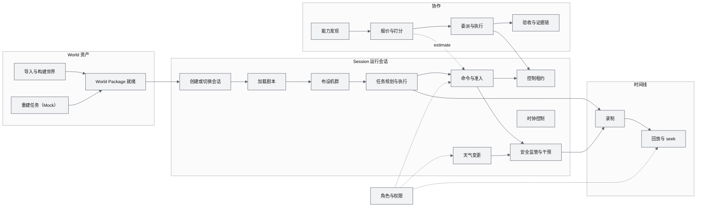
```mermaid
%%{init: {"theme": "base", "themeVariables": {"fontFamily": "Inter, PingFang SC, Microsoft YaHei, Noto Sans CJK SC, sans-serif", "fontSize": "13px", "background": "#FBFBFC", "primaryColor": "#F2F3F5", "primaryTextColor": "#111214", "primaryBorderColor": "#5C616A", "secondaryColor": "#E4E6E9", "tertiaryColor": "#FBFBFC", "lineColor": "#5C616A", "textColor": "#111214", "mainBkg": "#F2F3F5", "nodeBorder": "#5C616A", "clusterBkg": "#FBFBFC", "clusterBorder": "#A7ABB3", "edgeLabelBackground": "#FBFBFC", "noteBkgColor": "#E4E6E9", "noteTextColor": "#111214", "noteBorderColor": "#81868F"}}}%%
flowchart LR
  subgraph W["World 资产"]
    W1["导入与构建世界"] --> W2["World Package 就绪"]
    W3["重建任务（Mock）"] --> W2
  end
  subgraph S["Session 运行会话"]
    S1["创建或切换会话"] --> S2["加载剧本"]
    S2 --> S3["布设机群"]
    S3 --> S4["任务规划与执行"]
    S4 --> S5["命令与准入"]
    S5 --> S6["控制租约"]
    S5 --> S7["安全监管与干预"]
    S8["天气变更"] --> S7
    S9["时钟控制"]
  end
  subgraph R["时间线"]
    R1["录制"] --> R2["回放与 seek"]
  end
  subgraph A["协作"]
    A1["能力发现"] --> A2["报价与打分"] --> A3["委派与执行"] --> A4["验收与证据链"]
  end
  W2 --> S1
  S4 --> R1
  S7 --> R1
  A3 --> S6
  A2 -. "estimate" .-> S5
  P["角色与权限"] -.-> S5
  P -.-> S8
  P -.-> R2
```

### 2.3 七轴状态与本文章节的对应

七轴模型定义见 g04 §1 与 AWR-03 §5.9，本文只补充业务状态机的落点。

| 轴 | 唯一计算者 | 本文状态机 | 本文业务规则 |
|---|---|---|---|
| A 生命周期 | sim-core roster（D1） | §4.3 实体生命周期 | §5.14 机群增删 |
| B 飞行相位 | Mock 取 Safety FSM；PX4 与 Prometheus 由 StateFuser 推导 | §4.4 FlightState | §5.7–§5.11 |
| C 原生飞控态 | 各 Adapter | —（V0.2 起按 g04 §4.2–§4.3 推导，本期为桩） | §4.4.6 |
| D 控制权 | sim-core LeaseManager | §4.8 ControlLease；§4.2 操作席位 | §5.1 第 ⑤ 步 |
| E 定位 | Mock 取真值 | —（故障注入时按 g04 §4.7 投影） | §5.11.3 |
| F 任务 | sim-core 任务引擎；agent 任务由 agent-runtime 负责 | §4.5 Mission 与 Track；§4.13 Agent Task | §5.8.4、§6.4、§6.10 |
| G 调用与效果 | sim-core CommandEngine | §4.6 Command；§4.7 效果状态 | §5.1–§5.6 |

---

## 3. 领域模型

### 3.1 类图

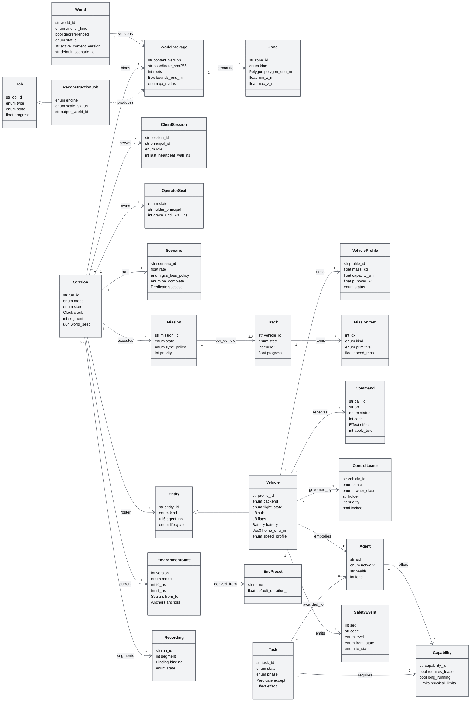
```mermaid
%%{init: {"theme": "base", "themeVariables": {"fontFamily": "Inter, PingFang SC, Microsoft YaHei, Noto Sans CJK SC, sans-serif", "fontSize": "13px", "background": "#FBFBFC", "primaryColor": "#F2F3F5", "primaryTextColor": "#111214", "primaryBorderColor": "#5C616A", "secondaryColor": "#E4E6E9", "tertiaryColor": "#FBFBFC", "lineColor": "#5C616A", "textColor": "#111214", "mainBkg": "#F2F3F5", "nodeBorder": "#5C616A", "clusterBkg": "#FBFBFC", "clusterBorder": "#A7ABB3", "edgeLabelBackground": "#FBFBFC", "noteBkgColor": "#E4E6E9", "noteTextColor": "#111214", "noteBorderColor": "#81868F"}}}%%
classDiagram
  direction LR
  class World {
    str world_id
    enum anchor_kind
    bool georeferenced
    enum status
    str active_content_version
    str default_scenario_id
  }
  class WorldPackage {
    str content_version
    str coordinate_sha256
    int roots
    Box bounds_enu_m
    enum qa_status
  }
  class Zone {
    str zone_id
    enum kind
    Polygon polygon_enu_m
    float min_z_m
    float max_z_m
  }
  class Session {
    str run_id
    enum mode
    enum state
    Clock clock
    int segment
    u64 world_seed
  }
  class ClientSession {
    str session_id
    str principal_id
    enum role
    int last_heartbeat_wall_ns
  }
  class OperatorSeat {
    enum state
    str holder_principal
    int grace_until_wall_ns
  }
  class Scenario {
    str scenario_id
    float rate
    enum gcs_loss_policy
    enum on_complete
    Predicate success
  }
  class Entity {
    str entity_id
    enum kind
    u16 agent_no
    enum lifecycle
  }
  class Vehicle {
    str profile_id
    enum backend
    enum flight_state
    u8 sub
    u8 flags
    Battery battery
    Vec3 home_enu_m
    enum speed_profile
  }
  class VehicleProfile {
    str profile_id
    float mass_kg
    float capacity_wh
    float p_hover_w
    enum status
  }
  class Mission {
    str mission_id
    enum state
    enum sync_policy
    int priority
  }
  class Track {
    str vehicle_id
    enum state
    int cursor
    float progress
  }
  class MissionItem {
    int idx
    enum kind
    enum primitive
    float speed_mps
  }
  class Command {
    str call_id
    str op
    enum status
    int code
    Effect effect
    int apply_tick
  }
  class ControlLease {
    str vehicle_id
    enum state
    enum owner_class
    str holder
    int priority
    bool locked
  }
  class EnvironmentState {
    int version
    enum mode
    int t0_ns
    int t1_ns
    Scalars from_to
    Anchors anchors
  }
  class EnvPreset {
    str name
    float default_duration_s
  }
  class Recording {
    str run_id
    int segment
    Binding binding
    enum state
  }
  class Job {
    str job_id
    enum type
    enum state
    float progress
  }
  class ReconstructionJob {
    enum engine
    enum scale_status
    str output_world_id
  }
  class Agent {
    str aid
    enum network
    str health
    int load
  }
  class Capability {
    str capability_id
    bool requires_lease
    bool long_running
    Limits physical_limits
  }
  class Task {
    str task_id
    enum state
    enum phase
    Predicate accept
    Effect effect
  }
  class SafetyEvent {
    int seq
    str code
    enum level
    enum from_state
    enum to_state
  }
  World "1" --> "1..*" WorldPackage : versions
  WorldPackage "1" --> "*" Zone : semantic
  Session "*" --> "1" WorldPackage : binds
  Session "1" --> "1" Scenario : runs
  Session "1" --> "1" OperatorSeat : owns
  Session "1" --> "*" ClientSession : serves
  Session "1" --> "*" Entity : roster
  Entity <|-- Vehicle
  Vehicle "*" --> "1" VehicleProfile : uses
  Vehicle "1" --> "1" ControlLease : governed_by
  Session "1" --> "*" Mission : executes
  Mission "1" --> "1..*" Track : per_vehicle
  Track "1" --> "*" MissionItem : items
  Vehicle "1" --> "*" Command : receives
  Session "1" --> "1" EnvironmentState : current
  EnvironmentState ..> EnvPreset : derived_from
  Session "1" --> "*" Recording : segments
  Job <|-- ReconstructionJob
  ReconstructionJob ..> WorldPackage : produces
  Vehicle "1" --> "0..1" Agent : embodies
  Agent "1" --> "*" Capability : offers
  Task "*" --> "1" Capability : requires
  Task "*" --> "0..1" Agent : awarded_to
  Vehicle "1" --> "*" SafetyEvent : emits
```

### 3.2 聚合、权威与持久化

| 聚合 | 实体 | 唯一权威（进程与模块） | 持久化位置 | 跨进程可见方式 | D1 |
|---|---|---|---|---|---|
| World | World、WorldPackage、Zone | `worldpkg` 与 job-worker（M03）；几何查询 M04 | `worlds/<id>/`（生成物） | HTTP 静态 + `GET /api/worlds` | core（UI 触发构建为 ext） |
| Session | Session、OperatorSeat、Scenario、Entity/Vehicle、Mission、Track、MissionItem、Command、ControlLease、EnvironmentState、SafetyEvent | sim-core（M08 主持；M09、M10、M07 以 stage 注册） | 内存 SoA；checkpoint（ext）；`runs/<run>/{meta.json,inputs.msgpack,audit.jsonl}` | StateRing（状态）、zenoh 事件与 query（事件、命令、租约、roster） | core |
| 客户端 | ClientSession | api（M11） | 内存 | WS `awr.rt.v1` | core |
| Recording | Recording、Player | recorder 与 replay-worker（M12） | `runs/<run>/rec-<seg>.mcap` | `GET /api/runs`、WS playback | ext |
| Job | Job、ReconstructionJob、WorldBuildJob | job-worker（M03 主持队列，M01 注册重建任务类型） | SQLite 任务队列；`worlds/.staging/` | `evt/job-worker/job`、`GET /api/jobs` | ext（状态机枚举为 core） |
| Collaboration | Agent、Capability、Task、Delegation、黑板单元、证据链 | agent-runtime（M14） | `runs/<run>/evidence.jsonl`（本文设定） | `evt/agent-runtime/*` → WS `agent/*` | ext（schema 为 core） |

规则：
1. 一个实体只有一个权威进程；其他进程只读其投影，不得私自修改（P-08，AWR-03 §5.9）。
2. 跨聚合引用一律用 id，不持有对方对象；例如 Task 引用 `vehicle_id` 与 `call_id`，不内嵌 Command。
3. 任何改变 Session 聚合的外部输入（命令、时钟、租约、环境、roster、故障注入、规划结果）都必须经 sim-core 步顶锁存并写入输入日志（ADR-049），因此 Session 聚合的状态可以由"初始剧本 + 输入日志"重算（G6b，ext）。

### 3.3 实体字段

字段名为业务名，线上名称与编码以 AWR-17（线上）和 AWR-16（文件）为准；表中"权威"列指写入方。

#### 3.3.1 World

| 字段 | 类型 | 单位或取值 | 默认 | 说明 |
|---|---|---|---|---|
| world_id | str | `^[a-z0-9-]{1,63}$` | — | 六城为 `shenzhen`、`shanghai`、`newyork`、`sanfrancisco`、`suzhou`、`chicago`（AWR-03 §5.6） |
| name | str | — | — | 显示名 |
| source | object | `{dataset: urbanscene3d \| recon \| survey, ref}` | — | 追溯来源与许可（ADR-034） |
| anchor_kind | enum | synthetic、rtk、survey、gnss | synthetic | 合成世界的经纬度仅作示意，UI 必须标注（AWR-03 §5.1 规则 3） |
| georeferenced | bool | — | false | — |
| status | enum | ABSENT、BUILDING、READY、INVALID | ABSENT | 由 `worldpkg validate --deep` 结果决定；见 §6.1 |
| active_content_version | str | 12 位 hex | — | 当前可用包的 `contentVersion`（ADR-006） |
| default_scenario_id | str | — | 深圳为 `s1-shenzhen-facade` | 未指定剧本时加载（§4.1.4） |

#### 3.3.2 WorldPackage

| 字段 | 类型 | 单位或取值 | 默认 | 说明 |
|---|---|---|---|---|
| content_version | str | 12 位 hex | — | 对全部文件 sha256 汇总后取 12 位（ADR-006） |
| coordinate_sha256 | str | 64 位 hex | — | 派生资产与录制都绑定它（P-01） |
| roots | int | ≥ 1 | 1 | 苏州为 6 根森林 |
| bounds_enu_m | Box | m | — | World ENU 包围盒 |
| dsm_max_m | float | m | — | 用于派生围栏上限（§5.7.1） |
| qa_status | enum | pass、fail | — | `qa/report.json` |
| size_bytes、build_s | int、float | B、s | — | 构建统计，单城构建 ≤ 60 s（D1-AC-01） |

#### 3.3.3 Zone（围栏与限制区）

| 字段 | 类型 | 单位或取值 | 默认 | 说明 |
|---|---|---|---|---|
| zone_id | str | — | — | `zones.geojson` 要素 id；`border` 为保留 id |
| kind | enum | border、nofly、restricted | — | border 为可飞棱柱；nofly 禁入；restricted 只告警（本文设定，V0.2 可编辑） |
| polygon_enu_m | Polygon | m | — | World ENU 水平多边形 |
| min_z_m、max_z_m | float | m（world z） | 见 §5.7.1 | 棱柱高度范围 |
| label | str | — | — | UI 标签，显示前经运行时净化 |

#### 3.3.4 Session（运行会话，Run）

| 字段 | 类型 | 单位或取值 | 默认 | 说明 |
|---|---|---|---|---|
| run_id | str | `r<YYYYMMDD>-<HHMMSS>-<4hex>` | — | 也是 zenoh 命名空间的一段（AWR-03 §5.6） |
| world_id、content_version、coordinate_sha256 | str | — | — | 创建时锁定，运行期间不变 |
| scenario_id、scenario_sha256 | str | — | 世界默认剧本 | — |
| mode | enum | live、replay | live | 回放为全局模式（ADR-040） |
| state | enum | 见 §4.1 | CREATED | — |
| clock.state | enum | TIME.state 十值（AWR-03 §5.2 第 6 条） | STOPPED | — |
| clock.rate | float | 0.25、0.5、1、2、5、10 | 剧本 `rate` | 受 RTF 与 `caps.clock` 约束（§5.13） |
| clock.t_sim_ns | int64 | ns | 0 | 从会话起点起算 |
| clock.epoch | u16（线上）/ u32（StateRing） | — | 0 | 全局 epoch（AWR-03 §5.2 第 4 条） |
| world_seed | u64 | — | 剧本 `seed` | 全部 RNG 流的种子（ADR-049） |
| segment | int | ≥ 0 | 0 | 当前录制段号；剧本重置时加 1 |
| caps_clock | object | `{mode, pausable, max_speed, steppable}` | Mock 为 lockstep、可暂停、10、可单步 | 由在场后端的能力合成（ADR-045） |
| keep | bool | — | false | 标记后不被配额清理 |

#### 3.3.5 ClientSession 与 OperatorSeat

| 实体.字段 | 类型 | 单位或取值 | 默认 | 说明 |
|---|---|---|---|---|
| ClientSession.session_id | str | — | — | 对应 `serverInfo.connId`（每条 WS 连接一个，重连后变化）；`serverInfo.sessionId` 是 Gateway 实例 id，不是本字段（AWR-17 §6.3） |
| ClientSession.principal_id | str | — | — | 来自 token；浏览器以 localStorage 中的 `principal_hint` 签发，刷新与重连后不变（AWR-17 §3.1），因此能在宽限期内收回席位 |
| ClientSession.role | enum | viewer、operator、admin | viewer | §8 |
| ClientSession.access_mode | enum | loopback、lan | loopback | AWR-03 §3.3 |
| ClientSession.last_heartbeat_wall_ns | int64 | ns | — | 客户端 ping 2 Hz（本文设定）；GCS 链路判据的输入 |
| OperatorSeat.state | enum | FREE、HELD、GRACE | FREE | §4.2 |
| OperatorSeat.holder_principal | str \| null | — | null | 同一 Session 至多一个（Q5） |
| OperatorSeat.grace_s | float | s【墙钟】 | 30 | 断线保留席位的宽限期（本文设定：覆盖 api 重启 1–2 s 与浏览器重连退避 0.5–10 s，g05 §7.5） |

#### 3.3.6 Scenario（剧本）

业务字段如下，文件结构见 AWR-16，schema 为 `packages/contracts/scenario/scenario.schema.json`。

| 字段 | 类型 | 单位或取值 | 默认 | 说明 |
|---|---|---|---|---|
| scenario_id、name、world_id | str | — | — | — |
| seed | u64 | — | 7 | x01 §3.11 |
| rate | float | 0.25–10 | 1 | 无头测试一般为 10 |
| autoplay | bool | — | true | 进入 READY 后自动 PLAYING |
| gcs_loss_policy | enum | hold_rtl、ignore | ignore | 剧本必须显式声明（ADR-026）；operator 取得租约后按 §5.9.2 切换 |
| env | object | `{preset, patch}` | `clear` | 初始环境，以 `step` 关键帧生效 |
| vehicles[] | list | 见 §3.3.7 | — | 初始机群 |
| missions[] | list | 见 §3.3.9 | — | 初始任务 |
| transit | object | `{planner: safe_transit, margin_m: 5, layer_dz_m: 4}` | 同左 | x01 §3.8、r26 §3.11 |
| events[] | list | 定时或条件事件（§7.1.2） | [] | — |
| success | Predicate | 封闭谓词（§7.1.3） | — | — |
| time_limit_s | float | s【仿真】 | 1800 | 超时判 FAILED |
| on_complete | enum | pause、continue、reset | pause | 剧本判定结束后的会话动作 |
| record | bool | — | true | ext：剧本运行时默认录制（ADR-040） |
| energy_precheck | enum | reject、warn | reject | §5.8.4 |

#### 3.3.7 Entity 与 Vehicle（Drone 即 kind = uav 的 Vehicle，ADR-047）

| 字段 | 类型 | 单位或取值 | 默认 | 说明 |
|---|---|---|---|---|
| entity_id（vehicle_id） | str | `^[a-z0-9]+(-[a-z0-9]+)*$` | `<model>-<nn>` | 例如 `p600-01` |
| kind | enum | uav、ugv、robot、vehicle、sensor、human | uav | D1 只有 uav（ADR-047） |
| agent_no | u16 | 0–65534 | 分配 | 本 Session 内不复用（本文设定：保证录制与事件中的编号无歧义） |
| profile_id | str | `p600_mid360`、`x500` | `p600_mid360` | ADR-022 |
| backend | enum | mock、px4_sih、prometheus | mock | D1 只有 mock |
| simulated | bool | — | true | 进入 advertise 的 `agents[]` |
| lifecycle | enum | 12 值（g04 §5.3） | PENDING | §4.3 |
| flight_state、sub | enum、u3 | 14 态与子模式 | UNKNOWN | §4.4 |
| flags | u8 | 8 位（ADR-015） | 0 | — |
| ctrl | u8 | owner、locked、native、pose_src | — | owner 为投影值，见 §4.8.5 |
| home_enu_m | Vec3 | m | 出生点 | 解锁上升沿锁定（r19 §3.3） |
| battery | object | `{soc: 0–1（以可用能量 E_use 为基准，§5.8.1）, t_rem_usable_s, t_rtl_s, state: ok \| low \| critical \| emergency}` | soc = 剧本 `initial_soc`，缺省 1.0 | §5.8 |
| speed_profile | enum | px4_default、prometheus_outdoor、prometheus_command | 机型默认（P600 为 prometheus_outdoor） | g08 §10.2 第 4 条 |
| caps | list[str] | 能力 id | 由机型传感器与剧本声明合成 | §3.3.18 |
| collision_radius_m | float | m | 机型 `geometry.collision_radius_m` | FleetGuard 碰撞判据（ADR-043） |
| gcs_loss_policy_effective | enum | hold_rtl、ignore | 剧本值 | §5.9.2 |

#### 3.3.8 VehicleProfile（只列业务用到的字段，全文见 AWR-16 与 M08）

| 字段 | 单位 | P600（placeholder） | 依据 |
|---|---|---|---|
| mass_kg | kg | 3.5 | g08 §10.4 |
| battery.capacity_wh | Wh | 222（6S、10 Ah，标称） | g08 §10.4 |
| battery.usable_frac | — | 0.85 | g08 §10.4 反推 P_hover 所用系数；AWR-16 Vehicle Package |
| E_use = usable_frac·capacity_wh | Wh | 188.7（SOC 的基准） | M09-FR-050；与厂商 22 min 悬停续航一致（AWR-16 VH-6：0.85·222·3600/515 = 1319 s） |
| battery.p_hover_w | W | 515 | g08 §10.4（`0.85 × 222 Wh ÷ 22 min` 反推） |
| limits_profiles | — | px4_default（巡航 5 m/s，上限 12 m/s）、prometheus_outdoor（3 m/s）、prometheus_command（1 m/s） | g08 §10.4 |
| wind_rating_mps | m/s | 13.8 | g08 §10.4（厂商抗风 6 级） |
| anet.score_norm | — | 由 M14 给出 | ADR-036 |
| status | — | placeholder | UI 标注"参数未辨识"（ADR-043） |

#### 3.3.9 Mission、Track 与 MissionItem

| 实体.字段 | 类型 | 单位或取值 | 默认 | 说明 |
|---|---|---|---|---|
| Mission.mission_id | str | — | — | — |
| Mission.origin | enum | scenario、operator、agent | — | 决定 principal |
| Mission.generator | enum | lawnmower、helix_scan、orbit、expanding_square、corridor、terrain_follow、formation；另有 follow_path（显式航点） | — | D1-core 七种生成器（AWR-03 §6.3 M10）；follow_path 见 AWR-16 §12.2 |
| Mission.params | object | 各生成器参数 | — | 公式见 x01 §3.10 与 M10 |
| Mission.state | enum | IDLE、RUNNING、PAUSED、DONE、ABORTED | IDLE | 任务轴 F 的冻结枚举（g04 §1），§4.5 |
| Mission.sync_policy | enum | free、barrier、timed | free | r26 §3.11；barrier 超时 30 s【仿真】 |
| Mission.priority | int | 0–9 | 0 | 让行优先级第 2 键（§5.10） |
| Mission.on_done、on_abort | enum | rtl、hover、land | on_done = rtl；on_abort = hover | 本文设定：任务完成即返航符合剧本闭环；中止时悬停以便操作员接管 |
| Mission.resume_on_lease_return | bool | — | true | 租约交还后自动续飞（§4.8.4） |
| Track.state | enum | PENDING、TRANSIT、WORKING、WAITING、SUSPENDED、RETURNING、DONE、DROPPED | PENDING | 每机一条，§4.5.2 |
| Track.cursor | int | MissionItem 下标 | 0 | 同时写入 Full64 `mission_item` |
| Track.progress | float | 0–1 | 0 | — |
| MissionItem.kind | enum | transit、leg、dwell、orbit、land | — | — |
| MissionItem.primitive | enum | goto、follow_path、orbit、hover | — | 映射到命令集 |
| MissionItem.speed_mps | float | m/s | 机型巡航速度 | 超过限速配置时截断 |
| MissionItem.acceptance_radius_m | float | m | `max(1.0, 0.25·V)` | r26 §3.11 |

#### 3.3.10 Command（调用）

| 字段 | 类型 | 单位或取值 | 默认 | 说明 |
|---|---|---|---|---|
| call_id | str | 客户端生成 UUID | — | 60 s【墙钟】内幂等（g04 §7.3） |
| batch_id | str \| null | — | null | 批量命令（§5.5 第 5 条） |
| service、op | str | `uav/{id}/cmd/{op}`、op 名 | — | 命令集见 §5.1.1 |
| vehicle_id | str | — | — | — |
| args | object | 带单位后缀（AWR-03 §5.4） | — | 边界见 §5.3 |
| principal | object | `{id, role, entry: ui \| agent \| mission \| swarm \| scenario \| safety}` | — | 由可信入口填写（ADR-016） |
| status | enum | accepted、rejected、running、succeeded、failed、canceled、timeout | — | §4.6 |
| code、reason、detail、message、remedy | int、str | — | — | `detail` 为细分原因（例如 `GOAL_IN_ZONE`），`remedy` 为可执行建议（沿用 n03 droneserver 做法） |
| effect | object | `{status, verify_trust 0–4, native_ack, simulated, observed_state, metrics, latency_ms}` | — | §4.7 |
| request_tick、apply_tick | int | 主时钟 tick | — | 写入输入日志（ADR-049） |
| t_accept_sim_ns、deadline_sim_ns | int64 | ns【仿真】 | — | 截止时间按 §5.4 |
| supersedes、superseded_by、dup_of | str \| null | call_id | null | §5.5 |

#### 3.3.11 ControlLease

| 字段 | 类型 | 单位或取值 | 默认 | 说明 |
|---|---|---|---|---|
| vehicle_id | str | — | — | 每架机一份 |
| state | enum | FREE、HELD、SUSPENDED | FREE | §4.8 |
| owner_class | enum | NONE、OPERATOR、MISSION、AGENT、SWARM、PILOT、EXTERNAL | NONE | ctrl.owner 的租约来源值；SAFETY 为投影值，不是持有者（§4.8.5） |
| holder | str \| null | principal id | null | OPERATOR 租约的 holder 必须等于当前席位持有者 |
| priority | int | SWARM 1、MISSION 2、AGENT 3、OPERATOR 4、OPERATOR override 5、PILOT 6 | — | g04 §4.9 |
| locked | bool | — | false | SafetyStop 加锁 |
| return_stack | list | 最多 2 层 | [] | 交还时恢复的上一持有者（本文设定：MISSION → AGENT → OPERATOR 最多嵌套两层） |
| ttl_s、expires_wall_ns、token | float、int、str | s【墙钟】 | ext | 完整租约（ADR-027） |

#### 3.3.12 EnvironmentState 与 EnvPreset

EnvironmentState 就是当前 EnvKeyframe（g06 §3.5，线格式见 AWR-17）；业务上关心的字段：`version`（每次变化 +1）、`mode`（smooth、exp、step）、`t0_ns`、`t1_ns`、`from`、`via[]`、`to`、`anchors`、`events[]`（阵风锋面）、`config.presets_sha256`。派生状态 `transition ∈ {STEADY, TRANSITIONING}` 由 `t_now` 与 `t1_ns` 比较得到（§4.9）。EnvPreset 为 12 个命名预设（clear、partlyCloudy、overcast、lightRain、rain、heavyRain、thunderstorm、fog、haze、snow、blizzard、sandstorm），取值以 M07 与 `presets.json` 为准（g06 §4.2），默认过渡 30 s【仿真】（g06 §3.3）。

#### 3.3.13 Recording 与 Player

| 实体.字段 | 类型 | 单位或取值 | 默认 | 说明 |
|---|---|---|---|---|
| Recording.run_id、segment | str、int | — | — | 文件 `runs/<run>/rec-<seg>.mcap` |
| Recording.binding | object | world_id、content_version、coordinate_sha256、layout_id、contracts 版本、sim 内核 | — | 打开时校验（ADR-040） |
| Recording.lineage | list | `{epoch, t_start_ns, t_end_ns, invalid: [区间]}` | — | 崩溃回滚区间标记为作废 |
| Recording.bytes_per_sim_s | float | B/s | — | 决定最大回放倍速 |
| Recording.state | enum | OPEN（录制中）、CLOSED、CORRUPT | — | 文件状态；录制器状态机见 §4.10 |
| Player.rate | float | 0.1–20 | 1 | 上限 `min(20, 64 MB/s ÷ bytes_per_sim_s)`（ADR-040） |
| Player.state | enum | 见 §4.11 | CLOSED | — |

#### 3.3.14 Job 与 ReconstructionJob

| 字段 | 类型 | 单位或取值 | 默认 | 说明 |
|---|---|---|---|---|
| job_id | str | `j-<uuid7>` | — | — |
| type | enum | world_build、recon | — | 任务类型经 `awr/jobs/registry.py` 注册 |
| state | enum | §4.12 | QUEUED | — |
| stage、progress | enum、float | 0–1 | — | 进度事件节流 250 ms【墙钟】（AWR-03 §6.3 M01） |
| engine | enum | mock、lingbot_map、da3、mapanything、colmap | mock | D1 只有 mock（ADR-035） |
| input | object | `{kind: world_sample, world_id, path: helix \| lawnmower, frames}` | — | Mock 从现有世界沿合成航线采样 |
| output | object | `{world_id, recon_session, scale_status}` | — | `scale_status ∈ {relative, gnss, rtk, lidar}`，UI 必须显示（ADR-035） |
| error | object | `{code, stage, resumable}` | — | job-worker 崩溃时 `resumable = true` |
| submitted_by | str | principal | — | — |

#### 3.3.15 Task（协作任务）与 Delegation

| 实体.字段 | 类型 | 单位或取值 | 默认 | 说明 |
|---|---|---|---|---|
| Task.task_id | str | `T-<nnnn>` | — | d05 §3.9 |
| Task.origin、requester | enum、str | scenario、operator、agent；AID 或 principal | — | — |
| Task.capability、args | str、object | 能力 id；参数按 manifest `input_schema` | — | — |
| Task.accept | Predicate | TSIR（AND、OR、NOT、THRESHOLD、ARTIFACT、TEST、SCOPE） | — | 深度 ≤ 16、子项 ≤ 64，未知 op 失败即关闭（d05 §2.5） |
| Task.negative_scope | Predicate | SCOPE | 禁飞区 | — |
| Task.strategy、provider | enum、str | auction、direct | auction | — |
| Task.state | enum | A2A 七态 | submitted | §4.13 |
| Task.phase | enum | queued、lease、enroute、on_station、executing、returning | queued | `awr.phase`（d05 §3.4） |
| Task.alloc | enum | discovering、quoting、awarding、reassigning、done | discovering | 本文设定：合同网子阶段只作元数据，不增加状态 |
| Task.retries_left | int | — | 2 | d05 §3.4 |
| Task.t_quote_s、t_exec_s | float | s【仿真】 | 3；`1.5·eta_s + dwell_s + 60` | d05 §3.4；ADR-045 |
| Task.effect、verified | object、bool | — | — | §4.7 |
| Delegation.ix | str | `ix_<32hex>` | — | 每次委派一条 |
| Delegation.state | enum | submitted、working、completed、failed、canceled、rejected | — | 提供方侧 A2A 状态 |

#### 3.3.16 SafetyEvent

| 字段 | 类型 | 单位或取值 | 说明 |
|---|---|---|---|
| seq、t_sim_ns | int、int64 | — | 可靠通道，带 seq（ADR-026） |
| vehicle_id | str | — | — |
| code | str | `SAF.*` 命名空间（r24 §4.8），例如 `SAF.BAT.ENERGY_RTL` | — |
| level | enum | info、warn、action、critical | 本文设定：warn 不改变 FlightState；action 对应 CORRECTING、HOLD、RTL、LANDING；critical 对应 ELAND、FAILSAFE、CRASHED、KILLED |
| from、to | FlightState/sub | — | 转移前后 |
| reason、message | str | — | message 显示前经运行时净化 |

#### 3.3.17 Agent

| 字段 | 类型 | 单位或取值 | 默认 | 说明 |
|---|---|---|---|---|
| aid | str | Mock 为确定性伪 AID | — | 一机一 AID（d05 §0 第 2 条） |
| vehicle_id、kind | str、enum | — | — | — |
| network | enum | mock、anet | mock | V1.0 为 anet |
| manifest | object | `awr.capability-manifest/1`（d05 §3.2） | — | 由 `agent.describe` 返回 |
| health | str \| null | null 表示健康 | — | 本文推导规则：FlightState ∈ {UNKNOWN, ELAND, FAILSAFE, CRASHED}、lifecycle ≠ READY、租约被 OPERATOR 或 PILOT 持有时不健康，`find` 结果中排除 |
| load | int | 进行中的委派数 | 0 | 打分项（ADR-036） |

#### 3.3.18 Capability

| 字段 | 类型 | 单位或取值 | 说明 |
|---|---|---|---|
| capability_id | str | `<family>.<action>[.<variant>]`，≤ 64 B，不带设备后缀 | d05 §3.1 |
| input_schema、output_metrics、output_artifacts | JSON Schema、list、list | — | d05 §3.2 |
| physical | object | `{sensor, alt_agl_m: [min, max], limits: {wind_mps, rain_mmh, visibility_m}}`（高度相对 DTM，M14） | 与环境场联动，决定可行性 |
| trust | object | `{verify_max, auth, simulated_verify}` | Mock 仿真真值为 V4 并标 simulated |
| requires_lease、long_running、timeout_s | bool、bool、float | — | 飞行与观测类能力为两段式长任务（d05 §3.3） |

### 3.4 标识与引用规则

1. 所有 id 在其作用域内唯一：world_id 全局；run_id 全局；vehicle_id、mission_id、task_id 在 Session 内；call_id 在 60 s 幂等窗口内。
2. 业务事件一律携带 `(run_id, epoch, t_sim_ns)`；跨 epoch 的引用（例如回放中引用实时会话的 call_id）无效。
3. 由用户、剧本、agent 输入的自由文本（名称、label、message）只作显示，显示前经 `lib/sanitize.ts` 净化（AWR-03 §8.4 D1-AC-20 注 5），业务逻辑不得依赖其内容。

---

## 4. 状态机

### 4.0 总表

| # | 状态机 | 唯一权威 | 计时器时钟域 | 枚举真源 | D1 |
|---|---|---|---|---|---|
| 4.1 | Session 运行会话 | sim-core（时钟、状态）+ supervisor（恢复）+ api（全局 epoch） | 仿真与墙钟混合，见各行 | `rt/enums.json` TimeState；本文 SessionState（提请登记） | core（回放、切换世界为 ext） |
| 4.2 | 客户端会话与操作席位 | api（ClientSession）；sim-core LeaseManager（席位） | 墙钟 | 本文 SeatState（提请登记） | core（admin 接管为 ext） |
| 4.3 | 实体生命周期（A 轴） | sim-core roster | Mock 故障为仿真；真实后端为墙钟 | Lifecycle | core |
| 4.4 | FlightState 14 态与子模式（B 轴） | Mock：Safety FSM（M09） | 仿真 | FlightState、FlightSub | core |
| 4.5 | Mission 与 Track（F 轴） | sim-core 任务引擎（M10） | 仿真 | MissionState；本文 TrackState（提请登记） | core（barrier/timed 为 ext） |
| 4.6 | Command 调用（G 轴） | sim-core CommandEngine（M08） | 截止时间为仿真；RPC 超时与幂等为墙钟 | CallStatus | core |
| 4.7 | 效果状态（G 轴） | CommandEngine；agent-runtime | — | EffectStatus | core |
| 4.8 | ControlLease（D 轴） | sim-core LeaseManager（M08） | TTL 为墙钟（ext） | Owner；本文 LeaseState（提请登记） | core 子集；完整为 ext |
| 4.9 | 环境过渡 | sim-core EnvironmentService（M07） | 仿真 | 派生量，不上线 | core |
| 4.10 | 录制 | recorder（M12） | chunk 1 s 为墙钟 | 本文 RecState | ext |
| 4.11 | 回放 Player | replay-worker（M12） | 墙钟 | TimeState（bit7） | ext |
| 4.12 | Job 与 ReconstructionJob | job-worker（M03、M01） | 墙钟 | ReconJobState（AWR-03 §6.3 M01）；本文 WorldBuildState | core（枚举）/ ext（执行） |
| 4.13 | Agent Task 与 Delegation | agent-runtime（M14） | 仿真（ADR-045） | A2A 七态 + `awr.phase` | ext（schema 为 core） |

### 4.1 Session 运行会话

#### 4.1.1 状态

| 状态 | 含义 | TIME.state（AWR-03 §5.2 第 6 条） | 接受的写操作 |
|---|---|---|---|
| CREATED | run_id 已分配，sim-core 尚未就绪 | 0 STOPPED | 无 |
| PREPARING | 绑定 WorldPackage，校验剧本，布设机群，能量预检，numba 预热，epoch + 1 | 0 STOPPED | 无（返回 211 SIM_UNAVAILABLE） |
| READY | 机群在地面，t_sim = 0 | 0 STOPPED | 时钟、机群、环境、租约、任务启动 |
| ACTIVE.PLAYING | 时钟推进 | 1 PLAYING | 全部 |
| ACTIVE.PAUSED | 时钟冻结；命令照常准入，apply_tick 为恢复后的下一 tick | 2 PAUSED | 全部（Velocity 除外，见 §5.13） |
| ACTIVE.STEPPING | 执行 step 指定的 tick 数后回到 PAUSED | 3 STEPPING | 无（step 期间新写入排队到下一步顶） |
| ACTIVE.LIVE | 世界中存在非 lockstep 后端（V0.2 起），rate 锁定 1，不可暂停 | 9 LIVE | 除 pause、step、speed 外全部 |
| RESETTING | 剧本重置：关闭录制段、epoch + 1、重新布设 | 0 STOPPED | 无 |
| RECOVERING | sim-core 崩溃或挂死，等待恢复 | 6 STALLED → 7 RESTARTING | 无（返回 211） |
| REPLAY | 全局回放模式，只读 | bit7 置位，低 4 位为 1、2、4、5 | 只有回放控制（§4.11） |
| CLOSING | 停止或切换世界中 | 0 STOPPED | 无 |
| CLOSED | 已结束（终态） | — | 无 |
| FAILED | supervisor 熔断（60 s 内第 6 次启动） | 8 FAILED | 只有 admin 的 `sys/restart` |

#### 4.1.2 转移表

| # | 源 | 事件 | 守卫 | 动作 | 目标 |
|---|---|---|---|---|---|
| S01 | — | `make run` 或 `POST /api/sessions`（ext） | 目标世界 status = READY | 分配 run_id，写 `runs/<run>/meta.json`，supervisor 启动 sim-core | CREATED |
| S02 | CREATED | sim-core 声明 `proc/sim-core/ready` | — | 校验 `content_version` 与 `coordinate_sha256`；加载剧本 | PREPARING |
| S03 | PREPARING | 剧本校验通过 | 出生点合法（§5.14.1）；能量预检通过或策略为 warn（§5.8.4） | epoch + 1；布设机群（生命周期到 READY）；环境以 `step` 关键帧设为剧本初值；打开录制段 0（ext）；发 `session.ready` | READY |
| S04 | PREPARING | 剧本校验失败 | — | 发 `session.error{code: 121 SCENARIO_INVALID, detail}`；以空剧本（无机体、clear 预设）继续，保证世界仍可浏览（本文设定） | READY |
| S05 | READY | `sim/play` 或剧本 `autoplay` | 席位持有者或剧本导演 | 时钟开始推进；任务按剧本启动 | ACTIVE.PLAYING |
| S06 | ACTIVE.PLAYING | `sim/pause` | `caps_clock.pausable` | 冻结时钟；链路类墙钟判据冻结（ADR-045） | ACTIVE.PAUSED |
| S07 | ACTIVE.PAUSED | `sim/play` | — | 恢复推进；冻结的墙钟判据继续计时 | ACTIVE.PLAYING |
| S08 | ACTIVE.PAUSED | `sim/step{ticks}` | `caps_clock.steppable`；1 ≤ ticks ≤ 2500 | 推进 ticks 个主时钟 tick（4 ms/tick） | ACTIVE.STEPPING → ACTIVE.PAUSED |
| S09 | ACTIVE.* | `sim/speed{rate}` | rate ∈ {0.25, 0.5, 1, 2, 5, 10}；rate ≤ `caps_clock.max_speed`；非 LIVE | 更新倍率；rate ≠ 1 时关闭 Velocity 会话（§5.13） | 原状态 |
| S10 | ACTIVE.* | `sim/reset{scenario_id?}` | 席位持有者；`scenario_id` 须属于当前世界（否则 121） | 结束录制段，segment + 1；epoch + 1；给定 `scenario_id` 时先按 S03、S04 校验并加载新剧本；全部机体重生到出生点（生命周期 RESTARTING → READY）；租约全部 FREE；任务回到 IDLE；环境 `step` 回剧本初值；进行中的调用 `canceled 6 CANCELLED` | RESETTING → READY 或 ACTIVE.PLAYING（按 autoplay） |
| S11 | ACTIVE.PLAYING | 剧本判定结束（成功、失败或超时） | `on_complete = pause` | 发 `scenario.result`；写入 meta | ACTIVE.PAUSED |
| S12 | ACTIVE.PLAYING | 同上 | `on_complete = reset` | 发 `scenario.result` 后执行 S10 | RESETTING |
| S13 | ACTIVE.* | sim-core 退出或心跳年龄 > 250 ms | — | TIME 置 STALLED；心跳在 2 s（supervisor 挂死判据，g05 §7.4）内恢复且未重启时直接回到原子状态，否则 supervisor 退避后重启 | RECOVERING |
| S14 | RECOVERING | sim-core 恢复就绪 | D1-core：无 checkpoint | 从剧本起点重开（等同 S10 的动作，segment + 1）；在途调用按 §4.1.5 | READY 或 ACTIVE.PLAYING |
| S15 | RECOVERING | sim-core 恢复就绪 | D1-ext：有有效 checkpoint | 恢复状态，回滚 ≤ 1 s；producer epoch + 1，客户端收到 `rflags.RESET`；恢复到崩溃前播放状态（ADR-019） | 崩溃前的 ACTIVE 子状态 |
| S16 | RECOVERING | 60 s 内第 6 次启动 | — | 熔断；发 `proc.failed` | FAILED |
| S17 | FAILED | `sys/restart` | admin | 重置熔断计数 | CREATED |
| S18 | ACTIVE.PAUSED | `playback/open{run, segment}` | 席位持有者；录制兼容（§4.11）；实时会话已暂停 | 全局 epoch + 1；mode = replay | REPLAY |
| S19 | REPLAY | `playback/close` | 席位持有者 | 全局 epoch + 1；mode = live；实时时钟保持 PAUSED | ACTIVE.PAUSED |
| S20 | 任意非终态 | `make stop`、SIGTERM，或 `POST /api/sessions` 切换世界（ext） | 切换世界要求席位持有者 | 发 `sys.shutting_down` 或 `session.switching`；关闭录制段；按 AWR-10 顺序停止进程 | CLOSING |
| S21 | CLOSING | 进程全部退出 | — | 写 `meta.json` 结束时间 | CLOSED |

#### 4.1.3 状态图

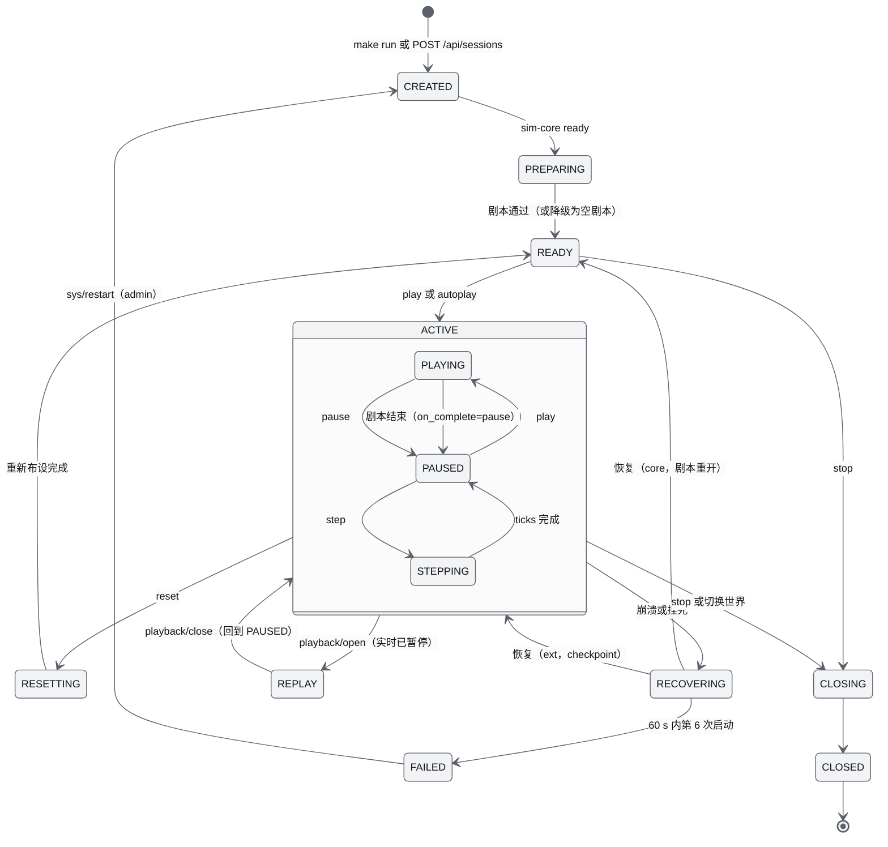
```mermaid
%%{init: {"theme": "base", "themeVariables": {"fontFamily": "Inter, PingFang SC, Microsoft YaHei, Noto Sans CJK SC, sans-serif", "fontSize": "13px", "background": "#FBFBFC", "primaryColor": "#F2F3F5", "primaryTextColor": "#111214", "primaryBorderColor": "#5C616A", "secondaryColor": "#E4E6E9", "tertiaryColor": "#FBFBFC", "lineColor": "#5C616A", "textColor": "#111214", "mainBkg": "#F2F3F5", "nodeBorder": "#5C616A", "clusterBkg": "#FBFBFC", "clusterBorder": "#A7ABB3", "edgeLabelBackground": "#FBFBFC", "noteBkgColor": "#E4E6E9", "noteTextColor": "#111214", "noteBorderColor": "#81868F"}}}%%
stateDiagram-v2
  [*] --> CREATED: make run 或 POST /api/sessions
  CREATED --> PREPARING: sim-core ready
  PREPARING --> READY: 剧本通过（或降级为空剧本）
  READY --> ACTIVE: play 或 autoplay
  state ACTIVE {
    PLAYING --> PAUSED: pause
    PAUSED --> PLAYING: play
    PAUSED --> STEPPING: step
    STEPPING --> PAUSED: ticks 完成
    PLAYING --> PAUSED: 剧本结束（on_complete=pause）
  }
  ACTIVE --> RESETTING: reset
  RESETTING --> READY: 重新布设完成
  ACTIVE --> RECOVERING: 崩溃或挂死
  RECOVERING --> ACTIVE: 恢复（ext，checkpoint）
  RECOVERING --> READY: 恢复（core，剧本重开）
  RECOVERING --> FAILED: 60 s 内第 6 次启动
  FAILED --> CREATED: sys/restart（admin）
  ACTIVE --> REPLAY: playback/open（实时已暂停）
  REPLAY --> ACTIVE: playback/close（回到 PAUSED）
  ACTIVE --> CLOSING: stop 或切换世界
  READY --> CLOSING: stop
  CLOSING --> CLOSED
  CLOSED --> [*]
```

#### 4.1.4 世界与会话的关系

1. D1 同一时刻只有一个 Session；Session 在 S02 绑定一个 WorldPackage（`content_version`），运行期间不变（P-01）。
2. **静态浏览**（core，P0）：客户端打开 `/world/:id` 且 id 不等于当前 Session 的 world_id 时，只加载该世界的点云（M05），不订阅仿真通道；UI 显示"该世界没有运行中的会话"。任何角色可用，对 Session 没有影响。这保证 D1-AC-02 的切换世界首帧与 D1-AC-29 soak 中的世界切换不依赖仿真。
3. **切换会话世界**（ext，P1）：席位持有者调用 `POST /api/sessions{world_id, scenario_id?, seed?, rate?}`（AWR-17 R09，返回 202 `{run_id, state: PREPARING}`），当前 Session 经 S20 进入 CLOSING，新 Session 以新 run_id 从 S01 开始，全局 epoch + 1；全部 WS 连接收到新的 `serverInfo`、`advertise`、`TIME` 与 SNAPSHOT，旧 run 的 token 失效（302），客户端以同一 `principal_hint` 重新签发；api 在新 sim-core 就绪后以幂等的 `seat/claim` 把原席位持有者登记到新 run（同 §4.1.5），其间其他 principal 申请 operator 得 116；仍停留在旧世界页面的客户端收到 `session.switched{run_id, world_id}` 后进入静态浏览，并提示跳转。D1-core 通过启动参数 `make run WORLD=<id> SCENARIO=<id>` 选择世界与剧本。
4. **缺省剧本**：未指定剧本时加载 `World.default_scenario_id`；深圳为 S1。其余五城在 D1-core 使用"自由剧本"：2 架 P600 在开阔区地面待命、无任务、`gcs_loss_policy: ignore`（`free-<world_id>`，地块由 M16 §6.4.8 在 x01 高度图上选址；本文设定，理由是保证每个世界都能演示"添加 P600 → 控制飞行"）。
5. 会话运行期间禁止重建其绑定的世界：`POST /api/worlds/{id}/build` 返回 `123 WORLD_NOT_READY`（detail = `IN_USE`）。

#### 4.1.5 崩溃恢复中的业务语义

| 对象 | D1-core（剧本重开） | D1-ext（checkpoint 恢复） | 依据 |
|---|---|---|---|
| 未收到准入回复的调用 | 入口 1 s【墙钟】超时并重试 2 次后 `failed 211 SIM_UNAVAILABLE`；客户端可用同一 call_id 重试 | 同左 | g05 §7.4 |
| 已准入、`t_accept ≤ restored_t` 的调用 | `failed 212 SIM_ROLLBACK`（剧本重开，状态全部重置） | 继续执行，完成事件照常到达 | g05 §7.4 |
| 已准入、`t_accept > restored_t` 的调用 | 同上 | `failed 212 SIM_ROLLBACK` | g05 §7.4 |
| 操作席位 | api 缓存席位持有者，在 `proc/sim-core/ready` 后以幂等的 `seat/claim` 重新登记 | 从 checkpoint 恢复 | 本文设定 |
| 租约 | 全部 FREE，任务引擎重新申请 MISSION 租约 | 从 checkpoint 恢复；token 仍有效（`AWR_SECRET` 随 run 持久化，ADR-019） | ADR-019、ADR-027 |
| 任务 | 回到 IDLE 并按剧本重新启动 | 从 checkpoint 恢复游标 | — |
| 协作任务 | agent-runtime 把 working 的任务置 `input-required(reason=sim_rollback)` | 仅引用了 212 调用的委派进入重分配 | ADR-017 |
| 录制 | 结束当前段，开始新段 | 同一段内标记作废区间 `[restored_t, last_t]` | ADR-040 |

### 4.2 客户端会话与操作席位

#### 4.2.1 ClientSession

| # | 源 | 事件 | 守卫 | 动作 | 目标 |
|---|---|---|---|---|---|
| C01 | — | WS 连接 `/api/rt`（子协议 `awr.rt.v1` 与 `bearer.<token>`） | token 有效；Origin 合法（AWR-03 §3.3） | 发 `serverInfo`、`advertise`、`TIME` | OPEN |
| C02 | — | 同上 | token 无效或 Origin 非法 | 拒绝握手（HTTP 401 或 403） | —（未建立） |
| C03 | OPEN | `hello` + `subscribe` | 订阅的 topic 在该角色可见范围内（§8.2） | 下发 backfill 与 SNAPSHOT | ACTIVE |
| C04 | ACTIVE | ping 2 Hz 中断，年龄 > 1.5 s【墙钟】 | — | 标记 STALE；若为席位持有者，GCS 链路进入 WARN（§5.9） | STALE |
| C05 | STALE | ping 恢复 | — | 清除 | ACTIVE |
| C06 | ACTIVE、STALE | WS 关闭 | — | 释放订阅；若该 principal 已无其他连接且持有席位，席位进入 GRACE | CLOSED |

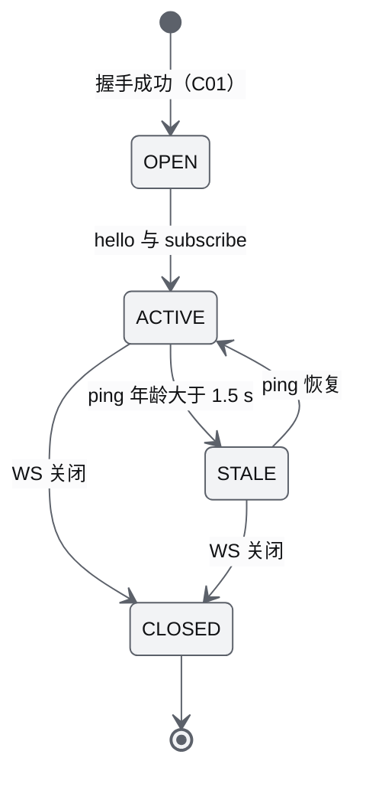
```mermaid
%%{init: {"theme": "base", "themeVariables": {"fontFamily": "Inter, PingFang SC, Microsoft YaHei, Noto Sans CJK SC, sans-serif", "fontSize": "13px", "background": "#FBFBFC", "primaryColor": "#F2F3F5", "primaryTextColor": "#111214", "primaryBorderColor": "#5C616A", "secondaryColor": "#E4E6E9", "tertiaryColor": "#FBFBFC", "lineColor": "#5C616A", "textColor": "#111214", "mainBkg": "#F2F3F5", "nodeBorder": "#5C616A", "clusterBkg": "#FBFBFC", "clusterBorder": "#A7ABB3", "edgeLabelBackground": "#FBFBFC", "noteBkgColor": "#E4E6E9", "noteTextColor": "#111214", "noteBorderColor": "#81868F"}}}%%
stateDiagram-v2
  [*] --> OPEN: 握手成功（C01）
  OPEN --> ACTIVE: hello 与 subscribe
  ACTIVE --> STALE: ping 年龄大于 1.5 s
  STALE --> ACTIVE: ping 恢复
  ACTIVE --> CLOSED: WS 关闭
  STALE --> CLOSED: WS 关闭
  CLOSED --> [*]
```

#### 4.2.2 OperatorSeat

| # | 源 | 事件 | 守卫 | 动作 | 目标 |
|---|---|---|---|---|---|
| T01 | FREE | 签发 operator 或 admin token（`POST /api/auth/token`） | 回环模式无需口令；局域网模式须管理口令（AWR-03 §8.5）；admin 一律须管理口令；口令缺失或错误返回 HTTP 401 `304 ADMIN_SECRET_REQUIRED`，席位不变（D1-AC-33） | 席位登记 principal；审计 `seat.acquired` | HELD |
| T02 | HELD | 其他 principal 申请 operator token | — | 拒绝 `116 SEAT_TAKEN`，可改为签发 viewer token | HELD |
| T03 | HELD | 该 principal 的最后一个 ClientSession 关闭 | — | 启动 30 s【墙钟】宽限；其 OPERATOR 租约的 GCS 链路判据照常计时（§5.9） | GRACE |
| T04 | GRACE | 同一 principal 重连 | 宽限期内 | 取消宽限；链路恢复 | HELD |
| T05 | GRACE | 宽限到期 | — | 席位释放；该 principal 的 OPERATOR 租约成为孤儿租约（holder = null，owner 仍为 OPERATOR），机体继续按链路策略 HOLD 或 RTL；审计 `seat.expired` | FREE |
| T06 | HELD | `seat/release` | 持有者本人 | 其全部 OPERATOR 租约按 `return_to = previous` 交还（§4.8.4）；审计 | FREE |
| T07 | HELD、GRACE | `seat/takeover`（ext） | admin，二次确认 | 原 principal 的写权限立即失效（其写操作返回 116）；其 OPERATOR 租约的 holder 转给 admin（链路连续，不触发 HOLD）；审计 `seat.takeover` | HELD（新持有者） |

规则：
1. 席位的权威在 sim-core LeaseManager（与租约同处，保证原子性）；api 只缓存并在 sim-core 重启后重新登记（§4.1.5）。
2. 孤儿租约可以被下一任席位持有者直接 `acquire`，不算抢占；机体 DISARMED 后孤儿租约自动 FREE。
3. viewer 永远不占席位；同一 principal 可以有多个 ClientSession（多标签页），席位只按 principal 计。ADR-027 的"同一世界同时只允许一个 operator 会话持有写权限"在本文按 principal 解释：同一操作员的多个标签页共享写权限，不同 principal 之间互斥（116）。

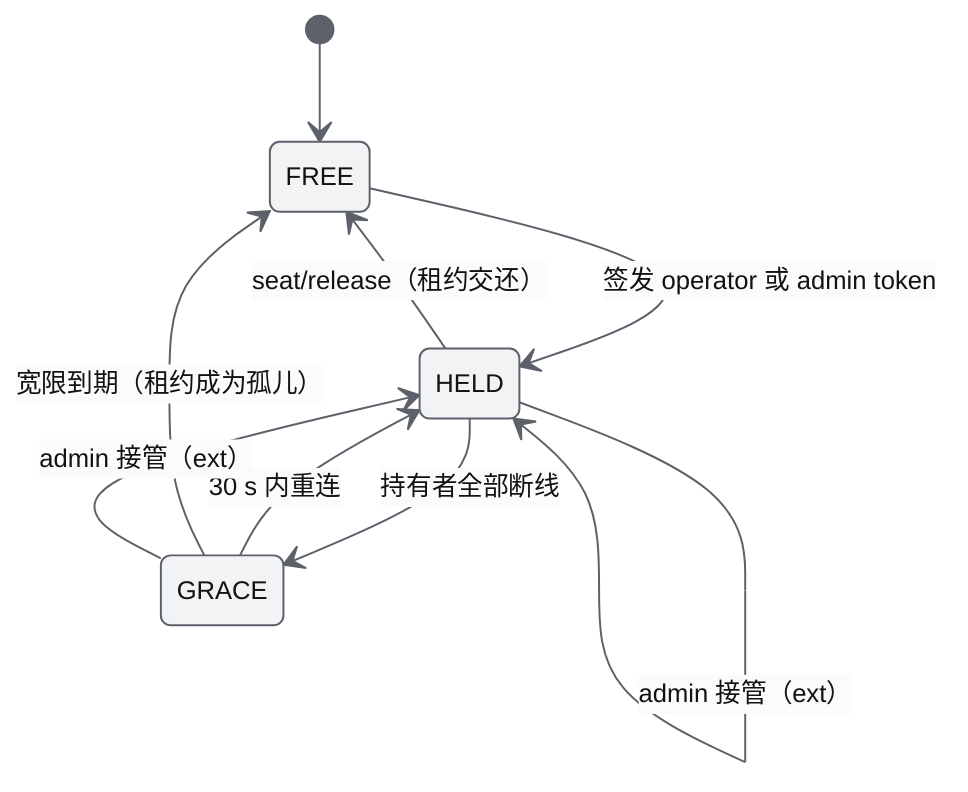
```mermaid
%%{init: {"theme": "base", "themeVariables": {"fontFamily": "Inter, PingFang SC, Microsoft YaHei, Noto Sans CJK SC, sans-serif", "fontSize": "13px", "background": "#FBFBFC", "primaryColor": "#F2F3F5", "primaryTextColor": "#111214", "primaryBorderColor": "#5C616A", "secondaryColor": "#E4E6E9", "tertiaryColor": "#FBFBFC", "lineColor": "#5C616A", "textColor": "#111214", "mainBkg": "#F2F3F5", "nodeBorder": "#5C616A", "clusterBkg": "#FBFBFC", "clusterBorder": "#A7ABB3", "edgeLabelBackground": "#FBFBFC", "noteBkgColor": "#E4E6E9", "noteTextColor": "#111214", "noteBorderColor": "#81868F"}}}%%
stateDiagram-v2
  [*] --> FREE
  FREE --> HELD: 签发 operator 或 admin token
  HELD --> HELD: 他人申请（116 SEAT_TAKEN）
  HELD --> GRACE: 持有者全部断线
  GRACE --> HELD: 30 s 内重连
  GRACE --> FREE: 宽限到期（租约成为孤儿）
  HELD --> FREE: seat/release（租约交还）
  HELD --> HELD: admin 接管（ext）
  GRACE --> HELD: admin 接管（ext）
```

### 4.3 实体生命周期（A 轴，D1 为 Mock 子集）

| # | 源 | 事件 | 守卫 | 动作 | 目标 |
|---|---|---|---|---|---|
| L01 | — | `POST /api/fleet/vehicles` 或剧本布设 | 准入规则见 §5.14.1 | 登记 roster；分配 agent_no（本 Session 内不复用） | PENDING |
| L02 | PENDING | 下一 tick | — | 分配 FleetSim slot | STARTING |
| L03 | STARTING | 机型参数加载 | 自洽检查通过（g08 §10.3） | FlightState = DISARMED/NOT_READY；flags.FCU_LINK = 1 | BOOTED |
| L04 | STARTING | 同上 | 自洽检查失败 | 事件 `vehicle.spawn_failed{code: 110, detail: PROFILE_INVALID}`（剧本布设时由 S04 汇总为 `121 SCENARIO_INVALID`）；回收 slot | FAILED → REMOVED |
| L05 | BOOTED | prearm 通过（Mock 立即通过） | — | FlightState = DISARMED/READY_TO_ARM；advertise 更新；发 `vehicle.added` | READY |
| L06 | READY | FCU 链路丢失 > 2.5 s | 仅故障注入 `link_drop`（Mock 为【仿真】；真实后端为【墙钟】） | flags.FCU_LINK = 0、ALERT = 1；位姿按 dt_us 外推 ≤ 1 s | DEGRADED |
| L07 | DEGRADED | 丢失 > 5 s | — | FlightState 投影为 UNKNOWN/LINK_LOST；进行中的调用 `failed 207 VEHICLE_LOST`；新命令返回 `108 LINK_ERROR` | LOST |
| L08 | DEGRADED、LOST | 链路恢复 | — | 按规范态重新投影 FlightState（机上一直在按链路策略飞行，§5.9.4） | READY |
| L09 | READY、DEGRADED、LOST | 剧本重置 | — | FlightState = UNKNOWN/RESTARTING；重生到出生点 | RESTARTING → READY |
| L10 | READY | `DELETE /api/fleet/vehicles/{id}` | 机体在空中（IN_AIR = 1） | 以 principal `safety` 下发 Land（安全类，免租约） | DRAINING |
| L11 | DRAINING、READY | 机体 DISARMED 或本来在地面 | — | 释放租约；从任务中 DROPPED | STOPPED |
| L12 | STOPPED | 下一 tick | — | 从 roster 与 advertise 删除；发 `vehicle.removed` | REMOVED |
| L13 | 任意非终态 | `DELETE ...?force=true` | 席位持有者，二次确认 | 进行中的调用 `canceled 6 CANCELLED`（message = vehicle removed）；立即删除 | REMOVED |

生命周期到 FlightState 的投影按 g04 §4.6；`PROVISIONING` 只用于 V0.2 起的 SIH 容器。

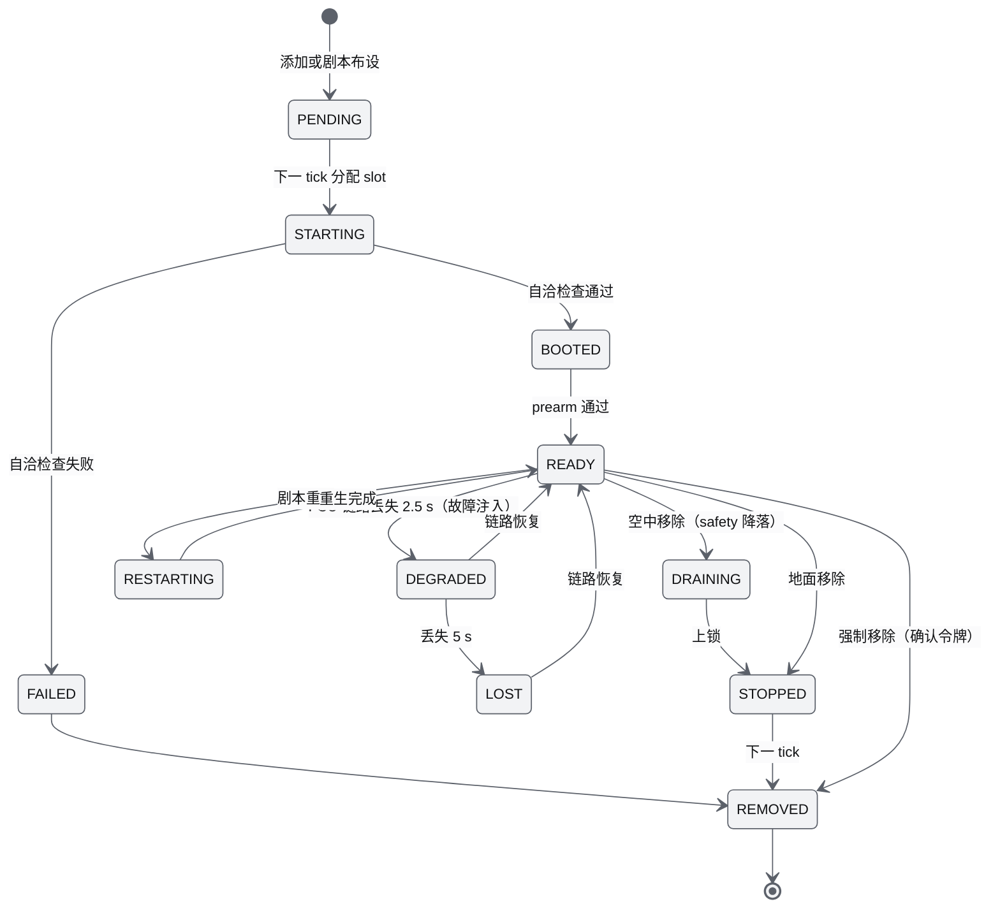
```mermaid
%%{init: {"theme": "base", "themeVariables": {"fontFamily": "Inter, PingFang SC, Microsoft YaHei, Noto Sans CJK SC, sans-serif", "fontSize": "13px", "background": "#FBFBFC", "primaryColor": "#F2F3F5", "primaryTextColor": "#111214", "primaryBorderColor": "#5C616A", "secondaryColor": "#E4E6E9", "tertiaryColor": "#FBFBFC", "lineColor": "#5C616A", "textColor": "#111214", "mainBkg": "#F2F3F5", "nodeBorder": "#5C616A", "clusterBkg": "#FBFBFC", "clusterBorder": "#A7ABB3", "edgeLabelBackground": "#FBFBFC", "noteBkgColor": "#E4E6E9", "noteTextColor": "#111214", "noteBorderColor": "#81868F"}}}%%
stateDiagram-v2
  [*] --> PENDING: 添加或剧本布设
  PENDING --> STARTING: 下一 tick 分配 slot
  STARTING --> BOOTED: 自洽检查通过
  STARTING --> FAILED: 自洽检查失败
  FAILED --> REMOVED
  BOOTED --> READY: prearm 通过
  READY --> DEGRADED: FCU 链路丢失 2.5 s（故障注入）
  DEGRADED --> LOST: 丢失 5 s
  DEGRADED --> READY: 链路恢复
  LOST --> READY: 链路恢复
  READY --> RESTARTING: 剧本重置
  RESTARTING --> READY: 重生完成
  READY --> DRAINING: 空中移除（safety 降落）
  DRAINING --> STOPPED: 上锁
  READY --> STOPPED: 地面移除
  STOPPED --> REMOVED: 下一 tick
  READY --> REMOVED: 强制移除（确认令牌）
  REMOVED --> [*]
```

### 4.4 FlightState 14 态与子模式（B 轴）

#### 4.4.1 语义

严重度与 UI 映射见 g04 §3.1；Badge 视觉以 AWR-15 为准。

| 值 | 状态 | 业务含义 | 进入方式 | 自动离开 | 任务轴影响 | 租约影响 |
|---|---|---|---|---|---|---|
| 0 | UNKNOWN | 无数据或生命周期不在 READY | 生命周期覆盖层 | 生命周期回到 READY 时重新投影 | 进行中 Track 视为 SUSPENDED | 不变 |
| 1 | DISARMED | 电机停转 | 上锁、kill、落地 2 s 自动上锁 | — | Track 结束或 DROPPED | 孤儿租约此时 FREE |
| 2 | PREFLIGHT | 预检窗口（Mock：demo 1.0 s、realistic 5.0 s） | arm 或带 `auto_arm` 的 takeoff | 通过 → READY；失败 → DISARMED | — | — |
| 3 | READY | 已解锁、地面待命 | 预检通过 | 10 s【仿真】未起飞自动上锁（`PREFLIGHT_INACTION`） | — | — |
| 4 | TAKING_OFF | 起飞：SPOOLUP 1 s → CLIMB（1.5 m/s） | takeoff | 到达高度且稳定 1 s → FLYING/HOVER | — | — |
| 5 | FLYING | 正常飞行；子模式表达当前意图 | 起飞完成、导航命令、原因解除 | — | Track 正常推进 | — |
| 6 | CORRECTING | Supervisor 可逆纠正（越界回拉、限高） | MissionGuard | 恢复合法 → FLYING；15 s 未恢复或越界 > 10 m → RTL | Track SUSPENDED | owner 投影为 SAFETY |
| 7 | HOLD | 保护性悬停，只接受少数命令 | SafetyStop、链路丢失、让行、escalate | 原因解除后按 §4.4.5 例外回到 FLYING | Track SUSPENDED | SafetyStop 时租约 SUSPENDED |
| 8 | RTL | 返航：CLIMB → CRUISE → DESCEND → FINAL | rtl 命令、电量、链路 13 s、纠正超时 | 触地 → LANDED | 自动 RTL 时 Track DROPPED；操作员 RTL 时 SUSPENDED | 自动时 owner 投影 SAFETY |
| 9 | LANDING | 降落：GOTO → DESCEND → TOUCHDOWN | land 命令、电量 emergency | 触地 → LANDED | 自动时 DROPPED | 自动时投影 SAFETY |
| 10 | ELAND | 紧急降落，0.5 m/s 下降，锁存 | FastGuard；HOLD、RTL、LANDING 下的 escalate | 触地 → LANDED | DROPPED | 投影 SAFETY |
| 11 | FAILSAFE | 前馈下坠（+1 m/s NED），锁存 | pos_err > 5 m、状态缺失 > 0.1 s、escalate 第 3 级 | 触地 → LANDED | DROPPED | 投影 SAFETY |
| 12 | LANDED | 已触地，等待自动上锁 | 触地检测 | 2 s【仿真】→ DISARMED | Track 进入 DONE（正常返航）或 DROPPED | — |
| 13 | CRASHED | 坠毁（仅仿真） | 倾角 > 90° 接地、与 World 或他机碰撞、冲击 | 无（只能移除或剧本重置） | DROPPED | 投影 SAFETY |

#### 4.4.2 转移表

"自动"指 Supervisor 动作（flags.FAILSAFE = 1），"操作员"指经准入的命令。Supervisor 的裁决在下一 tick 的 ingest 执行（固定 1 tick 延迟，g08 §3.2）。阈值数值以 M09 为准，下表引用 ADR-026 与 g08 §7.1 的当前值。

| # | 源 | 事件 | 守卫 | 动作 | 目标 |
|---|---|---|---|---|---|
| F01 | DISARMED/READY_TO_ARM | arm；或 takeoff（`auto_arm = true`） | 生命周期 READY；LOC_OK；soc ≥ 0.30；在 border 内且不在 nofly 内；速度 < 0.3 m/s（r24 §4.5 preflight） | 开始预检窗口【仿真】 | PREFLIGHT/CHECKING |
| F02 | PREFLIGHT | 窗口结束 | 检查项全部通过 | 锁定 home；flags.ARMED = 1 | READY/IDLE |
| F03 | PREFLIGHT | 检查失败或 disarm | — | 调用 `rejected 103 PREFLIGHT_FAILED`（detail 为失败项） | DISARMED/NOT_READY |
| F04 | READY | takeoff（或 F02 之后的自动续接） | — | SPOOLUP 1 s【仿真】 | TAKING_OFF/SPOOLUP |
| F05 | READY | disarm；或 10 s【仿真】无 takeoff | — | 上锁原因 `PREFLIGHT_INACTION` | DISARMED/READY_TO_ARM |
| F06 | TAKING_OFF/SPOOLUP | 1 s 到 | — | 以 1.5 m/s 爬升 | TAKING_OFF/CLIMB |
| F07 | TAKING_OFF/CLIMB | 到达高度 | `abs(z − z_t) < max(0.3, 5%·alt)` 且 `abs(vz) < 0.3` 持续 1 s | takeoff 调用 succeeded | FLYING/HOVER |
| F08 | FLYING/* | goto、follow_path、orbit、velocity、formation 槽位 | 准入通过 | 子模式切换；前一导航调用 `canceled 206 SUPERSEDED` | FLYING/GOTO、PATH、ORBIT、VELOCITY、SWARM |
| F09 | FLYING/* | hover、pause、cancel、到达 | — | STOP_MOTION 刹停 | FLYING/HOVER |
| F10 | FLYING | 操作员 rtl | — | 计算返航高度（§5.8.3） | RTL/CLIMB 或 RTL/CRUISE（FAILSAFE = 0） |
| F11 | FLYING | 操作员 land | — | `at ≠ here` 时先 GOTO | LANDING/GOTO 或 LANDING/DESCEND |
| F12 | RTL（FAILSAFE = 0） | 操作员导航命令或 hover | — | rtl 调用 `canceled 206` | FLYING/* |
| F13 | LANDING（FAILSAFE = 0） | 操作员导航命令或 hover | — | land 调用 `canceled 206` | FLYING/* |
| F14 | LANDING（FAILSAFE = 0） | 操作员 rtl | — | — | RTL/* |
| F15 | TAKING_OFF、FLYING、CORRECTING、RTL、LANDING | 操作员 safety_stop | RTL、LANDING 时 AGL ≥ 2 m | 加锁 locked = 1；按最大加速度刹停；租约 SUSPENDED；在途导航调用 `canceled 206` | HOLD/SAFETY_STOP |
| F16 | HOLD/SAFETY_STOP | 操作员 resume | 席位持有者 | locked = 0；租约恢复 HELD | FLYING/HOVER |
| F17 | FLYING | MissionGuard：越出 border 或进入 nofly | — | 投影回边界内 2 m；高度钳制到 `[min_z + 1, max_z − 1]`（r24 §3.6） | CORRECTING/GEOFENCE |
| F18 | FLYING | z > effective_max_z；或 AGL < 0.5 m | — | 目标 `max_z − 0.25` 或 `min_agl + 0.25` | CORRECTING/ALT_MAX、ALT_MIN |
| F19 | CORRECTING | 恢复合法 | 在内且距边界 ≥ 2 m | 发 `SAF.GEOFENCE.RESTORED`（自动降级例外） | FLYING/HOVER |
| F20 | CORRECTING | 回拉 > 15 s【仿真】或越界深度 > 10 m | — | 自动 RTL | RTL/*（FAILSAFE = 1） |
| F21 | TAKING_OFF、FLYING、CORRECTING | GCS 链路丢失 > 3 s【墙钟，暂停冻结】 | 策略 hold_rtl | `SAF.LINK.LOST_HOLD` | HOLD/LINK_LOSS |
| F22 | HOLD/LINK_LOSS | 链路丢失 > 13 s | 策略 hold_rtl | `SAF.LINK.LOST_RTL`；无 home 时改为 LANDING | RTL/*（FAILSAFE = 1） |
| F23 | HOLD/LINK_LOSS | 链路恢复（年龄 < 1.5 s） | `link.auto_resume = true`（默认） | `SAF.LINK.RESTORED`（自动降级例外） | FLYING/HOVER |
| F24 | FLYING | FleetGuard：本机让行 | §5.10 优先级较低 | 刹停悬停 | HOLD/SEPARATION |
| F25 | HOLD/SEPARATION | 间距恢复 | 距离 > min_sep + 2 m 且 3 s 内 CPA > min_sep，持续 2 s【仿真】 | 自动降级例外 | FLYING/HOVER |
| F26 | FLYING、CORRECTING、HOLD | 电量 critical（soc ≤ 0.07）或 `t_rem_usable < 1.3·t_rtl` | — | `SAF.BAT.CRIT` 或 `SAF.BAT.ENERGY_RTL`；该原因不可 resume | RTL/*（FAILSAFE = 1） |
| F27 | FLYING、HOLD、RTL | soc ≤ 0.05 | — | `SAF.BAT.EMERG`；就地降落 | LANDING/DESCEND（FAILSAFE = 1） |
| F28 | TAKING_OFF、FLYING、CORRECTING、HOLD、RTL、LANDING | pos_err > 3.0 m 持续 0.5 s；倾角 > 75°；航向误差 > 90°；油门 ≥ 0.95·THR_MAX 且低于参考 0.5 m 持续 1 s | 模式切换 1 s 宽限期外；pos_err 只在 GOTO、PATH、ORBIT、RTL、LANDING 下评估 | 锁存 ELAND；下降 0.5 m/s | ELAND/CONTROLLED |
| F29 | TAKING_OFF … ELAND | pos_err > 5.0 m；状态缺失 > 0.1 s | 同上 | 锁存 FAILSAFE；参考冻结，前馈下坠 | FAILSAFE/DESCENT |
| F30 | HOLD、RTL、LANDING | 操作员 escalate（ext） | 距上次 escalate ≥ 2 s；确认令牌 | 升一级到 ELAND（RTL、LANDING 的严重度 3、4 已高于 HOLD 的 2，escalate 不回落到 HOLD，与 §4.4.4 的 HOLD 行一致） | ELAND/CONTROLLED |
| F31 | TAKING_OFF、FLYING、CORRECTING | 操作员 escalate（ext） | 同上 | 第 1 级 | HOLD/ESCALATE |
| F32 | ELAND | 操作员 escalate（ext） | `escalation.levels` 含 FAILSAFE（默认不含） | 第 3 级 | FAILSAFE/DESCENT |
| F33 | 任意 ARMED | 操作员 kill（ext，确认令牌，按住 1 s） | — | 电机停转 | DISARMED/KILLED |
| F34 | 空中任意 | 倾角 > 90°；或倾角误差 > 20° 持续 0.5 s | 倾角误差受宽限期约束 | `SAF.CTRL.TILT_KILL` 或 `TILT_ERR_KILL` | DISARMED/KILLED |
| F35 | 空中任意（含 DISARMED/KILLED 下坠） | 接地时倾角 > 90° 或冲击 | — | — | CRASHED/TILT 或 IMPACT |
| F36 | 空中任意 | contact stage：与 DSM 或体素相交（非降落段） | — | — | CRASHED/COLLISION_WORLD |
| F37 | 空中任意 | 与他机距离 < r_i + r_j | — | 双方同时 | CRASHED/COLLISION_UAV |
| F38 | LANDING、ELAND、FAILSAFE、RTL/FINAL | 触地检测（IN_AIR 由 1 变 0，g04 §4.8） | — | 锁存解除 | LANDED/SETTLING |
| F39 | LANDED | 2 s【仿真】 | — | 自动上锁；land/rtl 调用 succeeded | DISARMED/READY_TO_ARM |
| F40 | LANDED | takeoff | — | 同一 tick 经 READY 进入 TAKING_OFF | TAKING_OFF/SPOOLUP |
| F41 | 任意 | 生命周期 LOST、RESTARTING、FAILED | — | 投影（g04 §4.6） | UNKNOWN/* |

#### 4.4.3 状态图（主干）

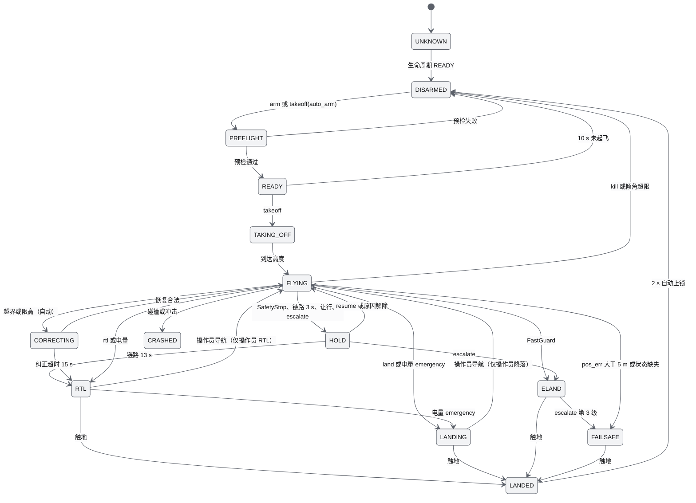
```mermaid
%%{init: {"theme": "base", "themeVariables": {"fontFamily": "Inter, PingFang SC, Microsoft YaHei, Noto Sans CJK SC, sans-serif", "fontSize": "13px", "background": "#FBFBFC", "primaryColor": "#F2F3F5", "primaryTextColor": "#111214", "primaryBorderColor": "#5C616A", "secondaryColor": "#E4E6E9", "tertiaryColor": "#FBFBFC", "lineColor": "#5C616A", "textColor": "#111214", "mainBkg": "#F2F3F5", "nodeBorder": "#5C616A", "clusterBkg": "#FBFBFC", "clusterBorder": "#A7ABB3", "edgeLabelBackground": "#FBFBFC", "noteBkgColor": "#E4E6E9", "noteTextColor": "#111214", "noteBorderColor": "#81868F"}}}%%
stateDiagram-v2
  [*] --> UNKNOWN
  UNKNOWN --> DISARMED: 生命周期 READY
  DISARMED --> PREFLIGHT: arm 或 takeoff(auto_arm)
  PREFLIGHT --> READY: 预检通过
  PREFLIGHT --> DISARMED: 预检失败
  READY --> TAKING_OFF: takeoff
  READY --> DISARMED: 10 s 未起飞
  TAKING_OFF --> FLYING: 到达高度
  FLYING --> CORRECTING: 越界或限高（自动）
  CORRECTING --> FLYING: 恢复合法
  FLYING --> HOLD: SafetyStop、链路 3 s、让行、escalate
  HOLD --> FLYING: resume 或原因解除
  HOLD --> RTL: 链路 13 s
  CORRECTING --> RTL: 纠正超时 15 s
  FLYING --> RTL: rtl 或电量
  RTL --> FLYING: 操作员导航（仅操作员 RTL）
  FLYING --> LANDING: land 或电量 emergency
  LANDING --> FLYING: 操作员导航（仅操作员降落）
  RTL --> LANDING: 电量 emergency
  FLYING --> ELAND: FastGuard
  HOLD --> ELAND: escalate
  ELAND --> FAILSAFE: escalate 第 3 级
  FLYING --> FAILSAFE: pos_err 大于 5 m 或状态缺失
  RTL --> LANDED: 触地
  LANDING --> LANDED: 触地
  ELAND --> LANDED: 触地
  FAILSAFE --> LANDED: 触地
  LANDED --> DISARMED: 2 s 自动上锁
  FLYING --> DISARMED: kill 或倾角超限
  FLYING --> CRASHED: 碰撞或冲击
```

图中省略了 TAKING_OFF、CORRECTING、RTL、LANDING 到 HOLD、ELAND、FAILSAFE、CRASHED 的同类转移，以 §4.4.2 为准。

#### 4.4.4 白名单（M09 实现的语义约束）

下表由 r24 §4.3 的 `ALLOWED` 按 g04 §3.2 修订得到；M09 的白名单实现必须与之逐项相等（BIZ-AC-001）。

| 目标状态 | 允许的源状态 | 附加守卫 |
|---|---|---|
| UNKNOWN | 任意 | 只由生命周期覆盖层驱动 |
| DISARMED | 任意 | kill、倾角类判据、自动上锁、disarm |
| PREFLIGHT | DISARMED | 子模式为 READY_TO_ARM |
| READY | PREFLIGHT、LANDED、DISARMED | DISARMED → READY 只用于外部后端（一解锁即 READY）；Mock 必经 PREFLIGHT |
| TAKING_OFF | READY | — |
| FLYING | TAKING_OFF、CORRECTING、HOLD、RTL、LANDING | RTL、LANDING → FLYING 只在 FAILSAFE = 0 且由操作员导航命令触发 |
| CORRECTING | FLYING | — |
| HOLD | FLYING、CORRECTING、TAKING_OFF、RTL、LANDING | RTL、LANDING → HOLD 只允许操作员 SafetyStop 且 AGL ≥ 2 m |
| RTL | FLYING、CORRECTING、HOLD、LANDING | LANDING → RTL 只在 FAILSAFE = 0 |
| LANDING | FLYING、CORRECTING、HOLD、RTL、TAKING_OFF | — |
| ELAND | TAKING_OFF、FLYING、CORRECTING、HOLD、RTL、LANDING | — |
| FAILSAFE | TAKING_OFF、FLYING、CORRECTING、HOLD、RTL、LANDING、ELAND | — |
| LANDED | LANDING、ELAND、FAILSAFE、RTL | — |
| CRASHED | 任意 | 仅仿真 |

锁存：ELAND 锁存期间只能去往 FAILSAFE、LANDED、DISARMED、CRASHED；FAILSAFE 锁存期间只能去往 LANDED、DISARMED、CRASHED；到达 LANDED 或 DISARMED 时解除（r24 §4.3）。

#### 4.4.5 仲裁规则（ActionArbiter）

依据 r24 §4.4、ADR-026：
1. **同 tick 取最大严重度**：同一 tick 的多个 SafetyEvent 只执行严重度最高的动作；其余只发事件。
2. **自动转移只升不降**。例外只有五种：CORRECTING → FLYING（纠正完成）；HOLD/LINK_LOSS → FLYING（链路恢复且 `auto_resume`）；HOLD/SEPARATION → FLYING（间距恢复）；LANDED → DISARMED；READY → DISARMED（`PREFLIGHT_INACTION`）。
3. **操作员可以降级**（例如操作员发起的 RTL 被 goto 覆盖），前提是目标不被锁存阻止且准入矩阵允许（§5.2）。
4. **锁存**见 §4.4.4。
5. **宽限**：模式或状态切换后 1.0 s【仿真】内只执行 kill 类检查（倾角 > 90°），倾角误差计时在宽限期内清零。
6. **持续时间与迟滞**：倾角误差 0.5 s、油门饱和 1.0 s、pos_err（ELAND）0.5 s；链路 1.5 s / 3 s / 13 s；围栏告警带 5 m；电量阈值只在下降方向触发。
7. **单一权威**：Mock 的规范态直接取 Safety FSM，`state_ext.px4` 的显示仿真只用于显示，任何业务逻辑不得读取（g04 §4.4、§11 第 7 条）。

#### 4.4.6 子模式语义

| 状态 | 子模式（0–7） | 切换规则 |
|---|---|---|
| UNKNOWN | NO_DATA、BOOTING、LINK_LOST、RESTARTING、FAILED | 按生命周期投影（g04 §4.6） |
| DISARMED | READY_TO_ARM、NOT_READY、KILLED | KILLED 在下一次成功 arm 前保持 |
| PREFLIGHT | CHECKING、COUNTDOWN | realistic 档有倒计时；demo 档倒计时为 0（g04 §3.2） |
| TAKING_OFF | SPOOLUP、CLIMB | 1 s 后进入 CLIMB |
| FLYING | HOVER、GOTO、PATH、ORBIT、VELOCITY、SWARM、MANUAL、EXTERNAL | 由最近一个导航调用决定；到达或暂停回到 HOVER；MANUAL、EXTERNAL 只在外部后端出现（V0.2） |
| CORRECTING | GEOFENCE、ALT_MAX、ALT_MIN、BUMPER、SEPARATION | BUMPER 与 SEPARATION（避碰爬升）为 V0.6 |
| HOLD | SAFETY_STOP、LINK_LOSS、ESCALATE、SEPARATION、LOC_LOST、AUTOPILOT、OTHER | 子模式即原因，决定 resume 守卫（§5.2 注 5） |
| RTL | CLIMB、CRUISE、DESCEND、FINAL、OPAQUE | CLIMB：z < z_rtl；CRUISE：水平返航；DESCEND：到 home 上方 2 m 内后下降；FINAL：AGL < 10 m 后 1 m/s（g04 §6.3）；OPAQUE 仅 PX4 |
| LANDING | DESCEND、GOTO、TOUCHDOWN | `at ≠ here` 先 GOTO；AGL < 0.5 m 进入 TOUCHDOWN |
| ELAND | CONTROLLED、NO_POSITION | NO_POSITION 仅外部后端 |
| FAILSAFE | DESCENT、TERMINATION | TERMINATION 仅 PX4 |
| LANDED | SETTLING | — |
| CRASHED | TILT、COLLISION_WORLD、COLLISION_UAV、IMPACT | — |

外部后端（PX4 SIH、Prometheus，V0.2 起）的规范态由 StateFuser 按 g04 §4.2、§4.3 推导，业务语义与本节相同；本期只交付 `derive_px4` 与 `derive_prometheus` 纯函数与测试替身（桩）。

### 4.5 Mission 与 Track（F 轴）

#### 4.5.1 Mission

| # | 源 | 事件 | 守卫 | 动作 | 目标 |
|---|---|---|---|---|---|
| M01 | — | 剧本加载或 `POST /api/missions`（ext） | 生成器参数校验通过（M10）；航线通过最小安全高度剖面检查（x01 §3.8） | 生成 MissionItem；预览下发 | IDLE |
| M02 | IDLE | 剧本自动启动（Session 进入 PLAYING）或 `mission/{id}/start` | 能量预检（§5.8.4）；至少一架机可取得 MISSION 租约 | 取得 MISSION 租约（不能取得的机体 Track 置 SUSPENDED 等待）；各 Track 进入 TRANSIT | RUNNING |
| M03 | IDLE | 同上 | 能量预检失败且策略为 reject | `rejected 119 ENERGY_INFEASIBLE`（detail 为不可行的机体与缺口 Wh） | IDLE |
| M04 | RUNNING | `mission/{id}/pause` | 席位持有者 | 全部活动 Track 执行 pause（STOP_MOTION 悬停）；相关调用 progress `phase = paused` | PAUSED |
| M05 | PAUSED | `mission/{id}/resume` | 同上 | Track 从游标继续 | RUNNING |
| M06 | RUNNING、PAUSED | `mission/{id}/abort` | 同上 | 各机执行 `on_abort`（默认 hover）；租约按 `return_to = none` 释放；在途内部调用 `canceled 6` | ABORTED |
| M07 | RUNNING | 最后一个非终态 Track 进入 DONE 或 DROPPED | 至少一条 DONE | 汇总指标（覆盖率、航程、时长）；`incomplete = (存在 DROPPED)` | DONE |
| M08 | RUNNING | 全部 Track DROPPED | — | 发 `mission.aborted{reason}` | ABORTED |
| M09 | DONE、ABORTED | 剧本重置 | — | 清空游标 | IDLE |

机体上的任务轴（Full64 `mission_item` 与 `state_ext.mission`）由该机 Track 投影：PENDING → IDLE；TRANSIT、WORKING、WAITING、RETURNING → RUNNING；SUSPENDED（暂停或被接管）→ PAUSED；DONE → DONE；DROPPED → ABORTED。

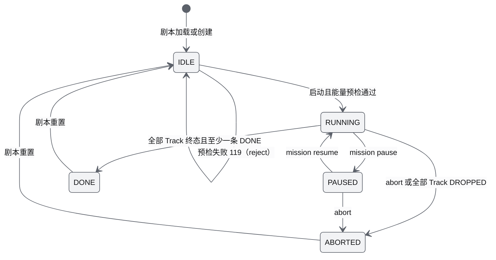
```mermaid
%%{init: {"theme": "base", "themeVariables": {"fontFamily": "Inter, PingFang SC, Microsoft YaHei, Noto Sans CJK SC, sans-serif", "fontSize": "13px", "background": "#FBFBFC", "primaryColor": "#F2F3F5", "primaryTextColor": "#111214", "primaryBorderColor": "#5C616A", "secondaryColor": "#E4E6E9", "tertiaryColor": "#FBFBFC", "lineColor": "#5C616A", "textColor": "#111214", "mainBkg": "#F2F3F5", "nodeBorder": "#5C616A", "clusterBkg": "#FBFBFC", "clusterBorder": "#A7ABB3", "edgeLabelBackground": "#FBFBFC", "noteBkgColor": "#E4E6E9", "noteTextColor": "#111214", "noteBorderColor": "#81868F"}}}%%
stateDiagram-v2
  [*] --> IDLE: 剧本加载或创建
  IDLE --> RUNNING: 启动且能量预检通过
  IDLE --> IDLE: 预检失败 119（reject）
  RUNNING --> PAUSED: mission pause
  PAUSED --> RUNNING: mission resume
  RUNNING --> DONE: 全部 Track 终态且至少一条 DONE
  RUNNING --> ABORTED: abort 或全部 Track DROPPED
  PAUSED --> ABORTED: abort
  DONE --> IDLE: 剧本重置
  ABORTED --> IDLE: 剧本重置
```

#### 4.5.2 Track（每机）

| # | 源 | 事件 | 守卫 | 动作 | 目标 |
|---|---|---|---|---|---|
| K01 | PENDING | 任务启动且持有 MISSION 租约 | 机体在地面时先 takeoff | 以 safe_transit 规划入场转场（plan-pool，按 rank 分层 Δz = 4 m，§5.10.4），发内部 follow_path | TRANSIT |
| K02 | TRANSIT | 到达入场点（接受半径 `max(1.0, 0.25·V)`） | — | 执行当前 MissionItem | WORKING |
| K03 | WORKING | 当前项完成 | 还有下一项 | cursor + 1；需要时插入转场 | WORKING 或 TRANSIT |
| K04 | WORKING | 到达同步点 | `sync_policy = barrier` | 悬停等待 | WAITING |
| K05 | WAITING | 全员到达，或超时 30 s【仿真】 | — | 超时未到者标记 `lagging` 事件 | WORKING |
| K06 | TRANSIT、WORKING、WAITING | 租约被抢占；该机 pause；自动 HOLD（链路、让行）；SafetyStop | — | 记录续飞点（当前项上的最近参数位置） | SUSPENDED |
| K07 | SUSPENDED | 租约交还且 `resume_on_lease_return`；resume；自动 HOLD 解除 | 仍持有 MISSION 租约 | 从当前位置以 safe_transit 回到续飞点 | TRANSIT |
| K08 | WORKING | 最后一项完成 | `on_done = rtl` | 内部 rtl 调用 | RETURNING |
| K09 | RETURNING | 返航完成（DISARMED 且距 home < 2 m） | — | 释放租约（`return_to = none`） | DONE |
| K10 | WORKING | 最后一项完成 | `on_done ∈ {hover, land}` | 执行对应动作后释放租约 | DONE |
| K11 | 任意非终态 | 自动 RTL（电量）、自动 LANDING、ELAND、FAILSAFE、CRASHED、生命周期 LOST 或 REMOVED | — | 记录原因；剩余项留给 V0.6 的重分配 | DROPPED |
| K12 | SUSPENDED | 机体 DISARMED（被操作员降落） | — | 原因 `landed_by_operator` | DROPPED |

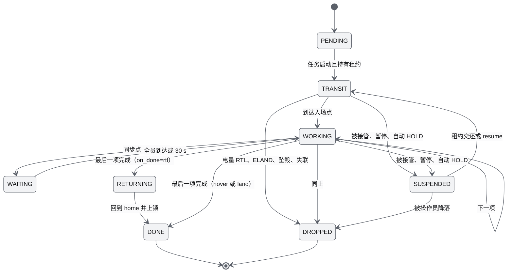
```mermaid
%%{init: {"theme": "base", "themeVariables": {"fontFamily": "Inter, PingFang SC, Microsoft YaHei, Noto Sans CJK SC, sans-serif", "fontSize": "13px", "background": "#FBFBFC", "primaryColor": "#F2F3F5", "primaryTextColor": "#111214", "primaryBorderColor": "#5C616A", "secondaryColor": "#E4E6E9", "tertiaryColor": "#FBFBFC", "lineColor": "#5C616A", "textColor": "#111214", "mainBkg": "#F2F3F5", "nodeBorder": "#5C616A", "clusterBkg": "#FBFBFC", "clusterBorder": "#A7ABB3", "edgeLabelBackground": "#FBFBFC", "noteBkgColor": "#E4E6E9", "noteTextColor": "#111214", "noteBorderColor": "#81868F"}}}%%
stateDiagram-v2
  [*] --> PENDING
  PENDING --> TRANSIT: 任务启动且持有租约
  TRANSIT --> WORKING: 到达入场点
  WORKING --> WORKING: 下一项
  WORKING --> WAITING: 同步点（barrier）
  WAITING --> WORKING: 全员到达或 30 s
  TRANSIT --> SUSPENDED: 被接管、暂停、自动 HOLD
  WORKING --> SUSPENDED: 被接管、暂停、自动 HOLD
  SUSPENDED --> TRANSIT: 租约交还或 resume
  WORKING --> RETURNING: 最后一项完成（on_done=rtl）
  RETURNING --> DONE: 回到 home 并上锁
  WORKING --> DONE: 最后一项完成（hover 或 land）
  TRANSIT --> DROPPED: 电量 RTL、ELAND、坠毁、失联
  WORKING --> DROPPED: 同上
  SUSPENDED --> DROPPED: 被操作员降落
  DONE --> [*]
  DROPPED --> [*]
```

### 4.6 Command 调用（G 轴）

线上状态沿用 7 值（g04 §7.1）；`DISPATCHED` 只在服务端内部使用，线上以 `progress{phase: admitted}` 表示。

| # | 源 | 事件 | 守卫 | 动作 | 目标 |
|---|---|---|---|---|---|
| X01 | — | `call` 到达可信入口 | 准入 ①–⑧ 任一步失败（§5.1） | 回 `code`、`detail`、`remedy`；effect UNAVAILABLE、V0；写审计 | rejected（终态） |
| X02 | — | 同上 | 准入全部通过，拿到原生确认（Mock 在同一 tick 由 FSM 确认） | 登记幂等表；记 `request_tick`、`apply_tick`；effect UNVERIFIED、V1（`native_ack = true`） | accepted |
| X03 | — | 同上 | 外部后端原生拒绝（V0.2 起） | effect FAILED、V1 | rejected（终态） |
| X04 | — | 同上 | 外部后端 ACK 超时（V0.2 起） | `200 ACK_TIMEOUT`；effect UNAVAILABLE | timeout（终态） |
| X05 | accepted | 规范态读回符合 running 期望（§5.4） | 细粒度路径校验已通过（需要时）；规划结果已在 apply_tick 生效 | effect UNVERIFIED、V2，附 `observed_state` | running |
| X06 | accepted | 细粒度路径校验失败 | — | `102 GEOFENCE_REJECT`（detail = PATH_OBSTACLE 或 PATH_CROSSES_ZONE）；effect FAILED、V2 | failed（终态） |
| X07 | accepted | plan-pool 崩溃且重试 1 次仍失败 | — | `214 PLANNER_CRASHED` | failed（终态） |
| X08 | running | 完成判据成立（§5.4） | — | effect OK；Mock 为 V4 并置 `simulated = true`；**必须**带 metrics | succeeded（终态） |
| X09 | accepted、running | 自动安全动作抢占（严重度高于期望） | — | `204 PREEMPTED_BY_SAFETY`；effect FAILED | failed（终态） |
| X10 | accepted、running | ctrl.owner 变为 PILOT 或 EXTERNAL（V0.2 起） | — | `205 PREEMPTED_BY_PILOT` | failed（终态） |
| X11 | accepted、running | 租约被抢占 | — | `210 LEASE_PREEMPTED` | failed（终态） |
| X12 | accepted、running | 生命周期 LOST；进入 CRASHED；巡航 5 s 前进 < 0.2 m；超过截止时间 | — | 分别为 `207 VEHICLE_LOST`、`208 CRASHED`、`203 STALLED`、`202 PROGRESS_TIMEOUT` | failed（终态） |
| X13 | accepted、running | 同机新的导航调用或操作员安全类命令被准入 | — | `206 SUPERSEDED`；effect UNVERIFIED（保持原信任级） | canceled（终态） |
| X14 | accepted、running | `cancel{call_id}` | 调用者或席位持有者 | 先执行一次 hover，再判 `6 CANCELLED` | canceled（终态） |
| X15 | running | Velocity 会话 250 ms【墙钟】无新 setpoint | — | `209 WATCHDOG`；机体进入 HOLD/LINK_LOSS | canceled（终态） |
| X16 | running | pause | — | progress `phase = paused`；调用不结束 | running |
| X17 | running | resume | — | progress `phase = executing` | running |
| X18 | accepted、running | 会话重置；机体被强制移除 | — | `6 CANCELLED` | canceled（终态） |
| X19 | accepted、running | sim-core 回滚（§4.1.5） | — | `212 SIM_ROLLBACK` | failed（终态） |

规则：
1. 终态帧带 `final = true`；终态之后到达的事件一律丢弃。
2. 同一 call_id 在 60 s【墙钟】内重发，返回幂等表中的最新结果帧（总线层 status = duplicate，不算错误，g05 §3.3），绝不重复执行。
3. progress 推送 ≤ 2 Hz【墙钟】（g04 §7.3）；sim-core 另对总量限流：每次 cmd_watch（50 Hz）至多 16 条，多于此数时取最久未发者（AWR-03 ADR-060，大机群同时开始的调用不在同一 tick 集中推送）。
4. accepted 表示"准入通过并拿到原生确认"，不等于"已生效"；UI 与 agent 必须以 running 与 succeeded 判断效果（g04 §0 第 6 条）。

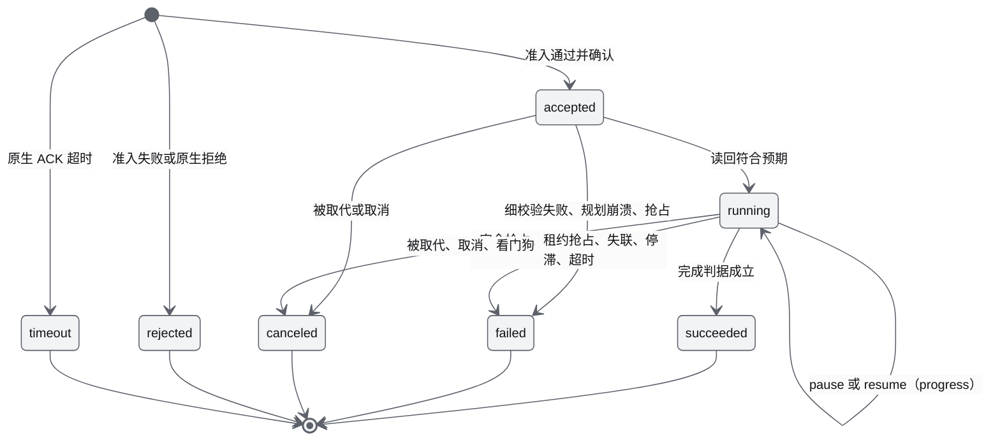
```mermaid
%%{init: {"theme": "base", "themeVariables": {"fontFamily": "Inter, PingFang SC, Microsoft YaHei, Noto Sans CJK SC, sans-serif", "fontSize": "13px", "background": "#FBFBFC", "primaryColor": "#F2F3F5", "primaryTextColor": "#111214", "primaryBorderColor": "#5C616A", "secondaryColor": "#E4E6E9", "tertiaryColor": "#FBFBFC", "lineColor": "#5C616A", "textColor": "#111214", "mainBkg": "#F2F3F5", "nodeBorder": "#5C616A", "clusterBkg": "#FBFBFC", "clusterBorder": "#A7ABB3", "edgeLabelBackground": "#FBFBFC", "noteBkgColor": "#E4E6E9", "noteTextColor": "#111214", "noteBorderColor": "#81868F"}}}%%
stateDiagram-v2
  [*] --> accepted: 准入通过并确认
  [*] --> rejected: 准入失败或原生拒绝
  [*] --> timeout: 原生 ACK 超时
  accepted --> running: 读回符合预期
  accepted --> failed: 细校验失败、规划崩溃、抢占
  running --> succeeded: 完成判据成立
  running --> failed: 安全抢占、租约抢占、失联、停滞、超时
  accepted --> canceled: 被取代或取消
  running --> canceled: 被取代、取消、看门狗
  running --> running: pause 或 resume（progress）
  succeeded --> [*]
  failed --> [*]
  canceled --> [*]
  rejected --> [*]
  timeout --> [*]
```

### 4.7 效果状态（Effect）

效果状态与调用状态是两根独立的轴（d05 §0 第 5 条）。每个 result 帧都带 `effect{status, verify_trust}`（ADR-016）。

| 调用状态 | effect.status | verify_trust | Evidence 要求 |
|---|---|---|---|
| progress admitted | 不带 | — | — |
| accepted | UNVERIFIED | 有原生确认为 V1，否则 V0 | `native_ack`、`protocol`、`requested` |
| running | UNVERIFIED | V2 | `observed_state` |
| succeeded | OK | 估计值读回 V2；独立旁路 V3；仿真真值 V4 且 `simulated = true` | **必须带 metrics**（例如 `dist_err_m`、`alt_err_m`、`t_exec_s`） |
| rejected（入口准入） | UNAVAILABLE | V0 | `message`、`remedy` |
| rejected（原生） | FAILED | V1 | `observed_state` 为原生结果 |
| timeout | UNAVAILABLE | V0 | — |
| failed | FAILED | V2 | `observed_state` 写抢占方或当时状态 |
| canceled | UNVERIFIED | 保持 running 时的值 | `message = superseded` 或 `canceled` |

规则：
1. **已验证**的判定唯一：`status = OK` 且（`verify_trust ≥ 2` 或 `simulated = true`）（d05 §0 第 6 条）。
2. 信任只能被钳制，不能被抬高：quirk 字段、agent 自报、ANet `service` 模块的 `verify_trust = 1` 都不能把 UNVERIFIED 变成已验证（d05 §2.4）。
3. 效果状态之间没有回退：OK、FAILED、UNAVAILABLE 为终值；UNVERIFIED 只能走向这三者之一或保持（调用被取消时）。

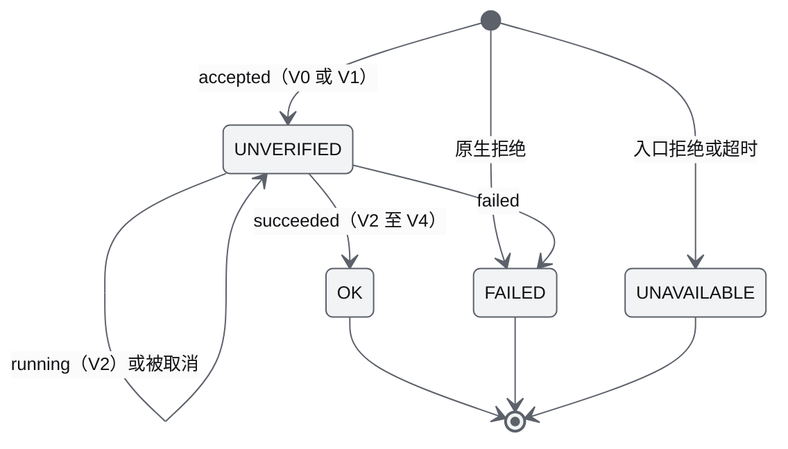
```mermaid
%%{init: {"theme": "base", "themeVariables": {"fontFamily": "Inter, PingFang SC, Microsoft YaHei, Noto Sans CJK SC, sans-serif", "fontSize": "13px", "background": "#FBFBFC", "primaryColor": "#F2F3F5", "primaryTextColor": "#111214", "primaryBorderColor": "#5C616A", "secondaryColor": "#E4E6E9", "tertiaryColor": "#FBFBFC", "lineColor": "#5C616A", "textColor": "#111214", "mainBkg": "#F2F3F5", "nodeBorder": "#5C616A", "clusterBkg": "#FBFBFC", "clusterBorder": "#A7ABB3", "edgeLabelBackground": "#FBFBFC", "noteBkgColor": "#E4E6E9", "noteTextColor": "#111214", "noteBorderColor": "#81868F"}}}%%
stateDiagram-v2
  [*] --> UNVERIFIED: accepted（V0 或 V1）
  [*] --> UNAVAILABLE: 入口拒绝或超时
  [*] --> FAILED: 原生拒绝
  UNVERIFIED --> UNVERIFIED: running（V2）或被取消
  UNVERIFIED --> OK: succeeded（V2 至 V4）
  UNVERIFIED --> FAILED: failed
  OK --> [*]
  FAILED --> [*]
  UNAVAILABLE --> [*]
```

### 4.8 ControlLease（D 轴）

#### 4.8.1 D1 分层

| 能力 | D1-core（P0） | D1-ext（P1） | 依据 |
|---|---|---|---|
| owner 字段（OPERATOR、MISSION、AGENT、SWARM）写入 ctrl 与 `state_ext.lease` | 是 | 是 | ADR-027 |
| 单操作席位，OPERATOR 租约必须由席位持有者持有 | 是 | 是 | Q5 |
| 安全类命令（Land、Hover、RTL、SafetyStop）免租约，仍受准入矩阵约束 | 是 | 是 | ADR-027；P-13 |
| OPERATOR 接管 MISSION（D1-core 中只存在这两类持有者，接管即 E03 在 OPERATOR 4 > MISSION 2 上的特例） | 是（本文设定：S1 默认两机都由 MISSION 持有，没有这条规则时操作员只能先 abort 任务才能对任务机点选 GoTo；这是 owner 字段语义的最小补全，不是 C28 所指的抢占表） | 是 | g04 §4.9；§13 第 5 条 |
| 完整静态优先级表（OPERATOR 4 > AGENT 3 > MISSION 2 > SWARM 1，AGENT 与 SWARM 随 agent-runtime、编队在 ext 出现） | 否 | 是 | ADR-027；C28 |
| 交还（`return_to = previous`）与任务续飞 | 是 | 是 | 本文 §4.8.4 |
| TTL（墙钟，每 5 s 续约）、HMAC lease token、各生产者本地校验 | 否 | 是 | ADR-027 |
| OPERATOR override（优先级 5）、PILOT（6，真机） | 否 | override 为是；PILOT 为 V0.5 | g04 §4.9 |
| kill 与 escalate 的确认令牌 | 否 | 是 | ADR-027 |

#### 4.8.2 转移表

| # | 源 | 事件 | 守卫 | 动作 | 目标 |
|---|---|---|---|---|---|
| E01 | FREE | acquire(X) | X 为 OPERATOR 时须是席位持有者；X 为 AGENT 时须携带 agent-runtime 签发的 principal token；生命周期 READY；FlightState ∉ {UNKNOWN, CRASHED} | owner = X，holder，return_stack = []；发 `lease.acquired` | HELD(X) |
| E02 | HELD(Y) | acquire(X)，X 与 Y 同一 holder | — | 续约（ext 刷新 TTL） | HELD(Y) |
| E03 | HELD(Y) | acquire(X) | priority(X) > priority(Y) | Y 压入 return_stack（Y ∈ {MISSION, AGENT, SWARM} 且深度 < 2）；Y 名下在途调用 `failed 210 LEASE_PREEMPTED`；通知 Y（Track SUSPENDED 或 Task input-required）；发 `lease.preempted` | HELD(X) |
| E04 | HELD(Y) | acquire(X) | priority(X) ≤ priority(Y)，且 Y 不是孤儿租约 | `rejected 100 LEASE_DENIED`（detail = 当前持有者类别） | HELD(Y) |
| E05 | HELD(OPERATOR，孤儿) | acquire(OPERATOR) | 当前席位持有者 | 直接改 holder，不算抢占 | HELD(OPERATOR) |
| E06 | HELD(X) | release(`return_to = previous`) | 栈顶持有者仍有效（任务 RUNNING 或 PAUSED 且该 Track 未 DROPPED；协作任务仍为 working 或 input-required） | 弹栈恢复；通知其续飞（§4.8.4）；发 `lease.returned` | HELD(上一持有者) |
| E07 | HELD(X) | release(`return_to = none`)，或栈顶无效 | — | 清空；发 `lease.released` | FREE |
| E08 | HELD | 操作员 safety_stop | — | locked = 1；ctrl.owner 投影为 SAFETY；除安全类外的命令返回 `114 LOCKED` | SUSPENDED |
| E09 | SUSPENDED | 操作员 resume | 席位持有者 | locked = 0 | HELD（原持有者） |
| E10 | HELD、SUSPENDED | 机体移除；孤儿租约的机体 DISARMED；剧本重置 | — | 清空 | FREE |
| E11 | HELD(X) | TTL 到期【墙钟，暂停冻结】（ext） | X ∈ {AGENT, MISSION, SWARM} | 等同 E06（按 previous 交还）；发 `lease.expired` | HELD(上一持有者) 或 FREE |

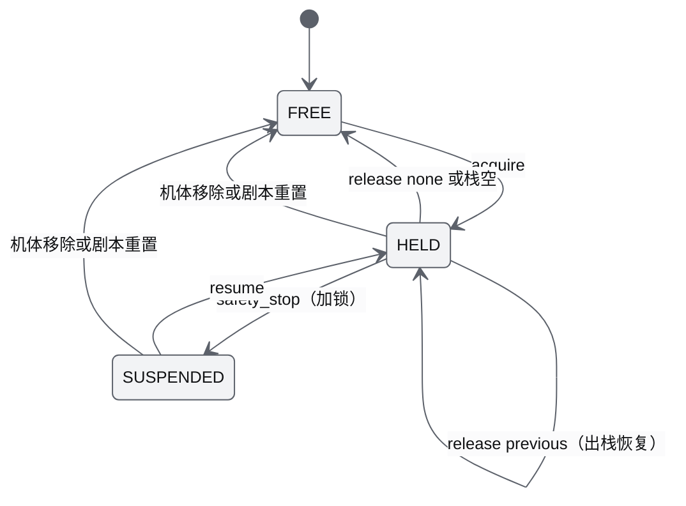
```mermaid
%%{init: {"theme": "base", "themeVariables": {"fontFamily": "Inter, PingFang SC, Microsoft YaHei, Noto Sans CJK SC, sans-serif", "fontSize": "13px", "background": "#FBFBFC", "primaryColor": "#F2F3F5", "primaryTextColor": "#111214", "primaryBorderColor": "#5C616A", "secondaryColor": "#E4E6E9", "tertiaryColor": "#FBFBFC", "lineColor": "#5C616A", "textColor": "#111214", "mainBkg": "#F2F3F5", "nodeBorder": "#5C616A", "clusterBkg": "#FBFBFC", "clusterBorder": "#A7ABB3", "edgeLabelBackground": "#FBFBFC", "noteBkgColor": "#E4E6E9", "noteTextColor": "#111214", "noteBorderColor": "#81868F"}}}%%
stateDiagram-v2
  [*] --> FREE
  FREE --> HELD: acquire
  HELD --> HELD: 更高优先级抢占（原持有者入栈）
  HELD --> HELD: release previous（出栈恢复）
  HELD --> FREE: release none 或栈空
  HELD --> SUSPENDED: safety_stop（加锁）
  SUSPENDED --> HELD: resume
  HELD --> FREE: 机体移除或剧本重置
  SUSPENDED --> FREE: 机体移除或剧本重置
```

#### 4.8.3 谁可以申请什么

| 申请方 | 可申请的类别 | 典型场景 |
|---|---|---|
| 席位持有者（operator、admin） | OPERATOR（ext 起可带 override） | 点选 GoTo、手动接管 |
| agent-runtime（代表 AID） | AGENT | 合同网中标后执行 `thermal.imaging` |
| 任务引擎 | MISSION | 剧本或操作员启动任务 |
| 集群引擎 | SWARM | 编队（ext） |
| 安全监管 | 不申请 | 直接接管，ctrl.owner 投影为 SAFETY |

#### 4.8.4 交还与续飞

1. 交还默认 `return_to = previous`：操作员结束手动操作（显式 release 或释放席位）后，机体回到接管前的持有者；Agent 任务完成后同样交还。
2. 恢复为 MISSION 且 `resume_on_lease_return = true` 时，Track 按 K07 从当前位置经 safe_transit 回到续飞点继续；恢复为 AGENT 时，协作任务从 input-required 回到 working。
3. 交还前机体处于 HOLD/SAFETY_STOP 时不自动续飞，必须先 resume（避免"一交还就动"）。
4. 交还后 GCS 链路策略恢复为剧本声明值（ADR-026）。

#### 4.8.5 ctrl.owner 的投影规则

ctrl.owner 是显示与准入用的投影值，不是租约本身（g04 §4.9）：FAILSAFE = 1 或 locked = 1 时为 SAFETY；原生态为 MANUAL 时为 PILOT（V0.2 起）；外部后端出现无法解释的模式变化时为 EXTERNAL 并置 ALERT（V0.2 起）；其余等于租约 owner_class。

### 4.9 环境过渡

| # | 源 | 事件 | 守卫 | 动作 | 目标 |
|---|---|---|---|---|---|
| V01 | STEADY(v) | `env/preset{name, duration_s = 30}` 或 `env/set{patch, duration_s = 3}` | 席位持有者或剧本导演；字段校验（§5.12） | `from = eval_env(kf_v, t_apply)`；按路由生成 `via`；`t0 = t_apply`，`t1 = t0 + duration`；version + 1；可靠事件 + 心跳 | TRANSITIONING(v+1) |
| V02 | TRANSITIONING(v) | t_sim ≥ t1 | — | 仅本地求值变为稳态，不发新版本 | STEADY(v) |
| V03 | TRANSITIONING(v) | 新的 set 或 preset | 同 V01 | 以当前求值态为起点，version + 1（保证连续，g06 §3.3） | TRANSITIONING(v+1) |
| V04 | 任意 | 剧本初值、剧本重置、回放 seek | — | `mode = step`，立即生效，version + 1 | STEADY(v+1) |
| V05 | 任意 | 阵风锋面调度（服务端 RNG，至少提前 2 s） | — | 事件写入 `events[]`，version + 1（g06 §5.4） | 原状态 |

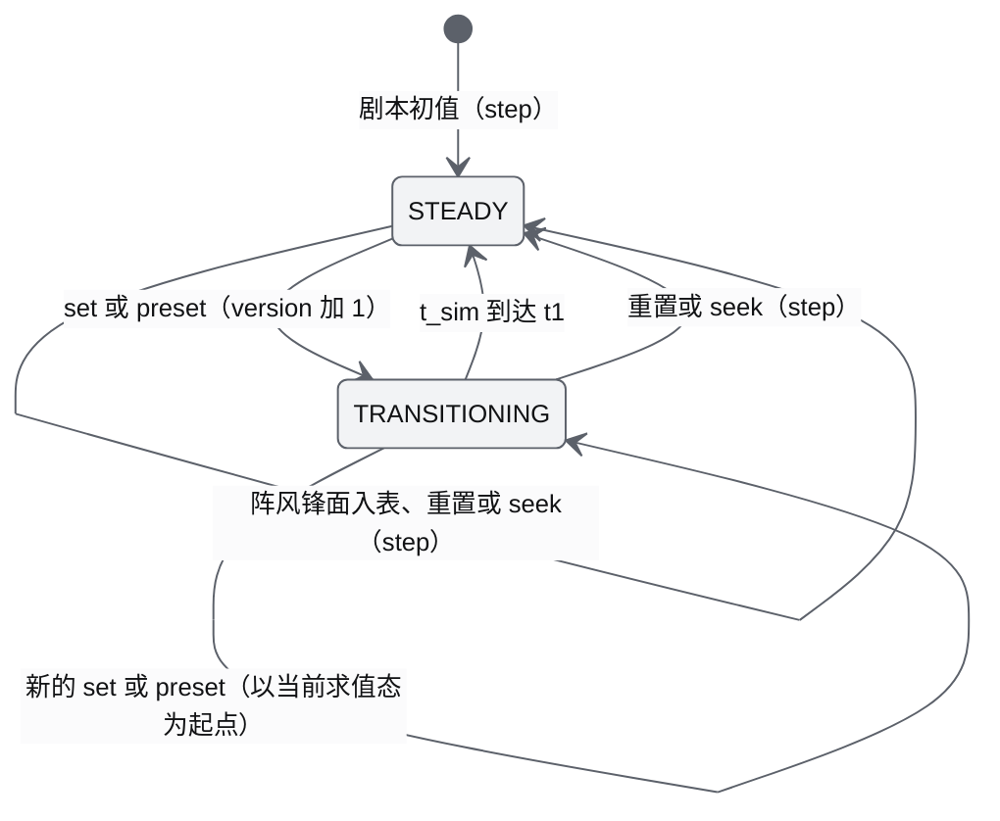
```mermaid
%%{init: {"theme": "base", "themeVariables": {"fontFamily": "Inter, PingFang SC, Microsoft YaHei, Noto Sans CJK SC, sans-serif", "fontSize": "13px", "background": "#FBFBFC", "primaryColor": "#F2F3F5", "primaryTextColor": "#111214", "primaryBorderColor": "#5C616A", "secondaryColor": "#E4E6E9", "tertiaryColor": "#FBFBFC", "lineColor": "#5C616A", "textColor": "#111214", "mainBkg": "#F2F3F5", "nodeBorder": "#5C616A", "clusterBkg": "#FBFBFC", "clusterBorder": "#A7ABB3", "edgeLabelBackground": "#FBFBFC", "noteBkgColor": "#E4E6E9", "noteTextColor": "#111214", "noteBorderColor": "#81868F"}}}%%
stateDiagram-v2
  [*] --> STEADY: 剧本初值（step）
  STEADY --> TRANSITIONING: set 或 preset（version 加 1）
  TRANSITIONING --> TRANSITIONING: 新的 set 或 preset（以当前求值态为起点）
  TRANSITIONING --> STEADY: t_sim 到达 t1
  STEADY --> STEADY: 阵风锋面入表、重置或 seek（step）
  TRANSITIONING --> STEADY: 重置或 seek（step）
```

### 4.10 录制（recorder，ext）

| # | 源 | 事件 | 守卫 | 动作 | 目标 |
|---|---|---|---|---|---|
| R01 | OFF | Session 进入 READY 且剧本 `record = true`；或 `rec/start` | 非机群阶梯剧本 | 打开 `rec-<seg>.mcap`，写 header 绑定信息 | RECORDING(seg) |
| R02 | RECORDING(k) | 剧本重置，或 D1-core 下 sim-core 无 checkpoint 重启 | — | 关闭第 k 段，打开第 k+1 段（ADR-040） | RECORDING(k+1) |
| R03 | RECORDING(k) | checkpoint 恢复（ext） | — | 写 timeline 元数据，标记作废区间 | RECORDING(k) |
| R04 | RECORDING | drain 发现序号缺口 | — | 发 `recorder.gap` | RECORDING |
| R05 | RECORDING | `rec/stop` 或 Session CLOSING | — | 写 footer，关闭文件 | OFF |

配额：`runs/` 总量 20 GB，supervisor 启动时与每 10 min【墙钟】检查，超出时删除最旧的非 keep 运行（AWR-03 §3.3）。

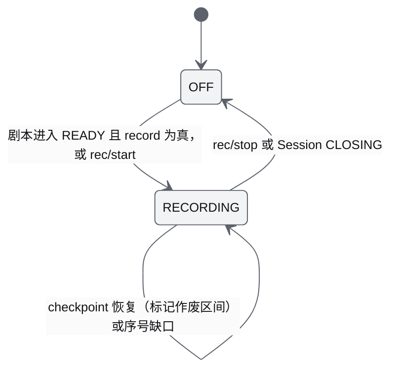
```mermaid
%%{init: {"theme": "base", "themeVariables": {"fontFamily": "Inter, PingFang SC, Microsoft YaHei, Noto Sans CJK SC, sans-serif", "fontSize": "13px", "background": "#FBFBFC", "primaryColor": "#F2F3F5", "primaryTextColor": "#111214", "primaryBorderColor": "#5C616A", "secondaryColor": "#E4E6E9", "tertiaryColor": "#FBFBFC", "lineColor": "#5C616A", "textColor": "#111214", "mainBkg": "#F2F3F5", "nodeBorder": "#5C616A", "clusterBkg": "#FBFBFC", "clusterBorder": "#A7ABB3", "edgeLabelBackground": "#FBFBFC", "noteBkgColor": "#E4E6E9", "noteTextColor": "#111214", "noteBorderColor": "#81868F"}}}%%
stateDiagram-v2
  [*] --> OFF
  OFF --> RECORDING: 剧本进入 READY 且 record 为真，或 rec/start
  RECORDING --> RECORDING: 剧本重置或无 checkpoint 重启（换新段）
  RECORDING --> RECORDING: checkpoint 恢复（标记作废区间）或序号缺口
  RECORDING --> OFF: rec/stop 或 Session CLOSING
```

### 4.11 回放 Player（ext）

| # | 源 | 事件 | 守卫 | 动作 | 目标 |
|---|---|---|---|---|---|
| P01 | CLOSED | `playback/open{run, segment}` | 席位持有者；实时 Session 为 ACTIVE.PAUSED，否则 `117 CLOCK_CONSTRAINT`；binding 中 world、contentVersion、layout 与当前一致，否则 `122 RECORDING_INCOMPATIBLE`（contracts 小版本不同只告警） | replay-worker 打开文件；Session 进入 REPLAY（S18） | OPENING |
| P02 | OPENING | 就绪 | — | 定位到段首；下发 SNAPSHOT | PAUSED |
| P03 | PAUSED | play | — | 按 rate 推进 | PLAYING |
| P04 | PLAYING | pause | — | — | PAUSED |
| P05 | PLAYING、PAUSED | `seek{t_ns}` | t 在段内 | 全局 epoch + 1；对每个 channel 回填 ≤ t 的最后一条；落在作废区间时对齐到最新有效谱系 | BUFFERING → 原状态 |
| P06 | 任意打开态 | `speed{rate}` | 0.1 ≤ rate ≤ min(20, 64 MB/s ÷ bytes_per_sim_s) | 超出上限时钳制并返回 warnings | 原状态 |
| P07 | PLAYING | 到达段尾 | — | — | ENDED |
| P08 | 任意打开态 | `playback/close` | 席位持有者 | Session 回到 ACTIVE.PAUSED（S19） | CLOSED |

回放期间 Session 只读：命令、租约、环境、时钟、机群写操作一律返回 `118 READ_ONLY_MODE`。

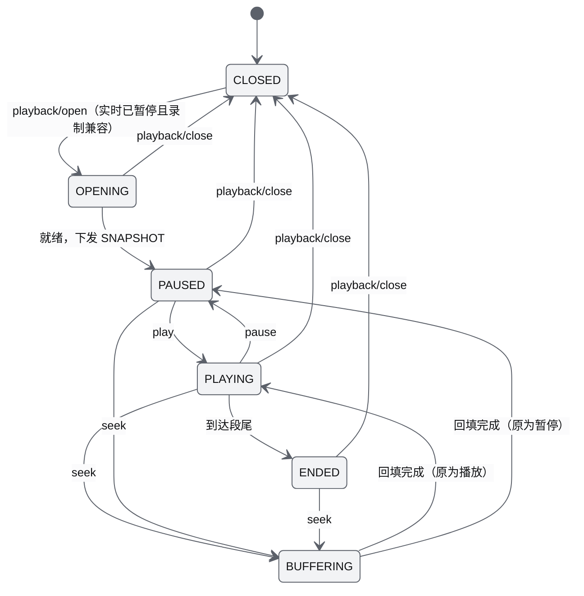
```mermaid
%%{init: {"theme": "base", "themeVariables": {"fontFamily": "Inter, PingFang SC, Microsoft YaHei, Noto Sans CJK SC, sans-serif", "fontSize": "13px", "background": "#FBFBFC", "primaryColor": "#F2F3F5", "primaryTextColor": "#111214", "primaryBorderColor": "#5C616A", "secondaryColor": "#E4E6E9", "tertiaryColor": "#FBFBFC", "lineColor": "#5C616A", "textColor": "#111214", "mainBkg": "#F2F3F5", "nodeBorder": "#5C616A", "clusterBkg": "#FBFBFC", "clusterBorder": "#A7ABB3", "edgeLabelBackground": "#FBFBFC", "noteBkgColor": "#E4E6E9", "noteTextColor": "#111214", "noteBorderColor": "#81868F"}}}%%
stateDiagram-v2
  [*] --> CLOSED
  CLOSED --> OPENING: playback/open（实时已暂停且录制兼容）
  OPENING --> PAUSED: 就绪，下发 SNAPSHOT
  PAUSED --> PLAYING: play
  PLAYING --> PAUSED: pause
  PLAYING --> BUFFERING: seek
  PAUSED --> BUFFERING: seek
  BUFFERING --> PLAYING: 回填完成（原为播放）
  BUFFERING --> PAUSED: 回填完成（原为暂停）
  PLAYING --> ENDED: 到达段尾
  ENDED --> BUFFERING: seek
  OPENING --> CLOSED: playback/close
  PAUSED --> CLOSED: playback/close
  PLAYING --> CLOSED: playback/close
  ENDED --> CLOSED: playback/close
```

### 4.12 Job 与 ReconstructionJob

ReconstructionJob 的状态集合在 AWR-03 §6.3（M01）冻结；WorldBuildJob 为本文设定。

| 类型 | 状态序列 | 终态 |
|---|---|---|
| ReconstructionJob | QUEUED → PREPARING → SEGMENTING → INFERRING → FUSING → GEOREFERENCING → TILING → PACKAGING | SUCCEEDED、FAILED、CANCELLED |
| WorldBuildJob（ext） | QUEUED → INGESTING → TILING → DERIVING → VALIDATING → PUBLISHING | SUCCEEDED、FAILED、CANCELLED |

| # | 源 | 事件 | 守卫 | 动作 | 目标 |
|---|---|---|---|---|---|
| J01 | — | `POST /api/recon/jobs` 或 `POST /api/worlds/{id}/build` | 角色（§8.2）；目标世界未被当前 Session 绑定（否则 `123`）；同一目标没有进行中的任务（否则 `124 JOB_CONFLICT`） | 入队；发 `job.state` | QUEUED |
| J02 | QUEUED | job-worker 空闲（一次一个任务，nice 10） | — | 开始第一阶段 | 第一阶段 |
| J03 | 阶段 n | 阶段完成 | — | 记录检查点；progress 事件节流 250 ms【墙钟】 | 阶段 n+1 |
| J04 | PACKAGING 或 PUBLISHING | `worldpkg validate --deep` 通过 | — | 从 `worlds/.staging/<id>-<job>` 原子改名为 `worlds/<id>`；World.status = READY；发 `world.added` 或 `world.updated` | SUCCEEDED |
| J05 | 任意阶段 | 阶段失败 | — | `error{code, stage, resumable = false}`；清理 staging | FAILED |
| J06 | 任意阶段 | job-worker 崩溃 | — | `error{resumable = true}`（g05 §7.5） | FAILED |
| J07 | FAILED（resumable） | `jobs/{id}/retry` | 提交者或 admin | 从最后完成的阶段继续 | QUEUED |
| J08 | 任意非终态 | `jobs/{id}/cancel` | 提交者或 admin | 停止并清理 staging，不留下半个 World Package | CANCELLED |

Mock 重建（D1-ext）的业务要点：输入为现有世界沿合成航线（helix 或 lawnmower）的采样；产物 `recon-ir@1` 须通过 schema 校验后才能进入 TILING；`scale_status` 随 `job.state` 事件下发并在 UI 显示（ADR-035）；引擎细节见 M01。

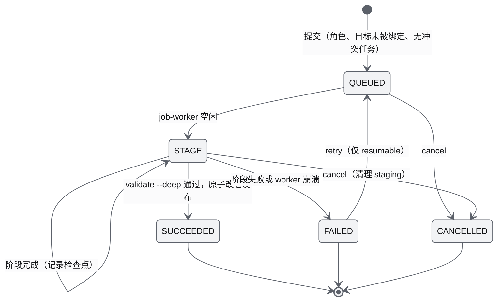
```mermaid
%%{init: {"theme": "base", "themeVariables": {"fontFamily": "Inter, PingFang SC, Microsoft YaHei, Noto Sans CJK SC, sans-serif", "fontSize": "13px", "background": "#FBFBFC", "primaryColor": "#F2F3F5", "primaryTextColor": "#111214", "primaryBorderColor": "#5C616A", "secondaryColor": "#E4E6E9", "tertiaryColor": "#FBFBFC", "lineColor": "#5C616A", "textColor": "#111214", "mainBkg": "#F2F3F5", "nodeBorder": "#5C616A", "clusterBkg": "#FBFBFC", "clusterBorder": "#A7ABB3", "edgeLabelBackground": "#FBFBFC", "noteBkgColor": "#E4E6E9", "noteTextColor": "#111214", "noteBorderColor": "#81868F"}}}%%
stateDiagram-v2
  [*] --> QUEUED: 提交（角色、目标未被绑定、无冲突任务）
  QUEUED --> STAGE: job-worker 空闲
  STAGE --> STAGE: 阶段完成（记录检查点）
  STAGE --> SUCCEEDED: validate --deep 通过，原子改名发布
  STAGE --> FAILED: 阶段失败或 worker 崩溃
  FAILED --> QUEUED: retry（仅 resumable）
  QUEUED --> CANCELLED: cancel
  STAGE --> CANCELLED: cancel（清理 staging）
  SUCCEEDED --> [*]
  FAILED --> [*]
  CANCELLED --> [*]
```

（图中 STAGE 代表类型各自的阶段序列：ReconstructionJob 为 PREPARING 至 PACKAGING，WorldBuildJob 为 INGESTING 至 PUBLISHING。）

### 4.13 Agent Task 与 Delegation（ext）

Task 采用 A2A 七态（d05 §3.4），物理子阶段 `awr.phase` 与合同网子阶段 `alloc` 只作元数据。所有计时器按仿真时钟（ADR-045）。

| # | 源 | 事件 | 守卫 | 动作 | 目标 |
|---|---|---|---|---|---|
| A01 | — | 提交（剧本事件、操作员 `POST /api/agent-tasks`、agent 检测事件） | 能力 id 已登记；`accept` 谓词通过 validate（否则 `121`，失败即关闭） | 黑板写 claim 与 intent；`alloc = discovering` | submitted |
| A02 | submitted | `find(cap 前缀)` 返回 | 至少一个健康候选 | 并行 `task.quote`，截止 `T_quote = 3 s`；`alloc = quoting` | submitted |
| A03 | submitted | find 返回空，或全部报价不可行 | — | 证据链 `agent.task.rejected`；发升级事件 | rejected（终态） |
| A04 | submitted | 报价截止 | 至少一个可行报价 | 按 §6.10 打分；对最优者 delegate；`alloc = awarding` | submitted |
| A05 | submitted | 提供方确认委派 | — | 申请 AGENT 租约（E01 或 E03）；`phase = lease` | working |
| A06 | working | 进度事件 | — | `phase`：lease → enroute → on_station → executing → returning | working |
| A07 | working | 委派 completed，effect 已验证且 TSIR 为真 | — | 黑板 evidence 与 conclusion，conclude；租约按 previous 交还；证据链 `agent.task.accepted` | completed（终态） |
| A08 | working | 委派 rejected 或 failed，或 TSIR 为假 | retries_left > 0 | 换下一候选（必要时重新报价）；`alloc = reassigning`；retries_left − 1 | working |
| A09 | working | 同上 | retries_left = 0 | 发升级事件，等待操作员 | input-required（reason = escalated） |
| A10 | working | AGENT 租约被 OPERATOR 抢占 | — | 委派暂停 | input-required（reason = lease_preempted） |
| A11 | input-required | 租约交还；或操作员 retry、指派 | — | 恢复或重新分配 | working |
| A12 | input-required | 操作员 cancel；或等待 120 s【仿真】无响应（本文设定） | — | 取消委派、交还租约 | canceled（终态）或 failed（终态，reason = escalation_timeout） |
| A13 | working | 超过 `T_exec = 1.5·eta_s + dwell_s + 60` | — | 取消委派 | failed（终态） |
| A14 | 任意非终态 | 操作员或请求方 cancel | — | 对执行机发 hover，取消委派，交还租约 | canceled（终态） |
| A15 | submitted、working | agent-runtime 崩溃后被 supervisor 重启 | — | 从 `runs/<run>/evidence.jsonl` 重建任务表；断线期间 AGENT 持有的机体已按 agent 链路策略 HOLD 或 RTL（§5.9.1）；重启后先按 `return_to = previous` 交还本进程名下的全部 AGENT 租约，再把任务置为待人工处理（AWR-03 §3.3 进程表"标记 interrupted"） | input-required（reason = interrupted） |

规则：
1. **completed 要求效果已验证且验收谓词为真**；委派层面的 completed 不蕴含效果 OK（d05 §0 第 5 条），因此 UI 把"任务状态"与"效果状态"分两列显示。
2. Delegation（每次委派一条）使用同一 A2A 枚举，终态只影响所属 Task 的 A07–A09 分支。
3. 同一目标同一能力只允许一个活动 Task：新的 claim 若命中黑板上活动的 intent，合并为同一 Task（防止重复出动，d05 §3.7）。

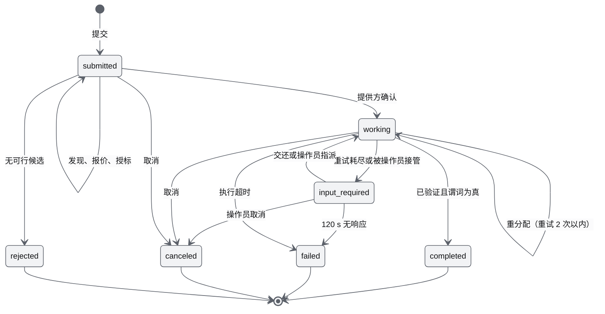
```mermaid
%%{init: {"theme": "base", "themeVariables": {"fontFamily": "Inter, PingFang SC, Microsoft YaHei, Noto Sans CJK SC, sans-serif", "fontSize": "13px", "background": "#FBFBFC", "primaryColor": "#F2F3F5", "primaryTextColor": "#111214", "primaryBorderColor": "#5C616A", "secondaryColor": "#E4E6E9", "tertiaryColor": "#FBFBFC", "lineColor": "#5C616A", "textColor": "#111214", "mainBkg": "#F2F3F5", "nodeBorder": "#5C616A", "clusterBkg": "#FBFBFC", "clusterBorder": "#A7ABB3", "edgeLabelBackground": "#FBFBFC", "noteBkgColor": "#E4E6E9", "noteTextColor": "#111214", "noteBorderColor": "#81868F"}}}%%
stateDiagram-v2
  [*] --> submitted: 提交
  submitted --> submitted: 发现、报价、授标
  submitted --> rejected: 无可行候选
  submitted --> working: 提供方确认
  working --> working: 重分配（重试 2 次以内）
  working --> completed: 已验证且谓词为真
  working --> input_required: 重试耗尽或被操作员接管
  input_required --> working: 交还或操作员指派
  input_required --> canceled: 操作员取消
  input_required --> failed: 120 s 无响应
  working --> failed: 执行超时
  working --> canceled: 取消
  submitted --> canceled: 取消
  completed --> [*]
  failed --> [*]
  canceled --> [*]
  rejected --> [*]
```

（图中 `input_required` 即 A2A 的 `input-required`，mermaid 状态名不允许连字符。）

### 4.14 状态机联动矩阵

| 触发事件 | FlightState | Command | Mission/Track | ControlLease | Agent Task | 其他 |
|---|---|---|---|---|---|---|
| 操作员 acquire（抢占 MISSION） | 不变 | MISSION 在途调用 `failed 210` | Track SUSPENDED | HELD(OPERATOR)，MISSION 入栈 | — | 链路策略切为 hold_rtl |
| 操作员 release（previous） | 不变 | — | Track 经 safe_transit 续飞 | HELD(MISSION) | — | 链路策略恢复剧本值 |
| 操作员 safety_stop | HOLD/SAFETY_STOP | 导航调用 `canceled 206` | Track SUSPENDED | SUSPENDED（locked） | 若为 AGENT 持有：input-required | — |
| 自动电量 RTL | RTL（FAILSAFE = 1） | 导航调用 `failed 204` | Track DROPPED | 不变，owner 投影 SAFETY | 若为执行机：重分配 | `SAF.BAT.*` |
| ELAND、FAILSAFE、CRASHED | 对应状态 | `failed 204` 或 `208` | DROPPED | 投影 SAFETY | 重分配 | Toast 合并（ADR-041） |
| GCS 链路丢失 3 s | HOLD/LINK_LOSS | `failed 204` | 仅 OPERATOR 持有，无 Track | 不变 | — | `SAF.LINK.LOST_HOLD` |
| FleetGuard 让行 | HOLD/SEPARATION | `failed 204` | Track SUSPENDED，恢复后续飞 | 不变 | 执行机让行不改变 Task | `SAF.SEP.CONFLICT` |
| 新导航命令 | FLYING 子模式切换 | 旧调用 `canceled 206` | 若由操作员对 MISSION 机体发出须先持有租约 | 不变 | — | — |
| 机体移除 | — | `canceled 6` 或 DRAINING 后结束 | DROPPED | FREE | 重分配 | `vehicle.removed` |
| 剧本重置 | 重生为 DISARMED | `canceled 6` | IDLE | FREE | canceled | 新录制段、epoch + 1 |
| sim-core 崩溃（core） | 重生 | `failed 212` | IDLE 后重启 | FREE | input-required(sim_rollback) | 新录制段 |
| 进入回放 | 实时冻结 | 写操作 `118` | 冻结 | 冻结 | 冻结（仿真时钟暂停） | epoch + 1 |
| 席位宽限到期 | 按链路策略 HOLD 或 RTL | — | — | OPERATOR 租约成为孤儿 | — | 审计 |
| 协作任务完成 | 不变 | — | 若执行机原属任务：续飞 | 交还 previous | completed | 证据链 |
| 天气预设切换 | 可能因风超限触发告警 | — | — | — | 新报价按新环境 | `SAF.ENV.WIND_LIMIT`（ext） |

---

## 5. 业务规则与校验

### 5.1 命令准入

#### 5.1.1 命令集

参数一律带单位后缀（AWR-03 §5.4）；服务名 `uav/{id}/cmd/{op}`，批量为 `fleet/cmd/{op}`（§5.5 第 5 条）。

| 命令 | 类别 | 需要租约 | 发起方要求 | agent 可用 | D1 | 依据 |
|---|---|---|---|---|---|---|
| takeoff | 导航与设置 | 是 | 席位持有者或租约持有者 | 是（自有租约） | core | g04 §6.1 |
| land | 安全类 | 否 | operator 须持席位；agent 只能对自有租约机体 | 是（自有） | core | ADR-027 |
| goto | 导航 | 是 | 同 takeoff | 是 | core | — |
| follow_path | 导航 | 是 | 同上 | 是 | core | — |
| orbit | 导航 | 是 | 同上 | 是 | core | — |
| velocity、velocity_stop | 导航（流式） | 是 | 席位持有者；setpoint 只来自 WS 的 CLIENT_DATA；会话以 `velocity_stop` 结束 | 否（本文设定：agent-runtime 不是 WS 客户端，遥操作只给人） | core | ADR-045；AWR-17 §7.1 |
| hover（别名 hold） | 安全类（轻） | 否 | 同 land | 是（自有） | core | — |
| rtl | 安全类 | 否 | 同 land | 是（自有） | core | — |
| safety_stop | 安全类（加锁） | 否 | 席位持有者 | **否** | core | ADR-027、C35 |
| pause | 任务 | 是 | 租约持有者或席位持有者 | 是（自有） | core | g04 §6.3 |
| resume | 任务或解锁 | 解锁 SafetyStop 时否，其他为是 | 解锁只允许席位持有者 | 仅非解锁场景 | core | — |
| arm、disarm | 设置 | 是 | 同 takeoff | 是（自有） | core | — |
| cancel | 调用控制 | 否 | 原调用者或席位持有者 | 是（自己的调用） | core | g04 §7.6 |
| acquire、release | 租约 | — | §4.8.3 | 是（AGENT 类别） | core | ADR-027 |
| kill | 安全类 | 否 | 席位持有者，确认令牌并按住 1 s | 否 | ext | ADR-016 |
| escalate | 安全类 | 否 | 席位持有者，确认令牌，间隔 ≥ 2 s | 否 | ext | r24 §4.4 第 7 条 |

Supervisor 的自动动作不是命令，不经过准入流水线，直接作为 FSM 转移在下一 tick 的 ingest 执行（§4.4.2）。

#### 5.1.2 规范准入流水线（唯一顺序，ADR-016）

| 步 | 检查 | 执行位置 | 失败码（按优先级） | 时间预算 |
|---|---|---|---|---|
| ① | 身份与角色；会话模式（回放或关闭中只读）；席位 | 可信入口：UI 经 api；agent 经 agent-runtime 受信守卫 | 118 READ_ONLY_MODE、115 ROLE_FORBIDDEN、116 SEAT_TAKEN | 入口 ①–③ 合计 ≤ 1 ms（本文设定） |
| ② | 限流（令牌桶） | 可信入口 | 111 RATE_LIMITED | — |
| ③ | 确认令牌（kill、escalate、强制移除、admin 接管） | 可信入口 | 112 CONFIRM_REQUIRED | — |
| 路由 | roster 查表，把机体路由到生产者 | 可信入口 | 107 NO_VEHICLE；生产者 1 s × 3 次无回复为 211 SIM_UNAVAILABLE | — |
| ④ | 状态：生命周期、时钟、锁、准入矩阵、前置条件 | 生产者（sim-core）步顶 | 按序：108 LINK_ERROR、117 CLOCK_CONSTRAINT、114 LOCKED、106 DUPLICATE、101 SAFETY_ACTIVE、105 STATE、104 NOT_ARMED、113 LOC_NOT_READY、103 PREFLIGHT_FAILED | ④–⑧ 合计 ≤ 5 ms |
| ⑤ | 租约 | 生产者 | 100 LEASE_DENIED | — |
| ⑥ | 参数边界（§5.3） | 生产者 | 110 PARAM_OUT_OF_RANGE | — |
| ⑦ | 后端能力（`caps`） | 生产者 | 109 BACKEND_UNSUPPORTED | — |
| ⑧ | 围栏粗校验，O(航段数)（§5.7.2） | 生产者 | 102 GEOFENCE_REJECT | — |
| ⑨ | 分发：幂等登记、取代前一调用、记 apply_tick、写输入日志 | 生产者 | — | — |
| ⑩ | 审计：写 `audit.jsonl`（每 1 s fsync） | 生产者 | — | — |

规则：
1. **原因码优先级等于步骤顺序**：返回第一个失败步骤的码；同一步内按表中顺序。多个违例同时存在时，调用方只看到最靠前的一个，`detail` 可附加其余违例的列表（最多 4 条）。
2. 在 HOLD/SAFETY_STOP（locked = 1）下，准入矩阵中的 S 一律报 `114 LOCKED`，比 101 更具体。
3. 入口把 principal（会话 id、角色、入口签发的 principal token）随请求转发；生产者只信任入口转发的 principal（ADR-027）。
4. 同步准入耗时 ≤ 5 ms；超过预算的检查（细粒度路径校验、规划）一律进入 plan-pool，调用停在 accepted（ADR-016、ADR-039）。
5. 每个拒绝都带 `remedy`：给出可执行的下一步（例如"先接管该机"、"改用 safe_transit"、"等待 SafetyStop 解除"），沿用 n03 droneserver 的"可读拒绝"做法。
6. 限流默认值（本文设定，依据 D1-AC-10 的 50 条/s 压测与 ADR-036 的估价 ≤ 20 次/s）：每个 operator principal 50 次/s、突发 100；agent-runtime 合计 20 次/s、突发 40；`env/*` 2 次/s；时钟操作 5 次/s；机群增删 10 次/s。

### 5.2 准入矩阵：命令 × FlightState

由 g04 原型 `admission_matrix()` 生成并经本机重跑核对（`.cache/research/g04/state_model.py --matrix`），本文增加 escalate 一行。图例：Y 接受；= 幂等，返回 `106 DUPLICATE` 并附 `dup_of`（正在执行的调用）；S 为 `101 SAFETY_ACTIVE`（locked 时为 `114 LOCKED`）；- 为 `105 STATE`。RTL 与 LND 按 flags.FAILSAFE 区分"操作员发起"（op）与"自动"（auto）。

| 命令 | UNK | DIS | PRE | RDY | TKO | FLY | COR | HOLD | RTL op | RTL auto | LND op | LND auto | ELD | FSF | LDD | CRS |
|---|---|---|---|---|---|---|---|---|---|---|---|---|---|---|---|---|
| takeoff | - | Y¹ | - | Y | = | - | - | - | - | - | - | - | - | - | Y | - |
| land | - | - | - | - | Y | Y | Y | Y | Y | Y | = | = | S | S | = | - |
| goto、follow_path、orbit、velocity | - | - | - | - | - | Y | S | S | Y | S | Y | S | S | S | - | - |
| hover、cancel | - | - | - | - | Y | Y | S | S | Y | S | Y | S | S | S | - | - |
| rtl | - | - | - | - | - | Y | Y | Y | = | = | Y | S | S | S | - | - |
| safety_stop | - | - | - | - | Y | Y | Y | = | Y | Y | Y² | Y² | S | S | - | - |
| pause | - | - | - | - | - | Y³ | - | - | - | - | - | - | - | - | - | - |
| resume | - | - | - | - | - | Y⁴ | - | Y⁵ | - | Y⁵ | - | - | - | - | - | - |
| arm | - | Y¹ | - | - | - | - | - | - | - | - | - | - | - | - | - | - |
| disarm | - | - | Y | Y | - | - | - | - | - | - | - | - | - | - | Y | - |
| kill（ext） | - | - | - | Y | Y | Y | Y | Y | Y | Y | Y | Y | Y | Y | Y | - |
| escalate（ext） | - | - | - | - | Y | Y | Y | Y | Y | Y | Y | Y | Y⁶ | - | - | - |

注：
1. 只在子模式为 READY_TO_ARM 时成立。
2. 要求 AGL ≥ 2 m，否则 `105 STATE`，降落继续。
3. 要求子模式 ∈ {GOTO, PATH, ORBIT, SWARM} 且该机有活动 Track 或导航调用。
4. 要求该机 Track 处于 SUSPENDED（暂停）。
5. 要求引发该状态的原因已解除：SAFETY_STOP 需席位持有者解锁；LINK_LOSS 需链路恢复；SEPARATION 需间距恢复；ESCALATE 需操作员确认。**电量原因的 RTL 不可 resume**，返回 `101 SAFETY_ACTIVE`（detail = BATTERY）。
6. 只有 `escalation.levels` 含 FAILSAFE 时成立（默认不含，返回 105）。escalate 总是升到比当前更严重的下一级：TKO、FLY、COR 下进入 HOLD/ESCALATE（F31）；HOLD、RTL、LND 下进入 ELAND（F30）；ELD 下进入 FAILSAFE（F32）。

acquire 与 release 不受 FlightState 约束，只在 UNKNOWN 与 CRASHED 下返回 `105 STATE`。`commands.json` 必须由本表生成（BIZ-AC-002）。

### 5.3 参数边界

| 命令.参数 | 类型 | 单位 | 默认 | 取值范围 | 越界处理 | 依据 |
|---|---|---|---|---|---|---|
| takeoff.alt_m | float | m（AGL） | 2.5 | [0.5, 120] | 110 | g04 §6.1–§6.2 |
| takeoff.auto_arm | bool | — | true | — | — | g04 §6.1 |
| land.at | enum 或 Vec3 | — | here | here、home、`{pos}` | pos 越界按 ⑧ 报 102 | g04 §6.1 |
| goto.pos | Vec3 | m（World ENU） | 必填 | 在 border 内、不在 nofly 内、`z ≥ dsm(x,y) + 2 m` | 102（detail：OUT_OF_BORDER、GOAL_IN_ZONE、GOAL_IN_OBSTACLE） | 本文设定 2 m：与 ALT_MIN 的 0.5 m 留出参考跟踪余量 |
| goto.yaw_rad | float 或 null | rad | null（不控航向） | [−π, π] | 110 | AWR-03 §5.3 第 4 条 |
| goto.speed_mps | float | m/s | 当前限速配置的巡航速度（P600 prometheus_outdoor 为 3，px4_default 为 5） | (0, 12] | ≤ 0 或 > 12 报 110；超过当前配置上限时截断并在 result 附 `warnings: [SPEED_CLAMPED]` | g08 §10.4 |
| goto.tol_m | float | m | 0.5（Mock） | [0.2, 10] | 110 | g04 §6.4 |
| goto.route | enum | — | auto | auto、direct、safe_transit | — | 本文设定（§5.7.4） |
| follow_path.waypoints | list[Vec3] | m | 必填 | 2–1000 点，总长 ≤ 20 km | 110 | ADR-016 |
| follow_path.bspline | object | — | — | order = 3，ts > 0，控制点 ≥ 4 | 110 | ADR-039（ext） |
| follow_path.speed_mps | float | m/s | 当前限速配置的巡航速度 | (0, 12]，超过配置上限时截断并附 `SPEED_CLAMPED` | 110 | 同 goto.speed_mps |
| follow_path.mode | enum | — | auto | auto、mission、offboard（Mock 三者等价；PX4 后端 V0.2 起按 g04 §6.3 区分） | 109（后端不支持时） | g04 §6.1、§6.3 |
| orbit.center | Vec3 | m | 必填 | 同 goto.pos | 102 | — |
| orbit.radius_m | float | m | 必填 | [1, 1000]，且 `speed_mps² / radius_m ≤ 3 m/s²` | 110 | g04 §2 F7；MPC_ACC_HOR |
| orbit.speed_mps | float | m/s | 当前限速配置的巡航速度 | (0, 12]，并受上行的向心加速度约束 | 110 | g04 §6.1 |
| orbit.turns | float | 圈 | 0（持续绕飞） | [0, 100] | 110 | g04 §6.1 |
| orbit.cw、yaw_behavior | bool、enum | — | true、center | center、tangent、fixed | — | — |
| rtl.land | bool | — | true | — | — | g04 §6.1 |
| rtl.alt_m | float 或 null | m（相对 home） | null（取 30） | [10, 500] | 110；实际值不低于 §5.8.3 的安全高度 | g04 §6.3 |
| velocity.frame、hold_alt、vmax_mps | enum、bool、float | —、—、m/s | world、true、配置上限 | vmax ≤ 当前配置上限 | 110 | g04 §6.1 |
| velocity setpoint | VelSetpoint16 | — | — | 20–50 Hz；早于当前仿真时刻 200 ms 以上的包丢弃 | 丢弃 | r27 §3.12 |
| acquire.priority、acquire.confirm_token | enum、str | — | normal、— | normal、override（ext；override 必须带确认令牌） | 112 | ADR-027；AWR-17 §7.1 |
| arm.force、disarm.force | bool | — | false | D1 只接受 false；true 返回 `109 BACKEND_UNSUPPORTED`（Mock 的 caps 不声明强制解锁与上锁，外部后端的语义在 V0.2 接入时定义） | 109 | 本文设定；AWR-17 §7.1 |
| release.return_to | enum | — | previous | previous、none | — | 本文 §4.8.4 |
| sim/step.ticks | int | tick（4 ms） | 25 | [1, 2500] | 110 | 本文设定：默认一步 100 ms，上限 10 s |
| sim/speed.rate | float | — | — | {0.25, 0.5, 1, 2, 5, 10} | 110；超过 `max_speed` 报 117 | AWR-03 §8.5 |
| env/set.duration_s、env/preset.duration_s | float | s | 3、30 | [0, 600] | 110 | g06 §3.3 |
| fleet/cmd.vehicles | list 或 `*` | — | — | 1–1000 | 110 | AWR-03 §8.2 |

### 5.4 完成判据与截止时间

判据写在规范态上，与后端无关（g04 §6.4）。截止时间为【仿真】；Mock 的接受半径取 0.5 m。

| 命令 | running 期望 | succeeded 判据（均需带 metrics） | 专有 failed | 截止时间 |
|---|---|---|---|---|
| takeoff | TAKING_OFF/* | FLYING，且 `abs(z − z_t) < max(0.3, 5%·alt)`、`abs(vz) < 0.3`，持续 1 s；metrics `alt_err_m`、`t_exec_s` | 离开 TAKING_OFF 后进入的不是 FLYING | `alt/1.5 × 1.5 + 10 s`，再加解锁 2 s |
| land | LANDING/* | 经过 LANDED 并到达 DISARMED；metrics `pos_err_m` | 被 ELAND、FAILSAFE 抢占为 204（metrics 仍记录是否触地） | `alt/0.7 × 1.5 + 10 s` |
| goto（direct） | FLYING/GOTO | `‖p − p_t‖ < tol` 且 `abs(v) < 0.5`，持续 1 s；metrics `dist_err_m`、`t_exec_s` | 未到达就离开 GOTO | `1.5·ETA + 10 s`，ETA = d/v + v/a |
| goto（safe_transit） | FLYING/PATH | 同上（终点） | 同上 | `1.5·ΣETA + 10 s` |
| follow_path | FLYING/PATH | 最后一点满足到达判据；metrics `path_len_m`、`max_dev_m` | 路径被清除 | `1.5·ΣETA + 10 s` |
| orbit | FLYING/ORBIT | turns > 0：累计转角 ≥ 2π·turns 后自动 hover；turns = 0：`abs(r − R) < 1 m` 且 `abs(v_t − v) < 0.5`，持续 3 s 即判 succeeded，之后持续绕飞到被取代 | — | 入圆时间 + 10 s |
| hover | FLYING/HOVER | `abs(v) < 0.3`，持续 1 s | — | 10 s |
| rtl | RTL/* | `land = true`：DISARMED 且 `‖p_xy − home‖ < 2 m`；`land = false`：home 上方 `z_rtl ± 1 m` | — | `1.5·t_rtl + 20 s` |
| velocity | FLYING/VELOCITY | 会话建立即 accepted；客户端发 `velocity_stop` 且机体刹停（`abs(v) < 0.3` 持续 1 s）时 succeeded | 看门狗 209、被取代 206 | — |
| safety_stop | HOLD/SAFETY_STOP | `abs(v) < 0.3`，持续 0.5 s | — | 5 s |
| pause | FLYING/HOVER 且 Track SUSPENDED | `abs(v) < 0.3`，持续 1 s | — | 10 s |

通用 failed 判据（g04 §6.4）：严重度高于期望 → 204；owner 变为 PILOT 或 EXTERNAL → 205；生命周期 LOST → 207；进入 CRASHED → 208；巡航段 5 s 内前进 < 0.2 m → 203；超过截止时间 → 202。

### 5.5 取代、取消、暂停、幂等与批量

1. **取代**：同一机体上，新的导航类调用（goto、follow_path、orbit、velocity）被准入时，正在进行的导航类调用判 `canceled 206 SUPERSEDED`；操作员的安全类命令（land、hover、rtl、safety_stop）取代一切导航类调用；Supervisor 自动动作不是取代，而是抢占，判 `failed 204`（g04 §7.6）。
2. **取消**：`cancel{call_id}` 先对该机执行一次 hover，再判 `canceled 6 CANCELLED`；已终态的调用返回 `105 STATE`。
3. **暂停**：机体级 `pause` 不取消 follow_path 或 orbit 调用，只把 progress 标为 `paused`，resume 后恢复 `executing`；任务级 `mission/{id}/pause` 对每个活动 Track 执行机体级 pause（§4.5.1 M04）。
4. **两种"重复"**：同一 call_id 重发是传输层幂等（60 s【墙钟】窗口，返回缓存结果，不算错误）；不同 call_id 但语义重复（准入矩阵中的 =，例如 TAKING_OFF 时再发 takeoff）返回 `106 DUPLICATE` 并附 `dup_of`，UI 以中性提示显示"已在执行"。
5. **批量命令**：`fleet/cmd/{op}{vehicles: [..] 或 "*", args}` 只允许 rtl、land、hover、safety_stop、pause、resume、takeoff（本文设定：这些命令不需要逐机不同的几何参数）。入口展开为逐机调用，call_id 为 `<batch_id>:<vehicle_id>`，全部在同一 tick 逐机准入；回复为汇总 `{accepted_n, rejected_by_code}`，逐机终态走事件（事件按步合批，ADR-018）；UI Toast 合并后 ≤ 3 条（D1-AC-27）。批量命令中不需要租约的安全类命令只要求席位；需要租约的命令逐机检查租约。

### 5.6 原因码

#### 5.6.1 沿用的原因码（g04 §7.4、ADR-016）

| 码 | 名称 | HTTP | 步骤或来源 | 业务触发条件 | 典型 remedy |
|---|---|---|---|---|---|
| 0 | OK | 200 | — | — | — |
| 1 | TEMPORARILY_REJECTED | 409 | 原生（V0.2） | 外部飞控暂时拒绝 | 稍后重试 |
| 2 | DENIED | 409 | 原生（V0.2） | 外部飞控拒绝 | 检查飞控模式 |
| 3 | UNSUPPORTED | 501 | 原生（V0.2） | 外部飞控不支持 | — |
| 4 | FAILED | 409 | 原生（V0.2） | 外部飞控执行失败 | — |
| 6 | CANCELLED | — | 调用控制 | cancel、剧本重置、机体移除 | — |
| 10 | NOT_IN_CONTROL | 409 | 原生（V0.2） | 遥控器或其他地面站持有控制 | 由现场飞手交还控制 |
| 100 | LEASE_DENIED | 409 | ⑤ | 未持有租约，或申请的优先级不高于当前持有者 | 先接管该机 |
| 101 | SAFETY_ACTIVE | 409 | ④ | 准入矩阵为 S；电量 RTL 下 resume | 等待自动动作结束或降落后重试 |
| 102 | GEOFENCE_REJECT | 409 | ⑧（同步）；细校验失败时为 failed | 目标或路径越界、进入禁飞区、穿越建筑 | 调整目标或改用 safe_transit |
| 103 | PREFLIGHT_FAILED | 409 | ④ | 预检项不通过（电量 < 30%、不在 border 内、在禁飞区内、机体未静止） | 按 detail 排除后重试 |
| 104 | NOT_ARMED | 409 | ④ | 未解锁且未要求自动解锁 | 设 `auto_arm = true` 或先 arm |
| 105 | STATE | 409 | ④ | 准入矩阵为 - | 按当前状态选择可用命令 |
| 106 | DUPLICATE | 409 | ④ | 准入矩阵为 = | 无需重发 |
| 107 | NO_VEHICLE | 404 | 路由 | 机体不存在或已移除 | 刷新机群列表 |
| 108 | LINK_ERROR | 503 | ④ | 生命周期不是 READY（DEGRADED、LOST） | 等待链路恢复 |
| 109 | BACKEND_UNSUPPORTED | 501 | ⑦ | 后端 `caps` 不支持该命令或参数 | — |
| 110 | PARAM_OUT_OF_RANGE | 422 | ⑥ | 参数越界（§5.3），航点数或航程超限 | 按 detail 修改参数 |
| 111 | RATE_LIMITED | 429 | ② | 超过令牌桶 | 降低频率 |
| 112 | CONFIRM_REQUIRED | 428 | ③ | 缺少或无效的确认令牌 | 在确认对话框中确认 |
| 113 | LOC_NOT_READY | 409 | ④ | LOC_OK = 0 时 arm 或导航 | 等待定位就绪 |
| 114 | LOCKED | 409 | ④ | SafetyStop 加锁期间的非安全类命令 | 先 resume 解锁 |
| 200 | ACK_TIMEOUT | 504 | 执行（V0.2） | 原生 ACK 超时 | 同 call_id 重试 |
| 201 | MODE_NOT_ENTERED | 409 | 执行（V0.2） | PX4 意图模式与显示模式不一致 1.5 s | — |
| 202 | PROGRESS_TIMEOUT | — | 执行 | 超过截止时间 | — |
| 203 | STALLED | — | 执行 | 巡航 5 s 前进 < 0.2 m | 检查风或障碍 |
| 204 | PREEMPTED_BY_SAFETY | — | 执行 | 被自动安全动作抢占 | 查看 SafetyEvent |
| 205 | PREEMPTED_BY_PILOT | — | 执行（V0.2） | 被飞手或外部地面站接管 | — |
| 206 | SUPERSEDED | — | 执行 | 被新调用取代 | — |
| 207 | VEHICLE_LOST | — | 执行 | 生命周期 LOST | — |
| 208 | CRASHED | — | 执行 | 坠毁 | — |
| 209 | WATCHDOG | — | 执行 | 流式指令超时 | 检查网络 |
| 210 | LEASE_PREEMPTED | — | 执行 | 租约被更高优先级抢占 | — |
| 211 | SIM_UNAVAILABLE | 503 | 入口 | 生产者无回复、会话准备中或恢复中 | 同 call_id 重试 |
| 212 | SIM_ROLLBACK | — | 执行 | sim-core 回滚，调用已作废 | 重新下发 |
| 213 | SERVICE_UNAVAILABLE | 503 | 入口 | 依赖服务不可用（例如 geo-worker，V0.2） | — |
| 214 | PLANNER_CRASHED | — | 执行 | plan-pool 崩溃且重试失败 | 重试或改用 direct |

#### 5.6.2 本文提出、已由 AWR-17 §8.2 登记的原因码

| 码 | 名称 | HTTP | 步骤或来源 | 业务触发条件 | 必要性 |
|---|---|---|---|---|---|
| 115 | ROLE_FORBIDDEN | 403 | ① | 角色或 principal 无权执行（viewer 发命令；agent 发 SafetyStop、kill、escalate；非 admin 调 `sys/restart`） | 现有 100–114 没有角色类码 |
| 116 | SEAT_TAKEN | 409 | ① | 席位被其他 principal 持有；或已被接管的旧 principal 继续写 | 单操作席位（Q5）需要可区分的码 |
| 117 | CLOCK_CONSTRAINT | 409 | ④ | 时钟状态或倍率禁止该操作：rate ≠ 1 时 Velocity；非 PAUSED 时 step；LIVE 下 pause、step、speed；实时未暂停时打开回放 | ADR-045 的 UI 置灰需要服务端对应码 |
| 118 | READ_ONLY_MODE | 409 | ① | Session 处于 REPLAY 或 CLOSING 时的写操作（PREPARING、RECOVERING 期间返回 211） | 回放为全局模式（ADR-040） |
| 119 | ENERGY_INFEASIBLE | 409 | 估价与任务预检 | `soc_after < 20%` 或任务能量超出（§5.8.4） | ADR-036 规定 estimate 返回原因码 |
| 120 | ENV_LIMIT | 409 | 估价 | 环境超出能力的 `physical.limits`（风、雨、能见度） | 同上 |
| 121 | SCENARIO_INVALID | 422 | 剧本与任务加载 | 剧本或 TSIR 谓词校验失败（出生点在障碍内、机型未知、世界不符、未知 op） | 剧本与协作任务的输入校验 |
| 122 | RECORDING_INCOMPATIBLE | 409 | 回放打开 | 录制绑定的 world、contentVersion、layout 与当前不一致 | ADR-040 的拒绝打开 |
| 123 | WORLD_NOT_READY | 409 | 会话与任务 | 世界不是 READY，或被当前会话绑定而不能重建 | 世界构建与切换 |
| 124 | JOB_CONFLICT | 409 | 任务提交 | 同一目标已有进行中的任务 | job-worker 一次一个任务 |

编号、名称与 HTTP 映射与 AWR-17 §8.2 一致。`210 LEASE_PREEMPTED` 与 `212 SIM_ROLLBACK` 在 D1-core 中使用（210：操作员接管 MISSION 机体，§4.8.1；212：sim-core 无 checkpoint 重启时已准入的调用，§4.1.5），AWR-17 §8.2 已改为 core（AWR-03 附录 D.2 R2-24）。入口类的 `301 AUTH_REQUIRED`、`302 TOKEN_INVALID`、`303 ORIGIN_FORBIDDEN`、`304 ADMIN_SECRET_REQUIRED` 属于协议与接入层，业务语义见 §4.2 与 §8.1，定义以 AWR-17 为准。

### 5.7 地理围栏

#### 5.7.1 围栏构成

| 要素 | 来源 | 取值 | 依据 |
|---|---|---|---|
| border（可飞棱柱） | 由 World 派生（M03 写入 `zones.geojson` 的保留要素） | 水平多边形为 World 包围盒内缩 20 m；`min_z` 为地面（`min_z_m = null`，由 DSM 净空约束）；`max_z = round(max(dsm) + 50, 2)`，以 world z 计：深圳 424.05 m、上海 686.73 m（六城取值见 AWR-16 §7） | 本文设定：S1 扫描到 world z 391 m，必须高于最高建筑（深圳塔顶 world z 374.1 m）；内缩 20 m 避免在点云边缘无几何处飞行 |
| nofly | `zones.geojson`（D1 查看，V0.2 编辑） | 棱柱，禁止进入 | r24 §3.6 |
| restricted | `zones.geojson` | 进入只告警 | 本文设定 |
| effective_max_z | 多源取小 | `min(border.max_z, 机型最大高度)` | r24 §3.6 |
| 障碍净空 | M04 `height_dsm`、max-pooled `heightmap_top`（膨胀加安全距离） | 目标点 `z ≥ dsm + 2 m`；最低净空 `z − dsm ≥ 0.5 m` | x01 §3.8；r24 §3.6 |

两种高度不要混用：**净空** `z − dsm(x,y)` 用于防撞与 ALT_MIN（楼顶即地面，r24 §3.6）；**AGL** `z − dtm(x,y)` 用于显示、地形跟随与环境廓线（AWR-03 §5.5）。

#### 5.7.2 同步粗校验（准入第 ⑧ 步，≤ 5 ms）

对折线 `[p, p_stop, goal]`（goto 的 STOP_MOTION 预测折线，g08 §5.3）或航点折线逐段检查，复杂度 O(航段数)：
1. **确定违例即拒绝**：任一点在 border 外 → `OUT_OF_BORDER`；任一点在 nofly 棱柱内 → `GOAL_IN_ZONE`；任一段与 nofly 棱柱相交（二维线段与多边形求交再比较 z 区间）→ `PATH_CROSSES_ZONE`；目标低于 `dsm + 2 m` → `GOAL_IN_OBSTACLE`。
2. **确定安全即放行**：每段 z 下限都高于该段包围盒在 max-pooled `heightmap_top` 金字塔中的最大值 → 标记"已证明无障碍"，不需要细校验。
3. **其余为"可能有障碍"**：调用 accepted，但在细校验（§5.7.3）或安全转场规划（§5.7.4）完成前不进入 running。

#### 5.7.3 细校验（plan-pool）

`path_valid(polyline, buffer = 1.0 m)`：每米 20 步离散（r24 §3.6），对膨胀后的高度图与 zones 求交；结果按 apply_tick 生效（ADR-039、ADR-049）。失败时调用 `failed 102`（detail = PATH_OBSTACLE），`remedy` 建议 `route = safe_transit`。

#### 5.7.4 GoTo 的路由选择（`route`）

| route | 行为 | 适用 |
|---|---|---|
| direct | 直线飞行；粗校验"可能有障碍"时走细校验 | 开阔区、操作员明确要求直飞 |
| safe_transit | plan-pool 生成"爬升—巡航—下降"剖面：巡航高度 = 沿线 `heightmap_top` 最大值 + 5 m，且不低于起终点高度（x01 §3.8）；以 follow_path 执行 | 城市峡谷、点选楼顶 |
| auto（默认） | 粗校验已证明无障碍时按 direct；否则按 safe_transit | UI 点选 GoTo（D1-AC-32） |

理由（本文设定）：x01 §3.8 实测全局固定巡航高度 120 m 会在纽约、苏州、芝加哥撞楼；让 UI 点选默认走 auto，操作员不必理解高度图也能安全到达。

#### 5.7.5 运行期围栏（MissionGuard，10 Hz【仿真】）

| 条件 | 阈值 | 动作 | 事件码 | D1 |
|---|---|---|---|---|
| 接近边界 | 距 border 或 nofly < 5 m | 告警，ALERT | SAF.GEOFENCE.NEAR | core |
| 越出 border 或进入 nofly | — | CORRECTING/GEOFENCE：投影到最近合法点再内缩 2 m | SAF.GEOFENCE.BREACH | core |
| 纠正超时或越界过深 | 15 s 或 10 m | 自动 RTL | SAF.GEOFENCE.CORRECT_TIMEOUT、FAR_OUT | core |
| 高于 effective_max_z | — | CORRECTING/ALT_MAX，目标 `max_z − 0.25` | SAF.ALT.MAX | core |
| 净空不足 | `z − dsm < 0.5 m`（起降段除外） | CORRECTING/ALT_MIN，目标 `dsm + 0.75` | SAF.ALT.MIN | core |
| 进入 restricted | — | 告警 | SAF.GEOFENCE.NEAR（detail = RESTRICTED） | core |
| Velocity 子模式的方向限速 | `v_dir ≤ vmax_from_dist(j, a, max(d_free − 2 m, 0))` | 在接近边界或障碍时自动减速 | — | core |

依据：r24 §3.6、§4.5；g08 §5.1（方向限速）。

### 5.8 能量感知 RTL

#### 5.8.1 电量模型与阈值

电量模型由 M09 实现（battery stage 10 Hz【仿真】，`P = P_hover·(T/T_hover)^1.5`，g08 §3.2）；本文规定其业务用法：

| 量 | 定义 | 依据 |
|---|---|---|
| E_use | 可用能量 `usable_frac·capacity_wh`，SOC 以它为基准；P600 为 0.85 × 222 = 188.7 Wh | M09-FR-050；g08 §10.4 的 P_hover 就是按 0.85 × 222 Wh ÷ 22 min 反推的，以 222 Wh 为基准会让悬停续航变成 25.9 min，比厂商 22 min 乐观 17.6% |
| P_avg | 功率的指数平均（系数 0.98/0.02） | r24 §4.6 |
| t_rem_usable | `(soc − 0.05)·E_use / P_avg`，算到 emergency 阈值为止，不算到 0 | r24 §4.6（原型证明算到 0% 会在返航途中触发 emergency） |
| t_rtl | 按 §5.8.3 | r24 §4.6 |

#### 5.8.2 判据与动作

| 等级 | 判据 | 动作 | 可否 resume | 事件码 |
|---|---|---|---|---|
| LOW | soc ≤ 0.15 | 告警一次 | — | SAF.BAT.LOW |
| CRITICAL | soc ≤ 0.07 | 自动 RTL | 否 | SAF.BAT.CRIT |
| ENERGY | `t_rem_usable < 1.3·t_rtl` | 自动 RTL | 否 | SAF.BAT.ENERGY_RTL |
| EMERGENCY | soc ≤ 0.05 | 就地 LANDING（RTL 途中同样） | 否 | SAF.BAT.EMERG |
| 起飞下限 | soc ≥ 0.30 | 否则 arm 或 takeoff `103 PREFLIGHT_FAILED` | — | — |

阈值依据 ADR-026 与 r24 §4.5；判据每 100 ms【仿真】评估一次，只在下降方向触发，每次飞行锁存一次。

#### 5.8.3 返航高度与 t_rtl

```text
z_rtl  = max( z_now,
              z_home + rtl.alt_m(默认 30),
              H_top(p→home) + 5 m )             # H_top：M04 max-pooled heightmap_top 沿 p→home 线段的最大值（已含膨胀与安全距离）
v_c    = max(1.0, v_cruise − w_head)            # v_cruise = min(5 m/s, 当前限速配置上限)（g04 §6.3 Mock RTL CRUISE）
                                                # w_head：z_rtl 处沿返航方向的逆风分量（≥ 0），取自 env 查询
t_rtl  = d_xy(p, home) / v_c
       + max(0, z_rtl − z_now) / v_up             # v_up = 2 m/s（g04 §6.3 Mock RTL CLIMB）
       + max(0, z_rtl − z_home − 10) / v_dn       # v_dn = 1.5 m/s（PX4 MPC_Z_V_AUTO_DN 默认值）
       + 10 / v_land                              # v_land = 0.7 m/s（估算取降落高速段；执行时 FINAL 为 1 m/s，§4.4.6）
```

1. 返航路径为"原地爬升到 z_rtl → 水平直飞 home 上方 → 下降"；由于 z_rtl 不低于沿线障碍上包络加裕度，路径按构造无碰撞（x01 §3.8 的 safe_transit 同理）。这条规则同时用于 rtl 命令、自动 RTL 与 `land{at: home}`。本文设定的理由：g04 §6.3 的 Mock RTL 只规定 `rtl.alt = 30 m`，在城市世界中会撞楼。
   **绕行返航**（AWR-03 ADR-054）：直飞需要为越障额外爬升超过 10 m（`z_rtl − max(z_now, z_home + 30) > 10`）、且离 home 水平距离 ≥ 30 m 时，M09 评估经单个绕行点 via 的两段折线 p → via → home（18 个候选：沿 p→home 方向 1/4、1/2、3/4 处，向两侧偏移 ±1–3 个 max(30 m, L/4)）。每个候选的 z_rtl 取两段走廊上界的较大者加 5 m（仍不低于 z_now 与 z_home + 30），t_rtl 用上式、d_xy 取两段水平航程之和；在 z_rtl 高度沿两段采样，不得越出 border、不得进入 nofly。比直飞至少少 5 s 的最优候选即为返航路线：`RtlPlan.via_enu_m` 给出绕行点，执行时 CRUISE 先飞向绕行点（3 m 接受半径），再飞 home 上方。t_rtl 因此与 rtl 实际飞的路线一致，能量判据不再为一条不会去飞的翻越路线预留能量。
2. t_rtl 是保守估算：`v_c` 按逆风全额扣减，而 PX4 类位置控制实际保持地速，只在接近倾角上限时才降速；`v_land` 取 0.7 m/s 而执行为 1 m/s。保守只会让能量 RTL 提前，不会推迟。
3. 返航直线若穿过高楼，直飞的 z_rtl 会抬到楼顶以上（例如 S1 扫描途中在塔的另一侧时，z_rtl 为塔顶加 5 m）；此时按第 1 条改走绕行路线（ADR-054）。围绕目标扫描的生成器（helix_scan、orbit）仍取整圈，使终点落在朝向 home 的入场方位上（§7.2），返航最短。
4. 计算成本：z_rtl 与 t_rtl 由 M09 每机每秒轮转刷新并缓存（M09-FR-052）；批量 RTL 直接用缓存值进入 CLIMB，CLIMB 结束时按当前位置到 home 的精确线段重算 H_top（M09-FR-011），因此 1000 架同时返航（D1-AC-27）不需要在同一 tick 做 1000 次线段查询。

#### 5.8.4 剧本与任务的能量预检

任务从 IDLE 进入 RUNNING 前（§4.5.1 M02），对每条 Track 用 `ctl/sim-core/estimate` 的同一机型与电池模型（ADR-036）计算：

```text
E_need = E(起飞) + E(入场转场) + Σ E(任务项) + E(从最后一项返航, 按 §5.8.3 的 z_rtl 与 t_rtl)
可行（当且仅当） soc_now − E_need / E_use ≥ 0.20                      # 返航落地后余量 20%，依据 d05 §3.5、ADR-036
```

各段功率按 `P_hover·(T/T_hover)^1.5` 计入气动阻力（相对空速取机体所在高度的环境平均风），不得按悬停功率近似：S1 上段在 391 m 处平均风 15.1 m/s，扫描功率比悬停高约 9%（§5.8.5）。

不可行时：剧本 `energy_precheck = reject`（默认）返回 `119 ENERGY_INFEASIBLE`，detail 列出机体与缺口 Wh；`warn` 时照常启动并发 `mission.energy_warning`。操作员在 UI 中编辑的任务（ext）默认 warn。理由（本文设定）：x01 §3.11 的六个剧本中有五个按原参数单架次不可行（§7），预检让 CI 在加载阶段就发现，而不是在运行 20 min 后触发电量 RTL。

#### 5.8.5 S1 几何与能量复核（验证本节规则）

复核脚本：`.cache/research/biz12/s1_check.py`（几何与能量）与 `s1_sep.py`（两机间距），用项目 `.venv` 的 Python 运行，约 1 s。模型：P600 3.5 kg、E_use 188.7 Wh、P_hover 515 W（g08 §10.4）；功率 `P_hover·(T/T_hover)^1.5`，推力含 g08 §6 组合气动在相对空速下的水平力（CdA 0.035 m²、c_rd 1.05e-4，D 级）；风取 S1 初值 6 m/s @ 10 m AGL、来向 135°、power 廓线 α = 0.25（world z 195 m 处 12.7 m/s，391 m 处 15.1 m/s）；爬升附加 `m·g·v_z / 0.5`；返航按 §5.8.3 并取扫描终点的最坏值；几何取 x01 的 2 m 高度图 `hmap_shenzhen.npy` 加 6 m 缓冲。高度一律为 world z（AWR-16 §12.2），塔区地面 world z −7.24 m，塔顶 world z 374.1 m（HAG 381.3 m）。

**几何**：
1. x01 §3.11 的"塔心 (−162.0, 98.5)"是 5 m 最大值网格上 NMS 得到的峰值点，位于塔体北缘。HAG ≥ 150 m 处塔体截面约 30 m × 44 m（x ∈ [−177, −147]，y ∈ [55, 99]），足迹形心 (−162.2, 77.3)，半对角线 26.7 m。以峰值点为心、半径 45 m 的螺旋在 world z 45–350 m 每圈有 8%–16% 落入缓冲后的塔体，南侧立面距离不足 2 m；x01 与 v1.0 草稿的"立面距离 30 m"不成立。
2. 以形心为心、半径 57 m（26.7 + 30）时，角点立面距离 ≥ 30 m（长边 35 m、短边 42 m），world z ≥ 45 m 全圈无遮挡；z < 45 m 处裙楼与相邻低层建筑遮挡 17% 的圆周，下段最低扫描高度取 50 m。

**能量**（"落地 SOC"即 §5.8.4 的预检量；Δz 按整圈数取整，使终点落在入场方位）：

| 方案 | 机体与分段（world z） | Δz（圈数） | 速度 | 扫描航程 | 扫描结束 | 落地 SOC | 结论 |
|---|---|---|---|---|---|---|---|
| x01 原参数 | 下段 10 → 195，上行 | 8.81 m（21） | 4 m/s | 5.94 km | 25.3 min | −0.32 | 不可行：扫描中途触发 ENERGY RTL |
| 同上 | 上段 190 → 391，上行 | 9.14 m（22） | 4 m/s | 6.22 km | 27.1 min | −0.57 | 同上 |
| v1.0 草稿 | 下段 10 → 195，上行 | 15.42 m（12） | 4 m/s | 3.39 km | 14.6 min | 0.18 | 预检不通过；几何也不成立 |
| 同上 | 上段 190 → 391，上行 | 15.46 m（13） | 4 m/s | 3.68 km | 16.6 min | −0.06 | 扫描末段触发 ENERGY RTL |
| 形心 57 m，均上行（对照） | 50 → 252；248 → 391 | 18.36 m（11）；17.88 m（8） | 6 m/s | 3.94；2.87 km | 11.2；9.4 min | 0.31；0.29 | 可行，但上段收尾要从 391 m 下降 254 s |
| **定稿：形心 57 m，均自上而下** | p600-01 252 → 50；p600-02 391 → 248 | 18.36 m（11）；17.88 m（8） | 6 m/s | 3.94；2.87 km | 12.3；10.2 min | **0.36；0.32** | 可行；P_hover 上浮 10%（ADR-043 辨识容差）时为 0.30；0.26 |

结论：
1. v1.0 草稿的 0.45、0.35 是 `s1_budget.py` 的"扫描结束 SOC"，不含返航段；它又以 222 Wh 全包能量为基准，并按悬停功率近似前飞功率。三处修正叠加后，上段在扫描末段触发 ENERGY RTL，D1-AC-15 不可能通过（与 M09 §6.8.6、M16 §6.4.3 的独立复核一致）。
2. 定稿同时满足：预检 ≥ 0.20（余量 0.12）；扫描全程 `t_rem_usable ≥ 1.3·t_rtl`；两机最小三维间距 15.4 m，扫描期间垂直间隔 155–159 m（`s1_sep.py`）；螺旋全程在缓冲高度图之外。
   **修订（AWR-03 ADR-054，INT-1 实测）**：上述"扫描全程"的复核只在扫描终点（入场方位）计算 t_rtl，按直飞返航口径并不成立：p600-01 的下段绕到塔远侧时直飞 z_rtl ≈ 389 m、t_rtl ≈ 444 s，全程 `t_rem/t_rtl` 最小 1.06（773 s，z 56.7 m），会触发 ENERGY RTL。§5.8.3 第 1 条的绕行返航使塔远侧的 t_rtl 降到 61 s（z_rtl 57 m）；在运行期判据下实测全程最小比值 p600-01 为 5.55、p600-02 为 2.67，`energy_rtl_count = 0`，剧本参数不变。
3. 两机都自上而下：满电时完成爬升，扫描结束时已在低处，最后的返航从 248 m 与 50 m 开始，不必在 SOC 最低时从 391 m 下降。两机同向下行、速率相同，垂直间隔不变；M16 §6.4.3 否决的是"下段上行、上段下行"在收尾汇合的混合方向，本方案不存在该问题。
4. Δz 18.47 m（30 m 处垂直重叠 20%）小于相机垂直覆盖 23.09 m（`2·30·tan(21.05°)`，VFOV 42.1°，x01 §3.10），角点处（30.3 m）覆盖 23.3 m，立面覆盖率理论值 100%。
5. 6 m/s 在 `px4_default` 的 `MPC_XY_VEL_MAX = 12 m/s` 以内，向心加速度 0.63 m/s² ≤ 3 m/s²（§5.3）。

### 5.9 链路丢失策略

#### 5.9.1 链路类型

| 链路 | 定义 | 判据与阶段 | 时钟域 | D1 |
|---|---|---|---|---|
| GCS 链路（OPERATOR 持有） | 席位持有者 ClientSession 的 ping（2 Hz） | 年龄 > 1.5 s 告警（GCS_LINK = 0、ALERT）；> 3 s HOLD/LINK_LOSS；> 13 s RTL（无 home 时 LANDING） | 墙钟，暂停冻结 | core |
| GCS 链路（孤儿 OPERATOR 租约、或 NONE 但本 run 曾被 operator 接管过） | 当前席位持有者的 ping；席位 FREE 视为丢失 | 同上 | 同上 | core |
| agent 链路（AGENT 持有） | agent-runtime 的 liveliness `proc/agent-runtime` | 同上；同时该机的协作任务进入 input-required | 同上 | ext |
| MISSION、SWARM 持有 | sim-core 自身 | 恒为正常 | — | core |
| 流式指令（Velocity） | CLIENT_DATA setpoint | 250 ms 无新 setpoint → 调用 `canceled 209`，机体 HOLD/LINK_LOSS | 墙钟 | core |
| FCU 链路（故障注入 `link_drop`） | sim-core 与模拟飞控之间的遥测与指令 | 地面侧：> 2.5 s DEGRADED，> 5 s LOST；机上侧：按 GCS 策略自行 HOLD 与 RTL（§5.9.4） | Mock 为仿真；真实后端为墙钟 | ext |
| 状态估计（故障注入 `state_drop`） | 状态更新 | > 0.1 s FAILSAFE/DESCENT | 仿真 | ext |
| 机间链路（V1.0） | 邻机 FutureTrajectory | > 1 s 视为不配合的一方，本机主动让行（r24 §4.7） | 墙钟 | 否 |

#### 5.9.2 策略与默认值

1. `gcs_loss_policy ∈ {hold_rtl, ignore}`（g04 §4.8、ADR-026）。
2. 默认：机体在本 run 内从未被 operator 接管过时为 ignore（即剧本声明值，S1、ladder、S3 声明 ignore）；operator 取得租约后该机切换为 hold_rtl，直到租约交还给 MISSION 或 AGENT（ADR-026）。
3. 策略为 ignore 时 flags.GCS_LINK 恒为 1（g04 §4.8）。
4. 恢复：年龄回到 < 1.5 s 时发 `SAF.LINK.RESTORED`；处于 HOLD/LINK_LOSS 时按 `auto_resume = true` 回到 FLYING/HOVER（F23），**不**自动恢复被抢占的调用；已进入 RTL 的不自动取消，操作员可 resume（准入矩阵注 5）或改发导航命令（仅当 RTL 由链路触发且链路已恢复时，本文设定：视同原因解除）。

#### 5.9.3 时钟规则（ADR-045）

1. 链路判据按墙钟计时，不随倍速放大；×10 运行时浏览器 1 Hz 心跳不会误判。
2. Session 处于 PAUSED、STEPPING、REPLAY 时冻结判定：累计年龄不增加；恢复 PLAYING 后从累计值继续。
3. 无头测试与剧本必须在 scenario 中显式声明策略（S1 为 ignore 与 ×10，D1-AC-15）。

#### 5.9.4 FCU 链路故障的双侧语义（ext）

地面侧看到 DEGRADED → LOST，在途调用 `failed 207`，新命令 `108`；机上侧（模拟飞控）继续按"机上策略"飞行：与 GCS 策略相同的 3 s HOLD 与 13 s RTL（对应 PX4 `NAV_DLL_ACT` 的语义，g04 §6.3 SIH 参数覆写）。链路恢复后地面侧按规范态重新投影，操作员看到的是机上已经执行的动作。

### 5.10 多机互避与让行优先级

#### 5.10.1 FleetGuard（D1-core，10 Hz【仿真】，网格哈希）

| 条件 | 阈值 | 动作 | 事件码 | 依据 |
|---|---|---|---|---|
| 接近 | 三维距离 < 10 m | 告警，双方 ALERT | SAF.SEP.CONFLICT（level = warn） | 本文设定，与 S1 成功条件"最小间距 ≥ 10 m"一致 |
| 预测冲突 | 3 s 视界内线性外推的最近距离（CPA）< 3 m | 优先级较低的一方 HOLD/SEPARATION | SAF.SEP.AVOIDING | r24 §4.5 的 min_sep 3 m；视界为本文设定 |
| 间距违例 | 当前距离 < 3 m | 同上（若尚未让行） | SAF.SEP.VIOLATION | r24 §4.5 |
| 碰撞 | 距离 < r_i + r_j（机型碰撞半径） | 双方 CRASHED/COLLISION_UAV | SAF.SEP.COLLISION | r24 §4.5 |

CPU 预算计入 g08 §11.2 的"sensors、battery、fleet_guard 约 0.03 核"。

#### 5.10.2 让行优先级键

两机冲突时按下列键依次比较，**键值大者优先（不让行）**，完全相同时 agent_no 小者优先（保证确定性）：

| 序 | 键 | 取值 | 依据 |
|---|---|---|---|
| K1 | 机动受限等级 | ELAND、FAILSAFE、LANDING、TAKING_OFF 为 2；自动 RTL 为 1；其余 0 | 本文设定：不能或不宜机动的一方不让行 |
| K2 | 任务优先级 | Mission.priority 或协作任务优先级（0–9） | r25 §3.9（任务等级优先） |
| K3 | 电量紧迫度 | `−round(soc / 0.05)`（电量越低键值越大，按 5% 分桶防抖动） | r24 §3.8 改进建议 2；r25 §3.9 |
| K4 | 控制方类别 | OPERATOR 4、AGENT 3、MISSION 2、SWARM 1、NONE 0 | g04 §4.9 |
| K5 | agent_no | 小者优先 | r24 §3.8（编号小者优先） |

#### 5.10.3 让行动作与恢复

1. 让行方进入 HOLD/SEPARATION（刹停悬停），其导航调用 `failed 204`；MISSION 持有时 Track SUSPENDED，间距恢复后自动续飞（F25、K07）。
2. 恢复条件：距离 > min_sep + 2 m 且 CPA > min_sep，持续 2 s【仿真】。
3. 振荡保护：同一对机体在 60 s 内让行 ≥ 3 次时，让行方 Track 保持 SUSPENDED 并置 ALERT，等待操作员（本文设定；V0.6 由规划器改道）。
4. 双方 K1 都为 2 时无人可让，只发 critical 事件。

#### 5.10.4 转场分层

多机同时转场（任务入场、返航）时，巡航高度按 `z_i = z_transit + rank_i·Δz`，Δz = 4 m，rank 按 §5.10.2 的优先级升序（优先级高者在最低层，爬升最少）；作业段在各自分区内飞行，分区天然不相交（r26 §3.11）。D1 中 S1 两机的入场爬升在各自 home 上空完成（两个 home 相距 20 m），扫描期间垂直间隔 155–159 m，不触发分层；S2、S4 编队集结使用（ext）。

#### 5.10.5 后续版本（V0.6）

三层互避（r25 §3.9）：战略层优先级加 4D 预约（候选延迟 0–60 s、高度层 0、±10、+20 m）；轨迹层椭球代价（z 方向 2 倍间距）；战术层 ORCA-3D（k = 10、τ = 5 s、`r_eff = r_body + 0.5 m`）加"刹停 + 垂直错层 ±3 m"兜底。优先级键沿用 §5.10.2。

### 5.11 Safety 升级链

#### 5.11.1 守卫分层与裁决链

```text
FastGuard 50 Hz（向量化，只发事件）      ─┐
MissionGuard 10 Hz（围栏、高度、电量、链路）├→ SafetyEvent{code, level, vehicle, t} → ActionArbiter（§4.4.5）
FleetGuard 10 Hz（间距）                   │      → Flight FSM 白名单 → SupervisorCommand（下一 tick ingest）
HealthGraph 1 Hz（V0.2）                  ─┘      → 可靠事件 evt/sim-core/safety → UI 告警与审计
```

Supervisor 动作的执行语义（g08 §7.2）：HOLD = 以当前参考点为目标的 goto；ELAND = 下降 0.5 m/s 的降落参考；FAILSAFE = 参考冻结、前馈下坠 +1 m/s（NED）；RTL = §5.8.3 的剖面；LANDING = 降落剖面。

#### 5.11.2 自动升级链（按严重度）

```text
FLYING(0) → CORRECTING(1) → HOLD(2) → RTL(3) → LANDING(4) → ELAND(5) → FAILSAFE(6) → CRASHED(8)
             越界、限高        链路 3 s    链路 13 s    电量       pos_err 3 m  pos_err 5 m   碰撞、冲击
                               让行       电量、纠正超时 emergency  倾角 75°    状态缺失
```

#### 5.11.3 故障注入（ext，只限 Mock）

| 故障 | 业务效果 | 预期 FlightState 路径 |
|---|---|---|
| thrust_loss（例如 45%） | 推力上限下降 | 油门饱和 1 s → ELAND；继续恶化 → FAILSAFE（g08 §7.1 实测 2.07 s 触发） |
| motor_fail | 单电机失效 | 倾角 > 75° → ELAND，> 90° → DISARMED/KILLED（r24 §4.11 实测 15.40 s、15.46 s） |
| link_drop | FCU 链路中断 | §5.9.4 |
| state_drop | 状态估计中断 | > 0.1 s → FAILSAFE/DESCENT |
| gnss_denied | LOC_OK = 0 | 空中：HOLD/LOC_LOST，30 s 后 LANDING（g04 §4.7）；地面：arm 返回 113 |
| battery_drain | soc 按设定速率下降 | LOW → CRITICAL 或 ENERGY RTL → EMERGENCY LANDING |

#### 5.11.4 人工干预链

由轻到重：hover（停下，不加锁）→ safety_stop（HOLD 加锁，只有席位持有者能 resume）→ escalate 第 1 级（HOLD/ESCALATE）→ 第 2 级（ELAND）→ 第 3 级（FAILSAFE，默认关闭）→ kill（电机停转）。escalate 从当前状态升到更严重的下一级，不回落：已在 HOLD、RTL、LANDING 时第一次 escalate 即进入 ELAND（F30）。每级之间 ≥ 2 s，kill 需确认令牌并按住 1 s（r24 §4.4 第 7 条、§4.9；g04 §6.1 的"HOLD → ELAND"）。UI 呈现见 AWR-14。

### 5.12 环境变更规则

1. **权限**：`env/set` 与 `env/preset` 只允许席位持有者与剧本导演；环境不是机体，不涉及租约（g06 §6.3 的"需要 Control Lease"在本文解释为需要操作席位）。`env/query` 对 viewer 开放。
2. **校验**：字段必须属于 EnvScalars 或 Config（g06 §3.1–§3.2）；数值范围以 `presets.schema.json` 与 M07 为准（例如 `mor_bg_m ∈ [1, 50000]`）；越界 110。
3. **过渡**：preset 默认 30 s，单项修改默认 3 s，剧本初值、重置与 seek 用 step（g06 §3.3）；过渡中的新变更以当前求值态为起点（§4.9 V03），保证画面与物理都连续。
4. **限流**：每个 principal 2 次/s；UI 拖动滑杆时客户端合并为每 500 ms 最多一次（交互见 AWR-14）。
5. **生效**：物理侧 env stage 50 Hz【仿真】读取同一关键帧（ADR-021），风只通过相对空速进入动力学（ADR-024）；关键帧可靠推送、每帧自包含（ADR-025），录制原样记录全部关键帧。
6. **对安全的影响**：机体处平均风速超过机型 `wind_rating_mps`（P600 为 13.8 m/s）时发 `SAF.ENV.WIND_LIMIT` 告警（ext；判定用机体所在高度的平均风，不是预设在 10 m 参考高度的风速：thunderstorm 14、sandstorm 16、blizzard 18 m/s 在参考高度就已超限，heavyRain、rain 与 S1 初值 6 m/s（α = 0.25）会在高空超限，S1 在 world z ≳ 273 m 处即超过 13.8 m/s，g06 §4.2）；env/preset 的回复附 `warnings: [ENV_LIMIT]` 与受影响机体数，但不拒绝（本文设定：天气是研究变量，不应被安全规则阻止）。持续油门饱和按 §5.11 处理。
7. **对协作的影响**：新报价按新环境计算可行性（`physical.limits`）与风险项（§6.10）；已授标的任务不重新报价。
8. **回放中**：写操作返回 118；回放的环境来自录制的关键帧。

### 5.13 时钟与倍速规则

| 操作 | 守卫 | 效果 | 失败码 |
|---|---|---|---|
| play、pause | 席位持有者；`caps_clock.pausable`；非 LIVE | S05–S07 | 116、117 |
| step | 当前为 PAUSED；`steppable` | 推进 ticks 个 tick | 117 |
| speed | rate ∈ 集合；≤ `max_speed`；非 LIVE | 倍率立即生效；实际 RTF 不足时 TIME 显示实际倍率并在 HUD 标注"RTF 受限"（g08 §11.2 规则 4） | 110、117 |
| reset | 席位持有者 | S10 | 116 |
| velocity 会话 | rate = 1 | rate ≠ 1 时拒绝新会话；切换到 rate ≠ 1 时已有会话 `canceled 209`，机体转 hover | 117 |

规则：
1. 暂停期间命令照常准入，apply_tick 为恢复后的下一 tick；截止时间按仿真时间计，因此暂停不会造成超时；RPC 回复超时按墙钟（ADR-045）。
2. 世界中出现非 lockstep 机体（SIH、HITL、真机，V0.2 起）时时钟进入 LIVE：rate 锁定 1，pause、step、speed 禁用（ADR-020、ADR-045）。
3. 实时模式不支持倒带；倒带与 what-if 分叉在 V0.4（ADR-040）。

### 5.14 机群增删规则

#### 5.14.1 添加

| 检查 | 规则 | 失败码 |
|---|---|---|
| 角色与席位 | 席位持有者 | 115、116 |
| 规模 | N ≤ 1000（numba）；numba 不可用时 ≤ 300（ADR-038） | 110 |
| 机型 | profile 存在且自洽检查通过（未知 profile 为 detail = UNKNOWN_PROFILE，AWR-17 §4.3.5；剧本布设时由 S04 汇总为 121） | 110 |
| 标识 | `vehicle_id` 缺省自动生成 `<model>-<nn>`；显式给定时在本 Session 内唯一 | 105（detail = ID_EXISTS） |
| 出生点 | 在 border 内、不在 nofly 内；z 缺省取 `dsm(x,y)`（楼顶或地面），给定 z 时 `dsm − 0.05 m ≤ z ≤ dsm + 0.5 m`（下限与 AWR-16 V-SC-05 一致） | 102 |
| 间距 | 与已有机体水平距离 ≥ `2√2·R_safe`（P600 取 R_safe 1.5 m，约 4.2 m） | 110（detail = SPAWN_TOO_CLOSE） |
| 时延 | 从请求到 DroneRail 与视口出现 ≤ 1 s（D1-AC-32） | — |

依据：r26 §3.6（CAPT 保证条件的起点间距）；AWR-03 §8.2。

#### 5.14.2 移除

在地面直接移除；在空中先 DRAINING（以 `safety` 名义降落）再移除；`force = true` 须确认令牌，立即移除并取消在途调用（§4.3 L10–L13）。移除后租约 FREE、Track DROPPED、协作任务重分配。agent_no 在本 Session 内不复用。D1-AC-32 的"移除后 ≤ 1 s 消失"从机体到达 STOPPED 起计时：地面机体即请求时刻，空中机体为降落上锁时刻（L11），强制移除为请求时刻。

### 5.15 本文新增或引用计时器的时钟域登记

| 计时器 | 值 | 时钟域 | 暂停时 | 倍速时 | 来源 |
|---|---|---|---|---|---|
| 席位宽限 | 30 s | 墙钟 | 继续 | 墙钟 | 本文 |
| 客户端 ping | 2 Hz | 墙钟 | 继续 | 墙钟 | 本文 |
| GCS 链路 1.5 / 3 / 13 s | — | 墙钟 | 冻结判定 | 墙钟 | ADR-045 |
| 流式指令看门狗 | 250 ms | 墙钟 | 冻结判定 | 墙钟 | ADR-026 |
| RPC 回复超时与重试 | 1 s × 3 | 墙钟 | 继续 | 墙钟 | g05 §7.4 |
| 幂等窗口 | 60 s | 墙钟 | 继续 | 墙钟 | g04 §7.3 |
| progress 节流 | 2 Hz | 墙钟 | 继续 | 墙钟 | g04 §7.3 |
| Job 进度节流 | 250 ms | 墙钟 | 继续 | 墙钟 | AWR-03 §6.3 |
| 预检窗口 | demo 1.0 s / realistic 5.0 s | 仿真 | 冻结 | 随仿真 | g04 §3.2 |
| READY 自动上锁 | 10 s | 仿真 | 冻结 | 随仿真 | g04 §3.2 |
| LANDED 自动上锁 | 2 s | 仿真 | 冻结 | 随仿真 | g04 §6.3 |
| 模式切换宽限 | 1 s | 仿真 | 冻结 | 随仿真 | ADR-026 |
| 围栏纠正超时 | 15 s | 仿真 | 冻结 | 随仿真 | r24 §4.5 |
| 让行恢复 | 2 s；振荡窗口 60 s | 仿真 | 冻结 | 随仿真 | 本文 |
| barrier 同步超时 | 30 s | 仿真 | 冻结 | 随仿真 | r26 §3.11 |
| 命令截止时间 | §5.4 | 仿真 | 冻结 | 随仿真 | g04 §6.4 |
| 报价截止 T_quote | 3 s | 仿真 | 冻结 | 随仿真 | d05 §3.4 |
| 执行超时 T_exec | `1.5·eta + dwell + 60` | 仿真 | 冻结 | 随仿真 | d05 §3.4 |
| 升级等待 | 120 s | 仿真 | 冻结 | 随仿真 | 本文 |
| 剧本时限 | 剧本 `time_limit_s` | 仿真 | 冻结 | 随仿真 | 本文 |
| 租约 TTL 与续约（ext） | 5 s 续约 | 墙钟 | 冻结判定 | 墙钟 | ADR-045 |

---

## 6. 核心业务流程

### 6.0 业务操作目录

本表给出业务级签名；路径、op 名与字节格式以 AWR-17 为准，若 AWR-17 的命名不同，以 AWR-17 为准并回改本表。"席位"指须为操作席位持有者。

| 操作 | 通道 | 主要参数（类型、单位、默认） | 最低角色 | 席位 | 租约 | D1 |
|---|---|---|---|---|---|---|
| 签发 token | REST `POST /api/auth/token` | `role: viewer \| operator \| admin`；`principal_hint: str`（浏览器 localStorage 中的 128 位随机数）；`admin_secret?: str` | 无 | 签 operator 与 admin 时占席位 | — | core |
| 释放席位 | WS call `seat/release` | — | operator | 是 | — | core |
| 接管席位 | WS call `seat/takeover` | `confirm_token: str` | admin | — | — | ext |
| 列出世界 | REST `GET /api/worlds` | — | viewer | — | — | core |
| 构建世界 | REST `POST /api/worlds/{id}/build` | `force: bool = false` | admin | — | — | ext |
| 启动或切换会话 | REST `POST /api/sessions` | `world_id: str`；`scenario_id?: str`；`seed?: u64`；`rate?: float = 剧本值` | operator | 是 | — | ext（core 用启动参数） |
| 剧本重置 | WS `sim/reset` | `scenario_id?: str`（同一世界的另一剧本；缺省为当前剧本） | operator | 是 | — | core |
| 时钟控制 | WS `sim/play`、`sim/pause`、`sim/step{ticks: int = 25}`、`sim/speed{rate: float}` | §5.13 | operator | 是 | — | core |
| 添加机体 | REST `POST /api/fleet/vehicles` | `profile_id: str = p600_mid360`；`vehicle_id?: str`；`home_enu_m: Vec3 (m)`；`yaw_rad: float = 0`；`speed_profile?: enum`；`initial_soc: float = 1.0` | operator | 是 | — | core |
| 移除机体 | REST `DELETE /api/fleet/vehicles/{id}` | `force: bool = false` | operator | 是 | — | core |
| 机体命令 | WS `uav/{id}/cmd/{op}` | §5.3 | operator；agent 经 agent-runtime | 是（operator） | §5.1.1 | core（kill、escalate 为 ext） |
| 批量命令 | WS `fleet/cmd/{op}` | `vehicles: list \| "*"`；`args` | operator | 是 | 逐机 | core |
| 租约 | WS `uav/{id}/cmd/acquire{priority = normal}`、`release{return_to = previous}` | — | operator；agent | 是（operator） | — | core |
| 任务启停 | WS `mission/{mid}/{start,pause,resume,abort}` | — | operator | 是 | 引擎申请 MISSION | core |
| 任务编辑与预览 | REST `POST /api/missions`、`POST /api/missions/preview` | `generator`、`params`、`vehicles[]`；预览返回路径、最小安全高度剖面与能量预检 | operator（预览为 viewer） | 编辑为是 | — | ext |
| 点选求交 | REST `POST /api/world/{id}/query {op: ray_hit}` | `origin_enu_m: Vec3`、`dir: Vec3` | viewer | — | — | core |
| 环境变更 | WS `env/set{patch, duration_s = 3, mode = smooth}`、`env/preset{name, duration_s = 30}` | §5.12 | operator | 是 | — | core |
| 环境查询 | WS `env/query`、REST `POST /api/env/query` | `points: [[x,y,z]] ≤ 256`（m）；`t_ns?: int64`；`fields?` | viewer | — | — | core |
| 录制开关 | WS `rec/start`、`rec/stop` | — | operator | 是 | — | ext |
| 录制保留与删除 | REST `POST /api/runs/{run}/keep`、`DELETE /api/runs/{run}` | — | operator；删除为 admin | 保留为是 | — | ext |
| 回放 | WS `playback/open{run, segment}`、`play`、`pause`、`seek{t_ns}`、`speed{rate}`、`close` | §4.11 | operator | 是 | — | ext |
| 浏览录制 | REST `GET /api/runs` | — | viewer | — | — | ext |
| 重建任务 | REST `POST /api/recon/jobs` | `engine: mock`；`source: {kind: world_sample, world_id, path: helix \| lawnmower, frames: int = 600}`；`target_world_id: str` | operator | 是 | — | ext |
| 任务取消与重试 | REST `POST /api/jobs/{id}/cancel`、`/retry` | — | 提交者或 admin | — | — | ext |
| 协作任务 | REST `POST /api/agent-tasks`、`/{id}/cancel`、`/{id}/retry` | `capability`、`args`、`accept`、`strategy = auction`、`provider?` | operator | 是 | 由 agent-runtime 申请 AGENT | ext |
| Agent 与能力 | REST `GET /api/agents`、`/api/agents/{aid}/manifest` | — | viewer | — | — | ext |
| 估价（内部） | zenoh `ctl/sim-core/estimate` | 入：`vehicle_id`、`target_enu_m`、`dwell_s`、`capability`；出：`eta_s`、`energy_wh`、`soc_after_pct`、`feasible`、`code` | agent-runtime、任务引擎 | — | — | core |
| 故障注入 | REST `POST /api/fleet/vehicles/{id}/faults` | `type`、`params` | operator | 是 | — | ext |
| 进程状态与重启 | REST `GET /api/sys/procs`、`POST /api/sys/restart` | — | viewer；重启为 admin | — | — | core |

### 6.1 导入世界

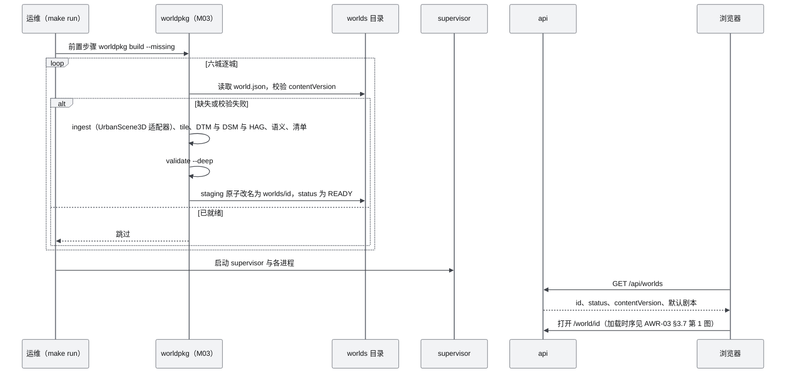
```mermaid
%%{init: {"theme": "base", "themeVariables": {"fontFamily": "Inter, PingFang SC, Microsoft YaHei, Noto Sans CJK SC, sans-serif", "fontSize": "13px", "background": "#FBFBFC", "primaryColor": "#F2F3F5", "primaryTextColor": "#111214", "primaryBorderColor": "#5C616A", "secondaryColor": "#E4E6E9", "tertiaryColor": "#FBFBFC", "lineColor": "#5C616A", "textColor": "#111214", "mainBkg": "#F2F3F5", "nodeBorder": "#5C616A", "clusterBkg": "#FBFBFC", "clusterBorder": "#A7ABB3", "edgeLabelBackground": "#FBFBFC", "noteBkgColor": "#E4E6E9", "noteTextColor": "#111214", "noteBorderColor": "#81868F", "actorBkg": "#F2F3F5", "actorBorder": "#5C616A", "actorTextColor": "#111214", "signalColor": "#3E4249", "signalTextColor": "#111214", "activationBkgColor": "#E4E6E9", "activationBorderColor": "#5C616A", "sequenceNumberColor": "#FBFBFC"}}}%%
sequenceDiagram
  participant U as 运维（make run）
  participant WP as worldpkg（M03）
  participant FS as worlds 目录
  participant SUP as supervisor
  participant API as api
  participant BR as 浏览器
  U->>WP: 前置步骤 worldpkg build --missing
  loop 六城逐城
    WP->>FS: 读取 world.json，校验 contentVersion
    alt 缺失或校验失败
      WP->>WP: ingest（UrbanScene3D 适配器）、tile、DTM 与 DSM 与 HAG、语义、清单
      WP->>WP: validate --deep
      WP->>FS: staging 原子改名为 worlds/id，status 为 READY
    else 已就绪
      WP-->>U: 跳过
    end
  end
  U->>SUP: 启动 supervisor 与各进程
  BR->>API: GET /api/worlds
  API-->>BR: id、status、contentVersion、默认剧本
  BR->>API: 打开 /world/id（加载时序见 AWR-03 §3.7 第 1 图）
```

业务规则：
1. 单城构建 ≤ 60 s，失败的世界 status = INVALID，`make run` 继续启动其余部分，UI 在世界列表中把该世界置灰并显示 `qa/report.json` 的错误摘要（ADR-034、D1-AC-01）。
2. 世界只以原子改名发布，任何时刻 `worlds/<id>/` 要么是完整旧版本，要么是完整新版本（J04）。
3. UI 触发的重建（ext）走 WorldBuildJob（§4.12），被当前会话绑定的世界不可重建（123）；重建完成后 `contentVersion` 变化，已打开该世界的客户端收到 `world.updated`，提示刷新（P-01：派生资产绑定 `coordinate.sha256`）。

### 6.2 创建会话与客户端接入

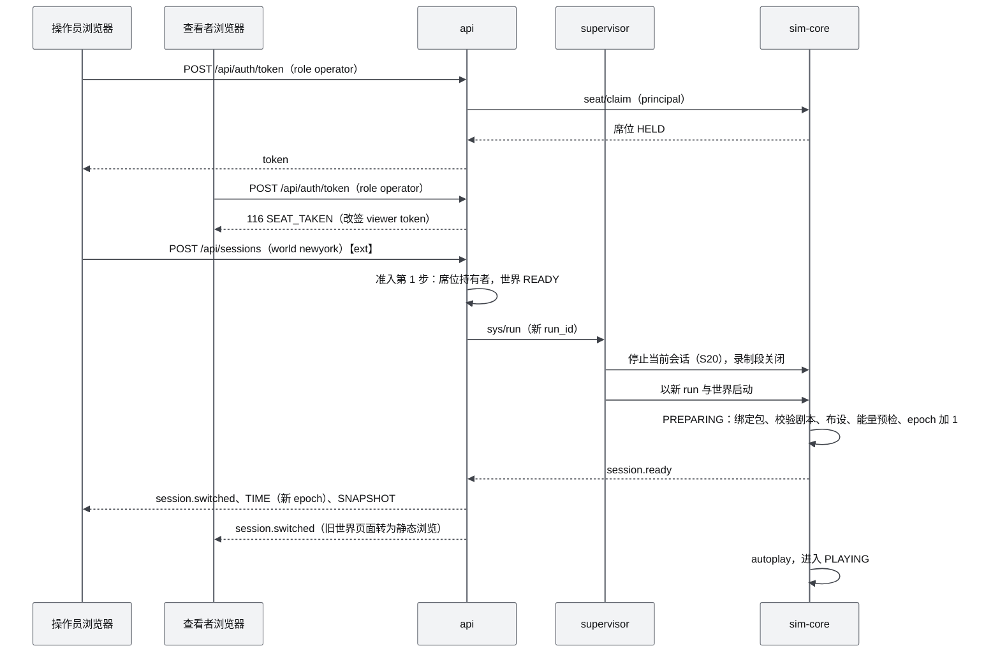
```mermaid
%%{init: {"theme": "base", "themeVariables": {"fontFamily": "Inter, PingFang SC, Microsoft YaHei, Noto Sans CJK SC, sans-serif", "fontSize": "13px", "background": "#FBFBFC", "primaryColor": "#F2F3F5", "primaryTextColor": "#111214", "primaryBorderColor": "#5C616A", "secondaryColor": "#E4E6E9", "tertiaryColor": "#FBFBFC", "lineColor": "#5C616A", "textColor": "#111214", "mainBkg": "#F2F3F5", "nodeBorder": "#5C616A", "clusterBkg": "#FBFBFC", "clusterBorder": "#A7ABB3", "edgeLabelBackground": "#FBFBFC", "noteBkgColor": "#E4E6E9", "noteTextColor": "#111214", "noteBorderColor": "#81868F", "actorBkg": "#F2F3F5", "actorBorder": "#5C616A", "actorTextColor": "#111214", "signalColor": "#3E4249", "signalTextColor": "#111214", "activationBkgColor": "#E4E6E9", "activationBorderColor": "#5C616A", "sequenceNumberColor": "#FBFBFC"}}}%%
sequenceDiagram
  participant OP as 操作员浏览器
  participant VW as 查看者浏览器
  participant API as api
  participant SUP as supervisor
  participant SIM as sim-core
  OP->>API: POST /api/auth/token（role operator）
  API->>SIM: seat/claim（principal）
  SIM-->>API: 席位 HELD
  API-->>OP: token
  VW->>API: POST /api/auth/token（role operator）
  API-->>VW: 116 SEAT_TAKEN（改签 viewer token）
  OP->>API: POST /api/sessions（world newyork）【ext】
  API->>API: 准入第 1 步：席位持有者，世界 READY
  API->>SUP: sys/run（新 run_id）
  SUP->>SIM: 停止当前会话（S20），录制段关闭
  SUP->>SIM: 以新 run 与世界启动
  SIM->>SIM: PREPARING：绑定包、校验剧本、布设、能量预检、epoch 加 1
  SIM-->>API: session.ready
  API-->>OP: session.switched、TIME（新 epoch）、SNAPSHOT
  API-->>VW: session.switched（旧世界页面转为静态浏览）
  SIM->>SIM: autoplay，进入 PLAYING
```

业务规则：
1. D1-core 的默认会话由 `make run` 创建（S01），默认世界深圳、剧本 S1、自动播放（AWR-03 §8.5）。
2. 客户端先拿 token 再连 WS；viewer 只能订阅（§8.2）。同一 principal 多标签页共享席位。
3. api 重启不结束会话；客户端 ≤ 3 s 重连，席位在 30 s 宽限内保持（D1-AC-11a、§4.2.2）。

### 6.3 布设机群与点选 GoTo

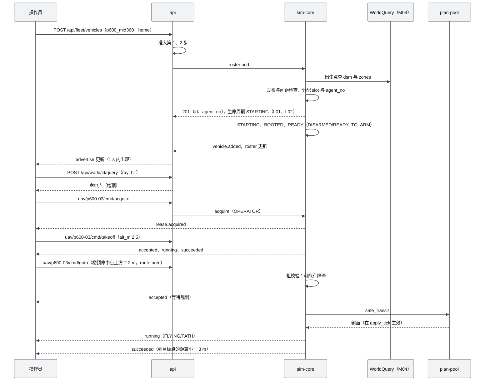
```mermaid
%%{init: {"theme": "base", "themeVariables": {"fontFamily": "Inter, PingFang SC, Microsoft YaHei, Noto Sans CJK SC, sans-serif", "fontSize": "13px", "background": "#FBFBFC", "primaryColor": "#F2F3F5", "primaryTextColor": "#111214", "primaryBorderColor": "#5C616A", "secondaryColor": "#E4E6E9", "tertiaryColor": "#FBFBFC", "lineColor": "#5C616A", "textColor": "#111214", "mainBkg": "#F2F3F5", "nodeBorder": "#5C616A", "clusterBkg": "#FBFBFC", "clusterBorder": "#A7ABB3", "edgeLabelBackground": "#FBFBFC", "noteBkgColor": "#E4E6E9", "noteTextColor": "#111214", "noteBorderColor": "#81868F", "actorBkg": "#F2F3F5", "actorBorder": "#5C616A", "actorTextColor": "#111214", "signalColor": "#3E4249", "signalTextColor": "#111214", "activationBkgColor": "#E4E6E9", "activationBorderColor": "#5C616A", "sequenceNumberColor": "#FBFBFC"}}}%%
sequenceDiagram
  participant OP as 操作员
  participant API as api
  participant SIM as sim-core
  participant GEO as WorldQuery（M04）
  participant PP as plan-pool
  OP->>API: POST /api/fleet/vehicles（p600_mid360，home）
  API->>API: 准入第 1、2 步
  API->>SIM: roster add
  SIM->>GEO: 出生点查 dsm 与 zones
  SIM->>SIM: 规模与间距检查，分配 slot 与 agent_no
  SIM-->>API: 201（id、agent_no），生命周期 STARTING（L01、L02）
  SIM->>SIM: STARTING、BOOTED、READY（DISARMED/READY_TO_ARM）
  SIM-->>API: vehicle.added，roster 更新
  API-->>OP: advertise 更新（1 s 内出现）
  OP->>API: POST /api/world/id/query（ray_hit）
  API-->>OP: 命中点（楼顶）
  OP->>API: uav/p600-03/cmd/acquire
  API->>SIM: acquire（OPERATOR）
  SIM-->>OP: lease.acquired
  OP->>API: uav/p600-03/cmd/takeoff（alt_m 2.5）
  SIM-->>OP: accepted、running、succeeded
  OP->>API: uav/p600-03/cmd/goto（楼顶命中点上方 2.2 m，route auto）
  SIM->>SIM: 粗校验：可能有障碍
  SIM-->>OP: accepted（等待规划）
  SIM->>PP: safe_transit
  PP-->>SIM: 剖面（在 apply_tick 生效）
  SIM-->>OP: running（FLYING/PATH）
  SIM-->>OP: succeeded（到目标点的距离小于 3 m）
```

业务规则（交互见 AWR-14 §6.7；AWR-03 §8.2 与 D1-AC-32 第 2 轮修订）：
1. 地面与楼顶（法线接近竖直）：goto 目标取命中点**正上方**，高度按 AWR-14 §6.7 的高度方式（默认保持当前高度，且不低于命中点 z + 10 m；或命中点上方 h 米，h 默认 20 m）。直接飞到命中点会贴地或撞上建筑。
2. 建筑立面（法线接近水平）：先沿法线水平外推 4.5 m（M04 细校验对 2 m DSM 做一格水平膨胀，M04-FR-018，立面外 4 m 以内的目标可能被判为障碍并以 102 失败），再按第 1 条确定高度；目标仍须满足 §5.3 的 `z ≥ dsm + 2 m`。
3. 验收按"机体停在下发目标点 3 m 内"判定（D1-AC-32），地面、楼顶与立面点选同样适用（原"停在点击位置 3 m 内"与"命中点上方 2.2 m"的规则作废，§13 第 15 条已由基线采纳）。

### 6.4 任务规划与执行（以 S1 为例）

```mermaid
%%{init: {"theme": "base", "themeVariables": {"fontFamily": "Inter, PingFang SC, Microsoft YaHei, Noto Sans CJK SC, sans-serif", "fontSize": "13px", "background": "#FBFBFC", "primaryColor": "#F2F3F5", "primaryTextColor": "#111214", "primaryBorderColor": "#5C616A", "secondaryColor": "#E4E6E9", "tertiaryColor": "#FBFBFC", "lineColor": "#5C616A", "textColor": "#111214", "mainBkg": "#F2F3F5", "nodeBorder": "#5C616A", "clusterBkg": "#FBFBFC", "clusterBorder": "#A7ABB3", "edgeLabelBackground": "#FBFBFC", "noteBkgColor": "#E4E6E9", "noteTextColor": "#111214", "noteBorderColor": "#81868F", "actorBkg": "#F2F3F5", "actorBorder": "#5C616A", "actorTextColor": "#111214", "signalColor": "#3E4249", "signalTextColor": "#111214", "activationBkgColor": "#E4E6E9", "activationBorderColor": "#5C616A", "sequenceNumberColor": "#FBFBFC"}}}%%
sequenceDiagram
  participant SC as 剧本导演
  participant ME as 任务引擎（M10）
  participant EST as estimate
  participant LM as LeaseManager
  participant PP as plan-pool
  participant CE as CommandEngine
  SC->>ME: Session 进入 PLAYING，启动 m-lower 与 m-upper
  ME->>EST: 逐 Track 能量预检（含返航段）
  EST-->>ME: 可行（落地 SOC 0.36 与 0.32，均不低于 0.20）
  ME->>LM: acquire MISSION（p600-01、p600-02）
  LM-->>ME: HELD(MISSION)
  ME->>CE: takeoff（principal mission:m-lower 或 mission:m-upper）
  CE-->>ME: succeeded
  ME->>PP: safe_transit 到入场点（在 home 上空爬升到扫描起点高度）
  PP-->>ME: 剖面
  ME->>CE: follow_path（转场）
  CE-->>ME: succeeded，Track 进入 WORKING
  loop 每个 MissionItem
    ME->>CE: follow_path（螺旋段，自上而下）
    CE-->>ME: progress（不超过 2 Hz）与 succeeded
  end
  ME->>CE: rtl（on_done）
  CE-->>ME: succeeded（DISARMED，距 home 小于 2 m）
  ME->>LM: release（return_to none）
  ME-->>SC: Track DONE，Mission DONE
  SC->>SC: 求值 success 谓词，发 scenario.result
```

业务规则：
1. 任务引擎以 principal `mission:<id>` 走与操作员完全相同的准入流水线（第 ④–⑩ 步），不享有特权；只有 Supervisor 动作不经准入（§5.1.1）。
2. 螺旋段以 follow_path 下发（B-spline 或折线，ADR-039），每段长度受 §5.3 的 1000 点与 20 km 限制，超出时任务引擎自动切分为多段 MissionItem。
3. 任务中某机被接管、让行或暂停，其余机体不受影响（free 策略）；barrier 策略下其余机体在同步点等待 ≤ 30 s（ext）。

### 6.5 控制权申请与释放

```mermaid
%%{init: {"theme": "base", "themeVariables": {"fontFamily": "Inter, PingFang SC, Microsoft YaHei, Noto Sans CJK SC, sans-serif", "fontSize": "13px", "background": "#FBFBFC", "primaryColor": "#F2F3F5", "primaryTextColor": "#111214", "primaryBorderColor": "#5C616A", "secondaryColor": "#E4E6E9", "tertiaryColor": "#FBFBFC", "lineColor": "#5C616A", "textColor": "#111214", "mainBkg": "#F2F3F5", "nodeBorder": "#5C616A", "clusterBkg": "#FBFBFC", "clusterBorder": "#A7ABB3", "edgeLabelBackground": "#FBFBFC", "noteBkgColor": "#E4E6E9", "noteTextColor": "#111214", "noteBorderColor": "#81868F", "actorBkg": "#F2F3F5", "actorBorder": "#5C616A", "actorTextColor": "#111214", "signalColor": "#3E4249", "signalTextColor": "#111214", "activationBkgColor": "#E4E6E9", "activationBorderColor": "#5C616A", "sequenceNumberColor": "#FBFBFC"}}}%%
sequenceDiagram
  participant OP as 操作员
  participant API as api
  participant LM as LeaseManager
  participant ME as 任务引擎
  participant CE as CommandEngine
  participant AG as agent-runtime
  OP->>API: uav/p600-02/cmd/acquire
  API->>API: 第 1 步席位，第 2 步限流
  API->>LM: acquire(OPERATOR)
  LM->>LM: 优先级 4 大于 2，MISSION 入栈
  LM->>CE: MISSION 在途调用 failed 210
  LM->>ME: Track SUSPENDED（记录续飞点）
  LM-->>OP: lease.acquired，链路策略切为 hold_rtl
  OP->>API: uav/p600-02/cmd/goto
  CE-->>OP: accepted、running、succeeded
  AG->>LM: acquire(AGENT) 于 p600-02
  LM-->>AG: rejected 100 LEASE_DENIED（持有者 OPERATOR）
  OP->>API: uav/p600-02/cmd/release（return_to previous）
  API->>LM: release
  LM->>ME: 恢复 HELD(MISSION)
  ME->>CE: safe_transit 回到续飞点并继续
  LM-->>OP: lease.returned，链路策略恢复剧本值
```

### 6.6 安全干预

自动干预（以 FastGuard 触发 ELAND 为例）：

```mermaid
%%{init: {"theme": "base", "themeVariables": {"fontFamily": "Inter, PingFang SC, Microsoft YaHei, Noto Sans CJK SC, sans-serif", "fontSize": "13px", "background": "#FBFBFC", "primaryColor": "#F2F3F5", "primaryTextColor": "#111214", "primaryBorderColor": "#5C616A", "secondaryColor": "#E4E6E9", "tertiaryColor": "#FBFBFC", "lineColor": "#5C616A", "textColor": "#111214", "mainBkg": "#F2F3F5", "nodeBorder": "#5C616A", "clusterBkg": "#FBFBFC", "clusterBorder": "#A7ABB3", "edgeLabelBackground": "#FBFBFC", "noteBkgColor": "#E4E6E9", "noteTextColor": "#111214", "noteBorderColor": "#81868F", "actorBkg": "#F2F3F5", "actorBorder": "#5C616A", "actorTextColor": "#111214", "signalColor": "#3E4249", "signalTextColor": "#111214", "activationBkgColor": "#E4E6E9", "activationBorderColor": "#5C616A", "sequenceNumberColor": "#FBFBFC"}}}%%
sequenceDiagram
  participant FG as FastGuard（50 Hz）
  participant AR as ActionArbiter
  participant FSM as Flight FSM
  participant ING as ingest（下一 tick）
  participant CE as CommandEngine
  participant ME as 任务引擎
  participant UI as UI
  FG->>AR: SAF.CTRL.POS_ERR_ELAND（pos_err 3.2 m 持续 0.5 s）
  AR->>AR: 同 tick 取最大严重度，检查宽限与锁存
  AR->>FSM: 请求 ELAND/CONTROLLED
  FSM->>FSM: 白名单通过，锁存 ELAND
  FSM->>ING: SupervisorCommand（ELAND）
  ING->>CE: 在途导航调用 failed 204
  ING->>ME: Track DROPPED
  FSM-->>UI: 可靠事件 safety，FAILSAFE 位置 1，owner 投影 SAFETY
  UI->>CE: goto（操作员尝试）
  CE-->>UI: rejected 101 SAFETY_ACTIVE
```

人工干预（SafetyStop 与解锁）：

```mermaid
%%{init: {"theme": "base", "themeVariables": {"fontFamily": "Inter, PingFang SC, Microsoft YaHei, Noto Sans CJK SC, sans-serif", "fontSize": "13px", "background": "#FBFBFC", "primaryColor": "#F2F3F5", "primaryTextColor": "#111214", "primaryBorderColor": "#5C616A", "secondaryColor": "#E4E6E9", "tertiaryColor": "#FBFBFC", "lineColor": "#5C616A", "textColor": "#111214", "mainBkg": "#F2F3F5", "nodeBorder": "#5C616A", "clusterBkg": "#FBFBFC", "clusterBorder": "#A7ABB3", "edgeLabelBackground": "#FBFBFC", "noteBkgColor": "#E4E6E9", "noteTextColor": "#111214", "noteBorderColor": "#81868F", "actorBkg": "#F2F3F5", "actorBorder": "#5C616A", "actorTextColor": "#111214", "signalColor": "#3E4249", "signalTextColor": "#111214", "activationBkgColor": "#E4E6E9", "activationBorderColor": "#5C616A", "sequenceNumberColor": "#FBFBFC"}}}%%
sequenceDiagram
  participant OP as 操作员
  participant CE as CommandEngine
  participant FSM as Flight FSM
  participant LM as LeaseManager
  OP->>CE: safety_stop（免租约，须席位）
  CE->>FSM: HOLD/SAFETY_STOP，locked 置 1
  CE->>CE: 在途导航调用 canceled 206
  FSM->>LM: 租约 SUSPENDED
  CE-->>OP: succeeded（速度小于 0.3 m/s 持续 0.5 s）
  OP->>CE: goto
  CE-->>OP: rejected 114 LOCKED（remedy：先 resume）
  OP->>CE: resume
  CE->>FSM: FLYING/HOVER，locked 置 0
  FSM->>LM: 恢复 HELD
```

### 6.7 天气变更

```mermaid
%%{init: {"theme": "base", "themeVariables": {"fontFamily": "Inter, PingFang SC, Microsoft YaHei, Noto Sans CJK SC, sans-serif", "fontSize": "13px", "background": "#FBFBFC", "primaryColor": "#F2F3F5", "primaryTextColor": "#111214", "primaryBorderColor": "#5C616A", "secondaryColor": "#E4E6E9", "tertiaryColor": "#FBFBFC", "lineColor": "#5C616A", "textColor": "#111214", "mainBkg": "#F2F3F5", "nodeBorder": "#5C616A", "clusterBkg": "#FBFBFC", "clusterBorder": "#A7ABB3", "edgeLabelBackground": "#FBFBFC", "noteBkgColor": "#E4E6E9", "noteTextColor": "#111214", "noteBorderColor": "#81868F", "actorBkg": "#F2F3F5", "actorBorder": "#5C616A", "actorTextColor": "#111214", "signalColor": "#3E4249", "signalTextColor": "#111214", "activationBkgColor": "#E4E6E9", "activationBorderColor": "#5C616A", "sequenceNumberColor": "#FBFBFC"}}}%%
sequenceDiagram
  participant OP as 操作员
  participant API as api
  participant ENV as EnvironmentService（M07）
  participant FL as FleetSim env stage（50 Hz）
  participant MG as MissionGuard
  participant AG as agent-runtime
  participant REC as recorder
  participant BR as 全部客户端
  OP->>API: env/preset（thunderstorm，duration_s 30）
  API->>API: 第 1 步席位，第 2 步限流（每秒 2 次）
  API->>ENV: 转发
  ENV->>ENV: from 取当前求值态，生成 via，t1 为 t0 加 30 s，version 加 1
  ENV-->>API: evt/sim-core/env（可靠，完整关键帧）
  API-->>BR: env/state（自包含最新帧）
  API-->>OP: result（version、warnings ENV_LIMIT）
  ENV-->>REC: 录制完整关键帧
  loop 每 20 ms 仿真时间
    FL->>ENV: 查询机体处风、密度、光学
  end
  MG->>MG: 风速超过 13.8 m/s，SAF.ENV.WIND_LIMIT（ext）
  AG->>AG: 新报价按新环境计算可行性
  BR->>BR: 每帧 eval_env(kf, tRender) 渲染
```

### 6.8 录制与回放（ext）

```mermaid
%%{init: {"theme": "base", "themeVariables": {"fontFamily": "Inter, PingFang SC, Microsoft YaHei, Noto Sans CJK SC, sans-serif", "fontSize": "13px", "background": "#FBFBFC", "primaryColor": "#F2F3F5", "primaryTextColor": "#111214", "primaryBorderColor": "#5C616A", "secondaryColor": "#E4E6E9", "tertiaryColor": "#FBFBFC", "lineColor": "#5C616A", "textColor": "#111214", "mainBkg": "#F2F3F5", "nodeBorder": "#5C616A", "clusterBkg": "#FBFBFC", "clusterBorder": "#A7ABB3", "edgeLabelBackground": "#FBFBFC", "noteBkgColor": "#E4E6E9", "noteTextColor": "#111214", "noteBorderColor": "#81868F", "actorBkg": "#F2F3F5", "actorBorder": "#5C616A", "actorTextColor": "#111214", "signalColor": "#3E4249", "signalTextColor": "#111214", "activationBkgColor": "#E4E6E9", "activationBorderColor": "#5C616A", "sequenceNumberColor": "#FBFBFC"}}}%%
sequenceDiagram
  participant OP as 操作员
  participant API as api
  participant SIM as sim-core
  participant RW as replay-worker
  participant BR as 客户端
  OP->>API: sim/pause
  API->>SIM: pause
  OP->>API: playback/open（run，segment 0）
  API->>API: 第 1 步席位，实时已暂停
  API->>RW: 打开录制
  RW->>RW: 校验 binding（world、contentVersion、layout）
  alt 不兼容
    RW-->>OP: rejected 122 RECORDING_INCOMPATIBLE
  else 兼容
    RW-->>API: 就绪，写 state.replay 环
    API->>API: 全局 epoch 加 1，mode 为 replay
    API-->>BR: TIME（bit7，PAUSED）与 SNAPSHOT
  end
  OP->>API: playback/seek（t_ns）
  API->>RW: seek
  RW->>RW: 每 channel 回填 t 之前最后一条（跳过作废区间）
  API-->>BR: TIME（epoch 加 1）与 SNAPSHOT（500 ms 内）
  BR->>API: uav/p600-01/cmd/goto（误操作）
  API-->>BR: rejected 118 READ_ONLY_MODE
  OP->>API: playback/close
  API->>API: 全局 epoch 加 1，mode 为 live
  API-->>BR: TIME（PAUSED）与实时 SNAPSHOT
```

业务规则：进入回放前必须暂停实时会话（本文设定：回放是全局模式，操作员看不到实时世界，继续推进会让无人值守的机体按任务或链路策略行动）；退出回放后实时会话保持 PAUSED，由操作员显式继续。

### 6.9 重建任务（Mock 链路，ext）

```mermaid
%%{init: {"theme": "base", "themeVariables": {"fontFamily": "Inter, PingFang SC, Microsoft YaHei, Noto Sans CJK SC, sans-serif", "fontSize": "13px", "background": "#FBFBFC", "primaryColor": "#F2F3F5", "primaryTextColor": "#111214", "primaryBorderColor": "#5C616A", "secondaryColor": "#E4E6E9", "tertiaryColor": "#FBFBFC", "lineColor": "#5C616A", "textColor": "#111214", "mainBkg": "#F2F3F5", "nodeBorder": "#5C616A", "clusterBkg": "#FBFBFC", "clusterBorder": "#A7ABB3", "edgeLabelBackground": "#FBFBFC", "noteBkgColor": "#E4E6E9", "noteTextColor": "#111214", "noteBorderColor": "#81868F", "actorBkg": "#F2F3F5", "actorBorder": "#5C616A", "actorTextColor": "#111214", "signalColor": "#3E4249", "signalTextColor": "#111214", "activationBkgColor": "#E4E6E9", "activationBorderColor": "#5C616A", "sequenceNumberColor": "#FBFBFC"}}}%%
sequenceDiagram
  participant OP as 操作员
  participant API as api
  participant JW as job-worker
  participant ME as MockEngine（M01）
  participant WP as worldpkg（M03）
  participant BR as 客户端
  OP->>API: POST /api/recon/jobs（mock，shenzhen helix，目标 shenzhen-recon-01）
  API->>API: 角色、目标未被会话绑定、无冲突任务
  API-->>OP: job_id，QUEUED
  JW->>JW: PREPARING（读取源世界与合成航线）
  JW->>ME: SEGMENTING 与 INFERRING（沿航线采样出 recon-ir@1）
  ME-->>JW: 位姿、点、置信度、scale_status
  JW->>JW: FUSING 与 GEOREFERENCING（写 alignment.json）
  JW->>JW: recon-ir@1 schema 校验
  JW->>WP: TILING（ingest 与 tile 到 staging）
  JW->>WP: PACKAGING（清单与 validate --deep）
  WP-->>JW: 通过
  JW->>JW: staging 原子改名，World READY
  JW-->>API: job.state SUCCEEDED，world.added
  API-->>BR: 进度（不超过 4 Hz）、scale_status、新世界
  BR->>API: 打开 /world/shenzhen-recon-01（静态浏览）
```

业务规则：产物世界 id 必须是新 id（不得覆盖六个内置世界）；`scale_status` 为 `relative` 时 UI 标注"尺度未定"，不允许在该世界上启动会话（本文设定：相对尺度下的围栏、能量与动力学都没有物理意义），返回 `123 WORLD_NOT_READY`（detail = SCALE_RELATIVE）。

### 6.10 能力发现与任务委派（S3 热成像复核）

```mermaid
%%{init: {"theme": "base", "themeVariables": {"fontFamily": "Inter, PingFang SC, Microsoft YaHei, Noto Sans CJK SC, sans-serif", "fontSize": "13px", "background": "#FBFBFC", "primaryColor": "#F2F3F5", "primaryTextColor": "#111214", "primaryBorderColor": "#5C616A", "secondaryColor": "#E4E6E9", "tertiaryColor": "#FBFBFC", "lineColor": "#5C616A", "textColor": "#111214", "mainBkg": "#F2F3F5", "nodeBorder": "#5C616A", "clusterBkg": "#FBFBFC", "clusterBorder": "#A7ABB3", "edgeLabelBackground": "#FBFBFC", "noteBkgColor": "#E4E6E9", "noteTextColor": "#111214", "noteBorderColor": "#81868F", "actorBkg": "#F2F3F5", "actorBorder": "#5C616A", "actorTextColor": "#111214", "signalColor": "#3E4249", "signalTextColor": "#111214", "activationBkgColor": "#E4E6E9", "activationBorderColor": "#5C616A", "sequenceNumberColor": "#FBFBFC"}}}%%
sequenceDiagram
  participant DET as Mock 检测器（M13）
  participant CO as 协调者（agent-runtime）
  participant BB as 黑板
  participant NET as MockANet
  participant EST as estimate（sim-core）
  participant PB as b1 的 DroneAgent
  participant LM as LeaseManager
  participant CE as CommandEngine
  DET-->>CO: 检出，conf 0.42（低于 0.8）
  CO->>BB: claim 与 intent（任务 T-0001）
  CO->>NET: find（thermal.*）
  NET-->>CO: b1、b2、b3（健康者）
  par 并行报价（截止 3 s 仿真）
    CO->>EST: estimate（b1，目标，dwell 10 s）
    CO->>EST: estimate（b2）
    CO->>EST: estimate（b3）
  end
  EST-->>CO: eta、能量、soc_after、feasible（b3 为 119）
  CO->>CO: 打分，b1 中标
  CO->>NET: delegate（b1，thermal.imaging，往返约 1 s 仿真）
  NET->>PB: 调用
  PB-->>CO: 两段式第一段：UNVERIFIED、eta、task_ref
  PB->>LM: acquire(AGENT)（S3 中 b1 的待命任务已结束，租约为 FREE，走 E01；若仍由 MISSION 持有则走 E03 抢占）
  LM-->>PB: HELD(AGENT)
  PB->>CE: goto 观测点（route auto）
  CE-->>PB: succeeded
  PB->>CE: orbit 驻留 10 s
  DET-->>PB: 热成像结果 conf 0.9，产物 thermal 帧
  PB-->>CO: 第二段：effect OK、V4、simulated、metrics、artifacts
  CO->>CO: 已验证且 TSIR 为真
  CO->>BB: evidence 与 conclusion，conclude
  PB->>LM: release（return_to previous）
  LM-->>PB: 弹栈恢复上一持有者，栈空则 FREE（b1 悬停，待剧本事件返航）
  CO->>CO: 证据链 find、quote、awarded、effect、accepted
```

合同网业务规则（依据 d05 §3.4–§3.8、ADR-036）：
1. **候选**：`find` 按能力 id 前缀；排除 health 不为空的 Agent（§3.3.17）。
2. **报价**：只能经 `ctl/sim-core/estimate` 用 FleetSim 同一机型与电池模型计算 `eta_s`、`energy_wh`、`soc_after_pct`；返航后电量 < 20% 为不可行（119）；环境超出能力 `physical.limits` 为不可行（120）；观测高度不在 `alt_m` 范围内为不可行（110）。
3. **打分**：`U = 1.0·conf − 0.6·eta_s/η_norm − 0.3·energy_wh/E_norm − 0.2·load − 0.5·risk`，不可行者 U = −∞；`risk = 0.5·c(wind/wind_max) + 0.3·c(rain/rain_max) + 0.2·c(1 − vis/vis_min_ok)`，`c(x) = clamp(x, 0, 1)` 逐项限幅（d05 原式只对总和限幅，高能见度时能见度项为很大的负数，风与雨的风险全部失效；M14 §6.10.4）；`conf` 为该机传感器对目标的期望检出概率（与检测器同一函数 `expected_pd`：`P0·exp(−(r/R_fp)²)·LOS·vis` 是 1 s 凝视的检出概率，逐 tick 按 `1 − (1 − P_d)^(Δt/1 s)` 换算并乘以 FOV 门控，因此检测器频率不改变结果，M13；x01 §3.11）；归一化常数 η_norm、E_norm 取机型 `anet.score_norm`，数值由 M14 给出；U 相同时 agent_no 小者优先。
4. **授标与执行**：两段式长任务（第一段立即返回 UNVERIFIED、eta、task_ref）；执行机以 AGENT 租约执行，AGENT 优先级 3 高于 MISSION 与 SWARM，低于 OPERATOR；取不到租约视为委派 rejected（100），换下一候选。
5. **验收**：委派结果须同时满足"效果已验证"（§4.7 规则 1）与 TSIR 谓词 `AND(THRESHOLD(confidence ≥ 0.8), ARTIFACT("thermal/**", min_size = 1024))`，且 negative_scope（禁飞区）未被违反；否则重分配，最多重试 2 次，之后 input-required。
6. **收尾**：黑板顺序 claim → intent → evidence → conclusion；conclude 之后拒绝写入；执行机按 previous 交还租约；证据链记录 `agent.task.{submitted, quote, awarded, state, effect, accepted | rejected}`、`agent.board.unit`、`agent.lease.{acquired, preempted}`。
7. **确定性**：Mock ANet 往返延迟 0.9–1.1 s 取自 RNG 流 `anet_mock_latency`，所有定时器按仿真时钟（ADR-036、ADR-045），因此 ×1 与 ×10 结果一致（D1-AC-16）。

---

## 7. 剧本业务脚本

### 7.1 剧本通用执行语义

#### 7.1.1 生命周期

剧本随 Session 运行：S03 加载并校验 → S05 起 RUNNING → 满足结束条件时判定结果（SUCCEEDED 或 FAILED，附未满足的谓词）→ 按 `on_complete` 处理会话（S11、S12）。结束条件为以下任一：全部 Mission 进入 DONE 或 ABORTED 且全部机体 DISARMED；达到 `time_limit_s`；剧本声明的终止事件。

#### 7.1.2 事件

事件与成功条件的形式以 [AWR-16 §12.3](16-World数据规范.md) 的闭合语法为准（未登记的动作、度量或运算符在加载时判 `121 SCENARIO_INVALID`），本节只规定语义。

| 类型 | 形式（AWR-16 §12.3） | 求值 | 可执行的动作 |
|---|---|---|---|
| 定时 | `{event_id, at_s, action, args, once = true}` | 仿真时间到达 `at_s`；t_sim 从会话起点 0 起算，READY 期间时钟不走，因此等价于从首次进入 PLAYING 起算 | `env.preset`、`env.set`、`env.gust{amp_mps, length_m, dir_from_deg?}`、`vehicle.add`、`vehicle.remove`、`mission.start`、`mission.pause`、`mission.abort`、`cmd{vehicle_id, op, args}`、`mark{label}`、`fault.inject`（ext，只限 Mock） |
| 条件 | `{event_id, when: predicate, delay_s = 0, action, args, once = true}` | 10 Hz【仿真】求值 `when`（语法同成功谓词），为真后延迟 `delay_s` 执行 | 同上 |

规则：
1. 剧本导演以 principal `scenario:<id>` 执行动作，经完整准入流水线；`cmd` 动作只允许安全类命令（rtl、land、hover），任务启停一律用 `mission.*` 动作，避免与任务引擎争夺租约（本文设定）。
2. `env.gust` 由服务端在 `events[]` 中调度 1−cos 锋面，至少提前 2 s 下发，两端确定性求值（g06 §5.4）；持续时间约等于 `length_m` 除以机体处平均风速。
3. S3 需要在剧本中放置目标：动作 `target.spawn{target_id, pos_enu_m, conf_first, conf_confirm}` 由 M16 §6.4.5 使用，提请 AWR-16 登记。协作任务不由剧本动作提交，而由 M13 Mock 检测器的检出事件触发（§6.10）。

#### 7.1.3 成功谓词与度量

成功谓词与条件事件共用 AWR-16 的封闭文法 `all / any / not / leaf{metric, args?, op, value}`，与 TSIR 的 AND、OR、NOT、THRESHOLD 同构；失败即关闭：度量缺失判假。

| 度量（AWR-16 登记名） | 定义 | 计算者 |
|---|---|---|
| `elapsed_s` | 剧本用时（仿真） | M08 |
| `missions_done{mission_ids?}` | 所列任务全部 DONE 且没有 incomplete 标记 | M10 |
| `facade_coverage{mission_ids}` | 立面网格中被相机视锥覆盖（按 LOS）的比例；S1 的立面网格取塔体外立面 world z ∈ [45, 374.1] m（z < 45 m 被裙楼包围，§5.8.5） | M10（M13 相机模型） |
| `area_coverage{mission_ids}` | 覆盖任务的地面格覆盖比例 | M10 |
| `min_separation_m{vehicle_ids?}` | 全程任意两架空中机体的最小三维距离 | M09 FleetGuard |
| `guard_events{level?}` | FastGuard 发出的 SafetyEvent 数，缺省只计 level ≥ action | M09 |
| `pos_err_max_m{window: all \| gust}` | pos_err 最大值；`gust` 为阵风事件窗口 | M09 |
| `formation_err_rms_m{mission_id}` | 编队槽位跟踪误差 RMS | M10 |
| `agl_min_m`、`agl_rms_err_m{mission_id}` | 地形跟随段最小 AGL、AGL 误差 RMS | M10 |
| `battery_soc_min{vehicle_ids?}` | 全程最低 SOC（E_use 基准，§5.8.1） | M09 |
| `target_confidence{target_id}` | 目标置信度 | M14 |
| `landed_all` | 全部机体已上锁 | M08 |
| `link_quality_min` | 只作展示，D1 不进入成功谓词（没有模块定义其计算模型） | — |
| `energy_rtl_count`（提请登记） | SAF.BAT.CRIT 与 SAF.BAT.ENERGY_RTL 次数 | M09 |
| `landed_home_err_m`（提请登记） | 各机最终上锁位置与 home 的水平距离最大值 | M08 |
| `t_conf_s{target_id, threshold}`（提请登记） | 目标置信度首次达到阈值的仿真时刻 | M14 |

未登记前，三个"提请登记"的度量由端到端测试直接读取事件流判定，不写入剧本的 `success`。

#### 7.1.4 确定性

同一剧本、同一种子、同一内核与版本，结果相同；RNG 流按 ADR-049 登记（湍流、阵风、检测器、Mock ANet 延迟、故障）；剧本中的随机量（目标位置、检出置信度）必须由种子决定或在剧本中写死。无头验收用 ×10，演示用 ×1。

### 7.2 S1 深圳 · 超高层双机立面螺旋扫描（D1-core，P0）

参数经 §5.8.5 的几何与能量复核定稿；剧本文件（M16 §7.3.2）与 M10 的生成器用例须按本表回改（§13.1）。高度一律为 world z。

| 项 | 取值 | 依据 |
|---|---|---|
| 世界 | shenzhen | x01 §3.11 |
| 目标 | 塔体（HAG ≥ 150 m 处截面约 30 m × 44 m），足迹形心 (−162.2, 77.3)，塔顶 world z 374.1 m（HAG 381.3 m），塔区地面 world z −7.24 m；x01 的峰值点 (−162.0, 98.5) 位于塔体北缘，不作螺旋中心 | §5.8.5；x01 `hmap_shenzhen.npy` |
| 机体 | p600-01：home (−230, 20)，z 取 dsm，即 world z 23.5 m 的屋顶；能力 rgb.zoom。p600-02：home (−230, 40)，world z 0.1 m；能力 rgb.zoom 与 lidar.mapping。两机 `speed_profile = px4_default`、`initial_soc = 1.0` | x01 §3.11；§5.14.1 |
| 环境 | 初值 `clear`，风 6 m/s（10 m AGL 参考）、来向 135°、power 廓线 α = 0.25、湍流 σ_u 1.0 m/s；world z 273 m 以上平均风超过 P600 抗风 13.8 m/s，只发 `SAF.ENV.WIND_LIMIT` 告警（ext） | x01 §3.11；AWR-16 §12.4；§5.12 第 6 条 |
| 任务 | 两个 helix_scan 任务：`m-lower`（p600-01）与 `m-upper`（p600-02）。中心 (−162.2, 77.3)，半径 57 m（角点立面距离 ≥ 30 m），Δz 标称 18.47 m/圈（30 m 处垂直重叠 20%），按整圈取整：p600-01 共 11 圈（Δz 18.36 m），p600-02 共 8 圈（Δz 17.88 m）；6 m/s；相机指向中轴；ccw。**两机均自上而下**：p600-01 z 252 → 50 m，p600-02 z 391 → 248 m（重叠 4 m）。入场方位指向各自的 home，入场点 (−205.7, 40.5) 与 (−212.1, 49.8)，扫描终点与入场点同方位；转场 safe_transit，裕度 5 m；`on_done = rtl` | §5.8.3 第 3 条；§5.8.5 |
| 事件 | t = 420 s：`env.gust{amp_mps: 6, length_m: 120}`（按 6 m/s 平均风约持续 20 s）；条件事件 `battery_soc_min{p600-0x} < 0.25 → cmd rtl`（保护，正常情况下不触发：扫描结束 SOC 0.38 与 0.46） | x01 §3.11；AWR-16 §12.3 |
| 运行参数 | 无头验收 ×10，演示 ×1；`gcs_loss_policy = ignore`；`record = true`（CI profile 关闭）；`energy_precheck = reject`；`time_limit_s = 1800`；`on_complete = pause` | ADR-026、ADR-045、D1-AC-15 |
| 能量 RTL 余量 | 判据 `t_rem_usable < 1.3·t_rtl` 不变；螺旋绕到塔远侧时 t_rtl 按绕行返航路线计算（§5.8.3 第 1 条），全程最小 `t_rem/t_rtl`：p600-01 5.55、p600-02 2.67（按直飞翻越塔顶的口径 p600-01 为 1.06，会误触发 ENERGY RTL） | AWR-03 ADR-054；INT-1 §7.1 |

**业务时间线**（×1，仿真时间，按 §5.8.5 模型估算）：

| 时刻 | p600-01 | p600-02 | 业务检查点 |
|---|---|---|---|
| 0 s | 能量预检通过（落地 SOC 估算 0.36）；MISSION 租约；arm、预检 1 s、takeoff | 同左（0.32） | `mission.start`，两条 Track 进入 TRANSIT |
| ≈ 82 s | 在 home 上空爬升到 252 m 后到达入场点，WORKING | 爬升中（约 245 m） | — |
| ≈ 134 s | 扫描中（约 237 m） | 到达入场点 z = 391 m，WORKING | 两机垂直间隔约 155 m，此后保持在 155–159 m |
| 420–440 s | 阵风（z ≈ 149 m） | 阵风（z ≈ 306 m） | `pos_err_max_m{window: gust} < 3.0`，无 ELAND |
| ≈ 10.2 min | 扫描中（约 89 m） | 扫描完成于 248 m，RETURNING（z_rtl = 248 m，下降约 159 s） | — |
| ≈ 12.3 min | 扫描完成于 50 m，RETURNING（z_rtl ≈ 54 m） | 下降中 | 两机最小三维间距 15.4 m 出现在此前后 |
| ≈ 12.8 min | 屋顶着陆上锁，Track DONE | 下降中 | p600-01 落地 SOC ≈ 0.36 |
| ≈ 13.1 min | — | 着陆上锁，Track DONE | p600-02 落地 SOC ≈ 0.32；两任务 DONE；剧本判定 |

**成功谓词**（AWR-16 §12.3 语法）：

```text
all(
  missions_done                              == true,   # m-lower、m-upper 均 DONE
  facade_coverage{m-lower, m-upper}          >= 0.9,
  min_separation_m                           >= 10,
  guard_events                               == 0,
  pos_err_max_m{window: gust}                <  3.0,
  landed_all                                 == true,
  battery_soc_min                            >= 0.20,
  energy_rtl_count                           == 0,
  landed_home_err_m                          <  2.0 )
# elapsed_s ≤ 1800 由 time_limit_s 保证，不重复写入；energy_rtl_count、landed_home_err_m 已在 AWR-16 §12.3 登记
```

前 5 项与 D1-AC-15 一致；后几项为本文补充，用于防止"扫描完成但途中电量返航再补飞"或"落在别处"一类假成功。

**演示交互（不计入验收）**：扫描中接管 p600-02（§6.5）→ 点选 GoTo 到附近楼顶 → 交还，Track 经 safe_transit 回到续飞点继续；切换 rain 预设观察能见度与雨幕；Follow 与 FPV 相机跟随 p600-01。接管会消耗 §5.8.5 的余量（约 0.12 × 188.7 Wh ≈ 22 Wh，悬停约 2.5 min），演示接管时长应 ≤ 60 s（本文设定）；超出后能量 RTL 属于正确行为，不是缺陷。

### 7.3 S2–S6（D1-ext，P1）

x01 §3.11 的原参数按 §5.8.4 能量预检复核，S2、S4、S5、S6 单架次不可行；M16 §6.4.4–§6.4.7 已在可用能量口径（188.7 Wh）与 x01 高度图上定稿各剧本的坐标、高度与速度（脚本 `.cache/research/m16/scenario_energy.py`、`scenario_final.json`），本文不重复定义数值，只规定每个剧本必须体现的业务脚本、成功谓词与覆盖的业务规则。M16 调整数值时须保持本表的业务语义不变，并通过 `energy_precheck = reject`。

| 剧本 | x01 原方案的问题 | 业务脚本（数值见 M16） | 落地 SOC（可用口径，M16） | 成功谓词（AWR-16 名称） | 覆盖的业务规则 |
|---|---|---|---|---|---|
| S2 上海 · 编队环绕 + 区域覆盖 | 同一组 5 机先环绕三塔再飞 4.5 km 去公园覆盖，单架次约 35 min，不可行 | 两组各自就近起降：A 组 5 机 V 形编队（槽位间距 12 m，高于 FleetGuard 10 m 告警线）以三塔质心 (−2853, 934) 为圆心、半径 350 m、z 250 m 绕行一圈后返航；B 组 3 机对世纪公园 (1158, −1094) 300 m 方形做 120 m AGL 割草机覆盖（航线间距 41.6 m） | A 0.44（11.7 min）；B 0.71（6.1 min） | `formation_err_rms_m ≤ 3`、`min_separation_m ≥ 10`、`area_coverage ≥ 0.95`、`guard_events = 0`、`landed_all`、`battery_soc_min ≥ 0.25` | SWARM 租约、CAPT 集结、转场分层、覆盖切分、大场景 LOD 流式 |
| S3 纽约 · 港口搜救（ANet 协同） | 能量可行；x01 未规定目标位置与各机初始 SOC，结果不可复现 | a1（rgb.zoom）以 (−64, −1283) 为基准点做 12 腿扩展方形搜索（z 60 m，leg0 55 m）；b1（thermal，SOC 0.80）与 b2（thermal，SOC 0.95）以 MISSION 任务飞到待命点后悬停（`on_done = hover`，任务结束即释放租约）；b3（thermal，SOC 0.26）留在地面；c1（中继）150 m 悬停；目标 t1 写死在前 3 腿覆盖带内，首次检出置信度 0.42、热成像确认后 0.9；搜索任务完成后由剧本事件令 b1、b2、c1 返航 | a1 0.51；b1 约 0.43；c1 0.57 | `target_confidence{t1} ≥ 0.9`、`guard_events = 0`、`min_separation_m ≥ 10`、`landed_all`；端到端另判 `t_conf_s ≤ 300`、委派 effect OK 且 simulated、报价来自 estimate、b3 因 119 被排除、证据链完整、×1 与 ×10 一致 | 合同网全流程（§6.10）、AGENT 租约（从 FREE 申请，或对仍在执行任务的机体抢占 MISSION）、TSIR、黑板 |
| S4 芝加哥 · 湖岸编队 + Loop 覆盖 | 6 km 走廊加 4 km 转场加 Loop 覆盖，单架次约 96 min；x = +600 走廊 ±20 m 带内有 177 m 高的障碍 | A 组 5 机横队沿湖面走廊（M16 东移到 x = +800）150 m AGL、8 m/s 往返，回程变 V 形；B 组 5 机均衡切分覆盖以 Willis (−1101, −584) 为中心的 600 m 方形，逐航带取安全高度 | A 0.47；B 0.42（按全部航带 460 m 的保守估算） | `formation_err_rms_m ≤ 3`、`min_separation_m ≥ 10`、`area_coverage ≥ 0.9`、`guard_events = 0`、`landed_all`、`battery_soc_min ≥ 0.25`；走廊 DTM 起伏 < 1 m 由 M16 §6.2.3 的调平断言承担 | 编队变换、逐航带安全高度剖面（x01 §3.8） |
| S5 旧金山 · 丘陵地形跟随 | 1 km 方形 80 m AGL 单机割草机航程约 36 km，单架次约 121 min | 单机对 (−2000, −2500) 为中心的 300 m 方形做 80 m AGL 地形跟随覆盖（旁向重叠 0.6，纵向限坡 15°），激活 `nofly-sf-sutro`；"固定 MSL 高度"对照不写入剧本（剧本导演只能下发安全类命令，§7.1.2 第 1 条），由端到端测试以 operator 身份下发固定 z 的 follow_path 并断言被准入拒绝（102） | 0.33 | `agl_min_m ≥ 60`、`area_coverage ≥ 0.95`、`guard_events = 0`、`landed_all`、`battery_soc_min ≥ 0.25` | terrain_follow、AGL 与净空的区分（§5.7.1）、围栏准入 |
| S6 苏州 · 走廊巡检 + 中继 | 两机 4.2 km 往返加 600 s 中继驻留，可用口径下途中触发 ENERGY RTL | 4 架巡检机分东西两组、同向沿 y = ±200 m 以 80 m AGL（地形跟随）、45° 斜视、10 m/s 巡检；1 架中继机在 (0, 0, 170) 悬停，巡检任务完成后由剧本事件返航；无地面世界以合成地面 z = 0 计 AGL | 巡检 0.55；中继 0.45（驻留 480 s） | `missions_done{m-west, m-east}`、`min_separation_m ≥ 10`、`guard_events = 0`、`landed_all`、`battery_soc_min ≥ 0.25`；链路质量曲线只作展示 | 无地面世界、长航程能量预检；中继链路不触发 §5.9 策略（V1.0 再定义业务动作） |

### 7.4 机群阶梯剧本（ladder，D1-core）

布局数值由 M16 §6.4.8 在 x01 高度图上定稿（脚本 `.cache/research/m16/ladder_layout.py`），本文规定其业务约束。

| 项 | 取值 |
|---|---|
| 规模 | N ∈ {10, 50, 200, 500, 1000}（AWR-03 §8.2；M16 另设 100 作为表征点） |
| 世界 | shenzhen，中心 (−375, 20)（n10–n100；n200 起随占地西移，出生点 8 m 内 HAG ≤ 35 m，M16 §6.4.8） |
| 布设 | 4 层交错格网：同层格距 40 m，层间水平偏移 20 m，四层高度 60、75、90、105 m AGL；任意两机出生点水平间距 ≥ 20 m（AWR-03 ADR-062；v1 为同层 24 m、层间 12 m）；机型 p600_mid360（可切换为 x500 回归机体） |
| 行为 | 按层错时起飞（高层先飞，层间隔 5 s，`vehicle_sets[].mission.start{at_s}`，M16 §6.4.8；同时起飞时低层入圆会与正在穿越同一高度的高层机相距 < 10 m），到达本层高度后以出生点为圆心 orbit：半径 3 m、1.2 m/s（向心加速度 0.48 m/s²；航向朝心的偏航角速度 22.9°/s ≤ P600 自动模式上限 30°/s 的 90%，v1 的 2 m/s 需 38.2°/s，会累积航向误差并触发 TILT_ERR_KILL，ADR-062）、20 圈；转场用 direct（入圆段 3 m，粗校验可证明无障碍，不占 plan-pool） |
| 间距约束（按构造） | 爬升与返航下降在出生点正上方、绕飞偏离出生点至多 3 m，任意两机三维距离不低于 20 − 3 = 17 m，与错时起飞是否生效无关（平地；含地形时 n500 为 16.3 m、n1000 为 14.0 m，均 ≥ 成功谓词 14 m），高于 FleetGuard 10 m 告警线，3 s CPA 不会低于 3 m，因此不会出现让行；剧本加载器在展开 `vehicle_sets` 后以 V-SC-14 校验同时段编组机对的几何下界、以 V-SC-15 校验航向朝心环绕的偏航角速度（AWR-16 §12.6，121）。v1 布局（12 m 交错）依赖 5 s 错时提供 15 m 垂直间隔，INT-1 实测错时失效（at_s 0 与 5 的两层同在约 6.8 s 起飞）时最小间距 9.66 m。v1.0 草稿的"10 m 格网、每机在 10 m 单元内绕 3 m 圆、高度 30 + (行号 mod 4)·4 m"同行相邻机最近只有 4 m，会持续触发 `SAF.SEP.CONFLICT` 并可能触发让行，已作废 |
| 运行参数 | ×1；`gcs_loss_policy = ignore`；`record = false`（ADR-040）；`energy_precheck = warn`；`on_complete = continue`；性能采样在 `elapsed_s ≥ 45` 的稳态标记之后开始，持续 60 s |
| 成功谓词 | 无 CRASHED；`guard_events = 0`；FleetGuard 冲突事件为 0；性能阈值见 D1-AC-07 与 AWR-18 |

---

## 8. 权限与角色

### 8.1 角色

| 角色 | 获取方式 | 席位 | 说明 |
|---|---|---|---|
| viewer | `POST /api/auth/token {role: viewer}`；回环与局域网模式都不需要口令 | 不占 | 只读；多个 viewer 可同时在线 |
| operator | `POST /api/auth/token {role: operator, principal_hint}`；回环模式不需要口令，局域网模式须管理口令（AWR-03 §8.5），缺失或错误返回 401 `304 ADMIN_SECRET_REQUIRED`（D1-AC-33） | 占用唯一席位 | 席位被占用时返回 116；席位被 admin 接管后原 token 的写操作返回 116，WS 以 4403 关闭并降为 viewer（AWR-17 §8.3） |
| admin | `POST /api/auth/token {role: admin, admin_secret}`；管理口令启动时打印在终端并写入 `runs/<run>/admin.token`（0600） | 占用席位（与 operator 共用一个） | operator 的全部权限加管理操作 |
| agent（经 agent-runtime） | agent-runtime 为每个 AID 签发 principal token（ADR-027） | 不占 | 不可信指挥官；只能对自有 AGENT 租约机体下发导航命令与 land、hover、rtl |
| 内部 principal | `mission:*`、`swarm:*`、`scenario:*`、`job:*`、`safety` | 不占 | 由 sim-core 或 job-worker 内部使用，不能从外部申请 |

认证 token 与租约 token 使用不同密钥，均由 `AWR_SECRET` 经 HKDF 派生（ADR-027）；token 的签发、校验与 Origin 检查由 M11 实现。

### 8.2 权限矩阵

"允许"指通过第 ① 步；后续步骤（租约、状态等）仍然适用。

| 操作 | viewer | operator（持席位） | admin（持席位） | agent（经 agent-runtime） | 失败码 |
|---|---|---|---|---|---|
| 打开世界、订阅状态与事件、HUD、环境查询、点选求交、浏览录制与任务列表 | 允许 | 允许 | 允许 | 只读 StateRing 与事件 | — |
| 机体导航命令（takeoff、goto、follow_path、orbit、pause、arm、disarm） | 拒绝 | 允许（须租约） | 允许（须租约） | 仅自有 AGENT 租约机体 | 115、100 |
| velocity 遥操作 | 拒绝 | 允许（须租约，rate = 1） | 同左 | 拒绝 | 115、117 |
| 安全类命令（land、hover、rtl） | 拒绝 | 允许（免租约） | 允许 | 仅自有 AGENT 租约机体 | 115 |
| safety_stop、resume（解锁） | 拒绝 | 允许 | 允许 | 拒绝 | 115 |
| kill、escalate（ext） | 拒绝 | 允许（确认令牌） | 允许（确认令牌） | 拒绝 | 115、112 |
| acquire、release | 拒绝 | OPERATOR 类别 | OPERATOR 类别（ext 可 override） | AGENT 类别 | 115、100 |
| 批量命令 | 拒绝 | 允许 | 允许 | 拒绝 | 115 |
| 任务启停；任务编辑（ext） | 拒绝 | 允许 | 允许 | 拒绝（协作经 Task） | 115 |
| 环境 set 与 preset | 拒绝 | 允许 | 允许 | 拒绝 | 115 |
| 时钟 play、pause、step、speed、reset | 拒绝 | 允许 | 允许 | 拒绝 | 115 |
| 机体增删 | 拒绝 | 允许 | 允许 | 拒绝 | 115 |
| 故障注入（ext，只限 Mock） | 拒绝 | 允许 | 允许 | 拒绝 | 115 |
| 录制开关、保留（ext） | 拒绝 | 允许 | 允许 | 拒绝 | 115 |
| 删除录制（ext） | 拒绝 | 拒绝 | 允许 | 拒绝 | 115 |
| 回放打开、seek、倍速、关闭（ext） | 拒绝（跟随全局模式观看） | 允许 | 允许 | 拒绝 | 115 |
| 提交重建任务（ext） | 拒绝 | 允许 | 允许 | 拒绝 | 115 |
| 取消或重试 Job（ext） | 拒绝 | 仅本人提交的 | 允许 | 拒绝 | 115 |
| 构建世界（ext） | 拒绝 | 拒绝 | 允许 | 拒绝 | 115 |
| 提交或取消协作任务（ext） | 拒绝 | 允许 | 允许 | agent-runtime 内部可由检测事件发起 | 115 |
| 切换会话世界（ext） | 拒绝 | 允许 | 允许 | 拒绝 | 115 |
| 席位接管（ext） | 拒绝 | 拒绝 | 允许（确认令牌） | 拒绝 | 115、112 |
| 进程重启 `sys/restart` | 拒绝 | 拒绝 | 允许 | 拒绝 | 115 |
| 审计日志 `GET /api/sys/audit`、`perf/clients` 订阅（AWR-17 §3.1） | 拒绝 | 拒绝 | 允许 | 拒绝 | 115 |
| `/bench` 性能回传（P1） | 允许（限流 1 次/min） | 允许 | 允许 | — | 111 |
| zones 编辑（V0.2） | 拒绝 | 拒绝 | 允许 | 拒绝 | 115 |

### 8.3 信任边界

1. 浏览器与 agent 逻辑都是不可信的：第 ①–③ 步只在可信入口（api、agent-runtime 受信守卫）执行，生产者只接受入口转发的 principal（ADR-016、ADR-027）。
2. agent-runtime 是可信基础设施，但它代表的 agent 逻辑（包括 V1.0 的 LLM）不可信：它的命令同样经过第 ④–⑩ 步，并受"自有租约、禁 SafetyStop、禁 kill"的限制。
3. 本机 zenoh 只监听回环地址；V0.5 跨主机时启用 TLS 与按 key 前缀的 ACL（ADR-027）。
4. 来自 agent、剧本、用户输入的文本在 UI 显示前净化，业务逻辑不依赖其内容（§3.4 第 3 条）。

### 8.4 审计

写入 `runs/<run>/audit.jsonl`，每 1 s fsync（ADR-027），随运行目录保留与清理。下表为业务必填项，文件中的字段名以 AWR-17 §3.6 为准（例如 `call_id` 写作 `cid`、`vehicle_id` 写作 `uav`、`t_wall_ns` 写作字符串 `t_wall_unix_ns`）；AWR-17 另记 `auth.token_issued` 与 `auth.denied`。

| 类别 | 事件 | 必填字段 |
|---|---|---|
| 命令 | `cmd.*`（每个终态一条；拒绝也记录） | `t_wall_ns`、`t_sim_ns`、`run_id`、`epoch`、`principal`、`role`、`entry`、`call_id`、`op`、`vehicle_id`、`args_sha256`、`status`、`code` |
| 安全 | `safety.*` | `vehicle_id`、`code`、`level`、`from`、`to` |
| 租约与席位 | `lease.*`、`seat.*` | `vehicle_id` 或席位、`owner_class`、`holder`、`prev_holder`、`reason` |
| 会话与时钟 | `session.*`、`clock.*` | `state`、`rate`、`segment` |
| 环境 | `env.*` | `version`、`preset` 或 patch 摘要 |
| 进程 | `proc.*` | `name`、`state`、`restart_count` |
| 任务与协作 | `job.*`、`agent.task.*` | `job_id` 或 `task_id`、`state`、`code` |

---

## 9. 功能需求

| 编号 | 需求描述 | 优先级 | 目标版本 | D1 | 验收要点 | 依据 |
|---|---|---|---|---|---|---|
| BIZ-FR-001 | 实现 Session 生命周期（§4.1，S01–S21 中 core 部分）与 TIME.state 映射 | P0 | V0.1 | 是 | BIZ-AC-015 | ADR-019、AWR-03 §5.2 |
| BIZ-FR-002 | `make run` 创建默认会话（深圳 + S1 + 自动播放）；启动参数可选世界与剧本；其余五城提供自由剧本 | P0 | V0.1 | 是 | BIZ-AC-015 | AWR-03 §8.5；本文 §4.1.4 |
| BIZ-FR-003 | 剧本校验失败时以空剧本进入 READY，并发 `session.error 121` | P0 | V0.1 | 是 | BIZ-AC-015 | 本文 S04 |
| BIZ-FR-004 | 剧本重置：epoch + 1、新录制段、机体重生、租约清空、任务回 IDLE、环境 step 回初值、在途调用 canceled 6 | P0 | V0.1 | 是 | BIZ-AC-015 | ADR-040 |
| BIZ-FR-005 | 静态浏览：非当前会话世界只加载点云，不订阅仿真通道 | P0 | V0.1 | 是 | BIZ-AC-016 | 本文 §4.1.4 |
| BIZ-FR-006 | 在 UI 中切换会话世界（结束当前 run，以新 run 启动） | P1 | V0.1 | 是 | BIZ-AC-016 | 本文 §4.1.4 |
| BIZ-FR-007 | 操作席位（FREE、HELD、GRACE，宽限 30 s）；席位权威在 sim-core，api 在 sim-core 重启后重新登记 | P0 | V0.1 | 是 | BIZ-AC-017 | Q5；本文 §4.2 |
| BIZ-FR-008 | admin 接管席位，原 principal 写权限失效，OPERATOR 租约转移 | P1 | V0.1 | 是 | BIZ-AC-017 | 本文 T07 |
| BIZ-FR-009 | 实体生命周期（Mock 子集）与到 FlightState 的投影 | P0 | V0.1 | 是 | BIZ-AC-018 | g04 §4.6 |
| BIZ-FR-010 | 机体添加与移除规则（规模、机型、出生点、间距、DRAINING、强制移除、agent_no 不复用） | P0 | V0.1 | 是 | BIZ-AC-018 | 本文 §5.14 |
| BIZ-FR-011 | FlightState 14 态与子模式语义、转移表 F01–F41（F30–F33 除外） | P0 | V0.1 | 是 | BIZ-AC-001、BIZ-AC-005 | ADR-015；g04 §3 |
| BIZ-FR-012 | M09 的白名单与本文 §4.4.4 逐项相等；锁存、只升不降与五种例外、1 s 宽限 | P0 | V0.1 | 是 | BIZ-AC-001 | r24 §4.3–§4.4；g04 §3.2 |
| BIZ-FR-013 | 外部后端（PX4、Prometheus）规范态推导纯函数 `derive_px4`、`derive_prometheus` 与测试替身；真实后端接入与推导接线为 V0.2 | P1 | V0.1 | 桩 | g04 §9 的推导测试（41,800 组） | g04 §4.2–§4.3；AWR-03 §6.3 M08 |
| BIZ-FR-014 | 命令集与 10 步准入流水线，含执行位置、步内优先级、`detail` 与 `remedy` | P0 | V0.1 | 是 | BIZ-AC-003 | ADR-016 |
| BIZ-FR-015 | 准入矩阵（§5.2）生成 `commands.json`，客户端与服务端共用 | P0 | V0.1 | 是 | BIZ-AC-002 | g04 §6.2 |
| BIZ-FR-016 | 参数边界（§5.3），含速度截断告警与 orbit 向心加速度约束 | P0 | V0.1 | 是 | BIZ-AC-003 | 本文 §5.3 |
| BIZ-FR-017 | 调用生命周期（X01–X19）与完成判据、截止时间（§5.4），succeeded 必带 metrics | P0 | V0.1 | 是 | BIZ-AC-004 | g04 §6.4、§7 |
| BIZ-FR-018 | 效果状态与信任级映射（§4.7），"已验证"判定唯一 | P0 | V0.1 | 是 | BIZ-AC-004 | g04 §7.5；d05 §2.4 |
| BIZ-FR-019 | 取代、取消、暂停、两种重复的语义（§5.5 第 1–4 条） | P0 | V0.1 | 是 | BIZ-AC-006 | g04 §7.6 |
| BIZ-FR-020 | 批量命令 `fleet/cmd/{op}`：逐机准入、汇总回复、事件按步合批 | P0 | V0.1 | 是 | BIZ-AC-027 | D1-AC-27 |
| BIZ-FR-021 | GoTo 路由 `auto`、`direct`、`safe_transit` | P0 | V0.1 | 是 | BIZ-AC-008 | x01 §3.8；本文 §5.7.4 |
| BIZ-FR-022 | D1-core 租约：owner 字段、单席位、安全类免租约、SafetyStop 挂起，以及 OPERATOR 接管 MISSION 与交还栈 | P0 | V0.1 | 是 | BIZ-AC-007 | ADR-027；C28；本文 §4.8.1 |
| BIZ-FR-023 | 完整租约：TTL（墙钟、5 s 续约、暂停冻结）、HMAC token、override、确认令牌 | P1 | V0.1 | 是 | BIZ-AC-007 | ADR-027 |
| BIZ-FR-024 | 租约抢占对调用（210）、Track（SUSPENDED）、协作任务（input-required）的联动与交还续飞 | P0 | V0.1 | 是 | BIZ-AC-007 | 本文 §4.8.4、§4.14 |
| BIZ-FR-025 | 围栏构成（border 派生、nofly、restricted、净空与 AGL 区分） | P0 | V0.1 | 是 | BIZ-AC-008 | r24 §3.6；本文 §5.7.1 |
| BIZ-FR-026 | 同步粗校验 O(航段数) ≤ 5 ms 与三分类（拒绝、放行、待细校验） | P0 | V0.1 | 是 | BIZ-AC-008 | ADR-016 |
| BIZ-FR-027 | plan-pool 细校验 `path_valid`（每米 20 步、1 m 缓冲），结果按 apply_tick 生效 | P0 | V0.1 | 是 | BIZ-AC-008 | ADR-039 |
| BIZ-FR-028 | 运行期围栏：告警带 5 m、CORRECTING 回拉、15 s 或 10 m 转 RTL、ALT_MAX 与 ALT_MIN、Velocity 方向限速 | P0 | V0.1 | 是 | BIZ-AC-009 | r24 §4.5；g08 §5.1 |
| BIZ-FR-029 | 电量阈值与能量感知 RTL（SOC 以 E_use 为基准，`t_rem_usable` 算到 5%），电量原因不可 resume | P0 | V0.1 | 是 | BIZ-AC-010 | ADR-026；r24 §4.6；M09-FR-050 |
| BIZ-FR-030 | 返航安全高度 z_rtl 与 t_rtl（§5.8.3），用于 rtl、自动 RTL 与 land(home) | P0 | V0.1 | 是 | BIZ-AC-010 | 本文 §5.8.3 |
| BIZ-FR-031 | 任务能量预检（reject、warn），不可行返回 119 并给出缺口 | P0 | V0.1 | 是 | BIZ-AC-011 | ADR-036；本文 §5.8.4 |
| BIZ-FR-032 | GCS 链路策略（1.5 / 3 / 13 s，墙钟，暂停冻结，默认值与切换规则，恢复语义） | P0 | V0.1 | 是 | BIZ-AC-012 | ADR-026、ADR-045 |
| BIZ-FR-033 | 流式指令看门狗 250 ms：调用 canceled 209，机体 HOLD/LINK_LOSS；rate ≠ 1 时禁用 | P0 | V0.1 | 是 | BIZ-AC-012 | ADR-026 |
| BIZ-FR-034 | agent 链路与 FCU 链路故障的双侧语义 | P1 | V0.1 | 是 | BIZ-AC-012 | 本文 §5.9.4 |
| BIZ-FR-035 | FleetGuard：告警 10 m、CPA 3 s 让行、间距 3 m、碰撞判定 | P0 | V0.1 | 是 | BIZ-AC-013 | r24 §4.5；本文 §5.10.1 |
| BIZ-FR-036 | 让行优先级键 K1–K5、恢复条件与振荡保护 | P0 | V0.1 | 是 | BIZ-AC-013 | r25 §3.9；r24 §3.8 |
| BIZ-FR-037 | 多机转场分层 Δz = 4 m | P1 | V0.1 | 是 | BIZ-AC-013 | r26 §3.11 |
| BIZ-FR-038 | 三层互避（4D 预约、椭球代价、ORCA-3D） | P1 | V0.6 | 否 | V0.6 验收 | r25 §3.9 |
| BIZ-FR-039 | Safety 裁决链：SafetyEvent 可靠发布、ActionArbiter、下一 tick 执行、level 分级 | P0 | V0.1 | 是 | BIZ-AC-005 | ADR-026；g08 §7.2 |
| BIZ-FR-040 | escalate 三级（总是升到更严重的下一级，RTL、LANDING 下直接进入 ELAND）与 kill（确认令牌、间隔 2 s、按住 1 s） | P1 | V0.1 | 是 | BIZ-AC-005 | r24 §4.4；g04 §6.1 |
| BIZ-FR-041 | 故障注入六类的业务效果（§5.11.3） | P1 | V0.1 | 是 | BIZ-AC-005 | AWR-03 §6.3 M09 |
| BIZ-FR-042 | Mission 状态机与 Track 状态机（M01–M09、K01–K12），机体任务轴投影 | P0 | V0.1 | 是 | BIZ-AC-014 | g04 §1；r26 §3.11 |
| BIZ-FR-043 | Mission 的 barrier 与 timed 同步策略 | P1 | V0.1 | 是 | BIZ-AC-014 | r26 §3.11 |
| BIZ-FR-044 | 环境变更规则：权限、校验、以求值态为起点的过渡、限流、回放只读 | P0 | V0.1 | 是 | BIZ-AC-019 | g06 §3；ADR-025 |
| BIZ-FR-045 | 风速超过机型抗风等级的告警与 env 回复 warnings | P1 | V0.1 | 是 | BIZ-AC-019 | r24 §4.5 |
| BIZ-FR-046 | 时钟与倍速规则（§5.13），暂停期间命令照常准入 | P0 | V0.1 | 是 | BIZ-AC-016 | ADR-045 |
| BIZ-FR-047 | 录制段与谱系（R01–R05） | P1 | V0.1 | 是 | BIZ-AC-020 | ADR-040 |
| BIZ-FR-048 | 回放 Player（P01–P08）：进入前须暂停实时、全局只读、seek 回填 | P1 | V0.1 | 是 | BIZ-AC-020 | ADR-040 |
| BIZ-FR-049 | 崩溃恢复（D1-core）：sim-core 无 checkpoint 重启后剧本重开；在途调用 211 或 212、席位重新登记、租约清空、任务重启（§4.1.5 core 列） | P0 | V0.1 | 是 | BIZ-AC-021 | ADR-019；g05 §7.4 |
| BIZ-FR-050 | 世界状态（ABSENT、BUILDING、READY、INVALID）与原子发布；被会话绑定的世界不可重建 | P0 | V0.1 | 是 | BIZ-AC-022 | ADR-034 |
| BIZ-FR-051 | WorldBuildJob（UI 触发构建） | P1 | V0.1 | 是 | BIZ-AC-022 | ADR-034 |
| BIZ-FR-052 | ReconstructionJob 状态枚举冻结 | P0 | V0.1 | 是 | BIZ-AC-022 | AWR-03 §6.3 M01 |
| BIZ-FR-053 | Mock 重建任务执行：取消与重试语义、scale_status 下发、相对尺度世界不可启动会话 | P1 | V0.1 | 是 | BIZ-AC-022 | ADR-035 |
| BIZ-FR-054 | estimate 业务语义（同一机型与电池模型，返回 eta、能量、soc_after、可行性与原因码） | P0 | V0.1 | 是 | BIZ-AC-011 | ADR-036 |
| BIZ-FR-055 | Agent 与 Capability 注册、manifest、健康度推导 | P1 | V0.1 | 是 | BIZ-AC-023 | d05 §3.1–§3.2 |
| BIZ-FR-056 | 合同网：find、并行报价、打分、授标、两段式执行、重试 2 次、升级 | P1 | V0.1 | 是 | BIZ-AC-023 | d05 §3.5；ADR-036 |
| BIZ-FR-057 | Agent Task A2A 七态与 Delegation（A01–A14） | P1 | V0.1 | 是 | BIZ-AC-023 | d05 §3.4 |
| BIZ-FR-058 | TSIR 验收（失败即关闭）、黑板与证据链 | P1 | V0.1 | 是 | BIZ-AC-023 | d05 §3.6–§3.8 |
| BIZ-FR-059 | 剧本通用执行语义：事件语法、条件求值、成功谓词与度量、on_complete | P0 | V0.1 | 是 | BIZ-AC-024 | x01 §3.11；本文 §7.1 |
| BIZ-FR-060 | S1 业务脚本（§7.2）：螺旋以塔体足迹形心为中心、半径 57 m、z 50–391 m、两机自上而下、6 m/s，入场与终点方位指向 home | P0 | V0.1 | 是 | BIZ-AC-024 | D1-AC-15；本文 §5.8.5 |
| BIZ-FR-061 | S2–S6 业务脚本（§7.3），数值以 M16 §6.4 定稿为准且通过能量预检 | P1 | V0.1 | 是 | BIZ-AC-025 | x01 §3.11；M16 §6.4 |
| BIZ-FR-062 | ladder 剧本业务语义（§7.4） | P0 | V0.1 | 是 | BIZ-AC-024 | AWR-03 §8.2 |
| BIZ-FR-063 | 角色与权限矩阵（§8.2），含 admin | P0 | V0.1 | 是 | BIZ-AC-026 | Q5；本文 §8 |
| BIZ-FR-064 | 审计范围与字段（§8.4） | P0 | V0.1 | 是 | BIZ-AC-026 | ADR-027 |
| BIZ-FR-065 | 原因码 115–124（AWR-17 §8.2 已登记）在各入口按 §5.6.2 的触发条件使用 | P0 | V0.1 | 是 | BIZ-AC-003 | 本文 §5.6.2 |
| BIZ-FR-066 | 真 ANet（一机一 daemon + 自建 hub）接入合同网，墙钟运行、倍速锁定 1 | P1 | V1.0 | 否 | V1.0 验收 | ADR-036 |
| BIZ-FR-067 | 异构实体（kind ≠ uav）沿用本文实体生命周期与租约 | P2 | V1.0 | 否 | — | ADR-047 |
| BIZ-FR-068 | 崩溃恢复（D1-ext）：checkpoint 恢复、回滚 ≤ 1 s、`t_accept ≤ restored_t` 的调用继续执行、录制段内标记作废区间、协作任务 `input-required(sim_rollback)`（§4.1.5 ext 列）；agent-runtime 崩溃按 A15 处理 | P1 | V0.1 | 是 | BIZ-AC-021 | ADR-019；g05 §7.4；AWR-03 §3.3 |

## 10. 非功能需求

| 编号 | 需求描述 | 优先级 | 目标版本 | D1 | 验收要点 | 依据 |
|---|---|---|---|---|---|---|
| BIZ-NFR-001 | 准入：入口 ①–③ ≤ 1 ms；生产者 ④–⑧ ≤ 5 ms；50 条/s 时准入 RTT p99 ≤ 25 ms | P0 | V0.1 | 是 | BIZ-AC-003；D1-AC-10 | ADR-016；g05 §9 |
| BIZ-NFR-002 | 1000 架时全部业务 stage（FSM 裁决、FleetGuard、电量、任务推进、命令执行、事件）计入后 sim-core 单步 p99 ≤ 3 ms、最大 ≤ 12 ms；≥ 50 Hz 的逻辑向量化，逐机 Python 分支只由事件触发 | P0 | V0.1 | 是 | D1-AC-07、D1-AC-28 | ADR-021 |
| BIZ-NFR-003 | 1000 架同时返航（批量 RTL）：全部调用在 `1.5·t_rtl + 20 s` 内到达终态；z_rtl 查询不突破准入预算 | P0 | V0.1 | 是 | BIZ-AC-027 | D1-AC-27 |
| BIZ-NFR-004 | 确定性：同一剧本、种子、内核、版本与输入日志，业务决策（FSM、优先级、打分、检测、剧本判定）逐位一致；×1 与 ×10 结果一致 | P1 | V0.1 | 是 | BIZ-AC-023、BIZ-AC-028 | ADR-049 |
| BIZ-NFR-005 | 时钟域：§5.15 的每个计时器按声明的时钟域工作；新增计时器先在 AWR-17 登记 | P0 | V0.1 | 是 | BIZ-AC-012、BIZ-AC-016 | ADR-045 |
| BIZ-NFR-006 | 可解释：每个拒绝都有 code、detail 与 remedy；每次 FlightState 变化都有 SafetyEvent 或命令关联 | P0 | V0.1 | 是 | BIZ-AC-003、BIZ-AC-005 | n03 droneserver |
| BIZ-NFR-007 | 失败即关闭：未知命令、未知参数、未知谓词 op、未知能力一律拒绝，不做"尽力执行" | P0 | V0.1 | 是 | BIZ-AC-003、BIZ-AC-023 | d05 §2.5 |
| BIZ-NFR-008 | 后端无关：完成判据与准入矩阵只依赖规范态；替换后端时业务代码与 UI 零改动 | P0 | V0.1 | 是 | BIZ-AC-002 | P-07 |
| BIZ-NFR-009 | 事件风暴：同一 tick 的同类业务事件按步合批；UI 侧 ≤ 4 Hz 批量入 store，Toast 合并后 ≤ 3 条 | P0 | V0.1 | 是 | BIZ-AC-027 | ADR-018；D1-AC-27 |
| BIZ-NFR-010 | 审计完整：命令、安全、租约、席位事件 100% 进入审计，fsync 周期 1 s，崩溃最多丢失 1 s | P0 | V0.1 | 是 | BIZ-AC-026 | ADR-027 |
| BIZ-NFR-011 | 安全优先：任何业务规则冲突时，按"Safety 自动动作 > 操作员安全类命令 > 租约持有者命令 > 任务与协作"的顺序裁决 | P0 | V0.1 | 是 | BIZ-AC-005、BIZ-AC-007 | P-13 |
| BIZ-NFR-012 | 文档与代码一致：`enums.json`、`commands.json`、`reasons.json` 的语义与本文一致，由契约测试校验 | P0 | V0.1 | 是 | BIZ-AC-001、BIZ-AC-002 | P-06 |

## 11. 验收标准

全部性能相关用例执行 ADR-033 的性能运行协议；"本机 CPU"指本机 Python 进程，"本机 S"指 Tier S headless Chromium。

| 编号 | 度量 | 阈值 | 测试方法 | 环境 | 优先级 | 依据 |
|---|---|---|---|---|---|---|
| BIZ-AC-001 | FSM 白名单与锁存：14 × 14 转移穷举 | 允许集合与 §4.4.4 逐项相等；锁存期间非法转移被拒次数 = 预期；只升不降的 5 种例外以外无自动降级 | `pytest tests/sim/test_flight_fsm_whitelist.py` | 本机 CPU | P0 | r24 §4.3；g04 §3.2 |
| BIZ-AC-002 | 准入矩阵：`commands.json` 与 §5.2 | 12 行 × 16 列逐格一致；g04 原型 `_selftest` 的 7 组断言（41,800 组推导）全部通过 | `pytest tests/contracts/test_admission_matrix.py tests/contracts/test_state_model.py` | 本机 CPU | P0 | g04 §9 |
| BIZ-AC-003 | 准入顺序与原因码 | 对同时违反多步的 200 组构造请求，返回码均为最靠前步骤的码；每个拒绝都有 detail 与 remedy；未知命令返回 110 或 109；同步准入 p99 ≤ 5 ms（1000 航点命令） | `pytest tests/sim/test_admission_order.py` | 本机 CPU | P0 | ADR-016 |
| BIZ-AC-004 | 调用生命周期 | 50 架 Mock 对 10 个命令各跑一遍：帧序符合 §4.6；succeeded 100% 带 metrics；effect 与信任级符合 §4.7；accepted 与 running 之间 ≤ 33 ms（Mock） | `pytest tests/sim/test_command_lifecycle.py` | 本机 CPU | P0 | g04 §9 第 5 条 |
| BIZ-AC-005 | Safety 裁决链 | 注入 pos_err、倾角、油门、状态缺失四类条件，FlightState 路径与 §4.4.2 一致，每次转移都有 SafetyEvent；同 tick 多事件只执行最高严重度；escalate 间隔 < 2 s 时拒绝，RTL、LANDING 下 escalate 直接进入 ELAND 且不经过 HOLD（ext） | `pytest tests/sim/test_safety_chain.py` | 本机 CPU | P0 | ADR-026 |
| BIZ-AC-006 | 取代、取消、暂停与重复 | 新导航命令使旧调用 canceled 206；cancel 后先 hover 再 canceled 6；pause 不结束 follow_path；同 call_id 60 s 内重发不重复执行；语义重复返回 106 与 dup_of | `pytest tests/sim/test_command_semantics.py` | 本机 CPU | P0 | g04 §7.6 |
| BIZ-AC-007 | 租约 | core：操作员接管 MISSION 后 MISSION 在途调用 failed 210、Track SUSPENDED；release(previous) 后 5 s【仿真】内 Track 回到 TRANSIT；SafetyStop 期间导航命令得 114。ext：agent 对 OPERATOR 持有的机体 acquire 得 100；TTL 到期按 previous 交还 | `pytest tests/sim/test_lease.py` | 本机 CPU | P0 | ADR-027 |
| BIZ-AC-008 | 围栏准入与路由 | 目标在 nofly 内、穿越 nofly、出 border、低于 dsm + 2 m 四类均同步拒绝 102 且 detail 正确；穿楼直飞在细校验后 failed 102 且未进入 running；`route = auto` 的同一目标 succeeded；1000 航点粗校验 ≤ 5 ms | `pytest tests/sim/test_geofence_business.py` | 本机 CPU | P0 | r24 §4.11；ADR-016 |
| BIZ-AC-009 | 运行期围栏 | 以 6 m/s 顺风的速度指令推机体越界：0.2 s【仿真】内进入 CORRECTING，回到界内且距边界 ≥ 2 m 后 FLYING；强制越界 12 m 时直接 RTL | `pytest tests/sim/test_geofence_business.py::test_runtime` | 本机 CPU | P0 | r24 §4.11 |
| BIZ-AC-010 | 能量感知 RTL | 复现 r24 `battery_rtl`（初始 soc 0.16、目标 100 m 外）：触发 ENERGY RTL，着陆距 home < 2 m，着陆时 soc ≥ 0.05；在深圳塔旁 200 m 高度触发返航时 z_rtl 不低于沿线 H_top + 5 m，全程无 CRASHED；SOC 以 E_use 为基准，P600 从 1.0 悬停到 0 的时长为 1320 s ± 2%（与 M09-AC-015 一致） | `pytest tests/sim/test_battery_rtl.py` | 本机 CPU | P0 | r24 §4.6、§4.11 |
| BIZ-AC-011 | 能量预检与 estimate | x01 原参数（Δz 9.24 m）与 v1.0 草稿参数（Δz 16.16 m、4 m/s、上行）加载均返回 119 且 detail 给出缺口 Wh；§7.2 定稿参数通过，各机预检量与 §5.8.5 的 0.36、0.32 相差 ≤ 0.03；estimate 与 FleetSim 实飞同一段航线的能量误差 ≤ 10%，eta 误差 ≤ 15%（本文设定） | `pytest tests/sim/test_energy_precheck.py` | 本机 CPU | P0 | ADR-036 |
| BIZ-AC-012 | 链路策略 | operator 持有的机体断开 WS：1.5 s 告警、3 s HOLD/LINK_LOSS、13 s RTL，各 ±0.2 s【墙钟】；暂停期间断开 60 s 后恢复播放不立即 HOLD；×10 下按墙钟；ignore 策略无动作；Velocity 250 ms 无 setpoint 调用 canceled 209 | `pytest tests/sim/test_link_policy.py` | 本机 CPU | P0 | ADR-026、ADR-045 |
| BIZ-AC-013 | FleetGuard 与让行 | 两机 5 m/s 迎面：距离 < 3 m 之前优先级低者进入 HOLD/SEPARATION，全程最小距离 > r_i + r_j；优先级按 K1–K5（构造 5 组各差一个键的用例）；60 s 内第 3 次让行后保持 SUSPENDED | `pytest tests/sim/test_fleet_guard.py` | 本机 CPU | P0 | r24 §3.8 |
| BIZ-AC-014 | 任务与 Track | 3 机任务：一机被接管后其余继续；交还后续飞；一机电量 RTL 后 DROPPED，任务以 DONE（incomplete）结束；barrier 超时 30 s 后继续（ext） | `pytest tests/sim/test_mission_tracks.py` | 本机 CPU | P0 | r26 §3.11 |
| BIZ-AC-015 | Session 生命周期 | 启动 → READY → PLAYING；reset 后 epoch + 1 且新录制段；kill -9 sim-core（core）后客户端收到新 epoch 的 TIME 与 SNAPSHOT，剧本重开；坏剧本以空剧本进入 READY 并发 121 | `pytest tests/rt/test_session_lifecycle.py`；`make chaos-core` | 本机 CPU | P0 | D1-AC-11a |
| BIZ-AC-016 | 时钟规则与静态浏览 | rate ≠ 1 时 Velocity 得 117；PLAYING 下 step 得 117；暂停期间 goto 被 accepted 且恢复后执行；打开非会话世界不订阅仿真通道 | `pytest tests/rt/test_clock_rules.py`；Playwright `interaction.spec.ts` | 本机 CPU 与本机 S | P0 | ADR-045 |
| BIZ-AC-017 | 操作席位 | 第二个 operator 申请得 116；持有者断线 25 s 内重连保持席位，35 s 后席位 FREE 且租约成为孤儿；kill -9 api 后席位保持；admin 接管后原 token 写操作得 116（ext） | `pytest tests/rt/test_seat.py` | 本机 CPU | P0 | Q5 |
| BIZ-AC-018 | 机群增删 | 添加后 ≤ 1 s 出现在 DroneRail 与视口；间距不足得 110，未知 profile 得 110，重复 id 得 105；地面机体移除后 ≤ 1 s 消失；空中移除先降落再移除，上锁后 ≤ 1 s 消失，生命周期事件完整；强制移除无确认令牌得 112，有令牌时在途调用 canceled 6 | Playwright `interaction.spec.ts`；`pytest tests/sim/test_fleet_roster.py` | 本机 S 与本机 CPU | P0 | D1-AC-32 |
| BIZ-AC-019 | 环境变更 | preset 切换 version + 1，30 s 过渡；过渡中再改以当前求值态为起点（两端 eval_env 在切换时刻连续，差值满足混合容差）；viewer 得 115；回放中得 118；thunderstorm 回复含 ENV_LIMIT（ext） | `pytest tests/sim/test_env_transition.py` | 本机 CPU | P0 | ADR-025 |
| BIZ-AC-020 | 录制与回放业务规则 | 实时未暂停时打开回放得 117；binding 不一致得 122；回放中写操作得 118；关闭回放后实时保持 PAUSED；seek 首帧 ≤ 500 ms | `pytest tests/recorder/test_replay.py` | 本机 CPU | P1 | ADR-040 |
| BIZ-AC-021 | 崩溃恢复中的调用 | kill -9 sim-core：未准入调用 211、已准入调用按 §4.1.5 全部到达终态，无悬挂调用；checkpoint 恢复（ext）后 t_accept ≤ restored_t 的调用正常完成 | `make chaos`（ext）；`make chaos-core` | 本机 CPU | P0（core）/ P1（ext） | g05 §7.4 |
| BIZ-AC-022 | Job 与世界发布 | 重建与构建任务的每个阶段都可取消，取消后 `worlds/` 下无半成品；worker 崩溃后 retry 从最后完成阶段继续；绑定中的世界构建得 123；进度事件 ≤ 4 Hz | `pytest tests/reconstruction/test_job_state.py tests/world/test_build_job.py` | 本机 CPU | P1 | ADR-034、ADR-035 |
| BIZ-AC-023 | 合同网 | S3 中 b3 因 119 被排除、b1 中标；中标机取不到租约时换下一候选；TSIR 为假时重试 ≤ 2 次后 input-required；证据链包含 find、quote、awarded、effect、accepted；×1 与 ×10 的中标者、置信度与证据链一致 | `pytest tests/agent/test_contract_net.py` | 本机 CPU | P1 | ADR-036；D1-AC-16 |
| BIZ-AC-024 | S1 业务脚本 | §7.2 成功谓词全部为真（含 D1-AC-15 的各项）；两机落地 SOC ≥ 0.25（本文设定：估算 0.36 与 0.32，给 estimate 与 FleetSim 的差异留余量）；未触发 SAF.BAT.*；M10 预览的两条螺旋在 6 m 缓冲高度图上 `path_valid` 全程通过，而 v1.0 草稿几何（峰值点、45 m）被拒；ladder 剧本 N = 1000 无 CRASHED | `pytest tests/e2e/test_scenarios.py::test_s1 tests/e2e/test_scenarios.py::test_ladder` | 本机 CPU | P0 | D1-AC-15 |
| BIZ-AC-025 | S2、S4、S5、S6 | 各自成功谓词为真；能量预检全部通过；S5 固定 MSL 方案被 102 拒绝 | `pytest tests/e2e/test_scenarios.py -k "s2 or s4 or s5 or s6"` | 本机 CPU | P1 | D1-AC-17 |
| BIZ-AC-026 | 权限与审计 | §8.2 每一行对每个角色的结果与表一致（自动遍历）；每个命令终态都在 `audit.jsonl` 中有记录且字段齐全 | `pytest tests/rt/test_permissions.py tests/rt/test_audit.py` | 本机 CPU | P0 | ADR-027 |
| BIZ-AC-027 | 批量与事件风暴 | 1000 架批量 RTL：回复为汇总；1000 个调用全部在截止时间内到达终态；主线程无 > 50 ms 长任务；Toast ≤ 3 条 | Playwright `storm.spec.ts`；`tools/bench/fleet_ladder` | 本机 S 与本机 CPU | P0 | D1-AC-27 |
| BIZ-AC-028 | 业务确定性 | S1 以输入日志重仿真后，SafetyEvent 序列、调用终态序列与剧本判定逐条一致 | `pytest tests/sim/test_resim.py` | 本机 CPU | P1 | ADR-049；D1-AC-31 |

## 12. 风险与待决

| # | 风险或待决 | 影响 | 应对 |
|---|---|---|---|
| 1 | P600 参数为 placeholder（质量 B 级，P_hover、气动 D 级）；S1 定稿的预检余量为 0.12（p600-02 落地 SOC 0.32），P_hover 上浮 10% 时降到 0.06 | 参数一旦被辨识调高功耗，S1 可能不过预检 | 能量预检把问题暴露在加载阶段；BIZ-AC-024 的 SOC 下限给出早期信号；备选为扫描速度 7 m/s（仍在 `px4_default` 上限内，P_hover 上浮 10% 时落地 SOC 0.38 与 0.32，`s1_check.py` 复核），不改变两机与 D1-AC-15 判据 |
| 2 | 原因码 115–124 已由 AWR-17 §8.2 登记，但 AWR-17 的 D1 列把 210、212 标为 ext | 实现方按 AWR-17 裁剪时，D1-core 的接管与崩溃重开缺少终态码 | §13.1 提请 AWR-17 改为 core |
| 3 | 回环模式签发 operator token 不需要口令，任何能 SSH 转发的人都可以占席位 | 本机演示场景可接受；公网部署不可接受 | 局域网模式必须口令；V0.5 跨主机时引入正式身份（ADR-027） |
| 4 | 让行采用 HOLD，在高密度汇聚场景可能反复让行 | 任务效率下降 | 振荡保护（§5.10.3）；V0.6 三层互避替代 |
| 5 | 高空机体按当前高度返航，下降段在 home 上方垂直穿过其他机体的转场层 | 间距告警 | FleetGuard 兜底；多机返航按 §5.10.4 分层 |
| 6 | 切换会话世界需要重启 sim-core，numba 首次编译 2–5 s | 切换耗时 | `cache=True` 预编译；UI 显示"会话启动中"（AWR-14） |
| 7 | Mock 热成像的产物是合成数据，TSIR 的 ARTIFACT 子句只能检查存在与大小 | 验收强度有限 | V0.8 物理热成像（ADR-048）后加入内容校验 |
| 8 | 外部后端的规范态推导（V0.2）可能出现本文白名单之外的转移（例如 PX4 自行进入 RTL） | 白名单拒绝导致状态显示滞后 | 外部后端以原生态为权威（g04 §1 R2），FSM 在 mirror 模式下只记录不拒绝，M09 在 V0.2 细化 |
| 9 | S1 高空平均风 13.5–15.1 m/s（world z 250–391 m），超过 P600 抗风 13.8 m/s；扫描时相对空速可达约 21 m/s，阵风时约 27 m/s；g08 只在 12 m/s 侧风加中度湍流下验证过零 guard 事件（pos_err 最大 1.82 m） | D1-AC-15 的 `guard_events = 0` 与阵风 `pos_err < 3.0 m` 可能不成立 | MS4 用 FleetSim 跑 S1 实测；不满足时把剧本风初值改为 α = 0.14（开阔地廓线）或 4 m/s 参考风，以 ADR 记录，不改 D1-AC-15 判据 |
| 10 | S1 的几何修正（形心、57 m、z ≥ 50 m、自上而下）与 M16 §6.4.2、M10 §6.5.9–§6.5.10、AWR-16 §12.4 的现行 S1 不一致 | 剧本文件按旧几何生成时，螺旋会切入塔体 | §13.1 提请回改；M10 的 helix_scan 在预览阶段对 6 m 缓冲高度图做 path_valid，旧几何会被拒绝（BIZ-AC-024） |

## 13. 对基线的反馈

第 2 轮处置（2026-09-28）：本节各条已由文档总编在 [AWR-03 附录 D.2](03-设计基线与决策记录.md) 逐条处置（采纳、部分采纳、转交或已由下游解决），基线已随之修订；本节保留为提出时的原文，结论以附录 D.2 与修订后的基线为准。

以下问题没有擅自改变基线决策；本文采用的处理均在基线允许的范围内（补充未定义的业务语义，或对下游文档提出登记请求）。

| # | 问题 | 本文的处理 | 建议 |
|---|---|---|---|
| 1 | AWR-03 §8.5 的角色只有 viewer 与 operator，任务要求 operator、viewer、admin 三种角色；席位接管、删除录制、构建世界、`sys/restart` 等管理操作没有归属 | §8 新增 admin 角色（凭管理口令签发，与 operator 共用席位） | 追加 ADR 冻结三角色；AWR-17 的 `role` 枚举增加 admin |
| 2 | `reasons.json` 缺少角色、席位、时钟约束、只读模式、能量与环境不可行、剧本无效、录制不兼容、世界未就绪、任务冲突等原因码；ADR-036 要求 estimate 返回原因码但没有可用码 | §5.6.2 提出 115–124，AWR-17 §8.2 已按同一编号登记 | ADR-016 的"原因码"条目改为引用 AWR-17 §8.1 的区间表（与 AWR-17 §15 第 7 条相同） |
| 3 | x01 §3.11 的 S1 有两类错误：①几何：螺旋中心 (−162.0, 98.5) 是塔顶峰值点而非塔体形心，45 m 半径的螺旋切入塔体南侧，"立面距离 30 m"不成立，z < 45 m 还被裙楼遮挡；②能量：Δz 9.24 m、4 m/s 双机按 P600 可用能量 188.7 Wh 单架次不可行，x01 按"25 min 续航、2 架"估算且未留返航余量。S2、S4、S5、S6 同样不可行 | §5.8.5 用 x01 自己的高度图复核几何与能量；§7.2 定稿 S1（形心 (−162.2, 77.3)、半径 57 m、z 50–391 m、Δz 18.47 m、6 m/s、两机自上而下），D1-AC-15 的判据不变；§7.3 的 S2–S6 数值以 M16 为准 | 以 ADR 冻结 S1 几何与参数；附录 B.2 登记 x01 §3.11 的 S1 中心、半径、分段与 Δz 作废 |
| 4 | 返航高度：g04 §6.3 的 Mock RTL 只规定 `rtl.alt = 30 m`，在城市世界中会撞楼（x01 §3.8 实测固定 120 m 都会撞） | §5.8.3 规定 `z_rtl = max(z_now, z_home + 30, H_top + 5)` | M09 与 M04 按此实现；M04 的 `heightmap_top` 须支持线段最大值的金字塔查询 |
| 5 | ADR-027 与 C28 的 D1-core 租约只列"owner 字段、单 operator 锁、安全类免租约"，未说明操作员能否对 MISSION 持有的机体下发导航命令；S1 默认两机都由 MISSION 持有，没有接管规则时操作员只能先 abort 任务 | §4.8.1 在 D1-core 只补"OPERATOR 接管 MISSION 与交还"这一条（D1-core 只有这两类持有者）；完整的 7 级抢占表、TTL、HMAC、override 仍为 ext，与 C28 一致 | ADR-027 补充一句"D1-core 含 OPERATOR 对 MISSION 的接管与交还" |
| 6 | "会话"一词同时指运行（run）、WS 连接与 Gateway 实例（`serverInfo.sessionId` 实为 Gateway 实例 id，AWR-17 §6.3） | 本文区分 Session（运行会话）与 ClientSession（对应 `serverInfo.connId`） | 术语表补充两条，并注明 `sessionId` 的实际含义 |
| 7 | D1-AC-02 与 D1-AC-29 涉及"切换世界"，基线未规定仿真侧行为 | §4.1.4：静态浏览（core）+ 切换会话（ext，新 run、重启 sim-core） | AWR-10 确认进程层实现 |
| 8 | ADR-040 把回放定为全局模式，但未规定实时会话在回放期间的处理 | §6.8：进入回放前必须暂停实时会话，退出后保持暂停 | 写入 ADR-040 |
| 9 | ADR-016 把 escalate 列为辅助命令，ADR-027 只把其确认令牌列为 D1-ext，escalate 本身的层级不明 | §5.1.1 把 escalate 整体列为 ext（P1） | 基线 §6.3 M09 行补充 |
| 10 | g06 §6.3 写"env/set 需要 operator 权限（Control Lease）"；环境不是机体，没有租约 | §5.12 解释为"需要操作席位" | 附录 B.1 更名表登记该解释 |
| 11 | Velocity 看门狗：g04 §6.3 为 500 ms 转 Hover，ADR-026 为 250 ms，g08 §7.1 为 HOLD/LINK_LOSS | 按基线 250 ms，调用 canceled 209、机体 HOLD/LINK_LOSS | 附录 B.2 登记 g04 的 500 ms 作废 |
| 12 | ADR-026 列出 FleetGuard 10 Hz，但 D1-core 中它的动作未定义（r24 把间距 HOLD 放在 V0.6） | §5.10.1 定义 D1-core 的告警、CPA 让行、违例与碰撞判定 | M09 采用；阈值数值由 M09 最终冻结 |
| 13 | 基线未规定电量 SOC 的能量基准；g08 §10.4 的 P_hover 515 W 按"0.85 × 222 Wh ÷ 22 min"反推，若以 222 Wh 为基准，模型悬停续航为 25.9 min，比厂商乐观 17.6% | §5.8.1 采用可用能量 `E_use = usable_frac·capacity_wh`（P600 为 188.7 Wh），与 M09-FR-050、AWR-16 VH-6 一致；ADR-036"返航后 < 20% 不可行"随之更保守 | ADR-026 或 ADR-043 补记 SOC 基准；M14 的 `anet.score_norm` 按新口径复核 |
| 14 | ADR-016 把 escalate 写成"HOLD → ELAND"的辅助命令，没有规定在 RTL、LANDING 下的效果；若按"第 1 级进入 HOLD"执行，会把严重度 3、4 降到 2，并与白名单"RTL、LANDING → HOLD 只允许 SafetyStop"冲突 | §4.4.2 F30：escalate 总是升到更严重的下一级，RTL、LANDING 下直接进入 ELAND | 基线 §6.3 M09 行补记 |
| 15 | D1-AC-32 要求点选"地面或建筑表面"后机体停在点击位置 3 m 内；立面点选时目标若在立面外 3 m 内，会落入 M04 细校验的一格水平膨胀区（2 m DSM，最多约 4 m）而被拒 | §6.3：地面与楼顶外推 2.2 m，满足 3 m；立面外推 4.5 m，不满足 3 m，验收以地面与楼顶点选判定 | 以 ADR 明确 D1-AC-32 的 3 m 判据只针对地面与楼顶点选，或把立面点选的判据改为"停在立面法线方向 5 m 内"（放宽须追加 ADR，AWR-03 §1.3 第 3 条） |

### 13.1 对并行文档的回改要求

以下不是基线问题，而是本文复核后发现的并行文档与本文不一致之处；按 AWR-03 §10.1，业务语义以本文为准，格式与线上名称以各定义方为准。

| # | 文档 | 现状 | 应改为 |
|---|---|---|---|
| 1 | M16 §6.4.2–§6.4.3、§7.3.2；AWR-16 §12.4；M10 §6.5.9–§6.5.10、§6.5.16 的 S1 数值与 M10-AC-012、M10-AC-014 | 螺旋中心 (−162.0, 98.5)、半径 45 m、下段起于 10 m、两机上行（M16 为 Δz 18.47 m、5 m/s、分段 225 m；AWR-16 与 M10 为 Δz 16.16 m、4 m/s） | §7.2：中心 (−162.2, 77.3)、半径 57 m、p600-01 z 252 → 50、p600-02 z 391 → 248、Δz 标称 18.47 m 按整圈取整、6 m/s、入场方位指向 home；facade 网格 z ∈ [45, 374.1]；M10-AC-014 的期望值改为落地 SOC 0.36 与 0.32（±0.03） |
| 2 | M09 §6.8.3 的 t_rtl 公式与 §6.15 的 RTL 参数 | `v_up = 3.0 m/s` | 2.0 m/s（§5.8.3，g04 §6.3 Mock RTL CLIMB）；其余参数不变 |
| 3 | AWR-17 §4.3.5 | "非强制移除只在 LANDED、DISARMED 下允许（否则 105）" | 空中机体非强制移除进入 DRAINING，由 `safety` 降落后移除（§4.3 L10、§5.14.2，M08 L06 已按此实现）；响应 202 `{lifecycle: DRAINING}` 不变 |
| 4 | AWR-17 §8.2 的 D1 列 | 210、212 为 ext | core（§5.6.2） |
| 5 | AWR-16 §12.3 | 动作表无 `target.spawn`；度量表无 `energy_rtl_count`、`landed_home_err_m`、`t_conf_s` | 登记（§7.1.2 第 3 条、§7.1.3） |
| 6 | M16 §7.3.3 的 S3 | 中继能力 id 写作 `comm.relay` | `relay.communication`（ADR-036、01-design §31 的能力 id） |

## 14. 追溯

**用户硬性要求**：R1b（本文为五类说明书之一）；R1c（§1.4 继承、修正与增强；§5.8.5、§7 的剧本修订；§5.8.3 返航高度；§4.1.4 会话语义）；R3b（无人机 Mock 的完整业务语义：§4、§5）；R3c（S1 与 ladder 剧本为流畅性测试提供确定的业务负载：§7.2、§7.4）；R2c（全文无 emoji 与禁用字形，状态一律用文字表达）。

**ADR**：ADR-015（§4.4）；ADR-016（§4.6、§5.1–§5.6）；ADR-017、ADR-019（§4.1.5）；ADR-020、ADR-045（§5.13、§5.15）；ADR-021（§5.10.1、BIZ-NFR-002）；ADR-022、ADR-043（§3.3.8）；ADR-023 至 ADR-025（§4.9、§5.12）；ADR-026（§4.4、§5.8、§5.9、§5.11）；ADR-027（§4.2、§4.8、§8）；ADR-034、ADR-035（§4.12、§6.1、§6.9）；ADR-036（§4.13、§6.10）；ADR-039（§5.7.3）；ADR-040（§4.10、§4.11、§6.8）；ADR-041（§4.14 Toast 合并）；ADR-042（D1 分层）；ADR-047（§3.3.7）；ADR-049（§3.2 第 3 条、§7.1.4）。

**AWR-03 条款**：§2.5（受保护意图：多机同钟、ANet 为协作平面、World 是核心）；§3.3（进程拓扑、访问模式与管理口令）；§5.2（时间与 epoch）；§5.3–§5.6（姿态、单位、命名）；§5.9（状态权威）；§8.2（D1 范围与交互表）；§8.4（D1-AC-10、11、15、16、17、18、27、31、32、33）；§8.5（默认配置）；§10.1（本文职责边界）；§10.2（写作规范）；附录 B.3 C28（租约分层）、C35（agent 禁用 SafetyStop）；Q9（mermaid 主题）。

**研究笔记**：g04 §1、§3、§4.4–§4.9、§6、§7；g05 §3.3、§7.3–§7.5；g06 §3、§4.2、§5.4、§6.3；g08 §3.2、§5.3、§7、§10、§11.2；r24 §3.6、§3.8、§4.3–§4.7、§4.11；r19 §3.3；r25 §3.9、§4.1；r26 §3.6、§3.9、§3.11；d05 §0、§2.4–§2.6、§3.1–§3.8；x01 §3.8、§3.10、§3.11 与其高度图 `.cache/research/x01/hmap_shenzhen.npy`（§5.8.5 的几何复核）；n03（droneserver 守卫与可读拒绝）；00-index §3.9、§3.10、§3.12、§3.14。

**并行文档**（名称与格式以定义方为准，业务语义以本文为准）：AWR-15 §9.10（mermaid 片段）；AWR-16 §7（border）、§12.2–§12.4（Scenario 语法与度量登记）；AWR-17 §3（鉴权、席位、权限）、§4.3（REST 资源）、§6.3（`serverInfo`）、§7.1（`commands.json`）、§8（原因码与关闭码）；M09 §6.8（电量口径与 t_rtl 实现）；M16 §6.4（剧本数值定稿）。

**01-design 章节处置**（按 AWR-03 附录 C）：§10（修订，§6.0 与 §8）；§28（修订，§3.3.7 与 §4）；§29（修订，§5.10）；§30（修订，§5.1–§5.5）；§31（沿用，§4.13 与 §6.10）；§32（修订，§6.10 与 S3）；§38–§40（修订，§4.7 与 §4.4.1）；§39（修订，§4.10–§4.11）；§43（部分取代，§6.3）。
