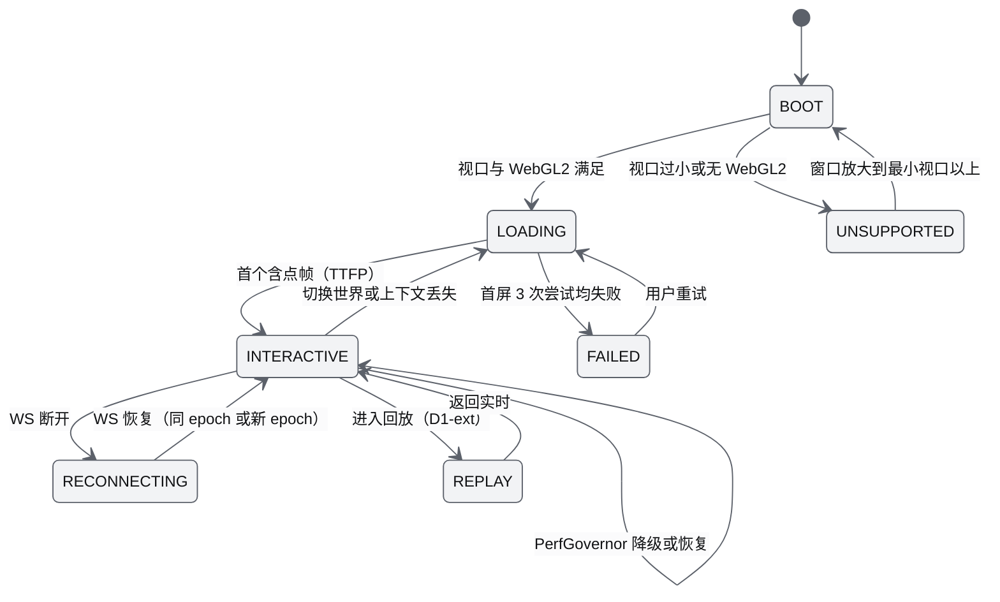
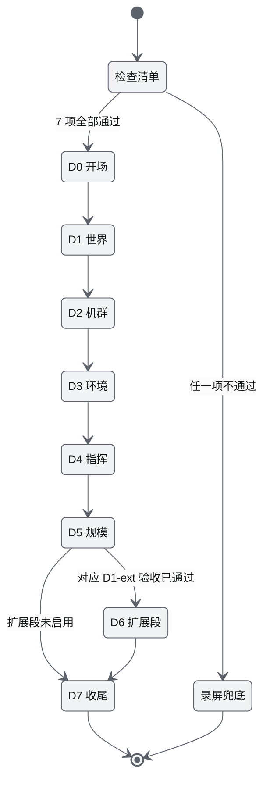
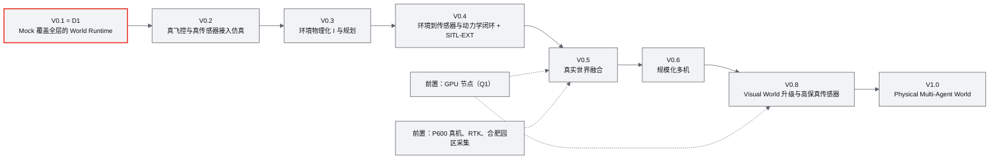

# 13 产品设计 PRD（Product Requirements Document）

| 项 | 内容 |
|---|---|
| 文档编号 | AWR-13 |
| 标题 | 产品设计 PRD |
| 版本 | v1.0 |
| 日期 | 2026-09-28 |
| 状态 | 草案（首版提交，待交叉评审后改为"评审通过"） |
| 上游文档 | 用户硬性要求 R1–R4（[AWR-03 §2.4](03-设计基线与决策记录.md)）；[03-设计基线与决策记录](03-设计基线与决策记录.md)（AWR-03，唯一基线）；[01-design.md](01-design.md)（原始设计，重点 §1、§4、§10、§27、§31–§32、§38–§51）；[02-refs.md](02-refs.md)；[research/00-index.md](research/00-index.md)（§0、§3.14、§6、§7、§8.2）；[x01](research/x01-urbanscene3d-data.md)；g01–g08（[g02](research/g02-gap.md)、[g08](research/g08-gap.md) 为主）；[d05](research/d05-anet.md)；竞品参照 [r12](research/r12-potree-core-loader.md)、[r13](research/r13-potree-next-splats.md)、[r15](research/r15-cesium-deckgl-foxglove.md)、[r23](research/r23-airsim-gzsim.md)、[n03](research/n03-discover-uav-sim-agents.md)、[n04](research/n04-discover-environment-twin.md) |
| 下游文档 | [14-UI交互设计PRD](14-UI交互设计PRD.md)、[15-视觉设计规范与色卡](15-视觉设计规范与色卡.md)、[18-性能与测试方案](18-性能与测试方案.md)、[modules/M15](modules/M15-前端UI壳与设计体系组件PRD.md)、[modules/M16](modules/M16-演示数据剧本与流畅性测试PRD.md)；并为 [10](10-系统架构说明书.md)、[11](11-技术选型说明书.md)、[12](12-业务逻辑设计说明书.md)、[16](16-World数据规范.md)、[17](17-接口与实时协议规范.md)、[19](19-部署与运维说明书.md) 与 M01–M14 提供产品侧需求来源 |
| 适用版本范围 | V0.1（即本期交付 D1）至 V1.0 |

## 0. 摘要

1. 产品定位沿用原设计且不改写：**A Real-World Grounded 4D Physical World Runtime for Autonomous Agents**。核心资产是 World Runtime，无人机是第一个验证载体；"4D"指随时间变化的世界状态，不是 4DGS（依据 AWR-03 §2.1）。
2. 目标用户五类：科研人员、算法开发者、无人机操作员、演示观众、系统管理员；D1 以"科研人员 + 演示观众"两条旅程为主验收路径，其余三类覆盖核心任务。
3. 功能全景分 13 个分支、共 87 条功能需求（PRD-FR-001 至 PRD-FR-087）、34 条非功能需求与 12 条产品级验收（PRD-AC）；D1-core（P0）只含直接支撑 R3 的主链路与 R2 设计体系，D1-ext（P1）排在机群核心验收之后，与 AWR-03 §8.2 逐条一致。
4. 版本路线采用"先打通一条完整链路，再以 Mock 覆盖全层，然后逐级把 Mock 换成真实后端，接口不变"；V0.1–V1.0 每版给出用户价值、主要功能与退出标准（技术退出标准以 AWR-03 §8.1 为准）。
5. 本期交付 D1 = V0.1：本机无 GPU 可完整运行、可远程访问；内置六城点云 + Mock 机群（1–1000 架）+ 渐进加载与疏密自动调节 + 流畅性测试；默认进入 `/world/shenzhen` 并自动播放 S1。
6. 成功指标分五类（流畅度、首屏、稳定性、仿真保真度、易用性），北极星指标为"达标会话占比"；本机 Tier S 与真 GPU 档阈值分开，前者阻塞 D1，后者在 V0.3 固化。
7. 竞品对比结论：AirSim、Isaac Sim 有物理但重且不在 Web；Foxglove、Rerun、Potree、Cesium 在 Web 或桌面上可视化但没有物理与机群；本产品的差异化是"真实世界地基 + 服务端物理权威 + 浏览器流畅可达 + 能力协作"四者同时成立。
8. 数据合规：按 R4 忽略 UrbanScene3D 非商用条款对内置与演示的限制（ADR-034），但来源、许可与引用在 `world.json`、世界详情与关于对话框中完整可见；World Package 因体积不入 git。
9. 附录 A 按 Q10 给出 01-design 勘误表；文末"对基线的反馈"指出 S1 在 p600_mid360 默认限速与续航下的可行性问题等 9 项。

---

## 1. 文档定位与阅读指引

### 1.1 本文回答什么、不回答什么

本文是产品层的需求来源，回答"为谁做、做什么、先做什么、做到什么程度算成功"。按 [AWR-03 §10.1](03-设计基线与决策记录.md) 的单一真源规则，技术事实只引用、不复制。

| 本文负责（定义方） | 本文不负责（只引用） |
|---|---|
| 产品定位、问题陈述、价值主张、产品原则 | 分层、进程与部署：[10-系统架构说明书](10-系统架构说明书.md) |
| 用户角色、画像、权限矩阵的产品含义、用户旅程 | 选型理由、star 与版本：[11-技术选型说明书](11-技术选型说明书.md) |
| 核心场景、用户故事、演示脚本 | 业务状态机语义（FlightState、准入、租约、合同网）：[12-业务逻辑设计说明书](12-业务逻辑设计说明书.md) |
| 功能全景、优先级、功能与角色和模块的映射 | 面板与控件交互、空与错误状态细节：[14-UI交互设计PRD](14-UI交互设计PRD.md) |
| 版本路线的产品视角（每版用户价值与产品退出标准） | 色值、字阶、动效参数、图标清单：[15-视觉设计规范与色卡](15-视觉设计规范与色卡.md) |
| D1 范围的产品表述与产品级验收（PRD-AC） | 文件与资产格式：[16-World数据规范](16-World数据规范.md) |
| 成功指标体系与北极星指标 | 线上接口、原因码 `reasons.json`：[17-接口与实时协议规范](17-接口与实时协议规范.md) |
| 竞品与参照对比、产品风险、待决问题的产品影响 | 性能测试用例与运行协议：[18-性能与测试方案](18-性能与测试方案.md) |
| 数据合规的产品处理 | 部署步骤与运维手册：[19-部署与运维说明书](19-部署与运维说明书.md) |
| 01-design 勘误表（Q10） | 各模块内部设计：[modules/M01](modules/M01-重建引擎PRD.md) 至 [modules/M16](modules/M16-演示数据剧本与流畅性测试PRD.md) |

### 1.2 编号、字段与图示约定

- 需求编号：功能需求 `PRD-FR-###`、非功能需求 `PRD-NFR-###`、产品级验收 `PRD-AC-###`，均从 001 起连续编号，不复用（AWR-03 §10.2 第 3 条）；下游文档已引用既有编号，因此审校补充的 PRD-FR-085 至 PRD-FR-087 追加在所属分支表的末尾，不重排。本文另用 `SC-xx`（场景）、`US-xxx`（用户故事）、`SM-xx`（成功指标）、`RK-xx`（风险）、`PQ-x`（本文新增待确认项）作为索引编号，它们不是需求编号。
- 优先级：P0 为该版本阻塞项；P1 为该版本应交付，缺失时必须有豁免记录；P2 为可选（AWR-03 §10.2 第 4 条）。
- 目标版本：V0.1、V0.2、V0.3、V0.4、V0.5、V0.6、V0.8、V1.0 之一（路线中没有 V0.7 与 V0.9）。
- D1 列：`是`（目标版本必为 V0.1；P0 = D1-core，P1 = D1-ext）、`桩`（本期只交付接口、schema、纯函数或测试替身，真实实现版本写在描述中）、`否`（本期不做）。
- 验收引用：`D1-AC-xx` 指 [AWR-03 §8.4](03-设计基线与决策记录.md) 的 D1 验收；本文只能收紧、不能放宽其阈值（AWR-03 §1.3 第 3 条）。
- 环境口径：**本机 S** = 本机 Tier S（SwiftShader、headless Chromium 151、1280×720 CSS 画布、0.5 渲染比例）；**本机 CPU** = 本机 Python 进程；**真 GPU（iGPU / dGPU）** = GPU runner 或 `/bench` 回传数据（ADR-044）。所有性能类验收执行 ADR-033 的性能运行协议。
- 图示：mermaid 统一使用 [15 §9.10](15-视觉设计规范与色卡.md) 给出的 Graphite 浅色初始化片段（文档属于"报告"，按 Q7 使用浅色主题；一张图最多一个 `hero` 节点，r500 描边 2 px、不用红色填充，即"一处红"）。片段的定义方是 15 号文档（Q9），本文逐字引用如下，15 号文档修订时以其为准。

```text
%%{init: {"theme": "base", "themeVariables": {"fontFamily": "Inter, PingFang SC, Microsoft YaHei, Noto Sans CJK SC, sans-serif", "fontSize": "13px", "background": "#FBFBFC", "primaryColor": "#F2F3F5", "primaryTextColor": "#111214", "primaryBorderColor": "#5C616A", "secondaryColor": "#E4E6E9", "tertiaryColor": "#FBFBFC", "lineColor": "#5C616A", "textColor": "#111214", "mainBkg": "#F2F3F5", "nodeBorder": "#5C616A", "clusterBkg": "#FBFBFC", "clusterBorder": "#A7ABB3", "edgeLabelBackground": "#FBFBFC", "noteBkgColor": "#E4E6E9", "noteTextColor": "#111214", "noteBorderColor": "#81868F"}}}%%
classDef hero stroke:#E93024,stroke-width:2px
```

色值取自 ANet Graphite 冷灰阶（g900 `#111214`、g700 `#2A2D32`、g600 `#3E4249`、g500 `#5C616A`、g400 `#81868F`、g300 `#A7ABB3`、g100 `#E4E6E9`、g50 `#F2F3F5`、white `#FBFBFC`）与唯一品牌红 r500 `#E93024`（依据 d01 §3.2；ADR-032）。

### 1.3 在原设计基础上的二次优化（产品视角总览）

AWR-03 §2.2 与附录 C 给出了 01-design 的逐节技术处置；本节只从产品视角归纳"继承什么、修正什么、增强什么"。§43–§51（MVP 与版本路线）的逐节产品处置见附录 B。

| 类别 | 原设计（01-design） | 本文的产品化处理 | 依据 |
|---|---|---|---|
| 继承 | 定位"Real-World Grounded … for Autonomous Agents"；World 是核心而不是 Drone（§1、§51） | 定位陈述、北极星指标与功能树都以 World 为根；实体种类 `kind` 预留，D1 只实现 `uav` | AWR-03 §2.1、ADR-047 |
| 继承 | "浏览器看世界，服务器算世界"（§4） | 作为产品原则 PP-02：浏览器上的任何画质变化都不改变物理结果 | P-02、P-03 |
| 继承 | URL 直达、远程演示、教学科研（§10） | `/world/:id` 直达（D1-core）；回环加 SSH 转发与局域网两种访问模式 | AWR-03 §3.3；D1-AC-32、D1-AC-33 |
| 继承 | 数字沙盘 UI、Timeline、选中机交互（§38–§40） | 功能树 F2、F3、F7；交互细节交给 AWR-14 | ADR-028 至 ADR-032 |
| 修正 | V0.1 以 LingBot-Map 真实重建为主（§43–§44） | D1 以内置六城世界链路为主链路；真实重建推迟到 V0.5，D1 用 Mock 重建链路保留 Reality → World 接口通路 | ADR-042、ADR-035、Q1、Q2 |
| 修正 | 点云"远处 10K / 近处 1M"（§14） | 删除阈值表；产品承诺改为"用户无需设置画质，系统按实测帧节奏闭环调节，性能 HUD 可解释" | ADR-009 至 ADR-013、ADR-041 |
| 修正 | Web Rendering 60 FPS（§37） | 按设备能力档承诺：本机软件渲染固定 30 fps，真 GPU 按刷新率 | ADR-044 |
| 修正 | "Fog 0.21"、勾选框与播放三角等 Unicode 字形（§38–§39） | 能见度以 MOR 米数显示；控件与图标一律来自 shadcn 与 morphicons，全站禁止 emoji 与禁用字形 | ADR-023、ADR-030；AWR-03 §10.2 |
| 修正 | 第一阶段不同时做 Multi-Agent、完整天气、100 架（§43） | 被 ADR-042 取代：1000 架是向量化规模压测而非 1000 个仿真器；天气只做 L0/L1 与视觉 Low；Mock ANet 为 D1-ext 且排在机群核心验收之后 | ADR-042 |
| 增强 | 无明确用户与验收 | 五类用户画像、权限矩阵、演示脚本、北极星指标与产品级验收 | 本文 §3、§4、§8.7、§10 |
| 增强 | 无"诚实性"约定 | 产品原则 PP-05：Mock 结果标 `simulated`，未辨识参数标"参数未辨识"，尺度状态 `scale_status` 必显，合成锚点标"近似北向" | ADR-016、ADR-035、ADR-043；x01 §6 第 2 条 |
| 增强 | 无可复现承诺 | 录制回放逐字节一致（G6a）与输入日志重仿真逐位一致（G6b），面向科研人员作为产品能力 | ADR-040、ADR-049 |
| 增强 | 无数据合规描述 | §13 数据合规：R4 下的来源与引用可见化 | ADR-034；x01 §1.1 |

---

## 2. 产品定位

### 2.1 定位陈述

| 项 | 内容 |
|---|---|
| 英文定位 | A Real-World Grounded 4D Physical World Runtime for Autonomous Agents |
| 中文定位 | 以真实世界为地基的四维物理世界运行时，服务于自主智能体 |
| 产品名 | ANet Drone4D（与 GitHub 仓库 ANetResearch/ANet-Drone4D 一致；运行时名 World Runtime，代码与文档缩写 AWR）。顶栏锁定组合为"头像 + ANet Drone4D + 分隔线 + World Runtime"（ADR-032、ADR-056） |
| 核心链路 | Reality → Reconstruction → World → Environment → Simulation → Agent（在原设计 Reality → World → Environment → Simulation → Agent 的基础上显式加入 Reconstruction 一环） |
| 第一载体 | Prometheus 600（P600）四旋翼（`frame.type: quad_x`，g08 `vehicles/p600/params.yaml`）及其 MID-360S 激光雷达（与 MID-360 协议兼容，r04 §1）；首期以 Mock 数字孪生 `p600_mid360` 代表（ADR-022、ADR-043） |
| 一句话价值 | 把一块真实区域变成一个可渲染、可碰撞、可查询、可仿真的 World，让一到一千架无人机与它们的智能体在浏览器里流畅地被观察、指挥和复现 |
| "4D"的含义 | 随时间变化的世界状态 E(x,y,z,t) 与机群状态，不是 4DGS（00-index §7 第 12 条） |

对照句式（For / Who / The / That / Unlike）：

> 对于需要在真实场景中研究和验证无人机及多智能体行为的科研团队，ANet Drone4D（World Runtime）是一个 World 优先的 Web 运行时：它把真实（或内置城市）点云规范化为带版本的 World Package，在服务端以统一时钟推进机群物理、环境场与安全守卫，并在任何桌面浏览器中流畅呈现。不同于 AirSim、Isaac Sim 这类依赖 GPU 与游戏引擎的桌面仿真器，也不同于 Foxglove、Rerun、Potree、Cesium 这类只看数据不算物理的查看器，本产品让"真实世界地基、服务端物理权威、浏览器流畅可达、能力协作"四件事同时成立。

### 2.2 要解决的问题

| # | 问题 | 现状证据 | 本产品的回答 |
|---|---|---|---|
| PB-1 | 真实场景与仿真脱节：仿真器的世界是手工搭建的游戏场景，难以复用真实采集数据 | AirSim 依赖 UE 场景，Isaac 依赖 USD 资产（r23 §1；n03） | World Package 作为唯一真源，任何点云经 ingest 规范化后进入同一世界（P-01、ADR-006） |
| PB-2 | 真实数据的坐标陷阱：单位、上方向、倾斜、北向各不相同，直接使用会让物理全部出错 | UrbanScene3D 六城中旧金山 10.15 m/单位且需 +90°，芝加哥 ×1000 且需调平 2.03°，苏州 Y-up 无地面（x01 §0） | Ingest 规范化为必经阶段，世界包带 QA 与 40 余条语义校验（ADR-001、M03） |
| PB-3 | 大规模点云在浏览器中卡顿，靠手调"远近阈值"无法适配设备 | 原设计"远 10K / 近 1M"；SwiftShader 下 250k 点只有 3–4 fps（g02 §7.1） | 渐进加载 + CAS 闭环疏密调节 + PerfGovernor 预算仲裁，用户不需要设置画质（ADR-009 至 ADR-013、ADR-041） |
| PB-4 | 高保真仿真要 GPU，团队的普通服务器与笔记本跑不动；多机时钟漂移 | SIH 每机约 0.22 核且 16 架时 RTF 约 0.72（AWR-03 §8.3）；本机无 GPU | 向量化 FleetSim L1：1000 架约 0.26 核，同一时钟推进（g08 §11；ADR-021） |
| PB-5 | 天气只是贴图，不影响飞行与传感器，实验结论不可信 | AirSim 天气纯视觉、风只作用阻力（r23 §0 第 6 条） | E(x,y,z,t) 单一真值，风已作用于动力学（D1），MOR 驱动视觉并在 V0.4 驱动传感器退化（ADR-023 至 ADR-025） |
| PB-6 | 多智能体协作缺乏"能力"语义与证据，结果难以审计 | 原设计 §31–§32 只描述流程 | ANet 作为协作平面：能力发现、合同网、效果状态与证据链（ADR-036；d05） |
| PB-7 | 实验不可复现：录制只能回看，不能重算 | 原 G6"逐位可复现"不可验证（AWR-03 附录 D E-02） | 录制回放逐字节一致与输入日志重仿真逐位一致两级承诺（ADR-049） |
| PB-8 | 查看器与仿真器是两套 UI，演示与调试割裂 | Foxglove 2024 年闭源、Lichtblick 为 MUI 体系（r15 §1）；Rerun 查看器为 egui（n04 §0 第 10 条） | 一套 shadcn 数字沙盘同时承担实时指挥、回放与性能诊断 |

### 2.3 价值主张

| 角色 | 核心收益 | 可度量的承诺（D1） | 依据 |
|---|---|---|---|
| 科研人员 | 在真实城市尺度的世界中做可复现的多机与多智能体实验 | 六城开箱可用；S1 剧本 success 判定自动给出；录制回放逐字节一致（P1） | D1-AC-01、D1-AC-15、D1-AC-18 |
| 算法开发者 | 不改框架即可接入任务生成器、规划、控制与智能体；UI 与 API 同权 | 10 个命令经 REST/`awr.rt.v1` 可调用；准入 RTT p99 ≤ 25 ms | ADR-016、D1-AC-10 |
| 无人机操作员 | 在熟悉的相机模式下直观指挥，安全状态与控制权一目了然 | 点选 GoTo 停在点击点 3 m 内；告警按"一处红"聚合 | D1-AC-32、ADR-032 |
| 演示观众 | 10 分钟内看懂"真实城市 + 机群 + 天气 + 协作"的完整故事，画面始终流畅 | 首屏 ≤ 1.0 s；默认整景帧节奏满足 D1-AC-03b | D1-AC-02、D1-AC-03b |
| 系统管理员 | 一台 8 核无 GPU 服务器即可部署、远程访问、自愈 | `make setup && make run`；kill -9 后 ≤ 3 s 恢复 | D1-AC-11a、D1-AC-33 |

### 2.4 产品原则

产品原则是 AWR-03 §2.3 设计原则在产品决策上的投影，用于裁决功能取舍与交互争议。

| 编号 | 原则 | 产品含义 | 对应设计原则 |
|---|---|---|---|
| PP-01 | World 优先 | 任何功能先问"它属于哪个世界、用哪个坐标"；世界切换是一级操作；实体列表按 `kind` 分组 | P-01、ADR-047 |
| PP-02 | 看与算分离 | 浏览器画质、疏密、动效档位的任何变化都不改变仿真结果；产品文案不得暗示"画面即真值" | P-02、P-03 |
| PP-03 | 流畅是默认，不是选项 | 用户不需要调画质；所有降级自动发生、可解释、可恢复；主线演示只使用在本机 Tier S 验收过的功能 | P-05、ADR-041 |
| PP-04 | 服务端权威，UI 如实转述 | 时间、状态、控制权、告警只有一个权威；UI 只插值与有限外推，超出时显示"信号延迟" | P-04、ADR-046 |
| PP-05 | 诚实标识 | Mock 结果标 `simulated`（效果 V4）；未辨识参数标"参数未辨识"并显示置信度 A–E；重建尺度显示 `scale_status`；合成锚点显示"近似北向"；强制档位不参与性能判定 | ADR-016、ADR-035、ADR-043、ADR-044；x01 §6 |
| PP-06 | 可复现即可信 | 每次运行留下 `meta.json`（世界版本、内核、种子）；科研结论可由录制或输入日志复现 | P-10、ADR-049 |
| PP-07 | 同一条准入流水线 | UI、API、智能体下发的命令走同一准入顺序；安全类命令免租约但受准入矩阵约束 | P-13、ADR-016、ADR-027 |
| PP-08 | 设计体系即产品质量 | 只用 shadcn 组件、transitions.dev 动效、morphicons 图标、lieflat 图表与 ANet Graphite 色卡；全站禁止 emoji | P-12、R2 |
| PP-09 | 保真度阶梯，接口不变 | 每个版本替换一层后端，UI 与协议零改动；能力差异经 `caps` 声明呈现（例如置灰暂停） | P-07、ADR-020、ADR-045 |

### 2.5 产品形态与边界

| 组成 | 形态 | 面向角色 | D1 |
|---|---|---|---|
| Web 数字沙盘 | 桌面浏览器单页应用，路由 `/world/:id`；暗色默认；最小视口 1280×720 CSS 像素 | 全部 | 是（core） |
| World Runtime 后端 | 单机多进程（supervisor、api、sim-core、plan-pool；D1-ext 另有 recorder、replay-worker、agent-runtime、job-worker） | 系统管理员（部署），其他角色间接使用 | 是（core + ext） |
| 世界构建 CLI | `worldpkg ingest / tile / validate / build [--missing]` | 科研人员、系统管理员 | 是（core） |
| 剧本与基准 | `scenarios/*.json`（S1、ladder 为 core，S2–S6 为 ext）；flight60、机群阶梯、IPC 基准 | 科研人员、算法开发者 | 是 |
| 开放接口 | REST + `awr.rt.v1` WebSocket（[17](17-接口与实时协议规范.md)） | 算法开发者 | 是（core） |
| 测试与性能报告 | lieflat reports 模板的 HTML 报告（浅色） | 科研人员、系统管理员 | 是（core） |
| 自检页 `/bench` | 在用户 GPU 浏览器上跑 flight60 并回传 | 系统管理员、演示者 | 是（ext） |

边界：不提供移动端（Q6）；不提供多 operator 同时写（Q5）；不提供公网多租户服务（§9 非目标）；浏览器不承担飞控、动力学、碰撞、规划、传感器与重建计算（P-02）。

### 2.6 命名与品牌使用

- 产品显示名"ANet Drone4D"（页面标题、顶栏、关于、报告与命令行版本行一律用此名；运行时名"World Runtime"只作副名，ADR-056），界面语言为中文，技术名词保留英文（FPV、RTL、MOR、TTFP 等，AWR-03 §8.5）。
- 关于区块（帮助 › 关于与设置 › 关于）必须写出版本、许可摘要、仓库链接 `github.com/ANetResearch/ANet-Drone4D`、UrbanScene3D 数据来源与引用（仅限非商业科研用途）、保真度声明与版权行"Copyright (c) 2026 Agent Network Research"；LICENSE 附加条件 1b 要求界面中的 ANet 标志与版权信息不得移除或修改（ADR-056）。
- Logo 使用 `refs/design/ANet/docs/media/anet-logo.svg`（完整徽章，原样使用，禁止改色）与 GitHub 头像 `https://avatars.githubusercontent.com/u/305781773?s=96&v=4`（下载到 `apps/web/public/brand/` 本地托管，AWR-03 §4.1）。落点、尺寸与入场动效由 ADR-032 定义，视觉细节见 [15](15-视觉设计规范与色卡.md)。
- 产品色为科技灰、黑、白与品牌红 `#E93024`，色卡名 ANet Graphite；状态不引入绿色与黄色（Q8）。

---

## 3. 目标用户与画像

### 3.1 角色总览

| 角色 | 英文 | 系统身份（D1） | 典型使用频率 | D1 覆盖深度 | 主要入口 |
|---|---|---|---|---|---|
| 科研人员 | Research Scientist | operator 或 viewer；读 `runs/` 与报告 | 每周多次，每次 0.5–3 h | 主验收旅程 | 世界切换器、剧本、Timeline、机体详情、测试报告 |
| 算法开发者 | Algorithm Developer | operator；终端与 API | 每日 | 核心任务覆盖 | REST/WS、注册表扩展点、`make dev`、pytest 剧本 |
| 无人机操作员 | Drone Operator | operator | 飞行任务前后；演练 | 核心任务覆盖（V0.5 起接真机） | 视口点选、命令面板、DroneRail、告警 |
| 演示观众 | Demo Audience | viewer（通常看演示者屏幕） | 一次性，10–20 min | 主验收旅程 | 演示者操作的主视图 |
| 系统管理员 | System Administrator | 本机终端；局域网模式下持管理口令 | 部署与故障时 | 核心任务覆盖 | `make`、`configs/runtime.yaml`、`runs/`、`sys/procs` 与 `sys/restart`（接口见 17） |

另有一类**系统参与者**：AI 智能体（含 LLM）。它不是人类用户，但以 `principal = AGENT` 身份下发命令，被视为不可信指挥官，必须经 agent-runtime 的受信守卫流水线（ADR-027）。产品上它在 AGENTS 面板（D1-ext）与控制权徽标中可见。

### 3.2 用户画像

**画像 A：科研人员（陈研究员，多智能体与具身智能方向）**

| 维度 | 内容 |
|---|---|
| 背景 | 高校或研究所团队负责人，关注多机协同、任务分配与感知决策；熟悉 Python 与论文写作，不熟悉 Web 与图形 |
| 目标 | 在真实尺度城市中复现"疑似目标 → 能力委派 → 热成像确认"这类协作流程（S3），得到可复现的实验数据与图表 |
| 典型任务 | 选城市与剧本 → 调整天气与风 → 运行并观察 → 导出指标与报告 → 用同一种子与输入日志复现 |
| 痛点 | 高保真仿真器需要 GPU 与 UE；自研仿真难以对外演示；实验结果被质疑"只是动画" |
| 关键期望 | 结果可复现（G6a/G6b）；Mock 与真实的差异被诚实标注；六城开箱即用 |
| 成功信号 | 剧本 success 判定自动给出；报告可直接放进论文附录；同一输入日志重仿真逐位一致 |
| 权限 | operator（实验时）或 viewer（旁观） |
| D1 覆盖 | S1、天气与风、Timeline、机体详情、测试报告（core）；录制回放、S3、重仿真（ext） |

**画像 B：算法开发者（赵工，规划与控制方向）**

| 维度 | 内容 |
|---|---|
| 背景 | 3–5 年经验，写 Python 与 C++，熟悉 PX4、MAVSDK 与 ROS；习惯命令行与脚本 |
| 目标 | 把自己的任务生成器、规划器或智能体接进来，用 1–1000 架规模做回归与压测 |
| 典型任务 | `make dev` → 用 API 下发命令或注册生成器 → 无头运行剧本 → 看 pytest 结果与 `meta.json` → 调参再跑 |
| 痛点 | 每换一个后端（Mock、SIH、真机）就要改 UI 与协议；仿真器时钟漂移导致结果不稳定 |
| 关键期望 | UI 与 API 同权；命令有明确的生命周期与原因码；接口版本稳定；确定性可验证 |
| 成功信号 | 同一调用在 Mock 与 SIH（V0.2）上走完相同生命周期；新增生成器不改框架代码 |
| 权限 | operator |
| D1 覆盖 | REST/WS、10 个命令、7 种生成器、剧本、flight60 与机群阶梯（core）；A*、编队、覆盖、重仿真（ext） |

**画像 C：无人机操作员（王机长，P600 外场飞手）**

| 维度 | 内容 |
|---|---|
| 背景 | 持证飞手，熟悉 P600 与 Prometheus 地面站；不写代码 |
| 目标 | 在真实场地的数字孪生中演练航线，飞前确认禁飞区、安全高度与电量余量；V0.5 起在同一界面监看真机 |
| 典型任务 | 选中机 → 点选 GoTo 或加载航线 → Follow/FPV 观察 → 处理告警 → RTL 或降落 |
| 痛点 | 地面站与仿真界面不一致；告警过多时看不出主次；不确定当前谁在控制飞机 |
| 关键期望 | 控制权清晰（持有者、SIM/REAL 标识）；安全命令永远可用；告警主次分明 |
| 成功信号 | 5 个核心任务首次使用成功率 ≥ 80%（PRD-NFR-026）；从未误判"谁在控制" |
| 权限 | operator（同一世界同时只允许一个） |
| D1 覆盖 | 点选 GoTo、增删虚拟 P600、相机模式、告警与控制权徽标（core）；航点编辑、完整租约、故障注入（ext）；真机（V0.5） |

**画像 D：演示观众（合作方、评审专家、管理者）**

| 维度 | 内容 |
|---|---|
| 背景 | 非技术或跨领域；通过会议投屏或演示者远程桌面观看 |
| 目标 | 10 分钟内理解平台能做什么、与现有工具的差异、下一步路线 |
| 典型观看路径 | 演示脚本主线 D0–D5，按时间与状态可加扩展段 D6（§4.4） |
| 痛点 | 画面卡顿、空白等待、术语过多、界面花哨但看不出重点 |
| 关键期望 | 首屏快、全程不卡、每一段都有清楚的"看点"；数据来源与"仿真"性质被明示 |
| 成功信号 | 演示连续 3 次零失败（PRD-AC-002）；首屏 ≤ 1.0 s；默认整景帧节奏达标 |
| 权限 | viewer（或只看演示者屏幕） |
| D1 覆盖 | 主线全部为 core；扩展段为 ext |

**画像 E：系统管理员（刘工，实验室运维）**

| 维度 | 内容 |
|---|---|
| 背景 | 负责实验室 Linux 服务器，熟悉 Docker、SSH、systemd；不关心算法 |
| 目标 | 在 8 核无 GPU 服务器上一次装好、可远程访问、出故障能自愈、磁盘不被写满 |
| 典型任务 | `make setup` → `make fetch-data`（数据不在本机时）→ `make run` → 配置访问模式 → 查看进程与日志 → 清理 `runs/` |
| 痛点 | 依赖版本漂移；无显示器服务器上无法验证前端；进程挂死无人察觉 |
| 关键期望 | 锁文件安装可重复；SSH 转发即可访问；supervisor 自动重启并留审计；配额自动清理 |
| 成功信号 | 从拿到仓库到远程看到首屏 ≤ 30 min（PRD-NFR-027，本文设定）；kill -9 任一核心进程 ≤ 3 s 恢复 |
| 权限 | 本机终端；局域网模式下持有管理口令签发 operator token |
| D1 覆盖 | 全部部署与访问能力为 core；checkpoint 恢复与混沌为 ext |

### 3.3 角色与权限矩阵（产品含义）

系统身份只有 viewer 与 operator 两种会话角色（AWR-03 §8.5），另有本机终端的管理能力。下表是产品层的能力边界，实现细节以 [12](12-业务逻辑设计说明书.md) 与 [17](17-接口与实时协议规范.md) 为准。

| 能力 | viewer | operator | 本机终端 / 管理口令 | AGENT（系统参与者，D1-ext） |
|---|---|---|---|---|
| 进入世界、漫游、切换相机与着色 | 是 | 是 | — | — |
| 切换世界 | 否（跟随会话世界，见注 1） | 是 | — | 否 |
| 查看机群、事件、HUD、报告 | 是 | 是 | 是 | 读取经 StateRing |
| 下发导航类命令（goto、follow_path、orbit、takeoff 等） | 否 | 是（持有写权限时） | — | 仅对自己持有租约的机体 |
| 安全类命令（land、hover、rtl） | 否 | 是（免租约，仍受准入矩阵约束） | — | 仅对自己持有租约的机体 |
| safety_stop（安全类，SafetyStop） | 否 | 是（免租约，仍受准入矩阵约束） | — | 否（ADR-027） |
| 添加与移除虚拟 P600 | 否 | 是 | — | 否 |
| 设置风与天气预设 | 否 | 是 | — | 否 |
| Timeline 播放、暂停、倍速、单步 | 否 | 是 | — | 否 |
| 回放 seek（D1-ext） | 是（本会话视图，见注 2） | 是 | — | 否 |
| 签发 operator token（局域网模式） | 否 | 否 | 是 | — |
| 查看与重启进程（`sys/procs`、`sys/restart`） | 否 | 否 | 是 | 否 |

注 1：viewer 是否可独立切换世界涉及多会话语义，D1 默认跟随服务端当前世界，细节由 AWR-14 与 AWR-17 定义；本文把"多世界并行"列为非目标（§9）。
注 2：回放会话的 seek 权限归属由 [12](12-业务逻辑设计说明书.md) 的回放语义定义；本文只要求 viewer 至少能观看回放。

### 3.4 用户旅程

**旅程 J1：科研人员完成一次可复现实验（D1 主验收旅程之一）**

| 阶段 | 用户动作 | 触点 | 期望 | 可能的挫折 | 对应需求 |
|---|---|---|---|---|---|
| 进入 | 打开 `/world/shenzhen` | 加载遮罩、首屏 | ≤ 1.0 s 看到点云 | 冷启动编译 | PRD-FR-002、PRD-NFR-005 |
| 选择 | 切到纽约，加载剧本 | 世界切换器、命令面板 | 切换 ≤ 1.5 s；剧本清单可检索 | 不知道剧本含义 | PRD-FR-002、PRD-FR-033、PRD-FR-037 |
| 设置 | 选"rain"预设，风 8 m/s | 环境面板 | 30 s 平滑过渡，画面不卡 | 不理解 MOR | PRD-FR-040、PRD-FR-042 |
| 运行 | 播放 ×10，Follow 一架机 | Timeline、相机 | 机体在阵风中姿态偏移可见 | 倍速下跟随抖动 | PRD-FR-050、PRD-FR-013、PRD-NFR-010 |
| 观察 | 看遥测曲线与告警 | 机体详情、lieflat 图卡 | 曲线实时、告警主次分明 | 告警风暴 | PRD-FR-024、PRD-FR-047 |
| 判定 | 剧本结束，看 success | 剧本进度、事件列表 | 自动给出覆盖率、最小间距、时长 | 判据不透明 | PRD-FR-033 |
| 复现 | 回放并 seek；用输入日志重仿真（ext） | 回放 UI、终端 | 逐字节或逐位一致 | 版本不一致被拒 | PRD-FR-052、PRD-FR-053 |
| 产出 | 导出测试报告 | `runs/`、HTML 报告 | 可直接引用 | 报告缺负载记录 | PRD-FR-064 |

**旅程 J2：演示观众观看 10 分钟演示（D1 主验收旅程之二）**

观众的旅程与 §4.4 演示脚本一一对应；判定标准是"每一段的看点都出现，且全程没有空白等待与明显卡顿"（PRD-AC-002）。

---

## 4. 核心场景、用户故事与演示脚本

### 4.1 核心场景

| 编号 | 场景 | 主要角色 | 起点 → 终点 | 首次可用版本 | D1 层 |
|---|---|---|---|---|---|
| SC-01 | 打开内置城市世界并流畅漫游 | 全部 | URL → 首屏 → 渐进细化 → 任意相机漫游 | V0.1 | core |
| SC-02 | 运行默认剧本 S1（深圳双机立面扫描） | 科研、观众 | 进入深圳 → S1 自动播放 → success 判定 | V0.1 | core |
| SC-03 | 添加虚拟 P600 并点选 GoTo | 操作员、观众 | 添加机体 → 选中 → 点选建筑顶面 → 到达 | V0.1 | core |
| SC-04 | 调天气与风，观察对飞行的影响 | 科研、观众 | 选预设或设风速 → 30 s 过渡 → 阵风扰动可见 | V0.1 | core |
| SC-05 | 机群规模压测（10–1000 架） | 算法开发者、管理员 | 加载 ladder 剧本 → 读 HUD 与服务端指标 → 报告 | V0.1 | core |
| SC-06 | 诊断"为什么卡"与"为什么降级" | 全部 | 打开性能 HUD → 看档位、B、limitedBy、降级原因 | V0.1 | core |
| SC-07 | 无头运行剧本并得到判定（CI 或批处理） | 算法开发者 | `pytest tests/e2e/test_scenarios.py::test_s1` → success 与指标 | V0.1 | core |
| SC-08 | 远程访问无显示器服务器上的系统 | 管理员、演示者 | `ssh -L` → `http://localhost:8000/world/shenzhen` | V0.1 | core |
| SC-09 | 录制、回放、seek，复现一次实验 | 科研人员 | 运行剧本 → 选 run → seek → 对比 | V0.1 | ext |
| SC-10 | 多智能体协同搜救（S3，Mock ANet） | 科研、观众 | 扩展方形搜索 → 置信度 0.42 → 委派热成像 → ≥ 0.9 | V0.1 | ext |
| SC-11 | Mock 重建任务：Reality → World 接口通路 | 科研、观众 | 提交任务 → 状态机进度 → 新世界可加载 | V0.1 | ext |
| SC-12 | 航点编辑与区域覆盖任务 | 操作员、算法开发者 | 增删改拖航点或框选区域 → 生成任务 → 执行完成 | V0.1 | ext |
| SC-13 | 同一 UI 切换到真飞控后端（SIH） | 算法开发者 | 选 SIH 后端 → 同一命令走完生命周期，暂停被置灰 | V0.2 | 否 |
| SC-14 | 真实场地采集 → 重建 → 融合 → 世界 → 真机状态回放 | 科研、操作员 | 合肥园区采集 → World → Web → 真机回放 | V0.5 | 否 |
| SC-15 | 100 架随机任务长时零碰撞 | 算法开发者 | 三层互避 → 30 min 运行 → 零碰撞 | V0.6 | 否 |
| SC-16 | 真 ANet 多机协同（每机一个 daemon） | 科研人员 | S3 真 ANet → 委派往返 ≤ 2 s | V1.0 | 否 |

### 4.2 用户故事

验收以 Given / When / Then 摘要表示；完整度量与环境见关联的 NFR 或 D1-AC。

| 编号 | 角色 | 用户故事 | 验收摘要 | 关联需求 | D1 |
|---|---|---|---|---|---|
| US-001 | 观众 | 作为观众，我希望打开链接后 1 秒内就看到城市，而不是等待转圈 | Given 世界已构建；When 打开 `/world/shenzhen`；Then TTFP ≤ 1.0 s（本机 S）且遮罩期间显示品牌徽章与进度 | PRD-FR-002、PRD-NFR-005 | core |
| US-002 | 科研人员 | 作为科研人员，我希望在六个城市之间切换，以便在不同城市形态下对比实验 | When 在世界切换器选纽约；Then 首帧 ≤ 1.5 s（视图世界切换，core）；席位持有者可在该世界启动新的运行会话，机群与剧本随之重置（ext，AWR-03 ADR-053） | PRD-FR-002 | core / ext |
| US-003 | 全部 | 作为用户，我希望不用调任何画质选项，画面始终流畅 | When 执行 flight60 `scene=full`；Then 帧节奏满足 D1-AC-03b，CAS 换档 ≤ 2 次 | PRD-FR-010、PRD-NFR-002 | core |
| US-004 | 算法开发者 | 作为开发者，我希望知道画面为什么变稀疏，以便区分"性能不够"与"数据本身稀疏" | When 打开性能 HUD；Then 可见档位、B、limitedBy、achievedScreenError 与最近一次降级原因 | PRD-FR-014 | core |
| US-005 | 操作员 | 作为操作员，我希望选中一架机后点击建筑顶面让它飞过去 | When 选中机并点选；Then 调用 accepted → succeeded，机体停在点击点 3 m 内 | PRD-FR-029 | core |
| US-006 | 操作员 | 作为操作员，我希望在运行中添加一架虚拟 P600 | When 点"添加 P600"；Then ≤ 1 s 在 DroneRail 与视口出现，生命周期事件完整 | PRD-FR-021 | core |
| US-007 | 操作员 | 作为操作员，我希望命令被拒时知道原因 | When 对禁飞区内的点下发 GoTo；Then 调用以 102 GEOFENCE_REJECT 结束，Toast 与事件列表显示可读原因 | PRD-FR-030 | core |
| US-008 | 操作员 | 作为操作员，我希望随时知道谁在控制这架机 | Then 机体详情与 DroneRail 行显示控制权徽标（OPERATOR、AGENT、MISSION、SWARM）与 SIM 标识 | PRD-FR-031 | core |
| US-009 | 科研人员 | 作为科研人员，我希望切换到雷雨预设并看到阵风让机体偏离航线 | When 选 thunderstorm；Then 30 s 过渡期间 > 100 ms 的帧 ≤ 0.5%，阵风期间 pos_err 可在遥测图中看到 | PRD-FR-040、PRD-FR-041 | core |
| US-010 | 科研人员 | 作为科研人员，我希望能见度用米表示，以便与气象数据对照 | Then 环境面板显示 MOR（m），不出现无量纲"雾浓度" | PRD-FR-042 | core |
| US-011 | 观众 | 作为观众，我希望跟随一架机并切到第一人称视角 | When 按 3 或 4；Then 进入 Follow 或 FPV，焦点机 t_sim 到像素 p95 ≤ 150 ms，UI 标注"焦点低延迟" | PRD-FR-013、PRD-NFR-010 | core |
| US-012 | 科研人员 | 作为科研人员，我希望 S1 结束时自动给出成功与否 | Then 剧本面板显示覆盖率、最小间距、时长与 success 判定 | PRD-FR-033 | core |
| US-013 | 算法开发者 | 作为开发者，我希望不打开浏览器也能跑剧本并拿到判定 | When 执行 `pytest tests/e2e/test_scenarios.py::test_s1`；Then 输出 success 判定与指标，`runs/<run>/meta.json` 记录内核与版本 | PRD-FR-082 | core |
| US-014 | 算法开发者 | 作为开发者，我希望 UI 能做的事我都能用 API 做 | Then UI 操作清单中的每一项在 [17](17-接口与实时协议规范.md) 都有对应 REST 或 `awr.rt.v1` 操作 | PRD-FR-081 | core |
| US-015 | 算法开发者 | 作为开发者，我希望一次压测 10 到 1000 架并得到 CPU 与单步耗时 | When 执行机群阶梯；Then N = 1000 时 sim-core ≤ 0.6 核、单步 p99 ≤ 3 ms，报告按 lieflat 模板生成 | PRD-FR-063、PRD-NFR-015 | core |
| US-016 | 操作员 | 作为操作员，我希望 1000 架同时 RTL 时界面不被告警淹没 | When 全机 RTL；Then Toast 合并后 ≤ 3 条，主线程无 > 50 ms 长任务 | PRD-FR-047、PRD-NFR-020 | core |
| US-017 | 管理员 | 作为管理员，我希望在没有显示器的服务器上部署后，从我的笔记本访问 | When `ssh -N -L 8000:127.0.0.1:8000`；Then `http://localhost:8000/world/shenzhen` 可用，WS 与 Range 冒烟通过 | PRD-FR-069 | core |
| US-018 | 管理员 | 作为管理员，我希望核心进程崩溃后系统自己恢复 | When kill -9 sim-core；Then ≤ 3 s 重启、剧本重开、客户端收到新 epoch 的 TIME 与 SNAPSHOT | PRD-FR-070 | core |
| US-019 | 科研人员 | 作为科研人员，我希望知道哪些飞机参数只是占位值 | Then 机体详情对 p600_mid360 显示"参数未辨识"与各组成部分置信度 A–E | PRD-FR-023、PRD-NFR-025 | core |
| US-020 | 观众 | 作为观众，我希望知道这些城市数据来自哪里 | When 打开关于对话框或世界详情；Then 显示 UrbanScene3D 来源、引用与"科研用途"声明 | PRD-FR-005 | core |
| US-021 | 科研人员 | 作为科研人员，我希望回放一次运行并跳到任意时刻 | When seek；Then 首个 backfill 帧 ≤ 500 ms，回放帧与录制逐字节一致 | PRD-FR-052 | ext |
| US-022 | 科研人员 | 作为科研人员，我希望从输入日志重算一次运行 | When `--resim runs/<run>`；Then Full64 逐位一致；内核或版本不一致时拒绝 | PRD-FR-053 | ext |
| US-023 | 科研人员 | 作为科研人员，我希望看到"疑似目标 → 委派热成像 → 确认"的完整证据链 | When 运行 S3；Then 仿真时间 300 s 内置信度从 0.42 升到 ≥ 0.9，AGENTS 面板显示 find、quote、delegate、result | PRD-FR-056 | ext |
| US-024 | 观众 | 作为观众，我希望看到"真实数据 → 重建 → 进入世界"的通路 | When 提交 Mock 重建任务；Then 状态机走到 SUCCEEDED，进度 ≤ 4 Hz 更新，显示 `scale_status`，新世界可进入 | PRD-FR-059 | ext |
| US-025 | 操作员 | 作为操作员，我希望拖动航点修改航线 | When 增删改拖航点；Then follow_path 调用 succeeded | PRD-FR-035 | ext |
| US-026 | 科研人员 | 作为科研人员，我希望注入电机失效等故障观察安全行为 | When 注入 motor_fail；Then Flight FSM 按白名单升级，事件可见 | PRD-FR-048 | ext |
| US-027 | 演示者 | 作为演示者，我希望在自己的 GPU 浏览器上开启 WebGPU 并回传性能数据 | When `?rb=webgpu` 或设置页开启；Then 进入 Tier A；`/bench` 结果写入 `runs/perf-reports/` | PRD-FR-016 | ext |
| US-028 | 算法开发者 | 作为开发者，我希望同一套 UI 驱动 PX4 SIH 后端 | Then 10 个命令在 SIH 上完整走完生命周期，UI 代码零改动，暂停被置灰 | PRD-FR-026 | V0.2 |

### 4.3 世界会话生命周期（产品级状态机）

本节定义用户在一次"世界会话"中能感知到的状态与产品承诺；各状态的界面表现（遮罩、空状态、错误状态、过期标识）由 [AWR-14](14-UI交互设计PRD.md) 定义，时间线与 epoch 语义由 [12](12-业务逻辑设计说明书.md) 与 [17](17-接口与实时协议规范.md) 定义。

| 状态 | 事件 | 守卫 | 动作（产品承诺） | 目标状态 |
|---|---|---|---|---|
| BOOT | 页面加载 | 视口 ≥ 1280×720 且 WebGL2 可用 | 显示品牌徽章遮罩；并行启动着色器预热、世界取数与实时连接（AWR-03 §3.7） | LOADING |
| BOOT | 页面加载 | 视口 < 1280×720 或 WebGL2 不可用 | 显示 `Empty` 提示与最低要求，不进入 3D | UNSUPPORTED |
| UNSUPPORTED | 窗口尺寸变化 | 视口 ≥ 1280×720 且 WebGL2 可用 | 移除提示，重新执行启动 | BOOT |
| LOADING | 首个含点帧提交 | 首屏 Range 最后一个字节已到达 | 记录 TTFP；揭开遮罩；前 30 帧 CAS 冻结 | INTERACTIVE |
| LOADING | 世界清单或首屏请求失败 | 首屏 Range 3 次尝试均失败（退避 0.5/2/8 s，M05-FR-018） | 显示错误状态与"重试"；不显示空白画布 | FAILED |
| INTERACTIVE | 帧超预算持续 | CAS 在 B_floor 下限饱和 ≥ 2 s | PerfGovernor 按顺序降一级可选图层，HUD 与合并 Toast 说明原因 | INTERACTIVE（降级子态） |
| INTERACTIVE | 帧有余量持续 | CAS 上限饱和 ≥ 10 s | 按逆序恢复一步 | INTERACTIVE |
| INTERACTIVE | WS 断开 | — | 保留最后画面；机体外推 ≤ 3/f 后 HOLD 并显示"信号延迟"；自动重连 | RECONNECTING |
| RECONNECTING | WS 恢复 | epoch 未变 | 订阅恢复，backfill 后继续 | INTERACTIVE |
| RECONNECTING | WS 恢复 | epoch 变化（sim-core 重启或剧本重开） | 先收 TIME 再收 SNAPSHOT，清空插值环；Toast 提示"仿真已重启"（core）或"已回滚"（ext，checkpoint 恢复）；在途调用全部到达终态 | INTERACTIVE |
| INTERACTIVE | 用户切换世界 | operator | 显示切换进度；新世界首帧 ≤ 1.5 s | LOADING |
| INTERACTIVE | WebGL 上下文丢失 | — | 整页重建渲染器（PRD-FR-015），期间显示遮罩，不显示破损画面 | LOADING |
| INTERACTIVE | 进入回放（D1-ext） | 录制与当前世界 `contentVersion`、`layout_id` 一致 | serverInfo.mode = replay；Timeline 切换为回放样式 | REPLAY |
| REPLAY | 返回实时 | — | epoch + 1，SNAPSHOT | INTERACTIVE |
| FAILED | 用户点重试 | — | 重新执行 `openWorld` | LOADING |



**用户可见异常与产品处理原则**（原因码的码值与完整清单以 [17](17-接口与实时协议规范.md) 的 `reasons.json` 为准，本文不新增码值）：

| 来源 | 码 / 状态 | 用户看到什么 | 产品处理原则 |
|---|---|---|---|
| 访问 | HTTP 403（Origin 不在白名单） | 页面无法建立实时连接的错误状态 | 提示使用 SSH 转发地址或配置 `AWR_ORIGINS`；不暴露内部细节 |
| 访问 | HTTP 401（局域网模式缺管理口令签发 operator） | 仍可作为 viewer 观看；控制入口置灰并说明原因 | 只读降级而不是整页失败 |
| 席位 | 116 SEAT_TAKEN（HTTP 409，操作席位已被他人持有） | "当前由其他操作者控制"，本会话以 viewer 继续 | 单 operator（Q5）；不抢占、不静默失败 |
| 角色 | 115 ROLE_FORBIDDEN（HTTP 403） | 控制入口本应置灰；经 API 直接调用时返回可读说明 | UI 先置灰，服务端再兜底 |
| 命令准入 | 101 SAFETY_ACTIVE（HTTP 409） | "安全状态中，命令被拒绝"及当前 FlightState | 安全优先；安全类命令仍可用 |
| 命令准入 | 102 GEOFENCE_REJECT（HTTP 409；细校验失败时调用以 failed 结束） | "目标或航段进入禁飞区"，并在视口高亮对应 zone | 可解释、可定位 |
| 命令准入 | 110 PARAM_OUT_OF_RANGE（HTTP 422；航点数 > 1000 或总长 > 20 km 等，ADR-016） | 参数越界说明 | 在输入端尽量提前校验 |
| 时钟 | 117 CLOCK_CONSTRAINT（HTTP 409，例如非 lockstep 后端在场时暂停） | 控制本应置灰；说明"当前后端不可暂停" | 能力差异经 `caps.clock` 置灰表达（PP-09） |
| 运行时 | 211 SIM_UNAVAILABLE（入口，sim-core 准备或恢复中）、212 SIM_ROLLBACK（执行，checkpoint 回滚，ext） | "仿真已重启 / 已回滚"，Timeline 标记断点 | 在途调用全部到达终态，不留悬挂状态 |
| 运行时 | 213 SERVICE_UNAVAILABLE、214 PLANNER_CRASHED | "规划服务暂不可用，已降级" | 请求重试 1 次后降级（AWR-03 §3.3 plan-pool） |
| 画面 | HOLD 与"信号延迟"徽标 | 机体停在最后可信位置 | 外推不超过 3/f，不编造运动 |
| 画面 | PerfGovernor 降级 | 合并 Toast，例如"帧间隔超过目标 20%，已隐藏轨迹" | 自动、可解释、可恢复 |

### 4.4 演示脚本

演示脚本是本文的定义内容（AWR-03 §10.1）。按 Q2 的默认决策，D1 演示以 S1 为主线，S3 与 Mock 重建为扩展段落，不现场运行真实重建。

**4.4.1 演示前检查清单（演示者执行，约 5 分钟）**

本表是产品层的开场判据；逐时间点的运维检查单（前一天的版本冻结、备份、磁盘等）见 [19 §9.4](19-部署与运维说明书.md)。

| # | 检查项 | 通过条件 | 依据 |
|---|---|---|---|
| 1 | 服务端已启动 | `make run` 打印 `READY http://localhost:8000/world/shenzhen`；`make status` 中 api、sim-core 为 RUNNING，无 warn 以上告警 | AWR-03 §8.5；19 §9.1、§9.3 |
| 2 | 六城世界可用 | `make validate`（即 `worldpkg validate worlds/* --deep`）零错误 | D1-AC-01 |
| 3 | 访问路径 | 演示机上 `ssh -N -L 8000:127.0.0.1:8000 <user>@<host>` 成功；打开 `http://localhost:8000/world/shenzhen` | AWR-03 §3.3；D1-AC-33 |
| 4 | 浏览器档位 | 演示机为硬件浏览器时 HUD 显示 Tier B 与设备能力档（`__perf.meta.tier`、`__perf.meta.deviceClass`）；只有软件渲染时显示 Tier S | ADR-044；18 §9.2 |
| 5 | 负载 | 服务器 1 分钟 loadavg < 2，且没有测试、构建与 `worldpkg` 进程（低于 ADR-033 的开跑门槛 4） | 19 §9.4；ADR-033 |
| 6 | 着色器预热 | 首次打开后刷新一次，确认冷启动可交互 ≤ 4.0 s | D1-AC-02 |
| 7 | 扩展段开关 | 仅在对应 D1-ext 验收已通过时启用 D6 扩展段（S3、Mock 重建、回放） | ADR-042 |

**4.4.2 主线（D0–D5，约 10 分钟）与扩展段（D6，约 6 分钟）**

| 段 | 时长 | 演示者操作 | 观众应看到（看点） | 依赖需求 / 验收 | 失败时的回退 |
|---|---|---|---|---|---|
| D0 开场 | 0:30 | 打开 `/world/shenzhen` | 品牌徽章遮罩 → 1 秒内城市点云出现并逐步细化；S1 已加载 | PRD-FR-002、PRD-FR-003、PRD-FR-078；D1-AC-02 | 刷新一次（预热已缓存） |
| D1 世界 | 2:00 | Orbit 环绕 381 m 主塔；按 2 切 Free 贴近街道；切 Height → HAG → Class 着色；打开性能 HUD；切到上海再切回深圳 | 画面始终流畅；近处自动变密；HUD 显示档位、B、limitedBy；上海 48 km² 大场景 1.5 s 内出首帧 | PRD-FR-009 至 PRD-FR-014；D1-AC-03b、D1-AC-04 | 跳过上海切换 |
| D2 机群 | 2:30 | 用命令面板重新加载 S1（`sim/reset`，S1 从仿真时间 t = 0 重新开始）并切到 ×10；选中 P600-01 按 3 进入 Third（跟随），再按 4 FPV；打开轨迹与视锥；约 42 s 墙钟后到达 S1 的阵风事件（t = 420 s，`env.gust{amp_mps: 6, length_m: 120}`，约持续 20 s） | 两架 P600 经安全转场后分高度段螺旋扫描立面；FPV 画面与视锥一致；阵风期间机体姿态与 pos_err 曲线出现可见偏移后回稳（pos_err < 3.0 m）；Timeline 走动 | PRD-FR-033、PRD-FR-013、PRD-FR-041、PRD-FR-050、PRD-FR-085；D1-AC-15、D1-AC-26 | 暂停后单步展示 |
| D3 环境 | 1:30 | Timeline 切回 ×1；环境面板选 rain，再选 thunderstorm；把风速调到 8 m/s（`env/set`，3 s 过渡） | 降水与雾在 30 s 内平滑过渡；MOR 数值下降；风速上升后遥测图中的风速与 pos_err 同步变化 | PRD-FR-040 至 PRD-FR-043；D1-AC-19 | 只演示 rain |
| D4 指挥 | 1:30 | 添加一架 P600；选中后点选另一座楼顶 GoTo；再点选禁飞区内一点 | 新机 1 秒内出现；调用 accepted → running → succeeded 的 Toast；禁飞区命令被拒并显示 102 与高亮区域 | PRD-FR-021、PRD-FR-029、PRD-FR-030、PRD-FR-006；D1-AC-32 | 用命令面板下发 goto |
| D5 规模 | 1:30 | 加载 ladder 剧本，200 架（Tier S 与 Tier B 相同；1000 架属 D1-AC-09b，仅在其通过后作为加演）；全机 RTL | 机群以标记点与低模分档呈现，画面不卡；RTL 事件合并后不超过 3 条 Toast（例如"200 架进入 RTL"）；DroneRail 虚拟化滚动 | PRD-FR-020、PRD-FR-025、PRD-FR-047；D1-AC-09a、D1-AC-27 | 降到 50 架 |
| D6a 协同（ext） | 3:00 | 切到纽约，加载 S3 | 扩展方形搜索 → 置信度 0.42 → 委派 `thermal.imaging` → B 机改航 → 置信度升到 0.9；AGENTS 面板显示证据链；效果状态为 OK 且标 simulated | PRD-FR-056；D1-AC-16 | 播放 S3 录制 |
| D6b 重建（ext） | 2:00 | 对深圳提交 Mock 重建任务 | 状态机 QUEUED → … → SUCCEEDED；显示 `scale_status`；新世界可进入 | PRD-FR-059；D1-AC-22 | 展示已完成任务 |
| D6c 回放（ext） | 1:00 | 打开 S1 的录制，seek 到阵风时刻 | 0.5 s 内跳到该时刻；0.1–20× 播放 | PRD-FR-052；D1-AC-18 | 省略 |
| D7 收尾 | 0:30 | 用命令面板打开关于对话框；展示本文 §7.3 版本路线（产品内不设路线页，由演示者用本文或幻灯片展示） | 数据来源 UrbanScene3D 与"科研用途"声明；V0.2–V1.0 路线 | PRD-FR-005、PRD-FR-037；§7 | — |

时间轴约束：S1 在 D0 以 ×1 自动播放；D1 切换的是视图世界（AWR-03 ADR-053），运行会话与 S1 在后台照常推进，因此 D2 用 `sim/reset` 重新加载 S1，使阵风事件（t = 420 s）落在 D2 的 Third（跟随）/FPV 画面内。S1 按 AWR-12 §7.2 定稿（AWR-03 ADR-052：可用能量口径、形心 57 m 螺旋、6 m/s、两机自上而下）约在仿真时间 13.1 min 完成，×10 下约 79 s 墙钟，D2 的 2:30 足以看完扫描与返航；演示使用 `demo` profile（`on_complete = continue`，M16 §6.5），完成后仿真继续，D3、D4 不受 `time_limit_s = 1800` 影响。定稿方案估算落地 SOC 为 0.36 与 0.32，D2 不应出现电量 RTL；若出现，属于能量判据的正确行为（验收以 `energy_rtl_count == 0` 判定）。



| 状态 | 进入守卫 | 退出条件 | 动作 |
|---|---|---|---|
| 检查清单 | — | 7 项全部通过或任一失败 | 失败时改用最近一次通过的主线录屏（MS5 出口时录制） |
| D0–D5 | 前一段看点已出现 | 看点全部出现或超时 1.5 倍 | 超时时执行该段回退 |
| D6 扩展 | D1-AC-16、D1-AC-22、D1-AC-18 各自通过 | 看点出现 | 未通过的子段跳过，不影响主线判定 |
| D7 收尾 | — | — | 结束计时 |

---

## 5. 产品功能全景与优先级

### 5.1 功能树

功能树以 World 为根（PP-01）。括号内为该分支在 D1 中的层次：core = D1-core（P0），ext = D1-ext（P1），桩 = 只交付接口，后续版本写在末尾。

```text
ANet Drone4D（World Runtime）
├── F1 世界（World）
│   ├── 内置六城世界包、自动生成与校验 ........................ core
│   ├── URL 直达、世界切换、默认进入深圳 + S1 ................. core
│   ├── 世界诚实标识（近似北向、合成地面）、数据来源与许可 ....... core
│   ├── 禁飞区与限制区叠加 .................................... core
│   ├── UI 触发世界构建 ....................................... ext
│   └── 自有点云导入（配置化 ingest）........................... 桩（schema），V0.2 实现
├── F2 Web 世界查看
│   ├── 渐进加载、疏密自动调节、PerfGovernor .................... core
│   ├── 着色模式、类别显隐、EDL ................................ core
│   ├── 相机模式 1–5、相机飞行 ................................. core
│   ├── 轨迹、任务叠加、传感器视锥、标签图层 ...................... core
│   ├── 性能 HUD、渲染后端与设备能力档 .......................... core
│   ├── WebGPU（Tier A）与 /bench、点云点击拾取 ................. ext
│   └── FPV 画中画、DebugLayer 与 FrameTree、LiDAR 视图（V0.2）；3DGS、3D Tiles、地球视图（V0.8）
├── F3 机群与飞行器
│   ├── Mock FleetSim L1（1–1000 架）、增删虚拟 P600 ............ core
│   ├── DroneRail、机体详情、遥测图卡、可视分档 .................. core
│   ├── GNSS/IMU 噪声、Mock 检测器与热成像结果叠加 ................ ext
│   ├── 保真度阶梯后端（SIH、SITL-EXT、HITL、真机）............... 桩（V0.2–V0.6）
│   └── 实体种类 kind（UGV、机器人等）........................... 桩（V1.0）
├── F4 指挥与任务
│   ├── 10 个命令与调用生命周期、点选 GoTo、拒绝可解释 ............ core
│   ├── 控制权（单 operator + viewer + 徽标）..................... core
│   ├── 剧本加载与 success 判定、7 种生成器、safe_transit .......... core
│   ├── 命令面板与快捷键 ....................................... core
│   ├── 完整租约、航点编辑、区域绘制、编队、覆盖、A* ............... ext
│   └── Velocity 遥操作完善（V0.2）
├── F5 环境
│   ├── 12 个预设、风参数与风→力、MOR 读数、视觉 Low ............. core
│   ├── 视觉 Med（体积云）与解析场流线 AWSL ...................... ext
│   └── L2 风场、闪电、High（V0.3）；传感器退化（V0.4）；L3（V0.6）
├── F6 安全与告警
│   ├── 自动安全行为可见、告警一处红与合并 ........................ core
│   ├── 故障注入 ............................................... ext
│   └── zones 编辑（V0.2）
├── F7 时间轴、录制与回放
│   ├── Timeline 实时控制 ...................................... core
│   ├── 录制、回放 seek、输入日志重仿真 ........................... ext
│   └── 倒带与 what-if 分叉（V0.4）；真飞日志回放（V0.5）
├── F8 智能体协同
│   ├── 能力、任务、效果 schema ................................. core（契约）
│   ├── Mock ANet、S3、AGENTS 面板 ............................... ext
│   └── 真 ANet、CBBA、LLM/MCP（V1.0）
├── F9 重建与真实世界接入
│   ├── Engine Adapter v2、Recon IR、任务状态机 .................. core（契约）
│   ├── Mock 重建任务与进度 UI .................................. ext
│   └── DA3 CPU 冒烟（V0.2）；真实重建与 LiDAR 融合（V0.5）
├── F10 流畅性测试与基准
│   ├── flight60、机群阶梯、IPC 基准、lieflat 报告、一键演示 ....... core
│   ├── 假数据源与 walking skeleton ............................. core
│   └── 混沌与 soak ............................................ ext
├── F11 部署、访问与运维
│   ├── 一键命令、访问模式与鉴权、进程自愈、运行目录与审计 ......... core
│   └── checkpoint 恢复 ......................................... ext
├── F12 设计体系与品牌
│   └── shadcn、transitions.dev、morphicons、lieflat、Graphite、品牌、禁 emoji、视口 ... core
└── F13 开放接口与扩展
    ├── UI 与 API 同权、剧本无头运行、扩展点 ....................... core
    └── Python 参考客户端（V0.2 候选）
```

### 5.2 优先级规则

| 规则 | 说明 | 依据 |
|---|---|---|
| R-P1 | 直接支撑 R3（六城点云、无人机 Mock、渐进加载、疏密调节、流畅性测试）的功能一律为 D1-core（P0） | R3；ADR-042 |
| R-P2 | 设计体系四件套、色卡、品牌与禁 emoji 属于用户硬性要求 R2，为 D1-core（P0） | R2；ADR-028 至 ADR-032 |
| R-P3 | 来自原设计意图、但不在 R3 主链路上的能力（录制回放、Mock ANet、Mock 重建、完整租约等）为 D1-ext（P1），接口在 MS1 冻结，实现排在 MS5 出口之后 | ADR-042；01-design §10、§31、§39 |
| R-P4 | 依赖 GPU、真飞控、真机或真 ANet 的能力不进入 D1；只交付接口或测试替身（桩） | Q1；ADR-020、ADR-035、ADR-036 |
| R-P5 | 同一功能的"可见性与诚实标识"跟随其所属功能的优先级，不单独降级 | PP-05 |
| R-P6 | 冲突时的取舍顺序：流畅性 > 正确性与诚实性 > 功能广度 > 视觉丰富度；视觉丰富度的任何增加都必须通过 AWR-03 §3.8 帧预算 | PP-03；AWR-03 §3.8 |

### 5.3 功能需求

**F1 世界**

| 编号 | 需求描述 | 优先级 | 目标版本 | D1 | 验收要点 | 依据 |
|---|---|---|---|---|---|---|
| PRD-FR-001 | 系统内置深圳、上海、纽约、芝加哥、旧金山、苏州六个 UrbanScene3D 虚拟城市世界；`make run` 前置同步生成缺失或校验失败的世界包，不依赖 job-worker | P0 | V0.1 | 是 | D1-AC-01：`worldpkg validate worlds/* --deep` 零错误；单城构建 ≤ 60 s（load ≤ 6）；删除任一世界后 `make run` 自动重建 | ADR-034；x01 §0；g03 §7 |
| PRD-FR-002 | 路由 `/world/:id` 直达任一世界；顶栏世界切换器可在六城间切换**视图世界**（与运行世界不同时为静态浏览，只加载点云，不订阅仿真通道）；"机群与剧本随世界重置"即会话世界切换（新运行会话），属 D1-ext（P1），见 PRD-FR-088 | P0 | V0.1 | 是 | D1-AC-02：切换后首帧 ≤ 1.5 s；D1-AC-32：直达后 TTFP 满足 D1-AC-02 | 01-design §10；AWR-03 §8.2、ADR-053 |
| PRD-FR-088 | 会话世界切换：席位持有者在选定世界启动新的运行会话（剧本或空场景），机群与剧本随之重置，WS 不断开，其他客户端收到 `session.switched` 后同步 | P1 | V0.1 | 是 | 切换就绪 ≤ 1.5 s（AWR-10 设定，MS4 实测冻结） | AWR-03 ADR-053；AWR-12 §4.1.4；AWR-10 AD-01 |
| PRD-FR-003 | 访问根路径时进入 `/world/shenzhen`，自动加载 S1 并开始播放；默认机型 p600_mid360 | P0 | V0.1 | 是 | Playwright：打开根路径后 URL 为 `/world/shenzhen`，剧本面板显示 S1，TIME.state 为 PLAYING | AWR-03 §8.5；x01 §5.1 |
| PRD-FR-004 | 世界诚实标识：`anchor.kind = synthetic` 的世界在指南针与风向读数旁标注"近似北向"；北向置信度为 unknown 的城市（深圳、苏州）在世界详情中注明；苏州标注"合成地面" | P0 | V0.1 | 是 | PRD-AC-005：六城逐一检查标识与 `coordinate.json` 字段一致 | x01 §0 第 4 条、§6 第 2 条、§6 第 5 条；00-index C20 |
| PRD-FR-005 | 世界详情展示数据来源、许可文本、引用、单位换算、锚点类型、`contentVersion`；关于对话框列出 UrbanScene3D 引用（Lin et al., ECCV 2022）与"科研用途"声明 | P0 | V0.1 | 是 | PRD-AC-006：显示内容与 `world.json` 字段逐项一致；关于对话框可由命令面板打开 | ADR-034、ADR-032；x01 §1.1、§7 第 9 条 |
| PRD-FR-006 | 剧本用禁飞区与限制区（`zones.geojson`）在视口中叠加显示，并参与命令围栏校验 | P0 | V0.1 | 是 | D1-AC-32：叠加与 `zones.geojson` 一致；对区内目标的 goto 以 102 结束 | AWR-03 §8.2 |
| PRD-FR-007 | 在 UI 中触发世界构建（job-worker），显示构建进度与结果 | P1 | V0.1 | 是 | 构建任务进度可见，完成后世界出现在切换器中且通过 `--deep` 校验 | ADR-034；AWR-03 §6.3 M03 |
| PRD-FR-008 | 研究人员以配置文件 `ingest.yaml`（单位、上方向、调平、北向、原点）导入自有 PLY/LAS/LAZ 点云，生成通过 `--deep` 校验的世界包。D1 只冻结 `IngestAdapter` 协议与 `ingest.yaml` schema（M03-FR-020，桩）；读取与配置驱动的规范化在 V0.2 实现 | P1 | V0.2 | 桩 | D1：`ingest.yaml` schema 编译通过；V0.2：任意满足格式的 PLY/LAS 经配置化 `worldpkg build` 生成可加载世界，TTFP 满足 D1-AC-02 | x01 §3.3；ADR-001；M03-FR-020 |

**F2 Web 世界查看**

| 编号 | 需求描述 | 优先级 | 目标版本 | D1 | 验收要点 | 依据 |
|---|---|---|---|---|---|---|
| PRD-FR-009 | 渐进加载：首屏一次 Range 取回按档位决定的首屏层级，之后按视锥与屏幕误差渐进细化；加载期间画面可交互，节点以 `--duration-lod-fade`（250 ms）淡入，不出现整屏空白 | P0 | V0.1 | 是 | D1-AC-02（TTFP ≤ 1.0 s）；D1-AC-06（失败节点 0、重复下载比 ≤ 1.3） | ADR-009、ADR-010、ADR-013；g02 §3 |
| PRD-FR-010 | 疏密自动调节：点预算、密度与点径由 CAS 按实测帧节奏闭环调节；用户无需设置；可选"画质上限"手动覆盖（ultra 档只能手动） | P0 | V0.1 | 是 | D1-AC-04：60 s 内换档 ≤ 2 次、无 10 s 内来回、B 反向 ≤ 15 次/分钟；D1-AC-05（P1）空洞率 ≤ 25% | ADR-011、ADR-012；g02 §6–§7 |
| PRD-FR-011 | 性能调节器：Tier S 上帧超预算时按固定顺序先降可选图层（轨迹、视锥、标签、无人机分档、环境、动效），最后才让点云越过质量下限 B_floor = 20k；硬件档先由 CAS 外环逐档下调，到最低允许档后再降可选图层；每次降级在 HUD 与合并 Toast 中说明原因，恢复按逆序（上限饱和 ≥ 10 s 恢复一步） | P0 | V0.1 | 是 | D1-AC-03b 场景中注入负载，`__perf.governor.history` 记录的降级序列与 ADR-041 顺序一致；Toast 文案含原因 | ADR-041 |
| PRD-FR-012 | 着色与显示：Height、HAG、Normal、Class 四种着色；类别显隐；EDL（Tier B/A） | P0 | V0.1 | 是 | 切换任一着色后 1 s 内最大帧间隔 ≤ 150 ms 且 `renderer.info.programs` 不增加（D1-AC-25） | AWR-03 §6.3 M05；x01 §3.7 |
| PRD-FR-013 | 相机模式 Orbit、Free、Third（跟随）、FPV、BirdEye（快捷键 1–5；`L` 为跟随锁定修饰，AWR-03 §8.5）；相机飞行时长 `clamp(0.4 + 0.15·ln(1 + d/20), 0.4, 1.2)` s；Follow/FPV 使用焦点低延迟并标注 | P0 | V0.1 | 是 | D1-AC-26：焦点机 t_sim 到像素 p95 ≤ 150 ms（暂定）；D1-AC-25：首次 Follow 与 FPV 无运行期编译 | 01-design §40；ADR-029、ADR-046 |
| PRD-FR-014 | 性能 HUD：帧节奏 p50/p95、档位、B、limitedBy、achievedScreenError、渲染后端档与设备能力档、各图层耗时（`__perf.layers`）、时延指标、当前降级步 | P0 | V0.1 | 是 | Playwright 读 HUD 文本与 `window.__perf` 一致；HUD 刷新 ≤ 4 Hz（Tier S） | g02 §9 第 5 条；ADR-041；AWR-03 §3.8 |
| PRD-FR-015 | 渲染后端自动选择：硬件浏览器默认 Tier B，软件渲染为 Tier S；运行中不切换；上下文丢失时整页重建渲染器；强制档位只在 dev/test 构建生效且不参与性能判定 | P0 | V0.1 | 是 | D1-AC-14：功能矩阵 28 项各后端等于 g01 §3 预期值；`__perf.forced` 正确记录 | ADR-044；g01 §3 |
| PRD-FR-016 | WebGPU 增强（Tier A）经 `?rb=webgpu` 或设置页显式开启，偏好在本浏览器记忆；`/bench` 自检页在用户 GPU 浏览器上跑 flight60，经 `POST /api/sys/perf-report`（`awr.perf_report.v1`）回传并写入 `runs/perf-reports/` | P1 | V0.1 | 是 | D1-AC-14（Tier A 行，P1）；`/bench` 报告通过 `awr.perf_report.v1` schema 校验，`device_class`、`backend_tier`、`metrics.frame_p95_ms`、`metrics.ttfp_ms` 非空 | ADR-044；AWR-03 §3.5；17 §4.3.11 |
| PRD-FR-017 | 点击点云中的点，显示其 ENU 坐标、类别、HAG（ID pass 异步回读，点击触发） | P1 | V0.1 | 是 | 拾取结果与离线查询误差 ≤ 节点点间距；拾取不产生 > 50 ms 长任务（D1-AC-06） | AWR-03 §6.3 M05、M06；ADR-007 |
| PRD-FR-018 | FPV 画中画：选中机相机视角以小窗叠加在主视图 | P1 | V0.2 | 否 | V0.2 验收：画中画开启时帧节奏满足该版本阈值 | 00-index §7 第 15 条；AWR-03 §8.1 |
| PRD-FR-019 | Visual World 升级：3DGS LOD 与点云共享预算、3D Tiles 网格与地形底座、可选 Cesium 地球视图 | P0 | V0.8 | 否 | V0.8 退出标准：3DGS 与点云同帧渲染满足 dGPU 阈值 | ADR-048；AWR-03 §8.1 |
| PRD-FR-085 | 飞行与任务可视化图层（审校补充）：轨迹（选中机与关注集）、任务叠加（航点、计划与已执行路径、任务区域、编队槽位、覆盖揭示）、传感器视锥（选中机）、标签（单个 DOM 覆盖层，按网格去重叠）；各层开关可见，数量受 AWR-03 §3.8 上限约束并由 PerfGovernor 调节 | P0 | V0.1 | 是 | `__perf.layers` 中 trails、frustums、labels 的实例数不超过 Tier S 上限（轨迹 ≤ 16 架 × 256 段、视锥只画选中机、标签 ≤ 16，文本 ≤ 4 Hz）；固定层合计 ≤ 10 ms（D1-AC-03b 配对测法）；D1-AC-25：首次打开视锥无运行期编译 | AWR-03 §3.8、§6.3 M06、§8.2 第 5 条；ADR-041 |
| PRD-FR-087 | 调试叠加与 LiDAR 视图（审校补充）：DebugLayer 与 FrameTree（坐标轴、速度、力、风矢量，对应 01-design §40 的 Wind Force 与 Velocity 叠加）；虚拟 MID-360 点云视图（geo-worker 光线求交） | P1 | V0.2 | 否 | V0.2 退出标准：LiDAR 2 万条射线 ≤ 10 ms；叠加开启时帧节奏满足该版本阈值 | AWR-03 §8.1 V0.2 行、§8.2 交互编辑表；01-design §40 |

**F3 机群与飞行器**

| 编号 | 需求描述 | 优先级 | 目标版本 | D1 | 验收要点 | 依据 |
|---|---|---|---|---|---|---|
| PRD-FR-020 | Mock 机群：同一世界时钟下运行 1–1000 架 Mock L1（PX4-lite）；产品默认机型 p600_mid360，CI 回归机型 x500 | P0 | V0.1 | 是 | D1-AC-07：N = 1000 时 RTF ≥ 0.99、CPU ≤ 0.6 核、单步 p99 ≤ 3 ms；D1-AC-12：SIH 17 项容差 | ADR-020、ADR-021、ADR-022；g08 §9、§11 |
| PRD-FR-021 | 运行时添加与移除虚拟 P600，走生命周期轴 | P0 | V0.1 | 是 | D1-AC-32：添加后 ≤ 1 s 在 DroneRail 与视口出现，移除后 ≤ 1 s 消失，生命周期事件完整 | 01-design §43；AWR-03 §8.2 |
| PRD-FR-022 | 机群列表 DroneRail：按 `kind` 分组；行显示名称、FlightState、电量、高度、速度与告警；超过 100 行虚拟化；选中态用 `bg-muted` 加前景色竖条 | P0 | V0.1 | 是 | D1-AC-27：1000 架时实际渲染行数 ≤ 可见行 + 10，主线程无 > 50 ms 长任务 | ADR-028、ADR-032、ADR-047 |
| PRD-FR-023 | 机体详情：七轴状态（生命周期、飞行相位、原生飞控态、控制权、定位、任务、调用与效果）、控制权持有者与 SIM 标识、GCS 链路策略、保真度档（L1 PX4-lite）、Digital Twin 11 个组成部分的置信度 A–E 与"参数未辨识"标识 | P0 | V0.1 | 是 | PRD-AC-005：p600_mid360 显示"参数未辨识"；各字段与 `state_ext` 一致 | ADR-015、ADR-027、ADR-043；g04 §1 |
| PRD-FR-024 | 选中机遥测图卡（lieflat）：高度（AGL 与 MSL 双读数）、速度、电量、pos_err、风速；Tier S 同屏流式图 ≤ 4 张，不可见即暂停 | P0 | V0.1 | 是 | LfScheduler 频率与张数上限由 Playwright 断言；图卡遵守一处红 | ADR-031；x01 §7 第 9 条 |
| PRD-FR-025 | 机体可视分档：屏幕半径 < 4 px 为标记点，4–48 px 为低模实例，> 48 px 为 P600 模型；超过各档上限者降为下一档 | P0 | V0.1 | 是 | `__perf.layers.drones` 中各档实例数不超过 AWR-03 §3.8 上限 | AWR-03 §3.8、§8.5；ADR-022 |
| PRD-FR-026 | 保真度阶梯接入：DroneAdapter 与 `caps` 在 V0.1 冻结；SIH 与 Prometheus 模拟器在 V0.2、SITL-EXT 在 V0.4、真机在 V0.5、HITL 在 V0.6 接入；UI 对后端零改动，时钟能力差异以置灰表达。D1 交付 `derive_px4`、`derive_prometheus` 纯函数、`caps` 文件与 fake 测试 | P0 | V0.2 | 桩 | D1：fake 测试通过；V0.2：10 个命令在 SIH 上完整走完生命周期，UI 代码零改动 | ADR-020、ADR-045；P-07 |
| PRD-FR-027 | 实体种类：advertise 与 roster 带 `kind`；D1 只实现 `uav`；UGV、机器人、车辆、传感器、人在 V1.0 接入；实体列表与图例按 `kind` 分组 | P0 | V1.0 | 桩 | D1：契约字段存在并通过 golden；V1.0：至少一种非 uav 实体在同一世界中运行 | ADR-047；01-design §1 |
| PRD-FR-086 | 传感器噪声与 Mock 检测器（审校补充）：GNSS Gauss-Markov 与 IMU 噪声；S3 使用的 `thermal.imaging` Mock 检测器（`P_d = P0·exp(−(r/R_fp)²)·LOS·vis`），检测结果在视口叠加并标 `simulated`（01-design §40 的 Thermal 视图在 D1 即此叠加，物理热成像在 V0.8） | P1 | V0.1 | 是 | D1-AC-16（S3 依赖检测器）；同一种子两次运行的噪声与检测序列逐位一致（RNG 流 `sensor_noise`、`detector`，ADR-049） | AWR-03 §6.3 M13、§8.2；ADR-048；x01 §3.11 |

**F4 指挥与任务**

| 编号 | 需求描述 | 优先级 | 目标版本 | D1 | 验收要点 | 依据 |
|---|---|---|---|---|---|---|
| PRD-FR-028 | 命令集 takeoff、land、goto、follow_path、orbit、hover、rtl、velocity、safety_stop、pause 可从 UI 与 API 调用；每次调用可见 accepted → running → succeeded / failed / canceled（另有 rejected、timeout）与效果状态，Mock 的成功标 `simulated`（V4） | P0 | V0.1 | 是 | D1-AC-10：50 条命令/s 时失败为 0，准入 RTT p99 ≤ 25 ms；UI Toast 与调用状态一致 | ADR-016；g04 §6–§7 |
| PRD-FR-029 | 点选 GoTo：选中机后在视口点选地面或建筑表面，点击射线经 M04 在 DSM 上求交，向选中机下发 goto | P0 | V0.1 | 是 | D1-AC-32：调用 accepted → succeeded，机体停在点击位置 3 m 内 | AWR-03 §8.2 |
| PRD-FR-030 | 拒绝与失败可解释：被拒或失败的调用显示原因码与可读说明，禁飞区相关原因在视口高亮对应区域；不静默失败 | P0 | V0.1 | 是 | PRD-AC-011：101 SAFETY_ACTIVE、102 GEOFENCE_REJECT、110 PARAM_OUT_OF_RANGE 三类路径在 UI 中各出现一次且文案正确 | ADR-016；17 `reasons.json`；§4.3 |
| PRD-FR-031 | 控制权：单 operator 加多 viewer；viewer 只读；控制权徽标显示持有者（OPERATOR、AGENT、MISSION、SWARM）与 SIM 标识；安全类命令（land、hover、rtl、safety_stop）免租约但受准入矩阵约束；agent 只能对自己持有租约的机体发 land、hover、rtl，safety_stop 对 agent 不可用 | P0 | V0.1 | 是 | 第二个 operator 会话申请写权限返回 116 SEAT_TAKEN 并以 viewer 继续；viewer 会话中控制入口置灰；徽标与 `ctrl` 字节一致 | ADR-027；Q5；17 §3.1 |
| PRD-FR-032 | 完整控制租约：优先级、TTL 续约、HMAC token、7 级抢占、kill 与 escalate 的确认令牌（kill 按住 1 s） | P1 | V0.1 | 是 | 抢占表用例全部通过；kill 未按住 1 s 不生效 | ADR-027、ADR-016 |
| PRD-FR-033 | 剧本：加载 `scenarios/*.json`（世界、机群、环境、任务、事件、成功条件）；S1 与 ladder 为 core；剧本面板显示进度与 success 判定（覆盖率、最小间距、时长） | P0 | V0.1 | 是 | D1-AC-15：S1 两机完成扫描（参数见文末反馈第 1 条）、最小间距 ≥ 10 m、guard 事件 0、阵风期间 pos_err < 3.0 m | x01 §3.11；ADR-045 |
| PRD-FR-034 | 任务生成器：割草机、螺旋扫描、环绕、扩展方形、走廊、地形跟随、编队槽位；连接段一律经 safe_transit 重新生成 | P0 | V0.1 | 是 | 生成器单测按 x01 §3.10 公式；safe_transit 结果无穿楼航段（M04 `path_valid` 通过） | x01 §0 第 10 条、§3.10；ADR-039 |
| PRD-FR-035 | 航点增删改拖（follow_path 编辑器）与框选区域生成覆盖或搜索任务 | P1 | V0.1 | 是 | D1-AC-17：编辑后 follow_path succeeded；框选生成的覆盖任务执行完成 | AWR-03 §8.2 |
| PRD-FR-036 | 编队（虚拟结构 + CAPT）、覆盖（扫描线、BCD-lite、Hungarian）、2.5D A*，以及剧本 S2、S4、S5、S6 | P1 | V0.1 | 是 | D1-AC-17：按各剧本 success 条件判定 | ADR-039；x01 §3.11 |
| PRD-FR-037 | 命令面板（Ctrl/⌘+K）：可检索世界、剧本、机体、相机模式、天气预设、常用命令与关于对话框 | P0 | V0.1 | 是 | Playwright：面板内对上述 7 类各执行一次成功 | d04 §3.11；AWR-03 §6.3 M15 |
| PRD-FR-038 | 快捷键：1–5 相机模式、Space 播放暂停、`[` 与 `]` 调倍速、Ctrl/⌘+B 左栏折叠（浮层，不改变画布）、Esc 取消选择或关闭浮层；输入框中不误触发 | P0 | V0.1 | 是 | D1-AC-21（P1）快捷键表全部生效；D1-AC-24：Ctrl+B 切换 10 次画布尺寸不变 | AWR-03 §8.5；ADR-028 |
| PRD-FR-039 | Velocity 遥操作完善（摇杆或键盘连续控制、250 ms watchdog 可视化）；D1 中 velocity 命令可经 API 调用，倍速 ≠ 1 时 UI 置灰 | P1 | V0.2 | 否 | V0.2：连续遥操作 10 min 无 watchdog 误触发 | ADR-026、ADR-045；AWR-03 §8.1 |

**F5 环境**

| 编号 | 需求描述 | 优先级 | 目标版本 | D1 | 验收要点 | 依据 |
|---|---|---|---|---|---|---|
| PRD-FR-040 | 12 个天气预设（clear、partlyCloudy、overcast、lightRain、rain、heavyRain、thunderstorm、fog、haze、snow、blizzard、sandstorm）一键切换，默认 30 s 平滑过渡 | P0 | V0.1 | 是 | D1-AC-19：过渡期间 > 100 ms 的帧 ≤ 0.5%，`renderer.info.programs` 不增加 | g06 §4.2；ADR-025 |
| PRD-FR-041 | 风参数：设置风速、来向与阵风；风以相对空速耦合作用于机体动力学；剧本可调度阵风事件，阵风期间机体姿态与轨迹偏移在视口与遥测中可见 | P0 | V0.1 | 是 | D1-AC-15：阵风期间 pos_err 最大值 < 3.0 m；D1-AC-13：环境 golden 两端对拍 | ADR-024；g08 §6 |
| PRD-FR-042 | 能见度以 MOR（m）显示，取代原设计无量纲"Fog 0.21"；环境面板显示全局读数，选中机显示机体处环境采样（10 Hz） | P0 | V0.1 | 是 | 面板读数与 `eval_env` 结果在混合容差内一致；界面不出现无单位的雾浓度 | ADR-023；01-design §38 |
| PRD-FR-043 | 环境视觉 Low：无状态降水四边形、解析高度雾、2D 云、云阴影、天空渐变、风箭头 | P0 | V0.1 | 是 | Tier S 降水 ≤ 2000 个四边形，环境图层配对增量 ≤ 2.5 ms（AWR-03 §3.8） | ADR-025；AWR-03 §3.8 |
| PRD-FR-044 | 环境视觉 Med（体积云）与解析场流线 AWSL（Tier B/A） | P1 | V0.1 | 是 | Tier B 功能测试通过；Tier S 不启用 | AWR-03 §6.3 M07；C31 |
| PRD-FR-045 | 环境后续能力：L2 质量守恒风场与流线、闪电、High 档（V0.3）；相机与 LiDAR 退化、L2 气动（V0.4）；OpenFOAM L3（V0.6） | P0 | V0.3 | 否 | 按 AWR-03 §8.1 各版本退出标准 | ADR-024；AWR-03 §8.1 |

**F6 安全与告警**

| 编号 | 需求描述 | 优先级 | 目标版本 | D1 | 验收要点 | 依据 |
|---|---|---|---|---|---|---|
| PRD-FR-046 | 自动安全行为可见：电量 RTL、FastGuard 越限（ELAND、FAILSAFE）、围栏、机间间距、GCS 链路丢失，触发时在视口、DroneRail、事件列表与机体详情同步呈现，带原因与时间 | P0 | V0.1 | 是 | D1-AC-12 鲁棒用例 R4–R8 的事件在 UI 中各出现一次；SafetyEvent 无丢失（D1-AC-10） | ADR-026；g08 §7 |
| PRD-FR-047 | 告警呈现遵守"一处红"与多告警聚合；同类事件合并为 1 条 Toast（例如"37 架进入 HOLD"）；顶栏告警计数徽标承担全局一处红 | P0 | V0.1 | 是 | D1-AC-27：全机 RTL 时 Toast 合并后 ≤ 3 条；每张"图"红色实心元素 ≤ 1 | ADR-032、ADR-028 |
| PRD-FR-048 | 故障注入：thrust_loss、motor_fail、link_drop、state_drop、gnss_denied、battery_drain | P1 | V0.1 | 是 | D1-AC-27（link_drop，P1）；注入后 Flight FSM 按白名单升级 | AWR-03 §6.3 M09 |
| PRD-FR-049 | 禁飞区与限制区编辑 | P1 | V0.2 | 否 | V0.2：编辑后围栏校验立即生效 | AWR-03 §8.1 |

**F7 时间轴、录制与回放**

| 编号 | 需求描述 | 优先级 | 目标版本 | D1 | 验收要点 | 依据 |
|---|---|---|---|---|---|---|
| PRD-FR-050 | Timeline 实时控制：播放、暂停、单步、倍速 ×0.25/×0.5/×1/×2/×5/×10（受 RTF 限制）；同时显示仿真时间与墙钟；非 lockstep 后端在场时锁定 ×1 并置灰暂停；D1 实时模式不支持倒带 | P0 | V0.1 | 是 | Playwright `timeline.spec.ts` 实时部分；×10 实时 HOLD 占比 < 1%（D1-AC-26） | ADR-040、ADR-045；01-design §39 |
| PRD-FR-051 | 录制：剧本运行时默认录制，手动运行可开启；机群阶梯默认关闭；`runs/` 总配额 20 GB，超出删除最旧（标记 keep 的除外） | P1 | V0.1 | 是 | D1-AC-18：N = 1000、×1 连续录制 10 min 缺口 0，recorder ≤ 0.1 核，写入 ≤ 60 MB/min | ADR-040 |
| PRD-FR-052 | 回放：选择 run 回放；seek 到任意时刻；0.1–20×（受最大倍速限制）；事件标记；world 或 layout 不一致的录制被拒绝 | P1 | V0.1 | 是 | D1-AC-18：seek 后首个 backfill 帧 ≤ 500 ms；回放帧与录制逐字节一致 | ADR-040；r15 §0 第 6 条 |
| PRD-FR-053 | 输入日志重仿真：`python -m awr.sim.runtime --resim runs/<run>` 逐位复现；内核或版本不一致时拒绝 | P1 | V0.1 | 是 | D1-AC-31：S1 重仿真 Full64 逐位一致 | ADR-049 |
| PRD-FR-054 | 基于输入日志的 checkpoint 倒带与 what-if 分叉（V0.4）；真飞日志转换为同一 channel 集并用同一 Player 回放（V0.5） | P0 | V0.4 | 否 | V0.4 退出标准：分叉结果可复现 | ADR-040、ADR-049；AWR-03 §8.1 |

**F8 智能体协同**

| 编号 | 需求描述 | 优先级 | 目标版本 | D1 | 验收要点 | 依据 |
|---|---|---|---|---|---|---|
| PRD-FR-055 | 能力（裸形式 id，例如 `thermal.imaging`）、任务、效果 schema 与能力注册表在 V0.1 冻结 | P0 | V0.1 | 是 | `make test-contracts` 中 schema 与 golden 通过 | ADR-036；d05 §0 第 3 条 |
| PRD-FR-056 | Mock ANet 协同：agent-runtime 进程内 hub 与 daemon，合同网 find → quote → score → delegate，报价经 `ctl/sim-core/estimate`；S3 纽约港搜救；AGENTS 面板显示任务状态与效果状态两轴、证据链（find、quote、delegate、result） | P1 | V0.1 | 是 | D1-AC-16：仿真时间 300 s 内置信度 0.42 → ≥ 0.9，×1 与 ×10 结果一致；效果 OK 且 `simulated = true` | ADR-036；x01 §3.11；d05 |
| PRD-FR-057 | 真 ANet（自建 ANetHub + 每机一个 daemon）、CBBA 断网分配、LLM/MCP 经受信守卫接入 | P0 | V1.0 | 否 | V1.0 退出标准：S3 用真 ANet 跑通，委派往返 ≤ 2 s；断网 CBBA 收敛 | ADR-036；AWR-03 §8.1 |

**F9 重建与真实世界接入**

| 编号 | 需求描述 | 优先级 | 目标版本 | D1 | 验收要点 | 依据 |
|---|---|---|---|---|---|---|
| PRD-FR-058 | Engine Adapter v2 接口、`recon-ir@1` schema（C2W、OpenCV 光学帧、`scale_status`）与重建任务状态机在 V0.1 冻结 | P0 | V0.1 | 是 | schema 与状态机单测通过；`scale_status` 与 `coordinate.scaleStatus` 共用枚举 | ADR-035 |
| PRD-FR-059 | Mock 重建任务：在 UI 提交任务，看到 QUEUED → … → SUCCEEDED 的进度（≤ 4 Hz）与 `scale_status`；产出的世界可进入 | P1 | V0.1 | 是 | D1-AC-22 | ADR-035；Q2 |
| PRD-FR-060 | 真实重建与融合：LingBot-Map、DA3-Streaming、MapAnything GPU worker；LIO 与 RTK 因子图融合；合肥园区全流程 | P0 | V0.5 | 否 | V0.5 退出标准：采集 → 重建 → 融合 → World → Web → 真机状态回放全流程通过；RTK 下 ATE ≤ 5 cm | ADR-035；Q1 |
| PRD-FR-061 | DA3-SMALL CPU 冒烟重建（无 GPU 可跑的真实推理样例） | P2 | V0.2 | 否 | 在本机 CPU 上对短视频产出 Recon IR 并通过 schema 校验 | ADR-035；00-index §6 |

**F10 流畅性测试与基准**

| 编号 | 需求描述 | 优先级 | 目标版本 | D1 | 验收要点 | 依据 |
|---|---|---|---|---|---|---|
| PRD-FR-062 | flight60 基线：`scene=pc` 与 `scene=full` 两种配置，深圳为门禁城市，六城回归；一条命令运行并执行性能运行协议 | P0 | V0.1 | 是 | D1-AC-03a、D1-AC-03b 的命令可重复执行，报告记录每次 loadavg | ADR-033；g02 §2 |
| PRD-FR-063 | 机群阶梯（N ∈ {10, 50, 200, 500, 1000}）与 IPC 基准；前端 200 架为 core，1000 架为 ext | P0 | V0.1 | 是 | D1-AC-07、D1-AC-08、D1-AC-09a | ADR-033；g05 §9 |
| PRD-FR-064 | 测试报告按 lieflat reports 模板生成浅色 HTML：环境（负载、CPU 分区、设备能力档）、指标、阈值与判定、趋势图；页脚写数据来源与引用（DC-5） | P0 | V0.1 | 是 | 报告通过 lint-lf 与 `node apps/web/perf/report/check-report.mjs`（无 emoji 与禁用字形、每图红色实心元素 ≤ 1、`table.log` 规则，PERF-AC-054）；每份报告含 loadavg 与判定列 | ADR-031、ADR-033；d01 §0；18 PERF-AC-054 |
| PRD-FR-065 | 混沌测试（checkpoint 恢复、挂死、毒性 checkpoint）与 30 min soak | P1 | V0.1 | 是 | D1-AC-11b、D1-AC-29 | ADR-019；n05 |
| PRD-FR-066 | 开发者早期数据源与集成骨架：`fake_gw.py` 与 `FakeSource.ts` 可在无后端时驱动前端；walking skeleton 为集成门禁 | P0 | V0.1 | 是 | D1-AC-34、D1-AC-35 | ADR-050、ADR-042 |
| PRD-FR-067 | 一键演示：`make run`（profile = demo）启动服务并打印主线入口 `READY http://localhost:8000/world/shenzhen` 与 SSH 转发命令；§4.4.1 第 1、2、5 项分别由 `make status`、`make validate`、`uptime` 在服务器上判定，第 3、4、6、7 项由演示者在演示机上确认 | P0 | V0.1 | 是 | PRD-AC-002 的准备步骤只用上述命令完成；`make run` 输出含 READY 行与转发命令；`make status` 显示 api、sim-core 为 RUNNING | AWR-03 §6.3 M16；19 §9.1、§9.3、§9.4；§4.4.1 |

**F11 部署、访问与运维**

| 编号 | 需求描述 | 优先级 | 目标版本 | D1 | 验收要点 | 依据 |
|---|---|---|---|---|---|---|
| PRD-FR-068 | 一键命令：`make setup`（锁文件安装）、`make run`（前置 `worldpkg build --missing`）、`make dev`、`make fetch-data`（数据不在本机时，校验 sha256） | P0 | V0.1 | 是 | PRD-AC-003 首次可用路径；缺数据时 `make run` 提示 `make fetch-data` | ADR-034、ADR-050 |
| PRD-FR-069 | 访问模式与鉴权：默认回环（SSH 转发），可选局域网（`AWR_BIND`、`AWR_ORIGINS`）；viewer 与 operator token；局域网模式下签发 operator token 需要管理口令；Origin 白名单 | P0 | V0.1 | 是 | D1-AC-33 | AWR-03 §3.3、§8.5 |
| PRD-FR-070 | 进程自愈：supervisor 检测崩溃与挂死并按退避重启；api 重启时仿真不中断、客户端 ≤ 3 s 重连；sim-core 重启后剧本重开、客户端收到新 epoch | P0 | V0.1 | 是 | D1-AC-11a | ADR-017、ADR-019 |
| PRD-FR-071 | checkpoint 恢复：sim-core 崩溃后从 1 s 周期 checkpoint 恢复，回滚 ≤ 1 s | P1 | V0.1 | 是 | D1-AC-11b | ADR-019 |
| PRD-FR-072 | 运行目录与审计：每次运行生成 `runs/<run>/`（`meta.json`、日志、`audit.jsonl`）；`cmd.*`、`safety.*`、`proc.*`、`lease.*` 事件入审计 | P0 | V0.1 | 是 | `meta.json` 含世界 `contentVersion`、`coordinate.sha256`、sim 内核与版本；审计文件每 1 s fsync | ADR-027、ADR-040、ADR-049 |

**F12 设计体系与品牌**

| 编号 | 需求描述 | 优先级 | 目标版本 | D1 | 验收要点 | 依据 |
|---|---|---|---|---|---|---|
| PRD-FR-073 | UI 全量由 shadcn 组件构成（shadcn 4.21.0 base-mira + @base-ui/react 1.8.0，ADR-037 锁定）；应用层不自造同类基础控件；浮层式布局，3D 画布固定全屏，侧栏与 Dock 开合不改变画布尺寸 | P0 | V0.1 | 是 | D1-AC-20（no-raw-controls 违规 0）；D1-AC-24 | ADR-028、ADR-037；R2d |
| PRD-FR-074 | 所有动效与切换只引用 transitions.dev token（`_root.css`）与项目扩展 token；motion tier（full、lite、reduced）取 OS 偏好、用户设置与 PerfGovernor 三者的最低档，用户可在设置页选择；DOM 动效预算按档位执行 | P0 | V0.1 | 是 | D1-AC-20（motion-lint，reduced 档下 Base UI 部件动画数 0）；D1-AC-23（P1） | ADR-029；R2b |
| PRD-FR-075 | 所有图标与图标切换用 morphicons 1.7.1（图标数据 lucide 1.48.0，初始 208 个，条目总数以注册表为准，ADR-030；StateIcon 白名单 morph，其余 swap，reduced 档 set）；全站禁止 emoji 与禁用字形；来自 agent、剧本与用户输入的文本显示前运行时净化 | P0 | V0.1 | 是 | D1-AC-20（check-icons、no-emoji、`sanitize.spec.ts`）；`lucide-react` import 为 0 | ADR-030、ADR-037；R2c |
| PRD-FR-076 | 所有图表与表格使用 lieflat 视觉语言（自研 Lf 组件约 16 型，shadcn Card 与 Table 作容器）；不引入 Recharts、ECharts、Chart.js；流式图用 CPU canvas，全应用一个 LfScheduler | P0 | V0.1 | 是 | D1-AC-20（lint-lf）；Tier S 可见流式图 ≤ 4 张、HUD 4 Hz、不可见即暂停（`__perf.ui.charts.streamingVisible`）；HUD 与图表图层配对增量 ≤ 1 ms（AWR-03 §3.8） | ADR-031；R2a；d01 §0 第 5 条 |
| PRD-FR-077 | 色卡 ANet Graphite：暗色默认，浅色用于报告导出；颜色只来自 token；一处红；状态以形状、图标、文字三重编码，不引入绿色与黄色 | P0 | V0.1 | 是 | D1-AC-20（token 外 hex 为 0） | ADR-032；Q7、Q8；R2e |
| PRD-FR-078 | 品牌落点：加载遮罩（完整徽章，宽 ≥ 480 px）、关于对话框（320 px）、空状态、报告封面、favicon（头像标）、顶栏头像 24 px；logo 原样使用、禁止改色、不直接浮在点云画布上 | P0 | V0.1 | 是 | D1-AC-20（check-brand） | ADR-032；R2f |
| PRD-FR-079 | 只支持桌面 Chrome/Edge；最小视口 1280×720 CSS 像素，更小时显示 `Empty` 提示；WebGL2 必保，WebGPU 为增强 | P0 | V0.1 | 是 | PRD-AC-009 | Q6；ADR-044 |
| PRD-FR-080 | 界面语言为中文，技术名词保留英文；物理量一律带单位（m、m/s、%、MOR m） | P0 | V0.1 | 是 | 文案走查：界面无无单位物理量 | AWR-03 §8.5、§5.4 |

**F13 开放接口与扩展**

| 编号 | 需求描述 | 优先级 | 目标版本 | D1 | 验收要点 | 依据 |
|---|---|---|---|---|---|---|
| PRD-FR-081 | UI 与 API 同权：UI 能执行的世界、机群、命令、环境与时间操作都有 REST 或 `awr.rt.v1` 接口（定义见 [17](17-接口与实时协议规范.md)），UI 不使用私有后门 | P0 | V0.1 | 是 | PRD-AC-007：UI 操作清单逐项对照 17 号文档接口表 | P-06；ADR-014 |
| PRD-FR-082 | 剧本无头运行：不打开浏览器即可运行 S1 等剧本并得到 success 判定与指标，`runs/<run>/meta.json` 可追溯 | P0 | V0.1 | 是 | `pytest tests/e2e/test_scenarios.py::test_s1` 通过并输出判定 | D1-AC-15；ADR-049 |
| PRD-FR-083 | 算法扩展：算法开发者通过 AWR-03 §4.3 已定义的扩展点（stage 注册表、准入检查注册表、REST 自动发现、DroneAdapter/EntityAdapter、面板注册表）接入自有算法，不修改框架热点文件 | P0 | V0.1 | 是 | 代码评审清单：示例扩展只新增文件与注册项；`make ci` 通过 | ADR-050；AWR-03 §4.3 |
| PRD-FR-084 | Python 参考客户端：封装 `awr.rt.v1` 的连接、订阅、Full64/Lite32 解码与命令调用，供算法开发者脚本化使用（V0.2 候选，需在 M11 PRD 中确认） | P2 | V0.2 | 否 | 客户端对 golden 夹具解码与 TS 参考客户端一致 | r27；P-06 |

### 5.4 功能与角色矩阵

"主"表示该角色的主要使用功能，"辅"表示偶尔使用，"—"表示基本不用。

| 功能分支 | 科研人员 | 算法开发者 | 无人机操作员 | 演示观众 | 系统管理员 |
|---|---|---|---|---|---|
| F1 世界 | 主 | 辅 | 辅 | 主（观看） | 主（构建与校验） |
| F2 Web 世界查看 | 主 | 辅 | 主 | 主（观看） | 辅（`/bench`） |
| F3 机群与飞行器 | 主 | 主 | 主 | 主（观看） | — |
| F4 指挥与任务 | 主 | 主 | 主 | — | — |
| F5 环境 | 主 | 辅 | 辅 | 主（观看） | — |
| F6 安全与告警 | 辅 | 辅 | 主 | 辅 | — |
| F7 时间轴、录制与回放 | 主 | 主 | 辅 | 辅 | 辅（配额） |
| F8 智能体协同 | 主 | 主 | — | 主（观看） | — |
| F9 重建与真实世界接入 | 主 | 辅 | 辅 | 辅 | 辅（GPU 节点，V0.5） |
| F10 流畅性测试与基准 | 辅 | 主 | — | — | 主 |
| F11 部署、访问与运维 | — | 辅 | — | — | 主 |
| F12 设计体系与品牌 | 辅 | — | 辅 | 主（感知） | — |
| F13 开放接口与扩展 | 辅 | 主 | — | — | — |

### 5.5 功能与模块映射

功能需求的实现责任落在模块 PRD；本表只给主责模块，协作模块见各模块 PRD 的依赖章节。

| 功能分支 | 主责模块 | 主要协作 |
|---|---|---|
| F1 世界 | [M03](modules/M03-World模型与Ingest切片PRD.md) | [M02](modules/M02-LiDAR融合与地理配准PRD.md)、[M04](modules/M04-几何世界查询服务PRD.md)、[M15](modules/M15-前端UI壳与设计体系组件PRD.md) |
| F2 Web 世界查看 | [M05](modules/M05-Web点云引擎PRD.md)、[M06](modules/M06-Web视口与渲染后端PRD.md) | M15 |
| F3 机群与飞行器 | [M08](modules/M08-仿真内核与飞行器适配PRD.md) | M06、[M13](modules/M13-传感器仿真PRD.md)、M15 |
| F4 指挥与任务 | M08、[M10](modules/M10-任务规划与集群PRD.md) | M04、[M11](modules/M11-实时网关PRD.md)、M15 |
| F5 环境 | [M07](modules/M07-环境引擎PRD.md) | M08、M06 |
| F6 安全与告警 | [M09](modules/M09-安全与健康PRD.md) | M08、M15 |
| F7 时间轴、录制与回放 | [M12](modules/M12-时间轴录制与回放PRD.md) | M11、M15 |
| F8 智能体协同 | [M14](modules/M14-智能体运行时与ANet-PRD.md) | M08、M13、M15 |
| F9 重建与真实世界接入 | [M01](modules/M01-重建引擎PRD.md) | M02、M03 |
| F10 流畅性测试与基准 | [M16](modules/M16-演示数据剧本与流畅性测试PRD.md) | 全部；阈值见 [18](18-性能与测试方案.md) |
| F11 部署、访问与运维 | M11 | [19](19-部署与运维说明书.md)（含 M00 要求） |
| F12 设计体系与品牌 | M15 | [14](14-UI交互设计PRD.md)、[15](15-视觉设计规范与色卡.md) |
| F13 开放接口与扩展 | M11、M08 | [17](17-接口与实时协议规范.md) |

---

## 6. 非功能需求

非功能需求的测试用例、采集方式与运行协议由 [18-性能与测试方案](18-性能与测试方案.md) 展开；本表给出产品承诺与验收入口。标"暂定"的阈值在 D1-MS5 出口以 ADR 冻结（AWR-03 §1.3 第 3 条）。

| 编号 | 需求描述 | 优先级 | 目标版本 | D1 | 验收要点（度量、阈值、方法、环境） | 依据 |
|---|---|---|---|---|---|---|
| PRD-NFR-001 | 纯点云流畅度：本机软件渲染下固定 30 fps 节奏 | P0 | V0.1 | 是 | D1-AC-03a：flight60 `scene=pc`（深圳）呈现间隔 p50/p95/p99 ≤ 33.4/50/100 ms；> 50 ms 帧 ≤ 5%；> 100 ms 帧 ≤ 0.5%；t > 2 s 后最大间隔 ≤ 250 ms；本机 S | g02 §6.4、§8.1 |
| PRD-NFR-002 | 默认整景流畅度（深圳 + S1 + 环境 Low + HUD + DroneRail 展开 + 默认订阅） | P0 | V0.1 | 是 | D1-AC-03b（暂定）：p50/p95/p99 ≤ 33.4/66.7/116.7 ms；> 50 ms 帧 ≤ 10%；> 100 ms 帧 ≤ 1%；固定层合计 ≤ 10 ms；本机 S | AWR-03 §3.8；g01 §4.4 |
| PRD-NFR-003 | 疏密调节稳定，不出现"忽密忽疏" | P0 | V0.1 | 是 | D1-AC-04：60 s 内换档 ≤ 2 次、无 10 s 内来回；B 反向 ≤ 15 次/分钟；2 s 内进入目标带；本机 S | g02 §8.3；ADR-012 |
| PRD-NFR-004 | 画质下限：少画点但画面不破 | P1 | V0.1 | 是 | D1-AC-05：12 个采样帧平均空洞率 ≤ 25%；平均绘制点数 ≥ 20k（load < 6）；本机 S | g02 §5.2、§8.1 |
| PRD-NFR-005 | 首屏与切换：首屏 Range 最后一个字节到达至首个含点帧 ≤ 1.0 s；UI 切换世界后首帧 ≤ 1.5 s | P0 | V0.1 | 是 | D1-AC-02：深圳、纽约、上海、苏州；Playwright 读 `__perf.load.{ttfp,switchMs}`（字段定义见 18 §9.2）；本机 S | ADR-013；g01 §4.3 |
| PRD-NFR-006 | 冷启动可交互（navigationStart 到遮罩揭开，含编译）≤ 4.0 s（暂定） | P1 | V0.1 | 是 | D1-AC-02 冷启动项；`__perf.load.tti`；本机 S | ADR-007 |
| PRD-NFR-007 | 旧金山、芝加哥的 TTFP 同样 ≤ 1.0 s、切换 ≤ 1.5 s（本文收紧：AWR-03 只把两城列为回归） | P1 | V0.1 | 是 | 同 D1-AC-02 方法扩到六城；本机 S | ADR-013（Tier S 首屏截断约 1e5 点）；x01 §0 第 8 条 |
| PRD-NFR-008 | 流式加载资源有界：无失败节点、GPU 驻留与 CPU 缓存受控、选择耗时低、无我方长任务 | P0 | V0.1 | 是 | D1-AC-06：失败节点 0；GPU 驻留 ≤ 1.5·B_hi + 根节点；CPU 缓存 ≤ 档位上限；选择 p95 ≤ 0.5 ms；遮罩揭开后 > 50 ms 长任务 0；重复下载比 ≤ 1.3；本机 S | g02 §8.1；ADR-010 |
| PRD-NFR-009 | 真 GPU 流畅度设计阈值：iGPU p50 = 刷新周期、掉帧 ≤ 5%、TTFP ≤ 700 ms；dGPU 掉帧 ≤ 2%（60 Hz）或 ≤ 4%（144 Hz）、TTFP ≤ 500 ms；掉帧指呈现间隔 > 1.5T | P0 | V0.3 | 否 | GPU runner 或 `/bench` 回传（同一设备能力档 ≥ 3 份）上复测后固化；不阻塞 D1，V0.3 为退出标准 | g02 §8.2；ADR-033、ADR-044 |
| PRD-NFR-010 | 交互时延：Follow/FPV 焦点机 t_sim 到像素 p95 ≤ 150 ms（暂定）；命令到画面可见 p95 ≤ D_global + 150 ms；关注集切换位置不连续 ≤ 0.5 m；×10 实时 HOLD 占比 < 1% | P0 | V0.1 | 是 | D1-AC-26：Playwright `latency.spec.ts` 读 `__perf.latency`；本机 S | ADR-046 |
| PRD-NFR-011 | 界面操作不破坏画面：侧栏与 Dock 开合不改变画布；揭开遮罩后首次操作不触发着色器编译 | P0 | V0.1 | 是 | D1-AC-24（drawing buffer 与 RT 分配不变）；D1-AC-25（programs 数不增加，操作后 1 s 内最大间隔 ≤ 150 ms）；本机 S | ADR-007、ADR-028 |
| PRD-NFR-012 | UI 叠加开销可控 | P1 | V0.1 | 是 | D1-AC-23："UI 壳 + HUD + DroneRail 展开"对"只有画布"的配对比较，p50 不变，> 50 ms 帧占比增加 ≤ 1 个百分点；本机 S | d02 §4.7；ADR-029 |
| PRD-NFR-013 | 前端机群规模（200 架整景） | P0 | V0.1 | 是 | D1-AC-09a：与 D1-AC-03b 相同（暂定）；MS5 实测不可达时以 ADR 调整或降级并附数据；本机 S | r27 §3.8；AWR-03 §3.8 |
| PRD-NFR-014 | 前端机群规模（1000 架） | P1 | V0.1 | 是 | D1-AC-09b（暂定）：p95 ≤ 83.3 ms，> 100 ms 帧 ≤ 3%；Worker 解码 p95 ≤ 2 ms；本机 S | r27 §3.8 |
| PRD-NFR-015 | 仿真规模与实时性：1000 架 RTF = 1 | P0 | V0.1 | 是 | D1-AC-07：RTF ≥ 0.99；sim-core ≤ 0.6 核；单步 p99 ≤ 3 ms、最大 ≤ 12 ms；追帧饱和 0 次；本机 CPU | g08 §11；ADR-021 |
| PRD-NFR-016 | 网关容量：1000 架、3 个客户端同时流式 | P0 | V0.1 | 是 | D1-AC-08：api ≤ 0.35 核；tick 数据年龄 p99 ≤ 15 ms；本机 CPU 与本机 S | g05 §9；ADR-013 |
| PRD-NFR-017 | 命令与事件可靠：不丢、不乱序、可补齐 | P0 | V0.1 | 是 | D1-AC-10：50 条命令/s 失败 0，准入 RTT p99 ≤ 25 ms；570 条事件/s 缺口与乱序 0，缺口 1 s 内补齐；本机 CPU | g05 §9 |
| PRD-NFR-018 | 进程级故障自愈 | P0 | V0.1 | 是 | D1-AC-11a：kill -9 api 时仿真不中断、客户端 ≤ 3 s 重连、同一 cid 重发得到 duplicate；kill -9 sim-core 后 ≤ 3 s 重启、剧本重开、客户端收到新 epoch；本机 CPU | g05 §7、§9 |
| PRD-NFR-019 | 混沌与并发实时性 | P1 | V0.1 | 是 | D1-AC-11b（新 epoch 首帧 ≤ 1.5 s、回滚 ≤ 1 s）；D1-AC-28（checkpoint、recorder、3 客户端与 flight60 并发下单步 p99 ≤ 3 ms）；本机 CPU 与本机 S | ADR-019；g05 §4 |
| PRD-NFR-020 | 事件风暴下界面可用 | P0 | V0.1 | 是 | D1-AC-27（RTL 部分）：1000 架全机 RTL 时主线程无 > 50 ms 长任务、sim-core 单步最大 ≤ 12 ms、Toast 合并后 ≤ 3 条、DroneRail 实际渲染行数 ≤ 可见行 + 10；本机 S 与本机 CPU | ADR-018、ADR-028 |
| PRD-NFR-021 | 长时稳定与内存 | P1 | V0.1 | 是 | D1-AC-29：S1 + 200 架 30 min，JS 堆增长 ≤ 20%，RSS 增长 ≤ 10%，非预期重连 0；D1-AC-30：GC 停顿 ≤ 帧时间总和 1%；本机 S | n05；AWR-03 §3.6 |
| PRD-NFR-022 | 动力学保真：Mock L1 与 PX4 SIH 黄金数据一致 | P0 | V0.1 | 是 | D1-AC-12：17 项指标在 g08 §9.3 容差内、guard 事件 0；鲁棒用例 R4–R8 成立；numba 与 numpy 单步 ≤ 1e-12（D1-AC-07）；本机 CPU | g08 §9；ADR-021 |
| PRD-NFR-023 | 环境一致：视觉、动力学、传感器共用同一真值，两端对拍 | P0 | V0.1 | 是 | D1-AC-13：环境 golden 混合容差；env-gpu 采样误差 ≤ 0.01·vmax + 0.02 m/s；D1-AC-19（切换）；本机 CPU 与本机 S | ADR-023 至 ADR-025；g06 §9 |
| PRD-NFR-024 | 科研可复现：回放逐字节一致（G6a）与重仿真逐位一致（G6b） | P1 | V0.1 | 是 | D1-AC-18、D1-AC-31；D1-AC-19（回放一致，P1）；本机 CPU | ADR-040、ADR-049 |
| PRD-NFR-025 | 诚实标识完整：Mock 结果标 `simulated`；p600_mid360 标"参数未辨识"并显示置信度 A–E；重建任务显示 `scale_status`；合成锚点显示"近似北向"；强制档位写入 `__perf.forced` 且性能报告标注 | P0 | V0.1 | 是 | PRD-AC-005；本机 S | PP-05；ADR-016、ADR-035、ADR-043、ADR-044 |
| PRD-NFR-026 | 易用性：首次使用者在无指导下完成 5 个核心任务（切换世界、添加 P600 并点选 GoTo、切换天气预设、进入 Follow 与 FPV、暂停并调倍速）的成功率 ≥ 80%，每项完成时间中位数 ≤ 60 s（本文设定） | P1 | V0.1 | 是 | PRD-AC-004：≥ 5 名未接触过本产品的参与者，主持式测试；Tier B 硬件浏览器（无硬件时用本机 S 远程） | 本文设定：采用 5 人可用性测试惯例，阈值在 MS6 首轮测试后以 ADR 冻结 |
| PRD-NFR-027 | 首次可用时间：干净克隆、原始数据已在本机、网络可访问包源时，从 `make setup` 开始到远程浏览器看到深圳首屏 ≤ 30 min（其中六城构建 ≤ 6 min）（本文设定） | P1 | V0.1 | 是 | PRD-AC-003：按 [19](19-部署与运维说明书.md) 步骤计时，记录各步耗时；本机 CPU | 本文设定：单城构建 ≤ 60 s（D1-AC-01）×6，其余为依赖安装；MS6 实测冻结 |
| PRD-NFR-028 | 可访问性与键盘：纯图标按钮都有 `aria-label`；焦点可见；快捷键表全部生效且在输入框中不误触发 | P1 | V0.1 | 是 | D1-AC-21；本机 S | d04 §3.11 |
| PRD-NFR-029 | 设计体系合规：emoji 0、禁用字形 0、token 外 hex 0、`backdrop-filter` 0、`lucide-react` import 0、自造控件 0；reduced 档下 Base UI 动画数 0 | P0 | V0.1 | 是 | D1-AC-20（扫描范围含 `docs/13-*.md`）；本机 | ADR-028 至 ADR-032；AWR-03 §10.2 |
| PRD-NFR-030 | 访问安全：Origin 白名单；局域网模式 operator token 需管理口令；zenoh 只监听回环 | P0 | V0.1 | 是 | D1-AC-33：非白名单 Origin 返回 403；缺口令返回 401；SSH 转发冒烟通过；本机 CPU | AWR-03 §3.3 |
| PRD-NFR-031 | 兼容性：桌面 Chrome/Edge 最新两个大版本；WebGL2 必保；WebGPU 可选；不保证移动端 | P0 | V0.1 | 是 | PRD-AC-009：Chrome 151 headless（本机 S）与至少一台硬件浏览器（Tier B）通过冒烟 | Q6；ADR-044；"最新两个大版本"为本文设定 |
| PRD-NFR-032 | 数据合规字段完整：每个世界包的 `world.json` 含数据来源、版本、许可文本与引用；Recon IR 的 `engine.json` 含引擎、版本、权重与许可 | P0 | V0.1 | 是 | `worldpkg validate --deep` 增加字段非空检查；PRD-AC-006 | ADR-034、ADR-035 |
| PRD-NFR-033 | 磁盘可控：`runs/` 总配额 20 GB，自动清理；N = 1000 录制写入 ≤ 60 MB/min | P1 | V0.1 | 是 | supervisor 启动与每 10 min 检查配额的用例；D1-AC-18 写入量 | ADR-040；OPS-FR-035；本机磁盘剩余约 52 GB（2026-09-28 `df -h` 实测） |
| PRD-NFR-034 | P600 数字孪生一致性：同一航线真机与虚拟机位置 RMSE ≤ 0.5 m、速度 RMSE ≤ 0.3 m/s、悬停功率误差 ≤ 10%；profile 状态变为 identified | P0 | V0.4 | 否 | V0.4 退出标准：ULog 对照 | ADR-043 |

---

## 7. 版本路线（V0.1–V1.0）

### 7.1 路线原则

1. **先打通一条完整链路，再以 Mock 覆盖全层，然后逐级把 Mock 换成真实后端**；每个版本替换或增强一层，UI 与协议不变（P-07；AWR-03 §8.1）。
2. **每个版本都有一个面向用户的"一句话价值"与一个可演示剧本**，版本发布以产品退出标准与技术退出标准同时满足为准；技术退出标准的定义方是 AWR-03 §8.1，本节摘录并补充产品验收，冲突时以 AWR-03 为准。
3. **外部前置条件显式化**：GPU（Q1）、P600 真机与 RTK（V0.5）、PX4 容器（V0.2）等前置条件不满足时，对应版本只交付接口与 Mock，不以"部分完成"发布。
4. 版本号只有 V0.1–V0.6、V0.8、V1.0 八个（V0.7、V0.9 不使用）。



### 7.2 原版本主题到修订版本的对照

完整对照表的定义方是 [AWR-03 §8.1](03-设计基线与决策记录.md)；这里只给产品层结论。

| 原版本（01-design） | 原主题 | 修订后的产品落点 |
|---|---|---|
| V0.1（§44） | Reality → Web World（含 LingBot-Map 真实重建） | Web World、相机、漫游、P600 模型进入 D1-core；真实重建推迟到 V0.5，D1 用 Mock 重建链路保留通路（ext） |
| V0.2（§45） | Drone Simulation（PX4 SITL、Takeoff、GoTo、WebSocket） | Mock L1、10 个命令、WebSocket 提前进入 D1-core；PX4 SIH 在 V0.2；SITL-EXT 在 V0.4 |
| V0.3（§46） | Environment（视觉为主） | L0/L1 风与视觉 Low 提前进入 D1-core，视觉 Med 为 D1-ext；High、闪电、L2 风场在 V0.3 |
| V0.4（§47） | Physical Environment（风 → 力、雾雨 → 传感器） | 风 → 力提前进入 D1-core；传感器退化与 L2 气动在 V0.4 |
| V0.5（§48） | Real World Fusion（MID-360、RTK、IMU） | 不变；接口与契约在 V0.1 冻结 |
| V0.6（§49） | Multi-UAV（Swarm、Formation、Planning、Avoidance） | 同钟多机与 1000 架阶梯提前进入 D1-core；编队、覆盖、A* 为 D1-ext；三层互避与覆盖 VRP 在 V0.6 |
| V1.0（§50） | Physical Multi-Agent World（ANet） | Mock ANet 与 S3 为 D1-ext（排在机群核心验收之后）；真 ANet、CBBA、异构实体在 V1.0 |

### 7.3 各版本目标、功能与退出标准

| 版本 | 一句话用户价值 | 主要受益角色 | 主要功能（产品视角） | 产品退出标准（本文） | 技术退出标准（摘自 AWR-03 §8.1，以其为准） | 代表剧本 |
|---|---|---|---|---|---|---|
| **V0.1（D1）** | 在一台无 GPU 服务器上，任何人用浏览器就能流畅进入六座城市，看一到一千架无人机在风雨中执行任务 | 全部 | F1–F13 的 D1-core；D1-ext 见 §8.3 | PRD-AC-001 至 PRD-AC-012 中的 P0 全部通过；演示主线连续 3 次零失败 | D1-core 的全部 P0 验收通过；暂定阈值已以 ADR 冻结；D1-ext 的 P1 通过率 ≥ 90%，未通过项有豁免记录 | S1、ladder（ext：S2–S6） |
| V0.2 | 同一个界面驱动真 PX4 飞控，Mock 与真飞控的差别只体现在 `caps` 置灰上 | 算法开发者、操作员 | SIH（≤ 8 架）与 px4-bridge；Prometheus 模拟器；geo-worker 与虚拟 MID-360；foxglove-sdk 调试旁路；HealthGraph；DA3 CPU 冒烟；FPV 画中画；Velocity 遥操作完善；zones 编辑；DebugLayer 与 FrameTree | 同一套 S1 在 Mock 与 SIH 上各跑通一次，用户能在机体详情中看到后端与时钟能力差异；新增功能不使 D1 的流畅度退化 | SIH 8 架 RTF ≥ 0.92；10 个命令在 SIH 上完整走完生命周期；LiDAR 2 万射线 ≤ 10 ms；S1 可在 SIH 上跑通（`slaved_realtime`，暂停置灰）；UI 对后端零改动 | S1（SIH） |
| V0.3 | 风不再是"一个数"：城市建筑改变风场，规划开始避开复杂几何 | 科研人员 | L2 质量守恒风场库与流线；前端风纹理采样；环境 High 档；闪电；Tier A storage buffer；B-spline 与 ESDF 规划；碰撞代理 L1–L2；`m4` 订阅 | 用户可在 UI 中看到建筑绕流与流线，并观察风场对航线的影响；真 GPU 用户默认档位流畅 | 风场入库验收（散度 ≤ 1e-5、壁面通量 0、入口廓线 RMSE 达标）；GPU runner 或 `/bench` 数据通过 iGPU/dGPU 阈值；单次规划 p95 ≤ 100 ms | S1（L2 风）、S5 |
| V0.4 | 天气真正影响"看见什么"：雾雨降低相机与 LiDAR 性能；可以从任一时刻分叉 what-if | 科研人员、算法开发者 | 相机与 LiDAR 退化；L2 气动力矩；SITL-EXT lockstep；checkpoint 倒带与 what-if 分叉；P600 参数辨识；L2.5 LBM；风场感知规划 | 科研人员可在同一 run 上做两个分支并对比结果；P600 详情去掉"参数未辨识" | SITL-EXT 8 架 lockstep 稳定 10 min；分叉结果可复现；P600 profile 为 identified 并满足 ADR-043 一致性指标（PRD-NFR-034） | S3（雾中搜救对照）、S1 分叉 |
| V0.5 | 真实场地进入平台：从一次真实采集到能飞的数字孪生，并在同一界面看到真 P600 | 科研人员、操作员 | GPU 重建 worker（LingBot-Map、DA3-Streaming、MapAnything）；建图 Session、重定位、融合 QA；真实会话时间基；zenoh 跨主机（TLS + ACL）；rosbridge；真 P600 经 Prometheus 协议接入；COPC 与 3D Tiles 导出 | 合肥园区世界可在 Web 中进入，真机与虚拟机同屏；真机状态回放可 seek | 合肥园区"采集 → 重建 → 融合 → World → Web → 真机状态回放"全流程；真机状态与控制端到端可用；V0.5a 建图 ATE ≤ 5 cm（RTK） | 合肥园区巡检 |
| V0.6 | 百机长时安全协同：机群不仅"多"，而且不相撞、能分工 | 算法开发者、科研人员 | 三层互避（4D 预约、ORCA-3D）；带电量约束的覆盖 VRP；编队进阶；OpenFOAM L3 风场；3DGS 离线训练；HITL；gz 导出器与 Gazebo 传感器；可选 deck.gl 2D 态势图 | 100 架随机任务可在 UI 中持续观察 30 min 无碰撞告警；2D 态势图（若启用）与 3D 选择联动 | 100 架随机任务 30 min 零碰撞；ORCA 每 tick ≤ 2 ms（100 架）；HITL 4 架稳定 10 min | S2、S4 规模化 |
| V0.8 | 世界"看起来像真的"：3DGS 与网格地形，同一 World 在 Gazebo 与 Isaac 中一致 | 演示观众、科研人员 | 3DGS LOD（与点云共享预算）；3D Tiles 网格与地形底座；可选 Cesium 地球视图；USD 导出器与 Isaac 传感器（相机、LiDAR、热成像）；Dynamic Objects 与 Tracks | 演示主线可切换到 3DGS 外观且流畅度满足 dGPU 阈值 | 3DGS 与点云同帧满足 dGPU 阈值；同一 World 在 FleetSim、Gazebo、Isaac 三后端坐标一致（锚点误差 ≤ 1 cm） | S1（3DGS 外观） |
| V1.0 | 多个 Physical Agent 按能力自主发现、协作与验收，结果可审计 | 科研人员 | 真 ANet（自建 ANetHub + 每机 daemon）；CBBA 断网分配；LLM/MCP 经受信守卫接入；异构实体（kind ≠ uav）；Radar（经 Isaac）；sim-core 分片与 Gateway 多 worker | S3 用真 ANet 跑通并在 AGENTS 面板中展示完整证据链；至少一种非 uav 实体参与 | S3 真 ANet 跑通（置信度 0.42 → ≥ 0.9，委派往返 ≤ 2 s）；断网条件下 CBBA 收敛 | S3（真 ANet） |

### 7.4 版本依赖与前置条件

| 版本 | 必需前置 | 前置缺失时的处理 | 依据 |
|---|---|---|---|
| V0.2 | PX4 SIH 容器可在服务器运行（每机约 0.22 核） | V0.2 推迟发布；期间只维护 `derive_px4` 纯函数与 fake 回放测试 | ADR-020；AWR-03 §8.3 |
| V0.3 | GPU runner 或 ≥ 3 份同档 `/bench` 回传数据 | 真 GPU 阈值保持"设计阈值"状态，V0.3 推迟发布 | ADR-033、ADR-044 |
| V0.4 | P600 真机 ULog（参数辨识） | P600 profile 保持 placeholder，V0.4 推迟发布 | ADR-043 |
| V0.5 | ≥ 24 GB 显存 GPU 节点；P600 真机、MID-360S、RTK；合肥园区采集授权 | V0.5 推迟发布；按 Q1，GPU 到位前真实重建与融合不进入任何版本的退出标准，期间只维护接口与 Mock 链路 | Q1、Q4 |
| V0.8 | GPU 节点（Isaac） | M13 自研近似作为唯一传感器实现，USD 导出器照常交付；退出标准中的 Isaac 坐标一致性项需以 ADR 豁免 | ADR-048 |
| V1.0 | 自建 ANetHub 与每机 daemon（ANet v0.2 语义） | Mock ANet 持续作为协作平面实现 | ADR-036；d05 §0 第 10 条 |

---

## 8. 本期交付 D1

### 8.1 定义与发布规则

- **D1 ≡ V0.1 发布**：一套在本机（8 核 CPU、无 GPU、headless Chromium 151 + SwiftShader、Node 22、Python 3.12）可完整运行、可从另一台机器远程访问的系统，分 D1-core 与 D1-ext 两层（ADR-042；AWR-03 §8.2）。
- **发布规则**：D1-core 的全部 P0 验收通过；标"暂定"的阈值已按 MS5 出口实测以 ADR 冻结；D1-ext 的 P1 通过率 ≥ 90%，未通过项有豁免记录（AWR-03 §8.1）。
- **产品视角的一句话**：用户打开一个链接，就能流畅地进入六座真实尺度的城市，看一到一千架 P600 数字孪生在风雨中按剧本飞行、被指挥、被压测，并得到可复现的报告。

### 8.2 D1-core：用户可见能力

| # | 用户可见能力 | 对应功能需求 | 对应 D1 验收 |
|---|---|---|---|
| 1 | 六城世界开箱可用，缺失时自动生成 | PRD-FR-001 | D1-AC-01 |
| 2 | 链接直达任一世界，1 秒内出首屏，世界间切换 1.5 秒内出首帧 | PRD-FR-002、PRD-FR-009 | D1-AC-02、D1-AC-32 |
| 3 | 默认进入深圳并自动播放 S1 | PRD-FR-003、PRD-FR-033 | D1-AC-15 |
| 4 | 画面始终流畅，疏密自动调节，降级可解释 | PRD-FR-010、PRD-FR-011、PRD-FR-014 | D1-AC-03a、D1-AC-03b、D1-AC-04 |
| 5 | 五种相机模式、四种着色、EDL（Tier B） | PRD-FR-012、PRD-FR-013 | D1-AC-25、D1-AC-26 |
| 6 | 1–1000 架 Mock P600，增删机体，DroneRail 与详情，遥测图 | PRD-FR-020 至 PRD-FR-025 | D1-AC-07、D1-AC-09a、D1-AC-27 |
| 7 | 10 个命令、点选 GoTo、拒绝可解释、控制权徽标 | PRD-FR-028 至 PRD-FR-031 | D1-AC-10、D1-AC-32 |
| 8 | 剧本与 7 种生成器、safe_transit | PRD-FR-033、PRD-FR-034 | D1-AC-15 |
| 9 | 12 个天气预设、风与阵风、MOR 读数、视觉 Low | PRD-FR-040 至 PRD-FR-043 | D1-AC-13、D1-AC-19 |
| 10 | 安全行为与告警一处红 | PRD-FR-046、PRD-FR-047 | D1-AC-12、D1-AC-27 |
| 11 | Timeline 实时控制 | PRD-FR-050 | D1-AC-26 |
| 12 | flight60、机群阶梯、lieflat 报告、一键演示 | PRD-FR-062 至 PRD-FR-064、PRD-FR-066、PRD-FR-067 | D1-AC-03a、D1-AC-07、D1-AC-08、D1-AC-34、D1-AC-35 |
| 13 | 一键部署、SSH 转发与局域网访问、自愈、审计 | PRD-FR-068 至 PRD-FR-070、PRD-FR-072 | D1-AC-11a、D1-AC-33 |
| 14 | 设计体系四件套、色卡、品牌、禁 emoji | PRD-FR-073 至 PRD-FR-080 | D1-AC-20、D1-AC-24 |
| 15 | UI 与 API 同权、剧本无头运行、扩展点 | PRD-FR-081 至 PRD-FR-083 | D1-AC-15 |
| 16 | 诚实标识与数据来源 | PRD-FR-004、PRD-FR-005、PRD-FR-023 | PRD-AC-005、PRD-AC-006 |
| 17 | 轨迹、任务叠加、传感器视锥与标签图层 | PRD-FR-085 | D1-AC-03b、D1-AC-25 |

### 8.3 D1-ext：用户可见能力

录制与回放（PRD-FR-051、PRD-FR-052）；输入日志重仿真（PRD-FR-053）；checkpoint 恢复与混沌（PRD-FR-071、PRD-FR-065）；Mock ANet、S3 与 AGENTS 面板（PRD-FR-056）；环境视觉 Med 与 AWSL（PRD-FR-044）；Tier A 与 `/bench`（PRD-FR-016）；点云点击拾取（PRD-FR-017）；完整控制租约（PRD-FR-032）；故障注入（PRD-FR-048）；A*、编队、覆盖与 S2、S4–S6（PRD-FR-036）；航点编辑与区域绘制（PRD-FR-035）；Mock 重建链路（PRD-FR-059）；UI 触发世界构建（PRD-FR-007）；GNSS/IMU 噪声与 Mock 检测器（PRD-FR-086）；前端 1000 架阶梯（PRD-NFR-014）；soak（PRD-NFR-021）。与 AWR-03 §8.2 的 D1-ext 清单逐项对应。

这些能力的接口与 schema 在 D1-MS1 冻结，实现排在 D1-MS6（机群核心验收之后），满足 01-design §31"多机仿真成熟之后再引入 Agent Network"（ADR-036、ADR-042）。

### 8.4 D1 桩与不在 D1 的内容

| 类别 | 内容 | 本期交付形态 | 真实实现版本 |
|---|---|---|---|
| 桩 | SIH、Prometheus 后端 | `derive_px4`、`derive_prometheus` 纯函数、`caps` 文件、fake 测试 | V0.2 |
| 桩 | 虚拟 MID-360、LiDAR 帧契约 | 扫描模式参数与帧 schema | V0.2 |
| 桩 | Sim3 配准 | 库与单测（P2） | V0.5 |
| 桩 | 真 ANet 桥 | `anet_bridge` 接口 | V1.0 |
| 桩 | 实体种类 `kind` | 契约字段，D1 只有 `uav` | V1.0 |
| 桩 | 自有点云配置化导入（PRD-FR-008） | `IngestAdapter` 协议与 `ingest.yaml` schema（M03-FR-020） | V0.2 |
| 不在 D1 | 真实 GPU 重建、LiDAR 融合与重定位、PX4 SIH/SITL/Gazebo/Isaac 真实运行、Prometheus 真机、geo-worker、LiDAR 光线求交、L2 及以上风场、闪电、High 档、传感器退化、实时倒带与分叉、3DGS、3D Tiles/COPC/gz/USD 导出、跨主机 zenoh、真 ANet、LLM/MCP、Radar、移动端 | — | 见 §7.3 |

### 8.5 D1 默认体验

默认配置的定义方是 [AWR-03 §8.5](03-设计基线与决策记录.md)，产品层要点：

| 项 | 默认 | 产品理由 |
|---|---|---|
| 首个画面 | `/world/shenzhen`，S1 自动加载并播放 | 深圳紧凑（3.7 km²）、平地城市中点距最密（0.53 m）、有 381 m 地标塔，最能在 1 秒内给出"真实城市"的第一印象（x01 §5.1） |
| 主题 | 暗色（数字沙盘）；报告与导出为浅色 | Q7 |
| 机型 | p600_mid360（placeholder，标"参数未辨识"） | ADR-022、ADR-043 |
| 访问 | 回环 + SSH 转发 | 安全上下文，WebGPU 与 COOP/COEP 可用（AWR-03 §3.3） |
| 渲染 | 硬件浏览器 Tier B；本机软件渲染 Tier S（30 fps 节奏） | ADR-044 |
| 相机 | Orbit（快捷键 1） | 01-design §40 |
| 录制 | 剧本运行时开启（D1-ext 存在时） | ADR-040 |
| 语言 | 中文界面，技术名词英文 | AWR-03 §8.5 |

### 8.6 D1 里程碑与产品检查点

里程碑的内容与技术出口由 [AWR-03 §8.6](03-设计基线与决策记录.md) 定义；本表给出每个里程碑结束时"用户能看到什么"，作为产品检查点。

| 里程碑 | 产品检查点（可演示内容） | 可以对谁演示 |
|---|---|---|
| D1-MS1 契约、骨架与夹具 | 前端在无后端时由 `fake_gw` 驱动：UI 壳、设计体系样板页、合成机群遥测 | 内部设计评审 |
| D1-MS2 World | 六城世界包生成与校验报告；世界 QA 摘要（单位、北向置信度、首屏层级） | 科研人员 |
| D1-MS3 Walking skeleton | 深圳点云上屏 + 1 架机 goto 闭环，全程无 pageerror | 内部集成评审 |
| D1-MS4 后端 core | 无头 S1 通过；1000 架阶梯报告；kill -9 自愈演示（终端） | 算法开发者、系统管理员 |
| D1-MS5 Web core 与基线冻结 | 演示主线 D0–D5 全部可演；整景基线实测与暂定阈值 ADR 冻结；主线录屏（作为兜底素材） | 演示观众（首轮外部演示） |
| D1-MS6 D1-ext 与收尾 | 扩展段 D6a–D6c；可用性测试首轮；首次可用时间实测；全部报告 | 全部 |

### 8.7 产品级验收（PRD-AC）

产品级验收补充 AWR-03 §8.4 的技术验收，关注"用户能否完成任务、演示能否稳定、承诺是否诚实"。

| 编号 | 验收内容 | 度量与阈值 | 测试方法 | 环境 | 优先级 | 依据 |
|---|---|---|---|---|---|---|
| PRD-AC-001 | D1 发布门禁聚合 | D1-core 全部 P0 验收通过；暂定阈值（D1-AC-03b、04、05、09a、26）已以 ADR 冻结；D1-ext P1 通过率 ≥ 90% 且未通过项均有豁免记录 | `make perf-milestone MS=6` 生成的 G4 发布报告（[18](18-性能与测试方案.md) PERF-AC-070）与豁免清单 `apps/web/perf/waivers.yaml` | 本机 S 与本机 CPU | P0 | ADR-042；AWR-03 §8.1 |
| PRD-AC-002 | 演示主线稳定 | 按 §4.4 执行主线 D0–D5 连续 3 次，每段看点全部出现，段超时 0 次，回退触发 0 次；总时长 ≤ 12 min | 演示者按脚本执行，另一人按"观众应看到"逐条记录；录屏存档 | 远程硬件浏览器（Tier B）1 次 + 本机 S 远程 2 次 | P0 | §4.4；ADR-044 |
| PRD-AC-003 | 首次可用时间 | 干净克隆到远程首屏 ≤ 30 min（本文设定，MS6 冻结），各步耗时写入报告 | `tests/e2e/first_use_time.sh`（按 [19 §9.1](19-部署与运维说明书.md) 步骤逐步计时，原始数据已在 `data/raw/urbanscene3d/`；登记为 PERF-AC-063、OPS-AC-001） | 本机 CPU + 远程浏览器 | P1 | PRD-NFR-027 |
| PRD-AC-004 | 可用性测试 | 5 个核心任务成功率 ≥ 80%，每项完成时间中位数 ≤ 60 s；记录关键挫折点并回灌 AWR-14 | 主持式测试，≥ 5 名首次使用者，任务卡片固定，不做提示；记录表按 [18 §8.9](18-性能与测试方案.md) 的易用性用例归档 | Tier B 硬件浏览器（无硬件时用本机 S 远程并注明） | P1 | PRD-NFR-026 |
| PRD-AC-005 | 诚实标识 | 以下 6 项全部可见且与数据一致：Mock 调用成功标 `simulated`；p600_mid360 标"参数未辨识"与置信度 A–E；Mock 重建任务显示 `scale_status`（ext 存在时）；六城"近似北向"标识与 `coordinate.json` 一致；苏州"合成地面"；强制档位运行的报告带标注 | Playwright `apps/web/perf/honesty.spec.ts`（新增；路径属 `apps/web/perf/**`，所有者 M16）逐项断言 DOM 文本与 `window.__perf.forced` | 本机 S | P0 | PRD-NFR-025；PP-05 |
| PRD-AC-006 | 数据来源展示 | 六城世界详情与关于对话框中的来源、许可与引用文本与 `world.json` 字段逐字一致；字段为空时 `worldpkg validate --deep` 报错 | Playwright 比对 + `pytest tests/world/test_provenance.py`（M03 所有，已登记为 M03-AC-018、DATA-AC-016） | 本机 S 与本机 CPU | P0 | PRD-FR-005、PRD-NFR-032；ADR-034 |
| PRD-AC-007 | UI 与 API 同权 | UI 操作清单（由 AWR-14 给出）中 100% 的操作在 [17](17-接口与实时协议规范.md) 有对应接口；抽取 10 项用 API 执行结果与 UI 执行一致 | 清单对照部分由 API-AC-024（`pytest tests/rt/test_rest_contract.py`）承担；UI 与 API 执行结果对比用 `pytest tests/e2e/test_api_parity.py`（新增；`tests/e2e/**` 所有者为 M16，M11 提供接口清单） | 本机 CPU | P0 | PRD-FR-081；17 API-AC-024 |
| PRD-AC-008 | 文档与路线一致 | 本文 §7、§8 与 AWR-03 §8 无冲突；本文零 emoji、零禁用字形 | 交叉评审 + `make lint`（D1-AC-20 扫描包含 `docs/1[0-9]-*.md`） | 本机 | P0 | AWR-03 §10.2 |
| PRD-AC-009 | 视口与浏览器 | 视口 1279×720 显示 `Empty` 提示且不创建 3D 画布；1280×720 正常；Chrome 151 headless 与一台硬件 Chrome/Edge 冒烟通过 | Playwright `apps/web/perf/m15/viewport.spec.ts`（新增，M15 提交，M16 harness 调度）+ 人工冒烟 | 本机 S + 硬件浏览器 | P0 | PRD-FR-079；Q6 |
| PRD-AC-010 | 远程演示访问 | 回环 + SSH 转发与局域网模式各冒烟一次；局域网模式缺口令签发 operator 返回 401，viewer 仍可观看 | D1-AC-33 用例 + 人工演示冒烟 | 本机 CPU + 远程浏览器 | P0 | PRD-FR-069 |
| PRD-AC-011 | 拒绝可解释 | 101 SAFETY_ACTIVE、102 GEOFENCE_REJECT、110 PARAM_OUT_OF_RANGE 三类拒绝在 UI 中各触发一次：Toast 文案含原因、事件列表记录原因码、102 时视口高亮对应 zone | Playwright `apps/web/perf/m15/reject.spec.ts`（新增，M15 提交，M16 harness 调度） | 本机 S | P0 | PRD-FR-030 |
| PRD-AC-012 | 演示扩展段 | D6a（S3）、D6b（Mock 重建）、D6c（回放）在对应 D1-ext 验收通过后各连续 2 次看点全部出现 | 同 PRD-AC-002 | 本机 S 远程 | P1 | §4.4；D1-AC-16、D1-AC-18、D1-AC-22 |

---

## 9. 非目标

非目标分两类：**产品非目标**（到 V1.0 为止都不做，除非追加 ADR）与 **D1 非目标**（本期不做，已在后续版本排期）。明确写出非目标，是为了防止并行开发中的范围蔓延，也为了让演示观众对"现在能做什么"有准确预期。

**9.1 产品非目标（V1.0 视野内不做）**

| 编号 | 非目标 | 理由 | 依据 |
|---|---|---|---|
| NG-01 | 以 Unreal、Unity 或 Isaac Sim 作为主 UI 或主仿真器 | 需要 GPU 与桌面客户端，违背"浏览器看世界"；Isaac 只作 V0.8 的 GPU 传感器后端 | 01-design §9；ADR-048 |
| NG-02 | 在浏览器中运行飞控、动力学、碰撞、规划、传感器、CFD 或 AI 推理 | 服务器算世界；浏览器 GPU 的计算结果不回流物理 | P-02；01-design §13 |
| NG-03 | 用 LOD 瓦片或 3DGS 做碰撞、规划、传感器与 AGL | 物理只读 Geometry World 全分辨率几何 | P-03 |
| NG-04 | 移动端与平板适配 | 最小视口 1280×720；3D 交互与密集面板不适合小屏 | Q6 |
| NG-05 | 多个 operator 同时写同一世界 | 单 operator + 多 viewer，避免控制权冲突 | Q5；ADR-027 |
| NG-06 | 自研飞控 | 飞控语义以 PX4 为准，Mock 移植 PX4-lite 并与 SIH 对照 | 01-design §26；ADR-020 |
| NG-07 | 把 ANet 放进控制回路 | ANet 往返约 1 s，只承载秒级协作 | ADR-036；d05 §0 第 1 条 |
| NG-08 | 以地球 GIS 视图作为主视图 | 主视图是局部 World ENU 数字沙盘；Cesium 地球视图在 V0.8 为可选 | 01-design §11；r15 §0 第 10 条 |
| NG-09 | 把 Foxglove、Lichtblick、Rerun 的查看器嵌入产品 UI | 它们分别为 MUI 与 egui 体系，违背"全量 shadcn"；只做调试旁路或借鉴语义 | R2d；r15；n04 |
| NG-10 | 公网多租户 SaaS、账号体系与计费 | 科研单机部署形态；访问经 SSH 转发或局域网 | 本文设定（与 AWR-03 §3.3 访问模式一致） |
| NG-11 | 商业化授权合规审查 | 按 R4 科研用途忽略 license；来源与许可只做记录与展示 | R4；ADR-034 |
| NG-12 | 把 UrbanScene3D 航线文件直接当作可飞航线 | 直接相似变换后 1.5%–48% 的视点落入建筑安全包络，必须由生成器与 safe_transit 重新生成 | x01 §0 第 10 条 |
| NG-13 | 为每架机运行一个独立仿真器进程作为默认形态 | 多进程时钟漂移且 CPU 成本高；默认同钟 FleetSim，外部飞控分片 | 01-design §29 修订；ADR-020 |

**9.2 D1 非目标（已排期到后续版本）**

真实 GPU 重建（V0.5）；真实 LiDAR 融合与重定位（V0.5）；PX4 SIH（V0.2）、SITL-EXT（V0.4）、HITL（V0.6）；Gazebo 传感器（V0.6）与 Isaac（V0.8）；Prometheus 模拟器（V0.2）与真机（V0.5）；geo-worker 与 LiDAR 光线求交（V0.2）；L2 风场、闪电、High 档（V0.3）；传感器退化（V0.4）；L3 风场（V0.6）；实时倒带与 what-if 分叉（V0.4）；3DGS、3D Tiles、地球视图（V0.8）；COPC、3D Tiles、gz、USD 导出（V0.5–V0.8）；跨主机 zenoh（V0.5）；真 ANet、CBBA、LLM/MCP（V1.0）；Radar（V1.0）；FPV 画中画、zones 编辑、DebugLayer 与 FrameTree（V0.2）。依据：AWR-03 §8.2 末段。

**9.3 D1 中明确"不承诺"的指标**

| 不承诺 | 原因 | 何时承诺 |
|---|---|---|
| 真 GPU 的绝对帧率与 TTFP 阈值作为 D1 阻塞项 | 本机无 GPU，只有设计阈值 | V0.3（GPU runner 或 `/bench` 数据固化） |
| Tier S 下 60 fps | 本机 headless 管线呈现间隔中位数钉在 33.3 ms，与点数无关 | 不承诺（ADR-044 取代 01-design §37） |
| p600_mid360 的动力学与续航和真机一致 | 参数为 placeholder（置信度 B–D） | V0.4 辨识后（ADR-043） |
| 深圳、苏州的真实北向 | 北向未经地标验证 | 若需要，由 M03 补地标证据（x01 §6 第 2 条） |

---

## 10. 成功指标

### 10.1 指标体系与北极星指标

**北极星指标：达标会话占比（Fluent Session Ratio，FSR）**

> FSR = 满足"首屏达标、帧节奏达标、零非预期断线"三项条件的世界会话数 / 全部世界会话数

- **为什么是它**：产品的核心承诺是"任何人打开链接就能流畅进入真实尺度的世界"（R3f"保证非常流畅"）。这一指标同时覆盖渐进加载（首屏）、疏密自动调节（帧节奏）与后端稳定性（断线），并且与设备档位无关——阈值随设备能力档变化，比例本身可比。
- **单个会话的判定**（按设备能力档取阈值，ADR-044）：
  - 首屏：TTFP ≤ 1.0 s（software）/ ≤ 700 ms（iGPU）/ ≤ 500 ms（dGPU）；
  - 帧节奏：会话中 > 50 ms 帧占比 ≤ 10%（software，整景口径，D1-AC-03b 暂定）或掉帧（> 1.5T）占比 ≤ 5%（iGPU）/ ≤ 2%（dGPU）；
  - 断线：非预期 WS 重连次数 = 0（D1-AC-29 口径）。
- **D1 目标**（P1，本文设定；FSR 是结果指标，不单独阻塞发布，阻塞项仍是各 D1-AC）：在 D1 的测试运行集合（flight60 `scene=full` 六城各 3 次、S1 演示 3 次、soak 1 次）中 FSR = 100%。
- **V0.3 目标**：`/bench` 回传与 GPU runner 的会话中 FSR ≥ 95%（本文设定，V0.3 冻结）。
- **采集**：D1 由测试 harness 从 `window.__perf`（schema `awr.perf.v1`，字段定义见 [18 §9.2](18-性能与测试方案.md)）计算；真实会话的 FSR 需要会话摘要上报，这是 V0.2 候选能力（PQ-3，见文末反馈第 5 条），D1 不采集真实用户会话。

**FSR 判定输入**（harness 在世界切换与页面卸载时各取一次 `snapshot()` 切分会话）：

| 判定项 | 字段 | 类型 | 单位 | 未写入时的默认 | 判定规则 |
|---|---|---|---|---|---|
| 阈值列 | `meta.deviceClass` | enum：software、iGPU、dGPU | — | — | 按设备能力档选择上面的阈值 |
| 排除条件 | `forced` | object 或 null | — | null | 非 null（强制档位）的会话不计入分子与分母（ADR-044） |
| 首屏 | `load.ttfp` | number | ms | NaN | NaN 视为不达标 |
| 帧节奏 | `frame.interval`（`load.revealAt` 之后 2 s 起算） | Ring（Float64Array） | ms | 空 | 有效样本少于 600 帧（Tier S 约 20 s）的会话不计入（本文设定） |
| 断线 | `net.reconnects` 减去 harness 标记的预期重连（混沌注入、`make chaos-core`） | number | 次 | 0 | 差值为 0 视为达标 |

**护栏指标**（北极星提升不得以牺牲它们为代价）：仿真保真度（SIH 17 项）、确定性（G6a/G6b）、设计合规（D1-AC-20 零违规）、诚实标识完整（PRD-NFR-025）。

指标按五类组织；每个指标给出定义、D1 目标（本机 Tier S 或本机 CPU）、真 GPU 目标（设计阈值）、测量方法与依据。

### 10.2 流畅度

| 编号 | 指标 | 定义 | D1 目标（本机 S） | 真 GPU 目标（设计阈值） | 测量方法 | 依据 |
|---|---|---|---|---|---|---|
| SM-01 | 呈现间隔分位数（纯点云） | flight60 `scene=pc` 60 s 内相邻 rAF 呈现间隔的 p50/p95/p99 | ≤ 33.4 / 50 / 100 ms | iGPU：p50 = 16.7 ms、p99 ≤ 2T；dGPU 同 | `npm run perf:flight60 -- --scene pc`，3 次取中位 | D1-AC-03a；g02 §8 |
| SM-02 | 呈现间隔分位数（默认整景） | 同上，`scene=full` | ≤ 33.4 / 66.7 / 116.7 ms（暂定） | 同 SM-01 | `--scene full` | D1-AC-03b |
| SM-03 | 超时帧占比 | > 50 ms 与 > 100 ms 帧占全部帧的比例 | pc：≤ 5% / ≤ 0.5%；full：≤ 10% / ≤ 1%（暂定） | 掉帧（> 1.5T）iGPU ≤ 5%、dGPU ≤ 2%（60 Hz）或 ≤ 4%（144 Hz） | 同上 | D1-AC-03a/b；g02 §8.2 |
| SM-04 | 疏密稳定性 | 60 s 内换档次数、10 s 内来回次数、B 反向次数/分钟 | ≤ 2、0、≤ 15 | iGPU：≤ 2、0、≤ 8；dGPU：≤ 1、0、≤ 6 | 读 `__perf.cas` | D1-AC-04；g02 §8 |
| SM-05 | 画质 | 12 个采样帧平均空洞率；平均绘制点数 | ≤ 25%；≥ 20k（load < 6） | 静止帧空洞率 iGPU ≤ 3%、dGPU ≤ 1% | 全量参考渲染逐像素回读对比 | D1-AC-05；g02 §8.2 |
| SM-06 | 交互时延 | 焦点机 t_sim 到像素 p95；命令到画面可见 p95 | ≤ 150 ms（暂定）；≤ D_global + 150 ms | 同左 | `__perf.latency` | D1-AC-26；ADR-046 |
| SM-07 | UI 叠加开销 | "UI 壳 + HUD + DroneRail 展开"对"只有画布"的 > 50 ms 帧占比增量 | ≤ 1 个百分点 | — | 配对比较 | D1-AC-23 |
| SM-08 | 规模下流畅度 | 前端 200 架与 1000 架整景帧节奏 | 200 架同 SM-02；1000 架 p95 ≤ 83.3 ms（暂定，P1） | — | `npm run perf:ladder` | D1-AC-09a/b |

### 10.3 首屏

| 编号 | 指标 | 定义 | D1 目标（本机 S） | 真 GPU 目标 | 测量方法 | 依据 |
|---|---|---|---|---|---|---|
| SM-09 | TTFP | 首屏 Range 最后一个字节到达 → 首个含点帧提交（编译不计） | ≤ 1.0 s（深圳、纽约、上海、苏州；旧金山、芝加哥为本文收紧的 P1） | iGPU ≤ 700 ms；dGPU ≤ 500 ms | `__perf.load.ttfp` | D1-AC-02；AWR-03 §11；g02 §8.2 |
| SM-10 | 世界切换首帧 | UI 切换世界到新世界首个含点帧 | ≤ 1.5 s | — | `__perf.load.switchMs` | D1-AC-02 |
| SM-11 | 冷启动可交互 | navigationStart → 遮罩揭开（含编译） | ≤ 4.0 s（暂定） | — | `__perf.load.tti` | D1-AC-02 |
| SM-12 | 首次可用时间 | 干净克隆（数据已在本机）到远程首屏 | ≤ 30 min（本文设定） | — | PRD-AC-003 计时 | PRD-NFR-027 |

### 10.4 稳定性

| 编号 | 指标 | 定义 | D1 目标 | 测量方法 | 环境 | 依据 |
|---|---|---|---|---|---|---|
| SM-13 | 恢复时间 | kill -9 api：客户端重连时间；kill -9 sim-core：重启到新 epoch SNAPSHOT | ≤ 3 s；≤ 3 s | `make chaos-core` | 本机 CPU | D1-AC-11a |
| SM-14 | 命令可靠性 | 50 条/s 命令失败数；570 条/s 事件缺口与乱序 | 0；0 | `bench_cmd.py` | 本机 CPU | D1-AC-10 |
| SM-15 | 长时稳定 | 30 min soak 的 JS 堆增长、RSS 增长、非预期重连 | ≤ 20%、≤ 10%、0（P1） | `soak.spec.ts` | 本机 S | D1-AC-29 |
| SM-16 | 仿真实时性 | N = 1000 单步 p99 / 最大；追帧饱和 | ≤ 3 ms / ≤ 12 ms；0 | `fleet_ladder` | 本机 CPU | D1-AC-07 |
| SM-17 | 演示成功率 | 主线 D0–D5 连续执行的零失败次数 | 3/3 | PRD-AC-002 | 本机 S 远程 + Tier B | §4.4 |

### 10.5 仿真保真度

| 编号 | 指标 | 定义 | D1 目标 | 后续目标 | 测量方法 | 依据 |
|---|---|---|---|---|---|---|
| SM-18 | SIH 对照 | Mock L1 对 PX4 SIH 黄金数据的 17 项指标（阶跃、GoTo、8 m/s 侧风）落在容差内的比例 | 17/17，guard 事件 0 | V0.2 在 SIH 本体上复验 | `test_fleet_sih_parity.py` | D1-AC-12；g08 §9.3 |
| SM-19 | 内核一致 | numba 与 numpy 单步相对误差；100 架 10 s 位置与速度差 | ≤ 1e-12；≤ 1e-6 m、≤ 1e-6 m/s | — | `test_kernel_parity.py` | D1-AC-07；ADR-021 |
| SM-20 | 环境一致 | Python 与 TS 环境 golden 混合容差；GPU 采样误差 | 全部通过；≤ 0.01·vmax + 0.02 m/s | V0.3 加 AWRV 采样 | `make test-contracts`、`env-gpu.spec.ts` | D1-AC-13 |
| SM-21 | 可复现 | 回放逐字节一致（G6a）；重仿真逐位一致（G6b） | 是（P1） | V0.4 分叉可复现 | `test_replay.py`、`test_resim.py` | D1-AC-18、D1-AC-31 |
| SM-22 | 数字孪生一致 | 真机与虚拟机同航线位置 RMSE、速度 RMSE、悬停功率误差 | 不适用（placeholder） | V0.4：≤ 0.5 m、≤ 0.3 m/s、≤ 10% | ULog 对照 | ADR-043 |
| SM-23 | 协作正确 | S3 置信度提升；×1 与 ×10 一致 | 0.42 → ≥ 0.9 in 300 s（P1） | V1.0 真 ANet 委派往返 ≤ 2 s | `test_s3` | D1-AC-16 |

### 10.6 易用性

| 编号 | 指标 | 定义 | D1 目标 | 测量方法 | 依据 |
|---|---|---|---|---|---|
| SM-24 | 核心任务成功率 | 首次使用者无提示完成 5 个核心任务的比例 | ≥ 80%（P1，本文设定） | PRD-AC-004 主持式测试 | PRD-NFR-026 |
| SM-25 | 核心任务时长 | 每项任务完成时间中位数 | ≤ 60 s（P1，本文设定） | 同上 | PRD-NFR-026 |
| SM-26 | 点选 GoTo 精度 | 机体停止位置与点击点距离 | ≤ 3 m | `interaction.spec.ts` | D1-AC-32 |
| SM-27 | 可访问性 | 纯图标按钮有 `aria-label` 的比例；快捷键生效率 | 100%；100%（P1） | `a11y.spec.ts` | D1-AC-21 |
| SM-28 | 降级可解释率 | 每次 PerfGovernor 降级都有 HUD 记录与 Toast 原因的比例 | 100% | 负载注入下读 `__perf` 与 DOM | PRD-FR-011 |
| SM-29 | 拒绝可解释率 | 被拒调用中 UI 显示原因码与可读说明的比例 | 100% | `reject.spec.ts` | PRD-AC-011 |

### 10.7 采集与报告

| 数据来源 | 内容 | 频率 | 去向 |
|---|---|---|---|
| `window.__perf`（前端，预分配对象） | 帧节奏、CAS、图层耗时、时延、TTFP、forced | 每帧写入；HUD 4 Hz 读取 | Playwright harness；HUD |
| `perf/server`（`awr.rt.v1` topic） | api 与 sim-core CPU、tick 数据年龄、RTF | 1 Hz | HUD、测试报告 |
| `runs/<run>/meta.json` | 世界版本、内核、种子、FleetConfig | 每次运行 | 复现与报告 |
| `runs/perf-reports/` | `/bench` 回传的真 GPU 数据 | 按需 | V0.3 阈值固化 |
| 测试报告（lieflat reports 模板，浅色 HTML） | 指标、阈值、判定、负载、趋势 | 每次门禁运行 | 发布评审 |

---

## 11. 竞品与参照对比

### 11.1 对比对象与口径

对比对象按用户指定为 AirSim、Isaac Sim、Foxglove、Cesium、Potree、Rerun。口径：star 与活跃度取研究期间实测（2026-09-28），能力取源码精读与本机实测结论；Isaac Sim 本体未在研究中克隆，以其开源生态 IsaacLab 与 PegasusSimulator 代表（n03）。按 R4，本对比不讨论 license。

### 11.2 能力对比

| 维度 | AirSim | Isaac Sim | Foxglove（Studio → Lichtblick + foxglove-sdk） | Cesium（CesiumJS） | Potree（1.8 / potree-core / Potree-Next） | Rerun | ANet World Runtime（D1 → V1.0） |
|---|---|---|---|---|---|---|---|
| 定位 | UE4 高保真无人机与车辆仿真 | Omniverse 机器人高保真仿真（RTX 传感器） | 机器人数据回放与调试工作台 | 地球级 GIS 3D 引擎 | 大规模点云 Web 查看器 | 多模态研发记录仪与查看器 | 真实世界地基的 4D 物理世界运行时 |
| 活跃度与 star | 2022 年起宣布归档，只有维护提交；star 18,516（r23） | 生态活跃：IsaacLab star 8,240（2026-09-28）、Pegasus star 887（n03） | Studio 2024 年闭源并清空仓库；Lichtblick star 1,141 活跃；foxglove-sdk star 311（r15） | star 15,781，2026-09-25 仍活跃（r15） | 1.8 star 5,622（2026-01）；potree-core star 255；Potree-Next star 124（r12、r13） | star 11,503，2026-09-27 活跃（n04） | 新项目（2026） |
| 运行前提 | UE 4.27 + GPU | NVIDIA RTX GPU | 桌面或 Web，无 GPU 要求 | 浏览器 WebGL2（无 WebGPU 后端） | 浏览器 WebGL | 本地查看器（Wasm + wgpu） | 桌面浏览器（WebGL2 必保，WebGPU 可选）+ 无 GPU 服务器 |
| 世界来源 | 手工 UE 场景 | USD 资产 | 不构建世界，显示记录数据 | 全球地形与 3D Tiles | 点云文件 | 记录数据 | 真实采集或内置点云 → ingest 规范化 → World Package（Geometry + Visual 双表达） |
| 物理与飞控 | FastPhysics + SimpleFlight；可接 PX4 SITL | PhysX；经 Pegasus 接 PX4 | 无 | 无 | 无 | 无 | Mock L1 PX4-lite（SIH 17 项对照）→ SIH、SITL-EXT、HITL、真机 |
| 环境 | 天气纯视觉，不影响传感器与物理；风为全局均匀向量，只作用于阻力（r23 §0） | 无内建风场（r23 §4.4） | 无 | 大气与光照渲染 | 无 | 无 | E(x,y,z,t) 单一真值：风 → 力（D1），MOR → 视觉与传感器（V0.4） |
| 多机规模 | 多机，但渲染与每机开销高 | GPU 并行（面向 RL） | 不适用 | 不适用 | 不适用 | 不适用 | 同钟 1000 架约 0.26 核（g08 §11） |
| Web 可达 | 否 | 否 | Lichtblick 有 Web 版 | 是 | 是 | Web 查看器（Wasm） | 是，URL 直达 `/world/:id` |
| 点云流式与疏密 | 不适用 | 不适用 | 点云累积显示，非八叉树流式 | 3D Tiles 点云 LOD、点预算、衰减、EDL | 八叉树 LOD、点预算、EDL | 无 LOD 流式 | APH + CAS + 7 档阶梯 + Lite 点径 + PerfGovernor；Tier S 固定 30 fps |
| 回放与可复现 | 录制 | 录制 | MCAP 回放（IterablePlayer、seek-backfill）为核心能力 | CZML 时间动态 | 无 | `.rrd` 多时间轴、latest-at 查询 | MCAP 录制回放（G6a）+ 输入日志重仿真（G6b） |
| 智能体协作 | 无 | RL 训练（IsaacLab） | 无 | 无 | 无 | 无 | ANet 能力合同网与证据链（D1-ext Mock → V1.0 真 ANet） |
| UI 体系 | UE 内置 | Omniverse Kit | MUI + react-mosaic | 自带 Widgets | 自带 UI | egui | shadcn 数字沙盘（设计体系四件套） |

### 11.3 定位图

```text
            Web 可达与轻量（高）
                  ^
                  |   Potree        Cesium
                  |
                  |          Foxglove(Lichtblick)          [ANet World Runtime 目标区]
                  |               Rerun                     Web 可达 + 服务端物理权威
                  |                                          + 真实世界地基 + 能力协作
                  |
                  |
                  |                               AirSim
                  |                                            Isaac Sim
                  +------------------------------------------------------------> 物理与仿真深度（高）
            Web 可达与轻量（低）
```

- 左上是"看数据"的工具：流畅、可达，但没有物理、机群与环境场。
- 右下是"算物理"的仿真器：保真度高，但依赖 GPU 与桌面引擎，难以远程分享，世界来源是手工场景。
- 本产品占据右上：物理与机群在服务端算，浏览器只负责流畅呈现；世界来自真实数据的规范化。代价是 D1 的物理保真度只到 L1 PX4-lite，高保真渲染与传感器要等 V0.4–V0.8。

### 11.4 借鉴清单与差异化

| 参照 | 借鉴什么（port / reference / adopt） | 落点与版本 | 不借鉴什么 | 依据 |
|---|---|---|---|---|
| AirSim | port：FastPhysics 六自由度与阻力模型（L2 备选）、moveOnPath 的 carrot 跟随（修正终点）、60 ms 指令看门狗、时钟与步进语义 | M08，V0.1–V0.4 | 引擎本体（归档、UE、GPU）；纯视觉天气设计 | r23 §0、§3 |
| Isaac Sim | reference：Pegasus 的 Backend 协议与传感器噪声参数；作为 V0.8 GPU 节点的相机、LiDAR、热成像后端，经 USD 导出器共用 World | M08、M13、ADR-048，V0.8 | 作为核心仿真器（GPU 依赖、多进程时钟） | n03 §0；r23 §4.4 |
| Foxglove / Lichtblick | port：IterablePlayer 状态机、seek-backfill、两级缓存、渲染屏障、M4 降采样；adopt：foxglove-sdk 调试旁路与 MCAP（V0.2） | M12、M11 | 产品 UI（MUI 与 shadcn 冲突） | r15 §0 第 6、7、9 条 |
| Cesium | port：椭球与 ENU 数学（误差 1e-9 m）、点尺寸衰减、EDL、瓦片优先级、Clock 与插值；V0.8 可选地球视图 | M02、M05、M12 | 主渲染路径（独占 WebGL 上下文、无 WebGPU） | r15 §0 第 1、4、5、10 条 |
| Potree | adopt：Potree 2.0 三文件容器格式；reference：八叉树、点预算、EDL 的整体思路 | M03、M05 | 运行时库本体（three r124 与 ANET_Q16 不兼容，需孪生容器对照） | r12；ADR-004；AWR-03 附录 B.2 |
| Rerun | adopt（仅开发）：研发记录旁路与 `.rrd`；port：latest-at、range 查询与迟到客户端缓冲语义 | `tools/`、M11，V0.2 | 嵌入产品 UI（egui） | n04 §0 第 10 条 |

**差异化结论**：

1. **World 优先**：竞品要么没有世界（Foxglove、Rerun），要么世界是手工资产（AirSim、Isaac）；本产品的世界是"真实数据 → 规范化 → 版本化"的一等资产，带坐标、QA 与来源。
2. **流畅是闭环保证**：与 Potree、Cesium 的"点预算 + 阈值"不同，本产品用实测帧节奏闭环调节，并把可选图层纳入预算仲裁；在无 GPU 的软件渲染上也给出可验收的 30 fps 节奏。
3. **物理权威在服务端，且同钟规模化**：1000 架同一时钟推进，单机 CPU 可承受；保真度阶梯让同一 UI 逐步接上真飞控与真机。
4. **可复现与诚实**：回放逐字节一致、重仿真逐位一致；Mock、占位参数、合成北向都显式标注。
5. **能力协作**：ANet 合同网与证据链把"多机协同"从动画升级为可审计的任务流程。

---

## 12. 风险与待决问题

### 12.1 产品风险登记

可能性与影响取高、中、低三档。"责任"为主责模块或文档。

| 编号 | 风险 | 可能性 | 影响 | 早期信号 | 应对 | 责任 |
|---|---|---|---|---|---|---|
| RK-01 | Tier S 默认整景帧预算不可达（D1-AC-03b 为暂定） | 中 | 高 | MS5 第一周全图层 + 200 架实测固定层合计 > 10 ms | PerfGovernor 预算仲裁；按 AWR-03 §3.8 下调图层上限；MS5 出口以 ADR 冻结阈值并附数据 | M05、M06、AWR-18 |
| RK-02 | 用户以"演示能跑真实重建"为预期，与 D1 的 Mock 重建链路落差大 | 中 | 中 | 评审或合作方询问"上传视频" | 演示脚本 D6b 明确标注 Mock；D7 展示 V0.5 路线；关于对话框与重建任务显示 `scale_status` 与"Mock 引擎" | 本文、M01 |
| RK-03 | p600_mid360 被误读为已辨识的数字孪生 | 中 | 中 | 用户引用 Mock 续航或动力学数字作结论 | "参数未辨识"与置信度 A–E 常驻机体详情；报告中写明机型 profile 状态 | M08、M15 |
| RK-04 | S1 能量可行性（原参数下两机无法完成扫描；已由 AWR-03 ADR-052 以可用能量口径与 AWR-12 §7.2 定稿关闭，余量 0.12；剩余风险为高空风超过 P600 抗风与 P_hover 偏差） | 中 | 低 | MS4 无头 S1 出现 `energy_rtl_count > 0` 或阵风期间 pos_err ≥ 3 m | 按 ADR-052 的后备方案（较弱风廓线或 7 m/s）以 ADR 调整，不改 D1-AC-15 的两机表述 | M16、M09、M08 |
| RK-05 | 深圳、苏州北向未验证，风向语义被误读 | 中 | 低 | 用户把"西风"当真实地理方向 | "近似北向"标识（PRD-FR-004）；如有需要由 M03 补地标证据 | M03、M15 |
| RK-06 | 并行编码导致集成延迟，主线演示在 MS5 前不可用 | 中 | 高 | MS3 walking skeleton 未按期通过 | MS3 集成门禁；`fake_gw` 让前端不等后端；主线录屏在 MS5 出口留存作兜底 | M16、M00 |
| RK-07 | D1-ext 豁免过多，V0.1 发布质量被质疑 | 中 | 中 | MS6 中段 P1 通过率 < 90% | 按 ADR-042 顺序实施 ext；优先 D1-AC-18（回放）与 D1-AC-16（S3），它们直接进入演示扩展段 | 全部 |
| RK-08 | 来自 agent、LLM、剧本或用户输入的文本带入 emoji 或禁用字形 | 中 | 中 | `sanitize.spec.ts` 失败或 lint 告警 | 运行时净化；D1-AC-20 扫描 | M15 |
| RK-09 | 原始数据下载不稳定（Google Drive 配额） | 中 | 中 | `make fetch-data` 失败 | 以项目 Release 或 Git LFS 分发 7z 并校验 sha256；预构建世界制品 `make fetch-worlds` | M03、AWR-19 |
| RK-10 | 本机负载波动导致性能门禁不稳定 | 高 | 中 | 同一用例三次结果离散度大 | 性能运行协议（排他锁、开跑前 load ≤ 4、3 次取中位）；超载标记为"环境不满足"而非失败 | AWR-18 |
| RK-11 | 真 GPU 数据长期缺失，硬件用户体验未经验证 | 中 | 高 | V0.3 前 `/bench` 回传少于每档 3 份 | 硬件默认走与 Tier S 同一代码路径的 Tier B；主动在合作方机器上收集 `/bench` | M06、AWR-18 |
| RK-12 | 录制占满磁盘（本机剩余约 52 GB） | 低 | 中 | `runs/` 接近 20 GB | 配额自动清理；阶梯压测默认不录制 | M12 |
| RK-13 | 用户把 Mock 结果当真实实验数据发表 | 中 | 高 | 报告或论文中缺少保真度说明 | 报告自动写入保真度档、`simulated` 与机型 profile 状态；PRD-NFR-025 | M16、M08 |
| RK-14 | ANet 协议 v0.2 变化导致 V1.0 返工 | 中 | 中 | ANet 上游 wire 版本变化 | 接口按 v0.2 语义设计，v0.1 只作适配层 | M14 |
| RK-15 | 前端工具链快速换代（TS 7、Vite 8、R3F v10） | 中 | 低 | 依赖升级破坏构建 | 版本锁定与锁文件；R3F v10 在 V0.3 评估 | M15、AWR-11 |
| RK-16 | UrbanScene3D 为合成采样数据，与真实 P600 采集的密度、噪声与遮挡不同，D1 的流畅性结论不能直接外推 | 中 | 中 | V0.5 真实数据首屏或帧节奏明显劣于六城 | 六城覆盖了六类世界形态作为回归基准；V0.5 以合肥园区数据复跑 flight60 | M03、M05 |

### 12.2 待决问题 Q1–Q10 的默认决策

默认决策以 [AWR-03 §9](03-设计基线与决策记录.md) 为准，本文不改变任何一条；本表补充"对产品的影响"与"若决策改变会怎样"，供产品负责人拍板时参考。

| # | 问题 | 默认决策（AWR-03 §9） | 对产品的影响 | 若决策改变 | 建议拍板时点 |
|---|---|---|---|---|---|
| Q1 | 是否有 ≥ 24 GB 显存 GPU 服务器，何时可用 | D1 不依赖 GPU；GPU worker 以 Docker 交付（V0.5），能力探测开启；GPU 到位前真实重建、3DGS 与 Isaac 传感器不进入任何版本退出标准 | 演示不展示真实重建；V0.5、V0.8 排期取决于 GPU | GPU 提前到位：V0.5 的重建 worker 可前移，但不改变 D1 | V0.3 发布前 |
| Q2 | 演示是否需要现场跑"真实视频 → 重建 → 进入世界" | 不需要；D1 演示为"内置六城 + Mock 重建任务（D1-ext）"；DA3-SMALL CPU 冒烟在 V0.2（P2） | 演示脚本以 S1 为主线，S3 与 Mock 重建为扩展段（§4.4） | 若必须现场真实重建：需 GPU 节点并追加 ADR，D1 演示风险上升 | D1-MS5 前 |
| Q3 | 如何处理 UrbanScene3D 数据条款 | 科研用途忽略 license（R4）；内置途径为本机数据、`make fetch-data` 或预构建制品；`make run` 自动生成缺失世界；来源与许可记入 `world.json` | 见 §13；UI 展示来源与引用 | 若转向商业或公网公开：需重新评估分发方式并追加 ADR | 项目定位变化时 |
| Q4 | 真 P600 接入路线 | 状态与控制走 Prometheus 地面站协议后端（55556 心跳常驻）；需要话题级数据时补 rosbridge；RTL 由 Gateway 仿真；指令经 `T_local←world` 换算 | 操作员画像的"真机监看"在 V0.5 兑现 | 改走 rosbridge 为主：V0.5 工作量与安全模型变化 | V0.4 发布前 |
| Q5 | 是否需要多个 operator 同时在线 | 单 operator + 多 viewer；D1-core 提供 owner 字段与单 operator 锁；HMAC 租约、抢占与确认令牌为 D1-ext | 权限矩阵（§3.3）；控制权徽标 | 若需要多 operator：租约、Gateway 容量与 UI 都要扩展，追加 ADR | V0.2 前 |
| Q6 | 目标浏览器与硬件档位 | 桌面 Chrome/Edge；WebGL2（Tier B/S）必保并为硬件默认；WebGPU（Tier A）显式开启；不保证移动端；最小视口 1280×720 | PRD-FR-079、PRD-NFR-031 | 若要求移动端：新增布局与画质档，超出 V1.0 视野 | 已定 |
| Q7 | 暗色默认、浅色只用于报告 | 认可 | 本文图示采用浅色 Graphite（报告语境） | — | 已定 |
| Q8 | "一处红"与"状态不引入绿色和黄色" | 接受；状态用形状、图标、文字三重编码 | 告警模型与图表规范 | — | 已定 |
| Q9 | lieflat 视觉语言是否覆盖文档内 mermaid | 默认"应"：使用 15 号文档的 Graphite 初始化片段；不作为 CI 门禁 | 本文 mermaid 已按 15 §9.10 片段逐字书写（§1.2），并用 mermaid 11.17.2 解析通过 | 若改为强制：需在 D1-AC-20 增加 mermaid 主题检查 | 用户确认时 |
| Q10 | 是否修改 01-design 的文字错误 | 不修改用户原稿；勘误与取代关系在本文附录给出 | 附录 A、附录 B | — | 已定 |

### 12.3 本文新增的待确认项

以下事项不改变任何基线决策，只是产品层尚需确认的细节；默认值在确认前生效。

| # | 问题 | 本文建议默认 | 影响 |
|---|---|---|---|
| PQ-1 | S1 的机数与限速档如何取（见 RK-04） | 由 M16 在 MS4 用无头 S1 实测后定稿：优先保持 p600_mid360 默认限速并增加机数，而不是改用非默认限速档 | D1-AC-15 的"两架机"表述可能需要 ADR 修订 |
| PQ-2 | 可用性测试参与者来源 | 实验室内未参与本项目开发的研究生或工程师 ≥ 5 人 | PRD-AC-004 可执行性 |
| PQ-3 | 是否需要真实会话的 FSR 采集 | D1 不采集；V0.2 候选为"可选的会话性能摘要上报"：复用 `POST /api/sys/perf-report`（`awr.perf_report.v1`），新增 `kind = session`，`metrics` 只含 `ttfp_ms`、`over50_pct`、`frame_p95_ms`、`reconnects`、`session_s` 与 `device_class`，不含用户输入与世界内容；默认关闭，用户在设置页开启 | 北极星指标在真实使用中的可观测性 |
| PQ-4 | 是否需要英文界面 | 否（D1 中文界面，技术名词英文） | 国际合作方演示时由演示者讲解 |
| PQ-5 | 自有点云导入（PRD-FR-008）与 Python 参考客户端（PRD-FR-084）是否进入 V0.2 | 自有点云导入已由 M03 排入 V0.2（M03-FR-020，D1 冻结 schema）；Python 参考客户端仍为 V0.2 候选，由 M11 评估工作量后以 ADR 确认 | 科研人员与算法开发者的自助能力 |

---

## 13. 数据合规

### 13.1 UrbanScene3D 条款事实

| 项 | 事实 | 依据 |
|---|---|---|
| 数据集 | UrbanScene3D（Lin et al., "Capturing, Reconstructing, and Simulating: the UrbanScene3D Dataset", ECCV 2022） | x01 §1.1 |
| 条款 | 数据仅限非商业使用，禁止再分发 | x01 §1.1 |
| 本项目使用的数据 | 六个虚拟城市的采样点云 `*_sampled_5m.ply`（各约 120 MB、约 500 万点，CloudCompare 导出，无颜色）；原始 7z 包 252.9 MB；另有 99 个航线文件（43,654 个视点）作为模板 | x01 §1.2、§1.3 |
| 网格可得性 | 六城网格因版权原因不提供，只发布采样点云 | x01 §1.2 |
| 下载渠道 | GitHub Release v0.0.1、Google Drive、Dropbox、百度云；Google Drive 有配额限制 | x01 §1.1、§6 第 7 条 |

### 13.2 处理原则与决策

1. **按 R4 忽略许可对内置与演示的限制**：不以 license 为由限制内置、演示或内部分发（ADR-034）。此前"数据条款禁止再分发，公开演示不内置"的结论已作废（AWR-03 附录 B.2）。
2. **记录与告知不因 R4 而省略**：来源、版本、许可文本与引用在数据侧（`world.json`、`engine.json`）与界面侧（世界详情、关于对话框、报告页脚）完整可见。这不是限制，而是科研诚信与可追溯的要求（PP-05、PP-06）。
3. **分发方式只按体积与构建时间决定**：World Package（每城约 60 MB 加栅格，六城 400 MB 以上）与原始数据都不入 git；本机直接使用 `data/raw/urbanscene3d/`，其他机器用 `make fetch-data`（校验 sha256）或 `make fetch-worlds`（预构建制品），`make run` 自动生成缺失世界（ADR-034）。
4. **范围变化触发复审**：若项目用途从科研转为商业，或计划在公网公开可访问的站点内置数据，必须重新评估并追加 ADR；这属于决策触发条件，不是本期约束。

### 13.3 落地要求

| # | 要求 | 落点 | 验收 |
|---|---|---|---|
| DC-1 | `world.json` 的 `dataset` 对象记录数据来源名称、版本、获取地址、许可文本、引用文本与原始文件 sha256（字段 `name`、`version`、`url`、`license`、`citation`、`sourceFiles[].sha256`；`redistribution` 只作事实记录，不约束分发） | M03；[16](16-World数据规范.md)（DATA-FR-003、校验规则 V-W-12） | PRD-NFR-032：`worldpkg validate --deep` 字段非空检查 |
| DC-2 | `data/raw/urbanscene3d/MANIFEST.json` 记录原始文件名、字节数与 sha256（x01 §6 第 7 条） | M03；[19](19-部署与运维说明书.md) §9.1 | `make fetch-data` 与 `make run` 前置检查读取并校验 |
| DC-3 | 世界详情展示来源、许可、引用、单位换算、锚点类型与北向置信度 | M15；[14](14-UI交互设计PRD.md) | PRD-AC-006 |
| DC-4 | 关于对话框列出全部第三方数据来源与"科研用途"声明 | M15 | PRD-AC-006 |
| DC-5 | 测试报告与导出报告页脚写明数据来源与引用 | M16 | 报告模板检查 |
| DC-6 | Recon IR 的 `engine.json` 记录引擎、版本、权重与许可；UI 显示 `scale_status` | M01 | D1-AC-22；PRD-NFR-032 |
| DC-7 | 第三方代码与模型的来源信息（star、最后提交、是否 2026 新项目）由 AWR-11 记录；许可按 R4 不作为选型约束 | [11](11-技术选型说明书.md) | AWR-11 评审清单 |

### 13.4 其他数据类别（后续版本）

| 数据类别 | 首次出现 | 产品要求（本文设定，具体方案在对应模块 PRD 中确定） |
|---|---|---|
| 真实采集视频、LiDAR、RTK 与飞行日志（合肥园区等） | V0.5 | 默认只存本地或局域网存储，不上传公共服务；真实场地锚点坐标只在世界详情对 operator 可见；RGB 视频中的人脸与车牌是否需要脱敏由 M01、M02 PRD 在 V0.5 前确定 |
| 智能体协作数据（任务、证据链） | V0.1（Mock）/ V1.0（真 ANet） | 不使用公网 ANet hub 承载科研数据，V1.0 使用自建 ANetHub（d05 §0 第 11 条） |
| 运行数据（`runs/`、审计、录制） | V0.1 | 本地保存，`runs/` 配额 20 GB 自动清理；标记 keep 的运行不被清理 |
| 性能回传（`/bench`） | V0.1（ext） | 只含设备能力档、帧节奏与首屏统计量，不含用户输入与世界内容 |

---

## 附录 A 01-design 勘误表（Q10）

按 Q10，不修改用户原稿；本表列出文字错误的位置与建议写法。内容层面的"取代"关系（例如 60 FPS、"远 10K / 近 1M"）不属于勘误，见附录 B 与 [AWR-03 附录 C](03-设计基线与决策记录.md)。行号为 `docs/01-design.md` 在 2026-09-28 的行号。

| # | 位置 | 原文 | 建议写法 | 类型 |
|---|---|---|---|---|
| E-1 | §2（第 64 行） | 句末 `:chatgpt-content-reference{index="0"}` | 删除该标记；如需出处，改为引用 Prometheus P600 厂商资料（g08 `vehicles/p600/params.yaml` 引用的 wiki.amovlab.com 规格页） | 引用标记残留 |
| E-2 | §2（第 66 行） | 句末 `:chatgpt-content-reference{index="1"}` | 同上 | 引用标记残留 |
| E-3 | §2（第 68 行） | 句末 `:chatgpt-content-reference{index="2"}` | 同上 | 引用标记残留 |
| E-4 | §2（第 66 行） | "数据预处理、知和部分在线推理任务" | "数据预处理、感知和部分在线推理任务" | 缺字 |
| E-5 | §12（第 507 行） | "浏览器能够直接访 GPU。" | "浏览器能够直接访问 GPU。" | 缺字 |
| E-6 | §31（第 1205 行） | "多机仿真成熟之再引入 Agent Network。" | "多机仿真成熟之后再引入 Agent Network。" | 缺字 |
| E-7 | §41（第 1603 行） | 目录树最后一项写作 `── visual/` | `└── visual/`（补树形拐角） | 树形错误 |
| E-8 | §51（第 1887 行） | "整个项最核心的技术路线建议确定为" | "整个项目最核心的技术路线建议确定为" | 缺字 |
| E-9 | §2 | "MID-360S 三维激光雷达"与"MID-360 LiDAR Point Cloud"混用 | 统一写作"MID-360S（与 MID-360 协议兼容）" | 命名不一致（r04 §1：P600 配 MID-360S，二者协议兼容） |
| E-10 | 用户原始任务说明（不在 01-design 正文中） | "产品色采用科技灰、黑色、色、红色" | "产品色采用科技灰、黑色、白色、红色" | 缺字（d04 §7 第 2 条；d01 采用同一理解；本期任务说明已写为"科技灰、黑、白、红"） |
| E-11 | `docs/02-refs.md`（第 69 行，补充，Q10 范围外） | "注意部分工具许。" | "注意部分工具许可。" | 缺字 |

另有两处"字形"问题在内容层面已被取代，按 AWR-03 §10.2 只以码位书写：§38 用勾选框字形（U+2611）表示图层开关，改为 shadcn Switch 或 Checkbox 加 morphicons；§39 用播放三角字形（U+25B6）表示播放，改为 morphicons 的播放与暂停 StateIcon（ADR-030）。

---

## 附录 B 01-design §43–§51 的继承、修正与增强

| 章节 | 原文要点 | 处置 | 二次优化（本文与基线） | 理由与依据 |
|---|---|---|---|---|
| §43 MVP 开发范围 | 第一阶段不要同时做 CFD、3DGS、Multi-Agent、Radar、完整天气、100 架；只打通一条完整链路；最终 Demo：上传视频 → 自动重建 → 浏览器进入 → 添加 P600 → 控制飞行 | 部分取代 | **继承**"先打通一条完整链路"，落为 D1-MS3 walking skeleton 集成门禁；**修正**"不同时做 Multi-Agent、完整天气、100 架"：1000 架是向量化规模压测，天气只做 L0/L1 与视觉 Low，Mock ANet 为 D1-ext 且排在机群核心验收之后；**修正**最终 Demo：上传视频 → 重建推迟到 V0.5，"添加虚拟 P600 → 控制飞行"为 D1-core；**增强**：演示脚本、产品级验收与北极星指标 | ADR-042；D1-AC-32、D1-AC-34；Q1、Q2 |
| §44 V0.1 | Reality → Web World：LingBot-Map 重建、点云、Web Viewer、相机、漫游、P600 模型 | 取代 | 点云、Web Viewer、相机、漫游、P600 模型进入 D1-core；重建以 Engine Adapter v2 接口 + Mock 链路（ext）保留通路；V0.1 = D1 = "Mock 覆盖全层的 World Runtime" | ADR-042、ADR-035 |
| §45 V0.2 | Drone Simulation：PX4 SITL、Drone State、Takeoff、Land、GoTo、Trajectory、WebSocket | 修订 | DroneState、10 个命令、WebSocket 提前到 D1-core（Mock L1）；V0.2 改为"真飞控与真传感器接入仿真"（SIH、Prometheus 模拟器、虚拟 MID-360），并以"UI 对后端零改动"为产品退出标准 | ADR-020；§7.3 |
| §46 V0.3 | Environment：风、雨、雾、云、沙，视觉为主 | 修订 | 视觉 Low 与 L0/L1 风提前到 D1-core；V0.3 改为"环境物理化 I 与规划"（L2 风场、High、闪电、B-spline 与 ESDF） | ADR-024、ADR-025 |
| §47 V0.4 | Physical Environment：风 → 力、雾雨 → 传感器、环境 → 动力学 | 修订 | 风 → 力提前到 D1-core；V0.4 聚焦传感器退化、L2 气动、SITL-EXT、what-if 分叉与 P600 参数辨识 | ADR-043、ADR-049 |
| §48 V0.5 | Real World Fusion：MID-360、RTK、IMU，metric World | 沿用 | 不变；接口与契约在 V0.1 冻结；产品退出标准为"合肥园区全流程 + 真机同屏" | ADR-035；§7.3 |
| §49 V0.6 | Multi-UAV：Swarm、Formation、Planning、Avoidance | 修订 | 同钟多机与 1000 架阶梯提前到 D1-core，编队、覆盖、A* 为 D1-ext；V0.6 聚焦"百机长时安全协同"（三层互避、VRP、HITL、Gazebo 导出） | ADR-021、ADR-039、ADR-048 |
| §50 V1.0 | Physical Multi-Agent World：ANet、能力发现、任务分配、协作、异构、传感器协作 | 沿用 | Mock ANet 与 S3 为 D1-ext（MS5 出口之后）；V1.0 真 ANet、CBBA、异构实体与 Radar；产品退出标准增加"AGENTS 面板完整证据链" | ADR-036、ADR-047、ADR-048 |
| §51 最终技术架构结论 | 各技术职责严格分开；核心资产是 World Runtime；定位"A Real-World Grounded 4D Physical World Runtime for Autonomous Agents" | 沿用 | 定位原文沿用（§2.1）；职责分工落为 7 层 + 2 横切包与模块 M01–M16；产品原则 PP-01、PP-02 | AWR-03 §2.1、§3；§2.4 |

---

## 附录 C 用户硬性要求与本文条目的追溯

| 用户要求子项 | 本文落点 |
|---|---|
| R1a 分模块 PRD | §5.5 功能与模块映射（M01–M16） |
| R1b 五类及以上说明书 | 本文即产品设计 PRD；§1.1 与其他说明书的职责边界 |
| R1c 二次优化 | §1.3、附录 A、附录 B |
| R2a lieflat | PRD-FR-076；PRD-FR-064（测试报告）；§1.2 图示约定 |
| R2b transitions.dev | PRD-FR-074 |
| R2c morphicons 与禁 emoji | PRD-FR-075；PRD-NFR-029；本文零 emoji（PRD-AC-008） |
| R2d 全量 shadcn | PRD-FR-073；NG-09 |
| R2e 色卡 | PRD-FR-077；§2.6 |
| R2f logo | PRD-FR-078；§2.6 |
| R3a 内置六城点云 | PRD-FR-001 至 PRD-FR-005；§13 |
| R3b 无人机与 Mock | PRD-FR-020 至 PRD-FR-031、PRD-FR-033、PRD-FR-034、PRD-FR-085、PRD-FR-086 |
| R3c 系统流畅性测试 | PRD-FR-062 至 PRD-FR-067；§10 |
| R3d 渐进加载 | PRD-FR-009；PRD-NFR-005、PRD-NFR-008 |
| R3e 疏密自动调节 | PRD-FR-010、PRD-FR-011；PRD-NFR-003、PRD-NFR-004 |
| R3f 非常流畅 | PRD-NFR-001、PRD-NFR-002、PRD-NFR-010 至 PRD-NFR-014；北极星指标 FSR |
| R4a 忽略 license | §13.2；NG-11 |
| R4b 新仓库与高 star 优先 | §11.2 活跃度与 star 列；DC-7（由 AWR-11 执行） |

---

## 附录 D 本文新增术语

其余术语见 [AWR-03 §11](03-设计基线与决策记录.md)。

| 中文 | 英文 | 定义 |
|---|---|---|
| 达标会话占比 | Fluent Session Ratio（FSR） | 首屏达标、帧节奏达标、零非预期断线三项同时满足的世界会话占比；本产品的北极星指标（§10.1） |
| 世界会话 | World session | 从打开某个 `/world/:id` 到离开或切换世界的一次使用过程（§4.3） |
| 诚实标识 | Honesty markers | 对 Mock 结果、占位参数、合成北向、重建尺度状态、强制档位的显式标注（PP-05） |
| 演示主线 / 扩展段 | Demo main line / extension segments | 演示脚本中只依赖 D1-core 的 D0–D5 段 / 依赖 D1-ext 的 D6 段（§4.4） |
| 产品级验收 | Product acceptance（PRD-AC） | 从用户任务、演示稳定性与承诺诚实性角度补充 D1-AC 的验收（§8.7） |
| 首次可用时间 | Time to first world | 干净克隆到远程浏览器看到首屏的时间（PRD-NFR-027） |

---

## 追溯

**用户硬性要求**：R1a–R4b 的逐项落点见附录 C。

**AWR-03 条款**：§2.1（定位）、§2.2（二次优化总览）、§2.3（设计原则 P-01 至 P-14）、§2.4（追溯矩阵）、§2.5（受保护的原设计意图）、§3.3（进程与访问模式）、§3.5（渲染后端与设备能力档）、§3.8（帧预算）、§6.1 与 §6.3（模块与 D1 细目）、§8.1–§8.6（版本路线、D1 范围、验收、默认配置、里程碑）、§9（Q1–Q10）、§10.1–§10.3（职责边界、写作规范、需求前缀）、§11（术语）、附录 B.2（作废结论）、附录 C（01-design 逐节处置）。

**ADR**：ADR-001、ADR-004、ADR-006、ADR-007、ADR-009 至 ADR-016、ADR-019 至 ADR-036、ADR-039 至 ADR-050。

**同级说明书与模块 PRD（只引用，定义方为对方）**：15 §9.10（mermaid 片段）；16 DATA-FR-003、V-W-12（`world.dataset`）；17 §3.1（席位与 116 SEAT_TAKEN）、§4.3.11（`awr.perf_report.v1`）与 `reasons.json`（101、102、110、115–117、211–214）、API-AC-024；18 §8.9、§9.2（`awr.perf.v1`）、PERF-AC-054、PERF-AC-063、PERF-AC-070；19 §9.1–§9.4、OPS-FR-035；M03-FR-020、M03-AC-018；M05-FR-018。

**研究笔记**：00-index §0（第 1、2、4、6、8、9、10 条）、§3.14、§6、§7（第 2、3、8、12、15、20 条）、§8.1（C20）、§8.2（Q1–Q8）；x01 §0、§1.1–§1.3、§3.3、§3.4、§3.10、§3.11、§5.1、§6、§7；g02 §2、§5.2、§6.4、§7.1–§7.2、§8、§9；g08 §0、§6、§7、§9、§10、§11 与 `vehicles/p600/params.yaml`；g06 §4.2；g01 §3、§4.3、§4.4；g05 §7、§9；d01 §3.2；d04 §3.11、§7；d05 §0；r04 §1；r12（仓库概况）；r13（仓库概况）；r15 §0、§1；r23 §0、§1、§4.4；n03 §0；n04 §0。

---

## 对基线的反馈

第 2 轮处置（2026-09-28）：本节各条已由文档总编在 [AWR-03 附录 D.2](03-设计基线与决策记录.md) 逐条处置（采纳、部分采纳、转交或已由下游解决），基线已随之修订；本节保留为提出时的原文，结论以附录 D.2 与修订后的基线为准。

以下问题不影响本文遵循基线；按 AWR-03 §1.3，本文不私自改变任何决策，建议由基线维护方以追加 ADR 或说明书修订的方式处理。

1. **S1 在 p600_mid360 默认参数下可能无法由两架机完成（major）**。依据：x01 §3.11 的 S1 为立面螺旋半径 45 m、Δz 9.24 m/圈、共 41 圈、总长约 11.7 km，剧本 JSON 按高度分为 10–195 m 与 190–391 m 两段（每段约 5.7 km 与 6.2 km），x01 按 4 m/s 与"25 min 续航"估算深圳需要 2 架；而产品默认限速为 `prometheus_outdoor` 3 m/s（ADR-022），g08 `vehicles/p600/params.yaml` 的厂商悬停续航约 22 min（`hover_endurance_min`，置信度 B），另有电量 RTL 判据 `t_rem < 1.3·t_rtl`（ADR-026），可用航时还要更短。按 3 m/s 估算两段各需约 31 min 与 34 min，按 4 m/s 也需约 24–26 min，均超过 22 min 续航，也超过 x01 剧本示例中的 `maxDurationS: 1800`。D1-AC-15 要求"两架机完成扫描"，存在在 MS4 无头 S1 中触发电量 RTL 或超时的风险。建议：由 M16 在 MS4 实测后二选一——①保持默认限速，把 S1 改为 4 架按约 95 m 高度分段（每架约 3 km、3 m/s 下约 16–17 min）；②保留两机但把 success 条件改为"允许电量 RTL 后由后续机体续扫"。任一方案都应以 ADR 修订 D1-AC-15 的度量文字，并在 AWR-03 附录 B 登记对 x01 §3.11 与 00-index §3.14 中 S1 机数的修订（研究笔记本身不改写）。本文演示脚本（§4.4）已注明 S1 参数以 M16 定稿为准（RK-04、PQ-1）。
2. **Q10 所列"产品色缺'白'"不在 01-design 中（minor）**。经核对，01-design 全文不含"色"字，没有产品色描述；缺字出现在用户最初的任务说明（"科技灰、黑色、色、红色"，d04 §7 第 2 条），本期任务说明已写为"科技灰、黑、白、红"。本文附录 A 的 E-10 按"任务说明"来源登记；建议 AWR-03 §9 Q10 与 AWR-03 附录 C 引言的表述改为"用户任务说明中的产品色缺字"。
3. **D1-AC-02 的 TTFP 阈值只覆盖四城（minor）**。ADR-033 写明"六城全部做回归（TTFP 与 p95）"，但 D1-AC-02 的 ≤ 1.0 s 只列深圳、纽约、上海、苏州。本文以 PRD-NFR-007（P1）对旧金山、芝加哥收紧，AWR-18（PERF-NFR-003、PERF-AC-003）与 M05-NFR-001 已按"四城 P0、两城 P1"采纳；剩余建议是在 AWR-03 D1-AC-02 中注明两城口径。可行性依据：ADR-013 让 Tier S 首屏按 `levelsPoints ≤ 2.5·B_hi(起步档)` 截断到约 1e5 点，与城市大小无关（原首屏层级旧金山为 L2、芝加哥为 L3，x01 §0 第 8 条）。
4. **基线验收中没有易用性与首次可用时间指标（minor）**。AWR-03 §8.4 只有可访问性（D1-AC-21）。本文新增 PRD-NFR-026、PRD-NFR-027 与 PRD-AC-003、PRD-AC-004（均为 P1、本文设定、MS6 实测冻结）；AWR-18 §8.9（PERF-AC-063 与易用性用例）与 AWR-19 OPS-NFR-001 已登记。剩余建议：MS6 冻结阈值时以 ADR 把这两项补入 AWR-03 §8.4 的 P1 清单，使 D1-ext 通过率的分母包含它们。
5. **北极星指标在真实使用中缺少数据来源（suggestion）**。基线只有 `/bench` 回传（`POST /api/sys/perf-report`，`awr.perf_report.v1`），没有真实会话的性能摘要。本文在 D1 中只用测试运行计算 FSR（§10.1 给出判定字段），并把"可选的会话性能摘要上报"列为 V0.2 候选（PQ-3）：复用同一端点，`kind` 枚举增加 `session`，`metrics` 只含 `ttfp_ms`、`over50_pct`、`frame_p95_ms`、`reconnects`、`session_s`，默认关闭。是否采纳需要 ADR，并由 AWR-17 §4.3.11 登记枚举与字段。
6. **两项自助能力与新增用例的归属（suggestion）**。①通用 PLY/LAS 配置化导入（PRD-FR-008）：M03 已排入 V0.2 并在 D1 冻结 `ingest.yaml` schema（M03-FR-020），建议 AWR-03 §8.1 的 V0.2 行补上这一项；②Python 参考客户端（PRD-FR-084）：基线只有 TS 参考客户端 `net/rt` 与服务端 `fake_gw.py`，仍为 V0.2 候选，建议 M11 评估后以 ADR 确认。本文 §8.7 新增的用例按 AWR-03 §4.3 现有规则已有归属，无需改所有权表：`apps/web/perf/honesty.spec.ts` 与 `tests/e2e/test_api_parity.py` 归 M16（`apps/web/perf/**`、`tests/e2e/**`），`apps/web/perf/m15/{reject,viewport}.spec.ts` 由 M15 在模块子目录提交，`tests/world/test_provenance.py` 归 M03（已登记为 M03-AC-018）；只需在 AWR-18 §8.5 的用例清单中登记。
7. **ADR-022 的低模描述与 P600 机架不符（minor）**。ADR-022 写低模由 `tools/vehicles/lowpoly.py` 生成"六旋翼十字臂 + 机身盒 + 桨盘"；但 g08 `vehicles/p600/params.yaml` 为 `frame.type: quad_x`、`rotor.n: 4`（对角轴距 600 mm），x500 同为四旋翼。建议低模按 Vehicle Package 的 `frame.type` 与 `rotor.n` 生成，ADR-022 的措辞改为"按机型 frame 生成多旋翼十字臂"。本文 §2.1 按 params.yaml 写作"四旋翼"。
8. **ADR-043 的 Mass 置信度与 params.yaml 不一致（minor）**。ADR-043 表中 `mass_kg`（placeholder 3.5）标为置信度 D，而 g08 `vehicles/p600/params.yaml` 中 `mass_kg: {value: 3.5, conf: B}`（厂商规格 3.3 kg 加 MID-360 换装推算）。机体详情按 PRD-FR-023 显示置信度，二者必须一致；建议 ADR-043 改为 B，或说明降级理由。
9. **D1-AC-02 的 `__perf` 字段路径与 AWR-18 不一致（minor）**。D1-AC-02 写 `window.__perf.{ttfp,switchMs,tti}`，AWR-18 §9.2 的 `awr.perf.v1` schema 把它们放在 `load` 下（`__perf.load.ttfp` 等）。本文按 AWR-18 书写；建议 AWR-03 §8.4 改为引用 `__perf.load.*`，避免 harness 实现者按基线写出错误路径。
