# 14 UI 交互设计 PRD（UI Interaction Design PRD）

| 项 | 内容 |
|---|---|
| 文档编号 | AWR-14 |
| 标题 | UI 交互设计 PRD |
| 版本 | v1.0 |
| 日期 | 2026-09-28 |
| 状态 | 草案 |
| 上游文档 | [03-设计基线与决策记录](03-设计基线与决策记录.md)（AWR-03，全部遵循）；[01-design](01-design.md) §4.1、§10、§21、§37–§40（原始设计）；[research/00-index](research/00-index.md) §3.5、§3.6、§3.13、§8 C6–C8；[d01](research/d01-lieflat-charts.md)、[d02](research/d02-transitions-dev.md)、[d03](research/d03-morphicons.md)、[d04](research/d04-shadcn-ui.md)、[g07](research/g07-gap.md)、[r12](research/r12-potree-core-loader.md)、[r14](research/r14-r3f-drei.md)、[r15](research/r15-cesium-deckgl-foxglove.md)；辅助：[g04](research/g04-gap.md) §3.1、§6、§7，[g06](research/g06-gap.md) §3、§4.2，[d05](research/d05-anet.md) §3.9、§3.11，[x01](research/x01-urbanscene3d-data.md) §3.11；同级定义方（本文只引用其定义）：[12](12-业务逻辑设计说明书.md)（会话、席位、租约、准入语义）、[17](17-接口与实时协议规范.md)（服务名、REST、topic、原因码、关闭码）、[15](15-视觉设计规范与色卡.md)（token、图标清单、红色仲裁参数）、[M07](modules/M07-环境引擎PRD.md) §6（EnvScalars 与预设） |
| 下游文档 | [modules/M15-前端UI壳与设计体系组件PRD](modules/M15-前端UI壳与设计体系组件PRD.md)（实现本文全部 UI）；[modules/M06-Web视口与渲染后端PRD](modules/M06-Web视口与渲染后端PRD.md)（相机、拾取、标签、3D 叠加的交互承接）；[modules/M12-时间轴录制与回放PRD](modules/M12-时间轴录制与回放PRD.md)（Timeline）；[modules/M05-Web点云引擎PRD](modules/M05-Web点云引擎PRD.md)（HUD 字段）；[15-视觉设计规范与色卡](15-视觉设计规范与色卡.md)（本文引用的 token 取值）；[18-性能与测试方案](18-性能与测试方案.md)（本文验收的执行口径）；[13-产品设计PRD](13-产品设计PRD.md)（演示脚本引用本文交互） |
| 适用版本范围 | V0.1（即本期交付 D1，分 D1-core 与 D1-ext）至 V1.0 |

## 0. 摘要

1. 本文定义数字沙盘的信息架构、布局、视图、交互、状态、告警、可访问性、文案与分辨率适配；色值、字阶、动效 token 取值由 [15](15-视觉设计规范与色卡.md) 定义，组件实现由 [M15](modules/M15-前端UI壳与设计体系组件PRD.md) 承担（AWR-03 §10.1）。
2. 布局沿用原设计"左 WORLD/ENVIRONMENT、右 DRONES、底 Timeline"，按 ADR-028 改为**浮层式**：3D 画布全屏常驻、跨路由不卸载，顶栏 44 px、左右栏、底部 Dock、性能 HUD 都是叠在画布上的浮层，任何开合与拖拽都不改变 drawing buffer 尺寸。
3. 视图 7 个：World Hub、Sandbox（主视图）、Mission 编辑、Replay、Perf、Settings、Reconstruction Jobs。D1-core 交付 Sandbox、World Hub、Perf、Settings 与 Mission 的"任务播放暂停加点选 GoTo"；航点编辑、区域绘制、Replay、Jobs、AGENTS 属 D1-ext（ADR-042、AWR-03 §8.2）。
4. 相机为 5 个模式（快捷键 1–5：Orbit、Free、Third、FPV、Bird），另加"跟随锁定"（L）修饰 Orbit 与 Bird，覆盖原设计 §40 的 Third Person、FPV、Bird Eye、Free Camera 与 Follow；模式切换用 ToggleGroup 并列静态图标（d03 §4.2 实测这组图标 morph 不合格）。
5. 选择模型：单选、Mod 多选、Shift 区间、全选（P0，支撑 D1-AC-27 的 1000 架 RTL），框选（P1）；3D、列表、图表三处选择同源。右键菜单只在"按下到抬起位移 < 4 px 且 < 300 ms"时打开，其余交给相机平移（d04 §6 第 8 条）。
6. 状态 9 类（空、加载、渐进加载中、降级、错误、断线重连、只读 viewer、过期、回放只读）各有明确的视觉与可用性规则；UI 不做权威状态的乐观更新，一切以服务端回执与 TIME 为准（P-04）。每个写操作对应的服务名、角色与失败码集中在 §6.19。
7. 告警模型：info、warning、critical 三级；"一处红"按"图"仲裁（严重告警 > 选中机 > 数据主角，参数见 15 §3.7），其余 critical 用红描边加 OctagonAlert、warning 用红描边加 TriangleAlert；Toast 按类型与原因码合并，同屏 ≤ 3 条（ADR-032、D1-AC-27）。
8. 本文给出每个交互的 transitions.dev 配方与 token、每个动作的 morphicons 图标与 morph 对、每个面板的 lieflat 图型；共 100 条 UX-FR、18 条 UX-NFR、42 条 UX-AC，文末 §19 列出 17 条对基线与相关文档的反馈及其处理状态（均不改变基线决策）。

---

## 1. 文档定位与范围

### 1.1 定位与边界

| 本文负责（写什么） | 本文不写（引用谁） |
|---|---|
| 信息架构、路由与导航、区域布局与尺寸、每个面板与控件的交互、状态（空、加载、错误、过期等）、快捷键、相机交互、Timeline 交互、告警与通知、可访问性、文案规范、分辨率适配 | 色值、字阶、间距、动效 token 的**取值**（[15](15-视觉设计规范与色卡.md)）；组件源码、codemod、LfScheduler 实现（[M15](modules/M15-前端UI壳与设计体系组件PRD.md)）；相机控制器参数、拾取算法、RenderBackend（[M06](modules/M06-Web视口与渲染后端PRD.md)）；CAS 与阶梯参数（[M05](modules/M05-Web点云引擎PRD.md)）；命令准入、FlightState 语义、租约抢占（[12](12-业务逻辑设计说明书.md)）；线上字段与原因码（[17](17-接口与实时协议规范.md)）；性能阈值的执行（[18](18-性能与测试方案.md)） |

单一真源规则：本文引用 token 时只写 token 名，括号内的数值只作阅读便利，冲突时以 15 号文档为准；引用原因码只写"码 名称"，定义以 `reasons.json`（17 §8.2）为准；服务名、REST 路径与字段以 17 号文档为准，业务语义（席位、租约、会话、准入）以 12 号文档为准。正文不写色值；mermaid 图按 AWR-03 §10.2 第 6 条使用 15 §9.10 的 Graphite 主题初始化片段（片段中的色值原样取自 15，属于 token 取值，见 §19 第 14 条）。

### 1.2 本期范围（与 AWR-03 §8.2 逐项对齐）

| 交互能力 | D1 层 | 本文章节 | 基线验收 |
|---|---|---|---|
| 路由 `/world/:id` 直达、UI 内切换世界（只切换本客户端的视图世界，12 §4.1.4 静态浏览） | core | §2.2、§5.1、§6.16 | D1-AC-02、D1-AC-32 |
| 在另一世界启动会话（`POST /api/sessions`，操作席位） | ext | §6.16 | — |
| 点选地面或建筑后对选中机下发 GoTo | core | §6.7 | D1-AC-32 |
| 运行时添加与移除虚拟 P600 | core | §6.13 | D1-AC-32 |
| 禁飞区与限制区叠加显示 | core | §6.15 | D1-AC-32 |
| 设置风速与天气预设、播放与暂停任务 | core | §6.14、§5.3 | D1-AC-19、D1-AC-15 |
| 选中机后 Follow、FPV、轨迹、相机 FOV 开关 | core | §6.4、§6.15 | D1-AC-25、D1-AC-26 |
| 5 种相机模式、Timeline 实时控制、性能 HUD、lieflat 遥测图、命令面板、快捷键、合并 Toast、虚拟化列表、设置、品牌落点、运行时净化 | core | §3–§13 | D1-AC-20、21、23、24、27 |
| 航点增删改拖（follow_path 编辑器）、框选区域生成覆盖或搜索任务 | ext | §5.3、§6.8 | D1-AC-17 |
| 录制回放 UI（runs、seek、倍速） | ext | §5.4、§6.17 | D1-AC-18 |
| Mock 重建任务 UI（进度、`scale_status`） | ext | §5.7 | D1-AC-22 |
| AGENTS 面板、完整租约（TTL、override、确认令牌与 kill 按住 1 s；静态优先级接管为 core，12 §4.8.1）、故障注入 UI、`/bench`、Tier A 偏好 | ext | §5.8、§6.11、§6.12 | D1-AC-16 等 |
| zones 编辑、FPV 画中画、LiDAR 视图、Wind Force 与 Velocity 叠加（DebugLayer） | V0.2 | §1.3 | — |
| 回放真实飞行 | V0.5 | — | — |
| 移动端 | 不做 | §14 | — |

### 1.3 对原设计 §38–§40 的继承、修正与增强（二次优化）

按 AWR-03 附录 C：§38 修订、§39 修订、§40 修订，处置依据为 ADR-028 至 ADR-032、ADR-040、ADR-045。

| 原设计内容（01-design） | 处置 | 本文落点与理由 |
|---|---|---|
| §38 "整体采用数字沙盘"，左 WORLD（Scene、Layers）与 ENVIRONMENT，右 DRONES | **继承** | 三大区域保留，位置不变（§3.2） |
| §38 只有左右两栏 | **增强** | 补顶栏（菜单、时钟、连接、控制权、告警计数、命令面板）、底部 Dock、视口 HUD、空与错误态、设置与快捷键帮助（依据 d04 §7 第 3 条） |
| §38 图层列表用勾选框字形表示开关 | **修正** | 该字形属于禁用字形与 emoji（AWR-03 §10.2；d03 §7 第 2 条），改为 shadcn `Switch` 加 `Eye`/`EyeOff` 图标 |
| §38 "Fog 0.21"、"Direction NW"、"Sand 0" | **修正** | 能见度一律显示 MOR 米数（ADR-023）；风向显示为"来向 NW 315°"（`wind.dir_from_deg`，ADR-024）；沙尘为预设 sandstorm 与高级参数 `atmosphere.dust`（M07 §6.2.1、§8.1） |
| §38 "Layers：Point Cloud、Terrain、Building、Semantic、LiDAR" | **修正** | D1 图层为点云（含 classMask 类别开关，地面、建筑等为点类别，ADR-005）、地面网格、天空、无人机、轨迹、视锥、任务叠加、zones、标签、环境视觉；"LiDAR 实时扫描"推迟 V0.2，D1 不显示入口 |
| §38 右栏 P600-01 Flying、Altitude、Speed、Battery | **继承并增强** | 字段保留；状态文字改为 FlightState 14 态的中文文案（§13.2）；增加控制权徽标、告警形状编码、虚拟化列表（ADR-028） |
| §39 Timeline：起止时刻、播放字形、×1/×2/×5/×10、Pause/Play/Replay/Fast Forward/Seek | **修正并增强** | 播放字形改为 `StateIcon`（Play 与 Pause 互相 morph）；时间明确区分仿真时间与墙钟（r15 §7 第 9 条）；实时倍速 ×0.25–×10、回放 0.1–20×（AWR-03 §8.5）；实时不支持倒带（V0.4），Seek 只在回放（D1-ext）；增加事件标记、BUFFERING、时钟能力锁定（ADR-045） |
| §40 选中后 Follow、FPV、Thermal、LiDAR、Trajectory、Camera FOV、Wind Force、Velocity、Mission | **修订** | Follow、FPV、Trajectory、Camera FOV、Mission 为 D1-core；Thermal 为 S3 检测结果叠加（D1-ext）；LiDAR 视图 V0.2；Wind Force 与 Velocity 随 DebugLayer 在 V0.2（AWR-03 §8.2） |
| §40 相机 Third Person、FPV、Bird Eye、Free Camera | **继承并增强** | 5 个模式加 Orbit 默认；Follow 落为"跟随锁定"修饰（§6.4）；各模式绑定参考系：Bird = ENU、Third = 速度系、FPV = 姿态锁定（r15 §3.15） |
| §10 "旋转、缩放、漫游、飞行、选无人机、规划航线、设置风速、设置天气、播放任务、观察 Sensor、查看点云、回放真实飞行" | **继承** | 逐项映射到 §5、§6；回放真实飞行在 V0.5 |
| §37 "Web Rendering 60 FPS" | **取代** | Tier S 目标固定 30 fps，硬件档按刷新率（ADR-044）；另补"UI 刷新层"：HUD 4 Hz、聚焦图 ≤ 10 Hz、离散状态图标 ≤ 0.7 Hz（d04 §7 第 4 条；d03 §3.6） |
| §4.1 浏览器不是仿真核心 | **继承并强化** | UI 对权威状态不做乐观更新（§1.4 原则 U-03） |

### 1.4 交互设计原则

| 编号 | 原则 | 可检查的约束 | 依据 |
|---|---|---|---|
| U-01 | 画布至上 | 画布全屏常驻，跨路由不卸载；任何 UI 操作不触发 canvas resize；覆盖层不用 `backdrop-filter` | ADR-028、ADR-029；d02 §4.7 |
| U-02 | 形状先于颜色 | 状态由"形状 + 图标 + 文字"三重编码，颜色只用灰、黑、白、红；去掉颜色后仍可区分 | ADR-032；d01 §3.2；d03 §4.4 |
| U-03 | 服务端权威可见 | 暂停、倍速、命令、环境等权威状态，UI 在收到回执或 TIME 前只显示"待确认"，不提前切换终态 | P-04；01-design §4.1 |
| U-04 | 键盘可达 | 每个操作都有鼠标与键盘两条路径；图标按钮必带 `aria-label` 与 Tooltip（内嵌 Kbd） | D1-AC-21；d04 §3.11 |
| U-05 | 动效节制 | 只引用 transitions.dev token 与项目扩展 token；Tier S 起步为 lite 档；同屏常驻循环 ≤ 2 | ADR-029 |
| U-06 | 一处红 | 每张"图"最多一个红色实心元素 | ADR-032 |
| U-07 | 危险操作可撤回或需确认 | 降落、返航、移除、剧本重置、切换回放需 AlertDialog；kill 需确认令牌并按住 1 s（ext） | ADR-016；d04 §3.5 |
| U-08 | 规模不改变交互 | 1 架与 1000 架使用同一套交互，列表虚拟化、Toast 合并、morph 只在可见行 | ADR-028；D1-AC-27 |

### 1.5 本文新增术语

| 术语 | 定义 |
|---|---|
| 图（Figure） | "一处红"的仲裁单位：一张图卡（含 HUD 卡）、3D 视口、一个列表、Timeline 条、一张报告页、一个模态对话框、顶栏各算一张（ADR-032；Timeline、对话框与顶栏为 15 §3.7.1 的补充，实现时根元素带 `data-figure`） |
| 未遮挡区（Clear area） | 视口中未被左栏、右栏、Dock、顶栏覆盖的矩形；相机视觉中心用 `camera.setViewOffset` 对准其中心（ADR-028） |
| 焦点机（Primary） | 选择集中最后一次单击或键盘移动到的那架；Third、FPV、跟随锁定、详情页都作用于它 |
| 工具态（Tool） | 视口临时接管指针的交互模式：GoTo、框选、添加 P600、航点编辑、区域绘制；同一时刻只有一个 |
| 覆盖页（Overlay page） | 全屏叠在画布上的页面（World Hub、Runs、Jobs）；可见面积 ≥ 90% 时画布限帧 5 fps（§2.1） |
| 待确认态（Pending） | 用户操作已发出、权威回执未到的中间态，控件显示 Spinner 或描边而不显示终态 |
| 操作席位（Seat） | 每个 run 至多一个的写权限持有者（principal 级），权威在 sim-core LeaseManager；持有者断线后保留 30 s 宽限（12 §4.2.2；17 §3.1）。UI 中"申请控制 / 释放控制"指申请与释放席位，"接管 / 交还控制"指对单机 `acquire` / `release` 租约；本文条件列中写"operator"时，均指持有席位的 operator 或 admin |

---

## 2. 信息架构与导航

### 2.1 站点地图

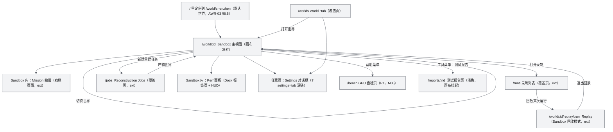
```mermaid
%%{init: {"theme": "base", "themeVariables": {"fontFamily": "Inter, PingFang SC, Microsoft YaHei, Noto Sans CJK SC, sans-serif", "fontSize": "13px", "background": "#FBFBFC", "primaryColor": "#F2F3F5", "primaryTextColor": "#111214", "primaryBorderColor": "#5C616A", "secondaryColor": "#E4E6E9", "tertiaryColor": "#FBFBFC", "lineColor": "#5C616A", "textColor": "#111214", "mainBkg": "#F2F3F5", "nodeBorder": "#5C616A", "clusterBkg": "#FBFBFC", "clusterBorder": "#A7ABB3", "edgeLabelBackground": "#FBFBFC", "noteBkgColor": "#E4E6E9", "noteTextColor": "#111214", "noteBorderColor": "#81868F"}}}%%
flowchart TB
  ROOT["/ 重定向到 /world/shenzhen（默认世界，AWR-03 §8.5）"]
  HUB["/worlds  World Hub（覆盖页）"]
  SB["/world/:id  Sandbox 主视图（画布常驻）"]
  ED["Sandbox 内：Mission 编辑（右栏页面，ext）"]
  RP["/world/:id/replay/:run  Replay（Sandbox 回放模式，ext）"]
  RUNS["/runs  录制列表（覆盖页，ext）"]
  JOBS["/jobs  Reconstruction Jobs（覆盖页，ext）"]
  PERF["Sandbox 内：Perf 面板（Dock 标签页 + HUD）"]
  SET["任意页：Settings 对话框（?settings=tab 深链）"]
  BENCH["/bench  GPU 自检页（P1，M06）"]
  REP["/reports/:rid  测试报告页（浅色，画布挂起）"]
  ROOT --> SB
  HUB -->|"打开世界"| SB
  SB -->|"切换世界"| SB
  SB --> ED
  SB --> PERF
  SB -->|"打开录制"| RUNS
  RUNS -->|"回放某次运行"| RP
  RP -->|"退出回放"| SB
  SB -->|"新建重建任务"| JOBS
  JOBS -->|"产物世界"| SB
  SB --> SET
  HUB --> SET
  SB -->|"帮助菜单"| BENCH
  SB -->|"工具菜单：测试报告"| REP
```

规则：
1. **画布常驻**：`<Canvas>` 挂在 `app/` 根组件，路由只切换其上的 DOM 层；World Hub、Runs、Jobs 是覆盖页，不卸载画布（依据 d02 §4.1 第 5b 行；ADR-007 "应用启动即创建渲染器"）。`/reports/:rid` 是独立页面层：不渲染 Sandbox 浮层，画布以 `viewport.setSuspended(true)` 挂起而不卸载（M06-FR-022；M15 §6 路由层）。
2. **覆盖页限帧**：覆盖页可见面积 ≥ 90% 视口时调用 `viewport.setFrameCap(5)`；限帧期间 `ctx.frozen = true`，CAS 与 PerfGovernor 不评估（ADR-012 "用户主动限帧"条件；M06-FR-022）；关闭时 `setFrameCap(0)`，CAS 清空采样窗口后重新累积。
3. **Mission 编辑与 Perf 不是独立路由**：它们是 Sandbox 的面板状态，用 URL 参数 `panel` 表达，便于深链而不重建页面。

### 2.2 路由与 URL 状态

| 路由 | 视图 | D1 | 说明 |
|---|---|---|---|
| `/` | 重定向 | core | 到 `/world/shenzhen`；首次加载 S1 并自动播放（AWR-03 §8.5） |
| `/worlds` | World Hub | core | 六城卡片；构建按钮为 ext（依赖 job-worker） |
| `/world/:id` | Sandbox | core | `:id` 满足 `^[a-z0-9-]{1,63}$`（AWR-03 §5.6）；id 不合法或 `world.json` 404 时进入 E-02（§7.6） |
| `/world/:id/replay/:run` | Replay | ext | `:run` 满足 `r<YYYYMMDD>-<HHMMSS>-<4hex>`；查询参数 `seg`（录制段号，缺省为最后一段） |
| `/runs` | 录制列表 | ext | 覆盖页 |
| `/jobs`、`/jobs/:jobId` | Reconstruction Jobs | ext | 覆盖页，`:jobId` 打开详情 Sheet |
| `/bench` | GPU 自检 | ext（P1） | M06 定义内容，本文只定义入口（Help 菜单） |
| `/reports/:rid` | 测试报告（浅色主题，editorial 密度） | core | 页面层，画布挂起；内容与版式见 15 §9.9、M15-FR-080，数据为 `GET /api/sys/perf-reports/{rid}` |
| 其他路径 | — | core | 重定向 `/worlds` 并 Toast 1 条"页面不存在，已打开世界列表" |

URL 查询参数（只写非权威的视图状态；权威状态永远来自服务端）：

| 参数 | 类型 | 取值 | 默认 | 说明 |
|---|---|---|---|---|
| `cam` | string | `orbit`、`free`、`third`、`fpv`、`bird` | `orbit` | 相机模式；`third`、`fpv` 需 `sel` 有效，否则回落 `orbit` |
| `sel` | string | 逗号分隔的机体 id，≤ 32 个 | 空 | 选择集；第一个为焦点机；超过 32 个不写入 URL |
| `panel` | string | `perf`、`events`、`charts`、`mission`、`mission-edit`、`agents` | 空 | 打开的 Dock 标签或右栏页面 |
| `settings` | string | `general`、`render`、`motion`、`shortcuts`、`account`、`about` | 空 | 打开设置对话框并定位标签 |
| `t` | number | 仿真秒，≥ 0 | 空 | 仅回放路由有效：打开后 seek 到该时刻 |
| `replay` | string | 运行 id | 空 | 一次性参数：`/world/:id/replay/:run?seg=&t=` 重定向为 `/world/:id?replay=<run>&seg=&t=`（画布与世界加载路径不变）；Sandbox 在连接就绪后按 §5.4 进入回放（先暂停实时，再 `playback open`，有 `t` 时 seek），随即从地址栏删除 `replay`、`seg`、`t`；无席位时 Toast 说明原因（FX-WEB2） |
| `tier`、`rb`、`allowFallback` | string | 见 AWR-03 §3.5 | 空 | 仅 dev/test 构建生效，生产构建移除（ADR-044） |

页面标题（`document.title`）为"<视图> · ANet Drone4D"：Sandbox 取世界 id，覆盖页与页面层取其名称（世界、重建任务、录制列表、测试报告、GPU 自检），其余为"ANet Drone4D"（ADR-056）。公开演示构建（`VITE_AWR_DEMO=public`，ADR-083）中产品名部分为"ANet Drone4D 公开演示"，只有 `/`（落地页，不加载应用）、`/world/synthcity`、`/worlds` 与 `/settings` 四条路由，其余路径回到世界列表；只读控件的原因统一为"公开演示为只读模式"，不出现申请控制，关于区块最前增加"演示站"一行（M15-FR-120 至 FR-124）。

URL 写入规则：相机与选择变化以 `history.replaceState` 写入，节流 1 Hz，不产生历史记录；路由切换用 `pushState`。深链打开时先加载世界，再按参数恢复相机与选择，任一 id 不存在时静默忽略该项，并在 Toast 中说明"链接中的 2 架无人机已不存在"。

### 2.3 导航入口

| 入口 | 形态 | 内容 | D1 |
|---|---|---|---|
| 顶栏 Menubar | `Menubar`：世界、视图、仿真、任务、工具、帮助 | 每项带 `MenubarShortcut`（Kbd）；菜单项与命令面板共用同一注册表（§6.10） | core |
| 命令面板 | `CommandDialog`，Mod+K | 分组：跳转、无人机、相机、仿真、图层、环境、面板、设置；支持按机体 id 跳转并选中 | core |
| 面包屑 | `Breadcrumb`：世界 › 运行 › 焦点机 | 点击"世界"打开 World Hub；点击"运行"打开 Runs（ext 时）；点击机体聚焦 | core |
| 右键菜单 | `ContextMenu` | 视口与列表行的上下文操作（§6.9） | core |
| 快捷键帮助 | `Dialog`，按 `?` | 快捷键全表（`Table` + `KbdGroup`） | core |

菜单结构（D1）：

| 菜单 | 菜单项（括号内为快捷键；标 ext 的项在 D1-ext 未交付时隐藏而不是置灰） |
|---|---|
| 世界 | 打开世界…（World Hub）；最近世界（子菜单，≤ 5）；世界信息；在此世界启动会话…（ext，操作席位，§6.16）；导出视图截图（P2 隐藏）；构建缺失世界（ext，admin 角色，§5.1） |
| 视图 | 相机模式（`MenubarRadioGroup`：Orbit 1、Free 2、Third 3、FPV 4、Bird 5）；跟随锁定（L）；聚焦选中（F）；正北朝上（N）；重置视角（Home）；显示左栏（Mod+B）；显示右栏（`\`）；显示底部面板（`` ` ``）；性能 HUD（P）；标签（`MenubarCheckboxItem`）；布局预设（子菜单：演示、调试、回放、编辑） |
| 仿真 | 播放或暂停（Space）；倍速（子菜单）；单步（→，仅暂停时）；加载剧本…；重置剧本（确认）；添加 P600；开始录制 / 停止录制（ext）；故障注入…（ext）；进入回放…（ext）；回到实时（ext，仅回放中） |
| 任务 | 任务面板；GoTo 工具（G）；编辑航线（ext）；绘制区域（ext）；AGENTS 面板（ext） |
| 工具 | 性能面板；事件日志；测试报告（子菜单列出 `GET /api/sys/perf-reports` 最近 5 份，点击打开 `/reports/:rid`）；重建任务（ext）；录制列表（ext） |
| 帮助 | 快捷键（?）；GPU 自检 `/bench`（ext）；项目仓库（新窗口打开 `github.com/ANetResearch/ANet-Drone4D`）；关于 |

`DropdownMenuLabel` 与 `MenubarLabel` 一律放在对应 Group 内（Base UI error #31，g07 §6 第 1 条）。

### 2.4 对象模型与选择上下文

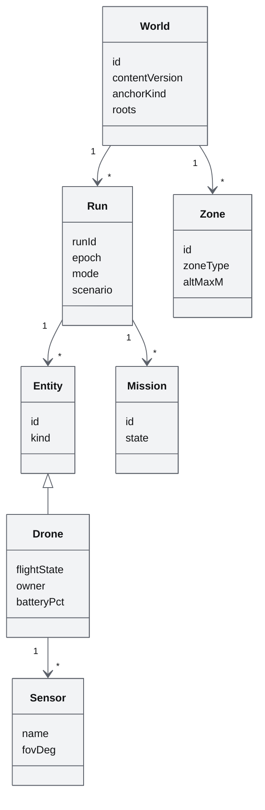
```mermaid
%%{init: {"theme": "base", "themeVariables": {"fontFamily": "Inter, PingFang SC, Microsoft YaHei, Noto Sans CJK SC, sans-serif", "fontSize": "13px", "background": "#FBFBFC", "primaryColor": "#F2F3F5", "primaryTextColor": "#111214", "primaryBorderColor": "#5C616A", "secondaryColor": "#E4E6E9", "tertiaryColor": "#FBFBFC", "lineColor": "#5C616A", "textColor": "#111214", "mainBkg": "#F2F3F5", "nodeBorder": "#5C616A", "clusterBkg": "#FBFBFC", "clusterBorder": "#A7ABB3", "edgeLabelBackground": "#FBFBFC", "noteBkgColor": "#E4E6E9", "noteTextColor": "#111214", "noteBorderColor": "#81868F"}}}%%
classDiagram
  class World {
    id
    contentVersion
    anchorKind
    roots
  }
  class Run {
    runId
    epoch
    mode
    scenario
  }
  class Entity {
    id
    kind
  }
  class Drone {
    flightState
    owner
    batteryPct
  }
  class Sensor {
    name
    fovDeg
  }
  class Mission {
    id
    state
  }
  class Zone {
    id
    zoneType
    altMaxM
  }
  World "1" --> "*" Run
  Run "1" --> "*" Entity
  Entity <|-- Drone
  Drone "1" --> "*" Sensor
  Run "1" --> "*" Mission
  World "1" --> "*" Zone
```

- 实体按 `kind` 分组（ADR-047）。D1 只有 `uav` 一组，DroneRail 的分组标题仍保留（"无人机 · 2"），为 V1.0 异构实体留位。
- 选择上下文只指向 Entity；Zone 与 Mission 可悬停查看与在面板中打开，但不进入选择集（避免"选中禁飞区后按 H"这类语义不清的命令）。

---

## 3. 全局布局（数字沙盘）

### 3.1 层叠模型

画布是第 0 层，其余全部是浮层（ADR-028）。z 序固定如下，禁止在业务代码中写任意 `z-index` 数值，只允许使用下表的 token 名（由 M15 在 `styles/index.css` 定义）。

| 层 | token 名 | 内容 | 指针事件 |
|---|---|---|---|
| 0 | `--z-canvas` | R3F 画布（全视口，`position: fixed; inset: 0`） | 接收；UI 与画布共用事件源（r14 §3.9） |
| 1 | `--z-labels` | LabelLayer（单个 DOM 覆盖层，`contain: strict`） | 无（`pointer-events: none`） |
| 2 | `--z-viewport-ui` | 视口叠加：相机工具条、ViewCube、HUD、坐标读数、状态徽标、工具态提示 | 容器无，子元素按需开启 |
| 3 | `--z-rails` | 左栏、右栏、底部 Dock（Sidebar `variant="floating"`、`collapsible="offcanvas"`） | 接收 |
| 4 | `--z-header` | 顶栏 | 接收 |
| 5 | `--z-banner` | 连接与系统横幅（`Alert`） | 接收 |
| 6 | `--z-overlay-page` | World Hub、Runs、Jobs 覆盖页 | 接收 |
| 7 | `--z-dialog` | Dialog、AlertDialog、CommandDialog、Sheet（含 Backdrop） | 接收 |
| 8 | `--z-popover` | Popover、DropdownMenu、ContextMenu、Tooltip、HoverCard、Select、Combobox 的 Positioner | 接收 |
| 9 | `--z-toast` | Toast 视口 | 接收 |
| 10 | `--z-mask` | 启动遮罩（品牌徽章 + 首屏进度） | 全部拦截 |

弹层高于对话框，是为了让对话框内部的 Select、Combobox、Tooltip（例如 Settings 与故障注入 Dialog 中的下拉）显示在对话框之上；模态对话框打开时外部弹层已因焦点移出而关闭，不会出现页面弹层压住对话框的情况。

### 3.2 线框图

**（a）Sandbox 默认布局，1920 × 1080 CSS px，实时模式，operator**

```text
┌────────────────────────────────────────────────────────────────────────────────────────────────────┐
│[av]ANet Drone4D│World Runtime  世界 视图 仿真 任务 工具 帮助   shenzhen › r20260928…a3f1 › P600-01     │ 顶栏 44
│                              SIM T+00:12:31 ×1 LIVE │ WS 38 ms │ OPERATOR │ 告警(2) │ 搜索 Mod+K │ 设置  │
├─────────────────┬──────────────────────────────────────────────────────────────┬────────────────────┤
│ WORLD        [-]│      ┌ Orbit │ Free │ Third │ FPV │ Bird ┐  [L 跟随]          ┌ViewCube┐│ DRONES  2   [筛选] │
│ 深圳 shenzhen  v│      └──────────────────────────────────┘                     │  N     ││ 搜索 p600…         │
│ 5.00M 点·示意坐标│                                                              └────────┘│┌──────────────────┐│
│ 剧本 S1   [加载]│                                                             [F][N][Home]││|P600-01 飞行中·航线││
│ [+ 添加 P600]   │                                                                         ││ 142.3 m 4.8 m/s  ││
│ LAYERS       [-]│                       （3D 画布：点云 + 无人机 + 轨迹）                   ││ 电量 78% 信号 高  ││
│ 点云     [开]   │                                                                         │└──────────────────┘│
│ 着色 高度|HAG|… │                 [选中机：红色；其余：灰阶]                                ││ P600-02 飞行中·航线│
│ 无人机   [开]   │                                                                         ││  96.1 m 4.9 m/s   │
│ 轨迹     [开]   │                                                                         ││ 电量 81% 信号 高  │
│ 视锥     [开]   │                                                                         │├──────────────────┤│
│ 禁飞区   [开]   │ ┌HUD──────────────────────┐                     ┌ E 120.45 N −33.10 ┐   ││ 详情 ›            │
│ ENVIRONMENT  [-]│ │呈现间隔 p95 41.2 ms  S档 │                     │ AGL 82.3 m        │   ││ [起飞][悬停][降落] │
│ 预设 晴 少云 雨…│ │~~~~~~~~ 点 24.1K/40K    │                     └───────────────────┘   ││ [返航][GoTo][更多] │
│ 风速 8.2 m/s    │ │加载 96%  受点预算限制    │                                   [Toast]   ││                    │
│ 来向 NW 315°    │ └─────────────────────────┘                                   [Toast]   ││                    │
├─────────────────┴──────────────────────────────────────────────────────────────┴────────────────────┤
│ [播放/暂停][单步]  ×0.25 ×0.5 [×1] ×2 ×5 ×10  │ 00:00 ─────────|───|──────|────────o 12:31 LIVE │ 事件 图表 性能 任务 [^]│ Timeline 48
└────────────────────────────────────────────────────────────────────────────────────────────────────┘
```

说明：左右栏与 Dock 与画布边缘留 8 px 浮层间距（Sidebar floating 变体自带 `p-2`），框线只为示意层级，实际由 mira 的 `ring-1` 描边承担（g07 §5.1）。"|P600-01" 左侧竖线表示列表选中态（`bg-muted` 加 2 px 前景色竖条，不用红）；Timeline 轨道上的"|"为事件标记，"o"为播放头。

**（b）紧凑布局，1280 × 720 CSS px（最小支持尺寸）**

```text
┌──────────────────────────────────────────────────────────────────────────────┐
│[av]ANet Drone4D  世界 视图 仿真 任务 工具 帮助 SIM T+00:12:31 ×1 │WS│OP│告警(2)│K│ 44
├──────────────────────────────────────────────────────────────┬───────────────┤
│[左栏收起：Mod+B 展开]  ┌Orbit│Free│Third│FPV│Bird┐  ┌ViewCube┐│ DRONES 2      │
│                        └─────────────────────────┘  └────────┘│|P600-01 飞行中 │
│                                                               │ 142 m 78%     │
│              （3D 画布）                                        │ P600-02 飞行中 │
│                                                               │  96 m 81%     │
│ ┌HUD──────────────┐                                           │ 详情 ›        │
│ │p95 41 ms S档    │                                   [Toast] │[悬停][返航]…  │
│ └─────────────────┘                                           │               │
├──────────────────────────────────────────────────────────────┴───────────────┤
│[播放/暂停] [×1 v] │ ───────────────────────────o 12:31 LIVE │ 事件 性能 任务 [^] │ 48
└──────────────────────────────────────────────────────────────────────────────┘
```

紧凑档的差异：左栏默认收起；倍速由 ToggleGroup 改为 `Select`；顶栏隐藏面包屑与"ANet Drone4D │ World Runtime"中的副标题，只保留头像与"ANet Drone4D"；HUD 只保留 KPI 行，无 sparkline。

**（c）Replay 模式，Dock 展开事件标签**

```text
├────────────────────────────────────────────────────────────────────────────────────────────────────┤
│ 回放 r20260928…a3f1 · S1 · 深圳     REPLAY  只读（命令已禁用）                        [回到实时]      │ 回放横幅 32
│ ...（画布、左右栏同 a；右栏命令区替换为"回放中不可下发命令"）...                                    │
├────────────────────────────────────────────────────────────────────────────────────────────────────┤
│ 事件 │ 图表 │ 性能                                                                        [v 收起]   │
│ 时间        来源      级别      消息                                                  机体           │ Dock 面板
│ T+00:04:12  safety   warning  P600-02 进入 HOLD（间距）                                p600-02        │ 默认 240
│ T+00:07:55  cmd      info     RTL 已完成                                              p600-01        │
├────────────────────────────────────────────────────────────────────────────────────────────────────┤
│[播放/暂停][<][>] [2× v]│00:00 ──//作废区间//──|──|────────|──────o──────── 18:40  BUFFERING │      │ 48
└────────────────────────────────────────────────────────────────────────────────────────────────────┘
```

**（d）Mission 编辑（D1-ext），右栏切换为编辑页**

```text
│   （画布：航点手柄、航段、禁飞区；违规航段为红色描边虚线）      │ < 返回   编辑航线 P600-01  │
│                                                                │ [选择][添加][区域]  撤销 重做│
│        (1)────(2)                                              │ 航点 12/1000 · 3.4/20 km   │
│                 \                                              │ #  E      N      AGL   z    │
│                  (3)──警告──(4)                                 │ 1  120.4  −33.1  60.0  91.2│
│                                                                │ 2  180.0  −20.5  60.0  88.4│
│                                                                │ 3  ...  [警告 102 禁飞区]    │
│                                                                │ [放弃]          [提交航线]  │
```

**（e）World Hub 覆盖页**

```text
┌────────────────────────────────────────────────────────────────────────────────────────────────────┐
│[av]ANet Drone4D │ 世界                                                        [搜索世界]  [关闭 Esc] │
│ ┌深圳 shenzhen──────────┐ ┌上海 shanghai──────────┐ ┌纽约 newyork──────────┐                        │
│ │5.00M 点 · 1 根 · 60 MB │ │5.00M 点 · 1 根       │ │5.00M 点 · 1 根       │                        │
│ │[层级点数 rung bars]    │ │[层级点数 rung bars]  │ │[层级点数 rung bars]  │                        │
│ │最高 381 m · 示意坐标   │ │最高 637 m            │ │最高 287 m            │                        │
│ │校验 通过 · v 3f2a9c…  │ │校验 通过              │ │校验 通过              │                        │
│ │TTFP 0.62 s   [打开]    │ │            [打开]    │ │            [打开]    │                        │
│ └───────────────────────┘ └──────────────────────┘ └──────────────────────┘                        │
│ （旧金山、苏州、芝加哥同构，苏州显示"6 根"；六城均为合成锚点，卡片均带"示意坐标"；缺失的世界显示"未构建"）      │
└────────────────────────────────────────────────────────────────────────────────────────────────────┘
```

**（f）FPV 模式视口叠加（最少元素）**

```text
┌ Orbit │ Free │ Third │ [FPV] │ Bird ┐  焦点低延迟 · P600-01 · 相机 FOV 84°
                         +                        （十字准星，1 px，前景色 40%）
 航向 045°   AGL 82.3 m   速度 4.8 m/s   电量 78%            [Esc 退出 FPV]
```

### 3.3 区域尺寸与行为

| 区域 | 默认尺寸（标准档） | 可调范围 | 开合方式 | 动效（§8） | D1 |
|---|---|---|---|---|---|
| 顶栏 | 高 44 px（`--header-height: 2.75rem`） | 不可调 | 常驻 | — | core |
| 左栏 | 宽 288 px | 256–400 px（`Separator` 拖动） | Mod+B；offcanvas，完全移出 | 07 panel-reveal（X 轴） | core |
| 右栏 | 宽 320 px | 280–480 px | `\` | 07 panel-reveal（X 轴） | core |
| 底部 Timeline 条 | 高 48 px | 不可调 | 常驻（Replay 时另加 32 px 回放横幅） | — | core |
| 底部 Dock 面板区 | 高 240 px | 160 px 至 50% 视口高 | `` ` `` 或点标签 | 21 accordion 的高度过渡（面板区自身，不影响画布） | core |
| 性能 HUD | 宽 264 px | 不可调 | P；折叠为单行 | 01 card-resize（HUD 自身） | core |
| 相机工具条 | 自适应 | — | 常驻 | 16 tabs-sliding | core |
| ViewCube | 72 × 72 px | — | 常驻（FPV 隐藏） | — | core |
| Toast 视口 | 宽 360 px，右下，距 Dock 顶 12 px | — | 自动 | 22 toast、32 banner-stacking | core |

- 浮层与画布边缘、浮层之间的间距统一为 8 px；顶栏不浮动（紧贴视口顶边），但仍在画布之上。
- **纵横范围**：Timeline 条横跨视口全宽，贴底；左右栏纵向从"顶栏下沿 + 8 px"到"Timeline 条上沿 − 8 px"（Sidebar 容器按 d04 §6 第 7 条改写 `top` 与高度，不覆盖顶栏）；Dock 面板区位于 Timeline 条之上、水平方向在两栏内沿之间（栏收起时延伸到距视口边缘 8 px），与 M15-FR-012 一致。线框图（c）为简化把 Dock 画成全宽。
- 所有尺寸调整只改浮层自身；拖动过程中只写浮层的 `width`/`height` 与 `setViewOffset` 目标值，不调用 `renderer.setSize`（D1-AC-24）。
- 尺寸与开合状态写入 `awr.ui.layout.v1`（§3.6），不使用 shadcn Sidebar 默认的 `sidebar_state` cookie（`SidebarProvider` 改为受控 `open`）。

### 3.4 未遮挡区与视觉中心

1. 未遮挡区 = 视口矩形减去顶栏、已展开的左栏与右栏、Timeline 条与已展开的 Dock 面板（按浮层外沿加 8 px 间距计算）。
2. 相机投影中心通过 `camera.setViewOffset(fullW, fullH, offX, offY, fullW, fullH)` 对准未遮挡区中心（ADR-028），其中 `offX = fullW/2 − cx`、`offY = fullH/2 − cy`，(cx, cy) 为未遮挡区中心的 CSS 像素坐标（原点在视口左上）；视口宽高比不变，因此不需要改 `camera.aspect`，也不触发 `setSize`。浮层开合时，offset 与浮层同时过渡：打开用 `--panel-open-dur`（400 ms），关闭用 `--panel-close-dur`（350 ms），曲线 `--ease-smooth-out`；reduced 档直接跳变。拖动分隔条期间 offset 不跟随，松开后以 `--duration-fast`（250 ms）过渡到新值。**FPV 例外**：FPV 相机必须保持传感器内参的主点，不应用 view offset（M06；AWR-03 ADR-028）。
3. 相机飞行（聚焦、双击定位）的目标点落在未遮挡区中心，而不是画布中心。
4. HUD、ViewCube、相机工具条、坐标读数都锚定在未遮挡区的四角与上边中点，随浮层开合一起平移（`transform`，不触发布局）。

### 3.5 可停靠面板

面板是注册表驱动的内容单元（`ui/panels/registry.ts`，扩展点属 M15，AWR-03 §4.3），可以停靠到三个槽位之一：左栏（作为 Collapsible 分组）、右栏（作为页面栈中的一页）、底部 Dock（作为标签页）。

```ts
// ui/panels/registry.ts（M15 实现；字段语义由本文定义）
export type DockSlot = "left" | "right" | "bottom"
export interface PanelDescriptor {
  id: string                  // 见下表，kebab-case，全局唯一
  titleKey: string            // 文案键，例如 "panel.perf.title"（§13.7）
  icon: IconKey               // 图标语义 key（d03 §4.1），禁止直接写 lucide 名
  home: DockSlot              // 默认槽位
  allowed: DockSlot[]         // 允许停靠的槽位
  minSize: { w: number; h: number }   // CSS px；底部槽位只看 h，左右槽位只看 w
  layer: "core" | "ext"       // D1 层；ext 未交付时注册表不登记，UI 不出现入口
  when?: (ctx: PanelCtx) => boolean   // 可用性：角色、模式（live/replay）、caps
  render: () => React.ReactNode       // 面板体：只订阅 ≤ 10 Hz 摘要（ADR-008）
}
```

| 面板 id | 名称 | 默认槽位 | 允许槽位 | 最小尺寸 | D1 |
|---|---|---|---|---|---|
| `world` | 世界 | left | left | w 256 | core |
| `layers` | 图层 | left | left、right | w 256 | core |
| `env` | 环境 | left | left、right、bottom | w 256 / h 160 | core |
| `drones` | 机群列表 | right | right、left | w 280 | core |
| `drone-detail` | 单机详情 | right（页面栈第 2 页） | right | w 280 | core |
| `mission` | 任务 | bottom | bottom、right | h 160 / w 280 | core |
| `mission-edit` | 航线与区域编辑 | right（页面栈第 3 页） | right | w 320 | ext |
| `events` | 事件 | bottom | bottom、right | h 160 | core |
| `charts` | 图表 | bottom | bottom、right | h 200 | core |
| `perf` | 性能 | bottom | bottom、right | h 200 | core |
| `agents` | 智能体 | bottom | bottom、right | h 200 | ext |

- 停靠操作：面板标题栏的"更多"`DropdownMenu` → "停靠到 › 左栏 / 右栏 / 底部"（P1）；D1-core 只保证默认槽位。拖拽面板到其他槽位为 P2（需要评估 d04 提到的 dnd-kit，见 §19）。
- 布局预设（P1）：演示（默认，Dock 收起）、调试（Dock 展开 280 px，默认标签"性能"，右栏同时打开详情）、回放（Dock 展开，默认标签"事件"）、编辑（右栏宽 400 px，打开 `mission-edit`）。依据 r15 §3.18 的"演示、调试、回放"三套布局。
- 同一面板只能出现在一个槽位；槽位为空时对应浮层自动收起。

### 3.6 视图状态持久化

| 键 | 内容 | 版本 | 失败处理 |
|---|---|---|---|
| `awr.ui.layout.v1` | `{preset, left:{open,width}, right:{open,width,page}, dock:{open,height,tab}, panels:{[id]:{slot,order}}, hud:{open}}` | v1 | 读写一律 try/catch；读失败或版本不符时使用默认值，不提示 |
| `awr.ui.prefs.v1` | `{motion:"system"\|"lite"\|"reduced", altRef:"AGL"\|"MSL", coord:"enu"\|"lla", labels:boolean, lastWorld:string, camByWorld:{[id]:{mode,pose}}}` | v1 | 同上 |
| `awr.render.v1` | 渲染后端偏好与"起步档 − 1"记忆（M06-FR-013 定义，本文只提供设置入口） | M06 | 同上 |
| `awr.auth.principal.v1` | `principal_hint`（128 位随机数，17 §3.1）；刷新页面后 principal 不变，才能在席位 30 s 宽限内收回席位 | v1（本文设定键名，写入方为 `net/`，M11） | 读写失败时每次加载生成新 hint，席位宽限不可收回，UI 不提示 |

持久化只保存本浏览器的视图偏好；任何权威状态（时钟、选择的服务端含义、环境）不写入 localStorage。

### 3.7 性能 HUD 布局

HUD 位于未遮挡区左下角，是一张 `LfChartCard`（`size="sm"`、`rounded-xl`、不加 border，g07 §5.1），默认展开：

```text
┌──────────────────────────────────────┐
│ 呈现间隔 p95        S 档 · 30 FPS 目标 │  标题 text-hud-title；右侧 Badge
│ 41.2 ms  ~~~~~~~~~~~~~~~~~~~~ (T*线) │  KPI text-hud-kpi + LfSparkline 64×16
│ 点 24.1K / 预算 40K    [====----]     │  20 格刻度条（1 格 = 5%，15 §9.6 行内微图）
│ 加载 96%  在途 3  受点预算限制          │  Progress + 文本（limitedBy）
│ 降级 ① 轨迹减半                        │  perf.degraded 图标 + 文字；仅在降级时出现
└──────────────────────────────────────┘
```

- 刷新：LfScheduler 4 Hz（ADR-031）；数值为 C 类，不做动画（§8.4）。
- 交互：点击 HUD 打开 Dock"性能"标签（`panel=perf`）；按 P 在"展开 / 单行"之间切换（单行只保留 p95 与档位）。
- 红色：HUD 是一张"图"，只有"p95 超过 1.5·T*"时 KPI 数字用红色文字（HERO_TEXT，暗色取 r400）；降级行、S 档徽标、受点池容量限制等提示一律灰阶（15 §9.7 第 4 条）。

---

## 4. 区域到 shadcn 组件的映射（base-mira）

组件一律来自 `ui/components/ui`（shadcn 4.21 base-mira，Base UI 1.8；ADR-028、ADR-037）。表中"动效"列引用 §8 的配方编号，"图标"列引用 §9 的语义 key。

### 4.1 顶栏

| 元素 | 组件组合 | 要点 | 动效 | 图标 | D1 |
|---|---|---|---|---|---|
| 品牌锁定组合 | ``（`public/brand/avatar-96.png`，24 px）+ 文本 + `Separator orientation="vertical"` | "头像 24 px + ANet Drone4D + 分隔线 + World Runtime"（ADR-032、ADR-056）；紧凑档省略"World Runtime" | — | — | core |
| 主菜单 | `Menubar` > `MenubarMenu` > `MenubarTrigger` + `MenubarContent` > `MenubarGroup` > `MenubarItem`/`MenubarCheckboxItem`/`MenubarRadioGroup` + `MenubarShortcut` | Label 必须在 Group 内 | 05 | 按项 | core |
| 面包屑 | `Breadcrumb` > `BreadcrumbList` > `BreadcrumbItem` > `BreadcrumbLink`/`BreadcrumbPage` + `BreadcrumbSeparator` | 超长运行 id 中段省略（`BreadcrumbEllipsis`） | — | `chev.right` | core |
| 仿真时钟 | `Badge variant="secondary"` + `HoverCard`（`PreviewCard`） | 文本 C 类，≤ 4 Hz（Tier S）；HoverCard 显示仿真时间、墙钟、倍速、TIME.state、epoch、RTF | 05 | `tl.clock` | core |
| 连接状态 | `Badge variant="outline"` + `HoverCard` | 显示 WS RTT；HoverCard：延迟、消息率、credit_skips、swarm 实际频率、serverInfo | 05；状态文字 04 | `conn.online`（morph `WifiOff`） | core |
| 角色与控制权 | `Badge` + `Button size="sm" variant="outline"`（申请控制 / 释放控制） | 角色取 `serverInfo.role` 与 `seat`：viewer 显示 `Eye` 与"只读"；operator 且 `seat = held` 显示"操作员"；admin 显示"管理员"；operator 但 `seat = other` 按只读呈现（§6.12） | 04 | `user`、`layer.visible` | core |
| 告警计数 | `Button variant="ghost" size="icon-sm"` + `Badge`（计数）+ `Popover`（告警中心） | 全局一处红：有未确认 critical 时计数徽标红色实心（§11.2） | 03 notification-badge；12 shake 一次（ext） | `notify`、`notify.ring` | core |
| 命令面板入口 | `Button variant="outline" size="sm"` + `Kbd` | 显示 "搜索 Mod K" | — | `cmd.search` | core |
| 设置 | `Button variant="ghost" size="icon-sm"` + `Tooltip` | 打开 Settings `Dialog` | 06 | `nav.settings` | core |

### 4.2 左栏 WORLD / LAYERS / ENVIRONMENT

| 元素 | 组件组合 | 要点 | 动效 | D1 |
|---|---|---|---|---|
| 容器 | `Sidebar side="left" variant="floating" collapsible="offcanvas"` > `SidebarHeader` > `SidebarContent` > `SidebarGroup` + `SidebarGroupLabel`（WORLD、LAYERS、ENVIRONMENT） | codemod 把 `sidebar-gap` 宽度设为 0；折叠只改 transform 与 opacity（ADR-028） | 07 | core |
| 分组折叠 | `Collapsible`（每个 SidebarGroup） | 默认全部展开；紧凑档只展开 LAYERS | 21 | core |
| 世界选择 | `Combobox`（带搜索）；世界数 < 7 时用 `Select items={…}` | Base Select 必须传 `items`（d04 §6 第 9 条） | 05 | core |
| 世界信息 | `Item size="sm"` + `Badge`（"示意坐标"） | `anchor.kind = synthetic` 时必须显示"示意坐标"（AWR-03 §5.1 规则 3） | — | core |
| 剧本 | `Select`（`GET /api/scenarios?world_id=` 的当前世界剧本）+ `Button`（加载） | 加载剧本触发 AlertDialog（结束当前录制段并从剧本起点重开，epoch + 1），确认后发 `sim/reset {scenario_id}`（17 §7.1） | 05、06 | core |
| 添加 P600 | `Button variant="outline" size="sm"` | 进入"添加 P600"工具态（§6.13） | — | core |
| 图层开关 | `Field orientation="horizontal"` > `FieldLabel` + `Switch` | 值直接写 engine store，不经 React 状态树（d04 §3.5） | 27 toggle | core |
| 着色模式 | `ToggleGroup`（单选：高度、HAG、法线、类别） | base 下 `value={[mode]}` | 16 | core |
| 类别开关（classMask） | `Collapsible` > `Checkbox` × N（anet-classes@1 的 0–15） | 改开关不重新加载数据（ADR-005） | 25 checkbox | core |
| 画质 | `Select`（自动、soft-min … ultra）+ `Slider`（点预算，自动时只读） | 自动时 Slider 显示实时 B，禁用拖动 | 05 | core |
| 天气预设 | `ToggleGroup`（3 列 × 4 行，12 个预设，图标 + 文字；预设 id、中文名与图标 key 取自 M07 §6.5） | 网格排列不用滑动指示器：按下态只切换背景色（`--duration-quick`）；过渡指示图标按 §9.2 天气映射 morph 或 swap | 按下态颜色过渡；图标 smooth morph 或 09 swap | core |
| 参考风速（10 m）、降水、云量、背景能见度 | `Field` > `FieldLabel` + `Slider`（数组形式 `[x]`）+ `InputGroup`（`InputGroupInput type=number` + `InputGroupAddon` 单位） | 拖动时本地显示，松开提交（§6.14）；字段路径与范围见 M07 §6.2.1 | — | core |
| 风向 | `Slider`（0–360°，`[x]`）+ 旋转的 `env.wind.dir` 图标 | 图标用 CSS rotate（指向去向 = 来向 + 180°），不 morph（d03 §3.6；M07 §8.1） | CSS `rotate`，`--telemetry-text-interval` + `--ease-linear`（15 §7.5） | core |
| 过渡进度 | `Progress` + 文本 | 显示预设过渡 "12 / 30 s" | — | core |
| 本机处环境 | `LfStat` 行（风、阵风、MOR、降水） | 选中机的 `uav/{id}/env` 10 Hz，显示 ≤ 4 Hz | — | core |

### 4.3 视口叠加

| 元素 | 组件组合 | 要点 | 动效 | D1 |
|---|---|---|---|---|
| 相机工具条 | `ToggleGroup`（5 项，`size="sm"`）+ `Tooltip`（内嵌 `Kbd` 1–5）+ `Toggle`（跟随锁定） | 共享 Tooltip handle（`Tooltip.createHandle`，g07 §6 第 4 条）；滑动指示器由 `toggle-group-indicator` codemod 提供（§4.7） | 16、17 | core |
| 视图工具 | `ButtonGroup orientation="vertical"` > `Button size="icon-sm" variant="ghost"`（聚焦 F、正北 N、重置 Home） | 图标用 `data-icon`，不加尺寸类（d04 §3.7） | — | core |
| ViewCube | DOM 自绘（AWR-03 ADR-007 后果：drei GizmoHelper 不进共享代码） | lint 白名单内部结构；点击面或边以相机飞行对齐 | 相机飞行 | core |
| 性能 HUD | `Card size="sm"` + `LfStat` + `LfSparkline` + `Progress` + `Badge` | §3.7 | 01 | core |
| 坐标读数 | `Card size="sm"`（单行）+ `Badge`（仅在显示经纬度时出现"示意"） | 鼠标下地面点的 ENU 与 AGL（ray_hit，≤ 5 Hz，仅在视口悬停时）；设置为经纬度显示时附"示意"徽标（AWR-03 §5.1 规则 3） | — | core |
| 工具态提示条 | `Alert`（紧凑，顶部居中）+ `Kbd` | "GoTo：点击地面选择目标 · Esc 取消" | 07 的 Y 轴 8 px 变体 | core |
| 3D 锚定确认 | `Popover`（受控 `open`，Positioner `anchor` 为 VirtualElement） | 相机移动即关闭（d04 §6 第 14 条）；需在 `popover.tsx` 透传 `anchor` | 05 | core |
| 标签 | LabelLayer（engine 驱动的 DOM，不是 shadcn 组件） | Tier S ≤ 16、其余 ≤ 48；文本 ≤ 4 Hz；每帧只写 transform（ADR-029） | — | core |
| 状态徽标 | `Badge`（"焦点低延迟"、"信号延迟"、"受点池容量限制"、"STALE"） | 出现与消失用 04 text-swap | 04 | core |
| 右键菜单 | `ContextMenu` > `ContextMenuTrigger render={<div className="absolute inset-0"/>}` | 右键判定见 §6.9 | 05 | core |

### 4.4 右栏 DRONES

| 元素 | 组件组合 | 要点 | 动效 | D1 |
|---|---|---|---|---|
| 容器 | `Sidebar side="right" variant="floating" collapsible="offcanvas"`；宽度由布局 store 控制 | 两侧栏共用 `--sidebar-width` 的问题由 codemod 支持按侧宽度解决（d04 §6 第 6 条） | 07 | core |
| 页面栈 | `Tabs`（无可见 TabsList）+ `TabsPanels`（单格 grid，g07 §2.4 第 4 条） | 列表、详情、编辑三页，互相切换 | 08 page-side-by-side | core |
| 搜索与筛选 | `InputGroup`（`InputGroupAddon` 搜索图标）+ `DropdownMenu`（按状态、按控制权、仅告警） | 搜索按 id 前缀与子串 | 05 | core |
| 列表 | `ScrollArea className="scroll-fade-y"` + `@tanstack/react-virtual` + `Item size="sm"`（`ItemMedia`、`ItemContent`、`ItemActions`） | > 100 行必须虚拟化；每行只订阅自己的数据（ADR-028） | §8.2 第 21 行（列表进出） | core |
| 行内状态 | `Badge`（FlightState）+ `StateIcon`（电量档、信号档）+ 控制权图标 | 只有可见行与选中行 morph，其余行 set（d03 §7 第 6 条） | 09 / morph | core |
| 批量操作条 | `ButtonGroup`（悬停、返航、降落、安全停止）+ 计数文本 | 选择数 ≥ 2 时出现在列表底部 | 07 的 Y 轴变体 | core |
| 详情头 | `Item` + `Badge`（机型、SIM、控制权）+ `Button`（申请或释放控制） | SIM 与 REAL 显式标记（d04 §7 第 5 条） | 04 | core |
| 详情标签 | `Tabs` > `TabsList variant="line"`（`variant` 属于 TabsList）：遥测、任务、传感器、孪生、智能体（ext） | 遥测 10 Hz 只驱动当前可见标签 | 16、08 | core |
| 遥测 | `LfStat` × 4（高度、速度、电量、模式）+ `LfLiveLine` small multiples | 流式图受 Tier S ≤ 4 张约束 | — | core |
| 孪生 | `Table`（lieflat 皮肤）：组成部分、置信度 A–E、状态 | 显示"参数未辨识"（ADR-043） | — | core |
| 命令区 | `ButtonGroup`（起飞、悬停、降落、返航）+ `Button`（GoTo）+ `DropdownMenu`（更多：安全停止、轨迹、视锥、移除、kill（ext）） | 执行中显示 `Spinner`；降落、返航、移除经 `AlertDialog` | 06、09 | core |

### 4.5 底部 Dock

| 元素 | 组件组合 | 要点 | 动效 | D1 |
|---|---|---|---|---|
| Timeline 条 | `ButtonGroup`（播放/暂停 `StateIcon`、单步）+ `ToggleGroup`（倍速）或 `Select`（紧凑档、回放）+ 自研轨道（`Slider` 承担 seek 交互）+ `Badge`（LIVE、REPLAY、BUFFERING） | 轨道底层画事件条码地板（lieflat L3 语汇） | 16、04 | core（seek 为 ext） |
| 面板标签 | `Tabs` > `TabsList variant="line"` + `TabsPanels` | 标签：事件、图表、性能、任务、智能体（ext） | 16、08 | core |
| 面板区高度 | `ResizablePanelGroup orientation="vertical"`（只在 Dock 内部）或 `Separator` 拖动 | react-resizable-panels v4：数字为像素、字符串为百分比（d04 §6 第 10 条） | 21 | core |
| 事件表 | `Table`（lieflat `table.log` 皮肤）+ 虚拟滚动 | 上限 5000 条（ADR-028） | — | core |
| 图表页 | `Card`（LfChartCard）网格 | 不可见即暂停 | — | core |
| 任务页 | `Table` + `Progress` + `ButtonGroup`（播放、暂停、重置） | §5.3 | — | core |

### 4.6 全局浮层

| 元素 | 组件 | 要点 | 动效 | D1 |
|---|---|---|---|---|
| 命令面板 | `CommandDialog` > `CommandInput`、`CommandList`、`CommandGroup`、`CommandItem`、`CommandShortcut` | 结果与 Menubar 共用注册表 | 06 | core |
| 确认 | `AlertDialog` | 按钮文案用动词（§13.5） | 06 | core |
| 设置 | `Dialog` > `Tabs`（常规、渲染、动效、快捷键、账户、关于）> `FieldGroup` | §5.6 | 06、16、08 | core |
| 快捷键帮助 | `Dialog` > `Table` + `KbdGroup` | 分组与 §6.10 一致 | 06 | core |
| 关于 | `Dialog`，内含完整徽章 320 px | 品牌落点（ADR-032） | 06 | core |
| 通知 | Base UI Toast（`ToastProvider limit={3}`、`ToastViewport`） | 合并规则 §11.4；不用 Sonner | 22、32 | core |
| 连接横幅 | `Alert`（顶部，占未遮挡区宽度） | §7.7 | 07 的 Y 轴变体 | core |
| 全局 Tooltip | `TooltipProvider delay` = `--duration-slow`（400 ms）、`closeDelay` 0、`timeout` = `--duration-slow` | 密集控制台不用 0 延迟（d04 §6 第 13 条）；首个气泡出现后 `timeout` 内移到相邻触发器瞬显（`data-instant="delay"`）；与 15 §8.3 第 17 行的 80 ms 不一致，按本文执行（M15-FR-058 已采用），见 §19 第 15 条 | 17 | core |

### 4.7 组件清单与禁用项

D1 安装清单（44 个，即 ADR-028 所述"约 45 个"；`anet-base.json` 一次 init，其余 `add`；M15-FR-081）：sidebar、sheet、tooltip、skeleton、input、separator、resizable、card、tabs、scroll-area、collapsible、accordion、dialog、alert-dialog、popover、hover-card（preview-card）、menubar、dropdown-menu、context-menu、command、breadcrumb、button、button-group、toggle、toggle-group、slider、input-group、field、label、checkbox、radio-group、switch、select、native-select、combobox、table、badge、kbd、item、empty、progress、spinner、alert、toast。

禁用：`chart`（Recharts）、`sonner`、`drawer`、`carousel`、`calendar`（V0.6 前）、`navigation-menu`、`pagination`（用虚拟滚动代替）、`input-otp`；原生 `button/input/select/textarea/dialog` 与 `role="dialog|menu|listbox|tooltip|combobox"` 在 `ui/components/ui/**` 之外为 lint 错误（no-raw-controls，D1-AC-20）。

本文交互对组件源码的改写要求（由 M15 的 codemod 套件实现，M15-FR-083；g07 §2.4 已有的 `tabs-indicator` 等不再列出）：

| codemod | 改写内容 | 原因 |
|---|---|---|
| `tabs-indicator`（扩展） | `TabsList variant="line"` 也渲染 `Tabs.Indicator`，样式为 2 px 前景色下划线，替换原 `after:` 伪元素下划线 | g07 样板只在 `variant="default"` 时渲染 Indicator，line 变体没有滑动指示器，16 tabs-sliding 无法落地 |
| `toggle-group-indicator`（新增） | `ToggleGroup` 单选时渲染一个绝对定位的指示块：按下项变化与容器尺寸变化（ResizeObserver）时读取该项 `offsetLeft`、`offsetWidth`，只写 `translate` 与 `width`，过渡 `--tabs-dur`；`data-instant` 与 reduced 档为 0 s | Base UI ToggleGroup 没有 Indicator；相机工具条、倍速、着色模式需要 16 的滑动效果（d03 §4.2 要求相机模式用滑动指示器代替 morph） |
| `sidebar-overlay`（补充） | 删除 `SidebarProvider` 内置的 Mod+B 监听，由快捷键注册表统一分发；`open` 受控，不写 `sidebar_state` cookie；折叠时容器加 `inert` | 两侧各一个 Provider 时内置监听会同时响应；折叠的浮层不能留在 Tab 顺序里 |

---

## 5. 视图清单

每个视图按"目的、入口、结构、数据、关键交互、状态、D1"给出。所有视图共享 §3 的层叠模型与 §11 的告警通道。

### 5.1 World Hub（世界列表）

| 项 | 内容 |
|---|---|
| 目的 | 浏览与打开内置六城及其他 World Package；查看每个世界的规模、校验状态与上次首屏耗时 |
| 入口 | 路由 `/worlds`；菜单"世界 › 打开世界…"；面包屑"世界"；命令面板"跳转到世界" |
| 结构 | 覆盖页（§3.1 第 6 层）：页头（头像 + "世界" + 搜索 `InputGroup` + 关闭）；卡片网格（每行 3–5 张，按分辨率档，§14）；卡片为 `Card`：标题（`name_zh` + id）、`LfStat`（`points`、`roots`、`bytes`）、`LfRungBars`（`levelsPoints` 逐层点数，作为世界指纹）、最高高度（`bounds_m` 的 zmax）、"示意坐标"`Badge`（`georeferenced = false` 时）、状态、`content_version` 前 6 位、上次 TTFP（本地记录）、主按钮"打开" |
| 数据 | 列表：`GET /api/worlds`（17 §4.3.2：`id`、`name_zh`、`status`、`content_version`、`georeferenced`、`points`、`bytes`、`roots`、`in_use`）；卡片可见后懒取 `GET /api/worlds/{id}`（`bounds_m`、`qa{status, messages}`）与各根 `metadata.json` 的 `levelsPoints`（静态 immutable 缓存）；本地 `awr.ui.prefs.v1.lastWorld` 标"上次打开"；`in_use = true` 的卡片标"运行中" |
| 关键交互 | 点击卡片或 Enter 打开 → 路由到 `/world/:id`，覆盖页以 07 反向（向上 8 px 淡出）退出，画布进入"切换世界"加载态（§7.3）；方向键在卡片间移动焦点（roving tabindex）；"构建"按钮（ext，仅 admin 角色可见，需管理口令）调用 `POST /api/worlds/{id}/build`，卡片内以 `Progress` 显示 `job.state` 进度；`in_use` 的世界不可构建（`123 WORLD_NOT_READY`，按钮置灰并说明"会话正在使用"） |
| 状态 | 空：`Empty`（完整徽章 ≥ 480 px + "没有可用的世界" + 提示 `make fetch-data` 与 `make worlds`）；加载：卡片 `Skeleton`，14 skeleton-reveal；`status` 映射：`ready` 正常；`building` 卡片内 `Progress` + "构建中"，打开按钮置灰；`missing` 灰阶 + `Badge`"未构建" + 构建按钮（ext）或命令提示 `make worlds`（core）；`stale` `Badge`"待重建"（`contentVersion` 校验失败），打开按钮置灰；`failed` `Badge` 红描边 + `TriangleAlert` + "构建失败"；`qa.status` 非通过但可加载时：`Badge` 红描边 + `TriangleAlert` + "校验告警（N 项）"，打开前弹 AlertDialog 列出前 5 条 |
| 画布 | 覆盖页打开期间画布限帧 5 fps（§2.1 规则 2）；关闭时若世界未变，恢复正常帧率 |
| D1 | core（打开、列表、状态）；构建按钮 ext |

### 5.2 Sandbox（主视图）

| 项 | 内容 |
|---|---|
| 目的 | 在一个世界中观察与操控机群、环境与时间：数字沙盘的主工作面 |
| 入口 | 路由 `/world/:id`；默认 `/world/shenzhen` 并自动加载 S1 |
| 结构 | §3.2（a）；顶栏、左栏、右栏、视口叠加、底部 Timeline 与 Dock |
| 数据 | World Package（HTTP Range）；WS `awr.rt.v1` 默认订阅集按 17 §6.6（AWR-03 §8.5）：`fleet/roster@10`、`swarm/uav/state`（Tier S @10、B/A @20）、关注集 `uav/{id}/state@30`、选中机或 FPV `@60`、选中机 `state_ext@2`、`safety@5`、`env@10`、`env/state@10`、`event`（all，前端 ≤ 4 Hz 批量入 store）、`perf/server@1`、`sys/procs@1`；按需：任务叠加开启时 `mission/{mid}/status@2` 与 `uav/{id}/path@2`，视锥开启时 `uav/{id}/sensor/{name}/pose@10`；视图世界不等于会话世界时只加载点云、不订阅仿真通道（12 §4.1.4） |
| 关键交互 | 选择（§6.2）、相机（§6.4）、GoTo（§6.7）、右键（§6.9）、命令（§6.11）、控制权（§6.12）、添加移除 P600（§6.13）、环境（§6.14）、图层（§6.15）、世界切换（§6.16）、Timeline（§6.17） |
| 模式 | `live`（默认）、`replay`（ext，§5.4）、`edit`（ext，§5.3）；模式写在 `<html data-mode>` 上，供样式与快捷键作用域使用 |
| 状态 | §7 全部适用 |
| D1 | core |

### 5.3 Mission（任务面板与编辑）

**D1-core 部分：任务面板**（Dock 标签"任务"，`panel=mission`）

| 区域 | 组件 | 内容 |
|---|---|---|
| 剧本头 | `Item` + `Badge` + `ButtonGroup` | 剧本名（S1 深圳双机立面螺旋扫描）、倍速声明、`gcs_loss_policy`；按钮：开始或继续全部任务、暂停全部任务（对表内各任务发 `mission/{mid}/start` 或 `resume`、`pause`）、重置剧本（AlertDialog：重置会结束当前录制段并开始新段，epoch + 1，ADR-040；发 `sim/reset {scenario_id: null}`） |
| 任务表 | `Table`（lieflat 皮肤）；数据 `GET /api/missions` 与 `mission/{mid}/status` topic | 列：任务、机体、状态（IDLE/RUNNING/PAUSED/DONE/ABORTED 的中文文案 + `StateIcon`）、进度（20 格刻度条，1 格 = 5%，15 §9.6）、航点 k/N（D 类数字）、剩余距离、ETA |
| 行操作 | `DropdownMenu` | 开始（`mission/{mid}/start`，IDLE 时）、暂停（`mission/{mid}/pause`）、恢复（`mission/{mid}/resume`）、中止（`mission/{mid}/abort`，AlertDialog）、在视口聚焦该任务路径 |

任务级操作走 `mission/{mid}/*` 服务：只要求操作席位，机体租约由任务引擎以 MISSION 名义申请（17 §7.1；语义见 [12](12-业务逻辑设计说明书.md) §4.5）。单机详情中的"暂停任务"走 `uav/{id}/cmd/pause`（需要该机租约，要求子模式为 GOTO、PATH、ORBIT、SWARM 且有任务，g04 §6.2 注 3）。仿真时钟的播放暂停在 Timeline（§6.17），两者文案明确区分："暂停任务"与"暂停仿真"。

**D1-ext 部分：航线与区域编辑**（右栏第 3 页 `mission-edit`，§3.2（d））

| 区域 | 组件 | 内容 |
|---|---|---|
| 页头 | `Button`（返回）+ 标题 + `Badge`（目标机体） | "编辑航线 P600-01"；返回时如有未提交修改弹 AlertDialog"放弃修改？" |
| 工具组 | `ToggleGroup`：选择、添加航点、绘制区域；`ButtonGroup`：撤销、重做 | 工具互斥；撤销与重做为本地草稿历史，≤ 50 步 |
| 计数 | 文本（D 类） | "航点 12 / 1000 · 3.4 / 20 km"；上限来自 ADR-016（单次命令航点 ≤ 1000、总长 ≤ 20 km） |
| 航点表 | `Table` + 行内 `InputGroup`（E、N、高度）+ `NativeSelect`（高度基准：AGL 或 world z）；表头上方一个航线速度 `InputGroup`（`speed_mps`，默认机型巡航速度） | 行选中与 3D 手柄选中同步；行尾警告图标对应违规航段；`follow_path` 只接受 world ENU 点列与单一速度（17 §7.1），AGL 输入在提交前用 `ground_dtm` 查询（17 §4.3.2）换算为 world z；逐点速度与停留时间不在 D1 契约内，不提供 |
| 区域参数（绘制区域后出现） | `FieldGroup`：生成器 `Select`（割草机、螺旋扫描、环绕、扩展方形、走廊、地形跟随、编队槽位，M10 的 7 种）、AGL、间距或重叠率、速度；分配机体 `Combobox` 多选 | "预览"调用 `POST /api/missions/preview`，返回 `paths`、`min_safe_alt_profile`、`energy_precheck`（17 §4.3.7），UI 只画；能量不可行的机体在分配列表中标红描边与"电量不足（119 ENERGY_INFEASIBLE）" |
| 底部 | `Button variant="outline"`（放弃）+ `Button`（提交航线 / 生成任务） | 提交航线发 `uav/{id}/cmd/follow_path {waypoints, speed_mps}`；生成任务发 `POST /api/missions`（参数由 M10 生成器定义），随后 `mission/{mid}/start`；进入调用生命周期（§6.11） |

交互细节与状态机见 §6.8（航点编辑与区域绘制）。

### 5.4 Replay（回放，D1-ext）

| 项 | 内容 |
|---|---|
| 目的 | 回放某次运行的录制（MCAP），逐字节复现当时的机群、事件与环境（G6a） |
| 入口 | 菜单"仿真 › 进入回放…"或"工具 › 录制列表"打开 `/runs` 覆盖页；选中一行后"回放" |
| Runs 覆盖页 | `Table`（lieflat 皮肤；数据 `GET /api/runs`，17 §4.3.9）：运行 id、世界、剧本、开始墙钟、时长、录制段数、大小、`keep` 标记、兼容性（`compatible` 字段：世界 `contentVersion`、`coordinate_sha256` 与 `layout_id` 是否与当前服务一致）；不兼容行禁用"回放"并在 Tooltip 说明"录制与当前世界或数据布局不一致，无法回放（122 RECORDING_INCOMPATIBLE）"（ADR-040 绑定规则）；行内段列表按 `segments[].epochs[].valid` 标出作废区间 |
| 进入确认 | AlertDialog："进入回放会先暂停实时仿真，并把服务器切换到回放模式，所有已连接的客户端都会看到回放画面。回到实时后仿真保持暂停。"按钮"进入回放"；确认后依次发 `sim/pause`（实时已暂停则跳过）与 `playback {cmd: open, run, segment}`（回放打开要求实时会话为 PAUSED，否则 `117 CLOCK_CONSTRAINT`，12 §4.11 P01；17 §6.11）；仅操作席位可见（viewer 看到置灰与说明） |
| 结构 | Sandbox 加回放横幅（32 px，§3.2（c））；右栏命令区替换为只读说明；左栏环境控件只读；Dock 默认打开"事件" |
| Timeline | 轨道覆盖整段录制；作废区间（崩溃回滚，ADR-040 谱系标记）画斜纹虚线地板；该区间已由新纪元重跑，seek 到其中时沿最新有效谱系取数据（AWR-12 §4.11 P05；AWR-03 附录 B.3 C49）；事件标记按严重度编码（§11.3）；倍速 `Select`：0.1、0.25、0.5、1、2、5、10、20×，超过最大倍速（ADR-040：`min(20, 64 MB/s ÷ 每仿真秒录制字节数, 5000 条/s ÷ 每仿真秒事件数)`）的选项置灰并显示原因；越限请求按 AWR-12 §4.11 P06 钳制 |
| seek | 拖动播放头只更新预览时间标签；松开发出 seek；BUFFERING 期间播放头显示 `Spinner`，完成后首个 backfill 帧 ≤ 500 ms（D1-AC-18）；键盘 ←/→ 见 §6.10 |
| 退出 | "回到实时"按钮、菜单"仿真 › 回到实时"或命令面板（Esc 保留给 §6.10 的分级取消，不用于退出回放）；发 `playback {cmd: close}`，epoch + 1，客户端清空插值环（AWR-03 §5.2）；服务器回到实时且处于 PAUSED（12 §4.11 P08），Timeline 显示"实时仿真已暂停"并高亮播放按钮 |
| 状态 | TIME.state 的 BUFFERING、ENDED 只在回放出现；ENDED 时播放按钮变为"从头播放"（`tl.replay`，发 `seek` 到 `dataStart_ns` 后 `play`）；`playbackState.status = error` 时横幅显示原因码文案并提供"回到实时"；回放期间任何写操作返回 `118 READ_ONLY_MODE`，UI 已预先隐藏写入口（§7.8） |
| 中途加入 | 回放是会话级模式：由其他客户端打开的回放、或本页加载前已打开的回放，客户端在收到带 `run` 的 playbackState 时按 run 与段载入一次上下文（meta 的段与缺口、`.evx` 标记、`.ovw` 高度序列、书签、视窗适配全段）；网关在 hello 之后向该连接补发一次当前 playbackState（M11 已实现），500 ms 内仍未收到时席位持有者以当前倍率发一次幂等 `playback {cmd: speed}` 兜底，viewer 显示"回放尚未就绪"直到下一次广播。回放深链（§2.2）指向服务器正在回放的同一录制与段时只 seek 到 `t`，指向另一录制时先 `close` 再 `open`（回放已打开时 `open` 返回 105）；被网关拒绝的回放命令（应答带本页 `request_id`，原因码不是 213）不改变回放状态，只 Toast 原因码文案，横幅不得显示"回放进程已停止"（FX-WEB2） |
| 面包屑与悬停 | 回放中顶栏面包屑的"运行"显示被回放的录制 id（点击打开 Runs 覆盖页，§2.3）；Timeline 悬停在标记上 150 ms 后经 R68 取回该像素列的事件正文（≤ 20 条，按 `mseq` 缓存，M12 §8.4），取回前只显示类别 |
| D1 | ext |

### 5.5 Perf（性能面板）

| 项 | 内容 |
|---|---|
| 目的 | 让"渐进加载"与"疏密自动调节"可观测，并支撑流畅性测试的人工核查 |
| 入口 | HUD 点击；Dock 标签"性能"；菜单"工具 › 性能面板"；`panel=perf` |
| 结构 | Dock 面板内 4 列网格（标准档；紧凑档 2 列并纵向滚动）： |

| 卡片 | 图型（lieflat） | 数据源 | 刷新 |
|---|---|---|---|
| 呈现间隔 | `LfLiveLine`（G17），目标线 T*，辅助线 1.5·T* | `window.__perf` 帧采样 | 4 Hz；聚焦时 10 Hz（Tier S 仍 4 Hz） |
| 帧间隔分布 | `LfHistogram`（F14），箱界按 15 §9.3：[0, 8.3, 16.7, 33.3, 50, 100, ∞) ms；另画 66.7 ms 参考线（D1-AC-03b 的 p95 暂定阈值） | 本会话帧采样 | 1 Hz |
| 点预算 | `LfTickGauge`（F11，100 格，1 格 = 1% 档位预算带），标出 B_floor 与档位上下沿 | CAS 状态 | 2 Hz |
| 逐层点数 | `LfRungBars`（F1，1 档 = `nice(max/40)` 点的自动单位，15 §9.5） | 选择器输出 `levelCounts` | 1 Hz |
| 流式与驻留 | `LfStat` + `LfSparkline` × 4：在途请求、GPU 驻留点数、CPU 缓存 MB、待上传点数 | M05 Stats | 4 Hz |
| 图层预算 | `LfTable`：图层、CPU 提交 ms、draw 数、顶点数、预算、是否超标（hot 单元格，每表最多一个） | `__perf.layers` | 1 Hz |
| 降级阶梯 | `LfTickRows`（F5）：PerfGovernor 七步①–⑦，当前步为主角标记 | PerfGovernor | 事件驱动 |
| 控制器状态 | 文本行：档位名、B、limitedBy、冻结原因、最近换档时间 | CAS | 2 Hz |
| 网络 | `LfStat` × 3：WS RTT、swarm 实际频率、credit_skips 百分比 | rt.worker | 1 Hz |
| 时延 | `LfStat` × 2：焦点机 t_sim 到像素 p95、命令到可见 p95 | `__perf.latency` | 1 Hz |
| 服务端 | `LfStat` × 3：sim-core 单步 p99、api CPU、RTF | `perf/server` 1 Hz | 1 Hz |

| 项 | 内容 |
|---|---|
| 关键交互 | 画质档手动选择（同左栏"画质"，两处同源）；"复制诊断信息"按钮把当前 `__perf` 摘要写入剪贴板（`Copy` morph `Check`）；dev 构建显示 `__perf.forced` 强制档位警示 `Badge` |
| 可见性 | 面板不可见时 LfScheduler 暂停全部卡片；Tier S 同屏流式图 ≤ 4 张，超出的卡片显示"已暂停（软件渲染档最多 4 张流式图）"并提供"切换"按钮 |
| D1 | core（/bench 页为 ext） |

### 5.6 Settings（设置）

`Dialog`（宽 640 px）> `Tabs orientation="vertical"` > `TabsList variant="line"`（标签竖排在左侧），深链 `?settings=<tab>`。修改即时生效并持久化（§3.6），没有"保存"按钮；需要重建渲染器的项（后端偏好）在下次加载生效，并显示"刷新后生效"`Badge` 与"立即刷新"按钮。

| 标签 | 字段 | 组件 | 默认 | D1 |
|---|---|---|---|---|
| 常规 | 高度基准（AGL / MSL） | `RadioGroup` | AGL | core |
| | 坐标显示（ENU 米 / 示意经纬度） | `RadioGroup` | ENU | core |
| | 标签显示 | `Switch` | 开 | core |
| | 界面语言 | `Select`（只有"中文"一项，V1.0 起提供 English） | 中文 | core |
| 渲染 | 渲染后端（自动 / WebGPU 实验） | `RadioGroup` | 自动（硬件为 Tier B） | WebGPU 项 ext（ADR-044） |
| | 起步画质档（自动 / 手动选择） | `Select` | 自动 | core |
| | 清除画质记忆（"起步档 − 1"） | `Button` | — | ext（P1） |
| | EDL 轮廓增强（Tier B/A） | `Switch`，Tier S 置灰并说明"软件渲染档关闭" | 开 | core |
| | 当前后端与设备能力档（只读） | `Item` + `Badge` | — | core |
| 动效 | 动效档（跟随系统 / 流畅优先 lite / 减少动效 reduced） | `RadioGroup` + 说明"实际档位 = min(系统, 用户, 性能)" | 跟随系统 | core |
| | 当前生效档位（只读，含来源） | `Badge` | — | core |
| 快捷键 | 全表（只读，D1 不支持改键） | `Table` + `KbdGroup` | — | core |
| 账户 | 当前角色与席位（`GET /api/auth/whoami`：`role`、`seat`、`exp_unix_ns`、`access_mode`）；申请控制（局域网模式需管理口令，`InputGroupInput type="password"`，错误时 `304 ADMIN_SECRET_REQUIRED` 显示为字段错误）；释放控制（`seat/release`）；以管理员身份登录（ext，签发 admin token） | `Field`、`Item` | viewer 或 operator | core（admin 为 ext） |
| 关于 | 完整徽章 320 px（原样，不得移除）、产品名 ANet Drone4D 与版本、许可摘要（ANet Open Source License，Apache 2.0 修改版；多租户托管需授权；界面标志与版权不得移除）、仓库链接 `github.com/ANetResearch/ANet-Drone4D`、数据来源与引用（UrbanScene3D，Lin et al., ECCV 2022，仅限非商业科研用途，不随仓库分发）、保真度声明（Mock L1 仿真值、示意坐标）、版权行"Copyright (c) 2026 Agent Network Research"、contracts 版本、World `contentVersion`、会话（世界、运行 id）；与帮助 › 关于为同一内容（ADR-056） | 描述列表 + `Separator` | — | core |

浅色主题只用于报告导出（ADR-032、Q7），设置中不提供主题切换，也不显示 `Sun`/`Moon` 开关。

### 5.7 Reconstruction Jobs（重建任务，D1-ext）

| 项 | 内容 |
|---|---|
| 目的 | 提交与监控 Mock 重建链路：MockEngine → Recon IR → ingest → World Package → Web 加载（ADR-035、D1-AC-22） |
| 入口 | 路由 `/jobs`；菜单"工具 › 重建任务" |
| 结构 | 覆盖页：页头（标题 + "新建任务"`Button`）；任务表 `Table`（lieflat 皮肤）：任务 id、引擎（Mock）、来源世界、状态（`StateIcon` + 中文文案）、进度（`Progress`）、`scale_status`（`Badge`：相对尺度 relative、GNSS、RTK、LiDAR）、开始墙钟、耗时；行点击打开详情 `Sheet side="right"` |
| 新建 | `Dialog`：来源世界 `Select`、合成航线 `Select`（helix、lawnmower）、帧数 `Slider`（默认 600）、目标世界 id `InputGroup`（校验 `^[a-z0-9-]{1,63}$`）；提交 `POST /api/recon/jobs {engine: "mock", source: {kind: "world_sample", world_id, path, frames}, target_world_id}`（17 §4.3.10）；同一目标已有进行中任务时显示 `124 JOB_CONFLICT` 字段错误；提交后行首出现新任务，以 §8.2 第 21 行列表进场动效进入 |
| 详情 Sheet | 阶段条：QUEUED、PREPARING、SEGMENTING、INFERRING、FUSING、GEOREFERENCING、TILING、PACKAGING 八段，用 `LfTickRows` 表示（已完成为实心灰、当前为主角、未开始为地板刻度）；Recon IR 校验结果；产物世界卡片（与 World Hub 卡片同构）与"在沙盘中打开"；日志尾部（`ScrollArea`，等宽字体，≤ 200 行） |
| 刷新 | 列表 `GET /api/jobs`；进度来自 `job.state` 事件（服务端节流 250 ms）；UI ≤ 4 Hz 合批（D1-AC-22）；行操作：取消（`POST /api/jobs/{id}/cancel`）、重试（`failed(resumable)` 时 `POST /api/jobs/{id}/retry`） |
| 状态 | 空：`Empty`（"还没有重建任务" + "新建任务"）；失败：行内红描边 `Badge` + `CircleX`，详情显示原因；取消：灰色；任务状态变化用 04 text-swap，图标 `LoaderCircle` → `CircleCheck` / `CircleX` 按白名单 morph（§9） |
| `scale_status` | 必须显示（ADR-035）；`relative` 时附说明"尺度未知，距离与高度不可用于物理" |
| D1 | ext |

### 5.8 AGENTS 面板（D1-ext）与其他

| 视图 | 结构与交互 | D1 |
|---|---|---|
| AGENTS（Dock 标签 `agents`） | 左：Agent 列表（`Item`：AID 缩写、机体、能力 `Badge`、信任徽标 V0–V4）；右：协作任务表 `Table`（任务、能力、A2A 七态、`awr.phase`、效果状态、验证等级、提供方）；行点击打开证据链 `Sheet`（find、quote、delegate、result 事件序列，d05 §3.8）；只有需要关注的状态（failed、rejected、input-required）使用红描边（d05 §4.3） | ext |
| 故障注入（Dialog） | 机体 `Combobox` 多选、故障类型 `Select`（thrust_loss、motor_fail、link_drop、state_drop、gnss_denied、battery_drain）、参数、开始时刻；提交时对每架机调用 `POST /api/fleet/vehicles/{id}/faults`（17 R16，逐机结果汇总为一条 Toast）；提交后事件列表出现相应 `safety.*` 与 `uav.state` 事件；仅操作席位 | ext |
| `/bench` | 内容由 M06 定义；本文要求：入口在"帮助"菜单、页首说明"会在本浏览器运行 60 s 基准并回传结果"、结束后显示 lieflat 报告卡与"已回传"状态 | ext |
| 启动遮罩 | 完整徽章 ≥ 480 px + 首屏 `Progress` + 阶段文字（§7.3） | core |
| 空视口（窗口 < 1280 × 720） | `Empty`："窗口太小：需要至少 1280 × 720" + 当前尺寸（AWR-03 §8.5） | core |

---

## 6. 交互细节

### 6.1 指针与手势总表（视口）

默认工具态为"无"（相机导航 + 选择）。表中"Orbit"指 Orbit 与 Bird 共同行为，Free、Third、FPV 的差异在 §6.4。

| 输入 | 命中无人机 | 命中地面或建筑 | 命中空白（天空） | 说明与依据 |
|---|---|---|---|---|
| 左键单击 | 选中（替换选择集） | 清空选择 | 清空选择 | 位移 < 4 px 才算单击，否则为拖动 |
| Mod + 左键单击 | 切换该机是否在选择集 | 无操作 | 无操作 | Mod = Windows/Linux 的 Ctrl、macOS 的 Cmd |
| 左键拖动 | 相机旋转（Orbit）/ 平移（Bird）/ 视角（Free）/ 绕机（Third） | 同左 | 同左 | 由 CameraControls 处理（r14 §3.10） |
| Shift + 左键拖动 | — | 框选（替换） | 框选（替换） | §6.3（D1-ext）；按下瞬间禁用相机控制器 |
| Shift + Mod + 左键拖动 | — | 框选（追加） | 框选（追加） | §6.3（D1-ext） |
| 左键双击 | 选中并聚焦（等同 F） | 相机飞到该点（Orbit 目标移到命中点） | 无操作 | 命中点来自 ray_hit（§6.7） |
| 右键单击 | 机体菜单 | 位置菜单 | 视图菜单 | 仅当按下到抬起位移 < 4 px 且时长 < 300 ms（d04 §6 第 8 条） |
| 右键拖动 | 相机平移（truck） | 同左 | 同左 | 右键拖动永不打开菜单 |
| 中键拖动 | 相机推拉 | 同左 | 同左 | — |
| 滚轮 | 推拉到光标（`dollyToCursor`） | 同左 | 同左 | Free 模式下调飞行速度倍率 |
| 悬停 | 高亮 + 标签展开（§6.6） | 坐标读数（≤ 5 Hz） | 无 | 悬停拾取 ≤ 20 Hz，相机运动期间关闭（AWR-03 §6.3 M06；r14 §3.9） |

输入阈值（本文设定；作为"交互阈值" token 登记在 `tools/shadcn/tokens/input.json`，由 M15 的 token 生成器导出 TS 常量（M15-FR-045），motion-lint 视其为合法来源，见 §19 第 12 条）：

| 名称 | 值 | 用途 |
|---|---|---|
| `input.clickTolPx` | 4 px | 单击与拖动的分界；右键菜单判定 |
| `input.contextMaxMs` | 300 ms | 右键菜单判定的最长按压 |
| `input.boxMinPx` | 6 px | 小于此尺寸的框选视为单击 |
| `input.hoverPickHz` | 20 Hz | 无人机悬停拾取上限 |
| `input.rayPreviewHz` | 5 Hz | GoTo 与坐标读数的 ray_hit 预览上限 |
| `input.sliderCommitIdleMs` | 500 ms | 键盘调节滑块后的提交延迟 |
| `input.validateIdleMs` | 300 ms | 航点编辑后发起粗校验前的静默时长 |
| `input.resultHoldMs` | 1500 ms | 命令结果图标停留时长 |
| `input.killHoldMs` | 1000 ms | kill 按住确认（ADR-016，ext） |
| `input.urlSyncHz` | 1 Hz | 相机与选择写入 URL |
| `input.offlineBannerDelayMs` | 1000 ms | 断线横幅出现前的等待，避免瞬断闪烁 |
| `input.staleAfterMs` | 1000 ms | 超过该时长未收到 TIME 即进入 STALE 呈现（TIME 为 10 Hz） |

### 6.2 选择模型

**语义**：选择集 `ids`（有序）+ 焦点机 `primary` + 悬停 `hover`。3D 视口、DroneRail、图表（点击系列）、事件表（点击机体列）、命令面板五处写同一个 `stores/selection.ts`（M15 所有，AWR-03 §4.3）。

```ts
// stores/selection.ts（M15 实现；接口语义由本文定义）
export interface SelectionState {
  ids: readonly string[]          // 选择集，按加入顺序；上限 1000（全机）
  primary: string | null          // 焦点机：最近一次单击、键盘移动或命令面板跳转的那架
  hover: string | null            // 悬停，≤ 20 Hz 更新
  select(id: string, how: "replace" | "toggle" | "add" | "range"): void
  selectMany(ids: readonly string[], how: "replace" | "add" | "toggle"): void
  selectAll(filter?: (id: string) => boolean): void
  clear(): void
  prune(existing: ReadonlySet<string>): void   // 机体移除或纪元重置后剔除失效 id
}
```

| 状态 | 事件 | 守卫 | 动作 | 目标状态 |
|---|---|---|---|---|
| NONE | 单击机体 / 列表行 | — | `ids=[id]`，`primary=id`；3D 标红（若视口内无更高优先级红，§11.2） | SINGLE |
| SINGLE | 单击另一机体 | — | 替换 | SINGLE |
| SINGLE | Mod+单击另一机体 | — | 追加，`primary` 设为新机 | MULTI |
| SINGLE / MULTI | Shift+单击列表行 | 列表获得焦点 | 以当前排序选中锚点到该行的区间 | MULTI |
| 任意 | Mod+A | 焦点在视口或列表 | 选中当前筛选后的全部机体 | MULTI（或 SINGLE） |
| 任意 | Shift+左键拖动（≥ 6 px） | 工具态为空，相机模式为 Orbit/Bird/Free；D1-ext 已交付 | 进入框选 | BOX |
| BOX | 松开 | — | 框内机体替换或追加（§6.3） | NONE/SINGLE/MULTI |
| MULTI | Mod+单击已选机体 | 剩余 ≥ 2 | 移出 | MULTI |
| MULTI | Mod+单击已选机体 | 剩余 = 1 | 移出 | SINGLE |
| 任意 | Esc | 无浮层、无工具态 | 清空 | NONE |
| 任意 | 选中机被移除、坠毁后删除、纪元重置后不存在 | — | `prune`；若焦点机失效，`primary` 取剩余第一个；Toast 一次 | 视剩余数量 |
| SINGLE / MULTI | `.` / `,` | — | 焦点机移到列表中下一架 / 上一架（单选） | SINGLE |

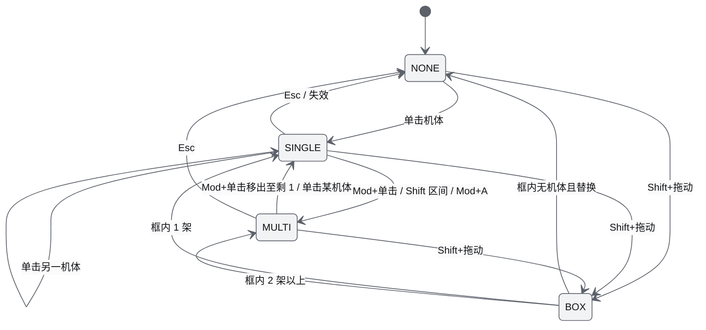
```mermaid
%%{init: {"theme": "base", "themeVariables": {"fontFamily": "Inter, PingFang SC, Microsoft YaHei, Noto Sans CJK SC, sans-serif", "fontSize": "13px", "background": "#FBFBFC", "primaryColor": "#F2F3F5", "primaryTextColor": "#111214", "primaryBorderColor": "#5C616A", "secondaryColor": "#E4E6E9", "tertiaryColor": "#FBFBFC", "lineColor": "#5C616A", "textColor": "#111214", "mainBkg": "#F2F3F5", "nodeBorder": "#5C616A", "clusterBkg": "#FBFBFC", "clusterBorder": "#A7ABB3", "edgeLabelBackground": "#FBFBFC", "noteBkgColor": "#E4E6E9", "noteTextColor": "#111214", "noteBorderColor": "#81868F"}}}%%
stateDiagram-v2
  [*] --> NONE
  NONE --> SINGLE: 单击机体
  SINGLE --> SINGLE: 单击另一机体
  SINGLE --> MULTI: Mod+单击 / Shift 区间 / Mod+A
  MULTI --> SINGLE: Mod+单击移出至剩 1 / 单击某机体
  NONE --> BOX: Shift+拖动
  SINGLE --> BOX: Shift+拖动
  MULTI --> BOX: Shift+拖动
  BOX --> NONE: 框内无机体且替换
  BOX --> SINGLE: 框内 1 架
  BOX --> MULTI: 框内 2 架以上
  SINGLE --> NONE: Esc / 失效
  MULTI --> NONE: Esc
```

呈现规则：
1. 选中机在 3D 中画前景色选择环（2 px），焦点机额外占用视口的"一处红"（机体标记、轨迹、标签环为同一对象，d01 §3.2 第 3 条）；若视口存在未确认的 critical 机体，红色让给最严重者，焦点机回到中性选中样式（前景色圆环）；焦点机本身为 critical 时画红色八边形环外加 1 px 前景色圆环（符号规格见 15 §10.4）。
2. DroneRail 选中行为 `bg-muted` 加 2 px 前景色竖条，不用红（ADR-032）；焦点机行的竖条加粗到 3 px。
3. 选择变化后 DroneRail 自动滚动使焦点机行可见（仅当该行不在视口内），滚动用 `scrollIntoView({block:"nearest"})`，reduced 档无平滑。
4. 选择集 ≥ 2 时，右栏列表底部出现批量操作条（§6.11）；详情页只显示焦点机。
5. 选择改变不修改相机，除非用户按 F 或双击（避免选择即飞走）。

### 6.3 框选（P1，D1-ext）

1. 触发：Shift + 左键在视口拖动（替换），Shift + Mod + 拖动（追加）；或在命令面板启用"框选工具"后普通左键拖动（工具态，Esc 退出）。
2. 视觉：矩形为前景色 1 px 虚线描边、`bg-foreground/5` 填充，DOM 元素只写 transform 与尺寸，不做动画。
3. 判定：拖动结束时，以当帧 tRender 的插值位置把全部可见机体投影到屏幕（1000 架投影 < 0.2 ms，本文设定的预算上限 1 ms），中心点落入矩形即选中；不做遮挡判定。
4. 反馈：松开后 DroneRail 滚动到第一架、顶部计数更新；> 200 架时 Toast"已选择 1000 架"。
5. 拖动过程中不更新选择集（只在松开时写一次），保证 1000 架时无逐帧 store 写入。

### 6.4 相机模式

5 个模式（快捷键 1–5，AWR-03 §8.5），另有"跟随锁定"修饰。模式与参考系按 r15 §3.15，控制器参数属 M06（r14 §3.10）。

| 键 | 模式 | 参考系与行为 | 进入守卫 | 鼠标与键盘 | 图标 |
|---|---|---|---|---|---|
| 1 | Orbit（默认） | 绕目标点；目标默认世界中心或上次聚焦点 | — | 左拖旋转、右拖平移、滚轮推拉到光标、双击设目标；不能钻到地下（`maxPolarAngle` 0.49π） | `cam.orbit` |
| 2 | Free | 自由飞行相机 | — | W/A/S/D 平移、Q/E 下降上升、左拖转视角、Shift 加速 ×4、滚轮调速倍率 ×1.25 每档（0.25–8）；基础速度 `clamp(0.5·AGL_cam, 5, 200)` m/s（本文设定） | `cam.free` |
| 3 | Third（第三人称追尾；基线称 Follow 模式） | 速度系追尾：偏移（−15, 0, 6）m；水平速度 < 0.5 m/s 时改用航向（r15 §3.15）；焦点机使用 D_focus（ADR-046） | 需要焦点机 | 左拖改变绕机角度并保持（r14 §3.10）、滚轮改距离 5–200 m | `cam.third` |
| 4 | FPV | 挂在焦点机相机光学帧上，姿态锁定；FOV 与内参来自 M13 `engine/sensors/intrinsics.ts`；焦点机使用 D_focus | 需要焦点机且挂载相机 | 鼠标无相机操作（拖动时提示"FPV 姿态锁定"）；Esc 或 1 退出 | `cam.fpv` |
| 5 | Bird | ENU 俯视，北朝上，`polar ≈ 0`；默认高度为目标上方 400 m（本文设定）或适配世界包围盒 | — | 左拖平移、滚轮缩放 50–5000 m、不能旋转 | `cam.bird` |
| L | 跟随锁定（修饰） | Orbit 与 Bird 下目标点锁到焦点机（ENU 系，保持用户偏移）；Third 与 FPV 天然跟随，L 无效 | 需要焦点机 | 再按 L 或 Esc 解除 | `cam.follow`（Locate morph LocateFixed） |

| 状态 | 事件 | 守卫 | 动作 | 目标状态 |
|---|---|---|---|---|
| ORBIT / FREE / BIRD | 键 3 或工具条 Third | 存在焦点机 | 相机飞行到追尾位姿；开始 D_focus 过渡（300 ms） | FLYING → THIRD |
| 任意 | 键 3 / 4 | 无焦点机 | 不切换；Toast"先选择一架无人机"并在 DroneRail 上以 03 notification-badge 提示一次 | 不变 |
| 任意 | 键 4 | 焦点机无相机传感器 | 不切换；工具条 FPV 项置灰，Tooltip"该机未挂载相机" | 不变 |
| 任意 | 键 1/2/5 | — | 相机飞行到对应默认位姿（从 FPV 退出时 Orbit 目标设为焦点机位置、后上方 60 m） | FLYING → 目标模式 |
| FLYING | 用户拖动、滚轮或按键 | — | 立即取消飞行，停在当前位姿，进入目标模式 | 目标模式 |
| THIRD / FPV | 焦点机被移除、坠毁或失联超过 3/f（HOLD 呈现） | — | 失联时保持并显示"信号延迟"；被移除或坠毁时退回 Orbit，目标为最后位置，Toast 一次 | ORBIT |
| ORBIT / BIRD | L | 存在焦点机 | 开启跟随锁定（图标 morph Locate → LocateFixed） | 同模式（锁定） |
| 锁定中 | 用户平移 | — | 解除锁定（图标反向 morph），Toast 不提示 | 同模式 |

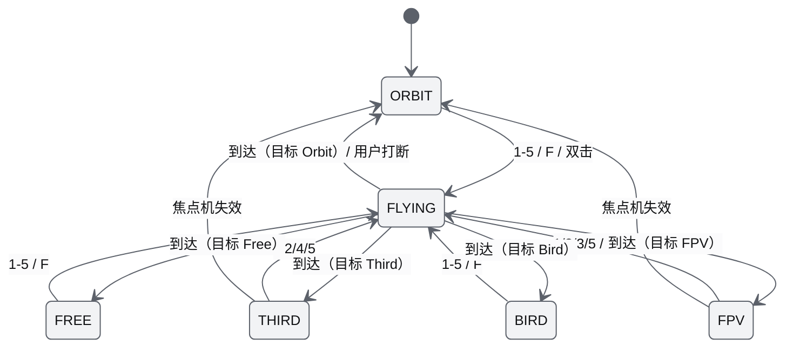
```mermaid
%%{init: {"theme": "base", "themeVariables": {"fontFamily": "Inter, PingFang SC, Microsoft YaHei, Noto Sans CJK SC, sans-serif", "fontSize": "13px", "background": "#FBFBFC", "primaryColor": "#F2F3F5", "primaryTextColor": "#111214", "primaryBorderColor": "#5C616A", "secondaryColor": "#E4E6E9", "tertiaryColor": "#FBFBFC", "lineColor": "#5C616A", "textColor": "#111214", "mainBkg": "#F2F3F5", "nodeBorder": "#5C616A", "clusterBkg": "#FBFBFC", "clusterBorder": "#A7ABB3", "edgeLabelBackground": "#FBFBFC", "noteBkgColor": "#E4E6E9", "noteTextColor": "#111214", "noteBorderColor": "#81868F"}}}%%
stateDiagram-v2
  [*] --> ORBIT
  ORBIT --> FLYING: 1-5 / F / 双击
  FREE --> FLYING: 1-5 / F
  BIRD --> FLYING: 1-5 / F
  THIRD --> FLYING: 1/2/4/5
  FPV --> FLYING: 1/2/3/5 / Esc
  FLYING --> ORBIT: 到达（目标 Orbit）/ 用户打断
  FLYING --> FREE: 到达（目标 Free）
  FLYING --> THIRD: 到达（目标 Third）
  FLYING --> FPV: 到达（目标 FPV）
  FLYING --> BIRD: 到达（目标 Bird）
  THIRD --> ORBIT: 焦点机失效
  FPV --> ORBIT: 焦点机失效
```

补充规则：
1. 工具条是 `ToggleGroup` 并列的 5 个静态图标，滑动指示器负责动效（16 tabs-sliding）；不使用单按钮循环，因为这组图标之间的 morph 不合格（d03 §4.2）。
2. 进入 Third 或 FPV 时，视口状态区显示"焦点低延迟"`Badge`；退出时 D 在 300 ms 内平滑回到 D_global（ADR-046）。
3. 首次进入 Third、FPV 与首次出现 P600 模型都不得触发着色器编译（shader zoo 预热，D1-AC-25），交互上不需要任何"正在准备"提示。
4. 每个世界记住上次的相机模式与位姿（`awr.ui.prefs.v1.camByWorld`），重新打开时恢复；Third 与 FPV 不恢复（焦点机可能不存在），改为 Orbit。

### 6.5 相机飞行、聚焦与视图工具

| 操作 | 触发 | 行为 | 动效 |
|---|---|---|---|
| 聚焦 | F；双击机体；列表行双击；命令面板"聚焦" | 选择集非空：`fitToBox` 选择集包围盒（单机取 60 m 半径球），padding 0.1；为空：适配世界包围盒 | 相机飞行 |
| 正北朝上 | N | 相机方位角归零，俯仰保持 | 相机飞行（仅旋转） |
| 重置视角 | Home | 回到世界默认视角（世界包围盒 3/4 俯视） | 相机飞行 |
| 双击地面 | 双击 | Orbit 目标移到 ray_hit 命中点，距离保持 | 相机飞行 |
| ViewCube | 点击面、边、角 | 对齐到对应视向；点击"N"字母等同正北 | 相机飞行 |

相机飞行时长 `T = clamp(0.4 + 0.15·ln(1 + d/20), 0.4, 1.2)` s，d 为相机位移米数，上下限即 `--duration-camera-min/max`，曲线 `--ease-smooth-out`，可被任何用户输入打断，新目标从当前位姿重新开始（ADR-029；d02 §4.6）。reduced 档改为硬切。飞行开始时向点云引擎提交目的地视锥，用于下载预取（r15 §3.5，属 M05/M06）。

### 6.6 悬停与标签

1. 无人机悬停拾取由 M06 的 CPU 包围球完成，≤ 20 Hz，拾取半径取屏幕上 max(机体投影半径, 6 px)，热区 ≥ 12 px（d01 §3.7）。相机运动期间关闭。
2. 悬停反馈：机体加前景色细环；其标签展开为两行（名称 + FlightState 短文案；高度 · 速度 · 电量），展开态不改变标签层级上限（Tier S ≤ 16，其余 ≤ 48，AWR-03 §3.8）。悬停机体的标签优先级高于普通标签，低于选中与告警（r14 §3.8）。
3. 标签不使用 shadcn `Tooltip`（无法随相机跟随，d04 §6 第 14 条），也不设 `role="tooltip"`；可访问性由 DroneRail 承担（§12.3）。
4. 标签内容：名称（`P600-01`）、FlightState 短文案、告警图标（有告警时）；文本 ≤ 4 Hz 合批写入，位置每帧只写 transform（ADR-029）。
5. PerfGovernor 第③步把标签上限减半（16 → 8 → 4），此时标签按"选中 > 告警 > 距离"保留，其余隐藏，HUD 显示降级步（ADR-041）。
6. 禁飞区悬停：在区域中心显示标签"禁飞区 · 名称 · 高度上限 120 m"（同一标签层），不进入选择。

### 6.7 点选 GoTo（D1-core）

**前置条件**：角色为 operator；焦点机存在；焦点机 FlightState 按准入矩阵允许 goto（FLYING、操作员发起的 RTL 与 LANDING，g04 §6.2）；否则 GoTo 按钮与 G 键置灰，Tooltip 给出原因（例如"起飞后才能 GoTo"）。客户端用 `commands.json` 的准入矩阵做预判，只用于置灰与提示，最终以服务端回执为准（U-03）。

**流程**：

| 步 | 用户动作 | 系统反馈 |
|---|---|---|
| 1 | 按 G，或点详情"GoTo"，或位置菜单"飞到此处" | 进入 GoTo 工具态：光标十字准星；顶部提示条"GoTo：点击地面或建筑选择目标 · Shift+点击直接发送 · Esc 取消" |
| 2 | 在视口移动鼠标 | ≤ 5 Hz 发 `POST /api/world/{id}/query {op: "ray_hit", origin_enu_m, dir, max_range_m: 5000}`（相机射线换算到 World ENU，17 §4.3.2），响应 `{hit, point_enu_m, dist_m, surface}`；命中点显示预览标记（`cmd.goto` 图标 + 铅垂线到地面）与读数"E · N · 高度"；在途请求以 `AbortController` 取消 |
| 3 | 左键单击 | 以命中点为锚打开 3D 锚定 `Popover`：高度方式 `RadioGroup`（保持当前高度 / 命中点上方 h 米，h 默认 20 m）、速度 `InputGroup`（`speed_mps`，默认取机型巡航速度）、路径 `Select`（`route`：自动 auto、直线 direct、安全转场 safe_transit，默认 auto，12 §5.7.4）、目标读数、"发送 Enter"按钮 |
| 3′ | Shift + 单击 | 跳过 Popover，按默认参数直接发送 |
| 4 | Enter 或点"发送" | 若焦点机不由本席位以 OPERATOR 持有，先走接管确认（§6.12）；然后发 `call uav/{id}/cmd/goto {pos, speed_mps, route}`（`pos` 为 World ENU 米，17 §7.1）；工具态退出，3D 保留目标标记与虚线计划线 |
| 5 | 等待回执 | 目标标记随调用状态变化：accepted 为描边、running 为实心前景色、succeeded 后 `input.resultHoldMs` 渐隐（150 ms）、failed/rejected 变为红描边加 `TriangleAlert` 并保留到下一次操作 |

默认目标高度（本文设定）：保持当前高度时，若当前世界 z 低于"命中点 z + 10 m"，抬升到"命中点 z + 10 m"，Popover 中以说明文字提示"已抬升以避开地物"；安全转场与围栏由服务端 `safe_transit` 与准入第⑧步裁决（ADR-016、ADR-039），UI 不自行判定可达性。

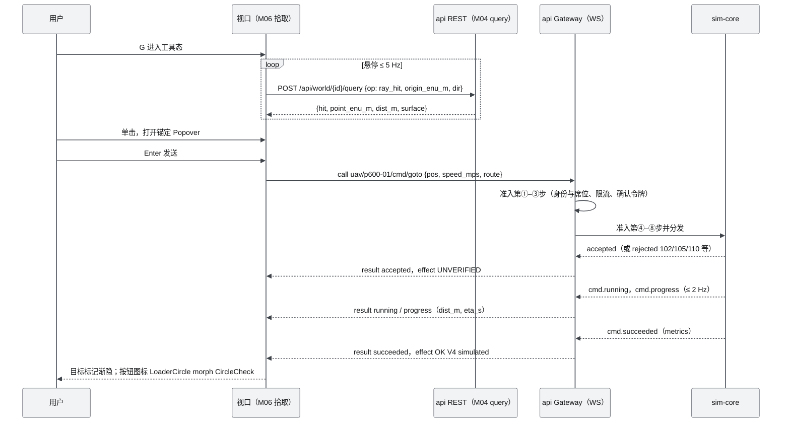
```mermaid
%%{init: {"theme": "base", "themeVariables": {"fontFamily": "Inter, PingFang SC, Microsoft YaHei, Noto Sans CJK SC, sans-serif", "fontSize": "13px", "background": "#FBFBFC", "primaryColor": "#F2F3F5", "primaryTextColor": "#111214", "primaryBorderColor": "#5C616A", "secondaryColor": "#E4E6E9", "tertiaryColor": "#FBFBFC", "lineColor": "#5C616A", "textColor": "#111214", "mainBkg": "#F2F3F5", "nodeBorder": "#5C616A", "clusterBkg": "#FBFBFC", "clusterBorder": "#A7ABB3", "edgeLabelBackground": "#FBFBFC", "noteBkgColor": "#E4E6E9", "noteTextColor": "#111214", "noteBorderColor": "#81868F", "actorBkg": "#F2F3F5", "actorBorder": "#5C616A", "actorTextColor": "#111214", "signalColor": "#3E4249", "signalTextColor": "#111214", "activationBkgColor": "#E4E6E9", "activationBorderColor": "#5C616A", "sequenceNumberColor": "#FBFBFC"}}}%%
sequenceDiagram
  participant U as 用户
  participant V as 视口（M06 拾取）
  participant Q as api REST（M04 query）
  participant G as api Gateway（WS）
  participant S as sim-core
  U->>V: G 进入工具态
  loop 悬停 ≤ 5 Hz
    V->>Q: POST /api/world/{id}/query {op: ray_hit, origin_enu_m, dir}
    Q-->>V: {hit, point_enu_m, dist_m, surface}
  end
  U->>V: 单击，打开锚定 Popover
  U->>V: Enter 发送
  V->>G: call uav/p600-01/cmd/goto {pos, speed_mps, route}
  G->>G: 准入第①–③步（身份与席位、限流、确认令牌）
  G->>S: 准入第④–⑧步并分发
  S-->>G: accepted（或 rejected 102/105/110 等）
  G-->>V: result accepted，effect UNVERIFIED
  S-->>G: cmd.running，cmd.progress（≤ 2 Hz）
  G-->>V: result running / progress（dist_m, eta_s）
  S-->>G: cmd.succeeded（metrics）
  G-->>V: result succeeded，effect OK V4 simulated
  V-->>U: 目标标记渐隐；按钮图标 LoaderCircle morph CircleCheck
```

| 状态 | 事件 | 守卫 | 动作 | 目标状态 |
|---|---|---|---|---|
| IDLE | G / 按钮 / 菜单 | operator、焦点机准入允许 | 工具态开启，提示条出现 | ARMED |
| ARMED | 鼠标移动 | 距上次请求 ≥ 200 ms | 发 ray_hit，取消旧请求 | ARMED |
| ARMED | 单击 | 命中有效 | 打开 Popover | CONFIRMING |
| ARMED | 单击 | 未命中（天空） | 提示条闪烁一次（12 shake 的 4 px 变体）"未命中地面" | ARMED |
| ARMED | Shift+单击 | 命中有效 | 默认参数 | SENDING |
| CONFIRMING | Enter / 发送 | 参数合法 | 需要时先接管 | SENDING |
| CONFIRMING | 相机移动 / Esc | — | 关闭 Popover | ARMED |
| SENDING | result accepted/running | — | 标记描边 → 实心 | TRACKING |
| SENDING | result rejected / timeout | — | Toast（原因码文案，§13.6），标记红描边 | IDLE |
| TRACKING | succeeded / failed / canceled | — | 标记渐隐或转告警样式 | IDLE |
| ARMED | Esc | — | 退出工具态（在 CONFIRMING 时需按两次 Esc：先关 Popover，再退出） | IDLE |

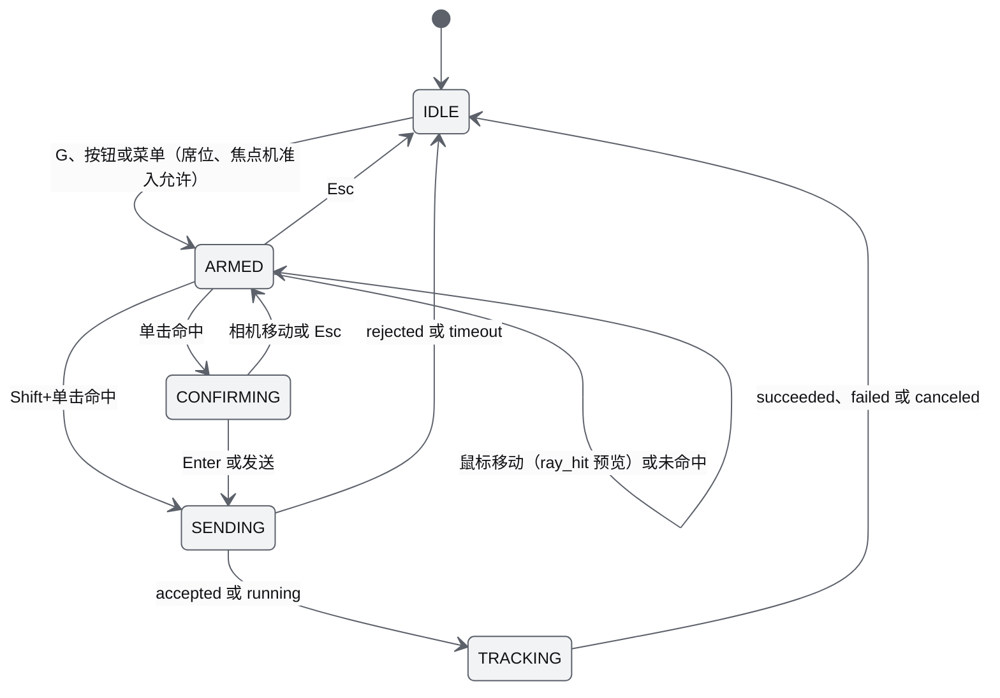
```mermaid
%%{init: {"theme": "base", "themeVariables": {"fontFamily": "Inter, PingFang SC, Microsoft YaHei, Noto Sans CJK SC, sans-serif", "fontSize": "13px", "background": "#FBFBFC", "primaryColor": "#F2F3F5", "primaryTextColor": "#111214", "primaryBorderColor": "#5C616A", "secondaryColor": "#E4E6E9", "tertiaryColor": "#FBFBFC", "lineColor": "#5C616A", "textColor": "#111214", "mainBkg": "#F2F3F5", "nodeBorder": "#5C616A", "clusterBkg": "#FBFBFC", "clusterBorder": "#A7ABB3", "edgeLabelBackground": "#FBFBFC", "noteBkgColor": "#E4E6E9", "noteTextColor": "#111214", "noteBorderColor": "#81868F"}}}%%
stateDiagram-v2
  [*] --> IDLE
  IDLE --> ARMED: G、按钮或菜单（席位、焦点机准入允许）
  ARMED --> ARMED: 鼠标移动（ray_hit 预览）或未命中
  ARMED --> CONFIRMING: 单击命中
  ARMED --> SENDING: Shift+单击命中
  CONFIRMING --> SENDING: Enter 或发送
  CONFIRMING --> ARMED: 相机移动或 Esc
  SENDING --> TRACKING: accepted 或 running
  SENDING --> IDLE: rejected 或 timeout
  TRACKING --> IDLE: succeeded、failed 或 canceled
  ARMED --> IDLE: Esc
```

多机 GoTo（P1）：选择集 ≥ 2 时，目标点按选择顺序在命中点周围做网格偏移（间距 10 m，本文设定，与 S1 最小间距 10 m 一致，x01 §3.11），Popover 预览全部目标；逐机发送。

### 6.8 航点编辑与区域绘制（D1-ext）

**航点编辑**（右栏 `mission-edit` 页，对焦点机的 `follow_path`）：

| 操作 | 视口 | 航点表 | 键盘 |
|---|---|---|---|
| 添加 | "添加航点"工具下单击地面：追加到末尾，高度 = 上一航点高度（首个为当前机体高度） | "+"按钮在所选行后插入 | — |
| 插入 | 悬停航段时中点出现"+"手柄，单击插入 | 同上 | — |
| 移动 | 拖动手柄：在该航点高度的水平面内移动；Shift + 拖动只改高度 | 单元格编辑 E、N、高度 | 方向键在所选航点上按 1 m 平移（Shift ×10） |
| 删除 | 选中手柄后 Delete；右键"删除航点" | 行菜单"删除" | Delete / Backspace |
| 重排 | — | 行菜单"上移 / 下移"（D1 不做拖拽排序，§19 第 7 条） | Alt + ↑ / ↓ |
| 撤销与重做 | — | 工具组按钮 | Mod+Z / Mod+Shift+Z |
| 提交 | — | "提交航线" | Enter（焦点不在输入框时） |
| 放弃 | — | "放弃" | Esc（有未提交修改时弹确认） |

校验与反馈：
1. 编辑中每次修改后静默 `input.validateIdleMs`（300 ms）调用 M04 粗校验 `POST /api/world/{id}/query {op: "path_coarse_check", polyline, buffer_m: 1}`（航段包围盒对 zones、max-pooled `heightmap_top`，O(航段数)，≤ 1000 点，17 §4.3.2），按返回的 `violations[{seg, reason}]` 呈现：违规航段在视口画红描边虚线加中点 `TriangleAlert`，表格对应行尾显示同一图标与原因码文案；该图的"一处红"仍归焦点机，违规航段属于 warning 形态（描边），不占实心红（§11.2）。
2. 计数条实时显示"航点 k / 1000 · 长度 L / 20 km"，超限时添加按钮置灰（ADR-016）。
3. 提交后调用停在 accepted 直到 plan-pool 细校验完成（ADR-016），UI 显示"细校验中"；细校验失败以 failed 102 结束，高亮第一段违规航段并保留草稿。
4. 3D 手柄的添加用缩放 0 → 1，`--duration-very-slow`（500 ms）+ `--ease-bounce`；删除 150 ms 淡出（d02 §4.6）。

| 状态 | 事件 | 守卫 | 动作 | 目标状态 |
|---|---|---|---|---|
| CLOSED | "编辑航线" | operator、单一焦点机 | 以当前 `follow_path` 或空草稿打开 | CLEAN |
| CLEAN | 任一修改 | — | 压入历史 | DIRTY |
| DIRTY | 修改 | — | 压入历史（上限 50，超出丢最旧） | DIRTY |
| DIRTY | 撤销至初始 | — | — | CLEAN |
| DIRTY | 提交 | 粗校验无违规、计数未超限 | 发 `follow_path`（需要时先接管） | SUBMITTING |
| DIRTY | 提交 | 存在违规 | 提交按钮置灰；Tooltip 列出违规数 | DIRTY |
| SUBMITTING | result running | — | 草稿转为"当前航线" | CLOSED |
| SUBMITTING | rejected / failed | — | 保留草稿，高亮原因 | DIRTY |
| CLEAN / DIRTY | 返回 / Esc | DIRTY 时确认"放弃修改" | 丢弃草稿 | CLOSED |

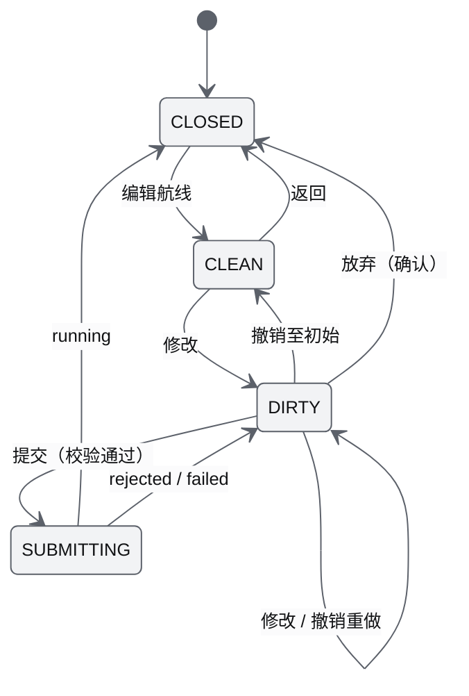
```mermaid
%%{init: {"theme": "base", "themeVariables": {"fontFamily": "Inter, PingFang SC, Microsoft YaHei, Noto Sans CJK SC, sans-serif", "fontSize": "13px", "background": "#FBFBFC", "primaryColor": "#F2F3F5", "primaryTextColor": "#111214", "primaryBorderColor": "#5C616A", "secondaryColor": "#E4E6E9", "tertiaryColor": "#FBFBFC", "lineColor": "#5C616A", "textColor": "#111214", "mainBkg": "#F2F3F5", "nodeBorder": "#5C616A", "clusterBkg": "#FBFBFC", "clusterBorder": "#A7ABB3", "edgeLabelBackground": "#FBFBFC", "noteBkgColor": "#E4E6E9", "noteTextColor": "#111214", "noteBorderColor": "#81868F"}}}%%
stateDiagram-v2
  [*] --> CLOSED
  CLOSED --> CLEAN: 编辑航线
  CLEAN --> DIRTY: 修改
  DIRTY --> DIRTY: 修改 / 撤销重做
  DIRTY --> CLEAN: 撤销至初始
  DIRTY --> SUBMITTING: 提交（校验通过）
  SUBMITTING --> CLOSED: running
  SUBMITTING --> DIRTY: rejected / failed
  CLEAN --> CLOSED: 返回
  DIRTY --> CLOSED: 放弃（确认）
```

**区域绘制**（"绘制区域"工具）：单击地面逐点添加多边形顶点；双击或 Enter 闭合；拖动（Shift 按下时）画轴对齐矩形；Backspace 删除最后一个顶点；Esc 取消。自相交多边形在闭合时拒绝并提示。闭合后右栏出现生成器参数表单（§5.3），"预览"调用服务端生成器返回路径，只画不执行；"生成任务"为每架分配机体创建任务并进入调用生命周期。分配机体中由本操作员持有租约的（例如刚飞完编辑航线的机体），在任务开始前先交还控制（`uav/{id}/cmd/release {return_to: none}`），由任务引擎以 MISSION 名义申请租约（ADR-072）；D1 的区域生成器为覆盖（割草机，`fixed_agl`）与搜索（扩展方形，起点为区域形心）。

### 6.9 右键菜单

| 上下文 | 菜单项（从上到下，分隔线分组） | 条件 |
|---|---|---|
| 地面或建筑 | 飞到此处（G 的快捷方式） · 在此添加 P600 ‖ 设为环绕中心 · 从这里观察 ‖ 复制坐标（ENU） · 复制示意经纬度 · 查询高度（DSM、DTM、AGL） ‖ 添加航点（ext，仅编辑模式） | 前两项需 operator；"飞到此处"需焦点机准入允许；示意经纬度项带"示意"`Badge` |
| 无人机（或选择集） | 聚焦 F · 第三人称 3 · FPV 4 · 跟随锁定 L ‖ 轨迹 T · 视锥 V ‖ 命令 › 起飞 / 悬停 H / 降落 / 返航 / GoTo… G / 安全停止 Shift+X ‖ 接管 / 交还控制 ‖ 复制 id ‖ 移除（确认） | 右键命中未选中的机体时先把它设为单选；命中已选中机体时作用于整个选择集，标题显示"12 架" |
| 空白（天空） | 重置视角 Home · 正北朝上 N · 相机模式 › · 显示标签 · 性能 HUD P | — |
| DroneRail 行 | 同"无人机" | — |
| 事件表行 / Timeline 事件标记 | 选中相关机体 · 聚焦 · 复制事件 ‖ 跳转到此时刻（仅回放） | — |

规则：
1. 右键判定：按下到抬起位移 < `input.clickTolPx` 且时长 < `input.contextMaxMs`，否则视为相机平移，并对 `contextmenu` 事件 `preventDefault`（d04 §6 第 8 条）。
2. 因角色或状态不可用的项显示为禁用，并在项内第二行给出原因（例如"只读模式"、"该状态不接受 GoTo"）；ext 未交付的项不出现。
3. 菜单项与命令面板、Menubar 共用同一个动作注册表（§6.10），保证文案与快捷键一致。
4. 打开右键菜单时暂停悬停拾取；菜单关闭动画 150 ms（05）。

### 6.10 快捷键表（Kbd）

统一注册在 `ui/hotkeys/registry.ts`（M15），界面上以 `Kbd`/`KbdGroup` 显示（Tooltip、菜单、命令面板、帮助对话框）。`Mod` = Windows/Linux 的 Ctrl、macOS 的 Cmd。

```ts
export interface HotkeyBinding {
  id: string                       // 与动作注册表同名，例如 "camera.mode.fpv"
  keys: string[]                   // 例如 ["mod+k"]、["shift+x"]；用 KeyboardEvent.code 匹配物理键
  scope: "global" | "viewport" | "timeline" | "editor" | "list"
  when?: (s: UiState) => boolean   // 角色、模式、选择数量、caps
  allowInEditable?: boolean        // 默认 false：焦点在 input、textarea、select、contenteditable 时不触发
  blockedByModal?: boolean         // 默认 true：Dialog/AlertDialog/CommandDialog 打开时不触发（Esc 除外）
  labelKey: string                 // 文案键
}
```

| 键 | 作用 | 作用域与条件 | D1 |
|---|---|---|---|
| Mod+K | 打开命令面板 | 全局；输入框内也生效 | core |
| ? | 快捷键帮助 | 全局 | core |
| Esc | 分级取消：关闭最上层浮层 → 退出工具态 → 退出 FPV（回到 Orbit）→ 解除跟随锁定 → 清空选择；每按一次只执行链上第一个适用项 | 全局 | core |
| Mod+B | 左栏显隐 | 全局（由注册表分发；Sidebar 内置监听经 codemod 删除，§4.7） | core |
| `\` | 右栏显隐 | 全局（按物理键 `Backslash` 匹配） | core |
| `` ` `` | 底部面板区展开 / 收起 | 全局（按物理键 `Backquote` 匹配） | core |
| P | 性能 HUD 展开 / 单行 | 全局 | core |
| 1 / 2 / 3 / 4 / 5 | 相机 Orbit / Free / Third / FPV / Bird | 视口；3、4 需焦点机 | core |
| L | 跟随锁定 | Orbit、Bird；需焦点机 | core |
| F | 聚焦选择集（无选择时适配世界） | 视口 | core |
| N | 正北朝上 | 视口 | core |
| Home | 重置视角 | 视口 | core |
| W A S D / Q E | Free：平移 / 下降上升；Orbit：环绕 5° / 俯仰 5° / 推拉 10%；Bird：平移 10% 视宽 / 缩放（§12.2） | 视口；Orbit 与 Bird 需视口获得焦点 | core |
| Shift（按住） | Free 加速 ×4 | 仅 Free | core |
| Mod+A | 全选（当前筛选） | 视口、列表 | core |
| . / , | 焦点移到下一架 / 上一架 | 视口、列表 | core |
| Shift+拖动 | 框选 | 视口 | ext |
| T | 焦点机轨迹开关 | 需焦点机 | core |
| V | 焦点机视锥开关 | 需焦点机 | core |
| G | GoTo 工具 | operator、焦点机准入允许 | core |
| H | 悬停（选择集；≥ 2 架时走 `fleet/cmd/hover`） | 席位持有者；安全类，免租约，立即发送 | core |
| Shift+X | 安全停止（选择集；≥ 2 架时走 `fleet/cmd/safety_stop`） | 席位持有者；安全类，立即发送，可用"恢复"解除 | core |
| Shift+R | 返航（选择集，弹确认） | operator | core |
| Shift+L | 降落（选择集，弹确认） | operator | core |
| Shift+T | 起飞（选择集，弹确认） | operator；需租约 | core |
| Delete | 移除所选虚拟 P600（弹确认） | operator；焦点在视口或列表 | core |
| Space | 播放 / 暂停仿真 | operator；`caps.clock.pausable` | core |
| [ / ] | 倍速降一档 / 升一档 | operator；实时与回放各自的档位表 | core |
| → | 实时暂停时单步 100 ms；回放时前进 1 s | 实时需 PAUSED 且 `steppable` | core（回放 ext） |
| Shift+→ | 实时单步 1 s；回放前进 10 s | 同上 | core（回放 ext） |
| ← / Shift+← | 回放后退 1 s / 10 s | 仅回放（实时不支持倒带） | ext |
| Shift+. / Shift+, | 最小步进：实时单步 1 个 tick（4 ms，只能前进）；回放前进 / 后退 1 个录制采样（40 ms） | 实时需 PAUSED 且 `steppable` | core（回放 ext） |
| Mod+Z / Mod+Shift+Z | 撤销 / 重做 | 编辑模式 | ext |
| Alt+↑ / Alt+↓ | 航点上移 / 下移 | 编辑模式，航点表获得焦点 | ext |
| M | 在所见时刻添加书签（席位持有者写共享书签，viewer 写本地书签） | 实时与回放（M12-FR-026） | ext |
| PageUp / PageDown | 跳到上一个 / 下一个标记（书签或 ≥ WARNING 事件） | 仅回放；焦点在 Timeline 或视口 | ext |
| Home / End | 跳到录制起点 / 终点（Timeline 获得焦点时优先于"重置视角"） | 仅回放；焦点在 Timeline | ext |
| Enter | 确认（Popover、编辑提交、世界卡片打开） | 上下文 | core |

冲突处理：
1. 刻意避开浏览器保留组合：Ctrl+J（下载）、Ctrl+Shift+B（书签栏）、Ctrl+Shift+J（开发者工具）、Ctrl+数字与 Linux 上的 Alt+数字（切换标签页）、Alt+← / Alt+→ 与 macOS 的 Cmd+← / Cmd+→（后退 / 前进）、Alt+D（地址栏）、Shift+Esc（Chrome 任务管理器）、macOS 的 Cmd+Option+B（书签管理器）。
2. 数字键与字母键只在焦点不在可编辑元素时生效（复用模板的 `isEditableTarget()`，d04 §3.11）；模板 ThemeProvider 的裸 `d` 键绑定必须删除（ADR-028）。
3. 危险命令（返航、降落、起飞、移除、kill）不给单键，一律 Shift 组合并弹确认；悬停与安全停止属于"让机体停下"的安全动作，允许快速触发。
4. 同一键在不同作用域含义不同时，以"获得焦点的组件自身（ToggleGroup、Slider、列表等内建键盘行为）> 工具态 > 编辑模式 > 获得焦点的列表或视口 > 全局"顺序匹配第一个满足 `when` 的绑定；组件消费的按键不再冒泡到全局（例如列表获得焦点时 Space 切换选中而不是暂停仿真）。

### 6.11 命令发起与调用生命周期反馈

命令集与语义见 ADR-016 与 [12](12-业务逻辑设计说明书.md)，服务名与参数见 17 §7.1；本节只定义 UI。所有命令都要求操作席位（viewer 返回 `115 ROLE_FORBIDDEN`，非席位 operator 返回 `116 SEAT_TAKEN`，17 §3.5），"租约"列只说明是否另需该机的 OPERATOR 租约。

| 命令 | 入口 | 确认 | 租约 | 图标 |
|---|---|---|---|---|
| 起飞 | 详情按钮、Shift+T、菜单 | AlertDialog（显示目标高度 `alt_m`，默认 2.5 m AGL，可改） | 需要 | `cmd.takeoff` |
| 悬停 | 详情按钮、H、菜单 | 无 | 免（安全类） | `cmd.hover` |
| 降落 | 详情按钮、Shift+L | AlertDialog | 免（安全类） | `cmd.land` |
| 返航 | 详情按钮、Shift+R | AlertDialog | 免（安全类） | `cmd.rth` |
| GoTo | §6.7 | Popover | 需要 | `cmd.goto` |
| 环绕、航线 | 右键菜单、编辑器 | Popover / 编辑器提交 | 需要 | `cmd.orbit`、`cmd.followpath` |
| 安全停止 / 恢复 | "更多"菜单、Shift+X | 无 / 无 | 免（安全类，agent 不可用） | `mission.abort` / `mission.start` |
| 暂停任务 / 恢复（任务级） | 任务面板（`mission/{mid}/pause`、`resume`） | 无 | 不需要（任务引擎以 MISSION 持有） | `mission.paused`（morph `CirclePlay`） |
| 暂停任务 / 恢复（单机） | 单机详情（`uav/{id}/cmd/pause`、`resume`） | 无 | 需要 | `mission.paused`（morph `CirclePlay`） |
| kill（ext） | "更多"菜单 | 确认令牌（`confirm/issue`）+ 按住 1 s（按钮内 `Progress` 填充） | 免（安全类） | `alert.emergency` |

**按钮状态机**（每个命令按钮一份，只对本客户端发起的调用生效）：

| 状态 | 事件 | 守卫 | 动作 | 目标状态 |
|---|---|---|---|---|
| READY | 点击 / 快捷键 | 准入矩阵预判允许、本会话持有席位 | 发 `call`（带 call id）；图标 swap 为 `LoaderCircle`（旋转）；按钮 `aria-busy` | PENDING |
| READY | 点击 | 预判不允许 | 不发送；Tooltip 给原因 | READY |
| PENDING | result accepted | — | 保持旋转；goto/follow_path 细校验未完成时显示"细校验中" | ACCEPTED |
| PENDING / ACCEPTED | result running | — | 保持旋转；详情显示 progress（`dist_m`、`eta_s`，≤ 2 Hz） | RUNNING |
| RUNNING | succeeded | — | `LoaderCircle` morph `CircleCheck`（smooth），停留 `input.resultHoldMs` 后 swap 回动作图标 | READY |
| 任意进行中 | rejected / failed / timeout | — | morph `CircleX`；按钮 12 shake 一次；Toast（§11.4）；停留后恢复 | READY |
| 任意进行中 | canceled（被新命令取代） | — | swap 回动作图标；仅当取代者不是本用户时 Toast"已被取代" | READY |
| 任意 | WS 断开 | — | 保持当前图标，按钮置灰；重连后以同一 call id 重发 `call`，服务端返回 `duplicate: true` 的最新结果（17 §6.13 第 3 条；D1-AC-11a） | 断线前状态 |

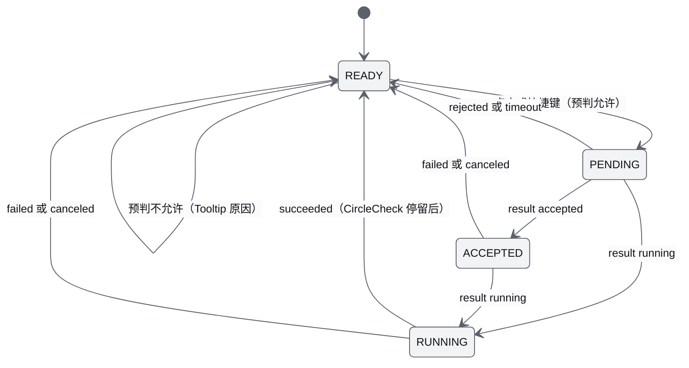
```mermaid
%%{init: {"theme": "base", "themeVariables": {"fontFamily": "Inter, PingFang SC, Microsoft YaHei, Noto Sans CJK SC, sans-serif", "fontSize": "13px", "background": "#FBFBFC", "primaryColor": "#F2F3F5", "primaryTextColor": "#111214", "primaryBorderColor": "#5C616A", "secondaryColor": "#E4E6E9", "tertiaryColor": "#FBFBFC", "lineColor": "#5C616A", "textColor": "#111214", "mainBkg": "#F2F3F5", "nodeBorder": "#5C616A", "clusterBkg": "#FBFBFC", "clusterBorder": "#A7ABB3", "edgeLabelBackground": "#FBFBFC", "noteBkgColor": "#E4E6E9", "noteTextColor": "#111214", "noteBorderColor": "#81868F"}}}%%
stateDiagram-v2
  [*] --> READY
  READY --> PENDING: 点击或快捷键（预判允许）
  READY --> READY: 预判不允许（Tooltip 原因）
  PENDING --> ACCEPTED: result accepted
  PENDING --> RUNNING: result running
  ACCEPTED --> RUNNING: result running
  RUNNING --> READY: succeeded（CircleCheck 停留后）
  PENDING --> READY: rejected 或 timeout
  ACCEPTED --> READY: failed 或 canceled
  RUNNING --> READY: failed 或 canceled
```

批量命令（选择集 ≥ 2，P0，支撑 D1-AC-27）：
1. 批量操作条显示"已选 37 架"与悬停、返航、降落、安全停止；返航与降落弹确认"对 37 架执行返航？"，确认按钮文案"返航 37 架"。
2. 发送一次 `call fleet/cmd/{op} {vehicles: [...] 或 "*", args}`（op ∈ rtl、land、hover、safety_stop、pause、resume、takeoff；vehicles ≤ 1000；17 §7.1、§7.5）。选择集等于当前筛选后的全体机体且无筛选时发 `"*"`；否则发 id 列表（1000 个 id 约 10 KB，低于 WS 文本帧 256 KiB 上限）。不逐机发 `call`。
3. 首个汇总 `result` 的 `data{accepted_n, rejected_n, rejected_by_code}` 生成**一条**聚合 Toast："返航：已接受 997 / 1000 · 拒绝 3"，内含 `Progress`；此后按 `progress{data: {counts}}` 与 `fleet.batch.progress` 事件（≤ 2 Hz）更新"执行中 / 成功 / 失败"计数；`final` 后变为结果摘要，拒绝与失败项可点开查看原因分组（例如"105 STATE × 3"），点击分组选中这些机体。
4. 批量调用沿用上面的按钮状态机，但只作用于批量操作条上的按钮；详情页不因批量子调用切换图标。UI 要求：主线程无 > 50 ms 长任务、不因单条子调用回执触发 React 重渲染（汇总计数进入 store，≤ 4 Hz 合批）。

### 6.12 控制权：会话角色与机体租约

**会话角色与操作席位**（ADR-027 D1-core：单席位 + 多 viewer；语义见 12 §4.2.2，接口见 17 §3.1、§4.3.1）：

| 场景 | 行为 |
|---|---|
| 回环模式首次进入 | 以 `principal_hint`（§3.6）申请 `role: operator`；若返回 `116 SEAT_TAKEN`，改签 viewer，Toast"已有操作员在线（持有自 14:32），当前为只读"（时间取 `detail.holder_since_unix_ns`，墙钟） |
| 局域网模式首次进入 | 以 viewer 进入；"申请控制"弹 Dialog 要求管理口令（AWR-03 §3.3），口令错误时字段显示 `304 ADMIN_SECRET_REQUIRED` 文案 |
| 申请控制被拒 | `116 SEAT_TAKEN`：顶栏角色徽标保持"只读"，Popover 说明持有时长；D1-core 不提供强制夺取；D1-ext 由 admin 经 `seat/takeover`（确认令牌）接管，原持有者的连接以 4403 关闭并降为 viewer（12 §4.2.2 T07） |
| 释放控制 | 顶栏角色菜单"释放控制"发 `seat/release`；若名下有 OPERATOR 租约的机体，先弹确认"释放后这些机体交还接管前的控制方（例如任务 S1）；没有上一控制方的机体保持当前状态"（12 §4.8.4） |
| 持席位者断线 | 席位进入 30 s 宽限（墙钟）；同一 principal 在宽限内重连即收回，UI 不提示；宽限到期后席位释放，名下 OPERATOR 租约成为孤儿租约，机体按链路策略 HOLD 或 RTL（12 §4.2.2 T03–T05）；重连时若席位已被他人持有，降为 viewer 并 Toast 1 条 |
| 会话切换（ext） | 收到 `session.switched` 或 token 返回 `302 TOKEN_INVALID` 时，用同一 `principal_hint` 静默重新签发 token 并重连；角色按上面第一行重新判定 |

**机体租约**（owner 显示与接管）：

| owner | 显示（DroneRail 行尾图标 + 详情徽标） | 图标 |
|---|---|---|
| NONE | "—" | — |
| OPERATOR | "操作员"；本 principal 持有时文案"我"；孤儿租约显示"操作员（离线）" | `user`；本人持有时 `lease.held` |
| MISSION | "任务" | `nav.mission` |
| AGENT | "智能体" | `agent` |
| SWARM | "集群" | `cmd.formation` |
| SAFETY | "安全接管"（红描边，属 warning 形态） | `alert.geofence` |
| PILOT | "飞手"（V0.5 真机） | `mode.manual` |
| EXTERNAL | "外部"（V0.2 起） | `external` |

接管流程：对需要租约的命令（GoTo、航线、环绕、起飞、单机暂停任务），若该机不由本席位以 OPERATOR 持有，按下表处理（优先级 OPERATOR 4 > AGENT 3 > MISSION 2 > SWARM 1 的静态比较在 D1-core 生效，12 §4.8.1）：

| 当前 owner | 处理 |
|---|---|
| OPERATOR 且 holder 为本 principal | 直接发命令 |
| OPERATOR 孤儿租约（holder 为空） | 直接 `acquire`（不算抢占，12 §4.8.2 E05），Toast info"已接管上一操作员的机体" |
| NONE、MISSION、AGENT、SWARM | 弹接管 AlertDialog（下例） |
| SAFETY（安全停止加锁） | 不弹接管框；按钮置灰，Tooltip"已安全停止，先恢复"（`114 LOCKED`） |
| PILOT、EXTERNAL（V0.2 起） | 不可接管，Tooltip 说明 |

接管 AlertDialog：

> **接管 P600-01？**
> 当前由"任务 S1"控制。接管后该机由你指挥，任务对它的编排按规则暂停。接管后链路保护生效：本页面与服务器断开 1.5 s 告警、3 s 悬停、13 s 返航。
> [取消] [接管并执行 GoTo]

确认后依次发 `uav/{id}/cmd/acquire {priority: "normal"}` 与目标命令；原持有者被压入交还栈，其进行中的调用以 `210 LEASE_PREEMPTED` 结束，事件 `lease.preempted`（12 §4.8.2 E03）；`acquire` 失败（`100 LEASE_DENIED`、`114 LOCKED`、`105 STATE` 等）时终止并 Toast。安全类命令（悬停、降落、返航、安全停止）不弹接管框（ADR-027）。依据：链路策略在 operator 获取租约后切换为 `hold_rtl`（ADR-026），这是用户必须在接管前知道的后果。

单机详情提供"交还控制"（`uav/{id}/cmd/release {return_to: "previous"}`），机体回到接管前的持有者；交还前机体处于 HOLD 或安全停止时不自动续飞，需先"恢复"（12 §4.8.4 第 3 条）。D1-ext：普通 `acquire` 被拒（`100 LEASE_DENIED`）时，Toast 与"更多"菜单提供"强制接管"，发 `acquire {priority: "override", confirm_token}`（优先级 5，确认令牌经 `confirm/issue {action: "lease_override"}` 签发，17 §3.2）。

### 6.13 添加与移除虚拟 P600（D1-core）

1. 入口：左栏 WORLD"添加 P600"、位置菜单"在此添加 P600"、命令面板；只对席位持有者可用，且视图世界等于会话世界。
2. "添加 P600"按钮进入工具态：单击地面或屋顶确定出生点（ray_hit），Popover 设置 id（默认留空，由服务端按 `<model>-<nn>` 生成）、机型（`GET /api/fleet/profiles`，默认 `p600_mid360`）与朝向；Enter 发 `POST /api/fleet/vehicles {profile_id, vehicle_id?, home_enu_m: [x, y, null], yaw_rad}`（z 为 null 时服务端取 `dsm(x, y)`，17 §4.3.5）。
3. 反馈：≤ 1 s 在 DroneRail 与视口出现（D1-AC-32）；新行以 §8.2 第 21 行的列表进场动效出现（Tier S lite 档无 blur）；3D 标记以缩放 0 → 1、`--duration-very-slow` + `--ease-bounce` 出现。
4. 失败：`102 GEOFENCE_REJECT`（出生点在建筑、障碍或禁飞区内）、`110 PARAM_OUT_OF_RANGE`（detail = `SPAWN_TOO_CLOSE`：与已有机体水平距离 < 约 4.2 m；或机群已达上限 1000 架，numpy 内核时 300 架）、`105 STATE`（detail = `ID_EXISTS`）以 Toast 显示原因码文案（12 §5.14.1）；工具态保留，便于重选出生点。
5. 移除：行菜单或 Delete → AlertDialog。机体在地面（LANDED、DISARMED）时文案"移除 P600-03？"；在空中时文案"P600-03 在空中。移除会先让它降落，着陆后从仿真中删除"（12 §5.14.2）。确认后发 `DELETE /api/fleet/vehicles/{id}`；响应 202 后行内显示"正在移除"（生命周期 DRAINING），机体消失后行以列表退场动效移除；地面机体 ≤ 1 s 消失（D1-AC-32），生命周期事件写入事件表。服务端以 `105 STATE` 拒绝在空中移除时（17 §4.3.5 与 12 §5.14.2 不一致，见 §19 第 16 条），Toast"请先降落再移除"并提供"降落"按钮。
6. 强制移除（ext）：AlertDialog 中的次要按钮"立即移除（不降落）"，需确认令牌（`confirm/issue {action: "remove_force"}`，请求头 `AWR-Confirm-Token`），发 `DELETE /api/fleet/vehicles/{id}?force=true`；在途调用以 `6 CANCELLED` 结束。

### 6.14 环境设置

写操作均为 WS `call`（17 §7.1），`env/set` 的 `patch` 是按 M07 §6.2.1 EnvScalars 路径组织的嵌套部分快照；只允许席位持有者（12 §5.12 第 1 条），每 principal ≤ 2 次/s（17 §3.4）。

| 控件 | 发送 | 时机 | 过渡 | 待确认呈现 |
|---|---|---|---|---|
| 天气预设（12 个） | `env/preset {name, duration_s: 30}` | 点击即发 | 服务端 30 s 过渡（g06 §3.3） | 被点击项显示描边环直到 EnvKeyframe 的 `to_preset` 等于该预设；随后变为选中态并显示过渡 `Progress`（"12 / 30 s"，仿真秒） |
| 参考风速（10 m，0–40 m/s） | `env/set {patch: {wind: {speed_ref_mps}}, duration_s: 3}` | 松开滑块或输入框回车；键盘调节后 `input.sliderCommitIdleMs` | 3 s | 数值框显示草稿值与"待确认"细描边；旁边 `Badge` 显示蒲福等级 |
| 风向（来向，0–360°） | `env/set {patch: {wind: {dir_from_deg}}, duration_s: 3}` | 同上 | 3 s，最短弧插值 | 同上；图标按 `unwrapped` 角度旋转，避免 359° → 1° 绕圈（d03 §3.6） |
| 背景能见度（1 m–50 km，滑块对数刻度 50 m–50 km） | `env/set {patch: {atmosphere: {mor_bg_m}}, duration_s: 3}` | 同上 | 3 s，对数空间插值 | 滑块标签"背景能见度（不含降水）"；主数字显示**总 MOR**（派生，含降水；< 10 km 显示米，≥ 10 km 显示一位小数千米） |
| 降水（雨 0–150、雪 0–30 mm/h） | `env/set {patch: {precip: {rain_mmh}}}` 或 `{precip: {snow_mmh}}`，`duration_s: 3` | 同上；类型用 `ToggleGroup` 雨 / 雪 | 3 s | 同上；云量不足时显示"有效 0.0 mm/h（云量不足）" |
| 云量（界面 0–100%，线上 0–1） | `env/set {patch: {cloud: {cover}}, duration_s: 3}` | 同上 | 3 s | 同上 |
| 高级（`Collapsible`，默认收起） | 湍流、阵风、垂直风、雾顶、沙尘等（M07 §8.1） | 同上 | 3 s；湍流模型切换为 step | 同上 |

规则：
1. 拖动期间不发送（避免 60 Hz 请求），也不在本地修改视觉（环境是服务端权威，U-03）；拒绝（例如 `110 PARAM_OUT_OF_RANGE`、`111 RATE_LIMITED`）时数值回滚并 12 shake 一次。
2. 预设图标按 §9.2 的天气映射切换：只有白名单相邻对（晴与少云、中雨与雾、雾与霾）用 smooth morph，其余 swap（d03 §4.2；M07 §6.5）。
3. 字段路径、单位与范围以 M07 §6.2.1 为准，线上后缀规则见 AWR-03 §5.4；界面上的百分比与千米只是显示换算。
4. `presets_sha256` 与服务端不一致时，环境分组顶部显示 warning 横条"本地预设表与服务器不一致，环境视觉可能偏差"（AWR-03 §5.11 第 5 条）。
5. `env/preset` 的结果带 `warnings: [ENV_LIMIT]`（雷雨、沙尘暴、暴风雪的作业高度平均风超过 P600 抗风 13.8 m/s，12 §5.12 第 6 条）时，发 1 条 warning Toast"该天气超出 P600 抗风能力，受影响 N 架"，不阻止切换。
6. viewer 与回放模式下全部控件只读，数值照常显示。

### 6.15 图层、轨迹、视锥、禁飞区

| 控件 | 作用 | 生效 | 备注 |
|---|---|---|---|
| 点云 / 地面网格 / 天空 / 无人机 / 任务叠加 / 标签 / 环境视觉 | 本地显隐 | 立即，写 `stores/layers.ts` | 只影响画面，不影响物理（P-03） |
| 着色模式 | 高度、HAG、法线、类别 | 立即（uniform 切换） | 旧金山默认 HAG（x01） |
| 类别开关 | classMask 位 | 立即，不重新加载 | anet-classes@1 |
| 轨迹 | 图层总开关 + 每机 T | 立即 | Tier S 只画选中机与关注集，≤ 16 架（AWR-03 §3.8）；受 PerfGovernor ①约束时显示"已限制为 8 条" |
| 视锥 | 图层总开关 + 每机 V | 立即 | Tier S 只画选中机（AWR-03 §3.8） |
| 禁飞区 | `zones.geojson` 叠加（图层图标 `zone.nofly`，15 §7.6 M 组） | 立即 | D1 只读；棱柱半透明灰 + 描边，禁飞区实线、限制区虚线（配色见 15 §10.12）；悬停显示标签（§6.6） |
| EDL | Tier B/A | 立即 | Tier S 置灰 |

开关用 `Switch`（27 toggle），图层可见性图标 `Eye` 与 `EyeOff` 之间 swap（该对 morph 不合格，d03 §4.2）。

### 6.16 世界切换

1. 入口：左栏世界 `Combobox`、World Hub、命令面板；路由直达 `/world/:id`。
2. 切换只改变**本客户端的视图世界**：点云卸载、新世界 `openWorld`，UI 切换首帧 ≤ 1.5 s（D1-AC-02）；画布不重建（着色器已预热）。
3. 若视图世界不等于会话世界（`serverInfo.world.id`）：进入静态浏览（12 §4.1.4 第 2 条），只加载点云、不订阅仿真通道；Sandbox 顶部显示 info 横条"此世界当前没有仿真运行（运行中：深圳 S1）· [回到深圳]"，DroneRail 显示 `Empty`，添加 P600、GoTo、环境与时钟控件隐藏为说明。D1-ext：席位持有者在横条上另有"在此世界启动会话…"，Dialog 选择剧本（`GET /api/scenarios?world_id=`，缺省为世界的 `default_scenario_id` 或"自由剧本"）后发 `POST /api/sessions {world_id, scenario_id}`（17 §4.3.3）；全部客户端收到 `session.switched` 与新 `serverInfo`（新 run，epoch + 1），仍停留在旧世界的客户端进入静态浏览并看到"会话已切换到 上海 · [前往]"。D1-core 的会话世界只由启动参数决定（`make run WORLD=<id> SCENARIO=<id>`）。
4. 切换时保存旧世界的相机位姿，新世界恢复其记忆位姿或默认视角；选择集清空。
5. 切换过程中的加载态见 §7.3。

### 6.17 Timeline 交互

**控件**：播放 / 暂停（`StateIcon` Play 与 Pause 互相 morph）、单步（`tl.stepfwd`）、倍速（实时：`ToggleGroup` ×0.25、×0.5、×1、×2、×5、×10；紧凑档与回放用 `Select`）、时间读数、轨道、状态徽标。实时控件发 `sim/play`、`sim/pause`、`sim/step {ticks}`（→ 25、Shift+→ 250、Shift+. 1，每 tick 4 ms）、`sim/speed {rate}`；回放控件发 `playback {cmd: play|pause|seek|speed}`（17 §6.11、§7.1；M12-FR-014、016）；失败码 `116 SEAT_TAKEN`、`117 CLOCK_CONSTRAINT`、`118 READ_ONLY_MODE` 按 §13.6 文案 Toast。

**时间读数**：`SIM T+00:12:31.2` 为主（仿真时间，C 类，Tier S ≤ 4 Hz、其余 ≤ 10 Hz），`HoverCard` 中给出墙钟与 epoch；任何时间文本必须带"SIM"或"墙钟"前缀，不出现裸时刻（r15 §7 第 9 条）。

**TIME.state 到 UI 的映射**（AWR-03 §5.2 第 6 条；读取前屏蔽 bit7）：

| state | 播放按钮 | 单步 | 倍速 | 轨道 | 徽标与提示 |
|---|---|---|---|---|---|
| 0 STOPPED | Play | 禁用 | 可改 | 静止 | "已停止" |
| 1 PLAYING | Pause | 禁用 | 可改 | 播放头前进 | 无 |
| 2 PAUSED | Play | 可用（需 `steppable`） | 可改 | 静止 | "已暂停" |
| 3 STEPPING | Play（禁用） | 显示 Spinner | 禁用 | 前进一步 | "单步中" |
| 4 BUFFERING（回放） | Pause（禁用） | 禁用 | 可改 | 播放头处 Spinner | "缓冲中" |
| 5 ENDED（回放） | "从头播放"（`tl.replay`） | 禁用 | 可改 | 播放头在末端 | "已结束" |
| 6 STALLED | 禁用 | 禁用 | 禁用 | 静止，虚线地板 | 横幅"仿真停滞"（§7.7） |
| 7 RESTARTING | 禁用 | 禁用 | 禁用 | 静止 | 横幅"仿真重启中" |
| 8 FAILED | 禁用 | 禁用 | 禁用 | 静止 | 阻断横幅"仿真已熔断" |
| 9 LIVE | 禁用并显示锁（`layer.lock`） | 禁用 | 禁用（锁定 ×1） | 实时前进 | "实时从动 ×1"：外部飞控在场（ADR-045） |
| bit7 = 1 | — | — | — | — | 追加 `REPLAY` 徽标 |

**待确认**：点击播放 / 暂停后，按钮显示描边环，直到 TIME.state 变为目标值（10 Hz TIME，正常 ≤ 100 ms + RTT）；1 s 内未确认则恢复原状并 Toast"未收到服务器确认"。倍速同理，若服务器因 RTF 限制实际倍率与请求不同，倍速控件显示实际值并加 `Badge`"受 RTF 限制 ×3.4"。

**轨道**：
1. 实时：范围为运行起点到当前；播放头固定在右端；过去区域不可拖动，Tooltip"实时模式不支持回看，可从录制列表回放"（实时倒带在 V0.4 提供，ADR-040）。
2. 回放：范围为整段录制；拖动播放头只更新预览时间，松开才 seek；点击轨道任一点直接 seek；作废区间画斜纹虚线地板，seek 到其中时取最新有效谱系（已重跑）的数据。
3. 事件标记：由 `event` 通道批量写入（≤ 4 Hz），在 CPU canvas 上按像素列聚合，每列只画最高严重度（形状编码见 §11.3）；悬停列显示该列事件数与最严重的一条；点击选中相关机体（回放时同时 seek）。
4. 播放头元素每帧只写 transform；刻度与文字 ≤ 4 Hz 重绘（ADR-029）；刻度算法按 r15 §3.14 的尺度表，只画 ≥ 3 px 的层级。
5. `caps.clock` 中 `pausable=false`、`steppable=false` 或 `max_speed` 限制时，对应控件置灰或截断，Tooltip 说明原因（UI 对后端时钟能力零硬编码，ADR-045 后果）。

### 6.18 拖拽总表

| 拖拽对象 | 阈值 | 过程反馈 | 松开 | 动效 | D1 |
|---|---|---|---|---|---|
| 左栏、右栏分隔条 | 4 px | 浮层宽度实时变化；光标 `col-resize` | 写布局 store；view offset 以 250 ms 过渡到新值 | — | core |
| Dock 面板区分隔条 | 4 px | 高度实时变化 | 同上 | — | core |
| 环境与画质滑块 | 0 | 本地草稿值 | 发送一次（§6.14） | 数值无动画（C 类） | core |
| 回放播放头 | 4 px | 预览时间标签 | seek | — | ext |
| 框选矩形 | 6 px | 虚线矩形 | 写选择集一次 | — | ext |
| 航点手柄 | 4 px | 手柄与相邻航段实时移动；读数显示 E、N、高度 | 压入历史并触发粗校验 | — | ext |
| 相机（左、右、中键） | 4 px | CameraControls 阻尼 | — | — | core |
| 面板改停靠位置 | — | D1 用菜单"停靠到…"，不做拖拽 | — | 07、08 | P1（菜单） |

所有拖拽过程中禁止 React 逐帧重渲染：过程值写 ref 与 DOM transform，松开时一次性提交到 store（ADR-008）。

### 6.19 UI 写操作到接口的映射

本表是 PRD-AC-007"UI 与 API 同权"要求的 UI 操作清单：每个改变服务端状态的 UI 操作都对应 17 号文档的一个服务或端点，UI 不存在只能从界面完成的写操作。"角色"列为最低要求；"席位"指操作席位持有者（§1.5）。读操作（订阅、GET、world query、`env/query`）对 viewer 全部开放，不列出。

| # | UI 操作（本文章节） | 接口（17） | 角色 | 主要失败码 | D1 |
|---|---|---|---|---|---|
| 1 | 申请控制 / 以只读进入（§6.12） | `POST /api/auth/token {role, principal_hint, admin_secret?}` | 无 | 116、304、303 | core |
| 2 | 释放控制（§6.12） | `call seat/release` | 席位 | 116 | core |
| 3 | 管理员接管席位（§6.12） | `call seat/takeover {confirm_token}` | admin | 112、115 | ext |
| 4 | 起飞、降落、GoTo、航线、环绕、悬停、返航、安全停止、恢复、单机暂停任务（§6.7、§6.11） | `call uav/{id}/cmd/{takeoff\|land\|goto\|follow_path\|orbit\|hover\|rtl\|safety_stop\|resume\|pause}` | 席位（导航类另需租约） | 100、101、102、105、110、114、116 | core |
| 5 | 批量命令（§6.11） | `call fleet/cmd/{op} {vehicles, args}` | 席位 | 同上（逐机汇总） | core |
| 6 | 接管、交还（§6.12） | `call uav/{id}/cmd/acquire`、`release` | 席位 | 100、114 | core（override 为 ext） |
| 7 | 取消调用（Toast 或详情的"取消"） | `cancel {id}` op（等价 `uav/{id}/cmd/cancel {call_id}`） | 席位 | 105 | core |
| 8 | kill（§6.11） | `call confirm/issue` + `call uav/{id}/cmd/kill {confirm_token}` | 席位 | 112 | ext |
| 9 | 播放、暂停、单步、倍速（§6.17） | `call sim/play`、`sim/pause`、`sim/step {ticks}`、`sim/speed {rate}` | 席位 | 116、117、118 | core |
| 10 | 加载剧本、重置剧本（§4.2、§5.3） | `call sim/reset {scenario_id}` | 席位 | 116、121 | core |
| 11 | 任务开始、暂停、恢复、中止（§5.3） | `call mission/{mid}/{start\|pause\|resume\|abort}` | 席位 | 105、116 | core |
| 12 | 天气预设、环境参数（§6.14） | `call env/preset {name, duration_s}`、`call env/set {patch, duration_s}` | 席位 | 110、111、116 | core |
| 13 | 添加、移除 P600（§6.13） | `POST /api/fleet/vehicles`、`DELETE /api/fleet/vehicles/{id}[?force=true]` | 席位 | 102、105、110、112 | core（force 为 ext） |
| 14 | 航线提交（§6.8） | `call uav/{id}/cmd/follow_path {waypoints, speed_mps}` | 席位 + 租约 | 102、110 | ext |
| 15 | 区域生成任务、预览（§6.8） | `POST /api/missions`、`POST /api/missions/preview`（预览为只读） | 席位（预览 viewer） | 110、119 | ext |
| 16 | 进入、控制、退出回放（§5.4、§6.17） | `playback {cmd: open\|play\|pause\|seek\|speed\|close}` | 席位 | 110、116、117、122 | ext |
| 17 | 开始、停止录制；标记保留（§2.3、§5.4） | `call rec/start`、`rec/stop`；`POST /api/runs/{run}/keep` | 席位 | 116 | ext |
| 18 | 故障注入（§5.8） | `POST /api/fleet/vehicles/{id}/faults` | 席位 | 105、110 | ext |
| 19 | 新建、取消、重试重建任务（§5.7） | `POST /api/recon/jobs`、`POST /api/jobs/{id}/cancel`、`/retry` | 席位（取消与重试：提交者） | 124 | ext |
| 20 | 构建世界（§5.1） | `POST /api/worlds/{id}/build` | admin | 123、124 | ext |
| 21 | 在另一世界启动会话（§6.16） | `POST /api/sessions {world_id, scenario_id?}` | 席位 | 123 | ext |
| 22 | 书签（§6.10） | 共享书签写入方式由 M12-FR-026 定义；viewer 写本地 | 席位 / viewer | — | ext |
| 23 | 性能报告回传（`/bench`，§5.8） | `POST /api/sys/perf-report` | viewer | 307 | ext |

---

## 7. 状态设计

### 7.1 状态矩阵（区域 × 状态）

| 区域 | 空 | 加载 | 渐进加载中 | 降级 | 错误 | 断线 | 只读 viewer | 过期 STALE | 回放 |
|---|---|---|---|---|---|---|---|---|---|
| 视口 | 无世界：`Empty` + 打开世界 | 启动遮罩 / 切换加载层 | HUD 进度、节点淡入 | HUD 降级行、徽标 | 上下文丢失覆盖层 | 最后一帧 + "信号延迟" | 正常浏览；工具态不可用 | 机体标记虚线环 | 正常浏览；命令工具不可用 |
| 顶栏 | — | 连接徽标"连接中" | — | — | 横幅 | 连接徽标红描边 + `WifiOff` | 角色"只读" + `Eye` | 时钟文字虚线下划线 | `REPLAY` 徽标 |
| 左栏 | 世界信息 `Empty` | `Skeleton` | 点云行 `LoaderCircle` | 画质行"受限"说明 | 字段错误 | 环境控件置灰 | 环境、剧本、添加 P600 置灰 | 环境数值 `STALE` | 只读 |
| DroneRail | "无无人机" `Empty` | 行 `Skeleton` × 3 | — | morph 降为 swap/set | 行内原因 | 全部行 STALE 样式 | 命令区隐藏为说明 | 行内 `STALE 3.2 S` | 命令区替换为说明 |
| Timeline | — | 轨道 `Skeleton` | — | — | 横幅联动 | 控件置灰 | 控件置灰 | 读数虚线 | 回放轨道 |
| Dock 面板 | 各面板 `Empty` | `Skeleton` | — | 流式图暂停说明 | 面板级 ErrorBoundary | 数据冻结 | 操作按钮置灰 | 图表地板虚线 | 正常 |

### 7.2 空状态

| 场景 | 呈现 | 主操作 | D1 |
|---|---|---|---|
| 没有任何世界（`GET /api/worlds` 为空） | `Empty`：完整徽章（≥ 480 px）+ "没有可用的世界" + 说明"执行 `make fetch-data` 与 `make worlds` 后刷新" | 刷新 | core |
| 世界存在但本世界无仿真运行 | DroneRail `Empty`："此世界没有无人机"；info 横条（§6.16） | 回到运行中的世界 | core |
| 运行中但机群为空 | DroneRail `Empty` + "添加 P600"按钮（operator） | 添加 P600 | core |
| 无任务 | 任务面板 `Empty`："当前剧本没有任务" | 加载剧本 | core |
| 无事件 | 事件表画一行地板刻度 + "暂无事件 · 等待遥测"（d01 §3.9 空状态） | — | core |
| 无录制 | Runs 覆盖页 `Empty`："还没有录制；剧本运行时会自动录制" | — | ext |
| 无重建任务 | Jobs `Empty` | 新建任务 | ext |
| 窗口 < 1280 × 720 | 全屏 `Empty`（§5.8），画布暂停 | 调整窗口 | core |

`Empty` 的标题使用 18 texts-reveal（只在 full 档；lite 档直接出现），同屏只有一个空状态执行入场动画。

### 7.3 加载

**启动（冷启动）**：

| 阶段 | 遮罩文案（04 text-swap 切换） | 进度 | 退出条件 |
|---|---|---|---|
| SHELL | "正在启动" | 不确定（`Progress` 无值时隐藏条，只显示文字） | 渲染器创建 |
| WARMING | "预热着色器" ∥ "读取世界清单" ∥ "连接仿真" | 同左 | 三路并行（AWR-03 §3.7 时序 1） |
| FIRST_SCREEN | "加载首屏点云 · {size}"（size 为本档首屏 Range 的字节数，按 ADR-013 随档位变化，例如深圳 Tier B 约 1.5 MB） | `Progress` = 首帧目标集中已驻留 GPU 的节点数 ÷ 首帧目标集节点数（ADR-013） | 首个含点帧提交且 shader zoo 完成 |
| REVEAL | — | — | 遮罩以 `--duration-fast` + `--ease-smooth-out` 淡出（ADR-032） |

- 遮罩上是完整徽章（≥ 480 px，原样，不改色）与阶段文字；徽章入场同样用 `--duration-fast` + `--ease-smooth-out`（ADR-032 取代 d05 的 220 ms）。
- 遮罩揭开不等待 WS：若揭开时 WS 仍在连接，顶栏连接徽标显示"连接中"，DroneRail 显示 `Skeleton`。
- 冷启动可交互（navigationStart → 遮罩揭开）≤ 4.0 s（D1-AC-02 暂定，P1）；超过 8 s（本文设定）时遮罩增加"仍在加载 · 查看详情"链接，展开显示各阶段耗时。

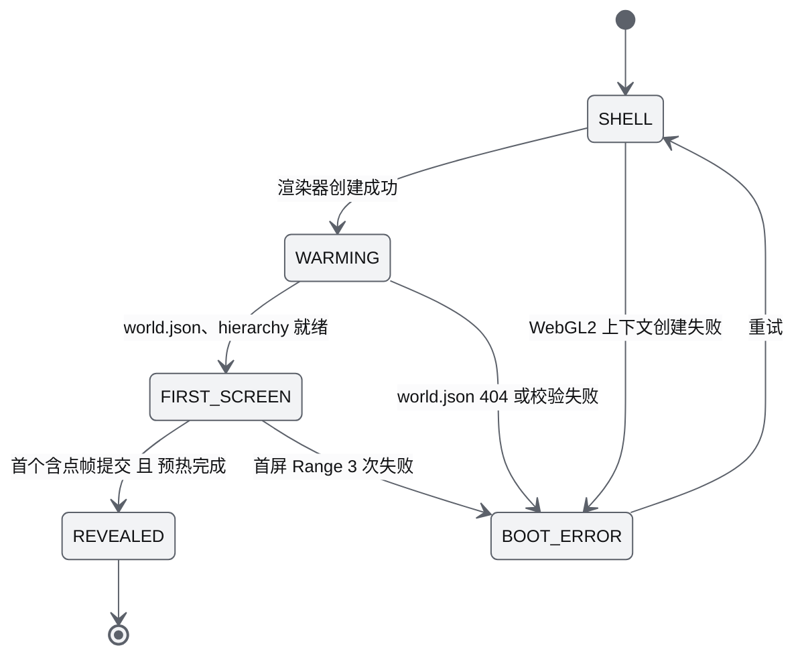
```mermaid
%%{init: {"theme": "base", "themeVariables": {"fontFamily": "Inter, PingFang SC, Microsoft YaHei, Noto Sans CJK SC, sans-serif", "fontSize": "13px", "background": "#FBFBFC", "primaryColor": "#F2F3F5", "primaryTextColor": "#111214", "primaryBorderColor": "#5C616A", "secondaryColor": "#E4E6E9", "tertiaryColor": "#FBFBFC", "lineColor": "#5C616A", "textColor": "#111214", "mainBkg": "#F2F3F5", "nodeBorder": "#5C616A", "clusterBkg": "#FBFBFC", "clusterBorder": "#A7ABB3", "edgeLabelBackground": "#FBFBFC", "noteBkgColor": "#E4E6E9", "noteTextColor": "#111214", "noteBorderColor": "#81868F"}}}%%
stateDiagram-v2
  [*] --> SHELL
  SHELL --> WARMING: 渲染器创建成功
  SHELL --> BOOT_ERROR: WebGL2 上下文创建失败
  WARMING --> FIRST_SCREEN: world.json、hierarchy 就绪
  WARMING --> BOOT_ERROR: world.json 404 或校验失败
  FIRST_SCREEN --> REVEALED: 首个含点帧提交 且 预热完成
  FIRST_SCREEN --> BOOT_ERROR: 首屏 Range 3 次失败
  BOOT_ERROR --> SHELL: 重试
  REVEALED --> [*]
```

| 状态 | 事件 | 守卫 | 动作 | 目标状态 |
|---|---|---|---|---|
| SHELL | 渲染器创建 | — | 启动 shader zoo、取数、WS 三路 | WARMING |
| SHELL | 创建失败 | — | 显示致命错误页（E-01） | BOOT_ERROR |
| WARMING | 清单就绪 | — | 发首屏 Range | FIRST_SCREEN |
| WARMING | 清单失败 | — | 遮罩转错误态，提供"返回世界列表""重试" | BOOT_ERROR |
| FIRST_SCREEN | 首帧提交 | 预热完成 | 淡出遮罩；CAS 冻结 30 帧（ADR-012） | REVEALED |
| BOOT_ERROR | 重试 | — | 重置并重新开始 | SHELL |

**UI 内切换世界**：不显示品牌遮罩；视口中央显示紧凑加载卡（`Card size="sm"`：世界名 + `Progress` + "加载首屏"），旧世界点云立即卸载，画布显示地面网格与天空，首帧后加载卡以 150 ms 淡出。目标 ≤ 1.5 s（D1-AC-02）。

### 7.4 渐进加载中

| 信号 | 呈现 | 依据 |
|---|---|---|
| 覆盖率（当前目标集中已驻留节点所占比例，即 R 与 resident 交集的大小除以目标集 T 的大小） | HUD `Progress` + 百分比（C 类，4 Hz）；≥ 99% 持续 1 s 后隐藏进度条 | r12 §4.7；ADR-013 |
| 在途请求数 | HUD 文本"在途 3" | M05 Stats |
| `limitedBy` | HUD 文本：budget"受点预算限制"、nodes"受节点数限制"、headroom"已达目标精度，细化余量已用完"、error"已达目标精度"、complete"已完整"（headroom 表示 τ 已满足且 15% 的细化余量已用完，不是上传余量，M05 §8.2） | 00-index §3.5；M05 |
| 点云图层状态 | 左栏点云行图标：`LoaderCircle`（旋转）→ 覆盖率 ≥ 99% 持续 1 s 后 morph 为 `CircleCheck`（smooth，旋转交接按 d03 §6 第 7 条） | d03 §4.1 B 组 |
| 节点出现 | 引擎内 screen-door 淡入 `--duration-lod-fade`（250 ms）；LOD 为叠加式，父节点不隐藏，子节点淡入完成后父节点在该八分体内的点径缩小一级 | ADR-029；d02 §4.6；M05 §6.7.4 |
| 节点失败 | HUD 失败计数（> 0 时 warning 描边）；Perf 面板列出失败节点数 | D1-AC-06 失败节点数应为 0 |

渐进加载期间不使用全局 Spinner、不遮挡画面、不弹 Toast；"流式加载中"的 shimmer 文字只在 full 档且同屏常驻循环 < 2 时显示（ADR-029）。

### 7.5 降级

| 来源 | 触发 | 呈现 | 通道 |
|---|---|---|---|
| PerfGovernor 步 ①–⑦ | 1 Hz 评估（ADR-041） | HUD 追加"降级 ② 视锥仅保留选中机"；Perf 面板降级阶梯主角标记移动；恢复时逆序 | 合并 Toast，每步最多 1 条，同类 10 s 内不重复："帧间隔超过目标 20%，已隐藏轨迹（性能面板可查看）" |
| CAS 在 B_floor 饱和 | ADR-012 | HUD"点预算受质量下限约束" | 仅 HUD |
| 点池容量钳制 | ADR-010 | 画质 `Select` 旁 `Badge`"受点池容量限制" | 仅 UI |
| 软件渲染档 | 设备能力档 software | HUD `Badge`"S 档 · 30 FPS 目标"（info，不是告警） | 仅 HUD |
| WebGPU 偏好不可用 | ADR-044 | info Toast 一次"WebGPU 不可用，已使用 WebGL2" | Toast |
| motion 被性能降档 | ADR-029 | 设置"动效"标签显示"当前 lite（由性能调节器降级）" | 设置 |
| 环境视觉降为 Off | PerfGovernor ⑤ | 环境分组顶部说明"视觉已降级（雾保留）；物理不受影响" | 左栏 |
| 仿真内核退回 numpy | ADR-038 | 关于页与 Perf 面板"仿真内核 numpy · 机群上限 300 架"；添加 P600 超过 300 时按钮置灰 | 面板 |
| Tier S 流式图上限 | ADR-031 | 被暂停的图卡显示"已暂停（软件渲染档最多 4 张流式图）" | 图卡 |
| 回放最大倍速 | ADR-040 | 倍速选项置灰 + 原因 | Timeline |

原则：降级永远可见（HUD 或面板），但只在状态**变化**时发一次合并 Toast；降级恢复不发 Toast（避免噪声），只在 HUD 移除对应行。降级步若不改变屏上内容（例如没有选中机时的轨迹与视锥、标签或低模数量本就低于新上限、无 UI 壳的 `?chrome=0`），只在 HUD 与面板记录，不发 Toast（ADR-064：Tier S 下第一个 Toast 的光栅会使合成器停顿 0.2–0.5 s）。无 UI 壳的 `?chrome=0` 没有 Toast 表面，任何步骤（含会改变点云的 ⑦）的提示都只进入非 DOM 通道，降级步骤不写 DOM（ADR-081）。

### 7.6 错误

错误码以 [17](17-接口与实时协议规范.md) 的 `reasons.json` 与 HTTP 状态为准；下表 `E-xx` 是本文的 UI 错误态标识（前端内部使用，不上线，不占用原因码空间）。

| 标识 | 触发 | 呈现 | 恢复 |
|---|---|---|---|
| E-01 | WebGL2 上下文创建失败 | 全屏错误页：原因、浏览器与 GPU 字符串、"复制诊断" | 无（需更换浏览器或开启硬件加速） |
| E-02 | `world.json` 404 / 5xx | 遮罩转错误态或切换加载卡转错误 | "返回世界列表"、"重试" |
| E-03 | World Package 语义校验失败（dev/test 的 Ajv strict） | 同上，列出前 5 条错误 | 同上 |
| E-04 | 首屏 Range 连续失败 3 次 | 同上 | 重试 |
| E-05 | 节点加载失败（退避后） | HUD 失败计数 warning 描边 | 自动重试结束后保持计数 |
| E-06 | `webglcontextlost` / `onDeviceLost` | 视口覆盖层"图形上下文丢失，正在恢复"（Spinner），整页重建渲染器（AWR-03 §3.5） | 自动；失败 3 次转 E-01 |
| E-07 | WS 子协议不匹配或 contracts 主版本不一致（关闭码 4426，`311 PROTOCOL_UNSUPPORTED`），或 `serverInfo.layouts` 布局哈希与客户端不一致（客户端以 1000 自关） | 阻断 Dialog"客户端与服务器版本不一致，请刷新页面" | 刷新 |
| E-08 | 鉴权失败（401）或 Origin 不在白名单（403，`303 ORIGIN_FORBIDDEN`）；浏览器只看到 WS 关闭码 1006 时调用 `GET /api/auth/whoami` 判别（17 §3.3 第 4 条） | 全屏说明页：当前访问方式、建议 SSH 转发（AWR-03 §3.3） | 按说明操作 |
| E-09 | WS 以 1013 关闭（控制面 FIFO 满，`318 CONTROL_BACKLOG`） | 按断线处理（§7.7），并 Toast"客户端发送过快，连接被服务器重置" | 自动重连 |
| E-10 | 命令被拒绝或失败 | Toast（原因码文案，§13.6）+ 按钮反馈（§6.11） | 用户重试 |
| E-11 | REST 5xx / 超时 | Toast"请求失败（HTTP 503）" + 重试按钮 | 重试 |
| E-12 | `presets_sha256` 不一致 | 环境分组 warning 横条 | 刷新 |
| E-13 | 回放打开被拒（`122 RECORDING_INCOMPATIBLE` 或 `117 CLOCK_CONSTRAINT`） | Runs 行禁用 + Tooltip；打开时被拒则 Toast 原因码文案 | — |
| E-14 | 面板渲染异常 | 面板级 ErrorBoundary：面板体替换为 `Empty`"面板出错" + "重新加载面板"；视口有独立 ErrorBoundary | 重新加载面板 |
| E-15 | TIME.state = FAILED（supervisor 熔断） | 阻断横幅"仿真进程已熔断（60 s 内重启次数达到上限）"（ADR-017：60 s 内第 6 次启动时熔断为 FAILED）+ 进程列表（`sys/procs` topic 或 `GET /api/sys/procs`） | 需运维处理（admin 可在横幅中"复位熔断并重启"，`POST /api/sys/restart {name, reset_breaker: true}`，ext） |
| E-16 | 席位被接管或 token 撤销（关闭码 4403，`116 SEAT_TAKEN`） | Toast"控制权已被管理员接管，当前为只读"；按 viewer 重连 | 自动 |
| E-17 | 连接数超限（关闭码 4429，`316 CONN_LIMIT`） | 横幅"连接数已满，30 s 后重试"并倒计时 | 30 s 后自动重连 |

### 7.7 断线重连

**连接状态机**（rt.worker 报告，UI 呈现；重连退避按 17 §6.13 第 2 条：首次 500 ms、每次 ×1.5、上限 10 s、±20% 抖动、连接超时 4 s；本文只约束可见行为）：

| 状态 | 事件 | 守卫 | 动作（UI） | 目标状态 |
|---|---|---|---|---|
| CONNECTING | ws open + serverInfo | 版本兼容 | 连接徽标"同步中" | SYNCING |
| CONNECTING | ws open | 版本不兼容 | E-07 阻断 | FATAL |
| SYNCING | 首个 SNAPSHOT | — | 徽标显示 RTT；DroneRail 由 Skeleton 进场 | LIVE |
| LIVE | TIME 超过 `input.staleAfterMs` 未到 | socket 仍开 | 时钟文字虚线下划线；机体按 3/f 外推后 HOLD 并显示"信号延迟"（ADR-046） | DEGRADED |
| DEGRADED | TIME 恢复 | — | 移除 STALE 样式 | LIVE |
| LIVE / DEGRADED / SYNCING | ws close，关闭码为 1001、1002、1006、1009、1011、1013、4401、4403、4408、4429 | — | 1 s 后（`input.offlineBannerDelayMs`）出现横幅；命令与环境控件置灰；数值转 `STALE <t> S`；按下方关闭码表做附加处理 | RECONNECTING |
| 任意 | ws close，关闭码为 1000、1008 或 4426，或 1002 连续 3 次 | — | 1000 为本端主动关闭，不重连；其余进入 E-07 或 FATAL 说明页 | FATAL |
| RECONNECTING | 退避到期 | — | 横幅显示"正在重连（第 3 次，2 s 后）"与"立即重连" | CONNECTING |
| RECONNECTING | 用户点"立即重连" | — | 立即尝试 | CONNECTING |
| 任意 | 401 / 403 | — | E-08 | FATAL |

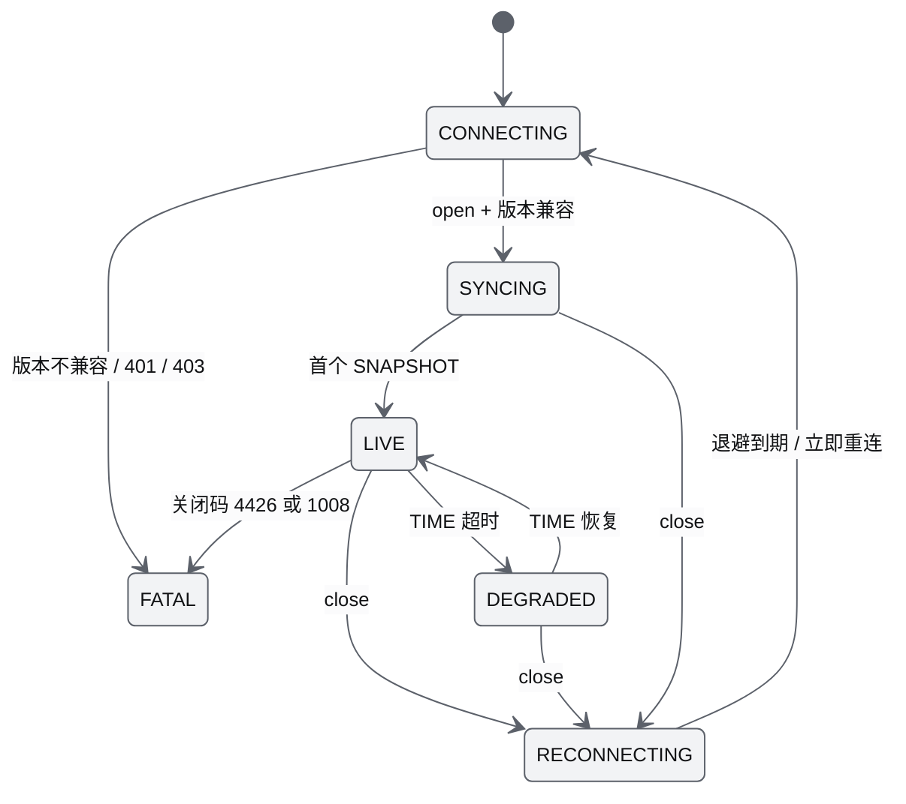
```mermaid
%%{init: {"theme": "base", "themeVariables": {"fontFamily": "Inter, PingFang SC, Microsoft YaHei, Noto Sans CJK SC, sans-serif", "fontSize": "13px", "background": "#FBFBFC", "primaryColor": "#F2F3F5", "primaryTextColor": "#111214", "primaryBorderColor": "#5C616A", "secondaryColor": "#E4E6E9", "tertiaryColor": "#FBFBFC", "lineColor": "#5C616A", "textColor": "#111214", "mainBkg": "#F2F3F5", "nodeBorder": "#5C616A", "clusterBkg": "#FBFBFC", "clusterBorder": "#A7ABB3", "edgeLabelBackground": "#FBFBFC", "noteBkgColor": "#E4E6E9", "noteTextColor": "#111214", "noteBorderColor": "#81868F"}}}%%
stateDiagram-v2
  [*] --> CONNECTING
  CONNECTING --> SYNCING: open + 版本兼容
  CONNECTING --> FATAL: 版本不兼容 / 401 / 403
  SYNCING --> LIVE: 首个 SNAPSHOT
  LIVE --> DEGRADED: TIME 超时
  DEGRADED --> LIVE: TIME 恢复
  LIVE --> RECONNECTING: close
  DEGRADED --> RECONNECTING: close
  SYNCING --> RECONNECTING: close
  RECONNECTING --> CONNECTING: 退避到期 / 立即重连
  LIVE --> FATAL: 关闭码 4426 或 1008
```

**关闭码的附加处理**（17 §8.3）：

| 关闭码 | 附加处理 |
|---|---|
| 1001、1011、4408 | 只按退避重连 |
| 1006 | 先 `GET /api/auth/whoami`：401 或 403 转 E-08，否则按退避重连 |
| 1009 | 重连，并在控制台与 `__ux` 记录缺陷（消息过大） |
| 1013 | E-09 |
| 4401 | 用同一 `principal_hint` 重新签发 token 后立即重连（不计退避次数） |
| 4403 | E-16，以 viewer 重连 |
| 4429 | E-17，30 s 后重连 |

`serverInfo.sessionId` 与断线前相同表示只是网络中断，重放订阅并带 `resume`；不同表示 api 已重启，清空事件序号与时钟同步后重新订阅（17 §6.13 第 2 条）。

**重连后的对账**：

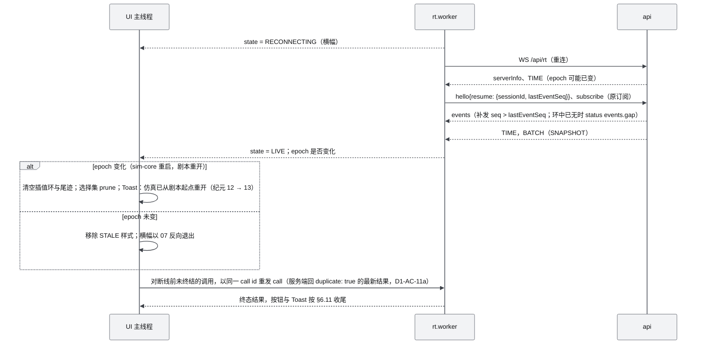
```mermaid
%%{init: {"theme": "base", "themeVariables": {"fontFamily": "Inter, PingFang SC, Microsoft YaHei, Noto Sans CJK SC, sans-serif", "fontSize": "13px", "background": "#FBFBFC", "primaryColor": "#F2F3F5", "primaryTextColor": "#111214", "primaryBorderColor": "#5C616A", "secondaryColor": "#E4E6E9", "tertiaryColor": "#FBFBFC", "lineColor": "#5C616A", "textColor": "#111214", "mainBkg": "#F2F3F5", "nodeBorder": "#5C616A", "clusterBkg": "#FBFBFC", "clusterBorder": "#A7ABB3", "edgeLabelBackground": "#FBFBFC", "noteBkgColor": "#E4E6E9", "noteTextColor": "#111214", "noteBorderColor": "#81868F", "actorBkg": "#F2F3F5", "actorBorder": "#5C616A", "actorTextColor": "#111214", "signalColor": "#3E4249", "signalTextColor": "#111214", "activationBkgColor": "#E4E6E9", "activationBorderColor": "#5C616A", "sequenceNumberColor": "#FBFBFC"}}}%%
sequenceDiagram
  participant UI as UI 主线程
  participant WK as rt.worker
  participant API as api
  WK-->>UI: state = RECONNECTING（横幅）
  WK->>API: WS /api/rt（重连）
  API-->>WK: serverInfo、TIME（epoch 可能已变）
  WK->>API: hello{resume: {sessionId, lastEventSeq}}、subscribe（原订阅）
  API-->>WK: events（补发 seq > lastEventSeq；环中已无时 status events.gap）
  API-->>WK: TIME，BATCH（SNAPSHOT）
  WK-->>UI: state = LIVE；epoch 是否变化
  alt epoch 变化（sim-core 重启，剧本重开）
    UI->>UI: 清空插值环与尾迹；选择集 prune；Toast：仿真已从剧本起点重开（纪元 12 → 13）
  else epoch 未变
    UI->>UI: 移除 STALE 样式；横幅以 07 反向退出
  end
  UI->>WK: 对断线前未终结的调用，以同一 call id 重发 call（服务端回 duplicate: true 的最新结果，D1-AC-11a）
  WK-->>UI: 终态结果，按钮与 Toast 按 §6.11 收尾
```

补充：
1. 持席位者断线期间，其名下 OPERATOR 租约的机体按 `hold_rtl` 策略进入 HOLD 或 RTL（ADR-026；1.5 s 告警、3 s HOLD、13 s RTL，墙钟）；重连后若这些机体处于 HOLD（LINK_LOSS）或因链路丢失进入的 RTL，DroneRail 顶部显示 warning 条"3 架因链路丢失进入保持或返航 · [恢复]"，"恢复"对它们发 `fleet/cmd/resume`（1 架时发 `uav/{id}/cmd/resume`）；电量原因的 RTL 不可恢复，不计入该条（g04 §6.2 注 5）。
2. 仅 sim-core 不可用而 api 在线时（TIME.state = STALLED/RESTARTING），不走断线流程，改为横幅"仿真重启中"，命令返回 211 SIM_UNAVAILABLE 时以 Toast 说明。
3. 断线期间不清空画面，最后一帧保持可浏览（相机可动），画面左上角 `Badge`"离线 · 最后更新 12 s 前"。

### 7.8 只读 viewer

| 能力 | viewer | 说明 |
|---|---|---|
| 相机、选择、图层、着色、标签、HUD、Perf、事件、图表 | 可用 | 纯本地视图 |
| 命令、GoTo、添加移除、环境设置、剧本加载与重置、Timeline 播放暂停与倍速、进入与退出回放、回放 seek | 不可用 | 这些都改变服务端全局状态 |
| 呈现 | 相关按钮**隐藏为一处说明**而不是逐个置灰：右栏命令区显示"只读模式 · 申请控制后可下发命令 [申请控制]"；Timeline 控件置灰且 Tooltip"只读模式"；快捷键被拦截时，在视口顶部提示条显示一次"只读模式" | 减少噪声（U-08） |
| 顶栏 | 角色徽标"只读"+ `Eye` 图标；"申请控制"按钮 | §6.12 |

回放模式下所有用户（包括席位持有者）都不能下发写操作（服务端返回 `118 READ_ONLY_MODE`）；席位持有者仍可控制回放的播放、倍速、seek 与退出。viewer 的写入口在 UI 上预先收敛，正常情况下不会收到 `115 ROLE_FORBIDDEN`；若收到（例如角色刚被降级），按 §13.6 文案 Toast 1 条并刷新角色。

### 7.9 过期（STALE）与信号延迟

| 对象 | 条件 | 呈现 |
|---|---|---|
| 单机 | 超过 3/f 未收到新样本（ADR-046） | 3D 标记改为虚线环；标签与 DroneRail 行显示"信号延迟"；数值显示 `STALE 3.2 S`（虚线下划线） |
| 全局时钟 | TIME 超过 1 s 未到 | 时钟文字虚线下划线 + `STALE` |
| 环境 | EnvKeyframe 心跳超过 3 s 未到（心跳 1 Hz） | 环境数值虚线 + `STALE` |
| 图表 | 数据源停止 | 曲线停在最后一点，后续只画地板刻度（缺失可见，d01 §3.3） |

未知值一律显示"—"（AWR-03 §5.7）。

---

## 8. 动效（transitions.dev）

### 8.1 规则摘要

1. 只引用 transitions.dev `_root.css` 的共享标度（7 个时长、6 条曲线、5 个距离、4 个缩放、3 个模糊）与各配方 token（`--panel-*`、`--dropdown-*`、`--modal-*`、`--toast-*`、`--tt-*` 等，同在 `_root.css`），以及项目扩展 token（ADR-029；15 §8.1）；取值以 [15](15-视觉设计规范与色卡.md) 为准，下表括号内数值只供阅读。
2. Base UI 部件按 g07 §2.1 映射：配方前置态 → `[data-starting-style]`，打开终态 → 默认规则（打开时长写在这里），关闭 → `[data-ending-style]`（关闭时长写在这里）；键盘或组内切换时 `[data-instant]` 为 0 s。
3. 档位 full / lite / reduced 取 `min(系统, 用户, PerfGovernor)`；Tier S 起步 lite（所有 blur 为 0、`filter: none`）；reduced 档 Base UI 部件 0 s、JS 配方 0.01ms（ADR-029；g07 §3.6）。
4. 预算：全站禁止 `backdrop-filter`；面积大于 240 × 240 px 或全高的表面（左右栏、Sheet、覆盖页、右栏页面、Dock 面板区）在任何档位都不做 blur 动画，只用位移与透明度；同时进行的带 blur 动画 ≤ 12；number pop-in 全站 ≤ 24 次/s；同屏常驻循环 ≤ 2（屏外暂停）；连续遥测文本 Tier S ≤ 4 Hz、其余 ≤ 10 Hz（ADR-029；d02 §4.7）。
5. 画布尺寸永不参与动画（ADR-028）。

### 8.2 交互 → 配方 → token 对照

| # | 交互 | 配方 | 宿主 | 打开 / 进入 | 关闭 / 退出 | 曲线 | lite 差异 | reduced |
|---|---|---|---|---|---|---|---|---|
| 1 | 左栏、右栏显隐 | 07 panel-reveal（X 轴，`--distance-drawer` 40 px；全高面板不带 blur） | 常驻（Sidebar `data-state` 切换，过渡只作用于 `translate` 与 `opacity`） | `--panel-open-dur`（400 ms） | `--panel-close-dur`（350 ms） | `--ease-smooth-out` | 同 | 0 s |
| 2 | 左栏分组展开 | 21 accordion | BU（Collapsible Panel） | `--acc-expand`（250 ms） | `--acc-collapse`（250 ms） | smooth-out | 内层去 blur（分组内容大于 240 × 240 px 时 full 档也不 blur） | 0 s |
| 3 | 右栏 列表、详情、编辑三页切换 | 08 page-side-by-side（±8 px；全高页面不带 blur） | BU（Tabs.Panel） | `--page-slide-dur`（250 ms） | 同左 | smooth-out | 同 | 0 s |
| 4 | Dock 标签切换、详情标签、相机工具条、倍速、着色模式 | 16 tabs-sliding | BU-常驻（Tabs.Indicator；ToggleGroup 用 `toggle-group-indicator` codemod 的指示块，§4.7） | `--tabs-dur`（250 ms） | — | smooth-out | 同 | 0 s |
| 5 | Dock 面板区展开收起 | 21 accordion 的高度过渡（作用于面板区自身） | 自研 | 250 ms | 250 ms | smooth-out | 同 | 0 s |
| 6 | Menubar、DropdownMenu、ContextMenu、Popover、Select、Combobox、HoverCard | 05 menu-dropdown | BU | `--dropdown-open-dur`（250 ms），自 `--scale-medium`（.97） | `--dropdown-close-dur`（150 ms），至 `--scale-tiny`（.99） | smooth-out | 同 | 0 s；键盘打开 `data-instant` 0 s |
| 7 | Dialog、AlertDialog、CommandDialog、设置 | 06 modal | BU | `--modal-open-dur`（250 ms），自 .96 | `--modal-close-dur`（150 ms） | smooth-out；遮罩 opacity `--duration-quick`，不 blur | 同 | 0 s |
| 8 | Sheet（Jobs 详情、证据链） | 07 panel-reveal（全高，不带 blur） | BU | 400 ms | 350 ms | smooth-out | 同 | 0 s |
| 9 | Tooltip（含相机工具条共享气泡） | 17 tooltip | BU | `--tt-in-dur`（150 ms） | `--tt-out-dur`（50 ms）；气泡移动 `--tt-move-dur`（160 ms） | ease-out | 同 | 0 s |
| 10 | Toast 进出与堆叠 | 22 toast + 32 banner-stacking | BU（Toast Root） | `--toast-open`（350 ms），16 px，.97，只过渡 transform 与 opacity（ADR-081） | `--toast-close`（250 ms） | smooth-out | 同 full（各档都不用 blur） | 0 s |
| 11 | 连接横幅、回放横幅、工具态提示条 | 07 panel-reveal 的 Y 轴 8 px 变体 | 自研（usePresence） | 400 ms | 350 ms | smooth-out | 去 blur | 0.01ms |
| 12 | Switch（图层开关） | 27 toggle | BU-常驻（Switch.Thumb，属性 `translate`） | `--toggle-dur`（350 ms），bounce 1.35 | 同 | `--ease-bounce` | 同 | 0 s |
| 13 | Checkbox（classMask） | 25 checkbox-check | BU（Checkbox.Indicator） | 描画 350 ms | 150 ms | — | 同 | 0 s |
| 14 | 状态文字（FlightState、连接、调用状态、阶段文字） | 04 text-states-swap | 自研 SwapText | `--duration-quick`（150 ms），4 px | 同 | ease-in-out | 去 blur | 0.01ms |
| 15 | 离散数字（电量 %、航点 k/N、在线架数、告警数） | 02 number-pop-in | 自研 MotionNumber | `--duration-very-slow`（500 ms），bounce 1.45 | — | bounce | 去 blur；全站 ≤ 24 次/s | 直接赋值 |
| 16 | 告警计数角标 | 03 notification-badge | 自研 | slide 260 ms、pop 500 ms | 180 ms | bounce | 同 | 0.01ms |
| 17 | 告警进入（顶栏计数、状态 Badge；ext，15 §8.3 第 12 行） | 12 error-state-shake（6/4 px，80/60 ms，共 280 ms；同一告警 10 s 内不重复） | 自研 useShake | 单次 | — | — | 同 | 不抖动 |
| 18 | 表单与参数校验失败 | 12 error-state-shake | Field `[data-invalid]` | 单次 | 3000 ms 后恢复 | — | 同 | 不抖动 |
| 19 | 骨架 → 内容（DroneRail、World Hub 卡片、面板首帧） | 14 skeleton-reveal | 自研 SkeletonReveal | `--duration-slow`（400 ms） | — | ease-in-out | 去 blur；脉冲同屏 ≤ 2 | 直接出现 |
| 20 | 空状态标题 | 18 texts-reveal | 自研 | 500 ms，stagger 40 ms，上限 `--stagger-cap` | 200 ms 淡出 | smooth-out | 不做（直接出现） | 不做 |
| 21 | 列表项进出（DroneRail 新增与移除、事件） | 18 改写：进 400 ms、错峰 40 ms、上限 300 ms；出 200 ms 淡出 + 250 ms 收起 | 自研 useListPresence | — | — | smooth-out | 错峰上限 150 ms | 直接 |
| 22 | 命令成功反馈 | morphicons（LoaderCircle → CircleCheck）；Toast 内 10 success-check | StateIcon | spring smooth | — | — | swap | set |
| 23 | 图标状态切换 | morphicons（白名单）/ 09 icon-swap | StateIcon | snappy 或 smooth；swap 250 ms | — | ease-in-out | 全部 swap（无 blur） | set |
| 24 | 加载中文字（"流式加载中"） | 15 shimmer-text | 自研 | 2000 ms 循环 | — | linear | 暂停 | 静态 |
| 25 | 按钮内小加载器 | 31 matrix-loader 或 Spinner | 自研 | 1200 ms 循环 | — | — | 计入常驻循环 ≤ 2 | 静态图标 |
| 26 | HUD 展开与单行 | 01 card-resize（HUD 自身） | 自研 | `--resize-dur`（300 ms） | 同 | smooth-out | 同 | 0.01ms |
| 27 | 启动遮罩揭开、徽章入场 | ADR-032 映射 | 自研 | `--duration-fast`（250 ms） | 同 | smooth-out | 同 | 直接 |
| 28 | 覆盖页（World Hub、Runs、Jobs）进出 | 07 Y 轴 8 px 变体 + opacity（全屏表面，不带 blur） | 自研 | 400 ms | 350 ms | smooth-out | 同 | 0.01ms |
| 29 | 图表入场（分析页、报告；HUD 图任何档都无入场） | ADR-031 映射 | lf 组件 | `--duration-chart-enter`（900 ms）；大图 `--duration-chart-slow`（1200 ms） | — | `--ease-smooth-out` | `--duration-fast` 整体淡入，无错峰（15 §8.4） | 无 |
| 30 | KPI 大数变化（HUD 除外） | ADR-031：`--duration-slow` + smooth-out | LfStat | 400 ms | — | smooth-out | 同 | 直接 |
| 31 | 预设过渡、风速等数值 | 不做 UI 动画（服务端 3 s / 30 s 过渡本身即动画） | — | — | — | — | — | — |
| 32 | 风向、航向图标 | CSS `rotate`，时长 `--telemetry-text-interval`（Tier S 250 ms，其余 100 ms），`--ease-linear`（15 §7.5） | 自研 | — | — | linear | 同 | 直接 |

说明：表中"BU"表示由 Base UI 管理挂载与卸载（g07 §2.3），"自研"沿用 d02 的 hooks。21、24、25 属于常驻或列表动画，受 §8.1 第 4 条预算约束。

### 8.3 3D 视口动效

| 场景 | 规则 | token | reduced |
|---|---|---|---|
| 相机飞行 | `clamp(0.4 + 0.15·ln(1 + d/20), 0.4, 1.2)` s；可打断 | `--duration-camera-min/max`、`--ease-smooth-out` | 硬切 |
| 点云节点淡入 | screen-door，不透明写深度 | `--duration-lod-fade`（250 ms） | 保留（非运动性，且影响画质） |
| 选择环出现 | 缩放 0 → 1；lite 档改为 `--duration-fast` + `--ease-smooth-out`、无超调（15 §8.4） | `--duration-very-slow` + `--ease-bounce` | 直接出现 |
| 航点添加 / 删除 | 缩放 0 → 1 / 淡出 | 500 ms bounce / `--duration-quick` | 直接 |
| 告警机体 | 视口"一处红"的胜出者为 critical 机体时，其环在 full 档以 1 Hz 呼吸（往返 2 × `--duration-very-slow`，不透明度在 1 与 0.55 之间往返，shader uniform，不是 DOM 循环）；焦点机作为红色实体时不呼吸；其余 critical 不呼吸；lite 档静态（15 §8.4、§10.4） | `--ease-in-out` | 静态 |
| 焦点 D 切换 | D_global 与 D_focus 之间 300 ms 平滑（ADR-046） | — | 保留（非视觉动效） |
| 模态打开期间 | 画布限帧 ≤ 15 fps（d02 §4.6）；Dialog 关闭后恢复 | `onOpenChangeComplete` | 同 |

所有 3D 时长常量从生成的 token 常量读取（ADR-029 写作 `ui/motion/tokens.ts`，生成物实际落点以 M15-FR-045 为准），TS 与 TSL 中不得出现字面量（ADR-029 motion-lint）。

### 8.4 遥测数字的 C、D、E、S 分类

| 类 | 字段（本系统） | 刷新 | 动效 |
|---|---|---|---|
| C 连续量 | 高度、速度、航向、坐标、仿真时间、呈现间隔、点数、预算、RTT、风速（本机处）、MOR | Tier S ≤ 4 Hz、其余 ≤ 10 Hz（`--telemetry-text-interval`） | 无；tabular-nums；越过阈值时颜色 150 ms 过渡 |
| D 离散量 | 电量整数 %、航点 k/N、在线架数、告警数、选择数、覆盖率百分比（HUD 外） | 变化即更新，动画 ≤ 2 Hz（`--telemetry-anim-interval`） | 02 number-pop-in，只动变化的位 |
| E 事件 KPI | 已完成任务数、本次加载点数汇总（世界就绪时一次） | 事件触发 | 26 spinning-counter（V0.2；D1 以 02 代替） |
| S 状态文字 | FlightState、子模式、控制权、连接状态、调用状态、剧本阶段 | 变化即更新 | 04 text-states-swap |

依据 d02 §4.4.3、ADR-029。遥测不进入 React state：`store.subscribe(selector, cb)` 直接写 DOM，rAF 合批（ADR-008）。

---

## 9. 图标与 morph（morphicons）

### 9.1 规则

1. 静态图标用 `<Icon>`（canonicalD 单 path），状态图标用 `<StateIcon>`；业务代码只写语义 key，不写 lucide 名（d03 §4）；全仓库禁止 `lucide-react`（ADR-030）。
2. morph 只在白名单对之间执行（准入四条：同一对象、子路径差 ≤ 2 或同族分档、max res ≤ 0.5 或纯旋转、目测通过，d03 §4.2）；其余一律 swap（transitions.dev 09，250 ms），reduced 档 set。
3. 并发 morph ≤ 8，空闲时预热白名单对，状态分档带 1.5 s 迟滞（电量、信号），告警升级不受迟滞限制（d03 §3.6；ADR-030）。
4. 列表中只有可见行与选中行 morph，其余行 set（ADR-028）。
5. 连续角度（航向、风向）只用 CSS rotate。
6. 开关类的"激活"态用前景色图标 + `bg-muted` 底，不用红色（红色留给告警与焦点机，§11.2；§19 第 10 条）。

### 9.2 动作 → 图标 → 切换方式

| 动作或状态 | 语义 key（d03 §4.1） | 图标 | 切换 | 对端 |
|---|---|---|---|---|
| 播放 / 暂停仿真 | `tl.play` / `tl.pause` | Play / Pause | morph snappy | 互为对端 |
| 单步 | `tl.stepfwd` / `tl.stepback` | StepForward / StepBack | static | — |
| 回放结束后重播 | `tl.replay` | RotateCcw | static | — |
| 实时 | `tl.live` | Radio | static | — |
| 录制中（ext） | `tl.record` | CircleDot | static | — |
| 事件标记 | `tl.marker` | Flag | static | — |
| 相机 Orbit / Free / Third / FPV / Bird | `cam.orbit` / `cam.free` / `cam.third` / `cam.fpv` / `cam.bird` | Orbit / Move3d / Video / ScanEye / Map | 并列静态（不 morph） | — |
| 跟随锁定 | `cam.follow` | Locate | morph snappy | LocateFixed |
| 聚焦（F） | `cmd.track` | Focus | static | — |
| 重置视角（Home） | `cam.reset` | Fullscreen | static | — |
| 正北朝上（N） | `heading` | Compass | static | — |
| 视锥 | `cam.fov` | Cone | static | — |
| 左栏 / 右栏 / 底部面板开合 | `panel.left` / `panel.right` / `panel.bottom` | PanelLeftClose 等 | morph snappy | PanelLeftOpen 等 |
| 图层可见 | `layer.visible` | Eye | swap | EyeOff |
| 点云渐进加载 | `layer.loading` | LoaderCircle | morph smooth（旋转交接） | CircleCheck |
| 轨迹 | `layer.trajectory` | Spline | static | — |
| 点云 / LOD / 点预算 | `layer.pointcloud` / `layer.lod` | 自定义 PointCloud / OctreeLod | static | — |
| 起飞 / 降落 | `cmd.takeoff` / `cmd.land` | PlaneTakeoff / PlaneLanding | static（按钮内）；状态徽标内 morph | 互为对端 |
| 悬停 | `cmd.hover` | Crosshair | static | — |
| 返航 | `cmd.rth` | House | static | — |
| GoTo | `cmd.goto` | MapPin | static | — |
| 航线 / 环绕 | `cmd.followpath` / `cmd.orbit` | Waypoints / Orbit | static | — |
| 安全停止 | `mission.abort` | OctagonX | static | — |
| 恢复 | `mission.start` | Play | static | — |
| 暂停任务 | `mission.paused` | CirclePause | morph snappy | CirclePlay |
| 命令进行中 → 成功 / 失败 | `mission.running` | LoaderCircle | morph smooth | CircleCheck / CircleX |
| 待执行 → 进行中 | `mission.pending` | CircleDashed | swap | LoaderCircle |
| 添加 / 删除航点 | `wp.add` / `wp.remove` | MapPinPlus / MapPinX | static | — |
| 撤销 / 重做（ext） | 新增 `edit.undo` / `edit.redo` | Undo2 / Redo2 | static | — |
| 选择工具 / 框选工具（ext） | 新增 `tool.select` / `tool.box` | MousePointer2 / SquareDashedMousePointer | static | — |
| 绘制区域（ext） | `cmd.coverage` | Scan | static | — |
| 重建任务（ext） | 新增 `nav.recon` | ScanLine | static | — |
| 电量档 | `bat.full` → `bat.medium` → `bat.low` → `bat.warn` | BatteryFull / Medium / Low / Warning | morph hud（相邻档） | 相邻档 |
| 信号档 | `link.high` → `link.medium` → `link.low` → `link.lost` | SignalHigh / Medium / Low / Zero | morph hud（相邻档） | 相邻档 |
| 后端连接 | `conn.online` | Wifi | morph snappy | WifiOff |
| 告警升级 | `alert.warning` | TriangleAlert | morph smooth | OctagonAlert |
| 健康 → 告警 | `drone.armed` | ShieldCheck | morph smooth | ShieldAlert |
| 告警中心 | `notify` / `notify.ring` | Bell / BellRing | swap | BellOff（静音，V0.2） |
| 智能体在线（ext） | `agent` | Bot | morph snappy | BotOff |
| 天气预设（12 个，映射取自 M07 §6.5） | clear `env.clear`、partlyCloudy `env.partly`、overcast `env.overcast`、lightRain `env.drizzle`、rain `env.rain`、heavyRain `env.storm`、thunderstorm `env.thunder`、fog `env.fog`、haze `env.haze`、snow `env.snow`、blizzard `env.snow`（`env.blizzard` 登记前暂用，M07 §14 第 7 条）、sandstorm `env.sand` | Sun、CloudSun、Cloudy、CloudDrizzle、CloudRain、CloudRainWind、CloudLightning、CloudFog、Haze、CloudSnow、CloudSnow、自定义 SandDust | 只有白名单相邻对 morph smooth：晴与少云（Sun、CloudSun）、中雨与雾（CloudRain、CloudFog）、雾与霾（CloudFog、Haze）；其余一律 swap | 见左 |
| 风向 | `env.wind.dir` | Navigation2 | CSS rotate | — |
| 航向 | `heading` | Compass | CSS rotate | — |
| 复制 | `copy` | Copy | morph snappy | Check |
| 下拉 / 折叠箭头 | `chev.down` | ChevronDown | 组件内 CSS scaleY（21 accordion） | — |
| 只读 | `layer.visible` | Eye | static | — |
| 本人持有租约 | `lease.held` | KeyRound | static | — |
| 信号延迟（HOLD 外推） / 数据过期 | `state.hold` / `state.stale` | Hourglass / TimerOff | swap（两者互换或出现消失） | — |
| 禁飞区图层 | `zone.nofly` | ShieldBan | static | — |
| 性能降级行 | `perf.degraded` | TrendingDown | static | — |
| 效果已验证（详情中 V4） | `effect.verified` | BadgeCheck | static | — |
| 任务目标 | `mission.target` | Target | static | — |
| 控制权 OPERATOR / MISSION / AGENT / SWARM / SAFETY / PILOT / EXTERNAL | `user` / `nav.mission` / `agent` / `cmd.formation` / `alert.geofence` / `mode.manual` / `external` | CircleUser / Route / Bot / 自定义 Formation / ShieldAlert / Hand / ExternalLink | static（随 owner 变化 swap） | — |

注册表以 15 §7.6 为准（初始 208 个，加 D1 补登 M 组与第 2 轮补登 N 组；条目总数以注册表为准，ADR-030 第 2 轮修订。上表中 `lease.held`、`state.hold`、`state.stale`、`zone.nofly`、`perf.degraded`、`effect.verified`、`mission.target` 即来自 M 组）。本文请求补登的 5 个（已由 15 §7.6 N 组登记）：`edit.undo`=Undo2、`edit.redo`=Redo2、`tool.select`=MousePointer2、`tool.box`=SquareDashedMousePointer、`nav.recon`=ScanLine，均为 lucide 1.48.0 的 canonical 名（已在 g07 样板 `node_modules/lucide/dist/esm/icons/*.mjs` 核实存在），都用 static，不参与 morph。M15 注册表合计 222 项（216 + 本文 5 + M08 的 `drone.ghost`，M15-FR-059），见 §19 第 2 条。

### 9.3 图标尺寸与位置

按钮、菜单项、SidebarMenuButton 内的图标不加尺寸类，由组件 CSS 决定（mira 按钮内 14 px、描边 1.5 px，g07 §4.2）；独立使用时 16 px；工具条 20 px；空状态 48 px（d03 §4.4）。纯图标按钮必须有 `aria-label`，并用 `Tooltip` 显示同名文案与快捷键。

---

## 10. 图表与表格（lieflat 视觉语言）

### 10.1 面板 → 图型

| 面板 / 区域 | 图型（lieflat 编号） | 组件 | 引擎 / 刷新 | 红色（每图至多一处） | D1 |
|---|---|---|---|---|---|
| 性能 HUD | KPI + sparkline；20 格刻度条 | `LfStat`、`LfSparkline`（G17 缩略）、行内刻度条（15 §9.6） | Canvas / 4 Hz | p95 > 1.5·T* 时 KPI 数字（红色文字） | core |
| Perf：呈现间隔 | G17 动态流 | `LfLiveLine`（T*、1.5·T* 两条参考线） | Canvas / 4 Hz（聚焦 10 Hz，Tier S 4 Hz） | LIVE 末端点（表示"现在"，15 §9.3、§9.5）；越过 1.5·T* 的点画为 DATA 色大点（r 4.2），不用红 | core |
| Perf：帧间隔分布 | F14 直方 | `LfHistogram` | SVG / 1 Hz | 最右一箱（> 100 ms）有值时 | core |
| Perf：点预算 | F11 刻度仪 | `LfTickGauge` | SVG / 2 Hz | 无（受点池容量限制、越过质量下限时用文字说明，15 §9.5） | core |
| Perf：逐层点数 | F1 梯级柱 | `LfRungBars` | SVG / 1 Hz | 无 | core |
| Perf：流式与驻留 | KPI + sparkline × 4 | `LfStat`、`LfSparkline` | Canvas / 4 Hz | 无 | core |
| Perf：图层预算 | table.log | `LfTable` | DOM / 1 Hz | 超预算最多的那一格（hot） | core |
| Perf：降级阶梯 | F5 刻度行 | `LfTickRows` | SVG / 事件 | 当前降级步 | core |
| 单机详情：KPI 行 | KPI | `LfStat` × 4（高度、速度、电量、模式） | DOM / 4 Hz | 电量低于 RTL 保留线时 | core |
| 单机详情：遥测曲线 | G17 small multiples | `LfLiveLine` × 3（高度、速度、电量） | Canvas / 4 Hz，聚焦 10 Hz | 各图 LIVE 末端点（曲线本身用 DATA 色，15 §9.5） | core |
| 单机详情：电量 | F11 刻度仪（带 RTL 保留线） | `LfTickGauge` | SVG / 1 Hz | 低于保留线的刻度段 | core |
| 单机详情：孪生置信度 | table.log | `LfTable` | DOM / 静态 | 无 | core |
| 图表页：机群概览（≤ 8 架） | F5 刻度行 | `LfTickRows`（选中机为主角） | SVG / 2 Hz | 焦点机 | core |
| 图表页：机群概览（> 8 架） | table.log + 行内刻度条 | `LfTable` | DOM + Canvas | 最严重告警行 | core |
| 图表页：FlightState 分布 | F1 梯级柱（1 档 = 1 架，自动单位） | `LfRungBars` | SVG / 1 Hz | CRASHED 或 FAILSAFE 档 | core |
| 环境：本机处 | KPI + sparkline | `LfStat`、`LfSparkline`（风速 1 Hz） | Canvas / 1 Hz | 无 | core |
| Timeline 轨道 | L3 条码地板 + 事件标记 | 自研（CPU canvas） | 4 Hz | 最近的未确认 critical 标记 | core |
| 事件表 | table.log | `LfTable`（虚拟滚动） | DOM / ≤ 4 Hz 批量 | 最新的未确认 critical 行（hot 单元格） | core |
| 任务表 | table.log + 行内刻度条 | `LfTable`、行内 20 格刻度条 | DOM / 2 Hz | 最新 ABORTED 行（hot 单元格） | core |
| World Hub 卡片 | KPI + F1 | `LfStat`、`LfRungBars`（levelsPoints） | SVG / 静态 | 校验失败时的状态徽标 | core |
| Runs 表（ext） | table.log | `LfTable` | DOM | 不兼容行 | ext |
| Jobs 表与阶段（ext） | table.log + F5 | `LfTable`、`LfTickRows` | DOM / ≤ 4 Hz | 失败任务 | ext |
| AGENTS 任务表（ext） | table.log | `LfTable` | DOM / ≤ 4 Hz | failed、rejected、input-required 中最近一条 | ext |

依据：d01 §4.4（场景 → 选型）、ADR-031（约 16 个图型，流式 CPU canvas、静态 SVG，全应用一个 LfScheduler）。

### 10.2 规格与约束

1. 图卡外壳 `Card size="sm"`、`rounded-xl`、不加 border；标题 `text-hud-title`、副标题 `text-hud-sub`、KPI `text-hud-kpi`、标签与来源 `text-hud-cap`（g07 §5.1；取值见 15）。
2. HUD 与遥测图没有入场动画、数据更新不补间；分析页与报告卡片入场用 `--duration-chart-enter`（d01 §3.1.4；ADR-031）。
3. 多机配色：≤ 4 条序列按实体固定灰阶并直接标注名称，焦点机为主角；> 4 条改 small multiples 或"一条主角 + 其余发丝"；不为无人机分配彩虹色（d01 §3.2）。
4. Tier S 同屏流式图 ≤ 4 张：LfScheduler 按"聚焦图 > HUD > 详情 > 其余"优先级分配，超出的图卡暂停并显示说明（ADR-031；§7.5）。
5. 表格：数字列右对齐、单位写表头（`ALT M`、`SPD M/S`，中文表头"高度 m"）、表头下 1 px 实线、行间点线、不用斑马纹、每表最多一个 hot 单元格、选中行 `bg-muted` 加 2 px 竖条、超过 100 行必须虚拟化（ADR-028；完整规范见 15 §9.6）。

### 10.3 图表交互

1. 悬停：Canvas 图二分查找最近时间点，画纵向 hairline 光标（DATA 40% 透明度），共用一个 Tooltip 浮层，格式"标签 — 数值 单位 · 时间"（d01 §3.7）。
2. 点击：机群概览与事件表中点击某机体即全局选中（与 3D、列表同源，§6.2）；HUD 与 Perf 图中点击不做钉住。
3. 键盘：图卡可聚焦，←/→ 在时间点之间移动光标，Esc 清除；焦点环用 `--ring`（灰），不用红。
4. 装饰元素（地板刻度、每 5 档一点）一律 `pointer-events: none`。

---

## 11. 告警与通知模型

### 11.1 严重度

| 级别 | 来源示例 | 视觉（形状编码） | 通道 |
|---|---|---|---|
| info | 命令成功（非本控件发起）、世界加载完成、预设过渡开始、WebGPU 回退、性能降级步变化 | 无红；`Info` 或 `CircleCheck` 图标 | Toast（4 s） |
| warning | FlightState 严重度 1–4（CORRECTING、HOLD、RTL、FAILSAFE 位为 1 的 LANDING）；电量告警档（< 20%，d03 §3.6）；链路丢失进入 HOLD；命令被拒或失败；粗校验违规；环境超出抗风能力（ENV_LIMIT）；与服务器断线（连接徽标红描边 + 横幅） | 红色**描边**空心 + `TriangleAlert` + 文字 | DroneRail 行、3D 标签、事件表、Toast（6 s，合并） |
| critical | 严重度 ≥ 5（ELAND、FAILSAFE、CRASHED）；仿真熔断（TIME.state = FAILED） | 红色**实心**（每图只有一个）+ `OctagonAlert` + 文字；同图其余 critical 为红描边 + `OctagonAlert` | 顶栏计数（全局一处红）、DroneRail、3D、事件表、Toast（常驻直到确认或解除）、横幅（系统级） |

FlightState 严重度取自 g04 §3.1（CORRECTING 1、HOLD 2、RTL 3、LANDING（FAILSAFE）4、ELAND 5、FAILSAFE 6、CRASHED 8）；分级与 12 §3.3.16 一致：CORRECTING、HOLD、RTL、LANDING 属"action"（本文 warning），ELAND、FAILSAFE、CRASHED 属 critical。事件 `level`（17 §6.12：0 INFO、1 NOTICE、2 WARNING、3 CRITICAL）映射为：0、1 → info，2 → warning，3 → critical。STALE、信号延迟与性能降级不是告警，不使用红色，按 §11.3 的灰色虚线与 §7.5 的降级呈现。

### 11.2 "一处红"仲裁

每张"图"（§1.5）独立仲裁，每 250 ms（与 UI 批量写入同频）计算一次。仲裁器的状态机、1.5 s 驻留与视觉呈现由 15 §3.7.2（RedArbiter）定义，本文只定义候选来源与"确认"语义；下面伪代码是二者合并后的行为：

```ts
// 伪代码：在一张图内选出唯一的红色实心对象
function pickRed(fig: Figure): RedTarget | null {
  const crit = fig.alarms.filter(a => a.severity === "critical" && !a.acked)
  if (crit.length > 0) {                                  // 1. 严重告警优先
    return maxBy(crit, a => [a.rank, a.lastT_wall_ms])     //    严重度最高；同级取最新
  }
  if ((fig.kind === "viewport" || fig.kind === "fleetOverview") && selection.primary)  // 2. 当前选中的无人机（仅 3D 视口、机群概览图）
    return { entity: selection.primary }
  return fig.heroCandidate ?? null                         // 3. 数据主角（峰值、LIVE 点、越界阈值等）
}
// 驻留（15 §3.7.2）：当前红色实体在 1.5 s 内不被同级或更低优先级的候选替换，只能被更高优先级抢占
```

| 图 | 红色实心的候选（按优先级） | 备注 |
|---|---|---|
| 3D 视口 | 最严重的未确认 critical 机体 → 焦点机（机体、轨迹、标签环为同一对象） | — |
| DroneRail | 最严重的未确认 critical 行的状态徽标 | 选中态永远不用红 |
| 事件表 | 最新的未确认 critical 行（hot 单元格） | — |
| Timeline 轨道 | 最近的未确认 critical 事件标记 → 无 | LIVE 指示不用红（本文决定，避免常驻红） |
| HUD | p95 > 1.5·T* 时的 KPI 数字 | 红色文字，不占实心名额（15 §3.7.1 第 3 条） |
| Perf 与其他图卡 | 按 §10.1"红色"列 | 例如实时曲线的 LIVE 末端点 |
| 顶栏 | 只有告警计数徽标可以是红色实心（有未确认 critical 时）；仅 warning 时为红描边；无告警时隐藏 | 连接徽标断线时为红**描边**，不占实心 |

已确认（acked）的 critical 仍保持红描边与图标，直到条件解除；"确认"是每个客户端自己的 UI 状态，不上线（g04 §4.8）。

### 11.3 形状编码总表

| 状态 | 填充 | 描边 | 图标 | 文字 | 线型 |
|---|---|---|---|---|---|
| nominal | 前景色（DATA） | 无 | 仅需要时 | 状态名 | 实线 |
| warning | 无（空心） | 红 | `TriangleAlert` | 必带 | 实线 |
| critical（主） | 红 | 无 | `OctagonAlert` | 必带 | 实线 |
| critical（次） | 无 | 红 | `OctagonAlert` | 必带 | 实线 |
| stale、信号延迟（HOLD 外推） | 无 | 灰（FAINTDATA；3D 为 g500 虚线环） | `state.stale`（TimerOff）或 `state.hold`（Hourglass） | `STALE 3.2 S`、"信号延迟" | 虚线 2 4 |
| 机体链路丢失、服务器断线 | 无 | 灰（机体）；连接徽标为红描边 | `link.lost`（SignalZero）、`conn.online` 的 `WifiOff` 态 | 必带 | 虚线 2 4（机体） |
| planned / predicted | 无 | 前景色 | — | 图例 | 虚线 |
| 作废区间（回放） | 斜纹 | 灰 | — | Tooltip | 虚线 |

依据：ADR-032；d01 §3.2 状态表；d03 §4.4"状态由形状表达"。

### 11.4 Toast 与合并

1. Base UI Toast，`limit={3}`，第 4 条带 `data-limited` 被挤出（g07 §6 第 6 条）；位置为未遮挡区右下。承载 Toast 的视口常驻、预先成层、尺寸固定（可容纳三条展开 Toast）并做布局与绘制隔离，Toast 只以 transform 与 opacity 进出与堆叠（ADR-081）；无 UI 壳的 `?chrome=0` 不显示 Toast，提示只进入非 DOM 通道。
2. 合并键 = `来源 : 事件类型 : 原因码`；同键新事件更新计数与主体列表而不是新增一条，例如"37 架进入 HOLD（链路丢失）"；更新频率 ≤ 4 Hz（前端事件以 ≤ 4 Hz 批量写入 store，ADR-028）；同一条 Toast 的改写实际 ≤ 1 Hz、在下一帧的布局后时段（样式与布局之后、绘制之前）写入，每帧至多一条，级别变化立即改写（ADR-069、ADR-081：Base UI Toast 挂载与改写时的高度测量会强制布局，只有布局后时段整页是干净的，不能放在事件批量写入的任务里，也不能放在由超时触发的空闲回调里）。
3. 时长：info 4 s、warning 6 s（本文设定，Base UI 默认 5 s）；critical 不自动消失，直到用户关闭、确认或条件解除；悬停时暂停计时。
4. 命令结果：本控件可见时以按钮图标反馈为主，不重复 Toast；控件不可见（例如快捷键触发）或批量时发 Toast（§6.11）。
5. 1000 架全机 RTL 与 500 架 link_drop 这类风暴，合并后同屏 Toast ≤ 3 条（D1-AC-27）。
6. Toast 最多含一个操作按钮（例如"查看"、"恢复"）；命令不可撤销，因此不提供"撤销"；Toast 文本经 `lib/sanitize.ts` 净化（AWR-03 §10.2）。

```ts
// 告警与通知的 store 形状（stores 由 M15 实现；字段语义由本文定义）
export interface AlarmItem {
  key: string                    // 合并键："safety:hold:link_loss"
  severity: "info" | "warning" | "critical"
  rank: number                   // 同级内排序：FlightState 严重度或来源优先级
  source: "uav" | "safety" | "cmd" | "fleet" | "proc" | "lease" | "seat" | "sim" | "session" | "env" | "perf" | "net" | "job" | "agent"  // 取事件 type 的第一段；perf 与 net 为本地来源
  subjects: string[]             // 机体 id，合并后去重，UI 只显示前 3 个 + "等 34 架"
  count: number
  firstT_wall_ms: number         // 墙钟，仅用于显示与排序
  lastT_wall_ms: number
  t_sim_ns?: number              // 最近一条的仿真时刻，用于 Timeline 标记
  titleKey: string               // 文案键（§13.7）
  params: Record<string, string | number>
  active: boolean                // 条件是否仍在（例如 HOLD 未解除）
  acked: boolean                 // 本客户端是否确认（不上线）
}
```

### 11.5 告警中心（顶栏）

`Popover`（宽 400 px）：顶部分段 `ToggleGroup`（全部、critical、warning）；列表按严重度与时间排序，> 100 条虚拟化；每项显示形状图标、标题、主体（点击选中并聚焦）、时间（相对与仿真时刻）、"确认"；底部"全部确认"。新 critical 进入时，计数徽标执行 03 notification-badge 与一次 12 shake（shake 为 ext，同一告警 10 s 内不重复，d02 §4.1 第 10 行；15 §8.3）；面板、画布、Dialog 永不抖动。

### 11.6 事件 → 呈现映射

事件名与 `level` 以 17 §6.12 为准（`event` 与 `events` op）；下表的级别是 UI 呈现级别（§11.1）。

| 事件 | 级别 | Toast | DroneRail | 3D | 事件表 | Timeline 标记 |
|---|---|---|---|---|---|---|
| `uav.state`（`to` 为 CORRECTING、HOLD、RTL、LANDING 且 FAILSAFE 位为 1） | warning | 按原因合并 | 行状态 | 三角空心环 + 标签图标 | 是 | 空心三角 |
| `uav.state`（`to` 为 ELAND、FAILSAFE、CRASHED） | critical | 常驻 | 行状态 | 红（仲裁）或八边形描边 | 是 | 仲裁胜出者实心，其余八边形描边 |
| `uav.state`（其余转移，例如 TAKING_OFF → FLYING） | info | 否 | 行状态文字 04 swap | — | 是 | 起飞与降落为 DATA 实心点 |
| `safety.*`（geofence、separation、battery、link、fastguard、fsm） | warning 或 critical（按事件 level） | 与对应 `uav.state` 合并为一条 | 行尾告警图标 | 标签图标 | 是 | 随 `uav.state` |
| `cmd.rejected`、`cmd.failed`、`cmd.timeout`（本用户发起） | warning | 控件不可见时是（§11.4 第 4 条） | — | 目标标记转告警样式 | 是 | 否 |
| `cmd.succeeded` | info | 视控件可见性 | — | 标记渐隐 | 是 | 否 |
| `fleet.batch.progress` | info | 更新聚合 Toast（§6.11） | — | — | 否（逐机结果只进详情） | 否 |
| `lease.preempted`、`lease.acquired`、`lease.released` | warning / info / info | 被抢占时是 | 控制权图标 | — | 是 | 否 |
| `seat.acquired`、`seat.released`、`seat.expired`、`seat.takeover` | info（takeover 对被接管方为 warning） | 仅与本 principal 相关时 | — | — | 是 | 否 |
| `proc.state`（sim-core 重启、熔断） | warning / critical | 是 / 横幅 | — | — | 是 | 是 |
| `sim.reset`、`sim.started` | info | 是（"剧本已重开"） | 行重建 | — | 是 | 是（段边界） |
| `sim.vehicle.state`（添加、移除） | info | 仅本用户发起时 | 行进出 | 标记进出 | 是 | 否 |
| `env.changed`（预设切换） | info | 否（左栏已显示进度） | — | — | 是 | 是 |
| `env.warning`（例如 ENV_LIMIT） | warning | 是 | — | — | 是 | 否 |
| `session.switched`（ext） | info | 横条（§6.16） | — | — | 是 | 否 |
| 性能降级步变化（本地 PerfGovernor，不经网络） | info | 合并（10 s 去重） | — | — | 否 | 否 |
| `job.state`（ext） | info / warning | 终态时是 | — | — | 是 | 否 |
| `agent.*`（ext） | info / warning | 需要关注时 | — | — | 是 | 是 |

---|---|---|---|---|---|---|
| `safety.*` 进入 CORRECTING / HOLD / RTL | warning | 合并 | 行状态 | 标签图标 | 是 | 空心 |
| `safety.*` 进入 ELAND / FAILSAFE / CRASHED | critical | 常驻 | 行状态 | 红（仲裁） | 是 | 实心或描边 |
| `cmd.*` 本用户的 rejected / failed / timeout | warning | 是 | — | 目标标记 | 是 | 否 |
| `cmd.*` succeeded | info | 视控件可见性 | — | 标记渐隐 | 是 | 否 |
| `lease.*` 被抢占 / 获得 | warning / info | 是 | 控制权图标 | — | 是 | 否 |
| `proc.*` sim-core 重启 / 熔断 | warning / critical | 是 / 横幅 | — | — | 是 | 是 |
| `sim.vehicle.state`（添加、移除） | info | 仅本用户发起时 | 行进出 | 标记进出 | 是 | 否 |
| `env` 预设切换 | info | 否（左栏已显示进度） | — | — | 是 | 是 |
| 性能降级步变化 | info | 合并（10 s 去重） | — | — | 否 | 否 |
| `job.*`（ext） | info / warning | 是 | — | — | 是 | 否 |
| `agent.task.*`（ext） | info / warning | 需要关注时 | — | — | 是 | 是 |

---

## 12. 可访问性

### 12.1 对比度

| 对象 | 要求 | 本项目取值（token 名；数值见 15 与 d01 §3.2 实测） |
|---|---|---|
| 正文与数值 | ≥ 4.5:1 | 暗色主题 TXT、LAB（约 9.9:1）、MUT（约 6.4:1） |
| 大字（≥ 18.66 px 粗体或 ≥ 24 px） | ≥ 3:1 | 同上 |
| 红色文字 | ≥ 4.5:1 | 一律用 HERO_TEXT（暗色 `r400` 约 5.83:1；浅色 `r700`）；品牌红 `r500` 对暗面板约 4.38:1，**只用于非文字标记** |
| 非文字 UI 与图形（图标、描边、焦点环、图表标记） | ≥ 3:1 | 品牌红标记、描边；FAINT 与 GRID 只用于装饰，不承载信息 |
| 焦点环 | ≥ 3:1 且不用红 | `--ring`（灰阶，d01 §3.7） |
| 色觉异常 | 红与中灰 ΔE ≥ 8 | 实测 protan 10.6、deutan 13.9（d01 §3.2）；并有形状冗余（§11.3） |

### 12.2 键盘

1. **全功能键盘可达**：每个鼠标操作都有键盘路径（§6.10）；视口内的"点击地面"类操作（GoTo、添加 P600、航点）另提供数值输入路径（Popover 与航点表的 E、N、高度输入）。
2. **Tab 顺序**：跳转链接（"跳到机群列表"、"跳到时间轴"，获得焦点时可见）→ 顶栏 → 左栏 → 视口（画布 `tabIndex=0`）→ 视口叠加工具条 → 右栏 → Timeline → Dock。
3. **工具条与分组**：ToggleGroup、ButtonGroup、Menubar 使用 roving tabindex，组内用方向键移动（Base UI 自带）。
4. **视口获得焦点时**：Orbit 下 A/D 左右环绕 5°、W/S 俯仰 5°、Q/E 推拉 10%（Shift ×3）；Bird 下 W/A/S/D 平移 10% 视宽；这些按键与 Free 的移动键同位，保证肌肉记忆一致（本文设定）。
5. **列表**：↑/↓ 移动焦点行，Space 切换选中，Enter 打开详情，Mod+A 全选，Home/End 首尾（列表获得焦点时优先于"重置视角"）。
6. **浮层**：Dialog 与 AlertDialog 焦点陷阱与关闭后焦点归还由 Base UI 提供；AlertDialog 默认焦点落在"取消"（危险操作）。
7. 焦点在可编辑元素中时，除 Mod+K 与 Esc 外的全局快捷键不触发（§6.10）。
8. 折叠（offcanvas 移出）的左右栏与收起的 Dock 面板区设 `inert`，不进入 Tab 顺序；展开后焦点不自动移入，除非由快捷键打开（此时焦点移到该区域第一个可聚焦元素，再按同一快捷键收起并把焦点还给触发前的元素）。

### 12.3 屏幕阅读器

| 对象 | 规则 | D1 |
|---|---|---|
| 纯图标按钮 | 必带 `aria-label`（与 Tooltip 文案同源） | core |
| `StateIcon` | 有意义时 `role="img"` + `<title>`；装饰时 `aria-hidden` | core |
| 状态播报区 | 一个 `role="status"`（polite）区域播报：选择变化（"已选中 P600-01，飞行中"）、命令结果、连接变化；合并到 ≤ 1 条 / 2 s | ext（P1） |
| 严重告警 | 一个 `role="alert"` 区域播报新 critical，合并到 ≤ 1 条 / 5 s | ext（P1） |
| 画布 | `role="img"`，`aria-describedby` 指向屏外摘要（世界、机群数、告警数），≤ 0.2 Hz 更新 | ext（P1） |
| 标签层 | `aria-hidden`（信息由 DroneRail 承担，§6.6） | core |
| 表格 | 使用语义 `table` 结构（shadcn Table），数字列 `aria-sort` 反映排序 | core |

### 12.4 Reduced motion

1. 生效档位 = `min(prefers-reduced-motion, 用户设置, PerfGovernor)`，用户设置只能更弱不能更强（d02 §4.5）。
2. reduced 档：Base UI 部件 0 s；JS 配方 0.01ms；无位移、缩放、旋转、模糊、抖动、循环；相机飞行硬切；告警机体不呼吸；数字直接赋值；终态必须可见（ADR-029；d02 §4.5）。
3. morphicons 一律传 `reducedMotion="user"`（库默认不遵循系统设置，d03 §6 第 10 条）；e2e 截图测试把 `iconPolicy` 设为 `off`。

### 12.5 目标尺寸与指针

1. 交互目标 ≥ 24 × 24 CSS px（mira 按钮高 28 px）；Timeline 事件标记与图表点的热区 ≥ 12 px，且都有等价的列表入口（事件表），作为 WCAG 2.5.8 的"等价控件"例外。
2. 3D 机体拾取热区 ≥ 12 px（§6.6）。
3. 所有悬停才出现的信息，都能通过焦点或点击获得（Tooltip 在键盘聚焦时同样显示）。

---

## 13. 文案规范（中英文）

### 13.1 语言策略

1. 界面语言为中文；技术名词、协议名、枚举值与 id 保留英文（FPV、RTL、MOR、AGL、ENU、LOD、HUD、SIM、LIVE、REPLAY、Tier S、`p600-01`）（AWR-03 §8.5）。
2. 英文界面在 V1.0 以文案键切换提供（P2）；D1 所有 UI 文本就已经通过文案键引用（§13.7），不在组件里硬编码字符串。
3. 严禁 emoji 与禁用字形（AWR-03 §10.2）；状态一律用文字与 morphicons 表达。来自 agent、剧本名、用户输入的文本在显示前经 `lib/sanitize.ts` 净化。

### 13.2 术语与显示名

**FlightState**（值与语义以 `enums.json` 与 [12](12-业务逻辑设计说明书.md) 为准；徽章样式按 g04 §3.1，只用灰、黑、白、红）：

| 值 | 枚举 | 显示名 | 短名（标签内） | 徽章形态 |
|---|---|---|---|---|
| 0 | UNKNOWN | 未知 | 未知 | 灰虚线描边 |
| 1 | DISARMED | 未解锁 | 未解锁 | 灰描边 |
| 2 | PREFLIGHT | 预检中 | 预检 | 灰 |
| 3 | READY | 就绪 | 就绪 | 白描边 |
| 4 | TAKING_OFF | 起飞中 | 起飞 | 白字 |
| 5 | FLYING | 飞行中 | 飞行 | 白色实底 + 子模式 |
| 6 | CORRECTING | 纠偏中 | 纠偏 | warning |
| 7 | HOLD | 保持 | 保持 | warning；SAFETY_STOP 加锁图标 |
| 8 | RTL | 返航中 | 返航 | warning |
| 9 | LANDING | 降落中 | 降落 | 操作员发起白描边；FAILSAFE 位为 1 时 warning（红描边 + TriangleAlert） |
| 10 | ELAND | 紧急降落 | 紧急降落 | critical |
| 11 | FAILSAFE | 失效保护 | 失效保护 | critical |
| 12 | LANDED | 已着陆 | 着陆 | 灰描边 |
| 13 | CRASHED | 坠毁 | 坠毁 | critical（斜纹） |

FLYING 子模式：悬停、定点、航线、环绕、速度、集群、手动、外部（HOVER、GOTO、PATH、ORBIT、VELOCITY、SWARM、MANUAL、EXTERNAL）；显示为"飞行中 · 航线"。

**其他显示名**：

| 类别 | 英文 / 枚举 | 显示名 |
|---|---|---|
| 调用状态 | accepted、running、succeeded、failed、canceled、rejected、timeout | 已接受、执行中、已完成、失败、已取消、已拒绝、超时 |
| 效果验证 | OK、UNVERIFIED、FAILED、UNAVAILABLE；V0–V4 | 已验证、未验证、失败、不可用；"V2 读回"、"V4 仿真真值" |
| 控制权 | OPERATOR、MISSION、AGENT、SWARM、SAFETY、PILOT、EXTERNAL | 操作员（自己为"我"）、任务、智能体、集群、安全接管、飞手、外部 |
| 相机模式 | Orbit、Free、Third、FPV、Bird | 环绕、自由、第三人称、FPV、俯视 |
| 天气预设 | clear、partlyCloudy、overcast、lightRain、rain、heavyRain、thunderstorm、fog、haze、snow、blizzard、sandstorm | 晴、少云、阴、小雨、中雨、大雨、雷雨、雾、霾、雪、暴风雪、沙尘暴（与 M07 §6.5 的中文名一致） |
| 渲染档 | Tier A / B / S | WebGPU / WebGL2 / 软件渲染（显示"S 档"） |
| 画质档 | soft-min … ultra | 保留英文档名，副文案"最低 … 极高" |
| limitedBy | budget、nodes、headroom、error、complete | 受点预算限制、受节点数限制、已达目标精度且细化余量已用完、已达目标精度、已完整 |
| 时间状态 | TIME.state 0–9 | 已停止、播放中、已暂停、单步中、缓冲中、已结束、仿真停滞、仿真重启中、仿真已熔断、实时从动 |
| 角色 | viewer、operator、admin；席位 held、none、other | 只读、操作员、管理员；"持有控制"、"未持有"、"他人持有" |

### 13.3 书写规则

1. 数字与单位之间空一个半角空格（`82.3 m`、`7.2 m/s`、`22.0 mm/h`），`°` 与 `%` 紧贴数字（`315°`、`78%`）；负号用 U+2212 `−`；缺失值用"—"；过期用 `STALE 3.2 S`（AWR-03 §5.7；数字格式细则见 15 与 d01 §3.8）。
2. 风向写"来向 NW 315°"；能见度写 MOR 米数或千米（`850 m`、`12.0 km`），不写无单位雾浓度（ADR-023）。
3. 时间一律带域前缀：`SIM T+00:12:31`、`墙钟 14:32:05`；运行 id、机体 id 用等宽字体原样显示。
4. 中文句子用全角标点；纯英文片段与代码用半角；不使用感叹号；不使用口语化语气词。
5. lieflat 的"全大写 + 字距"只作用于拉丁字母（表头 `ALT M`）；中文不加字距（d01 §3.9；d04 §6 第 12 条）。
6. 示意坐标：合成世界的经纬度一律带"示意"字样，禁止作为真实导航依据（AWR-03 §5.1 规则 3）。
7. 数量描述用"架"（无人机）、"条"（事件、航线）、"个"（航点、预设）。

### 13.4 消息模板

| 类型 | 结构 | 示例 |
|---|---|---|
| 确认对话框标题 | 动作 + 对象 + 问号 | "对 37 架执行返航？" |
| 确认对话框正文 | 后果（1–2 句） | "机体将爬升到返航高度后飞回起飞点。进行中的航线会被取消。" |
| 确认按钮 | 动词 + 对象，不用"确定" | "返航 37 架"；取消按钮统一"取消" |
| 成功 Toast | 对象 + 结果 | "P600-01 已到达目标点" |
| 失败 Toast | 对象 + 结果：原因（码 名称）。建议 | "P600-02 GoTo 被拒绝：目标在禁飞区内（102 GEOFENCE_REJECT）。请重新选择目标。" |
| 合并 Toast | 计数 + 事件（原因） | "37 架进入保持（链路丢失）" |
| 空状态 | 事实 + 下一步 | "此世界没有无人机。添加一架 P600 开始。" |
| Tooltip | 名称 + 快捷键；禁用时附原因 | "返航 Shift+R"；"起飞后才能 GoTo" |
| 横幅 | 现状 + 进展 + 操作 | "与服务器的连接已断开，正在重连（第 3 次，2 s 后）。[立即重连]" |

### 13.5 按钮与菜单动词表

| 动作 | 按钮文案 | 不使用 |
|---|---|---|
| takeoff / land / rtl / hover / goto | 起飞 / 降落 / 返航 / 悬停 / 飞到… | 确认、执行 |
| safety_stop / resume | 安全停止 / 恢复 | 急停（与 kill 混淆） |
| kill（ext） | 强制停桨 | 杀死 |
| acquire / release（单机租约） | 接管 / 交还控制 | 抢占（除 override 场景） |
| 席位 token 签发 / `seat/release` | 申请控制 / 释放控制 | 登录、登出 |
| 剧本重置 | 重置剧本 | 重来、刷新 |
| 进入 / 退出回放 | 进入回放 / 回到实时 | 切换 |

### 13.6 原因码文案（节选，完整表随 `reasons.json` 由 M15 生成）

| 码 名称 | 中文短文案 | 建议操作 |
|---|---|---|
| 6 CANCELLED | 已取消 | — |
| 100 LEASE_DENIED | 没有该机的控制权 | 接管后重试 |
| 101 SAFETY_ACTIVE | 安全保护生效中，暂不接受该命令 | 等待保护解除，或使用悬停、降落 |
| 102 GEOFENCE_REJECT | 目标或航线进入禁飞区 | 重新选择目标 |
| 104 NOT_ARMED | 机体未解锁 | 先起飞 |
| 105 STATE | 当前状态不接受该命令 | 查看状态说明 |
| 106 DUPLICATE | 命令已在执行 | — |
| 107 NO_VEHICLE | 机体不存在 | 刷新列表 |
| 108 LINK_ERROR | 机体未就绪（生命周期不是 READY） | 稍后重试 |
| 109 BACKEND_UNSUPPORTED | 当前仿真后端不支持该命令 | — |
| 110 PARAM_OUT_OF_RANGE | 参数超出范围 | 调整参数（航点 ≤ 1000、总长 ≤ 20 km 等） |
| 111 RATE_LIMITED | 操作过于频繁 | 稍后重试 |
| 112 CONFIRM_REQUIRED | 需要二次确认 | 按提示确认 |
| 113 LOC_NOT_READY | 定位未就绪 | 等待定位 |
| 114 LOCKED | 机体已被安全停止锁定 | 先"恢复" |
| 115 ROLE_FORBIDDEN | 当前角色无权执行 | 申请控制 |
| 116 SEAT_TAKEN | 控制权在其他操作员手中 | 等待对方释放 |
| 117 CLOCK_CONSTRAINT | 当前时钟状态不允许该操作 | 先暂停仿真，或取消实时从动 |
| 118 READ_ONLY_MODE | 回放或会话切换中，只读 | 回到实时后重试 |
| 119 ENERGY_INFEASIBLE | 电量不足以完成 | 缩短航线或更换机体 |
| 121 SCENARIO_INVALID | 剧本校验失败 | 查看剧本错误 |
| 122 RECORDING_INCOMPATIBLE | 录制与当前世界或数据布局不一致 | 选择兼容的录制 |
| 123 WORLD_NOT_READY | 世界未就绪或正被会话使用 | 稍后重试 |
| 124 JOB_CONFLICT | 同一目标已有进行中的任务 | 等待或取消原任务 |
| 200 ACK_TIMEOUT | 飞控未确认 | 重试 |
| 202 PROGRESS_TIMEOUT | 执行超时 | 检查机体状态 |
| 203 STALLED | 执行停滞（5 s 前进不足 0.2 m） | 检查风况与障碍 |
| 204 PREEMPTED_BY_SAFETY | 被安全保护中止 | 查看告警 |
| 206 SUPERSEDED | 被新命令取代 | — |
| 207 VEHICLE_LOST | 与机体失联 | 查看链路 |
| 208 CRASHED | 机体坠毁 | — |
| 209 WATCHDOG | 流式指令超时，已悬停 | 重新建立遥操作 |
| 210 LEASE_PREEMPTED | 控制权被抢占 | 查看控制权 |
| 211 SIM_UNAVAILABLE | 仿真暂不可用 | 等待仿真恢复 |
| 212 SIM_ROLLBACK | 仿真已回滚，命令未生效 | 重新下发 |
| 213 SERVICE_UNAVAILABLE | 服务暂不可用 | 稍后重试 |
| 214 PLANNER_CRASHED | 规划服务异常 | 稍后重试 |

原因码数值与名称以 17 §8.2 为准；本表只定义中文文案与建议操作（M15 按 `reasons.json` 的 `message_zh`、`remedy_zh` 生成，二者不一致时以本表为 UI 文案候选，提交 17 更新）。300–322 协议类码不直接展示给用户，由 §7.6 的错误态承接。未登记的码显示"未知原因（码 N）"。

### 13.7 文案键

1. 键名 `<域>.<对象>.<属性>`，例如 `panel.perf.title`、`cmd.rtl.confirm.title`、`reason.102.short`；参数用 ICU 风格 `{count}`、`{id}`。
2. 文案文件 `apps/web/src/app/i18n/zh-CN.json`（M15 所有）；英文 `en.json` 在 V1.0 提供。
3. CI 检查：组件中不得出现中文字面量（`lib/`、`ui/components/ui/` 除外），缺失键在 dev 下显示键名并告警。

---

## 14. 桌面分辨率适配（1280–3840）

### 14.1 断点与布局参数

断点按**视口 CSS 像素宽度**判定（不是物理像素）；高度另有两条规则。

| 档 | 宽度范围 | 左栏默认 | 左栏宽 | 右栏宽 | Dock 面板区默认 | 顶栏 | Timeline 倍速 | HUD | Perf 网格列数 | World Hub 每行卡片 |
|---|---|---|---|---|---|---|---|---|---|---|
| C 紧凑 | 1280–1599 | 收起 | 272 | 288 | 收起 | 隐藏面包屑与副标题 | `Select` | 仅 KPI 行 | 2 | 3 |
| S 标准 | 1600–2199 | 展开 | 288 | 320 | 收起 | 完整 | `ToggleGroup` | 完整 | 3 | 3 |
| W 宽 | 2200–2999 | 展开 | 320 | 360 | 展开 240 | 完整 | `ToggleGroup` | 完整 | 4 | 4 |
| U 超宽 | 3000–3840 | 展开 | 360 | 400 | 展开 280 | 完整 | `ToggleGroup` | 完整 | 4 | 5 |

| 高度规则 | 行为 |
|---|---|
| 高度 < 900 | Dock 面板区默认收起；左栏默认只展开 LAYERS 分组 |
| 高度 ≥ 1200 | Dock 面板区默认高度 +40 px |
| 宽 < 1280 或高 < 720 | 全屏 `Empty`（§7.2），画布暂停渲染（限帧 0） |

说明：
1. 标签数量、流式图数量、点预算等性能上限只随设备能力档与渲染档变化，**不随分辨率变化**（AWR-03 §3.8）。
2. 用户拖动过的栏宽在跨档时保留，但会被夹到新档的可调范围内（§3.3）。
3. 常见组合：4K 显示器 DPR 2 时为 1920 × 1080 CSS（S 档）；2560 × 1440 DPR 1 为 W 档；3840 × 2160 DPR 1 为 U 档；浏览器缩放 125% 时 1920 物理宽度等于 1536 CSS（C 档）。

### 14.2 DPR 与清晰度

1. 所有 UI 尺寸以 CSS px 定义；字号不随分辨率缩放（mira 正文 12 px，HUD 最小 10 px，g07 §5.1）。
2. 图标描边使用 `vector-effect: non-scaling-stroke`，在 DPR 1–2 下保持 1.5 px 视觉粗细（d03 §6 第 5 条）。
3. CPU canvas 图表按 `devicePixelRatio` 设置 backing store，保证 DPR 2 下清晰；Tier S 下图表 backing store 同样按 DPR（DOM 画布开销与 3D 渲染比例无关）。
4. 3D 画布的 drawing buffer 与内部渲染比例由 M06 按档位决定（Tier S 固定 0.5，ADR-011）；本文只要求任何断点切换都不改变 drawing buffer（窗口尺寸变化除外）。

### 14.3 窗口尺寸变化

1. 窗口 resize 期间画布只做 CSS 拉伸，在 `transitionend` 或 120 ms 防抖后一次性 `setSize`（ADR-029）。
2. resize 结束后重新判定断点；浮层宽度夹到新范围；未遮挡区与 view offset 以 250 ms 过渡到新值。
3. 从 < 1280 × 720 恢复时自动退出 `Empty` 并恢复渲染，不需要刷新。

---

## 15. 功能需求

"D1"列：是 = 本期交付（P0 为 D1-core，P1 为 D1-ext）；否 = 不在本期。验收要点引用 §17 的 UX-AC 编号。

### 15.1 信息架构与导航

| 编号 | 需求描述 | 优先级 | 目标版本 | D1 | 验收要点 | 依据 |
|---|---|---|---|---|---|---|
| UX-FR-001 | 实现 §2.2 路由表；`/` 重定向到 `/world/shenzhen` 并自动加载 S1、自动播放 | P0 | V0.1 | 是 | UX-AC-001 | AWR-03 §8.5 |
| UX-FR-002 | 画布挂在应用根，路由切换与覆盖页开合不卸载画布；覆盖页可见面积 ≥ 90% 时限帧 5 fps 并冻结 CAS | P0 | V0.1 | 是 | UX-AC-002、003 | ADR-007、ADR-012；d02 §4.1 |
| UX-FR-003 | URL 参数 `cam`、`sel`、`panel`、`settings`、`t` 的读写与深链恢复（1 Hz `replaceState`） | P1 | V0.1 | 是 | UX-AC-001 | r15 §3.18 |
| UX-FR-004 | 顶栏 Menubar 六个菜单与 §2.3 菜单项；Label 均在 Group 内 | P0 | V0.1 | 是 | UX-AC-015 | d04 §3.5；g07 §6 |
| UX-FR-005 | 命令面板（Mod+K）：八个分组、按机体 id 跳转并选中、与 Menubar 与右键共用动作注册表 | P0 | V0.1 | 是 | UX-AC-015 | d04 §3.4 |
| UX-FR-006 | 面包屑"世界 › 运行 › 焦点机"，各级可点击 | P0 | V0.1 | 是 | UX-AC-006 | d04 §3.5 |
| UX-FR-007 | 快捷键帮助对话框（?），内容与注册表同源 | P0 | V0.1 | 是 | UX-AC-015 | D1-AC-21 |

### 15.2 布局

| 编号 | 需求描述 | 优先级 | 目标版本 | D1 | 验收要点 | 依据 |
|---|---|---|---|---|---|---|
| UX-FR-008 | 按 §3.1 的 11 层 z 序 token 实现浮层式布局，业务代码不写任意 `z-index` | P0 | V0.1 | 是 | UX-AC-004 | ADR-028 |
| UX-FR-009 | 顶栏高 44 px，品牌锁定组合"头像 24 px + ANet Drone4D + 分隔线 + World Runtime"，紧凑档省略副标题与面包屑 | P0 | V0.1 | 是 | UX-AC-036 | ADR-032 |
| UX-FR-010 | 左栏 WORLD、LAYERS、ENVIRONMENT：`Sidebar variant="floating" collapsible="offcanvas"`，Mod+B 显隐，只改 transform 与 opacity | P0 | V0.1 | 是 | UX-AC-004 | ADR-028 |
| UX-FR-011 | 右栏 DRONES 页面栈（列表、详情、编辑），用 08 page-side-by-side 切换，`\` 显隐 | P0 | V0.1 | 是 | UX-AC-004、006 | g07 §2.3 |
| UX-FR-012 | 底部 Timeline 条常驻 48 px；Dock 面板区含事件、图表、性能、任务标签，`` ` `` 展开收起 | P0 | V0.1 | 是 | UX-AC-004 | 01-design §39 |
| UX-FR-013 | 视口叠加：相机工具条、视图工具、ViewCube、HUD、坐标读数、状态徽标、工具态提示条，锚定在未遮挡区 | P0 | V0.1 | 是 | UX-AC-005 | §3.4 |
| UX-FR-014 | 未遮挡区用 `setViewOffset` 表达视觉中心，浮层开合时与面板同步过渡 | P0 | V0.1 | 是 | UX-AC-005 | ADR-028 |
| UX-FR-015 | 分隔条调整左右栏与 Dock 尺寸（范围见 §3.3），拖动期间不调用 `setSize` | P0 | V0.1 | 是 | UX-AC-004 | D1-AC-24 |
| UX-FR-016 | 面板注册表 `PanelDescriptor`（§3.5）与默认槽位；ext 面板未交付时不登记 | P0 | V0.1 | 是 | UX-AC-004 | AWR-03 §4.3 |
| UX-FR-017 | 面板"停靠到…"菜单与四套布局预设（演示、调试、回放、编辑） | P1 | V0.1 | 是 | UX-AC-004 | r15 §3.18 |
| UX-FR-018 | 视图状态持久化到 `awr.ui.layout.v1`、`awr.ui.prefs.v1`，读写 try/catch，失败用默认值 | P0 | V0.1 | 是 | UX-AC-037 | §3.6 |

### 15.3 视图

| 编号 | 需求描述 | 优先级 | 目标版本 | D1 | 验收要点 | 依据 |
|---|---|---|---|---|---|---|
| UX-FR-019 | World Hub 覆盖页：六城卡片（点数、节点、大小、levelsPoints 梯级柱、最高建筑、示意坐标、校验、contentVersion、上次 TTFP）与打开 | P0 | V0.1 | 是 | UX-AC-001、023 | §5.1 |
| UX-FR-020 | World Hub"构建"按钮（admin，`POST /api/worlds/{id}/build`，经 job-worker）与卡内进度；`in_use` 世界置灰 | P1 | V0.1 | 是 | UX-AC-039 | ADR-034；17 §4.2 R06 |
| UX-FR-021 | Sandbox 模式 live、replay、edit 写入 `<html data-mode>`，驱动快捷键作用域与只读呈现 | P0 | V0.1 | 是 | UX-AC-018 | §5.2 |
| UX-FR-022 | 任务面板：剧本头（开始或继续、暂停全部任务，重置剧本确认 `sim/reset`）、任务表（状态、进度、航点 k/N、ETA）、行操作（`mission/{mid}/start\|pause\|resume\|abort`、聚焦） | P0 | V0.1 | 是 | UX-AC-016 | AWR-03 §8.2；D1-AC-15；17 §7.1 |
| UX-FR-023 | 航线编辑器：添加、插入、移动、删除、重排、撤销重做（≤ 50 步）、计数上限、粗校验高亮、提交 `follow_path` | P1 | V0.1 | 是 | UX-AC-040 | ADR-016；D1-AC-17 |
| UX-FR-024 | 区域绘制（多边形与矩形）、生成器参数、服务端预览、生成任务 | P1 | V0.1 | 是 | UX-AC-040 | M10；D1-AC-17 |
| UX-FR-025 | Runs 覆盖页：录制列表与兼容性判定（世界 contentVersion、layout_id） | P1 | V0.1 | 是 | UX-AC-038 | ADR-040 |
| UX-FR-026 | Replay 模式：进入确认、回放横幅、只读、seek、倍速上限、作废区间、退出回到实时 | P1 | V0.1 | 是 | UX-AC-038 | ADR-040；D1-AC-18 |
| UX-FR-027 | Perf 面板：§5.5 的 11 张卡片，不可见即暂停 | P0 | V0.1 | 是 | UX-AC-025、026 | R3c、R3e；r12 §4.10 |
| UX-FR-028 | Perf"复制诊断信息" | P1 | V0.1 | 是 | UX-AC-025 | 本文设定 |
| UX-FR-029 | Settings 对话框：常规、渲染、动效、快捷键、账户、关于（字段见 §5.6），即时生效 | P0 | V0.1 | 是 | UX-AC-012 | d04 §3.5 |
| UX-FR-030 | Reconstruction Jobs 覆盖页：任务表、新建 Dialog、详情 Sheet（八阶段条、IR 校验、产物世界、日志）、`scale_status` 必显 | P1 | V0.1 | 是 | UX-AC-039 | ADR-035；D1-AC-22 |
| UX-FR-031 | AGENTS 面板：Agent 列表、协作任务表、证据链 Sheet | P1 | V0.1 | 是 | — （由 M14 的 D1-AC-16 覆盖） | d05 §4.3 |
| UX-FR-032 | 故障注入 Dialog（六类故障，仅 operator） | P1 | V0.1 | 是 | — （M09 验收） | AWR-03 §6.3 M09 |
| UX-FR-033 | `/bench` 入口（帮助菜单）与结果卡 | P1 | V0.1 | 是 | — （M06 验收） | ADR-044 |
| UX-FR-034 | 关于对话框：完整徽章 320 px 原样、版本与 contracts 版本 | P0 | V0.1 | 是 | UX-AC-032 | ADR-032 |

### 15.4 交互

| 编号 | 需求描述 | 优先级 | 目标版本 | D1 | 验收要点 | 依据 |
|---|---|---|---|---|---|---|
| UX-FR-035 | 选择模型：单选、Mod 切换、Shift 区间、Mod+A、Esc、`.`/`,` 焦点移动、`prune`（§6.2 状态机） | P0 | V0.1 | 是 | UX-AC-006、007 | §6.2 |
| UX-FR-036 | 3D、DroneRail、图表、事件表、命令面板写同一个选择 store，≤ 2 帧内三处呈现一致 | P0 | V0.1 | 是 | UX-AC-006 | d01 §3.7 |
| UX-FR-037 | 框选（Shift+拖动替换、Shift+Mod+拖动追加），松开时一次写入 | P1 | V0.1 | 是 | UX-AC-009 | §6.3 |
| UX-FR-038 | 无人机悬停拾取（≤ 20 Hz，相机运动时关闭）与标签展开 | P0 | V0.1 | 是 | UX-AC-006 | AWR-03 §6.3 M06 |
| UX-FR-039 | 5 个相机模式与快捷键 1–5，按 §6.4 的守卫与状态机切换；工具条为并列静态图标 | P0 | V0.1 | 是 | UX-AC-010 | 01-design §40；r15 §3.15 |
| UX-FR-040 | 跟随锁定 L（Orbit、Bird），用户平移即解除 | P0 | V0.1 | 是 | UX-AC-010 | 01-design §40 |
| UX-FR-041 | 聚焦 F、正北 N、重置 Home、双击定位、ViewCube 对齐 | P0 | V0.1 | 是 | UX-AC-011 | d04 §3.5 |
| UX-FR-042 | 相机飞行时长公式、可打断、reduced 硬切、目的地预取 | P0 | V0.1 | 是 | UX-AC-011、012 | ADR-029 |
| UX-FR-043 | 每个世界记忆相机模式与位姿 | P1 | V0.1 | 是 | UX-AC-023 | 本文设定 |
| UX-FR-044 | 键盘相机：Free 的 WASD/QE/Shift；Orbit 与 Bird 在视口聚焦时的 WASD/QE | P0 | V0.1 | 是 | UX-AC-015 | AWR-03 §8.5；§12.2 |
| UX-FR-045 | 点选 GoTo 工具（§6.7 状态机、ray_hit 预览 ≤ 5 Hz、锚定 Popover、Shift 直发、目标标记） | P0 | V0.1 | 是 | UX-AC-013 | D1-AC-32 |
| UX-FR-046 | 多机 GoTo 网格偏移（间距 10 m） | P1 | V0.1 | 是 | UX-AC-013 | x01 §3.11 |
| UX-FR-047 | 右键菜单四类上下文，按"位移 < 4 px 且 < 300 ms"判定，禁用项给原因，ext 项未交付时隐藏 | P0 | V0.1 | 是 | UX-AC-014 | d04 §6 第 8 条 |
| UX-FR-048 | 快捷键注册表 `HotkeyBinding`，按 `KeyboardEvent.code` 匹配，作用域优先级与可编辑元素、浮层拦截规则（§6.10） | P0 | V0.1 | 是 | UX-AC-015 | d04 §3.11 |
| UX-FR-049 | 命令按钮状态机与调用生命周期反馈（图标 morph、按钮 shake、Toast 规则） | P0 | V0.1 | 是 | UX-AC-016 | ADR-016；g04 §7 |
| UX-FR-050 | 起飞、降落、返航、移除、重置剧本经 AlertDialog 确认，默认焦点在"取消" | P0 | V0.1 | 是 | UX-AC-016 | ADR-016 |
| UX-FR-051 | kill：确认令牌 + 按住 1 s（按钮内进度） | P1 | V0.1 | 是 | UX-AC-016 | ADR-027 |
| UX-FR-052 | 批量命令条经 `fleet/cmd/{op}` 一次下发，单条聚合 Toast（汇总 result、`fleet.batch.progress`、拒绝原因分组） | P0 | V0.1 | 是 | UX-AC-007 | D1-AC-27；17 §7.5 |
| UX-FR-053 | 会话角色与席位：回环模式自动申请 operator、`116 SEAT_TAKEN` 时降为 viewer、局域网管理口令、`seat/release`、断线 30 s 宽限内静默收回、`principal_hint` 持久化 | P0 | V0.1 | 是 | UX-AC-018 | ADR-027；AWR-03 §3.3；12 §4.2.2 |
| UX-FR-054 | 机体 owner 显示与接管确认（先 `acquire` 后命令），安全类命令不弹接管 | P0 | V0.1 | 是 | UX-AC-017 | ADR-026、ADR-027 |
| UX-FR-055 | override 强制接管（确认令牌）与被抢占提示；admin `seat/takeover` 与 E-16 | P1 | V0.1 | 是 | UX-AC-017 | ADR-027；12 §4.2.2 T07 |
| UX-FR-056 | 添加 P600 工具态（出生点、机型、id、朝向）与失败原因；移除确认按地面与空中区分文案，空中机体先降落后移除（强制移除为 ext）；地面机体 ≤ 1 s 出现与消失 | P0 | V0.1 | 是 | UX-AC-019 | D1-AC-32；12 §5.14；17 §4.3.5 |
| UX-FR-057 | 环境：12 个预设、`env/set {patch}` 按 EnvScalars 路径提交、滑块松开提交、键盘 500 ms 提交、待确认呈现、拒绝回滚、ENV_LIMIT 提示 | P0 | V0.1 | 是 | UX-AC-020 | ADR-025；g06 §3.3；M07 §6.2.1 |
| UX-FR-058 | 环境分组显示焦点机处环境值（`uav/{id}/env`）与 `presets_sha256` 不一致警告 | P0 | V0.1 | 是 | UX-AC-020 | AWR-03 §5.11 |
| UX-FR-059 | 图层开关、着色模式、classMask、画质档与点预算显示（自动时只读） | P0 | V0.1 | 是 | UX-AC-025 | ADR-005、ADR-012 |
| UX-FR-060 | 轨迹 T 与视锥 V 开关，受 AWR-03 §3.8 上限与 PerfGovernor 约束并提示 | P0 | V0.1 | 是 | UX-AC-026 | AWR-03 §3.8 |
| UX-FR-061 | 禁飞区叠加显示与悬停标签（只读） | P0 | V0.1 | 是 | UX-AC-019 | D1-AC-32 |
| UX-FR-062 | 世界切换只改视图世界（静态浏览，不订阅仿真通道）；无运行时显示 info 横条与 DroneRail 空状态；选择清空、相机按世界记忆；ext：席位持有者经 `POST /api/sessions` 在该世界启动会话 | P0（启动会话 P1） | V0.1 | 是 | UX-AC-023 | D1-AC-02；12 §4.1.4 |
| UX-FR-063 | Timeline 实时控制：播放暂停待确认、倍速（含 RTF 实际值）、单步、TIME.state 映射、`caps.clock` 约束 | P0 | V0.1 | 是 | UX-AC-021、022 | ADR-045；AWR-03 §5.2 |
| UX-FR-064 | Timeline 事件标记（按像素列聚合、形状编码、点击选中） | P0 | V0.1 | 是 | UX-AC-021 | r15 §3.14 |
| UX-FR-065 | 回放 seek（拖动预览、松开 seek）与键盘 ←/→ 系列 | P1 | V0.1 | 是 | UX-AC-038 | ADR-040 |
| UX-FR-066 | 事件表：虚拟化、上限 5000、按来源与级别筛选、点击选中 | P0 | V0.1 | 是 | UX-AC-031 | ADR-028 |
| UX-FR-067 | 所有拖拽过程值写 ref 与 transform，松开一次提交 store | P0 | V0.1 | 是 | UX-AC-004 | ADR-008 |

### 15.5 状态

| 编号 | 需求描述 | 优先级 | 目标版本 | D1 | 验收要点 | 依据 |
|---|---|---|---|---|---|---|
| UX-FR-068 | 启动遮罩：完整徽章、阶段文字、首屏进度、揭开不等 WS、超过 8 s 显示详情入口 | P0 | V0.1 | 是 | UX-AC-024 | ADR-013、ADR-032 |
| UX-FR-069 | UI 内切换世界的紧凑加载卡 | P0 | V0.1 | 是 | UX-AC-023 | D1-AC-02 |
| UX-FR-070 | 渐进加载指示：覆盖率、在途数、limitedBy、点云图层图标 morph、无全局 Spinner 与 Toast | P0 | V0.1 | 是 | UX-AC-025 | R3d；r12 §4.7 |
| UX-FR-071 | §7.2 空状态集 | P0 | V0.1 | 是 | UX-AC-037 | d04 §3.4 |
| UX-FR-072 | 降级呈现：HUD 降级行、Perf 阶梯、每步一条合并 Toast（10 s 去重）、恢复不发 Toast | P0 | V0.1 | 是 | UX-AC-026 | ADR-041 |
| UX-FR-073 | 错误态 E-01 至 E-17 的呈现与恢复（E-13 属 ext；E-16 只在 ext 的 `seat/takeover` 后出现） | P0 | V0.1 | 是 | UX-AC-029 | §7.6；17 §8.3 |
| UX-FR-074 | 断线重连状态机、1 s 延迟横幅、重连对账（epoch 变化提示、cid 查询、链路丢失机体"恢复"入口） | P0 | V0.1 | 是 | UX-AC-027 | D1-AC-11a；ADR-026 |
| UX-FR-075 | 只读 viewer：写操作入口收敛为说明、快捷键拦截提示 | P0 | V0.1 | 是 | UX-AC-018 | ADR-027 |
| UX-FR-076 | STALE 与信号延迟呈现（单机、时钟、环境、图表） | P0 | V0.1 | 是 | UX-AC-028 | ADR-046；AWR-03 §5.7 |

### 15.6 设计体系应用

| 编号 | 需求描述 | 优先级 | 目标版本 | D1 | 验收要点 | 依据 |
|---|---|---|---|---|---|---|
| UX-FR-077 | 按 §8.2 的 32 行对照表落地动效，全部引用 token | P0 | V0.1 | 是 | UX-AC-012、033 | ADR-029；g07 §2.3 |
| UX-FR-078 | 动效档设置与生效档位显示（含来源） | P0 | V0.1 | 是 | UX-AC-012 | ADR-029 |
| UX-FR-079 | 遥测数字按 C、D、E、S 分类刷新与动效 | P0 | V0.1 | 是 | UX-AC-033 | d02 §4.4.3 |
| UX-FR-080 | 图标按 §9.2 的语义 key 与切换方式；登记 5 个新增图标 | P0 | V0.1 | 是 | UX-AC-032 | ADR-030；d03 §4.2 |
| UX-FR-081 | 图表按 §10.1 的面板映射；LfScheduler 优先级与 Tier S 上限说明 | P0 | V0.1 | 是 | UX-AC-025 | ADR-031；d01 §4.4 |
| UX-FR-082 | 告警三级、每图"一处红"仲裁（§11.2 伪代码）、形状编码（§11.3） | P0 | V0.1 | 是 | UX-AC-030 | ADR-032 |
| UX-FR-083 | Toast 合并（键、时长、≤ 3 条）与顶栏告警中心（确认、全部确认、单次 shake） | P0 | V0.1 | 是 | UX-AC-031 | ADR-028；D1-AC-27 |

### 15.7 可访问性、文案与适配

| 编号 | 需求描述 | 优先级 | 目标版本 | D1 | 验收要点 | 依据 |
|---|---|---|---|---|---|---|
| UX-FR-084 | 键盘可达与焦点管理（跳转链接、Tab 顺序、roving tabindex、列表键盘、AlertDialog 默认焦点） | P1 | V0.1 | 是 | UX-AC-015 | D1-AC-21 |
| UX-FR-085 | 纯图标按钮 `aria-label` 与 Tooltip（内嵌 Kbd）同源 | P0 | V0.1 | 是 | UX-AC-015 | D1-AC-21；d04 §7 第 9 条 |
| UX-FR-086 | `role="status"` 与 `role="alert"` 播报区（合并节流）、画布屏外摘要 | P1 | V0.1 | 是 | UX-AC-035 | §12.3 |
| UX-FR-087 | 对比度规则（§12.1），红色文字只用 HERO_TEXT | P1 | V0.1 | 是 | UX-AC-035 | d01 §3.2 |
| UX-FR-088 | reduced motion 规则（§12.4） | P0 | V0.1 | 是 | UX-AC-012 | ADR-029 |
| UX-FR-089 | 文案规范与术语显示名（§13.2–§13.5），通过文案键引用 | P0 | V0.1 | 是 | UX-AC-032 | AWR-03 §8.5 |
| UX-FR-090 | 原因码中文文案表由 `reasons.json` 生成，未登记码有兜底 | P0 | V0.1 | 是 | UX-AC-016 | g04 §7.4 |
| UX-FR-091 | 外部文本运行时净化（agent、剧本名、用户输入） | P0 | V0.1 | 是 | UX-AC-032 | AWR-03 §10.2 |
| UX-FR-092 | 分辨率四档与高度规则（§14.1） | P0 | V0.1 | 是 | UX-AC-036 | Q6 |
| UX-FR-093 | 窗口小于 1280 × 720 时全屏空状态并暂停渲染，恢复后自动继续 | P0 | V0.1 | 是 | UX-AC-037 | AWR-03 §8.5 |
| UX-FR-094 | 窗口 resize 期间 CSS 拉伸、结束后一次 `setSize` 与断点重判 | P0 | V0.1 | 是 | UX-AC-036 | ADR-029 |
| UX-FR-095 | 英文界面（`en.json`） | P2 | V1.0 | 否 | — | §13.1 |
| UX-FR-096 | FPV 画中画（drei View，主视图 + 小窗） | P2 | V0.2 | 否 | — | AWR-03 §8.1 V0.2 |
| UX-FR-097 | zones 编辑（绘制、属性、保存到 `zones.geojson`） | P2 | V0.2 | 否 | — | AWR-03 §8.2 |

### 15.8 接口映射、路由与连接

| 编号 | 需求描述 | 优先级 | 目标版本 | D1 | 验收要点 | 依据 |
|---|---|---|---|---|---|---|
| UX-FR-098 | UI 写操作到接口映射（§6.19）：每个写操作只经 17 号文档的服务或端点完成，按表中角色与失败码呈现 | P0 | V0.1 | 是 | UX-AC-041 | PRD-AC-007；17 §4.2、§7.1 |
| UX-FR-099 | `/reports/:rid` 报告页：页面层、画布挂起、浅色主题；工具菜单列出最近报告；未知路由重定向 `/worlds` | P0 | V0.1 | 是 | UX-AC-001 | M15-FR-080；15 §9.9 |
| UX-FR-100 | WS 关闭码处理（§7.7 关闭码表）与 E-16、E-17 | P0 | V0.1 | 是 | UX-AC-042 | 17 §8.3 |

---

## 16. 非功能需求

| 编号 | 需求描述 | 优先级 | 目标版本 | D1 | 验收要点 | 依据 |
|---|---|---|---|---|---|---|
| UX-NFR-001 | UI 开销：flight60 `scene=full` 下"UI 壳 + HUD + DroneRail 展开"对"只有画布"的 p50 不变，> 50 ms 帧占比增加 ≤ 1 个百分点 | P1 | V0.1 | 是 | UX-AC-034 | D1-AC-23 |
| UX-NFR-002 | 画布尺寸稳定：任何栏开合、分隔条拖动、面板切换不改变 drawing buffer 与 RT 分配次数 | P0 | V0.1 | 是 | UX-AC-004 | D1-AC-24 |
| UX-NFR-003 | 无运行期编译：首次选中、首次 Third/FPV、首次预设切换、首次出现 P600、首次点击拾取、首次打开任意浮层后 `renderer.info.programs.length` 不增加 | P0 | V0.1 | 是 | UX-AC-010 | D1-AC-25 |
| UX-NFR-004 | 遮罩揭开后，UI 代码产生的 > 50 ms 长任务为 0（LoAF 归因到 `ui/**`） | P0 | V0.1 | 是 | UX-AC-007、008 | D1-AC-06 |
| UX-NFR-005 | 交互反馈时延：点击按钮到"待确认"呈现 ≤ 100 ms（p95，Tier S）；选择到 3D 高亮 ≤ 2 帧 | P0 | V0.1 | 是 | UX-AC-006、016 | 本文设定 |
| UX-NFR-006 | DOM 动效预算：同时 blur 动画 ≤ 12；pop-in ≤ 24 次/s；常驻循环 ≤ 2；Tier S 遥测文本 ≤ 4 Hz、其余 ≤ 10 Hz；`backdrop-filter` 为 0 | P0 | V0.1 | 是 | UX-AC-033 | ADR-029 |
| UX-NFR-007 | 列表规模：1000 架时 DroneRail 实际渲染行数 ≤ 可见行 + 10，morph 只在可见行与选中行 | P0 | V0.1 | 是 | UX-AC-008 | D1-AC-27；ADR-028 |
| UX-NFR-008 | 事件风暴：1000 架全机 RTL 时同屏 Toast ≤ 3，主线程无 > 50 ms 长任务 | P0 | V0.1 | 是 | UX-AC-007 | D1-AC-27 |
| UX-NFR-009 | 命令到画面可见 p95 ≤ D_global + 150 ms（Tier S，暂定） | P0 | V0.1 | 是 | UX-AC-013 | D1-AC-26 |
| UX-NFR-010 | Third/FPV 焦点机 t_sim 到像素 p95 ≤ 150 ms（Tier S，暂定） | P0 | V0.1 | 是 | UX-AC-010 | D1-AC-26 |
| UX-NFR-011 | 流式图：Tier S 同屏 ≤ 4 张；HUD 4 Hz；聚焦图 ≤ 10 Hz；不可见即暂停 | P0 | V0.1 | 是 | UX-AC-025 | ADR-031 |
| UX-NFR-012 | 标签：Tier S ≤ 16、其余 ≤ 48；文本 ≤ 4 Hz；每帧只写 transform | P0 | V0.1 | 是 | UX-AC-033 | AWR-03 §3.8 |
| UX-NFR-013 | UI 切换世界首帧 ≤ 1.5 s（深圳、纽约、上海、苏州） | P0 | V0.1 | 是 | UX-AC-023 | D1-AC-02 |
| UX-NFR-014 | 冷启动可交互 ≤ 4.0 s（暂定） | P1 | V0.1 | 是 | UX-AC-024 | D1-AC-02 |
| UX-NFR-015 | 持久化容错：localStorage 不可用、配额满、内容损坏时页面行为与首次访问一致，无异常抛出 | P0 | V0.1 | 是 | UX-AC-037 | §3.6 |
| UX-NFR-016 | 设计体系 lint：emoji、禁用字形、token 外 hex、`backdrop-filter`、`lucide-react`、no-raw-controls、motion-lint、check-icons、check-brand 全部为 0 违规 | P0 | V0.1 | 是 | UX-AC-032 | D1-AC-20 |
| UX-NFR-017 | 可访问性：纯图标按钮 `aria-label` 覆盖率 100%；焦点可见；快捷键表全部生效且不在输入框误触发 | P1 | V0.1 | 是 | UX-AC-015 | D1-AC-21 |
| UX-NFR-018 | 长时稳定：S1 + 200 架连续 30 min，期间切换世界 3 次、预设 5 次、打开关闭各类浮层 50 次，JS 堆增长 ≤ 20%，事件表与 Toast store 不超上限 | P1 | V0.1 | 是 | UX-AC-034 | D1-AC-29 |

---

## 17. 验收标准

**通用约定**：
1. 环境列"本机 S"= 本机 Tier S（SwiftShader、1280 × 720 CSS 画布、0.5 渲染比例、headless Chromium 151）；"真 GPU"= GPU runner 或 `/bench` 回传（不阻塞 D1）。所有性能类用例执行 ADR-033 的性能运行协议（排他锁、开跑前 load ≤ 4、3 次取中位）。
2. 动效断言与帧率无关：读取 `el.getAnimations()` 的属性、时长与缓动，比较 `finished` 与卸载先后，不断言毫秒（g07 §6 第 5 条）；点击 Base UI 触发器前先 hover 50 ms。
3. 测试钩子：M15 在 dev/test 构建暴露预分配的 `window.__ux`（相机模式与最近一次飞行时长、选择集、可见 Toast 数、告警仲裁结果、ray_hit 请求计数、DroneRail 实际渲染行数、`rtAllocs` 由 `__perf` 提供），生产构建移除。
4. 数据源：UI 单项用例用 `FakeSource.ts` 与 `fake_gw.py` 注入（D1-AC-35），端到端用例用真实后端。
5. 用例文件放在 `apps/web/perf/m15/`（Playwright）与 `apps/web/tests/m15/`（vitest browser），由 M16 harness 调度。

| 编号 | 度量 | 阈值 | 测试方法 | 环境 | 优先级 |
|---|---|---|---|---|---|
| UX-AC-001 | 路由直达与深链 | 打开 `/` 在 4 s 内进入 `/world/shenzhen`、S1 播放；打开 `/world/newyork?cam=bird&sel=p600-01` 后相机模式为 bird 且选择集正确（id 不存在时忽略并 Toast 1 条） | `interaction.spec.ts` | 本机 S | P0 |
| UX-AC-002 | 画布常驻 | 打开并关闭 World Hub 10 次、切换路由 10 次：渲染器实例 id 不变；`renderer.info.programs.length` 不变；`__perf.rtAllocs` 不变 | `layout.spec.ts` | 本机 S | P0 |
| UX-AC-003 | 覆盖页限帧 | World Hub 打开期间 5 s 内呈现帧数 ≤ 30；期间 `__perf.cas.frozenFrames` 持续增加且 CAS 不评估（M06-AC-019 同一判据）；关闭后 CAS 采样窗口清空再累积，不使用限帧期间的样本 | `layout.spec.ts` | 本机 S | P0 |
| UX-AC-004 | 画布尺寸稳定 | flight60 中 Mod+B × 10、`\` × 10、`` ` `` × 10、拖动三处分隔条各 5 次：drawing buffer 尺寸不变；`rtAllocs` 不变；该时段 > 50 ms 帧占比 ≤ 同段基线 + 1 个百分点 | `layout.spec.ts`（扩展 D1-AC-24） | 本机 S | P0 |
| UX-AC-005 | 视觉中心 | 左栏与右栏分别展开和收起后，Orbit 目标点的屏幕投影位于未遮挡区中心 ±4 px；HUD 与 ViewCube 位于未遮挡区角落 | `layout.spec.ts` 读 `__ux` 与元素矩形 | 本机 S | P0 |
| UX-AC-006 | 选择同源 | 列表点击、3D 点击、事件表点击三条路径各 20 次：`__ux.selection` 与 3D 高亮对象、列表选中行一致；从输入事件到三处一致 ≤ 2 帧 | `selection.spec.ts` | 本机 S | P0 |
| UX-AC-007 | 全选与批量返航 | N = 1000：Mod+A、Shift+R、确认后，WS 上只发出 1 个 `call fleet/cmd/rtl`（`vehicles = "*"`）；同屏 Toast ≤ 3 且只有 1 条聚合 Toast，计数随 `fleet.batch.progress` 更新；主线程 > 50 ms 长任务为 0（LoAF） | `storm.spec.ts`（D1-AC-27） | 本机 S + 本机 CPU | P0 |
| UX-AC-008 | 列表虚拟化 | N = 1000，DroneRail 从顶滚到底：实际渲染行数 ≤ 可见行 + 10；进行 morph 的图标数 ≤ 8；滚动期间 > 50 ms 帧占比 ≤ 基线 + 1 个百分点 | `storm.spec.ts` | 本机 S | P0 |
| UX-AC-009 | 框选 | N = 200：框选结果与以 tRender 投影计算的期望集合完全一致；拖动期间 selection store 写入 0 次、松开时 1 次 | `selection.spec.ts` | 本机 S | P1 |
| UX-AC-010 | 相机模式 | 1–5 与 L 切换后 `__ux.camera.mode` 正确；无焦点机时按 3、4 不切换且 Toast 1 条；首次 Third 与 FPV 后 programs 不增加、1 s 内最大帧间隔 ≤ 150 ms；FPV 焦点机 t_sim 到像素 p95 ≤ 150 ms | `camera.spec.ts`、`warmup.spec.ts`、`latency.spec.ts` | 本机 S | P0 |
| UX-AC-011 | 相机飞行时长 | 位移 d = 20 m、200 m、2000 m、20000 m 时 `__ux.camera.lastFlight.durationMs` 分别为 504、760、1092、1200（±1 ms，公式值）；飞行中拖动鼠标立即结束飞行 | `camera.spec.ts` | 本机 S | P0 |
| UX-AC-012 | reduced 与 lite | 模拟 `prefers-reduced-motion: reduce`：打开关闭 Dialog、Sheet、Dropdown、Tooltip、Toast 时 Base UI 部件动画数为 0；相机飞行硬切（durationMs = 0）；设置"动效"显示生效档位与来源；lite 档所有被等待的动画不含 `filter` | `motion.spec.ts` | 本机 S | P0 |
| UX-AC-013 | 点选 GoTo | 深圳 S1 中对 P600-01 点选地面并发送：调用依次 accepted → running → succeeded；机体最终停在目标点 3 m 内；鼠标连续移动 5 s 期间 ray_hit 请求 ≤ 26 次；命令到画面可见 p95 ≤ D_global + 150 ms；多机（P1）目标间距 ≥ 10 m | `interaction.spec.ts`、`latency.spec.ts` | 本机 S + 本机 CPU | P0（多机 P1） |
| UX-AC-014 | 右键判定 | 右键点击（位移 < 4 px、< 300 ms）打开对应上下文菜单；右键拖动 50 px 不打开菜单且相机平移 > 0；禁用项显示原因文本 | `interaction.spec.ts` | 本机 S | P0 |
| UX-AC-015 | 快捷键与键盘 | 快捷键表每项触发预期动作；焦点在输入框时除 Mod+K、Esc 外不触发；AlertDialog 打开时 H、G、1–5 被拦截；所有纯图标按钮有 `aria-label`；Tab 可到达每个区域并焦点可见 | `a11y.spec.ts`（D1-AC-21） | 本机 S | P1（aria-label 部分 P0） |
| UX-AC-016 | 命令反馈 | FakeSource 依次注入 accepted、running、succeeded 与 rejected（102）、timeout：按钮图标序列、shake 次数（失败 1 次）、Toast 条数与文案（含"102 GEOFENCE_REJECT"与中文短文案）符合 §6.11；AlertDialog 默认焦点在"取消"；点击到"待确认"呈现 ≤ 100 ms | `commands.spec.ts` | 本机 S | P0 |
| UX-AC-017 | 接管确认 | 对 MISSION 持有的机体发 GoTo：先出现接管对话框；确认后 WS 上 `acquire` 帧先于 `goto` 帧；对同一机体发悬停不出现接管对话框 | `commands.spec.ts` | 本机 S | P0（override P1） |
| UX-AC-018 | viewer 只读 | 第二个浏览器上下文以 viewer 进入：命令区显示说明而非按钮；依次按 H、G、Shift+R、Space 与拖动环境滑块，WS 上发出的 `call` 帧数为 0，视口提示"只读模式"出现 1 次 | `viewer.spec.ts` | 本机 S | P0 |
| UX-AC-019 | 添加与移除 P600、zones | 添加后 ≤ 1 s 在 DroneRail 与视口出现；对地面（LANDED 或 DISARMED）机体移除后 ≤ 1 s 消失；对空中机体移除时确认框文案为"先降落再移除"；出生点在禁飞区内时 Toast 含"102 GEOFENCE_REJECT"；生命周期事件进入事件表；zones 叠加的多边形数量与 `zones.geojson` 一致 | `interaction.spec.ts`（D1-AC-32） | 本机 S | P0 |
| UX-AC-020 | 环境交互 | 连续拖动风速滑块 2 s 只发出 1 次 `env/set`；点击预设后待确认环在 EnvKeyframe 到达前存在、到达后转为选中；30 s 过渡期间 > 100 ms 帧 ≤ 0.5%、programs 不增加；`presets_sha256` 不一致时警告条出现 | `env.spec.ts`（D1-AC-19） | 本机 S | P0 |
| UX-AC-021 | Timeline 状态映射 | FakeSource 依次注入 TIME.state 0–9 与 bit7：播放、单步、倍速控件的可用性与 §6.17 表逐格一致；`caps.clock.pausable=false` 时暂停置灰；事件标记按像素列聚合后 DOM 与 canvas 调用次数不随事件数增长 | `timeline.spec.ts` | 本机 S | P0 |
| UX-AC-022 | 播放暂停待确认 | 注入 TIME 延迟 600 ms：确认前按钮不切换终态；延迟 1.5 s：1 s 时恢复原状并 Toast 1 条 | `timeline.spec.ts` | 本机 S | P0 |
| UX-AC-023 | 世界切换 | UI 内切换到纽约、上海、苏州：首帧 ≤ 1.5 s；选择集清空；无运行时 info 横条出现；回到深圳后相机恢复记忆位姿（P1 部分） | `interaction.spec.ts`（D1-AC-02） | 本机 S | P0 |
| UX-AC-024 | 启动 | 阻断 WS 时遮罩仍能在首屏完成后揭开；揭开后 30 帧 CAS 不评估；冷启动可交互 ≤ 4.0 s（暂定）；`world.json` 404 时遮罩转错误态并显示两个操作 | `boot.spec.ts` | 本机 S | P0（冷启动 P1） |
| UX-AC-025 | 渐进加载与 Perf | 深圳冷启动后覆盖率从 < 1 升到 ≥ 0.99 的过程中：点云图层图标 morph 恰 1 次；Toast 0 条；HUD 显示 limitedBy；打开 Perf 面板后 Tier S 同屏流式图 ≤ 4、超出者显示暂停说明 | `perf-ui.spec.ts` | 本机 S | P0 |
| UX-AC-026 | 降级呈现 | 以测试开关强制 PerfGovernor 进入步 ①：HUD 出现降级行、Toast 1 条；10 s 内重复进入不再 Toast；恢复后 HUD 行消失且无 Toast | `perf-ui.spec.ts` | 本机 S | P0 |
| UX-AC-027 | 断线重连 | 关闭 WS 500 ms 后恢复：不出现横幅；关闭 5 s：横幅在 1.0–1.2 s 内出现；kill -9 api：客户端 ≤ 3 s 重连并收到终态结果（同一 cid）；kill -9 sim-core：收到新 epoch，Toast"仿真已从剧本起点重开"1 条，选择集中失效 id 被剔除 | `reconnect.spec.ts`、`make chaos-core`（D1-AC-11a） | 本机 S + 本机 CPU | P0 |
| UX-AC-028 | STALE | 停发 TIME 1.5 s：时钟文字进入 STALE 样式；某机停发样本超过 3/f：该机 HOLD 并显示"信号延迟"；恢复后样式在 1 个 TIME 周期内移除 | `stale.spec.ts` | 本机 S | P0 |
| UX-AC-029 | 错误态 | 依次触发 E-02、E-06（`WEBGL_lose_context`）、E-07、E-09、E-14：呈现与恢复路径符合 §7.6；E-06 自动恢复后 programs 数恢复到预热值 | `errors.spec.ts` | 本机 S | P0 |
| UX-AC-030 | 一处红 | 注入 3 架 critical（严重度 5、6、8）与焦点机：视口红色实心对象恰 1 个且为 CRASHED 机；其余两架为红描边 + OctagonAlert；DroneRail 同样恰 1 个红色实心徽标；确认全部告警后视口红色实心转给焦点机；判定用 RT 回读像素颜色统计与 DOM 计算样式 | `alarm.spec.ts` | 本机 S | P0 |
| UX-AC-031 | Toast 合并与事件表 | 1 s 内注入 500 条同键 link_drop 事件：可见 Toast ≤ 3，合并计数 500；事件表上限 5000 条时最旧条目被淘汰；告警中心"全部确认"后计数徽标变为描边或隐藏 | `alarm.spec.ts`（D1-AC-27 的 P1 部分） | 本机 S | P0 |
| UX-AC-032 | 设计体系 lint | `make lint` 全部通过（D1-AC-20 的 11 项）；本文档与 UI 文案文件通过 no-emoji 与禁用字形扫描；运行时净化用例通过 | `make lint`；`sanitize.spec.ts`、`brand.spec.ts` | 本机 | P0 |
| UX-AC-033 | 动效预算 | flight60 `scene=full` 全程采样 `document.getAnimations()`：常驻循环 ≤ 2；同时带 filter 的动画 ≤ 12；number pop-in ≤ 24 次/s；Tier S 遥测文本写入 ≤ 4 Hz；标签 ≤ 16；计算样式中 `backdrop-filter` 非 none 的元素为 0 | `motion.spec.ts` | 本机 S | P0 |
| UX-AC-034 | UI 开销与长稳 | D1-AC-23 配对比较通过；30 min soak（UX-NFR-018）JS 堆首尾中位数之比 ≤ 1.2 | `ui-overhead.spec.ts`、`soak.spec.ts` | 本机 S | P1 |
| UX-AC-035 | 对比度与播报 | 抽样 60 个文本节点（含 HUD、表头、Badge、Toast）：正文 ≥ 4.5:1、大字 ≥ 3:1；所有红色文字的计算色等于 HERO_TEXT token；选择变化后 2 s 内 `role="status"` 区域更新 1 次 | `a11y.spec.ts`（`getComputedStyle` 计算 WCAG 对比度，不引入新依赖） | 本机 S | P1 |
| UX-AC-036 | 分辨率 | 视口 1280×720、1600×900、1920×1080、2560×1440、3840×2160（DPR 1）与 1920×1080（DPR 2）各打开 Sandbox：断点档位与 §14.1 一致；无水平滚动；顶栏、DroneRail 行、HUD 关键字段无截断（`scrollWidth ≤ clientWidth`）；resize 过程中 `setSize` 只在结束后调用 1 次 | `responsive.spec.ts` | 本机 S | P0 |
| UX-AC-037 | 空状态与持久化 | 窗口 1200×700 时显示全屏空状态且呈现帧数为 0；恢复后自动继续；禁用 localStorage（抛异常）与写入损坏 JSON 时页面正常并使用默认布局 | `responsive.spec.ts`、`prefs.spec.ts` | 本机 S | P0 |
| UX-AC-038 | 回放 | Runs 中不兼容行禁用；实时播放中点击"进入回放"时 WS 上 `sim/pause` 先于 `playback open`；进入回放后 seek 到任意时刻首个 backfill 帧 ≤ 500 ms；作废区间可 seek 且取最新有效谱系；超出最大倍速的选项禁用；退出后 epoch + 1、回到实时且 TIME.state = PAUSED | `timeline.spec.ts`（D1-AC-18） | 本机 S + 本机 CPU | P1 |
| UX-AC-039 | 重建任务 | 提交 Mock 任务：UI 进度更新 ≤ 4 Hz；八阶段依次点亮；`scale_status` 徽标显示；SUCCEEDED 后"在沙盘中打开"加载产物世界且 TTFP 满足 D1-AC-02 | `recon.spec.ts`（D1-AC-22） | 本机 S + 本机 CPU | P1 |
| UX-AC-040 | 航线编辑 | 增、删、改、拖、重排、撤销重做后提交，`follow_path` succeeded；在禁飞区内放置航点时违规航段红描边并禁用提交；航点数到 1000 时添加按钮禁用 | `mission-edit.spec.ts`（D1-AC-17） | 本机 S + 本机 CPU | P1 |
| UX-AC-041 | UI 与 API 同权 | §6.19 表 23 项逐项：在 UI 中执行该操作时，WS 或 REST 上出现且只出现表中列出的服务或端点（Playwright 拦截 WS 帧与 `page.route`）；以 viewer 执行任一写操作时发出的写请求数为 0 | `api-parity.spec.ts`（配合 PRD-AC-007 的 `tests/e2e/test_api_parity.py`） | 本机 S | P0（ext 行为 P1） |
| UX-AC-042 | 关闭码处理 | `fake_gw.py` 依次以 1001、1006（whoami 返回 401）、1013、4401、4403、4426、4429 关闭：行为与 §7.7 关闭码表逐项一致（4401 后 1 s 内以新 token 重连且不计退避；4403 后角色为 viewer；4426 进入 E-07 且不再重连；4429 在 30 s ± 1 s 后重连） | `reconnect.spec.ts` | 本机 S | P0 |

阈值关系：UX-AC 只收紧或细化 AWR-03 §8.4 的阈值，没有放宽任何一项；标"暂定"的项随 D1-AC-02、03b、26 在 MS5 出口一并以 ADR 冻结。

---

## 18. 风险与待决

| # | 风险 / 待决 | 影响 | 缓解 |
|---|---|---|---|
| K1 | SwiftShader 下 DOM 合成开销高于预期，Tier S 起步 lite 档仍拖累帧节奏 | D1-AC-23、03b | UX-NFR-006 预算 + PerfGovernor ⑥ 降到 reduced；UX-AC-033 在 MS5 第一周与整景基线一起实测 |
| K2 | 1000 架批量命令：17 §7.5 已提供 `fleet/cmd/{op}` 与汇总结果，逐机子调用不下发；残余风险是 `fleet.batch.progress` 以外仍有逐机 `uav.state` 事件风暴（1000 架同时进入 RTL） | D1-AC-27 | 事件以 `events` 批量到达、前端 ≤ 4 Hz 入 store、Toast 按原因合并（§11.4）；UX-AC-007、UX-AC-031 覆盖 |
| K3 | 回放是服务端全局模式，viewer 无法独立回放；进入回放前实时仿真必须暂停（12 §4.11） | 多人演示 | 席位持有者独占回放控制、全体只读呈现；确认框明示"会先暂停实时仿真"；按会话回放在 V0.4 评估（§19 第 8 条） |
| K4 | 视图世界与服务端运行世界解耦后，用户可能误以为新世界已开始仿真 | 演示可理解性 | info 横条与 DroneRail 空状态明示（§6.16）；§19 第 5 条 |
| K5 | 快捷键在不同操作系统与键盘布局下的冲突（`\`、`` ` `` 位置不同，死键） | 键盘用户 | 按 `KeyboardEvent.code` 匹配物理键；帮助对话框显示实际键帽；改键在 V0.3 评估（P2） |
| K6 | 中文字体回退导致 HUD 与表格宽度抖动 | 可读性 | 全部实时数字 tabular-nums、固定宽度、右对齐（d01 §3.8） |
| K7 | Tier S 流式图上限让详情曲线被暂停，用户误以为数据停止 | 可理解性 | 图卡内明示暂停原因与"切换"按钮（§5.5） |
| K8 | 接管确认对话框在紧急场景增加操作步骤 | 安全 | 安全类命令免接管、免确认（悬停、安全停止）或只需一次确认（降落、返航） |

---

## 19. 对基线与相关文档的反馈

第 2 轮处置（2026-09-28）：本节各条已由文档总编在 [AWR-03 附录 D.2](03-设计基线与决策记录.md) 逐条处置（采纳、部分采纳、转交或已由下游解决），基线已随之修订；本节保留为提出时的原文，结论以附录 D.2 与修订后的基线为准。

以下均不改变 AWR-03 的决策，只请求澄清或以追加 ADR 的方式补充；"状态"列记录同期文档是否已给出答案。本文在得到裁决前按"本文处理"一列执行。

| # | 位置 | 问题 | 本文处理 | 建议 | 状态 |
|---|---|---|---|---|---|
| 1 | AWR-03 §8.5 相机模式、ADR-046 | 基线的"3 Follow（第三人称，速度系）"与 01-design §40 的"Follow"（交互开关）、"Third Person"（相机模式）是两件事；ADR-046 的 D_focus 例外只写了"Follow 与 FPV 相机模式" | 键 3 显示为"第三人称 Third"（内部对应基线的 Follow 模式）；新增"跟随锁定 L"作为 Orbit、Bird 的修饰，不新增模式；跟随锁定时焦点机也使用 D_focus | 术语表区分"第三人称"与"跟随锁定"；ADR-046 明确 D_focus 覆盖跟随锁定 | 部分解决：M06 `camera.setMode` 已用 `third`；基线术语待改 |
| 2 | ADR-030 | "图标共 208 个"写成了固定数量 | 15 §7.6 补登 8 个（216），本文再请求 5 个（Undo2、Redo2、MousePointer2、SquareDashedMousePointer、ScanLine，lucide 1.48.0 已核实）；M15 注册表合计 222 | ADR-030 改为"注册表为唯一来源，数量以注册表为准，新增须过 d03 白名单与 check-icons" | 15 §7.1 与 M15-FR-059 已按"初始清单"处理；基线措辞待改 |
| 3 | D1-AC-27、ADR-014、ADR-016 | 要求"对 1000 架全机下发 RTL"，契约原只有逐机 `uav/{id}/cmd/*`，逐机回执会逼近控制面 FIFO 1024 | 采用 `fleet/cmd/{op}`（§6.11） | — | 已解决：17 §7.1、§7.5 定义 `fleet/cmd/{op}`、汇总 result 与 `fleet.batch.progress` |
| 4 | D1-AC-32 | "机体停在点击位置 3 m 内"未说明高度：点击点在地面或屋顶，直接飞到该点会贴地或撞建筑 | 目标 = 点击点正上方（保持当前高度，且不低于命中点 + 10 m，或用户指定高度）；验收按"目标点 3 m 内" | D1-AC-32 改为"停在所发目标点 3 m 内（目标由点击点与高度规则确定）" | 待基线处理 |
| 5 | AWR-03 §8.2"UI 中切换世界" | 未定义切换世界与服务端运行（run）的关系 | 切换只改视图世界（静态浏览）；ext 经 `POST /api/sessions` 启动新会话（§6.16） | — | 已解决：12 §4.1.4、17 §4.3.3 |
| 6 | ADR-027 单 operator 锁 | 未定义第二个 operator 申请时的错误码与持锁会话断线后的保留时长 | 按 `116 SEAT_TAKEN` 与 30 s 宽限实现（§6.12） | — | 已解决：12 §4.2.2、17 §3.1、§8.2 |
| 7 | ADR-028 非视觉行为库白名单 | 航点表拖拽排序需要 @dnd-kit（d04 §3.8），白名单只有 TanStack Virtual 与 Table | D1 用菜单"上移 / 下移"与 Alt+↑/↓ 重排 | 如需拖拽排序，以 ADR 把 @dnd-kit/sortable 加入白名单（V0.2） | 待基线处理 |
| 8 | ADR-040 回放模式 | 回放为全局模式，viewer 不能独立回放；回放期间实时仿真的行为原未定义 | 进入回放前先暂停实时仿真，席位持有者独占回放控制，全体只读呈现（§5.4） | V0.4 评估按会话回放 | 部分解决：12 §4.11 规定打开回放要求实时为 PAUSED、关闭后回到 PAUSED |
| 9 | ADR-032"图"的边界 | 只列了图卡、3D 视口、列表、报告页 | 采用 15 的补充：Timeline、模态对话框、顶栏各算一张图；HUD 是图卡 | 基线 ADR-032 收录 | 15 §3.7.1 已采纳 |
| 10 | d03 §4.4 `--icon-active` | 研究笔记把激活态图标设为品牌红，与一处红冲突 | 开关激活态用前景色图标 + `bg-muted` | — | 已解决：15 §7.4 |
| 11 | 顶栏高度 | d04、g07 样板与 M15 为 44 px；15 §4.5 锁定组合示意为 48 px | 取 44 px（布局尺寸由本文定义，AWR-03 §10.1"布局与交互"） | 15 §4.5 改为 44 px | 待 15 修订（M15 §14 第 7 条同） |
| 12 | ADR-029 motion-lint | 输入阈值（点击容差、右键判定、悬停拾取频率等）不是动效，却会被时长常量扫描命中 | 以 input 分组登记（§6.1） | — | 已解决：M15-FR-045 `tools/shadcn/tokens/input.json` |
| 13 | ADR-012 冻结条件 | 冻结条件未明写全屏覆盖页 | 覆盖页调用 `setFrameCap(5)`，按"用户主动限帧"冻结（§2.1） | ADR-012 在条件中举例"全屏覆盖页" | 已由 M06-FR-022 落实（任何 frameCap 期间 `ctx.frozen`） |
| 14 | D1-AC-20 扫描范围 | 扫描范围包含 `docs/1[0-9]-*.md`，而 AWR-03 §10.2 第 6 条要求 mermaid 使用 15 §9.10 的 Graphite 片段（含 hex），两条在文档上互相冲突 | 正文不写色值；mermaid 按 §10.2 使用 15 的片段 | D1-AC-20 注明 hex 规则只作用于代码与样式文件，或对 mermaid 初始化行豁免；emoji 与禁用字形规则继续作用于文档 | 待基线处理 |
| 15 | 15 §8.3 第 17 行 Tooltip | 15 取 `delay 80 ms`（画布边缘 400 ms），本文与 d04 §6 第 13 条取 400 ms | 按本文（M15-FR-058 已采用） | 15 改为引用本文 §4.6 | 待 15 修订（M15 §14 第 8 条同） |
| 16 | 机体移除 | 12 §5.14.2 规定空中移除先降落再删除；17 §4.3.5 规定非强制移除只在 LANDED、DISARMED 下允许，否则 `105 STATE` | UI 按 12 文案提示"先降落再移除"，收到 105 时引导先降落（§6.13） | 17 与 12 统一为一种语义 | 待 12、17 统一 |
| 17 | g07 codemod 范围 | g07 样板只在 `TabsList variant="default"` 渲染 Indicator，Base UI ToggleGroup 没有指示器，16 tabs-sliding 无法用于 line 标签与相机工具条 | §4.7 增加 `tabs-indicator` 扩展与 `toggle-group-indicator` 两个 codemod | M15-FR-083 收录 | 待 M15 修订 |

## 追溯

**用户硬性要求**（AWR-03 §2.4）：

| 子项 | 本文落点 |
|---|---|
| R1a、R1b | 本文即 UI 交互设计 PRD（AWR-14） |
| R1c | §1.3 对 01-design §4.1、§10、§21、§37–§40 的继承、修正与增强 |
| R2a lieflat | §10（面板图型、表格规范、图表交互）；UX-FR-081 |
| R2b transitions.dev | §8（32 行交互配方表、3D 动效、C/D/E/S）；UX-FR-077–079 |
| R2c morphicons 与禁 emoji | §9（动作图标与 morph 对、新增 5 个）；§13.1；UX-FR-080、091 |
| R2d 全量 shadcn | §4（区域组件映射、安装清单与禁用项）；UX-NFR-016 |
| R2e 色卡 | §11.2–§11.3、§12.1（只引用 token 名，取值在 15） |
| R2f logo | §4.1 顶栏锁定组合；§5.6 关于；§7.3 启动遮罩 |
| R3c 流畅性测试 | §17（UX-AC-004、007、008、033、034） |
| R3d 渐进加载 | §7.3、§7.4；UX-FR-068–070 |
| R3e 疏密自动调节 | §3.7 HUD、§5.5 Perf、§7.5 降级 |
| R3f 非常流畅 | U-01、U-05；§8.1 预算；UX-NFR-001–012 |

**ADR**：ADR-007（预热、画布常驻）、ADR-008（遥测不进 React）、ADR-012（CAS 冻结）、ADR-013（首屏进度）、ADR-014（WS、1013）、ADR-016（命令与确认）、ADR-017（熔断与进程状态，E-15）、ADR-019（崩溃后 epoch 与剧本重开）、ADR-023（MOR）、ADR-024（风向）、ADR-025（环境推送）、ADR-026（链路策略）、ADR-027（租约与角色）、ADR-028 至 ADR-032（设计体系四件套与色卡）、ADR-033（验收口径）、ADR-035（scale_status）、ADR-038（numpy 回退时机群上限 300）、ADR-040（回放）、ADR-041（降级）、ADR-042（D1 分层）、ADR-044（设备档与帧率目标）、ADR-045（时钟能力）、ADR-046（插值延迟与焦点例外）、ADR-047（kind 分组）。

**AWR-03 条款**：§2.2、§2.5、§3.3（访问模式）、§3.5、§3.6、§3.7、§3.8、§4.3（路径所有权）、§5.1 规则 3、§5.2 第 6 条、§5.4、§5.7、§5.11、§8.2、§8.4（D1-AC-02、06、11a、15、17、18、19、20、21、22、23、24、25、26、27、29、32、35）、§8.5、§10.1、§10.2。

**同级文档（引用其定义）**：12 §3.3.16、§4.1.4、§4.2.2、§4.8、§4.11、§5.12–§5.14；15 §3.6、§3.7、§7、§8.3–§8.7、§9.3–§9.9、§10.4、§10.12；17 §3、§4.2–§4.3、§6.2–§6.3、§6.6、§6.11–§6.13、§7.1–§7.5、§8.2–§8.3；M06-FR-013、FR-022、`camera.setMode`；M07 §6.2.1、§6.5、§8.1；M12-FR-013、014、016、026、047；M15-FR-010、012、045、058、059、080、083。

**研究笔记**：00-index §3.5、§3.6、§3.13、§8.1 C6–C8；d01 §3.1.4、§3.2、§3.7、§3.8、§3.9、§4.4；d02 §3.1、§3.3、§4.1、§4.4.3、§4.5、§4.6、§4.7；d03 §3.4、§3.6、§4.1、§4.2、§4.4、§6；d04 §3.4、§3.5、§3.7、§3.8、§3.10、§3.11、§6、§7；g07 §1、§2.1–§2.4、§3.4、§3.6、§4、§5.1、§6；r12 §4.7、§4.10；r14 §3.8–§3.10；r15 §3.5、§3.14、§3.15、§3.18、§7；g04 §3.1、§4.8、§4.9、§6.1、§6.2、§7；g06 §3.3、§4.2；d05 §3.9、§3.11、§4.3；x01 §3.11。

---

## 20. D2 增补（V0.2-demo）

| 项 | 内容 |
|---|---|
| 增补版本 | v1.1-D2（2026-10-05），追加在 v1.0 之后；§0 至 §19 与"追溯"原文不改，本节与之冲突处以本节为准（只在 D2 范围内） |
| 基线 | [AWR-04](04-D2-设计增补与决策记录.md) v1.1（ADR-088 至 ADR-113）；本节直接上游为 AWR-04 §10（交互与 UI）、§11（开放接口）、§4.6（会话生命周期）、§6.4（明确捕获）、§7（识别物）、§8（任务）；冲突以 AWR-04 为准，发现的基线问题列在 §20.24 |
| 需求来源 | [D2 需求原文](inputs/D2-需求原文-2026-10-05.md)：R-D2-01 至 R-D2-28（AWR-04 §2.1） |
| 下游 | M15（UI 壳实现，WP-12）；M06（FPV 与传感器视图着色变体，WP-11）；M17（`stores/sandboxSession.ts`，WP-04）；M18、M19、M20、M21（领域 store、视口图层、计算器 TS 移植，WP-05 至 WP-08）；M16（Playwright 用例与模板，WP-13） |
| 接口 | 端点、topic、载荷字段与原因码一律以 [17](17-接口与实时协议规范.md) §17（D2 增补）为准，本节只写 UI 如何使用 |
| 编号 | 功能需求 UX-FR-101 起，非功能 UX-NFR-019 起，验收 UX-AC-043 起；需求表"D2"列取值是、桩、否；版本列取值 `V0.2-demo`（AWR-04 §1.2） |

### 20.0 摘要

1. **载入进度条**（R-D2-01）：复用 D1 启动遮罩的 `.boot-progress > i` 节点，改为 `transform: scaleX(var(--boot-p))`；进度 = 五段加权（应用脚本 0.15、世界清单 0.10、首屏点云 0.40、预热 0.30、揭开 0.05），单调、≤ 10 Hz 写入，只显示不门控，揭开时置 100%；切换底图与静态浏览的加载卡用同一组件（去掉应用脚本段后重新归一）。
2. **一套构建、运行期两种界面**（ADR-111）：演示构建按会话角色在运行期切换 viewer 界面与 operator 界面；新增路由 `/sandbox/:sid`（`sid` 满足 `^sb-[a-z2-7]{10}$`）与 `/sandbox/api`；`/world/:id` 接受七个世界，非共享展示世界为静态浏览。
3. **沙盒入口**：落地页"开启我的沙盒"打开世界与场景模板 Sheet（缺省 synthcity + T5 区域值守），两次点击进入；满员时落在共享展示并显示非模态排队卡片；进入后顶栏下方出现 32 px 会话条（世界、剩余寿命与续期、可达倍速、实体计数、载入场景、重置、结束）。
4. **四个管理面板**：右栏页面栈顶部以实体切换（无人机、识别物、机巢）组织三张列表与各自详情；底部 Dock 的"任务"标签承载任务表与接力统计；机型目录、克隆编辑、识别物高级属性用宽 Sheet。全部表格为 lieflat `table.log` 皮肤。
5. **任务绘制与预览**：点、折线、多边形与"选择识别物"四种工具复用 D1 `mission-edit` 的视口编辑层；"预览分配"（dry-run）在视口画子区、条带、补拍航点、航段与站位，并给出架数与理由、完工曲线、单站足迹上界说明、可持续性与瓶颈、不可行原因与建议。
6. **手动控制与传感器视图**：接管即抢占编排租约并重分配工作项、时钟锁 ×1；`manual` 键位作用域与虚拟双摇杆以 30 Hz 发 VelSetpoint16；预测 3 s 进入敏感体即告警，服务端软围栏缺省开启；FPV 之外提供日视、夜视、热像（白热、黑热）三种视觉近似视图，HUD 显示像素进度 `N_eff / N_req` 与限制因素。
7. **提示**：明确捕获为中性 Toast（同一识别物 30 s 内一次）；被发现为 critical，进入"一处红"仲裁并要求确认；新增感知、识别物、编排、沙盒四个事件筛选。
8. **其余**：World Hub 列出七个世界及"可立即开沙盒"状态与授权说明；会话内切换底图载入同名模板；4 步可跳过的新手引导；共享展示访客不占槽位可用 FPV、传感器视图、识别物只读、接力统计、机型目录与 GSD 计算器；`/sandbox/api` 以 shadcn 组件渲染 OpenAPI。本节共 UX-FR 47 条、UX-NFR 12 条、UX-AC 26 条，§20.24 列出 14 条基线反馈。

### 20.1 范围与追溯

| 需求 | 本节落点 | D2 验收 |
|---|---|---|
| R-D2-01 载入进度条 | §20.3 | D2-AC-01 |
| R-D2-02、R-D2-24 开放交互与沙盒 | §20.2、§20.4、§20.13.4、§20.14 | D2-AC-02、05、06、34、37、38 |
| R-D2-03 至 R-D2-06、R-D2-16 任务 | §20.9 | D2-AC-16、17、18、35 |
| R-D2-07 至 R-D2-11、R-D2-18 识别物 | §20.7 | D2-AC-11、12 |
| R-D2-12 明确捕获并提示 | §20.10.6、§20.11 | D2-AC-13、14 |
| R-D2-13、R-D2-15、R-D2-20、R-D2-27 无人机管理 | §20.6 | D2-AC-09、10 |
| R-D2-14 五类传感器 | §20.6.5、§20.10.5 | D2-AC-14、31 |
| R-D2-19 接力监控 | §20.9.4、§20.11 | D2-AC-19、35 |
| R-D2-21 手动控制 | §20.10 | D2-AC-21 |
| R-D2-22、R-D2-23 接口控制与读取 | §20.14、§20.17 | D2-AC-22、36 |
| R-D2-25、R-D2-28 底图 | §20.12 | D2-AC-24 |
| R-D2-26 机巢 | §20.8 | D2-AC-18、19 |
| R2 设计体系（继承） | §20.15、§20.16 | D2-AC-25 |
| R3 流畅性（继承） | §20.3、§20.5.3、§20.21 | D2-AC-01、26、30 |

不在 D2：移动端专门布局（窗口小于 1280 × 720 仍为全屏空状态，"开启我的沙盒"禁用）；英文界面的 D2 新增文案（键先入 `en.json`，译文为 P2）；拖拽式面板停靠。

**新增术语**（D1 术语见 §1.5；"沙盘""沙盒""共享展示"的区分见 AWR-04 §1.2）：

| 术语 | 定义 |
|---|---|
| 共享展示 | 公开站的 D1 run（剧本 S7），所有访客以 viewer 进入，经 `/api/rt` 连接 |
| 沙盒 | 一位访客或 API 客户端独占的隔离仿真会话（一个 run），经 `/api/sandbox/v1/sessions/{sid}/rt` 连接 |
| 静态浏览 | 视图世界不等于任何在场 run 时，只加载点云与地形，不建 WS 订阅（D1 §6.16 的扩展） |
| operator 界面、viewer 界面 | 同一构建在运行期按会话角色呈现的两套写入口；角色由本地是否持有该 `sid` 的有效沙盒 token 决定，服务端独立执行同样的策略 |
| 会话条 | 沙盒视图顶栏下方 32 px 的状态条（§20.4.4），与回放横幅同构，属于顶栏这张"图" |
| 实体切换 | 右栏页面栈根页顶部的三段 `ToggleGroup`：无人机、识别物、机巢 |
| 配置体、有效体、禁入体 | 配置体：访客配置的敏感空间体；有效体：physical 模式下配置体与准则体之交（按所选机型）；禁入体：配置体（geometric）或保守有效体（physical）外扩 `m = 20 m + 3σ_hold`（AWR-04 §7.3、§8.1） |
| 规划图层 | M20 提供的视口图层：子区、条带、补拍航点、航段、站位、机巢连线 |
| 传感器视图 | FPV 相机上的视觉近似着色变体：日视（EO）、夜视（NIR）、热像（LWIR 白热或黑热）；只作显示，不回流任何判据（ADR-108） |
| 像素进度 | HUD 对视锥内最近识别物显示的 `N_eff / N_req` 与限制因素（AWR-04 §6.4） |

### 20.2 信息架构、路由与角色

#### 20.2.1 站点地图（演示构建）

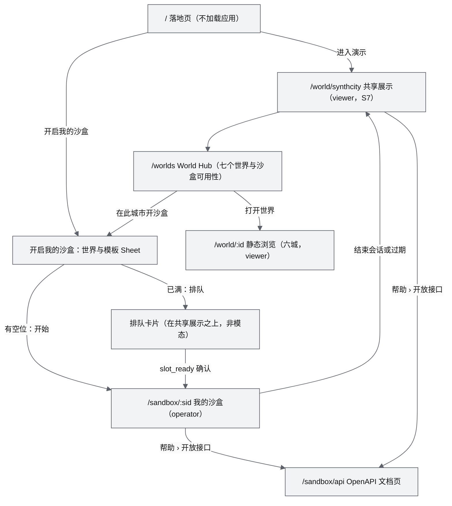
```mermaid
%%{init: {"theme": "base", "themeVariables": {"fontFamily": "Inter, PingFang SC, Microsoft YaHei, Noto Sans CJK SC, sans-serif", "fontSize": "13px", "background": "#FBFBFC", "primaryColor": "#F2F3F5", "primaryTextColor": "#111214", "primaryBorderColor": "#5C616A", "secondaryColor": "#E4E6E9", "tertiaryColor": "#FBFBFC", "lineColor": "#5C616A", "textColor": "#111214", "mainBkg": "#F2F3F5", "nodeBorder": "#5C616A", "clusterBkg": "#FBFBFC", "clusterBorder": "#A7ABB3", "edgeLabelBackground": "#FBFBFC", "noteBkgColor": "#E4E6E9", "noteTextColor": "#111214", "noteBorderColor": "#81868F"}}}%%
flowchart TB
  LAND["/ 落地页（不加载应用）"]
  SHEET["开启我的沙盒：世界与模板 Sheet"]
  SHOW["/world/synthcity 共享展示（viewer，S7）"]
  STATIC["/world/:id 静态浏览（六城，viewer）"]
  HUB["/worlds World Hub（七个世界与沙盒可用性）"]
  SBX["/sandbox/:sid 我的沙盒（operator）"]
  API["/sandbox/api OpenAPI 文档页"]
  Q["排队卡片（在共享展示之上，非模态）"]
  LAND -->|"进入演示"| SHOW
  LAND -->|"开启我的沙盒"| SHEET
  SHEET -->|"有空位：开始"| SBX
  SHEET -->|"已满：排队"| Q
  Q -->|"slot_ready 确认"| SBX
  SHOW --> HUB
  HUB -->|"打开世界"| STATIC
  HUB -->|"在此城市开沙盒"| SHEET
  SBX -->|"结束会话或过期"| SHOW
  SBX -->|"帮助 › 开放接口"| API
  SHOW -->|"帮助 › 开放接口"| API
```

#### 20.2.2 路由表（D2）

| 路由 | 视图 | 角色界面 | 规则 | D2 |
|---|---|---|---|---|
| `/` | 落地页 | — | 演示构建为落地页（不加载应用）；"进入演示"到 `/world/synthcity`，"开启我的沙盒"打开 §20.4.1 的 Sheet；默认构建仍为 D1 行为 | 是 |
| `/world/:id` | 沙盘 | viewer | `:id` ∈ 七个世界（`GET /api/worlds` 白名单）；等于共享展示世界（`serverInfo.world.id`）时连接 `/api/rt`，否则静态浏览（§20.12.3） | 是 |
| `/worlds` | World Hub | viewer | 七张卡片与沙盒可用性（§20.12.1） | 是 |
| `/settings` | 设置 | — | 新增"沙盒"标签（§20.4.6）与"手动控制"字段（软围栏、虚拟摇杆显示） | 是 |
| `/sandbox/api` | OpenAPI 文档页 | — | 在路由表中先于 `/sandbox/:sid` 登记；无需会话 | 是 |
| `/sandbox/:sid` | 沙盘（沙盒） | operator | `:sid` 不满足 `^sb-[a-z2-7]{10}$` 时回到 `/worlds`；本地无该 sid 的有效 token 时显示"会话不可用"页（§20.4.7），不连接 | 是 |
| 其他 | — | — | 重定向 `/worlds`（D1 规则不变） | — |

默认构建（本机、局域网）同样注册 `/sandbox/:sid` 与 `/sandbox/api`，入口为菜单"世界 › 开启沙盒…"，只在 `GET /api/sandbox/v1/meta` 返回 200 时出现（sandbox-pool 未运行时不出现入口）。

URL 查询参数（D1 §2.2 的扩展，只写视图状态）：

| 参数 | 取值 | 默认 | 说明 |
|---|---|---|---|
| `panel` | D1 取值 + `tasks`、`task-new`、`relay` | 空 | `tasks` 打开 Dock"任务"标签；`task-new` 打开右栏"新建任务"页；`relay` 打开任务标签的"接力"子页 |
| `ent` | `drones`、`targets`、`nests` | `drones` | 右栏实体切换 |
| `sv` | `fpv`、`eo`、`nir`、`lwir` | `fpv` | 传感器视图，需 `cam=fpv` 与焦点机，否则忽略 |
| `tgt` | 识别物 id | 空 | 选中识别物（不进入无人机选择集，§20.7.1） |

#### 20.2.3 运行期角色切换（ADR-111）

```ts
// 伪代码：app/shell/surface.ts（M15）；只决定呈现，服务端独立执行同样的策略（AWR-04 ADR-093）
type Surface = 'shared' | 'static' | 'sandbox' | 'sandbox-gone'
interface UiSurface { surface: Surface; role: 'viewer' | 'operator'; rtPath: string | null; worldId: string }
function resolveSurface(route: Route, sess: SandboxSessionState, showWorld: string | null): UiSurface {
  if (route.id === 'sandbox') {
    const ok = sess.sid === route.params.sid && sess.token !== null
      && sess.tokenExpUnixMs > Date.now() && !['ENDED', 'FAILED'].includes(sess.state)
    return ok
      ? { surface: 'sandbox', role: 'operator', rtPath: `/api/sandbox/v1/sessions/${sess.sid}/rt`, worldId: sess.world! }
      : { surface: 'sandbox-gone', role: 'viewer', rtPath: null, worldId: showWorld ?? 'synthcity' }
  }
  const id = route.params.id
  return id === showWorld
    ? { surface: 'shared', role: 'viewer', rtPath: '/api/rt', worldId: id }
    : { surface: 'static', role: 'viewer', rtPath: null, worldId: id }
}
```

规则：
1. 演示构建不再在编译期剔除写入口（ADR-111 第 1 条）；写入口按 `surface === 'sandbox'` 显示，viewer 界面沿用 D1 §7.8 的"隐藏为一处说明"。
2. 只读原因文案按界面区分：共享展示"共享展示为只读，开启我的沙盒即可操作"（带"开启我的沙盒"按钮）；静态浏览"静态浏览，开启沙盒即可在此城市运行仿真"；D1 文案"公开演示为只读模式"在演示构建中废止（M15-FR-123 按 ADR-111 修订）。
3. 角色徽标：共享展示"公开演示 · 只读"（`layer.visible`）；沙盒"我的沙盒 · 可操作"（新增 `sandbox.mine`）；静态浏览"静态浏览"（`layer.pointcloud`）。
4. 同一页面在 surface 变化时（例如排队领到沙盒、会话结束回到共享展示）只切换路由与 WS 端点，画布不卸载（D1 U-01）；世界不同时走 §20.12.2 的切换加载卡。
5. 页面标题：沙盒"<世界> · 我的沙盒 · ANet Drone4D 公开演示"；OpenAPI 页"开放接口 · ANet Drone4D 公开演示"；其余同 D1。

#### 20.2.4 菜单与命令面板增量

| 菜单 | D2 增加的项（只在 operator 界面出现的标"op"） |
|---|---|
| 世界 | 开启我的沙盒…（共享展示与静态浏览）；切换底图…（op，§20.12.2）；载入场景…（op）；导出配置快照（op）；导入配置快照…（op） |
| 视图 | 传感器视图（子菜单：FPV、日视、夜视、热像，需焦点机）；识别物标签；敏感体显示（配置体、有效体）；规划图层 |
| 仿真 | 倍速子菜单的档位旁显示"本会话可达 ×k"（op）；仿真日历…（op，§20.5.4） |
| 任务 | 新建任务…（op，T 键之外不另设单键）；预览分配（op）；接力统计 |
| 沙盒（新，op） | 续期；结束会话；会话信息（sid、世界、寿命、配额）；开放接口与 SDK |
| 帮助 | 开放接口（`/sandbox/api`）；新手引导（重新开始） |

命令面板新增分组"沙盒""识别物""机巢""任务"，可按识别物 id、机巢 id、任务 id 跳转并选中；写操作项在 viewer 界面不出现。

### 20.3 载入进度条（R-D2-01；AWR-04 §10.1）

#### 20.3.1 线框

```text
┌──────────────────────────────────────────── 视口（启动遮罩，--z-mask） ───────────────────────────────────────────┐
│                                                                                                                 │
│                                     [ANet 完整徽章 480 px，原样]                                                  │
│                                     ━━━━━━━━━━━━━━━━━━━━━━━━━──────────────   ← .boot-progress，320 × 2 px         │
│                                     加载首屏点云 · 1.4 / 3.2 MB                ← .boot-phase（04 text-swap）       │
│                                                                                                                 │
└─────────────────────────────────────────────────────────────────────────────────────────────────────────────────┘
```

进度条宽 320 px（紧凑档同宽）、高 2 px，轨道为 `--lf-track`，填充为前景中性色（`g50`），不用红；阶段文字一行，`text-hud-cap` 字阶。超过 `INPUT.bootSlowHintMs` 时 D1 的"仍在加载 · 查看详情"链接照常出现在文字下方。

#### 20.3.2 分段、权重与段内进度来源

| 分段 | 权重 w | 段内进度 f（0–1，只增不减） | 来源（实现位置） | 阶段文字键与中文 |
|---|---|---|---|---|
| bundle 应用脚本 | 0.15 | 已完成分块字节和 ÷ 清单总字节；清单由构建期写入 `index.html` 的 `window.__AWR_BOOT_MANIFEST = {chunks: [{href, bytes}], total}`，完成事件取 Resource Timing（`PerformanceObserver` 的 `resource` 条目，`encodedBodySize`） | `index.html` 内联加载器；`vite.config.ts` 内联插件 `bootManifestPlugin()`（新，与 D1 的 `demoPlugin()` 同样写在配置内） | `boot.phase.bundle`：载入应用 |
| world 世界清单与层级 | 0.10 | （`world.json` 完成 + 已完成 `hierarchy.bin` 数）÷（1 + 根数） | M05 加载器经 `perf.bootProgress('world', f)` 上报 | `boot.phase.world`：读取世界清单 |
| points 首屏点云 | 0.40 | 首屏 Range 已收字节 ÷ 本档首屏字节（`levelsByteEnd`）；Range 以流式读取计字节 | M05 Fetcher 上报 | `boot.phase.points`：加载首屏点云 · {received} / {total} MB |
| warming 预热 | 0.30 | `0.6 · 已编译程序数 / zoo 总数 + 0.4 · 已完成 uiWarm 子阶段数 / 子阶段总数`（子阶段：预光栅、命令面板演练、Toast 演练，按 BootMask 实际启用的数目） | M06 `warmup.ts` 上报；`BootMask.tsx` 的 uiWarm 子阶段 | `boot.phase.warming`：预热着色器与界面 |
| reveal 揭开 | 0.05 | D1 BootController 全部门控解析（shell、canvas、firstFrame、warmup、uiWarm）即为 1 | `BootController.ts`（门控逻辑不改） | — |

`index.html` 的内联加载器在应用脚本执行前就能运行，因此 bundle 段在 main 分块下载期间按"已完成分块"阶跃前进；不对模块做二次流式 fetch（会重复下载，见 §20.24 第 2 条）。浏览器不支持 `PerformanceObserver` 的 `resource` 条目时，bundle 段在 main 分块执行时一次置 1。

#### 20.3.3 聚合与写入算法

```ts
// 伪代码：app/boot/BootProgress.ts（新，M15）；D1 BootController 的门控与揭开逻辑不改
const W = { bundle: 0.15, world: 0.10, points: 0.40, warming: 0.30, reveal: 0.05 } as const
type Seg = keyof typeof W
const f: Record<Seg, number> = { bundle: 0, world: 0, points: 0, warming: 0, reveal: 0 }
let shown = 0, lastWriteMs = -Infinity, pending = false
let active: readonly Seg[] = ['bundle', 'world', 'points', 'warming', 'reveal']   // 切换底图时去掉 'bundle'

export function report(seg: Seg, x: number): void {
  f[seg] = Math.max(f[seg], Math.min(1, Math.max(0, x)))            // 段内只增不减
  schedule()
}
function schedule(): void { if (!pending) { pending = true; requestAnimationFrame(flush) } }
function total(): number {
  let s = 0, wsum = 0
  for (const k of active) { s += W[k] * f[k]; wsum += W[k] }
  return s / wsum                                                    // 去掉某段后重新归一
}
function flush(now: number): void {
  pending = false
  if (now - lastWriteMs < 100) { setTimeout(schedule, 100 - (now - lastWriteMs)); return }   // ≤ 10 Hz
  const p = Math.max(shown, total())                                 // 全程单调
  if (p - shown < 0.005 && p < 1) return                             // 小于半个像素的变化不写
  shown = p; lastWriteMs = now
  bar.style.setProperty('--boot-p', p.toFixed(4))                    // CSS：transform: scaleX(var(--boot-p))
  phase.textContent = phaseText(firstIncomplete(active, f))          // 第一个未完成段的文字
}
export function onReveal(): void { f.reveal = 1; shown = 1; bar.style.setProperty('--boot-p', '1') }  // 同步写，先于淡出
```

规则：
1. **只显示不门控**：揭开时刻仍只由 D1 门控决定，"揭开从不等待 WebSocket"不变；沙盒的就绪与排队不进入遮罩，揭开后由会话条与排队卡片呈现（ADR-108 备选第 2 条）。
2. **动效**：填充只过渡 `transform`，时长 `--duration-quick`、曲线 `--ease-smooth-out`；`prefers-reduced-motion` 或 reduced 档时无过渡（按写入值跳变）；不用 shimmer、不用循环动画（不计入常驻循环）。
3. **CSS**：`index.html` 内联样式与 `styles/boot.css` 同步改为 `.boot-progress > i { width: 100%; transform-origin: left center; transform: scaleX(var(--boot-p, 0)); }`，`--boot-p` 为 0–1 的无单位数（D1 的 `width: var(--boot-p, 0%)` 删除）。
4. **错误**：进入 BOOT_ERROR 时进度冻结在当前值，阶段文字换成 D1 E-02 至 E-04 的错误文案，填充不变色（错误由文字与两个操作表达）。
5. **长帧**：写入只改一个自定义属性与一段文字（布局隔离：`.boot-progress` 与 `.boot-phase` 均 `contain: layout paint`），不得在遮罩下产生新的 > 50 ms 帧（D2-AC-01）。
6. **测试钩子**：dev/test 构建把每次写入追加到 `__ux.boot.progress[] = {tMs, p, seg}`（预分配环 256 项），供单调性与阶段文字数断言。

#### 20.3.4 切换底图与静态浏览的加载卡

D1 §7.3 的紧凑加载卡（`Card size="sm"`：世界名 + 进度 + 阶段文字）改用同一 `BootProgress` 实例：`active = ['world', 'points', 'warming', 'reveal']`，权重重新归一（world 0.118、points 0.471、warming 0.353、reveal 0.059）；warming 段在着色器已预热时一次置 1。会话内切换底图时，加载卡在 sim-core 重启期间显示"正在新城市启动沙盒"（阶段键 `boot.phase.sandbox`，不计权重，只在 points 完成而会话尚未 READY 时出现）。

### 20.4 沙盒入口、排队与会话条

#### 20.4.1 落地页与"开启我的沙盒"Sheet

落地页（`app/demo/Landing.tsx`，D1 M15-FR-121）的首屏主按钮由一个改为两个，其余内容不变；"演示说明"改写为 §20.16 的 D2 文案。

```text
┌────────────────────────────── 落地页首屏（1600 × 900）──────────────────────────────┐
│ [品牌头图]                                                                           │
│ ANet Drone4D · 4D 世界运行时                                                          │
│ 一句话定位                                                                            │
│ [进入演示]  [开启我的沙盒]                    ← Button / Button variant="outline"      │
│ 共享展示为只读；每位访客可开一个隔离沙盒（30 min 起，可续期）                          │
└────────────────────────────────────────────────────────────────────────────────────┘

┌ Sheet side="right"，宽 480 px：开启我的沙盒 ─────────────────────────┐
│ 城市      [synthcity v]  可立即开始 · 合成城市                         │ ← Select（七个世界，带可用性 Badge）
│ 场景模板  ( ) T1 定点巡航            约 40 s 明确捕获                  │ ← RadioGroup，每项第二行为"首次反馈"
│           (o) T5 区域值守与接力（推荐） 约 60 s 首次捕获，随后接力      │
│           ( ) T6 手动飞行与传感器视图  …                              │
│ 仿真时段  [日间 10:00] [黄昏 18:30] [夜间 23:00]                     │ ← ToggleGroup（缺省日间）
│ ─────────────────────────────────────────────────────────────────── │
│ 当前 3 / 4 个沙盒在运行 · 排队 0                                     │ ← GET /api/sandbox/v1/meta
│ [取消]                                                    [开始]    │
└─────────────────────────────────────────────────────────────────────┘
```

| 项 | 规则 |
|---|---|
| 可用性 | 打开 Sheet 时取 `GET /api/sandbox/v1/worlds`：`available = false`（`reason: derived_cache_missing`）的世界置灰并说明"该城市暂不可用"；`admit_now = false` 的世界标"容量不足，可排队"；缺省选中 synthcity |
| 模板 | 取 `GET /api/sandbox/v1/templates?world=`；缺省 T5；世界变化时保留同名模板 |
| 小窗口 | 窗口小于 1280 × 720 时"开启我的沙盒"禁用，Tooltip"沙盒需要桌面浏览器窗口 ≥ 1280 × 720"，不创建会话（D2-AC-34） |
| 开始 | `POST /api/sandbox/v1/sessions {world, template, calendar, principal_hint}`（17 §17.4）；按钮进入 Spinner；需要工作量证明时（码 509）在 Worker 中求解，按钮下方显示"正在验证浏览器（约 1–2 s）"与 `Progress`（不确定进度时隐藏条，只显文字）；求解完成后自动重发 |
| 结果 | 201：把 `{sid, token, expires_unix_ns}` 写入存储（§20.4.7），`location.assign('/sandbox/' + sid)`（落地页是独立入口，整页加载应用并显示进度条）；202 排队：写入排队票，跳到 `/world/synthcity` 并显示排队卡片；409 码 508：Sheet 内显示"该城市当前容量不足"，列出 `detail.available_now` 的世界作为一键替换，另有"排队"；409 或 429 码 504：显示配额文案（§20.16）与 `Retry-After` 倒计时，不自动重试 |
| 应用内入口 | 共享展示、静态浏览与 World Hub 的"开启我的沙盒"打开同一 Sheet（组件 `ui/sandbox/StartSheet.tsx`，落地页与应用共用）；应用内成功后用路由切换而不是整页加载 |

#### 20.4.2 创建与进入时序

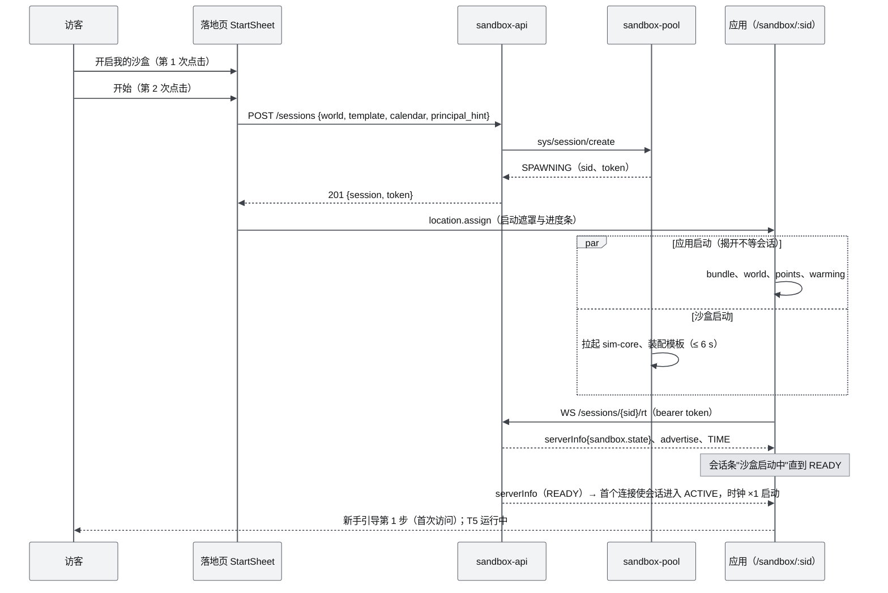
```mermaid
%%{init: {"theme": "base", "themeVariables": {"fontFamily": "Inter, PingFang SC, Microsoft YaHei, Noto Sans CJK SC, sans-serif", "fontSize": "13px", "background": "#FBFBFC", "primaryColor": "#F2F3F5", "primaryTextColor": "#111214", "primaryBorderColor": "#5C616A", "secondaryColor": "#E4E6E9", "tertiaryColor": "#FBFBFC", "lineColor": "#5C616A", "textColor": "#111214", "mainBkg": "#F2F3F5", "nodeBorder": "#5C616A", "clusterBkg": "#FBFBFC", "clusterBorder": "#A7ABB3", "edgeLabelBackground": "#FBFBFC", "noteBkgColor": "#E4E6E9", "noteTextColor": "#111214", "noteBorderColor": "#81868F", "actorBkg": "#F2F3F5", "actorBorder": "#5C616A", "actorTextColor": "#111214", "signalColor": "#3E4249", "signalTextColor": "#111214", "activationBkgColor": "#E4E6E9", "activationBorderColor": "#5C616A", "sequenceNumberColor": "#FBFBFC"}}}%%
sequenceDiagram
  participant U as 访客
  participant L as 落地页 StartSheet
  participant A as sandbox-api
  participant P as sandbox-pool
  participant W as 应用（/sandbox/:sid）
  U->>L: 开启我的沙盒（第 1 次点击）
  U->>L: 开始（第 2 次点击）
  L->>A: POST /sessions {world, template, calendar, principal_hint}
  A->>P: sys/session/create
  P-->>A: SPAWNING（sid、token）
  A-->>L: 201 {session, token}
  L->>W: location.assign（启动遮罩与进度条）
  par 应用启动（揭开不等会话）
    W->>W: bundle、world、points、warming
  and 沙盒启动
    P->>P: 拉起 sim-core、装配模板（≤ 6 s）
  end
  W->>A: WS /sessions/{sid}/rt（bearer token）
  A-->>W: serverInfo{sandbox.state}、advertise、TIME
  Note over W: 会话条"沙盒启动中"直到 READY
  A-->>W: serverInfo（READY）→ 首个连接使会话进入 ACTIVE，时钟 ×1 启动
  W-->>U: 新手引导第 1 步（首次访问）；T5 运行中
```

#### 20.4.3 排队卡片

```text
                                                   ┌ 排队卡片（未遮挡区右上，宽 320 px）──────────┐
                                                   │ [hourglass] 沙盒排队中 · 第 3 位              │
                                                   │ 预计等待约 4 min（按会话剩余寿命估计）          │
                                                   │ 你可以继续浏览共享展示                         │
                                                   │                               [离开队列]     │
                                                   └──────────────────────────────────────────────┘
领到空位后：
                                                   ┌──────────────────────────────────────────────┐
                                                   │ [sandbox.mine] 已为你保留沙盒 · 52 s 内确认    │
                                                   │ synthcity · T5 区域值守与接力                  │
                                                   │ [放弃]                          [进入沙盒]    │
                                                   └──────────────────────────────────────────────┘
```

卡片是 `Card size="sm"`，非模态（不 `inert` 其他区域、不抢焦点，出现时 `role="status"` 播报一次），位于 Toast 视口之上、HUD 之外的未遮挡区右上角；同一时刻只有一张。

| 状态 | 事件 | 守卫 | 动作 | 目标状态 |
|---|---|---|---|---|
| NONE | `POST /sessions` 返回 202 | — | 存排队票；显示卡片；发起长轮询 `GET /queue/{ticket_id}?wait_s=25` | QUEUED |
| QUEUED | 长轮询返回 `position`、`eta_s` 变化 | — | 更新第 k 位与预计等待（D 类数字，02 number-pop-in） | QUEUED |
| QUEUED | 长轮询返回 `state = slot_ready` | — | 卡片切换为确认态，60 s 倒计时（墙钟），`role="alert"` 播报一次 | SLOT_READY |
| SLOT_READY | "进入沙盒" | 倒计时未到 | `POST /queue/{ticket_id}/claim` | CLAIMING |
| CLAIMING | 201 `{session, token}` | — | 写存储；路由到 `/sandbox/:sid`（世界不同则切换加载卡） | NONE（进入沙盒） |
| SLOT_READY | 倒计时到 0 或"放弃" | — | `DELETE /queue/{ticket_id}`（倒计时到期由服务端作废，客户端只清本地） | NONE |
| QUEUED | "离开队列" | — | `DELETE /queue/{ticket_id}` | NONE |
| QUEUED、SLOT_READY | 长轮询 410（码 511） | — | 卡片换为"排队票已失效"，提供"重新排队" | NONE |
| 任意 | 页面刷新 | 存储中有未过期的票 | 恢复卡片并继续长轮询 | 原状态 |

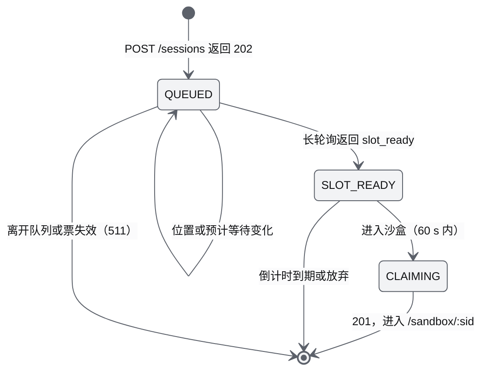
```mermaid
%%{init: {"theme": "base", "themeVariables": {"fontFamily": "Inter, PingFang SC, Microsoft YaHei, Noto Sans CJK SC, sans-serif", "fontSize": "13px", "background": "#FBFBFC", "primaryColor": "#F2F3F5", "primaryTextColor": "#111214", "primaryBorderColor": "#5C616A", "secondaryColor": "#E4E6E9", "tertiaryColor": "#FBFBFC", "lineColor": "#5C616A", "textColor": "#111214", "mainBkg": "#F2F3F5", "nodeBorder": "#5C616A", "clusterBkg": "#FBFBFC", "clusterBorder": "#A7ABB3", "edgeLabelBackground": "#FBFBFC", "noteBkgColor": "#E4E6E9", "noteTextColor": "#111214", "noteBorderColor": "#81868F"}}}%%
stateDiagram-v2
  [*] --> QUEUED: POST /sessions 返回 202
  QUEUED --> QUEUED: 位置或预计等待变化
  QUEUED --> SLOT_READY: 长轮询返回 slot_ready
  SLOT_READY --> CLAIMING: 进入沙盒（60 s 内）
  CLAIMING --> [*]: 201，进入 /sandbox/:sid
  SLOT_READY --> [*]: 倒计时到期或放弃
  QUEUED --> [*]: 离开队列或票失效（511）
```

#### 20.4.4 会话条

```text
┌──────────────────────────────────────────────────────────────────────────────────────────────── 顶栏 44 px（D1）─┐
│[av]ANet Drone4D│World Runtime  世界 视图 仿真 任务 工具 沙盒 帮助   synthcity › sb-k3m9q2x7ab › P600-02          │
├──────────────────────────────────────────────────────────────────────────────────────────────── 会话条 32 px ──┤
│[sandbox.mine] 我的沙盒 · synthcity · T5 │ 剩余 27:41 [续期] │ ×2（可达 ×5）│ 机 5/12 识别物 2/30 机巢 2/4 任务 1/6 │
│                                                                    │ 白天 10:42 · 照度 日间 │[载入场景][重置][结束会话]│
└───────────────────────────────────────────────────────────────────────────────────────────────────────────────┘
```

| 字段 | 组件 | 数据（17 §17.7 `sandbox/session` 1 Hz） | 规则 |
|---|---|---|---|
| 会话徽标 | `Badge` + `Icon sandbox.mine` | `state` | SPAWNING 时"沙盒启动中"+ `Spinner`；DRAINING 时"正在结束" |
| 世界与模板 | 文本 + `HoverCard` | `world_id`、`template_id`、`sid` | HoverCard 列出 sid（可复制，`copy` morph `Check`）、创建时刻、寿命上限、配额用量 |
| 剩余寿命 | 文本（C 类，1 Hz）+ `Button size="sm" variant="ghost"`"续期" | `expires_unix_ns`、`renewable`、`renew_block_reason` | `renewable = false` 时"续期"置灰，Tooltip 给原因（"有访客在排队，暂停续期"或"已达 120 min 上限"）；剩余 ≤ 60 s 时数字为红色文字（HERO_TEXT，不占实心名额） |
| 倍速 | 文本 + `Badge` | `clock.rate_granted`、`clock.rate_cap`、`clock.limited_by` | 受限时 Badge"可达 ×k"，Tooltip 给原因（CPU 预算、手动控制锁定、降级）；Timeline 倍速控件的档位 > `rate_cap` 置灰（ADR-045 零硬编码） |
| 实体计数 | 四组 `k / max`（D 类） | `usage`、`limits` | 达到上限的项文字加 warning 描边环；"添加"类按钮同步置灰（码 505 文案） |
| 日历与照度 | 文本 + `env.time` 图标 | `env/state` 的 `calendar`、`sun.band` | 点击打开仿真日历 Popover（§20.5.4） |
| 载入场景 | `Button` → `AlertDialog` | — | "载入场景会清空当前机队、识别物、机巢与任务（可先导出快照）"；确认后 `POST /sessions/{sid}/template {template}` |
| 重置 | `Button` → `AlertDialog` | — | 重新载入当前模板（同上，template 取当前值） |
| 结束会话 | `Button variant="outline"` → `AlertDialog` | — | "结束后沙盒立即回收，可先导出快照"；确认后 `DELETE /sessions/{sid}`，回到共享展示 |

会话条与顶栏同为一张"图"；1280 宽紧凑档只保留徽标、剩余寿命、倍速与"更多"`DropdownMenu`（其余项进菜单）。会话条使未遮挡区上沿下移 32 px（D1 §3.4 规则按回放横幅处理）。

#### 20.4.5 会话状态到 UI

| 会话 `state`（17 §17.4） | 会话条 | 写入口 | WS | 其他 |
|---|---|---|---|---|
| SPAWNING | "沙盒启动中"+ Spinner | 置灰，Tooltip"沙盒启动中" | 已连接，等待 READY 的 `serverInfo` | 揭开不等待；超过 10 s 追加"启动较慢，仍在尝试" |
| READY、ACTIVE | 正常 | 可用 | 实时 | — |
| IDLE | 正常（客户端在线时不会出现） | 可用 | — | — |
| DRAINING | "正在结束 · 原因" | 置灰 | 收到 `sandbox.expiring` 后保持 | 自动导出快照（§20.4.6） |
| ENDED、FAILED | 会话条移除 | — | 关闭码 4410 | "会话已结束"Dialog |
| 崩溃恢复（`epoch + 1`） | 一条 info Toast"沙盒已从最近检查点恢复" | 可用 | 重连 | D1 §7.7 对账规则不变 |

#### 20.4.6 寿命、续期、结束与快照

1. **自动续期**：会话可续（`renewable = true`）且剩余 ≤ 300 s 时，浏览器自动 `POST /sessions/{sid}/keepalive`（每次续 30 min，累计上限 120 min，AWR-04 §4.4.3），成功后静默更新会话条，不弹 Toast；`keepalive` 响应带新 token，客户端替换存储中的 token 与 WS 子协议（下次重连生效）。
2. **即将结束**：收到 `sandbox.expiring {reason, in_s}`（提前 60 s）时弹常驻 warning Toast："沙盒将在 60 s 后结束（原因）· [导出快照] [续期]"（"续期"只在可续时出现），倒计时为 C 类文字；同时自动执行一次快照导出（`GET /sessions/{sid}/snapshot`）写入 `localStorage` 键 `awr.sandbox.snapshot.v1`（≤ 256 KB，超出或写入失败时只保留"导出快照"按钮手动下载）。
3. **原因文案**：`idle` 空闲超过 10 min；`lifetime` 已达寿命；`preempted` 有访客排队，你的沙盒已持有超过 30 min；`reclaimed` 服务器负载过高回收；`user` 你结束了会话；`failed` 沙盒连续崩溃。
4. **结束 Dialog**（`AlertDialog`，非破坏性，默认焦点"回到共享展示"）：

```text
┌ 沙盒已结束 ──────────────────────────────────────────────────┐
│ 原因：有访客在排队，你的沙盒已持有超过 30 min                    │
│ 配置快照已保存在本浏览器（机队 5、识别物 2、机巢 2、任务 1）       │
│ [下载快照文件]   [用快照新开沙盒]            [回到共享展示]      │
└──────────────────────────────────────────────────────────────┘
```

"用快照新开沙盒"= `POST /sessions {world: 快照世界, config_snapshot}`，走 §20.4.1 的同一流程。
5. **导入快照**：菜单"世界 › 导入配置快照…"选择 JSON 文件（shadcn `Field` + M15 在 `ui/components/ui/` 内新增的文件选择封装 `file-trigger.tsx`；业务代码不写原生 `input`，no-raw-controls 不变），校验 `world_id` 与当前世界一致，不一致时提示"快照属于 shanghai，请在该城市的沙盒中导入"；确认后 `POST /sessions/{sid}/restore`。
6. **设置 › 沙盒**标签：会话信息（只读）、"自动续期"开关（缺省开）、"关闭标签页时结束沙盒"开关（缺省关；开启时 `pagehide` 发 `navigator.sendBeacon` 到 `POST /sessions/{sid}/end-beacon`，17 §17.5）、新手引导"重新开始"。

#### 20.4.7 会话恢复、多标签页与存储

| 键 | 存储 | 内容 | 生命周期 |
|---|---|---|---|
| `awr.sandbox.session.v1` | sessionStorage（主）与 localStorage（备份） | `{sid, token, token_exp_unix_ms, world, template}` | 会话寿命内；`ENDED` 或 token 过期即删 |
| `awr.sandbox.queue.v1` | sessionStorage | `{ticket_id, ticket_token, expires_unix_ms}` | 票有效期内 |
| `awr.sandbox.snapshot.v1` | localStorage | 最近一次配置快照（≤ 256 KB）与导出时刻 | 7 天或被下次导出覆盖 |
| `awr.ui.onboarding.v1` | localStorage | `{done: bool, step: 0–4, v: 1}` | 永久（"重新开始"清除） |
| `awr.auth.principal.v1` | localStorage | D1 已有的 `principal_hint`（§3.6） | 不变 |

读写一律 try/catch（D1 UX-NFR-015）。恢复流程：路由 `/sandbox/:sid` 加载时，先读 sessionStorage，缺失再读 localStorage 备份；有 token 则 `GET /sessions/{sid}` 校验（200 且 `state` 活动即恢复，目标 ≤ 3 s 回到同一 sid，D2-AC-38）；401、410 即删存储并显示"会话不可用"页（"该沙盒已结束或不属于本浏览器 · [回到共享展示] [开启我的沙盒]"）。第二个标签页读到 localStorage 备份即加入同一沙盒（同一 principal 共享席位）；两页同时操作同一机体时按 D1 租约规则处理（同一 principal 视为同一持有者）。存储不可用（隐私模式）且本页没有 token 时，`POST /sessions` 对同一 principal 与地址前缀幂等返回已有会话但不返回 token（17 §17.4），UI 显示"你的沙盒正在另一个标签页运行"，并提供"另开一个沙盒"（`force_new: true`，占用该地址前缀的第二个名额）。

### 20.5 沙盒主视图布局

#### 20.5.1 线框（1920 × 1080，operator，T5 运行中）

```text
┌──────────────────────────────────────────────────────────────────────────────────────────────────────────┐
│ 顶栏 44（同 D1；菜单多"沙盒"）                                                                               │
│ 会话条 32：我的沙盒 · synthcity · T5 │ 剩余 27:41 │ ×2（可达 ×5）│ 机 5/12 识别物 2/30 机巢 2/4 任务 1/6 │ …   │
├──────────────────┬───────────────────────────────────────────────────────────────┬──────────────────────┤
│ WORLD        [-] │  ┌Orbit│Free│Third│FPV│Bird┐ [L]                    ┌ViewCube┐│ [无人机|识别物|机巢]   │← 实体切换
│ synthcity 示意坐标│  └─────────────────────────┘                          └────────┘│ 识别物 2/30  [+ 新增]  │
│ 场景 T5 [载入场景]│                                                                │ 筛选 [全部类别 v]      │
│ 底图 [切换底图…]  │        ╭ ─ ─ ─ ╮  人-01（配置体，扇形）                        │┌────────────────────┐│
│ LAYERS       [-] │       (  人  )  ← 识别物标记：类别字形 + 最佳等级环                ││|人-01 游走 · 识别 R  ││
│ 点云       [开]   │        ╰ ─ ─ ─ ╯                                               ││ 已捕获 · 被发现 0   ││
│ 识别物     [开]   │   ┊条带 3┊条带 4┊      o 站位 S1（P600-03 在岗）                 │└────────────────────┘│
│ 敏感体 配置体|有效体│   ┊      ┊         [] 机巢 N1（box）   <> 机巢 N2（vtol_pad）       │ 车-01 沿路 · 检测 D   │
│ 禁入体     [开]   │                                                                │──────────────────────│
│ 规划图层   [开]   │ ┌HUD──────────────────┐                          [Toast 已明确捕获] │ 详情 ›               │
│ ENVIRONMENT  [-] │ │p95 41 ms S档 …       │                                         │                      │
│ 日历 10:42 日间   │ └──────────────────────┘                                         │                      │
├──────────────────┴───────────────────────────────────────────────────────────────┴──────────────────────┤
│ [播放/暂停] ×0.25 ×0.5 [×1] ×2 ×5 ×10(灰) │ ─────────────────────o T+00:06:12 LIVE │ 事件 图表 性能 任务 [^] │
└──────────────────────────────────────────────────────────────────────────────────────────────────────────┘
```

说明：识别物、敏感体、禁入体与规划图层为三维叠加；线框中的字形只是示意，实际图标见 §20.15.2。×10 置灰表示超过本会话可达倍速。

#### 20.5.2 面板与页面登记（`ui/panels/registry.ts`）

| 面板 id | 名称 | 默认槽位 | 允许槽位 | 最小尺寸 | `when` | 所有者（store / 图层） | D2 |
|---|---|---|---|---|---|---|---|
| `drones` | 无人机（D1 增强） | right（实体切换第 1 项） | right、left | w 280 | 总是 | M15（`stores/fleet.ts`、`stores/catalog.ts`） | 是 |
| `drone-detail` | 单机详情（新增"传感器""感知"标签） | right（第 2 页） | right | w 280 | 焦点机 | M15、M19 | 是 |
| `targets` | 识别物 | right（实体切换第 2 项） | right、left | w 280 | run 有 `targets` 能力 | M18（`stores/targets.ts`） | 是 |
| `target-detail` | 识别物详情 | right（第 2 页） | right | w 320 | 选中识别物 | M18 | 是 |
| `nests` | 机巢 | right（实体切换第 3 项） | right、left | w 280 | run 有 `tasking` 能力 | M20（`stores/tasking.ts`） | 是 |
| `nest-detail` | 机巢详情 | right（第 2 页） | right | w 320 | 选中机巢 | M20 | 是 |
| `task-new` | 新建任务 | right（第 3 页） | right | w 360 | operator 界面 | M20 | 是 |
| `tasks` | 任务（替代沙盒与 S7 中的 D1 `mission`） | bottom | bottom、right | h 200 / w 320 | run 有 `tasking` 能力 | M20 | 是 |
| `mission` | D1 任务面板 | bottom | bottom、right | — | run 无 `tasking` 能力（D1 剧本） | M10 | — |

`when` 中的能力取 `serverInfo.capabilities`（17 §17.7.1：`targets`、`perception`、`tasking`、`sandbox`）。实体切换是右栏根页顶部的 `ToggleGroup`（单选、`toggle-group-indicator` 滑动指示，配方 16），切换只换列表，不卸载其他列表的 store 订阅。机型目录、克隆编辑与识别物"高级属性"用 `Sheet side="right"`（宽 560 px，紧凑档 480 px），因为它们不需要同时在视口作图；任务创建需要在视口绘制，因此是右栏页面而不是 Sheet。

#### 20.5.3 图层组（左栏 LAYERS 增量）与 Tier S 上限

| 图层 | 默认 | 子选项 | 所有者 | Tier S 上限（登记 AWR-03 §3.8） | 超限时（PerfGovernor） |
|---|---|---|---|---|---|
| 识别物 | 开 | 标签开关 | M18 `viewport/layers/targets.tsx` | 32 个标记 | — |
| 敏感体 | 开 | `ToggleGroup`：配置体、有效体（有效体需选择参考机型，缺省为焦点机的机型） | M18 | 64 个网格（每识别物 ≤ 4 个体） | 先降为"仅选中识别物显示体，其余只画地面环" |
| 禁入体 | 开 | — | M18 | 32 个地面环 | 不降 |
| 规划图层 | 开 | 子区、条带、补拍航点、航段、站位 | M20 `viewport/layers/tasking.tsx` | 条带 ≤ 512 段；航段 ≤ 256 段；站位 ≤ 32 | 先隐藏非选中任务的条带与航段 |
| 机巢 | 开 | 链路距离圈 | M20 | 4 个 | — |
| 视锥（D1） | 开 | 新增"传感器作用距离" | M13、M19 | D1 上限不变 | D1 规则 |

#### 20.5.4 ENVIRONMENT 组增量（仿真日历与照度）

| 元素 | 组件 | 规则 |
|---|---|---|
| 日历时刻 | 文本（C 类）+ `Badge`（照度档：日间、低照、夜间） | 取 `env/state` 的 `calendar.t_cal`（示意时区）与 `sun.band`；HoverCard 显示太阳高度、方位、照度（lx） |
| 设置日历 | `Popover`：`InputGroup`（`YYYY-MM-DD HH:mm`，正则校验）+ `ToggleGroup` 快捷时段（日间 10:00、黄昏 18:30、夜间 23:00）+ 时区只读 | 确认后 `call env/calendar {start_utc, tz}`（op）；shadcn `calendar` 组件在 V0.6 前禁用（§4.7），因此不用日期选择器 |
| 声学背景 | `Select`：乡村、郊区、城市 | `call env/set {patch: {acoustic_bg}}`（op）；viewer 只读 |
| 消光提示 | 文本 | MOR 下降到 3 km 以下时显示"雾霾时优先使用长焦热像"（AWR-04 §9.2 读表结论 ③） |

#### 20.5.5 共享展示（viewer）布局差异

共享展示沿用 §20.5.1 的布局，差异：无会话条，顶栏右侧角色徽标"公开演示 · 只读"旁增加"开启我的沙盒"按钮；右栏实体切换照常（只读，详情页无写按钮）；Dock"任务"标签显示 S7 的区域值守与接力任务及接力统计（覆盖率、间隙、被发现次数、交接）；排队卡片在右上；Timeline 控件置灰（D1 §7.8）。静态浏览时实体切换与 Dock"任务"标签显示 `Empty`"静态浏览，没有运行中的仿真 · [在此城市开沙盒]"。

### 20.6 无人机管理（R-D2-13、R-D2-15、R-D2-20、R-D2-27；M21、M19）

#### 20.6.1 无人机列表（D1 DroneRail 增强）

| 项 | D2 增量 |
|---|---|
| 列表头 | 计数"无人机 5 / 12"；`Button`"添加"（op，打开 §20.6.4 流程）；`Button variant="ghost"`"机型目录"（viewer 与 operator 均可，打开 §20.6.2 的 Sheet） |
| 行 | D1 字段之外增加机型短名 `Badge`（P600、Q1、Q9、F1、V1；参考机型 Badge 带细描边表示"模拟参考值"）、所属机巢、当前工作项（"条带 3–4""站位 S1""手动"）；固定翼行的高度速度读数换为空速与滚转 |
| 分组 | 按 `kind` 分组标题（D1）之外，可选"按机巢分组"（`DropdownMenu` 筛选项） |
| 行菜单 | D1 项之外增加"修改挂载…"（op，只在 LANDED 且已上锁时可用，否则禁用并在第二行说明"降落并上锁后可修改挂载"）、"移除"（D1 流程） |

#### 20.6.2 机型目录 Sheet

```text
┌ Sheet：机型目录（560 px）──────────────────────────────────────────────┐
│ [全部|四旋翼|固定翼|垂起]                         [搜索型号]            │ ← ToggleGroup + InputGroup
│ ┌ P600（MID-360）──────────┐ ┌ AWR-Q1 轻型四旋翼 ──────┐               │
│ │ quad_x · 3.825 kg · 悬停 29 min│ │ 模拟参考值，非任何真实产品 │               │ ← 参考机型 Badge
│ │ 巡航 8 m/s · 链路 3.5 km  │ │ 0.95 kg · 悬停 35 min    │               │
│ │ GX40、MID-360            │ │ EO 1080P · 可选 LWIR 13 mm │               │
│ │ [详情] [克隆编辑]         │ │ [详情] [克隆编辑]         │               │
│ └──────────────────────────┘ └──────────────────────────┘               │
│ （AWR-Q9、AWR-F1、AWR-V1 同构；会话内克隆的型号排在最后，带"本会话"Badge）│
│ ── 详情（展开 Accordion）───────────────────────────────────────────── │
│ 组      参数                    值            置信度   仿真用途          │ ← LfTable（table.log）
│ 飞行器  起飞重量 / MTOW         3.825 / 4.1 kg  B       悬停推力、能量     │
│ 动力电池 6S HV 10 Ah 228 Wh     —             B       能量模型、换电     │
│ 派生    悬停功率                401 W         D       续航              │
│ …                                                                       │
└─────────────────────────────────────────────────────────────────────────┘
```

| 项 | 规则 |
|---|---|
| 数据 | `GET /api/sandbox/v1/catalog/models`、`/catalog/models/{id}`、`/catalog/sensors`（公开、可缓存，viewer 可用，D2-AC-37）；会话内克隆型号 `GET /sessions/{sid}/models` |
| 参数表 | 按 AWR-04 §5.1 的分组（飞行器、飞控、机载计算、动力电池、遥控器、数传、光电吊舱、RTK、充电器、三维激光雷达）与"派生"组；列：参数、值（带单位）、置信度（A–D，`Badge`）、仿真用途；"标签"类参数的用途列写"标签（不进入物理）" |
| 参考机型 | 卡片与详情顶部固定显示"模拟参考值，非任何真实产品"（`Badge variant="outline"`）；P600 显示"规格来自用户随附硬件指标" |
| 只读 | 预置型号只读；"克隆编辑"只在 operator 界面出现 |

#### 20.6.3 克隆编辑表单

右侧同一 Sheet 内切换到表单页（08 page-side-by-side）。字段的单位、范围与默认值如下；默认值取源型号，范围为 UI 前置校验，最终以服务端 M08 自洽检查（VH-1 至 VH-4、固定翼检查、挂载质量检查）为准。

| 组 | 字段（17 §17.6.2） | 单位 | UI 范围 | 派生只读量（即时重算） |
|---|---|---|---|---|
| 基本 | `label` | — | 1–32 字符，运行时净化 | — |
| 质量 | `mass_kg`、`mtow_kg` | kg | 0.2–200；`mass_kg ≤ mtow_kg` | 推重比、悬停油门（多旋翼） |
| 电池 | `battery.cells`、`battery.capacity_ah`、`battery.chemistry` | —、Ah | 3–14 节；0.5–60 Ah；LiPo、LiHV、Li-ion | `capacity_wh`、`E_use = 0.85·E_nom` |
| 续航与功率 | `battery.hover_endurance_s`（多旋翼）或 `airframe.c_d0`、`airframe.wing_area_m2`（固定翼） | s、—、m² | 300–7200 s；0.02–0.08；0.1–3 | 悬停功率或巡航、盘旋功率与续航 |
| 速度 | `speed.cruise_mps`、`speed.max_mps`；固定翼另有 `speed.min_mps` | m/s | 1–40；`cruise ≤ max`；`v_min ≥ 1.1·V_s` | 固定翼 `V_s`、`R_min`、10 m/s 风下 `R_loiter,min` |
| 垂直 | `speed.climb_mps`、`speed.sink_mps` | m/s | 0.5–10 | — |
| 转弯（固定翼） | `airframe.bank_max_deg` | ° | 15–45 | `R_min(V)` |
| 声学 | `acoustic.lwa_hover_dba`、`acoustic.bpf_hz` | dB(A)、Hz | 60–110；20–1000 | 对"人"的乡村夜间 `r_ac`（physical 模式的建议半径参考） |
| 可见性 | `visual.area_m2{top, side, front}`、`visual.lights` | m²、— | 0.01–5；开或关 | — |
| 链路 | `link.range_m` | m | 500–50 000 | — |
| 挂载 | `sensors[]`（从 `/catalog/sensors` 选，§20.6.5） | — | 目录内传感器 | 挂载总质量与 MTOW 余量 |

| 状态 | 事件 | 守卫 | 动作 | 目标状态 |
|---|---|---|---|---|
| CLEAN | 任一字段修改 | — | 本地前置校验（300 ms 静默，`input.validateIdleMs`） | DIRTY |
| DIRTY | 前置校验失败 | — | 字段 `data-invalid` + 一次 shake（配方 12），保存置灰 | INVALID |
| INVALID | 修改后校验通过 | — | 清错 | DIRTY |
| DIRTY | 保存 | 前置校验通过 | 新建 `POST /sessions/{sid}/models` 或修改 `PATCH …/models/{id}`；按钮 Spinner | SAVING |
| SAVING | 201、200 | — | 列表出现"本会话"卡片（列表进场动效）；回到目录页 | CLEAN |
| SAVING | 422 码 522 | — | `detail.violations[{field, rule, value, limit}]` 逐项映射到字段错误，未映射的进表单顶部 `Alert` | INVALID |
| CLEAN、DIRTY | 返回 | DIRTY 时确认"放弃修改？" | — | 关闭 |

#### 20.6.4 添加无人机

| 步 | 用户动作 | 系统反馈 |
|---|---|---|
| 1 | 列表头"添加"或右键地面"在此添加无人机" | 右栏第 3 页"添加无人机"：机型 `Combobox`（预置 + 本会话型号，带续航与链路摘要）、放置方式 `RadioGroup`（"放入机巢"缺省 / "在地图上放置"） |
| 2a | 放入机巢：选机巢 `Select`（只列兼容的机巢，不兼容的置灰并说明"6S 充电器不能充 12S 电池"等） | 显示机巢剩余槽位 |
| 2b | 在地图上放置：进入 `ADD_PICK`（D1 工具态，§6.13） | ray_hit 预览与 D1 一致 |
| 3 | 标签（可空）、初始电量（缺省 100%）；"添加" | `POST /sessions/{sid}/vehicles {model_id, nest_id 或 home_enu_m, label?, initial_soc?}`；≤ 1 s 在列表与视口出现（D2-AC-09） |
| 失败 | — | 505（已 12 架）、525（机巢不兼容，`detail.why`）、102（出生点非法）、520（型号未知）按 §20.16 文案 Toast，工具态与表单保留 |

#### 20.6.5 传感器挂载与参数（单机详情"传感器"标签）

```text
┌ P600-02 · 传感器 ─────────────────────────────────────────────┐
│ 挂载                         状态      操作                      │
│ GX40 光电吊舱（EO / 夜视）    工作      [视图] [参数]             │
│ MID-360 激光雷达             工作      [扫描显示 开]              │
│ 远距照明器 nir_ill_l          未挂载    [挂载]（需降落上锁）       │
│ ── GX40 参数 ───────────────────────────────────────────────── │
│ 分析分辨率  [1080P|4K]（4K 需机载算力标签）                      │
│ 焦距        4.8 ━━━━━━━━o━━━━━━━━━━ 48 mm   当前 22.0 mm          │ ← Slider + InputGroup
│ 云台        俯仰 −35°  偏航 +12°   [跟踪识别物 v] [回中]          │
│ 照明        [Switch] 机内 850 nm 0.8 W · 当前作用距离约 48 m       │
│ ── 即时提示（M19 纯函数 TS 移植）──────────────────────────────── │
│ 人 · 识别 R · 1080P · 22 mm：GSD 7.9 cm @ 600 m；P ≥ 0.9 最大斜距 390 m│
│ 可行窗口（geometric，日间，MOR 10 km，按 48 mm）：320–850 m       │
└───────────────────────────────────────────────────────────────┘
```

| 传感器 | 可配置项（17 §17.6.3、`sensor/mode`、`zoom`、`gimbal` 命令） | 何时可改 | 接口 |
|---|---|---|---|
| EO `eo_gx40` 与一体化 EO | 分析分辨率 1080P / 4K（有 `compute.orin_nx` 能力才可选 4K）、焦距、云台俯仰与偏航、跟踪对象 | 任意（需租约） | `call uav/{id}/cmd/zoom`、`gimbal`、`sensor/mode` |
| 夜视 `nir` | 被动 / 主动；机内照明开关；外挂照明器 `nir_ill_l` 开关 | 开关任意；挂载需 LANDED 且上锁 | `sensor/mode`；挂载经 `PATCH …/vehicles/{vid}`（`fleet/update`） |
| LWIR `lwir640` | 镜头 13、25、75、100 mm（挂载项）；数字变焦 1–4×（只影响显示）；调色板白热、黑热 | 镜头需上锁；其余任意 | 同上 |
| 毫米波雷达 `mmw77` | 启用、方位扇区中心 | 任意 | `sensor/mode` |
| 声阵列 `mic8` | 启用 | 任意 | `sensor/mode` |
| MID-360 | 启用；扫描显示（订阅 `uav/{id}/sensor/lidar/scan`，每会话同时 ≤ 1 路） | 任意 | `sensor/mode`；订阅 |

即时提示由 `engine/perception/calc.ts`（M19 的 TS 移植，与 §20.13.5 计算器同一实现）在参数变化时 ≤ 10 Hz 重算，不发请求；提示文字为 C 类数值。挂载修改的守卫：机体非 LANDED 或未上锁时"挂载"按钮置灰，Tooltip"降落并上锁后可修改挂载"；保存失败 522（挂载后超过 MTOW）显示逐项原因。

#### 20.6.6 移除与修改约束

移除沿用 D1 §6.13 第 5 条（地面直接移除、空中先降落）；被任务占用的机体移除前 AlertDialog 追加一行"该机正在执行 区域值守 · 条带 3–4，移除后其工作项将重新分配"。修改型号不提供（先移除再添加）。

### 20.7 识别物管理（R-D2-07 至 R-D2-11、R-D2-18；M18）

#### 20.7.1 识别物列表

| 项 | 规则 |
|---|---|
| 头部 | "识别物 2 / 30"；`Button`"新增"（op）带类别 `DropdownMenu`（人、狗、车、机、机器、物）；筛选 `DropdownMenu`：类别、感知态、最佳等级、"仅被发现过" |
| 行 | 类别图标（§20.15.2）+ 标签（例如"人-01"）；运动模式（静止、沿路径、游走）；最佳捕获等级（无、检测 D、识别 R、确认 I）与"已捕获"`Badge`；感知态（未察觉、起疑、反应中、已警觉、平复中，`StateIcon`）；被发现计数（D 类，> 0 时红描边 `Badge` 加 `TriangleAlert`，未确认的最新被发现行为红色实心徽标，§20.11.2） |
| 选择 | 识别物选择与无人机选择集分开：单击行或视口标记设置 `tgt`（单选），不影响无人机焦点机；Esc 链在"清空无人机选择"之前增加"清空识别物选择" |
| 虚拟化 | ≤ 30 行，不需要虚拟化；数据来自 `swarm/target/state`（10 Hz），列表 ≤ 4 Hz 摘要写入（ADR-008） |

#### 20.7.2 新增、放置与运动绘制

| 工具态（`ui/tools/toolMode.ts` 新增） | 进入 | 视口交互 | 完成 | 失败 |
|---|---|---|---|---|
| `TARGET_PLACE` | 新增菜单选类别；或右键地面"在此放置识别物" | 光标处 ray_hit 预览（≤ 5 Hz，D1 GoTo 同一拾取）：类别字形 + 包围盒 + 配置体地面投影（按模板缺省）；地面类贴 DSM，机类按相对高度 | 单击 → `POST /sessions/{sid}/targets {class, pos, …模板缺省}` → 详情页打开 | 540（放置在建筑内、世界外或高于 0.5 m 台阶上）提示条闪烁一次，工具态保留 |
| `TARGET_MOVE` | 详情页"移动"或拖动选中识别物标记 | 拖动只在水平面移动，Shift 只改高度（机类）；过程值只写 transform | 松开 → `PATCH …/targets/{id} {pos}` | 540 时标记回到原位 |
| `TARGET_PATH` | 运动模式选"沿路径"后"绘制路径" | 复用 D1 `EditViewportLayer` 的航点添加、插入、移动、删除（§6.8）；循环方式 once、pingpong、loop | Enter → `PATCH …/targets/{id} {motion}` | 541 以外的参数错误为字段错误 |
| `TARGET_REGION` | 运动模式选"游走"后"绘制区域" | 复用 D1 区域绘制（单击加点、双击或 Enter 闭合、Shift 拖矩形、Backspace 删点） | 闭合且不自相交 → `PATCH {motion.region}` | 自相交拒绝闭合 |

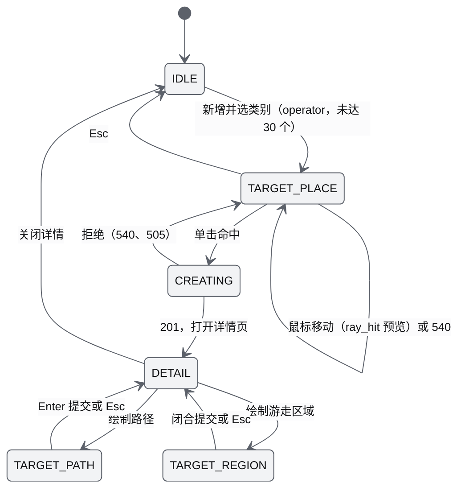
```mermaid
%%{init: {"theme": "base", "themeVariables": {"fontFamily": "Inter, PingFang SC, Microsoft YaHei, Noto Sans CJK SC, sans-serif", "fontSize": "13px", "background": "#FBFBFC", "primaryColor": "#F2F3F5", "primaryTextColor": "#111214", "primaryBorderColor": "#5C616A", "secondaryColor": "#E4E6E9", "tertiaryColor": "#FBFBFC", "lineColor": "#5C616A", "textColor": "#111214", "mainBkg": "#F2F3F5", "nodeBorder": "#5C616A", "clusterBkg": "#FBFBFC", "clusterBorder": "#A7ABB3", "edgeLabelBackground": "#FBFBFC", "noteBkgColor": "#E4E6E9", "noteTextColor": "#111214", "noteBorderColor": "#81868F"}}}%%
stateDiagram-v2
  [*] --> IDLE
  IDLE --> TARGET_PLACE: 新增并选类别（operator，未达 30 个）
  TARGET_PLACE --> TARGET_PLACE: 鼠标移动（ray_hit 预览）或 540
  TARGET_PLACE --> CREATING: 单击命中
  CREATING --> DETAIL: 201，打开详情页
  CREATING --> TARGET_PLACE: 拒绝（540、505）
  DETAIL --> TARGET_PATH: 绘制路径
  DETAIL --> TARGET_REGION: 绘制游走区域
  TARGET_PATH --> DETAIL: Enter 提交或 Esc
  TARGET_REGION --> DETAIL: 闭合提交或 Esc
  TARGET_PLACE --> IDLE: Esc
  DETAIL --> IDLE: 关闭详情
```

#### 20.7.3 属性表单

详情页（右栏第 2 页）显示常用字段；"高级属性"打开 Sheet，以 `Accordion` 分九组（AWR-04 §2.2）。缺省值取类别模板（`packages/contracts/target/class_defaults.json`，AWR-04 §7.2），字段名与单位以 17 §17.6.5 为准。

| 组 | 详情页常用字段 | 高级属性字段 | 组件 | 校验（前置；服务端码） |
|---|---|---|---|---|
| 基本 | 标签、类别（只读）、启用 | — | `InputGroup`、`Switch` | 1–32 字符，净化 |
| 几何 | 尺寸 l × w × h（m） | `critical_dim_m` 覆盖值（缺省空） | 三个 `InputGroup` + 单位 | 0.05–30 m；只读显示平视与俯视关键维度（投影式即时计算） |
| 运动 | 模式、速度（m/s）、路径或区域入口 | `speed_max_mps`、`accel_mps2`、`turn_rate_max_rad_s`、`speed_sigma_mps`、`turn_tau_s`、`pause_prob`、`dwell_s[]` | `ToggleGroup` + `Slider` | 速度 0–40 m/s，`speed ≤ speed_max` |
| 外观 | 对比度 `contrast0` | `color_srgb`（预设色板，不允许任意十六进制输入，避免设计体系外的颜色进入画面）、`albedo_vis`、`camouflage`、`occlusion` | `Slider` | −1–4；0–1 |
| 反射率 | — | `reflect_850`、`reflect_905` | `Slider` | 0–1 |
| 热 | 温差 ΔT（K） | `thermal.mode`（相对、绝对）、`t_surface_c`、`emissivity`、`hot_fraction` | `RadioGroup` + `InputGroup` | ΔT −20–200 K；ε 0.5–1 |
| 雷达 | — | `rcs_m2`、`rcs_fluct` | `InputGroup`、`Select` | 0.001–1000 m² |
| 声源 | 有无声源、`lw_dba` | `waveform`、`f0_hz`、`harmonics_db[]`、`period_s`、`duty`、`phase_s`、`bandwidth_hz`；波形示意图（P1） | `Select`、`Slider`、`LfLine` | `duty` 0–1、`period_s` 0.1–600、`f0_hz` 20–8000；服务端 541 |
| 射频（可扩展） | — | `rf{freq_mhz, eirp_dbm, duty}`（只入配置，D2 不参与判定；表单整组禁用并注明"V0.3 起生效"） | 禁用的 `FieldGroup` | — |
| 感知与行为 | 判据模式（geometric 缺省 / physical）、所需等级 `level_req`（D、R、I，缺省 R）、`n_req_px`（可空） | `alertness`、`reaction`（ignore、freeze、look_at、flee、hide、approach、alert_others、emit）与参数、`calm_s`、`alert_radius_m` | `ToggleGroup`、`Select`、`InputGroup` | `n_req_px` 1–200；`calm_s` 0–3600 |

字段修改按 D1 环境滑块规则提交（松开或回车提交，`PATCH …/targets/{id}`），提交前显示"待确认"描边，收到 `target/{id}/detail` 的新值后转为正式值（U-03）；被拒绝时回滚并 Toast 原因码文案。

#### 20.7.4 敏感体编辑与可视化

```text
┌ 人-01 · 敏感范围 ───────────────────────────────────────────────────┐
│ 判据模式 [geometric|physical]   显示 [配置体|有效体（参考机型 P600 v）]  │
│ #  类型  形状    半径 m  高度 m    半角   方位偏移  背向衰减  启用        │ ← LfTable，行内编辑
│ 1  视觉  扇形    300    0–300     60°    0°       —        [开]        │
│ 2  声学  半球    300    0–300     —      —        —        [开]        │
│ [+ 添加敏感体]                                                         │
│ 建议半径（physical 模型，参考 P600，乡村夜间保守口径）：声学 226 m        │
│ [采纳建议半径]                                                        │
│ 禁入体：配置体外扩 20 m + 3σ_hold（运动识别物的扇形按整圆）             │
└──────────────────────────────────────────────────────────────────────┘
```

| 项 | 规则 |
|---|---|
| 编辑 | 行内 `InputGroup`（单位在表头）；类型 `Select`（视觉、声学；雷达与射频为"可扩展"，选中后提示"D2 只入配置"）；形状 `Select`（球、半球、柱、扇形）；每识别物 ≤ 4 个；越界时字段错误，服务端 542 |
| 视口手柄 | 选中识别物时，配置体在视口显示半径手柄（体的水平最远点，10 px 命中半径）；拖动只改半径（过程值写 transform，松开 `PATCH`）；扇形另有方位手柄 |
| 有效体 | "有效体"需选参考机型（缺省焦点机的机型，无焦点机时为会话中第一个机型）；半径取 `target/{id}/detail` 的 `radius_eff_m[model_id]`（17 §17.7.4），geometric 模式下有效体即配置体，显示提示"geometric 模式：进入配置体并驻留即被发现" |
| 建议半径 | `GET …/targets/{id}/suggested_radius?model_id=` 返回各体的建议半径与口径（昼夜、背景、警觉度）；"采纳"即把配置体半径改为建议值（AlertDialog 列出改前改后） |
| 三维样式 | 配置体：FAINTDATA 细线框，虚线 2 4（属 planned 形态，§11.3）；有效体：DATA 细线框实线；禁入体：地面虚线环（运动识别物整圆）；有无人机位于配置体内（感知态 SUSPICIOUS）时，该体描边转红（warning 形态，不占实心名额）；被发现由识别物标记进入红色仲裁（§20.11.2）。半透明面片不用于 Tier S（只画线框与地面环） |
| viewer | 共享展示可切换配置体与有效体显示（只读），D2-AC-37 |

#### 20.7.5 感知态、捕获与被发现的呈现

| 状态 | 视口标记 | 列表行 | 详情页 |
|---|---|---|---|
| 未被检测 | 类别字形 + 空心小点 | 等级"无" | — |
| 检测 D | 字形 + 单环（虚线） | "检测 D" | 当前最佳：传感器、机体、斜距、`N_eff / N_req` |
| 识别 R、确认 I | 字形 + 单环实线（R）或双环（I） | "识别 R""确认 I" | 同上 |
| 已明确捕获 | 环 + `BadgeCheck` 角标（DATA 色） | "已捕获"`Badge` | 捕获机体、持续时长 |
| 起疑（SUSPICIOUS） | 字形旁 `TriangleAlert`（描边） | 感知态 `StateIcon` | 驻留进度条 `t / t_dwell`（D2-AC-12 的可视对照） |
| 被发现（REACTING、ALERTED） | 红色仲裁候选（未确认时实心红，其余红描边 + `OctagonAlert`） | 计数 + 红徽标 | 最近一次：机体、敏感体类型、距离、余量 |
| 平复中 | 字形 + 虚线环倒计时 | "平复中" | `calm_s` 倒计时 |

### 20.8 机巢（R-D2-26；M20）

```text
┌ 机巢 N1 · 机巢箱 ───────────────────────────────────────────────┐
│ 位置 E −120.0 N 80.0（屋顶） [移动]   链路 3.5 km 圈 [显示]        │
│ 槽位 4 / 6 · RTK 基站 有 · 抗风上限 12 m/s                        │
│ 库存   P600 × 4（在巢 2 · 空中 2）                                │ ← LfTable
│ 能量   换电 180 s · 检查 60 s · 起飞间隔 30 s                      │
│ 充电通道（C1-XR × 4，6S，10 A）                                    │
│  1 =========--- 74%  余 18 min                                   │ ← LfTickRows（每通道一行，20 格）
│  2 ===--------- 22%  余 52 min                                   │
│  3 空闲   4 空闲                                                   │
│ 电池   就绪 3 · 充电中 2 · 待充 1 （6S）                           │
│ 起降队列  P600-04 → 区域值守 · T+00:12:40                          │
│ [编辑配置] [移除机巢]                                              │
└───────────────────────────────────────────────────────────────────┘
```

| 项 | 规则 |
|---|---|
| 新增 | 实体切换"机巢"列表头"新增"→ 工具态 `NEST_PLACE`（ray_hit 预览，地面或屋顶，显示链路距离圈）→ 单击后右栏表单：名称、类型（机巢箱 box、发射回收站 launcher、垂起起降台 vtol_pad）、槽位、能量模式（换电、充电）、充电器（型号、数量、通道、最大电流、最大节数）、电池包（节数、数量）、`turnaround_s`、`launch_interval_s`、`wind_max_mps`、RTK 基站、链路距离；可选"同时放入无人机"（型号与数量，等价于创建后逐架 `POST …/vehicles {nest_id}`）→ `POST /sessions/{sid}/nests`；上限 4 个（505） |
| 兼容 | `box` 只收多旋翼，`launcher` 只收固定翼且标注"需地勤，不参与无人值守 7×24"，`vtol_pad` 收垂起与多旋翼；充电器 `cells_max` 小于电池节数时表单即时提示，服务端 525 |
| 状态 | `nest/{id}/status`（1 Hz）：槽位、库存、各通道充电进度（`LfTickRows`，F5，20 格刻度）、电池队列、起降队列；电池就绪数为 0 且有待派遣时，"电池"行转 warning 描边并显示"派遣延后（battery）"（同时进入事件面板） |
| 修改与移除 | `PATCH …/nests/{id}` 对配置字段即时生效（运行中的充电不受影响，新参数从下一块电池起生效）；移除要求机巢内无机体（否则 105，提示"先移走或移除机巢中的无人机"） |
| 视口 | 机巢标记（`nest` 图标）+ 名称；选中时显示链路距离圈（虚线）；起飞与回收时标记旁短暂显示"起飞 P600-04"（04 text-swap，2 s） |

### 20.9 任务创建：绘制工具与预览（R-D2-03 至 R-D2-06、R-D2-16、R-D2-19；M20）

#### 20.9.1 任务类型、绘制工具与参数缺省

"新建任务"页（右栏第 3 页，`task-new`）顶部为类型 `ToggleGroup`（七项，图标见 §20.15.2），选中后进入对应绘制工具；参数表单在绘制完成后出现。缺省值为 UI 预填值，语义与边界以 AWR-04 §8.1、§8.3 与 17 §17.6.7 为准。

| 类型 | 绘制工具（工具态） | 参数（单位，缺省） | 适用机型提示 |
|---|---|---|---|
| `point_watch` 定点巡航 | `TASK_POINT`：单击地面或屋顶取点（ray_hit） | 高度 `alt_m`（m AGL，60）；高度基准 AGL / 绝对；驻留 `dwell_s`（s，300）或"直到取消"；传感器指向：看向点（缺省为该点）/ 航向 / 识别物；固定翼盘旋半径 `loiter_radius_m`（m，`max(80, R_loiter,min)`，只读显示下限） | 多旋翼悬停；固定翼与垂起盘旋 |
| `polyline_patrol` 多点巡线 | `TASK_LINE`：单击加点（≥ 2、≤ 64），双击或 Enter 结束 | 模式 once / pingpong / loop（loop）；圈数（3）或时长（s）；速度（m/s，机型巡航）；高度（m AGL，60）；传感器朝向 前 / 下 / 侧（下） | 全部 |
| `area_patrol` 多机协同巡查 | `TASK_AREA`：多边形（单击加点，双击或 Enter 闭合，Shift 拖矩形） | 架数 自动 / 指定 k；目标类别（人）与所需等级（R）→ 只读显示所需 GSD（人 R 级 ≤ 2.7 cm）；重访周期 `revisit_s`（s，300）；时长（s，1800）或"直到取消" | 全部 |
| `area_scan_gsd` 按 GSD 完整扫描 | `TASK_AREA` | GSD `gsd_cm`（cm/px，3.0）；侧向重叠 `sidelap`（0.1）；离轴上限 `theta_max_deg`（15°）；时间上限 `t_max_s`（自动 = `min(600, 0.8·t_sortie − 2·t_transit)`，可改）；航高上限 `h_cap_m`（120）；净空 `clearance_m`（20）；允许多架次 `allow_multi_sortie`（否） | 多旋翼、固定翼 |
| `perimeter_patrol` 巡边 | `TASK_AREA` | 偏移 `offset_m`（m，0；正为外侧）；方向 顺时针 / 逆时针；重访周期（s，300） | 全部 |
| `relay_watch` 接力监控 | `TASK_PICK_TARGET`：单击识别物标记或列表行 | 所需等级（取识别物 `level_req`）；时长"持续"或 s；允许机型（全部） | 需通过可行窗口预检 |
| `area_guard` 区域值守（组合） | `TASK_AREA` | 目标类别（人）与等级（R）；重访周期（s，300）；允许机巢（全部）；允许机型（全部）；发现动作 `on_detect`（relay） | 全部 |

公共参数（"更多"`Collapsible`）：优先级 低 / 普通 / 高（普通）；开始时刻 立即 / 仿真时刻；允许机巢；允许机型；发现动作 notify / relay / ignore（巡查与扫描缺省 notify，区域值守缺省 relay）。D1 的航线编辑（指定单机 `follow_path`）作为"手工指定架次"子模式并入本页（P1），入口为类型栏右侧的"更多 › 手工指定架次"。

#### 20.9.2 绘制交互与前置校验

绘制工具复用 D1 `ui/panels/mission-edit/EditViewportLayer.tsx` 与 `editModel.ts`（点的命中、插入手柄、矩形、撤销重做 ≤ 50 步），新增 `TASK_POINT` 与 `TASK_PICK_TARGET` 两种单击模式。绘制中视口顶部提示条按工具显示键位（"单击加点 · 双击或 Enter 闭合 · Shift 拖矩形 · Backspace 删点 · Esc 取消"）；多边形旁实时显示面积（km²，C 类）与顶点数"12 / 64"。

```ts
// 伪代码：ui/panels/task-new/precheck.ts（M15）；与服务端 §11.5 规模配额一致，只用于即时提示，服务端为准（码 585）
const LIM = { areaMaxM2: 1e6, verticesMax: 64, stripsMax: 200, waypointsMin: 2, waypointsMax: 64 }
function precheckArea(ring: Vec2[], type: TaskType, p: Params, cat: CatalogView): Issue[] {
  const issues: Issue[] = []
  if (ring.length < 3) issues.push({ key: 'task.issue.minVertices' })
  if (ring.length > LIM.verticesMax) issues.push({ key: 'task.issue.vertices', code: 585 })
  if (selfIntersects(ring)) issues.push({ key: 'task.issue.selfIntersect' })                 // 闭合时直接拒绝
  const A = Math.abs(shoelace(ring))
  if (A > LIM.areaMaxM2) issues.push({ key: 'task.issue.area', code: 585, value: A })
  if (type === 'area_scan_gsd') {                                                          // 粗估条带数，提示 GSD 过细
    const w = Math.min(cat.wOut * p.gsd_cm / 100, 2 * p.h_cap_m * Math.tan(rad(p.theta_max_deg)))
    const strips = Math.ceil(minWidth(ring) / ((1 - p.sidelap) * w))
    if (strips > LIM.stripsMax) issues.push({ key: 'task.issue.strips', code: 585, value: strips })
  }
  if (!insideWorldBounds(ring)) issues.push({ key: 'task.issue.outsideWorld' })
  return issues
}
```

校验结果在表单顶部 `Alert`（warning 描边）列出，阻断项使"预览分配"置灰；视口中问题顶点画红描边（warning 形态）。

#### 20.9.3 预览分配（dry-run）

"预览分配"发 `POST /sessions/{sid}/tasks?dry_run=true`（每会话 1 次/s；共享规划服务作业，扫描预算 2 s）。等待期间按钮内 `Spinner`，视口保持草稿几何；超过 1 s 时表单顶部显示"规划中"。返回后：

```text
┌ 预览：按 GSD 完整扫描 · 0.24 km² ─────────────────────────────────┐
│ 派出 2 架 P600（机巢 N1）· 完工 8.0 min ≤ T_max 10.0 min             │ ← LfStat × 2
│ 为什么是 2 架：1 架完工 12.8 min，超过 T_max                          │
│ 航高 110 m · 焦距 10.6 mm · 条带宽 57.6 m · 间距 51.8 m · 8 条带       │
│ 单站足迹上界 64 m（航高 120 m、离轴 15°）：区域不能由一架远距覆盖       │
│ 直接覆盖 97.5% · 补拍航点 6 · 障碍格 0.24%（不计入分母）               │
│ ┌ 完工时间 vs 架数 ─────────────────────────────┐                    │
│ │ 12.8 o                                         │  ← LfLine（n = 1..4，│
│ │  8.0      o───────────── T_max 10 min ─────     │    T_max 参考线；    │
│ │  6.2           o     4.9 o                      │    选中 n 为主角点） │
│ └────────────────────────────────────────────────┘                    │
│ 分配：P600-02 条带 1–4 · P600-03 条带 5–8                              │ ← LfTable
│ 可持续 7×24：不适用（扫描任务）                                         │
│ [调整参数]                                         [启动任务]          │
└──────────────────────────────────────────────────────────────────────┘
```

| 结果字段（17 §17.6.7 `TaskPlanPreview`） | 呈现 |
|---|---|
| `n_vehicles`、`makespan_s`、`t_max_s`、`why_n` | KPI 与一句"为什么是 n 架"（n − 1 架的完工时间超过 `T_max`，或可用同类机不足） |
| `scan{h_m, f_mm, strip_w_m, spacing_m, n_strips, footprint_bound_m}` | 一行几何摘要；单站足迹上界说明固定显示（AWR-04 §8.3"约束的意义"） |
| `coverage{direct_pct, fill_waypoints, obstacle_pct, visible_pct}` | 覆盖摘要；补洞后可见格覆盖的承诺为 100% |
| `makespan_curve[{n, makespan_s}]` | `LfLine`，`T_max` 为参考线，被选 n 为主角（HERO 候选，表内唯一红色为该点） |
| `assignments[{uav, nest, items[], eta_s}]` | 分配表（`LfTable`）；行悬停时视口高亮该机的条带与航段 |
| `geometry`（子区、条带、补拍航点、航段、站位） | 规划图层以"计划"形态（前景色虚线，§11.3 planned）画出；预览态与运行态的差别只在线型（预览虚线、运行实线） |
| `sustainability{verdict, bottlenecks[], windows[]}` | 接力与区域值守显示"可持续 7×24：是 / 否"与瓶颈码中文（`night_sensor` 夜间传感器不足、`los` 无视线可见站位、`weather` 天气、`airframe` 机体周转不足、`charger` 充电通道不足、`battery` 电池不足、`link_range` 链路距离、`wind` 抗风）；不可行时段按日历列出 |
| 不可行（422 problem+json：码 580、581、585，`detail.why`、`detail.remedies[]`） | 580（`height`、`fleet_short`、`single_station_far_view`）、581、585 显示为表单顶部 `Alert`：原因中文 + 建议（例如"可用同类机 1 架，需 2 架：添加 1 架 P600 或开启多架次"，按钮"添加无人机"直达 §20.6.4） |

"启动任务"= `POST /sessions/{sid}/tasks`（非 dry-run，携带与预览相同的参数与 `preview_id`，服务端在 60 s 内复用该预览结果，超期重算）；成功后页面关闭，Dock"任务"标签出现新行（列表进场动效），视口规划图层由虚线转实线。

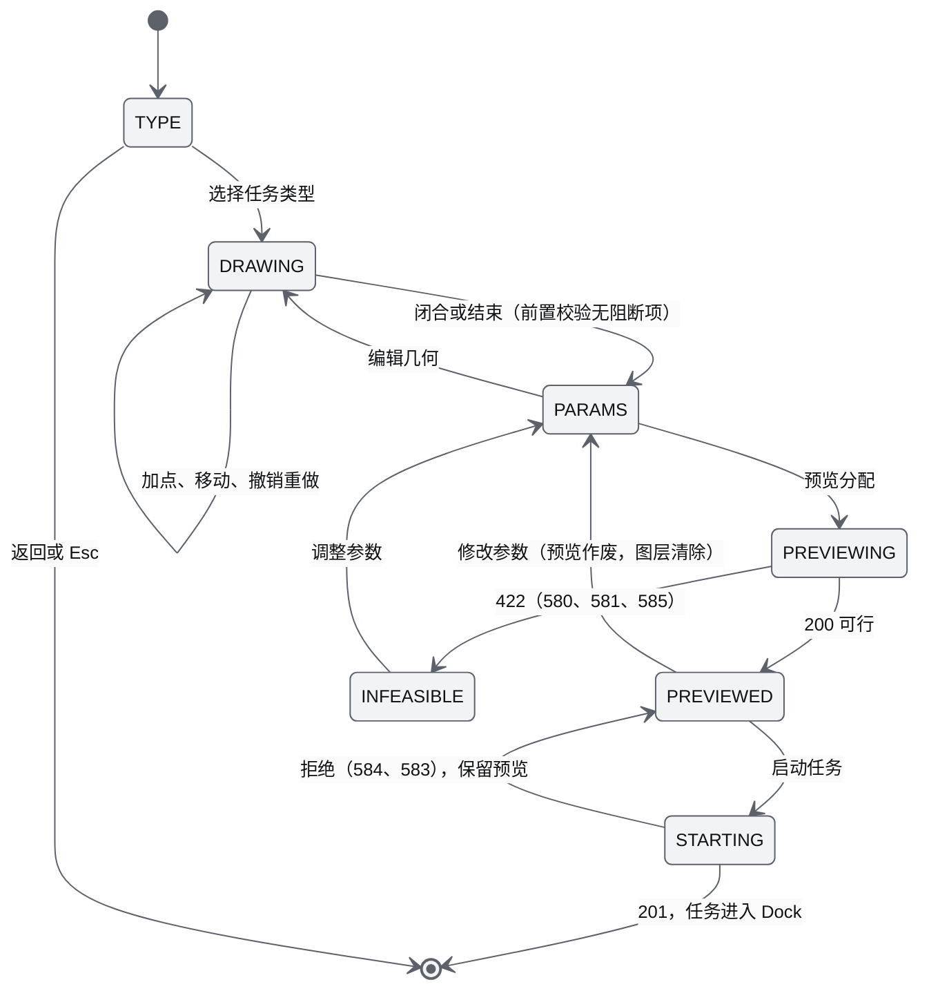
```mermaid
%%{init: {"theme": "base", "themeVariables": {"fontFamily": "Inter, PingFang SC, Microsoft YaHei, Noto Sans CJK SC, sans-serif", "fontSize": "13px", "background": "#FBFBFC", "primaryColor": "#F2F3F5", "primaryTextColor": "#111214", "primaryBorderColor": "#5C616A", "secondaryColor": "#E4E6E9", "tertiaryColor": "#FBFBFC", "lineColor": "#5C616A", "textColor": "#111214", "mainBkg": "#F2F3F5", "nodeBorder": "#5C616A", "clusterBkg": "#FBFBFC", "clusterBorder": "#A7ABB3", "edgeLabelBackground": "#FBFBFC", "noteBkgColor": "#E4E6E9", "noteTextColor": "#111214", "noteBorderColor": "#81868F"}}}%%
stateDiagram-v2
  [*] --> TYPE
  TYPE --> DRAWING: 选择任务类型
  DRAWING --> DRAWING: 加点、移动、撤销重做
  DRAWING --> PARAMS: 闭合或结束（前置校验无阻断项）
  PARAMS --> DRAWING: 编辑几何
  PARAMS --> PREVIEWING: 预览分配
  PREVIEWING --> PREVIEWED: 200 可行
  PREVIEWING --> INFEASIBLE: 422（580、581、585）
  INFEASIBLE --> PARAMS: 调整参数
  PREVIEWED --> PARAMS: 修改参数（预览作废，图层清除）
  PREVIEWED --> STARTING: 启动任务
  STARTING --> [*]: 201，任务进入 Dock
  STARTING --> PREVIEWED: 拒绝（584、583），保留预览
  TYPE --> [*]: 返回或 Esc
```

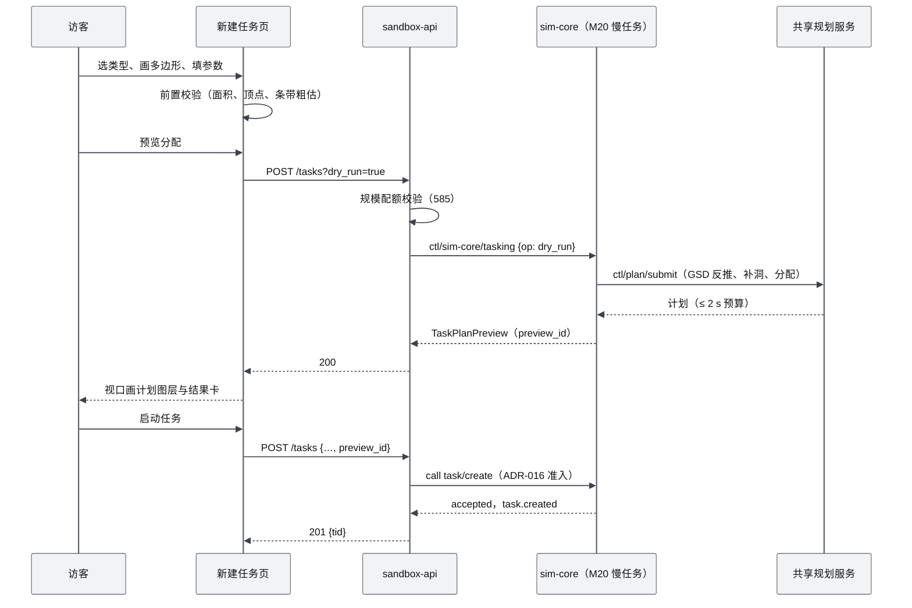
```mermaid
%%{init: {"theme": "base", "themeVariables": {"fontFamily": "Inter, PingFang SC, Microsoft YaHei, Noto Sans CJK SC, sans-serif", "fontSize": "13px", "background": "#FBFBFC", "primaryColor": "#F2F3F5", "primaryTextColor": "#111214", "primaryBorderColor": "#5C616A", "secondaryColor": "#E4E6E9", "tertiaryColor": "#FBFBFC", "lineColor": "#5C616A", "textColor": "#111214", "mainBkg": "#F2F3F5", "nodeBorder": "#5C616A", "clusterBkg": "#FBFBFC", "clusterBorder": "#A7ABB3", "edgeLabelBackground": "#FBFBFC", "noteBkgColor": "#E4E6E9", "noteTextColor": "#111214", "noteBorderColor": "#81868F", "actorBkg": "#F2F3F5", "actorBorder": "#5C616A", "actorTextColor": "#111214", "signalColor": "#3E4249", "signalTextColor": "#111214", "activationBkgColor": "#E4E6E9", "activationBorderColor": "#5C616A", "sequenceNumberColor": "#FBFBFC"}}}%%
sequenceDiagram
  participant U as 访客
  participant T as 新建任务页
  participant A as sandbox-api
  participant S as sim-core（M20 慢任务）
  participant P as 共享规划服务
  U->>T: 选类型、画多边形、填参数
  T->>T: 前置校验（面积、顶点、条带粗估）
  U->>T: 预览分配
  T->>A: POST /tasks?dry_run=true
  A->>A: 规模配额校验（585）
  A->>S: ctl/sim-core/tasking {op: dry_run}
  S->>P: ctl/plan/submit（GSD 反推、补洞、分配）
  P-->>S: 计划（≤ 2 s 预算）
  S-->>A: TaskPlanPreview（preview_id）
  A-->>T: 200
  T-->>U: 视口画计划图层与结果卡
  U->>T: 启动任务
  T->>A: POST /tasks {…, preview_id}
  A->>S: call task/create（ADR-016 准入）
  S-->>A: accepted，task.created
  A-->>T: 201 {tid}
```

#### 20.9.4 任务面板（Dock"任务"标签）

| 区域 | 组件 | 内容 |
|---|---|---|
| 工具条 | `ButtonGroup` | "新建任务"（op）；"显示规划图层"`Toggle`；筛选 `DropdownMenu`（运行中、已结束、不可行） |
| 任务表 | `LfTable`（table.log） | 列：任务（标签 + 类型图标）、状态（规划中、就绪、运行中、已暂停、已完成、已取消、失败、不可行；`StateIcon`）、架数、进度（20 格刻度条；扫描为可见格覆盖 %、巡查为最近访问覆盖、巡线为圈数、定点为驻留）、完工或剩余（D 类）、发现动作、接力 KPI（覆盖率、间隙、被发现）；数据 `task/{tid}/status`（1 Hz） |
| 行操作 | `DropdownMenu` | 开始、暂停、恢复、取消（AlertDialog）、在视口聚焦、查看分配（展开行内分配表与工作项状态）；区域值守行可展开其子任务（内部巡查、巡边与发现后生成的接力） |
| 接力子页（`panel=relay`） | `LfStat` × 6 + `LfTable` | 覆盖率 `∫G dt / T`（%）、间隙次数与最大间隙（s，按原因分列）、被发现次数（目标 0，> 0 时红色文字）、交接次数与平均重叠（s）、最小禁入余量（m）、电池最短可用库存；在岗机与接替机（ETA、站位）；数据 `relay/{tid}/stats`（1 Hz） |
| 曲线（P1） | `LfLine` | 覆盖率随时间曲线、间隙条码（L3 地板语汇） |

工作项被重新分配（能量接替、手动接管、机体丢失）时，行内分配表更新并在事件面板写一条"编排"事件；不弹 Toast（避免接力运行中的高频提示），只有 `task.infeasible`、`relay.gap`（≥ 1 个感知周期）与 `task.state → FAILED` 弹 warning Toast。

### 20.10 手动控制与传感器视图（R-D2-21、R-D2-14；AWR-04 §10.6）

#### 20.10.1 接管、控制与释放

| 状态 | 事件 | 守卫 | 动作 | 目标状态 |
|---|---|---|---|---|
| IDLE | 详情"手动控制"、右键"手动控制"或命令面板（不设单键：M 已用于书签） | operator 界面；焦点机 FlightState 允许 velocity（FLYING、HOLD；地面机先提示"先起飞"） | 若该机由任务（M20）或他人持有：AlertDialog"接管 P600-02？当前执行 区域值守 · 条带 3–4，接管后工作项将重新分配；手动控制期间沙盒倍速锁定 ×1" | CONFIRMING |
| CONFIRMING | 确认 | — | `call uav/{id}/cmd/acquire`，随后 `call uav/{id}/cmd/velocity {frame: "body"（固定翼 "fw"）, hold_alt: false, keepout_guard: "clamp"}` 并 advertise CLIENT_DATA channel | ACQUIRING |
| ACQUIRING | velocity 结果 running | — | 相机切到 FPV（或保持 Third，按设置）；注册 `manual` 作用域；显示键位提示浮层与虚拟摇杆；倍速控件置灰并显示"手动控制中 · 锁定 ×1" | ACTIVE |
| ACQUIRING | 拒绝（100、105、114、117） | — | Toast 原因码文案 | IDLE |
| ACTIVE | 输入变化 | — | setpoint 泵以 30 Hz 发 VelSetpoint16（§20.10.3） | ACTIVE |
| ACTIVE | Esc（无更高层浮层时）、"释放"按钮 | — | 发 FINAL 包与 `velocity_stop`，`release {return_to: "none"}`；机体悬停（固定翼盘旋）待命并回到可用池 | STOPPING |
| ACTIVE | "返回机巢" | — | `velocity_stop` 后 `rtl`，随后 `release` | STOPPING |
| ACTIVE | WS 断开或看门狗 250 ms 无包 | — | 服务端悬停并以 `canceled 209 WATCHDOG` 结束 velocity（D1 规则）；重连后 UI 回到 IDLE 并 Toast"连接中断，已悬停" | IDLE |
| ACTIVE | 租约被抢占（210）或安全动作（204） | — | 退出作用域，Toast 原因 | IDLE |
| STOPPING | `velocity_stop` 与 `release` 完成 | — | 注销作用域；倍速解锁 | IDLE |

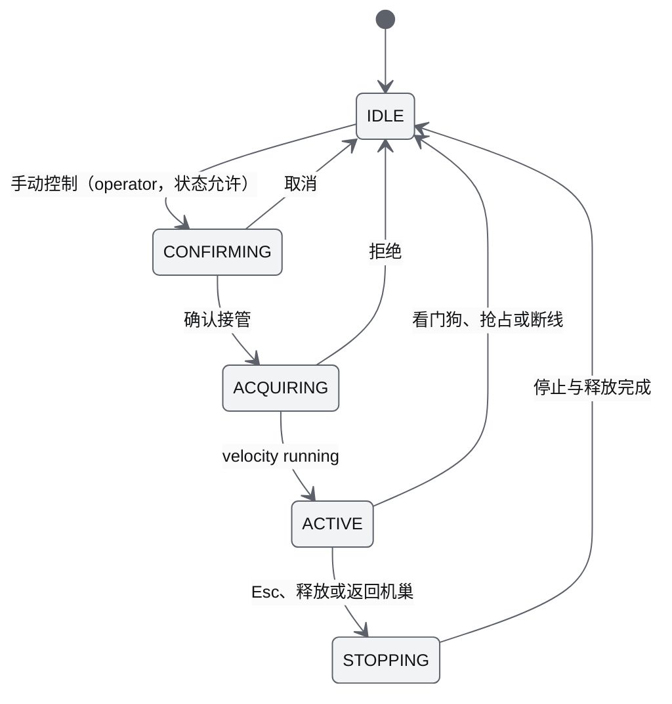
```mermaid
%%{init: {"theme": "base", "themeVariables": {"fontFamily": "Inter, PingFang SC, Microsoft YaHei, Noto Sans CJK SC, sans-serif", "fontSize": "13px", "background": "#FBFBFC", "primaryColor": "#F2F3F5", "primaryTextColor": "#111214", "primaryBorderColor": "#5C616A", "secondaryColor": "#E4E6E9", "tertiaryColor": "#FBFBFC", "lineColor": "#5C616A", "textColor": "#111214", "mainBkg": "#F2F3F5", "nodeBorder": "#5C616A", "clusterBkg": "#FBFBFC", "clusterBorder": "#A7ABB3", "edgeLabelBackground": "#FBFBFC", "noteBkgColor": "#E4E6E9", "noteTextColor": "#111214", "noteBorderColor": "#81868F"}}}%%
stateDiagram-v2
  [*] --> IDLE
  IDLE --> CONFIRMING: 手动控制（operator，状态允许）
  CONFIRMING --> ACQUIRING: 确认接管
  CONFIRMING --> IDLE: 取消
  ACQUIRING --> ACTIVE: velocity running
  ACQUIRING --> IDLE: 拒绝
  ACTIVE --> STOPPING: Esc、释放或返回机巢
  ACTIVE --> IDLE: 看门狗、抢占或断线
  STOPPING --> IDLE: 停止与释放完成
```

#### 20.10.2 `manual` 键位作用域

热键注册表增加作用域 `manual`（`ui/hotkeys/registry.ts` 的 `HotkeyScope` 加 `'manual'`），只在 ACTIVE 时注册；匹配优先级：获得焦点组件自身的键 > `manual` > 工具态 > 编辑模式 > 列表或视口 > 全局（D1 §6.10 冲突规则 4 的扩展）。作用域内相机自由键暂停（相机为 FPV 或跟随）。

| 键 | 多旋翼 | 固定翼与垂起 FW 模式 | 说明 |
|---|---|---|---|
| W / S | 前进 / 后退（机体系 x） | 空速 +1 / −1 m/s（按住 5 Hz 连发，夹在 `[V_min, V_max]`） | 与 D1 自由相机的 WASD 语义一致 |
| A / D | 左移 / 右移（机体系 y） | 左转 / 右转（转弯率） | — |
| Q / E | 下降 / 上升 | 下沉 / 爬升 | 与 D1 Q/E 方向一致 |
| ← / → | 左偏航 / 右偏航 | 同 A / D | 作用域内屏蔽单步与回退 |
| ↑ / ↓ | 云台俯仰 +5° / −5° | 同左 | 新增，作用域内 |
| C | 速度档循环：慢、常、快 | 同左 | 当前档显示在 HUD |
| B | 传感器视图循环：FPV、日视、夜视、热像 | 同左 | FPV 相机下全局可用（不限作用域） |
| `-` / `=` | 变焦缩小 / 放大（一档 = 当前焦距 ×0.8 / ×1.25） | 同左 | 发 `zoom`，≤ 4 次/s 合并 |
| I | 夜视主动照明开关 | 同左 | 只在夜视视图 |
| Shift+R / Shift+L / Shift+X | 返航 / 降落 / 安全停止（作用于被控机，D1 全局安全键） | 同左 | 飞行键不用 Shift，安全键不会被误触 |
| Esc | 分级取消：先关最上层浮层；无浮层时退出手动控制（停止并释放） | 同左 | — |
| F、Space、G、数字键 1–5 | 屏蔽（作用域内无效，提示条闪烁"手动控制中"一次） | 同左 | 避免误切相机与暂停 |

接管时显示键位提示浮层（`Card size="sm"`，未遮挡区左上，可折叠，`KbdGroup`），ShortcutHelp 对话框登记"手动控制"分组。

#### 20.10.3 虚拟双摇杆与 setpoint 泵

```text
┌───────────────────────────────── FPV 视口（P600-02，手动控制，夜视 · 主动照明）──────────────────────────────────┐
│ 手动控制 · P600-02 · 档：常 · 锁定 ×1                                  [释放 Esc] [返回机巢]                     │
│                                         ┌──────────────┐                                                    │
│                                         │  人-01  识别 R │  ← 捕获框（投影包围盒）                              │
│                                         │  9.6 / 14 px  │  ← 像素进度；限制：照度不足                            │
│                                         └──────────────┘                                                    │
│                                                +                                                            │
│ 航向 045° AGL 62 m 速度 3.1 m/s 电量 71% │ f 22 mm · HFOV 14.5° · 斜距 312 m · GSD 4.1 cm                          │
│ 预计 2.4 s 后进入 人-01 的视觉敏感范围（已限速）                                                                   │
│   ┌──────┐                                                                              ┌──────┐               │
│   │  o   │  左摇杆：升降、偏航                                                          │   o  │  右摇杆：前后、左右 │
│   └──────┘                                                                              └──────┘               │
└──────────────────────────────────────────────────────────────────────────────────────────────────────────────┘
```

| 项 | 规则 |
|---|---|
| 显示 | 手动控制 ACTIVE 时出现；设置"手动控制 › 显示虚拟摇杆"缺省为"自动"（检测到 `pointer: coarse` 或用户点击过摇杆时显示，键盘用户可隐藏）；摇杆为 DOM 圆盘（直径 120 px），只写 transform |
| 映射（多旋翼，frame body） | 右摇杆 x → `vel.y`（左正，FLU），y → `vel.x`；左摇杆 y → `vel.z`，x → `yaw_rate`（逆时针正）；死区 0.08，指数 0.3：`u' = sign(u)·(0.7·|u| + 0.3·|u|³)`（去死区后重新归一） |
| 映射（固定翼，frame fw） | 右摇杆 y → 空速增量（每秒 ±2 m/s 积分到指令空速），x → 转弯率；左摇杆 y → 爬升率；`vel = [V_cmd, NaN, climb]`、`yaw_rate = turn_rate`（17 §17.7.6） |
| 速度档 | 多旋翼 水平 2 / 5 / `min(vmax, 10)` m/s，垂直 1 / 2 / 3 m/s，偏航 0.4 / 0.8 / 1.2 rad/s；固定翼 转弯率为 `{0.33, 0.66, 1.0}·g·tan φ_max / V_a`，爬升为 `{0.33, 0.66, 1.0}·climb_max` |
| 键盘合成 | 按键为 ±1 的阶跃输入，经 150 ms 一阶平滑（避免指令阶跃），与摇杆取绝对值较大者 |
| 发送 | setpoint 泵 30 Hz（33 ms，`setInterval` 在 rt.worker 内执行，主线程只写共享输入状态）；输入归零后继续以 0 速发 5 个包再停发，松开全部输入不等于释放；释放时发 FINAL 包（CLIENT_DATA flags bit0）并调用 `velocity_stop`；页面不可见（`visibilitychange`）时立即发 FINAL 并停发，服务端看门狗兜底 |

```ts
// 伪代码：ui/manual/setpointPump.ts（M15）；在 rt.worker 中按 30 Hz 运行，零分配
const out = new Float32Array(4)                  // VelSetpoint16：vel[3]、yaw_rate
function tick(inp: ManualInput, tier: SpeedTier, fw: boolean, va: number): void {
  const k = TIERS[tier]
  if (!fw) {
    out[0] = shape(inp.fwd) * k.h; out[1] = shape(-inp.right) * k.h
    out[2] = shape(inp.up) * k.v;  out[3] = shape(-inp.yawRight) * k.yaw
  } else {
    vCmd = clamp(vCmd + shape(inp.fwd) * 2 * DT, vMin, vMax)
    out[0] = vCmd; out[1] = NaN; out[2] = shape(inp.up) * k.climb
    out[3] = shape(-inp.yawRight) * k.turnFrac * G * Math.tan(phiMax) / Math.max(va, vMin)
  }
  sendClientData(channelId, seq++, simNowNs(), out, /*final*/ false)   // 17 §6.4 CLIENT_DATA
}
```

#### 20.10.4 敏感范围保护

1. **始终显示禁入体**：手动控制期间敏感体与禁入体图层强制显示（不受图层开关影响），被控机最近的三个禁入体加粗。
2. **接近告警（客户端预测）**：每 100 ms 以被控机位置 `p` 与速度 `v`（Full64，60 Hz 插值后的值）对每个启用的配置体计算 `d`（到边界的有符号距离，体外为正；球与半球按三维、柱与扇形按水平；运动识别物扇形按整圆）与 `t_hit = d / max(ε, −v·n)`；`t_hit ≤ 3 s` 时 HUD 显示"预计 t s 后进入 <识别物> 的<视觉/声学>敏感范围"，并弹 warning Toast（合并键 `manual:keepout:<target>`，5 s 内不重复）。
3. **软围栏（服务端执行）**：velocity 调用的 `keepout_guard` 缺省 `clamp`：sim-core 在把 setpoint 交给 L1 之前去掉朝禁入体方向的速度分量（17 §17.7.6），被钳制时该 velocity 调用的 `progress` 帧带 `warnings: ["KEEPOUT_CLAMPED"]`，并发 `uav.keepout_guard` 事件（均 ≤ 1 Hz），HUD 显示"已限速"。设置"手动控制 › 软围栏"关闭时改发 `keepout_guard: "warn"`，进入配置体即按判据计发现；关闭开关需 AlertDialog 确认"关闭后进入敏感范围将被识别物发现"。SDK 调用同一参数，因此 API 客户端与界面行为一致。
4. **时钟**：手动控制期间沙盒倍速由 sim-core 锁定 ×1（`sim/speed` 返回 117，detail `MANUAL_CONTROL`）；Timeline 倍速控件置灰并显示原因（AWR-04 §4.4.5 第 4 条）。

#### 20.10.5 传感器视图

| 控件 | 位置 | 组件 | 作用 | 接口 |
|---|---|---|---|---|
| 视图切换 FPV / 日视 / 夜视 / 热像 | FPV 顶部工具条 | `ToggleGroup`（`toggle-group-indicator`，配方 16）+ 键 B | 切换 M06 的着色变体（视觉近似，不回流判据） | 本地 |
| 传感器选择 | 同上 | `Select` | 选择该机挂载的成像传感器（例如 GX40、LWIR 100 mm）；视图与所选传感器的 FOV、焦距绑定 | 本地；读 `uav/{id}/payload` |
| 变焦 | 右侧竖条 | `Slider`（`[f_min, f_max]` mm，对数刻度）+ 键 `-` / `=` | 改焦距；LWIR 数字变焦标注"只影响显示" | `call zoom`（op） |
| 云台 | FPV 内右键拖动或 ↑ / ↓ | — | 俯仰与偏航（俯仰 −90°…+30°，偏航 ±160°） | `call gimbal {mode: "angles"}`（op，拖动松开时发） |
| 跟踪 | 工具条 | `Button`"跟踪识别物" + `Select` | 云台锁定识别物 | `call gimbal {mode: "track", target}`（op） |
| 主动照明 | 夜视视图工具条 | `Switch` + 键 I | 开关机内或外挂照明器；显示当前作用距离 `R_nir` | `call sensor/mode {illum: {builtin, ext}}`（op，AWR-04 §11.2 的统一载荷） |
| 调色板 | 热像视图工具条 | `ToggleGroup`：白热、黑热 | 只有两种灰阶（AWR-04 §10.7，无伪彩） | `call sensor/mode {palette}`（op，便于 API 读取一致）；viewer 本地切换 |
| 分辨率 | 传感器 HoverCard | `Select`：1080P、4K（需 `compute.orin_nx`） | 分析分辨率 | `call sensor/mode {resolution}`（op） |

viewer（共享展示）可在任意 S7 机上使用视图切换、传感器选择与调色板（本地显示），变焦与云台跟随该机的实际状态（只读，`uav/{id}/payload`），不发任何写请求（D2-AC-37）。视图切换不改变 S7 的传感器状态。

渲染约束（M06 实现，本文约束可见行为）：三种着色变体进入 shader zoo 并在遮罩下预热，首次切换 programs 增量为 0、切换 ≤ 300 ms（D2-AC-21）；夜视为单色并按照明锥与 `R_nir` 衰减亮度、被动低照时加噪；热像以识别物类别模板与 `ΔT` 近似画热斑、背景按 DSM 与日历近似；视图只是近似，HUD 判据数值只来自 `uav/{id}/perception`；热像视图除捕获框外不得出现红色像素（D2-AC-25）。

#### 20.10.6 HUD 像素进度与限制因素

| HUD 元素 | 数据（`uav/{id}/perception`，5 Hz） | 规则 |
|---|---|---|
| 捕获框 | 视锥内识别物的投影包围盒（由 TargetLite32 位置与类别尺寸在客户端投影） | 未捕获：前景色细描边；P ≥ 0.9 达到所需等级并计时中：描边 + 计时环 `t / 1.0 s`；已明确捕获：实线描边 + `BadgeCheck`，作为该图的 HERO 候选可取红（同图无未确认 critical 时） |
| 像素进度 | `n_eff`、`n_req`、`level_req` | "识别 R · 9.6 / 14 px"（C 类，≤ 4 Hz） |
| 限制因素 | `limiting` | `fov` 不在视锥内、`los` 视线被遮挡、`pixels` 像素不足（建议放大或靠近）、`light` 照度不足（建议开启照明或改用热像）、`contrast` 对比度不足、`blur` 运动模糊（建议减速或跟踪） |
| 传感器读数 | `f_mm`、`hfov_rad`、`range_m`、`gsd_m`；LWIR 另有 `delta_t_app_k` | 一行 C 类文字 |
| 多目标 | 视锥内多个识别物 | 只对最近的一个显示像素进度与限制因素，其余只画框（≤ 8 个） |

### 20.11 捕获与被发现提示（R-D2-12、R-D2-09；AWR-04 §10.7）

#### 20.11.1 事件 → 呈现

事件名、`level` 与 data 字段以 17 §17.7.5 为准；"级别"为 UI 呈现级别（§11.1）。

| 事件 | 级别 | Toast（合并键；时长） | 列表与详情 | 3D | 事件表筛选 | Timeline 标记 |
|---|---|---|---|---|---|---|
| `perception.capture` | info | "已明确捕获 人-01 · P600-02 日视 · 识别 R"（`perception:capture:<target>`；同一识别物 30 s【墙钟】内只提示一次，4 s） | 识别物行"已捕获"；无人机行当前工作项后加"捕获 人-01" | 识别物环加 `BadgeCheck`；FPV 捕获框转实线 | 感知 | DATA 实心点 |
| `perception.capture_lost` | info | 无（只在 FPV 捕获框与事件表体现） | "已捕获"`Badge` 移除 | 角标移除 | 感知 | 否 |
| `perception.level` | info | 无 | 最佳等级更新（≤ 4 Hz） | 环样式更新 | 感知（缺省折叠，事件量大） | 否 |
| `target.discovered` | critical | "人-01 发现了 P600-02（视觉，148 m）· [确认]"（`target:discovered:<target>`；常驻直到确认或平复） | 计数 + 红徽标；详情"最近一次被发现" | 红色仲裁候选（§20.11.2） | 识别物 | 仲裁胜出者实心，其余八边形描边 |
| `target.state`（感知态变化） | info | 无 | 感知态 `StateIcon`（04 text-swap） | 字形旁图标 | 识别物 | 否 |
| `uav.keepout_guard` | warning | "已限速：接近 人-01 的视觉敏感范围"（`manual:keepout:<target>`；5 s） | — | 禁入体加粗 1 s | 编排 | 否 |
| `relay.dispatch`、`relay.handover` | info | 无 | 接力子页更新 | 接替机航段闪现（04，2 s） | 编排 | `relay.handover` 为 DATA 点 |
| `relay.gap` | warning | "接力出现间隙 12 s（原因：昼夜切换）"（`relay:gap:<tid>`；6 s） | 接力子页间隙计数 | — | 编排 | 空心三角 |
| `task.state`（→ FAILED、INFEASIBLE） | warning | "任务 区域值守 不可行：夜间传感器不足"（`task:<tid>:<code>`） | 任务行状态 | — | 编排 | 空心三角 |
| `task.created`、`task.state`（其余）、`task.allocated`、`task.reallocated`、`nest.launch`、`nest.recover`、`nest.swap_done` | info | 无 | 任务表、机巢详情 | 机巢标记短文字 | 编排 | 否 |
| `perception.detect`（雷达、声阵列、激光雷达的检测） | info | 无 | 单机详情"感知"标签 | FPV 中方位指示（不画识别物框，非成像检测不给识别物 id） | 感知 | 否 |
| `nest.dispatch_delayed` | warning | "机巢 N1 派遣延后：电池不足"（`nest:<id>:delay`；6 s） | 机巢"电池"行 warning 描边 | — | 编排 | 否 |
| `fw.wind_exceeds` | warning | "F1-01 风速超过盘旋能力，改为逆风等待航线" | 行状态 | — | 编排 | 否 |
| `sandbox.expiring` | warning | §20.4.6（常驻倒计时） | 会话条 | — | 沙盒 | 否 |
| `sandbox.rate` | info | "本会话可达倍速 ×5（CPU 预算）"（`sandbox:rate`；只在授予值下降时） | 会话条倍速 | — | 沙盒 | 否 |
| `session.switched`（沙盒切换底图或载入场景） | info | "已载入场景 T5"（纪元 + 1，D1 §7.7 对账） | 全部列表重建 | — | 沙盒 | 段边界 |

事件面板新增四个筛选（`ToggleGroup` 多选）：感知、识别物、编排、沙盒；"感知"缺省只显示 capture 与 capture_lost，`perception.level` 需展开"显示等级变化"。告警中心（§11.5）只收 warning 与 critical。

#### 20.11.2 "一处红"候选扩展（§11.2 的增量）

| 图 | 红色实心候选（按优先级） | 备注 |
|---|---|---|
| 3D 视口 | 未确认的 critical：无人机（D1 严重度 5、6、8）与被发现的识别物（`RedCandidate {entity: {kind: 'target', id}, level: 'critical', rank: 5}`）→ 焦点机 | rank 5 与 ELAND 同级，同级取最新（`lib/redArbiter.ts` 已支持 `kind: 'target'`）；确认后退为红描边加 `OctagonAlert`；多个被发现时取最新者，其余红描边 |
| FPV 传感器视图（一张图） | 视野内未确认的被发现识别物 → 已明确捕获的捕获框（HERO） | 热像视图除捕获框外无红色像素 |
| 识别物列表 | 最新未确认被发现行的计数徽标 | 选中态不用红 |
| 任务表 | 最新 FAILED 或 INFEASIBLE 行（hot 单元格） | 接力"被发现次数"> 0 时该 KPI 为红色文字（不占实心） |
| 预览结果卡 | 完工曲线中被选 n 的点（HERO） | — |
| 会话条（顶栏这张图的一部分） | 无实心；剩余 ≤ 60 s 时数字为红色文字 | 顶栏实心名额仍只给告警计数徽标（§11.2） |
| 机巢详情、排队卡片、OpenAPI 页 | 无 | — |

"确认"沿用 D1 语义（每个客户端自己的 UI 状态，不上线）；被发现 Toast 的"确认"与告警中心的"确认"同一状态。

### 20.12 底图切换与静态浏览（R-D2-25、R-D2-28；ADR-109）

#### 20.12.1 World Hub（七个世界）

D1 §5.1 的卡片增加：沙盒可用性 `Badge`（"可立即开沙盒""容量不足，可排队""暂不可用"，取 `GET /api/sandbox/v1/worlds` 的 `available` 与 `admit_now`）、"在此城市开沙盒"按钮（打开 §20.4.1 的 Sheet 并预选该世界）、规模档（S 级或 L 级，L 级卡片说明"大城市占用更多资源，可能需要排队"）。UrbanScene3D 六城卡片底部固定一行说明"UrbanScene3D 数据，经数据集权利方授权使用 · 引用"（"引用"打开 `Popover` 显示 ECCV 2022 BibTeX，可复制）；synthcity 卡片保留"程序生成 · 示意坐标"。演示构建的 `demoWorlds()` 不再只列 synthcity（`lib/demo.ts` 的 `DEMO_WORLDS` 改为取服务端白名单）。

#### 20.12.2 沙盒内切换底图

| 步 | 交互 | 接口与反馈 |
|---|---|---|
| 1 | 左栏 WORLD"切换底图…"或菜单"世界 › 切换底图…" | Dialog：世界 `Select`（带可用性 Badge）、提示"切换底图会在新城市重启仿真并载入同名场景模板（当前模板 T5 → shanghai 的 T5），机队、识别物、机巢与任务不会搬运坐标" |
| 2 | 可选"先导出快照" | `GET /sessions/{sid}/snapshot` 下载 |
| 3 | "切换" | `POST /sessions/{sid}/world {world, template}`；准入不通过时 409 码 508（Dialog 内显示可立即开始的世界）或 507 |
| 4 | 等待 | 画布显示切换加载卡（§20.3.4），会话条"正在新城市启动沙盒"；WS 保持（sandbox-api 在 sim-core 重启后重发 `serverInfo`，纪元 + 1） |
| 5 | 完成 | 加载卡淡出；info Toast"已切换到 shanghai · 载入场景 T5"；相机到该世界模板的初始视角 |

快照只能在同一世界导入（快照的 `world_id` 不同时导入被拒，§20.4.6 第 5 条）。

#### 20.12.3 静态浏览（共享展示 viewer）

`/world/:id`（非共享展示世界）只加载点云与地形，不建 WS；顶部 info 横条"静态浏览：此城市没有运行中的仿真 · [在此城市开沙盒] [回到共享展示]"（D1 §6.16 横条的改写）；右栏实体切换与 Dock"任务"为 `Empty`；GSD 计算器与机型目录可用。静态浏览不依赖派生缓存（AWR-04 §4.4.7 第 2 条）。

### 20.13 新手引导、场景模板与共享展示可用交互

#### 20.13.1 场景模板

模板列表与首次反馈以 AWR-04 §10.4 为准（T1–T6，缺省 T5）。UI 规则：
1. Sheet 与"载入场景"Dialog 中，模板以 `RadioGroup` 呈现，每项第二行为"首次反馈"（例如"约 40 s 明确捕获"）；
2. T6（手动飞行）的仿真时段缺省夜间，Sheet 中切到 T6 时时段 ToggleGroup 自动选"夜间"并提示"夜间更能体现夜视与热像"（可改）；
3. 载入任何模板后，若该模板定义了"引导焦点"（例如 T5 的接力目标"人-01"），相机飞到该识别物上方的模板视角，并把它设为选中识别物。

#### 20.13.2 新手引导（4 步，可跳过）

```text
                ┌ 1 / 4 · 你的沙盒 ─────────────────────────────┐
                │ 这是只属于你的仿真。剩余时间到期前会自动续期，      │  ← Popover，锚定会话条
                │ 有访客排队时暂停续期。                            │
                │ [跳过引导]                    [上一步] [下一步]   │
                └──────────────────────────────────────────────────┘
```

| 步 | 锚点 | 文案要点 | 完成条件 |
|---|---|---|---|
| 1 | 会话条 | 你的沙盒、剩余寿命与续期、可达倍速 | 下一步 |
| 2 | 右栏实体切换"识别物" | 识别物与敏感范围；"无人机进入敏感范围并驻留就会被发现" | 下一步，或访客点开识别物 |
| 3 | Dock"任务"标签 | 区域值守已在运行；点"查看分配"在视口看子区、条带与站位；新建任务可"预览分配" | 下一步，或访客打开分配 |
| 4 | Toast 视口（无 Toast 时锚定焦点机的 FPV 按钮） | 明确捕获会在这里提示；用 FPV 与夜视、热像查看像素进度 | 完成 |

规则：首次进入 READY 的沙盒时出现（`awr.ui.onboarding.v1.done = false`）；`Popover` 非模态，不 `inert` 其他区域，不抢焦点（第一次出现时 `role="status"` 播报标题），键盘 ←/→ 换步（焦点在引导内时），Esc 或"跳过引导"结束并记录 `done = true`；任一步锚点不可见（栏收起、紧凑档）时锚定到未遮挡区顶部中点；切换步骤用 05 menu-dropdown 配方；帮助菜单"新手引导"可重新开始。引导期间仿真照常运行（不暂停）。

#### 20.13.3 访客路径预算（D2-AC-34）

| 段 | 动作 | 预算（Tier S，本机） |
|---|---|---|
| 落地页 | 第 1 次点击"开启我的沙盒"、第 2 次点击"开始"（缺省 synthcity + T5） | 交互 ≤ 2 s；创建请求 ≤ 1 s（与应用启动并行的沙盒启动 ≤ 6 s） |
| 应用启动 | 整页加载、进度条、揭开 | ≤ 20 s（DEMO-PUBLIC 实测 Tier S 约 17 s） |
| T5 运行 | 首次 `perception.capture` | 模板设计目标：会话 ACTIVE 后 ≤ 60 s【仿真，×1】（§20.24 第 4 条） |
| 合计 | 落地页到第一次捕获 Toast | ≤ 3 次点击（引导不计点击：非模态、可忽略）、≤ 90 s |

#### 20.13.4 共享展示（viewer）可用交互（AWR-04 §10.3）

| 交互 | 入口 | 数据 | 不产生写请求的保证 |
|---|---|---|---|
| 任意 S7 机的 FPV 与日视、夜视、热像视图，HUD 像素进度 | 选中机 → FPV（键 4）→ 视图切换（键 B） | 订阅 `uav/{id}/perception@5`、`uav/{id}/payload@2` | 变焦、云台、照明在 viewer 界面不渲染为可操作控件 |
| 识别物列表与详情（只读），配置体与有效体切换 | 右栏实体切换 | `swarm/target/state`、`target/{id}/detail@2` | 详情页无写按钮 |
| 接力统计 | Dock"任务 › 接力" | `relay/{tid}/stats@1` | — |
| 机型目录与 P600 参数 | 右栏"机型目录" | `GET /api/sandbox/v1/catalog/*`（公开、可缓存） | 无"克隆编辑" |
| 六城静态浏览 | World Hub | 静态世界文件 | 不建 WS |
| GSD 与识别距离计算器 | 工具菜单"GSD 计算器"、机型目录详情 | 前端纯函数 | 纯本地 |

满员排队期间以上交互全部可用；D2-AC-37 以拦截全部 WS `call` 与 REST 非 GET 请求计数为 0 验证。

#### 20.13.5 GSD 与识别距离计算器

```text
┌ GSD 与识别距离计算器（Sheet 480 px）──────────────────────────────────┐
│ 机型 [P600 v]  传感器 [GX40 EO v]  分辨率 [1080P|4K]                     │
│ 焦距   4.8 ━━━━━━━━━━━━━o━━ 48 mm    当前 48.0 mm                        │
│ 识别物 [人 v]  观察方向 [平视|俯视|最不利]   所需等级 [D|R|I]             │
│ 斜距   [ 600 ] m     照度 [日间|低照|夜间]   能见度 MOR [10 km v]           │
│ ── 结果 ──────────────────────────────────────────────────────────── │
│ GSD 3.6 cm · 关键维度 0.72 m · 像素 N 19.9 px                            │
│ P(D) 1.00 · P(R) 0.98 · P(I) 0.84                                        │
│ P ≥ 0.9 最大斜距：D 3404 m · R 851 m · I 532 m（未计消光与对比度）        │
│ 可行窗口（geometric，模板敏感半径）：320–850 m · 限制：像素                 │
└──────────────────────────────────────────────────────────────────────┘
```

```ts
// 伪代码：engine/perception/calc.ts（M19 的 TypeScript 移植；与 python/awr/sim/perception 同一公式，单测对拍 ≤ 1%）
function pEff(s: SensorSpec, res: Res): number { return s.pixel_m * s.wNative / res.wOut }      // 等效像元
function pPrime(s: SensorSpec, res: Res, lambda_m: number, fNum: number): number {
  return Math.max(pEff(s, res), lambda_m * fNum)                                                // 衍射约束
}
function dCrit(t: TargetDims, epsRad: number, betaRad: number): number {                       // 投影关键维度
  const { l, w, h } = t
  const A = Math.abs(Math.sin(epsRad)) * l * w
          + Math.abs(Math.cos(epsRad)) * (Math.abs(Math.cos(betaRad)) * w * h + Math.abs(Math.sin(betaRad)) * l * h)
  return t.criticalOverride ?? Math.sqrt(A)
}
function ttpf(n: number, n50: number): number {
  const x = n / n50, e = 2.7 + 0.7 * x, q = Math.pow(x, e)
  return q / (1 + q)
}
function compute(i: CalcInput): CalcOutput {
  const pp = pPrime(i.sensor, i.res, i.lambda_m, i.fNum(i.f_m))
  const gsd = i.range_m * pp / i.f_m
  const dc = dCrit(i.target, i.epsRad, i.betaRad)
  const n = dc * i.f_m / (i.range_m * pp)
  const levels = { D: 1.0, R: 4.0, I: 6.4 }                                                     // N50（周期）× 2 像素
  const p = mapValues(levels, n50c => ttpf(n, 2 * n50c))
  const rMax = mapValues(levels, n50c => dc * i.f_m / (2 * n50c * X90 * pp))                    // X90 = 1.7505（P = 0.9）
  const win = feasibilityWindow(i)                                                               // 只计 k_light、τ、k_c 的解析部分
  return { gsd, dc, n, p, rMax, win }
}
```

计算器只给"未计消光与对比度"的几何上限与解析可行窗口，结果区注明"判据以服务端感知为准"；滑块拖动时 ≤ 10 Hz 重算（C 类，tabular-nums）。

### 20.14 开放接口文档页 `/sandbox/api`

```text
┌ 顶栏（D1）─────────────────────────────────────────────────────────────────────────────────────────┐
│ 开放接口 · 沙盒 REST v1  [OpenAPI 3.1 下载] [Python SDK 下载]   你的会话：sb-k3m9q2x7ab（剩余 27:41）    │
├──────────────────────┬─────────────────────────────────────────────────────────────────────────────┤
│ 会话 Sessions        │ POST /api/sandbox/v1/sessions/{sid}/vehicles/{vid}/commands                  │
│ 机型目录 Catalog     │ 对单机发起命令（与 WS call 同一准入与幂等）                                     │
│ 无人机 Vehicles   [v]│ 参数   名称        位置   类型     必填  说明                                    │ ← LfTable
│  · 列表与增删        │        sid        path   string   是    沙盒 id                                   │
│  · 状态与传感器      │        id         body   string   否    call id，60 s 幂等                        │
│  · 命令            ← │ 请求示例 [curl|Python SDK]                                       [复制]          │ ← Tabs + 代码块
│ 感知 Perception      │ 响应   200 首个 result 帧 · 4xx problem+json（码 100、110、114 …）                │
│ 识别物 Targets       │ 实时   对应 WS：call uav/{id}/cmd/{op}                                           │
│ 机巢与任务 Tasking   │                                                                              │
│ 环境 Env             │                                                                              │
│ 实时 WS              │                                                                              │
└──────────────────────┴─────────────────────────────────────────────────────────────────────────────┘
```

| 项 | 规则 |
|---|---|
| 数据 | 运行时取 `GET /api/sandbox/v1/openapi.json`（公开），按 `tags` 分组；不引入 Swagger UI 或 Redoc（设计体系约束，AWR-04 §11.4） |
| 组件 | 左侧 `Sidebar`（分组 `Collapsible`）；右侧 `Card`：方法 `Badge`（GET、POST、PATCH、DELETE 用文字区分，不用颜色区分）、路径（等宽）、说明、参数表（`LfTable`）、请求与响应示例（`Tabs`：curl、Python SDK；代码块为 `pre`，等宽字体，`Copy` morph `Check`）、错误码列表（链接到 §20.16 的原因码文案）、"实时对应"一行 |
| token | curl 示例中 token 一律写占位 `$AWR_SANDBOX_TOKEN`；持有会话时提供"复制我的 token"按钮（点击才复制，页面不明文显示），并提示"token 只对你的沙盒有效，到期自动失效" |
| 实时 | "实时 WS"分组为静态说明：端点、子协议、topic 表与载荷字段（来自 17 §17.7，构建期生成为 `ui/sandbox/rtDoc.gen.json`） |
| 快照一致 | 页面渲染的路由集合与 `packages/contracts/rest/sandbox.openapi.snapshot.json` 一致（CI，D2-AC-22） |

### 20.15 组件映射（shadcn、morphicons、lieflat、transitions.dev）

#### 20.15.1 区域 → 组件

组件一律来自 `ui/components/ui`（shadcn base-mira，D1 §4.7 的 44 个已安装组件即可覆盖，D2 不新增 shadcn 组件；`calendar`、`drawer`、`chart` 仍禁用）。"动效"列引用 §8.2 与 §20.15.4 的编号，"图标"列引用语义 key。

| 区域与元素 | 组件组合 | 动效 | 图标 | lieflat | 所有者 |
|---|---|---|---|---|---|
| 启动遮罩进度条 | 既有 DOM 节点（`index.html`）+ `BootProgress` | #33 | — | — | M15 |
| 落地页"开启我的沙盒" | `Button` + `Sheet side="right"` > `Field`、`Select`（`items`）、`RadioGroup`、`ToggleGroup`、`Progress`、`Spinner` | 8、#37 | `sandbox.mine` | — | M15 |
| 排队卡片 | `Card size="sm"` + `Button` + `Progress`（倒计时） | #35、15 | `state.hold` | — | M15 |
| 会话条 | 自研条（`--z-banner`）> `Badge`、`HoverCard`、`Button size="sm"`、`DropdownMenu`（紧凑档）、`AlertDialog` | #34、14、15 | `sandbox.mine`、`env.time` | — | M15 |
| 会话结束 | `AlertDialog` | 7 | `sandbox.mine` | — | M15 |
| 右栏实体切换 | `ToggleGroup`（单选，`toggle-group-indicator`） | #36 | `drone.quad`、`target.person`、`nest.box` | — | M15 |
| 无人机列表（增强） | D1 DroneRail（`Item`、虚拟化）+ `Badge`（机型） | 21 | 机型类别图标 | — | M15 |
| 机型目录与克隆编辑 | `Sheet`（560 px）> `ToggleGroup`、`InputGroup`、`Card`、`Accordion`、`Table`、`FieldGroup`、`Field`、`Slider` | #37、3、18 | `drone.quad`、`fw.plane` | `LfTable` | M15（store M21） |
| 传感器标签 | `Tabs`（详情）> `Table`、`Slider`、`InputGroup`、`Switch`、`Select`、`ToggleGroup` | 4、12 | `sensor.*` | `LfTable` | M15（store M19） |
| 识别物列表与详情 | `Item`、`Badge`、`StateIcon`、`DropdownMenu`、`Field`、`Slider`、`ToggleGroup` | 21、14 | `target.*` | — | M15（store M18） |
| 识别物高级属性 | `Sheet` > `Accordion`（九组）> `FieldGroup` | #37、2 | `target.*`、`sound.wave` | `LfLine`（波形，P1） | M15（store M18） |
| 敏感体表 | `Table`（行内 `InputGroup`、`Select`、`Switch`）+ `Button` | — | `sens.visual`、`sens.acoustic` | `LfTable` | M15（store M18） |
| 机巢详情 | `Item`、`Table`、`Badge`、`Button` | 15 | `nest.*` | `LfTickRows`（充电通道）、`LfTable` | M15（store M20） |
| 新建任务页 | `ToggleGroup`（七类型）+ `Alert`（工具提示条）+ `FieldGroup` + `Collapsible`（公共参数）+ `Button` | 3、11、18 | `task.*` | — | M15（store M20） |
| 预览结果卡 | `Card` > `LfStat`、`LfLine`、`LfTable`、`Alert` | #43、#44 | `task.*` | `LfStat`、`LfLine`、`LfTable` | M15 |
| 任务面板 | Dock `Tabs` > `LfTable` + 行内刻度条 + `DropdownMenu` + `Collapsible`（子任务） | 4、21 | `task.*` | `LfTable`、20 格刻度条 | M15（store M20） |
| 接力子页 | `LfStat` × 6 + `LfTable`；曲线 P1 | 30 | `task.relay` | `LfStat`、`LfLine`（P1） | M15 |
| 手动控制确认 | `AlertDialog` | 7 | `manual.stick` | — | M15 |
| 键位提示浮层 | `Card size="sm"` + `KbdGroup` + `Collapsible` | 26 | `manual.stick` | — | M15 |
| 虚拟摇杆 | 自研 DOM（不是 shadcn 控件，lint 白名单登记 `ui/manual/VirtualSticks.tsx`） | #45 | — | — | M15 |
| 传感器视图工具条 | `ToggleGroup`、`Select`、`Slider`（竖向）、`Switch`、`Button` | #36、#46 | `cam.fpv`、`sensor.camera`、`sensor.nir`、`sensor.thermal` | — | M15（着色 M06） |
| HUD 捕获框与像素进度 | 自研 DOM 叠加（LabelLayer 同层，只写 transform） | #39 | `effect.verified` | — | M15 |
| 新手引导 | `Popover`（非模态）+ `Button` | 6 | — | — | M15 |
| GSD 计算器 | `Sheet` > `Select`、`ToggleGroup`、`Slider`、`InputGroup` + 结果 `LfStat` | #37 | `perf.chart` | `LfStat` | M15（计算 M19） |
| OpenAPI 页 | `Sidebar`、`Collapsible`、`Card`、`Badge`、`Tabs`、`Table`、`Button` | 3、4 | `api.doc` | `LfTable` | M15 |
| World Hub 卡片增量 | `Badge`、`Button`、`Popover`（引用） | 6 | `layer.building` | — | M15 |
| 仿真日历 | `Popover` > `InputGroup` + `ToggleGroup` | 6 | `env.time` | — | M15（M07） |

#### 20.15.2 新增图标语义 key（登记到 `tools/shadcn/icons/inventory.mjs`，生成 `ui/icons/registry.ts`）

全部为 lucide 1.48.0 canonical 名（已在 `node_modules/lucide/dist/esm/icons/` 核实存在），切换方式均为 static（随状态 swap），不新增 morph 白名单对。

| key | lucide | 用途 |
|---|---|---|
| `sandbox.mine` | Box | 会话徽标、"开启我的沙盒" |
| `target.person` / `target.dog` / `target.vehicle` / `target.uav` / `target.machine` / `target.object` | PersonStanding / Dog / Car / Drone / Cog / Package | 识别物类别 |
| `sens.visual` / `sens.acoustic` / `sens.radar` | Eye / Ear / Radar | 敏感体类型 |
| `nest.box` / `nest.launcher` / `nest.vtol` | Warehouse / Rocket / LandPlot | 机巢类型 |
| `sensor.radar` / `sensor.acoustic` / `sensor.nir` | RadioTower / Mic / Flashlight | 传感器类别（EO 用既有 `sensor.camera`，LWIR 用既有 `sensor.thermal`，MID-360 用既有 `sensor.lidar`） |
| `fw.plane` | Plane | 固定翼与垂起机型 |
| `task.point` / `task.polyline` / `task.area` / `task.scan` / `task.perimeter` / `task.relay` / `task.guard` | MapPin / Waypoints / Scan / ScanLine / SquareDashed / Repeat2 / ShieldHalf | 七类任务 |
| `manual.stick` | Joystick | 手动控制 |
| `api.doc` | FileBraces | 开放接口 |
| `sound.wave` | AudioWaveform | 声源 |
| `target.keepout` | ShieldBan | 禁入体图层 |

#### 20.15.3 lieflat 图型（§10.1 的增量）

| 面板 / 区域 | 图型（lieflat 编号） | 组件 | 引擎 / 刷新 | 红色（每图至多一处） | D2 |
|---|---|---|---|---|---|
| 机型参数表 | table.log | `LfTable` | DOM / 静态 | 无 | 是 |
| 敏感体表 | table.log | `LfTable` | DOM / 事件 | 无 | 是 |
| 机巢充电通道 | F5 刻度行 | `LfTickRows`（每通道一行，20 格） | SVG / 1 Hz | 无（电池短缺为 warning 描边） | 是 |
| 预览：完工曲线 | 点线（G 族静态） | `LfLine`（n = 1…4 或到可用机数，`T_max` 参考线） | SVG / 一次 | 被选 n 的点（HERO） | 是 |
| 预览：分配表 | table.log | `LfTable` | DOM / 一次 | 无 | 是 |
| 任务表 | table.log + 行内刻度条 | `LfTable` | DOM / 1 Hz | 最新 FAILED 或 INFEASIBLE 行（hot） | 是 |
| 接力 KPI | KPI | `LfStat` × 6 | DOM / 1 Hz | 被发现次数 > 0 时的数字（红色文字） | 是 |
| 接力覆盖率曲线 | G17 动态流 | `LfLiveLine` | Canvas / 1 Hz | LIVE 末端点 | P1 |
| 声源波形示意 | 静态线 | `LfLine`（一个周期的合成波形 `s(t) = Σ a_k·sin(2πk f0 t)·gate(t)`） | SVG / 参数变化时 | 无 | P1 |
| 计算器结果 | KPI | `LfStat` | DOM / ≤ 10 Hz | 无 | 是 |

#### 20.15.4 transitions.dev 配方（§8.2 表的续行，编号接 32）

| # | 交互 | 配方 | 宿主 | 打开 / 进入 | 关闭 / 退出 | 曲线 | lite 差异 | reduced |
|---|---|---|---|---|---|---|---|---|
| 33 | 启动进度条填充 | 只过渡 `transform` 的数值跟随（不属配方，按 ADR-029 token） | 自研 | `--duration-quick`（150 ms） | — | `--ease-smooth-out` | 同 | 跳变 |
| 34 | 会话条出现与移除 | 07 panel-reveal 的 Y 轴 8 px 变体（同回放横幅） | 自研（usePresence） | 400 ms | 350 ms | smooth-out | 去 blur | 0.01ms |
| 35 | 排队卡片进出与确认态切换 | 22 toast 的位移与透明度（16 px、.97，不 blur）；确认态文字 04 text-swap | 自研 | `--toast-open`（350 ms） | `--toast-close`（250 ms） | smooth-out | 同 | 0 s |
| 36 | 实体切换、传感器视图切换、任务类型选择 | 16 tabs-sliding（`toggle-group-indicator`） | BU-常驻 | `--tabs-dur`（250 ms） | — | smooth-out | 同 | 0 s |
| 37 | 机型目录、高级属性、计算器、开启沙盒 Sheet | 07 panel-reveal（全高，不 blur） | BU | 400 ms | 350 ms | smooth-out | 同 | 0 s |
| 38 | 新手引导 Popover 与换步 | 05 menu-dropdown | BU | 250 ms | 150 ms | smooth-out | 同 | 0 s |
| 39 | 捕获框转实线、`BadgeCheck` 角标 | 10 success-check（描画 350 ms）；3D 角标缩放 0 → 1 | 自研 | 350 ms / `--duration-fast` | 150 ms 淡出 | smooth-out | 无超调 | 直接 |
| 40 | 被发现：告警计数徽标 | 03 notification-badge + 12 shake 一次（同一识别物 10 s 内不重复） | 自研 | slide 260 ms、pop 500 ms | 180 ms | bounce | 同 | 不抖动 |
| 41 | 实体计数、架数、电池就绪数 | 02 number-pop-in（只动变化的位） | 自研 MotionNumber | 500 ms | — | bounce | 去 blur；全站 ≤ 24 次/s | 直接赋值 |
| 42 | 剩余寿命、倒计时、像素进度、GSD 读数 | 不做动画（C 类，≤ 4 Hz） | — | — | — | — | — | — |
| 43 | 预览结果卡由骨架到内容 | 14 skeleton-reveal | 自研 | `--duration-slow`（400 ms） | — | ease-in-out | 去 blur | 直接 |
| 44 | 完工曲线入场 | ADR-031 图表入场 | lf 组件 | `--duration-chart-enter`（900 ms） | — | smooth-out | `--duration-fast` 整体淡入 | 无 |
| 45 | 虚拟摇杆回中 | 只写 transform，松手回中 | 自研 | — | `--duration-quick` | smooth-out | 同 | 直接 |
| 46 | 传感器视图着色切换 | 不做 DOM 动画；着色变体即时切换（≤ 300 ms 内完成首帧） | M06 | — | — | — | — | — |

预算不变（§8.1 第 4 条）：新增常驻循环为 0（进度条、倒计时都不是循环动画）；排队卡片与会话条属全宽或大面积表面时不 blur。

#### 20.15.5 视口图层预算（Tier S，登记 AWR-03 §3.8）

| 图层 | 上限 | 绘制方式 | 每帧 CPU | 超限处置 |
|---|---|---|---|---|
| 识别物标记 | 32 | 实例化字形 + 环（一个 draw） | ≤ 0.2 ms | — |
| 敏感体线框 | 64 个体（每体 ≤ 96 段） | 合并线段批（`engine/lines`） | ≤ 0.3 ms | 只画选中识别物的体，其余画地面环 |
| 禁入体地面环 | 32 | 同上 | ≤ 0.1 ms | — |
| 规划图层 | 条带 512 段、航段 256 段、站位 32、子区 16 | 线段批 + 点精灵 | ≤ 0.4 ms | 隐藏非选中任务 |
| 机巢 | 4 | 字形 | 可忽略 | — |
| HUD 捕获框 | 8 | DOM，只写 transform | ≤ 0.1 ms | 只画最近 8 个 |

### 20.16 文案（新增键与中文）

文案键放 `app/i18n/zh-CN.json`（英文键同步进入 `en.json`，译文 P2）；原因码中文短文案由 `reasons.json` 生成（`app/i18n/reasons.zh-CN.gen.json`）。

| 键 | 中文 |
|---|---|
| `landing.sandbox.open` | 开启我的沙盒 |
| `landing.notes.d2` | 共享展示为只读，持续运行 7×24 接力演示（剧本 S7）；每位访客可开一个隔离沙盒（30 min 起，可续期至 120 min）；七个世界可选，UrbanScene3D 六城经数据集权利方授权使用；帧率取决于你的显卡 |
| `role.shared` / `role.sandbox` / `role.static` | 公开演示 · 只读 / 我的沙盒 · 可操作 / 静态浏览 |
| `hint.sharedReadOnly` | 共享展示为只读，开启我的沙盒即可操作 |
| `hint.staticBrowse` | 静态浏览，开启沙盒即可在此城市运行仿真 |
| `sandbox.spawning` | 沙盒启动中 |
| `sandbox.queue.position` | 沙盒排队中 · 第 {n} 位 |
| `sandbox.queue.ready` | 已为你保留沙盒 · {s} s 内确认 |
| `sandbox.renew.blocked.queue` | 有访客在排队，暂停续期 |
| `sandbox.renew.blocked.max` | 已达 120 min 上限 |
| `sandbox.rate.capped` | 本会话可达 ×{k}（{why}） |
| `sandbox.expiring` | 沙盒将在 {s} s 后结束（{reason}） |
| `sandbox.ended.title` | 沙盒已结束 |
| `sandbox.smallWindow` | 沙盒需要桌面浏览器窗口 ≥ 1280 × 720 |
| `catalog.reference` | 模拟参考值，非任何真实产品 |
| `perception.captured` | 已明确捕获 {target} · {uav} {sensor} · {level} |
| `perception.limiting.{fov,los,pixels,light,contrast,blur}` | 不在视锥内 / 视线被遮挡 / 像素不足 / 照度不足 / 对比度不足 / 运动模糊 |
| `target.discovered` | {target} 发现了 {uav}（{kind}，{range} m） |
| `manual.approach` | 预计 {t} s 后进入 {target} 的{kind}敏感范围 |
| `manual.clamped` | 已限速：接近 {target} 的{kind}敏感范围 |
| `task.why.n` | 为什么是 {n} 架：{n_minus_1} 架完工 {t} min，超过 T_max |
| `task.footprint` | 单站足迹上界 {d} m（航高 {h} m、离轴 {theta}°）：区域不能由一架远距覆盖 |
| `about.dataset.d2` | UrbanScene3D（Lin et al., ECCV 2022）经数据集权利方授权使用；世界包不随仓库分发 |

原因码 500–599 的中文短文案（Toast 与字段错误使用；`message_zh` 与 `remedy_zh` 全文以 17 §17.9 为准）：

| 码 | 短文案 | UI 处理 |
|---|---|---|
| 500 SANDBOX_FULL | 沙盒与排队都已满 | Sheet 内提示，留在共享展示 |
| 501 SANDBOX_RATE_LIMITED | 倍速受限，已授予 ×k | 会话条 Badge（不弹 Toast） |
| 502 SANDBOX_SPAWN_FAILED | 沙盒启动失败 | Sheet 内"重试" |
| 503 SANDBOX_SCOPE | 不属于你的沙盒 | 回到"会话不可用"页 |
| 504 SANDBOX_QUOTA | 同一网络的沙盒数或创建次数已达上限 | 显示 `Retry-After` 倒计时 |
| 505 SANDBOX_ENTITY_LIMIT | 数量已达上限（机 12、识别物 30、机巢 4、活动任务 6） | 按钮置灰 + Toast |
| 506 SANDBOX_EXPIRED | 沙盒已结束 | 结束 Dialog |
| 507 SANDBOX_WORLD_FORBIDDEN | 该城市暂不可用 | Sheet 内置灰 |
| 508 SANDBOX_WORLD_CAPACITY | 该城市当前容量不足 | 列出可立即开始的世界 + 排队 |
| 509 SANDBOX_CHALLENGE_REQUIRED | 正在验证浏览器 | 自动求解后重发 |
| 510 SANDBOX_PREEMPTED | 有访客排队，你的沙盒已结束 | 结束 Dialog |
| 511 SANDBOX_TICKET_INVALID | 排队票已失效 | 排队卡片"重新排队" |
| 520–525（M21） | 型号不存在 / 超出机型工作温度（警告） / 机型参数不自洽 / 风速超出固定翼保持能力 / 垂起悬停时间已用完 / 机巢不兼容 | 字段错误或 Toast |
| 540–542（M18） | 放置位置无效 / 声源参数无效 / 敏感体参数无效 | 字段错误 |
| 560–562（M19） | 传感器不支持 / 传感器参数无效 / 该等级不可达 | 字段错误或 Toast |
| 580–586（M20） | 任务不可行 / 没有可行站位 / 机巢无可用机 / 航段进入禁入体 / 计划被拒绝 / 任务规模超限 / 规划暂被限流 | 预览卡 `Alert` 或 Toast |

### 20.17 UI 写操作到接口的映射（§6.19 的续表）

| # | UI 操作（本节章节） | 接口（17 §17） | 角色 | 主要失败码 | D2 |
|---|---|---|---|---|---|
| 24 | 开启沙盒（§20.4.1） | `POST /api/sandbox/v1/sessions`（需要时先 `GET /challenge`） | 无 | 500、504、507、508、509 | 是 |
| 25 | 排队确认、离开（§20.4.3） | `POST /queue/{ticket_id}/claim`、`DELETE /queue/{ticket_id}` | 排队票 | 511 | 是 |
| 26 | 续期、结束（§20.4.4） | `POST /sessions/{sid}/keepalive`、`DELETE /sessions/{sid}`；关闭页时 `POST /sessions/{sid}/end-beacon` | 沙盒 token | 506 | 是 |
| 27 | 载入场景、重置、导入快照（§20.4.4、§20.4.6） | `POST /sessions/{sid}/template`、`POST /sessions/{sid}/restore` | 沙盒 token | 110、507 | 是 |
| 28 | 切换底图（§20.12.2） | `POST /sessions/{sid}/world` | 沙盒 token | 507、508 | 是 |
| 29 | 倍速（§20.4.4、D1 §6.17） | `call sim/speed`（经治理器）或 `POST /sessions/{sid}/clock` | 沙盒 token | 117、501（警告） | 是 |
| 30 | 克隆、修改、删除机型（§20.6.3） | `POST/PATCH/DELETE /sessions/{sid}/models[/{id}]` | 沙盒 token | 522、520 | 是 |
| 31 | 添加、修改挂载、移除无人机（§20.6） | `POST /sessions/{sid}/vehicles`、`PATCH …/vehicles/{vid}`、`DELETE …/vehicles/{vid}` | 沙盒 token | 505、525、102、105 | 是 |
| 32 | 变焦、云台、传感器模式、照明（§20.6.5、§20.10.5） | `call uav/{id}/cmd/{zoom,gimbal,sensor/mode}` | 沙盒 token + 租约 | 100、560、561 | 是 |
| 33 | 识别物增删改、移动、路径、敏感体、采纳建议半径（§20.7） | `POST/PATCH/DELETE /sessions/{sid}/targets[/{id}]`（即命令 `target/{add,update,remove}`） | 沙盒 token | 505、540、541、542 | 是 |
| 34 | 机巢增删改（§20.8） | `POST/PATCH/DELETE /sessions/{sid}/nests[/{id}]` | 沙盒 token | 505、525、105 | 是 |
| 35 | 预览分配（§20.9.3） | `POST /sessions/{sid}/tasks?dry_run=true`（只读） | 沙盒 token | 580、581、585、586 | 是 |
| 36 | 启动、暂停、恢复、取消任务（§20.9） | `POST /sessions/{sid}/tasks`、`POST …/tasks/{tid}:{start,pause,resume,cancel}` | 沙盒 token | 580、583、584 | 是 |
| 37 | 手动控制接管、速度、释放（§20.10） | `call uav/{id}/cmd/acquire`、`velocity {frame, keepout_guard}` + CLIENT_DATA、`velocity_stop`、`release` | 沙盒 token + 租约 | 100、105、114、117、209 | 是 |
| 38 | 仿真日历、声学背景（§20.5.4） | `call env/calendar`、`call env/set` | 沙盒 token | 110 | 是 |

viewer 界面（共享展示、静态浏览）不出现以上任何写入口；D2-AC-37 以拦截验证写请求数为 0。SDK 能完成上表全部操作，UI 不存在只能从界面完成的写操作（PRD-AC-007 的 D2 延续，D2-AC-36）。

### 20.18 默认参数表（UI）

| 参数 | 值 | 依据 |
|---|---|---|
| 进度条写入频率上限 | 10 Hz；最小写入增量 0.005 | AWR-04 §10.1 |
| 进度条分段权重 | 0.15 / 0.10 / 0.40 / 0.30 / 0.05 | AWR-04 §10.1 |
| warming 段内拆分 | 着色器 0.6、uiWarm 0.4 | 本文设定 |
| 自动续期阈值 | 剩余 ≤ 300 s 且可续 | 本文设定（AWR-04 §4.4.3 每次 30 min） |
| 即将结束提示 | 提前 60 s（服务端推送） | AWR-04 §4.4.6 |
| 排队长轮询 | `wait_s = 25`，返回即重发；确认窗口 60 s | 17 §17.4 |
| 工作量证明提示文案阈值 | 求解超过 300 ms 才显示"正在验证浏览器" | 本文设定 |
| 会话恢复目标 | ≤ 3 s 回到同一 sid | D2-AC-38 |
| 明确捕获 Toast 去重 | 同一识别物 30 s【墙钟】 | AWR-04 §6.4 |
| 接近告警预测时间 | 3 s；同一识别物 Toast 去重 5 s | AWR-04 §10.6 |
| setpoint 发送频率 | 30 Hz；归零后补发 5 个 0 速包 | AWR-04 §10.6；17 §6.4 |
| 虚拟摇杆 | 直径 120 px；死区 0.08；指数 0.3 | 本文设定 |
| 多旋翼速度档 | 水平 2 / 5 / `min(vmax, 10)` m/s；垂直 1 / 2 / 3 m/s；偏航 0.4 / 0.8 / 1.2 rad/s | 本文设定 |
| 固定翼速度档 | 转弯率 0.33 / 0.66 / 1.0 × `g·tan φ_max / V_a`；爬升 0.33 / 0.66 / 1.0 × `climb_max`；空速步进 1 m/s | 本文设定（AWR-04 §5.3） |
| 键盘输入平滑 | 一阶 150 ms | 本文设定 |
| 变焦一档 | ×1.25 放大 / ×0.8 缩小；合并 ≤ 4 次/s | 本文设定 |
| 计算器与即时提示重算 | ≤ 10 Hz | ADR-029 |
| 面板摘要刷新 | Tier S ≤ 4 Hz，其余 ≤ 10 Hz | ADR-008、ADR-029 |
| 识别物列表上限 | 30（服务端上限） | AWR-04 §4.4.3 |
| HUD 捕获框 | ≤ 8 个，像素进度只给最近 1 个 | 本文设定 |
| Sheet 宽度 | 标准 560 px，紧凑档 480 px（开启沙盒 480 px） | 本文设定 |
| 会话条高度 | 32 px | 本文设定（同回放横幅） |
| 快照本地保存上限 | 256 KB，保留 7 天 | 本文设定 |
| 新手引导 | 4 步，`awr.ui.onboarding.v1` | AWR-04 §10.4 |

### 20.19 实现指引（目录、文件与复用）

| 路径 | 内容 | 所有者（工作包） | 复用的 D1 代码 |
|---|---|---|---|
| `apps/web/index.html`、`apps/web/src/styles/boot.css` | `.boot-progress > i` 改为 `scaleX(var(--boot-p))`；内联加载器读取 `__AWR_BOOT_MANIFEST` 并以 Resource Timing 上报 bundle 段 | M15（WP-12） | D1 遮罩节点与内联样式 |
| `apps/web/vite.config.ts`（内联插件 `bootManifestPlugin()`） | 构建期把入口模块预加载清单与字节数写入 `index.html` | M15 | D1 `demoPlugin()` 的内联插件写法 |
| `apps/web/src/app/boot/BootProgress.ts`（新）、`BootMask.tsx` | 分段聚合、≤ 10 Hz 写入、阶段文字；uiWarm 子阶段上报 | M15 | `BootController.ts`（门控不改）、`BootMask.tsx` 的预光栅与演练阶段 |
| `apps/web/src/engine/pointcloud/**`、`apps/web/src/viewport/backend/warmup.ts` | `perf.bootProgress('world' / 'points' / 'warming', f)` 上报 | M05、M06 | 首屏 Range 与 shader zoo |
| `apps/web/src/lib/demo.ts` | `DEMO_WORLDS` 取服务端白名单；`DEMO_ROUTES` 加 `sandbox`、`sandboxApi`；去掉编译期只读假设 | M15 | D1 演示开关 |
| `apps/web/src/app/demo/Landing.tsx` | 第二个主按钮与 D2 演示说明；引入 `StartSheet` | M15 | D1 落地页 |
| `apps/web/src/app/routes/sandbox.tsx`、`sandboxApi.tsx`（新） | 两条路由；`sid` 正则；`sandboxApi` 先登记 | M15 | `app/router/*` |
| `apps/web/src/app/shell/surface.ts`（新） | §20.2.3 的 `resolveSurface` | M15 | `ui/shell/guards.ts`、`control.ts` |
| `apps/web/src/stores/sandboxSession.ts`（新） | 会话、排队、寿命、倍速授予、存储读写 | M17（WP-04） | `lib/createStore.ts`、`lib/persist.ts` |
| `apps/web/src/ui/sandbox/`（新目录）：`StartSheet.tsx`、`QueueCard.tsx`、`SessionBar.tsx`、`SessionEndedDialog.tsx`、`Onboarding.tsx`、`TemplatePicker.tsx`、`OpenApiPage.tsx`、`GsdCalculator.tsx`、`pow.worker.ts` | §20.4、§20.13、§20.14 | M15 | `ui/components/ui/*`、`ui/lf/*` |
| `apps/web/src/ui/panels/{targets,target-detail,nests,nest-detail,tasks,task-new}/`（新）；`drones`、`drone-detail` 增量 | §20.6 至 §20.9 的面板与页面，经 `builtin.ts` 登记 | M15（store 由 M18、M20、M21、M19 提供） | `ui/panels/registry.ts`、`DronesPanel.tsx`、`railModel.ts`、`mission-edit/*` |
| `apps/web/src/ui/tools/toolMode.ts` | 新工具态 `TARGET_PLACE`、`TARGET_MOVE`、`TARGET_PATH`、`TARGET_REGION`、`NEST_PLACE`、`TASK_POINT`、`TASK_LINE`、`TASK_AREA`、`TASK_PICK_TARGET` | M15 | D1 `GOTO_PICK`、`ADD_PICK` 的 ray_hit 流程 |
| `apps/web/src/ui/panels/mission-edit/EditViewportLayer.tsx`、`editModel.ts` | 抽出折线与多边形编辑为可复用的 `PolyEditor`（任务、识别物路径与区域共用） | M15 | 原文件（重构不改 D1 行为，UX-AC-040 回归） |
| `apps/web/src/ui/manual/`（新）：`ManualControl.tsx`、`VirtualSticks.tsx`、`manualScope.ts`、`setpointPump.ts` | §20.10.1 至 §20.10.4 | M15 | `ui/actions/vehicleCommands.ts`、`net/rt` CLIENT_DATA 发送 |
| `apps/web/src/ui/hotkeys/registry.ts` | `HotkeyScope` 加 `'manual'` 与优先级 | M15 | D1 分发器 |
| `apps/web/src/ui/notify/{eventBridge,toastMerger,redFigures,severity}.ts` | §20.11 的事件映射、合并键、红色候选 | M15 | D1 告警通道 |
| `apps/web/src/viewport/layers/targets.tsx`（新，M18）、`tasking.tsx`（新，M20） | 识别物、敏感体、禁入体；规划图层与机巢 | M18、M20 | `engine/lines`、`engine/drones/glyph` |
| `apps/web/src/viewport/**`（FPV 着色变体与 shader zoo 登记） | 日视、夜视、热像三种变体；HUD 捕获框投影 | M06（WP-11） | D1 FPV 相机、`warmup.ts` |
| `apps/web/src/engine/perception/calc.ts`（新） | 计算器与即时提示的 TS 移植 | M19（WP-06） | — |
| `apps/web/src/net/api.ts`、`net/rt/transport.ts` | 沙盒 REST 与 WS 基址可配置；`Authorization` 取沙盒 token | M11（WP-03） | D1 fetchers 与 rt.worker |
| `tools/shadcn/icons/inventory.mjs` | §20.15.2 新 key | M15 | D1 生成器 |
| `apps/web/src/app/i18n/{zh-CN,en}.json`、`reasons.zh-CN.gen.json` | §20.16 | M15 | 生成脚本 |
| `apps/web/perf/m15/`、`apps/web/tests/m15/`、`apps/web/tests/{m17,m18,m19,m20,m21}/` | §20.22 的用例 | M15、M16（WP-13） | FakeSource、`fake_gw.py`（加 D2 topic 与夹具） |

### 20.20 功能需求（D2）

| 编号 | 需求描述 | 优先级 | 目标版本 | D2 | 验收要点 | 依据 |
|---|---|---|---|---|---|---|
| UX-FR-101 | 启动遮罩进度条：五段加权、单调、≤ 10 Hz、`scaleX`、只显示不门控、揭开置 100%、阶段文字 ≥ 4 种（§20.3） | P0 | V0.2-demo | 是 | UX-AC-043（D2-AC-01） | R-D2-01；ADR-108 |
| UX-FR-102 | 切换底图与静态浏览的加载卡复用同一进度条（去掉 bundle 段重新归一，§20.3.4） | P0 | V0.2-demo | 是 | UX-AC-043 | AWR-04 §10.1 |
| UX-FR-103 | D2 路由表：七个世界、`/sandbox/:sid`（sid 正则）、`/sandbox/api` 先于 `/sandbox/:sid`；URL 参数 `ent`、`sv`、`tgt` 与 `panel` 新值（§20.2.2） | P0 | V0.2-demo | 是 | UX-AC-044 | ADR-111 |
| UX-FR-104 | 运行期角色切换 operator 与 viewer 界面；角色徽标与只读文案按共享展示、静态浏览、沙盒区分（§20.2.3） | P0 | V0.2-demo | 是 | UX-AC-044 | ADR-111 |
| UX-FR-105 | 菜单与命令面板增量（"沙盒"菜单、四个新分组）；页面标题（§20.2.4） | P0 | V0.2-demo | 是 | UX-AC-044 | ADR-111 |
| UX-FR-106 | 落地页"开启我的沙盒"与 Sheet（世界可用性、模板、时段、小窗口禁用）（§20.4.1） | P0 | V0.2-demo | 是 | UX-AC-045（D2-AC-34） | ADR-112 |
| UX-FR-107 | 创建流程：工作量证明 Worker 求解、201 进入、202 排队、508 替代世界、504 配额文案（§20.4.1、§20.4.2） | P0 | V0.2-demo | 是 | UX-AC-045、046 | AWR-04 §11.5 |
| UX-FR-108 | 非模态排队卡片与状态机（长轮询、slot_ready 60 s 确认、离开、票失效）（§20.4.3） | P0 | V0.2-demo | 是 | UX-AC-046（D2-AC-05） | AWR-04 §4.4.6 |
| UX-FR-109 | 会话条：徽标、世界与模板、剩余寿命与续期、可达倍速与原因、实体计数、载入场景、重置、结束（§20.4.4） | P0 | V0.2-demo | 是 | UX-AC-047 | AWR-04 §10.2 |
| UX-FR-110 | 会话状态到 UI 的映射；自动续期、即将结束提示、结束 Dialog、快照导出导入与"用快照新开"（§20.4.5、§20.4.6） | P0 | V0.2-demo | 是 | UX-AC-047（D2-AC-06） | AWR-04 §4.6 |
| UX-FR-111 | 会话恢复与多标签页、存储键与容错、"会话不可用"页（§20.4.7） | P0 | V0.2-demo | 是 | UX-AC-048（D2-AC-38） | AWR-04 §4.6 |
| UX-FR-112 | 右栏实体切换与面板登记（§20.5.2）；Dock"任务"在有 `tasking` 能力时替代 D1 任务面板 | P0 | V0.2-demo | 是 | UX-AC-049 | AWR-04 §10.5 |
| UX-FR-113 | LAYERS 增量图层与 Tier S 上限、超限处置（§20.5.3、§20.15.5） | P0 | V0.2-demo | 是 | UX-AC-066（D2-AC-30） | AWR-03 §3.8 |
| UX-FR-114 | ENVIRONMENT 增量：日历时刻与照度档、设置日历（不用 calendar 组件）、声学背景（§20.5.4） | P0 | V0.2-demo | 是 | UX-AC-049 | ADR-102 |
| UX-FR-115 | 机型目录 Sheet：卡片、分组参数表（置信度与用途）、参考机型标注、viewer 可浏览（§20.6.2） | P0 | V0.2-demo | 是 | UX-AC-050（D2-AC-09、37） | R-D2-13、15、27 |
| UX-FR-116 | 克隆编辑表单：字段、单位、前置校验、派生量即时重算、522 逐项映射（§20.6.3） | P0 | V0.2-demo | 是 | UX-AC-050 | AWR-04 §5.4 |
| UX-FR-117 | 添加无人机（放入机巢或地图放置）、修改挂载（落地上锁）、移除（§20.6.4、§20.6.6） | P0 | V0.2-demo | 是 | UX-AC-050 | R-D2-20 |
| UX-FR-118 | 单机"传感器"标签：五类传感器与 MID-360 的可配置项与接口、即时 GSD 与可行窗口提示（§20.6.5） | P0 | V0.2-demo | 是 | UX-AC-051（D2-AC-31） | R-D2-14 |
| UX-FR-119 | 识别物列表：头部、行字段、筛选、独立的识别物选择（§20.7.1） | P0 | V0.2-demo | 是 | UX-AC-052（D2-AC-11） | R-D2-07 |
| UX-FR-120 | 识别物放置、移动、路径与游走区域绘制工具态（§20.7.2） | P0 | V0.2-demo | 是 | UX-AC-052 | R-D2-18 |
| UX-FR-121 | 识别物属性表单九组与提交、待确认、回滚（§20.7.3） | P0 | V0.2-demo | 是 | UX-AC-052 | R-D2-10、11 |
| UX-FR-122 | 敏感体编辑表、半径手柄、配置体与有效体切换、建议半径与采纳、三维样式（§20.7.4） | P0 | V0.2-demo | 是 | UX-AC-053（D2-AC-12） | R-D2-08、09 |
| UX-FR-123 | 识别物感知态、捕获与被发现的三处呈现（§20.7.5） | P0 | V0.2-demo | 是 | UX-AC-053 | AWR-04 §7.4 |
| UX-FR-124 | 声源波形示意图 | P1 | V0.2-demo | 是 | UX-AC-053 | AWR-04 §7.5 |
| UX-FR-125 | 机巢放置、配置、兼容性提示、充电通道与电池队列、起降队列、移除约束（§20.8） | P0 | V0.2-demo | 是 | UX-AC-054（D2-AC-18） | R-D2-26 |
| UX-FR-126 | 七类任务的绘制工具与参数表单缺省（§20.9.1） | P0 | V0.2-demo | 是 | UX-AC-055（D2-AC-16） | R-D2-03 至 06、16 |
| UX-FR-127 | 绘制交互复用 D1 编辑层与前置校验（面积、顶点、条带粗估、自相交）（§20.9.2） | P0 | V0.2-demo | 是 | UX-AC-055 | AWR-04 §11.5 |
| UX-FR-128 | 预览分配：规划图层（预览虚线）、架数与理由、完工曲线、单站足迹上界说明、覆盖摘要、分配表、可持续性与瓶颈、不可行原因与建议（§20.9.3） | P0 | V0.2-demo | 是 | UX-AC-056（D2-AC-17、18） | R-D2-06；ADR-103 |
| UX-FR-129 | 任务面板：任务表、行操作、子任务展开、接力子页 KPI（§20.9.4） | P0 | V0.2-demo | 是 | UX-AC-057（D2-AC-35） | R-D2-19 |
| UX-FR-130 | 接力覆盖率曲线与间隙条码 | P1 | V0.2-demo | 是 | UX-AC-057 | AWR-04 §9.5 |
| UX-FR-131 | D1 航线编辑并入新建任务页"手工指定架次"子模式 | P1 | V0.2-demo | 是 | UX-AC-055 | AWR-04 §10.5 |
| UX-FR-132 | 手动控制接管、确认、velocity 调用、释放与返回机巢、断线与抢占处理（§20.10.1） | P0 | V0.2-demo | 是 | UX-AC-058（D2-AC-21） | R-D2-21 |
| UX-FR-133 | `manual` 键位作用域与优先级、屏蔽键、安全键保留（§20.10.2） | P0 | V0.2-demo | 是 | UX-AC-058 | AWR-04 §10.6 |
| UX-FR-134 | 虚拟双摇杆、映射（多旋翼与固定翼）、速度档、30 Hz setpoint 泵、FINAL 包（§20.10.3） | P0 | V0.2-demo | 是 | UX-AC-058 | ADR-026 |
| UX-FR-135 | 敏感范围保护：强制显示禁入体、3 s 接近告警、服务端软围栏开关与确认、时钟锁 ×1 呈现（§20.10.4） | P0 | V0.2-demo | 是 | UX-AC-059 | AWR-04 §10.6 |
| UX-FR-136 | 传感器视图：FPV、日视、夜视、热像（白热、黑热）；传感器选择、变焦、云台、跟踪、照明、分辨率；viewer 只读（§20.10.5） | P0 | V0.2-demo | 是 | UX-AC-060（D2-AC-21、37） | R-D2-14；ADR-108 |
| UX-FR-137 | HUD 捕获框、像素进度与限制因素（§20.10.6） | P0 | V0.2-demo | 是 | UX-AC-061（D2-AC-14） | ADR-100 |
| UX-FR-138 | 事件到呈现映射、合并键与去重、事件面板四个筛选（§20.11.1） | P0 | V0.2-demo | 是 | UX-AC-061 | AWR-04 §10.7 |
| UX-FR-139 | "一处红"候选扩展：被发现 rank 5、FPV 图、任务表、预览卡（§20.11.2） | P0 | V0.2-demo | 是 | UX-AC-062（D2-AC-25） | ADR-032 |
| UX-FR-140 | World Hub 七个世界、沙盒可用性、授权说明与引用（§20.12.1） | P0 | V0.2-demo | 是 | UX-AC-063（D2-AC-24） | ADR-109 |
| UX-FR-141 | 沙盒内切换底图（确认、快照、加载卡、同名模板）与静态浏览横条（§20.12.2、§20.12.3） | P0 | V0.2-demo | 是 | UX-AC-063 | R-D2-25 |
| UX-FR-142 | 场景模板选择规则与 4 步新手引导（§20.13.1、§20.13.2） | P0 | V0.2-demo | 是 | UX-AC-064（D2-AC-34） | ADR-112 |
| UX-FR-143 | 共享展示 viewer 交互全集且零写请求（§20.13.4） | P0 | V0.2-demo | 是 | UX-AC-065（D2-AC-37） | AWR-04 §10.3 |
| UX-FR-144 | GSD 与识别距离计算器（§20.13.5） | P0 | V0.2-demo | 是 | UX-AC-065 | AWR-04 §10.3 |
| UX-FR-145 | 开放接口文档页（§20.14） | P0 | V0.2-demo | 是 | UX-AC-067（D2-AC-22） | AWR-04 §11.4 |
| UX-FR-146 | 新增图标、lieflat 图型、动效配方 #33–#46 登记，`make lint` 全过（§20.15） | P0 | V0.2-demo | 是 | UX-AC-062（D2-AC-25） | R2 |
| UX-FR-147 | D2 文案键、原因码 500–599 文案、UI 写操作映射续表（§20.16、§20.17） | P0 | V0.2-demo | 是 | UX-AC-068（D2-AC-36） | PRD-AC-007 |

### 20.21 非功能需求（D2）

| 编号 | 需求描述 | 优先级 | 目标版本 | D2 | 验收要点 | 依据 |
|---|---|---|---|---|---|---|
| UX-NFR-019 | 进度条不推迟揭开、不产生新长帧：共享路径 TTFP 与揭开相对 D1 劣化 ≤ 5%，沙盒路径揭开相对同世界共享路径劣化 ≤ 5%，遮罩下与揭开后 > 50 ms 长帧增量 0 | P0 | V0.2-demo | 是 | UX-AC-043 | D2-AC-01 |
| UX-NFR-020 | 30 识别物 + 敏感体 + 12 架整景（synthcity 与 sanfrancisco）在 Tier S 满足 D1-AC-03b 阈值，不放宽 | P0 | V0.2-demo | 是 | UX-AC-066 | D2-AC-30 |
| UX-NFR-021 | 传感器视图切换 ≤ 300 ms 且 `programs` 增量 0；首次打开 Sheet、引导、排队卡片后 `programs` 不增加 | P0 | V0.2-demo | 是 | UX-AC-060 | D2-AC-21；D1-AC-25 |
| UX-NFR-022 | 手动控制 setpoint 送达 ≥ 25 Hz；命令到可见 p95 ≤ D_global + 150 ms | P0 | V0.2-demo | 是 | UX-AC-058 | D2-AC-21 |
| UX-NFR-023 | D2 面板与会话条只订阅 ≤ 10 Hz 摘要（Tier S ≤ 4 Hz），遥测不进 React 逐帧；面板打开时主线程无 > 50 ms 长任务 | P0 | V0.2-demo | 是 | UX-AC-066 | ADR-008 |
| UX-NFR-024 | 访客路径：落地页到第一次捕获 Toast ≤ 3 次点击、≤ 90 s（T5，×1，Tier S 本机） | P0 | V0.2-demo | 是 | UX-AC-064 | D2-AC-34 |
| UX-NFR-025 | 会话恢复：刷新后 ≤ 3 s 回到同一 sid；第二个标签页加入同一沙盒 | P0 | V0.2-demo | 是 | UX-AC-048 | D2-AC-38 |
| UX-NFR-026 | 可访问性：新增纯图标按钮 `aria-label` 覆盖 100%；排队卡片、引导与会话条的播报只在状态变化时各一次；新面板键盘可达 | P0 | V0.2-demo | 是 | UX-AC-062 | D2-AC-25 |
| UX-NFR-027 | 设计体系：新代码 `make lint` 全部规则 0 违规；识别物名称等用户输入经运行时净化 | P0 | V0.2-demo | 是 | UX-AC-062 | D2-AC-25 |
| UX-NFR-028 | 存储容错：sessionStorage 与 localStorage 不可用、配额满或内容损坏时行为与首次访问一致，无异常抛出 | P0 | V0.2-demo | 是 | UX-AC-048 | D1 UX-NFR-015 |
| UX-NFR-029 | 计算器与即时提示与 M19 参考实现误差 ≤ 1% | P0 | V0.2-demo | 是 | UX-AC-065 | D2-AC-37 |
| UX-NFR-030 | viewer 界面零写请求：共享展示与静态浏览全部交互期间 WS `call` 与 REST 非 GET 请求数为 0（`/api/sandbox/v1/catalog/*` 与 `GET` 不计） | P0 | V0.2-demo | 是 | UX-AC-065 | D2-AC-37 |

### 20.22 验收标准（D2）

通用约定沿用 §17（本机 S、ADR-033 运行协议、`window.__ux` 测试钩子、FakeSource 与 `fake_gw.py` 注入）；D2 新增 `__ux.boot.progress[]`、`__ux.sandbox`（会话状态、排队状态、最近 setpoint 计数）、`__ux.red`（各图的红色候选）钩子。用例放 `apps/web/perf/m15/`、`apps/web/tests/m15/` 与 `apps/web/tests/{m17,m18,m19,m20,m21}/`。

| 编号 | 度量 | 阈值 | 测试方法 | 环境 | 优先级 |
|---|---|---|---|---|---|
| UX-AC-043 | 进度条（D2-AC-01） | `__ux.boot.progress[].p` 全程单调不减；出现 ≥ 4 种阶段文字；揭开时 p = 1；写入间隔 ≥ 100 ms；共享路径 TTFP 与揭开相对 D1 基线劣化 ≤ 5%；沙盒路径揭开相对同世界共享路径劣化 ≤ 5% 且揭开时会话可仍为 SPAWNING；遮罩下与揭开后我方 > 50 ms 长帧增量 0；切换底图的加载卡读到同一组件的单调序列 | `perf/m15/boot-progress.spec.ts`（演示构建） | 本机 S | P0 |
| UX-AC-044 | 路由与角色 | `/sandbox/api` 不被当作 sid；`/sandbox/SB-1` 回到 `/worlds`；持有 token 时为 operator 界面（存在"新建任务"），清空存储后同一路由显示"会话不可用"页且不建 WS；`/world/shanghai` 为静态浏览且不建 WS；三种角色徽标文案正确 | `tests/m15/routes-d2.test.ts`、Playwright | 本机 S | P0 |
| UX-AC-045 | 开启沙盒（D2-AC-34 部分） | 落地页 2 次点击发出 1 个 `POST /sessions`；注入 509 时 Worker 求解后自动重发且 UI 显示验证文案；窗口 1200 × 700 时按钮禁用且不发请求；注入 508 时 Sheet 列出 `available_now` | Playwright（`page.route` 拦截） | 本机 S | P0 |
| UX-AC-046 | 排队（D2-AC-05） | 注入 202：落在共享展示且卡片显示位置与预计等待；注入 `slot_ready`：卡片 ≤ 1 s 进入确认态并倒计时；点击"进入沙盒"后 ≤ 6 s 进入新会话（真实后端）；60 s 未确认卡片消失；"离开队列"发 1 个 DELETE | Playwright + e2e | 本机 | P0 |
| UX-AC-047 | 会话条与寿命（D2-AC-06 部分） | 剩余 ≤ 300 s 且可续时自动发 1 次 keepalive；`renewable = false` 时续期置灰且 Tooltip 原因正确；注入 `sandbox.expiring` 弹常驻倒计时 Toast 并自动写入快照；结束后出现结束 Dialog，"用快照新开沙盒"发出带 `config_snapshot` 的创建 | Playwright（FakeSource） | 本机 S | P0 |
| UX-AC-048 | 恢复与多标签（D2-AC-38） | 刷新后 ≤ 3 s 回到同一 sid；第二个标签页加入同一沙盒；禁用 localStorage 与写入损坏 JSON 时页面不抛异常；存储不可用时第二页显示"正在另一个标签页运行"并可另开 | Playwright | 本机 S | P0 |
| UX-AC-049 | 布局与面板 | 实体切换三项可用且切换不卸载其他列表订阅；Dock 在 `tasking` 能力下显示"任务"而非 D1 任务面板；会话条使未遮挡区上沿下移 32 px（视觉中心 ±4 px，D1 UX-AC-005 口径）；日历 Popover 不使用 calendar 组件 | `layout.spec.ts` 扩展 | 本机 S | P0 |
| UX-AC-050 | 无人机管理（D2-AC-09） | 目录 5 个可见机型，参考机型带"模拟参考值"；克隆编辑越界字段前置错误；注入 522 时 `violations` 逐项落到字段；添加无人机 ≤ 1 s 出现在列表与视口；非 LANDED 时"修改挂载"禁用；注入 525 时 Toast 文案正确 | Playwright + e2e | 本机 S | P0 |
| UX-AC-051 | 传感器配置（D2-AC-31） | 五类传感器与 MID-360 的配置项按 §20.6.5 渲染并发出对应命令；4K 选项只在有 `compute.orin_nx` 的机型可选；即时提示与 M19 参考值误差 ≤ 1% | Playwright + vitest | 本机 S | P0 |
| UX-AC-052 | 识别物管理（D2-AC-11） | 五类模板新增后详情字段齐全；放置贴地预览与服务端位置误差 ≤ 0.5 m；路径与游走区域绘制提交后 `target/{id}/detail` 反映新运动；30 个后"新增"置灰并有 505 文案；属性被拒时回滚 | Playwright + e2e | 本机 S | P0 |
| UX-AC-053 | 敏感体与感知态（D2-AC-12） | 半径手柄拖动只在松开时发 1 次 PATCH；有效体显示的半径等于 `radius_eff_m[model_id]`；"采纳建议半径"改为建议值；无人机进入配置体时体描边转红（warning）且识别物行显示驻留进度；被发现时计数 + 1 | Playwright（FakeSource） | 本机 S | P0 |
| UX-AC-054 | 机巢（D2-AC-18 部分） | 放置后出现链路距离圈；充电通道 `LfTickRows` 随 `nest/{id}/status` 更新；cells 不兼容时表单即时提示且服务端 525；电池就绪 0 且有派遣时"电池"行 warning 描边并有事件 | Playwright | 本机 S | P0 |
| UX-AC-055 | 任务绘制（D2-AC-16 部分） | 七类工具均可完成绘制；自相交多边形拒绝闭合；面积 > 1 km² 或顶点 > 64 时"预览分配"置灰且显示 585 文案；撤销重做 ≤ 50 步；D1 航线编辑回归（UX-AC-040）通过 | Playwright | 本机 S | P0 |
| UX-AC-056 | 预览分配（D2-AC-17） | AOI-A（AWR-04 §8.3）预览显示 2 架、"1 架完工 12.8 min 超过 T_max"、条带 8、单站足迹上界说明；规划图层为虚线，启动后为实线；只有一架同型机时显示 580（fleet_short）与"添加无人机"按钮 | e2e（真实后端） | 本机 | P0 |
| UX-AC-057 | 任务面板与接力（D2-AC-35 部分） | 区域值守行可展开子任务；发现后自动出现接力子任务；接力子页 6 个 KPI 随 `relay/{tid}/stats` 更新；被发现次数 > 0 时为红色文字；工作项重分配不弹 Toast | Playwright（FakeSource）+ e2e | 本机 S | P0 |
| UX-AC-058 | 手动控制（D2-AC-21） | 接管时 WS 上 `acquire` 先于 `velocity`；setpoint 送达 ≥ 25 Hz；倍速控件置灰；`manual` 作用域内 Shift+R 只发返航、F 不改相机、Q/E 只改升降、Space 不暂停；Esc 发 FINAL 包、`velocity_stop` 与 `release`；接管后该机工作项被重新分配（任务表更新）；命令到可见 p95 ≤ D_global + 150 ms | Playwright + e2e | 本机 S | P0 |
| UX-AC-059 | 敏感范围保护 | 以恒速朝配置体飞行时，预计进入前 3 s ± 0.2 s 出现 HUD 告警与 1 条 Toast；软围栏开启时机体不进入配置体且出现"已限速"；关闭软围栏需确认，关闭后进入即按判据计发现 | e2e | 本机 | P0 |
| UX-AC-060 | 传感器视图（D2-AC-21） | 四种视图切换各 ≤ 300 ms 且 `programs` 增量 0；热像只有白热、黑热两种；变焦滑块松开发出 1 次 `zoom`；viewer 下切换视图不发写请求 | `warmup.spec.ts`、Playwright | 本机 S | P0 |
| UX-AC-061 | 捕获与提示（D2-AC-14） | 注入 `perception.capture` 出现 1 条 Toast，同一识别物 30 s 内再次注入不再出现；HUD 显示 `N_eff / N_req` 与限制因素文字（六种 `limiting` 逐一）；事件面板四个筛选生效 | Playwright（FakeSource） | 本机 S | P0 |
| UX-AC-062 | 一处红与设计体系（D2-AC-25） | 被发现、手动控制焦点机与捕获框同时存在时视口与 FPV 每张图红色实心实体 ≤ 1（RT 回读像素统计 + DOM 计算样式）；确认后被发现转红描边；热像视图除捕获框外无红色像素；`make lint` 全过；新面板 a11y 用例通过 | `alarm.spec.ts` 扩展、`make lint` | 本机 S | P0 |
| UX-AC-063 | 底图（D2-AC-24） | World Hub 七张卡片、六城卡片含授权说明与引用；沙盒内切换到 shanghai 后载入同名模板、纪元 + 1、加载卡进度单调；派生缓存缺失的世界置灰 | Playwright + e2e | 本机 S | P0 |
| UX-AC-064 | 访客路径与引导（D2-AC-34） | 落地页到第一次 `perception.capture` Toast ≤ 3 次点击、≤ 90 s（T5，×1）；引导 4 步可跳过、只出现一次、不阻挡点击 | Playwright（真实后端） | 本机 S | P0 |
| UX-AC-065 | 共享展示交互（D2-AC-37） | §20.13.4 每项在 viewer token 下可用，全程 WS `call` 与 REST 非 GET 写请求数为 0；满员排队期间同样可用；计算器 20 组输入与 M19 参考实现误差 ≤ 1% | Playwright + vitest | 本机 S | P0 |
| UX-AC-066 | 整景帧节奏（D2-AC-30） | 30 识别物 + 敏感体 + 12 架整景在 synthcity 与 sanfrancisco 各一次满足 D1-AC-03b 阈值；超限时 PerfGovernor 先降敏感体与规划图层；打开任一 D2 面板时主线程无 > 50 ms 长任务 | flight60 变体 | 本机 S | P0 |
| UX-AC-067 | OpenAPI 页（D2-AC-22 部分） | 页面路由集合与 `sandbox.openapi.snapshot.json` 一致；curl 示例不含明文 token；"复制我的 token"只在点击后写剪贴板 | Playwright | 本机 S | P0 |
| UX-AC-068 | UI 与 API 同权（D2-AC-36 部分） | §20.17 第 24–38 行逐项：UI 执行该操作时只出现表中列出的端点或服务；SDK 示例覆盖同一组操作 | `api-parity.spec.ts` 扩展 | 本机 S | P0 |

阈值关系：UX-AC-043 至 UX-AC-068 只细化 D2-AC，不放宽 D1 与 D2 的任何阈值。

### 20.23 风险

| # | 风险 | 影响 | 缓解 |
|---|---|---|---|
| K9 | 演示构建由编译期只读改为运行期角色切换，写入口代码进入公开站分块 | 包体积与攻击面 | 写入口按路由懒加载（`/sandbox/:sid` 分块），服务端独立执行角色策略；`prod-bundle-scan` 增加"viewer 首屏不加载 `ui/manual`、`task-new` 分块"检查 |
| K10 | 会话条、Sheet、引导等新浮层在 Tier S 首次出现时触发合成器编译 | 揭开后长帧（ADR-069、ADR-076 的同类问题） | 把会话条、排队卡片与一个 Sheet 加入 BootMask 演练阶段；UX-NFR-021 验收 |
| K11 | 访客在共享展示上误以为可以操作 | 体验 | 只读文案带"开启我的沙盒"按钮；viewer 界面不渲染写控件 |
| K12 | 手动控制与键位冲突（浏览器保留键、输入框焦点） | 误操作 | `manual` 作用域只在 ACTIVE 注册；可编辑元素内不触发（D1 规则）；安全键保留 Shift 组合 |
| K13 | 访客把视觉近似的传感器视图当作判据 | 误读 | HUD 判据只来自服务端；视图角落固定标注"视觉近似" |
| K14 | 90 s 访客路径在慢机器上超时 | D2-AC-34 | 沙盒在落地页即创建、与应用启动并行；T5 首次捕获目标 ≤ 60 s【仿真】（§20.24 第 4 条） |

### 20.24 对基线的反馈

处置结果以 [AWR-04 附录 B](04-D2-设计增补与决策记录.md)（v1.2）为准；本节保留为起草时的记录。

以下不改变 AWR-04 的决策，只请求澄清或以修订表达；本节在裁决前按"本节处理"执行。

| # | 位置 | 问题 | 本节处理 | 建议 |
|---|---|---|---|---|
| 1 | AWR-04 §10.2"沙盒状态条（顶栏）" | 44 px 顶栏在 1280 宽度下放不下世界、寿命、倍速、四组计数与三个按钮 | 定为顶栏下方 32 px 会话条（与回放横幅同构，属顶栏这张图），紧凑档折叠为"更多"菜单 | §10.2 写明"顶栏下方的会话条" |
| 2 | AWR-04 §10.1 应用脚本段"以流式 fetch 统计已收字节" | 对模块分块再做一次流式 fetch 会重复下载（或要求改用 blob 执行，破坏缓存与 CSP） | 用 Resource Timing 在分块完成时按字节计入（即基线允许的阶跃回退，以字节加权） | §10.1 把"流式 fetch"改为"Resource Timing 按完成字节" |
| 3 | AWR-04 §10.6 第 4 条"软围栏" | 未说明钳制在客户端还是服务端；若在客户端，SDK 客户端不受约束，界面与接口行为不一致（与 R-D2-22"以接口形式控制"同权的要求冲突） | 由 sim-core 在 velocity setpoint 入口执行（`keepout_guard` 参数，17 §17.7.6），UI 只做 3 s 预测告警 | §10.6 写明服务端执行，并登记参数 |
| 4 | D2-AC-34"落地页到第一次捕获 ≤ 90 s" | 预算未扣除应用启动（DEMO-PUBLIC 实测 Tier S 约 17 s）与两次点击；T5 若按"≤ 90 s 首次捕获"设计，总时长必超 | T5 的设计目标取会话 ACTIVE 后 ≤ 60 s【仿真】 | §10.4 T5 行的"首次反馈"改为 ≤ 60 s，或 D2-AC-34 写明起止点为"会话 ACTIVE" |
| 5 | AWR-04 §10.2 路由 | `/sandbox/api` 与 `/sandbox/:sid` 存在匹配歧义 | `sid` 正则 `^sb-[a-z2-7]{10}$` 且 `/sandbox/api` 先登记 | §4.1 写明 sid 字母表（小写 base32，满足 zenoh chunk 规则） |
| 6 | AWR-04 §10.2"会话内切换底图"与 §11.1 端点表 | 端点表没有切换底图的端点（`POST /sessions/{sid}/template` 只在同一世界内载入） | 增加 `POST /sessions/{sid}/world {world, template}`（17 §17.5） | §11.1 补登 |
| 7 | AWR-04 §4.4.6 L1"推送 `sandbox.slot_ready`" | 排队访客没有沙盒 WS（停留在共享展示，连 show-api），无法收到推送 | 排队票长轮询 `GET /queue/{ticket_id}?wait_s=25`（17 §17.4）；`slot_ready` 作为票状态 | §4.6 与 §11.1 补登排队端点 |
| 8 | AWR-04 §10.7 被发现的红色仲裁 | 未给出与无人机 critical（严重度 5、6、8）的相对等级 | rank 5（与 ELAND 同级，同级取最新） | §10.7 写明 rank |
| 9 | AWR-04 §10.4 新手引导第 3 步"可'预览分配'" | 区域值守已在运行，"预览分配"是创建前的 dry-run，对运行中的任务应为"查看分配" | 第 3 步文案为"查看分配"（运行中）与"新建任务时可预览分配" | §10.4 措辞修订 |
| 10 | AWR-14 §5.6 关于页（D1） | 关于页写"UrbanScene3D 仅限非商业科研用途，不随仓库分发"，与 ADR-109 冲突 | 改为 §20.16 `about.dataset.d2` | 由 M15 随 WP-12 修改；ADR-109 后果补记 AWR-14 §5.6 |
| 11 | AWR-14 §4.7 禁用 `calendar`（V0.6 前）与 ADR-102 的仿真日历输入 | 基线未说明日历输入控件 | 用 `InputGroup`（文本 + 正则）加快捷时段 `ToggleGroup`，不解禁 calendar | ADR-102 后果补记 |
| 12 | AWR-04 §4.6"`principal_hint` 不参与鉴权"与 D2-AC-38"同一 principal 重复创建幂等" | 浏览器存储不可用（隐私模式）时刷新会丢 token；幂等返回已有会话又不能给 token（否则 hint 即成凭据），访客只能等空闲回收 | 幂等返回不带 token，UI 提供"另开一个沙盒"（`force_new`，占该前缀第二个名额） | §4.6 写明该边界行为 |
| 13 | AWR-04 §10.5"D1 的任务编辑……并入本面板" | 未给优先级 | 定为 P1（UX-FR-131），P0 路径不依赖 | §10.5 标注 P1 |
| 14 | ADR-111"演示构建运行期角色切换" | 写入口进入公开站分块（编译期剔除取消后），`prod-bundle-scan` 的检查项未同步 | 写入口懒加载，并在扫描中检查 viewer 首屏分块（K9） | ADR-111 后果补记 bundle 扫描项 |

### 20.25 追溯

| 需求 | ADR | 本节 | 验收 |
|---|---|---|---|
| R-D2-01 | 108 | §20.3 | UX-AC-043；D2-AC-01 |
| R-D2-02、R-D2-24 | 089、093、094、107、111、112 | §20.2、§20.4、§20.13、§20.14 | UX-AC-044 至 048、064、065、067；D2-AC-02、05、06、34、37、38 |
| R-D2-03 至 R-D2-06、R-D2-16、R-D2-17 | 103、104 | §20.9 | UX-AC-055、056；D2-AC-16、17、18 |
| R-D2-07 至 R-D2-11、R-D2-18 | 098、099 | §20.7 | UX-AC-052、053；D2-AC-11、12 |
| R-D2-12 | 100 | §20.10.6、§20.11 | UX-AC-061、062；D2-AC-13、14 |
| R-D2-13、R-D2-15、R-D2-20、R-D2-27 | 095、096、097 | §20.6 | UX-AC-050；D2-AC-09、10 |
| R-D2-14 | 101 | §20.6.5、§20.10.5 | UX-AC-051、060；D2-AC-14、31 |
| R-D2-19 | 105 | §20.9.4、§20.11 | UX-AC-057；D2-AC-19、35 |
| R-D2-21 | 108、090 | §20.10 | UX-AC-058、059、060；D2-AC-21 |
| R-D2-22、R-D2-23 | 107 | §20.14、§20.17 | UX-AC-067、068；D2-AC-22、36 |
| R-D2-25、R-D2-28 | 109 | §20.12 | UX-AC-063；D2-AC-24 |
| R-D2-26 | 103 | §20.8 | UX-AC-054；D2-AC-18、19 |
| R2（设计体系） | 108；AWR-03 ADR-028 至 032 | §20.15、§20.16 | UX-AC-062；D2-AC-25 |
| R3（流畅性） | 090、108 | §20.3、§20.15.5、§20.21 | UX-AC-043、066；D2-AC-01、26、30 |

本节引用：AWR-04 §1.2、§4.4.3、§4.4.5、§4.4.6、§4.6、§4.4.7、§5.1、§5.2、§5.3、§5.4、§6.1、§6.2、§6.4、§6.5、§7.2 至 §7.5、§8.1、§8.3、§8.4、§9.2、§9.5、§9.6、§10、§11；ADR-088 至 ADR-113；AWR-14 §1.5、§2.2、§3.4、§3.5、§4.7、§5.1、§5.6、§6.7、§6.8、§6.10、§6.13、§6.16、§6.19、§7.3、§7.7、§7.8、§8.1、§8.2、§10.1、§11.1 至 §11.6、§17；AWR-17 §17（D2 增补）；DEMO-PUBLIC 报告 §6.3（Tier S 揭开约 17 s）。
