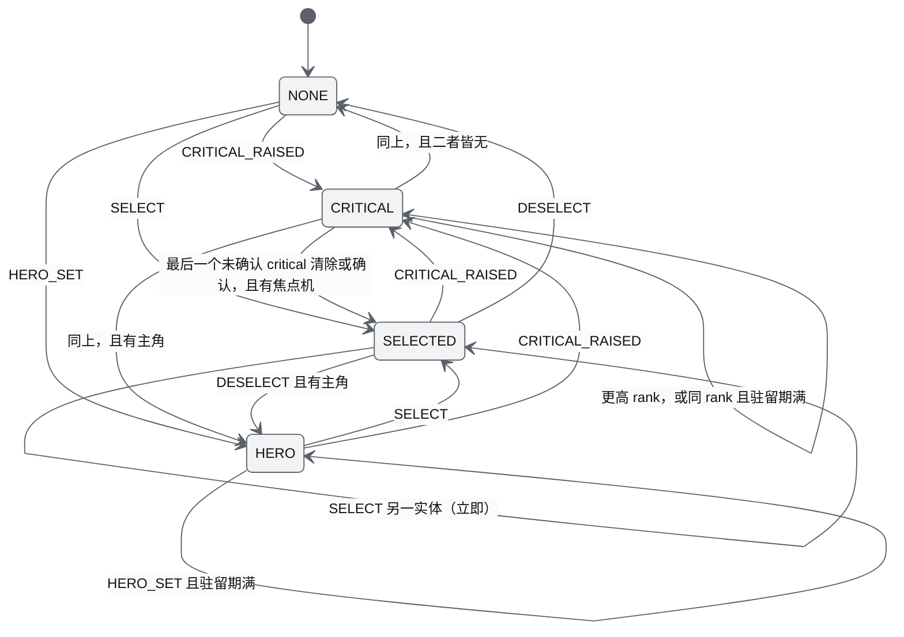
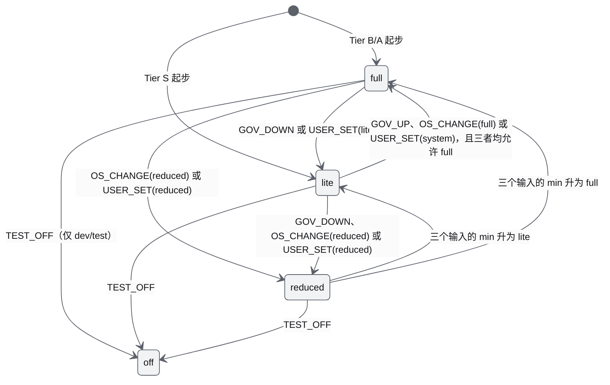
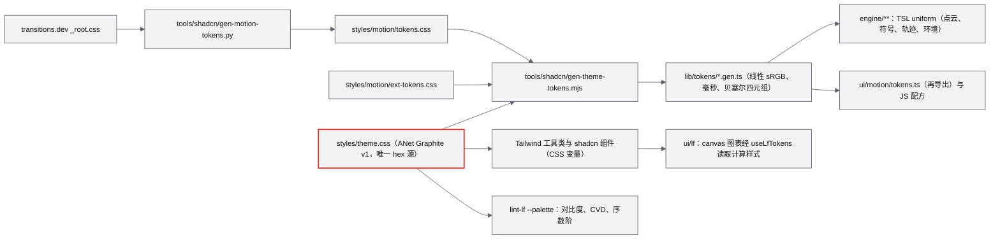

# 15 视觉设计规范与色卡（Visual Design Specification & ANet Graphite Palette）

| 项 | 内容 |
|---|---|
| 文档编号 | AWR-15 |
| 标题 | 视觉设计规范与色卡 |
| 版本 | v1.0 |
| 日期 | 2026-09-28 |
| 状态 | 草案 |
| 上游文档 | [03-设计基线与决策记录](03-设计基线与决策记录.md)（ADR-007、ADR-028 至 ADR-032、ADR-041、ADR-044、ADR-045，§3.5、§3.8、§4.1、§4.2、§5.3、§5.4、§5.7、§8.4 D1-AC-20/21/23/24/25，§9 Q7/Q8/Q9）；[14-UI交互设计PRD](14-UI交互设计PRD.md) §11.2（各图红色候选来源与告警确认语义）；[01-design](01-design.md) §14、§16、§21–§25、§37–§40；研究笔记 [d01](research/d01-lieflat-charts.md)、[d02](research/d02-transitions-dev.md)、[d03](research/d03-morphicons.md)、[d04](research/d04-shadcn-ui.md)、[d05](research/d05-anet.md)、[g07](research/g07-gap.md)、[x01](research/x01-urbanscene3d-data.md)、[r12](research/r12-potree-core-loader.md)、[r16](research/r16-web-weather-fx.md)，以及 [g02](research/g02-gap.md) §5、§7，[g03](research/g03-gap.md) §3、§4.2，[g06](research/g06-gap.md) §4.2、§7.4，[00-index](research/00-index.md) §3.13、§8.1 |
| 下游文档 | [14-UI交互设计PRD](14-UI交互设计PRD.md)（交互流程引用本文的视觉 token）；[modules/M15](modules/M15-前端UI壳与设计体系组件PRD.md)（token 落地、组件实现）；[modules/M05](modules/M05-Web点云引擎PRD.md)（点云着色与 EDL 参数）；[modules/M06](modules/M06-Web视口与渲染后端PRD.md)（无人机、符号、轨迹、视锥、标签、地面、天空的视觉契约）；[modules/M07](modules/M07-环境引擎PRD.md)（环境视觉配色）；[modules/M16](modules/M16-演示数据剧本与流畅性测试PRD.md)（测试报告版式）；[18-性能与测试方案](18-性能与测试方案.md)（视觉验收用例归档）；10–19 号文档与全部模块 PRD（mermaid 主题片段，Q9） |
| 适用版本范围 | V0.1（D1）至 V1.0 |

## 0. 摘要

1. 色卡定名 **ANet Graphite v1**：冷灰 13 阶（色相约 262°，OKLCH 色度 ≤ 0.016）加红 5 阶（色相 29°），`r500 #E93024` 是唯一品牌红；暗色为产品默认，浅色只用于报告与导出（ADR-032、Q7）。全部色值、OKLCH、对比度、色觉异常 ΔE 均由脚本实测（§3.8）。
2. 数据色阶只用 5 档（暗色 g500→g50，浅色 g300→g900）加一个 HERO 红；状态不引入新色相，靠"实心 / 描边 / 虚线 + 图标 + 文字"三重编码；"一处红"由 RedArbiter 按"未确认的严重告警 > 选中 > 数据主角"逐图仲裁，严重告警同级切换带 1.5 s 驻留，选中切换立即生效（§3.6、§3.7）。
3. 3D 场景使用一套**与 UI 主题无关**的场景 token（`--scene-*`、`--pc-*`），视口容器恒为暗色；点云默认 Height × Lambert，EDL 仅 Tier B/A 按档开启（强度 0.45、半径 1.4 px）；选中、告警、失联在 3D 中以"圆 / 八边形 / 三角 / 虚线圆"四种形状的符号表达，全部符号 1 次 draw（§10）。
4. 字体为自托管 Inter Variable 与 JetBrains Mono Variable（5.3.0），HUD 字阶 22/13/11/10，全站最小 10 px；控件圆角 `--radius: .45rem`；描边以 1 px ring 与 hairline 为主；大面积表面不用阴影，**全站禁用 backdrop-filter**（§5、§6）。
5. 图标以 lucide 1.48.0 数据加 morphicons 1.7.1 渲染，初始 208 个，D1 补登 M 组 8 个、第 2 轮补登 N 组 9 个语义图标（条目总数以注册表为准，ADR-030）；切换机制 morph / swap / rotate / set，严禁 emoji 与禁用字形（§7）。
6. 动效只引用 transitions.dev token 与项目扩展表；motion tier 为 full / lite / reduced 三个运行档，另设仅供测试的 off 档（§8）。图表与表格严格按 lieflat 视觉语言（§9），并给出文档 mermaid 的 Graphite 主题片段（Q9，§9.10）。
7. 本文给出可直接落地的 token 文件草案（§13）、50 条功能需求与 12 条非功能需求、31 条可测验收与 lint 规则编号（§11、§12），以及对基线的 11 条反馈（§16）。

---

## 1. 文档定位、范围与约定

### 1.1 定位与边界

本文是**色值、字阶、间距、圆角、描边、层级、图标清单、动效 token 与 32 个配方、图表与表格视觉、品牌使用、3D 场景配色**的唯一定义方（依据 AWR-03 §10.1 单一真源表"色值、字阶、动效 token、图标清单 → AWR-15"）。

| 本文写 | 本文不写（引用） |
|---|---|
| token 名称、取值、用途、主题差异、校验方法 | 布局、面板结构、交互流程、快捷键、空状态与错误状态的交互（[14](14-UI交互设计PRD.md)） |
| 各类视觉元素的外观规格（尺寸、线宽、颜色、形状、动效参数） | 组件实现、文件拆分、codemod 细节（[M15](modules/M15-前端UI壳与设计体系组件PRD.md)） |
| 点云着色公式中的颜色与视觉参数 | 选择器、CAS、点预算、点径阶梯（[M05](modules/M05-Web点云引擎PRD.md)，AWR-03 ADR-009 至 ADR-012） |
| 3D 符号、轨迹、视锥、标签的视觉契约 | RenderBackend、帧序、图层上限（[M06](modules/M06-Web视口与渲染后端PRD.md)，AWR-03 §3.8） |
| 环境视觉的颜色、透明度、线宽 | 环境物理量、eval_env、光学厚度公式（[M07](modules/M07-环境引擎PRD.md)） |
| 视觉相关的 lint 规则编号与验收 | lint 实现与 CI 门禁、性能运行协议（[18](18-性能与测试方案.md)） |

### 1.2 规范用语与命名

1. 规范用语沿用 AWR-03 §1.2（必须 / 禁止 / 应 / 不应 / 可）。
2. token 分三层：**原始层**（`--g950`、`--r500` 等，只允许在 token 文件中被引用；token 文件指 `styles/theme.css`、`styles/lf.css`、`styles/icons.css`、`styles/motion/*.css` 与 `lib/tokens/*.gen.ts`）→ **语义层**（shadcn 变量 `--background`、`--brand`，lieflat 角色 `--lf-data`，场景 `--scene-*`）→ **组件层**（`--hud`、`--label-bg`、配方变量）。业务代码只能引用语义层或组件层。
3. CSS 变量一律 kebab-case（AWR-03 §4.2 第 5 条）；TS 侧生成物使用 camelCase 同名键（`sceneClear`）。
4. 颜色在表格中给出 hex 与 OKLCH 两种写法：**hex 是规范值**（逐字节可复现），OKLCH 由 hex 计算得出，保留 3 位小数（色相 1 位），用于说明色相与明度关系。
5. 尺寸单位：CSS px（UI 与 HUD）；3D 线宽与符号尺寸同样以 CSS px 描述，由实现按 `max(1, css × DPR × renderScale)` 换算为渲染目标像素（§10.1）。

### 1.3 对原设计的继承、修正与增强

原设计 01-design 没有色彩与视觉章节，视觉相关内容分散在 §14、§16、§21–§25、§37–§40；用户硬性要求 R2 给出了产品色与四件套。本文的处置如下（引用 01-design 时按 AWR-03 附录 C 注明处置）：

| 01-design 出处 | 原内容 | 处置 | 本文的二次优化 |
|---|---|---|---|
| §38 UI 设计（附录 C：修订） | 左右两栏数字沙盘，图层列表用 U+2611 勾选字形，环境显示 `Fog 0.21` | 继承"数字沙盘 + 左右信息栏"的意图；字形改为 shadcn Switch/Checkbox 加 morphicons；`Fog 0.21` 改为 MOR 米数 | 给出 Graphite 色卡、HUD 字阶、"一处红"与状态三重编码；浮层面板采用不透明 g900，视口内 HUD 用 92% 不透明度（§6.6） |
| §39 Timeline（附录 C：修订） | `14:32:00 ─── 14:45:00`、U+25B6 播放字形、`×1 ×2 ×5 ×10` | 继承时间轴与倍速；播放用 StateIcon（Play 与 Pause morph），倍速用 ToggleGroup 文本项 | 时间轴按 lieflat"日历地板"画刻度，事件标记按状态编码，告警标记遵守一处红（§9.8） |
| §40 Drone Interaction（附录 C：修订） | Follow、FPV、Trajectory、Camera FOV、Wind Force 等开关 | 继承交互清单（D1 范围按 AWR-03 §8.2） | 定义选中环、告警符号、轨迹、视锥的视觉契约；选中实体在 3D、图表、列表三处指向同一对象（§10.4） |
| §16 Three.js 场景结构（附录 C：修订） | WorldLayer、EnvironmentLayer、DroneLayer、SensorLayer、MissionLayer、DebugLayer | 继承分层 | 每层给出场景 token；DebugLayer 坐标轴不用红绿蓝，改用灰阶加字母标注（V0.2，§10.11） |
| §14 点云渐进加载（附录 C：取代阈值表） | "远处 10K / 近处 1M" | 阈值表已删除（ADR-009） | 渐进加载的视觉表达：节点 screen-door 淡入 `--duration-lod-fade`，首屏进度用 shadcn Progress（§8.7） |
| §21 风场 Web 可视化（附录 C：修订） | Particle、Streamline、Arrow、Heatmap | 箭头为 D1-core，AWSL 流线为 D1-ext，热力图 V0.3 | 风速按 5 档灰阶编码，**不用红**（修订 g06 §7.4 的"灰→白→红"色带，理由见 §10.8） |
| §22–§25 雨、雾、沙尘、云 | 视觉与物理分开 | 继承 | 12 个预设的天空、雾、降水颜色全部落在 Graphite 灰阶内，雾色等于地平线色（§10.9） |
| §37 Web Rendering 60 FPS（附录 C：部分取代） | 60 FPS | Tier S 为 30 fps（ADR-044） | 动效起步档按渲染档：Tier S 为 lite，其余为 full（§8.4） |
| R2（用户硬性要求） | 科技灰、黑、白、红（logo 红 `#E93024`），lieflat、transitions.dev、morphicons、shadcn，严禁 emoji | 全部落实 | 见 §3–§10 与追溯（§17） |

### 1.4 研究结论的采纳与本文裁决

g 系列与 AWR-03 优先于其余研究笔记（AWR-03 §1.1）。下表列出本文对研究笔记之间差异的裁决，均不改变 AWR-03 的任何 ADR；需要基线确认的另列在 §16。

| # | 差异 | 本文裁决 | 依据 |
|---|---|---|---|
| V1 | d01 `--radius: .75rem` 与 d04 `.45rem` | `.45rem`；图卡大圆角用 `rounded-xl`（HUD）与 `rounded-4xl`（editorial） | AWR-03 ADR-028；00-index C8；g07 §5 |
| V2 | d01 草案 LfChartCard 加 `border`，g07 实测 mira 已有 `ring-1` | 不加 border，用 mira 的 ring；editorial 图卡去掉 ring | ADR-031；g07 §5.1 |
| V3 | d03 §4.4 图标 token 使用色卡外的 `#E6E7EA`、`#8A8F98` 等 | 改为 Graphite 语义 token（§7.4） | ADR-032（色值只能取 token） |
| V4 | d04 §3.3 视口清屏色 `#060708`（第 14 阶灰） | 不采用，清屏色取 g950；红对 g950 为 4.61:1，已满足图形 ≥ 3:1 | ADR-032（冷灰 13 阶） |
| V5 | d04 §3.3 HUD 浮层 `g900 / 88%` | 改为 92%：88% 时红色文字在最亮点云背景前只有 4.29:1，92% 时为 4.84:1（§6.6） | 本文实测（§3.8） |
| V6 | g06 §7.4 流线色带"科技灰 → 白 → #E93024" | 改为 5 档灰阶，风速最大处不着红 | ADR-032 一处红（3D 视口是一张图） |
| V7 | g03 §3 类别码表把 `wire_conductor` 设为 r500 | 保留，但纳入 RedArbiter：视口中已有更高优先级的红色实体时降为 g50 | ADR-032；g03 §3 |
| V8 | d02 §4.6 告警机体 1 Hz 常驻呼吸；d03 §4.4 图标 1.2 s 呼吸 | 只允许视口中唯一的红色实体呼吸，周期 1 s（2 × `--duration-very-slow`），且仅 full 档 | ADR-029 常驻循环预算；d02 §4.6 |
| V9 | d05 §3.11 logo 入场 220 ms `cubic-bezier(.2,.8,.2,1)` | `--duration-fast` + `--ease-smooth-out`，位移 `--distance-micro` | ADR-032 |
| V10 | d03 iconPolicy 有 `off`；ADR-029 motion tier 只有三档 | 三个运行档不变；另设仅在 dev/test 构建生效的 `off` 档，用于确定性截图与"只有画布"基线（§8.4） | d03 §3.4、§6 第 10 条；d02 §4.5 第 4 条 |
| V11 | x01 §3.7 EDL 强度 0.3–0.5；r12 §3.6 默认 0.6 | 0.45（EDL 与 Lambert 叠加使用，比 r12 的单独 EDL 场景需要的强度低），允许区间 0.3–0.6，MS5 目视评审后冻结 | x01 §3.7；r12 §3.6 |

---

## 2. 视觉原则

| 编号 | 原则 | 可检查的约束 | 依据 |
|---|---|---|---|
| VP-1 | **明度即数据** | 数据越重要越亮（暗色）或越黑（浅色）；多系列沿灰阶按重要性分配；禁止用明度表达非数据含义（例如斑马纹） | d01 §1 第 1 条 |
| VP-2 | **一律实心，不发光** | 禁止渐变填充（面积图 12% → 0 的渐隐除外）、外发光、玻璃拟态、3D 图表 | d01 §1 第 2、6 条 |
| VP-3 | **只有一种强调色** | 除品牌资产外，界面中只允许 Graphite 灰阶与红阶；红色按"一处红"仲裁 | ADR-032；R2 |
| VP-4 | **颜色从不是唯一线索** | 每种状态同时有形状（实心、描边、虚线或图标）与文字；灰度打印下 r500 与 g400 的 OKLCH L 仅差 0.012，因此红色标记必须同时在尺寸或形状上不同 | ADR-032；本文实测（§3.8） |
| VP-5 | **UI 不拖累画布** | 禁用 backdrop-filter；大面积表面不做 blur 动画、不加模糊阴影；画布尺寸只随窗口变化 | ADR-028、ADR-029；d02 §4.7 |
| VP-6 | **3D 与 2D 同一语汇** | 实心 = 已发生 / 真实，空心 = 计划 / 次一级，虚线 = 预测 / 休眠 / 过期；3D 符号的形状与图标（OctagonAlert、TriangleAlert）一致 | d01 §3.3；d03 §4.4 |
| VP-7 | **token 可追溯** | 颜色、时长、缓动、字号只能来自 token；lint 拦截字面量 | ADR-029、ADR-032；D1-AC-20 |

---

## 3. 色卡 ANet Graphite v1

### 3.1 冷灰 13 阶（原始层）

对比度为 WCAG 2.x 相对亮度比，由 `.cache/research/d01/palette.mjs` 与本文脚本复算一致（依据 d01 §3.2；本文 §3.8）。

| token | hex | OKLCH | 对 g950 | 对 g900 | 对 g50 | 对 white | 暗色主题角色 | 浅色主题角色 |
|---|---|---|---:|---:|---:|---:|---|---|
| `--g950` | `#0A0B0D` | oklch(0.149 0.005 264.5) | 1.00 | 1.05 | 17.73 | 19.04 | 应用背景"黑"、视口清屏色、天空天顶 | 墨色基准（alpha 墨） |
| `--g900` | `#111214` | oklch(0.182 0.004 264.5) | 1.05 | 1.00 | 16.88 | 18.12 | 面板、HUD 卡底（lieflat BG） | TXT、DATA、primary |
| `--g850` | `#16181B` | oklch(0.208 0.007 258.4) | 1.11 | 1.05 | 16.02 | 17.20 | popover、菜单、晴空地平线 | — |
| `--g800` | `#1D1F23` | oklch(0.239 0.008 264.4) | 1.19 | 1.14 | 14.86 | 15.96 | muted、secondary、hover 底；点云渐变第 0 档 | — |
| `--g700` | `#2A2D32` | oklch(0.296 0.010 260.7) | 1.42 | 1.36 | 12.44 | 13.36 | 强分隔、地面细网格、雨天地平线 | — |
| `--g600` | `#3E4249` | oklch(0.378 0.013 261.7) | 1.95 | 1.86 | 9.09 | 9.76 | track、空态、地面粗网格；**不画数据** | 数据 5 档第 4 档 |
| `--g500` | `#5C616A` | oklch(0.491 0.016 262.3) | 3.16 | 3.01 | 5.61 | 6.02 | 数据第 1 档、FAINTDATA、失联与过期 | MUT 文字、数据第 3 档 |
| `--g400` | `#81868F` | oklch(0.619 0.015 262.4) | 5.38 | 5.12 | 3.30 | 3.54 | 数据第 2 档、focus ring、非选中轨迹 | 数据第 2 档、focus ring |
| `--g300` | `#A7ABB3` | oklch(0.740 0.012 264.5) | 8.55 | 8.14 | 2.07 | 2.23 | muted-foreground、数据第 3 档、DATA2 | 数据第 1 档、FAINTDATA |
| `--g200` | `#CACDD3` | oklch(0.848 0.009 264.5) | 12.36 | 11.77 | 1.43 | 1.54 | 数据第 4 档、sidebar 文字、机体主色 | 只做 track 与空态 |
| `--g100` | `#E4E6E9` | oklch(0.924 0.005 258.3) | 15.75 | 14.99 | 1.13 | 1.21 | 屋顶类别色、桨盘 | muted、secondary |
| `--g50` | `#F2F3F5` | oklch(0.964 0.003 264.5) | 17.73 | 16.88 | 1.00 | 1.07 | TXT、DATA、primary（"白"） | 纸面背景 |
| `--white` | `#FBFBFC` | oklch(0.988 0.001 286.4) | 19.04 | 18.12 | 1.07 | 1.00 | 红底白字（`--brand-foreground`） | popover、mermaid 图底 |

### 3.2 红 5 阶（原始层）

红阶由 logo 红 `#E93024` 与 TXT 或 BG 混合派生，色相 29°（依据 d01 §3.2）。

| token | hex | OKLCH | 对 g950 | 对 g900 | 对 g50 | 对 white | 用途（唯一允许的用途） |
|---|---|---|---:|---:|---:|---:|---|
| `--r700` | `#B4241B` | oklch(0.501 0.181 29.0) | 3.01 | 2.86 | **5.89** | 6.33 | 浅色主题红色文字（HERO_TEXT、`--brand-text`）、浅色 destructive |
| `--r600` | `#D12A20` | oklch(0.559 0.203 29.0) | 3.81 | 3.63 | 4.66 | **5.00** | 带白字的红色实心底（`--brand-solid`：告警计数徽标、红色实心 Badge） |
| `--r500` | `#E93024` | oklch(0.607 0.221 29.2) | **4.61** | **4.38** | 3.85 | 4.13 | **唯一品牌红**：logo、全部红色数据标记与 3D 红色实体（两种主题相同） |
| `--r400` | `#FF5242` | oklch(0.677 0.212 29.1) | 6.13 | **5.83** | 2.89 | 3.11 | 暗色主题红色文字（HERO_TEXT、`--brand-text`）、暗色 destructive |
| `--r300` | `#FF8374` | oklch(0.746 0.154 28.4) | 8.20 | 7.81 | 2.16 | 2.32 | 暗色红色文字的 hover 浅档；不作数据色 |

规则：

1. **r500 不写小字**：对 g900 为 4.38:1，低于正文 4.5:1；红色文字在暗色用 r400、浅色用 r700。
2. **白字红底只用 r600**：白字对 r500 为 4.13:1，对 r600 为 5.00:1。
3. 头像栅格中的 `#F4271C`、字标 mask 中的 `#ED2D28`、`#EE342E` 是品牌资产内部色，**不是 token**，不得出现在任何样式或代码中（依据 d05 §3.11 第 8 条）。

### 3.3 语义 token（shadcn 变量）

暗色是默认（`<html class="dark">`），浅色只在报告路由与导出中启用（Q7）。D1 的产品 UI 不提供浅色切换入口；设置页的主题项留待 V0.2 视报告预览需求再定。

| 变量 | 暗色 `.dark`（默认） | 浅色 `:root`（报告、导出） | 说明与对比度 |
|---|---|---|---|
| `--background` | g950 | g50 | 应用底色 |
| `--foreground` | g50 | g900 | 暗色 17.73:1；浅色 16.88:1 |
| `--card` / `--card-foreground` | g900 / g50 | g50 / g900 | 浅色卡片与页面同色，靠留白分卡（d01 §4.2） |
| `--popover` / `--popover-foreground` | g850 / g50 | white / g900 | 菜单、弹层 |
| `--primary` / `--primary-foreground` | g50 / g900 | g900 / g50 | **主操作是白（或黑），不是红**（d04 §3.3） |
| `--secondary`、`--muted`、`--accent` | g800 | g100 | hover 与选中底色 |
| `--muted-foreground` | g300 | g500 | 暗色对 g900 为 8.14:1；浅色对 g50 为 5.61:1 |
| `--destructive` | r400 | r700 | mira 的 destructive 变体为"红字 + 同色低透明度底"，不是实心；底色透明度按下方第 2 条限制 |
| `--border` | oklch(1 0 0 / 8%) | oklch(0.149 0.005 264.5 / 12%) | 分隔线 |
| `--input` | oklch(1 0 0 / 12%) | oklch(0.149 0.005 264.5 / 16%) | 输入框描边 |
| `--ring` | g400 | g400 | 焦点色保持中性，**不用红** |
| `--chart-1`…`--chart-5` | g50、g300、g400、g500、r500 | g900、g500、g400、g300、r500 | `--chart-5` 是唯一的红；沿用 shadcn chart 约定的组件也拿不到第三色相 |
| `--sidebar` / `--sidebar-foreground` | g900 / g200 | g50 / g900 | 侧栏与卡片同色 |
| `--sidebar-primary` / `-foreground` | g50 / g900 | g900 / g50 | 导航选中**不用红** |
| `--sidebar-accent` / `-foreground` | g800 / g50 | g100 / g900 | 菜单 hover 与 active |
| `--sidebar-border` / `--sidebar-ring` | oklch(1 0 0 / 8%) / g400 | 墨 12% / g400 | — |
| `--brand` | r500 | r500 | 图形标记用，不写小字 |
| `--brand-foreground` | white | white | 红底白字 |
| `--brand-solid` | r600 | r600 | 带文字的红色实心底 |
| `--brand-text` | r400 | r700 | 红色文字；5.83:1 / 5.89:1 |
| `--radius` | 0.45rem | 0.45rem | ADR-028 |
| `--hud` | g900 / 92% | — | 视口内 HUD 与标签底（§6.6） |
| `--overlay` | g950 / 60% | 墨 / 32% | Dialog、Sheet 遮罩；取代 g07 样板中的字面量 `rgb(0 0 0 / .6)` |

补充规则：

1. **视口恒为暗色**：3D 视口容器 `[data-viewport]` 恒带 `class="dark"`，视口内的 HUD 卡、DOM 标签、ViewCube 在任何页面主题下都取暗色语义 token；因此 `--hud`、`--label-bg` 只在 `.dark` 中定义即可（与 §10.1 第 1 条"场景与 UI 主题无关"一致）。
2. **destructive 变体的底色透明度**：mira 原样为 `bg-destructive/10`（浅色）、`dark:bg-destructive/20`；Button hover 为 `/20`（浅色）、`/30`（暗色），菜单项 focus 为 `/10`（浅色）、`/20`（暗色）（`style-mira.css` 的 `cn-button-variant-destructive`、`cn-badge-variant-destructive` 与菜单项规则）。本机实测（§3.8 脚本）暗色 r400 叠在 g850 对话框底上：`/20` 底 4.30:1、`/30` 底 3.62:1，不满足 12 px 正文 4.5:1；浅色 r600 在 g50 上 `/10` 底只有 4.01:1。因此：浅色 `--destructive` 取 r700；`tools/shadcn` codemod 把 Button、Badge、DropdownMenu/ContextMenu 菜单项 destructive 变体的底色统一改为 `/10`，hover 与 focus 改为 `/15`。改后最坏值：暗色 r400 在 g850 上 4.97:1 / 4.64:1，浅色 r700 在 g50 上 5.02:1 / 4.62:1；样板复测见 §13.7（VIS-FR-045、VIS-AC-002、VIS-AC-031）。

### 3.4 lieflat 角色变量

lieflat 用一套角色名描述图表中的每一类元素（依据 d01 §2.3、§3.2）。`lf.css` 中只允许引用原始层变量，不得出现 hex。

| 角色 | 暗色（HUD 默认） | 浅色（纸面） | 用途 | 暗色对 g900 |
|---|---|---|---|---:|
| `--lf-bg` | var(--card) | var(--card) | 图所在面，也作光晕色 | — |
| `--lf-txt` | g50 | g900 | 标题、数值 | 16.88 |
| `--lf-lab` | 白 72% | 墨 72% | 类目标签 | 9.94 |
| `--lf-mut` | 白 56% | 墨 60% | 副标题、来源行、轴标签 | 6.39（浅色 5.04） |
| `--lf-faint` | 白 24% | 墨 32% | **只用于非文字**：地板刻度、"每 5 档一点" | 2.14 |
| `--lf-floor` | 白 16% | 墨 24% | 日历地板 | 1.60 |
| `--lf-grid` | 白 8% | 墨 12% | 网格、基线 | 1.22 |
| `--lf-track` | 白 6% | 墨 8% | 未填充轨道、进度底 | 1.15 |
| `--lf-data` | g50 | g900 | 主数据 | 16.88 |
| `--lf-data2` | g300 | g500 | 次数据、对比系列 | 8.14 |
| `--lf-faintdata` | g500 | g300 | 背景数据、上下文发丝、过期数据 | 3.01 |
| `--lf-ramp-1…5` | g500、g400、g300、g200、g50 | g300、g400、g500、g600、g900 | 序数阶（低 → 高） | — |
| `--lf-hero` | r500 | r500 | 每张图唯一的主角标记 | 4.38 |
| `--lf-hero-text` | r400 | r700 | 红色文字（hot 单元格等） | 5.83 |
| `--lf-halo` | g900 / 92% | g50 / 92% | 数值文字光晕 | — |

### 3.5 数据可视化色阶

**5 档灰阶 + 1 个 HERO 红**，是全产品唯一的数据色系（依据 d01 §3.2；ADR-032"数据阶只用 5 档"）。

| 档位 | 暗色（对 g900） | 浅色（对 g50） | 用途 |
|---|---|---|---|
| ramp-1（最低） | g500（3.01:1） | g300（2.07:1） | 最弱的一档数据 |
| ramp-2 | g400 | g400 | — |
| ramp-3 | g300 | g500 | — |
| ramp-4 | g200 | g600 | — |
| ramp-5（最高） | g50 | g900 | 最强的一档数据，等于 DATA |
| HERO | r500 | r500 | 每张图至多一个主角 |

校验结果（`dataviz/validate_palette.js --ordinal`，本机 2026-09-28 实测）：暗色 5 档对 g900 与 g850、浅色 5 档对 g50 与 white **全部 PASS**（明度单调、相邻 ΔL ≥ 0.06、单一色相，最弱档对面 ≥ 2.0:1）。加入 g600（暗色）或 g200（浅色）扩成 7 档时最弱档只有 1.86:1、1.43:1，因此 **g600 与 g200 只作 track、空态和"沉默点"**（依据 d01 §3.2）。

使用规则：

1. **序数（量级）**：单色相明暗阶，即上表 5 档；不得生成中间色或彩虹色。
2. **类别（身份）**：≤ 4 个系列时按实体固定分配 `DATA、DATA2(g300)、g400、g500`，一次会话内不随排序变化，且必须直接标注名称；被选中的那一条改为 HERO。超过 4 个系列时改用 small multiples，或"一条主角 + 其余 FAINTDATA 发丝"（L20 平行坐标的做法：主角线宽 2，其余 0.65、透明度 0.5–0.8）（依据 d01 §3.2）。
3. **极性（正负）**：本色系没有第二色相，正负**不用色相编码**；按零线位置 + 明度（正 DATA、负 DATA2）+ 负号 U+2212 表达（G10 发散条），并直接标注数值。这是对通用 dataviz 规范"发散 = 两色相 + 中性中点"的有意偏离，原因是 R2 只允许灰、黑、白、红。
4. **禁止**：给无人机分配彩虹色；给单系列用多色相；把 HERO 用作"第 5 个系列"。

### 3.6 状态语义

状态**不引入新色相**（不用琥珀色，不用绿色），一律"视觉 + 图标 + 文字"三重编码（ADR-032；Q8）。

| 状态 | 2D 视觉（列表、HUD、图表） | 3D 视觉（§10.4） | 图标（§7.6 key） | 文字 |
|---|---|---|---|---|
| critical（红色实体，仲裁胜出者） | 红色实心：Badge `bg-brand-solid text-brand-foreground`；图中 HERO 实心点 | 机体标记填 r500，外加八边形实线环 r500 | `alert.critical`（OctagonAlert） | 必带，例如"严重 · 电量 8%" |
| critical（其余） | 红色描边：Badge `border-destructive text-brand-text`（outline） | 八边形空心环 r500，机体标记保持 g50 | `alert.critical` | 必带 |
| warning | 红色描边空心（同上 outline），配三角图标 | 三角形空心环 r500 | `alert.warning`（TriangleAlert） | 必带 |
| nominal | 前景色（DATA）实心，图标按需 | 机体 g50 标记，无环 | 按需 | 按需 |
| selected（非仲裁胜出者） | 列表：`bg-muted` + 左侧 2 px 前景色竖条；图表：该系列改 DATA 实线加粗 | 选择集成员为圆形实线环 g50；焦点机让出红色时为 g50 双圆环（§10.4） | — | — |
| stale / 信号延迟（HOLD） | FAINTDATA + 虚线 `2 4`；文字 `STALE 3.2 S` | 圆形虚线环 g500，机体标记 g500 | `state.hold`（Hourglass）、`state.stale`（TimerOff） | 必带时长 |
| offline / 链路丢失 | g500 + 虚线 + 图标 | 同 stale | `link.lost`、`alert.linklost` | 必带 |
| planned / predicted | 虚线 | 虚线路径、空心航点 | — | 图例说明 |
| simulated vs real（V0.5） | 真实 = 实心，仿真 = 空心 | 同左 | — | 图例说明 |
| disabled | 50% 不透明度（mira 默认） | — | — | — |

### 3.7 "一处红"规则与 RedArbiter

#### 3.7.1 定义

1. **图（figure）**：一张图卡、一个 3D 视口、一个列表（DroneRail、事件列表）、Timeline 轨道、HUD 卡、一张报告页、一个模态对话框、顶栏，各算一张图（ADR-032 的界定，AWR-14 §1.5 与本文补充 Timeline、HUD 卡、对话框与顶栏）。实现时每张图的根元素带 `data-figure="<id>"`。
2. **红色实体**：一张图中至多一个**实体**使用红色实心。一个实体可以有多个图元同时用红，例如焦点机的标记、选中环、轨迹与标签描边合起来算一个红色实体（依据 d01 §3.2 第 3 条"3D、图表、列表中的红色始终指向同一对象"；AWR-14 §6.2）。ADR-032 与术语表写作"一个红色实心元素"，本文按"一个实体"解释，已提请基线确认（§16 第 10 条）。
3. **红色描边与红色文字**不占红色实心名额，但只允许用于：其余 critical、warning、已确认的 critical、destructive 控件文字、hot 单元格文字（hot 单元格同时是该表的 HERO 候选）。
4. **豁免**：品牌资产（logo、头像）不参与计数；键盘焦点环（focus ring）永远不用红。
5. **候选来源**（语义由 AWR-14 §11.2 定义，本文只规定视觉）：只有**未确认**（`acked = false`）的 critical 进入 CRITICAL 候选，已确认者保持红色描边与图标直到条件解除；SELECTED 候选只来自 3D 视口与机群概览图的焦点机，**列表的选中态永不用红**；HERO 候选由各图自报（越过阈值的数据点、任务目标、类别模式下的电力线、禁飞区违例区）。

#### 3.7.2 优先级与仲裁

优先级：**未确认的严重告警（critical）> 焦点机 > 数据主角**（ADR-032）。CRITICAL 候选按严重度 `rank` 取最高，同级取最新（`tLastWallMs` 最大），并施加 **1.5 s 驻留**：已成为红色实体的 critical 在 1.5 s 内不被同级（同 `rank`）的新 critical 替换，只能被更高 `rank` 抢占；目的是 1000 架告警风暴时红色不闪烁（本文设定，与 d03 §3.6 图标驻留 1.5 s 一致）。SELECTED 是用户操作，**切换立即生效，不驻留**；HERO 同级替换同样受 1.5 s 驻留约束。

接口（`apps/web/src/lib/redArbiter.ts`，M15 所有；纯函数，不依赖 React，engine 与 ui 共用，AWR-03 §4.2）：

```ts
export type RedLevel = 'critical' | 'selected' | 'hero';
export interface RedEntity {                 // 与 M06 drones.setRedOwner 的 owner 形状一致；视口只用前四种 kind
  kind: 'drone' | 'zone' | 'target' | 'class' | 'row' | 'series' | 'point' | 'cell';
  id: string;                                // 机体 id、zone id、类别 index、行键、系列键或点键
}
export interface RedCandidate {
  entity: RedEntity;
  level: RedLevel;
  rank: number;                              // 严重度序号，越大越严重；仅 critical 有意义，其余填 0（来源：告警事件，语义见 AWR-12）
  tLastWallMs: number;                       // 该告警最近一次触发的墙钟时刻，ms；selected 与 hero 填写成为候选的时刻
}
export interface RedState {
  owner: RedEntity | null;                   // 默认 null
  level: RedLevel | null;                    // 默认 null
  ownerSinceMs: number;                      // 成为 owner 的墙钟时刻，ms；默认 0
}
export function arbitrate(prev: RedState, cands: readonly RedCandidate[], nowMs: number): RedState;
// 常量取自 lib/tokens/input.gen.ts（不得写字面量，motion-lint）：redEvalIntervalMs = 250，redDwellMs = 1500
```

```text
function arbitrate(prev, cands, now):
  crit = cands.filter(c => c.level == 'critical').sortBy(-c.rank, -c.tLastWallMs)
  pick = crit[0] ?? cands.find(c => c.level == 'selected') ?? cands.find(c => c.level == 'hero') ?? null
  cur  = prev.owner 仍在 cands 中且级别不变 ? prev : null          // 失效（清除、确认、取消选中）即释放
  if cur and pick and level(pick) == cur.level and cur.level != 'selected'
         and rank(pick) <= rank(cur) and now − cur.ownerSinceMs < redDwellMs:
      return cur                                                  // 驻留：同级、同或更低 rank 不替换
  if pick 与 cur 指向不同实体: return {owner: pick.entity, level: pick.level, ownerSinceMs: now}
  return cur ?? EMPTY
render:
  owner              → 红色实心（及其同实体图元）
  其余未确认 critical  → 红色描边 + OctagonAlert
  已确认 critical      → 红色描边 + OctagonAlert（不参与仲裁）
  warning            → 红色描边 + TriangleAlert
  selected（非 owner）→ 中性选中样式（§3.6）
  hero（非 owner）    → 降为 DATA 实心 + 尺寸或形状差异（例如峰值点 r 4.2）
```

**评估与时钟域**：每张图一个 `RedState`，每 250 ms 评估一次（与前端事件 ≤ 4 Hz 批量写入 store 同频，ADR-028）；驻留计时属于**墙钟域**，用 `performance.now()`，仿真暂停与倍速不影响（纯显示计时器，按 ADR-045 在 17 号文档计时器清单登记，§16 第 11 条）。dev/test 构建把各图 owner 写入 `window.__ux.red`（M15 测试探针）。

**状态机**（每张图一个实例）：

| 状态 | 事件 | 守卫 | 动作 | 目标状态 |
|---|---|---|---|---|
| NONE | CRITICAL_RAISED(e) | — | owner = e；ownerSince = now | CRITICAL |
| NONE | SELECT(e) | 本图接受 SELECTED 候选 | owner = e | SELECTED |
| NONE | HERO_SET(e) | — | owner = e | HERO |
| HERO | HERO_SET(e2) | now − ownerSince ≥ 1.5 s | owner = e2（驻留期内到达的候选在期满后的下一次评估生效） | HERO |
| HERO | SELECT(e) | 本图接受 SELECTED 候选 | owner = e | SELECTED |
| SELECTED | SELECT(e2) | — | owner = e2（立即，无驻留） | SELECTED |
| HERO 或 SELECTED | CRITICAL_RAISED(e) | — | owner = e（抢占，无驻留） | CRITICAL |
| CRITICAL | CRITICAL_RAISED(e2) | rank(e2) > rank(owner)；或 rank 相同且 now − ownerSince ≥ 1.5 s | owner = e2 | CRITICAL |
| CRITICAL | SELECT(e) 或 DESELECT | — | 只更新本图的焦点记录，owner 不变 | CRITICAL |
| CRITICAL | CRITICAL_CLEARED(owner) 或 ACK(owner) | 仍有其他未确认 critical | owner = rank 最高者中最新的一个 | CRITICAL |
| CRITICAL | CRITICAL_CLEARED(owner) 或 ACK(owner) | 无其他未确认 critical | owner = selected ?? hero ?? null | SELECTED / HERO / NONE |
| SELECTED | DESELECT | — | owner = hero ?? null | HERO / NONE |



#### 3.7.3 多告警聚合

- 同一张图内有多个 critical：只有仲裁胜出者用红色实心，其余用红色描边加 OctagonAlert；warning 用红色描边加 TriangleAlert，以**形状**区分（ADR-032）。
- 顶栏告警计数徽标承担全局的一处红：有未确认 critical 时为红色实心 `bg-brand-solid text-brand-foreground`；只有 warning 或 critical 均已确认时为红色描边；无告警时不渲染（AWR-14 §11.2）。数字 `text-hud-cap` 800 字重，tabular-nums。
- Toast 永不使用红色实心；critical 类 Toast 的图标与标题用 `--brand-text`（红色文字），同类按原因码合并（ADR-028）。

### 3.8 色觉异常与对比度校验

**方法**：CVD 模拟采用 Machado–Oliveira–Fernandes（2009）严重度 1.0 矩阵，在线性 sRGB 上变换后计算 OKLab ΔE（×100）；阈值与 dataviz 校验器一致：目标 ≥ 8，6–8 只在有二次编码时允许，< 6 失败。对比度用 WCAG 2.x 公式。脚本：`tools/lint/lint-lf.mjs --palette`（实现见 [18](18-性能与测试方案.md)，本文 §12 VIS-AC-001 至 003）。

**r500 对各灰阶的 ΔE**（本机实测）：

| 对照 | 正常 | protan | deutan | tritan |
|---|---:|---:|---:|---:|
| g950 | 50.9 | 35.1 | 49.4 | 54.6 |
| g900 | 48.0 | 31.9 | 46.2 | 51.8 |
| g800 | 43.2 | 26.6 | 40.9 | 47.1 |
| g600 | 32.4 | 14.6 | 28.4 | 36.7 |
| **g500** | 25.8 | **10.0**（最小值） | 19.4 | 30.2 |
| **g400** | 23.0 | 16.6 | **13.9** | 26.7 |
| g300 | 26.4 | 27.2 | 17.7 | 28.6 |
| g200 | 33.0 | 37.2 | 25.8 | 34.0 |
| g50 | 42.1 | 48.3 | 36.1 | 42.1 |

结论：

1. 红与任一灰阶在 protan、deutan 下的 ΔE 最小为 **10.0**（对 g500），全部 ≥ 8，**通过**；r400 的最小值为 10.6（对 g400，protan），同样通过。
2. **亮度退化风险**：protan 视觉下 r500 的亮度对比对 g950 降为 3.14:1、对 g900 降为 2.99:1、对 g850 降为 2.84:1（正常视觉 4.61 / 4.38 / 4.16:1），在面板与弹层底色上略低于图形 3:1 的下限（deutan 均 ≥ 5.0:1）。因此红色标记在暗面上**最小尺寸**为：点直径 ≥ 6 px、线宽 ≥ 1.5 px，并且必须同时带形状差异（环、八边形、三角）或 1 px g950 暗色光晕（本文设定），不能只靠颜色与亮度被识别。
3. **灰度退化风险**：r500 的 OKLCH L 为 0.607，与 g400（0.619）几乎相同；灰度打印或全色盲时两者不可区分。因此 HERO 标记必须同时在尺寸（例如峰值点 r 4.2 对 2.1）、形状（环、八边形）或直接标注上与 g400 数据不同（VP-4）。
4. 文字对比度门槛：正文 ≥ 4.5:1，≥ 18 px 或 ≥ 14 px 粗体 ≥ 3:1，图形与控件边界 ≥ 3:1（WCAG 2.2 的 1.4.3、1.4.11）。§3.1–§3.4 所列文字角色全部满足；destructive 变体须按 §3.3 补充规则第 2 条限制底色透明度后才满足；`--lf-faint`（2.14:1）与 `--lf-floor` 禁止用于文字。

---

## 4. Logo 与品牌使用规范

### 4.1 资产清单

| 资产 | 来源 | 规格 | 本地托管路径 | 用途 |
|---|---|---|---|---|
| 横版完整徽章 | `refs/design/ANet/docs/media/anet-logo.svg` | viewBox 2846 × 493，宽高比 5.773:1；黑色 10° 斜切圆角平行四边形徽章，红色内框 `#E93024` 线宽 8.6%H，底边右侧留缺口放 tagline；像素斜体字标"AGENT-NETWORK"，tagline"ROUTE · TRUST · EXECUTE" | `apps/web/public/brand/anet-logo.svg`（字节与源文件一致） | 品牌时刻 |
| 方形头像标 96 px | `https://avatars.githubusercontent.com/u/305781773?s=96&v=4` | 透明底，黑色圆角方形对话气泡带尾巴，红边、白线节点图与笑脸 | `public/brand/avatar-96.png` | 顶栏、favicon 源 |
| 方形头像标 460 px | 同上 `s=460` | 同上 | `public/brand/avatar-460.png` | 大尺寸场合、PWA 图标源（V0.2） |
| favicon | 由 avatar-96 缩放生成 | 16 × 16、32 × 32 PNG | `public/brand/favicon-16.png`、`favicon-32.png` | 浏览器标签页 |
| 资产锁 | 本文新增 | `brand.lock.json`：每个文件的 sha256、来源 URL 或路径、获取日期 | `public/brand/brand.lock.json` | check-brand 校验字节一致 |

资产解析数据依据 d05 §3.11（SVG 源码测量加 headless 渲染确认）。头像在运行时**禁止**直接引用 GitHub URL（离线环境不可用，且泄露访问），一律本地托管（ADR-032）。

### 4.2 两套标志的分工与 D1 落点

**完整徽章**用于"品牌时刻"，**头像标**用于"界面时刻"（d05 §3.11 第 1 条）。

| 落点 | 标志 | 尺寸 | 底色 | 动效 | D1 |
|---|---|---|---|---|---|
| 加载遮罩（启动、切换世界） | 完整徽章 | 宽 480 px（视口宽 < 1280 时 320 px） | 遮罩实色 g950 | 入场 opacity 0 → 1 + translateY `--distance-micro` → 0，`--duration-fast`、`--ease-smooth-out`；reduced 与 off 直接显示 | core |
| 关于对话框 | 完整徽章 | 宽 320 px | 对话框 popover 底 g850 | 无 | core |
| 全视口空状态（未加载世界、世界加载失败） | 完整徽章 | 宽 320–480 px | g950 | 同加载遮罩 | core |
| 面板内空状态（内容宽度 < 348 px 的容器，即放不下"320 px 徽章 + 两侧 14 px 留白"，§4.4） | 头像标 | 48 px | 面板底 | 无 | core |
| 顶栏锁定组合 | 头像标 | 24 px | 顶栏 g900 | 无 | core |
| favicon | 头像标 | 16 / 32 px | 浏览器 | — | core |
| 导出报告与测试报告封面 | 完整徽章 | 宽 480 px | 浅色 g50 | — | ext（P1，随 M16 测试报告） |
| agent 默认头像占位（AGENTS 面板） | 头像标 | 24 px | 卡片底 | — | ext |

### 4.3 深浅底规则

徽章最外圈是黑色描边，红框在黑底之内，因此徽章在背景上的轮廓对比取"黑徽章对背景"与"红框对背景"两者的较大值（暗底上黑色与背景融合，轮廓由红框承担；浅底上由黑色剪影承担）。实测（本文 §3.8 脚本）：

| 背景 | 红框对背景 | 黑徽章对背景 | 轮廓对比 | 是否为 Graphite 表面色 | 结论 |
|---|---:|---:|---:|---|---|
| g950 | 4.61 | 1.07 | 4.61 | 是（应用背景、遮罩） | **允许** |
| g900 | 4.38 | 1.12 | 4.38 | 是（面板、顶栏） | 允许 |
| g850 | 4.16 | 1.18 | 4.16 | 是（popover、对话框） | 允许 |
| g800 | 3.86 | 1.27 | 3.86 | 是（muted） | 允许 |
| g700 | 3.23 | 1.52 | 3.23 | 否（分隔线色） | 禁止（非表面色） |
| g600 | 2.36 | 2.08 | 2.36 | 否 | **禁止**：轮廓不足 3:1 |
| g500 至 g200 | 1.17–2.68 | 3.37–13.18 | ≥ 3.37 | 否（数据与文字色） | 禁止（非表面色，画面发灰） |
| g100、g50、white | 3.42–4.13 | 16.79–20.31 | ≥ 16.79 | 是（浅色报告） | **允许** |

规则：

1. 原样使用，**禁止改色**，包括不做白色填充变体（ADR-032，裁决 C24）。宽度 < 320 px 的场合一律改用头像标。
2. 允许的底只有 Graphite 表面色的**实色面**：暗色 g950、g900、g850、g800，浅色 g100、g50、white（轮廓对比 ≥ 3.86:1）。禁止放在其他灰阶、任何红色面、图片、渐变与 3D 画布上。
3. 徽章**不得直接浮在点云画布上**：必须放在实色 chrome（顶栏、侧栏、对话框、遮罩）里，或衬一块实色 g950 底板（圆角 `rounded-2xl`，内边距 0.25 H），底板不得半透明，不得使用 backdrop-filter（d05 §3.11 第 6 条）。

### 4.4 最小尺寸与留白

| 标志 | 推荐最小 | 绝对最小 | 安全留白 |
|---|---|---|---|
| 完整徽章 | 宽 480 px（tagline 字高 7.1 px，可读下限） | 宽 320 px（tagline 退化为纹理） | 四周 ≥ 0.25 H（H 为徽章高；宽 320 时 H = 55.4 px，留白 ≥ 14 px） |
| 头像标 | 24 px | 16 px（仅 favicon） | 四周 ≥ 0.2 × 边长（24 px 时 ≥ 5 px） |

依据：d05 §3.11 尺寸表与第 3 条；ADR-032"最小 320 px"。关于对话框因此内容区宽度应 ≥ 348 px（320 + 2 × 14）。

### 4.5 顶栏锁定组合

```text
高 44 px（顶栏；AWR-14 §3.3 为布局定义方，mira 高密度，g07 样板实测；AWR-03 附录 B.3 C45）
┌──────────────────────────────────────────────────────────────┐
│ [头像 24px] ─10px─ ANet Drone4D ─12px─ │ ─12px─ World Runtime  │
│                    600 / 13px / g50   1px×20px   400 / 13px / g400
└──────────────────────────────────────────────────────────────┘
```

- 头像 24 px；产品名"ANet Drone4D"（ADR-056）用 UI 字体 `text-hud-title`（13/18）600 字重、g50（浅色为 g900）；分隔线 1 px × 20 px，g700（浅色 g300）；副名"World Runtime"用 13 px 400 字重、g400（浅色 g500，d05 原稿为 g600，其对 g50 为 9.09:1，本文取 g500 以降低视觉权重，对 g50 为 5.61:1）。
- logo 上的"AGENT-NETWORK"是组织品牌，**不是产品名**；产品名必须用 UI 字体另排（d05 §6 第 11 条）。
- 头像不加圆形裁切、不加描边、不加阴影。

### 4.6 品牌动效

只允许 logo 入场这一种动效：opacity 0 → 1 加 translateY `--distance-micro`（4 px）→ 0，时长 `--duration-fast`，缓动 `--ease-smooth-out`（ADR-032，取代 d05 的 220 ms 与 `cubic-bezier(.2,.8,.2,1)`）。禁止颜色、斜切、扫描纹、呼吸、旋转动画。加载进度条可放在徽章红框缺口处、与 tagline 同基线（d05 §3.11 第 9 条），进度条使用 shadcn Progress，指示条 g50、轨道 `--lf-track`，不用红。

### 4.7 禁用示例（Don't）

| 编号 | 禁止 | 原因 |
|---|---|---|
| BRD-01 | 把徽章或头像的红改成 r400、r700 或任何其他值 | 品牌红只有 r500（ADR-032） |
| BRD-02 | 去掉徽章黑底、做反白或单色版本 | 白色横纹与 tagline 依赖黑底；单色版必须由品牌方提供（d05 §3.11 第 10 条） |
| BRD-03 | 描边外发光、投影、内阴影、CSS filter | VP-2；软件渲染成本 |
| BRD-04 | 旋转、二次斜切、非等比拉伸、裁掉 tagline 区域 | 红框缺口会显得残缺 |
| BRD-05 | 放在非表面色灰阶（g700–g200）、红色底、照片、渐变或 3D 画布上 | §4.3 |
| BRD-06 | 徽章宽度 < 320 px | 改用头像标 |
| BRD-07 | 在 logo 内部或周围加 emoji、字形或装饰图标 | R2；D1-AC-20 |
| BRD-08 | 运行时从 GitHub 拉取头像 | 离线与隐私；必须本地托管 |
| BRD-09 | 把"AGENT-NETWORK"当作产品名使用，或用字标字体排产品名 | d05 §6 第 11 条 |
| BRD-10 | 给 logo 加颜色、斜切或扫描纹动画 | §4.6 |

### 4.8 check-brand 校验项

`tools/lint/check-brand.mjs`（M00 所有，规则由本文定义，D1-AC-20）：

1. `public/brand/*` 的 sha256 与 `brand.lock.json` 一致；`anet-logo.svg` 与 `refs/design/ANet/docs/media/anet-logo.svg` 字节一致（未改色）。
2. 源码中引用品牌资产的位置只允许是 §4.2 表中的落点组件（`ui/layout/AppHeader`、加载遮罩、关于对话框、空状态、报告封面）；徽章元素不得位于 `[data-viewport]` 容器之内。
3. 源码中不得出现 `avatars.githubusercontent.com`。
4. Playwright `brand.spec.ts`：加载遮罩与关于对话框中的徽章渲染宽度 ≥ 320 px；顶栏头像 24 × 24；品牌元素的计算样式 `filter: none`、`box-shadow: none`，transform 只允许 translate。

---

## 5. 字体与字号阶梯

### 5.1 字体栈

| 用途 | 字体栈 | 包与版本 | 说明 |
|---|---|---|---|
| 无衬线（UI、图表、HUD） | `"Inter Variable", "PingFang SC", "Microsoft YaHei", "Noto Sans CJK SC", "Noto Sans SC", "WenQuanYi Zen Hei", sans-serif` | `@fontsource-variable/inter` 5.3.0（自托管） | 数字默认 lining；实时变化的数字加 `tabular-nums` |
| 等宽（ID、十六进制、经纬度、日志原文、代码） | `"JetBrains Mono Variable", ui-monospace, "SFMono-Regular", Menlo, Consolas, "WenQuanYi Zen Hei Mono", monospace` | `@fontsource-variable/jetbrains-mono` 5.3.0（自托管） | 开启 `"zero" 1`（带斜杠的零） |
| 标题 | `var(--font-sans)` | — | 不引入第二种无衬线 |

规则：

1. **自托管，零外网字体请求**：本机没有 Inter，Google Fonts 离线不可用（d01 §3.1.1）；只导入 wght 轴（不导入 opsz 与 italic），首屏只下载 Inter latin（48 KB）；JetBrains Mono latin（40 KB）在页面首次出现等宽文字时加载，latin-ext 等子集按 unicode-range 按需加载（本机实测，§13.7）。
2. **不打包中文字体**（Noto Sans SC 为 MB 级，d01 §3.1.1）；中文走系统回退，本机与 CI 为 WenQuanYi Zen Hei。截图基线必须在同一套字体下生成。
3. **字体栈中不得出现任何 emoji 字体**（本机装有 Noto Color Emoji，系统回退仍可能渲染彩色字形，所以 emoji 与禁用字形由 lint 与运行时净化在文本层面拦截，§7.9）。
4. canvas 图表在 `document.fonts.ready` 之后才首次绘制，避免回退字体的度量导致数值错位（P1）。

### 5.2 字号阶梯

四种密度共用一套 token。HUD 字阶由 g07 §5.1 在 mira 下实测定稿（ADR-031）；UI 字阶沿用 mira；editorial 与报告字阶依据 d01 §3.1.1 与 R09、R10、R12 报告模板。

| token（Tailwind 类） | 字号 / 行高（px） | 字重 | 字距 | 用途 | 依据 |
|---|---|---|---|---|---|
| `text-hud-kpi` | 22 / 28 | 800 | −0.02em | HUD 大数（KPI、仪表中心） | g07 §5.1 |
| `text-hud-title` | 13 / 18 | 600 | −0.01em | HUD 卡标题、顶栏产品名 | g07 §5.1 |
| `text-hud-sub` | 11 / 16 | 400 | 0 | 副标题、图例、单位（单位用 600）、3D 标签 ID | g07 §5.1 |
| `text-hud-cap` | 10 / 12 | 600（来源行 500） | 0.08em，拉丁字母全大写 | 指标标签、来源行、表头 | g07 §5.1 |
| `text-xs`（mira 正文） | 12 / 19.5 | 400–500 | 0 | 控件、菜单、表单正文 | g07 §5（mira 基线） |
| `text-sm` | 14 / 20 | 500 | 0 | 对话框标题、面板标题 | mira |
| `text-ed-title` | 16 / 22 | 700 | −0.02em | 分析页与报告图卡标题（结论式） | d01 §3.1.1 |
| `text-ed-hero` | 19 / 26 | 700 | −0.02em | 报告大图标题 | d01 §3.1.1 |
| `text-ed-sub` | 12 / 18 | 400 | 0 | 报告副标题 | d01 §3.1.1 |
| `text-ed-axis` | 10.5 / 14 | 600 | 0.08em（拉丁） | 报告轴标签、类目名 | d01 §3.1.1 |
| `text-ed-value` | 12 / 16 | 800 | 0 | 报告图内数值 | d01 §3.1.1 |
| `text-ed-kpi` | 30 / 36 | 800 | −0.02em | 报告 KPI | d01 §3.1.1（28–34 取中） |
| `text-rep-h1` | 26 / 32 | 800 | −0.03em | 报告速览大数（R12 `.v`） | d01 §2.5 |
| `text-rep-sect` | 14 / 20 | 800 | 0.2em，拉丁大写 | 报告节标题，下方 2 px 实线 | d01 §2.5 |

规则：

1. **最小字号 10 px**（CSS px），全站无例外；装不下的信息改成 hover 显示，不许缩小字号硬塞（d01 §3.1.1、SKILL.md §2）。
2. 应用代码禁止任意值字号（`text-[13px]` 之类），只能用上表 token；`ui/components/ui/**`（shadcn 源码）内部的 `text-[0.625rem]` 等原有写法不受此限（lint-lf 规则 LF-TXT-01）。
3. 新增的 `--text-*` 键必须同步登记到 `lib/utils.ts` 的 `createCn` 扩展，否则 `text-hud-sub` 会被当成文字颜色并吞掉 `text-muted-foreground`（g07 §3.4 实测缺陷）。

### 5.3 数字与中文排版

1. 全局 `font-variant-numeric: tabular-nums lining-nums`（R09、R10、R12 惯例，d01 §2.5）；Inter 的 tabular figures 即等宽数字，**数字列不需要改用等宽字体**。
2. 等宽字体只用于：机体 ID（`p600-01`）、十六进制、经纬度、run id、日志原文、代码片段。
3. **中文不做全大写、不加大字距**：拉丁字母标签（`ALT`、`SPD`、`SIM 10 HZ`）才用 `uppercase` 与 0.08–0.12em 字距；中文标签字距取 0.02em（d01 §3.1.1）。中英文之间不插入自动空格，由文案自带。
4. UI 语言为中文，技术名词保留英文（FPV、RTL、MOR 等，AWR-03 §8.5）。
5. 数值与单位之间留一个半角空格（`82.3 m`、`7.2 m/s`、`850 m`）；百分号与度数紧贴数字（`78%`、`045°`）。

### 5.4 数字格式

唯一实现为 `apps/web/src/lib/format.ts`（每种量一个缓存的 `Intl.NumberFormat('en-US', …)` 实例，保证 ASCII 数字；AWR-03 §5.4 规定的 UI 格式由本节定义）。`Intl` 输出的负号是 U+002D，`format.ts` 统一以 `signDisplay: 'never'` 格式化绝对值后自行拼接 U+2212；千分位分隔符只在"计数"一行启用。

| 量 | 线上字段示例 | 显示单位 | 精度 | 示例 | 备注 |
|---|---|---|---|---|---|
| 高度（AGL / MSL / world z） | `z`、`agl` | m | 1 位 | `82.3 m AGL` | 必须标明基准 |
| 水平、垂直速度 | `speed_mps` | m/s | 1 位 | `7.2 m/s`、`−1.4 m/s` | 负号用 U+2212 |
| 加速度 | `_mps2` | m/s² | 2 位 | `0.35 m/s²` | — |
| 航向 | `yaw_rad` → `heading_deg` | ° | 整数，补足 3 位 | `045°` | `heading_deg = (90° − ψ_enu) mod 360`（AWR-03 §5.3） |
| 姿态（滚转、俯仰） | — | ° | 1 位 | `−7.9°` | — |
| 风速、阵风 | `speed_mps`、`gust_amp_mps` | m/s | 1 位 | `8.2 m/s · G 11.6` | — |
| 风向 | `dir_from_deg` | ° | 整数，补足 3 位 | `来向 315°` | 气象惯例为"来向" |
| 能见度 | `mor_m` | m / km | 3 位有效数字 | `850 m`、`12.0 km`（≥ 10 km 用 km） | 禁止无单位 0–1 雾浓度（AWR-03 §5.4） |
| 降水 | `_mmh` | mm/h | 1 位 | `22.0 mm/h` | 雪按水当量 |
| 温度 | `_c` | °C | 1 位 | `18.5 °C` | — |
| 气压 | `_pa` | hPa | 整数 | `1013 hPa` | 显示层 Pa → hPa |
| 电量 | `battery_pct` | % | 整数 | `78% · ≈ 14 min` | u8 255 显示为"—" |
| 电压、电流、功率、能量 | `_v`、`_a`、`_w`、`_wh` | V、A、W、Wh | 1 位 | `22.4 V` | — |
| 本地 ENU 坐标 | `pos` | m | 2 位 | `E 120.45 · N −33.10 · U 82.30` | — |
| 经纬度 | — | ° | 7 位，等宽字体 | `31.8206523` | 合成世界必须加"示意坐标"标签（AWR-03 §5.1 第 3 条） |
| 仿真时间 | `t_sim_ns` | — | 0.1 s | `T+00:12:05.2` | 从会话起点计；绝对纳秒不进 Number（AWR-03 §5.2） |
| 墙钟时间 | `t_wall_ns` | — | 秒 | `14:32:05 UTC` 或 `14:32:05 本地` | 仿真时间与墙钟分开标注 |
| 时长 | `_s`、`_ms` | s / ms / min | 按量级 | `3.2 s`、`12 ms`、`1 h 02 min` | — |
| 帧耗时、延迟 | — | ms | 帧耗时 1 位，延迟整数 | `33.3 ms`、`148 ms` | — |
| 帧率 | — | fps | 整数 | `30 fps` | — |
| 点数 | — | — | SI 3 位有效数字 | `4.82M`、`350K`、`25.0K` | — |
| 字节 | — | KiB / MiB / GiB | 3 位有效数字 | `512 MiB`、`1.25 GiB` | 二进制基，与 AWR-03 的 MiB 口径一致 |
| 计数 | — | — | 整数 | `37 架`、`1000 架`、`12,480 条` | ≥ 10000 才分组（ISO 80000-1 惯例，本文设定） |
| 百分比 | `_pct` | % | 整数（进度 1 位） | `64%` | — |
| 未知 | NaN、`null`、0 = UNKNOWN、255 | — | — | `—`（U+2014） | AWR-03 §5.7 |
| 过期 | — | — | 0.1 s | `STALE 3.2 S` | 虚线样式（AWR-03 §5.7） |

---

## 6. 间距、圆角、描边、阴影与层级

### 6.1 间距

基准为 Tailwind v4 的 `--spacing: 0.25rem`（4 px）。允许的步进：0.5、1、1.5、2、2.5、3、4、5、6、8、10、12（即 2–48 px）；禁止任意值间距（`p-[13px]`）。语义间距：

| token | 值 | 用途 | 依据 |
|---|---|---|---|
| `--space-hud-pad` | 12 px（`p-3`，Card `size="sm"`） | HUD 卡内边距 | g07 §5.1 |
| `--space-hud-gap` | 8 px（`gap-2`） | HUD 卡内与卡间间距 | g07 §5.1 |
| `--space-panel-pad` | 12 px | 浮层面板内边距 | mira `--card-spacing` sm |
| `--space-section` | 16 px | 面板内分节 | mira 默认 Card |
| `--space-overlay-inset` | 12 px | 浮层面板距视口边缘 | 本文设定（与 HUD 内边距同阶） |
| `--space-label-offset` | 12 px | 3D 标签锚点到符号中心的屏幕偏移 | 本文设定 |
| `--space-ed-pad` | 24 px | 分析页与报告图卡内边距 | d01 §3.1.2 |
| `--space-ed-gap` | 20 px | 报告图卡间距 | d01 §3.1.2 |

### 6.2 圆角

`--radius: 0.45rem`（7.2 px），派生规则取 mira 的倍数（g07 `index.css` 实测）：

| Tailwind 类 | 倍数 | px | 用途 |
|---|---:|---:|---|
| `rounded-sm` | 0.6 | 4.32 | xs 按钮、Kbd |
| `rounded-md` | 0.8 | 5.76 | 按钮、输入框、Tooltip、3D 标签底、Tabs 指示器 |
| `rounded-lg` | 1.0 | 7.2 | 菜单、popover、Select 弹层 |
| `rounded-xl` | 1.4 | 10.08 | **HUD 图卡**、浮层面板、对话框 |
| `rounded-2xl` | 1.8 | 12.96 | 品牌徽章底板 |
| `rounded-3xl` | 2.2 | 15.84 | 保留 |
| `rounded-4xl` | 2.6 | 18.72 | **editorial 图卡**（最接近 lieflat 的 20–24） |
| `rounded-full` | — | — | Badge、Switch、头像以外的圆形控件 |

图表柱端采用 lieflat 胶囊端（竖柱只圆上端、横柱只圆外端，`barRadius 99`，d01 §3.1.2）。3D 符号没有圆角概念，形状见 §10.4。

### 6.3 描边与 hairline

| 元素 | 规格 | 依据 |
|---|---|---|
| 表面轮廓（Card、面板、popover） | mira 的 `ring-1 ring-foreground/10`，**不再加 border**（避免双线） | g07 §5.1 |
| 分隔线 | 1 px `--border`（暗色白 8%，浅色墨 12%） | d04 §3.3 |
| 图表 hairline（地板刻度、发丝） | `max(0.5, 1/devicePixelRatio)` CSS px；canvas 中 `lineWidth = 1/dpr`，奇数像素线坐标 +0.5 | d01 §3.1.2 |
| 图表网格与基线 | 1 px `--lf-grid` | d01 §3.1.2 |
| 表头下线 | 1 px 实线 `--lf-txt` | d01 §3.9 |
| 表格行分隔 | 1 px 点线 `--lf-grid` | d01 §3.9 |
| 列表选中竖条 | 左侧 2 px 前景色（`box-shadow: inset 2px 0 0 var(--foreground)`，零模糊） | ADR-032 |
| 焦点 | mira 的 `focus-visible:border-ring` 1 px g400 实线（对 g900 为 5.12:1）加 2 px `ring-ring/30` 光晕；**不用红** | WCAG 2.2 2.4.7；d01 §3.7 |
| 虚线语义 | 1 px 线用 `2 4`；w px 线用 `2w 4w` | d01 §3.3 |

### 6.4 阴影与层级

在暗色面上阴影几乎不可见，而模糊阴影在软件渲染下成本高（d01 §6 第 1 条），因此层级主要靠**表面明度递增 + 1 px ring** 表达。

| 层级 | 表面 | 轮廓 | 阴影 | 代表 |
|---|---|---|---|---|
| e0 | g950（清屏色） | — | — | 3D 画布 |
| e1 | g900（不透明） | ring-1 | **无** | 浮层面板（WorldSidebar、DroneRail、BottomDock、顶栏） |
| e1h | `--hud`（g900 92%） | ring-1 | 无 | 视口内 HUD 卡、3D 标签 |
| e2 | g850 | ring-1（Toast 为 mira 原样的 1 px `border`） | `--shadow-pop` | 菜单与子菜单、ContextMenu、popover、HoverCard、Select、Combobox、Toast |
| e2t | 反色：`bg-foreground`（暗色为 g50，浅色为 g900） | 无 | 无 | Tooltip（mira 原样 `bg-foreground text-background`，靠明度反差分层，不加 ring 与阴影） |
| e3 | g850 | ring-1 | 无（遮罩 `--overlay` 表达层级） | Dialog、AlertDialog、Sheet |
| e4 | g950（不透明） | — | — | 加载遮罩 |

阴影 token（通过 `@theme` 覆盖 Tailwind 的阴影键，使 mira 组件自动生效）：

| Tailwind 键 | mira 使用处（`style-mira.css` 与 base 组件源码核对） | 本文取值 |
|---|---|---|
| `--shadow-sm` | floating Sidebar（`group-data-[variant=floating]:shadow-sm`）、SidebarInset（inset 变体，本项目不用） | 无阴影（大面积表面） |
| `--shadow-md` | DropdownMenu、ContextMenu、Menubar、Popover、HoverCard、Select、Combobox、NavigationMenu 的弹层 | `--shadow-pop`：`0 4px 12px -2px rgb(0 0 0 / 0.45)` |
| `--shadow-lg` | Sheet、DropdownMenu 与 ContextMenu 的子菜单、Toast | `--shadow-pop`；Sheet 为全高面板，由 `tools/shadcn` codemod 删除 `sheet-content` 上的 `shadow-lg` 类（与 g07 §2.4 第 1 条的 motion codemod 同一脚本） |
| `--shadow-xl` | chart tooltip（shadcn chart 不安装，ADR-031） | `--shadow-pop`（保持键可用） |

规则：面积 > 240 × 240 px 的表面或全高面板**禁止**模糊阴影（与 ADR-029 的 blur 动画阈值一致）；子菜单与 Toast 属于小型弹层，与一级菜单同用 `--shadow-pop`，否则子菜单会与父菜单在同一明度上粘连。

**z 轴顺序**（Base UI 弹层沿用 mira 的 `z-50`，应用层级必须低于 50）：

| token | 值 | 层 |
|---|---:|---|
| `--z-canvas` | 0 | 3D 画布 |
| `--z-labels` | 10 | LabelLayer（DOM 标签） |
| `--z-hud` | 20 | 视口内 HUD、ViewCube |
| `--z-panel` | 30 | 左栏、右栏、底部 Dock |
| `--z-topbar` | 40 | 顶栏 |
| （mira `z-50`） | 50 | 全部 Base UI 弹层、Toast |
| `--z-mask` | 60 | 加载遮罩（覆盖一切，包括弹层） |

### 6.5 禁用 backdrop-filter

1. **全站禁止** `backdrop-filter`（ADR-029）：实测静态 `backdrop-filter: blur(12px)` 玻璃面板使 SwiftShader 下 WebGL 帧率降约 63%（d02 §4.7）。
2. shadcn 配置 `menuColor` 必须为 `"default"`（translucent 会内联 `backdrop-blur-2xl`），codemod 删除 `backdrop-blur-*`、`supports-backdrop-filter:*` 类（g07 §2.4 第 1 条）；motion 层对遮罩显式写 `backdrop-filter: none`。
3. lint：源码中出现 `backdrop-filter`、`backdrop-blur` 即失败；运行时 Playwright 在 5 种界面状态下扫描全部元素的计算样式（VIS-AC-012）。

### 6.6 半透明表面

1. 浮层面板（e1）一律**不透明** g900：不透明层可被合成器做遮挡剔除，也保证文字对比度与背后点云无关。
2. 视口内的小型 HUD 卡与 3D 标签底用 `--hud` = g900 的 **92%**：最坏情况（背后为 g50 屋顶点）下，g50 文字 13.99:1、g300 文字 6.75:1、`--lf-mut` 5.84:1、r400 红色文字 4.84:1、r500 标记 3.63:1，全部达标；d04 原值 88% 时 r400 只有 4.29:1，不达标（本文实测）。
3. 遮罩 `--overlay` = g950 的 60%；除以上三者外不得出现半透明的**大面积表面**（控件 hover 的 `bg-muted/40`、输入框的 `bg-input/20`、destructive 变体的 `/10–/15` 底属于控件填充，不在此列）。

---

## 7. 图标规范

### 7.1 来源、数量与注册表

1. 图标几何的唯一来源是 **`lucide@1.48.0` 数据包**（IconNode，精确锁版本），加 6 个自定义 stroke 图标；渲染引擎为 **`morphicons@1.7.1`**。全仓库禁止 import `lucide-react`，禁止 `import { icons } from "lucide"`（破坏 tree-shaking）（ADR-030；d03 §4.3）。
2. 业务代码只写**语义 key**（`"tl.play"`），不写 lucide 名；注册表 `apps/web/src/ui/icons/registry.ts` 是语义 key 到 IconNode 的唯一映射，全部使用 lucide canonical 名（1.x 把 `Home`、`AlertTriangle`、`Loader2` 等降为别名）。
3. 初始清单 208 个（lucide 202 个 + 自定义 6 个，对应 215 个语义 key），由 d03 `verify.mjs` 校验缺失 0、非 canonical 名 0（ADR-030；d03 §4.1）。D1 需补登 8 个语义图标（§7.6 M 组，均为新几何），另有 2 个只在兼容层使用的 lucide 图标（§7.7），均已在本机 lucide 1.48.0 导出表与别名表（`.cache/research/d03/lucide-alias-map.json`）中核实为 canonical。D1 注册表合计 223 个语义 key、216 个几何（另加兼容层专用 2 个）；数量以注册表与 check-icons 为准，本文数字只作核对基准。

### 7.2 渲染

| 组件 | 用途 | 实现要点 | 依据 |
|---|---|---|---|
| `<Icon>` | 静态图标（90% 以上场景） | 根节点为 `<svg data-icon viewBox="0 0 24 24" fill="none" stroke="currentColor" stroke-linecap="round" stroke-linejoin="round">`，内部只有一条 `canonicalD` 生成的 path；无 hook、无运行时 | d03 §3.3 |
| `<StateIcon>` | 状态会变化的位置 | 同一 `<svg>` 内一条主 path 加一条 ghost path；白名单对 morph，其余 swap，reduced 与 off 档 set | d03 §3.4；g07 §7 |
| `lucide-compat` | shadcn 组件内部的 16 个名字 | 与 lucide-react 同名同 props，`strokeWidth` 按 0.75 倍换算为 `--icon-stroke` | g07 §4.2 |

- 根节点必须是 `<svg>`：shadcn 用 `[&_svg]`、`[&>svg]`、`has-[>svg]` 给图标定尺寸与间距（d03 §4.3 统计 45、32、8 处）。
- 颜色一律 `currentColor`，由父元素的文字色 token 决定；图标不直接写颜色。
- 描边用 `vector-effect: non-scaling-stroke`，保证任意尺寸下线宽都等于 `--icon-stroke`；只有需要按 `pathLength=1` 描画的对勾（`data-draw`）关闭该属性（g07 §4.2）。
- 纯图标按钮必须有 `aria-label`（D1-AC-21）；装饰性图标 `aria-hidden`。

### 7.3 尺寸与线宽

| 尺寸档 | px | 使用处 | 线宽 |
|---|---:|---|---|
| xs | 10 | mira xs 按钮（`size-2.5`）、Badge 内（mira `[&>svg]:size-2.5!` 强制） | 1.5 px |
| sm | 12 | sm 按钮（`size-3`）、3D 标签内 | 1.5 px |
| md | 14 | 默认按钮（`size-3.5`）、表格状态列 | 1.5 px |
| base | 16 | 独立图标、菜单项（`size-4`） | 1.5 px |
| lg | 20 | 视口工具栏、ViewCube 旁按钮 | 1.5 px |
| xl | 24 | HUD 主按钮、顶栏 | 1.5 px |
| hero | 48 | 面板空状态 | 2 px |

依据：mira 按钮与图标尺寸（`style-mira.css` 的 `cn-button-size-*`）；d03 §4.4（默认 1.5 px，≥ 48 px 为 2 px，比 lucide 默认值在 16 px 下的 1.33 px 略粗、在 24 px 下的 2 px 略细，整体更"工程感"）。3D 图标 atlas（V0.6）单元 64 px、描边 4 px（d03 §3.7）。

### 7.4 图标颜色 token

| token | 暗色 | 浅色 | 用途 |
|---|---|---|---|
| `--icon-fg` | `var(--foreground)` | `var(--foreground)` | 默认 |
| `--icon-muted` | `var(--muted-foreground)` | `var(--muted-foreground)` | 次要、静态标签 |
| `--icon-active` | `var(--foreground)` | `var(--foreground)` | 开启、跟随中；**不用红**（导航与开关的选中态不属于"一处红"的候选） |
| `--icon-alert` | `var(--brand-text)` | `var(--brand-text)` | critical 与 warning 图标；形状区分级别（OctagonAlert / TriangleAlert） |
| `--icon-stroke` | 1.5px | 1.5px | 配合 non-scaling-stroke |

d03 §4.4 原稿的 `--icon-active: #E93024` 与 1.2 s 呼吸动画不采用：开关选中是高频状态，若用红会与"一处红"冲突；呼吸属于常驻循环，受 ADR-029 预算约束（§1.4 V3、V8）。

### 7.5 切换机制

| 机制 | 适用 | 参数 | 依据 |
|---|---|---|---|
| morph | 同一对象的离散状态，且在白名单内 | spring `snappy`（k 420 / c 30，ζ 0.73，t90 133 ms，settle 417 ms，过冲 2.6%）用于用户点击触发；`smooth`（170 / 26，ζ 1.0，t90 300 ms，settle 750 ms）用于"状态过程"（天气、loader → check）；`hud`（900 / 60，t90 133 ms，settle 350 ms）用于列表与 HUD 内的遥测图标；`bouncy`（300 / 14，过冲 24%）**禁用** | d03 §3.2、§3.4 |
| swap | 非白名单对（默认），以及 lite 档的全部切换 | transitions.dev 09 icon-swap：`--icon-swap-dur`（250 ms）、`--ease-in-out`、起始缩放 0.25、`--icon-swap-blur`（lite 为 0） | d02 §3.3；g07 §2.3 |
| rotate | 连续角度（航向、风向） | 写独立的 CSS `rotate` 属性（`el.style.rotate = unwrapped + "deg"`，不写 `transform`，与 Tailwind v4 的独立变换属性一致，g07 §0 第 + 条③），角度展开 `unwrapped = prev + ((next − prev + 540) % 360 − 180)`，`transition: rotate var(--telemetry-text-interval) var(--ease-linear)`（旋转跟随数据，在一个遥测文本间隔内线性补间；d03 原稿的 `transform 120ms linear` 改为 token） | d03 §3.6 |
| set | reduced 与 off 档；并发预算耗尽时 | 直接替换 | d03 §3.4 |

白名单准入（四条全部满足才可登记为 morph，d03 §4.2）：① 同一对象的状态变化；② 子路径数差 ≤ 2 或属同族分档；③ Procrustes max res ≤ 0.5 或纯旋转；④ 在 t = 0.25 / 0.5 / 0.75 的 contact sheet 目测通过。lucide 升级后必须重跑校验与 contact sheet。

预算与节流：并发 morph ≤ 8（K = 8），超出直接 set；空闲时（`requestIdleCallback`）分片预热白名单对的 plan；遥测驱动的图标只反映离散档位，升档需越过边界 +3%、降档立即生效，同一图标位最短驻留 1.5 s（告警升级不受限），图标变化 ≤ 0.7 Hz；超过 100 行的列表只对可见行与选中行 morph（ADR-028、ADR-030；d03 §3.4–§3.6）。

### 7.6 图标清单（语义 key → lucide canonical 名）

记法：`key=Name`；`Name/Partner` 表示已登记的 morph 对；`[swap:Partner]` 表示走 swap 的对；`[rot]` 表示 CSS rotate；`custom:` 为自定义图标。来源为 d03 §4.1（`.cache/research/d03/inventory.mjs`），M 组为本文补登。

| 组 | 数量 | 清单 |
|---|---:|---|
| A 外壳与导航 | 26 | nav.world=Earth；nav.layers=Layers；nav.environment=CloudSunRain；nav.fleet=Drone；nav.mission=Route；nav.agents=Bot；nav.data=Database；nav.perf=Gauge；nav.settings=Settings；nav.menu=Menu/X；panel.left=PanelLeftClose/PanelLeftOpen；panel.right=PanelRightClose/PanelRightOpen；panel.bottom=PanelBottomClose/PanelBottomOpen；cmd.search=Search；cmd.command=Command；theme.light=Sun/Moon（smooth）；theme.dark=Moon/Sun（smooth）；theme.system=Monitor；view.fullscreen=Maximize/Minimize；help=CircleQuestionMark；shortcuts=Keyboard；notify=Bell[swap:BellOff]；notify.ring=BellRing；user=CircleUser；logout=LogOut；conn.online=Wifi/WifiOff |
| B 图层与点云工具 | 22 | layer.pointcloud=custom:PointCloud；layer.terrain=Mountain；layer.building=BuildingComplex；layer.semantic=Tags；layer.lidar=Radar；layer.mesh=Box；layer.splat=Sparkles；layer.trajectory=Spline；layer.occupancy=Grid3x3；layer.bbox=SquareDashed；layer.lod=custom:OctreeLod；layer.visible=Eye[swap:EyeOff]；layer.lock=Lock/LockOpen；layer.opacity=Blend；layer.pointsize=CircleDot；layer.colormode=Palette；layer.loading=LoaderCircle/CircleCheck（smooth）；layer.stream=CloudDownload；tool.measure=Ruler；tool.clip=Scissors；tool.slice=Slice；tool.axis=Axis3d |
| C 环境 | 22 | env.clear=Sun/CloudSun；env.partly=CloudSun/Cloud；env.cloud=Cloud/CloudRain；env.overcast=Cloudy；env.rain=CloudRain/CloudFog；env.storm=CloudRainWind；env.drizzle=CloudDrizzle；env.thunder=CloudLightning；env.snow=CloudSnow；env.fog=CloudFog/Haze；env.haze=Haze；env.sand=custom:SandDust；env.wind=Wind；env.wind.dir=Navigation2[rot]；env.gust=WindArrowDown；env.turbulence=Tornado；env.temperature=Thermometer；env.humidity=Droplets；env.visibility=Binoculars；env.sunrise=Sunrise/Sunset；env.time=SunMoon；env.field=WavesHorizontal（天气类 morph 一律 smooth） |
| D 无人机状态 | 32 | drone.quad=Drone；drone.hexa=custom:DroneHexa；drone.takeoff=PlaneTakeoff/PlaneLanding；drone.land=PlaneLanding；drone.armed=ShieldCheck/ShieldAlert（smooth）；drone.power=Power/PowerOff；bat.full=BatteryFull/BatteryMedium（hud）；bat.medium=BatteryMedium/BatteryLow（hud）；bat.low=BatteryLow/BatteryWarning（hud）；bat.warn=BatteryWarning；bat.charging=BatteryCharging；gnss.rtk=Satellite；gnss.fix=LocateFixed[swap:LocateOff]；gnss.nofix=LocateOff；link.high=SignalHigh/SignalMedium（hud）；link.medium=SignalMedium/SignalLow（hud）；link.low=SignalLow/SignalZero（hud）；link.lost=SignalZero；link.radio=RadioTower；alt=MoveVertical；speed=Gauge；heading=Compass[rot]；health=HeartPulse；sensor.camera=Camera；sensor.video=Video[swap:VideoOff]；sensor.thermal=ThermometerSun；sensor.lidar=Radar；sensor.compute=Cpu；mode.manual=Hand；mode.offboard=Bot；mode.hold=Anchor；mode.rtl=House |
| E 任务与控制 | 24 | cmd.takeoff=PlaneTakeoff；cmd.land=PlaneLanding；cmd.goto=MapPin；cmd.followpath=Waypoints；cmd.orbit=Orbit；cmd.hover=Crosshair；cmd.rth=House；cmd.coverage=Scan；cmd.search=ScanSearch；cmd.track=Focus；cmd.formation=custom:Formation；cmd.avoid=ShieldHalf；wp.add=MapPinPlus；wp.remove=MapPinX；mission.list=ListChecks；mission.pending=CircleDashed[swap:LoaderCircle]；mission.running=LoaderCircle/CircleCheck（smooth）；mission.done=CircleCheck；mission.failed=CircleX；mission.paused=CirclePause/CirclePlay；mission.start=Play/Square；mission.abort=OctagonX（SafetyStop 与中止共用）；mission.delete=Trash；mission.edit=Pencil |
| F 时间轴 | 18 | tl.play=Play/Pause；tl.pause=Pause/Play；tl.stop=Square；tl.skipback=SkipBack；tl.skipfwd=SkipForward；tl.rewind=Rewind/FastForward；tl.ff=FastForward；tl.stepback=StepBack；tl.stepfwd=StepForward；tl.loop=Repeat/Repeat1；tl.replay=RotateCcw；tl.history=RotateCcwClock；tl.clock=Clock；tl.speed=Gauge；tl.marker=Flag；tl.bookmark=Bookmark；tl.live=Radio；tl.record=CircleDot |
| G 相机 | 12 | cam.free=Move3d；cam.orbit=Orbit；cam.third=Video；cam.fpv=ScanEye；cam.bird=Map；cam.follow=Locate/LocateFixed；cam.fov=Cone（备选 custom:CameraFrustum）；cam.reset=Fullscreen；cam.zoomin=ZoomIn；cam.zoomout=ZoomOut；cam.screenshot=ImageDown；cam.switch=SwitchCamera。相机模式循环形状无关，**不 morph**：用 ToggleGroup 并列 5 个静态图标，由滑动指示器承担动效 |
| H 告警 | 12 | alert.info=Info；alert.success=CircleCheck；alert.warning=TriangleAlert/OctagonAlert（smooth）；alert.error=CircleAlert；alert.critical=OctagonAlert；alert.emergency=Siren；alert.geofence=ShieldAlert；alert.linklost=WifiOff；alert.battery=BatteryWarning；alert.wind=Wind；alert.weather=CloudLightning；alert.collision=ShieldHalf |
| I Agent 与 ANet | 9 | agent=Bot/BotOff；agent.offline=BotOff；agent.brain=BrainCircuit；agent.network=Network；agent.capability=ScanSearch；agent.task=Workflow；agent.collab=Handshake；agent.msg=MessagesSquare；agent.share=Share2 |
| J 性能与调试 | 9 | perf.fps=Activity；perf.cpu=Cpu；perf.mem=MemoryStick；perf.gpu=Zap；perf.budget=custom:OctreeLod；perf.chart=ChartLine；perf.bench=FlaskConical；perf.debug=Bug；perf.timer=Timer |
| K 数据与 World Package | 8 | data.import=Upload；data.export=Download；data.folder=FolderOpen；data.package=Package；data.file=FileBox；data.json=FileBraces；data.server=Server；data.drive=HardDrive |
| L 通用控件 | 21 | chev.down=ChevronDown/ChevronUp；chev.up=ChevronUp；chev.left=ChevronLeft/ChevronRight；chev.right=ChevronRight/ChevronDown；chev.updown=ChevronsUpDown/ChevronsDownUp；check=Check/X；close=X；plus=Plus/X；minus=Minus；more=Ellipsis；more.v=EllipsisVertical；grip=GripVertical；copy=Copy/Check；refresh=RefreshCw；external=ExternalLink；filter=Funnel；sort=ArrowDownUp；sliders=SlidersHorizontal；pin=Pin[swap:PinOff]；star=Star；link=Link[swap:Link2Off] |
| M D1 补登（本文） | 8 | cmd.velocity=Gamepad2（Velocity 遥操作）；lease.held=KeyRound（控制租约持有，ADR-027）；state.hold=Hourglass（信号延迟 HOLD，ADR-046）；state.stale=TimerOff（数据过期）；zone.nofly=ShieldBan（禁飞区图层）；effect.verified=BadgeCheck（效果已验证 V4，ADR-016）；perf.degraded=TrendingDown（PerfGovernor 已降级，ADR-041）；mission.target=Target（任务目标、S3 疑似目标） |
| N 第 2 轮补登 | 9 | edit.undo=Undo2；edit.redo=Redo2；tool.select=MousePointer2；tool.box=SquareDashedMousePointer；nav.recon=ScanLine（以上 AWR-14 §9.2，ext）；drone.ghost=Ghost（L0 回放幽灵机，M08）；env.blizzard=Snowflake（暴风雪预设，M07）；sensor.imu=Rotate3d、sensor.baro=MoveVertical（M13）。全部 static、不参与 morph，均为 lucide 1.48.0 canonical 名；条目总数以注册表为准（ADR-030 第 2 轮修订），文档不再硬编码合计数 |

注：Accordion、Collapsible、Select 的 chevron 保留 shadcn 自带的 CSS `rotate-180`，视觉与纯旋转 morph 相同但走合成器，更省（d03 §4.3）。

### 7.7 兼容层（shadcn 组件内部专用）

base-mira 组件实际 import 的 16 个名字（g07 §4.1 对 registry 源码与 `shadcn add --all` 产物交叉核对）：`ArrowDownIcon`、`CheckIcon`、`ChevronDownIcon`、`ChevronLeftIcon`、`ChevronRightIcon`、`ChevronUpIcon`、`CircleCheckIcon`、`InfoIcon`、`Loader2Icon`（→ LoaderCircle）、`MinusIcon`、`MoreHorizontalIcon`（→ Ellipsis）、`OctagonXIcon`、`PanelLeftIcon`、`SearchIcon`、`TriangleAlertIcon`、`XIcon`。其中 `ArrowDown` 与 `PanelLeft` 不在注册表内，只在兼容层使用。语义约定：Toast 的 error 类型用 OctagonX 表示"操作失败"，HUD 与 3D 的 critical 用 OctagonAlert，两者不混用（g07 §4.2）。

### 7.8 自定义图标

6 个：PointCloud、SandDust、OctreeLod、DroneHexa（≥ 20 px 使用）、Formation、CameraFrustum。几何定义见 d03 §4.1（`custom.ts`）。新增自定义图标必须：画在 24 网格上；只用 stroke（设计稿按 stroke 2、round cap/join）；不用 fill、`<g>` 与 transform；只使用 path、line、circle、rect；四周留 ≥ 1 格边距；在 16 / 20 / 24 / 48 px 下目测；参与 morph 的还要检查中间帧（d03 §4.1 末尾流程）。

### 7.9 严禁 emoji 与禁用字形

1. **禁止范围**（与 AWR-03 §8.4 D1-AC-20 注第 4 条一致，文档中只以码位书写）：Unicode 属性 `Extended_Pictographic=Yes` 或 `Emoji_Presentation=Yes` 的字符与变体选择符 U+FE0F；禁用字形区段 U+25A0–U+25FF（几何图形：圆点、方块、菱形、三角）、U+2600–U+26FF（杂项符号：星标、勾选框、警告符号）、U+2700–U+27BF（装饰符号：对勾、叉号）、U+2194–U+21FF（箭头区中 U+2190–U+2193 以外的字符）。
2. **允许**：箭头 U+2190–U+2193，以及数学与单位符号（乘号、间隔点、不等号、正负号、度、根号、上标、µ、Ω、U+2212 负号、U+2014 破折号）。
3. **替代表**：

| 原写法（码位） | 出处 | 替代 |
|---|---|---|
| U+2611 勾选框 | 01-design §38 图层列表 | shadcn `Checkbox` 或 `Switch`，前缀 `layer.visible` 图标 |
| U+25B6 右三角 | 01-design §39 Timeline | `<StateIcon icon="tl.play">`（Play/Pause morph） |
| U+25B2、U+25BC 上下三角 | lieflat 图例、名次升降 | SVG `<path>` 三角形；表头排序方向用 `chev.up` 与 `chev.down`（白名单 morph 对），未排序列用 `sort`（d01 §3.9 原稿为 ArrowUp 与 ArrowDown，改用注册表已有的同义对） |
| U+25CF、U+25CB 实心与空心圆点 | lieflat 图例 | SVG `<circle>`（`lf-solid` / `lf-hollow`） |
| U+2713、U+2717 对勾与叉号 | 状态文字 | `check`、`close` 图标，或文字"通过 / 不通过" |
| U+2605 星标 | 收藏 | `star` 图标 |
| U+26A0 警告符号 | 告警文字 | `alert.warning` 图标 + 文字 |
| U+2022 项目符号 | logo tagline 与列表 | 中间点 U+00B7 或列表语义元素 |

4. **运行时净化**：来自 agent、LLM、ANet 返回、剧本名与用户输入的文本，在显示前经 `lib/sanitize.ts` 剥离上述字符（ADR-030；D1-AC-20 的 `sanitize.spec.ts`）。
5. **禁止用 Unicode 字形代替图标**，也禁止用 CSS `content:` 插入这些字符。

---

## 8. 动效规范

### 8.1 token 来源与分层

唯一 token 源 = transitions.dev `skills/transitions-dev/_root.css`（生成为 `styles/motion/tokens.css`，勿手改）+ 项目扩展表（`styles/motion/ext-tokens.css`）。生成器同时导出 TS 常量供 JS 配方、canvas 图表与 TSL 使用（ADR-029；落点见 §13.6）。

**时长**（依据 d02 §3.1）：

| token | 值 | 用途（本项目） |
|---|---:|---|
| `--duration-stagger` | 40 ms | 列表进场、数字位错峰的单项偏移 |
| `--duration-micro` | 80 ms | shake 分段、success check 的 path 延迟、大元素错峰（tooltip 意图延迟改用 `--duration-slow` 400 ms） |
| `--duration-quick` | 150 ms | 所有关闭、状态文字切换、颜色阈值变化；Tailwind `--default-transition-duration` |
| `--duration-fast` | 250 ms | 浮层打开、Tabs、列表与详情互切、icon swap、logo 入场 |
| `--duration-medium` | 350 ms | 侧栏与 Sheet 关闭、Toast 打开 |
| `--duration-slow` | 400 ms | Sheet 打开、骨架揭示、流线换向交叉淡化 |
| `--duration-very-slow` | 500 ms | 成功确认、number pop-in、3D 选中环弹出 |

**缓动**：

| token | 值 | 用途 |
|---|---|---|
| `--ease-smooth-out` | cubic-bezier(0.22, 1, 0.36, 1) | **默认**：浮层开合、页面滑动、尺寸与位置、相机飞行、LOD 淡入；Tailwind 默认缓动 |
| `--ease-in-out` | ease-in-out | icon swap、text swap、文字揭示 |
| `--ease-out` | ease-out | tooltip 开合 |
| `--ease-linear` | linear | shimmer、骨架脉冲、spinner |
| `--ease-bounce` | cubic-bezier(0.34, 1.36, 0.64, 1) | badge pop、3D 选中环（超调约 4.3%，只用于进入） |
| `--ease-bounce-strong` | cubic-bezier(0.34, 3.85, 0.64, 1) | hover-out 回弹（本项目 V0.2 机群芯片才用） |

**距离、缩放、模糊**：`--distance-micro 4px`、`--distance-small 6px`、`--distance-base 8px`、`--distance-medium 12px`、`--distance-large 30px`；`--scale-large .96`、`--scale-medium .97`、`--scale-small .98`、`--scale-tiny .99`；`--blur-small 2px`、`--blur-medium 3px`、`--blur-large 8px`（lite 档全部为 0）。

**项目扩展表**（ADR-029 列出的全部键加本文注释）：

| token | 值 | 用途 | 依据 |
|---|---:|---|---|
| `--distance-drawer` | 40 px | Sheet 与侧栏的进出位移 | d02 §3.1 |
| `--stagger-cap` | 300 ms（lite 150 ms） | 错峰总时长上限 | d02 §2.6 |
| `--duration-camera-min` | 400 ms | 相机飞行下限 | d02 §4.6 |
| `--duration-camera-max` | 1200 ms | 相机飞行上限 | d02 §4.6 |
| `--duration-lod-fade` | 250 ms | 点云节点 screen-door 淡入（取代 M05 原 220 ms） | ADR-029 |
| `--telemetry-anim-interval` | 500 ms | 离散遥测数字动画最小间隔（≤ 2 Hz） | d02 §3.1 |
| `--telemetry-text-interval` | 100 ms（Tier S 250 ms） | 连续遥测文本写入间隔（≤ 10 Hz；Tier S ≤ 4 Hz） | ADR-029 |
| `--ease-spring-snappy` | cubic-bezier(0.34, 1.36, 0.64, 1) | 约等于 morphicons snappy | d02 §3.2 |
| `--duration-chart-enter` | 900 ms | editorial 图表入场（lieflat `enter`） | ADR-029、ADR-031 |
| `--duration-chart-slow` | 1200 ms | editorial 大图入场（lieflat `enterSlow`） | ADR-029、ADR-031 |

**lieflat 动效映射**（ADR-031）：`--dur-fast 120ms` → `--duration-quick`；`--dur-base 240ms` → `--duration-fast`；`--ease-out-quart` → `--ease-smooth-out`（差异 < 2%）；KPI 计数 400 ms cubicOut → `--duration-slow` + `--ease-smooth-out`；lieflat `pop` 的过冲曲线 `(.2,.7,.3,1.3)` 在 HUD 中不用（d01 §3.1.4）。

### 8.2 用途匹配规则（transitions-polish）

1. **按用途匹配，不按最近数值**：300 ms 的 modal 关闭应映射到 `--duration-quick`，不是 `--duration-medium`（d02 §0 第 1 条）。
2. **开合不对称**：打开 250 / 关闭 150（dropdown、modal），打开 400 / 关闭 350（panel）；对称例外为 page slide、tabs、accordion、icon swap（250）与 text swap（150）。
3. **进入可以带距离、模糊与超调，退出可以更短或省去；超调只用于进入**。
4. hover-in 快而直接（≤ 250 ms，smooth-out）；hover-out 可以更慢、更弹。
5. 错峰单项 40 ms，总时长 ≤ `--stagger-cap`；长列表限制参与错峰的元素数量。
6. delay 只用于意图过滤（tooltip 400 ms）与编排（success check 的 path 80 ms），**永远不要延迟关闭或 hover-out**。
7. 距离："频率越高位移越小"：原地文字 4 px，页面 8 px，庆祝 30 px；除整块面板外位移不超过约 40 px。预缩放不低于 0.9。
8. 模糊只用于软化切换或滑动，**不用于纯淡入淡出或颜色与主题切换**。

依据：d02 §2.6。

### 8.3 Base UI 映射与 32 个配方落点

映射规则（g07 §2.1，已实测）：配方的前置态 → `[data-starting-style]`；打开终态 → 默认规则（**打开时长写在这里**）；关闭态 → `[data-ending-style]`（**关闭时长写在这里**）；`data-instant`（键盘打开、Esc 关闭、tooltip 组内切换）→ `transition-duration: 0s`。Base UI 只等待 Popup 或 Root **自身**的动画，因此一个部件里最长的关闭动效必须放在被等待的元素上，遮罩关闭时长 ≤ Popup 关闭时长（150 ≤ 150、150 ≤ 350）。动效 CSS 放在 `@layer motion`（声明在 utilities 之后），禁止对 transition 使用 `!important`（会压过 Base UI 在 starting 帧写的内联 `transition: none`）。

采用等级：A = D1 必用；B = 后续版本；R = 仅参考；S = 不用。宿主：BU = Base UI 管理挂载与卸载；BU 常驻 = 常驻只切换状态属性；自研 = 沿用 d02 hooks。

| # | 配方 | 宿主 | 本项目用途 | 关键参数 | 等级与版本 |
|---|---|---|---|---|---|
| 01 | card-resize | 自研 / BU 常驻 | 浮层自身与 HUD 小部件尺寸变化，**不作用于画布宿主** | 300 ms smooth-out | A，core |
| 02 | number-pop-in | 自研 `MotionNumber` | D 类离散遥测数字 | 500 ms、8 px、错峰 70 ms、bounce 1.45、blur 2 px；≤ 2 Hz | A，core |
| 03 | notification-badge | 自研 | 告警计数角标 | slide 260 ms、pop 500 ms bounce、关闭 180 ms | A，core |
| 04 | text-states-swap | 自研 `SwapText` | S 类状态文字（飞行相位、链路、任务阶段） | 150 ms、4 px、blur 2 px | A，core |
| 05 | menu-dropdown | BU：Menu、ContextMenu、Menubar、Popover、PreviewCard、Select、Combobox | 全部锚定弹层 | 开 250 自 .97；关 150 至 .99 | A，core |
| 06 | modal | BU：Dialog、AlertDialog | 确认起飞、删除世界 | 开 250 自 .96；关 150 至 .96；遮罩 opacity 150 | A，core |
| 07 | panel-reveal | BU：Sheet | 单机详情、任务编辑抽屉 | 开 400、关 350、按 side 平移 40 px、blur 2 px | A，core |
| 08 | page-side-by-side | BU：Tabs.Panel（单格 grid） | 机群列表与单机详情互切、面板页签 | 250 ms、8 px、blur 3 px | A，core |
| 09 | icon-swap | 自研 `StateIcon` | 非白名单图标对与 lite 档回退 | 250 ms、scale .25、blur 2 px | A，core |
| 10 | success-check | 自研 | 任务上传成功、起飞完成 | 500 ms、path 延迟 80 ms | B，V0.2 |
| 11 | avatar-group-hover | 自研 | 顶栏机群芯片 hover | lift −4 px、320 ms、回弹 3.85 | B，V0.2 |
| 12 | error-shake | 自研 `ShakeOnce` | 表单校验（core）；critical 告警进入时单次（ext） | 6 / 4 px、80 / 60 ms，共 280 ms；同一告警 10 s 内不重复 | A，core / ext |
| 13 | input-clear | 自研 | 世界搜索框清空 | 逐帧光带，开销大，只在 full 档 | R |
| 14 | skeleton-reveal | 自研 | 面板等待 WS 首帧、世界卡片加载 | 脉冲 1000 ms × 1、揭示 400 ms | A，core |
| 15 | shimmer-text | 自研 | "连接仿真中""流式加载中" | 2000 ms linear；同屏 ≤ 2 个 | A，core |
| 16 | tabs-sliding | BU 常驻：Tabs.Indicator | 相机模式、倍速、面板分组 | 250 ms，translate 与 width | A，core |
| 17 | tooltip | BU：Tooltip | 全部 tooltip；视口工具栏用共享气泡（`Tooltip.createHandle`） | 入 150、出 50、缩放 .98、移动 160；`delay 400 / closeDelay 0 / timeout 400`（全局意图延迟 400 ms，AWR-14 §4.6 为交互定义方；AWR-03 附录 B.3 C45） | A，core |
| 18 | texts-reveal | 自研 | 全视口空状态标题 | 500 ms、12 px、错峰 40 ms | A，ext |
| 19 | card-tilt | — | — | — | S |
| 20 | plus-menu-morph | BU：Popover | 添加航点或无人机的 FAB | 开 350 bounce 1.25、关 250（未实测） | B，V0.6 |
| 21 | accordion | BU：Accordion、Collapsible | 左栏 Layers、Environment 分组 | 250 ms 对称，chevron scaleY(−1) | A，core |
| 22 | toast | BU：Toast | 通知 | 开 350、关 250、16 px、.97；配方的 blur 2 px 与堆叠高度过渡不用，只过渡 transform 与 opacity（ADR-081） | A，core |
| 23 | like-button | — | — | — | S |
| 24 | learn-more | — | 帮助链接 | — | R |
| 25 | checkbox-check | BU：Checkbox.Indicator | 图层与类别复选 | 描画 350 ms（`pathLength=1`）、取消 150 ms | A，core |
| 26 | spinning-counter | 自研 | 事件 KPI（任务完成数） | 1400 ms、竖向模糊 3 px | B，V0.2 |
| 27 | toggle | BU 常驻：Switch.Thumb | 图层开关 | 350 ms bounce 1.35，过渡属性为 `translate` | A，core |
| 28 | thinking-states | 自研 | 多步骤长任务状态行（Mock 重建任务） | 保持 2000、切换 150 | B，ext |
| 29 | reasoning-stream | 自研 | ANet 协商日志滚动 | 保持 840、步进 500 | B，V1.0 |
| 30 | streaming-text | 自研 | Agent 消息流式输出 | 间隔 60、淡入 350、blur 1 px | B，V1.0 |
| 31 | matrix-loader | 自研 | 节点流式指示、按钮内小加载器 | 周期 1200 ms | A，core |
| 32 | banner-stacking | BU：Toast（`--toast-index`、`data-expanded`、`data-limited`） | Toast 三层堆叠（limit = 3） | peek 12 px、深度缩放 .06、深度淡出 | A，core |

依据：d02 §3.3、§4.1；g07 §2.2、§2.3、§6。配方自带的颜色变量（`--like-color`、`--tabs-*`、`--matrix-*`、`--shimmer-*`）一律改为引用本文 token（d02 §6 第 14 条）。

### 8.4 motion tier

**档位**：运行档 full、lite、reduced（ADR-029）；另有 **off**，只在 dev/test 构建通过 `?motion=off` 生效，用于确定性截图、"只有画布"配对基线与像素回归，生产构建中移除（与 `?tier=` 测试开关同一机制，AWR-03 ADR-044）。

**解析**：`effective = min(os, user, gov)`，序 full > lite > reduced，用户设置只能让动效更弱。三个输入：

| 输入 | 类型与取值 | 默认 | 来源 |
|---|---|---|---|
| `os` | `'full' \| 'reduced'` | 按 `matchMedia('(prefers-reduced-motion: reduce)')` | 系统偏好，change 事件实时更新 |
| `user` | `prefs.ui.motion: 'system' \| 'lite' \| 'reduced'`（`'system'` 视为 full） | `'system'` | 设置页，持久化（M15 `stores/prefs`） |
| `gov` | `stores/perf.motionCap: 'full' \| 'lite' \| 'reduced'` | 按渲染档：Tier S 为 lite，Tier B/A 为 full（AWR-03 §3.5） | PerfGovernor 降级第 ⑥ 步每次降一档，恢复按逆序（ADR-041） |
| `test` | `?motion=off`（仅 dev/test 构建） | 无 | 存在时覆盖以上结果 |

结果写到 `<html data-motion>`，JS 通过 `useMotionTier()` 读取（g07 §3.6）；解析器实现见 M15 `ui/motion/tier.ts`。

| 状态 | 事件 | 守卫 | 动作 | 目标 |
|---|---|---|---|---|
| full | GOV_DOWN | — | gov = lite；重算 | min 结果（通常 lite） |
| lite | GOV_DOWN | — | gov = reduced；重算 | reduced |
| lite | GOV_UP | os 与 user 均允许 full | gov = full；重算 | full |
| reduced | GOV_UP | os 与 user 均允许 lite 或以上 | gov 升一档；重算 | lite 或 full |
| 任意 | OS_CHANGE(x) | — | os = x；重算 | min 结果 |
| 任意 | USER_SET(x) | — | user = x；重算 | min 结果 |
| 任意（运行档） | TEST_OFF | 构建为 dev 或 test | 写 off，此后忽略其他事件 | off |

每次结果变化：写 `data-motion`，清空 JS 侧 token 读缓存，通知 `useMotionTier()` 订阅者。



**各档行为**：

| 对象 | full | lite | reduced | off（仅测试） |
|---|---|---|---|---|
| Base UI 部件（05–08、16、17、21、22、25、27、32） | 配方时长 + 位移 + blur | 时长与位移保留；全部 `*-blur` 为 0，前置与关闭态 `filter: none` | `transition-duration: 0s` | 同 reduced |
| JS 配方（02、03、04、12、14、15、18、26、28–31） | 原样 | 无 blur；`--stagger-cap` 150 ms；26 降级为 02；13 禁用；屏外或超额循环暂停 | 0.01 ms 变量，终态必须可见 | 同步置终态，不启动动画 |
| StateIcon | 白名单 morph，其余 swap | swap（无 blur） | set | set |
| 常驻循环（shimmer、骨架脉冲、spinner、matrix） | 同屏 ≤ 2，屏外暂停 | 同左，非优先项暂停 | 静态 | 静态 |
| editorial 图表入场 | 900 / 1200 ms，逐点错峰（总长 ≤ 600 ms） | `--duration-fast` 整体淡入，无错峰 | 无 | 无 |
| HUD 图表 | 无入场、无补间（每次直接重画） | 同左 | 同左 | 同左 |
| KPI 计数 | `--duration-slow` smooth-out，带代次保护 | 同左 | 直接终值 | 直接终值 |
| 相机飞行 | T = clamp(0.40 + 0.15·ln(1 + d/20 m), 0.40, 1.20) s，smooth-out | 同左 | 硬切 | 硬切 |
| 点云节点淡入 | `--duration-lod-fade` screen-door | 同左 | 立即出现 | 立即出现 |
| 3D 选中环出现 | scale 0 → 1，`--duration-very-slow` + `--ease-bounce` | `--duration-fast` + smooth-out，无超调 | 无 | 无 |
| 红色实体呼吸 | 1 Hz（2 × `--duration-very-slow` 往返，不透明度在 1 与 0.55 之间，只作用于该实体的环） | 静态 | 静态 | 静态 |
| AWSL 流线相位流动 | 流动 | 流动 | 相位冻结（静止虚线） | 冻结 |
| 降水粒子 | 下落 | 下落 | 下落（代表天气状态，无闪烁） | 冻结 |
| 闪电闪光（V0.3） | ≤ 3 次/秒 | 同左 | 关闭，改由天空亮度不变 + 事件 Toast 提示 | 关闭 |

### 8.5 DOM 动效预算

以下预算来自 AWR-03 ADR-029（依据 d02 §4.7 本机实测），本文只列出视觉侧的执行口径：

1. 全站禁止 `backdrop-filter`；面积 > 240 × 240 px 或全高面板不做 blur 动画；lite 档 blur 一律为 0。
2. 同时进行的带 blur 动画 ≤ 12 个；number pop-in 全站合计 ≤ 24 次/s。
3. 同屏常驻循环动画 ≤ 2 个，屏外暂停（motion-lint 检查数量）。
4. 连续遥测文本在 rAF 中合批写入：Tier S ≤ 4 Hz，其余 ≤ 10 Hz；Tier S 标签 ≤ 16 个且每帧只写 transform。
5. `will-change` 只在动画期间挂载，不写在常驻选择器上（d02 §6 第 3 条）。
6. 禁止用 width 动画或布局挤压触发画布 resize（ADR-028）。

### 8.6 遥测数字的四类显示

| 类 | 例子 | 刷新 | 动效 |
|---|---|---|---|
| C 连续量 | 高度、速度、航向、姿态、坐标、机体处风速 | ≤ `--telemetry-text-interval` | **无**；tabular-nums，固定小数位；跨阈值时颜色做 `--duration-quick` 过渡 |
| D 离散量 | 电量整数 %、卫星数、航点序号 k/N、在线架数、告警数 | 变化即更新，动画 ≤ 2 Hz | 02 number-pop-in，只动变化的位 |
| E 事件 KPI | 任务完成数、本次加载点数汇总 | 事件触发 | 26 spinning counter（V0.2 前用 02） |
| S 状态文字 | 飞行相位、链路状态、任务阶段 | 变化即更新 | 04 text-states-swap |

依据：d02 §4.4.3；ADR-029。遥测不进 React state，由 store 订阅直接写 DOM（ADR-008）。

### 8.7 3D 动效语言

| 场景 | 规范 | 依据 |
|---|---|---|
| 相机飞行（Follow、聚焦、双击定位） | 时长公式见 §8.4；位置、target、FOV 同步用 `easeSmoothOut`；可中断：新目标从当前位姿重新开始，用户拖拽立即取消 | ADR-029；d02 §4.6 |
| 相机模式切换（快捷键 1–5） | 与相机飞行同一公式；HUD 模式名用 04 text swap；模式按钮用 16 tabs 胶囊 | d02 §4.6 |
| 点云节点渐进出现 | screen-door：按节点内下标的 Weyl 哈希 `fract(local · 0.618033988749895) ≤ fade` 保留点，其余以零点径移出裁剪体（不用逐片元 discard，M05-FR-031）；`fade` 在 `--duration-lod-fade`（250 ms）内按 `--ease-smooth-out` 从 0 到 1；不用 alpha 混合。LOD 为叠加式，父节点**不隐藏**：子节点淡入完成后，父节点在该八分体内的点径缩小一级（Lite，ADR-011） | d02 §4.6；ADR-029；M05 §6.7.4 |
| 选中环 | 见 §8.4；**不做常驻呼吸**，只有红色实体可呼吸 | d02 §4.6；本文 V8 |
| 航点添加与删除 | 添加：scale 0 → 1，`--duration-very-slow` + `--ease-bounce`；删除：`--duration-quick` 淡出 | d02 §4.6 |
| 轨迹 | 回放时按时间推进绘制，不做额外缓动 | d02 §4.6 |
| AWSL 换向 | 新旧流线 `--duration-slow` 交叉淡化，≤ 2 Hz | g06 §7.4 |
| 模态打开期间 | 3D 渲染可降到 ≤ 15 fps（`onOpenChange` 开始、`onOpenChangeComplete` 恢复），CAS 在此期间冻结 | d02 §4.6；ADR-012 冻结条件 |

曲线在 JS 与 TSL 中的求值：`bezier(x1,y1,x2,y2)` 采样器（Newton 8 次迭代，导数接近 0 时二分兜底），曲线参数从生成的 token 常量读取，禁止在 engine 代码中写数字字面量（motion-lint 同时扫描 TS 与 TSL，依据 d02 §3.4-m；ADR-029）。

---

## 9. 图表与表格规范（lieflat 视觉语言）

适用范围：产品 UI 的全部图表与表格、导出报告、测试报告（flight60、机群阶梯、soak 的 HTML 报告按 lieflat R10 `table.log` 与 R12 版式），以及文档内的 mermaid 图（Q9，§9.10）（ADR-031）。不引入 ECharts、Chart.js、Recharts，也不安装 shadcn `chart`；图表由约 16 个自研 Lf 组件承担，容器用 shadcn `Card`，表格用 shadcn `Table` 加 `table.log` 皮肤（ADR-031；d04 §3.8）。

### 9.1 视觉语言六条（全部继承 lieflat）

1. 明度即数据；2. 一律实心、不发光、不渐变、不加阴影（叠加型图中透明度编码密度时例外）；3. 单位诚实：1 档 = 1 个真实单位，面积用 `sqrt(v)` 换算半径，柱状图不断轴；4. 卡片四件套：标题 + 副标题（图例与时间范围写在这里，用"·"分隔）+ 图 + 来源行；5. 交互三问：背后有真实记录吗、不点能读出来吗、元素超过 50 个吗，装饰元素禁止交互；6. 敢说不：拒绝断轴、发光、玻璃拟态、3D 图表、单系列多色相（依据 d01 §1）。

### 9.2 图卡规格

| 部位 | HUD 密度（侧栏、视口 HUD、状态栏） | editorial 密度（分析页、报告） | 依据 |
|---|---|---|---|
| 容器 | `<Card size="sm">` + `gap-2 rounded-xl`；内边距 12、间距 8、圆角 10.08 px、mira ring 1 px、**border 0** | `<Card>` 默认尺寸 + `gap-3 rounded-4xl ring-0`；内边距 16–24，靠留白分卡 | g07 §5.1、§5.2 |
| 标题 | `text-hud-title font-semibold`（13/18/600）；HUD 可用指标名 | `text-ed-title`（16/22/700）；**必须写结论**，例如"纽约的 p95 帧间隔比深圳高 41%" | d01 §6 第 10 条 |
| 副标题 | `text-hud-sub`（11/16），muted | `text-ed-sub`（12/18） | g07 §5.1 |
| CardAction | `ToggleGroup size="sm" variant="outline"`（时间范围等） | 同左 | g07 §5.1 |
| 指标标签 | `text-hud-cap font-semibold uppercase text-muted-foreground`（10/12/600/.08em） | `text-ed-axis` | g07 §5.1 |
| KPI 大数 | `text-hud-kpi font-extrabold` + `data-numeric` | `text-ed-kpi` | g07 §5.1 |
| 单位 | `text-hud-sub font-semibold text-muted-foreground` | 13 px 600 muted | d01 §3.1.1 |
| 来源行 | `text-hud-cap font-medium uppercase text-muted-foreground`，格式 `图型或领域 · 对象 · 数据来源`，例如 `PERF · SHENZHEN · TIER S`、`TELEMETRY · P600-01 · SIM 10 HZ`；**用 MUT，不用 FAINT** | 同左，10 px | d01 §3.1.3 |
| 典型尺寸 | 侧栏宽 300 px 时单卡高 130 px；sparkline 64 × 16；实时曲线高 72–96；仪表 120；直方图 140；刻度行每行 28 | 按版心 | g07 §5.1；d01 §4.4 |
| 每张图的红 | 至多 1 个红色实体（§3.7） | 同左 | ADR-032 |

### 9.3 标记、线宽、网格与标注

| 元素 | 规格 | 依据 |
|---|---|---|
| 主数据线 | HUD 1.5 px，editorial 1.25 px，强调线 2 px；实时曲线 1.75 px；线连接 round | d01 §3.1.2 |
| 发丝（Lupi 数据发丝、地板刻度） | hairline（§6.3）；弱化靠颜色（FLOOR / GRID），不靠线宽 | d01 §3.1.2 |
| 梯级与刻度 | 1 px；ANet Graphite 属 mono + accent，不套用 lieflat 彩色版的 ×1.8 加粗，只有 HERO 元素加粗到 1.5 px | d01 §3.1.2 |
| 网格 | 极少：一根基线加"日历地板"（每个时间单位一根 7 px 短刻度，FLOOR 色）；需要读数的图（箱线、K 线）才画 3–5 条水平网格；实时曲线只画 2 条网格加一条目标虚线 `2 4` | d01 §3.1.3 |
| 点 | 常规 r 2.1，峰值或主角 r 4.2；空心点 fill = BG、stroke 1 | d01 §3.5 F2 |
| 柱端 | 胶囊端，竖柱只圆上端，横柱只圆外端 | d01 §3.1.2 |
| 标注 | 只标峰值或极值（F2：top-2 且间隔 ≥ 5；L3：top-3 且间隔 ≥ 6），**绝不在每个点上写数字**；数值文字带光晕 `paint-order: stroke; stroke: var(--lf-halo); stroke-width: 3px`；相邻标签最小间距 12 px（贪心推挤） | d01 §3.1.3、§3.4 |
| 沉默可见 | 值为 0 的格子画 r 0.8–0.9 的小点，缺失数据时仍画地板刻度 | d01 §3.1.3 |
| 结构层 | "每 5 档一个小点"（FAINT）、rim 刻度、虚线导轨，一律 `pointer-events: none` | d01 §3.3、§3.7 |
| 虚线语义 | 点线引线 `1 3`；台阶、峰值圈 `2 3`；stale、预测、目标线、计划航线 `2 4` | d01 §3.1.2、§3.3 |
| 实时曲线 | 窗口按时间（默认 60 s），y 轴按字段给固定域（高度 0–120 m，速度 0–15 m/s），越界以 10% 滞回扩展；**不做平滑**（遥测要诚实）；末端点 r 3 表示"现在"：默认为 DATA 实心，**只有当前值越过阈值或目标线时**改为 HERO（与 AWR-14 §11.2"HUD 与 Perf 图卡的候选为越过阈值的主角数据点"一致，避免常驻红），末端数值 12/800 带光晕；面积渐隐 12% → 0；过期时整条改 FAINTDATA 虚线 `2 4` | d01 §3.5 G17 |
| 刻度仪表（电量、点预算、进度） | 100 根刻度，1 tick = 1%；电量保留线 20% 画径向虚线；低于保留线时已上墨刻度改 HERO，否则整张图无红 | d01 §3.5 F11 |
| 帧耗时直方图箱界 | [0, 8.3, 16.7, 33.3, 50, 100, ∞) ms（本文加 100 ms 箱，对应 D1-AC-03 的 > 100 ms 帧占比） | d01 §3.5 F14；AWR-03 §8.4 |

### 9.4 渲染路径与刷新（视觉侧约束）

1. 流式图（sparkline、实时曲线、长条码）一律 **CPU canvas**：`getContext('2d', { willReadFrequently: true })`，DPR 上限 2；静态或 ≤ 2 Hz 的图用 SVG，外层容器 `contain: strict; will-change: transform`（独立合成层）（d01 §3.6；实测 12 张 × 1200 点 @10 Hz 保持 60 fps）。
2. 全应用只有一个 LfScheduler：HUD 4 Hz、聚焦图 ≤ 10 Hz、不可见时暂停；Tier S 同屏流式图 ≤ 4 张；每帧最多重画 2 张、总时长 ≤ 2 ms（ADR-031；d01 §3.6.2）。
3. 禁止在任何刷新路径里重建节点（`innerHTML=''`、React key 变化导致整棵 SVG 重挂）（d01 §3.6.1 第 3 条）。
4. canvas 读取颜色：`useLfTokens()` 在挂载与主题切换时读一次计算样式并缓存（CSS 变量不能直接用于 canvas）（d01 §3.6.5）。

### 9.5 D1 图表清单

| 场景 | 组件（母本） | 引擎 / 刷新 | 红色主角 | D1 |
|---|---|---|---|---|
| 性能 HUD：帧间隔实时 | LfLiveLine（G17），目标虚线 T*（Tier S 33.3 ms） | canvas / 4 Hz | 末端点，仅当帧间隔超过 T* 时 | core |
| 性能 HUD：点预算与驻留 | LfTickGauge（F11），1 tick = 1% 档位预算带 | SVG / 2 Hz | 无（受点池容量限制时 HUD 文字提示，不用红） | core |
| 性能 HUD：各 LOD 层点数 | LfRungBars（F1），自动单位 `nice(max/40)` | SVG / 1 Hz | 无 | core |
| 性能 HUD：在途请求、已加载节点、JS 堆 | LfStat + LfSparkline | canvas / 4 Hz | 无 | core |
| 首屏加载进度 | shadcn Progress（数值 = 首帧目标集 ∩ GPU 驻留 / 首帧目标集） | DOM | 无 | core |
| 选中机遥测：高度、速度、电量 | LfLiveLine × 3（small multiples）+ LfTickGauge（电量） | canvas 4 Hz，聚焦 10 Hz | 越界时的末端点（高度越过围栏上限、速度越过机型上限）；电量低于保留线时已上墨刻度 | core |
| 环境参数（MOR、mm/h、云量、风速） | LfStat | DOM / 4 Hz | 无 | core |
| 本次会话帧耗时分布 | LfHistogram（F14） | SVG / 按需 | 中位旗不用红；峰值箱数值 | core |
| flight60 与机群阶梯测试报告 | LfTickBox（F15，六城）、LfHistogram、LfDumbbell（F12，优化前后）、LfPairedRungs（F6，后端对比）、LfTable | SVG / 静态，浅色 | 每图一个 | core（报告由 M16 生成） |
| 事件列表、航点表 | LfTable（虚拟滚动） | DOM | hot 单元格 ≤ 1 | core |
| AGENTS 面板任务表 | LfTable | DOM | 同上 | ext |

### 9.6 表格规范（`table.log` 移植到 shadcn Table）

| 规则 | 取值 | 依据 |
|---|---|---|
| 对齐 | 首列（名称）左对齐；**数字列右对齐**；状态列左对齐（图标 + 文字）；单位写在表头，不写在单元格（`ALT M`、`SPD M/S`，中文表头"高度 m"） | d01 §3.9；R10 |
| 小数对齐 | 同一列固定小数位 + tabular-nums，数字右对齐即小数点对齐 | d01 §3.8 |
| 表头 | `text-hud-cap` 700、拉丁大写、字距 0.12em、muted；下方 1 px **实线**，颜色为前景（TXT） | R10 `th` |
| 行分隔 | 1 px **点线**，`--lf-grid` | R10 `td` |
| 斑马纹 | **不用** | VP-1 |
| 首列 | 700 字重，`--lf-lab` 色；拉丁大写、字距 0.1em；中文不加字距 | R10 |
| 数字单元格 | Inter 600、tabular-nums；ID、经纬度用等宽字体 | R09、R10 |
| 合计行 | 上方 1 px 前景色实线，800 字重 | R10 `tr.total` |
| hot 单元格 | 每张表最多 1 个，`--lf-hero-text`、800；参与本表的红色仲裁 | R10 `td.hot`；ADR-032 |
| 行高 | HUD 28 px；分析页 32 px；报告约 26 px | d01 §3.9 |
| hover | `bg-muted/40`，不改文字色 | d01 §3.9 |
| 选中 | `bg-muted` + 左侧 2 px 前景色竖条；**不用红** | ADR-032 |
| 缺失与负数 | `—`；负号 U+2212 | AWR-03 §5.7 |
| 行内微图 | 64 × 16 sparkline（canvas），或 ≤ 20 格的刻度条，或 3 档灰度点 | d01 §3.9 |
| 排序 | 表头按钮；方向图标 `chev.up` 与 `chev.down` 互相 morph，未排序列用 `sort` | d01 §3.9 |
| 大表 | 超过 100 行必须虚拟化（TanStack Virtual），表头 sticky，数字列 `min-width` 按最大格式化宽度计算 | ADR-028 |
| 空状态 | 一行 FAINT 地板刻度，下方写 `NO DATA · WAITING FOR TELEMETRY`（中文界面为"暂无数据 · 等待遥测"） | d01 §3.9 |
| 作用域 | table.log 皮肤只在 `[data-lf-table]` 容器内生效；`ui/lf/LfTable` 之外直接使用 shadcn `Table` 的数据表与参考表（如单机详情的任务与传感器表、快捷键表），外层必须是 `[data-lf-table]` 容器 | AWR-03 ADR-079 |

className 草案（shadcn `Table` 原样使用，只覆盖 className；任意值字号改为 token）：

```ts
// apps/web/src/ui/lf/table.ts
export const lfTable = {
  table:     "text-xs [font-variant-numeric:tabular-nums_lining-nums]",
  headerRow: "border-b border-foreground hover:bg-transparent",
  head:      "h-7 px-2 text-hud-cap font-bold uppercase tracking-[.12em] text-muted-foreground text-right first:text-left",
  row:       "h-7 border-b border-dotted border-lf-grid hover:bg-muted/40 data-[selected]:bg-muted lf-sel-bar",
  cell:      "px-2 text-right font-semibold first:text-left first:font-bold first:text-lf-lab",
  totalRow:  "border-t border-foreground font-extrabold",
  hot:       "text-lf-hero-text font-extrabold",
} as const;
```

### 9.7 HUD 规格

1. HUD 卡为 `size="sm"`、`rounded-xl`、`text-hud-*` 字阶、不加 border（ADR-031）；视口内 HUD 卡底为 `--hud`（§6.6），侧栏内为不透明 `--card`。
2. 一个面板内最多 4 张图；Tier S 同屏流式图 ≤ 4 张（ADR-031）。
3. HUD 中的点击等于全局选中（例如点击刻度行中的某架机），不做"钉住"；HUD 图表禁用"点击重播"（d01 §3.7）。
4. 性能 HUD 显示 PerfGovernor 的降级状态：`perf.degraded` 图标 + 文字（例如"帧间隔超过目标 20%，已隐藏轨迹"），不用红（ADR-041）。
5. tooltip 全应用共用一个浮层，样式复用 shadcn `TooltipContent` 的反色气泡 `bg-foreground text-background`（暗色主题为 g50 底、g950 字，浅色报告为 g900 底、g50 字；即 lieflat `tipLight` 在暗色下的反转，§6.4 e2t）；内容格式 `标签 — 数值 单位 · 时间`；不用 SVG `<title>`；线的热区为 9 px 透明孪生线，点与格子热区 ≥ 12 px（d01 §3.7）。交互行为本身由 [14](14-UI交互设计PRD.md) 定义。

### 9.8 Timeline 的视觉

Timeline 是一张图（§3.7.1）：轨道底为 `--lf-track`；刻度按"日历地板"每 1 s（缩放后每 10 s）一根 FLOOR 短刻度，缺数据时段仍画刻度；背景叠选中机高度的发丝面积（F3，FAINTDATA）；事件标记：起飞与降落为 DATA 实心点，航线变更为空心点，warning 为红色描边三角（SVG path），未确认 critical 中只有仲裁胜出者（rank 最高者中最新的一个，§3.7.2）为 HERO 实心点，其余 critical 为红色描边八边形；播放头为 1 px g50 竖线加 `T+hh:mm:ss.s` 标签（tabular-nums）；拖动期间关闭一切过渡，1 : 1 跟随（依据 d01 §7 第 4 条；d02 §7 第 5 条）。倍速用 ToggleGroup 文本项 `×0.25 ×0.5 ×1 ×2 ×5 ×10`，不用图标（d03 §7 第 7 条）。

### 9.9 报告（浅色主题）

1. 报告路由与导出使用浅色主题（`:root` 变量），卡片与页面同色（g50），靠留白分卡，editorial 字阶。
2. 版式参照 lieflat R09（AT A GLANCE 2 × 2 + KPI 栏）与 R12（速览条 `text-rep-h1`、节标题 `text-rep-sect` 下方 2 px 实线）；表格用 `table.log`（d01 §2.5、§4.4 第 36 行）。
3. 封面放完整徽章宽 480 px（§4.2）。
4. 页面级 `font-variant-numeric: tabular-nums lining-nums`；打印时保持 editorial 字阶，最小字号仍为 10 px。
5. 3D 视口截图嵌入报告时保持暗色场景（场景 token 不随主题切换，§10.1），外框 1 px `--border`。

### 9.10 文档 mermaid 的 Graphite 主题片段（Q9）

10–19 号文档与模块 PRD 的 mermaid 图**应**在每个代码块首行使用下面的初始化片段（Q9 的默认决策为"应"，不作为 CI 门禁）。片段只用 Graphite 浅色纸面值；需要强调时每张图至多一个节点使用 `hero` 类（r500 描边 2 px），不得用红色填充。

```text
%%{init: {"theme": "base", "themeVariables": {"fontFamily": "Inter, PingFang SC, Microsoft YaHei, Noto Sans CJK SC, sans-serif", "fontSize": "13px", "background": "#FBFBFC", "primaryColor": "#F2F3F5", "primaryTextColor": "#111214", "primaryBorderColor": "#5C616A", "secondaryColor": "#E4E6E9", "tertiaryColor": "#FBFBFC", "lineColor": "#5C616A", "textColor": "#111214", "mainBkg": "#F2F3F5", "nodeBorder": "#5C616A", "clusterBkg": "#FBFBFC", "clusterBorder": "#A7ABB3", "edgeLabelBackground": "#FBFBFC", "noteBkgColor": "#E4E6E9", "noteTextColor": "#111214", "noteBorderColor": "#81868F"}}}%%
```

flowchart 与 stateDiagram 中的强调类（只允许一个节点使用）：

```text
classDef hero stroke:#E93024,stroke-width:2px
```

sequenceDiagram 另加 `"actorBkg": "#F2F3F5", "actorBorder": "#5C616A", "actorTextColor": "#111214", "signalColor": "#3E4249", "signalTextColor": "#111214", "activationBkgColor": "#E4E6E9", "activationBorderColor": "#5C616A", "sequenceNumberColor": "#FBFBFC"`。本文的 mermaid 图均按此片段书写，并已用 mermaid 11.17.2 解析通过（VIS-AC-027）。

---

## 10. 3D 场景视觉

### 10.1 总则

1. **场景 token 与 UI 主题无关**：3D 画布永远使用暗色场景色（数字沙盘），报告截图同样保持暗色场景；视口容器 `[data-viewport]` 恒带 `class="dark"`，视口内的 HUD、标签与 ViewCube 因此在任何页面主题下都取暗色 token（§3.3 补充规则第 1 条）。所有场景颜色以 uniform 进入着色器（线性 sRGB），不以材质 define 或常量写死，因此改色、换档、切换选中与告警都**不触发着色器重编译**（D1-AC-25）。
2. **只有 Graphite 灰阶与 r500**：3D 场景不引入天空蓝、沙尘黄、植被绿等任何写实色相；天气与大气只改变明度与透明度（VP-3；R2）。需要写实大气（takram 等，Tier A High）时必须先追加 ADR。
3. **一处红**：3D 视口是一张图（§3.7.1）；红色实体由 RedArbiter 决定，其余全部灰阶。
4. **尺寸单位**：本节线宽与符号尺寸均为 CSS px。实现换算为渲染目标像素：`w_rt = max(1, w_css × DPR × renderScale)`（Tier S 渲染比例固定 0.5，AWR-03 §3.5），不足 1 px 时钳到 1 px。
5. **图层预算**：本节所有视觉元素必须落在 AWR-03 §3.8 的逐图层预算与硬上限内；新增的"符号层"（GlyphLayer）归入"轨迹、视锥与叠加"一行的 ≤ 1 ms 预算（AWR-03 §3.8 第 2 轮改名）。

### 10.2 场景色 token

| token | 值 | 用途 |
|---|---|---|
| `--scene-clear` | g950 | 清屏色（d04 的 `#060708` 不采用，§1.4 V4） |
| `--scene-sky-zenith` | g950 | 解析渐变天空天顶 |
| `--scene-sky-horizon` | 按预设取值（§10.9），晴天 g850 | 地平线色，**同时是雾色** |
| `--scene-grid-minor` | g700，不透明度 0.5 | 地面细网格（10 m） |
| `--scene-grid-major` | g600，不透明度 0.8 | 地面粗网格（100 m） |
| `--pc-ramp-0…4` | g800、g600、g400、g200、g50 | 点云 Height 与 HAG 渐变（与 g03 §4.2 的 `baked-height` 五档一致） |
| `--pc-hero` | r500 | 点云高亮（选中区域、禁飞区违例、类别主角） |
| `--drone-marker` | g50 | 机体标记点 |
| `--drone-halo` | g950 | 标记点与选中轨迹的暗色光晕 |
| `--drone-body` / `--drone-arm` / `--drone-arm-front` / `--drone-rotor` | g200 / g400 / g50 / g100 | 低模与 P600 模型的材质底色 |
| `--drone-stale` | g500 | 过期、失联机体 |
| `--glyph-select` | g50 | 选中环（非红色实体时） |
| `--glyph-hero` | r500 | 红色实体的环与标记 |
| `--glyph-alert` | r500 | 其余 critical 与 warning 的描边环 |
| `--trail-default` | g400 | 关注集轨迹 |
| `--trail-selected` | g50 | 选中机轨迹（非红色实体时） |
| `--path-planned` | g300 | 计划路径、区域轮廓 |
| `--path-done` | g500 | 已执行路径 |
| `--fov-edge` / `--fov-fill` | g300 70% / g50 5% | 传感器视锥 |
| `--wind-ramp-1…5` | g500、g400、g300、g200、g50 | 风箭头与流线按风速着色（与数据 5 档相同） |
| `--precip-rain` / `--precip-snow` / `--precip-dust` | g200 30% / g50 80% / g300 35% | 降水与沙尘粒子 |
| `--cloud-2d` | g500，不透明度 ≤ 0.5 | Low 档 2D 云层 |
| `--label-bg` | `--hud`（g900 92%） | DOM 标签底 |
| `--fpv-mask` | g950，不透明度 0.4 | FPV 画幅框之外的暗色遮罩（视口与传感器宽高比不同时，M13） |

### 10.3 点云着色

UrbanScene3D 没有 RGB 与强度（x01 §1），"世界的样子"由着色模式与环境光照决定（r16 §3.11）。

| 模式 | 公式与颜色 | 默认 | 依据 |
|---|---|---|---|
| **Height**（默认） | `t = clamp((z − zP1)/(zP99 − zP1), 0, 1)^0.6`，按 `--pc-ramp-0…4` 五档分段线性取色；p1、p99 取自 metadata（深圳 −7.3 / 124.7，纽约 −0.6 / 167.3）；γ = 0.6 用来拉开低层建筑 | 除旧金山外的五城 | x01 §3.7 |
| **HAG** | 同上，改用 `hag = z − dtm(x, y)` 的 p1–p99；HAG 通过采样 `dtm_10m.f32` 纹理实时计算 | **旧金山默认**（地形起伏 268 m 会吞掉建筑层次） | x01 §3.7；g03 §4.2 |
| **Normal** | 恒定底色 g300 乘以光照项 | 调试 | x01 §3.7 |
| **Class** | 按 anet-classes@1 的色 token（下表）；类别开关用 u32 `classMask`，改开关不重新加载 | 语义检查 | g03 §3；ADR-005 |
| **Intensity**（伪） | 反射率 ρ（g03 §3 表中的伪反射率）加每点固定种子 ±0.08 噪声，按 `--pc-ramp` 取色 | 与虚拟 LiDAR 调试共用（V0.2） | x01 §3.7 |
| **Source（RGB）** | 直接显示 `col.rgb`（UrbanScene3D 为 `baked-height`，不含光照） | 对照 | g03 §4.2 |

**光照项**（与 Height、HAG、Class、Intensity 相乘，Source 除外）：`n' = faceforward(n, V)`；`lam = 0.45 + 0.55·max(n'·L_sun, 0) + 0.15·(0.5 + 0.5·n'_up)`；`c = base × lam`。深圳、上海约 17–24% 法线朝下，不做 faceforward 屋顶会成片发黑（x01 §3.7、§6 第 3 条）。太阳方向、云阴影、雾由 EnvLighting uniform 提供（M07，r16 §3.11），本文只规定颜色。

**明度校核**（本文实测，对 `--scene-clear` g950）：光照系数 1.0 时 5 档对比度为 1.19、1.95、5.38、12.36、17.73；最暗面（0.45）为 1.05–8.50。地面因此呈"暗底"，高层屋顶最亮，与"明度即数据"一致；地面结构由地面网格与 EDL 补充。

**类别色**（g03 §3，本文只增加红色仲裁约束）：

| index | 类别 | 色 | 默认可见 |
|---:|---|---|---|
| 0 | 未分类 | g600 | 是 |
| 1 | 地面 | g800 | 是 |
| 2 / 3 / 4 | 低、中、高植被 | g700 / g600 / g500 | 是 |
| 5 | 建筑屋顶 | g100 | 是 |
| 6 | 建筑立面 | g400 | 是 |
| 7 | 低矮物 | g500 | 是 |
| 8 | 水面 | g900 | 是 |
| 9 | 路面 | g700 | 是 |
| 10 | 桥面 | g300 | 是 |
| 11 | 电力线 | r500；**视口中已有更高优先级的红色实体时降为 g50**（uniform `uHeroClassActive`） | 是 |
| 12 | 输电塔 | g200 | 是 |
| 13 | 动态物与伪影 | g500 | 否 |
| 14 | 噪点 | g900 | 否 |
| 15 | 保留 | —（生成物填 g600 占位，永不显示） | 否 |

**高亮**：选中区域、禁飞区违例区域、任务目标附近的点 `c = mix(c, r500, 0.85)`（x01 §3.7），同样受 RedArbiter 约束，同一时刻只高亮一个实体。

**点形状与尺寸**：Tier S 为方点（不做圆点形状的逐片元 discard，SwiftShader 下圆点 discard 与高 DPR 都关闭）；Tier B/A 为圆点（discard）（r12 §4.5、§6）。节点淡入的 screen-door discard 只作用于处于淡入期的节点（由 DrawTable 条目的淡入参数控制，淡入结束即恢复无 discard 的路径），具体实现归 M05。点径 minPx / maxPx 与 Lite 缩放由 M05 阶梯定义（ADR-011；g02 §5.3、§7.2），本文不重复。

**EDL**：开关与采样数按档位取自 M05 阶梯（soft-min、soft 关闭；minimum 开 4 tap 半分辨率；low 开 4 tap；medium 及以上开 8 tap；Tier S 恒关）（g02 §7.2；AWR-03 §3.5）。视觉参数由本文定义：强度 `edlStrength = 0.45`、半径 `edlRadius = 1.4` 个内部 RT 像素；公式 `shade = exp(−res · 300 · edlStrength)`，与 Lambert 相乘；`res` 按 potree 原式对 **log2(线性深度)** 的邻域差计算（8 或 4 个方向，背景像素不计入），强度 0.45 即按此标定；深度从独立深度纹理读取后在 EDL pass 内换算为 log2 线性深度，不用 alpha 编码（避免 potree 的"线性深度恰为 2 m 被当作背景"缺陷）（r12 §3.6、§2.5 第 12 条；本文 V11）。

**雾**：Low 档在点材质中逐顶点计算透射率 T 与散射项，雾色取 `--scene-sky-horizon`（地平线色）；只用 `T = exp(−optical_depth)` 形式，不用 three 的 FogExp2（g06 §4.3、§4.4；r16 §3.3）。

**渐进加载**：新节点 screen-door 淡入（§8.7）；首屏进度用 shadcn Progress，指示条 g50、轨道 `--lf-track`，不用 spinner 图标或红色（r12 §4.7）。

### 10.4 无人机与状态符号

**三档造型**（分档阈值与数量上限由 AWR-03 §3.8、§8.5 定义：屏幕半径 < 4 px 为标记点，4–48 px 为低模，> 48 px 为 P600 模型）：

| 档 | 造型 | 颜色与材质 | 朝向提示 |
|---|---|---|---|
| 标记点 | 1 个点 / 架，直径 6 px，外圈 1 px `--drone-halo` 光晕（SDF 圆），保证在 g50 屋顶背景上可见 | 填 `--drone-marker`；过期为 `--drone-stale` | 无 |
| 低模（≤ 150 三角形 Tier S，≤ 300 其余） | 六旋翼十字臂 + 机身盒 + 桨盘环（程序化生成，ADR-022） | 哑光平直着色：机身 `--drone-body`，后臂 `--drone-arm`，前臂 `--drone-arm-front`，桨盘环 `--drone-rotor`；光照与点云同一 EnvLighting | 前臂用最亮色，以明度而非色相表达机头方向 |
| P600 模型（≤ 5k 三角形） | `p600.stl` 减面 | 单材质 g300 哑光；无纹理、无金属度 | 模型自身几何 |

规则：机体不使用红色材质；红色只出现在红色实体的标记填充、环与轮廓上。P600 模型成为红色实体时，额外绘制一层反向外壳轮廓（inverted hull，沿法线外扩 2 px 等效，颜色 r500；Tier S 上限 2 个模型，成本可忽略）；该外壳材质与其颜色 uniform 必须列入 shader zoo 预热清单（ADR-007），首次出现红色 P600 时不得触发编译（VIS-AC-026）。

**状态符号层（GlyphLayer）**：所有屏幕朝向的符号（选中环、告警环、航点、目标、编队槽位）用**一个**扁平四边形批次绘制（`vertexIndex / 6` 取实例，与雨同一技术；SwiftShader 下比实例化快 15–25 倍，r16 §0 第 2 条），形状由片元 SDF 决定，颜色由调色板索引取 uniform 数组。Tier S 符号 ≤ 256 个、Tier B/A ≤ 1024 个，均为 1 次 draw（本文设定：覆盖常见场景下的全部告警环、选中环与一条任务的航点；告警风暴时（例如 D1-AC-27 的 500 架 link_drop）超过上限，按"红色实体 > 其余 critical > warning > 选中 > 航点 > 过期"的顺序截断，被截断的机体仍由标记点颜色与 DroneRail 表达，并在 dev 构建输出 `VIS_GLYPH_CAP`）。

| 状态 | 形状 | 线宽 | 直径 | 颜色 | 其他 |
|---|---|---|---|---|---|
| 选中（选择集成员，非焦点机） | 圆环 | 2 px | max(24 px, 模型屏幕直径 × 1.3) | `--glyph-select` g50 | 出现动效见 §8.4 |
| 焦点机（红色已让给 critical） | 双圆环：内环 2 px + 外环 1 px，间隔 3 px | 2 / 1 px | 内环同上 | g50 | 标记点 g50 实心（AWR-14 §6.2）；critical 清除后恢复为红色实体 |
| 红色实体（critical 胜出者） | 八边形实线环 + 标记点填 r500 | 2 px | 同上 | r500 | full 档 1 Hz 呼吸 |
| 红色实体（焦点机） | 圆环 + 标记点填 r500 | 2 px | 同上 | r500 | 轨迹与标签环同步改 r500 |
| 其余 critical | 八边形空心环 | 1.5 px | 20 px | r500 | 标记点保持 g50 |
| warning | 三角形空心环（尖朝上） | 1.5 px | 20 px | r500 | — |
| 过期、HOLD、失联 | 圆环虚线（`2w 4w`） | 1.5 px | 20 px | g500 | 标记点改 g500；标签显示"信号延迟"与时长 |
| 选中且 critical | 八边形（胜出者实线、其余空心）r500 + 外圈 1 px g50 圆环 | 2 / 1 px | 同上 | r500 / g50 | — |

形状与 2D 图标一致（OctagonAlert、TriangleAlert），色觉异常与灰度下仍可区分（VP-4、VP-6）。

### 10.5 轨迹

| 类型 | 线宽 | 颜色 | 透明度 | 其他 |
|---|---|---|---|---|
| 关注集轨迹 | 1 px | `--trail-default` g400 | 按样本年龄从 0.8 线性降到 0.15 | Tier S 只画选中机与关注集，≤ 16 架 × 256 段（AWR-03 §3.8） |
| 选中机轨迹 | 2 px | g50；为红色实体时 r500 | 同上 | 下垫一条 4 px `--drone-halo` 60% 的光晕线，保证在亮屋顶上可见 |
| 铅垂发丝（可选，full 档） | 1 px | g500 50% | — | 选中机轨迹每 10 m 一根到地面的铅垂线，沿用 lieflat F8 语汇（d01 §3.3） |

实现用非实例化的屏幕空间四边形线段环形缓冲（ADR-067；原 `Line2NodeMaterial` 实例化方案在 Tier S 上按段计费）；年龄透明度由顶点时间属性在着色器中计算，不逐帧重建几何。

### 10.6 任务叠加

| 元素 | 视觉 | 依据 |
|---|---|---|
| 计划航点 | 空心圆 10 px、线宽 1.5 px、g50；序号标签只在选中任务时显示（等宽 10 px） | d01 §3.3"空心 = 计划" |
| 已到达航点 | 实心圆 6 px、g400 | 同上 |
| 当前目标航点 | 实心圆 8 px g50 + 14 px 圆环 | — |
| 计划路径 | 1.5 px 虚线（3 / 6 px）、`--path-planned` g300 | d01 §3.3 |
| 已执行路径 | 1 px 实线、`--path-done` g500 | — |
| 任务区域、覆盖区域 | 轮廓 1 px 虚线 g300；填充 g50 5%（地面贴片） | — |
| 覆盖揭示（已扫描格） | g50 10% 填充 | — |
| 编队槽位 | 空心菱形（SDF 方形旋转 45°）10 px、g200 | — |
| 任务目标（S3 疑似目标，ext） | 十字准星 + 圆环 16 px；无更高优先级红色实体时为 r500（数据主角），否则 g50 | ADR-032 |

### 10.7 传感器视锥

只画选中机（Tier S；Tier B/A ≤ 16 个，AWR-03 §3.8）。边线 1 px `--fov-edge`（g300 70%）；远平面填充 `--fov-fill`（g50 5%）；可视化长度取 `min(传感器量程, 60 m)`，量程与内参来自 M13 的 `engine/sensors/intrinsics.ts`。视锥不使用红色。PerfGovernor 降级第 ② 步关闭视锥时，边线以 `--duration-quick` 淡出（reduced 档直接消失）。

### 10.8 风的可视化

| 形式 | 版本 | 视觉 | 依据 |
|---|---|---|---|
| 风箭头网格（Low） | D1-core | 24 × 24 扁平四边形箭头，位于选定高度切片（10 / 50 / 120 m AGL，三档切换）；长度 ∝ \|W\|（上限为格距 0.9 倍）；线宽 1.5 px；颜色按 \|W\| / vmax 取 `--wind-ramp-1…5`（固定域 vmax = 20 m/s，覆盖 12 个预设的最大平均风速 18 m/s，按 4 m/s 一档分为 0–4、4–8、8–12、12–16、≥ 16 m/s 五档，跨预设可比，本文设定）；箭头 SDF 外圈带 1 px `--drone-halo`（g950）光晕，保证 ramp-5（g50）箭头压在 g50 屋顶上仍可见；不透明度 0.8；D1 的 L0/L1 为解析场，箭头不做建筑遮挡；V0.3 起有 AWRV 体数据时，落在建筑内部（a > 0.5）的箭头隐藏 | r16 §0 第 2 条、§3.9、§7 第 5 条；g06 §5.3 |
| AWSL 流线（解析场） | D1-ext | 1 px 流动虚线，相位 `φ = fract((τ̂ − S(t))/T̂)`，T̂ = 48 m；颜色按 `s·ŝ/vmax`（vmax 与风箭头相同）取 `--wind-ramp`；不透明度 0.6；前缀 + drawRange 调密度；换向时 `--duration-slow` 交叉淡化 | g06 §7.4 |
| 风力热力切片 | V0.3 | 作为分析图（lieflat L16 / G20），不在 3D 中画热力色 | d01 §4.4 |

风速**不用红**：流线与箭头数以百计，g06 §7.4 的"灰 → 白 → 红"色带会让视口出现成片红色，违反一处红（§1.4 V6）；最大阵风位置如需强调，由 HUD 中的 LfRangeHairline（HERO 点）表达。

### 10.9 环境视觉配色

雾色必须等于天空地平线色，否则远处会出现硬边（r16 §3.3）；天空为解析渐变（天顶 g950 → 地平线色），不画日盘（本文设定，暗色沙盘下日盘分散注意力；太阳方向仍驱动点云光照）。12 个预设的视觉取值（物理参数见 g06 §4.2 与 M07）；地平线色与 2D 云层不透明度上限以 `--scene-horizon-<preset>`、`--scene-cloud-max-<preset>` 写入 theme.css（§13.2），由生成器导出为 `skyHorizonByPreset`、`cloudMaxByPreset`（§13.6），EnvStore 切换预设时只改 uniform：

| 预设 | 地平线色（= 雾色） | 降水粒子 | 2D 云层不透明度上限 | 说明 |
|---|---|---|---|---|
| clear | g850 | — | 0 | MOR 30 km |
| partlyCloudy | g850 | — | 0.20 | 云量 0.35 |
| overcast | g800 | — | 0.45 | 云量 0.90 |
| lightRain | g800 | 雨 | 0.45 | — |
| rain | g700 | 雨 | 0.50 | — |
| heavyRain | g700 | 雨 | 0.50 | MOR 1.2 km，远处融成雨幕 |
| thunderstorm | g850 | 雨 | 0.50 | 暗；闪电闪光为 g50 加法（V0.3，≤ 3 次/秒） |
| fog | g600 | — | 0.25 | MOR 150 m，雾顶 60 m，远处趋向较亮的灰 |
| haze | g700 | — | 0.10 | — |
| snow | g600 | 雪 | 0.50 | — |
| blizzard | g500 | 雪 | 0.50 | MOR 150 m |
| sandstorm | g600 | 沙尘 | 0.15 | 只用明度与颗粒表达，不染暖色（§10.1 第 2 条） |

- 雨：无状态扁平四边形细线，`--precip-rain`，亚像素补偿（宽度 = max(真实粗细, 距离 × 每像素米数 × 1.15)，不透明度按比例降低），远处自然融成灰色雨幕；Tier S ≤ 2000 个（AWR-03 §3.8；r16 §3.2）。
- 雪：2–3 px 圆点，`--precip-snow`；沙尘：1–2 px 方点，`--precip-dust`。
- 云阴影作用于点云光照（全档），颜色不单独定义（M07）。
- 预设切换的 30 s 物理过渡由服务端驱动，属于仿真状态，不受 motion tier 影响（g06 §3.3；AWR-03 P-04）。

### 10.10 标签（LabelLayer）

| 部位 | 规格 |
|---|---|
| 容器 | 单个 DOM 覆盖层，`z-index: var(--z-labels)`；每帧只写 transform，文本 ≤ 4 Hz 合批写入（ADR-029）；Tier S ≤ 16 个，其余 ≤ 48 个；按屏幕网格去重叠 |
| 标签底 | `--label-bg`（g900 92%）、`rounded-md`、ring 1 px `foreground/10`、高 20 px、左右内边距 6 px；无阴影、无 backdrop-filter |
| 文字 | 机体 ID 用等宽 11 px（`text-hud-sub` + `font-mono`）g50；次要信息（高度、状态）11 px muted |
| 图标 | 12 px，critical 与 warning 图标用 `--icon-alert`，HOLD 用 `state.hold` |
| 位置 | 锚点正上方 `--space-label-offset`（12 px）；**不画引线**（引线需逐帧重算几何，成本不值） |
| 红色实体的标签 | ring 改 1 px r500；其余标签 ring 不变色 |

### 10.11 地面网格、天空、ViewCube 与坐标轴

1. **地面网格**：TSL 程序化网格，平面高度为 `coordinate.ground.zM − 0.5 m`；细线 10 m（`--scene-grid-minor`）、粗线 100 m（`--scene-grid-major`），线宽 1 个 RT 像素，基于 `fwidth` 抗锯齿；按距离淡出 `alpha × (1 − smoothstep(0.35·far, 0.7·far, d))`；深度测试开启、不写深度，因此在点云覆盖处自然被地面点遮挡（g01 §5：drei Grid 不进共享代码）。
2. **天空**：解析渐变（§10.9），不用 drei Sky（g01 §5、§7）。
3. **ViewCube**：DOM 实现（替代 GizmoHelper），面为 g800、ring 1 px `foreground/10`，面文字"东 / 北 / 上"或 E / N / U 用 `text-hud-cap`；北向面文字用 g50 粗体，其余 muted；**不用红**（红色名额留给视口中的实体）。
4. **坐标轴**（DebugLayer，V0.2）：不使用约定俗成的红绿蓝三色；E 轴 g300、N 轴 g50、U 轴 g500，线宽 2 px，端部 DOM 字母标签。

### 10.12 禁飞区与限制区

`zones.geojson` 叠加（D1-core 查看）：棱柱侧壁填充 g300 8%，顶部轮廓 1.5 px g300（禁飞区为实线、限制区为虚线 `2w 4w`），竖边 1 px g300 50%；Tier B/A 可在侧壁加 45° 斜线纹理（线距 4 m，世界空间），Tier S 不加。只有**正在被违反或即将被违反**（围栏告警 critical）的那一个区在该告警胜出红色仲裁时改为 r500 轮廓 + 侧壁 r500 10%；其余区保持灰阶。

### 10.13 各渲染档的视觉差异汇总

| 项 | Tier S（本机 SwiftShader） | Tier B（硬件默认） | Tier A（显式开启） |
|---|---|---|---|
| 点形状 | 方点 | 圆点 | 圆点（quad） |
| EDL | 关 | 按档位（4 / 8 tap） | 按档位 |
| 渲染比例 | 固定 0.5 | 按档位 | 按档位 |
| 环境视觉 | Low | Low（core）/ Med（ext） | Med |
| 动效起步档 | lite | full | full |
| 标签上限 | 16 | 48 | 48 |
| 符号层 | ≤ 256，1 draw | ≤ 1024，1 draw | 同 B |
| 轨迹 | ≤ 16 架 × 256 段 | ≤ 64 × 1024 | 同 B |
| 视锥 | 仅选中机 | ≤ 16 | ≤ 16 |
| 风的可视化 | 只有风箭头，不提供 AWSL 流线（n04 实测 SwiftShader 下成本过高）；箭头与降水共享 2000 个四边形当量 | 风箭头（core）；AWSL 流线（ext） | 同 B |
| 禁飞区斜线纹理 | 无 | 有 | 有 |
| 红色实体呼吸 | 无（lite） | 有（full） | 有 |

依据：AWR-03 §3.5、§3.8、ADR-044；g02 §7.2；r12 §4.5；r16 §3.9。

---

## 11. 需求

### 11.1 功能需求

| 编号 | 需求描述 | 优先级 | 目标版本 | D1 | 验收要点 | 依据 |
|---|---|---|---|---|---|---|
| VIS-FR-001 | `styles/theme.css` 定义冷灰 13 阶与红 5 阶原始 token，取值逐字节等于 §3.1、§3.2；原始 token 只允许在 token 文件与生成物中被引用 | P0 | V0.1 | 是 | VIS-AC-001、004 | ADR-032；d01 §3.2 |
| VIS-FR-002 | 定义 §3.3 全部语义 token 的暗色（默认，`<html class="dark">`）与浅色（报告）两套取值，含新增的 `--brand*`、`--hud`、`--overlay` | P0 | V0.1 | 是 | VIS-AC-001、002 | ADR-032；d04 §3.3；Q7 |
| VIS-FR-003 | `styles/lf.css` 定义 §3.4 lieflat 角色变量，只引用原始或语义 token，不含 hex | P0 | V0.1 | 是 | VIS-AC-004 | ADR-031；d01 §4.2 |
| VIS-FR-004 | 数据色阶固定为 5 档 + HERO，`--chart-1…5` 按 §3.3 映射；类别、序数、极性按 §3.5 规则使用 | P0 | V0.1 | 是 | VIS-AC-001、021 | d01 §3.2 |
| VIS-FR-005 | 状态按 §3.6 三重编码，不引入新色相 | P0 | V0.1 | 是 | VIS-AC-005、029 | ADR-032；Q8 |
| VIS-FR-006 | 实现 RedArbiter（`lib/redArbiter.ts`，接口见 §3.7.2）：每张图（`data-figure`）与 3D 视口各一个实例，每 250 ms 评估；候选来源按 §3.7.1 第 5 条（只取未确认 critical，列表选中不用红）；critical 与 hero 同级驻留 1.5 s，选中切换立即生效；dev/test 构建写入 `window.__ux.red` | P0 | V0.1 | 是 | VIS-AC-005、006、007 | ADR-032；AWR-14 §11.2；本文 §3.7 |
| VIS-FR-007 | 多告警聚合：非胜出 critical 用红色描边 + OctagonAlert，warning 用红色描边 + TriangleAlert；顶栏告警计数徽标为 `brand-solid` 实心 | P0 | V0.1 | 是 | VIS-AC-005、029 | ADR-032 |
| VIS-FR-008 | `lint-lf --palette` 读取 theme.css，计算 OKLCH、对比度、序数阶检查与 CVD ΔE，输出报告并按 §3.8 门槛判定 | P0 | V0.1 | 是 | VIS-AC-001、002、003 | d01 §3.2；dataviz 校验器 |
| VIS-FR-009 | 生成器 `tools/shadcn/gen-theme-tokens.mjs` 从 theme.css 与 motion token 生成 `lib/tokens/{palette,scene,motion}.gen.ts`（颜色为线性 sRGB 浮点三元组，不含 hex）；engine 只从 `lib/tokens` 读取 | P0 | V0.1 | 是 | VIS-AC-004、024 | ADR-029；AWR-03 §4.2 |
| VIS-FR-010 | 品牌资产本地托管于 `public/brand/`，附 `brand.lock.json`（sha256、来源、日期）；favicon 16 / 32 由 avatar-96 生成 | P0 | V0.1 | 是 | VIS-AC-008 | ADR-032；d05 §3.11 |
| VIS-FR-011 | 品牌落点按 §4.2（加载遮罩、关于、全视口空状态、面板空状态、顶栏锁定组合、favicon） | P0 | V0.1 | 是 | VIS-AC-008 | ADR-032 |
| VIS-FR-012 | 报告与测试报告封面放完整徽章宽 480 px | P1 | V0.1 | 是 | VIS-AC-008（报告页用例） | ADR-032；d05 §3.11 |
| VIS-FR-013 | logo 深浅底、最小尺寸、留白、禁用项按 §4.3–§4.7 执行，由 check-brand 与 brand.spec 校验 | P0 | V0.1 | 是 | VIS-AC-008 | d05 §3.11；C24 |
| VIS-FR-014 | 自托管 Inter Variable 与 JetBrains Mono Variable 5.3.0（仅 wght 轴），字体栈按 §5.1，零外网字体请求，字体栈不含 emoji 字体 | P0 | V0.1 | 是 | VIS-AC-009 | d01 §3.1.1；d04 §3.2 |
| VIS-FR-015 | 字阶 token 按 §5.2 写入 `@theme` 并登记到 `createCn`；应用代码禁止任意值字号；全站最小 10 px | P0 | V0.1 | 是 | VIS-AC-010、020 | g07 §3.4、§5.1 |
| VIS-FR-016 | `lib/format.ts` 实现 §5.4 全部量的格式化，含 U+2212 负号、`—`、`STALE <t> S`、示意坐标标签 | P0 | V0.1 | 是 | VIS-AC-011 | d01 §3.8；AWR-03 §5.4、§5.7 |
| VIS-FR-017 | 圆角 `--radius: .45rem` 与派生倍数按 §6.2；图卡 HUD `rounded-xl`、editorial `rounded-4xl` | P0 | V0.1 | 是 | VIS-AC-020 | ADR-028；g07 §5 |
| VIS-FR-018 | 描边与焦点按 §6.3：表面用 mira ring，不加 border；焦点 g400，不用红 | P0 | V0.1 | 是 | VIS-AC-020、D1-AC-21 | g07 §5.1 |
| VIS-FR-019 | 层级与阴影按 §6.4：覆盖 Tailwind `--shadow-sm/md/lg/xl`；z 轴 token；大面积表面无模糊阴影 | P0 | V0.1 | 是 | VIS-AC-013 | d01 §6 |
| VIS-FR-020 | 全站禁用 backdrop-filter（lint + 运行时扫描），`menuColor` 为 default | P0 | V0.1 | 是 | VIS-AC-012 | ADR-029；d02 §4.7 |
| VIS-FR-021 | 图标注册表按 §7.6（初始 208 个 + M 组 8 个 + N 组 9 个，条目总数以注册表为准），全部 canonical 名；兼容层 16 个名字 | P0 | V0.1 | 是 | VIS-AC-014 | ADR-030；d03 §4.1；g07 §4.1 |
| VIS-FR-022 | 图标尺寸档、线宽 1.5 / 2 px、`currentColor`、non-scaling-stroke 按 §7.2–§7.4 | P0 | V0.1 | 是 | VIS-AC-014 | d03 §3.3、§4.4 |
| VIS-FR-023 | 图标切换按 §7.5：白名单 morph（snappy / smooth / hud），其余 swap，rotate 用 token 时长；并发 ≤ 8、驻留 1.5 s、列表只对可见行与选中行 morph | P0 | V0.1 | 是 | VIS-AC-017 | ADR-030；d03 §3.4–§3.6 |
| VIS-FR-024 | emoji 与禁用字形按 §7.9 在源码（lint）与运行时（sanitize）两层拦截；§7.9 替代表中的字形全部替换 | P0 | V0.1 | 是 | VIS-AC-015 | ADR-030；D1-AC-20 |
| VIS-FR-025 | 动效 token 只来自 `_root.css` 生成物与 `ext-tokens.css`（§8.1）；lieflat 动效按 §8.1 映射 | P0 | V0.1 | 是 | VIS-AC-016 | ADR-029、ADR-031 |
| VIS-FR-026 | §8.3 中标"A，core"的配方在 D1 落地（01–09、12 的表单校验、14–17、21、22、25、27、31、32）；B 级配方按表中版本交付，不属于 D1 | P0 | V0.1 | 是 | VIS-AC-017 | g07 §2.3；d02 §3.3 |
| VIS-FR-027 | motion tier 按 §8.4 解析与切换（full / lite / reduced），输入为 `os`、`prefs.ui.motion`、`stores/perf.motionCap` | P0 | V0.1 | 是 | VIS-AC-017、018 | ADR-029、ADR-041 |
| VIS-FR-028 | 遥测数字按 C / D / E / S 四类显示（§8.6） | P0 | V0.1 | 是 | VIS-AC-019 | ADR-029；d02 §4.4.3 |
| VIS-FR-029 | 3D 动效按 §8.7（相机飞行公式、LOD 淡入、选中环、航点、流线换向），参数只读 token | P0 | V0.1 | 是 | VIS-AC-016、030 | ADR-029；d02 §4.6 |
| VIS-FR-030 | 图卡、标记、网格、标注、表格、HUD、Timeline 按 §9.1–§9.8 实现，D1 图表清单按 §9.5（报告版式见 VIS-FR-050） | P0 | V0.1 | 是 | VIS-AC-020、021、022 | ADR-031；d01 §3、§4 |
| VIS-FR-031 | 文档 mermaid 使用 §9.10 Graphite 片段，每图至多一个 `hero` 节点（Q9 默认"应"，不作 CI 门禁） | P1 | V0.1 | 是 | VIS-AC-027 | Q9 |
| VIS-FR-032 | 场景 token（§10.2）与 UI 主题无关，以 uniform 注入 | P0 | V0.1 | 是 | VIS-AC-024、026 | ADR-007；本文 §10.1 |
| VIS-FR-033 | 点云着色模式 Height（默认）、HAG（旧金山默认）、Normal、Class、Source 按 §10.3（伪 Intensity 模式随虚拟 LiDAR 在 V0.2 交付，不在本条） | P0 | V0.1 | 是 | VIS-AC-023 | x01 §3.7；g03 §3 |
| VIS-FR-034 | EDL 视觉参数（强度 0.45、半径 1.4 RT 像素、独立深度纹理），开关与采样数按 M05 阶梯；Tier S 恒关 | P0 | V0.1 | 是 | VIS-AC-023 | r12 §3.6；g02 §7.2 |
| VIS-FR-035 | 无人机三档造型、标记点光晕、前臂明度朝向提示、P600 红色实体外壳轮廓按 §10.4 | P0 | V0.1 | 是 | VIS-AC-029 | ADR-022；本文 §10.4 |
| VIS-FR-036 | GlyphLayer：选中、告警、过期、航点、目标、编队槽位以 SDF 扁平四边形 1 次 draw 绘制，形状与颜色按 §10.4、§10.6 | P0 | V0.1 | 是 | VIS-AC-025、029 | r16 §0 第 2 条 |
| VIS-FR-037 | 轨迹按 §10.5（年龄透明度、选中机光晕线、红色实体同步） | P0 | V0.1 | 是 | VIS-AC-029、030 | g01 §3、§7 |
| VIS-FR-038 | 任务叠加按 §10.6（D1-core 显示；编辑交互为 ext，见 14） | P0 | V0.1 | 是 | VIS-AC-029 | d01 §3.3 |
| VIS-FR-039 | 传感器视锥按 §10.7 | P0 | V0.1 | 是 | VIS-AC-025 | AWR-03 §3.8 |
| VIS-FR-040 | 风箭头网格按 §10.8（固定域 5 档灰阶、1 px 暗色光晕），风速不用红 | P0 | V0.1 | 是 | VIS-AC-006 | r16 §3.9；ADR-032 |
| VIS-FR-041 | 环境视觉 Low 档：12 个预设的天空、雾、降水、2D 云配色按 §10.9，雾色等于地平线色，预设色经 `--scene-horizon-*` 与 uniform 切换 | P0 | V0.1 | 是 | VIS-AC-023、026 | r16 §3.3、§3.5 |
| VIS-FR-042 | LabelLayer 视觉按 §10.10 | P0 | V0.1 | 是 | VIS-AC-025 | ADR-029 |
| VIS-FR-043 | 地面网格、天空、ViewCube 按 §10.11 第 1–3 条（DebugLayer 坐标轴的灰阶方案见第 4 条，随 DebugLayer 在 V0.2 交付，不在本条） | P0 | V0.1 | 是 | VIS-AC-023 | g01 §5、§7 |
| VIS-FR-044 | 禁飞区与限制区按 §10.12；仅违例区参与红色仲裁 | P0 | V0.1 | 是 | VIS-AC-006 | ADR-032 |
| VIS-FR-045 | destructive 对比度：浅色 `--destructive` 取 r700；codemod 把 Button、Badge、菜单项 destructive 变体的底色改为 `/10`、hover 与 focus 改为 `/15`（§3.3 补充规则第 2 条） | P0 | V0.1 | 是 | VIS-AC-002、031 | WCAG 2.2 1.4.3；本文实测 |
| VIS-FR-046 | AWSL 解析场流线按 §10.8（流动虚线、固定域灰阶、换向交叉淡化），风速不用红 | P1 | V0.1 | 是 | VIS-AC-006 | g06 §7.4；ADR-032 |
| VIS-FR-047 | 环境视觉 Med 档（Tier B/A）：体积云、Med 降水沿用 §10.9 的灰阶与透明度，不引入新色相 | P1 | V0.1 | 是 | VIS-AC-023 | r16 §3.5、§3.9；AWR-03 §8.2 |
| VIS-FR-048 | §8.3 中标"ext"的配方：12 的 critical 告警进入时单次抖动、18 texts-reveal、28 thinking-states | P1 | V0.1 | 是 | VIS-AC-017 | g07 §2.3；d02 §3.3 |
| VIS-FR-049 | `?motion=off` 测试档：仅 dev/test 构建生效，行为按 §8.4 各档行为表与 §13.4，不进入 PerfGovernor 降级链 | P1 | V0.1 | 是 | VIS-AC-017 | d03 §6 第 10 条；本文 §8.4 |
| VIS-FR-050 | 报告（浅色主题）按 §9.9：editorial 字阶、`table.log`、R09 与 R12 版式、封面徽章；flight60、机群阶梯、soak 的 HTML 测试报告同此版式 | P1 | V0.1 | 是 | VIS-AC-008、021 | ADR-031、ADR-033；d01 §2.5 |

### 11.2 非功能需求

| 编号 | 需求描述 | 优先级 | 目标版本 | D1 | 验收要点 | 依据 |
|---|---|---|---|---|---|---|
| VIS-NFR-001 | 文字对比度：正文 ≥ 4.5:1，大字与图形 ≥ 3:1；视口 HUD 在最坏背景（g50 点）下红色文字 ≥ 4.5:1 | P0 | V0.1 | 是 | VIS-AC-002、028 | WCAG 2.2；本文 §6.6 |
| VIS-NFR-002 | 红与任一灰阶在 protan、deutan（Machado 2009，严重度 1.0）下 OKLab ΔE ≥ 8 | P0 | V0.1 | 是 | VIS-AC-003 | d01 §3.2；本文 §3.8 |
| VIS-NFR-003 | 任何视觉状态变化（着色模式、选中、告警、预设、主题、motion tier）不触发着色器编译 | P0 | V0.1 | 是 | VIS-AC-026（扩展 D1-AC-25） | ADR-007 |
| VIS-NFR-004 | 3D 视觉元素满足 AWR-03 §3.8 逐图层预算；GlyphLayer 1 draw，Tier S 下 CPU 提交 ≤ 0.3 ms（本文设定，归入轨迹与视锥层 ≤ 1 ms 内） | P0 | V0.1 | 是 | VIS-AC-025 | AWR-03 §3.8 |
| VIS-NFR-005 | DOM 动效预算按 ADR-029；UI 壳叠加的帧节奏损失满足 D1-AC-23 | P1 | V0.1 | 是 | VIS-AC-019 | ADR-029；d02 §4.7 |
| VIS-NFR-006 | 首次加载的 Web 字体传输 ≤ 150 KB（Inter latin 48 KB + JetBrains Mono latin 40 KB 为基线） | P1 | V0.1 | 是 | VIS-AC-009 | 本机实测文件大小 |
| VIS-NFR-007 | 颜色、时长、缓动、字号只来自 token：token 外 hex、颜色关键字（`black`、`white`、`red` 等）、任意值字号与时长均为 0 | P0 | V0.1 | 是 | VIS-AC-004、010、016 | ADR-029、ADR-032；D1-AC-20 |
| VIS-NFR-008 | off 档下视觉输出确定：同一输入两次截图逐像素一致（DOM 截图与 RT 回读） | P1 | V0.1 | 是 | VIS-AC-017 | d03 §6 第 10 条 |
| VIS-NFR-009 | 红色仲裁在告警风暴下稳定：同级切换 ≤ 1 次 / 1.5 s | P1 | V0.1 | 是 | VIS-AC-007 | 本文 §3.7.2 |
| VIS-NFR-010 | 主题切换（报告预览）不改变画布尺寸与场景颜色，不产生 > 50 ms 的帧 | P1 | V0.1 | 是 | VIS-AC-024 | ADR-028 |
| VIS-NFR-011 | lucide 或 morphicons 升级时必须重跑图标校验与 contact sheet，未通过不得合入 | P0 | V0.1 | 是 | VIS-AC-014 | d03 §6 第 4 条 |
| VIS-NFR-012 | 可访问性：纯图标按钮有 `aria-label`，焦点可见，颜色从不是唯一线索 | P1 | V0.1 | 是 | D1-AC-21；VIS-AC-029 | d04 §3.11；VP-4 |

---

## 12. 验收标准

环境口径（ADR-033）："本机"指无 GPU 的开发机；"本机 S"指 headless Chromium 151 + SwiftShader（Tier S）；"真 GPU"指 GPU runner 或 `/bench` 回传。视觉验收全部与帧率无关，除 VIS-AC-019 外不采信绝对时长。

| 编号 | 度量 | 阈值 | 方法 | 环境 | 优先级 |
|---|---|---|---|---|---|
| VIS-AC-001 | theme.css 原始 token 值；数据 5 档序数检查 | 18 个 hex 与 §3.1、§3.2 逐字节一致；暗色阶对 g900、g850，浅色阶对 g50、white 全部 PASS | `node tools/lint/lint-lf.mjs --palette` | 本机 | P0 |
| VIS-AC-002 | 文字角色对比度 | §3.3、§3.4 列出的全部"文字对面"组合 ≥ 4.5:1；destructive 文字对"同色 /10、/15 叠在 g900、g850（暗色）与 g50、white（浅色）上"的合成底 ≥ 4.5:1；`--lf-faint`、`--lf-floor` 未被任何文字类引用 | 同上 + 源码扫描 | 本机 | P0 |
| VIS-AC-003 | CVD ΔE | r500、r400 对全部灰阶的 min(protan, deutan) ≥ 8；报告最小值与所在灰阶 | 同上 | 本机 | P0 |
| VIS-AC-004 | 字面量颜色 | 源码目录中 token 文件（`theme.css`、生成的 `motion/tokens.css`）与 `public/brand/*.svg` 之外 hex 为 0；CSS 与 TSX 中颜色关键字为 0；`lib/tokens/*.gen.ts` 无 hex；文档目录的 hex 规则范围待 §16 第 1 条裁决（本文与 §9.10 mermaid init 行必然含 hex） | `make lint`（no-hex，含关键字规则 VIS-L-02） | 本机 | P0 |
| VIS-AC-005 | DOM 一处红 | FakeSource N = 200、注入 37 架 critical、5 架 warning、选中 1 架，注入完成 1.5 s 后采样；每个 `[data-figure]` 内计算样式为 r500 或 r600 实心填充（面积 > 16 px²）的元素，按所属实体（`data-entity`）去重后 ≤ 1（品牌 `` 不计）；DroneRail 的胜出者为 rank 最高者中最新的未确认 critical；确认该告警后下一次评估（≤ 250 ms）红色移交给下一个未确认 critical | Playwright `red-budget.spec.ts` | 本机 S | P0 |
| VIS-AC-006 | 3D 一处红 | 同一场景下 `window.__ux.red.viewport` 恰为 1 个实体；GlyphLayer 实例中"红色实心"条目 ≤ 1；`uHeroClassActive` 在机体胜出时为 0；风箭头与流线实例颜色索引不含红 | 同上，读取 engine 调试接口 | 本机 S | P0 |
| VIS-AC-007 | 仲裁稳定性 | 以 20 Hz 注入同 rank critical 60 s，胜出者切换次数 ≤ 41（60 s / 1.5 s + 1）；更高 rank 注入后下一次评估即抢占；无 critical 时连续切换选中 10 次，每次下一次评估即换 owner（选中不驻留）；低 rank 新 critical 在任何时刻都不替换高 rank owner | Vitest `redArbiter.spec.ts`（注入 `nowMs` 的假时钟，墙钟域） | 本机 | P1 |
| VIS-AC-008 | 品牌 | check-brand 全部通过；加载遮罩与关于对话框中徽章宽 ≥ 320 px；顶栏头像 24 × 24；品牌元素 `filter` 与 `box-shadow` 为 none；徽章不在 `[data-viewport]` 内；报告封面徽章 480 px（P1） | `make lint`；Playwright `brand.spec.ts` | 本机 S | P0 |
| VIS-AC-009 | 字体 | `document.fonts.check('600 13px "Inter Variable"')` 为真；非同源字体请求 0 个；body 计算 `font-family` 以 `"Inter Variable"` 开头；首次加载字体传输 ≤ 150 KB | Playwright `typography.spec.ts`（记录 network） | 本机 S | P0（体积 P1） |
| VIS-AC-010 | 最小字号与任意值 | 5 种界面状态下全部可见文本节点计算 `font-size` ≥ 10 px；`ui/components/ui/**` 外任意值字号类为 0 | Playwright 同上；lint-lf 规则 LF-TXT-01 | 本机 S | P0 |
| VIS-AC-011 | 数字格式 | `lib/format.ts` golden 表 ≥ 60 条全部一致（含负数、NaN、null、255 哨兵、`STALE`、km 切换、分组阈值、示意坐标） | Vitest `format.spec.ts` | 本机 | P0 |
| VIS-AC-012 | backdrop-filter | 源码命中 0；空闲、Dialog、Sheet、菜单、Toast 五种状态下全部元素计算 `backdrop-filter` 为 none | `make lint`；Playwright `motion.spec.ts` | 本机 S | P0 |
| VIS-AC-013 | 阴影 | 面积 > 240 × 240 px 且 `box-shadow` 模糊半径 > 0 的元素为 0（打开 Sheet 时同样成立）；一级菜单、子菜单、Toast 的计算 `box-shadow` 含 `--shadow-pop`；Tooltip 无阴影 | Playwright `elevation.spec.ts` | 本机 S | P1 |
| VIS-AC-014 | 图标 | check-icons 通过（注册表名称存在且 canonical、无 `lucide-react`、无 `import { icons }`）；`svg[data-icon]` 计算描边 1.5 px（≥ 48 px 为 2 px）；纯图标按钮 `aria-label` 覆盖率 100% | `make lint`；Playwright `a11y.spec.ts` | 本机 S | P0 |
| VIS-AC-015 | emoji 与字形 | no-emoji lint 为 0；`sanitize.spec` 对 U+1F600、U+2705、U+25B6、U+2194、U+2611、U+FE0F 等输入全部剥离，箭头 U+2190–U+2193 与数学符号保留 | `make lint`；Vitest | 本机 | P0 |
| VIS-AC-016 | 动效 token | motion-lint：TS、TSL、CSS 中时长与 cubic-bezier 字面量只出现在生成物中；`duration-[…]`、`ease-[…]` 任意值为 0 | `make lint` | 本机 | P0 |
| VIS-AC-017 | tier 行为 | full：Dialog 关闭被等待动画为 opacity 与 transform 各 1 条；lite：Sheet 被等待动画不含 filter；reduced：Base UI 部件动画数 0；off：10 次交互后 `document.getAnimations().length` 为 0 且 StateIcon 为 set；off 档同一交互序列两次截图逐像素一致 | Playwright `motion.spec.ts`（判据与帧率无关，g07 §6 第 5 条） | 本机 S | P0（off P1） |
| VIS-AC-018 | tier 解析 | `os`（2）× `prefs.ui.motion`（3）× `motionCap`（3）全部 18 种组合输出 = min 规则；Tier S 初始为 lite、Tier B/A 初始为 full；生产构建忽略 `?motion=off` | Vitest `tier.spec.ts` | 本机 | P0 |
| VIS-AC-019 | UI 开销 | 同 D1-AC-23：p50 不变，> 50 ms 帧占比增加 ≤ 1 个百分点；motion-lint 常驻循环 ≤ 2 | Playwright `ui-overhead.spec.ts` | 本机 S | P1 |
| VIS-AC-020 | 图卡规格 | HUD 卡内边距 12、gap 8、圆角 10.08 ± 0.1 px、`border-width` 0；标题 13/18/600、副标题 11/16、KPI 22/28/800、标签 10/12 | Playwright `lf-card.spec.ts`（`getComputedStyle`） | 本机 S | P0 |
| VIS-AC-021 | 表格 | 数字列 `text-align: right`；表头下边框 1 px solid 前景色；行边框 dotted；相邻行背景相同（无斑马纹）；每表 hot 单元格 ≤ 1 | Playwright `lf-table.spec.ts` | 本机 S | P0 |
| VIS-AC-022 | 流式图 | LfLiveLine 以 `{ willReadFrequently: true }` 获取 2D 上下文；Tier S 同屏流式图 ≤ 4；不可见图表调度次数为 0 | Vitest（spy `getContext`）；Playwright | 本机 S | P0 |
| VIS-AC-023 | 场景像素回归 | 深圳固定相机（dev oracle 页）下 Height、HAG、Normal、Class 四模式与晴天、雾两个预设，RT 回读与 golden 比较：平均绝对差 ≤ 2/255，p99 ≤ 8/255；golden 在本机 S 生成并入库 | Playwright `scene-golden.spec.ts`（`readRenderTargetPixelsAsync`，不用截图，ADR-007） | 本机 S | P0（Height、Normal）/ P1（其余） |
| VIS-AC-024 | 场景与主题无关 | 切换到浅色报告预览再切回：`renderer.info.programs.length` 不变、清屏色不变、drawing buffer 尺寸不变、`[data-viewport]` 内 HUD 卡与标签的计算背景色和文字色不变、期间无 > 50 ms 帧 | Playwright `theme.spec.ts` | 本机 S | P1 |
| VIS-AC-025 | 符号与标签上限 | 符号数从 1 增至 256 时 GlyphLayer draw 恒为 1；`renderer.info.render.calls` 等于 pass 计划；Tier S 标签 ≤ 16；视锥仅选中机 | Playwright `layers.spec.ts` 读 `__perf.layers` | 本机 S | P0 |
| VIS-AC-026 | 无运行期编译（视觉扩展） | 揭开遮罩后依次切换 5 种着色模式、选中与取消、注入 critical 与 warning、切换 3 个预设、切换 motion tier：`renderer.info.programs.length` 不增加 | Playwright `warmup.spec.ts`（扩展 D1-AC-25） | 本机 S | P0 |
| VIS-AC-027 | mermaid 片段 | 10–19 号与模块 PRD 的 mermaid 块全部可被 mermaid 11 解析；使用 Graphite 片段的比例（报告，不门禁）；每块 `:::hero` 或 `class … hero` ≤ 1 | `node tools/lint/check-mermaid.mjs docs` | 本机 | P1 |
| VIS-AC-028 | HUD 半透明对比 | `--hud` 不透明度 ≥ 0.92；lint-lf 按最坏背景 g50 复算：g50 文字 ≥ 13:1、`--lf-mut` ≥ 4.5:1、r400 ≥ 4.5:1 | `lint-lf --palette` | 本机 | P0 |
| VIS-AC-029 | 状态符号编码 | 场景：焦点机 1 架（无告警）、另选中 1 架、未确认 critical 2 架（rank 不同）、warning 1 架、HOLD 1 架；GlyphLayer 实例集合恰为 {八边形红实线环 + 红标记 1（rank 高者）、八边形红空心 1、三角红空心 1、圆虚线 g500 1、双圆 g50 1（焦点机）、圆 g50 1（选择集成员）}；确认两个 critical 后焦点机变为红圆环 + 红标记；对应标签图标正确 | Playwright `glyphs.spec.ts` | 本机 S | P0 |
| VIS-AC-030 | 3D 线宽换算 | 1 px、1.5 px、2 px 线在 DPR 1、2 与渲染比例 0.5、1 下的 RT 像素宽度 = max(1, css × DPR × rs) | Vitest `lineWidth.spec.ts` | 本机 | P1 |
| VIS-AC-031 | destructive 运行时对比 | 暗色对话框（g850 底）与浅色报告页（g50 底）中的 destructive Button、Badge、菜单项，在默认、hover、focus 三态下文字对合成底色 ≥ 4.5:1 | Playwright `contrast.spec.ts`（读计算样式，按 alpha 合成后用 WCAG 公式计算） | 本机 S | P0 |

**lint 规则编号**（实现归 M00 的 `tools/lint/`，规则由本文定义；这些编号是开发期工具输出，不进入 `reasons.json`）：

| 编号 | 规则 | 所在脚本 |
|---|---|---|
| VIS-L-01 | token 文件之外的 hex 颜色 | no-hex |
| VIS-L-02 | CSS 与 TSX 中的颜色关键字（`black`、`white`、`red`、`gray` 等，`transparent` 与 `currentColor` 除外） | no-hex |
| VIS-L-03 | `backdrop-filter`、`backdrop-blur`、`supports-backdrop-filter` | lint-lf |
| LF-TXT-01 | `ui/components/ui/**` 之外的任意值字号、间距、圆角（`text-[…px]`、`p-[…]`、`rounded-[…]`） | lint-lf |
| LF-PAL-01 至 05 | 原始值一致、序数阶、对比度、CVD、HUD 最坏背景（VIS-AC-001、002、003、028） | lint-lf --palette |
| LF-CHART-01 | 图表代码（`ui/lf/**`）中的取随机源（`Math.random`、`crypto.getRandomValues`、`crypto.randomUUID`）、整体重建子树（对 `innerHTML`、`outerHTML` 赋值，`replaceChildren()`）、常量元素 id（JSX `id="…"`、`setAttribute('id', '…')`、`.id = '…'`；同一图表可同时出现多份，id 取自 `useId()` 或属性）；图元抖动只用 `ui/lf/rnd.ts` 的确定性函数（ADR-072） | lint-lf（`tools/lint/lf-chart.mjs`，oxc-parser AST，独立实现，ADR-072） |
| MOT-01 至 04 | 时长或缓动字面量、`!important` 用于 transition、常驻循环 > 2、`transition-all` 出现在 `components/ui` 之外 | motion-lint |
| ICON-01 至 04 | `lucide-react`、`import { icons }`、非 canonical 名、注册表外名称 | check-icons |
| BRAND-01 至 04 | §4.8 四项 | check-brand |

**开发期诊断码**（dev 构建控制台 warn，不进入 `reasons.json`）：`VIS_TOKEN_MISSING`（读取到空 token）、`VIS_FONT_FALLBACK`（字体未就绪即绘制 canvas）、`VIS_RED_BUDGET`（某图红色实心 > 1）、`VIS_GLYPH_CAP`（符号数超过档位上限，已截断）。

---

## 13. token 文件草案（tokens.css 可直接落地）

文件落点遵循 AWR-03 §4.1：`apps/web/src/styles/` 下 `index.css`（导入顺序）、`theme.css`（色卡，hex 豁免文件）、`motion/{tokens,ext-tokens,base-ui,tiers}.css`、`lf.css`、`icons.css`。token 从定义到三类消费者的管线如下：



### 13.1 `styles/index.css`（导入顺序与层序）

```css
@import "tailwindcss";
@layer theme, base, components, utilities, motion;      /* motion 最后声明，覆盖 utilities，无需 !important */
@import "tw-animate-css";                                /* 仅为未被 motion 层接管的组件保留 */
@import "./shadcn-tailwind.css";                         /* 内联的 shadcn/tailwind.css */
@import "@fontsource-variable/inter/wght.css";
@import "@fontsource-variable/jetbrains-mono/wght.css";
@import "./theme.css";
@import "./motion/tokens.css";                           /* 由 _root.css 生成，勿手改 */
@import "./motion/ext-tokens.css";
@import "./motion/base-ui.css";
@import "./motion/tiers.css";
@import "./lf.css";
@import "./icons.css";
@custom-variant dark (&:is(.dark *));
```

### 13.2 `styles/theme.css`（ANet Graphite v1）

```css
/* ANet Graphite v1 —— 唯一允许出现 hex 的样式文件（D1-AC-20 豁免）。修改须同步 AWR-15 §3 并通过 lint-lf --palette。 */
@layer theme {
  :root {
    /* ── 1 原始层：冷灰 13 阶（色相约 262°）── */
    --g950: #0A0B0D; --g900: #111214; --g850: #16181B; --g800: #1D1F23; --g700: #2A2D32;
    --g600: #3E4249; --g500: #5C616A; --g400: #81868F; --g300: #A7ABB3; --g200: #CACDD3;
    --g100: #E4E6E9; --g50:  #F2F3F5; --white: #FBFBFC;
    /* ── 1 原始层：红 5 阶（色相 29°；r500 为唯一品牌红）── */
    --r700: #B4241B; --r600: #D12A20; --r500: #E93024; --r400: #FF5242; --r300: #FF8374;

    /* ── 2 语义层：浅色（报告、导出）── */
    --background: var(--g50);   --foreground: var(--g900);
    --card: var(--g50);         --card-foreground: var(--g900);
    --popover: var(--white);    --popover-foreground: var(--g900);
    --primary: var(--g900);     --primary-foreground: var(--g50);
    --secondary: var(--g100);   --secondary-foreground: var(--g900);
    --muted: var(--g100);       --muted-foreground: var(--g500);
    --accent: var(--g100);      --accent-foreground: var(--g900);
    --destructive: var(--r700);                 /* r600 在 /10 底上只有 4.01:1，见 §3.3 补充规则第 2 条 */
    --border: oklch(0.149 0.005 264.5 / 12%);
    --input:  oklch(0.149 0.005 264.5 / 16%);
    --ring: var(--g400);
    --chart-1: var(--g900); --chart-2: var(--g500); --chart-3: var(--g400); --chart-4: var(--g300); --chart-5: var(--r500);
    --sidebar: var(--g50); --sidebar-foreground: var(--g900);
    --sidebar-primary: var(--g900); --sidebar-primary-foreground: var(--g50);
    --sidebar-accent: var(--g100); --sidebar-accent-foreground: var(--g900);
    --sidebar-border: oklch(0.149 0.005 264.5 / 12%); --sidebar-ring: var(--g400);
    --brand: var(--r500); --brand-foreground: var(--white); --brand-solid: var(--r600); --brand-text: var(--r700);
    --overlay: oklch(0.149 0.005 264.5 / 32%);
    --radius: 0.45rem;

    /* ── 3 场景层：与 UI 主题无关，只在 :root 定义一次（AWR-15 §10.2）── */
    --scene-clear: var(--g950);
    --scene-sky-zenith: var(--g950);
    --scene-sky-horizon: var(--g850);           /* 默认（clear）；运行时按预设由 EnvStore 改 uniform，不改此变量 */
    /* 12 个预设的地平线色（= 雾色）与 2D 云层不透明度上限（AWR-15 §10.9），生成器导出为 skyHorizonByPreset / cloudMaxByPreset */
    --scene-horizon-clear: var(--g850); --scene-horizon-partly-cloudy: var(--g850); --scene-horizon-overcast: var(--g800);
    --scene-horizon-light-rain: var(--g800); --scene-horizon-rain: var(--g700); --scene-horizon-heavy-rain: var(--g700);
    --scene-horizon-thunderstorm: var(--g850); --scene-horizon-fog: var(--g600); --scene-horizon-haze: var(--g700);
    --scene-horizon-snow: var(--g600); --scene-horizon-blizzard: var(--g500); --scene-horizon-sandstorm: var(--g600);
    --scene-cloud-max-clear: 0; --scene-cloud-max-partly-cloudy: 0.2; --scene-cloud-max-overcast: 0.45;
    --scene-cloud-max-light-rain: 0.45; --scene-cloud-max-rain: 0.5; --scene-cloud-max-heavy-rain: 0.5;
    --scene-cloud-max-thunderstorm: 0.5; --scene-cloud-max-fog: 0.25; --scene-cloud-max-haze: 0.1;
    --scene-cloud-max-snow: 0.5; --scene-cloud-max-blizzard: 0.5; --scene-cloud-max-sandstorm: 0.15;
    --scene-grid-minor: oklch(from var(--g700) l c h / 0.5);
    --scene-grid-major: oklch(from var(--g600) l c h / 0.8);
    --pc-ramp-0: var(--g800); --pc-ramp-1: var(--g600); --pc-ramp-2: var(--g400); --pc-ramp-3: var(--g200); --pc-ramp-4: var(--g50);
    --pc-hero: var(--r500);
    --pc-gamma: 0.6; --pc-hero-mix: 0.85; --pc-edl-strength: 0.45; --pc-edl-radius: 1.4;
    --drone-marker: var(--g50); --drone-halo: var(--g950); --drone-stale: var(--g500);
    --drone-body: var(--g200); --drone-arm: var(--g400); --drone-arm-front: var(--g50); --drone-rotor: var(--g100);
    --glyph-select: var(--g50); --glyph-hero: var(--r500); --glyph-alert: var(--r500);
    --trail-default: var(--g400); --trail-selected: var(--g50);
    --path-planned: var(--g300); --path-done: var(--g500);
    --fov-edge: oklch(from var(--g300) l c h / 0.7); --fov-fill: oklch(from var(--g50) l c h / 0.05);
    --wind-ramp-1: var(--g500); --wind-ramp-2: var(--g400); --wind-ramp-3: var(--g300); --wind-ramp-4: var(--g200); --wind-ramp-5: var(--g50);
    --precip-rain: oklch(from var(--g200) l c h / 0.3);
    --precip-snow: oklch(from var(--g50) l c h / 0.8);
    --precip-dust: oklch(from var(--g300) l c h / 0.35);
    --cloud-2d: var(--g500);

    /* ── 组件层：间距与层级 ── */
    --space-hud-pad: 0.75rem; --space-hud-gap: 0.5rem; --space-panel-pad: 0.75rem; --space-section: 1rem;
    --space-overlay-inset: 0.75rem; --space-label-offset: 0.75rem; --space-ed-pad: 1.5rem; --space-ed-gap: 1.25rem;
    --z-canvas: 0; --z-labels: 10; --z-hud: 20; --z-panel: 30; --z-topbar: 40; --z-mask: 60;
  }

  /* ── 2 语义层：暗色（产品默认，<html class="dark">）── */
  .dark {
    --background: var(--g950);  --foreground: var(--g50);
    --card: var(--g900);        --card-foreground: var(--g50);
    --popover: var(--g850);     --popover-foreground: var(--g50);
    --primary: var(--g50);      --primary-foreground: var(--g900);
    --secondary: var(--g800);   --secondary-foreground: var(--g50);
    --muted: var(--g800);       --muted-foreground: var(--g300);
    --accent: var(--g800);      --accent-foreground: var(--g50);
    --destructive: var(--r400);
    --border: oklch(1 0 0 / 8%);
    --input:  oklch(1 0 0 / 12%);
    --ring: var(--g400);
    --chart-1: var(--g50); --chart-2: var(--g300); --chart-3: var(--g400); --chart-4: var(--g500); --chart-5: var(--r500);
    --sidebar: var(--g900); --sidebar-foreground: var(--g200);
    --sidebar-primary: var(--g50); --sidebar-primary-foreground: var(--g900);
    --sidebar-accent: var(--g800); --sidebar-accent-foreground: var(--g50);
    --sidebar-border: oklch(1 0 0 / 8%); --sidebar-ring: var(--g400);
    --brand: var(--r500); --brand-foreground: var(--white); --brand-solid: var(--r600); --brand-text: var(--r400);
    --hud: oklch(from var(--g900) l c h / 0.92);
    --label-bg: var(--hud);
    --overlay: oklch(from var(--g950) l c h / 0.6);
  }
}

@theme inline {
  --font-sans: "Inter Variable", "PingFang SC", "Microsoft YaHei", "Noto Sans CJK SC", "Noto Sans SC", "WenQuanYi Zen Hei", sans-serif;
  --font-mono: "JetBrains Mono Variable", ui-monospace, "SFMono-Regular", Menlo, Consolas, "WenQuanYi Zen Hei Mono", monospace;
  --font-heading: var(--font-sans);
  --color-background: var(--background); --color-foreground: var(--foreground);
  --color-card: var(--card); --color-card-foreground: var(--card-foreground);
  --color-popover: var(--popover); --color-popover-foreground: var(--popover-foreground);
  --color-primary: var(--primary); --color-primary-foreground: var(--primary-foreground);
  --color-secondary: var(--secondary); --color-secondary-foreground: var(--secondary-foreground);
  --color-muted: var(--muted); --color-muted-foreground: var(--muted-foreground);
  --color-accent: var(--accent); --color-accent-foreground: var(--accent-foreground);
  --color-destructive: var(--destructive); --color-border: var(--border); --color-input: var(--input); --color-ring: var(--ring);
  --color-chart-1: var(--chart-1); --color-chart-2: var(--chart-2); --color-chart-3: var(--chart-3); --color-chart-4: var(--chart-4); --color-chart-5: var(--chart-5);
  --color-sidebar: var(--sidebar); --color-sidebar-foreground: var(--sidebar-foreground);
  --color-sidebar-primary: var(--sidebar-primary); --color-sidebar-primary-foreground: var(--sidebar-primary-foreground);
  --color-sidebar-accent: var(--sidebar-accent); --color-sidebar-accent-foreground: var(--sidebar-accent-foreground);
  --color-sidebar-border: var(--sidebar-border); --color-sidebar-ring: var(--sidebar-ring);
  --color-brand: var(--brand); --color-brand-foreground: var(--brand-foreground);
  --color-brand-solid: var(--brand-solid); --color-brand-text: var(--brand-text);
  --color-hud: var(--hud); --color-overlay: var(--overlay);
  --radius-sm: calc(var(--radius) * 0.6);  --radius-md: calc(var(--radius) * 0.8);  --radius-lg: var(--radius);
  --radius-xl: calc(var(--radius) * 1.4);  --radius-2xl: calc(var(--radius) * 1.8);
  --radius-3xl: calc(var(--radius) * 2.2); --radius-4xl: calc(var(--radius) * 2.6);
}

@theme {
  /* 字阶（AWR-15 §5.2）；新增键必须同步登记到 lib/utils.ts 的 createCn */
  --text-hud-kpi: 1.375rem;    --text-hud-kpi--line-height: 1.75rem;    --text-hud-kpi--letter-spacing: -0.02em;
  --text-hud-title: 0.8125rem; --text-hud-title--line-height: 1.125rem; --text-hud-title--letter-spacing: -0.01em;
  --text-hud-sub: 0.6875rem;   --text-hud-sub--line-height: 1rem;
  --text-hud-cap: 0.625rem;    --text-hud-cap--line-height: 0.75rem;    --text-hud-cap--letter-spacing: 0.08em;
  --text-ed-title: 1rem;       --text-ed-title--line-height: 1.375rem;  --text-ed-title--letter-spacing: -0.02em;
  --text-ed-hero: 1.1875rem;   --text-ed-hero--line-height: 1.625rem;   --text-ed-hero--letter-spacing: -0.02em;
  --text-ed-sub: 0.75rem;      --text-ed-sub--line-height: 1.125rem;
  --text-ed-axis: 0.65625rem;  --text-ed-axis--line-height: 0.875rem;   --text-ed-axis--letter-spacing: 0.08em;
  --text-ed-value: 0.75rem;    --text-ed-value--line-height: 1rem;
  --text-ed-kpi: 1.875rem;     --text-ed-kpi--line-height: 2.25rem;     --text-ed-kpi--letter-spacing: -0.02em;
  --text-rep-h1: 1.625rem;     --text-rep-h1--line-height: 2rem;        --text-rep-h1--letter-spacing: -0.03em;
  --text-rep-sect: 0.875rem;   --text-rep-sect--line-height: 1.25rem;   --text-rep-sect--letter-spacing: 0.2em;
  /* 阴影（AWR-15 §6.4）：大面积表面无阴影，弹层（含子菜单、Toast）用 pop 阴影；Sheet 的 shadow-lg 类由 codemod 删除 */
  --shadow-pop: 0 4px 12px -2px rgb(0 0 0 / 0.45);
  --shadow-sm: 0 0 0 0 transparent;
  --shadow-md: var(--shadow-pop);
  --shadow-lg: var(--shadow-pop);
  --shadow-xl: var(--shadow-pop);
}

@layer base {
  * { @apply border-border outline-ring/50; }
  html { @apply font-sans; color-scheme: dark; font-variant-numeric: tabular-nums lining-nums; }
  html:not(.dark) { color-scheme: light; }
  body { @apply bg-background text-foreground antialiased; }
  .font-mono, code, kbd, samp { font-feature-settings: "zero" 1; }
}
```

### 13.3 `styles/motion/ext-tokens.css`（项目扩展表）

```css
@layer theme {
  :root {
    --distance-drawer: 40px;              /* Sheet 与侧栏进出位移 */
    --stagger-cap: 300ms;                 /* 错峰总时长上限（lite 150ms，见 tiers.css） */
    --duration-camera-min: 400ms;         /* 相机飞行下限 */
    --duration-camera-max: 1200ms;        /* 相机飞行上限 */
    --duration-lod-fade: 250ms;           /* 点云节点 screen-door 淡入 */
    --telemetry-anim-interval: 500ms;     /* 离散遥测动画最小间隔（≤ 2 Hz） */
    --telemetry-text-interval: 100ms;     /* 连续遥测文本写入间隔（≤ 10 Hz；Tier S 见下） */
    --duration-chart-enter: 900ms;        /* editorial 图表入场（lieflat enter） */
    --duration-chart-slow: 1200ms;        /* editorial 大图入场（lieflat enterSlow） */
  }
  html[data-tier="S"] { --telemetry-text-interval: 250ms; }   /* Tier S 文本 ≤ 4 Hz（ADR-029） */
}
@theme static {
  --ease-spring-snappy: cubic-bezier(0.34, 1.36, 0.64, 1);   /* ≈ morphicons snappy */
  --transition-duration-lod-fade: var(--duration-lod-fade);
}
```

迁移注意：g07 原型的 `scripts/gen-motion-tokens.py` 把 `--ease-spring-snappy` 与扩展表的 7 个键也写进了生成的 `tokens.css`（原型第 14、49–50 行）。迁入 `tools/shadcn/gen-motion-tokens.py` 时删除这部分输出，扩展键只在 `ext-tokens.css` 定义一次，否则同名变量有两个来源（本机实测删除后全部扩展键仍正确解析，§13.7）。

### 13.4 `styles/motion/tiers.css`（在 g07 样板基础上增加 off 档）

```css
@layer motion {
  /* lite、reduced 两档沿用 g07 sample/src/styles/motion/tiers.css 原文（21 个 *-blur 置 0、filter:none、0s / 0.01ms 规则） */

  /* off：仅 dev/test 构建（?motion=off）。与 reduced 相同的 0s 规则，另冻结全部循环与 JS 配方变量 */
  html[data-motion="off"] {
    --default-transition-duration: 0s;
    --digit-dur: 0ms; --text-swap-dur: 0ms; --page-slide-dur: 0ms; --page-fade-dur: 0ms; --icon-swap-dur: 0ms;
    --reveal-dur: 0ms; --stagger-dur: 0ms; --duration-lod-fade: 0ms;
    --distance-drawer: 0px; --digit-distance: 0px; --shake-distance: 0px; --shake-overshoot: 0px;
  }
  html[data-motion="off"] :is([data-slot$="-content"], [data-slot$="-overlay"], [data-slot="toast"], [data-slot="toast-content"],
      [data-slot="tabs-indicator"], [data-slot="tabs-trigger"], [data-slot="switch-thumb"], [data-slot="switch"],
      [data-slot="checkbox"], [data-slot="checkbox-indicator"], [data-slot="checkbox-indicator"] path,
      [data-slot="accordion-trigger-icon"], [data-slot="accordion-content-inner"], [data-slot="tooltip-positioner"]) {
    transition-duration: 0s; transition-delay: 0s;
  }
  html[data-motion="off"] :is(.animate-spin, .animate-pulse, .t-shimmer, .t-matrix, .lf-pop, .lf-fade, .lf-draw) { animation: none; }
}
```

### 13.5 `styles/lf.css` 与 `styles/icons.css`

```css
/* lf.css —— lieflat 角色变量（AWR-15 §3.4）；本文件不得出现 hex */
@layer base {
  :root {
    --lf-bg: var(--card); --lf-txt: var(--g900);
    --lf-lab: oklch(from var(--g950) l c h / 0.72); --lf-mut: oklch(from var(--g950) l c h / 0.60);
    --lf-faint: oklch(from var(--g950) l c h / 0.32); --lf-floor: oklch(from var(--g950) l c h / 0.24);
    --lf-grid: oklch(from var(--g950) l c h / 0.12); --lf-track: oklch(from var(--g950) l c h / 0.08);
    --lf-data: var(--g900); --lf-data2: var(--g500); --lf-faintdata: var(--g300);
    --lf-ramp-1: var(--g300); --lf-ramp-2: var(--g400); --lf-ramp-3: var(--g500); --lf-ramp-4: var(--g600); --lf-ramp-5: var(--g900);
    --lf-hero: var(--r500); --lf-hero-text: var(--r700); --lf-halo: oklch(from var(--g50) l c h / 0.92);
  }
  .dark {
    --lf-txt: var(--g50);
    --lf-lab: oklch(1 0 0 / 0.72); --lf-mut: oklch(1 0 0 / 0.56); --lf-faint: oklch(1 0 0 / 0.24);
    --lf-floor: oklch(1 0 0 / 0.16); --lf-grid: oklch(1 0 0 / 0.08); --lf-track: oklch(1 0 0 / 0.06);
    --lf-data: var(--g50); --lf-data2: var(--g300); --lf-faintdata: var(--g500);
    --lf-ramp-1: var(--g500); --lf-ramp-2: var(--g400); --lf-ramp-3: var(--g300); --lf-ramp-4: var(--g200); --lf-ramp-5: var(--g50);
    --lf-hero: var(--r500); --lf-hero-text: var(--r400); --lf-halo: oklch(from var(--g900) l c h / 0.92);
  }
  .lf-svg { contain: strict; will-change: transform; }
  .lf-svg text { font-family: var(--font-sans); font-variant-numeric: tabular-nums lining-nums; }
  .lf-floor { stroke: var(--lf-floor); stroke-width: .6; }
  .lf-grid { stroke: var(--lf-grid); stroke-width: 1; }
  .lf-line { fill: none; stroke: var(--lf-data); stroke-width: 1.5; stroke-linejoin: round; }
  .lf-solid { fill: var(--lf-data); }
  .lf-hollow { fill: var(--lf-bg); stroke: var(--lf-data); stroke-width: 1; }
  .lf-hero { fill: var(--lf-hero); stroke: var(--lf-hero); }
  .lf-value { font-weight: 800; fill: var(--lf-txt); }
  .lf-halo { paint-order: stroke; stroke: var(--lf-halo); stroke-width: 3px; stroke-linejoin: round; }
  .lf-sel-bar[data-selected] { box-shadow: inset 2px 0 0 var(--foreground); }
}
@theme inline {
  --color-lf-txt: var(--lf-txt); --color-lf-lab: var(--lf-lab); --color-lf-mut: var(--lf-mut); --color-lf-grid: var(--lf-grid);
  --color-lf-data: var(--lf-data); --color-lf-data2: var(--lf-data2); --color-lf-faintdata: var(--lf-faintdata);
  --color-lf-hero: var(--lf-hero); --color-lf-hero-text: var(--lf-hero-text);
}
```

```css
/* icons.css —— morphicons 静态与状态图标（AWR-15 §7） */
@layer base {
  :root { --icon-fg: var(--foreground); --icon-muted: var(--muted-foreground); --icon-active: var(--foreground);
          --icon-alert: var(--brand-text); --icon-stroke: 1.5px; }
  :where(svg[data-icon]) { width: 1rem; height: 1rem; flex-shrink: 0; }
  svg[data-icon] { stroke-width: var(--icon-stroke); overflow: visible; }
  svg[data-icon].size-12 { --icon-stroke: 2px; }                /* 48 px 空状态 */
  svg[data-icon] path { vector-effect: non-scaling-stroke; transform-box: view-box; transform-origin: 50% 50%; }
  svg[data-icon][data-draw] path { vector-effect: none; }     /* 对勾按 pathLength=1 描画 */
}
```

### 13.6 生成物 `lib/tokens/*.gen.ts`（形状）

engine 禁止 import `ui/**`（AWR-03 §4.2），因此供 TS、TSL 与 canvas 使用的 token 常量生成到 `apps/web/src/lib/tokens/`，`ui/motion/tokens.ts` 只做再导出以保持 ADR-029 的路径。生成器为 `tools/shadcn/gen-theme-tokens.mjs`（M15 所有），在 `make lint` 前运行并校验与 CSS 一致；颜色以线性 sRGB 浮点输出，不含 hex。

```ts
// lib/tokens/scene.gen.ts —— 生成物，勿手改
import type { PresetName } from "@awr/contracts";                // 12 个预设名（packages/contracts/env/presets.json）
export type Lin3 = readonly [number, number, number];            // 线性 sRGB，各分量 0–1
export interface SceneTokens {
  clear: Lin3; skyZenith: Lin3;
  skyHorizonByPreset: Readonly<Record<PresetName, Lin3>>;          // 来自 --scene-horizon-<preset>（kebab → camelCase 预设名）
  cloudMaxByPreset: Readonly<Record<PresetName, number>>;          // 来自 --scene-cloud-max-<preset>，0–1
  gridMinor: { rgb: Lin3; a: number }; gridMajor: { rgb: Lin3; a: number };
  pcRamp: readonly [Lin3, Lin3, Lin3, Lin3, Lin3]; pcHero: Lin3;
  pcGamma: number; pcHeroMix: number; edlStrength: number; edlRadiusPx: number;
  droneMarker: Lin3; droneHalo: Lin3; droneStale: Lin3; droneBody: Lin3; droneArm: Lin3; droneArmFront: Lin3; droneRotor: Lin3;
  glyphPalette: readonly Lin3[];                                  // 索引：0 g50 选中，1 r500 红色实体与告警，2 g500 过期，3 g400，4 g300，5 g200
  trailDefault: Lin3; trailSelected: Lin3; pathPlanned: Lin3; pathDone: Lin3;
  fovEdge: { rgb: Lin3; a: number }; fovFill: { rgb: Lin3; a: number };
  windRamp: readonly [Lin3, Lin3, Lin3, Lin3, Lin3];
  precipRain: { rgb: Lin3; a: number }; precipSnow: { rgb: Lin3; a: number }; precipDust: { rgb: Lin3; a: number };
  classColors: readonly Lin3[];                                   // anet-classes@1 索引 0–15（15 为保留，填 g600 占位）
}
// lib/tokens/motion.gen.ts：durationsMs（7 个 + 扩展表）、easings（四元组）、springs（snappy/smooth/hud 的 k、c）
// lib/tokens/palette.gen.ts：primitives（sRGB 0–1）、contrast 表（供 lint 与测试复用）
```

### 13.7 草案实测（2026-09-28，本机 S）

把 §13.1–§13.5 的代码块原样抽取，替换进 g07 样板的一个副本（原型 `.cache/research/g07/sample` 未改动；Vite 8 + Tailwind 4.3.3 + base-mira + @base-ui/react 1.8.0），`tiers.css` 为 g07 原文加 §13.4 的 off 段，`motion/tokens.css` 按 §13.3 的迁移注意删去扩展键，并按 §3.3 补充规则第 2 条与 §6.4 模拟 codemod（destructive 底色 `/10`、`/15`，删除 `sheet-content` 的 `shadow-lg`）；构建后用 headless Chromium 151（SwiftShader）读取计算样式。结果（审校复测，同日）：

| 检查项 | 实测 | 对应验收 |
|---|---|---|
| 构建 | `vite build` 通过；CSS 98.6 KB（gzip 19.5 KB） | — |
| 相对颜色语法 `oklch(from var(--g900) l c h / 0.92)` | 解析为 `oklch(0.182 0.004 264.6 / 0.92)`；`--overlay`、`--scene-grid-minor`、`--fov-edge`、`--fov-fill`、`--precip-rain`、`--lf-halo` 同样正确 | VIS-AC-001 |
| 预设 token | `--scene-horizon-fog` 为 rgb(62, 66, 73)（g600）、`--scene-horizon-blizzard` 为 g500、`--scene-cloud-max-overcast` 为 0.45 | §10.9 |
| 扩展 token | 从 `tokens.css` 删去扩展键后，`--ease-spring-snappy`、`--distance-drawer`、`--telemetry-text-interval` 仍由 `ext-tokens.css` 正确解析 | VIS-AC-016 |
| 阴影覆盖 | 产物为 `.shadow-lg,.shadow-md{--tw-shadow:var(--shadow-pop)}`；菜单计算样式为 mira ring 1 px 加 `0 4px 12px -2px` 0.45 黑；Sheet（384 × 760）`box-shadow: none`；Tooltip 为 g50 底、g950 字、无阴影 | VIS-AC-013 |
| destructive 对比 | 暗色默认 5.61:1、hover 5.27:1；浅色（r700）默认 5.01:1、hover 4.62:1（按 alpha 合成后计算） | VIS-AC-002、031 |
| HUD 图卡 | 内边距 12 px、gap 8 px、圆角 10.08 px、`border-top-width` 0；标题 13/18/600/−0.13 px、副标题 11/16/400、来源行 10/12/500/0.8 px | VIS-AC-020 |
| 字体 | body 字体栈以 `"Inter Variable"` 开头；只请求了同源的 `inter-latin-wght-normal`（48 KB）；页面未使用等宽文字时 JetBrains Mono 不下载 | VIS-AC-009 |
| backdrop-filter | 空闲、菜单、对话框三种状态下计算值非 none 的元素均为 0 | VIS-AC-012 |
| 最小字号 | 三种状态下可见文本最小 10 px，小于 10 px 的为 0 | VIS-AC-010 |
| off 档 | `data-motion="off"` 下 Dialog 与 Sheet 各开合 3 次，Popup 上的动画数恒为 0 | VIS-AC-017 |
| Tier S 覆写 | `html[data-tier=S]` 下 `--telemetry-text-interval` 为 250 ms | §13.3 |
| 遗留 | 样板 `base-ui.css` 的遮罩仍为字面量 `rgb(0 0 0 / 0.6)`，迁移时改为 `var(--overlay)`（§16 第 9 条） | VIS-AC-004 |

---

## 14. Do / Don't

| 编号 | Do | Don't | 依据 |
|---|---|---|---|
| DD-01 | 颜色只引用语义或组件 token | 在组件里写 hex、rgb 字面量或颜色关键字 | VP-7；D1-AC-20 |
| DD-02 | 主操作按钮用 primary（暗色为白） | 用红色做"开始仿真"之类的主按钮 | d04 §3.3 |
| DD-03 | 一张图只让一个实体用红色实心，其余告警用红色描边加形状 | 多个 critical 全部填红 | ADR-032 |
| DD-04 | 列表选中用 `bg-muted` + 2 px 前景竖条 | 用红色表示选中行 | ADR-032 |
| DD-05 | 状态用"实心 / 描边 / 虚线 + 图标 + 文字" | 引入绿色表示正常、琥珀色表示警告 | Q8 |
| DD-06 | 红色文字暗色用 r400、浅色用 r700 | 用 r500 写 13 px 文字 | §3.2 |
| DD-07 | 红底白字用 r600 | 在 r500 上写白字 | §3.2 |
| DD-08 | ≤ 4 个系列按实体固定分配灰阶并直接标注 | 给无人机分配彩虹色，或随排序改色 | d01 §3.2 |
| DD-09 | 用 `text-hud-*` 等字阶 token | `text-[13px]`、缩小字号硬塞信息 | §5.2 |
| DD-10 | 数字用 tabular-nums，右对齐，固定小数 | 数值跳动、宽度抖动 | d01 §3.8 |
| DD-11 | 负号用 U+2212，未知用 `—` | 用连字符表示负号，用 0 表示未知 | AWR-03 §5.7 |
| DD-12 | 表面用 mira ring 区分层级 | 再加 border 造成双线 | g07 §5.1 |
| DD-13 | 弹层用 pop 阴影，面板不用阴影 | 给全高面板加模糊阴影 | §6.4 |
| DD-14 | 视口 HUD 用 92% 不透明底 | 用 backdrop-filter 做玻璃拟态 | ADR-029 |
| DD-15 | 静态图标用 `<Icon>`，状态图标用 `<StateIcon>` | import `lucide-react`，或用 Unicode 字形当图标 | ADR-030 |
| DD-16 | 只对白名单图标对 morph | 让 Eye 与 EyeOff、相机模式循环 morph（中间帧成团） | d03 §4.2 |
| DD-17 | 航向与风向用 CSS rotate | 为连续角度做 morph | d03 §3.6 |
| DD-18 | 动效只引用 token，按用途匹配 | 按最近数值挑 token，或写 `duration-[300ms]` | d02 §2.6 |
| DD-19 | 最长的关闭动效放在被 Base UI 等待的元素上 | 让遮罩关闭比 Popup 慢 | g07 §1.1 |
| DD-20 | 超调只用于进入 | 关闭回弹、延迟关闭 | d02 §2.6 |
| DD-21 | 连续遥测数字不做动画，≤ 10 Hz（Tier S ≤ 4 Hz）合批写入 | 每条 WS 消息触发 React setState 或 pop-in | ADR-029 |
| DD-22 | 流式图用 CPU canvas，静态图用独立合成层 SVG | 每次刷新重建 SVG 节点 | d01 §3.6 |
| DD-23 | 图表只标峰值或极值，数值带光晕 | 每个点写数字 | d01 §3.1.3 |
| DD-24 | 表格数字右对齐、点线分隔、无斑马纹 | 斑马纹、单元格里写单位 | d01 §3.9 |
| DD-25 | 3D 颜色经 uniform 注入 | 用材质 define 切换颜色（触发重编译） | ADR-007 |
| DD-26 | 3D 符号用一个扁平四边形批次绘制 | 每个选中环一个 Mesh，或实例化 Sprite（SwiftShader 下每实例 50–100 µs） | r16 §0 第 2 条 |
| DD-27 | 风速用灰阶 5 档 | 风速最大处着红 | §10.8 |
| DD-28 | 天气只改明度与透明度 | 蓝天、暖黄沙尘、绿色植被 | §10.1 |
| DD-29 | 徽章放在实色底，宽度 ≥ 320 px | 徽章浮在点云上、改色、宽度 < 320 px | ADR-032 |
| DD-30 | 文档 mermaid 用 Graphite 片段，至多一个 hero 节点 | 在文档图中使用默认彩色主题 | Q9 |
| DD-31 | destructive 变体底色不超过 `/15`，浅色用 r700 文字 | 沿用 mira 的 `/20`、`/30` 底（暗色对话框上只有 4.30:1、3.62:1） | §3.3 |
| DD-32 | 视口容器恒为 `.dark`，HUD 与标签只取暗色 token | 让视口内 HUD 跟随报告预览切到浅色 | §10.1 |

---

## 15. 风险与待决

| # | 风险或待决 | 影响 | 缓解与决策点 |
|---|---|---|---|
| RK-1 | 暗色地面（g800 × Lambert）对比度只有 1.05–1.19:1，道路与地面细节偏弱 | 低空俯视时地面可读性一般 | 地面网格与 EDL（Tier B/A）补充结构；MS5 目视评审时如需提亮，只调 `--pc-ramp-0`（须同步 M03 的 baked-height），并以 VIS-AC-023 重录 golden |
| RK-2 | r500 在 protan 视觉下对 g900、g850 的亮度对比降到 2.99:1、2.84:1，略低于图形 3:1 门槛 | 细小红色标记对部分色觉异常用户偏弱 | 红色标记最小尺寸（点 ≥ 6 px、线 ≥ 1.5 px）、形状编码与 1 px 暗色光晕（§3.8）；ΔE 仍 ≥ 10，色差可辨 |
| RK-3 | 中文字体不打包，不同机器回退字体不同 | DOM 截图基线跨机器不一致 | 截图基线只在本机与 CI 同一字体环境生成；3D 回归用 RT 回读，与字体无关 |
| RK-4 | morphicons 仓库仅 2 个月、单一维护者 | 上游停更 | 精确锁 1.7.1；必要时 vendor `src/core` 与 `src/dom`（约 2k 行）（d03 §6 第 9 条） |
| RK-5 | Tailwind 升级改变阴影或字阶键的生成方式 | 覆盖失效，mira 组件出现默认阴影 | VIS-AC-013 与 VIS-AC-020 作为回归；Tailwind 版本按 ADR-037 锁定 |
| RK-6 | 红色仲裁的 1.5 s 驻留让"最新 critical"最长延迟 1.5 s 才成为红色实体 | 风暴中最新告警短暂以描边显示 | 描边 + 图标 + 文字已完整表达告警；更高严重度立即抢占 |
| RK-7 | Q9：mermaid 片段是否强制 | 文档一致性 | 默认"应"，VIS-AC-027 为 P1 报告项（不门禁），待用户确认后决定是否门禁 |
| RK-8 | 写实大气（蓝天、暖色沙尘）是否在 V0.3 以后需要 | 与 R2 产品色冲突 | 本文禁止；如需要，先追加 ADR 并限定在 Tier A High 档的可选开关 |

---

## 16. 对基线的反馈

第 2 轮处置（2026-09-28）：本节各条已由文档总编在 [AWR-03 附录 D.2](03-设计基线与决策记录.md) 逐条处置（采纳、部分采纳、转交或已由下游解决），基线已随之修订；本节保留为提出时的原文，结论以附录 D.2 与修订后的基线为准。

以下事项不在本文内私自改变基线决策，提请以追加 ADR 或修订附录的方式处理：

1. **D1-AC-20 的 hex 规则扫描 `docs/1[0-9]-*.md`**：本文作为色卡定义文档必须出现 hex；§9.10 的 mermaid 片段（Q9 要求各文档使用）也只能用 hex（mermaid 的 themeVariables 不接受 CSS 变量）。若 no-hex 规则按现行范围执行，本文与所有使用片段的文档都会失败。建议：no-hex 只扫描源码目录（`apps/`、`python/`、`packages/`、`tools/`、`scenarios/`、`configs/`、`vehicles/`、`tests/`），emoji 与禁用字形规则仍扫描文档；或者把 `docs/15-*.md` 与"与本文 §9.10 逐字一致的 mermaid init 行"列入豁免。
2. **ADR-029"生成器导出 `ui/motion/tokens.ts` 供 TS 与 TSL 使用"与 §4.2"`engine/**` 禁止 import `ui/**`"冲突**：TSL 代码位于 `engine/**`，无法 import `ui/`。本文把生成物放到 `lib/tokens/`（engine 可 import `lib/`），`ui/motion/tokens.ts` 仅再导出（§13.6）。建议在 ADR-029 中改写落点。
3. **motion tier 的 off 档**：任务要求列出 full / lite / reduced / off 四档，ADR-029 与 ADR-041 只有三档。本文保留三个运行档，把 off 定义为仅在 dev/test 构建生效的测试档（§8.4），不进入 PerfGovernor 的降级链。请以 ADR 确认或否决。
4. **ADR-030 的"图标共 208 个"**：D1 的新命令与新状态（Velocity、控制租约、HOLD、过期、禁飞区、效果验证、PerfGovernor 降级、任务目标）需要补登 8 个图标，另有 2 个只在兼容层使用。建议把 208 表述为"初始清单"，以注册表与 check-icons 为准。
5. **ADR-032 未提及 `--brand-solid`（r600）的用途**：白字红底只能用 r600（白字对 r500 仅 4.13:1）。建议在 ADR-032 的红阶用途中写明"r600 用于带文字的红色实心底（告警计数徽标、胜出者 Badge）"。
6. **g06 §7.4 流线色带含 #E93024、g03 §3 类别码表电力线为 r500**：与 ADR-032 一处红冲突，本文按 ADR-032 修订（§1.4 V6、V7）。建议在 AWR-03 附录 B.2 登记这两处研究结论的修订。
7. **ADR-032 的 D1 品牌落点"空状态（徽章）"**：面板内容器宽度通常 < 320 px，放不下徽章最小宽度。本文区分"全视口空状态（徽章）"与"面板空状态（48 px 头像标）"（§4.2），建议在 ADR-032 中明确。
8. **check-brand 需要基准**：ADR-032 要求"SVG 字节与源文件一致"，但基线未规定头像 PNG 的基准。本文新增 `public/brand/brand.lock.json`（§4.1），建议补入 AWR-03 §4.1 目录树。
9. **g07 样板遮罩颜色 `rgb(0 0 0 / 0.6)` 是字面量**：本文改为 `--overlay` token（§3.3），迁移 g07 样板时（AWR-03 §8.7）需同步修改 `base-ui.css`。另外 d04 §3.3 的视口清屏色 `#060708` 相当于第 14 阶灰，本文未采用，改用 g950，以保持 ADR-032 的冷灰 13 阶（§1.4 V4）。
10. **"一处红"的计数单位**：ADR-032 与 §11 术语表写作"一张图最多一个红色（实心）元素"，而 AWR-14 §6.2 与 d01 §3.2 第 3 条要求焦点机的标记、选中环、轨迹、标签环同时为红。本文按"一张图最多一个红色**实体**，同一实体的多个图元可同时为红"执行（§3.7.1 第 2 条，验收按实体去重，VIS-AC-005），建议在 ADR-032 与术语表中改为"实体"。
11. **显示类计时器的时钟域登记**：本文新增的 RedArbiter 驻留 1.5 s、评估周期 250 ms、图标驻留 1.5 s、error-shake 同一告警 10 s 不重复、红色实体 1 Hz 呼吸均属墙钟域（暂停与倍速不影响）。ADR-045 要求下游新增计时器在 17 号文档登记时钟域，但其清单只列了后端与链路计时器；建议在 17 号文档增加"UI 显示计时器（墙钟，暂停时继续）"一行统一登记。

---

## 17. 追溯

| 类别 | 条目 | 本文落点 |
|---|---|---|
| 用户硬性要求 | R1c（二次优化） | §1.3、§1.4 |
| | R2a（lieflat 视觉语言） | §9；§3.4、§3.5 |
| | R2b（transitions.dev） | §8；§13.3、§13.4 |
| | R2c（morphicons，严禁 emoji） | §7；§7.9 |
| | R2d（全量 shadcn） | §3.3、§6、§9.2、§9.6（组件只覆盖 className 与 token） |
| | R2e（色卡：科技灰、黑、白、红） | §3、§10.1、§13.2 |
| | R2f（logo 与头像） | §4 |
| | R3c（系统流畅性测试的报告版式） | §9.9、VIS-FR-050 |
| | R3d（渐进加载的视觉表达） | §8.7、§10.3"渐进加载" |
| | R3f（非常流畅） | §6.5、§8.5、§10.1 第 5 条、VIS-NFR-003/004/005 |
| ADR | ADR-007（TSL 单源、shader zoo、无运行期编译） | §10.1、VIS-AC-026 |
| | ADR-011、ADR-012（点径与阶梯） | §10.3（引用 M05） |
| | ADR-022（机型与模型资产） | §10.4 |
| | ADR-028（shadcn base-mira、浮层布局） | §3.3、§6、§9.2 |
| | ADR-029（动效 token、tier、DOM 预算） | §8 |
| | ADR-030（图标） | §7 |
| | ADR-031（图表） | §9 |
| | ADR-032（色卡与品牌） | §3、§4 |
| | ADR-041（PerfGovernor） | §8.4、§9.7、§10.7 |
| | ADR-044（设备能力档与渲染档） | §8.4、§10.13 |
| | ADR-045（时钟域） | §3.7.2、§16 第 11 条 |
| AWR-03 条款 | §3.5、§3.8（渲染档与图层上限） | §10.1、§10.13 |
| | §4.1、§4.2（目录与 TS 边界） | §13、§16 第 2 条 |
| | §5.3、§5.4、§5.7（航向、单位、未知值） | §5.4 |
| | §8.4 D1-AC-20、21、23、24、25 | §12 |
| | §9 Q7、Q8、Q9 | §3.3、§3.6、§9.10 |
| 其他文档 | AWR-14 §6.2、§11.2（红色候选来源、告警确认、焦点机） | §3.7、§9.3、§9.5、§9.8 |
| | M15 §7.1.7（`window.__ux` 探针）、`ui/motion/tier.ts` 输入 | §3.7.2、§8.4 |
| | §10.2（写作规范） | 全文 |
| 研究笔记 | d01 §1、§2.3–§2.5、§3.1–§3.9、§4.2–§4.4、§6 | §3、§5、§6.3、§9 |
| | d02 §0、§2.6、§3.1–§3.3、§3.4-m、§4.1、§4.4.3、§4.5–§4.7、§6 | §8 |
| | d03 §0、§3.2–§3.7、§4.1–§4.4、§6 | §7、§10.4 |
| | d04 §3.2、§3.3、§3.10、§3.11 | §3.3、§5.1、§6.6 |
| | d05 §3.11、§6 第 11 条 | §4 |
| | g07 §1–§6（Base UI 卸载、32 配方落点、token 统一、兼容层 16 名、LfChartCard 规格） | §5.2、§7.7、§8.3、§9.2、§13 |
| | x01 §3.7（无颜色着色方案） | §10.3 |
| | r12 §3.6（EDL）、§4.5、§4.7 | §10.3 |
| | r16 §0 第 2 条、§3.2、§3.3、§3.5、§3.9、§3.11 | §10.4、§10.9 |
| | g02 §5.3、§7.2；g03 §3、§4.2；g06 §4.2、§7.4；g01 §5、§7 | §10.3、§10.8、§10.9、§10.11 |
| | 00-index §3.13、C6–C8、C19；AWR-03 附录 B C24、C33 | §1.4、§3、§4 |
