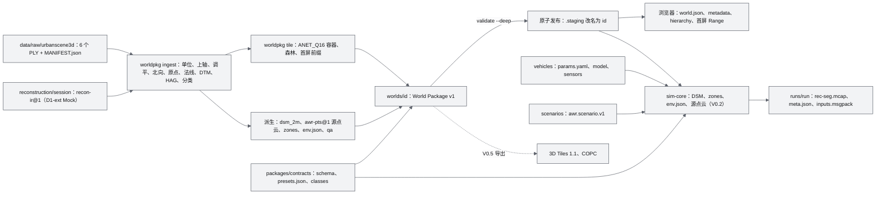
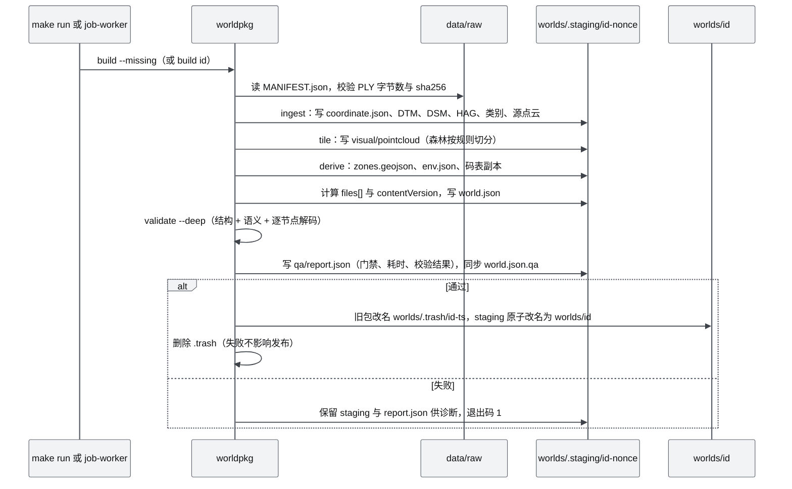
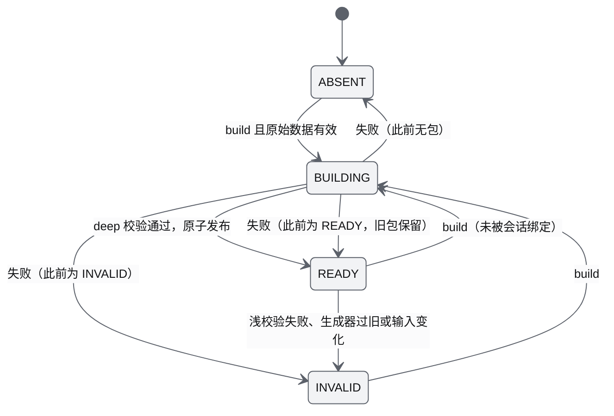
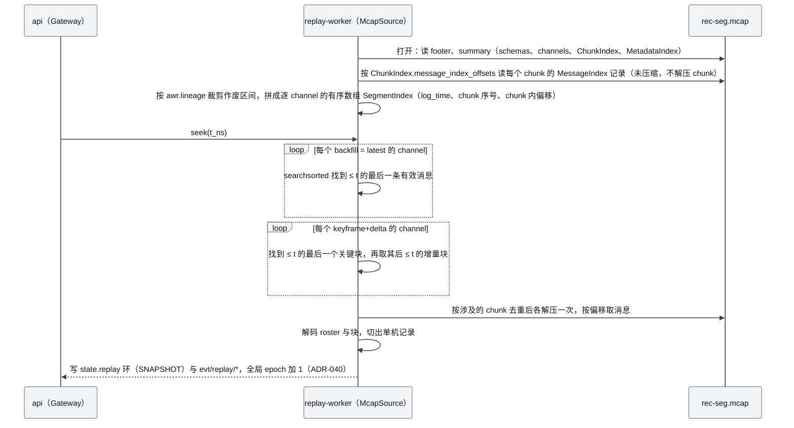
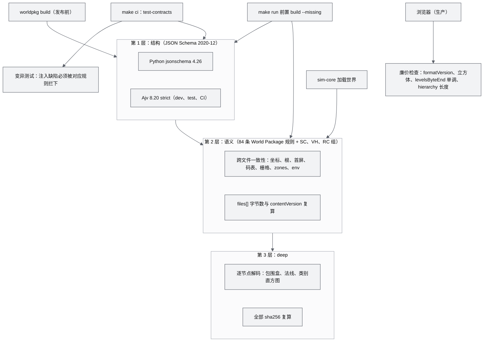

# 16 World 数据规范（World Package / Vehicle Package / Scenario / Recording）

| 项 | 内容 |
|---|---|
| 文档编号 | AWR-16 |
| 标题 | World 数据规范（World Package / Vehicle Package / Scenario / Recording） |
| 版本 | v1.0 |
| 日期 | 2026-09-28 |
| 状态 | 草案 |
| 上游文档 | [03-设计基线与决策记录](03-设计基线与决策记录.md)（ADR-001 至 ADR-006、ADR-013、ADR-022、ADR-025、ADR-034、ADR-035、ADR-040、ADR-043、ADR-047 至 ADR-050，§4.4、§5、§8.4）；[01-design](01-design.md) §7、§8、§14、§15、§20、§27、§39、§41；研究笔记 [g03](research/g03-gap.md)（权威）、[x01](research/x01-urbanscene3d-data.md)、[r09](research/r09-potreeconverter-pdal-lastools.md)、[r10](research/r10-3dtiles.md)、[r15](research/r15-cesium-deckgl-foxglove.md)、[g06](research/g06-gap.md)、[g08](research/g08-gap.md)、[r02](research/r02-vggt-colmap.md)、[r27](research/r27-realtime-bridges.md) §3.4–§3.11、[r04](research/r04-livox-driver-calib.md) §3.1、[00-index](research/00-index.md) §3.4、§3.14；并行文档 [12-业务逻辑设计说明书](12-业务逻辑设计说明书.md)（Scenario、Zone、Recording 的业务字段）、[13-产品设计PRD](13-产品设计PRD.md) §13.3（数据来源记录要求）、[15-视觉设计规范与色卡](15-视觉设计规范与色卡.md)（点云与类别色 token）、[17](17-接口与实时协议规范.md) §8.1（原因码区间）、[M12](modules/M12-时间轴录制与回放PRD.md) §5.3（MCAP seek 实测）、[M14](modules/M14-智能体运行时与ANet-PRD.md) §6.7（TSIR 文法） |
| 下游文档 | [modules/M03](modules/M03-World模型与Ingest切片PRD.md)（生成器与校验器实现）、[modules/M04](modules/M04-几何世界查询服务PRD.md)（栅格与 zones 读取）、[modules/M05](modules/M05-Web点云引擎PRD.md)（容器解析与首屏）、[modules/M07](modules/M07-环境引擎PRD.md)（环境资产取值）、[modules/M08](modules/M08-仿真内核与飞行器适配PRD.md)（Vehicle Package 取值）、[modules/M10](modules/M10-任务规划与集群PRD.md)（剧本加载器）、[modules/M12](modules/M12-时间轴录制与回放PRD.md)（recorder 与 McapSource）、[modules/M13](modules/M13-传感器仿真PRD.md)（传感器文件取值）、[modules/M16](modules/M16-演示数据剧本与流畅性测试PRD.md)（剧本文件）、[modules/M01](modules/M01-重建引擎PRD.md)（Recon IR 产出）、[17-接口与实时协议规范](17-接口与实时协议规范.md)（原因码登记、layouts）、[18-性能与测试方案](18-性能与测试方案.md)（契约与数据测试）、[19-部署与运维说明书](19-部署与运维说明书.md)（数据获取、清理） |
| 适用版本范围 | V0.1（D1）至 V1.0；导出规则（§17）自 V0.5 生效 |
| 修订记录 | v1.0 审校（2026-09-28）：数据类候选原因码由 300–307（与 17 §8.1 已登记码冲突）改为 17 §8.4 登记的 350–356；录制 seek 改为 MessageIndex 逐 channel 索引；剧本语法补 AWR-12 名称对照与 TSIR 编译规则；`awr.SensorPose48.v1`；`c_rd` 量纲；深圳解码样例改用包围盒内的点；ingest 步骤顺序（DTM 先于原点）；体积估算；采纳 M01、M03、M04、M07、M10、M12、M13、M16 对本文的格式请求（§22） |

## 0. 摘要

1. 本文是平台全部**文件与资产格式**的唯一定义方（AWR-03 §10.1）：World Package v1、ANET_Q16 v1 点云容器、类别码表 `anet-classes@1`、栅格、语义区域、环境资产（`presets.json`、`env.json`、AWRV、AWSL）、QA 报告、Vehicle Package、Scenario、Recording（MCAP 布局、`meta.json`、输入日志、`.awrrt` 夹具）、Recon IR 与 LiDAR 帧桩，以及它们的校验、版本与导出规则。线上消息见 [17](17-接口与实时协议规范.md)，业务语义见 [12](12-业务逻辑设计说明书.md)。
2. World Package 沿用 g03 已实测冻结的 v1 契约（6 个 JSON Schema，Python `jsonschema` 4.26 与 Ajv 8.20 strict 双通过）；2026-09-28 本机复验六城实例 `--deep` 全部 0 错误 0 警告。本文在其上做 12 项定稿修订（§1.3），不改动任何二进制字节布局。
3. 点云运行时为 Potree 2.0 三文件容器加 ANET_Q16 v1：每点 12 B（节点局部 `unorm16×4`，w 分量为 oct16 法线；`unorm8×4`，a 分量为类别紧凑索引），节点内固定种子打散，`octree.bin` 层级优先 BFS 写出，首屏一次 Range。按 ADR-013 分档规则，六城 Tier S 首屏 2.0–7.7 万点（0.24–0.92 MB），Tier B/A 10.8–41.9 万点（1.30–5.03 MB）。
4. 六城 ingest 规范化矩阵（旧金山 10.15 m/单位且绕 Z 转 +90°，芝加哥 ×1000 且调平 2.03°，苏州 Y-up、无地面、6 根森林）作为规范数据冻结；每城世界包约 138–192 MB，六城合计约 0.97 GB（本文估算，§10.3）。
5. Vehicle Package 以 `params.yaml`（`awr.vehicle.v1`，每个参数带值、置信度 A–E 与来源）承载 ADR-043 的 Digital Twin 映射：`x500` 为 CI 回归机体，`p600_mid360` 为占位默认机型；加载时必须通过 7 项自洽检查（VH-1 至 VH-7），不通过即拒绝。
6. Scenario 为 snake_case JSON（`awr.scenario.v1`），事件与成功条件采用闭合语法，加载时编译为 TSIR（与 M14 `predicate.schema.json` 同一数值枚举），并给出与 AWR-12 §7.1 度量名的对照；S1 给出完整格式样例（Δz 16.16 m、4 m/s，业务约束依据 AWR-12 §5.8.5，剧本文件定稿归 M16）。
7. Recording 采用 MCAP 容器加自研 awr 编码：每条消息带 8 B 前缀（epoch、rflags、dt），整群状态以块消息录制；seek 由 MCAP MessageIndex 构建的逐 channel 时间索引完成（M12 实测 N = 1000、10 min 录制每次 seek p50 10.9 ms；mcap 库的逆序 `iter_messages` 为 838 ms，禁止用于 backfill）；契约在 D1-MS1 冻结，实现属 D1-ext。
8. 校验分三层（结构、语义 84 条 World Package 规则加剧本、机型、录制规则、deep），并给出版本兼容规则、3D Tiles 1.1 与 COPC 导出规则（V0.5）、错误码（数据类码为 17 §8.4 登记的 350–356，避开 17 已登记的 300–322，并直接引用 M01、M05、M07 已申请的码）、65 条功能需求、14 条非功能需求、27 条验收，文末列出对基线的 11 条反馈与给并行文档的交叉意见。

---

## 1. 文档定位

### 1.1 本文写什么、不写什么

| 本文定义（完整定义方） | 本文只引用（定义方） |
|---|---|
| 所有落盘文件的目录、文件名、字段、类型、单位、默认值、取值范围、字节布局、哈希与校验规则 | 线上消息、字节布局 Full64 与 Lite32、枚举、原因码编号（[17](17-接口与实时协议规范.md)） |
| World Package v1 与 ANET_Q16 v1 的容器与编码 | 点云选择器、CAS、阶梯参数、首屏运行时行为（[M05](modules/M05-Web点云引擎PRD.md)） |
| `presets.json` 的**文件结构**、AWRV 与 AWSL 的字节布局 | `presets.json` 的取值、`eval_env`、风合成与湍流公式（[M07](modules/M07-环境引擎PRD.md)） |
| Vehicle Package 的**文件结构**、置信度规则与自洽检查的判据 | 机型参数的物理含义、控制律与气动模型（[M08](modules/M08-仿真内核与飞行器适配PRD.md)） |
| Scenario 的**文件结构**、语法、动作与指标名登记表、TSIR 编译规则 | 剧本的业务字段语义、谓词与事件语义（[12](12-业务逻辑设计说明书.md) §3.3.6、§7.1）；TSIR 文法（[M14](modules/M14-智能体运行时与ANet-PRD.md) §6.7）；生成器参数（[M10](modules/M10-任务规划与集群PRD.md) §6.5.10）；六城剧本定稿参数（[M16](modules/M16-演示数据剧本与流畅性测试PRD.md)） |
| Recording 的 MCAP profile、channel 与 schema 清单、`meta.json`、谱系元数据、索引与 seek 的数据层算法 | 录制状态机、回放 Player 状态机（[12](12-业务逻辑设计说明书.md) §4.10–§4.11）；recorder 与 replay-worker 进程实现（[M12](modules/M12-时间轴录制与回放PRD.md)） |
| 校验器规则、CLI 输出与退出码 | ingest 与切片算法实现细节（[M03](modules/M03-World模型与Ingest切片PRD.md)）；几何查询算法（[M04](modules/M04-几何世界查询服务PRD.md)） |

工作包 M00 的文件类契约（`.awrrt` 夹具、`meta.json`、`packages/contracts` 下的文件 schema）按 ADR-050 写在本文，需求编号沿用 DATA 前缀。

### 1.2 对原设计的继承、修正与增强

| 01-design 章节 | 原设计 | 继承 | 修正与增强（本文落点） | 依据 |
|---|---|---|---|---|
| §7 World Model | Geometry、Geographic、Semantic、Environment、Dynamic Objects 五组 | 五组全部保留为 World Package 的子目录 | Geographic 收敛为唯一的 `coordinate.json`（锚点处 ENU，§3.3）；Dynamic Objects 以 `dynamic/` 目录预留到 V0.8 | ADR-001、ADR-047；g03 §2 |
| §8 双表达 | Geometry World 与 Visual World | 保留 | Visual World = ANET_Q16 八叉树（§4）；Geometry World = 全分辨率源点云（§6.1）加 DTM、DSM 栅格（§6.3）；物理侧**禁止**读取 LOD 瓦片（AWR-03 §5.8） | P-03 |
| §14 点云 Web 架构 | 空间分块、八叉树、流式；"远处 10K / 近处 1M" | 分块、八叉树、流式 | 阈值表删除；容器提供 `levelsByteEnd`、`levelsPoints`、打散点序与 `hierarchy_ext`，供 APH 与 CAS 闭环使用（§4） | ADR-009 至 ADR-013 |
| §15 点云数据格式 | 内部 PLY/PCD/LAZ，Web 用 Binary Tile + Octree Index，后期兼容 3D Tiles | Binary Tile + Octree Index | 运行时格式定为 Potree 2.0 + ANET_Q16 v1；3D Tiles 1.1 只作导出，COPC 只作归档（§17，V0.5） | ADR-004 |
| §20 风场 L3 | `wind/000_05.vdb` 等 VDB 扇区库 | 扇区库思路 | 运行时改为 f16 + zstd 的物理库加 AWRV 可视化体（§8.3、§8.5）；VDB 只作导出 | ADR-025；g06 §7 |
| §23 Fog | "Fog 0.21" 无单位浓度 | — | 取代：能见度唯一真值为 MOR（米），`presets.json` 只存 `mor_bg_m`（§8.1） | ADR-023 |
| §27 P600 Digital Twin | 11 个组成部分 | 11 个组成部分全部保留 | 以 Vehicle Package 文件与字段逐项承载，每个参数带置信度与来源（§11） | ADR-043 |
| §39 Timeline | Pause、Play、Replay、Seek | 保留 | Replay 与 Seek 的数据基础为 MCAP 录制文件（§13） | ADR-040 |
| §41 World 文件结构 | `metadata.json`、`coordinate.json`、`geometry/`、`semantic/`、`environment/{wind,weather,atmosphere}`、`reconstruction/{cameras,trajectory}`、`visual/{texture,gaussian}` | 独立 World Package 的理念与各目录 | `metadata.json` 改名 `world.json`；天气与大气为参数化预设，不落盘为场；`reconstruction/<session>/` 为 Recon IR；目录逐项对应见 AWR-03 §4.4 | ADR-006 |

### 1.3 相对研究原型的修订（g03 原型 → 本文 v1.0）

g03 的 schema 与实例是 v1 的起点。以下修订在 D1-MS1 冻结前落地到 `packages/contracts`，**不改动任何二进制字节布局**，因此 g03 六城实例的点云文件仍然有效，只需重写清单。

| # | 对象 | g03 原型 | 本文 v1.0 | 理由与依据 |
|---|---|---|---|---|
| 1 | `world.json.dataset` | name、url、citation、redistribution、notice | 增加 `version`、`license`、`sourceFiles[]`（含 sha256）；`redistribution` 只作事实记录，不再约束分发 | 13 §13.3 DC-1；ADR-034（R4） |
| 2 | `world.json.lod.budgets` | 写 desktop 1.5M、integrated 0.8M、software 0.25M | 生成器不再写出（字段保留为可选、读者忽略） | ADR-012 阶梯取代；250k 软件档已被否决（AWR-03 附录 B.2） |
| 3 | `world.json.render.pointSizeK`、`edl` | 写 1.2、true | 生成器不再写出（字段保留为可选、读者忽略） | ADR-011：sizeK = 1.7、EDL 按档位，由 M05 阶梯表决定 |
| 4 | `metadata.anet.firstScreenLevel` 与 `world.json.lod.firstScreen` | 唯一首屏规则 | 语义改为"生成器参考值（Tier B/A 口径）"；运行时按 ADR-013 分档计算（§4.11） | ADR-013 |
| 5 | Geometry World | 只有 `dtm_10m` | 增加 `dsm_2m`、`geometry/pointcloud/source/`（`awr-pts@1`）；`grid.kind` 增加 `heightmap` | AWR-03 §4.4；M04 D1 范围 |
| 6 | 语义区域 | 未实现 | `semantic/zones.geojson`（`awr.zones.v1`），生成器写出保留要素 `border` | AWR-03 §4.4；12 §5.7.1 |
| 7 | 环境 | 未实现 | `environment/env.json`（每世界的粗糙度与廓线参数） | g06 §7.1；g06 §3.2（z0、d 属于 World） |
| 8 | `coordinate.conventions.px4Boundary` 常量 | `"NED/FRD at gateway only"` | `"NED/FRD at PX4 adapter boundary only"` | AWR-03 §5.1：只在 PX4 适配器边界使用 |
| 9 | 风场库 manifest 与 AWSL 头部 | `speed_ms`、`speeds_ms`、`ref_speed_ms`、`vmax_ms_per_ref` | `speed_mps`、`speeds_mps`、`ref_speed_mps`、`vmax_per_ref`（无量纲） | AWR-03 §5.4 与附录 B.1 |
| 10 | Recon IR | `T_enu_engine`；`trajectory.bin` 魔数 `ANTR`、`f64 t0_unix_s` | `T_world_engine`；魔数 `AWTR`、时间为 int64 纳秒 | AWR-03 附录 B.1；§5.2 第 1 条 |
| 11 | 湍流盒资产 URL | `/assets/env/turb/*.awrv` | `/worlds/_shared/env/turb/*.awrv`（文件在 `worlds/_shared/`） | `/assets/` 是前端构建产物的路径前缀，避免冲突（见 §23 反馈） |
| 12 | `metadata.anet.generator.seconds` | 写入构建耗时 | 省略；耗时改写入 `qa/report.json` | 耗时随负载变化，会破坏"同输入同字节"的确定性（DATA-NFR-006） |

### 1.4 约定

1. **规范用语**沿用 AWR-03 §1.2（必须、禁止、应、可）。
2. **字段大小写**（AWR-03 §5.6）：camelCase **只用于**规则 1 列举的五类文件：`world.json`、`coordinate.json`、`metadata.json` 中的 `anet` 扩展、栅格 sidecar（`grid.schema.json`）、类别码表。本文新增的 World Package 文件（`zones.geojson` 的 properties、`qa/report.json`、`source.json`、`env.json`、导出清单）以及 Vehicle、Scenario、Recording、Recon IR 全部按规则 2 使用 snake_case 并带单位后缀。Potree 2.0 基础字段保持 Potree 原名。
3. **单位**：SI 与弧度，单位写在字段后缀（AWR-03 §5.4）；只有带 `_deg` 的字段用度。二进制布局的单位写在本文字段表的"单位"列。
4. **矩阵与位姿**：`T_<to>_<from>`，JSON 中写嵌套行主序 4×4，末行 `[0,0,0,1]`；Sim3 写 `{s, q:[x,y,z,w], t}`；四元数一律 `[x,y,z,w]`（AWR-03 §5.1、§5.3）。
5. **时间**：落盘时间点一律 int64 纳秒；仿真时间为 `t_sim_ns`（从会话起点起算），墙钟为 `t_wall_ns`（UNIX）。JSON 中 int64 以数字写出，取值必须小于 2⁵³；超过时以十进制字符串写出并在 schema 中标注。
6. **端序与对齐**：所有二进制格式为小端；结构体按 4 或 8 字节对齐（每节写明）。
7. **哈希**：sha256 一律以 64 位小写十六进制书写；只有环境资产的绑定字段沿用 g06 的 `"sha256:<hex>"` 前缀写法。
8. **路径**：World Package 内一律为相对 `worlds/<id>/` 的相对路径（`relHref`：无前导斜杠、无 `..`、无反斜杠）；以 `/` 结尾表示目录。
9. **YAML**：Vehicle Package 使用 YAML 1.2 core schema 子集：禁止锚点、别名与自定义 tag；键一律 snake_case；加载后按 JSON Schema 校验（YAML 解析依赖见 §23 反馈 F-03）。
10. **文本净化**：文件中的名称与标签（`name`、`label`、`label_zh`、剧本名等）必须通过 no-emoji 与禁用字形扫描（AWR-03 D1-AC-20 的扫描范围包括 `scenarios/`、`vehicles/`、`configs/`）；运行时显示前仍经 `lib/sanitize.ts` 净化。

---

## 2. 数据资产总览

### 2.1 资产地图



### 2.2 格式注册表

格式注册名的写法为 `<family>/<variant>@<ver>`（AWR-03 §5.6），出现在 `world.json.layers[].format` 与各清单中。

| 注册名 | 用途 | 定义位置 | 首次版本 | D1 |
|---|---|---|---|---|
| `potree2/anet-q16@1` | Visual World 点云运行时容器 | §4 | V0.1 | 是 |
| `potree2/default` | `--twin-default` 对照容器（Potree 官方编码） | §4.13 | V0.1 | 桩（P2） |
| `potree2/brotli` | 外部 Potree 数据读取（只读） | r09 §3.1 | V0.5 | 否 |
| `awr-pts@1` | Geometry World 全分辨率源点云 | §6.1 | V0.1 | 是 |
| `f32-grid@1` | DTM、DSM、HAG、Height_map 栅格；同一 sidecar schema 的整数栅格（`dsm_2m_n`）沿用此名，dtype 以 sidecar 为准 | §6.2 | V0.1 | 是 |
| `anet-classes@1` | 类别码表 | §5 | V0.1 | 是 |
| `geojson/awr-zones@1` | 语义区域矢量体 | §7 | V0.1 | 是 |
| `awr-env-world@1` | 每世界环境配置 `env.json` | §8.2 | V0.1 | 是 |
| `awrv@1` | 体数据（湍流盒、风场可视化体） | §8.3 | V0.1（湍流盒） | 是 |
| `anet-wind@1` | 风场库清单 | §8.5 | V0.3 | 桩（schema） |
| `awsl@1` | 流线 | §8.6 | V0.1 | 是（D1-ext） |
| `recon-ir@1` | 重建中间表示 | §14.1 | V0.1 | 是（schema core，Mock ext） |
| `mcap/awr@1` | 录制文件 | §13 | V0.1 | 是（契约 core，实现 ext） |
| `3dtiles@1.1` | 导出 | §17.1 | V0.5 | 否 |
| `copc@1.0` | 归档与交换导出 | §17.2 | V0.5 | 否 |
| `spz@2` | 3DGS 压缩（预留） | r10 §3.11 | V0.8 | 否 |
| `npz@1` | 保留，D1 不使用 | — | — | 否 |

### 2.3 契约文件清单（本文语义所属部分）

`$id` 统一为 `https://schemas.anet-drone.dev/<domain>/1/<name>.schema.json`，文件之间用相对 `$ref`（依据 g03 §6.1）。标注"新增"的文件在 AWR-03 §5.10 中尚未列出（§23 反馈 F-05）。

| 路径（`packages/contracts/`） | 内容 | 来源 | D1 |
|---|---|---|---|
| `schemas/world/common.schema.json` | 基本类型：semver、id、relHref、sha256、vec2/3、quatXYZW、mat4、rigid、sim3、aabb、fileRef、scaleStatus | g03 | 是 |
| `schemas/world/world.schema.json` | `world.json` | g03，本文修订 1–4 | 是 |
| `schemas/world/coordinate.schema.json` | `coordinate.json` | g03，本文修订 8 | 是 |
| `schemas/world/pointcloud-metadata.schema.json` | Potree 2.0 `metadata.json` + `anet` 扩展 | g03 | 是 |
| `schemas/world/class-table.schema.json` | 类别码表 | g03 | 是 |
| `schemas/world/grid.schema.json` | 栅格 sidecar | g03，本文修订 5 | 是 |
| `schemas/world/zones.schema.json` | `zones.geojson`（新增） | 本文 §7 | 是 |
| `schemas/world/pointcloud-source.schema.json` | `awr-pts@1` sidecar（新增） | 本文 §6.1 | 是 |
| `schemas/world/qa-report.schema.json` | `qa/report.json`（新增） | 本文 §9 | 是 |
| `schemas/world/export.schema.json` | 导出清单（新增） | 本文 §17 | 否（V0.5） |
| `classes/anet-classes-v1.json` | 类别码表真源 | g03 §3 | 是 |
| `env/presets.schema.json`、`env/presets.json` | 预设文件结构与取值 | g06 §3–§4 | 是 |
| `env/env_world.schema.json` | `env.json`（新增） | 本文 §8.2 | 是 |
| `env/wind_manifest.schema.json` | 风场库清单 | g06 §7.2 | 桩 |
| `env/formats/{awrv,awsl}.md` | 二进制格式文字规范（本文 §8.3、§8.6 的副本） | g06 §7 | 是 |
| `vehicle/vehicle_profile.schema.json` | `params.yaml` | g08 §10 | 是 |
| `vehicle/{model,camera,thermal,lidar_livox,gnss,imu}.schema.json` | `model.yaml` 与传感器文件（新增） | 本文 §11.5–§11.6；thermal、imu 按 M13 §7.3 起草 | 是（lidar_livox 为桩；thermal、gnss、imu 为 ext） |
| `scenario/scenario.schema.json` | 剧本（含 `gen_<name>` 生成器参数子 schema，字段由 M10 §6.5.10 定义） | x01 §3.11，本文 §12 | 是 |
| `scenario/catalog.schema.json` | 剧本清单 `scenarios/catalog.json`（新增，`awr.scenario_catalog.v1`） | M16 §7.3.1，本文 §12.1 | 是 |
| `rec/mcap_channels.json`、`rec/meta.schema.json`、`rec/inputlog.schema.json` | 录制 channel 清单、`meta.json`、输入日志条目 | ADR-040、ADR-049，本文 §13 | 是（MS1 冻结） |
| `recon/recon-ir.schema.json`、`recon/engine.schema.json` | Recon IR | r02 §3.2，本文 §14.1 | 是 |
| `sensor/lidar_frame.schema.json` | LiDAR 帧 | r04，本文 §14.3 | 桩 |
| `fixtures/rt/*.awrrt`、`fixtures/payloads/*` | 协议录制夹具与样例载荷 | ADR-050，本文 §13.9 | 是 |

生成物：`packages/contracts/gen/ts/*`（json-schema-to-typescript 16.0.0，以一个聚合 schema 一次编译，`maxItems: -1`，依据 g03 §6.1）与 `python/awr/contracts/*`（自研生成器输出 dataclass），两者入库，`make ci` 校验与源 schema 一致（AWR-03 §4.2 第 3 条）。

### 2.4 目录与所有权

| 目录 | 内容 | 入库 | 所有者（AWR-03 §4.3） | 本文章节 |
|---|---|---|---|---|
| `worlds/<id>/` | World Package（生成物） | 否 | M03 | §3–§10 |
| `worlds/.staging/<id>-<nonce>/`、`worlds/.trash/<id>-<ts>/` | 构建中的世界包（原子发布前）；被替换的旧包（发布后删除） | 否 | M03 | §3.5 |
| `worlds/_shared/env/{turb,weather,cloud}/` | 与世界无关的共享环境资产（湍流盒、天气图、云噪声，AWRV） | 否 | M07（写入）、M03（清理） | §8.4 |
| `data/raw/urbanscene3d/` | 原始数据与 `MANIFEST.json` | 否 | M03（读取）、[19](19-部署与运维说明书.md)（获取） | §10.4 |
| `vehicles/<dir>/` | Vehicle Package（`params.yaml`、`model/model.yaml`、`sensors/*.yaml` 入库；`model/*.glb` 为生成物） | 部分 | M08（sensors 归 M13） | §11 |
| `scenarios/` | 剧本 JSON、剧本清单 `catalog.json`、人工整理区域 `zones/` | 是 | M16 | §7、§12 |
| `runs/<run>/` | 录制、`meta.json`、输入日志、审计 | 否 | M12（录制）、M11（运行目录） | §13 |
| `packages/contracts/` | schema、码表、预设、夹具 | 是 | M00 | §2.3、§15 |

World id 必须匹配 `^[a-z0-9-]{1,63}$`（AWR-03 §5.6）；`common.schema.json` 的 `id` 另外禁止以连字符开头（`^[a-z0-9][a-z0-9-]{0,62}$`，g03 原型，为基线模式的严格子集），`worldpkg` 拒绝创建以 `-` 开头的 id。`worlds/` 下不匹配该模式的目录（`_shared`、`.staging`、`.trash`）不是世界包，`worldpkg validate worlds/*` 与 `--missing` 扫描必须跳过它们。

---

## 3. World Package v1

### 3.1 目录结构

在 AWR-03 §4.4 的基础上逐文件展开。"D1"列：core 表示 D1-core 必须存在；ext 表示 D1-ext；其余写目标版本。

```text
worlds/<id>/
├── world.json                              # §3.2，入口，no-cache                                  core
├── coordinate.json                         # §3.3                                                   core
├── visual/
│   ├── pointcloud/                         # §4，单根：metadata.json、hierarchy.bin、octree.bin、hierarchy_ext.bin   core
│   │   └── r-<i>/                          # 多根森林时每根一个完整容器（苏州 r-0 … r-5）          core
│   ├── pointcloud-default/                 # --twin-default 对照容器（Potree DEFAULT 编码）         P2
│   ├── gaussian/                           # 3DGS LOD                                               V0.8
│   └── mesh/                               # 3D Tiles 网格与地形底座                                 V0.8
├── geometry/
│   ├── pointcloud/source/                  # §6.1，awr-pts@1：source.json、xyz.f32、normal.u16、class.u8   core
│   ├── terrain/
│   │   ├── dtm_10m.json  dtm_10m.f32       # §6.3                                                   core
│   │   ├── dsm_2m.json   dsm_2m.f32        # §6.3                                                   core
│   │   ├── dsm_2m_n.json dsm_2m_n.u8       # §6.3，DSM 每格观测点数（occupancy，可选）              ext
│   │   └── hag_2m.json   hag_2m.f32        # §6.3，可选                                            P2
│   └── {collision,voxel,sdf}/              # 碰撞代理 L1–L2                                          V0.3
├── semantic/
│   ├── anet-classes@1.json                 # §5，与 packages/contracts 中的码表逐字节一致            core
│   └── zones.geojson                       # §7                                                     core
├── environment/
│   ├── env.json                            # §8.2                                                   core
│   ├── wind/l2/                            # §8.5，manifest.json、dir_*.f16.zst、solid.u8.zst、vis/*.awrv.gz   V0.3
│   └── streamlines/                        # §8.6，L2 流线库（D1-ext 的解析场流线按需生成，不落盘）  V0.3
├── reconstruction/<session>/               # §14.1，recon-ir@1                                       ext（Mock）
├── dynamic/                                # Dynamic Objects 与 Tracks                               V0.8
├── export/{tiles3d,copc}/                  # §17，非内容层：不进入 files[] 与 contentVersion         V0.5
└── qa/report.json                          # §9，非内容文件：不进入 files[] 与 contentVersion        core
```

规则：
1. 世界包是生成物，不入库（ADR-006、ADR-034）；任何文件都不得包含绝对路径或主机信息。
2. **内容文件与非内容文件**：`world.json`、`qa/report.json` 与 `export/**` 是非内容文件（它们记录构建时间、耗时、校验结果或派生导出，按构建而变），不进入 `files[]` 与 `contentVersion`，以 `no-cache` 提供；其余每个文件都是内容文件，必须被 `layers[]`、`coordinate.json` 或其他清单引用，并出现在 `world.json.files[]` 中；未被引用或未登记的内容文件是缺陷（校验规则 V-W-11）。
3. `reconstruction/<session>/` 出现时，其全部文件同样列入 `files[]`（它们属于世界内容）。

### 3.2 `world.json`（`world.schema.json`，camelCase）

**顶层字段**

| 字段 | 类型 | 必填 | 单位或取值 | 说明 |
|---|---|---|---|---|
| `$schema` | string | 否 | 相对路径 | 仅供编辑器使用，读者忽略 |
| `schemaVersion` | string | 是 | `1.x.y`，D1 写 `1.0.0` | 读者接受任意 `1.*`（§16.1） |
| `id` | string | 是 | `^[a-z0-9][a-z0-9-]{0,62}$` | 必须等于目录名（V-W-02） |
| `name`、`nameZh` | string | 是、否 | — | 显示名；`nameZh` 为中文名 |
| `description` | string | 否 | — | — |
| `tags` | string[] | 否 | `builtin`、`synthetic`、`urbanscene3d`、`real`、`recon` | 内置六城为 `["urbanscene3d","synthetic","builtin"]` |
| `contentVersion` | string | 是 | `^[0-9a-f]{12}$` | 算法见 §3.4 |
| `createdAt` | string | 是 | RFC 3339 | 不参与哈希 |
| `generator` | object | 是 | `{name, version, commit, params}` | `name = "worldpkg"`；`version` 为 `awr` 包版本；`params` 记录 G、leaf、compression、seed、forest、dtmCellM、dsmCellM、borderInsetM、borderHeadroomM |
| `dataset` | object \| null | 是（数据集来源时非 null） | 见下表 | 来源与许可记录（13 §13.3 DC-1） |
| `coordinate` | object | 是 | `{href: "coordinate.json", sha256}` | `sha256` 即全系统的 `coordinate.sha256` |
| `scaleStatus` | enum | 是 | 七值（§3.3） | 必须与 `coordinate.scaleStatus` 相同（V-W-04） |
| `bounds` | aabb | 是 | m，world ENU | 必须等于 `coordinate.extent`（V-W-05，容差 0.01 m） |
| `layers` | layer[] | 是 | 见下表 | 至少一个 |
| `lod` | object | 是 | `{errorTargetPx, firstScreen, budgets?}` | 见下文 |
| `render` | object | 是 | `{defaultColorMode, zRangeM, hagRangeM?, nnMedianM?, syntheticGroundZ?, pointSizeK?, edl?}` | 见下文 |
| `camera` | object | 否 | `{home: {position, target, fovDeg}}` | 首次进入视角，world ENU，m 与度 |
| `thumbnail` | relHref | 否 | — | P2 |
| `stats` | object | 否 | `{points, extentM, areaKm2, maxHeightM}` | 展示用 |
| `qa` | object | 否（生成器必写） | `{status: pass \| warn \| fail, href: "qa/report.json", messages[]}` | `status = fail` 的包不得发布（§3.5） |
| `files` | fileRef[] | 否（生成器必写） | `{path, bytes, sha256}`，按 `path` 升序 | 用于 `contentVersion` 复算与 `--deep` 校验 |

**`dataset`**

| 字段 | 类型 | 必填 | 说明 |
|---|---|---|---|
| `name` | string | 是 | 例如 `UrbanScene3D` |
| `version` | string | 是（v1.0 新增，语义校验 V-W-12 要求非空） | 例如 `virtual_cities-sampled (GitHub Release v0.0.1)` |
| `url` | string | 是（语义） | 数据来源地址 |
| `citation` | string | 是（语义） | 引用文本 |
| `license` | string | 是（v1.0 新增，语义非空） | 许可文本或摘要加链接 |
| `redistribution` | boolean | 是 | **只作事实记录**；分发方式按 ADR-034 由体积与构建时间决定，读者不得据此限制加载或演示 |
| `notice` | string | 否 | 生成器写 `"Recorded for provenance only; distribution follows ADR-034."` |
| `sourceFiles` | `{name, bytes, sha256}`[] | 是（v1.0 新增，语义非空） | 原始文件及其 sha256，必须与 `data/raw/urbanscene3d/MANIFEST.json` 一致（§10.4） |

**`layers[]`**

| 字段 | 类型 | 必填 | 取值 | 说明 |
|---|---|---|---|---|
| `id` | string | 是 | `^[a-z][a-z0-9-]*(\.[a-z0-9][a-z0-9-]*)*$` | 同一世界内唯一 |
| `type` | enum | 是 | `pointcloud`、`terrain`、`collision`、`voxel`、`sdf`、`semantic-zones`、`class-table`、`environment`、`reconstruction`、`gaussian`、`mesh`、`tiles3d`、`localization`（`missions`、`scenarios`、`recordings` 保留不用） | — |
| `role` | enum | 是 | `visual`、`geometry`、`semantic`、`environment`、`reconstruction`、`localization`、`mission`、`archive`、`export`、`debug` | — |
| `format` | string | 是 | §2.2 注册名 | — |
| `href` | relHref | 是 | 目录以 `/` 结尾 | — |
| `status` | enum | 是 | `ready`、`building`、`missing`、`stale` | 已发布的包中 D1 必需图层只能为 `ready` |
| `default` | boolean | 否 | — | 启动即加载或可见 |
| `T_world_layer` | rigid | 否 | `{q:[x,y,z,w], t:[x,y,z]}` | **只允许刚体**；缺省为单位变换（ADR-006；r10 不变量 1） |
| `bytes`、`points`、`sha256` | — | 否 | — | `pointcloud + visual` 必填 `roots` 与 `points` |
| `roots` | root[] | 条件 | 见 §4.10 | 单根世界恰有一项 |
| `stats` | object | 否 | — | — |

**D1 世界包的图层集合**（生成器必须按此顺序写出）：

| id | type | role | format | href | default |
|---|---|---|---|---|---|
| `pointcloud.visual` | pointcloud | visual | `potree2/anet-q16@1` | `visual/pointcloud/` | true |
| `pointcloud.source` | pointcloud | geometry | `awr-pts@1` | `geometry/pointcloud/source/source.json` | false |
| `terrain.dtm` | terrain | geometry | `f32-grid@1` | `geometry/terrain/dtm_10m.json` | false |
| `terrain.dsm` | terrain | geometry | `f32-grid@1` | `geometry/terrain/dsm_2m.json` | false |
| `terrain.dsm-n`（可选，ext；写出 `dsm_2m_n` 时必须登记，不计入 D1 必需图层） | terrain | geometry | `f32-grid@1` | `geometry/terrain/dsm_2m_n.json` | false |
| `semantic.classes` | class-table | semantic | `anet-classes@1` | `semantic/anet-classes@1.json` | true |
| `semantic.zones` | semantic-zones | semantic | `geojson/awr-zones@1` | `semantic/zones.geojson` | true |
| `environment.config` | environment | environment | `awr-env-world@1` | `environment/env.json` | true |

**`lod` 与 `render`**

| 字段 | 取值 | 说明 |
|---|---|---|
| `lod.errorTargetPx` | 1.35 | 数据集推荐 τ 的参考值（medium 档，依据 r10 §0 第 2 条、n01 §0 第 3 条）；运行时 τ 以 M05 阶梯为准（ADR-012） |
| `lod.firstScreen` | `{points, bytes, requests}` | 生成器参考首屏（Tier B/A 口径，§4.11 规则 G）；`requests` = 根数 |
| `lod.budgets` | 不写 | 已由 ADR-012 阶梯取代（§1.3 修订 2） |
| `render.defaultColorMode` | `height`（旧金山为 `hag`） | 旧金山地形起伏 268 m 会吞掉建筑层次（x01 §3.7） |
| `render.zRangeM`、`hagRangeM` | `[p1, p99]` | 与根 metadata `stats` 的 p1、p99 一致（森林取各根并集的分位数） |
| `render.nnMedianM` | 最近邻距离中位数 | 全分辨率点云 KNN（x01 §3.4） |
| `render.syntheticGroundZ` | 苏州为 0，其余 null | 无地面数据时由前端绘制合成地面 |
| `render.pointSizeK`、`render.edl` | 不写 | ADR-011（§1.3 修订 3） |

**示例**（深圳，`files[]` 截断；取值来自 g03 实例，`dataset` 按本文修订）：

```json
{
  "schemaVersion": "1.0.0", "id": "shenzhen",
  "name": "Shenzhen (UrbanScene3D)", "nameZh": "深圳（UrbanScene3D）",
  "tags": ["urbanscene3d", "synthetic", "builtin"],
  "contentVersion": "a6acd6d923a2", "createdAt": "2026-09-28T13:59:37+00:00",
  "generator": { "name": "worldpkg", "version": "0.1.0", "commit": null,
                 "params": { "G": 64, "leaf": 20000, "compression": "none", "seed": 1, "forest": "auto",
                             "dtmCellM": 10, "dsmCellM": 2, "borderInsetM": 20, "borderHeadroomM": 50 } },
  "dataset": { "name": "UrbanScene3D", "version": "virtual_cities-sampled (GitHub Release v0.0.1)",
               "url": "https://vcc.tech/UrbanScene3D",
               "citation": "Lin et al., Capturing, Reconstructing, and Simulating: the UrbanScene3D Dataset, ECCV 2022",
               "license": "UrbanScene3D terms of use: non-commercial research only; see url",
               "redistribution": false, "notice": "Recorded for provenance only; distribution follows ADR-034.",
               "sourceFiles": [ { "name": "Shenzhen_sampled_5m.ply", "bytes": 120003677,
                                  "sha256": "f531a9e4d28f409838a561b4569755c836d311f27f4b103a4ba3ac3f7bc0fba8" } ] },
  "coordinate": { "href": "coordinate.json", "sha256": "cfc323e6df5f7373010f0f256efc7c5004995df492b17238d0b9d7b7d309bbbe" },
  "scaleStatus": "assumed",
  "bounds": { "min": [-924.019, -999.523, -16.925], "max": [924.019, 999.523, 374.046] },
  "layers": [
    { "id": "pointcloud.visual", "type": "pointcloud", "role": "visual", "format": "potree2/anet-q16@1",
      "href": "visual/pointcloud/", "status": "ready", "default": true, "bytes": 60027937, "points": 5000141,
      "roots": [ { "name": "r", "href": "visual/pointcloud/", "cubeMin": [-924.0189514160156, -999.5227966308594, -16.924943923950195],
                   "cubeSize": 1999.0455962607646, "points": 5000141, "depth": 5, "firstScreenBytes": 1496076 } ] }
  ],
  "lod": { "errorTargetPx": 1.35, "firstScreen": { "points": 124673, "bytes": 1496076, "requests": 1 } },
  "render": { "defaultColorMode": "height", "zRangeM": [-7.3, 124.71], "hagRangeM": [0.0, 130.04], "nnMedianM": 0.526, "syntheticGroundZ": null },
  "camera": { "home": { "position": [-831.6, -1199.4, 899.6], "target": [0.0, 0.0, 0.0], "fovDeg": 50 } },
  "qa": { "status": "pass", "href": "qa/report.json", "messages": [] },
  "files": [ { "path": "coordinate.json", "bytes": 2716, "sha256": "cfc323e6df5f7373010f0f256efc7c5004995df492b17238d0b9d7b7d309bbbe" } ]
}
```

示例中的 `coordinate.sha256` 与 `contentVersion` 取自 g03 原型实例，按本文修订 8 重写 `coordinate.json` 后二者都会变化；最终值以 M03 构建产物为准。

### 3.3 `coordinate.json`（`coordinate.schema.json`，camelCase）

`coordinate.json` 合并了 r15、x01、r02、r07、r01、r06、r08、r09、r17 共九套字段写法（g03 §2.2），是 World 唯一度量帧 `world`（锚点处 ENU，m，右手，+Z 上）的定义。

**字段**

| 字段 | 类型 | 必填 | 单位或取值 | 说明 |
|---|---|---|---|---|
| `schemaVersion` | string | 是 | `1.0.0` | — |
| `worldId` | string | 是 | 同 `world.id` | V-W-03 |
| `frame` | 常量对象 | 是 | `{id:"world", type:"ENU", units:"m", handedness:"right", upAxis:"+Z"}` | schema 以 `const` 强制 |
| `anchor.kind` | enum | 是 | `rtk`、`survey`、`gnss`、`synthetic` | 见下文"anchor.kind 语义" |
| `anchor.georeferenced` | boolean | 是 | synthetic 必须 false；rtk、survey 必须 true | schema if/then 强制 |
| `anchor.datum` | enum | 是 | `WGS84`、`CGCS2000` | — |
| `anchor.lonDeg`、`latDeg` | number | 是 | °；[−180,180]、[−89.9,89.9] | — |
| `anchor.hEllipsoidM` | number | 是 | m；[−500, 9000] | synthetic 时 `:= hMslM` |
| `anchor.hMslM` | number \| null | rtk、survey 必填 | m | ISA 与空气密度用 `h_msl = hMslM + z`（AWR-03 §5.5） |
| `anchor.geoid` | `{model, undulationM}` \| null | rtk、survey 必填 | model ∈ `EGM2008`、`EGM96`、`CQG2000`、`approx`；m | 校验 `hMslM = hEllipsoidM − undulationM`（容差 0.05 m） |
| `anchor.epoch` | number \| null | 否 | 十进制年 | RTK 厘米级工作 |
| `anchor.uncertaintyM` | `{horizontal, vertical}` | 否 | m | 示意锚点为 50/40 m；苏州 5000/40 m |
| `anchor.label` | string | 否（synthetic 必填） | synthetic 时必须以 `illustrative:` 开头 | UI 据此显示"示意坐标"（V-C-12） |
| `T_ecef_world` | mat4 | 是 | 行主序 | 由 anchor 派生（Cesium `eastNorthUpToFixedFrame` 同式）；**禁止**上 GPU；只用于校验与导出 |
| `trueNorth` | `{yawOffsetDeg, confidence, evidence[]}` | 是 | °（从 world +Y 到真北，俯视逆时针为正）；confidence ∈ `exact`、`verified`、`assumed`、`unknown` | georeferenced 时必须 `{0, exact}`；`unknown` 时 UI 不显示指北针 |
| `scaleStatus` | enum | 是 | `relative`、`assumed`、`landmark`、`gnss`、`lidar`、`rtk`、`survey` | 从弱到强；与 Recon IR `scale_status` 共用 `rt/enums.json` 定义（ADR-035） |
| `source.kind` | enum | 是 | `dataset`、`reconstruction`、`lio-map`、`survey`、`simulation` | reconstruction、lio-map 时必须有 `registration` |
| `source.dataset` | string \| null | 否 | — | — |
| `source.files[]` | `{name, bytes, points, sha256}` | 否（生成器必写，含 sha256） | — | 与 `world.dataset.sourceFiles` 一致 |
| `source.crs` | string | 是 | `LOCAL` 或 `EPSG:\d{4,6}` | — |
| `source.projPipeline` | string \| null | 条件 | PROJ pipeline | `T_world_source = null` 时必填 |
| `source.handedness` | enum | 是 | `right`、`left` | 与 `det(T_world_source)` 符号一致（V-C-03） |
| `source.upAxis` | enum | 是 | `±x`、`±y`、`±z` | 经变换后与 world +Z 夹角 < 30°（V-C-06） |
| `source.unitsToMeters` | number | 是 | > 0 | `∛abs(det(R·s)) = unitsToMeters`（相对容差 1e-4，V-C-04） |
| `source.leveledDeg`、`yawDeg` | number | 否 | ° | 调平角与绕 Z 旋转角（记录，不参与计算） |
| `source.T_world_source` | mat4 \| null | 是 | 行主序 | `p_world = T · [p_source; 1]`；法线 `n_world = normalize(R·n_source)`，`R = T[:3,:3] / unitsToMeters` |
| `source.evidence[]` | string[] | 否 | — | 地标量测等证据文本 |
| `registration` | object \| null | 条件 | `{method, T_world_map: sim3, rmseM, inliers, alignmentRef}` | method ∈ `none`、`rtk-sim3`、`gnss-sim3`、`rtk-4dof`、`lidar-icp`、`pose-prior-ba`、`manual` |
| `ground` | `{type, zM, dtm{href,cellM}, reliefP1P99M}` | 是 | type ∈ `dtm`、`flat`、`synthetic`；m | 合成数据 `zM` 按构造为 0；真实数据由 ingest 计算（AWR-03 §5.5） |
| `extent` | aabb | 是 | m | 全部几何的紧包围盒 |
| `precision` | `{maxRadiusM, curvatureDropM, float32UlpMm}` | 是 | m、m、mm | 校验器复算；`float32UlpMm < 1` 且 `maxRadiusM ≤ 10000`，否则告警并要求分区（V-C-09、V-C-10） |
| `conventions` | 常量对象 | 否（生成器必写） | 见下 | 自描述，值为 schema `const` |
| `qa` | object | 否 | `{status, normalsFlippedFrac, zeroNormalsFrac, groundFrac, nnMedianM, maxHeightM, tiltRawDeg, gates[]}` | ingest 门禁结果摘要；详细报告见 §9 |

`conventions` 的常量值（v1.0 定稿）：`matrix = "row-major T_to_from"`；`quaternion = "xyzw, WORLD<-BODY(FLU)"`；`heading = "deg, north=0, clockwise"`；`windDirection = "meteorological-from"`；`render = "three Y-up: (x,y,z)=(E,U,-N)"`；`px4Boundary = "NED/FRD at PX4 adapter boundary only"`；`time = "int64 t_sim_ns"`。

**`anchor.kind` 语义**

| kind | georeferenced | 原点来源 | trueNorth | 允许的 scaleStatus | 用途限制 |
|---|---|---|---|---|---|
| `rtk` | true | RTK 基站或测量锚点，**禁止**取"首条 GPS"（r02） | `{0, exact}` | `rtk`、`survey`、`lidar` | 可用于真实导航与导出 3D Tiles 地理变换 |
| `survey` | true | 测量控制点 | `{0, exact}` | `survey`、`rtk` | 同上 |
| `gnss` | 可 true | 普通 GNSS 均值 | `{0, exact}`（georeferenced 时） | `gnss` | 米级；导出时 `root.transform` 标注精度 |
| `synthetic` | **false** | XY 取包围盒中心，Z 取 DTM 中位数（g03 §2.1 第 5 条） | 地标验证为 `verified`，否则 `assumed` 或 `unknown` | `assumed`、`landmark`、`relative`；派生重建世界另可为 `gnss`（§14.1）；**禁止** `rtk`、`survey`（V-C-11） | 经纬度只作示意：太阳、天空、UI 显示；可作 SIH/SITL 仿真 datum（由 M02 唯一实现换算）；**禁止**用于真实导航（AWR-03 §5.1 第 3 条） |

**示例**（旧金山，取自 g03 实例，按修订 8 更新常量）：

```json
{ "schemaVersion": "1.0.0", "worldId": "sanfrancisco",
  "frame": { "id": "world", "type": "ENU", "units": "m", "handedness": "right", "upAxis": "+Z" },
  "anchor": { "kind": "synthetic", "georeferenced": false, "datum": "WGS84",
              "lonDeg": -122.4212116, "latDeg": 37.7791216, "hEllipsoidM": 39.5, "hMslM": 39.5, "geoid": null,
              "uncertaintyM": { "horizontal": 50, "vertical": 40 },
              "label": "illustrative: world origin placed by offset from Transamerica Pyramid (tallest HAG peak at E=1621.6, N=1784.7)" },
  "T_ecef_world": [[0.844129,0.328449,-0.423753,-2706172.418859],[-0.536139,0.51713,-0.667182,-4260757.978574],[0,0.790378,0.612619,3886120.042606],[0,0,0,1]],
  "trueNorth": { "yawOffsetDeg": 0.0, "confidence": "verified", "evidence": ["residual yaw about +1 deg after the applied +90"] },
  "scaleStatus": "landmark",
  "source": { "kind": "dataset", "dataset": "UrbanScene3D (virtual cities, sampled 5M)", "crs": "LOCAL", "projPipeline": null,
              "files": [ { "name": "San Francisco_sampled_5m.ply", "bytes": 120002477, "points": 5000091,
                           "sha256": "a052e5f344718d4e311ab0f59f0932de3ee464e04a58f93c4df927f2a41fffcd" } ],
              "handedness": "right", "upAxis": "+z", "unitsToMeters": 10.15, "leveledDeg": 0.0, "yawDeg": 90.0,
              "T_world_source": [[0,-10.15,0,0.370465],[10.15,0,0,0.425911],[0,0,10.15,164.727487],[0,0,0,1]],
              "evidence": ["Transamerica->Sutro 6.25 km / 619 u (x10.10)", "Transamerica->Oracle Park 2.19 km / 216 u (x10.15)",
                           "rotation +90.6/+91.5 deg measured, +90 applied"] },
  "registration": null,
  "ground": { "type": "dtm", "zM": 0.0, "dtm": { "href": "geometry/terrain/dtm_10m.json", "cellM": 10.0 }, "reliefP1P99M": [-103.5, 165.37] },
  "extent": { "min": [-3638.787, -3756.033, -114.549], "max": [3638.787, 3756.033, 443.2] },
  "precision": { "maxRadiusM": 5229.6, "curvatureDropM": 2.146, "float32UlpMm": 0.2441 },
  "conventions": { "matrix": "row-major T_to_from", "quaternion": "xyzw, WORLD<-BODY(FLU)", "heading": "deg, north=0, clockwise",
                   "windDirection": "meteorological-from", "render": "three Y-up: (x,y,z)=(E,U,-N)",
                   "px4Boundary": "NED/FRD at PX4 adapter boundary only", "time": "int64 t_sim_ns" },
  "qa": { "status": "pass", "normalsFlippedFrac": 0.0364, "groundFrac": 0.385, "nnMedianM": 1.887, "maxHeightM": 443.2, "tiltRawDeg": 0.822, "gates": [] } }
```

真实数据（P600 加 RTK，合肥）只在以下字段不同：`anchor.kind = "rtk"`、`georeferenced = true`、`geoid = {"model":"EGM2008","undulationM":…}`、`trueNorth = {0, "exact"}`、`scaleStatus = "rtk"`、`source.kind = "lio-map"`、`source.crs = "EPSG:4979"`、`source.T_world_source = null` 加 `projPipeline`（topocentric），`registration = {"method":"rtk-4dof","T_world_map":{…},"rmseM":…}`（g03 §2.3，V0.5 生效）。

**边界换算**（只引用，唯一实现在 M02 的 `frames.py` 与 `frames.ts`）：three.js 读 `Matrix4.set(...m.flat())`；Cesium 用 `Matrix4.fromRowMajorArray`；3D Tiles `transform` 写列主序平铺（§17.1）。

### 3.4 `contentVersion`、`files[]` 与缓存语义

1. **`files[]`**：列出世界包内全部内容文件（即除 `world.json`、`qa/report.json` 与 `export/**` 外的全部文件，§3.1 第 2 条），按 `path` 的字节序升序，每项 `{path, bytes, sha256}`。
2. **`contentVersion`** = `sha256("".join(f"{path}:{sha256}\n" for f in files).encode("utf-8")).hexdigest()[:12]`（十六进制小写，依据 g03 §5.2 与 `g03_build.py` 第 423 行）。`coordinate.json` 在 `files[]` 中，因此原点变化必然改变 `contentVersion`（P-01）。
3. **确定性**：同一原始数据、同一生成器版本与参数必须产出逐字节相同的 `files[]`，从而得到相同的 `contentVersion`（DATA-NFR-006）。因此除 `world.json.createdAt` 外，任何参与哈希的文件都**禁止**写入时间戳、主机名、进程号或随机数（随机数一律来自固定种子）。
4. **HTTP 缓存**（ADR-006；静态服务由 M11 实现）：`world.json` 以 `Cache-Control: no-cache` 返回；其余文件的请求必须带 `?v=<contentVersion>`，响应 `Cache-Control: public, max-age=31536000, immutable`，Range 请求的 206 响应同样适用；`hierarchy.bin` 以不带 Range 的 GET 整体取回；`octree.bin` 以单区间 `Range: bytes=a-b` 请求，禁止 `multipart/byteranges`（ADR-013）；Range 响应上禁止再加 `Content-Encoding`（g03 §4.2）。
5. **绑定**：派生资产与会话以 `coordinate.sha256` 绑定坐标（`env.json.coordinate_hash`、`zones.geojson` 的 `awr.coordinate_sha256`、风场库 manifest、剧本的 `world_coordinate_sha256`、录制 `meta.json`）；以 `contentVersion` 绑定内容（录制、会话）。绑定不一致时的处置见 §16.3。

### 3.5 构建、发布与状态

**构建流水线**（`worldpkg build <id>`；实现归 M03，本文规定其对文件的效果）：



1. **原子性**：构建只写 `worlds/.staging/<id>-<nonce>/`；发布是同一文件系统上的两次 `rename`（旧包移入 `worlds/.trash/`，新包改名为 `worlds/<id>`）。任意时刻 `worlds/<id>/` 要么是完整的旧包，要么是完整的新包；进程在任何阶段被 kill 都不得留下半个世界包（DATA-AC-021）。
2. **`--missing` 判定**：对每个在 `data/raw/urbanscene3d/MANIFEST.json` 中登记的内置城市，满足任一条件即重建：①`worlds/<id>/world.json` 不存在；②浅校验失败（结构 + 语义，不做 deep；含 `files[]` 字节数核对与 `contentVersion` 按 `files[]` 复算）；③`generator.version` 低于 `awr/world/package/version.py::WORLDPKG_MIN_VERSION`；④`schemaVersion` 主版本不是 1；⑤原始文件 sha256 与 `dataset.sourceFiles` 不一致（仅当原始数据在本机）；⑥人工整理的区域文件 `scenarios/zones/<id>.zones.geojson` 的 sha256 与 `zones.geojson` 的 `awr.source_sha256` 不一致（§7）。环境变量 `WORLDPKG_VERIFY=deep` 时改为 deep 校验（六城约 15 s）。
3. **状态**：世界的业务状态枚举由 [12 §3.3.1](12-业务逻辑设计说明书.md) 定义（ABSENT、BUILDING、READY、INVALID）；本文规定由文件判定状态的规则如下。

| 状态 | 事件 | 守卫 | 动作 | 目标状态 |
|---|---|---|---|---|
| ABSENT | `build` 开始 | 原始数据存在且 MANIFEST 校验通过 | 创建 staging | BUILDING |
| ABSENT | `build` 开始 | 原始数据缺失 | 退出码 4，提示 `make fetch-data` | ABSENT |
| BUILDING | 构建与 deep 校验通过 | — | 原子发布 | READY |
| BUILDING | 任一阶段失败或 deep 校验失败 | — | 保留 staging 与报告，退出码 1 | 原状态（ABSENT 或 READY 或 INVALID） |
| READY | `build` 开始 | 未被会话绑定 | 创建 staging；旧包在发布前继续正常服务 | BUILDING |
| READY | 启动时浅校验失败，或 `--missing` 条件 ③至⑥ 成立 | — | 标记 INVALID（原因 `validate_failed`、`generator_outdated`、`schema_major`、`raw_changed`、`zones_changed`） | INVALID |
| INVALID | `build` 开始 | 同 ABSENT | 创建 staging；旧包在发布前继续可读（只供诊断，不供会话绑定） | BUILDING |
| READY | 被会话绑定时收到 `build` | 12 §4.12 J01 守卫 | 拒绝，原因码 `123 WORLD_NOT_READY`（AWR-17 §8.2 已登记） | READY |



**构建退出码**（`worldpkg build`、`worldpkg ingest`、`worldpkg tile`）：0 成功；1 校验失败（报告见 `qa/report.json`）；2 ingest 门禁失败（例如最高建筑不在 100–700 m）；3 参数或 I/O 错误；4 原始数据缺失或 sha256 不符。job-worker 把退出码映射为任务的 `error.code`（§18.3）。

---

## 4. 点云容器：Potree 2.0 + ANET_Q16 v1

### 4.1 容器与约束

每个根是一个完整的 Potree 2.0 三文件容器（加可选的 `hierarchy_ext.bin`），单根世界位于 `visual/pointcloud/`，森林的第 i 个根位于 `visual/pointcloud/r-<i>/`（依据 g03 §4.1、§4.4；ADR-004）。

```text
<root>/
├── metadata.json       # Potree 2.0 字段 + anet 扩展（§4.9）
├── hierarchy.bin       # 22 B/记录（§4.2）
├── octree.bin          # 节点负载，层级优先 BFS 连续写出（§4.3）
└── hierarchy_ext.bin   # 12 B/记录，与 hierarchy.bin 逐条镜像（§4.8），v1 默认写出
```

在 Potree 2.0 之上，v1 **额外**要求（校验规则见 §15.3 的 V-P 组）：

| # | 约束 | 目的 |
|---|---|---|
| 1 | `boundingBox` 为立方体（三轴边长相等，容差 1e-6 m），`offset == boundingBox.min`，`spacing == cubeSize / G` | 节点立方体可由名字直接算出 |
| 2 | `hierarchy.depth` 等于实际最大层级 | 选择器与首屏计算 |
| 3 | 节点总数 ≤ 约 40,000 时只写一个 chunk、不写 PROXY，`stepSize = depth`；超出时按 step = 4 分页（同 PotreeConverter `Indexer::createHierarchyChunks`） | 六城节点数 658–879，全部单 chunk，`hierarchy.bin` 14.5–19.3 KB，整体 GET |
| 4 | NORMAL 记录的 childMask 非 0；LEAF 记录的 childMask 为 0；自身无点但有子节点的内部节点照常写记录（`numPoints = 0, byteSize = 0`） | 层级完整 |
| 5 | `octree.bin` 按 (level, name) 升序连续写出，从偏移 0 开始、无空洞，结束于文件末尾 | 首屏一次 Range（§4.11） |
| 6 | `compression = none` 时 `byteSize == numPoints × bytesPerPoint` 且 `byteOffset % 4 == 0` | 零拷贝视图（12n、16n 天然满足） |
| 7 | 属性名为 `anet:pos`、`anet:col`（、`anet:ext`），不写 `position` | 旧 loader 遇到 ANET_Q16 直接报错而不是静默出乱码（g03 §0 第 8 条） |
| 8 | 同名节点在同一层内的名字字典序等于 Morton 码数值序（名字等长） | BFS 顺序可复算 |

### 4.2 `hierarchy.bin` 记录布局

每条 22 B，小端，`struct.unpack_from("<BBIqq")`（依据 r09 §3.1）：

| 偏移 | 类型 | 字段 | 取值与说明 |
|---|---|---|---|
| 0 | u8 | `type` | 0 NORMAL（有子节点）、1 LEAF、2 PROXY（子层级在另一 chunk） |
| 1 | u8 | `childMask` | 第 i 位为 1 表示子节点 i 存在，`i = (x<<2) \| (y<<1) \| z`（Potree 子序） |
| 2 | u32 | `numPoints` | 本节点**自身**点数（加法式 LOD，不含子孙） |
| 6 | i64 | `byteOffset` | 非 PROXY：在 `octree.bin` 中的偏移；PROXY：子 chunk 在 `hierarchy.bin` 中的偏移 |
| 14 | i64 | `byteSize` | 同上 |

**节点命名与立方体**：名字为 `"r"` 加每层一位子序数字 d ∈ [0,7]。由名字得到 (L, x, y, z)：`x = Σ ((d_i >> 2) & 1) << (L − i)`，y 取 `(d_i >> 1) & 1`，z 取 `d_i & 1`；`nodeSize = cubeSize / 2^L`，`nodeMin = cubeMin + nodeSize · (x, y, z)`（r09 §3.1 `name_to_key`）。必须在 CPU 上以 float64 计算，再以 `nodeMin`、`nodeSize` 两个 uniform（或 DrawTable 条目）下发；**禁止**在 GPU 上累加世界坐标（AWR-03 §5.1 第 4 条）。

### 4.3 `octree.bin` 节点负载逐字节布局（ANET_Q16 v1）

每个节点的负载为 SoA，小端，n 为本节点点数：

```text
节点负载（bytesPerPoint = 12）                         （bytesPerPoint = 16，streams 含 "ext"）
offset 0        pos  u16[4n]   8 B/点                 offset 0      pos  u16[4n]
offset 8n       col  u8[4n]    4 B/点                 offset 8n     col  u8[4n]
                                                       offset 12n    ext  u8[4n]
```

**单点的字节**（pos 第 k 点位于 `8k`，col 第 k 点位于 `8n + 4k`，ext 位于 `12n + 4k`）：

| 流 | 字节 | 类型 | 字段 | 编码 | 单位与范围 |
|---|---|---|---|---|---|
| pos | 0–1 | u16 LE | `qx` | `clamp(round((p.x − nodeMin.x) / nodeSize · 65535), 0, 65535)` | 节点立方体归一化；解码 `p = nodeMin + q / 65535 · nodeSize` |
| pos | 2–3 | u16 LE | `qy` | 同上 | — |
| pos | 4–5 | u16 LE | `qz` | 同上 | — |
| pos | 6–7 | u16 LE | `w` | oct16 法线 `(octU << 8) \| octV`（§4.5）；`0x0000` = 无法线 | 字节 6 为 octV，字节 7 为 octU |
| col | 0–2 | u8 | `r, g, b` | sRGB 显示底色，语义由 `anet.col.rgb` 声明（§4.9） | 0–255 |
| col | 3 | u8 | `a` | 类别紧凑索引（§4.6） | 0–15（`anet-classes@1`），上限 31 |
| ext | 0 | u8 | `intensity` | 数据集 p99 归一化到 255 | 仅真实 LiDAR 数据 |
| ext | 1 | u8 | `hagQ` | `round(HAG / hagScaleM)`，`hagScaleM` 默认 0.5 m | 0–127.5 m |
| ext | 2 | u8 | `returns` | `(returnNumber << 4) \| numberOfReturns` | — |
| ext | 3 | u8 | `flags` | 保留，写 0 | — |

**GPU 读法**：两个 attribute 都设 `normalized = true`、itemSize 4；WebGPU 顶点格式必须用 `unorm16x4` 与 `unorm8x4`（x3 格式不存在，依据 r11、g03 §4.2）。D1 的 PointPool 以 RGBA32UI 纹理每点 1 texel（16 B）直接搬运这 12 B：word0 = `qx | qy<<16`，word1 = `qz | w<<16`，word2 = col 四字节，word3 = ext 或 0（布局由 M05 定义，本文只规定源字节，依据 ADR-010、g03 §1 r13 行）。

**解码示例**（深圳根节点，`nodeMin = (−924.0189514, −999.5227966, −16.9249439)`，`nodeSize = 1999.0455963` m，量化步长 30.5 mm；点 `p = (−162.0, 98.5, 374.0)` 位于华润大厦塔心（x01 §3.11）屋顶，低于 `tightBounds.max.z = 374.046` m，法线 +Z，屋顶类别，z 高于 `zP99 = 124.71` m，故取 Height 渐变顶档底色）：

```text
pos: 95 61 | 9d 8c | 10 32 | 80 80      qx = 0x6195 = 24981, qy = 0x8c9d = 35997, qz = 0x3210 = 12816, w = 0x8080
col: f2 f3 f5 | 05                      rgb = (242, 243, 245)（--pc-ramp-4），a = 5（building_roof）
解码: p' = (−162.0115, 98.5110, 374.0077)，误差 (−11.5, +11.0, +7.7) mm，均 ≤ 步长的一半（15.25 mm）
      w = 0x8080 → octU = octV = 128 → n' = (0.0040, 0.0040, 0.99998)
```

以上 12 字节由 g03 实例的根立方体按本节公式复算（2026-09-28），作为 DATA-AC-004 的 golden。

量化步长 = `nodeSize / 65535`：纽约根节点 4.8 cm、L5 1.5 mm；上海根节点 11.8 cm（根节点点间距 120.9 m），均远小于同层点间距（g03 §4.2）。

### 4.4 `col.rgb` 的取值语义

`anet.col.rgb` 声明底色来源；着色器**永远**把它当作 sRGB 底色，不按语义分支（g03 §4.2）。

| 取值 | 含义 | 使用场景 |
|---|---|---|
| `srgb` | 实测颜色 | 带相机着色的真实点云（V0.5） |
| `intensity-gray` | r = g = b = 强度 | 只有强度的 LiDAR 数据 |
| `baked-height` | Graphite 五档渐变，`t = clamp((z − zP1)/(zP99 − zP1), 0, 1)^0.6`，`i = min(floor(4t), 3)`，线性插值 `ramp[i]`、`ramp[i+1]`，**不含光照** | UrbanScene3D 六城（无颜色、无强度） |
| `constant` | r = g = b = 128 | 调试 |

`baked-height` 的五档取 [15](15-视觉设计规范与色卡.md) 的 `--pc-ramp-0…4`（g800、g600、g400、g200、g50），生成器使用的 sRGB 字节为 (29,31,35)、(62,66,73)、(129,134,143)、(202,205,211)、(242,243,245)，与 `g03_build.py::GRAPHITE` 逐字节一致。色卡修订时必须同步重建世界包（`contentVersion` 随之变化）。Height、HAG、Normal、Class 等着色模式由着色器实时计算（M05），不依赖底色。

### 4.5 oct16 法线

编码（与 `g03_build.py::oct16` 逐行一致；Python 为唯一编码实现，TS 只解码）：

```python
def oct16(n):                                   # n: (N,3)，任意长度的非零向量
    n = n / np.maximum(np.abs(n).sum(1, keepdims=True), 1e-12)
    sx = np.where(n[:, 0] >= 0, 1.0, -1.0); sy = np.where(n[:, 1] >= 0, 1.0, -1.0)   # signNotZero，禁止 np.sign
    neg = n[:, 2] < 0
    ox = np.where(neg, (1 - np.abs(n[:, 1])) * sx, n[:, 0])
    oy = np.where(neg, (1 - np.abs(n[:, 0])) * sy, n[:, 1])
    u = np.clip(np.round((ox * 0.5 + 0.5) * 255), 0, 255).astype(np.uint16)
    v = np.clip(np.round((oy * 0.5 + 0.5) * 255), 0, 255).astype(np.uint16)
    w = (u << 8) | v
    w[w == 0] = 0xFFFF                          # 0x0000 保留为"无法线"；(0,0) 与 (255,255) 都解码为 −Z
    return w
```

解码：`has = w > 0`；`o = (floor(w/256), w mod 256) / 255 · 2 − 1`；`n = (o.x, o.y, 1 − |o.x| − |o.y|)`；若 `n.z < 0` 则 `n.xy = (1 − |n.yx|) · signNotZero(n.xy)`；最后归一化。着色时做 faceforward（x01 §3.7；上海 24% 与深圳 17% 的原始法线朝下，ingest 已修正水平面与朝内立面，剩余由着色器兜底）。

精度（g03 §0 第 1 条，1M 个随机方向）：平均 0.34°，p99 0.75°，最大 0.95°。数据集整体没有法线时 `anet.pos.w = "zero"`，全部写 0。

### 4.6 类别紧凑索引与 classMask

`col.a` 存 `anet-classes@1` 的紧凑索引（§5），不存 LAS 码。运行时以 u32 uniform `classMask` 做图层开关：`visible = (classMask >> cls) & 1`，其中 `cls = uint(col.a · 255 + 0.5)`；关闭时把点移出裁剪体（`gl_PointSize = 0`、位置置于裁剪体外）。改开关只改 uniform，不重新加载数据（ADR-005）。类别超过 32 个时升级为 `@2` 并改用 256 位 mask 纹理，`formatVersion` 不变（字节语义不变，g03 §8 R2）。

### 4.7 打散点序

每个节点在写出前用固定种子做 Fisher–Yates 打散（`numpy.random.default_rng(shuffleSeed).permutation`，逐节点按写出顺序连续消费同一个生成器），因此**任意前缀都是该节点的均匀子样本**（`anet.pointOrder = "shuffled"`）。这一性质是以下能力的前提：`drawRange` 或 DrawTable 前缀调节疏密、被预算拒绝的节点只画前缀（≥ 512 点，ADR-009）、节点淡入（`--duration-lod-fade`）。点的 LOD 秩不单独存储，等于其在节点内的下标（g03 §0 第 2 条）。

### 4.8 `hierarchy_ext.bin`

与 `hierarchy.bin` **逐条镜像**：第 i 条 22 B 记录（字节 `22i`）对应第 i 条 12 B 扩展记录（字节 `12i`），PROXY 重复记录也占位。分页加载时，hierarchy chunk `[o, o+s)` 对应扩展文件的 `[o/22·12, s/22·12)`，可以同样用 Range 取回（g03 §0 第 9 条）。

| 偏移 | 类型 | 字段 | 说明 |
|---|---|---|---|
| 0 | u16 × 3 | `minX, minY, minZ` | **子树**（本节点加全部子孙）紧包围盒的最小角，相对节点立方体归一化到 0–65535，向下取整 |
| 6 | u16 × 3 | `maxX, maxY, maxZ` | 最大角，向上取整（保守） |

根节点的扩展包围盒与 `anet.tightBounds` 相差不超过一个量化步长（V-P-17）。g03 实测俯视无预算条件下选中点数只减少 0–2%，收益在 M05 实现选择器时按"水平视线 + 视锥 + 预算"复测；收益低于 5% 时 loader 可以不读，但文件照常写出（g03 §8 R3）。

### 4.9 `metadata.json`（Potree 2.0 + `anet` v1）

**Potree 基础字段**与 `Indexer::createMetadata` 完全相同：`version = "2.0"`、`name`、`description`、`points`、`projection = ""`、`hierarchy{firstChunkSize(22 的倍数), stepSize, depth}`、`offset`、`scale`、`spacing`、`boundingBox`、`encoding = "ANET_Q16"`、`attributes[]`。ANET_Q16 下 `scale` 不起作用，固定写 `[0.001, 0.001, 0.001]`；`attributes` 由 schema 的 `prefixItems` 强制为 `anet:pos`（size 8、numElements 4、elementSize 2、uint16）、`anet:col`（size 4、4、1、uint8）、可选 `anet:ext`。

**`anet` 扩展**（19 个必填键，另有 `ext`、`root`、`twin`、`generator` 可选）：

| 键 | 类型 | 取值 | 说明 | 纽约实例 |
|---|---|---|---|---|
| `formatVersion` | int | 常量 1 | 二进制布局任何改动都要升级；loader 遇未知版本直接拒绝 | 1 |
| `frame` | string | 常量 `"world"` | 点坐标为 world ENU；图层级 `T_world_layer`（刚体）叠加在其上 | world |
| `streams` | string[] | `["pos","col"]` 或 `["pos","col","ext"]` | SoA 顺序 | pos、col |
| `bytesPerPoint` | int | 12 或 16 | 必须等于 `4·(len(streams)+1)` | 12 |
| `pos` | object | `{format:"unorm16x4", xyz:"node-cube", w:"oct16" \| "zero"}` | — | oct16 |
| `col` | object | `{format:"unorm8x4", rgb, a:"class-index"}` | rgb 见 §4.4 | baked-height |
| `ext` | object \| null | `{format:"unorm8x4", comp:["intensity","hagQ","returns","flags"], hagScaleM}` | 当且仅当 streams 含 ext 时非 null | null |
| `compression` | enum | `none`、`gzip` | §4.13 | none |
| `pointOrder` | string | 常量 `"shuffled"` | §4.7 | shuffled |
| `shuffleSeed` | int | ≥ 0 | — | 1 |
| `sampling` | object | `{method: grid-center \| grid-random \| potree-poisson, G ∈ {16,32,64,128,256}, leaf ≥ 100, minChild, B ∈ [10,21], seed}` | 中心优先网格竞选为默认（r09 §3.2） | grid-center、64、20000、0、21、1 |
| `classTable` | object | `{id:"anet-classes@1", href:"semantic/anet-classes@1.json"}` | — | — |
| `nodeCount` | int | ≥ 1 | 不含 PROXY 重复记录 | 852 |
| `levelsByteEnd` | int[] | 单调不减 | 第 L 层最后一个节点的结束偏移（不含），无点的层取上一层的值 | [67764, 424212, 2181252, 10197756, 42483000, 60000780] |
| `levelsPoints` | int[] | 单调不减 | 0..L 层累计点数 | [5647, 35351, 181771, 849813, 3540250, 5000065] |
| `levelsNodes` | int[] | — | 每层节点数（不累计） | [1, 4, 16, 64, 250, 517] |
| `firstScreenLevel` | int | ≤ depth | **生成器参考值**（§4.11 规则 G），不是运行时首屏 | 2 |
| `tightBounds` | aabb | 在立方体内 | 真实包围盒 | z ∈ [−5.5, 287.0] |
| `hierarchyExt` | object \| null | `{href:"hierarchy_ext.bin", recordSize:12, content:"subtree-aabb-u16"}` | — | 写出 |
| `stats` | object | `{zP1, zP99, hagP1, hagP99, nnMedianM, nnSource, normalsFlippedFrac?, classHistogram}` | `classHistogram` 键为类别索引字符串，值之和等于 `points` | −0.64 / 167.28 / 0 / 167.31 / 1.016 |
| `root` | object | `{forestIndex, forestSize}` | 森林中的位置 | 0 / 1 |
| `twin` | string \| null | relHref | DEFAULT 孪生容器（§4.13） | null |
| `generator` | object | `{name, version}` | 仅供追溯；v1.0 不写 `seconds`（见下） | — |

g03 原型在 `generator.seconds` 中写入构建耗时，它随机器负载变化，会破坏 `metadata.json` 的逐字节确定性。**v1.0 规定**：耗时写入非内容文件 `qa/report.json`（§9），`metadata.anet.generator` 只写 `name` 与 `version`；schema 中 `seconds` 保留为可选字段以兼容原型实例。

从 r09 与 x01 移除的键（g03 §4.3）：`units`、`upAxis`、`origin`（由 `coordinate.json` 提供）；`buffers[]`（由固定布局代替）；`tightBoundsFile`（改为 `hierarchyExt.href`）；`nnMedian`（改名 `stats.nnMedianM`）；`roots`（移到 `world.json`）。

### 4.10 多根森林

1. **切分规则**（`forest = auto`，g03 §4.4）：设规范化后点云三轴跨度降序为 `Lmax ≥ Lmid ≥ Lz`。若 `Lmax / Lmid ≥ 3`，取 `k = floor(Lmax / Lmid)`，立方体边长 `size = max(Lmax / k, Lmid, Lz) · (1 + 1e-9) + 1e-6`，沿长轴切成 k 个相邻立方体，点按长轴坐标划入 `min(floor((c − cmin)/(Lmax/k)), k−1)` 号根。否则为单根。任何立方体大于 8 km 或精度门禁不过时按 2×2 切分（V0.5，未实现）。
2. 每个根是完整的 Potree 2.0 容器，`metadata.anet.root = {forestIndex: i, forestSize: k}`。
3. `world.json` 点云图层的 `roots[]`：

| 字段 | 类型 | 说明 |
|---|---|---|
| `name` | string | 单根为 `"r"`；森林为 `"r-<i>"` |
| `href` | relHref | 以 `/` 结尾 |
| `cubeMin`、`cubeSize` | vec3、number | 必须等于该根 `metadata.boundingBox`（V-W-08） |
| `points`、`depth` | int | 必须等于该根 metadata（V-W-09） |
| `firstScreenBytes` | int | 等于 `levelsByteEnd[firstScreenLevel]`（生成器参考值，V-W-10） |

4. 根之间**不得重叠**（任意两根立方体在三轴上同时重叠超过 1 mm 即为错误，V-W-07）；选择器把所有根的节点放进同一个优先队列、共享一个点预算（ADR-009）。
5. 苏州实测：6 根，每根边长 734.5 m、深度 4，节点合计 879；若不切分为单立方体 L≤4 需 28.8 万点、3.46 MB 才能凑够首屏，而 L0 只有 500 点（g03 §0、x01 §3.6）。

### 4.11 首屏 BFS 前缀

因为 `octree.bin` 层级优先连续写出，取第 0..L 层只需要对每个根发**一次** `Range: bytes=0-(levelsByteEnd[L] − 1)`（每根一次，苏州 6 次）。

**规则 G（生成器参考值，写入 `firstScreenLevel` 与 `lod.firstScreen`）**：设根数为 k，取最小的 L 使 `levelsPoints[L] ≥ 1e5 / k`；若该层 `levelsPoints[L] > 4.5e5 / k` 则逐层回退；各根独立计算（g03 §0 新发现第 1 条）。

**规则 R（运行时，ADR-013，M05 实现）**：以各根 `levelsPoints` 逐层求和得 `P[L]`，取满足 `P[L] ≤ min(4.5e5, 0.8·GPU 池容量, 2.5·B_hi(起步档))` 的**最深**一层，所有根使用同一个 L。本机 Tier S 起步档为 soft-min（B_hi = 40k），池容量约 24.2 万点，因此上限为 1e5 点；硬件档（iGPU 起步 low、dGPU 起步 medium）的上限为 4.5e5 点。

**六城首屏**（本文按上述两条规则，由 g03 实例的 `levelsPoints`、`levelsByteEnd` 计算；G = 64、LEAF = 20000、seed = 1、grid-center 不变时，M03 的正式产物必须与此表一致）：

| 城市 | 根 / 深度 / 节点 | `hierarchy.bin` | Tier S（规则 R）：层 / 点 / 字节 | Tier B/A（规则 R）：层 / 点 / 字节 | 生成器参考（规则 G） |
|---|---|---|---|---|---|
| 深圳 | 1 / 5 / 696 | 15,312 B | L1 / 26,782 / 321,384 | L2 / 124,673 / 1,496,076 | L2 / 124,673 / 1,496,076 |
| 上海 | 1 / 5 / 676 | 14,872 B | L2 / 75,154 / 901,848 | L3 / 418,818 / 5,025,816 | L3 / 418,818 / 5,025,816 |
| 纽约 | 1 / 5 / 852 | 18,744 B | L1 / 35,351 / 424,212 | L2 / 181,771 / 2,181,252 | L2 / 181,771 / 2,181,252 |
| 旧金山 | 1 / 5 / 658 | 14,476 B | L1 / 25,559 / 306,708 | L2 / 108,268 / 1,299,216 | L2 / 108,268 / 1,299,216 |
| 苏州 | 6 / 4 / 879 | 19,338 B（6 个文件合计） | L0 / 20,327 / 243,924（6 次 Range） | L1 / 108,263 / 1,299,156（6 次 Range） | 各根 L1（第 4 根 L2）/ 166,529 / 1,998,348 |
| 芝加哥 | 1 / 6 / 787 | 17,314 B | L2 / 76,541 / 918,492 | L3 / 352,915 / 4,234,980 | L3 / 352,915 / 4,234,980 |

世界级首屏超过 8 MiB 或 4.5e5 点时校验器告警（V-W-13）。首屏数据先进入 CPU 缓存，再按起步预算上传（ADR-013，M05）。

### 4.12 读取参考接口

```ts
// apps/web/src/engine/pointcloud/io/（M05 实现；签名由本文冻结）
export async function openWorld(base: string, f?: typeof fetch): Promise<OpenedWorld>;
// 顺序：world.json（no-cache）→ coordinate.json?v → 各根 metadata.json?v → hierarchy.bin?v（整体 GET）
//       [→ hierarchy_ext.bin?v] → 规则 R 选层 → 每根一次 octree.bin?v Range
export function parseHierarchy(buf: ArrayBuffer, md: PotreeMeta, ext: ArrayBuffer | null): PCNode[];
export function viewQ16(buf: ArrayBuffer, byteOffset: number, n: number, bpp: 12 | 16):
  { pos: Uint16Array; col: Uint8Array; ext?: Uint8Array };        // 零拷贝：new Uint16Array(buf, off, 4n) 等
export function checkMetaCheap(md: PotreeMeta): void;              // 生产环境的廉价检查（§15.5），失败抛 401 PC_FORMAT_UNSUPPORTED（M05 §6.13）
```

```python
# python/awr/world/pointcloud/（M03 实现；签名由本文冻结）
def read_container(root_dir: Path) -> Container                     # metadata + 节点表（含 PROXY 解析）
def iter_nodes(c: Container, *, decode: bool = False) -> Iterator[NodeView]   # decode=True 时返回 float64 world 坐标与法线
def tile(points_world: np.ndarray, normals: np.ndarray | None, cls_index: np.ndarray, out_dir: Path, *,
         G: int = 64, leaf: int = 20000, compression: Literal["none", "gzip"] = "none",
         forest: Literal["auto", "off"] = "auto", seed: int = 1, z_range: tuple[float, float],
         hag_range: tuple[float, float] | None, nn_median_m: float, twin_default: bool = False) -> list[RootEntry]
```

### 4.13 压缩与 DEFAULT 孪生

1. `compression = none`：本机与局域网默认（AWR-03 §8.3）。
2. `compression = gzip`（公网部署时启用）：每个节点负载是一个独立的 gzip member（`gzip.compress(buf, 6, mtime=0)` 保证确定性），`byteSize` 为压缩后长度，解压后长度必须等于 `n × bpp`（V-D-01）；浏览器用 `DecompressionStream('gzip')` 解压；此时 `byteOffset % 4` 不作要求，首屏缓冲需要逐节点解压后再建视图。
3. `--twin-default`（P2）：额外写 `visual/pointcloud-default/`，节点集与 ANET_Q16 容器完全相同，编码为 Potree `DEFAULT`（int32×3 位置 + u16×3 rgb + 法线 `NormalX/Y/Z`），`metadata.anet.twin` 指向它；只供 potree、potree-core、three-loader 对照（它们不能读 ANET_Q16，g03 §0 第 8 条），不列入 `layers[]` 的 default，不进入运行时路径。

---

## 5. 类别码表 `anet-classes@1`

真源为 `packages/contracts/classes/anet-classes-v1.json`；世界包内 `semantic/anet-classes@1.json` 必须与真源**逐字节一致**（V-K-04）。

| index | key | LAS 码 | 并入的 LAS 码 | 名称 | 色 token（Class 模式） | 默认可见 | 伪反射率 ρ |
|---|---|---|---|---|---|---|---|
| 0 | `unclassified` | 1 | 0、8、12 | 未分类/其他 | g600 | 是 | 0.35 |
| 1 | `ground` | 2 | — | 地面 | g800 | 是 | 0.25 |
| 2 | `low_vegetation` | 3 | — | 低矮植被 | g700 | 是 | 0.30 |
| 3 | `medium_vegetation` | 4 | — | 中等植被 | g600 | 是 | 0.32 |
| 4 | `high_vegetation` | 5 | — | 高植被 | g500 | 是 | 0.35 |
| 5 | `building_roof` | 6 | — | 建筑屋顶 | g100 | 是 | 0.60 |
| 6 | `building_facade` | 64 | — | 建筑立面 | g400 | 是 | 0.45 |
| 7 | `low_object` | 65 | — | 低矮物 | g500 | 是 | 0.40 |
| 8 | `water` | 9 | — | 水面 | g900 | 是 | 0.05 |
| 9 | `road_surface` | 11 | — | 路面 | g700 | 是 | 0.20 |
| 10 | `bridge_deck` | 17 | — | 桥面 | g300 | 是 | 0.40 |
| 11 | `wire_conductor` | 14 | 13、16 | 电力线 | r500（受 RedArbiter 约束，见 [15](15-视觉设计规范与色卡.md)） | 是 | 0.30 |
| 12 | `transmission_tower` | 15 | — | 输电塔 | g200 | 是 | 0.50 |
| 13 | `dynamic_object` | 66 | — | 动态物/伪影 | g500 | 否 | 0.40 |
| 14 | `noise` | 7 | 18 | 噪点 | g900 | 否 | 0.10 |
| 15 | `reserved` | null | — | 保留 | g600 | 否 | — |

**文件字段**（`class-table.schema.json`，camelCase）：`schemaVersion`、`id`（`^[a-z0-9-]+@[0-9]+$`）、`description`、`classes[]{index, key, lasCode, alsoFrom?, name, nameZh, colorToken, defaultVisible, pseudoReflectance}`（最多 32 项）、`unmappedLasCodeIndex`（0）。

**映射规则**：
1. **导入**（LAS、COPC 读入）：`index = lut[lasCode]`，其中 lut 由 `lasCode` 与 `alsoFrom` 构造；表中没有的码映射到 `unmappedLasCodeIndex = 0`，数量计入 QA（`qa.stats.unmapped_las_codes`）。
2. **导出**（LAS、COPC、3D Tiles）：`lasCode = classes[index].lasCode`；`reserved` 不得出现在数据中（V-D-05）。
3. 往返是有意的有损合并：18 → 7、13 与 16 → 14、0/8/12 → 1。
4. **ingest 规则分类**（UrbanScene3D，x01 §3.7 → 本表索引）：地面 `hag < 1 ∧ |n_z| > 0.9` → 1；立面 `hag ≥ 1 ∧ |n_z| < 0.3` → 6；屋顶 `hag ≥ 2.5 ∧ |n_z| > 0.9` → 5；`1 ≤ hag < 2.5 ∧ |n_z| > 0.9` → 7；其余 → 0。x01 的"65 = 屋顶"作废（ADR-005）。CSF 规则（n02，P2）落地后按同一张表写出。
5. 禁飞区、限制区**不是**点类别，放在 `semantic/zones.geojson`（§7）。
6. 版本：`@1` 内索引语义冻结；把保留槽 15 分配给新类别属于 1.x 次版本（旧数据从不使用 15，向后兼容）；超过 32 类时升级 `@2`（ADR-005）。

---

## 6. Geometry World：全分辨率点云与栅格

Geometry World 服务碰撞、AGL、围栏、规划与传感器，只读本章文件，**绝不读** Visual World 的 LOD 容器（AWR-03 §5.8）。

### 6.1 全分辨率源点云 `awr-pts@1`（`geometry/pointcloud/source/`）

| 文件 | 内容 | 字节数 |
|---|---|---|
| `source.json` | sidecar（`pointcloud-source.schema.json`，snake_case） | < 2 KB |
| `xyz.f32` | `float32[count][3]`，world ENU，m，小端 | 12·count |
| `normal.u16` | `uint16[count]`，oct16（§4.5），0 表示无法线 | 2·count |
| `class.u8` | `uint8[count]`，`anet-classes@1` 紧凑索引 | count |
| `intensity.u8`、`conf.u8` | 可选：强度（p99 归一化）、重建置信度 `conf_u8`（§14.1） | count |

六城每城约 5,000,000 点 × 15 B ≈ 75 MB。

**`source.json` 字段**

| 字段 | 类型 | 取值 | 说明 |
|---|---|---|---|
| `schema` | string | `awr.pts.v1` | — |
| `schema_version` | string | `1.0.0` | — |
| `world_id` | string | — | — |
| `frame` | string | `world`（Recon IR 中可为 `engine`） | 坐标所在帧 |
| `count` | int | ≥ 1 | 点数，等于点云图层与 `anet` 各根点数之和（V-S-02） |
| `order` | string | `morton-b21` | 点按 21 位/轴 Morton 码升序，Morton 的立方体为下两项 |
| `cube_min_m`、`cube_size_m` | vec3、number | m | 覆盖全部点的世界级立方体（与森林各根无关） |
| `streams[]` | `{name, href, dtype, components, encoding?, unit?}` | name ∈ `xyz`、`normal`、`class`、`intensity`、`conf` | `xyz`、`class` 必需 |
| `stats` | `{nn_median_m, z_p1_m, z_p99_m, hag_p1_m, hag_p99_m, class_histogram}` | — | 与 `world.render` 一致 |
| `coordinate_sha256` | string | 64 hex | 与 `world.coordinate.sha256` 相同（V-S-04） |

**选择 float32 裸数组而不是 LAS 的理由**：六城规范化后各分量 |坐标| ≤ 4.02 km（芝加哥 N 向 4018.8 m，均小于 4096 m），float32 ULP ≤ 0.244 mm、舍入误差 ≤ 0.122 mm，与 `precision.float32UlpMm` 的实例值 0.2441 一致，满足 `< 1 mm` 门禁（x01 §3.3）；LAS 1.4 PDRF 6 未压缩每点 30 B 以上，而写 LAZ 需要 lazrs，不在 ADR-038 锁定依赖中；COPC 作为 V0.5 的归档与交换导出（§17.2）。Morton 序使 V0.2 的 geo-worker 与虚拟 MID-360 可以按空间块读取。

**D1 用途**：M03 在构建时由它派生 DSM、`dsm_2m_n` 与 HAG（构建进程内存中直接使用规范化数组）；sim-core 的热路径在 D1 不读取它。唯一例外：`dsm_2m_n` 落地前，M04 可在 warm 阶段一次性读取 `xyz.f32` 统计每格观测点数（M04 §14 第 4 条），此后只用栅格。V0.2 起供 geo-worker（Open3D RaycastingScene）与 M13 LiDAR 光线求交使用。

### 6.2 栅格 sidecar（`grid.schema.json`，camelCase）

| 字段 | 类型 | 必填 | 取值 | 说明 |
|---|---|---|---|---|
| `schemaVersion` | string | 是 | `1.0.0` | — |
| `kind` | enum | 是 | `dtm`、`dsm`、`hag`、`heightmap`（v1.0 新增）、`occupancy`、`nofly`、`plan-cost` | — |
| `dtype` | enum | 是 | `float32`、`float16`、`uint8`、`uint16` | `valueFrame = world-z-m` 时**禁止** `float16`（V-G-04，AWR-03 §5.1 第 4 条） |
| `href` | relHref | 是 | 相对 sidecar 所在目录 | 小端、行主序原始数组 |
| `width`、`height` | int | 是 | ≥ 1 | 列数（东向）、行数（北向） |
| `cellM` | number | 是 | > 0，m | 正方形格 |
| `originXY` | vec2 | 是 | m，world ENU | 格 (row 0, col 0) 的**左下角**（西南角） |
| `rowOrder` | const | 是 | `south-to-north` | 第 0 行在最南 |
| `nodata` | number \| null | 否 | — | 填补完成后为 null |
| `valueFrame` | enum | 是 | `world-z-m`（world z，m）、`height-m`（相对地面的高度，m）、`unitless` | — |
| `scale`、`offset` | number | 整数 dtype 时必填 | `value = raw·scale + offset` | — |
| `method` | string | 否（生成器必写） | 自由文本 | 记录算法与参数 |

**索引**：点 (x, y) 所在格 `c = floor((x − originX)/cellM)`、`r = floor((y − originY)/cellM)`，线性下标 `r·width + c`；界外按最近格钳制。双线性采样以格心 `origin + (i + 0.5)·cellM` 为节点。原始文件字节数必须等于 `width·height·itemsize`（V-G-02）。尺寸规则：`width = floor((maxE − originX)/cellM) + 1`，`height` 同理（保证每个点落在某一格内）。

### 6.3 DTM、DSM、HAG 与 Height_map

| 栅格 | 文件 | kind / dtype / valueFrame | 分辨率 | 算法（`method`） | D1 | 消费者 |
|---|---|---|---|---|---|---|
| DTM | `geometry/terrain/dtm_10m.{json,f32}` | dtm / float32 / world-z-m | 10 m | 每格最小 z → 9×9 最小滤波 → 9×9 最大滤波（开运算，k = 4）→ NaN 以 4 邻域均值迭代填补（≤ 300 次）；地面点占比（上向法线 `n_z > 0.95` 且 `abs(hag) < 1.5 m` 的点）≤ 10% 时改为常数 `np.percentile(z, 0.5)`，即第 0.5 百分位（苏州，`ground.type = synthetic`；依据 `g03_build.py::dtm_opening`、`ingest`） | core | M04（`ground_dtm`、`agl`）、M07（廓线 `z − dtm`）、M05（HAG 着色纹理）、M10（地形跟随） |
| DSM | `geometry/terrain/dsm_2m.{json,f32}` | dsm / float32 / world-z-m | 2 m | 每格源点云最大 z；空格取该格心处 DTM 的双线性值 | core | M04（`height_dsm`、`clearance`、`segment_los`、`ray_hit`、`heightmap_top` 的输入）、M03（border 上限） |
| DSM 观测数 | `geometry/terrain/dsm_2m_n.{json,u8}` | occupancy / uint8 / unitless（`scale = 1`、`offset = 0`） | 2 m（与 DSM 同网格） | 每格源点云点数，饱和到 255；0 表示该格 DSM 为 DTM 填补值 | ext（P1，M04 §14 第 4 条请求） | M04（区分"观测到的低处"与"空格"，稀疏城市纽约约 11.8% 建筑格为空） |
| HAG | `geometry/terrain/hag_2m.{json,f32}` | hag / float32 / height-m | 2 m | `dsm − dtm(格心)` | P2 | UI 热力图、分析 |
| Height_map | 不落盘（D1） | heightmap / float32 / world-z-m | 2 m | M04 加载时派生：`maxfilter(dsm, 2·dilate + 1) + safe_m`，并以 2×2 最大池化建金字塔直至边长 ≤ 64 格；`dilate`、`safe_m` 取值见 M04（x01 §3.8 默认 2 格、10 m） | core（派生） | M04（`heightmap_top`、`safe_transit_profile`）、M09 RTL 高度（AWR-12 §5.8.3） |

DTM 与 DSM 的 `originXY` 相同，都取规范化后点云的最小 (E, N)。六城栅格尺寸（DTM 取自 g03 实例；DSM 由 `coordinate.extent` 按 §6.2 尺寸规则计算）：

| 城市 | DTM 10 m（宽 × 高 / 字节） | DSM 2 m（宽 × 高 / MiB） | 地面起伏 p1–p99（m） | ground.type |
|---|---|---|---|---|
| 深圳 | 185 × 200 / 148,000 | 925 × 1000 / 3.5 | −9.36 至 0.0 | dtm |
| 上海 | 774 × 622 / 1,925,712 | 3869 × 3106 / 45.8 | 0.0 至 8.65 | dtm |
| 纽约 | 293 × 317 / 371,524 | 1465 × 1584 / 8.9 | −4.99 至 18.0 | dtm |
| 旧金山 | 728 × 752 / 2,189,824 | 3639 × 3757 / 52.2 | −103.5 至 165.37 | dtm |
| 苏州 | 441 × 69 / 121,716 | 2204 × 344 / 2.9 | 0.0 至 0.0 | synthetic |
| 芝加哥 | 418 × 804 / 1,344,288 | 2088 × 4019 / 32.0 | −3.31 至 6.01 | dtm |

逐点 HAG（§10.1 第 ⑧ 步，用于分类与 `stats.hagP1/hagP99`）属 D1-core；HAG **栅格**是可选派生物（P2）。前端只在 HAG 着色或环境廓线需要时按需加载 DTM（最大 2.2 MB）；DSM 只在服务端使用。高程规则（AWR-03 §5.5）：净空用 `z − dsm(x,y)`，AGL 用 `z − dtm(x,y)`，二者不得混用（AWR-12 §5.7.1）。

### 6.4 碰撞代理 L1–L3（占位）

| 级别 | 目录 | 版本 | 格式要点 |
|---|---|---|---|
| L0 | DSM/DTM 2.5D | V0.1 | §6.3 |
| L1 体素占据 | `geometry/voxel/` | V0.3 | 深圳、苏州、纽约 1 m；上海、旧金山、芝加哥 2 m 并膨胀 1 格（x01 §3.4 的"1 m 体素内平均点数"）；格式在 V0.3 以 AWRV `kind = 4`（scalar_field，u8）或排序 int64 键表二选一，届时以本文修订定稿 |
| L2 SDF/ESDF | `geometry/sdf/` | V0.3 | 同上，float16 距离（距离不是世界坐标，允许 f16） |
| L3 网格 BVH | 运行时 Open3D RaycastingScene | V0.2 | 由源点云或 DSM 网格派生，不落盘 |

---

## 7. 语义区域 `semantic/zones.geojson`

`zones.geojson` 持久化业务实体 Zone（字段语义见 [12 §3.3.3](12-业务逻辑设计说明书.md)），结构为 GeoJSON FeatureCollection，**坐标为 world ENU 米**（x = E，y = N），因此不满足 RFC 7946 的 WGS84 约定；文件以顶层外部成员 `awr` 自描述坐标帧。按 AWR-03 §5.6 规则 2，properties 使用 snake_case。

```json
{ "type": "FeatureCollection",
  "awr": { "schema": "awr.zones.v1", "schema_version": "1.0.0", "world_id": "shenzhen", "frame": "world", "units": "m",
           "coordinate_sha256": "<64 hex>", "source_sha256": "<64 hex 或 null>" },
  "features": [
    { "type": "Feature", "id": "border",
      "geometry": { "type": "Polygon", "coordinates": [[[-904.019,-979.523],[904.019,-979.523],[904.019,979.523],[-904.019,979.523],[-904.019,-979.523]]] },
      "properties": { "zone_id": "border", "kind": "border", "min_z_m": null, "max_z_m": 424.05,
                      "label": "World border", "label_zh": "世界边界", "origin": "derived", "editable": false } } ] }
```

| properties 字段 | 类型 | 必填 | 取值 | 说明 |
|---|---|---|---|---|
| `zone_id` | string | 是 | `^[a-z0-9]+(-[a-z0-9]+)*$`，与 Feature `id` 相同 | `border` 为保留 id |
| `kind` | enum | 是 | `border`、`nofly`、`restricted` | border 为可飞棱柱；nofly 禁入；restricted 进入只告警（12 §3.3.3） |
| `min_z_m`、`max_z_m` | number \| null | 是 | world z，m；null 表示该方向不设界（`min_z_m = null` 即以地面为界，由 DSM 净空约束） | 棱柱高度范围 |
| `label`、`label_zh` | string | 是、否 | ≤ 64 字符 | UI 显示前经运行时净化 |
| `origin` | enum | 是 | `derived`（生成器派生）、`curated`（人工整理）、`scenario`（剧本内联，V0.2） | — |
| `editable` | boolean | 否 | — | D1 一律 false（编辑在 V0.2） |
| `valid_from_s`、`valid_to_s` | number | 否 | 仿真时间，s | 时间窗（V0.2 预留） |

几何约束（V-Z 组）：`Polygon` 或 `MultiPolygon`；外环闭合、逆时针、无自交；内环（洞）顺时针；每环 ≤ 1024 个顶点，`nofly` 与 `restricted` 要素合计 ≤ 64 个（两项均为本文设定：保证 O(航段数) 同步粗校验在 ≤ 5 ms 内完成，AWR-12 §5.7.2；要素上限应 M04 §14 第 11 条请求补充）；全部顶点在 `world.bounds` 水平范围内；`min_z_m < max_z_m`（均非 null 时）。

**来源与生成**：
1. `border`（恰好一个）由 `worldpkg build` 派生：水平多边形为 `world.bounds` 各边内缩 20 m 的矩形；`min_z_m = null`；`max_z_m = round(max(dsm) + 50, 2)`（AWR-12 §5.7.1）。六城 `max_z_m`：深圳 424.05、上海 686.73、纽约 337.00、旧金山 493.20、苏州 202.37、芝加哥 495.24（以 world z 计，由 `coordinate.extent.max.z` 加 50 m 得出）。
2. `nofly`、`restricted`：由 M16 维护的人工整理文件 `scenarios/zones/<world_id>.zones.geojson`（同一 schema，不得含 `border`，`origin = curated`）在构建时合并；其 sha256 写入 `awr.source_sha256`。该文件变化时 `--missing` 视为需要重建（§3.5 第 2 条的条件 ⑥）。
3. D1 只显示与准入校验，不支持编辑（AWR-03 §8.2）。

---

## 8. 环境资产

环境资产的**取值与公式**由 M07 定义（[M07](modules/M07-环境引擎PRD.md)），本文只定义文件结构与字节布局。全部 JSON 为 snake_case（AWR-03 §5.6 规则 2）。

### 8.1 `presets.json`（`packages/contracts/env/presets.json`）

预设是全局契约文件，不属于任何世界包；生成器把它原样（逐字节）复制到 Python 与 TS 生成物中。EnvKeyframe 的 `config.presets_sha256` = 该文件字节的 sha256；前端与服务端不一致时前端报警（AWR-03 §5.11 第 5 条）。

| 顶层字段 | 类型 | 说明 |
|---|---|---|
| `schema`、`schema_version` | string | `awr.env.presets.v1`、`1.0.0` |
| `constants` | object | 例如 `k_mor`（ln 20 = 2.995732273553991）、`haze_scale_h_m`（1500）、`mor_bg_min_m`（1）、`mor_bg_max_m`（50000）、`fog_fraction`（0.9）、`rain_sigma_coef`、`rain_sigma_exp`、`snow_sigma_coef`、`snow_sigma_exp`（g06 §4.1） |
| `fields[]` | `{path, unit, group, space, min, max}` | EnvScalars 字段登记：`path` 如 `wind.speed_ref_mps`；`group` ∈ `wind`、`cloud`、`precip`、`vis`、`misc`；`space` ∈ `lin`、`log`、`arc` |
| `windows` | `{enter: {group: [a, b]}, leave: {...}}` | smooth 过渡的分组窗口（g06 §3.3） |
| `rates_per_s` | `{group: number}` | exp 模式速率 |
| `durations_s` | `{preset, ui_edit}` | 默认过渡时长（30 s、3 s） |
| `routes[]` | `{from, to, via[]}` | 预设之间的中间态路由，`from`/`to` 可为 `*` |
| `presets[]` | `{id, name, name_zh, scalars}` | `id` 为 12 个预设名（`clear`、`partlyCloudy` 等，作为标识值保留原拼写）；`scalars` 为 EnvScalars 的**部分快照**（只写需要改变的字段；风向不在预设中，粗糙度属于 World） |
| `defaults` | `{scalars, config}` | 可选（1.x 新增，M07 §14 第 5 条）：完整 EnvScalars 与 Config 默认值；缺省时各端使用 `fields[]` 的默认列 |
| `client` | object | 可选（1.x 新增）：客户端常量（锚点摊平阈值 1 m、客户端陈旧判定 3 s 墙钟等）；键名带单位后缀，键名与取值由 M07 §6.4 定义 |

EnvScalars 字段名按 AWR-03 附录 B.1 改写（g06 §3.2），共 21 个：`wind.speed_ref_mps`、`wind.dir_from_deg`、`wind.w_mean_mps`、`wind.turb_sigma_u_ref_mps`、`wind.gust_amp_mps`、`wind.gust_rate_hz`、`wind.gust_length_m`、`cloud.cover`、`cloud.type`、`cloud.base_m`、`cloud.top_m`、`precip.rain_mmh`、`precip.snow_mmh`、`atmosphere.mor_bg_m`、`atmosphere.fog_top_agl_m`、`atmosphere.dust`、`atmosphere.isa_dt_c`、`atmosphere.rh`、`lightning.rate_per_min`，以及 M07 新增的两个视觉字段 `visual.horizon_step`（group `vis`，[500, 850]）、`visual.cloud2d_alpha_max`（group `cloud`，[0, 0.5]），二者服务端不消费（M07 §6.2.1）。字段顺序即 EnvKeyframe 位置编码的顺序，由 `fields[]` 的数组顺序唯一确定，只允许在末尾追加。

```json
{ "schema": "awr.env.presets.v1", "schema_version": "1.0.0",
  "presets": [
    { "id": "clear", "name": "Clear", "name_zh": "晴",
      "scalars": { "cloud": { "cover": 0.05 }, "precip": { "rain_mmh": 0, "snow_mmh": 0 },
                   "atmosphere": { "mor_bg_m": 30000, "fog_top_agl_m": 0 },
                   "wind": { "speed_ref_mps": 3, "turb_sigma_u_ref_mps": 0.5, "gust_amp_mps": 0 } } },
    { "id": "fog", "name": "Fog", "name_zh": "雾",
      "scalars": { "cloud": { "cover": 0.5 }, "atmosphere": { "mor_bg_m": 150, "fog_top_agl_m": 60 },
                   "wind": { "speed_ref_mps": 1.5, "turb_sigma_u_ref_mps": 0.3 } } } ] }
```

（示例只列 2 个预设，12 个预设的定稿取值由 M07 按 g06 §4.2 给出。）

### 8.2 每世界环境配置 `environment/env.json`

粗糙度与廓线参数属于 World，不属于天气（g06 §3.2），因此每个世界包有一份 `env.json`（`env_world.schema.json`，格式 `awr-env-world@1`）。

| 字段 | 类型 | 取值（示例） | 说明 |
|---|---|---|---|
| `schema`、`schema_version` | string | `awr.env.world.v1`、`1.0.0` | — |
| `world_id` | string | — | — |
| `coordinate_hash` | string | `sha256:<64 hex>` | 必须等于 `world.coordinate.sha256`（V-E-01） |
| `roughness` | `{z0_m, d_m, source}` | `{0.5, 0.0, "default"}` | source ∈ `default`、`landcover`、`fitted`；取值由 M07 定 |
| `profile` | `{kind, z_ref_m, alpha, adv_height_m}` | `{"log", 10, 0.25, 40}` | kind ∈ `log`、`power` |
| `ground` | `{h_msl_m, z_base}` | `{39.5, "dtm"}` | `h_msl_m` 取自 `coordinate.anchor.hMslM`；`z_base` ∈ `dtm`、`flat` |
| `default_preset` | string | `clear` | 必须是 `presets.json` 中的 id（V-E-02） |
| `wind` | `{levels, library}` | `{[0, 1], null}` | V0.3 起 `library = {"id", "manifest": "environment/wind/l2/manifest.json", "sha256"}`，`levels` 加入 2 |
| `streamlines` | `{analytic, library}` | `{true, null}` | D1-ext：`analytic = true` 表示解析场流线按需生成 |

### 8.3 AWRV v1（AWR Volume，体数据）

文件与 WS typed-blob 使用同一字节布局；小端；头部 64 B（依据 g06 §7.3）。文件后缀 `.awrv`，可整体 gzip 为 `.awrv.gz`（整文件压缩，由客户端 `DecompressionStream` 解压，不使用 HTTP `Content-Encoding`）。

| 偏移 | 类型 | 字段 | 取值与说明 |
|---|---|---|---|
| 0 | char[4] | `magic` | `"AWRV"`（u32 LE = 0x56525741） |
| 4 | u16 | `version` | 1 |
| 6 | u16 | `kind` | 1 wind_sector（归一化扇区场）、2 turb_box（湍流盒）、3 wind_snapshot（已合成，m/s）、4 scalar_field、5 lbm_frame、6 noise_field（v1.0 新增，M07 §14 第 4 条：可平铺的 2D/3D 噪声或天气图，`dtype = u8`、`comp = 4`，2D 时 `nz = 1`，`value_scale = 1.0` 表示 unorm8，`origin_enu_m` 写 0、`cell_m` 写 1 且不参与世界定位，采样时 wrap = repeat） |
| 8 | u16 | `nx` | x（东）向格数 |
| 10 | u16 | `ny` | y（北）向格数 |
| 12 | u16 | `nz` | z（上）向格数 |
| 14 | u16 | `comp` | 分量数：4 = RGBA（上传 GPU 时一律 4 通道）；标量场为 1 |
| 16 | u8 | `dtype` | 1 f16、2 f32、3 u8 |
| 17 | u8 | `layout` | 0 = zyx C 序，x 变化最快（等价于 `Data3DTexture(width=nx, height=ny, depth=nz)`） |
| 18 | u8 | `premultiplied` | 1 = rgb 已乘流体占比 (1 − a) |
| 19 | u8 | `alpha` | a 通道语义：0 无、1 solid_frac（实体占比）、2 speed、3 sigma |
| 20 | f32[3] | `origin_enu_m` | 最小角（格 (0,0,0) 的角点，不是格心）；格心 = `origin + (i + 0.5)·cell` |
| 32 | f32[3] | `cell_m` | 格边长 |
| 44 | f32 | `dir_from_deg` | 扇区的气象来向；无意义时写 NaN |
| 48 | f32 | `value_scale` | 乘以它得到 m/s；归一化扇区为 1.0；湍流盒为 1.0（表示 σ = 1） |
| 52 | u32 | `field_version` | 生成参数的 hash32（§8.4） |
| 56 | u32 | `payload_bytes` | 等于 `nx·ny·nz·comp·sizeof(dtype)` |
| 60 | u32 | `crc32` | zlib CRC-32（多项式 0xEDB88320）覆盖 payload |
| 64 | bytes | `payload` | 数据 |

规则：可线性过滤的纹理中**禁止 NaN**；实体或无效区域用 a 通道表达（AWR-03 §5.7）。解码器遇到 `magic` 不符、`version ≠ 1`、`payload_bytes` 或 CRC 不符时拒绝（V-E-04）。参考解码签名：TS `decodeAWRV(buf: ArrayBuffer): {nx, ny, nz, origin, cell, dir, scale, tex: Data3DTexture, cpu: Float16Array | Float32Array}`（g06 §7.3 原型）；Python `awr.environment.io.awrv.read(path) -> AwrvVolume`、`write(path, vol)`。

### 8.4 共享环境资产 `worlds/_shared/env/`（湍流盒 D1-core）

`worlds/_shared/env/` 下三类资产都与世界无关，经既有 `/worlds` 静态路由以 immutable 提供（17 §5.1）；文件名带种子与尺寸，内容变化即换名：

| 子目录 | 文件 | AWRV | 生成者与时机 | D1 |
|---|---|---|---|---|
| `turb/` | `vk_s{seed}_n64_dx4_L30.awrv` | kind 2，见下 | M07，sim-core 启动时按需 | core |
| `weather/` | `weather_s{seed}_512.awrv` | kind 6，`nx = ny = 512`、`nz = 1`、RGBA8 | M07，sim-core 启动时按需 | core |
| `cloud/` | `shape_n96.awrv`、`detail_n32.awrv` | kind 6，96³ 与 32³、RGBA8 | M07，`make worlds` 时离线烘焙 | ext |

湍流盒的规定如下：

1. 冻结 von Kármán 湍流盒是全场共享资产（ADR-024），物理侧与前端共用同一文件，保证两端对拍（D1-AC-13 env-gpu 用例）。
2. 文件：`worlds/_shared/env/turb/vk_s{seed}_n64_dx4_L30.awrv`；AWRV `kind = 2`、`nx = ny = nz = 64`、`comp = 4`（RGB 为 u、v、w，A 写 0）、`dtype = f16`、`premultiplied = 0`、`alpha = 0`、`origin_enu_m = (0,0,0)`、`cell_m = (4,4,4)`、`dir_from_deg = NaN`、`value_scale = 1.0`；payload 2,097,152 B，文件 2,097,216 B。
3. `field_version` = sha256(`"vk|seed=<seed>|n=64|dx=4|L=30|v=1"` 的 UTF-8 字节) 前 4 字节按小端解释的 u32。
4. 由 M07 的 `vk_box(N=64, dx=4, L=30, seed)`（g06 §5.5.2，生成约 0.25 s）在 sim-core 启动时按需生成：文件不存在或 `field_version` 不符时写临时文件后原子改名。前端经 `GET /worlds/_shared/env/turb/<name>.awrv`（immutable）取得，URL 写入 EnvKeyframe 的 `config.wind.turbulence.asset`。
5. `worlds/_shared/` 不参与任何世界的 `contentVersion`；`worldpkg clean --shared` 可以删除它（下次启动或 `make worlds` 时重建）。天气图与云噪声的 `field_version` 按第 3 条同式计算，参数串由 M07 定义。

### 8.5 风场库清单 `environment/wind/l2/manifest.json`（V0.3，D1 只交付 schema）

在 g06 §7.2 的基础上按单位后缀规则改名：

| 字段 | 类型 | 说明 |
|---|---|---|
| `schema` | string | `awr.env.wind_library.v1`（格式注册名 `anet-wind@1`） |
| `level`、`solver`、`alpha_h`、`alpha_v` | — | 2、`masscons-mac-v1`、1.0、1.5 |
| `coordinate_hash` | string | `sha256:<hex>`；与世界不一致时**拒绝加载**（V-E-01） |
| `units` | string | 常量 `m`：必须在规范化后的 World ENU 上计算（r17 的旧金山原始单位库作废） |
| `grid` | `{origin_enu_m, cell_m[3], shape_zyx[3], cell_centered: true, z_base: "dtm", dtype: "f16", channels: ["u","v","w"]}` | `origin_enu_m` 为最小角 |
| `ref` | `{speed_mps: 1.0, z_ref_m: 10, z0_m, d_m, profile}` | 归一化参考风 |
| `sectors_deg`、`antisymmetric`、`speeds_mps` | — | 例如 `[0,30,60,90,120,150]`、true、`[1.0]` |
| `files[]`、`solid` | relHref | 物理库 `dir_000.f16.zst`（`(nz,ny,nx,3)` f16，zstd 级别 3）、`solid.u8.zst` |
| `vis` | `{downsample: 2, encoding: "awrv-rgba16f-premul", files[], vmax_per_ref}` | 前端可视化体为 AWRV `kind = 1`，2×2×2 平均，a = 实体占比 |
| `edge_blend_cells`、`w_clip_p999_per_ref` | number | 无量纲 |
| `stats` | `{div_max, wall_flux_max, inlet_profile_rmse}` | 入库验收（散度 ≤ 1e-5 等，AWR-03 §8.1 V0.3） |
| `created_at`、`source` | string | — |

### 8.6 AWSL v1（流线）

小端；头部 48 B（g06 §7.4，按单位后缀改名）：

| 偏移 | 类型 | 字段 | 说明 |
|---|---|---|---|
| 0 | char[4] | `magic` | `"AWSL"` |
| 4 | u16 | `version` | 1 |
| 6 | u16 | `flags` | bit0 τ̂ 已归一到单位参考风速；bit1 线序已打乱 |
| 8 | u32 | `n_lines` | 线数 |
| 12 | u32 | `n_verts` | 顶点总数 |
| 16 | f32 | `dir_from_deg` | 该组流线对应的来向 |
| 20 | f32 | `ref_speed_mps` | 1.0 |
| 24 | u32 | `field_version` | 所用风场的 hash32 |
| 28 | u32 | `stride` | 20（每顶点字节数） |
| 32 | f32 | `tau_hat_max_m` | τ̂ 最大值 |
| 36 | f32 | `s_hat_max` | ŝ 最大值 |
| 40 | u32 | `seed` | 播种随机种子 |
| 44 | u32 | `reserved` | 0 |
| 48 | u32[n_lines + 1] | `line_offsets` | 每条线的首顶点下标，末项等于 `n_verts`；补零到 8 字节对齐 |
| … | f32[n_verts][5] | `verts` | `(x, y, z, τ̂, ŝ)`：ENU m；τ̂ 为参考风速 1 m/s 时的累计"飞行距离"（m）；ŝ = 归一化风速 |

约束：每条线 8–64 个顶点（少于 8 点丢弃，满 64 点停止，g06 §7.4）；1000 条 × 64 点约 1.3 MB。

**D1-ext 落点**：解析场（L0/L1 廓线）流线按需生成，不落盘，经 `GET /api/env/streamlines/{field_id}/d{deg:03d}.awsl` 返回（immutable，服务端 LRU 16 份；接口定义见 [17](17-接口与实时协议规范.md)）；风向变化 ≥ 1° 时换一组，最多 2 Hz（g06 §7.4）。V0.3 起 L2 流线库按扇区预计算，落盘于 `environment/streamlines/<library_id>/d{deg:03d}.awsl` 并列入 `files[]`。

---

## 9. QA 报告 `qa/report.json`

由 `worldpkg build` 在发布前写出（`qa-report.schema.json`，snake_case）；`world.json.qa` 是其摘要。报告同时供 UI 世界详情、测试报告（M16，lieflat reports 模板）与故障诊断使用。

| 字段 | 类型 | 说明 |
|---|---|---|
| `schema`、`schema_version` | string | `awr.world.qa.v1`、`1.0.0` |
| `world_id`、`content_version` | string | 本次发布的 `contentVersion`（报告是非内容文件，可以在哈希完成后写入） |
| `status` | enum | `pass`、`warn`、`fail` |
| `generator` | `{name, version, commit, params}` | 同 `world.generator` |
| `inputs[]` | `{name, bytes, sha256}` | 原始文件、`scenarios/zones/<id>.zones.geojson`、`presets.json` |
| `stages[]` | `{name, seconds, peak_rss_mb}` | `read`、`ingest`、`dtm`、`normals`、`classify`、`tile`、`dsm`、`zones`、`hash`、`validate`；耗时不参与确定性比较 |
| `ingest` | object | `units_heuristic`（`10^round(log10(120/HAG_p99_raw))` 的初判值）、`units_applied`、`up_axis_scores`、`tilt_raw_deg`、`leveled_deg`、`yaw_deg`、`ground_frac`、`normals_flipped_frac`、`zero_normals_frac`、`nn_median_m`、`max_height_m`、`landmark{name, hag_m, expected_m, enu_m}`、`unmapped_las_codes` |
| `gates[]` | `{id, name, value, limit, pass, severity}` | 见下表 |
| `validation` | `{errors[], warnings[], rules_checked, deep: bool, seconds}` | 校验器输出（§15.4） |
| `first_screen` | `{rule_g: {points, bytes, requests}, tier_s: {level, points, bytes}, tier_ba: {level, points, bytes}}` | §4.11 两条规则的结果 |
| `sizes` | `{octree_bytes, hierarchy_bytes, source_bytes, dsm_bytes, dtm_bytes, total_bytes}` | — |

**ingest 门禁**（`gates[]`，失败即 `status = fail`、构建退出码 2；依据 x01 §3.3、00-index §3.4）：

| id | 门禁 | 阈值 | severity |
|---|---|---|---|
| G-01 | 最高建筑 HAG | 100–700 m | error |
| G-02 | `float32UlpMm` | < 1 mm | warn（要求分区或移原点） |
| G-03 | `maxRadiusM` | ≤ 10,000 m | warn |
| G-04 | 调平后地面平面残差 MAD | < 5 m（启用调平的城市） | error |
| G-05 | 调平后倾角 | < 0.5° | error |
| G-06 | 零法线占比 | ≤ 1% | warn |
| G-07 | 地面点占比 | > 10%，否则 `ground.type = synthetic` 并记录 | info |
| G-08 | 地标证据 | `trueNorth.confidence ∈ {verified, exact}` 时 `source.evidence` 非空 | error |
| G-09 | 点数守恒 | 源点云点数 = 原始 PLY 点数（去除 NaN 与重复点后，数量写入报告） | error |
| G-10 | 原始文件校验 | 字节数等于 `header + N × 24` 且 sha256 与 MANIFEST 一致 | error |

写入顺序：生成器写完全部内容文件 → 计算 `files[]` 与 `contentVersion` → 写 `world.json` → 执行 `validate --deep` → 把门禁、耗时与校验结果写入 `qa/report.json`，并把 `status` 与摘要同步到 `world.json.qa` → 通过则发布。因为报告与 `world.json` 都是非内容文件，这一顺序没有循环依赖，内容文件也保持逐字节确定（DATA-NFR-006）。

---

## 10. 六城 ingest 规范化矩阵

本章把六城的规范化参数与派生结果冻结为**规范数据**：M03 的 `awr/world/ingest/urbanscene3d.py`（唯一的 UrbanScene3D 适配器）必须按此配置实现，产物必须复现本章数字（容差见 DATA-AC-001、DATA-AC-006）。依据 x01 §3.2–§3.6（权威配置）与 g03 §7（实例复现，旧金山改用 10.15）。

### 10.1 流程顺序

```text
读 PLY（校验 header + N×24 B == 文件大小，float32 → float64）
 → ① 单位（×unitsToMeters）→ ② 上方向（Y-up → Z-up：(x, y, z) → (x, −z, y)）→ ③ 调平（上向法线均值旋到 +Z，仅芝加哥）
 → ④ 北向（绕 Z 旋 yawDeg，仅旧金山 +90°）→ ⑤ DTM（在 ①–④ 后、平移前的帧中做 10 m 开运算；地面不足时退化为常数，§6.3）
 → ⑥ 原点 o（XY = 包围盒中心，Z = DTM 各格中位数 nanmedian），点与 DTM 同时减去 o
 → ⑦ 法线修正（零法线 → +Z；最高表面上朝下的水平面翻正；指向建筑内部的立面翻正）
 → ⑧ 逐点 HAG（z − 所在格 DTM）→ ⑨ 规则分类（§5 第 4 条）→ ⑩ 写 coordinate.json、源点云、栅格、zones、env.json
```

实现上 ①–④ 合成一个 3×3 矩阵 `s·R`，⑥ 给出平移，`T_world_source = [[s·R, −o], [0, 1]]`；法线只乘 R，不乘尺度（x01 §3.3）。原点 Z 取 DTM 中位数，因此 DTM 必须在原点之前算出（与 `g03_build.py::ingest` 的执行顺序一致）。调平只在"地面平面残差 MAD < 5 m 且倾角 > 0.5°"时启用；旧金山地形真实起伏，**禁止**调平。

### 10.2 参数矩阵

| 城市 | 原始文件（字节 / 点数） | 原始范围（文件单位，x / y / z） | unitsToMeters | upAxis | leveledDeg | yawDeg | trueNorth | scaleStatus | 证据 |
|---|---|---|---|---|---|---|---|---|---|
| 深圳 `shenzhen` | `Shenzhen_sampled_5m.ply`（120,003,677 / 5,000,141） | [−605.6, 1242.5] / [−748.5, 1250.5] / [−48.8, 342.1] | 1 | +z | 0 | 0 | assumed | assumed | 最高 HAG 381.3 m，推断为华润大厦（393 m）；北向未验证 |
| 上海 `shanghai` | `shanghai_sampled_5m.ply`（120,005,141 / 5,000,202） | [−684.1, 7052.3] / [−4414.1, 1796.6] / [−15.1, 630.4] | 1 | +z | 0 | 0 | verified | landmark | 上海中心 636.7 m；上海中心 → 东方明珠 (−504, +738) 对实地 (−554, +681) m |
| 纽约 `newyork` | `New York_sampled_5m.ply`（120,001,853 / 5,000,065） | [−1447.0, 1481.1] / [−1607.7, 1559.0] / [−22.0, 270.5] | 1 | +z | 0 | 0 | verified | landmark | 70 Pine 287.4 m；70 Pine → 40 Wall (−172, +64) 对 (−152, +67) m |
| 旧金山 `sanfrancisco` | `San Francisco_sampled_5m.ply`（120,002,477 / 5,000,091） | [−370.1, 370.0] / [−358.5, 358.5] / [−27.5, 27.4] | **10.15** | +z | 0（禁止调平） | **+90** | verified | landmark | Transamerica → Sutro 619 单位 / 6.25 km；→ Oracle Park 216 单位 / 2.19 km；实测旋转 +90.6° 与 +91.5° |
| 苏州 `suzhou` | `Suzhou_sampled_5m.ply`（119,996,861 / 4,999,857） | [−1887.5, 2519.4] / [−2.8, 152.7] / [−1032.4, −346.0] | 1 | **+y** | 0 | 0 | unknown | assumed | 无地标；按五城一致的右手系假设取 (x, −z, y)（det = +1） |
| 芝加哥 `chicago` | `Chicago_sampled_5m.ply`（120,009,677 / 5,000,391） | [−11.10, −6.93] / [−0.53, 7.51] / [−0.098, 0.518] | **1000** | +z | **2.025** | 0 | verified | landmark | Willis 443.1 m 对屋顶 442 m；Willis → Hancock (+1086, +2220) 对 (+1066, +2219) m |

**`T_world_source`**（行主序前三行，末行 `[0,0,0,1]`；取自 g03 实例，除旧金山外与 x01 逐位一致）：

```text
shenzhen      [[1,0,0,-318.431854], [0,1,0,-250.993927], [0,0,1,31.908033]]
shanghai      [[1,0,0,-3184.087891], [0,1,0,1308.724976], [0,0,1,6.317375]]
newyork       [[1,0,0,-17.047424], [0,1,0,24.386719], [0,0,1,16.502184]]
sanfrancisco  [[0,-10.15,0,0.370465], [10.15,0,0,0.425911], [0,0,10.15,164.727487]]
suzhou        [[1,0,0,-315.931274], [0,0,-1,-689.211945], [0,1,0,-0.280154]]
chicago       [[999.483188,-0.235836,-32.14499,9009.183787], [-0.235836,999.892381,-14.668689,-3489.145297],
               [32.14499,14.668689,999.37557,209.316774]]
```

**示意锚点**（`anchor.kind = synthetic`，由"最高 HAG 点对应的已知地标"反推，只作示意，g03 §7）：

| 城市 | latDeg, lonDeg | hMslM | uncertaintyM（水平 / 垂直） | label |
|---|---|---|---|---|
| 深圳 | 22.5160584, 113.9432472 | 12.2 | 50 / 40 | illustrative: offset from China Resources HQ |
| 上海 | 31.2281892, 121.5316942 | 4.0 | 50 / 40 | illustrative: offset from Shanghai Tower |
| 纽约 | 40.7130611, −74.0023445 | 6.3 | 50 / 40 | illustrative: offset from 70 Pine Street |
| 旧金山 | 37.7791216, −122.4212116 | 39.5 | 50 / 40 | illustrative: offset from Transamerica Pyramid |
| 苏州 | 31.30, 120.62 | 3.0 | 5000 / 40 | illustrative: city centre, no landmark evidence |
| 芝加哥 | 41.8841302, −87.6225307 | 178.9 | 50 / 40 | illustrative: offset from Willis Tower |

### 10.3 派生结果矩阵

| 城市 | 规范化范围 E × N × U（m） | maxRadiusM / float32UlpMm | 法线翻正 | 零法线 | 地面占比 | nnMedianM | 默认着色 | 根 / 深度 / 节点 | 最高 world z（m） |
|---|---|---|---|---|---|---|---|---|---|
| 深圳 | 1848 × 1999 × 391 | 1361.2 / 0.061 | 16.4% | 0 | 35.7% | 0.526 | height | 1 / 5 / 696 | 374.05 |
| 上海 | 7736 × 6211 × 645 | 4960.4 / 0.244 | 20.9% | 0.15% | 25.5% | 1.845 | height | 1 / 5 / 676 | 636.73 |
| 纽约 | 2928 × 3167 × 292 | 2156.5 / 0.122 | 11.4% | 0 | 15.2% | 1.016 | height | 1 / 5 / 852 | 287.00 |
| 旧金山 | 7278 × 7512 × 558 | 5229.6 / 0.244 | 3.6% | 0 | 38.5% | 1.887 | **hag** | 1 / 5 / 658 | 443.20 |
| 苏州 | 4407 × 686 × 155 | 2230.0 / 0.244 | 21.1% | 0 | 0.4%（合成地面 z = 0） | 0.348 | height | **6** / 4 / 879 | 152.37 |
| 芝加哥 | 4176 × 8038 × 451 | 4528.8 / 0.244 | 2.7% | 0 | 56.0% | 1.587 | height | 1 / 6 / 787 | 445.24 |

说明：法线翻正比例包括"水平面朝下"与"立面朝内"两类修正，因此与 x01 表中只统计前一类的"朝下法线"口径不同（g03 §7）。首屏见 §4.11，栅格尺寸见 §6.3，border 上限见 §7。每城容器 `octree.bin` 约 60.0 MB。

**世界包体积估算**（本文设定，十进制 MB；D1-MS2 实测后在 `qa/report.json.sizes` 中记录）：`octree.bin` 60.0 MB + `hierarchy*` 约 0.03 MB + 源点云 75.0 MB（5M × 15 B）+ DSM 3.0–54.7 MB（§6.3 表的 2.9–52.2 MiB）+ DTM 0.12–2.19 MB ≈ 每城 138–192 MB（苏州最小、旧金山最大），六城约 0.97 GB；写出可选的 `dsm_2m_n`（ext）时每城再加 0.8–13.7 MB，六城合计约 1.01 GB。

### 10.4 原始数据清单 `data/raw/urbanscene3d/MANIFEST.json`

原始数据的获取与更新流程见 [19](19-部署与运维说明书.md)（`make fetch-data`）；本文定义清单格式（13 §13.3 DC-2）。`data/raw/` 在 `.gitignore` 中，因此入库的真源是 `configs/data.yaml`（下载地址、字节数与 sha256，ADR-034）；`MANIFEST.json` 由 `make fetch-data` 解压后按其生成，是本机记录，二者不一致时以 `configs/data.yaml` 为准（M03 §14 F-05）。`worldpkg ingest` 在读 PLY 前校验字节数与 sha256，不符时退出码 4。

```json
{ "schema": "awr.raw_manifest.v1", "schema_version": "1.0.0", "dataset": "UrbanScene3D",
  "source": { "url": "https://github.com/Linxius/UrbanScene3D/releases (v0.0.1)",
              "archive": { "name": "UrbanScene3D-virtual_cities-sampled.7z", "bytes": 252857193,
                           "sha256": "3d0744fa8ff32d5f95d2e4e221794170f5dc36241287cc921178220d53e5753c" } },
  "files": [
    { "world_id": "chicago",      "name": "Chicago_sampled_5m.ply",       "bytes": 120009677, "points": 5000391, "header_bytes": 293, "sha256": "ae4b67ba80c0fe105b46c31ed6337eb1a667d3f167a326ccd994d0847cd642df" },
    { "world_id": "newyork",      "name": "New York_sampled_5m.ply",      "bytes": 120001853, "points": 5000065, "header_bytes": 293, "sha256": "4636c885937a878cdccc3a47d0f04fdd4e55f7ba94b522b222951b22037eed53" },
    { "world_id": "sanfrancisco", "name": "San Francisco_sampled_5m.ply", "bytes": 120002477, "points": 5000091, "header_bytes": 293, "sha256": "a052e5f344718d4e311ab0f59f0932de3ee464e04a58f93c4df927f2a41fffcd" },
    { "world_id": "shenzhen",     "name": "Shenzhen_sampled_5m.ply",      "bytes": 120003677, "points": 5000141, "header_bytes": 293, "sha256": "f531a9e4d28f409838a561b4569755c836d311f27f4b103a4ba3ac3f7bc0fba8" },
    { "world_id": "suzhou",       "name": "Suzhou_sampled_5m.ply",        "bytes": 119996861, "points": 4999857, "header_bytes": 293, "sha256": "206ff7a025db1816ab758b2ba7fce97aaef0d20973d8d1fec47e4064eda3cbea" },
    { "world_id": "shanghai",     "name": "shanghai_sampled_5m.ply",      "bytes": 120005141, "points": 5000202, "header_bytes": 293, "sha256": "5965d60ffe23a6145a9d8417c027580c96fb7018ae90c9d5a30c1be2dd2380ad" } ] }
```

sha256 为 2026-09-28 本机实测值；`header_bytes` 与 PLY 布局（binary little endian，`x y z nx ny nz` 各 float32，24 B/点，无颜色）依据 x01 §2.4。`points` 字段即 PLY `element vertex` 数（x01 §1.3）。

---

## 11. Vehicle Package

Vehicle Package 是 P600 Digital Twin 的载体（ADR-043），也是 x500 回归机体的参数真源（ADR-022）。本章定义文件结构、置信度规则与自洽检查的判据；参数的物理含义与取值由 [M08](modules/M08-仿真内核与飞行器适配PRD.md) 维护，传感器参数由 [M13](modules/M13-传感器仿真PRD.md) 维护。

### 11.1 目录

```text
vehicles/
├── x500/
│   ├── params.yaml                  # 入库；profile x500（composite）与变体 x500_sih（linear）
│   ├── model/model.yaml             # 入库；低模程序化生成参数（x500 无高模）
│   └── sensors/camera.yaml          # M13；与 P600 相机同结构（FPV 用，D1-core）
└── p600/
    ├── params.yaml                  # 入库；profile p600_mid360（placeholder）
    ├── model/
    │   ├── model.yaml               # 入库；模型来源、减面参数、坐标约定
    │   ├── p600.glb                 # 生成物（≤ 5k 三角形）
    │   └── p600_lowpoly.glb         # 生成物（≤ 300 三角形；另含 ≤ 150 三角形的 Tier S 档）
    └── sensors/
        ├── camera.yaml              # M13；FOV 与挂载（D1-core）
        ├── thermal.yaml             # M13；热成像相机（D1-ext，S3）
        ├── mid360.yaml              # M13；扫描模式与挂载（D1 桩）
        ├── gnss.yaml                # M13；Gauss-Markov 参数（D1-ext）
        └── imu.yaml                 # M13；IMU 与气压计噪声（D1-ext 结构，V0.4 使用）
```

profile id 与目录的映射：`x500`、`x500_sih` → `vehicles/x500/params.yaml`；`p600_mid360` → `vehicles/p600/params.yaml`。加载器按 `id` 与 `variants` 键建立全局索引，id 重复即拒绝（V-VH-01）。

### 11.2 `params.yaml`（`awr.vehicle.v1`）

**参数值对象**：凡是可辨识的物理参数一律写成 `{value, conf, src}`，另可带 `check`（加载时的额外判据说明）。`conf` 取置信度等级（§11.3）；`src` 必须是可追溯的来源文本。

| 字段 | 类型 | 单位 | 必填 | 说明 | ADR-043 组成部分 |
|---|---|---|---|---|---|
| `schema` | string | — | 是 | `awr.vehicle.v1` | — |
| `profile_version` | string | — | 是 | semver；status 变化或任何参数变化时递增 | — |
| `id` | string | — | 是 | `^[a-z0-9_]+$`，例如 `p600_mid360` | — |
| `display_name` | string | — | 是 | UI 名称，例如 `P600 (MID-360)` | — |
| `kind` | enum | — | 是 | `uav`（D1 唯一值，ADR-047） | — |
| `status` | enum | — | 是 | `regression`（x500）、`placeholder`、`identified`（V0.4 辨识后） | UI"参数未辨识"标识 |
| `frame` | object | — | 是 | `{type: quad_x \| hex_x, rotor_order: px4, body: frd}`（FleetSim 内部 FRD，AWR-03 §5.3 第 3 条） | — |
| `mass_kg`、`mtow_kg` | 值对象 | kg | 是、否 | 起飞质量（含电池与载荷）、最大起飞质量 | Mass |
| `inertia_kgm2` | `{xx, yy, zz}` 值对象 | kg·m² | 是 | 机体主惯量 | Inertia |
| `geometry` | object | — | 是 | `wheelbase_m`、`arm_xy_m`（桨轴 x/y 偏移）、`rotor_z_m`、`collision_radius_m`（派生：`√2·arm_xy_m + prop.d_m/2`） | Geometry |
| `motor` | object | — | 是 | `n`（电机数）、`t_max_n`（单桨最大推力）、`omega_max_rad_s`、`k_f`（`t_max_n / omega_max_rad_s²`，N·s²/rad²）、`km_m`（反扭矩系数，m）、`tau_s`（一阶时间常数） | Motor |
| `prop` | object | — | 是 | `d_m`（桨径）、`c_rd`（单桨转子阻力系数，N·s²/(m·rad)：单桨 H 力 `F = −abs(ω)·c_rd·v⊥`，同 gz `MulticopterMotorModel.cc` 的 `rotorDragCoefficient`；g08 §6.2 表中写作 N·s/(m·rad) 为量纲笔误） | Propeller |
| `aero` | object | — | 是 | `model: linear \| composite`；linear 用 `k_dv_n_per_mps`；composite 用 `cda_m2` 与 `prop.c_rd`；`sih_kdv_equiv`（写 SIH 机架文件用） | —（M08 气动） |
| `battery` | object \| null | — | 否 | `cells`、`capacity_ah`、`v_nominal_v`、`capacity_wh`（派生）、`usable_frac`、`p_hover_w`、`hover_endurance_s`；null 表示不建电量模型（SOC 恒为 1，只用于回归） | Battery |
| `limits_profiles` | map | — | 是 | 键为限速配置名，值为 `{px4_params: {PX4 原名: 数值}, src}`；`default` 指定默认配置名 | Flight Controller |
| `wind_rating_mps` | 值对象 | m/s | 否 | 厂商抗风等级 | —（M07 限值） |
| `fidelity` | object | — | 是 | `{default: l1, supported: [l0, l1]}`；V0.2 起加入 `sih` 并给出 `sih_airframe`（如 `10050_sihsim_p600`） | Flight Controller |
| `model` | relHref | — | 是 | `model/model.yaml` | Geometry（显示） |
| `sensors` | map | — | 否 | `{camera: "sensors/camera.yaml", mid360: ..., gnss: ...}` | Camera、LiDAR、RTK |
| `payload[]` | `{name, mass_kg, mount_xyz_m, capability_id}` | — | 否 | V0.6 | Payload |
| `derived` | object | — | 否 | 由加载器计算并与文件值比对：`hover_thrust`、`twr`、`tilt_at_8mps_deg`、`cda_per_mass_m2kg`、`endurance_check_s` | 自洽检查 |
| `rejected[]` | `{param, value, src, why}` | — | 否 | 被拒绝的候选值（置信度 E），保留可追溯性 | — |
| `variants` | map | — | 否 | `{<variant_id>: <对本 profile 的深合并覆盖>}`；变体 id 同样进入全局索引 | — |

**键名约束**：全部 snake_case 并带单位后缀（AWR-03 §5.4）；`px4_params` 内部的键是 PX4 参数原名（`^[A-Z0-9_]+$`），单位为 PX4 原生单位，是唯一允许的大写键；`omega_max_rad_s` 取代 g08 草稿的 `omega_max` 与 ADR-043 的 `max_rpm`，`prop.d_m` 取代 ADR-043 的 `geometry.rotor_d_m`（见 §23 反馈 F-04），UI 需要 rpm 时按 `ω·60/(2π)` 派生显示。g08 草稿的其余键按以下对应改名：`arm_xy_m` 移入 `geometry`，`inertia_kgm2.value` 由数组改为 `{xx, yy, zz}`，`rotor{n,t_max_n,omega_max,km_m,tau_motor_s}` 改为 `motor{n,t_max_n,omega_max_rad_s,km_m,tau_s}`，`aero.CdA_m2` 改为 `aero.cda_m2`，`aero.c_rd` 移入 `prop.c_rd`，`battery.hover_endurance_min`（22）改为 `hover_endurance_s`（1320），`wind_rating_ms` 改为 `wind_rating_mps`，`derived.tilt_8ms_deg` 改为 `tilt_at_8mps_deg`；`limits_profiles` 的每项改为 `{px4_params: {…}, src}` 包装。

### 11.3 置信度与自洽检查

**置信度等级**（g08 §10.2）：

| 等级 | 含义 | 例 |
|---|---|---|
| A | 实测：ULog、称重、推力台 | x500 回归参数（等于注入 SIH 黄金数据的值，定义即精确） |
| B | 厂商规格 | P600 质量 3.5 kg、续航 22 min、抗风 13.8 m/s |
| C | 同型号的几何或执行器参数（如 Prometheus SDF），且通过自洽检查 | P600 单桨推力 19.23 N、ω_max 1500 rad/s |
| D | 按 x500 标定缩放或按经验推断 | P600 惯量、CdA、c_rd、τ_motor、P_hover |
| E | 已拒绝，只写入 `rejected[]` | P600 SDF 质量 1.505 kg（Iris 模板） |

规则：每个参数取置信度最高的来源；E 级值**禁止**出现在参数位；`status = placeholder` 时 UI 标注"参数未辨识"并显示各组成部分的置信度（ADR-043）；V0.4 辨识完成后 C、D 级被 A 级替换，`status` 改为 `identified`。

**自洽检查**（加载时执行，任一不通过即拒绝加载，原因码见 §18；判据依据 g08 §10.3，第 6 条为本文设定）：

| # | 检查 | 判据 | x500（composite） | p600_mid360 |
|---|---|---|---|---|
| VH-1 | 悬停推力比 `m·g / (n·t_max_n)` | 0.30–0.65 | 0.592 | 0.446 |
| VH-2 | 推重比 TWR | 1.6–3.0 | 1.69 | 2.24（MTOW 时 1.96） |
| VH-3 | 8 m/s 风中悬停倾角 `atan(F_drag(8)/(m·g))` | 5°–15° | 7.85°（SIH 实测俯仰 −7.85°） | 7.85° |
| VH-4 | X 型对称：`abs(J_xx − J_yy) ≤ 1e-6·J_xx`，且 `J_zz > J_xx` | — | 通过 | 通过 |
| VH-5 | `cda_m2 / mass_kg` | 0.005–0.02 m²/kg | 0.0100 | 0.0100 |
| VH-6 | 续航一致性（battery 非 null 且 `hover_endurance_s` 存在时）：`abs(usable_frac·capacity_wh·3600/p_hover_w − hover_endurance_s) ≤ 10%·hover_endurance_s` | — | 不适用（battery = null） | 0.85·222·3600/515 = 1319 s 对 1320 s，通过 |
| VH-7 | `mass_kg ≤ mtow_kg`（mtow 存在时） | — | 不适用 | 3.5 ≤ 4.0 |

`F_drag(8)` 按 composite 模型 `½ρ·CdA·v² + ΣΩ_hover·c_rd·v` 计算，ρ = 1.225 kg/m³，`Ω_hover = ω_max·√hover`（g08 §6）。

### 11.4 x500 与 p600_mid360

**`vehicles/p600/params.yaml`**（在 g08 草稿 `.cache/research/g08/vehicles/p600/params.yaml` 上按本文键名规范化；取值不变）：

```yaml
schema: awr.vehicle.v1
profile_version: 1.0.0
id: p600_mid360
display_name: "P600 (MID-360)"
kind: uav
status: placeholder
frame: {type: quad_x, rotor_order: px4, body: frd}
mass_kg: {value: 3.5, conf: B, src: "amovlab p600u-v2 规格 3.3 kg（含电池、G1 104 g、Allspark 213 g、RTK）；G1 换 MID-360 265 g 后约 3.46 kg"}
mtow_kg: {value: 4.0, conf: B, src: "厂商规格：最大起飞重量 4 kg"}
inertia_kgm2: {value: {xx: 0.0548, yy: 0.0548, zz: 0.101}, conf: D, src: "J_x500 × (m/2.064) × (0.300/0.246)^2"}
geometry:
  wheelbase_m: {value: 0.600, conf: B, src: "对角轴距 600 mm"}
  arm_xy_m: {value: 0.2121, conf: B, src: "Prometheus p600.sdf 桨位 ±0.212132"}
  rotor_z_m: {value: 0.243, conf: C, src: "Prometheus p600.sdf 桨位 z"}
  collision_radius_m: {value: 0.49, conf: D, src: "派生：√2·arm_xy + prop.d/2"}
motor:
  n: 4
  t_max_n: {value: 19.23, conf: C, src: "p600.sdf motorConstant 8.54858e-6 × maxRotVelocity 1500^2"}
  omega_max_rad_s: {value: 1500.0, conf: C, src: "p600.sdf maxRotVelocity（rotorVelocitySlowdownSim 只影响可视关节）"}
  k_f: {value: 8.54858e-6, conf: C, src: "p600.sdf motorConstant"}
  km_m: {value: 0.016, conf: D, src: "x500 momentConstant（p600.sdf 的 0.06 为 Iris 模板值）"}
  tau_s: {value: 0.04, conf: D, src: "r20 对 13–15 in 桨的估计 0.04–0.05 s"}
prop:
  d_m: {value: 0.381, conf: D, src: "r20 估计 13–15 in，取 15 in；V0.4 实测"}
  c_rd: {value: 1.05e-4, conf: D, src: "k_rd/m = 0.120 1/s（x500 8.06428e-5 × 3077 rad/s / 2.064 kg）"}
aero:
  model: composite
  cda_m2: {value: 0.035, conf: D, src: "CdA/m = 0.0100 m2/kg（x500 SIH 标定 0.02065/2.064）"}
  sih_kdv_equiv: {value: 0.59, conf: D, src: "F(8 m/s)/8，供 SIH 机架文件（linear）"}
battery:
  cells: 6
  capacity_ah: {value: 10.0, conf: B, src: "厂商：10000 mAh、1.2 kg、20–26.1 V"}
  v_nominal_v: {value: 22.2, conf: B, src: "6S 标称电压"}
  capacity_wh: {value: 222.0, conf: B, src: "派生：22.2 V × 10 Ah"}
  usable_frac: {value: 0.85, conf: D, src: "g08 §10.4 反推 P_hover 所用系数"}
  p_hover_w: {value: 515.0, conf: D, src: "0.85 × 22.2 V × 10 Ah / (22/60 h)"}
  hover_endurance_s: {value: 1320, conf: B, src: "厂商：P600-MID360 定点悬停约 22 min"}
limits_profiles:
  default: prometheus_outdoor
  px4_default:        {px4_params: {MPC_XY_VEL_MAX: 12.0, MPC_XY_CRUISE: 5.0, MPC_ACC_HOR: 3.0, MC_YAWRATE_MAX: 200.0}, src: "PX4 v1.18 默认"}
  prometheus_outdoor: {px4_params: {MPC_XY_VEL_MAX: 3.0, MPC_XY_CRUISE: 3.0, MPC_ACC_HOR: 3.0, MC_YAWRATE_MAX: 30.0}, src: "Prometheus uav_control_outdoor.yaml px4_params（VEL_MAX、ACC_HOR、YAWRATE_MAX）；该文件未设 MPC_XY_CRUISE，PX4 将其钳到 MPC_XY_VEL_MAX（MulticopterPositionControl.cpp）"}
  prometheus_command: {px4_params: {MPC_XY_VEL_MAX: 1.0, MPC_XY_CRUISE: 1.0, MPC_ACC_HOR: 2.0, MC_YAWRATE_MAX: 30.0}, src: "同文件 COMMAND_MPC_XY_VEL_MAX、COMMAND_MPC_ACC_HOR；CRUISE 同上钳制，YAWRATE_MAX 沿用 px4_params"}
wind_rating_mps: {value: 13.8, conf: B, src: "厂商：抗风 6 级（10.8–13.8 m/s）"}
fidelity: {default: l1, supported: [l0, l1]}
model: model/model.yaml
sensors: {camera: sensors/camera.yaml, thermal: sensors/thermal.yaml, mid360: sensors/mid360.yaml, gnss: sensors/gnss.yaml, imu: sensors/imu.yaml}
derived: {hover_thrust: 0.446, twr: 2.24, tilt_at_8mps_deg: 7.85, cda_per_mass_m2kg: 0.0100}
rejected:
  - {param: mass_kg, value: 1.505, src: "p600.sdf base 1.47 + imu 0.015 + 4×0.005", why: "Iris 模板；悬停 0.19、TWR 5.2，不过 VH-1、VH-2"}
  - {param: mass_kg, value: 2.064, src: "x500（r20）", why: "不同机体；x500 保留为 SIH 回归机体"}
  - {param: mass_kg, value: 2.0, src: "Prometheus P600_controller_params.yaml quad_mass", why: "控制器通用默认值"}
  - {param: prop.c_rd, value: 8.06428e-4, src: "p600.sdf rotorDragCoefficient", why: "为 x500 的 10 倍；8 m/s 风中倾角约 49°，不过 VH-3"}
  - {param: motor.km_m, value: 0.06, src: "p600.sdf momentConstant", why: "Iris 模板"}
  - {param: inertia_kgm2, value: {xx: 0.011, yy: 0.015, zz: 0.021}, src: "p600.sdf base_link", why: "Iris 模板，对称 X 机架 J_xx ≠ J_yy，不过 VH-4"}
  - {param: prop.d_m, value: 0.256, src: "p600.sdf rotor collision radius 0.128", why: "Iris 模板"}
```

**`vehicles/x500/params.yaml` 要点**（参数永远等于注入 SIH 黄金数据的值，r20 `run_sih_x500.sh`；g08 §9.1、fleetsim_g08 `X500_SIH_LINEAR` 与 `X500_COMPOSITE`）：

| 参数 | 值 | conf | 说明 |
|---|---|---|---|
| `id` / `status` | `x500` / `regression` | — | 默认 composite；变体 `x500_sih` 为 linear |
| `mass_kg` | 2.064 | A | `SIH_MASS` |
| `motor.n`、`t_max_n`、`omega_max_rad_s`、`tau_s` | 4、8.55 N、1000 rad/s、0.03 s | A | `SIH_T_MAX`、`SIH_T_TAU` |
| `geometry.arm_xy_m` | 0.174 | A | `SIH_L_ROLL` |
| `prop.d_m` | 0.279 | C | gz x500 模型 1345 桨网格 × 0.846 缩放（约 11 in） |
| `inertia_kgm2` | {0.0217, 0.0217, 0.040} | A | SIH 默认 |
| `aero`（composite） | `cda_m2` 0.02065、`prop.c_rd` 8.06428e-5 | A | 以 8 m/s 风悬停俯仰等于 SIH（−7.85°）标定 |
| `variants.x500_sih.aero` | `{model: linear, k_dv_n_per_mps: 0.35}` | A | `SIH_KDV` |
| `battery` | null | — | 回归不建电量模型 |
| `limits_profiles` | `default: px4_default` | A | PX4 v1.18 默认 |
| `sensors` | `{camera: sensors/camera.yaml}` | — | 机群阶梯中进入 FPV 需要相机（M13 §14 第 7 条）；`vehicles/x500/sensors/camera.yaml` 与 P600 相机同结构，取值由 M13 维护 |

### 11.5 `model/model.yaml` 与 glb 约定

| 字段 | 类型 | 说明 |
|---|---|---|
| `schema` | string | `awr.vehicle_model.v1` |
| `source` | `{path, sha256, triangles, units, frame}` \| null | P600：`refs/sim/Prometheus/Simulator/gazebo_simulator/gazebo_models/uav_models/p600/meshes/p600.stl`，sha256 `57dc2f163387f739ffda5dcd74436d15bd8d1fca9c9c0605f729fbb7fbb06164`，75,152 个三角形，`units: m`，`frame: flu`（Gazebo 机体系，SDF 缩放 1）；x500 为 null（只有程序化低模） |
| `outputs[]` | `{name, path, max_triangles, method, params}` | `hero`：`p600.glb`，≤ 5,000 三角形，`gltf-transform simplify`（meshoptimizer）；`lowpoly`：`p600_lowpoly.glb`，≤ 300 三角形，`tools/vehicles/lowpoly.py` 按尺寸程序化生成（十字臂 + 机身盒 + 桨盘）；`lowpoly_s`：同文件中的第二个 mesh，≤ 150 三角形（Tier S） |
| `axes` | 常量 | `gltf_from_flu: [[0,1,0],[0,0,1],[1,0,0]]`：glTF (x, y, z) = (y_flu, z_flu, x_flu)（glTF 为 +Y 上、+Z 前、右手；det = +1）；运行时由 M06 乘以其逆放回 FLU |
| `origin` | 常量 `base_link` | 模型原点即机体原点（重心参考点） |
| `material` | `{base_color_token, rotor_color_token}` | 取 [15](15-视觉设计规范与色卡.md) 的 token 名（例如 g300、g100），glb 内不写色值以外的纹理 |
| `fallback` | string | 源文件缺失时：`lowpoly_only`（hero 档改用低模），构建不失败 |

规则：`model/*.glb` 为生成物（`.gitignore`）；生成器 `tools/vehicles/stl2glb` 以 trimesh 5.1.0 读 STL、@gltf-transform/cli 4.5.0 减面与写出（ADR-022、ADR-037）；输出三角形数超过 `max_triangles` 即失败。`refs/` 不入库，因此其他机器上缺少源 STL 时按 `fallback` 处理，并在构建日志中提示。

### 11.6 传感器文件 `sensors/*.yaml`

取值由 M13 维护；本文冻结结构。全部位姿为 `T_base_<sensor>`（父帧 `base_link`，FLU），以 `xyz_m` 与 `rpy_deg`（ZYX）或 `q_xyzw` 二选一书写；光学帧为 RDF（AWR-03 §5.1）。

| 文件 | 必填字段 | D1 | 默认值来源 |
|---|---|---|---|
| `camera.yaml` | `schema: awr.sensor.camera.v1`、`sensor_id`、`model: pinhole`、`width`、`height`、`fx`、`fy`、`cx`、`cy`（像素，COLMAP 像素约定）、`distortion {model: none \| opencv5, k[]}`、`rate_hz`、`mount {xyz_m, rpy_deg}`、`gimbal {pitch_min_deg, pitch_max_deg, yaw_min_deg, yaw_max_deg}`、`conf`、`src`；可选 `range_m`、`gimbal.{rate_max_deg_s, default_mode, default_yaw_deg, default_pitch_deg}`（缺省 90°/s、`fixed`、0°、−15°）、`detector {capability, p0, r_fp_m, t_look_s, pos_sigma_m}`（ext，Mock 检测器） | core（FOV 与位姿） | 占位：UrbanScene3D 采图相机 HFOV 60°、VFOV 42.1°、6000 × 4000、fx = fy = 5196.152（= 3000/tan 30°，x01 §2.4），conf D；云台俯仰 [−90°, +30°]（x01 §3.9）；可选字段取值见 M13 §7.3 |
| `thermal.yaml` | `schema: awr.sensor.thermal.v1`；除 `distortion` 外与 `camera.yaml` 相同，另有 `netd_k`（K） | ext（S3 `thermal.imaging`） | M13 §7.3：640 × 512、fx = fy = 686.3、`detector.capability = thermal.imaging` |
| `mid360.yaml` | `schema: awr.sensor.lidar_livox.v1`、`sensor`、`dev_type`、`frame_id`、`pattern {mode, point_rate_hz, beams}`、`frame_rate_hz`、`fov {h_deg, v_min_deg, v_max_deg}`、`range {...}`、`noise {...}`、`imu {rate_hz, acc_unit, gyro_unit, lidar_in_imu}`、`mount {preset, xyz_m, rpy_deg}` | 桩 | r04 §3.1.7 参数卡：200 kHz、10 Hz、4 束、FOV 360° × [−7.2°, 52.2°]、挂载预设 `p600_prometheus_sim`（xyz [0.13, 0, 0.28] m，俯仰 20°） |
| `gnss.yaml` | `schema: awr.sensor.gnss.v1`、`rate_hz`、`fix_type`、`gauss_markov {sigma_h_m, sigma_v_m, tau_s}`、`rtk {enabled, sigma_h_m, sigma_v_m}`、`antenna {xyz_m}`（杆臂 `T_base_gnss`）；可选 `warm_start`、`timing {t_acq_s, t_float_s, t_fixed_s}`、`gauss_markov.{white_h_m, white_v_m}`、`dgps {…}`、`rtk.{float, fixed}` 分档、`sats`、`hdop` | ext | 取值见 M13 §7.3 |
| `imu.yaml` | `schema: awr.sensor.imu.v1`、`rate_hz`、`frame`（`base_link`）、`gyro {noise_density, random_walk, bias_tau_s, turn_on_sigma}`（rad/s/√Hz、rad/s²/√Hz、s、rad/s）、`accel {…}`（m/s²/√Hz、m/s³/√Hz、s、m/s²）、可选 `baro {rate_hz, factor_sigma, factor_tau_s, white_pa}` | ext（结构；V0.4 HIL 使用） | M13 §7.3（Pegasus 默认值，n03 §3.6） |

`imu.acc_unit` 必须如实写 `g`（MID-360 原始单位）；换算为 m/s² 在网关统一进行（AWR-03 §5.4）。

---

## 12. Scenario JSON（`awr.scenario.v1`）

剧本的业务字段语义见 [12 §3.3.6](12-业务逻辑设计说明书.md)，剧本加载器归 M10（`awr/sim/mission/scenario_loader.py`），剧本文件归 M16（`scenarios/**`）。本章冻结文件结构、语法与校验。依据 x01 §3.11（改为 snake_case，AWR-03 §8.7）。

### 12.1 文件与命名

- 路径 `scenarios/<scenario_id>.json`；`scenario_id` 匹配 `^[a-z0-9]+(-[a-z0-9]+)*$`，与文件名一致。内置剧本：`s1-shenzhen-facade`（默认）、`s2-shanghai-formation`、`s3-newyork-sar`、`s4-chicago-lakeshore`、`s5-sanfrancisco-terrain`、`s6-suzhou-corridor`、`ladder-<world_id>`。
- 人工整理的禁飞区文件 `scenarios/zones/<world_id>.zones.geojson` 也在本目录（§7）。
- 剧本 sha256（文件字节）写入会话与录制 `meta.json`（`scenario_sha256`）。
- 剧本清单 `scenarios/catalog.json`（`awr.scenario_catalog.v1`，snake_case，schema `scenario/catalog.schema.json`；M16 §7.3.1 起草）：`worlds{<world_id>: {default, demo[], gate?}}` 给出每个世界的默认剧本与演示剧本（M03 WorldSummary 的 `default_scenario_id` 取自 `default`）；`ui_profiles{<scenario_id>: [profile]}` 列出 UI 可选的 profile；`themes{<theme>: ["<scenario_id>[#<profile>]"]}` 为主题映射。校验：引用的剧本文件存在且 `world_id` 与键一致；`ui_profiles` 与 `#` 后的名字存在于该剧本的 `profiles`（V-SC-13）。

### 12.2 字段

**顶层**

| 字段 | 类型 | 必填 | 单位或取值 | 默认 | 说明 |
|---|---|---|---|---|---|
| `schema`、`schema_version` | string | 是 | `awr.scenario.v1`、`1.0.0` | — | — |
| `scenario_id`、`name`、`name_zh`、`description` | string | 前三项是 | — | — | 名称经 no-emoji 扫描与运行时净化 |
| `world_id` | string | 是 | 世界 id | — | — |
| `world_coordinate_sha256` | string \| null | 否 | 64 hex | null | **推荐内置剧本填写**：剧本坐标依赖世界原点，不一致即拒绝（121）；不绑定 `contentVersion`（重切片不移动坐标） |
| `seed` | u64 | 否 | — | 7 | 全部 RNG 流的 `world_seed`（ADR-049） |
| `rate` | number | 否 | 0.25、0.5、1、2、5、10 | 1 | 初始倍速 |
| `autoplay` | bool | 否 | — | true | — |
| `gcs_loss_policy` | enum | **是** | `hold_rtl`、`ignore` | — | 必须显式声明（ADR-026、ADR-045） |
| `record` | bool | 否 | — | true | D1-ext（ADR-040）；ladder 剧本必须为 false |
| `time_limit_s` | number | 否 | 仿真时间 | 1800 | 超时判 FAILED |
| `on_complete` | enum | 否 | `pause`、`continue`、`reset` | `pause` | — |
| `energy_precheck` | enum | 否 | `reject`、`warn` | `reject` | AWR-12 §5.8.4 |
| `env` | object | 否 | `{preset, patch}` | `{"preset":"clear"}` | 以 `step` 关键帧生效；`patch` 为 EnvScalars 部分快照（§8.1 字段名） |
| `vehicles[]` | vehicle[] | 条件 | 见下 | [] | 与 `vehicle_sets` 至少其一非空 |
| `vehicle_sets[]` | set[] | 否 | 见下 | [] | 批量生成（机群阶梯） |
| `missions[]` | mission[] | 否 | 见下 | [] | — |
| `transit` | object | 否 | `{planner: safe_transit \| astar25 \| direct, margin_m, layer_dz_m}`（`astar25` 为 D1-ext，M10 §14 第 8 条） | `{safe_transit, 5, 4}` | x01 §3.8；AWR-12 §3.3.6 |
| `zones` | object | 否 | `{active: [zone_id]}` | `{"active": ["border"]}` | 引用世界 `zones.geojson` 中的要素；`border` 恒生效 |
| `events[]` | event[] | 否 | §12.3 | [] | — |
| `success` | predicate | 是 | §12.3 | — | — |
| `agents` | object \| null | 否 | 见 [M14](modules/M14-智能体运行时与ANet-PRD.md) | null | S3（D1-ext）：`{network: "mock", members: [{vehicle_id, capabilities[], role}], tasks: [...]}`；`tasks[].accept` 与 `negative_scope` 直接写 M14 `predicate.schema.json` 的 TSIR 数值形式（M14 §6.7.1），schema 由 M14 提供并经 `$ref` 引用 |
| `profiles` | map | 否 | `{<name>: <顶层字段的深合并覆盖>}` | {} | 例如 `ci: {rate: 10, record: false}`；加载参数 `--profile ci`（或环境变量 `AWR_SCENARIO_PROFILE`）选择。合并规则：对象逐键递归合并；**数组与标量整体替换**（`vehicles`、`missions`、`events` 与 `success` 都按整体替换，M16 §14 第 3 条）；`profiles` 本身不可嵌套 |
| `tags` | string[] | 否 | — | [] | 例如 `demo`、`ci`、`ladder` |

**`vehicles[]`**

| 字段 | 类型 | 必填 | 单位或取值 | 默认 | 说明 |
|---|---|---|---|---|---|
| `vehicle_id` | string | 是 | `^[a-z0-9]+(-[a-z0-9]+)*$`，推荐 `<model>-<nn>` | — | 剧本内唯一 |
| `kind` | enum | 否 | `uav` | `uav` | ADR-047 |
| `profile_id` | string | 否 | `p600_mid360`、`x500`、`x500_sih` | `p600_mid360` | §11 |
| `backend` | enum | 否 | `mock` | `mock` | D1 只有 mock |
| `home_enu_m` | [x, y, z \| null] | 是 | world ENU，m | — | z 为 null 时放在该点 DSM 表面（地面或屋顶） |
| `yaw_rad` | number | 否 | ψ_enu，rad | 0 | — |
| `initial_soc` | number | 否 | 0–1 | 1.0 | — |
| `speed_profile` | string | 否 | `limits_profiles` 中的名字 | 机型默认 | — |
| `sensors[]` | string[] | 否 | 机型 `sensors` 的键 | 机型全部 | — |
| `caps[]` | string[] | 否 | 能力 id | 由传感器合成 | 例如 `rgb.zoom`、`lidar.mapping`、`thermal.imaging` |
| `marked` | bool | 否 | — | false | 录制时 Full64 以 125 Hz 录制（≤ 16 架，ADR-040） |

**`vehicle_sets[]`**（机群阶梯；生成的 id 为 `<id_prefix>-<序号>`，序号按 `id_digits` 补零，例如 `sim-0001`，AWR-03 §5.6）

| 字段 | 类型 | 说明 |
|---|---|---|
| `set_id`、`id_prefix`、`id_start`、`id_digits` | string、string、int、int | 默认 `id_start = 1`、`id_digits = 4` |
| `count` | int | 1–1000 |
| `layout` | object | `{kind: grid \| ring, origin_enu_m, spacing_m, cols?, radius_m?, z_m: null}` |
| `profile_id`、`backend`、`initial_soc`、`speed_profile` | — | 同 `vehicles[]` |
| `mission` | object \| null | `{generator, params, center: "home", start?: {at_s}, on_done?}`：对每架机以其出生点为中心实例化同一生成器（例如 `orbit`），用于持续负载；`start.at_s` 用于按层错时起飞（M16 §6.4.8），`on_done` 取值同 `missions[]`（1.x 可选字段，第 2 轮登记） |

**`missions[]`**

| 字段 | 类型 | 必填 | 取值 | 默认 | 说明 |
|---|---|---|---|---|---|
| `mission_id` | string | 是 | — | — | 剧本内唯一 |
| `vehicle_ids[]` | string[] | 是 | — | — | 多机任务（编队、覆盖）列多个 |
| `generator` | enum | 是 | D1-core：`lawnmower`、`helix_scan`、`orbit`、`expanding_square`、`corridor`、`terrain_follow`、`formation`；另有 `follow_path`（显式航点） | — | 公式见 x01 §3.10 与 M10 |
| `params` | object | 是 | 按生成器的参数 schema（`scenario.schema.json#/$defs/gen_<name>`） | — | 水平位置为 world ENU（m）；高度字段 `z_m`、`z_range_m` 为 world z，`agl_m` 为相对 DTM |
| `start` | object | 否 | `{at_s}` \| `{after: mission_id}` \| `{on: "ready"}` | `{"on":"ready"}` | — |
| `sync_policy` | enum | 否 | `free`、`barrier`、`timed` | `free` | AWR-12 §3.3.9 |
| `priority` | int | 否 | 0–9 | 0 | 让行优先级 |
| `on_done`、`on_abort` | enum | 否 | `rtl`、`hover`、`land` | `rtl`、`hover` | — |
| `resume_on_lease_return` | bool | 否 | — | true | — |

### 12.3 事件与成功条件语法

两者都是**闭合语法**：未登记的动作名、指标名或运算符一律校验失败（121 `SCENARIO_INVALID`）。语义（何时求值、指标如何计算）由 [12](12-业务逻辑设计说明书.md) §7.1 与 M10、M13、M14、M16 定义；本文是文件格式的定义方（M16 §14 第 4 条），**文件中只允许出现本节登记的名字**，AWR-12 §7.1 的业务名按本节对照表一一对应，加载器不接受别名。

```text
event     := { "event_id": id, trigger, "action": action, "args": {...}, "once": bool = true }
trigger   := "at_s": number                          # 仿真时间，从会话进入 PLAYING 起算
           | "when": predicate, "delay_s": number = 0 # 10 Hz（仿真时间）求值（AWR-12 §7.1.2）
action    := "env.preset" | "env.set" | "env.gust" | "vehicle.add" | "vehicle.remove"
           | "mission.start" | "mission.pause" | "mission.abort" | "cmd" | "mark"
           | "target.spawn" | "agent.task"             # D1-ext（S3）
           | "fault.inject"                           # D1-ext，只限 Mock
predicate := { "all": [predicate, ...] } | { "any": [predicate, ...] } | { "not": predicate } | leaf   # 每层 1–64 项，深度 ≤ 16
leaf      := { "metric": metric, "args": {...}?, "op": "<" | "<=" | "==" | "!=" | ">=" | ">", "value": number | bool | enum }
```

| 动作 | args | 说明 | AWR-12 §7.1.2 对应 |
|---|---|---|---|
| `env.preset` | `{preset, duration_s?}` | 切换预设（默认 30 s 过渡） | `env_preset` |
| `env.set` | `{patch, duration_s?}` | 局部修改 EnvScalars | `env_set` |
| `env.gust` | `{amp_mps, length_m, dir_from_deg?}` | 注入一次 1−cos 阵风锋面，由 EnvironmentService 提前 ≥ 2 s 调度（ADR-024；g06 §5.4）。锋面按空间长度定义：`length_m` 为半波长，全波长 `2·length_m`，经过某点的时长约为 `2·length_m / 平流风速` | `gust{dv_mps, duration_s}`：`amp_mps = dv_mps`；剧本不写时长 |
| `vehicle.add`、`vehicle.remove` | vehicle 对象、`{vehicle_id}` | 走生命周期轴 | — |
| `mission.start`、`mission.pause`、`mission.abort` | `{mission_id}` | — | — |
| `cmd` | `{vehicle_id, op, args}` | 以 principal `entry = scenario` 下发命令，照常经过准入（ADR-016）；只允许安全类命令（rtl、land、hover）与任务启停（AWR-12 §7.1.2 规则 1） | `command{vehicles, op, args}`（多机写多个事件） |
| `mark` | `{label}` | 在录制与事件流中打标记 | `note{text}` |
| `target.spawn` | `{target_id, pos_enu_m, kind, conf_first?, conf_confirm?}` | 写入 Mock 目标表（≤ 64 个，M13-FR-040）；位置与置信度必须写死或由种子决定 | `spawn_target` |
| `agent.task` | `{capability, args, accept}` | 剧本导演发出 `scenario.agent_task` 事件（M14 §7.4）；`accept` 为 TSIR 数值形式 | `agent_task` |
| `fault.inject` | `{vehicle_id, fault, params}` | fault ∈ `thrust_loss`、`motor_fail`、`link_drop`、`state_drop`、`gnss_denied`、`battery_drain` | `fault{vehicle, type, params}` |

**指标登记表**（值类型为 bool 的指标只允许 `==`、`!=`；"缺失"指计算者尚未产出该值）：

| 指标 | args | 值类型 | AWR-12 §7.1 对应 | 计算者 | D1 |
|---|---|---|---|---|---|
| `elapsed_s` | — | number | `t_s`（事件）、`duration_s`（成功谓词） | M08 SimClock | core |
| `missions_done` | `{mission_ids?}` | bool | `mission.done_ratio = 1.0` | M10 | core |
| `mission_progress` | `{mission_id}` | number（0–1） | `mission.progress` | M10 | core |
| `facade_coverage` | `{mission_ids}` | number（0–1） | `facade_coverage` | M10（M13 相机模型） | core |
| `area_coverage` | `{mission_ids}` | number（0–1） | `coverage_ratio` | M10 | ext |
| `min_separation_m` | `{vehicle_ids?}` | number | `min_sep_m`、`fleet.min_sep_m` | M09 FleetGuard | core |
| `guard_events` | `{level?: warn \| critical}` | number（计数） | `guard_events`（缺省 level 取 action 及以上） | M09 | core |
| `pos_err_max_m` | `{window?: all \| gust, vehicle_ids?}` | number | `gust_max_pos_err_m`（`window = gust`） | M09 | core |
| `energy_rtl_count` | `{vehicle_ids?}` | number（计数） | `energy_rtl_count` | M09 | core |
| `battery_soc_min` | `{vehicle_ids?}` | number（0–1） | `vehicle.soc`（`scope = vehicle` 时给单机 `vehicle_ids`） | M09 | core |
| `flight_state` | `{vehicle_id}` | enum（`rt/enums.json` FlightState 名） | `vehicle.flight_state` | M09 Flight FSM | core |
| `agl_m` | `{vehicle_id}` | number | `vehicle.agl_m` | M04 查询，M10 缓存 | core |
| `landed_all` | — | bool | —（全部机体 DISARMED） | M08 | core |
| `landed_home_err_m` | `{vehicle_ids?}` | number | `landed_home_err_m` | M08 | core |
| `formation_err_rms_m` | `{mission_id}` | number | `formation_rms_m` | M10 | ext |
| `agl_min_m`、`agl_rms_err_m` | `{mission_id}` | number | `agl_min_m`（`agl_rms_err_m` 为本文补充） | M10 | ext |
| `target_confidence` | `{target_id?}` | number（0–1） | `target_conf_max`、`task.conf` | M14 | ext |
| `t_conf_s` | `{target_id?, threshold?}` | number（仿真 s；未达到时缺失） | `t_conf_s` | M14 | ext |
| `link_quality_min` | `{vehicle_ids?}` | number（0–1） | — | 未定（链路模型 V0.2，M16 §14 第 12 条） | V0.2：D1 中恒为缺失，谓词中使用即判假 |

**编译为 TSIR**（M10 剧本加载器；成功谓词复用 TSIR 封闭文法，AWR-12 §7.1.3；数值与 M14 §6.7.1 `predicate.schema.json` 一致）：`all` → AND（op 1），`any` → OR（op 2），`not` → NOT（op 3），leaf → THRESHOLD（op 12，`thresh{metric, op, value}`），比较符 `<` → 1 LT、`<=` → 2 LE、`==` → 3 EQ、`>=` → 4 GE、`>` → 5 GT，`!=` 编译为 NOT(EQ)；bool 值编译为 1 或 0，枚举名按 `rt/enums.json` 编译为数值；带 `args` 的指标以"指标名加按键排序的规范化 args"作为 TSIR 的 metric 字符串（例如 `pos_err_max_m{window=gust}`）。`all` 或 `any` 只有 1 个子项时直接编译为该子项（TSIR 要求 AND、OR 子项 2–64）。求值时度量缺失判假（失败即关闭）。

### 12.4 S1 完整样例（`scenarios/s1-shenzhen-facade.json`）

本节是**格式样例**，取值与 AWR-12 §7.2 的 S1 定稿一致（AWR-03 ADR-052：可用能量口径；螺旋中心为塔体足迹形心 (−162.2, 77.3)、半径 57 m、标称 Δz 18.47 m 按整圈取整、6 m/s、`px4_default`、两机均自上而下）。x01 §3.11 的原参数（塔心 (−162.0, 98.5)、半径 45 m、Δz 9.24 m）与本文 v1.0 样例的 Δz 16.16 m、4 m/s 已作废（AWR-03 附录 B.2）。剧本文件的最终取值归 M16（§1.1，M16 §7.3.2 为完整文件，含 profiles）。

```json
{
  "schema": "awr.scenario.v1", "schema_version": "1.0.0",
  "scenario_id": "s1-shenzhen-facade", "name": "Shenzhen facade helix duo", "name_zh": "深圳超高层双机立面巡检",
  "world_id": "shenzhen", "world_coordinate_sha256": null,
  "seed": 7, "rate": 1, "autoplay": true, "gcs_loss_policy": "ignore", "record": true,
  "time_limit_s": 1800, "on_complete": "pause", "energy_precheck": "reject",
  "env": { "preset": "clear", "patch": { "wind": { "speed_ref_mps": 6.0, "dir_from_deg": 135, "turb_sigma_u_ref_mps": 1.0 } } },
  "vehicles": [
    { "vehicle_id": "p600-01", "profile_id": "p600_mid360", "home_enu_m": [-230, 20, null], "yaw_rad": 0.0,
      "initial_soc": 1.0, "speed_profile": "px4_default", "sensors": ["camera"], "caps": ["rgb.zoom"], "marked": true },
    { "vehicle_id": "p600-02", "profile_id": "p600_mid360", "home_enu_m": [-230, 40, null], "yaw_rad": 0.0,
      "initial_soc": 1.0, "speed_profile": "px4_default", "sensors": ["camera", "mid360"], "caps": ["rgb.zoom", "lidar.mapping"], "marked": true }
  ],
  "missions": [
    { "mission_id": "m-lower", "vehicle_ids": ["p600-01"], "generator": "helix_scan",
      "params": { "center_enu_m": [-162.2, 77.3], "radius_m": 57, "standoff_m": 30, "z_range_m": [252, 50],
                  "dz_per_rev_m": 18.47, "speed_mps": 6.0, "gimbal": "look_at_axis", "direction": "ccw" },
      "sync_policy": "free", "priority": 0, "on_done": "rtl", "on_abort": "hover" },
    { "mission_id": "m-upper", "vehicle_ids": ["p600-02"], "generator": "helix_scan",
      "params": { "center_enu_m": [-162.2, 77.3], "radius_m": 57, "standoff_m": 30, "z_range_m": [391, 248],
                  "dz_per_rev_m": 18.47, "speed_mps": 6.0, "gimbal": "look_at_axis", "direction": "ccw" },
      "sync_policy": "free", "priority": 1, "on_done": "rtl", "on_abort": "hover" }
  ],
  "transit": { "planner": "safe_transit", "margin_m": 5, "layer_dz_m": 4 },
  "zones": { "active": ["border", "nofly-sz-t2", "restricted-sz-t3"] },
  "events": [
    { "event_id": "gust-420", "at_s": 420, "action": "env.gust", "args": { "amp_mps": 6.0, "length_m": 120 } },
    { "event_id": "soc-guard-01", "when": { "metric": "battery_soc_min", "args": { "vehicle_ids": ["p600-01"] }, "op": "<", "value": 0.25 },
      "action": "cmd", "args": { "vehicle_id": "p600-01", "op": "rtl", "args": {} } },
    { "event_id": "soc-guard-02", "when": { "metric": "battery_soc_min", "args": { "vehicle_ids": ["p600-02"] }, "op": "<", "value": 0.25 },
      "action": "cmd", "args": { "vehicle_id": "p600-02", "op": "rtl", "args": {} } },
    { "event_id": "mark-done", "when": { "metric": "missions_done", "op": "==", "value": true }, "action": "mark", "args": { "label": "scan complete" } }
  ],
  "success": { "all": [
    { "metric": "missions_done", "op": "==", "value": true },
    { "metric": "facade_coverage", "args": { "mission_ids": ["m-lower", "m-upper"] }, "op": ">=", "value": 0.9 },
    { "metric": "min_separation_m", "op": ">=", "value": 10 },
    { "metric": "guard_events", "op": "==", "value": 0 },
    { "metric": "pos_err_max_m", "args": { "window": "gust" }, "op": "<", "value": 3.0 },
    { "metric": "landed_all", "op": "==", "value": true },
    { "metric": "battery_soc_min", "op": ">=", "value": 0.20 },
    { "metric": "energy_rtl_count", "op": "==", "value": 0 },
    { "metric": "landed_home_err_m", "op": "<", "value": 2.0 } ] },
  "profiles": { "ci": { "rate": 10, "record": false } },
  "tags": ["demo", "ci"]
}
```

成功谓词前 5 项对应 D1-AC-15（两机完成、间距 ≥ 10 m、guard 事件为 0、阵风期间 pos_err < 3.0 m）与立面覆盖率；其余各项取自 AWR-12 §7.2，用于排除"途中电量返航后补飞""落在别处"一类假成功（`elapsed_s ≤ 1800` 与 `time_limit_s` 重复，不写）；两条 `soc-guard` 事件是 AWR-12 §7.2 的保护性条件事件，正常运行不应触发。两机同向自上而下、速率相同，扫描期间垂直间隔保持 155–159 m，全程最小三维间距约 15.4 m（AWR-12 §5.8.5）；上段 391 m 低于深圳 border 上限 424.05 m（§7）。

### 12.5 S2–S6 与 ladder 摘要

S2–S6 为 D1-ext（P1）。x01 §3.11 的原参数中有五个剧本单架次能量不可行，下表取 AWR-12 §7.3 按能量预检修订后的业务约束（px4_default 限速）；进入 `scenarios/` 前必须通过能量预检（AWR-12 §5.8.4），文件定稿归 M16，M16 §14 已对 S4、S5、S6 提出进一步修订（第 10、11 条），以 M16 的剧本文件为准。本表只示意各剧本用到的格式要素。

| 剧本 | 世界 | 目标几何（world ENU，m；AWR-12 §7.3） | 机群与生成器 | 成功谓词（本文指标名） | D1 |
|---|---|---|---|---|---|
| S2 `s2-shanghai-formation` | shanghai | A 组绕三塔质心 (−2853, 934)，半径 350 m、z 250 m；B 组在世纪公园 (1158, −1094) 旁 300 m 盒 | A：5 机 `formation`（V 形 35°，最小间距 8 m，5 m/s）一圈后返航；B：3 机 `lawnmower`（120 m AGL，间距 41.6 m） | `formation_err_rms_m ≤ 3`、`min_separation_m ≥ 8`、`area_coverage ≥ 0.95`、`energy_rtl_count == 0` | ext |
| S3 `s3-newyork-sar` | newyork | 基准点 (−64, −1283)；3 个落水目标以 `target.spawn` 写死 | A：`expanding_square`（z 60 m，首腿 55 m，5 m/s）；B 组 thermal 复核；C：150 m 中继；`agents` 块启用 Mock ANet | `target_confidence ≥ 0.9` 且 `t_conf_s ≤ 300`（D1-AC-16） | ext |
| S4 `s4-chicago-lakeshore` | chicago | A 组湖岸走廊 x = +800（湖面，最高 HAG 1.6 m），y ∈ [−1500, 1500]（x01 原为 x = +600，其 ±20 m 带内有 177 m 障碍，M16 §6.4.6 东移；AWR-03 附录 B.2）；B 组以 Willis (−1101, −584) 为中心 600 m 盒 | A：5 机横队 150 m AGL、8 m/s，y = 0 处变 V 形；B：4 机条带覆盖，逐航带取安全高度越过 443 m 塔 | `missions_done`、`min_separation_m ≥ 8`、`area_coverage ≥ 0.9` | ext |
| S5 `s5-sanfrancisco-terrain` | sanfrancisco | (−2000, −2500) 处 300 m × 400 m 盒（M16 改为 300 × 300）；Sutro Tower (−2796, −2613) 以 nofly 要素写入 `scenarios/zones/sanfrancisco.zones.geojson` | 单机 `terrain_follow`（80 m AGL，旁向重叠 0.6，限坡 15°）；固定 MSL 对照组只预览，下发被拒（102） | `agl_min_m ≥ 60`、`area_coverage ≥ 0.95` | ext |
| S6 `s6-suzhou-corridor` | suzhou | 巡检段 x ∈ [−2000, 2000]，两侧 y = ±200 | 2 机 `corridor`（80 m AGL，45° 斜视，10 m/s）去程后直线返航；中继机 x = 0 驻留 ≤ 600 s（M16 改为四机分段加中继） | `area_coverage ≥ 0.95`（`link_quality_min` 只作展示，V0.2 前不入谓词） | ext |
| ladder `ladder-<world_id>` | 任一（D1 门禁为 shenzhen） | 布局由 M16 §6.4.8 定稿（4 层交错网格） | `vehicle_sets`：count ∈ {10, 50, 200, 500, 1000}（按 `--profile n<N>` 选择），`mission = orbit`（绕出生点）；`record = false` | `guard_events == 0` | core |

### 12.6 校验（V-SC 组，剧本加载器执行，失败返回 121 `SCENARIO_INVALID`）

| 规则 | 检查 |
|---|---|
| V-SC-01 | 通过 `scenario.schema.json`（含各生成器的参数子 schema） |
| V-SC-02 | `world_id` 对应的世界为 READY；`world_coordinate_sha256` 非 null 时等于世界的 `coordinate.sha256` |
| V-SC-03 | `profile_id`、`speed_profile`、`sensors` 在 Vehicle Package 中存在且机型通过自洽检查 |
| V-SC-04 | 全部 vehicle id（含 `vehicle_sets` 展开后）唯一，总数 ≤ 1000 |
| V-SC-05 | 出生点在 `border` 内、不在任何 `nofly` 内；显式 z 满足 `z ≥ dsm(x, y) − 0.05 m` |
| V-SC-06 | 任务引用的 vehicle 存在；`start.after` 无环 |
| V-SC-07 | 任务高度上限 ≤ `border.max_z_m`；`agl_m` 字段 ≥ 0 |
| V-SC-08 | `env.preset` 与 `env.preset` 类事件的预设 id 存在于 `presets.json` |
| V-SC-09 | `zones.active` 中的 id 存在于世界 `zones.geojson` |
| V-SC-10 | 事件与谓词中的动作、指标、运算符均在 §12.3 登记表中；bool 指标只用 `==`、`!=`；谓词每层 1–64 项、深度 ≤ 16（可编译为 TSIR）；`at_s ≤ time_limit_s` |
| V-SC-11 | `record = false` 的剧本不得声明 `marked = true`（无意义配置，告警） |
| V-SC-12 | 能量预检（运行时，按 AWR-12 §5.8.4；失败为 119 `ENERGY_INFEASIBLE`，不是 121） |
| V-SC-13 | `scenarios/catalog.json` 通过 `catalog.schema.json`；引用的剧本存在且 `world_id` 与键一致；`ui_profiles` 与 `themes` 中 `#` 后的 profile 存在（静态校验，M16 `test_scenarios_static.py` 执行） |

---

## 13. Recording 格式

录制与回放的业务状态机见 [12 §4.10–§4.11](12-业务逻辑设计说明书.md)，recorder 与 replay-worker 进程见 [M12](modules/M12-时间轴录制与回放PRD.md)。本章定义落盘格式，**契约在 D1-MS1 冻结**，实现属 D1-ext（ADR-040）。

### 13.1 选型：MCAP 容器 + awr 编码

| 维度 | MCAP 1.5.0（Python writer） | 自研日志格式 |
|---|---|---|
| 索引 | 内置 chunk index、每个 chunk 之后按 channel 的 MessageIndex 记录（未压缩，含 `(log_time, offset)` 对）、summary offsets；seek 由这些记录构建逐 channel 时间索引（§13.6） | 需要自研索引与恢复逻辑 |
| 完整性 | chunk CRC；summary 统计；attachment 与 metadata 记录 | 需要自研 |
| 工具生态 | Lichtblick、Foxglove、`mcap` CLI 可检查结构与元数据；foxglove-sdk 的 Rust writer 可作吞吐不足时的替换（同格式，读端不变） | 无 |
| 压缩 | zstd 按 chunk；mcap 1.5.0 的 `Writer` 在 chunk 结束时同步调用 `zstandard.compress(chunk_data)`（zstandard 0.25 默认级别 3，writer 不提供级别参数），因此 recorder 把 writer 放在独立写线程中运行（zstd 释放 GIL），实现 ADR-040 的"压缩在独立线程" | 需要自研 |
| 与项目契合 | 载荷编码可自定义（官方注册表允许自定义编码字符串） | — |
| 数据 | star 1,102，最后提交 2026-09-25，非 2026 新项目（AWR-11 §4.9） | — |

**结论**：容器用 MCAP（ADR-040），载荷用自研的 `awr-raw` 与 `awr-msgpack` 编码（§13.4），保证回放帧中的 Full64、事件与 EnvKeyframe 与录制逐字节一致（G6a）。`.awrrt`（§13.9）只用于 WS 协议层夹具，不用于仿真录制。

### 13.2 文件布局

```text
runs/<run>/                        # run id：r<YYYYMMDD>-<HHMMSS>-<4hex>（AWR-03 §5.6）
├── meta.json                      # §13.7，运行元数据与各录制段索引（本文定义）
├── rec-000.mcap                   # 录制段 0；剧本重置（含 D1-core 下 sim-core 无 checkpoint 重启后的剧本重开）开始新段
├── rec-001.mcap                   # 段号三位十进制补零，段内全局 epoch 不变
├── inputs.msgpack                 # §13.8，输入日志（D1-ext，ADR-049）
├── rec-000.ovw、rec-000.evx       # 派生索引（M12 §7.5，可重建）；bookmarks.json、markers.json 为运行级标注
└── audit.jsonl、ckpt/、logs/、secret、admin.token   # 由 M11 与 [19](19-部署与运维说明书.md) 定义，本文不展开
```

`runs/` 总配额 20 GB，超出时删除最旧的非 `keep` 运行（AWR-03 §3.3）。

### 13.3 MCAP profile

| 项 | 规定 |
|---|---|
| Header `profile` | `"awr"` |
| Header `library` | `"awr-recorder/<awr 版本>; mcap/1.5.0"` |
| Writer 参数（mcap 1.5.0） | `compression = ZSTD`、`index_types = ALL`、`use_chunking = True`、`chunk_size = 4 MiB`、`use_statistics = True`、`use_summary_offsets = True`、`enable_crcs = True`、`repeat_channels = True`、`repeat_schemas = True` |
| chunk 边界 | recorder 每 1 s（墙钟）调用一次公开方法 `writer.flush()`（结束当前 chunk、写出缓冲并 flush 流，不 fsync）；chunk 未压缩字节数超过 `chunk_size`（4 MiB）时由 writer 自动结束 |
| zstd 级别 | 3（mcap 1.5.0 固定使用 zstandard 默认级别；M12 实测 N = 1000 的 1 s chunk 由约 1.02 MB 压到 0.50 MB，约 2 倍）；如需改级别只能在 recorder 中替换 chunk 压缩实现，属于 recorder 内部实现，不改变文件格式 |
| `log_time`、`publish_time` | 都等于样本的 `t_sim_ns`（ADR-040） |
| `sequence` | 生产者对该 channel 的发布序号（u32，与 StateRing 或 bus 的 seq 相同） |
| 关闭 | 段结束时 `finish()` 写 summary；异常中止的文件没有 summary，McapSource 以线性扫描恢复并把段标记为 `CORRUPT`（12 §3.3.13） |

**schema 记录**（`register_schema(name, encoding, data)`）：

| schema name | encoding | data | 用于 |
|---|---|---|---|
| `awr.SwarmLite32Block.v1` | `awr-layout` | 块头布局加 `awr.SwarmLite32.v1` 的 layout JSON（取自 `rt/layouts.json`） | 整群状态块 |
| `awr.DroneState64.v1` | `awr-layout` | Full64 layout JSON | 标记机单机状态 |
| `awr.SensorPose48.v1` | `awr-layout` | 传感器位姿 layout JSON（17 §6.5 定义，48 B） | 标记机传感器位姿 |
| `awr.env.keyframe.v1` | `jsonschema` | `env/env_state.schema.json` | EnvKeyframe |
| `awr.event.v1` | `jsonschema` | `bus/event.schema.json` | 事件 |
| `awr.StateExtBlock.v1`、`awr.SafetyBlock.v1` | `jsonschema` | 本文 §13.4 的块 schema | 低频异构状态 |
| `awr.clock.v1`、`awr.roster.v1`、`awr.mission.status.v1`、`awr.agent.v1` | `jsonschema` | 对应契约 schema | 时钟、机群名册、任务、智能体 |

**channel 清单**（`packages/contracts/rec/mcap_channels.json`，每项 `{topic, schema, message_encoding, record_policy, backfill, group}`；channel metadata 写 `producer`、`native_hz`、`record_hz`、`backfill`）。MCAP topic 一律为 `/` 加 WS topic key（AWR-03 §5.6，不做 ROS 名的 `-` 到 `_` 替换，机体 id 保持 `p600-01` 原样）；块消息 channel 为录制专用，没有对应的 WS topic：

| topic | schema | 编码 | 录制策略（ADR-040） | backfill 语义 | 说明 |
|---|---|---|---|---|---|
| `/swarm/uav/state_block` | SwarmLite32Block | `awr-raw` | 每个生产者 tick 采样一条，默认 25 Hz（仿真时间等间隔） | latest | 全群 Lite32；回放时由 replay-worker 切出单机记录 |
| `/uav/{id}/state` | DroneState64 | `awr-raw` | 标记机（≤ 16）125 Hz；N ≤ 50 时全部机体 125 Hz | latest | channel 按机体注册 |
| `/uav/{id}/sensor/{name}/pose` | SensorPose48 | `awr-raw` | 标记机，原生 10 Hz | latest | — |
| `/swarm/uav/state_ext_block` | StateExtBlock | `awr-msgpack` | 2 Hz 增量 + 每 5 s 仿真时间一个关键块 | keyframe+delta | 见 §13.4 |
| `/swarm/uav/safety_block` | SafetyBlock | `awr-msgpack` | 5 Hz 增量 + 每 5 s 关键块 | keyframe+delta | safety 摘要 |
| `/env/state` | env.keyframe | `awr-msgpack` | 全部可靠变化帧 + 1 Hz 自包含心跳 | latest | 每帧自包含（ADR-025） |
| `/event` | event | `awr-msgpack` | 全量，一条事件一条消息 | none（区间查询） | seek 后事件列表由区间查询补齐 |
| `/sim/clock` | clock | `awr-msgpack` | 变化时（play、pause、speed、step） | latest | — |
| `/sim/roster` | roster | `awr-msgpack` | 段首一条完整名册 + 每次变化一条完整名册 | latest | **解码 Lite32 必需**：`agent_no` 与 `vehicle_id` 的对应、`kind`、`profile_id`、`T_world_local` |
| `/mission/{mid}/status` | mission.status | `awr-msgpack` | 变化时 | latest | — |
| `/agent/**` | agent | `awr-msgpack` | 全量 | latest / none | D1-ext（S3） |

倍速大于 2 时 recorder 按墙钟上限 50 Hz 抽取块消息，此时仿真时间分辨率为 `rate/50` s，写入 `meta.json.segments[].decimation`（ADR-040）。录制通道集合等于 LiveSource 对外发布的全部 channel（按本策略降采样）；为避免 N = 1000 时每机一个 channel 的消息风暴，`state_ext` 与 `safety` 以块消息录制，回放时切回每机 channel（§23 反馈 F-08）。

### 13.4 消息前缀 RecPrefix8 与块消息

每条 `awr-raw` 与 `awr-msgpack` 消息的 `data` 都以 8 B 前缀开头，其后是**原样**的载荷字节（raw struct 或 msgpack），使 ADR-040 要求的"每条消息带 epoch"不改变载荷本身：

| 偏移 | 类型 | 字段 | 说明 |
|---|---|---|---|
| 0 | u16 | `epoch` | 生产者纪元的低 16 位（StateRing 头部 u32 epoch 与 0xFFFF）；段内只在 checkpoint 回滚时变化 |
| 2 | u8 | `rflags` | 与 `awr.rt.v1` RecordHeader 的 rflags 同义（bit0 KEYFRAME、bit3 RESET 等，17 定义） |
| 3 | u8 | `prefix_version` | 1 |
| 4 | i32 | `dt_us` | 样本时刻 − `log_time`，µs；通常为 0 |
| 8 | bytes | payload | 原样载荷 |

**`awr.SwarmLite32Block.v1` 载荷**（小端，8 字节对齐）：

| 偏移 | 类型 | 字段 | 说明 |
|---|---|---|---|
| 0 | u32 | `n` | 记录数 |
| 4 | u32 | `roster_version` | 对应 `/sim/roster` 的版本 |
| 8 | u64 | `reserved` | 0 |
| 16 | `Lite32[n]` | records | `awr.SwarmLite32.v1`（32 B/条，布局见 17），按 `agent_no` 升序 |

N = 1000 时每块 32,016 B，25 Hz 约 0.80 MB/仿真秒，加上其他 channel 与 Full64（16 架 × 125 Hz × 72 B ≈ 0.14 MB/s），与 ADR-040 的约 0.93 MB/仿真秒一致。

**`awr.StateExtBlock.v1`、`awr.SafetyBlock.v1` 载荷**（msgpack map，snake_case）：`{"roster_version": u32, "keyframe": bool, "items": {"<vehicle_id>": <该机最新的 state_ext 或 safety map>}}`。`keyframe = true` 时 `items` 包含全部机体（同时 RecPrefix8 的 rflags.KEYFRAME = 1），否则只含自上一块以来变化的机体。backfill 规则：取 ≤ t 的最后一个关键块，再按时间顺序合并其后 ≤ t 的增量块（最多 5 s 仿真时间，10–25 块）。

### 13.5 元数据、附件与谱系

**Metadata 记录**（MCAP `add_metadata(name, map<string,string>)`）：

| name | 写入时机 | 键 |
|---|---|---|
| `awr.binding` | 段首 | `run_id`、`segment`、`world_id`、`content_version`、`coordinate_sha256`、`layout_id`、`contracts_version`、`sim_kernel`（numba 或 numpy）、`sim_version`、`numba_version`、`numpy_version`、`python_version`、`fastmath`（`false`）、`world_seed`、`scenario_id`、`scenario_sha256`、`presets_sha256`、`recording_policy`（JSON 字符串） |
| `awr.lineage` | 每次生产者纪元变化（checkpoint 回滚） | `epoch`、`restored_t_ns`、`last_t_ns`、`invalid_from_ns`、`invalid_to_ns`（即作废区间 `[restored_t, last_t]`） |
| `awr.segment_end` | 段尾 | `t_end_ns`、`reason`（`scenario_reset`、`stop`、`session_closing`、`sim_restart`） |

**Attachments**（`add_attachment`，保证录制自包含、可复现）：`scenario.json`（`application/json`）、`presets.json`、`vehicles/<profile>.yaml`（每个在场机型一份，`application/yaml`）、`layouts.json`。附件名带 sha256 前 12 位，例如 `presets-7f3a19c0b2d4.json`。

**谱系规则**：同一段内 `t_sim_ns` 只在崩溃回滚时回退，回退区间由 `awr.lineage` 标记为作废；任何读取在时刻 t 只采信"覆盖 t 的最新纪元"的消息，旧纪元在作废区间内的消息一律忽略（ADR-040）。

### 13.6 索引与 seek

**backfill 必须使用逐 channel 索引，禁止使用 mcap 库的逆序 `iter_messages`**：M12 以 mcap 1.5.0 对 N = 1000、10 min 的 awr 录制实测（`.cache/research/m12/bench_n1000_600s.out`，600 个 chunk、39 个 channel），按"每 channel `iter_messages(end_time=t+1, reverse=True)` 取第一条"做一次 seek 需 838 ms（p50），超过 D1-AC-18 的 500 ms。原因是 `SeekingReader.iter_messages` 对 chunk index 线性过滤后把全部匹配 chunk 压入堆，并对每个 channel 重复解压与逐条解析。改用 MessageIndex 构建的 SegmentIndex 后，同一录制 seek p50 10.9 ms、p95 11.4 ms、最大 20.7 ms，每次触及约 3 个 chunk（M12 §5.3、M12-FR-042、M12-FR-045）。



1. **SegmentIndex**：打开录制段时构建一次并常驻内存（10 min、N = 1000 的段：1,270,239 条索引，构建 534 ms，约 25 MB）；MessageIndex 记录位于每个 chunk 之后且未压缩，构建时不解压任何 chunk。无 summary 的段（异常中止，`CORRUPT`）按记录顺序遍历重建，只读到最后一个完整 chunk。
2. **复杂度**：每个 channel 的定位为对该 channel 有序数组的二分（O(log M)，M 为该 channel 的消息数）；每次 seek 只解压被选中消息所在的 chunk（×1 录制下每个 chunk 压缩后约 0.50 MB、解压后约 1.02 MB，解压约 2.6 ms），同一 chunk 只解压一次。
3. **目标**：seek 后首个 backfill 帧 ≤ 500 ms（D1-AC-18）；replay-worker 侧 seek 处理 p95 ≤ 50 ms（M12 设定，实测 11.4 ms）。
4. **事件区间查询**：`/event` 不参与 backfill；UI 需要 t 之前的事件列表时，按 SegmentIndex 中 `/event` 的数组取 `[t − Δ, t]` 区间分页读取（接口见 17）。`iter_messages(topics, start_time, end_time)` 的正序读取只允许用于离线工具与测试。
5. **回放倍速上限** = `min(20, 64 MB/s ÷ bytes_per_sim_s)`，`bytes_per_sim_s` 取 `meta.json` 中该段的实测值（ADR-040）。

### 13.7 `meta.json`（`rec/meta.schema.json`，snake_case）

| 字段 | 类型 | 说明 |
|---|---|---|
| `schema`、`schema_version` | string | `awr.run.meta.v1`、`1.0.0` |
| `run_id`、`created_wall_ns`、`keep` | string、int64、bool | `keep = true` 时不被配额清理 |
| `binding` | object | `world_id`、`content_version`、`coordinate_sha256`、`layout_id`、`contracts_version`（与 `awr.binding` 相同的键） |
| `sim` | object | `kernel`（`numba` \| `numpy`）、`kernel_version`、`numba_version`、`numpy_version`、`python_version`、`fastmath`（false）、`fleet_config`（主时钟 250 Hz、L1 125 Hz、env 50 Hz 等，ADR-021）、`world_seed` |
| `scenario` | object \| null | `scenario_id`、`scenario_sha256`、`profile`（如 `ci`） |
| `vehicles_profiles[]` | `{profile_id, profile_version, sha256}` | 在场机型参数文件的哈希 |
| `presets_sha256` | string | — |
| `recording_policy` | object | `swarm_hz`（25）、`full_hz`（125）、`marked_ids[]`、`full_all_if_n_le`（50）、`state_ext_hz`（2）、`safety_hz`（5）、`keyframe_every_s`（5） |
| `segments[]` | object[] | `{segment, file, state: OPEN \| CLOSED \| CORRUPT, epoch_start, t_start_ns, t_end_ns, bytes, bytes_per_sim_s, decimation: {active, rate_max, sim_resolution_s}, lineage: [{epoch, t_start_ns, t_end_ns, invalid: [[from, to]]}]}` |
| `inputs` | object \| null | `{file: "inputs.msgpack", entries, sha256}`（D1-ext） |

**1.x 可选新增**（M12 §14 F-08 申请，字段格式由 M12 §7.5 起草，本文登记名称，读者不认识时忽略）：`meta.json` 的 `events_per_sim_s`、`gaps`、`sidecars`、`speed_max`、`detail_coverage`、`source`；`awr.lineage` 的可选键 `chunk_start`；新 metadata 记录 `awr.marks`；段旁的派生索引 `rec-<seg>.ovw`（1 s 概览）与 `rec-<seg>.evx`（事件索引，16 B/条），可由 `python -m awr.recorder.reindex` 从 MCAP 重建；运行级标注文件 `bookmarks.json`、`markers.json`（用户数据，不可重建）。

`meta.json` 由 recorder 在段开闭时以"写临时文件后原子改名"更新；McapSource 打开录制时比对 `binding`：world、`content_version`、`coordinate_sha256` 或 `layout_id` 不一致即拒绝（122 `RECORDING_INCOMPATIBLE`），`contracts_version` 小版本不同只告警（ADR-040）。

### 13.8 输入日志 `inputs.msgpack`（D1-ext，ADR-049）

sim-core 顺序写入的 msgpack 对象流（逐个对象拼接，截断时丢弃最后一个不完整对象即可恢复）。第一个对象为头：

```json
{ "schema": "awr.inputlog.v1", "schema_version": "1.0.0", "run_id": "r20260928-143200-a3f1", "segment": 0,
  "world_seed": 7, "meta_sha256": "<meta.json 的 binding 与 sim 两节规范化后的 sha256>" }
```

其后每个条目：

| 字段 | 类型 | 说明 |
|---|---|---|
| `tick` | u64 | 实际生效的主时钟 tick（`apply_tick`），`t_sim_ns = tick × 4,000,000` |
| `kind` | string | `cmd`、`clock`、`lease`、`env_set`、`env_preset`、`fault`、`plan_result`、`geo_result`、`roster`、`scenario_event` |
| `principal` | map \| null | `{id, role, entry}` |
| `cid` | string \| null | 调用 id |
| `payload_sha256` | string | 载荷字节的 sha256 |
| `payload` | bin | 原样载荷（bus 消息字节） |

`python -m awr.sim.runtime --resim runs/<run>` 按 `tick` 注入；`meta.json.sim` 中任何一项与当前环境不一致即拒绝重仿真（ADR-049）。

### 13.9 协议夹具 `.awrrt`（M00，D1-core）

`packages/contracts/fixtures/rt/*.awrrt` 记录一次 `awr.rt.v1` WebSocket 会话的帧序列，供 `tools/fake/fake_gw.py` 回放与 `FakeSource.ts` 单测（ADR-050，D1-AC-35）。小端：

| 偏移 | 类型 | 字段 | 说明 |
|---|---|---|---|
| 0 | char[4] | `magic` | `"AWRT"` |
| 4 | u16 | `version` | 1 |
| 6 | u16 | `flags` | bit0 帧已按原始时间间隔记录 |
| 8 | u32 | `header_json_len` | 头 JSON 字节数 |
| 12 | u32 | `reserved` | 0 |
| 16 | u64 | `t0_wall_ns` | 录制起点（只作说明，不参与回放计时） |
| 24 | bytes | `header_json` | UTF-8 JSON（snake_case）：`protocol: "awr.rt.v1"`、`layout_id`、`contracts_version`、`world_id`、`n_uav`、`description`、`created_by`；补零到 8 字节对齐 |
| … | record[] | — | 每条：`u8 dir`（0 服务端到客户端，1 客户端到服务端）、`u8 kind`（0 文本帧，1 二进制帧）、`u16 reserved`、`u32 len`、`u64 t_rel_ns`（相对首帧的单调时间）、`payload[len]`、补零到 8 字节对齐 |

夹具必须能被 17 定义的参考客户端完整解码，解码结果与 `fixtures/payloads/` 中的 golden 一致（DATA-AC-018）。

---

## 14. Recon IR 与 LiDAR 帧

### 14.1 Recon IR `recon-ir@1`（`reconstruction/<session>/`）

语义与引擎适配见 [M01](modules/M01-重建引擎PRD.md)（ADR-035）；本节冻结文件布局。D1-core 交付 schema，D1-ext 的 MockEngine 产出完整会话（D1-AC-22）。依据 r02 §3.2，按 AWR-03 附录 B.1 改名；全部 JSON 为 snake_case。

```text
reconstruction/<session_id>/          # session_id：`^[a-z0-9]+(-[a-z0-9]+)*$`
├── session.json      # 会话：id、world_id、engine 摘要、input、gauge、scale_status、time_base、created_at、ir_version
├── engine.json       # 引擎、版本、commit、权重 sha256、参数、许可文本（13 §13.3 DC-6）
├── rig.json          # rig 与传感器：sensor_id、type（CAMERA、IMU、LIDAR、GNSS）、T_body_sensor、time_offset_ns
├── cameras.json      # 内参：camera_id、model（COLMAP 名）、width、height、params[]（COLMAP 顺序）、source（calibrated、predicted）
├── frames.jsonl      # 每行一帧（见下表）
├── alignment.json    # T_world_engine（Sim3）与配准报告
├── trajectory.bin    # Web 轨迹（AWTR v1，见下）
├── points/           # awr-pts@1（frame = engine），另含 conf.u8；Mock 链路的点云输出，供 ingest
├── depth/*.exr、conf/*.png、sparse/0/*.bin   # 可选：深度、置信度、COLMAP 4 交换格式（V0.5）
└── qa.json           # 重建 QA 指标（M01）
```

**`session.json` 关键字段**：`schema = "awr.recon.session.v1"`；`ir_version = "1.0.0"`；`gauge ∈ {engine, world}`（原始层与配准层分离，配准只改 `alignment.json`）；`scale_status ∈ {relative, gnss, rtk, lidar}`（与 `coordinate.scaleStatus` 共用 `rt/enums.json` 中的定义，UI 必须显示，ADR-035）；`time_base = "session_ns"`（真实会话按 AWR-03 §5.2 第 8 条，推荐 GPS 时间）。

**`frames.jsonl` 每行**：

| 字段 | 类型 | 单位 | 说明 |
|---|---|---|---|
| `frame_id` | int | — | 会话内递增 |
| `t_ns` | int | ns | 相对会话起点 |
| `camera_id` | int | — | — |
| `T_world_cam` | `{t: [x,y,z], q_xyzw: [x,y,z,w]}` | m | **C2W**；cam 为 OpenCV 光学帧 RDF（x 右、y 下、z 前）；处于 `gauge` 指定的帧；W2C 引擎由适配器求逆（ADR-035） |
| `pose_source` | enum | — | `engine`、`rtk`、`gps`、`px4`、`fused`、`mock` |
| `frame_type` | u8 | — | 0 scale、1 key、2 non-key、255 sim |
| `conf_mean_u8` | u8 | — | 帧平均置信度，`conf_u8 = round(255·(1 − 1/conf))` |
| `image` | `{uri, name}` \| null | — | Mock 为 null |
| `gps` | `{lat_deg, lon_deg, h_ell_m, cov_m2[3]}` \| null | — | — |

**`alignment.json`**：`T_world_engine: {s, q:[x,y,z,w], t}`（`x_world = s·R(q)·x_engine + t`；与 gtsam `Similarity3` 交换时 `t_gtsam = t/s`，AWR-03 §5.1 第 2 条）、`method ∈ {rtk-sim3, gnss-sim3, lidar-icp, pose-prior-ba, manual, identity}`、`inliers`、`rmse_m`、`rot_err_deg`、`time_offset_ns`、`lever_arm_m[3]`、`chunks[]{frame_range, s, q, t}`。

**`trajectory.bin`（AWTR v1）**：小端 SoA，头部 32 B：`char[4] "AWTR"`、`u16 version = 1`、`u16 flags`（bit0：1 表示位姿为 `T_world_body`，0 为 `T_world_cam`）、`u32 N`、`u32 reserved`、`i64 t0_ns`（会话时间基中的起点）、`u64 reserved`；其后依次为 `i64 t_rel_ns[N]`、`f32 pos[N·3]`（m，相对 world 原点）、`f32 q_xyzw[N·4]`、`u8 frame_type[N]`、`u8 conf_u8[N]`、`u16 camera_id[N]`，每个数组起点补零到 8 字节对齐。浏览器以 `BigInt64Array` 读取 `t_rel_ns` 后转为相对毫秒（AWR-03 §5.2 第 3 条）。

**进入世界**：`worldpkg ingest recon --session <dir>` 读取 `points/`，先施加 `T_world_engine` 再按 §10.1 的 ⑦–⑩ 处理（原点不重新选取，见下条）；带尺度的对齐只能出现在 `alignment.json` 或 `coordinate.registration` 中，并且必须在写入点云之前应用（`T_world_layer` 只允许刚体，g03 §5.2）。

**派生世界**（由现有世界派生的重建世界，D1 的 Mock 链路即此类，M01 §14 第 9 条）：新世界的 `coordinate.json` 继承源世界的 `anchor`、`trueNorth` 与 world 原点（`T_ecef_world` 相同），`source.kind = "reconstruction"`、`registration.method` 取 `alignment.json` 的方法，保证新旧世界处于同一 world 帧、剧本坐标可以互用；新世界 id 不得与内置世界相同（M01 `332 RECON_TARGET_EXISTS`）。

### 14.2 D1-ext Mock 会话约定

MockEngine 从现有世界沿合成航线（helix 或 lawnmower）采样：`engine.json.name = "mock"`；`frames.jsonl` 的 `pose_source = mock`、`image = null`；`points/` 为沿视锥可见面的采样点（frame = engine，默认 `T_world_engine` 为单位变换，可配置加入 1% 尺度误差用于配准回归，x01 §3.12）；`scale_status` 按配置取 `relative` 或 `gnss`：派生世界继承 synthetic 锚点，而 V-C-11 禁止 synthetic 锚点配 `rtk`、`survey`，因此 D1 Mock 不产出 `rtk`（M01 §14 第 4 条；是否在 V0.5 前拆分"地理配准状态"与"尺度状态"由 M01 提请修订）。

### 14.3 LiDAR 帧（`sensor/lidar_frame.schema.json`，D1 桩，V0.2 起用于虚拟 MID-360，V0.5 用于真机）

按 Livox 语义（r04 §0 第 1 条），一帧由 JSON 头与 SoA 载荷组成；载荷文件或 typed-blob 的字节布局如下（小端，20 B/点）：

| 流 | 类型 | 单位 | 说明 |
|---|---|---|---|
| `x, y, z` | f32 × 3 | m | 传感器帧（Livox 雷达系 FLU） |
| `offset_time` | u32 | ns | 相对帧 `timebase` |
| `reflectivity` | u8 | — | 0–150 漫反射，151–255 高反 |
| `tag` | u8 | — | Livox tag |
| `line` | u8 | — | `i mod 4`（MID-360） |
| `pad` | u8 | — | 0 |

头字段：`schema = "awr.sensor.lidar_frame.v1"`、`sensor_id`、`frame_id`、`timebase_ns`（u64，按 AWR-03 §5.2 第 8 条的会话时间基）、`sync_type ∈ {ptp, gps_pps, px4_timesync, none}`、`point_count`、`T_world_sensor`（可选，仿真时给出真值）。IMU 加速度单位保持 g，由网关换算（AWR-03 §5.4）。

---

## 15. JSON Schema 与校验流程

### 15.1 工具与生成物

| 环节 | 工具与版本 | 配置 | 依据 |
|---|---|---|---|
| Python 结构校验 | `jsonschema` 4.26 + `referencing.Registry`（一次载入目录下全部 schema） | draft 2020-12 | g03 §6.1；ADR-038 |
| TS 结构校验（dev、test） | Ajv 8.20.0 `Ajv2020` + ajv-formats 3.0.1 | `{strict: true, allErrors: true, strictTuples: false, strictRequired: false, allowUnionTypes: true}`，`addKeyword("x-note")`；带 `properties` 或 `required` 的子 schema 必须写 `type`（Ajv strictTypes） | g03 §6.1；2026-09-28 本机以 g03 `ts/check.mjs` 复验六城实例 0 个无效文档 |
| 类型生成 | json-schema-to-typescript 16.0.0 | 聚合 schema 一次编译（避免重复 `Vec3`），`maxItems: -1`（避免 `levelsByteEnd` 被展开为元组） | g03 §6.1；ADR-037 |
| Python 类型生成 | 自研 `tools/contracts/gen.py` | 输出 dataclass 与 numpy dtype（二进制布局） | AWR-03 §5.10 |
| 语义校验 | `awr/world/package/validate.py`（由 `g03/worldpkg_validate.py` 迁移） | §15.3 规则 | AWR-03 §8.7 |

生产环境的浏览器**不运行** Ajv（schema 使用 `additionalProperties: false`，1.1 新增字段会让 1.0 的严格校验失败），只做 §15.5 的廉价检查（g03 §6.1）。

### 15.2 校验分层与执行点



| 执行点 | 层级 | 失败时 |
|---|---|---|
| `worldpkg build` 发布前 | 结构 + 语义 + deep | 不发布，退出码 1 |
| `make run` 前置 `worldpkg build --missing` | 结构 + 语义（`WORLDPKG_VERIFY=deep` 时加 deep） | 重建该世界 |
| sim-core 加载世界（会话创建） | 语义中与物理相关的子集（V-C、V-W-03/04/05/14、V-G、V-Z、V-E-01/02、V-K-04） | 会话创建失败，原因码 `350 WORLD_INVALID`（§18.2） |
| 浏览器生产环境 | 廉价检查（§15.5） | 抛 `401 PC_FORMAT_UNSUPPORTED`（M05 候选），UI 显示错误态（[14](14-UI交互设计PRD.md)） |
| 浏览器 dev、test | Ajv strict | 控制台错误并使测试失败 |
| `make ci`（`make test-contracts`） | 契约夹具与样例的结构校验、变异测试、生成物一致性 | 合并门禁失败 |

### 15.3 语义规则清单

规则 ID 是校验器输出与变异测试的稳定标识；严重度 E 为错误（阻止发布或加载），W 为告警。依据 g03 §6.2（逐条迁移并编号），标"新增"的为本文扩展。

**坐标（V-C）**

| ID | 检查 | 严重度 |
|---|---|---|
| V-C-01 | `T_ecef_world` 与 `T_world_source` 的末行为 `[0,0,0,1]` | E |
| V-C-02 | 由 anchor 复算 `T_ecef_world`：旋转误差 ≤ 1e-6，平移误差 ≤ 1 cm | E |
| V-C-03 | `det(T_world_source[:3,:3])` 的符号与 `source.handedness` 一致 | E |
| V-C-04 | `∛abs(det) = unitsToMeters`（相对容差 1e-4） | E |
| V-C-05 | `T[:3,:3] / unitsToMeters` 正交（最大偏差 ≤ 1e-4），即无非均匀缩放与剪切 | E |
| V-C-06 | `source.upAxis` 经变换后与 world +Z 的夹角 < 30° | E |
| V-C-07 | `T_world_source = null` 时 `projPipeline` 非空 | E |
| V-C-08 | 有 geoid 时 `hMslM = hEllipsoidM − undulationM`（容差 0.05 m） | E |
| V-C-09 | `precision.maxRadiusM` 与 `curvatureDropM` 复算一致；`maxRadiusM > 10 km` 告警 | E / W |
| V-C-10 | `float32UlpMm ≥ 1` 告警，要求分区或移动原点 | W |
| V-C-11 | synthetic 锚点的 `scaleStatus` 不是 rtk、survey | E |
| V-C-12 | synthetic 锚点的 `label` 以 `illustrative:` 开头（新增） | E |
| V-C-13 | `ground.dtm.href` 存在；`abs(ground.zM) ≥ 50 m` 告警 | E / W |
| V-C-14 | `extent.min ≤ extent.max` | E |

**World（V-W）**

| ID | 检查 | 严重度 |
|---|---|---|
| V-W-01 | `world.json`、`coordinate.json` 通过 schema | E |
| V-W-02 | 目录名等于 `id`（staging 中为 W，已发布为 E） | E / W |
| V-W-03 | `coordinate.worldId == id` | E |
| V-W-04 | `scaleStatus` 与 `coordinate.scaleStatus` 相同 | E |
| V-W-05 | `bounds` 等于 `coordinate.extent`（容差 0.01 m） | E |
| V-W-06 | 图层 id 唯一；`status = ready` 的 href 存在；D1 必需图层（§3.2）齐全且为 ready（新增后半句） | E |
| V-W-07 | 森林各根立方体互不重叠 | E |
| V-W-08 | `roots[].cubeMin/cubeSize` 等于该根 `metadata.boundingBox` | E |
| V-W-09 | `roots[].points/depth` 等于该根 metadata；各根点数之和等于图层 `points` | E |
| V-W-10 | `roots[].firstScreenBytes` 与 `lod.firstScreen` 等于按规则 G 复算的值 | E |
| V-W-11 | `files[]` 覆盖全部内容文件、无多余、无缺失、字节数一致；`contentVersion` 可由 `files[]` 复算（新增前半句） | E |
| V-W-12 | 带 `builtin` 标签的世界 `dataset` 的 name、version、url、citation、license 非空，`sourceFiles[].sha256` 齐全（新增，PRD-NFR-032） | E |
| V-W-13 | 世界级首屏（规则 G）> 4.5e5 点或 > 8 MiB 告警 | W |
| V-W-14 | `world.coordinate.sha256` 等于 `coordinate.json` 的实际 sha256（新增） | E |
| V-W-15 | 出现生成器不应写出的字段（`lod.budgets`、`render.pointSizeK`、`render.edl`）告警（新增） | W |

**点云容器（V-P）**

| ID | 检查 | 严重度 |
|---|---|---|
| V-P-01 | `metadata.json` 通过 schema（含 ANET_Q16 的 attributes `prefixItems`） | E |
| V-P-02 | `boundingBox` 为立方体 | E |
| V-P-03 | `offset == boundingBox.min` | E |
| V-P-04 | `spacing == cubeSize / G`（相对 1e-9） | E |
| V-P-05 | `hierarchy.bin` 长度为 22 的倍数，`firstChunkSize ≤` 文件长度 | E |
| V-P-06 | chunk 全覆盖、无孤儿记录；PROXY 完整解析 | E |
| V-P-07 | 各节点 `numPoints` 之和等于 `points` | E |
| V-P-08 | `hierarchy.depth` 等于解析出的最大层级 | E |
| V-P-09 | NORMAL 的 childMask 非 0，LEAF 的 childMask 为 0 | E |
| V-P-10 | 无点节点 `byteSize = 0` | E |
| V-P-11 | 负载按层级优先 BFS 连续排列，从 0 开始，结束于 `octree.bin` 大小 | E |
| V-P-12 | `compression = none` 时 `byteSize = n·bpp` 且偏移 4 字节对齐 | E |
| V-P-13 | `bytesPerPoint = 4·(len(streams)+1)`；`ext` 为 null 当且仅当 streams 不含 ext | E |
| V-P-14 | `levelsByteEnd`、`levelsPoints`、`levelsNodes`、`nodeCount` 与复算一致 | E |
| V-P-15 | `firstScreenLevel ≤ depth`；不满足规则 G 时告警 | E / W |
| V-P-16 | `tightBounds` 在立方体内，且在 `coordinate.extent` 内（容差 0.01 m） | E |
| V-P-17 | `hierarchy_ext.bin` 长度为记录数 × 12；min ≤ max；根记录与 `tightBounds` 相差 ≤ 1.01 个量化步长 | E |
| V-P-18 | `classHistogram` 之和等于 `points`，键均小于码表长度 | E |
| V-P-19 | `zP1 ≤ zP99` | E |
| V-P-20 | `anet.root.forestSize` 等于 `roots[]` 长度 | E |

**deep（V-D）**

| ID | 检查 | 严重度 |
|---|---|---|
| V-D-01 | 每个节点负载可读；gzip 时 member 有效且解压后长度为 `n·bpp` | E |
| V-D-02 | 每个点落在其节点的 `hierarchy_ext` 包围盒内 | E |
| V-D-03 | 非零法线解码为单位向量（偏差 ≤ 1e-6） | E |
| V-D-04 | `pos.w = oct16` 时 w == 0 的点 > 1% 告警 | W |
| V-D-05 | 类别字节小于码表长度，且 `reserved`（15）计数为 0（新增后半句） | E |
| V-D-06 | 解码得到的类别直方图与 `stats.classHistogram` 完全相等 | E |
| V-D-07 | `files[]` 全部 sha256 复算一致 | E |

**码表、栅格、区域、源点云、环境、QA（V-K、V-G、V-Z、V-S、V-E、V-Q，除 V-K-01 至 V-K-03、V-G-01、V-G-02 外均为新增）**

| ID | 检查 | 严重度 |
|---|---|---|
| V-K-01 | 码表通过 schema | E |
| V-K-02 | 索引为 0..n−1 且按序 | E |
| V-K-03 | 非 null 的 `lasCode` 不重复 | E |
| V-K-04 | `semantic/anet-classes@1.json` 与 `packages/contracts/classes/anet-classes-v1.json` 逐字节一致 | E |
| V-G-01 | 栅格 sidecar 通过 schema | E |
| V-G-02 | 原始文件字节数 = `width·height·itemsize` | E |
| V-G-03 | 栅格覆盖 `coordinate.extent` 的水平范围 | E |
| V-G-04 | `valueFrame = world-z-m` 时 dtype 不是 float16；浮点栅格填补后不含 NaN | E |
| V-G-05 | 每个 DSM 格心处 `dsm ≥ dtm − 0.01 m`（deep） | E |
| V-G-06 | `max(dsm)` 与 `coordinate.extent.max.z` 相差 ≤ 1e-3 m（deep） | E |
| V-Z-01 | `zones.geojson` 通过 schema | E |
| V-Z-02 | 恰有一个 `border`，且与派生规则一致（内缩 20 m，`max_z_m = max(dsm) + 50`，容差 0.01 m） | E |
| V-Z-03 | 环闭合、外环逆时针、内环顺时针、无自交、每环 ≤ 1024 个顶点；`nofly` 与 `restricted` 要素合计 ≤ 64 | E |
| V-Z-04 | 全部顶点在 `bounds` 水平范围内 | E |
| V-Z-05 | `zone_id` 唯一且等于 Feature `id`；`min_z_m < max_z_m` | E |
| V-Z-06 | `awr.coordinate_sha256` 等于世界的 `coordinate.sha256` | E |
| V-S-01 | `source.json` 通过 schema | E |
| V-S-02 | `count` 等于点云图层点数；各流文件字节数 = `count·components·itemsize` | E |
| V-S-03 | 点按 Morton 码非降序（deep） | E |
| V-S-04 | `coordinate_sha256` 一致 | E |
| V-E-01 | `env.json` 与风场库 manifest 的 `coordinate_hash` 等于世界的 `coordinate.sha256` | E |
| V-E-02 | `default_preset` 存在于 `presets.json` | E |
| V-E-03 | `env.json` 通过 schema | E |
| V-E-04 | AWRV：magic、version、`payload_bytes`、CRC 一致 | E |
| V-E-05 | AWSL：magic、version、`line_offsets` 单调且末项等于 `n_verts`、每线 8–64 顶点 | E |
| V-E-06 | 风场库 `files[]` 与 `solid` 存在且哈希一致（V0.3） | E |
| V-Q-01 | 已发布的包存在 `qa/report.json` 且通过 schema，`status` 与 `gates[]` 结果一致（staging 中发布前的校验跳过 V-Q 组，因为报告在校验之后写出） | E |
| V-Q-02 | `world.json.qa.status` 等于报告 `status`；`fail` 的包不得处于已发布目录 | E |

合计 84 条（V-C 14、V-W 15、V-P 20、V-D 7、V-K 4、V-G 6、V-Z 6、V-S 4、V-E 6、V-Q 2）；剧本规则见 §12.6（V-SC 13 条），机型检查见 §11.3（VH 7 条），录制规则见下表。

**录制（V-RC，McapSource 打开时与 `python -m awr.recorder.check` 执行）**

| ID | 检查 | 严重度 |
|---|---|---|
| V-RC-01 | Header `profile = "awr"`；存在 summary（否则段标记 CORRUPT，按线性扫描恢复） | E / W |
| V-RC-02 | `awr.binding` 元数据存在，且与 `meta.json.binding` 一致 | E |
| V-RC-03 | 全部 channel 的 topic 模式、schema 名与 `rec/mcap_channels.json` 登记一致 | E |
| V-RC-04 | 全部 awr 编码消息的 RecPrefix8 `prefix_version = 1` | E |
| V-RC-05 | 同一纪元内每个 channel 的 `sequence` 非降 | W |
| V-RC-06 | `awr.lineage` 区间闭合、互不交叉，且落在段的时间范围内 | E |

### 15.4 `worldpkg validate` CLI

```text
worldpkg validate <world_dir>... [--deep] [--json] [--strict-warn] [--rules <ID,...>]
  --deep          追加第 3 层（逐节点解码、全部 sha256）
  --json          以 JSON 输出到 stdout（否则每个世界一行摘要）
  --strict-warn   告警也视为失败
  --rules         只运行指定规则（调试用）
退出码：0 全部通过；1 存在错误；2 仅有告警且指定了 --strict-warn；3 参数或 I/O 错误
```

摘要行：`OK   worlds/shenzhen  errors=0 warnings=0 first_screen=[124673, 1496076]`（g03 原型打印为 `[124673, 1496076]`，v1.0 加 `first_screen=` 键名）。JSON 输出：

```json
{ "validator": "awr.worldpkg.validate", "version": "0.1.0", "schema_version": "1.0.0",
  "results": [ { "path": "worlds/shenzhen", "world_id": "shenzhen", "ok": true, "deep": true, "seconds": 2.4,
                 "errors": [], "warnings": [ { "rule": "V-W-13", "where": "world.json", "message": "..." } ],
                 "info": { "first_screen": [124673, 1496076], "rules_checked": 84 } } ] }
```

非世界目录（名字不匹配 `^[a-z0-9-]{1,63}$` 的 `_shared`、`.staging`、`.trash`）被跳过并在 JSON 的 `skipped[]` 中列出。实测（g03 原型，2026-09-28，load 0.3）：上海浅校验 0.41 s、`--deep` 2.41 s；六城 `--deep` 全部 0 错误 0 警告。

### 15.5 运行时廉价检查（浏览器生产环境）

`checkMetaCheap` 与 `openWorld` 只检查：`world.schemaVersion` 主版本为 1；`encoding === "ANET_Q16"` 且 `anet.formatVersion === 1`；`bytesPerPoint ∈ {12, 16}`；`compression ∈ {none, gzip}`；`boundingBox` 为立方体；`levelsByteEnd` 单调不减且末项不超过 `octree.bin` 长度（由首个 Range 的 `Content-Range` 得知）；`hierarchy.bin` 长度为 22 的倍数；`roots[]` 与各根 metadata 的点数一致。任一失败即拒绝该世界（`401 PC_FORMAT_UNSUPPORTED`，M05-FR-002），不尝试"尽力而为"的解析。

---

## 16. 版本化与兼容策略

### 16.1 版本号

| 对象 | 版本载体 | 规则 | 依据 |
|---|---|---|---|
| JSON 文件（world、coordinate、metadata 的 anet、grid、classes、zones、source、qa、env、presets、scenario、vehicle、meta） | `schemaVersion` 或 `schema_version`（semver `1.x.y`） | 1.x 只允许**新增可选字段**；写出方写的版本必须等于 CI 使用的 schema 版本；读者接受任意 `1.*`；生产环境读者忽略未知字段，dev、test 以严格 schema 校验；主版本变化即不兼容 | AWR-03 §5.11 第 1 条；g03 §6.1 |
| 线上与录制的记录布局 | schema 名 `awr.<Name>.v<N>` | 只允许在末尾追加字段且 `size` 按 8 的倍数增长；语义不兼容时 N 加 1；读者按 `size` 跳过记录 | AWR-03 §5.11 第 2 条；r27 §3.5 |
| ANET_Q16 | `anet.formatVersion`（当前 1） | 任何字节布局变化都必须升级；loader 遇到未知版本直接拒绝 | AWR-03 §5.11 第 3 条 |
| AWRV、AWSL、AWTR、AWRT、RecPrefix8 | 头部 `version` 或 `prefix_version`（当前 1） | 同上 | 本文 |
| 格式注册名 | `<family>/<variant>@<ver>` | 注册名随不兼容变化升级（例如 `anet-classes@2`） | AWR-03 §5.6 |
| 类别码表 | `anet-classes@N` | `@1` 内索引语义冻结；分配保留槽为次版本；超过 32 类升级 `@2` | ADR-005 |
| 世界内容 | `contentVersion` | 内容寻址：任何内容文件的任何字节变化都产生新值；旧 URL 仍可被缓存（immutable） | ADR-006 |
| 坐标 | `coordinate.sha256` | 原点、轴、尺度的任何变化都改变它，必须重建全部派生物（DTM、风场库、规划栅格）并使剧本坐标失效 | P-01；ADR-001 |
| 生成器 | `generator.version`（`awr` 包版本） | 低于 `WORLDPKG_MIN_VERSION` 的世界被 `--missing` 重建 | 本文 §3.5 |
| 机型参数 | `profile_version` | 参数或 status 变化时递增；录制记录其 sha256 | 本文 §11.2 |
| 契约包 | `contracts_version`（`packages/contracts/package.json` 版本） | 录制绑定；小版本不同只告警 | ADR-040 |

### 16.2 兼容矩阵

| 读者 \ 数据 | 同主版本、同或更低次版本 | 同主版本、更高次版本 | 更高主版本 |
|---|---|---|---|
| 浏览器生产环境 | 正常 | 正常（忽略新增字段） | 拒绝（`401 PC_FORMAT_UNSUPPORTED`） |
| dev、test、CI 严格校验 | 正常 | 失败（`additionalProperties: false`），提示升级契约 | 拒绝 |
| `worldpkg` 与 sim-core | 正常 | 告警后按已知字段处理 | 拒绝 |
| McapSource | 正常 | contracts 小版本不同：告警 | layout 或主版本不同：拒绝（122） |

### 16.3 绑定不一致的处置

| 绑定 | 不一致时 | 原因码 |
|---|---|---|
| `env.json`、风场库的坐标哈希 ≠ 世界 `coordinate.sha256` | 拒绝加载该资产（世界整体视为 INVALID） | `352 COORDINATE_MISMATCH`（M07 候选，合并本文原 `COORDINATE_MISMATCH`） |
| `zones.geojson`、源点云 sidecar 的坐标哈希 ≠ 世界 `coordinate.sha256` | 世界视为 INVALID，拒绝会话绑定 | `350 WORLD_INVALID` |
| 剧本 `world_coordinate_sha256` ≠ 世界 | 拒绝加载剧本 | 121 `SCENARIO_INVALID` |
| 录制 `world_id`、`content_version`、`coordinate_sha256`、`layout_id` ≠ 当前 | 拒绝打开录制 | 122 `RECORDING_INCOMPATIBLE` |
| EnvKeyframe `presets_sha256` ≠ 前端内置 | 前端报警（不阻塞） | 事件 `env.presets_mismatch` |
| 输入日志 `meta_sha256` 或内核版本不同 | 拒绝重仿真 | `355 RESIM_INCOMPATIBLE` |

### 16.4 迁移

世界包是生成物，**迁移路径就是从原始数据重建**（每城 ≤ 60 s）；不提供就地迁移工具。录制文件不做迁移：旧录制只能由匹配版本的 replay-worker 回放（绑定检查拒绝不兼容组合）。剧本与机型文件入库，契约主版本升级时随同一个提交迁移，并以 `make test-contracts` 验证。

---

## 17. 导出规则（V0.5 起）

导出产物写在 `worlds/<id>/export/{tiles3d,copc}/`，是非内容文件（不进入 `files[]` 与 `contentVersion`）；每个导出目录有 `export.json`（`export.schema.json`，snake_case）：`{schema: "awr.world.export.v1", kind: tiles3d | copc, source_content_version, source_coordinate_sha256, created_at, tool{name, version}, params, validation{tool, version, errors, warnings}}`。`source_content_version` 与当前世界不一致的导出视为过期（stale），不得对外提供。

### 17.1 3D Tiles 1.1（`3dtiles@1.1`）

| 项 | 规则 | 依据 |
|---|---|---|
| 组织 | 每个根一个 implicit tileset（`r-<i>/tileset.json`）；多根时再写一个根 tileset，以 external tileset 引用各根 | r10 §4.2 |
| 细分 | `implicitTiling.subdivisionScheme = OCTREE`，`subtreeLevels = 3`，`availableLevels = depth + 1`；`refine = ADD` | r10 §3.6 |
| 包围体 | `boundingVolume.box` 由根立方体在 world ENU 中给出（中心 + 三个半轴） | r10 §3.8 |
| 几何误差 | `GE_L = spacing / 2^L`（`spacing = cubeSize / G`），严格逐级递减；tileset `geometricError = 4·spacing`；空节点的 GE 取父 GE | r10 §3.6、§6.1 |
| `root.transform` | 只在 `anchor.georeferenced = true` 时写入 `T_ecef_world`，**列主序平铺**；合成世界不写（纯局部 ENU） | g03 §8 R7；AWR-03 §5.1 第 1 条 |
| transform 约束 | 只含旋转与平移，禁止缩放（保证 1.1 与 2.0 草案下几何误差一致） | r10 §6.1 |
| 子节点序 | Potree 子序 `i = (x<<2)\|(y<<1)\|z` → 3D Tiles Morton 子序 `m = ((i&1)<<2) \| (i&2) \| ((i>>2)&1)`（交换 bit0 与 bit2）；节点坐标 (L, X, Y, Z) 由 Potree 名按 §4.2 求得 | r10 §3.9 |
| subtree | 三类可用性位流按实长写 `bufferView.byteLength`（不写填充后长度）；全 0 或全 1 时写 constant；属性表 `tile.pointCount`（UINT32）取 `hierarchy.bin` 的 `numPoints` | r10 §3.6 踩坑 1 |
| 内容 | 每个有点的节点一个 `content/{level}/{x}/{y}/{z}.glb`，只写 glb（不写 pnts） | r10 §4.2 不变量 4 |
| POSITION | 直接搬运 ANET_Q16 的 `qx, qy, qz`：`UNSIGNED_SHORT normalized VEC3`，`byteStride = 8`（第 4 个分量为 oct16，作填充）；`extensionsRequired: ["KHR_mesh_quantization"]`；accessor `min/max` 写**未归一化的整数** | r10 §3.6.2、踩坑 3 |
| 节点变换 | node0 `matrix` = Z-up → Y-up；node1 `translation = nodeMin − 根中心`、`scale = [nodeSize]·3` | r10 §3.6.2 |
| NORMAL | 由 oct16 解码为 `BYTE normalized VEC3`，`byteStride = 4`；无法线点写 (0,0,127) | r10 §3.6.2 |
| COLOR_0 | 只在 `col.rgb = srgb` 时写：由 sRGB 转线性，`UNSIGNED_BYTE normalized VEC4`，4 字节对齐；`baked-height` 不导出颜色（它不是数据） | r10 §3.6.2、§0 第 7 条 |
| 类别 | `_FEATURE_ID_0` 为 LAS 码（由码表映射，§5 第 2 条），`UNSIGNED_BYTE`，`byteStride = 4`；`EXT_mesh_features` + `EXT_structural_metadata` 类名表 | r10 §3.6.2；ADR-005 |
| 空扩展 | 没有扩展时不写 `extensionsUsed`（空数组会报错） | r10 §3.6 踩坑 2 |
| 验收 | 3d-tiles-validator（V0.5 锁定版本）0 错误；CesiumJS 与 3DTilesRendererJS 能打开；georeferenced 世界与 RTK 标定点误差 < 0.1 m | r10 §4.2 L1 |

### 17.2 COPC（`copc@1.0`，归档与交换）

| 项 | 规则 |
|---|---|
| 源 | Geometry World 源点云（§6.1），不是 LOD 容器 |
| 点格式 | LAS 1.4 PDRF 6；`col.rgb = srgb` 时 PDRF 7 |
| 坐标 | synthetic 世界：world ENU，`scale = 0.001`、`offset = 0`，WKT 为本地工程坐标系（LOCAL_CS，名称含 world id）；georeferenced 世界：经 M02 的唯一实现（或 PDAL `filters.projpipeline` 的逆 topocentric）转为 UTM 投影 + 椭球高，写对应 EPSG WKT |
| 类别 | `Classification` = 码表 `lasCode`；往返时按 §5 第 3 条有损合并 |
| 附加维度 | Extra Bytes：`NormalX/Y/Z`（int8，×1/127）、`HeightAboveGround`（float32，m） |
| 自描述 | 自定义 VLR（user_id `AWR`，record_id 1）内嵌 `coordinate.json` 全文 |
| 工具 | PDAL `writers.copc`（Docker）或 untwine；以 `lasinfo` 与 copc.js 交叉验证 |
| 验收 | 点数、包围盒（按坐标换算后容差 1 mm）、按 LAS 码统计的类别直方图与源点云一致 |

### 17.3 仿真后端导出（引用）

`awr/world/export/gz.py`（SDF world + DSM 高度图网格 + 建筑代理网格，V0.6）与 `awr/world/export/usd.py`（USD stage，V0.8）以 World ENU 为唯一坐标，导出清单记录 `coordinate.sha256`（ADR-048）；格式细节在对应版本以本文修订给出。

---

## 18. 错误码

### 18.1 退出码

| 程序 | 0 | 1 | 2 | 3 | 4 |
|---|---|---|---|---|---|
| `worldpkg validate` | 通过 | 有错误 | 仅告警且 `--strict-warn` | 参数或 I/O 错误 | — |
| `worldpkg build`、`ingest`、`tile` | 成功 | 校验失败 | ingest 门禁失败（§9） | 参数或 I/O 错误 | 原始数据缺失或 sha256 不符 |

### 18.2 原因码

原因码的唯一真源为 `rt/reasons.json`（[17](17-接口与实时协议规范.md) §8）。17 §8.1、§8.4 把 300–329 分配给协议与接入类，把 350–369 分配给数据与格式类（本文与 M08），并把 400–499 按模块分段。本文草稿的 300–307 与 v1.0 的候选码 125、126、450–452 均已撤回，数据类码以 17 §8.4 的登记为准：

| 码 | 名称 | HTTP | 触发条件 | 来源 |
|---|---|---|---|---|
| 121 | `SCENARIO_INVALID` | 422 | 剧本 V-SC 校验失败（含剧本 `world_coordinate_sha256` 不一致） | 17 §8.2 |
| 122 | `RECORDING_INCOMPATIBLE` | 409 | 录制绑定不一致（§13.7） | 17 §8.2 |
| 123 | `WORLD_NOT_READY` | 409 | 世界不是 READY，或被会话绑定时请求重建 | 17 §8.2 |
| 340 | `RECON_IR_INVALID` | 422 | Recon IR schema 或配准约束失败（D1-ext） | 17 §8.4（M01 码段） |
| 350 | `WORLD_INVALID` | 409 | sim-core 加载世界时语义校验失败，或 zones、源点云的坐标绑定不一致 | 17 §8.4 |
| 351 | `FORMAT_UNSUPPORTED` | 415 | 服务端遇到未知主版本或 `formatVersion` | 17 §8.4 |
| 352 | `COORDINATE_MISMATCH` | 409 | 派生资产、剧本、风场库或 `env.json` 的坐标哈希与世界不一致（合并 M07 的 444 候选） | 17 §8.4 |
| 353 | `VEHICLE_PROFILE_INVALID` | 422 | 机型文件 schema 或自洽检查（VH-1 至 VH-7）失败；sim-core 启动失败并写入 `meta.json` | 17 §8.4 |
| 354 | `ASSET_MISSING` | 404 | 清单引用的资产文件不存在（例如湍流盒生成失败） | 17 §8.4 |
| 355 | `RESIM_INCOMPATIBLE` | 409 | 输入日志与当前内核或版本不一致（D1-ext） | 17 §8.4 |
| 356 | `EXPORT_FAILED` | 500 | 导出或其校验失败（V0.5） | 17 §8.4 |
| 401 | `PC_FORMAT_UNSUPPORTED` | — | 浏览器廉价检查失败：主版本或 `formatVersion` 未知等（§15.5） | M05 客户端内部码，不上线传输 |

### 18.3 构建任务错误（job-worker `error.code`）

| code | 含义 | 退出码来源 | resumable |
|---|---|---|---|
| `RAW_MISSING` | 原始数据缺失 | 4 | false |
| `RAW_CHECKSUM` | 原始文件字节数或 sha256 不符 | 4 | false |
| `INGEST_GATE_FAILED` | §9 门禁失败 | 2 | false |
| `VALIDATE_FAILED` | 发布前校验失败 | 1 | false |
| `IO_ERROR` | 参数、磁盘或权限错误 | 3 | true |
| `WORKER_CRASHED` | job-worker 崩溃 | — | true（AWR-12 §4.12 J06） |

---

## 19. 需求

优先级与 D1 列的含义见 AWR-03 §10.2 第 4 条：D1-core 为 P0、V0.1、是；D1-ext 为 P1、V0.1、是（可豁免）；桩表示本期只交付接口、schema 或测试替身。

### 19.1 功能需求

| 编号 | 需求描述 | 优先级 | 目标版本 | D1 | 验收要点 | 依据 |
|---|---|---|---|---|---|---|
| DATA-FR-001 | World Package 按 §3.1 目录组织；已发布世界包含 §3.2 所列 7 个 D1 图层且全部为 ready | P0 | V0.1 | 是 | DATA-AC-001 | AWR-03 §4.4；g03 §5.1 |
| DATA-FR-002 | `world.json` 按 §3.2 v1.0 字段写出；生成器不写 `lod.budgets`、`render.pointSizeK`、`render.edl` | P0 | V0.1 | 是 | DATA-AC-001、002 | ADR-006、ADR-011、ADR-012；g03 §5.2 |
| DATA-FR-003 | `world.dataset` 记录 name、version、url、citation、license 与 `sourceFiles[]`（含 sha256）；`redistribution` 只作记录 | P0 | V0.1 | 是 | DATA-AC-016 | ADR-034；13 §13.3 DC-1、PRD-NFR-032 |
| DATA-FR-004 | `coordinate.json` 按 §3.3 合并字段写出：嵌套行主序 `T_to_from`、`anchor.kind` 四值语义、synthetic 规则（XY 包围盒中心、Z 取 DTM 中位数、`georeferenced = false`、label 以 `illustrative:` 开头） | P0 | V0.1 | 是 | DATA-AC-001、003 | ADR-001；g03 §2 |
| DATA-FR-005 | `files[]` 覆盖全部内容文件；`contentVersion` 按 §3.4 计算；`world.json`、`qa/report.json`、`export/**` 为非内容文件 | P0 | V0.1 | 是 | DATA-AC-005 | ADR-006；g03 §5.2 |
| DATA-FR-006 | 静态服务遵守 §3.4 第 4 条的缓存与 Range 语义 | P0 | V0.1 | 是 | DATA-AC-007 | ADR-006、ADR-013 |
| DATA-FR-007 | 构建只写 staging，发布为原子改名；`--missing` 按 §3.5 第 2 条的 6 个条件判定 | P0 | V0.1 | 是 | DATA-AC-021 | ADR-034；12 §4.12 |
| DATA-FR-008 | 点云容器满足 §4.1 的 8 条约束 | P0 | V0.1 | 是 | DATA-AC-001 | ADR-004；g03 §4.1 |
| DATA-FR-009 | `hierarchy.bin` 为 22 B 记录（§4.2），节点命名与立方体按 Potree 规则由名字计算，世界坐标只在 CPU 以 float64 计算 | P0 | V0.1 | 是 | DATA-AC-001、004 | r09 §3.1；AWR-03 §5.1 第 4 条 |
| DATA-FR-010 | 节点负载按 §4.3 的 ANET_Q16 v1 逐字节布局（pos 8 B、col 4 B、可选 ext 4 B） | P0 | V0.1 | 是 | DATA-AC-004 | ADR-004；g03 §4.2 |
| DATA-FR-011 | `col.rgb` 按 §4.4 声明语义；六城为 `baked-height`，五档字节取 `--pc-ramp-0…4` | P0 | V0.1 | 是 | DATA-AC-004 | g03 §4.2；15（点云 token） |
| DATA-FR-012 | 法线按 §4.5 的 oct16 编码，`0x0000` 保留为无法线 | P0 | V0.1 | 是 | DATA-AC-004 | g03 §0 第 1 条 |
| DATA-FR-013 | `col.a` 存类别紧凑索引，运行时以 u32 `classMask` 开关 | P0 | V0.1 | 是 | DATA-AC-008 | ADR-005 |
| DATA-FR-014 | 节点内以固定种子 Fisher–Yates 打散点序 | P0 | V0.1 | 是 | DATA-AC-005、006 | g03 §4.2；ADR-009 |
| DATA-FR-015 | 写出与 `hierarchy.bin` 逐条镜像的 `hierarchy_ext.bin`（子树紧包围盒，保守取整） | P0 | V0.1 | 是 | DATA-AC-001 | g03 §0 第 9 条 |
| DATA-FR-016 | `metadata.json` 含 Potree 基础字段与 `anet` 19 个必填键；`generator` 不写耗时 | P0 | V0.1 | 是 | DATA-AC-001、005 | g03 §4.3 |
| DATA-FR-017 | 多根森林按 §4.10 规则切分，`roots[]` 与各根 metadata 一致且互不重叠 | P0 | V0.1 | 是 | DATA-AC-001、006 | g03 §4.4 |
| DATA-FR-018 | `octree.bin` 层级优先 BFS，使首屏每根一次 Range；写出规则 G 参考值；`levelsPoints` 支撑运行时规则 R；六城首屏与 §4.11 表一致 | P0 | V0.1 | 是 | DATA-AC-006 | ADR-013；g03 §0 |
| DATA-FR-019 | 支持 `compression = gzip`（每节点一个 gzip member，确定性压缩） | P2 | V0.5 | 否 | 公网部署时的 DATA-AC-001 变体 | g03 §4.2 |
| DATA-FR-020 | `--twin-default` 写出节点集相同的 DEFAULT 孪生容器 | P2 | V0.1 | 桩 | potree-core 对照页可加载 | g03 §0 第 8 条；AWR-03 §6.3 M03 |
| DATA-FR-021 | 类别码表 `anet-classes@1` 按 §5 定义，包内副本与真源逐字节一致，导入导出按 LAS 码映射 | P0 | V0.1 | 是 | DATA-AC-008 | ADR-005；g03 §3 |
| DATA-FR-022 | Geometry World 源点云按 `awr-pts@1`（§6.1）写出 | P0 | V0.1 | 是 | DATA-AC-001、023 | AWR-03 §4.4、§5.8 |
| DATA-FR-023 | 栅格 sidecar 按 §6.2；`world-z-m` 栅格禁止 float16 | P0 | V0.1 | 是 | DATA-AC-009 | g03 grid schema；AWR-03 §5.1 第 4 条 |
| DATA-FR-024 | 写出 DTM 10 m 与 DSM 2 m（§6.3 算法），尺寸与六城表一致 | P0 | V0.1 | 是 | DATA-AC-009 | x01 §3.3；AWR-03 §4.4 |
| DATA-FR-025 | 可选写出 HAG 2 m 栅格（逐点 HAG 属 DATA-FR-034，为 D1-core） | P2 | V0.2 | 否 | V-G 规则通过 | 本文 |
| DATA-FR-026 | Height_map 由 DSM 按 §6.3 派生（D1 不落盘），落盘时 `kind = heightmap` | P0 | V0.1 | 是 | M04 验收 | x01 §3.8；M04 D1 |
| DATA-FR-027 | `zones.geojson` 按 §7 写出：世界 ENU 坐标、`border` 自动派生、合并 `scenarios/zones/<id>.zones.geojson` | P0 | V0.1 | 是 | DATA-AC-010 | AWR-03 §4.4；12 §3.3.3、§5.7.1 |
| DATA-FR-028 | `presets.json` 按 §8.1 的文件结构组织；EnvKeyframe 携带其 sha256 | P0 | V0.1 | 是 | DATA-AC-015 | ADR-025；g06 §3 |
| DATA-FR-029 | 每个世界包写出 `environment/env.json`（§8.2），以 `coordinate_hash` 绑定坐标 | P0 | V0.1 | 是 | DATA-AC-001 | g06 §3.2、§7.1 |
| DATA-FR-030 | AWRV v1 读写（§8.3）；湍流盒资产按 §8.4 生成、命名与服务 | P0 | V0.1 | 是 | DATA-AC-014 | ADR-024、ADR-025；g06 §5.5、§7.3 |
| DATA-FR-031 | 风场库 manifest schema（§8.5）与目录约定 | P1 | V0.3 | 桩 | schema 编译通过 | g06 §7.2；AWR-03 §6.3 M07 |
| DATA-FR-032 | AWSL v1（§8.6）：D1-ext 解析场流线按需生成，V0.3 起流线库落盘 | P1 | V0.1 | 是 | DATA-AC-014 | g06 §7.4；ADR-025 |
| DATA-FR-033 | `qa/report.json` 按 §9 写出，含 10 条 ingest 门禁 | P0 | V0.1 | 是 | DATA-AC-001 | x01 §3.3；00-index §3.4 |
| DATA-FR-034 | 六城规范化参数与派生结果按 §10 冻结，`urbanscene3d.py` 复现 `T_world_source` 与派生表 | P0 | V0.1 | 是 | DATA-AC-001、003 | x01 §3.2–§3.6；g03 §7 |
| DATA-FR-035 | `data/raw/urbanscene3d/MANIFEST.json` 按 §10.4 格式记录原始文件 sha256，ingest 前校验 | P0 | V0.1 | 是 | DATA-AC-016、021 | 13 §13.3 DC-2 |
| DATA-FR-036 | Vehicle Package 按 §11.1 组织；`params.yaml` 为 `awr.vehicle.v1`，参数为 `{value, conf, src}` 值对象 | P0 | V0.1 | 是 | DATA-AC-011 | ADR-043；g08 §10 |
| DATA-FR-037 | 加载机型时执行 VH-1 至 VH-7 自洽检查，不通过即拒绝 | P0 | V0.1 | 是 | DATA-AC-011 | g08 §10.3 |
| DATA-FR-038 | 提供 `x500`（composite）、`x500_sih`（linear 变体）与 `p600_mid360`（placeholder）三个 profile，取值与 §11.4 一致 | P0 | V0.1 | 是 | DATA-AC-011 | ADR-022；g08 §9.1、§10.4 |
| DATA-FR-039 | `model/model.yaml` 按 §11.5 记录模型来源、三角形预算与 FLU 到 glTF 的轴约定；源缺失时回退低模 | P0 | V0.1 | 是 | DATA-AC-011 | ADR-022 |
| DATA-FR-040 | `sensors/camera.yaml` 按 §11.6 结构提供 FOV、内参与挂载 | P0 | V0.1 | 是 | DATA-AC-011 | ADR-043；x01 §2.4 |
| DATA-FR-041 | `sensors/mid360.yaml`（桩）、`sensors/thermal.yaml`、`sensors/gnss.yaml`、`sensors/imu.yaml`（D1-ext）按 §11.6 结构提供；x500 提供 `sensors/camera.yaml` | P1 | V0.1 | 是 | DATA-AC-011 | r04 §3.1.7；ADR-043；M13 §7.3 |
| DATA-FR-042 | 剧本按 `awr.scenario.v1`（§12.2）与闭合语法（§12.3）组织 | P0 | V0.1 | 是 | DATA-AC-012 | x01 §3.11；12 §3.3.6 |
| DATA-FR-043 | 交付 S1 与 ladder 剧本：结构按 §12.4，取值由 M16 定稿并通过能量预检（业务约束 AWR-12 §5.8.5、§7.2） | P0 | V0.1 | 是 | DATA-AC-012；D1-AC-15 | AWR-12 §5.8.5；AWR-03 §8.2 |
| DATA-FR-044 | 交付 S2–S6 剧本（通过能量预检后） | P1 | V0.1 | 是 | DATA-AC-012；D1-AC-16、17 | x01 §3.11 |
| DATA-FR-045 | 剧本加载执行 V-SC-01 至 V-SC-11，失败返回 121；V-SC-13 在静态校验中执行 | P0 | V0.1 | 是 | DATA-AC-012 | 12 §5.6.2 |
| DATA-FR-046 | 冻结 MCAP profile、schema 记录与 channel 清单 `rec/mcap_channels.json`（§13.3） | P0 | V0.1 | 是（契约） | DATA-AC-013（契约部分） | ADR-040 |
| DATA-FR-047 | recorder 按 §13.3–§13.4 写出：RecPrefix8、SwarmLite32Block、增量块与关键块、1 s chunk | P1 | V0.1 | 是 | DATA-AC-013 | ADR-040 |
| DATA-FR-048 | 写出 `awr.binding`、`awr.lineage`、`awr.segment_end` 元数据与复现所需附件（§13.5） | P1 | V0.1 | 是 | DATA-AC-013 | ADR-040、ADR-049 |
| DATA-FR-049 | McapSource 按 §13.6 实现 seek 与 backfill（含谱系过滤与关键块合并） | P1 | V0.1 | 是 | DATA-AC-013 | ADR-040；r27 §3.11 |
| DATA-FR-050 | `meta.json` 按 §13.7 的 schema（MS1 冻结） | P0 | V0.1 | 是（契约） | DATA-AC-013 | ADR-040、ADR-049 |
| DATA-FR-051 | 输入日志 `inputs.msgpack` 按 §13.8 写出 | P1 | V0.1 | 是 | D1-AC-31 | ADR-049 |
| DATA-FR-052 | `.awrrt` 夹具按 §13.9 格式 | P0 | V0.1 | 是 | DATA-AC-018 | ADR-050 |
| DATA-FR-053 | Recon IR `recon-ir@1` 布局与 schema（§14.1）；Mock 会话按 §14.2 | P0（schema）/ P1（Mock） | V0.1 | 是 | DATA-AC-017 | ADR-035；r02 §3.2 |
| DATA-FR-054 | LiDAR 帧 schema 与 20 B/点布局（§14.3） | P2 | V0.2 | 桩 | schema 编译通过 | r04 §0；AWR-03 §5.10 |
| DATA-FR-055 | §2.3 所列 schema 全部在 `packages/contracts`，Python 与 Ajv strict 均可编译，生成物入库 | P0 | V0.1 | 是 | DATA-AC-002、022 | g03 §6.1；ADR-050 |
| DATA-FR-056 | 校验器实现 §15.3 的 84 条规则、deep 层与 §15.4 的 CLI | P0 | V0.1 | 是 | DATA-AC-001、003 | g03 §6.2 |
| DATA-FR-057 | 浏览器生产环境执行 §15.5 的廉价检查，失败时拒绝世界 | P0 | V0.1 | 是 | DATA-AC-019 | g03 §6.1 |
| DATA-FR-058 | 全部格式遵守 §16 的版本与兼容规则 | P0 | V0.1 | 是 | DATA-AC-020 | AWR-03 §5.11 |
| DATA-FR-059 | 3D Tiles 1.1 导出按 §17.1 | P1 | V0.5 | 否 | DATA-AC-026 | ADR-004；r10 §3.6、§4.2 |
| DATA-AC-027 | 剧本谓词编译 | 全部内置剧本的 `success` 与 `when` 编译为 TSIR 后通过 M14 `predicate.schema.json` 的 validate；比较符映射、`!=` 编译为 NOT(EQ)、单子项折叠、bool 编译为 1/0 与 golden 一致；度量缺失时谓词为假；未登记指标、深度 17、单层 65 项分别返回 121 | `pytest tests/sim/test_scenario_predicates.py` | 本机 CPU | P0 | FR-063 |
| DATA-FR-060 | COPC 导出按 §17.2 | P1 | V0.5 | 否 | DATA-AC-026 | ADR-004；r09 §3.5 |
| DATA-FR-061 | §18.2 的数据类原因码（350–356，已由 AWR-17 §8.4 登记）；引用 M01、M05、M07 已申请的码，不另立同义码 | P0 | V0.1 | 是 | `reasons.json` 含对应条目且无重号（契约生成器检查） | AWR-03 §10.2 第 9 条；17 §8.1 |
| DATA-FR-062 | 剧本清单 `scenarios/catalog.json`（`awr.scenario_catalog.v1`）按 §12.1 格式提供，并通过 V-SC-13 | P0 | V0.1 | 是 | DATA-AC-012 | M16 §7.3.1、§14 第 8 条 |
| DATA-FR-063 | 剧本 `success` 与 `when` 按 §12.3 编译为 TSIR（数值与 M14 `predicate.schema.json` 一致），度量缺失判假；文件只接受 §12.3 登记的动作与指标名 | P0 | V0.1 | 是 | DATA-AC-027 | AWR-12 §7.1.3；M14 §6.7.1；M16 §14 第 4 条 |
| DATA-FR-064 | 共享环境资产 `worlds/_shared/env/{turb,weather,cloud}/` 按 §8.4 命名与服务；AWRV kind 6 `noise_field` 按 §8.3 | P0（turb、weather）/ P1（cloud） | V0.1 | 是 | DATA-AC-014 | M07 §14 第 4 条；17 §5.1 |
| DATA-FR-065 | 可选栅格 `dsm_2m_n`（DSM 每格观测点数，§6.3） | P1 | V0.1 | 是 | DATA-AC-009 | M04 §14 第 4 条 |

### 19.2 非功能需求

| 编号 | 需求描述 | 优先级 | 目标版本 | D1 | 验收要点 | 依据 |
|---|---|---|---|---|---|---|
| DATA-NFR-001 | 单城构建（ingest + tile + 派生 + deep 校验）≤ 60 s（load ≤ 6）；六城 3 进程并行 ≤ 150 s | P0 | V0.1 | 是 | DATA-AC-025 | D1-AC-01；g03 §7（21–35 s）；并行值为本文设定 |
| DATA-NFR-002 | 校验耗时：浅校验 ≤ 1 s/城，`--deep` ≤ 5 s/城 | P0 | V0.1 | 是 | DATA-AC-025 | 本机实测 0.41 s、2.41 s（上海，g03 原型） |
| DATA-NFR-003 | `octree.bin` 字节数 = 12 × 点数（none 压缩）；每城世界包 ≤ 220 MB（十进制，含 ext 可选文件，不含 `export/`）；六城 `worlds/`（含 `_shared/`）≤ 1.2 GB | P0 | V0.1 | 是 | DATA-AC-024 | §10.3 估算（最大旧金山约 206 MB） |
| DATA-NFR-004 | 首屏：Tier S ≤ 1e5 点且 ≤ 1.2 MB；Tier B/A ≤ 4.5e5 点且 ≤ 8 MiB；每根一次 Range | P0 | V0.1 | 是 | DATA-AC-006 | ADR-013 |
| DATA-NFR-005 | 精度：`float32UlpMm < 1` 且半径 ≤ 10 km；量化误差 ≤ 步长的一半；oct16 平均 ≤ 0.35°、p99 ≤ 0.8°、最大 ≤ 1.0° | P0 | V0.1 | 是 | DATA-AC-004、023 | g03 §0、§2.1 |
| DATA-NFR-006 | 确定性：同一原始数据、生成器版本与参数重复构建，`contentVersion` 相同、全部内容文件逐字节相同 | P0 | V0.1 | 是 | DATA-AC-005 | P-10；本文 §3.4 |
| DATA-NFR-007 | 兼容：1.x 新增可选字段不影响生产读者；主版本变化被全部读者拒绝 | P0 | V0.1 | 是 | DATA-AC-020 | AWR-03 §5.11 |
| DATA-NFR-008 | 录制：N = 1000、×1 连续 10 min，recorder ≤ 0.1 核、写入 ≤ 60 MB/min、`bytes_per_sim_s` ≤ 1.0 MB | P1 | V0.1 | 是 | DATA-AC-013 | ADR-040；D1-AC-18 |
| DATA-NFR-009 | seek 后首个 backfill 帧 ≤ 500 ms | P1 | V0.1 | 是 | DATA-AC-013 | D1-AC-18 |
| DATA-NFR-010 | 生成的 TS 与 Python 类型始终与源 schema 一致 | P0 | V0.1 | 是 | DATA-AC-022 | AWR-03 §4.2 第 3 条 |
| DATA-NFR-011 | 变异测试 ≥ 30 个注入全部被预期规则拦截 | P0 | V0.1 | 是 | DATA-AC-003 | g03 §6.3 |
| DATA-NFR-012 | 入库数据文件（`scenarios/`、`vehicles/`、`packages/contracts/`、`configs/`）no-emoji 与禁用字形扫描为 0 | P0 | V0.1 | 是 | D1-AC-20 | AWR-03 §8.4 D1-AC-20 注 |
| DATA-NFR-013 | `worldpkg` 单城构建峰值 RSS ≤ 4 GB（本文设定，D1-MS2 实测后收紧） | P1 | V0.1 | 是 | `qa/report.json.stages[].peak_rss_mb` | 本机 62 GB，与性能用例并行时不得挤压 |
| DATA-NFR-014 | 任何构建或导出失败都不得破坏已发布的世界包 | P0 | V0.1 | 是 | DATA-AC-021 | 本文 §3.5 |

---

## 20. 验收标准

环境：本机 CPU（Python 进程）、本机 S（Tier S，headless Chromium 151 + SwiftShader）。本章用例不需要真 GPU。性能类用例（DATA-AC-013 的吞吐与时延、DATA-AC-025）执行 ADR-033 的性能运行协议（排他锁、开跑前 load ≤ 4、3 次取中位）。

| 编号 | 度量 | 阈值 | 测试方法 | 环境 | 优先级 | 对应 |
|---|---|---|---|---|---|---|
| DATA-AC-001 | 六城构建与三层校验 | `make worlds` 成功；`worldpkg validate worlds/* --deep --json` 错误 0、告警 0；六城 `qa.status = pass` | `make worlds && worldpkg validate worlds/* --deep --json` | 本机 CPU | P0 | D1-AC-01；FR-001、002、004、008、015–017、022、029、033、034、056 |
| DATA-AC-002 | Ajv strict 结构校验 | 六城全部 JSON 与契约夹具 0 个无效文档 | `node tools/contracts/check-world.mjs worlds/*`（由 g03 `ts/check.mjs` 迁移） | 本机（Node 22） | P0 | FR-002、055 |
| DATA-AC-003 | 变异测试 | ≥ 30 个注入全部被预期规则 ID 拦下，至少覆盖：g03 §6.3 的 11 种；`files[]` sha 篡改（V-D-07）；`levelsByteEnd` 错一层（V-P-14）；BFS 顺序交换（V-P-11）；oct16 写 0x0000 的法线占 5%（V-D-04）；streams 与 bpp 不符（V-P-13）；根重叠（V-W-07）；`firstScreenBytes` 错误（V-W-10）；码表副本改一字节（V-K-04）；DSM 低于 DTM（V-G-05）；DSM 为 float16（V-G-04）；border 缺失（V-Z-02）；zones 顺时针外环（V-Z-03）；`env.json` 坐标哈希错误（V-E-01）；AWRV CRC 错误（V-E-04）；`dataset.license` 为空（V-W-12）；synthetic 标签缺前缀（V-C-12）；`coordinate.sha256` 不符（V-W-14）；报告 status 与 world 不一致（V-Q-02） | `pytest tests/contracts/test_world_mutations.py` | 本机 CPU | P0 | FR-004、056；NFR-011 |
| DATA-AC-004 | ANET_Q16 与 oct16 往返 | Python 编码 → Python 与 TS 解码的坐标一致（差 ≤ 1e-9 m）且量化误差 ≤ `nodeSize/65535/2`；§4.3 示例点的 12 字节与 golden 完全相同；1M 随机方向 oct16 误差平均 ≤ 0.35°、p99 ≤ 0.8°、最大 ≤ 1.0°；0 方向不会编码为 0x0000 | `pytest tests/contracts/test_anet_q16.py`；`vitest apps/web/tests/pointcloud/q16.test.ts` | 本机 CPU 与本机（Node） | P0 | FR-009–012；NFR-005 |
| DATA-AC-005 | 确定性 | 同一城市连续构建两次：`contentVersion` 相同，`files[]` 中全部 sha256 相同 | `pytest tests/world/test_determinism.py`（深圳、苏州两城） | 本机 CPU | P0 | FR-005、014、016；NFR-006 |
| DATA-AC-006 | 首屏前缀 | 六城 `levelsPoints`、`levelsByteEnd` 与 §4.11 表完全一致；对每根取 `[0, levelsByteEnd[L])` 解码得到恰好 `P[L]` 个点；Playwright 网络日志中每根恰有一次 `Range: bytes=0-(levelsByteEnd[L]−1)`，L 等于表中 Tier S 列 | `pytest tests/world/test_first_screen.py`；Playwright `pointcloud/first-screen.spec.ts`（M05 提交，读取本表） | 本机 CPU 与本机 S | P0 | FR-017、018；NFR-004；D1-AC-02 |
| DATA-AC-007 | 缓存与 Range | `world.json` 返回 `no-cache`；其余 `?v=` 请求返回 `max-age=31536000, immutable`（含 206）；Range 字节与文件一致；请求 `multipart/byteranges` 时不返回多段 | `pytest tests/rt/test_world_static.py` | 本机 CPU | P0 | FR-006 |
| DATA-AC-008 | 类别码表 | 0–255 全部 LAS 码导入结果与 §5 表及 `unmappedLasCodeIndex` 一致；导出往返符合 §5 第 3 条；包内副本与真源逐字节一致；六城 `reserved` 计数为 0 | `pytest tests/world/test_classes.py` | 本机 CPU | P0 | FR-013、021 |
| DATA-AC-009 | 栅格 | 六城 DTM、DSM 尺寸与 §6.3 表一致；DSM 各格心 ≥ DTM − 0.01 m；`max(dsm)` 与 `extent.max.z` 差 ≤ 1e-3 m；栅格无 NaN；写出 `dsm_2m_n` 时其尺寸与 DSM 相同，且值为 0 的格 DSM 等于该格心 DTM 的双线性值（±0.01 m） | `worldpkg validate worlds/* --deep --rules V-G-01,V-G-02,V-G-03,V-G-04,V-G-05,V-G-06` | 本机 CPU | P0 | FR-023、024、065 |
| DATA-AC-010 | 语义区域 | 六城恰有一个 border，多边形与 `max_z_m` 与 §7 一致（±0.01 m）；合并 `scenarios/zones/sanfrancisco.zones.geojson` 后 nofly 要素出现且 `source_sha256` 正确；修改该文件后 `--missing` 触发重建 | `pytest tests/world/test_zones.py` | 本机 CPU | P0 | FR-027 |
| DATA-AC-011 | 机型 | 三个 profile 通过 VH-1 至 VH-7，派生值与 §11.3 表一致（悬停比 ±0.001、倾角 ±0.05°）；分别注入 1.505 kg、`c_rd = 8.06428e-4`、Iris 惯量、E 级值进入参数位，得到对应的拒绝（`353 VEHICLE_PROFILE_INVALID`）；`model.yaml` 生成的 glb 三角形数 ≤ 预算；全部 `sensors/*.yaml`（含 x500 相机、thermal、imu）通过各自 schema | `pytest tests/sim/test_profiles.py tests/sim/test_vehicle_model.py` | 本机 CPU | P0 | FR-036–041 |
| DATA-AC-012 | 剧本 | `scenarios/*.json` 全部通过 V-SC-01 至 V-SC-11，`catalog.json` 通过 V-SC-13；S1 以 `--profile ci` 加载后得到 2 架机、2 个任务、rate 10；profile 中的数组字段整体替换；逐条注入 11 类缺陷全部返回 121 | `pytest tests/sim/test_scenario_loader.py` | 本机 CPU | P0（S1、ladder）/ P1（S2–S6） | FR-042–045、062；D1-AC-15 |
| DATA-AC-013 | 录制 | 契约：`rec/mcap_channels.json` 与 `meta.schema.json` 在 MS1 通过 schema 编译并被 fake 录制夹具使用（P0）。实现（P1）：S1 ×10 录制 10 min 后 V-RC-01 至 V-RC-06 全部通过；随机 20 个时刻 seek 的首个 backfill ≤ 500 ms，replay-worker 侧 seek p95 ≤ 50 ms；静态检查 `python/awr/recorder/**` 中不出现 `iter_messages(` 与 `reverse=True` 的组合；回放 Full64、事件、EnvKeyframe 载荷与录制逐字节一致；N = 1000、×1 连续 10 min 写入 ≤ 60 MB/min、recorder ≤ 0.1 核、`bytes_per_sim_s` ≤ 1.0 MB；world 或 layout 不一致的录制返回 122 | `pytest tests/recorder/test_replay.py tests/rt/test_mcap_format.py` | 本机 CPU | P0（契约）/ P1（实现） | FR-046–050；NFR-008、009；D1-AC-18 |
| DATA-AC-014 | 体数据与流线 | 湍流盒文件大小 2,097,216 B，CRC 与 `field_version` 正确，Python 与 TS 解码数组逐元素相等；天气图（kind 6，512 × 512 × 1，RGBA8）文件大小 1,048,640 B 且两端解码一致；AWSL golden 由两端解码一致 | `pytest tests/environment/test_awrv.py`；`vitest apps/web/tests/environment/awrv.test.ts` | 本机 CPU 与本机（Node） | P0（AWRV）/ P1（AWSL） | FR-030、032、064 |
| DATA-AC-015 | 预设绑定 | EnvKeyframe 的 `presets_sha256` 等于两端内置 `presets.json` 字节的 sha256；把服务端副本改一字节后前端 ≤ 1 s 报警 | `vitest`；Playwright `env/presets-mismatch.spec.ts` | 本机 S | P0 | FR-028 |
| DATA-AC-016 | 数据来源 | 六城 `dataset` 字段非空，`sourceFiles` 与 MANIFEST 的 sha256 一致；UI 世界详情显示的来源、许可、引用与字段逐字一致 | `pytest tests/world/test_provenance.py`；PRD-AC-006 的 Playwright 用例 | 本机 CPU 与本机 S | P0 | FR-003、035；PRD-NFR-032 |
| DATA-AC-017 | Recon IR | Mock 会话通过 `recon-ir@1` schema；`worldpkg ingest recon` 产出的世界包 `--deep` 校验通过并在 Web 加载 | `pytest tests/reconstruction/test_mock_chain.py` | 本机 CPU 与本机 S | P1 | FR-053；D1-AC-22 |
| DATA-AC-018 | 协议夹具 | 全部 `.awrrt` 可解码，结果与 `fixtures/payloads` golden 一致；`fake_gw.py` 回放 N ∈ {1, 200, 1000} 的夹具 | `make test-fixtures` | 本机 | P0 | FR-052；D1-AC-35 |
| DATA-AC-019 | 运行时廉价检查 | 分别提供 `formatVersion = 2`、非立方体 `boundingBox`、`levelsByteEnd` 非单调的损坏世界：UI 进入错误态，控制台无 pageerror，其他世界可继续打开 | Playwright `pointcloud/corrupt-world.spec.ts` | 本机 S | P0 | FR-057 |
| DATA-AC-020 | 兼容性 | 在 `world.json` 与 `metadata.anet` 中各加入一个未知可选字段（模拟 1.1）：生产构建前端正常加载且 TTFP 不变；dev 严格校验报错；`schemaVersion` 改为 `2.0.0` 时全部读者拒绝 | Playwright `pointcloud/compat.spec.ts`；`pytest tests/contracts/test_compat.py` | 本机 S 与本机 CPU | P0 | FR-058；NFR-007 |
| DATA-AC-021 | 原子发布 | 在 ingest、tile、hash 三个阶段各 `kill -9` 一次：`worlds/<id>` 始终是完整的旧包或不存在，且旧包仍通过浅校验；下次 build 清理残留 staging | `pytest tests/world/test_atomic_publish.py` | 本机 CPU | P0 | FR-007；NFR-014 |
| DATA-AC-022 | 生成物一致 | 重新生成的 TS 类型与 Python dataclass 与已提交生成物无差异 | `make test-contracts` | 本机 | P0 | FR-055；NFR-010 |
| DATA-AC-023 | 精度 | 六城 `float32UlpMm < 1` 且 `maxRadiusM ≤ 10 km`；源点云 float32 相对规范化 float64 坐标的误差 ≤ 0.5 mm | `pytest tests/world/test_precision.py` | 本机 CPU | P0 | FR-022；NFR-005 |
| DATA-AC-024 | 体积 | 每城 `octree.bin` 字节数 = 12 × 点数；每城世界包 ≤ 220 MB（不含 `export/`）；六城 `worlds/` 合计 ≤ 1.2 GB | `du -sb worlds/*` 与报告 `sizes` 比对 | 本机 CPU | P0 | NFR-003 |
| DATA-AC-025 | 构建与校验性能 | 单城构建 ≤ 60 s（load ≤ 6，3 次取中位）；浅校验 ≤ 1 s、deep ≤ 5 s；六城 3 进程并行 ≤ 150 s | `pytest -m perf tests/world/test_build_perf.py`（性能运行协议） | 本机 CPU | P0 | NFR-001、002 |
| DATA-AC-026 | 导出（V0.5） | 3d-tiles-validator 0 错误，CesiumJS 与 3DTilesRendererJS 能打开；COPC 点数、包围盒（1 mm）、按 LAS 码的类别直方图与源一致 | `worldpkg export --tiles3d/--copc` 后运行各校验工具 | 本机 CPU | P1 | FR-059、060 |

---

## 21. 风险与待决

| # | 风险 | 影响 | 处置 | 依据 |
|---|---|---|---|---|
| RK-1 | 示意锚点水平误差约 ±50 m、高程 ±40 m（苏州水平 ±5 km） | 太阳方位与经纬度显示有误差 | UI 标注"示意坐标"；只用于太阳、天空、UI 与仿真 datum；空气密度误差 < 0.5% | g03 §8 R1 |
| RK-2 | 源点云使六城世界包从约 0.4 GB 增至约 0.97 GB（写出 `dsm_2m_n` 时约 1.01 GB） | 磁盘与首次构建时间 | 本机剩余约 53 GB，可接受；ADR-034 的体积描述需更新（反馈 F-10） | 本文 §10.3 |
| RK-3 | recorder CPU 贴近 0.1 核上限：M12 原型实测（N = 1000、×1、10 min）总计 0.110 核，其中写入与压缩约 0.037 核、其余为数据合成；32.3 MB/min、压缩后 0.538 MB/仿真秒 | 正式 recorder 的 StateRing 排空与块构建可能超 0.1 核 | MS1 在正式 recorder 上复测；不达标时先降块频率，仍不达标换 foxglove-sdk Rust writer（同格式，读端不变） | ADR-038；AWR-11 §4.9；M12 §5.3 |
| RK-4 | `hierarchy_ext` 的收益未量化 | 多写 12 B/节点，可忽略 | M05 实现选择器时按水平视线 + 视锥 + 预算复测，< 5% 则 loader 不读，格式保留 | g03 §8 R3 |
| RK-5 | 苏州北向与手性未验证 | 指北针可能错误 | `trueNorth.confidence = unknown`，UI 不显示指北针 | g03 §8 R9 |
| RK-6 | Tier S 下苏州首屏规则 R 只取 L0（20,327 点，低于起步 B0 = 25k） | 揭开遮罩后立即追加请求 | 首帧仍有点可画，TTFP 不受影响；请 M05 评估按根选层（仍每根一次 Range）（反馈 F-06） | ADR-013；本文 §4.11 |
| RK-7 | `zones.geojson` 使用 ENU 坐标，不符合 RFC 7946 | 外部 GIS 工具误读 | 顶层 `awr.frame` 自描述；导出到 GIS 时（V0.5）由 M02 换算为 WGS84 | 本文 §7 |
| RK-8 | 块消息录制与"每机一个 channel"的原始表述不同 | 与 ADR-040 的解读差异 | 回放时切回每机 channel，线上行为不变（反馈 F-08） | ADR-040 |
| RK-9 | YAML 解析器不在锁定依赖中 | `params.yaml` 无法加载 | M00 补锁 PyYAML（反馈 F-03） | ADR-038 |
| RK-10 | DSM 在旧金山、上海约 50 MB，Height_map 金字塔再增加约 70 MB | sim-core 内存 | 以 float32 mmap 只读加载；金字塔在 plan-pool 与 sim-core 各持一份，合计 < 300 MB，可接受 | 本文 §6.3 |
| RK-11 | S1 能量口径分歧（已关闭）：AWR-03 ADR-052 采用可用能量口径，S1 以 AWR-12 §7.2 定稿（形心 (−162.2, 77.3)、半径 57 m、Δz 18.47 m、6 m/s、两机自上而下） | §12.4 样例已按定稿回改 | 本文只冻结格式；取值以 AWR-12 §7.2 与 M16 剧本文件为准 | AWR-03 ADR-052；AWR-12 §5.8.5、§7.2；M16 §7.3.2 |

---

## 22. 追溯

**用户硬性要求**：R1a、R1b（本文为说明书之一，并承载 M00 的文件类契约）；R1c（§1.2 对原设计的继承、修正与增强，§1.3 对研究原型的修订）；R3a（§3–§10：六城 World Package、规范化矩阵、`make run` 自动生成的判定与原子发布）；R3b（§11 Vehicle Package、§12 剧本）；R3c（§12.5 ladder 剧本、§13 录制、§20 性能类验收）；R3d（§4.7 打散点序、§4.11 首屏 BFS 前缀、§3.4 缓存语义）；R3e（§4.6 classMask、§4.7 前缀疏密、§4.8 子树包围盒、`levelsPoints` 支撑 CAS）；R3f（NFR-004 首屏上限、§15.5 生产环境只做廉价检查）；R4a（§3.2 `dataset.redistribution` 只作记录，ADR-034）；R4b（§13.1 与 §15.1 的选型引用 AWR-11 的四列）；R2a（本文表格与 mermaid 按 lieflat 语言与 Graphite 主题片段书写，Q9）。

**ADR**：ADR-001（§3.3）、ADR-002（§3.3 conventions）、ADR-003（§1.4）、ADR-004（§4、§17）、ADR-005（§4.6、§5）、ADR-006（§3.2–§3.4）、ADR-009 至 ADR-013（§4.7、§4.8、§4.11）、ADR-021（§13.7 fleet_config）、ADR-022（§11）、ADR-023（§8.1）、ADR-024（§8.4）、ADR-025（§8）、ADR-026 与 ADR-045（§12 `gcs_loss_policy`）、ADR-033（§20）、ADR-034（§3.2、§10.4）、ADR-035（§14）、ADR-040（§13）、ADR-043（§11）、ADR-047（§3.1 `dynamic/`、§11.2 `kind`）、ADR-048（§17.3）、ADR-049（§13.8）、ADR-050（§2.3、§13.9）。

**AWR-03 条款**：§4.3（所有权）、§4.4（目录）、§5.1（帧与矩阵）、§5.2（时间）、§5.4（单位）、§5.5（高程）、§5.6（命名与大小写）、§5.7（未知值）、§5.8（可视化与物理分离）、§5.10（契约清单）、§5.11（契约演进）、§8.2 与 §8.4（D1 范围与验收）、§8.7（原型迁移）、§10.2（写作规范）。

**研究笔记**：g03 §0、§2、§3、§4、§5、§6、§7、§8（全文，权威）；x01 §1.3、§2.4、§3.1–§3.8、§3.10–§3.12；r09 §0、§3.1、§3.2、§3.5；r10 §0、§3.6–§3.9、§4.2、§6.1；r15 §3.1（坐标方案，经 g03 合并）；g06 §3、§4.2、§5.5、§7；g08 §9.1、§10；r02 §3.1–§3.4；r27 §3.4–§3.6、§3.11；r04 §0、§3.1.6、§3.1.7；00-index §3.4、§3.14；n01 §0（COPC 与 3D Tiles 生态）。

**并行文档与模块 PRD 的采纳**：AWR-12 §5.7.1、§5.8.5、§7.1–§7.4（剧本业务约束与度量语义，§12）；AWR-17 §5.1、§6.5、§8.1–§8.2（共享资产路由、SensorPose48、原因码区间，§8.4、§13.3、§18.2）；M01 §14 第 4、9 条（§14.1、§14.2）；M03 §14 F-05（§10.4）；M04 §14 第 4、11 条（§6.3、§7）；M05 §14 第 7 条（§18.2）；M07 §14 第 4、5、8 条（§8.1、§8.3、§8.4、§18.2）；M08 §14 X-02（§18.2）；M10 §14 第 8 条（§12.2）；M12 §5.3、§14 F-05、F-08、F-14（§13.2、§13.6、§13.7）；M13 §14 第 3、7 条（§11、§13.3）；M14 §6.7.1、§7.4（§12.2、§12.3）；M16 §14 第 1、3、4、8、10、12 条（§12）。

---

## 23. 对基线的反馈

第 2 轮处置（2026-09-28）：本节各条已由文档总编在 [AWR-03 附录 D.2](03-设计基线与决策记录.md) 逐条处置（采纳、部分采纳、转交或已由下游解决），基线已随之修订；本节保留为提出时的原文，结论以附录 D.2 与修订后的基线为准。

以下事项不改变本文遵循的基线决策，只请求基线在后续修订中澄清或补充。

| # | 基线条款 | 问题 | 本文的处理 | 建议 |
|---|---|---|---|---|
| F-01 | §5.6 JSON 大小写规则 1 | 规则 1 只列举了五类 camelCase 文件；本文新增的 World Package 文件（zones、qa、source、env、export）按规则 2 使用 snake_case，同一世界包内出现两种大小写（例如 `coordinate.qa` 与 `qa/report.json`） | 严格按字面执行：只有规则 1 列举的五类用 camelCase | 在 §5.6 明确"World Package 中规则 1 未列举的文件一律 snake_case"，避免下游各自解读 |
| F-02 | §4.4 World Package 目录 | 目录树未列出 `environment/env.json`（g06 §7.1 的每世界粗糙度配置）、`export/`（V0.5 导出）、`worlds/_shared/`（与世界无关的湍流盒）、`worlds/.staging/` 与 `.trash/`（原子发布，AWR-12 §4.12 已使用）；另外把 `environment/wind/` 描述为"AWRV 风场库"，而 g06 §7.1 的物理库是 f16 + zstd，AWRV 只用于前端可视化体 | 本文 §2.4、§3.1、§8 给出上述目录；风场库按 g06 区分物理库与可视化体 | 以追加 ADR 或修订注记方式把这些条目补入 §4.4 |
| F-03 | ADR-038、ADR-037 锁定版本 | `vehicles/*/params.yaml`、`configs/runtime.yaml`、`configs/logging.yaml` 都是基线文件，但后端锁定依赖中没有 YAML 解析器，项目 `.venv` 实测无 `yaml` 模块；前端 dev 依赖列有 ajv 8.20.0 但没有 ajv-formats，而 `world.schema.json` 的 `createdAt` 使用 `format: date-time`，Ajv strict 模式下未注册 format 会报错（g03 `ts/check.mjs` 实际使用 ajv-formats 3.0.1） | §1.4 第 9 条限定 YAML 子集；§15.1 写明 ajv-formats 3.0.1 | M00 在 `requirements.lock` 补锁 PyYAML、在 `package-lock.json` 补锁 ajv-formats 3.0.1（dev），并在 ADR-037、ADR-038 补记 |
| F-04 | ADR-043 映射表 | `motor{tau_s, k_f, max_rpm}` 的 `max_rpm` 与 §5.4"角速度用 rad/s、后缀 `_rad_s`"冲突；`geometry{arm_m, rotor_d_m}` 与 g08 实际使用的 `arm_xy_m`、`prop.d_m` 不同 | §11.2 使用 `omega_max_rad_s`、`arm_xy_m`（另给 `wheelbase_m`）、`prop.d_m`，rpm 只作 UI 派生显示 | 把 ADR-043 表中的字段名改为本文 §11.2 的名称，或注明"字段名以 AWR-16 为准" |
| F-05 | §5.10 契约文件清单 | 缺少本文新增的 schema：`schemas/world/{zones,pointcloud-source,qa-report,export}`、`env/env_world`、`vehicle/{model,camera,lidar_livox,gnss}`、`rec/{meta,inputlog}`、`recon/engine`；录制所需的记录布局 `awr.SwarmLite32Block.v1`、`awr.SensorPose48.v1` 未在 `rt/layouts.json` 的清单中；另缺 `scenario/catalog.schema.json` 与 `vehicle/{thermal,imu}.schema.json` | §2.3 列出并标注"新增" | 在 §5.10 补列；`layouts.json` 的条目由 AWR-17 登记 |
| F-06 | ADR-013 首屏规则 | 规则 R 对森林的所有根使用同一层级；苏州在 Tier S 下只取 L0（20,327 点，低于起步 B0 = 25k），而逐根选层可在同样"每根一次 Range"的前提下取得更均匀的首屏 | §4.11 按 ADR-013 原文计算并给出六城表；`metadata.firstScreenLevel` 保留为生成器参考值 | 由 M05 评估逐根选层；若采纳，以追加 ADR 修订 ADR-013 |
| F-07 | §8.7 原型迁移表（g03 行） | 迁移要求未提到 g03 原型中与 ADR-011、ADR-012 冲突的 `world.json` 字段（`lod.budgets` 含已被否决的 250k 软件档预算，`render.pointSizeK = 1.2` 与 sizeK = 1.7 不一致，`render.edl` 应按档位），也未提到 `metadata.anet.generator.seconds` 破坏确定性 | §1.3 修订 2、3、12：生成器不再写出这些字段 | 在 §8.7 的 g03 行补充这三点迁移要求 |
| F-08 | ADR-040 录制通道 | "录制通道集合 = LiveSource 对外发布的全部 channel"：N = 1000 时 `uav/{id}/state_ext` 与 `safety` 会成为上千个 MCAP channel | §13.3 以整群块消息录制（增量加 5 s 关键块），回放时由 replay-worker 切回每机 channel，线上行为不变 | 在 ADR-040 中明确"通道集合相同，存储形态可为块消息" |
| F-09 | §3.3 端口与访问模式 | Vite 开发服务器代理 `/assets`，而 `/assets/` 同时是前端构建产物（`dist/assets/*`）的路径前缀；g06 把湍流盒放在 `/assets/env/turb/`，会与构建产物命名空间冲突 | §8.4 把湍流盒移到 `worlds/_shared/env/turb/`，经既有的 `/worlds` 静态路由提供 | 在 §3.3 删除 `/assets` 代理项，或明确其用途 |
| F-10 | ADR-034 背景与后果 | "每城约 60 MB 加 Geometry 栅格，六城约 400 MB 以上"未计入 §4.4 已列为 D1 的全分辨率源点云（每城约 75 MB）与 DSM（最大 54.7 MB） | §10.3 给出估算：每城 138–192 MB，六城约 0.97 GB | 更新 ADR-034 的体积数字（不影响决策）；同时写明原始数据 sha256 的入库真源为 `configs/data.yaml`（M03 §14 F-05） |
| F-11 | ADR-043 映射表 Mass 行 | 写"placeholder 3.5，置信度 D"；g08 §10.4 与本文 §11.3 按厂商规格（amovlab p600u-v2 3.3 kg 加 MID-360 换装）判为 B 级，D 级只用于按 x500 缩放的量 | §11.4 按 g08 取 B | 把 ADR-043 的 Mass 行改为"置信度 B（厂商规格）"，或注明"逐参数置信度以 `params.yaml` 为准" |

**给并行文档的交叉意见**（非基线）：
1. AWR-12 §5.7.1 以 HAG 估计深圳 border 上限"约 431 m"；按 world z（DSM 最大值 374.05 m 加 50 m）派生的值为 424.05 m（本文 §7），请 AWR-12 按 world z 表述。
2. AWR-12 §7.1.2–§7.1.3 的事件与度量名（`t_s`、`gust{dv_mps, duration_s}`、`spawn_target`、`min_sep_m`、`coverage_ratio`、`gust_max_pos_err_m`、`formation_rms_m` 等）与本文 §12.3 的文件名不同；本文 §12.3 给出一一对照，请 AWR-12 在业务文本中引用该对照表，文件与校验器只接受本文的名字（与 M16 §14 第 4 条一致）。
3. M03 §7.6 的原因码表引用了本文草稿的 300、302、304、305、307；现以 17 §8.4 为准：350 `WORLD_INVALID`、352 `COORDINATE_MISMATCH`（合并 M07 的 444）、354 `ASSET_MISSING`、340 `RECON_IR_INVALID`（M01）、356 `EXPORT_FAILED`（§18.2），请 M03 同步。
4. M13 §14 第 4 条：LiDAR 帧 schema 名统一为本文的 `awr.sensor.lidar_frame.v1`（与文件名 `lidar_frame.schema.json` 一致），请 M02 §6.3.2 同步。
