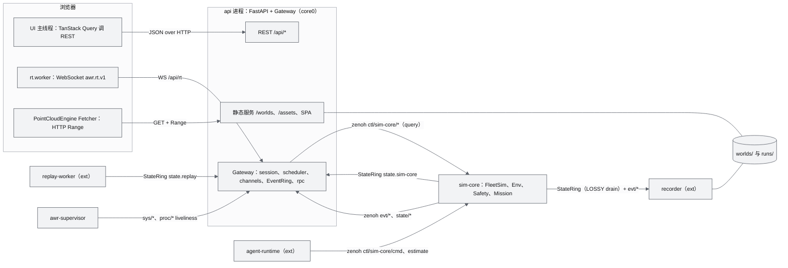
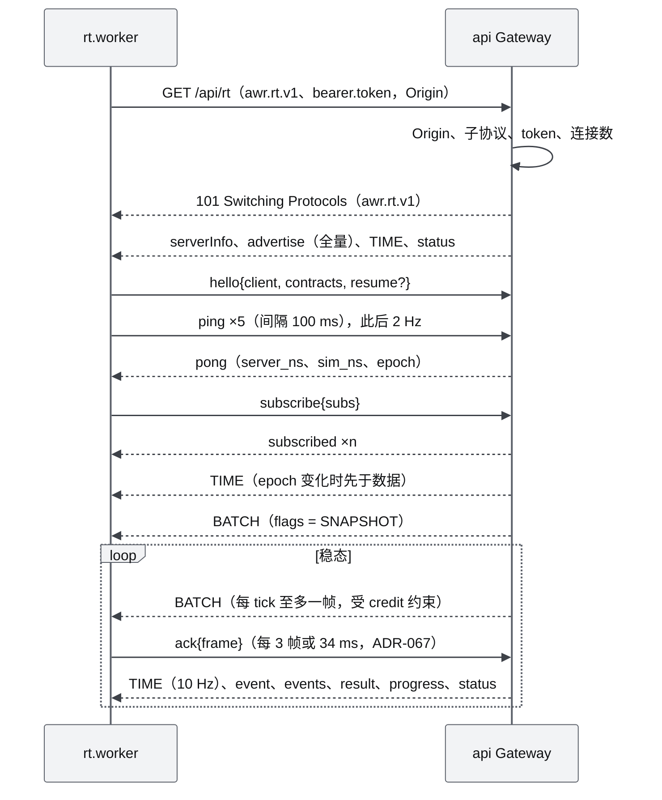
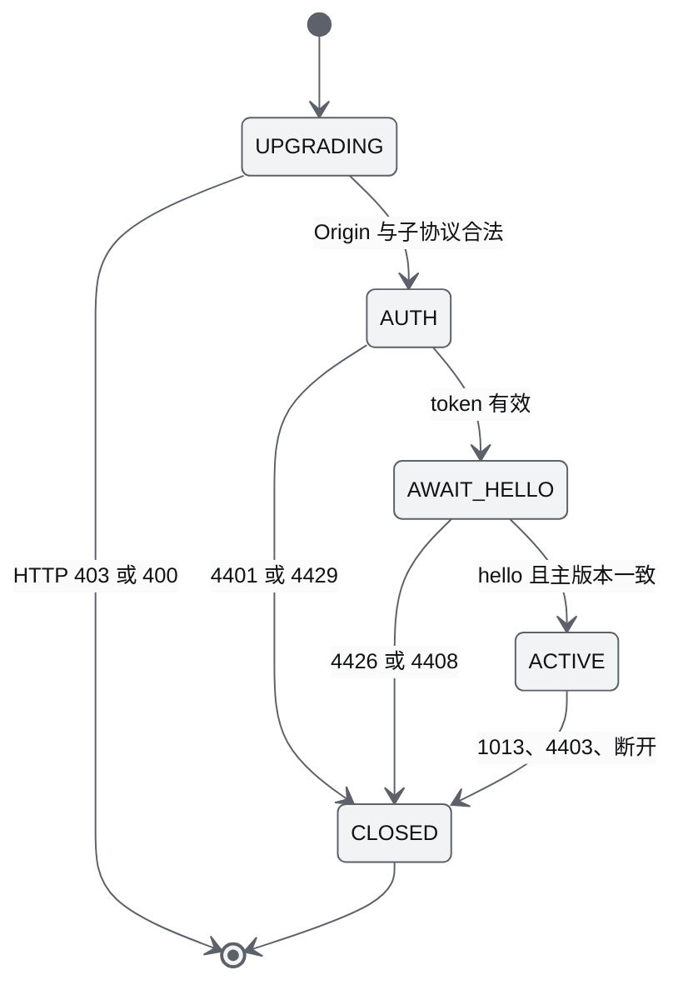
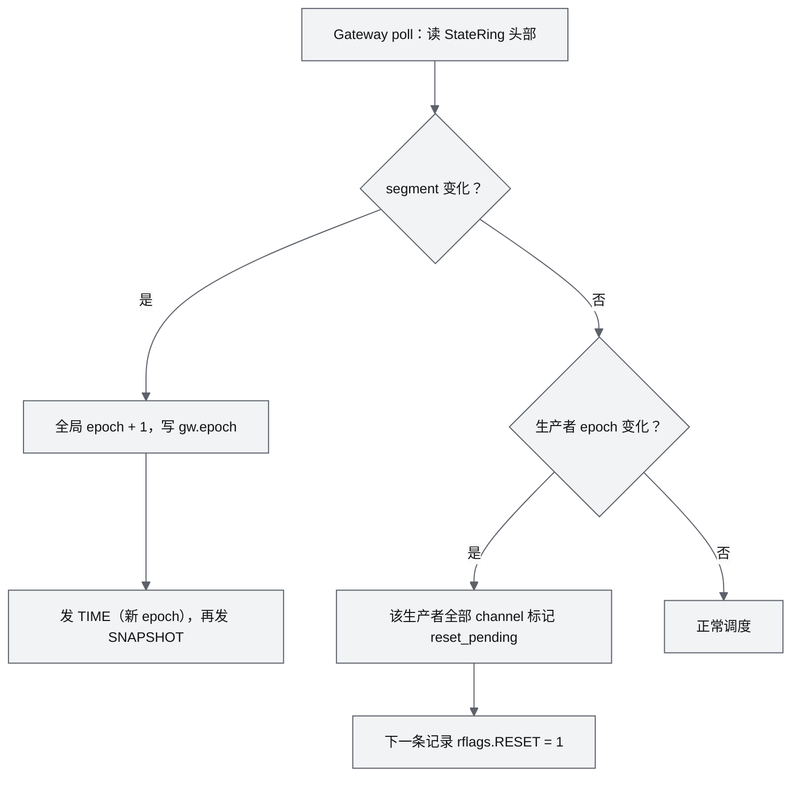
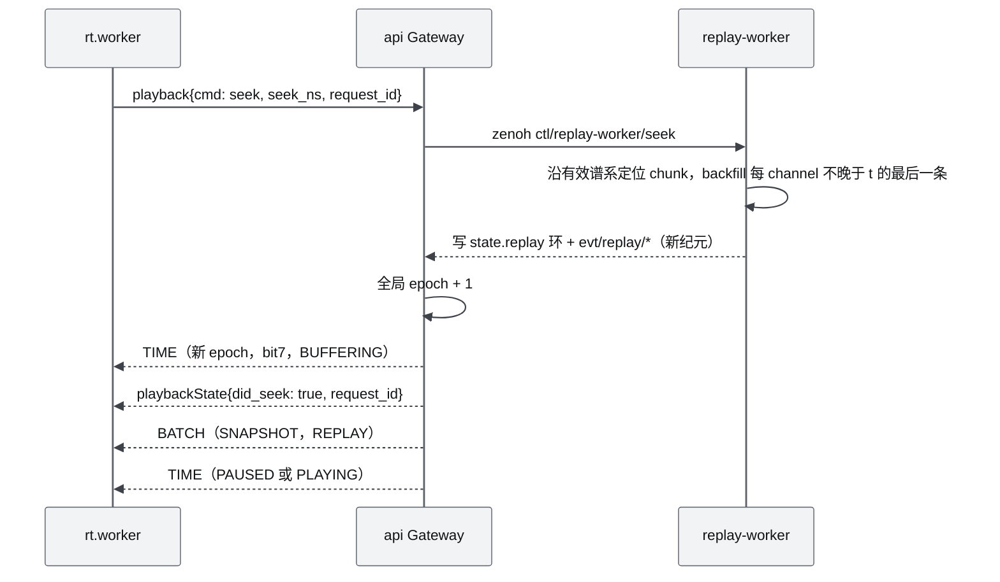
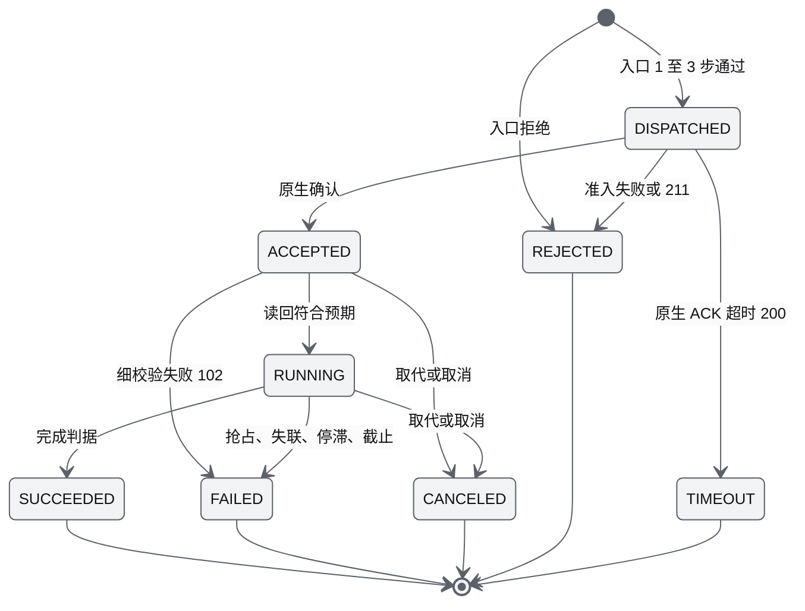
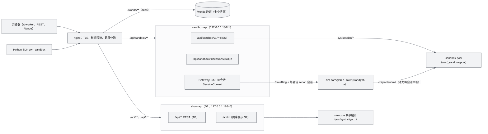
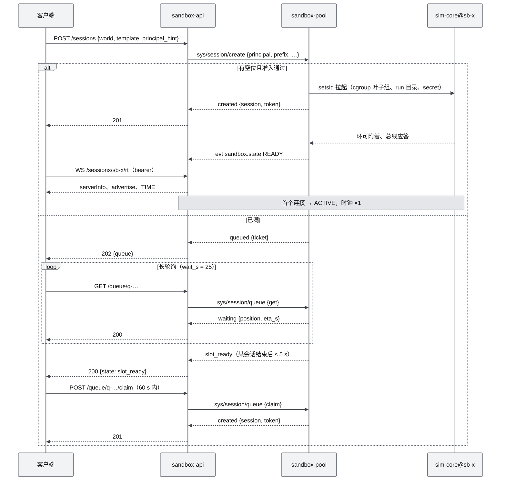
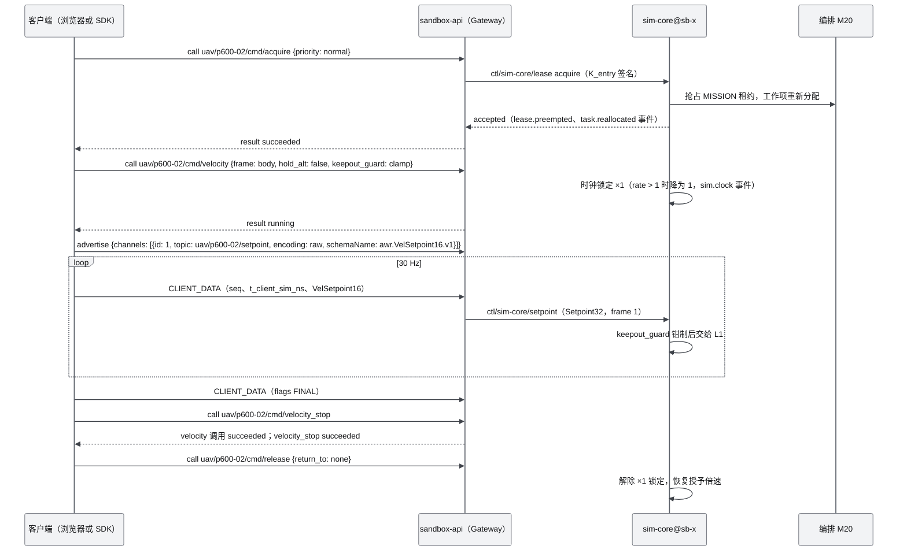

# 17 接口与实时协议规范（Interface & Realtime Protocol Specification）

| 项 | 内容 |
|---|---|
| 文档编号 | AWR-17 |
| 标题 | 接口与实时协议规范（REST + awr.rt.v1 + 内部 IPC） |
| 版本 | v1.1 |
| 日期 | 2026-09-28 |
| 状态 | 草案（审校修订） |
| 修订记录 | v1.0 初稿；v1.1 审校：修正 StateRing 头部一致性读（新增 `clock_seq`）与单槽覆盖丢尾帧问题，补 `srtt` 来源与 uvicorn 启动参数，统一 UNIX 时间字段名为 `t_wall_ns`（AWR-03 §5.2），登记下游文档提请的端点、bus key、事件与原因码段（§4.2、§8.4、§9.3、§10.9），解决原因码编号冲突 |
| 上游文档 | [03-设计基线与决策记录](03-设计基线与决策记录.md)（§3.3、§3.4、§3.7、§5、§8.4、§8.5；ADR-013、014、015、016、017、018、019、025、027、040、045、046、047、049、050）；研究笔记 [r27](research/r27-realtime-bridges.md)（实时协议权威）、[g04](research/g04-gap.md)、[g05](research/g05-gap.md)、[g06](research/g06-gap.md)、[r21](research/r21-mavsdk-mavros-mavlink.md)、[r15](research/r15-cesium-deckgl-foxglove.md)、[g03](research/g03-gap.md) §5、[00-index](research/00-index.md) §3.11、§5.5、C10、C17；[01-design](01-design.md) §10、§28、§30、§33、§36、§37、§39；[12-业务逻辑设计说明书](12-业务逻辑设计说明书.md)（命令、准入、席位的业务语义） |
| 下游文档 | [modules/M11](modules/M11-实时网关PRD.md)（实现方）、[M08](modules/M08-仿真内核与飞行器适配PRD.md)、[M12](modules/M12-时间轴录制与回放PRD.md)、[M05](modules/M05-Web点云引擎PRD.md)、[M07](modules/M07-环境引擎PRD.md)、[M09](modules/M09-安全与健康PRD.md)、[M10](modules/M10-任务规划与集群PRD.md)、[M13](modules/M13-传感器仿真PRD.md)、[M14](modules/M14-智能体运行时与ANet-PRD.md)、[M15](modules/M15-前端UI壳与设计体系组件PRD.md)、[M16](modules/M16-演示数据剧本与流畅性测试PRD.md)；[10](10-系统架构说明书.md)、[14](14-UI交互设计PRD.md)、[16](16-World数据规范.md)、[18](18-性能与测试方案.md)、[19](19-部署与运维说明书.md) |
| 适用版本范围 | V0.1（D1）至 V1.0；实时协议 `awr.rt.v1`；契约包 `@awr/contracts` 1.x |

## 0. 摘要

1. 本文是全部**线上接口**的唯一定义方：REST（`/api/*`，R01–R58 加 v1.1 补登的 R59–R78，共 78 个端点）、静态 World 服务（`/worlds/*`，HTTP Range、immutable 缓存、COOP/COEP）、浏览器实时协议 `awr.rt.v1`（WS `/api/rt`）、进程间 IPC（StateRing 与 zenoh key 空间），以及契约文件 layouts、enums、commands、reasons、caps、topics、units、rng_streams、bus keys 的格式与代码生成规则（M00 的线上契约部分）。
2. `awr.rt.v1` = JSON 控制面（每连接有界 FIFO 1024，满则 1013 断开）+ 二进制数据面（BATCH：16 B 帧头 + 16 B 记录头，payload 8 字节对齐，单槽 mailbox，新帧覆盖旧帧）+ TIME 24 B（10 Hz）+ CLIENT_DATA（遥操作上行）。Full64/Lite32 按 g04 定稿：`flight_state = state | sub<<5`，flags 8 位，`ctrl = owner | locked<<3 | native<<4 | pose_src<<6`。
3. 调度：Gateway 60 Hz tick，rate class {1,2,5,10,15,20,30,60} Hz，对齐 tick 网格取最新值并保证尾帧，每个 (channel, seq) 只编码一次，懒生产；背压：credit 窗口 `W = clamp(ceil(max_rate·(srtt + ack_interval)) + 2, 3, 8)`，ack 每 3 帧或 34 ms 合并（浏览器客户端在槽交付主线程时确认，ADR-067；工具客户端仍为 50 ms），默认 W = 6。
4. 时间：TIME 携带 `t_sim_ns` 与同刻的服务端单调时钟；全局 epoch 只在 seek、剧本重置（含无 checkpoint 的 sim-core 重启）、实时与回放切换时 +1，且先发 TIME 再发 SNAPSHOT；生产者从 checkpoint 恢复只在其 channel 置 `rflags.RESET`；插值延迟 `D_sim = rate·clamp(2/hz_eff + jitter_p95, 60 ms, 300 ms)`，全局唯一 tRender。
5. 命令：10 个主命令与 arm、disarm、resume、cancel、acquire、release、kill、escalate 等辅助命令统一走 `call → result/progress`，`accepted` = 准入通过且拿到原生确认，每个 result 附 `effect{status, verify_trust}`，同一 call id 60 s【墙钟】幂等；原因码沿用 0–10、100–114、200–214，登记 AWR-12 提出的 115–124 与 M10 的 125，本文新增 300–322（协议与接入类），并按 §8.4 分配 330–369 与 400–499 的模块子段。
6. IPC：StateRing 产品版（头部 256 B + 8 个读者游标，K = 32，cap = 1024，每生产者 3,148,288 B；slot 用 seqlock，头部时钟组用 `clock_seq` 顺序锁；x86-64 TSO）；zenoh 命名空间 `awr/<world>/<run>/`，命令按生产者路由 `ctl/{producer}/cmd`，事件 `evt/{producer}/*` 按步合批 + seq + `_replay`，在线状态用 liveliness，挂死检测用主循环心跳。
7. 二次优化：继承原设计 §36 的"REST 管资源、WebSocket 管实时"分工；修正 §36 数据流（ROS2 不再必经）、§37 频率（按订阅协商）、§28 状态模型（字节级）；增强控制权与席位、幂等、背压、epoch、可靠事件和契约代码生成。
8. 本文新增的设定（TIME 的单调时钟字段、StateRing `segment` 与 `clock_seq` 字段、SensorPose48 布局、`events` 批量 op、300 段错误码、`ctl/sim-core/query` 等 key）逐条列入第 15 节"对基线的反馈"；下游文档提请登记的端点、key、事件、原因码与计时器在 §4.2、§8.4、§9.3、§10.7、§10.9 统一登记，编号冲突在 §8.4 裁决。

---

## 1. 文档定位与约定

### 1.1 写什么、不写什么

| 本文定义（单一真源） | 本文不定义（引用谁） |
|---|---|
| REST 路径、方法、请求与响应 schema、HTTP 状态、幂等规则 | 业务语义：命令准入顺序的含义、FlightState 语义、席位与租约业务规则、完成判据的业务解释 → [12](12-业务逻辑设计说明书.md) |
| 静态 World 服务的路由、缓存头、Range、跨源隔离 | World Package 文件内容与格式（world.json、ANET_Q16、hierarchy、AWRV、AWSL、MCAP、`.awrrt` 文件布局）→ [16](16-World数据规范.md) |
| `awr.rt.v1` 握手、op、帧格式、topic 表、订阅、调度、背压、TIME、epoch、回放控制、RPC、事件 | 客户端插值环与 SimClockView 的实现 → [M12](modules/M12-时间轴录制与回放PRD.md)；UI 如何呈现断线、STALE、错误 → [14](14-UI交互设计PRD.md) |
| 字节布局：Full64、Lite32、EnvSample32、VelSetpoint16、SensorPose48、TIME、BATCH、CLIENT_DATA、StateRing | EnvKeyframe 字段的物理含义与 `eval_env` 公式 → [M07](modules/M07-环境引擎PRD.md) |
| `enums.json`、`commands.json`、`reasons.json`、`caps/*.json`、`topics.json`、`units.json`、`rng_streams.json`、`bus/keys.json` 的格式；原因码全表；时钟域登记表 | 进程拓扑与部署 → [10](10-系统架构说明书.md)、[19](19-部署与运维说明书.md)；性能用例执行协议 → [18](18-性能与测试方案.md) |
| 内部 IPC：StateRing 布局与协议、zenoh key-expr、命令/事件/在线状态消息 | Gateway 内部类结构与代码组织 → [M11](modules/M11-实时网关PRD.md) |

### 1.2 对原设计的继承、修正与增强

| 原设计（01-design） | 原文要点 | 处置 | 本文落点 | 依据 |
|---|---|---|---|---|
| §36 前后端实时通信：REST 与 WebSocket 分工 | REST 负责 Scene、Mission、Configuration、File；WebSocket 负责 Drone State、Weather、Simulation Time、Sensor State、Event | **继承** | REST 资源按原分工组织（worlds、scenarios、missions、env 配置、runs 文件，§4）；WS topic 覆盖状态、天气、时间、传感器位姿与事件（§6.6） | 01-design §36 |
| §36 数据流"PX4 → ROS2 → Simulation Gateway → WebSocket → Browser" | ROS2 为必经环节 | **修正** | D1：FleetSim → StateRing → Gateway → `awr.rt.v1` → rt.worker；V0.2：PX4 经 px4-bridge（MAVLink）写 StateRing；V0.5：P600 经 Prometheus 协议或 rosbridge 适配；ROS2 只作适配器 | ADR-014；r27 §7 第 2 条 |
| §36 "WebSocket" 一词 | 未定义协议 | **增强** | 自研 `awr.rt.v1`：控制面与数据面分离、16 B 对齐帧、credit 背压、TIME 与 epoch、RPC、可靠事件（§6） | r27 §3.3–§3.12 |
| §37 更新频率：Backend State 50–100 Hz、WebSocket 10–50 Hz、Rendering 60 FPS | 固定频率 | **部分取代** | StateRing 125 Hz【仿真】；WS 按订阅协商 1–60 Hz（swarm 任何情况下 ≥ 10 Hz）；渲染经插值与数据频率解耦，Tier S 30 fps（ADR-044） | ADR-018、ADR-044、ADR-046 |
| §28 DroneState 伪结构 | position、orientation、velocity、acceleration、battery、flight_mode、gps、health、mission、sensors | **修正** | 热路径定稿为 Full64/Lite32（§6.5）；acceleration 不进 64 B 热路径，经 `state_ext.accel_mps2`（2 Hz）；gps、health、mission 细节进 `state_ext` 与 `safety` | ADR-015；g04 §5 |
| §30 控制模式（7 个） | Takeoff、Land、GoTo、FollowPath、Orbit、Hover、ReturnHome | **增强** | 10 个主命令 + 辅助命令，统一调用生命周期、effect 与原因码（§7） | ADR-016 |
| §39 Timeline（Pause、Play、Replay、Fast Forward、Seek） | 无时间模型 | **增强** | TIME 帧、epoch、`playback` op、backfill 快照（§6.10、§6.11） | r27 §3.10–§3.11；ADR-040 |
| §10 多人访问、远程演示 | 无控制权模型 | **增强** | viewer/operator/admin 角色、单操作席位、HMAC token、Origin 白名单、回环与局域网两种访问模式（§3） | ADR-027；AWR-03 §3.3 |
| §33 Message：ROS2/DDS | 进程间总线 | **取代** | 状态平面 StateRing，控制与事件平面 zenoh（§9） | ADR-018；g05 §0 |
| §14–§16、§21 大块数据（点云、风场） | 未区分通道 | **增强** | 大块数据一律走 HTTP（Range、immutable），WS 只推版本或 URL（> 256 KB 时） | r27 §0 第 12 条 |

### 1.3 通用约定

| 项 | 约定 | 依据 |
|---|---|---|
| 字节序与对齐 | 全部二进制小端；帧头与记录头各 16 B；每条记录 payload 起点 8 字节对齐；布局 `size` 为 8 的倍数 | r27 §3.4；AWR-03 §5.11 |
| 字段大小写 | `awr.rt.v1` 信封字段按 r27 冻结（camelCase，时间戳带 `_ns`，清单见 §6.3）；REST 与各 op 的业务载荷（args、data、result、事件 data）用 snake_case + 单位后缀；World Package 清单用 camelCase | AWR-03 §5.6 |
| 时间 | 线上 int64 `t_sim_ns`（从 run 起点）；墙钟时刻统一命名 `t_wall_ns`（UNIX ns，AWR-03 §5.2 第 1 条），其他 UNIX 时刻字段以 `_unix_ns` 结尾（如 `exp_unix_ns`、`created_unix_ns`），只用于显示与审计，JSON 中以**十进制字符串**传输（超过 2⁵³），msgpack 与二进制中为 int64；一切间隔计算只用单调时钟 | AWR-03 §5.2 |
| 坐标与姿态 | World ENU，m；四元数 `[x,y,z,w]`，WORLD←BODY(FLU)；线上航向 `yaw_rad` = ψ_enu | AWR-03 §5.1、§5.3 |
| 未知值 | 二进制浮点 NaN；枚举 0；u8 255、u16 0xFFFF；JSON `null` | AWR-03 §5.7 |
| 标识 | world `^[a-z0-9-]{1,63}$`（`_shared` 为保留目录，不是 world id）；vehicle `^[a-z0-9]+(-[a-z0-9]+)*$`，≤ 32 字符；run `r<YYYYMMDD>-<HHMMSS>-<4hex>`；call id `^[A-Za-z0-9._:-]{4,96}$`（推荐 UUIDv7）；request id UUIDv7 | AWR-03 §5.6；本文设定 |
| topic 与 key | zenoh key-expr 子集：chunk 为 `[a-z0-9][a-z0-9_-]*`，不以 `/` 开头或结尾，通配 `*`、`**` 只出现在订阅中 | r27 §3.6 |
| 时钟域标注 | 数值后标【仿真】或【墙钟】；本文未标注的周期（tick、TIME、ping）均为墙钟 | ADR-045 |
| 规范用语 | 必须、禁止、应、不应、可，含义同 AWR-03 §1.2 | — |

### 1.4 D1 范围速览

| 接口族 | D1-core（P0） | D1-ext（P1） | 桩 | 后续版本 |
|---|---|---|---|---|
| REST | auth、worlds 读取、world query、sessions/current、scenarios、fleet 读写（增删机体）、profiles（含详情 R61）、caps、missions 读取、env 读取与查询、events、health、sys（info、procs、restart、config、perf） | sessions 创建、worlds build、commands 镜像、missions 创建与预览、env 写入镜像、runs、jobs、recon jobs、faults、agents、perf-report、rt inspect、confirm token，以及补登的 R62–R77 | — | agent-tasks 真 ANet（V1.0）；`/api/sys/metrics`（V0.5） |
| 静态服务 | `/worlds/**` Range、缓存头、COOP/COEP、SPA | CSP | CORS 白名单（P2） | 预压缩 gzip（V0.5 公网） |
| `awr.rt.v1` | 全部 op（`playback` 与 `m4` 除外）；BATCH、TIME、CLIENT_DATA；五种 raw 布局 | `playback`/`playbackState` | — | `m4`（V0.3）、`fields` 裁剪（V0.3）、DELTA（V0.6）、SharedArrayBuffer（V0.3）、WebTransport（V1.0） |
| 命令 | 10 个主命令 + arm、disarm、resume、cancel、acquire、release（Mock）、批量 `fleet/cmd`、`sim/*`、`env/*`、`mission/*`、`seat/release` | kill、escalate、override 租约、`seat/takeover`、`rec/*`、HMAC lease token | `caps/px4_sih.json`、`caps/prometheus.json` | SIH（V0.2）、Prometheus（V0.2 模拟器 / V0.5 真机） |
| 内部 IPC | StateRing、LocalRing、ZenohBus、LocalBus；`ctl/sim-core/{cmd,clock,lease,roster,estimate,query,setpoint,gcs,interest}`；`state/sim-core/{ext,safety,sensor,detail,env,mission,perf}`；`svc/geo/{height,ray_hit}`；`evt/*` + `_replay`；liveliness；心跳文件 | recorder、replay-worker、agent-runtime、job-worker、`sys/{start,stop}` 的 key；checkpoint 恢复 | `svc/geo/{raycast,los,lidar}` | ZenohStateBus（V0.5 跨主机）、TLS + ACL（V0.5） |
| 契约与生成 | 全部契约文件、代码生成、契约 CI、`fake_gw.py`、`FakeSource.ts` | — | — | — |

---

## 2. 接口全景

### 2.1 总览图



### 2.2 接口族清单

| 族 | 端点或 key | 编码 | 方向 | 权威 | 所有者 | 定义节 |
|---|---|---|---|---|---|---|
| REST | `/api/*` | JSON（problem+json 错误） | 浏览器、脚本 → api | 各领域进程 | M11 框架；领域路由见 §4.2 | §4 |
| 静态 | `/worlds/**`、`/assets/**`、SPA | 原始文件 | 浏览器 → api | World Package | M11（服务）；M03（内容） | §5 |
| 实时 | WS `/api/rt`，子协议 `awr.rt.v1` | JSON 控制面 + 二进制数据面 | 双向 | sim-core（状态）；Gateway（epoch、事件全局序号） | M11 | §6、§7 |
| 状态平面 | `/dev/shm/awr/<run>/state.<producer>` | Full64 + Lite32 AoS | 生产者 → 读者 | 生产者 | M11（库）；M08（写者） | §9.2 |
| 控制与事件平面 | zenoh `awr/<world>/<run>/…` | msgpack（少数 raw） | 进程间 | 见 key 表 | M11（Bus）；各模块（key 语义） | §9.3–§9.6 |
| 契约 | `packages/contracts/{rt,bus,rest}/**` | JSON | 构建期 | M00 | M00 | §10 |

---

## 3. 鉴权、访问模式与安全

### 3.1 角色、principal 与席位

| 角色 | 能力 | 签发条件 | 席位 |
|---|---|---|---|
| viewer | 读取全部 REST GET、订阅全部 topic（`perf/clients` 除外）、`env/query`、world query、perf-report 上报（公开模式除外） | 任意模式均无需口令 | 不占 |
| operator | viewer 全部能力 + 命令、时钟、环境写入、机群增删、录制开关、回放控制 | 回环模式无需口令；局域网模式必须提供管理口令；公开模式必须提供部署时配置的管理口令，未配置时一律 `115`（ADR-082） | 签发即占席位；席位被他人持有时返回 `116 SEAT_TAKEN` |
| admin | operator 全部能力 + `sys/restart`、`seat/takeover`、删除 runs、构建世界、`perf/clients`、`/api/sys/audit` | 任意模式都必须提供管理口令（`runs/<run>/admin.token`，0600；公开模式只认 `AWR_ADMIN_SECRET_FILE`，未配置时一律 `115`） | 同 operator |

- **principal**：一个"人"或一个进程的稳定身份。浏览器首次访问时生成 128 位随机数存入 localStorage，作为 `principal_hint` 传给 `POST /api/auth/token`；`principal_id = "p-" + base32(hint)`。刷新页面后 principal 不变，因此能在席位宽限期内收回席位。agent-runtime 的 principal 为 `agent:<aid>`，由 agent-runtime 自签（不经 REST）。
- **席位**：每个 run 至多一个席位持有者（Q5），权威在 sim-core LeaseManager（AWR-12 §4.2.2）；api 在签发 operator 或 admin token 时经 `ctl/sim-core/lease` 的 `seat_claim` 登记。席位状态机、宽限 30 s【墙钟】与孤儿租约语义见 AWR-12 §4.2.2。
- admin 是 operator 的超集，与基线 §8.5 的"viewer 或 operator"两角色的关系见第 15 节第 4 条。

### 3.2 token 格式与签发

token 字符串为 `v1.<b64url(payload)>.<b64url(sig)>`（base64url 不带填充；全部字符属于 RFC 7230 tchar，可直接放进 `Sec-WebSocket-Protocol`）。

| payload 字段 | 类型 | 说明 |
|---|---|---|
| `v` | int | 1 |
| `sub` | str | principal_id |
| `role` | enum | viewer、operator、admin |
| `run` | str | run_id；token 只在本 run 有效，会话切换后返回 `302 TOKEN_INVALID`，客户端用同一 `principal_hint` 重新签发 |
| `mode` | enum | 签发时的访问模式：loopback、lan、public（ADR-082） |
| `iat`、`exp` | int | UNIX 秒；`exp = iat + 43200`（12 h，本文设定：覆盖一次演示日，且 run 结束即失效） |
| `jti` | str | 16 位十六进制随机数，写入审计 |

- `sig = HMAC-SHA256(K_auth, "v1." + b64url(payload))`。
- 密钥派生（ADR-027：认证与租约分钥）：`AWR_SECRET` 为每个 run 生成的 32 字节随机数（`runs/<run>/secret`，0600，随 run 持久化以支持崩溃恢复）；`K_x = HKDF-SHA256(ikm = AWR_SECRET, salt = run_id, info = "awr/<x>/v1")`，其中 x ∈ {auth, lease, entry, confirm}。
- 携带方式：REST 用 `Authorization: Bearer <token>`；WS 用子协议 `bearer.<token>`。**禁止**放在 URL 查询参数中（会进入访问日志），**禁止**使用 cookie（CSRF）。
- 确认令牌（ext）：kill、escalate、强制移除机体、`seat/takeover`、override 租约需要确认令牌；由 `POST /api/auth/confirm` 或 WS `call confirm/issue` 签发，绑定 principal、action、target，有效 10 s【墙钟】，单次使用。

### 3.3 Origin 校验与访问模式

| 访问模式 | 绑定 | Origin 白名单 | operator 与 admin 签发 |
|---|---|---|---|
| 回环（默认） | `127.0.0.1:8000` | `^https?://(localhost\|127\.0\.0\.1)(:\d+)?$`（任意端口，含 SSH 转发与 Vite 5173） | operator 免口令；admin 需口令 |
| 局域网（`AWR_BIND=0.0.0.0`） | `0.0.0.0:8000` | 回环白名单 ∪ `AWR_ORIGINS`（逗号分隔的精确 origin） | 均需管理口令 |
| 公开（`AWR_ACCESS_MODE=public`，公开演示站，ADR-082） | 只能是回环地址（public profile 为 `127.0.0.1:18640`），由反向代理对外 | 只有 `AWR_ORIGINS` 的精确值（不含回环正则，必须配置） | 匿名只签 viewer；operator 与 admin 只认部署时配置的管理口令（`AWR_ADMIN_SECRET_FILE`），未配置时一律 403 `115`（`detail.why = PUBLIC_READONLY`），口令错误 401 `304` |

规则（依据 AWR-03 §3.3；D1-AC-33）：

1. WS 握手：带 `Origin` 且不在白名单 → 拒绝升级，HTTP 403。浏览器发起的 WS 必带 Origin；不带 Origin 的非浏览器客户端（基准脚本）放行，但仍需 token。
2. REST：请求带 `Origin` 头（浏览器的非 GET 请求与跨源请求）且不在白名单 → 403，`303 ORIGIN_FORBIDDEN`；不带 Origin 的请求（同源 GET、curl）进入 token 校验。
3. 静态服务不校验 Origin（公开只读），跨源读取需按 §5.4 显式开启 CORS。
4. 浏览器无法读到 WS 握手失败的 HTTP 状态（只得到关闭码 1006），因此客户端在 1006 时调用 `GET /api/auth/whoami` 判别是 401 还是 403，再进入 AWR-14 的 E-08。
5. **Host 白名单**（防 DNS 重绑定，AWR-03 §3.3 第 5 条）：REST、WS 与静态服务的 `Host` 头主机部分必须 ∈ {localhost, 127.0.0.1} ∪ `AWR_ALLOWED_HOSTS`（局域网模式由 `AWR_ORIGINS` 推导），否则返回 HTTP 400、`323 HOST_FORBIDDEN`（M11 HostGuard）；REST 写请求在此之外仍执行第 2 条的 Origin 校验。
6. 访问模式以 `AWR_ACCESS_MODE ∈ {loopback, lan, public}` 为准，未设置时由 `AWR_BIND` 推导（容器部署必须显式设置，AWR-19；public 从不推导，必须显式设置）。public 模式绑定非回环地址或缺少 `AWR_ORIGINS` 时以退出码 2 拒绝启动。
7. **客户端地址与世界白名单**（任何模式可设，ADR-082）：`AWR_TRUSTED_PROXIES`（IP 或 CIDR）列出可信反向代理，对端属于其中时按 `X-Forwarded-For` 自右向左取第一个不可信地址（遇到不可解析的条目即停止），没有转发头时取 `X-Real-IP`；该地址只用于 §3.4 的按地址限流、WS 连接计数与 §3.6 审计的来源，绝不参与鉴权。`AWR_WORLDS_ALLOW` 为世界白名单：`/worlds/<id>/**`、`/api/worlds/<id>`、`/api/world/<id>/**` 中不在白名单的世界在 Host 与 Origin 校验之后 404 `305`（`_shared/env` 共享资产不算世界），`GET /api/worlds` 只列白名单内的世界。
8. **公开模式的 REST 策略**（在路由依赖之前执行，ADR-082）：演示站不提供的功能族——`/api/runs/**`、`/api/jobs/**`、`/api/recon/**`、`/api/agents/**`、`/api/agent-tasks/**`、`/api/sys/perf-report`、`/api/sys/perf-reports/**`、`/api/sys/procs`、`/api/sys/audit`、`/api/rt/inspect`、`/api/rt/topics` 与 `/api/openapi.json`——对 admin 以外的角色 404 `305`；写类请求（POST、PUT、PATCH、DELETE）对 operator 以下的角色只放行 `POST /api/auth/token`、`POST /api/env/query` 与 `POST /api/world/{id}/query`，其余 403 `115` 并记审计 `auth.denied`（why `public_readonly`）；`GET /api/sys/info` 的绑定与版本细节只返回给 admin。WS `call` 的角色检查不变（viewer 写操作 115，§3.5）。

### 3.4 限流与大小上限

| 项 | 默认值 | 超限结果 | 依据 |
|---|---|---|---|
| operator principal 的 `call`（含 REST 命令镜像） | 50 次/s，突发 100 | `111 RATE_LIMITED` | AWR-12 §5.1.2 第 6 条；D1-AC-10 |
| agent-runtime 合计 | 20 次/s，突发 40 | 111 | 同上；ADR-036 |
| `env/set`、`env/preset` | 2 次/s | 111 | AWR-12 §5.1.2 |
| 时钟操作 `sim/*` | 5 次/s | 111 | 同上 |
| 机群增删 | 10 次/s | 111 | 同上 |
| `subscribe`、`unsubscribe` | 20 条/s | `error{code:111}` | 本文设定 |
| `ping` | ≤ 10 条/s | 超出部分忽略 | 本文设定 |
| `clientStats` | ≤ 2 条/s | 超出部分忽略 | 本文设定 |
| CLIENT_DATA | 每 channel ≤ 60 Hz | 超出丢弃并计数 | r27 §3.12 |
| 客户端 WS 文本帧 | ≤ 256 KiB（1000 航点 follow_path 约 30 KB）；由 uvicorn `--ws-max-size 262144` 在协议层执行 | 关闭 1009 | 本文设定；uvicorn 0.54.0 默认 16 MiB（`uvicorn/config.py`） |
| 客户端 WS 二进制帧 | ≤ 4 KiB | 关闭 1009 | 本文设定 |
| REST 请求体 | ≤ 1 MiB（perf-report ≤ 4 MiB） | 413，`307 PAYLOAD_TOO_LARGE` | 本文设定 |
| 每 principal WS 连接 | ≤ 8 | 关闭 4429 | 本文设定 |
| 全部 WS 连接 | ≤ 32（`AWR_WS_MAX`；公开模式 64） | 关闭 4429 | r27 §3.1.5（单进程约 40 个 150 KiB/s 客户端）；公开模式的访客多为只看点云与机群的低码率客户端（ADR-082） |
| 每个客户端地址的 WS 连接 | 不限制（`AWR_WS_MAX_PER_IP`；公开模式 4） | `error{code:316}` + 关闭 4429 | ADR-082 |
| 公开模式：每个客户端地址的全部 `/api/**`（健康检查除外） | 20 次/s，突发 120 | 429 `111` | ADR-082 |
| 公开模式：每个客户端地址的 token 签发 | 0.5 次/s，突发 10 | 429 `111` | ADR-082 |
| 公开模式：每个客户端地址的 world query | 20 次/s，突发 40 | 429 `111` | ADR-082 |
| 每连接订阅数 | ≤ 256 | `error{code:315}` | 本文设定 |
| 每连接 ≥ 30 Hz 的 Full64 channel | ≤ 64（关注集 K ≤ 32 + 选中与余量） | 315 | ADR-046；本文设定 |

限流均为令牌桶，时钟域为墙钟；超限响应带 `Retry-After`（REST）或 `retry_after_ms`（WS result）。按客户端地址计的条目用 §3.3 规则 7 的客户端地址（反向代理之后不是 127.0.0.1）。

**api 启动参数（线上行为的一部分，必须与本节一致）**：`uvicorn awr.api.main:app --host ${AWR_BIND:-127.0.0.1} --port 8000 --loop uvloop --ws websockets --ws-per-message-deflate false --ws-max-size 262144 --workers 1`。uvicorn 0.54.0 的 `ws_per_message_deflate` 默认为 True，而浏览器总会提议该扩展，不显式关闭就会违反 ADR-014 的"关闭 permessage-deflate"（本次审校在 r27 venv 的 `uvicorn/config.py` 第 211 行核实）。websockets 17.1 legacy 协议的 `write_limit` 默认 2¹⁶ = 64 KiB，即 §6.9 L3 的取值，无需另设。

### 3.5 权限矩阵

| 操作类别 | viewer | operator（非席位） | operator（席位） | admin | agent-runtime |
|---|---|---|---|---|---|
| REST GET、订阅、`env/query`、world query | 可 | 可 | 可 | 可 | 经 bus 读取 |
| 机体命令（租约类） | 115 | 116 | 可（逐机租约） | 可 | 可（AGENT 租约，受信守卫） |
| 安全类命令 land、hover、rtl | 115 | 116 | 可（免租约，受准入矩阵约束） | 可 | 只对自有租约机体 |
| safety_stop | 115 | 116 | 可 | 可 | 115（ADR-027、C35） |
| 时钟、环境写入、机群增删、任务启停、录制、回放 | 115 | 116 | 可 | 可 | 115 |
| kill、escalate、`seat/takeover`、`sys/restart`、删除 runs、构建世界 | 115 | 115 | kill 与 escalate 可（确认令牌）；其余 115 | 可 | 115 |

### 3.6 审计

`runs/<run>/audit.jsonl`，每 1 s fsync 一次（ADR-027）。`auth.denied` 的 `detail.source` 为客户端地址（§3.3 规则 7；没有可信代理时即 TCP 对端地址）。记录类别：`cmd.*`、`safety.*`、`proc.*`、`lease.*`、`seat.*`、`auth.token_issued`、`auth.denied`（Origin、Host、token 与口令失败，每来源每秒至多 1 条）、`runs.bookmark`、`runs.evicted`，V0.5 起 `real.enabled`、`real.checklist`、`real.estop`、`real.disabled`（19 §11.2）；只记录 `jti`（token_id），不记录 token 与口令本身。每行字段：`t_wall_ns`（字符串）、`t_sim_ns`、`kind`、`principal_id`、`role`、`entry`（api 或 agent-runtime）、`cid`、`uav`、`code`、`detail`。

---

## 4. REST API

### 4.1 通用规则

1. **路径与版本**：前缀 `/api`；无版本号路径即 API v1，所有响应带 `AWR-API-Version: 1`；不兼容变更使用 `/api/v2/…`，v1 至少保留一个次版本周期。
2. **内容类型**：请求 `application/json; charset=utf-8`；成功响应 `application/json`；错误响应 `application/problem+json`（§4.4）；`env/query` 与 `events` 另支持 `Accept: application/msgpack`（P1）。
3. **字段**：snake_case + 单位后缀（AWR-03 §5.4）；UNIX 纳秒字段以字符串传输；`t_sim_ns` 为 JSON number（相对 run 起点，2⁵³ ns 约 104 天内精确）。
4. **请求标识**：每个响应带 `X-Request-Id`（UUIDv7）；客户端可自带同名头，服务端原样回显。
5. **幂等**：GET、PUT、DELETE 按语义幂等；产生副作用的 POST 接受 `Idempotency-Key`（≤ 64 字符），api 保存 60 s【墙钟】；重放返回原状态码与原响应体并带 `Idempotent-Replayed: true`；同 key 不同请求体返回 422 `321 IDEMPOTENCY_CONFLICT`。命令类 POST 以请求体 `id`（call id）为幂等键，与 WS 同一张幂等表。
6. **分页**：`limit`（默认 100，最大 1000）+ `cursor`（不透明）；响应 `{items, next_cursor}`。
7. **异步操作**：202 Accepted + `Location`（指向 job 或 command 资源）；终态通过 GET 或 WS 事件获得。
8. **执行预算**：路由处理函数在 api 事件循环内的 CPU 时间 ≤ 1 ms（AWR-03 §4.2 第 1 条）；需要 sim-core 的操作经 bus 转发，超时 1 s，同一 cid 重试 2 次（g05 §3.3），仍失败返回 503 `211 SIM_UNAVAILABLE`。
9. **缓存**：`/api/**` 一律 `Cache-Control: no-store`，例外为 `GET /api/env/presets`、`GET /api/scenarios*`（`no-cache` + ETag）。
10. **OpenAPI**：FastAPI 生成 `/api/openapi.json`（dev/test 构建开放；生产构建需 admin token）；CI 与快照 `packages/contracts/rest/openapi.snapshot.json` 比对（§10.6）。快照由 `python tools/contracts/gen_openapi.py`（`make contracts` 一并执行）以固定设置导出、键排序写出，`--check` 与 `tests/contracts/test_openapi_snapshot.py` 比对；新增或改动 REST 路由的提交必须同时更新快照（验收加固 FX-GW）。

### 4.2 端点全表

"角色"列为最低角色，"席"表示须为席位持有者；"幂等"列：是 = 按语义幂等，键 = 支持 Idempotency-Key，cid = 以 call id 幂等，否 = 非幂等；"所有者"为 `python/awr/api/rest/` 下的文件（AWR-03 §4.3）。

| # | 资源 | 方法 | 路径 | 用途 | 角色 | 幂等 | 响应 | 所有者 | D1 | 优先级 |
|---|---|---|---|---|---|---|---|---|---|---|
| R01 | auth | POST | `/api/auth/token` | 签发 token，operator/admin 同时占席位 | 无 | 键 | 200 | auth.py（M11） | 是 | P0 |
| R02 | auth | GET | `/api/auth/whoami` | 当前 principal、角色、席位、到期 | viewer | 是 | 200 | auth.py | 是 | P0 |
| R03 | auth | POST | `/api/auth/confirm` | 签发确认令牌 | operator 席 | 否 | 200 | auth.py | 是 | P1 |
| R04 | worlds | GET | `/api/worlds` | 世界列表与状态 | viewer | 是 | 200 | worlds.py（M11） | 是 | P0 |
| R05 | worlds | GET | `/api/worlds/{id}` | 世界摘要与链接 | viewer | 是 | 200 | worlds.py | 是 | P0 |
| R06 | worlds | POST | `/api/worlds/{id}/build` | 重建世界（job-worker） | admin | 键 | 202 | jobs.py（M03） | 是 | P1 |
| R07 | world query | POST | `/api/world/{id}/query` | 几何探针（ray_hit 等，无副作用） | viewer | 是 | 200 | world_query.py（M04） | 是 | P0 |
| R08 | sessions | GET | `/api/sessions/current` | 当前运行会话 | viewer | 是 | 200 | sessions.py（M11） | 是 | P0 |
| R09 | sessions | POST | `/api/sessions` | 启动或切换会话（新 run） | operator 席 | 键 | 202 | sessions.py | 是 | P1 |
| R10 | scenarios | GET | `/api/scenarios` | 剧本列表（可按 world_id 过滤） | viewer | 是 | 200 | scenarios.py（M10） | 是 | P0 |
| R11 | scenarios | GET | `/api/scenarios/{id}` | 剧本全文（格式见 16） | viewer | 是 | 200 | scenarios.py | 是 | P0 |
| R12 | fleet | GET | `/api/fleet/vehicles` | roster 与摘要 | viewer | 是 | 200 | fleet.py（M08） | 是 | P0 |
| R13 | fleet | GET | `/api/fleet/vehicles/{id}` | 单机状态快照（JSON） | viewer | 是 | 200 | fleet.py | 是 | P0 |
| R14 | fleet | POST | `/api/fleet/vehicles` | 添加虚拟机体 | operator 席 | 键 | 201 | fleet.py | 是 | P0 |
| R15 | fleet | DELETE | `/api/fleet/vehicles/{id}` | 移除机体（走生命周期） | operator 席 | 是 | 202 | fleet.py | 是 | P0 |
| R16 | fleet | POST | `/api/fleet/vehicles/{id}/faults` | 故障注入 | operator 席 | 键 | 202 | fleet.py | 是 | P1 |
| R17 | fleet | GET | `/api/fleet/profiles` | 机型 profile 列表 | viewer | 是 | 200 | fleet.py | 是 | P0 |
| R18 | fleet | GET | `/api/fleet/caps` | 后端能力声明（含 `caps.clock`） | viewer | 是 | 200 | fleet.py | 是 | P0 |
| R19 | commands | POST | `/api/commands` | 发起调用（与 WS `call` 同一路径） | operator 席 | cid | 200 或 4xx | commands.py（M11） | 是 | P1 |
| R20 | commands | GET | `/api/commands/{id}` | 调用最新结果，可长轮询 | viewer | 是 | 200 | commands.py | 是 | P1 |
| R21 | commands | GET | `/api/commands` | 活动调用列表（`uav`、`active` 过滤） | viewer | 是 | 200 | commands.py | 是 | P1 |
| R22 | commands | POST | `/api/commands/{id}/cancel` | 取消调用 | operator 席 | 是 | 200 | commands.py | 是 | P1 |
| R23 | missions | GET | `/api/missions` | 当前 run 的任务列表 | viewer | 是 | 200 | scenarios.py（M10） | 是 | P0 |
| R24 | missions | GET | `/api/missions/{mid}` | 任务详情（航点、路径、区域） | viewer | 是 | 200 | scenarios.py | 是 | P0 |
| R25 | missions | POST | `/api/missions` | 由生成器创建任务 | operator 席 | 键 | 201 | scenarios.py | 是 | P1 |
| R26 | missions | POST | `/api/missions/preview` | 预览路径、安全高度剖面与能量预检 | viewer | 是 | 200 | scenarios.py | 是 | P1 |
| R27 | env | GET | `/api/env/state` | 最新 EnvKeyframe（自包含） | viewer | 是 | 200 | env.py（M07） | 是 | P0 |
| R28 | env | GET | `/api/env/presets` | `presets.json`（ETag = sha256） | viewer | 是 | 200 | env.py | 是 | P0 |
| R29 | env | POST | `/api/env/query` | 环境场点查询（≤ 256 点） | viewer | 是 | 200 | env.py | 是 | P0 |
| R30 | env | POST | `/api/env/set` | 修改环境（同 `call env/set`） | operator 席 | cid | 200 | env.py | 是 | P1 |
| R31 | env | POST | `/api/env/preset` | 切换预设（同 `call env/preset`） | operator 席 | cid | 200 | env.py | 是 | P1 |
| R32 | env | GET | `/api/env/streamlines/{lib}/d{deg}.awsl` | 流线二进制（immutable） | viewer | 是 | 200 | env.py | 是 | P1 |
| R33 | runs | GET | `/api/runs` | 运行与录制段列表 | viewer | 是 | 200 | runs.py（M12） | 是 | P1 |
| R34 | runs | GET | `/api/runs/{run}` | `meta.json` 与绑定信息 | viewer | 是 | 200 | runs.py | 是 | P1 |
| R35 | runs | GET | `/api/runs/{run}/segments/{seg}.mcap` | 下载录制段（支持 Range） | viewer | 是 | 200/206 | runs.py | 是 | P1 |
| R36 | runs | POST | `/api/runs/{run}/keep` | 标记或取消保留 | operator 席 | 是 | 200 | runs.py | 是 | P1 |
| R37 | runs | DELETE | `/api/runs/{run}` | 删除运行 | admin | 是 | 204 | runs.py | 是 | P1 |
| R38 | jobs | POST | `/api/recon/jobs` | 提交 Mock 重建任务 | operator 席 | 键 | 202 | jobs.py（M03，M01 注册） | 是 | P1 |
| R39 | jobs | GET | `/api/jobs` | 任务列表 | viewer | 是 | 200 | jobs.py | 是 | P1 |
| R40 | jobs | GET | `/api/jobs/{id}` | 任务详情 | viewer | 是 | 200 | jobs.py | 是 | P1 |
| R41 | jobs | POST | `/api/jobs/{id}/cancel` | 取消任务 | 提交者或 admin | 是 | 200 | jobs.py | 是 | P1 |
| R42 | jobs | POST | `/api/jobs/{id}/retry` | 重试 `failed(resumable)` | 提交者或 admin | 键 | 202 | jobs.py | 是 | P1 |
| R43 | agents | GET | `/api/agents` | Agent 列表 | viewer | 是 | 200 | agents.py（M14） | 是 | P1 |
| R44 | agents | GET | `/api/agents/{aid}/manifest` | 能力清单 | viewer | 是 | 200 | agents.py | 是 | P1 |
| R45 | agents | POST | `/api/agent-tasks` | 发布协作任务 | operator 席 | 键 | 202 | agents.py | 是 | P1 |
| R46 | agents | POST | `/api/agent-tasks/{id}/cancel` | 取消协作任务 | operator 席 | 是 | 200 | agents.py | 是 | P1 |
| R47 | perf | POST | `/api/sys/perf-report` | `/bench` 等回传的性能报告 | viewer | 键 | 201 | sys.py（M11） | 是 | P1 |
| R48 | perf | GET | `/api/sys/perf-reports` | 报告列表 | viewer | 是 | 200 | sys.py | 是 | P1 |
| R49 | perf | GET | `/api/sys/perf-reports/{rid}` | 报告全文 | viewer | 是 | 200 | sys.py | 是 | P1 |
| R50 | health | GET | `/api/health/live` | api 存活 | 无 | 是 | 200 | sys.py | 是 | P0 |
| R51 | health | GET | `/api/health/ready` | 就绪（sim-core、环、世界） | 无 | 是 | 200/503 | sys.py | 是 | P0 |
| R52 | sys | GET | `/api/sys/info` | 版本、协议、契约、layout 哈希 | 无（精简）/ viewer | 是 | 200 | sys.py | 是 | P0 |
| R53 | sys | GET | `/api/sys/procs` | 进程状态（supervisor） | viewer | 是 | 200 | sys.py | 是 | P0 |
| R54 | sys | POST | `/api/sys/restart` | 重启进程或复位熔断 | admin | 键 | 202 | sys.py | 是 | P0 |
| R55 | sys | GET | `/api/sys/audit` | 审计日志 | admin | 是 | 200 | sys.py | 是 | P1 |
| R56 | events | GET | `/api/events` | 按全局 seq 补拉事件 | viewer | 是 | 200/410 | sys.py | 是 | P0 |
| R57 | rt | GET | `/api/rt/topics` | channel 表与 topics.json | viewer | 是 | 200 | M11（`rt/`） | 是 | P1 |
| R58 | rt | GET | `/api/rt/inspect` | 网关诊断（每客户端统计、最近帧） | admin（dev/test 为 viewer） | 是 | 200 | M11（`rt/`） | 是 | P1 |
| R59 | sys | GET | `/api/sys/config` | 前端运行配置（`worlds_base` 等，§4.3.12） | 无 | 是 | 200 | sys.py（M11） | 是 | P0 |
| R60 | sys | GET | `/api/sys/perf` | 服务端指标窗口聚合（`?window_s=60`，§4.3.12） | viewer | 是 | 200 | sys.py（M11） | 是 | P0 |
| R61 | fleet | GET | `/api/fleet/profiles/{profile_id}` | 单个机型完整参数、置信度与孪生表 | viewer | 是 | 200 | fleet.py（M08） | 是 | P0 |
| R62 | fleet | DELETE | `/api/fleet/vehicles/{id}/faults/{fault_id}` | 清除故障（Mock 限定） | operator 席 | 是 | 204 | fleet.py（语义 M09） | 是 | P1 |
| R63 | jobs | GET | `/api/recon/engines` | 重建引擎可用性（Mock 可用，其余"需要 GPU"） | viewer | 是 | 200 | jobs.py（语义 M01） | 是 | P1 |
| R64 | jobs | GET | `/api/jobs/{id}/log` | 任务日志尾部（`?tail=200`） | viewer | 是 | 200 | jobs.py | 是 | P1 |
| R65 | missions | GET | `/api/missions/preview/{preview_id}` | 异步预览结果（R26 超过 2.5 s 时返回 202 + 该地址） | viewer | 是 | 200/202/404 | scenarios.py（M10） | 是 | P1 |
| R66 | runs | GET | `/api/runs/{run}/segments/{seg}.ovw` | 录制段概览索引（Range，缓存同 R35） | viewer | 是 | 200/206 | runs.py（M12） | 是 | P1 |
| R67 | runs | GET | `/api/runs/{run}/segments/{seg}.evx` | 录制段事件索引（Range） | viewer | 是 | 200/206 | runs.py | 是 | P1 |
| R68 | runs | GET | `/api/runs/{run}/events` | 回放打开时的完整事件分页 | viewer | 是 | 200/409 | runs.py | 是 | P1 |
| R69 | runs | GET | `/api/runs/{run}/bookmarks` | 共享书签列表 | viewer | 是 | 200 | runs.py | 是 | P1 |
| R70 | runs | POST | `/api/runs/{run}/bookmarks` | 新建书签 | operator | 键 | 201 | runs.py | 是 | P1 |
| R71 | runs | PATCH | `/api/runs/{run}/bookmarks/{bid}` | 修改书签标签 | operator | 是 | 200 | runs.py | 是 | P1 |
| R72 | runs | DELETE | `/api/runs/{run}/bookmarks/{bid}` | 删除书签 | operator | 是 | 204 | runs.py | 是 | P1 |
| R73 | agents | GET | `/api/agent-tasks` | 协作任务列表（`state`、`capability`、`limit` 过滤） | viewer | 是 | 200 | agents.py（M14） | 是 | P1 |
| R74 | agents | GET | `/api/agent-tasks/{id}` | 任务详情（含报价、黑板阶段） | viewer | 是 | 200 | agents.py | 是 | P1 |
| R75 | agents | GET | `/api/agent-tasks/{id}/board` | 黑板视图 | viewer | 是 | 200 | agents.py | 是 | P1 |
| R76 | agents | GET | `/api/agent-tasks/{id}/evidence` | 证据链与校验结果 | viewer | 是 | 200 | agents.py | 是 | P1 |
| R77 | agents | POST | `/api/agent-tasks/{id}/assign` | 人工指派或重试（`provider_aid` 为 null 即重试） | operator 席 | 键 | 200 | agents.py | 是 | P1 |
| R78 | sys | GET | `/api/sys/metrics` | Prometheus 文本导出（`?format=prom`） | viewer | 是 | 200 | sys.py | 否 | P2（V0.5） |

R59–R78 为本次审校补登的端点（请求来源：10 AD-07、M11 §14 第 4 条、18 PERF-FR-006、M08 X-03、M09 §14 第 5 条、M01 FR-043、M10 §14 第 7 条、M12 §7.3、M14 §7.1、19 §11.3 与 §20 第 11 条）；字段级 schema 以语义所有者 PRD 的对应节为准，本文登记路径、角色、幂等、状态码与 D1 层级，全部为 1.x 可选新增。M14 原申请编号 R47–R51 与本表 R47–R49 冲突，统一改为 R73–R77；AWR-12 §6.0 的 `POST /api/agent-tasks/{id}/retry` 合并为 R77（`provider_aid = null`）。

WS 端点 `GET /api/rt`（Upgrade）见 §6。`/api/world/{id}/query` 沿用基线的单数写法（AWR-03 §6.3 M04、§8.2），与复数资源 `/api/worlds` 的不一致见第 15 节第 3 条。

### 4.3 资源 schema

#### 4.3.1 auth

`POST /api/auth/token`

| 请求字段 | 类型 | 默认 | 说明 |
|---|---|---|---|
| `role` | enum viewer、operator、admin | viewer | — |
| `principal_hint` | str（16–64 位 base32） | 无（服务端生成并在响应中返回） | 浏览器 localStorage 保存 |
| `admin_secret` | str 或 null | null | 局域网模式签 operator、任意模式签 admin 时必填 |
| `client` | str | — | 例如 `web/0.1.0`，写入审计 |

| 响应字段 | 类型 | 说明 |
|---|---|---|
| `token` | str | §3.2 |
| `principal_id`、`principal_hint` | str | — |
| `role` | enum | 实际签发的角色 |
| `run_id` | str | — |
| `exp_unix_ns` | str | — |
| `seat` | enum held、none | — |
| `access_mode` | enum loopback、lan、public（ADR-082） | — |

错误：`116 SEAT_TAKEN`（409，detail 含 `holder_since_unix_ns`，remedy 建议改签 viewer）；`304 ADMIN_SECRET_REQUIRED`（401，口令缺失或错误）；`115 ROLE_FORBIDDEN`（403，公开模式未配置管理口令时的 operator 与 admin，`detail.why = PUBLIC_READONLY`，§3.3）；`111 RATE_LIMITED`（429，公开模式按客户端地址的签发桶，§3.4）；`303 ORIGIN_FORBIDDEN`（403）；`118 READ_ONLY_MODE`（会话关闭中）。`GET /api/auth/whoami` 返回 `{principal_id, role, run_id, seat, exp_unix_ns, access_mode}`。

`POST /api/auth/confirm`（ext）：`{action: kill|escalate|remove_force|seat_takeover|lease_override, target: str}` → `{confirm_token, exp_unix_ns}`。

#### 4.3.2 worlds 与 world query

`GET /api/worlds` 的 items 字段：

| 字段 | 类型 | 说明 |
|---|---|---|
| `id`、`name`、`name_zh` | str | 来自 world.json |
| `status` | enum ready、building、missing、stale、failed | stale = contentVersion 校验失败待重建 |
| `content_version` | str 或 null | 12 位 |
| `scale_status`、`anchor_kind` | str | 来自 coordinate.json |
| `georeferenced` | bool | 合成数据为 false，UI 标注"示意坐标" |
| `points`、`bytes`、`roots` | int | 点数、字节、根数（苏州为 6） |
| `octree_bytes`、`node_count` | int | `octree.bin` 总字节（森林为各根之和）、八叉树节点数（M03 `WorldSummary`，World Hub 使用） |
| `levels_points` | int[] | 逐层累计点数（森林为逐层求和，ADR-013 的首屏层级依据） |
| `max_height_m` | float | DSM 最大高度（world z，m） |
| `first_screen` | `{points, bytes}` | Tier B/A 口径（ADR-013） |
| `world_json_url` | str | `/worlds/{id}/world.json` |
| `thumbnail_url` | str 或 null | — |
| `default_scenario_id` | str 或 null | — |
| `in_use` | bool | 被当前会话绑定（此时 build 返回 `123 WORLD_NOT_READY`） |

`GET /api/worlds/{id}` 另含 `coordinate_sha256`、`bounds_m`（`[[xmin,ymin,zmin],[xmax,ymax,zmax]]`）、`camera_home`、`layers`（id、type、status、bytes）、`qa`（`{status, messages[≤ 20]}`）。

`POST /api/worlds/{id}/build`（R06，admin）：请求 `{force: bool = false}`；响应 202 `{job_id, state: "QUEUED"}` + `Location: /api/jobs/{job_id}`。世界被当前会话绑定时返回 409 `123 WORLD_NOT_READY`；同一世界已有进行中的构建返回 409 `124 JOB_CONFLICT`；job-worker 未运行时 1 s 查询超时后返回 503 `213 SERVICE_UNAVAILABLE`（detail = `JOB_WORKER_UNAVAILABLE`，M03 F-08 的候选码 308 与本文 `308 UNSUPPORTED_MEDIA_TYPE` 冲突，不另分配数值码）。

`POST /api/world/{id}/query`（M04 语义；执行位置由 M04 决定，但必须满足 §4.1 第 8 条）：

| `op` | 入参 | 出参 | 上限 |
|---|---|---|---|
| `height_dsm`、`ground_dtm` | `points: [[x,y]]` | `z_m: float[]`（越界为 null） | 64 点 |
| `agl` | `points: [[x,y,z]]` | `agl_m: float[]` | 64 点 |
| `clearance` | `points: [[x,y,z]]`，`radius_m` | `clearance_m: float[]` | 64 点 |
| `ray_hit` | `origin_enu_m: [3]`，`dir: [3]`（单位向量），`max_range_m = 5000` | `{hit: bool, point_enu_m: [3] 或 null, dist_m, surface: dsm 或 dtm 或 none}` | 1 条 |
| `segment_los` | `pairs: [[[3],[3]]]` | `visible: bool[]`，`first_block_enu_m: ([3] 或 null)[]` | 16 对 |
| `path_coarse_check` | `polyline: [[x,y,z]]`，`buffer_m = 1` | `{ok, violations: [{seg, reason}]}` | 1000 点 |

响应共同字段：`content_version`、`source`（例如 `dsm_2m`）。超上限返回 422 `110 PARAM_OUT_OF_RANGE`。

**1.x 可选追加（M04 §7，v1.2 登记）**：op `probe`（右键查询：`points` ≤ 64，返回 DSM、DTM、AGL 与越界标志，越界为 null）、`heightmap_top`（沿折线的最大障碍高度，含膨胀与安全距离，≤ 1000 点）、`terrain_profile`（ext，地形跟随与航线剖面）；`ray_hit` 追加出参 `hit_kind`（top 或 side）、`normal_enu`、`ground_z_m`、`agl_m`、`origin_inside`；`path_coarse_check` 追加逐段 `verdicts`；共同字段追加 `derive_sha8` 与 `t_proc_us`；`clearance` 的 `radius_m` ≤ 10 m；`102 GEOFENCE_REJECT` 的 detail 增加 `GEO_CEILING`（safe_transit 剖面超过 `effective_max_z`）。world query 每 principal 令牌桶 10 次/s、突发 10（超限 429 `111`，§3.4）；路径中的 world id 必须等于当前运行世界，否则 409 `123 WORLD_NOT_READY`（detail = WORLD_NOT_IN_SESSION）。

#### 4.3.3 sessions

`GET /api/sessions/current` 返回 Session 实体（字段语义见 AWR-12 §3.3.4）：`run_id`、`world_id`、`content_version`、`coordinate_sha256`、`scenario_id`、`scenario_sha256`、`mode`（live、replay）、`state`、`clock{state, rate, t_sim_ns, epoch}`（state 为 TimeState 名称）、`world_seed`（字符串，u64）、`segment`、`caps_clock{mode, pausable, max_speed, steppable}`、`keep`、`seat{state, holder_principal}`。

`POST /api/sessions`（ext）：`{world_id, scenario_id?, seed?: str, rate?: float}` → 202 `{run_id, state: "PREPARING"}`。切换完成后，所有 WS 连接收到新的 `serverInfo`（新 run、新 world）、全量 `advertise`、`TIME`（epoch + 1）与 SNAPSHOT（§6.10）；旧 run 的 token 失效（302）。D1-core 的会话由启动参数决定，不经此端点。

#### 4.3.4 scenarios

`GET /api/scenarios?world_id=` items：`id`、`world_id`、`name`、`name_zh`、`rate`、`gcs_loss_policy`、`n_vehicles`、`time_limit_s`、`sha256`。`GET /api/scenarios/{id}` 返回剧本 JSON 全文（schema 见 [16](16-World数据规范.md)）。

#### 4.3.5 fleet（drones）

`GET /api/fleet/vehicles` items（roster + 摘要，≤ 1000 条，不分页）：`id`、`agent_no`、`kind`、`model`、`profile_id`、`backend`、`simulated`、`producer`、`lifecycle`、`flight_state`（名称）、`sub`（名称）、`battery_pct`、`lease{owner, holder}`。

`GET /api/fleet/vehicles/{id}`：

```json
{"id":"p600-01","agent_no":0,"kind":"uav","model":"p600","profile_id":"p600_mid360","backend":"mock","simulated":true,
 "t_sim_ns":123400000000,
 "state":{"flight_state":"FLYING","sub":"GOTO","flags":{"armed":true,"in_air":true,"loc_ok":true,"failsafe":false,
          "gcs_link":true,"fcu_link":true,"loc_degraded":false,"alert":false},
          "ctrl":{"owner":"OPERATOR","locked":false,"native":"COMMAND","pose_src":"TRUTH"},
          "mission_item":null,"battery_pct":82,"pos":[120.0,40.0,60.0],"vel_mps":[2.1,0.3,0.0],
          "q_xyzw":[0,0,0.259,0.966],"omega_rad_s":[0,0,0.01]},
 "state_ext":{"lifecycle":"READY","battery":{"voltage_v":24.8,"soc_pct":82}},
 "lease":{"owner":"OPERATOR","holder":"p-abc…","priority":4}}
```

`POST /api/fleet/vehicles`（字段语义见 AWR-12 §5.14）：

| 字段 | 类型 | 单位 | 默认 | 说明 |
|---|---|---|---|---|
| `profile_id` | str | — | `p600_mid360` | 未知返回 110，detail = UNKNOWN_PROFILE |
| `vehicle_id` | str 或 null | — | 自动 `<model>-<nn>` | 冲突返回 409 `105 STATE`，detail = ID_EXISTS |
| `home_enu_m` | float[3] | m | 必填 | z 为 null 时取 `dsm(x,y)`；在障碍或禁飞区内返回 `102 GEOFENCE_REJECT` |
| `yaw_rad` | float | rad | 0 | ψ_enu |
| `speed_profile` | enum 或 null | — | profile 默认 | — |
| `initial_soc` | float | 0–1 | 1.0 | — |

响应 201 `{id, agent_no, lifecycle: "STARTING"}` + `Location`；新机体必须在 1 s 内出现在 `advertise` 与 `fleet/roster`（D1-AC-32）。`DELETE /api/fleet/vehicles/{id}?force=false`：非强制移除对地面机体（LANDED、DISARMED）立即执行；空中机体先按 AWR-12 §5.14.2 自动降落再移除（响应同样为 202，生命周期先经 LANDING 再 DRAINING；AWR-03 附录 B.3 C44）；`force=true` 需 `AWR-Confirm-Token` 头（否则 `112 CONFIRM_REQUIRED`）；响应 202 `{id, lifecycle: "DRAINING"}`，重复删除已移除机体返回 404 `107 NO_VEHICLE`。

`GET /api/fleet/profiles` items：`profile_id`、`model`、`mass_kg`、`twr`、`cda_m2`、`vmax_mps`、`status`（placeholder、identified）、`speed_profiles[]`（参数全集见 [16](16-World数据规范.md) 与 M08）。`GET /api/fleet/profiles/{profile_id}`（R61）返回该 profile 的完整参数与置信度，另含 `twin[]`（ADR-043 的组成部分、状态与一致性指标）与 `sensors{}`（内参、FOV、挂载，由 M13 `describe()` 生成）；字段表见 M08 §7.3，未知 id 返回 404 `305 NOT_FOUND`。`GET /api/fleet/caps` 返回 `{<backend>: caps}`（§7.7）。

`POST /api/fleet/vehicles/{id}/faults`（R16，ext，Mock 限定）：

| 字段 | 类型 | 单位 | 默认 | 说明 |
|---|---|---|---|---|
| `kind` | enum thrust_loss、motor_fail、link_drop、state_drop、gnss_denied、battery_drain | — | 必填 | 语义与参数见 M09 与 `rt/faults.schema.json` |
| `params` | object | 按 kind | `{}` | 例如 thrust_loss 的 `frac`（0–1，默认 0.45），参数全集见 M09 §6.12 |
| `at_s` | float 或 null | s【仿真】 | null（立即） | 相对当前 `t_sim` 的延迟 |
| `duration_s` | float 或 null | s【仿真】 | null（持续到清除） | — |

响应 202 `{fault_id, apply_tick}`；非 Mock 后端返回 501 `109 BACKEND_UNSUPPORTED`。`DELETE /api/fleet/vehicles/{id}/faults/{fault_id}`（R62）清除故障，204；已清除返回 404 `305`。故障注入写入输入日志（ADR-049），RNG 流为 `faults`（§10.8）。

#### 4.3.6 commands（REST 镜像，ext）

`POST /api/commands`：`{id?: str, service: str, args: object, timeout_ms: int = 3000}`（timeout_ms 取值 [500, 30000]，只约束首个结果）。准入通过返回 200，响应体即首个 `result` 帧（§7.2）；准入拒绝返回 problem+json（HTTP 按 §8.2 映射，`code` 与 WS 一致）。`Location: /api/commands/{id}`。

`GET /api/commands/{id}?wait_final_ms=0`：返回 `{result: <最新 result 帧>, history: [{status, code, t_sim_ns, t_wall_ns}]}`；`wait_final_ms` ∈ [0, 30000] 为长轮询上限。终态后保留 60 s【墙钟】，之后 404 `305 NOT_FOUND`。

#### 4.3.7 missions

`GET /api/missions` items：`mid`、`state`（IDLE、RUNNING、PAUSED、DONE、ABORTED）、`generator`、`vehicles[]`、`progress_pct`、`t_start_ns`。`GET /api/missions/{mid}` 另含 `tracks[{vehicle_id, state, items[{seq, kind, pos, speed_mps}]}]`、`paths[{vehicle_id, polyline_enu_m}]`、`region`（ENU 多边形 `[[x,y]]` 或 null）、`formation`（槽位或 null）、`revision`（修改计数，用于前端比对），以及可选的 `plan{planner, t_ms, degraded}`、`coverage_grid{x0_m, y0_m, res_m, w, h}`（ext）、`metrics{}`（字段见 M10 §7）。`POST /api/missions` 与 `/preview` 的参数由 M10 生成器定义，preview 返回 `{paths, min_safe_alt_profile, energy_precheck{feasible, per_vehicle[{id, energy_wh, soc_after_pct}]}}`；规划耗时超过 2.5 s【墙钟】时改回 202 `{preview_id}` + `Location: /api/missions/preview/{preview_id}`，客户端轮询 R65（进行中 202，完成 200，结果保留 60 s【墙钟】，过期后 404 `305 NOT_FOUND`，detail = PREVIEW_EXPIRED；M10 写的 410 按 §4.4"HTTP 状态按 §8.2 映射"改为 404）。规划无解返回 422 `125 PLAN_FAILED`（detail 取 NO_PATH、CEILING_INFEASIBLE、START_BLOCKED、GOAL_BLOCKED、PLAN_TIMEOUT、FORMATION_INFEASIBLE、COVERAGE_EMPTY，M10 §14 第 6 条）。大块结果经 sim-core 写入 `/dev/shm/awr/<run>/plans/`，api 只读文件返回（AWR-03 §4.2 第 1 条）。

#### 4.3.8 environment

- `GET /api/env/state`：最新 EnvKeyframe（`awr.env.keyframe.v1`，字段见 M07 与 g06 §3.5，速度字段按附录 B.1 改为 `_mps`），与 WS `env/state` 同一份字节语义；回放模式下接受 `?t_ns=`，返回该时刻有效的关键帧。
- `GET /api/env/presets`：`presets.json` 全文，`ETag` = sha256，与 EnvKeyframe 的 `config.presets_sha256` 一致（AWR-03 §5.11 第 5 条）。
- `POST /api/env/query`：`{points: [[x,y,z]] ≤ 256, t_ns?, fields?: [WIND, WIND_PARTS, OPTICS, PRECIP, THERMO], frame?: global|local|add_velocity_global|add_velocity_local, vel_mps?: [[3]], q_xyzw?: [[4]]}` → SoA：`{wind_mps: [[3]], sigma_ext_per_m: [], mor_m: [], rain_eff_mmh: [], rho_kgm3: [], temperature_c: [], flags: [], source_level: []}`。经 `ctl/sim-core/query` 在 sim-core 慢任务预算内执行（§9.4），每 tick 至多处理 1 个查询，排队 > 8 个返回 111。点数上限 256 由慢任务预算 1 ms 推出（g06 §6.2 实测：2 个 L2 扇区融合查询加湍流盒，1000 点约 2.2 ms；D1 只有 L0/L1 解析场加湍流盒，实际更快，但按 V0.3 引入风场库后的成本定上限，避免届时收紧契约），与 g06 的 1024 不同，见第 15 节第 8 条。
- `POST /api/env/set`、`/api/env/preset`：请求体同 WS `call env/set`、`env/preset` 的 args，另加可选 `id`（call id）；响应为首个 result。

#### 4.3.9 recordings（runs，ext）

`GET /api/runs` items：`run_id`、`world_id`、`created_unix_ns`、`keep`、`bytes`、`segments[{seg, t0_ns, t1_ns, bytes, closed, epochs[{epoch, t_from_ns, t_to_ns, valid}]}]`、`binding{content_version, coordinate_sha256, layout_id, contracts}`、`compatible`（与当前服务绑定是否一致，不一致时回放打开返回 `122 RECORDING_INCOMPATIBLE`）。`GET /api/runs/{run}` 返回 `meta.json`（格式见 16）。录制段下载支持 Range；已关闭段 `Cache-Control: private, max-age=31536000, immutable`，写入中的段 `no-store`。删除当前 run 返回 409 `105 STATE`（detail = RUN_ACTIVE）。

补登端点（R66–R72，字段语义见 M12 §7.3、§7.5）：`.ovw` 与 `.evx` 为段的派生索引，Range 与缓存规则同 R35；`GET /api/runs/{run}/events?seg=&from_ns=&to_ns=&level_min=&limit=200&cursor=` 只在该 run 处于回放打开状态时可用（经 replay-worker `ctl/replay-worker/query` 提供），否则 409 `463 REPLAY_NOT_OPEN`；书签请求 `{segment, t_sim_ns, label}` → 201 `{id}`，每 run 至多 1000 条（超出 409 `462 BOOKMARK_LIMIT`），`label` 经服务端净化（AWR-03 D1-AC-20 第 5 条）后写入并审计 `runs.bookmark`。`run` 参数必须匹配 `^r\d{8}-\d{6}-[0-9a-f]{4}$`，`seg` 匹配 `^\d{1,3}$`，拼接路径前做 `resolve()` 前缀检查（防路径穿越）。例外：`run` 等于当前运行的 id 而该 id 不是上述格式时（`--inproc` 单进程模式与测试栈的 `inproc-<hex>`），运行目录取当前运行的持久化目录（验收加固 FX-GW，INT-1 §7.8：此前 422）；其他不合格式的 id 仍返回 422 `110`。

#### 4.3.10 jobs 与 reconstruction（ext）

`POST /api/recon/jobs`：`{engine: "mock", source: {kind: "world_sample", world_id, path: "helix"|"lawnmower", frames: int = 600}, target_world_id: str}` → 202 `{job_id, state: "QUEUED"}`。`GET /api/jobs` items：`job_id`、`kind`（recon、world_build）、`state`（枚举由 M01、M03 登记在 `enums.json` 的 `JobState`）、`stage`、`progress_pct`、`submitted_by`、`created_unix_ns`、`target_world_id`、`scale_status`、`error{code, message}`。状态变化以可靠事件 `job.state` 推送（不节流），进度以 `job.progress` 推送（每任务 250 ms【墙钟】至多 1 条，只保留最新，M01 §6.7.3）。同一目标已有进行中的任务返回 `124 JOB_CONFLICT`；队列 ≥ 16 返回 429 `333 JOB_QUEUE_FULL`；重建类参数与阶段错误使用 §8.4 登记的 330–348。`GET /api/recon/engines`（R63）返回 `items[{engine, variant, available, reason, features, engine_scale, device, license, target_version}]`（字段见 M01 §7.1），经 `svc/job/engines` 查询 job-worker，api 缓存 10 s，job-worker 无回复时 `reason = WORKER_UNAVAILABLE`；`GET /api/jobs/{id}/log?tail=200`（R64）返回 `{lines: str[]}`（≤ 1000 行）。`recon` 类型任务在通用字段之外附 `recon{…}` 对象（M01 §7.1；M01 写作 `type`、`progress` 的通用字段以本节的 `kind`、`progress_pct` 为准）。

#### 4.3.11 perf reports（ext）

`POST /api/sys/perf-report`（R47）的请求体是一份完整的性能报告 `awr.perf.report.v1`，schema 的唯一定义方为 [18](18-性能与测试方案.md) §11.2（文件 `packages/contracts/perf/perf-report.schema.json`），本文只规定传输约束：

| 项 | 规定 |
|---|---|
| 内容 | `schema = "awr.perf.report.v1"`；`/bench` 回传时 `gate = "bench"`，`env` 带 `device_class`、`backend_tier`、`renderer` 与可选的 `adapter_info`（18 §11.2、ADR-044） |
| 校验 | 服务端以 jsonschema 全量校验，失败 400 `300 BAD_REQUEST`（detail 为首个失败的 JSON Pointer） |
| 大小与频率 | ≤ 4 MiB；每 principal 每分钟 1 次，超出 429 `111 RATE_LIMITED` |
| 存储 | `runs/perf-reports/<device_class>/<rid>.json`（`rid` 为 UUIDv7；`device_class` 取自 `env.device_class`，只允许 dgpu、igpu、software） |
| 响应 | 201 `{rid}` + `Location: /api/sys/perf-reports/{rid}`；R48 列表 items 为 `{rid, device_class, gate, created_unix_ns, summary}`，R49 返回原文 |

报告字段按 18 §11.2 使用 snake_case 与单位后缀（AWR-03 §5.6 第 2、4 条：页内快照 `awr.perf.v1` 为 camelCase，落盘与上报的报告为 snake_case）。

#### 4.3.12 health 与 sys

| 端点 | 响应 |
|---|---|
| `GET /api/health/live` | 200 `{status: "ok"}`（只证明事件循环可响应） |
| `GET /api/health/ready` | 200 `{status: "ready", sim: "ok", ring_attached: true, world_loaded: true, run_id}`；未就绪 503 `{status: "not_ready", sim, code: 211}`，`sim` ∈ stalled、restarting、down、failed |
| `GET /api/sys/info` | 无 token：`{name: "awr", version, protocol: "awr.rt.v1", api_version: 1, contracts, access_mode}`；viewer：另加 `git_commit`、`layout_id`（8 位十六进制）、`schemas{schemaName: hash}`、`kernel`（numba 或 numpy）、`run_id`、`world_id`、`bind`、`origins`、`versions{python, numpy, numba, zenoh}`（公开模式下这些细节只给 admin，ADR-082） |
| `GET /api/sys/procs` | `items[{name, state, pid, restarts, last_exit, uptime_s, hb_age_ms, cpu_pct, rss_mb}]`，`state` ∈ STOPPED、STARTING、RUNNING、STOPPING、BACKOFF、FAILED；admin 另含 `log_tail`（最后 200 行） |
| `POST /api/sys/restart` | `{name, reset_breaker: bool = false}` → 202；经 supervisor `sys/restart` |
| `GET /api/sys/config`（R59） | `{worlds_base: str = "/worlds", static_split: bool = false, access_mode: loopback、lan 或 public, tick_hz: 60, rate_classes: [1,2,5,10,15,20,30,60]}`；无需 token，`Cache-Control: no-store`。静态拆分回退（ADR-013；10 AD-07）启用时 `worlds_base` 为 `http://<host>:8001/worlds`，前端 Fetcher 一律以它拼接 World URL |
| `GET /api/sys/perf?window_s=60`（R60） | `window_s` ∈ [5, 600]，默认 60；返回 `perf/server` 各数值字段（§6.5 `awr.perf.server.v1`）在窗口内的 `{p50, p95, p99, max, count}`，外加 `t_from_unix_ns`、`t_to_unix_ns`；供 harness 在运行结束时拉取（18 PERF-FR-006） |
| `GET /api/sys/metrics?format=prom`（R78，V0.5，P2） | Prometheus 文本格式导出同一组指标；D1 不实现，路由返回 404 |

#### 4.3.13 events

`GET /api/events?since=<seq>&limit=1000&types=cmd.,safety.&level_min=0` → `{items: [event], next_since, oldest_seq}`，event 结构同 WS（§6.12）。`since` 早于 Gateway EventRing 的最早序号时返回 410 `319 EVENTS_TRUNCATED`，客户端改以各 channel 的自包含最新值恢复状态。

#### 4.3.14 rt 调试（ext）

`GET /api/rt/topics`：当前 channel 表（与 `advertise` 同结构）+ `topics.json`。`GET /api/rt/inspect`：`{tick{hz, age_p50_ms, age_p99_ms}, clients[{conn_id, principal_id, role, subs[{id, topic, rate, mode}], window, acked, frame_seq, credit_skips, srtt_ms, kbps, ctrl_queue_len}], channels[{id, topic, seq, encodes, last_t_sim_ns}], event_ring{oldest_seq, newest_seq, count, bytes}}`（`count`、`bytes` 为环内条数与存储字节，诊断用，FX2-R3-gateway）；`?dump=<conn_id>` 返回该连接最近一帧 BATCH 的十六进制与逐记录解码（仅 dev/test 构建）。

### 4.4 错误响应

```json
{"type":"urn:awr:reason:110","title":"PARAM_OUT_OF_RANGE","status":422,
 "code":110,"name":"PARAM_OUT_OF_RANGE","message":"orbit.radius_m 超出 [1, 1000]",
 "detail":{"field":"args.radius_m","value":1500,"range":[1,1000]},
 "remedy":"把半径改到 1000 m 以内","request_id":"0192…","retry_after_ms":null}
```

- `code` 必须存在于 `reasons.json`；`message` 为中文可读文本，`remedy` 给出下一步（AWR-12 §5.1.2 第 5 条）。
- HTTP 状态按 §8.2 的映射；429 与 503 附 `Retry-After`（秒）。

---

## 5. 静态 World 服务

### 5.1 路由

| 路径 | 内容与来源 | MIME |
|---|---|---|
| `/`、`/world/{id}` 等前端路由 | `apps/web/dist/index.html`（SPA 回退） | text/html |
| `/assets/**` | 前端构建产物（文件名带内容哈希） | js、css、woff2 按扩展名 |
| `/brand/**`、`/bench/**` | 品牌资产（本地托管，ADR-032）、flight60 数据 | 按扩展名 |
| `/demo/**` | 公开演示构建的落地页媒体（`dist/demo/`：头图、合成城市截图与演示动图，ADR-083）；no-cache + ETag；默认构建只有头图 | image/jpeg、image/webp |
| `/worlds/{id}/**` | World Package（`worlds/<id>/`，内容见 16） | `.json` application/json；`.geojson` application/geo+json；`.bin`、`.f32`、`.awrv`、`.awsl` application/octet-stream |
| `/worlds/_shared/env/**` | 跨世界共享的环境资产（湍流盒 `turb/vk_s{seed}_n64_dx4_L30.awrv`） | application/octet-stream |
| `/vehicles/{model}/model/{file}.glb` | 机型模型生成物（`vehicles/<model>/model/*.glb`，只暴露 `model/` 子目录）；URL 带 `?v=<sha256 前 12 位>` 时 immutable，否则 no-cache + ETag（M06 §14 第 5 条） | model/gltf-binary |
| `/models/{file}.glb` | 随前端构建复制的机型模型副本（`make vehicles-models` 经 `tools/vehicles/*.py --copy-web` 写入 `apps/web/public/models/`，构建后在 `dist/models/`）；只暴露 `*.glb`，no-cache + ETag；缺失或非 glb 名称返回 404 `305`，不落入 SPA 回退。前端按"本路由 → `/vehicles/{model}/model/{file}.glb`"的顺序取 hero 模型（M06-FR-035），因此只服务 `dist/` 的静态服务器（vite preview、测试服务器）也能加载 hero（验收加固 FX-WEB1） | model/gltf-binary |

配置了世界白名单（`AWR_WORLDS_ALLOW`，§3.3 规则 7）时，`/worlds/{id}/**` 中不在白名单的世界一律 404 `305`。`_shared` 不满足 world id 正则，不会与世界冲突；g06 §7.1 的 `assets/env/turb/` 改到此处，避免与前端 `/assets` 混用（第 15 节第 9 条）。静态服务由 Starlette `StaticFiles` 承担（ADR-013），缓存与安全头由 `awr/api/static.py` 的中间件统一添加。

### 5.2 缓存头

| 请求 | 响应头 | 说明 |
|---|---|---|
| `world.json` | `Cache-Control: no-cache`；`ETag`（强校验，内容 sha256） | 客户端带 `If-None-Match` 时返回 304 |
| `/worlds/{id}/**` 带 `?v=<当前 contentVersion>` | `Cache-Control: public, max-age=31536000, immutable`（200 与 206 相同） | ADR-006 |
| `/worlds/{id}/**` 带 `?v=`，但与当前 contentVersion 不同 | 409，`Cache-Control: no-store`，problem+json `310 CONTENT_VERSION_STALE` | **防止旧键缓存新内容**：世界重建后旧客户端必须先重取 world.json |
| `/worlds/{id}/**` 不带 `?v=` | `Cache-Control: no-cache` + ETag | 外部工具与对照查看器使用 |
| `/assets/**`（哈希文件名） | `public, max-age=31536000, immutable` | — |
| `index.html` 与前端路由 | `no-cache` | — |

api 对每个 `/worlds/{id}/**` 请求（含 world.json）先 `stat` 一次 `worlds/<id>/world.json`（微秒级，满足 §4.1 第 8 条），inode 或 mtime 变化即重读该世界的 contentVersion，另在收到 `world.added`、`world.updated` 事件时主动刷新；世界重建由 M03 以目录原子替换完成（新目录的 world.json inode 必然变化）。只在 world.json 请求时检查是不够的：重建后若没有客户端先取 world.json，旧 `?v=` 请求会以 immutable 拿到新内容，破坏上表的防护。

### 5.3 Range

1. 所有 `/worlds/**` 与录制段响应带 `Accept-Ranges: bytes`。
2. 支持单区间 `bytes=a-b`、`bytes=a-`、`bytes=-n`：返回 206 + `Content-Range: bytes a-b/size` + `Content-Length`。
3. 不可满足的区间返回 416 + `Content-Range: bytes */size`，`309 RANGE_NOT_SATISFIABLE`。
4. 客户端**禁止**发送多区间请求（`multipart/byteranges`，ADR-013）；服务端对多区间的行为不属于契约。
5. `hierarchy.bin`、`hierarchy_ext.bin` 用不带 Range 的整体 GET；`octree.bin` 首屏一次 Range 取 `[0, levelsByteEnd[L])`，L 按档位决定（ADR-013）。
6. 服务端**禁止**对 `/worlds/**` 与录制段做动态 Content-Encoding（Range 的字节区间针对未编码内容，动态压缩会破坏语义）；公网部署的压缩只允许预压缩的整体文件（V0.5）。
7. 并发：HTTP/1.1 每主机 6 个连接，Fetcher 同时在途的静态请求 ≤ 4（本文设定，给 REST 留 2 个），M05 可在 ≤ 5 内调整。

### 5.4 跨源隔离、CORS 与其他安全头

| 头 | 值 | 作用范围 | 依据 |
|---|---|---|---|
| `Cross-Origin-Opener-Policy` | `same-origin` | 全部 HTML 与静态资源 | n05 §0 第 10 条：跨源隔离后 `performance.now()` 精度 5 µs，并为 V0.3 的 SharedArrayBuffer 预留 |
| `Cross-Origin-Embedder-Policy` | `require-corp` | 同上 | 同上 |
| `Cross-Origin-Resource-Policy` | `same-origin`；开启 CORS 白名单时 `/worlds/**` 改为 `cross-origin` | 全部静态资源 | — |
| `X-Content-Type-Options` | `nosniff` | 全部 | — |
| `Referrer-Policy` | `no-referrer` | 全部 | — |
| `Content-Security-Policy`（P1） | `default-src 'self'; script-src 'self'; connect-src 'self'; worker-src 'self' blob:; img-src 'self' data: blob:; style-src 'self' 'unsafe-inline'; object-src 'none'; frame-ancestors 'none'` | HTML | 本文设定；验收检查 WS 在该策略下可连（CSP3 中 `'self'` 覆盖同主机 ws/wss，若验收失败改为按请求 Host 注入显式 ws origin） |

- 页面禁止引用任何外部资源（字体、图标、头像均本地托管），否则 COEP 会拦截。
- 静态拆分回退（ADR-013；R59 `static_split = true`）时，独立的 static 进程对 `/worlds/**` 固定返回 `Cross-Origin-Resource-Policy: cross-origin` 与按 Origin 白名单（§3.3）回显的 CORS 头，其余规则同下；页面仍由 api 同源提供，COEP 不受影响（10 AD-07）。
- CORS 默认关闭（同源）。`AWR_CORS_ORIGINS` 非空时，只对 `/worlds/**` 的 GET 与 HEAD 返回 `Access-Control-Allow-Origin: <回显>`、`Vary: Origin`、`Access-Control-Allow-Headers: Range`、`Access-Control-Expose-Headers: Content-Range, Accept-Ranges, Content-Length, ETag`、`Access-Control-Max-Age: 600`（P2）。`/api/**` 永不开放 CORS。

### 5.5 首屏请求序列

顺序以 AWR-03 §3.7（1）为准，本节只给出线上细节：

```text
GET /worlds/shenzhen/world.json                         Cache-Control: no-cache → 200 或 304
GET /worlds/shenzhen/coordinate.json?v=<cv>             immutable
GET /worlds/shenzhen/visual/pointcloud/metadata.json?v=<cv>   （森林：每个根一次）
GET /worlds/shenzhen/visual/pointcloud/hierarchy.bin?v=<cv>   整体 GET，200
GET /worlds/shenzhen/visual/pointcloud/octree.bin?v=<cv>      Range: bytes=0-<levelsByteEnd[L]-1> → 206
…此后按 M05 选择器逐节点 Range，同时在途 ≤ 4
```

与之并行：WS `/api/rt` 握手（§6.2）。TTFP 的计时起点是首屏 Range 最后一个字节到达（AWR-03 §11）。

---

## 6. `awr.rt.v1` 实时协议

### 6.1 概览

| 帧 | 方向 | 编码 | 队列 | 说明 |
|---|---|---|---|---|
| 控制消息 | 双向 | UTF-8 JSON 文本帧，必含 `op` | 服务端：每连接有界 FIFO 1024，满则发 status 并以 1013 断开 | 可靠有序、低频 |
| TIME（0x02） | S→C | 二进制 24 B | 控制面 FIFO（与 JSON 同序） | 10 Hz + 状态变化时立即 |
| BATCH（0x10） | S→C | 二进制 | 数据面单槽 mailbox，新帧覆盖尚未发出的旧帧 | 每 tick 至多一帧 |
| CLIENT_DATA（0x20） | C→S | 二进制 | — | 遥操作 setpoint，不受 credit 约束 |

每个连接一个 sender task，**先排空控制面，再发数据面**，不存在跨客户端的队头阻塞（r27 §3.13；foxglove-sdk `connected_client.rs`）。服务端不协商 permessage-deflate（r27 §3.1.1：对 float 数据只省 7–13%）。

### 6.2 连接、握手与版本协商

**端点**：`GET /api/rt`（Upgrade: websocket），`Sec-WebSocket-Protocol: awr.rt.v1, bearer.<token>`。服务端按下列顺序检查：

1. Origin 不在白名单 → HTTP 403，不升级（§3.3）。
2. 子协议列表不含 `awr.rt.v1` → HTTP 400，响应头 `AWR-Supported-Protocols: awr.rt.v1`。
3. 以 `awr.rt.v1` 接受升级（服务端选中的子协议只能是 `awr.rt.v1`，不回显 bearer）。
4. token 缺失、签名错误、过期或不属于本 run → 发 `error{code: 301 或 302}` 后以 4401 关闭。
5. 连接数超限 → 4429。
6. 依次发送 `serverInfo`、全量 `advertise`、`TIME`，以及当前活动的全部 `status`。
7. 等待 `hello`，10 s【墙钟】内未收到 → 4408。`hello` 之前收到的其他 op 返回 `error{code: 300}` 并忽略。
8. 客户端 `subscribe` 后，服务端回 `subscribed`；若 epoch 自上次 TIME 以来变化，先发 TIME；随后下一帧 BATCH 带 SNAPSHOT（§6.7）。

实现要点：第 1、2 步在 accept 之前用 Starlette `WebSocket.send_denial_response()` 返回带 problem+json 体的 403 或 400（ASGI `websocket.http.response` 扩展；本次审校核实 uvicorn 0.54.0 的 websockets 实现在 scope 中声明该扩展，Starlette 1.7.0 提供该方法）；第 4 步放在升级之后，是为了让浏览器拿到可区分的关闭码 4401（握手阶段的 HTTP 状态对浏览器不可见，§3.3 第 4 条）。



**服务端连接状态机**（客户端侧的连接状态与 UI 呈现见 AWR-14 §7.7）：

| 状态 | 事件 | 守卫 | 动作 | 目标 |
|---|---|---|---|---|
| UPGRADING | 升级请求 | Origin 与子协议合法 | 接受升级 | AUTH |
| UPGRADING | 升级请求 | 不合法 | HTTP 403 或 400 | — |
| AUTH | token 校验 | 通过且未超限 | 发 serverInfo、advertise、TIME、status | AWAIT_HELLO |
| AUTH | token 校验 | 失败或超限 | error + 关闭 4401 或 4429 | CLOSED |
| AWAIT_HELLO | `hello` | contracts 主版本一致 | 记录 resume，补发事件 | ACTIVE |
| AWAIT_HELLO | `hello` | 主版本不一致 | error 311 + 关闭 4426 | CLOSED |
| AWAIT_HELLO | 10 s 超时 | — | 关闭 4408 | CLOSED |
| ACTIVE | 控制面 FIFO 满 | — | status + 关闭 1013 | CLOSED |
| ACTIVE | 席位被接管或 token 撤销 | — | error 116 + 关闭 4403 | CLOSED |
| ACTIVE | 客户端关闭或网络断开 | — | 释放订阅；若 principal 已无连接且持席位，席位进入 GRACE（AWR-12 §4.2.2） | CLOSED |



**版本协商规则**：

1. 主版本由子协议名表达：`awr.rt.v<N>`。服务端可同时支持多个主版本（V1.0 前只有 v1）；客户端按偏好顺序列出。
2. 次版本由 `@awr/contracts` 语义版本表达：`serverInfo.contracts` 与 `hello.contracts` 主版本不同 → 4426；次版本不同只要求双方忽略不认识的 op、字段、channel、capability、rflags 位（RESET 除外，它是 v1 必须理解的位）。
3. 二进制布局：`serverInfo.layouts` 给出每个 schemaName 的布局哈希（8 位十六进制，§10.3）。客户端对自己用生成的访问器解码的每个 schema 比对哈希，不一致视为构建偏差，客户端以 1000 自行关闭并呈现 AWR-14 的 E-07；服务端新增而客户端不认识的 schema 直接忽略（按 advertise 的 layout 可自解释解码，但热路径不依赖）。

### 6.3 控制面消息全表

概念与 op 的对应：SUB → `subscribe`/`subscribed`；UNSUB → `unsubscribe`；CREDIT 与 ACK → `ack` + `serverInfo.window`（§6.9）；TIME → 二进制 TIME + `ping`/`pong`（§6.10）；PLAYBACK → `playback`/`playbackState`（§6.11）；RPC → `call`/`result`/`progress`/`cancel`（§7）；EVENT → `event`/`events`（§6.12）；ERROR → `error`、`status` 与关闭码（§8.3）；HELLO → `serverInfo` + `hello`（§6.2）。

"冻结"列标"是"的字段名沿用 r27，自本文起不再改动（AWR-03 §5.6 第 3 条）；信封字段为 camelCase，业务载荷（`args`、`data`、`effect`、`detail`、事件 `data`）为 snake_case。

| op | 方向 | 字段 | 说明 | 冻结 | D1 |
|---|---|---|---|---|---|
| `serverInfo` | S→C | 见下表 | 连接时首条；模式、世界或 run 变化时重发 | 是（r27 已有字段） | core |
| `advertise` | S→C | `channels[]`（见下表） | 连接时全量，此后增量 | 是 | core |
| `unadvertise` | S→C | `ids[]` | channel 下线（机体移除等） | 是 | core |
| `hello` | C→S | `client`、`contracts`、`resume?{sessionId, lastEventSeq}`、`maxKbps?`、`role?`、`tier?`、`deviceClass?` | 必须是客户端首条消息；`role` 只能低于或等于 token 角色 | 是（新增 contracts、tier、deviceClass） | core |
| `subscribe` | C→S | `subs[{id, topic, rate, mode, priority, filter?, fields?}]` | §6.7 | 是（新增 filter） | core（`mode: m4` 与 `fields` 为 V0.3） |
| `subscribed` | S→C | `id`、`topic`、`channels[]`、`rate`、`mode`、`added?` | 通配后续匹配到新 channel 时以 `added: true` 补发 | 是 | core |
| `unsubscribe` | C→S | `ids[]` | — | 是 | core |
| `ack` | C→S | `frame`、`fps?`、`decodeMs?`、`lagMs?` | 累积确认（确认 ≤ frame 的全部帧），§6.9 | 是 | core |
| `ping` | C→S | `t`（客户端 `performance.now()`，ms）、`srttMs?`（客户端 ClockSync 的平滑 RTT，ms） | 连接后 5 次、间隔 100 ms，此后 2 Hz；`srttMs` 供服务端计算 credit 窗口（§6.9） | 是（新增 `srttMs`） | core |
| `pong` | S→C | `t`、`server_ns`、`sim_ns`、`epoch`、`unix_ns` | `server_ns` 为 Gateway 单调时钟（§6.10） | 是（`server_ns` 语义见第 15 节第 1 条；新增 `unix_ns` 字符串） | core |
| `call` | C→S | `id`、`service`、`args`、`timeout_ms` | §7 | 是 | core |
| `result` | S→C | `id`、`status`、`code`、`reason?`、`message?`、`detail?`、`remedy?`、`final?`、`duplicate?`、`dup_of?`、`warnings?`、`retry_after_ms?`、`effect?`、`data?` | §7.2 | 是（新增 duplicate、dup_of、warnings、remedy、retry_after_ms） | core |
| `progress` | S→C | `id`、`data{phase, …}` | ≤ 2 Hz【墙钟】 | 是 | core |
| `cancel` | C→S | `id` | 取消调用（§7.5） | 是 | core |
| `event` | S→C | `seq`、`t_sim_ns`、`t_wall_ns?`、`type`、`level`、`producer?`、`uav?`、`cid?`、`data` | 单条事件（§6.12） | 是（新增 producer、cid） | core |
| `events` | S→C | `items[]`（每项同 `event` 去掉 op） | 同一 tick 内同一连接 ≥ 2 条事件时合并为一条消息，每条 ≤ 256 项 | 新增 | core |
| `status` | S→C | `id`、`level`（info、warning、error）、`message`、`source?`、`code?` | 同 id 覆盖；UI 持久横幅 | 是 | core |
| `removeStatus` | S→C | `ids[]` | — | 是 | core |
| `error` | S→C | `code`、`name`、`message`、`ref{op, id?}` | 非 `call` 请求的错误（订阅、advertise、未知 op、格式错误） | 新增 | core |
| `advertise`（客户端发布） | C→S | `channels[{id, topic, encoding, schemaName}]` | 声明 CLIENT_DATA channel；需 `clientPublish` 能力、operator 角色与该机活动的 velocity 调用 | 是 | core |
| `unadvertise`（客户端发布） | C→S | `ids[]` | — | 是 | core |
| `clientStats` | C→S | `fps`、`frameMs`、`frameP95Ms`、`decodeMs`、`heapMB`、`droppedFrames`、`pointBudget`、`tier`、`deviceClass`、`latencyP95Ms`、`dGlobalMs` | 1 Hz；汇总到 `perf/clients` | 是（新增后 5 项） | core |
| `playback` | C→S | `cmd`（open、close、play、pause、seek、speed）、`run?`、`segment?`、`seek_ns?`、`speed?`、`request_id` | §6.11 | 是（新增 open、close） | ext |
| `playbackState` | S→C | `status`、`current_ns`、`speed`、`did_seek`、`request_id`、`epoch`、`run`、`segment`、`dataStart_ns`、`dataEnd_ns`、`code?`、`speed_max?`、`loaded_until_ns?`、`decimation_s?`、`lineage?[{epoch, t_from_ns, t_to_ns}]`、`warnings?` | §6.11 | 是（可选字段为 M12 §7.2 新增） | ext |

**`serverInfo` 字段**：

| 字段 | 类型 | 说明 |
|---|---|---|
| `name` | str | `awr-gateway` |
| `protocol` | str | `awr.rt.v1` |
| `sessionId` | str | **Gateway 实例 id**（api 进程启动时生成，重启即变），用于断线重连时判断服务端是否重启（r27 §3.7） |
| `connId` | str | 本连接 id（新增）；AWR-12 的 `ClientSession.session_id` 对应此字段 |
| `capabilities` | str[] | `time`、`credit`、`rpc`、`events`、`clientPublish`、`procHealth`；回放可用时加 `playbackControl`；V0.3 加 `m4` |
| `window` | int | 初始 credit 窗口 W |
| `tickHz` | int | 60 |
| `rateClasses` | int[] | `[1,2,5,10,15,20,30,60]` |
| `world` | object | `{id, frame: "world", contentVersion, coordinateSha256, anchorKind, georeferenced}` |
| `run` | object | `{id, segment}` |
| `mode` | str | live、replay |
| `dataStart_ns`、`dataEnd_ns` | int 或 null | 回放时有效 |
| `clock` | object | 在场后端合成的 `caps.clock`：`{mode, pausable, max_speed, steppable}`（ADR-045） |
| `role`、`principal`、`seat` | str | `seat` ∈ held、none、other |
| `contracts` | str | 例如 `1.0.0` |
| `layouts` | object | `{schemaName: hash8}` |
| `limits` | object | `{maxSubs: 256, maxHighRateFull: 64, ctrlQueue: 1024, maxTextBytes: 262144, maxBinaryBytes: 4096}` |
| `serverUnix_ns` | str | 显示用 |

**`advertise.channels[]` 字段**：

| 字段 | 类型 | 说明 |
|---|---|---|
| `id` | u16（1–65535） | Gateway 实例内稳定；topic、encoding、schemaName 完全相同才复用（Foxglove 规则） |
| `topic` | str | §6.6 |
| `kind` | enum state、event、blob、roster | — |
| `encoding` | enum raw、msgpack、json、blob | — |
| `schemaName` | str | `awr.<Name>.v<N>` |
| `layout` | object 或 null | raw 时附 layouts.json 中该 schema 的描述（客户端可自解释解码） |
| `schemaRef` | str 或 null | msgpack 或 json 时为 JSON Schema 的 `$id` |
| `nativeHz` | number | 在 Gateway 可见的原生频率（`min(源频率, tickHz)`）；0 表示变化驱动 |
| `defaultRate` | int | 建议订阅频率 |
| `priority` | int 0–3 | 默认优先级 |
| `selfContained` | bool | 最新一条记录是否自包含完整状态 |
| `entity` | object 或 null | `{kind, id}`（`uav/{id}/…` 类 channel） |

### 6.4 二进制帧

**BATCH（S→C，opcode 0x10）**

帧头 16 B：

| off | 类型 | 字段 | 说明 |
|---|---|---|---|
| 0 | u8 | `op` | 0x10 |
| 1 | u8 | `flags` | bit0 SNAPSHOT（订阅、epoch 变化或 seek 后的首帧）；bit1 REPLAY（来自录制）；bit2 ZSTD（保留，v1 不使用）；bit3 GAP（本连接存在无法从 EventRing 补发的事件缺口）；bit4–7 保留为 0 |
| 2 | u16 | `epoch` | 全局 epoch；只做相等比较，允许回绕 |
| 4 | u32 | `frame_seq` | 每连接从 1 起，每帧 +1；credit 与 ack 的依据 |
| 8 | i64 | `t_sim_ns` | 本 tick 的仿真时刻（主生产者最新帧的 `t_sim_ns`），非负 |

记录头 16 B（每条记录一个，重复至帧尾）：

| off | 类型 | 字段 | 说明 |
|---|---|---|---|
| 0 | u16 | `channel_id` | — |
| 2 | u8 | `encoding` | 0 raw、1 msgpack、2 json、3 blob；4–255 保留 |
| 3 | u8 | `rflags` | bit0 KEYFRAME；bit1 DELTA（V0.6，v1 不使用）；bit2 ZSTD（保留）；bit3 RESET（该 channel 的生产者纪元变化，客户端只清空该 channel 的插值环与尾迹）；bit4–7 保留为 0 |
| 4 | u32 | `length` | payload 实际长度（不含填充） |
| 8 | u32 | `seq` | 该 channel 的发布序号（u32 回绕）；跳号表示按 rate 采样跳过或源丢失 |
| 12 | i32 | `dt_us` | 样本时刻 − 帧头 `t_sim_ns`，单位 µs |
| 16 | bytes | payload | 其后以 0 填充到 8 的倍数 |

规则：
1. 记录按 (priority 升序, channel_id 升序) 排列；`fleet/roster` 记录若在本帧出现，必须排在所有 `swarm/*` 记录之前。
2. 帧内同一 channel 至多出现一次。没有任何记录时不发送 BATCH（存活性由 TIME 表达）。
3. 客户端必须按 `length` 与填充规则跳过不认识的 channel 与 encoding；每条记录的 payload 起点 `% 8 == 0`（契约测试断言）。
4. 样本时刻 = `t_sim_ns + dt_us·1000`；Full64 记录另有行内 `dt_us`，行时刻 = 帧 `t_sim_ns` + (记录 `dt_us` + 行 `dt_us`)·1000。
5. 帧大小上限 1 MiB（本文设定）；超过时低优先级记录顺延（§6.8）。

**TIME（S→C，opcode 0x02，24 B）**

| off | 类型 | 字段 | 说明 |
|---|---|---|---|
| 0 | u8 | `op` | 0x02 |
| 1 | u8 | `state` | 低 4 位 TimeState：0 STOPPED、1 PLAYING、2 PAUSED、3 STEPPING、4 BUFFERING、5 ENDED、6 STALLED、7 RESTARTING、8 FAILED、9 LIVE；bit7 REPLAY；bit4–6 保留（AWR-03 §5.2 第 6 条） |
| 2 | u16 | `epoch` | 全局 epoch |
| 4 | f32 | `rate` | 当前倍率；暂停时保留最近倍率 |
| 8 | i64 | `t_sim_ns` | 仿真时刻 |
| 16 | i64 | `t_srv_ns` | 与 `t_sim_ns` 同刻的 **Gateway 单调时钟**：`CLOCK_MONOTONIC − gw_t0`，gw_t0 为 api 进程启动时刻；取自 StateRing 头部 `heartbeat_ns` 与 `t_sim_ns` 的一致性读（§9.2） |

- 发送时机：10 Hz【墙钟】；state、rate 或 epoch 变化时立即；epoch 变化时同一 sender 必须先发 TIME 再发带 SNAPSHOT 的 BATCH；连接建立时紧随 advertise。
- `t_srv_ns` 相对 gw_t0 取值，104 天内小于 2⁵³，JS 可用 `lo + hi·2³²` 精确读取，不需要 BigInt。r27 原字段 `t_wall_ns`（UNIX ns）改为此语义的理由见第 15 节第 1 条；UNIX 时间改由 `pong.unix_ns` 与 `serverInfo.serverUnix_ns` 提供。

**CLIENT_DATA（C→S，opcode 0x20，16 B + payload）**

| off | 类型 | 字段 | 说明 |
|---|---|---|---|
| 0 | u8 | `op` | 0x20 |
| 1 | u8 | `flags` | bit0 FINAL（最后一个 setpoint，随后应调用 `velocity_stop`） |
| 2 | u16 | `channel_id` | 客户端 advertise 的 id（1–255） |
| 4 | u32 | `seq` | 每 channel 递增 |
| 8 | i64 | `t_client_sim_ns` | 客户端估计的 simNow |
| 16 | bytes | payload | VelSetpoint16 |

服务端规则：`seq` 不递增或 `t_client_sim_ns < simNow − 200 ms`【仿真】的包丢弃并计数（r27 §3.12）；有效包以最新值覆盖语义转发到 `ctl/{producer}/setpoint`（§9.4）；该机没有本连接发起的活动 velocity 调用时丢弃，并发一次 `error{code: 322}`；看门狗 250 ms【墙钟，暂停冻结】无新包则 sim-core 执行 hover，velocity 调用以 `canceled 209 WATCHDOG` 结束（ADR-026）。

### 6.5 载荷布局

**Full64：`awr.DroneState64.v1`**（单机全精度；偏移沿用 r27，语义按 g04 §5.1 定稿）

| off | 类型 | 字段 | 单位与语义 |
|---|---|---|---|
| 0 | u16 | `agent_no` | 经 `fleet/roster` 映射到机体 id |
| 2 | u8 | `flight_state` | bit0–4 FlightState（0 UNKNOWN … 13 CRASHED）；bit5–7 子模式 |
| 3 | u8 | `flags` | bit0 ARMED、bit1 IN_AIR、bit2 LOC_OK、bit3 FAILSAFE、bit4 GCS_LINK、bit5 FCU_LINK、bit6 LOC_DEGRADED、bit7 ALERT |
| 4 | u16 | `mission_item` | 当前航点序号；0xFFFF 为无 |
| 6 | u8 | `battery_pct` | 0–100；255 为未知 |
| 7 | u8 | `ctrl` | bit0–2 owner（0 NONE、1 OPERATOR、2 MISSION、3 AGENT、4 SWARM、5 SAFETY、6 PILOT、7 EXTERNAL）；bit3 locked；bit4–5 native（0 INIT、1 MANUAL、2 COMMAND、3 LAND）；bit6–7 pose_src（0 ESTIMATE、1 TRUTH、2 FUSED、3 KINEMATIC） |
| 8 | f32×3 | `pos` | World ENU，m |
| 20 | f32×3 | `vel` | ENU，m/s |
| 32 | f32×4 | `q` | [x,y,z,w]，WORLD←BODY(FLU) |
| 48 | f32×3 | `omega` | 机体 FLU，rad/s |
| 60 | i32 | `dt_us` | 行样本时刻相对记录时刻的偏移，µs |

**Lite32：`awr.SwarmLite32.v1`**（整群一条记录，n 行连续）

| off | 类型 | 字段 | 单位与语义 |
|---|---|---|---|
| 0 | u16 | `agent_no` | — |
| 2 | u8 | `flight_state` | 同 Full64 |
| 3 | u8 | `battery_pct` | 同 Full64 |
| 4 | f32×3 | `pos` | World ENU，m |
| 16 | i16×4 | `q_snorm` | [x,y,z,w]，×1/32767 |
| 24 | i16×3 | `vel_cms` | ENU，cm/s（±327 m/s） |
| 30 | u8 | `flags` | 同 Full64 |
| 31 | u8 | `ctrl` | 同 Full64 byte 7（原 `_reserved`） |

- 黄金向量（g04 §5.5，契约测试必须逐字节命中）：SIH GoTo 已到达、操作员控制、真值 → `flight_state 0x05`、`flags 0x37`、`ctrl 0x61`；SIH 链路丢失 failsafe 悬停 → `0xA7`、`0xAF`、`0x25`；Prometheus odom 失效快速降落 → `0x2A`、`0xBB`、`0x35`；Mock SafetyStop → `0x07`、`0x37`、`0x6D`。
- 客户端整群红色高亮判据：`CORRECTING ≤ fs ≤ CRASHED 且 fs ≠ LANDED`，或 ALERT = 1（g04 §5.4）。

**EnvSample32：`awr.EnvSample32.v1`**（`uav/{id}/env`，依据 g06 §6.4）

| off | 类型 | 字段 | scale | 单位与语义 |
|---|---|---|---|---|
| 0 | f32×3 | `wind` | — | 机体处总风（去向，ENU），m/s |
| 12 | i16×3 | `wind_mean` | 0.01 | 平均风分量，m/s |
| 18 | u8×2 | `turb_sigma_uw` | 0.05 | 纵向与垂直湍流 rms，m/s |
| 20 | f32 | `sigma_ext` | — | 550 nm 消光系数，1/m |
| 24 | u16 | `rain_eff` | 0.01 | 有效雨强，mm/h |
| 26 | u16 | `rho` | 3e-5 | 空气密度，kg/m³ |
| 28 | u8 | `flags` | — | EnvFlags：1 VALID、2 IN_SOLID、4 OUTSIDE_GRID、8 ABOVE_GRID、16 IN_FOG_LAYER、32 BELOW_CLOUD_PRECIP、64 CALM |
| 29 | u8 | `source_level` | — | 0 解析 L0、1 解析 L1、2 质量守恒库、3 CFD 库、4 LBM 帧 |
| 30 | i16 | `gust` | 0.01 | 阵风沿平均风向分量，m/s |

**VelSetpoint16：`awr.VelSetpoint16.v1`**（CLIENT_DATA 载荷，本文定稿）

| off | 类型 | 字段 | 单位与语义 |
|---|---|---|---|
| 0 | f32×3 | `vel` | 期望速度，m/s；坐标系由 velocity 调用的 `frame` 决定（world = ENU；body = 航向对齐的 FLU 水平系）；NaN 表示该轴不控（`hold_alt = true` 时 z 轴忽略） |
| 12 | f32 | `yaw_rate` | rad/s，ψ_enu 逆时针为正；NaN 表示保持航向 |

**SensorPose48：`awr.SensorPose48.v1`**（`uav/{id}/sensor/{name}/pose`，本文新增，M13 语义）

| off | 类型 | 字段 | 单位与语义 |
|---|---|---|---|
| 0 | u16 | `agent_no` | — |
| 2 | u8 | `sensor_no` | 在 roster `sensors[]` 中的序号 |
| 3 | u8 | `kind` | 0 camera、1 lidar、2 thermal、3 radar |
| 4 | u8 | `flags` | bit0 ACTIVE、bit1 FOV_VALID |
| 5 | u8×3 | `_pad` | 0 |
| 8 | f32×3 | `pos` | 传感器原点，World ENU，m |
| 20 | f32×4 | `q` | [x,y,z,w]，WORLD←SENSOR，传感器系按 FLU 约定（x 为光轴）；换到光学 RDF 系由 `engine/sensors/intrinsics.ts` 完成（AWR-03 §5.1 第 7 条） |
| 36 | f32 | `hfov_rad` | 水平视场 |
| 40 | f32 | `vfov_rad` | 垂直视场 |
| 44 | f32 | `range_m` | 最大作用距离；未知为 NaN |

**msgpack 载荷**（字段均 snake_case + 单位后缀；JSON Schema 在 `packages/contracts/rt/payloads/`，语义归属各模块）：

| schemaName | topic | 主要字段 | 语义所有者 |
|---|---|---|---|
| `awr.fleet.roster.v1` | `fleet/roster` | `roster_version`（Gateway 合并后的 u32 计数）、`entries[{agent_no, id, kind, model, profile_id, backend, simulated, producer, lifecycle, sensors[{sensor_no, name, kind}], t_world_local（4×4 行主序或 null）, caps_ref}]` | M08 |
| `awr.uav.state_ext.v1` | `uav/{id}/state_ext` | `lifecycle`、`lease{owner, holder, priority, ttl_ms}`、`loc{status, gnss_fix, sats}`、`battery{voltage_v, current_a, soc_pct, t_remain_s, wh_used}`、`mission{mid, state, item, total}`、`accel_mps2[3]`、`home_enu_m[3]`、`frames{t_world_local}`、`traj?{traj_id, tau_s, rate}`（M10 §7.2）、`link{gcs_age_ms, fcu_age_ms}`、`gcs_loss_policy`、`px4?`、`prom?`（V0.2 原生原始值，只供显示） | M08 |
| `awr.uav.safety.v1` | `uav/{id}/safety` | `active[{code, level, since_t_ns}]`、`fsm{state, sub, latched}`、`geofence_margin_m`、`separation_m`、`battery_rtl{t_rem_s, t_rtl_s}`；M09 §6.3.5 的可选追加字段；只对兴趣集机体发布（§9.3 `ctl/sim-core/interest`） | M09 |
| `awr.env.keyframe.v1` | `env/state` | EnvKeyframe 全帧（`version`、`epoch`、`seed`、`t_ns`、`config`、`mode`、`t0_ns`、`t1_ns`、`from`、`via`、`to`、`anchors`、`events`、`vis`），每条自包含；目标 < 1 KB（ADR-025），采用 M07 §6.2.5 的 EnvScalars 位置编码后典型 0.8–1.0 KB、最坏 ≤ 1.5 KB；其中 `epoch` 是 EnvironmentService 的生产者纪元，不是 WS 全局 epoch | M07（ADR-025） |
| `awr.mission.status.v1` | `mission/{mid}/status` | `mid`、`state`、`progress_pct`、`revision`、`tracks[{vehicle_id, state, item, total}]`、`t_ns`；可选 `eta_s`、`metrics{}`、`plan{pending, last_ms}`、`formation{phase, shape, rms_m, heading_rad}`（M10 §7） | M10 |
| `awr.perf.server.v1` | `perf/server` | `api{cpu_pct, loop_lag_p99_ms, tick_age_p50_ms, tick_age_p99_ms, tick_overruns, encodes_per_s, bytes_per_s, n_clients}`、`clients[{conn_id, fps, window, credit_skips, bucket_defers, slot_overwrites, ctrl_queue_hwm, srtt_ms, kbps}]`、`sim{cpu_pct, rtf, step_p50_us, step_p99_us, step_max_us, catchup_saturated, stage_ms_per_s{}, n_active, kernel}`（取自 StateRing 头部与 `state/sim-core/perf`）、`geo{probe_qps, probe_p95_ms, queue_len, slice_us_p99}`（M04）；`cpu_pct` 为单核百分比（18 §9.4 的 `cpu_core` = `cpu_pct / 100`） | M11 |
| `awr.sys.procs.v1` | `sys/procs` | 同 `GET /api/sys/procs` 的 items | M11 |

**blob 载荷**：通用 16 B 头 `u32 magic "AWRB" | u16 version=1 | u16 dtype(1 f16, 2 f32, 3 u8, 4 i16) | u32 count | u32 comp`，其后为数组。`uav/{id}/path` 使用 `comp = 4`、dtype f32，每点 `(x, y, z, t_rel_s)`。`mission/{mid}/coverage` 使用 dtype 3（u8）、`comp = 1`，其后为覆盖栅格 owner 快照（几何见 R24 的 `coverage_grid`）；v1 的 blob 头没有压缩字段，记录头 ZSTD 位保留未用，因此 M10 §7.2 所写的 zlib 压缩不上线，栅格按原始字节推送。超过 256 KB 的 blob 不进 WS，改推 `{version, url}`（r27 §3.4）。

### 6.6 Topic 表（`topics.json`）

| topic | kind | 编码 | schemaName | 源频率 | 默认订阅 rate（Tier S / B、A） | mode | 优先级 | 自包含 | D1 | 所有者 |
|---|---|---|---|---|---|---|---|---|---|---|
| （TIME 帧，不需订阅） | — | 二进制 | — | 10 Hz | 自动 | — | — | — | core | M12 |
| `fleet/roster` | roster | msgpack | awr.fleet.roster.v1 | 变化驱动 | 10 | latest | 0 | 是 | core | M08 |
| `swarm/uav/state`（别名 `swarm/state`） | state | raw | awr.SwarmLite32.v1 | 125【仿真】 | 10 / 20，任何情况 ≥ 10 | latest | 1 | — | core | M08 |
| `uav/{id}/state` | state | raw | awr.DroneState64.v1 | 125【仿真】 | 关注集 30；选中与 FPV 60 | latest | 0 | — | core | M08 |
| `uav/{id}/state_ext` | state | msgpack | awr.uav.state_ext.v1 | 2 | 2（仅选中与关注集） | latest | 2 | 是 | core | M08 |
| `uav/{id}/safety` | state | msgpack | awr.uav.safety.v1 | 10 | 5 | latest | 1 | 是 | core | M09 |
| `uav/{id}/env` | state | raw | awr.EnvSample32.v1 | 10【仿真】（env stage 为 50 Hz，sim-core 只为兴趣集按 10 Hz 发布，§9.3） | 10（仅选中） | latest | 2 | — | core | M07 |
| `uav/{id}/sensor/{name}/pose` | state | raw | awr.SensorPose48.v1 | 10 | 10（选中与开启视锥者） | latest | 2 | — | core | M13 |
| `uav/{id}/path` | blob | blob | awr.blob.polyline4.v1 | 变化驱动 | 2 | latest | 2 | 是 | core | M10 |
| `mission/{mid}/status` | state | msgpack | awr.mission.status.v1 | 变化 + 1 Hz | 2 | latest | 2 | 是 | core | M10 |
| `mission/{mid}/coverage` | blob | blob | awr.blob.grid_u8.v1 | 1 | 1（覆盖任务打开时） | latest | 3 | 是 | ext | M10 |
| `env/state` | state | msgpack | awr.env.keyframe.v1 | 变化 + 1 Hz 心跳 | 10 | latest | 2 | 是 | core | M07 |
| `event` | event | JSON（`event`、`events` op） | awr.event.v1 | — | — | all | — | — | core | M11 |
| `perf/server` | state | msgpack | awr.perf.server.v1 | 1 | 1 | latest | 3 | 是 | core | M11 |
| `sys/procs` | state | msgpack | awr.sys.procs.v1 | 变化 + 1 Hz | 1 | latest | 3 | 是 | core | M11 |
| `perf/clients` | state | msgpack | awr.perf.clients.v1 | 1 | 1（admin） | latest | 3 | 是 | ext | M11 |
| `agent/{aid}/status` | state | msgpack | awr.agent.status.v1 | 1 | 1 | latest | 2 | 是 | ext | M14 |
| `agent/tasks` | state | msgpack | awr.agent.tasks.v1 | 变化驱动 | 2 | latest | 2 | 是 | ext | M14 |
| `uav/{id}/setpoint` | 客户端发布 | raw（CLIENT_DATA） | awr.VelSetpoint16.v1 | 20–50 | — | — | — | — | core | M08 |
| `uav/{id}/sensor/lidar/scan` | state | raw | awr.LidarScan8.v1（M13 §7.2.4） | 10 | 5（仅选中） | latest | 3 | — | 否（V0.2） | M13 |
| `env/wind/frame` | blob | blob 或 URL | AWRV kind=5 | 0.5–2 | 按需 | latest | 3 | 是 | 否（V0.4） | M07 |

- 实体种类预留（ADR-047）：`<kind>/{id}/state`、`swarm/<kind>/state`；D1 只有 `uav`。`swarm/state` 只作为订阅别名，advertise 只出现规范名 `swarm/uav/state`。
- 已废弃：`env/weather`、`env/wind/field`（附录 B.1、ADR-025）、`log`（改为 `event` 的 level 0）。
- **默认订阅集**（AWR-03 §8.5）：`fleet/roster@10`、`swarm/uav/state@10（S）或 @20（B、A）`、关注集 `uav/{id}/state@30`（K ≤ 32，屏幕半径 ≥ 8 px 进入、< 6 px 退出、至少停留 1 s，每 250 ms 重算）、选中机或 FPV `uav/{id}/state@60`、`uav/{sel}/{state_ext@2, safety@5, env@10}`、`env/state@10`、`event（all）`、`perf/server@1`、`sys/procs@1`。1000 架时单客户端下行约 0.4 MB/s（10 Hz × 32 KB + 32 × 30 Hz × 80 B + 60 Hz × 80 B，r27 §3.8）。

### 6.7 订阅语义

1. **rate 量化**：请求 rate 向上取最近的 rate class；`rate = 0` 表示"原生频率，但不超过 tickHz"；实际值由 `subscribed.rate` 返回。
2. **多订阅合并**：同一 channel 可被同一连接的多个订阅以不同 rate 订阅，服务端按最高 rate class 生成记录，帧内只出现一次（r27 §3.7）。
3. **通配**：`*` 匹配一个 chunk，`**` 匹配任意多个；服务端展开为 channel 集合；此后新出现且匹配的 channel 自动加入并补发 `subscribed{added: true}`。对 `uav/*/…` 的 msgpack 通配订阅，rate 上限 2 Hz。
4. **SNAPSHOT**：订阅建立（含通配新增）后的下一帧带 SNAPSHOT，内含这些 channel 的当前值（有值才发）；自包含 channel 的 SNAPSHOT 即完整状态（late-joiner 快照）。
5. **更新**：用同一订阅 id 再次 subscribe 视为修改 rate 或 priority，不重发 SNAPSHOT。
6. **mode**：`latest` 用于 state、roster、blob；`all` 只用于 `event`，支持 `filter{types: 前缀数组, levelMin}`；`m4`（V0.3）用于曲线 channel。
7. **priority**：0 最高；决定帧内顺序与令牌桶不足时的顺延顺序；默认取 advertise 的 `priority`。
8. **懒生产**：channel 的订阅者计数降到 0 时，Gateway 停止为其切片与编码；Full64 的逐机 channel 只在有订阅者时从 StateRing 切片（Foxglove 懒生产，r27 §4 第 4 条）。
9. **错误**：topic 语法非法返回 `error{code: 314}`；精确 topic 暂不存在不是错误（返回空 `channels`，出现后以 `added` 补发）；超过订阅上限返回 315。
10. **角色**：`perf/clients` 需要 admin；其余 topic 对 viewer 可见。

### 6.8 调度：对齐 tick 取最新值与尾帧保证

```python
TICK_HZ = 60; CLASSES = (1, 2, 5, 10, 15, 20, 30, 60)

def on_tick(k: int) -> None:                      # k 为全局 tick 序号（60 Hz，墙钟）
    source.poll()                                  # 读 StateRing 最新帧、处理 bus 回调入队的事件与低频状态（§9.7）
    t = source.frame_t_sim_ns()
    for c in clients:
        c.flush_events()                           # 本 tick 的事件：1 条用 event，≥ 2 条合并为 events
        if c.time_due(k): c.send_time()            # 10 Hz 或状态变化时
        if c.sent_seq - c.acked >= c.window:       # credit 窗口已满：不发数据，最新值仍在 channel store
            c.stats.credit_skips += 1; continue
        due = [sc for sc in c.subchans             # 已按 (priority, channel_id) 排序；roster 恒在最前
               if sc.channel.seq != 0 and (sc.snapshot or
                  ((k % sc.period_ticks == 0 or sc.pending) and sc.channel.seq != sc.last_seq))]
        budget = c.bucket.take_all()               # 字节令牌桶（§6.9 L2）
        plan = []
        for sc in due:
            rec = sc.channel.record(reset=sc.reset_pending)   # 按 (channel, seq, reset) 编码一次，所有客户端共享同一 bytes
            if len(rec) > budget and plan:         # 超预算：本 tick 顺延，保留最新值语义
                sc.pending = True; continue
            plan.append((sc, sc.channel.seq, rec)); budget -= len(rec)
        c.bucket.give_back(budget)
        if plan:
            prev = c.mailbox.replace(Pending(plan, t, global_epoch))   # 单槽：新待发帧覆盖尚未写出的旧帧
            if prev is not None:                   # 被覆盖帧中的订阅尚未提交，置 pending 使其下一 tick 立即到期
                c.stats.slot_overwrites += 1
                for sc, _, _ in prev.plan: sc.pending = True

async def sender(c) -> None:                       # 每连接一个 task：先排空控制面，再发数据面
    while not c.closed:
        await c.drain_control()                    # 含 TIME；epoch 变化时 TIME 因此先于任何新纪元的 BATCH
        p = c.mailbox.take()                       # 取走后 mailbox 为空
        if p is None: await c.wake.wait(); continue
        if p.epoch != global_epoch: continue       # 旧纪元的待发帧直接丢弃（epoch 变化时全部订阅已置 snapshot）
        flags = SNAPSHOT if any(sc.snapshot for sc, _, _ in p.plan) else 0
        if c.event_gap: flags |= GAP; c.event_gap = False
        if mode == "replay": flags |= REPLAY
        c.sent_seq += 1                            # frame_seq 在写出时分配，线上严格连续
        await c.ws.send(FRAME_HDR.pack(0x10, flags, p.epoch & 0xFFFF, c.sent_seq, p.t) + b"".join(r for _, _, r in p.plan))
        for sc, seq, _ in p.plan:                  # 写出之后才提交
            sc.last_seq, sc.pending, sc.snapshot, sc.reset_pending = seq, False, False, False
```

纪元变化（§6.10）时，Gateway 对每个连接排入 TIME，并把全部有值订阅置 `snapshot = True`；`snapshot` 使订阅无视 seq 是否变化而必然入帧，从而让客户端在清空插值环后拿到每个 channel 的当前值。

性质（依据 r27 §3.8；v1.1 修订了 r27 原型"装帧即推进 `last_seq`"的写法：原写法下被单槽覆盖的帧中只变化过一次的 channel 会永久丢失，违反尾帧保证，M11 §14 第 2 条）：
1. **尾帧保证**：`last_seq` 只在帧真正写出后提交；只要 `channel.seq ≠ last_seq`，下一个对齐 tick（或因预算、credit、单槽覆盖顺延后的第一个可发 tick）必然发出最新值，不依赖数据源是否继续发布。
2. **永远发最新**：中间被跳过的 seq 表现为记录头 `seq` 跳号。
3. **编码一次**：对齐网格使同 rate 的客户端在同一 tick 拿到同一 seq，`record()` 缓存命中；10 个同 rate 客户端的编码次数等于发布次数。
4. **无突发追赶**：被 credit 挡住若干 tick 后恢复时只发当前最新值；单槽覆盖不累积帧。
5. **频率上限来自源与 tick**：原生 125 Hz 的 channel 在 60 Hz tick 下最多 60 Hz；以 60 Hz 订阅时每 tick 检查 seq 变化。
6. `swarm/uav/state` 不做服务端空间过滤（否则各客户端内容不同，无法共享编码）；空间兴趣管理由客户端的关注集订阅完成（ADR-046）。

### 6.9 背压

| 层 | 位置 | 机制 | 参数 | 依据 |
|---|---|---|---|---|
| L0 | 浏览器 | WebSocket 放在 rt.worker；Worker 只保留每个 channel 的最新记录引用；主线程在帧序 telemetry 相位（−4）发 pull，Worker 解码为预分配 SoA 并以 transferable 缓冲往返交换 | 每渲染帧至多一次交换；缓冲至少双份复用 | r27 §3.9；AWR-03 §3.6 |
| L1 | 协议 | credit 窗口：服务端保证 `frame_seq − acked < W`，否则跳过本 tick；ack 在 Worker 把槽交付给主线程本帧的拉取时发出（每帧至多一次拉取，服务端节奏仍锁定到客户端渲染节奏；FX2-R3，ADR-067：原为槽被主线程归还即消费完成后发出，每次 ack 多晚一个帧间隔，15–30 fps 时 60 Hz 选中机通道约一半 tick 被 credit 窗口跳过） | `W = clamp(ceil(max_rate·(srtt + ack_interval)) + 2, 3, 8)`；`ack_interval` = 0.05 s（服务端公式的上界取值；浏览器客户端实际按下条确认）；ack 合并为"每 3 帧或距上次 ≥ 34 ms"（两个 60 Hz tick，30 fps 以下即每次拉取确认一次；工具客户端 `tools/bench/ipc` 仍为 50 ms）；默认 W = 6；`srtt` 取客户端在 `ping.srttMs` 中上报的 ClockSync 平滑 RTT（EWMA 0.875/0.125，r27 §3.10；服务端无法自行测量客户端发起的 ping 的 RTT），未上报时以"帧写出到被 ack 覆盖"的最小时延（最近 32 帧）作上界估计（M11 §14 第 7 条）；W 每 1 s 重算 | ADR-014；r27 §3.9 |
| L2 | Gateway 调度 | 每订阅独立 rate、对齐网格取最新值、尾帧保证；每客户端字节令牌桶，按优先级装入，超出顺延 | 速率 = `hello.maxKbps`，未给时 `min(8 MB/s, 1.5 × acked 字节速率 EWMA)`，初值 8 MB/s；桶深 = 2 帧 | r27 §3.9 |
| L3 | 连接 | 控制面有界 FIFO 1024，满则 `status(error)` 后 1013 断开（控制面不能丢）；数据面单槽 mailbox，保存待发帧，新帧覆盖尚未写出的旧帧，被覆盖订阅保持未提交（§6.8）；每客户端一个 sender task | TCP_NODELAY；websockets `write_limit` 取默认 64 KiB；permessage-deflate 由启动参数关闭（§3.4） | r27 §3.9；foxglove-sdk |
| L4 | TCP 兜底 | 单次 send 阻塞 > 200 ms 或传输写缓冲 > 1 MiB → 标记 congested，暂停数据面直到排空，发 `status{id: "net.congested", level: warning}` | 只在网络真正拥塞时触发 | r27 §3.9、§3.1.3 |

- 浏览器不提供接收背压，TCP 背压信号对服务端不可见（r27 §3.1.3：push 模式 8 s 后时延 4.2 s，服务端写缓冲始终为 0）。L0 与 L1 必须同时存在。
- 通信档位**不参与** PerfGovernor 的帧预算仲裁（ADR-041、附录 B.2）；客户端只能通过关注集大小与订阅 rate 自行调节，且 swarm ≥ 10 Hz。
- 计数器：每客户端 `credit_skips`、`bucket_defers`、`slot_overwrites`、`ctrl_queue_hwm`，经 `perf/server` 与 `/api/rt/inspect` 暴露。

### 6.10 时间、epoch 与插值

**时钟同步**（Cristian 算法加最小 RTT 过滤，r27 §3.10）：客户端连接后连发 5 次 ping（间隔 100 ms），此后 2 Hz（2 Hz 同时作为操作员会话的 GCS 链路心跳，AWR-12 §4.2.1）。pong 的 `server_ns` 与 TIME 的 `t_srv_ns` 同一基准（Gateway 单调时钟，相对 gw_t0）。客户端保留最近 16 个样本，取 RTT 最小者：`off = server_ms − (t0 + t1)/2`；与当前估计相差 > 50 ms 时直接跳变，否则以 0.1 的系数平滑。`sessionId` 变化（api 重启）时丢弃全部样本。ClockSync 在 rt.worker 中计算，而 SimClockView 在主线程使用；两者的 `performance.timeOrigin` 不同，Worker 交给主线程的偏移必须换算为 `off_main = off_worker + (timeOrigin_main − timeOrigin_worker)`（两侧各自读取本上下文的 `performance.timeOrigin`，主线程在创建 Worker 时把自己的值传入），否则 simNow 会系统性偏移两者之差（M11 §14 第 8 条）。

**SimClockView**（实现归 M12，线上语义如下）：

```text
state4 = TIME.state & 0x0F                               # 先屏蔽 bit7 REPLAY
if state4 in {PLAYING, LIVE}:
    simNow = TIME.t_sim_ns + rate × (srvNow − TIME.t_srv_ns)，srvNow = performance.now() + off
    simNow = min(simNow, TIME.t_sim_ns + rate × 1.0 s)   # 服务端停更时外推上限
else:
    simNow = TIME.t_sim_ns                               # 其余状态冻结
tRender = simNow − D_global
D_sim   = rate × clamp(2/hz_eff + jitter_p95, 60 ms, 300 ms)   # hz_eff、jitter_p95 按墙钟测量
```

D_global 取可见机群所用最低频通道（swarm）的 D，1 s 时间常数平滑、变化速率 ≤ 10%/s、5% 迟滞；Follow/FPV 焦点机用 D_focus，进出例外时 300 ms 内平滑过渡；外推最多 3/f（按 rate 换算），之后 HOLD 并显示"信号延迟"（ADR-046）。

**epoch 规则**（AWR-03 §5.2 第 4 条的线上实现）：

| 触发 | 全局 epoch | 该生产者 channel 的 `rflags.RESET` | TIME.state 过程 | 客户端动作 |
|---|---|---|---|---|
| 回放 seek | +1 | — | BUFFERING → PAUSED 或 PLAYING（bit7） | 清空全部插值环、尾迹，事件视图吸附到新时刻 |
| 剧本重置 `sim/reset` | +1（StateRing `segment` + 1） | — | PAUSED 或 PLAYING | 同上 |
| sim-core 无 checkpoint 重启（D1-core） | +1（sim-core 从剧本起点重开，`segment` + 1） | — | STALLED → RESTARTING → PLAYING | 同上 |
| sim-core 从 checkpoint 恢复（D1-ext） | 不变 | 下一条记录置 1 | STALLED → RESTARTING → PLAYING | 只清空这些 channel 的插值环与尾迹 |
| px4-bridge 重启（V0.2） | 不变 | 置 1 | 不变 | 同上 |
| 实时 → 回放、回放 → 实时 | +1 | — | 按模式 | 清空全部 |
| 会话切换（ext） | +1 | — | — | 重新 openWorld |
| api 重启 | 不变（Gateway 把全局 epoch 持久化在 `/dev/shm/awr/<run>/gw.epoch`，重启后沿用） | — | — | `sessionId` 变化：重置 ClockSync 与事件序号，不清空插值环 |

顺序规则：epoch 变化时同一 sender 必须先发 TIME 再发 SNAPSHOT；rt.worker 收到 TIME 后立即更新 epoch；收到未知新 epoch 的 BATCH 时暂存一帧等待 TIME，若下一条 TIME 的 epoch 与之相同则放行，否则丢弃；旧 epoch 的 BATCH 一律丢弃。



**TIME 的组成**：实时模式取 `state.sim-core` 头部，回放模式取 `state.replay` 头部。`t_sim_ns` 与 `t_srv_ns = heartbeat_ns − gw_t0` 来自头部时钟组的一致性读（`clock_seq` 顺序锁，§9.2）；`rate = rate_milli/1000`；`state` = 头部 `clock_state`，但生产者健康覆盖优先：心跳年龄 > 250 ms 且进程存活为 STALLED，supervisor 处于 BACKOFF 或 STARTING 为 RESTARTING，熔断为 FAILED（g05 §5、§7.4）。世界中存在非 lockstep 后端时 `caps.clock.mode ≠ lockstep`，sim-core 置 LIVE（ADR-045）。

### 6.11 回放控制（ext）

`playback` op 的 `cmd`：

| cmd | 参数 | 前置条件（失败码） | 动作 |
|---|---|---|---|
| open | `run`、`segment` | 席位持有者（116）；实时 Session 为 PAUSED（117）；录制绑定一致（122） | replay-worker 打开 MCAP；全局 epoch + 1；重发 `serverInfo{mode: "replay", dataStart_ns, dataEnd_ns}`；TIME（bit7，PAUSED）；SNAPSHOT |
| play、pause | — | 已打开 | 转发 replay-worker；TIME 立即更新 |
| seek | `seek_ns` | 已打开；`dataStart_ns ≤ seek_ns ≤ dataEnd_ns`（110） | epoch + 1；backfill 每个 channel ≤ t 的最后一条；TIME 先于 SNAPSHOT；首个 backfill 帧 ≤ 500 ms（D1-AC-18） |
| speed | `speed` ∈ [0.1, 20] | 已打开；越出 [0.1, 20] 返回 110 | 超过 `speed_max = min(20, 64 MB/s ÷ 每仿真秒录制字节数)` 时钳制到 `speed_max`，`playbackState.warnings` 含 `SPEED_CLAMPED`（AWR-12 §4.11 P06） |
| close | — | 已打开 | epoch + 1；`serverInfo{mode: "live"}`；实时 TIME（PAUSED）与 SNAPSHOT |

`playbackState.status` ∈ idle、opening、playing、paused、buffering、ended、error；每次 cmd 以同一 `request_id` 回一条，状态自发变化（buffering、ended）时也推送。回放期间一切写操作（命令、租约、环境、时钟、机群）返回 `118 READ_ONLY_MODE`；BATCH 置 REPLAY，TIME 置 bit7（ADR-040）。

补充约定（验收加固 FX-GW，M12-to-M11 第 1–3 条；实现 `python/awr/api/rt/playback.py`、`gateway.py`）：

1. **串行**：同一时刻只执行一条 playback 命令。上一条未完成（open 等 replay-worker 回复、seek 等 backfill）时新命令回 `playbackState{status: error, code: 105}`（不排队）。open 与 seek 会先以同一 `request_id` 广播中间态（opening、buffering），客户端应等待同 `request_id` 的终态再发下一条：seek 等 `did_seek: true`，open 等非 opening。
2. **按需进程就绪**：受监管时 open 先经 `sys/start` 拉起 replay-worker，`sys/start` 回 105（进程已在运行）视为可继续；随后等待 liveliness `proc/replay-worker/ready`（≤ 10 s，replay-worker 在全部 queryable 声明之后才声明）再调用 `ctl/replay-worker/open`，其间 `playbackState.status = opening`；超时回 `error, 213`。
3. **名册来源**：回放模式的逐机 channel 只由 `ctl/replay/roster`（及 open/seek 回复中的 backfill 名册）建立；seek 回复中的名册与上一次 open/seek 回复相同时为 null（N = 1000 时约 90 KB），网关保持当前名册不变（FX2-R2-gateway）；模式切换时在途的另一模式名册回复被丢弃并按当前模式重查，回放中实时侧触发的名册查询不发出。
4. **进程丢失**：回放打开期间 Gateway 监视 `proc/replay-worker/alive`；撤销（崩溃、kill -9）时向全部连接广播 `playbackState{status: error, code: 213}`（M12-FR-051，界面 1 s 内提示），保持回放模式直到 close；此时 close 不再调用已不存在的 worker，直接回到实时。
5. **迟到者**（FX-GW 续，FX-WEB2-to-M11 第 1 条）：处于回放模式时，新连接（页面刷新、另一客户端加入）在 hello 之后单独收到一次当前 `playbackState`（`request_id` 为空字符串，字段与广播相同：`run`、`segment`、`dataStart_ns`、`dataEnd_ns`、`speed`、`speed_max`、谱系；replay-worker 已丢失时为 `status: error, code: 213`）。握手中的 `serverInfo{mode: "replay"}` 先于它到达；实时模式不发。客户端不必再以幂等 `playback{cmd: speed}` 取回状态。



### 6.12 可靠事件通道

- **事件结构**（`event` op 或 `events.items[]` 的每项）：`seq`（Gateway 全局序号，u64，Gateway 实例内从 1 单调递增）、`t_sim_ns`、`t_wall_ns`（字符串）、`type`（例如 `safety.geofence`）、`level`（0 INFO、1 NOTICE、2 WARNING、3 CRITICAL）、`producer`、`uav`、`cid`、`data`（snake_case）。
- **可靠性链**：生产者按 (producer, epoch) 分配 seq 并按步合批发布（DROP）→ Gateway `EventSubscriber` 检测缺口后向 `evt/{producer}/_replay` 补拉（§9.5）→ 并入全局 EventRing（65,536 条，本文设定：570 条/s 压测下约 115 s 历史）并分配全局 seq → 按订阅过滤后进入各连接的控制面 FIFO（满则断开，因此连接存续期间不丢）。
- **EventRing 存储与内存上界**（FX2-R3-gateway，D1-AC-29）：每条事件并入时只编码一次为本节的 WS 事件 JSON（UTF-8），`event`/`events` 与 `GET /api/events` 都直接拼接这些字节，不逐连接重复编码；环内另存 (type, level) 索引供过滤。每满 256 条封块、以 zlib（level 1）压缩，只有最新的未满块为明文；淘汰按块进行，环**至少保留最近 65,536 条**（最多多保留一个块）。已封块的压缩字节另有安全上限 8 MiB，超过时提前按块淘汰（只在事件异常大且难以压缩时触发）。依据：此前环项为 Python dict，实测约 1.2 KB RSS/条，65,536 条满环约 80 MB，soak（约 28 条/s）中 api RSS 线性增长约 2 MB/min、30 min 内到不了平台；压缩后 soak 事件约 30 B/条（明文约 275 B/条），满环约 2–3 MB。协议字段、顺序与 410 语义不变。
- **断线恢复**：`hello.resume{sessionId, lastEventSeq}` 的 sessionId 与当前实例一致时，Gateway 补发 `seq > lastEventSeq` 的事件（`events` 批量）；环中已没有时置下一帧 BATCH 的 GAP 并发 `status{id: "events.gap"}`，客户端可调用 `GET /api/events?since=` 补拉，仍不可得（410）时以各自包含 channel 的最新值恢复。
- **事件风暴**：同一 tick 同一连接的多条事件合并为一条 `events` 消息（≤ 256 项/条）；批量命令的逐机 `cmd.*` 不逐条下发，由 Gateway 汇总为 `fleet.batch.progress`（≤ 2 Hz）（D1-AC-27）。

主要事件类型（完整枚举登记在 `packages/contracts/bus/event.schema.json` 的 `kind`）：

| type | 生产者 | level | data 主要字段 | D1 |
|---|---|---|---|---|
| `sim.started`、`sim.reset`、`sim.stopped` | sim-core | 1 | `epoch`、`segment`、`reason`（`cold_start`、`scenario_reset`、`crash_restart`、`session_switch`）、`kernel`、`n`；只作纪元判定的一致性校验与审计，纪元以头部 `segment` 为准（§9.7 第 3 条） | core |
| `sim.restarted` | sim-core | 2 | `epoch`、`restored_t_sim_ns`、`lost_ms`、`restart_count` | ext |
| `sim.clock` | sim-core | 0 | `state`、`rate`、`t_sim_ns` | core |
| `sim.vehicle.state` | sim-core | 1 | `uav`、`from`、`to`（生命周期） | core |
| `sim.frame.reset` | 外部飞控适配器 | 1 | `uav`、`T_world_local`（EKF 原点重置，AWR-03 §5.1 第 6 条） | V0.2 |
| `roster.changed` | sim-core | 0 | `roster_version` | core |
| `uav.state` | sim-core | 按严重度 0–3 | `uav`、`from`、`to`（FlightState 与子模式）、`reason` | core |
| `cmd.accepted`、`cmd.running`、`cmd.succeeded`、`cmd.failed`、`cmd.canceled`、`cmd.timeout`、`cmd.rejected` | sim-core、api | 0、0、0、2、1、2、1 | `cid`、`uav`、`op`、`code`、`effect` | core |
| `fleet.batch.progress` | api | 0 | `batch_id`、`counts{accepted, running, succeeded, failed, canceled, rejected}` | core |
| `safety.*`（geofence、separation、battery、link、fastguard、fsm；ext 另有 loc、env、fault、health） | sim-core | 2–3；RESTORED 类为 1 | `uav`、`code`、`value`、`threshold`（`code` 取 M09 `rt/safety_codes.json`） | core（loc、env、fault、health 为 ext） |
| `mission.state`、`mission.item_reached`、`mission.energy_warning` | sim-core | 0–2 | `mid`、… | core |
| `lease.acquired`、`lease.released`、`lease.preempted`、`lease.expired` | sim-core | 1 | `uav`、`owner`、`holder` | core（expired 为 ext；preempted 随 D1-core 的 operator 接管产生，AWR-12 E03） |
| `seat.acquired`、`seat.released`、`seat.expired`、`seat.takeover` | sim-core | 1 | `principal_id` | core（takeover 为 ext） |
| `env.changed`、`env.warning` | sim-core | 1、2 | `version`、`by`、`reason`；`code` | core |
| `proc.state` | supervisor、api | 1–3 | `name`、`from`、`to`、`restarts` | core |
| `session.switched`、`session.error` | api | 1、3 | `run_id`、`world_id`；`code`、`detail` | ext、core |
| `rec.started`、`rec.stopped`、`recorder.gap` | recorder | 1、1、2 | `segment`、`overrun` | ext |
| `job.state`、`job.progress` | job-worker | 0–3、0 | `job_id`、`kind`、`state`、`stage`、`progress_pct`、`eta_s`；`job.progress` 每任务 250 ms【墙钟】至多 1 条 | ext |
| `world.added`、`world.updated` | job-worker（`evt/job-worker/world`） | 1 | `world_id`、`content_version` | ext |
| `sensor.detect`、`sensor.gnss_fix`、`sensor.state` | sim-core | 1–2（降级与丢星为 2 WARNING） | 见 M13 §7.2.5 | ext（`sensor.state` 为 core） |
| `agent.*` | agent-runtime | 0–2 | 见 M14 | ext |

### 6.13 客户端参考实现约束（`apps/web/src/net/rt/`）

1. WebSocket 只存在于 rt.worker，`binaryType = "arraybuffer"`；BATCH 解析只记录 (buffer, offset, length) 引用，pull 时解码到预分配 SoA，零分配（AWR-03 §3.6 规则 1）。
2. 重连：`minDelay = 500 ms`，`grow = 1.5`，`max = 10 s`，±20% 抖动，`connectionTimeout = 4 s`（00-index §5.5 T6；n05）。重连后比较 `sessionId`：相同则重放订阅并带 `resume`；不同则清空缓存、重置 ClockSync 与事件序号后重新订阅。
3. 断线期间不排队命令（UI 置灰）；对断线前未终结的调用，重连后以同一 call id 重发 `call`，服务端返回 `duplicate: true` 的当前结果（D1-AC-11a）。
4. 订阅引用计数：多个组件订阅同一 topic 时只发一次，取最大 rate；关注集变化以增量 subscribe/unsubscribe 完成，每 250 ms 至多一次。
5. 高频数据不进 React state；`stores/fleet.ts` 以 4–10 Hz 从 SoA 生成摘要（AWR-03 §4.3）。
6. `tools/fake/fake_gw.py` 与 `FakeSource.ts` 必须按本节与 §6.4–§6.6 的格式产出数据，并能回放 `.awrrt` 夹具（文件格式见 16；D1-AC-35）。

---

## 7. 命令 RPC 与 ACK

### 7.1 服务名全表（`commands.json`）

参数类型、单位与默认值如下；取值范围与越界处理以 AWR-12 §5.3 为语义来源，`commands.json` 的 JSON Schema 必须与之一致；准入矩阵由 g04 `admission_matrix()` 生成（AWR-12 §5.2）。

| 服务 | args（类型，单位，默认） | 类别 | 需租约 | agent 可用 | D1 |
|---|---|---|---|---|---|
| `uav/{id}/cmd/takeoff` | `alt_m`: float（m AGL）= 2.5；`auto_arm`: bool = true | 导航与设置 | 是 | 是（自有） | core |
| `uav/{id}/cmd/land` | `at`: "here"、"home" 或 `{pos: [3]}` = "here" | 安全 | 否 | 是（自有） | core |
| `uav/{id}/cmd/goto` | `pos`: [3]（m，必填）；`yaw_rad`: float 或 null = null；`speed_mps`: float = 配置巡航；`tol_m`: float = 0.5；`route`: "auto"、"direct"、"safe_transit" = "auto" | 导航 | 是 | 是 | core |
| `uav/{id}/cmd/follow_path` | `waypoints`: [[3]]（2–1000 点，总长 ≤ 20 km）；`speed_mps`；`mode`: "auto"、"mission"、"offboard" = "auto"；`bspline`: `{order, ts_s, ctrl_pts, t0_ns, traj_id}`（ext） | 导航 | 是 | 是 | core |
| `uav/{id}/cmd/orbit` | `center`: [3]；`radius_m`；`speed_mps`；`cw`: bool = true；`turns`: float = 0；`yaw_behavior`: "center"、"tangent"、"fixed" = "center" | 导航 | 是 | 是 | core |
| `uav/{id}/cmd/hover`（别名 `hold`） | — | 安全（轻） | 否 | 是（自有） | core |
| `uav/{id}/cmd/rtl` | `land`: bool = true；`alt_m`: float 或 null = null | 安全 | 否 | 是（自有） | core |
| `uav/{id}/cmd/velocity` | `frame`: "world"、"body" = "world"；`hold_alt`: bool = true；`vmax_mps`: float = 配置上限 | 导航（流式） | 是 | 否 | core |
| `uav/{id}/cmd/velocity_stop` | — | 导航 | 是 | 否 | core |
| `uav/{id}/cmd/safety_stop` | — | 安全（加锁） | 否 | **否** | core |
| `uav/{id}/cmd/pause` | — | 任务 | 是 | 是（自有） | core |
| `uav/{id}/cmd/resume` | — | 任务或解锁 | 解锁时否 | 仅非解锁 | core |
| `uav/{id}/cmd/arm`、`disarm` | `force`: bool = false | 设置 | 是 | 是（自有） | core |
| `uav/{id}/cmd/cancel` | `call_id`: str | 调用控制 | 否 | 是（自己的调用） | core |
| `uav/{id}/cmd/acquire` | `priority`: "normal"、"override" = "normal"；`confirm_token`（override 时） | 租约 | — | 是（AGENT） | core（override 为 ext） |
| `uav/{id}/cmd/release` | `return_to`: "previous"、"none" = "previous" | 租约 | — | 是 | core |
| `uav/{id}/cmd/kill`、`escalate` | `confirm_token`: str | 安全 | 否 | 否 | ext |
| `fleet/cmd/{op}`，op ∈ rtl、land、hover、safety_stop、pause、resume、takeoff | `vehicles`: str[1..1000] 或 "*"；`args`: object | 批量 | 逐机 | 否 | core |
| `mission/{mid}/start`、`pause`、`resume`、`abort` | — | 任务 | 引擎申请 MISSION | 否 | core |
| `sim/play`、`sim/pause` | — | 时钟 | — | 否 | core |
| `sim/step` | `ticks`: int = 25（[1, 2500]，每 tick 4 ms） | 时钟 | — | 否 | core |
| `sim/speed` | `rate` ∈ {0.25, 0.5, 1, 2, 5, 10} | 时钟 | — | 否 | core |
| `sim/reset` | `scenario_id`: str 或 null；`profile`: str 或 null（剧本 profile，例如 ladder 规模与天气，M16） | 时钟 | — | 否 | core |
| `env/set` | `patch`: object（EnvScalars 或 Config 的部分字段）；`duration_s` = 3；`mode`: "smooth"、"step"、"exp" = "smooth" | 环境 | — | 否 | core |
| `env/preset` | `name`: str；`duration_s` = 30 | 环境 | — | 否 | core |
| `env/query` | 同 REST（≤ 256 点，只读） | 查询 | — | 是 | core |
| `seat/release` | — | 席位 | — | 否 | core |
| `seat/takeover` | `confirm_token` | 席位 | — | 否 | ext |
| `confirm/issue` | `action`、`target` | 确认令牌 | — | 否 | ext |
| `rec/start`、`rec/stop` | — | 录制 | — | 否 | ext |

规范准入顺序（ADR-016，业务语义见 AWR-12 §5.1.2）在线上的分工：①身份与角色、会话模式、席位；②限流；③确认令牌 —— 在可信入口（api 或 agent-runtime）执行；路由（roster 查表）；④状态；⑤租约；⑥参数边界；⑦后端能力；⑧围栏粗校验；⑨分发；⑩审计 —— 在生产者本地执行。原因码优先级等于步骤顺序。

### 7.2 调用生命周期

端到端时序（UI → rt.worker → api → sim-core → plan-pool）以 AWR-03 §3.7（2）为准，本节只定义线上状态与帧。

| 状态（线上 `status`） | 事件 | 守卫 | 动作 | 目标 |
|---|---|---|---|---|
| —（入口） | 收到 call | ①–③ 失败 | `result{rejected, final}`，effect UNAVAILABLE、V0 | REJECTED |
| —（入口） | 收到 call | 通过 | 查 roster，经 bus 发往生产者（1 s 超时，重试 2 次） | DISPATCHED（内部） |
| DISPATCHED | 生产者无回复 3 次 | — | `result{rejected, 211, final}` | REJECTED |
| DISPATCHED | 生产者准入失败（④–⑧） | — | `result{rejected, code, final}`（原生拒绝时 effect FAILED、V1） | REJECTED |
| DISPATCHED | 准入通过，原生 ACK 未到（SIH、Prometheus） | — | `progress{phase: "admitted"}`（≤ 20 ms 内） | DISPATCHED |
| DISPATCHED | 原生 ACK 超时 | — | `result{timeout, 200, final}`，effect UNAVAILABLE | TIMEOUT |
| DISPATCHED | 原生确认（Mock：同一 tick 内 FSM 确认） | — | `result{accepted}`，effect UNVERIFIED、V1、`native_ack` | ACCEPTED |
| ACCEPTED | 细校验（plan-pool）失败 | — | `result{failed, 102, final}` | FAILED |
| ACCEPTED | 读回符合 running 期望 | 细校验已通过 | `result{running}`，effect UNVERIFIED、V2 | RUNNING |
| RUNNING | 进度更新 | ≤ 2 Hz【墙钟】 | `progress{phase: "executing", dist_m, eta_s}` | RUNNING |
| RUNNING | 完成判据成立 | — | `result{succeeded, final}`，effect OK，必须带 metrics；Mock 为 V4 + `simulated` | SUCCEEDED |
| ACCEPTED、RUNNING | 抢占、失联、停滞、截止 | — | `result{failed, 204/205/207/208/203/202, final}`，effect FAILED、V2 | FAILED |
| ACCEPTED、RUNNING | 被取代或取消 | — | `result{canceled, 206 或 6, final}`，effect UNVERIFIED（保留 running 时的信任级） | CANCELED |
| ACCEPTED、RUNNING | sim-core 回滚且 `t_accept` 晚于 checkpoint | — | `result{failed, 212, final}` | FAILED |



线上规则：
1. 每个 `result` 带 `id`、`status`、`code`（0 表示无错误）、`effect`；终态带 `final: true`；`code ≠ 0` 时带 `reason`（名称）、`message`（中文）与 `remedy`。
2. `accepted` 的含义是"准入通过且拿到原生确认"（g04 §7.1，修订 r27 §3.12）。
3. `DISPATCHED` 只在服务端内部存在，线上以 `progress{phase: "admitted"}` 表达；`progress.data.phase` ∈ admitted、planning、executing、paused。
4. `warnings: [str]` 用于非致命提示，例如 `SPEED_CLAMPED`。

### 7.3 effect 与信任等级（g04 §7.5）

| 调用状态 | effect.status | verify_trust | 必带证据字段 |
|---|---|---|---|
| progress admitted | 不带 effect | — | — |
| accepted | UNVERIFIED | 有原生确认 V1，否则 V0 | `native_ack`、`protocol`、`requested` |
| running | UNVERIFIED | V2 | `observed_state` |
| succeeded | OK | 估计值读回 V2；独立旁路 V3；仿真真值 V4 并置 `simulated: true` | **`metrics`**（例如 `dist_err_m`、`alt_err_m`、`t_exec_s`）、`latency_ms` |
| rejected（入口或准入） | UNAVAILABLE | V0 | `message` |
| rejected（原生拒绝） | FAILED | V1 | `native_ack: true`，`observed_state` 写原生结果 |
| timeout | UNAVAILABLE | V0 | — |
| failed | FAILED | V2 | `observed_state`（抢占方或当时状态） |
| canceled | UNVERIFIED | 保持 running 时的值 | `message`：superseded 或 canceled |

`effect` 另可带 `quirk`（例如 `prometheus.rtl.emulated`、`px4.orbit.param4_ignored`），供 ANet 证据链使用（ADR-036）。

### 7.4 时限常数

| 阶段 | Mock（D1） | PX4 SIH（V0.2） | Prometheus（V0.2/V0.5） | 时钟域 |
|---|---|---|---|---|
| 入口 ①–③ | ≤ 1 ms | 同左 | 同左 | 墙钟 |
| 入口 → 生产者 bus 调用 | 1 s 超时，同一 cid 重试 2 次（间隔 0.3 s），仍失败 211 | 同左 | 同左 | 墙钟 |
| 生产者同步准入 ④–⑧ | ≤ 5 ms | 同左 | 同左 | 墙钟 |
| 原生 ACK | 同一 tick（≤ 4 ms） | 0.5 s × 3 次；收到 IN_PROGRESS 后延长到 3.0 s | 回显 1.0 s，同一 Command_ID 重试 1 次 | 墙钟 |
| 模式或状态读回 | 下一个遥测 tick | CURRENT_MODE 4 Hz 时 ≤ 1.5 s；退回 HEARTBEAT 时 ≤ 2.5 s | control_state 10 Hz 时 ≤ 1.0 s | 墙钟 |
| progress 节流 | ≤ 2 Hz | 同左 | 同左 | 墙钟 |
| 完成截止 | AWR-12 §5.4 | 同左 | 同左，ETA 按 vmax = 1 m/s | 仿真 |
| 幂等窗口 | 60 s | 同左 | 同左 | 墙钟 |
| `call.timeout_ms`（客户端等待首个结果） | 默认 3000 | 建议 5000 | 建议 5000 | 墙钟 |

### 7.5 幂等、取代、取消与批量（线上表达）

1. **传输层幂等**：同一 call id 在 60 s【墙钟】内重发，不重复执行，返回该调用的最新 result，并带 `duplicate: true`（不是错误）。幂等表在 sim-core（最多 4096 条，写入 checkpoint），api 重启与客户端重连均不导致重复执行（g05 §0 第 8 条）。
2. **语义重复**：准入矩阵为"="（例如 TAKING_OFF 时再发 takeoff）返回 `rejected 106 DUPLICATE`，`dup_of` 指向正在执行的调用。
3. **取代**：新导航类调用被准入时，原导航类调用以 `canceled 206 SUPERSEDED` 结束；安全类命令取代一切导航类调用；Supervisor 自动动作是抢占，以 `failed 204` 结束。
4. **取消**：`cancel{id}` op 等价于对该调用所属机体发 `uav/{id}/cmd/cancel{call_id}`（先 hover，再以 `canceled 6 CANCELLED` 结束）；目标调用已终态返回 `105 STATE`；非机体调用（`sim/*`、`env/*`）不可取消，返回 105。
5. **批量**：`fleet/cmd/{op}` 在入口展开为逐机调用，子调用 id 为 `<batch_id>:<vehicle_id>`，同一 tick 逐机准入。批量调用本身只回一条汇总 result：`data{accepted_n, rejected_n, rejected_by_code: {code: n}, accepted: [ids], rejected: [[id, code]]}`；此后以 `progress{data: {counts}}`（≤ 2 Hz）与 `fleet.batch.progress` 事件汇总逐机进度，全部子调用终态后发 `final` result。需要租约的 op 逐机检查租约，安全类只要求席位。

### 7.6 10 个命令 × 3 类后端实现矩阵

实现类别：native = 后端原生支持；emulated = 用后端其他原语模拟；gateway = 由适配层自行驱动；none = 不支持（返回 `109 BACKEND_UNSUPPORTED`）。依据 g04 §6.3、§6.5；r21 §3.5、§4.1。

| 命令 | Mock FleetSim L1（D1-core） | PX4 SIH（V0.2；D1 为桩：`caps/px4_sih.json` + `derive_px4`） | Prometheus（V0.2 模拟器 / V0.5 真机；D1 为桩） |
|---|---|---|---|
| takeoff | native：DISARMED → PREFLIGHT → READY → TAKING_OFF（SPOOLUP 1 s、CLIMB 1.5 m/s）→ FLYING/HOVER | native：ARM（400）+ NAV_TAKEOFF（22，p7 = home_amsl + alt）；解锁后 10 s 内须起飞 | native：202 ModeSelection → 110 Takeoff_height → 109 arm → 109 COMMAND_CONTROL；航向固定为 0 |
| land | native：LANDING（GOTO、DESCEND 0.7 → 0.3 m/s、TOUCHDOWN）→ LANDED → 2 s 后 DISARMED | native：NAV_LAND（21，强制，failsafe 中也可切入）；指定点先 DO_REPOSITION | native：Agent_CMD 3；要求 control_state = 2，否则 `10 NOT_IN_CONTROL` |
| goto | native：STOP_MOTION 后直线，`min(speed, vmax)`，到达转 HOVER | native：DO_REPOSITION（192，CHANGE_MODE），ENU 经锚点换算经纬度与 AMSL | native：Agent_CMD 4、XYZ_POS（`T_local←world`）；**不支持 speed**（vmax 1.0 m/s，caps 中 `speed: false`） |
| follow_path | native：TOPP-lite 时间参数化，跟踪器与 L1 同步按 125 Hz 输出 p/v/a（M10） | native：mission（≤ 100 个静态航点）或 offboard（30 Hz SET_POSITION_TARGET_LOCAL_NED） | gateway：逐点 XYZ_POS，距当前点 < 0.5 m 切换，Command_ID 递增 |
| orbit | native：圆轨迹，累计圈数 | native：DO_ORBIT（34）；param4 被忽略，圈数由适配层计数，绕完发 hover；半径 [1, 1000] | gateway：5 Hz 圆上超前 carrot 点（≤ 1 m/s） |
| hover | native：STOP_MOTION 后保持 | native：DO_SET_MODE（AUTO、LOITER） | native：Agent_CMD 2 |
| rtl | native：RTL FSM（CLIMB 30 m、CRUISE 5 m/s、DESCEND、FINAL 1 m/s） | native：NAV_RETURN_TO_LAUNCH（20） | **gateway**：`AUTO.RTL` 会被机上主循环改回，改为 XYZ_POS 序列 + Agent_CMD 3 |
| velocity | native：CLIENT_DATA → setpoint，零速轴保持，250 ms 看门狗 | native：offboard（type_mask 0x09C7 或 0x05C7），预流 0.5 s 后切 OFFBOARD；SIH 需 `COM_OBL_RC_ACT = 5` | native + gateway 看门狗：Move_mode 2（定高用 1），vmax 1.0 m/s；机上无超时 |
| safety_stop | native：HOLD/SAFETY_STOP，加锁，owner = SAFETY | native + gateway 锁：停 offboard 流后切 LOITER，其余命令由适配层返回 `114 LOCKED` | native：Control_Level ABSOLUTE（解锁用 EXIT_ABSOLUTE），锁状态由适配层跟踪 |
| pause | native：任务游标挂起 + STOP_MOTION，mission = PAUSED | emulated：切 LOITER，恢复时 DO_SET_MODE 回 MISSION（`DO_PAUSE_CONTINUE` 返回 UNSUPPORTED） | gateway：保留游标 + Current_Pos_Hover，恢复时重发当前航点 |
| ACK 依据 | 同一 tick FSM 确认，`native_ack = true` | COMMAND_ACK = ACCEPTED；IN_PROGRESS 推 progress | UAVCommand 回显带本次 Command_ID |
| running 读回 | 下一 tick FlightState/sub 等于预期 | CURRENT_MODE 等于预期 nav_state；intended 已到而显示未到持续 1.5 s 判 `201 MODE_NOT_ENTERED` | 回显 `position_ref` 与命令值相差 < 0.3 m，或 control_state、armed 按预期跳变 |
| 信任上限 | V4（`simulated`） | V2；启用真值端口时 V4 | V2；有独立 RTK 或 mocap 旁路时 V3 |

### 7.7 后端能力声明（`caps/*.json`）

caps 随 `GET /api/fleet/caps` 下发，并由 roster 条目的 `caps_ref` 引用；前端据此置灰不支持的按钮，生产者准入第 ⑦ 步读取同一文件（P-07）。

```json
{"backend":"mock","version":1,"kinds":["uav"],"max_vehicles":1000,
 "clock":{"mode":"lockstep","pausable":true,"max_speed":10,"steppable":true},
 "cmd":{"takeoff":"native","land":"native","goto":{"impl":"native","speed":true},"follow_path":"native",
        "orbit":{"impl":"native","turns":true,"radius_m":[1,1000]},"hover":"native","rtl":"native",
        "velocity":"native","safety_stop":"native","pause":"native","kill":"native"},
 "ack":{"native":true,"readback":"fsm"},"trust_ceiling":4,"truth":true}
```

`caps/px4_sih.json` 的 `clock` 为 `{"mode":"slaved_realtime","pausable":false,"max_speed":1,"steppable":false}`，`cmd` 按 §7.6（orbit `turns: "gateway"`、pause `{"impl":"emulated","via":"AUTO_LOITER"}`），`ack` 为 `{"native":true,"timeout_s":0.5,"retries":3,"readback":["CURRENT_MODE","EXTENDED_SYS_STATE","HEARTBEAT"]}`，`trust_ceiling` 2。`caps/prometheus.json` 的 `clock.mode` 为 `live`，goto `{"impl":"native","speed":false,"vmax_mps":1.0}`，rtl、orbit、follow_path、pause 为 gateway，kill 为 none，`ack.native` 为 false（回显 Command_ID）。后两个文件在 D1 为桩（AWR-03 §6.3 M08）。

### 7.8 帧示例

```json
C: {"op":"call","id":"0192a1c4-7f3a","service":"uav/p600-01/cmd/goto",
    "args":{"pos":[120,40,60],"speed_mps":5,"route":"direct"},"timeout_ms":3000}
S: {"op":"result","id":"0192a1c4-7f3a","status":"accepted","code":0,
    "effect":{"status":"UNVERIFIED","verify_trust":1,"native_ack":true,"protocol":"inproc",
              "requested":"goto enu=(120,40,60) v=5"}}
S: {"op":"result","id":"0192a1c4-7f3a","status":"running","code":0,
    "effect":{"status":"UNVERIFIED","verify_trust":2,"observed_state":"FLYING/GOTO"}}
S: {"op":"progress","id":"0192a1c4-7f3a","data":{"phase":"executing","dist_m":82.1,"eta_s":16.4}}
S: {"op":"result","id":"0192a1c4-7f3a","status":"succeeded","code":0,"final":true,
    "effect":{"status":"OK","verify_trust":4,"simulated":true,
              "metrics":{"dist_err_m":0.21,"t_exec_s":21.7},"latency_ms":21730}}

C: {"op":"call","id":"0192a1c4-9b01","service":"uav/p600-02/cmd/goto","args":{"pos":[5000,0,30]}}
S: {"op":"result","id":"0192a1c4-9b01","status":"rejected","code":102,"reason":"GEOFENCE_REJECT","final":true,
    "message":"目标在 border 之外","detail":{"violation":"OUT_OF_BORDER"},"remedy":"在 border 内重新选点",
    "effect":{"status":"UNAVAILABLE","verify_trust":0}}

C: {"op":"call","id":"0192a1c4-7f3a","service":"uav/p600-01/cmd/goto","args":{"pos":[120,40,60],"speed_mps":5}}
S: {"op":"result","id":"0192a1c4-7f3a","status":"succeeded","code":0,"final":true,"duplicate":true,"effect":{"status":"OK","verify_trust":4,"simulated":true,"metrics":{"dist_err_m":0.21,"t_exec_s":21.7}}}
```

---

## 8. 错误码表（`reasons.json`）

### 8.1 区间

| 区间 | 类别 | 来源 | 依据 |
|---|---|---|---|
| 0–10 | 与 MAV_RESULT 同值 | 外部飞控原生结果（V0.2 起）；0 为成功 | g04 §7.4 |
| 100–125 | 准入、入口与任务预检 | 可信入口、生产者准入、规划预检 | g04 §7.4；AWR-12 §5.6；M10 §14 第 6 条 |
| 200–214 | 执行与运行时 | CommandEngine、sim-core、plan-pool | g04 §7.4；ADR-016 |
| 300–329 | 协议与接入（本文新增；323–329 为 v1.2 追加） | Gateway、REST、静态服务 | 本文设定 |
| 330–349 | 重建与后台任务 | M01、M03、job-worker | M01 §7.5（§8.4） |
| 350–369 | 数据与格式 | World Package、Vehicle Package、录制与导出 | 16 §18.2（§8.4 重新编号） |
| 400–499 | 模块专属码，按 §8.4 的子段分配，使用前必须登记 | 各模块 | AWR-03 §10.2 第 9 条 |

规则：码值一经发布不得改变含义；只允许追加；每个码必须有 `name`、`http`、`category`、`message_zh`、`remedy_zh`。

### 8.2 全表

| 码 | 名称 | HTTP | 来源或步骤 | 含义 | D1 |
|---|---|---|---|---|---|
| 0 | OK | 200 | — | 成功 | core |
| 1 | TEMPORARILY_REJECTED | 409 | 原生 | 外部飞控暂时拒绝 | V0.2 |
| 2 | DENIED | 409 | 原生 | 外部飞控拒绝 | V0.2 |
| 3 | UNSUPPORTED | 501 | 原生 | 外部飞控不支持 | V0.2 |
| 4 | FAILED | 409 | 原生 | 外部飞控执行失败 | V0.2 |
| 5 | IN_PROGRESS | — | 原生 | 只作 progress，不作终态码 | V0.2 |
| 6 | CANCELLED | — | 调用控制 | cancel、剧本重置、机体移除 | core |
| 7–9 | COMMAND_LONG_ONLY、COMMAND_INT_ONLY、COMMAND_UNSUPPORTED_MAV_FRAME | 409 | 原生 | 透传（名称与 MAVLink `common.xml` 的 MAV_RESULT 去掉前缀后一致） | V0.2 |
| 10 | NOT_IN_CONTROL | 409 | 原生；Prometheus 适配层 | 遥控器或其他地面站持有控制 | V0.2 |
| 100 | LEASE_DENIED | 409 | ⑤ | 未持有租约或优先级不够 | core |
| 101 | SAFETY_ACTIVE | 409 | ④ | 准入矩阵 S；电量 RTL 下 resume | core |
| 102 | GEOFENCE_REJECT | 409 | ⑧；细校验失败为 failed | 越界、禁飞区、穿越建筑 | core |
| 103 | PREFLIGHT_FAILED | 409 | ④ | 预检不通过 | core |
| 104 | NOT_ARMED | 409 | ④ | 未解锁且未要求自动解锁 | core |
| 105 | STATE | 409 | ④ | 准入矩阵"-"；资源状态不允许 | core |
| 106 | DUPLICATE | 409 | ④ | 语义重复（矩阵"="），附 `dup_of` | core |
| 107 | NO_VEHICLE | 404 | 路由 | 机体不存在或已移除 | core |
| 108 | LINK_ERROR | 503 | ④ | 生命周期不是 READY | core |
| 109 | BACKEND_UNSUPPORTED | 501 | ⑦ | caps 不支持 | core |
| 110 | PARAM_OUT_OF_RANGE | 422 | ⑥ | 参数越界、超上限 | core |
| 111 | RATE_LIMITED | 429 | ② | 令牌桶耗尽 | core |
| 112 | CONFIRM_REQUIRED | 428 | ③ | 缺少或无效的确认令牌 | core |
| 113 | LOC_NOT_READY | 409 | ④ | LOC_OK = 0 | core |
| 114 | LOCKED | 409 | ④ | SafetyStop 加锁期间的非安全类命令 | core |
| 115 | ROLE_FORBIDDEN | 403 | ① | 角色无权 | core |
| 116 | SEAT_TAKEN | 409 | ① | 席位被他人持有，或已被接管的旧 principal 继续写 | core |
| 117 | CLOCK_CONSTRAINT | 409 | ④ | 时钟状态或倍率禁止该操作 | core |
| 118 | READ_ONLY_MODE | 409 | ① | 回放、关闭中等只读态的写操作 | core |
| 119 | ENERGY_INFEASIBLE | 409 | 估价与预检 | 能量不可行 | core |
| 120 | ENV_LIMIT | 409 | 估价 | 环境超出能力 | ext |
| 121 | SCENARIO_INVALID | 422 | 剧本加载 | 剧本或谓词校验失败 | core |
| 122 | RECORDING_INCOMPATIBLE | 409 | 回放打开 | 录制绑定与当前不一致 | ext |
| 123 | WORLD_NOT_READY | 409 | 会话与任务 | 世界未就绪或被会话绑定 | core |
| 124 | JOB_CONFLICT | 409 | 任务提交 | 同一目标已有进行中的任务 | ext |
| 125 | PLAN_FAILED | 422 | 任务预检、规划 | 规划无解或超时（detail：NO_PATH、CEILING_INFEASIBLE、START_BLOCKED、GOAL_BLOCKED、PLAN_TIMEOUT、FORMATION_INFEASIBLE、COVERAGE_EMPTY） | core |
| 200 | ACK_TIMEOUT | 504 | 执行 | 原生 ACK 超时 | V0.2 |
| 201 | MODE_NOT_ENTERED | 409 | 执行 | 意图模式与显示模式不一致 1.5 s | V0.2 |
| 202 | PROGRESS_TIMEOUT | — | 执行 | 超过截止时间 | core |
| 203 | STALLED | — | 执行 | 巡航 5 s 前进 < 0.2 m | core |
| 204 | PREEMPTED_BY_SAFETY | — | 执行 | 被自动安全动作抢占 | core |
| 205 | PREEMPTED_BY_PILOT | — | 执行 | 飞手或外部地面站接管 | V0.2 |
| 206 | SUPERSEDED | — | 执行 | 被新调用取代 | core |
| 207 | VEHICLE_LOST | — | 执行 | 生命周期 LOST | core |
| 208 | CRASHED | — | 执行 | 坠毁 | core |
| 209 | WATCHDOG | — | 执行 | 流式指令看门狗超时 | core |
| 210 | LEASE_PREEMPTED | — | 执行 | 租约被更高优先级抢占（D1-core 的 operator 接管即产生，AWR-03 ADR-027） | core |
| 211 | SIM_UNAVAILABLE | 503 | 入口 | 生产者无回复、准备中或恢复中 | core |
| 212 | SIM_ROLLBACK | — | 执行 | sim-core 回滚或重开，调用作废（D1-core 的无 checkpoint 重开同样使用，AWR-12） | core |
| 213 | SERVICE_UNAVAILABLE | 503 | 入口 | 依赖服务不可用 | core |
| 214 | PLANNER_CRASHED | — | 执行 | plan-pool 崩溃且重试失败 | core |
| 300 | BAD_REQUEST | 400 | REST、WS | JSON 格式或 schema 不合法；hello 前的其他 op | core |
| 301 | AUTH_REQUIRED | 401 | REST、WS | 缺少 token | core |
| 302 | TOKEN_INVALID | 401 | REST、WS | 签名错误、过期或不属于当前 run | core |
| 303 | ORIGIN_FORBIDDEN | 403 | REST（WS 握手为 HTTP 403） | Origin 不在白名单 | core |
| 304 | ADMIN_SECRET_REQUIRED | 401 | REST | 需要管理口令或口令错误 | core |
| 305 | NOT_FOUND | 404 | REST | 资源不存在（run、job、mission、call id 等） | core |
| 306 | METHOD_NOT_ALLOWED | 405 | REST | — | core |
| 307 | PAYLOAD_TOO_LARGE | 413 | REST | 请求体超限 | core |
| 308 | UNSUPPORTED_MEDIA_TYPE | 415 | REST | — | core |
| 309 | RANGE_NOT_SATISFIABLE | 416 | 静态 | Range 越界 | core |
| 310 | CONTENT_VERSION_STALE | 409 | 静态 | `?v=` 与当前 contentVersion 不一致 | core |
| 311 | PROTOCOL_UNSUPPORTED | 426 | WS | 子协议或 contracts 主版本不兼容 | core |
| 312 | LAYOUT_MISMATCH | 409 | IPC、WS | StateRing 或客户端布局哈希不一致 | core |
| 313 | UNKNOWN_OP | — | WS | 不认识的 op（不断开） | core |
| 314 | TOPIC_INVALID | — | WS | topic 或通配语法非法 | core |
| 315 | SUB_LIMIT | — | WS | 订阅数或高频 Full64 数超限 | core |
| 316 | CONN_LIMIT | — | WS | 连接数超限（关闭 4429） | core |
| 317 | HELLO_TIMEOUT | — | WS | 10 s 内未收到 hello（关闭 4408） | core |
| 318 | CONTROL_BACKLOG | — | WS | 控制面 FIFO 满（关闭 1013） | core |
| 319 | EVENTS_TRUNCATED | 410 | REST | since 早于 EventRing | core |
| 320 | INTERNAL_ERROR | 500 | 全部 | 未预期异常（附 request_id） | core |
| 321 | IDEMPOTENCY_CONFLICT | 422 | REST | 同一 Idempotency-Key 不同请求体 | core |
| 322 | CLIENT_PUBLISH_DENIED | — | WS | CLIENT_DATA 未 advertise 或无活动 velocity 调用 | core |
| 323 | HOST_FORBIDDEN | 400 | REST、WS、静态 | `Host` 头不在白名单（防 DNS 重绑定，§3.3 第 5 条） | core |

### 8.3 WS 关闭码

| 关闭码 | 含义 | 客户端行为 |
|---|---|---|
| 1000 | 正常关闭 | 不重连（客户端主动关闭或版本不兼容自关） |
| 1001 | 服务端关闭（api 停止或重启） | 按退避重连 |
| 1002 | 协议错误（未知二进制 opcode、帧格式错误、10 s 内 3 次格式错误） | 重连；连续 3 次则 FATAL |
| 1006 | 异常断开（含握手被拒） | 调 `GET /api/auth/whoami` 判别 401 或 403，否则重连 |
| 1008 | 策略违规 | FATAL |
| 1009 | 消息过大 | 重连并报告缺陷 |
| 1011 | 服务端内部错误 | 重连 |
| 1013 | 控制面积压（318） | 重连；Toast"客户端发送过快"（AWR-14 E-09） |
| 4401 | token 缺失、无效或过期（301、302） | 重新签发 token 后重连 |
| 4403 | 角色撤销或席位被接管（116） | 降为 viewer 重连并提示 |
| 4408 | hello 超时（317） | 重连 |
| 4426 | 协议或 contracts 主版本不兼容（311） | FATAL，E-07"请刷新页面" |
| 4429 | 连接数超限（316） | 30 s 后重连 |


### 8.4 模块码段分配与候选码登记（v1.1）

下游文档并行提出的候选码存在编号冲突：M03 F-08 的 `308 JOB_WORKER_UNAVAILABLE` 与本文 `308 UNSUPPORTED_MEDIA_TYPE` 冲突；16 §18.2 的数据类候选 300–307 与本文 300–307 冲突；16 的 `RECON_IR_INVALID` 与 M01 的 340 重复；M08 X-02 与 16 同时提出 `VEHICLE_PROFILE_INVALID`、`RESIM_INCOMPATIBLE`。本节为唯一裁决，候选码自本节登记起以此处编号为准，提出方文档回改。

| 码段 | 所有者 | 已登记 | 说明 |
|---|---|---|---|
| 125 | M10 | 125 PLAN_FAILED | 见 §8.2 |
| 330–349 | M01、M03 | 330–344、346–348（下表） | 345 保留；job-worker 不可用不另分码，用 `213 SERVICE_UNAVAILABLE` + detail `JOB_WORKER_UNAVAILABLE` |
| 350–369 | 16（数据与格式）、M08 | 350–356（下表） | 16 §18.2 的 300–307 按本表重新编号 |
| 400–419 | M05 | 400–411 | 浏览器端内部码，只进 `__perf`、日志与本地事件，不上线传输（M05 §6.13）；浏览器侧的格式拒绝用 401 PC_FORMAT_UNSUPPORTED |
| 420–439 | M08、M09 | — | 预留 |
| 440–459 | M07 | 440–443 | 444 ENV_COORD_MISMATCH 并入 352 COORDINATE_MISMATCH（M07 §14 第 8 条的合并建议） |
| 460–469 | M12 | 460–463 | — |
| 470–489 | M14 | 470–486（名称、HTTP 与 remedy 见 M14 §7.7） | 484、485 为 V1.0 |
| 490–499 | M02 | 490–499（V0.2、V0.5 生效；名称、HTTP 与 remedy 见 M02 §7.7） | TIME_UNSYNCED、UNIT_MISMATCH、EXTRINSIC_NOT_IDENTITY、CALIB_MISSING、GNSS_INSUFFICIENT、COLLINEAR_NO_GRAVITY、SIM3_OUT_OF_BASIN、QA_GATE_FAILED、RELEASE_IMMUTABLE、RELEASE_INTEGRITY |

| 码 | 名称 | HTTP | 来源 | D1 |
|---|---|---|---|---|
| 330 | RECON_PARAMS_INVALID | 422 | 重建任务提交 | ext |
| 331 | RECON_ENGINE_UNAVAILABLE | 409 | 同上 | ext |
| 332 | RECON_TARGET_EXISTS | 409 | 同上 | ext |
| 333 | JOB_QUEUE_FULL | 429 | 任务队列（≥ 16） | ext |
| 334–339 | RECON_INPUT_INVALID、RECON_OOM、RECON_POSE_CONVENTION、RECON_POSE_COLLAPSE（V0.5）、RECON_NO_GNSS、RECON_GEOREF_REJECTED | —（任务 `error.code`） | 重建阶段 | ext |
| 340 | RECON_IR_INVALID | 422 | Recon IR 校验（合并 16 的同名候选） | ext |
| 341–344 | RECON_EMPTY、RECON_TILING_FAILED、RECON_PACKAGE_INVALID、JOB_WORKER_CRASHED | — | 重建阶段、重启扫描 | ext |
| 346 | RECON_DISK_QUOTA | 507 | 提交与各阶段 | ext |
| 347 | JOB_NOT_FOUND | 404 | 任务端点 | ext |
| 348 | JOB_STATE_CONFLICT | 409 | cancel、retry | ext |
| 350 | WORLD_INVALID | 409 | sim-core 加载世界时语义校验失败 | core |
| 351 | FORMAT_UNSUPPORTED | 415 | 服务端遇到未知主版本或 `formatVersion` | core |
| 352 | COORDINATE_MISMATCH | 409 | 派生资产、剧本、风场库或 `env.json` 的坐标哈希与世界不一致 | core |
| 353 | VEHICLE_PROFILE_INVALID | 422 | 机型文件 schema 或 VH-1 至 VH-7 自洽检查失败 | core |
| 354 | ASSET_MISSING | 404 | 清单引用的资产文件不存在 | core |
| 355 | RESIM_INCOMPATIBLE | 409 | 输入日志与当前内核或版本不一致 | ext |
| 356 | EXPORT_FAILED | 500 | 导出或其校验失败 | V0.5 |
| 440 | ENV_PRESET_UNKNOWN | 422 | `env/preset` | core |
| 441 | ENV_FIELD_UNKNOWN | 422 | `env/set` 的 patch 含未登记字段 | core |
| 442 | ENV_LEVEL_UNAVAILABLE | 409 | 请求的风等级或湍流模型本期不可用 | core |
| 443 | ENV_ASSET_INVALID | 500 | AWRV 或 AWSL 校验失败 | core |
| 460 | REC_DISK_LOW | 507 | 可用空间 < 5 GB 时拒绝开录 | ext |
| 461 | REC_SEGMENT_CORRUPT | 409 | 段修复失败，不可回放 | ext |
| 462 | BOOKMARK_LIMIT | 409 | 书签超过 1000 条 | ext |
| 463 | REPLAY_NOT_OPEN | 409 | 事件分页要求该 run 处于回放打开状态 | ext |

只作 detail 字符串、不分配数值码的登记：`SENSOR_SPEC_INVALID`、`SENSOR_UNKNOWN`、`TARGET_TABLE_FULL`、`TARGET_ID_DUP`（M13，随 110 或 121 返回）；`JOB_WORKER_UNAVAILABLE`（随 213）；`PREVIEW_EXPIRED`（随 305）；`PREDICATE_MALFORMED`（随 121，M14）。

---

## 9. 内部 IPC

### 9.1 三平面

| 平面 | 数据 | 语义 | 传输 | 可靠性 | 反压 | 依据 |
|---|---|---|---|---|---|---|
| 状态 | 整群 Full64 + Lite32、时钟头部、心跳 | 取最新值，允许丢帧 | StateRing（本机）；ZenohStateBus（V0.5 跨主机） | 帧序号单调；撕裂即重读；读者落后 K 帧计 overrun | 无（有损读者不反压；仅批处理模式的无损读者可反压，≤ 250 ms 后降级） | ADR-018；g05 §3.2 |
| 控制 | 命令、时钟、租约与席位、roster、估价、查询 | 请求与应答，至多执行一次 | zenoh query/queryable | cid 幂等；1 s 超时，同 cid 重试 2 次 | DROP（最多等 1 ms） | g05 §3.3 |
| 控制（流式） | 遥操作 setpoint | 取最新值 | zenoh pub/sub（REAL_TIME、express、DROP） | 250 ms 看门狗 | DROP | ADR-026 |
| 事件 | `cmd.*`、`safety.*`、`mission.*`、`sim.*`、`env`、`proc.*`、`lease.*`、`job.*` | 有序、可恢复 | zenoh pub/sub（DROP）+ `_replay` queryable | (producer, epoch) 独立 seq；缺口补拉；环 4096 | DROP；生产者永不阻塞 | g05 §3.4 |
| 低频状态 | `state_ext`、safety 摘要、环境心跳、任务状态 | 取最新值 | zenoh pub/sub（DATA_LOW、DROP） | 下一帧覆盖 | DROP | g05 §3.1 |
| 大块数据 | 瓦片、风场、MCAP | 按版本 | 文件或 HTTP + 事件通知 | 版本号 | — | g05 §3.5 |

禁止使用 `multiprocessing.shared_memory`、`multiprocessing.Queue`、UDS 流、Redis、ZeroMQ（ADR-018）。

### 9.2 StateRing

**文件**：`/dev/shm/awr/<run>/state.<producer>`（producer ∈ sim-core、replay；V0.2 起 px4-bridge-k），权限 0600。创建用 tmp 文件 + `os.replace` 原子发布，magic 最后写入。

```text
[0, 256)        RingHeader（写者独占写）
[256, 512)      ReaderCursor × 8（每个 32 B，读者各自写自己的行）
[512, 512+K·S)  Slot × K；S = ceil64(64 + cap × 96)
                Slot = SlotHeader 64 B | Full64[cap] | Lite32[cap]
默认 K = 32，cap = 1024：S = 98,368 B，文件 = 512 + 32 × 98,368 = 3,148,288 B（约 3.0 MiB）
```

**RingHeader（256 B）**：

| off | 类型 | 字段 | 说明 |
|---|---|---|---|
| 0 | u32 | `magic` | 0x31525741（"AWR1"） |
| 4 | u16 | `version` | 1（产品版；g05 原型的 4 游标布局不兼容，原型文件不得复用） |
| 6 | u16 | `flags` | bit0 REPLAY 源；其余保留 |
| 8 | u32 | `slot_count` | K（默认 32，下限 16） |
| 12 | u32 | `slot_bytes` | S |
| 16 | u32 | `capacity` | cap |
| 20 | u32 | `layout_id` | §10.3 |
| 24 | u32 | `writer_pid` | — |
| 28 | u32 | `epoch` | 生产者纪元（checkpoint 恢复 +1） |
| 32 | u64 | `head` | 最后提交的帧号 |
| 40 | i64 | `heartbeat_ns` | CLOCK_MONOTONIC；主循环每次迭代写（暂停时 20 Hz 空转照写），**禁止**后台线程代写 |
| 48 | i64 | `t_sim_ns` | 与 heartbeat_ns 同一次写入 |
| 56 | i32 | `rate_milli` | 倍率 × 1000 |
| 60 | u8 | `clock_state` | TimeState 统一枚举（0–9，bit7 REPLAY）；取代 g05 原型的 4 值枚举 |
| 61 | u8×3 | — | 填充 |
| 64 | u32 | `roster_version` | — |
| 68 | u32 | `segment` | **本文新增**：剧本重置（含无 checkpoint 重启）时 +1，随 checkpoint 持久化；Gateway 据此区分全局 epoch + 1 与 RESET |
| 72 | i64 | `created_ns` | — |
| 80 | u64 | `step_seq` | 已执行的物理步数 |
| 88 | u32 | `step_budget_us` | — |
| 92 | u32 | `step_p99_us` | 自报 |
| 96 | u32 | `rtf_milli` | 本文新增：RTF × 1000 |
| 100 | u32 | `id_base` | `AWR_ID_BASE` |
| 104 | u32 | `id_count` | `AWR_ID_COUNT` |
| 108 | u32 | `step_max_us` | v1.1 新增：最近 1 s 单步最大耗时（18 §9.4 的 `step_us.max`） |
| 112 | u64 | `clock_seq` | v1.1 新增：头部时钟组（`t_sim_ns`、`rate_milli`、`clock_state`、`heartbeat_ns`、`epoch`、`segment`）的顺序锁，写入期间为奇数 |
| 120 | u32 | `step_p50_us` | v1.1 新增：最近 1 s 单步耗时中位数 |
| 124 | u32 | `catchup_saturated` | v1.1 新增：追帧饱和累计次数（D1-AC-07 要求为 0） |
| 128 | u8×128 | — | 保留，写 0 |

v1.1 新增的字段全部位于 v1.0 的保留区，在 MS1 冻结前加入，`version` 仍为 1；`clock_state` 按 `rt/enums.json` 的 TimeState 取值（10 §21 第 9 条）。

**ReaderCursor（32 B）**：`pid u32 | mode u32（0 FREE、1 LOSSY、2 LOSSLESS）| cursor u64 | heartbeat_ns i64 | name_hash u32 | pad u32`。8 个游标：api、recorder、agent-runtime 与余量。

**SlotHeader（64 B）**：`lock u64 | frame_seq u64 | t_sim_ns i64 | t_pub_ns i64 | n_rows u32 | epoch u32 | roster_version u32 | flags u32（bit0 RESET、bit1 FASTFWD、bit2 REPLAY）| full_off u32 | full_len u32 | lite_off u32 | lite_len u32`。同一 `roster_version` 内行序固定（Gateway 据此缓存 agent_no → 行号）。

**seqlock 协议**（x86-64 TSO 下正确；ARM 部署必须加 fence 或改用 ZenohStateBus，ADR-018）：

```python
# 写者（单一进程）
fs = head + 1; i = fs % K
wait_lossless(fs)                      # 仅批处理模式；卡住 > 250 ms 的无损读者降级为 LOSSY
lock[i] = 2*fs - 1                     # 奇数：正在写（8 字节对齐单次存储）
full[i][:n] = full_src; lite[i][:n] = lite_src
slot_hdr[i] = (fs, t_sim_ns, t_pub_ns, n, epoch, roster_version, flags, …)
lock[i] = 2*fs                         # 偶数：已提交
head = fs

# 读者
h = head; if h == last: return None
i = h % K; s1 = lock[i]; if s1 != 2*h: retry（≤ 3）
copy(slot_hdr, full, lite)             # 1000 架 96 KB 约 10–20 µs
if lock[i] != s1: retry                # 撕裂

# 写者 heartbeat()、set_epoch()、set_segment()：时钟组写入用 clock_seq 包围
clock_seq += 1                         # 奇数：时钟组正在写
t_sim_ns = t; clock_state = st; rate_milli = r; heartbeat_ns = CLOCK_MONOTONIC
clock_seq += 1                         # 偶数：已提交

# 头部一致性读（TIME 与纪元判定用）
c1 = clock_seq; if c1 & 1: retry（≤ 3）
t = t_sim_ns; st = clock_state; r = rate_milli; hb = heartbeat_ns; ep = epoch; sg = segment
if clock_seq != c1: retry（≤ 3）        # 3 次仍失败：沿用上一次读数，计 header_retries
```

v1.0 的判据"`heartbeat_ns` 前后两次读取相等"不充分：写者先写 `t_sim_ns`、后写 `heartbeat_ns`，读者若在两次读取 `heartbeat_ns` 之间读到新的 `t_sim_ns`，两次读到的都是旧 `heartbeat_ns`，检查通过但两者不同刻，客户端外推基准偏差最多一个主循环迭代乘以 rate（本次审校对照 g05 `statering.py::heartbeat` 的写入顺序确认）。改为顺序锁后与 slot seqlock 原理相同，在 x86-64 TSO 下正确；`clock_seq` 8 字节对齐，单次存储。

**Python API**（`python/awr/runtime/statering.py`，由 g05 原型转正）：

```python
class Frame(NamedTuple):
    frame_seq: int; t_sim_ns: int; t_pub_ns: int; epoch: int; roster_version: int; n_rows: int; flags: int
    full: bytes; lite: bytes

class StateRing:
    @classmethod
    def create(cls, path: Path, *, capacity: int = 1024, slots: int = 32, layout_id: int,
               epoch: int = 1, segment: int = 0, id_base: int = 0, id_count: int = 1024) -> "StateRing": ...
    @classmethod
    def open_or_create(cls, path: Path, *, capacity: int, slots: int, layout_id: int,
                       id_base: int, id_count: int) -> tuple["StateRing", bool]: ...   # 兼容则复用（head 继续递增）
    @classmethod
    def attach(cls, path: Path, *, expect_layout_id: int) -> "StateRing": ...          # 不一致抛 LayoutMismatch（312）
    # 写者
    def heartbeat(self, t_sim_ns: int, clock_state: int, rate_milli: int = 1000) -> None: ...
    def publish(self, full: np.ndarray, lite: np.ndarray, t_sim_ns: int, roster_version: int, flags: int = 0) -> int: ...
    def set_epoch(self, epoch: int) -> None: ...
    def set_segment(self, segment: int) -> None: ...
    def set_step_stats(self, p50_us: int, p99_us: int, max_us: int, budget_us: int, rtf_milli: int,
                       catchup_saturated: int) -> None: ...                           # 1 Hz 写入
    # 读者
    def register(self, mode: Literal[1, 2] = 1, name: str = "") -> int: ...
    def read_latest(self, last_seq: int = 0) -> Frame | None: ...
    def drain(self) -> tuple[list[Frame], int]: ...                                   # (帧, overrun)，recorder 用
    def header(self) -> RingHeader: ...                                                # 一致性读
    def writer_age_ms(self) -> float: ...
    def identity(self) -> tuple[int, int, int, int]: ...                               # (st_ino, writer_pid, epoch, segment)
```

参数：写者在每次 L1 更新后发布（125 Hz【仿真】；快进时按墙钟节流到 ≤ 250 Hz）；Gateway 在 60 Hz tick 读；recorder ≥ 20 Hz drain（K = 32 在 125 Hz 下覆盖 256 ms 历史）；读者每 1 s 检查 `identity()`，inode 或 pid 变化则重新 attach（ADR-018、g05 §3.2）。`--inproc` 模式用接口相同的 `LocalRing`（进程内内存）。

### 9.3 zenoh 会话与 key 空间

会话配置（`python/awr/runtime/zenoh.json5`，supervisor 注入 namespace 与端点；zenoh 只允许在 `awr/runtime/bus.py` 中 import）：

```json5
{
  mode: "peer",
  namespace: "awr/<world>/<run>",
  listen:  { endpoints: ["tcp/127.0.0.1:0"] },        // supervisor 固定 tcp/127.0.0.1:7447（汇合点）
  connect: { endpoints: ["tcp/127.0.0.1:7447"] },
  scouting: { multicast: { enabled: false }, gossip: { enabled: true } },
  transport: {
    link: { tx: { lease: 3000, keep_alive: 4,
                  queue: { congestion_control: { drop: { wait_before_drop: 1000 } } } } },
    shared_memory: { enabled: false },                // 避免每会话 16 MiB 的 /dev/shm 池（g05 §0 第 9 条）
  },
}
```

**key 表**（`packages/contracts/bus/keys.json`；均为相对 namespace 的 key；QoS 列为 priority / congestion / express）：

| key | 类型 | 生产者 → 消费者 | QoS | 载荷 | D1 |
|---|---|---|---|---|---|
| `proc/{name}/alive`、`proc/{name}/ready` | liveliness | 每个进程 | — | — | core |
| `ctl/sim-core/cmd` | queryable | api、agent-runtime → sim-core | INTERACTIVE_HIGH / DROP / 是 | Command → Admission | core |
| `ctl/sim-core/clock` | queryable | api → sim-core | 同上 | ClockOp → ClockReply | core |
| `ctl/sim-core/lease` | queryable | api、agent-runtime → sim-core | 同上 | LeaseOp → LeaseReply（含席位） | core |
| `ctl/sim-core/roster` | queryable | api、recorder、agent-runtime → sim-core | INTERACTIVE_LOW / DROP / 否 | → Roster | core |
| `ctl/sim-core/estimate` | queryable | agent-runtime、任务引擎 → sim-core | INTERACTIVE_LOW / DROP / 否 | EstimateReq → EstimateReply | core |
| `ctl/sim-core/query` | queryable | api、agent-runtime → sim-core | INTERACTIVE_LOW / DROP / 否 | QueryReq → msgpack SoA（本文新增，env/query；agent-runtime 用于观测点与环境风险，M14） | core |
| `ctl/sim-core/setpoint` | pub/sub | api → sim-core | REAL_TIME / DROP / 是 | raw 32 B（§9.4） | core |
| `ctl/sim-core/gcs` | pub/sub | api → sim-core | INTERACTIVE_HIGH / DROP / 是 | Gcs（§9.4），5 Hz【墙钟】；sim-core 1 s 收不到即视为链路年龄持续增长（ADR-026） | core |
| `ctl/sim-core/interest` | pub/sub | api → sim-core、recorder | INTERACTIVE_LOW / DROP / 否 | Interest（§9.4），变化后 250 ms 去抖发布，另每 1 s 全量重发 | core |
| `evt/{producer}/{cmd,safety,mission,sim,env,lease,proc,rec,job,world,sensor,agent}`；V0.2 桥进程另有 `health` | pub/sub | 生产者 → api、recorder、agent-runtime | INTERACTIVE_LOW（safety 为 INTERACTIVE_HIGH）/ DROP / 否 | Event 数组（按步合批） | core |
| `evt/{producer}/_replay` | queryable | 生产者 ← api、recorder | INTERACTIVE_LOW | `{since, epoch}` → `{events, truncated}` | core |
| `state/{producer}/ext` | pub/sub | 生产者 → api、recorder | DATA_LOW / DROP / 否 | 2 Hz，全机 state_ext 一批 | core |
| `state/{producer}/safety` | pub/sub | 生产者 → api、recorder | DATA_LOW / DROP / 否 | 10 Hz，只含兴趣集 ∪ 标记集（`ctl/sim-core/interest`）机体的变化行，另 1 Hz 发这些机体的全量 | core |
| `state/{producer}/sensor` | pub/sub | 生产者 → api、recorder | DATA_LOW / DROP / 否 | 10 Hz，兴趣集 ∪ 标记集机体的 SensorPose48：msgpack `{v: 1, t_sim_ns, rows: bin(n·48)}`（行内自带 `agent_no`、`sensor_no`），api 按 48 B 切片装入 `uav/{id}/sensor/{name}/pose` 记录 | core |
| `state/sim-core/detail` | pub/sub | sim-core → api、recorder | DATA_LOW / DROP / 否 | 10 Hz【仿真】，兴趣集 ∪ 标记集机体的 EnvSample32：msgpack `{v: 1, t_sim_ns, agent_no: u16[n], rows: bin(n·32)}`，api 按 32 B 切片后原样装入 WS `uav/{id}/env` 记录（不重新编码） | core |
| `state/sim-core/perf` | pub/sub | sim-core → api | DATA_LOW / DROP / 否 | 1 Hz【墙钟】，`{stage_ms_per_s{}, n_active, kernel, cpu_pct}`，并入 `perf/server.sim` | core |
| `state/sim-core/env` | pub/sub | sim-core → api、recorder | DATA_LOW / DROP / 否 | 1 Hz【墙钟】心跳，完整 EnvKeyframe | core |
| `state/sim-core/mission` | pub/sub | sim-core → api | DATA_LOW / DROP / 否 | 2 Hz 任务状态 | core |
| `sys/procs`、`sys/restart`、`sys/run` | queryable | supervisor ← api | INTERACTIVE_LOW | 进程表；重启；会话切换（ext，字段见 10 §4.4，超时 10 s【墙钟】、不重试） | core（run 为 ext） |
| `sys/start`、`sys/stop` | queryable | supervisor ← api | INTERACTIVE_LOW | `{cid, name, args}` → `{status, code, pid}`；只允许 `runtime.yaml` 中 `on_demand: true` 的进程（replay-worker） | ext |
| `sys/inject` | queryable | supervisor ← 测试 harness | INTERACTIVE_LOW | `{name, fault: kill 或 hang 或 stop_heartbeat}`：混沌注入钩子；只在 `ci` profile 注册，生产构建不存在（M11 §10.1） | 测试 |
| `ctl/replay-worker/{open,seek,play,pause,speed,close,query}` | queryable | api → replay-worker | INTERACTIVE_HIGH（`query` 为 INTERACTIVE_LOW） | §6.11；`query{events}` 供 R68 事件分页 | ext |
| `ctl/replay/roster`、`state/replay/{ext,safety,sensor,mission,env}`、`evt/replay/*` | queryable、pub/sub | replay-worker → api | 同实时对应 key | 回放时以 `replay` 为生产者名，路径与实时完全相同（§9.7 第 7 条） | ext |
| `ctl/recorder/{start,stop}`、`evt/recorder/rec` | queryable、pub/sub | api → recorder；recorder → api | INTERACTIVE_LOW | `rec/start`、`rec/stop` 的路由目标；录制事件 | ext |
| `ctl/agent-runtime/{task,cancel,query}` | queryable | api → agent-runtime | INTERACTIVE_LOW / DROP | 协作任务提交、指派、取消；`query` 服务 R43、R44、R73–R76 | ext |
| `state/agent-runtime/{agents,tasks}` | pub/sub | agent-runtime → api、recorder | DATA_LOW / DROP | agents 1 Hz；tasks 变化驱动 + 1 Hz 心跳；Gateway 拆为 `agent/{aid}/status` 与 `agent/tasks` | ext |
| `evt/job-worker/{job,world}`、`svc/job/{submit,cancel,status,engines}` | pub/sub、queryable | job-worker → api（事件）；api → job-worker（查询） | INTERACTIVE_LOW | 任务状态、世界发布事件、引擎能力 | ext |
| `svc/geo/{height,ray_hit}` | queryable | sim-core（M04 `GeoProbeServer`，慢任务分片）← api、agent-runtime | INTERACTIVE_LOW / DROP / 否 | `{v, id, world_id, op, args}` → `{v, id, ok, code, result, content_version, derive_sha8, source, t_proc_us}`；队列上限 64，满时 `213`；入队 1 s【墙钟】未开始即丢弃（M04 §7.3；10 AD-04） | core |
| `svc/geo/{raycast,los,lidar}` | queryable | geo-worker ← sim-core、api | INTERACTIVE_LOW（lidar 为 BACKGROUND） | 精确光线类；V0.2 起 geo-worker 服务，与 `svc/geo/{height,ray_hit}` 不重叠（避免两个服务方同时回复） | 桩（V0.2） |
| `state/{producer}/frame` | pub/sub | 远端生产者 → api | DATA / DROP | slot 字节（ZenohStateBus） | 否（V0.5） |

命令按生产者路由：WS 对外服务名保持 `uav/{id}/cmd/{op}`，api 用 roster 把机体映射到生产者后调用 `ctl/{producer}/cmd`（g05 §3.3；附录 B.1）。zenoh 名称 = namespace + key（AWR-03 §5.6，不再使用 `anet/` 前缀）；ROS 名 = `/` + WS topic，`-` 换 `_`（V0.5 适配器使用）。

### 9.4 控制平面消息（msgpack，`bus/*.schema.json`）

所有消息带 `v: 1`。`principal` 对象由可信入口签名，生产者验签后才信任（ADR-016、ADR-027）：

| principal 字段 | 类型 | 说明 |
|---|---|---|
| `principal_id` | str | — |
| `role` | enum | viewer、operator、admin、agent |
| `entry` | enum | api、agent-runtime |
| `conn_id` | str 或 null | WS 连接 id（REST 为 null） |
| `seat` | bool | 入口判定的席位持有状态 |
| `sig` | bytes | `HMAC-SHA256(K_entry, msgpack(其余字段) + cid)` |

| 消息 | 字段 |
|---|---|
| Command | `cid`、`op`（机体命令用短名 goto、land 等；非机体写操作为 `env/set`、`env/preset`、`env/gust`、`fleet/add`、`fleet/remove`、`fleet/cmd/{op}`、`mission/{start,pause,resume,abort}`、`fault/{inject,clear}`（R16、R62 经此路由，M09 登记）；agent-runtime 另有 `scenario/metric`（带 `args.value` 为外部度量写入，M14 §7.3、ADR-058）。登记的非机体命令与机体命令同一生命周期：accepted → running（apply_tick）→ succeeded/failed，ADR-058）、`uav`（str、str[]、"*" 或 null）、`args`、`principal`、`lease`（ext：HMAC lease token 或 null）、`t_wall_ns`、`epoch_seen`、`batch_id` |
| Admission | `cid`、`status`（accepted、rejected、duplicate）、`code`、`reason`、`detail`、`remedy`、`t_sim_ns`、`apply_tick`、`epoch`、`segment`、`dup_of`、`call_state`（duplicate 时为当前状态与最近 result）、`per_uav{accepted: [ids], rejected: [[id, code]]}` |
| ClockOp / ClockReply | `cid`、`op`（play、pause、step、speed、reset、checkpoint）、`args{ticks, rate, scenario_id}`、`principal` / `cid`、`status`、`code`、`clock{state, rate, t_sim_ns, epoch, segment}` |
| LeaseOp / LeaseReply | `cid`、`op`（acquire、renew、release、seat_claim、seat_grace、seat_resume、seat_expire、seat_release、seat_takeover）、`uav`、`owner`、`priority`、`return_to`、`principal`、`confirm_token` / `cid`、`status`、`code`、`lease{uav, owner, holder, priority, ttl_ms, token}`、`seat{state, holder}` |
| Roster | `producer`、`roster_version`、`id_base`、`id_count`、`entries[]`（同 `awr.fleet.roster.v1` 的 entries） |
| EstimateReq / EstimateReply | `vehicle_id`、`target_enu_m[3]`、`dwell_s`、`capability`、`speed_mps` / `eta_s`、`energy_wh`、`soc_after_pct`、`feasible`、`code`（119、120） |
| QueryReq | `op`（`env/query`；ext 另有 `mission/preview`，M10 §14 第 7 条）、`args`、`principal` → 回复 msgpack SoA 或 `{preview_id, path}`（大块结果写 `/dev/shm/awr/<run>/plans/`） |
| Interest | `v`、`seq`（u64，单调）、`detail`（u16[] agent_no，≤ 64，超出时按最近订阅优先截断并发 `status{id: "interest.truncated"}`）、`marks`（u16[]，≤ 16，剧本 `marked` 优先）、`topics`（str[]，取自 `state_ext`、`safety`、`sensor`、`env`） |
| Gcs | `v`、`seq`（u64）、`principal_id`（str 或 null，席位空闲时 null）、`seat_state`（FREE、HELD、GRACE）、`ping_age_ms`（u32，席位持有者全部连接中最新 ping 的年龄） |
| Setpoint（raw 32 B） | 依次为 `agent_no` u16、`flags` u8、`frame` u8（0 world、1 body）、`seq` u32、`t_client_sim_ns` i64、VelSetpoint16（16 B） |

queryable 回调只做入队（zenoh-python 回调线程），并由 `Bus.serve` 包装器在 `finally` 中调用 `Query.drop()`，否则查询方要等到超时（g05 §10 R5）；sim-core 在步顶 drain inbox 锁存（步边界语义，g05 §3.3）。查询方一律以 `consolidation = NONE` 发起查询（FX2-R2-gateway）：zenoh 缺省的合并（AUTO/LATEST）把回复扣到查询结束（queryable 的 ResponseFinal）才交付，ResponseFinal 迟到或在拥塞（DROP）时丢失，回复就要等到查询超时——回放 seek（N = 1000 时回复约 169 KB）实测出现过一次 2003 ms，worker 侧只用了 41 ms；每个 key 只有一个 queryable、调用方只取第一条回复，不需要合并；无回复检测仍依赖查询结束（`Query.drop()` 照常执行）。

### 9.5 事件平面

```python
Event = {"seq": u64, "epoch": u32, "producer": str, "kind": str, "severity": 0..3,
         "t_sim_ns": i64, "t_wall_ns": i64, "uav": str | None, "cid": str | None, "data": dict}
```

- `EventPublisher.emit()` 分配 (producer, epoch) 内单调 seq，写入环（4096）与本轮 batch；`flush()` 每轮迭代每个 category 至多一次 put（msgpack 数组，DROP）（ADR-018：事件按步合批）。
- `evt/{producer}/_replay`：`{since, epoch}` → 环中 `seq > since` 的事件；超出环范围时 `{truncated: true}`，Gateway 置该范围为缺口（下游 GAP）。
- **事件纪元约定**：sim-core 的纪元随 StateRing 头部；其余生产者（recorder、agent-runtime、job-worker）的事件纪元 = 本进程重启次数 + 1（`AWR_RESTART_COUNT + 1`），重启后 seq 从 1 重新计数，消费者据纪元变化重置跟踪（recorder 此前恒为 1，重启后的新事件会被按重复丢弃，FX-GW 续修正）。
- **首见补拉与主动探测**：Gateway 首次见到某生产者且其首条 seq ≤ 1025 时从 1 起补拉（生产者刚启动，订阅前的事件仍在其环内，INT-1）。订阅建立之前发出、此后再无后续事件的辅助生产者（例如 demo 下 recorder 早于 api 订阅发出的唯一一条 `rec.started`）不会触发首见补拉，因此 Gateway 在 recorder、agent-runtime、job-worker 的 `proc/{name}/ready` 出现时（watch 带历史，api 启动时已在运行的立即回调）以约定纪元探测 `_replay{since: 0}`：受监管时等首个 `sys/procs` 回复取得重启次数（≤ 3 s，否则按纪元 1）。回复中最大 seq ≤ 1025 时按序并入 EventRing；更长的历史不回补，只把跟踪起点移到最大 seq；无回复或 `truncated` 且无事件（纪元不符）时撤销跟踪，此后按首见规则处理。探测不改变 `_replay` 的请求与回复格式（FX-WEB2-to-M11 第 2 条；实现 `python/awr/runtime/events.py` `EventSubscriber.probe`、`python/awr/api/rt/gateway.py`）。
- Gateway `EventSubscriber` 按 (producer, epoch) 跟踪 `last_seq`，发现缺口立即补拉，1 s 内补齐（D1-AC-10）；epoch 变化重置跟踪；并入全局 EventRing 并分配全局 seq（§6.12）。
- **尾部探测**（FX2-R2-gateway）：缺口靠后续 seq 检出，生产者最后一批消息被丢弃且此后静默时无从检出。订阅端对已跟踪、无未决缺口、且距最近一条实时消息 ≥ 0.5 s 的生产者，每 0.5 s 以 `since` = 已交付序号查询一次 `_replay`（不重试；无新事件时回复为空，几乎无开销），有新事件即按序交付，`truncated` 时与缺口同样报告；回复错误或"`truncated` 且无事件"（生产者不可达或纪元已变）时探测间隔按 2 倍退避，上限 8 s，收到实时消息即恢复。持续发事件的生产者不触发探测。请求与回复格式不变（实现 `python/awr/runtime/events.py` `EventSubscriber`，`tail_probe_s`）。
- 环境关键帧：变化时走可靠事件 `evt/sim-core/env`（kind `env.keyframe`，data 为完整 EnvKeyframe）；1 Hz 心跳 `state/sim-core/env` 同样携带完整关键帧与 version，接收方发现 version 缺口向 `_replay` 补拉；api 缓存最新完整帧，作为 WS `env/state` 的自包含 latest（ADR-025）。
- 审计：`cmd.*`、`safety.*`、`proc.*`、`lease.*`、`seat.*` 由生产者写 `audit.jsonl`（准入第 ⑩ 步）。

### 9.6 在线状态与心跳

| 信号 | 来源 | 周期 | 用途 | 阈值 |
|---|---|---|---|---|
| 退出码 | supervisor `waitpid` | 事件驱动 | 崩溃检测 | 立即 |
| 主循环心跳 | sim-core 写 StateRing 头部 `heartbeat_ns`；其他进程写 `/dev/shm/awr/<run>/hb.<name>`（16 B：`mono_ns` i64、`pid` u32、`beat` u32） | 主循环每次迭代 | 挂死检测（**必须**主循环写，不得后台线程代写） | supervisor：sim-core 2 s、api 5 s、job-worker 120 s（g05 §7） |
| liveliness `proc/{name}/alive`、`ready` | zenoh | 事件驱动（kill 后 6–8 ms） | 对端快速感知服务可用性；agent-runtime 的 alive 是 AGENT 租约的 GCS 链路（ADR-026） | lease 3 s（静默断链） |
| 生产者健康（Gateway 判定） | 头部心跳年龄 + pid | 60 Hz tick | TIME.state 覆盖 | < 250 ms ok；< 2 s 且 pid 存活 stalled；否则 down |
| Gateway 全局 epoch | `/dev/shm/awr/<run>/gw.epoch`（u32） | 变化时写 | api 重启后沿用 | — |
| GCS 链路心跳 | api 发布 `ctl/sim-core/gcs`（Gcs 消息） | 5 Hz【墙钟】 | 席位持有者的操作员链路（ADR-026；AWR-12 §5.9.1） | sim-core 按 `ping_age_ms` 判 1.5 s 告警、3 s HOLD、13 s RTL；1 s 收不到 Gcs 消息即按链路年龄持续增长处理；暂停冻结判定 |

liveliness 不能代替心跳：主线程挂死时 lease 由 Rust 线程维持，DELETE 不会发生（g05 §0 第 6 条）。

### 9.7 Gateway 映射规则

1. **状态**：每 tick 对每个生产者 `read_latest()`；Lite32 字节按 `id_base` 升序拼接后以一次 `publish` 写入 `swarm/uav/state`（seq + 1）；有订阅者的 `uav/{id}/state` 从 Full64 区按行号切出 64 B 发布。
2. **roster**：slot 头 `roster_version` 与缓存不同 → 异步查询 `ctl/{producer}/roster`，完成后更新 `fleet/roster`（Gateway 合并版本 + 1）、增量 advertise 或 unadvertise `uav/{id}/*`；在此之前出现的未知 agent_no 行照常转发，客户端忽略未知 agent_no。
3. **纪元**：头部 `segment` 变化 → 全局 epoch + 1（先 TIME 后 SNAPSHOT）；`segment` 不变而生产者 `epoch` 变化 → 该生产者全部 channel 的下一条记录置 RESET（§6.10）。
4. **命令**：WS `call` 或 REST 命令 → 入口 ①–③ → roster 路由 → `ctl/{producer}/cmd`；Admission → `result`；`evt/{producer}/cmd` → 按 cid 找到发起连接发 `result`/`progress`，同时作为 `cmd.*` 事件进入 EventRing（批量子调用只汇总）。
5. **低频状态**：`state/*/ext`、`state/*/safety`、`state/*/sensor`、`state/sim-core/detail`、`state/sim-core/mission`、`state/agent-runtime/{agents,tasks}` 拆分到对应逐机、逐任务或逐 agent 的 channel（raw 行按字节切片，不重新编码）；环境走 §9.5。
6. **进程**：supervisor `sys/procs` 与 `evt/*/proc` → `sys/procs` channel + `status{id: "proc.<name>"}`；sim-core 不可用时 TIME.state 覆盖为 STALLED、RESTARTING 或 FAILED。
7. **回放**：模式为 replay 时，把 `state.replay` 与 `evt/replay/*` 当作主生产者，路径与实时完全相同（ADR-040）。
8. **兴趣集下推**（10 AD-10）：Gateway 取全部连接对 `uav/{id}/{state_ext,safety,env}` 与 `uav/{id}/sensor/*/pose` 订阅的机体并集（`detail`，≤ 64）与录制标记集（`marks`，≤ 16）发布 `ctl/sim-core/interest`；sim-core 只为 `detail ∪ marks` 生产 10 Hz 逐机详情。新加入兴趣集的机体在 sim-core 生效前（250 ms 去抖加一个 10 Hz 周期，约 ≤ 350 ms）没有 safety、sensor、env 详情数据，这些 channel 暂不出现在 SNAPSHOT 中，首条数据到达后按 §6.7 第 4 条补发；`state_ext` 为全机 2 Hz，不受兴趣集影响。

### 9.8 `--inproc` 与 LocalBus

`LocalRing` 与 `LocalBus` 实现与 StateRing、ZenohBus 相同的接口，只用于单元测试、集成测试与 ≤ 50 架的降级演示，不参与性能验收，也不是前端的早期数据源（AWR-03 §3.3）。

---

## 10. 协议版本化与代码生成

### 10.1 版本标识清单

| 标识 | 取值 | 所在 | 变化条件 |
|---|---|---|---|
| WS 子协议 | `awr.rt.v1` | 握手 | 删除或改变 op、帧格式的不兼容变化 |
| REST API 版本 | 1（`AWR-API-Version` 头） | 响应头 | 删除端点或字段、改变语义 |
| 契约包版本 | `@awr/contracts` 语义版本，例如 1.0.0；Python `awr.contracts.__version__` 相同 | `serverInfo.contracts`、`hello.contracts`、MCAP 绑定 | §10.2 |
| schemaName | `awr.<Name>.v<N>` | advertise、layouts.json | 布局语义不兼容 |
| 布局哈希 | 每个 schema 8 位十六进制 | `serverInfo.layouts` | 该 schema 任何字节布局变化 |
| `layout_id` | u32 | StateRing 头部、`meta.json`、`/api/sys/info` | layouts.json 任何变化 |
| StateRing 格式版本 | u16（1） | 头部 `version` | 头部或 slot 布局变化 |
| 总线消息版本 | `v: 1` | 每条 bus 消息 | 消息结构不兼容 |
| presets 哈希 | `presets_sha256` | EnvKeyframe | presets.json 任何变化 |

### 10.2 演进规则

| 变更 | 允许？ | 版本处理 |
|---|---|---|
| JSON 载荷新增可选字段 | 是 | 契约次版本 + 1；读方忽略未知字段 |
| 新增 op、topic、capability、事件 type、原因码、枚举尾部取值 | 是 | 次版本 + 1；新 op 须由 capability 声明或容忍 `313 UNKNOWN_OP` |
| 二进制布局尾部追加字段（size 按 8 的倍数增长） | 是 | 次版本 + 1；schemaName 不变；旧客户端按 size 跳过（AWR-03 §5.11 第 2 条） |
| 改变字段偏移、类型、scale 或语义 | 否（须新 schema） | schemaName v(N+1)，新旧并存至少一个次版本；删除旧 schema 为主版本变化 |
| 删除或重命名信封字段、op、topic | 否（须新主版本） | `awr.rt.v2` |
| 改变原因码含义、枚举重排 | 禁止 | — |
| 废弃 topic 或字段 | 是 | `topics.json` 标 `deprecated: true` 与替代项，至少保留一个次版本 |

### 10.3 `layouts.json` 元 schema

```json
{"version":"1.0.0","enums":"awr.enums.v1","schemas":[
 {"schemaName":"awr.DroneState64.v1","size":64,"doc":"单机全精度状态","fields":[
   {"n":"agent_no","t":"u16","o":0},
   {"n":"flight_state","t":"u8","o":2,"bits":{"state":[0,5,"FlightState"],"sub":[5,3,"FlightSub"]}},
   {"n":"flags","t":"u8","o":3,"bits":{"armed":[0,1],"in_air":[1,1],"loc_ok":[2,1],"failsafe":[3,1],
     "gcs_link":[4,1],"fcu_link":[5,1],"loc_degraded":[6,1],"alert":[7,1]}},
   {"n":"mission_item","t":"u16","o":4,"none":65535},
   {"n":"battery_pct","t":"u8","o":6,"none":255,"unit":"%"},
   {"n":"ctrl","t":"u8","o":7,"bits":{"owner":[0,3,"Owner"],"locked":[3,1],"native":[4,2,"Native"],"pose_src":[6,2,"PoseSrc"]}},
   {"n":"pos","t":"f32","c":3,"o":8,"unit":"m","frame":"world"},
   {"n":"vel","t":"f32","c":3,"o":20,"unit":"m/s","frame":"world"},
   {"n":"q","t":"f32","c":4,"o":32,"doc":"xyzw, WORLD<-BODY(FLU)"},
   {"n":"omega","t":"f32","c":3,"o":48,"unit":"rad/s","frame":"body_flu"},
   {"n":"dt_us","t":"i32","o":60,"unit":"us"}]}]}
```

字段属性：`n` 名称；`t` ∈ u8、i8、u16、i16、u32、i32、u64、i64、f32、f64；`o` 偏移；`c` 元素个数（默认 1）；`scale` 线上整数到物理量的比例；`unit`；`none` 整数哨兵；`bits` 位域 `[起始位, 位宽, 可选枚举名]`；`frame`；`doc`。

校验规则（生成器与 CI 执行）：`size % 8 == 0`；字段不重叠且完全落在 size 内；`o % sizeof(t) == 0`（自然对齐）；位域不越出所属整数；枚举名存在于 `enums.json`；`scale` 只用于整数类型。

- **layout_id** = sha256(规范化 JSON：键排序、无空白、UTF-8) 的前 4 字节按小端解释的 u32；**每 schema 哈希** = 该 schema 对象规范化 JSON 的 sha256 前 8 位十六进制。

### 10.4 生成物

生成器 `tools/contracts/gen.py`（Python）与 `tools/contracts/gen.mjs`（TS），`make contracts` 调用，产物提交入库（AWR-03 §4.2 第 3 条）：

```python
# python/awr/contracts/layouts.py（生成，禁止手改）
LAYOUT_ID = 0x5C3A91E2
DRONE_STATE64 = np.dtype({"names": ["agent_no", "flight_state", "flags", "mission_item", "battery_pct", "ctrl",
                                    "pos", "vel", "q", "omega", "dt_us"],
                          "formats": ["<u2", "u1", "u1", "<u2", "u1", "u1", ("<f4", 3), ("<f4", 3), ("<f4", 4), ("<f4", 3), "<i4"],
                          "offsets": [0, 2, 3, 4, 6, 7, 8, 20, 32, 48, 60], "itemsize": 64})
assert DRONE_STATE64.itemsize == 64
def pack_fs(state: int, sub: int = 0) -> int: return (state & 0x1F) | ((sub & 7) << 5)
def pack_ctrl(owner: int, locked: bool, native: int, pose: int) -> int:
    return (owner & 7) | (int(locked) << 3) | ((native & 3) << 4) | ((pose & 3) << 6)
```

```ts
// packages/contracts/gen/ts/layouts.ts（生成，apps/web/src/net/rt/layouts.ts 只做再导出）——热路径零分配
export const DS64 = { SIZE: 64, POS: 8, VEL: 20, Q: 32, OMEGA: 48, DT_US: 60 } as const;
export const SL32 = { SIZE: 32, POS: 4, Q: 16, VEL: 24, FLAGS: 30, CTRL: 31 } as const;
export const fsOf = (u8: Uint8Array, rec: number) => u8[rec + 2] & 0x1f;
export const subOf = (u8: Uint8Array, rec: number) => u8[rec + 2] >>> 5;
export const ctrlOwner = (b: number) => b & 7;
export function decodeSwarmLite32Into(buf: ArrayBuffer, off: number, n: number, out: SwarmSoA): number {
  const f32 = new Float32Array(buf, off, n * 8), i16 = new Int16Array(buf, off, n * 16), u8 = new Uint8Array(buf, off, n * 32);
  for (let k = 0; k < n; k++) {                        // out 为预分配的 SoA（pos[3N]、quat[4N]、vel[3N]、fs[N]、flags[N]、ctrl[N]、agentNo[N]）
    out.pos[3 * k] = f32[8 * k + 1]; out.pos[3 * k + 1] = f32[8 * k + 2]; out.pos[3 * k + 2] = f32[8 * k + 3];
    for (let j = 0; j < 4; j++) out.quat[4 * k + j] = i16[16 * k + 8 + j] * (1 / 32767);
    for (let j = 0; j < 3; j++) out.vel[3 * k + j] = i16[16 * k + 12 + j] * 0.01;
    out.agentNo[k] = u8[32 * k] | (u8[32 * k + 1] << 8); out.fs[k] = u8[32 * k + 2];
    out.flags[k] = u8[32 * k + 30]; out.ctrl[k] = u8[32 * k + 31];
  }
  return n;
}
```

说明：示例中每次调用创建 3 个 TypedArray 视图；正式生成物以"每个接收缓冲只建一次视图并缓存"的方式实现（rt.worker 的接收缓冲在往返中复用，AWR-03 §3.6 规则 1）。`LAYOUT_ID` 数值为示意，以生成结果为准。同一生成器还产出：`enums.ts`/`enums.py`（名称与数值双向表）、`commands.ts`（服务名、参数类型、准入矩阵查表函数）、`reasons.ts`（码表与中文文案）、`topics.ts`、`bus_keys.py`（key 常量，代码中禁止出现 key 字面量）、`time.ts`（TIME 编解码）、`frame.ts`（BATCH 帧头与记录头迭代器）。

### 10.5 其他契约文件的结构

| 文件 | 顶层结构 | 语义来源 |
|---|---|---|
| `rt/enums.json` | `{FlightState[], FlightSub{}, Severity{}, Owner[], Native[], PoseSrc[], Lifecycle[], LocStatus[], CallStatus[], EffectStatus[], TimeState[], Kind[], ScaleStatus[], JobState{recon[], world_build[]}, EnvFlags{}, SensorKind[]}` | g04 §5.3；AWR-03 §5.2；M01、M03 |
| `rt/commands.json` | `{services[{name, pattern, category, lease, agent, args_schema, admission{FlightState 名: "Y","=","S","-"}, notes[], done{running_expect, succeeded, deadline_expr}}]}` | AWR-12 §5.1–§5.4；g04 §6 |
| `rt/reasons.json` | `[{code, name, http, category, step, message_zh, remedy_zh, d1}]` | §8.2 |
| `rt/caps/{mock,px4_sih,prometheus}.json` | §7.7 | g04 §6.5；ADR-045 |
| `rt/topics.json` | `[{pattern, kind, encoding, schemaName, native_hz, default_rate{S, B, A}, mode, priority, self_contained, owner, d1, deprecated?}]` | §6.6 |
| `rt/units.json` | `{suffix: {unit, quantity}}`：`_m`、`_mps`、`_mps2`、`_rad`、`_rad_s`、`_deg`、`_ns`、`_ms`（仅毫秒）、`_s`、`_pct`、`_mmh`、`_pa`、`_c`、`_kgm3`、`_w`、`_wh`，本文追加 `_hz`、`_per_m`、`_v`、`_a`、`_kbps`、`_mb` | AWR-03 §5.4 |
| `rt/rng_streams.json` | `[{stream_id, name, owner, purpose}]`（§10.8） | ADR-049 |
| `rt/ops.schema.json` | 全部 JSON op 的 JSON Schema（本文新增） | §6.3 |
| `rt/payloads/*.schema.json` | msgpack 载荷 schema | §6.5 |
| `bus/keys.json`、`bus/{command,event,roster}.schema.json` | §9.3、§9.4 | g05 §3 |
| `rest/*.schema.json`、`rest/openapi.snapshot.json` | REST 请求与响应（本文新增） | §4 |
| `bus/{interest,gcs,detail}.schema.json` | Interest、Gcs 消息与 detail 帧（v1.1 新增） | §9.3、§9.4 |
| `rt/faults.schema.json`、`rt/safety_codes.json` | 故障注入请求（R16）；Safety 条件码表（v1.1 登记，语义与内容归 M09） | M09 §7；§4.3.5 |
| `perf/perf-report.schema.json` | `awr.perf.report.v1`（R47 请求体；v1.1 登记，内容归 18） | 18 §11.2 |

### 10.6 契约 CI（`make test-contracts`，合并门禁）

1. 全部契约文件通过各自的 JSON Schema；`layouts.json` 通过 §10.3 的校验规则。
2. 重新生成后 `git diff --exit-code packages/contracts/gen python/awr/contracts` 为空。
3. 五种 raw 布局的 Python（numpy）与 TS 字节往返一致：g04 §5.5 黄金向量逐字节命中；另以固定种子生成 1 万条随机记录往返。
4. TIME 编解码覆盖全部 10 个 TimeState 与 bit7；SimClockView 只在 PLAYING 与 LIVE 下推进。
5. BATCH 解析：每条记录 payload 起点 `% 8 == 0`；以固定种子做 1 万帧结构模糊测试，解析器不越界、跳过未知 encoding 与保留位。
6. `.awrrt` 夹具经参考客户端解码后与 golden 一致（D1-AC-35）。
7. `commands.json` 的准入矩阵与 `state_model.admission_matrix()` 逐格一致（BIZ-AC-002）。
8. `reasons.json` 码值唯一、HTTP 映射完整；代码中出现的每个原因码都在表中。
9. OpenAPI 与 `rest/openapi.snapshot.json` 一致；REST 错误响应的 `code` 均在 `reasons.json`。
10. 单位后缀 lint：未登记后缀、`_ms` 用于速度的字段一律拒绝。
11. key lint：`python/awr/**` 中 zenoh key 字面量只允许出现在生成的 `bus_keys.py`；`import zenoh` 只允许出现在 `awr/runtime/bus.py`。

### 10.7 时钟域登记表

新增计时器必须先在本表登记（AWR-03 §5.2 第 7 条、ADR-045）。

| 计时器 | 值 | 时钟域 | 暂停时 | 倍速时 | 所在 | 来源 |
|---|---|---|---|---|---|---|
| Gateway tick | 60 Hz | 墙钟 | 继续 | 墙钟 | api | ADR-014 |
| TIME 发送 | 10 Hz | 墙钟 | 继续 | 墙钟 | api | ADR-014 |
| 客户端 ping | 前 5 次 100 ms，此后 2 Hz | 墙钟 | 继续 | 墙钟 | rt.worker | r27 §3.10；AWR-12 §5.15 |
| ack 合并 | 3 帧或 34 ms（槽交付时） | 墙钟 | 继续 | 墙钟 | rt.worker | ADR-014、ADR-067 |
| credit 窗口重算 | 1 s | 墙钟 | 继续 | 墙钟 | api | 本文 |
| hello 超时 | 10 s | 墙钟 | 继续 | 墙钟 | api | 本文 |
| 重连退避 | 0.5 s × 1.5ⁿ，≤ 10 s，±20% | 墙钟 | 继续 | 墙钟 | rt.worker | 00-index T6 |
| 客户端 STALE 判定 | TIME 1 s 未到 | 墙钟 | 继续 | 墙钟 | rt.worker | AWR-14 §7.7 |
| 生产者 stalled / down | 250 ms / 2 s | 墙钟 | 继续 | 墙钟 | api | g05 §3.2 |
| supervisor 心跳阈值 | sim-core 2 s、api 5 s、job-worker 120 s | 墙钟 | 继续 | 墙钟 | supervisor | g05 §7 |
| supervisor 退避 | 0.1/1/2/4/8 s（首档 AWR-03 ADR-061）；60 s 内第 6 次熔断 | 墙钟 | 继续 | 墙钟 | supervisor | ADR-017 |
| bus 调用超时与重试 | 1 s × 3 | 墙钟 | 继续 | 墙钟 | api、agent-runtime | g05 §3.3 |
| call 首结果等待 | 默认 3 s | 墙钟 | 继续 | 墙钟 | 客户端 | 本文 |
| cid 幂等窗口 | 60 s | 墙钟 | 继续 | 墙钟 | sim-core | g04 §7.3 |
| Idempotency-Key 保留 | 60 s | 墙钟 | 继续 | 墙钟 | api | 本文 |
| 命令结果保留（REST） | 终态后 60 s | 墙钟 | 继续 | 墙钟 | api | 本文 |
| progress 节流 | 2 Hz | 墙钟 | 继续 | 墙钟 | sim-core、api | g04 §7.3 |
| Job 进度节流 | 250 ms | 墙钟 | 继续 | 墙钟 | job-worker | AWR-03 §6.3 |
| token 有效期 | 12 h | 墙钟 | 继续 | 墙钟 | api | 本文 |
| 确认令牌有效期 | 10 s | 墙钟 | 继续 | 墙钟 | api | 本文 |
| 席位宽限 | 30 s | 墙钟 | 继续 | 墙钟 | api 驱动，LeaseManager 登记 | AWR-12 §4.2.2 |
| GCS 链路 | 1.5 / 3 / 13 s | 墙钟 | 冻结判定 | 墙钟（不放大） | sim-core | ADR-026、ADR-045 |
| 流式 setpoint 看门狗 | 250 ms | 墙钟 | 冻结判定 | 墙钟 | sim-core | ADR-026 |
| setpoint 过期丢弃 | 200 ms | 仿真（velocity 只在 rate = 1 可用） | — | — | api | r27 §3.12 |
| 租约 TTL 与续约（ext） | 5 s 续约 | 墙钟 | 冻结判定 | 墙钟 | sim-core | ADR-027 |
| 环境心跳 `state/sim-core/env` | 1 Hz | 墙钟 | 继续（迟到客户端需要） | 墙钟 | sim-core | 本文 |
| 环境锚点网格（新关键帧生效对齐） | 20 ms | 仿真 | 冻结 | 随仿真 | sim-core | M07 §14 第 8、11 条 |
| GCS 链路心跳 `ctl/sim-core/gcs` | 5 Hz | 墙钟 | 继续发送（判定在 sim-core 冻结） | 墙钟 | api | ADR-026；M11-FR-024 |
| 兴趣集去抖 / 全量重发 | 250 ms / 1 s | 墙钟 | 继续 | 墙钟 | api | 10 AD-10 |
| 几何探针入队未执行丢弃 | 1 s | 墙钟 | 继续 | 墙钟 | sim-core | M04 §7.3 |
| `sys/run` 调用超时 | 10 s | 墙钟 | 继续 | 墙钟 | api | 10 AD-01 |
| 任务预览转异步 / 结果保留 | 2.5 s / 60 s | 墙钟 | 继续 | 墙钟 | api、sim-core | M10 §7.7 |
| 重建引擎能力缓存 | 10 s | 墙钟 | 继续 | 墙钟 | api | M01 §7.1 |
| StateRing 发布 | 每次 L1 更新（125 Hz）；快进 ≤ 250 Hz | 仿真；快进节流为墙钟 | 停止（心跳照写） | 随仿真 | sim-core | ADR-018 |
| checkpoint 周期 / 磁盘镜像 | 1 s / 10 s | 仿真 / 墙钟 | 不写 / 继续 | 随仿真 / 墙钟 | sim-core | ADR-019 |
| recorder chunk | 1 s | 墙钟 | 继续 | 墙钟 | recorder | ADR-040 |
| 审计 fsync | 1 s | 墙钟 | 继续 | 墙钟 | sim-core、api | ADR-027 |
| 预检窗口、READY 自动上锁 10 s、LANDED 自动上锁 2 s、模式切换宽限 1 s、围栏纠正 15 s、让行恢复 2 s、barrier 30 s、命令截止、T_quote 3 s、T_exec、升级等待 120 s、剧本时限 | 见 AWR-12 §5.15 | 仿真 | 冻结 | 随仿真 | sim-core、agent-runtime | AWR-12 §5.15；ADR-045 |
| Mock ANet 往返 0.9–1.1 s | — | 仿真 | 冻结 | 随仿真 | agent-runtime | ADR-036 |

登记范围：本表收录跨进程或影响线上行为的计时器。只在单一模块内部使用、不改变线上行为的计时器由该模块 PRD 的计时器表登记（M01 §6.7.3、M04 §7.9、M07 §14 第 8 条、M08 §7.8、M10 §7.7、M12 §6.2、M14 §7.8），规则与本表相同。**呈现类计时器**（只影响 UI 呈现的墙钟计时器，例如 AWR-15 的 RedArbiter 驻留与评估周期、M15 的事件桥 250 ms 刷入与 Toast 时长）统一归类：墙钟、暂停与倍速均不影响、不参与任何仿真或安全判定，由 AWR-15 与 M15 各自列表登记，无需逐条进入本表。agent-runtime 中与外部进程或人交互的计时器（bus 调用超时、AGENT 租约续约、状态发布、证据 fsync）属墙钟域，只有模拟外部协作者延迟的计时器属仿真域（M14 §14 第 1 条对 ADR-045 的澄清）。

### 10.8 RNG 流登记（`rng_streams.json`）

格式：`PCG64(SeedSequence([world_seed, stream_id]))`，按 slot 升序一次性抽样（g08 §2）；表内容由 M08 维护（ADR-049），新流必须先登记再使用。

| stream_id | name | 所有者 | 用途 | D1 |
|---|---|---|---|---|
| 1 | dryden | M07 | Dryden 回归湍流（box 模型由 seed 直接生成，不占流） | core |
| 2 | faults | M09 | 故障注入的时刻与参数 | ext |
| 3 | sensor_noise | M13 | GNSS Gauss-Markov、IMU 噪声 | ext |
| 4 | detector | M13 | S3 Mock 检测器抽样 | ext |
| 5 | anet_mock_latency | M14 | Mock ANet 往返延迟；agent-runtime 为事件驱动，按消息键控派生子序列 `SeedSequence([world_seed, 5, k0, k1])`（k 为消息键的 blake2b-64 拆成两个 u32），不按 slot 顺序抽样（M14 §14 第 10 条） | ext |
| 6 | gust_schedule | M07 | 服务端阵风锋面调度（g06 §5.4：RNG 只在服务端） | core |
| 7–63 | 保留 | — | — | — |


### 10.9 下游登记请求处置表（v1.1）

| 提出方 | 请求 | 处置 | 落点 |
|---|---|---|---|
| 10 AD-04、§21 第 4 条；M04 FR-025 | D1 几何探针由 sim-core 服务 | 采纳：`svc/geo/{height,ray_hit}` 为 D1-core，geo-worker 只接管 `svc/geo/{raycast,los,lidar}` | §9.3 |
| 10 AD-07；M11 §14 第 4 条；18 PERF-FR-006 | `GET /api/sys/config`、`GET /api/sys/perf` | 采纳 | R59、R60；§4.3.12 |
| 10 AD-10；M11 §14 第 3 条；M07 FR-023；M09 §14 第 5 条；M12 F-04 | 兴趣集、GCS 心跳、detail、perf、recorder、按需进程 key | 采纳；`state/{producer}/{safety,sensor}` 限定兴趣集 | §9.3、§9.4、§9.6、§9.7 第 8 条 |
| M11 §14 第 1、2、7、8 条 | 关闭 deflate 的启动参数；单槽覆盖丢尾帧；srtt 来源；Worker timeOrigin | 采纳 | §3.4、§6.8、§6.9、§6.10 |
| M08 X-02、X-03；16 §18.2 | profile 详情端点；数据类原因码 | 采纳；数据类码改为 350–356 | R61；§8.4 |
| M09 §14 第 5 条 | 清除故障端点；safety 事件扩充与 level；契约文件 | 采纳 | R62；§6.12；§10.5 |
| M01 FR-043、§7.5；M03 F-08、§14 第 2、5 条 | 引擎端点、任务日志、330 段码、job-worker 不可用、World Hub 字段、`world.*` 事件 | 采纳；job-worker 不可用改用 213 + detail | R63、R64；§4.3.2；§4.3.10；§6.12；§8.4 |
| M10 §14 第 6、7 条；§7.2 | 125 PLAN_FAILED、预览异步、`mission/preview` 查询、任务字段、`mission/{mid}/coverage`、`state_ext.traj` | 采纳；过期状态码改 404；coverage 不压缩 | R65；§4.3.7；§6.5；§6.6；§9.4；§8.2 |
| M12 §7.2、§7.3、F-09、F-13 | 段索引、事件分页、书签、460 段码、`playbackState` 字段、倍速钳制 | 采纳；倍速按 AWR-12 §4.11 钳制 | R66–R72；§6.3；§6.11；§8.4 |
| M13 §14 第 9 条 | 传感器事件与 detail 字符串 | 采纳 | §6.12；§8.4 |
| M14 FR-008、§7.1、§7.3、§14 第 8、10 条 | agent-tasks 端点、query 与 state key、470 段码、RNG 键控 | 采纳；编号改为 R73–R77 | §4.2；§9.3；§8.4；§10.8 |
| M05 §14 第 7 条；M07 §14 第 1、8、11 条 | 400、440 段码；关键帧大小与 epoch 语义；计时器 | 采纳；444 并入 352 | §8.4；§6.5；§10.7 |
| M06 §14 第 5 条 | 机型模型静态路由 | 采纳 | §5.1 |
| 18 §9.4、§11.2 | 头部 step 统计；`perf/server` 字段；perf-report schema | 采纳；字段名见 §6.5 与第 14 节对齐表 | §9.2；§6.5；§4.3.11 |
| 19 §11.2、§20 第 11 条 | `auth.*`、`real.*` 审计；`/api/sys/metrics` | 采纳（metrics 为 V0.5） | §3.6；R78 |
| 10 §21 第 2 条 | `sim.started` 的 reason 取值 | 采纳，仅作一致性校验 | §6.12 |
| 10 §21 第 5 条；M08 FR-080 | 机群增删与 env 写入进入 sim-core 的通道 | 采纳：走 `ctl/sim-core/cmd`，op 为 `fleet/add`、`fleet/remove`、`env/set`、`env/preset`（10 AD-05 写作 `vehicle.add` 等，以本文为准） | §9.4 |

---

## 11. 功能需求

| 编号 | 需求描述 | 优先级 | 目标版本 | D1 | 验收要点 | 依据 |
|---|---|---|---|---|---|---|
| API-FR-001 | REST 通用约定：`/api` 前缀、`AWR-API-Version`、snake_case + 单位后缀、UNIX ns 字符串化、`X-Request-Id`、problem+json（§4.1、§4.4） | P0 | V0.1 | 是 | API-AC-024 | AWR-03 §5.4、§5.6 |
| API-FR-002 | token 签发与校验：`v1.<payload>.<sig>`、HKDF 分钥（auth、lease、entry、confirm）、12 h、run 绑定；REST 用 Authorization，WS 用 `bearer.` 子协议，禁止 URL 与 cookie | P0 | V0.1 | 是 | API-AC-005、API-AC-029 | ADR-027；r27 §3.3 |
| API-FR-003 | 访问模式与 Origin 校验：回环任意端口白名单、局域网 `AWR_ORIGINS`、REST 带 Origin 请求校验、WS 握手 403 | P0 | V0.1 | 是 | API-AC-005（D1-AC-33） | AWR-03 §3.3 |
| API-FR-004 | 角色 viewer、operator、admin 与单操作席位：operator/admin 签发即占席位，冲突返回 116；权限矩阵 §3.5 | P0 | V0.1 | 是 | API-AC-029 | Q5；AWR-12 §4.2 |
| API-FR-005 | 限流与大小上限按 §3.4 执行，超限返回 111、307、315、1009、4429 | P0 | V0.1 | 是 | API-AC-029 | AWR-12 §5.1.2 |
| API-FR-006 | 幂等：POST 的 Idempotency-Key 60 s；命令以 call id 在 sim-core 幂等表去重（4096 条，入 checkpoint） | P0 | V0.1 | 是 | API-AC-014 | g05 §0 第 8 条 |
| API-FR-007 | worlds 读取与 world query 探针（七种 op 与上限，§4.3.2） | P0 | V0.1 | 是 | API-AC-024、API-AC-034 | AWR-03 §8.2 |
| API-FR-008 | sessions/current；`POST /api/sessions` 会话切换（ext）并重发 serverInfo、epoch + 1 | P0（读）/ P1（切换） | V0.1 | 是 | API-AC-024 | AWR-12 §4.1 |
| API-FR-009 | scenarios、missions 读取；missions 创建与预览（ext） | P0 / P1 | V0.1 | 是 | API-AC-024 | M10 |
| API-FR-010 | fleet：roster、单机快照、增删机体（1 s 内出现在 advertise 与 roster）、profiles、caps；faults（ext） | P0 | V0.1 | 是 | API-AC-034（D1-AC-32） | AWR-03 §8.2 |
| API-FR-011 | commands REST 镜像：与 WS `call` 共用准入、幂等与结果；支持长轮询 | P1 | V0.1 | 是 | API-AC-015 | PRD-FR-081 |
| API-FR-012 | env：state、presets（ETag = sha256）、query（≤ 256 点，经 `ctl/sim-core/query`）；set/preset 镜像（ext） | P0 / P1 | V0.1 | 是 | API-AC-033 | ADR-025；g06 §6.3 |
| API-FR-013 | runs、jobs、recon jobs、agents、agent-tasks、perf-report 端点（§4.3.9–§4.3.11） | P1 | V0.1 | 是 | API-AC-021、API-AC-024 | ADR-040；ADR-035；§3.5 |
| API-FR-014 | health（live、ready）、sys（info、procs、restart、audit）、events 补拉（410 语义） | P0 | V0.1 | 是 | API-AC-013、API-AC-028 | g05 §5、§7 |
| API-FR-015 | 静态 World 服务：路由与 MIME、缓存头（world.json no-cache + ETag；`?v=` 当前 immutable；过期 409 no-store）、单区间 Range（206、416）、禁止动态压缩 | P0 | V0.1 | 是 | API-AC-022 | ADR-006、ADR-013 |
| API-FR-016 | 跨源隔离：COOP same-origin、COEP require-corp、CORP；页面无外部资源；CSP（P1）；`/worlds` CORS 白名单（P2） | P0 | V0.1 | 是 | API-AC-023 | n05 §0 第 10 条 |
| API-FR-017 | WS 端点与握手顺序（§6.2），服务端连接状态机，hello 10 s 超时 | P0 | V0.1 | 是 | API-AC-005 | r27 §3.3 |
| API-FR-018 | serverInfo、advertise、hello 字段按 §6.3 冻结；`sessionId` 为 Gateway 实例 id，`connId` 为连接 id | P0 | V0.1 | 是 | API-AC-005 | AWR-03 §5.6 第 3 条 |
| API-FR-019 | 版本协商：子协议主版本、contracts 主版本、每 schema 布局哈希；不兼容关闭 4426 | P0 | V0.1 | 是 | API-AC-005 | AWR-03 §5.11 |
| API-FR-020 | 控制面 op 全集（§6.3），含新增 `events`、`error`；未知 op 返回 313 不断开 | P0 | V0.1 | 是 | API-AC-003、API-AC-017 | r27 §3.4 |
| API-FR-021 | BATCH、TIME、CLIENT_DATA 逐字节格式（§6.4），payload 8 字节对齐，TIME 携带同刻单调时钟 | P0 | V0.1 | 是 | API-AC-003、API-AC-004 | r27 §3.4；ADR-014 |
| API-FR-022 | 五种 raw 布局 Full64、Lite32、EnvSample32、VelSetpoint16、SensorPose48 与 msgpack、blob 载荷 schema（§6.5） | P0 | V0.1 | 是 | API-AC-001 | ADR-015；g04 §5；g06 §6.4 |
| API-FR-023 | topic 表与默认订阅集（§6.6）；`swarm/state` 为 `swarm/uav/state` 的订阅别名 | P0 | V0.1 | 是 | API-AC-006、API-AC-032 | AWR-03 §8.5；ADR-047 |
| API-FR-024 | 订阅语义：rate 量化、多订阅合并、通配与 `added`、SNAPSHOT、更新、mode、priority、懒生产、错误码（§6.7） | P0 | V0.1 | 是 | API-AC-006 | r27 §3.7 |
| API-FR-025 | 调度：60 Hz tick、对齐网格取最新值、尾帧保证、(channel, seq) 编码一次、roster 先于 swarm；单槽 mailbox 保存待发帧，`last_seq` 在写出后提交，被覆盖订阅保持到期（§6.8） | P0 | V0.1 | 是 | API-AC-007、API-AC-036 | r27 §3.8；M11 §14 第 2 条 |
| API-FR-026 | 背压五层（§6.9）：Worker 拉取、credit W 公式与 ack 合并（`srtt` 取 `ping.srttMs`）、令牌桶、双队列、TCP 兜底；通信不参与 PerfGovernor；api 以 `--ws-per-message-deflate false --ws-max-size 262144` 启动 | P0 | V0.1 | 是 | API-AC-008、API-AC-009、API-AC-037 | ADR-014、ADR-041 |
| API-FR-027 | 时钟同步 ping/pong（2 Hz，最小 RTT）与 SimClockView 线上语义；D 公式与全局 tRender（实现归 M12） | P0 | V0.1 | 是 | API-AC-020 | ADR-046；r27 §3.10 |
| API-FR-028 | epoch 规则：segment 变化与 seek、模式切换 +1；checkpoint 恢复置 RESET；TIME 先于 SNAPSHOT；未知 epoch 暂存一帧；`gw.epoch` 持久化 | P0（RESET 为 P1） | V0.1 | 是 | API-AC-018、API-AC-019 | AWR-03 §5.2 第 4 条 |
| API-FR-029 | 可靠事件：全局 seq、EventRing 65,536、resume、GAP、`events` 批量、批量命令汇总 | P0 | V0.1 | 是 | API-AC-013、API-AC-017 | r27 §3.9；g05 §3.4 |
| API-FR-030 | `status`、`removeStatus`、`error` 与 `perf/server`、`sys/procs`、`clientStats`、`perf/clients`（ext） | P0 | V0.1 | 是 | API-AC-028 | r27 §7 第 11 条 |
| API-FR-031 | 回放控制 `playback`/`playbackState`（open、close、play、pause、seek、speed），REPLAY 标志，只读 118 | P1 | V0.1 | 是 | API-AC-021 | ADR-040 |
| API-FR-032 | 命令 RPC：服务名全表（§7.1）、`commands.json`（参数 schema、准入矩阵、完成判据参数）、准入步骤分工 | P0 | V0.1 | 是 | API-AC-015、API-AC-016 | ADR-016；g04 §6 |
| API-FR-033 | 调用生命周期与 result 线上规则（§7.2）、effect 与信任等级（§7.3）、时限常数（§7.4） | P0 | V0.1 | 是 | API-AC-015 | g04 §7 |
| API-FR-034 | 取代、取消、语义重复、批量 `fleet/cmd` 的线上表达（§7.5） | P0 | V0.1 | 是 | API-AC-014、API-AC-017 | AWR-12 §5.5 |
| API-FR-035 | CLIENT_DATA 遥操作：client advertise、200 ms 过期丢弃、250 ms 看门狗、322 | P0 | V0.1 | 是 | API-AC-031 | ADR-026；r27 §3.12 |
| API-FR-036 | caps 声明：`caps/mock.json`（core）；`caps/px4_sih.json`、`caps/prometheus.json`（桩，真实后端 V0.2/V0.5） | P0 | V0.1 | 是（mock）/ 桩 | API-AC-015 | g04 §6.5；ADR-045 |
| API-FR-037 | 10 命令 × 3 后端实现矩阵作为 V0.2/V0.5 适配器的接口约束（§7.6）；D1 交付 `derive_px4`、`derive_prometheus` 的 fake 测试 | P1 | V0.2 | 桩 | V0.2 验收：10 个命令在 SIH 上走完生命周期 | ADR-020；g04 §6.3 |
| API-FR-038 | 原因码全表与 HTTP、关闭码映射（§8） | P0 | V0.1 | 是 | API-AC-024 | ADR-016 |
| API-FR-039 | StateRing 产品版布局、slot seqlock、头部时钟组 `clock_seq` 顺序锁、API、`segment`、`rtf_milli` 与 step 统计字段、LocalRing（§9.2） | P0 | V0.1 | 是 | API-AC-025、API-AC-035 | ADR-018；g05 §3.2；18 §9.4 |
| API-FR-040 | zenoh 会话配置与 key 表（§9.3）；key 只来自 `bus_keys.py`；sim-core 发送全部 DROP | P0 | V0.1 | 是 | API-AC-027 | g05 §3.6 |
| API-FR-041 | 控制平面消息 schema 与 principal 签名（§9.4） | P0 | V0.1 | 是 | API-AC-012、API-AC-029 | ADR-016、ADR-027 |
| API-FR-042 | 事件平面：按步合批、(producer, epoch) seq、`_replay`、环境关键帧可靠推送（§9.5） | P0 | V0.1 | 是 | API-AC-013、API-AC-033 | ADR-018、ADR-025 |
| API-FR-043 | 在线状态与心跳（§9.6）及 Gateway 映射规则（§9.7） | P0 | V0.1 | 是 | API-AC-028 | g05 §7.3 |
| API-FR-044 | 版本标识与演进规则（§10.1、§10.2） | P0 | V0.1 | 是 | API-AC-002 | AWR-03 §5.11 |
| API-FR-045 | `layouts.json` 元 schema、layout_id 与每 schema 哈希、Python dtype 与 TS 零分配访问器生成（§10.3、§10.4） | P0 | V0.1 | 是 | API-AC-001、API-AC-002 | r27 §3.5 |
| API-FR-046 | 其他契约文件结构与契约 CI 11 项（§10.5、§10.6） | P0 | V0.1 | 是 | API-AC-002 | P-06 |
| API-FR-047 | 时钟域登记表与 RNG 流登记（§10.7、§10.8） | P0 | V0.1 | 是 | 评审 + lint（新计时器须引用登记项） | ADR-045、ADR-049 |
| API-FR-048 | `fake_gw.py` 与 `FakeSource.ts` 按本协议合成与回放 | P0 | V0.1 | 是 | API-AC-030（D1-AC-35） | ADR-050 |
| API-FR-049 | 调试：`/api/rt/topics`、`/api/rt/inspect`（含最近帧解码） | P1 | V0.1 | 是 | API-AC-024 | ADR-014 后果 |
| API-FR-050 | 录制与回放、agent-runtime、job-worker 的 bus key（ext）；`svc/geo/*` 预留 | P1 | V0.1 | 是 / 桩 | API-AC-021 | ADR-040；g05 §3.6 |
| API-FR-051 | `m4` 订阅模式与 `fields` 裁剪 | P2 | V0.3 | 否 | V0.3 验收 | r27 §3.7 |
| API-FR-052 | ZenohStateBus 跨主机、zenoh TLS + ACL | P1 | V0.5 | 否 | V0.5 验收 | ADR-018、ADR-027 |
| API-FR-053 | 补登 REST 端点 R59–R78（§4.2）：R59–R61 为 core，其余为 ext，R78 为 V0.5 | P0（R59–R61）/ P1 | V0.1 | 是 | API-AC-024、API-AC-037 | §10.9 |
| API-FR-054 | 兴趣集下推（`ctl/sim-core/interest`）、GCS 链路心跳（`ctl/sim-core/gcs`）、`state/sim-core/{detail,perf}`、`svc/geo/{height,ray_hit}` 与 recorder、按需进程、agent-runtime 的 key（§9.3、§9.4、§9.7 第 8 条） | P0（ext 进程的 key 为 P1） | V0.1 | 是 | API-AC-038 | 10 AD-04、AD-10；ADR-026 |
| API-FR-055 | 原因码段分配与候选码登记（§8.4），`reasons.json` 按 §8.2 与 §8.4 生成 | P0 | V0.1 | 是 | API-AC-002 | AWR-03 §10.2 第 9 条 |

## 12. 非功能需求

| 编号 | 需求描述 | 优先级 | 目标版本 | D1 | 验收要点 | 依据 |
|---|---|---|---|---|---|---|
| API-NFR-001 | 编解码：1000 架 raw 编码（切片与拼接）每 tick ≤ 0.3 ms（p99）；Worker 解码 1000 架 p95 ≤ 2 ms | P0 / P1（Worker） | V0.1 | 是 | API-AC-011 | r27 §3.1（5.7 µs、15 µs）；D1-AC-09b |
| API-NFR-002 | 网关容量：N = 1000、3 个客户端同时跑 flight60 时 api ≤ 0.35 核，tick 数据年龄 p99 ≤ 15 ms | P0 | V0.1 | 是 | API-AC-010 | D1-AC-08；g05 §9 |
| API-NFR-003 | 命令准入 RTT：50 条/s 时失败 0、p99 ≤ 25 ms | P0 | V0.1 | 是 | API-AC-012 | D1-AC-10 |
| API-NFR-004 | 仿真永不阻塞：任何消费者阻塞 3 s，sim-core step_seq 连续、RTF ≥ 0.99 | P0 | V0.1 | 是 | API-AC-026 | P-09；g05 §9 |
| API-NFR-005 | 事件可靠：570 条/s 下缺口 0、乱序 0；缺口 1 s 内补齐 | P0 | V0.1 | 是 | API-AC-013 | D1-AC-10 |
| API-NFR-006 | 恢复：kill api 后客户端 ≤ 3 s 重连且同 cid 得到 duplicate；kill sim-core（无 checkpoint）后客户端先收新 epoch 的 TIME 再收 SNAPSHOT | P0 | V0.1 | 是 | API-AC-014、API-AC-018 | D1-AC-11a |
| API-NFR-007 | 选中机 60 Hz 通道：Tier S 实际频率不低于 rAF 频率、credit_skips ≤ 1%；Tier B ≥ 57 Hz 为 GPU 设计阈值 | P0 | V0.1 | 是 | API-AC-009 | D1-AC-26；ADR-014 |
| API-NFR-008 | 带宽：1000 架默认订阅集单客户端下行 ≤ 0.5 MB/s（Tier S） | P0 | V0.1 | 是 | API-AC-032 | r27 §3.8 |
| API-NFR-009 | 时钟同步：回环下偏移估计误差 p95 ≤ 2 ms | P0 | V0.1 | 是 | API-AC-020 | r27 §3.10（误差约 rtt/2） |
| API-NFR-010 | 背压：客户端主线程 14 fps 时显示时延 p95 ≤ 150 ms，无队列膨胀，控制面零丢失 | P0 | V0.1 | 是 | API-AC-008 | r27 §3.1.3（credit p95 138 ms） |
| API-NFR-011 | 兼容：旧客户端按 size 跳过记录、忽略未知字段与 op；新增字段不破坏旧客户端 | P0 | V0.1 | 是 | API-AC-003 | AWR-03 §5.11 |
| API-NFR-012 | 零分配：rt.worker 与 `net/**` 每帧代码零分配；flight60 `scene=full` 期间 GC 停顿 ≤ 帧时间总和的 1% | P1 | V0.1 | 是 | D1-AC-30 | AWR-03 §3.6 规则 1 |
| API-NFR-013 | 可观测：`perf/server` 与 `/api/rt/inspect` 暴露 tick 年龄、每客户端 fps、window、credit_skips、srtt、kbps、控制面水位 | P0 | V0.1 | 是 | API-AC-024 | r27 §7 第 11 条 |
| API-NFR-014 | 安全：默认只监听回环；无 token 不可写；Origin 白名单；token 不进 URL 与日志 | P0 | V0.1 | 是 | API-AC-005、API-AC-029 | AWR-03 §3.3 |
| API-NFR-015 | 资源：StateRing 每生产者 3,148,288 B；api RSS 在 N = 1000、3 客户端下 ≤ 400 MB（本文设定，MS4 实测后收紧） | P1 | V0.1 | 是 | API-AC-025、soak | 本文设定 |

## 13. 验收标准

环境：本机 CPU = 本机 Python 进程；本机 S = Tier S（SwiftShader、headless Chromium 151）；性能类用例执行 ADR-033 性能运行协议（排他锁、开跑前 load ≤ 4、3 次取中位）。阈值不宽于 AWR-03 §8.4。

| 编号 | 度量 | 阈值 | 测试方法 | 环境 | 优先级 |
|---|---|---|---|---|---|
| API-AC-001 | 五种 raw 布局 Python 与 TS 字节往返；g04 §5.5 黄金向量 | 逐字节一致；四组黄金向量全部命中；1 万条随机记录往返一致 | `make test-contracts`（`tests/contracts/test_layouts.py`、`packages/contracts/tests/layouts.test.ts`） | 本机 CPU | P0 |
| API-AC-002 | 生成物一致与契约 CI 11 项 | `git diff --exit-code` 为空；11 项全部通过；StateRing 头部 `layout_id` 等于生成值 | `make test-contracts` | 本机 CPU | P0 |
| API-AC-003 | BATCH 与 TIME 解析健壮性 | 每条 payload 起点 `% 8 == 0`；1 万帧模糊测试无越界、无异常；未知 encoding、保留位、未知 op 被跳过 | `pytest tests/rt/test_frames.py`；vitest `net/rt/frame.test.ts` | 本机 CPU | P0 |
| API-AC-004 | TIME 编解码与 SimClockView 推进规则 | 10 个 TimeState 与 bit7 往返一致；只在 PLAYING、LIVE 下推进 | 同上 | 本机 CPU | P0 |
| API-AC-005 | 握手与接入 | 顺序 serverInfo → advertise → TIME；缺子协议 HTTP 400；坏 Origin HTTP 403；无效 token 关闭 4401；10 s 无 hello 关闭 4408；contracts 主版本不同关闭 4426；局域网缺口令签 operator 返回 401（304）；经 `ssh -L` 转发 WS 与 Range 冒烟通过 | `pytest tests/rt/test_access.py`；`tests/e2e/remote_smoke.sh` | 本机 CPU | P0 |
| API-AC-006 | 订阅语义 | 请求 7 Hz 得 10 Hz；同 channel 两订阅取最大且帧内一次；通配新增 channel 1 s 内收到 `added`；订阅后下一帧 SNAPSHOT 含当前值；更新订阅不重发 SNAPSHOT | `pytest tests/rt/test_subscribe.py` | 本机 CPU | P0 |
| API-AC-007 | 尾帧保证与编码一次 | 源发布到 seq 148 后停止：10、30、60 Hz 订阅者最后收到的 seq 均为 148；10 个同 rate 客户端的编码次数 = 发布次数 | `pytest tests/rt/test_scheduler.py` | 本机 CPU | P0 |
| API-AC-008 | 背压 | 30 Hz × 32 KiB、主线程每帧 70 ms、8 s：显示时延 p95 ≤ 150 ms；服务端 slot 覆盖计数 > 0；控制面消息零丢失 | Playwright `apps/web/perf/m11/backpressure.spec.ts`（AWR-03 §4.3：模块用例放在 `apps/web/perf/<module>/`）（迁移 r27 `bench_ws_backpressure.py`） | 本机 S | P0 |
| API-AC-009 | 选中机 60 Hz 通道 | Tier S 实际频率 ≥ rAF 频率；credit_skips ≤ 1% | Playwright `latency.spec.ts` 读 `__perf.latency` 与 `perf/server` | 本机 S | P0 |
| API-AC-010 | 网关容量 | N = 1000、3 客户端 flight60：api ≤ 0.35 核；tick 数据年龄 p99 ≤ 15 ms；超标按 ADR-013 拆分静态服务后复测 | `python tools/bench/ipc/bench_state.py --clients 3 --with-flight60` | 本机 CPU 与本机 S | P0 |
| API-AC-011 | 编解码耗时 | 服务端每 tick 编码 p99 ≤ 0.3 ms（N = 1000，3 客户端）；Worker 解码 p95 ≤ 2 ms | `tools/bench/ipc/bench_encode.py`；`npm run perf:ladder -- --n 1000` | 本机 CPU 与本机 S | P0 / P1 |
| API-AC-012 | 命令准入 RTT | 50 条/s：失败 0，RTT p99 ≤ 25 ms；principal 验签失败的命令被拒绝 | `python tools/bench/ipc/bench_cmd.py` | 本机 CPU | P0 |
| API-AC-013 | 事件可靠性 | 570 条/s：缺口 0、乱序 0；丢弃第 k 条后 1 s 内经 `_replay` 补齐；resume 补发正确；超出环时 GAP 与 REST 410 | `pytest tests/rt/test_events.py`；`bench_cmd.py --events 570` | 本机 CPU | P0 |
| API-AC-014 | 幂等 | 同 cid 60 s 内重发返回 `duplicate: true` 且 sim-core 执行计数为 1；kill -9 api 后同 cid 重发得到 duplicate；Idempotency-Key 重放返回原响应 | `pytest tests/rt/test_idempotency.py`；`make chaos-core` | 本机 CPU | P0 |
| API-AC-015 | 调用生命周期 | 10 个主命令在 Mock 上各走完生命周期；每个 result 带 effect；succeeded 带 metrics、V4 与 `simulated`；REST 镜像与 WS 结果一致 | `pytest tests/rt/test_rpc_lifecycle.py` | 本机 CPU | P0 |
| API-AC-016 | 准入矩阵 | `commands.json` 与 `admission_matrix()` 逐格一致；经 WS 抽测 200 格返回码一致 | `pytest tests/contracts/test_commands.py` | 本机 CPU | P0 |
| API-AC-017 | 批量与事件风暴 | `fleet/cmd/rtl` 对 1000 架：1 条汇总 result，progress ≤ 2 Hz；控制面 FIFO 水位 < 512；每连接每 tick 事件消息 ≤ 1 条；主线程无 > 50 ms 长任务 | Playwright `storm.spec.ts`（D1-AC-27） | 本机 S | P0 |
| API-AC-018 | epoch 与 SNAPSHOT 顺序 | kill sim-core（无 checkpoint）后：客户端先收 TIME（epoch + 1）再收 SNAPSHOT；旧 epoch 帧不上屏；未知 epoch 帧暂存一帧；kill api 后 epoch 不变 | `make chaos-core`；vitest `net/rt/epoch.test.ts` | 本机 CPU | P0 |
| API-AC-019 | RESET | checkpoint 恢复后全局 epoch 不变，受影响 channel 首条记录 RESET = 1，其余 channel 不受影响 | `make chaos` | 本机 CPU | P1 |
| API-AC-020 | 时钟同步与 STALE | 回环 ClockSync 偏移误差 p95 ≤ 2 ms；TIME 停发 1 s 后客户端进入 DEGRADED | vitest + `pytest tests/rt/test_clock.py` | 本机 CPU | P0 |
| API-AC-021 | 回放控制 | seek 后首个 backfill 帧 ≤ 500 ms；TIME 先于 SNAPSHOT；BATCH REPLAY 与 TIME bit7 置位；回放帧 Full64 与录制逐字节一致；world 或 layout 不一致返回 122；回放中写操作返回 118 | `pytest tests/recorder/test_replay.py`；Playwright `timeline.spec.ts`（D1-AC-18） | 本机 CPU 与本机 S | P1 |
| API-AC-022 | 静态服务 | world.json 304 与 no-cache；`?v=` 当前为 immutable（200 与 206）；过期 `?v=` 为 409 + no-store（含"原子替换世界目录后不先取 world.json、直接用旧 `?v=` 请求"的情形）；Range 206 与 Content-Range 正确；越界 416；hierarchy 为 200；`/worlds/**` 响应无 Content-Encoding | `pytest tests/rt/test_static.py` | 本机 CPU | P0 |
| API-AC-023 | 跨源隔离与 CSP | `crossOriginIsolated === true`；无被 COEP 拦截的请求；CSP 生效时 WS 可连（P1） | Playwright `coi.spec.ts` | 本机 S | P0 / P1 |
| API-AC-024 | REST 契约 | OpenAPI 与快照一致；全部错误为 problem+json 且 code 在 `reasons.json`；AWR-14 的 UI 操作清单 100% 有接口（PRD-AC-007） | `pytest tests/rt/test_rest_contract.py`；清单对照评审 | 本机 CPU | P0 |
| API-AC-025 | StateRing | 10 万次读写撕裂检出 0 次漏检；写者 kill -9 后读者仍读到最后一帧；layout_id 不一致 attach 抛 312；8 个游标可用；K = 32、cap = 1024 时文件为 3,148,288 B | `pytest tests/runtime/test_statering.py` | 本机 CPU | P0 |
| API-AC-026 | 慢消费者 | api 事件循环人为阻塞 3 s：sim-core step_seq 连续、RTF ≥ 0.99 | `pytest tests/chaos/test_slow_consumer.py` | 本机 CPU | P0 |
| API-AC-027 | zenoh 用法 | key 字面量只在 `bus_keys.py`；`import zenoh` 只在 `bus.py`；sim-core 发布全部 DROP；queryable 回调均在 finally 中 drop | `make lint`（key-lint、import-lint）+ `pytest tests/runtime/test_bus.py` | 本机 CPU | P0 |
| API-AC-028 | 在线状态与健康 | kill -9 sim-core 后 api ≤ 50 ms 收到 liveliness DELETE，TIME.state 转 STALLED 或 RESTARTING；主循环挂死 ≤ 2.5 s 由心跳检出；`/api/health/ready` 在 sim-core 不可用时返回 503 | `make chaos-core`；`make chaos`（挂死为 P1） | 本机 CPU | P0 / P1 |
| API-AC-029 | 权限与限流 | viewer 发命令 115；非席位 operator 116；席位冲突签发 116；以 50 次/s 持续 60 s 不出现 111，瞬时连发 150 次时第 101 次起返回 111；agent principal 发 safety_stop 返回 115 | `pytest tests/rt/test_authz.py` | 本机 CPU | P0 |
| API-AC-030 | 早期数据源 | `fake_gw.py` 合成 N ∈ {1, 200, 1000} 的 BATCH、TIME、EnvKeyframe 与事件，参考客户端解码与 golden 一致；能回放 `.awrrt`；无后端时前端可跑 flight60 `scene=full` | `make test-fixtures`（D1-AC-35） | 本机 | P0 |
| API-AC-031 | CLIENT_DATA | 50 Hz setpoint 从 WS 到 sim-core 锁存 p99 ≤ 2 步 + 5 ms；停发 250 ms 触发 hover 并以 209 结束调用；过期或乱序包被丢弃；无活动 velocity 调用时返回 322 | `pytest tests/rt/test_teleop.py` | 本机 CPU | P0 |
| API-AC-032 | 带宽 | 1000 架默认订阅集（Tier S）单客户端下行 ≤ 0.5 MB/s | Playwright `bandwidth.spec.ts` 读 `perf/server.clients[].kbps` | 本机 S | P0 |
| API-AC-033 | 环境自包含 | 人为丢弃任意一条变化关键帧后，≤ 1 s 内经心跳恢复一致（version 相等）；`presets_sha256` 不一致时收到 `status{id: "env.presets_mismatch"}` | `pytest tests/environment/test_env_push.py` | 本机 CPU | P0 |
| API-AC-034 | 机体增删与 advertise | 添加 P600 后 ≤ 1 s 出现在 advertise 与 `fleet/roster`；移除后 ≤ 1 s unadvertise；world query `ray_hit` 命中点与 DSM 一致（误差 ≤ 格距） | Playwright `interaction.spec.ts`（D1-AC-32）+ `pytest tests/world_query/test_rest.py`（M04） | 本机 S 与本机 CPU | P0 |
| API-AC-035 | StateRing 头部时钟组一致性 | 写者以 250 Hz 调用 `heartbeat()`（`t_sim_ns` 与 `heartbeat_ns` 按固定关系生成），读者 10 万次 `header()`：读到的 (`t_sim_ns`, `heartbeat_ns`) 对全部满足生成关系（不一致 0 次）；`clock_seq` 读到奇数时必重试；`step_p50_us`、`step_max_us`、`catchup_saturated` 经 `perf/server.sim` 可见 | `pytest tests/runtime/test_statering.py::test_header_seqlock` | 本机 CPU | P0 |
| API-AC-036 | 单槽覆盖不丢尾帧 | 人为让 sender 每 3 tick 才取一次 mailbox：某 channel 只发布一次（seq 1）后停止，该客户端最终必收到 seq 1；`slot_overwrites` > 0；线上 `frame_seq` 连续无跳号 | `pytest tests/rt/test_scheduler.py::test_overwrite_keeps_tail` | 本机 CPU | P0 |
| API-AC-037 | 启动参数与补登端点 | 浏览器提议 permessage-deflate 时 101 响应不含 `Sec-WebSocket-Extensions`；300 KiB 文本帧被以 1009 关闭；`GET /api/sys/config` 无 token 返回 200 且字段齐全；`GET /api/sys/perf?window_s=60` 返回 p50、p95、p99、max；R61–R77 的 OpenAPI 与快照一致 | `pytest tests/rt/test_access.py tests/rt/test_rest_contract.py` | 本机 CPU | P0 |
| API-AC-038 | 兴趣集与 GCS 心跳 | 订阅某机 `uav/{id}/env` 后 ≤ 350 ms 内 `ctl/sim-core/interest.detail` 含该机且 WS 收到首条 EnvSample32；退订后 ≤ 1.25 s 移出；席位持有者全部断线后 `ctl/sim-core/gcs.ping_age_ms` 持续增长，sim-core 在 1.5 s 告警、3 s HOLD（与 M09 联测，暂停时不计时） | `pytest tests/rt/test_interest.py tests/rt/test_seat_gcs.py` | 本机 CPU | P0 |

## 14. 风险与待决

| # | 风险或待决 | 影响 | 对策 |
|---|---|---|---|
| 1 | seqlock 依赖 x86-64 TSO | ARM 上可能读到撕裂帧 | ARM 部署改 ZenohStateBus 或加 fence；CI 在 ARM runner 上跑撕裂检测（V0.5） |
| 2 | Python Gateway 单核瓶颈（r27 实测约 40 个 150 KiB/s 客户端） | 多人演示降级 | ack 合并、编码共享；V1.0 按 world 分片或 Rust 数据面（r27 §3.13） |
| 3 | uvicorn `--ws websockets` 实现变化 | 升级后性能回退 | 锁版本（ADR-038）；`bench_state.py` 进入里程碑回归 |
| 4 | 1000 架批量命令与事件风暴撑满控制面 FIFO | 1013 断开 | `events` 合批、批量汇总、FIFO 水位进 `perf/server`；API-AC-017 |
| 5 | 浏览器看不到 WS 握手 HTTP 状态 | UI 无法区分 401、403 | 4401/4403 关闭码 + `whoami` 探测（§3.3 第 4 条） |
| 6 | CSP `connect-src 'self'` 对同主机 ws 的覆盖依赖 CSP3 | WS 被拦截 | API-AC-023 验证；失败时按 Host 注入显式 ws origin |
| 7 | 读回意图丢失（V0.2 PX4 LOITER 下区分 GOTO、HOVER 依赖 intent） | 显示偏差 | intent 写入 checkpoint；g04 §11 第 1 条 |
| 8 | env/query 点数上限 256 低于 g06 的 1024 | 批量探针变慢 | 分批请求；V0.2 由 geo-worker 或独立 env worker 承担大批量 |
| 9 | 下游文档已按候选编号书写（16 的 300–307、M03 的 308、M14 的 R47–R51、10 AD-05 的 op 名等） | 契约返工、并行实现不一致 | MS1 冻结 `reasons.json` 与 `bus/keys.json` 前，由 M00 按 §8.4、§10.9 与第 14 节对齐表逐项回改并在契约 CI 中校验 |

**与并行文档的命名对齐**（本文为线上接口定义方，其他文档如有不同以本文为准并回改）：

| 主题 | 其他文档写法 | 本文定稿 |
|---|---|---|
| 连接标识 | AWR-12 `ClientSession.session_id` = WS `sessionId`（重连后变化） | `serverInfo.sessionId` 为 Gateway 实例 id（沿用 r27 语义）；连接 id 为 `connId` |
| 停止遥操作 | AWR-12 `velocity/stop` | `uav/{id}/cmd/velocity_stop` |
| 回放操作 | AWR-12 `playback/open`、`play`、`seek` 等 WS 调用 | `playback` op 的 `cmd` 字段 |
| 席位登记 | AWR-12 时序中的 `seat/claim` | bus `ctl/sim-core/lease` 的 `seat_claim` |
| 环境 REST | g06 `/api/sim/env/*` | `/api/env/*` |
| 客户端 ping | r27 1 Hz | 2 Hz（AWR-12 §5.15，GCS 链路 1.5 s 判据需要） |
| 湍流盒路径 | g06 `assets/env/turb/` | `/worlds/_shared/env/turb/` |
| UNIX 时间字段 | 本文 v1.0 `t_wall_unix_ns` | `t_wall_ns`（AWR-03 §5.2 第 1 条，与 12、10 §14.4 一致），JSON 中为字符串 |
| principal 签名密钥 | 10 §14.2 HKDF info `awr-principal-v1` | `K_entry`，info `awr/entry/v1`（§3.2） |
| 事件合批 | 10 AD-03"一条 `event` 消息（数组）" | `events` op；单条仍用 `event` |
| 纪元分类 | 10 AD-02 以 `sim.started{reason}` 为主 | 头部 `segment` 为准，事件只作一致性校验 |
| 机群增删与 env 写入的 bus op | 10 AD-05 `vehicle.add`、`vehicle.remove`、`env.set`、`env.preset` | `fleet/add`、`fleet/remove`、`env/set`、`env/preset`（与 M08 FR-080 一致） |
| SensorPose48 的 bus key | M13-FR-013 `state/sim-core/detail` | `state/sim-core/sensor`；`detail` 只承载 EnvSample32 |
| `state_ext` 生产范围 | M12 录制表"只含详情机体" | 全机 2 Hz（§9.3），兴趣集只门控 safety、sensor、env |
| 服务端性能字段 | 18 §9.4 `cpu_core`、`step_us{p50,p99,max}`、`tick_age_ms{p50,p99}`、`encode_count` | `cpu_pct`（单核百分比）、`step_p50_us`、`step_p99_us`、`step_max_us`、`tick_age_p50_ms`、`tick_age_p99_ms`、`encodes_per_s`（§6.5） |
| 性能报告 schema | 本文 v1.0 `awr.perf_report.v1` | 18 §11.2 `awr.perf.report.v1`（snake_case，§4.3.11） |
| 任务记录字段 | M01 §7.1 `type`、`progress` | `kind`、`progress_pct`（§4.3.10） |
| 协作任务端点编号 | M14 §7.1 R47–R51 | R73–R77（R47–R49 已为 perf-report） |
| env/query 点数上限 | AWR-12 §6.0、g06 §6.3 为 ≤ 1024 | ≤ 256（§4.3.8；第 15 节第 8 条） |
| 回放倍速越限 | 本文 v1.0 返回 117 | 越出 [0.1, 20] 为 110；超过 `speed_max` 钳制并给 `SPEED_CLAMPED`（AWR-12 §4.11 P06） |
| 数据类原因码 | 16 §18.2 300–307；M03 F-08 `308 JOB_WORKER_UNAVAILABLE` | 350–356；213 + detail（§8.4） |

## 15. 对基线的反馈

第 2 轮处置（2026-09-28）：本节各条已由文档总编在 [AWR-03 附录 D.2](03-设计基线与决策记录.md) 逐条处置（采纳、部分采纳、转交或已由下游解决），基线已随之修订；本节保留为提出时的原文，结论以附录 D.2 与修订后的基线为准。

以下为本文在落实基线时发现的问题或必要补充；本文未改变任何基线决策，凡属新增的设定均已在正文标注，建议在下一轮评审以 ADR 或附录修订确认。

1. **TIME 第三个 64 位字段的语义**（r27 为 `t_wall_ns`，UNIX ns）：客户端用它做 `simNow = t_sim + rate·(srvNow − t_wall)` 的间隔外推，而 AWR-03 §5.2 第 1、5 条规定 UNIX 时间只用于显示、间隔一律用单调时钟。本文把该字段定为 `t_srv_ns`（Gateway 单调时钟，相对 api 启动时刻），`pong.server_ns` 同一基准，UNIX 时间改由 `pong.unix_ns` 与 `serverInfo.serverUnix_ns` 提供。建议 AWR-03 §8.7 r27 行与附录 B.1 补记此更名。
2. **StateRing 头部缺少区分"剧本重置"与"checkpoint 恢复"的字段**：AWR-03 §5.2 第 4 条与 ADR-040 要求前者全局 epoch + 1、后者只置 RESET，但 g05 头部只有生产者 epoch。本文在保留区 offset 68 增加 `segment`（与 AWR-12 Session.segment、ADR-040 录制段一致），并在 96–107 增加 `rtf_milli`、`id_base`、`id_count`。建议 ADR-018 补记。
3. **REST 路径单复数**：基线冻结 `POST /api/world/{id}/query`（单数），与 `GET /api/worlds`、`POST /api/worlds/{id}/build` 不一致。本文沿用基线；建议 V0.2 增加 `/api/worlds/{id}/query` 别名，或由 ADR 统一。
4. **admin 角色**：AWR-03 §8.5 只列 viewer 与 operator，而 AWR-12 使用 admin（`sys/restart`、`seat/takeover`、删除 runs、构建世界），§8.5 的"局域网签 operator 需要管理口令"也隐含管理身份。本文把 admin 定义为 operator 的超集、任意模式都需口令。建议 §8.5 与 ADR-027 补记。
5. **§5.10 契约文件清单需补充**：`rt/layouts.json` 的布局清单缺 `awr.SensorPose48.v1`（M13 的 D1-core 通道 `uav/{id}/sensor/{name}/pose` 需要二进制布局）；另需新增 `rt/ops.schema.json`（JSON op schema）、`rt/payloads/*.schema.json`（msgpack 载荷）、`rest/*.schema.json` 与 `rest/openapi.snapshot.json`，否则 REST 与控制面没有契约真源，违反 P-06。
6. **mermaid 主题与 no-hex lint 冲突**：Q9 默认"应"使用 15 号文档的 Graphite 片段（只能写 hex），而 D1-AC-20 的 no-hex 规则扫描 `docs/1[0-9]-*.md`。本文按 Q9 使用片段，与 [AWR-15](15-视觉设计规范与色卡.md) §16"对基线的反馈"第 1 条相同，建议 no-hex 只扫描源码目录或豁免与 AWR-15 §9.10 逐字一致的 init 行。
7. **原因码区间**：ADR-016 只写了 0–10、100–114、200–210 与追加的 211–214。本文登记 AWR-12 提出的 115–124 与 M10 的 125，新增 300–322 协议与接入类，并按 §8.4 分配 330–349（重建与任务）、350–369（数据与格式）与 400–499 的模块子段，裁决了 16、M03、M01、M08 候选码之间的编号冲突。建议 ADR-016 的"原因码"条目改为引用 §8.1 与 §8.4。
8. **env/query 点数**：g06 §6.3 为 ≤ 1024 点，但 D1 中 env 查询只能在 sim-core 慢任务预算（≤ 1 ms/tick，ADR-021）内执行，1000 点约 2.2 ms。本文取 ≤ 256 点并新增 `ctl/sim-core/query` key（§5.10 bus key 清单未含）。
9. **共享环境资产的静态路径**：基线 §4.4 World Package 目录没有跨世界共享资产的位置，g06 写在 `assets/env/turb/`，与前端 Vite 的 `/assets` 冲突。本文定为 `worlds/_shared/env/`（`_shared` 不满足 world id 正则，不会冲突），建议 AWR-16 与 §4.4 补记。
10. **事件批量**：r27 的 `event` op 一次一条，在 D1-AC-27（1000 架 RTL）场景下会占满 1024 条的控制面 FIFO 并触发 1013。本文新增 `events` op 并规定批量命令只汇总下发；建议 ADR-014 补记。
11. **api 重启后的全局 epoch**：基线未规定 api 重启时全局 epoch 如何延续；若从 0 重新开始，所有客户端会误清插值环，与 D1-AC-11a"仿真不中断"及 AWR-14"epoch 未变则移除 STALE"不符。本文规定 Gateway 把全局 epoch 持久化在 `/dev/shm/awr/<run>/gw.epoch`。
12. **api 启动参数**：AWR-03 §3.3 进程表的 api 入口命令缺 `--ws-per-message-deflate false` 与 `--ws-max-size 262144`；uvicorn 0.54.0 默认开启 permessage-deflate，不写入启动参数就无法兑现 ADR-014 的"关闭 permessage-deflate"（§3.4，与 M11 §14 第 1 条相同）。建议 §3.3 进程表与 ADR-014"后果"补记。
13. **bus key 清单与 M04 的 D1 范围**：AWR-03 §5.10 的 `bus/keys.json` 说明与 §6.3 M04 行仍把 `svc/geo/*` 整体列为 D1 桩，而 D1-core 的点选 GoTo 依赖 `ray_hit`；本文按 10 AD-04 把 `svc/geo/{height,ray_hit}` 定为 D1-core 并由 sim-core 服务，另登记 `ctl/sim-core/{interest,gcs}`、`state/sim-core/{detail,perf}` 等 key（§9.3）。建议 §5.10 与 §6.3 补记（与 10 §21 第 4、6 条相同）。
14. **kill api 与 GCS 链路**：api 重启（≤ 3 s）期间 sim-core 收不到 `ctl/sim-core/gcs`，operator 接管过的机体按 ADR-026 可能在 3 s 时进入 HOLD/LINK_LOSS。这符合"操作员无法指挥即链路丢失"的语义，声明 `gcs_loss_policy: ignore` 的剧本不受影响；但 D1-AC-11a"kill api 时仿真不中断"容易被理解为机体行为不变。建议在 D1-AC-11a 中写明该预期（与 M11 §14 第 11 条相同）。

## 16. 追溯

**用户硬性要求**：R1a、R1b（本文为 AWR-17 说明书，承担 M00 的线上契约部分）；R1c（§1.2 对 01-design §10、§28、§30、§33、§36、§37、§39 的继承、修正与增强）；R3b（无人机状态、命令与 Mock 后端的接口）；R3c（容量、背压、恢复与性能验收 API-AC-008 至 API-AC-013、API-AC-026、API-AC-032）；R3d（静态服务的首屏一次 Range、immutable 缓存，§5）；R3f（背压、插值延迟、选中机通道，§6.9、§6.10）；R4b（选型沿用 ADR-038 与 AWR-11：FastAPI 0.141.1、Starlette 1.7.0、uvicorn 0.54.0 + uvloop 0.22.1、websockets 17.1、eclipse-zenoh 1.10.1、msgpack 1.2.2、@msgpack/msgpack 3.1.3）。

**ADR**：ADR-001、002、003（§1.3）；ADR-006、013（§5）；ADR-014（§6）；ADR-015（§6.5）；ADR-016（§7、§8）；ADR-017、018、019（§9）；ADR-020、045（caps.clock、§10.7）；ADR-025（env 推送）；ADR-026（看门狗、GCS 链路）；ADR-027（§3、principal）；ADR-033（§13 运行协议）；ADR-036（estimate）；ADR-040（§6.11、录制绑定）；ADR-041（通信不参与帧预算）；ADR-044（Tier 与默认订阅）；ADR-046（D 与 tRender）；ADR-047（kind 与 topic）；ADR-049（输入日志与 RNG 流）；ADR-050（契约真源、fake_gw）。

**AWR-03 条款**：§3.3（进程与访问模式）、§3.4（数据流）、§3.6（帧序与零分配）、§3.7（规范时序）、§5.1–§5.11（跨模块契约）、§8.2（D1 交互编辑接口）、§8.4（D1-AC-08、10、11a、13、18、26、27、32、33、35）、§8.5（默认订阅、鉴权）、附录 B.1（更名）、B.3（C21、C22、C38）。

**研究笔记**：r27 §0、§3.1–§3.15、§6、§7（协议主体）；g04 §0、§1、§3.1、§4.8、§4.9、§5、§6、§7（状态布局、命令矩阵、ACK）；g05 §0、§3、§5、§7、§9、§10（IPC、监管、恢复）；g06 §3.5、§6.3、§6.4、§8（环境推送与 EnvSample32）；r21 §3.2、§3.5、§3.8、§3.9、§4.1（MAVLink 映射、命令微协议、timesync）；r15 §3.1.2、§3.6、§3.9、§3.19（坐标规则、时间、插值、Foxglove 语义）；g03 §5.2–§5.3（缓存与首屏）；g08 §2（RNG 流）；n05 §0 第 10 条、§5（COOP/COEP、重连参数）；00-index §3.11、§5.5 T1–T7、C10、C17。

---

## 17. D2 增补（V0.2-demo）

| 项 | 内容 |
|---|---|
| 增补版本 | v1.2-D2（2026-10-05），追加在 v1.1 之后；§0 至 §16 原文不改，D2 范围内与之冲突处以本节为准 |
| 基线 | [AWR-04](04-D2-设计增补与决策记录.md) v1.1，直接上游为 §4（多租户沙盒）、§11（开放接口）、§6.4（明确捕获事件）、§7（识别物）、§8（任务）、ADR-089、ADR-092、ADR-093、ADR-107、ADR-113；冲突以 AWR-04 为准，基线问题列在 §17.18 |
| 本节定义 | 沙盒鉴权与 token、配额键与工作量证明、沙盒会话 API、`/api/sandbox/v1` REST 端点全表与资源 schema、`awr.rt.v1` 的新增 topic、`awr.TargetLite32.v1` 布局与 msgpack 载荷、事件与命令、原因码 500–599、WS 关闭码 4410、内部 IPC 增补（sandbox-pool 与按会话命名空间）、契约版本 1.1.0 |
| 不定义 | 业务语义（判据、贪心、接力、容量与治理公式）→ AWR-04 与 M17–M21 PRD；UI 呈现 → [14](14-UI交互设计PRD.md) §20；部署（nginx、cgroup、systemd）→ [19](19-部署与运维说明书.md) D2 增补。字段级语义冲突时以语义所有者 PRD 为准并回改本节（D1 §4.2 末段的同一规则） |
| 编号 | 沙盒 REST 端点 SB-00 起；功能需求 API-FR-056 起；非功能 API-NFR-016 起；验收 API-AC-039 起；"D2"列取值是、桩、否；版本 `V0.2-demo` |

### 17.0 摘要

1. **两个 api、一个协议**：nginx 把 `/api/sandbox/**` 转发到 sandbox-api，其余 `/api/**` 与 `/api/rt` 转发到 show-api（D1 原样），`/worlds/**` 由 nginx 静态服务；两者都说 `awr.rt.v1`（子协议不变），沙盒的 WS 端点为 `/api/sandbox/v1/sessions/{sid}/rt`。
2. **沙盒 token**：沿用 D1 的 `v1.<payload>.<sig>` 格式，载荷加 `scope = "sandbox"`、`sid`（= run id），由持久化密钥 `var/sandbox/token.key` 经 HKDF 派生的 `K_sbauth` 签名，sandbox-api 重启后仍有效；路径 sid 必须等于 token sid（否则码 503）；排队票另有 `q1.` 前缀的票据令牌。
3. **会话 API**：创建（201 进入、202 排队、200 幂等、409 准入）、排队票长轮询与领取、续期（换发 token）、结束与关闭页信标、快照导出导入、载入模板、切换底图（新增端点）、时钟（经治理器，受限为 `warnings` 而非错误）、事件补拉与本机批处理。
4. **REST 全表** 69 个端点（SB-00 至 SB-68，含 WS 升级端点），资源按领域文件挂载（`rest/{sandbox,catalog,fleet,perception,targets,tasking,env}.py`），字段 snake_case + 单位后缀，错误为 problem+json，命令类写操作与 WS `call` 同一准入与幂等。
5. **实时扩展**：新增 12 个 topic（识别物摘要 raw `awr.TargetLite32.v1` 10 Hz、识别物详情、感知、载荷、导航、雷达航迹、声阵列方位、激光雷达扫描、机巢、任务、接力统计、会话状态），23 个新事件类型（另扩展 `session.switched`），18 个新命令服务（另扩展 `velocity`）；`state_ext` 与 EnvKeyframe 只增可选字段。
6. **原因码 500–599**：按模块分段（M17 500–519、M21 520–539、M18 540–559、M19 560–579、M20 580–599），给出 HTTP、含义与补救；基线中 521、522 两个名称与既有 120、353 重名，本节改名（码值不变，§17.18 第 1 条）；新增候选 511 与关闭码 4410。
7. **版本**：`@awr/contracts` 1.0.0 → 1.1.0（只增）；沙盒 REST 路径版本 `v1`；`awr.rt.v1` 不变；全局 `layout_id` 因新增布局而变化，影响 D1 录制的回放兼容判定（§17.18 第 3 条）。
8. 本节共 API-FR 30 条、API-NFR 10 条、API-AC 23 条，§17.18 列出 18 条基线反馈。

### 17.1 范围、追溯与约定

| 需求 | 本节落点 | D2 验收 |
|---|---|---|
| R-D2-02、R-D2-24 开放沙盒 | §17.3、§17.4、§17.5、§17.10 | D2-AC-02 至 07、23、29、38 |
| R-D2-22 以接口控制 | §17.5（SB-35 至 SB-37）、§17.7.6 | D2-AC-22、36 |
| R-D2-23 以接口读取全部 sensor、status | §17.6.3、§17.6.4、§17.7.2、§17.8 | D2-AC-22、36 |
| R-D2-07 至 R-D2-12、R-D2-18 识别物与捕获 | §17.6.5、§17.7.3、§17.7.5 | D2-AC-11 至 14 |
| R-D2-13、R-D2-15、R-D2-20 机型与机队 | §17.6.2、§17.6.3 | D2-AC-09、10 |
| R-D2-03 至 R-D2-06、R-D2-16、R-D2-17、R-D2-19、R-D2-26 任务、机巢、接力、Allocator | §17.6.6、§17.6.7、§17.6.8 | D2-AC-16 至 20、35 |
| R-D2-21 手动控制 | §17.7.6（velocity `frame: "fw"`、`keepout_guard`） | D2-AC-21 |
| R-D2-25、R-D2-28 底图 | §17.4.6、§17.6.1 | D2-AC-24 |

**标识**（D1 §1.3 的扩展）：

| 标识 | 格式 | 说明 |
|---|---|---|
| 沙盒 sid（= run id） | `^sb-[a-z2-7]{10}$` | 小写 base32，50 位随机；同时满足 zenoh chunk 规则；沙盒 run 不适用 D1 的 `r<YYYYMMDD>-…` 正则 |
| 排队票 `ticket_id` | `^q-[a-z2-7]{10}$` | 票据令牌另发（`q1.` 前缀，§17.3.2） |
| 工作量证明 `challenge_id` | `^c-[a-z2-7]{10}$` | 单次有效 |
| 无人机 id | D1 vehicle 正则 | 自动为 `<型号短名>-<nn>`，例如 `p600-03`、`awr-v1-01` |
| 识别物 id | 同 vehicle 正则 | 自动为 `<类别>-<nn>`，例如 `person-01`；显示名在 `label`（例如"人-01"） |
| 机巢 id、任务 id | 同 vehicle 正则 | 自动 `nest-<nn>`、`task-<nn>` |
| 工作项 id | `<tid>-w<k>` | 只出现在载荷中，不作 topic chunk |
| 会话内克隆机型 id | `^[a-z0-9_]{1,40}$` | 自动 `<源 id>_c<n>`，例如 `p600_mid360_c1`；只在本会话有效 |
| 传感器名 | `^[a-z0-9_]{1,24}$` | 取 Vehicle Package 的挂载名：`eo_gx40`、`nir`、`nir_ill_l`、`lwir640`、`mmw77`、`mic8`、`mid360` |
| 预览 id、计划 id、批处理 id | `^pv-[a-z2-7]{8}$`、`^pl-[a-z2-7]{8}$`、`^bt-[a-z2-7]{8}$` | — |

时间、单位与未知值沿用 D1 §1.3：UNIX 时刻字段以 `_unix_ns` 结尾并以十进制字符串传输（基线写作 `expires_at` 的字段在线上为 `expires_unix_ns`，另给整数 `expires_in_s` 便于脚本）；仿真时刻 `t_sim_ns`；坐标 World ENU 米；角度弧度（`_rad`），面向人的配置项允许 `_deg`（字段名带单位后缀，二者不并存）。

### 17.2 接口全景（D2）



| 族 | 端点或 key | 编码 | 方向 | 权威 | 所有者 | 定义节 |
|---|---|---|---|---|---|---|
| 沙盒 REST | `/api/sandbox/v1/**` | JSON（problem+json 错误） | 浏览器、SDK → sandbox-api | 各领域 sim-core stage；会话由 sandbox-pool | M17（框架与会话）；领域路由见 §17.5 | §17.4–§17.6 |
| 沙盒实时 | WS `/api/sandbox/v1/sessions/{sid}/rt`，子协议 `awr.rt.v1` | 同 D1 §6 | 双向 | 该会话 sim-core；Gateway（epoch、事件序号） | M11（sandbox-api） | §17.7 |
| 共享展示实时 | WS `/api/rt`（D1） | 同 D1，新增 topic 可订阅（只读） | 双向 | 共享展示 sim-core | M11 | §17.7.7 |
| 池控制面 | zenoh `awr/_sandbox/pool/sys/session/*` | msgpack | sandbox-api 与 sandbox-pool | sandbox-pool | M17 | §17.10 |
| 会话内控制与状态 | zenoh `awr/<world>/<sid>/…` | 同 D1 §9 | 进程间 | 该会话 sim-core | M11（Bus）；M18–M21（key 语义） | §17.10 |
| 契约 | `packages/contracts/{sandbox,target,tasking,sensor,vehicle,rt,bus,rest}/**` | JSON | 构建期 | M00 | M00 | §17.11 |

### 17.3 沙盒鉴权、配额键与工作量证明

#### 17.3.1 沙盒 token

格式与携带方式同 D1 §3.2（`v1.<b64url(payload)>.<b64url(sig)>`；REST `Authorization: Bearer`；WS 子协议 `bearer.<token>`；禁止 URL 与 cookie）。载荷：

| 字段 | 类型 | 说明 |
|---|---|---|
| `v` | int | 1 |
| `sub` | str | `principal_id = "p-" + base32(principal_hint)`（D1 §3.1） |
| `role` | enum | 恒为 `operator`（本 run 内） |
| `run`、`sid` | str | 均为沙盒 sid（两字段并存：`run` 供 D1 代码路径，`sid` 供沙盒路由比对） |
| `scope` | enum | `sandbox`（新增） |
| `mode` | enum | 签发时的访问模式（public、lan、loopback） |
| `iat`、`exp` | int | UNIX 秒；`exp` = 当前寿命截止（续期时换发，最长为创建后 120 min） |
| `jti` | str | 16 位十六进制，进审计 |

- 签名密钥：`K_sbauth = HKDF-SHA256(ikm = token.key, salt = "awr-sandbox", info = "awr/sandbox-auth/v1")`，`token.key` 为 sandbox-pool 首次启动生成的 32 字节随机数（`var/sandbox/token.key`，0600，随状态持久化）。sandbox-api 与 pool 都能验签；sandbox-api 重启后 token 继续有效（AWR-04 §4.7 第 6 条）。
- 命令进入 sim-core 时，sandbox-api 以该会话 run 的 `K_entry`（由 pool 生成的 per-run secret 经 D1 §3.2 的 HKDF 派生，`var/sandbox/runs/<sid>/secret`）对 principal 对象签名；跨会话的签名天然无效（ADR-093）。
- 沙盒 token 不能用于 show-api：show-api 用 per-run `K_auth` 验签，签名必然不符，返回 `302 TOKEN_INVALID`（D2-AC-03、29）。

```python
# 伪代码：python/awr/sandbox/auth.py（M17）；sandbox-api 的请求级依赖 ctx_for(request) 调用
def verify_sandbox_token(tok: str, path_sid: str, now_s: int, pool: PoolView) -> SandboxPrincipal:
    try:
        ver, p_b64, s_b64 = tok.split(".")
    except ValueError:
        raise Reject(302)
    if ver != "v1" or not hmac.compare_digest(b64d(s_b64), hmac_sha256(K_SBAUTH, f"v1.{p_b64}".encode())):
        raise Reject(302)                                  # 签名错误
    p = json.loads(b64d(p_b64))
    grace = 600 if route_is_snapshot_export() else 0       # 只有 SB-11 接受过期 ≤ 10 min 的 token（导出结束会话的快照）
    if p.get("exp", 0) + grace < now_s:
        raise Reject(302)                                  # 过期（客户端经 GET /sessions/{sid} 判别）
    if p.get("scope") != "sandbox" or p.get("sid") != path_sid or p.get("run") != path_sid:
        raise Reject(503)                                  # SANDBOX_SCOPE
    s = pool.get(path_sid)                                 # 池会话表的本地缓存（1 Hz 同步 + 变更推送）
    if s is None:
        raise Reject(305)
    if s.state in ("ENDED", "FAILED"):
        raise Reject(510 if s.end_reason == "preempted" else 506)   # 快照导出端点例外，见 SB-11
    return SandboxPrincipal(id=p["sub"], sid=path_sid, role="operator", seat=True, jti=p["jti"])
```

#### 17.3.2 排队票令牌

`POST /sessions` 返回 202 时同时给出 `ticket_id` 与 `ticket_token`（`q1.` + 32 字节随机数的 base64url）；排队端点（SB-05 至 SB-07）以 `Authorization: Bearer q1.<…>` 携带。池只保存其 SHA-256；票据令牌不可用于任何会话端点，会话 token 也不可用于排队端点（返回 `302`）。

#### 17.3.3 权限矩阵（沙盒）

| 操作类别 | 无 token | 排队票 | 沙盒 token（本 sid） | 沙盒 token（他 sid） |
|---|---|---|---|---|
| `GET /meta`、`/worlds`、`/templates`、`/catalog/**`、`/openapi.json`、`GET /challenge` | 可 | 可 | 可 | 可 |
| `POST /sessions` | 可（受配额与工作量证明） | 可 | 可（幂等或 `force_new`） | 可 |
| 排队端点 | 301 | 可（本票） | 302 | 302 |
| 本会话全部读取、写入与 WS | 301 | 302 | 可 | 503 |
| `sys/*`、`seat/takeover`、`rec/*`、`kill`、`escalate`、`playback` | — | — | 115 | 503 |
| `POST /sessions/{sid}/batch` | — | — | 公开模式 404 `305`；本机与局域网可 | 503 |

席位：领取者的 principal 在会话 READY 时自动登记为该 run 的席位持有者（经 `ctl/sim-core/lease` 的 `seat_claim`，D1 §9.4），同一 principal 的多条连接与多个标签页共享；租约规则（D1 §3.5、AWR-12 §4.8）不变。

#### 17.3.4 配额键：地址前缀

客户端地址按 D1 §3.3 规则 7 从可信代理头解析，配额与限流按前缀计（AWR-04 §11.5）：

```python
# 伪代码：python/awr/sandbox/quota.py（M17）；nginx 的 map $drone4d_prefix 用同一口径（19 D2 增补）
def prefixes(addr: IPv4Address | IPv6Address) -> tuple[str, str]:
    if isinstance(addr, IPv6Address) and addr.ipv4_mapped is not None:
        addr = addr.ipv4_mapped                                   # ::ffff:a.b.c.d 按 IPv4 计
    if addr.version == 4:
        return f"{addr}/32", str(ip_network(f"{addr}/24", strict=False))
    return str(ip_network(f"{addr}/64", strict=False)), str(ip_network(f"{addr}/48", strict=False))
```

计数对象：活动沙盒（每前缀 ≤ `min(2, ⌈N_max/2⌉)`，浏览器与 API 合计；每聚合前缀 ≤ ⌈N_max/2⌉）、排队票（每前缀 1 张）、创建次数（每前缀 6 次/h、突发 2，每聚合前缀 12 次/h）。计数在 sandbox-pool 内并随 `var/sandbox/state.json` 落盘，重启不清零（AWR-04 §4.9）。

#### 17.3.5 工作量证明（自托管 hashcash）

| 项 | 规定 |
|---|---|
| 触发 | 队列非空，或该前缀 1 h 内创建 ≥ 3 次，或聚合前缀超阈（AWR-04 §11.5）；触发时 `POST /sessions` 返回 409 `509`，`detail.challenge` 携带题目，客户端也可先 `GET /challenge` 取题 |
| 题目 | `{challenge_id, alg: "sha256-lz", prefix_b64, bits, expires_unix_ns}`；`prefix = 16 B 随机数 ‖ HMAC-SHA256(K_pow, challenge_id ‖ 地址前缀 ‖ expires)[:16]`（32 B；`K_pow = HKDF(token.key, salt = "awr-sandbox", info = "awr/sandbox-pow/v1")`），有效 120 s【墙钟】，绑定地址前缀 |
| 解 | 找 `nonce`（0 ≤ nonce < 2⁵³，十进制 ASCII）使 `SHA-256(prefix ‖ nonce_ascii)` 的前导零位数 ≥ `bits` |
| 难度 | 缺省 `bits = 20`（期望 2²⁰ ≈ 1.05 M 次，浏览器 Worker 中纯 JS 实现约 1–2 s）；同一前缀 1 h 内每多一次触发 +1，上限 24 |
| 提交 | 重发 `POST /sessions`，体内 `pow{challenge_id, nonce}`；无效或过期返回 409 `509`（`detail.why ∈ {required, invalid, expired}`）并附新题；题目单次使用 |

```python
# 伪代码：服务端校验
def verify_pow(c: Challenge, nonce: int, prefix_net: str, now_ns: int) -> bool:
    if c.used or now_ns > c.expires_unix_ns or c.prefix_net != prefix_net or not (0 <= nonce < 2**53):
        return False
    h = hashlib.sha256(c.prefix + str(nonce).encode("ascii")).digest()
    c.used = True
    return leading_zero_bits(h) >= c.bits
```

#### 17.3.6 限流与大小上限（沙盒，叠加 D1 §3.4）

| 项 | 默认值 | 超限结果 | 依据 |
|---|---|---|---|
| 会话创建 | 每前缀 6 次/h（突发 2），每聚合前缀 12 次/h | 429 `504` + `Retry-After` | AWR-04 §11.5 |
| 活动沙盒 | 每前缀 ≤ `min(2, ⌈N_max/2⌉)`；每聚合前缀 ≤ ⌈N_max/2⌉ | 409 `504`（`detail.why = active_per_prefix`） | 同上 |
| 排队票 | 每前缀 1 张（同 principal 幂等）；队列 ≤ 20 | 409 `504`；队列满 409 `500` | 同上 |
| 沙盒 REST（每会话，不含 GET 目录类） | 10 次/s，突发 30 | 429 `111` | 同上 |
| 命令 `call`（每会话，WS 与 REST 合计） | 20 次/s，突发 40 | `111` | 同上 |
| 时钟操作 | 2 次/s | `111` | 同上 |
| 实体增删改（机、识别物、机巢、机型） | 5 次/s | `111`；数量 `505` | 同上 |
| 任务创建与 dry-run | 1 次/s | `111` | 同上 |
| 规划输入规模 | 多边形面积 ≤ 1 km²、顶点 ≤ 64；条带 ≤ 200；每任务工作项 ≤ 50；站位候选 ≤ 2400；覆盖校验格 ≤ 250 000 | 422 `585`（`detail{limit, value}`） | 同上 |
| 规划作业超时 | 扫描 2 s、站位 0.5 s、分配 0.2 s（墙钟）；超出 × 3 终止 worker | `125 PLAN_FAILED`（detail `PLAN_TIMEOUT`）；10 min 内 3 次 → 429 `586`，冻结 5 min | AWR-04 §4.9 |
| velocity setpoint | ≤ 50 Hz（CLIENT_DATA，超出丢弃并计数） | — | 同上（D1 为 60 Hz，沙盒收紧） |
| WS 连接 | sandbox-api 全站 `4·N_max`（Q = 2.5 时 16）、每前缀 4、每会话 4 | `error{code: 316}` + 关闭 4429 | AWR-04 §4.7 |
| 排队长轮询 | 每票同时 ≤ 1 个；`wait_s ≤ 25` | 后到者使先到者立即返回当前状态 | 本文设定 |
| REST 请求体 | ≤ 1 MiB（快照导入 ≤ 512 KiB 解压后） | 413 `307` | D1 §3.4 |
| 快照 | ≤ 256 KiB（导出时超限返回 422 `110`，detail `SNAPSHOT_TOO_LARGE`） | — | 本文设定 |

### 17.4 沙盒会话 API 与生命周期

#### 17.4.1 会话对象 `awr.sandbox.session.v1`

| 字段 | 类型 | 单位 | 说明 |
|---|---|---|---|
| `sid` | str | — | = run id |
| `state` | enum | — | `SPAWNING`、`READY`、`ACTIVE`、`IDLE`、`DRAINING`、`ENDED`、`FAILED`（AWR-04 §4.6；排队不是会话状态，见排队票） |
| `world_id`、`template_id` | str、str 或 null | — | 当前世界与模板（快照恢复时模板为 null） |
| `created_unix_ns`、`expires_unix_ns`、`lifetime_max_unix_ns` | str | ns | 创建、当前寿命截止、120 min 上限 |
| `expires_in_s` | int | s | 便于脚本 |
| `renewable` | bool | — | 当前能否续期 |
| `renew_block_reason` | enum 或 null | — | `queue_nonempty`、`max_lifetime`、`degraded` |
| `idle_ttl_s` | int | s | 600 |
| `clock` | object | — | `{state, rate_requested, rate_granted, rate_cap, limited_by, tick_hz}`；`limited_by ∈ {null, cpu_budget, cost_cap, manual_control, degraded}`；`tick_hz` 为 100（sandbox100） |
| `limits` | object | — | `{vehicles_max: 12, targets_max: 30, nests_max: 4, tasks_active_max: 6, rest_rps: 10, rest_burst: 30, call_rps: 20, call_burst: 40, clock_rps: 2, entity_rps: 5, task_rps: 1, ws_max: 4, setpoint_hz_max: 50, plan{area_max_m2: 1000000, vertices_max: 64, strips_max: 200, work_items_max: 50, station_candidates_max: 2400, coverage_cells_max: 250000}}` |
| `usage` | object | — | `{vehicles, targets, nests, tasks_active, ws}` |
| `epoch`、`restarts` | int | — | 全局 epoch（载入模板、恢复快照、切换底图、无 checkpoint 重启时 + 1）；崩溃重启次数 |
| `degrade_level` | enum | — | `L0` 至 `L4`（AWR-04 §4.4.6） |
| `calendar` | object | — | `{start_utc（ISO 8601 字符串）, tz（IANA 名）}` |
| `acoustic_bg` | enum | — | `rural`、`suburban`、`urban` |
| `seed` | int | — | u32，RNG 根种子（ADR-049） |
| `end_reason` | enum 或 null | — | `idle`、`lifetime`、`preempted`、`reclaimed`、`user`、`failed` |
| `endpoints` | object | — | `{rest: "/api/sandbox/v1/sessions/<sid>", rt: "/api/sandbox/v1/sessions/<sid>/rt"}` |

#### 17.4.2 创建

`POST /api/sandbox/v1/sessions`，请求体：

| 字段 | 类型 | 单位 | 默认 | 说明 |
|---|---|---|---|---|
| `world` | str | — | `synthcity` | 必须在 `GET /worlds` 中 `available = true` |
| `template` | str 或 null | — | `t5_area_guard` | 模板 id：`t1_point_watch`、`t2_polyline`、`t3_area_patrol`、`t4_scan_gsd`、`t5_area_guard`、`t6_manual`；与 `config_snapshot` 互斥 |
| `config_snapshot` | object 或 null | — | null | `awr.sandbox.snapshot.v1`（§17.4.5），其 `world_id` 必须等于 `world` |
| `calendar` | object | — | `{start_utc: 当日 10:00（世界时区）, tz: 世界锚点时区}` | ADR-102 |
| `acoustic_bg` | enum | — | 模板值 | — |
| `seed` | int 或 null | — | 随机 | u32 |
| `principal_hint` | str | — | 必填 | 32 位十六进制（D1 §3.1） |
| `pow` | object 或 null | — | null | `{challenge_id, nonce}`（§17.3.5） |
| `force_new` | bool | — | false | 已有活动会话时仍新建（占用该前缀第二个名额） |
| `client` | object | — | `{kind: "browser"}` | `{kind: browser 或 sdk, version}`，只用于统计 |

| 结果 | HTTP | 体 | 说明 |
|---|---|---|---|
| 新建 | 201 + `Location` | `{session, token, token_exp_unix_ns}` | `session.state = SPAWNING`；同一时刻至多一个会话处于 SPAWNING，其余在池内排序等待（对外仍为 SPAWNING） |
| 幂等 | 200 | `{session, token: null, idempotent: true}` | 同一 `principal_hint` 与地址前缀已有活动会话且未带 `force_new`；不换发 token（`principal_hint` 不参与鉴权，AWR-04 §4.6）；带同一 `Idempotency-Key` 的重放则原样返回首次的 201（含 token，D1 §4.1 第 5 条） |
| 排队 | 202 + `Location: …/queue/{ticket_id}` | `{queue: {ticket_id, ticket_token, position, eta_s, expires_unix_ns}, available_now: [world]}` | `N = N_max`，或世界准入不通过但访客选择排队（`queue_ok`） |
| 拒绝 | 409 / 429 | problem+json | `500` 队列满；`504` 配额；`507` 世界不可用（`why ∈ {not_allowed, cache_missing}`）；`508` 世界容量不足（`detail.available_now`、`detail.queue_ok`）；`509` 需要工作量证明（`detail.challenge`） |

#### 17.4.3 排队票

| 端点 | 规则 |
|---|---|
| `GET /queue/{ticket_id}?wait_s=0..25` | 长轮询：状态或位置变化时立即返回，否则 `wait_s` 后返回；200 `{ticket_id, state, position, eta_s, claim_deadline_unix_ns, world_id, template_id}`，`state ∈ {waiting, slot_ready, claimed, expired}`；`slot_ready` 后 60 s【墙钟】内未领取即 `expired`；`waiting` 票连续 120 s 没有长轮询即作废（`ticket_idle_s`，可配；AWR-04 v1.2 §4.4.3） |
| `POST /queue/{ticket_id}/claim` | `slot_ready` 时 201，体同创建；其他状态 409 `105`（detail `NOT_READY`）；作废 410 `511` |
| `DELETE /queue/{ticket_id}` | 204；离开队列 |

预计等待（`eta_s`）的估计：

```python
# 伪代码：python/awr/sandbox/broker.py（M17）
def eta_s(position: int, sessions: list[Session], now_s: float, spawn_s: float = 6.0) -> float | None:
    # 队列非空期间全部会话停止续期；持有已超过 30 min 的会话按持有时长最长者先被抢占（提前 60 s 告知）
    ends = []
    for s in sessions:
        preempt_at = max(now_s, s.created_s + 1800.0) + 60.0
        ends.append(min(s.expires_s, preempt_at))
    ends.sort()
    if position > len(ends):
        return None                                     # 超出当前会话数：无法估计
    return max(0.0, ends[position - 1] - now_s) + spawn_s
```

#### 17.4.4 续期、结束与信标

| 端点 | 规则 |
|---|---|
| `POST /sessions/{sid}/keepalive` | 200 `{session, renewed, token, token_exp_unix_ns}`；可续时把寿命延长 30 min（累计 ≤ 120 min）并换发 token；不可续时 `renewed = false`、`token = null`（不是错误，`session.renew_block_reason` 给原因）；同时计为一次 API 活动（重置空闲计时） |
| `DELETE /sessions/{sid}` | 202 `{state: "DRAINING"}`；池推送 `sandbox.expiring{reason: "user", in_s: 0}` 并导出快照（保存 10 min） |
| `POST /sessions/{sid}/end-beacon` | 供 `navigator.sendBeacon` 在关闭页面时结束会话：请求体 `{"token": "<沙盒 token>"}`（信标无法设置 `Authorization` 头，token 放在请求体而不是 URL）；只接受同源（`Origin` 校验）；204；语义同 DELETE |

#### 17.4.5 快照、模板与恢复

| 端点 | 规则 |
|---|---|
| `GET /sessions/{sid}/snapshot` | 200 `awr.sandbox.snapshot.v1`：`{schema, contracts, world_id, template_id, calendar, acoustic_bg, seed, env{preset, overrides}, models[], nests[], vehicles[], targets[], tasks[], created_unix_ns}`；只含配置（任务为定义与参数，不含运行状态）；会话 ENDED 后 10 min 内仍可用原 token 读取（例外于 §17.3.1 的 506，并接受过期不超过 10 min 的 token） |
| `POST /sessions/{sid}/restore` | 体 `{snapshot}`；202；`world_id` 不同 422 `110`（detail `WORLD_MISMATCH`）；schema 不合法 422 `300`；sim-core 以快照重新装配，epoch + 1，发 `session.switched{reason: "restore"}` |
| `POST /sessions/{sid}/template` | 体 `{template}`；202；同一世界内载入模板，epoch + 1，`session.switched{reason: "template"}` |

#### 17.4.6 切换底图（本节新增端点）

`POST /sessions/{sid}/world {world, template?}`（`template` 缺省为当前模板的同名模板，AWR-04 §10.2）：

1. 按世界加权规则准入（AWR-04 §4.4.2；新世界已活跃时不计 `ws`）；不通过 409 `508` 或 `507`。
2. 202 `{session}`（`state = SPAWNING`，`world_id` 为新世界）；sid 与 token 不变；run 命名空间变为 `awr/<新世界>/<sid>`，StateRing 路径不变（`/dev/shm/awr/<sid>/`），per-run secret 不变。
3. 池停止旧 sim-core（导出快照留存 10 min）、以新世界拉起并载入模板；sandbox-api 重建该会话的 SessionContext；已连接的 WS 不断开，收到新的 `serverInfo`（`world` 变化）、全量 `advertise`、TIME（epoch + 1）与 `session.switched{reason: "world"}` 事件。
4. 失败（拉起超时）时会话进入 FAILED（码 502），客户端按 4410 处理。

#### 17.4.7 时钟

`POST /sessions/{sid}/clock {op, rate?, ticks?}`，`op ∈ {play, pause, speed, step}`；与 WS `call sim/{play,pause,speed,step}` 同一路径：sandbox-api 先向池申请倍速授予（`sys/session/rate`），再把授予值发给 sim-core。响应同 D1 首个 result：

```json
{"id":"0192…","status":"succeeded","code":0,"final":true,
 "warnings":["SANDBOX_RATE_LIMITED"],
 "data":{"requested_rate":10,"granted_rate":5,"rate_cap":5.6,"limited_by":"cost_cap","limit_code":501}}
```

规则：授予值低于请求时以 `warnings` 与 `data.limit_code = 501` 表达（倍速仍生效，不是失败）；手动控制期间 `speed > 1` 返回 `rejected 117 CLOCK_CONSTRAINT`（detail `MANUAL_CONTROL`）；`step` 的 `ticks` 以 sandbox100 计（每 tick 10 ms，[1, 1000]）；授予后 5 s 的回调降档以 `sandbox.rate` 事件与 TIME 的 `rate` 变化告知（AWR-04 §4.4.5）。

#### 17.4.8 会话时序（创建、排队、领取）



#### 17.4.9 请求与响应示例

```json
C: POST /api/sandbox/v1/sessions
   {"world":"synthcity","template":"t5_area_guard","principal_hint":"9f1c…e2a7",
    "calendar":{"start_utc":"2026-10-05T02:00:00Z","tz":"Asia/Shanghai"}}
S: 409 {"type":"urn:awr:reason:509","title":"SANDBOX_CHALLENGE_REQUIRED","status":409,"code":509,
        "message":"需要完成浏览器验证","detail":{"why":"required",
        "challenge":{"challenge_id":"c-k2m4q7x9ab","alg":"sha256-lz","prefix_b64":"q3Jx…","bits":20,
                     "expires_unix_ns":"1791168123000000000"}},"remedy":"求解后重新提交"}
C: POST /api/sandbox/v1/sessions  {…同上…, "pow":{"challenge_id":"c-k2m4q7x9ab","nonce":734219}}
S: 201 Location: /api/sandbox/v1/sessions/sb-k3m9q2x7ab
   {"session":{"sid":"sb-k3m9q2x7ab","state":"SPAWNING","world_id":"synthcity","template_id":"t5_area_guard",
               "expires_unix_ns":"1791169923000000000","expires_in_s":1800,"renewable":true,
               "clock":{"state":"STOPPED","rate_requested":1,"rate_granted":1,"rate_cap":5.6,"limited_by":null,"tick_hz":100},
               "limits":{"vehicles_max":12,"targets_max":30,"nests_max":4,"tasks_active_max":6,"…":"…"},
               "endpoints":{"rest":"/api/sandbox/v1/sessions/sb-k3m9q2x7ab",
                            "rt":"/api/sandbox/v1/sessions/sb-k3m9q2x7ab/rt"}},
    "token":"v1.eyJ2IjoxLCJzdWIiOiJwLTd…","token_exp_unix_ns":"1791169923000000000"}

C: POST /api/sandbox/v1/sessions  {…}
S: 202 Location: /api/sandbox/v1/queue/q-7hd2m5p9ce
   {"queue":{"ticket_id":"q-7hd2m5p9ce","ticket_token":"q1.Zx9…","position":3,"eta_s":246,
             "expires_unix_ns":"1791168723000000000"},"available_now":[]}
C: GET /api/sandbox/v1/queue/q-7hd2m5p9ce?wait_s=25     Authorization: Bearer q1.Zx9…
S: 200 {"ticket_id":"q-7hd2m5p9ce","state":"slot_ready","position":0,"eta_s":0,
        "claim_deadline_unix_ns":"1791168183000000000","world_id":"synthcity","template_id":"t5_area_guard"}
```

### 17.5 REST 端点表（`/api/sandbox/v1`）

**通用规则**（D1 §4.1 的差异；端点 SB-00 至 SB-68）：
1. 前缀 `/api/sandbox/v1`（路径带主版本；响应头 `AWR-API-Version: 1` 与 `AWR-Sandbox-API: 1`）；不兼容变更走 `/api/sandbox/v2`，v1 至少并存一个次版本周期。
2. 资源路由按领域文件提供（`python/awr/api/rest/<domain>.py`），统一以请求级依赖 `ctx_for(request)` 解析会话上下文（ADR-092）；sandbox-api 只挂载本表路由，D1 的 runs、jobs、recon、agents、sys、scenarios 路由不挂载（404 `305`）。
3. 会话端点路径中的 `{sid}` 必须等于 token 的 `sid`（否则 403 `503`）；会话处于 SPAWNING 时，需要 sim-core 的端点返回 503 `211 SIM_UNAVAILABLE`（`Retry-After: 1`）。
4. 写操作即命令（ADR-051 第 4 条）：REST 写入在 sandbox-api 转换为对应服务的 `call`（`id` 取 `Idempotency-Key`，缺省时生成 UUIDv7），与 WS `call` 走同一准入（ADR-016）、同一幂等表与同一 result 语义；201、200 的响应体是首个 result 的 `data` 加资源表示。
5. 公开且可缓存的目录类 GET（SB-00 至 SB-03、SB-20 至 SB-23）：`Cache-Control: public, max-age=300` + `ETag`（内容 sha256 前 16 位），不需 token，只受 nginx 与 D1 §3.4 的按地址限流；其余一律 `no-store`。
6. 字段 snake_case + 单位后缀；错误为 problem+json（D1 §4.4），`code` 取 §17.9 与 D1 §8 的原因码。

"鉴权"列：公开 = 无需 token；票 = 排队票令牌；会话 = 本 sid 的沙盒 token。"幂等"列：是 = 按语义幂等；键 = `Idempotency-Key`；cid = 以 call id 幂等。"限流"列取 §17.3.6 的类别：pub、create、ticket、rest、entity、task、clock、call。

| # | 方法 | 路径 | 用途 | 鉴权 | 幂等 | 响应 | 限流 | 所有者文件 | 优先级 |
|---|---|---|---|---|---|---|---|---|---|
| SB-00 | GET | `/meta` | 接口版本、契约版本、访问模式、会话与队列概况、工作量证明是否开启 | 公开 | 是 | 200 | pub | `rest/sandbox.py`（M17） | P0 |
| SB-01 | GET | `/worlds` | 七个世界的可用性与准入（`available`、`admit_now`、规模档、授权说明） | 公开 | 是 | 200 | pub | `rest/sandbox.py` | P0 |
| SB-02 | GET | `/templates?world=` | 场景模板 | 公开 | 是 | 200 | pub | `rest/sandbox.py` | P0 |
| SB-03 | GET | `/challenge` | 领取工作量证明题目 | 公开 | 否 | 200 | create | `rest/sandbox.py` | P0 |
| SB-04 | POST | `/sessions` | 创建、排队或幂等返回（§17.4.2） | 公开 | 键 | 201/200/202/409/429 | create | `rest/sandbox.py` | P0 |
| SB-05 | GET | `/queue/{ticket_id}?wait_s=` | 排队状态长轮询 | 票 | 是 | 200/410 | ticket | `rest/sandbox.py` | P0 |
| SB-06 | POST | `/queue/{ticket_id}/claim` | 领取空位 | 票 | 是 | 201/409/410 | ticket | `rest/sandbox.py` | P0 |
| SB-07 | DELETE | `/queue/{ticket_id}` | 离开队列 | 票 | 是 | 204 | ticket | `rest/sandbox.py` | P0 |
| SB-08 | GET | `/sessions/{sid}?wait_state=&wait_s=` | 会话对象；可长轮询到指定状态（`wait_s ≤ 10`，SDK 用于等 READY） | 会话 | 是 | 200 | rest | `rest/sandbox.py` | P0 |
| SB-09 | DELETE | `/sessions/{sid}` | 结束会话 | 会话 | 是 | 202 | rest | `rest/sandbox.py` | P0 |
| SB-10 | POST | `/sessions/{sid}/keepalive` | 续期并换发 token | 会话 | 是 | 200 | rest | `rest/sandbox.py` | P0 |
| SB-11 | GET | `/sessions/{sid}/snapshot` | 导出配置快照（结束后 10 min 内可用） | 会话 | 是 | 200 | rest | `rest/sandbox.py` | P0 |
| SB-12 | POST | `/sessions/{sid}/restore` | 导入配置快照（同一世界） | 会话 | 键 | 202 | entity | `rest/sandbox.py` | P0 |
| SB-13 | POST | `/sessions/{sid}/template` | 载入场景模板 | 会话 | 键 | 202 | entity | `rest/sandbox.py` | P0 |
| SB-14 | POST | `/sessions/{sid}/world` | 切换底图（§17.4.6） | 会话 | 键 | 202/409 | entity | `rest/sandbox.py` | P0 |
| SB-15 | POST | `/sessions/{sid}/clock` | 播放、暂停、倍速（经治理器）、单步 | 会话 | cid | 200 | clock | `rest/sandbox.py` | P0 |
| SB-16 | GET | `/sessions/{sid}/events?since_seq=&limit=&types=&level_min=` | 事件补拉（410 `319` 语义同 D1 R56） | 会话 | 是 | 200/410 | rest | `rest/sandbox.py` | P0 |
| SB-17 | POST | `/sessions/{sid}/end-beacon` | 关闭页面时结束会话（token 在请求体） | 体内 token | 是 | 204 | rest | `rest/sandbox.py` | P1 |
| SB-18 | POST | `/sessions/{sid}/batch` | 批处理评估（本机与局域网；公开站 404） | 会话 | 键 | 202 | task | `rest/sandbox.py` | P0（公开站不提供） |
| SB-19 | GET | `/sessions/{sid}/batch/{batch_id}` | 批处理进度与结果（`relay_stats`） | 会话 | 是 | 200 | rest | `rest/sandbox.py` | P0（同上） |
| SB-20 | GET | `/openapi.json` | 沙盒 OpenAPI 3.1（公开；D1 全站 OpenAPI 在公开模式下仍隐藏） | 公开 | 是 | 200 | pub | sandbox-api 入口（M11） | P0 |
| SB-21 | GET | `/catalog/models` | 机型目录（预置） | 公开 | 是 | 200 | pub | `rest/catalog.py`（M21） | P0 |
| SB-22 | GET | `/catalog/models/{model_id}` | 机型完整参数、参数表与派生量 | 公开 | 是 | 200/404 | pub | `rest/catalog.py` | P0 |
| SB-23 | GET | `/catalog/sensors` | 传感器目录 | 公开 | 是 | 200 | pub | `rest/catalog.py` | P0 |
| SB-24 | GET | `/sessions/{sid}/models` | 本会话克隆机型 | 会话 | 是 | 200 | rest | `rest/catalog.py` | P0 |
| SB-25 | POST | `/sessions/{sid}/models` | 克隆并编辑机型 | 会话 | 键 | 201/422 | entity | `rest/catalog.py` | P0 |
| SB-26 | PATCH | `/sessions/{sid}/models/{model_id}` | 修改克隆机型（已有实例使用时只允许改 `label`） | 会话 | 是 | 200/409/422 | entity | `rest/catalog.py` | P0 |
| SB-27 | DELETE | `/sessions/{sid}/models/{model_id}` | 删除克隆机型（被使用时 409 `105`，detail `MODEL_IN_USE`） | 会话 | 是 | 204 | entity | `rest/catalog.py` | P0 |
| SB-28 | GET | `/sessions/{sid}/vehicles` | 机队实例列表 | 会话 | 是 | 200 | rest | `rest/fleet.py`（M08） | P0 |
| SB-29 | POST | `/sessions/{sid}/vehicles` | 添加无人机（放入机巢或地图位置，`fleet/add`） | 会话 | 键 | 201 | entity | `rest/fleet.py` | P0 |
| SB-30 | GET | `/sessions/{sid}/vehicles/{vid}` | 实例与状态快照 | 会话 | 是 | 200 | rest | `rest/fleet.py` | P0 |
| SB-31 | PATCH | `/sessions/{sid}/vehicles/{vid}` | 修改标签、机巢、挂载、限速档（`fleet/update`；挂载需 LANDED 且上锁） | 会话 | 是 | 200/409 | entity | `rest/fleet.py` | P0 |
| SB-32 | DELETE | `/sessions/{sid}/vehicles/{vid}` | 移除（D1 R15 生命周期） | 会话 | 是 | 202 | entity | `rest/fleet.py` | P0 |
| SB-33 | GET | `/sessions/{sid}/vehicles/{vid}/state` | 全部状态（Full64 解码、`state_ext`、固定翼量、能量） | 会话 | 是 | 200 | rest | `rest/fleet.py` | P0 |
| SB-34 | GET | `/sessions/{sid}/vehicles/{vid}/sensors` | 挂载、规格、工作状态、云台与变焦 | 会话 | 是 | 200 | rest | `rest/fleet.py` | P0 |
| SB-35 | POST | `/sessions/{sid}/vehicles/{vid}/commands` | 发起命令（`uav/{vid}/cmd/{op}`，同 WS `call`） | 会话 | cid | 200/4xx | call | `rest/fleet.py` | P0 |
| SB-36 | POST | `/sessions/{sid}/vehicles/{vid}:acquire` | 申请租约 | 会话 | cid | 200 | call | `rest/fleet.py` | P0 |
| SB-37 | POST | `/sessions/{sid}/vehicles/{vid}:release` | 释放租约 | 会话 | cid | 200 | call | `rest/fleet.py` | P0 |
| SB-38 | GET | `/sessions/{sid}/vehicles/{vid}/perception` | 当前感知结果（成像、雷达、声阵列、激光雷达点数判据） | 会话 | 是 | 200 | rest | `rest/perception.py`（M19） | P0 |
| SB-39 | GET | `/sessions/{sid}/detections?since_seq=&uav=&target=&sensor=&level_min=&limit=` | 检测历史补拉 | 会话 | 是 | 200/410 | rest | `rest/perception.py` | P0 |
| SB-40 | GET | `/sessions/{sid}/targets` | 识别物列表 | 会话 | 是 | 200 | rest | `rest/targets.py`（M18） | P0 |
| SB-41 | POST | `/sessions/{sid}/targets` | 新增识别物（`target/add`） | 会话 | 键 | 201/422 | entity | `rest/targets.py` | P0 |
| SB-42 | GET | `/sessions/{sid}/targets/{id}` | 识别物完整配置 | 会话 | 是 | 200 | rest | `rest/targets.py` | P0 |
| SB-43 | PATCH | `/sessions/{sid}/targets/{id}` | 修改（`target/update`，JSON Merge Patch，数组整体替换） | 会话 | 是 | 200/422 | entity | `rest/targets.py` | P0 |
| SB-44 | DELETE | `/sessions/{sid}/targets/{id}` | 删除（`target/remove`；被接力监控时其接力任务以 `canceled` 结束） | 会话 | 是 | 204 | entity | `rest/targets.py` | P0 |
| SB-45 | GET | `/sessions/{sid}/targets/{id}/state` | 感知态、有效敏感体、计数、声源相位（同 `target/{id}/detail`） | 会话 | 是 | 200 | rest | `rest/targets.py` | P0 |
| SB-46 | GET | `/sessions/{sid}/targets/{id}/suggested_radius?model_id=&light=&bg=` | physical 模型给出的建议半径 | 会话 | 是 | 200 | rest | `rest/targets.py` | P0 |
| SB-47 | GET | `/sessions/{sid}/nests` | 机巢列表 | 会话 | 是 | 200 | rest | `rest/tasking.py`（M20） | P0 |
| SB-48 | POST | `/sessions/{sid}/nests` | 新增机巢（`nest/add`；可同时放入无人机） | 会话 | 键 | 201 | entity | `rest/tasking.py` | P0 |
| SB-49 | GET | `/sessions/{sid}/nests/{id}` | 机巢配置与状态 | 会话 | 是 | 200 | rest | `rest/tasking.py` | P0 |
| SB-50 | PATCH | `/sessions/{sid}/nests/{id}` | 修改（`nest/update`） | 会话 | 是 | 200 | entity | `rest/tasking.py` | P0 |
| SB-51 | DELETE | `/sessions/{sid}/nests/{id}` | 删除（巢内有机体时 409 `105`） | 会话 | 是 | 204 | entity | `rest/tasking.py` | P0 |
| SB-52 | GET | `/sessions/{sid}/tasks` | 任务列表 | 会话 | 是 | 200 | rest | `rest/tasking.py` | P0 |
| SB-53 | POST | `/sessions/{sid}/tasks?dry_run=` | 创建任务（`task/create`）或预览分配（dry-run，只读） | 会话 | 键 | 201/200/422 | task | `rest/tasking.py` | P0 |
| SB-54 | GET | `/sessions/{sid}/tasks/{tid}?include=plan` | 任务、状态与计划几何 | 会话 | 是 | 200 | rest | `rest/tasking.py` | P0 |
| SB-55 | POST | `/sessions/{sid}/tasks/{tid}:{start,pause,resume,cancel}` | 任务控制（`task/{op}`） | 会话 | cid | 200 | call | `rest/tasking.py` | P0 |
| SB-56 | GET | `/sessions/{sid}/tasks/{tid}/sustainability` | 7×24 可持续性评估 | 会话 | 是 | 200 | task | `rest/tasking.py` | P0 |
| SB-57 | GET | `/sessions/{sid}/tasking/snapshot` | Allocator 快照（`awr.tasking.snapshot.v1`） | 会话 | 是 | 200 | task | `rest/tasking.py` | P0 |
| SB-58 | POST | `/sessions/{sid}/tasking/plans` | 提交外部分配计划（`awr.tasking.plan.v1`） | 会话 | 键 | 200/422 | task | `rest/tasking.py` | P0 |
| SB-59 | GET | `/sessions/{sid}/relay/{tid}/stats` | 接力统计（AWR-04 §9.5） | 会话 | 是 | 200 | rest | `rest/tasking.py` | P0 |
| SB-60 | GET | `/sessions/{sid}/env/state` | EnvKeyframe（含日历、太阳、照度档） | 会话 | 是 | 200 | rest | `rest/env.py`（M07） | P0 |
| SB-61 | POST | `/sessions/{sid}/env/preset` | 天气预设（同 `call env/preset`） | 会话 | cid | 200 | clock | `rest/env.py` | P0 |
| SB-62 | POST | `/sessions/{sid}/env/calendar` | 仿真日历（`call env/calendar`） | 会话 | cid | 200 | clock | `rest/env.py` | P0 |
| SB-63 | POST | `/sessions/{sid}/env/query` | 环境场点查询（同 D1 R29） | 会话 | 是 | 200 | rest | `rest/env.py` | P0 |
| SB-64 | GET | `/sessions/{sid}/rt`（Upgrade） | 沙盒实时连接（§17.7.1） | 会话（子协议） | — | 101 | — | sandbox-api `rt/hub.py`（M11） | P0 |
| SB-65 | GET | `/target_classes` | 识别物类别模板（`target/class_defaults.json`） | 公开 | 是 | 200 | pub | `rest/targets.py`（M18） | P1 |
| SB-66 | GET | `/sessions/{sid}/tracks?target=` | 识别物航迹（M19 维护的 CV Kalman 航迹：位置、速度、协方差、状态；不外露真值） | 会话 | 是 | 200 | rest | `rest/perception.py`（M19） | P1 |
| SB-67 | POST | `/sessions/{sid}/perception/feasibility` | 服务端可行窗口查询（`feasibility_window` 纯函数，与 14 的计算器同一公式） | 会话 | 是 | 200/422 | rest | `rest/perception.py` | P1 |
| SB-68 | GET | `/sessions/{sid}/tasks/previews/{preview_id}` | dry-run 排队超过 2.5 s 时的异步取回（202 + 该地址，沿用 D1 R65 的模式） | 会话 | 是 | 200/202/404 | task | `rest/tasking.py`（M20） | P0 |

SB-65 至 SB-68 为 AWR-04 v1.2 附录 B 第 5、24 行补登。

快照文件 `packages/contracts/rest/sandbox.openapi.snapshot.json` 由 `tools/contracts/gen_openapi.py --app sandbox` 导出，CI 比对（D1 §4.1 第 10 条同一机制）。

### 17.6 资源 schema（字段与单位）

字段语义所有者：会话与目录类 M17、M21；机队 M08；感知 M19；识别物 M18；机巢、任务、Allocator 与接力 M20；环境 M07。JSON Schema 文件见 §17.11。

#### 17.6.1 meta、worlds、templates

- `GET /meta`：`{api_version: 1, contracts: "1.1.0", access_mode, features: ["queue", "pow", "batch"?], max_sessions, active_sessions, queue_len, pow{required_now, bits}, sdk{min_version: "1.0.0"}}`；`batch` 只在本机与局域网出现。
- `GET /worlds` items：`world_id`、`name_zh`、`tier`（`S` 或 `L`，AWR-04 §1.2）、`available`、`reason`（`derived_cache_missing`、`not_allowed` 或 null）、`admit_now`（当前可立即创建）、`cost{anon_mb, ws_mb}`（世界成本表，AWR-04 §4.4.2）、`dataset{name, terms_zh, citation}`（UrbanScene3D 六城为"经数据集权利方授权使用"与 ECCV 2022 引用，ADR-109）、`anchor{lat_deg, lon_deg, tz}`（synthcity 为示意锚点）、`bounds_m{xmin, xmax, ymin, ymax}`、`templates[]`。
- `GET /templates?world=` items：`template_id`、`world_id`、`name_zh`、`summary_zh`、`first_feedback_zh`、`entities{vehicles, targets, nests, tasks}`、`calendar_default{start_local, tz}`、`recommended`（T5 为 true）。

#### 17.6.2 机型目录与克隆（M21）

`GET /catalog/models` items：

| 字段 | 类型 | 单位 | 说明 |
|---|---|---|---|
| `model_id` | str | — | `p600_mid360`、`awr_q1`、`awr_q9`、`awr_f1`、`awr_v1`（x500 隐藏） |
| `name_zh`、`category` | str、enum | — | `quad`、`fixed_wing`、`vtol` |
| `reference` | bool | — | 通用化模拟参考机型为 true（UI 标"模拟参考值"） |
| `version` | str | — | profile 版本（P600 为 `2.0.0`，ADR-095） |
| `mass_kg`、`mtow_kg` | float | kg | — |
| `endurance` | object | s | `{hover_s?, cruise_s?, loiter_s?, mission_s?}`，口径 `E_use ÷ 功率`，不含任务余量 |
| `speed` | object | m/s | `{cruise_mps, max_mps, min_mps?, stall_mps?}` |
| `link_range_m` | float | m | — |
| `default_sensors[]`、`optional_sensors[]` | str[] | — | 传感器类型 id |
| `nest_kinds[]` | enum[] | — | 可入驻的机巢类型 |

`GET /catalog/models/{model_id}`：上述字段加 `profile`（`awr.vehicle.v1`，含 D2 可选字段 `airframe`、`acoustic`、`visual`、`rcs_m2`、`link`、`nav.hold_sigma_m`、`env_limits`、`capabilities[]`、`catalog`，AWR-04 §5.4）、`params_table[{group, key, label_zh, value, unit, confidence, use_zh}]`（`confidence ∈ {A, B, C, D, label}`，AWR-04 §5.1）、`derived{e_use_wh, p_hover_w?, p_cruise_w?, p_loiter_w?, twr?, r_min_m?, r_loiter_min_w10_m?}`。

`GET /catalog/sensors` items：`{sensor_type, name_zh, kind, reference, mass_kg, power_w, mount_requires_landed, spec}`，`kind ∈ {eo, nir, nir_illuminator, lwir, radar, acoustic, lidar}`；`spec` 按类别（单位后缀，取值见 AWR-04 §6.1）：

| kind | `spec` 字段 |
|---|---|
| eo | `sensor_w_mm`、`sensor_h_mm`、`pixel_um`、`native_w_px`、`native_h_px`、`f_mm[2]`、`f_number[2]`、`outputs[{name, w_px, h_px, fps, crop_w_px}]`、`gimbal{pitch_deg[2], yaw_deg[2], rate_dps}`、`zoom_full_s`、`min_lux_color`、`illuminator?{lambda_nm, power_w, range_ref_m, divergence_ref_deg}` |
| nir_illuminator | `lambda_nm`、`power_w`、`divergence_deg`、`range_ref_m` |
| lwir | `w_px`、`h_px`、`pixel_um`、`band_um[2]`、`netd_mk`、`fps`、`lenses[{f_mm, hfov_deg, vfov_deg}]`、`digital_zoom[2]`、`palettes`（`white_hot`、`black_hot`） |
| radar | `freq_ghz`、`az_fov_deg`、`el_fov_deg`、`r_ref_m`、`rcs_ref_m2`、`snr_req_db`、`res_range_m`、`res_az_deg`、`res_vel_mps`、`acc_az_deg`、`rate_hz` |
| acoustic | `mics`、`aperture_m`、`band_hz[2]`、`gain_db`、`nr_db{multirotor, fixed_wing}`、`acc_bearing_deg` |
| lidar | `lambda_nm`、`range_10pct_m`、`range_max_m`、`blind_m`、`fov{h_deg, v_deg[2]}`、`points_per_s`、`frame_hz`、`range_exponent` |

`POST /sessions/{sid}/models`：`{from_model_id, model_id?, label, patch}`，`patch` 可含 `mass_kg`、`mtow_kg`、`battery{cells, capacity_ah, chemistry, hover_endurance_s}`、`airframe{c_d0, wing_area_m2, bank_max_deg, c_lmax}`、`speed{cruise_mps, max_mps, min_mps, climb_mps, sink_mps}`、`acoustic{lwa_hover_dba, bpf_hz, tonal_db}`、`visual{area_m2{top, side, front}, lights}`、`link{range_m}`、`sensors[{name, type}]`；201 `{model}`（含重算后的 `derived`）；自洽检查失败 422 `522`，`detail.violations[{field, rule, value, limit, message_zh}]`（`rule` 取 VH-1 至 VH-4、`FW_VMIN`、`FW_RMIN`、`FW_ENDURANCE`、`MOUNT_MTOW`）。

#### 17.6.3 机队实例、状态与传感器（M08、M13）

`GET /sessions/{sid}/vehicles` items：D1 R12 的字段（`id`、`agent_no`、`kind`、`model`、`profile_id`、`backend`、`simulated`、`lifecycle`、`flight_state`、`sub`、`battery_pct`、`lease{owner, holder}`）加 `model_id`、`category`、`label`、`nest_id`、`work{tid, wid, kind}`（无工作项为 null）、`manual`（bool）。

`POST /sessions/{sid}/vehicles`：

| 字段 | 类型 | 单位 | 默认 | 说明 |
|---|---|---|---|---|
| `model_id` | str | — | 必填 | 预置或本会话克隆；未知 404 `520` |
| `nest_id` | str 或 null | — | null | 与 `home_enu_m` 恰有一个；放入机巢时为 LANDED、DISARMED 并占一个槽位；不兼容 409 `525`（`detail.why ∈ {kind, cells, slots}`） |
| `home_enu_m` | float[3] 或 null | m | null | z 为 null 时取 `dsm(x, y)`；非法 `102` |
| `label` | str 或 null | — | 自动 | ≤ 32 字符，净化 |
| `yaw_rad` | float | rad | 0 | — |
| `initial_soc` | float | 0–1 | 1.0 | — |
| `sensors` | object[] 或 null | — | 机型缺省挂载 | `[{name, type, enabled}]`；不可挂载 409 `560`；超 MTOW 422 `522`（`MOUNT_MTOW`） |
| `limits_profile` | str 或 null | — | `px4_default` | 限速档 |

响应 201 `{id, agent_no, lifecycle: "STARTING", model_id, nest_id}`；12 架后 409 `505`。

`GET …/vehicles/{vid}/state`：`{t_sim_ns, state{…同 D1 R13}, state_ext{…§17.7.4 的增量}, fw?{mode, airspeed_mps, bank_rad, gamma_rad, hover_used_s}, energy{e_avail_wh, e_rtl_wh, e_res_wh, t_end_s}}`。

`GET …/vehicles/{vid}/sensors`：`{payload{…同 uav/{id}/payload}, sensors[{name, type, kind, spec_ref, mount{pos_m[3], q_xyzw[4]}, state, mode, enabled}]}`，`state ∈ {ACTIVE, STANDBY, DEGRADED, FAULT}`（M13）。

`POST …/vehicles/{vid}/commands`：`{id?, op, args, timeout_ms = 3000}`，`op` 为 `uav/{id}/cmd/` 后的服务短名（`takeoff`、`goto`、`loiter`、`gimbal`、`zoom`、`sensor/mode` 等，§17.7.6）；响应为首个 `result`（D1 R19 语义）。velocity 流式控制只能经 WS（CLIENT_DATA 要求本连接的活动 velocity 调用，D1 §6.4）。

#### 17.6.4 感知与检测（M19）

`GET …/vehicles/{vid}/perception` 返回 `uav/{id}/perception` 的最新载荷（§17.7.4），另附 `radar`（最新 `radar_tracks`）、`acoustic`（最新 `acoustic_bearings`）与 `lidar{n_points_target[{target, n_1s, level}]}`（MID-360 点数判据）。

`GET …/detections` → `{items: [detection], next_since_seq, oldest_seq}`；会话内检测环 8192 条，`since_seq` 早于环 410 `319`。detection：

| 字段 | 类型 | 单位 | 说明 |
|---|---|---|---|
| `seq`、`t_sim_ns` | int | —、ns | 会话内单调 |
| `kind` | enum | — | `level`、`capture`、`capture_lost`、`detect`（非成像） |
| `uav`、`sensor`、`sensor_kind` | str、str、enum | — | — |
| `target` | str 或 null | — | 成像传感器给识别物 id；雷达、声阵列为 null（不外露真值 id） |
| `track_id`、`bearing_id` | int 或 null | — | 雷达航迹号、声阵列方位号（每传感器内唯一） |
| `level_from`、`level_to` | enum | — | `none`、`D`、`R`、`I` |
| `n_eff`、`n_req`、`p` | float | px、px、— | 成像 |
| `range_m`、`gsd_m` | float | m | 成像与雷达 |
| `az_rad`、`el_rad`、`vr_mps`、`snr_db` | float | rad、rad、m/s、dB | 雷达与声阵列 |
| `limiting` | enum 或 null | — | `fov`、`los`、`pixels`、`light`、`contrast`、`blur` |
| `reason` | enum 或 null | — | `capture_lost` 的原因（同 `limiting` 取值） |

#### 17.6.5 识别物（M18）

识别物对象（`POST` 体与 `GET` 返回同形；`POST` 只要求 `class` 与 `pos`，其余取类别模板 `packages/contracts/target/class_defaults.json`）：

| 组 | 字段 | 类型 | 单位与范围 | 说明 |
|---|---|---|---|---|
| 基本 | `id`、`label`、`class`、`enabled` | str、str、enum、bool | — | `class ∈ {person, uav, machine, dog, vehicle, object}`（可扩展，模板条目决定） |
| 位置 | `pos` | float[3] | m，World ENU | 地面类 z 可为 null（贴 DSM）；`uav` 类为相对地面高度换算后的绝对 z |
| 几何 | `size_m{l, w, h}`、`critical_dim_m` | float | 0.05–30 m；覆盖值可为 null | AWR-04 §2.2 投影式 |
| 运动 | `motion{mode, speed_mps, speed_max_mps, accel_mps2, turn_rate_max_rad_s, path[[3]], loop, dwell_s[], region[[2]], speed_sigma_mps, turn_tau_s, pause_prob}` | — | `mode ∈ {static, path, random_walk}`；速度 0–40 m/s；路径 ≤ 64 点；区域 ≤ 64 顶点 | AWR-04 §7.6 |
| 外观 | `color_srgb`、`albedo_vis`、`contrast0`、`camouflage`、`occlusion` | str、float | 预设色名；0–1；−1–4；0–1；0–1 | — |
| 反射率 | `reflect_850`、`reflect_905` | float | 0–1 | — |
| 热 | `thermal{mode, delta_t_k, t_surface_c, emissivity, hot_fraction}` | — | `mode ∈ {relative, absolute}`；K、°C；0.5–1；0–1 | — |
| 雷达 | `rcs_m2`、`rcs_fluct`、`rcs_band` | float、enum、str | 0.001–1000 m²；`swerling0`、`swerling1` | — |
| 声源 | `sound{waveform, f0_hz, harmonics_db[], lw_dba, period_s, duty, phase_s, bandwidth_hz}` 或 null | — | `waveform ∈ {tone, harmonic, pulse_train, noise_band}`；20–8000 Hz；dB(A)；0.1–600 s；0–1 | 越界 422 `541`（AWR-04 §7.5） |
| 射频 | `rf{freq_mhz, eirp_dbm, duty}` 或 null | — | — | D2 只入配置 |
| 感知与行为 | `criterion_mode`、`alertness`、`level_req`、`n_req_px`、`reaction{kind, params}`、`calm_s`、`alert_radius_m` | — | `geometric` 或 `physical`；0–1；`D`、`R`、`I`；1–200 px 或 null；`calm_s` 0–3600 s；0–500 m | `reaction.kind ∈ {ignore, freeze, look_at, flee, hide, approach, alert_others, emit}` |
| 敏感体 | `sensitivity[]`（≤ 4）：`{kind, shape, radius_max_m, z_min_m, z_max_m, half_angle_deg, azimuth_offset_deg, gain_back_db, enabled}` | — | `kind ∈ {visual, acoustic, radar, rf}`；`shape ∈ {sphere, hemisphere, cylinder, sector}`；1–3000 m | 越界或 > 4 个 422 `542` |

放置非法（建筑内、世界外、地面类高于 0.5 m 台阶）422 `540`（`detail.why ∈ {inside_obstacle, outside_world, step_too_high}`）；30 个后 409 `505`。

`GET …/targets/{id}/state` 返回 `target/{id}/detail` 的最新载荷（§17.7.4）。`GET …/targets/{id}/suggested_radius?model_id=&light=night&bg=rural`：`{model_id, basis{light, l_bg_dba, alertness_used, conservative: true}, volumes[{idx, kind, radius_cfg_m, radius_suggested_m, margin_db}]}`；只对视觉与声学体给出建议，口径为 AWR-04 §7.3 的保守口径。

#### 17.6.6 机巢（M20）

| 字段 | 类型 | 单位与范围 | 默认 | 说明 |
|---|---|---|---|---|
| `id`、`name` | str | ≤ 32 字符 | 自动 | — |
| `pos` | float[3] | m | 必填（z null 贴 DSM 或屋顶） | — |
| `kind` | enum | `box`、`launcher`、`vtol_pad` | `box` | `launcher` 恒 `crewed = true`（不参与无人值守 7×24） |
| `slots` | int | 1–12 | 6 | — |
| `energy` | object | `{mode: swap 或 charge, swap_s: 180, packs[{cells, count}]}` | 按 kind | — |
| `chargers` | object[] | `[{model, count, channels, i_max_a, cells_max}]` | `[{model: "c1_xr", count: 4, channels: 1, i_max_a: 10, cells_max: 6}]` | — |
| `turnaround_s`、`launch_interval_s`、`wind_max_mps` | float | s、s、m/s | 60（launcher 600）、30、12 | — |
| `rtk_base`、`link_range_m` | bool、float | —、m | false、3500 | — |
| `inventory`（只读） | object[] | `[{model_id, count, in_nest, airborne}]` | — | 由实例派生；创建请求中的 `inventory[{model_id, count}]` 视为"同时放入这些无人机"的便捷写法，响应给出 `vehicle_ids[]`；`PATCH` 修改 `inventory` 返回 422 `110`（detail `INVENTORY_READONLY`） |

上限 4 个（`505`）；兼容性 `525`；有机体时删除 409 `105`。

#### 17.6.7 任务（M20）

创建与预览共用请求体：

| 字段 | 类型 | 说明 |
|---|---|---|
| `type` | enum | `point_watch`、`polyline_patrol`、`area_patrol`、`area_scan_gsd`、`perimeter_patrol`、`relay_watch`、`area_guard` |
| `label` | str 或 null | — |
| `params` | object | 按类型，见下表 |
| `common` | object | `{priority: low 或 normal 或 high = normal, start_at_s: 仿真秒或 null（立即）, allowed_nests: [] = 全部, allowed_models: [] = 全部, on_detect: notify 或 relay 或 ignore}` |
| `preview_id` | str 或 null | 带上则服务端在 60 s 内复用该预览的计划（参数须一致，否则重算） |

| 类型 | `params`（单位，缺省） |
|---|---|
| `point_watch` | `point[3]`（m）、`alt_m`（60）、`alt_ref`（`agl` 或 `abs`）、`dwell_s`（300；null 为直到取消）、`look{mode: point 或 heading 或 target, point?, heading_rad?, target?}`、`loiter_radius_m`（固定翼，≥ `R_loiter,min`，否则 `110` 并给下限） |
| `polyline_patrol` | `waypoints[[3]]`（2–64）、`mode`（`loop`）、`laps`（3）或 `duration_s`、`speed_mps`（机型巡航）、`alt_m`（60）、`sensor_facing`（`down`） |
| `area_patrol` | `polygon[[2]]`（3–64 顶点，≤ 1 km²）、`n_vehicles`（`auto` 或整数）、`target_class`（`person`）、`level_req`（`R`）、`revisit_s`（300）、`duration_s`（1800；null 为直到取消） |
| `area_scan_gsd` | `polygon`、`gsd_cm`（3.0）、`sidelap`（0.1）、`theta_max_deg`（15）、`t_max_s`（null = 自动）、`h_cap_m`（120）、`clearance_m`（20）、`allow_multi_sortie`（false） |
| `perimeter_patrol` | `polygon`、`offset_m`（0）、`direction`（`cw` 或 `ccw`）、`revisit_s`（300） |
| `relay_watch` | `target`、`level_req`（取识别物值）、`duration_s`（null 为持续） |
| `area_guard` | `polygon`、`target_class`（`person`）、`level_req`（`R`）、`revisit_s`（300）；`common.on_detect` 缺省 `relay` |

dry-run 响应 200 `TaskPlanPreview`（`awr.tasking.preview.v1`）：

| 字段 | 说明 |
|---|---|
| `preview_id`、`valid_until_unix_ns` | 60 s 有效 |
| `n_vehicles`、`makespan_s`、`t_max_s` | — |
| `why_n` | `{rule: makespan 或 fleet_short 或 user_fixed, n_minus_1_makespan_s}` |
| `makespan_curve[{n, makespan_s}]` | n 从 1 到可用同类机数（≤ 6） |
| `scan` | 扫描类：`{h_m, f_mm, p_eff_um, strip_w_m, spacing_m, n_strips, theta_e_deg, footprint_bound_m, h_floor_m}` |
| `coverage` | `{direct_pct, visible_pct, fill_waypoints, obstacle_pct, cells}` |
| `assignments[{uav, nest, items[{wid, kind, ref}], eta_s, energy_margin}]` | `kind ∈ {strip_group, subregion, segment, station, dwell}` |
| `geometry` | `{subregions[[[2]]], strips[{id, p0[3], p1[3], uav}], fill_waypoints[{pos[3], dwell_s}], legs[{uav, kind, polyline[[3]]}], stations[{id, pos[3], target, role: primary 或 handover, uav, loiter_radius_m?}]}`，`legs.kind ∈ {transit, strip, fill, return}` |
| `sustainability` | 接力与区域值守：同 SB-56 |
| `warnings[]` | 非致命提示 |

不可行 422：`580`（`detail.why ∈ {height, fleet_short, single_station_far_view, no_capability, energy, range, area_empty}`，`fleet_short` 时 `detail{need, have, model_id}`）、`581`（`detail{band, missing_sensor, keepout_gt_range, suggestions[]}`）、`585`（`detail{limit, value}`）；`detail.remedies[{kind, text_zh}]` 给出建议。

任务对象（`GET …/tasks/{tid}`）：`{tid, type, label, state, revision, params, common, progress{pct, coverage_pct?, laps_done?, dwell_s?}, n_vehicles, makespan_s, items[{wid, kind, uav, state, eta_s, reason}], children[tid], parent?, created_t_sim_ns}`，`state ∈ {PLANNING, READY, RUNNING, PAUSED, DONE, CANCELED, FAILED, INFEASIBLE}`；`include=plan` 时附 `plan{revision, geometry, assignments}`（同预览字段）。

可持续性（SB-56）：`{verdict: yes 或 no 或 not_applicable, horizon_s: 604800, bottlenecks[{code, detail}], windows[{t_from_unix_ns, t_to_unix_ns, band, feasible, why}], n_air, n_air_recommended, chargers{need, have}, packs{need, have}}`，`code ∈ {night_sensor, los, weather, airframe, charger, battery, link_range, wind}`（AWR-04 §9.6）。

#### 17.6.8 Allocator 快照与外部计划

`GET …/tasking/snapshot` → `awr.tasking.snapshot.v1`：`{revision, t_sim_ns, work_items[{wid, tid, kind, pos 或 region, capability, level_req, workload_s, deadline_s, priority}], vehicles[{id, model_id, nest_id, pos[3], soc, e_avail_wh, t_ready_s, sensors[], capabilities[]}], nests[…], keepouts[{target, shape, params}], zones_ref}`。`POST …/tasking/plans` 体 `awr.tasking.plan.v1`：`{based_on_revision, allocator: "external", assignments[{wid, uav, order}]}`；经同一可行性检查（能力、能量、禁入体、围栏、站位约束、AWR-04 §8.4 硬约束）与 ADR-016 准入；通过 200 `{plan_id, applied: true}`；`based_on_revision` 过期 409 `105`（detail `STALE_SNAPSHOT`）；不可行 422 `584`，`detail.violations[{wid, uav, code, why}]`。

#### 17.6.9 环境（M07）

`POST …/env/calendar {start_utc, tz, jump?: true}`：`start_utc` 为 ISO 8601 字符串（例如 `2026-10-05T15:00:00Z`），`tz` 为 IANA 名；`jump = true` 时日历直接跳到该时刻（`t_cal = start_utc + t_sim − t_sim_now`）。EnvKeyframe（`awr.env.keyframe.v1`）增加可选字段（1.x 只增）：`calendar{start_utc, tz, t_cal_unix_ns}`、`sun{mode: "clock", az_deg, el_deg, illum_lx, band: day 或 low 或 night}`、`humidity_pct`、`surface{t_c, emissivity}`、`acoustic_bg{profile, l_bg_dba}`。

#### 17.6.10 事件补拉与批处理

`GET …/events` 的事件结构同 D1 §6.12（`seq` 为该会话 Gateway 的全局序号）。批处理（本机与局域网）：`POST …/batch {until_s, config_snapshot?, seed?}` → 202 `{batch_id}` + `Location`；`GET …/batch/{batch_id}` → `{state: queued 或 running 或 done 或 failed, progress_pct, sim_t_s, wall_s, result?{relay_stats, events_url}}`；批处理在独立进程运行（`python -m awr.sim.runtime --batch`，AWR-04 §4.10），不占用该会话的实时 sim-core。

### 17.7 实时协议扩展（`awr.rt.v1`，只新增）

#### 17.7.1 沙盒端点、握手与 `serverInfo` 增量

端点 `GET /api/sandbox/v1/sessions/{sid}/rt`（Upgrade），`Sec-WebSocket-Protocol: awr.rt.v1, bearer.<沙盒 token>`。握手顺序同 D1 §6.2，差异：

| 步 | D1（`/api/rt`） | 沙盒 |
|---|---|---|
| Origin 与子协议 | §3.3 白名单；缺子协议 HTTP 400 | 同左 |
| token | per-run `K_auth` 验签；失败 `error{301 或 302}` + 4401 | `K_sbauth` 验签（§17.3.1）；签名或过期失败 `error{302}` + 4401；`sid` 不符 `error{503}` + 4410；会话不存在、ENDED、FAILED `error{305、506 或 510}` + 4410 |
| 连接数 | §3.4 | sandbox-api 全站 `4·N_max`、每前缀 4、每会话 4；超限 `error{316}` + 4429 |
| 会话 SPAWNING | — | 接受连接：发 `serverInfo`（`sandbox.state = "SPAWNING"`、空 `advertise`、TIME.state = 0 STOPPED）与 `status{id: "sandbox.spawning", level: "info"}`；READY 后重发 `serverInfo`、全量 `advertise`、TIME 并 `removeStatus` |
| 首个连接 | — | 会话 READY → ACTIVE，时钟 ×1 启动（AWR-04 §4.6） |
| 切换底图、载入模板、恢复快照 | — | 重发 `serverInfo`（世界可能变化）与全量 `advertise`；epoch + 1，先 TIME 后 SNAPSHOT（D1 §6.10 规则） |

`serverInfo` 增量字段（show-api 与 sandbox-api 都可能出现，客户端按次版本规则忽略不认识的字段）：

| 字段 | 类型 | 说明 |
|---|---|---|
| `capabilities` 新值 | str[] | `targets`（run 有识别物实体层）、`perception`（M19 stage 在场）、`tasking`（M20 在场）、`calendar`（日历与太阳位置）、`sandbox`（只 sandbox-api） |
| `sandbox` | object 或缺省 | 只 sandbox-api：`{sid, state, world_id, template_id, expires_unix_ns, renewable, limits}`（同 §17.4.1 子集） |
| `clock.tick_hz` | int | 主时钟频率：d1_250 为 250、sandbox100 为 100（ADR-090 的 `caps.clock` 增量） |
| `clock.rate_cap` | number | 本会话当前可达倍速（治理器授予上限）；D1 为 `max_speed` |
| `run.id` | str | 沙盒为 sid |

#### 17.7.2 Topic 表（`topics.json` 增量）

| topic | kind | 编码 | schemaName | 源频率 | 默认订阅 rate | mode | 优先级 | 自包含 | 兴趣集控制 | D2 | 所有者 |
|---|---|---|---|---|---|---|---|---|---|---|---|
| `swarm/target/state` | state | raw | `awr.TargetLite32.v1` | 10【仿真】 | 10 | latest | 1 | — | 否（全部识别物 ≤ 32） | 是 | M18 |
| `target/{id}/detail` | state | msgpack | `awr.target.detail.v1` | 2 | 2（选中识别物） | latest | 2 | 是 | 否 | 是 | M18 |
| `uav/{id}/perception` | state | msgpack | `awr.uav.perception.v1` | 5【仿真】 | 5（选中与 FPV） | latest | 2 | 是 | 是 | 是 | M19 |
| `uav/{id}/payload` | state | msgpack | `awr.uav.payload.v1` | 2 | 2（选中） | latest | 2 | 是 | 否（全部机体 ≤ 12） | 是 | M13 |
| `uav/{id}/sensor/nav` | state | msgpack | `awr.sensor.nav.v1` | 10【仿真】 | 10（订阅时） | latest | 2 | 是 | 是 | 是 | M13 |
| `uav/{id}/sensor/radar/tracks` | state | msgpack | `awr.sensor.radar_tracks.v1` | 5【仿真】 | 5 | latest | 2 | 是 | 是 | 是 | M19 |
| `uav/{id}/sensor/acoustic/bearings` | state | msgpack | `awr.sensor.acoustic_bearings.v1` | 2 | 2 | latest | 2 | 是 | 是 | 是 | M19 |
| `uav/{id}/sensor/lidar/scan` | blob | blob | `awr.LidarScan8.v1`（M13 §7.2.4） | ≤ 2（订阅时生成） | 2 | latest | 3 | 是 | 是；每会话同时 ≤ 1 路（超出 `error{315}`） | 是（由 V0.2 提前） | M13 |
| `nest/{id}/status` | state | msgpack | `awr.nest.status.v1` | 1 | 1 | latest | 2 | 是 | 否 | 是 | M20 |
| `task/{tid}/status` | state | msgpack | `awr.task.status.v1` | 1 + 变化 | 1 | latest | 2 | 是 | 否 | 是 | M20 |
| `relay/{tid}/stats` | state | msgpack | `awr.relay.stats.v1` | 1 | 1 | latest | 2 | 是 | 否 | 是 | M20 |
| `sandbox/session` | state | msgpack | `awr.sandbox.session_state.v1` | 1 | 1 | latest | 3 | 是 | 否 | 是（只 sandbox-api） | M17 |

规则：
1. 对 `uav/*/…` 与 `target/*/…`、`task/*/…`、`nest/*/…`、`relay/*/…` 的 msgpack 通配订阅 rate 上限 2 Hz（D1 §6.7 第 3 条）；`swarm/target/state` 为整群一条记录。
2. "兴趣集控制"为是的 topic，sim-core 只为 `ctl/sim-core/interest` 的 `detail ∪ marks` 机体生产（D1 §9.7 第 8 条）；Interest 消息的 `topics` 增加取值 `perception`、`nav`、`radar`、`acoustic`、`lidar`。
3. 共享展示（show-api）同样 advertise 这些 topic（S7 运行 M18 至 M20 stage），viewer 可订阅；`sandbox/session` 只在 sandbox-api 出现。
4. 识别物与无人机共用 `fleet/roster`：`entries[]` 中 `kind = "target"` 的条目给出 `{agent_no, id, kind, model: <class>, label}`，`agent_no` 在每个 `kind` 内唯一（识别物从 0 计），客户端以 `(kind, agent_no)` 映射 id；roster 变化仍由 `roster_version` 与 `roster.changed` 驱动。

#### 17.7.3 `awr.TargetLite32.v1`（`swarm/target/state`，整群一条记录，n 行连续）

| off | 类型 | 字段 | 单位与语义 |
|---|---|---|---|
| 0 | u16 | `agent_no` | 识别物序号（roster 中 `kind = target`） |
| 2 | u8 | `class` | TargetClass：0 UNKNOWN、1 PERSON、2 UAV、3 MACHINE、4 DOG、5 VEHICLE、6 OBJECT；7–255 预留（模板扩展只在尾部追加） |
| 3 | u8 | `state` | bit0–2 Awareness：0 UNAWARE、1 SUSPICIOUS、2 REACTING、3 ALERTED、4 CALMING；bit3 criterion（0 geometric、1 physical）；bit4 MOVING；bit5 OCCUPIED（有我方机体位于其任一启用的配置体内）；bit6 SOUND_ON（声源处于开启相位）；bit7 ENABLED |
| 4 | f32×3 | `pos` | World ENU，m（地面类为贴 DSM 后的脚点） |
| 16 | f32 | `heading_rad` | ψ_enu |
| 20 | i16 | `speed_cms` | 水平速度，cm/s（±327 m/s） |
| 22 | u8 | `best` | bit0–1 最佳等级（0 无、1 D、2 R、3 I）；bit2 CAPTURED（存在明确捕获）；bit3 RELAY（有接力任务在监控）；bit4–7 最佳等级的感知传感器类别 `PerceptionSensor`（0 无、1 EO、2 NIR、3 LWIR、4 RADAR、5 ACOUSTIC、6 LIDAR；与 `SensorKind` 是两套编号） |
| 23 | u8 | `alertness_u8` | 警觉度 × 255 |
| 24 | u16 | `discovered_n` | 被发现累计次数（饱和于 65535，软重置不清零） |
| 26 | u8 | `n_vol` | 启用的敏感体数（0–4） |
| 27 | u8 | `flags` | bit0 HIDDEN（`hide` 行为生效）；bit1 DISCOVERED_RECENT（处于 REACTING、ALERTED 或 CALMING）；bit2–7 保留为 0 |
| 28 | f32 | `keepout_r_m` | 禁入体最大水平半径（含外扩 m），快速渲染用；无启用敏感体时为 0 |

- 尺寸 32 B，`layouts.json` 登记 `kind: "record"`；StateRing 不改：识别物行由 sim-core 经 `state/sim-core/targets`（msgpack `{v: 1, t_sim_ns, rows: bin(n·32)}`，10 Hz【仿真】）发布，Gateway 原样拼接为一条记录（不重新编码，D1 §9.7 第 5 条同一做法）。
- 黄金向量（契约测试逐字节命中）：静止启用的"人"，未察觉、geometric、无机体在体内、声源关闭、未被检测 → `class 0x01`、`state 0x80`、`best 0x00`；随机游走的人被 EO 识别并明确捕获、接力监控中、未察觉 → `state 0x90`、`best 0x1E`；随机游走的狗在 REACTING、physical、有机体在体内、正在吠叫、被 LWIR 检测 → `class 0x04`、`state 0xFA`、`best 0x31`，`flags 0x02`。

#### 17.7.4 msgpack 载荷布局

字段均 snake_case + 单位后缀；JSON Schema 放 `packages/contracts/rt/payloads/`（文件名为 schemaName 去掉 `awr.` 与版本后缀，下划线连接）。

| schemaName | topic | 主要字段 | 语义所有者 |
|---|---|---|---|
| `awr.target.detail.v1` | `target/{id}/detail` | `id`、`label`、`class`、`awareness`、`alertness`、`criterion_mode`、`discovered_count`、`last_discovered{t_sim_ns, uav, kind, range_m, margin_db, margin_ratio}`、`dwell{uav, kind, t_s, t_dwell_s}` 或 null、`sensitivity[{idx, kind, shape, radius_cfg_m, radius_eff_m{<model_id>: m}, z_min_m, z_max_m, half_angle_deg, azimuth_offset_deg, enabled, occupied_by[]}]`、`keepout{radius_m, margin_m, full_circle}`、`sound{on, phase_s, lw_dba_now}`、`motion{mode, speed_mps, path_idx}`、`capture{best_level, sensor, uav, n_eff, n_req, since_t_sim_ns}` | M18 |
| `awr.uav.perception.v1` | `uav/{id}/perception` | `uav`、`t_sim_ns`、`sensors[{sensor, kind, mode, f_mm, hfov_rad, vfov_rad, targets[{target, level, p, n_eff, n_req, level_req, range_m, gsd_m, limiting, k{los, c, light, blur}, hold_s, captured, delta_t_app_k?}]}]`（每传感器 ≤ 8 个识别物，按斜距排序）、`budget{rays_tick_max, rays_s, dropped}` | M19 |
| `awr.uav.payload.v1` | `uav/{id}/payload` | `gimbal{pitch_rad, yaw_rad, mode: angles 或 look_at 或 track 或 stow, track_target}`、`sensors[{sensor, kind, enabled, f_mm, hfov_rad, vfov_rad, mode, resolution, palette, illuminator{on, kind: builtin 或 nir_ill_l, power_w, divergence_rad, range_m}}]` | M13 |
| `awr.sensor.nav.v1` | `uav/{id}/sensor/nav` | `t_sim_ns`、`imu{f_mps2[3], w_rad_s[3]}`、`gnss{pos_enu_m[3], vel_mps[3], fix: none 或 2d 或 3d 或 rtk_float 或 rtk_fixed 或 slam, hacc_m, vacc_m, sats}`、`baro{alt_m, p_pa}` | M13 |
| `awr.sensor.radar_tracks.v1` | `uav/{id}/sensor/radar/tracks` | `t_sim_ns`、`sensor`、`tracks[{track_id, range_m, az_rad, el_rad, vr_mps, snr_db, level, class_hint}]`（`class_hint` 为 P1 微多普勒分类，D2 缺省 null；不含识别物真值 id）、`clutter_gated` | M19 |
| `awr.sensor.acoustic_bearings.v1` | `uav/{id}/sensor/acoustic/bearings` | `t_sim_ns`、`sensor`、`ego_noise_dba`、`bearings[{bearing_id, az_rad, el_rad, level, bands[{fc_hz, snr_db}], harmonic_f0_hz}]`（只列 SNR ≥ 0 dB 的带，≤ 24；`harmonic_f0_hz` 为 P1） | M19 |
| `awr.nest.status.v1` | `nest/{id}/status` | `id`、`kind`、`slots{total, occupied}`、`inventory[{model_id, count, in_nest, airborne}]`、`packs[{cells, ready, charging, depleted}]`、`chargers[{ch, model, state: idle 或 charging 或 blocked, pack_id, soc_pct, eta_s, i_a}]`、`launch_queue[{uav, tid, t_planned_ns, delay_reason}]`、`recover_queue[{uav, eta_s}]`、`wind_ok` | M20 |
| `awr.task.status.v1` | `task/{tid}/status` | `tid`、`type`、`state`、`revision`（计划几何变化时 + 1，客户端据此重取 SB-54 `include=plan`）、`progress{pct, coverage_pct, laps_done, dwell_s}`、`n_vehicles`、`makespan_s`、`items[{wid, kind, uav, state, eta_s, reason}]`、`children[]`、`warnings[]` | M20 |
| `awr.relay.stats.v1` | `relay/{tid}/stats` | `tid`、`target`、`t_monitor_s`、`coverage`（`∫G dt / T`）、`gaps{count, max_s, by_cause{keepout_priority, illum_transition, infeasible, battery, other}}`、`discovered`、`config_entries{count, total_s}`、`handovers{count, mean_overlap_s}`、`min_keepout_margin_m`、`sorties`、`flight_h`、`energy_wh`、`min_ready_packs`、`energy_rtl`、`on_station[{uav, station, since_t_sim_ns}]`、`next{uav, eta_s, reason}` | M20 |
| `awr.sandbox.session_state.v1` | `sandbox/session` | `sid`、`state`、`expires_unix_ns`、`expires_in_s`、`renewable`、`renew_block_reason`、`clock{rate_requested, rate_granted, rate_cap, limited_by}`、`usage{…}`、`limits` 版本号、`queue_len`、`degrade_level`、`expiring{reason, in_s}` 或 null | M17 |
| `awr.uav.state_ext.v1`（增量） | `uav/{id}/state_ext` | 新增可选：`model_id`、`label`、`nest_id`、`work{tid, wid, kind}`、`fw{mode: MC 或 TRANSITION_FW 或 FW 或 TRANSITION_MC, airspeed_mps, bank_rad, gamma_rad, hover_used_s}`、`manual{active, keepout_guard}`、`env_limit_warn` | M08、M21 |

`awr.LidarScan8.v1` 沿用 M13 §7.2.4（blob，每点 8 B）；沙盒中每帧抽稀到 n ≤ 20 000 点（160 KB，低于 blob 256 KB 上限），≤ 2 Hz（§17.18 第 9 条）。

#### 17.7.5 事件（`bus/event.schema.json` 的 `kind` 增量）

| type | 生产者 | level | data 主要字段 | D2 |
|---|---|---|---|---|
| `target.discovered` | sim-core（M18） | 3 | `target`、`uav`、`kind`（visual、acoustic、radar、rf）、`mode`、`range_m`、`margin_db` 或 `margin_ratio`、`count`、`vol_idx` | 是 |
| `target.state` | sim-core（M18） | 0 | `target`、`from`、`to`（感知态）、`reason` | 是 |
| `perception.level` | sim-core（M19） | 0 | `uav`、`sensor`、`target`、`level_from`、`level_to`、`n_eff`、`n_req`、`range_m`、`gsd_m`、`p`、`limiting` | 是 |
| `perception.capture` | sim-core（M19） | 1 | 同上 + `level_req`、`t_hold_s` | 是 |
| `perception.capture_lost` | sim-core（M19） | 1 | `uav`、`sensor`、`target`、`reason` | 是 |
| `perception.detect` | sim-core（M19） | 0 | 非成像检测的首次出现与等级变化：`uav`、`sensor`、`sensor_kind`、`track_id` 或 `bearing_id`、`level`（不含识别物真值 id） | 是 |
| `uav.keepout_guard` | sim-core（M18、M08） | 1 | `uav`、`target`、`vol_idx`、`d_m`、`clamped`（≤ 1 Hz/机） | 是 |
| `fw.wind_exceeds` | sim-core（M21） | 2 | `uav`、`wind_mps`、`airspeed_mps`、`fallback`（`racetrack`） | 是 |
| `nest.launch`、`nest.recover`、`nest.swap_done` | sim-core（M20） | 0 | `nest`、`uav`、`tid`、`wid`；`swap_done` 另有 `pack_id`、`soc_pct` | 是 |
| `nest.dispatch_delayed` | sim-core（M20） | 2 | `nest`、`tid`、`wid`、`reason`（battery、charger、slot、wind、launch_interval）、`delay_s` | 是 |
| `task.created`、`task.state` | sim-core（M20） | 1；`to` 为 FAILED、INFEASIBLE 时 2 | `tid`、`type`、`from`、`to`、`code`、`why` | 是 |
| `task.allocated`、`task.reallocated` | sim-core（M20） | 0 | `tid`、`items[{wid, uav}]`；`reallocated` 另有 `wid`、`from_uav`、`to_uav`、`reason`（energy、manual_takeover、lost、forecast） | 是 |
| `relay.dispatch` | sim-core（M20） | 1 | `tid`、`target`、`uav`、`reason`（initial、energy、forecast）、`eta_s`、`station` | 是 |
| `relay.handover` | sim-core（M20） | 1 | `tid`、`from_uav`、`to_uav`、`overlap_s` | 是 |
| `relay.gap` | sim-core（M20） | 2 | `tid`、`target`、`t_start_ns`、`duration_s`、`cause` | 是 |
| `sandbox.state` | sandbox-pool | 1 | `sid`、`from`、`to`、`reason` | 是 |
| `sandbox.expiring` | sandbox-pool | 2 | `sid`、`reason`（idle、lifetime、preempted、reclaimed、user）、`in_s`、`at_unix_ns` | 是 |
| `sandbox.rate` | sandbox-pool | 1 | `sid`、`requested`、`granted`、`cap`、`limited_by`、`code`（501 或 0）、`why`（grant、callback、degrade、manual） | 是 |
| `sandbox.slot_ready` | sandbox-pool | 1 | 只用于排队票（经 SB-05 长轮询交付，不进入任何会话的事件环） | 是 |
| `session.switched`（扩展） | sandbox-api | 1 | D1 字段 + `reason`（template、restore、world）、`world_id`、`template_id` | 是 |

事件按步合批、`_replay` 补拉与全局序号规则不变（D1 §6.12、§9.5）；`perception.level` 量大，Gateway 对它按 (uav, sensor, target) 合并为每 200 ms 至多一条。

#### 17.7.6 命令（`commands.json` 增量）

| 服务 | args（类型，单位，默认） | 类别 | 需租约 | agent 可用 | D2 |
|---|---|---|---|---|---|
| `uav/{id}/cmd/loiter` | `center`: [3]（m）；`radius_m`: float（多旋翼 ≥ 1；固定翼与垂起 FW ≥ `R_loiter,min`，否则 `110` 并在 detail 给下限）；`dir`: "cw" 或 "ccw" = "cw"；`alt_m`: float 或 null = null（保持） | 导航 | 是 | 是 | 是 |
| `uav/{id}/cmd/gimbal` | `mode`: "angles"、"look_at"、"track"、"stow"；`pitch_rad` ∈ [−π/2, π/6]；`yaw_rad` ∈ [−160°, 160°]（相对机头）；`look_at_enu_m`: [3]；`target`: str | 载荷 | 是 | 是 | 是 |
| `uav/{id}/cmd/zoom` | `sensor`: str；`f_mm`: float（在镜头范围内）或 `zoom_x`: float | 载荷 | 是 | 是 | 是 |
| `uav/{id}/cmd/sensor/mode` | `sensor`: str；`active?`: bool（启停雷达、声阵列、MID-360 等）；`mode?`: "auto"、"day"、"lowlight" 或 "nir"（成像传感器）；`illum?`: `{builtin?, ext?}`，各取 "auto"、"on" 或 "off"（`ext = on` 而未挂载照明器时 `563`）；`resolution?`: "1080p" 或 "4k"（4K 需 `compute.orin_nx`，否则 `561`）；`palette?`: "white_hot" 或 "black_hot"（LWIR 的显示约定）；`cue?`: "on" 或 "off"（雷达、声阵列引导云台）。状态与处理归 M13，判据语义归 M19（AWR-04 v1.2 §11.2 的统一载荷） | 载荷 | 是 | 是 | 是 |
| `uav/{id}/cmd/velocity`（扩展） | 新增 `frame`: "fw"（固定翼与垂起 FW 模式：VelSetpoint16 的 `vel[0]` 为指令空速 m/s、`vel[1]` 忽略、`vel[2]` 为爬升率 m/s、`yaw_rate` 为转弯率 rad/s）；新增 `keepout_guard`: "clamp"（去掉朝禁入体的速度分量并告警）、"warn"（不钳制，只在进入保护距离时发 `uav.keepout_guard{clamped: false}`）、"off"（不处理）；沙盒缺省 "clamp"，D1 缺省 "off"；`hold_alt` 语义不变 | 导航（流式） | 是 | 否 | 是 |
| `fleet/update` | `vehicle`: str；`patch`: `{label?, nest_id?, sensors?, limits_profile?}`（挂载与限速档需 LANDED 且上锁，否则 `105`，detail `NOT_LANDED_LOCKED`） | 机群 | 否（席位） | 否 | 是 |
| `target/add`、`target/update`、`target/remove` | `target`: 识别物对象（§17.6.5）；`id`、`patch`；`id` | 实体 | 否（席位） | 否 | 是 |
| `nest/add`、`nest/update`、`nest/remove` | 机巢对象；`id`、`patch`；`id` | 实体 | 否（席位） | 否 | 是 |
| `task/create` | 任务请求体（§17.6.7），可带 `preview_id` | 任务 | 否（M20 以 MISSION 申请租约） | 否 | 是 |
| `task/{tid}/start`、`pause`、`resume`、`cancel` | — | 任务 | 同上 | 否 | 是 |
| `tasking/plan` | `awr.tasking.plan.v1` | 任务 | 同上 | 是（V1.0 的 `anet_cnp`、`llm_agent` 经此入口） | 是（接口） |
| `env/calendar` | `start_utc`: str；`tz`: str；`jump`: bool = true | 环境 | — | 否 | 是 |

准入：全部走 ADR-016 规范顺序；实体数量上限在第 ⑥ 步（`505`）；放置与参数在第 ⑥ 步（`540`、`541`、`542`、`561`）；`velocity` 在 `keepout_guard = "clamp"` 时，sim-core 在 setpoint 交给 L1 之前执行：

```python
# 伪代码：python/awr/sim/targets/keepout_guard.py（M18 提供查询，M08 在 setpoint 入口调用）；10 ms 内完成
def guard(p_enu, v_cmd, vols: list[Keepout], t_pred_s=3.0, d_guard_m=None):
    clamped = False
    for k in vols:                                   # 启用的配置体（geometric）或保守有效体（physical）外扩 m
        d, n = k.signed_distance_and_normal(p_enu)   # 体外为正；球与半球三维，柱与扇形水平；运动识别物扇形按整圆
        v_in = -float(np.dot(v_cmd, n))              # 朝向体内的速度分量
        guard_m = d_guard_m if d_guard_m is not None else max(5.0, 0.5 * np.linalg.norm(v_cmd))
        if v_in > 0 and d <= guard_m:
            v_cmd = v_cmd + v_in * n                 # 去掉朝内分量（切向分量保留）
            clamped = True
    return v_cmd, clamped                            # clamped 时该 velocity 调用的 progress 帧带 warnings ["KEEPOUT_CLAMPED"]（≤ 1 Hz），并发事件 uav.keepout_guard
```

手动控制期间（存在活动的 velocity 调用）sim-core 把时钟锁定 ×1，`sim/speed` 的 `rate > 1` 返回 `117`（detail `MANUAL_CONTROL`）；velocity 结束后恢复治理器授予的倍速。

#### 17.7.7 默认订阅与带宽

| 客户端 | 默认订阅（D1 §6.6 默认集之外） |
|---|---|
| 沙盒浏览器 | `swarm/target/state@10`、`nest/*/status@1`、`task/*/status@1`、`relay/*/stats@1`、`sandbox/session@1`；选中机加 `uav/{sel}/payload@2`；选中机或 FPV 加 `uav/{sel}/perception@5`；选中识别物加 `target/{tgt}/detail@2`；传感器标签打开时按需 `nav@10`、`radar/tracks@5`、`acoustic/bearings@2`、`lidar/scan@2` |
| 共享展示 viewer | 同上，去掉 `sandbox/session` |
| SDK `stream()` | 调用者指定；SDK 不做默认订阅 |

带宽估计（12 架、30 识别物、2 个任务、1 个接力）：`swarm/target/state` 30 × 32 B × 10 Hz ≈ 9.6 KB/s；选中机感知约 1.5 KB × 5 Hz ≈ 7.5 KB/s；机巢、任务、接力约 8 × 0.8 KB × 1 Hz ≈ 6.4 KB/s；识别物详情约 1 KB × 2 Hz；合计 D2 增量 ≤ 30 KB/s/客户端（不含激光雷达扫描，后者 ≤ 320 KB/s 且每会话只 1 路）。

#### 17.7.8 手动控制的线上时序与帧示例



```json
C: {"op":"call","id":"0192b7e0-11aa","service":"uav/p600-02/cmd/velocity",
    "args":{"frame":"body","hold_alt":false,"keepout_guard":"clamp"},"timeout_ms":3000}
S: {"op":"result","id":"0192b7e0-11aa","status":"running","code":0,
    "effect":{"status":"UNVERIFIED","verify_trust":2,"observed_state":"FLYING/VELOCITY"}}
S: {"op":"progress","id":"0192b7e0-11aa",
    "data":{"phase":"executing","warnings":["KEEPOUT_CLAMPED"],"target":"person-01","vol_idx":0,"d_m":4.2}}
S: {"op":"event","seq":8812,"t_sim_ns":402100000000,"type":"uav.keepout_guard","level":1,"uav":"p600-02",
    "data":{"target":"person-01","vol_idx":0,"d_m":4.2,"clamped":true}}
S: {"op":"event","seq":8840,"t_sim_ns":431700000000,"type":"perception.capture","level":1,"uav":"p600-02",
    "data":{"sensor":"eo_gx40","target":"person-01","level_from":"D","level_to":"R","level_req":"R",
            "n_eff":15.2,"n_req":14.0,"range_m":612.4,"gsd_m":0.037,"p":0.93,"limiting":null,"t_hold_s":1.0}}
```

### 17.8 逐传感器数据产品的线上落点（AWR-04 §11.7）

"所有 sensor、status 信息"以下表为准；D2-AC-22 的字段覆盖测试对每个机型逐行校验"REST 与 WS 都可取得、字段与 schema 一致"。

| 类别 | WS topic | REST | schema | 频率 | 说明 |
|---|---|---|---|---|---|
| 状态 | `uav/{id}/state`（Full64）、`swarm/uav/state`、`uav/{id}/state_ext` | SB-33 | `rt/layouts.json`、`awr.uav.state_ext.v1` | 选中 60 Hz、摘要 4–10 Hz、ext 2 Hz | SOC、能量、FlightState、租约、限速档、健康、固定翼量 |
| 导航 | `uav/{id}/sensor/nav` | SB-34（规格）、SB-38 不含 | `awr.sensor.nav.v1` | 10 Hz | IMU、GNSS（精度档 RTK 或 SLAM）、气压 |
| 云台与载荷 | `uav/{id}/payload` | SB-34 | `awr.uav.payload.v1` | 2 Hz | 云台角、焦距、FOV、模式、照明 |
| EO、夜视、LWIR | `uav/{id}/perception` | SB-38；历史 SB-39 | `awr.uav.perception.v1`、`awr.sensor.detection.v1` | 5 Hz | 不提供图像（P2：低分辨率合成帧） |
| 毫米波雷达 | `uav/{id}/sensor/radar/tracks` | SB-38（`radar`）；SB-39 | `awr.sensor.radar_tracks.v1` | 5 Hz | 不外露识别物真值 id |
| 声阵列 | `uav/{id}/sensor/acoustic/bearings` | SB-38（`acoustic`）；SB-39 | `awr.sensor.acoustic_bearings.v1` | 2 Hz | 各 1/3 倍频程带 SNR |
| MID-360 | `uav/{id}/sensor/lidar/scan` | SB-38（`lidar` 点数判据） | `awr.LidarScan8.v1` | ≤ 2 Hz，每会话 ≤ 1 路 | 抽稀到每帧 ≤ 20 000 点 |
| 传感器位姿 | `uav/{id}/sensor/{name}/pose`（D1） | SB-34（挂载） | `awr.SensorPose48.v1` | 10 Hz | — |
| 检测历史 | `event`（`perception.*`） | SB-39 | `awr.sensor.detection.v1` | — | 会话内环 8192 条 |

### 17.9 原因码 500–599、警告、WS 关闭码与 HTTP 映射

#### 17.9.1 区间（`reasons.json` 的 `ranges` 增量）

| 区间 | 类别 | 所有者 | 说明 |
|---|---|---|---|
| 500–519 | sandbox | M17 | 会话、配额、准入、排队 |
| 520–539 | catalog | M21 | 机型、固定翼、机巢兼容 |
| 540–559 | targets | M18 | 识别物与敏感体 |
| 560–579 | perception | M19 | 传感器与感知 |
| 580–599 | tasking | M20 | 任务、规划、接力 |

注意：原因码 500–599 与 HTTP 5xx 无关（problem+json 中 `status` 为 HTTP 状态，`code` 为原因码）；文档与日志中一律写"码 502"或"HTTP 503"以免混淆。

#### 17.9.2 全表

| 码 | 名称 | HTTP | 来源或步骤 | 含义 | 补救（`remedy_zh` 要点） | D2 |
|---|---|---|---|---|---|---|
| 500 | SANDBOX_FULL | 409 | 创建 | 沙盒已满且排队已满（队列 20） | 稍后再试；可继续浏览共享展示 | 是 |
| 501 | SANDBOX_RATE_LIMITED | null（只作警告） | 治理器 | 倍速授予低于请求 | 以 `granted_rate` 运行；减少机群或识别物可提高上限 | 是 |
| 502 | SANDBOX_SPAWN_FAILED | 503 | 拉起 | 沙盒进程 30 s 内未就绪或熔断 | 重试；连续失败请稍后再试 | 是 |
| 503 | SANDBOX_SCOPE | 403 | ① | token 不属于该沙盒，或沙盒 token 用于其他 run | 使用该沙盒自己的 token | 是 |
| 504 | SANDBOX_QUOTA | 429（速率）/ 409（数量） | ② | 地址前缀的活动沙盒、排队票或创建次数超限（`detail.why ∈ {active_per_prefix, active_per_aggregate, ticket_per_prefix, create_rate}`） | 等待 `Retry-After` 或结束已有沙盒 | 是 |
| 505 | SANDBOX_ENTITY_LIMIT | 409 | ⑥ | 实体数量达到上限（`detail{kind, max}`） | 移除不用的实体 | 是 |
| 506 | SANDBOX_EXPIRED | 410 | ① | 会话已结束或过期 | 用快照新开沙盒（快照 10 min 内可取） | 是 |
| 507 | SANDBOX_WORLD_FORBIDDEN | 409 | 创建、切换 | 世界不在白名单或派生缓存缺失（`why ∈ {not_allowed, cache_missing}`） | 选择 `available = true` 的世界 | 是 |
| 508 | SANDBOX_WORLD_CAPACITY | 409 | 创建、切换 | 世界加权内存准入不满足 | 改用 `detail.available_now` 中的世界或排队 | 是 |
| 509 | SANDBOX_CHALLENGE_REQUIRED | 409 | 创建 | 需要工作量证明或证明无效（`why ∈ {required, invalid, expired}`） | 求解 `detail.challenge` 后重发 | 是 |
| 510 | SANDBOX_PREEMPTED | 410 | 回收 | 有访客排队，会话按持有时长被抢占 | 用快照新开沙盒 | 是 |
| 511 | SANDBOX_TICKET_INVALID | 410 | 排队 | 排队票不存在、过期或已领取（AWR-04 v1.2 §11.3 确认） | 重新排队 | 是 |
| 512 | SANDBOX_SNAPSHOT_INVALID | 422 | 恢复、导入 | 配置快照无效（`why ∈ {schema, world_mismatch, version, limits, size}`） | 在同一世界导入有效快照 | 是 |
| 513 | SANDBOX_STATE | 409 | 会话端点 | 会话状态不允许该操作（例如 DRAINING 时的写入；`detail.state`）；需要 sim-core 而会话 SPAWNING 或重启中时仍为 HTTP 503 `211` | 等待会话就绪或新开沙盒 | 是 |
| 514 | SANDBOX_BATCH_BUSY | 409 | 批处理 | 已有批处理在运行（同时 ≤ 1 个，`detail.batch_id`） | 等待当前批处理完成 | 是（P1） |
| 515–519 | — | — | — | 预留（M17） | — | — |
| 520 | MODEL_UNKNOWN | 404 | 路由、⑥ | 机型 id 不存在（含其他会话的克隆型号） | 从 `GET /catalog/models` 或 SB-24 选择 | 是 |
| 521 | VEHICLE_ENV_LIMIT | null（只作警告） | 估价 | 环境温度超出机型工作温度（基线写作 `ENV_LIMIT`，与 120 重名，本节改名） | 改用工作温度覆盖当前环境的机型 | 是 |
| 522 | VEHICLE_CLONE_INVALID | 422 | ⑥ | 克隆机型或挂载未通过自洽检查（基线写作 `VEHICLE_PROFILE_INVALID`，与 353 重名，本节改名） | 按 `detail.violations` 逐项修改 | 是 |
| 523 | FW_AIRSPEED | — | 执行 | 固定翼执行中风速超过保持能力且无可用的逆风等待航线，调用以 `failed 523` 结束（准入阶段的 `V < V_min` 与盘旋半径不足仍为 `110`，D2-AC-10） | 降低风速、加大盘旋半径或改用多旋翼 | 是 |
| 524 | VTOL_HOVER_LIMIT | 409 | ④ | 垂起机型本架次悬停累计已达 `hover_max_s`，拒绝悬停类命令 | 改用盘旋（`loiter`） | 是 |
| 525 | NEST_INCOMPATIBLE | 409 | ⑥ | 机巢类型、充电器节数或槽位不兼容（`why ∈ {kind, cells, slots}`） | 选择兼容的机巢或修改充电器 | 是 |
| 526–539 | — | — | — | 预留（M21） | — | — |
| 540 | TARGET_PLACEMENT_INVALID | 422 | ⑥ | 放置位置无效（`why ∈ {inside_obstacle, outside_world, step_too_high}`） | 在可通行地面或屋顶重新放置 | 是 |
| 541 | SOUND_PARAM_INVALID | 422 | ⑥ | 声源参数越界或组合无效 | 按 `detail.field` 修改 | 是 |
| 542 | SENSITIVITY_PARAM_INVALID | 422 | ⑥ | 敏感体参数越界或超过 4 个 | 按 `detail.field` 修改 | 是 |
| 543 | TARGET_NOT_FOUND | 404 | ⑥ | 命令载荷引用的识别物不存在（REST 路径不存在仍为 `305`） | 刷新识别物列表 | 是 |
| 544 | MOTION_PARAM_INVALID | 422 | ⑥ | 运动参数越界（路径点数、速度、转向率、游走区域） | 按 `detail.field` 修改 | 是 |
| 545–559 | — | — | — | 预留（M18） | — | — |
| 560 | SENSOR_UNSUPPORTED | 409 | ⑦ | 该机型不能挂载或不具备该传感器 | 换机型或换传感器 | 是 |
| 561 | SENSOR_PARAM_INVALID | 422 | ⑥ | 传感器参数越界（焦距、分辨率需要机载算力等） | 按 `detail.field` 修改 | 是 |
| 562 | LEVEL_UNREACHABLE | 409 | 估价 | 会话中没有传感器能达到所需等级（例如只有雷达却要求 I 级） | 降低 `level_req` 或挂载成像传感器 | 是 |
| 563 | ILLUMINATOR_UNAVAILABLE | 409 | ⑦ | `sensor/mode` 要求外挂照明器开启而该机未挂载 | 挂载 `nir_ill_l` 或改用机内照明 | 是 |
| 564–579 | — | — | — | 预留（M19；本码段为 M13 与 M19 共用的传感器码段，M19 登记） | — | — |
| 580 | TASK_INFEASIBLE | 422 | 预检 | 任务不可行（`why ∈ {height, fleet_short, single_station_far_view, no_capability, energy, range, area_empty}`） | 按 `detail.remedies` 调整 | 是 |
| 581 | NO_FEASIBLE_STATION | 422 | 预检 | 可行窗口为空，没有满足不被发现与所需等级的站位 | 按 `detail.suggestions` 换型、加照明器或长焦热像、缩小敏感范围 | 是 |
| 582 | NEST_EMPTY | 409 | 分配 | 允许的机巢中没有可用机体 | 添加无人机或放宽允许机巢 | 是 |
| 583 | KEEPOUT_VIOLATION | 409 | ⑧ | 航段或站位进入禁入体 | 调整几何或等待重规划 | 是 |
| 584 | PLAN_REJECTED | 422 | 外部计划检查 | 外部分配计划未通过可行性检查（`detail.violations`） | 按逐项原因修改计划 | 是 |
| 585 | PLAN_INPUT_TOO_LARGE | 422 | ②、⑥ | 规划输入超过规模配额（`detail{limit, value}`） | 缩小区域、减少顶点或放宽 GSD | 是 |
| 586 | PLAN_THROTTLED | 429 | ② | 10 min 内 3 次规划超时，规划冻结 5 min | 等待 `Retry-After` | 是 |
| 587–599 | — | — | — | 预留（M20） | — | — |

D2 复用的 D1 码：`111 RATE_LIMITED`（每会话速率）、`115 ROLE_FORBIDDEN`（沙盒内的 `sys/*`、`seat/takeover`、`rec/*`、`kill`、`escalate`、`playback`）、`117 CLOCK_CONSTRAINT`（detail `MANUAL_CONTROL`）、`125 PLAN_FAILED`（detail `PLAN_TIMEOUT`，基线写作"125 PLAN_TIMEOUT"）、`211 SIM_UNAVAILABLE`（会话 SPAWNING 或重启中）、`302 TOKEN_INVALID`、`305 NOT_FOUND`、`319 EVENTS_TRUNCATED`。

**警告**（`reasons.json` 的 `warnings` 增量，出现在 result 的 `warnings[]` 或流式调用 `progress.data.warnings[]`）：`SANDBOX_RATE_LIMITED`（对应码 501）、`KEEPOUT_CLAMPED`（软围栏钳制了速度）、`VEHICLE_ENV_LIMIT`（对应码 521）、`PREVIEW_RECOMPUTED`（`preview_id` 过期或参数不一致而重算）。

**只作 detail、不分配数值码**：`INVENTORY_READONLY`（随 110；快照的世界不符与超长改由 `512` 的 `why` 表达）；`NOT_READY`、`MODEL_IN_USE`、`NOT_LANDED_LOCKED`、`STALE_SNAPSHOT`（随 105）；`MANUAL_CONTROL`、`RATE_ABOVE_GRANT`（随 117）。

#### 17.9.3 WS 关闭码（D1 §8.3 的增量）

| 关闭码 | 含义 | 客户端行为 |
|---|---|---|
| 4410 | 沙盒不可用：会话已结束、过期、被抢占、不存在，或 token 的 sid 与路径不符（关闭前发 `error{code: 305、503、506 或 510}`） | 不重连；删除本地会话存储；显示结束 Dialog 或"会话不可用"页（14 §20.4.6、§20.4.7） |

D1 关闭码在沙盒端点的语义不变：4401 时客户端先以存储的 token 调 SB-08 判别（200 则按 D1 重连，401、410 即按 4410 处理）。

### 17.10 内部 IPC 增补

#### 17.10.1 命名空间与会话绑定

| 项 | 规定 |
|---|---|
| 池命名空间 | `awr/_sandbox/pool`：sandbox-pool 与 sandbox-api 的控制面（以 `_` 开头的 chunk 是保留 chunk，不会与世界 id 冲突，与 D1 已用的 `evt/{producer}/_replay` 同类，§17.18 第 14 条） |
| 会话命名空间 | `awr/<world>/<sid>`：每个沙盒 run 一个，key 与 D1 §9.3 完全相同；sandbox-api 为每个会话开一个 zenoh 会话（ADR-092） |
| RunBinding | `{run_id: sid, world_id, ring_path: "/dev/shm/awr/<sid>/state.sim-core", namespace: "awr/<world>/<sid>", secret_path: "var/sandbox/runs/<sid>/secret", clock_profile: "sandbox100", created_unix_ns}`；由池在 `sys/session/list` 与 `sys/session/get` 中返回 |
| 跨命名空间 | 沙盒 sim-core 的总线会话只能看见自己的命名空间（D1 会话级前缀），因此共享规划服务的入口 `ctl/plan/submit` 由 sandbox-pool 用一个无前缀的会话**在每个会话命名空间内**声明（绝对 key `awr/<world>/<sid>/ctl/plan/submit`），会话结束或切换底图时撤销；sim-core 侧仍以相对 key 调用（§17.18 第 13 条） |
| 签名 | 池控制面消息的 principal 为 `svc:sandbox-api`，以 `K_pool = HKDF-SHA256(pool.secret, salt = "_sandbox", info = "awr/pool/v1")` 签名（`var/sandbox/pool.secret`，32 字节、0600，由池首次启动生成；M17 PRD §7.5）；池只接受该 principal（D2-AC-29） |

#### 17.10.2 key 表增量（`bus/keys.json`）

| key | 类型 | 生产者 → 消费者 | QoS | 载荷 | D2 |
|---|---|---|---|---|---|
| `sys/session/{create,get,list,keepalive,stop,rate,activity,queue,world,template,restore,snapshot}`（池命名空间） | queryable | sandbox-api → sandbox-pool | INTERACTIVE_LOW / DROP / 否 | `{v, cid, principal, args}` → `{v, cid, status, code, detail, result}`；`activity` 为 1 s 一批的 `{sid: {ws_n, api_calls}}` | 是 |
| `evt/sandbox-pool/session`（池命名空间） | pub/sub | sandbox-pool → sandbox-api | INTERACTIVE_LOW / DROP / 否 | `sandbox.state`、`sandbox.expiring`、`sandbox.rate` 事件（按会话 id 分发到对应 SessionContext 的事件环）与排队票变化 | 是 |
| `state/sandbox-pool/sessions`（池命名空间） | pub/sub | sandbox-pool → sandbox-api | DATA_LOW / DROP / 否 | 1 Hz，全部会话的 `awr.sandbox.session_state.v1` 摘要，用于 `sandbox/session` topic 与令牌校验缓存 | 是 |
| `ctl/plan/submit`（会话命名空间，池声明） | queryable | sim-core（`PlanPoolClient` remote 模式）→ sandbox-pool | INTERACTIVE_LOW / DROP / 否 | `{v, job_id, kind, args, budget_ms}` → `{v, job_id, status, code, result 或 result_path}`；`kind` 为 `register_plan_kind` 登记名（ADR-113） | 是 |
| `ctl/plan/cancel`（会话命名空间，池声明） | queryable | sim-core → sandbox-pool | INTERACTIVE_LOW / DROP / 否 | `{v, job_id}`，幂等；取消或被新作业取代（M10-FR-202） | 是 |
| `ctl/sim-core/target` | queryable | sandbox-api → sim-core | INTERACTIVE_LOW / DROP / 否 | `{op: get 或 state 或 suggested_radius, args}`；写操作仍经 `ctl/sim-core/cmd` | 是 |
| `ctl/sim-core/tasking` | queryable | sandbox-api → sim-core | INTERACTIVE_LOW / DROP / 否 | `{op: dry_run 或 get 或 sustainability 或 snapshot 或 plan_check 或 relay_stats, args}` | 是 |
| `ctl/sim-core/snapshot` | queryable | sandbox-api → sim-core | INTERACTIVE_LOW / DROP / 否 | `{op: export}` → 会话配置快照（schema `sandbox/snapshot`，≤ 512 KiB）；导入与载入模板经 `sim/reset{sandbox_config}`（M17 PRD FR-009，AWR-04 v1.2 §4.6） | 是 |
| `state/sim-core/targets` | pub/sub | sim-core → api | DATA_LOW / DROP / 否 | 10 Hz【仿真】`{v: 1, t_sim_ns, rows: bin(n·32)}`（`awr.TargetLite32.v1` 行） | 是 |
| `state/sim-core/target_detail` | pub/sub | sim-core → api | DATA_LOW / DROP / 否 | 2 Hz，全部识别物的 `awr.target.detail.v1` 数组 | 是 |
| `state/sim-core/{perception,nav,radar,acoustic,lidar}` | pub/sub | sim-core → api | DATA_LOW / DROP / 否 | 兴趣集 ∪ 标记集机体；频率见 §17.7.2；`lidar` 只为订阅了扫描的那一机生成 | 是 |
| `state/sim-core/payload` | pub/sub | sim-core → api | DATA_LOW / DROP / 否 | 2 Hz，全部机体 | 是 |
| `state/sim-core/{nests,tasks,relay}` | pub/sub | sim-core → api | DATA_LOW / DROP / 否 | 1 Hz（任务另在变化时立即） | 是 |
| `state/sim-core/perf`（增量字段） | pub/sub | sim-core → api、sandbox-pool | DATA_LOW / DROP / 否 | 新增 `cost_core_per_rate`、`rtf`、`tick_hz`、`rays_per_s`、`rays_dropped`（AWR-04 §4.4.5） | 是 |
| `evt/{producer}/{target,perception,nest,task,relay}` | pub/sub | sim-core → api、recorder | INTERACTIVE_LOW / DROP / 否 | §17.7.5 的事件类别 | 是 |
| `ctl/sim-core/setpoint`（增量） | pub/sub | api → sim-core | 同 D1 | Setpoint32 的 `frame` 增加取值 2（fw） | 是 |

Gateway 映射规则（D1 §9.7）增量：`state/sim-core/targets` 的行按字节拼接为 `swarm/target/state` 一条记录；`target_detail`、`perception`、`payload`、`nav`、`radar`、`acoustic`、`nests`、`tasks`、`relay` 拆为逐实体 channel（不重新编码，msgpack 子对象按偏移切片）；`lidar` 原样作 blob。新增实体（识别物、机巢、任务）的 channel 随 roster 或状态首次出现时增量 advertise，消失时 unadvertise。

### 17.11 版本化与兼容

| 标识 | D1 | D2 | 规则 |
|---|---|---|---|
| WS 子协议 | `awr.rt.v1` | 不变 | 只新增 op 字段、topic、事件、capability（D1 §10.2 允许） |
| REST（D1） | `/api`，`AWR-API-Version: 1` | 不变 | show-api 行为不变（D2-AC-26） |
| 沙盒 REST | — | `/api/sandbox/v1`，`AWR-Sandbox-API: 1` | 删除端点、字段或改变语义走 v2 |
| 契约包 | 1.0.0 | **1.1.0** | 只增：新布局 `awr.TargetLite32.v1`；新 payload schema 11 个；`topics.json` 12 条；`commands.json` 18 个服务与 velocity 参数；`reasons.json` 区间与 500–599；`warnings` 4 条；关闭码 4410；`enums.json` 增 TargetClass、Awareness、CriterionMode、PerceptionLevel、PerceptionSensor、SensorKind（只追加 illuminator 7、acoustic 8）、NestKind、TaskType、TaskState、SandboxState；`bus/keys.json` 增量；`rng_streams.json` 增 `targets_motion`、`perception`；`rest/sandbox.openapi.snapshot.json` |
| 布局哈希 | 每 schema 8 位十六进制 | 新增 schema 的哈希；既有 schema 哈希不变 | 客户端只比对自己解码的 schema（D1 §6.2） |
| `layout_id` | layouts.json 全文哈希 | 因新增布局而变化 | 影响 D1 录制的回放兼容判定，见 §17.18 第 3 条 |
| SDK | — | `awr_sandbox.__version__ = "1.0.0"` | 连接时读 SB-00：`api_version` 必须为 1、`contracts` 主版本必须为 1；`features[]` 决定可选功能（排队、工作量证明、批处理） |
| 共享展示客户端 | contracts 1.0 | 1.0 或 1.1 | 旧客户端忽略新 topic 与字段，行为不变；新客户端连旧服务时 `capabilities` 不含 `targets` 等即隐藏 D2 界面 |

新增 schema 一律带 `v1` 后缀；改变字段偏移、类型或语义须新 schemaName（D1 §10.2）。`fake_gw.py` 与 `FakeSource.ts` 必须能产出全部新增 topic 与事件（夹具 `packages/contracts/fixtures/d2/*.awrrt`），供 UI 先行开发（AWR-04 D2-MS1）。

### 17.12 默认参数表（接口）

| 参数 | 值 | 依据 |
|---|---|---|
| sandbox-api 绑定 | `127.0.0.1:18641` | AWR-04 §4.7 |
| token 签名密钥 | `var/sandbox/token.key`（32 B，0600） | AWR-04 §4.7 第 6 条 |
| token `exp` | 当前寿命截止（30 min 起，续期换发，最长 120 min） | AWR-04 §4.4.3 |
| 排队长轮询 | `wait_s` ≤ 25；`slot_ready` 确认 60 s；`waiting` 无轮询 10 min 作废 | AWR-04 §4.4.3、§4.4.6 |
| 工作量证明 | `bits` 20（每次额外触发 +1，上限 24）；题目有效 120 s | AWR-04 §11.5；本文设定 |
| SB-08 `wait_s` | ≤ 10 | 本文设定 |
| 预览有效期 | 60 s | 本文设定 |
| 快照 | ≤ 256 KiB；结束后保留 10 min | AWR-04 §4.6 |
| 会话内检测环 | 8192 条 | 本文设定 |
| 事件环 | 每会话 SessionContext 8192 条（D1 共享展示 65 536） | 本文设定（4 个会话内存约 4 × 0.5 MB） |
| `perception.level` 事件合并 | 同 (uav, sensor, target) 每 200 ms 至多 1 条 | 本文设定 |
| 识别物摘要 | `swarm/target/state` 10 Hz【仿真】 | AWR-04 §7.1 |
| 软围栏 | 沙盒 `keepout_guard = "clamp"`；保护距离 `max(5 m, 0.5 s × |v|)` | AWR-04 §10.6 |
| velocity setpoint 上限 | 50 Hz | AWR-04 §11.5 |
| 激光雷达扫描 | 每会话 ≤ 1 路、≤ 2 Hz、每帧 ≤ 20 000 点 | AWR-04 §11.7 |
| Cache-Control（目录类） | `public, max-age=300` + ETag | 本文设定 |

### 17.13 实现指引（目录、文件与复用）

| 路径 | 内容 | 所有者（工作包） | 复用的 D1 代码 |
|---|---|---|---|
| `python/awr/api/{settings,main,deps,security,middleware,ratelimit,public}.py` | 请求级上下文 `ctx_for`；sandbox-api 入口与路由挂载；沙盒鉴权依赖；前缀限流 | M11（WP-03） | D1 `security.py`（token）、`ratelimit.py`（令牌桶）、`public.py`（公开策略） |
| `python/awr/api/rt/hub.py`（新） | GatewayHub：每会话 SessionContext、60 Hz 循环只驱动有订阅者的上下文、`serverInfo` 增量 | M11（WP-03） | `api/rt/gateway.py`（按 RunBinding 实例化）、`rt/ws.py`、`rt/scheduler.py` |
| `python/awr/runtime/{cgroup.py,binding.py}`（新） | `RunBinding`、`cgroup.join()` | M11 | `runtime/bus.py`、`statering.py` |
| `python/awr/sandbox/{pool,broker,governor,admission,auth,quota,pow,state,planhost}.py`（新） | 会话池、排队与长轮询、倍速治理、世界准入、token 与 `K_pool`、前缀配额、工作量证明、状态落盘、共享规划服务宿主 | M17（WP-04） | `runtime/supervisor.py` 的监管与退避写法、`sim/planning/server.py`（WP-15 提供核心） |
| `python/awr/api/rest/sandbox.py`（新） | SB-00 至 SB-19 | M17 | D1 `rest/sessions.py`、`rest/sys.py` 的写法 |
| `python/awr/api/rest/catalog.py`（新） | SB-21 至 SB-27 | M21（WP-08） | D1 `rest/fleet.py` 的 profiles（R17、R61） |
| `python/awr/api/rest/fleet.py` | SB-28 至 SB-37（`ctx_for`；`model_id`、`nest_id`、`fleet/update`） | M08（WP-02） | D1 R12–R18、R61 |
| `python/awr/api/rest/perception.py`、`targets.py`、`tasking.py`（新） | SB-38 至 SB-59 | M19、M18、M20（WP-06、05、07） | D1 `rest/commands.py` 的"写即 call"转换 |
| `python/awr/api/rest/env.py` | SB-60 至 SB-63（`ctx_for`、日历） | M07（WP-09） | D1 R27–R31 |
| `packages/contracts/{rt,bus,rest,sandbox,target,tasking,sensor,vehicle}/**` | §17.11 的全部契约文件 | M00（WP-01），各模块起草 | `tools/contracts/contracts_lib.py`（布局哈希、`check_layouts`）、`gen_openapi.py`（加 `--app sandbox`） |
| `python/awr/contracts/**`、`apps/web/src/net/rt/layouts.ts`（生成） | TargetLite32 访问器、新枚举与原因码 | M00 | D1 生成器 |
| `tools/fake/fake_gw.py`、`apps/web/src/net/rt/FakeSource.ts` | 新 topic、事件与沙盒握手的夹具 | M11、M15（WP-01） | D1 夹具机制 |
| `tools/sdk/awr_sandbox.py`、`tools/sdk/examples/`（新） | 单文件 SDK（httpx、websockets、msgpack；按 `rt/layouts.json` 解码；自动求解工作量证明；租约上下文管理器；CLIENT_DATA 速度控制）与应用场景二示例 | M17（WP-04） | `python/awr/contracts` 的布局描述（SDK 内嵌一份生成的最小解码表，不依赖 awr 包） |
| `tests/{sandbox,targets,perception,tasking,catalog}/`、`tests/rt/test_sandbox_*.py`、`tests/contracts/` | §17.16 的用例 | 各模块、M16（WP-13） | D1 `tests/rt/test_public_mode.py`、`test_access.py` |

#### 17.13.1 Python SDK 接口约定（`tools/sdk/awr_sandbox.py`）

SDK 只是 REST 与 WS 的薄封装，不提供界面没有的能力，也不绕过任何准入（UI 与 API 同权）。对象与端点的对应：

| SDK 调用 | 端点或帧 | 说明 |
|---|---|---|
| `Sandbox(base_url).create(world, template, calendar=None, seed=None, snapshot=None)` | SB-04（必要时 SB-03 与工作量证明）；202 时自动长轮询 SB-05 并在 `slot_ready` 后 SB-06；随后 SB-08 `wait_state=READY` | `principal_hint` 存于 `~/.config/awr_sandbox/principal`（0600）；返回会话对象 |
| `sb.keepalive()`、`sb.close()`、`sb.snapshot()`、`sb.restore(s)`、`sb.load_template(t)`、`sb.switch_world(w)` | SB-10、SB-09、SB-11、SB-12、SB-13、SB-14 | 后台线程在剩余 ≤ 300 s 且可续时自动续期（可关） |
| `sb.clock(op, rate=None)` | SB-15 | 返回 `granted_rate`；受限时记录警告而不抛异常 |
| `sb.catalog.models()`、`sb.models.clone(…)` | SB-21 至 SB-27 | — |
| `sb.vehicles.add/update/remove/get/state/sensors(…)` | SB-28 至 SB-34 | — |
| `sb.command(vid, op, **args)` | SB-35（或 WS `call`，连接存在时优先 WS） | 同一 call id 幂等重试 2 次（间隔 0.3 s） |
| `with sb.acquire(vid):` | SB-36 / SB-37 | 退出上下文时自动 `velocity_stop` 与 `release` |
| `sb.velocity(vid, vx, vy, vz, yaw_rate, frame="body")` | WS `call velocity`（首次）+ CLIENT_DATA | 内部节流到 ≤ 50 Hz；`keepout_guard` 缺省 "clamp" |
| `sb.targets.*`、`sb.nests.*`、`sb.tasks.create(…, dry_run=False)`、`sb.tasks.control(tid, op)`、`sb.relay(tid)` | SB-40 至 SB-59 | — |
| `sb.tasking.snapshot()`、`sb.tasking.submit(plan)` | SB-57、SB-58 | 外部 Allocator 入口 |
| `sb.stream(topics, seconds=None)` | WS `subscribe`；raw 按 `rt/layouts.json` 解码（Full64、Lite32、TargetLite32、EnvSample32、SensorPose48），msgpack 原样解包 | 迭代器产出 `Msg(topic, t_sim_ns, data)` |
| `sb.events(since_seq)` | SB-16 | — |

错误映射：problem+json 与 `result{rejected 或 failed}` 抛 `AwrError(code, name, message, detail, remedy, retry_after_s)`；`111`、`504`（速率类）与 `586` 按 `Retry-After` 自动退避一次后再抛；`509` 自动求解；`211`（SPAWNING）在 10 s 内自动等待；4410 与 `506`、`510` 抛 `SandboxGone` 并附最近一次快照（若已取得）。SDK 版本 1.0.0 只依赖 httpx、websockets、msgpack（AWR-04 §11.4），不依赖 `awr` 包。

### 17.14 功能需求（D2）

| 编号 | 需求描述 | 优先级 | 目标版本 | D2 | 验收要点 | 依据 |
|---|---|---|---|---|---|---|
| API-FR-056 | nginx 路径分流后的双 api：`/api/sandbox/**` 只由 sandbox-api 服务，D1 路由在 sandbox-api 不挂载（404 `305`） | P0 | V0.2-demo | 是 | API-AC-039 | ADR-092 |
| API-FR-057 | 沙盒 token：载荷 `scope`、`sid`；`K_sbauth` 派生与持久化；路径 sid 校验；续期换发；不能用于 show-api（§17.3.1） | P0 | V0.2-demo | 是 | API-AC-040 | ADR-093 |
| API-FR-058 | 排队票令牌与排队端点（长轮询、领取、离开、作废）（§17.3.2、§17.4.3） | P0 | V0.2-demo | 是 | API-AC-042 | AWR-04 §4.4.6 |
| API-FR-059 | 沙盒权限矩阵：本 run 内 operator；`sys/*` 等 115；跨会话 503；公开站批处理 404（§17.3.3） | P0 | V0.2-demo | 是 | API-AC-040 | ADR-093 |
| API-FR-060 | 地址前缀配额键（IPv4 /32、/24；IPv6 /64、/48；映射地址按 IPv4）与持久化计数（§17.3.4） | P0 | V0.2-demo | 是 | API-AC-043 | AWR-04 §11.5 |
| API-FR-061 | 自托管工作量证明：题目、解、难度、单次使用、前缀绑定（§17.3.5） | P0 | V0.2-demo | 是 | API-AC-043 | ADR-093 |
| API-FR-062 | 沙盒限流与大小上限表（§17.3.6） | P0 | V0.2-demo | 是 | API-AC-043 | AWR-04 §11.5 |
| API-FR-063 | 会话对象与创建的四种结果（201、200 幂等不带 token、202、409/429）（§17.4.1、§17.4.2） | P0 | V0.2-demo | 是 | API-AC-041 | AWR-04 §4.6 |
| API-FR-064 | 续期、结束、关闭页信标（§17.4.4） | P0 | V0.2-demo | 是 | API-AC-041 | AWR-04 §4.4.3 |
| API-FR-065 | 快照导出（结束后 10 min）、恢复、载入模板（§17.4.5） | P0 | V0.2-demo | 是 | API-AC-044 | ADR-112 |
| API-FR-066 | 切换底图端点：准入、sid 与 token 不变、命名空间变更、WS 不断开且重发 `serverInfo`（§17.4.6） | P0 | V0.2-demo | 是 | API-AC-044 | R-D2-25 |
| API-FR-067 | 时钟经治理器：受限以 `warnings` 与 `limit_code 501` 表达；手动控制 117（§17.4.7） | P0 | V0.2-demo | 是 | API-AC-045 | AWR-04 §4.4.5 |
| API-FR-068 | REST 端点全表 SB-00 至 SB-68 与通用规则（写即命令、目录缓存、SPAWNING 时 211）（§17.5） | P0 | V0.2-demo | 是 | API-AC-046 | ADR-107 |
| API-FR-069 | 机型目录与克隆的 schema、522 逐项违规（§17.6.2） | P0 | V0.2-demo | 是 | API-AC-047 | R-D2-13、15 |
| API-FR-070 | 机队实例、全部状态、传感器、命令与租约的 schema（§17.6.3） | P0 | V0.2-demo | 是 | API-AC-048 | R-D2-20、22、23 |
| API-FR-071 | 感知与检测历史（成像给识别物 id，非成像不外露真值 id）（§17.6.4） | P0 | V0.2-demo | 是 | API-AC-048 | R-D2-23 |
| API-FR-072 | 识别物对象九组字段与校验码 540–542、建议半径（§17.6.5） | P0 | V0.2-demo | 是 | API-AC-049 | R-D2-07 至 11 |
| API-FR-073 | 机巢对象与只读库存（创建时便捷放入）（§17.6.6） | P0 | V0.2-demo | 是 | API-AC-050 | R-D2-26 |
| API-FR-074 | 任务请求体、七类参数、预览 `TaskPlanPreview`、任务对象、可持续性（§17.6.7） | P0 | V0.2-demo | 是 | API-AC-050 | R-D2-03 至 06、16、19 |
| API-FR-075 | Allocator 快照与外部计划（`STALE_SNAPSHOT`、584）（§17.6.8） | P0 | V0.2-demo | 是 | API-AC-051 | ADR-104 |
| API-FR-076 | 环境日历与 EnvKeyframe 可选字段；批处理异步端点（本机与局域网）（§17.6.9、§17.6.10） | P0 | V0.2-demo | 是 | API-AC-052 | ADR-102、ADR-106 |
| API-FR-077 | 沙盒 WS 握手差异、SPAWNING 期间保持连接、`serverInfo` 增量（§17.7.1） | P0 | V0.2-demo | 是 | API-AC-053 | ADR-092 |
| API-FR-078 | 12 个新 topic 与兴趣集控制、roster 的 `kind = target` 条目（§17.7.2） | P0 | V0.2-demo | 是 | API-AC-054 | AWR-04 §11.2 |
| API-FR-079 | `awr.TargetLite32.v1` 布局与黄金向量；经 `state/sim-core/targets` 传输，不改 StateRing（§17.7.3） | P0 | V0.2-demo | 是 | API-AC-055 | ADR-098 |
| API-FR-080 | 10 个 msgpack 载荷 schema、检测记录 schema 与 `state_ext`、EnvKeyframe 增量（§17.7.4、§17.6.4） | P0 | V0.2-demo | 是 | API-AC-054 | AWR-04 §11.6 |
| API-FR-081 | 23 个新事件类型与 `perception.level` 合并（§17.7.5） | P0 | V0.2-demo | 是 | API-AC-056 | AWR-04 §11.2 |
| API-FR-082 | 18 个新命令服务、velocity 的 `frame: "fw"` 与服务端软围栏 `keepout_guard`（§17.7.6） | P0 | V0.2-demo | 是 | API-AC-057 | R-D2-21、22 |
| API-FR-083 | 逐传感器数据产品的 REST 与 WS 双落点（§17.8） | P0 | V0.2-demo | 是 | API-AC-048 | R-D2-23；D2-AC-22 |
| API-FR-084 | 原因码 500–599、警告、关闭码 4410 登记，名称全局唯一（§17.9） | P0 | V0.2-demo | 是 | API-AC-058 | ADR-107 |
| API-FR-085 | 内部 IPC：池命名空间、按会话声明的 `ctl/plan/submit`、key 增量与 Gateway 映射；契约 1.1.0；SDK 与 OpenAPI 快照（§17.10、§17.11） | P0 | V0.2-demo | 是 | API-AC-058 | ADR-113 |

### 17.15 非功能需求（D2）

| 编号 | 需求描述 | 优先级 | 目标版本 | D2 | 验收要点 | 依据 |
|---|---|---|---|---|---|---|
| API-NFR-016 | sandbox-api 在 `ws_max` 与配额打满时 CPU ≤ 0.7 核、事件循环延迟 p99 ≤ 20 ms；网关 tick 年龄 p99 ≤ 25 ms | P0 | V0.2-demo | 是 | API-AC-059 | D2-AC-04 |
| API-NFR-017 | 鉴权路径：沙盒 token 验签与会话表查找 p99 ≤ 0.2 ms；不访问池（本地缓存） | P0 | V0.2-demo | 是 | API-AC-040 | 本文设定 |
| API-NFR-018 | 恢复：kill -9 sandbox-api 后客户端 ≤ 5 s 回到原 sid 且 token 有效；kill -9 sandbox-pool 后 ≤ 10 s 重新接管，配额与排队票不清零；kill -9 show-api 不影响沙盒 | P0 | V0.2-demo | 是 | API-AC-060 | D2-AC-03 |
| API-NFR-019 | 隔离：沙盒 A 的 token 对 B 与共享 run 的写入与订阅全部 302 或 503（WS 关闭 4410 或 4401） | P0 | V0.2-demo | 是 | API-AC-040 | D2-AC-03、29 |
| API-NFR-020 | 带宽：12 架 + 30 识别物沙盒的默认订阅集单客户端下行 ≤ 0.12 MB/s（不含激光雷达扫描） | P0 | V0.2-demo | 是 | API-AC-054 | 本文设定（§17.7.7） |
| API-NFR-021 | 识别物摘要编码：30 行拼接每 tick ≤ 20 µs（不重新编码） | P1 | V0.2-demo | 是 | API-AC-055 | D1 API-NFR-001 口径 |
| API-NFR-022 | 排队交付：任一会话结束后 ≤ 5 s 长轮询返回 `slot_ready` | P0 | V0.2-demo | 是 | API-AC-042 | D2-AC-05 |
| API-NFR-023 | 兼容：D1 客户端连接 show-api 的全部用例不变（`tests/rt/test_public_mode.py` 通过）；旧客户端忽略新 topic 与字段 | P0 | V0.2-demo | 是 | API-AC-061 | D2-AC-26 |
| API-NFR-024 | 安全：token 不进 URL 与日志（信标在请求体）；工作量证明不可重放；池控制面只接受 sandbox-api 的签名 principal | P0 | V0.2-demo | 是 | API-AC-043 | D2-AC-29 |
| API-NFR-025 | 可观测：`perf/server` 增加 sandbox-api 的每上下文 tick 成本、每会话连接数与 REST 速率；`/api/sandbox/v1/meta` 给出会话与队列概况 | P1 | V0.2-demo | 是 | API-AC-059 | AWR-04 §4.4.1 |

### 17.16 验收标准（D2）

环境与运行协议同 §13（ADR-033）；"cgroup 模拟"同 AWR-04 §13。用例放 `tests/sandbox/`、`tests/rt/`、`tests/contracts/` 与 `tools/sdk/examples/`。

| 编号 | 度量 | 阈值 | 测试方法 | 环境 | 优先级 |
|---|---|---|---|---|---|
| API-AC-039 | 路径分流 | `/api/sandbox/v1/meta` 由 sandbox-api 应答、`/api/sys/info` 由 show-api 应答；sandbox-api 上 `/api/sandbox/v1/runs` 等 D1 路由 404 `305` | `tests/rt/test_sandbox_routing.py`（nginx 配置用 19 D2 增补的模板起本机 nginx 或以 ASGI 路由表断言） | 本机 | P0 |
| API-AC-040 | token 与隔离（D2-AC-03、29） | 沙盒 A token：对 B 的 REST 403 `503`、WS `error{503}` + 4410；对 show-api 401 `302`；`sys/*`、`seat/takeover`、`rec/*`、`kill` 返回 115；篡改载荷 302；过期 302；sandbox-api 重启后原 token 有效；验签 p99 ≤ 0.2 ms | `tests/sandbox/test_auth.py` | 本机 | P0 |
| API-AC-041 | 创建与生命周期（D2-AC-02、06） | 201 后 SB-08 `wait_state=READY` ≤ 6 s 返回（cgroup 模拟，已有 N_max − 1 个会话）；同 principal 与前缀重复创建返回 200 `token: null`；带同一 `Idempotency-Key` 重放返回原 201；keepalive 可续时换发 token、队列非空时 `renewed = false`；DELETE 后 ≤ 5 s 进程退出且资源清理 | `tests/e2e/test_sandbox_lifecycle.py` | 本机（cgroup 模拟） | P0 |
| API-AC-042 | 排队（D2-AC-05） | 第 N_max + 1 个创建得 202 与票；长轮询在位置变化时立即返回；任一会话结束后 ≤ 5 s 返回 `slot_ready`；60 s 内 claim 得 201，超时得 410 `511`；会话 token 用于排队端点得 302 | `tests/e2e/test_sandbox_queue.py` | 本机 | P0 |
| API-AC-043 | 配额与工作量证明（D2-AC-23） | §17.3.6 每条超限码与 `Retry-After` 正确；伪造 `X-Forwarded-For` 无法绕过；同一 /64 内轮换地址与同一 /24 内多地址按前缀与聚合前缀计数；触发后需证明，`bits = 20` 的有效解通过、无效或重放的解 509，SDK 自动求解；池重启后计数不清零 | `tests/sandbox/test_quota.py`、`test_pow.py` | 本机 | P0 |
| API-AC-044 | 快照、模板与底图（D2-AC-24、34） | 快照导出 ≤ 256 KiB 且 schema 合法，结束后 10 min 内可取、之后 410；跨世界恢复 422 `110`（`WORLD_MISMATCH`）；载入模板与切换底图后 epoch + 1，客户端先收 TIME 后收 SNAPSHOT；切换底图期间 WS 不断开、`serverInfo.world` 变化；派生缓存缺失的世界 507 | `tests/e2e/test_sandbox_world.py` | 本机 | P0 |
| API-AC-045 | 倍速授予（D2-AC-07） | 两个满载会话申请 ×10：响应 `warnings` 含 `SANDBOX_RATE_LIMITED` 且 `data.limit_code = 501`、`granted_rate` 不超过 `rate_cap`；回调降档发 `sandbox.rate{why: callback}`；手动控制期间 `speed 2` 返回 117 `MANUAL_CONTROL` | `tests/e2e/test_sandbox_rate.py` | 本机（cgroup 模拟） | P0 |
| API-AC-046 | 端点全表与 OpenAPI（D2-AC-22） | `sandbox.openapi.snapshot.json` 覆盖 SB-00 至 SB-68（P1 端点按交付情况豁免）；每个端点的鉴权、幂等与状态码与 §17.5 一致（表驱动测试）；会话 SPAWNING 时需 sim-core 的端点返回 503 `211` | `tests/contracts/test_sandbox_openapi.py`、`tests/sandbox/test_endpoints.py` | 本机 | P0 |
| API-AC-047 | 目录与克隆（D2-AC-09） | 5 个可见机型；P600 参数表与 AWR-04 §5.1 逐项一致；克隆越界 422 `522` 且 `violations` 字段名正确；被实例使用的克隆删除 409 `MODEL_IN_USE` | `tests/catalog/test_rest.py` | 本机 | P0 |
| API-AC-048 | 数据产品全覆盖（D2-AC-22、36） | 对每个机型，§17.8 每行经 REST 与 WS 都能取得，字段与 schema 一致（覆盖测试以 §17.8 为准）；雷达与声阵列载荷不含识别物 id | `tests/sandbox/test_data_products.py`；`tools/sdk/examples/scenario2.py` | 本机 | P0 |
| API-AC-049 | 识别物接口（D2-AC-11、12） | 五类只给 `class` 与 `pos` 创建后字段齐全且等于模板；540、541、542 的触发与 `detail`；第 31 个 505；suggested_radius 与 AWR-04 §7.3 单带退化锚点（`r_ac = 145.7 m`）误差 ≤ 0.5 m | `tests/targets/test_rest.py` | 本机 | P0 |
| API-AC-050 | 机巢与任务接口（D2-AC-16 至 18） | 创建机巢时 `inventory` 便捷放入返回 `vehicle_ids`，`PATCH inventory` 422 `INVENTORY_READONLY`；AOI-A 预览 `n_vehicles = 2`、`why_n.n_minus_1_makespan_s` ≈ 768 s（±1%）、`scan.n_strips = 8`；`fleet_short` 时 580 带 `need`、`have`；`preview_id` 复用且参数变化时警告 `PREVIEW_RECOMPUTED` | `tests/tasking/test_rest.py` | 本机 | P0 |
| API-AC-051 | 外部 Allocator（D2-AC-18） | 快照与计划 schema 校验；过期 revision 409 `STALE_SNAPSHOT`；违反"同一任务条带组分给不同机体"的计划 422 `584` 且 `violations` 指出工作项 | `tests/tasking/test_external.py` | 本机 | P0 |
| API-AC-052 | 日历与批处理（D2-AC-15、19） | `env/calendar` 后 EnvKeyframe 带 `calendar`、`sun`（照度档变化时下发）；本机 `POST batch` 202 并可轮询至 `done`；公开 profile 下 404 `305` | `tests/sandbox/test_env_batch.py` | 本机 | P0 |
| API-AC-053 | 沙盒握手（D2-AC-02） | SPAWNING 时连接得到 `serverInfo{sandbox.state: SPAWNING}` 与 `status{sandbox.spawning}`，READY 后重发且 `removeStatus`；首个连接使会话 ACTIVE；会话结束时 `error{506}` + 4410 | `tests/rt/test_sandbox_ws.py` | 本机 | P0 |
| API-AC-054 | topic 与载荷 | 12 个 topic 的 advertise 字段与 §17.7.2 一致；msgpack 载荷全部通过 JSON Schema；兴趣集外的机体不生产 `perception`；激光雷达第二路订阅 `error{315}`；默认订阅集下行 ≤ 0.12 MB/s | `tests/rt/test_d2_topics.py` | 本机 | P0 |
| API-AC-055 | TargetLite32 | Python 与 TS 访问器字节往返一致；§17.7.3 三组黄金向量逐字节命中；Gateway 拼接不重新编码（编码次数 = 发布次数） | `make test-contracts` | 本机 | P0 |
| API-AC-056 | 事件 | 23 个新事件类型登记且 schema 通过；`perception.level` 合并后同键 ≤ 5 条/s；`target.discovered` 的 level 为 3 | `tests/rt/test_d2_events.py` | 本机 | P0 |
| API-AC-057 | 命令与软围栏（D2-AC-21） | 18 个新命令的参数边界与准入码正确；`velocity frame fw` 在多旋翼上 110；`keepout_guard = clamp` 时以 5 m/s 正对配置体飞行，机体不进入配置体、velocity 调用的 `progress` 含 `KEEPOUT_CLAMPED`、事件 ≤ 1 Hz；`off` 时进入并按判据计发现 | `tests/sandbox/test_commands.py` | 本机 | P0 |
| API-AC-058 | 契约 CI | `reasons.json` 名称与码全局唯一（含 521、522 改名）；500–599 在区间内；`bus/keys.json`、`topics.json`、`commands.json` 增量通过 D1 契约 CI 11 项；契约版本 1.1.0 | `make test-contracts` | 本机 | P0 |
| API-AC-059 | 容量（D2-AC-04） | D2-AC-04 变体 A 下 sandbox-api CPU ≤ 0.7 核、事件循环延迟 p99 ≤ 20 ms、tick 年龄 p99 ≤ 25 ms | `tools/bench/sandbox/capacity.py` | 本机（cgroup 模拟） | P0 |
| API-AC-060 | 恢复（D2-AC-03） | kill -9 sandbox-api：客户端 ≤ 5 s 回到原 sid；kill -9 sandbox-pool：沙盒 sim-core 继续、≤ 10 s 重新接管、配额与排队票不清零；kill -9 show-api：沙盒不受影响 | `tests/chaos/test_sandbox_chaos.py` | 本机（cgroup 模拟） | P0 |
| API-AC-061 | D1 不回退（D2-AC-26） | `tests/rt/test_public_mode.py` 与 D1 API-AC 全部通过；show-api 的 OpenAPI 快照不变 | `make test` | 本机 | P0 |

阈值关系：API-AC-039 至 API-AC-061 只细化 D2-AC 与 D1 API-AC，不放宽任何阈值（共 23 条，其中 API-AC-059 至 061 为 D2-AC 的接口侧复核）。

### 17.17 风险与待决

| # | 风险 / 待决 | 影响 | 缓解 |
|---|---|---|---|
| R-17 | 原因码 500–599 与 HTTP 5xx 字面相近，日志与客户端可能混淆 | 排障 | 统一写"码 n"与"HTTP n"；SDK 异常类名用原因码名称 |
| R-18 | 排队长轮询占用 sandbox-api 连接与协程 | 事件循环负载 | 每票 1 个、队列 ≤ 20、`wait_s ≤ 25`；长轮询只等待内存事件，不触达 sim-core |
| R-19 | 全局 `layout_id` 随新增布局变化，D1 录制被判为不兼容 | 回放 | §17.18 第 3 条；在裁决前 D2 构建对 D1 录制以"环与录制所用 schema 的哈希集合"判定兼容（实现于 `recorder/mcap_source.py` 的兼容检查，M12 变更请求） |
| R-20 | 工作量证明在慢速设备上超过 2 s | 体验 | 难度自适应、Worker 中执行、UI 显示进度文字；只在触发条件下要求 |
| R-21 | 字段级 schema 与并行起草的 M17–M21 PRD 不一致 | 契约漂移 | 本节只登记线上形状，字段语义以模块 PRD 为准，D2-MS1 契约合入时以 CI 对齐（WP-01） |

### 17.18 对基线的反馈

处置结果以 [AWR-04 附录 B](04-D2-设计增补与决策记录.md)（v1.2）为准；本节保留为起草时的记录。

以下不改变 AWR-04 的决策，只请求澄清或以修订表达；本节在裁决前按"本节处理"执行。

| # | 位置 | 问题 | 本节处理 | 建议 |
|---|---|---|---|---|
| 1 | AWR-04 §11.3 521、522 | `521 ENV_LIMIT` 与既有 `120 ENV_LIMIT` 重名，`522 VEHICLE_PROFILE_INVALID` 与既有 `353 VEHICLE_PROFILE_INVALID` 重名；契约 CI（`tests/contracts/test_catalogs.py`）要求名称唯一 | 码值不变，改名为 `VEHICLE_ENV_LIMIT`、`VEHICLE_CLONE_INVALID` | §11.3 与 D2-AC-09 的文字同步改名 |
| 2 | AWR-04 §5.3 与 §11.3 的 523 | §5.3 与 D2-AC-10 规定 `V < V_min` 与盘旋半径不足以 `110` 拒绝，`523 FW_AIRSPEED` 因而无使用点 | 准入用 110；523 只用于执行中风速超出保持能力的失败 | §11.3 注明 523 的使用点 |
| 3 | D1 `layout_id`（17 §10.1）与 D2 新布局 | `layout_id` 为 layouts.json 全文哈希，新增 `awr.TargetLite32.v1` 会使全部 D1 录制在回放时判为 `122 RECORDING_INCOMPATIBLE` | 风险 R-19 的临时判定 | 新增 ADR：录制兼容改按"录制所用 schema 的布局哈希集合"判定，`layout_id` 只用于 StateRing 附着 |
| 4 | AWR-04 §4.6、§4.4.6"推送 `sandbox.slot_ready`" | 排队访客没有沙盒 WS 连接，无推送通道 | 排队票长轮询（SB-05）与票据令牌；511 候选码 | §4.6、§11.1 补登排队端点与 511 |
| 5 | AWR-04 §10.2 与 §11.1 | 会话内切换底图没有端点 | SB-14 `POST /sessions/{sid}/world` | §11.1 补登 |
| 6 | AWR-04 §4.4.5"受限时回复 granted_rate 与 501" | 501 若作为错误码，与"倍速仍按授予值生效"矛盾，客户端会把成功当失败 | 成功结果加 `warnings` 与 `data.limit_code = 501`；`sandbox.rate` 事件带 `code` | §4.4.5 写明 501 为警告语义 |
| 7 | AWR-04 §4.8"token 载荷沿用 17 §3.2" | D1 的 `K_auth` 为 per-run 派生，而 §4.7 第 6 条要求 sandbox-api 重启后 token 仍有效，签名密钥口径未写 | `K_sbauth` 由持久化 `token.key` 派生；命令入 sim-core 仍用 per-run `K_entry` | §4.8 写明两把密钥 |
| 8 | AWR-04 §4.8"领取回复 `{sid, token, expires_at, …}`" | 与 17 §1.3 时间字段命名（`_unix_ns`、十进制字符串）不一致 | 线上为 `expires_unix_ns` 与 `expires_in_s` | §4.8、§11.1 同步 |
| 9 | AWR-04 §11.7 MID-360"抽稀到每帧 ≤ 2 万点，ANET_Q16 编码" | 既有契约（`topics.json`、M13 §7.2.4）为 `awr.LidarScan8.v1`（每点 8 B）；ANET_Q16 是 World Package 点云编码 | 用 `awr.LidarScan8.v1`，每帧 ≤ 20 000 点（160 KB，低于 blob 256 KB 上限），≤ 2 Hz | §11.7 改为 LidarScan8 |
| 10 | AWR-04 §10.6 第 3 条"固定翼映射为空速、转弯率、爬升率" | VelSetpoint16 与 velocity 的 `frame` 没有对应取值 | 新增 `frame: "fw"`（Setpoint32 `frame = 2`）与字段映射（§17.7.6） | §10.6 引用本节 |
| 11 | AWR-04 §10.6 第 4 条软围栏 | 执行位置未定；客户端钳制对 SDK 无效 | 服务端 `keepout_guard`（§17.7.6） | §10.6 写明服务端执行 |
| 12 | AWR-04 §8.2 机巢 `inventory` 与 §11.4 SDK 示例 | `inventory` 既像配置又像库存，与 `vehicles.add(nest_id)` 语义重叠 | 读为派生只读；创建时视为便捷放入并返回 `vehicle_ids` | §8.2 写明派生关系（M20 PRD 对齐） |
| 13 | AWR-04 §4.1 图"SA -- ctl/plan/submit --> POOL" | 沙盒 sim-core 的总线会话只能看见自己的命名空间（§4.7 已指出会话级前缀），不能直接寻址池命名空间 | 池在每个会话命名空间内声明 `ctl/plan/submit`（§17.10.1） | §4.9 写明声明方式 |
| 14 | AWR-04 §4.9 池命名空间 `awr/_sandbox/pool` | 17 §1.3 的 chunk 规则 `[a-z0-9][a-z0-9_-]*` 不允许 `_` 开头（D1 的 `evt/{producer}/_replay` 已是同样的例外） | 保留 `_sandbox`，视为保留 chunk | 17 §1.3 增加"以 `_` 开头的 chunk 为系统保留"的条款 |
| 15 | AWR-04 §4.9"该作业以 125 PLAN_TIMEOUT 失败" | 125 的名称是 `PLAN_FAILED`，`PLAN_TIMEOUT` 是其 detail | 按 `125 PLAN_FAILED`（detail `PLAN_TIMEOUT`） | §4.9 改写 |
| 16 | AWR-04 §4.10"本机与局域网可经 API 提交批处理评估" | 24 h 仿真需 2–3 h 墙钟，同步端点不可用；没有结果取回端点 | SB-18 异步 202 + SB-19 轮询 | §11.1 补登 SB-19 |
| 17 | AWR-04 §11.1 `…/events?since_seq=` 与 D1 R56 的 `since` | 同语义参数两个名字 | 沙盒用 `since_seq`，sandbox-api 同时接受 `since` 作别名 | 统一命名（D1 保留 `since`） |
| 18 | AWR-04 §11.2 `target/{id}/detail`"有效敏感体半径（按选中机型）" | 按连接的选中机型生成会破坏"每 (channel, seq) 只编码一次"（D1 §6.8） | 载荷给出会话内全部机型的 `radius_eff_m{model_id: m}`（≤ 8 项） | §11.2 改写 |

### 17.19 追溯

| 需求 | ADR | 本节 | 验收 |
|---|---|---|---|
| R-D2-02、R-D2-24 | 089、091、092、093、107、113 | §17.2 至 §17.5、§17.10 | API-AC-039 至 046、059、060；D2-AC-02 至 07、23、29、38 |
| R-D2-22、R-D2-23 | 107 | §17.6.3、§17.6.4、§17.7、§17.8 | API-AC-048、053、054、057；D2-AC-22、36 |
| R-D2-07 至 R-D2-12、R-D2-18 | 098、099、100 | §17.6.5、§17.7.3 至 §17.7.5 | API-AC-049、055、056；D2-AC-11 至 14 |
| R-D2-13、R-D2-15、R-D2-20、R-D2-27 | 095、096 | §17.6.2、§17.6.3 | API-AC-047；D2-AC-09、10 |
| R-D2-03 至 R-D2-06、R-D2-16、R-D2-17、R-D2-19、R-D2-26 | 103、104、105、106 | §17.6.6 至 §17.6.8、§17.6.10 | API-AC-050、051、052；D2-AC-16 至 20、35 |
| R-D2-21 | 090、108 | §17.4.7、§17.7.6 | API-AC-045、057；D2-AC-21 |
| R-D2-25、R-D2-28 | 109 | §17.4.6、§17.6.1 | API-AC-044；D2-AC-24 |
| R3（流畅性与容量，继承） | 091 | §17.7.7、§17.15 | API-AC-054、059；D2-AC-04、26 |

本节引用：AWR-04 §1.2、§4.1 至 §4.10、§5.1 至 §5.4、§6.1、§6.4、§7.1 至 §7.6、§8.1 至 §8.5、§9.2、§9.5、§9.6、§10.2、§10.6、§11、§13；ADR-088 至 ADR-113；AWR-17 §1.3、§3、§4.1、§4.2、§6.2 至 §6.12、§7、§8、§9.3 至 §9.7、§10；AWR-14 §20；M13 §7.2.4（`awr.LidarScan8.v1`）；`tests/contracts/test_catalogs.py`（原因码名称唯一）；`tools/contracts/contracts_lib.py`（`layout_id` 的计算方式）。
