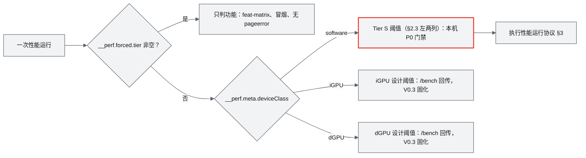
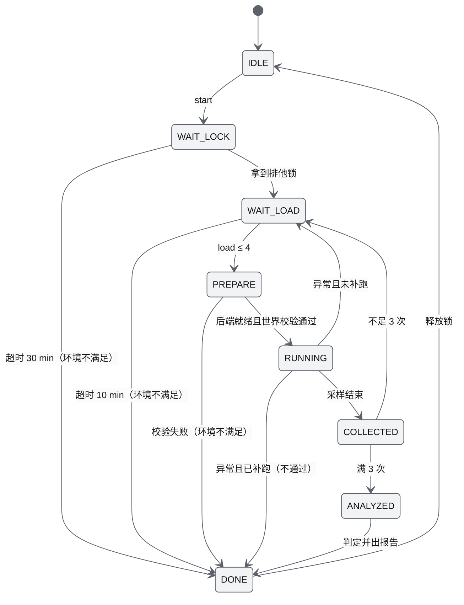
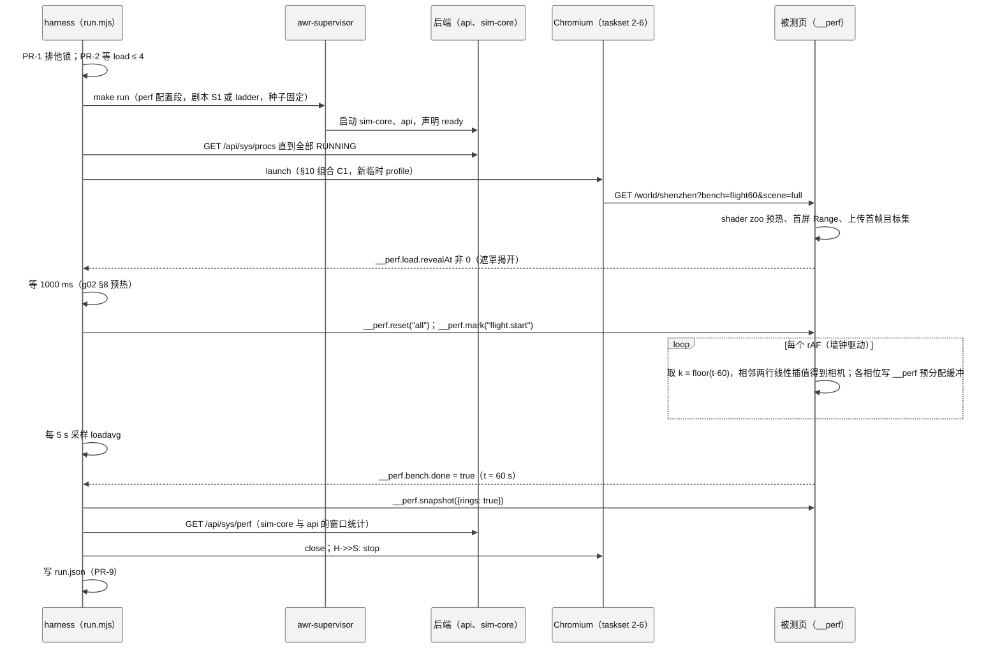
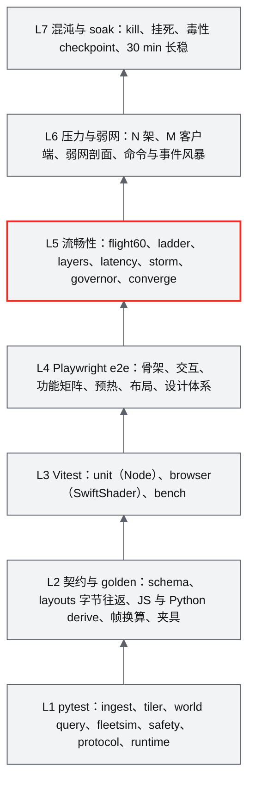

# 18 性能与测试方案（流畅性保障）

| 项 | 内容 |
|---|---|
| 文档编号 | AWR-18 |
| 标题 | 性能与测试方案（流畅性保障） |
| 版本 | v1.0 |
| 日期 | 2026-09-28 |
| 状态 | 草案 |
| 上游文档 | [03-设计基线与决策记录](03-设计基线与决策记录.md)（ADR-007、ADR-009 至 ADR-014、ADR-017、ADR-018、ADR-021、ADR-026、ADR-028 至 ADR-031、ADR-033、ADR-041、ADR-044 至 ADR-046；§3.5–§3.8、§4.3、§4.5、§5.4、§5.6、§8.4、§10）；[01-design](01-design.md) §14、§37、§38、§43；研究笔记 [g02](research/g02-gap.md)（权威）、[n05](research/n05-discover-web-stack.md)、[r12](research/r12-potree-core-loader.md)、[n01](research/n01-discover-web-pointcloud.md)、[r27](research/r27-realtime-bridges.md)、[g05](research/g05-gap.md)、[g08](research/g08-gap.md)、[d01](research/d01-lieflat-charts.md)，以及 g01、g03、g04、g06、g07、d02、d03、x01；参数定义方：[M05](modules/M05-Web点云引擎PRD.md) §6.10（点云参数）、[M08](modules/M08-仿真内核与飞行器适配PRD.md) §5.2（逐 stage CPU）、[M11](modules/M11-实时网关PRD.md) §4.12（服务端指标）、[16](16-World数据规范.md) §4（ANET_Q16 精度）、[17](17-接口与实时协议规范.md) §4.3.11、§6.5（上报与 `perf/server`）、[19](19-部署与运维说明书.md) §7.5（全局性能锁） |
| 下游文档 | [modules/M16](modules/M16-演示数据剧本与流畅性测试PRD.md)（harness 与报告实现）；[modules/M05](modules/M05-Web点云引擎PRD.md)、[M06](modules/M06-Web视口与渲染后端PRD.md)、[M08](modules/M08-仿真内核与飞行器适配PRD.md)、[M11](modules/M11-实时网关PRD.md)、[M15](modules/M15-前端UI壳与设计体系组件PRD.md) 的验收章节；全部模块 PRD 的性能类验收（以本文为执行口径）；[13-产品设计PRD](13-产品设计PRD.md) PRD-AC-001 门禁汇总；[19-部署与运维说明书](19-部署与运维说明书.md)（CI 与定时任务部署）；工作包 M00 的 lint、CI 与性能运行协议 |
| 适用版本范围 | V0.1（D1）至 V1.0；真 GPU 阈值在 V0.3 以 `/bench` 或 GPU runner 数据固化 |

## 0. 摘要

1. 流畅性按两个独立维度分档：渲染后端档 S/B/A 决定代码路径与测法，设备能力档 software/iGPU/dGPU 决定目标节奏 T* 与阈值（ADR-044）。本机 Tier S 按固定 30 fps 节奏验收：纯点云 p95 ≤ 50 ms，默认整景 p95 ≤ 66.7 ms（暂定）；真 GPU 按刷新周期，掉帧 ≤ 5%（iGPU）/ ≤ 2%（dGPU），TTFP ≤ 700 / 500 ms，只作设计阈值；Tier A 在 D1 只做功能验收，另设 V0.3 的"晋级为默认"判据。
2. 全部性能用例执行统一的性能运行协议（排他锁、开跑前 load ≤ 4、3 次取中位、CPU 分区、冷缓存新进程），判定结果只有"通过、不通过、环境不满足、告警"四种，环境噪声不会被误报为回归。
3. 点云验收覆盖 TTFP、填充率、空洞率、收敛时间、drawn ≤ B、失败节点 0、驻留与重复下载、CAS 行为与帧节奏，用"原型差分测试 → 控制器离线闭环仿真 → 浏览器实时 flight60"三层验证；PerfGovernor 用注入负载验证降级顺序。
4. 整景帧预算（AWR-03 §3.8）用 bench 模式的逐层配对测量在 D1-MS5 第一周实测，并以 ADR 冻结；冻结后数值由本文维护。
5. UI 预算：遥测不进 React、稳态 commit ≤ 12 次/s 且 p95 ≤ 2 ms、我方逻辑（不含 render 相位的 GL 提交等待）> 50 ms 的长动画帧为 0、LfScheduler 每帧 ≤ 2 张图且 ≤ 2 ms、morph 并发 ≤ 8。后端预算：1000 架 sim-core 全部 stage 目标约 0.31 核、门禁 ≤ 0.6 核、单步 p99 ≤ 3 ms、RTF ≥ 0.99；api ≤ 0.35 核、tick 数据年龄 p99 ≤ 15 ms、命令 RTT p99 ≤ 25 ms。
6. 测试金字塔 7 层（pytest、契约与 golden、Vitest、Playwright e2e、flight60 流畅性、压力与弱网、混沌与 soak）；门禁 5 级（pre-commit、`make ci`、夜间性能、里程碑出口、发布），性能用例不进合并门禁。
7. 统一探针 `window.__perf`（schema `awr.perf.v1`，预分配、热路径零分配）与报告 schema `awr.perf.report.v1`；报告按 lieflat R09/R10/R12 版式生成，遵守"一处红"，无 emoji。
8. 测试数据以 UrbanScene3D 六城为准：深圳为门禁城市，纽约、上海为主回归，六城全部回归 TTFP 与 p95；flight60 与世界的 `coordinate.sha256` 绑定，世界重建后自动失效重生。
9. 对基线的 15 条反馈见 §19.1，其中两条为高优先级：F-01（no-hex 规则与文档 mermaid 片段冲突，会使 MS1 的 `make lint` 失败）与 F-02（D1-AC-06、D1-AC-27"长任务"的归因口径）；对 17 号文档与模块 PRD 的对齐请求见 §19.2。（第 2 轮已由 AWR-03 附录 D.2 处置：F-01 见 R2-01，F-02 见 R2-52）

---

## 1. 文档定位与范围

### 1.1 本文回答什么

按 AWR-03 §10.1 的职责划分，本文是以下事实的**唯一定义方**：

| 主题 | 本文的地位 | 下限或上游 |
|---|---|---|
| 性能阈值与测试用例（全部模块的性能类验收） | 定义方；模块 PRD 的性能验收引用本文编号 | 不得宽于 AWR-03 §8.4（§1.3 第 3 条） |
| 性能运行协议 | 定义方 | ADR-033 |
| 帧预算与图层上限 | MS5 冻结前以 AWR-03 §3.8 为准；冻结后由本文 §5 维护数值 | AWR-03 §3.8 |
| 度量采集：`window.__perf`、LoAF、服务端指标 | 定义方（字段语义与单位）；线上 channel `perf/server` 的线格式在 [17](17-接口与实时协议规范.md) | ADR-046 |
| 测试分层、flight60 与机群阶梯的执行规范 | 定义方；剧本内容在 M16，flight60 生成器在 M05 | ADR-033 |
| CI 门禁、GPU runner 与 `/bench` 计划 | 定义方 | AWR-03 §4.5 |
| lint 规则清单与扫描范围（工作包 M00） | 定义方（规则由 15、11 号等文档提出，本文统一登记编号、范围与门禁） | D1-AC-20 |

### 1.2 本文不写什么

- 功能描述、交互流程与视觉取值：见 [13](13-产品设计PRD.md)、[14](14-UI交互设计PRD.md)、[15](15-视觉设计规范与色卡.md)。
- APH、CAS 与画质阶梯参数的**定义**：见 [M05](modules/M05-Web点云引擎PRD.md)。本文 §4.1 只把这些参数列为"测试预言值"（test oracle），数值冲突时以 M05 为准，并回写本文。
- RenderBackend、帧序与 PerfGovernor 的实现：见 [M06](modules/M06-Web视口与渲染后端PRD.md)。
- FleetSim 逐 stage 预算的分解：见 [M08](modules/M08-仿真内核与飞行器适配PRD.md)、[M09](modules/M09-安全与健康PRD.md)；本文只给总量门禁与测法。
- 线上字节布局、REST 路径与错误码：见 [17](17-接口与实时协议规范.md)；文件格式见 [16](16-World数据规范.md)。
- 安装、定时任务与机器配置：见 [19](19-部署与运维说明书.md)。

### 1.3 执行归属

本文的需求由路径所有者实现（AWR-03 §4.3），本文不新增顶层目录。

| 测试资产 | 路径 | 实现模块 |
|---|---|---|
| 性能运行协议 harness、Playwright 流畅性用例、报告生成、基线库 | `apps/web/perf/**`（含 `perf/report/`、`perf/baselines/`）、`tests/e2e/**`、`tests/chaos/**` | M16 |
| flight60 生成器与产物、全量参考渲染对照页 | `tools/bench/flight60/**`、`apps/web/public/bench/**`、`apps/web/dev/oracles/**` | M05 |
| `window.__perf` 探针、PerfGovernor、`stores/perf.ts` | `apps/web/src/engine/perf/**`、`apps/web/src/stores/perf.ts` | M06 |
| 机群阶梯基准 | `tools/bench/fleet_ladder/**` | M08 |
| IPC 基准、弱网代理、轻量客户端压测器 | `tools/bench/ipc/**` | M11 |
| lint、CI 脚本、契约 golden 与夹具、性能契约 schema | `tools/lint/**`、`tools/ci/**`、`tools/contracts/**`、`packages/contracts/**` | M00 |
| 各模块单元与集成测试 | `tests/<module>/**`、`apps/web/tests/<module>/**` | 对应模块 |

用例发现与归属规则：

1. 用例以 M16 的注册表登记（M16-FR-041）：核心用例在 `apps/web/perf/harness/cases/*.mjs`，模块用例在 `apps/web/perf/<dir>/cases.mjs` 导出 `CaseDef[]`；本文表中写作 `perf/<name>.spec.ts`（不带子目录）的用例位于 `apps/web/perf/` 根目录，归 M16。
2. 模块自有的性能用例放在 `apps/web/perf/<dir>/`（AWR-03 §4.3），`<dir>` 以各模块 PRD 为准：当前 M05 为 `pointcloud/`，M06、M11、M15 为 `m06/`、`m11/`、`m15/`（命名不统一，见 §19.2 第 6 条）。
3. 每个 `CaseDef` 必须填写 `acIds`（至少一个 PERF-AC 或 D1-AC 编号），harness 据此生成报告的 `ac_ids`；缺失、重复 id 或阈值键不在 `thresholds.json` 中时拒绝启动（PERF-E017）。
4. 本文的阈值由 M16 镜像为可执行的 `apps/web/perf/thresholds.json`（M16 §6.14）；修改本文阈值必须在同一提交中更新该文件；`thresholds.json` 每个条目记录来源编号（PERF-AC 或 D1-AC）与本文章节，G1 检查每个 P0 的 PERF-AC 至少有一个条目（`tools/ci/check-thresholds.mjs`，§13.1 THR-01 至 04，随 `make lint` 运行）。验收加固阶段的过渡口径：没有数值阈值、由用例断言或 G1 命令判定的 P0 PERF-AC（例如 PERF-AC-001、009、014、050、051）暂以 THR-04 列出而不报错；`thresholds.json` 为其补齐条目（或登记为断言判定）后改用 `--strict`。

### 1.4 对原设计的继承、修正与增强

01-design 没有测试方案章节，与性能相关的只有 §14、§37、§38、§43 的零散表述。本文对它们的处置如下（与 AWR-03 附录 C 一致）：

| 01-design 条款 | 继承 | 修正 | 增强（本文新增） | 依据 |
|---|---|---|---|---|
| §14"这是整个 Web 系统最容易遇到性能问题的地方"；空间分块 → 八叉树 → LOD → 流式 | 继承"分块、八叉树、LOD、流式"的主链与"相机驱动加载" | 删除"远处 10K / 近处 1M"的静态阈值（AWR-03 附录 B.2 作废） | 把"不卡"量化为 TTFP、填充率、空洞率、收敛时间、drawn ≤ B、失败节点 0 与 CAS 行为，并以固定的 flight60 脚本复现 | g02 §3、§8；ADR-009、ADR-012 |
| §37"Web Rendering 60 FPS"；"WebSocket 10–50 Hz" | 继承"不需要每一次物理更新都推给浏览器"的分频思想 | Tier S 目标改为固定 30 fps（ADR-044 取代）；硬件档按刷新率；WS 按订阅 10–60 Hz | 增加 UI 刷新 4–10 Hz 一层；增加端到端时延（t_sim 到像素、命令到可见）预算 | ADR-044、ADR-046；n05 §7 第 4 条 |
| §38 UI 设计（数字沙盘左右两栏；原设计没有性能面板） | 继承数字沙盘上叠加信息面板的形态 | — | 新增性能 HUD，字段对齐 `window.__perf`：帧节奏、`limitedBy`、`achievedScreenError`、CAS 档位与 B、PerfGovernor 当前步骤 | g02 §9 第 5 条 |
| §43"首个版本只实现一条完整链路"；"第一阶段不要同时做 100 架" | 继承"先打通一条完整链路"：walking skeleton 为集成门禁（D1-AC-34） | "100 架"被 ADR-042 取代：1000 架是向量化 Mock 的规模压测，属于 R3 的流畅性测试 | 机群阶梯（sim-core 10–1000 架、前端 200/1000 架）、事件风暴、弱网与多客户端压测 | ADR-042；g08 §11 |
| §10"用户只需要访问 URL 即可进入三维空间"；"多人访问、远程演示" | 继承 URL 直达与远程访问场景 | — | 远程访问冒烟（SSH 转发下 WS 与 Range）、多客户端压测与弱网剖面 | AWR-03 §3.3；r27 §3.1.3 |

### 1.5 本文新增术语

其余术语见 AWR-03 §11。

| 术语 | 定义 |
|---|---|
| 呈现间隔 | 相邻两次 rAF 回调参数 `now`（DOMHighResTimeStamp）之差，单位 ms；是本文唯一的帧节奏原始量（g02 §6.1：看"用户实际看到的"间隔，不看 frame time） |
| 稳态窗口 | flight60 的飞行时刻 t ∈ (2, 60] s；帧节奏分位数、超时帧占比与最大间隔都在此窗口内统计（与 g02 `run_live.cjs` 的实现一致） |
| 超时帧占比 | 稳态窗口内呈现间隔 > 50 ms（或 > 100 ms）的帧数 / 帧总数 |
| 掉帧占比 | 硬件档：稳态窗口内呈现间隔 > 1.5·T* 的帧占比（g02 §8.2） |
| 光栅像素 | 点云 pass 实际光栅化目标的像素，`H_px = cssHeight · dpr · rs`；τ、minPx、maxPx 与 `achievedScreenError` 都以光栅像素计（M05 §3.3；Tier S 的 `dpr · rs` 恒为 0.5）。g02 的全部实测也按缩放后的画布尺寸计算，AWR-03 ADR-009、ADR-011 写的"设备像素"与此的关系见 §19.1 F-15 |
| 我方逻辑 | 主线程上由我方代码执行、且不在 `render` 相位内的 JS：`loop.ts` 的 telemetry、clock、drones、camera、world、overlay、governor 相位，以及我方的事件处理、React commit、定时器与 Worker 消息回调。`render` 相位内 three.js 的 GL 提交（SwiftShader 下含同步 IPC 等待）单列为"渲染提交"，不计入我方逻辑 |
| 填充率 | 选择器 `limitedBy ∈ {budget, nodes}` 的帧上，实际绘制点数 / B |
| 空洞率 | 与全量参考渲染相比，参考有覆盖、被测无覆盖的像素数 / 参考覆盖像素数（g02 §5.2；g02 原型记为 `hole_px`） |
| 进入目标带时间 | 从遮罩揭开起，到"1 s 滑窗 p50 ≤ 1.1·T*，或 B = 当前档位 lo"首次成立的时间（g02 §8.1、§8.3） |
| 收敛时间 | 相机停止后，到"在途与排队请求为 0 且 `limitedBy ≠ budget`（硬件档）或 B 连续 2 s 变化 < 5%（Tier S）"首次成立的时间 |
| B 反向 | CAS 相邻两次有效调整（相对变化 > 2%）方向相反的次数，按每分钟计（g02 `run_live.cjs` 的计数法） |
| 来回 | 升档后 10 s 内又降档（或反之） |
| 重复下载比 | 实际下载字节 / 去重后的节点字节（ADR-010） |
| tick 数据年龄 | Gateway 每个 60 Hz tick 取到的 StateRing 最新帧的 `t_now − t_publish`（g05 §0 第 3 条） |
| 显示时延 | 客户端 Worker 解码完成时刻与该样本服务端发布时刻之差（经 ClockSync 换到同一墙钟，r27 §3.10） |
| 配对测量 | 同一帧内按交替顺序执行对照组与实验组、各重复 5 次取最小值、再取逐帧比值或差值中位数的测法（g02 §1.1） |
| 环境不满足 | 性能运行协议的前置条件未达成（锁超时、负载不降），用例既不算通过也不算失败 |
| 豁免记录 | D1-ext（P1）验收未通过时，按 §12.3 格式登记的放行记录 |

---

## 2. 流畅性目标分档

### 2.1 两个维度

渲染后端档（S/B/A）与设备能力档（software/iGPU/dGPU）相互独立（ADR-044）。**阈值只按设备能力档取值**；后端档决定代码路径、可用测法与是否参与性能判定。

| 后端档 \ 设备能力档 | software（SwiftShader、llvmpipe） | iGPU | dGPU |
|---|---|---|---|
| **S**（经典 WebGLRenderer，软件光栅） | **本机性能验收主档**（P0） | 不出现 | 不出现 |
| **B**（经典 WebGLRenderer，硬件默认） | 只做功能验收：`?tier=B`，结果写 `__perf.forced`，不参与性能判定 | 设计阈值：`/bench` 或 GPU runner | 设计阈值：`/bench` 或 GPU runner |
| **A**（WebGPURenderer，显式开启，D1 为 P1） | 只做功能验收：`?tier=A&allowFallback=1`（SwiftShader WebGPU 是 fallback adapter） | 设计阈值同 iGPU，另加 §2.4 晋级判据 | 设计阈值同 dGPU，另加 §2.4 晋级判据 |



### 2.2 目标节奏 T*

| 设备能力档 | T* | tailK | 目标说明 | 依据 |
|---|---|---|---|---|
| software | 33.3 ms（固定 30 fps，不估计刷新率） | 2.0 | 本机 headless 管线呈现间隔中位数钉在 33.3 ms，与点数无关，是本机上限而非保守取值 | g02 §6.4 第 1、4 条；ADR-044 |
| iGPU | 刷新周期（60 Hz 为 16.7 ms） | 1.6 | 60 Hz 下 2T 就是一次明显卡顿 | g02 §6.4 第 4 条、§7.2 |
| dGPU | 刷新周期（60 Hz 为 16.7 ms，144 Hz 为 6.9 ms） | 1.6 | 同上 | g02 §6.1 |

### 2.3 阈值总表

"本机 S"指本机 Tier S（SwiftShader、headless Chrome 151、1280×720 CSS 画布、DPR 1、渲染比例 0.5）。硬件两列是设计阈值：**不阻塞 D1**，在同一设备能力档累计 3 份 `/bench` 或 GPU runner 数据后以 ADR 固化（AWR-03 §4.5 第 4 条）。

| 类别 | 指标 | Tier S 纯点云 `scene=pc` | Tier S 默认整景 `scene=full`（暂定） | iGPU（设计） | dGPU（设计） | 依据 |
|---|---|---|---|---|---|---|
| 帧节奏 | 呈现间隔 p50 | ≤ 33.4 ms | ≤ 33.4 ms | = T*（误差 ≤ 0.5 ms） | = T* | g02 §8.1、§8.2；D1-AC-03a/b |
| | p95 | ≤ 50 ms | ≤ 66.7 ms | 由掉帧占比约束 | 由掉帧占比约束 | 同上 |
| | p99 | ≤ 100 ms | ≤ 116.7 ms | ≤ 2T* | ≤ 2T* | 同上 |
| | 超时 / 掉帧占比 | > 50 ms ≤ 5% | > 50 ms ≤ 10% | > 1.5T* ≤ 5% | > 1.5T* ≤ 2%（60 Hz）/ ≤ 4%（144 Hz） | 同上 |
| | 严重超时占比 | > 100 ms ≤ 0.5% | > 100 ms ≤ 1% | — | — | 同上 |
| | 稳态最大间隔 | ≤ 250 ms（不排除着色器编译） | ≤ 250 ms | — | — | D1-AC-03a |
| | 启动窗口 t ∈ [0, 2] s 最大间隔 | ≤ 500 ms（本文设定，P1，告警级） | 同左 | — | — | 本文设定：shader zoo 已在遮罩下完成编译（ADR-007），启动窗口不应再出现编译级停顿 |
| 首屏 | TTFP（§4.2 定义） | ≤ 1.0 s | ≤ 1.0 s | ≤ 700 ms | ≤ 500 ms | ADR-013；g02 §8.2 |
| | UI 切换世界首帧 | ≤ 1.5 s | ≤ 1.5 s | — | — | D1-AC-02 |
| | 冷启动可交互 | ≤ 4.0 s（P1，ADR-076 冻结） | 记录项（不判定；预热集含依赖无人机的图层与 UI 预演，ADR-071、ADR-076） | — | — | D1-AC-02 |
| 控制器 | 60 s 内换档次数 / 10 s 内来回 | ≤ 2 / 0 | ≤ 2 / 0 | ≤ 2 / 0 | ≤ 1 / 0 | g02 §8 |
| | B 反向 | ≤ 15 次/分钟 | ≤ 15 次/分钟 | ≤ 8 次/分钟 | ≤ 6 次/分钟 | g02 §8.1、§8.2 |
| | 进入目标带 / 收敛 | 进入目标带 ≤ 2 s | 进入目标带 ≤ 2 s | 相机停止后收敛 ≤ 4 s | ≤ 3 s | 同上 |
| 画质 | 空洞率 | 12 采样帧均值 ≤ 25%（load < 6，P1） | 不判定 | 静止帧 ≤ 3% | 静止帧 ≤ 1% | g02 §5.2、§8 |
| | 绘制点数与精度 | 均值 ≥ 20k（load < 6，P1） | 可选图层降完前 B ≥ B_floor = 20k | 静止 2 s 后 `limitedBy ≠ budget` 的帧 ≥ 70%；静止时 `achievedScreenError` ≤ 档位 τ | 静止 2 s 后 `limitedBy ∈ {error, headroom, complete}` 的帧 ≥ 90%；静止时 `achievedScreenError` ≤ 档位 τ（medium 为 1.35 光栅 px） | ADR-012、ADR-041；g02 §8.2 |
| 实时 | 选中机 60 Hz 通道实际频率；`credit_skips` | 不适用（不连接 WS） | ≥ rAF 频率；≤ 1% | ≥ 57 Hz；≤ 1% | ≥ 57 Hz；≤ 1% | D1-AC-26；ADR-014 后果 |
| 资源 | GPU 内存（点池与纹理） | 点池 62 行（约 4.1 MB）；点云相关纹理合计 ≤ 16 MB | 同左 | ≤ 256 MB | ≤ 512 MB | ADR-010；g02 §8.2；Tier S 合计为本文设定（点池、DrawTable、NodeTable 与余量） |
| | 每帧主线程 JS（选择、DrawTable、上传、插值、Worker 交换） | ≤ 4 ms | ≤ 4 ms | ≤ 2 ms | ≤ 2 ms | AWR-03 §3.8；g02 §8.2 |

### 2.4 Tier A：D1 的功能验收与 V0.3 晋级判据

1. **D1（P1）**：本机只做功能验收。`npm run perf:feat-matrix -- --tier A --allowFallback` 的 28 项断言逐项等于 g01 §3 的 WebGPU 预期值（含预期不可用项，例如 GLSL `ShaderMaterial` 不可用、PointPool 为 1 px 点时覆盖 84,277 像素）；R3F 冒烟无 `pageerror`；`__perf.forced.tier = "A"`；结果不进入任何性能统计（ADR-044）。
2. **性能阈值**：Tier A 在某设备上的阈值与同设备能力档相同，不单列更松或更严的数值。
3. **晋级为默认后端的判据**（本文设定，供 V0.3 的 ADR 使用）：在同一设备能力档至少 3 台设备上，用 `/bench` 以"同一浏览器会话内 B、A 交替各 3 次"的方式跑 flight60 `scene=full`，全部满足以下条件时，提交 ADR 把该设备能力档的默认后端改为 A：
   - A 的掉帧占比中位数 ≤ B；
   - 稳态平均绘制点数 A ≥ 1.1 × B（即同一节奏下 A 能多画至少 10% 的点，否则切换没有收益）；
   - TTFP A ≤ B + 100 ms；
   - A 的功能矩阵零回归；设备丢失演练（`onDeviceLost` 触发整页重建渲染器）通过；
   - 任一条件在任一设备上不满足，则该设备能力档保持 B。

### 2.5 度量定义与统计口径

| 度量 | 计算方法 | 窗口 | `__perf` 字段 | 依据 |
|---|---|---|---|---|
| p50 / p95 / p99 | 升序排序后取下标 `min(n−1, floor(p·n))` 的元素（最近秩法，与 n05 `FrameSampler` 和 g02 脚本一致） | 稳态窗口 | `frame.interval`、`frame.t` → 离线计算 | n05 §3.6；g02 `run_live.cjs` |
| fps | 帧数 / 窗口时长 | 稳态窗口 | 同上 | 同上 |
| 超时帧占比 | `#(dt > 50) / n`；`#(dt > 100) / n` | 稳态窗口 | 同上 | g02 §8.1 |
| 掉帧占比 | `#(dt > 1.5·T*) / n` | 稳态窗口 | 同上 | g02 §8.2 |
| 稳态最大间隔 | `max(dt)` | 稳态窗口 | 同上 | D1-AC-03a |
| 均值间隔 | `Σdt / n` | 稳态窗口 | 同上 | 本文设定：用于回归趋势（§11.3），因为 p95 在 16.7 ms 网格上量化 |
| 固定层配对增量 | 见 §5.2 | 60 s | `layers.*` | AWR-03 §3.8 |

有效性条件（任一不满足即判"环境不满足"或"结果无效"，见 §17）：

1. 非强制：判定帧节奏、TTFP、CAS 与画质的用例要求 `__perf.forced === null`；`forced.fixedB` 只允许出现在 layers 用例，`forced.perfInject` 只允许出现在 governor 与 §6.3 归因自检用例（由 `CaseDef.params` 声明），`forced.tier` 在任何性能判定中都不允许（PERF-E005）。
2. 页面处于跨源隔离：`crossOriginIsolated === true`（计时精度 5 µs，否则被粗化到 100 µs，n05 §0 第 10 条）。
3. 启动标志属于 §10 的允许组合，不含 `--disable-gpu-vsync` 与 `--disable-frame-rate-limit`（n05 §0 第 8 条）。
4. 负载条件见 §3.1 PR-2、PR-4、PR-5。

---

## 3. 性能运行协议

本章是 ADR-033 运行协议的展开，**全部性能类用例**（Playwright 流畅性用例、`tools/bench/*` 基准、`/bench` 以外的一切带时间阈值的测试）必须经由 harness `apps/web/perf/harness/run.mjs`（M16）执行，不允许直接调用 `playwright test` 判定性能。

### 3.1 协议条款

| 编号 | 条款 | 参数 | 违反时的结果 | 依据 |
|---|---|---|---|---|
| PR-1 | **锁**：锁文件为 `$AWR_PERF_LOCK`，默认解析为**主仓库**的 `runs/.perf.lock`（AWR-19 §7.5，使全部 worktree 互斥）。性能用例与 `make chaos-core`、`make chaos` 以排他方式持有（`flock -x`）；`make build`、`make test`、`make ci`、`make worlds`、Vitest、pytest 在任何 worktree 中都以共享方式持有同一把锁（`flock -s`，由 `mk/common.mk` 的包装目标统一加锁），因此性能用例会等正在进行的构建结束，并阻止新的构建开始 | 等锁上限 30 min | 环境不满足（PERF-E001） | ADR-033 ①⑥；AWR-19 OPS-FR-008 |
| PR-2 | **开跑前负载**：在启动后端与浏览器之前，每 10 s 读一次 1 分钟 loadavg，直到 ≤ 4 | 最长等 10 min；每次运行前都检查 | 环境不满足（PERF-E002） | ADR-033 ② |
| PR-3 | **三次取中位**：每个用例独立运行 3 次；每次使用新的浏览器进程与临时 profile（HTTP 缓存与着色器磁盘缓存都是冷的），涉及仿真的用例每次重启后端（新 run id、剧本从头开始）；判定时对每个指标分别取 3 次的中位数 | 3 次 | — | ADR-033 ③ |
| PR-4 | **帧节奏阈值的强制条件**：运行期间每 5 s 采样 loadavg，运行内最大值 ≤ 12.8 时帧节奏阈值强制执行 | 12.8 | > 12.8 时帧节奏指标只告警（PERF-E012） | ADR-033 ④；g02 §6.4 |
| PR-5 | **画质、点数与 CPU 占用阈值的判定条件**：运行内每 5 s 采样的 1 分钟 loadavg 的算术均值 < 6 时判定 | 6 | ≥ 6 时记为"不判定" | ADR-033；g02 §8.1；取均值的理由见 §19.1 F-03 |
| PR-6 | **CPU 分区**：api 钉 core0，sim-core 钉 core1（有 `CAP_SYS_NICE` 时 nice −5），plan-pool 钉 core7；Playwright runner 与其启动的 Chromium（含 GPU 进程中的 SwiftShader 线程）用 `taskset -c 2-6`（SwiftShader 的 marl 线程池自行把工作线程亲和性设为全部 CPU、不继承 taskset：自行启动客户端的 Python 工具（`fleet_ladder --clients`、`bench_state --clients`）以 `AffinityGuard` 每 0.25 s 把客户端进程树的线程改回本工具的亲和性，改回数写入明细 `client_affinity`，ADR-073 第 6 条；harness 的 `pw` 执行器在用例运行期间同样每 0.25 s 把 Playwright 进程树中亲和性越出 2–6 的线程改回 2–6（`perf/harness/exec/affinity.mjs`，计数写入运行目录的 `affinity.json`；本机实测 marl 线程自设为 0–4，即落在 api 与 sim-core 的核上；ACC-4 落实 ADR-073 后果中的建议，`AWR_PERF_AFFINITY_GUARD=0` 只用于诊断对照，此时结果不满足本条）；`fake_gw.py` 数据源钉 core0；replay-worker 钉 core7（ADR-017 第 2 轮修订） | `configs/runtime.yaml` 的 `perf` profile（19 §6.2；`ci` profile 关闭钉核，只用于功能门禁） | 未分区的结果无效（PERF-E014） | ADR-017；ADR-033 ⑤ |
| PR-7 | **构建形态**：flight60、机群阶梯、时延、风暴、soak 使用**生产构建**（`vite build`，由 api 的 StaticFiles 以 COOP/COEP 响应头服务）；逐层配对、PerfGovernor 注入、功能矩阵、画质采样使用**测试构建**（生产构建加 `VITE_AWR_TEST_SWITCHES=1`，开启 `?tier`、`?fixedB`、`?perfInject` 与 `finishForBench`）；禁止在 Vite 开发服务器上测性能 | — | 结果无效（PERF-E015） | ADR-044 测试开关；n05 §3.3 |
| PR-8 | **数据前置**：被测世界通过 `worldpkg validate <id> --deep`；flight60 的 `coordinate_sha256` 与世界 `coordinate.json` 的 sha256 一致 | — | 环境不满足（PERF-E009） | AWR-03 P-01 |
| PR-9 | **记录**：每次运行写 `run.json`（§11.1），含 git 提交、构建 id、Chrome 版本与标志、CPU 型号与亲和性、loadavg 序列、世界 `contentVersion`、剧本种子、sim 内核（numba/numpy）、设备能力档、`__perf` 快照与服务端指标 | — | 报告无效 | ADR-033 ③ |
| PR-10 | **离散度告警**：关键指标（超时帧占比、均值间隔、TTFP、sim-core CPU）的 `(max − min) / median > 25%` 时告警，仍按中位数判定 | 25% | 告警（PERF-E013） | 本文设定：g02 §1.1 观察到同配置绝对耗时随负载相差 2 倍 |
| PR-11 | **异常即重跑一次**：出现 `pageerror`、GL 错误、后端进程不健康时，本次运行作废并补跑 1 次；补跑仍异常则用例判"不通过" | 1 次 | 不通过（PERF-E003、E004、E008） | n05 §3.6 |
| PR-12 | **单一被测对象**：同一时刻只运行一个性能用例；本机不得有其他浏览器进程；D1-AC-08 这类多客户端用例的客户端由同一个 harness 启动并计入本用例 | — | 结果无效 | ADR-033 ①⑥ |

判定规则：对每个指标取 3 次运行的中位数，与阈值比较；满足 PR-4、PR-5 的条件时按"通过/不通过"判定，否则按"告警/不判定"处理。一个用例的最终结果取其全部指标的最差结果（"不判定"的指标不参与），顺序为：不通过 > 环境不满足 > 告警 > 通过。

### 3.2 单个用例的状态机

| 当前状态 | 事件 | 守卫 | 动作 | 目标状态 |
|---|---|---|---|---|
| IDLE | `start(case)` | — | 解析用例配置，创建 `runs/perf/<runId>/` | WAIT_LOCK |
| WAIT_LOCK | 拿到排他锁 | — | 记录等锁时长 | WAIT_LOAD |
| WAIT_LOCK | 超时 30 min | — | 写 PERF-E001 | DONE（环境不满足） |
| WAIT_LOAD | loadavg ≤ 4 | `i < 3` | 记录开跑负载 | PREPARE |
| WAIT_LOAD | 超时 10 min | — | 写 PERF-E002 | DONE（环境不满足） |
| PREPARE | 后端就绪、世界校验通过 | PR-8 通过 | 启动浏览器（`taskset`）并打开被测页 | RUNNING |
| PREPARE | 校验失败 | — | 写 PERF-E009 | DONE（环境不满足） |
| RUNNING | 采样结束（`__perf.bench.done`） | 无异常 | `snapshot()`、拉取服务端指标、`i += 1` | COLLECTED |
| RUNNING | `pageerror` / GL 错误 / 进程不健康 | 本轮尚未补跑 | 关闭浏览器与后端，丢弃本次，标记补跑 | WAIT_LOAD |
| RUNNING | 同上 | 已补跑 | 关闭浏览器与后端，写 PERF-E003/E004/E008 | DONE（不通过） |
| COLLECTED | — | `i < 3` | 关闭浏览器与后端 | WAIT_LOAD |
| COLLECTED | — | `i = 3` | 关闭浏览器与后端；计算中位数、离散度 | ANALYZED |
| ANALYZED | — | — | 按 §3.1 判定规则得出结果，写 `result.json` 与报告 | DONE |
| DONE | — | — | 释放锁 | IDLE |



### 3.3 一次 flight60 运行的时序



---

## 4. 点云流畅性：APH、画质阶梯与 CAS

### 4.1 参数表（测试预言值）

下列数值是测试用的预言值，**定义方是 [M05](modules/M05-Web点云引擎PRD.md) §6.10**；两者不一致时以 M05 为准并回写本表（本版已按 M05 §6.10 回写重试退避、在途上限与 CPU 缓存淘汰）。

**（a）APH 选择器**（ADR-009；g02 §3.3）

| 参数 | 值 | 单位 | 说明 |
|---|---|---|---|
| 误差度量 | `e = spacing_L · 0.5·H_px / (tan(fovY/2)·d)`，`d = max(eye 到子树紧包围盒的最近距离, near)` | 光栅 px | `H_px` 见 §1.5"光栅像素"（M05-FR-011） |
| τ | 按档位（下表） | 光栅 px | — |
| τ_min | τ/4 | 光栅 px | 奖励层最多再深 2 级 |
| headroom | 0.15 | — | τ 以下的奖励层最多花到 B·(1 − 0.15) |
| maxNodes / maxSkips | 4096 / 32 | 个 | — |
| minPrefix | 512 | 点 | 第一个被预算拒绝的 required 节点画前缀 `cnt = B − pts` |
| hysteresis | 0.1 | — | 上一帧已绘制的子节点 key ×1.1，其余 ×0.9 |
| 下载排序权重 | `w_center = clamp(1 − abs(ndc), 0, 1) + 0.5`；`w_focus = 1 + 1.5·exp(−dist(c, p_focus)²/(2·150²))` | — | 只用于下载排序，不进入选择键 |
| 运行频率 | 每帧 1 次 | — | 3M 预算时 p95 ≤ 0.17 ms（g02 §3.2） |

**（b）画质阶梯**（ADR-011、ADR-012；g02 §7.2）

| idx | 名称 | 渲染比例 | 预算带 [lo, hi] | τ（光栅 px） | minPx | maxPx（受 τ / 受预算） | EDL | 起步档 |
|---|---|---|---|---|---|---|---|---|
| 0 | soft-min | 0.5 | [10k, 40k] | 4.0 | 2 | 8 / 16 | 关 | software，B0 = 25k |
| 1 | soft | 0.6（Tier S 锁定 0.5） | [40k, 150k] | 3.0 | 2 | 8 / 16 | 关 | — |
| 2 | minimum | 0.6 | [150k, 750k] | 2.7 | 1.5 | 8 / 12 | 开（4 tap，半分辨率） | — |
| 3 | low | 0.75 | [750k, 1.5M] | 2.0 | 1.5 | 8 / 12 | 开（4 tap） | iGPU |
| 4 | medium | 1.0 | [1.5M, 3M] | 1.35 | 1 | 8 / 8 | 开（8 tap） | dGPU |
| 5 | high | 1.0 | [3M, 6M] | 1.0 | 1 | 8 / 8 | 开 | 自动模式上限 |
| 6 | ultra | 1.0 | [6M, 12M] | 0.7 | 1 | 8 / 8 | 开 | 只能手动；受容量钳制 |

**（c）CAS 级联控制器**（ADR-012；g02 §6.3）

| 项 | 值 |
|---|---|
| 采样 | 每帧 push 呈现间隔；窗口保留最近 24 帧（至少 6 帧）；每 250 ms 评估一次 |
| 超载比 | `r = p50(interval) / T*`；`tail = p90(interval) > tailK·T*` |
| 内环 | `r > 1.10`：`B *= clamp((1/r)^0.8, 0.5, 0.92)`；否则 `tail`：`B *= 0.9`；否则连续 2 次 `r < 0.85` 且无积压：`B *= 1.08`；否则在目标带内每 8 次评估（约 2 s）：`B *= 1.03`（**有积压时仍允许**） |
| 积压（pending） | 上传队列 > 2 帧的上传配额（Tier S 40k 点，Tier B/A 16 MiB），或在途请求数达到上限 |
| 外环降档 | `B == lo` 且 `r > 1.2` 持续 ≥ 1 s，且 `index > floor` → 降一档，B 取新档位的 hi |
| 外环升档 | `B == hi` 且有余量证据（有 workMs 时 `median(workMs) < 0.7·T*` 持续 3 s；否则 `r < 0.7` 持续 3 s，或 `p95 ≤ 1.1·T*` 持续 5 s），且距上次换档 > upDelay → 升一档，B 取新档位的 lo |
| 退避 | upDelay 初值 5 s；升档后 10 s 内又降档则翻倍，上限 120 s |
| 冻结条件 | 页面隐藏；模态框打开且主动限帧；遮罩揭开或切换世界后的前 30 帧；本帧 `renderer.info.programs.length` 增加；用户主动限帧。冻结期间不评估，恢复时清空采样窗口 |
| 质量下限 | Tier S：可选图层降完之前 `B ≥ B_floor = 20k`；硬件档：B_floor = 最低允许档的 lo |
| 首次会话保护 | 在最低允许档下限饱和累计超过 30 s，下次启动起步档 − 1（P1） |

**（d）流式与驻留**（ADR-010、ADR-013；g02 §4.4、§7.2；n01 §3.5）

| 参数 | Tier S | Tier B | Tier A |
|---|---|---|---|
| 在途请求 | 首节点落地前 1，之后 4 | 1 → `min(8, httpCap)` | 1 → `min(12, httpCap)` |
| httpCap | HTTP/1.1 为 4（可调到 5），HTTP/2 不限；D1 的 uvicorn 只有 HTTP/1.1，因此 8、12 只在 HTTP/2 下生效（V0.5） | 同左 | 同左 |
| 每帧上传上限 | 20k 点（遮罩揭开前的首帧目标集突发上传除外，M05-FR-004） | 8 MiB | 8 MiB |
| 请求取消 | 离开视锥满 2 帧 | 同左 | 同左 |
| 失败重试 | 墙钟退避 0.5 / 2 / 8 s（60 Hz 下即 30 / 120 / 480 帧），第 3 次失败标记 FAILED，10 s 后重新入队一轮；响应长度或 `Content-Range` 与层级记录不符时直接 FAILED | 同左 | 同左 |
| GPU 池容量 | 62 行（约 25.4 万点，4.1 MB） | iGPU 1221 行（约 500 万点，80 MB）；dGPU 2442 行（约 1000 万点，160 MB） | 同所在设备能力档 |
| GPU 驱逐 | 驻留 > 1.5·B_ref 时驱逐到 1.15·B_ref，B_ref = 当前档位 hi；1 s 驻留保护（被更细层取代者除外） | 同左 | 同左 |
| 容量钳制 | B ≤ 0.6·池容量（Tier S 即 152k） | 同左（iGPU 3.0M、dGPU 6.0M） | 同左 |
| CPU LRU 缓存 | 64 MB，超限淘汰到 0.9 | 256 MB，淘汰到 0.9 | 256 MB，淘汰到 0.9 |
| 首屏层级 | 满足 `levelsPoints ≤ min(4.5e5, 0.8·池容量, 2.5·B_hi(起步档))` 的最深层（Tier S 约 ≤ 1e5 点），一次 Range | 同左（约 4.5e5） | 同左 |
| 点径 | Lite，sizeK 1.7，maxPx 按 `limitedBy` 在两值间以 300 ms 时间常数平滑 | 同左 | 同左 |

### 4.2 点云指标定义

| 指标 | 定义 | 单位 | `__perf` 字段 |
|---|---|---|---|
| TTFP | `t_end − t_start`。`t_start` = 首屏 Range（森林为全部根的首屏 Range 中最后完成的一个）的响应体完全到达时刻，由 Fetcher 在 `arrayBuffer()` 兑现时记录；`t_end` = 首帧目标集全部驻留并被绘制（首屏 `Progress` = 1）的那一帧 `render` 相位提交完成的时刻。着色器编译不计入（启动时并行预热）；若 `t_start` 时 shader zoo 预热尚未完成，等待时长记入 `load.warmupWaitMs` 并从差值中扣除（AWR-03 D1-AC-02 第 2 轮修订） | ms | `load.ttfp` |
| TTFP 首像素（诊断） | `t_start` 到第一帧 `drawn > 0` 的提交时刻 | ms | `load.ttfpFirstPixel` |
| 切换世界首帧 | UI 发起 `openWorld` 到新世界首屏 `Progress` = 1 | ms | `load.switchMs` |
| 冷启动可交互 | `navigationStart` 到遮罩揭开（含编译） | ms | `load.tti` |
| 填充率 | 对 `limitedBy ∈ {budget, nodes}` 的帧计算 `drawn / B`，报告均值与 p10 | — | `pc.drawn_ring`、`pc.B_ring`、`pc.limitedBy_ring`（逐帧环形） |
| drawn ≤ B 违例 | `drawn > B` 的帧数（硬不变式） | 帧 | `pc.budgetViolations` |
| 失败 / 取消节点 | 累计标记 failed 的节点数；主动取消数 | 个 | `pc.failed`、`pc.canceled` |
| GPU 驻留 | 已上传到点池的点数峰值 | 点 | `pc.residentPeak` |
| CPU 缓存 | CPU LRU 字节峰值 | 字节 | `pc.cpuCachePeak` |
| 重复下载比 | 下载字节 / 去重后节点字节 | — | `pc.downloadedBytes`、`pc.uniqueBytes` |
| 选择耗时 | 每帧 `selectVisible` 耗时 p95 | ms | `pc.selectMs`（环形） |
| 每帧上传 | 遮罩揭开后每帧上传点数的最大值（揭开前的首帧目标集突发上传不计，M05-FR-004） | 点 | `pc.uploadPtsMax`（`load.revealAt` 之前不更新） |
| `limitedBy` 分布 | 各取值所占帧比例 | — | `pc.limitedByHist[5]` |
| `achievedScreenError` | 选择器输出的实际屏幕误差 | 光栅 px | `pc.achievedErr`（环形） |
| 换档 / 来回 / B 反向 | 见 §1.5 | 次 | `cas.rungChanges`、`cas.bounces`、`cas.reversals` |
| 进入目标带时间 | 见 §1.5 | ms | `cas.inBandAtMs` |
| 冻结帧数 | 因冻结条件跳过评估的帧数 | 帧 | `cas.frozenFrames` |
| 空洞率 / 溢出率 | 见 §4.5 | — | `quality.samples[12]` → 离线计算 |

### 4.3 三层验证

**第 1 层：选择器与控制器的原型差分（Vitest，Node，进入 `make ci`）**

1. `apps/web/tests/pointcloud/selector.diff.test.ts`：把 g02 原型 `lod.mjs::selA` 只读拷贝为 `apps/web/tests/pointcloud/oracle/lod.mjs`，并按 M05 §9.3 打两处补丁后作为预言：①只有堆中第一个被接纳的节点免预算（原型对全部根免预算，苏州 6 根的 L0 合计 20,327 点，在 B = 10k 时会造成 drawn > B）；②迟滞只标记"选中且已驻留"的节点（g02 §3.3 的定义；原型标记全部选中节点）。理想模式（全部驻留）下未打补丁的原型也必须逐帧一致，用来证明补丁没有改变其余语义。预言与产品 `Selector.ts` 在同一份 flight60 相机序列（30 Hz 抽样）、同一份流式模型（首节点并发 1、之后 4；延迟 20 ms + 30 MB/s；离开视锥 2 帧取消；每帧上传 20k 点；驱逐 1.5B → 1.15B，g02 §1.3 `sim.mjs`）下逐帧比较 `idx`、`cnt`、`n`、`points`、`limitedBy`；`achievedScreenError` 相对误差 ≤ 1e-9。城市 × 预算为 {shenzhen, newyork, shanghai} × {25k, 40k, 150k, 750k, 3M}，τ 取对应档位。数据用 `apps/web/tests/fixtures/pointcloud/<city>/{nodes.json, flight60.bin}`（入库，约 0.3 MB/城，M05-FR-056）：MS1 先迁入 g02 原型的 `.cache/research/g02/data/<city>/{nodes.json, flight.bin}`（原型差分所用的同一份数据），MS2 起改为从 World Package 的 hierarchy 与 flight60 导出（§14.2）。
2. 同一测试断言：B ≤ 250k 时填充率 p10 ≥ 0.98；τ 受限（750k 以上）时 `limitedBy ≠ budget`（g02 §8.3 第 3 条）。
3. `apps/web/tests/pointcloud/cas.unit.test.ts`：冻结条件 5 项、积压语义（允许 +3%、禁止 ×1.08）、无扰换档（降档取新 hi、升档取新 lo）、upDelay 翻倍与上限 120 s、B_floor 与 PerfGovernor 标志联动，每项至少 1 条用例。

**第 2 层：控制器离线闭环仿真（Vitest，Node，进入 `make ci`）**

`apps/web/tests/pointcloud/cas.sim.test.ts` 移植 g02 `ctrlsim.mjs` 的帧耗时模型：`work = (a + b·N·dist + e·W·H)·exp(0.1·n)，n ~ N(0, 1)`，1% 的帧加 20–60 ms 尖峰，第 30–40 s 施加 `dist = 2` 扰动，呈现间隔为 `ceil(work / T_vsync)·T_vsync`；4 类设备参数取 g02 §6.1 表；深圳、纽约 × 3 个固定种子。被测对象是**产品控制器** `CascadeController.ts`（ADR-012 允许积压时 +3% 慢探测，而原型在积压时禁止），因此下表阈值来自原型仿真，MS5 出口用产品控制器重跑一次，若结果越界，以 ADR 更新本表（M05 §14 第 11 条）。

| 设备模型 | 换档 | 10 s 内来回 | B 反向 | 超过 1.5T 的帧 | 依据 |
|---|---|---|---|---|---|
| swiftshader | ≤ 2 | 0 | ≤ 15 次/分钟 | ≤ 3% | g02 §6.2（CAS 实测 0、0、5、1.3%） |
| igpu | ≤ 2 | 0 | ≤ 8 次/分钟 | ≤ 5% | 同上（2、0、6–8、3.6–4.9%） |
| dgpu | ≤ 1 | 0 | ≤ 6 次/分钟 | ≤ 2% | 同上（1、0、1–2、1.1%） |
| dgpu144 | ≤ 2 | 0 | ≤ 6 次/分钟 | ≤ 4% | 同上（0–1.3、0、4–6、3.1–3.6%） |

**阴性对照**：同一测试以 QL+AB 控制器运行，必须在 swiftshader 或 igpu 模型上违反"B 反向"阈值（g02 §6.2 仿真：swiftshader 45–46 次/分钟、igpu 28–30 次/分钟），用以证明测试有区分度；阴性对照若"通过"，测试本身判失败。

**第 3 层：浏览器实时 flight60（Playwright，夜间与里程碑）**：阈值见 §4.4，方法见 §8.6。

### 4.4 点云验收阈值

| 指标 | Tier S（本机，阈值取 3 次中位） | 硬件档（设计） | AC 编号 | 依据 |
|---|---|---|---|---|
| TTFP | 深圳、纽约、上海、苏州 ≤ 1.0 s（P0）；旧金山、芝加哥 ≤ 1.0 s（P1） | iGPU ≤ 700 ms；dGPU ≤ 500 ms | PERF-AC-003 | ADR-013；PRD-NFR-007 |
| 切换世界首帧 | ≤ 1.5 s（四城 P0，另两城 P1） | — | PERF-AC-003 | D1-AC-02 |
| 填充率（实时） | 均值 ≥ 0.95（暂定，P1） | 同左 | PERF-AC-006 | 本文设定：离线仿真 APH ≥ 0.99（g02 §3.2），实时有每帧 20k 点上传上限，留 4 个百分点余量；MS5 实测冻结 |
| drawn ≤ B 违例 | 0 | 0 | PERF-AC-006 | ADR-009 |
| 失败节点 | 0 | 0 | PERF-AC-006 | g02 §8.1 |
| GPU 驻留峰值 | ≤ 1.5·B_hi(当前档位) + 根节点点数 | 同左 | PERF-AC-006 | ADR-010 |
| CPU 缓存峰值 | ≤ 64 MB | ≤ 256 MB | PERF-AC-006 | ADR-010 |
| 重复下载比 | ≤ 1.3（深圳、上海、苏州） | 同左 | PERF-AC-006 | ADR-010 |
| 选择耗时 p95 | ≤ 0.5 ms | ≤ 0.5 ms | PERF-AC-006 | g02 §8.1 |
| 每帧上传最大值（遮罩揭开后） | ≤ 20k 点 | ≤ 8 MiB | PERF-AC-006 | ADR-012；M05-FR-004 |
| 进入目标带 | ≤ 2 s | — | PERF-AC-004 | g02 §8.1 |
| 收敛时间（§4.6） | ≤ 3 s（暂定，P1） | iGPU ≤ 4 s；dGPU ≤ 3 s | PERF-AC-007 | 本文设定（Tier S）；g02 §8.2 |
| 换档、来回、B 反向 | ≤ 2、0、≤ 15 次/分钟 | 见 §2.3 | PERF-AC-004 | g02 §8 |
| 最终档位 | 0 或 1 | — | PERF-AC-004 | g02 §8.3 |
| 冻结 | 遮罩揭开后前 30 帧与页面隐藏期间评估次数为 0（页面隐藏子项由 `perf/cas-hidden.spec.ts` 以可覆写的 `document.visibilityState` 模拟隐藏 6 s 验证，K-09、ADR-076） | 同左 | PERF-AC-004 | ADR-012 |
| 空洞率 | 12 采样帧均值 ≤ 25%（load < 6，P1） | 静止帧 ≤ 3% / ≤ 1% | PERF-AC-005 | g02 §5.2 |
| 平均绘制点数 | ≥ 20k（load < 6，P1） | — | PERF-AC-005 | g02 §8.1 |

### 4.5 画质采样与全量参考渲染

1. **采样运行**：画质指标不在节奏用例中采集，而是由独立用例 `perf/quality.spec.ts`（测试构建，`scene=pc`，`?bench=flight60&quality=1`）采集，避免回读干扰节奏统计；该用例同样执行 §3 运行协议（3 次运行，指标取每次运行 12 帧均值的中位数）。
2. **采样时刻**：飞行时刻 t 首次 ≥ 2.5 + 5k s 的帧（k = 0…11），共 12 帧。在该帧 `render` 相位之后，测试构建用同一张 DrawTable 与同一点径参数把点云再画一遍到与点云 pass 同尺寸（Tier S 为 640×360）的离屏覆盖 RT（R8，清屏为 0，点写 1），经 `RenderBackend.readPixels`（异步，ADR-007）回读，压缩为 1 bit/像素，连同**该帧实际使用的**相机位姿（eye、target、fovY、near、far）写入 `__perf.quality.samples[k]`。
3. **参考渲染**：离线页 `apps/web/dev/oracles/fullref.html`（M05，仅 dev）把整城 `octree.bin` 按 ANET_Q16 12 B/点一次载入单个 VBO（约 60 MB；森林世界逐根载入），用全部节点、Lite 点径（等价于 cut 点径，g02 §5.2）、`minPx = 1`、sizeK 1.7，按每次运行记录的 12 个位姿在同尺寸覆盖 RT 上渲染并回读。
4. **计算**：空洞率 = |参考 ∧ ¬被测| / |参考|；溢出率 = |¬参考 ∧ 被测| / |¬参考|；报告 12 帧均值与最大值。判定只用空洞率均值。
5. 硬件档的"静止帧空洞率"在 `/bench` 中执行：同一流程，但采样前相机静止 2 s，参考与被测都用全分辨率（g02 §8.2）。

### 4.6 收敛测试

`apps/web/perf/m05/converge.spec.ts`：每城取 flight60 的 5 个关键帧位姿（总览、巡航起点、环绕中点、跟随起点、拉升终点），相机**跳变**（不飞行）到位姿后静止 8 s，记录收敛时间（§1.5）、跳变后 1 s 内最大帧间隔、失败节点与 drawn ≤ B 违例。阈值见 §4.4；每个位姿的结果单独列出，取 5 个位姿的最大值判定。

### 4.7 PerfGovernor 验收

PerfGovernor 的降级顺序由 ADR-041 规定，本文用注入负载验证（测试构建，`?perfInject=busyMs:<n>` 在 `overlay` 相位每帧忙等 n ms；运行中由 `__perf.inject({busyMs})` 改变）。

注入量取 **40 ms**（本文设定）：它大于 Tier S 的 T* = 33.3 ms，保证每帧呈现间隔至少量化到 50 ms、超载比 r ≥ 1.5，且与点数无关，于是 CAS 必然在下限饱和、降级序列必然走完。25 ms 或 20 ms 小于 T*，本机主线程与 SwiftShader 光栅并行时呈现节奏可能仍停在 33.3 ms，用例会随负载时过时不过（M06-AC-052 写的 20 ms 需同步修改，见 §19.2 第 5 条）。

| 阶段 | 时间 | 注入 | 期望行为（全部为断言） |
|---|---|---|---|
| 基线 | 0–10 s | 无 | 无降级步骤；B 在 soft-min 档内 |
| 施压 | 10–70 s | `busyMs: 40` | CAS 在 1 s 内降到 B_floor = 20k；在 B_floor 下限饱和 ≥ 2 s 后，PerfGovernor 按 ①轨迹 → ②视锥 → ③标签 → ④无人机分档 → ⑤环境视觉 → ⑥motion 的顺序逐步降级（每个旋钮内部的子步骤连续执行，例如标签 16 → 8 → 4），相邻的可见步骤间隔 ≥ 2 s（旋钮报告变化不在屏上的子步骤记为 `:hidden`，与下一子步骤在同一次评估中执行，ADR-067）；第 ⑥ 步完成之前 B 从不低于 20k；⑦（B 允许下探到 lo = 10k）在 t ≤ 60 s 前出现；Tier S 已在最低档，不发生换档 |
| 恢复 | 70–250 s | 无 | 第一步恢复出现在 t ≤ 190 s；恢复顺序是降级顺序的逆序子序列，相邻的可见步骤间隔 ≥ 10 s；恢复期间不再出现降级步骤 |
| 全程 | 0–250 s | — | 每个降级步骤至多 1 条合并 Toast，同屏 Toast ≤ 3；HUD 显示当前步骤；`swarm/state` 实际频率 ≥ 10 Hz（通信不参与仲裁） |

恢复时限的推导：Tier S 的呈现间隔钉在 33.3 ms，r ≈ 1，内环不会触发 ×1.08，只能按目标带内每 2 s 一次 +3% 回升；B 从 10k 升到 0.9·hi = 36k 需要 ln 3.6 / ln 1.03 ≈ 43 次，约 87 s，再持续 10 s 后才满足 ADR-041 的恢复条件，因此第一步恢复最晚约在注入解除后 100 s 出现，另留 20 s 余量。

场景为深圳 `scene=full` 加 200 架（ladder 剧本），使每个旋钮都有可降的内容。用例 `apps/web/perf/governor.spec.ts`，读 `__perf.governor.history`（步骤、时刻、原因）。硬件档的差异（B_floor = 最低允许档的 lo，先由 CAS 外环逐档下调）用 Vitest 伪时钟单测覆盖（`apps/web/tests/perf/governor.unit.test.ts`）。

---

## 5. 整景帧预算与逐层配对测量

### 5.1 图层预算（冻结前取 AWR-03 §3.8 暂定值）

图层键同时是 `__perf.layers` 的键。各图层的**硬上限**（实例数、四边形数、标签数等）见 AWR-03 §3.8，本文不复制；MS5 冻结后本表的"冻结值"列由 ADR 填写，此后由本文维护。任务航线、zones 与符号层（GlyphLayer）没有独立预算行，并入 `trails` 键统计并计入"轨迹与传感器视锥 ≤ 1 ms"（AWR-15 §10.1 第 5 条；M06 §14 第 10 条）。

| 图层键 | 内容 | Tier S 预算（配对增量，ms） | 冻结值 | 测量方式 |
|---|---|---|---|---|
| `pointcloud` | 选择、上传、绘制 | ≤ 16（由 CAS 保证） | MS5 填 | 不参与配对，作为基底 |
| `drones` | 标记点、低模实例、P600 | ≤ 2.5 | ≤ 2.5（ADR-071；第 3 轮 n200 实测 0.09） | RT 配对 |
| `trails` + `frustums` | 轨迹、传感器视锥与叠加（任务航线、zones、符号） | ≤ 1 | ≤ 1.5（ADR-071；第 3 轮实测 1.23，非实例化宽线之后） | RT 配对 |
| `environment` | 环境视觉 Low | ≤ 2.5 | 待定（配对口径修正后，ADR-071） | RT 配对 |
| `groundSky` | TSL 地面网格与天空 | ≤ 1 | ≤ 6（ADR-071；第 3 轮实测 5.24） | RT 配对 |
| `labels` | 标签与 DOM 覆盖 | ≤ 2 | MS5 填 | 静止机位块交替 |
| `hudCharts` | HUD 与流式图表 | ≤ 1 | MS5 填 | 静止机位块交替 |
| `mainJs` | 主线程 JS（选择、DrawTable、插值、Worker 交换） | ≤ 4 | MS5 填 | 逐帧 CPU 计时 |
| 余量 | — | ≥ 3.3 | — | 33.3 − Σ |
| **固定层合计** | drones、trails、frustums、environment、groundSky、labels、hudCharts | **≤ 10** | **≤ 10**（ADR-071；第 3 轮实测 6.20） | 各项之和 |

### 5.2 测量方法：`npm run perf:layers`

1. **WebGL 图层（绘制缓冲配对）**：测试构建，`/world/shenzhen?bench=layers&fixedB=25000`，相机沿深圳 flight60 路径。bench 驱动在每一帧自身渲染之前，把"基底"（仅点云）与"实验组"（基底 + 图层 X）各渲染 5 次到绘制缓冲（与上屏帧同尺寸、同格式、同一套程序），每次渲染后调用 `RenderBackend.finishForBench()`（对当前目标做 1 像素同步回读，仅测试构建存在）并用 `performance.now()` 计时，各取最小值；奇偶帧交换两组的先后顺序；图层增量 = 逐帧差值的中位数（g02 §1.1 配对法）。随后帧自身照常清屏重画并重置 `renderer.info`，出图唯一断言不受影响。每个图层至少采集 150 个配对帧，不足时沿路径再飞一遍。上屏帧不参与计时。（ADR-064 修订：Chrome 151 的 WebGL `finish()` 在命令入队后即返回，原方法只测到提交耗时；离屏 RT 在 three 中是另一套程序变体，配对会在揭开遮罩后再编译一遍全部程序并耗尽 uniform buffer 绑定点。）
2. **DOM 图层（静止机位块交替）**：相机固定在深圳 flight60 的环绕段中点，按 5 s 一块交替开关图层 X，共 12 块；每块丢弃前 0.5 s。同时记录两个量：①各"开"块与相邻"关"块的均值呈现间隔之差的中位数（用户可见的节奏损失）；②同样配对得到的每帧主线程渲染成本之差的中位数，成本 = `overlay` 相位 CPU 时间 + CDP Tracing `devtools.timeline` 中 UpdateLayoutTree、Layout、PrePaint、Paint、Layerize、Commit 事件的每帧总和。图层增量取二者较大者：本机节奏钉在 33.3 ms，有余量时①可能为 0，只看①会低估 DOM 成本。
3. **主线程 JS**：生产构建下 `engine/loop.ts` 在各相位前后打点，`__perf.layers.mainJs.cpuMs` 取逐帧和的中位数；该项不做配对。
4. 被测图层的负载按上限打满：drones 用 ladder 200 架（低模 32、P600 2、其余标记点）；trails 16 条 × 256 段；frustums 选中 1 架；environment 用降雨预设（≤ 2000 四边形 + 高度雾 + 2D 云）；labels 16 个；hudCharts 为 HUD 4 Hz 加 4 张流式图。
5. 执行性能运行协议；结果写 `layers.json`，每个图层给出增量中位数与 3 次运行的离散度。

### 5.3 冻结流程（D1-MS5 第一周）

1. 在"流式加载 + Lite 点径 + maxPx 16 + S1 无人机"条件下按协议运行：`perf:layers`、flight60 `scene=pc` 与 `scene=full`（深圳）、`perf:ladder --n 200`。
2. 若固定层合计 ≤ 10 ms 且 D1-AC-03b 的暂定阈值成立：提交 ADR，冻结 §5.1 的"冻结值"与 D1-AC-03b、04、05、09a、26 的阈值（可以比暂定值严或宽，但必须附 3 次运行的原始数据与负载记录，AWR-03 §1.3 第 3 条）。
3. 若固定层合计 > 10 ms：按 ADR-041 旋钮顺序下调对应图层的 Tier S 硬上限后复测，最多 2 轮；仍不达标时，由 ADR 调整阈值或把 D1-AC-09a 降为 P1，并附数据（D1-AC-09a 原文允许）。
4. 冻结后，夜间回归把每个图层的增量与冻结值比较：增量上升 > max(1 ms, 25%) 记为回归（§11.3）。
5. **数据源**：冻结所用的整景与机群数据一律为 `source=live`（§8.6（4））。MS5 与 MS4 并行，MS5 期间允许用 `source=fake`（AWR-03 §8.6 MS5 前置）做开发期测量，但结果只作预估；若 MS5 出口早于 MS4 出口，则 D1-AC-03b、09a、26 的冻结 ADR 推迟到 MS4 出口后一周内以 `source=live` 复测提交，fake 与 live 的均值间隔差异写入 ADR 附件。

---

## 6. UI 性能预算

### 6.1 原则

1. 遥测永不进入 React state；zustand 只承载 ≤ 10 Hz 的摘要（ADR-008）。500 架遥测走 React commit 时每次 6.5–8.4 ms（r14 §0），这是本章要从结构上排除的反模式。
2. 每帧的 DOM 写入在 `overlay` 相位合批，文本 ≤ 4 Hz（Tier S），只写 transform（AWR-03 §3.6、ADR-029）。
3. 所有流式图表由唯一的 LfScheduler 调度（ADR-031），所有状态图标 morph 受全局并发预算约束（ADR-030）。
4. UI 在 Tier S 上的总开销以"UI 壳 + HUD + DroneRail 展开"对"只有画布"的配对比较来约束（D1-AC-23），本章的逐项预算是它的分解，用于定位问题。
5. Tier S 的 UI 成本主要在 GPU 进程而不在主线程（ADR-066）：SwiftShader 下 GPU 栅格（OOP-R）与合成占用 GPU 进程主线程，DOM 改动要按"栅格面积 × 频率"与"每帧合成面积"计价。因此：
   - **栅格岛**：自行变化的内容（C/D 类遥测文本、HUD、时间轴读数与轨道区、DroneRail 行的遥测行、流式与轨道画布、lieflat SVG）带 `data-island`，是独立的小合成层；改动只重栅格该岛，禁止让 4 Hz 文本落在 1280 px 宽的 header、timeline 条或共享浮层里。
   - **表面分层**：header、timeline 条、打开的栏与视口浮层锚点各自成层，避免被挤压成整屏层（整宽瓦片每帧混合）。
   - **禁止 mask 覆盖合成子层**：含栅格岛的滚动容器用覆盖渐变做边缘渐隐（`.fade-scroll-y`），不用 `mask-image`（否则每帧一个离屏 render pass）。
   - **不可见即不绘制**：收起并已 inert 的栏宿主 `visibility: hidden`；reduced/off 档下 Progress 的宽度过渡为 0。
6. **共享 UI 节拍**（`stores/uiTick.ts`，ADR-066）：所有周期发布者（fleet、timeline、perf、sensors 摘要，C 类文本，Tier S 下 LfScheduler 的重绘）在同一帧写，周期 = `--telemetry-text-interval`（Tier S 250 ms、B/A 100 ms）。两次节拍之间的帧没有 DOM 与画布改动，只做 WebGL 与合成。新增周期性 UI 写入必须挂在节拍上（`uiTickDue(ctx)`），不得自带 `fps` 相位。
7. **首次绘制前移**（ADR-069）：Tier S 上任何一类 DOM 内容第一次被栅格或合成时，GPU 进程要编译 Skia 程序并由 SwiftShader 即时编译绘制例程，代价 0.1–0.5 s/帧。因此 UI 壳不在揭开后第一次绘制：揭开前有一个有界的预光栅阶段（遮罩图层不透明度 0.996，壳与预热舞台在遮罩下被绘制，帧稳定或满 2 s 后揭开），稍后才会出现的内容（四级 Toast、对话框、命令面板列表、弹出层、Tooltip、与 ViewCube 同构的立方体面、任务编辑页的单元格输入与选择框）以样本形式进入预热舞台。新增一类稍后才出现的 DOM 内容时，必须在预热舞台中加样本。
8. **周期任务内的我方脚本**（ADR-069）：4 Hz 事件桥刷入与 1 Hz URL 回写只写数据，不在任务内触发布局测量或整树重渲染——Toast 在下一呈现帧之后投递且同一条 ≤ 1 Hz；折叠与非活动标签页中的面板冻结订阅；只镜像应用状态的 URL 参数静默回写；选择类按键中非紧急的子树以延迟值渲染。目标是事件风暴（1000 架 RTL、500 架 link_drop）下每个 LoAF 中我方脚本合计 < 50 ms（D1-AC-27）。
9. **订阅粒度**（ADR-072）：周期摘要（4–10 Hz）只让读取它的最小组件重渲染。读数一律用 C 类绑定文本（`BoundText`，在 UI 节拍内直接写 `textContent`）或只含读数的小组件；画布的输入（时间轴的视窗、播放头、总览范围）由 LfScheduler 在重画前读取，不经 props 传入；列表行以行签名（所显示字段的组合）memo，不以摘要版本号为 props；含 Base UI 表单控件（Switch、Slider、Select、Input）的组件不得订阅 ≥ 1 Hz 的 store（这些控件每次渲染都会改写隐藏 input 的属性，触发样式失效与重栅格）。只为 UI 服务的引擎统计复制（`stores/world`）同样挂在共享 UI 节拍上。持久化偏好的写入保持未变化切片的对象身份；`<html>` 等根元素上的属性只在值变化时写（每次写入都使全文档的属性选择器失效）。稳态（flight60 整景、无用户输入）下 React 提交应只来自节拍帧（≤ 4.5 次/s，Tier S）。
10. **视口 DOM 控件不用 CSS 3D 渲染上下文**（ADR-072）：`preserve-3d`、`perspective` 与 `backface-visibility` 使每个可见 3D 面在 Tier S 上每帧各成为一个 render pass（ViewCube 三个可见面约占 GPU 进程每帧 11 ms CPU）；改为在 JS 中算出每个面的 2D `matrix()` 与可见性（正交投影），面作为独立合成层，只在变化超过亚像素阈值时写，Tier S 上只在共享 UI 节拍的帧写。

### 6.2 预算表

| 项 | Tier S 预算 | 硬件档 | 测量（`__perf` 字段或方法） | AC | 依据 |
|---|---|---|---|---|---|
| 遥测驱动的 React commit | 0（任何 store 的写入频率 > 10 Hz 即违例） | 同左 | `ui.storeWrites[store]` 每秒计数 | PERF-AC-020 | ADR-008 |
| 稳态 commit 频率（flight60 `scene=full`，无用户输入） | ≤ 12 次/s | ≤ 12 次/s | profiling 构建 `ui.react.commits` | PERF-AC-020 | 本文设定：HUD 4 Hz + 事件批量 4 Hz + 机群摘要 4 Hz（ADR-028、ADR-031、`stores/fleet.ts` 4–10 Hz） |
| 单次 commit 耗时 | `actualDuration` p95 ≤ 2 ms，稳态最大 ≤ 8 ms | p95 ≤ 1 ms | profiling 构建 `ui.react.durations` | PERF-AC-020 | 本文设定：AWR-03 §3.8 中"标签与 DOM"加"HUD 与图表"合计 3 ms/帧，4 Hz commit 摊到每帧 < 0.3 ms；8 ms 为 r14 反模式的下沿 |
| 交互引发的 commit（打开面板、命令面板、选择） | 单次 ≤ 16 ms，p95 ≤ 8 ms（暂定，P1） | 单次 ≤ 8 ms | `ui-commit.spec.ts` 脚本化 20 种交互 | PERF-AC-020 | 本文设定：一次交互最多吃掉半个 Tier S 帧 |
| 我方逻辑长任务 | 遮罩揭开后，单帧我方逻辑（§1.5）> 50 ms 的次数为 0 | 同左 | `loaf.oursOver50`（归因规则见 §6.3 第 3 条） | PERF-AC-021 | D1-AC-06、D1-AC-27；UX-NFR-004；口径见 §19.1 F-02 |
| 渲染提交长帧（诊断） | 记录并在报告中列出，不判定 | `render` 相位 > 50 ms 的帧 ≤ 1%（设计） | `gpu.renderOver50` | PERF-AC-021 | 本文设定：Tier S 的该项反映 SwiftShader 光栅与同步 IPC，由帧节奏阈值约束 |
| 我方每帧主线程 JS | `layers.mainJs.cpuMs` 中位数 ≤ 4 ms | ≤ 2 ms | `layers.mainJs`（`loop.ts` 相位打点；LoAF 只覆盖 > 50 ms 的帧，不能用来求每帧中位数） | PERF-AC-021 | AWR-03 §3.8；g02 §8.2 |
| LoAF 阻塞总时长 | Σ `blockingDuration` ≤ 运行时长的 2%（告警级，P1） | ≤ 1% | `loaf.blockingMs` | PERF-AC-021 | 本文设定 |
| 图表重绘 | 每帧 ≤ 2 张且 ≤ 2 ms；HUD 4 Hz；聚焦图 ≤ 10 Hz；同屏流式图 ≤ 4 张；不可见图重绘次数 0 | 聚焦图 ≤ 10 Hz；同屏流式图不设上限 | `ui.charts.{drawsMax, drawMsMax, hiddenDraws, streamingVisible}` | PERF-AC-022 | d01 §3.6.1 第 4 条、§3.6.2；ADR-031 |
| 图表实现形态 | 流式图为 CPU canvas（`willReadFrequently`）；SVG 图 ≤ 2 Hz 且在独立合成层；刷新路径不重建节点 | 同左 | lint `LF-CHART-01` + 运行时 `ui.charts.svgHzMax` | PERF-AC-022 | d01 §3.6.1（CPU canvas 12 图 × 1200 点 @10 Hz 保持 60 fps；SVG 10 Hz 拖到 4.7 fps） |
| 图标 morph 并发 | 同时进行的 morph ≤ 8，超出者直接 set | 同左 | `ui.icons.{activeMax, denied}` | PERF-AC-023 | d03 §0 第 4 条（50 个同时 morph 时 p95 22–29 ms）；ADR-030 |
| 遥测驱动的图标切换 | 单个图标状态切换间隔 ≥ 1.5 s（迟滞） | 同左 | `ui.icons.minSwitchIntervalMs` | PERF-AC-023 | d03 §0 第 4 条；ADR-030 |
| 首次 morph 开销 | 空闲期预热后首次 `morphTo` ≤ 0.5 ms | 同左 | Vitest browser `icons.prewarm.test.ts` | PERF-AC-023 | d03（预热后 0.03–0.46 ms，冷启动 2–28 ms） |
| 列表中的 morph | 只有可见行与选中行做 morph | 同左 | `storm.spec.ts` 统计 `svg[data-morphing]`（StateIcon 在 morph 期间设置该属性，M15） | PERF-AC-023 | ADR-028 |
| DOM 动效 | `backdrop-filter` 0；同时 blur 动画 ≤ 12；pop-in ≤ 24 次/s；常驻循环 ≤ 2；遥测文本 ≤ 4 Hz | 文本 ≤ 10 Hz | harness 每 1 s 调 `document.getAnimations()` 分类计数 | PERF-AC-024 | ADR-029；d02 §4.7 |
| 标签 | ≤ 16，每帧只写 transform，文本 ≤ 4 Hz | ≤ 48 | `ui.labels.{count, textHz}` | PERF-AC-024 | AWR-03 §3.8 |
| 虚拟列表 | DroneRail、事件列表实际渲染行 ≤ 可见行 + 10 | 同左 | `storm.spec.ts` DOM 计数 | PERF-AC-026 | D1-AC-27 |
| Toast | 风暴下同屏 ≤ 3 条 | 同左 | 同上 | PERF-AC-026 | D1-AC-27 |
| 交互反馈 | 点击到"待确认"呈现 p95 ≤ 100 ms；选择到 3D 高亮 ≤ 2 帧 | 同左 | `interaction.spec.ts`：`__perf.mark` 与首个满足条件的帧 | PERF-AC-025 | UX-NFR-005 |
| 画布尺寸稳定 | Ctrl+B 10 次、Dock 分隔条拖动 5 次期间 drawing buffer 尺寸与 `gpu.rtAllocs` 不变 | 同左 | `layout.spec.ts` | PERF-AC-027 | D1-AC-24 |
| 无运行期编译 | 遮罩揭开后首次操作（预设、选中、Follow、FPV、P600、拾取）`gpu.programs` 不增加；操作后 1 s 内最大间隔 ≤ 150 ms；操作在揭开后 PerfGovernor 走完首轮（揭开 ≥ 3 s 且最近 6 s 无步骤，至多 45 s）后开始，逐操作数值写入 `metrics.json`（ADR-076） | 同左 | `warmup.spec.ts` | PERF-AC-028 | D1-AC-25 |
| GC | V8 GC 停顿总时长 ≤ 帧时间总和的 1%（P1） | 同左 | CDP Tracing `v8.gc` | PERF-AC-029 | D1-AC-30 |

### 6.3 测量实现

1. **React commit**：只在 `ui-commit.spec.ts` 使用 profiling 构建（`vite build --mode perf-profiling`，把 `react-dom/client` 别名到 `react-dom/profiling`），在应用壳、各面板与 HUD 外包 `<Profiler id>`，`onRender` 把 `(id, phase, actualDuration, commitTime)` 写入 `__perf.ui.react` 的预分配环。profiling 构建本身有开销，**不用于任何帧节奏门禁**。
2. **store 写入计数**：`stores/*` 由统一工厂创建，工厂包装 `setState`，在 `__perf.ui.storeWrites` 中按 store 记每秒写入次数（生产构建也开启，开销为一次整数自增）。
3. **长任务归因**（LoAF 只观察主线程，只为 > 50 ms 的动画帧产生条目，条目内只列出 > 5 ms 的脚本；脚本按**入口点**归因，入口函数内部调用的 three.js 与 GL 调用都算在入口所在的脚本上）：
   - **loop 帧**：`engine/loop.ts` 在每个相位前后用 `performance.now()` 打点，写入预分配环 `layers.*.cpuMs` 与 `gpu.renderMs`。每帧我方逻辑时长 = 全部相位时长之和 − `render` 相位时长；> 50 ms 时 `loaf.oursOver50` 加 1。`render` 相位 > 50 ms 时 `gpu.renderOver50` 加 1（诊断）。
   - **loop 之外**：`PerformanceObserver({type: 'long-animation-frame', buffered: true})` 的每个条目中，不是 loop 回调、且 `sourceURL` 属于我方 chunk 的脚本，其 `duration` 之和 > 50 ms 时 `loaf.oursOver50` 加 1。loop 回调按时刻与源位置识别，不按函数名（生产构建会混淆函数名）：rAF 回调脚本（旧版 Chrome 报 `invokerType === 'frame-request-callback'`，Chrome 151 报 `invokerType === 'user-callback'` 且 `invoker === 'FrameRequestCallback'`）的 `startTime` 与 loop 记录的最近 256 帧回调开始时刻之一相差 ≤ 0.5 ms 时即为 loop 回调，同时记下它的源位置（`sourceURL` + `sourceCharPosition`，缺省时 `sourceURL` + `sourceFunctionName`）；此后源位置相同的 rAF 回调脚本一律按 loop 回调处理（长帧中 LoAF 条目可能在时间环移走之后才到达），已由上一条计入（ADR-071 第 6 条；第 3 轮验收 4.2a：只认 `frame-request-callback` 时 Chrome 151 的 loop 回调从不被排除）。我方 chunk 集合由生产构建的 `build.manifest`（`.vite/manifest.json`）得出：入口 chunk 与 `engine`、`net`、`ui` 分组 chunk；three、react、r3f 分组与其余第三方 chunk 单列。为此 rolldown 的 `build.rolldownOptions.output.codeSplitting.groups` 在 n05 §0 第 4 条的 three、react、r3f 三组之外增加 `engine`、`net`、`ui` 三组。Worker 内的代码不在 LoAF 范围内，由 `net.decodeUs` 约束。
   - `loaf.worst[8]` 保留最差的 8 个条目（总时长、我方时长、`render` 相位时长、首个我方脚本的 `invoker`），供报告定位。
   - 只统计起点不早于 `load.revealAt` 的条目（揭开遮罩之后），且忽略起点早于最近一次 `__perf.reset()` 的条目：浏览器以低优先级任务投递观察者回调，遮罩下的着色器预热帧可能在揭开之后才送达（ADR-064）。
   - 自检：PERF-AC-021 用 `?perfInject=busyMs:60` 在 `overlay` 相位注入 60 ms 忙等，`oursOver50` 必须恰好随注入帧数增加；用 `?perfInject=renderBusyMs:60` 在 `render` 相位内注入同样的忙等时，`oursOver50` 不得增加、`gpu.renderOver50` 必须增加（两个开关都只在测试构建存在）。
4. **图表**：LfScheduler 每帧统计本帧重绘张数与耗时，更新 `ui.charts.drawsMax` 与 `drawMsMax`；每个 SVG 图的实际刷新频率取最大值写入 `svgHzMax`；不可见 job 被调用即计入 `hiddenDraws`（应恒为 0）。
5. **图标**：`morphBudget.acquire` 维护 `ui.icons.active`，并记最大值与被拒次数；StateIcon 记录每个实例的最短切换间隔。
6. **动效**：由 harness 每 1 s 经 `page.evaluate` 调用 `document.getAnimations()`，按 `effect.getKeyframes()` 是否含 `filter` 的 blur、`effect.getComputedTiming().iterations === Infinity`（常驻循环）分类计数；采样由 harness 触发，不放进页内的每帧循环，避免测量本身在热路径上分配对象。
7. **内存与 GC**：soak 每 5 s 用 CDP `Performance.getMetrics` 读 `JSHeapUsedSize`（未强制读数，只作记录），每 30 s 先经 CDP `HeapProfiler.collectGarbage` 强制完整 GC 再读一次，即保留 JS 堆，D1-AC-29 的堆增长按保留堆判定（ADR-075：未强制读数等于保留堆加采样时刻的新生代占用，新生代容量由 V8 按存活量与分配吞吐自行伸缩，soak 的主线程分配约 1.2 MB/s，新生代在每次回收 1.5 MB 与 10 MB 量级之间切换，首尾中位数之比随之摆动 20–30%，而保留堆不变）；D1-AC-30 用 CDP Tracing 的 `disabled-by-default-v8.gc` 与 `v8` 类别统计 GC **停顿**：被测页渲染进程主线程（`CrRendererMain`）上 GC 事件区间的并集（嵌套的阶段事件只计一次），除以同一运行的帧间隔之和；并行 GC 辅助线程与 Worker 线程上的 GC 不阻塞帧，不计入停顿，全部线程、全部层级之和以 `gc_all_threads_pct` 另记作诊断（ADR-064）。

---

## 7. 后端性能预算

### 7.1 sim-core（N = 1000，RTF = 1，本机 CPU）

逐 stage 预算的**分解**由 M08 §5.2 给出（含 M07、M09、M10、M13 注册的 stage，ADR-021 实时性保障第④条）；本文给出总量门禁、主要分项与测法。下表前六行是 g08 §11.2 的六项（合计约 0.26 核），第七行汇总 M08 §5.2 补齐的其余 stage。

| stage | 频率 | 实现 | 预算（核） | 依据 |
|---|---|---|---|---|
| L1 核（refgen … integrate） | 125 Hz | numba | 0.06（M08 §5.2 取 0.07，含 PATH 与 ORBIT 分支 15% 余量） | g08 §11.1、§11.2（实测 100 Hz 0.046、250 Hz 0.125） |
| env（均值风、湍流盒） | 50 Hz | numpy | 0.08 | 同上 |
| guard | 50 Hz | numpy | 0.05 | 同上 |
| contact（DSM 柱体最近格，M08-FR-036） | 125 Hz | numba | 0.01 | 同上（估算） |
| sensors、battery、fleet_guard | 50 / 10 / 10 Hz | numpy | 0.03 | 同上（估算） |
| tap（ENU 转换 + 写 StateRing） | 125 Hz | numpy | 0.02 | 同上；g05：publish p50 77 µs |
| clock、ingest、Safety FSM、mission_guard、任务引擎、cmd_watch、kinematic、faults、events.flush、慢任务、inbox drain | 各自频率 | 向量化、numba 或 Python 标量 | 约 0.05（逐项见 M08 §5.2）；其中慢任务轮转每 tick ≤ 1 ms | ADR-021；M08 §5.2 |
| **合计** | — | — | **目标 ≈ 0.32（M08 §5.2 全部 stage），另加 M10 约 0.03；告警线 0.40；门禁 ≤ 0.6** | g08 §11.2（六项 0.26）；M08 §5.2；ADR-017；告警线为本文设定（六项目标 0.26 × 1.5 取整），全部 stage 的目标仍低于告警线 |

| 指标 | 阈值 | 测量 | AC | 依据 |
|---|---|---|---|---|
| RTF（60 s） | ≥ 0.99 | `Δt_sim / Δt_wall` | PERF-AC-030 | D1-AC-07 |
| sim-core CPU | ≤ 0.6 核（门禁）；> 0.40 核告警 | `/proc/<pid>/stat` 的 `utime + stime` 在 60 s 窗口内的增量 | PERF-AC-030 | D1-AC-07 |
| 单步耗时 | p99 ≤ 3 ms，最大 ≤ 12 ms | 每 tick 从 drain 开始到慢任务结束的墙钟（一轮推进多个 tick 时按 tick 数均摊：追帧批次，以及 ×1 下奇、偶 tick 成对推进，AWR-03 ADR-070）；StateRing 头部 `step_stats`（每秒的 p50、p99、最大值），`fleet_ladder` 取窗口内各秒的最大值 | PERF-AC-030 | D1-AC-07；附录 D P-11 |
| 追帧饱和 | 0 次（×1 下判定，`steps_due` 命中 `max_batch = max(5, ⌈5·rate⌉)`；×N 时只标注 `rtf_limited`） | 计数器 | PERF-AC-030 | D1-AC-07；ADR-021；g05 §4 |
| 逐 stage 耗时 | 各 stage 不超过 M08/M09 预算表的 1.25 倍（告警级） | pipeline 在每个 stage 调用前后 `perf_counter_ns` 累加，1 s 汇总一次写入 `perf/server` | PERF-AC-031 | 本文设定 |
| numba 与 numpy 对拍 | 单步相对误差 ≤ 1e-12；100 架 10 s 后位置差 ≤ 1e-6 m、速度差 ≤ 1e-6 m/s、guard 事件一致 | `pytest tests/sim/test_kernel_parity.py` | PERF-AC-032 | ADR-021 |
| 无 numba 退化 | `AWR_KERNEL=numpy`、N = 300、125 Hz：CPU ≤ 0.6 核、RTF ≥ 0.99（P1） | fleet_ladder | PERF-AC-033 | g08 §11.2 规则 2；ADR-038 |
| 快进线性 | N = 200 在 ×2、×5 下 RTF ≥ 0.99·rate，CPU ≤ 1.15 × 线性外推（P1）；N = 1000、×10 时出现 `RTF 受限` 提示而不是错误（P1） | fleet_ladder `--rate` | PERF-AC-033 | ADR-021 后果；g08 §11.2 规则 4 |

### 7.2 IPC 与 Gateway（本机 CPU，1000 架）

| 指标 | 阈值 | 条件 | 测量 | AC | 依据 |
|---|---|---|---|---|---|
| StateRing publish | p99 ≤ 300 µs | N = 1000 | `bench_state.py` | PERF-AC-034 | g05 §9 |
| Gateway 读环 CPU | ≤ 3% 核 | N = 1000，无客户端 | 同上 | PERF-AC-034 | g05 §9 |
| api 进程 CPU | ≤ 0.35 核 | N = 1000，3 个浏览器客户端同时跑 flight60（持续 Range 流式并订阅默认订阅集；客户端模式见 §8.7(2)） | `bench_state.py --clients 3 --with-flight60`（harness `/proc` 采样） | PERF-AC-035 | D1-AC-08 |
| tick 数据年龄 | p99 ≤ 15 ms | 同上 | 同上 | PERF-AC-035 | D1-AC-08；g05 §0（实测 p99 11.4 ms） |
| api 事件循环延迟 | p99 ≤ 10 ms（P1） | 同上 | api 内 10 Hz 心跳任务测 `loop.time()` 偏差 | PERF-AC-035 | g05 §9 GIL 隔离 |
| 编码共享 | 每个 tick 每个 `(channel, seq)` 只编码 1 次；1 个与 10 个客户端时编码次数之比 ≥ 0.9（P1） | 轻量客户端 1 / 10 个 | Gateway 计数器 `encode_count` | PERF-AC-036 | r27 §3.8 性质 3 |
| 显示时延（LAN） | p95 ≤ 25 ms（暂定，P1） | N = 1000，3 客户端 | 客户端 `net.ageMs` | PERF-AC-036 | 本文设定：r27 §3.1.5 实测 10 客户端（200 架）p95 9.4 ms，按 5 倍机群放宽 |
| 命令准入 RTT | p99 ≤ 25 ms；失败 0 | 50 条命令/s | `bench_cmd.py` | PERF-AC-037 | D1-AC-10；g05 §0 第 4 条 |
| 事件可靠性 | 缺口与乱序 0；人为丢弃后 1 s 内经 `_replay` 补齐 | 570 条事件/s | 同上 | PERF-AC-037 | D1-AC-10 |
| 选中机通道 | Tier S 实际频率 ≥ rAF 频率；`credit_skips` ≤ 1% | 选中机 60 Hz 订阅 | `latency.spec.ts` | PERF-AC-040 | D1-AC-26 |

### 7.3 端到端时延预算分解（Tier S，LAN，焦点机）

ADR-046 规定 Follow/FPV 焦点机 t_sim 到像素 p95 ≤ 150 ms（暂定），度量为每帧 `simNow_at_present − t_sample`。画面显示的是 `tRender = simNow − D_focus` 时刻的插值状态，因此传输链路的时延**不与 D 相加**：它被插值缓冲 D 吸收，只决定 D 是否够用（不够时先外推、超过 3/f 后 HOLD）。预算因此分成两张表（本文设定，各项依据列在表中）。

**（1）t_sim 到像素 = 插值延迟 + 呈现延迟**

| 项 | 最坏值 | 典型值 | 依据 |
|---|---|---|---|
| 插值延迟 D_focus | 70 ms | 60 ms | ADR-046：`clamp(2/hz_eff + jitter_p95, 60 ms, 300 ms)`，60 Hz 通道取下限附近 |
| 从 clock 相位取 simNow 到画面呈现 | 67 ms | 33 ms | Tier S T* = 33.3 ms；合成器最多再晚一帧 |
| ClockSync 误差 | ±5 ms | ±1 ms | 本文设定；由 `latency.spec.ts` 对比服务端 `t_sim_ns` 实测 |
| **合计** | ≈ 142 ms | ≈ 94 ms | ≤ 150 ms 可达；超标时先查 `latency.dGlobalMs` 与呈现延迟 |

**（2）数据到达时延 L（约束 D，不计入上表）**

| 段 | 最坏值 | 典型值 | 依据 |
|---|---|---|---|
| 仿真步到 StateRing 发布 | 8 ms | 4 ms | 125 Hz 发布（ADR-018） |
| Gateway tick 取样 | 16.7 ms | 8 ms | 60 Hz tick；年龄 p99 ≤ 15 ms（g05 §0 第 3 条实测 p99 11.4 ms） |
| 编码、发送、回环 | 2 ms | < 1 ms | r27 §3.1.1（1000 架编码 5.7 µs） |
| Worker 接收与解码 | 2 ms | 0.1 ms | D1-AC-09b；r27 §3.1.2（15–20 µs） |
| 等待主线程 telemetry 相位拉取 | 33.3 ms | 16.7 ms | Tier S T* |
| **合计 L** | ≈ 62 ms | ≈ 30 ms | 插值要求 `L + 1/f ≤ D`：典型 30 + 16.7 < 60 ms；最坏 62 + 16.7 ≈ 79 ms 时短暂外推（≤ 3/f = 50 ms，不进入 HOLD） |

判据：`latency.holdFrames` 在 ×1 实时运行中为 0；外推帧占比（`latency.extrapFrames` / 帧数）≤ 5%（诊断，本文设定）。

命令到画面可见 p95 ≤ D_global + 150 ms（ADR-046）的分解：UI 到 api 准入 ≤ 25 ms（p99，D1-AC-10）+ 步边界锁存 ≤ 4 ms + 效果进入下一次发布 ≤ 8 ms + 显示延迟（D_global + 上表（1）的呈现延迟 ≤ 67 ms），合计 ≤ D_global + 104 ms。`latency.spec.ts` 同时输出各段实测值：服务端段来自 `perf/server`，客户端段来自 `__perf.latency` 与 `__perf.net`。

### 7.4 并发实时性（D1-AC-28，P1）

N = 1000，checkpoint（ext）、recorder（ext）与 3 个客户端同时开启，并与 flight60 并发：单步 p99 ≤ 3 ms、最大 ≤ 12 ms，追帧饱和 0 次，tick 数据年龄 p99 ≤ 15 ms；recorder ≤ 0.1 核，写入 ≤ 60 MB/min（ADR-040）。命令：`python tools/bench/fleet_ladder/run.py --n 1000 --with-recorder --with-checkpoint --clients 3 --with-flight60`。工具口径（ADR-065）：supervisor 同时启动 sim-core、api 与 recorder；机群缺省为 `ladder-shenzhen` 剧本（profile `n<N>`，`ladder.steady` 之后开始测量，M08-FR-078），`--scenario none` 为骨架布设（`AWR_SCENARIO_LOAD=0`，负载代发 GCS 信标、按层批量起飞到 30/42/54/66 m、≥ 95% FLYING 后 3 m 半径环绕、稳定 5 s）；客户端由 `tools/bench/ipc` 的编排启动，测量窗口从全部客户端开始飞行起算；tick 数据年龄取窗口结束时 `/api/sys/perf` 的 `api.tick_age_p99_ms`；recorder 计 CPU 与 `rec-*.mcap` 写入速率；监管下的 sim-core 恒挂接 checkpoint，`--with-checkpoint` 只作口径声明；任何规模点失败（sim-core 未就绪、机群未就绪、窗口内重启）以退出码 1 结束，明细写 `fleet-ladder.json`。

D1 状态（AWR-03 ADR-074 第 7 条）：单步 p99 在 Tier S 本机（3 个 SwiftShader 客户端占满 core2–6）为已知问题，阈值与口径不变；剩余超出是内存带宽与末级缓存争用下 stage 单次调用的尾部拉长（每次调用 p99 +13–58%，各秒 p99 中位约 +0.2 ms），其余三项（最大、追帧饱和、tick 数据年龄）照常判定；V0.2 以降低每 tick 内存流量与 sim-core 独占物理核（或 Tier A 客户端）复测。

### 7.5 资源与稳定性

| 指标 | 阈值 | 条件 | AC | 依据 |
|---|---|---|---|---|
| api、sim-core RSS 增长 | ≤ 10%（首尾各 5 min 中位数之比；ADR-075 冻结） | soak 30 min | PERF-AC-045 | D1-AC-29 |
| 打开的文件描述符 | 增长 ≤ 10 个 | 同上 | PERF-AC-045 | 本文设定：探测 WS、Range、zenoh 会话泄漏 |
| `/dev/shm/awr/<run>/` 占用 | ≤ 16 MB（D1-core 进程集合） | 运行中 | PERF-AC-045 | ADR-018（环文件约 3 MB/生产者）；g05 §0 第 9 条 |
| 非预期 WS 重连 | 0（ADR-075 冻结） | soak | PERF-AC-045 | D1-AC-29 |

### 7.6 基准脚本输出格式

`tools/bench/fleet_ladder/run.py` 与 `tools/bench/ipc/*.py` 的输出统一写成 `bench-result.json`（schema `awr.bench.result.v1`，§9.6），每个规模点一条记录。字段为 snake_case 加单位后缀；性能契约新用到的后缀 `_us`（微秒）、`_core`（核·秒/秒）、`_mb`（MiB）、`_ms_per_s`、`_dps`、`_px` 由 M00 登记到 `packages/contracts/rt/units.json`，否则 UNIT-01 会拦截 `packages/contracts/perf/**`。

| 字段 | 类型 | 单位 | 必填 / 缺省 | 说明 |
|---|---|---|---|---|
| `schema` | str | — | 必填 | `"awr.bench.result.v1"` |
| `tool`、`run_id`、`git_sha` | str | — | 必填 | 脚本名（`fleet_ladder`、`bench_state`、`bench_cmd`）、harness 批次 id、提交号 |
| `host` | `{cpu_model, cores, python, numba, numpy}` | — | 必填 | 机器与版本指纹 |
| `records[]` | 数组 | — | 必填 | 每个规模点或倍率一条，字段如下 |
| `records[].n` | int | 架 | 必填 | 机群规模 |
| `records[].rate` | float | — | 缺省 1.0 | 时钟倍率 |
| `records[].clients` | int | 个 | 缺省 0 | 同时连接的客户端数 |
| `records[].with_flight60` | bool | — | 缺省 false | 客户端是否同时跑 flight60 |
| `records[].dur_s` | float | s | 必填 | 墙钟时长 |
| `records[].rtf` | float | — | 必填 | Δt_sim / Δt_wall |
| `records[].cpu_core` | float | 核 | 必填 | sim-core 进程（`/proc` 采样） |
| `records[].api_cpu_core` | float \| null | 核 | 缺省 null | api 进程（有客户端时） |
| `records[].recorder_cpu_core`、`records[].rec_write_mb_per_min` | float \| null | 核、MiB/min | 缺省 null | 仅 `--with-recorder`（§7.4） |
| `records[].step_us` | `{p50, p99, max}` | µs | 必填 | 单步耗时 |
| `records[].catchup_saturated` | int | 次 | 必填 | 追帧饱和 |
| `records[].stage_ms_per_s` | `{<stage>: float}` | ms/仿真 s | 必填 | 逐 stage，stage 名取 M08 §5.2 |
| `records[].tick_age_ms` | `{p50, p99}` \| null | ms | 缺省 null | Gateway（有 api 时） |
| `records[].rss_mb` | `{start, end}` | MiB | 必填 | sim-core RSS |
| `records[].kernel` | `"numba"` \| `"numpy"` | — | 必填 | 实际内核 |
| `records[].load` | `{start, max, mean}` | — | 必填 | 1 分钟 loadavg |

---

## 8. 测试金字塔

### 8.1 分层总览



| 层 | 工具与位置 | 覆盖 | 运行门禁（§12） | 单次时间预算 | 环境 |
|---|---|---|---|---|---|
| L1 | pytest 9.1.1；`tests/<module>/` | Python 全部模块的单元与集成 | G1：`pytest -m "not perf"`（AWR-03 §4.5 第 2 条）；G2：全量（`perf` 标记经 harness） | G1 ≤ 8 min（目标） | 本机 CPU |
| L2 | pytest + Vitest；`tests/contracts/`、`apps/web/tests/contracts/`、`packages/contracts/golden/` | 契约一致性、golden 对拍、字节往返、夹具 | G1 | ≤ 2 min | 本机 |
| L3 | Vitest 5.0.2 + `@vitest/browser-playwright`；`apps/web/tests/<module>/` | 前端单元、真实浏览器渲染冒烟、微基准 | unit 与 browser：G1；bench：G2 | G1 ≤ 4 min | 本机 CPU 与本机 S |
| L4 | Playwright 1.63.0；`tests/e2e/`、`apps/web/perf/*.spec.ts`（功能类） | 端到端功能、交互、设计体系运行时规则 | G2、G3 | ≤ 30 min | 本机 S + 后端 |
| L5 | Playwright + harness；`apps/web/perf/` | 流畅性阈值（§2–§6） | G2（子集）、G3（全量） | G2 ≤ 90 min | 本机 S + 后端，执行协议 |
| L6 | `tools/bench/{fleet_ladder,ipc}/`、`apps/web/perf/m11/` | 后端与网关容量、弱网、风暴 | G2（子集）、G3 | ≤ 40 min | 本机 CPU 与本机 S，执行协议 |
| L7 | `tests/chaos/`、`apps/web/perf/soak.spec.ts` | 进程恢复、长时稳定 | chaos-core：G2；ext 混沌与 soak：每周与 G3 | ≤ 45 min | 本机 |

测试确定性规则（适用于全部层）：种子固定并写入结果；测试代码与 `engine/**` 禁止 `Math.random()`（lint `DET-01`，§13），需要随机数时用 `lib/rng.ts` 的带种子 PCG；Python 用 `PCG64(SeedSequence([world_seed, stream_id]))`（ADR-049）。

### 8.2 pytest（L1）

**标记**（在 `pyproject.toml` 的 `[tool.pytest.ini_options] markers` 中登记，未登记的标记报错）：

| 标记 | 含义 | G1 | G2 |
|---|---|---|---|
| （无） | 快速单元与集成，只用小型夹具 | 运行 | 运行 |
| `slow` | 单个用例 > 60 s | 运行 | 运行 |
| `needs_data` | 需要 `data/raw/urbanscene3d/` 或已构建的 `worlds/*`；数据缺失时 `pytest.skip` 并在汇总中计数，G2 中缺失即失败（PERF-E009） | 运行 | 运行 |
| `perf` | 带时间阈值，必须经 harness 与运行协议 | 跳过 | 经 harness 运行 |
| `chaos` | 杀进程、注入挂死；全部带时间阈值，因此同时标 `perf` | 跳过（因 `perf`） | chaos-core 子集经 harness 运行 |
| `ext` | D1-ext 功能；失败走豁免流程而不是阻塞 D1-core | 运行 | 运行 |

G1h（托管 CI，§12.1）只运行 `-m "not perf and not slow and not needs_data"`，检出中没有 `data/raw/` 与 `worlds/`：凡读取二者的用例必须标 `needs_data`，或在数据缺失时 `pytest.skip`（Vitest 用 `describe.skipIf`），否则在 G1h 中失败；用例也不得假定运行世界是深圳，深圳未构建而 synthcity 已构建时 supervisor 回退到 synthcity（ADR-077），运行世界从 READY 行或配置取（AWR-03 ADR-078）。

`faulthandler_timeout = 300`（pytest 内置配置项），挂死时输出全部线程栈。会删除或重建世界的用例（如 `test_autobuild.py`）一律在临时目录中操作（`AWR_WORLDS_DIR=$(mktemp -d)`，只复制所需的一城），不得触碰多个 worktree 共享的世界目录（AWR-19 OPS-FR-008）。G1 若超过 15 min，按 Q-PERF-1 评估 `pytest-xdist`，或经 ADR 把 `slow`、`needs_data` 移到 G2（§19.1 F-13）。

**关键测试套件**：

| 模块 | 文件 | 断言要点 | 标记 | 对应验收 |
|---|---|---|---|---|
| ingest（M03） | `tests/world/test_ingest_cfg.py` | 六城变换：旧金山 ×10.15 且 Rz(+90°)，芝加哥 ×1000 且调平 2.03°，苏州 Y-up；用 x01 与 g03 的地标坐标验证变换后位置（误差 ≤ 1 m），不依赖原始数据 | — | D1-AC-01 |
| | `tests/world/test_ingest_real.py` | 对六城原始 PLY 执行 ingest，校验点数、法线翻转比例、最高点 HAG（深圳 381.3、上海 636.7、纽约 287.4、旧金山 269.7、芝加哥 443.1 m，误差 ≤ 2 m） | `needs_data`、`slow` | D1-AC-01 |
| tiler（M03） | `tests/world/test_tiler.py` | 在 tiny world 上：节点内 Fisher–Yates 打散使任意 10% 前缀在 8 个子八分体上的分布卡方检验 p > 0.01（1000 个前缀中失败 ≤ 2%，M03-AC-016）；`levelsByteEnd` 单调；`levelsPoints` 为累计值；`hierarchy.bin` 长度是 22 的倍数；`hierarchy_ext` 逐条镜像（12 B/节点）；ANET_Q16 解码的位置误差 ≤ `nodeSize/65535/2`（round 量化，16 DATA-AC-004）；oct16 法线 100 万随机方向往返角误差平均 ≤ 0.35°、p99 ≤ 0.8°、最大 ≤ 1.0°；类别紧凑索引与 LAS 码双向映射；森林 `roots[]` | — | D1-AC-01 |
| | `tests/world/test_validate.py` | `worldpkg validate --deep` 对六城零错误；Python jsonschema 与 Ajv strict 结论一致；40 余条语义规则每条至少 1 个反例夹具 | 反例：—；六城：`needs_data` | D1-AC-01 |
| | `tests/world/test_autobuild.py`、`test_build_time.py` | 删除世界后 `make run` 自动重建；单城构建 ≤ 60 s（load ≤ 6） | `needs_data`、`slow`；后者 `perf` | D1-AC-01 |
| world query（M04） | `tests/world_query/test_queries.py` | `height_dsm`、`agl`、`segment_los`、`path_valid` 与逐点暴力计算一致；`path_coarse_check` 对 1000 个航点 ≤ 5 ms | 后者 `perf` | ADR-016 |
| fleetsim（M08） | `tests/sim/test_kernel_parity.py` | numba 与 numpy：单步相对误差 ≤ 1e-12；100 架 10 s 位置、速度差 ≤ 1e-6；guard 事件一致 | — | D1-AC-07 |
| | `tests/sim/test_fleet_sih_parity.py` | SIH 黄金数据 17 项，`aero ∈ {linear, composite}` × `l1_every ∈ {1, 2}`，全部在 g08 §9.3 容差内，guard 事件 0 | — | D1-AC-12 |
| | `tests/sim/test_fleet_robust.py` | 鲁棒用例 R4–R8（g08 §9.4） | `slow` | D1-AC-12 |
| | `tests/sim/test_profiles.py` | p600_mid360 自洽检查通过；1.505 kg 的 SDF 值被拒绝 | — | ADR-022 |
| | `tests/sim/test_resim.py` | S1 输入日志重仿真 Full64 逐位一致；内核或版本不一致时拒绝 | `ext` | D1-AC-31 |
| safety（M09） | `tests/safety/test_flight_fsm.py` | 14 态白名单、只升不降、锁存、1 s 宽限 | — | ADR-026 |
| | `tests/safety/test_fast_guard.py` | pos_err（以 time_stretch 后的参考为基准）> 3.0 m 持续 0.5 s 进入 ELAND、> 5.0 m 进入 FAILSAFE；油门饱和"推力 ≥ 0.95·THR_MAX 且低于参考 0.5 m，持续 1 s"；倾角 > 75° ELAND；推力损失 45% 时 ≤ 2.5 s 触发 THROTTLE_SAT（ADR-026 后果实测 2.07 s） | — | ADR-026；g08 §7.1 |
| | `tests/safety/test_geofence.py` | 围栏按折线 `[p, p_stop, goal]` 校验；同步准入粗校验 ≤ 5 ms | 后者 `perf` | ADR-016 |
| | `tests/safety/test_battery.py`、`test_fleet_guard.py` | 电量 RTL 判据；网格哈希间距告警 | — | M09 |
| protocol（M11） | `tests/rt/test_protocol.py` | BATCH 帧头与记录头 8 字节对齐；`rflags.RESET`；epoch 变化时 TIME 先于 SNAPSHOT；rate class 量化；对齐网格的尾帧保证；控制面 FIFO 满 1024 时以 1013 断开；数据面单槽覆盖 | — | ADR-014 |
| | `tests/rt/test_credit.py` | `W = clamp(ceil(max_rate·(srtt + ack_interval)) + 2, 3, 8)`；ack"每 3 帧或 50 ms"时默认 W = 6；窗口耗尽时计 `credit_skips` 且不补发积压 | — | ADR-014 |
| | `tests/rt/test_access.py` | Origin 白名单、401/403、局域网管理口令 | — | D1-AC-33 |
| runtime（M11） | `tests/runtime/test_statering.py` | 1 写 3 读并发 10⁵ 次无撕裂帧；`layout_id` 不一致拒绝 attach；`open_or_create` 复用；K = 32、读者游标 8 | — | ADR-018 |
| | `tests/runtime/test_bus.py` | DROP 发送最长等待 ≤ 1 ms；每 topic 每 tick 至多一次 put；`_replay` 补齐；liveliness | — | ADR-018 |
| | `tests/runtime/test_supervisor.py` | 退避 0.1/1/2/4/8 s（首档 AWR-03 ADR-061）；60 s 内第 6 次启动熔断 | — | ADR-017 |
| environment（M07） | `tests/environment/test_parity.py` | golden 对拍（§8.3） | — | D1-AC-13 |

### 8.3 契约与 golden 对拍（L2）

规则：**Python 是参考实现**（生成 golden），TS 与 Python 两端都对 golden 断言；golden 与当前 Python 实现不一致时 `--check` 失败（g06 §9）。容差一律用 AWR-03 §5.1 规则 8 的混合容差 `|a − b| ≤ atol + rtol·|b|`，rtol = 1e-9，atol 按量纲：位置与长度 1e-6 m、角度 1e-12 rad、速度 1e-9 m/s、无量纲量 1e-12（该规则取代 g06 §9 的纯相对误差 1e-9）。

| golden 集 | 生成器 | Python 端 | TS 端 | 判据 | 对应验收 |
|---|---|---|---|---|---|
| 环境：`conventions`、`profile`、`derive`（12 预设 + 1000 组随机状态）、`eval_env`、`sector_slots`、`optical_depth`、`gust` | `tools/contracts/gen_env_golden.py` | `tests/environment/test_parity.py` | `apps/web/tests/environment/parity.test.ts` | 混合容差；扇区下标与符号完全相等 | D1-AC-13 |
| 帧换算：WGS84、ECEF、ENU、NED、`uavNN/local`、three、UE；GPST/UTC | `tools/contracts/gen_frames_golden.py` | `tests/georef/test_frames.py` | `apps/web/tests/geo/frames.test.ts` | 混合容差 | D1-AC-13 |
| 字节布局：Full64、Lite32、EnvSample32、VelSetpoint16 | `tools/contracts/gen.py`（由 `layouts.json` 生成 dtype 与访问器） | `tests/contracts/test_layouts.py` | `apps/web/tests/contracts/layouts.test.ts` | Python 编码 → TS 解码 → TS 编码的字节与原字节**完全相同**；`fs`、`sub`、`flags`、`ctrl` 逐字段相等 | D1-AC-13 |
| TIME 帧（24 B） | 同上 | 同上 | `apps/web/tests/time/clockview.test.ts` | 含 `9 LIVE` 与 bit7 REPLAY；SimClockView 只在 PLAYING 与 LIVE 下推进 | D1-AC-13 |
| enums、commands（准入矩阵）、reasons、caps | `tools/contracts/gen.{py,mjs}` | `tests/contracts/test_state_model.py`（g04 原型 7 组断言） | `apps/web/tests/contracts/enums.test.ts` | 生成物与源一致；准入矩阵两端查表结果完全相等 | D1-AC-13 |
| 单位后缀字典 `units.json` | — | `tests/contracts/test_units.py` | 同 lint `UNIT-01` | 线上字段后缀全部登记；`_ms` 只用于毫秒 | AWR-03 §5.4 |
| World Package schema（6 份）与 40 余条语义规则 | g03 迁入的 `packages/contracts/schemas/world/` | `tests/world/test_validate.py` | `apps/web/tests/contracts/world-schema.test.ts`（Ajv strict） | tiny world 与反例夹具两端结论一致 | D1-AC-01 |
| 实时协议夹具 `.awrrt` | `tools/fake/fake_gw.py --record` | `tests/rt/test_fixtures.py` | `apps/web/tests/net/fixtures.test.ts` | 参考客户端解码结果与 golden 相等；N ∈ {1, 200, 1000} | D1-AC-35 |
| 选择器与 CAS 差分 | g02 原型（只读拷贝） | — | §4.3 第 1、2 层 | 逐帧一致 | D1-AC-04 |
| 编队 CAPT（ext） | `awr.swarm.formation` | `tests/swarm/test_capt.py` | `apps/web/tests/mission/capt.test.ts` | 分配结果相等、代价混合容差 | D1-AC-17 |
| 剧本 schema | `packages/contracts/scenario/` | `tests/scenarios/test_schema.py` | — | S1、ladder、S2–S6 全部通过 | D1-AC-15 |

CI 顺序：`gen --check`（生成物与源 schema 一致）→ schema 编译 → Python 契约测试 → TS 契约测试（`make test-contracts`）。

### 8.4 Vitest（L3）

`apps/web/vitest.config.ts` 定义三个项目（n05 §3.1、§0 第 6 条）：`unit`（Node）、`browser`（Chromium，`executablePath` 指向本地 Chrome 151，标志组合 C1；WebGPU 用例用 C2）、以及 Vitest 自动生成的 `* (bench)` 项目（`*.bench.ts`，`maxWorkers = 1`）。

| 套件 | 项目 | 要点 |
|---|---|---|
| `tests/pointcloud/*` | unit | 选择器差分、CAS 单测与闭环仿真（§4.3）；PointPool 按页首次适配、释放合并、容量钳制；DrawTable 前缀和与二分查找与暴力法一致 |
| `tests/time/*` | unit | SimClockView；Hermite 位置插值与 slerp；D_global 1 s 平滑、变化率 ≤ 10%/s、5% 迟滞；焦点例外 300 ms 过渡；外推 ≤ 3/f 后 HOLD（ADR-046） |
| `tests/net/*` | unit | `decodeToSoA`；未知新 epoch 的 BATCH 暂存一帧；ack 合并；重连退避（初值 500 ms、倍率 1.5、上限 10 s，n05 §3.8）；控制命令队列上限 32 |
| `tests/environment/*` | unit | golden 对拍（§8.3） |
| `tests/ui/*` | unit | LfScheduler 轮转与 2 ms 上限；morph 预算；`sanitize.ts`（emoji 与禁用字形剥离、箭头与数学符号保留）；数字格式 |
| `tests/viewport/*` | browser | RenderBackend 自检；TSL 材质渲染到 RT 并异步回读；`GLPointsNodeMaterial` 点径；`WEBGL_lose_context` 触发整页重建；每帧 `renderer.info.render.calls` 等于 pass 计划（`apps/web/tests/loop.render-calls.spec.ts`，路径由 AWR-03 §3.6 规则 2 指定；`info.autoReset = false`，每帧开始手动 `reset()`，M06 §14 第 4 条） |
| `tests/icons/*` | browser | 预热后首次 morph ≤ 0.5 ms；reduced 档 morph 为 0 |
| `*.bench.ts` | bench | 见下表 |

| 微基准 | 判据（Node，G2 夜间，执行运行协议） | 依据 |
|---|---|---|
| 编解码 raw 对 msgpack（500 架） | `expect(raw).toBeFasterThan(msgpack)` | n05 §3.6(d) |
| 1000 架 Lite32 解码到 SoA | 均值 ≤ 50 µs | n05 §3.6(c)；r27 §3.1.2（15–20 µs） |
| `selectVisible`，3M 预算，flight60 全程 | p95 ≤ 0.5 ms | g02 §3.2（≤ 0.17 ms） |
| DrawTable 重写，4096 条 | p95 ≤ 0.3 ms | 本文设定：AWR-03 §3.8 主线程 JS 4 ms 的 7.5% |
| `eval_env` 每帧求值 | p95 ≤ 0.1 ms | 本文设定：环境视觉 2.5 ms 预算中 CPU 部分 |
| LfScheduler 单张 1200 点包络绘制（CPU canvas，browser bench） | 均值 ≤ 1 ms | 本文设定：每帧 ≤ 2 张且 ≤ 2 ms（d01 §3.6.1 第 4 条）折算到单张；实测 12 张 × 1200 点一次全部重绘的脚本耗时均值 1.33 ms（d01 §3.6.1），单张约 0.11 ms |

### 8.5 Playwright 端到端（L4、L5）

公共规则：点击 Base UI 触发器前先 hover（g07 §6 第 5 条）；动效断言用 `getAnimations()`、`finished` 与卸载先后，不看帧率；像素回归用 RT 回读，不用截图（WebGPU canvas 截图为白屏）；`page.on('pageerror')` 与 GL 错误计数必须为 0（忽略"WebGPU is not available"）；等待条件写作 `p && p.total > 0 && p.loaded === p.total`，不用可选链比较（n05 §3.6(b) 的坑）。

| spec | 内容 | 对应验收 | 构建 | 优先级 | 门禁 |
|---|---|---|---|---|---|
| `perf/skeleton.spec.ts` | walking skeleton 全链路 | D1-AC-34 | 生产 | P0 | G2、G3 |
| `perf/flight60.spec.ts` | 帧节奏、TTFP、CAS、流式资源；`scene=pc/full`；六城 | D1-AC-02、03a、03b、04、06 | 生产 | P0 | G2、G3 |
| `perf/quality.spec.ts` | 12 帧空洞率与平均点数 | D1-AC-05 | 测试 | P1 | G3 |
| `perf/layers.spec.ts` | 逐层配对增量 | D1-AC-03b（固定层） | 测试 | P0 | G3（MS5 起 G2 每周） |
| `perf/ladder.spec.ts` | 前端机群 200 / 1000 | D1-AC-09a、09b | 生产 | P0 / P1 | G2、G3 |
| `perf/governor.spec.ts` | PerfGovernor 注入 | ADR-041 | 测试 | P0 | G3 |
| `perf/m05/converge.spec.ts` | 收敛时间 | PERF-AC-007 | 生产 | P1 | G3 |
| `perf/latency.spec.ts` | t_sim 到像素（统计窗口自跟随锁定后 `__perf.time.focusSettled` 为真起 30 s，至多等 10 s，ADR-071 第 4 条）、命令到可见、关注集切换、×10 HOLD、选中机通道 | D1-AC-26 | 生产 | P0 | G2、G3 |
| `perf/storm.spec.ts` | 全机 RTL、link_drop | D1-AC-27 | 生产 | P0 / P1 | G2、G3 |
| `perf/ui-overhead.spec.ts` | UI 壳配对 | D1-AC-23 | 生产 | P1 | G3 |
| `perf/ui-commit.spec.ts` | React commit 与交互 | PERF-AC-020 | profiling | P1 | G3 |
| `perf/layout.spec.ts` | 画布尺寸稳定 | D1-AC-24 | 生产 | P0 | G2 |
| `perf/warmup.spec.ts` | 无运行期编译（PerfGovernor 首轮走完后开始，逐操作最大间隔写入 `metrics.json`，ADR-076） | D1-AC-25 | 生产 | P0 | G2 |
| `perf/cas-hidden.spec.ts` | 页面隐藏期间 CAS 不评估（模拟隐藏 6 s，`__perf.cas.evals` 不变、`frozenFrames` 增加，恢复后重新评估；ADR-076） | D1-AC-04 | 生产 | P0 | G2 |
| `perf/feat-matrix.spec.ts` | 28 项功能矩阵（`?tier=B/S/A`） | D1-AC-14 | 测试 | P0 / P1 | G2 |
| `perf/env-gpu.spec.ts` | GPU 采样与 CPU 求值对拍 | D1-AC-13 | 测试 | P0 | G2 |
| `perf/env-switch.spec.ts` | 预设切换期间帧节奏与 programs 数：过渡在揭开且 PerfGovernor 静止（揭开 ≥ 8 s 且最近 6 s 无步骤，至多 45 s）后开始，环境保持 Low（03 §8.4），> 100 ms 的帧与环境采样写入 `env-switch.json`（ADR-076） | D1-AC-19 | 测试 | P0 | G2 |
| `tests/e2e/interaction.spec.ts` | `/world/:id` 直达、点选 GoTo、增删 P600、zones | D1-AC-32 | 生产 | P0 | G2 |
| `tests/e2e/{motion,brand,sanitize}.spec.ts` | 设计体系运行时规则 | D1-AC-20 | 生产 | P0 | G2 |
| `tests/e2e/a11y.spec.ts` | 键盘与可访问性 | D1-AC-21 | 生产 | P1 | G2 |
| `tests/e2e/{timeline,recon}.spec.ts`；`apps/web/perf/mission-edit.spec.ts`（harness `e2e.mission-edit`，ADR-072） | 回放、Mock 重建；任务编辑（航点增删改拖、撤销重做、follow_path succeeded；视口框选区域生成覆盖任务并执行完成） | D1-AC-18、22；D1-AC-17 | 生产 | P1 | G2 |
| `perf/soak.spec.ts` | 30 min 长稳 | D1-AC-29 | 生产 | P1 | 每周、G3 |
| `perf/gc.spec.ts` | GC 停顿占比 | D1-AC-30 | 生产 | P1 | G3 |
| `tests/e2e/remote_smoke.sh` | SSH 转发下 WS 与 Range | D1-AC-33 | 生产 | P0 | G3 |

### 8.6 flight60：固定的 60 s 六段飞行基线

flight60 是流畅性的唯一基线（AWR-03 §11），同一份相机序列同时用于 Node 选择器差分（§4.3）与浏览器实时测试，保证两者逐帧一致（g02 §2.2）。

**（1）六段设计**（g02 §2.1）

| 段 | 时间 | 内容 | 考验 |
|---|---|---|---|
| overview-descent | 0–6 s | 从城市上空 500–800 m、俯角 38° 的全景下降到巡航起点 | 首屏、粗到细、大量新请求 |
| transit | 6–20 s | 朝最高楼方向直线巡航约 290 m（约 21 m/s），俯角 18° → 12° | 稳态流式、前向预取 |
| fast-yaw | 20–24 s | 原地偏航 180°（90°/s）后转回 | 请求取消、节点变化率、迟滞 |
| tower-orbit | 24–40 s | 以最高楼为圆心、半径 75 m、高度 0.55 倍楼高，环绕半圈并对准楼体轴线 | 深层级、近景、near/far、点径 |
| follow | 40–50 s | 第三人称跟随，约 120 m 高、10 s 直线飞离 180 m（约 18 m/s；g02 §2.1 正文写 15 m/s，以 `prep.py` 为准），俯角 25° | 中距离持续平移 |
| climb-out | 50–60 s | 拉升到 600–900 m，俯角 35°，看向城市中心 | 大覆盖、驱逐、预算重分配 |

**（2）生成规则**（移植 g02 `prep.py::flight()` 到 `tools/bench/flight60/gen.py`，M05）

| 量 | 规则 |
|---|---|
| 最高楼 P、楼高 ph | 取 World Package 的 `geometry/terrain/dsm_2m` 与 `dtm_10m`，`argmax(DSM − DTM)` 的栅格中心与差值（g02 原型取 x01 `analysis.json` 的 `buildings.peaks[0]`，二者都是最大高度栅格） |
| 进近方向 | `dirIn = P / norm(P)`（从世界原点指向 P；`norm(P)` ≤ 50 m 时取 (0.7071, 0.7071)）；`yawIn = atan2(dirIn)`，yaw 以 +x（东）为 0、逆时针为正 |
| 巡航段 | `A0 = P − 420·dirIn`，`B0 = P − 130·dirIn`；高度 `altT = max(A0→B0 上 30 个采样点的 DSM 最大值 + 25, 90)` m |
| 关键帧 | t = 0：`P − min(0.35E, 900)·dirIn`，高度 `clamp(0.3E, 500, 800)`，俯仰 −38°；t = 6：A0（−18°）；t = 20：B0（−12°）；t = 22：偏航 +180°（−12°）；t = 24：转回（−8°）；t = 26 + 12·k/7（k = 0…7）：8 个环绕关键帧，起点在进近一侧（方位角 `a0 = atan2(−dirIn)`），逆时针转半圈，半径 75 m，高度 `max(0.55·ph, 40)`，俯仰 −2°，yaw 对准楼心；t = 40、50：跟随段，离开方向 `dF = (cos(a0 + π), sin(a0 + π))`，起点 `eF = P + 75·dF`，终点 `eF + 180·dF`，高度 `max(eF→终点 20 个采样点的 DSM 最大值 + 30, 120)`，−25°；t = 60：沿 dF 再延伸 `min(0.25E, 700)`，高度 `clamp(0.35E, 600, 900)`，看向原点，−35°。E 为世界水平范围的较大边 |
| 插值与平滑 | 关键帧之间线性插值，然后高斯平滑：位置 σ = 12 帧、角度 σ = 9 帧（60 Hz）；视线目标 = eye + 100·fwd |
| 相机 | fovY 60°、画布 1280×720 CSS、near 1 m、far 20 km |

**（3）文件格式**（生成物，不入库，`make worlds` 之后由 `make flight60` 生成）

| 文件 | 内容 |
|---|---|
| `apps/web/public/bench/flight60/<world>.bin` | f32 小端，[3601 × 6]（eye xyz、target xyz，ENU，60 Hz），86,424 B |
| `apps/web/public/bench/flight60/<world>.json` | snake_case 加单位后缀（AWR-03 §5.4、§5.6 规则 2）：`schema: "awr.flight60.v1"`、`world_id`、`content_version`、`coordinate_sha256`、`bin_sha256`、`fps: 60`、`frames: 3601`、`fov_y_deg: 60`、`width_px: 1280`、`height_px: 720`、`near_m: 1`、`far_m: 20000`、`peak{x_m, y_m, h_m}`、`segments[]{name, t0_s, t1_s}`、`keyframes[]{t_s, eye_m[3], yaw_deg, pitch_deg}`、`stats{speed_max_mps, speed_p50_mps, yawrate_max_dps, alt_min_m, alt_max_m}`、`generator{name, version, git_sha}` |

`coordinate_sha256` 与世界 `coordinate.json` 的 sha256 不一致、或 `bin_sha256` 与 `.bin` 不符时，harness 与 bench 驱动都拒绝运行（PERF-E009），`make flight60` 自动重生。

**（4）回放驱动**：`/world/<id>?bench=flight60&scene=<pc|full>&source=<live|fake>`，读取 `/bench/flight60/<id>.{bin,json}`（`/bench` 自检页另带 `city=<id>` 选择世界）。bench 驱动在 `camera` 相位（AWR-03 §3.6）按墙钟取样：`t = now − t_start`，`k = floor(t·60)`，在第 k 与 k + 1 行之间线性插值，禁用相机控制器输入；t ≥ 60 s 时置 `__perf.bench.done = true`。`source=fake` 时数据来自 `tools/fake/fake_gw.py`（ADR-050），只用于前端隔离诊断；**门禁一律使用 `source=live`**（§19.1 F-08；MS5 期间的例外见 §5.3 第 5 条）。

**（5）场景配置**

| 配置 | 组成 | 用途 |
|---|---|---|
| `scene=pc` | 只有点云：隐藏 UI 壳（`?chrome=0`），无人机、环境视觉、HUD 全部关闭，不连接 WS | 与 g02 同条件的纯点云基线（D1-AC-03a） |
| `scene=full` | 深圳 + S1（2 架 p600_mid360）+ 环境 Low（S1 声明的预设）+ HUD + DroneRail 展开 + 默认订阅（AWR-03 §8.5） | 默认整景（D1-AC-03b、D1-AC-23） |
| `scene=full&n=<N>` | 在 `scene=full` 上把剧本换成 ladder（N 架，[12 §7.4](12-业务逻辑设计说明书.md)） | 前端机群（D1-AC-09a、09b） |

**（6）回归矩阵**

| 城市 | `scene=pc` | `scene=full` | 其他用例 | 角色 |
|---|---|---|---|---|
| shenzhen | 全部帧节奏、CAS、流式、TTFP 指标（P0） | 全部（P0） | layers、ladder、latency、storm、governor、quality、soak | 门禁城市 |
| newyork | 全部（P0） | — | quality（P1）、converge | 主回归 |
| shanghai | 全部（P0）；D1-AC-06 | — | converge | 主回归；深层首屏 |
| suzhou | TTFP、p95（P0）；D1-AC-06 | — | converge | 6 根森林、无地面 |
| sanfrancisco | TTFP、p95（P1） | — | converge | 单位 10.15、丘陵、HAG 着色 |
| chicago | TTFP、p95（P1） | — | converge | 深度 6、首屏最大 |

### 8.7 压力测试（L6）

**（1）N 架无人机**

| 用例 | 规模 | 时长与次数 | 阈值 | 命令 |
|---|---|---|---|---|
| sim-core 阶梯 | N ∈ {10, 50, 100, 200, 500, 1000}（100 只作表征点，不设阈值，M16 §14 第 2 条），×1，`record = false` | 60 s × 3 | N = 1000 满足 §7.1；每个 N 输出一条 `bench-result` 记录用于画 CPU 随 N 的曲线 | `python tools/bench/fleet_ladder/run.py --n 10,50,100,200,500,1000 --dur 60` |
| 前端阶梯 | N ∈ {10, 50, 200, 500, 1000}，`scene=full`，`source=live` | flight60 × 3 | N = 200：D1-AC-03b 阈值（P0）；N = 1000：p95 ≤ 83.3 ms、> 100 ms 帧 ≤ 3%、Worker 解码 p95 ≤ 2 ms（P1） | `npm run perf:ladder -- --n 200` |
| 快进 | N = 200 × {×2, ×5}；N = 1000 × ×10 | 60 s 墙钟 | §7.1 快进线性 | `run.py --rate 2,5,10` |

**（2）M 个客户端**

| 用例 | 客户端 | 阈值 | 优先级 | 依据 |
|---|---|---|---|---|
| 3 个浏览器 | 3 个 headless Chromium 同时跑 flight60（持续 Range，并按默认订阅集订阅 WS），N = 1000；MS4 用 `scene=pc&rt=1`，MS5 起用 `scene=full&n=1000`（§12.4；D1 验收起只用后者：前端未实现 `rt=1`，`scene=pc` 下不订阅仿真 channel，不能代表网关负载；`bench_state.py` 缺省即此口径，机群为 ladder `n1000` 剧本，`ladder.steady` 之后起测，FX2-R2-gateway；客户端口径下 `--secs` 缺省 60 s（此前 15 s，AWR-03 ADR-070）） | api ≤ 0.35 核；tick 年龄 p99 ≤ 15 ms；客户端帧节奏不判定；超标时按 ADR-013 拆出静态服务进程后复测 | P0 | D1-AC-08 |
| 10 个轻量客户端 | `tools/bench/ipc/rt_client.mjs`（Node，真实协议栈，解码后按 30 Hz 模拟消费并 ack），每个订阅 swarm 10 Hz + 32 架关注集 30 Hz + 1 架选中机 60 Hz；N = 1000 | api ≤ 0.6 核；每个客户端 swarm 实际频率 ≥ 9.5 Hz；`credit_skips` ≤ 5%；tick 年龄 p99 ≤ 15 ms；编码共享比 ≥ 0.9 | P1（暂定） | 本文设定：r27 §3.1.5 实测 10 客户端（200 架）29% 核，按 swarm 体积放大 |
| 30 个轻量客户端 | 同上 | 平滑降级：显示时延不随时间增长（末 10 s 与首 10 s 中位数之差 ≤ 20 ms），无队列膨胀，api 不崩溃 | P2（探索） | r27 §3.1.5（50 客户端饱和但平滑降级） |

**（3）弱网**

弱网用用户态 TCP 代理 `tools/bench/ipc/netem_proxy.py`（asyncio，M11）实现，不需要 root：浏览器经代理端口访问 api，代理按剖面对两个方向分别施加时延（截断正态分布）、令牌桶带宽、以及"停顿"（按概率暂停转发 S ms，模拟 TCP 丢包重传造成的队头阻塞），并可在指定时刻断开连接。容器内有 `CAP_NET_ADMIN` 时可改用 `tc netem` 做真实丢包，作为补充而不是门禁。

| 剖面 | 往返时延 | 带宽 | 停顿 | 断连 |
|---|---|---|---|---|
| W0 本机 | 约 0 | 不限 | 无 | 无 |
| W1 良好广域 | 40 ± 5 ms | 50 Mbit/s | 无 | 无 |
| W2 较差广域 | 120 ± 30 ms | 8 Mbit/s | 每秒 1% 概率停顿 200 ms | 无 |
| W3 恶劣 | 250 ± 80 ms | 2 Mbit/s | 每秒 3% 概率停顿 500 ms | t = 30 s 断开 3 s |

负载：深圳 `scene=full`，N = 200（swarm 约 64 KB/s）；W0、W1 另跑 N = 1000。阈值（本文设定，暂定，P1，MS6 实测冻结）：

| 指标 | W0、W1 | W2 | W3 |
|---|---|---|---|
| 首屏总时长（导航到遮罩揭开） | ≤ 5 s | ≤ 8 s | 不判定 |
| TTFP（从最后一个字节起算，不含传输） | ≤ 1.0 s | ≤ 1.0 s | ≤ 1.0 s |
| 显示时延 p95 | ≤ 单程时延均值 + 150 ms | 同左 | 断连段外同左 |
| 显示时延漂移（末 10 s 与首 10 s 中位数之差） | ≤ 50 ms | ≤ 50 ms | ≤ 50 ms |
| swarm 实际频率 | ≥ 9.5 Hz | ≥ 9.5 Hz | 断连段外 ≥ 9 Hz |
| 超时帧占比（> 50 ms）相对 W0 的增量 | ≤ 2 个百分点 | ≤ 2 个百分点 | ≤ 3 个百分点 |
| 断连恢复 | — | — | 链路恢复后 ≤ 3 s 重连；事件缺口经 `_replay` 或 REST 补齐；断连期间显示"信号延迟"徽标，数据恢复后 ≤ 1 s 消失 |

依据：r27 §3.1.3 证明浏览器处理慢时服务端观察不到 TCP 背压，只有应用层 credit 能限制时延，因此"显示时延不漂移"是弱网下最关键的断言。

**（4）风暴**

| 用例 | 注入 | 阈值 | 优先级 | 对应验收 |
|---|---|---|---|---|
| 命令风暴 | 50 条命令/s，持续 60 s | 失败 0；RTT p99 ≤ 25 ms | P0 | D1-AC-10 |
| 事件风暴 | 570 条事件/s | 缺口与乱序 0；补齐 ≤ 1 s | P0 | D1-AC-10 |
| 全机 RTL | N = 1000 全选后 RTL | 主线程我方长任务 0；sim-core 单步最大 ≤ 12 ms；Toast ≤ 3；DroneRail 渲染行 ≤ 可见行 + 10 | P0 | D1-AC-27 |
| 链路丢失 | 对 500 架注入 `link_drop` | 同上 | P1 | D1-AC-27 |
| UI 事件洪峰 | 10 s 内 5000 条事件 | 事件表上限 5000、批量写入 ≤ 4 Hz、我方长任务 0 | P1 | ADR-028 |

### 8.8 混沌与长稳（L7）

| 用例 | 命令 | 阈值 | 优先级 |
|---|---|---|---|
| kill -9 api | `make chaos-core` | 仿真不中断（StateRing `step_seq` 连续）；客户端 ≤ 3 s 重连；同一 cid 重发得到 duplicate | P0（D1-AC-11a） |
| kill -9 sim-core（无 checkpoint） | 同上 | supervisor ≤ 3 s 重启并从剧本起点重开；客户端收到新 epoch 的 TIME 与 SNAPSHOT | P0（D1-AC-11a） |
| kill -9 sim-core（checkpoint） | `make chaos` | 新 epoch 首帧 ≤ 1.5 s；回滚 ≤ 1 s；在途调用全部到达终态 | P1（D1-AC-11b） |
| 主循环挂死 | `AWR_CHAOS=hang:5` | ≤ 2.5 s 检出，≤ 4 s 恢复出帧；faulthandler 有栈输出 | P1 |
| 毒性 checkpoint | 恢复后 5 s 内再次崩溃 | 改用上一代 | P1 |
| 熔断 | 连续崩溃 | 60 s 内第 6 次启动进入 FAILED；`sys/restart` 可手动恢复 | P1 |
| soak | `perf/soak.spec.ts` | S1 + 200 架 30 min；切换世界 3 次、预设 5 次、浮层开关 50 次、seek 10 次（有回放时）；保留 JS 堆（强制 GC 后读取）首尾中位数之比 ≤ 1.2；GPU 池高水位不单调上升；帧节奏满足 D1-AC-03b；RSS 增长 ≤ 10%；非预期重连 0（堆、RSS、重连三项 ADR-075 冻结）。测量口径（FX2-R3-gateway；堆按 ADR-075）：用例每 5 s 采样一次未强制的 JS 堆（CDP，记录）、api 与 sim-core 的 RSS（`/proc/<pid>/status` 的 VmRSS，pid 取自 `GET /api/sys/procs`）、点云 GPU 池（`__perf.pc.residentPts`、`poolRows`）与页面重连计数，每 6 个采样（30 s）先经 `HeapProfiler.collectGarbage` 强制完整 GC 再读一次 JS 堆（保留堆）；`heap_growth_pct` 为末 5 min 保留堆样本中位数相对首 5 min 的增长，`rss_growth_pct` 为末 5 min RSS 中位数相对首 5 min 的增长（取 api 与 sim-core 的较大者，另报两者各自的值；此前 harness 只有自身采样器的首尾两点）；未强制读数的中位数之比 `heap_used_growth_pct`、窗口最小值之比 `heap_floor_growth_pct` 与最长一次强制 GC `gc_forced_ms_max` 只作记录（写入 result.json 的 extra，强制 GC 使新生代收缩，二者与第 1–4 轮的数值不可比）；GPU 池高水位按 5 min 窗口取最大值，6 个窗口严格递增判为不满足；重连按页面装载累加（切世界是新页面，计数从 0 起）；帧节奏：soak 结束后同一浏览器跑一次整景 flight60（live 机群），其快照作为本次运行的 `snapshot.json` 由 harness 提取帧节奏指标，soak 页面自身的快照另存 `snapshot-soak.json`；采样序列写 `soak-series.json` | P1（D1-AC-29） |

### 8.9 人工与半自动测试

| 用例 | 方法 | 阈值 | 优先级 | 来源 |
|---|---|---|---|---|
| 远程访问冒烟 | `tests/e2e/remote_smoke.sh`：另一台机器 `ssh -N -L` 后执行 WS 握手与 Range 请求 | 通过 | P0 | D1-AC-33 |
| 首次可用时间 | `tests/e2e/first_use_time.sh`：干净克隆 → `make setup` → `make run` → 远程看到深圳首屏，逐步计时 | ≤ 30 min（六城构建 ≤ 6 min） | P1 | PRD-NFR-027 |
| 易用性 | 5 名首次使用者完成 5 个核心任务的主持式测试 | 成功率 ≥ 80%，每项中位数 ≤ 60 s | P1 | PRD-NFR-026 |
| 真 GPU 流畅性 | 用户浏览器打开 `/bench`（P1）跑 flight60 并回传 | §2.3 硬件列（设计阈值） | P1，不阻塞 D1 | ADR-044 |

---

## 9. 性能探针 `window.__perf`

### 9.1 设计原则

1. **单一探针**：HUD、Playwright、`/bench` 都只读 `window.__perf`，不另建统计通道（n05 §3.6(a)；ADR-033）。
2. **预分配、零分配**：全部环形缓冲在启动时分配；`governor` 相位（AWR-03 §3.6）就地更新标量与环；每帧更新开销 ≤ 0.1 ms（本文设定），不产生垃圾。
3. **快照才分配**：`snapshot()` 是唯一会分配对象的方法，只由 harness 与 `/bench` 调用；HUD 以 4 Hz 读取标量字段，不调用 `snapshot()`。
4. **生产构建也存在**：探针随生产构建发布（`/bench` 需要）；强制档位、`fixedB`、`perfInject`、`finishForBench` 只在测试构建存在（ADR-044）。
5. **单位写进字段名或本表**：时间 ms（`performance.now()` 基准），点数为点，字节为字节，频率为 Hz。
6. **契约**：快照 schema 为 `packages/contracts/perf/perf-snapshot.schema.json`（`awr.perf.v1`），harness 用 Ajv strict 校验，不一致即 PERF-E011。
7. **大小写**：`awr.perf.v1` 是页内 TypeScript 对象的快照，字段沿用 TS 的 camelCase（与 M05 §7.6、M06 一致），只由 harness 落盘到 `runs/perf/`，不经 REST 或 WS 传输；经 REST 上报与跨语言交换的 `awr.perf.report.v1`、`awr.bench.result.v1`、`awr.flight60.v1` 一律为 snake_case 加单位后缀（AWR-03 §5.4、§5.6；是否需要基线明文豁免见 §19.1 F-14）。

### 9.2 接口

```ts
// apps/web/src/engine/perf/types.ts（M06 实现；schema 名 awr.perf.v1，契约见 packages/contracts/perf/）
export type LayerId = 'pointcloud' | 'drones' | 'trails' | 'frustums' | 'environment'
                    | 'groundSky' | 'labels' | 'hudCharts' | 'mainJs';
export interface Ring { readonly buf: Float64Array; n: number }          // 容量 65536，写入位置 n & 0xffff

export interface AwrPerf {
  readonly schema: 'awr.perf.v1';
  readonly meta: {
    build: string; gitSha: string; mode: 'production' | 'test' | 'profiling';
    tier: 'A' | 'B' | 'S'; deviceClass: 'software' | 'iGPU' | 'dGPU';
    renderer: string; adapterArch: string; crossOriginIsolated: boolean;
    canvasCss: [number, number]; drawingBuffer: [number, number]; dpr: number; renderScale: number;
    targetMs: number; tailK: number; worldId: string; contentVersion: string; scene: string;
  };
  readonly forced: null | { tier?: 'A' | 'B' | 'S'; allowFallback?: boolean; fixedB?: number; perfInject?: string };  // 实际生效的测试开关；判定规则见 §2.5 有效性条件 1
  readonly frame: { interval: Ring; t: Ring; count: number; lastNow: number };          // 呈现间隔（ms）与对应飞行时刻（s）
  readonly load: { ttfp: number; ttfpFirstPixel: number; switchMs: number; tti: number; revealAt: number;
                   firstScreenBytes?: number; warmupWaitMs?: number };                                         // M05 §7.6 新增（1.x 可选字段）
  readonly cas: { index: number; B: number; lo: number; hi: number; B_floor: number;
                  rungChanges: number; bounces: number; reversals: number; inBandAtMs: number;
                  frozenFrames: number; evals: number; B_ring: Ring; index_ring: Ring;
                  atFloorSinceMs?: number; atCeilSinceMs?: number };                   // M05 §7.6 新增
  readonly pc: { drawn: number; limitedBy: 0 | 1 | 2 | 3 | 4; limitedByHist: Uint32Array;  // budget,nodes,headroom,error,complete
                 achievedErr: Ring; selectMs: Ring; drawn_ring: Ring; B_ring: Ring; limitedBy_ring: Ring; budgetViolations: number;
                 inflight: number; queued: number; failed: number; canceled: number;
                 residentPts: number; residentPeak: number; cpuCacheBytes: number; cpuCachePeak: number;
                 downloadedBytes: number; uniqueBytes: number; uploadPtsMax: number;
                 progress: number; poolRows: number; clampedByCapacity: boolean;
                 fillRate?: number; maxPxEff?: number; rsEff?: number; poolStalls?: number; pageUtil?: number };  // M05 §7.6 新增
  readonly layers: Record<LayerId, { cpuMs: Ring; draws: number; verts: number; overBudgetFrames: number }>;
  readonly gpu: { programs: number; calls: number; passPlan: number; rtAllocs: number; glErrors: number; contextLost: number;
                  renderMs: Ring; renderOver50: number };                               // render 相位时长（含 GL 提交等待）
  readonly latency: { tSimToPixelMs: Ring; cmdToVisibleMs: Ring; focusJumpM: Ring; holdFrames: number; extrapFrames: number; dGlobalMs: number };
  readonly net: { swarmHz: number; focusHz: number; selectedHz: number; decodeUs: Ring; ageMs: Ring;
                  creditSkips: number; reconnects: number; epoch: number; eventGaps: number };
  readonly ui: { storeWrites: Record<string, number>;
                 react: { commits: number; durations: Ring };                      // 仅 profiling 构建写入
                 charts: { drawsMax: number; drawMsMax: number; hiddenDraws: number; streamingVisible: number; svgHzMax: number };
                 icons: { active: number; activeMax: number; denied: number; minSwitchIntervalMs: number };
                 labels: { count: number; textHz: number }; motionTier: 'full' | 'lite' | 'reduced' };
  readonly loaf: { count: number; blockingMs: number; oursOver50: number; oursMs: Ring;
                   worst: Array<{ durationMs: number; oursMs: number; renderMs: number; invoker: string }> };  // 长度 8，预分配
  readonly governor: { step: number; history: Array<{ t: number; step: number; dir: -1 | 1; reason: string }> }; // 预分配 64 条
  readonly quality: { samples: Array<{ t: number; pose: Float64Array; mask: Uint8Array | null }> };             // 仅 quality 运行
  readonly bench: { mode: '' | 'flight60' | 'layers' | 'converge'; done: boolean; flightT: number };
  snapshot(o?: { rings?: boolean }): PerfSnapshot;
  reset(scope?: 'all' | 'frame' | 'pc' | 'net' | 'ui' | 'latency'): void;
  mark(name: 'flight.start' | 'cmd.sent' | 'ui.click' | string): void;
  inject(o: { busyMs?: number; renderBusyMs?: number }): void;                      // 仅测试构建；busyMs 在 overlay 相位、renderBusyMs 在 render 相位忙等
}
```

### 9.3 关键字段

| 字段 | 类型 | 单位 | 默认 | 写入者与频率 | 用途 |
|---|---|---|---|---|---|
| `frame.interval` | Ring | ms | 空 | FrameSampler，每个 rAF | §2.5 全部帧节奏指标 |
| `frame.t` | Ring | s | 空 | bench 驱动，每个 rAF（非 bench 时为 −1） | 划分稳态窗口 |
| `load.ttfp` | number | ms | NaN | Fetcher 与 render 相位，一次 | TTFP |
| `load.revealAt` | number | ms | 0 | M06 门面 `perf.markReveal()`，由 M15 BootController 在揭开遮罩时调用，一次 | harness 起点 |
| `load.warmupWaitMs` | number | ms | 0 | M06（`t_start` 时 shader zoo 预热尚未完成的等待时长），一次 | 从 TTFP 中扣除（AWR-03 D1-AC-02、§11） |
| `cas.B` / `cas.index` | number | 点 / 档 | B0 / 起步档 | CAS，每 250 ms | 控制器行为 |
| `cas.reversals` | number | 次 | 0 | CAS，每次调整 | B 反向（§1.5） |
| `pc.limitedByHist` | Uint32Array(5) | 帧 | 0 | 选择器，每帧 | 画质判据 |
| `pc.budgetViolations` | number | 帧 | 0 | render 相位，每帧 | drawn ≤ B |
| `pc.downloadedBytes` / `uniqueBytes` | number | 字节 | 0 | Fetcher | 重复下载比 |
| `layers[x].cpuMs` | Ring | ms | 空 | `loop.ts` 相位打点，每帧 | §5 图层与 HUD 超预算标注 |
| `gpu.programs` | number | 个 | — | `renderer.info.programs.length`，每帧 | 无运行期编译、CAS 冻结 |
| `gpu.rtAllocs` | number | 次 | 0 | RenderBackend 分配 RT 时 | 画布尺寸稳定 |
| `latency.tSimToPixelMs` | Ring | ms | 空 | `drones` 相位，焦点机或选中机，每帧 | ADR-046 |
| `latency.cmdToVisibleMs` | Ring | ms | 空 | `mark('cmd.sent')` 到状态首次上屏 | ADR-046 |
| `net.ageMs` | Ring | ms | 空 | Worker 解码后，经 ClockSync 换算 | 显示时延 |
| `net.decodeUs` | Ring | µs | 空 | Worker，每个 BATCH | Worker 解码 |
| `loaf.oursOver50` | number | 次 | 0 | LoAF 观察者 | §6 |
| `governor.history` | 数组（预分配 64） | — | 空 | PerfGovernor，每次步骤变化 | §4.7 |
| `gpu.renderMs` / `gpu.renderOver50` | Ring / number | ms / 帧 | 空 / 0 | `loop.ts` render 相位前后打点，每帧 | §6.3 第 3 条长任务归因 |
| `latency.extrapFrames` | number | 帧 | 0 | `drones` 相位，焦点机或选中机处于外推时每帧加 1 | §7.3 |

基线文档中的简写路径与本 schema 的对应：D1-AC-02 的 `__perf.{ttfp, switchMs, tti}` 即 `load.{ttfp, switchMs, tti}`；D1-AC-24 的 `__perf.rtAllocs` 即 `gpu.rtAllocs`；D1-AC-04 的 `__perf.cas` 与 D1-AC-26 的 `__perf.latency` 路径不变。harness 与各模块一律按本 schema 的完整路径读写（§19.1 F-12）。

### 9.4 服务端指标

1. **StateRing 头部**：sim-core 写 `step_stats{p50_us, p99_us, max_us, catchup_saturated}`、`rtf`、`t_sim_ns`（g05 §4），Gateway 读取。逐 stage 统计经 zenoh `state/sim-core/perf`（1 Hz，DROP）送到 api（M11 §14 第 3 条请求在 17 §9.3 登记该 key）。
2. **`perf/server` channel**（1 Hz，默认订阅，AWR-03 §8.5；schema `awr.perf.server.v1`，字段由 M11-FR-085 与 [17 §6.5](17-接口与实时协议规范.md) 定义）。本文的判定用到下列字段，均已在 17 §6.5 登记（v1.1）：

   | 本文指标 | `awr.perf.server.v1` 字段 | 状态 |
   |---|---|---|
   | api CPU（核） | `api.cpu_pct / 100` | 已有 |
   | tick 数据年龄 p50、p99 | `api.tick_age_p50_ms`、`api.tick_age_p99_ms` | 已有 |
   | api 事件循环延迟 p99 | `api.loop_lag_p99_ms` | 已有 |
   | 编码次数（编码共享比） | `api.encodes_per_s` | 已有 |
   | 每会话 credit 跳过、RTT、带宽 | `clients[].credit_skips`、`clients[].srtt_ms`、`clients[].kbps` | 已有 |
   | sim-core 单步 p99、RTF、机群规模、内核 | `sim.step_p99_us`、`sim.rtf`、`sim.n_active`、`sim.kernel` | 已有 |
   | 逐 stage 耗时 | `sim.stage_ms_per_s{<stage>}` | 已有（17 §6.5，来自 `state/sim-core/perf`） |
   | sim-core 单步 p50、最大值、追帧饱和次数 | `sim.step_p50_us`、`sim.step_max_us`、`sim.catchup_saturated` | 已有（17 §6.5） |
   | sim-core CPU | `sim.cpu_pct` | 已有（17 §6.5；门禁不依赖它，见第 3 条） |

3. **CPU 的权威来源**：api 与 sim-core 的 CPU 门禁由 harness 在本机直接读取 `/proc/<pid>/stat` 的 `utime + stime`（pid 取自 `GET /api/sys/procs`），60 s 窗口内每 1 s 采样，结果写入 `server.json`；`perf/server` 中的 CPU 字段只用于 HUD 与交叉校验（两者相差 > 10% 时告警）。
4. **`GET /api/sys/perf?window_s=60`**（M11-FR-086，viewer）：harness 在运行结束时拉取第 2 条字段的窗口聚合（p50、p95、p99、max、计数），写入 `server.json`；该路由已在 17 §4.2 登记为 R60。
5. **基准脚本**：输出 `bench-result.json`（§7.6，schema `awr.bench.result.v1`）。

### 9.5 测试开关

| 开关 | 构建 | 作用 | 是否参与性能判定 |
|---|---|---|---|
| `?bench=flight60&city=&scene=&source=` | 生产、测试 | 驱动 flight60 | 是 |
| `?bench=layers&fixedB=` | 测试 | 逐层配对 | 是（仅 §5 指标） |
| `?bench=converge` | 生产 | 收敛测试 | 是 |
| `?quality=1` | 测试 | 画质采样 | 仅画质指标 |
| `?tier=A\|B\|S`、`?rb=webgpu&allowFallback=1` | 测试（dev） | 强制档位 | 否（写 `forced`） |
| `?perfInject=busyMs:<n>`、`?perfInject=renderBusyMs:<n>` | 测试 | 在 overlay 或 render 相位注入主线程忙等 | 仅 §4.7 与 §6.3 自检 |
| `?chrome=0` | 生产、测试 | 隐藏 UI 壳 | `scene=pc` 的组成部分 |
| `?fixedB=<n>` | 测试 | 锁定点云预算（CAS 不再调 B，档位与 τ 仍按档；写 `forced.fixedB`）；功能用例、画质与视觉复核（`perf/m05/visual-tierb.spec.ts`）使用 | 否 |
| `?pcInject=fail:<p>` | 测试 | 点云 Fetcher 以概率 p 注入失败（M05-FR-046；写 `forced.perfInject = "pcFail:<p>"`） | 仅 `perf/m05/inject.spec.ts` |
| `?simTime=<s>&paused=1` | 测试 | 把 tRender、tFocus 钉在仿真时刻 s（时钟 PAUSED，倍率 0）；`window.__time.setFixed(s)` 移动、`setFixed(null)` 释放（M07-NFR-019、M07-AC-021；实现 `engine/time/register.ts`，验收加固 FX-WEB1） | 否 |
| `?hero=procedural` | 测试 | 无人机 hero 档改用程序化占位模型（不取 glb） | 否 |
| `?rt=1` | 生产、测试 | 在 `scene=pc` 下仍建立 WS 并按默认订阅集订阅，Worker 解码、不渲染无人机（D1 未实现；D1-AC-08 改用 MS5 口径 `scene=full&n=1000`，见 §8.7(2)） | 只用于网关容量用例（D1-AC-08），客户端帧节奏不判定 |

### 9.6 性能契约文件（M00）

| 文件 | schema 名 | 内容 |
|---|---|---|
| `packages/contracts/perf/perf-snapshot.schema.json` | `awr.perf.v1` | §9.2 的快照（环形缓冲以数组输出） |
| `packages/contracts/perf/perf-report.schema.json` | `awr.perf.report.v1` | §11.2 的报告 |
| `packages/contracts/perf/bench-result.schema.json` | `awr.bench.result.v1` | §7.6 的基准输出 |
| `packages/contracts/perf/flight60.schema.json` | `awr.flight60.v1` | §8.6 的 `<world>.json` |

演进规则同 AWR-03 §5.11：1.x 只增可选字段。

---

## 10. Chromium 标志组合与浏览器环境

浏览器一律使用本地 Chrome for Testing 151.0.7922.34 的完整二进制（`~/.cache/ms-playwright/chromium-1234/chrome-linux64/chrome`，Playwright 以 `executablePath` 或环境变量 `PW_CHROME` 指定，n05 §0 第 7 条），以 Playwright 默认的 headless 模式启动；**不使用** `chromium_headless_shell-1234`，因为全部实测都来自完整二进制（g02 §1.1、n05），headless shell 的合成与呈现路径未经实测。

| 组合 | 标志 | 用途 | 可测内容 | 禁止用于 | 依据 |
|---|---|---|---|---|---|
| C1 SwiftShader WebGL2 | `--use-angle=swiftshader --enable-unsafe-swiftshader --ignore-gpu-blocklist` | 本机性能主档（Tier S）；Vitest browser | 帧节奏、TTFP、CAS、功能 | — | g02 §1.1；n05 §0 第 8 条 |
| C2 SwiftShader WebGPU | C1 + `--enable-unsafe-webgpu --enable-features=Vulkan --use-webgpu-adapter=swiftshader` | Tier A 功能验收（`?tier=A&allowFallback=1`） | 功能矩阵、R3F 冒烟、无报错 | 任何性能判定（fallback adapter） | n05 §0 第 8 条；r12 §0 第 4 条；ADR-044 |
| C3 解除 vsync | C1 + `--disable-gpu-vsync --disable-frame-rate-limit` | 只允许用于不看呈现间隔的吞吐微基准（例如 g02 式配对的离屏计时诊断） | 离屏计时 | **一切帧节奏测量**（rAF 与呈现脱钩，p50 显示 1–4 ms 是假象） | n05 §0 第 8 条、§6 第 8 条 |
| C4 硬件 GPU runner（V0.3） | `--ignore-gpu-blocklist --use-angle=vulkan --enable-features=Vulkan`（按 runner 驱动可改为 `--use-angle=gl`）；Tier A 另加 `--enable-unsafe-webgpu`；不加 SwiftShader 标志 | GPU runner 上的 iGPU/dGPU 设计阈值 | §2.3 硬件列 | — | 本文设定，GPU runner 到位后实测修订 |
| C5 用户浏览器 | 无标志 | `/bench` 自检页 | §2.3 硬件列 | — | ADR-044 |

其余环境约定：

| 项 | 取值 | 理由 |
|---|---|---|
| 视口 | 1280×720 CSS，`deviceScaleFactor = 1` | g02 §2.1 基线 |
| 跨源隔离 | api 的 StaticFiles 与 `vite preview` 都返回 `Cross-Origin-Opener-Policy: same-origin`、`Cross-Origin-Embedder-Policy: require-corp`；运行时断言 `crossOriginIsolated === true` | 计时精度 5 µs（否则 100 µs），n05 §0 第 10 条 |
| profile | 每次运行一个新的临时 user-data-dir | 冷 HTTP 缓存与冷着色器缓存（PR-3） |
| CPU 亲和性 | `taskset -c 2-6` 启动 Playwright runner，Chromium 子进程继承 | ADR-017 |
| 访问地址 | `http://localhost:8000`（安全上下文） | WebGPU 与 COOP/COEP 需要安全上下文（AWR-03 §3.3） |
| workers | Playwright `workers: 1` | 性能用例串行（n05 trial `playwright.config.ts`） |
| 检查 | `tools/ci/check-perf-flags.mjs` 扫描 `apps/web/playwright.config.ts` 与 `apps/web/perf/**`：带 `perf` 标签的 project 出现 C3 标志即失败（lint `PERF-01`） | — |

---

## 11. 回归基线与测试报告

### 11.1 结果目录

```text
runs/perf/<runId>/                      # runId = p<YYYYMMDD>-<HHMMSS>-<git 短提交号>；随 runs/ 配额管理
├── manifest.json                       # 门禁级别、用例清单、起止时间、机器指纹（CPU 型号、核数、Chrome 版本、标志）
├── <case>/run-{1,2,3}/run.json         # PR-9 记录
├── <case>/run-{1,2,3}/snapshot.json    # awr.perf.v1
├── <case>/run-{1,2,3}/server.json      # /api/sys/perf 窗口统计或 bench-result
├── <case>/run-{1,2,3}/trace.json.gz    # 仅 gc、ui-commit 用例
├── <case>/result.json                  # awr.perf.result.v1（M16 §7.3.5 内部格式）：各指标 3 次值、中位数、判定、离散度
├── report.json                         # awr.perf.report.v1
└── report.html                         # lieflat 版式（§11.4），可选 report.pdf
```

夜间结果保留最近 30 次；里程碑与发布结果标记 `keep`，不被配额清理（AWR-03 §3.3 运行目录规则）。

### 11.2 报告 JSON（`awr.perf.report.v1`）

报告既落盘为 `report.json`，也是 `/bench` 经 `POST /api/sys/perf-report` 上报的请求体，因此按 REST 规则使用 snake_case 与单位后缀（AWR-03 §5.4、§5.6 规则 2），大小 ≤ 4 MiB（17 §4.3.11）。17 §4.3.11 目前写的 schema 名 `awr.perf_report.v1` 与扁平字段表需按本节对齐（§19.2 第 2 条）；17 列出的扁平字段在本 schema 中的位置见"对应 17"列。

| 字段 | 类型 | 必填 / 缺省 | 说明 | 对应 17 §4.3.11 |
|---|---|---|---|---|
| `schema` | str | 必填 | `"awr.perf.report.v1"` | `schema` |
| `run_id` | str | 必填 | 批次 id，`p<YYYYMMDD>-<HHMMSS>-<git 短提交号>`（`/bench` 为 `b<YYYYMMDD>-<HHMMSS>-<4hex>`） | — |
| `gate` | enum `G2`、`G3`、`G4`、`G5`、`bench` | 必填 | 门禁级别 | — |
| `kind` | enum `bench`、`flight60`、`ladder`、`soak`、`latency`、`suite` | 必填 | 报告类型；门禁批次为 `suite` | `kind`（本节新增 `suite`） |
| `git` | `{sha, branch, dirty}` | 必填 | — | `build.commit` |
| `build` | `{id, mode, contracts}` | 必填 | `mode ∈ {production, test, profiling}`；`contracts` 为契约版本 | `build` |
| `env` | `{cpu_model, cores, chrome, flags[], node, python, device_class, backend_tier, renderer, adapter_info?, dpr, canvas_css[2]}` | 必填 | `device_class ∈ {software, igpu, dgpu}`；`backend_tier ∈ {A, B, S}`；`adapter_info` 只在 WebGPU 可用时存在 | `device_class`、`backend_tier`、`renderer`、`adapter_info`、`dpr`、`canvas_css` |
| `cases[]` | 数组 | 必填 | 每个用例一条 | — |
| `cases[].id` | str | 必填 | 用例 id（§1.3 的 `@perf-case`） | — |
| `cases[].ac_ids[]` | str[] | 必填 | 对应的 PERF-AC、D1-AC 编号 | — |
| `cases[].world_id`、`cases[].scene` | str、enum `pc`、`full`、null | 缺省 null | flight60 类用例填写 | `world_id`、`scene` |
| `cases[].priority`、`cases[].layer` | enum `P0`、`P1`、`P2`；enum `core`、`ext` | 必填 | — | — |
| `cases[].repeats` | int | 缺省 3 | 实际运行次数（PR-3） | `repeats` |
| `cases[].status` | enum | 必填 | `PASS`、`FAIL`、`ENV_UNMET`、`WARN`、`NA`（不判定）、`WAIVED` | — |
| `cases[].metrics[]` | 数组 | 必填 | `{key, unit, runs[], median, threshold{op, value} \| null, status, baseline?, delta?}`；`key` 带单位后缀，取值见下 | `metrics` |
| `cases[].load` | `{pre[], max[], mean[]}` | 必填 | 每次运行的 1 分钟 loadavg | — |
| `cases[].errors[]` | 数组 | 缺省 `[]` | `{code, message}`，code 见 §17 | — |
| `summary` | `{p0_pass, p0_total, p1_pass, p1_total, p1_pass_rate_pct, regressions[], waivers[]}` | 必填 | — | — |

`metrics[].key` 的登记名（与 17 §4.3.11 的扁平名一致，新增名按同一规则）：`frame_p50_ms`、`frame_p95_ms`、`frame_p99_ms`、`frame_mean_ms`、`over50_pct`、`over100_pct`、`drop_pct`（> 1.5·T*）、`max_gap_ms`、`ttfp_ms`、`ttfp_first_pixel_ms`、`switch_ms`、`tti_ms`、`points_avg`、`fill_rate_pct`、`hole_rate_pct`、`cas_switches`、`cas_bounces`、`b_reversals_per_min`、`in_band_ms`、`converge_ms`、`failed_nodes`、`budget_violations`、`resident_peak_pts`、`cpu_cache_peak_mb`、`dup_download_ratio`、`select_p95_ms`、`upload_max_pts`、`ours_over50`、`main_js_p50_ms`、`layer_<id>_ms`、`sim_cpu_core`、`api_cpu_core`、`step_p99_us`、`rtf`、`tick_age_p99_ms`、`cmd_rtt_p99_ms`、`t_sim_to_pixel_p95_ms`、`cmd_to_visible_p95_ms`、`heap_growth_pct`、`gc_pct`。M16 `CaseDef.metrics[].key` 使用点分写法（如 `frame.p95_ms`），写入报告时把 `.` 换成 `_` 即得上述登记名；登记名之外的键由 `check-report.mjs` 拒绝（PERF-AC-054）。

### 11.3 基线与回归判据

1. **基线**：每个 `(用例, 设备能力档)` 一份，存 `apps/web/perf/baselines/<case>.<device_class>.json`（入库，`device_class ∈ {software, igpu, dgpu}`），内容为最近一次被接受的各指标中位数与机器指纹。
2. **机器指纹不一致**（CPU 型号、核数、Chrome 版本、标志组合任一不同）时不做基线比较，回归项记为 `NA` 并在报告中说明。
3. **回归判据**与阈值判定相互独立：阈值管"能不能发布"，回归管"有没有变差"。由于本机呈现间隔被量化在 16.7 ms 网格上（g02 §6.4），p50、p95、p99 的小幅变化不可见，**趋势判断改用连续量**：

| 指标 | 回归判据（相对基线） | 理由 |
|---|---|---|
| 稳态均值间隔 | 上升 > 5% | 连续量，对量化不敏感 |
| 超时帧占比（> 50 ms） | 上升 > 1.5 个百分点 | g02 §6.4 三批实测在 2.3–3.9% 间波动 |
| TTFP | 上升 > 20% **且** > 150 ms | 避免小基数误报 |
| B 反向 / 换档 | 反向 + 5 次/分钟；换档 + 1 | g02 §6.4 |
| 平均绘制点数（load < 6） | 下降 > 15% | g02 §6.4：负载 6 与 12 时点数相差约 2 倍，只在同一负载区间比较 |
| 空洞率 | 上升 > 3 个百分点 | — |
| 图层增量 | 上升 > max(1 ms, 25%) | §5.3 |
| sim-core CPU、api CPU | 上升 > 15% | — |
| 单步 p99 | 上升 > 20% | — |
| tick 数据年龄 p99 | 上升 > 3 ms | — |
| JS 堆（运行末） | 上升 > 15% | — |
| 生产包 gzip 体积 | 上升 > 5% | 由 `tools/ci/size.mjs` 记录（AWR-11 TECH-AC-012） |

4. **处理**：G2 中的回归只告警并建 issue；G3 中未被接受的回归判"不通过"。基线只能通过 `make perf-baseline-accept CASE=<case> RUN=<runId>` 更新，前提是该次结果为 `PASS`，提交信息以 `perf-baseline:` 开头并写明理由，由 M16 评审；**基线永不自动更新**。

### 11.4 HTML 报告（lieflat 视觉语言）

报告按 ADR-031 的适用范围执行 lieflat 视觉语言：整页骨架参照 R12 周报与 R09 仪表盘，表格一律为 R10 `table.log`（d01 §2.5、§3.9），主题用浅色纸面（ADR-032：浅色用于报告导出）。

| 区块 | 内容 | 图型（d01 §4.4 编号） | 组件 |
|---|---|---|---|
| 封面 | 品牌徽章（宽 480 px，原样、不改色）、"流畅性测试报告"、runId、门禁级别、日期、提交号 | — | 品牌资产（ADR-032） |
| 速览 | AT A GLANCE 2×2：P0 通过数 / 总数；深圳整景 p95；六城 TTFP 最大值；1000 架 sim-core CPU；下方 KPI 栏 | R09 KPI 卡 | `LfStat` |
| 门禁结论 | 每个用例一行：状态、关键指标中位数、阈值；数字右对齐，行间点线，无斑马纹，最多一个 hot 单元格 | R10 `table.log` | `LfTable` |
| 帧节奏 | 呈现间隔直方图，箱界 8.3 / 16.7 / 33.3 / 50 / 100 ms；飞行时刻—间隔发丝线，T* 目标线用虚线 `2 4`，6 段以"日历地板"刻度标出 | 第 6 项 F14；第 1 项 G17 的静态版 | `LfHistogram`、`LfHairlineLine` |
| 六城对比 | 各城 TTFP 与 p95 的五数概括 | 第 7 项 F15 | `LfTickBox` |
| 基线对比 | 各指标"基线 → 本次"，1 珠 = 1 ms | 第 8 项 F12 | `LfDumbbell` |
| 控制器 | 每秒档位与 `limitedBy` 条码；B 曲线 | L3 条码 | `LfBarcode`、`LfHairlineLine` |
| 图层预算 | 各图层增量对预算，1 档 = 0.5 ms | 第 3 项 F1 | `LfRungBars` |
| 后端 | 机群阶梯表（N、RTF、CPU、单步 p99），行内 sparkline | 第 27 项 | `LfTable` + `LfSparkline` |
| 环境 | 运行期间 loadavg 发丝面积图；机器指纹 | F3 | `LfHairlineArea` |
| 附录 | 全部指标原值、错误码 | R10 | `LfTable` |

规则：

1. **一处红**：每张图、每张表至多一个品牌红实心元素，优先级为"最严重的不通过项 > 门禁城市或主数据"；同一张图有多个不通过项时，只有最严重（同级取最新）的一个用红色实心，其余用红色描边加 critical 或 warning 图标（ADR-032 多告警聚合）。
2. **状态用文字加图标**："通过、不通过、环境不满足、告警、不判定、已豁免"，图标经 `ui/icons` 取自 AWR-15 的图标注册表（morphicons 1.7.1 + lucide 1.48.0 数据，ADR-030）；严禁 emoji 与符号字形（AWR-03 §10.2 第 1 条）。报告容器与表格全部用 shadcn `Card`、`Table`（表格加 lieflat `table.log` 皮肤），不引入其他组件或图表库（ADR-028、ADR-031）。
3. 字体为自托管 Inter Variable 与中文回退栈，最小字号 10 px，全页 `tabular-nums lining-nums`；来源行格式为 `PERF · SHENZHEN · WEBGL2 SOFTWARE`（d01 §3.1.3）。
4. 报告中的图都是静态 SVG（d01 §3.6.1：静态图用 SVG）；导出的 HTML 不播放入场动画（打印场景），在应用内浏览 `/reports/:rid` 时图表入场只使用 `--duration-chart-enter` 等 transitions.dev 扩展 token（ADR-029、ADR-031）。
5. **实现**：路由 `/reports/:rid`（`app/routes/reports.tsx`，M15-FR-080）以浅色主题用 `ui/lf` 组件渲染 `report.json`；`apps/web/perf/report/render.mjs`（M16）用 Playwright 打开该路由，内联 CSS 与字体后写出自包含 `report.html`，可选 `page.pdf()`。M15 报告路由在 MS5 才交付，MS4 出口的阶梯报告用 `render.mjs --plain` 降级（仍为 `table.log` 版式、无图表，M16 §14 第 16 条）。G3 对生成的报告执行 `EMOJI-01`、`GLYPH-01` 扫描。

### 11.5 `/bench` 回传数据

1. 用户在自己的 GPU 浏览器打开 `/bench`（P1，M06 页面），跑 flight60 `scene=pc` 与 `scene=full`（深圳），结果以 `awr.perf.report.v1`（`gate = "bench"`、`kind = "bench"`，`env` 带 `renderer`、`adapter_info`、`device_class`、`backend_tier`）POST 到 `/api/sys/perf-report`（[17 §4.3.11](17-接口与实时协议规范.md)，每 principal 每分钟 1 次），由服务端写入 `runs/perf-reports/<rid>.json`。运行世界不是深圳时 `/bench` 的 `scene=full` 使用 `source=fake` 并在报告中标注（M06-FR-014）；这类报告只用于前端渲染阈值，不参与端到端时延判定。
2. `apps/web/perf/report/aggregate-bench.mjs` 按设备能力档与 GPU 型号汇总。**固化条件**：同一设备能力档累计 ≥ 3 份报告（AWR-03 §4.5 第 4 条），且其中至少来自 2 台不同设备（本文设定，避免一台机器的偶然性）；满足后提交 ADR 固化 §2.3 硬件列，并据此校准 iGPU 判定的 300 ms 微基准阈值（ADR-044）。

---

## 12. CI 门禁

### 12.1 门禁分级

| 级别 | 名称 | 触发 | 内容 | 时长预算 | 阻塞语义 |
|---|---|---|---|---|---|
| G0 | pre-commit | 每次提交（暂存文件） | `EMOJI-01`、`GLYPH-01`、`VIS-L-01`、ruff、oxlint 快速子集 | ≤ 30 s | 阻塞提交 |
| G1 | `make ci` | 合并到主干前（本地，AWR-03 §4.5） | 全部 lint（§13）；契约检查（生成物一致、golden、字节往返）；`tsc --noEmit`；`vite build`；`pytest -m "not perf"`（含 `slow`、`needs_data`，§8.2）；Vitest unit 与 browser（不含 bench）；包体积记录 | ≤ 15 min（本文设定） | 阻塞合并 |
| G1h | 托管 CI（GitHub Actions，`.github/workflows/ci.yml`，AWR-03 ADR-078） | 每次 push 到 `main`、每个 PR、手动触发 | G1 的无数据子集：干净检出上 `make setup`；全部 lint（§13）；`make test-contracts`；`tsc --noEmit`；`pytest -m "not perf and not slow and not needs_data"`（缺数据的用例必须跳过而不是失败）；Vitest unit（含 `tests/safety/web`、`tests/agent/web`）；`vite build`；`make demo-world`、synthcity 的 `--deep` 与 Ajv strict 校验，以及只依赖 synthcity 的 `needs_data` 用例（`not slow`：已发布事实与剧本加载器规则）。不含 Vitest browser、Playwright、`slow`、`needs_data`、六城与任何 GPU 用例；本机入口 `make ci-nodata`（到 `vite build` 为止） | ≤ 45 min（作业超时；本机干净克隆实测见 ADR-078） | 阻塞 PR 合并；不替代 G1 |
| G2 | 夜间性能 `make perf-nightly` | 每日 03:00（cron，见 [19](19-部署与运维说明书.md)）；每周日加跑周度集 | **每日**：pytest 全量（含 `slow`、`needs_data`；`perf` 标记经 harness）、Vitest bench、flight60（六城 `pc` + 深圳 `full`）、sim-core 阶梯、前端阶梯 N = 200、latency、layout、warmup、storm（RTL）、feat-matrix、env-gpu、env-switch、skeleton、interaction、设计体系运行时、IPC 基准、chaos-core。**每周**另加：soak、layers、quality、弱网、10 客户端、ui-overhead、ui-commit、gc、governor、converge、前端阶梯 N = 1000 | 每日 ≤ 3 h；周度 ≤ 5 h（不含等锁与等负载） | 不阻塞合并；失败建 issue，回归告警 |
| G3 | 里程碑出口 | MS1–MS6 出口 | 该里程碑对应的全部验收（§12.4），执行协议，生成 lieflat 报告 | ≤ 8 h | 该里程碑的 P0 未通过则不得出口 |
| G4 | 发布（V0.1 = D1） | 发布前 | D1-core 全部 P0 通过；暂定阈值已以 ADR 冻结；D1-ext P1 通过率 ≥ 90% 且未通过项全部有豁免记录；报告标记 `keep` | 同 G3 | 阻塞发布（AWR-03 §8.1；PRD-AC-001） |
| G5 | 真 GPU | `/bench` 回传；GPU runner（V0.3） | §2.3 硬件列、Tier A 功能矩阵与晋级比较 | — | 不阻塞 D1。V0.3：有数据（GPU runner，或同一设备能力档 ≥ 3 份 `/bench`）时按 AWR-03 §8.1 阻塞 V0.3 发布；数据不足时按 AWR-03 §4.5 第 4 条不阻塞，发布报告须标注"真 GPU 阈值未验证"并以 ADR 记录（两条基线条款的关系见 §19.1 F-11） |

性能用例不进入 G0、G1、G1h（AWR-03 §4.5 第 3 条）。

### 12.2 命令入口

| 入口 | 所在 | 说明 |
|---|---|---|
| `make lint` / `make test` / `make test-contracts` / `make test-fixtures` / `make ci` | `Makefile`、`mk/*.mk` | G1 组成部分 |
| `make ci-nodata` / `make typecheck` / `make test-py-nodata [PYTEST_SHARD=1\|2]` / `make test-web-unit` / `make validate-demo-world` / `make test-demo-world` | `mk/hosted-ci.mk`（SHOW-CI） | G1h 组成部分（与 `.github/workflows/ci.yml` 的步骤一一对应） |
| `make perf CASE=<id> [CITY=] [SCENE=] [N=]` | `mk/m16.mk`（M16；AWR-03 §4.1 每模块一个 `<module>.mk`） | 单个用例，走 harness 与协议 |
| `make perf-nightly` / `make perf-weekly` / `make perf-milestone MS=<n>` | 同上 | G2、G3 |
| `make perf-baseline-accept CASE= RUN=` / `make perf-report RUN=` | 同上 | §11.3、§11.4 |
| `make chaos-core` / `make chaos` | `mk/m16.mk`（M16） | §8.8 |
| `make flight60`、`make fixtures-pointcloud` | `mk/m05.mk`（M05） | 生成六城 flight60；导出点云夹具（§14.2） |
| `npm run perf:<case>`（`flight60`、`layers`、`ladder`、`feat-matrix`、`quality`、`latency`、`storm`、`governor`、`converge`、`soak`、`ui`、`net`、`report`） | `apps/web/package.json` | 全部转发到 `node perf/harness/run.mjs --case <case>` |

### 12.3 豁免记录

D1-ext（P1）验收未通过时，在 `apps/web/perf/waivers.yaml`（M16）登记，G4 汇总进报告：

| 字段 | 必填 | 说明 |
|---|---|---|
| `ac_id` | 是 | 例如 `D1-AC-18` 或 `PERF-AC-050` |
| `priority` | 是 | 只能是 P1 或 P2；**P0 不可豁免**，只能按 AWR-03 §1.3 追加 ADR 调整阈值 |
| `reason` | 是 | 未通过原因 |
| `evidence_run` | 是 | `runs/perf/<runId>` |
| `owner_module` | 是 | 负责模块 |
| `mitigation` | 是 | 对用户的影响与缓解 |
| `target_version` | 是 | 计划修复版本 |
| `approved_by`、`date` | 是 | 评审人与日期 |

### 12.4 与里程碑的对应

| 里程碑 | 性能与测试交付 | G3 出口验收 |
|---|---|---|
| MS1 | harness 骨架、锁与协议；`__perf` 与性能契约 schema；lint 全套与 `make ci`；`fake_gw` 与 `.awrrt` 夹具；选择器差分与 CAS 仿真测试（用入库夹具） | D1-AC-13（契约）、D1-AC-20（lint）、D1-AC-35；PERF-AC-001、008、009 |
| MS2 | 六城构建测试；flight60 生成器；tiny world 夹具；点云夹具导出 | D1-AC-01；PERF-AC-060 |
| MS3 | skeleton 用例（集成门禁）；首次 flight60 `scene=pc`（固定 B，冒烟，不判定） | D1-AC-34 |
| MS4 | **第一周**：fleet_ladder 基准作为 sim-core 骨架门禁；IPC 基准；chaos-core。D1-AC-08 的 3 个浏览器客户端用 `scene=pc&rt=1`（MS3 已有的纯点云 flight60，另建立 WS 并按默认订阅集订阅、Worker 解码但不渲染无人机），MS5 出口改用 `scene=full&n=1000` 复测 | D1-AC-07、08、10、11a、12、15、33 |
| MS5 | **第一周**：`perf:layers` 与整景基线；出口：流式条件下重跑 g02 实时闭环，按 §5.3 以 ADR 冻结暂定阈值 | D1-AC-02、03a、03b、04、06、09a、14、19、20、24、25、26、27（RTL）、32；PERF-AC-010 |
| MS6 | D1-ext 全部用例、soak、弱网、多客户端、`/bench`；G4 发布报告 | 全部 P1；PERF-AC-070 |

### 12.5 GPU runner 与 `/bench` 计划

1. D1 期间没有 GPU runner：硬件阈值保持设计阈值；`/bench`（P1）是唯一的真 GPU 数据来源（AWR-03 §4.5 第 4 条）。
2. GPU runner 到位后（目标 V0.3）新增 `make perf-gpu`：在 iGPU 与 dGPU 各一台主机上以组合 C4 运行 flight60（六城 `pc`、深圳 `full`）、功能矩阵（Tier B 与 Tier A）与 §2.4 的晋级比较，输出同一报告 schema。
3. V0.3 退出标准"GPU runner 或 `/bench` 数据通过 AWR-18 的 iGPU/dGPU 阈值"（AWR-03 §8.1）以本节与 §2.3 为准。

---

## 13. lint 规则清单与扫描范围（工作包 M00）

### 13.1 规则清单

规则由表中"定义方"文档提出，本文统一登记编号、范围与门禁；实现全部在 `tools/lint/`（M00）。退出码：0 通过，1 有违规，2 工具错误；输出格式为 `<file>:<line>:<col> <规则编号> <说明>`，并写 `runs/lint/<ts>.json` 汇总。

| 规则编号 | 脚本 | 检查内容 | 扫描范围 | 定义方 | G0 | 对应验收 |
|---|---|---|---|---|---|---|
| EMOJI-01 | `no-emoji.mjs` | `Extended_Pictographic=Yes` 或 `Emoji_Presentation=Yes` 的字符与 U+FE0F | §13.2 包含集 | AWR-03 §8.4 注 4 | 是 | D1-AC-20 |
| GLYPH-01 | `no-emoji.mjs` | 禁用字形：U+25A0–U+25FF、U+2600–U+26FF、U+2700–U+27BF、U+2194–U+21FF | 同上 | 同上 | 是 | D1-AC-20 |
| VIS-L-01 | `no-hex.mjs` | token 文件之外的 hex 颜色 | 同上，豁免见 §13.2 | AWR-15；ADR-032 | 是 | D1-AC-20 |
| VIS-L-02 | `no-hex.mjs` | CSS 与 TSX 中的颜色关键字（`transparent`、`currentColor` 除外） | `apps/web/src/**` | AWR-15 | 否 | D1-AC-20 |
| VIS-L-03、LF-TXT-01、LF-PAL-01 至 05、LF-CHART-01 | `lint-lf.mjs`（LF-CHART-01 在 `lf-chart.mjs`，oxc-parser） | `backdrop-filter`；任意值字号、间距、圆角；色卡原始值、序数阶、对比度、CVD、HUD 最坏背景；图表代码中的取随机源、整体重建子树、常量元素 id（ADR-072） | `apps/web/src/**`（`ui/components/ui/**` 对 LF-TXT-01 豁免） | AWR-15 §12 | 否 | D1-AC-20；VIS-AC-001 至 004 |
| MOT-01 至 04 | `motion-lint.mjs` | 时长或缓动字面量（TS、TSL、CSS）、transition 的 `!important`、常驻循环 > 2、`components/ui` 外的 `transition-all` | `apps/web/src/**`；生成的 `tokens.ts` 豁免 | AWR-15；ADR-029 | 否 | D1-AC-20 |
| ICON-01 至 04 | `check-icons.mjs` | `lucide-react`、`import { icons }`、非 canonical 名、注册表外名称 | `apps/web/src/**` | AWR-15；ADR-030 | 否 | D1-AC-20 |
| RAW-01 | `no-raw-controls.mjs`（oxc-parser） | `ui/components/ui/**` 之外的原生 `button`、`input`、`select`、`textarea`、`dialog`，相应 `role`，自建浮层定位 | `apps/web/src/**`（视口 canvas 与 DOM ViewCube 白名单） | ADR-028 | 否 | D1-AC-20 |
| BRAND-01 至 04 | `check-brand.mjs` | AWR-15 §4.8 四项：`public/brand/*` 与 `brand.lock.json`、源 SVG 字节一致（未改色）；品牌资产只出现在规定落点且徽章不在 `[data-viewport]` 内；源码不含 `avatars.githubusercontent.com`；Playwright `brand.spec.ts` 的徽章宽度与计算样式检查 | `apps/web/**` | ADR-032；AWR-15 §4.8 | 否 | D1-AC-20 |
| TS-BND-01 | oxlint `no-restricted-imports` | `engine/**`、`net/**` 不得 import react、`ui/**`、`viewport/**`、`stores/**`、`@react-three/*`、zustand；只有 `ui/components/ui/**` 可 import `@base-ui/react`；`ui/**` 只经 `engine/index.ts` 访问引擎 | `apps/web/src/**` | AWR-03 §4.2 | 否 | TECH-AC-004 |
| TS-TYPE-01 | oxlint type-aware | `correctness` 类别、`no-floating-promises`、`rules-of-hooks` | `apps/web/{src,tests,perf}` | n05 §3.10 | 快速子集 | — |
| PY-RUFF-01 | ruff | Python 风格与常见错误 | `python/`、`tools/`、`tests/` | AWR-03 §4.5（规则集见 AWR-19） | 是 | — |
| deps/unlisted、deps/version、deps/denied、deps/stale | `check-deps.mjs` | 依赖清单、锁文件与 BOM（`tools/ci/bom.json` 已交付，按 AWR-11 §7.3 校验全部字段；npm 清单与 PyPI 直接依赖必须登记，FX-GW 续） | 锁文件、BOM | AWR-11 §7.4 | 否 | TECH-AC-002、003 |
| imports/boundary | `check-deps.mjs`、`check_py_imports.py` | TS 与 Python 的受限依赖；`awr.api` 禁止 Open3D、small_gicp、`scipy.optimize`、MCAP 解压；zenoh 只能在 `awr/runtime/bus.py` import；`awr.*` 不得 import `tools` | `apps/web/src/**`、`python/awr/**` | AWR-11 §7.4；AWR-03 §4.2、§8.3 | 否 | TECH-AC-004 |
| PY-CB-01 | `check_py_callbacks.py` | zenoh 回调函数体只允许入队、`call_soon_threadsafe` 与字典赋值（P1） | `python/awr/**` | g05 §10 R4 | 否 | — |
| UNIT-01 | `check-units.mjs` | 线上字段后缀必须登记在 `units.json`；`_ms` 只表示毫秒 | `packages/contracts/**`、`python/awr/**` 的消息定义 | AWR-03 §5.4 | 否 | D1-AC-13 |
| DET-01 | oxlint `no-restricted-properties` | `Math.random` 禁止出现在 `engine/**`、`apps/web/perf/**`、`apps/web/tests/**`（`lib/rng.ts` 除外） | 同左 | 本文设定（测试确定性） | 否 | — |
| PERF-01 | `tools/ci/check-perf-flags.mjs` | 性能用例使用了组合 C3 的标志 | `apps/web/playwright.config.ts`、`apps/web/perf/**` | 本文 §10 | 否 | — |
| THR-01 至 04 | `tools/ci/check-thresholds.mjs` | §1.3 第 4 条：`thresholds.json` 条目字段合法（THR-01）、引用的 PERF-AC/D1-AC 编号存在（THR-02）；每个 D1 的 P0 PERF-AC 至少有阈值条目、登记用例（含方法列所列规格的登记用例）或 G1 命令之一（THR-03）；只由断言判定、没有阈值条目的 P0 PERF-AC 逐条列出（THR-04，只报告；`--strict` 时为错误，待 `thresholds.json` 补齐后启用） | `apps/web/perf/thresholds.json`、本文 §15 验收表、`apps/web/perf/**/cases.mjs` | 本文 §1.3 | 否 | — |
| REL-01 至 03 | `check-release.mjs` | 发布集合（`git ls-files --cached --others --exclude-standard`，遵从 `GIT_DIR`、`GIT_WORK_TREE`；不在 git 仓库内时提示并通过）：单文件 > 5,000,000 字节（REL-01）；`worlds/`、`data/raw/`、`runs/`、`refs/`、`.cache/`、`apps/web/dist/` 下的文件与点云、Potree 容器文件（REL-02）；私钥块、常见令牌形态与 `~/.config/awr/*.env` 取值的逐字出现（REL-03，取值不打印） | 发布集合 | AWR-03 ADR-079 | 否 | — |
| MMD-01 | `check-mermaid.mjs` | 10–19 号与模块 PRD 的 mermaid 块可被 mermaid 11 解析；每块 `hero` ≤ 1；Graphite 片段使用率（只报告，不门禁） | `docs/1[0-9]-*.md`、`docs/modules/**` | AWR-15 VIS-AC-027 | 否 | — |

`make lint` 总时长 ≤ 90 s（本文设定；其中 oxlint type-aware ≤ 30 s，见 AWR-11 TECH-NFR-005）。

### 13.2 扫描范围（D1-AC-20）

1. **包含**：`apps/`、`python/`、`packages/`、`tools/`、`scenarios/`、`configs/`、`vehicles/`、`tests/`、`mk/`、`Makefile`，以及 `docs/03-*.md`、`docs/1[0-9]-*.md`、`docs/modules/**`、`docs/README.md`；发布面文档 `docs/impl/**`、根目录的 `README.md`、`README.zh-CN.md`、`CONTRIBUTING.md`、`SECURITY.md`、`THIRD_PARTY_NOTICES.md`、`NOTICE`、`CITATION.cff` 与 `.github/**`（AWR-03 ADR-079）。文档与发布面文档只执行 EMOJI-01 与 GLYPH-01。
2. **排除**：`docs/research/**`、`docs/01-design.md`、`docs/02-refs.md`、`refs/**`、`.cache/**`、`node_modules/**`、`data/**`、`worlds/**`、`runs/**`。
3. **VIS-L-01 的范围与豁免**（AWR-03 D1-AC-20 注第 3 条，第 2 轮修订）：VIS-L-01 只扫描代码与样式目录，不扫描 `docs/**`（色卡文档与 AWR-15 §9.10 的 mermaid Graphite 初始化片段只能写 hex）；代码中的豁免为 `apps/web/public/brand/*.svg`（改由 BRAND-01 按 `brand.lock.json` 校验字节）、`apps/web/src/styles/theme.css`、由 `_root.css` 生成的 `styles/motion/tokens.css` 与生成的 `lib/tokens/scene.gen.ts`。
4. **已关闭的冲突**：原 §19.1 F-01（mermaid 片段触发 VIS-L-01、MS1 的 `make lint` 必然失败）已由上一条关闭。
5. **发布集合**（REL-01 至 03，AWR-03 ADR-079）：不按上面的包含集，而按 git 的待发布清单检查，覆盖包含集之外的 `docs/media/`、夹具与 golden；`docs/01-design.md`、`docs/02-refs.md` 与 `docs/research/**` 同样受 REL 规则约束（它们只免于改写，不免于发布检查）。

---

## 14. 测试数据

### 14.1 UrbanScene3D 六城

原始数据位于 `data/raw/urbanscene3d/`（本机实测），其他机器经 `make fetch-data` 获取并校验（ADR-034）。完整 sha256 记录在 `configs/data.yaml`，下表只列前 16 位。

| world id | 原始文件 | 字节 | 点数 | sha256 前 16 位 | 规范化要点 | 根 / 深度 | 首屏（Tier B/A 口径） | 测试角色 |
|---|---|---|---|---|---|---|---|---|
| shenzhen | `Shenzhen_sampled_5m.ply` | 120,003,677 | 5,000,141 | f531a9e4d28f4098 | 米、Z-up；最高楼 381 m | 1 / 5 | L2：124,673 点 / 1.50 MB | **门禁城市** |
| newyork | `New York_sampled_5m.ply` | 120,001,853 | 5,000,065 | 4636c885937a878c | 米；最高楼 287 m | 1 / 5 | L2：181,771 / 2.18 MB | 主回归 |
| shanghai | `shanghai_sampled_5m.ply` | 120,005,141 | 5,000,202 | 5965d60ffe23a614 | 米；最高楼 637 m；0.15% 零法线 | 1 / 5 | L3：418,818 / 5.03 MB | 主回归；深层首屏 |
| suzhou | `Suzhou_sampled_5m.ply` | 119,996,861 | 4,999,857 | 206ff7a025db1816 | Y-up；几乎无地面（合成 z = 0）；4407 × 686 m 条带 | **6** / 4 | 每根 L1–L2，共 166,529 / 2.00 MB（6 次 Range） | 森林、无地面 |
| sanfrancisco | `San Francisco_sampled_5m.ply` | 120,002,477 | 5,000,091 | a052e5f344718d4e | ×10.15、Rz(+90°)；丘陵；默认 HAG 着色 | 1 / 5 | L2：108,268 / 1.30 MB | 单位修正回归 |
| chicago | `Chicago_sampled_5m.ply` | 120,009,677 | 5,000,391 | ae4b67ba80c0fe10 | ×1000、调平 2.03°；最高楼 443 m | 1 / 6 | L3：352,915 / 4.23 MB | 最深、首屏最大 |

依据：本机 `stat` 与 PLY 头实测；规范化与首屏数据见 g03 §7、x01 §0。Tier S 的首屏按 ADR-013 在运行时取 ≤ 约 1e5 点的最深层，与城市无关，因此六城 TTFP 阈值统一为 1.0 s（§4.4）。另有 7z 包 `UrbanScene3D-virtual_cities-sampled.7z`（252,857,193 B）作为 `make fetch-data` 的分发形态。文件名含空格与大小写差异（`New York`、`San Francisco`、`shanghai`），由 `awr/world/ingest/urbanscene3d.py` 的映射表统一，测试不得自行拼接文件名。

### 14.2 派生测试资产

| 资产 | 路径 | 生成 | 入库 | 绑定 |
|---|---|---|---|---|
| World Package | `worlds/<id>/` | `make worlds`（每城 21–35 s，门禁 ≤ 60 s；`octree.bin` 约 60 MB） | 否 | `contentVersion`、`coordinate.sha256` |
| flight60 | `apps/web/public/bench/flight60/<id>.{bin,json}` | `make flight60` | 否 | `coordinate_sha256`、`content_version` |
| 点云夹具 | `apps/web/tests/fixtures/pointcloud/<id>/{nodes.json, flight60.bin}`（M05-FR-056） | MS1 迁入 g02 原型数据；MS2 起 `make fixtures-pointcloud`（从世界导出层级与 flight60） | **是**（每城约 0.3 MB），使 G1 不依赖世界构建 | 记录 `contentVersion`；不一致时 G1 告警、G2 失败 |
| tiny world | `tests/fixtures/worlds/tiny/` | `tools/fake/make_tiny_world.py`（固定种子合成 20 万点街区，含地面、楼体、6 类语义） | 是（≤ 5 MB） | 自身 `contentVersion` |
| 剧本 | `scenarios/<scenario_id>.json`（16 §12.1：`s1-shenzhen-facade`、`ladder-<world_id>` 等）、`scenarios/catalog.json`、`scenarios/zones/<world_id>.zones.geojson` | M16 | 是 | 世界 id 与 `content_version` 主版本 |
| SIH 黄金数据 | `tests/golden/sih_x500_px4-1.18rc1/` | r20 迁入，本机无法重生 | **是**（必须） | PX4 版本与 SIH 参数 |
| 环境 golden | `packages/contracts/env/golden/` | `gen_env_golden.py` | 是 | `presets.json` sha256 |
| 帧换算 golden | `packages/contracts/golden/frames/` | `gen_frames_golden.py` | 是 | — |
| 实时协议夹具 | `packages/contracts/fixtures/rt/*.awrrt` | `fake_gw.py --record` | 是 | `layout_id` |

### 14.3 完整性检查

1. `make fetch-data --verify` 按 `configs/data.yaml` 校验六个 PLY 与 7z 的 sha256；`needs_data` 用例开跑前也做同样校验，不一致即 PERF-E009。
2. 所有性能用例在 `run.json` 记录世界的 `contentVersion` 与 `coordinate.sha256`；基线比较只在两者一致时进行。
3. 夹具生成脚本输出的 `contentVersion` 写进夹具头部；世界重建后由 G2 检测并提示重新生成夹具。

---

## 15. 需求清单

### 15.1 功能需求

| 编号 | 需求描述 | 优先级 | 目标版本 | D1 | 验收要点 | 依据 |
|---|---|---|---|---|---|---|
| PERF-FR-001 | 性能运行协议 harness：锁（性能排他、构建共享）、负载前置、3 次中位、CPU 分区、冷缓存新进程、状态机与四态判定（§3） | P0 | V0.1 | 是 | PERF-AC-001 | ADR-033 |
| PERF-FR-002 | flight60 生成器：六城、g02 关键帧规则、DSM 取最高楼、`awr.flight60.v1` 元数据与 `coordinate_sha256` 绑定（§8.6） | P0 | V0.1 | 是 | PERF-AC-061 | g02 §2 |
| PERF-FR-003 | 应用内 bench 驱动：`?bench=flight60`，墙钟取样插值，`scene=pc/full`、`source=live/fake`、`n=<N>`（§8.6） | P0 | V0.1 | 是 | PERF-AC-002、010 | g02 §2.2 |
| PERF-FR-004 | `window.__perf` 探针：§9.2 全部字段，预分配、热路径零分配，`snapshot/reset/mark/inject` | P0 | V0.1 | 是 | PERF-AC-055 | n05 §3.6；AWR-03 §3.6 |
| PERF-FR-005 | 性能契约 schema：`awr.perf.v1`、`awr.perf.report.v1`、`awr.bench.result.v1`、`awr.flight60.v1`，harness 以 Ajv strict 校验（§9.6） | P0 | V0.1 | 是 | PERF-AC-055 | AWR-03 P-06 |
| PERF-FR-006 | 服务端指标：StateRing 头部 `step_stats`、`perf/server` 字段映射与待增字段、harness 经 `/proc` 采样 CPU、`GET /api/sys/perf` 窗口统计（§9.4） | P0 | V0.1 | 是 | PERF-AC-030、035 | g05 §4、§5；M11-FR-085、086 |
| PERF-FR-007 | 选择器差分与 CAS 单测、闭环仿真（含 4 类设备模型与阴性对照）（§4.3） | P0 | V0.1 | 是 | PERF-AC-008、009 | g02 §3、§6 |
| PERF-FR-008 | 逐层配对测量：RT 配对（`finishForBench`，仅测试构建）与静止机位块交替（§5.2） | P0 | V0.1 | 是 | PERF-AC-010 | AWR-03 §3.8；g02 §1.1 |
| PERF-FR-009 | 画质采样与全量参考对照页（§4.5） | P1 | V0.1 | 是 | PERF-AC-005 | g02 §5.2 |
| PERF-FR-010 | 收敛测试（§4.6） | P1 | V0.1 | 是 | PERF-AC-007 | g02 §8.2 |
| PERF-FR-011 | PerfGovernor 注入测试：`busyMs: 40`，施压 60 s、恢复 180 s，断言降级顺序、质量下限与恢复时限（§4.7） | P0 | V0.1 | 是 | PERF-AC-011 | ADR-041 |
| PERF-FR-012 | 机群阶梯基准：逐 stage 计时、快进倍率、`bench-result` 输出（§7.1、§7.6） | P0 | V0.1 | 是 | PERF-AC-030、031、033 | g08 §11 |
| PERF-FR-013 | IPC 基准迁入 `tools/bench/ipc/`（`bench_state.py --clients --with-flight60`、`bench_cmd.py`）（§7.2） | P0 | V0.1 | 是 | PERF-AC-034、035、037 | g05 §9 |
| PERF-FR-014 | 轻量实时客户端压测器 `rt_client.mjs`（§8.7(2)） | P1 | V0.1 | 是 | PERF-AC-043 | r27 §3.1.5 |
| PERF-FR-015 | 用户态弱网代理 `netem_proxy.py` 与 W0–W3 剖面（§8.7(3)） | P1 | V0.1 | 是 | PERF-AC-042 | r27 §3.1.3 |
| PERF-FR-016 | 风暴用例：命令、事件、全机 RTL、link_drop、UI 事件洪峰（§8.7(4)） | P0 | V0.1 | 是 | PERF-AC-037、041 | D1-AC-10、27 |
| PERF-FR-017 | 混沌 core：kill -9 api、kill -9 sim-core（无 checkpoint），`make chaos-core`（§8.8 前两行） | P0 | V0.1 | 是 | PERF-AC-044 | g05 §9；D1-AC-11a |
| PERF-FR-018 | 长任务归因：loop 相位打点区分我方逻辑与 render 相位，LoAF 按 build manifest 归因 loop 之外的我方脚本；rolldown 增加 `engine`、`net`、`ui` 分组；`loaf.oursOver50`、`gpu.renderOver50` 与 `worst[8]`；两种注入自检（§6.3 第 3 条） | P0 | V0.1 | 是 | PERF-AC-021 | D1-AC-06、27；n05 §3.6 |
| PERF-FR-019 | React profiling 构建与 store 写入计数（§6.3） | P1 | V0.1 | 是 | PERF-AC-020 | ADR-008；r14 |
| PERF-FR-020 | LfScheduler 与 morph 预算计数器（§6.3） | P0 | V0.1 | 是 | PERF-AC-022、023 | ADR-030、ADR-031 |
| PERF-FR-021 | 报告生成器：`awr.perf.report.v1` 与 lieflat 版式 HTML（§11.4） | P0 | V0.1 | 是 | PERF-AC-054 | ADR-031；d01 §2.5 |
| PERF-FR-022 | 基线库、回归判据与基线接受流程（§11.3） | P1 | V0.1 | 是 | PERF-AC-064 | 本文设定 |
| PERF-FR-023 | 门禁 G0–G4 的脚本与定时（§12） | P0 | V0.1 | 是 | PERF-AC-065、070 | AWR-03 §4.5 |
| PERF-FR-024 | lint 规则全集与扫描范围（§13） | P0 | V0.1 | 是 | PERF-AC-053 | D1-AC-20 |
| PERF-FR-025 | 浏览器启动组合 C1–C5 与 `PERF-01` 检查（§10） | P0 | V0.1 | 是 | PERF-AC-053 | n05 §0 第 8 条 |
| PERF-FR-026 | `/bench` 回传与汇总（§11.5） | P1 | V0.1 | 是 | PERF-AC-066 | ADR-044 |
| PERF-FR-027 | GPU runner 作业 `make perf-gpu`（§12.5） | P1 | V0.3 | 否 | PERF-AC-016 | AWR-03 §8.1 V0.3 |
| PERF-FR-028 | 测试数据清单与 sha256 校验（§14.3） | P0 | V0.1 | 是 | PERF-AC-062 | ADR-034 |
| PERF-FR-029 | tiny world 与点云夹具（§14.2） | P0 | V0.1 | 是 | PERF-AC-008、050 | 本文设定 |
| PERF-FR-030 | 豁免记录与发布汇总（§12.3） | P0 | V0.1 | 是 | PERF-AC-070 | ADR-042；PRD-AC-001 |
| PERF-FR-031 | 六城回归矩阵（§8.6(6)） | P0 | V0.1 | 是 | PERF-AC-002、003 | ADR-033 |
| PERF-FR-032 | GC 与堆采样（§6.3 第 7 条） | P1 | V0.1 | 是 | PERF-AC-029、045 | D1-AC-29、30 |
| PERF-FR-033 | 远程访问冒烟与首次可用时间脚本（§8.9） | P0 | V0.1 | 是 | PERF-AC-058、063 | D1-AC-33；PRD-NFR-027 |
| PERF-FR-034 | Tier A 晋级比较流程（§2.4） | P2 | V0.3 | 否 | PERF-AC-015 | ADR-044 |
| PERF-FR-035 | 混沌 ext 与 soak：checkpoint 恢复、挂死、毒性 checkpoint、熔断（`make chaos`），30 min soak（§8.8 第 3–7 行） | P1 | V0.1 | 是 | PERF-AC-045、046 | g05 §9；D1-AC-11b、29 |
| PERF-FR-036 | 网关容量用例的客户端模式 `?rt=1` 与 MS4 到 MS5 的复测衔接（§8.7(2)、§12.4） | P0 | V0.1 | 是 | PERF-AC-035 | D1-AC-08 |

### 15.2 非功能需求

| 编号 | 需求描述 | 优先级 | 目标版本 | D1 | 验收要点 | 依据 |
|---|---|---|---|---|---|---|
| PERF-NFR-001 | Tier S 纯点云帧节奏（§2.3 第 1 列） | P0 | V0.1 | 是 | PERF-AC-002 | D1-AC-03a；g02 §8.1 |
| PERF-NFR-002 | Tier S 默认整景帧节奏（暂定，MS5 冻结） | P0 | V0.1 | 是 | PERF-AC-010 | D1-AC-03b |
| PERF-NFR-003 | 首屏：TTFP ≤ 1.0 s（四城 P0、两城 P1）、切换 ≤ 1.5 s、冷启动 ≤ 4.0 s（P1） | P0 | V0.1 | 是 | PERF-AC-003 | D1-AC-02；PRD-NFR-007 |
| PERF-NFR-004 | CAS 行为（换档、来回、B 反向、进入目标带、冻结） | P0 | V0.1 | 是 | PERF-AC-004 | D1-AC-04 |
| PERF-NFR-005 | 画质：空洞率 ≤ 25%、平均点数 ≥ 20k（load < 6） | P1 | V0.1 | 是 | PERF-AC-005 | D1-AC-05 |
| PERF-NFR-006 | 流式资源有界（§4.4） | P0 | V0.1 | 是 | PERF-AC-006 | D1-AC-06 |
| PERF-NFR-007 | 硬件设计阈值（§2.3 硬件列） | P0 | V0.3 | 否 | PERF-AC-016 | g02 §8.2；ADR-044 |
| PERF-NFR-008 | 前端机群：200 架（P0）、1000 架（P1） | P0 | V0.1 | 是 | PERF-AC-012、013 | D1-AC-09a、09b |
| PERF-NFR-009 | React commit 预算（§6.2） | P1 | V0.1 | 是 | PERF-AC-020 | 本文设定；ADR-008 |
| PERF-NFR-010 | 遮罩揭开后我方逻辑长任务（§1.5，> 50 ms）为 0 | P0 | V0.1 | 是 | PERF-AC-021 | D1-AC-06、27 |
| PERF-NFR-011 | 图表、图标、DOM 动效、标签预算（§6.2） | P0 | V0.1 | 是 | PERF-AC-022、023、024 | ADR-029 至 ADR-031 |
| PERF-NFR-012 | GC ≤ 1%；堆增长 ≤ 20% | P1 | V0.1 | 是 | PERF-AC-029、045 | D1-AC-29、30 |
| PERF-NFR-013 | sim-core 1000 架（§7.1）：全部 stage 目标约 0.31 核、告警 0.40 核、门禁 0.6 核；单步 p99 ≤ 3 ms | P0 | V0.1 | 是 | PERF-AC-030 | D1-AC-07；M08 §5.2 |
| PERF-NFR-014 | IPC 与 Gateway（§7.2） | P0 | V0.1 | 是 | PERF-AC-034、035 | D1-AC-08 |
| PERF-NFR-015 | 命令与事件可靠 | P0 | V0.1 | 是 | PERF-AC-037 | D1-AC-10 |
| PERF-NFR-016 | 时延与插值（§7.3） | P0 | V0.1 | 是 | PERF-AC-040 | D1-AC-26 |
| PERF-NFR-017 | 弱网（§8.7(3)，暂定） | P1 | V0.1 | 是 | PERF-AC-042 | 本文设定；r27 §3.1.3 |
| PERF-NFR-018 | 多客户端（§8.7(2)，暂定） | P1 | V0.1 | 是 | PERF-AC-043 | 本文设定；r27 §3.1.5 |
| PERF-NFR-019 | 并发实时性 | P1 | V0.1 | 是 | PERF-AC-038 | D1-AC-28 |
| PERF-NFR-020 | 进程恢复（core P0、ext P1） | P0 | V0.1 | 是 | PERF-AC-044、046 | D1-AC-11a、11b |
| PERF-NFR-021 | 探针开销：每帧更新 ≤ 0.1 ms，热路径零分配 | P0 | V0.1 | 是 | PERF-AC-055 | 本文设定；AWR-03 §3.6 规则 1 |
| PERF-NFR-022 | 结果稳定性：同一提交连续 3 晚，状态在"通过"与"不通过"之间翻转的用例 ≤ 5% | P1 | V0.1 | 是 | PERF-AC-064 | 本文设定：检验运行协议是否足以隔离噪声 |
| PERF-NFR-023 | 门禁时长：G1 ≤ 15 min、`make lint` ≤ 90 s、G2 每日 ≤ 3 h | P1 | V0.1 | 是 | PERF-AC-065 | 本文设定 |
| PERF-NFR-024 | 测试确定性：种子固定，禁止未播种随机数（DET-01） | P0 | V0.1 | 是 | PERF-AC-053 | ADR-049 |
| PERF-NFR-025 | PerfGovernor 降级顺序与质量下限（§4.7） | P0 | V0.1 | 是 | PERF-AC-011 | ADR-041 |
| PERF-NFR-026 | 固定层合计 ≤ 10 ms（§5.1） | P0 | V0.1 | 是 | PERF-AC-010 | AWR-03 §3.8 |

---

## 16. 验收用例

"本机 S"指 §2.3 定义的本机 Tier S，"本机 CPU"指本机 Python 进程；性能类用例全部执行 §3 运行协议，阈值取 3 次中位。

| 编号 | 名称 | 度量与阈值 | 方法 | 环境 | 优先级 | 基线验收 |
|---|---|---|---|---|---|---|
| PERF-AC-001 | 运行协议自检 | 锁冲突时等待；load > 4 时 10 min 后判环境不满足；3 次中位与四态判定正确；用例中人为注入 `pageerror` 触发补跑 | `node apps/web/perf/harness/selftest.mjs` | 本机 | P0 | ADR-033 |
| PERF-AC-002 | 纯点云帧节奏 | §2.3 第 1 列（p50/p95/p99 ≤ 33.4/50/100 ms；> 50 ms ≤ 5%；> 100 ms ≤ 0.5%；稳态最大间隔 ≤ 250 ms）；六城 p95 回归 | `npm run perf:flight60 -- --city <c> --scene pc` | 本机 S | P0 | D1-AC-03a |
| PERF-AC-003 | 首屏 | TTFP ≤ 1.0 s（深圳、纽约、上海、苏州 P0；旧金山、芝加哥 P1）；切换 ≤ 1.5 s；冷启动 ≤ 4.0 s（P1） | flight60 读 `__perf.load`；`interaction.spec.ts` 切换世界 | 本机 S | P0 | D1-AC-02 |
| PERF-AC-004 | CAS 行为 | 换档 ≤ 2、来回 0、B 反向 ≤ 15 次/分钟、进入目标带 ≤ 2 s、最终档位 0 或 1、冻结期评估 0 次（`scene=pc` 与 `full`） | flight60；页面隐藏用 `cas-hidden.spec.ts`（headless 无法真正隐藏页面，模拟 `visibilityState`，K-09、ADR-076） | 本机 S | P0 | D1-AC-04 |
| PERF-AC-005 | 画质 | 12 帧空洞率均值 ≤ 25%；平均点数 ≥ 20k（load < 6） | `npm run perf:quality`（§4.5） | 本机 S | P1 | D1-AC-05 |
| PERF-AC-006 | 流式资源 | 失败节点 0；drawn ≤ B 违例 0；填充率均值 ≥ 0.95（暂定，P1）；GPU 驻留 ≤ 1.5·B_hi + 根；CPU 缓存 ≤ 64 MB；选择 p95 ≤ 0.5 ms；遮罩揭开后每帧上传 ≤ 20k；重复下载比 ≤ 1.3（深圳、上海、苏州） | flight60 | 本机 S | P0 | D1-AC-06 |
| PERF-AC-007 | 收敛 | 每城 5 位姿收敛 ≤ 3 s（暂定）；跳变后 1 s 内最大间隔 ≤ 250 ms | `converge.spec.ts` | 本机 S | P1 | — |
| PERF-AC-008 | 选择器差分 | 与 g02 原型逐帧一致；B ≤ 250k 时填充率 p10 ≥ 0.98；τ 受限时 `limitedBy ≠ budget` | `vitest run tests/pointcloud/selector.diff.test.ts` | 本机 CPU | P0 | D1-AC-04（前置） |
| PERF-AC-009 | CAS 闭环仿真 | §4.3 第 2 层表；阴性对照必须违例 | `vitest run tests/pointcloud/cas.sim.test.ts` | 本机 CPU | P0 | D1-AC-04（前置） |
| PERF-AC-010 | 整景帧节奏与固定层 | D1-AC-03b 阈值（ADR-071 冻结，最大间隔 ≤ 250 ms 由 ADR-076 冻结）；固定层合计 ≤ 10 ms | `npm run perf:flight60 -- --scene full`；`npm run perf:layers` | 本机 S | P0 | D1-AC-03b |
| PERF-AC-011 | PerfGovernor | §4.7 全部断言 | `governor.spec.ts`；`governor.unit.test.ts` | 本机 S | P0 | ADR-041 |
| PERF-AC-012 | 前端机群 200 | 同 D1-AC-03b 阈值（p50、p95、p99、> 50 ms、> 100 ms 由 ADR-071、ADR-076 冻结；最大间隔由 ADR-080 冻结） | `npm run perf:ladder -- --n 200` | 本机 S | P0 | D1-AC-09a |
| PERF-AC-013 | 前端机群 1000 | p95 ≤ 83.3 ms；> 100 ms ≤ 3%；Worker 解码 p95 ≤ 2 ms | `npm run perf:ladder -- --n 1000` | 本机 S | P1 | D1-AC-09b |
| PERF-AC-014 | 渲染后端功能矩阵 | 28 项分别等于 g01 §3 各后端预期值；`render.calls` 等于 pass 计划 | `npm run perf:feat-matrix`（`?tier=B`、`S`、`A&allowFallback=1`） | 本机 S 与 SwiftShader WebGPU | P0（B、S）/ P1（A） | D1-AC-14 |
| PERF-AC-015 | Tier A 晋级比较 | §2.4 第 3 条 | `/bench` 或 `make perf-gpu` | 真 GPU | P2（V0.3） | — |
| PERF-AC-016 | 硬件设计阈值 | §2.3 iGPU、dGPU 列 | `/bench`、`make perf-gpu` | 真 GPU | P0（V0.3） | AWR-03 §8.4 末段 |
| PERF-AC-020 | React commit | 遥测驱动 commit 0；稳态 ≤ 12 次/s；p95 ≤ 2 ms、最大 ≤ 8 ms；交互单次 ≤ 16 ms（暂定） | `ui-commit.spec.ts`（profiling 构建） | 本机 S | P1 | — |
| PERF-AC-021 | 我方长任务 | 遮罩揭开后 `loaf.oursOver50 = 0`（§6.3 第 3 条口径）；`layers.mainJs.cpuMs` 中位数 ≤ 4 ms；LoAF 阻塞总时长 ≤ 2%（告警）；`gpu.renderOver50` 只报告；归因自检：`busyMs:60` 使 `oursOver50` 恰好随注入帧数增加，`renderBusyMs:60` 不增加 `oursOver50` | flight60 `scene=full` 与 `perf/storm.spec.ts`（全机 RTL）；`perf/m06/loaf.spec.ts` 自检 | 本机 S | P0 | D1-AC-06、27 |
| PERF-AC-022 | 图表调度 | 每帧 ≤ 2 张且 ≤ 2 ms；不可见重绘 0；Tier S 同屏流式图 ≤ 4 | flight60 `scene=full` 读 `ui.charts` | 本机 S | P0 | ADR-031 |
| PERF-AC-023 | 图标 | 并发 morph ≤ 8；单图标切换间隔 ≥ 1.5 s；预热后首次 morph ≤ 0.5 ms；列表只有可见与选中行 morph | `storm.spec.ts`；`icons.prewarm.test.ts` | 本机 S | P0 | ADR-030 |
| PERF-AC-024 | DOM 动效与标签 | `backdrop-filter` 0；blur 动画 ≤ 12；pop-in ≤ 24 次/s；常驻循环 ≤ 2；标签 ≤ 16、文本 ≤ 4 Hz | `motion.spec.ts` + harness `getAnimations()` 采样 | 本机 S | P0 | D1-AC-20；ADR-029 |
| PERF-AC-025 | 交互反馈 | 点击到"待确认"p95 ≤ 100 ms；选择到 3D 高亮 ≤ 2 帧 | `interaction.spec.ts` | 本机 S | P0 | UX-NFR-005 |
| PERF-AC-026 | 列表与 Toast | 渲染行 ≤ 可见行 + 10；Toast ≤ 3 | `storm.spec.ts` | 本机 S | P0 | D1-AC-27 |
| PERF-AC-027 | 画布尺寸 | drawing buffer 与 `rtAllocs` 不变；该时段 > 50 ms 帧占比 ≤ 同段基线 + 1 个百分点 | `layout.spec.ts` | 本机 S | P0 | D1-AC-24 |
| PERF-AC-028 | 无运行期编译 | `programs` 不增加；操作后 1 s 内最大间隔 ≤ 150 ms | `warmup.spec.ts` | 本机 S | P0 | D1-AC-25 |
| PERF-AC-029 | GC | GC 停顿 ≤ 帧时间总和 1% | `gc.spec.ts` | 本机 S | P1 | D1-AC-30 |
| PERF-AC-030 | sim-core 1000 架 | RTF ≥ 0.99；CPU ≤ 0.6 核（> 0.40 告警）；单步 p99 ≤ 3 ms、最大 ≤ 12 ms；追帧饱和 0 | `python tools/bench/fleet_ladder/run.py --n 10,50,200,500,1000 --dur 60` | 本机 CPU | P0 | D1-AC-07 |
| PERF-AC-031 | 逐 stage 耗时 | 各 stage ≤ M08/M09 预算 × 1.25（告警级） | 同上，读 `stage_ms_per_s` | 本机 CPU | P1 | ADR-021 |
| PERF-AC-032 | 内核对拍 | 单步 ≤ 1e-12；10 s 轨迹 ≤ 1e-6；guard 事件一致 | `pytest tests/sim/test_kernel_parity.py` | 本机 CPU | P0 | D1-AC-07 |
| PERF-AC-033 | 退化与快进 | numpy 300 架 ≤ 0.6 核且 RTF ≥ 0.99；×2、×5 线性；×10 出现 RTF 受限提示 | `run.py --kernel numpy --n 300`；`run.py --rate 2,5,10` | 本机 CPU | P1 | g08 §11.2 |
| PERF-AC-034 | StateRing 与读环 | publish p99 ≤ 300 µs；Gateway 读环 ≤ 3% 核 | `python tools/bench/ipc/bench_state.py --n 1000` | 本机 CPU | P0 | g05 §9 |
| PERF-AC-035 | Gateway 容量 | api ≤ 0.35 核；tick 年龄 p99 ≤ 15 ms；事件循环延迟 p99 ≤ 10 ms（P1） | `bench_state.py --clients 3 --with-flight60` | 本机 CPU 与本机 S | P0 | D1-AC-08 |
| PERF-AC-036 | 编码共享与显示时延 | 编码共享比 ≥ 0.9；显示时延 p95 ≤ 25 ms（暂定） | `rt_client.mjs --clients 1,10` | 本机 CPU | P1 | — |
| PERF-AC-037 | 命令与事件 | 50 条/s 失败 0、RTT p99 ≤ 25 ms；570 条/s 缺口与乱序 0、补齐 ≤ 1 s | `python tools/bench/ipc/bench_cmd.py` | 本机 CPU | P0 | D1-AC-10 |
| PERF-AC-038 | 并发实时性 | §7.4 | `run.py --n 1000 --with-recorder --with-checkpoint --clients 3 --with-flight60` | 本机 CPU 与本机 S | P1 | D1-AC-28 |
| PERF-AC-040 | 时延与插值 | 焦点机 t_sim 到像素 p95 ≤ 150 ms；命令到可见 p95 ≤ D_global + 150 ms；关注集切换不连续 ≤ 0.5 m；×10 HOLD < 1%；选中机通道 ≥ rAF 频率、`credit_skips` ≤ 1%（`credit_skips` 由 ADR-076 冻结；命令到可见、关注集切换、×10 HOLD、选中机通道频率由 ADR-080 冻结；t_sim 到像素暂定） | `latency.spec.ts` | 本机 S | P0 | D1-AC-26 |
| PERF-AC-041 | 事件风暴 | 全机 RTL：我方长任务 0、sim-core 单步最大 ≤ 12 ms、Toast ≤ 3、渲染行 ≤ 可见 + 10（P0）；500 架 link_drop 同上（P1） | `storm.spec.ts` + fleet_ladder | 本机 S 与本机 CPU | P0 / P1 | D1-AC-27 |
| PERF-AC-042 | 弱网 | §8.7(3) 阈值表 | `npm run perf:net -- --profile W0,W1,W2,W3` | 本机 S | P1 | — |
| PERF-AC-043 | 多客户端 | 10 客户端：api ≤ 0.6 核、swarm ≥ 9.5 Hz、`credit_skips` ≤ 5%、tick 年龄 p99 ≤ 15 ms | `rt_client.mjs --clients 10` | 本机 CPU | P1 | — |
| PERF-AC-044 | 进程恢复（core） | §8.8 前两行 | `make chaos-core` | 本机 CPU | P0 | D1-AC-11a |
| PERF-AC-045 | 长稳与资源 | §8.8 soak 行；§7.5 全部 | `soak.spec.ts` | 本机 S | P1 | D1-AC-29 |
| PERF-AC-046 | 混沌（ext） | §8.8 第 3–6 行 | `make chaos` | 本机 CPU | P1 | D1-AC-11b |
| PERF-AC-047 | UI 开销 | "UI 壳 + HUD + DroneRail 展开"对"只有画布"交替各 3 次：p50 不变，> 50 ms 帧占比增加 ≤ 1 个百分点 | `ui-overhead.spec.ts` | 本机 S | P1 | D1-AC-23 |
| PERF-AC-048 | 环境切换 | 30 s 过渡期间 > 100 ms 帧 ≤ 0.5%；`programs` 不增加 | `env-switch.spec.ts` | 本机 S | P0 | D1-AC-19 |
| PERF-AC-049 | 环境 GPU 采样 | 误差 ≤ 0.01·vmax + 0.02 m/s | `env-gpu.spec.ts` | 本机 S | P0 | D1-AC-13 |
| PERF-AC-050 | 契约与 golden | §8.3 全部通过 | `make test-contracts` | 本机 | P0 | D1-AC-13 |
| PERF-AC-051 | walking skeleton | 全链路通过、无 `pageerror` | `npx playwright test perf/skeleton.spec.ts` | 本机 S 与本机 CPU | P0 | D1-AC-34 |
| PERF-AC-052 | 早期数据源 | N ∈ {1, 200, 1000} 合成与 golden 一致；无后端时可跑 flight60 `scene=full` | `make test-fixtures` | 本机 | P0 | D1-AC-35 |
| PERF-AC-053 | lint | §13 全部规则 0 违规（MMD-01 只报告）；性能用例无 C3 标志 | `make lint` | 本机 | P0 | D1-AC-20 |
| PERF-AC-054 | 报告合规 | 报告 JSON 通过 schema；HTML 无 emoji 与禁用字形；每张图与表红色实心元素 ≤ 1；表格为 `table.log` 规则（无斑马纹、数字右对齐） | `node apps/web/perf/report/check-report.mjs` | 本机 | P0 | R2a；ADR-031 |
| PERF-AC-055 | 探针 | 快照通过 `awr.perf.v1`；flight60 期间每帧更新 ≤ 0.1 ms；稳态 10 s 内 `engine/**` 与 `net/**` 采样到的分配 ≤ 64 KB（CDP 堆分配采样，诊断级） | `vitest run tests/perf/probe.test.ts`；`gc.spec.ts` | 本机 S | P0 | AWR-03 §3.6 |
| PERF-AC-056 | 动力学保真 | 17 项在 g08 §9.3 容差内；R4–R8 成立 | `pytest tests/sim/test_fleet_sih_parity.py tests/sim/test_fleet_robust.py` | 本机 CPU | P0 | D1-AC-12 |
| PERF-AC-058 | 远程访问 | SSH 转发下 WS 与 Range 冒烟通过；Origin 与口令规则 | `tests/e2e/remote_smoke.sh`；`pytest tests/rt/test_access.py` | 本机 CPU | P0 | D1-AC-33 |
| PERF-AC-060 | 世界构建 | 六城 `--deep` 零错误；单城 ≤ 60 s（load ≤ 6）；删除后自动重建 | `make worlds && make validate`；`pytest tests/world -m "needs_data"` | 本机 CPU | P0 | D1-AC-01 |
| PERF-AC-061 | flight60 生成与绑定 | 六城生成成功；`coordinate_sha256` 或 `bin_sha256` 不一致时 harness 与 bench 驱动拒绝；Node 与浏览器读取同一文件逐帧一致 | `make flight60`；`vitest run tests/pointcloud/flight60.test.ts` | 本机 | P0 | g02 §2.2 |
| PERF-AC-062 | 数据完整性 | 六个 PLY 与 7z 的 sha256 与 `configs/data.yaml` 一致 | `make fetch-data --verify` | 本机 CPU | P0 | ADR-034 |
| PERF-AC-063 | 首次可用时间 | ≤ 30 min（六城构建 ≤ 6 min） | `tests/e2e/first_use_time.sh` | 本机 CPU | P1 | PRD-NFR-027 |
| PERF-AC-064 | 回归机制与稳定性 | 回归判据按 §11.3 计算；基线不自动更新；PERF-NFR-022 翻转率 ≤ 5% | 连续 3 晚 G2 报告比对 | 本机 | P1 | — |
| PERF-AC-065 | 门禁时长 | G1 ≤ 15 min；`make lint` ≤ 90 s；G2 每日 ≤ 3 h | CI 日志计时 | 本机 | P1 | TECH-NFR-005 |
| PERF-AC-066 | `/bench` 回传 | 在本机以 `?tier=B` 模拟一次回传，文件落到 `runs/perf-reports/` 且通过 schema；汇总脚本输出按设备能力档分组 | `bench.spec.ts` | 本机 S | P1 | ADR-044 |
| PERF-AC-070 | 发布汇总 | D1-core P0 全部通过；暂定阈值已冻结；P1 通过率 ≥ 90%；未通过的 P1 全部有豁免记录；报告标记 `keep` | `make perf-milestone MS=6` 生成的 G4 报告 | 本机 | P0 | PRD-AC-001；ADR-042 |

---

## 17. 结果状态与错误码

**结果状态**：

| 状态 | 中文 | 含义 | 是否计入通过率 |
|---|---|---|---|
| `PASS` | 通过 | 全部指标中位数满足阈值 | 是（通过） |
| `FAIL` | 不通过 | 任一强制指标不满足；或补跑后仍异常；或配置错误 | 是（失败） |
| `ENV_UNMET` | 环境不满足 | 协议前置条件未达成 | 否；G3、G4 要求重跑到有效结果为止 |
| `WARN` | 告警 | 负载超过 12.8 使帧节奏只告警；离散度过大；告警级指标超标 | 是（通过，附注） |
| `NA` | 不判定 | 负载 ≥ 6 时的画质、点数与 CPU 指标；基线缺失或指纹不一致时的回归项 | 否 |
| `WAIVED` | 已豁免 | P1 未通过但有 §12.3 豁免记录 | 计入豁免清单 |

**错误码**（开发期工具输出，写在 `result.json` 的 `errors[]` 中，不进入 `reasons.json`，与 AWR-15 的 lint 编号同理）：

| 错误码 | 名称 | 触发 | 用例结果 |
|---|---|---|---|
| PERF-E001 | LOCK_TIMEOUT | 等锁超过 30 min | 环境不满足 |
| PERF-E002 | LOAD_PRECONDITION_UNMET | 开跑前 10 min 内 load 未降到 4 以下 | 环境不满足 |
| PERF-E003 | PAGE_ERROR | 页面未捕获异常（补跑后仍出现） | 不通过 |
| PERF-E004 | GL_ERROR | GL 错误计数 > 0 或非预期的上下文丢失 | 不通过 |
| PERF-E005 | FORCED_IN_PERF | 性能用例中出现 `forced.tier`，或出现未在 `CaseDef` 中声明的 `fixedB`、`perfInject`（§2.5 有效性条件 1） | 不通过（配置错误） |
| PERF-E006 | FORBIDDEN_FLAGS | 性能用例使用了组合 C3 | 不通过（配置错误） |
| PERF-E007 | COI_DISABLED | `crossOriginIsolated` 为 false | 不通过（配置错误） |
| PERF-E008 | BACKEND_UNHEALTHY | 进程非 RUNNING、运行中出现非预期 epoch 变化或重启 | 不通过（补跑后） |
| PERF-E009 | DATA_MISMATCH | 世界校验失败、flight60 绑定不一致、原始数据 sha256 不一致、夹具版本不一致 | 环境不满足 |
| PERF-E010 | BASELINE_MISSING | 无基线 | 回归项不判定 |
| PERF-E011 | SNAPSHOT_SCHEMA_MISMATCH | 快照或报告未通过 schema | 不通过 |
| PERF-E012 | LOAD_EXCEEDED_DURING_RUN | 运行中 load 最大值 > 12.8 | 帧节奏告警 |
| PERF-E013 | DISPERSION_HIGH | 关键指标 3 次离散度 > 25% | 告警 |
| PERF-E014 | AFFINITY_NOT_APPLIED | CPU 亲和性未按 PR-6 生效 | 不通过（配置错误） |
| PERF-E015 | WRONG_BUILD_MODE | 构建形态不符 PR-7 | 不通过（配置错误） |
| PERF-E016 | FINGERPRINT_MISMATCH | 机器指纹与基线不同 | 回归项不判定 |
| PERF-E017 | CASE_REGISTRY_INVALID | `CaseDef` 的 `acIds` 为空、id 重复、spec 不存在或阈值键不在 `thresholds.json` 中（§1.3） | 不通过（配置错误，harness 退出码 2） |

---

## 18. 风险与待决

| 编号 | 风险 | 可能性 | 影响 | 触发信号 | 应对 | 负责 |
|---|---|---|---|---|---|---|
| K-01 | 本机被并行编码 agent 长期占满，性能用例频繁"环境不满足" | 高 | 中 | 连续 3 晚 G2 的环境不满足比例 > 30% | 夜间 03:00 运行；构建持共享锁（PR-1）；G3 与 G4 要求至少一次有效运行，必要时在里程碑出口冻结并行开发 30 min | M16、M00 |
| K-02 | Tier S 默认整景阈值不可达 | 中 | 高 | MS5 第一周固定层合计 > 10 ms | §5.3 冻结流程；PerfGovernor 预算仲裁 | M05、M06 |
| K-03 | Chrome 或 Playwright 升级改变 SwiftShader 呈现节奏 | 中 | 高 | 同一提交升级前后均值间隔变化 > 5% | Chrome 151 与 Playwright 1.63 一起锁定；升级单独 PR，重建全部基线并以 ADR 记录 | M00 |
| K-04 | 长任务归因失准（chunk 合并、内联脚本、入口点归因把 three.js 调用算在我方回调上） | 中 | 中 | 两项注入自检任一不符（§6.3 第 3 条） | loop 相位打点区分 render 相位；按 build manifest 分类 chunk；PERF-AC-021 自检进入 G2 | M06 |
| K-05 | 测试构建与生产构建行为差异 | 低 | 中 | 同一场景两种构建的均值间隔差 > 5% | 帧节奏门禁只用生产构建；测试构建只测配对增量与注入 | M16 |
| K-06 | 用户态弱网代理无法模拟真实丢包 | 中 | 低 | — | 以停顿近似 TCP 重传；有 `CAP_NET_ADMIN` 时补充 `tc netem` | M11 |
| K-07 | 真 GPU 数据长期缺失 | 中 | 高 | V0.3 前 `/bench` 每档少于 3 份 | 硬件默认 Tier B 与 Tier S 同一代码路径；主动收集 `/bench` | M06 |
| K-08 | 世界重建后夹具与基线失效 | 中 | 中 | `contentVersion` 变化 | 夹具头部记录版本；G2 检出后提示重生；基线按指纹与版本比较 | M05、M16 |
| K-09 | headless 下无法可靠制造"页面隐藏" | 中 | 已发生 | 冻结用例不稳定 | ACC-4 实测 Chromium 151 headless 下最小化、第二标签页 `bringToFront`、焦点模拟与 `Page.setWebLifecycleState` 都保持 `visible`；改为初始化脚本把 `document.visibilityState`、`document.hidden` 改成可覆写并派发 `visibilitychange`，检验产品路径 `sampleFrame` → `casFreezeMask(hidden)`（`perf/cas-hidden.spec.ts`，ADR-076）；真实隐藏时 rAF 停止、返回后首帧 dt > 1000 ms 由 `CascadeController.sample` 丢弃（`cas.unit.test.ts`） | M16 |

**待决问题**：

| 编号 | 问题 | 默认处理 |
|---|---|---|
| Q-PERF-1 | 是否在锁文件中加入 `pytest-xdist` 以缩短 G1 | 默认不加；G1 超过 15 min 时由 M00 评估 |
| Q-PERF-2 | soak 是否改为每日运行 | 默认每周；MS6 前一周改为每日 |
| Q-PERF-3 | 文档 mermaid 片段与 no-hex 的冲突如何裁决 | 已关闭：AWR-03 第 2 轮把 hex 规则限定为代码与样式目录（D1-AC-20 注第 3 条，§13.2） |

---

## 19. 对基线的反馈与跨文档对齐

第 2 轮处置（2026-09-28）：本节各条已由文档总编在 [AWR-03 附录 D.2](03-设计基线与决策记录.md) 逐条处置（采纳、部分采纳、转交或已由下游解决），基线已随之修订；本节保留为提出时的原文，结论以附录 D.2 与修订后的基线为准。

### 19.1 对基线的反馈

以下问题不在本文私自改变基线决策，建议以追加 ADR 或澄清条款处理；在裁决之前，本文按"本文处置"列执行。

| 编号 | 基线位置 | 问题 | 建议 | 本文处置 | 严重度 |
|---|---|---|---|---|---|
| F-01 | §8.4 D1-AC-20 注 1、注 3；ADR-031 Q9 | no-hex 规则扫描 `docs/1[0-9]-*.md` 与 `docs/modules/**`，而 AWR-15 §9.10 的 mermaid Graphite 片段只能写 hex（mermaid 不接受 CSS 变量）；10–19 号说明书与 M01–M16 共 26 份文档都已使用该片段，按现行范围 MS1 的 `make lint` 必然失败（AWR-15 §16、M15 §14 第 12 条提出了同一问题） | 追加 ADR：VIS-L-01 对 `docs/**` 豁免与 AWR-15 §9.10 逐字节一致的 `%%{init…}%%` 行和 `classDef hero` 行，EMOJI-01、GLYPH-01 仍扫描文档；或 VIS-L-01 只扫描源码目录 | §13.2 第 4 条：`docs/**` 的命中单独计数，不扩大豁免 | 高（阻塞 MS1） |
| F-02 | D1-AC-06"遮罩揭开后 > 50 ms 的长任务为 0"；D1-AC-27"主线程没有 > 50 ms 的长任务" | 按 LoAF 条目总时长理解会与 D1-AC-03a/b 允许 5–10% 的帧 > 50 ms 冲突。LoAF 按入口点归因，loop 的 rAF 回调内 three.js 的 GL 提交（SwiftShader 下含同步 IPC 等待；n05 §3.6 在负载约 14 时实测"主线程在同步 IPC 上等待"）会算在我方脚本上，所以"我方脚本 > 50 ms"也会误报；D1-AC-27 连"我方"都没写 | 两条改为"遮罩揭开后，我方逻辑（不含 render 相位的 GL 提交）单帧 > 50 ms 的次数为 0；render 相位长帧由帧节奏阈值约束"，归因方法引用本文 §6.3 第 3 条 | 按建议执行，另报告 `gpu.renderOver50` | 高 |
| F-03 | D1-AC-03a/b；ADR-033 | 只写了"t > 2 s 后最大帧间隔"，没有规定 p50/p95/p99 与超时帧占比的统计窗口，而 g02 的实测（阈值的来源）在 t > 2 s 上统计；"运行期间 1 分钟 load < 6"没说明取均值还是最大值 | 在 ADR-033 写明"帧节奏统计窗口为飞行时刻 (2, 60] s；load 条件取运行内采样均值" | §1.5、§2.5、PR-5；另设启动窗口告警（§2.3） | 中 |
| F-04 | §11 TTFP 定义；§3.7（1） | "首个含点帧提交"可理解为首像素，也可理解为首帧目标集全部上屏；森林世界有多个首屏 Range，起点未定义 | 采用本文 §4.2：起点为全部首屏 Range 中最后完成者的最后一个字节，终点为首屏 `Progress` = 1 的帧；首像素只作诊断 | §4.2（M05-FR-004 已采用） | 中 |
| F-05 | §3.8"与纯点云配对比较 wall 中位数的增量" | SwiftShader 下 wall 必须包含 GPU 完成时间，需要 `gl.finish` 同步（只能在测试构建）；DOM 图层（标签、HUD）无法在 RT 内配对，且本机节奏钉在 33.3 ms，只看呈现间隔会低估 DOM 成本 | §3.8 引用本文 §5.2 的两种配对方法 | §5.2 | 中 |
| F-06 | §5.10 契约文件清单 | 缺少性能契约 `packages/contracts/perf/*`（`awr.perf.v1`、`awr.perf.report.v1`、`awr.bench.result.v1`、`awr.flight60.v1`） | 追加到 §5.10，定义方 AWR-18，D1 = 是 | §9.6 | 低 |
| F-07 | ADR-033 ①⑥；§4.5 | ①只规定性能用例持锁，构建与测试不持锁，锁挡不住它们并发；②`flock runs/.perf.lock` 在多 worktree 下解析为各自的 `runs/`，失去互斥（AWR-19 §20 第 1 条） | §4.5 注明：全部 worktree 的 `make build/test/ci/worlds` 持共享锁、性能与混沌用例持排他锁，锁文件为主仓库的 `runs/.perf.lock`（`AWR_PERF_LOCK`） | PR-1 | 低 |
| F-08 | D1-AC-03b、D1-AC-09a、D1-AC-26；§8.6 MS5 前置 | 未规定数据源是真实后端还是 `fake_gw`，两者 CPU 占用不同、结论不能互换；而 MS5 的前置写明"数据源为 fake_gw 与 MS3 骨架"，MS5 出口可能早于 MS4 出口 | 写明门禁一律 `source=live`；MS5 出口早于 MS4 时，03b、09a、26 的冻结推迟到 MS4 出口后一周内以 live 复测 | §5.3 第 5 条；§8.6（4） | 中 |
| F-09 | ADR-044 | "GPU runner 或 `/bench` 数据证明 WebGPU quad 更快后再改为默认"没有量化判据 | V0.3 的 ADR 采用本文 §2.4 第 3 条 | §2.4 | 低 |
| F-10 | §8.4 | UI 预算（React commit、LoAF 阻塞总量、交互单次 commit）、弱网、多客户端、收敛时间没有基线验收；D1-AC-02 的 TTFP 只覆盖四城 | 本文以 P1、"暂定"补充（PERF-AC-007、020、036、042、043），在 MS5、MS6 出口随 §3.8 一并以 ADR 冻结；D1-AC-02 把旧金山、芝加哥的 TTFP 升为 P0（ADR-013：Tier S 首屏统一截断到约 1e5 点，与城市无关） | 两城暂为 P1 | 低 |
| F-11 | §4.5 第 4 条；§8.1 V0.3 退出标准 | §4.5 写"GPU runner 暂缺时真 GPU 阈值不阻塞任何版本发布"，§8.1 却把"GPU runner 或 `/bench` 数据通过 18 的 iGPU/dGPU 阈值"列为 V0.3 退出标准，数据不足时两条互相矛盾 | ADR 写明：V0.3 在有数据（GPU runner，或同档 ≥ 3 份 `/bench`）时按 §8.1 阻塞；数据不足时不阻塞，但发布报告标注"真 GPU 阈值未验证" | §12.1 G5 | 中 |
| F-12 | D1-AC-02、D1-AC-24 | 写作 `window.__perf.{ttfp,switchMs,tti}`、`__perf.rtAllocs`，与 `awr.perf.v1` 的 `load.*`、`gpu.rtAllocs` 不一致（AWR-13 文末反馈第 9 条同此） | 改为引用 `__perf.load.*`、`__perf.gpu.rtAllocs` | §9.3 对应表 | 低 |
| F-13 | §4.5 第 2 条 | "pytest（不含 perf 标记）"使 `slow`、`needs_data` 进入合并门禁，G1 的 15 min 目标可能超出；"vitest（不含 browser bench）"可读为"不含 browser 与 bench"或"不含 browser 下的 bench" | 若 G1 实测 > 15 min，以 ADR 允许把 `slow`、`needs_data` 移到 G2；把 vitest 一句改为"不含 bench 项目（browser 单测仍在 G1）" | §8.2、§12.1 按基线执行 pytest `-m "not perf"`；chaos 用例同时标 `perf` | 低 |
| F-14 | §5.6 规则 2 | "其余所有 JSON 用 snake_case"字面上覆盖 `awr.perf.v1` 快照文件，而它是页内 TypeScript 对象的原样落盘，字段与 M05 §7.6、M06 共用 camelCase | §5.6 注明"页内 TS 探针快照（`awr.perf.v1`）沿用 camelCase，不经 REST 或 WS 传输" | §9.1 第 7 条；经 REST 的报告已改为 snake_case | 低 |
| F-15 | ADR-009、ADR-011 | 写的是"误差按设备像素计""像素阈值按内部渲染比例换算为设备像素"，但 g02 的 τ、minPx、maxPx 都是在点云 pass 的光栅像素上实测的（`live.mjs` 以缩放后的画布尺寸计算），M05 §14 第 13 条已按光栅像素实现 | ADR-009、ADR-011 改为"以点云 pass 的光栅像素计" | §1.5"光栅像素"；§4.1 预言值单位 | 中 |

### 19.2 对 17 号文档与模块 PRD 的对齐请求

| # | 对象 | 事项 | 本文状态 |
|---|---|---|---|
| 1 | M05 §14 第 4、5、9、10、11、12 条 | 重试退避、`httpCap`、oracle 两处补丁、闭环仿真改测产品控制器、`__perf` 新增字段 | 已在 §4.1、§4.3、§9.2 采纳；M05 第 13 条见 F-15 |
| 2 | 17 §4.3.11；M06 §14 第 14 条 | 报告 schema 名 `awr.perf_report.v1` 改为 `awr.perf.report.v1`，请求体按本文 §11.2 的结构（扁平指标名作为 `metrics[].key`），`kind` 增加 `suite` | 本文 §11.2 已给出对应列 |
| 3 | 17 §4.2、§6.5、§9.3；M11 §14 第 3、4 条 | 登记 `GET /api/sys/perf?window_s=`（M11-FR-086）；`awr.perf.server.v1` 追加 `sim.step_p50_us`、`sim.step_max_us`、`sim.catchup_saturated`、`sim.cpu_pct`、`sim.stage_ms_per_s`；登记 bus key `state/sim-core/perf` | §9.4 以 M11 为准；CPU 门禁不依赖这些字段 |
| 4 | M08 §14 F-05 | sim-core 目标由 0.26 改为全部 stage 约 0.31 核 | 已在 §7.1、PERF-NFR-013 采纳 |
| 5 | M06-AC-052；M06 §14 第 10 条 | PerfGovernor 注入量 20 ms 改为 40 ms（§4.7 的理由）；任务、zones、符号层并入 `trails` 键 | 后者已在 §5.1 采纳 |
| 6 | M05、M06、M11、M15 的 `apps/web/perf/<dir>/` | 目录名 `pointcloud/` 与 `m06/`、`m11/`、`m15/` 两种风格并存；建议统一为 `m<nn>/`（M16 注册表按目录名排序加载，不影响发现） | §1.3 暂按各 PRD 现状 |
| 7 | M06-FR-059、M06-AC-042 | flight60 元数据字段写作 `coordinateSha256`、`contentVersion`，本文按 AWR-03 §5.6 规则 2 改为 `coordinate_sha256`、`content_version` | §8.6（3） |
| 8 | M16 §14 第 2、5、15、16 条 | 阶梯加 100 表征点；剧本文件名按 16 §12.1；Make 目标放 `mk/m16.mk`、`mk/m05.mk`；报告 `--plain` 降级 | 已在 §8.7、§12.2、§14.2、§11.4 采纳 |

---

## 20. 追溯

**用户硬性要求**

| 子项 | 本文落点 |
|---|---|
| R1a、R1b、R1c | 本文即 AWR-18 说明书；§1.4 对 01-design §14、§37、§38、§43、§10 的继承、修正与增强 |
| R2a lieflat | §11.4 报告版式与图型；§6.2 图表调度预算；PERF-AC-054；lint `LF-*` |
| R2b transitions.dev | §6.2 DOM 动效预算；lint `MOT-01` 至 `04`；PERF-AC-024 |
| R2c morphicons 与禁 emoji | §6.2 图标并发；lint `EMOJI-01`、`GLYPH-01`、`ICON-*`；报告状态用文字加注册表图标 |
| R2d 全量 shadcn | lint `RAW-01`；报告表格用 shadcn `Table` + `table.log` |
| R2e 色卡 | lint `VIS-L-01`、`VIS-L-02`、`LF-PAL-*`；§19.1 F-01 |
| R2f logo | lint `BRAND-01`；报告封面徽章 |
| R3a 内置六城 | §14 测试数据；PERF-AC-060、062 |
| R3b 无人机与 Mock | §7 后端预算；§8.7 机群阶梯；PERF-AC-030、012、013 |
| R3c 流畅性测试 | 全文；§3 协议、§8 金字塔、§12 门禁 |
| R3d 渐进加载 | §4.2 TTFP 与流式指标；PERF-AC-003、006 |
| R3e 疏密自动调节 | §4.1、§4.3 CAS 三层验证；§4.7 PerfGovernor；PERF-AC-004、008、009、011 |
| R3f 非常流畅 | §2 分档阈值；§5 帧预算；§6 UI 预算；§7.3 时延分解 |
| R4b 新仓库与高 star 优先 | 测试栈沿用 AWR-11 选定的 Vitest 5、Playwright 1.63、oxlint（n05） |

**ADR**：ADR-007（shader zoo、异步回读、无运行期编译）、ADR-008（遥测不进 React、出图唯一）、ADR-009 至 ADR-013（点云参数与首屏）、ADR-014（credit、编码共享）、ADR-017、ADR-018（进程与 IPC、CPU 分区）、ADR-021（sim-core 实时性）、ADR-026（FastGuard 阈值的单测）、ADR-028 至 ADR-032（设计体系 lint 与报告）、ADR-033（测试口径与运行协议）、ADR-034（数据获取）、ADR-041（PerfGovernor）、ADR-042（D1 分层、豁免）、ADR-044（设备能力档、测试开关、`/bench`）、ADR-045、ADR-046（时钟域、渲染时刻与时延）、ADR-049（确定性）、ADR-050（夹具、路径所有权）。

**AWR-03 条款**：§2.3 P-05、P-06、P-11；§3.5 至 §3.8；§4.1 目录与 `mk/<module>.mk`；§4.3 路径所有权；§4.5 门禁；§5.1 规则 8（混合容差）；§5.4 单位后缀、§5.6 大小写（性能契约）；§5.10、§5.11；§8.2、§8.4（D1-AC-01 至 D1-AC-35）、§8.6、§8.7；§10.1、§10.2；附录 A。

**研究笔记**：g02 §1–§8（选择器、GPU 组织、点径、CAS、阶梯、flight60、阈值）；n05 §0 第 6–10 条、§3.3、§3.6、§3.10、§6（测试栈、GPU 标志、计时精度、探针与 Playwright 流程）；r12 §4.5、§4.11、§4.12（分档参数、headless 测试方案、SwiftShader 实测）；n01 §3.5、§3.6、§3.12（流式规则、阶梯、预算规划）；r27 §3.1、§3.8、§3.9（编解码、背压、客户端容量）；g05 §0、§4、§5、§9（IPC 容量、执行模型、验收）；g08 §9、§11（SIH 回归、CPU 预算）；d01 §2.5、§3.1、§3.6、§3.9、§4.4（报告版式、图表调度、表格规范、图型选择）；g01 §3、§4（功能矩阵、渲染器开销、冷首帧）；g03 §7（六城实例）；g06 §9（对拍）；d02 §4.7（DOM 动效开销）；d03 §0 第 4、5 条（morph 并发与预热）；r14（React commit 反模式）；x01 §0（六城规范化）。

**跨文档**：M05 §6.10、§7.6、§9.3、§14；M06 §14、M06-AC-052；M08 §5.2；M11 §4.12、§14；M16 §6.7、§14；AWR-15 §4.8、§9.10、§10.1；16 §4、§12.1；17 §4.3.11、§6.5；19 §7.5、§20。
