# 19 部署与运维说明书（Deployment & Operations Manual）

| 项 | 内容 |
|---|---|
| 文档编号 | AWR-19 |
| 标题 | 部署与运维说明书 |
| 版本 | v1.0 |
| 日期 | 2026-09-28 |
| 状态 | 草案 |
| 上游文档 | [03-设计基线与决策记录](03-设计基线与决策记录.md)（AWR-03，全部遵循）；[01-design](01-design.md) §2、§3、§4、§10、§33、§35、§36、§42（用户原稿）；研究笔记 [g05](research/g05-gap.md)、[r22](research/r22-px4-multi-sim-xtdrone.md)、[r20](research/r20-px4.md)、[r27](research/r27-realtime-bridges.md)、[r06](research/r06-open3d.md)、[x01](research/x01-urbanscene3d-data.md)、[n05](research/n05-discover-web-stack.md)，以及 g03 §7、g08 §11、r19 §0/§4/§6、r01 §2.4、n02 §0、r09 §0、r17 §3.5 的相关小节；[11-技术选型说明书](11-技术选型说明书.md) §3.4–§3.6、§4.9–§4.11、§4.18；[12-业务逻辑设计说明书](12-业务逻辑设计说明书.md) §2.1、§4.2、§5.6；[13-产品设计PRD](13-产品设计PRD.md) F11 与 §13；对齐的定义方条款：[10](10-系统架构说明书.md) AD-01、AD-07、AD-09 与 §8.4；[16](16-World数据规范.md) §3.5、§10.3、§10.4、§18.1；[17](17-接口与实时协议规范.md) §3.1–§3.6、§4.3.12、§8.2；[18](18-性能与测试方案.md) PR-1、G2；[M03](modules/M03-World模型与Ingest切片PRD.md) §6.9、§6.17、§7.1；[M11](modules/M11-实时网关PRD.md) §6.10、M11-FR-013、FR-079、FR-084；[M12](modules/M12-时间轴录制与回放PRD.md) M12-FR-039 |
| 下游文档 | [modules/M11](modules/M11-实时网关PRD.md)（supervisor、`configs/runtime.yaml`、`sys/*` 接口）、[modules/M03](modules/M03-World模型与Ingest切片PRD.md)（`make fetch-data`、`worldpkg`）、[modules/M12](modules/M12-时间轴录制与回放PRD.md)（录制配额与生命周期）、[modules/M16](modules/M16-演示数据剧本与流畅性测试PRD.md)（混沌与演示脚本）、[modules/M08](modules/M08-仿真内核与飞行器适配PRD.md)（V0.2 SIH 编排）、[modules/M09](modules/M09-安全与健康PRD.md)（V0.5 真机安全）、[modules/M01](modules/M01-重建引擎PRD.md)（V0.5 GPU 节点）；[17-接口与实时协议规范](17-接口与实时协议规范.md)（运维接口、事件与退出码登记）；[18-性能与测试方案](18-性能与测试方案.md)（性能运行协议的全局锁）；工作包 M00 的 Makefile、锁文件、git 与安装要求 |
| 适用版本范围 | V0.1（即本期交付 D1）至 V1.0 |

## 0. 摘要

1. D1 的部署形态是**单台 8 核无 GPU 的 x86-64 主机原生运行**（不依赖容器）：`make setup` → `make run`；默认回环加 SSH 端口转发访问，局域网模式可选；用户在自己的 GPU 浏览器上以 Tier B 观看，本机 headless Chromium 以 Tier S 做性能验收。
2. 部署拓扑分四种：T0 本机开发（含本机 CI 与并行 worktree）与 T1 内网演示（V0.1），T2 GPU 节点与 T3 真机现场（V0.5 起）；差异通过 `AWR_PROFILE ∈ {dev, demo, ci, field}` 叠加到同一份 `configs/runtime.yaml`。
3. 进程由自研 awr-supervisor 监管（waitpid 加主循环心跳，退避 0.1/1/2/4/8 s（首档 ADR-061），60 s 内第 6 次重启请求熔断为 FAILED），外层由 systemd 或容器保活；端口 8000、7447、5173，只有 8000 可以对外；并行 worktree 以 `AWR_PORT_OFFSET` 错开端口。
4. 数据：六城原始 PLY 的地址与 sha256 以 `configs/data.yaml`（M03）为真源，本机实测值与 16 §10.4 一致；`make fetch-data` 从 GitHub Release 拉取 7z 包；`worldpkg build --missing --jobs 3` 单城 21–35 s，六城 ≤ 150 s（M03 门禁），单城失败不阻止 `make run`。
5. Docker：D1 不依赖容器，后端镜像为可选（P2）；V0.2 起 PX4 SIH 每机一容器，V0.5 起 PDAL 与 GPU 重建 worker，V0.6 起 OpenFOAM；容器一律 `shm_size ≥ 1g`，zenoh 关闭 SHM。
6. 可观测：JSON 行日志（10 MB × 5 轮转）、`audit.jsonl`（1 s fsync）、`perf/server` 1 Hz 指标与 17 条告警规则、按 `cid` 追踪一条命令；D1 不部署 Prometheus、Grafana 或 OpenTelemetry 服务。
7. 安全：token（viewer、operator、admin）加 Origin 与 Host 双白名单；秘密按运行生成、权限 0600、不进日志与备份；zenoh 只监听回环；真机安全开关为分级状态机，D1 中恒为关闭。
8. 生命周期：`runs/` 配额 20 GB，按最旧优先回收（keep、当前运行与回放中的运行豁免），磁盘余量低于 5 GB 时停止录制；keep 运行与原始数据每日 rsync 备份并用 `SHA256SUMS` 校验。
9. 故障手册覆盖 20 类问题（其中 libEGL、WebGPU 不可用、SwiftShader 慢、端口占用、WS 背压告警展开为完整条目），`make doctor` 22 项检查各自对应退出码；容量模型给出 CPU、内存、磁盘、带宽以及 SIH、GPU、CFD 的估算式。
10. 文末"对基线的反馈"提出 16 条问题（全局性能锁、端口偏移、访问模式判定、DNS 重绑定、P600 STL 来源、熔断计数口径等），均不改变既有决策；另列 5 条与 10、17、M03、M11 的待对齐项。

---

## 1. 文档定位

### 1.1 本文回答什么、不回答什么

| 本文回答（OPS） | 不在本文展开（引用） |
|---|---|
| 四种部署拓扑、主机规格、进程运维清单、supervisor 状态机与启停顺序 | 进程拓扑与 IPC 的架构原理 → [10](10-系统架构说明书.md)、AWR-03 §3.3、ADR-017、ADR-018 |
| 端口规划、配置文件、环境变量、配置优先级 | 线上接口、`awr.rt.v1` 帧格式、`sys/*` 与 `auth` 的字段 → [17](17-接口与实时协议规范.md) |
| 安装、构建、锁文件、git 与 worktree 流程（M00 的部署要求） | 依赖选型理由与版本 → [11](11-技术选型说明书.md)；lint 与 CI 门禁内容 → [18](18-性能与测试方案.md) |
| 数据准备：下载、校验、ingest、生成 World Package 的命令与运维约束 | World Package、MCAP、`meta.json` 的文件格式 → [16](16-World数据规范.md)；ingest 算法 → [M03](modules/M03-World模型与Ingest切片PRD.md) |
| 启动、停止、升级、回滚步骤；演示前检查单 | 会话、席位、租约与命令的业务语义 → [12](12-业务逻辑设计说明书.md) |
| Docker 化规划（后端、PX4 SIH、PDAL、GPU worker、OpenFOAM） | 仿真保真度阶梯的设计 → ADR-020、[M08](modules/M08-仿真内核与飞行器适配PRD.md)；重建引擎 → [M01](modules/M01-重建引擎PRD.md) |
| 日志、审计、指标、告警、追踪的运维面 | 前端性能指标 `window.__perf` 与性能用例 → [18](18-性能与测试方案.md)；HUD 与横幅交互 → [14](14-UI交互设计PRD.md) |
| 安全：暴露面、鉴权与秘密管理、Origin 与 Host、真机安全开关 | 准入流水线、租约抢占 → [12](12-业务逻辑设计说明书.md)、ADR-016、ADR-027；FastGuard 阈值 → [M09](modules/M09-安全与健康PRD.md) |
| 备份、配额、录制文件生命周期 | 录制频率策略、seek 与 backfill → ADR-040、[M12](modules/M12-时间轴录制与回放PRD.md) |
| 故障排查手册、`make doctor`、容量规划 | 性能阈值本身 → AWR-03 §8.4、[18](18-性能与测试方案.md) |

### 1.2 读者与使用方式

| 读者 | 典型任务 | 优先阅读 |
|---|---|---|
| 系统管理员（[13](13-产品设计PRD.md) 画像 E） | 安装、启停、访问、清理、故障处置 | §3、§7、§8、§9、§13、§14 |
| 算法开发者与并行编码 agent | worktree 开发、端口错开、共享世界、跑测试 | §3.2、§6、§7.5、§14 |
| 演示者 | 内网演示、SSH 转发、演示前检查 | §3.3、§9.2、§9.4 |
| 现场安全员与飞手（V0.5） | 真机现场部署、安全开关、紧急处置 | §3.5、§12.5 |
| 模块负责人（M00、M03、M11、M12、M16） | 按本文需求实现运维能力 | §2、§16、§17 |

### 1.3 对原设计的继承、修正与增强

原设计（01-design）没有独立的部署章节，部署意图散落在总体架构、Web 形态与技术栈各节。逐项处置如下（处置口径按 AWR-03 附录 C）：

| 原设计 | 原意 | 处置 | 本文落点与理由 | 依据 |
|---|---|---|---|---|
| §3 "前后端分离 + GPU Server + Simulation Server" | 浏览器、GPU 服务器、仿真服务器三类节点 | **继承分层，修正节点划分**：D1 只有一台无 GPU 主机，仿真服务器即主机上的 sim-core 进程；GPU 服务器降为 V0.5 的可选 T2 节点，以容器交付并经能力探测启用 | §3.1、§3.4；本机无 GPU（Q1），D1 不得依赖 GPU | AWR-03 Q1、ADR-042 |
| §4 "浏览器看世界、服务器算世界" | 浏览器不做仿真 | **继承**：部署上意味着服务器不需要 GPU、浏览器端需要 GPU 才有好体验；本机 SwiftShader 只做 Tier S 验收 | §3.6 主机规格分列服务器与浏览器 | P-02、ADR-044 |
| §10 "访问 `https://simulation.xxx.com/world/hefei-01`；多人访问、远程演示、运维" | 公网 URL 直达、多人访问 | **修正**：URL 直达保留为 `/world/:id`；D1 为回环加 SSH 转发（`localhost` 是安全上下文），局域网可选；多人访问为单 operator 加多个 viewer；公网部署不在 V1.0 前的范围内 | §3.3、§9.2、§12.3 | AWR-03 §3.3、Q5 |
| §33 后端栈 "Message: ROS2 / DDS；CFD: OpenFOAM；GPU: CUDA" | ROS2 为消息总线；CFD 与 CUDA 在后端 | **修正**：ROS2/DDS 不是必经环节，内部总线为 zenoh（仅回环）；OpenFOAM 以离线容器作业交付（V0.6）；CUDA 只出现在 GPU 节点镜像 | §5、§10.5、§10.6 | ADR-018、r27 §7 第 3 条 |
| §35 "第一阶段 PX4 + Gazebo" | 用 Gazebo 跑 PX4 多机 | **修正**：V0.2 用 `px4io/px4-sitl` SIH 容器（无 GPU，每机约 0.22 核）；Gazebo 只作为 GPU 节点上的传感器后端（V0.6） | §10.3 | ADR-020、r20 §0 第 1 条、r22 §0 第 1 条 |
| §36 "PX4 → ROS2 → Simulation Gateway → WebSocket" | 数据经 ROS2 汇入网关 | **修正**：PX4 经 MAVLink UDP 进入 px4-bridge 进程（V0.2）；P600 经 Prometheus 地面站协议（TCP 55555、UDP 8889、TCP 55556）进入 prom-bridge（V0.5） | §3.5、§5 | r20 §7 第 5 条、r19 §0 第 2–3 条 |
| §2 P600 "地面站采用 TCP/UDP 与无人机通信" | 地面站直连机载端 | **增强**：写明端口、心跳语义（地面站心跳连续失败 5 次机载端自动降落）以及现场网络隔离与安全开关 | §3.5、§12.5 | r19 §0 第 3 条、§6 |
| §42 仓库结构 | `apps/api`、`simulation/*` 等顶层目录 | **取代**（AWR-03 §4）：本文只在既有目录内新增运维文件（`mk/ops.mk`、`tools/docker/`、`tools/systemd/`、`tests/ops/`），归属见 §20 反馈第 6 条 | §6.1、§7.2 | ADR-050 |
| 原设计未涉及 | — | **增强**：进程监管与自愈、配额与备份、故障手册、`make doctor`、容量模型、真机安全开关、并行开发的端口与锁 | 全文 | g05 §7、ADR-033、ADR-040 |

### 1.4 本文新增术语

| 术语 | 定义 |
|---|---|
| 部署拓扑 T0–T3 | T0 本机开发（含本机 CI 与并行 worktree）；T1 内网演示；T2 GPU 节点；T3 真机现场 |
| 部署档 profile | `AWR_PROFILE` 选择的配置叠加层：`dev`、`demo`、`ci`、`field`（`field` 在 V0.5 生效） |
| 运行 run | 一次仿真会话：D1-core 中等于一次 supervisor 生命周期；D1-ext 的会话世界切换经 `sys/run` 在同一 supervisor 内开启新 run（[10](10-系统架构说明书.md) AD-01、AD-09）。标识为 `r<YYYYMMDD>-<HHMMSS>-<4hex>`（AWR-03 §5.6）；持久目录 `runs/<run>/`，易失目录 `/dev/shm/awr/<run>/` |
| 端口偏移 | `AWR_PORT_OFFSET = k`（0–31，ADR-055），本系统全部监听端口加 `10·k`，用于同机并行运行多个实例 |
| 访问模式 | 回环模式（loopback）与局域网模式（lan），决定监听地址、Origin 与 Host 白名单、签发 token 是否需要管理口令 |
| 管理口令 | supervisor 每次启动生成的随机口令，打印在终端并写入 `runs/<run>/admin.token`（0600）；run 切换时沿用并写入新运行目录（本文设定，避免现场口令随会话切换失效）；用于签发局域网 operator token 与任何 admin token |
| 预检 preflight | `make run` 在启动 supervisor 之前执行的快速检查、世界补建与前端构建 |
| doctor | `awr doctor` 诊断命令（§14.1），`--quick` 用于预检，`--deep` 含 sha256 与世界深校验，`--upgrade-check` 用于升级 |
| keep 标记 | 运行目录上的保留标记，被标记的运行不参与配额回收并进入备份集 |
| 全局性能锁 | 所有 worktree 共用的性能用例排他锁文件（§7.5），落实 ADR-033 运行协议第 ① 条 |
| 真机安全开关 | 以部署档、配置、管理员确认与现场检查单共同控制真机指令是否可下发的分级状态机（§12.5，V0.5） |

---

## 2. 需求

实现方写在需求描述末尾的括号中；"D1"列取值按 AWR-03 §10.2 第 4 条。验收用例编号见 §17。

### 2.1 功能需求

| 编号 | 需求描述 | 优先级 | 目标版本 | D1 | 验收要点 | 依据 |
|---|---|---|---|---|---|---|
| OPS-FR-001 | 部署档：`AWR_PROFILE ∈ {dev, demo, ci, field}` 选择 `configs/runtime.yaml` 中 `profiles:` 下的叠加层；`make run` 默认 demo，`make dev` 默认 dev，测试夹具默认 ci；`field` 在 D1 中加载即报配置错误（M11） | P0 | V0.1 | 是 | OPS-AC-005 | AWR-03 §8.5；本文设定 |
| OPS-FR-002 | 端口规划：api 8000、zenoh 汇合点 7447、Vite 5173、vite preview 4173、条件启用的 static 8001（`AWR_STATIC_PORT`，10 AD-07）；`AWR_PORT_OFFSET = k` 使这些端口加 `10·k`；7447 在任何模式下只绑定 127.0.0.1（M11、M00） | P0 | V0.1 | 是 | OPS-AC-013 | AWR-03 §3.3；10 AD-07 |
| OPS-FR-003 | `configs/runtime.yaml` 按 §6.2 的结构组织，进程清单为 `procs:` 列表；启动时做结构校验，未知键或类型错误以退出码 2 失败；生效配置（秘密掩码）写入 `runs/<run>/effective-config.yaml`（M11） | P0 | V0.1 | 是 | OPS-AC-005 | AWR-03 §4.3；g05 §7.2 |
| OPS-FR-004 | 环境变量按 §6.3 定义，优先级为 命令行参数 > `AWR_*` 环境变量 > profile 叠加 > `runtime.yaml` 基础值 > 内置默认；由 supervisor 注入的变量禁止人工设置（M11） | P0 | V0.1 | 是 | OPS-AC-005 | 本文设定 |
| OPS-FR-005 | Make 目标：`Makefile` 只含 AWR-03 §4.1 的总目标，运维目标放在 `mk/ops.mk`（§7.2）；每个目标失败时返回 §16.2 的退出码并打印修复命令（M00） | P0 | V0.1 | 是 | OPS-AC-002 | AWR-03 §4.1、ADR-050 |
| OPS-FR-006 | `make setup` 幂等：自举 uv 0.12.19，`uv pip sync requirements.lock`，`pip install -e . --no-deps`，`npm ci`，校验契约生成物，Playwright 指向本地 Chrome 151；重复执行不改变任何已锁定版本（M00） | P0 | V0.1 | 是 | OPS-AC-001、OPS-AC-003 | ADR-037、ADR-038；AWR-11 §4.18 |
| OPS-FR-007 | git 与 worktree：MS1 执行 `git init` 并提交 `.gitignore`；每个模块在独立 worktree 与分支 `m<nn>/<topic>` 开发；合并前本地通过 `make ci`；pre-commit 运行快速子集（M00） | P0 | V0.1 | 是 | OPS-AC-014 | AWR-03 §4.5 |
| OPS-FR-008 | 共享世界与全局锁：`AWR_WORLDS_DIR` 允许多个 worktree 共享一份世界目录，构建按城持有 `<worlds>/.locks/<id>.lock`（M03 §6.9）；性能锁一律取主仓库的 `runs/.perf.lock`（`AWR_PERF_LOCK` 可覆盖），性能与混沌用例排他持有、构建与测试共享持有（18 PR-1），保证所有 worktree 的性能用例与构建互斥（M00、M16） | P0 | V0.1 | 是 | OPS-AC-013 | ADR-033；18 PR-1；本文设定 |
| OPS-FR-009 | 原始数据清单：`configs/data.yaml` 为地址与 sha256 的唯一真源（M03 §6.17、F-05），`make fetch-data` 据此生成本机记录 `data/raw/urbanscene3d/MANIFEST.json`（格式见 16 §10.4）；`awr doctor --quick` 只核对字节数，sha256 由 `worldpkg`（16 §3.5 第 2 条条件⑤）、`make doctor --deep` 与 ingest 核对（M03） | P0 | V0.1 | 是 | OPS-AC-004 | AWR-13 DC-2；x01 §6 第 7 条 |
| OPS-FR-010 | `make fetch-data`：按 `configs/data.yaml` 的地址顺序（`AWR_DATA_MIRROR` 优先）下载（断点续传），校验 7z 的 sha256，解压到临时目录，逐文件核对字节数与 sha256 后原子移入，再生成 `MANIFEST.json`；任一步失败不留下半成品（M03） | P0 | V0.1 | 是 | OPS-AC-004 | ADR-034；M03-FR-045 |
| OPS-FR-011 | 世界生成：`make worlds` 与 `make run` 预检执行 `worldpkg build --missing --jobs $(J)`（§8.3）；staging、原子交换与 `.trash` 按 M03 §6.9；单城失败时该世界标 INVALID，`make run` 继续启动，只有默认世界 `AWR_WORLD` 不可用时才以退出码 4 或 6 中止（M03） | P0 | V0.1 | 是 | OPS-AC-006 | ADR-034；D1-AC-01；12 §6.1 规则 1；M03-FR-044 |
| OPS-FR-012 | `make fetch-worlds`：下载预构建的六城 World Package 制品，校验 sha256 后解压；制品的契约版本与本机不一致时拒绝并提示本地构建（M03） | P1 | V0.1 | 是 | OPS-AC-006 | ADR-034 |
| OPS-FR-013 | 其他生成资产：P600 glb 的源 STL 经 `configs/data.yaml` 获取并校验 sha256；P600 glb 与低模由 `make vehicles-models` 生成，前端副本入库于 `apps/web/public/models/`（干净克隆不需要 STL，ADR-078），flight60 场景文件在 `make perf` 的前置中生成；STL 缺失时只降级为低模并告警，不阻塞 `make run`（M08、M05、M00） | P0 | V0.1 | 是 | OPS-AC-003 | ADR-022；本文设定 |
| OPS-FR-014 | supervisor 生命周期：按 §4.2 的状态机与 §4.3 的顺序启停；5 Hz 心跳巡检；退避 0.1/1/2/4/8 s（首档由 0.5 s 改为 0.1 s，ADR-061）；60 s 滑动窗口内第 6 次异常退出（即第 6 次重启请求，首次启动不计）熔断为 FAILED；admin 经 `sys/restart{reset_breaker: true}` 解除；子进程设置 PDEATHSIG（M11） | P0 | V0.1 | 是 | OPS-AC-007、OPS-AC-008 | ADR-017；g05 §7.3；M11-FR-013 |
| OPS-FR-015 | 外层保活：提供 systemd 用户级与系统级单元样例（`tools/systemd/`）以及容器 `restart: unless-stopped`；supervisor 被杀后 ≤ 10 s 被拉起（M00） | P1 | V0.1 | 是 | OPS-AC-008 | g05 §7.5 |
| OPS-FR-016 | 运行目录：`runs/<run>/` 与 `/dev/shm/awr/<run>/` 布局按 §4.5；维护 `runs/current` 符号链接与 `supervisor.pid`（run 切换时在新运行目录重写并更新链接）；启动时清理 supervisor 已不存在的残留 `/dev/shm/awr/*`（M11） | P0 | V0.1 | 是 | OPS-AC-007 | AWR-03 §3.3；g05 §7.6；10 AD-01 |
| OPS-FR-017 | 升级检查：`awr doctor --upgrade-check` 比对契约版本、`layout_id`、ANET_Q16 `formatVersion`、世界 `contentVersion` 与录制绑定，输出"需重建的世界"和"不可回放的录制"清单（M00、M12） | P1 | V0.1 | 是 | OPS-AC-015 | ADR-040；AWR-03 §5.11 |
| OPS-FR-018 | 回滚：按 git tag 回退并重建派生物；旧版本录制经旧版本 worktree 回放（§9.6）（M00） | P1 | V0.1 | 是 | OPS-AC-015 | 本文设定 |
| OPS-FR-019 | 后端镜像：`tools/docker/backend.Dockerfile` 与 `compose.yaml`（tini、非 root、`shm_size: 1g`、只在宿主回环发布端口）（M00） | P2 | V0.2 | 否 | OPS-AC-016 | g05 §7.6；AWR-11 §4.18 |
| OPS-FR-020 | PX4 SIH 容器部署面：镜像 `px4io/px4-sitl:v1.18.0-rc1`，每机一容器，标签白名单，准入按每机 0.3 核预留，会话结束后残留容器为 0（M08） | P0 | V0.2 | 否 | OPS-AC-019 | r22 §4.2；r20 §3.9 |
| OPS-FR-021 | PDAL 容器作业：由 job-worker 以 `docker run --rm` 调用，只读挂载原始数据，输出写 staging（M03） | P1 | V0.5 | 否 | OPS-AC-020 | r09 §0 第 7 条 |
| OPS-FR-022 | GPU 重建 worker 部署：独立 GPU 节点上的容器，≥ 24 GB 显存，经 V0.5 跨主机 zenoh（TLS 加 ACL）接受任务，大块数据走 HTTP（M01） | P0 | V0.5 | 否 | OPS-AC-020 | ADR-035；r01 §2.4；n02 §0 |
| OPS-FR-023 | OpenFOAM 离线风场库作业：容器批处理，排在性能用例与演示之外的时间窗，产物带 `coordinate.sha256` 绑定（M07、M03） | P1 | V0.6 | 否 | OPS-AC-021 | r17 §3.5；ADR-024 |
| OPS-FR-024 | 日志：各进程向 stderr 写 JSON 行（字段见 §11.1），supervisor 负责落盘与 10 MB × 5 轮转、内存保留末 200 行；秘密字段掩码；同类消息限速（M11、M00） | P0 | V0.1 | 是 | OPS-AC-010 | g05 §7.3 |
| OPS-FR-025 | 审计：`cmd.*`、`safety.*`、`proc.*`、`lease.*`、`seat.*`、`auth.*` 写入 `runs/<run>/audit.jsonl`，每 1 s fsync（M11） | P0 | V0.1 | 是 | OPS-AC-010 | ADR-027；AWR-12 §4.2 |
| OPS-FR-026 | 指标：supervisor 每 1 s 从 `/proc` 采集各进程 CPU 与 RSS；`perf/server`（1 Hz）与 `GET /api/sys/procs` 至少提供 §11.3 的字段；`awr status --offline` 在 api 不可用时直接读 StateRing 头与心跳文件（M11） | P0 | V0.1 | 是 | OPS-AC-011 | g05 §7.3；AWR-03 §8.5 |
| OPS-FR-027 | 告警：§11.4 的规则 AL-01 至 AL-17，10 s 去抖，经 `status` op、日志与 `make status` 呈现；标 core 的规则为 P0，其余为 P1（M11） | P0 | V0.1 | 是 | OPS-AC-011 | 本文设定 |
| OPS-FR-028 | 追踪：日志与审计统一携带 `run`、`epoch`、`cid`、`seq`；`awr trace --cid <cid>` 按墙钟时间重建一条命令跨进程的时间线（M11） | P1 | V0.1 | 是 | OPS-AC-010 | g05 §3.3–§3.4 |
| OPS-FR-029 | 访问模式：回环（默认）与局域网；`AWR_ACCESS_MODE` 可显式指定；全部 HTTP 与 WS 升级请求先校验 Host，再对带 Origin 的 REST 与 WS 请求校验 Origin（静态服务除外，M11 §6.10）；局域网签发 operator 与任何 admin token 需管理口令（M11） | P0 | V0.1 | 是 | OPS-AC-009 | AWR-03 §3.3；D1-AC-33；17 §3.3；M11-FR-022 |
| OPS-FR-030 | 秘密管理：`AWR_SECRET` 与管理口令按运行生成，文件权限 0600，运行目录 0700；不进日志、systemd journal 与备份；supervisor umask 027（M11） | P0 | V0.1 | 是 | OPS-AC-009 | ADR-019、ADR-027 |
| OPS-FR-031 | 控制权运维：席位卡死时的处置顺序为 等待 30 s 宽限 → admin 接管（ext）→ 重启运行；全部操作写审计（M11） | P1 | V0.1 | 是 | OPS-AC-009 | AWR-12 §4.2.2 |
| OPS-FR-032 | 真机闸门（D1）：`real_ops.enabled` 只允许在 `profile = field` 且构建包含真机适配器时为 true；D1 中任何取值为 true 的配置都以退出码 2 拒绝启动（M11） | P0 | V0.1 | 是 | OPS-AC-018 | P-13；本文设定 |
| OPS-FR-033 | 真机安全开关（完整版）：§12.5 的状态机、检查单、紧急停止与维护锁；prom-bridge 的 55556 心跳监听最先启动、最后关闭（M09、M11、M08） | P0 | V0.5 | 否 | OPS-AC-018 | r19 §0 第 3 条、§4、§6 |
| OPS-FR-034 | 总线与容器安全：zenoh 只监听回环且关闭 SHM；V0.5 跨主机端点启用 TLS 与 ACL；V0.2 起持有 docker.sock 的 orchestrator 为独立受限进程（M11、M08） | P0 | V0.1 | 是 | OPS-AC-009 | ADR-018、ADR-027；r22 §4.2 |
| OPS-FR-035 | `runs/` 配额回收：默认 20 GB，supervisor 启动时与每 10 min 检查；按运行开始时间最旧优先删除；keep、当前运行、回放中的运行豁免；非运行条目（`jobs.db`、`jobs/`、`perf-reports/`、`.perf.lock`、`current`）不参与计算与删除（M11、M12） | P0 | V0.1 | 是 | OPS-AC-012 | AWR-03 §3.3；ADR-040 |
| OPS-FR-036 | 磁盘余量守卫：可用空间 < 10 GB 告警；< 5 GB 时停止录制（`rec.stopped{reason: disk_low}`）并拒绝新的录制（`460 REC_DISK_LOW`，M12-FR-039）与世界构建（M11、M12、M03） | P0 | V0.1 | 是 | OPS-AC-012 | 本文设定；M12-FR-039 |
| OPS-FR-037 | 运行与录制的生命周期按 §13.3 的状态机管理；升级后不兼容的录制带 `incompatible` 属性并在列表中标注（M12） | P1 | V0.1 | 是 | OPS-AC-012 | ADR-040 |
| OPS-FR-038 | 备份与恢复：`make backup` 把 keep 运行、性能回传、作业库与原始数据归档 rsync 到 `AWR_BACKUP_TARGET`，每个运行在关闭时生成 `SHA256SUMS` 用于恢复校验（M00） | P1 | V0.1 | 是 | OPS-AC-017 | 本文设定 |
| OPS-FR-039 | `make doctor`：§14.1 的 22 项检查，`--quick` ≤ 3 s，`--deep` 含 sha256 与世界深校验；每项给出级别、退出码与修复命令（M00） | P0 | V0.1 | 是 | OPS-AC-002 | 本文设定 |
| OPS-FR-040 | 故障演练：§14 的 F01–F20 每条给出可复现步骤，D1-MS6 前完成一次演练并归档记录（M16） | P1 | V0.1 | 是 | OPS-AC-022 | 本文设定 |
| OPS-FR-041 | 容量显示：`make status` 显示 sim-core 实际核数与按 §15.2 算式得到的最大倍速和最大机数；超限拒绝由 M08 按原因码执行（M11、M08） | P1 | V0.1 | 是 | OPS-AC-011 | g08 §11；ADR-021 |
| OPS-FR-042 | 零下载试用与默认世界回退：`make worlds` 在缺原始数据且深圳未构建时生成合成演示城市 synthcity；未显式指定世界时 supervisor、`awr doctor` 与 `awr status` 在深圳未构建而 synthcity 已构建时以 synthcity 与 S0 启动并提示；`make demo-world` 单独生成（M03、M11、M16） | P1 | V0.1 | 是 | M03-AC-035 | ADR-077；§4.3、§8.6 |
| OPS-FR-050 | 公开演示站（T4，§3.7）：以 public profile 运行（只起 sim-core 与 api，recorder、agent-runtime、job-worker 关闭；世界 synthcity；剧本 S0 的 public 剧本 profile 循环运行），api 只监听回环并由 nginx 反向代理；访问模式 public 的鉴权、Origin、世界白名单、按地址限流与连接上限按 AWR-17 §3.3–§3.4 执行（M11、M10、M16） | P1 | V0.1 | 是 | OPS-AC-030 | ADR-082、ADR-084、ADR-085 |
| OPS-FR-051 | 公开演示站的外层保活：systemd 单元 `anet-drone4d.service`（专用系统用户 awr、`WorkingDirectory=/opt/anet-drone4d`、`EnvironmentFile=/etc/anet-drone4d/env`（0600）、`Restart=always`、`CPUQuota=200%`、`MemoryMax=2G`、`Nice=5`、`NoNewPrivileges`、`ProtectSystem=full`、日志进 journal）（M00） | P1 | V0.1 | 是 | OPS-AC-030 | ADR-085 |
| OPS-FR-052 | 公开演示站的部署套件 `tools/deploy/emax/`：`build-local.sh` 构建演示前端（`VITE_AWR_DEMO=public`）并打包，复核不含 UrbanScene3D 数据、超限文件与凭据；`install.sh` 幂等安装（用户与目录、uv 建 venv、预热、世界、systemd、切换与健康检查、失败自动回滚、保留 3 个发布、`--rollback`、`--status`），不修改 nginx、不申请证书（打印命令交人工）（M00） | P1 | V0.1 | 是 | OPS-AC-031 | ADR-085 |
| OPS-FR-053 | 公开演示站的 nginx 站点文件只新增本站点：80 端口只服务 ACME 校验并 301 到 https；443 端口 TLS 1.2/1.3、HSTS、`/api/rt` WebSocket 升级与长超时、不缓冲；只压缩文本类响应；缓存头透传；`client_max_body_size 1m`；限流与连接区域带 `drone4d` 前缀；另附首次申请证书用的 80 端口引导版本（M00） | P1 | V0.1 | 是 | OPS-AC-031 | ADR-085 |
| OPS-FR-054 | 公开演示站只提供合成城市 synthcity：部署包与世界包不含 UrbanScene3D 原始数据、世界包与渲染画面（含前端的 flight60 夹具），api 世界白名单只服务 synthcity（M00、M11、M15） | P0 | V0.1 | 是 | OPS-AC-032 | ADR-034、ADR-077、ADR-082 |

### 2.2 非功能需求

| 编号 | 需求描述 | 优先级 | 目标版本 | D1 | 验收要点 | 依据 |
|---|---|---|---|---|---|---|
| OPS-NFR-001 | 首次可用时间：干净克隆、原始数据在本机、包源可访问时，从 `make setup` 到远程浏览器看到深圳首屏 ≤ 30 min，其中六城构建 ≤ 6 min | P1 | V0.1 | 是 | OPS-AC-001 | AWR-13 PRD-NFR-027 |
| OPS-NFR-002 | 热启动：世界与前端已构建、numba 缓存命中时，`make run` 到打印 READY ≤ 20 s（本文设定，MS4 实测冻结） | P1 | V0.1 | 是 | OPS-AC-007 | g05 §7.4（冷启动 0.29 s）；g08 §11.2（首编译 2–5 s） |
| OPS-NFR-003 | 停机：`make stop` 后 ≤ 20 s 内全部进程退出、端口释放、无僵尸进程，`/dev/shm/awr/<run>` 被删除（`keep_run_dir = false` 时） | P0 | V0.1 | 是 | OPS-AC-007 | g05 §7.6（每步 5 s） |
| OPS-NFR-004 | supervisor 自身 CPU ≤ 0.02 核，其中 `/proc` 指标采集 ≤ 0.01 核 | P0 | V0.1 | 是 | OPS-AC-011 | AWR-03 §3.3 |
| OPS-NFR-005 | 日志不阻塞：sim-core 在 1000 条/s 日志压力下单步 p99 仍 ≤ 3 ms；每进程每运行日志 ≤ 60 MB | P0 | V0.1 | 是 | OPS-AC-010 | ADR-021；g05 §4 |
| OPS-NFR-006 | 暴露面：回环模式下 `ss -ltn` 中本系统的监听地址全部为 127.0.0.1；局域网模式下只有 api 端口对外 | P0 | V0.1 | 是 | OPS-AC-009 | AWR-03 §3.3 |
| OPS-NFR-007 | 数据完整性：所有下载制品与原始数据经 sha256 校验；世界构建或数据下载中断后不留下可被加载的半成品 | P0 | V0.1 | 是 | OPS-AC-004、OPS-AC-006 | ADR-034 |
| OPS-NFR-008 | 可重复安装：同一组锁文件在两台 x86-64 Ubuntu 24.04 主机上安装出的 Python 与 npm 依赖版本逐项一致 | P0 | V0.1 | 是 | OPS-AC-003 | ADR-037、ADR-038 |
| OPS-NFR-009 | 可观测时效：进程状态变化 ≤ 1 s 反映到 `/api/sys/procs` 与 `status` op；告警在 10 s 去抖后 ≤ 1 s 发出 | P1 | V0.1 | 是 | OPS-AC-011 | g05 §7.3 |
| OPS-NFR-010 | tmpfs 占用：每个运行的 `/dev/shm/awr/<run>/` ≤ 64 MiB | P0 | V0.1 | 是 | OPS-AC-007 | g05 §3.2、§7.4 |
| OPS-NFR-011 | 平台：只支持 x86-64 Linux（StateRing 的 seqlock 依赖 TSO）；aarch64 上在 V0.5 `ZenohStateBus` 就绪前拒绝启动（退出码 13） | P0 | V0.1 | 是 | OPS-AC-002 | ADR-018；g05 §10 R1 |
| OPS-NFR-012 | 文档可执行：§7–§9 的命令在干净主机上逐条执行成功，演练记录归档 | P1 | V0.1 | 是 | OPS-AC-001 | 本文设定 |
| OPS-NFR-013 | 恢复目标：keep 运行的 RPO ≤ 24 h；原始数据丢失时 RTO ≤ 30 min（从备份恢复 7z 并重建世界） | P1 | V0.1 | 是 | OPS-AC-017 | 本文设定 |

---

## 3. 部署拓扑

### 3.1 拓扑总览

```mermaid
%%{init: {"theme": "base", "themeVariables": {"fontFamily": "Inter, PingFang SC, Microsoft YaHei, Noto Sans CJK SC, sans-serif", "fontSize": "13px", "background": "#FBFBFC", "primaryColor": "#F2F3F5", "primaryTextColor": "#111214", "primaryBorderColor": "#5C616A", "secondaryColor": "#E4E6E9", "tertiaryColor": "#FBFBFC", "lineColor": "#5C616A", "textColor": "#111214", "mainBkg": "#F2F3F5", "nodeBorder": "#5C616A", "clusterBkg": "#FBFBFC", "clusterBorder": "#A7ABB3", "edgeLabelBackground": "#FBFBFC", "noteBkgColor": "#E4E6E9", "noteTextColor": "#111214", "noteBorderColor": "#81868F"}}}%%
flowchart TB
  subgraph T0["T0 本机开发（V0.1）"]
    T0A["无 GPU 主机：supervisor、api、sim-core、vite（dev）<br/>headless Chromium 151 + SwiftShader（Tier S 验收）"]
  end
  subgraph T1["T1 内网演示（V0.1）"]
    T1A["同一主机，profile = demo<br/>回环 + SSH 转发，或局域网模式"]
    T1B["演示者与观众的 GPU 浏览器（Tier B）"]
  end
  subgraph T2["T2 GPU 节点（V0.5）"]
    T2A["gpu-worker 容器：LingBot-Map、DA3-Streaming、MapAnything"]
    T2B["V0.6/V0.8：Gazebo、Isaac 传感器后端"]
  end
  subgraph T3["T3 真机现场（V0.5）"]
    T3A["地面站主机：supervisor、api、sim-core、prom-bridge"]
    T3B["P600 机载 Orin NX：Prometheus ROS1"]
  end
  subgraph T4["T4 公开演示站（V0.1，§3.7）"]
    T4A["共用服务器 emax：nginx TLS 终止<br/>supervisor、api 127.0.0.1:18640、sim-core（public profile）"]
    T4B["匿名访客的 GPU 浏览器（viewer，只读）"]
  end
  T1B -- "SSH 转发或局域网 HTTP :8000" --> T1A
  T4B -- "https://drone4d.agentnetwork.org.cn" --> T4A
  T2A -- "zenoh TLS :7448 控制；HTTP 大块数据" --> T0A
  T3A -- "TCP 55555 指令 / UDP 8889 状态 / TCP 55556 心跳" --> T3B
```

| 拓扑 | 版本 | 主机 | 进程集合 | 访问方式 | 数据 | 安全档 | 典型用途 |
|---|---|---|---|---|---|---|---|
| T0 本机开发 | V0.1 | 1 台 8 核无 GPU 主机（本机） | supervisor、api、sim-core（含 plan-pool）；ext 进程；dev 时加 vite | 回环 + SSH 转发（8000、5173） | 本机 `data/raw`、`worlds/`、`runs/` | 回环；单用户主机 | 开发、本机 CI、性能验收（Tier S） |
| T1 内网演示 | V0.1 | 同 T0，或另一台同规格主机 | 同 T0（无 vite） | 回环 + SSH 转发（推荐）；局域网模式（可选） | 同 T0 | 回环或局域网；管理口令 | 演示 S1、机群阶梯、外部观众 |
| T2 GPU 节点 | V0.5 | 主机 + 1 台 GPU 服务器 | 主机同 T0；GPU 节点运行 gpu-worker 容器 | 主机与 GPU 节点之间 zenoh TLS + ACL；大块数据 HTTP | 视频与权重在 GPU 节点；Recon IR 回传主机 | 双向 mTLS | 真实重建（M01）；V0.6/V0.8 传感器后端 |
| T3 真机现场 | V0.5 | 地面站主机 + P600 + 遥控器 | 主机同 T0，另加 prom-bridge（V0.5）、可选 rosbridge 容器 | 现场专用局域网；浏览器经局域网或地面站本机 | 真机日志与录制写地面站 `runs/` | 网络隔离、IP 白名单、真机安全开关 | 真机状态与控制、虚实混合 |
| T4 公开演示站（§3.7） | V0.1 | 共用服务器 emax（4 核、约 2.8 GB 可用内存、无 GPU） | supervisor、api、sim-core（public profile：无 recorder、agent-runtime、job-worker） | nginx TLS 终止，反向代理到回环 18640；匿名浏览器 | 只有 synthcity 与共享环境资产 | 公开模式（ADR-082）：匿名只读、按地址限流、世界白名单 | 无需登录的公开演示 |

### 3.2 T0 本机开发（含本机 CI 与并行 worktree）

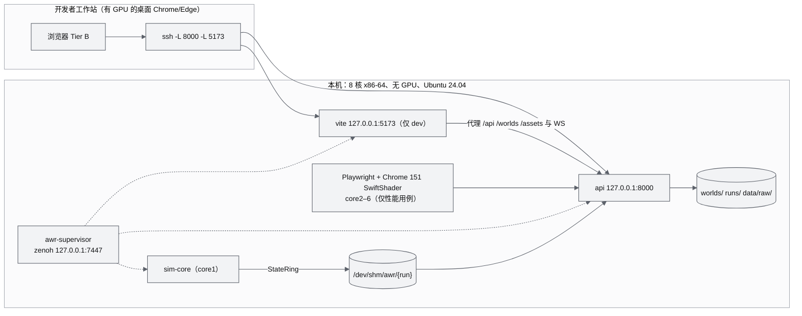

要点：

1. **单机多实例**：D1 由多个并行编码 agent 在同一台主机上开发（ADR-042 背景）。每个 worktree 在 `.env.local` 中设置不同的 `AWR_PORT_OFFSET`（§5），run id 天然互不相同，因此 `/dev/shm/awr/<run>` 不冲突；zenoh key 空间按 `awr/<world>/<run>/` 隔离（AWR-03 §5.6），即使误连同一汇合点也不会串话。
2. **共享只读世界**：六城世界约 0.97 GB（16 §10.3，上限 1.2 GB），不必在每个 worktree 重复构建。非 M03 的 worktree 设 `AWR_WORLDS_DIR=<主仓库>/worlds`；M03 的 worktree 修改了切片器时必须使用私有 `worlds/`，否则会覆盖他人正在使用的世界。
3. **全局性能锁**：性能用例一律持有主仓库的 `runs/.perf.lock`（§7.5），否则不同 worktree 的 flight60 会同时抢占 SwiftShader 所在的 core2–6，违反 ADR-033 运行协议第 ① 条。
4. **本机 CI**：`make ci` 由 `tools/ci/run.sh` 承载（AWR-03 §4.5），测试夹具启动的 supervisor 使用 `AWR_PROFILE=ci` 与 `AWR_PORT_OFFSET=9`（本文设定，预留给测试），关闭 CPU 钉核，运行结束保留运行目录便于排查。

### 3.3 T1 内网演示

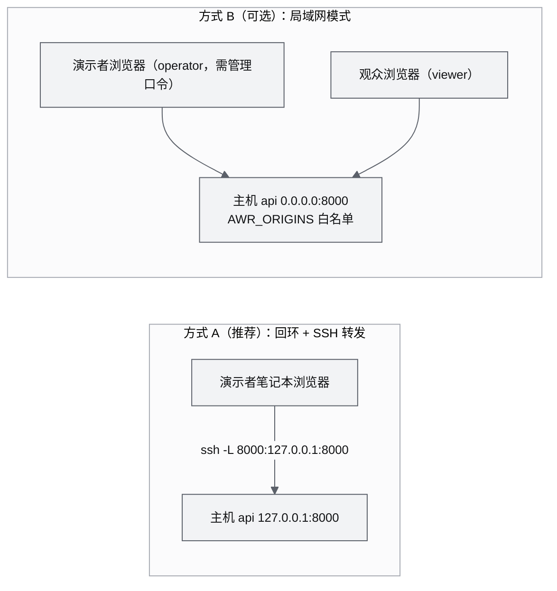

| 项 | 方式 A 回环 + SSH | 方式 B 局域网 |
|---|---|---|
| 启动 | `make run` | `AWR_BIND=0.0.0.0 AWR_ORIGINS=http://<host>:8000 make run` |
| 浏览器地址 | `http://localhost:8000/world/shenzhen` | `http://<host>:8000/world/shenzhen` |
| 安全上下文 | 是（`localhost`），WebGPU 与 COOP/COEP 可用 | 否（非 https 的局域网地址）：`navigator.gpu` 不可用；COOP/COEP 不生效，`crossOriginIsolated` 为 false，`performance.now()` 粗化到 100 µs、`SharedArrayBuffer` 不可用（n05 §0 第 10 条）；硬件默认 Tier B 不受影响，但 `/bench` 回传的计时精度下降 |
| operator token | 无需口令（单席位） | 需管理口令（`runs/current/admin.token`） |
| 观众 | 通常看演示者屏幕（viewer） | 各自浏览器为 viewer |
| 防火墙 | 无需开放端口（只需 SSH 22） | 只对演示网段开放 8000（`ufw allow from <网段> to any port 8000 proto tcp`） |
| 适用 | 所有演示；需要 Tier A 演示时唯一可行 | 多名观众需要各自操作视角时 |

演示当天的完整检查单见 §9.4。

### 3.4 T2 GPU 节点（V0.5 起）

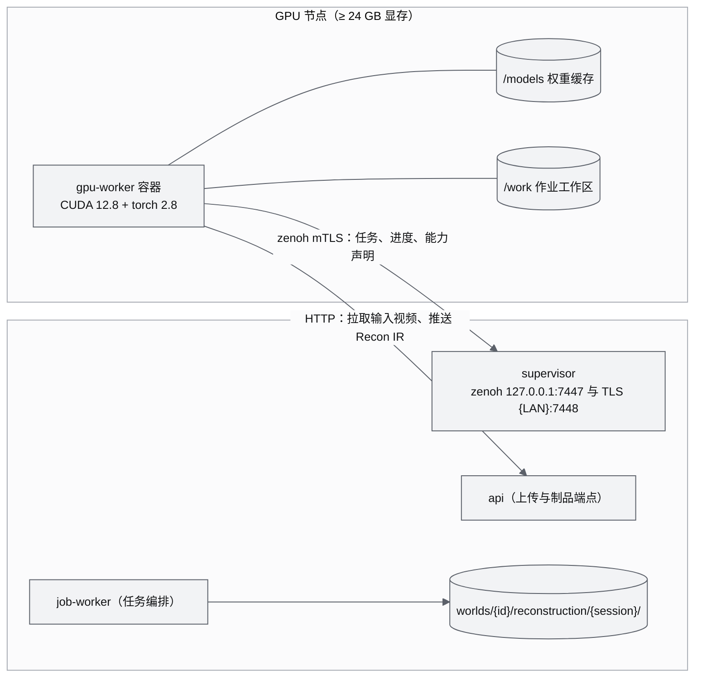

- **控制面**：GPU 节点作为 zenoh peer 经 TLS 端点接入主机（本文设定端口 7448，见 §20 反馈第 8 条），ACL 只允许其访问重建相关 key 前缀；主机 7447 仍只监听回环（ADR-027 V0.5 条款）。
- **数据面**：输入视频（GB 级）与 Recon IR 走 HTTP（AWR-03 ADR-018 大块数据平面），不经 zenoh；也可挂载共享存储（NFS），由 M01 决定。
- **接口**：任务提交、进度、能力探测的消息格式由 [M01](modules/M01-重建引擎PRD.md) 与 [17](17-接口与实时协议规范.md) 定义，本文只规定部署面（§10.5）。
- **V0.6/V0.8**：Gazebo 与 Isaac 传感器后端同样部署在 GPU 节点，经 World 导出器共用 World（ADR-048）。

### 3.5 T3 真机现场（V0.5 起）

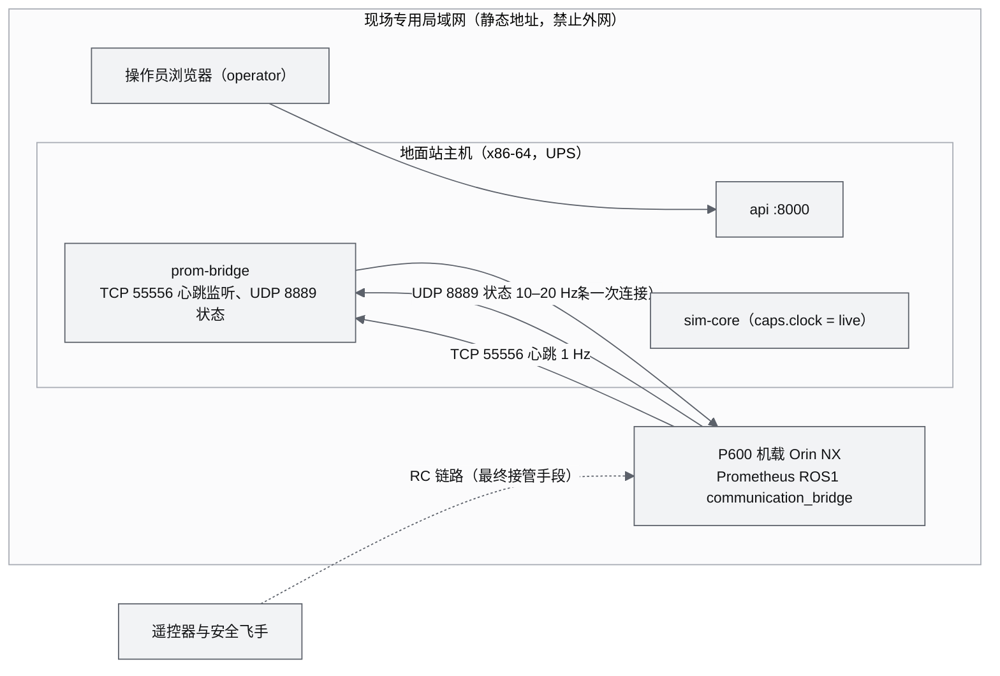

现场部署的硬性事实与约束（依据 r19 §0、§4、§6）：

1. **地面站是安全关键组件**：机载端每秒向地面站 55556 发一次心跳，连续 5 次失败就自动给无人机下 Land。因此 prom-bridge 的 55556 监听必须最先启动、最后关闭；地面站崩溃或断电导致真机降落是**期望行为**，必须写入现场简报；地面站接 UPS。
2. **单一控制方**：只有 prom-bridge 连接机载端 55555；浏览器不直连机载端；机载网络只放行地面站 IP；禁止 `CUSTOMMODE`、`REBOOTNX`、`EXITNX` 指令（前者会在机载电脑上执行任意命令）。
3. **时钟**：真机在场时 `caps.clock = live`，SimClock 锁定 ×1，暂停与单步禁用（ADR-045）。
4. **遥控器必须开机**：Prometheus 在非仿真模式下 RC 失联 1.5 s 判定，无遥控器进入 COMMAND 控制后会立即 LAND；安全飞手持遥控器是最终接管手段。
5. **地面站硬件**：必须为 x86-64（StateRing 依赖 TSO，ADR-018）；ARM 笔记本需等 `ZenohStateBus`（V0.5）或加 fence。
6. **真机安全开关**：状态机、检查单与紧急停止见 §12.5。

### 3.6 主机规格基线

| 角色 | 本期参照（本机实测） | 最低 | 推荐 | 说明 |
|---|---|---|---|---|
| 主机（T0/T1） | Xeon E5-2603 v4 1.7 GHz 8 核无超线程、62 GB 内存、225 GB 磁盘（剩余约 52 GB，审校时 `df` 复核）、无 GPU、Ubuntu 24.04.4、`/dev/shm` 32 GB tmpfs、Python 3.12.3、Node 22.12.0、Docker 29.4.2、Compose v5.1.3 | 4 核、16 GB、20 GB 可用磁盘（用 §4.1 的 4 核布局，机群上限按 §15.2 计算） | 8 核 ≥ 2.5 GHz、32 GB、100 GB SSD | x86-64 为硬性要求（OPS-NFR-011） |
| 浏览器端 | 用户自己的桌面 Chrome/Edge | 支持 WebGL2 的 GPU，最小视口 1280×720 | 独显或近代集显 | 移动端不支持（Q6）；远程桌面环境可能落到软件渲染（§14 F03） |
| 本机测试浏览器 | Chrome for Testing 151（`~/.cache/ms-playwright/chromium-1234/chrome-linux64/chrome`） | 同左 | 同左 | Playwright 1.63 默认期望 rev 1243，经 `PW_CHROME` 指向本地 151（n05 §0 第 7 条） |
| GPU 节点（T2） | 暂无 | 24 GB 显存、支持 CUDA 12.8 的驱动、16 核、64 GB、1 TB NVMe | 48 GB 显存 | 依据 n02 §6 第 3 条、r01 §2.4 |
| 地面站（T3） | 暂无 | x86-64 笔记本 8 核、16 GB、有线网口、电池或 UPS ≥ 2 h | 同左加 GPS 授时 | 真实会话时间基见 AWR-03 §5.2 第 8 条 |

### 3.7 T4 公开演示站（V0.1，ADR-082 至 ADR-085）

面向公网匿名访客的只读演示：`https://drone4d.agentnetwork.org.cn`，部署在共用服务器 emax（Ubuntu 24.04、4 核、约 2.8 GB 可用内存、无 GPU，已运行 ANet 生产服务与 nginx 1.24）。访客无需登录，落地页点"进入演示"即进入合成城市 synthcity 的沙盘；不提供 GPU 重建、录制回放、智能体运行时等服务端重计算功能，帧率取决于访客设备的 GPU。部署材料与中文手册在 `tools/deploy/emax/`（[README](../tools/deploy/emax/README.md)）。

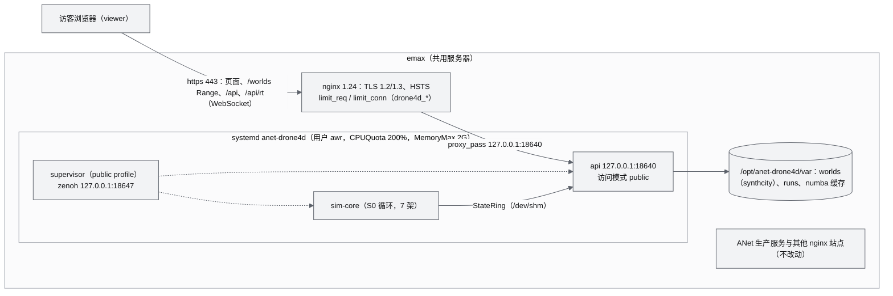

| 方面 | 规定 | 依据 |
|---|---|---|
| 访问模式 | `public`：匿名只签 viewer；operator 与 admin 只认部署时配置的管理口令（`AWR_ADMIN_SECRET_FILE`），缺省不配置，一律 403 `115`；Origin 只有站点域名；Host 白名单含站点域名与 127.0.0.1；viewer 不能发命令、改环境、切换运行世界；演示站不提供的功能族（录制、任务、重建、智能体、性能报告、进程表、rt 调试、OpenAPI）404 | AWR-17 §3.3；ADR-082 |
| 反向代理与客户端地址 | api 只监听 127.0.0.1（public 模式绑定非回环地址拒绝启动）；`AWR_TRUSTED_PROXIES=127.0.0.1,::1`，按 `X-Forwarded-For` 得到的客户端地址只用于限流、连接计数与日志 | AWR-17 §3.3 规则 7；ADR-082 |
| 世界 | 世界白名单只有 synthcity（其余世界的 REST 与静态请求都 404，静态 `/worlds` 同样）；服务器上只放 `var/worlds/synthcity` 与 `_shared/env`，UrbanScene3D 数据与世界包禁止出现 | ADR-034、ADR-077、OPS-FR-054 |
| 连接与限流 | WS 全部 ≤ 64、每个客户端地址 ≤ 4；每地址 `/api/**` 20 次/s（突发 120）、token 签发 0.5 次/s（突发 10）、world query 20 次/s（突发 40）；nginx 侧同口径（`drone4d_api`、`drone4d_token`、`drone4d_static`、`drone4d_conn`、`drone4d_ws`） | AWR-17 §3.4 |
| 进程集合 | public profile：sim-core 与 api；recorder、agent-runtime、job-worker 与 replay-worker 不启动；热备用（`defaults.standby`）与钉核关闭 | §6.2；ADR-082 |
| 剧本 | S0 的 `public` 剧本 profile：不录制，结束后 8 s【仿真】在步边界外重置并从头重开，每轮天气序列循环左移一位（晴、小雨、雾） | ADR-084 |
| 资源 | 机群 7 架（≤ 8）；本机实测（1.7 GHz Xeon）稳态 sim-core 约 0.26 核、api 约 0.04 核（每个浏览器访客再加约 0.02 核）、常驻内存合计约 0.59 GB；systemd 上限 CPUQuota 200%、MemoryMax 2G、Nice 5 | OPS-FR-051 |
| 前端 | `VITE_AWR_DEMO=public` 演示构建："/" 为不加载 three 的落地页；只读控件禁用并以 Tooltip 说明"公开演示为只读模式"；隐藏重建、任务、录制与 GPU 自检入口；不发布 `dist/bench` | ADR-083；M15-FR-120 至 FR-124 |
| 目录与发布 | `/opt/anet-drone4d/releases/<release>`（root 所有，含该发布的 `.venv`），`current` 原子切换；`/opt/anet-drone4d/var`（awr 所有）；`/etc/anet-drone4d/env`（0600）；保留 3 个发布，`install.sh --rollback` 一键回滚 | ADR-085 |
| nginx 与证书 | 只新增本站点（`drone4d.agentnetwork.org.cn.conf`），不改 `nginx.conf` 与其他站点；证书由 certbot webroot（`/var/www/certbot`）以 ECDSA 申请，首次用只含 80 端口的引导站点；`install.sh` 从不 reload nginx 或调用 certbot，相应命令打印后由人工执行 | OPS-FR-053 |

部署流程（细节见 `tools/deploy/emax/README.md`）：

1. 开发机 `tools/deploy/emax/build-local.sh --with-world`（或 `make deploy-pack WORLD=1`）：演示构建并经生产包扫描，打部署包与 synthcity 世界包，复核不含 `worlds/`、`data/`、`refs/`、`.cache/`、点云文件、超过 5 MB 的文件与本机凭据。
2. 上传到 emax 并 `sudo bash install.sh --bundle <dir> --world-pack <tar>`：建用户与目录、uv 建 venv、numba 预热、世界、`env`、systemd、切换与健康检查（失败自动回滚）。
3. 人工执行打印的 nginx 与 certbot 命令（先 `nginx -t`）；之后的更新只重复 1、2 两步。

---

## 4. 进程清单与监管

### 4.1 进程运维清单

架构层面的进程职责、CPU 预算与崩溃影响以 AWR-03 §3.3 为准；下表只补运维所需的列（就绪信号、存活判据、重启策略、日志与端口）。

| 进程 | 层 | 启动命令 | 就绪信号 | 存活判据（阈值 / 启动宽限） | 重启策略 | 日志 | 监听 | 常驻内存（估算） |
|---|---|---|---|---|---|---|---|---|
| awr-supervisor | core | `python -m awr.runtime.supervisor -c configs/runtime.yaml` | 终端打印 READY | 由 systemd 或容器判定 | 外层保活（§4.4） | `logs/supervisor.log` | 7447（回环） | 60 MB |
| sim-core | core | `python -m awr.sim.runtime` | liveliness `proc/sim-core/ready` 或 StateRing 首个心跳 | StateRing 头 `heartbeat_ns`：2 s / 15 s | always，退避 0.1/1/2/4/8 s（ADR-061） | `logs/sim-core.log` | — | 300 MB |
| plan-pool | core | sim-core 内 `ProcessPoolExecutor(spawn)`，W = 1 | — | `BrokenProcessPool` | 由 sim-core 重建进程池，请求重试 1 次 | 并入 sim-core 日志 | — | 150 MB |
| api | core | `uvicorn awr.api.main:app --host ${AWR_BIND} --port ${port} --loop uvloop --ws websockets --ws-per-message-deflate false --ws-max-size 262144 --workers 1`（后两个参数是线上行为的一部分，17 §3.4） | liveliness `proc/api/ready` | `hb.api`（10 Hz 写）：5 s / 15 s | always | `logs/api.log` | 8000 | 200 MB |
| recorder | ext | `python -m awr.recorder` | `proc/recorder/ready` | `hb.recorder`：5 s / 15 s | always（空闲时不录） | `logs/recorder.log` | — | 120 MB |
| replay-worker | ext | `python -m awr.recorder.replay --run <run>`（按需，由 api 经 supervisor `sys/start{name, args{run, segment}}` 启动、`sys/stop` 停止，10 §4.4、M11-FR-079） | `proc/replay-worker/ready` | `hb.replay-worker`：5 s / 15 s | on-failure；关闭回放即停止 | `logs/replay-worker.log` | — | 200 MB |
| agent-runtime | ext | `python -m awr.agent.runtime` | `proc/agent-runtime/ready` | `hb.agent-runtime`：5 s / 15 s | always | `logs/agent-runtime.log` | — | 120 MB |
| job-worker | ext | `python -m awr.jobs.worker`，nice 10 | `proc/job-worker/ready` | `hb.job-worker`：120 s / 30 s | on-failure | `logs/job-worker.log` | — | 按任务（切片峰值见 §15.4） |
| vite | dev | `npx vite --port ${port} --strictPort --host 127.0.0.1`（`apps/web`） | 端口可连接 | 只看退出 | on-failure | `logs/vite.log` | 5173 | 300 MB |
| static（条件） | core | 第二个 uvicorn，只挂 `/worlds` 静态（D1-AC-08 超标时，10 AD-07、M11-FR-084） | 端口可连接 | `hb.static`：5 s | always | `logs/static.log` | 8001（`AWR_STATIC_PORT`） | 100 MB |
| geo-worker | V0.2 | `python -m awr.world.geometry.worker --threads 3` | `proc/geo-worker/ready`（场景建好后） | 就绪前 30 s，就绪后 5 s | always | — | — | 0.8 GB 映射 + 场景 0.5–2.4 GB（r06 §6） |
| px4-bridge-k | V0.2 | `python -m awr.sim.backends.px4_bridge --slot k` | ring `state.px4-bridge-k` 首心跳 | 3 s / 20 s | always | — | — | 100 MB |
| sim-orchestrator | V0.2 | `python -m awr.sim.orchestrator`（持 docker.sock） | `proc/sim-orchestrator/ready` | 5 s / 15 s | always | — | — | 80 MB |
| prom-bridge | V0.5 | `python -m awr.sim.backends.prometheus`（field） | 55556 监听就绪 | 1 s / 10 s | always，最先启动 | — | 55556、8889 | 80 MB |

说明：

1. 常驻内存为本文估算，MS4 以 `awr status` 实测回填；Python 基础解释器约 30 MB，numba 与 llvmlite 导入后显著增加。
2. 心跳必须在主循环里写，不能开后台线程代写，否则会掩盖主循环挂死（g05 §7.3）；api 的心跳由一个 10 Hz asyncio task 写，事件循环被卡住即停写（g05 §5）。
3. 启动宽限 15 s 覆盖 numba 首次编译（2–5 s，g08 §11.2）在高负载下的放大；缓存命中时 sim-core 冷启动约 0.3 s（g05 §7.4），D1-AC-11a 的 3 s 重启窗口依赖缓存命中（AWR-11 TECH-NFR-004）。
4. `--inproc` 模式只用于测试和 ≤ 50 架的降级演示，不参与部署与性能验收（AWR-03 §3.3）。

**CPU 分区**（`configs/runtime.yaml` 的 `cpus` 与 `cpu.pin`；ADR-017、g05 §2.4）：

| 核 | 8 核主机 | 4 核主机（降级） |
|---|---|---|
| 0 | api | api |
| 1 | sim-core（nice −5，需 `CAP_SYS_NICE`，否则 0） | sim-core |
| 2–6 | 性能用例时 Chromium 与 SwiftShader（`taskset -c 2-6`）；平时不钉核 | 2–3：plan-pool、job-worker、Chromium 共用 |
| 7 | plan-pool | — |
| 不钉核 | supervisor、recorder、replay-worker、agent-runtime、job-worker、vite | 同左 |

### 4.2 supervisor 进程状态机

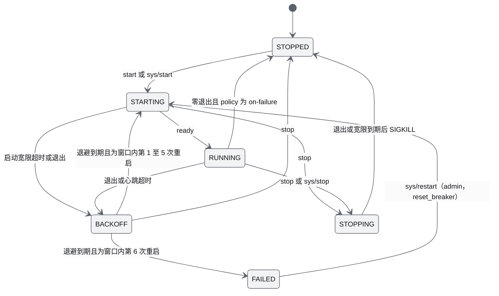

| 源状态 | 事件 | 守卫 | 动作 | 目标状态 |
|---|---|---|---|---|
| STOPPED | start（supervisor 启动顺序到达，或按需进程的启动请求） | `enabled` 为真；`start_after` 中的进程已进入 STARTING 以后的状态 | exec（不用 fork）；注入 §6.3 的 supervisor 注入变量与 `defaults.env`；按 `cpus` 执行 `sched_setaffinity`、按 `nice` 调整；接管 stderr | STARTING |
| STARTING | ready（liveliness `proc/<name>/ready`，或 ring/心跳文件首次写入） | — | 发 `proc.ready`；开始心跳巡检 | RUNNING |
| STARTING | 启动宽限超时 | — | SIGTERM，1 s 后 SIGKILL；写 `crash/<name>-<t>.txt`（stderr 末 200 行） | BACKOFF |
| STARTING、RUNNING | 进程退出（waitpid；不依赖 stdout 管道关闭） | 退出码非 0，或 policy 为 always | 记录 `last_exit`；发 `proc.exited`；写 crash 文件；回收同进程组的残留后代（SIGTERM，1 s 后 SIGKILL） | BACKOFF |
| RUNNING | 进程退出 | 退出码 0 且 policy 为 on-failure | 发 `proc.exited` | STOPPED |
| RUNNING | 心跳年龄 > `stale_s` | — | 判定即转 STOPPING（reason hung）；触发 faulthandler 栈转储（进程已布置时），0.1 s 后 SIGKILL（附 SIGCONT），不给 SIGTERM 宽限（ADR-065）；发 `proc.hung` | BACKOFF |
| BACKOFF | 退避到期（第 n 次重启取 `backoff_s[min(n, 5) − 1]`，即 0.1、1、2、4、8 s；首档 0.1 s 见 ADR-061） | 本次为 60 s 滑动窗口内第 1–5 次重启 | 注入 `AWR_RESTART_COUNT`、`AWR_LAST_EXIT` 后 exec；`standby: true` 且热备用进程已就绪时改为接替：按 `cpus`、`nice` 重新调度备用进程，经 stdin 写入同样的环境，随即再起下一个备用进程（ADR-070；sim-core 冷启动约 2 s，接替到出帧约 0.35 s） | STARTING |
| BACKOFF | 退避到期 | 本次为窗口内第 6 次重启（`restart.max.count = 5` 已用尽） | 发 `proc.failed` 并写审计；若为 sim-core，TIME.state 置 `8 FAILED` | FAILED |
| FAILED | `sys/restart{name, reset_breaker: true}`（admin；17 §4.3.12） | — | 清零窗口计数；写审计 | STARTING |
| 任意运行态 | stop | — | SIGTERM；`grace_s`（5 s）后 SIGKILL | STOPPING → STOPPED |

**计数口径**：窗口计数只统计 60 s 滑动窗口内由 BACKOFF 发起的重启（即异常退出、心跳超时、启动宽限超时的次数），首次启动、`sys/restart`、`sys/start` 与 run 切换引起的启动不计；因此 60 s 内连续 6 次异常退出后进入 FAILED。这与 ADR-017"60 s 内第 6 次启动时熔断"、g05 原型（`supervisor_proto.py` 的 `max_restarts=(5, 60)`）、M11-AC-005 及 OPS-AC-008 一致。进程稳定运行满 60 s 后窗口清空，退避回到 0.1 s。首档取 0.1 s（AWR-03 ADR-061，原 0.5 s）：D1-AC-11a 要求 kill -9 sim-core 后 ≤ 3 s 回到 RUNNING，0.5 s 的首档占去六分之一预算而不带来保护，抑制崩溃循环由第 2 档起的 1/2/4/8 s 与 60 s 窗口熔断承担。线上状态枚举只有 STOPPED、STARTING、RUNNING、STOPPING、BACKOFF、FAILED（17 §4.3.12）；[10](10-系统架构说明书.md) §4.7 的 HUNG 是 SIGTERM 到 SIGKILL 之间的内部过渡，对外报告为 RUNNING 直至进程退出。

依据：ADR-017、g05 §7.1–§7.3。supervisor 自身退出时，子进程经 `PR_SET_PDEATHSIG` 收到 SIGTERM 并退出（g05 §7.3），sim-core 在 SIGTERM 处理中写最终 checkpoint（D1-ext）。

### 4.3 启动与停止流程

**`make run` 预检与启动**（`make dev` 相同，只是 profile 为 dev 并多出 vite 进程）：

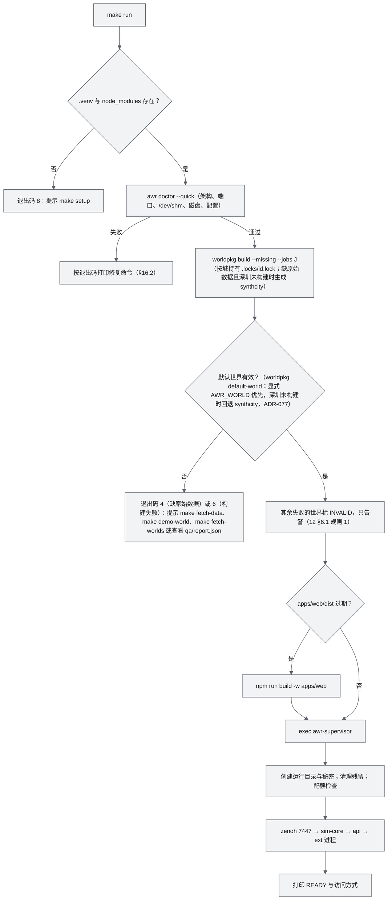

`worldpkg` 的退出码按 16 §18.1（0 成功、1 校验失败、2 门禁失败、3 参数或 I/O 或锁冲突、4 原始数据缺失或 sha256 不符）；预检只据此判断默认世界能否使用，不把非零退出码直接当作 `make run` 的失败（M03-FR-044）。

**默认世界回退**（ADR-077；OPS-FR-042）：未显式指定世界（环境变量 `AWR_WORLD`、`.env.local` 或 `--set run.world=`）时，默认世界取 `configs/runtime.yaml` 的 `run.world`（深圳）；它未构建而 `run.fallback_world`（合成演示城市 synthcity）已构建时，supervisor 改用 synthcity，剧本未显式指定时取 `scenarios/catalog.json` 中它的 `default`（`s0-synthcity-showcase`），并在启动时打印一行提示。`make worlds` 在缺少 UrbanScene3D 原始数据且深圳未构建时自动生成 synthcity（约 25 s，不需要任何下载），因此全新机器上 `make setup && make run` 即可试用；有原始数据时 `make worlds` 先构建深圳，默认仍是深圳与 S1。`awr doctor`、`awr status` 与 supervisor 使用同一判定（`awr.runtime.config.apply_world_fallback`），`worldpkg default-world` 是 M03 侧的同一规则（两者在测试中对拍）。前端 `/` 在没有上次世界时先跳到 `/world/shenzhen`，收到 `serverInfo` 后若运行世界不同则替换为运行世界。

supervisor 内部步骤（顺序固定，依据 AWR-03 §3.7、g05 §7.6）：

1. 生成 run id，创建 `runs/<run>/`（0700）与 `/dev/shm/awr/<run>/`（0700），更新 `runs/current`，写 `supervisor.pid`；
2. 生成 `AWR_SECRET`（32 字节，17 §3.2）与管理口令，写 `secret`、`admin.token`（均为 0600）；
3. 写 `effective-config.yaml` 与初始 `meta.json`（字段见 [16](16-World数据规范.md)）；
4. 清理 `/dev/shm/awr/` 下 supervisor pid 已不存在的残留目录（V0.2 起同时清理带 `awr.run` 标签的残留容器）；
5. 执行配额与磁盘余量检查（§13.2）；
6. 打开 zenoh 汇合点 `tcp/127.0.0.1:${7447+10k}`；
7. 启动 sim-core，等待就绪（最长 15 s）；启动 api（`start_after: [sim-core]`，但 api 必须容忍 sim-core 缺席，UI 显示"启动中"）；启动 ext 进程；
8. 打印 READY、访问地址与 SSH 转发命令；管理口令**只在 stdout 为 TTY 时**打印明文，否则只打印文件路径（避免进入 systemd journal，§12.2）。

**停止**（`make stop` 或对 supervisor 发 SIGTERM）：

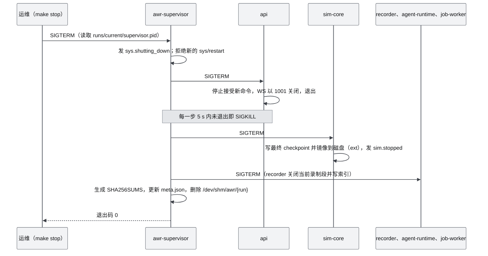

- 真机在空中时（V0.5，§12.5 的 REAL_ARMED），`make stop` 拒绝执行并返回退出码 11，必须先让全部真机落地，或以 `FORCE=1` 加管理口令二次确认执行（维护锁）。
- `make stop FORCE=1` 在 supervisor 已失联时，只回收 `runs/current/supervisor.pid` 所指进程（核对其命令行确为 `awr.runtime.supervisor`）与环境变量 `AWR_RUN` 等于该 run id 的子进程（逐个读取 `/proc/<pid>/environ`，§6.3 的注入变量），列出后经确认 SIGKILL；**禁止**按 `pgrep -f 'awr\.'` 之类的命令行模式批量杀进程，那会误杀同机其他 worktree 的实例（§3.2 第 1 条）。
- **run 切换（D1-ext）**：席位持有者调用 `session/start` 后，api 经 `sys/run` 请 supervisor 停止 `run_scoped: true` 的进程、按上面第 1–3 步建立新运行目录（`AWR_SECRET` 重新生成，管理口令沿用），`run_scoped: false` 的 api 与 job-worker 以新命名空间重开 zenoh 会话；旧运行目录按正常停机关闭并生成 `SHA256SUMS`（[10](10-系统架构说明书.md) AD-01、AD-09）。

### 4.4 外层保活（systemd）

supervisor 只监管子进程，自己由 systemd 或容器保活（g05 §7.5 最后一行）。用户级单元（无需 root，需 `loginctl enable-linger <user>` 才能开机自启）：

```ini
# tools/systemd/awr.service  →  复制到 ~/.config/systemd/user/awr.service
[Unit]
Description=ANet World Runtime (awr-supervisor)
# 用户级管理器看不到系统的 network-online.target；回环模式也不依赖外部网络。
# 系统级单元（局域网模式）另加 After=network-online.target 与 Wants=network-online.target。

[Service]
Type=exec
WorkingDirectory=/data/projs/anet-drone
Environment=AWR_PROFILE=demo
# 前缀 "-"：单城构建失败（退出码非 0）不阻止启动，与 12 §6.1 规则 1 一致
ExecStartPre=-/data/projs/anet-drone/.venv/bin/worldpkg build --missing --jobs 3
ExecStart=/data/projs/anet-drone/.venv/bin/python -m awr.runtime.supervisor -c configs/runtime.yaml
KillSignal=SIGTERM
TimeoutStopSec=30
Restart=on-failure
RestartSec=5
LimitNOFILE=65536
UMask=0027

[Install]
WantedBy=default.target
```

- 启用：`systemctl --user daemon-reload && systemctl --user enable --now awr`；日志：`journalctl --user -u awr -f`（只含 supervisor 的 stdout；各进程日志在 `runs/current/logs/`）。
- 需要 sim-core 的 nice −5 时改用系统级单元：`/etc/systemd/system/awr.service` 中加 `User=<user>` 与 `AmbientCapabilities=CAP_SYS_NICE`（需 root 安装）。
- `TimeoutStopSec=30` 大于 §4.3 停止流程的最坏耗时（3 步 × 5 s 加余量）。
- 单元只执行 `worldpkg build --missing`，不做 `make run` 的其余预检（doctor、前端构建）；升级后必须先手动 `make build`，再 `systemctl --user restart awr`（§9.5）。

### 4.5 运行目录

```text
runs/
├── current -> r20260928-143200-a3f1   # supervisor 维护的符号链接
├── .perf.lock                         # 性能锁（只在主仓库的 runs/ 下使用，§7.5）
├── jobs.db                            # job-worker SQLite 任务队列（ext）
├── jobs/<job_id>/                     # 任务工作目录（ext，保留策略见 M01 §6.7.5）
├── perf-reports/                      # /bench 回传（P1，AWR-03 §3.5）
└── r20260928-143200-a3f1/             # 0700
    ├── meta.json                      # 运行元数据（字段见 16；ADR-040、ADR-049）
    ├── effective-config.yaml          # 生效配置，秘密已掩码
    ├── supervisor.pid
    ├── secret                         # 0600，AWR_SECRET（ADR-019、ADR-027）
    ├── admin.token                    # 0600，管理口令
    ├── audit.jsonl                    # 每 1 s fsync
    ├── keep                           # 存在即为 keep 标记（§13）
    ├── logs/<proc>.log[.1..5]         # 10 MB × 5 轮转
    ├── crash/<proc>-<t_wall_ns>.txt   # 异常退出时的 stderr 末 200 行与 faulthandler 栈
    ├── ckpt/                          # checkpoint 磁盘镜像（ext）
    ├── inputs.msgpack                 # 输入日志（ext，ADR-049）
    ├── rec-<seg>.mcap                 # 录制段（ext，ADR-040）
    ├── rec-<seg>.ovw、rec-<seg>.evx   # 录制段概览与事件索引（ext，M12-FR-037，可由 MCAP 重建）
    ├── bookmarks.json                 # 共享书签（ext，M12-FR-026）
    └── SHA256SUMS                     # 运行关闭时生成，用于备份校验

/dev/shm/awr/r20260928-143200-a3f1/    # 0700，停机时删除
├── state.sim-core                     # StateRing，约 3 MB（K = 32）
├── state.replay                       # 回放环（ext）
├── hb.<proc>                          # 16 B 心跳文件
├── gw.epoch                           # Gateway 全局纪元（10 AD-09）
├── plans/                             # 规划大块结果，api 只读（17 §4.3.7）
└── ckpt/                              # tmpfs checkpoint，3 代，每代约 1–2 MB（ext）
```

---

## 5. 端口规划

| 端口（k = 0） | 协议 | 默认绑定 | 进程 | 版本 | 对外 | 偏移 | 用途与依据 |
|---|---|---|---|---|---|---|---|
| 8000 | HTTP、WS | 127.0.0.1（局域网模式 0.0.0.0） | api | V0.1 | 回环模式否（经 SSH）；局域网模式是 | +10k | REST、`/api/rt`、`/worlds` Range、前端 dist（AWR-03 §3.3） |
| 7447 | TCP（zenoh） | 127.0.0.1 | supervisor（汇合点） | V0.1 | 永不 | +10k | 本机 peer 网状；子进程 `tcp/127.0.0.1:0` 随机端口直连（g05 §3.6） |
| 18640 | HTTP、WS | 127.0.0.1（只能回环） | api（public profile） | V0.1 | 否（nginx 443 反向代理） | +10k | 公开演示站 T4（§3.7）；避开共用服务器上常见的 8000 |
| 18647 | TCP（zenoh） | 127.0.0.1 | supervisor 汇合点（public profile） | V0.1 | 永不 | +10k | 同上，避开 7447 |
| 5173 | HTTP、WS | 127.0.0.1 | vite（dev） | V0.1 | 否（经 SSH） | +10k | 代理 `/api`、`/worlds`、`/assets` 与 WS（AWR-03 §3.3） |
| 4173 | HTTP | 127.0.0.1 | vite preview（测试夹具） | V0.1 | 否 | +10k | Playwright `webServer`（n05 trial） |
| 8001（`AWR_STATIC_PORT`） | HTTP | 同 8000 | static（条件启用） | V0.1 | 同 8000 | +10k | ADR-013 拆分静态服务的回退形态（10 AD-07、M11-FR-084）：`/worlds/**` 带 `Cross-Origin-Resource-Policy: cross-origin` 与按 Origin 白名单的 CORS，前端从 `GET /api/sys/config` 的 `worlds_base` 取地址；回环模式需额外转发该端口 |
| 8765 | WS | 127.0.0.1 | foxglove 调试旁路 | V0.2 | 否 | +10k | r15 §0 第 9 条 |
| 14580 | UDP | SIH 容器内 | PX4 SIH（每容器 `px4 -i 0`） | V0.2 | 否 | — | 指令发往 `<容器 IP>:14580`（r20 §3.8、r22 §3.1）；遥测回程见 §10.3"链路"行 |
| 18570、19410 | UDP | SIH 容器内 | PX4 GCS 链路与 SIH 真值 | V0.2 | 否 | — | 调试 QGC 与真值流（r20 §3.8） |
| 24540 起 | UDP | 127.0.0.1 | CI 中的 PX4 回放与 fake_px4 | V0.2 | 否 | — | 避开他人 PX4 占用的 14540 段（r21 R13） |
| 4560+i | TCP | 127.0.0.1 | sim-core（SITL-EXT，PX4 为 client） | V0.4 | 否 | — | ADR-020 |
| 7448 | TCP + TLS（zenoh） | 主机局域网地址 | supervisor 跨主机端点 | V0.5 | 只对 GPU 节点与白名单主机 | +10k | 本文设定（§20 反馈第 8 条） |
| 55556 | TCP | 地面站现场网地址 | prom-bridge 心跳监听 | V0.5 | 只对机载端 IP | — | 必须常驻（r19 §0 第 3 条） |
| 8889 | UDP | 地面站现场网地址 | prom-bridge 状态接收 | V0.5 | 只对机载端 IP | — | r19 §2.3 |
| 55555 | TCP（出站） | 机载端 | 指令目的端口 | V0.5 | — | — | 每条指令一次连接（r19 §6） |
| 9090 | WS | 机载端或 `ros:noetic` 容器 | rosbridge（ROS1） | V0.5 | 只对地面站 | — | r27 §3.16 |
| 8888 | UDP | 127.0.0.1 | uXRCE-DDS agent | V0.6 | 否 | — | r20 §3.8 |

规则：

1. **偏移**：`AWR_PORT_OFFSET = k`（0–31，ADR-055；原为 0–9，验收加固阶段 14 个并行 worktree 不够用）作用于表中"偏移"列为 +10k 的端口；k ≤ 31 时各端口段互不相交；k = 9 预留给本机 CI 测试夹具（§3.2）；D1 默认 k = 0，与 AWR-03 §3.3 的端口完全一致。
2. **避让**：14540–14549（PX4 offboard 默认）、14550（QGC）、18570 起（PX4 GCS）不得被本系统占用。
3. **检查**：`awr doctor --quick` 在启动前检查偏移后的 api 端口与 7447（dev 时加 5173，启用静态拆分时加 `AWR_STATIC_PORT`）是否空闲；占用时以退出码 3 失败并打印占用进程（§14 F04）。
4. **防火墙**：回环模式无需任何入站规则（仅 SSH 22）；局域网模式只放行 api 端口到演示网段；7447 在任何模式下都不应出现在非回环地址上（OPS-NFR-006）。

---

## 6. 配置文件与环境变量

### 6.1 配置文件清单

| 文件 | 所有者 | 入库 | 内容 | 本文章节 |
|---|---|---|---|---|
| `configs/runtime.yaml` | M11 | 是 | 运行、访问、总线、配额、CPU、日志、进程清单 `procs:`、profile 叠加、真机闸门 | §6.2 |
| `configs/logging.yaml` | M00 | 是 | 日志字段、级别、按 logger 的级别覆盖、限速 | §11.1 |
| `configs/data.yaml` | M03（下载逻辑的运维要求见本文） | 是 | 数据集与资产的镜像地址、字节数、sha256 | §8.2 |
| `.env.local` | 开发者本人 | 否（`.gitignore`） | 本 worktree 的覆盖：`AWR_PORT_OFFSET`、`AWR_WORLDS_DIR` 等；由 `mk/common.mk` 以 `-include .env.local` 读入并 export | §6.3 |
| `runs/<run>/effective-config.yaml` | supervisor 生成 | 否 | 叠加后的生效配置，秘密掩码为 `***` | §6.4 |
| `configs/secrets/`（V0.5） | 运维 | 否（`.gitignore`） | 跨主机 zenoh 的 CA、证书与私钥（0600） | §12.6 |
| `tools/docker/*`、`tools/systemd/*` | M00 | 是 | 容器与 systemd 样例 | §4.4、§10 |

### 6.2 `configs/runtime.yaml`

```yaml
# configs/runtime.yaml（所有者 M11；运维语义见 AWR-19 §6.2）
version: 1
run:
  id: auto                      # r<YYYYMMDD>-<HHMMSS>-<4hex>
  world: shenzhen               # AWR_WORLD
  scenario: s1-shenzhen-facade  # AWR_SCENARIO（剧本 id，scenarios/catalog.json）
  fallback_world: synthcity     # 默认世界回退（ADR-077）：world 未显式指定且未构建、本世界已构建时改用它，剧本取 catalog 中它的 default；null 关闭
  scenario_profile: null        # AWR_SCENARIO_PROFILE（剧本 profile，例如 ci、demo、n1000；M16）
  shm_root: /dev/shm/awr        # 实际目录 ${shm_root}/${run.id}
  persist_root: runs            # AWR_RUNS_DIR；实际目录 ${persist_root}/${run.id}
  keep_run_dir: false           # AWR_KEEP_RUN_DIR；true 时停机不删 tmpfs 目录（ci 默认 true）
  resume_after_crash: play      # play | pause（D1-ext checkpoint 恢复后的时钟状态，g05 §7.4）
net:
  bind: 127.0.0.1               # AWR_BIND
  port: 8000                    # AWR_PORT
  port_offset: 0                # AWR_PORT_OFFSET（0–31，ADR-055）
  static_port: 8001             # AWR_STATIC_PORT；只在静态拆分回退启用时监听（10 AD-07）
  access_mode: auto             # AWR_ACCESS_MODE：auto | loopback | lan | public（公开演示站，ADR-082）
  origins: []                   # AWR_ORIGINS（逗号分隔）；回环 Origin 永远放行（public 模式除外：只认此处列出的）
  allowed_hosts: []             # AWR_ALLOWED_HOSTS；空时由 origins 推导并加 localhost、127.0.0.1
  trusted_proxies: []           # AWR_TRUSTED_PROXIES：可信反向代理（IP/CIDR），只用于限流与日志的客户端地址
  worlds_allow: []              # AWR_WORLDS_ALLOW：世界白名单，空表示不限制
  ws_max: 32                    # AWR_WS_MAX：WS 连接总数上限
  ws_max_per_ip: null           # AWR_WS_MAX_PER_IP：每个客户端地址的 WS 连接上限（null 不限制）
bus:
  rendezvous: tcp/127.0.0.1:7447    # 端口随 port_offset 平移；主机部分不可改
  shm: false                        # zenoh SHM 一律关闭（g05 §0 第 9 条）
  lease_ms: 3000
quota:
  runs_gb: 20                   # AWR_RUNS_QUOTA_GB
  check_every_s: 600
  disk_warn_gb: 10
  disk_min_gb: 5
cpu:
  pin: auto                     # AWR_CPU_PIN：auto（≥ 8 核且 profile ≠ ci 时启用）| on | off
defaults:
  env: {OMP_NUM_THREADS: "1", OPENBLAS_NUM_THREADS: "1", MKL_NUM_THREADS: "1", PYTHONUNBUFFERED: "1"}
  restart: {policy: always, backoff_s: [0.1, 1, 2, 4, 8], max: {count: 5, window_s: 60}}   # 首档 0.1 s（ADR-061）；窗口内第 6 次重启熔断（§4.2）
  standby: true                 # 热备用总开关（false 时忽略 procs[].standby；public profile 关闭，ADR-082）
  stop: {signal: SIGTERM, grace_s: 5}
  log: {max_mb: 10, backups: 5, tail_lines: 200}
real_ops:
  enabled: false                # D1 恒为 false（OPS-FR-032）
procs:
  - name: sim-core
    layer: core
    cmd: [python, -m, awr.sim.runtime]
    run_scoped: true            # run 切换时随旧 run 停止、随新 run 启动（10 AD-01）
    plugins: [awr.environment.stage, awr.sim.safety, awr.sim.mission, awr.sim.sensors]   # 组合根（10 §3.3 规则 1）
    cpus: [1]
    nice: -5
    liveness: {ring: state.sim-core, stale_s: 2.0, startup_grace_s: 15}
    id_range: [0, 1024]
    standby: true               # 热备用进程（§4.2，ADR-070）
    standby_cpus: [7]
    env: {AWR_SIM_AUX_CPUS: "7"}  # 主循环以外的线程只放 core7（10 §10.4，ADR-073 第 6 条；主循环未钉核时不生效）
  - name: api
    layer: core
    cmd: [uvicorn, awr.api.main:app, --host, "${net.bind}", --port, "${net.port_effective}",
          --loop, uvloop, --ws, websockets, --workers, "1",
          --ws-per-message-deflate, "false", --ws-max-size, "262144"]   # 17 §3.4：uvicorn 0.54.0 默认 True 与 16 MiB
    run_scoped: false           # 跨 run 存活，重开 zenoh 会话（10 AD-09）
    cpus: [0]
    start_after: [sim-core]
    liveness: {heartbeat: hb.api, stale_s: 5.0, startup_grace_s: 15}
  - name: recorder
    layer: ext
    cmd: [python, -m, awr.recorder]
    run_scoped: true
    liveness: {heartbeat: hb.recorder, stale_s: 5.0, startup_grace_s: 15}
  - name: replay-worker
    layer: ext
    on_demand: true             # 由 api 经 sys/start{name, args{run, segment}} 启动、sys/stop 停止（M11-FR-079）
    cmd: [python, -m, awr.recorder.replay]
    run_scoped: true
    restart: {policy: on-failure}
    liveness: {heartbeat: hb.replay-worker, stale_s: 5.0, startup_grace_s: 15}
  - name: agent-runtime
    layer: ext
    cmd: [python, -m, awr.agent.runtime]
    run_scoped: true
    liveness: {heartbeat: hb.agent-runtime, stale_s: 5.0, startup_grace_s: 15}
  - name: job-worker
    layer: ext
    cmd: [python, -m, awr.jobs.worker]
    run_scoped: false
    nice: 10
    restart: {policy: on-failure}
    liveness: {heartbeat: hb.job-worker, stale_s: 120, startup_grace_s: 30}
  - name: vite
    layer: dev
    cmd: [npx, vite, --port, "${net.vite_port_effective}", --strictPort, --host, 127.0.0.1]
    cwd: apps/web
    restart: {policy: on-failure}
    liveness: {mode: exit_only}
profiles:
  dev:   {procs_enable: [core, ext, dev]}
  demo:  {procs_enable: [core, ext], run: {resume_after_crash: play}}
  ci:    {procs_enable: [core, ext], cpu: {pin: off}, run: {keep_run_dir: true}, quota: {runs_gb: 5}, net: {port_offset: 9}}   # 功能门禁（G1）
  perf:  {procs_enable: [core, ext], cpu: {pin: on}, run: {keep_run_dir: true}, quota: {runs_gb: 5}, net: {port_offset: 9}}    # 性能用例（18 PR-6 要求钉核，M16 harness 以此启动后端）
  public: {procs_enable: [core], cpu: {pin: "off"}, defaults: {standby: false},       # 公开演示站 T4（§3.7，ADR-082）
           run: {world: synthcity, scenario: s0-synthcity-showcase, scenario_profile: public, fallback_world: null},
           net: {bind: 127.0.0.1, port: 18640, access_mode: public, trusted_proxies: [127.0.0.1, "::1"], worlds_allow: [synthcity],
                 ws_max: 64, ws_max_per_ip: 4},
           bus: {rendezvous: tcp/127.0.0.1:18647}, quota: {runs_gb: 2, disk_warn_gb: 2, disk_min_gb: 1}}   # AWR_ORIGINS 由部署环境给出
  field: {}                     # V0.5 起定义；D1 中选择 field 即以退出码 2 拒绝
```

主要键的类型、默认与约束：

| 键 | 类型 | 默认 | 单位 | 约束与说明 |
|---|---|---|---|---|
| `net.port_offset` | int | 0 | — | 0–31（ADR-055）；作用于 §5 中标注 +10k 的端口 |
| `net.access_mode` | enum | auto | — | auto 时 `bind` 为 127.0.0.1 即 loopback，否则 lan；容器内绑定 0.0.0.0 但宿主只在回环发布时显式设为 loopback（§10.2） |
| `net.origins` | list[str] | [] | — | lan 模式必填，否则退出码 2；每项形如 `http://<host>:<port>` |
| `quota.runs_gb` | float | 20 | GB（按 2³⁰ B 计） | ≥ 1；ci profile 为 5 |
| `quota.disk_min_gb` | float | 5 | GB | 低于时停止录制并拒绝构建世界（OPS-FR-036） |
| `procs[].liveness.stale_s` | float | 见各进程 | s | 墙钟域（ADR-045 计时器清单中的"supervisor 心跳与退避"） |
| `procs[].liveness.startup_grace_s` | float | 15 | s | 超时视为启动失败进入 BACKOFF |
| `procs[].cpus` | list[int] | 无 | — | `cpu.pin` 为 off 或核数不足时忽略并告警 |
| `procs[].nice` | int | 0 | — | 负值需要 `CAP_SYS_NICE`，否则取 0 并在日志中告警（AWR-03 §3.3） |
| `procs[].standby` | bool | false | — | true：该进程启动或接替时另起一个带 `AWR_STANDBY=1` 的热备用进程，重启时直接接替（§4.2；ADR-070）；D1 只有 sim-core 为 true，其进程必须实现"打印 `AWR_STANDBY_READY` 后阻塞读 stdin 一行 JSON 环境"的约定 |
| `procs[].standby_cpus` | list[int] | `cpus` 之外的 CPU | — | 热备用进程等待期间的亲和性（接替时改为 `cpus`）；sim-core 为 [7]（与 plan-pool 同核，ADR-017）；`cpu.pin` 为 off 时忽略 |
| `procs[].layer` | enum | core | — | core、ext、dev；由 profile 的 `procs_enable` 决定是否启动 |
| `procs[].run_scoped` | bool | true | — | true：run 切换时随旧 run 停止、随新 run 启动；false：跨 run 存活并重开 zenoh 会话（api、job-worker；10 AD-01、AD-09） |
| `procs[].on_demand` | bool | false | — | true 时 supervisor 启动阶段不拉起，只响应 `sys/start`、`sys/stop`（D1 只有 replay-worker） |
| `procs[].plugins` | list[str] | 见 §6.2 | — | 只对 sim-core 有效：组合根按序 `importlib` 导入的模块（10 §3.3 规则 1）；未知模块以退出码 2 失败 |
| `defaults.restart.max` | `{count: int, window_s: float}` | `{5, 60}` | 次、s | 60 s 滑动窗口内允许的重启次数；第 count + 1 次重启请求转 FAILED（§4.2 计数口径） |
| `defaults.restart.backoff_s` | list[float] | `[0.1, 1, 2, 4, 8]` | s | 第 n 次重启取第 `min(n, len)` 项；首档 0.1 s（ADR-061，原 0.5 s） |
| `net.static_port` | int | 8001 | — | 1024–65535；随 `port_offset` 平移；只在静态拆分回退启用时监听 |
| `real_ops.enabled` | bool | false | — | 只允许在 profile = field 且构建含真机适配器时为 true（OPS-FR-032） |

### 6.3 环境变量

| 变量 | 类型 | 默认 | 作用 | 设置方 | 版本 |
|---|---|---|---|---|---|
| `AWR_PROFILE` | enum | dev（`make run` 设 demo） | 选择 profile | 运维、Make | V0.1 |
| `AWR_BIND` | str | 127.0.0.1 | api 监听地址 | 运维 | V0.1 |
| `AWR_PORT` | int | 8000 | api 基础端口（再加偏移） | 运维 | V0.1 |
| `AWR_PORT_OFFSET` | int | 0 | 全部端口偏移 10·k，k ∈ 0–31（ADR-055） | 开发者（`.env.local`） | V0.1 |
| `AWR_STATIC_PORT` | int | 8001 | 静态拆分回退的端口（再加偏移，10 AD-07） | 运维 | V0.1 |
| `AWR_ACCESS_MODE` | enum | auto | 显式指定访问模式（loopback、lan、public；public 从不自动推导） | 运维、容器 | V0.1 |
| `AWR_ORIGINS` | csv | 空 | 局域网 Origin 白名单；公开模式的唯一 Origin 白名单（必填） | 运维 | V0.1 |
| `AWR_ALLOWED_HOSTS` | csv | 推导 | Host 白名单（§12.3） | 运维 | V0.1 |
| `AWR_TRUSTED_PROXIES` | csv | 空 | 可信反向代理（IP 或 CIDR）；按 `X-Forwarded-For` 取客户端地址，只用于限流、连接计数与日志（AWR-17 §3.3 规则 7） | 运维 | V0.1（ADR-082） |
| `AWR_WORLDS_ALLOW` | csv | 空（不限制） | 世界白名单；其余世界的 REST 与静态请求 404 | 运维 | V0.1（ADR-082） |
| `AWR_WS_MAX`、`AWR_WS_MAX_PER_IP` | int | 32、不限制 | WS 连接总数与每个客户端地址的上限（public profile 64、4） | 运维 | V0.1（ADR-082） |
| `AWR_ADMIN_SECRET_FILE` | path | 空 | 公开模式的管理口令文件（首行）；未设置时 operator 与 admin 一律拒绝；其他模式忽略 | 运维（`install.sh --admin-secret`） | V0.1（ADR-082） |
| `AWR_WORLD`、`AWR_SCENARIO` | str | shenzhen、s1-shenzhen-facade | 默认世界与剧本 id（M16 `scenarios/catalog.json`） | 运维 | V0.1 |
| `AWR_SCENARIO_PROFILE` | str | 空 | 剧本 profile（ladder 规模、天气等；M16 §7.2，与 `sim/reset{profile}` 同义） | 运维、测试 | V0.1 |
| `AWR_WORLDS_DIR` | path | `./worlds` | 世界目录（可指向共享目录） | 开发者 | V0.1 |
| `AWR_DATA_DIR` | path | `./data/raw` | 原始数据根目录 | 运维 | V0.1 |
| `AWR_DATA_MIRROR` | url | 空 | 数据镜像根（NAS 或项目 Release），可为 `file://` | 运维 | V0.1 |
| `AWR_RUNS_DIR` | path | `./runs` | 运行目录根 | 运维 | V0.1 |
| `AWR_RUNS_QUOTA_GB` | float | 20 | `runs/` 配额 | 运维 | V0.1 |
| `AWR_KEEP_RUN_DIR` | bool | 0 | 停机不删 tmpfs 目录（排查用） | 运维 | V0.1 |
| `AWR_CPU_PIN` | enum | auto | 钉核开关 | 运维 | V0.1 |
| `AWR_LOG_LEVEL` | enum | INFO | 全局日志级别 | 运维 | V0.1 |
| `AWR_KERNEL` | enum `numba`、`numpy` | numba | `numpy` 时强制 numpy 内核（机群上限 300 架） | 测试 | V0.1（AWR-11 TECH-FR-005、TECH-AC-005；原名 `AWR_DISABLE_NUMBA` 作废） |
| `AWR_DISK_FREE_OVERRIDE_GB` | float | 空 | 以给定值代替实测可用磁盘，用于磁盘守卫用例（M12-AC-039）；非测试构建忽略 | 测试 | V0.1 |
| `WORLDPKG_VERIFY` | enum | shallow | `deep` 时 `worldpkg build --missing` 以 deep 校验判定（六城约 15 s，16 §3.5） | 运维 | V0.1 |
| `AWR_PERF_LOCK` | path | 主仓库 `runs/.perf.lock` | 全局性能锁路径 | Make | V0.1 |
| `AWR_BACKUP_TARGET` | rsync 目标 | 空 | 备份目的地 | 运维 | V0.1 |
| `PW_CHROME` | path | `~/.cache/ms-playwright/chromium-1234/chrome-linux64/chrome` | Playwright 与 Vitest browser 使用的 Chrome | 测试 | V0.1 |
| `NUMBA_CACHE_DIR` | path | `~/.cache/awr/numba` | numba 缓存目录，必须持久可写（AWR-03 ADR-017 第 2 轮修订：不放在源码目录旁，容器中源码可能只读）；容器内设为 `/var/cache/awr/numba` 并挂卷；`make run` 启动前预热编译 | 运维、容器 | V0.1 |
| `AWR_EGL_LIBDIR` | path | 空 | 非 root 主机上本地解包的 libEGL 目录，geo-worker 启动时加入 `LD_LIBRARY_PATH`（§14 F01） | 运维 | V0.2 |
| `AWR_REAL_OPS` | bool | 0 | 必须与 `real_ops.enabled` 一致，二者同时为真才生效（双重确认） | 现场管理员 | V0.5 |
| 以下由 supervisor 注入，禁止人工设置 | | | | | |
| `AWR_RUN`、`AWR_RUN_DIR`、`AWR_PERSIST_DIR` | str、path | — | run id、tmpfs 目录、持久目录 | supervisor | V0.1 |
| `AWR_SUPERVISOR_PID` | int | — | 子进程启动时核对父进程（g05 §7.3） | supervisor | V0.1 |
| `AWR_ID_BASE`、`AWR_ID_COUNT` | int | — | 生产者机体 id 区段（g05 §3.2） | supervisor | V0.1 |
| `AWR_RESTART_COUNT`、`AWR_LAST_EXIT` | int | — | 重启计数与上次退出码 | supervisor | V0.1 |
| `AWR_SECRET_FILE` | path | — | 指向 `runs/<run>/secret`；子进程读文件而不经环境变量传递秘密值 | supervisor | V0.1 |
| `OMP_NUM_THREADS` 等 BLAS 变量 | int | 1 | 单线程 BLAS（g05 §7.2） | supervisor | V0.1 |

### 6.4 优先级与生效配置

1. 优先级：命令行参数 > `AWR_*` 环境变量（含 `.env.local`）> `profiles.<profile>` 叠加 > `runtime.yaml` 基础值 > 代码内置默认。
2. 生效配置写入 `runs/<run>/effective-config.yaml`，并在 `awr config print [--profile <p>]` 中可离线查看；键 `secret`、`admin_secret`、`token`、`*_key` 一律掩码为 `***`。
3. 结构校验在 supervisor 启动的第一步执行；未知键、类型错误、lan 模式缺 `origins`、D1 中出现 `real_ops.enabled: true` 或 profile = field，均以退出码 2 失败并指出键路径。

---

## 7. 安装、构建与工程流程（M00）

### 7.1 前置条件

| 项 | 要求 | 检查命令 | 获取方式 |
|---|---|---|---|
| 操作系统与架构 | Linux x86-64（Ubuntu 22.04 或 24.04；24.04.4 已验证） | `uname -m` | — |
| Python | 3.12.x | `python3.12 --version` | 系统包 |
| uv | 0.12.19 | `.venv/bin/uv --version` | 本机尚未安装（AWR-11 §4.18）；用 `.venv/bin/pip install uv==0.12.19` 自举 |
| Node 与 npm | Node 22.12.x（`engines.node: ">=22.12 <23"`），npm 10.9 | `node --version` | 系统或 nvm（仓库 `.nvmrc`） |
| 测试浏览器 | Chrome for Testing 151 | `"$PW_CHROME" --version` | 已在 `~/.cache/ms-playwright/chromium-1234/`；仅测试与性能用例需要 |
| 基础工具 | make 4.3、git ≥ 2.40、curl、rsync、coreutils（sha256sum）、util-linux（flock、taskset） | `make --version` 等 | 系统包 |
| 7z 解压（仅 `make fetch-data` 下载路径） | py7zr 1.1.3 或系统 `7z` | `.venv/bin/python -c "import py7zr"` 或 `7z` | 本机 `.venv` 已有 py7zr、没有系统 `7z`；其他机器 `apt install p7zip-full` 或按 §20 第 7 条装可选依赖组 |
| tmpfs | `/dev/shm` 可写且剩余 ≥ 1 GiB | `df -h /dev/shm` | 容器需 `shm_size: 1g` |
| 磁盘 | 可用 ≥ 20 GB（含 `runs/` 配额时建议 ≥ 40 GB） | `df -h .` | — |
| Docker（可选） | 29.x + Compose v5；当前用户在 docker 组 | `docker version` | V0.2 起 SIH 需要；D1 可选 |

### 7.2 Make 目标

`Makefile` 只含 AWR-03 §4.1 规定的总目标并 `include mk/*.mk`；运维目标放在 `mk/ops.mk`（M00），世界与数据目标由 `mk/m03.mk` 提供（M03-FR-053）。

| 目标 | 作用 | 实际执行（摘要） | 所在文件 | 版本 |
|---|---|---|---|---|
| `make setup` | 安装锁定依赖与生成物 | 建 `.venv` → uv 自举 → `uv pip sync requirements.lock` → `pip install -e . --no-deps` → `npm ci` → 契约生成物一致性检查 → `awr doctor --quick`（车辆模型已入库，`make vehicles-models` 重新生成，§8.4） | Makefile | V0.1 |
| `make fetch-data` | 下载并校验原始数据 | `awr data fetch urbanscene3d [--verify]`（§8.2） | mk/m03.mk | V0.1 |
| `make fetch-worlds` | 下载预构建世界 | `awr data fetch worlds`（§8.5） | mk/ops.mk | V0.1（P1） |
| `make worlds` | 构建缺失或无效的世界 | `worldpkg build --missing --jobs $(J)`（J 见 §8.3）；缺原始数据且深圳未构建时生成 synthcity（§8.6） | Makefile 总目标，实现在 mk/m03.mk | V0.1 |
| `make demo-world` | 生成或刷新合成演示城市 synthcity | `worldpkg build synthcity --missing`（§8.6，ADR-077） | mk/m03.mk | V0.1 |
| `make worlds-force` | 强制重建全部或指定城市 | `worldpkg build $(CITY)`（不带 `--missing`） | mk/m03.mk | V0.1 |
| `make validate` | 深度校验全部世界 | `worldpkg validate $(AWR_WORLDS_DIR)/* --deep` | mk/m03.mk | V0.1 |
| `make build` | 前端生产构建 | `npm run build -w apps/web` | Makefile | V0.1 |
| `make run` | 预检并启动（profile = demo） | §4.3 流程 | Makefile | V0.1 |
| `make dev` | 开发启动（profile = dev，含 vite） | 同上，跳过 `make build` | Makefile | V0.1 |
| `make stop` | 停止当前运行 | `awr stop [--force]` | mk/ops.mk | V0.1 |
| `make status` | 进程、指标、告警、容量 | `awr status [--offline]` | mk/ops.mk | V0.1 |
| `make logs P=<proc>` | 查看或跟随日志 | `awr logs <proc> [-f]` | mk/ops.mk | V0.1 |
| `make doctor` | 环境诊断 | `awr doctor [--deep]` | mk/ops.mk | V0.1 |
| `make test`、`make lint`、`make ci` | 测试、lint、本机 CI（G1） | 见 [18](18-性能与测试方案.md) | Makefile | V0.1 |
| `make ci-nodata` | 托管 CI 同款无数据门禁 G1h（不需要 GPU、浏览器与原始数据） | `make lint` → `make test-contracts` → `make typecheck` → `make test-py-nodata`（pytest `-m "not perf and not slow and not needs_data"`）→ `make test-web-unit` → `make build`；托管 CI 另跑 `make demo-world`、`make validate-demo-world` 与 `make test-demo-world`，pytest 以 `PYTEST_SHARD=1\|2` 分两路并行（[18](18-性能与测试方案.md) §12.1，ADR-078） | mk/hosted-ci.mk | V0.1 |
| `make perf`、`make chaos`、`make chaos-core` | 性能与混沌用例 | 持全局性能锁，见 [18](18-性能与测试方案.md) | Makefile、mk/m16.mk | V0.1 |
| `make gc-runs` | 立即执行配额回收 | `awr runs gc` | mk/ops.mk | V0.1 |
| `make backup` | 备份 keep 运行与原始数据归档 | `awr backup`（§13.4） | mk/ops.mk | V0.1（P1） |
| `make images` | 构建 Docker 镜像 | `docker build -f tools/docker/backend.Dockerfile .` | mk/ops.mk | V0.2（P2） |

每个目标失败时以 §16.2 的退出码返回，并在最后一行打印一条可直接复制执行的修复命令。

### 7.3 首次安装步骤

```bash
# 0) 取得代码（MS1 起为 git 仓库）
git clone <repo-url> anet-drone && cd anet-drone

# 1) Python 虚拟环境与 uv 自举（本机 uv 尚未安装）
python3.12 -m venv .venv
.venv/bin/pip install uv==0.12.19

# 2) 锁定安装，约 3–8 min（取决于包源网络）
make setup
#   等价于：
#   .venv/bin/uv pip sync requirements.lock --python .venv/bin/python
#   .venv/bin/pip install -e . --no-deps
#   npm ci
#   node tools/contracts/gen.mjs --check && .venv/bin/python tools/contracts/gen.py --check
#   .venv/bin/awr doctor --quick

# 3) 原始数据：本机已在 data/raw/urbanscene3d/ 时跳过；其他机器执行
make fetch-data            # 下载 253 MB 并解压约 720 MB（需 py7zr 或系统 7z，§8.2）

# 4) 六城世界，3 城并行约 1–2.5 min（单城 21–35 s；M03 门禁六城 ≤ 150 s）
make worlds

# 5) 前端构建，约 1–2 min
make build

# 6) 启动；终端打印 READY 与 SSH 转发命令
make run
```

预期耗时合计 ≤ 30 min（OPS-NFR-001），其中各步耗时由 `make` 打印并写入 `runs/<run>/meta.json` 的安装记录（首次运行时）。

### 7.4 锁文件与依赖变更

1. `requirements.lock` 由 `uv pip compile pyproject.toml -o requirements.lock` 生成；`package-lock.json` 由 npm 生成；二者都入库，是唯一版本来源（ADR-037、ADR-038）。
2. 依赖增删由提出模块向 M00 提交请求，M00 更新锁文件并在 AWR-11 的 BOM（`tools/ci/bom.json`）中登记；其他模块不得直接修改锁文件（AWR-03 §4.3）。
3. `make setup` 只执行 `uv pip sync` 与 `npm ci`，从不解析新版本；`--legacy-peer-deps` 与未锁定的 `npm install <pkg>` 禁止出现在任何脚本中（n05 §6 第 1 条）。
4. 建议 `uv pip compile --generate-hashes`，使 Python 依赖与 npm 的 `integrity` 一样带哈希校验（§20 反馈第 14 条）。
5. **根 `package.json` 的非依赖字段**（M00；依赖、`engines` 与 `overrides` 见 AWR-11 §3.6）：`"name": "anet-drone"`、`"private": true`、`"type": "module"`、`"workspaces": ["apps/web", "packages/contracts"]`；`scripts` 只放转发到工作区的入口：`"build": "npm run build -w apps/web"`、`"dev": "npm run dev -w apps/web"`、`"perf:flight60"`、`"perf:ladder"`、`"perf:layers"`、`"perf:feat-matrix"`（转发到 `apps/web/perf/harness`，参数与用例见 18）；`.nvmrc` 写 `22.12.0`（AWR-11 F-04）。
6. **ruff 规则集**（18 PY-RUFF-01 引用本条；写在 `pyproject.toml` 的 `[tool.ruff]`，本文设定）：`target-version = "py312"`、`line-length = 120`、`src = ["python", "tools", "tests"]`；`lint.select = ["E", "F", "W", "I", "B", "UP", "SIM", "RUF", "PERF"]`；`lint.ignore = ["E501"]`（行宽交给格式化）；`lint.per-file-ignores` 对 `tests/**` 放行 `B011`；`lint.isort.known-first-party = ["awr"]`。pre-commit 只跑 `ruff check --select E,F` 的快速子集，`make lint` 跑全量。

### 7.5 git、worktree 与并行开发

1. **初始化**（D1-MS1 第一项）：`git init`，提交 `.gitignore`，至少包含 `worlds/`、`runs/`、`refs/`、`.cache/`、`data/raw/`、`node_modules/`、`.venv/`、`.env.local`、`configs/secrets/`（AWR-03 §4.5）。
2. **新建模块 worktree**：

```bash
cd /data/projs/anet-drone
git worktree add ../awr-m05 -b m05/pointpool
cd ../awr-m05
cat > .env.local <<'EOF'
AWR_PORT_OFFSET=5
AWR_WORLDS_DIR=/data/projs/anet-drone/worlds
AWR_DATA_DIR=/data/projs/anet-drone/data/raw
EOF
python3.12 -m venv .venv && .venv/bin/pip install uv==0.12.19 && make setup
```

3. **磁盘**：uv 在同一文件系统上默认以硬链接从全局缓存安装，每个 worktree 的 `.venv` 增量很小；`node_modules` 每个 worktree 约 0.3–0.5 GB（n05 trial 实测 318 MB，g07 样板 145 MB），只为活跃模块保留 worktree，合并后执行 `git worktree remove`。
4. **合并门禁**：合并前本地 `make ci`（G1）通过，且 PR 上 GitHub Actions 的无数据门禁 G1h（`.github/workflows/ci.yml`，本机等价入口 `make ci-nodata`）通过；pre-commit 运行 no-emoji、no-hex、ruff 与 oxlint 快速子集（AWR-03 §4.5、ADR-078）。
5. **全局性能锁**：`AWR_PERF_LOCK` 默认解析为 `$(git rev-parse --path-format=absolute --git-common-dir)/../runs/.perf.lock`，即主仓库的 `runs/.perf.lock`。所有 worktree 的 `make perf`、`make chaos`、`make chaos-core` 以排他方式持有（`flock -x`），`make build`、`make test`、`make ci`、`make worlds` 以共享方式持有（`flock -s`，由 `mk/common.mk` 的包装统一加锁）；等锁上限 30 min，超时判"环境不满足"（18 PR-1、PERF-E001；ADR-033 运行协议第 ①、⑥ 条）。
6. **共享世界的写保护**：非 M03 的 worktree 只读使用共享世界；`worldpkg build` 按城持有 `<worlds>/.locks/<id>.lock`（`flock LOCK_EX | LOCK_NB`，占用即退出码 3，M03 §6.9），构建期间其他进程读取的是上一代完整目录（原子交换，§8.3）。

### 7.6 运维 CLI `awr`

入口 `awr = "awr.runtime.cli:main"`（AWR-03 §4.1，文件属 M11）；`awr data *` 由 M03 以子命令注册。全部子命令的退出码按 §16.2；需要管理口令的子命令自动读取 `runs/current/admin.token`，读取失败以退出码 2 结束。

| 子命令 | 参数（类型，默认） | 作用 | 实现方 | 版本 |
|---|---|---|---|---|
| `awr doctor` | `--quick`、`--deep`、`--upgrade-check`、`--field`（flag，均为否）；`--json`（flag，否） | §14.1 的检查 | M11（M00 提供检查项） | V0.1（`--field` V0.5） |
| `awr config print` | `--profile <p>`（str，当前 profile） | 打印生效配置（秘密掩码） | M11 | V0.1 |
| `awr status` | `--offline`（flag，否）；`--ws`（flag，否）；`--json` | 进程表、1 Hz 指标、告警、容量；`--ws` 按会话列出 §11.3 的客户端字段 | M11 | V0.1 |
| `awr stop` | `--force`（flag，否） | 向 `runs/current/supervisor.pid` 发 SIGTERM；`--force` 见 §4.3 | M11 | V0.1 |
| `awr logs <proc>` | `-f`（flag，否）；`--grep <kv>`（str，无）；`--tail <n>`（int，200） | 查看或跟随日志 | M11 | V0.1 |
| `awr sys restart <proc>` | `--no-reset-breaker`（flag，否） | 经 `POST /api/sys/restart` 重启；默认带 `reset_breaker: true`（admin） | M11 | V0.1 |
| `awr sys loglevel <proc> <logger> <lvl>` | lvl ∈ DEBUG、INFO、WARN、ERROR | 临时调整日志级别（admin，重启后失效） | M11 | V0.1（P1） |
| `awr token <role>` | role ∈ viewer、operator、admin | 签发 token 并输出到 stdout（脚本与排查用；operator 会占席位） | M11 | V0.1 |
| `awr trace --cid <cid>` | `--run <run>`（str，current） | §11.5 | M11 | V0.1（P1） |
| `awr runs ls`、`keep <run>`、`unkeep <run>`、`gc`、`verify <run>` | — | 列表、保留标记、立即回收（§13.2）、校验 `SHA256SUMS` | M11（配额）、M12（录制） | V0.1 |
| `awr backup` | `--target <rsync 目标>`（str，`AWR_BACKUP_TARGET`） | §13.4 | M00 | V0.1（P1） |
| `awr data fetch <dataset>` | `--verify`、`--force`（flag，否） | §8.2 | M03 | V0.1 |
| `awr data prune-archive <dataset>` | — | 删除本地 7z 归档（备份中必须另有一份） | M03 | V0.1（P2） |
| `awr real estop` | — | 等价于 UI 紧急停止（§12.5） | M09、M11 | V0.5 |

---

## 8. 数据准备

### 8.1 原始数据与 MANIFEST

本机 `data/raw/urbanscene3d/` 已有完整数据（x01 §1.3）。下表为 2026-09-28 对本机文件的实测字节数与 sha256（审校时以 `sha256sum` 复核一致，与 16 §10.4 同值），作为 `configs/data.yaml` 的初始值：

| 文件 | world_id | 字节数 | 点数 | sha256 |
|---|---|---|---|---|
| `Shenzhen_sampled_5m.ply` | shenzhen | 120,003,677 | 5,000,141 | `f531a9e4d28f409838a561b4569755c836d311f27f4b103a4ba3ac3f7bc0fba8` |
| `shanghai_sampled_5m.ply` | shanghai | 120,005,141 | 5,000,202 | `5965d60ffe23a6145a9d8417c027580c96fb7018ae90c9d5a30c1be2dd2380ad` |
| `New York_sampled_5m.ply` | newyork | 120,001,853 | 5,000,065 | `4636c885937a878cdccc3a47d0f04fdd4e55f7ba94b522b222951b22037eed53` |
| `San Francisco_sampled_5m.ply` | sanfrancisco | 120,002,477 | 5,000,091 | `a052e5f344718d4e311ab0f59f0932de3ee464e04a58f93c4df927f2a41fffcd` |
| `Suzhou_sampled_5m.ply` | suzhou | 119,996,861 | 4,999,857 | `206ff7a025db1816ab758b2ba7fce97aaef0d20973d8d1fec47e4064eda3cbea` |
| `Chicago_sampled_5m.ply` | chicago | 120,009,677 | 5,000,391 | `ae4b67ba80c0fe105b46c31ed6337eb1a667d3f167a326ccd994d0847cd642df` |
| `UrbanScene3D-virtual_cities-sampled.7z` | （归档） | 252,857,193 | — | `3d0744fa8ff32d5f95d2e4e221794170f5dc36241287cc921178220d53e5753c` |

- 每个 PLY 满足 `字节数 = 293（头部） + 点数 × 24`（x01 §0 第 1 条），可作为不计算 sha256 的快速完整性检查。
- 文件名含空格（`New York`、`San Francisco`）且大小写不一（`shanghai`），城市 id 与文件名的映射只在 `configs/data.yaml` 与 `awr/world/ingest/urbanscene3d.py` 中维护（g03 `g03_build.py` 的 CFG）。
- 7z 归档内恰好是上表六个 PLY（平铺，无子目录，审校以 py7zr 列出）；`polytech1k.ply`、`artsci1k.ply`（各 24,292 B，Release 中的独立文件）与 `paths/`（99 个航线文件，3.2 MB）不属于六城世界的输入，不进入 MANIFEST 的必需集。
- 本机目录合计 975,809,978 B（约 0.98 GB，`du -sh` 显示 932 MiB）。

`MANIFEST.json` 的格式由 16 §10.4 定义（`schema: awr.raw_manifest.v1`，每项含 `world_id`、`name`、`bytes`、`points`、`header_bytes`、`sha256`），本文不重复。运维约束：

1. 它是 `make fetch-data` 生成的本机记录，不入库；地址与 sha256 的真源是入库的 `configs/data.yaml`，两者不一致时以后者为准（M03 F-05）。
2. 本机数据是在引入 `fetch-data` 之前手工放置的，MS2 首次执行 `make fetch-data --verify` 时按 `configs/data.yaml` 校验并补写 `MANIFEST.json`，不重新下载。
3. `worldpkg ingest` 在读 PLY 前核对字节数与 sha256，不符时退出码 4（16 §10.4、§18.1）。

### 8.2 `make fetch-data`

`configs/data.yaml` 属 M03，键结构以 M03 §6.17 为准（`urbanscene3d.archive{name, bytes, sha256, urls}`、`urbanscene3d.files[{world_id, name, bytes, points, sha256}]`）。本文只规定运维语义，并提请 M03 追加 `assets` 与 `worlds_prebuilt` 两个键（§20 反馈第 5 条）：

```yaml
urbanscene3d:                                    # M03 §6.17 的结构
  archive: { name: UrbanScene3D-virtual_cities-sampled.7z, bytes: 252857193,
             sha256: 3d0744fa8ff32d5f95d2e4e221794170f5dc36241287cc921178220d53e5753c,
             urls: [ "https://github.com/Linxius/UrbanScene3D/releases/download/v0.0.1/UrbanScene3D-virtual_cities-sampled.7z" ] }
  files:                                         # 六项，与 §8.1 表、16 §10.4 同值
    - { world_id: shenzhen, name: Shenzhen_sampled_5m.ply, bytes: 120003677, points: 5000141,
        sha256: f531a9e4d28f409838a561b4569755c836d311f27f4b103a4ba3ac3f7bc0fba8 }
assets:                                          # 本文提请追加
  p600_stl:                                      # P600 glb 的源（ADR-022），见 §8.4
    dest: vehicles/p600/model/src/p600.stl       # 生成物目录，.gitignore 需包含 vehicles/*/model/src/
    bytes: 3757684
    sha256: 57dc2f163387f739ffda5dcd74436d15bd8d1fca9c9c0605f729fbb7fbb06164
    urls: [ "https://raw.githubusercontent.com/amov-lab/Prometheus/5dcd8cfa764d558f3e15dcb88aa7d49e32c54cce/Simulator/gazebo_simulator/gazebo_models/uav_models/p600/meshes/p600.stl" ]
worlds_prebuilt:                                 # 本文提请追加；make fetch-worlds（P1）
  base_url: "<发布位置待定，§18 待决第 1 条>"
  cities: [shenzhen, shanghai, newyork, sanfrancisco, suzhou, chicago]
```

地址顺序：`AWR_DATA_MIRROR` 非空时，先尝试 `${AWR_DATA_MIRROR}/<键名>/<文件名>`（键名为 `urbanscene3d` 或 `assets`，可为 `file://`），再按 `urls` 顺序尝试；解压目标为 `${AWR_DATA_DIR}/urbanscene3d/`。P600 STL 的字节数与 sha256 为本机 `refs/sim/Prometheus`（提交 `5dcd8cfa`，2025-11-21）实测，审校复核一致。

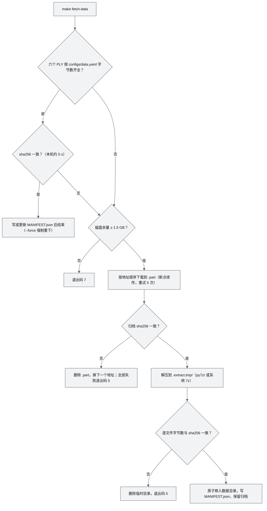

实现要点：

1. 下载使用 HTTP Range 续传（等价于 `curl -fL -C - --retry 5 -o <name>.part <url>`），校验通过后再 `rename`；中断后重跑从断点继续。
2. 解压工具优先 Python `py7zr`（本机项目 `.venv` 已有 1.1.3，但未列入 ADR-038 锁定清单，见 §20 反馈第 7 条），其次系统 `7z`；两者都不可用时以退出码 8 失败并提示安装。
3. 归档保留在 `${AWR_DATA_DIR}/urbanscene3d/` 下供备份与重解压；空间紧张时可 `awr data prune-archive` 删除，但备份目标中必须保留一份（§13.4）。
4. 航线文件（Google Drive，P2）走 gdown 且可能触发配额拒绝（x01 §6 第 7 条），不属于 `make fetch-data` 的必需部分。

### 8.3 生成 World Package（ingest 六城）

命令（CLI 定义属 M03 §7.1，下列为运维用法；退出码按 16 §18.1）：

```bash
# 构建缺失或失效的世界（make run 的预检只执行这一条；J 由 mk/m03.mk 计算，见下文第 2 条）
.venv/bin/worldpkg build --missing --jobs 3

# 单城强制重建（例如切片器升级后）：给出城市参数且不带 --missing 即无条件重建
.venv/bin/worldpkg build sanfrancisco --keep-staging

# 分步执行（排查用；等价于 build 的前半段，--keep-work 保留中间产物供后续步骤使用）
.venv/bin/worldpkg ingest urbanscene3d --city newyork --raw data/raw/urbanscene3d --out worlds/.staging/newyork-dbg --keep-work
.venv/bin/worldpkg tile worlds/.staging/newyork-dbg
.venv/bin/worldpkg package worlds/.staging/newyork-dbg          # ext；分步路径不发布，排查完用 worldpkg clean --staging 删除
.venv/bin/worldpkg validate worlds/.staging/newyork-dbg --deep

# 逐城状态与 --missing 预演（只读，ext）
.venv/bin/worldpkg status --json

# 全量深度校验（机器可读输出供 CI 使用；.staging、.trash、_shared 等非世界目录自动跳过）
.venv/bin/worldpkg validate worlds/* --deep --json > runs/validate.json
```

| 城市 | 规范化要点（g03 §7、x01 §0） | 根数 | 首屏（Tier B/A 口径） | 运维关注 |
|---|---|---|---|---|
| shenzhen | Z-up、米制；北向为 assumed | 1 | L2：124,673 点、1.50 MB | 默认演示城市与门禁城市 |
| shanghai | Z-up、米制；最高建筑 637 m | 1 | L3：418,818 点、5.03 MB | 首屏最大，TTFP 主回归 |
| newyork | Z-up、米制 | 1 | L2：181,771 点、2.18 MB | 主回归 |
| sanfrancisco | 10.15 m/单位，Rz +90° | 1 | L2：108,268 点、1.30 MB | 单位错误会使城市缩小 10 倍 |
| suzhou | Y-up，无地面，合成 z = 0 地面 | 6 | 每根 L1–L2，共 166,529 点、2.00 MB | 6 次首屏 Range |
| chicago | ×1000，调平 2.03° | 1 | L3：352,915 点、4.23 MB | 不调平时平地高差 ±160 m |

运维约束：

1. **耗时**：单城端到端 21–35 s（本机并发负载下，g03 §7），验收上限 60 s（load ≤ 6，D1-AC-01）；六城 `--jobs 3` ≤ 150 s（门禁）、目标 ≤ 75 s（M03-NFR-004）；串行执行约 2–3.5 min，仍在 OPS-NFR-001 的 6 min 之内。
2. **并发度**：`worldpkg` 的 `--jobs` 只接受整数（默认 3）；`mk/m03.mk` 计算 `J = min(3, ⌊核数/2⌋, ⌊可用内存 GB / 4⌋)` 后传入（本文设定），M03 另在 load > 4 时自动降为 1（M03 R-2）。每城峰值 RSS 实测 2.2 GB、上限 4 GB（M03-NFR-006）。`runs/current` 指向活动运行（演示中）或性能锁被排他持有时，`make worlds` 强制 `J = 1` 且 `nice 10`。
3. **原子性**（M03 §6.9）：输出写 `worlds/.staging/<id>-<后缀>/`，deep 校验通过后以 `renameat2(RENAME_EXCHANGE)` 与 `worlds/<id>/` 交换；旧包移到 `worlds/.trash/<id>-<ts>/`，60 s 以前的旧代在下一次运行时删除，因此通常只留 1 代。每次 `worldpkg` 运行开始时做启动恢复：`worlds/<id>` 缺失而 `.trash` 最新一代浅校验通过时改名回来；无主的 staging 目录删除。手动清理用 `worldpkg clean --staging --trash`。
4. **缓存语义**：`world.json` 以 `Cache-Control: no-cache` 提供，其余文件带 `?v=<contentVersion>` 以 immutable 缓存（ADR-006）；世界重建后浏览器自动取新版本，无需清缓存。
5. **校验失败的处置**：`worldpkg validate --deep --json` 的错误条目含规则编号；属于数据损坏的先执行 `awr doctor --deep` 核对原始数据 sha256，再 `worldpkg build <id>` 重建；门禁失败（退出码 2）看 `qa/report.json`。
6. **判定依据**：`--missing` 按 16 §3.5 第 2 条的 6 个条件判定；判定结果写 `worlds/.status/<id>.json`，`GET /api/worlds` 据此显示 READY 或 INVALID。

### 8.4 其他生成资产

| 资产 | 生成命令 | 输入 | 何时生成 | 入库 | 缺失时 |
|---|---|---|---|---|---|
| 契约生成物（`python/awr/contracts/`、`packages/contracts/gen/`） | `node tools/contracts/gen.mjs`、`python tools/contracts/gen.py` | `packages/contracts/**` | 契约变更时 | 是（AWR-03 §4.2 第 3 条） | `make setup` 的 `--check` 失败，退出码 8 |
| P600 glb（≤ 5k 三角形） | `tools/vehicles/stl2glb`（`make vehicles-models`） | `p600.stl`（3,757,684 B，经 `configs/data.yaml` 获取） | 机型变更时 | 前端副本 `apps/web/public/models/p600.glb` 入库；`vehicles/*/model/*.glb` 不入库 | 只显示低模并告警（OPS-FR-013） |
| 低模（≤ 300 / ≤ 150 三角形） | `tools/vehicles/lowpoly.py`（`make vehicles-models`） | 机型尺寸参数 | 机型变更时 | 前端副本 `apps/web/public/models/p600_lowpoly.glb` 入库 | 无外部依赖，不会缺失 |
| flight60 场景文件 `apps/web/public/bench/flight60/<city>.{bin,json}` | `tools/bench/flight60` | 已构建的世界 | `make perf` 前置 | 否 | 性能用例退出码 6 |
| SIH 黄金数据 `tests/golden/sih_x500_px4-1.18rc1/` | 无（本机无法重新生成） | `.cache/research/r20/x500_n3/` 迁移 | MS1 一次性迁入 | **是**（AWR-03 §8.7） | D1-AC-12 无法执行 |
| 品牌资产 `apps/web/public/brand/` | 无 | `anet-logo.svg`、GitHub 头像（96 与 460 px） | MS1 一次性迁入 | 是 | check-brand 失败 |
| 字体 | npm `@fontsource-variable/*` | 锁文件 | `npm ci` | 否 | 构建失败 |

运行时不得从任何 CDN 或外部地址拉取资源：COEP `require-corp` 会拦截跨源资源（n05 §6 第 11 条），并且演示现场可能离线。

### 8.5 预构建世界制品（`make fetch-worlds`，P1）

1. 制品按城市打包为 `<id>-<contentVersion>.tar.zst`，附 `SHA256SUMS`；制品目录由发布流程上传到 `AWR_DATA_MIRROR/worlds/<release-tag>/`。
2. 下载后校验 sha256，解压到 staging，执行 `worldpkg validate --deep`；制品记录的契约版本或 ANET_Q16 `formatVersion` 与本机不一致时拒绝，提示改为本地 `make worlds`。
3. 用途：原始数据不在本机、又需要快速演示的机器（ADR-034 途径 ③）。

### 8.6 合成演示城市与零下载试用（ADR-077）

UrbanScene3D 禁止再分发，仓库与制品都不能附带六城数据或世界包。合成演示城市 synthcity 由 M03 程序生成（M03 §6.18、16 §10.5），不读取任何外部数据，世界包、截图与录屏可自由再分发，用于 README 截图与零下载试用：

```bash
make setup        # 锁定安装（3-8 min）
make run          # 无原始数据：make worlds 生成 synthcity（约 25 s），默认世界与剧本回退为 synthcity 与 S0
#                   打开 http://localhost:8000/ （跳到 /world/synthcity）
make demo-world   # 只生成或刷新 synthcity（有原始数据的机器上也可单独使用）
```

| 项 | 取值 |
|---|---|
| 配置 | `configs/worldpkg.yaml` 的 `synthetic.synthcity`（种子、边长 1200 m、目标 400 万点、名称、示意锚点）；`configs/runtime.yaml` 的 `run.fallback_world` |
| 耗时与体积 | 生成 5 s、完整构建 23–25 s（本机 8 vCPU），世界包约 104 MB（`worlds/synthcity/`，不入库） |
| 刷新 | `make worlds` 按 16 §3.5 判定：生成器版本、种子、尺寸、目标点数或生成器源文件变化时重建（原因 `raw_changed`），curated 区域变化时重建（`zones_changed`） |
| 默认世界 | 见 §4.3"默认世界回退"；显式 `AWR_WORLD=<id>` 永远优先，不回退 |
| 界面 | World Hub 把可用世界排在前面；六城显示"未构建"并提示 `make fetch-data`；世界面板数据行为"程序生成，可自由再分发"，仍标"示意坐标" |

---

## 9. 启动、访问、停止与升级

### 9.1 首次启动 runbook

| 步骤 | 命令 | 预期输出与判据 | 失败时 |
|---|---|---|---|
| 1 预检 | `make doctor` | 全部检查为 OK 或 WARN；无 ERROR | 按 §14.1 的检查项修复 |
| 2 数据 | `ls data/raw/urbanscene3d/*_sampled_5m.ply \| wc -l` 为 6（目录中另有两个 1k 配准点云，不计），然后 `make fetch-data --verify`；缺失时 `make fetch-data` | 校验通过，`MANIFEST.json` 存在 | §14 F09 |
| 3 世界 | `make worlds` | 六城构建摘要无失败；`worlds/.status/<id>.json` 的 `status` 全为 ready；`make validate` 零错误 | §14 F08 |
| 4 前端 | `make build` | `apps/web/dist/index.html` 存在 | §14 F11 |
| 5 启动 | `make run` | 终端打印如下 READY 信息 | §14.2 决策树 |
| 6 访问 | 在工作站执行 SSH 转发并打开浏览器（§9.2） | 深圳首屏出现，S1 自动开始 | §14.2 |
| 7 状态 | `make status` | api、sim-core 为 RUNNING；无 error 级告警 | §14 F06、F13 |

`make run` 的终端输出示例（管理口令只在 TTY 中打印）：

```text
[awr] run r20260928-143200-a3f1  profile=demo  world=shenzhen  scenario=S1
[awr] access=loopback  api=127.0.0.1:8000  zenoh=tcp/127.0.0.1:7447
[awr] admin secret: 3f7a9c21-8b04-4e6d-9a5f-0c2d71e8b6aa  (also runs/r20260928-143200-a3f1/admin.token, 0600)
[awr] sim-core  STARTING -> RUNNING  1.9 s  kernel=numba
[awr] api       STARTING -> RUNNING  2.4 s
[awr] READY  http://localhost:8000/world/shenzhen
[awr] remote: ssh -N -L 8000:127.0.0.1:8000 <user>@<host>
```

### 9.2 访问

**回环模式（默认，推荐）**：

```bash
# 在工作站（有 GPU 的桌面）执行；Windows OpenSSH 语法相同
ssh -N -L 8000:127.0.0.1:8000 -o ExitOnForwardFailure=yes -o ServerAliveInterval=15 -o Compression=no <user>@<host>
# 开发时同时转发 Vite
ssh -N -L 8000:127.0.0.1:8000 -L 5173:127.0.0.1:5173 -o ExitOnForwardFailure=yes <user>@<host>
# 浏览器打开
#   http://localhost:8000/world/shenzhen      （make run）
#   http://localhost:5173/world/shenzhen      （make dev）
```

- `Compression=no`：二进制遥测几乎不可压缩（r27 §0 第 2 条，permessage-deflate 只省 7.6–13%），压缩只增加 SSH 两端 CPU。
- 端口偏移为 k 时，两端端口都改为 `8000+10k`（Origin 白名单放行任意端口的 `localhost`）。

**局域网模式（可选）**：

```bash
AWR_BIND=0.0.0.0 AWR_ORIGINS=http://10.0.0.5:8000 make run
sudo ufw allow from 10.0.0.0/24 to any port 8000 proto tcp     # 只对演示网段开放
ss -ltn | grep -E ':(8000|7447)\b'                              # 期望：0.0.0.0:8000 与 127.0.0.1:7447
```

**token**（字段语义见 [12](12-业务逻辑设计说明书.md) §4.2 与 [17](17-接口与实时协议规范.md)；UI 会自动申请，以下用于脚本与排查）：

```bash
# 回环模式：viewer 与 operator 无需口令（operator 占用唯一操作席位）
curl -s -X POST http://127.0.0.1:8000/api/auth/token -H 'content-type: application/json' -d '{"role":"operator"}'

# 局域网模式或任何 admin token：需要管理口令
curl -s -X POST http://10.0.0.5:8000/api/auth/token \
  -H 'content-type: application/json' -H 'Origin: http://10.0.0.5:8000' \
  -d "{\"role\":\"admin\",\"admin_secret\":\"$(cat runs/current/admin.token)\"}"

# 本机运维 CLI 自动读取 runs/current/admin.token，例如重启一个熔断的进程
.venv/bin/awr sys restart sim-core
```

### 9.3 日常启停与状态

| 操作 | 命令 | 说明 |
|---|---|---|
| 启动演示 | `make run` | profile = demo；前台运行，Ctrl+C 等价于 `make stop` |
| 后台常驻 | `systemctl --user start awr` | §4.4 |
| 开发 | `make dev` | profile = dev，含 vite；后端代码修改后 `awr sys restart api` 或 `sim-core` |
| 停止 | `make stop` | §4.3；≤ 20 s（OPS-NFR-003） |
| 状态 | `make status` | 进程表、1 Hz 指标摘要、活动告警、容量（§11.3、§15.2） |
| 日志 | `make logs P=sim-core` | `-f` 跟随；`awr logs --grep cid=<cid>` 过滤 |
| 重启单进程 | `awr sys restart <proc>` | 需 admin（本机 CLI 自动取口令）；FAILED 状态唯一出口 |
| 标记保留 | `awr runs keep <run>` | 豁免配额回收并进入备份集 |
| 立即回收 | `make gc-runs` | 按 §13.2 规则 |

**定时任务**（用户级 systemd timer，样例在 `tools/systemd/`；无 systemd 时用 crontab 的等价行）：

| 任务 | 时间 | 命令 | 互斥与前置 | 依据 |
|---|---|---|---|---|
| 夜间性能 | 每日 03:00；周日加跑周度集 | `make perf-nightly` | 排他持有全局性能锁；`runs/current` 指向活动运行时跳过并记"环境不满足" | 18 G2 |
| 备份 | 每日 02:00 | `make backup` | 与夜间性能错开；只读运行目录 | §13.4 |
| 配额回收 | 每 10 min | supervisor 内置（`quota.check_every_s`） | 无需外部定时 | §13.2 |
| worktree 巡检 | 每周一 09:00 | `git worktree list` 与 `du -sh ../awr-*` 输出到日志 | 只报告不删除 | §7.5 第 3 条 |

### 9.4 演示前检查单（T1）

| 时间点 | 检查项 | 命令或方法 | 通过标准 |
|---|---|---|---|
| 前一天 | 版本冻结 | `git describe --tags` | 演示用 tag 已打，`make ci` 通过 |
| 前一天 | 深度诊断 | `make doctor --deep && make validate` | 无 ERROR；六城校验零错误 |
| 前一天 | 备份 | `make backup` | 目标端 `SHA256SUMS` 校验通过 |
| 开场前 1 h | 启动与预热 | `make run`；在演示浏览器中打开一次 `/world/shenzhen` | numba 缓存与浏览器着色器缓存已建立 |
| 开场前 1 h | 负载与竞争 | `uptime`；`pgrep -fa 'playwright\|vitest\|worldpkg'` | 1 分钟 load < 2；无测试与构建进程 |
| 开场前 1 h | 磁盘 | `df -h . /dev/shm` | 可用 > 10 GB；`/dev/shm` > 1 GB |
| 开场前 30 min | 演示浏览器 | `chrome://gpu`；控制台 `window.__perf.tier` | 硬件加速开启；Tier 为 B；视口 ≥ 1280×720 |
| 开场前 30 min | 网络 | 有线连接；SSH 转发带 `ServerAliveInterval` | 5 min 内无断连 |
| 开场前 10 min | 状态 | `make status` | 全部 RUNNING；无 warn 以上告警 |
| 演示中 | 旁路监控 | 另开终端 `watch -n 2 make status` | — |
| 演示中 | 禁止事项 | 不执行 `make ci`、`make perf`、`make worlds`、依赖安装 | — |
| 故障预案 | 重启 | `make stop && make run`（热启动 ≤ 20 s） | 或切换到录制回放（D1-ext） |
| 结束后 | 保留与停止 | `awr runs keep <run>`（如需）；`make stop` | — |

### 9.5 升级

D1 为单主机部署，升级需要停机，不做滚动升级。

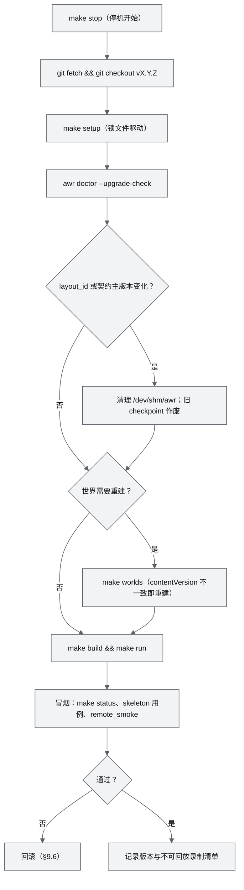

| 变化 | 检测方式 | 影响 | 必要动作 |
|---|---|---|---|
| `requirements.lock`、`package-lock.json` | `git diff --stat` | 依赖版本 | `make setup` |
| `packages/contracts/rt/layouts.json`（`layout_id` 变化） | `--upgrade-check` | 旧 StateRing 读者报 `LAYOUT_MISMATCH`；旧 checkpoint 不可用；录制不可回放 | 全量停机后启动（已由 `make stop` 保证）；录制列入不可回放清单 |
| 契约小版本（只新增可选字段） | `--upgrade-check` | 录制可回放，McapSource 告警 | 无 |
| ANET_Q16 `formatVersion` 或 World schema 主版本 | `worldpkg validate` | loader 拒绝旧世界 | 重建六城 |
| ingest 或切片器代码 | `contentVersion` 变化 | 录制绑定旧 `contentVersion`，打开时返回 122 RECORDING_INCOMPATIBLE | 重建；旧录制用旧版本回放（§9.6） |
| numba、numpy 版本 | `meta.json` 中的内核版本 | 输入日志重仿真拒绝（ADR-049） | 需要重仿真时用旧版本 |
| `configs/runtime.yaml` 结构 | 启动时结构校验 | 未知键使启动失败 | 按发布说明迁移 |
| 前端 dist | Vite 哈希文件名；`index.html` 为 no-cache | 无 | `make build` |

计划停机时长：不重建世界时 ≤ 10 min；重建六城时再加 ≤ 150 s（M03-NFR-004），合计 ≤ 13 min（本文设定）。

### 9.6 回滚

1. `make stop`；`git checkout <上一个 tag>`；`make setup`。
2. 世界：若 `worlds/.trash/<id>-<ts>/` 的 `world.json.contentVersion` 与旧版本构建结果一致，先把当前 `worlds/<id>` 改名移入 `.trash`，再把该旧代改名回 `worlds/<id>` 并执行 `worldpkg validate worlds/<id> --deep`；否则 `make worlds` 重建（M03 没有 restore 子命令，改名是唯一的手动路径）。
3. 新版本产生的录制可能无法被旧版本打开（layout 或世界不一致），保留在 `runs/` 中等待再次升级，不做转换。
4. 需要回放旧版本录制而不回滚主部署时，另建 worktree：`git worktree add ../awr-v0.1.0 v0.1.0`，设置 `AWR_PORT_OFFSET=8` 与该 worktree 自己的 `AWR_RUNS_DIR`，把要回放的运行目录用 `cp -al` 硬链接进去后启动回放。**不要**让旧版本实例直接指向主仓库的 `runs/`：它的 supervisor 会改写 `runs/current` 并按自己的规则执行配额回收。

---

## 10. Docker 化规划

### 10.1 原则与镜像清单

1. D1 以原生运行为主，不依赖任何容器；容器化只包裹进程，不改变进程拓扑（AWR-11 §4.18）。
2. 所有容器 `shm_size ≥ 1g`：zenoh 的 SHM 优化默认给每个发布会话分配 16 MiB 池，而 Docker 默认 `/dev/shm` 只有 64 MiB（g05 §0 第 9 条）；本系统同时关闭 zenoh SHM。
3. 镜像 tag 与 digest 登记在 AWR-11 的 BOM（`tools/ci/bom.json`）；运行时不拉取未登记的镜像。
4. 除 sim-orchestrator 外任何容器与进程不得挂载 `docker.sock`；容器一律非 root；日志驱动 `json-file`，`max-size 10m`、`max-file 5`。
5. 容器标签：`awr.run=<run>`、`awr.role=<role>`、`awr.version=<tag>`，供 supervisor 启动时回收残留。

| 镜像 | 用途 | 版本 | 来源 | 体积 | 资源 | 运行方式 | 优先级 |
|---|---|---|---|---|---|---|---|
| `awr/backend:<tag>` | 后端全部进程（可选） | V0.2（D1 可试用） | 自建：`node:22-slim` 构建前端，`python:3.12-slim` 运行（两者本机已有） | 估算 0.6–0.9 GB | 同原生 | compose | P2 |
| `px4io/px4-sitl:v1.18.0-rc1` | PX4 SIH，每机一容器 | V0.2 | 官方（本机已有，152 MB） | 152 MB | 0.3 核、256 MiB / 机 | sim-orchestrator 经 Docker Engine API | P0（V0.2） |
| `pdal/pdal:<锁定 tag>` | 点云 ETL、重投影、COPC 导出 | V0.5 | 官方 | 估算 1 GB | 按作业 | job-worker `docker run --rm` | P1（V0.5） |
| `awr/gpu-worker:<tag>` | LingBot-Map、DA3-Streaming、MapAnything | V0.5 | 自建：CUDA 12.8 runtime + torch 2.8 cu128 | 估算 10–15 GB | GPU ≥ 24 GB | GPU 节点 compose | P0（V0.5） |
| OpenFOAM 13（Foundation 官方镜像，名称与 digest 在 V0.6 选型时锁定） | L3 城市风场库 | V0.6 | 官方 | 估算 2–3 GB | 6–8 核、每城 6–12 h | job-worker 批处理 | P1（V0.6） |
| `ros:noetic` + rosbridge 0.11.18 | P600 ROS1 话题级数据 | V0.5 | 官方 | 估算 1 GB | 小 | 现场地面站 | P1（V0.5） |
| `px4io/px4-sitl-gazebo`、Isaac Sim | GPU 传感器后端 | V0.6、V0.8 | 官方 | 2 GB 以上 | GPU | GPU 节点 | P2 |

### 10.2 后端镜像（可选，P2）

```dockerfile
# tools/docker/backend.Dockerfile
FROM node:22-slim AS web
WORKDIR /src
COPY package.json package-lock.json ./
COPY apps/web/package.json apps/web/
COPY packages/contracts/package.json packages/contracts/
RUN npm ci
COPY apps/web apps/web
COPY packages/contracts packages/contracts
RUN npm run build -w apps/web

FROM python:3.12-slim
RUN apt-get update && apt-get install -y --no-install-recommends tini make ca-certificates \
 && rm -rf /var/lib/apt/lists/*
RUN pip install --no-cache-dir uv==0.12.19
WORKDIR /app
COPY pyproject.toml requirements.lock ./
RUN uv venv /opt/venv --python 3.12 && uv pip sync requirements.lock --python /opt/venv/bin/python
COPY python python
COPY configs configs
COPY packages/contracts packages/contracts
COPY scenarios scenarios
COPY vehicles vehicles
COPY --from=web /src/apps/web/dist apps/web/dist
RUN uv pip install -e . --no-deps --python /opt/venv/bin/python   # uv 创建的 venv 默认不含 pip
ENV PATH=/opt/venv/bin:$PATH PYTHONUNBUFFERED=1 NUMBA_CACHE_DIR=/var/cache/awr/numba \
    AWR_BIND=0.0.0.0 AWR_ACCESS_MODE=loopback
# uid 与宿主开发用户一致（本机 1001），绑定挂载的 runs/ 才可写；worlds、runs 先建目录，具名卷首次挂载时继承属主
RUN useradd -u 1001 -m awr && mkdir -p /var/cache/awr/numba /app/worlds /app/runs \
 && chown -R awr /var/cache/awr /app
USER awr
ENTRYPOINT ["tini", "--"]
# 用 ";" 而不是 "&&"：单城构建失败不阻止启动（12 §6.1 规则 1）
CMD ["sh", "-c", "worldpkg build --missing --jobs 3; exec python -m awr.runtime.supervisor -c configs/runtime.yaml"]
```

```yaml
# tools/docker/compose.yaml
services:
  awr:
    build: {context: ../.., dockerfile: tools/docker/backend.Dockerfile}
    image: awr/backend:0.1.0
    init: false                 # 已用 tini
    shm_size: 1g
    cap_add: [SYS_NICE]         # 可选：sim-core nice -5
    ports: ["127.0.0.1:8000:8000"]   # 只在宿主回环发布，因此 AWR_ACCESS_MODE=loopback
    volumes:
      - ../../data/raw:/app/data/raw:ro
      - awr-worlds:/app/worlds
      - ../../runs:/app/runs
      - awr-numba:/var/cache/awr/numba
    restart: unless-stopped
volumes: {awr-worlds: {}, awr-numba: {}}
```

- 容器内绑定 0.0.0.0 但宿主只在回环发布，访问语义等同回环模式，因此显式设 `AWR_ACCESS_MODE=loopback`（仅凭 `AWR_BIND` 推导会误判为局域网，§20 反馈第 3 条）。
- 需要局域网访问时改为 `ports: ["8000:8000"]`，同时设 `AWR_ACCESS_MODE=lan` 与 `AWR_ORIGINS`。
- numba 缓存放在具名卷，避免容器重建后首次编译拖慢 3 s 重启窗口（D1-AC-11a）。
- 镜像不含 P600 STL（`vehicles/*/model/src/` 不入库），容器内只显示低模；需要 P600 模型时在宿主 `make setup` 后把生成的 `vehicles/p600/model/*.glb` 以只读卷挂入。
- 验收：容器内跑通 walking skeleton（D1-AC-34），见 OPS-AC-016。

### 10.3 PX4 SIH（V0.2）

依据 r22 §4.2 的编排原型与 r20 §3.8–§3.9 的实测：

| 项 | 取值 | 依据 |
|---|---|---|
| 镜像 | `px4io/px4-sitl:v1.18.0-rc1` | r22 实测；本机已拉取 |
| 拓扑 | 每机一个容器，容器内一律 `px4 -i 0`；专用网络 `awr-sim-<run>` | 避免 i > 9 时 offboard 端口回落到 14549（r20 §3.8、r22 §0 第 2 条） |
| 身份 | `PX4_PARAM_MAV_SYS_ID = k+1`，`PX4_UXRCE_DDS_NS = <drone_id>` 显式设置 | r22 §2.5 |
| 出生位姿 | `PX4_HOME_LAT/LON/ALT` 由 World 锚点与 spawn 位姿经 M02 唯一实现换算（合成世界为仿真 datum） | AWR-03 §5.1 规则 3、6 |
| 机体参数 | `PX4_PARAM_SIH_*` 取自 `vehicles/<model>/sih.params`，禁止使用 SIH 默认 1 kg、KDV = 1 | r20 §0 第 3 条 |
| 资源 | `NanoCpus = 0.3e9`、`Memory = 256 MiB`、`Init = true` | r22 §4.2 |
| 准入 | `空闲核数 × 0.8 ≥ N × 0.3`，否则 409 并给出建议规模；本机实时上限约 8 架 | r20 §3.9、r22 §4.2 |
| 健康 | HEARTBEAT > 2.5 s 为 DEGRADED，> 5 s 为 LOST；RTF < 0.95 告警、< 0.8 暂停准入 | r22 §3.3 |
| 链路 | 指令发往 `<容器 IP>:14580`；遥测回程二选一，V0.2 实现时以 OPS-AC-019 验证：①r22 实测方案：容器设 `ExtraHosts host.docker.internal:<px4-bridge 在 awr-sim-<run> 网络上的地址>`，官方 entrypoint 把 onboard 链路目标改写为该地址的 UDP 14540，px4-bridge 只在该网络网关地址上绑定 14540 并按 `(sysid, src_ip)` 解复用（宿主已有进程绑定 0.0.0.0:14540 时会冲突，此时改用②）；②px4-bridge 先向容器 14580 发心跳，PX4 锁定回包地址（r20 §3.8 在 host 网络实测），宿主不占用 14540 段（§5 规则 2）。随后用 `MAV_CMD_SET_MESSAGE_INTERVAL` 把每机约 414 msg/s 裁剪到约 70 msg/s | r20 §3.8；r22 §0 第 2、6 条、§3.1 |
| 日志 | 卷 `awr-ulog-<run>-<id>` 挂到 `/root/.local/share/px4/rootfs/0/log`，会话结束随运行归档 | r22 §4.2 |
| 回收 | 会话结束执行 DRAINING（Land → Disarm）→ SIGTERM → remove；supervisor 启动时删除标签 `awr.run` 不属于活动运行的容器 | r22 §4.2（实测残留 0） |
| 安全 | sim-orchestrator 是唯一持有 docker.sock 的进程，只能操作 `awr.role=px4-sitl` 标签的容器；优先 rootless Docker | r22 §4.2 安全段 |
| 时钟 | SIH 自带时钟：`caps.clock.mode = slaved_realtime`，SimClock 锁定 ×1 | ADR-020、ADR-045 |

与性能用例的关系：SIH 容器运行时 8 × 0.22 ≈ 1.8 核被占用，破坏 ADR-033 的负载前置条件；`make perf` 在检测到带 `awr.role=px4-sitl` 的运行中容器时以退出码 14（环境不满足）拒绝。

### 10.4 PDAL（V0.5）

```bash
docker run --rm --user $(id -u):$(id -g) \
  -v "$PWD/data/raw:/data:ro" -v "$PWD/worlds/.staging:/out" \
  pdal/pdal:<tag> pdal pipeline /out/<job>/pipeline.json
```

- 由 job-worker 调用，一次一个作业（g05 §6），nice 10；只读挂载原始数据，输出写 staging，由 `worldpkg` 完成校验与原子替换。
- 用途：LAS/LAZ 重投影到 World ENU、地面分类、DEM、COPC 导出（r09 §0 第 7 条）；D1 的六城链路不依赖 PDAL。

### 10.5 GPU 重建 worker（V0.5）

| 项 | 要求 | 依据 |
|---|---|---|
| 主机 | ≥ 24 GB 显存（48 GB 更从容），支持 CUDA 12.8 的驱动与 nvidia-container-toolkit | n02 §6 第 3 条；r01 §2.4 |
| 镜像 | CUDA 12.8 runtime + torch 2.8 cu128 + 各引擎；flashinfer 可选（缺失时 `--use_sdpa`） | r01 §1、§6 |
| 运行 | `--gpus all --shm-size 16g`；卷 `/models`（权重缓存，只读）、`/work`（作业工作区） | 本文设定 |
| 显存档位 | LingBot-Map KV 池约 10.9 GB（518×378，bf16），加权重与激活推荐 ≥ 24 GB；16 GB 需滑窗 32；DA3-Streaming < 12 GB；MapAnything 在 memory-efficient 模式下每 100 视图约 7 GB；VGGT-Ω 约 6 GB + 0.074 GB/帧 | r01 §2.4；n02 §2.3、§6 第 3 条 |
| 引擎隔离 | 统一 CUDA 12.8 + torch 2.8 基础，每个引擎一个独立 venv（MapAnything 的 `[all]` 依赖不得与其他引擎混装） | n02 §6 第 2 条 |
| 控制面 | 经主机 zenoh TLS 端点（7448，mTLS + ACL）接收任务、上报进度与能力 | ADR-027（V0.5）；§3.4 |
| 数据面 | 输入视频与 Recon IR 走 HTTP（或共享存储），不经 zenoh | ADR-018 |
| 元数据 | `engine.json` 记录引擎、版本、权重、许可；`scale_status` 必填 | ADR-035 |
| 降级 | GPU 节点不可用时 UI 只提供 Mock 重建（D1-ext），不影响主链路 | ADR-035、Q1 |

### 10.6 OpenFOAM（V0.6）

1. 作业形态：job-worker 的 `wind.l3` 任务，在 OpenFOAM 13 容器中执行"点云 → DSM → 水密 STL → snappyHexMesh 一次 → 24 个风向 `foamRun` → `boxUniform` 采样 → AWRV"（r17 §3.5）。
2. 成本：1–2 km 城区 2–5M 网格，8 核约 15–30 min/方向，24 方向约 6–12 h；产物约 200 MB（SF 规模，f16 + zstd）（r17 §3.5，估算）。
3. 调度：只在独立计算主机上运行，或在本机避开 02:00–05:00 的备份与夜间性能窗口（§9.3）；`--cpus 6`；作业全程以共享方式持有全局性能锁（与构建相同，§7.5），性能用例因此等待，超过 30 min 判"环境不满足"（18 PR-1）。
4. 产物：`worlds/<id>/environment/wind/`（AWRV v1）与 manifest，绑定 `coordinate.sha256`，世界重新 ingest 后必须重算（P-01）。

### 10.7 其他容器

| 容器 | 版本 | 部署要点 |
|---|---|---|
| `ros:noetic` + rosbridge | V0.5 | 在地面站运行 `roslaunch rosbridge_server rosbridge_websocket.launch port:=9090`；`topics_glob`、`services_glob` 白名单只放行 Prometheus 状态与命令话题；订阅一律 `queue_length: 1`、`compression: cbor`（r27 §3.16、R10–R11） |
| foxglove 调试旁路 | V0.2 | 进程而非容器；只绑定 127.0.0.1:8765，经 SSH 转发使用（r15 §0 第 9 条） |
| Gazebo、Isaac 传感器后端 | V0.6、V0.8 | GPU 节点；World 经导出器（`awr/world/export/{gz,usd}.py`）共用，导出清单记录 `coordinate.sha256`（ADR-048） |

---

## 11. 日志、指标与追踪

### 11.1 日志

**采集链路**：各进程只向 stderr 写 JSON 行；supervisor 持有子进程的 stderr 管道，负责落盘到 `runs/<run>/logs/<proc>.log`、按 10 MB × 5 轮转、在内存中保留末 200 行供 `/api/sys/procs` 与 UI 进程面板展示（g05 §7.3）。子进程自身不做文件轮转，避免多处写同一文件。

| 字段 | 类型 | 必填 | 说明 |
|---|---|---|---|
| `t_wall_ns` | int64 | 是 | UNIX ns，只用于显示与跨进程对齐（AWR-03 §5.2） |
| `t_mono_ns` | int64 | 是 | CLOCK_MONOTONIC，本进程内排序与间隔计算 |
| `t_sim_ns` | int64 或 null | 否 | 仿真时间（sim-core、recorder、agent-runtime 必填） |
| `lvl` | enum | 是 | DEBUG、INFO、WARN、ERROR、FATAL |
| `proc`、`pid`、`run` | str、int、str | 是 | 进程名、pid、run id |
| `epoch` | int 或 null | 否 | 生产者纪元（sim-core、replay-worker） |
| `logger` | str | 是 | Python logger 名，如 `awr.sim.core.command` |
| `msg` | str | 是 | **固定模板文本**，变量一律放 `kv`，便于 grep 与聚合 |
| `kv` | object | 否 | 结构化字段：`cid`、`uav`、`code`、`seq`、`dur_ms`、`bytes` 等（snake_case 带单位后缀，AWR-03 §5.4） |
| `rep` | int | 否 | 限速期间被抑制的同类条数 |

规则：

1. **不阻塞**：sim-core 与 api 用 `QueueHandler` 加后台线程输出（g05 §4 不阻塞规则第 3 条）；stderr 管道写满时丢弃 DEBUG 与 INFO 并计数，WARN 以上保留（本文设定）。
2. **限速**：同一 `(logger, msg)` 每秒最多 1 条，其余累加到下一条的 `rep`；逐机逐 tick 的日志只允许在 DEBUG 且带采样率（本文设定）。
3. **掩码**：键名匹配 `secret`、`admin_secret`、`token`、`authorization`、`*_key` 的值，以及以 `bearer.` 开头的字符串，一律写为 `***`（OPS-FR-030）。
4. **级别**：全局 `AWR_LOG_LEVEL`，按 logger 覆盖写在 `configs/logging.yaml`；运行中可经 `awr sys loglevel <proc> <logger> <lvl>` 临时调整（admin，重启后失效）。
5. **崩溃现场**：子进程启用 faulthandler；异常退出或被判挂死时，supervisor 把 stderr 末 200 行与栈转储写入 `runs/<run>/crash/<proc>-<t_wall_ns>.txt`。
6. **浏览器日志**：D1 不向服务器回传浏览器日志（只有 `/bench` 的性能报告，P1）；测试中由 Playwright 收集 `console` 与 `pageerror`（[18](18-性能与测试方案.md)）。

### 11.2 审计

`runs/<run>/audit.jsonl` 由 api 与各生产者写入，每 1 s fsync 一次（ADR-027），随运行目录保留与清理。每行的公共字段以 17 §3.6 为准：`t_wall_ns`（字符串）、`t_sim_ns`、`kind`、`principal_id`、`role`、`entry`（api 或 agent-runtime）、`cid`、`uav`、`code`、`detail`。下表只列运维关心的类别与 `detail` 内容：

| 类别（`kind`） | 事件（示例） | `detail` 中的运维字段 |
|---|---|---|
| 命令 | `cmd.accepted`、`cmd.rejected`、`cmd.succeeded`、`cmd.failed`、`cmd.canceled` | `op` |
| 安全 | `safety.*`（ELAND、FAILSAFE、围栏拒绝等） | `severity`、原因 |
| 进程 | `proc.ready`、`proc.exited`、`proc.hung`、`proc.failed`、`proc.restarted` | `name`、`state`、`restarts`、`last_exit`（与 `sys/procs` 字段同名，17 §4.3.12） |
| 租约与席位 | `lease.*`、`seat.acquired`、`seat.expired`、`seat.takeover` | `owner`、`holder` |
| 鉴权 | `auth.token_issued`、`auth.denied`（Origin、Host、token 与口令失败，每来源每秒至多 1 条） | `jti`、`remote_addr`、`origin`、`host`、`reason` |
| 运行与录制 | `runs.evicted`、`runs.bookmark`、`runs.deleted`、`runs.kept` | `run`、`bytes`、`reason` |
| 真机（V0.5） | `real.enabled`、`real.checklist`、`real.estop`、`real.disabled` | `checklist_id`、`vehicles` |

17 §3.6 已登记 `auth.*`、`real.*`、`runs.evicted`、`runs.bookmark`；`runs.deleted`、`runs.kept` 待登记（§20 反馈第 11 条）。审计中不记录 token 与口令本身，只记录 `jti`（token_id）。

### 11.3 指标

**来源**：StateRing 头（sim-core 自报 `step_p99_us`、RTF、心跳，g05 §3.2）；api 自报（loop-lag、tick 数据年龄、WS 会话统计）；supervisor 每 1 s 读取 `/proc/<pid>/stat` 与 `/proc/<pid>/status` 得到各进程 CPU 与 RSS（不引入 psutil）；recorder、事件订阅器自报缺口。

**出口**：WS topic `perf/server`（1 Hz，默认订阅，AWR-03 §8.5；载荷 `awr.perf.server.v1`，17 §6.5）、`sys/procs` topic 与 `GET /api/sys/procs`（17 §4.3.12）、`GET /api/sys/perf?window_s=60` 的窗口聚合；`awr status` 在 api 不可用时直接读 StateRing 头与 `hb.*` 文件（离线模式）。下表"字段"列一律用 17 的字段路径，运维与告警不另起名字：

| 字段（17 路径） | 单位 | 出口 | 周期 | 阈值或用途 | 依据 |
|---|---|---|---|---|---|
| `sim.step_p99_us`、`sim.step_max_us` | µs | `perf/server` | 1 s | p99 ≤ 3000、max ≤ 12000 | D1-AC-07 |
| `sim.rtf` | — | `perf/server` | 1 s | 倍速为 1 时 ≥ 0.99 | D1-AC-07 |
| `sim.catchup_saturated` | 次 | `perf/server` | 1 s | 应为 0 | D1-AC-07 |
| `sim.cpu_pct` | %（单核） | `perf/server` | 1 s | N = 1000 时 ≤ 60 | D1-AC-07 |
| `sim.kernel` | enum | `perf/server` | 启动 | numba 或 numpy（numpy 时机群上限 300） | ADR-038 |
| `api.cpu_pct` | %（单核） | `perf/server` | 1 s | 3 客户端、1000 架时 ≤ 35 | D1-AC-08 |
| `api.loop_lag_p99_ms` | ms | `perf/server` | 1 s | ≤ 10 | g05 §9 |
| `api.tick_age_p99_ms` | ms | `perf/server` | 1 s | ≤ 15 | D1-AC-08 |
| `api.n_clients`、`api.bytes_per_s` | 个、B/s | `perf/server` | 1 s | 容量与带宽（§15.3、§15.6） | r27 §3.1.5 |
| `clients[].credit_skips`、`clients[].fps`、`clients[].srtt_ms`、`clients[].kbps` | 次、Hz、ms、kbit/s | `perf/server` | 1 s | 按会话判断消费慢还是网络慢（§14 F05）；选中机通道 ≤ 1% 的判定在浏览器 `__perf.latency`（D1-AC-26） | 17 §6.9 |
| `clients[].ctrl_queue_hwm` | 条 | `perf/server` | 1 s | 上限 1024，≥ 512 告警 | ADR-014 |
| `status{id: "net.congested"}` | 会话数 | `status` op | 事件 | L4 拥塞（M11-FR-044） | 17 §6.9 |
| `status{id: "events.gap"}` | 次 | `status` op | 事件 | 事件缺口 1 s 内补齐 | D1-AC-10；M11-FR-067 |
| `items[].cpu_pct`、`items[].rss_mb` | %、MB | `sys/procs` | 1 s | 对照 AWR-03 §3.3 预算 | ADR-017 |
| `items[].state`、`items[].restarts`、`items[].hb_age_ms`、`items[].last_exit` | —、次、ms、— | `sys/procs` | 变化 + 1 s | 状态机与告警 | g05 §7.3；M11-FR-013 |
| `recorder.gap` 事件；段写入量 | 次；MB/min | 事件；`GET /api/runs` 的段 `bytes` 按分钟差分 | 事件；1 min | 缺口 0；≤ 60 MB/min | ADR-040 |
| `disk.runs_used_gb`、`disk.free_gb`、`shm.free_mb`、`host.load1` | GB、GB、MB、— | supervisor 本地，只进 `awr status` 与告警 | 10 s | 配额、余量守卫、性能运行协议前置条件 | §13.2；ADR-033 |

D1 不部署 Prometheus、Grafana 或 OpenTelemetry：单主机、单运行，额外服务会与 SwiftShader 抢 CPU；需要接入实验室既有监控时，V0.5 起提供 `GET /api/sys/metrics?format=prom` 文本导出（P2，17 R78 已登记，D1 返回 404）。

### 11.4 告警规则

去抖 10 s（条件持续 10 s 才发出，恢复后 10 s 才解除），经 `status` op 推送、写 WARN 以上日志并在 `make status` 列出。"层"为 core 的规则属 OPS-FR-027 的 P0 部分。

| 编号 | 条件 | 级别 | 层 | 呈现 | 处置 |
|---|---|---|---|---|---|
| AL-01 | 任一进程进入 BACKOFF | warn | core | status、日志 | 自动重启；查看 `crash/` |
| AL-02 | 任一进程 FAILED | error | core | 阻断横幅（[14](14-UI交互设计PRD.md) E-15） | §14 F06；admin `sys/restart{reset_breaker: true}` |
| AL-03 | sim-core 心跳年龄 > 250 ms | warn | core | TIME.state = STALLED 横幅 | §14 F13 |
| AL-04 | `sim.step_p99_us` > 3000 | warn | core | HUD、status | 检查机数、倍速、主机负载（§15.2） |
| AL-05 | `sim.rtf` < 0.99（倍速 = 1） | warn | core | 同上 | 同上 |
| AL-06 | `sim.catchup_saturated` > 0 | warn | core | 同上 | 降低倍速或机数 |
| AL-07 | `api.loop_lag_p99_ms` > 10 | warn | core | status | 查找事件循环内的同步重计算（AWR-03 §4.2 第 1 条） |
| AL-08 | `api.tick_age_p99_ms` > 15 | warn | core | status | 按 ADR-013 拆分静态服务后复测 |
| AL-09 | 某会话 `clients[].ctrl_queue_hwm` ≥ 512 | warn | core | status | §14 F05 |
| AL-10 | 某会话处于 L4 congested | warn | core | 该客户端收到 `status{id: "net.congested", level: warning}` | §14 F05 |
| AL-11 | 选中机通道跳帧比例 > 1%（浏览器 `__perf.latency` 计算，D1-AC-26） | info | core | 客户端 HUD | §14 F05 |
| AL-12 | 事件缺口 1 s 内未补齐（`events.gap` 状态持续） | warn | core | status | 查看 api 日志中的 `_replay` 补拉；超出 EventRing 时客户端改用 `GET /api/events` 与自包含最新值恢复（17 §4.3.13） |
| AL-13 | `recorder.gap` 事件，或段写入量 > 60 MB/min | warn | ext | status | 检查磁盘 I/O 与录制频率策略 |
| AL-14 | `runs/` 用量 ≥ 80% 配额 | info | core | status | 回收在 100% 时自动执行 |
| AL-15 | `disk.free_gb` < 10（warn）或 < 5（error） | warn、error | core | status、横幅 | error 时停止录制并拒绝构建（OPS-FR-036） |
| AL-16 | `shm.free_mb` < 256 | error | core | status | 清理残留 `/dev/shm/awr`（§14 F07） |
| AL-17 | 性能用例运行期间 `host.load1` > 12.8 | warn | core | 性能报告 | 帧节奏阈值只告警不判定（ADR-033 第 ④ 条） |

### 11.5 追踪与关联

D1 不引入分布式追踪框架；以下关联键贯穿日志、审计、事件与 WS：

| 键 | 产生者 | 作用域 | 用途 |
|---|---|---|---|
| `run` | supervisor | 一次运行 | 所有文件与日志的一级分区 |
| `epoch` | sim-core（生产者纪元）、Gateway（全局纪元） | 运行内 | 区分崩溃恢复与 seek 前后的数据 |
| `seq`（生产者）与全局 `seq` | EventPublisher、Gateway | 生产者纪元内 | 事件缺口检测与补拉 |
| `cid` | api（命令入口） | 一条命令 | 串起 api 准入、sim-core 执行、事件与审计 |
| UI 调用 `id` | 浏览器 | 一次 `call` | 与 `cid` 一一对应，写入 api 日志 |
| `principal`、`token_id` | api | 会话 | 追溯操作者 |

`awr trace --cid <cid>` 从 `audit.jsonl` 与全部 `logs/*.log` 中筛出该 `cid` 的记录，按 `t_wall_ns` 排序输出，例如：

```text
t_wall(ms)   proc      event               detail
0.0          api       call.received       op=goto uav=p600-01 principal=op:7c1e
0.4          api       admission.1-3.ok
9.8          sim-core  cmd.accepted        apply_tick=182340 code=0
10.1         api       result              status=accepted effect=UNVERIFIED
412.6        sim-core  cmd.running
18342.0      sim-core  cmd.succeeded       dist_m=48.2
18342.3      api       result              status=succeeded effect=OK
```

浏览器侧的时延指标（t_sim 到像素、命令到可见）由 `window.__perf.latency` 提供（ADR-046），归 [18](18-性能与测试方案.md)。

### 11.6 运维信息的呈现约束

本文不设计界面，但运维数据进入 UI 与终端时必须遵守以下约束（交互见 [14](14-UI交互设计PRD.md) E-15 与设置面板"进程"页，视觉见 [15](15-视觉设计规范与色卡.md)）：

| 呈现位置 | 数据 | 约束 | 依据 |
|---|---|---|---|
| 设置面板"进程"页 | `sys/procs` | shadcn `Table`，套 lieflat `table.log` 皮肤（LfTable）；状态列为文字加 `ui/icons` 的 StateIcon（morphicons 1.7.1 + lucide 1.48.0 数据），状态切换用 morphicons 形变；FAILED 一行用红色 `#E93024` 的 token，其余只用科技灰、黑、白 | ADR-028、ADR-030、ADR-031、ADR-032；M11 §8 |
| 熔断与停滞横幅 | AL-02、AL-03 | shadcn `Alert`；出现与消失用 transitions.dev token（motion tier 为 reduced 时无动画）；"复位熔断并重启"按钮只对 admin 显示 | ADR-029；14 E-15 |
| 性能 HUD 与服务端曲线 | `perf/server` | lieflat 图表组件（`ui/lf`），1 Hz 批量入 store，禁止自建图表库 | ADR-031 |
| 终端（`awr status`、`make doctor`） | 全部 | 纯文本；状态用 OK、WARN、ERROR、RUNNING 等单词；不输出 emoji 与禁用字形（AWR-03 §8.4 D1-AC-20 注 4）；`--json` 输出供脚本使用 | AWR-03 §10.2 第 1 条 |
| 生成的报告（性能、演练） | 18 的报告模板 | lieflat reports 模板（18 §11.4）；品牌徽标只用 `apps/web/public/brand/` 的本地副本 | ADR-031、ADR-033 |

---

## 12. 安全

### 12.1 威胁模型与暴露面

| 资产 | 威胁 | 场景 | 控制措施 | 版本 |
|---|---|---|---|---|
| 仿真控制（命令、时钟、环境） | 任意网页借用户浏览器发命令（CSRF、DNS 重绑定） | 回环模式下用户访问恶意网站 | token 走 WS 子协议与请求头，不用 cookie；WS 与 REST 写请求校验 Origin；全部请求校验 Host（§12.3） | V0.1 |
| 同上 | 局域网他人签发 operator token | 局域网模式 | 管理口令；单操作席位；审计 `auth.*` | V0.1 |
| 本机总线 zenoh | 本机其他用户连接 127.0.0.1:7447 发 query | 多用户主机 | D1 假设专用主机并接受该风险；可选 unixsock 端点（g05 已测 zenoh unixsock 可用）；V0.5 启用 ACL | V0.1 / V0.5 |
| 秘密 | 经日志、journal、备份、进程环境泄露 | 全部 | 掩码；0600；只在 TTY 打印口令；子进程经文件读取；备份排除 | V0.1 |
| 依赖供应链 | 版本漂移或包被篡改 | 安装 | 锁文件；建议 Python 锁带哈希；npm `integrity`；BOM 登记 | V0.1 |
| 原始数据与制品 | 下载被篡改或损坏 | `fetch-data`、`fetch-worlds` | sha256 校验后原子移入 | V0.1 |
| 服务可用性 | 慢客户端或命令洪泛拖垮 api | 所有模式 | 控制面有界 FIFO 1024，满即 1013 断开；令牌桶限流（111 RATE_LIMITED）；credit 背压 | V0.1 |
| docker.sock | orchestrator 被利用获得 root 等价权限 | V0.2 SIH | 独立受限进程，标签白名单，优先 rootless | V0.2 |
| 真机 | 地面站崩溃或网络抖动 | 现场 | 机载端 5 s 自动降落（期望行为）；UPS；维护锁 | V0.5 |
| 真机 | 机载端被任意地面站抢控或执行任意命令 | 现场 | 网络隔离；机载端只放行地面站 IP；禁止 CUSTOMMODE、REBOOTNX、EXITNX | V0.5 |
| 跨主机总线 | 未授权节点接入 | V0.5 T2、T3 | TLS + mTLS + ACL（按 key 前缀授权 `ctl/**`） | V0.5 |

### 12.2 鉴权与秘密管理

1. **流程**（ADR-027）：`POST /api/auth/token {role, admin_secret?}` 签发 HMAC token；认证与租约使用由 `AWR_SECRET` 经 HKDF（不同 info）派生的不同密钥；WS 以子协议 `bearer.<token>` 传递，REST 以请求头传递。token 格式与有效期由 [17](17-接口与实时协议规范.md) 定义。
2. **角色**：viewer、operator、admin（[12](12-业务逻辑设计说明书.md) §2.1）。operator 与 admin 占用唯一操作席位；admin 一律需要管理口令。

| 秘密 | 位置 | 权限 | 生命周期 | 用途 | 泄露处置 |
|---|---|---|---|---|---|
| `AWR_SECRET` | `runs/<run>/secret` | 0600 | 每运行生成；随运行持久化以支持崩溃恢复（ADR-019） | 派生会话与租约密钥 | `make stop && make run`（新运行即新密钥，旧 token 全部失效） |
| 管理口令 | `runs/<run>/admin.token`；TTY 中打印一次 | 0600 | 每运行生成 | 局域网 operator 与任何 admin token | 同上 |
| 会话 token | 浏览器内存 | — | 见 17 | WS 与 REST 鉴权 | 同上 |
| zenoh TLS 证书与私钥（V0.5） | `configs/secrets/zenoh/` | 0600 | 1 年轮换 | 跨主机 mTLS | 吊销 CA 下发的证书并重签 |

3. **文件权限**：supervisor 以 umask 027 运行，运行目录 0700，秘密文件 0600；`awr doctor` 检查权限（DOC-20）。
4. **不外泄**：秘密不写日志（§11.1 规则 3）、不写 `effective-config.yaml`、不进备份（§13.4 的排除规则）、不经环境变量传递（子进程读 `AWR_SECRET_FILE`）；stdout 不是 TTY 时 supervisor 不打印口令明文。

### 12.3 Origin、Host 与访问模式

| 模式 | api 绑定 | Origin 白名单 | Host 白名单 | 签 viewer | 签 operator | 签 admin |
|---|---|---|---|---|---|---|
| 回环（默认） | 127.0.0.1 | 正则 `^https?://(localhost\|127\.0\.0\.1)(:\d+)?$`（任意端口，17 §3.3） | `localhost`、`127.0.0.1`（任意端口） | 允许 | 允许（单席位） | 需管理口令 |
| 局域网 | 0.0.0.0 或指定地址 | 回环正则 ∪ `AWR_ORIGINS`（精确 origin） | 回环两项 ∪ `AWR_ALLOWED_HOSTS`（空时由 `AWR_ORIGINS` 推导） | 允许 | 需管理口令 | 需管理口令 |
| 公开（T4，§3.7，ADR-082） | 只能是 127.0.0.1（public profile 端口 18640，nginx 反向代理） | 只有 `AWR_ORIGINS`（站点域名，精确匹配，不含回环正则） | 回环两项 ∪ `AWR_ALLOWED_HOSTS`（站点域名） | 允许（匿名，不占席位） | 只认 `AWR_ADMIN_SECRET_FILE`；未配置时一律 403 `115` | 同 operator |

校验顺序与结果（与 M11 §6.10 的中间件顺序一致：HostGuard → OriginGuard → … → Auth）：

| 请求 | Host 校验 | Origin 校验 | 失败结果 |
|---|---|---|---|
| 全部 HTTP 请求与 WS 升级 | 是（第一道） | — | 400（17 未分配专用原因码，§20 反馈第 4 条），审计 `auth.denied` |
| WS 握手 `/api/rt` | 是 | 带 Origin 时必须在白名单；不带 Origin 的非浏览器客户端放行，但仍需 token | HTTP 403，审计 `auth.denied` |
| REST（全部方法） | 是 | 带 Origin 时必须在白名单；不带 Origin（curl、同源 GET）进入 token 校验 | 403 `303 ORIGIN_FORBIDDEN` |
| `POST /api/auth/token` | 是 | 同 REST | 403 `303`；口令缺失或错误 401 `304 ADMIN_SECRET_REQUIRED`；席位被占 409 `116 SEAT_TAKEN` |
| `/worlds/**`、`/assets/**`、前端 dist | 是 | 不校验（公开只读，跨源读取按 17 §5.4 显式开启 CORS） | 400 |
| 公开模式的 `/api/**` | 是 | 同 REST | 演示站不提供的功能族 404 `305`；operator 以下角色的写请求（token 签发、`env/query`、world query 除外）403 `115`，审计 `auth.denied`；按客户端地址限流 429 `111`（AWR-17 §3.3 规则 8、§3.4） |

Host 白名单用于阻断 DNS 重绑定：攻击页面把自己的域名解析到 127.0.0.1 后，浏览器视其为同源，可以读取 `POST /api/auth/token` 的响应；Host 头仍是攻击者域名，因此会被拒绝（§20 反馈第 4 条）。浏览器自身的本地网络访问限制只能部分缓解这类攻击，且各浏览器行为不一，不能作为唯一防线。前端 dist 与 API 响应都带 COOP `same-origin` 与 COEP `require-corp`（n05 §3.3），`awr doctor` 以 `curl -sI` 检查（DOC-21）。

### 12.4 控制权的运维面

| 现象 | 原因 | 处置顺序 |
|---|---|---|
| 申请 operator 返回 116 SEAT_TAKEN | 其他 principal 持有操作席位 | 联系持有者 `seat/release`；或以 admin `seat/takeover`（ext，二次确认） |
| 原 operator 浏览器已关闭，席位仍被占 | 席位处于 GRACE（30 s 墙钟宽限） | 等待宽限到期（机体按链路策略 HOLD 或 RTL，[12](12-业务逻辑设计说明书.md) §4.2.2） |
| D1-core 下无 admin 接管能力且需立即操作 | 接管属 D1-ext | `make stop && make run`（剧本重开，epoch + 1） |

所有席位与租约操作写入审计（§11.2）；安全类命令（Land、Hover、RTL、SafetyStop）免租约但受准入矩阵约束（ADR-027）。

### 12.5 真机安全开关（D1 闸门 + V0.5 完整版）

**D1 闸门（OPS-FR-032，P0）**：D1 不含真机适配器（`derive_px4`、`derive_prometheus` 只是纯函数与测试替身，AWR-03 §8.3），因此 `real_ops.enabled: true`、`AWR_REAL_OPS=1` 或 `profile = field` 任何一项出现，supervisor 都以退出码 2 拒绝启动。

**V0.5 完整版（OPS-FR-033）**：真机指令能否下发由四层共同决定，任何一层不满足都只能下发安全类命令或完全不能下发。

| 层 | 条件 | 设置方 |
|---|---|---|
| ① 部署档 | `AWR_PROFILE=field`，且构建包含 prom-bridge 等真机适配器 | 现场管理员 |
| ② 配置双确认 | `real_ops.enabled: true` 与 `AWR_REAL_OPS=1` 同时成立 | 现场管理员 |
| ③ 运行时开关 | admin 发起 `real/enable`，携带确认令牌（112 CONFIRM_REQUIRED 语义） | admin |
| ④ 现场检查单 | 检查单全部项目勾选并由安全员确认（见下表） | 安全员 |

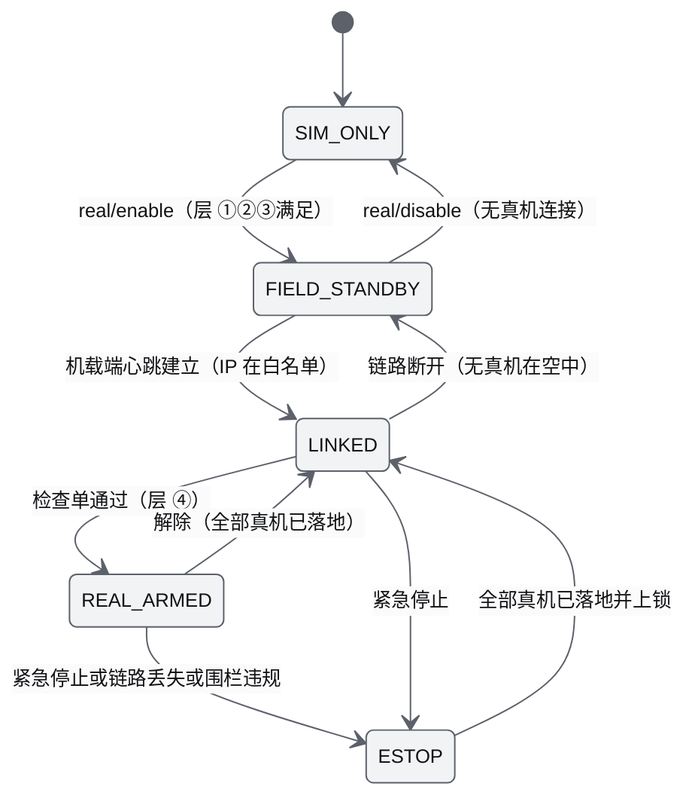

| 源 | 事件 | 守卫 | 动作 | 目标 |
|---|---|---|---|---|
| SIM_ONLY | `real/enable` | 层 ①②③ 满足；admin；确认令牌有效 | 加载真机适配器；prom-bridge 先启动 55556 与 8889 监听；审计 `real.enabled` | FIELD_STANDBY |
| FIELD_STANDBY | 机载端心跳建立 | 源 IP 在 `real_ops.allowed_vehicle_ips`（V0.5 定义）中 | roster 登记真机（`kind = uav`，`caps.clock = live`）；SimClock 锁定 ×1 | LINKED |
| LINKED | 检查单提交 | 7 项全部通过且安全员确认 | 审计 `real.checklist`；启用维护锁 | REAL_ARMED |
| REAL_ARMED | 紧急停止、心跳中断、围栏违规 | — | 按 M09 策略下发 Hover 或 Land；只放行安全类命令；审计 `real.estop` | ESTOP |
| LINKED | 紧急停止 | — | 同上 | ESTOP |
| ESTOP | 全部真机落地并上锁 | 全部真机 landed 且 disarmed | 解除紧急态；维护锁保持到重新通过检查单 | LINKED |
| REAL_ARMED | 解除 | 全部真机已落地 | 关闭维护锁 | LINKED |
| LINKED | 心跳全部中断 | 无真机在空中 | roster 移除真机 | FIELD_STANDBY |
| FIELD_STANDBY | `real/disable` | 无真机连接 | 卸载真机适配器；审计 `real.disabled` | SIM_ONLY |

各状态允许的真机指令：

| 状态 | 允许的真机指令 | 进入动作 | 退出守卫 |
|---|---|---|---|
| SIM_ONLY | 无（不加载真机适配器） | — | 层 ①②③ 满足 |
| FIELD_STANDBY | 无 | prom-bridge 先启动 55556 心跳监听与 8889 状态接收；审计 `real.enabled` | 机载端 IP 在白名单且心跳建立 |
| LINKED | 只读状态加安全类命令（Land、Hover、RTL） | SimClock 锁定 ×1、禁用 pause 与 step（`caps.clock = live`，ADR-045）；UI 显示 REAL 标识 | 检查单全部通过 |
| REAL_ARMED | 全部命令，照常经准入流水线与租约（ADR-016、ADR-027） | 审计 `real.checklist`；启用维护锁（`make stop` 拒绝） | 紧急停止、链路丢失、围栏违规 → ESTOP；全部落地 → LINKED |
| ESTOP | 只有安全类命令 | 按 M09 策略对全部真机下发 Hover 或 Land；审计 `real.estop` | 全部真机已落地并上锁 |

现场检查单（每次起飞前；逐项记录到 `real.checklist` 审计）：

| # | 项目 | 判据 |
|---|---|---|
| 1 | 遥控器开机、RC 链路正常、安全飞手就位 | 状态中 RC 链路为正常；安全员口头确认后在 UI 勾选 |
| 2 | 现场网络隔离 | 地面站只连接现场路由；`awr doctor --field` 确认机载端 IP 白名单与出站限制 |
| 3 | 地理围栏已加载且覆盖作业区 | 围栏数 ≥ 1；起飞点在围栏内 |
| 4 | 电量与气象在限值内 | 按 M09 预检阈值与机型 `physical.limits` |
| 5 | 地面站供电 | UPS 或电池剩余 ≥ 2 h |
| 6 | 时间同步 | chrony 同步状态正常（真实会话时间基，AWR-03 §5.2 第 8 条） |
| 7 | 禁用危险指令 | prom-bridge 白名单只放行 UAVBASIC 等必要指令，CUSTOMMODE、REBOOTNX、EXITNX 被拒绝（r19 §6） |

紧急处置：UI 的紧急停止与 `awr real estop` 等价；遥控器接管是最终手段；地面站断电或 prom-bridge 崩溃时机载端在连续 5 次心跳失败后自动降落（r19 §0 第 3 条），这是期望行为，必须在现场简报中说明；prom-bridge 退出时先对空中真机下发 Hover 或 Land 再关闭（r19 §4 规则 2）。

### 12.6 总线与容器安全

1. **zenoh**：peer 模式，汇合点与各 peer 只监听回环，关闭 multicast scouting 与 SHM（g05 §3.6）；zenoh 只允许在 `awr/runtime/bus.py` 中 import（AWR-03 §8.3）。
2. **跨主机（V0.5）**：另开 TLS 端点（本文设定 7448），mTLS 双向证书；ACL 按 key 前缀授权，GPU 节点只能访问重建相关 key，机载或远端生产者只能写自己的 `state/<producer>/**` 与 `evt/<producer>/**`（ADR-027）。
3. **容器**：非 root；除 sim-orchestrator 外不挂载 docker.sock；SIH 容器位于专用网络，不发布端口到宿主外部。
4. **局域网演示加固**：只开放 api 端口到演示网段；演示结束 `make stop` 使口令与 token 全部失效；不在公网暴露（公网部署需 TLS 终端与更强的鉴权，V1.0 前不在范围内）。

---

## 13. 备份与数据生命周期

### 13.1 数据分类与保留

| 类别 | 位置 | 典型体积 | 生成者 | 可重建 | 保留策略 | 备份 |
|---|---|---|---|---|---|---|
| 原始数据 | `data/raw/urbanscene3d/` | 0.98 GB（含 7z 归档 0.25 GB） | `fetch-data` | 否（依赖外部源） | 永久 | 是（归档 + MANIFEST，一次） |
| 世界包 | `worlds/<id>/` | 六城约 0.97 GB（16 §10.3 估算，上限 1.2 GB） | `worldpkg` | 是（六城 ≤ 150 s） | 当前 + `.trash` 上一代 | 否 |
| 运行目录 | `runs/<run>/` | 日志 ≤ 60 MB/进程；N = 1000 录制 ≤ 60 MB/min | supervisor、recorder | 否 | 配额 20 GB，最旧优先回收 | 只备份 keep 运行 |
| 性能回传 | `runs/perf-reports/` | < 10 MB | api | 否 | 永久，不计入配额回收 | 是 |
| 作业库 | `runs/jobs.db` | < 10 MB | job-worker | 否 | 永久，不计入配额回收 | 是 |
| 任务工作目录 | `runs/jobs/<job_id>/` | 按任务 | job-worker（M01、M03） | 是（可重跑） | 按 M01 §6.7.5，不计入配额回收 | 否 |
| tmpfs | `/dev/shm/awr/<run>/` | ≤ 64 MiB | 各进程 | — | 停机删除；启动时清理残留 | 否 |
| 工具缓存 | `~/.cache/uv`、`~/.npm`、`~/.cache/ms-playwright`（本机 656 MB）、numba `__pycache__` | 估算 2–4 GB | 工具 | 是 | 手动清理 | 否 |
| 依赖安装 | `.venv`（本机含 Open3D 为 1.3 GB）、`node_modules` | 0.6–1.5 GB / worktree | `make setup` | 是 | 随 worktree | 否 |
| 容器 | 镜像与卷（V0.2 起） | 见 §10.1 | Docker | 是 | 按版本 | ulog 卷随运行归档 |
| 秘密 | `runs/<run>/secret`、`admin.token` | < 1 KB | supervisor | — | 随运行目录 | 否（排除） |

### 13.2 `runs/` 配额与磁盘余量

```python
# awr/runtime/quota.py（M11）；启动时与每 check_every_s（600 s）执行一次
def gc_runs(root, quota_gb, active_run, replaying_runs):
    runs = [d for d in root.iterdir() if RUN_ID_RE.fullmatch(d.name)]   # 只处理 r<日期>-<时间>-<4hex> 目录
    used = sum(du(d) for d in runs)                                      # 不含 jobs.db、jobs/、perf-reports、.perf.lock、current
    for d in sorted(runs, key=started_at):                               # 最旧优先
        if used <= quota_gb * GiB: break
        if d.name == active_run or d.name in replaying_runs or (d / "keep").exists(): continue
        used -= du(d); rmtree(d); audit("runs.evicted", run=d.name)
    if used > quota_gb * GiB: alert("AL-14", level="warn", detail="keep 运行已超出配额")
```

- 豁免：当前运行、回放中的运行、带 `keep` 标记的运行；keep 运行本身超出配额时只告警不删除。
- 磁盘余量守卫（OPS-FR-036）：`disk.free_gb` < 10 告警；< 5 时 recorder 关闭当前段并拒绝新段，`worldpkg build` 与 `fetch-data` 以退出码 7 拒绝，supervisor 继续运行仿真（仿真本身不写大文件）。
- 容量换算：N = 1000 的录制 ≤ 60 MB/min（ADR-040），20 GB 配额可容纳约 5.5 h；S1 双机录制量级为 MB/min 以下（估算）。

### 13.3 运行与录制的生命周期（D1-ext）

回收以运行为单位（整个 `runs/<run>/`），录制段是运行的一部分；段的写入、索引与修复细节归 [M12](modules/M12-时间轴录制与回放PRD.md)。

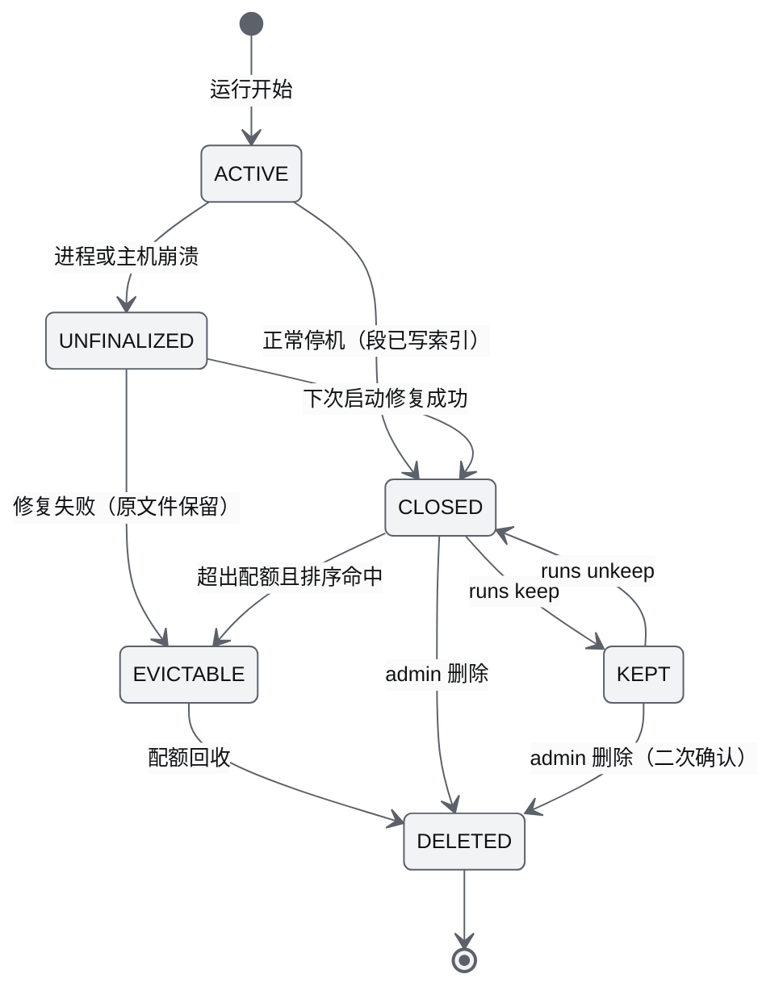

| 状态 | 事件 | 守卫 | 动作 | 目标 |
|---|---|---|---|---|
| — | 运行开始 | — | 创建目录；recorder 开段（剧本运行或手动开启时） | ACTIVE |
| ACTIVE | 正常停机 | — | 关闭段、写索引；生成 `SHA256SUMS`；`meta.json.closed = true` | CLOSED |
| ACTIVE | 崩溃 | — | 无（下次启动时发现 `closed` 缺失） | UNFINALIZED |
| UNFINALIZED | supervisor 启动扫描 | 修复工具可用 | 由 M12 工具重建段索引；成功则补写 `SHA256SUMS` | CLOSED 或 EVICTABLE |
| CLOSED | `awr runs keep` 或 `POST /api/runs/{run}/keep` | operator 以上 | 写 `keep` 标记；审计 | KEPT |
| KEPT | `awr runs unkeep` | operator 以上 | 删除 `keep` 标记；审计 | CLOSED |
| CLOSED | 配额回收排序命中 | 不在豁免集合 | — | EVICTABLE → DELETED |
| CLOSED、KEPT | `DELETE /api/runs/{run}` | admin；KEPT 需二次确认 | 删除目录；审计 `runs.deleted` | DELETED |

`incompatible` 属性：升级后由 `--upgrade-check` 计算（world 或 `layout_id` 与当前版本不一致），不改变状态，只在列表中标注"需旧版本回放"（§9.6）；打开时返回 122 RECORDING_INCOMPATIBLE。

### 13.4 备份与恢复

| 对象 | 频率 | 方式 | 排除 | 校验 |
|---|---|---|---|---|
| 原始数据归档与 MANIFEST | 首次获取后一次 | `rsync -a data/raw/urbanscene3d/{UrbanScene3D-virtual_cities-sampled.7z,MANIFEST.json} "$AWR_BACKUP_TARGET/data/"` | — | 目标端 `sha256sum` 与 MANIFEST 一致 |
| keep 运行 | 每日 02:00（systemd timer 或 cron） | `rsync -a --partial runs/<run>/` | `secret`、`admin.token`、`ckpt/` | 目标端 `sha256sum -c SHA256SUMS` |
| `runs/perf-reports/`、`runs/jobs.db` | 每日 | rsync（`jobs.db` 先 `sqlite3 .backup` 生成快照） | — | 大小与哈希 |
| 配置与文档 | 随 git | 远端仓库 | `configs/secrets/` | — |

```bash
# make backup 的等价命令（AWR_BACKUP_TARGET 形如 nas:/volume1/awr-backup）
for r in runs/r*/; do
  [ -f "$r/keep" ] || continue
  rsync -a --partial --exclude secret --exclude admin.token --exclude ckpt/ "$r" "$AWR_BACKUP_TARGET/runs/$(basename "$r")/"
done
rsync -a runs/perf-reports/ "$AWR_BACKUP_TARGET/perf-reports/"
```

恢复：

1. 原始数据：从备份取回归档到 `data/raw/urbanscene3d/`，`AWR_DATA_MIRROR=file://<备份挂载点> make fetch-data`（走同一校验流程），再 `make worlds`；RTO ≤ 30 min（OPS-NFR-013）。
2. keep 运行：`rsync` 回 `runs/<run>/`，`awr runs verify <run>` 校验 `SHA256SUMS`；回放需要与 `meta.json` 记录一致的版本（不一致时按 §9.6 用旧版本 worktree）。
3. 演练：每个里程碑出口做一次"删除一个 keep 运行 → 从备份恢复 → 回放 seek 冒烟"，记录耗时（OPS-AC-017）。

---

## 14. 故障排查手册

### 14.1 诊断入口：`awr doctor`

`make doctor` 执行下列检查（`--quick` 只执行标 Q 的项，≤ 3 s；`--deep` 追加 sha256 与世界深校验）。输出每项的级别（OK、WARN、ERROR）、退出码与一条修复命令。

| 编号 | 检查 | 方法 | 失败级别 | 退出码 | 修复 |
|---|---|---|---|---|---|
| DOC-01 Q | CPU 架构 | `uname -m` 为 x86_64 | ERROR | 13 | 更换 x86-64 主机（OPS-NFR-011） |
| DOC-02 Q | Python 虚拟环境 | `.venv/bin/python -V` 为 3.12.x | ERROR | 8 | `python3.12 -m venv .venv` |
| DOC-03 | uv 版本 | `.venv/bin/uv --version` 为 0.12.19 | ERROR | 8 | `.venv/bin/pip install uv==0.12.19` |
| DOC-04 Q | Node 版本 | `node --version` 为 22.12.x | ERROR | 8 | 按 `.nvmrc` 安装 |
| DOC-05 | 依赖与锁一致 | `uv pip sync --dry-run` 无变更；`npm ls --omit=dev` 无缺失 | ERROR | 8 | `make setup` |
| DOC-06 | 契约生成物一致 | `tools/contracts/gen.* --check` | ERROR | 8 | `make setup`（M00 负责生成） |
| DOC-07 | numba 可用、缓存可写 | 导入 numba；在缓存目录写测试文件 | WARN | 0 | 修复权限；否则以 numpy 运行（上限 300 架） |
| DOC-08 | zenoh 版本 | 导入 `zenoh`，版本为 1.10.1 | ERROR | 8 | `make setup` |
| DOC-09 Q | 端口空闲 | 试绑定 api、7447（dev 加 5173）的偏移后端口 | ERROR | 3 | §14 F04 |
| DOC-10 Q | tmpfs | `/dev/shm` 可写且剩余 ≥ 1 GiB | ERROR | 9 | 容器设 `shm_size: 1g`；清理残留 |
| DOC-11 Q | 残留运行目录 | `/dev/shm/awr/*` 中 supervisor pid 已不存在的目录 | WARN | 0 | 启动时自动清理 |
| DOC-12 Q | 磁盘余量 | 可用 < 5 GB 为 ERROR，< 10 GB 为 WARN | ERROR、WARN | 7 | §14 F14 |
| DOC-13 | `runs/` 配额 | 用量 ≥ 80% | WARN | 0 | `make gc-runs` |
| DOC-14 Q | 原始数据 | 按 `configs/data.yaml` 核对字节数；`--deep` 核对 sha256 | ERROR（默认世界也无效时），否则 WARN | 4、5 | `make fetch-data` |
| DOC-15 Q | 世界有效 | 读 `worlds/.status/<id>.json`：默认世界 ready 为 OK，其他世界 invalid 为 WARN；`--deep` 执行 `worldpkg validate --deep` | ERROR（默认世界）、WARN（其他） | 6 | `make worlds` |
| DOC-16 | 前端构建 | `apps/web/dist` 存在且不旧于源文件 | WARN | 0 | `make build`（`make run` 会自动执行） |
| DOC-17 | CPU 与优先级能力 | 核数 ≥ 8 才钉核；`CAP_SYS_NICE` 是否可用 | WARN | 0 | 系统级 systemd 单元（§4.4） |
| DOC-18 | 负载（仅性能用例） | 1 分钟 load ≤ 4 | ERROR | 14 | §14 F18 |
| DOC-19 | 测试浏览器 | `PW_CHROME` 存在且为 151 | WARN（测试目标为 ERROR） | 8 | 设置 `PW_CHROME` |
| DOC-20 | 秘密与目录权限 | 运行目录 0700、秘密文件 0600 | WARN（自动修复失败为 ERROR） | 2 | `chmod` |
| DOC-21 | 运行中服务自检 | `curl -sI` 含 COOP 与 COEP；`curl -r 0-15` 取 `octree.bin` 返回 206 | ERROR | 15 | 检查 api 版本与静态服务配置 |
| DOC-22 Q | 访问模式一致性 | lan 模式必须有 `AWR_ORIGINS`；loopback 模式绑定必须是回环（容器除外） | ERROR | 2 | 按 §12.3 修正 |
| DOC-23（V0.2） | Docker 与镜像 | `docker version`；BOM 中镜像已拉取 | ERROR | 8 | `docker pull` 并核对 digest |
| DOC-24（V0.2） | Open3D 依赖库 | 查找 libEGL 与 libGL | ERROR（启用 geo-worker 时） | 8 | §14 F01 |
| DOC-25（V0.5） | 现场网络 | 只连现场路由；机载端 IP 白名单；出站限制 | ERROR | 2 | §12.5 检查单第 2 项 |
| DOC-26（V0.5） | 时间同步 | chrony 状态 | WARN | 0 | 配置 GPS 或 PTP 授时 |

### 14.2 远程页面打不开或黑屏：决策树

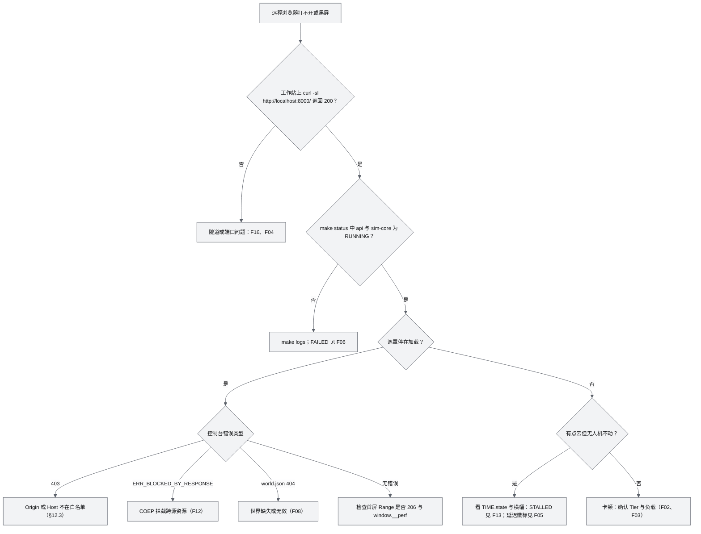

### 14.3 重点条目

#### F01 Open3D 导入失败（libEGL）

- **适用**：V0.2 起的 geo-worker；D1 运行时不导入 Open3D（AWR-11 TECH-FR-004），但离线工具与研究脚本会遇到。
- **现象**：`ImportError: libEGL.so.1: cannot open shared object file: No such file or directory`；geo-worker 启动即退出并进入 BACKOFF。
- **诊断**：

```bash
d=$(.venv/bin/python -c "import importlib.util,os;print(os.path.dirname(importlib.util.find_spec('open3d').origin))")
so=$(find "$d" -name 'libOpen3D.so*' | head -1)
readelf -d "$so" | grep NEEDED          # 应含 libEGL.so.1、libGL.so.1、libX11、libudev、libusb-1.0、libidn2、libtbb
ldconfig -p | grep -E 'libEGL\.so\.1|libGL\.so\.1' || echo "missing"
```

- **根因**：Open3D 0.20 的 Linux wheel 硬链接 `libEGL.so.1`（新增离屏上下文），最小化系统与容器缺少这些库；`open3d-cpu` 停在 0.19 且缺少 0.20 的特性（r06 §0 第 5 条、§6 第 1 条）。
- **处置**：
  - 有 root：`sudo apt-get install -y --no-install-recommends libegl1 libgl1 libx11-6 libudev1 libusb-1.0-0 libidn2-0`。
  - 无 root（本机 `.cache/research/r06/run.sh` 已验证）：

```bash
mkdir -p .cache/egl && cd .cache/egl
apt-get download libegl1 libegl-mesa0          # 本机实测包：libegl1_1.7.0、libegl-mesa0_25.2.8
for f in *.deb; do dpkg -x "$f" root/; done
echo "AWR_EGL_LIBDIR=$PWD/root/usr/lib/x86_64-linux-gnu" >> ../../.env.local
```

  - 容器：在镜像中安装上述包；只做光线求交等计算时不需要 `EGL_PLATFORM=surfaceless`。
- **降级**：AGL、碰撞、安全转场由 M04 的 numpy DSM 提供，不依赖 geo-worker；geo-worker 不可用时射线与 LiDAR 查询返回 213 SERVICE_UNAVAILABLE，仿真照常（g05 §6、§7.5）。
- **预防**：DOC-24；禁止在 api 进程导入 Open3D（调用期间持有 GIL，每进程约 0.8 GB 映射，r06 §4.2），禁止用 `asyncio.to_thread` 包装（AWR-03 §4.2 第 1 条）。

#### F02 WebGPU 不可用

- **前提**：硬件浏览器默认 Tier B（经典 WebGL2），**WebGPU 不可用不影响默认体验**；只有显式 `?rb=webgpu` 或设置页偏好（D1-ext）才需要它（ADR-044）。
- **现象**：选择 WebGPU 后仍显示 Tier B；控制台 `navigator.gpu` 为 undefined 或 `requestAdapter()` 返回 null；本机 `?tier=A` 未生效。
- **诊断与处置**：

| 原因 | 判据 | 处置 |
|---|---|---|
| 非安全上下文（局域网 http） | `window.isSecureContext === false`，`navigator.gpu === undefined` | 改用 SSH 转发访问 `http://localhost:8000`；演示机可临时用 Chrome 参数 `--unsafely-treat-insecure-origin-as-secure=http://<host>:8000`（仅限演示机） |
| headless 默认无 adapter | 本机 Chromium 默认 `requestAdapter()` 为 null（r11 §0 第 1 条） | 测试启动参数加 `--enable-unsafe-webgpu --enable-features=Vulkan --use-webgpu-adapter=swiftshader`（n05 §0 第 8 条） |
| adapter 为 fallback | `adapter.info.isFallbackAdapter === true`（SwiftShader，r11） | 设计如此：fallback 不进 Tier A；功能测试用 `?tier=A&allowFallback=1`（仅 dev/test 构建，写入 `__perf.forced`） |
| GPU 或驱动被屏蔽 | `chrome://gpu` 中 WebGPU 为 Disabled 或 Software only | 更新驱动；Linux 可试 `--enable-features=Vulkan`；接受 Tier B |
| 设备丢失 | 控制台出现 device lost | 渲染器整页重建（ADR-044）；反复发生时偏好回落到 Tier B |

- **确认**：`window.__perf.backend`、`window.__perf.forced`、`window.__perf.deviceClass`。

#### F03 SwiftShader 慢

- **先确认口径**：本机 headless 管线的呈现间隔中位数固定在 33.3 ms，与点数无关（g02 §6.4）；Tier S 的目标就是固定 30 fps（ADR-044），flight60 纯点云 p95 ≤ 50 ms 即达标（D1-AC-03a）。"只有 30 fps"不是故障。
- **诊断顺序**：
  1. `window.__perf.tier`：若用户的 GPU 浏览器也显示 Tier S，说明它落到了软件渲染（远程桌面、GPU 被屏蔽、关闭了图形加速），查 `chrome://gpu`。
  2. 负载：`uptime`；1 分钟 load > 4 时性能用例本不应开始（ADR-033）；`pgrep -fa 'playwright|vitest|worldpkg|uvicorn'` 查并发任务，`docker ps --filter label=awr.role=px4-sitl` 查 SIH。
  3. CPU 分区：`taskset -cp <chrome-gpu-pid>` 应为 2–6；sim-core 在 core1、api 在 core0。
  4. 渲染比例：`window.__perf.renderScale` 应为 0.5（Tier S 固定）。
  5. 启动参数：确认没有 `--disable-gpu-vsync --disable-frame-rate-limit`，它们让 rAF 与呈现脱钩，测得的数据是假象且用例慢 10 倍以上（n05 §0 第 8 条）。
  6. 计时精度：`crossOriginIsolated` 为 true，否则 `performance.now()` 粗化到 100 µs（n05 §0 第 10 条）。
  7. 控制器：`window.__perf.cas` 是否长期在最低档下限饱和；此时 PerfGovernor 按 ADR-041 顺序降可选图层，HUD 有说明。
- **处置**：排除竞争负载后按运行协议重跑（3 次取中位）；远程观看一律用硬件浏览器；不要通过降低 Tier S 渲染比例或关闭限帧来"提速"。

#### F04 端口占用

- **现象**：`make run` 以退出码 3 失败；日志 `[Errno 98] Address already in use`；Vite `Port 5173 is already in use`（`--strictPort`）；工作站 SSH 报 `bind [127.0.0.1]:8000: Address already in use`。
- **诊断**：

```bash
ss -ltnp '( sport = :8000 or sport = :7447 or sport = :5173 )'
[ -f runs/current/supervisor.pid ] && ps -o pid,etime,cmd -p "$(cat runs/current/supervisor.pid)"
pgrep -fa 'awr\.runtime\.supervisor|uvicorn awr\.api|awr\.sim\.runtime'
```

- **根因与处置**：

| 根因 | 处置 |
|---|---|
| 上次运行未正常停止（残留 supervisor、api） | `make stop FORCE=1` |
| 另一个 worktree 使用相同偏移 | `.env.local` 改 `AWR_PORT_OFFSET` |
| 其他软件占用 8000 | 改偏移，或停止该软件 |
| 工作站本地 8000 被占 | `ssh -L 18000:127.0.0.1:8000 …`，访问 `http://localhost:18000`（Origin 规则放行任意端口的 localhost） |

- **注意**：7447 被占时不要绕过检查；即使 key 空间按 run 隔离不会串话，两个汇合点竞争仍会让子进程连到错误的网状（§3.2 第 1 条）。

#### F05 WS 背压告警

- **现象**（AL-09、AL-10、AL-11）：HUD 显示"数据延迟"或"信号延迟"徽标；`clients[].credit_skips` 上升；客户端收到 `status{id: "net.congested", level: warning}`；WS 以 1013 关闭后自动重连（[14](14-UI交互设计PRD.md) E-09）。
- **机制**：credit 窗口默认 W = 6，ack 每 3 帧或 50 ms（ADR-014）；数据面单槽 mailbox 新帧覆盖旧帧；控制面有界 FIFO 1024，满即 1013 断开（`318 CONTROL_BACKLOG`）；单次 `send` 耗时 > 200 ms 或连续 3 次 > 50 ms 时标记 congested（M11-FR-044；ASGI 拿不到传输层写缓冲，r27 §3.9 L4 的"写缓冲 > 1 MiB"判据改为发送耗时）。浏览器侧没有接收背压，服务端看不到 TCP 背压，所以只能靠应用层 credit（r27 §3.1.3）。
- **诊断**：

```bash
awr status --ws     # 每会话：fps、window、credit_skips、ctrl_queue_hwm、srtt_ms、kbps、是否 congested
curl -s -H "Authorization: Bearer $(awr token viewer)" http://127.0.0.1:8000/api/rt/inspect | jq .   # 17 §4.3.14 调试端点（ext）
```

浏览器侧看 `window.__perf.latency`、Worker 解码耗时与主线程长任务。

| 原因 | 判据 | 处置 |
|---|---|---|
| 客户端主线程慢（SwiftShader、低端集显） | `credit_skips` 高、`srtt_ms` 低、无 congested | 属预期的自适应：服务端按客户端消费节奏跳帧；Tier S 上选中机通道不低于 rAF 频率即达标（D1-AC-26）；不得为此把 swarm 降到 10 Hz 以下（ADR-041） |
| 网络拥塞（广域网 SSH、Wi-Fi） | congested、`srtt_ms` 高、`kbps` 接近链路带宽 | 改有线或局域网；SSH 关闭压缩；减少订阅（关注集 K、选中机 60 Hz） |
| 控制面洪泛 | `ctrl_queue_hwm` ≥ 512，随后 1013 | 典型为对 1000 架逐机下发命令（[14](14-UI交互设计PRD.md) 风险 K2）；改用 17 §7.5 的机群批量命令 `fleet/cmd/{op}`（逐机结果汇总为 `fleet.batch.progress`，10 AD-03）或客户端分批节流 |
| api CPU 饱和 | `sys/procs` 中 api 的 `cpu_pct` 接近 100，`api.loop_lag_p99_ms` > 10 | 减少并发客户端（§15.3）；排查事件循环内的同步重计算；按 10 AD-07 拆分静态服务 |
| 事件风暴 | `events.gap` 状态出现 | 确认事件按步合批（ADR-018）与 WS 按 tick 合批（10 AD-03）；1 s 内补齐即正常 |

### 14.4 其他条目

| 编号 | 现象 | 诊断 | 处置 |
|---|---|---|---|
| F06 进程熔断 | 横幅"仿真进程已熔断"；`make status` 为 FAILED | `ls runs/current/crash/`；`make logs P=<proc>` | 常见根因：`312 LAYOUT_MISMATCH`（F07）、剧本或世界无效（121、123）、numba 编译错误、内存不足；修复后 `awr sys restart <proc>`（带 `reset_breaker: true`） |
| F07 LAYOUT_MISMATCH 或残留 tmpfs | 读者拒绝 attach；`/dev/shm` 被占用 | `ls -la /dev/shm/awr/`；DOC-11 | `make stop` 后删除无主目录（supervisor 启动时自动清理）；契约生成物不一致时 `make setup` 并全量重启 |
| F08 世界 404 或校验失败 | `world.json` 404；空世界；validate 报错 | `worldpkg validate worlds/<id> --deep --json`；`ls worlds/.staging` | `worldpkg build <id> --keep-staging`；怀疑数据损坏时先 `make doctor --deep`；`worldpkg status --json` 看判定原因 |
| F09 数据下载失败 | 退出码 5 或下载中断 | 下载日志中的镜像与 HTTP 状态 | 重跑（断点续传）；`AWR_DATA_MIRROR` 指向 NAS 或 `file://`；Google Drive 配额只影响航线文件（P2） |
| F10 重启超过 3 s | D1-AC-11a 失败；sim-core STARTING 时间长 | `make logs P=sim-core` 中的 numba 编译记录；`NUMBA_CACHE_DIR` 可写性 | 缓存目录持久化（容器用卷）；预热完成后再做混沌测试；`AWR_KERNEL=numpy` 用于排除 |
| F11 安装与版本问题 | `Executable doesn't exist`；`npm ERR! ERESOLVE`；找不到 `import.meta.env`；`uv: command not found` | 版本与路径 | 设 `PW_CHROME`；不装 R3F v10 与 drei v11 的 alpha，不用 `--legacy-peer-deps`；tsconfig 显式 `types`；自举 uv（n05 §0、§6） |
| F12 COEP 拦截资源 | 控制台 `ERR_BLOCKED_BY_RESPONSE.NotSameOriginAfterDefaultedToSameOriginByCoep` | Network 面板定位跨源 URL | 资源本地化（字体 `@fontsource-variable`、品牌资产在 `public/brand`）；确需跨源时加 CORP 或 CORS（n05 §6 第 11 条） |
| F13 仿真停滞或重启中 | TIME.state 为 STALLED 或 RESTARTING 的横幅 | `make status`（心跳年龄、状态）；`uptime` | 等待 supervisor 判定（挂死阈值 2 s）；频繁出现按 AL-04 至 AL-06 查容量 |
| F14 磁盘满或配额 | AL-15；录制停止；构建以退出码 7 被拒 | `df -h`；`du -sh runs/r* \| sort -h \| tail` | `make gc-runs`；取消不必要的 keep；`uv cache prune`、`npm cache clean --force`；`worldpkg clean --staging --trash` |
| F15 容器内总线异常 | zenoh 报 SHM 分配失败 | `docker inspect -f '{{.HostConfig.ShmSize}}' <容器>` | `shm_size: 1g`；确认 `bus.shm: false`（g05 §0 第 9 条） |
| F16 隧道断开、WS 频繁重连 | 断线横幅；ssh 进程退出 | `ssh -v`；工作站网络 | `-o ServerAliveInterval=15 -o ServerAliveCountMax=4`；用 autossh 或 systemd 用户单元守护隧道；WS 在 Worker 中自动退避重连 |
| F17 席位被占（116） | 申请 operator 被拒 | `make status` 中的 `ws.operator_seat` | 见 §12.4 |
| F18 性能用例"环境不满足" | 退出码 14 | `uptime`；`flock -n "$AWR_PERF_LOCK" true \|\| echo locked`；`docker ps` | 错峰；停止无关负载；按 ADR-033 记为环境不满足，不算失败 |
| F19 PX4 SIH（V0.2） | 10 架以上只收到部分心跳；RTF < 0.9；READY 超时；`Preflight Fail: no heading reference` | px4-bridge 日志；`docker stats` | 每机一容器 `-i 0`；减少 SIH 数量或错开性能用例；EKF 收敛需 2–5 s，等待后重试 ARM；offboard 保活 ≥ 10 Hz（r20 §6、r22 §0） |
| F20 真机意外降落（V0.5） | 真机自动 Land | prom-bridge 日志中的 55556 心跳记录；地面站供电与网络 | 连续 5 次心跳失败导致的降落属期望的安全行为（r19 §0 第 3 条）；排查地面站后重新走检查单；预防：UPS、有线网络、REAL_ARMED 期间维护锁 |

---

## 15. 容量规划

### 15.1 本机资源分配（D1）

| 资源 | 分配 | 依据 |
|---|---|---|
| CPU | core0 api（≤ 0.35 核，3 客户端、1000 架）；core1 sim-core（1000 架约 0.3 核，上限 0.6 核）；core2–6 性能用例中的 Chromium 与 SwiftShader；core7 plan-pool（按需 1 核）；supervisor ≤ 0.02 核；recorder ≤ 0.1 核；agent-runtime ≤ 0.05 核 | AWR-03 §3.3、ADR-017 |
| 内存 | 后端全部进程估算 ≤ 2 GB；headless Chromium（SwiftShader）估算 1.5–2.5 GB；世界构建每城实测 2.2 GB、上限 4 GB（3 并行 ≤ 12 GB）；62 GB 主机余量充足 | §4.1（进程为估算，MS4 回填）；M03-NFR-006 |
| tmpfs | 每运行 ≤ 64 MiB（StateRing 约 3 MB/生产者，checkpoint 3 代 × 1–2 MB） | g05 §3.2、§7.4 |
| 磁盘 | 原始数据 0.98 GB；世界约 0.97 GB（上限 1.2 GB，重建期间 `.trash` 与 staging 最多再占同量）；`runs/` ≤ 20 GB；依赖与缓存 2–5 GB | §15.5 |

### 15.2 sim-core：机群规模与倍速

以 g08 §11 的实测线性化（本文设定，MS4 以 fleet_ladder 校准）：

- numba 内核：`c(N) ≈ 0.02 + 0.24·N/1000` 核（倍速 ×1，含 env 50 Hz、guard、tap）；N = 1000 时约 0.26 核。
- numpy 回退：`c(N) ≈ 0.27 + 0.60·N/1000` 核；只保证 N ≤ 300（ADR-038）。
- 倍速 ×k 时 CPU 按 k 线性放大（ADR-021）；sim-core 钉在 1 个核上，取 0.9 核为上限：`k_max = 阶梯 {0.25, 0.5, 1, 2, 5, 10} 中不超过 0.9 / c(N) 的最大值`。

| N | numba `c(N)`（核） | numba 最大倍速 | numpy `c(N)`（核） | numpy 最大倍速 |
|---|---|---|---|---|
| 10 | 0.02 | ×10 | 0.28 | ×2 |
| 50 | 0.03 | ×10 | 0.30 | ×2 |
| 200 | 0.07 | ×10 | 0.39 | ×2 |
| 300 | 0.09 | ×5 | 0.45 | ×2 |
| 500 | 0.14 | ×5 | 不支持（> 300） | — |
| 1000 | 0.26 | ×2（连续值约 ×3.5，受阶梯离散） | 不支持 | — |

`make status` 按上式显示当前 N 下的最大倍速与剩余容量（OPS-FR-041）；超出时由 M08 拒绝（原因码由 17 定义）。1000 架以上的扩展路径是按世界分片的多 sim-core 进程（V1.0，g05 §2.3）。

### 15.3 api：并发客户端

- 依据 r27 §3.1.5（1.7 GHz，200 架，每客户端约 149 KiB/s）：1 个客户端 7.5%（含 3.4% 仿真），10 个客户端 29–34%，50 个客户端饱和但平滑降级；每客户端约 0.03 核。
- D1 门槛：1000 架、3 个无头客户端同时跑 flight60 时 api ≤ 0.35 核、tick 数据年龄 p99 ≤ 15 ms（D1-AC-08）。
- 建议：本机同时在线 ≤ 10 个客户端（其中 1 个 operator）；超过 10 个时先实测 `proc.api.cpu_pct`；需要更多观众时优先"观众看演示者屏幕"。V1.0 的扩展路径为 Gateway 多 worker（`SO_REUSEPORT`，各自 attach StateRing）或 Rust 数据面（r27 §3.13）。

### 15.4 内存（估算，MS4 实测回填）

| 进程或作业 | 估算 | 依据 |
|---|---|---|
| sim-core（含 numba、llvmlite） | 300 MB | 本文估算 |
| api | 200 MB | 本文估算 |
| plan-pool worker | 150 MB / 个 | 本文估算 |
| recorder、agent-runtime | 各 120 MB | 本文估算 |
| replay-worker（20× 回放） | 200 MB | 本文估算 |
| worldpkg 单城构建峰值 | 实测 2.2 GB，上限 4 GB | M03-NFR-006（M03 原型实测） |
| headless Chromium（SwiftShader，1280×720） | 1.5–2.5 GB | 本文估算 |
| geo-worker（V0.2） | 0.8 GB 映射 + 场景 0.5 GB（纽约 2 m DSM）至 +2.4 GB（上海 2 m DSM） | r06 §4.2、§6 第 4 条 |
| PX4 SIH（V0.2） | 7–19 MB / 机 | r22 §0 第 1 条；r20 §3.9 |
| DA3-SMALL CPU 冒烟（V0.2，P2） | 峰值 RSS 1.9 GB | n02 §0 第 4 条 |
| ANet daemon（V1.0） | 约 14 MB / 个 | d05 |

### 15.5 磁盘

| 项 | 体积 | 说明 |
|---|---|---|
| 原始数据 | 0.98 GB | 六个 PLY 720 MB + 7z 253 MB + 航线等 3 MB（本机合计 975,809,978 B，`du -sh` 显示 932 MiB） |
| 世界（六城） | 约 0.97 GB（上限 1.2 GB） | 16 §10.3：每城 `octree.bin` 60.0 MB + 源点云 `awr-pts@1` 75.0 MB（5M 点 × 15 B）+ DSM 2 m 3.0–54.7 MB（旧金山 7.2 × 7.5 km 最大）+ DTM 0.12–2.19 MB，每城 138–192 MB；上限见 DATA-NFR-003；重建时 `.trash` 保留上一代 |
| `runs/` | ≤ 20 GB（配额） | N = 1000 录制 ≤ 60 MB/min；日志 ≤ 60 MB/进程/运行 |
| `.venv` | 0.6–1.3 GB / worktree | 本机含 Open3D 为 1.3 GB；D1 不装 Open3D |
| `node_modules` | 0.3–0.5 GB / worktree | n05 trial 318 MB、g07 样板 145 MB |
| 工具缓存 | 2–4 GB | uv、npm、Playwright（本机 656 MB） |
| Docker 镜像（V0.2 起） | SIH 152 MB；backend 0.6–0.9 GB；PDAL 约 1 GB；OpenFOAM 2–3 GB；GPU worker 10–15 GB | §10.1 |

本机磁盘剩余约 52 GB（2026-09-28 审校时 `df` 复核）：`runs/` 配额 20 GB 加世界（含 `.trash` 最多 2.4 GB）、依赖、缓存约 9 GB 后仍有约 23 GB 余量；worktree 超过 8 个时需按 §7.5 第 3 条清理。

### 15.6 网络带宽（每客户端）

| 流 | 估算 | 依据 |
|---|---|---|
| swarm（Lite32） | `32 B × N × f`（一条 BATCH 记录装整群，帧头与记录头可忽略）：N = 1000 时 10 Hz 为 320 KB/s，20 Hz 为 640 KB/s | AWR-03 §8.5（Tier S 10 Hz、Tier B 20 Hz） |
| 关注集（Full64，K ≤ 32，30 Hz） | 约 77 KB/s（64 B 载荷 + 16 B 记录头 = 80 B/条，17 §6.6 默认订阅集） | ADR-046 |
| 选中机（Full64，60 Hz）、TIME（24 B，10 Hz）、事件 | < 10 KB/s | ADR-014 |
| 首屏 | 1.30–5.03 MB（一次 Range） | g03 §7 |
| 流式瓦片 | 按相机移动按需，单城上限约 60 MB | g03 §7 |

N = 1000、Tier B 默认订阅下稳态约 0.7 MB/s（约 5.6 Mbit/s）；广域网 SSH 隧道带宽低于 10 Mbit/s 时，稳态可用但首屏与流式加载明显变慢（TTFP 的定义不含传输时间，AWR-03 §11）。

### 15.7 后续版本的容量

| 版本 | 资源 | 估算式或数据 | 依据 |
|---|---|---|---|
| V0.2 SIH | CPU | 每机约 0.22 核（实测 0.17–0.25 核，单位成本 0.23–0.30 核·秒/仿真秒）；准入式 `空闲核数 × 0.8 ≥ N × 0.3`（r22 §4.2）只是 CPU 下限，lockstep 线程调度使本机实时上限约 8 架（RTF 0.92），16 架 RTF 约 0.73，因此本机准入上限取 min(准入式, 8) | r20 §3.9；r22 §0 第 1 条、§4.2 |
| V0.2 SIH | 遥测 | 裁剪后每机约 70 msg/s；纯 Python 单核约 3.6 万帧/s，可支撑 500 架以上 | r22 §0 第 6 条 |
| V0.5 GPU 节点 | 显存 | LingBot-Map ≥ 24 GB；DA3-Streaming < 12 GB；MapAnything 每 100 视图约 7 GB（memory-efficient）；24 GB 为最低配置，48 GB 更从容 | r01 §2.4；n02 §6 第 3 条 |
| V0.6 OpenFOAM | CPU 与时长 | 8 核每方向 15–30 min，24 方向每城 6–12 h；产物约 200 MB | r17 §3.5 |
| V1.0 ANet | 内存 | 每 daemon 约 14 MB；1000 架全部 agent 化约 14 GB，建议只为参与协作的子集启动 daemon | d05 |

### 15.8 扩容触发与路径

| 场景 | 瓶颈 | 触发指标 | 动作 |
|---|---|---|---|
| 观众增多 | api 单核 | `proc.api.cpu_pct` > 70% 或 AL-07 | 观众看演示者屏幕；拆分静态服务（ADR-013）；V1.0 Gateway 多 worker |
| 机群 > 1000 或高倍速 | sim-core 单核 | AL-04 至 AL-06 | 降低倍速；V1.0 按世界分片 |
| SIH 数量 > 8 | 主机 CPU | SIH RTF < 0.95 | 另起 SIH 主机；混合保真度（关键机用 SIH、群体用 L1） |
| 点云 > 1 亿点的世界 | 切片器内存 | 构建 OOM | PotreeConverter Docker 切片后由 `worldpkg` 转码（AWR-11 §4.11） |
| 长时间录制 | 磁盘 | AL-14、AL-15 | 提高配额或外接存储；按 keep 备份后回收 |
| 同机多个运行 | CPU 钉核冲突 | 两个实例都钉 core0/1 | 第二个实例 `AWR_CPU_PIN=off` 或另配 `cpus`；性能验收只在单实例下进行 |

---

## 16. 错误码与退出码

### 16.1 复用的线上码（定义方为 [17](17-接口与实时协议规范.md) §8.2 与 §8.3，语义见 [12](12-业务逻辑设计说明书.md) §5.6）

| 码 | 名称 | HTTP | 运维场景 |
|---|---|---|---|
| 111 | RATE_LIMITED | 429 | 脚本或客户端调用过快 |
| 115 | ROLE_FORBIDDEN | 403 | viewer 发命令；非 admin 调 `sys/restart` |
| 116 | SEAT_TAKEN | 409 | 操作席位被占（§12.4） |
| 118 | READ_ONLY_MODE | 409 | 回放中或会话关闭中的写操作 |
| 122 | RECORDING_INCOMPATIBLE | 409 | 升级后打开旧录制（§9.5） |
| 123 | WORLD_NOT_READY | 409 | 世界构建中或无效时切换世界 |
| 211 | SIM_UNAVAILABLE | 503 | sim-core 重启、恢复或准备中 |
| 213 | SERVICE_UNAVAILABLE | 503 | geo-worker、job-worker 等依赖服务不可用 |
| 303 | ORIGIN_FORBIDDEN | 403 | Origin 不在白名单（§12.3） |
| 304 | ADMIN_SECRET_REQUIRED | 401 | 缺少或错误的管理口令 |
| 312 | LAYOUT_MISMATCH | 409 | StateRing 或客户端布局哈希不一致（升级未全量重启） |
| 460 | REC_DISK_LOW | 507 | 可用磁盘 < 5 GB 时开录被拒（17 §8.4 已登记，M12-FR-039） |
| HTTP 400 | — | 400 | Host 不在白名单（M11 HostGuard，§12.3） |
| WS 1001 | Going Away | — | 服务端停机（§4.3） |
| WS 1013 | Try Again Later | — | 控制面 FIFO 满（`318 CONTROL_BACKLOG`，ADR-014） |

### 16.2 运维 CLI 退出码（本文定义，提请在 17 登记）

适用于 `awr` 子命令与 `mk/ops.mk`、`Makefile` 中的运维目标。`worldpkg` 保持 16 §18.1 的 0–4（0 成功、1 校验失败、2 门禁失败、3 参数或 I/O 或锁冲突、4 原始数据缺失或 sha256 不符）；包装它的 make 目标按以下规则映射：1 或 2 → 6，3（锁冲突）→ 11、3（其他）→ 1，4 → 4（`awr doctor --deep` 进一步区分缺失与损坏，损坏报 5）。

| 退出码 | 名称 | 含义 | 典型修复 |
|---|---|---|---|
| 0 | OK | 成功（可能带 WARN） | — |
| 1 | GENERIC | 未分类错误 | 查看日志 |
| 2 | CONFIG_INVALID | 配置结构错误、访问模式不一致、D1 中启用真机、权限异常 | 按提示修正 `runtime.yaml` 或环境变量 |
| 3 | PORT_IN_USE | 端口被占用 | §14 F04 |
| 4 | DATA_MISSING | 原始数据缺失且世界也无效 | `make fetch-data` 或 `make fetch-worlds` |
| 5 | DATA_CORRUPT | 字节数或 sha256 不一致 | 重新下载 |
| 6 | WORLD_INVALID | 世界校验失败或缺失（含 flight60 前置） | `make worlds` |
| 7 | DISK_LOW | 可用磁盘低于 5 GB | §14 F14 |
| 8 | DEP_MISSING | 工具、依赖、生成物或浏览器缺失或版本不符 | `make setup`；按检查项安装 |
| 9 | SHM_UNAVAILABLE | `/dev/shm` 不可写或不足 1 GiB | 容器 `shm_size`；清理残留 |
| 10 | STATE_INCOMPATIBLE | `LAYOUT_MISMATCH`、checkpoint 或录制与当前版本不符 | 全量重启；旧录制用旧版本回放 |
| 11 | BUSY | 已有运行；锁被占用；真机维护锁生效 | `make stop`；等待锁释放 |
| 12 | NOT_RUNNING | 没有活动运行（stop、status、logs） | — |
| 13 | ARCH_UNSUPPORTED | 非 x86-64 | 更换主机 |
| 14 | PERF_ENV_NOT_READY | 性能前置条件不满足（负载、SIH、锁） | §14 F18 |
| 15 | SERVICE_CHECK_FAILED | 运行中自检失败（响应头、Range） | 检查 api 版本与静态服务 |
| 20 | CORE_PROC_FAILED | ci profile 下核心进程熔断，supervisor 以此码退出供测试判定（demo 与 dev 下 supervisor 继续运行） | 查看 `crash/` |

---

## 17. 验收标准

环境列："本机 CPU"指本机 Python 进程；"本机 S"指本机 Tier S（headless Chromium 151 + SwiftShader）；"现场""GPU 节点""计算主机"为对应版本的目标环境。涉及性能的用例执行 ADR-033 的性能运行协议。

| 编号 | 对应需求 | 度量 | 阈值 | 测试方法 | 环境 | 优先级 |
|---|---|---|---|---|---|---|
| OPS-AC-001 | FR-006、NFR-001、NFR-012 | 干净克隆（原始数据在本机）按 §7.3 执行，从 `make setup` 到远程首屏的总耗时与各步耗时 | 总计 ≤ 30 min，其中 `make worlds` ≤ 6 min；每条命令一次成功 | `tests/ops/install_smoke.sh`（新 worktree、清空 uv 与 npm 缓存后计时）+ 远程浏览器确认 | 本机 CPU + 远程浏览器 | P1 |
| OPS-AC-002 | FR-005、FR-039、NFR-011 | 逐项注入故障：占用 8000；`/dev/shm` 余量不足（以临时 tmpfs 模拟）；删除一个 PLY；篡改一个字节；伪造 Node 版本；lan 模式缺 `AWR_ORIGINS`；伪造非 x86-64 架构 | 每项返回 §16.2 对应退出码并打印修复命令；`--quick` ≤ 3 s | `pytest tests/ops/test_doctor.py` | 本机 CPU | P0 |
| OPS-AC-003 | FR-006、FR-013、NFR-008 | 连续两次 `make setup`；在全新容器（`python:3.12-slim` + `node:22-slim`）中安装 | 第二次 ≤ 60 s 且版本无变化；两环境 `uv pip freeze` 与 `npm ls --all --json` 逐项一致；P600 glb 生成，STL 缺失时只降级告警 | `tests/ops/test_setup_idempotent.sh` | 本机 CPU | P0 |
| OPS-AC-004 | FR-009、FR-010、NFR-007 | 空目录执行 `make fetch-data`（`AWR_DATA_MIRROR` 指向本地 `file://` 副本）；下载到 50% 时中断后重跑；篡改归档 1 字节；PLY 已在而 `MANIFEST.json` 缺失时执行 | 首次成功且 MANIFEST 与 §8.1、16 §10.4 一致；重跑续传完成；篡改时退出码 5 且目标目录无新文件；PLY 已在时不发起下载、只校验并补写 MANIFEST（≤ 10 s） | `pytest tests/ops/test_fetch_data.py` | 本机 CPU | P0 |
| OPS-AC-005 | FR-001、FR-003、FR-004 | 各 profile 的生效配置；未知键；D1 中 `profile = field`；环境变量覆盖 profile | 生效配置与预期逐键一致且秘密为 `***`；未知键与 field 返回 2 | `pytest tests/ops/test_config.py` | 本机 CPU | P0 |
| OPS-AC-006 | FR-011、FR-012、NFR-007 | 删除一个世界；破坏一个世界的 `octree.bin`；构建中途 kill -9；把一个非默认城市的原始 PLY 改名后 `make run` | `make run` 自动重建且 `/world/<id>` 可访问（D1-AC-01）；`WORLDPKG_VERIFY=deep` 时发现损坏并重建；中断后无可被加载的半成品，下次运行的启动恢复清理 staging；单城 ≤ 60 s（load ≤ 6）；非默认城市构建失败时 `make run` 仍 READY，该世界在 `GET /api/worlds` 中为 INVALID | `pytest tests/world/test_autobuild.py tests/ops/test_world_atomic.py` | 本机 CPU | P0 |
| OPS-AC-007 | FR-014、FR-016、NFR-002、NFR-003、NFR-010 | 热启动到 READY 的耗时；`make stop` 后的进程、端口与 tmpfs；运行中 tmpfs 峰值 | 热启动 ≤ 20 s（3 次取中位）；停机 ≤ 20 s，`pgrep` 无残留、端口释放、`/dev/shm/awr/<run>` 已删；tmpfs ≤ 64 MiB | `pytest tests/ops/test_start_stop.py` | 本机 CPU | P0（停机、tmpfs）/ P1（热启动） |
| OPS-AC-008 | FR-014、FR-015 | 60 s 内连续 kill -9 sim-core 6 次；admin `sys/restart{reset_breaker: true}`；在 systemd 用户单元下 kill -9 supervisor | 前 5 次按 0.1、1、2、4、8 s 退避重启（首档 ADR-061），第 6 次进入 FAILED，审计有 `proc.failed`；`sys/restart` 后恢复 RUNNING；supervisor 被杀后子进程 ≤ 1 s 退出，systemd ≤ 10 s 拉起新运行 | `make chaos-core` 的扩展用例；`tests/ops/test_systemd.sh` | 本机 CPU | P0（熔断）/ P1（systemd） |
| OPS-AC-009 | FR-029、FR-030、FR-031、FR-034、NFR-006 | D1-AC-33 全部用例；关闭持有席位的 operator 会话后由另一会话申请 operator；对 token 端点与静态文件发送伪造 `Host: evil.example` 的请求；`ss -ltn`；在日志、journal、`effective-config.yaml` 中搜索口令与 token；文件权限 | 伪造 Host 返回 400，非白名单 Origin 返回 403（REST 带 `303`），不带 Origin 且无 token 的 WS 连接以 4401 关闭（17 §8.3）；容器模式（`AWR_BIND=0.0.0.0`、`AWR_ACCESS_MODE=loopback`）下签 operator 仍免口令、伪造 Host 仍被拒；回环模式下监听地址全部为 127.0.0.1；口令与 token 出现次数为 0；目录 0700、秘密 0600；宽限期内申请返回 116，30 s 宽限到期后可签发且审计有 `seat.expired` | `pytest tests/rt/test_access.py tests/ops/test_secrets.py tests/rt/test_seat.py`；`tests/e2e/remote_smoke.sh` | 本机 CPU | P0 |
| OPS-AC-010 | FR-024、FR-025、FR-028、NFR-005 | 1000 条/s 日志压力下的 sim-core 单步；日志 JSON 解析率；轮转；审计 fsync；`awr trace --cid` | 单步 p99 ≤ 3 ms；解析率 100%；单文件 ≤ 10 MB 且最多 5 个备份；kill -9 后审计最多丢失 1 s；trace 含 api 准入、sim-core 执行与终态 | `pytest tests/ops/test_logging.py tests/ops/test_trace.py` | 本机 CPU | P0（日志、审计）/ P1（trace） |
| OPS-AC-011 | FR-026、FR-027、FR-041、NFR-004、NFR-009 | `perf/server` 字段集；注入 sim-core 每步额外 5 ms；注入 api 事件循环阻塞；supervisor CPU | §11.3 字段齐全；AL-04 与 AL-07 在条件出现后 10–11 s 内发出、恢复后 10–11 s 内解除；supervisor ≤ 0.02 核；`make status` 的最大倍速与 §15.2 表一致 | `pytest tests/ops/test_metrics_alerts.py` | 本机 CPU | P0 |
| OPS-AC-012 | FR-035、FR-036、FR-037 | 构造 25 GB 合成运行（含 keep、当前运行、`jobs.db`、`jobs/`、`perf-reports/`）；以 `AWR_DISK_FREE_OVERRIDE_GB=4` 模拟余量不足 | 回收后 ≤ 20 GB，被删的均为最旧的非豁免运行，非运行条目未被触碰；余量不足时录制停止（`rec.stopped{reason: disk_low}`）、`rec/start` 返回 460、构建返回 7 | `pytest tests/ops/test_quota.py` | 本机 CPU | P0 |
| OPS-AC-013 | FR-002、FR-008 | 两个 worktree 以偏移 0 与 5 同时 `make run`；两者同时 `make perf` | 两个实例都 READY，端口按 10·k 平移；第二个 `make perf` 等待锁（30 min 未得到则判环境不满足 PERF-E001，CLI 以 14 退出）；性能用例持锁期间另一 worktree 的 `make build` 等待（共享锁） | `tests/ops/test_parallel_worktrees.sh` | 本机 CPU | P0 |
| OPS-AC-014 | FR-007 | 新 worktree 从创建到 `make ci` 通过；pre-commit 拦截含 emoji 的提交 | 一次通过；含 emoji 的提交被拒 | `tests/ops/test_worktree_flow.sh` | 本机 CPU | P0 |
| OPS-AC-015 | FR-017、FR-018 | 在分支上修改 `layouts.json` 与切片参数后执行 `--upgrade-check`；回滚到上一个 tag | 清单列出六城需重建与全部旧录制不可回放；旧 checkpoint 被拒；回滚后 walking skeleton 通过 | `pytest tests/ops/test_upgrade_check.py`；D1-AC-34 | 本机 CPU 与本机 S | P1 |
| OPS-AC-016 | FR-019 | `docker compose -f tools/docker/compose.yaml up` 后跑 walking skeleton | D1-AC-34 通过；容器 `/dev/shm` 为 1 GiB；容器用户非 root | `tests/ops/test_docker_backend.sh` | 本机 CPU 与本机 S | P2（V0.2） |
| OPS-AC-017 | FR-038、NFR-013 | 对 keep 运行执行 `make backup`；删除本地后恢复；从备份恢复原始数据并重建世界 | 目标端 `sha256sum -c` 全部通过且不含秘密文件；恢复后回放 seek 冒烟通过（ext）；原始数据恢复到世界可用 ≤ 30 min | `tests/ops/test_backup_restore.sh` | 本机 CPU | P1 |
| OPS-AC-018 | FR-032（D1）、FR-033（V0.5） | D1：分别输入 `real_ops.enabled: true`、`AWR_REAL_OPS=1`、`AWR_PROFILE=field`；V0.5：现场演练（检查单、紧急停止、地面站断电） | D1：三种输入都以 2 拒绝启动；V0.5：各状态只放行 §12.5 表中的指令，紧急停止后全部真机按策略落地，杀掉 prom-bridge 后机载端 ≤ 6 s 开始降落（5 次 1 Hz 心跳失败，r19 §0 第 3 条）；地面站整机断电时机载端 TCP 连接失败的耗时取决于其连接超时（r19 未实测），现场演练记录实际时长并写入现场简报 | `pytest tests/ops/test_real_ops_gate.py`；V0.5 现场演练记录 | 本机 CPU；现场 | P0 |
| OPS-AC-019 | FR-020 | N = 4 与 N = 8 的 SIH 会话 | READY < 15 s；LOST 检出 < 5 s；重启到 READY < 15 s；销毁后残留容器为 0；N = 8 时 RTF ≥ 0.92（无性能用例并发） | V0.2 编排用例（r22 §4.4） | 本机 CPU | P0（V0.2） |
| OPS-AC-020 | FR-021、FR-022 | 在 GPU 节点完成一条真实重建任务；执行一条 PDAL 作业 | 任务到 SUCCEEDED，Recon IR 通过 schema 校验；控制面经 mTLS；PDAL 产物经 `worldpkg` 校验 | M01、M03 的 V0.5 用例 | GPU 节点 | P0（V0.5） |
| OPS-AC-021 | FR-023 | 一城 24 方向 L3 风场库 | 产物绑定 `coordinate.sha256`；作业期间没有性能用例并发执行 | M07 的 V0.6 用例 | 计算主机 | P1（V0.6） |
| OPS-AC-022 | FR-040 | §14 中 D1 适用的条目（F01、F19、F20 除外） | 每条按手册步骤复现并在 15 min 内定位；演练记录归档 | `tests/ops/drills/*.md` | 本机 CPU 与本机 S | P1 |
| OPS-AC-030 | FR-050、FR-051 | 以 public profile（演示构建）在 127.0.0.1:18640 启动，带站点 Host 与 Origin 用 curl 核对 | 落地页与 `/world/synthcity` 200；`/worlds/shenzhen/world.json` 与 `/api/worlds/shenzhen` 404；operator 与 admin token 403 `115`；viewer 的命令、环境写入、机群增删 403，录制与任务 404；世界列表只有 synthcity；只起 sim-core 与 api；稳态 sim-core ≤ 0.5 核 | `tests/rt/test_public_mode.py`、`tests/runtime/test_config.py`；`docs/impl/DEMO-PUBLIC-报告.md` 的 curl 清单 | 本机 | P1 |
| OPS-AC-031 | FR-052、FR-053 | `build-local.sh --with-world`；按 install.sh 的布局在本机模拟安装并以单元的 ExecStart 启动；`shellcheck` | 部署包复核通过（无 UrbanScene3D 数据、无超限文件与凭据、前端为演示构建且扫描无测试开关）；健康检查就绪；`shellcheck` 无告警；nginx 站点文件的区域与变量名全部带 `drone4d` 前缀 | `tools/deploy/emax/`；本包报告 | 本机（服务器部署由人工按 README 执行） | P1 |
| OPS-AC-032 | FR-054 | 检查部署包、世界包与运行中的 api | 部署包不含 `worlds/`、`data/`、`refs/`、`.cache/` 与点云文件，前端不含 `dist/bench`；世界包只含 `synthcity` 与 `_shared/env` 且 `dataset.redistribution = true`；其余世界的静态与 REST 请求 404 | `build-local.sh` 与 `install.sh` 的校验；`tests/rt/test_public_mode.py::test_world_whitelist` | 本机 | P0 |

---

## 18. 风险与待决

| # | 风险 | 影响 | 对策 | 责任 |
|---|---|---|---|---|
| R1 | 并行编码 agent 与性能用例共享同一台 8 核主机 | 构建与测试干扰帧节奏，性能结论失真 | 全局性能锁（§7.5）；性能期间 `make worlds` 强制单作业；ADR-033 负载前置条件 | M00、M16 |
| R2 | 磁盘剩余约 52 GB（审校时） | worktree 与录制挤占，触发余量守卫 | 配额、余量守卫、worktree 清理（§7.5、§13.2） | M00、M11 |
| R3 | 单主机单点 | 主机故障即全部停止 | 备份与 RTO（§13.4）；D1 接受该风险 | 运维 |
| R4 | zenoh 回环端点无认证 | 多用户主机上其他用户可接入总线 | D1 假设专用主机；可选 unixsock 端点；V0.5 ACL | M11 |
| R5 | 首次安装依赖外网（uv、npm、GitHub Release） | 离线环境无法安装 | pip 自举 uv；可预先打包 uv 与 npm 缓存；`AWR_DATA_MIRROR` 指向 NAS | M00 |
| R6 | py7zr 未列入锁定清单 | 其他机器 `fetch-data` 失败 | 登记为可选依赖组（§20 第 7 条）；回退系统 7z | M00、M03 |
| R7 | P600 STL 来自外部仓库 | glb 无法生成 | `configs/data.yaml` 登记固定提交地址与 sha256，`AWR_DATA_MIRROR` 可另放一份；缺失时降级为低模 | M08 |
| R8 | 世界体积（16 §10.3 为估算）与各进程常驻内存为估算；单城构建 RSS 已由 M03 实测（2.2 GB） | 磁盘与并发规划偏差 | MS2 以 `qa/report.json.sizes` 回填 §15.5，MS4 以 `awr status` 回填 §4.1、§15.4 | M03、M11 |
| R9 | ADR-013 拆分静态服务涉及跨端口 | 触发时出现 CORS、COEP 与 SSH 端口问题 | 按 10 AD-07、M11-FR-084 的 CORP + CORS + `worlds_base` 形态；远程需多转发一个端口（§20 第 9 条） | M11 |
| R10 | 真机安全依赖地面站心跳 | 地面站异常导致真机降落 | UPS、有线网络、维护锁、现场简报（§12.5） | M09、现场 |
| R11 | GPU 节点到位时间未定（Q1） | V0.5 重建延期 | Mock 重建链路（D1-ext）保持接口通路 | M01 |
| R12 | uvicorn 的 `--ws websockets` 已标记弃用（r27 R7） | 升级 uvicorn 时性能回退 | 锁定版本；升级前跑网关基准 | M11 |
| R13 | systemd 用户单元需要 linger，nice −5 需要 `CAP_SYS_NICE` | 部署环境间行为差异 | 提供用户级与系统级两种单元（§4.4）；DOC-17 提示 | M00 |

待决：

1. 预构建世界制品（`make fetch-worlds`）的发布位置（项目 Release、Git LFS 或 NAS），由 M03 与项目负责人确定。
2. 局域网演示是否需要 https（使 WebGPU 可用）：D1 默认不需要，若需要须追加 ADR 引入 TLS 终端。
3. 本机若成为多人共用服务器，是否在 D1 就启用 zenoh unixsock 端点（g05 已测可用），由 M11 评估。

---

## 19. 追溯

**用户硬性要求**：

| 子项 | 本文落点 |
|---|---|
| R1a、R1b | 本文为 10 份说明书之一，并承载工作包 M00 的部署要求（Makefile、锁文件、git、安装，§7） |
| R1c | §1.3 对 01-design §2、§3、§4、§10、§33、§35、§36、§42 的继承、修正与增强 |
| R2a、R2b、R2d、R2e、R2f | 运维信息进入 UI 与报告时的约束（§11.6）：LfTable 与 lieflat 图表、transitions.dev token、全量 shadcn、Graphite 色卡与品牌资产本地副本；13 张 mermaid 图使用 15 号文档的 Graphite 主题片段 |
| R2c | 全文禁用 emoji 与禁用字形；状态图标经 morphicons（§11.6）；pre-commit 拦截（OPS-AC-014）；终端输出只用文字状态 |
| R3a | 内置六城数据的获取、校验与世界生成（§8），`make run` 自动补建（OPS-FR-011） |
| R3b、R3c | 系统可运行、可远程访问、可压测：进程监管（§4）、访问（§9.2）、性能锁与 CPU 分区（§4.1、§7.5）、容量（§15） |
| R3f | 流畅性相关的运维保障：SwiftShader 与 WebGPU 排查（§14 F02、F03）、WS 背压（F05）、演示检查单（§9.4） |
| R4a | 按 ADR-034 不以许可为由限制内置与分发，来源与许可记入 `configs/data.yaml` 与 `world.json`（§8.1、§8.2） |

**ADR**：ADR-006（缓存语义）、ADR-013（静态服务）、ADR-014（WS 背压与 1013）、ADR-016、ADR-017（进程模型与 CPU 分区）、ADR-018（IPC 三平面、zenoh 回环）、ADR-019（崩溃恢复与秘密持久化）、ADR-020（SIH 与保真度阶梯）、ADR-021（sim-core 容量）、ADR-022（P600 模型资产）、ADR-024、ADR-027（鉴权、席位、审计、V0.5 TLS 与 ACL）、ADR-033（性能运行协议）、ADR-034（数据分发与 `make run` 自动生成）、ADR-035（GPU 重建）、ADR-037、ADR-038（版本锁定）、ADR-040（录制与配额）、ADR-041、ADR-042（D1 分层）、ADR-044（设备档与 Tier）、ADR-045（时钟域与 live）、ADR-046、ADR-048（多后端导出器）、ADR-049（输入日志与版本绑定）、ADR-050（工程布局与 M00）。

**说明书与模块 PRD 条款**（以定义方为准，本文只写运维面）：10 AD-01、AD-03、AD-07、AD-09、§4.4、§4.7、§8.4；16 §3.5、§6.1、§10.3、§10.4、§18.1；17 §3.1–§3.6、§4.3.1、§4.3.12–§4.3.14、§6.5、§6.9、§7.5、§8.2–§8.4；18 PR-1、G2、PY-RUFF-01；M03 §6.9、§6.10、§6.17、§7.1、M03-FR-044、FR-045、FR-053、NFR-004、NFR-006；M11 §6.10、M11-FR-013、FR-022、FR-044、FR-067、FR-079、FR-084；M12-FR-026、FR-037、FR-039；M01 §6.7.5；AWR-11 §3.6、§4.18。

**AWR-03 条款**：§3.3（进程拓扑、访问模式、运行目录、配额）、§3.5、§4.1–§4.5（目录、所有权、版本控制）、§5.2、§5.4、§5.6（命名与 run id）、§8.3、§8.4（D1-AC-01、03a、08、11a、11b、26、33、34）、§8.5、§8.7（原型迁移）、§9（Q1、Q3、Q5、Q6）、§10.2（写作规范）。

**研究笔记**：g05 §0、§2.2、§2.4、§3.2、§3.6、§4、§5、§6、§7、§9、§10；r22 §0、§2.5、§3.1、§3.3、§4.2、§4.4、§6；r20 §0、§3.8、§3.9、§6；r27 §0、§3.1.3、§3.1.5、§3.3、§3.9、§3.13、§3.16、§6；r06 §0、§4.2、§6；x01 §1.3、§6；n05 §0、§3.3、§3.6、§6；g03 §5.1、§7；g08 §11；r19 §0、§4、§6；r01 §2.4；n02 §0；r09 §0；r17 §3.5；r15 §0；r21 R13；r11 §0；g02 §6.4；d05。

---

## 20. 对基线的反馈

第 2 轮处置（2026-09-28）：本节各条已由文档总编在 [AWR-03 附录 D.2](03-设计基线与决策记录.md) 逐条处置（采纳、部分采纳、转交或已由下游解决），基线已随之修订；本节保留为提出时的原文，结论以附录 D.2 与修订后的基线为准。

以下问题在撰写本文时发现。本文没有改变任何既有决策：默认值与基线一致，新增项都是在基线留白处的补充；需要基线修订的，建议以追加 ADR 或修订 AWR-03 相应条款的方式处理。

1. **全局性能锁的路径**（ADR-033 运行协议 ①）：`flock runs/.perf.lock` 在多 worktree 开发时会解析为各自的 `runs/`，锁失去互斥作用。本文规定使用主仓库的 `runs/.perf.lock`（`AWR_PERF_LOCK` 可覆盖，§7.5），建议 ADR-033 明文写入。
2. **固定端口与同机多实例**（§3.3）：8000、7447、5173 在并行 worktree 同时运行时必然冲突。本文引入 `AWR_PORT_OFFSET`（默认 0，取值与基线完全一致），建议 §3.3 承认该机制并保留 k = 9 给测试夹具。
3. **访问模式的判定方式**（§3.3）：以 `AWR_BIND` 是否为回环推导访问模式，在容器中会误判（容器内必须绑定 0.0.0.0，宿主却只在回环发布）。建议增加显式的 `AWR_ACCESS_MODE`（本文 §6.2）；M11-FR-022 目前仍按 `bind` 推导，需同步。
4. **DNS 重绑定**（§3.3、D1-AC-33）：基线只规定 Origin 白名单，而回环模式签发 operator token 不需要口令；DNS 重绑定的页面在浏览器看来是同源，可以调用 token 端点和 REST 写接口。M11 §6.10 已加 HostGuard（M11-FR-022），但 [17](17-接口与实时协议规范.md) §3.3 尚无 Host 规则，也未给 Host 拒绝分配原因码（M11 只返回 HTTP 400）；建议 17 补登规则与原因码，D1-AC-33 增加伪造 Host 的用例（本文已纳入 OPS-AC-009）。
5. **P600 STL 的来源**（ADR-022）：glb 由 `p600.stl` 生成且不入库，但 STL 位于 `refs/`（已 gitignore，其他机器没有）。建议 M03 在 `configs/data.yaml`（M03 §6.17）追加 `assets.p600_stl`（本文 §8.2 已给出实测 sha256 与固定提交地址），`.gitignore` 加 `vehicles/*/model/src/`；或把 3.76 MB 的 STL 源文件入库。
6. **路径所有权空缺**（§4.1、§4.3）：`configs/data.yaml`（ADR-034 提到，但目录树与所有权表都没有）、`mk/ops.mk`、`tools/docker/`、`tools/systemd/`、`tests/ops/` 均无归属。M03 §6.17 与 F-05 已按"`configs/data.yaml` 归 M03、为唯一真源"执行，`mk/m03.mk` 承载 `fetch-data` 与 `validate`；建议基线目录树与所有权表补上 `configs/data.yaml`（M03），其余归 M00。
7. **7z 解压依赖**（ADR-038）：`make fetch-data` 需要解压 7z 归档，锁定清单中没有 py7zr（项目 `.venv` 已装 1.1.3），本机也没有系统 `7z`。建议在 AWR-11 BOM 中登记为 `fetch` 可选依赖组，或把系统 `7z` 列为前置条件。
8. **跨主机 zenoh 端点**（§3.3、ADR-027）：基线规定 7447 在任何模式下只监听回环，而 V0.5 的 GPU 节点与跨主机总线需要对外端点。建议 V0.5 追加 ADR：另开 TLS 端点（本文暂定 7448，mTLS 加 ACL），7447 保持回环。
9. **静态服务拆分的跨源影响**（ADR-013）：拆到第二个 uvicorn 进程意味着不同端口、不同源。10 AD-07 与 M11-FR-084 已定下回退形态（独立端口 `AWR_STATIC_PORT`、`Cross-Origin-Resource-Policy: cross-origin`、按 Origin 白名单的 CORS 与 `Access-Control-Expose-Headers: Content-Range`、`GET /api/sys/config` 的 `worlds_base`），本文 §5、§6.2 已落地。同端口方案不可行：`SO_REUSEPORT` 按连接哈希分发、不能按路径分工，而 WS 网关必须单 worker（10 AD-07）。建议 ADR-013 的"后果"写明远程访问需多转发一个端口。
10. **按需进程的启动接口**：replay-worker 以 `--run <run>` 按需启动，但基线的 `sys/*` 只有 `procs` 与 `restart`。10 §4.4 与 M11-FR-079 已采用 `sys/start`、`sys/stop`（只允许 `on_demand` 进程，由 api 在回放打开与关闭时调用）；尚待 [17](17-接口与实时协议规范.md) §9.3 的 key 表与 `bus/keys.json` 登记。
11. **运维接口、事件与退出码的登记**：17 §3.6 已登记 `auth.*`、`real.*`、`runs.evicted`，R78 已登记 `GET /api/sys/metrics`；尚待登记：`runs.deleted`、`runs.kept` 审计事件，§16.2 的 CLI 退出码，Host 拒绝的原因码（§10.2 第 9 条要求错误码先在 17 登记）。
12. **World Package 体积**（ADR-034 "六城约 400 MB 以上"）：16 §6.1 已定源点云编码 `awr-pts@1`（15 B/点，每城 75 MB），16 §10.3 估算六城约 0.97 GB、上限 1.2 GB（DATA-NFR-003），本文 §15.5 已按此规划；ADR-034 的数字需更新（与 16 F-10 同一问题）。
13. **`runs/` 配额的统计对象**（§3.3）：未说明 `jobs.db`、`jobs/`（M01 §6.7.5）、`perf-reports/`、`.perf.lock`、`current` 是否计入，也未说明回放中的运行是否豁免。本文按"只统计并回收运行目录，当前运行、回放中与 keep 运行豁免"执行（§13.2），建议基线明确。
14. **供应链校验**（ADR-038）：建议 `requirements.lock` 以 `uv pip compile --generate-hashes` 生成，与 npm 锁的 `integrity` 对等。
15. **admin 角色**（§3.3、§8.5、ADR-027）：基线只列 viewer 与 operator，[12](12-业务逻辑设计说明书.md) 与 17 §3.1 使用 admin（重启进程、接管席位、删除录制、构建世界，任意模式都需管理口令）。本文按 17 执行，建议在 ADR-027 中承认 admin 角色（与 17 §15 第 4 条同一问题）。
16. **熔断计数口径**（ADR-017）："60 s 内第 6 次启动时熔断"没有说明首次启动是否计入。本文按 g05 原型（`max_restarts=(5, 60)`）解释为"窗口内第 6 次重启请求"，即 60 s 内 6 次异常退出后进入 FAILED（§4.2），与 M11-AC-005、OPS-AC-008 一致；建议 ADR-017 写明。

**对其他文档的待对齐项**（不属于基线，供对应文档的下一轮评审）：

| 文档 | 条款 | 问题 | 本文处理 |
|---|---|---|---|
| M11 | M11-FR-014 | 只在"局域网模式"生成 `admin.token`，与 17 §3.1"admin 任意模式都需管理口令"矛盾，回环模式下将无法签发 admin | 按 17 执行：每次 supervisor 启动都生成（§4.3 第 2 步） |
| 17 | §3.3 | 无 Host 白名单规则；访问模式表写"局域网（`AWR_BIND=0.0.0.0`）"，未考虑 `AWR_ACCESS_MODE` | §12.3 按 M11 §6.10 执行 |
| 17 | §9.3 | key 表无 `sys/start`、`sys/stop` | §6.2 按 M11-FR-079 执行 |
| M03 | §6.17 | `configs/data.yaml` 无 `assets`、`worlds_prebuilt` 键 | §8.2 提请追加 |
| 10 | §4.7 | 状态机含 HUNG 态，而 17 §4.3.12 的线上状态枚举没有它 | §4.2 说明 HUNG 只是内部过渡 |
