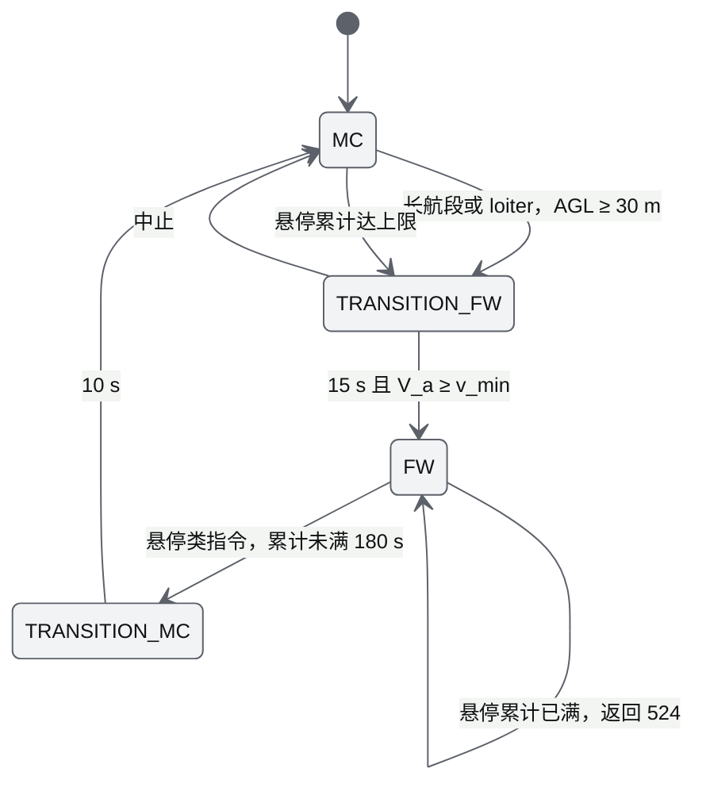
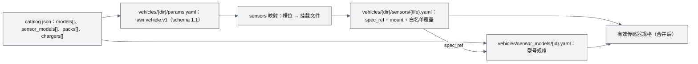
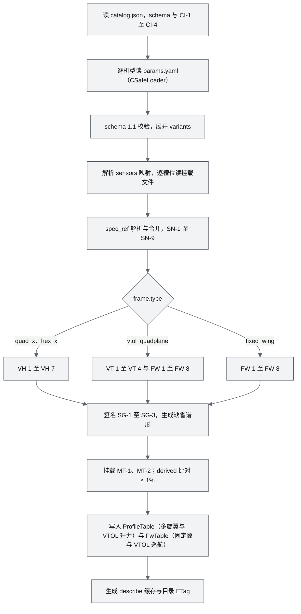
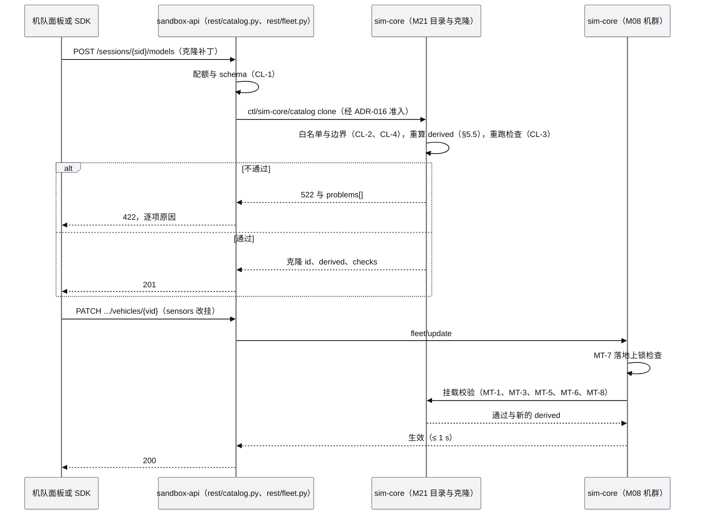

# 20 机型与传感器目录（Vehicle & Sensor Catalog）

| 项 | 内容 |
|---|---|
| 文档编号 | AWR-20 |
| 标题 | 机型与传感器目录 |
| 版本 | v1.0 |
| 日期 | 2026-10-05 |
| 状态 | 草案 |
| 上游文档 | [AWR-04](04-D2-设计增补与决策记录.md)（D2 基线：§2.3、§5、§6、§7.2、§8.2、§9.2、§9.3、§11.1、§11.3、§11.6、§11.7，ADR-095、096、097、100、101、110）；用户 D2 需求原文与随附 P600 规格 [inputs/D2-需求原文-2026-10-05.md](inputs/D2-需求原文-2026-10-05.md)；[AWR-03](03-设计基线与决策记录.md)（§4.3、§5.4、§5.6、§5.11、§10.2，ADR-022、023、043、048、052）；[16 §11](16-World数据规范.md)（Vehicle Package v1）；[M08](modules/M08-仿真内核与飞行器适配PRD.md)、[M09](modules/M09-安全与健康PRD.md)、[M13](modules/M13-传感器仿真PRD.md)；研究 r04 §3.1、r19、r20、r23 §3.10、g06 §4.4、g08 §10 |
| 下游文档 | M21 机型目录与固定翼动力学 PRD、M19 感知与捕获 PRD（引用本文的参数与参考距离）、M18、M20 PRD（引用签名、电池包、充电器与能力标签）；16 号 D2 增补（Vehicle Package 的 D2 扩展引用本文 §7）；17 号 D2 增补（原因码 520–539、560–579，`frame.type` 与 SensorKind 枚举）；`vehicles/**`、`packages/contracts/{vehicle,sensor}/**` |
| 适用版本范围 | V0.2-demo（D2）至 V1.0 |
| 修订记录 | v1.0（2026-10-05）：首版 |

## 0. 摘要

1. 本文是 D2 机型目录与传感器目录的**数值、文件格式扩展与校验规则**的定义方：P600（MID-360 配置）profile 2.0.0 的逐项参数、来源与置信度；4 个参考机型 AWR-Q1、AWR-Q9、AWR-F1、AWR-V1 的完整 Vehicle Package 参数（含 AWR-04 未给出的 L1 字段、签名谱形与电池包）；7 个传感器型号（GX40、EO-Z8、nir_ill_l、lwir640、mmw77、mic8、MID-360）的参数与推导。
2. 数值与 AWR-04 §5、§6 一致。P600 派生：可用能量 193.8 Wh、悬停 401.0 W、推重比 2.05、8 m/s 风悬停倾角 7.43°；加挂 nir_ill_l 后 4.005 kg、432.6 W、26.9 min。
3. 固定翼：F1 失速 11.10 m/s、巡航 201.4 W / 120.4 min、盘旋 127.1 W / 190.6 min；V1 巡航 431.2 W / 112.4 min，标准任务剖面巡航段 102.1 min（剖面总时长 105.5 min）。盘旋空速随风自动抬高，10 m/s 风下对地盘旋半径下限 F1 96.5 m、V1 132.5 m。
4. 文件格式：`vehicles/catalog.json` 索引；`awr.vehicle.v1` 的 schema 1.1 可选字段扩展（按构型条件必填）；新增传感器型号库 `vehicles/sensor_models/`，挂载文件以 `spec_ref` 引用并只允许覆盖白名单字段；`sensors` 映射增加对象形式（缺省挂载、可拆卸），`sensor_no` 改为按映射顺序编号，D1 编号不变。
5. 校验：沿用 VH-1 至 VH-7，新增目录 CI、固定翼 FW、VTOL VT、挂载 MT、传感器 SN、签名 SG、克隆 CL 与环境 EN 共 41 条规则；文件级失败沿用 D1 的 353 与 110，接口级失败用 522、525、560、561。
6. 参考作用距离表（统一条件、平视最不利、静止）：GX40 1080P 48 mm 日间晴天识别人 845 m；GX40 机内 850 nm 照明夜间识别人 220 m，nir_ill_l 458 m；LWIR 100 mm 夜间 425 m；雷达检测人 151 m、车 320 m；MID-360 检测人 42.9 m。
7. 对基线的反馈 13 条（§14），主要涉及原因码同名、P600 沙盒限速档与 `px4_default` 冲突、盘旋半径口径、schema 条件必填、传感器参数的单一真源与 `sensor_no` 规则。

---

## 1. 定位、范围与单一真源

### 1.1 本文定义什么、引用什么

| 主题 | 定义方 | 本文的角色 |
|---|---|---|
| 机型与传感器的参数数值、来源、置信度、派生值与参考作用距离 | **本文** | 定义（与 AWR-04 冲突时以 AWR-04 为准，并在 §14 反馈） |
| Vehicle Package v1 的基础结构（D1 必填字段、`model.yaml`、D1 传感器文件结构） | [16 §11](16-World数据规范.md) | 引用；D2 扩展字段、条件必填、目录索引、型号库与挂载文件由本文 §7 定义，16 号 D2 增补引用本文 |
| 固定翼与 VTOL 运动学方程、命令映射 | AWR-04 §5.3（实现 M21） | 引用；本文给参数、派生值、盘旋空速规则与 VTOL 模式参数 |
| 感知判据（Johnson、TTPF、N_eff 系数、明确捕获） | AWR-04 §6.2–§6.4（实现 M19） | 引用；本文给传感器参数与按判据算出的参考距离 |
| 识别物属性与类别模板 | AWR-04 §7.2（M18） | 引用（参考距离表用其中的人与车） |
| 机巢、电池队列与稳态检查 | AWR-04 §8.2（M20） | 引用；本文给电池包、充电器参数与充电时间函数 |
| L1 多旋翼控制律、气动与能量公式 | M08、M09、ADR-052 | 引用；本文给参数值 |
| 原因码 | AWR-04 §11.3、[17](17-接口与实时协议规范.md) | 引用 |

### 1.2 编号、优先级与版本

1. 需求前缀 `CAT`（本文为 D2 新增说明书，前缀登记见 §14 F-09）：`CAT-FR-###`、`CAT-NFR-###`、`CAT-AC-###`；验收要点引用 D2-AC。
2. 目标版本统一为 `V0.2-demo`；"D2"列取"是、桩、否"（AWR-04 §1.2）。优先级：P0 为 D2 发布阻塞，P1 应交付（缺失须豁免记录），P2 可延期。
3. 置信度 A–E 沿用 AWR-16 §11.3：A 实测、B 厂商规格、C 同型号几何或执行器参数、D 推断或模拟参考值、E 已拒绝。参考机型与新增传感器型号的参数一律为 D，UI 与 API 标注"模拟参考值，非任何真实产品"。
4. 版本：机型 `profile_version`（semver，任何参数变化递增）；传感器型号 `model_version`；目录 `catalog_version`。挂载文件以 `spec_ref: <model_id>@<model_version>` 精确引用型号版本。

### 1.3 术语

| 术语 | 定义 |
|---|---|
| 机型（model） | 一个 Vehicle Package 中的 profile，id 例如 `awr_f1`；目录中可见的机型 5 个 |
| 参考机型 | `catalog.reference = true`：通用化名称的模拟参考机型，id 以 `awr_` 开头 |
| 实例（vehicle） | 会话中的一架机：机型 + 机巢 + 挂载 + 限速档 + 标签（AWR-04 §5.4） |
| 传感器型号（sensor model） | `vehicles/sensor_models/<id>.yaml`：与机体无关的规格（光学、探测器、雷达、声阵列等） |
| 槽位（slot） | 机型 `sensors` 映射中的一个键（例如 `eo`、`lwir`），指向本机的挂载文件，决定挂载位姿、云台、`sensor_no` 与是否缺省挂载 |
| 挂载文件 | `vehicles/<dir>/sensors/<file>.yaml`：`spec_ref` + 挂载位姿 + 白名单覆盖 |
| D1 槽位 | `sensors` 映射中的字符串形式条目：D1 剧本可选，D2 目录不列，沙盒实例不挂载 |
| 派生值 | 加载器由参数计算、并与文件中 `derived` 比对（相对差 ≤ 1%）的量 |
| E_use | 可用能量 `usable_frac × capacity_wh`（ADR-052，缺省 `usable_frac = 0.85`） |

---

## 2. 需求

### 2.1 功能需求

| 编号 | 需求描述 | 优先级 | 目标版本 | D2 | 验收要点 | 依据 |
|---|---|---|---|---|---|---|
| CAT-FR-001 | 目录索引 `vehicles/catalog.json`：列出 5 个可见机型（`p600_mid360`、`awr_q1`、`awr_q9`、`awr_f1`、`awr_v1`）与隐藏的 `x500`、`x500_sih`，以及 7 个传感器型号、电池包与充电器；与各文件一致 | P0 | V0.2-demo | 是 | CAT-AC-001；D2-AC-09 | R-D2-13、R-D2-15；AWR-04 §5.4 |
| CAT-FR-002 | P600 profile 升至 2.0.0，逐项参数按 §3；v1（1.0.0）存档并可被 D1 剧本以 `p600_mid360@1.0.0` 固定引用 | P0 | V0.2-demo | 是 | CAT-AC-002；D2-AC-09、26 | R-D2-27；ADR-095 |
| CAT-FR-003 | 4 个参考机型的 Vehicle Package（`params.yaml`、`model/model.yaml`、`sensors/`）按 §4、§5 落地，至少 2 个四旋翼与 2 个固定翼类（长航时、VTOL） | P0 | V0.2-demo | 是 | CAT-AC-003、004、005 | R-D2-15；AWR-04 §5.2 |
| CAT-FR-004 | 参考机型在 REST 与 UI 中一律携带 `reference = true` 与免责文本"模拟参考值，非任何真实产品" | P0 | V0.2-demo | 是 | CAT-AC-015 | AWR-04 §5.2 |
| CAT-FR-005 | 固定翼与 VTOL 的 `airframe`、`vtol` 参数与派生值（§5），加载时执行 FW-1 至 FW-8、VT-1 至 VT-4 | P0 | V0.2-demo | 是 | CAT-AC-004、005；D2-AC-10 | ADR-096 |
| CAT-FR-006 | 盘旋指令空速按风自动抬高（§5.3），对地盘旋半径下限按指令空速计算 | P0 | V0.2-demo | 是 | CAT-AC-004；D2-AC-10 | AWR-04 §5.3 |
| CAT-FR-007 | 签名参数 `acoustic`、`visual`、`rcs_m2`、`ir` 与缺省 1/3 倍频程谱形生成（§4.4） | P0 | V0.2-demo | 是 | CAT-AC-010；D2-AC-12 | ADR-097；AWR-04 §2.3 |
| CAT-FR-008 | 传感器型号库 7 个型号（§6）与挂载文件的 `spec_ref` 合并、白名单覆盖规则（§7.5） | P0 | V0.2-demo | 是 | CAT-AC-006、007、013 | ADR-101 |
| CAT-FR-009 | GX40 光学：FOV 与焦距互算、输出档与等效像元、F 数插值、衍射约束、变焦速率、曝光与抖动（§6.2） | P0 | V0.2-demo | 是 | CAT-AC-006；D2-AC-13 | 用户规格；AWR-04 §6.1 |
| CAT-FR-010 | 夜视：低照度门限与 850 nm 主动照明的 `R_nir` 推导，GX40 机内照明与 `nir_ill_l`（§6.3） | P0 | V0.2-demo | 是 | CAT-AC-007；D2-AC-14 | AWR-04 §6.1 |
| CAT-FR-011 | LWIR `lwir640` 四种镜头参数，N 按原生像元（§6.4） | P0 | V0.2-demo | 是 | CAT-AC-007 | AWR-04 §6.1 |
| CAT-FR-012 | 毫米波雷达 `mmw77` 与声阵列 `mic8` 的规格、基础检测参数（P0）与进阶参数（P1）（§6.5、§6.6） | P0（进阶 P1） | V0.2-demo | 是 | CAT-AC-008；D2-AC-31、33 | R-D2-14 |
| CAT-FR-013 | MID-360 型号 2.0.0：截止量程 100 m，量程随反射率缩放与点数判据参数（§6.7） | P0 | V0.2-demo | 是 | CAT-AC-009 | 用户规格；r04 §3.1 |
| CAT-FR-014 | 挂载校验：槽位兼容、总质量 ≤ MTOW、能量修正、固定翼失速余量、上锁改挂（MT-1 至 MT-8） | P0 | V0.2-demo | 是 | CAT-AC-011；D2-AC-09 | AWR-04 §5.4 |
| CAT-FR-015 | 会话内克隆：可编辑字段白名单与边界、派生重算、逐项原因（§7.6，CL-1 至 CL-4） | P0 | V0.2-demo | 是 | CAT-AC-012；D2-AC-09 | AWR-04 §5.4 |
| CAT-FR-016 | 电池包、充电器目录与充电时间函数（§4.5），复现 AWR-04 §8.2、§9.3 的稳态电池与通道数 | P0 | V0.2-demo | 是 | CAT-AC-014；D2-AC-19、20 | AWR-04 §8.2 |
| CAT-FR-017 | 能力标签词表与"由挂载合成能力"规则（§4.6），供 M20 能力匹配 | P0 | V0.2-demo | 是 | CAT-AC-011；D2-AC-18 | AWR-04 §8.4 |
| CAT-FR-018 | 目录 REST 响应字段与缓存（§9） | P0 | V0.2-demo | 是 | CAT-AC-015；D2-AC-22 | AWR-04 §11.1 |
| CAT-FR-019 | 参考作用距离表（§6.9）由 M19 纯函数生成并随 `GET /catalog/sensors` 返回 | P1 | V0.2-demo | 是 | CAT-AC-016；D2-AC-37 | AWR-04 §6.2 |
| CAT-FR-020 | `sensor_no` 按 `sensors` 映射顺序编号，P600 的 D1 槽位编号 0–4 不变 | P0 | V0.2-demo | 是 | CAT-AC-017；D2-AC-26 | 本文设定（§7.4） |
| CAT-FR-021 | 工作温度：机体与全部挂载的交集，环境越界时只告警 | P1 | V0.2-demo | 是 | CAT-AC-011 | AWR-04 §5.1 |
| CAT-FR-022 | 目录校验命令 `python -m awr.sim.catalog.check` 进入 `make ci` | P0 | V0.2-demo | 是 | CAT-AC-001 | AWR-03 §4.5 |

### 2.2 非功能需求

| 编号 | 需求描述 | 优先级 | 目标版本 | D2 | 验收要点 | 依据 |
|---|---|---|---|---|---|---|
| CAT-NFR-001 | 全目录冷加载（7 个 profile、7 个型号、全部挂载文件，含 schema 与全部检查）≤ 300 ms（本机），sim-core 冷启动增量 ≤ 5% | P0 | V0.2-demo | 是 | CAT-AC-018；D2-AC-02 | 本文设定 |
| CAT-NFR-002 | 派生与检查为纯函数，不抽随机数；同输入的规范化 JSON 逐字节一致 | P0 | V0.2-demo | 是 | CAT-AC-018 | ADR-049 |
| CAT-NFR-003 | 克隆或改挂校验 ≤ 50 ms；实例增删改 ≤ 1 s 生效 | P0 | V0.2-demo | 是 | CAT-AC-012；D2-AC-09 | AWR-04 D2-AC-09 |
| CAT-NFR-004 | 每会话目录副本与克隆（≤ 8 个）常驻内存 ≤ 2 MB | P1 | V0.2-demo | 是 | CAT-AC-018 | AWR-04 §4.4.2 |
| CAT-NFR-005 | 全部 YAML、JSON 与本文通过 no-emoji 扫描；字段 snake_case 带单位后缀 | P0 | V0.2-demo | 是 | CAT-AC-018 | AWR-03 §5.4、§10.2 |

---

## 3. P600（MID-360 配置）参数整理

### 3.1 原文判读

用户规格是 PDF 抽取文本，字间空格与若干字形为抽取伪迹（原文文件已说明）。判读如下，判读后的值用于 §3.2。

| 原文抽取 | 判读 | 处理 |
|---|---|---|
| "忌停续航时间：约 29 min" | 悬停续航时间约 29 min | `hover_endurance_s = 1740` |
| "1/0 接口" | I/O 接口 | 标签 |
| "STM32H743VIT6/216MH2/2M 程序存储器/512KB" | STM32H743VIT6，"216 MHz"（原文如此），2 MB Flash、512 KB RAM | 标签；不影响仿真 |
| "CPU: 8 1% Arm Cortex-A78AE v8.2 64 1 ½ CPU 2MB L2 + 4MB L3" | 8 核 Arm Cortex-A78AE v8.2 64 位 CPU，2 MB L2 + 4 MB L3 | 标签 |
| "显存：16GB LPDDR5" | 16 GB LPDDR5（统一内存） | 标签 |
| "SE (F/NO.)：f1.7~f3.2" | 光圈 F1.7（广角）至 F3.2（长焦） | `optics.f_number` |
| "对角 FOV（V）：36.10~3.7°" | **垂直** FOV 36.1°–3.7°（标签笔误；"36.10" 末位 0 为度符号伪迹） | `spec_fov.vfov_deg` |
| "水平 FOV（H）：60.20~6.6°" | 水平 FOV 60.2°–6.6° | `spec_fov.hfov_deg` |
| "SCGA(1280*1024)" | SXGA 1280 × 1024 | 输出档 |
| "69#: 0.25Mbps~10Mbps@H.265 ..." | 码率：H.265 0.25–10 Mbps，H.264 0.5–16 Mbps | 标签 |
| "像素点尺寸：1.45×1.45（wm）" | 1.45 × 1.45 µm | `sensor.pixel_um` |
| "中 151.5*71mm" | Φ151.5 × 71 mm（RTK405 基站） | 标签 |
| " 电器 型号：C1-XR"、"DC 输入点他" | 充电器 C1-XR、DC 输入电压 11–18 V | 充电器目录 |
| "型号：MID-3605" | MID-360（末位 5 为伪迹） | 型号 `mid360` |

### 3.2 逐项参数

本表是 AWR-04 §5.1 的完整展开（数值一致）。"用途"列说明仿真中谁使用；只作能力标签的项标"标签"。

| 组 | 规格（判读后） | 字段 | 值 | 置信度 | 用途 |
|---|---|---|---|---|---|
| 飞行器 | 四旋翼 | `frame.type` | `quad_x` | B | L1 多旋翼 |
| | 起飞重量约 3.825 kg（含电池与缺省挂载） | `mass_kg` | 3.825 | B | 悬停推力、能量、挂载余量 |
| | 最大起飞重量 4.1 kg | `mtow_kg` | 4.1 | B | VH-7、MT-3 |
| | 对角轴距 600 mm | `geometry.wheelbase_m` | 0.600 | B | 碰撞半径、低模 |
| | 469 × 469 × 400 mm | `geometry.size_m` | `{l: 0.469, w: 0.469, h: 0.400}` | B | 包围盒、可见截面 |
| | 悬停续航约 29 min | `battery.hover_endurance_s` | 1740 | B | 反推悬停功率 |
| | 悬停精度 RTK：水平 0.01 m、垂直 0.015 m | `nav.hold_sigma_m.rtk` | `{h: 0.01, v: 0.015}` | B | 站位保持误差注入（机巢有 `rtk_base` 时） |
| | 三维激光 SLAM：水平 0.1 m、垂直 0.2 m | `nav.hold_sigma_m.slam` | `{h: 0.1, v: 0.2}` | B | 无 RTK 基站时 |
| | 工作温度 6–40 °C | `env_limits.temp_c` | `[6, 40]` | B | 越界告警（§8.2 EN-1） |
| 飞控 | STM32H743、ICM20689、BMP388、AT24C64、PX4IO-v2、8 PWM、1 RC（SBUS/PPM/DSM）、3 UART、1 CAN、USB-C | `labels.fcu` | 文本 | B | 标签；IMU 与气压计噪声沿用 `imu.yaml`（C） |
| 机载计算 | Allspark-Orin NX（IA160_V1）：Jetson Orin NX 16 GB、100 TOPS、1024 核 Ampere GPU（32 Tensor Core）、128 GB SSD、2 × 100 Mbps 以太网、5G WiFi、10–26 V @ 3 A、188 g、102.5 × 62.5 × 31 mm | `capabilities`、`compute_tops`、`payload[]` | `compute.orin_nx`、100、`{name: orin_nx, mass_kg: 0.188}` | B | 允许 4K 分析分辨率（§6.2）；质量预算 |
| 动力电池 | LPB610HV：10000 mAh、1.2 kg、22–26.1 V、存放 23.1 V、180 × 90 × 63 mm | `battery` | `cells 6`、`chemistry lihv`、`capacity_ah 10`、`v_range_v [22.0, 26.1]`、`v_storage_v 23.1`、`v_nominal_v 22.8`、`capacity_wh 228`、`mass_kg 1.2`、`pack_id lpb610hv` | B（标称电压 C：HV 电芯 3.8 V） | 能量、换电库存、充电 |
| 遥控器 | G16：16 通道、2.4/5.8 GHz、9–10 h、20000 mAh、1050 g | `labels.rc` | 文本 | B | 标签（D2 不模拟射频） |
| 数传 | GR01：3.5 km、7.2–72 V、UART/网口/SBUS、45 × 60 × 21.5 mm | `link` | `{model: gr01, range_m: 3500}` | B | 站位与机巢距离可行性 |
| 光电吊舱 | GX40：云台 85.8 × 86 × 129.3 mm、405 g；GCU 45.4 × 40 × 13.5 mm、18.6 g；14–53 V | 槽位 `eo` → `eo_gx40@1.0.0` | 质量 0.4236 kg | B | 感知（§6.2）、质量预算 |
| | RTSP；H.264/H.264H/H.264B/H.265/MJPEG；码率见 §3.1 | `eo_gx40.stream` | 文本 | B | 标签（API 描述、FPV 码率提示） |
| | 4K、1080P、SXGA、1.3M、720P，均 30 fps | `eo_gx40.outputs[]` | §6.2 | B | 分析分辨率 |
| | 光学变焦 4.8–48 mm（10×）、F1.7–F3.2、1/2.8" CMOS、8.29 MP、1.45 µm、快门 1–1/30000 s | `eo_gx40.optics`、`sensor`、`exposure` | §6.2 | B | 感知 |
| | 激光补光 850 ± 10 nm、0.8 W、≤ 200 m | `eo_gx40.night.illuminator` | §6.3 | B | 夜视主动照明 |
| RTK | RTK405（地面基站）：1408 通道、Φ151.5 × 71 mm、650 g、8–12 h、410–490 MHz、BDS/GPS/GLONASS/Galileo/QZSS/SBAS | 机巢 `rtk_base: rtk405`；机型能力 `nav.rtk` | — | B | 精度档选择（RTK 或 SLAM） |
| 充电器 | C1-XR：AC 100–240 V、DC 11–18 V、0.1–10 A、1–6 节、380 g、130 × 115 × 61 mm | `catalog.json` 的 `chargers[]` | §4.5 | B（时间模型 D） | 充电时间、机巢兼容 |
| 三维激光雷达 | MID-360：905 nm；40 m @ 10%（100 klx）；截止 100 m；盲区 0.1 m；水平 360°、竖直 −7°–52°；20 万点/s；10 Hz；PTPv2、GPS；IMU ICM40609；−20–55 °C；IP67；6.5 W；9–27 V；65 × 65 × 60 mm；265 g | 槽位 `mid360` → `mid360@2.0.0` | §6.7 | B | 点数判据、限频扫描数据产品 |

### 3.3 质量预算与派生值

| 量 | 公式或来源 | 值 | 置信度 |
|---|---|---|---|
| 可用能量 E_use | 0.85 × 228 Wh | 193.8 Wh | D（usable_frac） |
| 悬停功率 P_hover | E_use × 3600 / 1740 | 401.0 W | D（v1 为 515 W） |
| 单桨悬停推力 | m·g / 4 | 9.378 N | 派生 |
| VH-1 悬停推力比 | m·g / (4 × 19.23) | 0.488 | 派生 |
| VH-2 推重比 | 1 / VH-1；MTOW 时 | 2.05；1.91 | 派生 |
| VH-3 8 m/s 风悬停倾角 | composite：½ρ·CdA·v² + ΣΩ_hover·c_rd·v，CdA 0.035 不随质量变化 | 7.43° | 派生 |
| VH-5 CdA/m | 0.035 / 3.825 | 0.00915 m²/kg | 派生 |
| VH-6 续航一致性 | 0.85 × 228 × 3600 / 401.0 | 1739.6 s（文件 1740 s） | 通过 |
| 惯量 | J_x500 × (m/2.064) × (0.300/0.246)²（ADR-022 同一缩放） | `{xx: 0.0598, yy: 0.0598, zz: 0.1102}` kg·m² | D |
| 挂载余量 | 4.1 − 3.825 | 0.275 kg | 派生 |
| 机体残余质量 | 3.825 − 1.2（电池）− 0.4236（GX40）− 0.265（MID-360）− 0.188（Orin NX） | 1.748 kg（机架、飞控、数传、线缆） | 派生（MT-2 要求 > 0） |
| 加挂 nir_ill_l | m = 4.005 kg；P = 401.0 × (4.005/3.825)^1.5 + 3 | 432.6 W；续航 1612.8 s（26.9 min）；VH-1 0.511、TWR 1.96 | 派生（§5.5） |
| 桨叶通过频率 BPF | 独立参数 | 150 Hz（2 叶） | D |

**BPF 不得由 L1 参数派生**：P600 的 `motor.omega_max_rad_s = 1500` 来自 Prometheus SDF 模板（ADR-022，C），按悬停 Ω = 1500 × √0.488 = 1048 rad/s 算出的 BPF 为 333 Hz，与 15 in 桨悬停约 3500–4500 rpm（BPF 115–150 Hz，按 C_T 0.08–0.11 的桨推力式估算）不符。因此 `acoustic.bpf_hz` 是独立的 D 级参数。

### 3.4 v1 与 v2 的差异、回退与 D1 槽位

| 字段 | v1（1.0.0） | v2（2.0.0） | 依据 |
|---|---|---|---|
| `mass_kg` / `mtow_kg` | 3.5 / 4.0 | 3.825 / 4.1 | 用户规格（ADR-095） |
| `inertia_kgm2` | 0.0548 / 0.0548 / 0.101 | 0.0598 / 0.0598 / 0.1102 | 同一缩放规则 |
| `battery.v_nominal_v` / `capacity_wh` | 22.2 / 222 | 22.8 / 228 | HV 电芯（Q-D2-05 默认决策） |
| `battery.p_hover_w` / `hover_endurance_s` | 515 / 1320 | 401.0 / 1740 | 用户规格 29 min |
| `derived` | 0.446 / 2.24 / 7.85° / 0.0100 | 0.488 / 2.05 / 7.43° / 0.00915 | 重算 |
| `limits_profiles` | default `prometheus_outdoor` | 不变；新增 `p600_std`，`catalog.limits_default = p600_std`（沙盒缺省） | §4.3、§14 F-02 |
| `sensors` | camera、thermal、mid360、gnss、imu（字符串） | 前 5 项不变（camera、thermal 仍为 D1 槽位）；mid360、gnss、imu 改为对象形式；新增 `eo`（缺省）、`nir_ill`（可选） | §7.4 |
| `mid360.yaml` | `range.hard_max_m = 70` | 引用 `mid360@2.0.0`，`hard_max_m = 100` | 用户规格 |
| 新增可选字段 | — | `geometry.size_m`、`acoustic`、`visual`、`rcs_m2`、`ir`、`link`、`nav`、`env_limits`、`capabilities`、`compute_tops`、`labels`、`catalog`、`payload[]` | §7.3 |
| `status` | placeholder | placeholder（参数仍未辨识，ADR-043 不变） | — |

1. **存档与固定引用**：v1 文件存为 `vehicles/p600/history/params-1.0.0.yaml`；加载器只在剧本或会话显式引用 `p600_mid360@1.0.0` 时加载存档（按 `id@profile_version` 建索引，不进入目录）。D1 剧本 S1–S6 用 v2 复跑，任一 D1 门禁回退即在剧本 `vehicles[].profile_id` 写 `p600_mid360@1.0.0`（ADR-095）。
2. **D1 槽位**：`camera.yaml`（6000 × 4000、HFOV 60°，S3 的 `rgb.zoom` Mock 检测器与 D1 FPV）与 `thermal.yaml`（S3 的 `thermal.imaging`）保留为字符串形式的 D1 槽位。用户给出的 P600 配置没有热像仪，因此 `thermal` 不出现在 D2 目录与沙盒实例中，只服务 D1 剧本。

---

## 4. 预置机型目录

### 4.1 总表

| id | 显示名 | 构型 | 类别 / 尺寸档 | reference | 可见 | 起飞 / MTOW（kg） | 续航 | 缺省挂载 | 机巢类型 | 置信度 |
|---|---|---|---|---|---|---|---|---|---|---|
| `p600_mid360` | P600（MID-360 配置） | quad_x | multirotor / medium | 否 | 是 | 3.825 / 4.1 | 悬停 29 min | GX40、MID-360 | box（换电 6S） | B / D |
| `awr_q1` | AWR-Q1 轻型四旋翼 | quad_x | multirotor / light | 是 | 是 | 0.95 / 1.05 | 悬停 35 min | EO-Z8 | box（换电 4S） | D |
| `awr_q9` | AWR-Q9 重载四旋翼 | quad_x | multirotor / heavy | 是 | 是 | 9.0 / 9.5 | 悬停 32 min（典型载荷） | GX40、LWIR 100 mm、mmw77、mic8 | box（换电 12S，每次 2 块） | D |
| `awr_f1` | AWR-F1 长航时固定翼 | fixed_wing（推进式） | fixed_wing / medium | 是 | 是 | 6.0 / 7.0 | 巡航 120 min、盘旋 190 min | 吊舱：GX40 级 EO + LWIR 75 mm | launcher（弹射、伞降，`crewed`） | D |
| `awr_v1` | AWR-V1 垂起固定翼 | vtol_quadplane（4+1） | vtol / heavy | 是 | 是 | 9.5 / 11.0 | 巡航 112 min；任务剖面巡航段 102 min；盘旋 189 min | 吊舱：GX40 级 EO + LWIR 100 mm + nir_ill_l | vtol_pad（换电 12S） | D |
| `x500`、`x500_sih` | X500（SIH 回归机体） | quad_x | — | — | 否 | 2.064 / — | — | camera | — | A |

### 4.2 多旋翼 L1 参数（含 V1 升力系统）

P600 的 L1 字段沿用 D1 值（C、D）；参考机型的 L1 字段按下列**缩放规则**生成（D）：`t_max_n` 由目标推重比反推；`omega_max_rad_s` 由桨推力式 `T = C_T·ρ·n²·D⁴`（C_T ≈ 0.1，n 为 rev/s）取整；`k_f = t_max_n / omega_max_rad_s²`；`c_rd` 按 `ΣΩ_hover·c_rd = 0.120·m`（ADR-022 对 P600 的同一口径，k_rd/m = 0.120 1/s）；`cda_m2` 按 CdA/m = 0.0100 m²/kg（x500 SIH 标定）；惯量按 `J_x500 × (m/2.064) × (L/0.246)²`，L 为轴距一半；碰撞半径 `√2·arm_xy + d/2`。按此规则 VH-3 恒为 7.85°。

| 字段 | P600 | AWR-Q1 | AWR-Q9 | AWR-V1（MC 模式升力系统） |
|---|---|---|---|---|
| `frame.type` | quad_x | quad_x | quad_x | vtol_quadplane |
| `geometry.wheelbase_m` | 0.600 | 0.380 | 0.900 | 1.250（升力桨对角） |
| `geometry.arm_xy_m` | 0.2121 | 0.1344 | 0.3182 | 0.4419 |
| `geometry.size_m`（l × w × h） | 0.469 × 0.469 × 0.400 | 0.35 × 0.29 × 0.11 | 0.81 × 0.67 × 0.43 | 1.60 × 2.80 × 0.45 |
| `geometry.collision_radius_m` | 0.49 | 0.31 | 0.72 | 1.40（翼展一半，固定翼类取 max(b/2, L/2)） |
| `motor.n` | 4 | 4 | 4 | 4（升力） |
| `motor.t_max_n` | 19.23（C） | 5.59 | 44.13 | 46.58 |
| `motor.omega_max_rad_s` | 1500（C） | 800 | 450 | 590 |
| `motor.k_f`（N·s²/rad²） | 8.54858e-6 | 8.734e-6 | 2.179e-4 | 1.338e-4 |
| `motor.km_m` / `motor.tau_s` | 0.016 / 0.04 | 0.016 / 0.025 | 0.016 / 0.06 | 0.016 / 0.08 |
| `prop.d_m` / `prop.c_rd` | 0.381 / 1.05e-4 | 0.239 / 5.52e-5 | 0.533 / 8.49e-4 | 0.457 / 6.83e-4 |
| `aero.model` / `aero.cda_m2` | composite / 0.035 | composite / 0.0095 | composite / 0.090 | composite / 0.095 |
| `inertia_kgm2`（xx / yy / zz） | 0.0598 / 0.0598 / 0.1102 | 0.00596 / 0.00596 / 0.01098 | 0.3166 / 0.3166 / 0.5836 | 1.24 / 1.88 / 3.12（机翼与机身杆件近似） |
| VH-1 / VH-2 / MTOW 时 TWR | 0.488 / 2.05 / 1.91 | 0.417 / 2.40 / 2.17 | 0.500 / 2.00 / 1.89 | 0.500 / 2.00 / 1.73 |
| VH-3 / VH-5 | 7.43° / 0.00915 | 7.85° / 0.0100 | 7.85° / 0.0100 | 7.85° / 0.0100 |
| VH-4 | 通过 | 通过 | 通过 | 以 VT-3 代替（`J_zz > max(J_xx, J_yy)`） |

V1 惯量的近似：机翼按 1.6 kg、2.8 m 均匀杆计 `I_xx ≈ 1.6 × 2.8²/12 = 1.05`，机身与升力杆按 7.9 kg、1.6 m 计 `I_yy ≈ 7.9 × 1.6²/12 = 1.69`，升力电机与桨 4 × 0.25 kg 位于 ±0.44 m 各加 0.19，`I_zz ≈ I_xx + I_yy`；D 级，只影响 MC 模式姿态响应。V1 悬停功率 1300 W 与动量理论自洽：每桨 23.3 N、桨盘 0.164 m²，理想功率合计 709 W，按悬停效率 0.65 与电驱效率 0.85 为 1283 W。

### 4.3 能量、速度、限速档与运行限

| 字段 | P600 | AWR-Q1 | AWR-Q9 | AWR-F1 | AWR-V1 |
|---|---|---|---|---|---|
| 电池 | 6S lihv 10 Ah，22.8 V，228 Wh，1.20 kg | 4S lihv 5.0 Ah，15.4 V，77 Wh，0.335 kg | 12S lipo 2 × 5.9 Ah，44.4 V，524 Wh，2 × 1.35 kg | 6S liion 22 Ah，21.6 V，475.2 Wh，1.90 kg | 12S liion 22 Ah，43.2 V，950.4 Wh，3.80 kg |
| 比能量（Wh/kg） | 190（B） | 230 | 194 | 250 | 250 |
| E_use（Wh） | 193.8 | 65.45 | 445.4 | 403.9 | 807.8 |
| 功率（派生，W） | 悬停 401.0 | 悬停 112.2 | 悬停 835.1 | 巡航 201.4，盘旋 127.1 | 巡航 431.2，盘旋 255.9，悬停 1300 |
| 续航（文件 / 派生） | 悬停 1740 s | 悬停 2100 s | 悬停 1920 s | 巡航 120.4 min，盘旋 190.6 min | 巡航 112.4 min，盘旋 189.4 min，任务剖面巡航段 102.1 min |
| 限速档名（`catalog.limits_default`） | `p600_std` | `awr_q1_std` | `awr_q9_std` | `awr_f1_std` | `awr_v1_std` |
| 水平：最大 / 巡航（m/s） | 12 / 8 | 15 / 10 | 20 / 12 | §5.1 | §5.1；MC 模式 5 / 3 |
| `MPC_ACC_HOR`（m/s²）/ `MC_YAWRATE_MAX`（°/s） | 3 / 60 | 4 / 90 | 3 / 45 | — | 2 / 45（MC 模式） |
| 垂直：上升 / 下降（m/s，`MPC_Z_VEL_MAX_UP/DN`） | 5 / 3 | 6 / 5 | 6 / 5 | 爬升 4、下沉 3 | 固定翼 3 / 3；垂直 2.5 / 1.5 |
| 抗风 `wind_rating_mps` | 13.8（B） | 12 | 15 | 15 | 14 |
| 链路 `link.range_m` | 3500（B） | 8000 | 15000 | 30000 | 30000 |
| `nav.hold_sigma_m`（h / v，m） | rtk 0.01/0.015；slam 0.1/0.2 | gnss 0.5/0.3 | rtk 0.01/0.015；gnss 0.6/0.3 | rtk 0.02/0.03；gnss 1.5/1.0 | rtk 0.02/0.03；gnss 1.0/0.6 |
| `env_limits.temp_c` | 6–40（B） | −10–40 | −20–50 | −10–45 | −20–50 |

1. 多旋翼悬停功率一律按 ADR-052 由"可用能量 ÷ 悬停续航"反推（AWR-04 §5.2）；Q9 的 32 min 对应 92.8 W/kg。
2. 限速档按名字全局唯一（D1 `profiles.py` 对同名不同值的限速档拒绝加载），因此每型使用 `<id>_std`，不复用 `px4_default`（PX4 v1.18 默认巡航 5 m/s，x500 回归机体共用）。`limits_profiles.default` 仍是 D1 剧本缺省（P600 为 `prometheus_outdoor`），`catalog.limits_default` 是沙盒实例缺省（§14 F-02）。
3. 垂直限速写入 `px4_params` 的 `MPC_Z_VEL_MAX_UP`、`MPC_Z_VEL_MAX_DN`；D1 的 L1 目前使用全局常量 3.0、1.5 m/s，需 M08 把限速矩阵 LT 由 4 列扩为 6 列（§10.3 变更请求）。
4. 固定翼的速度、滚转与爬升限值写在 `airframe`（物理限）与限速档的 PX4 固定翼参数名（`FW_AIRSPD_MIN`、`FW_AIRSPD_TRIM`、`FW_AIRSPD_MAX`、`FW_R_LIM`、`FW_T_CLMB_MAX`、`FW_T_SINK_MAX`，运行限，只能收紧物理限）。

### 4.4 签名参数与缺省谱形

| 字段 | P600 | AWR-Q1 | AWR-Q9 | AWR-F1 | AWR-V1 |
|---|---|---|---|---|---|
| `acoustic.lwa_hover_dba` | 88 | 82 | 94 | — | 92 |
| `acoustic.lwa_cruise_dba` | — | — | — | 80（盘旋按推力律 78.5） | 81（盘旋按推力律 79.2） |
| `acoustic.bpf_hz`（悬停 / 巡航） | 150 | 220 | 120 | — / 200 | 110 / 200 |
| `acoustic.blades` / `tonal_db` / `f_pk_hz` | 2 / 12 / 1414 | 2 / 12 / 1414 | 2 / 12 / 1414 | 2 / 10 / 1000 | 升力 2 / 12 / 1414；推进 2 / 10 / 1000 |
| `acoustic.thrust_exp` | 1.5 | 1.5 | 1.5 | 1.5 | 1.5 |
| `visual.area_m2`（top / side / front） | 0.22 / 0.19 / 0.19 | 0.07 / 0.03 / 0.03 | 0.45 / 0.25 / 0.25 | 0.80 / 0.25 / 0.12 | 1.00 / 0.30 / 0.18 |
| `visual.contrast_sky` / `contrast_ground` | −0.8 / 0.3 | −0.7 / 0.2 | −0.8 / 0.3 | −0.5 / 0.4 | −0.5 / 0.4 |
| `visual.lights_installed` | nav、strobe | nav、strobe | nav、strobe | nav、strobe | nav、strobe |
| `rcs_m2`（77 GHz 量级） | 0.05 | 0.01 | 0.10 | 0.10 | 0.20 |
| `ir.motor_delta_t_k` | 20 | 15 | 25 | 15 | 25 |

1. 声功率随推力：`L_WA(T) = L_WA,ref + 10·k·lg(T/T_ref)`，k = `thrust_exp`（ADR-097）。多旋翼 `T_ref` 为悬停推力；固定翼 `T_ref` 为巡航推力（F1 5.54 N、V1 11.17 N），盘旋推力 F1 4.37 N、V1 8.47 N，故盘旋声功率低 1.55 dB、1.80 dB。AWR-04 §7.3 与 §9.2 对 V1 盘旋取巡航值 81 dB(A)，是保守口径。
2. 实例的灯光状态 `lights{nav, strobe}` 缺省关闭（沙盒监控场景），由 `fleet/update` 修改；关闭时夜间视觉发现只在 `visual.night_visible_m`（缺省 30 m）内成立（AWR-04 §2.3）。
3. 可见截面取包围盒投影的上界：`top ≤ l·w`、`side ≤ l·h`、`front ≤ w·h`（SG-3）。

**缺省 1/3 倍频程谱形**（文件未给 `band_shape_db` 时由加载器生成，生成结果写入 `derived.band_shape_db` 供对拍）：

```text
FC  = [50, 63, 80, 100, 125, 160, 200, 250, 315, 400, 500, 630, 800, 1000,
       1250, 1600, 2000, 2500, 3150, 4000, 5000, 6300, 8000, 10000]          # Hz，24 带
A_W = [-30.2, -26.2, -22.5, -19.1, -16.1, -13.4, -10.9, -8.6, -6.6, -4.8, -3.2, -1.9, -0.8, 0.0,
       0.6, 1.0, 1.2, 1.3, 1.2, 1.0, 0.5, -0.1, -1.1, -2.5]                  # A 计权（IEC 61672）
带 b 的精确中心 f_b = 1000·10^((b − 13)/10)，边界 f_b·10^(±0.05)

default_band_shape(bpf_hz, tonal_db, f_pk_hz, k_bb = 1.0 dB/oct², n_h = 5, dec = 3 dB):
  for b in 0..23: B[b] = −k_bb·(log2(f_b / f_pk))²                 # 宽带：对数高斯，峰在 f_pk
  lin[b] = 10^(B[b]/10)
  for h in 1..n_h:                                                  # BPF 与前 4 个谐波
      b = band_of(h·bpf_hz); if b 存在: lin[b] += 10^((B[b] + tonal_db − dec·(h − 1))/10)
  S[b] = 10·lg(lin[b])
  c = −10·lg(Σ_b 10^((S[b] + A_W[b])/10))                           # 归一化：A 计权和为 0 dB
  return S[b] + c                                                   # band_shape_db，L_W,b = L_WA + band_shape_db[b]
```

P600（BPF 150 Hz、tonal 12 dB）的结果（dB，按带序）：−34.6、−31.5、−28.7、−26.0、−23.6、−9.1、−19.4、−17.6、−6.5、−14.7、−6.7、−8.0、−9.1、−11.6、−11.4、−11.4、−11.6、−12.1、−12.7、−13.6、−14.7、−16.1、−17.6、−19.4；未计权总声功率比 L_WA 高 1.6 dB。VTOL 在 MC 模式用升力谱形与 `lwa_hover_dba`，FW 模式用推进谱形与 `lwa_cruise_dba`；过渡段两者能量相加。

### 4.5 电池包、充电器与充电时间模型

| `pack_id` | 机型 | cells | chemistry | Ah | Wh | 质量（kg） | `c_max`（充电倍率上限） | 每次换电块数 | 置信度 |
|---|---|---|---|---|---|---|---|---|---|
| `lpb610hv` | P600 | 6 | lihv | 10.0 | 228 | 1.20 | 1.0 | 1 | B（倍率 D） |
| `awr_p4s5` | Q1 | 4 | lihv | 5.0 | 77 | 0.335 | 1.0 | 1 | D |
| `awr_p12s6` | Q9 | 12 | lipo | 5.9 | 262 | 1.35 | 1.0 | 2 | D |
| `awr_l6s22` | F1 | 6 | liion | 22.0 | 475.2 | 1.90 | 0.5 | 1 | D |
| `awr_l12s22` | V1 | 12 | liion | 22.0 | 950.4 | 3.80 | 0.5 | 1 | D |

| 充电器 `model` | channels | `i_max_a` | cells | 其他 | 置信度 |
|---|---|---|---|---|---|
| `c1_xr` | 1 | 10 | 1–6 | AC 100–240 V、DC 11–18 V、380 g、130 × 115 × 61 mm | B |
| `chg12s_ref` | 1 | 10 | 1–12 | 参考 12S 充电器（Q9、V1 机巢用） | D |

**充电时间函数**（M20 电池队列与稳态检查调用；本文设定，D）：

```text
charge_time_s(Q_ah, c_max, i_max_a, s0, s1; s_cv = 0.80, t_cool_s = 300):
  I  = min(i_max_a, c_max·Q_ah)                  # AWR-04 §8.2：电流取 min(i_max_a, 1 C)
  T1 = 3600·Q_ah / I                             # 以 I 充满 1 倍容量的时长
  t  = t_cool_s                                  # 飞后降温与平衡等待
  if s0 < s_cv: t += (min(s1, s_cv) − s0)·T1     # 恒流段
  if s1 > s_cv:                                  # 恒压段：电流按剩余容量一阶衰减 I·(1 − s)/(1 − s_cv)
      a = max(s0, s_cv); t += (1 − s_cv)·T1·ln((1 − a)/(1 − s1))
  return t
满电判据 s1 = s_full = 0.95（充电器口径）；入"可用"队列即视为仿真 SOC 1.0（可用能量口径已扣除顶部与底部，ADR-052）
```

| 电池 | 充电器 | 0 → 0.95 | 稳态复核（AWR-04 §8.2 公式） |
|---|---|---|---|
| P600 `lpb610hv` | c1_xr，10 A | 4178 s（69.6 min，与 AWR-04"约 70 min"一致） | t_on 1192 s：4 通道、5 块；挂 nir_ill_l t_on 1090 s：4 通道、6 块 |
| Q1 `awr_p4s5` | c1_xr，5 A | 4178 s | — |
| Q9 `awr_p12s6` | chg12s_ref，5.9 A | 每块 4178 s，每次换电 2 块（2 通道并行） | — |
| F1 `awr_l6s22` / V1 `awr_l12s22` | c1_xr / chg12s_ref，10 A | 8832 s（2.45 h，与 AWR-04"约 2.4 h"一致） | V1 t_on ≈ 4700 s：2 通道、3 块 |

### 4.6 能力标签

| 能力 id | 来源 | 用途 |
|---|---|---|
| `rgb.zoom` | 挂载 `eo_zoom` 类型（D1 id 沿用） | M20 能力匹配（日间成像） |
| `nir.lowlight` | `eo_zoom` 且带 `night` 块 | 低照度被动 |
| `nir.active` | `eo_zoom` 机内照明或挂载 `nir_illuminator` | 夜间主动照明 |
| `thermal.imaging` | 挂载 `lwir`（D1 id 沿用） | 夜间与雾霾 |
| `radar.mmw` | 挂载 `radar_mmw` | 检测与云台引导 |
| `acoustic.array` | 挂载 `acoustic_array` | 检测与方位 |
| `lidar.mapping` | 挂载 `lidar_livox`（D1 id 沿用） | 点数判据、扫描 |
| `compute.orin_nx` | 机型 `capabilities` | 允许 4K 分析分辨率 |
| `nav.rtk` | 机型 `capabilities`；机巢有 `rtk_base` 时生效 | 选 `hold_sigma_m.rtk` |
| `nav.slam3d` | `lidar.mapping` 且 `compute.orin_nx` | 无 RTK 时选 `hold_sigma_m.slam` |
| `flight.hover` | 多旋翼；VTOL（受 `hover_max_s`） | `point_watch` 悬停 |
| `flight.loiter` | 固定翼、VTOL | `point_watch` 盘旋 |
| `ops.crewed_recovery` | 机巢 `launcher` 的机型（F1） | 不参与无人值守 7×24（AWR-04 §8.2） |

实例的有效能力集 = 机型 `capabilities` ∪ 已挂载槽位合成的能力；D1 剧本的 `vehicles[].caps` 语义不变。

---

## 5. 固定翼与 VTOL 动力学与能量参数

运动学方程、命令映射与 FlightState 映射见 AWR-04 §5.3（实现 M21，`fw_kin` 档 50 Hz）；本节给参数、派生值与规则。

### 5.1 `airframe` 参数

| 字段 | 单位 | AWR-F1 | AWR-V1 | 依据 |
|---|---|---|---|---|
| `span_m` / `length_m` | m | 2.6 / 1.4 | 2.8 / 1.6 | AWR-04 §5.2 |
| `wing_area_m2` | m² | 0.65 | 0.85 | 同上 |
| `cd0` / `oswald_e` / `cl_max` | — | 0.035 / 0.8 / 1.2 | 0.045 / 0.8 / 1.3 | 同上 |
| `eta_prop`（推进总效率） | — | 0.55 | 0.55 | 同上 |
| `p_avionics_w` | W | 20 | 25 | 同上 |
| `p_max_w`（推进电机持续功率） | W | 650 | 1300 | 本文设定（FW-6） |
| `v_min_mps` / `v_loiter_mps` / `v_cruise_mps` / `v_max_mps` | m/s | 13.5 / 13.5 / 18 / 28 | 14 / 15 / 20 / 30 | AWR-04 §5.2 |
| `phi_max_deg` / `roll_rate_max_deg_s` | °、°/s | 35 / 45 | 30 / 40 | AWR-04 §5.2；滚转速率本文设定 |
| `tau_v_s` / `tau_phi_s` | s | 2.0 / 0.5 | 2.0 / 0.5 | AWR-04 §5.3 |
| `accel_max_mps2` / `decel_max_mps2` | m/s² | 1.5 / 2.0 | 1.5 / 2.0 | 本文设定 |
| `climb_max_mps` / `sink_max_mps` | m/s | 4 / 3 | 3 / 3 | AWR-04 §5.2 |
| `r_loiter_default_m` | m | 80 | 80 | AWR-04 §5.3 |
| `launch` | — | `{type: catapult, t_s: 1.0, climb_mps: 4, alt_agl_m: 60}` | `{type: vtol}` | AWR-04 §5.3 |
| `recovery` | — | `{type: parachute, descent_mps: 5, drift: wind}` | `{type: vtol}` | 同上 |

### 5.2 派生值与解析对照

记 `W = m·g`、`AR = b²/S`、`a = ½ρ·S·C_D0`、`k = 2W²/(ρ·S·π·e·AR)`，ρ = 1.225 kg/m³。`P_aero(V, n) = a·V³ + n²·k/V`，`P_elec = P_aero/η + P_av (+ m·g·max(ḣ, 0)/η)`（AWR-04 §5.3）；`V_s = √(2W/(ρ·S·C_Lmax))`；`V_mp = (k/(3a))^(1/4)`；`V_md = (k/a)^(1/4)`；`(L/D)_max = ½·√(π·e·AR/C_D0)`；续航 = E_use / P_elec。

| 量 | AWR-F1 | AWR-V1 | 检查 |
|---|---|---|---|
| AR / 翼载（N/m²） | 10.40 / 90.5 | 9.22 / 109.6 | FW-1 |
| V_s（起飞重量 / MTOW） | 11.10 / 11.99 m/s | 11.73 / 12.62 m/s | FW-2 |
| v_min / V_s(MTOW) | 1.126 | 1.109 | FW-2（≥ 1.1） |
| 最大滚转时失速 `V_s/√cos φ_max` | 12.26 m/s | 12.61 m/s | FW-4（v_min ≥ 1.05 倍） |
| V_mp / V_md / (L/D)_max | 9.45 / 12.43 / 13.66 | 10.06 / 13.24 / 11.35 | V_mp < v_min，故 v_loiter 取 v_min（F1）或 v_min + 1（V1） |
| P(v_min) / P(v_loiter) / P(v_cruise) / P(v_max) | 127.1 / 127.1 / 201.4 / 597.8 W | 235.3 / 255.9 / 431.2 / 1218.7 W | FW-5、FW-6 |
| 巡航功率 + 最大爬升功率 | 629 W ≤ 650 | 939 W ≤ 1300 | FW-6 |
| 续航：巡航 / 盘旋 | 120.4 / 190.6 min | 112.4 / 189.4 min | FW-5（与 AWR-04 §5.2 一致） |
| 推力：巡航 / 盘旋 | 5.54 / 4.37 N | 11.17 / 8.47 N | 声功率推力律 |
| R_min(v_loiter)，无风 | 26.5 m | 39.7 m | FW-8 |
| AWR-04 §5.2 的参考点 R_min | 15 m/s：32.8 m | 16 m/s：45.2 m | 同式 |

**盘旋中的倾斜修正**：以 R = 96.5 m、13.5 m/s 无风盘旋时 φ = 10.9°，诱导功率乘 `1/cos²φ = 1.037`，F1 盘旋功率 128.8 W、续航 188.1 min（−1.3%），在 D2-AC-10 的 5% 容差内；M21 按 `n = 1/cos φ` 实时计入。

### 5.3 盘旋指令空速与对地半径下限

```text
loiter_airspeed(w_max) = clamp(max(v_loiter, w_max + 3), v_min, v_cruise)
  w_max + 3 > v_cruise 时盘旋不可保持：发 fw.wind_exceeds，改为逆风折线等待航线（AWR-04 §5.3）
R_loiter,min(w_max) = 1.2·(V_a + w_max)² / (g·tan φ_max(V_a))，φ_max(V_a) = min(φ_max, acos((V_s/V_a)²))
实际盘旋半径 = max(R_loiter,min, r_loiter_default_m, 指令半径)；指令半径小于下限时以 110 拒绝并给出下限
```

| w_max（m/s） | 0 | 5 | 10 | 12 | 14 | 15 |
|---|---|---|---|---|---|---|
| F1：V_a / R_loiter,min（m） | 13.5 / 31.8 | 13.5 / 59.8 | 13.5 / 96.5 | 15 / 127.4 | 17 / 167.9 | 18 / 190.3 |
| V1：V_a / R_loiter,min（m） | 15 / 47.7 | 15 / 84.8 | 15 / 132.5 | 15 / 154.5 | 17 / 203.7 | 超出抗风 14 m/s |

抗风与盘旋一致：F1 `wind_rating 15 = v_cruise − 3`；V1 `14 ≤ 17`（FW-7）。AWR-04 §5.2 给出的"风 10 m/s 时 109 m、143 m"是以 15、16 m/s 空速计算的（§14 F-04）。

### 5.4 VTOL 模式参数与状态机

| 字段 | 单位 | AWR-V1 | 依据 |
|---|---|---|---|
| `vtol.transition_fw_s` / `transition_mc_s` | s | 15 / 10 | AWR-04 §5.3 |
| `vtol.v_transition_mps` | m/s | = `v_min_mps`（14） | 同上 |
| `vtol.p_hover_w`（过渡段功率同此） | W | 1300 | AWR-04 §5.2 |
| `vtol.hover_max_s`（单架次悬停累计，不含过渡） | s | 180 | AWR-04 §5.3 |
| `vtol.d_fw_min_m`（航段长于此值才转固定翼） | m | 300 | 本文设定 |
| `vtol.agl_transition_min_m` | m | 30 | 本文设定 |
| 标准任务剖面 | — | 垂直起飞 → 过渡 15 s → 巡航 → 过渡 10 s → 垂直降落，悬停累计 180 s | AWR-04 §5.2 |
| 剖面派生 | — | 垂直段能量 1300 W × 205 s = 74.0 Wh；巡航段 (807.8 − 74.0) Wh / 431.2 W = 102.1 min；剖面总时长 105.5 min | 本文复算（§14 F-05） |

| 状态 | 事件 | 守卫 | 动作 | 目标状态 |
|---|---|---|---|---|
| MC | 航段长度 > `d_fw_min_m` 或 `loiter` 指令 | AGL ≥ 30 m，风 ≤ `wind_rating_mps` | 开始过渡计时；空速线性升至 `v_transition`；功率按 `p_hover_w` | TRANSITION_FW |
| TRANSITION_FW | 计时达 15 s | V_a ≥ v_min | 切换到 `fw_kin` | FW |
| TRANSITION_FW | 准入或守卫中止 | — | 回 L1 多旋翼，计时清零 | MC |
| FW | 悬停类指令（`hover`、`land`、短航段 `goto`） | 本架次悬停累计 < `hover_max_s` | 开始过渡计时；空速线性降至 0 | TRANSITION_MC |
| FW | 悬停类指令 | 悬停累计 ≥ `hover_max_s` | 拒绝，`524 VTOL_HOVER_LIMIT`，建议 `loiter` | FW |
| TRANSITION_MC | 计时达 10 s | — | 切换到 L1 多旋翼，悬停计时开始累计 | MC |
| MC | 悬停累计达 `hover_max_s` 且在空中 | — | 发 `vtol.hover_limit`；有固定翼航段则转 TRANSITION_FW，否则降落 | TRANSITION_FW 或 MC（LANDING） |



### 5.5 挂载与质量变化的能量修正

挂载与克隆改变质量 Δm 与电功率 ΔP_e 时，派生值按下式重算（M21 `derive.py`，MT-4）：

```text
多旋翼与 VTOL 悬停：  P_hover' = P_hover·((m + Δm)/m)^1.5 + ΔP_e                         （ADR-052 的 T^1.5 口径）
固定翼与 VTOL 巡航：  P'(V) = (a·V³ + ((m + Δm)/m)²·k/V)/η + P_av + ΔP_e
                      V_s' = V_s·√((m + Δm)/m)，要求 v_min ≥ 1.1·V_s'（MT-5）
电池容量变化：        Δm_bat = (Wh' − Wh)/e_spec，e_spec = capacity_wh / battery.mass_kg；Δm 计入上两式
续航：                E_use' / P'
```

| 例 | 质量 | 功率 | 续航 |
|---|---|---|---|
| P600 + nir_ill_l（0.18 kg、3 W） | 4.005 kg | 432.6 W | 26.9 min |
| Q1 + LWIR 13 mm（0.09 kg、1.5 W） | 1.04 kg | 130.0 W | 30.2 min |
| Q9 + nir_ill_l | 9.18 kg | 863.3 W | 31.0 min |

缺省挂载的质量与电功率已计入机型的 `mass_kg` 与功率（规格口径），因此只有相对缺省配置的增减进入 Δm 与 ΔP_e。

---

## 6. 传感器目录

物理计算全部在服务端（AWR-04 §6.1）；本节的公式与 AWR-04 §6.1–§6.2 一致，参数为型号文件的取值。

### 6.1 型号总表

| 型号 `model_id` | 类型（schema） | 质量（kg） | 电功率（W） | 关键参数 | 缺省挂载 / 可选挂载 | 置信度 |
|---|---|---|---|---|---|---|
| `eo_gx40` | `eo_zoom`（`awr.sensor.eo_zoom.v1`） | 0.4236（含云台与 GCU）；吊舱内模块 0.25 | 8 | 1/2.8"、3840 × 2160、1.45 µm、4.8–48 mm、F1.7–3.2、机内 850 nm 照明 0.8 W | P600、Q9；F1、V1 吊舱（`mass_kg` 覆盖为 0.25） | B（云台角、照度、功率 D） |
| `eo_z8` | `eo_zoom` | 0.10（一体化云台） | 3 | 1/2.8"、1920 × 1080、2.9 µm、4.4–35 mm、F2.0–3.8 | Q1 | D |
| `nir_ill_l` | `nir_illuminator`（`awr.sensor.nir_illuminator.v1`） | 0.18 | 3 | 850 nm、3 W、发散角 5.5°、R_ref 465 m | V1；可选 P600、Q9 | D |
| `lwir640` | `lwir`（`awr.sensor.lwir.v1`） | 镜头 13/25/75/100 mm：0.09/0.12/0.35/0.48（不含云台；独立云台 +0.15） | 1.5（13、25 mm）/ 2（75、100 mm） | VOx 640 × 512、12 µm、8–14 µm、NETD 50 mK（F1.0）、30 Hz | Q9（100 mm，独立云台）、F1（75）、V1（100）；可选 Q1（13） | D |
| `mmw77` | `radar_mmw`（`awr.sensor.radar_mmw.v1`） | 0.25 | 6 | 77 GHz FMCW、方位 ±60°、俯仰 ±15°、R_ref 180 m | Q9 | D |
| `mic8` | `acoustic_array`（`awr.sensor.acoustic_array.v1`） | 0.30 | 2 | 8 麦克风、孔径 0.3 m、100 Hz–8 kHz | Q9 | D |
| `mid360` | `lidar_livox`（`awr.sensor.lidar_livox.v1`） | 0.265 | 6.5 | 905 nm、40 m @ 10%、截止 100 m、20 万点/s、10 Hz | P600 | B（拟合 C） |

Q9 缺省挂载合计：GX40 0.4236 + LWIR 100 mm 带独立云台 0.63 + mmw77 0.25 + mic8 0.30 = 1.60 kg，即 AWR-04 §5.2 的"含 1.6 kg 载荷"。

### 6.2 EO 变焦：GX40 与 EO-Z8

**靶面与视场**：靶面宽高 `W_s = N_x·p`、`H_s = N_y·p`。GX40：3840 × 1.45 µm = 5.568 mm、2160 × 1.45 µm = 3.132 mm、对角 6.388 mm（1/2.8" 类）。视场与焦距互算：

```text
FOV_h(f) = 2·atan(W_s/(2f))，FOV_v(f) = 2·atan(H_s/(2f))，FOV_d(f) = 2·atan(√(W_s² + H_s²)/(2f))
f(FOV_h) = W_s / (2·tan(FOV_h/2))
像素焦距 f_px = f / p_eff，主点 (W_out/2, H_out/2)（COLMAP 像素约定，AWR-16 §11.6）
```

| f（mm） | HFOV | VFOV | DFOV | F#（插值） | f_px（1080P / 4K） | 规格对照 |
|---|---|---|---|---|---|---|
| 4.8 | 60.23° | 36.14° | 67.28° | 1.70 | 1655.2 / 3310.3 | 60.2° / 36.1° / 67.2°，误差 ≤ 0.1° |
| 10.63 | 29.35° | 16.76° | 33.45° | 1.90 | 3665.5 / 7331.0 | AOI-A 算例的 f*（AWR-04 §8.3） |
| 24 | 13.23° | 7.47° | 15.16° | 2.37 | 8275.9 / 16551.7 | — |
| 48 | 6.64° | 3.74° | 7.61° | 3.20 | 16551.7 / 33103.4 | 6.6° / 3.7° / 7.6°，误差 ≤ 0.05° |

**输出档与等效像元**（AWR-04 §6.1）：`p_eff = 1.45 µm × W_crop / W_out`；裁切档的视场按裁切宽度计算。

| 输出档 | 分辨率 | 裁切（像素） | p_eff（µm） | HFOV（4.8 / 48 mm） |
|---|---|---|---|---|
| 4K | 3840 × 2160 | 全幅 | 1.45 | 60.2° / 6.64° |
| 1080P（缺省分析分辨率） | 1920 × 1080 | 全幅 | 2.90 | 60.2° / 6.64° |
| 720P | 1280 × 720 | 全幅 | 4.35 | 60.2° / 6.64° |
| SXGA | 1280 × 1024 | 2700 × 2160 | 3.06 | 44.4° / 4.67° |
| 1.3M | 1280 × 960 | 2880 × 2160 | 3.26 | 47.0° / 4.98° |

**F 数与衍射**：`F#(f) = 1.7 + 1.5·(f − 4.8)/43.2`（端点 B，中间线性插值 D）；有效像元 `p' = max(p_eff, λ·F#)`。550 nm 时 4K 在 f > 35.8 mm（F# > 2.64）受衍射约束，48 mm 时 p' = 1.76 µm；850 nm 时 1080P 不受约束（2.72 < 2.90），4K 在几乎全部焦段受约束。4K 分析分辨率只对带 `compute.orin_nx` 的机型开放（§4.6）。

**其他参数**：变焦全程 4 s，按对数焦距匀速，`d ln f / dt = ln 10 / 4 s = 0.576 /s`；自动曝光日间 1/1000 s、低照度 1/30 s（快门范围 1–1/30000 s 内）；曝光内残余角抖动：曝光 ≤ 1/250 s 时 10 µrad，1/30 s 时 30 µrad（AWR-04 §6.2 的 `σ_jit`）；云台俯仰 −90°–+30°、偏航 ±160°、角速率 90°/s（D）；彩色最低照度 0.5 lx、黑白 0.05 lx（D）。

**GSD**（1080P，`GSD = R·p'/f`，平地天底 GSD 处处等于 `H·p'/f`，AWR-04 §6.1）：

| f（mm） | 50 m | 100 m | 120 m | 300 m | 1000 m |
|---|---|---|---|---|---|
| 4.8 | 3.02 cm | 6.04 cm | 7.25 cm | 18.1 cm | 60.4 cm |
| 10.63 | 1.36 | 2.73 | 3.27 | 8.18 | 27.3 |
| 24 | 0.60 | 1.21 | 1.45 | 3.62 | 12.1 |
| 48 | 0.30 | 0.60 | 0.72 | 1.81 | 6.04 |

**EO-Z8**（Q1）：1/2.8" 1920 × 1080、2.9 µm（靶面同 GX40）、f 4.4–35 mm（8×）、F2.0–3.8（线性插值）、HFOV 64.6°–9.10°、VFOV 39.2°–5.12°、只有低照度被动夜视（彩色 1 lx、黑白 0.1 lx，无照明器）、一体化云台俯仰 −90°–+30°、偏航 ±90°、60°/s、全程变焦 3 s；550 nm 时 λF#max = 2.09 µm < 2.9 µm，不受衍射约束。

### 6.3 夜视：低照度与 850 nm 主动照明

夜视不是独立相机：它是 `eo_zoom` 的工作模式与照明器的组合。模式 `sensor/mode ∈ {day_color, lowlight_mono, nir_active, off}`；`day_color` 与 `lowlight_mono` 按照度自动切换（E < `e_min_color_lx` 转黑白），`nir_active` 需要照明器开启。被动模式 `k_light = clamp(lg(E/E_min)/2, 0, 1)`（AWR-04 §6.2）。

**主动照明有效距离**（AWR-04 §6.1）：

```text
R_nir = R_ref·(θ_ref/θ)·√(P/P_ref)·√(ρ_850/0.3)·τ_850(R_nir)
参考点：R_ref = 200 m，P_ref = 0.8 W，θ_ref = 6.6°（GX40 规格长焦 HFOV），ρ_ref = 0.3
GX40 机内照明：θ = HFOV(f)（随变焦）；nir_ill_l：θ = 5.5°（固定），P = 3 W
τ_850(R) = exp(−σ_850·R)，σ_850 = M07 sigma_lambda(850 nm)（Kim 模型，ADR-023）
求解：x ← R0；重复 x ← R0·exp(−σ_850·x) 至 |Δx| < 0.1 m（压缩映射，σ·R0 < 1 时 5 次内收敛）
```

| 照明器 | 条件 | ρ = 0.3、无消光 | 人（ρ 0.45）MOR 10 km | 人 MOR 3 km |
|---|---|---|---|---|
| GX40 机内，f = 4.8 mm（θ 60.2°） | — | 21.9 m | — | — |
| GX40 机内，f = 24 mm（θ 13.2°） | — | 99.7 m | — | — |
| GX40 机内，f = 48 mm（θ 6.64°） | — | 198.8 m（规格"≤ 200 m"） | 234 m | 212 m |
| `nir_ill_l`（θ 5.5°，3 W） | — | 464.8 m | 521 m | 430 m |

1. 识别物须位于照明锥内（偏离照明器视轴 ≤ θ/2）；`nir_ill_l` 的挂载 `on_gimbal_of: eo` 表示与 EO 视轴同指向（简化：实际需随动支架，D）。
2. 功率口径：`P` 为标称功率，R_nir 只用比值 P/P_ref（两者按同一电光效率假设），能量模型按 `power_w` 计入电功率（nir_ill_l 3 W，与 AWR-04 §5.1 的 433 W 一致；§14 F-12）。
3. `k_light` 主动段 `clamp((R_nir − R)/(0.2·R_nir), 0, 1)`，即 0.8·R_nir 起线性下降（AWR-04 §6.2）。

### 6.4 LWIR `lwir640`

探测器：非制冷 VOx，640 × 512，像元 12 µm（靶面 7.68 × 6.144 mm），8–14 µm，NETD 50 mK（F1.0），30 Hz，积分 10 ms，抖动 `σ_jit` 20 µrad；数字变焦 1–4× **只影响显示，N 按原生像元**；调色板只有白热、黑热（ADR-108）；工作温度 −20–60 °C。

| 镜头 `lens_mm` | F# | HFOV | VFOV | IFOV（µrad） | 100 m 处 GSD | 模块质量（kg） |
|---|---|---|---|---|---|---|
| 13 | 1.0 | 32.9° | 26.6° | 923 | 9.23 cm | 0.09 |
| 25 | 1.0 | 17.5° | 14.0° | 480 | 4.80 cm | 0.12 |
| 75 | 1.0 | 5.86° | 4.69° | 160 | 1.60 cm | 0.35 |
| 100 | 1.0 | 4.40° | 3.52° | 120 | 1.20 cm | 0.48 |

1. 衍射：λ·F# = 10 µm × 1.0 < 12 µm，不受约束；`F# > 1.2` 的镜头 SN-7 给出警告，并按 `p' = max(12 µm, 10 µm·F#)` 计算。
2. 热对比：`ΔT_app`、`SNR_T = ΔT_app/√(NETD² + σ_clutter²)`、`k_c = clamp((SNR_T − 1)/3, 0, 1)` 与 `σ_clutter`（日间 2.0 K、夜间 1.0 K）见 AWR-04 §6.2；热斑占比 < 1 时关键维度乘 `√max(hot_fraction, 0.25)`。
3. 透过率：`σ_LW = σ_bg·(10000/550)^(−q) + 0.03 + 0.012·ρ_v`（/km，Kim 外推加水汽项，AWR-04 §6.3）；ρ_v = 10 g/m³ 时 MOR 10 km 为 0.157 /km、3 km 为 0.210 /km，对消光不敏感。

### 6.5 毫米波雷达 `mmw77`

| 参数 | 值 | 说明 |
|---|---|---|
| 频率 / 体制 | 77 GHz FMCW | — |
| 视场 | 方位 ±60°、俯仰 ±15°，固定安装，`mount.rpy_deg` 缺省俯仰 −15° | 相对机体 |
| 参考作用距离 `r_ref_m` | 180 m（σ = 1 m²、P_d 0.9、P_fa 1e-6） | AWR-04 §6.1 |
| 所需 SNR `snr_req_db` | 13.2 dB | Albersheim 单脉冲 Swerling 0 解为 13.14 dB，取 13.2 为略保守值 |
| 分辨率与精度 | 距离 0.3 m（对应带宽 500 MHz）、方位 4°、速度 0.1 m/s；方位精度 1° | — |
| 输出 / 仪表量程 | 航迹 5 Hz；`r_max_m` 400 m | §11.7 数据产品 |
| 雨衰 | `γ_rain = k·RR^α`，k = 1.0、α = 0.7（dB/km，RR 为 mm/h；ITU-R P.838 在 77 GHz 的量级，D） | 双程计 `2·γ·R/1000` |
| 地杂波（P1） | `σ_0 = −20 dB`，判据 `σ ≥ 10·σ_0·A_cell`，`A_cell = R·Δθ_az·ΔR·sec ψ_g` | AWR-04 §6.2 |
| 分类（P1） | SNR ≥ 20 dB 且驻留 2 s 为 R 级 | 同上 |

推导：`SNR(R) = 13.2 + 10·lg(σ/1 m²) − 40·lg(R/R_ref) − 2·γ_rain·R/1000`，无雨时 `R_D(σ) = R_ref·σ^(1/4)`，R 级（P1）为 `R_D × 10^(−6.8/40) = 0.676·R_D`。杂波算例：R 150 m、ψ_g 30° 时 A_cell = 3.63 m²，门限 σ ≥ 0.36 m²：静止的人（0.5 m²）可检，狗（0.1 m²）不可检。雨 10 mm/h（γ 5.0 dB/km）时人的检测距离由 151 m 降到约 139 m。

### 6.6 声阵列 `mic8`

| 参数 | 值 | 说明 |
|---|---|---|
| 阵元 / 孔径 / 频带 | 8 / 0.3 m / 100 Hz–8 kHz（1/3 倍频程 20 带） | — |
| 阵列增益 `array_gain_db` | 9 dB（10·lg 8） | AWR-04 §6.1 |
| 自噪声抑制 `nr_db` | 多旋翼 25 dB、固定翼 35 dB | 同上 |
| 自噪声等效距离 `r_ego_m` | 多旋翼 0.5 m、固定翼 1.0 m | 本文设定（D） |
| 方位精度 / 输出 | ±5° / 2 Hz | §11.7 |
| 检测门限 / 分类（P1） | 任一带 SNR ≥ 6 dB 为 D；≥ 3 个谐波带同时 ≥ 10 dB 为 R | AWR-04 §6.2 |

自噪声：`L_ego,b = L_WA(T) + band_shape_db[b] − 20·lg r_ego − 11`，带入 AWR-04 §6.2 的 `SNR_b = L_t,b + 9 − 10·lg(10^((L_ego,b − NR)/10) + 10^(L_bg,b/10))`。P600 悬停经抑制后的自噪声（dB）：160 Hz 带 48.9、315 Hz 51.5、500 Hz 51.4、630 Hz 50.0、1 kHz 46.4、2 kHz 46.4，自噪声主导。

参考检测距离（识别物声源按 AWR-04 §7.2 模板，ISO 9613-1 在 20 °C、70% RH 的倍频程吸收按对数插值到 1/3 倍频程；背景取乡村夜间 30 dB(A) 并按 A 计权后各带等能量分布，只为本表口径）：

| 声源 | P600 悬停 | Q9 悬停 | F1 巡航 |
|---|---|---|---|
| 狗吠（100 dB(A)、600 Hz 脉冲串，开启相位） | 113 m | 67 m | 998 m |
| 人声（70 dB(A)、200 Hz） | 27 m | 13 m | 74 m |

结论：多旋翼机载声阵列受自噪声限制，作用距离为百米以内；固定翼可达近千米。该结论与 M20 的机型选择一致（声学检测用固定翼巡查更有效）。

### 6.7 MID-360 型号 2.0.0

沿用 D1 `mid360.yaml` 的全部字段（AWR-16 §11.6、r04 §3.1.7），只改 `range.hard_max_m` 70 → 100（用户规格截止量程）；新增 `mass_kg 0.265`、`power_w 6.5`、`env_limits.temp_c [−20, 55]`、`ip 67`。

```text
量程：R_max(ρ_905) = min(100, 40·(ρ_905/0.1)^0.269)        # 过 (0.1, 40 m) 与 (0.8, 70 m)，r04 §3.1.4
角密度：20 万点/s ÷ 10 Hz = 2 万点/帧；Ω = 2π·(sin 52° + sin 7°) = 5.717 sr → 3498 点/sr（取 3500）
点数判据：1 s 内 n = 3500·(A_t/R²)·10，n ≥ 10 为 D、≥ 100 为 R，且 R ≤ R_max(ρ_905)（AWR-04 §6.2）
```

| ρ_905 | 0.1 | 0.2 | 0.3 | 0.4 | 0.5 | 0.8 | 1.0 |
|---|---|---|---|---|---|---|---|
| R_max（m） | 40.0 | 48.2 | 53.8 | 58.1 | 61.7 | 70.0 | 74.3 |

扫描数据产品沿用 AWR-04 §11.7（≤ 2 Hz、每帧 ≤ 2 万点、每会话同时 ≤ 1 路）。

### 6.8 导航传感器

`gnss.yaml` 与 `imu.yaml` 沿用 D1 结构与 P600 取值（AWR-16 §11.6、M13 §7.3）；参考机型复制同值并标 D。机型级的定位精度档由 `nav.hold_sigma_m` 与能力 `nav.rtk`、`nav.slam3d` 决定（§4.6），`gnss.yaml` 的 RTK 档 σ 只用于 nav 数据产品的噪声，二者在 P600 上取同一 B 级数值（RTK 水平 0.01 m、垂直 0.015 m）。

### 6.9 参考作用距离表

**条件**：AWR-04 §6.2 的判据与系数；所需像素取 P ≥ 0.9 的 D 3.5、R 14、I 22.4 px；目标为 AWR-04 §7.2 模板的人（d_c 平视最不利 0.7246 m、天底 0.3873 m、contrast0 0.4、ρ_850 0.45、ΔT 8 K、ε 0.97）与轿车（侧向最不利 1.643 m、天底 2.846 m、contrast0 0.5、ρ_850 0.5、热斑 ΔT 50 K、ε 0.90、占比 0.2）；静止、视线无遮挡、伪装与遮挡为 0；EO 为日间（k_light = 1、曝光 1/1000 s）；NIR 与 LWIR 为夜间（曝光 1/30 s；`σ_clutter` 1.0 K，k_cross = 1）；ρ_v = 10 g/m³。数值为**斜距上限**；接力的可行窗口以水平距离、站位高度与禁入体计，由 M19 `feasibility_window` 给出（AWR-04 §9.2），二者不可混用。

| 传感器与配置 | 目标 | MOR 10 km：D / R / I（m） | MOR 3 km：D / R / I（m） |
|---|---|---|---|
| GX40 1080P，f 48 mm（只计像素） | 人平视 / 人天底 | 3427 / 857 / 535；1832 / 458 / 286 | — |
| GX40 1080P，f 48 mm | 人 | 2422 / 845 / 527 | 1196 / 661 / 505 |
| | 车 | 3951 / 1913 / 1196 | 1673 / 1107 / 908 |
| GX40 4K，f 48 mm（p' 1.76 µm） | 人 | 3029 / 1359 / 850 | 1379 / 838 / 663 |
| | 车 | 4627 / 2681 / 1928 | 1838 / 1311 / 1109 |
| EO-Z8 1080P，f 35 mm（只计像素） | 人 | 2499 / 625 / 390 | — |
| GX40 机内 850 nm，f 48 mm | 人 | 230 / 220 / 213（R_nir 234） | 209 / 200 / 195（R_nir 212） |
| | 车 | 244 / 239 / 235（R_nir 246） | 220 / 216 / 213（R_nir 222） |
| nir_ill_l + GX40 1080P，f 48 mm | 人 | 504 / 458 / 427（R_nir 521） | 417 / 386 / 364（R_nir 430） |
| | 车 | 538 / 514 / 497（R_nir 547） | 441 / 425 / 413（R_nir 448） |
| LWIR 13 / 25 / 75 / 100 mm，夜间 | 人（R 级） | 56 / 108 / 321 / 425 | 同左 |
| | 人（D 级） | 224 / 431 / 1283 / 1700 | 同左 |
| | 车（R 级，热斑） | 64 / 122 / 364 / 482 | 同左 |
| LWIR 13 / 25 / 75 / 100 mm，日间（σ_clutter 2 K） | 人（R 级） | 53 / 101 / 290 / 376 | — |
| mmw77（无雨，P_d 0.9） | 人 0.5 / 狗 0.1 / 小型无人机 0.01 / 车 10 / 机器 2 / 物 0.3 m² | D：151 / 101 / 57 / 320 / 214 / 133；R（P1）：102 / 68 / 38 / 216 / 145 / 90 | 不受能见度影响 |
| MID-360 | 人侧向 0.525 m² / 车侧向 6.75 m² | D：42.9 / 61.7（量程限）；R：13.6 / 48.6 | 905 nm 消光另计（M19） |

与 AWR-04 §9.2 可行窗口表的对照（站位 AGL 100 m 时水平距离 ≈ √(斜距² − 100²)）：GX40 机内 NIR 人 R 级 220 m → 196 m（表中上界 195 m）；nir_ill_l 458 m → 447 m（AWR-04 v1.2 表中 455 m，v1.1 为 445 m）；LWIR 100 mm 425 m（表中 425 m）；日间 EO 845 m（表中 850 m）。

---

## 7. 文件格式与 schema

### 7.1 目录与文件关系

```text
vehicles/
├── catalog.json                       # 目录索引 awr.vehicle_catalog.v1（M21）
├── sensor_models/                     # 传感器型号库（本文新增，所有权见 §14 F-07）
│   ├── eo_gx40.yaml   eo_z8.yaml   nir_ill_l.yaml   lwir640.yaml
│   └── mmw77.yaml     mic8.yaml    mid360.yaml
├── p600/                              # params.yaml 归 M08，sensors/** 归 M13（ADR-110）
│   ├── params.yaml                    # p600_mid360 2.0.0
│   ├── history/params-1.0.0.yaml      # v1 存档（只按 id@version 加载）
│   ├── model/{model.yaml, p600.glb, p600_lowpoly.glb}
│   └── sensors/
│       ├── camera.yaml  thermal.yaml  # D1 槽位，原样
│       ├── gnss.yaml    imu.yaml      # D1 原样
│       ├── mid360.yaml                # 增 spec_ref: mid360@2.0.0
│       ├── eo_gx40.yaml               # 挂载文件，槽位 eo
│       └── nir_ill_l.yaml             # 挂载文件，槽位 nir_ill（可选）
├── x500/                              # 隐藏，原样
├── awr_q1/  {params.yaml, model/model.yaml, sensors/{eo_z8, lwir13, gnss, imu}.yaml}
├── awr_q9/  {…, sensors/{eo_gx40, lwir100, mmw77, mic8, nir_ill_l, gnss, imu}.yaml}
├── awr_f1/  {…, sensors/{eo_pod, lwir75, gnss, imu}.yaml}
└── awr_v1/  {…, sensors/{eo_pod, lwir100, nir_ill_l, gnss, imu}.yaml}
```

D1 加载器只扫描 `vehicles/*/params.yaml`，`history/`、`sensor_models/` 与 `catalog.json` 不会被误读。参考机型的 `model/model.yaml` 取 `source: null`，低模由 `tools/vehicles/lowpoly.py` 按 `frame.type` 程序化生成（固定翼：机身盒 + 主翼 + 尾翼 + 推进桨盘；VTOL 另加两根升力杆与 4 个桨盘；≤ 300 三角形，Tier S 档 ≤ 150）。



### 7.2 `vehicles/catalog.json`（`awr.vehicle_catalog.v1`）

| 字段 | 类型 | 必填 | 说明 |
|---|---|---|---|
| `schema` | const | 是 | `awr.vehicle_catalog.v1` |
| `catalog_version` | semver | 是 | 任何条目变化递增 |
| `disclaimer_zh` | string | 是 | "模拟参考值，非任何真实产品"（`reference = true` 的条目显示） |
| `models[]` | object[] | 是 | `{id, dir, profile_version, display_name, display_name_zh, category ∈ {multirotor, fixed_wing, vtol}, size_class ∈ {light, medium, heavy}, reference, visible, order, nest_kinds[] ⊂ {box, launcher, vtol_pad}, summary_zh}` |
| `sensor_models[]` | object[] | 是 | `{id, file, type, model_version, reference, visible}` |
| `packs[]` | object[] | 是 | `{pack_id, cells, chemistry ∈ {lipo, lihv, liion}, capacity_ah, capacity_wh, mass_kg, c_max, packs_per_swap, conf, src}`（§4.5） |
| `chargers[]` | object[] | 是 | `{model, channels, i_max_a, cells_min, cells_max, mass_kg?, conf, src}`（§4.5） |

`display_name`、`reference`、`profile_version` 在 `catalog.json` 与 `params.yaml` 中重复出现，CI-1 校验二者相等；可见性、排序、类别与机巢类型只在 `catalog.json` 定义。

### 7.3 `params.yaml` 的 D2 字段（`awr.vehicle.v1`，schema 1.1）

全部为可选字段（AWR-03 §5.11），值对象 `{value, conf, src}` 规则不变（AWR-16 §11.2）。

| 字段 | 类型 | 单位 | 适用构型 | 说明 |
|---|---|---|---|---|
| `frame.type` | enum | — | 全部 | 增加 `fixed_wing`、`vtol_quadplane` |
| `fidelity` | object | — | 全部 | 固定翼 `{default: fw_kin, supported: [fw_kin]}`；VTOL `{default: fw_kin, supported: [l1, fw_kin]}`（按模式切换） |
| `geometry.size_m` | `{l, w, h}` 值对象 | m | 全部 | 包围盒 |
| `airframe` | object | §5.1 | fixed_wing、vtol | 字段见 §5.1；气动与能量系数用值对象 `{value, conf, src}`，速度、角度与时间常数可写纯数值（置信度继承 `airframe.conf`，缺省 D） |
| `vtol` | object | §5.4 | vtol | 字段见 §5.4 |
| `battery.chemistry`、`mass_kg`、`v_range_v`、`v_storage_v`、`size_m`、`pack_id`、`packs_per_swap` | — | kg、V、m | 全部 | `pack_id` 必须在 `catalog.json` 的 `packs[]` 中；`chemistry` 供 M09 的 OCV 显示曲线 |
| `acoustic` | object | dB(A)、Hz | 全部 | `{lwa_hover_dba?, lwa_cruise_dba?, thrust_exp, bpf_hz, bpf_cruise_hz?, blades, tonal_db, f_pk_hz, band_shape_db?[24], conf, src}`；多旋翼必须有 `lwa_hover_dba`，固定翼必须有 `lwa_cruise_dba`，VTOL 两者都要 |
| `visual` | object | m²、— | 全部 | `{area_m2{top, side, front}, contrast_sky, contrast_ground, lights_installed{nav, strobe}, night_visible_m}` |
| `rcs_m2` | 值对象 | m² | 全部 | — |
| `ir` | object | K | 全部 | `{motor_delta_t_k}` |
| `link` | object | m | 全部 | `{model, range_m}` |
| `nav.hold_sigma_m` | `{rtk?, slam?, gnss?}`，各 `{h, v}` | m | 全部 | 精度档（§4.6 选择规则） |
| `env_limits.temp_c` | [lo, hi] | °C | 全部 | — |
| `capabilities[]` | string[] | — | 全部 | 机型级能力（§4.6） |
| `compute_tops` | number | TOPS | 全部 | 标签 |
| `labels` | map<string, string> | — | 全部 | fcu、rc、stream 等标签文本 |
| `catalog` | object | — | 目录机型 | `{reference, category, size_class, limits_default}` |
| `sensors.<slot>` | string \| object | — | 全部 | 对象形式见 §7.4 |
| `derived` 新键 | number | — | — | 固定翼：`v_stall_mps`、`aspect_ratio`、`wing_loading_n_m2`、`p_cruise_w`、`p_loiter_w`、`endurance_cruise_s`、`endurance_loiter_s`、`r_min_loiter_m`、`ld_max`；VTOL 另加 `endurance_mission_cruise_s`；签名 `band_shape_db`（生成时）；质量 `airframe_residual_kg` |

**按构型的条件必填**（schema 1.1 以 `allOf` + `if/then` 表达，D1 文件仍全部有效）：

| 构型 | 必填（在 D1 必填基础上） | 不得出现 |
|---|---|---|
| `quad_x`、`hex_x` | D1 全部必填（`inertia_kgm2`、`geometry.arm_xy_m`、`motor`、`prop`、`aero`） | `airframe`、`vtol` |
| `vtol_quadplane` | D1 全部必填（升力系统）+ `airframe` + `vtol` | — |
| `fixed_wing` | `airframe`；`geometry` 只需 `size_m` 与 `collision_radius_m` | `motor`、`prop`、`aero`、`inertia_kgm2` |
| 带 `catalog` 的目录机型 | `battery`（非 null）、`acoustic`、`visual`、`rcs_m2`、`link`、`env_limits`、`nav` | — |

### 7.4 `sensors` 映射的对象形式与 `sensor_no`

```yaml
sensors:
  camera: sensors/camera.yaml        # 字符串形式 = D1 槽位：剧本可选，D2 目录不列，沙盒实例不挂载
  thermal: sensors/thermal.yaml
  mid360: {file: sensors/mid360.yaml, default: true, removable: true}
  gnss: {file: sensors/gnss.yaml, default: true, removable: false}
  imu: {file: sensors/imu.yaml, default: true, removable: false}
  eo: {file: sensors/eo_gx40.yaml, default: true, removable: false}
  nir_ill: {file: sensors/nir_ill_l.yaml, default: false}
```

| 字段 | 类型 | 缺省 | 说明 |
|---|---|---|---|
| `file` | relHref | — | 挂载文件 |
| `default` | bool | false | 实例缺省挂载；质量与功率计入机型 `mass_kg` 与功率 |
| `removable` | bool | true | false 时实例与克隆不能拆除（导航、主成像） |

1. 槽位名 `^[a-z][a-z0-9_]{0,15}$`；约定名：`eo`、`lwir`、`nir_ill`、`radar`、`mic`、`lidar`（P600 沿用 `mid360`）、`gnss`、`imu`。
2. **`sensor_no` 按映射顺序编号**（替代 D1 `spec.py::_order` 的"有视场者在前"）。D1 机型的映射本就有视场者在前，编号不变；P600 v2：camera 0、thermal 1、mid360 2、gnss 3、imu 4、eo 5、nir_ill 6。按 D1 规则新增的 eo 会排到 gnss 之前，使 gnss、imu 的编号变化，影响 D1 录制与黄金数据（§14 F-08）。
3. SensorKind 枚举（`rt/enums.json`）只追加 `illuminator = 7`、`acoustic = 8`（与 M13 一致，AWR-04 附录 B 第 82 行）；`eo_zoom` 映射 CAMERA、`lwir` 映射 THERMAL、`radar_mmw` 映射 RADAR；照明器与声阵列不进入 SensorPose48（照明锥由 M06 按 `payload` 绘制，声阵列的方位扇区由前端图层按型号规格绘制）。

### 7.5 传感器型号文件与挂载文件

**型号文件**（`vehicles/sensor_models/<id>.yaml`）公共字段：

| 字段 | 类型 | 必填 | 说明 |
|---|---|---|---|
| `schema` | const | 是 | 类型 schema id，例如 `awr.sensor.eo_zoom.v1` |
| `model_id` / `model_version` | string / semver | 是 | `^[a-z0-9_]+$` |
| `display_name` / `reference` | string / bool | 是 | 参考型号显示免责文本 |
| `mass_kg` / `power_w` | number | 是 | kg、W |
| `env_limits.temp_c` | [lo, hi] | 是 | °C |
| `overridable[]` | string[] | 否 | 允许挂载文件覆盖的字段路径；缺省见下表 |
| `conf` / `src` | — | 是 | 置信度与来源 |

**类型专有字段**（契约 `packages/contracts/sensor/<type>.schema.json`，由 M19 起草，M00 合入，AWR-04 §11.6）：

| 类型 | 字段（单位） | 缺省可覆盖 |
|---|---|---|
| `eo_zoom` | `sensor{width_px, height_px, pixel_um, format_in}`；`optics{f_min_mm, f_max_mm, f_number{at_min, at_max, law: linear_f}, zoom_time_s}`；`outputs[]{name, width_px, height_px, crop_w_px, crop_h_px, fps}`；`analysis{default: 1080p, k4_requires: compute.orin_nx}`；`exposure{day_s, lowlight_s, shutter_min_s, shutter_max_s}`；`jitter_urad{fast, slow, fast_max_exposure_s}`；`gimbal{pitch_min_deg, pitch_max_deg, yaw_min_deg, yaw_max_deg, rate_max_deg_s, integrated}`；`night{e_min_color_lx, e_min_mono_lx, illuminator?{wavelength_nm, p_w, divergence: follow_hfov \| fixed, divergence_deg?, r_ref_m, p_ref_w, theta_ref_deg, rho_ref, r_spec_max_m}}`；`spec_fov{hfov_deg[2], vfov_deg[2], dfov_deg[2]}`；`stream`（标签） | `mount`、`gimbal.*`、`mass_kg`、`power_w`、`analysis.default` |
| `nir_illuminator` | `wavelength_nm`、`p_w`、`divergence_deg`、`ref{r_m, p_w, theta_deg, rho}` | `mount`、`on_gimbal_of` |
| `lwir` | `detector{type, width_px, height_px, pixel_um, band_um[2], netd_mk, netd_f_number, frame_hz, integration_s}`；`lenses[]{f_mm, f_number, mass_kg, power_w}`；`digital_zoom_max`；`jitter_urad`；`palettes[]` | `mount`、`gimbal.*`、`lens_mm`、`gimbal_mass_kg` |
| `radar_mmw` | `freq_ghz`、`fov{az_deg, el_deg}`、`r_ref_m`、`sigma_ref_m2`、`pd_ref`、`pfa`、`snr_req_db`、`range_res_m`、`az_res_deg`、`vel_res_mps`、`az_acc_deg`、`rate_hz`、`r_max_m`、`rain{k, alpha}`、`clutter{sigma0_db, k}`、`classify{snr_db, dwell_s}` | `mount` |
| `acoustic_array` | `n_mics`、`aperture_m`、`band_hz[2]`、`array_gain_db`、`nr_db{multirotor, fixed_wing}`、`r_ego_m{multirotor, fixed_wing}`、`az_acc_deg`、`rate_hz`、`detect_snr_db`、`classify{bands, snr_db}` | `mount`、`nr_db`、`r_ego_m` |
| `lidar_livox` | D1 字段（AWR-16 §11.6）+ `mass_kg`、`power_w`、`env_limits` | `mount`、`output.*` |

**挂载文件**（`vehicles/<dir>/sensors/<file>.yaml`）：

| 字段 | 类型 | 必填 | 说明 |
|---|---|---|---|
| `schema` | const | 是 | 与型号相同的类型 schema id |
| `sensor_id` | string | 是 | 与槽位名一致 |
| `spec_ref` | `<model_id>@<model_version>` | 是（D2 类型）；D1 文件可无 | 精确版本 |
| `mount` | `{xyz_m, rpy_deg}` 或 `{xyz_m, q_xyzw}` | 是 | `T_base_<sensor>`，父帧 base_link（FLU），ZYX（AWR-16 §11.6） |
| `on_gimbal_of` | 槽位名 | 否 | 与该槽位的云台同指向（照明器、吊舱内第二传感器） |
| `lens_mm` | number | lwir 必填 | 取 `lenses[]` 中的焦距 |
| 其他 | — | 否 | 只能是型号 `overridable[]` 中的字段 |
| `conf` / `src` | — | 是 | — |

**合并规则**：`有效规格 = deep_merge(型号文件, 挂载文件)`（对象逐键递归，数组与标量整体替换，与 D1 `variants` 同一规则）；挂载文件中出现型号 `overridable[]` 以外的字段，且值与型号不同，即 SN-4 失败。D1 的完整传感器文件（无 `spec_ref`）照旧加载；P600 的 `mid360.yaml` 加 `spec_ref: mid360@2.0.0` 后，其余字段须与型号一致（`hard_max_m` 随之改为 100）。

### 7.6 会话内克隆补丁（`awr.vehicle_clone.v1`）

```json
{
  "schema": "awr.vehicle_clone.v1",
  "base": "p600_mid360@2.0.0",
  "id": "p600_mid360_c1",
  "display_name": "P600 改（大电池）",
  "set": {"battery.capacity_ah": 12.0, "limits.cruise_mps": 9.0, "acoustic.lwa_hover_dba": 85.0},
  "default_mounts": {"nir_ill": true}
}
```

| 路径 | 构型 | 边界 | 联动重算 |
|---|---|---|---|
| `display_name` | 全部 | 1–40 字符，运行时净化（no-emoji） | — |
| `mass_kg` | 全部 | [0.7·m_base, mtow_kg] | P、V_s、续航（§5.5） |
| `battery.capacity_ah` | 全部 | [0.5, 1.5]·base | `capacity_wh`、电池质量（比能量不变）、`mass_kg`、续航 |
| `limits.vxy_max_mps` / `limits.cruise_mps` | 多旋翼、VTOL MC 模式 | vxy_max ∈ [cruise, min(25, 1.25·base)]；cruise ∈ [1, vxy_max] | 生成限速档 `<clone_id>_std` |
| `limits.z_up_mps` / `limits.z_dn_mps` | 多旋翼 | [0.5, base] | 同上 |
| `airframe.v_cruise_mps` / `v_loiter_mps` | 固定翼、VTOL | [v_min, v_max]，且 v_loiter ≤ v_cruise | 功率、续航、盘旋半径 |
| `airframe.phi_max_deg` | 固定翼、VTOL | [15, 45] | R_min、R_loiter,min |
| `acoustic.lwa_hover_dba` / `lwa_cruise_dba` | 按构型 | base ± 10 dB | — |
| `acoustic.tonal_db` | 全部 | [0, 20] | 谱形重新生成 |
| `visual.contrast_sky` | 全部 | [−1, 1] | — |
| `link.range_m` | 全部 | [0.5, 2]·base | — |
| `default_mounts.<slot>` | 全部 | 槽位须存在；`removable = false` 的不可置 false | 质量、功率、能力（§5.5） |
| `mounts.<slot>.lens_mm` | lwir 槽位 | `lenses[]` 内 | 质量、视场 |

不可编辑：`frame`、`geometry`、`motor`、`prop`、`aero`、`inertia_kgm2`、`airframe` 的气动系数与 `v_min_mps`、`v_max_mps`、`battery.cells`、`battery.chemistry`、`env_limits`。克隆只存在于该会话，随会话配置快照导出与恢复；每会话 ≤ 8 个（超出 `505 SANDBOX_ENTITY_LIMIT`）。

### 7.7 实例挂载配置

```json
{"vehicle_id": "uav-03", "model_id": "p600_mid360", "nest_id": "n1", "label": "A-03",
 "limits_profile": "p600_std",
 "sensors": {"eo": {"enabled": true, "analysis": "1080p"}, "nir_ill": {"enabled": true}, "mid360": {"enabled": true}},
 "lights": {"nav": false, "strobe": false}}
```

`sensors` 未列出的槽位取 `default`；`enabled` 改变非缺省槽位即挂载或拆卸；`analysis: "4k"` 要求 `compute.orin_nx`（否则 561）；字符串形式的 D1 槽位不可在沙盒实例中启用（560）。改挂只在机体处于 LANDED 或 IDLE 且已上锁时允许（AWR-04 §5.4），否则 522（`detail: MOUNT_CHANGE_IN_FLIGHT`）。

### 7.8 示例

`vehicles/sensor_models/eo_gx40.yaml`：

```yaml
schema: awr.sensor.eo_zoom.v1
model_id: eo_gx40
model_version: 1.0.0
display_name: "GX40 光电吊舱"
reference: false
mass_kg: {value: 0.4236, conf: B, src: "用户规格：云台 405 g + GCU 18.6 g"}
power_w: {value: 8.0, conf: D, src: "本文设定（14–53 V 宽压，规格未给功耗）"}
env_limits: {temp_c: [-20, 50]}
sensor: {format_in: "1/2.8", width_px: 3840, height_px: 2160, pixel_um: 1.45}
optics: {f_min_mm: 4.8, f_max_mm: 48.0, f_number: {at_min: 1.7, at_max: 3.2, law: linear_f}, zoom_time_s: 4.0}
outputs:
  - {name: 4k,    width_px: 3840, height_px: 2160, crop_w_px: 3840, crop_h_px: 2160, fps: 30}
  - {name: 1080p, width_px: 1920, height_px: 1080, crop_w_px: 3840, crop_h_px: 2160, fps: 30}
  - {name: 720p,  width_px: 1280, height_px: 720,  crop_w_px: 3840, crop_h_px: 2160, fps: 30}
  - {name: sxga,  width_px: 1280, height_px: 1024, crop_w_px: 2700, crop_h_px: 2160, fps: 30}
  - {name: 1p3m,  width_px: 1280, height_px: 960,  crop_w_px: 2880, crop_h_px: 2160, fps: 30}
analysis: {default: 1080p, k4_requires: compute.orin_nx}
exposure: {day_s: 0.001, lowlight_s: 0.0333, shutter_min_s: 3.3e-5, shutter_max_s: 1.0}
jitter_urad: {fast: 10, slow: 30, fast_max_exposure_s: 0.004}
gimbal: {pitch_min_deg: -90, pitch_max_deg: 30, yaw_min_deg: -160, yaw_max_deg: 160, rate_max_deg_s: 90, integrated: true}
night:
  e_min_color_lx: 0.5
  e_min_mono_lx: 0.05
  illuminator: {wavelength_nm: 850, p_w: 0.8, divergence: follow_hfov, r_ref_m: 200, p_ref_w: 0.8,
                theta_ref_deg: 6.6, rho_ref: 0.3, r_spec_max_m: 200}
spec_fov: {hfov_deg: [60.2, 6.6], vfov_deg: [36.1, 3.7], dfov_deg: [67.2, 7.6]}
stream: {protocol: rtsp, codecs: [h264, h264h, h264b, h265, mjpeg], bitrate_mbps: {h265: [0.25, 10], h264: [0.5, 16]}}
overridable: [mount, gimbal, mass_kg, power_w, analysis.default]
conf: B
src: "用户 D2 随附规格（光学、输出档、补光）；云台角、照度、曝光与抖动为 AWR-04 §6.1、§6.2 的模拟参考值（D）"
```

`vehicles/awr_f1/sensors/eo_pod.yaml`（吊舱内的 GX40 级 EO）：

```yaml
schema: awr.sensor.eo_zoom.v1
sensor_id: eo
spec_ref: eo_gx40@1.0.0
mount: {xyz_m: [0.25, 0.0, -0.12], rpy_deg: [0, 0, 0]}
gimbal: {pitch_min_deg: -90, pitch_max_deg: 10, yaw_min_deg: -180, yaw_max_deg: 180, rate_max_deg_s: 60, integrated: false}
mass_kg: {value: 0.25, conf: D, src: "吊舱内模块质量，不含两轴吊舱结构（计入机型 mass_kg）"}
conf: D
src: "两轴吊舱，本文设定"
```

`vehicles/awr_f1/params.yaml`（完整，固定翼不含 L1 字段）：

```yaml
schema: awr.vehicle.v1
profile_version: 1.0.0
id: awr_f1
display_name: "AWR-F1 长航时固定翼"
kind: uav
status: placeholder
frame: {type: fixed_wing, rotor_order: px4, body: frd}
mass_kg: {value: 6.0, conf: D, src: "模拟参考值（AWR-04 §5.2）"}
mtow_kg: {value: 7.0, conf: D, src: "同上"}
geometry:
  size_m: {value: {l: 1.4, w: 2.6, h: 0.35}, conf: D, src: "机长 1.4 m、翼展 2.6 m"}
  collision_radius_m: {value: 1.3, conf: D, src: "max(b/2, L/2)"}
airframe:
  span_m: {value: 2.6, conf: D, src: "AWR-04 §5.2"}
  length_m: {value: 1.4, conf: D, src: "AWR-04 §5.2"}
  wing_area_m2: {value: 0.65, conf: D, src: "AWR-04 §5.2"}
  cd0: {value: 0.035, conf: D, src: "AWR-04 §5.2"}
  oswald_e: {value: 0.8, conf: D, src: "AWR-04 §5.2"}
  cl_max: {value: 1.2, conf: D, src: "AWR-04 §5.2"}
  eta_prop: {value: 0.55, conf: D, src: "AWR-04 §5.2"}
  p_avionics_w: {value: 20.0, conf: D, src: "AWR-04 §5.2"}
  p_max_w: {value: 650.0, conf: D, src: "本文设定（FW-6）"}
  v_min_mps: 13.5
  v_loiter_mps: 13.5
  v_cruise_mps: 18.0
  v_max_mps: 28.0
  phi_max_deg: 35.0
  roll_rate_max_deg_s: 45.0
  tau_v_s: 2.0
  tau_phi_s: 0.5
  accel_max_mps2: 1.5
  decel_max_mps2: 2.0
  climb_max_mps: 4.0
  sink_max_mps: 3.0
  r_loiter_default_m: 80.0
  launch: {type: catapult, t_s: 1.0, climb_mps: 4.0, alt_agl_m: 60.0}
  recovery: {type: parachute, descent_mps: 5.0, drift: wind}
battery:
  cells: 6
  chemistry: liion
  capacity_ah: {value: 22.0, conf: D, src: "模拟参考值"}
  v_nominal_v: {value: 21.6, conf: D, src: "锂离子 3.6 V/节"}
  capacity_wh: {value: 475.2, conf: D, src: "派生"}
  usable_frac: {value: 0.85, conf: D, src: "ADR-052"}
  mass_kg: {value: 1.90, conf: D, src: "250 Wh/kg"}
  pack_id: awr_l6s22
  packs_per_swap: 1
limits_profiles:
  default: awr_f1_std
  awr_f1_std: {px4_params: {FW_AIRSPD_MIN: 13.5, FW_AIRSPD_TRIM: 18.0, FW_AIRSPD_MAX: 28.0, FW_R_LIM: 35.0,
                            FW_T_CLMB_MAX: 4.0, FW_T_SINK_MAX: 3.0}, src: "等于 airframe 物理限"}
wind_rating_mps: {value: 15.0, conf: D, src: "= v_cruise − 3（FW-7）"}
fidelity: {default: fw_kin, supported: [fw_kin]}
model: model/model.yaml
sensors:
  eo: {file: sensors/eo_pod.yaml, default: true, removable: false}
  lwir: {file: sensors/lwir75.yaml, default: true, removable: true}
  gnss: {file: sensors/gnss.yaml, default: true, removable: false}
  imu: {file: sensors/imu.yaml, default: true, removable: false}
acoustic: {lwa_cruise_dba: 80.0, thrust_exp: 1.5, bpf_cruise_hz: 200.0, blades: 2, tonal_db: 10.0, f_pk_hz: 1000.0,
           conf: D, src: "AWR-04 §5.2、ADR-097"}
visual: {area_m2: {top: 0.80, side: 0.25, front: 0.12}, contrast_sky: -0.5, contrast_ground: 0.4,
         lights_installed: {nav: true, strobe: true}, night_visible_m: 30}
rcs_m2: {value: 0.10, conf: D, src: "AWR-04 §5.2"}
ir: {motor_delta_t_k: 15.0}
link: {model: awr_link_30k, range_m: 30000}
nav: {hold_sigma_m: {rtk: {h: 0.02, v: 0.03}, gnss: {h: 1.5, v: 1.0}}}
env_limits: {temp_c: [-10, 45]}
capabilities: [nav.rtk, flight.loiter, ops.crewed_recovery]
catalog: {reference: true, category: fixed_wing, size_class: medium, limits_default: awr_f1_std}
derived: {v_stall_mps: 11.10, aspect_ratio: 10.40, wing_loading_n_m2: 90.5, p_cruise_w: 201.4, p_loiter_w: 127.1,
          endurance_cruise_s: 7221, endurance_loiter_s: 11437, r_min_loiter_m: 26.5, ld_max: 13.66}
```

`vehicles/p600/params.yaml` 2.0.0 相对 v1 的变化见 §3.4；其中新增段落：

```yaml
profile_version: 2.0.0
mass_kg: {value: 3.825, conf: B, src: "用户 D2 随附规格：起飞重量约 3.825 kg（含电池）"}
mtow_kg: {value: 4.1, conf: B, src: "用户 D2 随附规格"}
battery:
  cells: 6
  chemistry: lihv
  capacity_ah: {value: 10.0, conf: B, src: "LPB610HV 10000 mAh"}
  v_nominal_v: {value: 22.8, conf: C, src: "HV 电芯 3.8 V/节（规格 22–26.1 V）"}
  capacity_wh: {value: 228.0, conf: B, src: "派生"}
  usable_frac: {value: 0.85, conf: D, src: "ADR-052"}
  p_hover_w: {value: 401.0, conf: D, src: "0.85 × 228 Wh / (1740/3600 h)"}
  hover_endurance_s: {value: 1740, conf: B, src: "用户规格：悬停续航约 29 min"}
  mass_kg: {value: 1.2, conf: B, src: "LPB610HV"}
  v_range_v: [22.0, 26.1]
  v_storage_v: 23.1
  pack_id: lpb610hv
limits_profiles:
  default: prometheus_outdoor
  p600_std: {px4_params: {MPC_XY_VEL_MAX: 12.0, MPC_XY_CRUISE: 8.0, MPC_ACC_HOR: 3.0, MC_YAWRATE_MAX: 60.0,
                          MPC_Z_VEL_MAX_UP: 5.0, MPC_Z_VEL_MAX_DN: 3.0}, src: "AWR-04 §5.1、§5.2 沙盒缺省（本文设定）"}
catalog: {reference: false, category: multirotor, size_class: medium, limits_default: p600_std}
derived: {hover_thrust: 0.488, twr: 2.05, tilt_at_8mps_deg: 7.43, cda_per_mass_m2kg: 0.00915, endurance_check_s: 1740}
```

---

## 8. 校验规则

### 8.1 加载与校验流程



任一文件级失败：sim-core 拒绝启动、`make ci` 失败，原因码沿用 D1（机型 `353 VEHICLE_PROFILE_INVALID`，传感器 `110` + `SENSOR_SPEC_INVALID`），问题列表逐项给出路径、值、判据。

### 8.2 规则表

| 编号 | 判据 | 失败处置（文件级 / 接口级） | 依据 |
|---|---|---|---|
| CI-1 | `catalog.json` 通过 schema；id 唯一；每个 `dir/params.yaml` 存在且 `id`、`profile_version`、`display_name`、`reference` 一致 | 353 / — | §7.2 |
| CI-2 | 可见机型中四旋翼 ≥ 2、固定翼类（fixed_wing 与 vtol）≥ 2 | 353 / — | R-D2-15 |
| CI-3 | `reference = true` 的 id 以 `awr_` 开头，显示名不含真实产品型号（人工评审清单） | 353 / — | AWR-04 §5.2 |
| CI-4 | `sensor_models[]`、`packs[]`、`chargers[]` 引用的文件与 id 存在，版本一致 | 353 / — | §7.2 |
| VH-1 至 VH-7 | D1 判据不变（AWR-16 §11.3），作用于多旋翼与 VTOL 升力系统；VTOL 的 VH-4 由 VT-3 代替 | 353 / 522 | ADR-022 |
| FW-1 | `aspect_ratio`、`wing_loading_n_m2` 与派生 ≤ 1% | 353 / 522 | §5.2 |
| FW-2 | `v_stall_mps` 与派生 ≤ 1%；`v_min ≥ 1.1·V_s(mtow)` | 353 / 522 | AWR-04 §5.4 |
| FW-3 | `v_min ≤ v_loiter ≤ v_cruise < v_max` | 353 / 522 | §5.1 |
| FW-4 | `φ_max ∈ [15°, 45°]`，`v_min ≥ 1.05·V_s/√cos φ_max` | 353 / 522 | §5.2 |
| FW-5 | `p_cruise_w`、`p_loiter_w`、续航与能量模型 ≤ 1%；文件给出的标称续航与派生 ≤ 5% | 353 / 522 | AWR-04 §5.4 |
| FW-6 | `P(v_max) ≤ p_max_w`；`P(v_cruise) + m·g·climb_max/η ≤ p_max_w` | 353 / 522 | §5.2 |
| FW-7 | `wind_rating_mps ≤ v_cruise − 3` | 353 / 522 | AWR-04 §5.3 |
| FW-8 | `r_min_loiter_m` 与派生 ≤ 1%；`r_loiter_default_m ≥ R_loiter,min(0)` | 353 / 522 | §5.3 |
| VT-1 | 升力系统 MTOW 时 TWR ≥ 1.6 | 353 / 522 | §4.2 |
| VT-2 | 过渡时长 > 0；`v_transition = v_min`；`hover_max_s ∈ [60, 600]` | 353 / 522 | §5.4 |
| VT-3 | `J_zz > max(J_xx, J_yy)` | 353 / — | §4.2 |
| VT-4 | `endurance_mission_cruise_s` 与剖面派生 ≤ 1% | 353 / 522 | §5.4 |
| MT-1 | 槽位名合法且唯一；挂载文件存在；类型与槽位约定兼容 | 353 / 560 | §7.4 |
| MT-2 | 机体残余质量 `mass_kg − battery.mass_kg − Σ缺省挂载质量 − Σpayload > 0` | 353 / — | §3.3 |
| MT-3 | 实例或克隆的 `m' = mass_kg + Δm_mount + Δm_bat ≤ mtow_kg` | — / 522 | AWR-04 §5.4 |
| MT-4 | 按 §5.5 重算功率与续航，写入实例 `derived` | — / — | §5.5 |
| MT-5 | 固定翼与 VTOL：`v_min ≥ 1.1·V_s(m')` | — / 522 | §5.5 |
| MT-6 | `removable = false` 的槽位不可拆；D1 槽位不可在沙盒启用 | — / 522、560 | §7.4 |
| MT-7 | 改挂只在 LANDED 或 IDLE 且上锁时 | — / 522（`MOUNT_CHANGE_IN_FLIGHT`） | AWR-04 §5.4 |
| MT-8 | 机巢兼容：`battery.cells ≤` 机巢充电器 `cells_max`；`box` 只收多旋翼，`launcher` 只收固定翼，`vtol_pad` 收 VTOL 与多旋翼 | — / 525 | AWR-04 §8.2 |
| SN-1 | 型号文件通过类型 schema；`model_id` 唯一；版本 semver | 110 / — | §7.5 |
| SN-2 | `spec_ref` 能解析到同 id、同版本的型号 | 110 / 561 | §7.5 |
| SN-3 | 合并后的有效规格通过类型 schema（`mount` 必填） | 110 / 561 | §7.5 |
| SN-4 | 挂载文件或接口覆盖了 `overridable[]` 以外且取值不同的字段 | 110 / 561 | §7.5 |
| SN-5 | 由靶面与焦距复算的视场与 `spec_fov` 两端误差 ≤ 0.2° | 110 / — | D2-AC-13 |
| SN-6 | 云台限位不倒置、角速率 > 0（沿用 D1 语义检查） | 110 / 561 | M13 |
| SN-7 | LWIR `λ·F# > 1.2·pixel` 时告警并按衍射像元计算 | 警告 / — | §6.4 |
| SN-8 | `on_gimbal_of` 指向存在的 `eo_zoom` 槽位；照明器参考点字段齐全 | 110 / 561 | §6.3 |
| SN-9 | 机体与全部缺省挂载的工作温度交集非空 | 110 / — | §3.2 |
| SG-1 | `band_shape_db` 长度 24，A 计权能量和为 0 dB（±0.05 dB） | 353 / 522 | §4.4 |
| SG-2 | `bpf_hz` 的前 5 次谐波至少 1 个落在 50 Hz–10 kHz；`tonal_db ∈ [0, 20]` | 353 / 522 | §4.4 |
| SG-3 | 可见截面不超过包围盒投影；`rcs_m2 > 0` | 353 / 522 | §4.4 |
| CL-1 | `base` 存在且可见；`id` 为服务端生成的 `<源 id>_c<n>`（17 §17.1 的 id 正则，AWR-04 附录 B 第 96 行）；每会话 ≤ 8 个 | — / 522、505 | §7.6 |
| CL-2 | 只含白名单路径且在边界内 | — / 522 | §7.6 |
| CL-3 | 打补丁后重跑该构型的全部检查 | — / 522 | §7.6 |
| CL-4 | 不改变构型、电池节数与化学体系 | — / 522 | §7.6 |
| EN-1 | 运行中环境温度（M07）超出工作温度交集 | 只告警 `521 VEHICLE_ENV_LIMIT`（§14 F-01，AWR-04 附录 B 第 39 行） | AWR-04 §5.1 |

接口级 522 的回复体：`{code: 522, detail, problems: [{rule, path, value, bound, message_zh}]}`，与 D1 `ProfileError.problems` 同构。

### 8.3 克隆与改挂时序



---

## 9. 目录接口

路径见 AWR-04 §11.1（`rest/catalog.py`，M21）；本节定义响应字段。目录响应公开、可缓存：`ETag` 为规范化 JSON 的 sha256，`Cache-Control: public, max-age=300`。

| 接口 | 响应字段 |
|---|---|
| `GET /api/sandbox/v1/catalog/models` | `{catalog_version, disclaimer_zh, models: [{id, display_name, display_name_zh, category, size_class, reference, order, frame_type, mass_kg, mtow_kg, endurance_s{hover?, cruise?, loiter?}, speeds_mps{cruise, max}, link_range_m, default_mounts[], nest_kinds[], capabilities[], conf}]}` |
| `GET /api/sandbox/v1/catalog/models/{id}` | D1 `describe()` 的结构（`profile`、`derived`、`checks`、`twin`（仅 P600）、`sensors{slot: 有效规格摘要}`）加 `catalog{reference, disclaimer_zh}`、`slots[{slot, sensor_no, model_id, default, removable, mass_kg, power_w}]`、`signature{acoustic, visual, rcs_m2, ir}`、`fw{airframe, derived, loiter_radius_table}`（固定翼类） |
| `GET /api/sandbox/v1/catalog/sensors` | `[{model_id, type, model_version, reference, mass_kg, power_w, key{…}, derived{fov_deg_range?, ifov_urad?, r_ref_m?, r_nir_m?, density_pts_sr?}, ref_ranges?（P1，§6.9）}]` |
| `GET/POST /api/sandbox/v1/sessions/{sid}/models`、`PATCH/DELETE …/models/{id}` | 克隆列表与单个克隆（与 `models/{id}` 同构，另加 `base`、`set`） |

D1 的 `GET /api/fleet/profiles[/{id}]`（show-api）行为不变；目录接口复用同一 `ProfileTable.describe`。

---

## 10. 实现指引

### 10.1 目录与文件

| 路径 | 内容 | 所有者 / 工作包 |
|---|---|---|
| `vehicles/catalog.json` | 目录索引 | M21 / WP-08 |
| `vehicles/sensor_models/*.yaml` | 7 个型号 | M21（M19 起草与评审，§14 F-07）/ WP-08 |
| `vehicles/p600/params.yaml`、`vehicles/p600/history/params-1.0.0.yaml` | profile 2.0.0 与 v1 存档 | M08 / WP-02 |
| `vehicles/p600/sensors/{eo_gx40,nir_ill_l,mid360}.yaml` | 挂载文件与 mid360 v2 | M13 / WP-10 |
| `vehicles/awr_{q1,q9,f1,v1}/**` | 参考机型 Vehicle Package | M21 / WP-08 |
| `packages/contracts/vehicle/{vehicle_profile.schema.json（1.1）, catalog.schema.json, clone.schema.json}` | 机型、目录、克隆契约 | M21 起草、M00 合入 / WP-01 |
| `packages/contracts/sensor/{eo_zoom,nir,nir_illuminator,lwir,radar_mmw,acoustic_array}.schema.json` | 传感器类型契约（`nir` 为 `eo_zoom.night` 的 `$defs`） | M19 起草、M00 合入 / WP-01 |
| `packages/contracts/rt/{enums.json, reasons.json}` | `frame.type` 增值、SensorKind 7 与 8、原因码 520–525、560–562 | M00 / WP-01 |
| `python/awr/sim/catalog/{loader,derive,checks,signature,charge,clone,check}.py` | 目录加载、派生、FW/VT/MT/SN/SG/CL 检查、谱形生成、充电函数、克隆、CLI（`python -m awr.sim.catalog.check`） | M21 / WP-08 |
| `python/awr/sim/fixedwing/{params,kinematics,energy,vtol}.py` | `fw_kin` stage 与 VTOL 模式（参数取本文 §5） | M21 / WP-08 |
| `python/awr/api/rest/catalog.py` | 目录与克隆路由 | M21 / WP-08 |
| `apps/web/src/stores/catalog.ts` | 目录 store（机队面板、即时 GSD 与识别距离提示调用 M19 的 TS 移植） | M21 / WP-08 |
| `tools/vehicles/lowpoly.py` | 固定翼与 VTOL 低模 | M08 / WP-02 |
| `tests/catalog/`、`apps/web/tests/m21/` | 单测与 e2e | M21 |

### 10.2 复用的 D1 代码

| D1 代码 | 复用方式 |
|---|---|
| `python/awr/sim/fleet/profiles.py`：`load_vehicle_docs`（variants 深合并）、`validate_doc`、`run_checks`（VH-1 至 VH-7）、`derived_values`、`_e_level_problems`、`yaml_load`（CSafeLoader）、`ProfileTable`、`twin_table`、`register_sensor_describer` | 多旋翼与 VTOL 升力系统原样调用；按 `frame.type` 分支，固定翼不进入 `derived_values` 与 `ProfileTable.PT`；`_deep_merge` 复用为挂载合并 |
| `python/awr/sim/sensors/spec.py`：`SCHEMA_KIND`、`build_spec`、`load_rig`、`GimbalSpec`、`Intrinsics`、`semantic_problems` | 登记新 schema；`load_sensor_file` 增加 `spec_ref` 解析；`_order` 改为映射顺序 |
| `python/awr/sim/sensors/{gimbal,kernels_gimbal}.py` | 吊舱与云台限位、角速率、`look_at` 模式；变焦状态由 WP-10 增加 |
| `python/awr/sim/sensors/describe.py` | 目录响应中的传感器摘要 |
| `python/awr/sim/sensors/lidar/pattern.py` | MID-360 扫描花样（v2 只改量程） |
| `python/awr/environment/atmosphere/optics.py`：`sigma_lambda`、`kim_q`、`lidar_two_way` | `R_nir`、LWIR、MID-360 的消光 |
| `python/awr/sim/safety/battery.py`：`ocv_v` | 按 `battery.chemistry` 选择 OCV 曲线（显示用，能量口径不变） |
| `python/awr/sim/mission/energy.py`：`EnergyParams.from_profile` | 多旋翼能量预检；固定翼由 `fixedwing/energy.py` 提供同签名的估算 |
| `python/awr/sim/schemas.py`：`contracts_registry` | 新 schema 的 `$ref` 解析 |
| `tools/vehicles/{lowpoly,stl2glb,check_geometry}.py` | 低模生成与几何检查 |

### 10.3 跨所有权变更请求

| 文件 | 所有者 | 变更 | 提出方 |
|---|---|---|---|
| `python/awr/sim/fleet/profiles.py`、`kernels_l1.py` | M08 | 按 `frame.type` 分支；限速矩阵 LT 由 4 列扩为 6 列（`MPC_Z_VEL_MAX_UP/DN`）；`id@profile_version` 的存档加载 | M21 |
| `python/awr/sim/sensors/spec.py`、`enums.py` | M13 | `spec_ref` 合并与 SN-4；`sensor_no` 按映射顺序；SensorKind 增加 ACOUSTIC、ILLUMINATOR | M21、M19 |
| `python/awr/sim/safety/battery.py` | M09 | `chemistry` 对应的 OCV 曲线 | M21 |
| `packages/contracts/vehicle/vehicle_profile.schema.json` | M00 | schema 1.1：新可选字段与条件必填（§7.3） | M21 |
| AWR-16 §11、AWR-03 §4.3 | 文档总编 | 引用本文 §7；登记 `vehicles/sensor_models/` 所有权 | 本文 |

### 10.4 实施顺序（WP-08，第 2–3 周）

1. 第 2 周前半：契约（schema 1.1、目录、克隆、6 个传感器类型）与 `catalog.json`、7 个型号文件；`python -m awr.sim.catalog.check` 跑通 CI-、SN-、SG- 规则。
2. 第 2 周后半：P600 v2（M08、M13 配合）与 Q1、Q9；VH 检查与派生对拍；S1–S6 用 v2 复跑。
3. 第 3 周：F1、V1 的 `airframe`、`vtol` 与 FW、VT 检查；挂载与克隆（MT、CL）；目录 REST 与 store；`tests/catalog/` 全部通过后交 M19、M20 使用。

---

## 11. 验收

| 编号 | 度量与阈值 | 方法 | 环境 | 验收要点 |
|---|---|---|---|---|
| CAT-AC-001 | `catalog.json` 列出 5 个可见机型与隐藏的 x500、x500_sih；全部通过 CI-1 至 CI-4 与各自构型的检查；`make ci` 含目录检查 | `python -m awr.sim.catalog.check`；`tests/catalog/test_catalog_index.py` | 本机 CPU | D2-AC-09 |
| CAT-AC-002 | P600 v2 与 §3.2、§3.3 逐项一致，派生值相对误差 ≤ 1%；`p600_mid360@1.0.0` 可被剧本加载且值等于 v1 | `tests/catalog/test_p600_v2.py` | 本机 CPU | D2-AC-09、26 |
| CAT-AC-003 | Q1、Q9 的 VH-1 至 VH-7 与 §4.2、§4.3 一致（≤ 1%）；悬停功率 112.2 W、835.1 W | `tests/catalog/test_multirotor.py` | 本机 CPU | D2-AC-09 |
| CAT-AC-004 | F1、V1 的 §5.2 全部派生值 ≤ 1%；§5.3 盘旋半径表 ≤ 1%；故意把 `v_min` 改为 12.5 m/s 时 FW-2 失败 | `tests/catalog/test_fixedwing.py` | 本机 CPU | D2-AC-10 |
| CAT-AC-005 | V1 任务剖面巡航段 102.1 min、总时长 105.5 min（≤ 1%）；悬停累计 180 s 后悬停类指令返回 524；过渡 15 s 与 10 s | `tests/catalog/test_vtol.py` | 本机 CPU | D2-AC-10 |
| CAT-AC-006 | GX40 在 4.8 mm 与 48 mm 的 HFOV、VFOV、DFOV 与规格误差 ≤ 0.2°；5 个输出档的 p_eff 与 §6.2 一致；4K 在 f > 35.8 mm 时 p' = λ·F# | `tests/catalog/test_sensor_optics.py` | 本机 CPU | D2-AC-13 |
| CAT-AC-007 | LWIR 4 种镜头视场 ≤ 0.1°；`R_nir`：GX40 广角 21.9 m、长焦 198.8 m、nir_ill_l 464.8 m（无消光，±1%），人 MOR 10 km 时 234 m、521 m（±1%） | `tests/catalog/test_sensor_night.py` | 本机 CPU | D2-AC-14 |
| CAT-AC-008 | 雷达 `R_D(σ)` 与 §6.9 一致（±1%）；SNR 符合 R⁻⁴ 律；声阵列自噪声带值与 §6.6 一致（±0.1 dB） | `tests/catalog/test_radar_acoustic.py` | 本机 CPU | D2-AC-31 |
| CAT-AC-009 | MID-360 `R_max(ρ)` 表与角密度 3498 点/sr（±1%）；`hard_max_m = 100` | `tests/catalog/test_mid360.py` | 本机 CPU | D2-AC-13 |
| CAT-AC-010 | 5 个机型的缺省谱形 A 计权和为 0 dB（±0.05 dB）；BPF 前 5 次谐波所在带高于宽带；P600 谱形与 §4.4 列表一致（±0.1 dB） | `tests/catalog/test_signature.py` | 本机 CPU | D2-AC-12 |
| CAT-AC-011 | 挂载：P600 克隆把电池提到 12 Ah（+0.24 kg）并挂 nir_ill_l（+0.18 kg），4.245 kg > 4.1 返回 522（MT-3）；在 P600 上启用不存在的 `radar` 槽位或 D1 槽位 `thermal` 返回 560（MT-1、MT-6）；Q9 挂到只有 c1_xr 的机巢返回 525（MT-8）；飞行中改挂返回 522（MT-7）；有效能力集与 §4.6 一致；温度越界只告警 | `tests/catalog/test_mounts.py`、e2e | 本机 CPU | D2-AC-09、18 |
| CAT-AC-012 | 克隆：越界字段返回 522 且 `problems[]` 逐项给出 rule、path、bound；P600 克隆加 nir_ill_l 后 derived 为 432.6 W、26.9 min；克隆校验 ≤ 50 ms；实例增删改 ≤ 1 s | `tests/catalog/test_clone.py`、e2e | 本机 CPU | D2-AC-09 |
| CAT-AC-013 | 挂载文件覆盖非白名单字段（例如 `optics.f_max_mm`）时加载失败（SN-4）；`spec_ref` 版本不符失败（SN-2） | `tests/catalog/test_spec_ref.py` | 本机 CPU | D2-AC-13 |
| CAT-AC-014 | 充电时间：P600 4178 s、V1 8832 s（±1%）；稳态复核得到 P600 4 通道 5 块、挂照明器 4 通道 6 块、V1 2 通道 3 块 | `tests/catalog/test_charge.py` | 本机 CPU | D2-AC-19、20 |
| CAT-AC-015 | 目录 REST 字段与 §9 一致；参考机型全部带 `reference = true` 与免责文本；ETag 命中返回 304；OpenAPI 快照覆盖目录路由 | `tests/catalog/test_rest_catalog.py` | 本机 CPU | D2-AC-22 |
| CAT-AC-016 | M19 `perception_level` 在 §6.9 条件下复现参考距离表（±1%） | `tests/perception/test_ref_ranges.py` | 本机 CPU | D2-AC-37 |
| CAT-AC-017 | P600 v2 的 D1 槽位 `sensor_no` 为 camera 0、thermal 1、mid360 2、gnss 3、imu 4；D1 黄金数据与 S1–S6 不回退 | `tests/sensors/test_rig_numbering.py`、M16 harness | 本机 CPU | D2-AC-26 |
| CAT-AC-018 | 全目录冷加载 ≤ 300 ms（3 次取中位，ADR-033）；规范化 JSON 两次逐字节一致；每会话目录与 8 个克隆 ≤ 2 MB；no-emoji 扫描通过 | `tools/bench/catalog_load.py`、`make lint` | 本机 CPU | D2-AC-02、25 |

---

## 12. 风险与对策

| 风险 | 影响 | 对策 |
|---|---|---|
| 参考机型与传感器参数被误读为真实产品性能 | 演示结论被误用 | `reference = true` 与免责文本强制显示；名称一律 `AWR-` 前缀；全部 D 级参数在目录响应中给出 `conf` 与 `src` |
| P600 v2 的质量与功率变化导致 D1 剧本回退 | D1-AC 回退 | S1–S6 用 v2 复跑；回退即固定 `p600_mid360@1.0.0`（§3.4） |
| `sensor_no` 规则改动影响 D1 录制与 FPV | 回放错位 | 按映射顺序编号，D1 映射本就有视场者在前，编号不变；CAT-AC-017 |
| schema 条件必填使 D1 加载器读到固定翼文件即崩溃 | sim-core 无法启动 | M08 先合入 `frame.type` 分支，参考机型文件后合入；CI 同时跑 D1 与 D2 目录 |
| 传感器型号与挂载文件双份参数漂移 | 同一型号在不同机型上参数不同 | 型号库单一真源 + `spec_ref` 精确版本 + SN-4 白名单 |
| 声阵列在多旋翼上作用距离很短 | 访客认为声学传感器"无效" | 机队面板显示自噪声主导的说明与固定翼对比（§6.6） |
| 4K 分析分辨率被误用于无机载计算的机型 | 识别距离虚高 | `analysis.k4_requires` 与 561 |

---

## 13. 追溯

| 需求或依据 | 本文落点 |
|---|---|
| R-D2-13（无人机管理页面、参数与传感器配置） | §4、§6、§7.6、§7.7、§9 |
| R-D2-14（日视、夜视、红外、雷达波、声波） | §6.2–§6.6 |
| R-D2-15（整理参数、预置四旋翼与固定翼型号） | §3、§4、§5 |
| R-D2-20（手工增删管理无人机） | §7.7、§8.2 MT 规则 |
| R-D2-27（随附硬件指标逐项入目录） | §3.1、§3.2 |
| R-D2-12、R-D2-19（明确捕获、7×24 接力的传感器与能量依据） | §6.9、§4.5 |
| ADR-095、096、097、100、101、110 | §3、§5、§4.4、§6、§10 |
| AWR-04 §2.3、§5.1–§5.4、§6.1–§6.3、§8.2、§9.2、§9.3、§11.1、§11.3、§11.6 | 全文 |
| AWR-03 §4.3、§5.4、§5.6、§5.11、§10.2，ADR-022、023、043、048、052 | §1、§3.4、§7、§10 |
| 用户硬性要求 R2（设计体系、禁 emoji）、R3（流畅性，D1 不回退） | CAT-NFR-005、CAT-AC-017、018 |
| 研究：r04 §3.1（MID-360 量程、扫描与参数卡）、r19（P600 SDF 参数为 Iris 模板）、r20（PX4 限速参数名）、r23 §3.10（传感器噪声）、g06 §4.4（Kim 与 MOR）、g08 §10（机型参数与置信度） | §3、§6.7、§4.3、§6.8、§6.3 |

---

## 14. 对基线的反馈

处置结果以 [AWR-04 附录 B](04-D2-设计增补与决策记录.md)（v1.2）为准；本节保留为起草时的记录。

| 序 | 问题 | 建议 |
|---|---|---|
| F-01 | AWR-04 §11.3 的 `521 ENV_LIMIT` 与 D1 已登记的 `120 ENV_LIMIT` 同名，`522 VEHICLE_PROFILE_INVALID` 与 D1 的 `353 VEHICLE_PROFILE_INVALID` 同名；`reasons.json` 以名称生成枚举，同名会冲突。521 的语义是"只告警"，不应是错误码 | 521 改为 `reasons.json` 的 `warnings` 项 `ENV_TEMP_OUT_OF_RANGE`（码位保留）；522 更名为 `VEHICLE_EDIT_INVALID`（接口级克隆与改挂），文件级仍用 353。本文暂按码位引用 |
| F-02 | AWR-04 §5.1 写"沙盒缺省限速 `px4_default`（巡航 8 m/s、最大 12 m/s）"，但 `px4_default` 是 PX4 v1.18 默认（巡航 5 m/s），与 x500 回归机体共用；D1 加载器对同名不同值的限速档拒绝加载 | 采用本文 §4.3：每型 `<id>_std`，沙盒缺省由 `catalog.limits_default` 指定，`limits_profiles.default` 保持 D1 语义 |
| F-03 | AWR-04 §5.2 的垂直速度（P600 爬升 5、下降 3 m/s 等）在 D1 L1 中无法生效（全局常量 3.0、1.5 m/s） | 列入 M08 变更请求：LT 扩为 6 列（§10.3）；未合入前目录显示值与仿真值不一致，需在 M21 PRD 标注 |
| F-04 | AWR-04 §5.2"风 10 m/s 时对地盘旋半径下限 F1 109 m、V1 143 m"按 15、16 m/s 空速计算，而 `V_loiter` 为 13.5、15 m/s，盘旋续航（190、189 min）也按 `V_loiter` 计 | 明确盘旋指令空速规则（§5.3）：10 m/s 风下 F1 96.5 m、V1 132.5 m；把 109、143 m 改注为"以 15、16 m/s 盘旋时" |
| F-05 | V1"任务续航 102 min（含 180 s 悬停与两次过渡）"实为扣除垂直段能量后的巡航段时长，剖面总时长为 105.5 min；D2-AC-10 的对照口径不明确 | D2-AC-10 写明"任务剖面巡航段 102.1 min" |
| F-06 | "1.x 只增可选字段"（AWR-03 §5.11）无法容纳固定翼：D1 的 `vehicle_profile.schema.json` 把 `motor`、`prop`、`aero`、`inertia_kgm2` 列为必填，对固定翼无意义 | 以 ADR 或 AWR-16 D2 增补认可 schema 1.1 的"按 `frame.type` 条件必填"（对既有文件是放宽，D1 文件仍全部有效），同时要求 M08 加载器先按构型分支（§7.3、§10.3） |
| F-07 | AWR-04 §14.2 把传感器 YAML 放在各机型目录（WP-08、WP-10），GX40 会在 P600、Q9、F1、V1 四处重复，违反单一真源 | 采用本文的型号库 `vehicles/sensor_models/` + `spec_ref`；在 ADR-110 与 AWR-03 §4.3 登记该目录归 M21（M19 起草与评审） |
| F-08 | M13 `spec.py::_order` 按"有视场者在前"编号，P600 v2 新增 eo 后 gnss、imu 的 `sensor_no` 会由 3、4 变为 4、5 以后 | 改为按映射顺序编号（§7.4），D1 机型编号不变；写入 M13 的 D2 增补 |
| F-09 | AWR-03 §10.1、§10.3 与 AWR-04 §1.2 均未登记本文（AWR-20）的编号、需求前缀与定义方角色 | 登记 AWR-20、前缀 `CAT`；单一真源表增加一行"机型与传感器参数数值、D2 文件扩展与校验规则：定义方 AWR-20，引用方 M18–M21、16、17" |
| F-10 | AWR-04 §2.3 只规定 BPF 为字段，未说明不得由 L1 参数派生；P600 的 `omega_max_rad_s` 是 SDF 模板值，派生出的 333 Hz 与实际不符 | 在 ADR-097 注明 `bpf_hz` 为独立参数（§3.3） |
| F-11 | ADR-095 要求"D1 剧本固定引用 `p600_mid360@1.0.0`"，但 D1 加载器按 `id` 建唯一索引，没有版本化加载机制 | 采用 §3.4 的存档目录 `history/` 与 `id@profile_version` 索引，作为 M08 变更请求 |
| F-12 | `nir_ill_l` 的"3 W"同时用于 `R_nir` 的功率比与电功率（AWR-04 §5.1 的 433 W）；若 3 W 是光功率，电功率约 8 W，P600 续航为 26.6 min 而非 26.9 min | 本文按"标称功率、与 GX40 0.8 W 同一效率假设"处理（结论不变）；取得照明器资料后按实际电光效率修订 |
| F-13 | AWR-04 §6.1 的雷达所需 SNR 13.2 dB 与 Albersheim 解（13.14 dB）略有差异；AWR-04 §8.2 的"1 C 恒流至 80%，其后恒压，约 70 min"未给出可复现公式 | 雷达保留 13.2 dB 并注明为略保守取值；充电采用 §4.5 的函数（复现 70 min 与 2.4 h 两个算例及全部稳态结论） |
