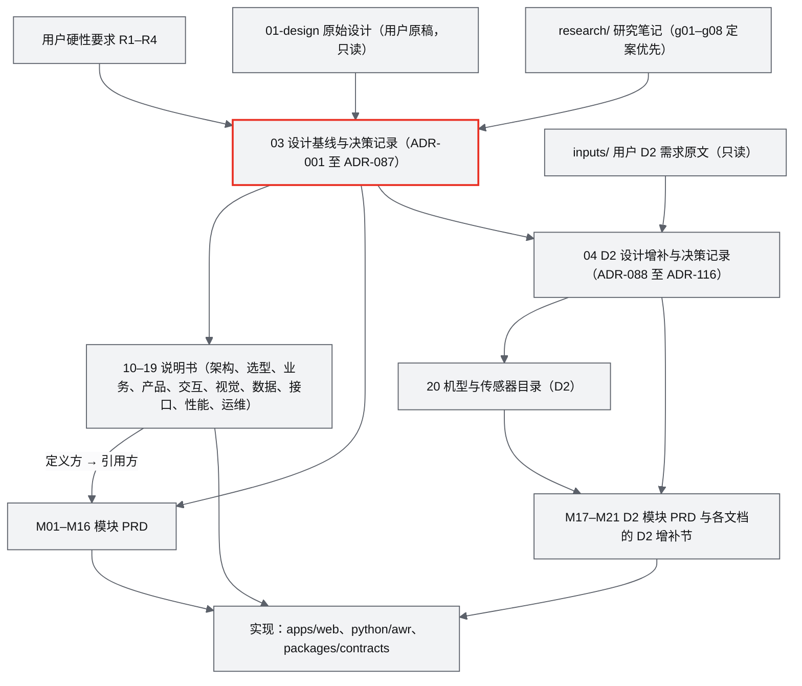

# ANet Drone4D（World Runtime）文档体系

项目首页、快速开始与许可摘要见仓库根目录的 README（[English](../README.md) · [简体中文](../README.zh-CN.md)）。

| 项 | 内容 |
|---|---|
| 文档 | 文档体系总览与阅读指南（本页只做导航与摘要，不定义任何新事实） |
| 版本 | v1.2（对应基线 AWR-03 v1.1 与附录 E 的 ADR-054 至 ADR-087，以及 D2 基线 AWR-04 v1.2 的 ADR-088 至 ADR-116） |
| 日期 | 2026-10-05（v1.0 为 2026-09-28；v1.1 为 2026-10-03，补实现与验收报告索引、零下载试用与 ADR 数目；v1.2 加入 D2 文档与 `inputs/`） |
| 维护 | 文档总编；事实以各文档的"定义方"为准（[AWR-03 §10.1](03-设计基线与决策记录.md)） |

ANet Drone4D（代码与文档中称 World Runtime，缩写 AWR；产品显示名见 AWR-03 ADR-056）是一个"真实世界无人机数字孪生与多智能体仿真平台"，主链路为 **Reality → Reconstruction → World → Environment → Simulation → Agent**，核心理念是"World 是核心，而不是 Drone"。本期交付 D1（即 V0.1）在一台 8 核 CPU、无 GPU 的本机上运行：内置 UrbanScene3D 六城点云与 1–1000 架 Mock 无人机，支持渐进加载、点云疏密自动调节与流畅性测试。下一期交付 D2（V0.2-demo）在公开演示站上开放多租户沙盒、识别物与感知对抗、机巢与任务编排、7×24 接力监控与开放接口，文档见 §1.4。

---

## 1. 文档地图

### 1.1 文档层次



冲突裁决顺序：用户硬性要求 R1–R4 → AWR-03 基线 → 各主题的定义方文档 → 引用方文档（[AWR-03 §1.1、§10.1](03-设计基线与决策记录.md)）。D2 范围内为：用户 D2 需求原文与补充决定 → R1–R4 → AWR-04 → AWR-03 → 其余（[AWR-04 §1.1](04-D2-设计增补与决策记录.md)）。同一个事实只在定义方给出完整定义，其他文档只引用。

### 1.2 文档清单

状态说明：AWR-03 为"评审通过"（第 1 轮四视角交叉评审与第 2 轮下游反馈处置均已完成）；10–19 号说明书与 16 份模块 PRD 已逐份审校，并已按第 2 轮基线修订同步，状态保持"草案"，待 [AWR-03 附录 D.2](03-设计基线与决策记录.md) 列出的遗留事项关闭、完成交叉评审后改为"评审通过"。

| 编号 | 文档 | 职责（写什么） | 主要读者 | 状态 |
|---|---|---|---|---|
| — | [01-design.md](01-design.md) | 用户本人撰写的原始设计（§1–§51），理念与版本设想的出处 | 全体 | 用户原稿，只读 |
| — | [02-refs.md](02-refs.md) | 参考仓库清单（已克隆到 `refs/<group>/<repo>`） | 架构、选型 | 只读 |
| AWR-03 | [03 设计基线与决策记录](03-设计基线与决策记录.md) | 二次优化设计的总纲与唯一基线：原则、架构总览、目录与路径所有权、跨模块契约总则、模块划分、85 条 ADR（ADR-054 起为验收与加固阶段新增，见附录 E）、版本路线与 D1 范围和验收、术语、研究结论修订与作废清单、评审处置记录 | 全体 | 评审通过（v1.1） |
| — | [inputs/D2-需求原文-2026-10-05.md](inputs/D2-需求原文-2026-10-05.md) | 用户 D2 需求原文、随附 P600（MID-360 配置）硬件规格与 2026-10-05 补充决定（UrbanScene3D 授权） | 全体 | 用户原文，只读 |
| AWR-04 | [04 D2 设计增补与决策记录](04-D2-设计增补与决策记录.md) | D2（V0.2-demo）唯一基线：需求追溯 R-D2、多租户沙盒架构与 emax 容量、机型与传感器、感知判据、识别物、任务编排与 7×24 接力、交互、开放接口、ADR-088 至 ADR-116、D2-AC-01 至 D2-AC-39、下游反馈处置（附录 B） | 全体 | 草案 v1.2 |
| AWR-10 | [10 系统架构说明书](10-系统架构说明书.md) | 分层与进程拓扑、部署视图、启停与崩溃恢复时序、端到端数据流、线程与并发模型、容量模型 | 架构、后端、前端负责人 | 草案 |
| AWR-11 | [11 技术选型说明书](11-技术选型说明书.md) | 每个技术点的候选、实测、结论、锁定版本（BOM）、升级与替换条件；star 与 2026 新项目评估 | 架构、全体开发 | 草案 |
| AWR-12 | [12 业务逻辑设计说明书](12-业务逻辑设计说明书.md) | 跨模块业务语义：FlightState、命令生命周期与准入、租约与席位、Safety 升级链、能量 RTL、环境过渡、剧本、合同网、回放与 seek | 后端、前端交互、测试 | 草案 |
| AWR-13 | [13 产品设计 PRD](13-产品设计PRD.md) | 产品定位、用户与场景、功能地图、版本范围、演示脚本、产品级验收与度量、01-design 勘误 | 产品、全体 | 草案 |
| AWR-14 | [14 UI 交互设计 PRD](14-UI交互设计PRD.md) | 信息架构、浮层式布局、面板与控件交互、状态、快捷键、相机与 Timeline 交互、告警、可访问性 | 前端、设计、测试 | 草案 |
| AWR-15 | [15 视觉设计规范与色卡](15-视觉设计规范与色卡.md) | ANet Graphite 色卡与 token、一处红规则、字阶、图标清单、动效 token 与配方、lieflat 图表规范、品牌使用、3D 场景配色、mermaid 主题片段 | 设计、前端 | 草案 |
| AWR-16 | [16 World 数据规范](16-World数据规范.md) | 全部文件与资产格式：World Package v1、ANET_Q16、栅格、zones、AWRV、AWSL、Vehicle Package、Scenario、Recording（MCAP）、Recon IR、LiDAR 帧与校验规则 | 后端数据、前端点云、测试 | 草案 |
| AWR-17 | [17 接口与实时协议规范](17-接口与实时协议规范.md) | 全部线上接口：REST、`awr.rt.v1`、字节布局、enums、commands、原因码（`reasons.json`）、bus key、时钟域与 RNG 流登记 | 后端、前端网络、测试 | 草案 |
| AWR-18 | [18 性能与测试方案](18-性能与测试方案.md) | 性能预算、测试分层、flight60 与机群阶梯、`window.__perf`、性能运行协议、CI 门禁、lint 规则 | 测试、前端、后端 | 草案 |
| AWR-19 | [19 部署与运维说明书](19-部署与运维说明书.md) | 环境准备、安装与构建、配置与环境变量、启停、访问模式、监控与故障处理、Docker、数据获取、Makefile 与 git 流程 | 运维、全体开发 | 草案 |
| AWR-20 | [20 机型与传感器目录](20-机型与传感器目录.md) | D2：P600 profile 2.0.0 与 4 个参考机型的参数、传感器型号库、Vehicle Package 的 D2 扩展、目录文件格式与校验规则（前缀 CAT） | 后端仿真、感知、测试 | 草案 |
| AWR-M01 | [M01 重建引擎](modules/M01-重建引擎PRD.md) | Engine Adapter v2、Recon IR、重建任务状态机、Mock 重建链路 | 重建、后端 | 草案 |
| AWR-M02 | [M02 LiDAR 融合与地理配准](modules/M02-LiDAR融合与地理配准PRD.md) | 帧换算唯一实现、GPST/UTC、Sim3 配准、V0.5 融合与重定位 | 定位、后端 | 草案 |
| AWR-M03 | [M03 World 模型、Ingest 与切片](modules/M03-World模型与Ingest切片PRD.md) | `worldpkg` 流水线、六城规范化、DTM/DSM、ANET_Q16 切片、校验、数据获取 | 数据、后端 | 草案 |
| AWR-M04 | [M04 几何世界查询服务](modules/M04-几何世界查询服务PRD.md) | WorldQuery：高度、AGL、净空、视线、ray_hit、路径校验、safe_transit | 后端 | 草案 |
| AWR-M05 | [M05 Web 点云引擎](modules/M05-Web点云引擎PRD.md) | 首屏协议、渐进加载、APH 选择器、CAS 疏密自动调节、PointPool、Lite 点径、EDL | 前端 | 草案 |
| AWR-M06 | [M06 Web 视口与渲染后端](modules/M06-Web视口与渲染后端PRD.md) | RenderBackend 三档与设备能力档、R3F 宿主与帧序、相机模式、无人机与轨迹图层、PerfGovernor、`__perf` | 前端 | 草案 |
| AWR-M07 | [M07 环境引擎](modules/M07-环境引擎PRD.md) | EnvironmentService（风、湍流、能见度、预设）、EnvKeyframe 推送、前端环境视觉 | 前端、后端 | 草案 |
| AWR-M08 | [M08 仿真内核与飞行器适配](modules/M08-仿真内核与飞行器适配PRD.md) | FleetSim L1、stage 注册表与 pipeline、CommandEngine 与准入、LeaseManager、DroneAdapter、P600 Digital Twin | 后端 | 草案 |
| AWR-M09 | [M09 安全与健康](modules/M09-安全与健康PRD.md) | Flight FSM、FastGuard、围栏、电量与能量 RTL、FleetGuard、链路策略、故障注入 | 后端 | 草案 |
| AWR-M10 | [M10 任务、规划与集群](modules/M10-任务规划与集群PRD.md) | 任务引擎、生成器、轨迹跟踪、safe_transit 与 A*、编队与覆盖、剧本导演 | 后端 | 草案 |
| AWR-M11 | [M11 实时网关](modules/M11-实时网关PRD.md) | `awr.runtime`（StateRing、Bus、supervisor）、`awr.rt.v1` 服务端、鉴权与访问模式、REST 框架、前端 `net/rt` | 后端、前端网络 | 草案 |
| AWR-M12 | [M12 时间轴、录制与回放](modules/M12-时间轴录制与回放PRD.md) | TIME 与 epoch 语义、SimClockView 与插值、Timeline、recorder、replay-worker | 前端、后端 | 草案 |
| AWR-M13 | [M13 传感器仿真](modules/M13-传感器仿真PRD.md) | 传感器位姿与 FOV、相机内参、GNSS/IMU 噪声、Mock 检测器、虚拟 MID-360（V0.2） | 后端、前端 | 草案 |
| AWR-M14 | [M14 智能体运行时与 ANet](modules/M14-智能体运行时与ANet-PRD.md) | agent-runtime、Mock ANet、合同网与打分、TSIR、受信守卫、S3 协作流程 | 后端 | 草案 |
| AWR-M15 | [M15 前端 UI 壳与设计体系组件](modules/M15-前端UI壳与设计体系组件PRD.md) | 浮层式 App Shell、shadcn 安装与 codemod、主题与动效 token、图标注册表、lieflat 组件、路由与报告页 | 前端、设计 | 草案 |
| AWR-M16 | [M16 演示数据、剧本与流畅性测试](modules/M16-演示数据剧本与流畅性测试PRD.md) | 六城数据链、S1–S6 与 ladder 剧本、一键演示、Playwright harness、测试报告 | 测试、产品 | 草案 |
| AWR-M17 | [M17 沙盒会话与开放接口](modules/M17-沙盒会话与开放接口PRD.md) | D2：sandbox-pool（会话池、排队、配额、倍速治理、降级、共享规划服务宿主）、沙盒 REST 会话端点、OpenAPI 页、Python SDK、公开站部署配置 | 后端、运维 | 草案 |
| AWR-M18、M19 | [M18 与 M19 识别物与感知对抗（合并）](modules/M18-M19-识别物与感知对抗PRD.md) | D2：识别物、敏感范围与被发现判据（M18）；EO、夜视、LWIR、雷达、声阵列、MID-360 的统一感知判据与明确捕获、可行窗口（M19） | 后端仿真、前端 | 草案 |
| AWR-M20 | [M20 任务编排、机巢与接力监控](modules/M20-任务编排机巢与接力监控PRD.md) | D2：六类任务与区域值守、机巢与电池队列、GSD 扫描反推、贪心分配与 Allocator 接口、7×24 接力监控与可持续性评估 | 后端 | 草案 |
| AWR-M21 | 机型目录与固定翼动力学 | D2：目录与实例服务、固定翼与 VTOL stage（参数与文件格式已由 AWR-20 定义） | 后端仿真 | 待写 |

工作包 M00（工程骨架与契约）不单独成文，其要求分布在 16、17、18、19 号文档（[AWR-03 §6.1、ADR-050](03-设计基线与决策记录.md)）。D2 增补节已写于 [14 §20](14-UI交互设计PRD.md)、[17 §17](17-接口与实时协议规范.md) 与 M08、M10、M11、M13、M15 的 §15；其余说明书与模块的 D2 增补节待写（[AWR-04 §1.3](04-D2-设计增补与决策记录.md)）。

### 1.3 常用"定义方"速查

| 要查的事实 | 去哪里看 |
|---|---|
| 坐标、时间、单位、命名、JSON 大小写 | [AWR-03 §5](03-设计基线与决策记录.md) |
| 路径所有权与扩展点 | [AWR-03 §4.3](03-设计基线与决策记录.md) |
| 文件与资产格式 | [16](16-World数据规范.md) |
| REST、`awr.rt.v1`、字节布局、原因码、bus key | [17](17-接口与实时协议规范.md) |
| FlightState 语义、命令准入、租约、剧本业务参数（含 S1 定稿） | [12](12-业务逻辑设计说明书.md) |
| 色值、字阶、动效 token、图标清单 | [15](15-视觉设计规范与色卡.md) |
| 布局与交互 | [14](14-UI交互设计PRD.md) |
| 点云选择器、CAS 与阶梯参数 | [M05](modules/M05-Web点云引擎PRD.md) |
| FleetSim pipeline、控制律、机型参数 | [M08](modules/M08-仿真内核与飞行器适配PRD.md) |
| 性能阈值、测试用例、lint 规则 | [18](18-性能与测试方案.md)（以 AWR-03 §8.4 为下限） |
| 锁定版本（BOM） | [11 §3.2、§3.6](11-技术选型说明书.md)（ADR-037、ADR-038） |
| D2 范围、架构、ADR-088 起、D2-AC | [AWR-04](04-D2-设计增补与决策记录.md) |
| 机型与传感器参数、Vehicle Package 的 D2 扩展 | [AWR-20](20-机型与传感器目录.md) |
| 沙盒 REST 端点全表、新 topic、`awr.TargetLite32.v1`、原因码 500–599 | [17 §17](17-接口与实时协议规范.md) |


### 1.4 D2 文档（V0.2-demo）

D2 是在公开演示站（emax，4 核、约 2.6 GB 可用内存、无 GPU）上开放的演示与开放接口切片：载入进度条；每位访客一个隔离沙盒（独立 sim-core、时钟与机群），共享展示仍只读并运行 7×24 接力演示 S7；识别物与敏感范围、统一感知判据与明确捕获；多机巢多机型的贪心编排、GSD 完整扫描与 7×24 不进入敏感范围的接力监控；机型目录（P600 MID-360 配置与四旋翼、固定翼、垂起固定翼参考机型）；沙盒 REST、WS 与 Python SDK；UrbanScene3D 六城在公开站开放。

建议阅读顺序：① [用户 D2 需求原文](inputs/D2-需求原文-2026-10-05.md) → ② [AWR-04](04-D2-设计增补与决策记录.md) 的 §0、§2（需求追溯）、§3（范围与模块）、§13（D2-AC）、附录 B（反馈处置与遗留事项）→ ③ 按角色：后端读 AWR-04 §4–§9、[M17](modules/M17-沙盒会话与开放接口PRD.md)、[M18-M19](modules/M18-M19-识别物与感知对抗PRD.md)、[M20](modules/M20-任务编排机巢与接力监控PRD.md)、[AWR-20](20-机型与传感器目录.md) 与 M08、M10、M11、M13 的 §15；前端读 AWR-04 §10、[14 §20](14-UI交互设计PRD.md) 与 M15 §15；接口与 SDK 读 AWR-04 §11 与 [17 §17](17-接口与实时协议规范.md)。

---

## 2. 推荐阅读顺序（按角色）

所有角色都先读 [AWR-03](03-设计基线与决策记录.md) 的 §0 摘要、§2 设计目标与原则、§3.1–§3.3 总体架构与进程拓扑、§8.2 D1 范围，再按下表深入。

| 角色 | 阅读顺序 |
|---|---|
| 架构 | ① AWR-03 §3–§7（ADR 索引 §7.0；验收与加固阶段的 ADR-054 至 ADR-087 在附录 E）→ ② [10 系统架构](10-系统架构说明书.md) → ③ [11 技术选型](11-技术选型说明书.md) → ④ [17 接口与协议](17-接口与实时协议规范.md) → ⑤ [16 World 数据](16-World数据规范.md) → ⑥ [12 业务逻辑](12-业务逻辑设计说明书.md) → ⑦ [18 性能与测试](18-性能与测试方案.md) → ⑧ [19 部署运维](19-部署与运维说明书.md) → ⑨ M08、M11、M05 的 §6 设计方案 |
| 前端 | ① AWR-03 §3.5–§3.8、§4.2 第 2 条、ADR-007 至 ADR-013、ADR-028 至 ADR-032、ADR-041、ADR-044、ADR-046 → ② [14 UI 交互](14-UI交互设计PRD.md) → ③ [15 视觉规范](15-视觉设计规范与色卡.md) → ④ [M15 UI 壳](modules/M15-前端UI壳与设计体系组件PRD.md) → ⑤ [M06 视口与渲染后端](modules/M06-Web视口与渲染后端PRD.md) → ⑥ [M05 点云引擎](modules/M05-Web点云引擎PRD.md) → ⑦ [17 §5–§6](17-接口与实时协议规范.md)（静态服务与 `awr.rt.v1`）与 [M11 前端部分](modules/M11-实时网关PRD.md) → ⑧ [M12](modules/M12-时间轴录制与回放PRD.md)（SimClockView 与插值）、[M07](modules/M07-环境引擎PRD.md)（环境视觉）→ ⑨ [18 §4–§6、§9](18-性能与测试方案.md)（帧节奏阈值与 `__perf`） |
| 后端 | ① AWR-03 §3.3–§3.4、§5、ADR-014 至 ADR-021、ADR-025 至 ADR-027、ADR-039、ADR-040、ADR-045、ADR-049 至 ADR-053 → ② [10 系统架构](10-系统架构说明书.md) → ③ [17 接口与协议](17-接口与实时协议规范.md) → ④ [16 World 数据](16-World数据规范.md) → ⑤ [12 业务逻辑](12-业务逻辑设计说明书.md) → ⑥ [M08](modules/M08-仿真内核与飞行器适配PRD.md) → [M09](modules/M09-安全与健康PRD.md) → [M11](modules/M11-实时网关PRD.md) → [M04](modules/M04-几何世界查询服务PRD.md) → [M03](modules/M03-World模型与Ingest切片PRD.md) → [M10](modules/M10-任务规划与集群PRD.md) → [M07](modules/M07-环境引擎PRD.md) → [M12](modules/M12-时间轴录制与回放PRD.md) → [M13](modules/M13-传感器仿真PRD.md) → [M14](modules/M14-智能体运行时与ANet-PRD.md) → ⑦ [19 部署运维](19-部署与运维说明书.md) |
| 产品 | ① [01-design](01-design.md)（原始设想）→ ② AWR-03 §0–§2（含 §2.4 硬性要求追溯、§2.5 受保护的原设计意图）与 §8（版本路线、D1 范围与验收）、附录 C（01-design 逐节处置）→ ③ [13 产品设计 PRD](13-产品设计PRD.md) → ④ [14 UI 交互](14-UI交互设计PRD.md) 的 §1–§5 → ⑤ [12 §7](12-业务逻辑设计说明书.md)（剧本业务脚本）→ ⑥ [M16](modules/M16-演示数据剧本与流畅性测试PRD.md)（演示剧本与一键演示）→ ⑦ [18 §1–§2](18-性能与测试方案.md)（验收口径） |
| 设计 | ① AWR-03 ADR-028 至 ADR-032（shadcn、transitions.dev、morphicons、lieflat、色卡与品牌）→ ② [15 视觉规范与色卡](15-视觉设计规范与色卡.md) → ③ [14 UI 交互](14-UI交互设计PRD.md) → ④ [M15 UI 壳](modules/M15-前端UI壳与设计体系组件PRD.md) → ⑤ 研究笔记 [d01](research/d01-lieflat-charts.md)、[d02](research/d02-transitions-dev.md)、[d03](research/d03-morphicons.md)、[d04](research/d04-shadcn-ui.md)、[d05](research/d05-anet.md)、[g07](research/g07-gap.md) |
| 测试 | ① AWR-03 §8.4（D1-AC-01 至 D1-AC-35）与 ADR-033（性能运行协议）→ ② [18 性能与测试方案](18-性能与测试方案.md) → ③ [M16 演示数据与流畅性测试](modules/M16-演示数据剧本与流畅性测试PRD.md) → ④ [12](12-业务逻辑设计说明书.md)（完成判据、准入矩阵、剧本成功谓词）→ ⑤ [17 §10](17-接口与实时协议规范.md)（契约 golden 与 CI）→ ⑥ [19](19-部署与运维说明书.md)（make 目标与环境）→ ⑦ 各模块 PRD 的 §10 测试与验收 |
| 运维 | ① [19 部署与运维](19-部署与运维说明书.md) → ② AWR-03 §3.3（进程、端口、访问模式、运行目录）、ADR-034（数据分发）、ADR-037 与 ADR-038（锁定版本）→ ③ [10 §8](10-系统架构说明书.md)（进程视图）→ ④ [11 §3](11-技术选型说明书.md)（BOM）→ ⑤ [M11](modules/M11-实时网关PRD.md)（supervisor 与 `runtime.yaml`） |

---

## 3. 与原设计 01-design.md 的关系

1. **01-design 是用户原稿，任何文档都不修改其文字**。它提出了理念（World 是核心、Real-World Grounded、World 双表达、环境统一场、P600 Digital Twin、多机同钟、ANet 协作、多后端共用 World）与 V0.1–V1.0 的版本设想。
2. **AWR-03 是在原设计基础上的二次优化设计**：把 38 个研究单元与 g01–g08 的定案收敛为可实施、可验收的约束。与原设计的关系逐节记录在 [AWR-03 附录 C](03-设计基线与决策记录.md)（沿用、修订、部分取代、取代、推迟、删除），继承与优化总览见 AWR-03 §2.2。
3. **受保护的原设计意图**（[AWR-03 §2.5](03-设计基线与决策记录.md)）只能通过追加 ADR 修改：World 是核心（ADR-047）、真实世界链路（ADR-035）、Geometry 与 Visual 双表达（P-03）、环境统一场（ADR-023 至 ADR-025）、P600 Digital Twin（ADR-043）、多机同钟（ADR-020、ADR-021）、ANet 协作而非控制（ADR-036）、多后端共用 World（ADR-048）、先打通一条完整链路（MS3 walking skeleton）、浏览器看世界而服务器算世界（P-02）。
4. **明确取代的条款**都有 ADR 与理由：D1 即 V0.1 并分为 core 与 ext 两层，取代 §43、§44 的部分内容（ADR-042）；本机软件档目标为固定 30 fps，取代 §37 的"Web Rendering 60 FPS"（ADR-044）；点云"远处 10K / 近处 1M"由 APH 与 CAS 取代（ADR-009、ADR-012）；原设计的 `*.vdb` 风场改为 AWRV（§4.4）。
5. **文字勘误**（`:chatgpt-content-reference` 残留、缺字、§41 树形等）见 [13 产品设计 PRD](13-产品设计PRD.md) 附录的勘误表（Q10）。

---

## 4. 研究资料索引

研究笔记位于 [research/](research/)，研究原型与实测脚本位于 `.cache/research/<unit>/`（例如 g02 PointPool 与 CAS、g03 schema 与校验器、g05 StateRing、g07 UI 样板页、g08 FleetSim、n05 前端试验工程）。研究结论之间冲突时，**g 系列定案优先级最高**；已被基线修订或作废的结论见 [AWR-03 附录 B](03-设计基线与决策记录.md)，下游文档不得引用作废结论。

| 类别 | 笔记 |
|---|---|
| 总索引与裁决 | [00-index 研究总览、选型矩阵与整合结论](research/00-index.md) |
| 缺口深挖定案（优先级最高） | [g01 渲染器路线与 RenderBackend](research/g01-gap.md)；[g02 PointCloudEngine 参数与基线](research/g02-gap.md)；[g03 World Package 与 ANET_Q16 v1 契约](research/g03-gap.md)；[g04 DroneState、命令与状态机](research/g04-gap.md)；[g05 后端进程模型与 IPC](research/g05-gap.md)；[g06 环境场契约](research/g06-gap.md)；[g07 设计体系在 Base UI 上的落地](research/g07-gap.md)；[g08 Mock FleetSim 规格](research/g08-gap.md) |
| 重建与定位 | [r01 LingBot-Map 与 viser](research/r01-lingbot-map-viser.md)；[r02 VGGT 与 COLMAP、Recon IR](research/r02-vggt-colmap.md)；[r03 nerfstudio、3DGS、gsplat](research/r03-nerfstudio-3dgs-gsplat.md)；[r04 Livox 驱动与标定](research/r04-livox-driver-calib.md)；[r05 FAST-LIO2、FAST-LIVO2、R3LIVE](research/r05-fastlio-livo-r3live.md)；[r06 Open3D](research/r06-open3d.md)；[r07 GICP 与图优化](research/r07-gicp-graph-slam.md)；[r08 无人机 LIO 与重定位](research/r08-uav-lio-ros2.md)；[r18 4DGS](research/r18-4dgs.md) |
| World 数据与 Web 点云 | [r09 PotreeConverter、PDAL、LAStools](research/r09-potreeconverter-pdal-lastools.md)；[r10 3D Tiles](research/r10-3dtiles.md)；[r11 three.js WebGPU 与 TSL](research/r11-threejs-webgpu.md)；[r12 Potree 与 potree-core](research/r12-potree-core-loader.md)；[r13 Potree-Next 与 splat](research/r13-potree-next-splats.md)；[r14 R3F 与 drei](research/r14-r3f-drei.md)；[r15 Cesium、deck.gl、Foxglove](research/r15-cesium-deckgl-foxglove.md)；[x01 UrbanScene3D 数据集](research/x01-urbanscene3d-data.md) |
| 环境 | [r16 Web 天气视觉](research/r16-web-weather-fx.md)；[r17 风场、CFD 与 VDB](research/r17-wind-cfd-vdb.md) |
| 飞控、仿真与集群 | [r19 Prometheus（P600）](research/r19-prometheus-amov.md)；[r20 PX4](research/r20-px4.md)；[r21 MAVSDK、MAVROS、MAVLink](research/r21-mavsdk-mavros-mavlink.md)；[r22 PX4 多机仿真编排](research/r22-px4-multi-sim-xtdrone.md)；[r23 AirSim 与 gz-sim](research/r23-airsim-gzsim.md)；[r24 MRS UAV System](research/r24-mrs-uav.md)；[r25 EGO-Swarm 与 Fast-Planner](research/r25-ego-fastplanner.md)；[r26 编队控制与多机覆盖](research/r26-px4-swarm-controllers.md) |
| 实时通信 | [r27 rosbridge、Foxglove ws-protocol、Zenoh](research/r27-realtime-bridges.md) |
| 设计体系与 ANet | [d01 lieflat-charts](research/d01-lieflat-charts.md)；[d02 transitions.dev](research/d02-transitions-dev.md)；[d03 morphicons](research/d03-morphicons.md)；[d04 shadcn/ui](research/d04-shadcn-ui.md)；[d05 ANet](research/d05-anet.md) |
| 2026 新项目发现 | [n01 Web 点云与 3DGS](research/n01-discover-web-pointcloud.md)；[n02 重建、SLAM 与融合](research/n02-discover-recon-slam.md)；[n03 无人机仿真与多智能体](research/n03-discover-uav-sim-agents.md)；[n04 天气、风场与数字孪生](research/n04-discover-environment-twin.md)；[n05 前端工程栈核实](research/n05-discover-web-stack.md) |

参考仓库清单见 [02-refs.md](02-refs.md)，仓库已克隆在 `refs/<group>/<repo>`（含 `refs/discovery/` 下 44 个 2026 新发现仓库）；选型结论与 star、最后提交日期见 [11 附录 A](11-技术选型说明书.md)。

---

## 5. D1 范围一页纸

完整定义见 [AWR-03 §8.2–§8.6](03-设计基线与决策记录.md) 与 ADR-042；下文只是摘要。

### 5.1 D1 是什么

D1 = V0.1 发布：一套在本机（8 核 CPU、无 GPU、headless Chromium 151 + SwiftShader、Node 22、Python 3.12）可完整运行、可从另一台机器远程访问的系统，分两层：

- **D1-core（P0，发布阻塞）**：直接支撑用户硬性要求 R3 的主链路。
- **D1-ext（P1，缺失时必须有豁免记录）**：接口与 schema 在 MS1 冻结，实现排在 MS6。

### 5.2 D1-core

| 领域 | 内容 |
|---|---|
| World | 六个 UrbanScene3D 虚拟城市（`data/raw/urbanscene3d/*_sampled_5m.ply`，每城约 500 万点）完成规范化、DTM/DSM/HAG、ANET_Q16 切片（苏州为 6 根森林），写出 World Package v1 并通过深度校验；`make run` 自动生成缺失世界 |
| 工程骨架 | git 与合并门禁、锁文件、`packages/contracts` 与代码生成、lint 全套（含无 emoji、无 token 外 hex）、假数据源与夹具 |
| 后端 | supervisor、api（REST、Range 静态服务、`awr.rt.v1` 网关、viewer/operator/admin 鉴权、回环与局域网两种访问模式、Origin 与 Host 校验）、sim-core（含 plan-pool）；StateRing 与 zenoh 两个 IPC 平面 |
| 仿真 | Mock FleetSim L1（PX4-lite，主时钟 250 Hz、L1 125 Hz，numba 加 numpy oracle），1–1000 架，机型 p600_mid360（默认）与 x500（回归）；10 个命令与规范准入；租约 owner、单席位与安全类免租约；Safety 子集（Flight FSM、FastGuard、围栏、电量与能量 RTL、FleetGuard、链路策略）；基础任务与 safe_transit；环境 L0/L1 风、湍流盒、12 个预设；传感器位姿与 FOV |
| Web 前端 | shadcn base-mira 浮层式 UI 壳与设计体系（色卡、transitions.dev 动效、morphicons 图标、lieflat 图表）；RenderBackend Tier S（性能验收）与 Tier B（硬件默认）；点云引擎（按档位首屏、渐进加载、APH、CAS 疏密自动调节、PointPool、Lite 点径）；无人机、轨迹、任务、视锥图层；环境视觉 Low；相机模式；Timeline 实时控制；性能 HUD |
| 交互 | `/world/:id` 直达与视图世界切换；点选 GoTo（ray_hit 求交）；运行时增删虚拟 P600；禁飞区显示；风与天气预设；Third（跟随）、FPV、轨迹、FOV 开关 |
| 测试与演示 | flight60（`scene=pc` 与 `scene=full`，深圳门禁、六城回归）；机群阶梯（sim-core 10–1000 架，前端 200 架）；IPC 基准；SIH 黄金数据回归；walking skeleton；默认进入 `/world/shenzhen` 并自动加载 S1（深圳双机立面螺旋扫描） |

### 5.3 D1-ext 与不在 D1

- **D1-ext**：会话世界切换；录制与回放；checkpoint 恢复与混沌；agent-runtime、Mock ANet 与 S3；环境视觉 Med 与 AWSL 流线；Tier A 与 `/bench`；完整 Control Lease（HMAC、抢占表、确认令牌与 kill）；故障注入；2.5D A*、编队、覆盖与 S2、S4–S6；GNSS/IMU 噪声与 Mock 检测器；Mock 重建链路与 job-worker；输入日志重仿真；航点编辑与区域绘制；前端 1000 架阶梯；soak。
- **不在 D1**：真实 GPU 重建（LingBot-Map 等，V0.5）；真实 LiDAR 融合与重定位；PX4 SIH、SITL、Gazebo、Isaac 的真实运行；Prometheus 真机与模拟器；geo-worker 与虚拟 MID-360 光线求交（V0.2）；L2 及以上风场、闪电、环境 High 档、传感器退化；实时倒带与分叉；3DGS；3D Tiles、COPC、gz、USD 导出；跨主机 zenoh；真 ANet；LLM/MCP；Radar；移动端。

### 5.4 关键验收门槛（节选，完整见 AWR-03 §8.4）

| 验收 | 门槛 |
|---|---|
| D1-AC-02 首屏 | TTFP ≤ 1.0 s（本机 Tier S；深圳、纽约、上海、苏州 P0，旧金山、芝加哥 P1）；切换视图世界 ≤ 1.5 s |
| D1-AC-03a 帧节奏（纯点云） | flight60 深圳：呈现间隔 p50 ≤ 33.4 ms、p95 ≤ 50 ms、p99 ≤ 100 ms；> 50 ms 的帧 ≤ 5%；最大间隔 ≤ 250 ms |
| D1-AC-03b 帧节奏（整景） | p50 ≤ 33.4 ms、p95 ≤ 66.7 ms、p99 ≤ 116.7 ms；> 50 ms 的帧 ≤ 10%、> 100 ms 的帧 ≤ 1%；最大间隔 ≤ 250 ms；固定图层合计 ≤ 10 ms（ADR-071、ADR-076 冻结） |
| D1-AC-04 疏密控制 | 60 s 内换档 ≤ 2 次、B 反向 ≤ 15 次/分钟、2 s 内进入目标带 |
| D1-AC-07 机群 | N = 1000：RTF ≥ 0.99，sim-core ≤ 0.6 核，单步 p99 ≤ 3 ms、最大 ≤ 12 ms |
| D1-AC-08 网关 | 3 个客户端同时跑 flight60 时 api ≤ 0.35 核，tick 数据年龄 p99 ≤ 15 ms |
| D1-AC-11a 进程恢复 | kill api 时仿真不中断；kill sim-core 后 ≤ 3 s 重启并重开剧本 |
| D1-AC-15 剧本 S1 | 两架 P600 完成立面扫描，能量 RTL 次数为 0，最小间距 ≥ 10 m，guard 事件为 0，阵风期间位置误差 < 3.0 m |
| D1-AC-20 设计体系 | emoji 与禁用字形为 0；代码中 token 以外的 hex 为 0；无 `lucide-react`、无自造控件；motion-lint、check-icons、check-brand 通过 |
| D1-AC-32 交互 | 点选 GoTo 后机体停在下发目标点 3 m 内；增删 P600 ≤ 1 s 可见 |

所有性能类用例执行 ADR-033 的性能运行协议（主仓库锁、开跑前 load ≤ 4、3 次取中位、统计窗口 (2, 60] s、门禁使用真实后端）。

### 5.5 里程碑

| 里程碑 | 内容 | 出口 |
|---|---|---|
| MS1 契约、骨架与夹具 | git、锁文件、`packages/contracts` 与代码生成、`awr.runtime`、假数据源、lint 与 `make ci` | D1-AC-13（契约）、D1-AC-20（lint）、D1-AC-35 |
| MS2 World | `worldpkg` 与六城生成、M04 WorldQuery、`make fetch-data` | D1-AC-01 |
| MS3 Walking skeleton | 深圳 World → 点云上屏 → 1 架 FleetSim → StateRing → Gateway → WS → 无人机上屏 → goto 闭环 | D1-AC-34 |
| MS4 后端 core | fleet_ladder 门禁、sim-core、api、supervisor 重启 | D1-AC-07、08、10、11a、12、15、33 |
| MS5 Web core 与基线冻结 | UI 壳、渲染后端、点云引擎、图层、环境 Low、Timeline、HUD、交互；以 ADR 冻结暂定阈值 | D1-AC-02、03a、03b、04、06、09a、14、19、20、24、25、26、27、32 |
| MS6 D1-ext 与收尾 | 录制回放、混沌、Mock ANet 与 S3、Med 与 AWSL、Tier A、完整租约、故障注入、A* 与编队覆盖、Mock 重建、重仿真、soak、演示脚本 | 全部 P1 验收 |

### 5.6 一键运行

```text
make setup        # 首次先引导安装 uv；uv 按 requirements.lock 安装 Python 依赖；npm ci；Playwright 使用本地 Chrome 151
make demo-world   # 零下载试用：按固定种子生成合成演示城市 synthcity（约 25 s，ADR-077）
make run          # 前置 worldpkg build --missing 与 geo-warm；启动 supervisor 后端与已构建的前端
ssh -N -L 8000:127.0.0.1:8000 <user>@<host>     # 在自己的机器上转发端口
# 浏览器打开 http://localhost:8000/world/synthcity（无六城数据时的默认世界，剧本 S0）
# 有六城数据时：make fetch-data && make worlds && make run，打开 /world/shenzhen，S1 自动加载并开始播放
```

局域网访问、端口偏移与容器部署见 [19 部署与运维说明书](19-部署与运维说明书.md)；测试与门禁的命令见 [D1 交付总结 §5](impl/D1-交付总结.md)。

---

## 6. 写作与维护规则（摘要）

1. 全部文档用中文撰写、技术名词保留英文；**严禁 emoji 与符号字形**（勾选框、星标、实心圆点、三角形等），状态一律用文字表达；允许 → ← ↑ ↓ 与数学、单位符号（[AWR-03 §10.2](03-设计基线与决策记录.md)、D1-AC-20）。
2. 图示用 mermaid，首行使用 [15 §9.10](15-视觉设计规范与色卡.md) 的 Graphite 主题片段，每张图至多一个 `hero` 强调节点；文档不受 hex 规则约束（hex 规则只扫描代码与样式）。
3. 单一真源：同一事实只在定义方完整定义，其他文档引用；关键数字必须注明依据，没有依据的新数字标注"本文设定"。
4. 基线变更只能通过追加或修订 ADR 完成，并在 [AWR-03 附录 D](03-设计基线与决策记录.md) 记录处置；第 2 轮（下游文档反馈）的逐条处置与遗留事项见附录 D.2。D2 的评审与下游反馈处置见 [AWR-04 附录 A、附录 B](04-D2-设计增补与决策记录.md)。
5. 原因码、bus key、计时器、RNG 流等契约项先在 [17](17-接口与实时协议规范.md) 登记再使用；文件格式先在 [16](16-World数据规范.md) 登记。

---

## 7. 实现、验收与交付报告

实现与验收过程的报告都在 [impl/](impl/)，按工作包命名；报告记录做了什么、怎么测的、证据在哪里，不定义新事实（规格变更以 AWR-03 的 ADR 为准）。

| 类别 | 报告 |
|---|---|
| 交付总结（从这里开始） | [D1 交付总结](impl/D1-交付总结.md)：实现范围、架构要点、D1-AC 最终通过情况、已知问题与路线图、运行与测试、文档索引、研究与设计过程；[FINAL-REVIEW 发布前终审报告](impl/FINAL-REVIEW-报告.md) |
| 验收测量 | [第 1 轮](impl/D1-验收报告-第1轮.md) · [第 2 轮](impl/D1-验收报告-第2轮.md) · [第 3 轮](impl/D1-验收报告-第3轮.md) · [第 4 轮](impl/D1-验收报告-第4轮.md) · [第 5 轮](impl/D1-验收报告-第5轮.md) · [第 6 轮](impl/D1-验收报告-第6轮.md)（ACC-1 至 ACC-6 为各轮的工作包记录；第 6 轮为 FX-TOAST 与 DEMO-PUBLIC 之后的复测） |
| 模块实现 | M00-A、M00-B、M01-M02、M03-M04、M05 至 M10、M11-R、M11-net、M11-api、M12 至 M14、M15-S、M15、M16 的实现报告；SK-B、SK-F、SK-E2E（walking skeleton）；MS1-MS2 验证；INT-1 集成 |
| 验收修复 | FX-GW、FX-SIM1、FX-SIM2、FX-WEB1、FX-WEB2；FX2-R2、FX2-R3、FX2-R5 各区域（gateway、sim、web-engine、web-ui、other）；P4-SIM、P4-UI；HYGIENE；FX-TOAST（发布前修复：Toast 首次插入与首次合成） |
| 发布展示 | DEMO-W（合成演示城市）、SHOW-CI（托管 CI 与干净克隆）、SHOW-M（真实截图与演示动图）、README-V2（README 与验收结果） |
