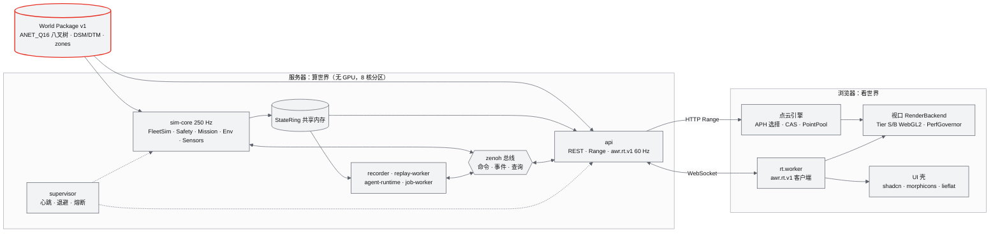

# D1 交付总结（ANet Drone4D V0.1）

| 项 | 内容 |
|---|---|
| 文档 | D1（即 V0.1）交付总结：实现范围、架构要点、D1-AC 最终通过情况、已知问题与路线图、如何运行与测试、文档索引、研究与设计过程 |
| 工作包 | FINAL-REVIEW（发布前对抗式终审与交付总结；终审过程与改动见 [FINAL-REVIEW 报告](FINAL-REVIEW-报告.md)） |
| 日期 | 2026-10-03 |
| 仓库 | github.com/ANetResearch/ANet-Drone4D（代码与文档中称 World Runtime，缩写 AWR；产品显示名 ANet Drone4D，ADR-056） |
| 依据 | 用户硬性要求 R1–R4（[AWR-03 §2.4](../03-设计基线与决策记录.md)）；AWR-03 §8.1–§8.4（版本路线、D1 范围与验收表）、ADR-001 至 ADR-080；[D1 验收报告第 1 至 5 轮](D1-验收报告-第5轮.md)；各工作包实现报告 |
| 结论口径 | 验收状态以第 5 轮（2026-10-03，ADR-033 性能运行协议）的逐条判定为准，本终审没有重测性能用例；功能门禁与 Playwright 功能用例由本终审重跑（§3.3） |

## 0 一页结论

1. **实现范围**：AWR-03 §8.2 的 D1-core 与 D1-ext 全部有实现与测试。六城 UrbanScene3D 世界与合成演示城市 synthcity、点云渐进加载与疏密自动调节、1–1000 架 Mock FleetSim、Safety、任务与集群、L0/L1 环境、录制与回放、Mock ANet、shadcn 浮层式 UI 与设计体系、M16 流畅性 harness 都已交付。Tier A（WebGPU）产品后端未交付（P1，功能矩阵在回归页通过）。
2. **D1 验收**：38 条（D1-AC-01 至 35，03、09、11 各分 a、b）中 **35 条通过、3 条不通过**。含 P0 的 25 条通过 23 条，只含 P1 的 13 条通过 12 条（92.3%）。
3. **退出条件 G4 尚未满足**：差 2 条 P0 子项，都是第 5 轮回归项中发现的退化，根子相同（第一条 Toast 的插入与首次合成）：D1-AC-03a 纽约 `scene=pc` 最大帧间隔 383 ms（阈值 250 ms），D1-AC-27 全机 RTL 出现 1 次归因到我方脚本的 > 50 ms LoAF（阈值 0）。另有 P1 的 D1-AC-28（全并发下单步 p99 3.89 ms，阈值 3 ms）为 ADR-074 列明的本机已知问题，豁免未登记。处置建议见 §4.1。
4. **暂定阈值**：本终审按第 3 至 5 轮数据以 ADR-080 冻结 D1-AC-09a 最大间隔与 D1-AC-26 的四个子项（原值，不收紧不放宽）；D1-AC-26 的 t_sim 到像素与 D1-AC-09b 仍为暂定（原因见 §4.2）。
5. **发布终审**：门禁全部通过（§3.3）；用户硬约束 R2、R3 逐条核对，修复 4 处违规或缺口（表格不在 lieflat 皮肤作用域、浅色主题下的 transitions.dev 原色值、生产包残留测试开关代码块、发布面文档不在 emoji 扫描范围）；发布合规修复 1 处（演示动图 6.04 MB 超过 5 MB），入库范围不含 UrbanScene3D 点数据、World Package 与其渲染画面，不含凭据（含本机出图服务密钥的全文比对）。新增发布集合检查 REL-01 至 REL-03（ADR-079）。

## 1 实现范围

### 1.1 交付物总览

| 领域 | 交付内容 | 主要模块 |
|---|---|---|
| World | 六个 UrbanScene3D 虚拟城市（深圳、上海、纽约、旧金山、苏州、芝加哥，各约 500 万点）的 ingest 规范化、DTM/DSM/HAG 与规则语义、ANET_Q16 八叉树切片（苏州为 6 根森林）、World Package v1 写出与 `--deep` 校验；`make run` 前自动生成缺失世界；程序生成的第七个世界 ANet Synthetic City（约 390 万点、无第三方数据、可自由再分发，ADR-077）；几何查询（高度、AGL、净空、视线、`ray_hit`、路径校验、safe_transit） | M03、M04、M02（帧换算） |
| 工程骨架与契约 | 根 Makefile 与 `mk/*.mk`、锁文件（`requirements.lock`、`package-lock.json`）、`packages/contracts` 唯一真源与 Python/TS 代码生成、golden 与夹具、lint 全套（emoji 与禁用字形、token 外 hex、backdrop-filter、lucide-react、原生控件、动效 token、图标、品牌、依赖边界、单位、发布集合）、本机 CI `make ci` 与托管 CI G1h（GitHub Actions） | M00 |
| 后端进程 | supervisor（心跳、退避、熔断、world 回退）、api（FastAPI：REST、HTTP Range 静态服务、`awr.rt.v1` 网关 60 Hz、viewer/operator/admin 鉴权、回环与局域网两种访问模式、Origin 与 Host 校验）、sim-core（250 Hz 主时钟）与 plan-pool、recorder 与 replay-worker（MCAP）、agent-runtime、job-worker；StateRing（共享内存）与 zenoh 两个 IPC 平面；checkpoint 与 epoch 崩溃恢复 | M11、M12、M14、M01 |
| 仿真 | Mock FleetSim L1（PX4-lite，numba 核加 numpy oracle，1–1000 架；机型 p600_mid360 默认、x500 回归）；10 个命令与规范准入；控制租约；Safety（Flight FSM、FastGuard、围栏、电量与能量 RTL、FleetGuard、链路策略、故障注入）；任务引擎、7 种生成器、safe_transit、2.5D A*、编队与覆盖、剧本导演；环境 L0/L1 风与湍流盒、12 个预设、风作用为力；传感器位姿、FOV、GNSS/IMU 噪声与 Mock 检测器；输入日志重仿真 | M07、M08、M09、M10、M13 |
| Web 前端 | shadcn base-mira（Base UI）浮层式 UI 壳；ANet Graphite 色卡、transitions.dev 动效 token 与三个动效档、morphicons 图标、lieflat 图表与 table.log 表格；RenderBackend Tier S（性能验收）与 Tier B（硬件默认）；点云引擎（按档位首屏、渐进加载、APH 选择器、CAS 疏密自动调节、PointPool、Lite 点径、EDL）；PerfGovernor 七步降级阶梯；无人机、轨迹、任务、视锥、禁飞区与天气图层；相机模式（Orbit、Third、FPV）；Timeline 实时控制与回放；性能 HUD 与性能面板；任务编辑（航点与区域） | M05、M06、M07、M12、M15 |
| 交互 | `/world/:id` 直达与视图世界切换；点选 GoTo（DSM 上 `ray_hit` 求交）；运行时增删虚拟 P600；禁飞区显示；风与天气预设；Third、FPV、轨迹与 FOV 开关；命令面板与快捷键 | M06、M15 |
| 测试与演示 | flight60（`scene=pc` 与 `scene=full`，深圳门禁、六城回归）；机群阶梯（sim-core 10–1000 架、前端 200 与 1000 架）；IPC 基准；SIH 黄金数据回归；walking skeleton；混沌与 soak；M16 Playwright harness（108 个登记用例、排他锁、load 门槛、3 次中位、钉核守护）与 lieflat 版式的性能报告；剧本 S0–S6、ladder、soak；一键演示与自动彩排；Mock 数据源 `fake_gw.py` 与 `FakeSource.ts` | M16、M00 |

### 1.2 模块交付状态

| 模块 | D1 范围（AWR-03 §6.1） | 交付状态 | 代表验收 |
|---|---|---|---|
| M00 工程骨架与契约 | core | 已交付；本终审补发布集合检查（ADR-079） | D1-AC-13、20、35 |
| M01 重建引擎 | core 接口与 schema；ext Mock 链路 | 已交付（Mock 链路 CLI 端到端；UI 进度与 `scale_status` 子项未完成） | D1-AC-22 |
| M02 LiDAR 融合与地理配准 | core 帧换算；桩 LiDAR 与 Sim3 | 已交付（帧换算 Python 与 TS 对拍 golden） | D1-AC-13 |
| M03 World 模型与切片 | core | 已交付（六城加 synthcity） | D1-AC-01 |
| M04 几何查询 | core numpy DSM | 已交付 | D1-AC-32、15 |
| M05 Web 点云引擎 | core | 已交付 | D1-AC-02、04、05、06 |
| M06 视口与渲染后端 | core Tier S/B；ext Tier A | Tier S/B 已交付；Tier A 产品后端未交付 | D1-AC-03、14、24、25、26 |
| M07 环境引擎 | core L0/L1、预设、视觉 Low；ext Med、AWSL | 已交付 | D1-AC-13、19 |
| M08 仿真内核 | core Mock L1、命令、准入、租约 | 已交付 | D1-AC-07、12、31 |
| M09 安全与健康 | core 子集；ext 故障注入 | 已交付 | D1-AC-15、11a |
| M10 任务、规划与集群 | core 任务引擎；ext A*、编队、覆盖 | 已交付 | D1-AC-15、17 |
| M11 实时网关 | core；ext checkpoint | 已交付 | D1-AC-08、10、11、33 |
| M12 时间轴、录制与回放 | core 插值与 Timeline；ext 录制回放 | 已交付 | D1-AC-18、26 |
| M13 传感器仿真 | core 位姿与 FOV；ext 噪声与检测器 | 已交付 | D1-AC-16、32 |
| M14 智能体运行时与 ANet | core schema；ext Mock ANet 与 S3 | 已交付 | D1-AC-16 |
| M15 UI 壳与设计体系 | core；ext AGENTS 面板、回放 UI | 已交付 | D1-AC-20、21、23、24、27、29 |
| M16 演示数据与流畅性测试 | core S1、ladder、flight60；ext S2–S6、混沌、soak | 已交付 | D1-AC-03、09、15、17、29 |

### 1.3 规模（发布集合，本终审统计）

| 部分 | 文件 | 行数 |
|---|---:|---:|
| 后端 `python/awr/` | 476 | 93,657 |
| 前端 `apps/web/src/` | 446 | 55,617 |
| Python 测试 `tests/` | 384 | 42,881 |
| 前端测试与性能用例 `apps/web/{tests,perf}/` | 275 | 26,000 |
| 契约 `packages/contracts/`（含生成物、golden、夹具） | 171 | 39,921 |
| 工具 `tools/` | 168 | 19,126 |
| 文档 `docs/**/*.md`（其中模块 PRD 16 份 28,534 行、研究笔记 47 份 35,535 行） | 135 | 101,067 |

发布集合共 2,301 个文件、46,134,178 字节，最大文件 4.63 MB（演示动图）。

## 2 架构要点



1. **World 是核心**（ADR-047）：一切从版本化的 World Package 出发。几何（DSM/DTM、净空、`ray_hit`）服务物理、安全与规划，点云服务眼睛；两者同一坐标系 World ENU（ADR-001），渲染端 three.js Y-up 只在 WorldLayer 根旋转一次（ADR-002）。
2. **服务器算世界，浏览器看世界**（P-02）：物理、安全、规划与环境在无 GPU 的 Linux 服务器上运行；浏览器只流式加载与绘制，经 SSH 端口转发即可远程使用（§3.3 访问模式）。
3. **进程与 IPC**（ADR-017、ADR-018）：supervisor 管理 api、sim-core（含 plan-pool）、recorder、replay-worker、agent-runtime、job-worker。状态平面是共享内存 StateRing（sim-core 125 Hz 写、Gateway 60 Hz 取最新值），控制与事件平面是 zenoh（命令、事件、查询、回放补拉）。CPU 分区：api core0、sim-core core1、后台线程 core7、浏览器 core2–6（ADR-073 PR-6）。
4. **实时协议 `awr.rt.v1`**（ADR-014、ADR-015）：二进制 BATCH，整群 Lite32（10–20 Hz）、关注集 30 Hz、选中机 Full64 60 Hz，按客户端兴趣集与 credit 发送；命令生命周期 accepted → running → succeeded（ADR-016）；事件有序且缺口经 replay 1 s 内补齐。
5. **单一时钟与插值**（ADR-045、ADR-046）：sim-core 以 4 ms tick 推进全部机体；浏览器在唯一渲染时刻 `tRender = simNow − D` 上插值（焦点机走低延迟 D_focus），暂停、单步、倍速与回放共用同一套语义。
6. **点云流式与疏密自动调节**（ADR-009 至 ADR-013、ADR-041）：首屏一次 Range 取回各根的首屏层级；APH 选择器在点预算 B 内按屏幕误差挑选节点；CAS 级联控制器按实测帧时间调 B 与画质档；PointPool 加 DrawTable 单次 draw；PerfGovernor 用七步降级阶梯在图层与点预算之间仲裁。
7. **渲染后端与设备能力档**（ADR-007、ADR-044）：Tier S（SwiftShader，本机性能验收，固定 30 fps 目标）、Tier B（硬件 WebGL2 默认）、Tier A（WebGPU，D1 只做功能矩阵）；shader zoo 与 SwiftShader 例程在遮罩下预编译，揭开后不再编译（ADR-071、ADR-076）。
8. **崩溃恢复**（ADR-019、ADR-061、ADR-065）：kill api 时仿真不中断、客户端 3 s 内重连；kill sim-core 后 3 s 内重启并重开剧本（epoch + 1）；有 checkpoint 时回滚 ≤ 1 s；主循环挂死 2.5 s 内检出。
9. **设计体系**（ADR-028 至 ADR-032）：UI 组件只来自 shadcn（Base UI），动效只用 transitions.dev token，图标只用 morphicons 驱动的 lucide 数据，图表与表格用 lieflat 视觉语言自研，颜色只用 ANet Graphite token（科技灰、黑、白与一种红），品牌资产本地托管、字节锁定；全部由 `make lint` 强制。
10. **Mock 覆盖全层、接口先冻结**（ADR-020、ADR-042）：先打通 walking skeleton，再以 Mock 覆盖所有层；DroneAdapter、EnvironmentService、Engine Adapter v2、ANet 桥等接口在 D1 冻结，V0.2 起逐层换成真实后端。

ADR 共 80 条：ADR-001 至 ADR-053 为设计阶段基线（§7），ADR-054 至 ADR-080 为验收、加固与发布阶段新增（附录 E），每条都附实测数据。

## 3 D1-AC 最终通过情况

### 3.1 汇总

| 项目 | 通过 | 不通过 |
|---|---:|---:|
| 含 P0 子项（25 条） | 23 | 2（03a、27） |
| 只含 P1（13 条） | 12 | 1（28） |
| 合计（38 条） | 35 | 3 |

各轮通过数：第 1 轮 13（另有未测 2），第 2 轮 22，第 3 轮 24，第 4 轮 31，第 5 轮 35。G4（发布门禁）的四项：①D1-core 全部 P0 通过——**未满足**（差 03a、27）；②暂定阈值已以 ADR 冻结——**部分满足**（ADR-071、075、076、080 冻结后，余 D1-AC-26 t_sim 到像素与 D1-AC-09b）；③D1-ext P1 通过率 ≥ 90%——满足（12/13，92.3%）；④未通过的 P1 有豁免记录——**未满足**（28 的豁免未在 `apps/web/perf/waivers.yaml` 登记，ADR-074 第 7 条已列为已知问题）。

### 3.2 逐条

状态取第 5 轮判定；"轮次"指证据所在的验收轮（沿用项注明首次通过的轮次）。数值为 3 次中位，环境为本机 8 vCPU、无 GPU、SwiftShader Tier S（详见第 5 轮报告 §2）。

| 编号 | 优先级 | 状态 | 关键实测（阈值） | 轮次 |
|---|---|---|---|---|
| 01 World | P0 | 通过 | 六城 `--deep` 0 错误 0 警告；单城构建 27.3–35.1 s（≤ 60 s）；删除后自动重建 | 1（本终审复核 validate） |
| 02 首屏 | P0/P1 | 通过 | TTFP 四城 1.8–8.1 ms（≤ 1.0 s）；切换世界 489 ms（≤ 1.5 s）；`scene=pc` 冷启动 3.52–3.76 s（≤ 4.0 s） | 5 |
| 03a 帧节奏（纯点云） | P0 | **不通过** | 深圳 p50/p95/p99 33.3/50/66.7 ms、最大 83.3 ms；**纽约最大 383 ms（≤ 250 ms）** | 5 |
| 03b 帧节奏（整景） | P0 | 通过 | p50/p95/p99 33.3/50/66.7 ms；> 50 ms 2.40%；最大 116.7 ms；固定层 6.10 ms | 5 |
| 04 CAS | P0 | 通过 | 进入目标带 47.8 ms（≤ 2 s）；换档 0；B 反向 6.2 次/分钟；页面隐藏不评估 | 5 |
| 05 画质 | P1 | 通过 | 空洞率与平均点数满足 | 2 |
| 06 流式 | P0 | 通过 | 失败节点 0；选择 p95 ≤ 0.08 ms；CPU 缓存 ≤ 2.74 MB；我方长帧 0；重复下载比 1.00 | 5 |
| 07 机群 N = 1000 | P0 | 通过 | RTF 1.000；0.529 核；单步 p99 2.694 ms、最大 2.99 ms；对拍 71 例 | 5 |
| 08 网关 | P0 | 通过 | tick 年龄 p99 10.61 ms（≤ 15 ms）；api 0.149 核（记录） | 5 |
| 09a 前端 200 架 | P0 | 通过 | p99 66.7 ms；> 50 ms 2.83%；最大 116.7 ms（≤ 250 ms，ADR-080 冻结） | 5 |
| 09b 前端 1000 架 | P1 | 通过 | 暂定阈值内 | 2 |
| 10 命令与事件 | P0 | 通过 | 失败 0；RTT p99 5.90 ms；乱序与未补齐缺口 0；丢弃 591 次 69 ms 内补齐 | 5 |
| 11a 进程恢复 | P0 | 通过 | chaos-core 2/2 | 5 |
| 11b 混沌（ext） | P1 | 通过 | checkpoint、挂死、毒性代断言 | 3 |
| 12 动力学 | P0 | 通过 | SIH 17 项在容差内；R4–R8 成立 | 1 |
| 13 契约 | P0 | 通过 | `make test-contracts` 335 + 225 例 | 1（本终审复核） |
| 14 渲染后端 | P0/P1 | 通过 | Tier B、S 28 项与 pass 计划；Tier A 功能矩阵（回归页） | 5（A 为 3） |
| 15 剧本 S1 | P0 | 通过 | 交付状态 numba 缓存下通过（122.6 s）；×10 | 5 |
| 16 剧本 S3 | P1 | 通过 | 300 s 内置信度 ≥ 0.9；×1 与 ×10 一致 | 5 |
| 17 剧本 S2/S4/S5/S6 与任务编辑 | P1 | 通过 | 全部 SUCCEEDED；任务编辑用例通过 | 5（编辑子项 4，本终审复跑） |
| 18 录制与回放 | P1 | 通过 | seek、20× 回放、逐字节一致 | 2 |
| 19 天气切换 | P0/P1 | 通过 | > 100 ms 的帧 0.126%（≤ 0.5%）；programs 不增加 | 5 |
| 20 设计体系 | P0 | 通过 | `make lint`；motion、brand、sanitize 用例 | 1（本终审复跑） |
| 21 可用性 | P1 | 通过 | a11y 用例 | 1（本终审复跑） |
| 22 重建链路 | P1 | 通过 | Mock 链路到 SUCCEEDED；UI 进度子项未完成 | 1 |
| 23 UI 开销 | P1 | 通过 | > 50 ms 增量 +0.54 个百分点（≤ 1） | 4 |
| 24 画布尺寸稳定 | P0 | 通过 | RT 重分配增量 0；增量 −0.37 个百分点 | 5（本终审复跑） |
| 25 无运行期编译 | P0 | 通过 | programs 增量 0；操作后最大间隔 133 ms（≤ 150 ms） | 5（本终审复跑） |
| 26 时延与插值 | P0 | 通过 | t_sim p95 81.2 ms（≤ 150 ms，暂定）；命令到可见 p95 减 D_global 为 −62 ms（≤ 150 ms）；切换不连续 0.003 m；×10 HOLD 0%；选中机通道为 rAF 的 2.55 倍 | 5 |
| 27 事件风暴 | P0/P1 | **不通过** | **全机 RTL 我方 > 50 ms LoAF 1（应为 0）**；FIFO 12、单步最大 6.50 ms、Toast 2、渲染行 8；link_drop 子项通过 | 5 |
| 28 并发实时性 | P1 | **不通过** | **单步 p99 3.89 ms（≤ 3 ms）**；最大 4.92 ms；饱和 0；tick 年龄 10.11 ms | 5 |
| 29 长稳 30 min | P1 | 通过 | 保留堆 +3.0%（≤ 20%）；RSS +0.53%；重连 0 | 5 |
| 30 GC | P1 | 通过 | GC 停顿 ≤ 1% | 2 |
| 31 确定性 | P1 | 通过 | Full64 逐位一致 | 1 |
| 32 交互 | P0 | 通过 | 直达、GoTo 3 m 内、增删 P600 ≤ 1 s、zones 一致 | 5（本终审复跑） |
| 33 远程访问 | P0 | 通过 | Origin/Host 校验、口令、回环转发冒烟；真实 `ssh -L` 子项待有 ssh 的客户端 | 1 |
| 34 walking skeleton | P0 | 通过 | 全链路与六城直达 | 5（本终审复跑） |
| 35 早期数据源 | P0 | 通过 | `make test-fixtures` | 1 |

### 3.3 本终审重跑的门禁

本终审在全部改动之后重跑的功能门禁（详见 [FINAL-REVIEW 报告](FINAL-REVIEW-报告.md) §2）：

| 门禁 | 结果 |
|---|---|
| `make lint` | 通过（含新增的发布集合检查 REL-01 至 03 与扩大后的 emoji 扫描） |
| `make test-contracts` | pytest 335 通过、3 跳过；Vitest 225 通过 |
| `pytest -m "not perf"`（全量） | 2,711 通过、11 跳过（长剧本，由 harness 用例 `e2e.scenarios` 运行）、0 失败，47 min |
| Vitest unit 与 browser | 1,000 通过、1 跳过（browser 15 个文件 45 例）；附加 node 配置 12 通过 |
| `make build` | 通过；生产包测试开关扫描 clean（修复了 1 处回归，见 FINAL-REVIEW §4.4） |
| Playwright 功能用例（harness，单次） | skeleton、interaction、mission-edit、warmup、layout、a11y、brand、sanitize、motion 全部 PASS |
| `worldpkg validate worlds/* --deep` | 六城与 synthcity 0 错误 0 警告；82 个 JSON 通过 Ajv strict |

## 4 已知问题与路线图

### 4.1 未通过项与处置建议

| 编号 | 现象 | 根因（第 5 轮诊断） | 建议处置 | 区域 |
|---|---|---|---|---|
| D1-AC-03a（P0） | 纽约 `scene=pc` 3 次都有一帧 350–400 ms（揭开后 3.9–7.0 s） | PerfGovernor 一次串联到 ⑦，⑦ 的提示是该页面第一条 Toast：空闲回调中插入 43 ms（强制样式与布局 21 ms），随后 GPU 进程为它首次编译约 22 个 SwiftShader 例程；`?chrome=0` 没有遮罩下的 Toast 预演。纽约 PerfGovernor 为何提早触发未定位 | 无壳路径也做 Toast 预演或跳过 ⑦ 的 Toast；查明纽约揭开后头几秒 CAS 停在下限的原因；与 27 一起处理 Toast 插入成本；复测 `flight60.newyork.pc` 3 次 | web-engine、web-ui |
| D1-AC-27（P0 子项） | 全机 RTL 3 次中 2 次各有 1 条我方 > 50 ms LoAF | ToastProvider 在空闲回调中插入 Toast 时 Base UI 的高度测量仍有 17–31 ms 强制样式与布局，与同帧图标预热与 ResizeObserver 回调相加越过 50 ms | Toast 挂载与测量移出同步布局（固定高度或异步测量）、`IdleDeadline.timeRemaining()` 不足时推迟到下一空闲期、风暴期间合并 PerfGovernor 提示；复测 `storm.rtl` 3 次 | web-ui |
| D1-AC-28（P1） | 1000 架 + recorder + checkpoint + 3 个 SwiftShader 客户端时单步 p99 3.89 ms | 3 个软件渲染客户端占满 core2–6 时的内存带宽与末级缓存争用拉长 stage 尾部（ADR-074 第 7 条：Tier S 本机已知问题，阈值不变） | 评审人按 AWR-18 §12.3 在 `waivers.yaml` 登记豁免并写明 V0.2 复测条件，或在有 GPU 的客户端机器上复测 | sim、评审 |

两条 P0 的修复都需要排他性能锁下的 3 次复测（各约 10–25 min）；本终审受"修复阶段不占用排他锁超过 10 分钟"的约束，没有实施这两项性能修复。

### 4.2 仍为暂定的阈值与应复测项

| 项 | 状态与原因 | 下一步 |
|---|---|---|
| D1-AC-26 t_sim 到像素 ≤ 150 ms（暂定） | 第 4、5 轮各有一次运行在 `focusSettled` 为真时 D_focus 尚未收敛（单次 146、243 ms），属统计窗口起点问题 | M12 修正 `focusSettled` 的目标值来源后用 3 次数据冻结，不放宽 |
| D1-AC-09b（P1，暂定） | 第 2 轮之后未复测 | ADR-071/074/076 之后复测 `ladder.front.n1000` 再冻结 |
| D1-AC-18、11b、23、30 | 沿用早期轮次，之后的修复改动了相关代码（EventRing、checkpoint 恢复、预演与 PerfGovernor） | 复测 `m12.seek-latency`、`m12.replay20x`、`e2e.timeline`、`chaos`、`ui-overhead`、`gc` |
| D1-AC-22、33 子项 | UI 中的重建进度与 `scale_status`；真实 `ssh -L` 客户端 | 补 UI 子项；在有 ssh 的客户端机器上跑 `tests/e2e/remote_smoke.sh` |
| D1-AC-14 Tier A | 产品 WebGPU 后端未交付（功能矩阵在回归页通过） | V0.3 晋级判据（AWR-18 §2.4） |

### 4.3 余量偏小的已通过项

D1-AC-02 苏州 `scene=pc` 冷启动 3.76 s（阈值 4.0 s，单次 3.83 s）；D1-AC-25"选中"一项 3 次中 1 次恰为 150 ms（右栏单机详情的首次合成未预演）；D1-AC-17 S2、S4 最小间距 10.35、10.54 m（阈值 10 m）；D1-AC-24 基线窗口含 PerfGovernor 首轮，单次 +4.58 个百分点；D1-AC-26 credit_skips 单次 2.28%（中位 0.44%）。

### 4.4 测试工具缺口（不影响已判定结果）

`storm.spec.ts` 的 LoAF 快照只留前 8 条最长条目，被计入的条目常不在其中；`latency.spec.ts` 的窗口起点依赖 `focusSettled`；`layout.spec.ts` 的基线窗口含 PerfGovernor 首轮；`gw-3clients` 的 api CPU 因自带客户端的负载在本机恒为"不判定"（建议改 PR-5 口径，需 ADR）；`catchup_saturated` 取累计值而非窗口增量；`layers.spec.ts` 的 environment 配对为负值；剧本与 S3 的谓词数值不写入 junit（第 5 轮报告 §4.5）。

### 4.5 发布与展示的遗留

1. 本地工作树有约 270 个未提交路径（含 README 引用的 7 个媒体文件、`.github/workflows/ci.yml`、`python/awr/swarm/coverage/` 与本终审的改动）；只提交 README 会在 GitHub 上出现破图，CI 徽章在工作流首次运行前显示 404。须在同一次提交中入库。
2. README 截图的界面语言是中文；展示图使用强制 Tier B 与锁定点预算（图注已说明）。建议在有 GPU 的机器上补拍默认配置与英文界面的一组。
3. README 头图（概念图）中的 ANet 徽章在 GitHub 页面上的显示宽度约 240–290 px，低于 AWR-15 §4.4 产品界面的 320 px 下限；该规范针对产品界面落点，README 头图不在 §4.2 落点表中，记录为建议（以后换图时让徽章显示宽度 ≥ 320 px）。
4. 入库的点云夹具 `apps/web/tests/pointcloud/fixtures/<city>/nodes.json` 只含八叉树节点的点数与包围盒（不含任何点坐标或颜色），`flight60.bin` 是相机轨迹；属 UrbanScene3D 的派生统计量而非点数据，按 AWR-18 §14 入库，记录在案。

### 4.6 版本路线（AWR-03 §8.1）

| 版本 | 主题 | 主要内容 |
|---|---|---|
| V0.1（D1，本期） | Mock 覆盖全层的 World Runtime | 本文 §1；剩余工作见 §4.1、§4.2 |
| V0.2 | 真实飞控栈进入回路 | PX4 SIH（MAVSDK，至多 8 架）、Prometheus 后端、虚拟 MID-360、任意 PLY/LAS ingest、Python 版 `awr.rt.v1` 客户端；D1-AC-28 复测 |
| V0.3 | 环境物理化与规划 | L2 质量守恒风场库、GPU 风场采样、环境 High 档、B-spline 与 ESDF 规划；Tier A 晋级判据 |
| V0.4 | 环境作用于传感器与动力学 | 相机与 LiDAR 退化、L2 气动力矩、PX4 SITL lockstep、倒带与 what-if 分叉、P600 参数辨识 |
| V0.5 | 真实世界融合 | GPU 重建（LingBot-Map 等）、带 RTK 的采集会话、重定位、真 P600、COPC 与 3D Tiles 导出 |
| V0.6 | 规模化集群 | 三层互避、带电量约束的覆盖路由、OpenFOAM 风场、HITL |
| V0.8 | Visual World 与高保真传感器 | 3DGS LOD 流式加载、3D Tiles 地形、Isaac 传感器后端、动态物体 |
| V1.0 | Physical Multi-Agent World | 真 ANet（ANetHub 加每机 daemon）、CBBA、经受信守卫接入 LLM 与 MCP、异构智能体 |

## 5 如何运行与测试

### 5.1 环境

Linux x86-64（Ubuntu 22.04/24.04）、Python 3.12、Node 22.12（`.nvmrc`）、make、git；约 20 GB 磁盘、`/dev/shm` ≥ 1 GiB 空闲；服务器不需要 GPU。浏览器用例使用本机 Chrome for Testing 151（`PW_CHROME`，SwiftShader）。

### 5.2 运行

```sh
make setup        # 锁定安装：.venv（uv pip sync）与 npm ci，生成物校验（3-8 min）
make demo-world   # 零下载：生成合成演示城市 synthcity（约 25 s）
make run          # 需要时先生产构建，再启动 supervisor；打印 READY 与 SSH 转发命令
# 打开 http://localhost:8000/world/synthcity（剧本 S0：7 架 P600、螺旋扫描、街区覆盖、V 形编队、天气过渡）

make fetch-data   # 可选：UrbanScene3D 六城（下载 253 MB，需接受非商业、不得再分发的条款）
make worlds       # 本机构建六城 World Package（worlds/ 永不入库）
make run          # 默认世界变为深圳与剧本 S1；打开 http://localhost:8000/world/shenzhen

ssh -N -L 8000:127.0.0.1:8000 <user>@<server>   # 从另一台机器访问（服务器只监听回环）
make stop         # 停止；make status、make logs P=sim-core、make doctor 用于运维
```

### 5.3 测试与门禁

| 命令 | 内容 | 时长（本机） |
|---|---|---|
| `make lint` | ruff、oxlint、tools/lint 全部规则（emoji 与禁用字形、hex、lieflat、动效、图标、原生控件、品牌、依赖、单位、发布集合）与生成物 `--check` | 约 36 s |
| `make test-contracts` | 契约 `--check`、单位与 key lint、pytest 契约与帧换算、Vitest 解码 | 约 1 min |
| `make test` | `pytest -m "not perf"` 全量，Vitest unit 与 browser | 约 1 h |
| `make build` | 生产构建，之后扫描生产包中的测试开关标识符（M06-AC-010） | 约 5 s |
| `make validate` | `worldpkg validate worlds/* --deep` 与 Ajv strict | 约 30 s |
| `make ci` | 本机合并门禁 G1：lint、契约、tsc、构建、pytest、Vitest | 约 1 h |
| `make ci-nodata` | 托管 CI 同款无数据门禁 G1h（GitHub Actions 在每次 push 与 PR 上运行） | 约 35 min（SHOW-CI 实测） |
| `make perf CASE=<id>` | M16 harness 运行性能用例（排他锁、开跑前 load ≤ 4、3 次中位、钉核守护），`make perf-list` 列出 108 个登记用例 | 每例 2–30 min |
| `make perf-release` | G4 发布门禁（D1-core P0 全部、P1 通过率与豁免） | 数小时（第 5 轮 23 条约 5 h） |

复现单个性能用例与第 5 轮验收的驱动见 [D1 验收报告第 5 轮](D1-验收报告-第5轮.md) §8；Playwright 功能用例经 harness 运行，例如 `cd apps/web && AWR_WEB_DIST=$PWD/dist node perf/harness/run.mjs --case e2e.interaction --runs 1`（测试构建见 AWR-18 §9.5）。

## 6 文档索引

| 类别 | 文档 |
|---|---|
| 导航 | [文档地图 docs/README.md](../README.md)（按角色的阅读顺序）；仓库首页 [README](../../README.md) 与 [README.zh-CN](../../README.zh-CN.md) |
| 基线 | [AWR-03 设计基线与决策记录](../03-设计基线与决策记录.md)：原则、架构、目录与所有权、跨模块契约、模块划分、ADR-001 至 ADR-080、版本路线、D1 范围与验收表（§8.4） |
| 说明书 | [10 系统架构](../10-系统架构说明书.md) · [11 技术选型](../11-技术选型说明书.md) · [12 业务逻辑](../12-业务逻辑设计说明书.md) · [13 产品设计 PRD](../13-产品设计PRD.md) · [14 UI 交互](../14-UI交互设计PRD.md) · [15 视觉规范与色卡](../15-视觉设计规范与色卡.md) · [16 World 数据](../16-World数据规范.md) · [17 接口与实时协议](../17-接口与实时协议规范.md) · [18 性能与测试](../18-性能与测试方案.md) · [19 部署与运维](../19-部署与运维说明书.md) |
| 模块 PRD | [docs/modules/](../modules/)：M01 至 M16 共 16 份 |
| 研究 | [research/00-index](../research/00-index.md) 与 47 份笔记（g01–g08 缺口定案优先级最高） |
| 实现与验收 | 本目录：各工作包实现报告、验收修复报告、[D1 验收报告第 1 至 5 轮](D1-验收报告-第5轮.md)、发布展示报告与 [FINAL-REVIEW 报告](FINAL-REVIEW-报告.md)；分类索引见文档地图 §7 |
| 原稿 | [01-design](../01-design.md)（用户原始设计，只读）、[02-refs](../02-refs.md)（参考仓库清单） |

## 7 研究与设计过程概述

1. **研究**（2026-09 下旬）：从用户原始设计（01-design §1–§51）与参考仓库清单（02-refs）出发，拆成 38 个研究单元，写出 47 份笔记：重建与定位（r01–r08、r18）、World 数据与 Web 点云（r09–r15、x01）、环境（r16–r17）、飞控与集群（r19–r26）、实时通信（r27）、设计体系与 ANet（d01–d05）、2026 新项目发现（n01–n05），再以 8 份缺口深挖（g01–g08）定案渲染器路线、点云引擎参数、World Package 契约、状态模型、进程与 IPC、环境场、设计体系落地与 Mock FleetSim；研究原型与实测脚本留在 `.cache/research/`（不入库）。选型遵循 R4b：优先 2026 年新仓库与高 star 项目，每项技术列候选、实测、结论与锁定版本（AWR-11）。
2. **设计基线**（2026-09-28）：AWR-03 把研究结论收敛为可实施、可验收的约束：53 条 ADR、目录与路径所有权、跨模块契约总则、M00–M16 模块划分、D1 范围与 35 条验收；经第 1 轮四视角交叉评审（84 条意见）与第 2 轮 26 份下游文档反馈两轮处置，定为 v1.1。随后写出 10–19 号说明书与 16 份模块 PRD，事实只在定义方定义一次、其余文档引用。
3. **实施**（2026-09-28 至 09-29）：M00 工程骨架与契约先行（锁文件、代码生成、lint、假数据源与夹具），各模块按路径所有权并行开发；以 walking skeleton（SK-B、SK-F、SK-E2E）先打通"World → Range → 点云 → FleetSim → StateRing → Gateway → WS → 无人机 → goto"一条完整链路，再由 INT-1 做全系统集成。
4. **验收与加固**（2026-10-01 至 10-03）：按 ADR-033 的性能运行协议进行 5 轮验收测量（通过数 13 → 22 → 24 → 31 → 35），每轮之后由修复包按区域（sim、gateway、web-engine、web-ui、other）处理不通过项（FX、FX2-R2、FX2-R3、P4、FX2-R5），规格变化一律以附录 E 的 ADR 记录并附实测数据（ADR-054 至 ADR-076），暂定阈值按数据冻结（ADR-071、075、076），P0 硬阈值没有放宽。
5. **发布与展示**（2026-10-03）：合成演示城市 synthcity 提供零下载试用与可再分发的截图（DEMO-W，ADR-077）；托管 CI G1h 与干净克隆纪律（SHOW-CI，ADR-078）；真实界面截图与演示动图（SHOW-M）；README 更新为真实截图与第 5 轮验收结果（README-V2）；发布前对抗式终审（FINAL-REVIEW，ADR-079、ADR-080）。

全部过程在一台 8 vCPU（Xeon E5-2603 v4，1.7 GHz）、无 GPU 的虚拟机上完成：服务器端与浏览器端的性能结论都是软件渲染（SwiftShader，Tier S）下的结论，真 GPU 的阈值是设计值、不阻塞 D1（AWR-03 §8.4）。
