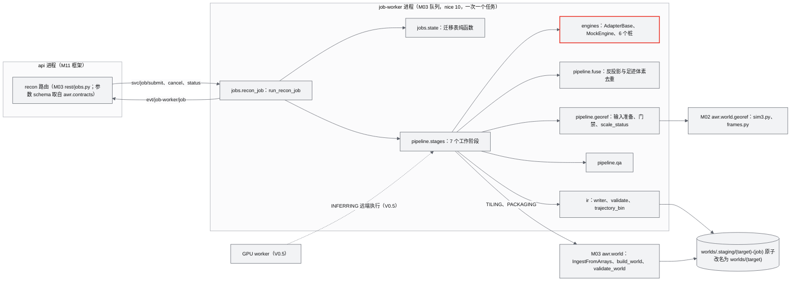
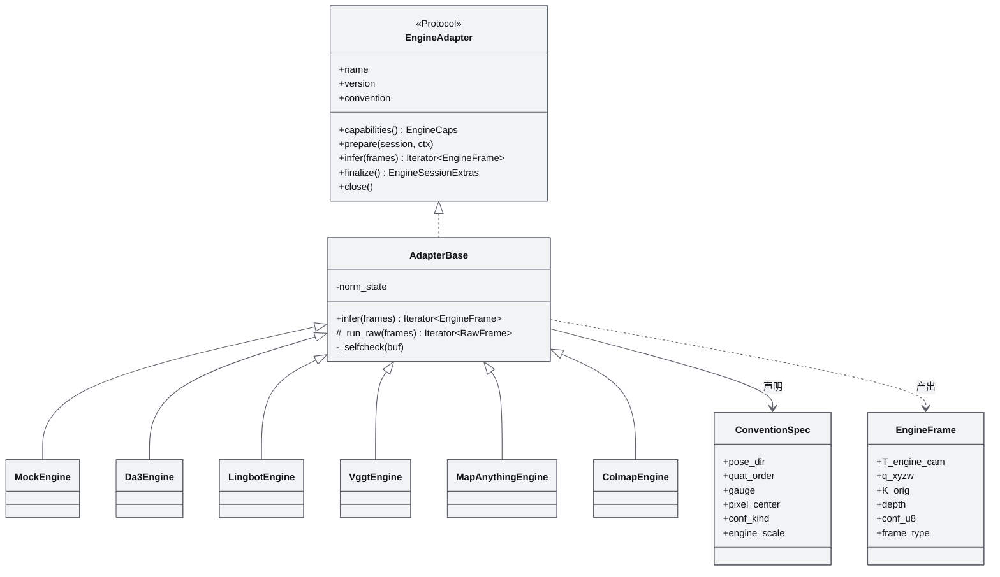
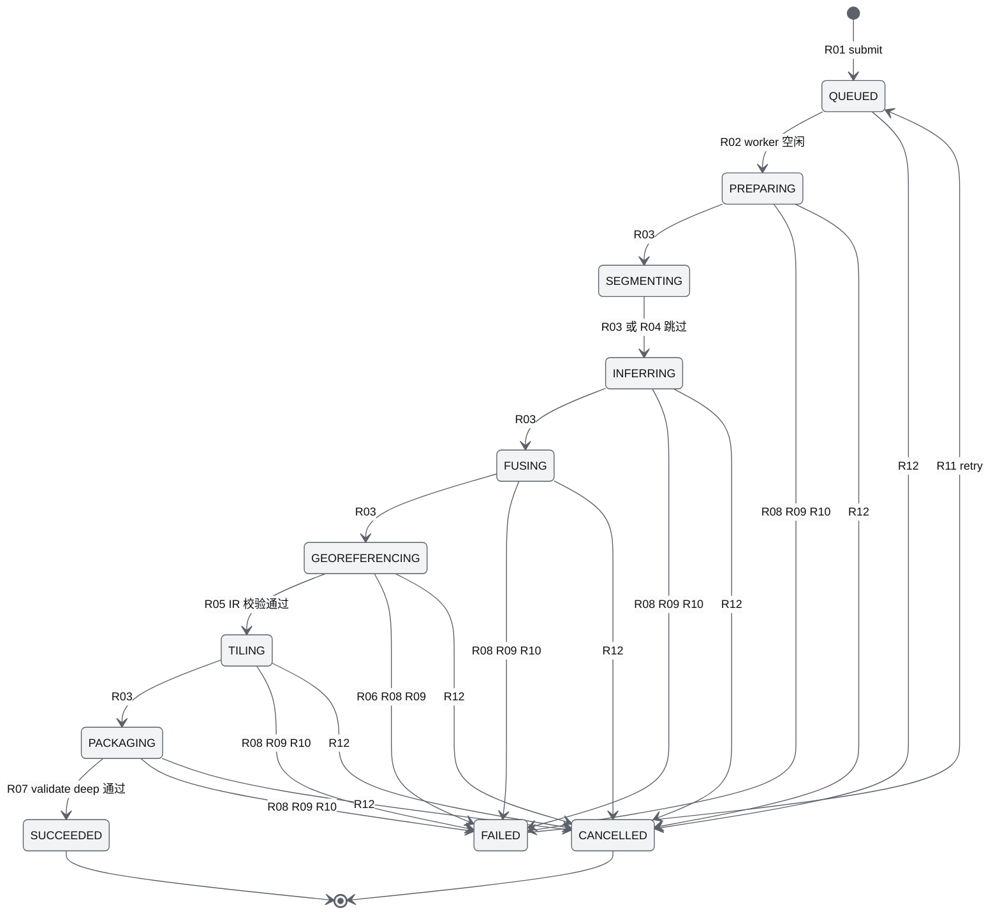
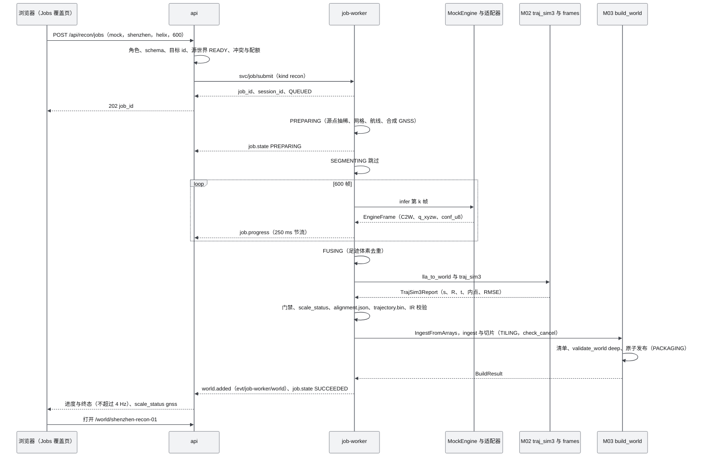
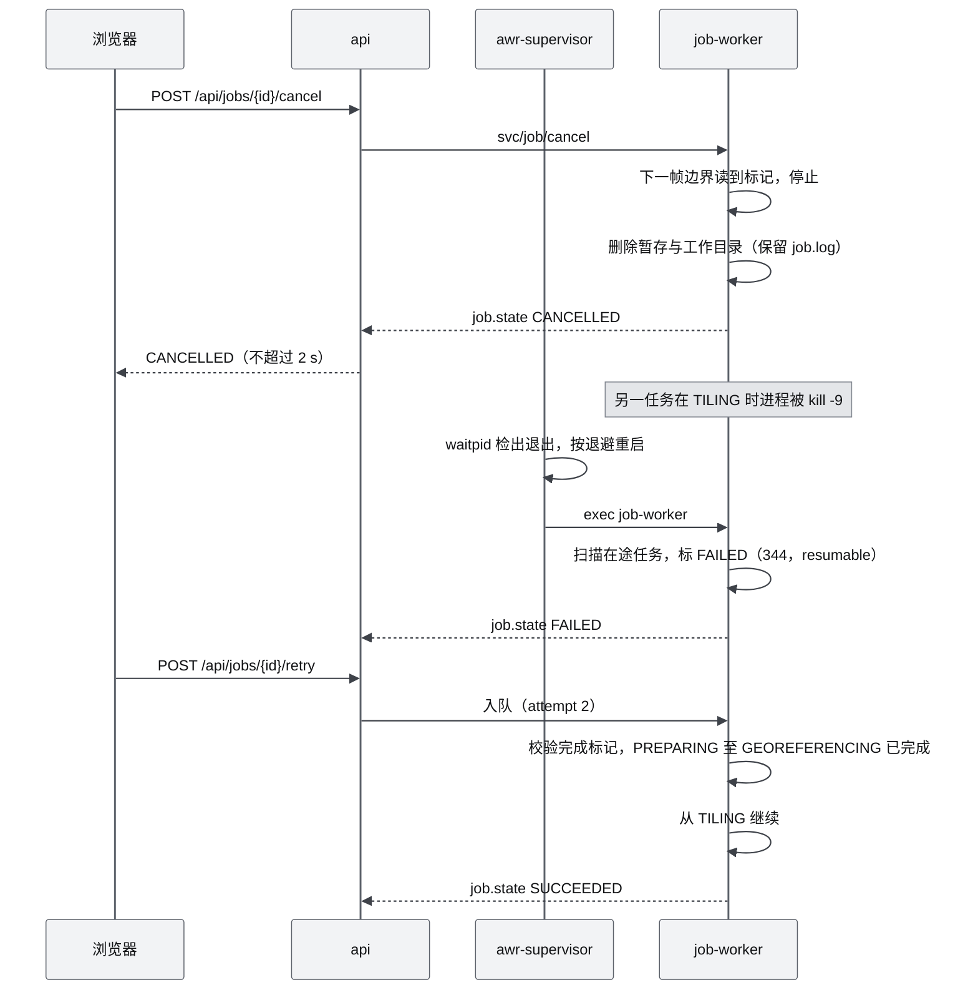

# M01 重建引擎（Reconstruction）PRD

| 项 | 内容 |
|---|---|
| 文档编号 | AWR-M01 |
| 标题 | 重建引擎（Reconstruction）PRD |
| 版本 | v1.0 |
| 日期 | 2026-09-28 |
| 状态 | 草案（首版提交；2026-09-28 审校修订：与 AWR-16 §14.1、AWR-17 §4.3.10 与 §8.4、M02 §6.4.4、M03 §6.14 与 §7.2 对齐，复核实测见 §6.4.1） |
| 上游文档 | [AWR-03 设计基线](../03-设计基线与决策记录.md)（ADR-001、ADR-003、ADR-006、ADR-017、ADR-018、ADR-034、ADR-035、ADR-042、ADR-045、ADR-050；§4.3、§4.4、§5.1–§5.7、§5.10、§6.3、§8.2–§8.7、Q1、Q2）；[01-design](../01-design.md) §4.1、§5、§6、§33、§41、§43、§44；研究笔记 [r01](../research/r01-lingbot-map-viser.md)、[r02](../research/r02-vggt-colmap.md)、[r03](../research/r03-nerfstudio-3dgs-gsplat.md)、[n02](../research/n02-discover-recon-slam.md)、[g03](../research/g03-gap.md) §2、§5、§6、[g05](../research/g05-gap.md) §3.6、§6、§7、[00-index](../research/00-index.md) §2.1、§3.2、§7 第 8–9 条；并行说明书 [10](../10-系统架构说明书.md) §8.4、§9.3、[11](../11-技术选型说明书.md) §4.12、[12](../12-业务逻辑设计说明书.md) §3.3.14、§4.12、§6.9、[14](../14-UI交互设计PRD.md) §5.7、§8.2、[16](../16-World数据规范.md) §14.1、§14.2、[17](../17-接口与实时协议规范.md) §4.2、§4.3.10、§6.12、§8.4；并行模块 [M02](M02-LiDAR融合与地理配准PRD.md) §6.4.4、[M03](M03-World模型与Ingest切片PRD.md) §6.14、§7.2 |
| 下游文档 | [16-World数据规范](../16-World数据规范.md)（Recon IR 文件格式、`trajectory.bin` 字节布局）；[17-接口与实时协议规范](../17-接口与实时协议规范.md)（REST、`svc/job/*`、`evt/job-worker/job`、`rt/enums.json` 中 ReconEngine / `JobState.recon` / ReconStage / ScaleStatus、原因码 330–349、时钟域登记）；[18-性能与测试方案](../18-性能与测试方案.md)（M01-AC 调度与阈值归档）；[19-部署与运维说明书](../19-部署与运维说明书.md)（DA3 独立 venv、V0.5 GPU 节点）；[M02](M02-LiDAR融合与地理配准PRD.md)（Sim3 库与帧换算）；[M03](M03-World模型与Ingest切片PRD.md)（任务队列、ingest、切片、校验与发布）；[M15](M15-前端UI壳与设计体系组件PRD.md)（重建任务覆盖页）；[M16](M16-演示数据剧本与流畅性测试PRD.md)（`recon.spec.ts` 调度、演示段 D6b） |
| 适用版本范围 | V0.1（D1）至 V1.0 |

## 0. 摘要

1. M01 把"视频或图像 → 带度量尺度、重力对齐、地理配准的几何"收敛为一个可替换引擎的服务：**Engine Adapter v2**（所有引擎的唯一出口）、**Recon IR `recon-ir@1`**（以 COLMAP 4 的 Rig/Camera/Frame 为骨架）、**Reconstruction Job**（8 阶段状态机）与 **World Package 输出**。真推理只替换引擎，IR、ingest 与 UI 不变（ADR-035）。
2. 统一契约：位姿一律 C2W，相机为 OpenCV 光学帧 RDF，四元数 `[x,y,z,w]` 且 w ≥ 0；置信度 `conf_u8 = round(255·(1−1/conf))`；`scale_status ∈ {relative, gnss, rtk, lidar}`，与 `coordinate.scaleStatus` 共用一个枚举，UI 必显；`engine.json` 记录引擎、版本、权重与许可。原始层 `T_engine_cam` 写入后不可变，配准只改 `alignment.json` 中的 `T_world_engine`，可重复配准。文件布局以 AWR-16 §14.1 为准（`trajectory.bin` 为 AWTR v1），与之不一致的 6 处语义取舍见 §6.3.5。
3. D1-core（P0）：Adapter 接口、IR schema 与语义校验器、任务状态机与枚举，MS1 冻结。D1-ext（P1）：MockEngine 从现有世界沿 helix 或 lawnmower 合成航线做 z-buffer 采样，输出处于隐藏随机 Sim3 规范系的 IR，经 GNSS Sim3 配准（M02 `traj_sim3`）、M03 `IngestFromArrays` 入库、切片与发布成为新世界并可在 Web 加载（D1-AC-22）。DA3-SMALL CPU 冒烟为 V0.2（P2，允许提前、不计入 D1 验收）。
4. 本文实测（§6.4.1）：深圳源点云抽稀到 125 万点、600 帧 128×72，helix 121.6 ms/帧、lawnmower 64.7 ms/帧，峰值 RSS 1.06 GB；合成 GNSS（σ 水平 2 m、垂直 3 m）下 Sim3 尺度误差 ≤ 0.034%、旋转误差 ≤ 0.07°、配准点位误差 p95 0.29–0.63 m。复核（加 0.5% 深度噪声、1% 离群、2% 缺测）：融合点到源点云 C2C p95 为 1.7–2.9 m，受像素足迹与深度噪声支配，故 C2C 阈值另设（M01-AC-009）。Mock 端到端 ≤ 180 s（暂定，MS6 冻结）。
5. 引擎路线：LingBot-Map（GPU 主力，V0.5）、DA3（CPU 冒烟 V0.2，Streaming V0.5）、MapAnything（RTK 位姿与 LiDAR 稀疏深度条件下的度量重建，V0.5）、COLMAP 4.2 / GLOMAP（度量基准、兜底与 QA，V0.5）、VGGT（约定源头与可选批量引擎，V0.5）、Mock（D1）。
6. 地理配准：LO-RANSAC Umeyama（阈值由协方差导出）、直线航带共线退化检测与 IMU 重力增强两遍法（旋转误差由 60°–117° 降到 0.19°，r02 §3.5）、时间偏移搜索与杆臂补偿；门禁不通过时世界以 `relative` 发布并禁止开会话，不冒充度量。
7. 对基线与并行文档的反馈共 19 条（§14），均未擅改决策；其中第 5、8、10、12、13 条已由 AWR-16、AWR-17、M03 全部或部分裁决，本文已按裁决回改。

---

## 1. 背景与目标

### 1.1 定位与研究结论

平台的"Real-World Grounded"意图（AWR-03 §2.5）要求"采集 → 重建 → World"链路真实存在并可验收。M01 位于 Reality 层与 World 层之间：输入为视频、图像序列（V0.5 起）或既有世界的合成采样（D1）；输出为 Recon IR 与一个新的 World Package。M01 **不是** World Engine（沿用 01-design §5.1"技术定位"）：切片、语义、DTM 属于 M03，LiDAR 融合与因子图属于 M02，几何查询属于 M04。

决定本模块形态的研究事实：

| # | 事实 | 对设计的影响 | 依据 |
|---|---|---|---|
| F1 | 前馈重建（LingBot-Map、VGGT、DA3）输出没有度量尺度，也不与重力对齐；LingBot-Map 户外 ATE 在 KITTI 为 24.0、VBR 为 31.2 | 地理配准是必经阶段；`scale_status` 必须诚实标识 | r01 §0 第 1 条；r02 §0 第 2 条 |
| F2 | 位姿方向不统一：VGGT、VGGT-Ω、DA3 解码为 W2C；LingBot-Map、MapAnything、π3 为 C2W；DA3 在视图数 ≥ 3 时以 saddle 选出的参考视图为世界系；LingBot `demo.py` 存盘的 `extrinsic` 实为 W2C | 适配器统一"方向归一 + 规范到第 0 帧"，并带自检 | r02 §0 第 1 条；n02 §0 第 5 条、§3.1 |
| F3 | 本机无 GPU；LingBot-Map 的 KV 池在 518×378 下约 10.9 GB，推荐 ≥ 24 GB 显卡 | D1 只交付接口与 Mock 链路；真推理放 V0.5 GPU worker | r01 §2.4；AWR-03 Q1 |
| F4 | 直线航带下纯 Umeyama 的旋转误差达 59.9°（RTK）与 117.1°（GPS），加入 IMU 重力虚拟点的两遍法后为 0.00° 与 0.19° | 共线退化检测与重力增强写入配准规范 | r02 §3.5 |
| F5 | COLMAP 4.x 的 Rig/Camera/Frame/Image/Point3D/PosePrior 是最成熟的多传感器数据模型，但二进制文件没有时间戳 | IR 以其为骨架，时间戳用 sidecar `frames.jsonl` | r02 §0 第 3 条、§2.7 |
| F6 | 置信度激活函数 `1+exp(x)` 在 LingBot、VGGT、DA3、MapAnything 中通用，`1−1/conf = sigmoid(x)` 严格成立 | 置信度可无损映射到 u8 | r02 §0 第 9 条；本文核实 DA3 `model/dpt.py` 默认 `conf_activation = "expp1"`（`torch.exp(x) + 1`）、MapAnything `adaptor_config/*.yaml` 为 `confidence_type: "exp"`、`confidence_vmin: 1` |
| F7 | DA3-SMALL 在 8 核 CPU 上 8 帧 336 分辨率约 27 s、峰值 RSS 1.47 GB | 无 GPU 也能跑一条真实推理的冒烟链路 | n02 §0 第 4 条、附录 A |

### 1.2 对原设计的继承、修正与增强

| 01-design 章节 | 原文要点 | 处置 | 本文落点 | 依据 |
|---|---|---|---|---|
| §5.1 LingBot-Map | 主视觉重建引擎，从长视频估计 Camera Pose、Depth、Geometry、Point Cloud、Trajectory | **继承**：仍为主引擎（V0.5 GPU worker，以库方式调用，锁 commit `849e690`） | §6.4.3 | ADR-035；r01 §0 |
| §5.1 "不需要首先建设完整的 SfM/MVS 流程" | 以前馈模型替代 SfM | **修正**：不以 SfM 为主链路，但保留 COLMAP 4.2 作为度量基准、兜底与 QA 真值 | §6.4.6 | r02 §7 第 1 条 |
| §5.1 技术定位 | Visual Reconstruction Engine，而非整个 World Engine | **继承并增强**为"引擎适配层"：多引擎共用 Adapter v2 与 Recon IR，引擎可替换 | §6.2 | n02 §3.1；00-index §3.2 |
| §6 "尺度可能存在误差" | 视频重建尺度有误差、弱纹理差、距离精度不足 | **修正**：前馈重建"尺度本来就不存在"、不对齐重力；Sim3 配准为必经阶段，结果以 `scale_status` 标识 | §6.6 | r02 §0 第 2 条 |
| §6 融合链路 | Video Geometry + LiDAR + RTK → Registration → World Geometry | **增强**：GNSS Sim3 接口前移到 V0.1 冻结；加入共线退化检测与重力增强、杆臂与时间偏移；新增"前馈融合"路线（MapAnything 以 RTK 位姿与 LiDAR 稀疏深度为网络输入），与"后配准"路线在 V0.5 对照后定主路径；LIO 与因子图融合归 M02 | §6.4.5、§6.6 | ADR-035；n02 §7 第 2 条 |
| §41 `reconstruction/{cameras,trajectory}` | 相机与轨迹目录 | **修订**为 `reconstruction/<session>/`（Recon IR），原始层与配准层分离，另有 `engine.json`、`alignment.json`、`qa.json` | §6.3 | AWR-03 §4.4；r02 §3.2 |
| §43 最终 Demo | 上传视频 → 自动重建 → 浏览器进入场景 → 添加虚拟 P600 | **推迟** V0.5；D1 以 Mock 重建链路保留同一条接口通路，作为演示扩展段 D6b | §2.1 | ADR-042；AWR-03 Q2 |
| §44 V0.1 | LingBot-Map reconstruction | **取代**：真推理 V0.5；D1 交付接口（core）与 Mock 链路（ext） | §12 | ADR-042、ADR-035 |
| §4.1 浏览器不负责 LingBot 推理 | — | **沿用**：重建全部在服务端 job-worker 或 GPU worker 执行 | §6.1 | P-02 |
| §33 技术栈 Reconstruction 行 | LingBot-Map | **增强**：注明 GPU ≥ 24 GB、CUDA 12.8；新增 pycolmap 4.2、DA3、MapAnything；每个引擎一个独立 venv | §9.4 | r01 §7 第 14 条；n02 §6 第 2 条 |

### 1.3 目标

| 编号 | 目标 | 可度量表述 | 首次达成 |
|---|---|---|---|
| M01-G1 | 接口先行，引擎可替换 | Adapter v2、`recon-ir@1`、任务状态机在 D1-MS1 冻结；新增一个引擎只需 1 个适配器文件与 1 条约定声明，IR、ingest、UI 零改动 | V0.1 |
| M01-G2 | 无 GPU 可闭环 | 本机 CPU 上 Mock 任务从提交到新世界可加载 ≤ 180 s（暂定），D1-AC-22 通过 | V0.1 |
| M01-G3 | 位姿约定零静默错误 | 6 类引擎约定的归一化 golden 误差 ≤ 1e-9；错误约定注入 100% 被自检拦截 | V0.1 |
| M01-G4 | 度量诚实且可信 | 每个产物世界都带 `scale_status`；门禁不通过不冒充度量；Mock GNSS 模式下尺度误差 ≤ 0.2%、点位误差 p95 ≤ 1.5 m | V0.1 |
| M01-G5 | 不干扰实时仿真 | Mock 任务与 1000 架机群并发时 sim-core 单步 p99 ≤ 3 ms、RTF ≥ 0.99 | V0.1 |
| M01-G6 | 真实重建 | P600 视频加 RTK：Sim3 后相机中心 ATE ≤ 0.3 m；进入 V0.5 全流程 | V0.5 |

### 1.4 模块设计原则

| 编号 | 原则 | 落地约束 | 依据 |
|---|---|---|---|
| P-M01-1 | 适配器是唯一出口 | 任何引擎输出都先经 `AdapterBase.normalize` 归一化并通过自检，才能写入 IR | n02 §3.1 |
| P-M01-2 | 原始层不可变，配准层可重算 | `frames.jsonl` 在 INFERRING 写完后只读；重配准只改写 `alignment.json` 并重生成 `trajectory.bin` | r02 §3.2 设计原则 3 |
| P-M01-3 | 诚实标识 | `scale_status`、`engine_scale`、Mock 产物的 `synthetic` 标签与 `generator.params.recon.engine = mock`、权重许可全部落盘并在 UI 显示（"模拟数据"） | ADR-035；AWR-13 PP-05 |
| P-M01-4 | 阶段幂等、原子发布 | 每阶段产物先写临时文件再改名，最后写 `.complete.json`；世界只在 `validate --deep` 通过后原子改名出现 | r01 §4.2；g05 §6 |
| P-M01-5 | 重计算不进 api | 推理、融合、配准、切片全部在 job-worker（nice 10、一次一个任务）或 GPU worker；api 只做校验与转发 | ADR-017；AWR-03 §4.2 第 1 条 |
| P-M01-6 | 能力探测而非硬编码 | 引擎可用性由 `capabilities()` 探测（venv、权重、GPU），不可用引擎在 UI 置灰并给出原因 | AWR-03 Q1 |
| P-M01-7 | 可复现 | 同参数、同种子、同源世界 `contentVersion` 产出逐字节相同的 IR 与几何源点云；会话文件不写墙钟与主机字段 | P-10 |

---

## 2. 范围

### 2.1 分层范围（与 AWR-03 §6.3 M01 行一致）

| 层 | 内容 | 优先级 |
|---|---|---|
| **D1-core** | `awr/reconstruction/engines/base.py`（Engine Adapter v2 Protocol 与 `AdapterBase`）；约定表与归一化纯函数；`packages/contracts/recon/*.schema.json`（`recon-ir@1`：C2W、OpenCV RDF、`q_xyzw`、`conf_u8`、`scale_status`、`engine.json`）及代码生成；IR 语义校验器与变异测试；`rt/enums.json` 中的 `JobState.recon`（AWR-17 §10.5 已列）与本文提请新增的 ReconEngine、ReconStage（ScaleStatus 复用）；任务状态机纯函数与迁移表；任务参数 schema；进度事件节流规则（250 ms） | P0 |
| **D1-ext** | MockEngine（合成航线、隐藏规范系、合成 GNSS 与重力）；7 个工作阶段的流水线（FUSING、GEOREFERENCING、TILING、PACKAGING 实装）；向 `awr/jobs/registry.py` 注册 `recon` 任务类型；REST R38 `POST /api/recon/jobs`、R63 `GET /api/recon/engines` 的语义（路由文件为 M03 的 `rest/jobs.py`，AWR-17 §4.2）；进度与状态事件；取消与续跑；`qa.json`；重建任务 UI 的数据契约（UI 由 M15 实现） | P1 |
| **D1 桩** | `lingbot.py`、`vggt.py`、`da3.py`、`da3_streaming.py`、`mapanything.py`、`colmap.py` 适配器文件：约定声明完整，`capabilities()` 返回不可用及原因，`infer()` 抛 `EngineUnavailable` | P1 |
| **后续版本** | V0.2：DA3-SMALL CPU 冒烟引擎（独立 venv）；V0.5：GPU worker、LingBot-Map、DA3-Streaming、MapAnything、COLMAP 基准、VGGT（可选）、真实 GNSS/RTK 配准（时间偏移、杆臂、分块 Sim3）、重建预览流、ReconstructionLayer 数据；V0.6–V0.8：3DGS 训练数据契约导出；V1.0：在线流式建图、质量引导补拍任务 | 见 §4 |
| **不做** | 浏览器端任何推理或配准（P-02）；LiDAR 融合、LIO、因子图（M02）；切片、语义、DTM（M03）；3DGS 训练与 Web 3DGS 图层（V0.8 另立）；viser 产品前端（r01 §5：只可作内部 QA 工具） | — |

说明：任务说明中的"可选 DA3-SMALL CPU 冒烟"按 AWR-03 §6.3 与 ADR-035 执行为 **V0.2、P2**；D1 期间允许提前实现，但不进入 D1 验收与发布阻塞（见 §14 第 1 条）。

### 2.2 版本演进

| 版本 | M01 交付 | 退出判据（M01 部分） |
|---|---|---|
| V0.1（D1） | core：接口、IR、状态机；ext：Mock 链路 | P0：M01-AC-001 至 M01-AC-007、M01-AC-022；P1：D1-AC-22 与 M01-AC-008 至 M01-AC-016、M01-AC-018 至 M01-AC-020、M01-AC-026；P2：M01-AC-017、M01-AC-021、M01-AC-027 |
| V0.2 | DA3-SMALL CPU 冒烟（`images` 输入，8 帧 336 分辨率） | M01-AC-023 |
| V0.5 | GPU worker（Docker，CUDA 12.8）；LingBot-Map、DA3-Streaming、MapAnything、COLMAP 基准；真实 GNSS/RTK 配准；前馈融合与后配准对照实验 | M01-AC-024、M01-AC-025；合肥园区全流程（AWR-03 §8.1 V0.5） |
| V0.6–V0.8 | 训练数据契约持久化（原始帧、深度、置信度、位姿、内参；COLMAP sparse、gsplat NPZ 导出） | 3DGS 训练任务可直接读取（r03 §3.9） |
| V1.0 | LingBot-Map 在线流式会话；OpenFlyScan 式"低质量区域补拍"任务 | S3 扩展剧本中补拍任务闭环 |

### 2.3 与相邻模块的边界

| 事项 | M01 负责 | 对方负责 | 对方 |
|---|---|---|---|
| Sim3 数值实现 | 配准阶段编排、输入准备（同步、杆臂、重力）、门禁、`scale_status` 推导、`alignment.json` | `awr/world/georef/sim3.py`（`umeyama`、`traj_sim3`：LO-RANSAC、共线检测、重力增强、时间偏移搜索；`MockGnss`）与 `frames.py`（WGS84/ECEF/ENU） | M02 |
| 世界构建 | 把融合点云按 `T_world_engine` 变到 world，组装 `IngestFromArrays`（数组、锚点、`registration`、溯源，§6.8、§7.4） | `IngestFromArrays` 与 `build_world`：ingest（DTM/DSM/HAG/语义）、tile、清单写出、`validate --deep`、原子发布 | M03 |
| 任务框架 | 注册 `recon` 任务类型、实现 runner 与阶段逻辑 | SQLite 队列、job-worker 进程、`svc/job/*`、`rest/jobs.py` 通用端点 | M03 |
| 进程与总线 | 事件载荷定义 | `awr.runtime`（Bus、心跳、supervisor） | M11 |
| 重建任务 UI | 字段语义、状态文案、`scale_status` 规则 | 覆盖页、表格、阶段条、动效实现 | M15（交互见 AWR-14 §5.7） |
| 测试调度 | `tests/reconstruction/**` 与 `apps/web/perf/m01/recon.spec.ts` | Playwright harness、性能运行协议 | M16、AWR-18 |

---

## 3. 用户与用例

### 3.1 角色

| 角色 | 诉求 | 权限 |
|---|---|---|
| 操作员（operator） | 在 UI 中提交重建任务、看进度与尺度状态、进入产物世界 | 提交、取消、重试自己的任务 |
| 科研与算法工程师 | 切换引擎、复现与对比重建结果、检查配准质量与位姿约定 | 同上，另可用 CLI 离线运行与校验 |
| 观察者（viewer） | 看到"真实数据 → 重建 → 进入世界"的通路 | 只读任务列表与产物世界 |
| CI | 在无 GPU 的本机上回归接口、约定、链路 | CLI 与 pytest |
| 外场团队（V0.5） | 上传 P600 视频、飞控日志、RTK，得到度量世界 | 提交真实任务（GPU worker） |

### 3.2 用例

| 编号 | 用例 | 主要流程 | 版本 | D1 |
|---|---|---|---|---|
| UC-M01-01 | 提交 Mock 重建任务 | 选源世界（深圳）、航线（helix）、帧数（600）→ 提交 → 八阶段进度 → SUCCEEDED → "在沙盘中打开"新世界 | V0.1 | ext |
| UC-M01-02 | 查看尺度状态 | 任务表与详情显示 `scale_status` 徽标与配准质量（内点率、RMSE）；`relative` 时显示"尺度未知，距离与高度不可用于物理" | V0.1 | ext |
| UC-M01-03 | 取消任务 | 任意非终态点击取消 → ≤ 2 s（重阶段 ≤ 10 s）进入 CANCELLED，`worlds/` 无半成品 | V0.1 | ext |
| UC-M01-04 | 崩溃后续跑 | job-worker 崩溃 → 任务 FAILED（resumable）→ 重试 → 从第一个未完成阶段继续 | V0.1 | ext |
| UC-M01-05 | 离线校验 IR | `python -m awr.reconstruction validate <session_dir> --deep` 输出校验报告 | V0.1 | core |
| UC-M01-06 | 引擎可用性查询 | `GET /api/recon/engines`：Mock 可用；LingBot 等显示"需要 GPU" | V0.1 | ext |
| UC-M01-07 | CPU 真实推理冒烟 | 8 张关键帧 → DA3-SMALL → IR（`relative`）→ 世界（只可浏览） | V0.2 | 否 |
| UC-M01-08 | 真实视频重建 | P600 视频 + 飞控日志 + RTK → LingBot-Map（GPU）→ RTK Sim3 → 度量世界 | V0.5 | 否 |
| UC-M01-09 | 度量条件重建对照 | 同一段视频分别跑纯图像、加 RTK 位姿、加 RTK 与 LiDAR 稀疏深度三组，与 LIO 地图做 C2C 比较 | V0.5 | 否 |
| UC-M01-10 | 基准与 QA | COLMAP pose-prior mapper 作为真值，`model_comparer` 与 IR 对比 ATE、旋转误差 | V0.5 | 否 |

### 3.3 本模块新增术语（其余见 AWR-03 §11）

| 术语 | 定义 |
|---|---|
| 引擎规范系（engine gauge） | 引擎自身的世界系，帧名 `engine`（AWR-03 §5.1）；尺度与重力方向未知 |
| 原始层 / 配准层 | 原始层：引擎规范系下的 `T_engine_cam`、深度、置信度，写入后不可变；配准层：`T_world_engine` 及由它派生的 `T_world_cam`、世界点云 |
| 会话（recon session） | 一次重建产出的 IR 集合，目录 `reconstruction/<session_id>/`；id 为输入内容哈希的前 12 位，形如 `rs-3f9a0c1d2b7e`（§6.3.2） |
| 引擎帧（EngineFrame） | 适配器归一化后的单帧输出：C2W 位姿、原图内参、深度、置信度、帧类型 |
| 帧类型（frame_type） | 0 = 尺度帧（scale），1 = 关键帧，2 = 非关键帧；沿用 LingBot-Map 语义（r01 §2.2） |
| 引擎尺度语义（engine_scale） | `relative`、`metric_predicted`、`metric_conditioned`，描述引擎自身输出，区别于配准后的 `scale_status` |
| 重力增强（gravity augmentation） | 在 Umeyama 中加入"相机中心 + L·重力方向"虚拟点，消除共线航带绕航线轴的旋转不可观测 |
| 足迹体素（footprint voxel） | 以"深度 / 焦距"得到的像素足迹中位数乘系数 k 作为去重体素边长，不依赖度量尺度 |
| 暂存目录（staging） | `worlds/.staging/<target>-<job_id>/`，由 M03 `build_world` 创建并持文件锁（nonce 取 `job_id`，M03-FR-042），发布时原子交换 |
| 阶段完成标记 | `runs/jobs/<job_id>/stages/<STAGE>.complete.json`，含参数哈希与产物 sha256；不随世界发布 |

---

## 4. 功能需求

表中"验收要点"引用 §10 的 M01-AC 编号；D1 列取值见 AWR-03 §10.2 第 4 条（"桩"表示本期只交付接口或替身，真实实现版本写在描述中）。

### 4.1 接口与契约（D1-core）

| 编号 | 需求描述 | 优先级 | 目标版本 | D1 | 验收要点 | 依据 |
|---|---|---|---|---|---|---|
| M01-FR-001 | 在 `awr/reconstruction/engines/base.py` 定义 `EngineAdapter` Protocol（`name`、`version`、`capabilities()`、`prepare()`、`infer()`、`finalize()`、`close()`）与 `AdapterBase`（负责归一化、自检、置信度与内参换算），并提供引擎注册表 `@register_engine`；签名见 §9.2，MS1 冻结 | P0 | V0.1 | 是 | M01-AC-001 | ADR-035；AWR-10 §3.4 类图；r02 §3.3 |
| M01-FR-002 | 每个引擎以 `ConventionSpec` 声明原始约定（位姿方向、四元数顺序、相机轴、规范系、像素中心、置信度激活、引擎尺度语义）；Mock、DA3、LingBot-Map、VGGT、MapAnything、COLMAP 六类的取值按 §6.2.2 冻结；新增引擎必须先登记约定并附夹具 | P0 | V0.1 | 是 | M01-AC-001 | n02 §3.1；r02 §2.5 |
| M01-FR-003 | 位姿归一化：W2C 求逆；统一规范到第 0 帧（`T ← T0⁻¹·T`，并在 `engine.json` 记录 `T_frame0_raw`）；旋转用 SVD 正交化；四元数输出 `[x,y,z,w]` 且 w ≥ 0；全程 float64 | P0 | V0.1 | 是 | M01-AC-001：归一化误差 ≤ 1e-9 | n02 §3.1；r02 §3.1；AWR-03 §5.3 |
| M01-FR-004 | 位姿方向自检：随机 4 对帧（间隔 5 帧）分别在 C2W 与 W2C 两种假设下反投影，取对称 Chamfer 中位数较小者投票，结果必须与声明一致；有逐帧点时另查"相机前方点比例 ≥ 0.8"；不一致时任务以 336 RECON_POSE_CONVENTION 失败 | P0 | V0.1 | 是 | M01-AC-002 | r02 §3.3 `detect_pose_convention`；n02 §3.1 |
| M01-FR-005 | 置信度归一：`expp1` 族取 `conf01 = 1 − 1/conf`，logit 族取 `sigmoid`，无置信度的来源写 255 并在 `session.json` 标注 `conf_source = none`；`conf_u8 = round(255·conf01)`；每个会话统计 `conf_hist_u8[256]` | P0 | V0.1 | 是 | M01-AC-003：conf 1.5 → 85，conf 5 → 204 | r02 §0 第 9 条、§3.4 |
| M01-FR-006 | 内参换算到原图像素：按分轴比例 `sx`、`sy` 与裁剪偏移还原，像素中心采用 COLMAP 约定（+0.5）；有标定值时 `source = calibrated` 优先，引擎预测值只进 QA | P0 | V0.1 | 是 | M01-AC-004 | r02 §2.3、§3.3 `K_model_to_orig` |
| M01-FR-007 | `scale_status` 复用 `rt/enums.json` 的 ScaleStatus（七值），重建会话只允许子集 `{relative, gnss, rtk, lidar}`；另设 `engine_scale ∈ {relative, metric_predicted, metric_conditioned}` 描述引擎本身；两者的推导规则见 §6.6.6 | P0 | V0.1 | 是 | M01-AC-006 | ADR-035；g03 §2.2 |
| M01-FR-008 | `engine.json` 必须记录：引擎与变体、版本、commit、权重（repo、文件、sha256、许可文本）、代码许可、原始约定、归一化记录与自检结果、`engine_scale`、条件输入、解析后参数、运行时（设备、线程、dtype）；计时与主机信息写 `provenance.json`；许可按 R4 不作限制但必须记录 | P0 | V0.1 | 是 | M01-AC-005 | ADR-034、ADR-035；n02 §3.1、§6 第 1 条 |
| M01-FR-009 | 在 `packages/contracts/recon/` 提交 `recon-ir@1` 的 JSON Schema 2020-12（session、engine、rig、cameras、frame、alignment、qa 与聚合 schema）及任务参数 schema，经 `tools/contracts/gen.{mjs,py}` 生成 TS 类型与 Python dataclass；字段语义以本文为准，文件格式由 AWR-16 登记 | P0 | V0.1 | 是 | M01-AC-005、M01-AC-006 | AWR-03 §5.10；g03 §6.1 |
| M01-FR-010 | 语义校验器 `validate_session(dir, deep)` 实现 §6.3.4 的 18 条规则；附 12 条变异用例（W2C 冒充 C2W、wxyz 顺序、未规范到第 0 帧、det = −1、scale_status 越界等）全部被拦截 | P0 | V0.1 | 是 | M01-AC-005 | g03 §6.2–§6.3（方法） |
| M01-FR-011 | 会话目录与分层：`reconstruction/<session>/` 的文件集合按 §6.3.2；`frames.jsonl` 在 INFERRING 完成后只读；重配准只改写 `alignment.json` 并重生成 `trajectory.bin` | P0 | V0.1 | 是 | M01-AC-005 | r02 §3.2；AWR-03 §4.4 |
| M01-FR-012 | `trajectory.bin` 读写，严格按 AWR-16 §14.1 的 AWTR v1（头部 32 B；`i64 t_rel_ns`、`f32 pos`、`f32 q_xyzw`、`u8 frame_type`、`u8 conf_u8`、`u16 camera_id`，各数组起点 8 字节对齐）；本文 §6.3.3 只复述，不另立布局 | P0 | V0.1 | 是 | M01-AC-005 | AWR-16 §14.1；r02 §3.2 |
| M01-FR-013 | 任务状态枚举 `JobState.recon`（11 值，AWR-17 §10.5）；本文提请 AWR-17 新增 ReconStage（7 个工作阶段）与 ReconEngine（§6.2.1）；状态机以纯函数 `transition(state, event, guards)` 实现并按 §6.7.1 迁移表测试；进度事件节流 250 ms（墙钟）写入规则 | P0 | V0.1 | 是 | M01-AC-007 | AWR-03 §6.3；AWR-12 §4.12；AWR-17 §10.5 |
| M01-FR-014 | 任务参数 schema `recon-job-params`：`engine`、`source`、`target_world_id`、`seed`、`params{camera, path, mock, fuse, georef, retain}`，缺省值按 §6.9；未知字段拒绝 | P0 | V0.1 | 是 | M01-AC-016 | AWR-12 §3.3.14、§6.0 业务操作目录 |
| M01-FR-015 | 引擎桩：`lingbot.py`、`vggt.py`、`da3.py`、`da3_streaming.py`、`mapanything.py`、`colmap.py` 均声明完整约定；`capabilities()` 返回 `available = false` 与原因（`GPU_REQUIRED`、`VENV_MISSING`、`WEIGHTS_MISSING`、`NOT_IMPLEMENTED`）；真实实现见 M01-FR-049 至 M01-FR-055 | P1 | V0.1 | 桩 | M01-AC-016（331） | ADR-035；AWR-03 §4.1 目录注释 |

### 4.2 MockEngine（D1-ext）

| 编号 | 需求描述 | 优先级 | 目标版本 | D1 | 验收要点 | 依据 |
|---|---|---|---|---|---|---|
| M01-FR-016 | 从源世界 Geometry World 的全分辨率点云 `geometry/pointcloud/source/`（`awr-pts@1`，经 M03 `awr/world/pointcloud/source.py` 读取）读取 xyz 与法线，按 `source_keep`（缺省 0.25，固定种子）抽稀，建立 64 m 平面网格索引 | P1 | V0.1 | 是 | M01-AC-010 | 本文 §6.4.1 实测；AWR-16 §6.1 |
| M01-FR-017 | 合成航线 `helix` 与 `lawnmower`，参数与缺省值见 §6.4.1；航线限定在源世界 `extent` 内缩 10% 的范围 | P1 | V0.1 | 是 | M01-AC-008 | AWR-12 §6.0 业务操作目录；r01 §4.3 |
| M01-FR-018 | 虚拟相机：原图 1920×1080、水平视场 60°、深度图 128×72（可选 256×144）、10 fps；朝向一律 look-at 目标点（helix 指向内侧目标，缺省参数下俯仰约 −28° 至 −34°；lawnmower 目标点在前方 `alt_agl_m / tan(|pitch_deg|)` 处，缺省 −45°）；前 8 帧标为尺度帧（frame_type 0） | P1 | V0.1 | 是 | M01-AC-008 | r01 §2.2、§4.3；本文复核实测 |
| M01-FR-019 | 每帧 z-buffer 生成深度、转移源点法线、按相对深度噪声 0.5% 扰动、按距离与入射角生成合成置信度（§6.4.1 公式） | P1 | V0.1 | 是 | M01-AC-009 | r01 §4.3；本文设定 |
| M01-FR-020 | 隐藏规范系：以种子生成随机 Sim3（尺度对数均匀于 [1/100, 1/20]、随机旋转、平移 N(0,1)），Mock 输出的全部位姿与深度都处于该规范系，模拟前馈引擎的无尺度、未对齐输出 | P1 | V0.1 | 是 | M01-AC-009 | r02 §2.3；本文设定 |
| M01-FR-021 | 可选注入：原始输出改为 W2C（检验适配器求逆与自检）；按 120 帧窗口注入尺度 ±3%、偏航 ±0.5° 漂移（检验分块配准）；`keyframe_interval > 1` 产生非关键帧 | P2 | V0.1 | 是 | M01-AC-027 | r01 §4.3 |
| M01-FR-022 | 合成 GNSS 与重力：真实相机中心加噪（GNSS 模式 σ 水平 2.0 m、垂直 3.0 m），1% 离群（15–40 m 跳变）、2% 缺测；经源世界锚点换算为 WGS84 后再由 M02 换回 world，以覆盖真实链路；每帧重力方向加 0.2° 噪声。生成器与 M02-FR-019 的 Mock GNSS 生成器同源，M02 实装后改为调用其实现（§14 第 19 条） | P1 | V0.1 | 是 | M01-AC-009、M01-AC-018 | r02 §3.5；本文设定 |
| M01-FR-023 | 真值文件 `mock_truth.json`（隐藏 Sim3、真实位姿）只写入任务工作目录 `runs/jobs/<job_id>/`，**不得**进入 World Package，供测试读取 | P1 | V0.1 | 是 | M01-AC-009 | P-M01-3 |

### 4.3 流水线阶段（D1-ext）

| 编号 | 需求描述 | 优先级 | 目标版本 | D1 | 验收要点 | 依据 |
|---|---|---|---|---|---|---|
| M01-FR-024 | PREPARING：校验参数；解析源世界（READY、记录 `contentVersion` 与 `coordinate.sha256`）；读取并抽稀源点、建索引、生成航线；写 `session.json`（草稿）、`rig.json`、`cameras.json` | P1 | V0.1 | 是 | M01-AC-008 | §6.7.2 |
| M01-FR-025 | SEGMENTING：Mock 无天空与动态物，阶段直接写 `skipped = true` 的完成标记；真实引擎的天空分割（`skyseg.onnx`，修补数量不足时补 0 的缺陷，改为补 1）见 M01-FR-051 | P1 | V0.1 | 是 | M01-AC-008 | r01 §2.5、§6 第 8 条 |
| M01-FR-026 | INFERRING：逐帧调用 `infer()`，归一化后追加 `frames.jsonl`，每帧检查取消与性能锁，按帧推进进度 | P1 | V0.1 | 是 | M01-AC-008、M01-AC-012 | r01 §3.3（逐帧落盘，不累积全量） |
| M01-FR-027 | FUSING：置信度、深度分位与天空过滤；按 COLMAP 像素中心反投影（真实引擎可加 ±0.4·stride 抖动）；足迹体素去重（k = 0.5）并保留首见帧 `first_seen`；输出融合点与置信度直方图 | P1 | V0.1 | 是 | M01-AC-009、M01-AC-010 | r01 §3.5；n02 §3.6 |
| M01-FR-028 | GEOREFERENCING：准备 GNSS、重力与相机中心，调用 M02 `traj_sim3`（M02 §6.4.4），在其报告之上执行 M01 门禁 G1–G6，推导 `scale_status`，写 `alignment.json` 与 `trajectory.bin` | P1 | V0.1 | 是 | M01-AC-009、M01-AC-018 | ADR-035；r02 §3.5；M02-FR-018 |
| M01-FR-029 | IR 校验门：进入 TILING 前 `validate_session(deep = false)` 必须零错误，否则以 340 RECON_IR_INVALID 失败 | P1 | V0.1 | 是 | M01-AC-008 | AWR-12 §4.12 |
| M01-FR-030 | TILING：把融合点按 `T_world_engine` 变换到 world（float64），组装 M03 `IngestFromArrays`（字段映射见 §6.8），以 `build_world(ArraysAdapter(spec), …, ctx)` 进入 M03 ingest 与切片，传入取消与进度回调 | P1 | V0.1 | 是 | M01-AC-008、M01-AC-012 | M03-FR-021；§7.4 |
| M01-FR-031 | PACKAGING：由同一次 `build_world` 完成清单写出（M01 提供 §6.8 字段）、会话目录纳入 `files[]`、`validate_world(deep = true)` 与原子发布；job-worker 经 `evt/job-worker/world` 发出 `world.added` | P1 | V0.1 | 是 | M01-AC-019 | AWR-12 §4.12 J04；M03 §6.13（3）；AWR-17 §6.12 |

### 4.4 地理配准

| 编号 | 需求描述 | 优先级 | 目标版本 | D1 | 验收要点 | 依据 |
|---|---|---|---|---|---|---|
| M01-FR-032 | LO-RANSAC Umeyama：阈值 `thr = max(sqrt(7.8147·median(trace(Σ)/3)), 0.02 m)`，最小样本 3，自适应迭代至置信度 0.999（上限 10000），局部优化 ≤ 5 轮；数值实现为 M02 `traj_sim3`（`TrajSim3Config`），M01 负责输入、参数与种子 | P1 | V0.1 | 是 | M01-AC-009 | r02 §3.5；M02 §6.4.4；COLMAP `EstimateSim3dRobust` |
| M01-FR-033 | 共线退化检测（内点 GNSS 位置去中心后奇异值比 `σ2/σ1 < 0.05`）与重力增强两遍法（虚拟杆长 `L = 0.25·σ1/√n`，权重 1.0）；无重力可用且退化时拒绝配准 | P2 | V0.1 | 是 | M01-AC-017 | r02 §3.5；`.cache/research/r02_collinear.py` |
| M01-FR-034 | 时间偏移一维搜索：±0.5 s、步长 5 ms，取内点 RMSE 最小者，再做一次 RANSAC | P2 | V0.5 | 否 | M01-AC-024 | r02 §3.5 第 4 步 |
| M01-FR-035 | 真实 GNSS/RTK 读入与杆臂补偿：飞控日志（ULog 或 P600 日志）与 RTK 轨迹按 AWR-03 §5.2 第 8 条的时间基同步；相机中心 = 天线位置 + `R_world_body·(p_cam − p_ant)`；WGS84 → world 只经 M02 `frames.py` | P0 | V0.5 | 否 | M01-AC-024 | r02 §3.5 第 1 步；AWR-03 §5.1 规则 8 |
| M01-FR-036 | 分块 Sim3：对每个窗口或块（≥ 10 帧）单独估计，`s_k` 做 3 点中值平滑并检查重叠帧一致性，逐块尺度变异系数 ≤ 2% | P1 | V0.5 | 否 | M01-AC-024、M01-AC-027 | r01 §3.7；r02 §3.5、§3.10 |
| M01-FR-037 | 配准门禁与拒绝策略：门禁见 §6.6.5；`georef.on_reject = publish_relative`（缺省，世界以 `relative` 发布并标 `needs_review`）或 `fail`（339）；UI 显示门禁结论 | P1 | V0.1 | 是 | M01-AC-018 | 00-index §3.2；r02 §3.10 |

### 4.5 任务服务（D1-ext）

| 编号 | 需求描述 | 优先级 | 目标版本 | D1 | 验收要点 | 依据 |
|---|---|---|---|---|---|---|
| M01-FR-038 | 以 M03 的 `@register_job("recon", stages, params_schema)` 注册任务类型 `recon`（签名见 M03 §6.14 与本文 §7.3），runner 为 `run_recon_job(ctx, params) -> JobOutput` | P1 | V0.1 | 是 | M01-AC-008 | AWR-03 §4.3（M01 注册重建任务）；M03-FR-055 |
| M01-FR-039 | 阶段幂等与续跑：产物先写临时文件再改名；阶段结束写 `runs/jobs/<job_id>/stages/<STAGE>.complete.json`（参数哈希、产物 sha256、耗时）；续跑时校验哈希，从第一个缺标记或哈希不符的阶段开始 | P1 | V0.1 | 是 | M01-AC-013 | r01 §4.2 |
| M01-FR-040 | 事件：`job.state`（阶段变化与终态，可靠投递）与 `job.progress`（墙钟 250 ms 节流、只保留最新）经 `evt/job-worker/job` 发布；通用字段以 AWR-17 §4.3.10、§6.12 为准（`kind`、`progress_pct`），`recon` 附加字段见 §7.2 | P1 | V0.1 | 是 | M01-AC-015 | AWR-03 §6.3；g05 §3.6；AWR-17 §6.12 |
| M01-FR-041 | 取消：API 置取消标记，worker 在帧边界、融合批次边界与 M03 回调中检查；清理暂存与工作目录后进入 CANCELLED | P1 | V0.1 | 是 | M01-AC-012 | AWR-12 §4.12 J08 |
| M01-FR-042 | 崩溃与重试：worker 重启后把运行中的任务标为 FAILED（`resumable = true`，344）；只有 resumable 的任务可 retry，重试不重跑已完成阶段 | P1 | V0.1 | 是 | M01-AC-013 | AWR-12 §4.12 J06–J07；g05 §6 |
| M01-FR-043 | REST：R38 `POST /api/recon/jobs` 与 R63 `GET /api/recon/engines`（路由文件为 M03 `rest/jobs.py`，语义由 M01 规定）；列表、详情、取消、重试、日志（R39–R42、R64）复用 M03 的 `/api/jobs/*`，M01 规定 `recon` 类型的附加字段；错误码见 §7.5 | P1 | V0.1 | 是 | M01-AC-016 | AWR-12 §6.0 业务操作目录；AWR-17 §4.2、§4.3.10 |
| M01-FR-044 | 目标世界规则：`target_world_id` 满足 `^[a-z0-9-]{1,63}$`，不得与已有世界或六个内置世界重名；缺省自动取 `<source>-recon-<nn>`；源世界必须 READY | P1 | V0.1 | 是 | M01-AC-016 | AWR-12 §6.9 业务规则 |
| M01-FR-045 | 日志与计时：JSON Lines 写 `runs/jobs/<job_id>/job.log`，接口可取尾部 ≤ 200 行；各阶段耗时写入工作目录的 `provenance.json` 与任务记录，并随 `job.state` 下发（不写入发布的会话文件） | P1 | V0.1 | 是 | M01-AC-008 | AWR-14 §5.7 |
| M01-FR-046 | 性能锁协作：`runs/.perf.lock` 被持有时，worker 在下一个帧或批次边界暂停并上报 `paused_reason = perf_lock`，锁释放后 ≤ 1 s 恢复 | P1 | V0.1 | 是 | M01-AC-026 | ADR-033 性能运行协议 |
| M01-FR-047 | 资源护栏：RSS 超过 3 GB 以 335 RECON_OOM 失败（resumable）；可用磁盘 < 5 GB 或重建世界数 > 20 时拒绝提交（346）；工作目录上限 2 GB | P1 | V0.1 | 是 | M01-AC-021 | 本文设定 |

### 4.6 质量报告（D1-ext）

| 编号 | 需求描述 | 优先级 | 目标版本 | D1 | 验收要点 | 依据 |
|---|---|---|---|---|---|---|
| M01-FR-048 | `qa.json`：置信度直方图、去重比、位姿自检结果、配准摘要与门禁、Mock 专有的"融合点到源点云最近距离"（C2C）p50/p95；`status ∈ {pass, warn, fail}` | P1 | V0.1 | 是 | M01-AC-009 | r02 §3.10；n02 §3.5 |

### 4.7 后续版本的引擎与能力

| 编号 | 需求描述 | 优先级 | 目标版本 | D1 | 验收要点 | 依据 |
|---|---|---|---|---|---|---|
| M01-FR-049 | DA3-SMALL CPU 冒烟引擎：独立 venv 子进程调用 Depth-Anything-3（`ref_view_strategy = "first"`、`process_res = 336`、8 帧），`images` 输入，输出 `relative` 会话；允许 D1 期间提前实现但不计入 D1 验收 | P2 | V0.2 | 否 | M01-AC-023 | n02 §3.12、附录 A；ADR-035 |
| M01-FR-050 | GPU worker：Docker 镜像（CUDA 12.8、torch 2.8，每引擎独立 venv），通过能力探测注册为远端执行者，只执行 INFERRING 与 SEGMENTING，产物经 HTTP 回传后由本机 job-worker 继续 | P0 | V0.5 | 否 | M01-AC-024 | AWR-03 Q1；AWR-10 §9.3；n02 §6 第 2 条 |
| M01-FR-051 | LingBot-Map 引擎：以库方式调用 `GCTStream`（commit `849e690`），推理模式自动选择（§6.4.3），逐帧 push 会话，窗口 Sim3 拼接，天空分割修补，POSE_COLLAPSE 检测后自动切 windowed 重跑，显存分档 | P0 | V0.5 | 否 | M01-AC-024 | r01 §2.3–§2.5、§3.2–§3.4、§4.2 |
| M01-FR-052 | DA3-Streaming 引擎：chunk 120、overlap 60，置信度加权 IRLS-Sim3（Huber δ = 0.1，5 次），SALAD 回环（相似度 ≥ 0.85）与 Sim3 位姿图 | P1 | V0.5 | 否 | M01-AC-024 | n02 §3.3 |
| M01-FR-053 | MapAnything 度量条件引擎：RTK 位姿（减去块中心）与 LIO 地图投影稀疏深度为条件，块 32–64 视图、重叠 25%、SE(3) 对齐，`metric_scaling_factor` 与 RTK 基线之比须在 [0.98, 1.02]；并完成三组对照实验 | P1 | V0.5 | 否 | M01-AC-028 | n02 §3.2 |
| M01-FR-054 | COLMAP 4.2 / GLOMAP：pose-prior mapper 作度量基准与兜底，global mapper 加 `model_aligner`（`ref_is_gps = 0`、`custom`）作大场景基准；COLMAP sparse 与 IR 互转；`model_comparer` QA | P1 | V0.5 | 否 | M01-AC-025 | r02 §2.8–§2.9、§3.8、§3.10 |
| M01-FR-055 | VGGT 引擎（可选）：关键帧分块批量推理（块 64–128、重叠 8–16），W2C 求逆，518 非等比预处理换算 | P2 | V0.5 | 否 | M01-AC-001（约定夹具已覆盖） | r02 §2.3、§3.7 |
| M01-FR-056 | 重建预览流：水库采样维持固定点预算（100k–300k），每次推送 ≤ 20k 点、≤ 4 Hz | P2 | V0.5 | 否 | — | n02 §3.4；r01 §3.3 |
| M01-FR-057 | ReconstructionLayer 数据：`trajectory.bin`、关键帧缩略图（256 px）、视锥（≤ 500 个，按距离抽稀），供 M06 图层使用 | P2 | V0.5 | 否 | — | r01 §7 第 7 条；r02 §3.9 |
| M01-FR-058 | 训练数据契约：持久化原始帧、深度、置信度、位姿与内参，导出 COLMAP sparse、gsplat NPZ 与 `transforms.json`，供 3DGS 训练 | P2 | V0.8 | 否 | — | r03 §3.9、§7 第 6 条 |
| M01-FR-059 | 在线流式会话：LingBot-Map 以 push 方式接实时视频，逐帧产出并增量推送 | P2 | V1.0 | 否 | — | r01 §3.3 |
| M01-FR-060 | 质量引导补拍：以多视一致性置信度 < 0.3 的区域生成补拍航带，作为协作任务下发 | P2 | V1.0 | 否 | — | n02 §3.5；OpenFlyScan |

---

## 5. 非功能需求

环境列："本机 CPU"指本机 Python 进程，"本机 S"指本机 Tier S 浏览器，"真 GPU"指 V0.5 GPU 节点。性能类用例一律执行 ADR-033 性能运行协议；标"暂定"的阈值在 D1-MS6 实测后以 ADR 冻结。

| 编号 | 类别 | 需求 | 阈值 | 优先级 | 目标版本 | D1 | 依据 |
|---|---|---|---|---|---|---|---|
| M01-NFR-001 | 性能 | Mock 任务端到端（深圳、helix、600 帧、128×72、`source_keep` 0.25）从 QUEUED 到 SUCCEEDED 的墙钟时间 | ≤ 180 s（暂定），load ≤ 6 | P1 | V0.1 | 是 | 本文 §6.4.1 实测：推理 73 s；g03 §7 单城构建 21–35 s |
| M01-NFR-002 | 性能 | 阶段预算：INFERRING 单帧 p95；FUSING；GEOREFERENCING（含 RANSAC 与门禁） | ≤ 150 ms；≤ 10 s；≤ 2 s | P1 | V0.1 | 是 | 实测 121.6 ms/帧均值、融合 2.3 s、Sim3 0.17 s |
| M01-NFR-003 | 资源 | job-worker 峰值 RSS：Mock 任务；DA3 冒烟子进程 | ≤ 2.5 GB；≤ 2.0 GB | P1 / P2 | V0.1 / V0.2 | 是 / 否 | 实测 1.06 GB；n02 附录 A 1.47–1.86 GB |
| M01-NFR-004 | 实时性 | 进度事件频率；终态事件送达 UI 的延迟 | 每任务 ≤ 4 Hz；终态 ≤ 1 s 且不丢（seq + `_replay`） | P1 | V0.1 | 是 | AWR-03 §6.3；D1-AC-22 |
| M01-NFR-005 | 响应 | 取消生效时间（进入 CANCELLED，暂存已清理） | PREPARING 至 GEOREFERENCING ≤ 2 s；TILING、PACKAGING ≤ 10 s | P1 | V0.1 | 是 | 本文设定：单帧 ≤ 150 ms，M03 回调间隔 ≤ 2 s |
| M01-NFR-006 | 隔离 | Mock 任务与 1000 架机群并发时的 sim-core 与 api | 单步 p99 ≤ 3 ms、最大 ≤ 12 ms、RTF ≥ 0.99；api ≤ 0.35 核 | P1 | V0.1 | 是 | D1-AC-07、D1-AC-08；ADR-017 |
| M01-NFR-007 | 隔离 | 性能锁期间暂停；BLAS 线程数 | 锁持有期间 `frames_done` 不增长；BLAS 与 OpenMP 线程数 = 1（继承 `runtime.yaml` 的 `defaults`，本文实测即单线程） | P1 | V0.1 | 是 | ADR-033；g05 §6；AWR-10 §8.4 |
| M01-NFR-008 | 可复现 | 同参数、同种子、同源 `contentVersion` 的两次运行（目标世界 id 不同） | `session_id` 相同；`reconstruction/<session>/` 下全部文件与 `geometry/pointcloud/source/` 的 sha256 逐字节一致（会话文件不含墙钟字段，§6.3.2） | P1 | V0.1 | 是 | P-10；P-M01-7 |
| M01-NFR-009 | 存储 | 会话目录（Mock 缺省保留策略）；任务工作目录；取消或失败后暂存清理 | ≤ 20 MB；≤ 2 GB；≤ 5 s | P2 | V0.1 | 是 | 本文设定 |
| M01-NFR-010 | api 负担 | `POST /api/recon/jobs` 处理时间；api 进程依赖 | p99 ≤ 50 ms；api 进程不 import `awr.reconstruction` 的任何子模块与 torch，参数校验只用 `awr.contracts` 生成物 | P1 | V0.1 | 是 | AWR-03 §4.2 第 1 条 |
| M01-NFR-011 | 依赖隔离 | 主 `.venv` 不含 torch、CUDA、flash-attn；`import awr.reconstruction` 耗时 | 0 个 GPU 依赖；≤ 200 ms（引擎惰性加载） | P0 | V0.1 | 是 | n02 §6 第 2 条；ADR-038 |
| M01-NFR-012 | 安全 | 提交权限、路径与载荷 | 只有 operator 可提交；id 正则校验；禁止 `..` 与绝对路径；参数体 ≤ 64 KB；运行期不联网下载权重 | P1 | V0.1 | 是 | ADR-027；r01 §6 第 8 条 |
| M01-NFR-013 | 精度 | Mock GNSS 模式配准；RTK 模式（库测试）。"配准点位误差"定义为同一组融合点分别经估计 Sim3 与真值 Sim3（`mock_truth.json`）变换后的距离，不含深度噪声 | 尺度误差 ≤ 0.2%、旋转误差 ≤ 0.5°、配准点位误差 p95 ≤ 1.5 m；RTK p95 ≤ 0.05 m | P1 | V0.1 | 是 | 实测 ≤ 0.034%、≤ 0.07°、0.29–0.63 m；复核（含离群与缺测）0.38–0.39 m；RTK 0.005–0.009 m |
| M01-NFR-014 | 可靠性 | 崩溃检出与标记；半成品世界 | worker 重启后 ≤ 5 s 把在途任务标 FAILED；挂死 ≤ 120 s 检出；`worlds/` 下半成品为 0 | P1 | V0.1 | 是 | g05 §6、§7（心跳阈值 120 s） |
| M01-NFR-015 | 演进 | 契约演进 | `recon-ir@1` 的 1.x 只加可选字段；`trajectory.bin` 布局任何改动升级 version | P0 | V0.1 | 是 | AWR-03 §5.11 |
| M01-NFR-016 | 可观测 | 日志与指标 | 每阶段起止、耗时、帧率、RSS 写日志；`provenance.json` 含阶段耗时与主机信息；job-worker 出现在 `/api/sys/procs` | P1 | V0.1 | 是 | g05 §7 |
| M01-NFR-017 | 性能（真 GPU） | LingBot-Map 吞吐与显存（518×294，24 GB 卡） | ≥ 15 帧/s；显存峰值 ≤ 22 GB | P0 | V0.5 | 否 | r01 §2.4（README 标称约 20 FPS；KV 池 8.5 GB） |
| M01-NFR-018 | 可测试性 | `awr/reconstruction/{conventions,ir,pipeline,jobs}` 行覆盖率 | ≥ 85% | P1 | V0.1 | 是 | 本文设定 |

---

## 6. 设计方案

### 6.1 组件图与进程落点



| 组件 | 进程 | 所有者 | D1 |
|---|---|---|---|
| recon 路由与参数校验 | api | 路由文件为 M03 的 `rest/jobs.py`（AWR-17 R38、R63）；参数 schema 由 M01 起草、M00 生成到 `awr.contracts`（§14 第 5 条） | ext |
| `run_recon_job` 与 7 个工作阶段 | job-worker | M01 | ext |
| `EngineAdapter`、约定表、归一化、IR schema 与校验器、状态机纯函数 | 库（job-worker、CLI 与测试可 import；api 不 import，AWR-03 §4.2） | M01 | core |
| Sim3 数值库（`traj_sim3`）、帧换算 | 库 | M02 | 帧换算为 core；Sim3 为 P2 桩，D1-ext 链路依赖其基础部分（§14 第 3 条） |
| `IngestFromArrays`、`build_world`、清单、校验、发布、任务框架 | 库与 job-worker | M03 | ingest 与切片为 core；`IngestFromArrays` 与任务框架为 ext（M03-FR-021、FR-055） |

### 6.2 Engine Adapter v2

#### 6.2.1 数据类型

```python
# awr/reconstruction/types.py —— 全部为 float64 / 显式 dtype；线上与文件字段一律 snake_case
EngineName = Literal["mock", "da3", "lingbot_map", "vggt", "mapanything", "colmap"]   # 即 ReconEngine；DA3-Streaming 为 da3 的 variant="streaming"（适配器文件 da3_streaming.py）

@dataclass(frozen=True)
class ConventionSpec:
    pose_dir: Literal["c2w", "w2c"]                  # 引擎原始输出的位姿方向
    quat_order: Literal["xyzw", "wxyz", "matrix"]    # 原始旋转表示
    camera_axes: Literal["opencv_rdf"]               # 六类引擎均为 OpenCV RDF（x 右、y 下、z 前）
    gauge: Literal["frame0", "scale_frames", "ref_view", "view0", "world_prior", "hidden_sim3"]
    pixel_center: Literal["integer", "half"]         # integer：像素索引即中心（VGGT/LingBot/DA3）；half：COLMAP +0.5
    conf_kind: Literal["expp1", "sigmoid_logit", "reproj_err", "synthetic", "none"]
    engine_scale: Literal["relative", "metric_predicted", "metric_conditioned"]
    revises_poses: bool = False                      # 回环或 BA 会回改历史位姿（DA3-Streaming、COLMAP）

@dataclass(frozen=True)
class EngineCaps:
    available: bool
    reason: str | None                               # GPU_REQUIRED | VENV_MISSING | WEIGHTS_MISSING | NOT_IMPLEMENTED
    features: frozenset[str]                         # {"streaming","batch","depth","points","metric","conditioning","ba","loop"}
    device: Literal["cpu", "cuda"]
    max_frames: int                                  # 单会话上限（Mock 3000；LingBot windowed 无硬上限）
    est_vram_gb: float | None
    est_rss_gb: float

@dataclass(frozen=True)
class FrameInput:                                    # 由 PREPARING 产生
    idx: int
    t_ns: int                                        # 相对会话起点，int64
    image_uri: str | None                            # Mock 为 None
    prior_T_world_body: np.ndarray | None            # 条件输入（MapAnything，V0.5）
    sparse_depth: np.ndarray | None                  # LiDAR 投影稀疏深度，0 表示无效（V0.5）

@dataclass
class RawFrame:                                      # 引擎私有输出，只在适配器内部流转
    idx: int; t_ns: int
    pose: np.ndarray                                 # 3×4 或 4×4，方向与表示按 ConventionSpec
    K_model: np.ndarray                              # 模型输入分辨率下的 3×3
    preproc: Preproc                                 # sx, sy, crop_x, crop_y, W_orig, H_orig, W_model, H_model
    depth: np.ndarray | None                         # z-depth，引擎单位，H_d×W_d
    conf_raw: np.ndarray | None
    normals: np.ndarray | None                       # 可选，float32，H_d×W_d×3
    normals_frame: Literal["cam", "engine_raw"] = "cam"   # cam：相机光学系（Mock）；engine_raw：规范化前的引擎系
    frame_type: int                                  # 0 尺度帧、1 关键帧、2 非关键帧

@dataclass
class EngineFrame:                                   # 归一化后，下游不再关心引擎差异
    idx: int; t_ns: int
    T_engine_cam: np.ndarray                         # 4×4 C2W，OpenCV RDF，规范到第 0 帧（frame0 为单位阵）
    q_xyzw: np.ndarray                               # w ≥ 0
    K_orig: np.ndarray                               # 原图像素，COLMAP 像素中心约定
    K_depth: np.ndarray | None                       # 深度图分辨率下的 K（同一约定）
    depth: np.ndarray | None                         # float32，引擎单位
    conf_u8: np.ndarray | None                       # uint8
    normals_engine: np.ndarray | None                # float32，引擎规范系
    frame_type: int
    self_check: dict | None                          # 仅第 1 帧携带汇总
```

命名说明：ADR-035 所说的"位姿为 `T_world_cam`（C2W）"在本文分两层落地——原始层字段名为 `T_engine_cam`（帧名 `engine` 见 AWR-03 §5.1），配准层 `T_world_cam = T_world_engine ∘ T_engine_cam`（Sim3 作用于位置、旋转只左乘 R）。两者都是 C2W、OpenCV RDF、`q_xyzw`（§14 第 2 条）。

类关系：



#### 6.2.2 约定表（MS1 冻结）

| 引擎 id | 原始位姿方向 | 原始旋转 | 原始规范系 | 像素中心 | 置信度 | `engine_scale` | 适配器动作 | 依据 |
|---|---|---|---|---|---|---|---|---|
| `mock` | C2W（可配置为 W2C 以做回归） | 矩阵 | 隐藏随机 Sim3（`hidden_sim3`），第 0 帧不是单位阵 | half | synthetic | relative | 按配置求逆；规范到第 0 帧 | 本文 §6.4.1 |
| `lingbot_map` | C2W（`pose_enc` 解码结果；`demo.py` 存盘的 `extrinsic` 为 W2C，禁止读取） | xyzw | 前 8 个尺度帧附近的相机系（`scale_frames`） | integer | expp1 | relative | 规范到第 0 帧；518 预处理下 K 分轴还原 | r01 §2.2；`benchmark/methods/lingbot_map.py` L203 |
| `vggt` | W2C | xyzw（w ≥ 0） | 第 0 帧相机（`frame0`） | integer | expp1 | relative | 求逆；K 分轴还原（1920×1080 → 518×294 时 sx = 0.26979、sy = 0.27222） | r02 §2.2–§2.3 |
| `da3` | W2C（3×4，"opencv w2c"） | 矩阵 | 视图数 ≥ 3 时为 saddle 参考视图（`ref_view`；本机实测第 0 帧旋转约 3.5°） | integer | expp1 | relative；Nested 系列为 metric_predicted | 求逆；规范到第 0 帧；冒烟固定 `ref_view_strategy = "first"` | n02 §2.2、§3.12、附录 A；`utils/constants.py` `THRESH_FOR_REF_SELECTION = 3` |
| `mapanything` | C2W（`camera_poses`） | xyzw | view0（`view0`；输入位姿先减块中心） | integer | expp1（`confidence_type: "exp"`，`confidence_vmin: 1`） | 有 RTK 位姿且 `is_metric_scale` 时为 metric_conditioned，否则 metric_predicted | 加回块中心；规范到第 0 帧 | n02 §2.1；本文核实 `configs/model/pred_head/adaptor_config/*.yaml` |
| `colmap` | W2C（`cam_from_world`） | 文件为 wxyz，pycolmap 为 xyzw | pose-prior mapper：以我方写入的 world 先验为系（`world_prior`）；global mapper：Normalize 后任意系（`frame0`） | half | reproj_err（点级） | pose-prior 为 metric_conditioned；global 为 relative | 求逆；wxyz 转 xyzw；规范到第 0 帧；多连通分量取注册帧最多者 | r02 §2.7–§2.9 |

规则：任何引擎的第 0 帧经规范后必须为单位阵（容差 1e-9）；规范变换 `T_frame0_raw` 写入 `engine.json.normalization`，因此"规范前的原始系"可以复原（例如 COLMAP pose-prior 的原始系就是 world，`T_world_engine = T_frame0_raw` 已知且 s = 1）。

#### 6.2.3 归一化算法

```python
def normalize(raw: RawFrame, conv: ConventionSpec, st: NormState) -> EngineFrame:
    T = to_4x4(raw.pose, conv.quat_order)                  # float64
    if conv.pose_dir == "w2c":
        T = inv_se3(T)                                     # 闭式：[Rᵀ, −Rᵀt]
    if st.T0_inv is None:                                  # 第 0 帧确定规范变换
        st.T_frame0_raw = T.copy()
        st.T0_inv = inv_se3(T)
    T = st.T0_inv @ T                                      # 刚体变换，不改变尺度与深度
    U, _, Vt = np.linalg.svd(T[:3, :3]); R = U @ Vt        # 正交化；det(R) 必须为 +1，否则 336
    q = mat_to_quat_xyzw(R); q = q if q[3] >= 0 else -q
    K_orig = k_model_to_orig(raw.K_model, raw.preproc, conv.pixel_center)
    K_depth = k_scale(K_orig, raw.depth.shape) if raw.depth is not None else None
    conf_u8 = conf_to_u8(raw.conf_raw, conv.conf_kind)
    return EngineFrame(raw.idx, raw.t_ns, compose(R, T[:3, 3]), q, K_orig, K_depth,
                       raw.depth, conf_u8, normals_to_engine(raw, R, st), raw.frame_type, None)

def normals_to_engine(raw, R_engine_cam, st):             # 法线只旋转，不平移、不缩放
    if raw.normals is None: return None
    Rn = R_engine_cam if raw.normals_frame == "cam" else st.T0_inv[:3, :3]
    return (raw.normals @ Rn.T).astype(np.float32)

def k_model_to_orig(K, p: Preproc, pixel_center):          # r02 §3.3，分轴、撤销裁剪
    off = 0.5 if pixel_center == "integer" else 0.0        # 整数索引 → COLMAP 连续坐标
    fx, fy = K[0, 0] / p.sx, K[1, 1] / p.sy
    cx = (K[0, 2] + off + p.crop_x) / p.sx
    cy = (K[1, 2] + off + p.crop_y) / p.sy
    return np.array([[fx, 0, cx], [0, fy, cy], [0, 0, 1.0]])

def conf_to_u8(c, kind):
    if kind == "expp1":         c01 = 1.0 - 1.0 / np.maximum(c, 1.0)       # r02 §0 第 9 条
    elif kind == "sigmoid_logit": c01 = 1.0 / (1.0 + np.exp(-c))
    elif kind == "reproj_err":  c01 = np.clip(1.0 - c / 4.0, 0.0, 1.0)     # 4 px 以上为 0（本文设定）
    elif kind == "synthetic":   c01 = c
    else:                       return None                                # 写 255，session.conf_source = none
    return np.rint(255.0 * c01).astype(np.uint8)
```

`revises_poses = true` 的引擎（DA3-Streaming 回环、COLMAP BA）在 INFERRING 期间把位姿写入 `frames.partial.jsonl`，由 `finalize()` 给出最终位姿后一次性写出 `frames.jsonl`，保证原始层只写一次。

#### 6.2.4 位姿方向自检

```python
def pose_direction_selfcheck(buf: list[RawFrame], conv, rng, pairs=4, gap=5, n_pts=2000) -> SelfCheck:
    """在前 32 帧内完成；失败即中止任务（336）。"""
    votes, margins = [], []
    for i in pick_indices(len(buf), pairs, gap, rng):
        a, b = buf[i], buf[i + gap]
        err = {}
        for hyp in ("c2w", "w2c"):
            Ta, Tb = pose_as(hyp, a.pose), pose_as(hyp, b.pose)
            Pa = unproject(a.depth, a.K_model, Ta, a.conf_raw, n_pts, rng)
            Pb = unproject(b.depth, b.K_model, Tb, b.conf_raw, n_pts, rng)
            err[hyp] = median_nn(Pa, Pb) + median_nn(Pb, Pa)        # scipy cKDTree
        best, worst = sorted(err, key=err.get)
        if err[worst] / max(err[best], 1e-12) < 1.5:                 # 区分度不足（重叠太少）则弃权
            continue
        votes.append(best); margins.append(err[worst] / err[best])
    ok = len(votes) >= 2 and all(v == conv.pose_dir for v in votes)
    return SelfCheck(method="chamfer_pair_vote", votes=votes, margins=margins, pass_=ok)
```

帧数少于 32 的会话（例如 DA3 冒烟的 8 帧）在 `finalize()` 前对全部帧执行自检，帧间隔取 `max(1, N // 4)`。有逐帧世界点输出的引擎另加"相机前方点比例 ≥ 0.8"（n02 §3.1）。自检结果写入 `engine.json.normalization.self_check` 与 `qa.json.pose_check`。

### 6.3 Recon IR `recon-ir@1`

#### 6.3.1 实体（以 COLMAP 4 数据模型为骨架）

| 实体 | 关键字段（类型） | 与 COLMAP 4 的关系 | 说明 |
|---|---|---|---|
| ReconSession | `schema`、`ir_version`、`session_id`、`source_world{id, content_version, coordinate_sha256}`、`engine_ref`、`gauge`、`scale_status`、`time_base{kind, t0_ns, sync}`、`input`、`counts`、`conf_source`、`files[]` | Reconstruction 的外层 | 一次重建的根对象 |
| Rig / Sensor | `rig_id`、`ref_sensor`、`sensors[]{sensor_id, type: CAMERA/IMU/GNSS/LIDAR, camera_id?, T_body_sensor: rigid, time_offset_ns}` | Rig（COLMAP 只有 CAMERA、IMU） | GNSS 天线杆臂存在 `T_body_sensor` |
| Camera | `camera_id`、`model`（COLMAP 名）、`width`、`height`、`params[]`（COLMAP 顺序）、`source: calibrated/predicted/synthetic`、`pixel_convention: colmap` | Camera | 标定值优先 |
| Frame | `frame_id`、`t_ns`、`camera_id`、`frame_type`、`T_engine_cam: rigid`、`pose_source`、`conf_mean_u8`、`valid_ratio`、`chunk`、`image?`、`gnss?`、`gravity_cam?`、`depth?` | Frame + Image（合并，每帧单相机） | 时间戳是 COLMAP 二进制缺失的部分 |
| Alignment | `T_world_engine: sim3`、`method`、`scale_status`、`inliers`、`n_sync`、`rmse_m`、`gravity{…}`、`time_offset_ns`、`lever_arm_m`、`chunks[]{frame_range, s, q, t}`、`gates[]`、`status`、`needs_review` | 对应 `Sim3d` 与 model_aligner 结果 | 可重算、可审计 |
| Points | `points/`：`awr-pts@1`（AWR-16 §6.1）且 `frame = engine`：`xyz.f32`（相对 `origin_engine`）、`normal.u16`（oct16，可选），另含 `conf.u8` 与 `first_seen.u32` | 稠密点，区别于 points3D.bin | 缺省不随世界发布（`retain.raw_points`） |
| QA | `conf_hist_u8[256]`、`dedupe_ratio`、`pose_check`、`georef`、`c2c_to_source_m?`、`gates[]`、`status` | — | 不含墙钟字段 |

#### 6.3.2 目录（位于 World Package 内，AWR-03 §4.4）

```text
worlds/<target>/reconstruction/<session_id>/
├── session.json            # ReconSession
├── engine.json             # 引擎、版本、权重与许可、原始约定、归一化与自检（ADR-035）
├── rig.json                # Rig 与传感器外参、时间偏移
├── cameras.json            # Camera[]
├── frames.jsonl            # 原始层：每行一个 Frame（T_engine_cam），INFERRING 后只读
├── alignment.json          # 配准层：T_world_engine（Sim3）与门禁
├── trajectory.bin          # 配准层派生：T_world_cam 序列（AWTR v1，AWR-16 §14.1），供回放与 V0.5 图层
├── qa.json                 # 质量报告
├── points/                 # 可选（retain.raw_points = true）：awr-pts@1，frame = engine；重配准无需重推理时使用
├── depth/<frame_id>.exr    # 可选（retain.depth = keyframes|all），half float
├── conf/<frame_id>.png     # 可选，u8
└── sparse/0/{rigs,cameras,frames,images,points3D}.bin   # 可选（V0.5，COLMAP 4 交换格式，world 米制）
```

- `session_id = "rs-" + sha256(规范化参数 JSON ‖ seed ‖ 源 contentVersion ‖ 引擎 id 与版本)[:12]`："规范化参数 JSON"为 `{engine, source, params}` 按键排序的紧凑序列化，**不含** `target_world_id`；相同输入得到相同 id，兼作缓存键（本文设定，服务 NFR-008）。该形式满足 AWR-16 §14.1 的 `^[a-z0-9]+(-[a-z0-9]+)*$`。
- 发布到世界中的会话文件**不得含墙钟、主机、任务 id 与目标世界 id 等上下文字段**（会话与世界的关系由目录位置表达，任务 id 记在 `world.json.generator.params.recon`）；这一点与 AWR-16 §14.1 注释中的 `world_id`、`created_at` 不同，取舍见 §6.3.5；耗时、主机、提交人写入 `runs/jobs/<job_id>/provenance.json` 与任务记录。阶段完成标记放在工作目录 `runs/jobs/<job_id>/stages/`，不随世界发布。
- JSON 字段大小写：Recon IR 按 AWR-03 §5.6 第 2 条使用 snake_case 与单位后缀（AWR-16 §1.4 第 2 条已明确）；矩阵键保留 `T_<to>_<from>`。

#### 6.3.3 文件字段

**session.json**

| 字段 | 类型 | 单位或取值 | 默认 | 说明 |
|---|---|---|---|---|
| `schema` | str | 常量 `"awr.recon.session.v1"` | — | AWR-16 §14.1 |
| `ir_version` | str | 常量 `"1.0.0"` | — | AWR-16 §14.1；格式注册名 `recon-ir@1` 只出现在 `world.json.layers[].format` |
| `session_id` | str | `^rs-[0-9a-f]{12}$` | — | 内容哈希 |
| `source_world` | object | `{id, content_version, coordinate_sha256}` | null | 只有 `world_sample` 输入非空 |
| `engine_ref` | str | 常量 `"engine.json"` | — | — |
| `gauge` | enum | `engine` | `engine` | 原始层始终在引擎系 |
| `scale_status` | enum | relative、gnss、rtk、lidar | relative | 与 `alignment.json` 相同 |
| `time_base` | object | `{kind: session \| gps \| ptp, t0_ns: str, sync: none \| gps_pps \| ptp \| px4_timesync}` | `{session, "0", none}` | `t0_ns` 为绝对时间字符串（JS 不得放入 Number，AWR-03 §5.2） |
| `input` | object | `{kind: world_sample \| video \| images \| rosbag, …}` | — | 与任务参数 `source` 同构 |
| `counts` | object | `{frames, keyframes, points_raw, points_fused}` | — | — |
| `conf_source` | enum | engine、synthetic、none | — | — |
| `origin_engine` | float64[3] | 引擎单位 | — | `points/` 与工作目录融合点的坐标偏移 |
| `files` | array | `{path, bytes, sha256}`，按 `path` 升序 | — | 会话内除 `session.json` 自身外的全部文件（V14） |

**engine.json**（示例为 Mock）

```json
{
  "schema": "awr.recon.engine.v1", "ir_version": "1.0.0",
  "engine": "mock", "variant": "zbuffer-helix", "version": "0.1.0", "commit": null,
  "weights": null,
  "license": { "code": "project", "weights": "n/a", "notice": "synthetic resample of UrbanScene3D; not a real capture" },
  "convention_raw": { "pose_dir": "c2w", "quat_order": "matrix", "camera_axes": "opencv_rdf", "gauge": "hidden_sim3",
                      "pixel_center": "half", "conf_kind": "synthetic" },
  "normalization": { "inverted": false, "renormalized_to_frame0": true,
                     "T_frame0_raw": [[0.0816,-0.6735,-0.7347,3.9120],[0.1837,0.7347,-0.6531,-5.2074],[0.9796,-0.0816,0.1837,2.6441],[0,0,0,1]],
                     "self_check": { "method": "chamfer_pair_vote", "votes": ["c2w","c2w","c2w","c2w"], "margins": [6.1,5.4,7.9,4.8], "pass": true } },
  "engine_scale": "relative",
  "conditioning": { "intrinsics": true, "poses": "none", "depth": "none" },
  "params": { "path": "helix", "frames": 600, "fps": 10, "depth_res": [128, 72], "hfov_deg": 60.0, "source_keep": 0.25, "seed": 1 },
  "runtime": { "device": "cpu", "threads": 1, "dtype": "float64" }
}
```

真实引擎的 `weights` 为 `{repo, file, sha256, license}`，例如 LingBot-Map `{repo: "robbyant/lingbot-map", file: "lingbot-map.pt", sha256: "…", license: "Apache-2.0"}`；MapAnything 缺省权重许可为 CC-BY-NC-4.0，按 R4 忽略但必须写入（n02 §6 第 1 条）。

**frames.jsonl**（每行一个对象）

| 字段 | 类型 | 单位或取值 | 必填 | 说明 |
|---|---|---|---|---|
| `frame_id` | u32 | 从 0 连续 | 是 | — |
| `t_ns` | int64 | ns，相对 `time_base.t0_ns` | 是 | < 2⁵³，可放 JSON number |
| `camera_id` | u32 | — | 是 | 引用 `cameras.json` |
| `frame_type` | u8 | 0、1、2 | 是 | — |
| `T_engine_cam` | rigid | `{q: [x,y,z,w], t: [x,y,z]}`，引擎单位 | 是 | C2W，OpenCV RDF；`common.schema.json#/$defs/rigid` |
| `pose_source` | enum | engine、rtk、gps、px4、fused、mock | 是 | Mock 为 mock（AWR-16 §14.2） |
| `conf_mean_u8` | u8 | 0–255 | 否 | 帧平均置信度 |
| `valid_ratio` | f32 | 0–1 | 否 | 有效深度像素占比 |
| `chunk` | u32 | — | 否 | 窗口或块编号 |
| `image` | object 或 null | `{uri, name}` | 否 | 原图引用（`name` 供 COLMAP 按图像名回填时间戳）；Mock 为 null（AWR-16 §14.1） |
| `gnss` | object | `{lat_deg, lon_deg, h_ellipsoid_m, sigma_h_m, sigma_v_m, fix: none \| gnss \| dgps \| rtk_float \| rtk_fixed}` | 否 | 同步到帧时刻后的值 |
| `gravity_cam` | f64[3] | 单位向量，相机系"向下" | 否 | 来自 IMU 或云台姿态 |
| `depth` | object | `{w, h, K: [fx, fy, cx, cy], units: engine, uri}` | 否 | 保留深度时 |

**trajectory.bin（AWTR v1，布局由 AWR-16 §14.1 冻结，本表只复述）**

| 偏移 | 字段 | 类型 | 说明 |
|---|---|---|---|
| 0 | magic | char[4] | `"AWTR"` |
| 4 | version | u16 | 1 |
| 6 | flags | u16 | bit0：0 = `T_world_cam`，1 = `T_world_body`；M01 恒写 0 |
| 8 | N | u32 | 帧数，等于 `frames.jsonl` 行数 |
| 12 | reserved | u32 | 0 |
| 16 | t0_ns | i64 | 与 `session.time_base.t0_ns` 相同 |
| 24 | reserved | u64 | 0（头部 32 B） |
| 32 | t_rel_ns | i64[N] | 相对 t0，等于 `frames.jsonl` 的 `t_ns`；浏览器用 `BigInt64Array` 读取 |
| — | pos | f32[3N] | world 坐标（米），相对世界原点 |
| — | q_xyzw | f32[4N] | 单位四元数，w ≥ 0 |
| — | frame_type | u8[N] | 0、1、2 |
| — | conf_u8 | u8[N] | 帧平均置信度（即 `conf_mean_u8`） |
| — | camera_id | u16[N] | 引用 `cameras.json` |

每个数组的起点补零到 8 字节对齐，末尾不补，文件长度 `L(N) = 32 + 8N + pad8(12N) + 16N + 2·pad8(N) + 2N`，其中 `pad8(x) = ⌈x/8⌉·8`（例如 N = 600 时 L = 32 + 4800 + 7200 + 9600 + 1200 + 1200 = 24,032 B）。相对 r02 §3.2 的修订：魔数与时间基按 AWR-16 改为 `AWTR` 与 `i64`；删除恒为零的 `origin_offset`（g03 §2.4）。

**alignment.json** 见 §6.6.7。

**qa.json**（M01-FR-048）

| 字段 | 类型 | 单位或取值 | 说明 |
|---|---|---|---|
| `schema`、`ir_version` | str | `"awr.recon.qa.v1"`、`"1.0.0"` | — |
| `status` | enum | pass、warn、fail | fail：自检不通过或配准拒绝且 `on_reject = fail`（此时任务已失败，文件只留在工作目录）；warn：配准为 warn、`needs_review = true` 或 Mock C2C p95 超过 M01-AC-009 阈值；其余 pass |
| `conf_hist_u8` | u32[256] | 点数 | 融合点置信度直方图（V15） |
| `dedupe_ratio` | f32 | 0–1 | 融合点数 / 反投影点数 |
| `vox_engine` | f64 | 引擎单位 | 足迹体素边长（§6.5） |
| `pose_check` | object | `{method, votes[], margins[], pass}` | 与 `engine.json.normalization.self_check` 相同 |
| `georef` | object | `{method, status, inlier_ratio, rmse_m, sv_ratio, gravity_used}` | `alignment.json` 摘要 |
| `c2c_to_source_m` | object 或 null | `{p50, p95}`，m | 只有 `world_sample` 输入非空（以全量源点云为参照） |
| `gates` | array | `{name, value, result}` | 汇总 G1–G6 与 C2C 检查 |

#### 6.3.4 语义校验规则（`validate_session`）

| # | 规则 | 深度 |
|---|---|---|
| V01 | 各文件 `ir_version == "1.0.0"`，`session.schema == "awr.recon.session.v1"`；所有 JSON 通过 schema（jsonschema 4.26，`$ref` 经 referencing 解析） | 常规 |
| V02 | `frames.jsonl` 的 `frame_id` 从 0 连续且唯一；`t_ns` 单调不减 | 常规 |
| V03 | 每帧 `camera_id` 存在；相机模型名合法且参数个数与模型一致；主点位于图像内 | 常规 |
| V04 | 四元数单位范数（误差 ≤ 1e-9）且 w ≥ 0 | 常规 |
| V05 | 第 0 帧 `T_engine_cam` 为单位阵（≤ 1e-9） | 常规 |
| V06 | 至少 1 个关键帧；`frame_type` 取值合法 | 常规 |
| V07 | `engine.json.normalization.self_check.pass == true` | 常规 |
| V08 | `engine.json.weights` 非空时必须含 `sha256`（64 位十六进制）与 `license` | 常规 |
| V09 | `alignment.T_world_engine.s > 0`；q 单位范数 | 常规 |
| V10 | `method == "none"` 当且仅当 `scale_status == "relative"` 且 `status` 为 rejected 或 skipped | 常规 |
| V11 | `scale_status` 属于子集 {relative, gnss, rtk, lidar}；与 `session.json` 一致 | 常规 |
| V12 | `trajectory.bin` 魔数 `AWTR`、version 1、`N` 等于帧数、文件长度等于 §6.3.3 的 `L(N)`、`t_rel_ns` 与 `frames.jsonl` 的 `t_ns` 逐帧相等 | 常规 |
| V13 | `trajectory.bin` 的位姿等于 `T_world_engine ∘ T_engine_cam`（float64 参考值）：位置误差 ≤ 1e-7·max(1 m, ‖p‖)（f32 舍入量级）、旋转误差 ≤ 1e-6 rad | deep |
| V14 | `files[]` 中每个文件存在，字节数与 sha256 一致 | deep |
| V15 | `qa.conf_hist_u8` 之和等于 `counts.points_fused` | 常规 |
| V16 | 发布的会话文件中不出现键 `created_wall_ns`、`created_at`、`host`、`duration_s`、`job_id`、`world_id` | 常规 |
| V17 | `rig.json` 中每个 `T_body_sensor` 为刚体（无尺度），`time_offset_ns` 为整数 | 常规 |
| V18 | 保留 `points/` 时：点数等于 `counts.points_fused`，`first_seen` 不大于最大 `frame_id`，sidecar 的 `frame = engine` | deep |

变异用例（必须全部被拦下）：①把 W2C 当 C2W 写入（V07 或自检）；②四元数写成 wxyz（V04 的 w ≥ 0 或 V13）；③第 0 帧未规范（V05）；④det(R) = −1（V04 与 V13）；⑤`scale_status = "metric"`（V01 或 V11）；⑥`method = gnss-sim3` 但 `scale_status = relative`（V10）；⑦`trajectory.bin` 截断（V12）；⑧`t_ns` 倒序（V02）；⑨相机参数个数错误（V03）；⑩权重缺 sha256（V08）；⑪会话中出现 `created_wall_ns`（V16）；⑫杆臂带尺度（V17）。

#### 6.3.5 与 AWR-16 §14.1、§14.2 的对齐与差异

已按 AWR-16 对齐（文件布局以 AWR-16 为准）：`schema` 与 `ir_version = "1.0.0"`；`trajectory.bin` 为 AWTR v1；`pose_source` 含 `mock`；帧字段 `image`；`alignment.time_offset_ns`；`chunks[]{frame_range, s, q, t}`；`points/` 为 `awr-pts@1`（frame = engine）；全部 JSON 为 snake_case。

下列 6 处语义取舍与 AWR-16 当前文字不同。M01 是 Recon IR 的语义所属（AWR-03 §5.10），在 AWR-16 回改前，schema 与校验器按本表实现（§14 第 16 条）：

| # | 事项 | AWR-16 现文 | 本文 | 理由 |
|---|---|---|---|---|
| 1 | 帧位姿字段名 | `T_world_cam`，"处于 `gauge` 指定的帧" | `T_engine_cam`（`rigid {q, t}`），`gauge` 恒为 `engine` | AWR-03 §5.1 规则 1 的 `T_<to>_<from>` 记法；原始层不可变（P-M01-2），配准后的 `T_world_cam` 只出现在 `trajectory.bin` |
| 2 | 会话上下文字段 | `session.json` 含 `world_id`、`created_at` | 不写（V16） | 两次同输入运行逐字节一致（M01-NFR-008）；会话与世界的关系由目录位置表达 |
| 3 | `time_base` | 字符串 `"session_ns"` | 对象 `{kind, t0_ns, sync}` | `trajectory.bin` 的 `t0_ns` 与真实会话的同步类型（AWR-03 §5.2 第 8 条）都需要落盘 |
| 4 | 帧 GNSS | `gps{lat_deg, lon_deg, h_ell_m, cov_m2[3]}` | `gnss{lat_deg, lon_deg, h_ellipsoid_m, sigma_h_m, sigma_v_m, fix}` | 高程字段名按 AWR-03 §5.5；`fix` 是 rtk 判定（§6.6.6）的输入 |
| 5 | `alignment.method` | 无 `none`，有 `identity` | 用 `none`（g03 `coordinate.registration.method` 已含），不产出 `identity` | 相对尺度占位值不是恒等变换（§6.6.5） |
| 6 | Mock 规范系与尺度 | §14.2：`T_world_engine` 缺省为单位变换，`scale_status` 取 relative 或 rtk | 隐藏随机 Sim3；`gnss` 或 `relative` | 单位变换检验不了配准；synthetic 锚点配 rtk 违反 V-C-11（E） |

AWR-16 的 `frame_type = 255`（sim）M01 不写出，但 schema 接受该值。

### 6.4 引擎

#### 6.4.1 MockEngine（D1-ext）

**目的**：在无 GPU 的本机上，产出与真实前馈引擎"形态一致"的输出——无度量尺度、未对齐重力、带置信度与噪声——使 IR、配准、ingest、发布与 UI 全链路可以闭环测试。

**参数**

| 参数 | 缺省 | 取值范围 | 依据 |
|---|---|---|---|
| `source.path` | helix | helix、lawnmower | AWR-12 §6.0 业务操作目录 |
| `source.frames` | 600 | 60–3000 | AWR-12 §6.0；r01 §4.3（10 fps） |
| `fps` | 10 | 1–30 | r01 §2.2（demo 缺省 `--fps 10`） |
| 原图分辨率 | 1920×1080 | 固定 | r01 §2.2（P600 吊舱视频） |
| 深度图分辨率 `depth_res` | 128×72 | 128×72、256×144 | r01 §4.3；本文实测 |
| 水平视场 `hfov_deg` | 60 | 30–90 | r01 §4.3 |
| 俯仰 `pitch_deg` | −45°（只作用于 lawnmower：前视目标距离 = `alt_agl_m / tan(|pitch_deg|)`）；helix 由 look-at 内侧目标决定，缺省参数下实测 −27.8° 至 −33.7° | −20° 至 −90° | r01 §4.3；r02 附录（`r02_validate.py` 的 45° 斜视）；本文复核实测 |
| 航高 `alt_agl_m` | 150 | 60–400 | r01 §4.3（80–150 m）；本文实测 |
| helix 半径 | `clamp(0.2·min(Δx, Δy), 200, 600)` m | — | 本文设定（深圳 Δx = 1848 m 时约 370 m，实测用 380 m） |
| helix 圈数与爬升 | 2 圈；每圈 +20 m；目标点在相机与中心连线上、距中心 0.25·R 的地面处 | — | 本文实测配置 |
| lawnmower | 5 条航带、间距 160 m、长度 `min(0.45·Δx, 800)` m、前视目标 150 m（即 −45° 俯仰） | — | 本文实测配置 |
| 尺度帧数 | 8 | — | LingBot `num_scale_frames = 8`（r01 §1） |
| `source_keep` | 0.25 | 0.05–1.0 | 本文实测：1.25M 点时 121.6 ms/帧；5M 全量点按线性估算约 500 ms/帧 |
| 裁剪 | 远平面 900 m；近平面 0.5 m；网格 64 m；水平锥 ±70° 或距离 < 250 m | — | 本文实测 |
| 深度噪声 `depth_noise_rel` | 0.005 | 0–0.05 | 本文设定（模拟学习深度的相对误差） |
| 隐藏规范系尺度 | 对数均匀于 [1/100, 1/20] | — | 本文设定（对应 VGGT 类"平均点距归一"的量级，r02 §2.3） |
| 合成 GNSS | σ 水平 2.0 m、垂直 3.0 m；离群 1%（15–40 m）；缺测 2% | GNSS 或关闭 | r02 §3.5；本文设定 |
| 重力噪声 | 0.2° | 0–2° | 本文设定（IMU 姿态误差量级） |

**算法**

```python
def mock_infer(src: SourceCloud, path: Path, p: MockParams, rngs: Streams) -> Iterator[RawFrame]:
    G = random_sim3(rngs.gauge, s_logrange=(1/100, 1/20))              # 隐藏规范系：x_eng = s_g·R_g·x_world + t_g
    fx = (W_ORIG / 2) / tan(radians(p.hfov_deg) / 2)                    # 1920 宽、60° 时 fx = 1662.77 px
    K_orig = [[fx, 0, 960.0], [0, fx, 540.0], [0, 0, 1]]
    Kd = scale_K(K_orig, p.depth_res)                                   # 128×72 时 fx_d = 110.85
    for k, (C, target) in enumerate(path):
        R_wc = look_at_opencv(C, target)                                # 列为相机 x 右、y 下、z 前
        cells = src.grid.cull(C, R_wc[:, 2], far=900.0, cone_deg=70.0, near_r=250.0)
        X = (src.xyz[cells] - C) @ R_wc                                 # 相机系
        m = X[:, 2] > 0.5; u, v, z = project(X[m], Kd)
        pix, z, idx = inside(u, v, z, p.depth_res)
        o = np.argsort(-z); D = zeros(); D[pix[o]] = z[o]; I[pix[o]] = idx[o]   # 最近者写最后
        D *= 1.0 + rngs.noise.normal(0, p.depth_noise_rel, D.shape) * (D > 0)
        n_cam = src.normals[I] @ R_wc; vdir = unit_rays(Kd)
        conf01 = clip(1 - 0.5 * D / 900.0 - 0.3 * (1 - abs(sum(n_cam * -vdir, -1))), 0.05, 1.0) * (D > 0)
        T_wc = se3(R_wc, C)
        T_ec = sim3_apply_pose(G, T_wc)                                 # R_ec = R_g·R_wc；c_ec = s_g·R_g·C + t_g
        pose = T_ec if p.raw_pose_dir == "c2w" else inv_se3(T_ec)
        yield RawFrame(k, k * 1_000_000_000 // p.fps, pose, Kd, identity_preproc(1920, 1080, p.depth_res),
                       D * G.s, conf01, n_cam, frame_type=0 if k < 8 else 1)
    write_truth(workdir / "mock_truth.json", G, path)                   # 只写工作目录，不进世界
```

随机流：`PCG64(SeedSequence([seed, stream_id]))`，`seed` 取任务参数 `seed`（离线任务无 `world_seed`，与 M02 §7.8 的做法一致）。按 AWR-17 §10.8 的格式（1–6 已用，7–63 保留，M02 已申请 8–10），M01 申请 6 条流，暂定编号 11–16：11 `recon_mock_subsample`（源抽稀）、12 `recon_mock_gauge`（隐藏规范系）、13 `recon_mock_depth_noise`（深度噪声）、14 `recon_mock_gnss`（合成 GNSS；M02 `MockGnss` 实装后改用其流 9）、15 `recon_mock_gravity`（重力噪声）、16 `recon_selfcheck`（自检取样），MS1 前由 M08 登记（§14 第 18 条）。Sim3 的 LO-RANSAC 使用 M02 的流 8 `georef_ransac`，种子经 `TrajSim3Config.seed = seed` 传入，M01 不另设流。

**本机实测**（本文新增原型 `.cache/research/m01/mock_bench.py`，结果 `bench_run1.log` 与 `mock_bench.json`；numpy 2.5.3、单线程 BLAS、深圳 `source_keep` 0.25 即 1,251,001 点，城市范围 1848 m × 1999 m × 391 m，运行时 load < 4）。原型与本规格的差异：隐藏尺度固定为 1/57.3；无深度噪声、无法线与置信度过滤；合成 GNSS 无离群与缺测；RANSAC 固定 500 次且无局部优化；去重为 0.5 m 固定体素。

| 航线 | 帧数 × 分辨率 | 推理总耗时 | 单帧均值 | 每帧裁剪后点数 p50 | 原始点 | 0.5 m 体素去重后 | 融合耗时 |
|---|---|---|---|---|---|---|---|
| helix（半径 380 m，150 m 起 2 圈） | 600 × 128×72 | 72.97 s | 121.6 ms | 704,209 | 5,465,075 | 2,839,444 | 2.28 s |
| lawnmower（5 条 × 800 m） | 600 × 128×72 | 38.79 s | 64.7 ms | 482,617 | 4,776,998 | 3,244,956 | 1.96 s |

| 配准（GNSS σ 2/2/3 m） | 内点率 | 旋转误差 | 尺度误差 | 配准点位误差 p50 / p95 | 耗时 |
|---|---|---|---|---|---|
| helix | 0.915 | 0.066° | 0.030% | 0.168 / 0.290 m | 0.17 s（RANSAC 500 次） |
| lawnmower | 0.927 | 0.068° | 0.034% | 0.320 / 0.630 m | 0.17 s |
| helix，RTK（σ 2/2/3 cm） | 0.932 | < 0.001° | 0.0002% | 0.004 / 0.005 m | 0.17 s |

峰值 RSS 1.06 GB。首轮以 5M 全量点、4 组配置运行 10 min 未完成（按裁剪点数线性估算单帧约 500 ms），因此缺省 `source_keep = 0.25`。

**审校复核**（2026-09-28，脚本 `.cache/research/m01/review_verify.py`、结果 `review_verify.jsonl`，基于上述原型，每 4 帧取 1 帧共 150 帧、128×72；按本规格加入深度噪声 0.5%、置信度过滤 `conf_u8 ≥ 85`、深度 p98 截断、足迹体素 k = 0.5、GNSS 1% 离群与 2% 缺测、自适应 LO-RANSAC；隐藏尺度 0.04875；C2C 以全量 5M 源点云为参照）：

| 航线 | 深度噪声 | 俯仰 | 中位足迹 / 体素 | 去重比 | RANSAC 迭代 | 内点率 | RMSE | 尺度 / 旋转误差 | 配准点位误差 p95 | C2C p50 / p95（真值 Sim3） |
|---|---|---|---|---|---|---|---|---|---|---|
| helix | 0.005 | −27.8° 至 −33.7° | 2.41 / 1.21 m | 0.56 | 6 | 0.945 | 3.74 m | 0.004% / 0.048° | 0.38 m | 1.06 / 2.88 m |
| lawnmower | 0.005 | −45° | 1.80 / 0.90 m | 0.90 | 8 | 0.954 | 3.78 m | 0.015% / 0.033° | 0.39 m | 0.77 / 1.70 m |
| helix | 0 | 同上 | 2.41 / 1.21 m | 0.37 | 7 | 0.931 | 3.82 m | 0.005% / 0.019° | 0.27 m | 0.85 / 1.99 m |

结论：①配准精度与原型一致，离群与缺测不影响；②C2C 即使无深度噪声 p95 也约 2 m，由像素足迹（反投影取像素中心、源点稀疏）支配；0.5% 深度噪声在约 270 m 中位深度下 σ ≈ 1.35 m，使 helix 的 p95 由 1.99 m 升到 2.88 m；因此 C2C 只作几何通路的正确性检查，阈值见 M01-AC-009，不再与配准误差共用 1.5 m。

#### 6.4.2 DA3-SMALL CPU 冒烟（V0.2，P2）

- 形态：`awr/reconstruction/engines/da3.py` 在主进程只做参数与约定；推理以子进程 `.venv-da3/bin/python -m awr.reconstruction.engines._da3_child` 运行，经 npz 文件交换输入输出（主 venv 不引入 torch，M01-NFR-011）。
- 参数：`model = depth-anything/DA3-SMALL`（Apache-2.0，34.3M 参数实测）、`process_res = 336`、帧数 8（演示 16 帧 504）、`ref_view_strategy = "first"`、`torch.set_num_threads(4)`。
- 预期：8 帧 336 约 27 s、峰值 RSS 1.47 GB；16 帧 504 约 88 s（n02 附录 A）。输出 `engine_scale = relative`，无 GNSS 时 `scale_status = relative`，产物世界只可浏览。
- 依赖：`refs/discovery/Depth-Anything-3` @3d835ec 可编辑安装，torch 2.14.0+cpu；权重已缓存于 `.cache/research/n02/hf`（DA3-SMALL 与 DA3-BASE 共 648 MB），由 `make fetch-da3` 复制到 `data/models/da3/`（`data/` 为已有顶层目录，不新增顶层目录，AWR-03 §1.3 第 5 条），运行期不联网。
- 输入：`images`（8 张关键帧）。仓库测试夹具使用 DA3 自带示例视频抽帧（n02 同源）。

#### 6.4.3 LingBot-Map（V0.5 主引擎）

| 项 | 规格 | 依据 |
|---|---|---|
| 调用方式 | GPU worker 内以库方式调用 `GCTStream`，锁 commit `849e690`；私有 API（`clean_kv_cache`、`_set_skip_append`）以回归测试护栏 | r01 §3.3、§6 第 12 条 |
| 推理模式自动选择 | 帧数 S ≤ 320：streaming、关键帧间隔 1；S ≤ 3000：streaming、间隔 `min(ceil(S/320), 10)`；更长：windowed（`window_size = 128` 个关键帧槽位、`overlap_keyframes = 8`、间隔 2、流量阈值 12 px、`max_non_keyframe_gap = 3·fps`）；`max_frame_num = max(1024, n_kf + 64)` 防止 special 页池 assert | r01 §3.2、§6 第 4 条 |
| 会话封装 | push 式 `LingbotSession.push_frame`：逐帧产出位姿、深度（f16）与置信度，CPU 只保留 uint8 帧与尾部窗口，不在内存累积全量深度 | r01 §3.3 |
| 窗口拼接 | 锚点帧 Sim3（`s_ab = median(depth_a/depth_b)`，clamp [1e-3, 1e3]）；V0.5 改为重叠区全部成对相机中心 Umeyama | r01 §3.4 |
| 天空分割 | `skyseg.onnx` 预置入镜像；修补"掩码数量不足时补 0"的缺陷为补 1；非天空阈值 0.1 | r01 §2.5 |
| 位姿崩溃检测 | 相邻帧平移 > 中位数 20 倍或尺度跳变 > 3 倍 → 自动切 windowed 重跑一次，再失败 337 | r01 §4.2 |
| 显存 | 518×378 时 KV 池约 10.9 GB，518×294 约 8.5 GB；24 GB 卡用缺省；16 GB 卡 `kv_cache_sliding_window = 32`、`num_scale_frames = 2`、`camera_num_iterations = 1`；CUDA OOM 时按此降档一次，再失败 335 | r01 §2.4 |
| 输入预处理 | 原图先按标定去畸变（LingBot 主点固定中心、不建模畸变）；竖屏用旋转 90° | r01 §2.2、§6 第 9 条 |
| 过滤缺省 | `conf_min = 1.5`（u8 85）、百分位 30、深度 p98、像素步长 2、只用关键帧、抖动开 | r01 §3.5、§4.2 JobSpec |

#### 6.4.4 VGGT（V0.5，可选）

批量关键帧引擎与约定源头：块 64–128 帧、重叠 8–16；W2C 求逆；518 crop 预处理分轴还原（1920×1080 → 518×294）；`conf ≥ 5`（u8 204）用于 COLMAP 导出；分块拼接与 LingBot 相同（先转 C2W）；可经 `np_to_pycolmap` 导出 COLMAP 模型作为 3DGS 初始化（r02 §2.4、§3.7）。VGGT-Ω 与 π3 只经 MapAnything 包装做对照评测（n02 §0）。

#### 6.4.5 MapAnything 与 DA3-Streaming（V0.5）

| 项 | MapAnything（度量条件） | DA3-Streaming（离线长序列） |
|---|---|---|
| 角色 | 有 RTK 位姿与 LiDAR 时的度量重建，与"后配准"路线 A/B | 长视频离线重建与回环 |
| 输入 | 关键帧、内参、`camera_poses`（RTK+IMU 得到的 `T_world_cam` 减去块中心）、`depth_z`（LIO 局部地图 z-buffer 投影，无效为 0）、`is_metric_scale = True` | 帧序列 |
| 分块 | 32–64 视图、重叠 25%，块间 SE(3) + IRLS | chunk 120、overlap 60，置信度加权 IRLS-Sim3（Huber δ = 0.1、5 次） |
| 回环 | — | SALAD 描述子，余弦相似度 ≥ 0.85、top-5、NMS 25 帧；pypose Sim3 LM 30 次 |
| 门禁 | `metric_scaling_factor` 与 RTK 基线之比 ∈ [0.98, 1.02]，否则标 `scale_suspect`；多视一致性置信度中位数 < 0.5 整块降级 | 逐块尺度变异系数 ≤ 2% |
| 显存 | memory-efficient 模式约 7 GB/100 视图（估算） | < 12 GB |
| 依据 | n02 §2.1、§3.2、§6 第 3 条、第 5 条 | n02 §3.3 |

对照实验（UC-M01-09）：同一段 P600 视频跑①纯图像、②加 RTK 位姿、③加 RTK 与 MID-360 稀疏深度三组，以 LIO 地图为参照计算 C2C p50/p95；据此在 V0.5 以 ADR 决定"前馈融合"或"后配准"为主路径（n02 §3.2、§7 第 2 条）。

#### 6.4.6 COLMAP 4.2 / GLOMAP（V0.5，基准与 QA）

- **pose-prior mapper（推荐基准）**：我方把 RTK 位置以 CARTESIAN world ENU 写入数据库先验（不使用 COLMAP"首条先验为原点"的约定），`prior_position_std = (0.02, 0.02, 0.05)` m；视频用 `sequential_matcher`（overlap 10、回环检测），航点拍照用 `spatial_matcher`（`max_distance = 100` m、`ignore_z`）。本机 40 帧合成数据 12.6 s、尺度 1.000000（r02 §2.8）。
- **global mapper（GLOMAP 已并入 COLMAP 4.x）**：输出无尺度（Normalize），需 `model_aligner --ref_is_gps 0 --alignment_type custom` 对齐；4.2 起按连通分量返回多个模型，取注册帧最多者。本机 40 帧 17.2 s、尺度 1.368（需对齐）。
- **陷阱**：`ref_is_gps = 1` 会变到 ECEF（float32 约 0.5 m 精度）；`enu` 模式以首条 GPS 为原点；`enu-plane` 的 `--transform_path` 只写第二步（r02 §0 第 7 条）。
- **读取**：`T_engine_cam = inv(cam_from_world)`，文件四元数 wxyz、pycolmap 为 xyzw；时间戳按图像名从 `frames.jsonl` 回填。
- **QA 门禁**（世界可发布）：注册率 ≥ 95%、平均 track 长 ≥ 3、重投影误差 ≤ 1.5 px、旋转误差中位数 ≤ 1°、P90 ≤ 3°、相机中心误差 RTK ≤ 0.3 m / GPS ≤ 3 m（r02 §3.10）。

#### 6.4.7 引擎选择与资源总表

| 引擎 | D1 状态 | 目标版本 | 硬件 | 资源量级 | 本机可跑 | 选择条件（V0.5 起 `engine = auto`） |
|---|---|---|---|---|---|---|
| mock | 实现（ext） | V0.1 | CPU 1 线程 | RSS ≈ 1.1 GB；600 帧 39–73 s | 是 | 显式指定；CI 与演示 |
| da3（SMALL） | 桩 | V0.2 | CPU 4 线程 | RSS 1.5–1.9 GB；8 帧 27 s | 是（独立 venv） | 显式指定；冒烟 |
| lingbot_map | 桩 | V0.5 | CUDA ≥ 24 GB | KV 8.5–10.9 GB | 否 | 视频输入的缺省主引擎 |
| da3_streaming（da3 的变体） | 桩 | V0.5 | CUDA | < 12 GB | 否 | 帧数 > 3000 的离线长视频 |
| mapanything | 桩 | V0.5 | CUDA | 约 7 GB/100 视图 | 否 | 同时有 RTK 与 LiDAR |
| colmap | 桩 | V0.5 | CPU（可选 CUDA BA） | 40 帧 12.6–17.2 s | 是（pycolmap 4.2.0 CPU wheel 已在 `.cache/research/r02-venv` 验证） | QA 基准与兜底 |
| vggt | 桩 | V0.5 | CUDA | 100 帧约 21 GB、200 帧约 41 GB（2026-05 修复前数据，修复后同显存可跑 2–3 倍帧数） | 否 | 显式指定；无序图像短序列 |

### 6.5 FUSING：过滤、反投影与足迹体素去重

INFERRING 把每帧的深度（f16）、置信度（u8）与法线（f16，可选）写入工作目录分片 `runs/jobs/<job_id>/frames/<frame_id>.npz`，FUSING 读分片而不重跑推理（续跑的前提）。

```python
def fuse(shards: FrameShards, frames: list[FrameRow], p: FuseParams, rng) -> Fused:
    kf = [f for f in frames if f.frame_type != 2 or not p.keyframes_only]
    # 第一遍：像素足迹中位数决定体素边长（与度量尺度无关）
    fp = [np.median(s.depth[s.depth > 0]) / s.K_depth[0, 0] for s in shards.iter(kf)]
    vox = p.voxel_k * float(np.median(fp))                        # k = 0.5；引擎单位
    for f, s in zip(kf, shards.iter(kf)):
        d, c = s.depth, s.conf_u8
        m = (d > 0) & (c >= p.conf_min_u8)
        m &= d < np.percentile(d[m], p.depth_pct)                 # 去掉最远 2%（天空壳与远景噪声）
        if p.conf_pct > 0: m &= c > np.percentile(c[m], p.conf_pct)
        v, u = np.nonzero(m); v, u = v[::p.stride], u[::p.stride]
        du, dv = (rng.uniform(-0.4, 0.4, (2, len(u))) * p.stride) if p.jitter else (0, 0)
        z = d[v, u]; K = s.K_depth                                # COLMAP 连续像素坐标
        Xc = np.c_[(u + 0.5 + du - K[0, 2]) * z / K[0, 0], (v + 0.5 + dv - K[1, 2]) * z / K[1, 1], z]
        Xe = Xc @ f.R_engine_cam.T + f.t_engine_cam
        acc.append(Xe, conf=c[v, u], normal=rot(f, s.normals, v, u), frame=f.frame_id, pix=v * W + u)
    key = morton21(np.floor(acc.xyz / vox).astype(np.int64) + 2**20)   # 21 bit/轴；越界时退回三列 np.unique
    order = np.lexsort((acc.pix, acc.frame, key))                  # 同一体素内按帧号、像素序保留首见
    first = order[np.r_[True, key[order][1:] != key[order][:-1]]]
    first = first[np.argsort(acc.frame[first], kind="stable")]
    origin = np.floor(acc.xyz[first].mean(0))
    return Fused(xyz=(acc.xyz[first] - origin).astype(np.float32), origin_engine=origin,
                 normals=acc.normal[first], conf_u8=acc.conf[first], first_seen=acc.frame[first],
                 conf_hist=np.bincount(acc.conf[first], minlength=256), vox_engine=vox)
```

| 参数 | Mock 缺省 | 真实引擎缺省（V0.5） | 依据 |
|---|---|---|---|
| `conf_min_u8` | 85（等价 conf ≥ 1.5） | 85 | r02 §0 第 9 条；r01 §3.5 |
| `conf_pct` | 0 | 30 | r01 §3.5 |
| `depth_pct` | 98 | 98 | r01 §3.5 |
| `stride` | 1 | 2 | r01 §3.5 |
| `jitter` | 关 | 开（±0.4·stride） | r01 §2.7 |
| `voxel_k` | 0.5 | 0.5 | 本文设定：半个像素足迹，保留相邻像素的独立样本 |
| `keyframes_only` | 是 | 是 | r01 §3.5 |
| 最少融合点数 | 10,000（否则 341） | 同左 | 本文设定 |

对照：实测以 0.5 m 固定体素去重，helix 由 546.5 万原始点得到 283.9 万、lawnmower 由 477.7 万得到 324.5 万（§6.4.1），耗时约 2 s；足迹体素在缺省参数下实测为 helix 1.21 m（中位足迹 2.41 m）、lawnmower 0.90 m（1.80 m），150 帧子样本的去重比为 0.56 与 0.90（§6.4.1 复核）；600 帧全量的融合点数由 M01-AC-010 记录。

### 6.6 GNSS Sim3 地理配准

职责划分：M01 负责输入准备、调用、门禁、`scale_status` 推导与 `alignment.json`；数值库 `awr/world/georef/sim3.py` 由 M02 实现（全仓库唯一实现，AWR-03 §5.1 规则 8），入口为 `traj_sim3(src, dst, *, cov, sigma_m, gravity_src, weights, cfg) -> TrajSim3Report`（M02 §6.4.4 算法、§7.4 签名与字段表）。本节伪代码是 M01 对该库的**行为要求**，与 M02 §6.4.4 逐步一致，由 M01-AC-009、M01-AC-017 验收；M01 不自写 Umeyama。M02 报告自带门禁（内点率 ≥ 0.6、RMSE ≤ min(5 m, 3σ̄)），M01 在报告之上执行 §6.6.5 的 G1–G6（只收紧、不放宽）。

#### 6.6.1 输入准备

```python
def prepare_georef_inputs(frames, rig, gnss_track, anchor, p) -> GeorefInputs:
    rows = []
    for f in frames:                                        # 只用关键帧
        if f.frame_type == 2: continue
        g = gnss_track.interp(f.t_ns + p.time_offset_ns)   # 线性插值；缺测或越界返回 None
        if g is None: continue
        P = frames_lib.lla_to_world(g.lat_deg, g.lon_deg, g.h_ellipsoid_m, anchor)   # M02 frames.py
        P = P + R_world_body(f) @ (rig.p_cam_body - rig.p_ant_body)                  # 杆臂（V0.5；Mock 为 0）
        C = f.t_engine_cam                                  # 相机中心（引擎单位）
        gdir = f.R_engine_cam @ f.gravity_cam if f.gravity_cam is not None else None  # 引擎系下的"向下"
        rows.append((C, P, np.diag([g.sigma_h_m**2, g.sigma_h_m**2, g.sigma_v_m**2]), gdir, g.fix))
    return GeorefInputs.from_rows(rows)                    # n_sync < 10 → 338 RECON_NO_GNSS
```

Mock 的 GNSS 由真实相机中心加噪后经源世界锚点 `world_to_lla` 转为经纬度，再由上式 `lla_to_world` 换回，使 D1 链路覆盖真实数据的换算路径。

#### 6.6.2 LO-RANSAC Umeyama

M01 的调用点（`pipeline/georef.py`）：

```python
rep = sim3.traj_sim3(inp.C_engine, inp.P_world, cov=inp.Sigma,            # Sigma: f64[n,3,3]，m²
                     gravity_src=inp.g_engine if inp.has_gravity else None,
                     cfg=TrajSim3Config(seed=params.seed, gravity=p.gravity, gravity_weight=p.gravity_weight,
                                        collinear_ratio=0.05, gravity_lever_factor=0.25, thr_floor_m=0.02,
                                        time_offset_search_s=0.0))            # D1 不搜索；V0.5 time_offset = auto 时取 0.5
# rep（M02 §7.4 TrajSim3Report）：sim3、inliers、inlier_ratio、rmse_m、thr_m、collinearity、gravity_used、
#     gates[]、status ∈ {ok, needs_review, failed}、reason（COLLINEAR_NO_GRAVITY、INLIER_RATIO_LOW、RMSE_HIGH）
```

对 M02 内部 LO-RANSAC 的行为要求（与 M02 §6.4.4 一致）：

```python
def lo_ransac(src, dst, thr, *, conf=0.999, max_iters=10_000, lo_rounds=5, rng):
    # thr = max(sqrt(7.8147·median(tr Σ / 3)), 0.02 m)：χ²(3) 95%；GNSS 2/2/3 m → 6.65 m，RTK 2/2/3 cm → 0.067 m（各向同性 2 cm 时 0.056 m）
    best, need, it = None, max_iters, 0
    while it < min(need, max_iters):
        i = rng.choice(len(src), 3, replace=False); it += 1
        if collinearity_ratio(dst[i]) < 1e-3: continue      # 退化最小样本丢弃
        S = umeyama(src[i], dst[i])
        inl = np.linalg.norm(dst - S.apply(src), axis=1) < thr
        if best is None or inl.sum() > best.sum():
            best = inl; w = inl.mean()
            need = np.log(1 - conf) / np.log(max(1e-12, 1 - w**3))   # 自适应迭代数
    for _ in range(lo_rounds):                              # 局部优化：内点重估，直到内点集稳定
        S = umeyama(src[best], dst[best])
        inl = np.linalg.norm(dst - S.apply(src), axis=1) < thr
        if (inl == best).all(): break
        best = inl
    S = umeyama(src[best], dst[best])                       # 以最终内点集重估，保证 S 与 best 对应
    return S, best
```

`umeyama` 与 r02 §3.5 相同（加权 SVD，`det` 修正，`s = Σ(D·diag(S)) / Σw·|xs|²`）；实测 numpy 实现与 `pycolmap.align_reconstruction_to_locations` 的差值 |Δs| = 1.2e-10（r02 附录）。

#### 6.6.3 共线退化检测与重力增强

```python
sv = np.linalg.svd(dst[inl] - dst[inl].mean(0), compute_uv=False)
ratio = sv[1] / sv[0]                                       # 航带共线时趋近 0
if (ratio < 0.05 or p.gravity == "always") and gravity_available:
    L = 0.25 * sv[0] / np.sqrt(inl.sum())                  # 虚拟杆长（米）
    s1 = S.s                                               # 第一遍尺度（共线时尺度仍良态）
    src2 = np.vstack([src[inl], src[inl] + (L / s1) * gdir[inl]])
    dst2 = np.vstack([dst[inl], dst[inl] + L * np.array([0.0, 0.0, -1.0])])
    w2 = np.r_[np.ones(inl.sum()), p.gravity_weight * np.ones(inl.sum())]
    S = umeyama(src2, dst2, w2)
elif ratio < 0.05:
    status = "rejected"                                    # 无重力可用：绕航线轴的旋转不可观测
```

`p.gravity` 取 `auto`（缺省，只在退化时增强）、`always` 或 `never`（与 M02 `TrajSim3Config.gravity` 同值；`never` 且退化时按 G4 拒绝）。M02 在退化且无重力时返回 `status = needs_review`、`reason = COLLINEAR_NO_GRAVITY`，M01 将其记为 G4 拒绝。实测直线 400 m 航带：纯 Umeyama 旋转误差 59.9°（RTK）/ 117.1°（GPS），增强后 0.00° / 0.19°，尺度误差 0.034%（r02 §3.5，原型 `.cache/research/r02_collinear.py`）。本文 Mock 的 helix 与 lawnmower 奇异值比为 0.946–0.994，不触发增强，增强后结果与纯 Umeyama 一致（0.066° 对 0.067°）。

#### 6.6.4 时间偏移与分块（V0.5）

- 时间偏移：`time_offset: auto` 时传 `TrajSim3Config.time_offset_search_s = 0.5`、`time_offset_step_s = 0.005`（M02 §7.4），即在 ±0.5 s 内以 5 ms 步长（201 次）对当前内点做 Umeyama，取 RMSE 最小者，再做一次 LO-RANSAC；结果与 r01 §3.7 的"起飞加速度与视觉运动互相关"互为校验，二者差 > 50 ms 时告警（本文设定）。
- 分块：引擎给出 `chunks[]`（LingBot 窗口、VGGT 块、DA3-Streaming chunk）时，对每块（≥ 10 帧）单独估计 `S_k`，`s_k` 做 3 点中值平滑，检查相邻块重叠帧的位置一致性（残差 ≤ 2·thr），逐块尺度变异系数 > 2% 告警（r02 §3.10）。度量引擎（MapAnything）块间只估 SE(3)（n02 §3.2）。

#### 6.6.5 门禁

| 门禁 | 定义 | 拒绝 | 告警 | 通过 | 依据 |
|---|---|---|---|---|---|
| G1 同步样本 | 有 GNSS 的关键帧数 `n_sync` | < 10（338） | — | ≥ 10 | 本文设定 |
| G2 内点率 | `inliers / n_sync` | < 0.60 | 0.60–0.80 | ≥ 0.80 | 00-index §3.2；r02 §3.10 |
| G3 内点残差 | 3D RMSE `rmse_m`；σ̄ = √(median tr Σ / 3) | > min(5.0 m, 3σ̄)（与 M02 `traj_sim3` 门禁相同；GNSS 2/2/3 m 时 5.0 m，RTK 2/2/3 cm 时 0.071 m） | 介于拒绝与通过之间 | ≤ 1.2·√(0.88·median tr Σ)，GNSS 2/2/3 m 时 4.64 m，RTK 2/2/3 cm 时 0.046 m | 00-index §3.2；M02 §6.4.4；本文设定（χ²(3) 在 95% 处截断后均方为原值的 0.877 倍，留 20% 裕量） |
| G4 退化 | 奇异值比 < 0.05 且无重力 | 拒绝 | — | 非退化，或已重力增强 | r02 §3.5 |
| G5 逐块尺度 | `cv(s_k)`（块数 ≥ 2） | — | > 2% | ≤ 2% | r02 §3.10 |
| G6 度量一致 | 度量引擎的 `|s − 1|` | > 0.05 | 0.02–0.05 | ≤ 0.02 | n02 §3.2 |

任一拒绝则 `status = rejected`；否则任一告警则 `warn`；否则 `accepted`。`rejected` 时按 `georef.on_reject` 处理：`publish_relative`（缺省）令 `T_world_engine` 取占位值（有重力时只校正重力方向、`s = 1`、第 0 帧相机中心落在 world 原点；无重力时取单位 Sim3），并置 `method = none`、`scale_status = relative`、`needs_review = true`；`fail` 则 339。`georef.mode = none` 时同样写占位值，`status = skipped`。实测 Mock GNSS 模式内点率 0.915–0.927（复核含离群与缺测 0.931–0.954）、RMSE 3.7–3.8 m，属"通过"。

#### 6.6.6 `scale_status` 推导

| 条件 | `scale_status` | `method` |
|---|---|---|
| 配准 accepted 或 warn，参考为 RTK 固定解（内点中 `fix = rtk_fixed` ≥ 90%） | rtk | rtk-sim3 |
| 配准 accepted 或 warn，参考为普通 GNSS | gnss | gnss-sim3 |
| `engine_scale = metric_conditioned` 且条件来自 RTK（COLMAP pose-prior、MapAnything），G6 通过 | rtk | pose-prior-ba（COLMAP）；rtk-sim3（MapAnything 复核） |
| LiDAR 深度比或 ICP 给出尺度并通过门禁（V0.5，由 M02 提供） | lidar | lidar-icp |
| 多个来源同时通过 | 取最强者（common.schema 顺序：relative < gnss < lidar < rtk） | 对应方法 |
| 门禁拒绝、`georef.mode = none` 或没有参考 | relative | none |
| `engine_scale = metric_predicted` 但没有外部参考 | relative（`engine_scale` 另记） | none |

约束：源世界锚点为 `synthetic` 时，coordinate 校验规则 V-C-11（AWR-16 §15.3，级别 E；源自 g03 §6.2）禁止 `rtk`、`survey`，因此 Mock 的 `georef.mode` 只开放 `gnss` 与 `none`；RTK 模式只在库测试中使用（§14 第 4 条）。AWR-16 §14.2 所写"Mock `scale_status` 取 relative 或 rtk"与 V-C-11 冲突，本文按 V-C-11 执行（§6.3.5）。

#### 6.6.7 alignment.json 示例（Mock，深圳，GNSS 模式）

```json
{
  "schema": "awr.recon.alignment.v1", "ir_version": "1.0.0",
  "T_world_engine": { "s": 57.31, "q": [0.1043, -0.3120, 0.2215, 0.9180], "t": [12.31, -40.08, 150.22] },
  "method": "gnss-sim3", "scale_status": "gnss", "status": "accepted", "needs_review": false,
  "reference": { "kind": "gnss", "origin": "mock", "sigma_h_m": 2.0, "sigma_v_m": 3.0, "rtk_fixed_frac": 0.0 },
  "n_sync": 588, "inliers": 538, "inlier_ratio": 0.915, "rmse_m": 3.71, "thr_m": 6.65,
  "gravity": { "available": true, "used": false, "sv_ratio": 0.994, "virtual_len_m": null, "weight": 1.0 },
  "time_offset_ns": 0, "time_offset_searched": false, "lever_arm_m": [0.0, 0.0, 0.0],
  "chunks": [],
  "gates": [
    { "name": "n_sync", "value": 588, "reject_below": 10, "result": "pass" },
    { "name": "inlier_ratio", "value": 0.915, "reject_below": 0.60, "warn_below": 0.80, "result": "pass" },
    { "name": "rmse_m", "value": 3.71, "reject_above": 5.0, "pass_at_most": 4.64, "result": "pass" },
    { "name": "degeneracy", "value": 0.994, "reject_below": 0.05, "result": "pass" }
  ],
  "library": { "module": "awr.world.georef.sim3", "version": "0.1.0" }
}
```

### 6.7 Reconstruction Job 服务

#### 6.7.1 状态机

语义与 AWR-12 §4.12 的 J01–J08 一致，本表给出模块级的完整迁移（含 M01 新增的暂停、跳过与过期）。

| # | 源状态 | 事件 | 守卫 | 动作 | 目标状态 | AWR-12 |
|---|---|---|---|---|---|---|
| R01 | — | submit | operator；参数通过 schema；引擎 `available`；目标 id 合法、未占用、非内置；源世界 READY；同目标无在途任务；队列 < 16；可用磁盘 ≥ 5 GB | 生成 `job_id`（`j-<uuid7>`，M03 §6.14）与 `session_id`；入队；发 `job.state` | QUEUED | J01 |
| R02 | QUEUED | worker 空闲 | 性能锁未被持有 | 建工作目录与暂存目录（续跑时复用）；发 `job.state` | 首个未完成阶段（新任务为 PREPARING） | J02 |
| R03 | 工作阶段 S | 阶段完成 | 产物已原子写入，完成标记已写 | 发 `job.state`；进度推进到下一阶段起点 | next(S) | J03 |
| R04 | SEGMENTING | 阶段跳过 | 引擎不需要分割（Mock） | 写 `skipped = true` 的完成标记 | INFERRING | J03 |
| R05 | GEOREFERENCING | 阶段完成 | `validate_session(deep = false)` 零错误 | — | TILING | J03、§4.12 业务要点 |
| R06 | GEOREFERENCING | 阶段完成 | IR 校验有错误 | `error{340, resumable = false}`；清理暂存 | FAILED | J05 |
| R07 | PACKAGING | `validate_world(deep = true)` 通过 | — | M03 原子发布为 `worlds/<target>`；经 `evt/job-worker/world` 发 `world.added`，再发 `job.state` | SUCCEEDED | J04 |
| R08 | 任意工作阶段 | 阶段错误 | 可恢复（IO 错误、335、磁盘暂满 346） | 保留暂存与工作目录；`error{code, stage, resumable = true}` | FAILED | J05 |
| R09 | 任意工作阶段 | 阶段错误 | 不可恢复（330、334、336、337、338、339、340、341、343） | 清理暂存；`error{code, stage, resumable = false}` | FAILED | J05 |
| R10 | 任意工作阶段 | worker 重启扫描发现在途任务 | — | `error{344, resumable = true}` | FAILED | J06 |
| R11 | FAILED | retry | `resumable = true` 且未过期；提交者或 admin | `attempt + 1`；入队 | QUEUED | J07 |
| R12 | QUEUED 或任意工作阶段 | cancel | 提交者或 admin | 置取消标记；在下一检查点停止；清理暂存与工作目录（保留 `job.log`） | CANCELLED | J08 |
| R13 | 任意工作阶段 | 性能锁被持有 | — | 在下一检查点暂停；`job.progress` 的 `paused_reason = perf_lock` | 同状态 | 本文 |
| R14 | 任意工作阶段 | 性能锁释放 | — | ≤ 1 s 内继续 | 同状态 | 本文 |
| R15 | FAILED（resumable） | 保留期满（7 天） | — | 清理暂存；`resumable = false`，`detail = EXPIRED` | FAILED | 本文 |



图中 SEGMENTING 到 FAILED 与 CANCELLED 的边与其他工作阶段相同，为简洁省略。

#### 6.7.2 阶段契约

| 阶段 | Mock 行为 | 真实引擎行为（V0.5） | 主要产物 | 进度权重 | 取消检查点 | 续跑 |
|---|---|---|---|---|---|---|
| PREPARING | 读源几何、抽稀、建网格、生成航线与合成 GNSS | 探测视频、按 fps 抽帧、去畸变、解析飞控日志与 RTK | `session.json`（草稿）、`rig.json`、`cameras.json`、工作目录缓存 | 0.03 | 每个子步骤之后（≤ 1.5 s） | 整阶段重做 |
| SEGMENTING | 跳过 | 天空分割（批量 ONNX）、可选动态物掩码 | 掩码分片 | 0.01 | 每批 | 从缺失分片继续 |
| INFERRING | z-buffer 采样、归一化、自检 | GPU worker 推理（M01-FR-050） | `frames.jsonl`、帧分片 | 0.62 | 每帧 | Mock 整阶段重做（确定性）；真实引擎从最后完整窗口继续 |
| FUSING | §6.5 | 同左，另估计法线 | 融合点（工作目录）、置信度直方图 | 0.04 | 每 50 万点 | 整阶段重做 |
| GEOREFERENCING | §6.6，合成 GNSS | 真实 GNSS/RTK、时间偏移、杆臂、分块 | `alignment.json`、`trajectory.bin` | 0.01 | 前后 | 整阶段重做 |
| TILING | `build_world(ArraysAdapter(spec))` 的 ingest 与切片部分，写 M03 暂存 | 同左 | 暂存中的 `geometry/`、`visual/`、`semantic/` | 0.24 | M03 `check_cancel`（每节点批次或每 10 万点，间隔 ≤ 2 s） | 整阶段重做 |
| PACKAGING | 同一次 `build_world` 的清单写出、会话目录纳入 `files[]`、`validate_world(deep = true)`、原子发布 | 同左 | `worlds/<target>/` | 0.05 | 校验前、发布前 | 整阶段重做 |

进度权重按 §6.4.1 实测与 g03 §7 单城构建耗时分配（推理约 73 s、切片与派生约 25 s、其余合计约 10 s），MS6 以实测修正。

#### 6.7.3 进度、ETA 与事件节流

- `progress_pct = 100·(Σ_{已完成} w_i + w_cur·stage_progress)`（线上字段名按 AWR-17 §4.3.10；M03 `JobContext.progress(frac)` 取 0–1 的整体进度并负责换算）；INFERRING 的 `stage_progress = frames_done / frames_total`，FUSING 按已处理点数，TILING 取 M03 回调值。
- `eta_s`：对 `Δprogress_pct/Δt` 做 EMA（α = 0.2），至少 3 个样本后给出 `(100 − progress_pct)/rate`，否则为 null（本文设定）。
- 节流：`job.progress` 墙钟 250 ms 最多 1 条，只保留最新；`job.state` 不节流、可靠投递。计时器均属墙钟域（ADR-045），在 AWR-17 时钟域表登记：进度节流 250 ms、取消轮询（帧边界）、心跳 1 s、挂死阈值 120 s。

#### 6.7.4 取消、续跑与崩溃

- 取消标记存于任务记录（M03 的 SQLite）并经 `svc/job/cancel` 通知 worker 内存标志；阶段代码只在检查点读标志，保证产物文件要么完整、要么不存在。
- 完成标记 `runs/jobs/<job_id>/stages/<STAGE>.complete.json`：`{stage, params_hash, outputs: [{path, sha256, bytes}], skipped}`；续跑时逐项校验，缺失或不符的阶段及其后续阶段重做。
- worker 崩溃：supervisor waitpid 立即检出退出并重启（g05 §7）；新 worker 启动后 ≤ 5 s 扫描运行中任务并标 344（resumable）；挂死由心跳（阈值 120 s，g05 §6）检出后按崩溃处理。不自动重跑，由用户重试（AWR-12 J06–J07）。

#### 6.7.5 目录、保留与资源

| 路径 | 内容 | 发布 | 保留 |
|---|---|---|---|
| `runs/jobs/jobs.sqlite` | 任务队列与记录（M03 §6.14，WAL，单写者 job-worker） | 否 | 永久（行级） |
| `runs/jobs/<job_id>/` | `job.log`、`provenance.json`（耗时、主机、提交人）、`stages/`、`frames/` 分片、`mock_truth.json`、源点缓存 | 否 | SUCCEEDED 与 CANCELLED 24 h 后删除（`job.log` 保留 7 天）；FAILED 保留 7 天 |
| `worlds/.staging/<target>-<job_id>/` | 进行中的世界（含 `reconstruction/<session>/`） | 发布时原子改名 | 失败不可恢复或取消时立即删除；可恢复失败保留 7 天 |
| `worlds/<target>/` | 产物世界 | 是 | 与内置世界相同 |

资源：一次一个任务、nice 10、BLAS 与 OpenMP 线程数 1（`runtime.yaml` 的 `defaults`，AWR-10 §8.4）、不钉核（AWR-03 §3.3；g05 §6）；RSS 软上限 3 GB（超出 335）；工作目录上限 2 GB；重建世界数上限 20 或可用磁盘 < 5 GB 时拒绝提交（346）。这些数值为本文设定。

### 6.8 输出到 World Package

产物世界使用**源世界的锚点与原点**：Mock 的 GNSS 由源世界 ENU 生成，保留同一个 world 帧才能与源世界直接比较（C2C QA、同一剧本坐标），也不违反精度规则（半径 ≤ 10 km，AWR-03 §5.1 规则 4）。真实数据（V0.5）的原点按 AWR-03 §5.1 规则 3 取 RTK 或测量锚点。

M01 在 TILING 开始时组装 M03 的 `IngestFromArrays`（M03 §7.2），清单由 M03 写出。逐字段映射：

| 目标字段 | 取值 | M01 提供的 `IngestFromArrays` 字段 | 写入方 | 依据 |
|---|---|---|---|---|
| `world.json.id`、`name`、`nameZh` | `target_world_id`；中文名如"深圳（Mock 重建 01）" | `world_id`、`name`、`name_zh` | M03 | AWR-12 §6.9 |
| `world.json.tags` | Mock 为 `["recon", "synthetic"]`；真实引擎为 `["recon", "real"]` | 由 `source_kind` 与 `generator_params.engine` 推导 | M03 | AWR-16 §3.2 `tags` 取值；P-M01-3 |
| `world.json.dataset` | 复制源世界 `dataset` 全字段（`name`、`version`、`url`、`citation`、`license`、`redistribution`、`sourceFiles` 不变，满足 V-W-12）；`notice` 改写为"由 MockEngine 从 shenzhen@<contentVersion> 合成，非真实采集；引擎与权重见 reconstruction/<session_id>/engine.json" | `dataset` | M03 | ADR-034；AWR-16 §3.2 `dataset` 表 |
| `world.json.generator` | `name = "worldpkg"`（AWR-16）；`params.recon = {job_id, session_id, engine, variant}` | `generator_params`（可选字段，M03-FR-021；§14 第 17 条） | M03 | AWR-16 §3.2 `generator` 行 |
| `world.json.scaleStatus`、`coordinate.scaleStatus` | = `alignment.scale_status` | `scale_status` | M03 | ADR-035；V-W-04 |
| `world.json.layers[]` 追加 | `{id: "reconstruction.<session_id>", type: "reconstruction", role: "reconstruction", format: "recon-ir@1", href: "reconstruction/<session_id>/session.json", status: "ready", default: false, bytes, sha256}` | `recon_session_dir` | M03 | AWR-16 §3.2 `layers[]` 表与 `id` 模式 |
| `coordinate.anchor`、`trueNorth` | 复制源世界（`anchor.kind = synthetic`、`georeferenced = false` 保持不变） | `anchor`（M02 `Anchor.from_coordinate(源 coordinate)`） | M03 | 本节第 1 段 |
| `coordinate.source` | `{kind: "reconstruction", dataset: null, crs: "LOCAL", projPipeline: null, handedness: "right", upAxis: "+z", unitsToMeters: s, leveledDeg: 0, yawDeg: 0, T_world_source: [[s·R, t], [0,0,0,1]], evidence: [session_id, 门禁摘要]}`；源帧即引擎规范系（`points/` 中的坐标需先加 `session.origin_engine`） | 由 `source_kind = reconstruction` 与 `registration.T_world_map` 派生（M03 实现，§14 第 17 条） | M03 | g03 §2.2、§6.2（`∛|det| = unitsToMeters`） |
| `coordinate.registration` | `{method, T_world_map: T_world_engine, rmseM, inliers, alignmentRef: "reconstruction/<session_id>/alignment.json"}`（`source.kind = reconstruction` 时 schema 要求必填） | `registration` | M03 | g03 `coordinate.schema.json` `allOf[1]` |
| `coordinate.ground`、`extent`、`precision`、`qa` | ingest 重新计算（`ground.zM` 不要求为 0） | — | M03 | AWR-03 §5.5 |
| `geometry/pointcloud/source/` | world 帧融合点（float64 计算，按 `awr-pts@1` 存储） | `xyz_world`（f64[N,3]，m）；`normals`（f32，已只旋转到 world）；`class_index = None`（走规则分类） | M03 | P-03；M03-FR-021 |
| `reconstruction/<session_id>/` | §6.3.2 的会话文件，纳入 `files[]` | `recon_session_dir`（工作目录中的会话目录） | M01 写出，M03 复制并登记 | AWR-03 §4.4；M03 §6.13（3） |
| `world.json.camera.home` | `{position: 航线第 0 帧相机中心, target: 其目标点, fovDeg: hfov_deg}` | `camera_home`（可选字段，M03-FR-021；§14 第 17 条） | M03 | AWR-16 §3.2 `camera` 行 |

规则：
1. 世界级约束由 AWR-12 §6.9 执行：`scale_status = relative` 的世界可以浏览，但开会话返回 `123 WORLD_NOT_READY`（`detail = SCALE_RELATIVE`）。
2. 产物世界不得覆盖任何已有世界；`contentVersion` 由 M03 按 `files[]` 计算，包含会话文件。
3. 发布只经 M03 的原子发布（`renameat2(RENAME_EXCHANGE)`，M03-FR-042）；api 与 sim-core 永远看不到半成品（AWR-10 §8.6）。

### 6.9 关键参数默认值汇总（`recon-job-params`）

| 路径 | 类型 | 单位 | 缺省 | 范围 | 依据 |
|---|---|---|---|---|---|
| `engine` | enum | — | mock | ReconEngine | ADR-035 |
| `source.kind` | enum | — | world_sample | world_sample（D1）；video、images、rosbag（V0.2/V0.5） | AWR-12 §3.3.14 |
| `source.world_id` | str | — | — | READY 世界 | 同上 |
| `source.path` | enum | — | helix | helix、lawnmower | 同上 |
| `source.frames` | int | 帧 | 600 | 60–3000 | 同上 |
| `target_world_id` | str | — | `<source>-recon-<nn>` | `^[a-z0-9-]{1,63}$` | AWR-03 §5.6 |
| `seed` | int | — | 1 | 0–2³¹−1 | P-10 |
| `params.camera.fps` | int | Hz | 10 | 1–30 | r01 §2.2 |
| `params.camera.hfov_deg` | float | ° | 60 | 30–90 | r01 §4.3 |
| `params.camera.depth_res` | int[2] | px | [128, 72] | [128,72]、[256,144] | 本文实测 |
| `params.camera.pitch_deg` | float | ° | −45 | −90 至 −20 | r01 §4.3；只作用于 lawnmower，helix 由 look-at 决定（§6.4.1） |
| `params.path.alt_agl_m` | float | m | 150 | 60–400 | r01 §4.3 |
| `params.path.helix_radius_m` | float 或 null | m | null（自动：`clamp(0.2·min(Δx, Δy), 200, 600)`） | 50–2000 | 本文设定（§6.4.1） |
| `params.path.helix_turns` | int | 圈 | 2 | 1–6 | 本文设定 |
| `params.path.helix_climb_m` | float | m/圈 | 20 | 0–100 | 本文设定 |
| `params.path.lawnmower_spacing_m` | float | m | 160 | 40–400 | 本文设定 |
| `params.path.lawnmower_legs` | int | 条 | 5 | 1–20；单条长度 `min(0.45·Δx, 800)` m | 本文设定（§6.4.1） |
| `params.mock.source_keep` | float | — | 0.25 | 0.05–1.0 | 本文实测 |
| `params.mock.depth_noise_rel` | float | — | 0.005 | 0–0.05 | 本文设定 |
| `params.mock.raw_pose_dir` | enum | — | c2w | c2w、w2c | M01-FR-021 |
| `params.mock.keyframe_interval` | int | 帧 | 1 | 1–10（> 1 时其余帧为 frame_type 2） | M01-FR-021；r01 §3.2 |
| `params.mock.drift` | object | — | null | `{window_frames: 120, scale_jitter: 0.03, yaw_jitter_deg: 0.5}` | r01 §4.3 |
| `params.mock.gnss` | object | m | `{sigma_h_m: 2.0, sigma_v_m: 3.0, outlier_frac: 0.01, dropout_frac: 0.02, time_offset_s: 0.0}` | σ 0.01–10 m | r02 §3.5 |
| `params.fuse.*` | object | — | §6.5 表 | — | §6.5 |
| `params.georef.mode` | enum | — | gnss | gnss、none（Mock）；rtk、lidar、auto（V0.5） | §6.6.6 |
| `params.georef.gravity` | enum | — | auto | auto、always、never（与 M02 `TrajSim3Config.gravity` 同值） | r02 §3.5；M02 §7.4 |
| `params.georef.gravity_weight` | float | — | 1.0 | 0.1–10 | r02 §3.5 |
| `params.georef.time_offset` | enum | — | off | off、auto（V0.5） | r02 §3.5 |
| `params.georef.on_reject` | enum | — | publish_relative | publish_relative、fail | §6.6.5 |
| `params.retain.raw_points` | bool | — | false（真实引擎 true） | — | §6.3.2 |
| `params.retain.depth` | enum | — | none（真实引擎 keyframes） | none、keyframes、all | r01 §4.2 |
| LO-RANSAC | — | — | 置信度 0.999、上限 10000 次、局部优化 5 轮、阈值下限 0.02 m | — | r02 §3.5；M02 §6.4.4 |
| 进度节流 | — | ms | 250 | 固定 | AWR-03 §6.3 |
| 心跳挂死阈值 | — | s | 120 | 固定 | g05 §6 |
| 队列上限 | — | 个 | 16 | 固定 | 本文设定 |

### 6.10 时序

**（1）提交到发布**



**（2）取消与崩溃续跑**



### 6.11 错误处理与降级

| 场景 | 检出位置 | 处置 | 原因码 | 可恢复 | 用户可见 |
|---|---|---|---|---|---|
| 参数不合法 | api（schema） | 拒绝提交 | 330 | — | 表单行内错误 |
| 引擎不可用（无 GPU、无 venv、无权重） | api（`svc/job/engines` 结果缓存 10 s） | 拒绝提交，附 `reason` | 331 | — | 引擎选项置灰并显示原因 |
| 目标世界已存在或为内置 | api | 拒绝提交 | 332 | — | 行内错误 |
| 源世界未就绪 | api | 拒绝提交 | 123 | — | 行内错误 |
| 同目标已有任务 | api | 拒绝提交 | 124 | — | Toast |
| 队列已满 | api | 拒绝提交 | 333 | — | Toast |
| job-worker 未运行 | api（`svc/job/*` 1 s 无回复） | 拒绝提交；引擎列表全部标不可用（`reason = WORKER_UNAVAILABLE`） | 213（detail = `JOB_WORKER_UNAVAILABLE`，AWR-17 §8.4） | — | 覆盖页顶部提示"重建服务未启动" |
| 源世界缺全分辨率几何 | PREPARING | 失败 | 334 | 否 | 详情显示原因 |
| 内存超限 | 任意阶段（每 5 s 采样 RSS） | 失败并保留暂存 | 335 | 是 | 建议降低 `source_keep` 或帧数 |
| 位姿方向自检不通过 | INFERRING 前 32 帧 | 中止 | 336 | 否 | 显示自检投票 |
| 位姿崩溃（V0.5） | INFERRING | 自动切 windowed 重跑一次，仍失败则失败 | 337 | 否 | — |
| GNSS 不足 | GEOREFERENCING | `on_reject = fail` 时失败，否则发布为 relative | 338 | 否 | `scale_status` 徽标为"相对尺度" |
| 配准门禁拒绝 | GEOREFERENCING | 同上（缺省发布为 relative 且 `needs_review`） | 339 | 否 | 详情显示门禁表 |
| IR 校验失败 | 进入 TILING 前 | 失败 | 340 | 否 | 显示前 20 条错误 |
| 融合点过少 | FUSING | 失败 | 341 | 否 | — |
| ingest 或切片失败 | TILING | 失败；IO 类错误可恢复 | 342 | 视错误而定 | — |
| `validate --deep` 失败 | PACKAGING | 失败，删除暂存 | 343 | 否 | — |
| worker 崩溃或挂死 | supervisor 与重启扫描 | 标记失败 | 344 | 是 | "重试"按钮可用 |
| 磁盘配额 | api 与各阶段写入前 | 拒绝或失败 | 346 | 是（清理后） | Toast |
| 性能锁被持有 | 检查点 | 暂停，不报错 | — | — | 状态显示"已暂停：性能测试进行中" |
| api 重启或总线中断 | — | 任务继续；事件经 `_replay` 补齐，`GET /api/jobs/{id}` 可查 | — | — | 进度短暂停更后恢复 |
| CUDA OOM（V0.5） | INFERRING | 按 §6.4.3 降档一次，再失败 335 | 335 | 是 | — |

---

## 7. 接口

字段级格式的定义方：REST 与总线载荷为 [AWR-17](../17-接口与实时协议规范.md)，文件格式为 [AWR-16](../16-World数据规范.md)；本章给出 M01 提交给两份文档登记的内容。线上载荷一律 snake_case、带单位后缀（AWR-03 §5.4、§5.6）。

### 7.1 REST

**POST `/api/recon/jobs`**（R38：operator 且为席位持有者；支持 `Idempotency-Key` 头，透传为 `svc/job/submit` 的 `idempotency_key`；请求体即 `recon-job-params`，缺省值见 §6.9；AWR-17 §4.3.10 的最小请求体为本例去掉 `seed` 与 `params`）

```json
{
  "engine": "mock",
  "source": { "kind": "world_sample", "world_id": "shenzhen", "path": "helix", "frames": 600 },
  "target_world_id": "shenzhen-recon-01",
  "seed": 1,
  "params": { "georef": { "mode": "gnss", "on_reject": "publish_relative" } }
}
```

| 响应 | 载荷 | 说明 |
|---|---|---|
| 202 | `{job_id, state: "QUEUED"}`（AWR-17 最小集）加 `{session_id, target_world_id}`；头 `Location: /api/jobs/<job_id>` | 入队成功 |
| 401 | `{code: 301 \| 302}` | 缺少 token，或 token 无效、过期 |
| 403 | `{code: 115, name: "ROLE_FORBIDDEN"}` | 角色低于 operator |
| 409 | `{code: 116 \| 123 \| 124 \| 331 \| 332}` | 非席位持有者、源世界未就绪、同目标冲突、引擎不可用、目标已存在 |
| 422 | `{code: 330, detail: [{path, message}]}` | schema 校验失败（未知字段、越界） |
| 429 | `{code: 333}` | 队列已满 |
| 503 | `{code: 213, name: "SERVICE_UNAVAILABLE", detail: "JOB_WORKER_UNAVAILABLE"}` | job-worker 未运行或 `svc/job/*` 超时（1 s） |
| 507 | `{code: 346}` | 磁盘配额 |

处理约束：api 只做 schema 校验、世界目录只读检查（`awr.world.package` 清单读取）与 `svc/job/submit` 转发，p99 ≤ 50 ms（M01-NFR-010）。

**GET `/api/recon/engines`**（R63，viewer 及以上；响应 `{items: [...]}`，每项字段如下）

| 字段 | 类型 | 说明 |
|---|---|---|
| `engine` | enum ReconEngine | — |
| `variant` | str | 例如 `zbuffer`、`DA3-SMALL`、`pose_prior_mapper` |
| `available` | bool | 能力探测结果：由 job-worker 调用各引擎 `capabilities()` 计算，经 `svc/job/engines` 返回，api 缓存 10 s（api 不 import 引擎模块） |
| `reason` | str 或 null | `GPU_REQUIRED`、`VENV_MISSING`、`WEIGHTS_MISSING`、`NOT_IMPLEMENTED`；job-worker 无回复时由 api 合成 `WORKER_UNAVAILABLE` |
| `features` | str[] | 同 `EngineCaps.features` |
| `engine_scale` | enum | relative、metric_predicted、metric_conditioned |
| `device` | enum | cpu、cuda |
| `license` | object | `{code, weights}` |
| `target_version` | str | 未实现引擎给出计划版本，例如 `V0.5` |

**M03 通用端点中 `kind = recon` 的字段**（R39 `GET /api/jobs?kind=recon&state=&limit=`、R40 `GET /api/jobs/{id}`、R41 `POST /api/jobs/{id}/cancel`、R42 `POST /api/jobs/{id}/retry`、R64 `GET /api/jobs/{id}/log?tail=200`）：任务记录的通用字段以 AWR-17 §4.3.10 为准（`job_id`、`kind`、`state`、`stage`、`progress_pct`、`submitted_by`、`created_unix_ns`、`target_world_id`、`scale_status`、`error{code, message}`），M01 另附 `attempt` 与 `recon` 对象：

| 字段 | 类型 | 说明 |
|---|---|---|
| `recon.engine` | enum | — |
| `recon.session_id` | str | — |
| `recon.source_world_id` / `target_world_id` | str | — |
| `recon.scale_status` | enum 或 null | GEOREFERENCING 完成前为 null |
| `recon.alignment` | object 或 null | `{method, status, inlier_ratio, rmse_m, needs_review}` |
| `recon.ir_validation` | object 或 null | `{ok, errors: [≤ 20 条 {rule, message}]}` |
| `recon.stage_durations_s` | object | 各阶段耗时（来自 `provenance.json`） |
| `recon.frames` | object | `{done, total}` |
| `recon.paused_reason` | str 或 null | `perf_lock` |

静态产物：会话文件经现有 `StaticFiles` 以 `/worlds/<target>/reconstruction/<session>/<file>?v=<contentVersion>` 访问（immutable 缓存，ADR-006）。

### 7.2 总线与事件

key 与载荷以 M03 §7.4、AWR-17 §6.12 与 §9.3 为准；本表只列 M01 使用或新增的部分。

| key（相对 `awr/<world>/<run>/`） | 类型 | 方向 | 载荷 |
|---|---|---|---|
| `svc/job/submit` | query/reply | api → job-worker | `{kind: "recon", target_world_id, params, submitted_by, idempotency_key}` → `{job_id, state}`（M01 另回 `session_id`）或 `{code, detail}` |
| `svc/job/cancel` | query/reply | api → job-worker | `{job_id}` → `{ok}`；"提交者或 admin"的判定在 api 侧先查 `svc/job/status` |
| `svc/job/status` | query/reply | api → job-worker | `{job_id?}` → 任务行 |
| `svc/job/engines` | query/reply | api → job-worker | `{}` → 各引擎 `EngineCaps` 列表（AWR-17 §9.3 已登记；V0.5 起合并 GPU worker 上报的能力） |
| `evt/job-worker/job` | pub（DROP，seq） | job-worker → api | `job.state`、`job.progress`、`job.log` |
| `evt/job-worker/world` | pub（DROP，seq） | job-worker → api | `world.added`、`world.updated`：`{world_id, content_version}` |
| `evt/job-worker/_replay` | queryable | api → job-worker | `{since, epoch}` → `{events, truncated}`：返回生产者环（4096 条）中 `seq > since` 的事件（g05 §3.4） |

事件信封按 g05 §3.4 的 `Event`（`seq`、`epoch`、`producer`、`kind` 为事件名、`t_wall_ns`、`data`），下表为 `data` 字段。

**`job.progress`**（墙钟 250 ms 节流，只保留最新）

| 字段 | 类型 | 单位或取值 | 说明 |
|---|---|---|---|
| `job_id` | str | `j-<uuid7>` | — |
| `kind` | str | `"recon"` | 任务类型（AWR-17 §6.12） |
| `state`、`stage` | enum | `JobState.recon`、ReconStage | — |
| `stage_index` | u8 | 0–6 | 工作阶段序号 |
| `stage_progress` | f32 | 0–1 | 当前阶段内进度 |
| `progress_pct` | f32 | 0–100 | 整体进度（§6.7.3） |
| `frames_done`、`frames_total` | u32 | 帧 | INFERRING 期间有效 |
| `fps` | f32 | 帧/s | 近 5 s 均值 |
| `eta_s` | f32 或 null | s | §6.7.3 |
| `rss_mb` | u32 | MiB | — |
| `paused_reason` | str 或 null | `perf_lock` | — |

**`job.state`**（可靠投递）：`{job_id, kind, target_world_id, state, prev_state, stage, progress_pct, eta_s, attempt, output: {world_id, recon_session, scale_status} | null, error: {code, name, stage, resumable, detail} | null, stage_durations_s}`。

**`job.log`**（≤ 2 Hz 合批，每批 ≤ 50 行）：`{job_id, lines: [{t_wall_ns, level, msg}]}`。

WS 投递：api 把上述事件以 `awr.rt.v1` 的事件通道下发，UI 合批 ≤ 4 Hz；topic 名与订阅方式以 AWR-17 为准（全局 `event` 流中事件名前缀 `job.`）。

### 7.3 任务注册与运行上下文（M03 提供的扩展点）

M03 已定义的部分（M03 §6.14，签名以 M03 为准）与 M01 的使用方式：

```python
# python/awr/reconstruction/jobs/recon_job.py（M01）
RECON_STAGES = ("PREPARING", "SEGMENTING", "INFERRING", "FUSING", "GEOREFERENCING", "TILING", "PACKAGING")

@register_job("recon", stages=RECON_STAGES,
              params_schema=load_contract_schema("recon/recon-job-params.schema.json"))
def run_recon_job(ctx: JobContext, params: dict) -> JobOutput:
    for stage in first_incomplete(RECON_STAGES, markers(ctx.workdir), params_hash(params)):
        with ctx.stage(stage):                 # M03：写 state、发 job.state、结束写 last_completed_stage
            STAGE_FUNCS[stage](ctx, params)    # 长循环内调用 ctx.progress(frac)、ctx.check_cancel()、ctx.heartbeat()
            write_marker(ctx.workdir, stage)   # M01：stages/<STAGE>.complete.json（参数哈希与产物 sha256）
    return JobOutput(world_id=params["target_world_id"], extra={"recon_session": session_id, "scale_status": ss})

# M03 JobContext 已有：stage(name) -> ContextManager；progress(frac: float)（0–1，内部 250 ms 节流）；
#                    check_cancel()（cancel_requested 为真时抛 JobCancelled）；heartbeat()
```

M01 需要 M03 在 `JobContext` 上补充的成员（§14 第 17 条；在补充之前，M01 以同名模块函数在 `awr/reconstruction/jobs/ctx_ext.py` 中实现，不修改 M03 路径）：

| 成员 | 类型 | 语义 |
|---|---|---|
| `job_id`、`attempt` | str、int | 任务行字段 |
| `workdir` | Path | `runs/jobs/<job_id>/`，续跑时复用 |
| `log(level, msg)` | 方法 | 追加 `job.log`（JSON Lines）并按 ≤ 2 Hz 合批发 `job.log` |
| `wait_if_perf_locked()` | 方法 | `runs/.perf.lock` 被持有时阻塞，期间上报 `paused_reason = perf_lock` 并保持心跳；释放后 ≤ 1 s 返回 |
| `emit_extra(**fields)` | 方法 | 随下一条 `job.progress` 或 `job.state` 附带 `frames_done`、`fps`、`rss_mb`、`recon.*` 等字段 |

### 7.4 依赖的契约

| 提供方 | 接口 | M01 的用法 | D1 |
|---|---|---|---|
| M02 `awr/world/georef/sim3.py` | `umeyama(src, dst, w=None) -> (s, R, t)`；`traj_sim3(src, dst, *, cov=None, sigma_m=None, gravity_src=None, weights=None, cfg=TrajSim3Config()) -> TrajSim3Report`（M02 §6.4.4、§7.4；时间偏移搜索经 `TrajSim3Config.time_offset_search_s`）；`MockGnss(seed).sample(...)`（Mock GNSS，P2 桩）；`Sim3` 值类型（M02-FR-006） | GEOREFERENCING | `Sim3` 为 core；`traj_sim3` 为 P2 桩，ext 链路需要其基础部分（§14 第 3 条） |
| M02 `awr/world/georef/frames.py` | `lla_to_world(lat_deg, lon_deg, h_ellipsoid_m, anchor)`、`world_to_lla(p, anchor)`；`Anchor.from_coordinate(coord)` | Mock GNSS 往返、真实 GNSS 读入、锚点复制 | core |
| M03 `awr/world/pointcloud/source.py` | `awr-pts@1` 读取（xyz.f32、normal.u16 oct16、class.u8；函数名以 M03 为准） | PREPARING 读源几何 | core |
| M03 `awr/world/ingest` | `IngestFromArrays`（字段见 §6.8）、`ArraysAdapter(spec)` | TILING | ext（M03-FR-021） |
| M03 `awr/world/package` | `build_world(adapter, worlds_dir, *, params, ctx) -> BuildResult`；`validate_world(world_dir, *, deep, rules, staging) -> Report`；`Catalog.get(world_id)`（源世界状态与 `contentVersion`） | TILING、PACKAGING；PREPARING 查源世界 | core 库，ext 使用 |
| M03 `awr/jobs` | `register_job`、`JobContext`（§7.3）；SQLite 队列；`svc/job/*` | 全部阶段 | ext（M03-FR-055） |
| M11 `awr/runtime` | `Bus`、事件发布（`EventPublisher`）、心跳、supervisor 进程条目 | 事件发布、心跳 | core |
| M00 `packages/contracts` | `recon/*.schema.json`、`rt/enums.json`（ScaleStatus、`JobState.recon`，以及提请新增的 ReconEngine、ReconStage）、`rt/reasons.json`、`rt/rng_streams.json`、`schemas/world/common.schema.json`（`rigid`、`sim3`、`scaleStatus`） | 全部 | core |

### 7.5 原因码

复用已登记码：`115 ROLE_FORBIDDEN`、`116 SEAT_TAKEN`、`123 WORLD_NOT_READY`、`124 JOB_CONFLICT`（AWR-12 §5.6）、`213 SERVICE_UNAVAILABLE`（detail `JOB_WORKER_UNAVAILABLE`）、`301 AUTH_REQUIRED`、`302 TOKEN_INVALID`。下表各码已由 AWR-17 §8.4 在码段 330–349（所有者 M01、M03）登记，编号与 HTTP 以 AWR-17 为准，345 保留；其中 333、344、347、348 属通用任务语义，由 M03 共同使用。

| 码 | 名称 | HTTP | 来源 | 触发条件 |
|---|---|---|---|---|
| 330 | RECON_PARAMS_INVALID | 422 | api | 参数 schema 校验失败 |
| 331 | RECON_ENGINE_UNAVAILABLE | 409 | api | 引擎不可用（附 reason） |
| 332 | RECON_TARGET_EXISTS | 409 | api | 目标世界已存在或为内置世界 |
| 333 | JOB_QUEUE_FULL | 429 | api | 队列 ≥ 16 |
| 334 | RECON_INPUT_INVALID | — | PREPARING | 源几何缺失、视频无法解码、帧数不足 |
| 335 | RECON_OOM | — | 任意阶段 | RSS 超限或 CUDA OOM（可恢复） |
| 336 | RECON_POSE_CONVENTION | — | INFERRING | 位姿方向自检不通过或 det(R) = −1 |
| 337 | RECON_POSE_COLLAPSE | — | INFERRING | 位姿崩溃且 windowed 重跑仍失败（V0.5） |
| 338 | RECON_NO_GNSS | — | GEOREFERENCING | 同步样本 < 10 |
| 339 | RECON_GEOREF_REJECTED | — | GEOREFERENCING | 门禁拒绝且 `on_reject = fail` |
| 340 | RECON_IR_INVALID | 422 | TILING 前（任务 `error.code`）；离线 `validate` CLI | `validate_session` 有错误（合并 AWR-16 的同名候选） |
| 341 | RECON_EMPTY | — | FUSING | 融合点 < 10,000 |
| 342 | RECON_TILING_FAILED | — | TILING | M03 ingest 或切片异常 |
| 343 | RECON_PACKAGE_INVALID | — | PACKAGING | `validate --deep` 失败 |
| 344 | JOB_WORKER_CRASHED | — | 重启扫描 | worker 崩溃或挂死（可恢复） |
| 346 | RECON_DISK_QUOTA | 507 | api、各阶段 | 磁盘或重建世界数配额 |
| 347 | JOB_NOT_FOUND | 404 | api | 任务不存在 |
| 348 | JOB_STATE_CONFLICT | 409 | api | 在不允许的状态上 cancel 或 retry（例如对不可恢复失败重试） |

---

## 8. UI 与交互

重建任务覆盖页的布局与交互由 [AWR-14 §5.7](../14-UI交互设计PRD.md) 定义、[M15](M15-前端UI壳与设计体系组件PRD.md) 实现，视觉 token 与动效配方见 [AWR-15](../15-视觉设计规范与色卡.md)。本章只规定 M01 数据到界面的映射、文案与必须遵守的设计体系约束。

### 8.1 组件清单（全部为 shadcn base-mira 组件或 Lf 组件，ADR-028、ADR-031）

入口：覆盖页路由 `/jobs` 与 `/jobs/:jobId`（M15-FR-022），菜单"工具 › 重建任务"，导航图标 `nav.recon`。

| 位置 | 组件 | 数据 |
|---|---|---|
| 任务表 | `LfTable`（lieflat `table.log` 皮肤，基于 shadcn `Table`；行 > 100 时虚拟化）；列：任务 id、引擎、来源世界、状态、进度、`scale_status`、开始时间、耗时（AWR-14 §5.7） | R39 `GET /api/jobs?kind=recon` 首屏 + `job.*` 事件增量 |
| 状态列 | `StateIcon` + `SwapText` | `state` |
| 进度列 | `Progress` | `progress_pct`（≤ 4 Hz） |
| 尺度列 | `Badge` | `scale_status`（通用字段）或 `recon.scale_status` |
| 新建 | `Dialog` + `Select`（源世界、航线、引擎）+ `Slider`（帧数 60–3000，步长 60，缺省 600）+ `InputGroup`（目标世界 id，校验 `^[a-z0-9-]{1,63}$`）+ `Button` | `GET /api/worlds`、R63 `GET /api/recon/engines` |
| 详情 | `Sheet side="right"` + `LfTickRows`（QUEUED 加 7 个工作阶段共八段，与 AWR-14 §5.7 一致）+ `Card` 摘要（含 Recon IR 校验结果）+ `ScrollArea`（日志尾部 ≤ 200 行，等宽） | R40 `GET /api/jobs/{id}`、R64 日志、`job.log` |
| 空态 | `Empty`（"还没有重建任务" + "新建任务"） | 无任务 |
| 通知 | Base UI `Toast`（合并） | 终态 |

### 8.2 数据到界面的映射

| 数据 | 界面表达 | 格式 |
|---|---|---|
| `state` | 中文文案 + 图标：排队、准备、分割、推理、融合、地理配准、切片、打包发布、成功、失败、已取消；英文阶段名放在 `Tooltip` | S 类状态文字 |
| `stage` 与 `stage_progress` | `LfTickRows`：已完成为实心灰、当前为主角、未开始为地板刻度（AWR-14 §5.7） | — |
| `progress_pct`、`eta_s` | `Progress` 与"约 1 分 20 秒"；`eta_s` 为 null 时显示"—" | tabular 数字 |
| `frames_done / frames_total`、`fps` | "412 / 600 帧 · 8.2 帧/s" | 千分位 |
| `scale_status` | `Badge` 文案按 AWR-14 §5.7：`relative` 为"相对尺度"（`variant="outline"`，并附说明"尺度未知，距离与高度不可用于物理"）；`gnss`、`rtk`、`lidar` 为"GNSS"、"RTK"、"LiDAR"（`variant="secondary"`，`Tooltip` 写全称"GNSS 配准"等） | 必显（ADR-035） |
| `alignment` | 详情摘要：方法、内点率（百分数 1 位）、RMSE（米，2 位）、门禁结论（通过、告警、拒绝，文字表达） | — |
| `needs_review` | 摘要卡标题后加文字"需要复核" | 不用颜色单独表达 |
| `paused_reason = perf_lock` | 状态文案"已暂停：性能测试进行中"，图标 `CirclePause` | — |
| `error` | 失败行 `Badge` 红描边 + `CircleX`；详情显示 `code name` 与说明、`resumable` 时显示"重试" | 一处红 |
| 产物世界 | 与 World Hub 同构的世界卡片 + "在沙盘中打开" | `generator.params.recon.engine = mock` 时显示标签"模拟数据" |

### 8.3 图标、动效与颜色约束

- 图标只经 `ui/icons` 注册表（morphicons 1.7.1 + lucide 1.48.0 数据，ADR-030）：导航入口 `nav.recon = ScanLine`（static，AWR-14 §9 请求补登）；运行中到终态沿用白名单 morph 对 `LoaderCircle → CircleCheck`、`LoaderCircle → CircleX`（smooth，与 `mission.running` 相同）；暂停用 `CirclePause`（`mission.paused`）。**禁止 emoji 与 Unicode 符号字形**，引擎名、世界名、日志文本在显示前经 `lib/sanitize.ts` 净化（D1-AC-20）。
- 动效只引用 transitions.dev token 与项目扩展表（ADR-029），逐项对应 AWR-14 §8.2 动效映射表：Jobs 覆盖页进出为第 28 行（07 panel-reveal 的 Y 轴 8 px 变体）；详情 `Sheet` 为第 8 行（07 panel-reveal，400/350 ms）；新任务行进出为第 21 行（18 texts-reveal 改写的列表进出）；状态与阶段文字为第 14 行（04 text-states-swap，150 ms）；状态图标为第 23 行（morphicons 白名单）；新建 `Dialog` 为第 7 行（06 modal）；表单校验失败为第 18 行（12 error-state-shake）。reduced 档按该表的 reduced 列处理。表格进度更新不做逐帧动画，只在 ≤ 4 Hz 的数据到达时更新。28 thinking-states 用于"运行中阶段行"只作建议，须 AWR-14 采纳后才可使用。
- 颜色只取 token（ADR-032，ANet Graphite 色卡，品牌红 r500 `#E93024`）：整页只有失败项使用品牌红；多个失败任务时按"最高严重度（同级取最新）实心、其余红描边加图标"聚合；进度与阶段一律灰阶。
- 图表按 lieflat 视觉语言（ADR-031）：D1 只有 `LfTickRows` 阶段条与 `LfTable` 任务表；置信度直方图（`LfHistogram`，数据来自 `qa.conf_hist_u8`）与配准残差图为 V0.5 的 P2 建议，须先由 AWR-14 采纳。

---

## 9. 实现指引

### 9.1 目录与文件清单（均在 AWR-03 §4.1 的 `python/awr/reconstruction/` 与 §4.3 所有权范围内）

```text
python/awr/reconstruction/                  # 所有者 M01
├── __init__.py                             # 只导出类型与常量；不 import numpy 以外的重依赖（≤ 200 ms）
├── __main__.py                             # python -m awr.reconstruction {run, validate, engines, bench}
├── types.py                                # §6.2.1 数据类型（core）
├── conventions.py                          # 约定表、normalize、k_model_to_orig、conf_to_u8、四元数工具（core）
├── ir/
│   ├── schema.py                           # 载入 packages/contracts/recon/*.schema.json（jsonschema 4.26，$ref 经 referencing）（core）
│   ├── points.py                           # points/ 的 awr-pts@1（frame = engine）读写，调用 M03 source.py 并追加 conf.u8、first_seen.u32（ext）
│   ├── writer.py                           # SessionWriter：原子写 JSON、追加 frames.jsonl、files[] 与 sha256（core）
│   ├── reader.py                           # SessionReader（core）
│   ├── trajectory_bin.py                   # AWTR v1 编解码（core，AWR-16 §14.1）
│   ├── validate.py                         # validate_session：V01–V18（core）
│   └── colmap_io.py                        # COLMAP 4 sparse 读写（V0.5，pycolmap 可选）
├── engines/
│   ├── base.py                             # EngineAdapter、AdapterBase、register_engine、selfcheck（core）
│   ├── mock.py  mock_paths.py  mock_gnss.py    # MockEngine（ext）
│   ├── da3.py  _da3_child.py               # 桩；V0.2 实装（子进程在 .venv-da3 中运行）
│   └── lingbot.py  vggt.py  da3_streaming.py  mapanything.py  colmap.py   # 桩；V0.5 实装
├── pipeline/
│   ├── stages.py                           # 7 个工作阶段函数（ext）
│   ├── fuse.py                             # §6.5（ext）
│   ├── georef.py                           # §6.6 输入准备、门禁、scale_status、alignment.json（ext）
│   ├── package.py                          # §6.8：组装 M03 IngestFromArrays（ext）
│   └── qa.py                               # qa.json、C2C（ext）
└── jobs/
    ├── state.py                            # 状态机纯函数与迁移表（core）
    ├── params.py                           # 参数解析与缺省值（core）
    ├── progress.py                         # 阶段权重、ETA（ext）
    ├── markers.py                          # stages/<STAGE>.complete.json 读写与续跑判定（ext）
    ├── ctx_ext.py                          # M03 JobContext 尚缺成员的临时实现（§7.3，ext）
    └── recon_job.py                        # run_recon_job 与注册（ext）

packages/contracts/recon/                   # 所有者 M00，内容由 M01 起草
├── recon-ir.schema.json                    # 聚合：session、engine、rig、cameras、frame、alignment、qa
├── session.schema.json  engine.schema.json  rig.schema.json  cameras.schema.json
├── frame.schema.json  alignment.schema.json  qa.schema.json
└── recon-job-params.schema.json
packages/contracts/fixtures/recon/golden-session/     # 小型 golden 会话（24 帧）与 12 个变异样本
tests/reconstruction/                       # pytest（M01）
apps/web/perf/m01/recon.spec.ts  # Playwright（M01 提交，M16 调度）
mk/reconstruction.mk                        # test-recon、recon-demo、fetch-da3（V0.2）
```

### 9.2 关键签名

```python
# engines/base.py
class EngineAdapter(Protocol):
    name: EngineName
    version: str
    convention: ConventionSpec
    def capabilities(self) -> EngineCaps: ...
    def prepare(self, session: SessionSpec, ctx: EngineContext) -> None: ...
    def infer(self, frames: Iterable[FrameInput]) -> Iterator[EngineFrame]: ...
    def finalize(self) -> EngineSessionExtras: ...          # chunks、修订后的位姿、稀疏模型、指标
    def close(self) -> None: ...

class AdapterBase:                                          # 具体引擎继承，只实现 _run_raw
    def infer(self, frames):
        buf, n_exp = [], self._n_expected                   # 帧总数由 prepare() 确定
        for raw in self._run_raw(frames):
            if not self._checked and len(buf) < 32: buf.append(raw)
            if not self._checked and len(buf) == min(32, n_exp):
                self._selfcheck(buf)                        # 失败抛 PoseConventionError（336）
                self._checked = True; buf.clear()           # 自检只做一次，释放缓冲
            yield normalize(raw, self.convention, self._norm_state)
    def _run_raw(self, frames: Iterable[FrameInput]) -> Iterator[RawFrame]: ...

def register_engine(name: EngineName) -> Callable[[type], type]: ...
def get_engine(name: EngineName, **kw) -> EngineAdapter: ...      # 惰性 import 引擎模块

# conventions.py
def normalize(raw: RawFrame, conv: ConventionSpec, st: NormState) -> EngineFrame: ...
def k_model_to_orig(K: np.ndarray, p: Preproc, pixel_center: str) -> np.ndarray: ...
def conf_to_u8(c: np.ndarray | None, kind: str) -> np.ndarray | None: ...
def mat_to_quat_xyzw(R: np.ndarray) -> np.ndarray: ...
def inv_se3(T: np.ndarray) -> np.ndarray: ...

# ir/validate.py 与 ir/trajectory_bin.py
def validate_session(session_dir: Path, *, deep: bool = False) -> Report: ...   # Report.errors[{rule, message}]
def write_trajectory_bin(path: Path, t0_ns: int, t_rel_ns, pos_m, q_xyzw, frame_type, conf_u8, camera_id, *, body: bool = False) -> None: ...   # AWTR v1
def read_trajectory_bin(path: Path) -> Trajectory: ...

# pipeline
def fuse(shards: FrameShards, frames: list[FrameRow], p: FuseParams, rng: np.random.Generator) -> Fused: ...
def georeference(inputs: GeorefInputs, p: GeorefParams, rng) -> Alignment: ...
def derive_scale_status(al: Alignment, engine_scale: str, conditioning: dict) -> tuple[str, str]: ...   # (scale_status, method)
def build_ingest_spec(src_world: WorldRef, al: Alignment, session: SessionSpec, fused: Fused) -> IngestFromArrays: ...   # §6.8

# jobs
def transition(state: str, event: str, guards: Guards) -> tuple[str, list[Action]]: ...
def run_recon_job(ctx: JobContext, params: dict) -> JobOutput: ...   # 经 M03 @register_job 注册（§7.3）
def session_id_of(params: dict, seed: int, source_content_version: str | None, engine: str, engine_version: str) -> str: ...
```

### 9.3 可复用的研究原型

| 原型 | 复用到 | 迁移要求 |
|---|---|---|
| `.cache/research/m01/mock_bench.py`（本文新增） | `engines/mock.py`、`mock_paths.py`、`mock_gnss.py`、`tests/reconstruction/bench_mock.py` | 源点改由 M03 `awr/world/pointcloud/source.py` 读取 `awr-pts@1`（不再直读 PLY 与粗略归一化）；随机数改为分流 `PCG64(SeedSequence([seed, stream]))`；z-buffer 增加胜者索引以转移法线；加入深度噪声、置信度与 GNSS 离群缺测；输出 RawFrame |
| `.cache/research/m01/review_verify.py`（审校新增） | `tests/reconstruction/test_mock_accuracy.py` 的参照实现 | 足迹体素、LO-RANSAC 与 C2C 统计口径与本文一致；Sim3 改调 M02 `traj_sim3` |
| `.cache/research/r02_collinear.py`、`r02_validate.py` | M02 `sim3.py` 的测试向量；`tests/reconstruction/test_georef_gates.py` | 数值实现归 M02；M01 只迁移用例（直线航带、环绕航线、RTK 与 GPS 两档噪声） |
| `.cache/research/n02/n02_da3_cpu.py` | `engines/_da3_child.py`（V0.2） | 固定 `ref_view_strategy = "first"`；输入输出改为 npz；线程数 4 |
| `refs/recon/vggt/vggt/utils/{pose_enc,geometry,load_fn}.py` | `conventions.py` 的 K 分轴换算与闭式求逆的对照 | 只移植公式，不引入 torch |
| `refs/recon/lingbot-map/demo_render/rgbd_render/geometry/{voxel,unproject}.py` | `pipeline/fuse.py`（morton21 与抖动反投影） | CUDA 版改写为 numpy |
| `refs/recon/colmap/doc/viewer_src/parser.ts` | V0.5 ReconstructionLayer 的 COLMAP 导入（M06） | 只移植解析器 |
| `.cache/research/g03/schemas/common.schema.json` | `recon/*.schema.json` 的 `$ref`（`rigid`、`sim3`、`scaleStatus`） | `$id` 采用 `https://schemas.anet-drone.dev/recon/1/<name>.schema.json`（AWR-16 §2.3 的统一规则） |

### 9.4 第三方依赖与版本

| 依赖 | 版本 | 用途 | 所在环境 | 目标版本 |
|---|---|---|---|---|
| numpy | 2.5.x | 全部数值 | 主 `.venv`（ADR-038） | V0.1 |
| scipy | 1.18.1 | cKDTree（自检、C2C） | 主 `.venv` | V0.1 |
| jsonschema | 4.26（`referencing` 随其依赖由锁文件固定） | schema 校验 | 主 `.venv`（ADR-038） | V0.1 |
| plyfile | 1.1.5 | 仅调试导出（`bench --dump-ply`）；会话点云用 `awr-pts@1` | 主 `.venv` | V0.1 |
| msgpack | 1.2.2 | 事件载荷 | 主 `.venv` | V0.1 |
| eclipse-zenoh | 1.10.1 | 经 `awr.runtime.bus` 间接使用，禁止直接 import | 主 `.venv` | V0.1 |
| torch（CPU） | 2.14.0+cpu | DA3 冒烟 | `.venv-da3`（独立） | V0.2 |
| Depth-Anything-3 | `refs/discovery/Depth-Anything-3` @3d835ec（可编辑安装） | DA3 冒烟、Streaming | `.venv-da3`；GPU 镜像 | V0.2 / V0.5 |
| pycolmap | 4.2.0（CPU wheel，已在 `.cache/research/r02-venv` 验证） | COLMAP 基准、sparse 读写 | 可选 extra `recon-qa` 或 GPU 镜像 | V0.5 |
| lingbot-map | commit `849e690` | 主引擎 | GPU 镜像（CUDA 12.8、torch 2.8+cu128、flashinfer-python 可选） | V0.5 |
| map-anything | 1.1.4（`refs/discovery/map-anything` @3d10cf7） | 度量条件引擎 | GPU 镜像（独立 venv，不装 `[all]`） | V0.5 |
| vggt | commit `a288dd0`（main，2026-05-18） | 可选引擎 | GPU 镜像 | V0.5 |
| onnxruntime + `skyseg.onnx` | 与镜像一同锁定 | 天空分割 | GPU 镜像（模型预置，不联网下载） | V0.5 |

主 `requirements.lock` 由 M00 维护；M01 只请求确认 scipy、plyfile 已在锁中（ADR-038 已列），不新增依赖。当前项目 `.venv` 尚无 scipy（本次审校实测 `import scipy` 失败，ADR-038"现状"段已记录），M01 的自检与 C2C 在 MS1 锁文件落地前不可运行。

### 9.5 命令与 Make 目标

```bash
# 离线运行（不经 job-worker；CI 与算法调试用），产物写入 worlds/.staging 后按同样规则发布
python -m awr.reconstruction run --engine mock --world shenzhen --path helix --frames 600 --target shenzhen-recon-01 --seed 1
python -m awr.reconstruction validate worlds/shenzhen-recon-01/reconstruction/rs-3f9a0c1d2b7e --deep
python -m awr.reconstruction engines            # 打印能力探测结果
python -m awr.reconstruction bench --engine mock --world shenzhen --frames 600   # 输出单帧耗时与 RSS
worldpkg ingest recon --session <session_dir>   # M03 入口：由保留 points/ 的会话离线重新入库（重配准后使用，M03-FR-021）

make test-recon        # pytest tests/reconstruction -m "not perf"
make recon-demo        # 对深圳提交一次 Mock 任务并等待 SUCCEEDED（演示段 D6b）
make fetch-da3         # V0.2：复制已缓存权重到 data/models/da3/ 并创建 .venv-da3
```

### 9.6 编码约束

1. `awr.api` 不 import `awr.reconstruction` 的任何子模块（AWR-03 §4.2 第 1 条的允许清单不含它）；参数校验只用 `awr.contracts` 中由 `recon-job-params.schema.json` 生成的类型与 schema；lint（import-linter 规则，M00）同时禁止 api 进程 import torch。
2. 引擎模块惰性加载；主 `.venv` 中 `import torch` 为 lint 错误。
3. 所有文件写入先写 `*.tmp` 再 `os.replace`；JSON 用规范化序列化（键排序、`separators=(",", ":")`、float 用 `repr`）以保证确定性。
4. 位姿一律 float64 计算，只在写 `trajectory.bin` 与点坐标时转 float32（点坐标先减 `origin_engine`）；禁止 float16 世界坐标（AWR-03 §5.1 规则 4）。
5. 帧换算只调用 M02 `frames.py`；Sim3 只调用 M02 `sim3.py`（AWR-03 §5.1 规则 8）。
6. 日志与 UI 文案不得出现 emoji 与禁用字形（D1-AC-20）。

---

## 10. 测试与验收

环境：本机 CPU（8 核、无 GPU、`.venv`）、本机 S（headless Chromium 151 + SwiftShader，Tier S）、真 GPU（V0.5 GPU 节点，≥ 24 GB）。性能类用例（标"perf"）执行 ADR-033 运行协议：`flock runs/.perf.lock`、开跑前 1 分钟 load ≤ 4、3 次取中位、CPU 与 RSS 阈值只在运行期间 load < 6 时判定。阈值不宽于 AWR-03 §8.4。

### 10.1 验收用例

| 编号 | 对应需求 | 度量 | 阈值 | 测试方法 | 环境 | 优先级与版本 |
|---|---|---|---|---|---|---|
| M01-AC-001 | FR-001、002、003、055 | 六类约定（mock、lingbot_map、vggt、da3 的 saddle 参考视图、mapanything 的块中心偏移、colmap 的 wxyz 与 world 先验）各 60 帧合成原始输出，经归一化后与真值相对位姿 `T0⁻¹·Ti` 比较 | 旋转误差 ≤ 1e-9 rad；平移相对误差 ≤ 1e-9；第 0 帧与单位阵差 ≤ 1e-12；全部四元数 w ≥ 0 | `pytest tests/reconstruction/test_conventions.py` | 本机 CPU | P0，V0.1 |
| M01-AC-002 | FR-004 | 自检：6 类约定 × 20 个种子，声明正确与声明相反各一次 | 声明正确时通过率 100%；声明相反时 100% 以 336 中止；重叠不足的帧对只弃权、不误判 | `pytest tests/reconstruction/test_pose_selfcheck.py` | 本机 CPU | P0，V0.1 |
| M01-AC-003 | FR-005 | 置信度映射 | conf 1 → 0、1.5 → 85、5 → 204、+∞ → 255；logit 0 → 128；无置信度 → 255 且 `conf_source = none`；直方图之和等于点数 | `pytest tests/reconstruction/test_conf_k.py::test_conf` | 本机 CPU | P0，V0.1 |
| M01-AC-004 | FR-006 | 内参换算：1920×1080 → 518×294 crop | sx = 0.26979、sy = 0.27222（±1e-5）；1000 个随机点经"原图 → 模型 → 原图"投影往返误差 ≤ 0.01 px | `pytest tests/reconstruction/test_conf_k.py::test_k_mapping` | 本机 CPU | P0，V0.1 |
| M01-AC-005 | FR-008、009、010、011、012 | golden 会话与 12 个变异样本（§6.3.4） | golden 零错误；12 个变异各被预期规则拦下；Python jsonschema 与 TS Ajv（dev）对 12 例结论一致；`trajectory.bin` 读写往返逐字节一致，N = 600 时长度 24,032 B 且与 AWR-16 §14.1 的 AWTR v1 字节布局一致（M05/M06 的 TS 读取器对同一夹具解码一致） | `make test-contracts`；`pytest tests/reconstruction/test_ir_validate.py` | 本机 CPU | P0，V0.1 |
| M01-AC-006 | FR-007、009 | 枚举共享 | `rt/enums.json` 中 ScaleStatus 只定义一次，recon schema 以 `$ref` 引用；ReconEngine、`JobState.recon`、ReconStage 的 TS 与 Python 生成物一致 | `make test-contracts`（重复枚举检查） | 本机 CPU | P0，V0.1 |
| M01-AC-007 | FR-013 | 状态机迁移表：11 个状态 × 14 个事件穷举；随机事件序列 10 万条 | 允许的迁移目标与动作与 §6.7.1 一致；不允许的迁移返回 348；随机序列不进入非法状态；终态只有 FAILED 可经 retry 离开 | `pytest tests/reconstruction/test_job_state.py` | 本机 CPU | P0，V0.1 |
| M01-AC-008 | FR-016 至 031、038、045；D1-AC-22 | 深圳 helix 600 帧 Mock 任务端到端 | 状态依次经过 7 个工作阶段（SEGMENTING 为 skipped）到 SUCCEEDED；IR 校验零错误；`worldpkg validate --deep` 零错误；`/world/shenzhen-recon-01` 的 TTFP ≤ 1.0 s；UI 进度更新 ≤ 4 Hz；`scale_status` 徽标显示"GNSS" | `pytest tests/reconstruction/test_mock_chain.py`；Playwright `apps/web/perf/m01/recon.spec.ts` | 本机 CPU 与本机 S | P1，V0.1 |
| M01-AC-009 | FR-019、020、022、027、028、032、048；NFR-013 | Mock 配准精度：helix 与 lawnmower 各 3 个种子，GNSS 模式（含 1% 离群、2% 缺测、0.5% 深度噪声） | 尺度误差 ≤ 0.2%；旋转误差 ≤ 0.5°；配准点位误差（NFR-013 定义）p95 ≤ 1.5 m；内点率 ≥ 0.80；`alignment.status = accepted`；融合点到全量源点云 C2C p50 ≤ 1.5 m、p95 ≤ 4.0 m（暂定，MS6 冻结；复核实测 helix 1.06 / 2.88 m、lawnmower 0.77 / 1.70 m，§6.4.1） | `pytest tests/reconstruction/test_mock_accuracy.py`（读 `mock_truth.json`） | 本机 CPU | P1，V0.1 |
| M01-AC-010 | NFR-001、002、003 | Mock 性能（perf） | 端到端 ≤ 180 s（暂定）；INFERRING 单帧 p95 ≤ 150 ms；FUSING ≤ 10 s；GEOREFERENCING ≤ 2 s；峰值 RSS ≤ 2.5 GB；报告记录融合点数 | `pytest tests/reconstruction/test_mock_perf.py -m perf` | 本机 CPU | P1，V0.1 |
| M01-AC-011 | NFR-008 | 可复现：相同输入、不同目标世界各运行一次 | `session_id` 相同；`reconstruction/<session>/` 全部文件与 `geometry/pointcloud/source/` 的 sha256 相同 | `pytest tests/reconstruction/test_determinism.py` | 本机 CPU | P1，V0.1 |
| M01-AC-012 | FR-041；NFR-005 | 取消：QUEUED 与 7 个工作阶段各随机取消 3 次 | 进入 CANCELLED 的时间：PREPARING 至 GEOREFERENCING ≤ 2 s，TILING 与 PACKAGING ≤ 10 s；`worlds/.staging/` 下无该任务目录；`worlds/` 列表不变；`job.log` 保留 | `pytest tests/reconstruction/test_cancel.py` | 本机 CPU | P1，V0.1 |
| M01-AC-013 | FR-039、042；NFR-014 | 崩溃续跑：分别在 INFERRING 与 TILING 中 `kill -9` job-worker | worker 重启后 ≤ 5 s 任务为 FAILED（344，resumable）；retry 后已完成阶段不重跑（阶段起始事件与耗时可证）；最终会话文件 sha256 与不中断运行一致 | `pytest tests/reconstruction/test_resume.py` | 本机 CPU | P1，V0.1 |
| M01-AC-014 | NFR-006 | 隔离（perf）：Mock 任务与 1000 架机群 60 s 并发 | sim-core 单步 p99 ≤ 3 ms、最大 ≤ 12 ms、追帧饱和 0 次、RTF ≥ 0.99；api ≤ 0.35 核 | `python tools/bench/fleet_ladder/run.py --n 1000 --dur 60` 与 `make recon-demo` 并发，由 M16 harness 编排 | 本机 CPU | P1，V0.1 |
| M01-AC-015 | FR-040；NFR-004 | 事件：完整任务的事件流；另在 api 侧随机丢弃 30% 事件 | 任意 1 s 窗口 `job.progress` ≤ 4 条；`progress_pct` 单调不减；终态 `job.state` 恰好 1 条；丢弃条件下终态经 `_replay` 在 ≤ 1 s 内补齐 | `pytest tests/reconstruction/test_events.py` | 本机 CPU | P1，V0.1 |
| M01-AC-016 | FR-014、015、043、044；NFR-010、012 | REST 校验与延迟 | 无 token 得 301；viewer 提交得 115；非席位持有者得 116；目标已存在或为内置世界得 332；源世界未就绪得 123；同目标在途得 124；未知字段得 330；`engine = lingbot_map` 得 331 且 `reason = GPU_REQUIRED`；第 17 个排队任务得 333；200 次提交 p99 ≤ 50 ms | `pytest tests/reconstruction/test_api_recon.py`（TestClient + LocalBus 假 worker） | 本机 CPU | P1，V0.1 |
| M01-AC-017 | FR-033 | 共线退化：400 m 直线航带 50 帧 | 奇异值比 < 0.05 被检出；纯 Umeyama 旋转误差 > 30°；重力增强后 ≤ 0.5°（GNSS）、≤ 0.05°（RTK），尺度误差 ≤ 0.1%；无重力时 `status = rejected` | `pytest tests/reconstruction/test_georef_degenerate.py`（向量来自 r02_collinear） | 本机 CPU | P2，V0.1 |
| M01-AC-018 | FR-037；§6.6.5 | 门禁与拒绝策略：注入 45% 离群；缺测 100% | 离群时 `status = rejected`，`publish_relative` 下世界发布为 `relative` 且 `needs_review = true`；`on_reject = fail` 时 FAILED 339（不可恢复）；缺测 100% 时 338 | `pytest tests/reconstruction/test_georef_gates.py` | 本机 CPU | P1，V0.1 |
| M01-AC-019 | FR-031；§6.8 | 产物世界清单 | `coordinate.source.kind = reconstruction`；`registration.method = gnss-sim3` 且 `alignmentRef` 文件存在；`anchor` 与源世界逐字段相等；`scaleStatus` 等于 `alignment.scale_status`；`∛|det(T_world_source)|` 与 `unitsToMeters` 相对差 ≤ 1e-9；`layers[]` 含 `id = reconstruction.<session_id>`、`format = recon-ir@1` 的图层；`tags = ["recon", "synthetic"]`；`generator.params.recon.engine = mock`；`dataset.sourceFiles` 与源世界相同（V-W-12 通过）；世界目录中不存在 `mock_truth.json` | `pytest tests/reconstruction/test_world_meta.py` | 本机 CPU | P1，V0.1 |
| M01-AC-020 | AWR-12 §6.9 规则 | 相对尺度世界 | 对 `relative` 世界请求开会话返回 123（`detail = SCALE_RELATIVE`）；UI 显示"尺度未知，距离与高度不可用于物理" | `pytest tests/reconstruction/test_relative_world.py`；`recon.spec.ts` | 本机 CPU 与本机 S | P1，V0.1 |
| M01-AC-021 | FR-047；NFR-009 | 存储与保留 | Mock 会话目录 ≤ 20 MB；工作目录 ≤ 2 GB；取消或不可恢复失败后 ≤ 5 s 清理暂存；模拟可用磁盘 < 5 GB 时提交得 346 | `pytest tests/reconstruction/test_storage.py` | 本机 CPU | P2，V0.1 |
| M01-AC-022 | NFR-011；§9.6 | 依赖隔离 | import-linter 规则通过（api 不 import `awr.reconstruction.*`）；`python -X importtime -c "import awr.reconstruction"` 累计 ≤ 200 ms；主 `.venv` 无 torch | `make lint`；`pytest tests/reconstruction/test_import_isolation.py` | 本机 CPU | P0，V0.1 |
| M01-AC-023 | FR-049 | DA3-SMALL 冒烟：8 帧 336 | SUCCEEDED；约定为 da3（W2C、ref_view）且自检通过；第 0 帧为单位阵；耗时 ≤ 60 s；子进程 RSS ≤ 2.0 GB；`scale_status = relative` | `pytest tests/reconstruction/test_da3_smoke.py -m slow` | 本机 CPU | P2，V0.2 |
| M01-AC-024 | FR-034、035、036、050、051、052 | 真实视频：P600 视频 ≥ 1000 帧 + 飞控日志 + RTK | SUCCEEDED；Sim3 后相机中心 ATE ≤ 0.3 m（RTK）；`scale_status = rtk`；吞吐 ≥ 15 帧/s；显存峰值 ≤ 22 GB | GPU 节点运行 `python -m awr.reconstruction run --engine lingbot_map ...` | 真 GPU | P0，V0.5 |
| M01-AC-025 | FR-054 | COLMAP 基准与 QA | 注册率 ≥ 95%；重投影误差 ≤ 1.5 px；与 IR 相比旋转误差中位数 ≤ 1°、P90 ≤ 3°；相机中心误差 ≤ 0.3 m（RTK） | `pytest tests/reconstruction/test_colmap_baseline.py -m slow` | 本机 CPU（pycolmap） | P1，V0.5 |
| M01-AC-026 | FR-046；NFR-007 | 性能锁：INFERRING 中持锁 10 s | 持锁期间 `frames_done` 增量 ≤ 1；≤ 1 s 内出现 `paused_reason = perf_lock`；释放后 ≤ 1 s 继续 | `pytest tests/reconstruction/test_perf_lock.py` | 本机 CPU | P1，V0.1 |
| M01-AC-027 | FR-021、036 | 可选注入：原始 W2C 输出；窗口漂移 | W2C 模式的归一化结果与 C2W 模式相差 ≤ 1e-9；漂移模式下分块 Sim3（V0.5）使点位误差 p95 比单一全局 Sim3 降低 ≥ 50% | `pytest tests/reconstruction/test_mock_options.py` | 本机 CPU | P2，V0.1（漂移部分 V0.5） |
| M01-AC-028 | FR-053 | MapAnything 对照实验 | 三组配置均产出报告（C2C p50/p95 相对 LIO 地图）；度量条件组 `metric_scaling_factor` 与 RTK 基线之比 ∈ [0.98, 1.02]；以 ADR 记录主路径决定 | GPU 节点实验脚本 | 真 GPU | P1，V0.5 |

### 10.2 与 D1 验收的对应

| D1 验收 | M01 用例 | 说明 |
|---|---|---|
| D1-AC-22（P1） | M01-AC-008、009、015、019、020 | 链路、精度、进度频率、清单、尺度显示 |
| D1-AC-02（P0，TTFP） | M01-AC-008 | 产物世界的首屏 |
| D1-AC-07、D1-AC-08（P0） | M01-AC-014 | 重建任务不得破坏机群与网关预算 |
| D1-AC-13（P0，契约） | M01-AC-005、006 | Recon IR schema、枚举与生成物 |
| D1-AC-20（P0，设计体系） | §8.3 约束，由 M15 的 lint 与 `sanitize.spec.ts` 覆盖 | 无 emoji、token 颜色、morphicons |

---

## 11. 风险与对策

| # | 风险 | 影响 | 可能性 | 对策 | 依据 |
|---|---|---|---|---|---|
| K1 | M02 的 Sim3 库在基线中为 P2，而 Mock 链路（P1）依赖其基础部分 | D1-AC-22 的配准阶段无法实现，产物只能为 `relative` | 中 | 请 M02 把 Umeyama 与 LO-RANSAC 拆为 P1（原型约 60 行，`.cache/research/r02_*.py`），重力增强保留 P2；过渡期 `georef.mode = none` 仍可通过 D1-AC-22 的链路部分 | §14 第 3 条 |
| K2 | M03 已定义 `IngestFromArrays`、`build_world` 与 `JobContext`（M03 §6.14、§7.2），但缺 M01 需要的 `generator_params`、`camera_home`、`coordinate.source` 派生规则与 `workdir`、`log`、`wait_if_perf_locked` 等成员 | 清单缺字段或性能锁协作失效 | 中 | MS1 与 M03 对齐（§14 第 17 条）；过渡期 M01 以 `jobs/ctx_ext.py` 在自身路径实现缺失成员，清单缺字段时以 `worldpkg ingest arrays --spec` 调试 | AWR-03 §4.3；M03 §7.2 |
| K3 | 本机负载高（研究期间 load 5–98）时 Mock 超时 | 性能验收不稳定 | 中 | 执行性能运行协议；`source_keep` 与帧数可调；阈值标"暂定"，MS6 实测冻结 | ADR-033；00-index §1.3 |
| K4 | BLAS 线程、numpy 版本差异破坏逐字节可复现 | NFR-008 失败 | 低 | Mock 核心单线程；JSON 规范化序列化；锁文件固定 numpy；会话文件不含墙钟字段 | §9.6 |
| K5 | 新引擎的位姿方向、规范系约定出错 | 视锥反向、点云错位且不报错 | 中 | 约定先登记、带夹具；自检前 32 帧中止；第 0 帧单位阵规则 | r02 §6 第 1 条；n02 §6 第 4 条 |
| K6 | 真实数据时间同步与杆臂误差 | 米级以下系统偏差 | 中 | 时间偏移搜索与互相关互校；杆臂写入 `rig.json` | r02 §6 第 10 条 |
| K7 | 校验器"合成锚点不得配 rtk"与派生世界冲突 | Mock 无法产出 rtk 世界 | 确定 | D1 的 Mock 只开放 gnss 与 none；V0.5 前修订规则 | §14 第 4 条 |
| K8 | GPU 到位时间未定（Q1） | V0.5 真推理延期 | 中 | DA3-SMALL CPU 冒烟与 COLMAP CPU 基准保持真实路径；GPU worker 以能力探测接入 | AWR-03 Q1 |
| K9 | 权重许可混杂（CC-BY-NC 等） | 将来非科研使用时有风险 | 低 | 按 R4 不限制，但 `engine.json` 必录许可 | ADR-034；n02 §6 第 1 条 |
| K10 | LingBot-Map 私有 API 随上游变化 | 升级后崩溃 | 中 | 锁 commit `849e690`；会话封装回归测试 | r01 §6 第 12 条 |
| K11 | 重建世界累积占用磁盘（单城约 40–60 MB） | 磁盘告警 | 低 | 20 个上限与 5 GB 余量检查（346） | g03 §7 |
| K12 | job-worker 与性能用例争用 CPU | 帧节奏测量失真 | 中 | 性能锁协作暂停（M01-FR-046） | ADR-033 |
| K13 | MapAnything 对 MID-360 结构化稀疏深度存在分布偏移 | 度量条件重建效果不确定 | 中 | 三组对照实验；保留后配准路线兜底 | n02 §6 第 5 条 |
| K14 | Mock 产物被误认为真实重建 | 误导观众与科研结论 | 低 | `tags` 含 `synthetic`、`generator.params.recon.engine = mock`，`dataset.notice` 说明，UI 标"模拟数据" | P-M01-3 |
| K15 | 天空分割缺陷（数量不足时补 0）导致整帧点被过滤 | 真实航拍点云缺失 | 中（V0.5） | 修补为补 1；`skyseg.onnx` 固化进镜像 | r01 §2.5 |
| K16 | Mock 融合点的 C2C 受像素足迹与深度噪声支配（复核 p95 1.7–2.9 m），产物世界的几何比源世界粗 | 在 Mock 世界上做碰撞或 AGL 演示时与源世界有米级差异 | 确定 | C2C 只作正确性检查（M01-AC-009）；Mock 世界为 `synthetic` 且标"模拟数据"；需要更细几何时用 `depth_res = 256×144` 与 `depth_noise_rel = 0` | 本文 §6.4.1 复核 |
| K17 | Recon IR 语义与 AWR-16 §14.1 现文有 6 处不一致（§6.3.5） | 两份文档各自实现会生成互不兼容的 schema | 中 | MS1 前由 AWR-16 回改或以 ADR 裁决；在此之前 schema 由 M01 起草并以本文 §6.3 为准 | §14 第 16 条 |

---

## 12. 里程碑

| 里程碑 | M01 交付 | 出口验收 | 前置 |
|---|---|---|---|
| D1-MS1 契约与骨架 | `packages/contracts/recon/*.schema.json` 与 `recon-job-params`；`rt/enums.json` 条目；`types.py`、`conventions.py`、`engines/base.py`、6 个引擎桩；`ir/{schema,writer,reader,trajectory_bin,validate}.py`；`jobs/{state,params}.py`；golden 会话与变异夹具；ReconEngine、ReconStage 与随机流号提交 AWR-17、M08 登记（原因码已由 AWR-17 §8.4 登记） | M01-AC-001 至 M01-AC-007、M01-AC-022 | — |
| D1-MS2 World | 与 M03 对齐 `awr-pts@1` 读取、`IngestFromArrays` 与 `build_world` 的取消与进度回调、§7.3 的 `JobContext` 补充成员；在已生成的六城上预跑 `mock_bench`（记录，不判定） | M01-AC-010 预跑报告 | MS1；M03 六城世界 |
| D1-MS6 D1-ext | `engines/mock*`；`pipeline/*`；`jobs/{progress,recon_job}.py`；REST 路由；事件；与 M15 联调覆盖页；全部 ext 用例；以 ADR 冻结 M01-NFR-001、002 与 M01-AC-009 C2C 的暂定阈值 | D1-AC-22；M01-AC-008 至 M01-AC-021、M01-AC-026（M01-AC-017、021、027 为 P2） | MS4、MS5 出口；M02 `traj_sim3` 基础部分；M03 任务框架（含 §7.3 补充成员）与 `IngestFromArrays` |
| V0.2 | DA3-SMALL 冒烟；`.venv-da3`；`make fetch-da3` | M01-AC-023 | — |
| V0.5 | GPU worker；LingBot-Map、DA3-Streaming、MapAnything、COLMAP；真实 GNSS/RTK 配准（时间偏移、杆臂、分块）；重建预览流；ReconstructionLayer 数据；前馈融合与后配准对照 | M01-AC-024、M01-AC-025、M01-AC-028 | GPU ≥ 24 GB（Q1）；M02 LIO 与因子图 |
| V0.8 | 训练数据契约持久化与导出 | 3DGS 训练任务可读 | V0.6 3DGS 规划 |
| V1.0 | 在线流式会话；质量引导补拍任务 | S3 扩展剧本补拍闭环 | M14 真 ANet |

---

## 13. 研究依据索引与追溯

### 13.1 研究依据索引

| 来源 | 小节 | 用于本文 |
|---|---|---|
| r01 LingBot-Map + viser | §0 第 1–5 条；§2.2 输出契约；§2.3 推理模式；§2.4 KV 与显存；§2.5 天空分割；§2.6 BSS 格式；§3.2 模式选择；§3.3 流式会话；§3.4 窗口 Sim3；§3.5 过滤与 morton 去重；§3.7 Umeyama；§4.2 Job 状态机与 JobSpec；§4.3 Mock 引擎；§6 风险；§7 对原设计建议 | §1.1、§1.2、§6.4.1、§6.4.3、§6.5、§6.7、§11 |
| r02 VGGT + COLMAP | §0 第 1–9 条；§2.2–§2.3 VGGT 契约与隐含约定；§2.5 引擎对照；§2.7 COLMAP 数据模型与二进制；§2.8 GLOMAP；§2.9 地理配准源码；§3.1 坐标约定；§3.2 Recon IR v1；§3.3 适配器与方向自检；§3.4 置信度；§3.5 Sim3 与重力增强；§3.7 分块拼接；§3.8 COLMAP 流水线；§3.10 QA 门禁；附录实测 | §1.1、§6.2、§6.3、§6.4.4、§6.4.6、§6.6、§10 |
| r03 nerfstudio / 3DGS / gsplat | §0 第 1、5、6 条；§3.9 训练数据契约；§4.2 Visual World 升级路径；§7 第 6 条 | §2.2、M01-FR-058 |
| n02 前馈重建与 SLAM 新项目 | §0 第 1–5、10 条；§2.1 MapAnything；§2.2 DA3；§2.3 VGGT-Ω；§3.1 Adapter v2 与 engine.json；§3.2 度量条件；§3.3 DA3-Streaming；§3.4 水库采样；§3.5 多视一致性；§3.6 IQR 体素；§3.12 DA3 CPU 冒烟；§6 风险；附录 A 实测 | §1.1、§6.2、§6.4.2、§6.4.5、§6.5、§11 |
| g03 World Package | §2.1–§2.4 coordinate v1 与 `scaleStatus` 七值、`registration`；§5.1–§5.2 目录与格式注册表；§6.1–§6.3 校验器与变异方法 | §6.3、§6.8 |
| g05 进程与 IPC | §3.6 key 空间（`svc/job/*`、`evt/job-worker/job`）；§6 job-worker（SQLite、并发 1、心跳 120 s）；§7 supervisor | §6.7、§7.2 |
| 00-index | §0 第 2 条；§2.1 重建选型矩阵；§3.2 Reconstruction 定案；§7 第 8–9 条；§8.2 Q1、Q2 | §1、§2 |
| 本文实测 | `.cache/research/m01/mock_bench.py`、`bench_run1.log`、`mock_bench.json`；审校复核 `review_verify.py`、`review_verify.jsonl` | §6.4.1、§5、§6.5、M01-AC-009 |
| 源码核实 | `refs/recon/lingbot-map/benchmark/methods/lingbot_map.py` L203（C2W）；`refs/discovery/Depth-Anything-3/src/depth_anything_3/api.py`（`ref_view_strategy` 缺省 saddle_balanced）与 `model/dpt.py`（`expp1`）；`refs/discovery/map-anything/configs/model/pred_head/adaptor_config/*.yaml`（`confidence_type: "exp"`、`confidence_vmin: 1`）；`refs/discovery/Depth-Anything-3/src/depth_anything_3/utils/constants.py`（`THRESH_FOR_REF_SELECTION = 3`）；`refs/recon/lingbot-map/demo_render/rgbd_render/geometry/unproject.py`（抖动 ±0.4·downsample）；`.cache/research/g03/schemas/coordinate.schema.json`（`registration.method` 含 `none`，`allOf[1]`） | §6.2.2、§6.5、§6.6.6、§6.8 |

### 13.2 追溯

| 类别 | 落实 |
|---|---|
| 用户硬性要求 | R1a（本模块 PRD）；R1c（§1.2 对原设计的继承、修正与增强）；R2a、R2b、R2c、R2d、R2e（§8 的组件、动效、图标、颜色约束与本文图示的 Graphite 片段）；R3c、R3f（M01-NFR-006、M01-FR-046、M01-AC-014：重建任务不破坏流畅性，性能用例执行 ADR-033）；R4a（M01-FR-008：许可只记录不限制）；R4b（§6.4.7 选型：LingBot-Map star 17,142 且为 2026 新项目、DA3 star 6,403、MapAnything star 3,771、COLMAP star 12,828，偏离理由见 AWR-11 §4.12） |
| ADR | ADR-001、ADR-003（坐标、时间、四元数）；ADR-006（World Package 缓存语义）；ADR-017、ADR-018（进程与 IPC）；ADR-027（角色）；ADR-028 至 ADR-032（UI 约束）；ADR-033（性能协议）；ADR-034（许可与分发）；ADR-035（本模块主决策）；ADR-038（依赖版本）；ADR-042（D1 分层）；ADR-045（时钟域）；ADR-049（随机分流）；ADR-050（路径所有权） |
| AWR-03 条款 | §2.5（受保护意图：Real-World Grounded）；§3.3（job-worker）；§4.1、§4.2、§4.3、§4.4；§5.1 规则 1–4、8；§5.2 第 1、3、8 条；§5.3；§5.4；§5.6；§5.7；§5.10；§5.11；§6.3 M01 行；§8.2；§8.4 D1-AC-02、07、08、13、20、22；§8.6 MS1、MS6；Q1、Q2 |
| 01-design | §4.1（沿用）、§5（修订，推迟 V0.5）、§6（修订）、§33（增强）、§41（修订）、§43（部分取代）、§44（取代），处置与 AWR-03 附录 C 一致 |
| 并行文档 | AWR-10 §3.4、§8.4、§8.5、§9.3；AWR-11 §4.12；AWR-12 §3.3.14、§4.12、§5.6、§6.9；AWR-14 §5.7、§8.2、§9；AWR-15 §9、§9.10；AWR-16 §2.3、§6.1、§14.1、§14.2、V-C-11、V-W-12；AWR-17 §4.2、§4.3.10、§6.12、§8.4、§9.3、§10.5、§10.8；M02 §6.4.4、§7.4、§7.8；M03 §6.13、§6.14、§7.2–§7.4；M15-FR-022 |

---

## 14. 对基线的反馈

第 2 轮处置（2026-09-28）：本节各条已由文档总编在 [AWR-03 附录 D.2](../03-设计基线与决策记录.md) 逐条处置（采纳、部分采纳、转交或已由下游解决），基线已随之修订；本节保留为提出时的原文，结论以附录 D.2 与修订后的基线为准。

以下事项未擅自改变任何基线决策，并请基线维护者或相应定义方以 ADR 或文档修订处理。第 1–15 条针对 AWR-03；第 16–19 条针对并行文档（AWR-16、M03、M02、AWR-19）。"本文处理"列已反映 2026-09-28 审校时各并行文档的现状。

| # | 事项 | 现状 | 本文处理 | 建议 |
|---|---|---|---|---|
| 1 | DA3-SMALL CPU 冒烟的归属 | 任务说明写"D1 仅 Mock 引擎 + 接口 + 可选 DA3-SMALL CPU 冒烟"；AWR-03 §6.3、ADR-035、Q2 定为 V0.2（P2），列在"不在 D1" | 按基线定为 V0.2、P2、D1 = 否，允许提前实现但不计入 D1 验收 | 本机已有 DA3 venv 与 648 MB 权重缓存，成本很低；如用户希望 D1 可选演示，追加 ADR 把它改为"D1 可选（P2，不阻塞）" |
| 2 | ADR-035 中 `T_world_cam` 的含义 | ADR-035 称适配器输出为 `T_world_cam`，而 AWR-03 §5.1 另定义了 `engine` 帧与 `T_world_engine` | 原始层记 `T_engine_cam`，配准层 `T_world_cam = T_world_engine ∘ T_engine_cam`（§6.2.1） | 在 ADR-035 与 §6.3 M01 行补一句命名说明 |
| 3 | Sim3 库的归属与优先级 | 任务说明把"GNSS Sim3 地理配准"列入 M01；AWR-03 §6.3 把"RANSAC-Umeyama Sim3 加共线退化检测与重力增强"列为 M02 的桩（P2）；而 D1-AC-22（P1）链路的 GEOREFERENCING 需要其基础部分 | M01 定义配准阶段的输入、门禁与 `scale_status` 语义并给出行为伪代码；数值库归 M02 | 把 M02 的 Umeyama 与 LO-RANSAC 提到 P1（D1-ext），重力增强保留 P2 |
| 4 | coordinate 校验规则与派生世界 | g03 §6.2："synthetic 不能搭配 rtk 或 survey 的 scaleStatus"，把"是否地理配准"与"尺度置信度"混在一个字段 | D1 的 Mock 只开放 `gnss` 与 `none` | V0.5 前修订：`source.kind = reconstruction` 时允许 synthetic 锚点配 rtk，或把地理配准状态与尺度状态拆成两个字段 |
| 5 | `/api/recon/*` 路由文件无所有者 | AWR-03 §4.3 的 `rest/<domain>.py` 表只有 `jobs.py`（M03） | 已由 AWR-17 §4.2（R38、R63 的所有者为 `jobs.py`，语义 M01）裁决，本文照此执行；参数 schema 经 `awr.contracts` 提供 | 在 AWR-03 §4.3 的 `jobs.py` 行注明"同时承载 `/api/recon/*`" |
| 6 | 任务进度频率不一致 | AWR-10 §5.6、§8.5 沿用 g05 的"`evt/job-worker/job` ≤ 2 Hz"；AWR-03 §6.3 规定节流 250 ms，D1-AC-22 要求 UI ≤ 4 Hz | 按基线：250 ms 节流、≤ 4 Hz | AWR-10 改为与基线一致 |
| 7 | 引擎枚举缺 VGGT | ADR-035 的引擎清单为 LingBot-Map、DA3-Streaming、MapAnything、COLMAP 4.2、Mock；AWR-12 §3.3.14 的 `engine` 枚举同样没有 vggt；任务说明与 00-index §2.1 要求覆盖 VGGT（V0.5 可选） | ReconEngine 增加 `vggt`（P2，V0.5） | 在 ADR-035 与 AWR-12 同步增加；AWR-17 §10.5 的 `rt/enums.json` 结构目前只有 `JobState{recon[], world_build[]}`，需同时新增 ReconEngine 与 ReconStage |
| 8 | Recon IR 的 JSON 大小写 | AWR-03 §5.6 第 1 条列举的 camelCase 清单文件不含 Recon IR，而 Recon IR 位于 World Package 内 | AWR-16 §1.4 第 2 条已明确 Recon IR 用 snake_case，本文照此执行（`scale_status` 与清单中的 `scaleStatus` 共用枚举） | 在 AWR-03 §5.6 第 2 条的列举中补上 Recon IR |
| 9 | 派生世界的锚点与原点 | AWR-03 §5.1 规则 3 只规定真实数据与合成数据的原点 | 由另一世界派生的重建世界继承源世界锚点与原点，保证同一 world 帧 | 在 §5.1 或 AWR-16 增补"派生世界"一条 |
| 10 | 任务目录与配额 | AWR-03 §3.3 的 `runs/` 配额只描述运行目录；g05 写的是 `runs/jobs.db` | M03 §6.14 已定为 `runs/jobs/jobs.sqlite`，且配额清理只删除匹配 run id 的目录；本文工作目录 `runs/jobs/<job_id>/`，保留策略见 §6.7.5 | 在 AWR-03 §3.3 与 AWR-19 登记 `runs/jobs/` 子树及其保留策略 |
| 11 | 任务列表的前端 store 无所有者 | AWR-03 §4.1 的 stores 清单无 `jobs.ts`，AWR-14 §5.7 需要任务列表与事件合并 | 数据契约由 M01 给出（§7.1、§8.2） | 指定 `stores/jobs.ts` 的所有者（建议 M03，任务框架的领域 store），或明确只用 TanStack Query |
| 12 | AWR-12 字段名不一致 | AWR-12 §6.0 请求字段为 `source`，§3.3.14 任务记录为 `input`、`type`、`progress`（0–1）；AWR-17 §4.3.10 已裁定线上通用字段为 `kind`、`progress_pct` | REST 用 `source`，任务记录与 `session.json` 用 `input`，结构相同；通用字段按 AWR-17 用 `kind`、`progress_pct` | AWR-12 §3.3.14 按 AWR-17 回改 |
| 13 | 原因码分段 | 多份文档并行提出候选码，曾有冲突 | 已由 AWR-17 §8.4 裁决：330–349 归 M01、M03，登记 330–344、346–348，345 保留；job-worker 不可用用 213 加 detail | 已关闭，保留作记录 |
| 14 | 模块 PRD 章节模板 | AWR-03 §10.4 为 11 节模板；本轮任务要求 14 节结构 | 按任务的 14 节结构，并保留 AWR-03 §10.2 的必需要素（元信息表、摘要、FR/NFR/AC 编号与列、错误码、追溯在 §13.2） | 两种结构择一写入 §10.4，便于评审统一 |
| 15 | `recon-ir@1` 契约文件粒度 | AWR-03 §5.10 登记单文件 `recon/recon-ir.schema.json`；AWR-16 §2.3 登记 `recon-ir.schema.json` 与 `engine.schema.json` 两个 | 拆为 7 个子 schema 加 1 个聚合 schema 与任务参数 schema（§9.1） | AWR-03 §5.10 与 AWR-16 §2.3 改为目录级登记 `recon/*.schema.json` |
| 16 | AWR-16 §14.1、§14.2 与本文的 Recon IR 语义差异 | 帧位姿字段名 `T_world_cam`；`session.json` 含 `world_id`、`created_at`；`time_base` 为字符串；帧 GNSS 为 `gps{h_ell_m, cov_m2}`；`alignment.method` 无 `none`；Mock 缺省单位 `T_world_engine` 且 `scale_status` 可为 rtk | 已对齐 AWTR v1、`schema`、`ir_version`、`pose_source = mock`、`image`、`time_offset_ns`、`chunks` 结构与 `points/` 格式；其余 6 处按 §6.3.5 执行 | AWR-16 回改 §14.1、§14.2；§14.2 的 rtk 与 V-C-11（E）自相矛盾，应改为 gnss 或 relative |
| 17 | M03 扩展点缺 M01 需要的成员 | M03-FR-021 已列出可选字段 `generator_params` 与 `camera_home`，但 §7.2 的 `IngestFromArrays` 数据类尚未加入，也未写明 `source_kind = reconstruction` 时如何生成 `coordinate.source`；§6.14 的 `JobContext` 无 `job_id`、`attempt`、`workdir`、`log`、`wait_if_perf_locked`、`emit_extra` | 过渡期在 `awr/reconstruction/jobs/ctx_ext.py` 自行实现 `JobContext` 缺失成员；清单字段按 §6.8 提供 | M03 §7.2 增加两个可选字段并写明 `coordinate.source` 由 `registration.T_world_map` 派生（`unitsToMeters = s`）；M03 §6.14 的 `JobContext` 增加 §7.3 所列成员 |
| 18 | M01 随机流未登记 | ADR-049 要求随机流先登记在 `rt/rng_streams.json`（M08 维护，AWR-17 §10.8：1–6 已用，7–63 保留，M02 已申请 8–10） | 本文暂定申请 11–16（§6.4.1） | MS1 前由 M08 登记，或为各模块分配流号段 |
| 19 | M02 与 M01 的边界细节 | M02-FR-019 的 Mock GNSS 生成器与 M01 的 `mock_gnss.py` 功能重叠；DA3 的 `.venv-da3` 与 `data/models/da3/` 未在 AWR-19 登记 | M02 §7.4 已加入 `time_offset_search_s` 与 `MockGnss`，本文改为调用；M01 需要的离群模型（1% 跳变，幅度 15–40 m 均匀）与 `MockGnss` 的 `multipath_ratio`、`jump_m`（固定 10 m）不同，D1 期间由 M01 的 `mock_gnss.py` 实现；DA3 路径按 §6.4.2 | M02 `MockGnss.sample` 的 `jump_m` 支持区间，届时 M01 删除自有实现；AWR-19 登记 DA3 venv 与权重目录（V0.2） |
