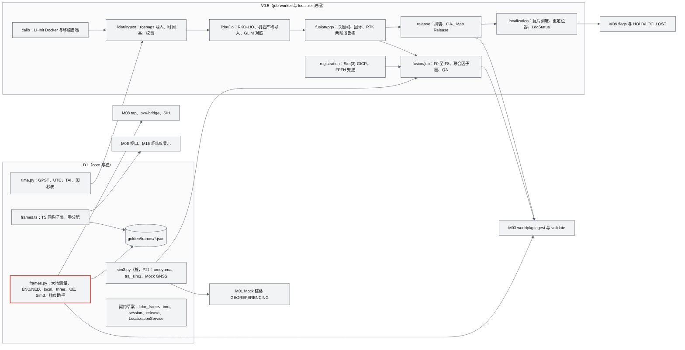
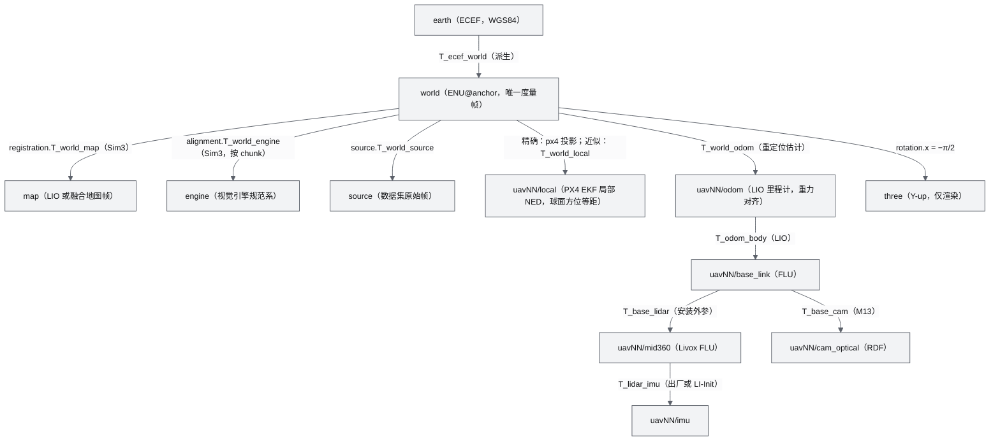
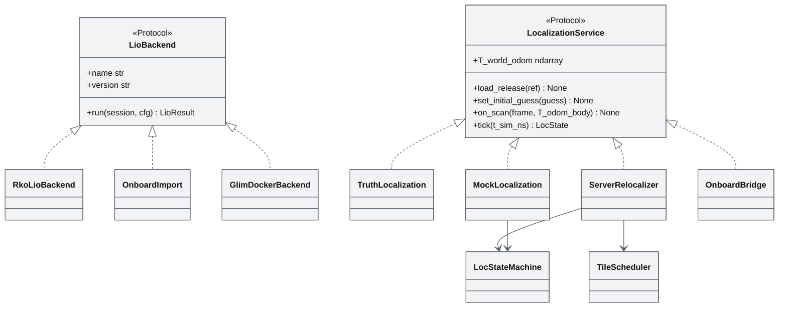
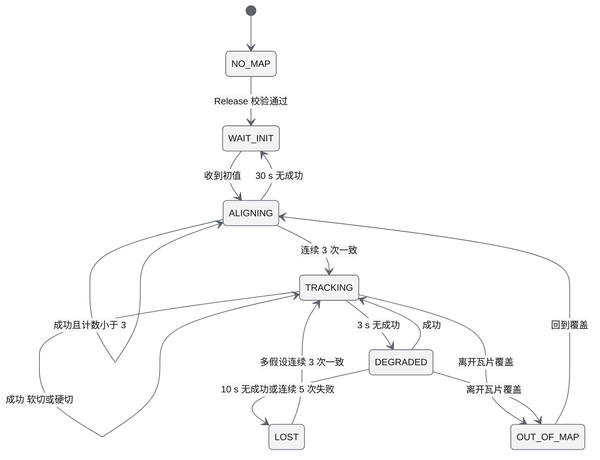
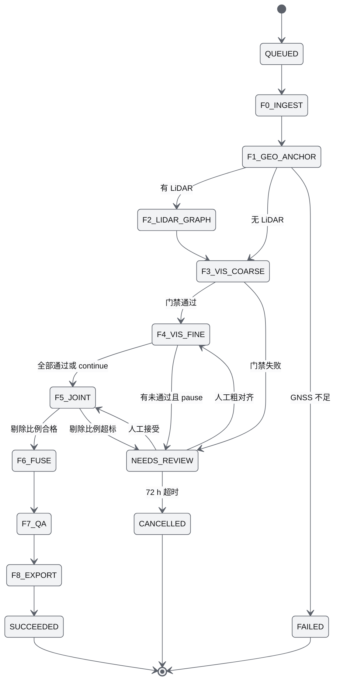
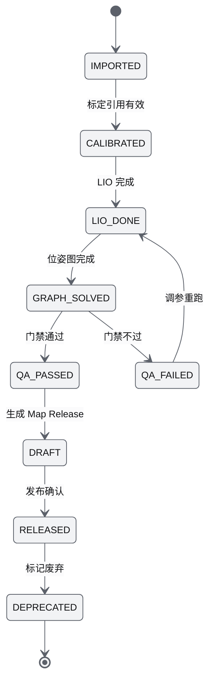
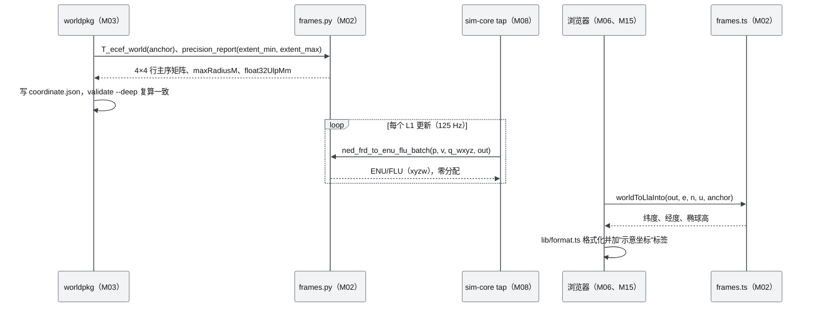
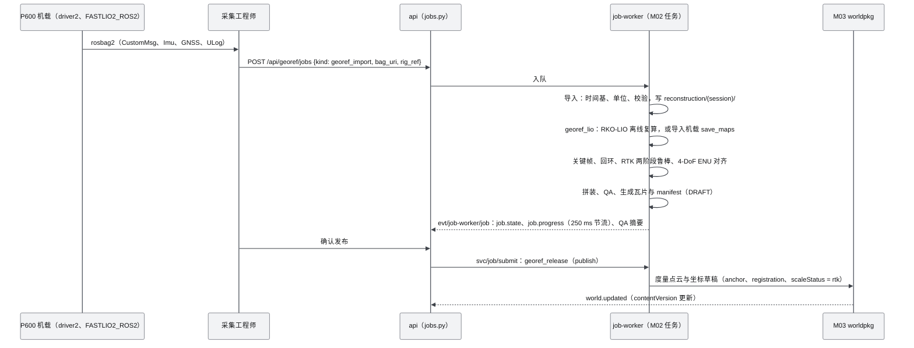
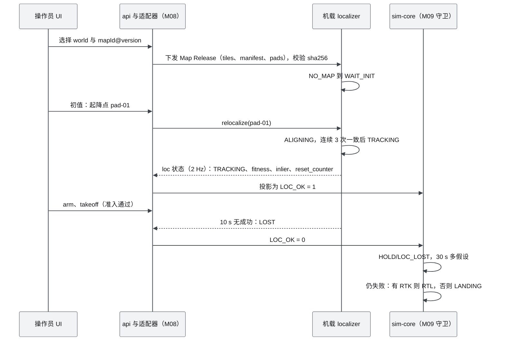
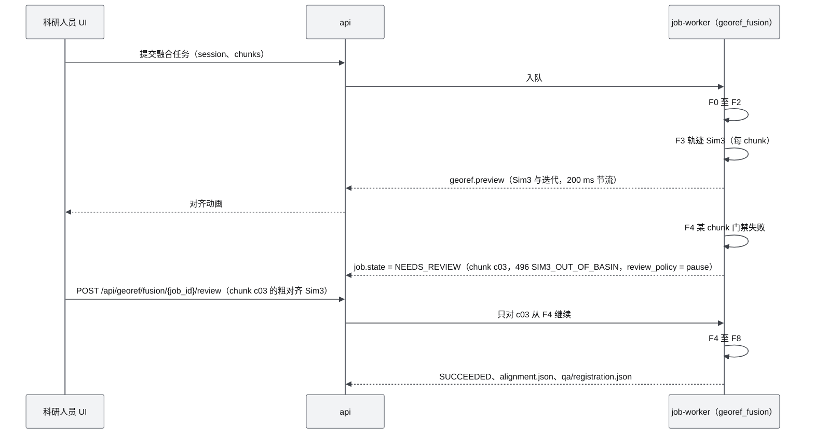

# M02 LiDAR 融合与地理配准 PRD

| 项 | 内容 |
|---|---|
| 文档编号 | AWR-M02 |
| 标题 | LiDAR 融合与地理配准 PRD |
| 版本 | v1.0 |
| 日期 | 2026-09-28 |
| 状态 | 草案 |
| 上游文档 | [AWR-03 设计基线与决策记录](../03-设计基线与决策记录.md)（§5.1–§5.5、§6.3、ADR-001、ADR-003、ADR-035、ADR-042、ADR-045、ADR-050）；[01-design](../01-design.md) §2、§5、§6、§7、§41、§48；研究笔记 [r04](../research/r04-livox-driver-calib.md)、[r05](../research/r05-fastlio-livo-r3live.md)、[r06](../research/r06-open3d.md)、[r07](../research/r07-gicp-graph-slam.md)、[r08](../research/r08-uav-lio-ros2.md)、[n02](../research/n02-discover-recon-slam.md)，以及 [r02](../research/r02-vggt-colmap.md) §3.1、§3.5、§3.6，[g03](../research/g03-gap.md) §2，[g04](../research/g04-gap.md) §4.7、§5.3，[g08](../research/g08-gap.md) §2，[x01](../research/x01-urbanscene3d-data.md) §3.5，[00-index](../research/00-index.md) §2.2、§3.1–§3.3；已冻结的相邻契约 [16](../16-World数据规范.md) §14.1、§14.3 与 [17](../17-接口与实时协议规范.md) §4.3.10、§6.5、§8.1–§8.4、§10.8 |
| 下游文档 | [M01 重建引擎](M01-重建引擎PRD.md)、[M03 World 模型与 Ingest](M03-World模型与Ingest切片PRD.md)、[M06 Web 视口](M06-Web视口与渲染后端PRD.md)、[M08 仿真内核](M08-仿真内核与飞行器适配PRD.md)、[M09 安全与健康](M09-安全与健康PRD.md)、[M13 传感器仿真](M13-传感器仿真PRD.md)、[M15 前端 UI 壳](M15-前端UI壳与设计体系组件PRD.md)、[M16 演示与测试](M16-演示数据剧本与流畅性测试PRD.md)；[16 World 数据规范](../16-World数据规范.md)、[17 接口与实时协议规范](../17-接口与实时协议规范.md)、[18 性能与测试方案](../18-性能与测试方案.md) |
| 适用版本范围 | V0.1（D1）至 V1.0；D1 只交付帧换算与时间基（core）以及契约与 Mock 桩；融合主体在 V0.5a/b/c |

## 0. 摘要

1. M02 是全仓库**唯一**的帧换算与真实会话时间基实现（Python `awr/world/georef/{frames,time}.py`、TS `engine/geo/frames.ts`；环境场约定另由 M07 `conventions.*` 实现），并在 V0.5 把 MID-360 LIO、RTK 与视觉几何融合为度量、对齐重力、地理配准的 World（AWR-03 §5.1 规则 8、§5.2 第 8 条、§6.1）。
2. **D1 范围**：core 为帧换算全集（WGS84/ECEF/ENU、ENU/NED 与 FLU/FRD、`uavNN/local`、ENU/three、UE 航线）与 GPST/UTC 换算，Python 与 TS 双实现、golden 混合容差对拍（D1-AC-13）；桩为 Livox 语义的 LiDAR 帧契约、Sim3 库（RANSAC-Umeyama + 共线退化检测 + 重力增强，P2）与 V0.5 契约草案；LIO、因子图、GICP、重定位不在 D1。
3. **本文新增的关键实测**：PX4 局部帧用半径 6371 km 的球面方位等距投影与海拔高度，在合肥纬度相对椭球 ENU 有 +2.80 m/km（北）、−2.05 m/km（东）的各向异性尺度差与 7.9 cm/km 的高度差。SIH 在 ECEF 中按度量积分、再经同一投影输出局部位置，所以刚体 `T_world_local` 只对局部帧本身是度量切平面的后端（Mock FleetSim、ReplayBackend）精确；PX4 SIH、SITL 与真机不论世界是否真实地理配准，都必须走 M02 的精确换算。SIH 原点参数是 float32，量化偏移可达 0.46 m（合肥 0.32 m），`sih_loc_for_spawn` 按量化后原点给出出生点（§6.4.2，反馈见 §14）。
4. **LIO 度量骨架选型**：机载 FASTLIO2_ROS2（打 8 处补丁）为主、Super-LIO 为候选；后端离线 RKO-LIO 0.4.0（pip、无 ROS）为默认；GLIM 作离线对照；FAST_LIO 主仓只作算法来源（依据 r05、r08、n02、11 号 T54）。
5. **融合路线**（ADR-035）：轨迹级 RANSAC-Umeyama Sim(3) → 多尺度 Sim(3)-GICP（Huber 必需）→ gtsam 4.3 联合因子图（GNSS 两阶段鲁棒）→ 融合 → QA；视觉与 LiDAR 之间是 Sim(3) 而不是 SE(3)。
6. **V0.5 拆分**：V0.5a 采集会话与 Map Release（RTK 下 ATE ≤ 5 cm）；V0.5b 重定位（LocStatus 七态、T_world_odom、控制在 odom 系）；V0.5c 视觉与 LiDAR 融合 QA 与人工复核闭环。
7. 需要基线或相邻文档裁决的问题 15 条（刚体 `T_world_local` 的适用范围、`localization/` 目录、LiDAR 契约归属、`sim` 时间尺度、`uavNN/odom` 帧名、导入边界、原因码段等），见 §14。

---

## 1. 背景与目标

### 1.1 背景

原设计把"真实世界 → 可计算世界"作为平台的根（01-design §1、§5–§6），受保护意图"以真实世界为基础"只能通过 ADR 修改（AWR-03 §2.5）。研究给出三条硬事实：

1. **前馈视觉重建没有尺度，也不对齐重力**，"尺度可能存在误差"应改为"尺度本来就不存在"（r02 §0 第 2 条）；刚体 GICP 在 1% 尺度误差下仍"收敛"并留下约 1 m 误差，而且不报警（r07 §0 第 1 条、§6 第 1 条）。
2. **MID-360 是导航级 LiDAR**：竖直视场 −7°～+52°，量程 40 m（10% 反射率）；正装前倾 20° 时地面可见高度上限约 18 m，倒装约 31.5 m（r08 §3.11）。LIO 的正确定位是"度量骨架"（metric 轨迹 + 低空近场几何），不是城市级几何的主来源（r05 §0 第 1 条）。
3. **坐标与时间是静默错误的主要来源**：UrbanScene3D 六城的单位、上轴、倾斜各不相同（x01 §3.3）；Livox IMU 加速度单位是 g（r04 §0 第 5 条）；未对时时 driver2 用主机收包时刻（r04 §2.2）；本文实测 PX4 局部帧不是度量切平面，SIH 原点参数只有 float32 精度（§6.4.2）。

因此 M02 在 D1 先交付"坐标与时间的唯一真源"，并冻结 V0.5 的接口与契约（AWR-03 §8.1 V0.5 行："接口与契约在 V0.1 冻结"）。

### 1.2 目标

| 编号 | 目标 | 可度量表述 | 版本 |
|---|---|---|---|
| G-M02-1 | 帧换算唯一真源 | 全仓库只有 `frames.py`、`frames.ts` 含椭球常量与换算公式；Python 与 TS golden 全部满足 AWR-03 §5.1 规则 8 的混合容差 | V0.1 |
| G-M02-2 | 真实时间基可换算 | GPST、UTC、TAI 三种时间尺度与 `t_sim_ns` 的整数换算逐纳秒正确，跨闰秒边界的 golden 全部通过 | V0.1 |
| G-M02-3 | V0.5 契约提前冻结 | LiDAR 帧、Sim3 接口、采集会话目录、LocStatus 在 D1 有 schema 或签名与夹具 | V0.1（桩） |
| G-M02-4 | 度量建图 | 采集会话在 RTK 下 ATE ≤ 5 cm，发布不可变的 Map Release | V0.5a |
| G-M02-5 | 可信重定位 | 初值 ≤ 2 m/5° 时成功率 ≥ 90%，错误解接受数为 0 | V0.5b |
| G-M02-6 | 视觉与 LiDAR 融合 | SPP 初值下 Sim(3)-GICP 收敛到尺度 ≤ 0.01%、旋转 ≤ 0.01°、平移 ≤ 5 mm（合成数据）；超出收敛域时显式 NEEDS_REVIEW，不静默 | V0.5c |

### 1.3 对原设计的继承、修正与增强

| 原设计章节 | 原文要点 | 处置 | 本 PRD 的二次优化 | 依据 |
|---|---|---|---|---|
| §2 首期硬件平台 | P600 配 MID-360S，采集 RGB、LiDAR、RTK、IMU、Pose、Flight Log | 沿用 | 统一写作"MID-360S（Livox dev_type 35，与 MID-360 协议兼容）"；补可计算的能力边界 `h_max = R·sin(θ_down,max)`；补 RTK fix 类型与协方差、天线杆臂、各传感器同步方式等采集字段 | r04 §1、§7 第 1 条；r08 §3.11；r07 §7 第 11 条 |
| §5 LingBot-Map | 视觉重建引擎 | 沿用（M01） | M02 负责把引擎规范系的无尺度结果经 Sim(3) 锚定到 World；分 chunk 配准 | r02 §0 第 2 条；r07 §7 第 12 条 |
| §6 LiDAR 与视觉融合 | Open3D ICP、Registration；后续引入 PCL、CUDA、cuVSLAM | 修订，推迟 V0.5（AWR-03 附录 C） | 改为**轨迹优先** Sim(3) → Sim(3)-GICP → 因子图；视觉与 LiDAR 之间是 Sim(3)；工具分工 small_gicp（预处理、GICP、Sim(3)-GICP）、Open3D（FPFH+RANSAC 兜底、QA）、gtsam（因子图）；删除 PCL 与 cuVSLAM | ADR-035；r07 §7 第 1–2 条；r06 §7 第 1 条 |
| §6 | 缺 LiDAR SLAM 后端这一层 | 增强 | 明确 LIO → 关键帧 → 回环 + RTK 因子 PGO → 可选 HBA → ENU 对齐 → Map Release | r08 §7 第 1 条 |
| §7 World Model 的 Geographic 分支 | WGS84、UTM、ENU、RTK Origin | 修订 | World ENU 为唯一度量帧；UTM 只作交换格式；补帧链 `lidar → body → odom → world → earth`，`map` 与 `engine` 经 Sim3 挂到 world；补 PX4 局部帧的精确换算 | ADR-001；g03 §2.1；r07 §3.7；本文 §6.4.2 |
| §41 World 文件结构 | `reconstruction/{cameras,trajectory}` | 修订 | `reconstruction/<session>/` 下增加 `lidar/`、`rig.json`、`timebase.json`；新增 Map Release 层（需 ADR，§14 第 4 条） | AWR-03 §4.4；r05 §4.3；r08 §4.3 |
| §48 V0.5 | MID-360、RTK、IMU → metric World | 沿用，细化 | 拆 V0.5a/b/c 并给可测退出标准；"metric World"定义为 metric 轨迹 + 低空近场几何 + 视觉外观 | AWR-03 §8.1；r05 §7 第 2 条；r07 §7 第 5 条 |
| 缺失 | 时间同步 | 新增 | 真实会话时间基、时间尺度（UTC、TAI、GPST）、闰秒表、PTP 与 GPS 同步优先级 | AWR-03 §5.2 第 8 条；r04 §3.7 |
| 缺失 | 标定 | 新增 | LI-Init 标定入库、版本化，Python 移植用于自检 | r04 §3.6 |
| 缺失 | 会话与地图版本 | 新增 | 采集会话（Capture Session）与 Map Release 为一等概念，重定位与多机共图引用 Release | r08 §7 第 2 条 |
| 缺失 | 定位语义 | 新增 | LocStatus 七态、`T_world_odom`、"控制在 odom 系、规划在 world 系" | r08 §3.10；g04 §4.7 |

### 1.4 设计原则落点

| 原则 | 在本模块的落地 |
|---|---|
| P-01 World 唯一真源 | Map Release 的瓦片一律存 world 帧，绑定 `coordinate.sha256`；World 原点变化即升级 `contentVersion` |
| P-03 可视化与物理分离 | 重定位、配准只读全分辨率几何或 Map Release，不读 Visual World 的 LOD 瓦片 |
| P-06 契约先行 | D1 先交付 golden、schema 与夹具，V0.5 实现只替换算法 |
| P-07 保真度阶梯 | `LocalizationService` 与 `LioBackend` 为可替换实现：Truth → Mock → Server → Onboard |
| P-10 确定性 | RANSAC 与抽样的随机种子由会话 id 派生；时间换算只用整数 |
| P-14 新仓库与高 star 优先，实测为准 | LIO 选型见 §6.4.5 的选型表（star、最后提交、2026 状态、偏离理由） |

---

## 2. 范围

### 2.1 D1 范围（与 AWR-03 §6.3 一致）

| 层 | 内容 | 优先级 | 验收 |
|---|---|---|---|
| D1-core | `awr/world/georef/frames.py`、`apps/web/src/engine/geo/frames.ts`：WGS84 与 CGCS2000 椭球、LLA、ECEF、ENU 三者互转；ENU 与 NED、FLU 与 FRD；`uavNN/local` 与 world（刚体与精确两种）；ENU 与 three；UE 航线到 ENU；Sim3 类型；矩阵与四元数工具；精度助手 | P0 | M02-AC-001 至 M02-AC-014；D1-AC-13 |
| D1-core | `awr/world/georef/time.py`：GPST、UTC、TAI 换算，闰秒表，GPS 周与周内秒 | P0 | M02-AC-009 |
| D1-core | golden 生成脚本与夹具（M02 起草，M00 合入 `packages/contracts/golden/frames/`） | P0 | M02-AC-001 |
| D1-ext | 无（AWR-03 §6.3） | — | — |
| D1 桩 | Livox 语义的 LiDAR 帧契约约束（schema 由 16 号文档 §14.3 落地，语义协同 M13） | P1 | M02-AC-015 |
| D1 桩 | Sim3 库：RANSAC-Umeyama、共线退化检测、重力增强（库与单测） | P2 | M02-AC-016 |
| D1 桩（本文补充） | Mock GNSS 生成器（Sim3 单测与 M01 Mock 链路的测试替身） | P2 | M02-AC-017 |
| D1 桩（本文补充） | V0.5 契约草案：IMU 样本约束、`SessionTimebase`、采集会话目录中 `session.json`、`rig.json`、`timebase.json` 的追加字段、Map Release manifest、`LocalizationService` 接口签名 | P2 | M02-AC-018 |

"本文补充"两行超出 AWR-03 §6.3 M02 行的字面范围，依据是 §8.1 V0.5 行"接口与契约在 V0.1 冻结"；二者都是 P2，不计入 D1 退出标准，缺失时不需要豁免记录。TAI 换算（`tai_ptp_to_gpst_ns`）是 §6.3"GPST/UTC 换算函数"的必要组成（PTP 时间尺度为 TAI），按 core 交付。

**不在 D1**：LIO、因子图、GICP 融合、重定位（AWR-03 §6.3 M02 行）；MockLocalization 与 LIO 回归测试床（V0.2，可选）；驱动接入与标定（V0.5a）。

### 2.2 后续版本

| 版本 | 内容 | 退出标准（本模块部分） |
|---|---|---|
| V0.2 | LIO 回归测试床（M13 虚拟 MID-360 + IMU 合成 + RKO-LIO）；MockLocalization（LocStatus 投影，可选）；精确 `uavNN/local` 换算接入 px4-bridge（M08） | 测试床 ATE 与耗时门禁达标（M02-AC-019）；SIH 真值两条换算路径到 world 的差 ≤ 0.01 m（M02-AC-020） |
| V0.5a | 驱动接入与 bag 导入、LI-Init 标定入库、离线 LIO、关键帧 + 回环 + RTK 位姿图、4-DoF ENU 对齐、Map Release 发布 | RTK 下 ATE ≤ 5 cm（AWR-03 §8.1）；平面厚度 P95 ≤ 0.10 m；ENU 对齐 RMSE ≤ 0.10 m |
| V0.5b | 瓦片调度、服务端重定位器、LocStatus 状态机与 flags 投影、机载重定位桥接规范 | 初值 ≤ 2 m/5° 成功率 ≥ 90%；错误解接受 0 次；T_world_odom 平滑修正无阶跃 |
| V0.5c | 融合任务 F0–F8、Sim(3)-GICP、联合因子图、融合 QA、NEEDS_REVIEW 人工复核 | 合成数据门禁（M02-AC-025）；合肥园区真实数据走完全流程（AWR-03 §8.1 V0.5 行） |
| V0.6 | 多会话合并、多机共图（每机 `T_world_odom_i`）、增量更新 | 两次采集合并后重叠区 Chamfer 中位数 ≤ 2·s |
| V1.0 | 可选 GPU 实时配准；FAST-LIVO2 着色与 COLMAP 导出（硬同步条件满足时） | — |

### 2.3 与其他模块的边界

| 模块 | 边界（M02 做什么，对方做什么） |
|---|---|
| M01 重建引擎 | M01 产出引擎规范系的 Recon IR（C2W、OpenCV RDF）与任务状态机；M02 提供 Sim3、`traj_sim3` 与相机约定换算函数，V0.5c 提供融合子阶段 F0–F8（挂在 M01 的 FUSING 与 GEOREFERENCING 阶段下） |
| M03 World 与 Ingest | M03 负责规范化、切片、写清单与校验；M02 提供 `T_ecef_world`、LLA/ENU、精度助手（`precision` 字段）供 ingest 与 validator 调用；V0.5 M02 交付已地理配准的度量点云与 `coordinate` 草稿（anchor、registration、scaleStatus），由 M03 入库 |
| M04 几何查询 | 无直接依赖；M04 只使用 world 坐标 |
| M06 Web 视口 | M06 用 `frames.ts` 做 ENU 与 three 换算、航向显示；WorldLayer 根旋转由 M06 实现，但换算常量来自 M02 |
| M08 仿真内核 | FleetSim 内部 NED/FRD 在 tap 阶段调用 M02 的批量换算（FleetSim 局部帧是度量切平面，刚体换算精确）；V0.2 起 px4-bridge 与 Prometheus 适配器的位置与航点一律调用 M02 的 `uavNN/local` 精确换算，SIH 编排调用 `sih_loc_for_spawn` 并采用其返回的量化后原点 |
| M09 安全 | V0.5b 起按 g04 §4.7 消费 LocStatus 投影出的 `LOC_OK`、`LOC_DEGRADED` 与 HOLD/LOC_LOST 触发条件 |
| M13 传感器仿真 | M13 生成虚拟 MID-360 帧（扫描花样、噪声、回波物理）；M02 给出真机驱动侧的契约约束与时间语义，二者用同一 schema 与夹具 |
| M15 UI 壳 | M15 显示经纬度（"示意坐标"）、`scale_status`、V0.5 的定位与融合面板；M02 提供换算函数与 V0.5 的 `stores/georef.ts` 数据（路径所有权待 §14 第 8 条） |
| 16、17 号文档 | 文件格式（coordinate.json、recon-ir、lidar_frame、会话目录）以 16 为准；线上主题、原因码、bus key 以 17 为准；本文给出语义与约束 |

### 2.4 本模块新增术语（其余见 AWR-03 §11）

| 术语 | 英文 | 定义 |
|---|---|---|
| 采集会话 | Capture Session | 一次真实飞行的原始数据（LiDAR、IMU、GNSS、视频、ULog）及其处理产物，目录 `reconstruction/<session>/`；与 AWR-12 中运行时"会话"不是同一概念 |
| 地图版本 | Map Release | 由一个或多个采集会话经 QA 生成的不可变重定位地图，标识 `mapId@semver`，绑定 `coordinate.sha256` 与 sha256 |
| 度量骨架 | Metric skeleton | LIO + RTK 给出的度量轨迹与低空近场几何，用于为视觉重建定尺度与定 ENU |
| 里程计帧 | `uavNN/odom` | 每次上电新建、重力对齐、连续的 LIO 里程计帧；与 PX4 的 `uavNN/local` 不同 |
| 时间尺度 | Timescale | 原始时间戳所在尺度：`utc`、`tai`、`gpst`、`host_mono`（本文另提议 `sim`，§14 第 3 条） |
| 地图颗粒度基线 | Map grain | 同一体素分辨率下 Map Release 自配准的均方最近邻距离，作为重定位 fitness 的相对门限基准（r08 §3.2.4） |
| 精确局部换算 | Exact local transform | 经 PX4 球面方位等距投影与海拔高度的 `uavNN/local` 与 world 互转，区别于刚体近似 `T_world_local` |
| 度量切平面后端 | Metric-tangent backend | 局部帧本身就是米制平面坐标的后端（Mock FleetSim、ReplayBackend），刚体 `T_world_local` 对它们精确；PX4 SIH、SITL、真机不属于此类 |

---

## 3. 用户与用例

### 3.1 用户角色

| 角色 | 与本模块的关系 |
|---|---|
| 平台开发者（M01、M03、M06、M08、M13、M15 的实现者） | 调用帧换算与时间函数；D1 的主要用户 |
| 科研人员（算法与仿真） | 读取 `coordinate.json`、`alignment.json`、QA 报告判断世界可信度；V0.5 提交融合任务 |
| 采集工程师（V0.5） | 按航线规范采集、执行标定、导入 bag、复核 QA、发布 Map Release |
| 操作员（V0.5b） | 在 UI 查看每机定位状态，发起重定位，处理 LOST |
| 测试工程师（M16） | 运行 golden、Sim3 与 LIO 回归门禁 |

### 3.2 用例

| 编号 | 用例 | 参与者 | 版本 | 主流程 | 结果 |
|---|---|---|---|---|---|
| UC-01 | 合成世界写坐标清单 | M03 `worldpkg ingest` | V0.1 | 按 x01 规则得到 synthetic 锚点 → 调 `T_ecef_world(anchor)` 与 `precision_report(extent_min, extent_max)` → 写 coordinate.json | validator 复算一致 |
| UC-02 | 浏览器显示光标经纬度 | M15、M06 | V0.1 | 拾取得到 world 点 → `worldToLlaInto(out, e, n, u, anchor)` → `lib/format.ts` 格式化并加"示意坐标"标签 | 与 Python golden 一致 |
| UC-03 | FleetSim tap 换算 | M08 | V0.1 | 1000 架 NED/FRD（wxyz）→ ENU/FLU（xyzw），预分配输出 | p50 ≤ 50 µs，零分配 |
| UC-04 | SIH 实例参数 | M08（V0.2） | V0.1 函数 / V0.2 使用 | spawn 位姿 + 锚点 → `SIH_LOC_LAT0/LON0/H0/YAW0`（float32 量化后）+ 量化后原点的 world 坐标 | SIH 回传真值换算回 world 与量化后原点一致（≤ 1 cm）；量化偏移写入 roster |
| UC-05 | 外部飞控位置换算 | M08 px4-bridge、Prometheus 适配器 | V0.2/V0.5 | 本地 NED + EKF 原点 → `world_from_px4_local`；目标 world → `px4_local_from_world` | 合成世界与真实地理配准世界下误差均 ≤ 1 cm（航程 ≤ 2 km） |
| UC-06 | UrbanScene3D 航线回放 | M16 `awr/datasets` | V0.1 函数 / P2 使用 | UE 厘米左手坐标与 pitch/yaw → world 与 FLU 四元数 | x01 §3.5 的三个验证用例通过 |
| UC-07 | Mock 重建地理配准 | M01 job-worker | V0.1（P2） | 合成航线 + Mock GNSS（已知 Sim3 扰动）→ `traj_sim3` → 写 `alignment.json` | 恢复误差在门禁内，报告写入 QA |
| UC-08 | 导入一次真实采集 | 采集工程师 | V0.5a | 上传 rosbag2 → 导入（时间基、单位、校验）→ 标定引用 → 离线 LIO → 位姿图 → QA → 发布 Map Release | `mapId@1.0.0` 可下发 |
| UC-09 | 起飞前重定位 | 操作员、机载 localizer | V0.5b | 下发 Map Release → 地面初值（起降点）→ 连续 3 次 TRACKING → 允许解锁 | LocStatus = TRACKING，LOC_OK = 1 |
| UC-10 | 空中丢失处理 | 机载 localizer、M09 | V0.5b | 10 s 无成功匹配 → LOST → HOLD/LOC_LOST → 30 s 多假设 → 失败则 RTL 或 LANDING | 与 g04 §4.7 一致 |
| UC-11 | 视觉与 LiDAR 融合 | 科研人员 | V0.5c | 提交融合任务 → F0–F8 → QA 通过则导出；不通过进入 NEEDS_REVIEW → UI 粗对齐 → 从 F4 继续 | `alignment.json`、`qa/registration.json` |
| UC-12 | LiDAR-IMU 标定 | 采集工程师 | V0.5a | 静止 ≥ 5 s → 三轴激励 > 99% → LI-Init 批优化 → 结果入库（带版本）→ 移植版自检 | 标定资产被会话 `rig.json` 引用 |

---

## 4. 功能需求

格式遵循 AWR-03 §10.2 第 4 条。D1 = 是的条目目标版本均为 V0.1；D1 = 桩的条目交付接口、schema 或测试替身，真实实现版本写在描述中。

### 4.1 帧换算与时间基（D1-core）

| 编号 | 需求描述 | 优先级 | 目标版本 | D1 | 验收要点 | 依据 |
|---|---|---|---|---|---|---|
| M02-FR-001 | `frames.py` 大地测量：`Ellipsoid`（WGS84、CGCS2000）；`lla_to_ecef`、`ecef_to_lla`（Zhu 1994 闭式解）、`R_enu_ecef`、`ecef_to_world`、`world_to_ecef`、`lla_to_world`、`world_to_lla`、`T_ecef_world(anchor)`（嵌套行主序 4×4）；全部向量化，支持 `out=` | P0 | V0.1 | 是 | M02-AC-001、002、003、014 | AWR-03 §5.1 规则 1、8；r02 §3.6；g03 §2.1 |
| M02-FR-002 | ENU 与 NED、FLU 与 FRD：位置、速度、四元数（`q' = (1/√2)(w+z, x+y, x−y, w−z)`，对合）、`yaw_ned = π/2 − ψ_enu`、航向显示 `heading_deg = (90° − ψ_enu) mod 360`；批量函数 `ned_frd_to_enu_flu_batch`（输入 FleetSim 内部 wxyz，输出线上 xyzw，预分配输出、零分配） | P0 | V0.1 | 是 | M02-AC-005、011 | AWR-03 §5.1 规则 6、§5.3；g08 §2 |
| M02-FR-003 | `uavNN/local` 与 world：①刚体 `T_world_local_rigid`（度量切平面后端按 spawn 平移构造，精确；PX4 类后端按 EKF 原点与锚点构造，仅供显示，并返回误差上界函数）；②精确换算 `world_from_px4_local`、`px4_local_from_world`（逐行移植 PX4 `MapProjection` 球面方位等距投影，R = 6371000 m，加海拔高度）；③`sih_loc_for_spawn(spawn_world, yaw_enu_rad, anchor)` 返回 float32 量化后的 `SIH_LOC_LAT0/LON0/H0/YAW0`、量化后原点的 world 坐标与量化偏移 | P0 | V0.1 | 是 | M02-AC-006 | AWR-03 §5.1 规则 3、6；g04 §6.3；PX4 `src/lib/geo/geo.cpp` L67–L110、`simulator_sih/sih_params.yaml`；本文 §6.4.2 |
| M02-FR-004 | ENU 与 three：`enu_to_three(u,v,w) = (u, w, −v)`、`three_to_enu(x,y,z) = (x, −z, y)`，四元数与矩阵版本，常量 `R_THREE_ENU` 与 WorldLayer `rotation.x = −π/2` 一致 | P0 | V0.1 | 是 | M02-AC-007 | ADR-002；AWR-03 §5.1 规则 5 |
| M02-FR-005 | UE 航线到 world：`E = Y/100 + tE`、`N = X/100 + tN`、`U = Z/100 + tU`；`ψ_enu = 90° − yaw`，`θ = pitch`（正值低头），`q = Rz(ψ)·Ry(θ)·Rx(φ)` | P0 | V0.1 | 是 | M02-AC-008 | x01 §3.5(a)；AWR-03 §6.3 M02 行 |
| M02-FR-006 | `Sim3` 值类型：`{s, q:[x,y,z,w], t}`，`x_to = s·R(q)·x_from + t`；`apply`、`compose`、`inverse`、`to_matrix`、`from_matrix`（s 取行列式立方根）、`to_json`、`from_json`、`to_gtsam`（`t_gtsam = t/s`）、`from_gtsam`、`interpolate`（s 对数线性、q slerp、t 线性） | P0 | V0.1 | 是 | M02-AC-010 | AWR-03 §5.1 规则 2；r07 §3.8 |
| M02-FR-007 | 矩阵与四元数工具：`mat4_from_json`（校验末行 `[0,0,0,1]`，可选刚体校验）、`mat4_to_json`；四元数归一、乘法、与矩阵互转（Shepperd）、ZYX 欧拉角（只用于显示）；相机约定：`c2w_from_w2c`、`opengl_from_opencv`（右乘 `diag(1,−1,−1)`），Python 专有 | P0 | V0.1 | 是 | M02-AC-004、010 | AWR-03 §5.3；ADR-035；r02 §3.1 |
| M02-FR-008 | 精度助手：`float32_ulp_mm(a)`（`np.spacing(float32(a))·1000`）、`curvature_drop_m(r) = r²/(2·6371000)`、`precision_report(extent_min, extent_max)` 输出 `maxRadiusM`（extent 四个水平角点到原点的最大距离）、`curvatureDropM`、`float32UlpMm`（取 extent 各分量绝对值最大者），定义与 g03 validator 逐字一致 | P0 | V0.1 | 是 | M02-AC-014 | g03 §2.1 规则 7；`.cache/research/g03/worldpkg_validate.py` L89–L97 |
| M02-FR-009 | `frames.ts`：与 Python 同构的 TS 子集（见 §7.2 对照表），全部函数提供 `out` 参数版本，热路径零分配；经 `engine/geo/index.ts` 由引擎门面再导出 | P0 | V0.1 | 是 | M02-AC-001、012 | AWR-03 §3.6 规则 1、§4.3 |
| M02-FR-010 | `time.py`：闰秒表（TAI−UTC）与有效期、`utc_to_gpst_ns`、`gpst_to_utc_ns`（闰秒插入秒内返回标志）、`tai_ptp_to_gpst_ns`、`gpst_to_tai_ptp_ns`、`gps_week_tow`、`gpst_ns_from_week_tow`；全部整数运算；`Timescale`、`SyncType` 枚举 | P0 | V0.1 | 是 | M02-AC-009 | AWR-03 §5.2 第 8 条；r04 §3.5 |
| M02-FR-011 | golden 生成与对拍：`tools/contracts/gen_frames_golden.py` 以 Python 为唯一 oracle 生成 `packages/contracts/golden/frames/*.json`（M02 起草，M00 合入）；pytest 与 vitest 按混合容差对拍 | P0 | V0.1 | 是 | M02-AC-001 | AWR-03 §5.1 规则 8、§4.3 |
| M02-FR-012 | 唯一实现守护：`tests/georef/test_single_impl.py` 扫描 `python/`、`apps/web/src/`，除 `frames.py`、`frames.ts`、`conventions.*` 外出现椭球常量（6378137、298.257223563、6371000）或 `lla_to_ecef` 类函数名即失败 | P0 | V0.1 | 是 | M02-AC-013 | AWR-03 §5.1 规则 8 |

### 4.2 契约桩（D1 = 桩）

| 编号 | 需求描述 | 优先级 | 目标版本 | D1 | 验收要点 | 依据 |
|---|---|---|---|---|---|---|
| M02-FR-013 | LiDAR 帧契约约束（Livox 语义）：在 16 号文档 §14.3 已冻结的字段（`awr.sensor.lidar_frame.v1`，20 B/点）之上给出取值约束、时间语义、驱动映射、校验规则与追加头字段提议（§6.3.2）；M13 的虚拟 MID-360 与 V0.5 导入器共用同一套正反例夹具。真实实现 V0.5a | P1 | V0.1 | 桩 | M02-AC-015 | r04 §2.2、§3.5；16 §14.3；AWR-03 §5.10 |
| M02-FR-014 | IMU 样本契约：原始加速度单位为 g（Livox 内置 IMU），在导入边界按 `acc_mps2 = acc_g × 9.80665` 换算，流元数据记 `acc_unit_raw = "g"`；采集会话目录与线上一律 m/s²（AWR-03 §5.4；16 §14.3 的"由网关换算"指实时路径，离线导入路径由 M02 导入器承担同一换算）；陀螺 rad/s；与 LiDAR 同时间基。schema 草案提交 16 号文档。真实实现 V0.5a | P2 | V0.1 | 桩 | M02-AC-015 | AWR-03 §5.4；r04 §0 第 1 条；16 §14.3 |
| M02-FR-015 | `SessionTimebase` 与 `StreamClock` 数据结构与纯函数签名（真实会话 `t_sim_ns` 以 GPST 为基；每流保留原始时间戳、同步类型、时间尺度、偏移与漂移）。真实实现 V0.5a | P2 | V0.1 | 桩 | M02-AC-018 | AWR-03 §5.2 第 8 条 |
| M02-FR-016 | 采集会话目录（`reconstruction/<session>/` 下的 `lidar/`、`gnss/`、`imu/`，§6.3.3）：16 §14.1 已有 `session.json`、`rig.json` 的追加可选字段与新文件 `timebase.json` 的草案 schema（snake_case）；Map Release manifest 与瓦片格式草案（§6.3.4，`localization/` 层待 ADR，§14 第 4 条）。真实实现 V0.5a | P2 | V0.1 | 桩 | M02-AC-018 | r05 §4.3；r08 §4.3；16 §14.1 |
| M02-FR-017 | `LocalizationService` Protocol 签名与 LocStatus 七态语义（`enums.json` 已冻结）；D1 中 E 轴由 M08 取真值，本接口不实现。真实实现 V0.2（Mock）/ V0.5b | P2 | V0.1 | 桩 | M02-AC-018 | AWR-03 §5.9；g04 §4.7、§5.3 |
| M02-FR-018 | Sim3 库 `awr/world/georef/sim3.py`：`umeyama`、`traj_sim3`（LO-RANSAC，阈值由协方差决定，共线度 `sv₂/sv₁ < 0.05` 时重力增强两遍法，报告与门禁）。接口在 V0.1 冻结；真实数据使用在 V0.5 | P2 | V0.1 | 桩 | M02-AC-016 | ADR-035；r02 §3.5 |
| M02-FR-019 | Mock GNSS 生成器：按 fix 类型噪声表、缺口、多路径跳点（比例可配）合成 GNSS 观测；供 Sim3 单测与 M01 Mock 链路（UC-07）使用 | P2 | V0.1 | 桩 | M02-AC-017 | r07 §3.7 |

### 4.3 V0.2（可选）

| 编号 | 需求描述 | 优先级 | 目标版本 | D1 | 验收要点 | 依据 |
|---|---|---|---|---|---|---|
| M02-FR-020 | LIO 回归测试床：M13 虚拟 MID-360 帧 + 200 Hz IMU 合成（噪声与偏置）+ RKO-LIO 0.4.0；门禁为相对基线的回归，不代表真机精度 | P2 | V0.2 | 否 | M02-AC-019 | n02 §3.11；11 号 T54 |
| M02-FR-021 | MockLocalization：行程比例漂移 + 退化放大 + 重定位成功率随可见点数与环境变化，复用 V0.5b 状态机，输出 LocStatus 与 `pose_src = FUSED` | P2 | V0.2 | 否 | M02-AC-021 | r08 §3.8 |
| M02-FR-022 | px4-bridge 与 Prometheus 适配器的位置、速度与航点换算一律经 M02 精确函数（合成世界同样适用）；roster 中的 `T_world_local` 只用于显示与度量切平面后端；SIH 原点取 `sih_loc_for_spawn` 的量化后值，运行期以 `vehicle_local_position.ref_lat/ref_lon/ref_alt` 回读核对 | P1 | V0.2 | 否 | M02-AC-020 | 本文 §6.4.2；§14 第 1、15 条 |

### 4.4 V0.5a 采集会话与 Map Release

| 编号 | 需求描述 | 优先级 | 目标版本 | D1 | 验收要点 | 依据 |
|---|---|---|---|---|---|---|
| M02-FR-023 | 驱动基线：livox_ros_driver2 1.2.8 + 本地补丁（默认外参 `{0,1,1}` 改 `{0,1,0}`）、驱动外参全置 0、`xfer_format = 1`（CustomMsg）、IMU 使能、时间同步优先级 PTP > GPS（PPS + GPRMC）> 无；上线检查抓包确认 `time_type ≠ 0` | P0 | V0.5 | 否 | M02-AC-022 | r04 §2.2、§3.7、§6 |
| M02-FR-024 | bag 导入：用 `rosbags`（纯 Python）读取 rosbag2/ROS1 bag 中的 `livox_ros_driver2/msg/CustomMsg`、`livox_ros_driver/CustomMsg`（v1）、`prometheus_msgs/LivoxCustomMsg`（Prometheus 版 FAST_LIO 转发）、`sensor_msgs/Imu`、`sensor_msgs/NavSatFix`；自定义消息先以 `rosbags.typesys.get_types_from_msg` 注册，`.msg` 定义随导入器入库；飞控 ULog 用 `pyulog` 读取 `sensor_gps` 与 `vehicle_gps_position`；时间基归一到 `t_sim_ns`；IMU 单位换算；按 §6.3.2 校验；写采集会话目录；原始 bag 与 ULog 只引用（uri + sha256），默认不复制 | P0 | V0.5 | 否 | M02-AC-022 | r05 §6 第 1 条、§2.1（Prometheus 版 `prometheus_msgs/LivoxCustomMsg`）；n02 §6 第 10 条；M12-FR-054（pyulog） |
| M02-FR-025 | 标定：LI-Init 以 ROS1 Docker（ros:noetic + Ceres 2.1）运行，结果（`R_LI`、`p_LI`、时延、偏置、重力）版本化入库；Python 移植版（scipy）对已知外参与时延的 Mock 数据自检；激励度三轴评估供 UI 标定向导 | P0（Docker 流程）/ P1（移植与向导） | V0.5 | 否 | M02-AC-023 | r04 §2.3、§3.6 |
| M02-FR-026 | LIO 度量骨架：`LioBackend` 接口；实现 `RkoLioBackend`（默认，离线复算）、`OnboardImport`（FASTLIO2_ROS2 `/pgo/save_maps` 产物与 `/fastlio2/lio_odom` 导入：该话题不带协方差，`odom_cov.npy` 写 NaN 并置 `cov_available = false`；导入 FAST_LIO 主仓 `/Odometry` 时协方差由 `[rot, pos]` 交换为 `[pos, rot]`；HBA `save_poses` 按行号与 pgo `poses.txt` 对齐）、`GlimDockerBackend`（对照，P2）；输出统一 LIO 契约 | P0 | V0.5 | 否 | M02-AC-022 | r05 §2.1 `publish_odometry`、§4.3；r08 §2.2.1、§3.7、§6.1 第 11–12 条；n02 §2.4 |
| M02-FR-027 | 位姿图：关键帧（1.5 m / 15°，0.2 m 体素存盘）→ 半径回环候选 + small_gicp GICP 验证 → RTK 平移先验（杆臂、线性插值、fix 类型噪声表）→ 两阶段鲁棒（Huber 1.345 → χ²₃(0.99) = 11.34 剔除 → L2 重解）；4-DoF ENU 初始化（基线 ≥ 10 m） | P0 | V0.5 | 否 | M02-AC-024 | r07 §3.7；r08 §3.6 |
| M02-FR-028 | 地图拼装与 QA：patch × 优化位姿 → 0.2 m 体素 → 统计离群（k = 15，1.5σ）→ QA（ATE 对 RTK、平面厚度 P50/P95、覆盖面积、回环数、退化时段）→ Map Release（不可变、semver、逐文件 sha256、`coordinate.sha256` 绑定） | P0 | V0.5 | 否 | M02-AC-024 | r08 §3.7、§3.9 |
| M02-FR-029 | 锚点策略与坐标草稿：锚点优先级 测量点（survey）> RTK 基站 > 操作员选定的航区中心 RTK FIX 样本；禁止"首条 GPS"；同一 World 的后续会话复用锚点；输出 `anchor`、`registration{method: "rtk-4dof", T_world_map, rmseM, inliers}`、`scaleStatus = "rtk"` 草稿交 M03（字段取值见 g03 `coordinate.schema.json`） | P0 | V0.5 | 否 | M02-AC-024 | AWR-03 §5.1 规则 3；g03 §2.1 规则 6 |

### 4.5 V0.5b 重定位

| 编号 | 需求描述 | 优先级 | 目标版本 | D1 | 验收要点 | 依据 |
|---|---|---|---|---|---|---|
| M02-FR-030 | 瓦片调度：64 m 方块、加载半径 96 m、卸载半径 160 m（迟滞）、2 s 速度预取、真删除；Map Release 下发前校验 sha256 与 `coordinate.sha256` | P0 | V0.5 | 否 | M02-AC-026 | r08 §3.4 |
| M02-FR-031 | 服务端重定位器：small_gicp 三级金字塔点到面 ICP（3.0/1.0/0.3 m）、Huber、初始化与 LOST 时的偏航 12 假设与 ±6 m 平移网格假设；门控为内点率 ≥ 0.88、fitness ≤ 1.10 × 地图颗粒度基线、退化度 `degeneracy` ≥ 0.02、连续两次一致 | P0 | V0.5 | 否 | M02-AC-026 | r08 §3.2.3、§3.2.4 |
| M02-FR-032 | LocStatus 状态机（NO_MAP、WAIT_INIT、ALIGNING、TRACKING、DEGRADED、LOST、OUT_OF_MAP）与 flags 投影；`T_world_odom` 软切（0.5 m/s、5°/s）与硬切（> 2 m，`reset_counter + 1`）；起飞前连续 3 次 TRACKING 才允许 arm | P0 | V0.5 | 否 | M02-AC-027 | g04 §4.7；r08 §4.2.4 |
| M02-FR-033 | 机载桥接规范：机载 localizer 状态解析为同一 LocStatus；给 PX4 的外部视觉位姿为 odom 系连续量（ENU/FLU → NED/FRD 用 M02 函数），带方差与 `reset_counter`；任务航点 world → odom 由 `T_world_odom⁻¹` 实时换算 | P1 | V0.5 | 否 | M02-AC-027 | r08 §3.10 |

### 4.6 V0.5c 视觉与 LiDAR 融合

| 编号 | 需求描述 | 优先级 | 目标版本 | D1 | 验收要点 | 依据 |
|---|---|---|---|---|---|---|
| M02-FR-034 | 融合任务 F0–F8（INGEST、GEO_ANCHOR、LIDAR_GRAPH、VIS_COARSE、VIS_FINE、JOINT、FUSE、QA、EXPORT）与 NEEDS_REVIEW（§6.6.2，`review_policy` 默认 `pause`）；各阶段幂等、可按 chunk 从 F4 续跑；独立任务 `georef_fusion` 与 M01 子阶段两种调用共用 `run_fusion`；进度经 17 的 `job.progress` 上报（每任务 250 ms 至多 1 条） | P0 | V0.5 | 否 | M02-AC-025 | r07 §3.9；17 §4.3.10、§6.12 |
| M02-FR-035 | Sim(3)-GICP：7-DoF、Huber(δ = 3，马氏距离)、Marquardt 阻尼、按点距 s 自动金字塔 `[8s, 4s, 2s, s]`、每层抽样 3 万源点；可锁 roll/pitch（两侧均已重力对齐时） | P0 | V0.5 | 否 | M02-AC-025 | r07 §3.3、§3.4 |
| M02-FR-036 | 联合因子图（gtsam 4.3）：LiDAR 子图 SE(3)、视觉 chunk Sim(3)、GNSS 先验、配准边（信息 = κ·(σ̂²H⁻¹ + 下限)⁻¹）；先解 LiDAR，再固定 LiDAR 解视觉 | P1 | V0.5 | 否 | M02-AC-025 | r07 §3.5、§3.8 |
| M02-FR-037 | 融合 QA 与导出：Chamfer、F-score@{0.1, 0.3, 1.0} m、覆盖率、逐瓦片残差中位数；写 `alignment.json`（`T_world_engine` 按 chunk）、`qa/registration.json`；F7 门禁不过时照常导出、`pass = false` 并在 UI 标红（F3、F5 不过才进入 NEEDS_REVIEW，§6.6.2） | P0 | V0.5 | 否 | M02-AC-025 | r07 §3.9；r06 §3.9 |

### 4.7 UI（V0.5，由 M15 实现，M02 提供数据与规格）

| 编号 | 需求描述 | 优先级 | 目标版本 | D1 | 验收要点 | 依据 |
|---|---|---|---|---|---|---|
| M02-FR-038 | 采集会话与 Map Release 列表、详情与发布确认 | P1 | V0.5 | 否 | M02-AC-028 | §8 |
| M02-FR-039 | 融合面板：F0–F8 步进条、QA 指标表、Sim(3) 对齐动画、NEEDS_REVIEW 人工粗对齐 | P1 | V0.5 | 否 | M02-AC-028 | §8；r07 §4.4 |
| M02-FR-040 | 定位状态（LocStatus 徽标与图标）、LIO 健康卡、定位质量折线 | P1 | V0.5 | 否 | M02-AC-028 | §8；r08 §3.8 |
| M02-FR-041 | 标定向导：静止倒计时、三轴激励刻度仪表、结果与自检 | P2 | V0.5 | 否 | M02-AC-028 | r04 §3.6 |

### 4.8 V0.6 及以后

| 编号 | 需求描述 | 优先级 | 目标版本 | D1 | 验收要点 | 依据 |
|---|---|---|---|---|---|---|
| M02-FR-042 | 多会话合并与增量更新；多机共图（每机 `T_world_odom_i`，规划在 world 系） | P1 | V0.6 | 否 | 重叠区 Chamfer 中位数 ≤ 2·s | r08 §7 第 8 条；r07 §4.2 |
| M02-FR-043 | 硬同步相机条件下采用 FAST-LIVO2 着色与 COLMAP 导出，作为 3DGS 输入 | P2 | V1.0 | 否 | — | r05 §3.8、§7 第 10 条 |

---

## 5. 非功能需求

| 编号 | 需求描述 | 优先级 | 目标版本 | D1 | 验收要点 | 依据 |
|---|---|---|---|---|---|---|
| M02-NFR-001 | 精度：Python 与 TS 对同一输入的差满足混合容差 `abs(a−b) ≤ atol + rtol·abs(b)`，rtol = 1e-9；atol 位置 1e-6 m、角度 1e-12 rad、速度 1e-9 m/s、无量纲 1e-12 | P0 | V0.1 | 是 | M02-AC-001 | AWR-03 §5.1 规则 8 |
| M02-NFR-002 | LLA 与 ECEF 往返：`abs(h) ≤ 2×10⁴ m` 范围内往返误差 ≤ 1e-6 m（本机实测闭式解 4.7e-9 m） | P0 | V0.1 | 是 | M02-AC-002 | 本文实测（§6.4.1） |
| M02-NFR-003 | tap 批量换算：1000 架位置 + 四元数，预分配输出，p50 ≤ 50 µs、p99 ≤ 100 µs，调用期间零新分配（本机实测 p50 33 µs、p99 52 µs，load 3.3）；折合 125 Hz 下 ≤ 0.007 核，在 g08 tap 预算 0.02 核之内 | P0 | V0.1 | 是 | M02-AC-011 | g08 §11；本文实测 |
| M02-NFR-004 | 大批量：`world_to_lla` 5×10⁶ 点 ≤ 5 s（本机实测 3.2 s）；`lla_to_ecef` 10⁶ 点 ≤ 0.8 s（实测 0.40 s） | P0 | V0.1 | 是 | M02-AC-011 | 本文实测 |
| M02-NFR-005 | TS 热路径零分配：`*Into(out, …)` 版本在 10⁴ 次调用中不产生新的堆对象（vitest heap 统计增量 < 4 KB） | P0 | V0.1 | 是 | M02-AC-012 | AWR-03 §3.6 规则 1 |
| M02-NFR-006 | 体积与依赖：`frames.ts` 压缩后 ≤ 8 KB（本文设定，理由：只含纯数学）；`frames.py`、`time.py` 只依赖 numpy 与标准库，`import` 耗时 ≤ 50 ms，禁止 import Open3D、small_gicp、gtsam、scipy | P0 | V0.1 | 是 | M02-AC-013 | AWR-03 §4.2；10 号 §3.3 |
| M02-NFR-007 | 纯函数与确定性：无 I/O、无全局可变状态、线程安全；时间换算全部整数运算；随机过程（RANSAC、抽样、Mock GNSS）以 `PCG64(SeedSequence([seed, stream_id]))` 取数，`seed` 为会话 id 的 blake2b-64 低 32 位（Mock 与单测用 `cfg.seed`），`stream_id` 按 §7.8 在 17 §10.8 登记 | P0 | V0.1 | 是 | M02-AC-009、016 | P-10；ADR-049；17 §10.8 |
| M02-NFR-008 | Sim3 库性能：240 个位姿 `traj_sim3` ≤ 20 ms（本文设定，r07 实测 Umeyama < 1 ms，RANSAC 按 10⁴ 次上限计） | P2 | V0.1 | 桩 | M02-AC-016 | r07 §3.11(d) |
| M02-NFR-009 | 进程隔离：V0.5 的 small_gicp、Open3D、gtsam、rko_lio 调用只在 job-worker（或独立 localizer 进程）中执行，禁止进入 api 与 sim-core 主循环（二者都持有 GIL） | P0 | V0.5 | 否 | 导入图 lint | r07 §4.3；r06 §0 第 6 条；AWR-03 §4.2 |
| M02-NFR-010 | 融合耗时：300 m × 300 m 航区（视觉 chunk 约 10 万点、LiDAR 约 45 万点）F0–F8 全流程 ≤ 60 s（本机 8 核 CPU，无 GPU） | P1 | V0.5 | 否 | M02-AC-025 | r07 §3.9 耗时预算 |
| M02-NFR-011 | 重定位时延：服务端单次三级金字塔 ≤ 50 ms（small_gicp，8 线程），2 Hz 下每机 ≤ 0.1 核 | P1 | V0.5 | 否 | M02-AC-026 | r08 §3.2.4 第 4 条 |
| M02-NFR-012 | 存储：关键帧以 0.2 m 体素存盘，10 min 采集 ≤ 150 MB（原始默认约 0.6 GB） | P1 | V0.5 | 否 | M02-AC-024 | r08 §3.6 |
| M02-NFR-013 | 可复现：同一采集会话、同一版本、同一配置重跑位姿图与 Map Release，瓦片 sha256 一致（单线程降采样路径，r07 §6 第 6 条指出并行降采样有块边界非确定性） | P1 | V0.5 | 否 | M02-AC-024 | r07 §6 第 6 条 |
| M02-NFR-014 | 数据安全：真实锚点经纬度与原始采集数据（bag、ULog、Map Release）只存本地或局域网；UI 只对 operator 显示真实锚点；M02 处理的 LiDAR、IMU、GNSS 不含可识别影像，视频帧的人脸与车牌脱敏归 M01 | P0 | V0.5 | 否 | 访问控制用例：viewer 请求 `coordinate.anchor` 真实值返回脱敏值 | [13 §13.4](../13-产品设计PRD.md) |
| M02-NFR-015 | 可观测性：所有任务阶段输出结构化日志与指标（耗时、内点率、条件数），写入 `qa/*.json`，失败带原因码 | P1 | V0.5 | 否 | M02-AC-025 | r07 §3.9 |

---

## 6. 设计方案

### 6.1 组件图



### 6.2 帧与变换全集

帧名以 AWR-03 §5.1 为准，本文只补充 V0.5 需要的传感器帧与 `uavNN/odom`（提请登记，§14 第 12 条）。



| 换算 | 公式或方法 | 函数（Python / TS） | 依据 |
|---|---|---|---|
| LLA → ECEF | `N = a/√(1−e²sin²φ)`；`X = (N+h)cosφcosλ`，`Y = (N+h)cosφsinλ`，`Z = (N(1−e²)+h)sinφ` | `lla_to_ecef` / `llaToEcef` | r02 §3.6 |
| ECEF → LLA | Zhu 1994 闭式解（IEEE TAES 30(3):957–961，即 Heikkinen 1982 算法的整理形式）；COLMAP 迭代法为测试 oracle | `ecef_to_lla` / `ecefToLla` | glim_ext `modules/mapping/gnss_global/src/glim_ext/geodetic.cpp::ecef_to_wgs84`（`.cache/research/r07/glim_ext`）；本文 §6.4.1 |
| ECEF 与 world | `R_enu_ecef` 行向量 `e = [−sinλ, cosλ, 0]`、`n = [−sinφcosλ, −sinφsinλ, cosφ]`、`u = [cosφcosλ, cosφsinλ, sinφ]`；`p_world = R_enu_ecef·(p_ecef − p0)` | `ecef_to_world`、`world_to_ecef` | r02 §3.6 |
| `T_ecef_world` | `[[R_enu_ecefᵀ, p0],[0,0,0,1]]`，嵌套行主序 | `T_ecef_world` | g03 §2.1 规则 3 |
| ENU 与 NED（同原点） | `p_ned = (N, E, −U)`，对合 | `enu_to_ned` / `enuToNed` | AWR-03 §5.1 规则 6 |
| FLU/ENU 与 FRD/NED 四元数 | `q' = (1/√2)(w+z, x+y, x−y, w−z)`（wxyz 书写），对合；矩阵形式 `R_enu_flu = T·R_ned_frd·B` | `q_enuflu_from_nedfrd` | AWR-03 §5.1 规则 6；本文数值核对 1.1e-15 |
| 航向 | `yaw_ned = π/2 − ψ_enu`；`heading_deg = (90° − ψ_enu,deg) mod 360` | `yaw_ned_from_enu`、`heading_deg` | AWR-03 §5.3 |
| `uavNN/local` 精确 | `(x_n, y_e)` 经 PX4 `reproject`（球面，R = 6371000 m）得 (φ, λ)；`h_msl = alt_ref − z_d`；`h_ell = h_msl + N_geoid`（SIH 实例 N ≡ 0，见 §6.4.2）；再 LLA → world。PX4 的 `project` 输出 x、y 为 float32，移植版用 float64 | `world_from_px4_local` | PX4 `geo.cpp` L67–L110；本文 §6.4.2 |
| `uavNN/local` 刚体 | 度量切平面后端（Mock FleetSim、ReplayBackend）：`T_world_local = [[I, p_spawn],[0,1]]`（ENU 轴，`p_local_enu = (E, N, −D)`），精确；PX4 类后端（SIH、SITL、真机，合成与真实世界皆然）：平移为 EKF 原点在 world 的位置，旋转 `R_enu_ecef(anchor)·R_enu_ecef(origin)ᵀ`，只用于显示，附误差上界 | `T_world_local_rigid` | AWR-03 §5.1 规则 6；本文 §6.4.2 |
| ENU 与 three | `(x, y, z)_three = (E, U, −N)`；逆为 `(x, −z, y)` | `enu_to_three` / `enuToThree` | ADR-002 |
| UE 航线 | `E = Y/100 + tE`、`N = X/100 + tN`、`U = Z/100 + tU`；`ψ = 90° − yaw`；`θ = pitch` | `ue_cm_to_world`、`ue_rot_to_q` | x01 §3.5(a) |
| Sim3 | `x_to = s·R·x_from + t`；gtsam `Similarity3` 为 `s·(R·x + t)`，交换时 `t_gtsam = t/s` | `Sim3` | AWR-03 §5.1 规则 2；r07 §3.8 |
| 相机约定 | C2W = W2C 求逆；OpenCV RDF → OpenGL RUB 右乘 `diag(1, −1, −1)`（作用于旋转） | `c2w_from_w2c`、`opengl_from_opencv`（仅 Python） | ADR-035 |

### 6.3 数据结构

#### 6.3.1 核心值类型（D1）

```python
# python/awr/world/georef/types.py（frames.py 再导出）
@dataclass(frozen=True, slots=True)
class Ellipsoid:
    a: float                     # m
    f: float                     # 扁率
    @property
    def e2(self) -> float: return self.f * (2.0 - self.f)
    @property
    def b(self) -> float: return self.a * (1.0 - self.f)

WGS84    = Ellipsoid(6378137.0, 1.0 / 298.257223563)
CGCS2000 = Ellipsoid(6378137.0, 1.0 / 298.257222101)
PX4_SPHERE_R_M = 6371000.0       # PX4 geo.h CONSTANTS_RADIUS_OF_EARTH；g03 曲率降也用此值

@dataclass(frozen=True, slots=True)
class Anchor:                    # 由 coordinate.json 的 anchor（camelCase）构造
    kind: Literal["rtk", "survey", "gnss", "synthetic"]
    datum: Literal["WGS84", "CGCS2000"]
    lat_deg: float
    lon_deg: float
    h_ellipsoid_m: float
    h_msl_m: float | None              # coordinate.json 允许 null；见下表的推导规则
    geoid_undulation_m: float | None   # 取 anchor.geoid.undulationM；synthetic 时为 None（hEllipsoidM := hMslM）
    @classmethod
    def from_coordinate(cls, coord: dict) -> "Anchor": ...

@dataclass(frozen=True, slots=True)
class Px4Origin:                 # PX4 EKF 原点；来源优先级见下表
    lat_deg: float
    lon_deg: float
    alt_msl_m: float
    source: Literal["lpos_ref", "gps_global_origin", "sih_param"]

@dataclass(frozen=True, slots=True)
class Sim3:
    s: float
    q: tuple[float, float, float, float]   # xyzw，单位范数，w ≥ 0 规范化
    t: tuple[float, float, float]          # m
```

| 类型 | 字段 | 类型 | 单位 | 默认 | 说明 |
|---|---|---|---|---|---|
| Anchor | `kind` | enum | — | — | `synthetic` 时 `georeferenced = false`，经纬度只作示意 |
| Anchor | `lat_deg`、`lon_deg` | float64 | ° | — | 椭球大地坐标 |
| Anchor | `h_ellipsoid_m`、`h_msl_m` | float64（`h_msl_m` 可为 null） | m | — | 合成数据两者相等（AWR-03 §5.5）；`hMslM` 为 null 时若有 `geoid` 则 `h_msl = hEllipsoidM − undulationM`，否则需要海拔的函数（`px4_*`、`sih_loc_for_spawn`）抛 `DatumUnsupported` |
| Anchor | `geoid_undulation_m` | float64 或 null | m | null | 取 `anchor.geoid.undulationM`；V0.5 真实数据取 EGM2008 在锚点处的单值 |
| Px4Origin | `lat_deg`、`lon_deg` | float64 | ° | — | 来源优先级：①`vehicle_local_position.ref_lat/ref_lon`（uORB 或 XRCE-DDS，double，即 EKF 实际使用的投影参考）；②MAVLink `GPS_GLOBAL_ORIGIN`（degE7，量化约 1.1 cm）；③SIH 参数的 float32 值（`sih_param`，只用于启动前预测） |
| Px4Origin | `alt_msl_m` | float64 | m | — | PX4 以 AMSL 为高度基准（`ref_alt` 或 `GPS_GLOBAL_ORIGIN.altitude` 的 mm 值） |
| Sim3 | `s` | float64 | — | 1 | 尺度 > 0 |
| Sim3 | `q` | float64[4] | — | [0,0,0,1] | xyzw |
| Sim3 | `t` | float64[3] | m | [0,0,0] | — |

#### 6.3.2 LiDAR 帧契约约束（D1 桩，Livox 语义）

文件与字节布局由 [16 §14.3](../16-World数据规范.md) 冻结（`packages/contracts/sensor/lidar_frame.schema.json`，schema 名 `awr.sensor.lidar_frame.v1`，JSON 头 + SoA 载荷，20 B/点）；本节不改其字段名，只给出来自真机驱动的取值约束与时间语义，并提议追加若干**可选**头字段（按 AWR-03 §5.11 第 1 条，1.x 只加可选字段）。M13 的虚拟 MID-360 必须满足同样约束（依据 r04 §2.2、§3.1、§3.5）。

| 字段 | 类型 | 单位 | 取值与约束 | 归属 | 来源 |
|---|---|---|---|---|---|
| `schema` | string | — | `awr.sensor.lidar_frame.v1` | 16 已有 | 16 §14.3 |
| `sensor_id` | string | — | `<uav_id>/<sensor>`，例如 `p600-01/mid360` | 16 已有 | AWR-03 §5.6 |
| `frame_id` | string | — | 坐标帧名 `uavNN/mid360`（Livox 雷达系 FLU） | 16 已有 | §6.2 |
| `timebase_ns` | u64 | ns | 帧首点在会话时间基中的 `t_sim_ns`（≥ 0，与 int64 `t_sim_ns` 数值相同） | 16 已有 | AWR-03 §5.2 第 8 条 |
| `sync_type` | enum | — | `ptp`、`gps_pps`、`px4_timesync`、`none`，对应 Livox `time_type` 1、2、—、0；虚拟雷达的取值待 §14 第 3 条裁决（M13-FR-052 已写 `sim`） | 16 已有 | AWR-03 §5.2 第 8 条；r04 §2.1 |
| `point_count` | u32 | — | ≤ 22 000（200 kHz × 0.1 s 加 10% 余量） | 16 已有 | r04 §0 第 1 条 |
| `T_world_sensor` | 4×4 或 null | m | 仅仿真给真值；真机为 null | 16 已有 | 16 §14.3 |
| `x, y, z` | f32 × 3 | m | Livox 雷达系 FLU；驱动侧外参必须为恒等 | 16 已有 | r04 §2.2、§6 第 2 条 |
| `offset_time` | u32 | ns | 相对 `timebase_ns`，帧内非递减 | 16 已有 | r04 §2.2 |
| `reflectivity` | u8 | — | 0–150 漫反射，151–255 回反射 | 16 已有 | r04 §0 第 1 条 |
| `tag` | u8 | — | Livox tag 位；LIO 有效点条件 `(tag & 0x30) ∈ {0x00, 0x10}` | 16 已有 | r04 §3.1.4 |
| `line` | u8 | — | `i mod 4`，< 4 | 16 已有 | r04 §2.2 |
| `frame_seq` | u32 | — | 单调递增，缺号表示丢帧 | M02 提议追加 | r04 §3.5 |
| `model` | enum | — | `livox_mid360`、`livox_mid360s`（`dev_type` 9 / 35） | M02 提议追加 | r04 §1 |
| `timescale` | enum | — | `tai`（PTP 常见）、`utc`（GPRMC）、`gpst`、`host_mono`（未对时） | M02 提议追加 | §14 第 3 条 |
| `raw_timebase_ns` | u64 | ns | 驱动 `timebase` 原值，审计用 | M02 提议追加 | r04 §2.2 |
| `offset_est_ns` | int64 | ns | 原始时间到会话时间基的估计偏移 | M02 提议追加 | AWR-03 §5.2 第 8 条 |
| `frame_dur_ns` | u32 | ns | 10 Hz 时 100 ms ± 5 ms | M02 提议追加 | r04 §3.1.1 |
| `pattern_mode` | u8 | — | 0 非重复、1 重复、2 重复低帧率 | M02 提议追加 | r04 §2.1 |
| `extrinsic_ref` | string | — | 标定资产引用，例如 `calib/p600-01/lidar_imu@2026-10-01.1` | M02 提议追加 | r04 §3.5；§14 第 5 条 |
| `simulated` | bool | — | 虚拟雷达为 true | M02 提议追加 | ADR-043 |

**驱动映射**（livox_ros_driver2 CustomMsg → lidar_frame）：`timebase` → `raw_timebase_ns`，经 `SessionTimebase.to_t_sim_ns` 得 `timebase_ns`；`CustomPoint.offset_time` → `offset_time`；`x/y/z`、`reflectivity/tag/line` 原样；`lidar_id` 经 `rig.json` 映射到 `sensor_id`；ROS `header.stamp` 只在 `time_type = 0` 时作为后备。PointCloud2（XYZRTLT）的 `timestamp` 为 f64，在 1.7e18 ns 量级只有 256 ns 分辨率，导入时降级为"仅帧级时间"并告警，推荐 `xfer_format = 1`（r04 §6 第 5 条）。

**校验规则**（导入器与 M13 夹具共用）：①`line < 4`；②`offset_time` 帧内非递减；③对时模式下 `|raw_timebase_ns mod 100 ms| ≤ 1 ms`（对齐绝对 100 ms 网格）；④`sync_type = none` 时告警，且无法估计偏移时以 490 TIME_UNSYNCED 拒绝（§7.7）；⑤静止段原始加速度模长在 0.95–1.05 g，否则判为单位错误（491）；⑥`model` 与 `dev_type` 一致；⑦`point_count ≤ 22 000`。

#### 6.3.3 采集会话目录（V0.5a，D1 冻结草案）

放在 AWR-03 §4.4 已有的 `reconstruction/<session>/` 之下，不新增顶层目录；`session.json`、`rig.json`、`alignment.json` 沿用 [16 §14.1](../16-World数据规范.md) 已冻结的 Recon IR 文件与字段，本节只列追加内容（均为可选字段或新增文件，按 AWR-03 §5.11 第 1 条）。

```text
worlds/<id>/reconstruction/<session_id>/          # session_id: s<YYYYMMDD>-<HHMMSS>-<tag>，满足 16 §14.1 的 ^[a-z0-9]+(-[a-z0-9]+)*$
├── session.json        # 16 已有（awr.recon.session.v1）；追加 capture{kinds[lidar|visual|gnss|imu|ulog], raw[{uri, sha256, bytes}], state, created_by}
├── rig.json            # 16 已有 sensors[{sensor_id, type, T_body_sensor, time_offset_ns}]；追加 calib_ref、mount_preset；GNSS 天线杆臂即 type = GNSS 的 T_body_sensor 平移
├── timebase.json       # 新增：t0_gpst_ns、streams[{stream_id, sync_type, timescale, offset_ns, drift_ppb, ref_raw_ns}]
├── gnss/gnss.csv       # 新增：t_sim_ns, lat_deg, lon_deg, h_ell_m, fix_type, cov_enu_m2[6]
├── imu/imu.npz         # 新增：t_sim_ns int64[N]、acc_mps2 f32[N,3]、gyro_rad_s f32[N,3]
├── lidar/
│   ├── lio/odom.tum             # t_s x y z qx qy qz qw（帧 uavNN/odom，机体）；t_s = t_sim_ns/1e9（float64）
│   ├── lio/odom_cov.npy         # N×6×6，顺序 [pos, rot]；后端不给协方差时为 NaN
│   ├── lio/engine.json          # 后端名、版本、commit、配置 sha256、gravity_aligned、cov_available
│   ├── keyframes/poses.tum      # 优化后关键帧位姿（world 帧）
│   ├── keyframes/patches/<i>.bin# 机体系去畸变点，0.2 m 体素
│   ├── graph/{nodes,edges,priors}.json   # 位姿图（可审计、可重算）
│   ├── map/map_0p2.laz          # world 帧拼装地图
│   └── qa/{frames.csv, report.json}      # 逐帧校验（§6.3.2 规则）与建图 QA
├── alignment.json      # 16 已有：T_world_engine{s, q, t}、method、inliers、rmse_m、rot_err_deg、time_offset_ns、lever_arm_m、chunks[]；V0.5c 由 M02 写入
└── qa/registration.json# 新增：融合 QA（V0.5c）
```

LiDAR 帧与 IMU 原始数据不复制：LIO 直接读原始 bag（RKO-LIO 的 rosbags dataloader），导入只写逐帧校验结果与换算后的 IMU。JSON 字段大小写按 AWR-03 §5.6 第 2 条与 16 §14.1：Recon IR 目录中的 JSON 不属于第 1 条列举的 World Package 清单，一律 snake_case 并带单位后缀。

#### 6.3.4 Map Release（V0.5a 产出，V0.5b 消费；目录待 ADR）

```json
{
  "schemaVersion": "1.0.0",
  "mapId": "hefei-campus",
  "version": "1.0.0",
  "worldId": "hefei-campus",
  "coordinateSha256": "…",
  "frame": "world",
  "gravityAligned": true,
  "tile": { "sizeM": 64, "voxelM": 0.2, "quantM": 0.01, "key": "floor(x/S),floor(y/S)" },
  "grainM2": 0.085,
  "sources": [ { "sessionId": "s20261001-091200-a", "lio": { "name": "rko_lio", "version": "0.4.0", "configSha256": "…" },
                 "pgo": { "keyframes": 812, "loops": 14, "gnssRejected": 3 } } ],
  "qa": { "ateRtkM": 0.031, "enuRmseM": 0.06, "planeThicknessP50M": 0.028, "planeThicknessP95M": 0.071,
          "coverageM2": 182000, "degenerateFrac": 0.02, "gates": [] },
  "sensor": { "lidar": "livox_mid360s", "mount": "tilt20", "rangeM": 40 },
  "status": "released",
  "files": [ { "path": "tiles/12_-3.bin", "sha256": "…", "bytes": 81234 } ]
}
```

瓦片二进制（小端，头 48 B，8 字节对齐）：`char[4] magic = "AWLT"`、`u16 version = 1`、`u16 flags`（bit0 = 含强度）、`i32 key[2]`、`f64 origin[3]`（方块最小角，world）、`f32 quant_m`、`u32 n`；负载 `u16 xyz[n][3]`（相对最小角量化，0.01 m 时每轴可表示 0–655.35 m，覆盖深圳 391 m 高差；原稿 i16 只到 327.67 m）+ `u16 oct16_normal[n]`（与 ANET_Q16 同编码，0x0000 表示无法线，依据 g03 §0 第 1 条）+ `flags.bit0` 时 `u8 intensity[n]`，各数组起点补零到 8 字节对齐。瓦片存 world 帧，重定位直接估计 `T_world_odom`，不再引入独立的 map 帧（P-01）。

manifest 按 AWR-03 §5.6 第 1 条视为 World Package 的层清单，用 camelCase（与 `world.json` 同类）；`localization/` 层本身待 §14 第 4 条的 ADR 纳入 16 号文档，届时大小写一并确认。`status` 取 `draft`、`released`、`deprecated`（§6.6.3），`gates[]` 为 `{name, value, threshold, pass}`。

#### 6.3.5 V0.5 服务接口（D1 冻结签名，P2）

接口在 D1 以 Protocol 与数据类形式提交（不含实现），V0.2/V0.5 的实现只替换内部算法（P-07）。



```python
@dataclass(frozen=True)
class LioResult:
    odom_tum: Path; odom_cov: Path; frames_qa: Path
    gravity_aligned: bool                      # 必填（r05 §4.3）
    engine: Mapping[str, str]                  # name、version、commit、config_sha256

@dataclass(frozen=True)
class InitialGuess:
    source: Literal["pad", "rtk", "manual", "last_good"]
    T_world_body: np.ndarray                   # 4×4
    sigma_pos_m: float; sigma_yaw_rad: float   # 冷启动平移 ≤ 2 m；偏航由 12 假设覆盖（r08 §3.3）

@dataclass(frozen=True)
class LocState:
    status: LocStatus; pose_src: PoseSrc       # 枚举取自 rt/enums.json
    map_id: str | None; map_version: str | None
    fitness_m2: float; fit_ratio: float; inlier: float; degeneracy: float   # degeneracy 无量纲，不是角度
    corr: tuple[float, float, float, float]    # dx_m、dy_m、dz_m、dyaw_rad
    reset_counter: int; last_ok_ns: int

class LocalizationService(Protocol):
    kind: Literal["uav"]                                        # ADR-047：按实体种类，D1 只有 uav
    def load_release(self, ref: ReleaseRef) -> None: ...        # ReleaseRef{world_id, map_id, version, manifest_sha256}
    def set_initial_guess(self, guess: InitialGuess) -> None: ...
    def on_odom(self, t_sim_ns: int, T_odom_body: np.ndarray) -> None: ...   # LIO 位姿，≥ 10 Hz
    def on_scan(self, frame: LidarFrame, T_odom_body: np.ndarray) -> None: ...  # 只保留最新帧
    def tick(self, t_sim_ns: int) -> LocState: ...              # 由调用方按 2 Hz 驱动；软切在 tick 内按仿真 dt 推进
    @property
    def T_world_odom(self) -> np.ndarray: ...                   # 4×4，平滑后的当前值
```

| 类型 | 字段 | 类型 | 单位 | 默认 | 取值与说明 |
|---|---|---|---|---|---|
| LocState | `status` | LocStatus | — | NO_MAP | 七态，§6.6.1 |
| LocState | `pose_src` | PoseSrc | — | FUSED | Truth 实现为 TRUTH |
| LocState | `map_id`、`map_version` | str 或 null | — | null | 已加载的 Release |
| LocState | `fitness_m2` | float64 | m² | NaN（JSON 为 null） | ≥ 0，精级均方最近邻距离 |
| LocState | `fit_ratio` | float64 | — | NaN | `fitness_m2 / grainM2`，门限 ≤ 1.10 |
| LocState | `inlier`、`degeneracy` | float64 | — | NaN | [0, 1]；门限 ≥ 0.88、≥ 0.02 |
| LocState | `corr` | float64[4] | m、m、m、rad | [0, 0, 0, 0] | 最近一次被接受的修正量 |
| LocState | `reset_counter` | int | — | 0 | 每次硬切 +1，按 u8 回绕（与 PX4 `VehicleOdometry.reset_counter` 一致） |
| LocState | `last_ok_ns` | int64 | ns | −1 | 最近一次成功的 `t_sim_ns`，−1 表示从未成功 |
| InitialGuess | `source` | enum | — | — | `pad`、`rtk`、`manual`、`last_good` |
| InitialGuess | `sigma_pos_m`、`sigma_yaw_rad` | float64 | m、rad | pad 0.1、0.035（2°）；rtk 0.05、0.175（飞控航向 ±10°）；manual 2.0、0.087 | 平移必须 ≤ 2 m（r08 §3.2.4 实测捕获盆地 2–3 m），超出时拒绝并提示补初值；偏航由 WAIT_INIT 的 12 个 30° 间隔假设覆盖 |
| ReleaseRef | `manifest_sha256` | string | — | — | 与 `localization/manifest.json` 的 sha256 一致，否则 499；`coordinateSha256` 与世界不一致则 352 |

| 实现 | 版本 | 用途 | pose_src |
|---|---|---|---|
| `TruthLocalization` | V0.2（D1 中 E 轴由 M08 直接取真值，不经本接口） | 恒 TRACKING | TRUTH |
| `MockLocalization` | V0.2（P2） | 漂移与重定位语义演示（r08 §3.8） | FUSED |
| `ServerRelocalizer` | V0.5b | 虚拟 MID-360 软件在环、回放 QA | FUSED |
| `OnboardBridge` | V0.5b | 解析机载 localizer 状态并投影 | FUSED |

### 6.4 算法与伪代码

#### 6.4.1 大地测量（D1）

`ecef_to_lla` 采用 Zhu 1994 闭式解（Heikkinen 1982 算法的整理形式，与 glim_ext `geodetic.cpp::ecef_to_wgs84` 同式），理由是向量化、迭代次数与数据无关、Python 与 TS 可逐行对应。r02 §3.6 建议移植的 COLMAP 迭代法（`refs/recon/colmap/src/colmap/geometry/gps.cc` L116–L151）以 `|Δlat| < 1e-12` 且 `|Δh| < 1e-12 m` 为停止条件，而地球半径处 float64 的 ULP 约 9.3e-10 m，只有迭代恰好落到精确不动点时才会停止：逐点实现中位 8 次，但约 0.13% 的点在相邻浮点值之间振荡而跑满 100 次（本机 2 万随机点）；向量化实现以"全部收敛"为停止条件时每批必然跑满 100 次，10⁶ 点 13.1–17.3 s，闭式解 0.51–0.65 s，往返误差 4.7e-9 m（本机，load 0.7–3.3，脚本见 §9.3）。COLMAP 迭代法保留为测试 oracle，二者差异见 M02-AC-003。

```python
def ecef_to_lla(p, ell=WGS84):
    a, b, e2 = ell.a, ell.b, ell.e2
    ep2 = (a*a - b*b) / (b*b)
    x, y, z = p[..., 0], p[..., 1], p[..., 2]
    r2 = x*x + y*y; r = np.sqrt(r2)
    F = 54.0 * b*b * z*z
    G = r2 + (1 - e2) * z*z - e2 * (a*a - b*b)
    c = e2*e2 * F * r2 / (G**3)
    s = np.cbrt(1 + c + np.sqrt(c*c + 2*c))
    P = F / (3.0 * (s + 1/s + 1)**2 * G*G)
    Q = np.sqrt(1 + 2 * e2*e2 * P)
    r0 = -(P*e2*r)/(1+Q) + np.sqrt(0.5*a*a*(1+1/Q) - P*(1-e2)*z*z/(Q*(1+Q)) - 0.5*P*r2)
    U = np.sqrt((r - e2*r0)**2 + z*z)
    V = np.sqrt((r - e2*r0)**2 + (1 - e2)*z*z)
    z0 = b*b * z / (a*V)
    h = U * (1 - b*b/(a*V))
    lat = np.arctan((z + ep2*z0) / r)          # r = 0（极点）单独处理：lat = ±90°，h = |z| − b
    lon = np.arctan2(y, x)
    return np.degrees(lat), np.degrees(lon), h
```

#### 6.4.2 `uavNN/local` 的精确换算（D1 函数，V0.2 起使用）

PX4 的局部位置不是度量切平面：`MapProjection::project` 用半径 6371000 m 的**球面方位等距投影**（`refs/sim/PX4-Autopilot/src/lib/geo/geo.cpp` L67–L88，输出 x、y 为 float32；`reproject` 在 L90–L110），高度为 `−(alt − ref_alt)`；新版 SIH 在 ECEF 中按度量积分动力学，再用同一投影生成局部位置（`simulator_sih/sih.cpp` L710–L713）；EKF2 也用同一投影融合 GNSS。本机用合肥锚点（31.8206°N，117.2272°E）实测"椭球 ENU 距离 → PX4 局部"的偏差（`.cache/research/m02/check_q.py`）：

| 离原点距离 d | 正北 d 处的 x 偏差 | 正东 d 处的 y 偏差 | 高度差（切平面与海拔） |
|---|---|---|---|
| 100 m | +0.28 m | −0.21 m | 0.001 m |
| 1 km | +2.80 m | −2.05 m | 0.079 m |
| 5 km | +14.0 m | −10.3 m | 1.97 m |

原因是球面半径与当地子午圈、卯酉圈曲率半径不同（合肥 M ≈ 6353 km、N ≈ 6384 km）。结论：

1. **度量切平面后端**（Mock FleetSim、ReplayBackend）的局部帧就是米制平面，刚体 `T_world_local` 精确（spawn 平移即可）。
2. **PX4 类后端**（SIH、SITL、真机）的局部读数与物理位置之间隔着一层球面投影：机体在 ECEF 中向北飞 1 km，局部 x 读数为 1002.8 m。SIH 与 EKF 彼此自洽，但与度量的 world 不一致，所以**不论世界是合成的还是真实地理配准的**，位置、速度与航点都必须走精确换算，否则 1 km 外的航点偏 2–3 m。
3. roster 中的刚体矩阵只用于显示与粗略判断，并附误差上界 `ε(d) ≈ max(|R/M − 1|, |R/N − 1|)·d + d²/(2R)`（M、N 为原点纬度的子午圈与卯酉圈曲率半径，合肥约 0.0028·d + d²/(2R)）。
4. **SIH 原点是 float32**：`SIH_LOC_LAT0/LON0/H0/YAW0` 在 `sih_params.yaml` 中为 `type: float`（sih.hpp L335–L338 为 `ParamFloat`）。纬度在 16°–32° 与 32°–64° 的量化半步分别为 0.11 m 与 0.21 m，经度（64°–128°）为 0.19–0.41 m，合计最坏 0.46 m；六城示意锚点实测 0.07–0.32 m，合肥 0.32 m（`.cache/research/m02/sih_f32_origin.py`）。`sih_loc_for_spawn` 因此返回量化后的参数与该原点在 world 中的真实位置，机体出生在量化后原点（相对请求的 spawn 偏移 ≤ 0.46 m），M08 把偏移写入 roster。
5. **SIH 的高度语义**：`LatLonAlt::toEcef`（`src/lib/lat_lon_alt/lat_lon_alt.cpp` L68–L81）把高度当作椭球高，SIH 世界内 N ≡ 0。SIH 实例的 `SIH_LOC_H0` 取 spawn 的椭球高，精确换算以 `geoid = "zero"` 调用；合成世界 `hEllipsoidM := hMslM`，两种写法结果相同。
6. **运行期原点以回读为准**：`Px4Origin` 优先取 `vehicle_local_position.ref_lat/ref_lon/ref_alt`（double，EKF 实际使用的参考）；只能拿到 MAVLink `GPS_GLOBAL_ORIGIN` 时按 degE7 与 mm 取值，量化约 1.1 cm，计入 M02-AC-020 的误差预算。

```python
def world_from_px4_local(p_ned, origin: Px4Origin, anchor: Anchor, *, geoid="anchor", out=None):
    lat, lon = px4_reproject(p_ned[..., 0], p_ned[..., 1], origin.lat_deg, origin.lon_deg)  # 逐行移植 geo.cpp，float64
    n = 0.0 if geoid == "zero" else (anchor.geoid_undulation_m or 0.0)   # SIH 实例 geoid="zero"；小区域取锚点单值
    return lla_to_world(lat, lon, origin.alt_msl_m - p_ned[..., 2] + n, anchor, out=out)

def px4_local_from_world(p_world, origin: Px4Origin, anchor: Anchor, *, geoid="anchor", out=None):
    lat, lon, h_ell = world_to_lla(p_world, anchor)
    n = 0.0 if geoid == "zero" else (anchor.geoid_undulation_m or 0.0)
    x, y = px4_project(lat, lon, origin.lat_deg, origin.lon_deg)
    z = -((h_ell - n) - origin.alt_msl_m)
    return np.stack([x, y, z], -1) if out is None else _fill(out, x, y, z)

@dataclass(frozen=True)
class SihLoc:
    params: Mapping[str, float]        # SIH_LOC_LAT0/LON0/H0/YAW0，均已是 float32 可表示的值
    origin: Px4Origin                  # source = "sih_param"
    origin_world_m: np.ndarray         # 量化后原点在 world 中的位置，出生点与 T_world_local 以此为准
    quant_offset_m: np.ndarray         # origin_world_m − spawn_world，|·| ≤ 0.46 m

def sih_loc_for_spawn(spawn_world, yaw_enu_rad, anchor) -> SihLoc:
    lat, lon, h_ell = world_to_lla(spawn_world, anchor)
    f32 = lambda v: float(np.float32(v))                               # PX4 参数存储为 float32
    lat32, lon32, h32 = f32(lat), f32(lon), f32(h_ell)                 # SIH 内 N ≡ 0，H0 取椭球高
    yaw0 = f32(wrap_pi(np.pi / 2 - yaw_enu_rad))                       # yaw_ned = π/2 − ψ_enu
    o_w = lla_to_world(lat32, lon32, h32, anchor)
    return SihLoc({"SIH_LOC_LAT0": lat32, "SIH_LOC_LON0": lon32, "SIH_LOC_H0": h32, "SIH_LOC_YAW0": yaw0},
                  Px4Origin(lat32, lon32, h32, source="sih_param"), o_w, o_w - spawn_world)
```

#### 6.4.3 时间基（D1 函数，V0.5 生效）

定义：`unix_utc_ns` 为 POSIX UTC（不计闰秒）；`tai_ptp_ns` 为 PTP 时间尺度（1970 起的 TAI 秒）；`gpst_ns` 为 GPS 纪元（1980-01-06T00:00:00Z）起的 GPS 时。常量：GPS 纪元 POSIX 秒 315964800；`TAI − GPST = 19 s`；2017-01-01 起 `TAI − UTC = 37 s`，因此 2026 年 `GPST − UTC = 18 s`（AWR-03 §5.2 第 8 条）。

```python
GPS_EPOCH_UNIX_NS = 315_964_800 * 1_000_000_000
TAI_MINUS_GPST_NS = 19 * 1_000_000_000
LEAP_TABLE = ((63_072_000, 10), ..., (1_483_228_800, 37))   # (UTC 生效 POSIX 秒, TAI−UTC 秒)，1972 至 2017 共 28 条
LEAP_TABLE_VALID_UNTIL_UNIX_S = ...                          # 取构建时最新 IERS Bulletin C 的有效期

def tai_minus_utc_s(unix_utc_ns: int) -> int:                 # 二分查表
def utc_to_gpst_ns(unix_utc_ns: int) -> int:
    return unix_utc_ns - GPS_EPOCH_UNIX_NS + (tai_minus_utc_s(unix_utc_ns) - 19) * 1_000_000_000
def gpst_to_utc_ns(gpst_ns: int) -> tuple[int, bool]:        # 插入闰秒的那一秒返回 (23:59:59.xxx, True)
def tai_ptp_to_gpst_ns(tai_ns: int) -> int:
    return tai_ns - GPS_EPOCH_UNIX_NS - TAI_MINUS_GPST_NS
def gps_week_tow(gpst_ns: int) -> tuple[int, int]:           # (week, tow_ns)，604800 s/周

@dataclass(frozen=True)
class StreamClock:
    stream_id: str; sync_type: SyncType; timescale: Timescale
    offset_ns: int = 0          # 原始时间尺度换算到 GPST 后仍需补的偏移（标定或互相关估计）
    drift_ppb: int = 0; ref_raw_ns: int = 0

@dataclass(frozen=True)
class SessionTimebase:
    t0_gpst_ns: int; streams: Mapping[str, StreamClock]
    def to_t_sim_ns(self, stream_id: str, raw_ns: int) -> int:
        c = self.streams[stream_id]
        g = _to_gpst(raw_ns, c.timescale)                    # utc/tai/gpst 精确；host_mono 仅用 offset
        g += c.offset_ns + (raw_ns - c.ref_raw_ns) * c.drift_ppb // 1_000_000_000
        return g - self.t0_gpst_ns
```

闰秒表过期（当前时间晚于有效期）时 `leap_table_status()` 返回 `expired`，导入器告警但继续（2026 年内不影响结果）。

#### 6.4.4 轨迹级 Sim(3)（D1 桩，V0.5 使用）

```python
def traj_sim3(src, dst, *, cov=None, sigma_m=None, gravity_src=None, weights=None, cfg=TrajSim3Config()):
    """src：引擎系相机中心（或 LIO 天线位置）；dst：world 下的 GNSS/RTK 位置（已做杆臂与时间对齐）。"""
    rng = np.random.Generator(np.random.PCG64(np.random.SeedSequence([cfg.seed, STREAM_GEOREF_RANSAC])))
    var = np.median(np.trace(cov, axis1=-2, axis2=-1) / 3) if cov is not None else sigma_m**2
    thr = max(np.sqrt(7.8147 * var), cfg.thr_floor_m)            # χ²₃(0.95)；RTK 2 cm → 5.6 cm，SPP 2/3 m → 6.65 m
    best = lo_ransac(umeyama, src, dst, thr, min_sample=3, iters_max=10_000, conf=0.999, rng=rng)
    inl = best.inliers
    sv = np.linalg.svd(dst[inl] - dst[inl].mean(0), compute_uv=False)
    collinear = sv[1] / sv[0] < cfg.collinear_ratio              # 0.05
    use_g = cfg.gravity == "always" or (collinear and cfg.gravity == "auto")
    if use_g:
        if gravity_src is None: return report(best, status="needs_review", reason="COLLINEAR_NO_GRAVITY")
        L = cfg.gravity_lever_factor * sv[0] / np.sqrt(len(inl))   # 0.25
        s1 = best.s
        src2 = np.vstack([src[inl], src[inl] + (L / s1) * gravity_src[inl]])
        dst2 = np.vstack([dst[inl], dst[inl] + L * np.array([0, 0, -1.0])])
        s, R, t = umeyama(src2, dst2, w=np.r_[np.ones(len(inl)), cfg.gravity_weight * np.ones(len(inl))])
    else:
        s, R, t = umeyama(src[inl], dst[inl], w=None if weights is None else weights[inl])
    rmse = rms(dst[inl] - (s * src[inl] @ R.T + t))
    gates = [("inlier_ratio >= 0.6", len(inl) / len(src) >= 0.6),
             ("rmse <= min(5 m, 3·σ)", rmse <= min(5.0, 3 * np.sqrt(var)))]
    return TrajSim3Report(Sim3.from_Rst(R, s, t), inliers=len(inl), rmse_m=rmse, thr_m=thr,
                          collinearity=sv[1] / sv[0], gravity_used=use_g, gates=gates,
                          status="ok" if all(g for _, g in gates) else "needs_review")
```

RANSAC 在共线航带上只影响旋转，不影响内点判定（点到点距离与绕航线轴的旋转无关），因此先定内点再做重力增强是安全的（r02 §3.5）。实测参考：环绕航线 RTK 尺度误差 0.002%、RMSE 0.011 m；SPP 尺度误差 0.225%、RMSE 0.56 m；直线航带纯 Umeyama 旋转误差 59.9°（RTK）/ 117.1°（GPS），重力增强后 0.00° / 0.19°（r02 §3.5）。

#### 6.4.5 LIO 度量骨架与选型（V0.5a）

| 候选 | star / 最后提交 | 2026 状态 | 角色 | 结论与偏离理由 | 依据 |
|---|---|---|---|---|---|
| RKO-LIO（PRBonn） | 660 / 2026-09-25 | 2025-09 创建，2026 RA-L，持续发布 | 后端离线 LIO（默认） | adopt 0.4.0：pip 安装、无需 ROS、直接读 bag；本机 mock 配准 p50 8.8–11.3 ms | n02 §2.4、§3.11；11 号 T54 |
| FASTLIO2_ROS2（liangheming） | 761 / 2026-08-10 | 2026 活跃 | 机载 LIO + PGO + 重定位参考 | adopt（fork 打 8 处补丁：IMU ×10 硬编码、定长缓冲、锁、VoxelGrid 溢出、欧拉顺序等） | r08 §0、§6.1 |
| Super-LIO | 602 / 2026-07-13 | RA-L 2026 | 机载候选 | V0.5a 与 FASTLIO2_ROS2 做 A/B；port OctVoxMap | n02 §2.5 |
| GLIM（koide3） | 1848 / 2026-09-06 | 2026 活跃 | 离线对照、架构参考 | reference / 可选 Docker；star 更高但依赖 GTSAM 4.3a0 与 gtsam_points 源码编译，契合度低于 RKO-LIO（P-14 以实测与契合度为先） | r07 §0 |
| FAST_LIO（hku-mars） | 5225 / 2024-07-23 | 停更 | 算法来源 | star 最高但 2024 停更、依赖 ROS1，只 port ikd 降采样、立方体迟滞、可观性度量 | r05 §0；11 号 T54 |
| FAST-LIVO2 | 4689 / 2026-03-08 | 活跃 | 着色与 COLMAP 导出 | 需要相机硬同步，V1.0 条件采用 | r05 §0 |

LIO 输出契约：`odom.tum`（机体系位姿，帧 `uavNN/odom`，重力对齐必须显式声明）、`odom_cov.npy`（`[pos, rot]`；FAST_LIO `/Odometry` 原始为 `[rot, pos]`，导入时交换；FASTLIO2_ROS2 的 `/fastlio2/lio_odom` 不带协方差，写 NaN 并置 `cov_available = false`，下游位姿图对该会话用 §6.5 的里程计因子默认 σ）、`engine.json`、逐帧 QA（`n_eff`、残差均值、退化标志、平移可观性特征值比）。FAST_LIO 的 `camera_init` 未必水平，FASTLIO2_ROS2 默认重力对齐，RKO-LIO 以重力正则初始化，契约中 `gravity_aligned` 必填（r05 §4.3；r08 §2.2.1）。

**航线规范**（由 MID-360 可见性推出，r08 §3.11、§4.2.2）：AGL ≤ 18 m（正装前倾 20°）或 ≤ 31 m（倒装）；城市峡谷沿街飞、立面 ≤ 40 m；速度 ≤ 5 m/s，偏航速率 ≤ 30°/s；每 300–500 m 回到已飞区域一次；起飞前静止 ≥ 5 s（兼顾 LI-Init）。

#### 6.4.6 位姿图与 RTK 约束（V0.5a）

```python
def build_and_solve(kfs, gnss, cfg):
    g = gtsam.NonlinearFactorGraph(); v = gtsam.Values()
    for i, kf in enumerate(kfs):                                   # 关键帧：1.5 m 或 15°
        v.insert(X(i), kf.T_init)
        if i == 0: g.add(PriorFactorPose3(X(0), kf.T_init, Isotropic.Sigma(6, 1e3)))  # 弱先验，由 GNSS 定规范
        else: g.add(BetweenFactorPose3(X(i-1), X(i), kf.dT_odom, Diagonal.Sigmas([1e-3]*3 + [1e-2]*3)))
    for i, j, T_ij, info in loop_closures(kfs, cfg):               # 半径候选 + small_gicp GICP 验证
        g.add(BetweenFactorPose3(X(i), X(j), T_ij, Gaussian.Information(info)))
    priors = []
    for i, kf in enumerate(kfs):
        m = gnss.interp(kf.t_ns, max_gap_ns=500_000_000)           # 线性插值，缺口 > 0.5 s 跳过
        if m is None or m.fix == NO_FIX: continue
        sig = np.maximum(m.receiver_sigma, SIGMA_TABLE[m.fix])     # RTK_FIX (0.02, 0.02, 0.04) m 等
        p = m.enu - kf.R_world_body_est @ cfg.lever_ant_m          # 天线相位中心杆臂
        priors.append((i, p, sig))
    return solve_two_stage(g, v, priors)

def solve_two_stage(g, v, priors):
    for i, p, sig in priors: add_prior(g, i, p, sig, robust=Huber(1.345))         # 阶段 1
    v1 = LM(g, v)
    keep = [k for k in priors if chi2_whitened(v1, k) <= 11.34]                   # χ²₃(0.99)
    g2 = rebuild(g, keep, robust=None); v2 = LM(g2, v1)                           # 阶段 3：L2 重解
    return v2, len(priors) - len(keep)                                            # (解, 剔除数)
```

4-DoF 初始化（LIO 已重力对齐）：对配对 `(a_i = 天线位置 in map, b_i = RTK in world)`，权重 FIX 1、FLOAT 0.05，`ψ = atan2(Σw(a'_x b'_y − a'_y b'_x), Σw(a'_x b'_x + a'_y b'_y))`，`t = μ_b − Rz(ψ)μ_a`；基线 < 10 m 时推迟；未重力对齐时改用 6-DoF Umeyama（r08 §3.6；r07 §3.7）。实测参考：240 关键帧、航位推算 ATE 9.47 m，RTK 两阶段在 0%/5%/15% 跳点下 ATE 0.035/0.035/0.038 m；纯 L2 遇 5% 跳点劣化到 4.37 m（r07 §3.7）。

#### 6.4.7 Sim(3)-GICP（V0.5c）

```python
def align_sim3(target: MapTarget, src_xyz, S0: Sim3, cfg):
    s_nn = max(target.spacing, estimate_spacing(src_xyz).nn1_median)
    levels = [(8*s_nn, 30), (4*s_nn, 30), (2*s_nn, 20), (s_nn, 10)][cfg.start_level:]   # SPP 从 8s，RTK 从 2s
    S = S0.to_matrix()
    for res, iters in levels:
        tgt, tree = target.level(res)                              # small_gicp 预处理（k = 20），num_threads 显式传入
        src = small_gicp.preprocess_points(src_xyz, res, 20, cfg.threads)[0]
        sel = rng.choice(len(src), min(30_000, len(src)), replace=False)
        for _ in range(iters):
            p = transform(S, src.xyz[sel]); idx, d2 = tree.batch_nearest_neighbor_search(p, cfg.threads)
            m = d2 < (3*res)**2
            s = cbrt(det(S[:3, :3])); R = S[:3, :3] / s
            M = inv(tgt.cov[idx[m]] + s*s * R @ src.cov[sel][m] @ R.T + 1e-6*I)
            e = tgt.xyz[idx[m]] - p[m]
            J = [skew(p[m]), -I, -p[m]]                            # 3×7：[ω, v, σ]
            w = huber(sqrt(eᵀ M e), 3.0)
            H = Σ w JᵀMJ; gvec = Σ w JᵀMe
            if cfg.lock_roll_pitch: H[0:2, 0:2] += 1e9 * I2        # 仿 small_gicp RestrictDoFFactor
            d = solve(H + 1e-4 * diag(H), -gvec)
            S = [[exp(d[6]) * so3_exp(d[:3]), d[3:6]], [0, 1]] @ S
            if norm(d[:3]) < 1e-5 and norm(d[3:6]) < 1e-4 and abs(d[6]) < 1e-6: break
    return RegistrationReport(Sim3.from_matrix(S), H=H, inlier_fraction=m.mean(), ...)
```

收敛域（最粗层 2 m、max_corr 6 m）：尺度 ≤ 5%、旋转 ≤ 5°、平移 ≤ 10 m；纯 L2 在 3%/5°/5 m 初值下失败于 3.45°，加 Huber 后到 1 mm（r07 §3.3）。超出收敛域（例如 10% 或 15° 偏航）时，必须由 QA 门禁判为失败并进入 NEEDS_REVIEW，或以 FPFH + RANSAC（Open3D legacy，已知大致尺度时）求刚体初值后重跑（r07 §3.3.1）。

#### 6.4.8 联合因子图（V0.5c）

变量：LiDAR 子图 `L_j ∈ SE(3)`、视觉 chunk `V_c ∈ Sim(3)`（`T_world_chunk`）。因子：(a) LiDAR 里程计、(b) 回环与重叠 GICP、(c) GNSS 先验（两阶段鲁棒）、(d) 视觉 chunk 间窗口 Sim(3)、(e) 视觉到 LiDAR 的 Sim(3)-GICP 结果（简化实现为冻结 `L` 后的 `PriorFactorSimilarity3(V_c)`）、(f) 视觉相机中心 GNSS、(g) 重力 roll/pitch 先验。求解顺序：先 {L}（a、b、c），再固定 {L} 解 {V}（d–g），可选联合 LM。配准边信息矩阵 = `κ·(σ̂²H⁻¹ + diag(σ_floor²))⁻¹`，`σ̂² = 2e/(3N − 6)`，κ = 0.2，下限 0.01° 与 1 cm（r07 §3.5、§3.8）。gtsam `Similarity3` 构造一律经 `Sim3.to_gtsam()`（`t/s`），禁止在其他地方手写换算。

#### 6.4.9 重定位（V0.5b）

```python
class Relocalizer:                                    # 服务端实现（SIL、回放 QA）；机载 localizer 语义相同
    def tick(self, now):
        if now - self.t_last < 1 / UPDATE_HZ: return
        cloud, T_ob, t = self.latest_scan              # 只保留最新帧
        self.tiles.ensure_loaded(self.predict_pos(T_ob))
        guesses = self.hypotheses()                   # WAIT_INIT：12 偏航；LOST：12 偏航 × 5×5 平移网格（±6 m，步长 3 m）；其余：T_world_odom·T_ob
        coarse = [p2plane_icp(cloud, G, *PYRAMID[0], huber=0.5 * PYRAMID[0][1]) for G in guesses]   # 只在 3.0 m 层跑多假设
        T = min(coarse, key=lambda r: r.fit / max(r.inl, 1e-3)).T                                 # 取粗级配准后的位姿
        for vox, max_corr, iters in PYRAMID[1:]:
            T, fit, inl, dgn = p2plane_icp(cloud, T, vox, max_corr, iters, huber=0.5 * max_corr)   # 返回 IcpResult(T, fit, inl, dgn)，NamedTuple 可解包
        ok = inl >= 0.88 and fit <= 1.10 * self.release.grain_m2 and dgn >= 0.02
        self.sm.on_attempt(ok, T_meas=T @ inv(T_ob), t=t)   # 状态机做一致性、软切与硬切
```

退化度 `degeneracy = λ_min(Σnnᵀ)/λ_max(Σnnᵀ)`（无量纲；r08 记作 `deg`，本文改名以免与 `_deg` 角度后缀混淆）；本机原型：初值 2 m/5° 时 9/10 收敛到厘米级，5 m/15° 仅 3/10，且错误解的 fitness 与正确解重叠（0.094–0.118 对 0.085 m²），所以绝对 fitness 门限不可用，必须用相对颗粒度基线 + 内点率 + 连续两次一致（r08 §3.2.4）。冷启动初值来源：起降点 `pads`（0.1 m/2°）> RTK 固定解 + 飞控航向（±10°）> UI 拖拽（z 取地面高度 + AGL，不得像 LIO-Lite 那样强制 0.2 m）。

#### 6.4.10 LI-Init 标定与自检（V0.5a）

LI-Init 以 Docker（ros:noetic + Ceres 2.1）运行，需处理 r04 §2.3 所列问题：源码侧为 `livox_ros_driver::CustomMsg` 命名空间（改 include 或加 relay）、`ceres::LocalParameterization`（Ceres 2.2 已移除，锁 2.1）、`G_m_s2 = 9.81` 写死、结果写入包源码目录；配置侧为 `mean_acc_norm`（雷达内置 IMU 取 1，飞控 IMU 取 9.805）与 `scan_line = 4`（默认 6）。移植版流程：IMU 插值到 LiDAR 时刻 → 6 阶 Butterworth（ωc = 0.15）零相位滤波 → `|ω|` 互相关粗时延 → `min Σ‖R ω_L − ω_I − (Δt + t_d) α_I + b_g‖²` 联合求旋转、陀螺偏置、细时延 → 求平移、加计偏置与重力（`|b_a| ≤ 0.01`）。激励度：`J = vstack(skew(ω_L))`，`λ = eig(JᵀJ)/500`，某轴激励 = 另两特征值之积，三轴都 > 0.99 才开始批优化（r04 §3.6）。

### 6.5 关键参数默认值

| 组 | 参数 | 默认值 | 依据 |
|---|---|---|---|
| 大地测量 | WGS84 a / f | 6378137.0 m / 1/298.257223563 | WGS84 定义；r02 §3.6 |
| 大地测量 | CGCS2000 f | 1/298.257222101 | g03 §2.2（`anchor.datum`） |
| 大地测量 | PX4 球半径、曲率降半径 | 6371000 m | PX4 `geo.h` L55；g03 validator L94 |
| 大地测量 | SIH 原点量化 | float32（纬度半步 0.11–0.21 m，经度半步 0.19–0.41 m，最坏合计 0.46 m） | PX4 `sih_params.yaml`；本文 §6.4.2 |
| 精度门禁 | `float32UlpMm` 上限 / `maxRadiusM` 上限 | < 1 mm / ≤ 10 km | g03 §2.1 规则 7 |
| 时间 | GPS 纪元 / TAI − GPST / 2026 GPST − UTC | POSIX 315964800 s / 19 s / 18 s | AWR-03 §5.2 第 8 条 |
| golden | rtol；atol（位置、角度、速度、无量纲） | 1e-9；1e-6 m、1e-12 rad、1e-9 m/s、1e-12 | AWR-03 §5.1 规则 8 |
| 轨迹 Sim3 | RANSAC 上限 / 置信度 / 最小样本 | 10⁴ / 0.999 / 3 | r02 §3.5 |
| 轨迹 Sim3 | 内点阈值 | `max(√(7.8147·median(tr(Σ)/3)), 0.02 m)` | r02 §3.5 |
| 轨迹 Sim3 | 共线判据 / 重力杆长系数 / 重力权重 | `sv₂/sv₁ < 0.05`（奇异值比；r07 §3.9 F3 的 `λ₂/λ₁ ≥ 0.05` 是协方差特征值比，等价于 `sv₂/sv₁ ≥ 0.22`，更严；本文取 r02 的实测判据，F3 门禁同此）/ 0.25 / 1.0 | r02 §3.5 |
| 轨迹 Sim3 | 门禁 | 内点率 ≥ 0.6；RMSE ≤ min(5 m, 3σ) | 00-index §3.2；r07 §3.9 F3 |
| GNSS | σ（E, N, U）按 fix | RTK_FIX (0.02, 0.02, 0.04)；RTK_FLOAT (0.3, 0.3, 0.6)；DGPS (0.8, 0.8, 1.6)；SPP (2, 2, 4) m；NO_FIX 丢弃 | r07 §3.7 |
| GNSS | 插值最大缺口 / 时间偏移搜索 | 0.5 s / ±0.5 s，步长 5 ms | r07 §3.7；r02 §3.5 |
| 位姿图 | 关键帧 / 存盘体素 | 1.5 m 或 15° / 0.2 m | r08 §3.6 |
| 位姿图 | 回环半径 / 最小时间差 / 子图半宽 / 子图体素 | `clamp(0.015·d_travel, 5, 10)` m / 30 s / 12 帧 / 0.25 m | r08 §3.6 |
| 位姿图 | 回环 GICP max_corr / 接受 | 2.5 m / 内点率 ≥ 0.3 且 fitness ≤ 1.5 × 颗粒度 | r08 §3.6；本文设定 |
| 位姿图 | 里程计因子 σ（旋转、平移，xyz 同值） | 1e-3 rad、1e-2 m | r08 §3.6（方差 1e-6、1e-4） |
| 位姿图 | Huber k / χ² 剔除阈值 / 剔除比例上限 | 1.345 / 11.34 / 20% | r07 §3.7、§3.9 F5 |
| ENU 对齐 | 权重 FIX / FLOAT；RMSE 门禁；最小基线 | 1 / 0.05；≤ 0.10 m；10 m | r08 §3.6、§4.2.2；r07 §3.7 |
| Map Release | 体素 / 离群剔除 / 方块 / 量化 / 粗图 | 0.2 m / k = 15、1.5σ / 64 m / 0.01 m / 1.0 m | r08 §3.4、§3.9 |
| Map Release | QA 门禁 | ATE（RTK）≤ 0.05 m；平面厚度 P95 ≤ 0.10 m；ENU RMSE ≤ 0.10 m | AWR-03 §8.1；r08 §3.7 |
| 重定位 | 频率 / 金字塔（体素, max_corr, 迭代） | 2 Hz / (3.0, 6.0, 10)、(1.0, 2.0, 10)、(0.3, 0.6, 15) | r08 §3.2.3 |
| 重定位 | 偏航假设 / 平移网格 / 门控 | 12 / ±6 m 步长 3 m / 内点率 ≥ 0.88、fit ≤ 1.10 × 颗粒度、degeneracy ≥ 0.02 | r08 §3.2.3 |
| 重定位 | 一致性 / 硬切 / 平滑 | (0.3 m, 0.5°) / > 2.0 m / 0.5 m/s、5°/s | r08 §3.2.3 |
| 重定位 | 状态时限 | TRACKING → DEGRADED 3 s；→ LOST 10 s 或连续 5 次门控失败；LOST 多假设 30 s | r08 §4.2.3；g04 §4.7 |
| 瓦片 | 方块 / 加载 / 卸载 / 预取 | 64 m / 96 m / 160 m / 2 s | r08 §3.4 |
| Sim(3)-GICP | 金字塔 / max_corr / 迭代 | `[8s, 4s, 2s, s]` / 3·res / 30、30、20、10 | r07 §3.4 |
| Sim(3)-GICP | Huber / Marquardt / 每层抽样 / 近邻 k | 3.0 / 1e-4 / 30000 / 20 | r07 §3.3、§3.9 |
| Sim(3)-GICP | 门禁 | 内点率 ≥ 0.5；Δrot ≤ 2°；Δt ≤ 3σ_F3 + 1 m；Δs ≤ 2%；cond_t ≥ 1e-3 | r07 §3.9 F4 |
| 融合 | 重叠下限 / 配对最大距离 / κ / 协方差下限 | 0.2 / 100 m / 0.2 / 0.01°、1 cm | r07 §3.5、§3.6 |
| 融合 QA | Chamfer 中位数 / F-score@0.3 m | ≤ 2·s / ≥ 0.6 | r07 §3.9 F7 |
| RKO-LIO | voxel / max_range / min_range | 1.0 m / 70 m / 0.5 m | n02 §3.11 |
| FASTLIO2_ROS2 | `lidar_filter_num` / 量程 / `scan_resolution` / `map_resolution` / `lidar_cov_inv` | 3 / 0.5–60 m + 机体包围盒裁剪 / 0.15 m / 0.3 m / 1000 | r05 §2.1（point_filter_num 3）；r08 §2.2.1、§6.3 第 2 条；n02 §2.5（maxrange 60） |
| LI-Init | `cut_frame_num` / `orig_odom_freq` / `data_accum_length` / `online_refine_time` / `mean_acc_norm` / `scan_line` | 5 / 10 / 500 / 20 s / 1（雷达内置 IMU）或 9.805（飞控 IMU） / 4 | r04 §2.3 |
| 驱动 | `xfer_format` / `multi_topic` / `publish_freq` / `pcl_data_type` / `pattern_mode` / 外参 | 1 / 0 / 10 / 1 / 0 / 全 0 | r04 §2.2、§6 第 2 条 |
| MID-360 | 出厂 `T_imu_lidar` 平移（`rig.json` 中的 `T_lidar_imu` 为其逆） | [−0.011, −0.02329, 0.04412] m，R = I | r04 §3.1.1 |
| MID-360 | P600 安装预设 | `tilt20`：(0.13, 0, 0.28) m，pitch 20°；`inverted`：(0, 0, −0.08) m，roll 180° | r04 §3.1.6 |

### 6.6 状态机

#### 6.6.1 LocStatus（V0.5b，D1 冻结语义）

| 当前 | 事件 | 守卫 | 动作 | 目标 |
|---|---|---|---|---|
| NO_MAP | Map Release 加载成功 | sha256 与 `coordinateSha256` 校验通过 | 建瓦片索引、颗粒度基线 | WAIT_INIT |
| WAIT_INIT | 收到初值（pads、RTK + 航向、UI） | 初值在瓦片覆盖内 | 生成 12 偏航假设 | ALIGNING |
| ALIGNING | 精级成功 | 门控通过且与上次一致（0.3 m、0.5°） | 计数 + 1；首次硬切 `T_world_odom`，`reset_counter + 1` | ALIGNING（计数 < 3）或 TRACKING（计数 = 3） |
| ALIGNING | 失败 | 30 s 内无成功（本文设定） | 发 `loc.align_failed` | WAIT_INIT |
| TRACKING | 成功 | 修正量 ≤ 2 m | 设目标值，按 0.5 m/s、5°/s 软切 | TRACKING |
| TRACKING | 成功 | 修正量 > 2 m | 硬切，`reset_counter + 1` | TRACKING |
| TRACKING | 超时 | 3 s 无成功 | LOC_DEGRADED = 1，限速 2 m/s（M09） | DEGRADED |
| DEGRADED | 成功 | 门控通过 | 清除 DEGRADED | TRACKING |
| DEGRADED | 超时或连续失败 | 10 s 无成功或连续 5 次门控失败 | LOC_OK = 0；空中触发 HOLD/LOC_LOST（M09） | LOST |
| LOST | 多假设成功 | 连续 3 次一致 | 硬切，`reset_counter + 1` | TRACKING |
| LOST | 超时 | 30 s 仍失败 | 通知 M09：有 RTK 则 RTL，否则 LANDING | LOST |
| 任意 | 离开覆盖 | 距最近瓦片 > 96 m | 仅 LIO/RTK；禁止需要地图的任务段 | OUT_OF_MAP |
| OUT_OF_MAP | 回到覆盖 | 距最近瓦片 ≤ 96 m | 以当前 `T_world_odom·T_ob` 为初值 | ALIGNING |

flags 投影（g04 §4.7）：TRACKING → LOC_OK = 1、LOC_DEGRADED = 0；DEGRADED、OUT_OF_MAP → 1、1；ALIGNING、WAIT_INIT → 0、1（地面禁止 arm）；LOST、NO_MAP → 0、0。`pose_src = FUSED`（g04 §5.3）。



#### 6.6.2 融合任务（V0.5c）

`review_policy ∈ {pause, continue}`（任务参数，默认 `pause`）决定 F4 有 chunk 未通过时是否停下等待人工；r07 §3.9 的门限表写作"退回 F3 结果并标 low_confidence"，其正文写作"任一门限不过进入 NEEDS_REVIEW"，本表以 `review_policy` 统一两者。

| 当前 | 事件 | 守卫 | 动作 | 目标 |
|---|---|---|---|---|
| QUEUED | job-worker 取到任务 | — | 加载会话清单 | F0_INGEST |
| F0_INGEST | 完成 | 单位与上轴校验通过 | 密度 s、统计去噪、视觉置信度过滤与去天空 | F1_GEO_ANCHOR |
| F1_GEO_ANCHOR | 完成 | 最长 GNSS 缺口 ≤ 10 s；RTK FIX < 60% 时 `scale_status` 降为 `gnss` | GNSS 插值器、锚点、杆臂、时钟差 | F2_LIDAR_GRAPH（有 LiDAR）或 F3_VIS_COARSE |
| F1_GEO_ANCHOR | 失败 | GNSS 缺口 > 10 s 或无可用 fix | `error{code: 494}` | FAILED |
| F2_LIDAR_GRAPH | 完成 | 剔除比例 ≤ 20% | LiDAR 地图进入 world | F3_VIS_COARSE |
| F3_VIS_COARSE | 完成 | 每个 chunk 的轨迹 Sim3 门禁通过 | 每 chunk 的 Sim3 初值 | F4_VIS_FINE |
| F3_VIS_COARSE | 门禁失败 | — | 记录原因（495 或 497） | NEEDS_REVIEW |
| F4_VIS_FINE | 完成 | 与 LiDAR 重叠 ≥ 0.2 的 chunk 全部通过 F4 门禁 | — | F5_JOINT |
| F4_VIS_FINE | 完成 | 有 chunk 未通过，且 `review_policy = continue` | 未通过的 chunk 退回 F3 结果，标 `low_confidence`，记 496 | F5_JOINT |
| F4_VIS_FINE | 完成 | 有 chunk 未通过，且 `review_policy = pause` | 未通过的 chunk 标 `low_confidence`，记 496，列入待复核清单 | NEEDS_REVIEW |
| F5_JOINT | 完成 | 剔除比例 ≤ 20% | 最终 `V_c` | F6_FUSE |
| F5_JOINT | 剔除比例超标 | — | 记 497 | NEEDS_REVIEW |
| F6_FUSE | 完成 | — | LiDAR 优先，视觉补空洞；偏离 LiDAR 表面 > 3σ 的视觉点标记为动态并剔除出 Geometry | F7_QA |
| F7_QA | 完成 | Chamfer 与 F-score 门禁 | 不过则结果照常输出，`qa/registration.json` 标 `pass = false`，UI 标红 | F8_EXPORT |
| F8_EXPORT | 完成 | 写盘成功 | `alignment.json`、`qa/registration.json`、融合点云，交 M03 | SUCCEEDED |
| NEEDS_REVIEW | 人工提交粗对齐 Sim3（逐 chunk） | 操作员有 operator 角色；提交的 chunk 属于待复核清单 | 以人工值为初值，只重跑这些 chunk | F4_VIS_FINE |
| NEEDS_REVIEW | 人工接受当前结果 | 操作员有 operator 角色；原因不是 F5 剔除超标 | 待复核 chunk 保留 F3 结果与 `low_confidence` | F5_JOINT |
| NEEDS_REVIEW | 超时 | 72 h 无操作（墙钟，本文设定：跨越一个周末仍可处理） | 保留中间产物 | CANCELLED |
| 任意 | 取消 | — | 清理临时产物 | CANCELLED |
| 任意 | 异常 | — | `error{code, stage}` | FAILED |



融合有两种调用方式，共用 `run_fusion(session, cfg, from_stage)`：①独立任务 `georef_fusion`（对已有采集会话重做融合，状态机即上表）；②在 M01 重建任务内作为子阶段，F0–F2 挂在 M01 的 FUSING，F3–F5 挂在 GEOREFERENCING，F6–F8 在 TILING 之前完成。M01 的任务状态机（QUEUED 至 SUCCEEDED）没有"等待人工"态；方式②需要在 M01 与 12 号文档中增加 `AWAITING_REVIEW` 或等价语义（§14 第 10 条），在此之前方式②固定 `review_policy = continue`。

#### 6.6.3 采集会话与 Map Release 生命周期（V0.5a）

采集会话的状态写在 `session.json` 的 `capture.state`，每步幂等，失败可从上一步续跑：

| 当前 | 事件 | 守卫 | 动作 | 目标 |
|---|---|---|---|---|
| — | `georef_import` 成功 | 逐帧校验无错误（告警允许） | 写会话目录、`timebase.json`、`imu/imu.npz` | IMPORTED |
| IMPORTED | 标定引用解析成功 | `rig.json.calib_ref` 指向的版本存在 | 固化外参与时延快照 | CALIBRATED |
| IMPORTED | 标定引用缺失 | — | 记 493 | IMPORTED（等待标定） |
| CALIBRATED | `georef_lio` 完成 | `engine.json.gravity_aligned` 已声明 | 写 `lidar/lio/*` | LIO_DONE |
| LIO_DONE | 位姿图求解完成 | GNSS 剔除比例 ≤ 20%；ENU 对齐基线 ≥ 10 m | 写 `lidar/graph/*`、`keyframes/*` | GRAPH_SOLVED |
| GRAPH_SOLVED | QA 完成 | §6.5 Map Release 门禁全部通过 | 写 `lidar/qa/report.json` | QA_PASSED |
| GRAPH_SOLVED | QA 完成 | 任一门禁不过 | 记 497 | QA_FAILED |
| QA_FAILED | 调参后重跑 | — | 从 LIO_DONE 或 CALIBRATED 续跑 | LIO_DONE 或 CALIBRATED |

Map Release 的状态写在 manifest 的 `status`：

| 当前 | 事件 | 守卫 | 动作 | 目标 |
|---|---|---|---|---|
| — | 生成 | 所有来源会话为 QA_PASSED | 拼装、切瓦片、逐文件 sha256 | DRAFT |
| DRAFT | 发布确认 | operator 角色；`coordinateSha256` 与当前世界一致（否则 352） | 冻结文件，写 `status = released` | RELEASED |
| RELEASED | 任何修改 | — | 拒绝，498 | RELEASED |
| RELEASED | 标记废弃 | operator 角色 | 写 `status = deprecated`；已下发的机体告警 | DEPRECATED |
| DRAFT | 丢弃 | — | 删除草稿文件 | — |



新版本号按 semver 递增：只改 QA 元数据为 patch，瓦片内容变化为 minor，`coordinateSha256` 变化为 major（World 原点变化时旧 Release 全部 DEPRECATED，P-01）。

### 6.7 时序

**（1）D1：帧换算的调用关系**



**（2）V0.5a：采集到 Map Release**



**（3）V0.5b：起飞前重定位与空中丢失**



**（4）V0.5c：融合与人工复核**



---

## 7. 接口

### 7.1 Python：`awr.world.georef.frames`（D1-core）

| 签名 | 输入 | 输出 | 单位 | 说明 |
|---|---|---|---|---|
| `lla_to_ecef(lat_deg, lon_deg, h_m, ell=WGS84, out=None) -> ndarray[...,3]` | 数组可广播 | ECEF | °、m | — |
| `ecef_to_lla(p, ell=WGS84) -> (lat_deg, lon_deg, h_m)` | `[...,3]` | 三个数组 | °、m | 极点单独处理 |
| `R_enu_ecef(lat_deg, lon_deg) -> ndarray[3,3]` | 标量 | 矩阵 | — | — |
| `T_ecef_world(anchor) -> list[list[float]]` | `Anchor` | 嵌套行主序 4×4 | m | 写 coordinate.json |
| `world_to_lla(p, anchor) -> (lat, lon, h_ell)`、`lla_to_world(lat, lon, h, anchor, out=None)` | — | — | °、m | 严格走 ECEF |
| `enu_to_ned(v, out=None)`、`ned_to_enu`（同一函数） | `[...,3]` | `[...,3]` | — | 对合 |
| `q_enuflu_from_nedfrd(q_wxyz, out_xyzw=None)`、`q_nedfrd_from_enuflu(q_xyzw, out_wxyz=None)` | `[...,4]` | `[...,4]` | — | 输出 w ≥ 0 规范化 |
| `ned_frd_to_enu_flu_batch(p_ned, v_ned, q_wxyz, out_p, out_v, out_q) -> None` | `[N,3]`、`[N,3]`、`[N,4]` | 写入 out | m、m/s | tap 专用，零分配 |
| `yaw_ned_from_enu(psi)`、`yaw_enu_from_ned(psi)`、`heading_deg(psi_enu)`、`yaw_enu_from_heading_deg(h)` | rad / ° | — | — | 显示只用 `heading_deg` |
| `enu_to_three(v, out=None)`、`three_to_enu(v, out=None)`、`R_THREE_ENU` | `[...,3]` | `[...,3]` | — | — |
| `px4_project(lat, lon, ref_lat, ref_lon) -> (x_n, y_e)`、`px4_reproject(x_n, y_e, ref_lat, ref_lon) -> (lat, lon)` | — | — | °、m | 逐行移植 PX4 `MapProjection`，float64（PX4 自身把 x、y 截为 float32，对拍时按 float32 ULP 放宽） |
| `world_from_px4_local(p_ned, origin, anchor, *, geoid="anchor", out=None)`、`px4_local_from_world(p_world, origin, anchor, *, geoid="anchor", out=None)` | `geoid ∈ {anchor, zero}`（SIH 实例用 `zero`） | — | m | 精确换算；PX4 类后端的唯一入口 |
| `T_world_local_rigid(origin_or_spawn, anchor, mode) -> (T, err_bound_fn)` | `mode ∈ {metric_tangent, px4}` | 4×4 与误差上界函数（`metric_tangent` 时恒为 0） | m | roster 与显示 |
| `sih_loc_for_spawn(spawn_world, yaw_enu_rad, anchor) -> SihLoc` | spawn（m）、ψ_enu（rad） | `SihLoc{params: SIH_LOC_LAT0/LON0/H0/YAW0（float32 可表示值）, origin, origin_world_m, quant_offset_m}` | °、m、rad | V0.2 SIH 编排使用；出生点与 roster 以 `origin_world_m` 为准 |
| `ue_cm_to_world(p_ue_cm, t_world_m, out=None)`、`ue_rot_to_q(pitch_deg, roll_deg, yaw_deg) -> q_xyzw` | — | — | cm → m | 航线文件 |
| `Sim3`（见 §6.3.1） | — | — | — | JSON：`{"s":…,"q":[x,y,z,w],"t":[…]}` |
| `mat4_from_json(m, *, rigid=False, tol=1e-9)`、`mat4_to_json(T)` | — | — | — | 末行校验失败抛 `FrameContractError` |
| `quat_normalize`、`quat_mul`、`quat_to_mat`、`mat_to_quat`、`euler_zyx_deg(q)` | — | — | — | 欧拉角只用于显示 |
| `c2w_from_w2c(T)`、`opengl_from_opencv(T_world_cam)` | 4×4 | 4×4 | — | M01 适配器使用 |
| `float32_ulp_mm(a)`、`curvature_drop_m(r)`、`precision_report(extent_min, extent_max) -> dict` | — | — | mm、m | 与 g03 validator 同定义 |

异常：`FrameContractError`（矩阵末行、非刚体、四元数非单位）、`DatumUnsupported`（未知椭球）。这些是库内异常，不上线，不占原因码。

### 7.2 TS：`apps/web/src/engine/geo/frames.ts`（D1-core）

| 函数 | Python 对应 | D1 | 说明 |
|---|---|---|---|
| `llaToEcefInto(out, lat, lon, h)`、`ecefToLlaInto(out, x, y, z)` | `lla_to_ecef`、`ecef_to_lla` | 是 | `out: Float64Array(3)` |
| `worldToLlaInto(out, e, n, u, anchor)`、`llaToWorldInto(out, lat, lon, h, anchor)` | `world_to_lla`、`lla_to_world` | 是 | UI 经纬度显示；标量参数，避免临时数组 |
| `enuToNedInto`、`quatEnuFluFromNedFrdInto` | `enu_to_ned`、`q_enuflu_from_nedfrd` | 是 | 调试显示外部飞控原生态（V0.2） |
| `enuToThreeInto(out, e, n, u)`、`threeToEnuInto(out, x, y, z)`、`R_THREE_ENU` | `enu_to_three`、`three_to_enu` | 是 | 相机目标、拾取 |
| `headingDeg(psiEnu)`、`yawEnuFromHeadingDeg(h)` | `heading_deg`、`yaw_enu_from_heading_deg` | 是 | HUD 航向 |
| `Sim3`（只读值对象）、`sim3Interpolate(out, a, b, u)` | `Sim3`、`Sim3.interpolate` | 是 | V0.5c 对齐动画 |
| `ueCmToWorldInto`、`ueRotToQuatInto` | `ue_cm_to_world`、`ue_rot_to_q` | 是 | 航线回放（P2 使用） |
| `precision*`、`px4*`、`time.*` | — | 否 | 前端不需要；保持 Python 唯一 |

所有函数不分配对象；`Anchor` 为预计算结构（含 `R_enu_ecef` 与 `p0` 的 Float64Array），由 `makeAnchor(coordinate.anchor)` 在打开世界时构造一次。

### 7.3 Python：`awr.world.georef.time`（D1-core）

| 签名 | 说明 |
|---|---|
| `class Timescale(StrEnum)`：`utc`、`tai`、`gpst`、`host_mono` | 原始时间尺度 |
| `class SyncType(StrEnum)`：`ptp`、`gps_pps`、`px4_timesync`、`none` | 与 AWR-03 §5.2 第 8 条一致 |
| `tai_minus_utc_s(unix_utc_ns: int) -> int`、`gpst_minus_utc_s(unix_utc_ns: int) -> int` | 查表 |
| `utc_to_gpst_ns(unix_utc_ns: int) -> int`、`gpst_to_utc_ns(gpst_ns: int) -> tuple[int, bool]` | 整数 |
| `tai_ptp_to_gpst_ns(tai_ns: int) -> int`、`gpst_to_tai_ptp_ns(gpst_ns: int) -> int` | 常数偏移 |
| `gps_week_tow(gpst_ns: int) -> tuple[int, int]`、`gpst_ns_from_week_tow(week: int, tow_ns: int) -> int` | — |
| `leap_table_status(now_unix_ns: int) -> Literal["valid", "expired"]` | — |
| `StreamClock`、`SessionTimebase.to_t_sim_ns(stream_id, raw_ns) -> int` | D1 桩（签名冻结），V0.5 生效 |

### 7.4 Python：`awr.world.georef.sim3`（D1 桩，接口在 V0.1 冻结）

| 签名 | 说明 |
|---|---|
| `umeyama(src, dst, w=None, with_scale=True) -> tuple[float, ndarray, ndarray]` | `dst ≈ s·R·src + t`（r07 `bench_lib.py`） |
| `traj_sim3(src, dst, *, cov=None, sigma_m=None, gravity_src=None, weights=None, cfg=TrajSim3Config()) -> TrajSim3Report` | §6.4.4 |
| `TrajSim3Report`：`sim3`、`inliers`、`inlier_ratio`、`rmse_m`、`thr_m`、`collinearity`、`gravity_used`、`gates[]`、`status ∈ {ok, needs_review, failed}`、`reason` | 写入 `alignment.json` 的 QA 字段 |
| `MockGnss(seed).sample(traj_world, t_ns, fix_mix, dropout_ratio, multipath_ratio, jump_m) -> GnssObs` | Mock GNSS |

| 类型 | 字段 | 类型 | 单位 | 默认 | 说明 |
|---|---|---|---|---|---|
| TrajSim3Config | `seed` | int | — | 0 | 与流 8 组成 `SeedSequence([seed, 8])`（§7.8） |
| TrajSim3Config | `thr_floor_m` | float | m | 0.02 | 内点阈值下限 |
| TrajSim3Config | `iters_max`、`conf` | int、float | — | 10 000、0.999 | LO-RANSAC |
| TrajSim3Config | `gravity` | enum | — | `auto` | `auto`（仅共线时）、`always`、`never` |
| TrajSim3Config | `collinear_ratio`、`gravity_lever_factor`、`gravity_weight` | float | — | 0.05、0.25、1.0 | §6.5 |
| TrajSim3Config | `inlier_ratio_min`、`rmse_max_m` | float | —、m | 0.6、5.0 | 门禁；RMSE 另受 3σ 约束 |
| TrajSim3Config | `time_offset_search_s`、`time_offset_step_s` | float | s | 0.5、0.005 | 时间偏移一维搜索（r02 §3.5）；0 表示不搜索 |
| TrajSim3Report | `reason` | string 或 null | — | null | `COLLINEAR_NO_GRAVITY`（对应 495）、`INLIER_RATIO_LOW`、`RMSE_HIGH`（对应 497） |
| MockGnss.sample | `fix_mix` | dict[FixType, float] | — | `{RTK_FIX: 1.0}` | 各 fix 类型占比，和为 1；σ 取 §6.5 GNSS 表 |
| MockGnss.sample | `dropout_ratio`、`multipath_ratio` | float | — | 0.0、0.0 | 缺口与跳点占比 |
| MockGnss.sample | `jump_m` | float | m | 10.0 | 多路径跳点幅度（各向同性） |

### 7.5 依赖的契约（引用 16、17 号文档字段）

| 契约 | 使用的字段 | M02 的角色 |
|---|---|---|
| coordinate.json v1（16；camelCase） | `anchor{kind, georeferenced, datum, latDeg, lonDeg, hEllipsoidM, hMslM, geoid{model, undulationM}}`、`T_ecef_world`、`scaleStatus`、`source.T_world_source`、`registration{method, T_world_map, rmseM, inliers, alignmentRef}`、`precision{maxRadiusM, curvatureDropM, float32UlpMm}` | 提供计算函数；V0.5a 输出 `registration.method = rtk-4dof` 与 `scaleStatus = rtk` 草稿，V0.5c 输出 `rtk-sim3` 或 `lidar-icp` |
| recon-ir@1 与 `alignment.json`（16 §14.1，语义在 M01；snake_case） | `T_world_engine{s, q, t}`、`method`（F3 写 `rtk-sim3` 或 `gnss-sim3`，F4 写 `lidar-icp`，人工复核写 `manual`）、`inliers`、`rmse_m`、`rot_err_deg`、`time_offset_ns`、`lever_arm_m`、`chunks[]{frame_range, s, q, t}` | 提供 Sim3 与 `traj_sim3`；V0.5c 写融合结果 |
| `rt/enums.json`（17） | `LocStatus`、`PoseSrc`、`ScaleStatus` | 使用，不新增 |
| Full64 `ctrl.pose_src`、flags `LOC_OK`、`LOC_DEGRADED`（17） | — | V0.5b 由适配器按 §6.6.1 投影 |
| `sensor/lidar_frame.schema.json`（16 §14.3） | §6.3.2 | 起草约束与追加字段提议 |
| roster 与 `state_ext.frames`（17） | `T_world_local`（嵌套行主序） | 提供 `T_world_local_rigid`；V0.2 起建议追加可选字段 `px4_origin{lat_deg, lon_deg, alt_msl_m, source}` 与 `sih_quant_offset_m[3]`（§14 第 1、15 条） |
| `state_ext.loc`（17 §6.5 `awr.uav.state_ext.v1`，2 Hz） | `status`、`gnss_fix`、`sats` | V0.5b 追加可选字段，见 §7.6 |
| `rt/rng_streams.json`（17 §10.8） | `stream_id` | 申请 3 条流，见 §7.8 |

### 7.6 V0.5 对外接口（提议，登记于 17 号文档后生效）

通用任务字段、事件与查询沿用 [17 §4.3.10、§6.12](../17-接口与实时协议规范.md) 已有定义（`GET /api/jobs`、`job.state` 可靠事件、`job.progress` 每任务 250 ms【墙钟】至多 1 条、`svc/job/{submit,cancel,status}`、`evt/job-worker/job`）；M02 只追加任务种类、领域对象与少量端点，载荷一律 snake_case。

| 类别 | 名称 | 方向 | 载荷（snake_case） | 频率 |
|---|---|---|---|---|
| 任务种类 | `kind ∈ {georef_import, georef_lio, georef_release, georef_fusion}`；状态枚举登记为 `enums.json` 的 `JobState.georef_*`（采集类取 §6.6.3，融合取 §6.6.2） | 经 `awr/jobs/registry.py` 注册（M03 框架） | 通用字段 + `georef{session_id, bag_uri?, rig_ref?, release{map_id, version}?, review_policy?, cfg_sha256}` | 按需 |
| 任务事件 | `job.state`、`job.progress`（`evt/job-worker/job`） | job-worker → api | 通用字段 `job_id`、`kind`、`state`、`stage`、`progress_pct`、`eta_s`；追加 `georef{metrics{…}, scale_status, review{chunks[]}?}` | 状态不节流；进度 ≤ 4 Hz |
| 融合预览 | 事件 kind `georef.preview`（新增，`evt/job-worker/job`） | job-worker → api → UI | `{job_id, chunk_id, level, iter, sim3{s, q, t}}` | 200 ms【墙钟】节流，只保留最新 |
| REST | `POST /api/georef/jobs`（operator） | UI → api | `{kind, session_id?, bag_uri?, rig_ref?, cfg?}` → 202 `{job_id, state: "QUEUED"}` + `Location: /api/jobs/{job_id}`；队列满 429 `333`；同一会话已有进行中任务 409 `124` | 按需 |
| REST | `GET /api/worlds/{id}/map-releases`、`GET /api/worlds/{id}/map-releases/{map_id}/{version}`（viewer） | UI → api | manifest 摘要（`status`、`qa`、`sources`、文件数与总字节） | 按需 |
| REST | `POST /api/worlds/{id}/map-releases/{map_id}/{version}/publish`、`…/deprecate`（operator） | UI → api | `{}` → 202（发布经 `georef_release` 任务执行）；已发布版本再发布返回 409 `498` | 按需 |
| REST | `POST /api/georef/fusion/{job_id}/review`（operator） | UI → api | `{action: "init" \| "accept", chunks[{chunk_id, sim3_init{s, q, t}}]}`；任务不在 NEEDS_REVIEW 时 409 `348 JOB_STATE_CONFLICT` | 按需 |
| 服务 | `uav/{id}/loc/relocalize`（`awr.rt.v1` call，operator 席） | UI → 适配器 | `{source: "pad" \| "rtk" \| "manual", pad_id?, pos?, yaw_rad?}`；`pos` 为 world m | 按需 |
| 状态 | `uav/{id}/state_ext` 的 `loc` 块（2 Hz，已有），追加可选字段 | 适配器 → 客户端 | `{status, gnss_fix, sats}`（已有）+ `{pose_src, map_id, map_version, fitness_m2, fit_ratio, inlier, degeneracy, corr{dx_m, dy_m, dz_m, dyaw_rad}, reset_counter, last_ok_ns}` | 2 Hz |
| 事件 | `loc.state_changed`、`loc.reloc_failed`（`detail = RELOC_NOT_CONVERGED`，不占原因码） | 适配器 → 事件流 | `{uav_id, from, to, reason?}` | 状态变化时 |
| 静态文件 | `/worlds/{id}/localization/**` | StaticFiles（M11） | 瓦片与 manifest | Range |

`rest/georef.py` 属 `awr.api`，只能读清单并经 `svc/job/*` 与 job-worker 交互，不得 import `awr.world.georef` 的 V0.5 子包（AWR-10 §3.3 的 `awr.api` 行）。

### 7.7 错误码（提请 AWR-17 §8.4 登记，V0.5 生效）

17 §8.1 把模块专属码限定在 400–499，并在 §8.4 按子段分配（400–419 M05、420–439 M08/M09 预留、440–459 M07、460–469 M12、470–489 M14、490–499 未分配）。M02 申请 490–499 共 10 个码；原稿提出的 600–610 落在 17 §8.1 的区间表之外，作废（§14 第 14 条）。能复用已登记码的情形不另分码：坐标哈希不一致用 `352 COORDINATE_MISMATCH`，复核提交时任务状态不符用 `348 JOB_STATE_CONFLICT`，job-worker 不可用用 `213 SERVICE_UNAVAILABLE`，重定位多假设超时只作 `loc.reloc_failed` 事件的 `detail`。

| 码 | 名称 | HTTP | 来源 | 触发条件 | remedy |
|---|---|---|---|---|---|
| 490 | TIME_UNSYNCED | 422 | 导入 | 流 `sync_type = none` 且无法估计偏移 | 启用 PTP 或 GPS 授时，或提供标定时延 |
| 491 | UNIT_MISMATCH | 422 | 导入 | 静止加速度模长不在 0.95–1.05 g（或 m/s² 对应范围） | 检查 IMU 来源与 `acc_unit_raw` |
| 492 | EXTRINSIC_NOT_IDENTITY | 422 | 导入 | 驱动侧外参非恒等 | 驱动外参置 0，外参只由标定文件管理 |
| 493 | CALIB_MISSING | 409 | 导入、LIO | `rig.json` 引用的标定版本不存在 | 先完成标定 |
| 494 | GNSS_INSUFFICIENT | 409 | F1、ENU 对齐 | GNSS 缺口 > 10 s、无可用 fix 或 ENU 对齐基线 < 10 m | 延长采集或补 RTK |
| 495 | COLLINEAR_NO_GRAVITY | 409 | F3、`traj_sim3` | 航带共线且缺重力信息 | 提供 IMU 姿态或人工复核 |
| 496 | SIM3_OUT_OF_BASIN | 409 | F4 | Sim(3)-GICP 门禁失败 | 人工粗对齐或 FPFH 兜底 |
| 497 | QA_GATE_FAILED | 409 | 采集会话 QA、Map Release、F3、F5、F7 | QA 或剔除比例门禁未通过 | 查看报告，补飞或调整参数 |
| 498 | RELEASE_IMMUTABLE | 409 | Map Release | 修改或重复发布已发布版本 | 发布新版本 |
| 499 | RELEASE_INTEGRITY | 409 | 重定位、下发 | 瓦片或 manifest 的 sha256 不一致（坐标哈希不一致用 352） | 重新下发正确版本 |

原因码 113 LOC_NOT_READY（已登记）继续用于"定位未就绪时 arm 或导航"的准入拒绝（AWR-12 §5.6.1）。

### 7.8 计时器与时钟域登记（提请 17 号文档登记，ADR-045）

| 计时器 | 值 | 时钟域 | 暂停时 | 倍速时 | 理由 |
|---|---|---|---|---|---|
| TRACKING → DEGRADED、→ LOST、LOST 多假设窗口、ALIGNING 超时 | 3 s、10 s、30 s、30 s | 仿真 | 冻结 | 随仿真 | 定位状态是安全判据的输入（ADR-045 规则①）；真机在场时 SimClock 锁定为单调墙钟，二者一致 |
| 重定位尝试周期、瓦片预取窗口 | 0.5 s（2 Hz）、2 s | 仿真 | 冻结 | 随仿真 | 与机体运动同域 |
| `T_world_odom` 软切速率 | 0.5 m/s、5°/s | 仿真 | 冻结 | 随仿真 | 同上 |
| 任务进度节流、融合预览节流 | 250 ms、200 ms | 墙钟 | 继续 | 墙钟 | 面向人的显示（AWR-12 J03） |
| NEEDS_REVIEW 超时 | 72 h | 墙钟 | 继续 | 墙钟 | 离线任务等待人工，与仿真时钟无关（§6.6.2） |
| 导入与 LIO 批处理 | — | 不计时（批处理） | — | — | 离线任务 |

**RNG 流登记请求**（17 §10.8，格式 `PCG64(SeedSequence([seed, stream_id]))`；离线任务无 `world_seed`，`seed` 取会话 id 的 blake2b-64 低 32 位，Mock 与单测取 `cfg.seed`）：

| stream_id | name | 所有者 | 用途 | D1 |
|---|---|---|---|---|
| 8 | georef_ransac | M02 | `traj_sim3` 的 LO-RANSAC 抽样 | 桩（P2） |
| 9 | georef_mock_gnss | M02 | Mock GNSS 噪声、缺口与跳点 | 桩（P2） |
| 10 | georef_subsample | M02 | Sim(3)-GICP 每层抽样、回环候选抽样、MockLocalization 成功率抽样 | 否（V0.2/V0.5） |

### 7.9 golden 文件格式与降级规则（D1）

golden 文件 `packages/contracts/golden/frames/<group>.json`（group：`geodesy`、`enu_ned`、`local_px4`、`three`、`ue`、`sim3`、`time`）：

```json
{ "schema": "awr.golden.frames.v1", "generator": "tools/contracts/gen_frames_golden.py", "seed": 20260928,
  "tolerance": { "rtol": 1e-9, "atol": { "position_m": 1e-6, "angle_rad": 1e-12, "velocity_mps": 1e-9, "dimensionless": 1e-12 } },
  "cases": [ { "fn": "world_to_lla", "args": { "p": [1200.5, -350.25, 42.0], "anchor": { "latDeg": 22.5431, "lonDeg": 114.0579, "hEllipsoidM": 0.0 } },
               "out": { "lat_deg": 22.54, "lon_deg": 114.07, "h_m": 42.1 }, "kinds": { "lat_deg": "angle_deg", "lon_deg": "angle_deg", "h_m": "position_m" } } ] }
```

（`out` 为示意值，实际由生成器写出；`angle_deg` 类在比较前换算为弧度再套用角度容差；时间组全部为整数，要求逐纳秒相等；`local_px4` 组只在 Python 端对拍（TS 不实现 `px4*`），含合肥 100 m、1 km、5 km 偏差用例与六城 SIH 原点量化用例。）

降级规则：①`coordinate.json` 缺失或 `anchor` 非法时，`makeAnchor` 返回空，UI 经纬度显示"—"（AWR-03 §5.7），视口与仿真不受影响（它们只用 world）；②闰秒表过期只告警；③Sim3 库遇退化或门禁失败时返回 `status = needs_review`，调用方（M01 Mock 链路）保留 `scale_status = relative`，不得写入伪造的度量对齐。

---

## 8. UI 与交互

### 8.1 D1

M02 在 D1 不拥有面板。它为以下 UI 提供唯一的数据来源（交互以 [14 UI 交互设计 PRD](../14-UI交互设计PRD.md) 为准，视觉以 [15 视觉设计规范](../15-视觉设计规范与色卡.md) 为准）：

| UI | 位置 | M02 提供 | 规则 |
|---|---|---|---|
| 世界信息"示意坐标"徽标 | World Hub、世界信息 `Item` + `Badge` | `anchor.kind` 判定（`synthetic`） | `synthetic` 时必须显示"示意坐标"（AWR-03 §5.1 规则 3；UX-FR-019） |
| 光标与机体经纬度 | 视口 HUD | `worldToLlaInto` | 7 位小数等宽字体，格式由 `lib/format.ts`（VIS-FR-016）完成 |
| 航向 | HUD、DroneRail | `headingDeg` | `heading=Compass[rot]` 图标，角度展开按 15 号 §7.5 的 rotate 规则 |
| `scale_status` | 重建任务表（D1-ext） | Sim3 报告的 `status` 与 `scale_status` | `relative` 时附"尺度未知"说明（UX §5.7） |

### 8.2 V0.5（设计要点，V0.5 启动前由 14、15 号文档细化）

组件一律用 shadcn base-mira；图标只取 15 号 §7.6 注册表中的键；动效只用 transitions.dev token 与项目扩展 token；图表按 lieflat 视觉语言，一张图最多一处红；严禁 emoji。

| 界面 | 组件 | 图标（注册键） | 动效 | 图表 |
|---|---|---|---|---|
| Map Release 列表与详情 | `Table`（lieflat `table.log` 皮肤）、`Badge`（released、deprecated）、`Sheet`（详情）、`AlertDialog`（发布确认） | `data.package`、`layer.loading`（LoaderCircle 与 CircleCheck morph） | 行进场错峰 `--duration-stagger`（总长 ≤ `--stagger-cap`）；Sheet 按配方 07 panel-reveal（开 `--duration-slow`，关 `--duration-medium`）；AlertDialog 按配方 06 modal | QA 平面厚度 `LfHistogram`；QA 表格超门限单元格唯一红 |
| 融合面板 | `Card`、`Progress` + `Badge` 组成的 F0–F8 步进条、`Table` | `mission.running`（LoaderCircle 与 CircleCheck）、`mission.failed`、`alert.warning` | 阶段文字切换按配方 04 text-states-swap（`SwapText`，`--duration-quick`、`--ease-in-out`） | 各阶段指标 `LfTable`；每层内点率 `LfRungBars` |
| Sim(3) 对齐动画 | 视口图层（M06） | — | 时长 `clamp(k·‖Δ‖, --duration-camera-min, --duration-camera-max)`，缓动 `--ease-smooth-out`；lite 档改为 `--duration-fast` 交叉淡化；reduced 档直接终值 | — |
| 人工复核 | `Dialog` + 视口变换手柄（M06） | `tool.axis`（Axis3d） | Dialog 开合按配方 06 modal | — |
| 定位状态 | DroneRail 行内 `Badge` + `StateIcon` | 见下方 LocStatus 映射表 | 图标按配方 09 icon-swap（`--icon-swap-dur`）；状态文字按配方 04（`--duration-quick`）；遥测驱动的图标同一位最短驻留 1.5 s（15 §7.5） | — |
| LIO 健康卡 | `Card` + small multiples | `sensor.lidar`（Radar） | 无常驻循环动画 | `LfLiveLine` × 3（n_eff、残差、λ 比），LfScheduler 4 Hz，聚焦 10 Hz |
| 标定向导 | `Dialog` 分步、`Progress` | `tool.axis` | 步骤切换 `--duration-fast` | 三轴激励 `LfTickGauge`（1 tick = 1%） |

LocStatus 的视觉映射（15 §3.6 状态语义与 §3.7 RedArbiter；不引入绿色与琥珀色，状态一律视觉、图标、文字三重编码，Q8）：

| LocStatus | 15 §3.6 状态类 | Badge 样式 | 图标（注册键） | 文字 |
|---|---|---|---|---|
| TRACKING | nominal | 前景色（DATA）实心 | `gnss.fix`（LocateFixed） | "定位正常" |
| ALIGNING、WAIT_INIT | nominal（过程中） | 前景色描边 | `mission.running`（LoaderCircle，smooth） | "对齐中"、"等待初值" |
| DEGRADED | warning | 红色描边空心 | `alert.warning`（TriangleAlert） | "定位降级 · 限速 2 m/s" |
| OUT_OF_MAP | warning | 红色描边空心 | `gnss.rtk`（Satellite，表示仅 LIO/RTK） | "离开地图覆盖" |
| LOST | critical | RedArbiter 胜出时红色实心，其余红色描边 | `gnss.nofix`（LocateOff） | "定位丢失 · 悬停重定位" |
| NO_MAP | offline | g500 + 虚线 | `data.package`（Package） | "无地图" |

同一实体同时存在多个红色状态时由 RedArbiter 聚合（15 §3.7.3），一张图最多一处红实心。以上全部取自 15 §7.6 已登记的键；若 V0.5 交互评审要求专用键（如 `loc.out_of_map`），在 V0.5 前向 AWR-15 申请，D1 不新增。

---

## 9. 实现指引

### 9.1 目录与文件清单（在 AWR-03 §4.1、§4.3 范围内）

| 路径 | 内容 | 版本 |
|---|---|---|
| `python/awr/world/georef/__init__.py` | 只再导出 `frames`、`time`、`sim3` 的公共符号 | V0.1 |
| `python/awr/world/georef/types.py` | `Ellipsoid`、`Anchor`、`Px4Origin`、`Sim3` | V0.1 |
| `python/awr/world/georef/frames.py` | §7.1 全部函数 | V0.1 |
| `python/awr/world/georef/time.py` | §7.3 | V0.1 |
| `python/awr/world/georef/leap_seconds.py` | 闰秒表与有效期常量（生成物，来源 IERS Bulletin C） | V0.1 |
| `python/awr/world/georef/sim3.py`、`mock_gnss.py` | §7.4（桩，P2） | V0.1 |
| `python/awr/world/georef/lidar/{ingest,lio,livox_codec}.py`、`lidar/msgs/*.msg` | 导入、LIO 后端、Livox codec；rosbags 自定义消息定义 | V0.5（codec P2） |
| `python/awr/world/georef/calib/{li_init_port,excitation}.py` | 标定移植与激励度 | V0.5 |
| `python/awr/world/georef/fusion/{pgo,align4dof,graph,job}.py` | 位姿图、4-DoF、联合图、F0–F8 | V0.5 |
| `python/awr/world/georef/registration/{target,sim3_gicp,fpfh}.py` | MapTarget、Sim(3)-GICP、FPFH 兜底 | V0.5 |
| `python/awr/world/georef/release/{build,tiles,manifest}.py` | Map Release | V0.5 |
| `python/awr/world/georef/localization/{tiles,relocalizer,state_machine,service}.py` | 重定位与 LocStatus | V0.5（Mock V0.2） |
| `apps/web/src/engine/geo/{frames.ts,index.ts}` | §7.2 | V0.1 |
| `tools/contracts/gen_frames_golden.py` | golden 生成（M02 起草，M00 合入） | V0.1 |
| `packages/contracts/golden/frames/*.json` | golden（生成物，提交入库） | V0.1 |
| `tests/georef/test_{frames,time,single_impl,px4_geo,sim3,mock_gnss,contracts_stub,perf}.py` | pytest（`test_frames.py` 含 golden 对拍，与 18 §8.3 一致） | V0.1 |
| `apps/web/tests/geo/{frames.test.ts,frames.alloc.bench.ts}` | vitest（命名按 18 §8.3、§8.4） | V0.1 |
| `mk/georef.mk` | `test-georef`、`golden-frames` 目标 | V0.1 |

### 9.2 关键签名（节选）

```python
# python/awr/world/georef/frames.py
def ned_frd_to_enu_flu_batch(p_ned: NDArray[f64], v_ned: NDArray[f64], q_wxyz: NDArray[f64],
                             out_p: NDArray[f64], out_v: NDArray[f64], out_q_xyzw: NDArray[f64]) -> None:
    out_p[:, 0] = p_ned[:, 1]; out_p[:, 1] = p_ned[:, 0]; np.negative(p_ned[:, 2], out=out_p[:, 2])
    out_v[:, 0] = v_ned[:, 1]; out_v[:, 1] = v_ned[:, 0]; np.negative(v_ned[:, 2], out=out_v[:, 2])
    w, x, y, z = q_wxyz[:, 0], q_wxyz[:, 1], q_wxyz[:, 2], q_wxyz[:, 3]
    np.add(x, y, out=out_q_xyzw[:, 0]); np.subtract(x, y, out=out_q_xyzw[:, 1])
    np.subtract(w, z, out=out_q_xyzw[:, 2]); np.add(w, z, out=out_q_xyzw[:, 3])
    out_q_xyzw *= _INV_SQRT2
```

```ts
// apps/web/src/engine/geo/frames.ts
export interface AnchorF64 { readonly lat: number; readonly lon: number; readonly p0: Float64Array; readonly R: Float64Array /* 3×3 行主序 */ }
export function makeAnchor(a: { latDeg: number; lonDeg: number; hEllipsoidM: number }): AnchorF64;
export function worldToLlaInto(out: Float64Array, px: number, py: number, pz: number, a: AnchorF64): Float64Array;
export function enuToThreeInto(out: Float64Array, e: number, n: number, u: number): Float64Array; // (e, u, −n)
export function threeToEnuInto(out: Float64Array, x: number, y: number, z: number): Float64Array; // (x, −z, y)
export function headingDeg(psiEnuRad: number): number; // ((90 − ψ°) mod 360 + 360) mod 360
```

### 9.3 可复用的研究原型

| 原型 | 用途 | 迁移要求 |
|---|---|---|
| `.cache/research/r02_validate.py`、`r02_collinear.py` | Umeyama、重力增强、COLMAP 对拍 | 迁入 `sim3.py` 与 `tests/georef/test_sim3.py`；Sim3 约定改为 `x_to = s·R·x_from + t` |
| `.cache/research/r07/bench_lib.py`（`umeyama`、`rot_err_deg`）、`bench3.py`（`sim3_gicp`）、`bench_pgo.py`、`mock_fusion.py`、`density.py` | V0.5 融合、两阶段 PGO、密度 | `num_threads` 显式传入；抽样与 RANSAC 用会话种子 |
| `.cache/research/r08/reloc_proto.py`、`scan_budget.py`、`grav_check.py` | 重定位门控、可见性预算、重力初始化核对 | 改用 small_gicp；门控参数按 §6.5 |
| `.cache/research/r04_livox_codec.py`、`r04_mid360_model*.py` | Livox 包 codec；扫描花样（M13） | codec 迁入 `lidar/livox_codec.py`（P2） |
| `.cache/research/n02/n02_rko_mock.py` | LIO 回归测试床 | 扫描改由 M13 虚拟 MID-360 生成 |
| `.cache/research/g03/worldpkg_validate.py` L89–L97 | 精度字段定义 | M03 validator 改为调用 `precision_report` |
| 本文脚本 `.cache/research/m02/{bench_frames.py, check_q.py, colmap_iter.py, sih_f32_origin.py}` | 闭式解与迭代法对比、tap 基准、四元数公式核对、PX4 投影偏差、COLMAP 逐点迭代次数、SIH 原点 float32 量化 | 转为 pytest-benchmark 与 golden 用例 |
| `.cache/research/r07/glim_ext/modules/mapping/gnss_global/src/glim_ext/geodetic.cpp` | Zhu 1994 闭式解交叉校验 | 只读参考，逐行对照 `ecef_to_lla` |
| `refs/sim/PX4-Autopilot/src/lib/geo/{geo.cpp,test_geo.cpp}` | `px4_project/reproject` 逐行移植；`test_geo.cpp` L54 `reprojectProject`、L74 `projectReproject` 用例移植为 pytest | 保留 R = 6371000 与公式顺序；对拍时模拟 PX4 的 float32 截断 |

### 9.4 第三方依赖与版本

| 依赖 | 版本 | 用途 | 版本范围 | 依据 |
|---|---|---|---|---|
| numpy | 2.5.x | 全部 | V0.1 | ADR-038 |
| three（仅测试） | 按 ADR-037 锁定 | 验证 WorldLayer 旋转与 `R_THREE_ENU` 一致 | V0.1 | ADR-037 |
| pyproj | 3.8.0（可选） | 交叉校验，不参与运行时 | V0.1 测试 | 11 号 T46 |
| pycolmap | 4.2.0（可选） | Umeyama 与 GPSTransform 对拍 | V0.1 测试（P2） | r02 §0 |
| scipy | 1.18.1 | LI-Init 移植、滤波 | V0.5 | ADR-038 |
| small_gicp | 1.0.1 | 预处理、GICP、Sim(3)-GICP 近邻与协方差 | V0.5，仅 job-worker 与 localizer 进程 | 11 号 T49 |
| gtsam | 4.3（V0.5 锁；r07 实测 pip 4.3.0，`Similarity3` 为 `s·(R·x + t)`，本文复核一致） | 位姿图、联合图 | V0.5，仅 job-worker | 11 号 T55；r07 §3.8 |
| rko_lio | 0.4.0（PyPI 最新；仓库 HEAD 为 0.4.1） | 离线 LIO | V0.2 测试床、V0.5，仅 job-worker | 11 号 T54；n02 §1.2、§6 第 12 条 |
| rosbags | V0.5 锁 | bag 读取（纯 Python，含自定义消息注册） | V0.5，仅 job-worker | r05 §6 第 1 条；n02 §6 第 10 条 |
| pyulog | V0.5 锁（与 M12 同版本） | ULog GNSS 读取 | V0.5，仅 job-worker | M12 §9.4；r21 |
| open3d | 0.20.0（需 libEGL） | FPFH + RANSAC 兜底、QA 指标 | V0.5，仅 job-worker | r06 §0；11 号 T48 |
| laspy | 2.7.0 | 地图 LAZ 读写 | V0.5 | ADR-038 |
| livox_ros_driver2 / Livox-SDK2 | 1.2.8 + 补丁 / 1.5.2 | 机载驱动 | V0.5（机载） | r04 §0 |
| LI-Init | 66b157a（Docker，Ceres 2.1） | 标定 | V0.5 | r04 §1 |
| FASTLIO2_ROS2 | fork + 8 补丁 | 机载 LIO、重定位 | V0.5（机载） | r08 §6.1 |

### 9.5 D1 实施步骤

1. MS1 第 1 天：`types.py`、`frames.py` 大地测量与 ENU/three（M03 在 MS2 需要）；golden 生成脚本与首批 golden。
2. MS1 第 2 天：ENU/NED 与 tap 批量函数、PX4 投影移植与 `test_geo.cpp` 往返用例、`time.py` 与闰秒 golden；`frames.ts` 与 vitest。
3. MS1 第 3 天：唯一实现守护测试、性能基准、LiDAR 帧契约约束提交 16 号文档；与 M03、M06、M08 确认调用点。
4. MS6（P2）：`sim3.py`、`mock_gnss.py`，并与 M01 Mock 链路联调 UC-07；V0.5 契约草案提交 16 号文档。

---

## 10. 测试与验收

环境说明："本机 CPU"为本机 Python 3.12 进程；"本机 Node"为 Node 22 下的 vitest；"真机数据"指 V0.5 合肥园区采集。性能用例执行 ADR-033 的运行协议（排他锁、开跑前 load ≤ 4、3 次取中位）。

| 编号 | 度量 | 阈值 | 测试方法 | 环境 | 优先级 | 对应 |
|---|---|---|---|---|---|---|
| M02-AC-001 | Python 与 TS golden 对拍：大地测量、ENU/NED、three、heading、UE、Sim3 共 ≥ 3000 例（随机 2000 例 + 边界：纬度 ±89.9999°、经度 ±180°、h ∈ [−500, 2×10⁴] m、半径 ≤ 10 km） | 全部满足混合容差（M02-NFR-001） | `make test-contracts`（`tests/georef/test_frames.py`、`apps/web/tests/geo/frames.test.ts`，与 18 §8.3 一致） | 本机 CPU、本机 Node | P0 | FR-001–009、011；D1-AC-13 |
| M02-AC-002 | LLA 与 ECEF 往返误差 | ≤ 1e-6 m（10⁶ 随机点） | pytest | 本机 CPU | P0 | NFR-002 |
| M02-AC-003 | 闭式解与 COLMAP 迭代法（oracle，逐点实现，`gps.cc` L116–L151 逐行移植）差 | 高度 ≤ 1e-6 m，纬度 ≤ 1e-12 rad（本文实测 4.8e-9 m、3.7e-16 rad） | pytest（10⁵ 随机点） | 本机 CPU | P0 | FR-001 |
| M02-AC-004 | pyproj 交叉校验（安装时执行） | ENU 位置差 ≤ 1e-6 m | pytest（`pytest.importorskip`） | 本机 CPU | P2 | FR-001、007 |
| M02-AC-005 | 四元数换算：公式与矩阵形式 `T·R·B` 一致；对合性 | 分量差 ≤ 1e-12（本文实测 1.1e-15） | pytest（10⁴ 随机四元数） | 本机 CPU | P0 | FR-002 |
| M02-AC-006 | `uavNN/local`：①PX4 `test_geo.cpp` 的 `reprojectProject`、`projectReproject` 用例移植后通过；②`mode = metric_tangent` 时刚体换算与平移解析解差 ≤ 1e-9 m；③合肥锚点 100 m、1 km、5 km 处刚体近似偏差与 §6.4.2 表一致（±1 cm），且不超过 `err_bound_fn(d)`；④`world_from_px4_local` 与 `px4_local_from_world` 往返 ≤ 1e-6 m（两种 `geoid` 模式）；⑤`sih_loc_for_spawn`：返回的 4 个参数经 `np.float32` 往返不变，`origin_world_m` 经 `world_from_px4_local(0, origin, anchor, geoid="zero")` 复算差 ≤ 1e-6 m，六城锚点处 `quant_offset_m` 的模与 `sih_f32_origin.py` 一致且 ≤ 0.46 m，`SIH_LOC_YAW0 = wrap(π/2 − ψ_enu)` | 如左 | `tests/georef/test_px4_geo.py` | 本机 CPU | P0 | FR-003；D1-AC-13 |
| M02-AC-007 | ENU 与 three：`enuToThree` 与 three.js `Object3D.rotation.x = −π/2` 后的世界矩阵作用结果一致 | 分量差 ≤ 1e-12 | vitest（引入 three） | 本机 Node | P0 | FR-004 |
| M02-AC-008 | UE 航线：`yaw=0,pitch=0` 前向 (0,1,0)；`yaw=90` 前向 (1,0,0)；`pitch=90` 前向 (0,0,−1) | 分量差 ≤ 1e-12 | pytest、vitest | 本机 CPU、本机 Node | P0 | FR-005 |
| M02-AC-009 | 时间：闰秒表 28 条（1972-01-01 的起点 10 s 加 27 次插入）逐条核对，27 个插入边界前后各 1 s、2026 年 `GPST − UTC = 18 s`、周与周内秒往返、PTP（TAI）到 GPST 常数偏移、闰秒插入秒标志、`leap_table_status` 过期判定 | 逐纳秒相等 | `tests/georef/test_time.py` | 本机 CPU | P0 | FR-010；D1-AC-13 |
| M02-AC-010 | Sim3：`compose`、`inverse`、`apply` 与 4×4 矩阵一致；`to_gtsam` 满足 `t_gtsam = t/s`（有 gtsam 时与 `Similarity3.transformFrom` 对拍）；`interpolate` 端点精确 | 差 ≤ 1e-12（相对） | pytest | 本机 CPU | P0 | FR-006 |
| M02-AC-011 | tap 批量：N = 1000 p50 / p99；零新分配（tracemalloc 块数增量 0）；大批量 `world_to_lla` 5×10⁶ 点 | ≤ 50 / 100 µs；0；≤ 5 s | `pytest -m perf tests/georef/test_perf.py` | 本机 CPU | P0 | NFR-003、004 |
| M02-AC-012 | TS 零分配：`*Into` 各 10⁴ 次调用堆增量 | < 4 KB | `vitest bench`（`apps/web/tests/geo/frames.alloc.bench.ts`） | 本机 Node | P0 | NFR-005 |
| M02-AC-013 | 唯一实现与依赖：椭球常量与换算函数名只出现在允许路径；`frames.py`、`time.py` 不 import 重依赖；`import` ≤ 50 ms；`frames.ts` 压缩后 ≤ 8 KB | 违规 0 | `tests/georef/test_single_impl.py`；构建产物统计 | 本机 CPU | P0 | FR-012；NFR-006 |
| M02-AC-014 | 六城 `T_ecef_world` 与 g03 实例一致；`precision_report` 与 validator 同值（例：旧金山 `maxRadiusM` 5229.6、`float32UlpMm` 0.2441） | 矩阵元素差满足混合容差；精度字段逐位相等（四舍五入后） | pytest 读取 `worlds/*/coordinate.json` | 本机 CPU | P0 | FR-001、008；D1-AC-01 |
| M02-AC-015 | LiDAR 帧与 IMU 契约：schema 在 jsonschema 与 Ajv strict 下编译；正例夹具（驱动语义）通过；反例（`line = 4`、`offset_time` 回退、`sync_type = none` 且无偏移估计、外参非恒等、加速度以 g 冒充 m/s²、PointCloud2 f64 时间）按 §6.3.2 规则拒绝或告警 | 正例 0 错误；反例全部被拦下 | `make test-contracts` | 本机 CPU | P1 | FR-013、014 |
| M02-AC-016 | `traj_sim3`：环绕 60 帧 RTK（σ 2 cm）尺度误差 ≤ 0.01%、RMSE ≤ 0.02 m；SPP（σ 2/3 m）尺度误差 ≤ 0.5%、RMSE ≤ 1.0 m；直线 400 m 50 帧：无重力时 `status = needs_review`（495），有重力时旋转误差 ≤ 0.05°（RTK）/ ≤ 0.5°（SPP）；20% 离群下内点率报告正确；同种子两次结果逐位一致 | 如左 | `tests/georef/test_sim3.py` | 本机 CPU | P2 | FR-018；NFR-007、008 |
| M02-AC-017 | Mock GNSS：各 fix 类型样本标准差在设定值 ±10% 内；缺口与跳点比例误差 ≤ 1 个百分点 | 如左 | pytest | 本机 CPU | P2 | FR-019 |
| M02-AC-018 | V0.5 契约草案：`SessionTimebase`、会话清单、Map Release manifest、`LocalizationService` 签名存在，schema 可编译，夹具通过 | 0 错误 | `make test-contracts` | 本机 CPU | P2 | FR-015–017 |
| M02-AC-019 | LIO 测试床：60 s（424 m）ATE RMSE ≤ 0.18 m、配准 p95 ≤ 30 ms；180 s ATE ≤ 0.58 m（基线 0.117、0.386 m 的 1.5 倍，仅作回归） | 如左 | `tests/georef/test_lio_mock.py` | 本机 CPU | P2 | FR-020 |
| M02-AC-020 | SIH 位置换算：SIH 同时发布的 `vehicle_global_position_groundtruth`（经 `lla_to_world`）与 `vehicle_local_position_groundtruth`（原点取其 `ref_lat/ref_lon/ref_alt`，经 `world_from_px4_local(geoid="zero")`）两条路径换算到 world 的差，航程 ≤ 2 km，合成世界与一个真实锚点世界各跑一次；经 MAVLink 取值时 degE7 量化（≤ 0.8 cm）计入预算 | ≤ 0.01 m | M08 px4-bridge 集成用例 | 本机 CPU（SIH 容器） | P1 | FR-022 |
| M02-AC-021 | MockLocalization：可见点 < 1500 时重定位成功率下降、LOST 触发 HOLD/LOC_LOST；状态机与 §6.6.1 表逐条一致 | 状态转移覆盖率 100% | pytest | 本机 CPU | P2 | FR-021 |
| M02-AC-022 | 导入与 LIO：真机 bag 导入零校验错误；`time_type ≠ 0`；RKO-LIO 离线复算与机载 FASTLIO2_ROS2 轨迹差 ≤ 0.2 m（SE3 对齐） | 如左 | `tests/georef/test_ingest_real.py`（标记 `real_data`） | 真机数据 | P0 | FR-023、024、026 |
| M02-AC-023 | 标定：移植版对 Mock（R = Rz(90°)、p = (0.05, 0.03, 0.16) m、+35 ms）恢复误差 < 1°、< 2 cm、< 2 ms；LI-Init Docker 结果与移植版差 < 1°、< 2 cm | 如左 | pytest；真机标定记录 | 本机 CPU、真机数据 | P0 / P1 | FR-025 |
| M02-AC-024 | 建图：RTK 下 ATE ≤ 5 cm；ENU 对齐 RMSE ≤ 0.10 m；平面厚度 P95 ≤ 0.10 m；合成两阶段 PGO（240 关键帧、15% 跳点）ATE ≤ 0.05 m；同配置重跑瓦片 sha256 一致；10 min 关键帧存储 ≤ 150 MB | 如左 | `tests/georef/test_pgo.py`；真机报告 | 本机 CPU、真机数据 | P0 | FR-027–029；NFR-012、013 |
| M02-AC-025 | 融合：深圳合成任务（r07 `mock_fusion.py` 设定）最终尺度 ≤ 0.01%、旋转 ≤ 0.01°、平移 ≤ 5 mm，全流程 ≤ 60 s；初值 5%/5°/10 m 收敛；10% 或 15° 偏航的 chunk 被判 496 并按 `review_policy` 进入 NEEDS_REVIEW 或标 `low_confidence`，而非静默成功；NEEDS_REVIEW 下提交人工粗对齐后只重跑该 chunk；QA 文件字段完整 | 如左 | `tests/georef/test_fusion_mock.py` | 本机 CPU | P0 | FR-034–037；NFR-010 |
| M02-AC-026 | 重定位：初值 ≤ 2 m/5° 的 100 次试验成功率 ≥ 90%；错误初值（8 m/30°，无多假设）下被接受的错误解 = 0；单次尝试 ≤ 50 ms；瓦片调度在边界往返 20 次无重复加载 | 如左 | `tests/georef/test_reloc.py`（虚拟 MID-360） | 本机 CPU | P0 | FR-030、031；NFR-011 |
| M02-AC-027 | LocStatus：§6.6.1 每条转移有用例；flags 投影与 g04 §4.7 一致；软切期间 `T_world_odom` 速度 ≤ 0.5 m/s、5°/s；硬切时 `reset_counter` 递增 | 覆盖率 100% | pytest | 本机 CPU | P0 | FR-032、033 |
| M02-AC-028 | V0.5 UI：D1-AC-20 的全部 lint 在新增面板上通过（无 emoji、无 token 外 hex、无原生控件、图标来自注册表）；融合进度更新 ≤ 4 Hz；reduced 档无对齐动画 | 违规 0 | Playwright `apps/web/perf/m02/georef.spec.ts`、`make lint` | 本机 Tier S | P1 | FR-038–041 |

---

## 11. 风险与对策

| # | 风险 | 影响 | 对策 | 依据 |
|---|---|---|---|---|
| R1 | PX4 类后端（含合成世界中的 SIH）误用刚体 `T_world_local` | 1 km 外航点偏 2–3 m，高度差 8 cm；M08-FR-071、M12-FR-054 的现写法会触发 | 精确换算为唯一入口；roster 刚体矩阵附误差上界；M02-AC-020 在合成世界也跑；§14 第 1 条请求 ADR 明确 | 本文 §6.4.2 |
| R2 | 尺度误差在刚体配准下静默残留 | World 尺度错，物理失真 | 视觉参与的配准一律 Sim(3)；QA 检查 Δs；`scale_status` 必显 | r07 §6 第 1 条 |
| R3 | MID-360 视场偏上、高空无点 | LIO 退化、地图空洞 | 航线规范（AGL ≤ 18/31 m）；安装预设写入 `rig.json`；退化度触发 DEGRADED | r08 §3.11 |
| R4 | 驱动默认外参笔误与外参双重施加 | 点云剪切 y' = y + z | 驱动补丁；驱动外参全 0；导入校验 492 | r04 §6 第 1–2 条 |
| R5 | IMU 单位 g 与 m/s² 混用 | 加速度差 9.8 倍，LIO 发散 | 导入边界换算并记 `acc_unit_raw`；491 校验；FASTLIO2_ROS2 ×10 硬编码补丁 | r04 §6 第 4 条；r08 §6.1 第 5 条 |
| R6 | 时间尺度混淆（PTP 为 TAI，GPRMC 为 UTC） | 18–37 s 的时间错位 | 每流显式 `timescale`；§14 第 3 条 | 本文 §6.4.3 |
| R7 | 重定位接受错误解 | 机体在错误位置"自信"飞行 | 相对颗粒度门限 + 内点率 + 连续两次一致；冷启动初值 ≤ 2 m/5° | r08 §3.2.4 |
| R8 | small_gicp、Open3D、gtsam 持有 GIL 或依赖 libEGL | 阻塞 api 或 sim-core；import 失败 | 只在 job-worker 或独立进程；显式 `num_threads`；Open3D 缺 EGL 时 FPFH 兜底不可用并报 213 | r07 §4.3；r06 §6 第 1–2 条 |
| R9 | GICP 协方差过于乐观 | 配准边压过 GNSS | σ̂² 缩放、下限、κ = 0.2，QA 事后校准 | r07 §3.5 |
| R10 | 闰秒表过期 | 未来闰秒后时间错 1 s | 有效期检查与告警；构建时更新 Bulletin C | 本文 §6.4.3 |
| R11 | UrbanScene3D 航线约定冲突（n03 R13 与 x01 §3.5 公式不同） | 航线回放方向错 | 以 x01 为准（数据单元权威），三条验证用例进 golden；§14 第 9 条 | x01 §3.5；n03 R13 |
| R12 | Mock 测试床乐观偏差 | 误把回归数值当精度 | 测试报告标注"仅回归"；真机门禁只用真机数据 | n02 §6 第 7 条 |
| R13 | Map Release 目录未入基线 | V0.5b 实现与 16 号文档冲突 | §14 第 4 条请求 ADR；D1 只冻结草案 | AWR-03 §4.4 |
| R14 | 机载 ROS 依赖复杂（ROS1/ROS2 并存、GTSAM on Jetson） | V0.5 进度风险 | Docker 化；平台侧不装 ROS，只用 `rosbags`；ROS2 目标架构按 r08 §4.2.1 | r08 §6.2 |
| R15 | SIH 原点参数 float32 量化 | 机体出生点与请求 spawn 偏 ≤ 0.46 m；若用请求值构造 `T_world_local`，整段轨迹带同样偏移 | `sih_loc_for_spawn` 返回量化后原点，出生与 roster 以其为准；运行期回读 `ref_lat/ref_lon` 核对 | 本文 §6.4.2 |
| R16 | 原因码段冲突 | 600–610 不在 17 §8.1 区间内，契约生成器会拒绝 | 改申请 490–499，能复用的沿用 352、348、213 | 17 §8.1、§8.4 |

---

## 12. 里程碑

| 里程碑 | 内容 | 出口验收 | 前置 |
|---|---|---|---|
| D1-MS1 | frames.py、frames.ts、time.py、golden、唯一实现守护、性能基准；LiDAR 帧契约约束提交 16 号文档 | M02-AC-001 至 015 | M00 骨架 |
| D1-MS2 | M03 ingest 与 validator 接入 `T_ecef_world`、`precision_report` | M02-AC-014；D1-AC-01 | MS1 |
| D1-MS3 | M06 walking skeleton 使用 `enuToThree`；M08 tap 使用批量换算 | D1-AC-34 | MS1 |
| D1-MS6 | Sim3 库、Mock GNSS、V0.5 契约草案（P2）；可选接入 M01 Mock 链路 | M02-AC-016 至 018 | MS4、MS5 |
| V0.2 | 精确 `uavNN/local` 接入 px4-bridge；LIO 测试床与 MockLocalization（可选） | M02-AC-019 至 021 | M08 V0.2、M13 虚拟 MID-360 |
| V0.5a | 驱动基线、导入、标定、离线 LIO、位姿图、Map Release | M02-AC-022 至 024 | 不需要 GPU；外部前置：P600、MID-360S 与 RTK 基站到位（真机接入路线见 AWR-03 Q4） |
| V0.5b | 瓦片调度、重定位器、LocStatus、机载桥接规范 | M02-AC-026、027 | V0.5a；§14 第 4 条 ADR |
| V0.5c | 融合任务 F0–F8、Sim(3)-GICP、联合图、UI | M02-AC-025、028 | V0.5a；M01 GPU worker |
| V0.6 | 多会话合并、多机共图 | 重叠区 Chamfer 中位数 ≤ 2·s | V0.5b |

---

## 13. 研究依据索引与追溯

### 13.1 研究依据

| 结论或数字 | 出处 |
|---|---|
| MID-360 规格、包格式、时间语义、驱动缺陷、LI-Init 流程、扫描花样与安装预设 | r04 §1–§3、§6 |
| LIO 定位为度量骨架；LIO 输出契约；FAST_LIO 协方差顺序；MID-360 能力边界 | r05 §0、§4.3、§6 |
| Open3D 定位：FPFH + RANSAC、QA 指标；RaycastingScene 持 GIL；libEGL | r06 §0、§3.7、§3.9、§6 |
| Sim(3)-GICP 推导与实测；两阶段鲁棒；GNSS 噪声表；F0–F8；QA 门禁；gtsam `Similarity3` 约定 | r07 §3.3–§3.10、§6 |
| 重定位范式、门控参数与原型结果、瓦片调度、PGO 无人机参数、Map Release 与会话概念、可见性预算 | r08 §3、§4、§6、§7 |
| RKO-LIO、Super-LIO、OctVoxMap、Mock MID-360 + RKO-LIO 实测 | n02 §2.4、§2.5、§3.7、§3.11 |
| Umeyama、重力增强、WGS84/ECEF/ENU 公式、坐标约定 | r02 §3.1、§3.5、§3.6 |
| coordinate.json v1、帧名、Sim3 记法、精度门禁、合成锚点 | g03 §2 |
| LocStatus、PoseSrc 枚举与定位到 flags 的投影 | g04 §4.7、§5.3 |
| FleetSim 内部 NED 与 tap 预算 | g08 §2、§11 |
| UE 航线换算 | x01 §3.5 |
| LiDAR 与融合选型矩阵、按模块推荐 | 00-index §2.2、§3.3 |
| PX4 球面方位等距投影、SIH 局部位置生成、SIH 原点参数类型与高度语义 | `refs/sim/PX4-Autopilot/src/lib/geo/geo.cpp` L67–L110、`geo.h` L55；`src/modules/simulation/simulator_sih/sih.cpp` L328–L338、L710–L713、`sih.hpp` L335–L338、`sih_params.yaml` L174–L230；`src/lib/lat_lon_alt/lat_lon_alt.cpp` L68–L81 |
| COLMAP 迭代 `ECEFToEllipsoid` 的停止条件 | `refs/recon/colmap/src/colmap/geometry/gps.cc` L116–L151 |
| 本文实测：闭式解往返 4.7e-9 m；COLMAP 逐点中位 8 次、0.13% 跑满 100 次，向量化 10⁶ 点 13.1–17.3 s；tap p50 33 µs；PX4 投影偏差表；四元数公式 1.1e-15；SIH 原点量化 ≤ 0.46 m | 本文 §6.4.1、§6.4.2，脚本见 §9.3 |

### 13.2 追溯

| 类别 | 条目 |
|---|---|
| 用户硬性要求 | R1a（分模块 PRD）、R1c（二次优化：§1.3）、R2a–R2d（§8 的图表、动效、图标、组件约束）、R2c（全文无 emoji）、R4b（§6.4.5 选型表） |
| ADR | ADR-001（World ENU 唯一度量帧）、ADR-002（three 映射）、ADR-003（时间、姿态、单位）、ADR-035（Sim3 接口 V0.1 冻结、轨迹优先融合）、ADR-042（D1 分层）、ADR-045（时钟域：定位状态计时器为仿真时间，进度显示节流为墙钟，§7.8）、ADR-047（kind 预留，定位接口不限于 uav）、ADR-049（随机流与确定性）、ADR-050（路径所有权） |
| AWR-03 条款 | §2.5（受保护意图：以真实世界为基础）、§4.3（`awr/world/georef/**`、`engine/geo/**` 所有权）、§5.1 规则 1–8、§5.2 第 8 条、§5.3、§5.4、§5.5、§5.6（JSON 大小写）、§5.7（未知值）、§5.10、§5.11（只加可选字段）、§6.3 M02 行、§8.1 V0.5 行、§8.4 D1-AC-13、D1-AC-20、§10.2 第 9 条（原因码先登记） |
| 相邻文档 | 16 §14.1（Recon IR 文件与 `alignment.json`）、§14.3（LiDAR 帧）；17 §4.3.10（任务端点与事件）、§6.5（`state_ext.loc`）、§8.1–§8.4（原因码区间与码段）、§10.8（RNG 流）；15 §3.6–§3.7、§7.5–§7.6、§8.3、§9.10（状态语义、图标、动效配方、mermaid 片段） |
| 原设计 | 01-design §2（沿用）、§5（沿用，配准归 M02）、§6（修订，推迟 V0.5）、§7（修订）、§41（修订）、§48（沿用并细化） |

---

## 14. 对基线的反馈

第 2 轮处置（2026-09-28）：本节各条已由文档总编在 [AWR-03 附录 D.2](../03-设计基线与决策记录.md) 逐条处置（采纳、部分采纳、转交或已由下游解决），基线已随之修订；本节保留为提出时的原文，结论以附录 D.2 与修订后的基线为准。

以下问题不在本 PRD 内自行改变决策，提请以追加 ADR 或在相应文档中裁决。

| # | 问题 | 现状（出处） | 建议 | 影响 |
|---|---|---|---|---|
| 1 | 刚体 `T_world_local` 对 PX4 类后端不精确 | AWR-03 §5.1 规则 6 把 `uavNN/local` 与 world 定义为每机一个刚体变换，合成世界由 spawn 与 `SIH_LOC_*` 构造 | PX4 局部帧是 R = 6371 km 的球面方位等距投影加海拔高度；合肥纬度下刚体近似偏差 +2.80 m/km（北）、−2.05 m/km（东）、高度 7.9 cm/km（本文 §6.4.2 实测）。SIH 在 ECEF 中按度量积分，局部位置只是投影读数，所以合成世界中的 SIH 同样受影响。建议追加 ADR：刚体矩阵只用于度量切平面后端（Mock FleetSim、ReplayBackend）与显示；PX4 类后端（SIH、SITL、真机，合成与真实世界皆然）的位置与航点一律经 M02 精确换算；roster 与 `state_ext.frames` 追加可选字段 `px4_origin{lat_deg, lon_deg, alt_msl_m, source}` | M08（V0.2、V0.5）、M12（ULog 导入）、17 号 roster |
| 2 | LiDAR 帧契约归属重叠 | §5.10 写"语义在 M13"；§6.3 M02 行 D1 桩写"Livox 语义的 LiDAR 帧 schema" | 16 号文档拥有文件与布局；M02 拥有真机驱动映射与时间语义；M13 拥有虚拟生成；两者共用一套正反例夹具 | 16、M13 |
| 3 | 同步类型缺时间尺度与仿真值 | §5.2 第 8 条与 16 §14.3 只列 `ptp`、`gps_pps`、`px4_timesync`、`none`；M13-FR-052 与 r04 §3.5 已写 `sync_type = sim` | 每流增加 `timescale ∈ {utc, tai, gpst, host_mono}`（PTP 常为 TAI，GPRMC 为 UTC，二者差 37 s）；为虚拟传感器增加 `sim`（本文倾向此项，与 M13 现写法一致），或约定虚拟传感器用 `ptp` + `simulated = true` | 16、M13、M12（真飞日志导入） |
| 4 | World Package 缺 Map Release 层 | §4.4 目录没有 `localization/` | 追加 ADR 把 `localization/{manifest.json, tiles/, global_rough.bin, pads.json}` 纳入 World Package v1.x（可选层），由 16 号文档定义；瓦片存 world 帧并绑定 `coordinate.sha256` | 16、M03 validator、M11 静态服务 |
| 5 | 逐机标定资产无归属 | §4.1 只有 `vehicles/<model>/{params.yaml, model/, sensors/}`，`sensors/**` 归 M13 | 增加 `vehicles/<model>/calib/<serial>/**`（LI-Init 结果、杆臂、时延，带版本），归 M02 | §4.3 所有权表 |
| 6 | V0.2/V0.5 的定位 stage 导入边界 | AWR-10 §3.3 禁止 `awr.world.*` 导入 `awr.sim` | 仿照 M07 的 `awr.environment.{field,stage}` 例外，允许 `awr.world.georef.localization.stage` 导入 M08 的接口与 stage 注册表，经 sim-core `plugins:` 装配；`awr.world.georef.{lidar,registration,fusion,release}` 的第三方依赖（small_gicp、gtsam、rko_lio、rosbags、open3d）加入 AWR-11 §3.4 的 job-worker 允许清单，禁止出现在 api 与 sim-core | AWR-10、AWR-11 |
| 7 | D1-AC-20 no-hex 扫描与 mermaid 主题片段冲突 | §8.4 D1-AC-20 注第 1 条扫描 `docs/modules/**`；Q9 要求使用含 hex 的 Graphite 片段 | 同意 15 号文档已提出的方案：no-hex 只扫描源码目录，或豁免与 §9.10 逐字一致的 init 行 | 18、M00 lint |
| 8 | V0.5 REST 文件与前端 store 无归属 | §4.3 的 `rest/<domain>.py` 与 `stores/*.ts` 清单无 georef | V0.5 起增加 `awr/api/rest/georef.py`（Map Release、融合复核）与 `apps/web/src/stores/georef.ts`，归 M02 | §4.3、M11、M15 |
| 9 | UE 航线换算公式冲突 | n03 R13 为 `(x/100, −y/100, z/100)` 且 yaw 取反；x01 §3.5(a) 为 `E = Y/100, N = X/100`、`ψ = 90° − yaw` | 以 x01 为准（数据单元权威，并有三条验证用例），把 n03 R13 列入附录 B.2 作废清单 | M16 `awr/datasets` |
| 10 | 重建任务状态机缺"等待人工"态 | §6.3 M01 行的状态机为 QUEUED 至 SUCCEEDED | V0.5c 增加 `AWAITING_REVIEW`（或 NEEDS_REVIEW）语义：暂停、可从指定阶段续跑，与 12 号 §4.12 的 J 表一并修订；D1 不受影响 | M01、12 |
| 11 | M08 依赖列表未含 M02 | §6.1 M08 依赖为 M00、M04、M11；但 §5.3 第 3 条要求 tap 换算、§5.1 规则 8 要求唯一实现 | M08 依赖列表增加 M02（tap 批量换算、V0.2 `sih_loc_for_spawn` 与精确局部换算）；依赖图仍无环 | §6.1、§6.2 |
| 12 | 帧名表缺 V0.5 所需帧 | §5.1 无 `uavNN/odom`、`uavNN/<lidar>`、`uavNN/imu` | 追加 `uavNN/odom`（LIO 里程计，重力对齐、连续）与传感器帧名；明确"控制在 odom 系、规划与显示在 world 系"，重定位估计 `T_world_odom` | §5.1、17 |
| 13 | "Session"一词冲突 | AWR-12 用"会话"指运行时会话；§8.1 V0.5 行写"建图 Session" | 术语表增加"采集会话（Capture Session）"，V0.5a 改写为"采集会话与 Map Release" | §11 术语表、13、14 |
| 14 | M02 原因码无码段 | 17 §8.1 模块专属码限 400–499，§8.4 已分配到 489，490–499 未分配；本文原稿提出的 600–610 在区间表之外 | 17 §8.4 把 490–499 分给 M02（V0.5，§7.7 的 10 个码）；坐标哈希不一致复用 352，复核状态冲突复用 348 | 17 §8.4、`reasons.json` |
| 15 | SIH 原点量化与高度语义未进入契约 | AWR-03 §5.1 规则 3 要求 `SIH_LOC_*` 与锚点及 spawn 一致，但 PX4 参数为 float32（量化 ≤ 0.46 m），且 SIH 把高度当椭球高（N ≡ 0）；M08-FR-071 与 M08 §V0.2 Planner 行按请求值构造 `T_world_local` | 规则 3 补一句："SIH 原点以 `sih_loc_for_spawn` 返回的 float32 量化值为准，出生点随之偏移并写入 roster"；M08 Planner 改用 `SihLoc.origin_world_m`；M12-FR-054 的 ULog 导入改走精确换算 | §5.1、M08、M12 |

另有两条信息性说明，不需要改基线：①r02 §3.6 推荐移植的 COLMAP 迭代 `ecef_to_lla` 以 1e-12 m 为停止条件，低于 float64 在地球半径处的 ULP（9.3e-10 m），只能靠落到精确不动点停止：逐点实现中位 8 次、约 0.13% 的点跑满 100 次，向量化实现每批必然跑满 100 次（10⁶ 点 13.1–17.3 s）；M02 采用 Zhu 1994 闭式解，迭代法仅作 oracle；②新版 PX4 SIH 在 ECEF 中积分、再用球面投影生成局部位置，g08 的 SIH 黄金数据对照若比较百米级位移，球面与椭球的 0.2%–0.3% 尺度差会进入误差预算，建议 M08 在 V0.2 复核容差时一并考虑。
