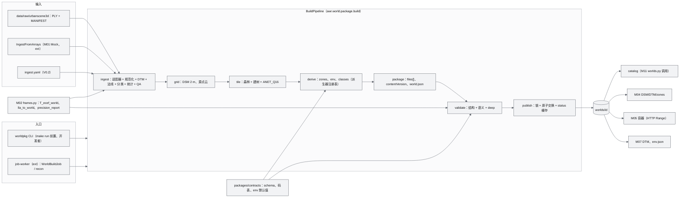
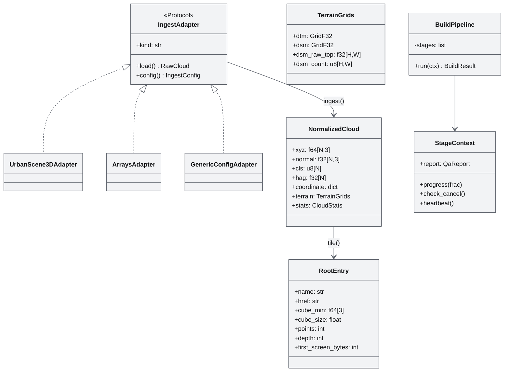
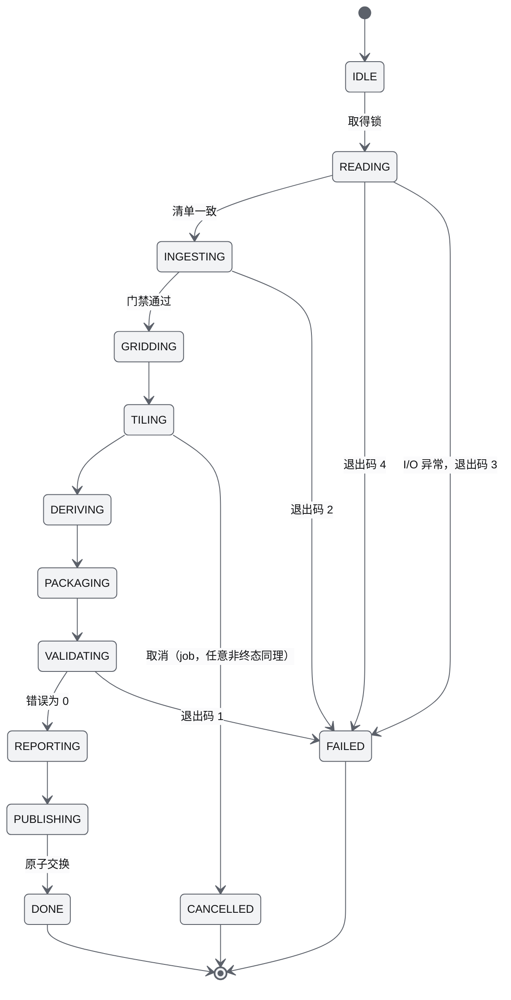
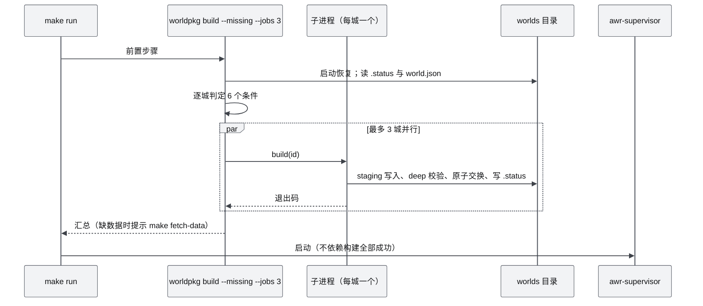
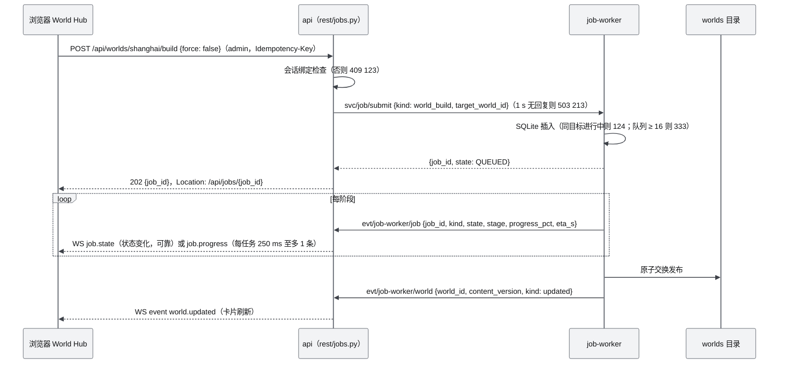

# M03 World 模型、Ingest 规范化与切片 PRD

| 项 | 内容 |
|---|---|
| 文档编号 | AWR-M03 |
| 标题 | World 模型、Ingest 规范化与切片（World Model / Ingest Normalization / Tiling） |
| 版本 | v1.0 |
| 日期 | 2026-09-28 |
| 状态 | 草案 |
| 上游文档 | [03-设计基线与决策记录](../03-设计基线与决策记录.md)（ADR-001 至 ADR-006、ADR-013、ADR-033、ADR-034、ADR-035、ADR-042、ADR-047、ADR-048、ADR-050；§4.3、§4.4、§5、§6.3、§8.2–§8.7）；[01-design](../01-design.md) §7、§8、§14、§15、§41、§43；[16-World数据规范](../16-World数据规范.md)（全部文件格式的定义方）；[12-业务逻辑设计说明书](../12-业务逻辑设计说明书.md) §3.3.1、§3.3.14、§4.12、§6.1；[17-接口与实时协议规范](../17-接口与实时协议规范.md) §4.3.2、§4.3.10、§8.4；[10-系统架构说明书](../10-系统架构说明书.md) §4.1、§5.1、§8.6；[11-技术选型说明书](../11-技术选型说明书.md) T20、T21、T43、T47、T51；[19-部署与运维说明书](../19-部署与运维说明书.md) §8.2、§8.3、§16.2；[M01](M01-重建引擎PRD.md) §6.8、§7.3；[M02](M02-LiDAR融合与地理配准PRD.md) §7.1；研究笔记 [g03](../research/g03-gap.md)（权威）、[x01](../research/x01-urbanscene3d-data.md)、[r09](../research/r09-potreeconverter-pdal-lastools.md)、[r10](../research/r10-3dtiles.md)、[n02](../research/n02-discover-recon-slam.md)、[00-index](../research/00-index.md) §3.4、§5.1、§8.1 |
| 下游文档 | [M01](M01-重建引擎PRD.md)（`IngestFromArrays`、任务框架）、[M04](M04-几何世界查询服务PRD.md)（DTM、DSM、zones）、[M05](M05-Web点云引擎PRD.md)（点云容器、`levelsPoints`）、[M07](M07-环境引擎PRD.md)（DTM、`env.json`）、[M11](M11-实时网关PRD.md)（`catalog` 库、静态服务）、[M15](M15-前端UI壳与设计体系组件PRD.md)（World Hub 数据）、[M16](M16-演示数据剧本与流畅性测试PRD.md)（世界前置、`scenarios/zones/`）、[18-性能与测试方案](../18-性能与测试方案.md)、[19-部署与运维说明书](../19-部署与运维说明书.md) |
| 适用版本范围 | V0.1（D1）至 V1.0；导出（§6.15）自 V0.5 生效 |

## 0. 摘要

1. M03 是 World 的**生产者**：把任意来源的点云规范化到 World ENU，派生 Geometry World（全分辨率源点云、DTM 10 m、DSM 2 m）、Semantic（点类别、zones）与 Visual World（Potree 2.0 + ANET_Q16 八叉树），写出并校验 World Package v1，以原子改名发布。文件格式的唯一定义方是 [16](../16-World数据规范.md)，本文只定义生产算法、CLI、流水线、任务框架与验收。
2. World Model 定为四层：Geometry（物理权威）、Visual（只负责渲染，物理禁止读取）、Localization（坐标契约，V0.5 起含重定位瓦片）、Semantic（点类别与区域矢量体）；Environment 配置、Reconstruction 溯源、Dynamic（V0.8）作为横切目录挂在同一个包里（§6.2）。
3. Ingest 流水线固定为十步：读取与校验 → 单位 → 上方向 → 调平 → 北向 → DTM 与原点 → 法线修正 → HAG 与规则分类 → 统计与示意锚点 → QA 门禁；六城 CFG（旧金山 ×10.15 且 +90°、芝加哥 ×1000 且调平 2.03°、苏州 Y-up 且合成地面）以代码常量冻结（§6.4）。
4. 切片器沿用 g03 的 G = 64、LEAF = 20000、中心优先网格竞选、固定种子打散，但把优先级改为**精确整数公式**（与 g03 原型逐点等价）、Morton 用查表展开、子树包围盒改为自底向上合并：本文实测六城建树 5.6–6.5 s（原型深圳 8.4 s），整个 tile 阶段 12.0 s（原型 17.3 s）；以 g03 规范化输入复算，六城 `levelsPoints`、`levelsByteEnd`、节点数与 [16 §4.11](../16-World数据规范.md) 表逐项一致（§6.7、§6.8、§5.2）。
5. 构建以 staging 目录加文件锁进行，发布用 Linux `renameat2(RENAME_EXCHANGE)` 原子交换（本机 ext4 以 ctypes 实测可用）；`make run` 前置 `worldpkg build --missing --jobs 3` 自动生成缺失或失效的世界（ADR-034），单城 ≤ 60 s 门禁、≤ 30 s 目标。
6. D1-core（P0）交付：`worldpkg ingest / grid / tile / validate / build [--missing]`、六城世界、16 §15.3 的 84 条校验规则（结构、语义、deep 三层）、`catalog` 库、`make worlds` 与 `make fetch-data`；D1-ext（P1）交付 `worldpkg package / status / clean`、DSM 观测数栅格 `dsm_2m_n`、job-worker 任务框架、WorldBuildJob、`rest/jobs.py` 与供 M01 使用的 `IngestFromArrays`；CSF 语义与通用配置化导入为桩（V0.2）；3D Tiles 1.1 与 COPC 导出、分块切片在 V0.5。
7. 共 65 条功能需求、18 条非功能需求、32 条验收；文末给出对基线的 10 条反馈与给并行文档的交叉意见。

---

## 1. 背景与目标

### 1.1 定位

原设计把 World 定为"整个系统最重要的一层"（01-design §7），并要求 Geometry World 与 Visual World 双表达（§8）。基线进一步规定 World ENU 是唯一度量帧（ADR-001）、ingest 规范化是 V0.1 的必经阶段、World Package v1 是唯一入口（ADR-006），并把"六城 World 在 `make run` 时自动生成"列为 D1-core（ADR-034、ADR-042）。

M03 在 7 层架构中的位置（AWR-03 §3.2）：上游是 Reality 与 Reconstruction（M01、M02 提供度量点云与坐标草稿），下游是 Geometry 查询（M04）、Web 点云引擎（M05）、环境（M07）与全部仿真模块。M03 自身只在离线或 job-worker 进程中运行，**不在任何实时进程的热路径上**。

### 1.2 目标

| 编号 | 目标 | 可度量表述 | 版本 |
|---|---|---|---|
| G-M03-1 | 六城内置可用 | `make run` 在六城缺失时自动生成；`worldpkg validate worlds/* --deep` 零错误零告警；删除任一城后重启自动重建 | V0.1 |
| G-M03-2 | 构建快且可预期 | 单城 ≤ 60 s（load ≤ 6，门禁）、≤ 30 s（load ≤ 2，目标）；建树 5M 点 ≤ 7.0 s；六城 3 进程并行 ≤ 150 s | V0.1 |
| G-M03-3 | 可复现 | 同一原始数据、同一锁文件、同一参数重复构建，`contentVersion` 与全部内容文件逐字节相同 | V0.1 |
| G-M03-4 | 不产生半成品 | 任一阶段 `kill -9`，`worlds/<id>/` 始终是完整旧包或不存在 | V0.1 |
| G-M03-5 | 为流畅性服务 | 容器提供打散点序、`levelsByteEnd`、`levelsPoints`、子树包围盒与多根森林，使 M05 首屏每根一次 Range（Tier S ≤ 1e5 点）并支持前缀调密度 | V0.1 |
| G-M03-6 | 同一流水线接入真实数据 | 重建（D1-ext Mock）、自有点云（V0.2）、LiDAR 融合地图（V0.5）都经同一套派生、切片、打包、校验、发布 | V0.1–V0.5 |

### 1.3 对原设计的继承、修正与增强（二次优化）

| 01-design | 原设计 | 继承 | 修正与增强（本文落点） | 依据 |
|---|---|---|---|---|
| §7 World Model | Geometry、Geographic、Semantic、Environment、Dynamic Objects 五组 | "World 是完整对象而不是 world.ply"；五组内容全部保留 | 收敛为四层 + 横切：Geographic 并入 Localization 层的坐标契约 `coordinate.json`；Environment 只落每世界配置（天气是参数化预设，不落盘为场）；Dynamic 预留 `dynamic/`（V0.8）；每层明确"是否物理权威"与消费者（§6.2） | ADR-001、ADR-047；00-index §7 第 10 条 |
| §8 双表达 | Geometry 负责物理，Visual 负责渲染 | 保留 | Geometry World 在 D1 即落地为全分辨率源点云 + DTM + DSM，物理侧禁止读 LOD；Visual World = ANET_Q16 八叉树；两者由同一次 ingest 产出、同一 `coordinate.sha256` 绑定 | P-03；AWR-03 §5.8 |
| §14 点云 Web 架构 | 空间分块、八叉树、LOD、流式；"远处 10K / 近处 1M" | 分块、八叉树、流式 | 阈值表删除；切片器改为提供闭环所需的数据性质：节点内打散（任意前缀是均匀子样）、层级优先 BFS 与 `levelsByteEnd`（首屏一次 Range）、`levelsPoints`（运行时按档位选首屏层）、子树紧包围盒、森林共享预算 | ADR-009 至 ADR-013；g03 §4 |
| §15 点云数据格式 | 内部 PLY/PCD/LAZ，Web 用 Binary Tile + Octree Index，后期兼容 3D Tiles | Binary Tile + Octree Index | 插入**必经**的 ingest 规范化（单位、上方向、调平、北向、原点、法线、DTM、HAG、分类、QA 门禁）；运行时格式定为 Potree 2.0 + ANET_Q16 v1；3D Tiles 1.1 只作导出、COPC 只作归档（V0.5） | ADR-004；00-index §7 第 2 条、C3 |
| §41 World 文件结构 | `metadata.json` 等目录 | 独立 World Package 理念 | `metadata.json` 改为 `world.json`；增加 `qa/report.json`、`semantic/zones.geojson`、`environment/env.json`、`geometry/pointcloud/source/`；staging 加原子发布（逐目录对应见 AWR-03 §4.4） | ADR-006；16 §3.1 |
| §43 MVP | 先打通一条完整链路；依赖 LingBot-Map | "先打通一条完整链路" | 内置世界链路（UrbanScene3D → ingest → tile → Web）为 D1-core；Mock 重建链路经 `IngestFromArrays` 走同一流水线（D1-ext） | ADR-042；x01 §7 第 7 条 |

### 1.4 相对研究原型的实现级优化

以下优化不改变任何冻结格式与字节语义，只改变实现方式，全部有本文实测或逐点等价证明。

| # | 原型做法（g03、x01） | 本文定案 | 收益与证据 |
|---|---|---|---|
| O-1 | 优先级 `d2 = Σ((q+0.5)−cc)² / (0.75·cellw²)` 用 float64 计算 | 精确整数公式 `S = Σ u²`，`u = 2·(q & (2^sh−1)) + 1 − 2^sh`，`prio16 = min(⌊65535·S / (3·4^sh)⌋, 65535)`；与原型数学等价（S 为奇数，精确商不可能是整数，浮点误差不会跨越取整边界） | 六城原始点云（×unitsToMeters，单立方体）输入下 order 与 level 与原型逐元素相等；建树 8.4 s → 6.5 s（深圳），六城 5.6–6.5 s（本文 `.cache/research/m03/octree_opt2.py`） |
| O-2 | `spread3` 位运算展开 Morton | 7 位查表展开（3 次查表 × 3 轴） | quant + Morton 约 1.2 s（实测） |
| O-3 | 子树包围盒对每个节点在全体点上 `searchsorted` 后取 min/max，并且把祖先节点的点也计入 | 自底向上：每节点自身点 `reduceat` 求盒，再逐层并入父节点；语义收紧为 16 §4.8 定义的"本节点加全部子孙" | 4.0 s → 0.31 s（实测）；更紧的盒只会减少过度细分 |
| O-4 | 法线修正的 2 m 顶面网格用 `np.maximum.at`（整个法线阶段 2.46 s） | 与 DSM 共用一次"按格排序 + `maximum.reduceat`"（网格构建 1.05 s，实测），DSM 不再单独计算 | 法线阶段预算 ≤ 1.5 s，且省去一次 DSM 网格 |
| O-5 | 旧金山 `Rz(90°)` 由 `cos/sin` 求得（含 6e-17 残差） | 90° 整数倍用精确整数矩阵；规范化坐标用逐元素乘加计算，不经 BLAS | 消除 libm 与 BLAS 内核差异带来的跨机器不确定性 |
| O-6 | `nnMedianM` 取自 x01 的 Open3D 结果 | scipy `cKDTree` 全量建树 + 固定种子抽 20 万点查询 | 深圳 0.526、苏州 0.348，与 x01 全量值一致；2.7 s（实测） |
| O-7 | 上海、纽约 `trueNorth = verified` 但 `evidence = []` | CFG 写入 x01 §3.2 的地标证据 | 否则 16 §9 门禁 G-08 失败 |
| O-8 | 原型一次写完、失败留下半个目录 | staging + 文件锁 + 原子交换 + 恢复规则 | 满足 G-M03-4 |
| O-9 | `metadata.anet.generator.seconds`、`world.json.lod.budgets`、`render.pointSizeK/edl` | 不写（耗时进 `qa/report.json`） | 确定性；与 ADR-011、ADR-012 一致（16 §1.3 修订 2、3、12） |

---

## 2. 范围

### 2.1 D1 分层（与 AWR-03 §6.3 M03 行一致）

| 层 | 内容 | 优先级 |
|---|---|---|
| **D1-core** | `worldpkg ingest / grid / tile / validate / build [--missing]`；UrbanScene3D 唯一适配器与六城 CFG；DTM 10 m、DSM 2 m、逐点 HAG、规则语义；源点云 `awr-pts@1`；切片器（G = 64、LEAF = 20000、中心优先、Fisher–Yates、`levelsByteEnd`、`levelsPoints`、`hierarchy_ext`）；苏州 6 根森林；`world.json`、`coordinate.json`、`zones.geojson`、`env.json`、`qa/report.json`；84 条校验规则与变异测试；原子发布；`make worlds`、`make validate`、`make fetch-data`（`awr data fetch urbanscene3d`）；`catalog` 库（供 M11 `worlds.py`） | P0 |
| **D1-ext** | `worldpkg package / status / clean`；DSM 观测数栅格 `dsm_2m_n`（M04 请求）；job-worker 进程与任务框架（SQLite 队列、注册表、心跳、取消、续跑）；WorldBuildJob；`awr/api/rest/jobs.py`（R06、R38–R42、R63、R64）；`IngestFromArrays` 与 `worldpkg ingest recon`（M01 Mock 重建链路入口）；hierarchy 分页（> 40,000 节点） | P1 |
| **D1 桩** | CSF 语义（`--semantic csf`，P2）；`--twin-default` 对照容器（P2）；通用配置化导入的 `IngestAdapter` 接口与 `ingest.yaml` schema；`worldpkg export` 子命令名预留 | P2 / 接口 |
| **不在 D1** | 3D Tiles 1.1、COPC、gz、USD 导出；gzip 瓦片；PDAL；分块切片（> 5e7 点）；Localization 瓦片；3DGS 与网格图层 | — |

### 2.2 版本路线

| 版本 | M03 增量 |
|---|---|
| V0.1（D1） | 见 §2.1 |
| V0.2 | 通用配置化导入（PLY/LAS/LAZ + `ingest.yaml`，回应 13 号 PRD-FR-008）；CSF 语义转为可选实现（P1）；HAG 2 m 栅格；精确去重；`make fetch-worlds` 预构建制品 |
| V0.3 | 派生器注册表承载 M04 的体素占据与 SDF（碰撞代理 L1–L2，写入 `geometry/{voxel,sdf}/`） |
| V0.5 | 真实数据入库（M02 融合地图，`anchor.kind = rtk`，`registration` 非空）；3D Tiles 1.1 与 COPC 导出；gzip 瓦片；分块切片；Localization 图层打包；PDAL Docker 作为可选前处理 |
| V0.6 | gz 导出器（SDF world + DSM 网格，ADR-048） |
| V0.8 | 3DGS 与网格图层登记与校验；USD 导出；`dynamic/` 层 schema |
| V1.0 | 评估 3D Tiles 2.0 写出器（r10 §4.2 L3） |

### 2.3 不做

浏览器端任何切片或规范化（P-02）；帧换算与椭球公式（唯一实现在 M02 `frames.py`）；几何查询与 Height_map 金字塔（M04）；点云选择器、CAS 与首屏运行时规则 R（M05）；环境参数取值（M07）；剧本与人工整理的禁飞区文件内容（M16）；重建引擎（M01）。

### 2.4 本模块新增术语

| 术语 | 定义 |
|---|---|
| 规范化点云（NormalizedCloud） | ingest 输出的内存对象：float64 World ENU 坐标、float32 单位法线、u8 类别索引、float32 逐点 HAG 及统计 |
| 工作缓存（`.work/`） | staging 目录下的中间数组（float64 坐标等），只用于分阶段命令与任务续跑，发布前删除，不进入 `files[]` |
| 优先级（prio） | 网格竞选的 int64 键：第 40–55 位为"到格心距离"的 16 位量化值，低 40 位为固定种子随机数（同距离时决胜） |
| 派生器（Deriver） | 在打包阶段按清单写出附加图层文件的插件函数（D1 为 zones、env、码表；V0.3 起 M04 注册体素与 SDF） |
| 状态缓存（`.status/`） | `worlds/.status/<id>.json`：最近一次校验的结论，供 api 以亚毫秒读取 |

其余术语见 AWR-03 §11。

---

## 3. 用户与用例

| 角色 | 诉求 | 入口 |
|---|---|---|
| 运维与开发者 | 一键得到可用的六城世界；失败时知道原因 | `make run`、`make worlds`、`worldpkg status` |
| 平台模块实现者（M04、M05、M07、M01） | 稳定的文件、库接口与夹具 | `awr.world.*` 库、tiny world 夹具 |
| 科研人员 | 导入自有点云（V0.2）；比较不同参数的切片效果 | `worldpkg ingest generic`、`worldpkg tile --G/--leaf` |
| 操作员（UI） | 在 World Hub 查看世界质量与重建世界（ext） | World Hub、`POST /api/worlds/{id}/build` |
| CI | 快速、确定、不依赖原始数据的回归 | `pytest tests/world`（tiny world）、`needs_data` 标记用例 |

| 编号 | 用例 | 主角 | 版本 | 主流程 | 结果 |
|---|---|---|---|---|---|
| UC-01 | 首次启动自动生成 | 运维 | V0.1 | `make run` → `worldpkg build --missing --jobs 3` → 六城并行构建、校验、发布 → supervisor 启动 | 六城 READY；缺原始数据时退出码 4 并提示 `make fetch-data` |
| UC-02 | 原始数据获取 | 运维 | V0.1 | `make fetch-data` 按 `configs/data.yaml` 下载 7z、校验 sha256、解压、写 `MANIFEST.json` | 六个 PLY 就位 |
| UC-03 | 单城重建与诊断 | 开发者 | V0.1 | `worldpkg build shenzhen --keep-staging` → 失败时查看 `qa/report.json` 与 staging | 定位到失败门禁或校验规则 ID |
| UC-04 | 参数实验 | 科研人员 | V0.1 | `worldpkg ingest ... --out S --keep-work`；`worldpkg grid S`；`worldpkg tile S --G 32 --leaf 10000`；`worldpkg package S`；`worldpkg validate S` | 得到可加载但不发布的实验包 |
| UC-05 | 校验现有世界 | CI | V0.1 | `worldpkg validate worlds/* --deep --json` | 规则级 JSON 报告 |
| UC-06 | 列出世界 | M11 | V0.1 | `Catalog.list()` → `GET /api/worlds` | 状态、摘要、首屏参考值 |
| UC-07 | UI 触发重建 | 操作员 | V0.1（ext） | Hub"构建" → `POST /api/worlds/{id}/build` → job-worker → 进度 ≤ 4 Hz → 发布 → `world.updated` | 卡片刷新，`contentVersion` 更新 |
| UC-08 | Mock 重建入库 | M01 | V0.1（ext） | recon 任务 GEOREFERENCING 完成 → `IngestFromArrays` → 与 UC-03 同一流水线 | 新世界通过 `--deep` 并可在 Web 加载（D1-AC-22） |
| UC-09 | 自有点云导入 | 科研人员 | V0.2 | 编写 `ingest.yaml`（单位、上方向、调平、北向、锚点）→ `worldpkg build --config` | 通过 `--deep` 的新世界 |
| UC-10 | 导出到 GIS | 科研人员 | V0.5 | `worldpkg export <id> --tiles3d --copc` | validator 0 错误的 3D Tiles 与 COPC |

---

## 4. 功能需求

优先级与 D1 列按 AWR-03 §10.2 第 4 条：D1-core 为 P0、V0.1、是；D1-ext 为 P1、V0.1、是（可豁免）；桩只交付接口或测试替身。

### 4.1 World Model 与清单

| 编号 | 需求描述 | 优先级 | 目标版本 | D1 | 验收要点 | 依据 |
|---|---|---|---|---|---|---|
| M03-FR-001 | 按 §6.2 的四层 World Model 组织 World Package；D1 已发布包含 16 §3.2 所列 7 个图层且按规定顺序写出、全部 `ready` | P0 | V0.1 | 是 | M03-AC-001 | ADR-006；16 §3.2 |
| M03-FR-002 | `world.json` 按 §6.9 的字段来源表生成；不写 `lod.budgets`、`render.pointSizeK`、`render.edl`、`generator.seconds` | P0 | V0.1 | 是 | M03-AC-001、011 | 16 §1.3 修订 2、3、12 |
| M03-FR-003 | `coordinate.json`：synthetic 锚点规则、`T_ecef_world` 与 `precision` 由 M02 `frames.T_ecef_world`、`precision_report` 计算、`conventions` 取 16 §3.3 常量；`T_world_source` 保存到 1e-6 | P0 | V0.1 | 是 | M03-AC-003 | ADR-001；g03 §2；M02 UC-01 |
| M03-FR-004 | `world.dataset` 写 name、version、url、citation、license 与 `sourceFiles[]`（sha256 取自原始数据清单）；`redistribution` 只作记录 | P0 | V0.1 | 是 | M03-AC-018 | ADR-034；13 PRD-NFR-032 |

### 4.2 Ingest 规范化

| 编号 | 需求描述 | 优先级 | 目标版本 | D1 | 验收要点 | 依据 |
|---|---|---|---|---|---|---|
| M03-FR-005 | 原始读取：固定布局 PLY（`binary_little_endian`，`x y z nx ny nz` float32）以 memmap 读取；校验 `header + N·24 == 文件大小` 与 sha256；剔除非有限坐标并计数 | P0 | V0.1 | 是 | M03-AC-005 | x01 §1.3、§2.4；16 §9 G-09、G-10 |
| M03-FR-006 | `awr/world/ingest/urbanscene3d.py` 为唯一 UrbanScene3D 适配器，内含六城 CFG 与文件名映射表（含空格与大小写差异） | P0 | V0.1 | 是 | M03-AC-004 | AWR-03 §4.3；18 号数据集表（测试不得自行拼接文件名） |
| M03-FR-007 | 单位：按 CFG 的 `unitsToMeters`；另以 `10^round(log10(120/HAG_p99_raw))` 计算初判值写入报告，两者相差超过 3 倍时告警 | P0 | V0.1 | 是 | M03-AC-004 | x01 §3.1 |
| M03-FR-008 | 上方向：按 `score_a = f_a·abs(m_a)` 判定并与 CFG 比对，不一致为门禁错误；按 §6.4 表构造 det = +1 的上轴旋转 | P0 | V0.1 | 是 | M03-AC-004 | x01 §3.1；r07 |
| M03-FR-009 | 调平：CFG `level = true` 且倾角 > 0.5° 时，把上向法线均值用 Rodrigues 旋到 +Z（与 g03 一致，芝加哥 2.03°）；调平后以 G-04（地面平面残差 MAD < 5 m）、G-05（倾角 < 0.5°）为 error 门禁；`level = auto`（V0.2 通用导入）另加调平前判据"倾角 > 0.5° 且调平前地面平面残差 MAD < 5 m"（§6.4） | P0 | V0.1 | 是 | M03-AC-004 | x01 §3.3（芝加哥 MAD 2.25 m） |
| M03-FR-010 | 北向：绕 Z 旋 `yawDeg`；90° 整数倍用精确整数矩阵 | P0 | V0.1 | 是 | M03-AC-004、010 | x01 §3.2；本文 O-5 |
| M03-FR-011 | 规范化坐标以 float64 逐元素乘加计算（`Q = A·p`，不经 BLAS），法线只乘旋转不乘尺度 | P0 | V0.1 | 是 | M03-AC-010 | x01 §3.3；本文 O-5 |
| M03-FR-012 | DTM：10 m 格内最小 z → 9×9 最小滤波 → 9×9 最大滤波（边界取最近）→ NaN 以 4 邻域均值迭代填补 ≤ 300 次；地面占比 ≤ 10% 时改为常数 `percentile(z, 0.5)` 并置 `ground.type = synthetic` | P0 | V0.1 | 是 | M03-AC-006 | x01 §3.3；g03 `dtm_opening` |
| M03-FR-013 | 原点：合成数据 XY 取包围盒中心、Z 取 DTM 中位数；重建与真实数据保留上游给定的世界原点（不重新居中），`ground.zM` 取 DTM 中位数 | P0 | V0.1 | 是 | M03-AC-004 | AWR-03 §5.1 第 3 条、§5.5 |
| M03-FR-014 | 法线修正：零法线置 +Z；位于 2 m 顶面网格最高面、且 `n_z < −0.9` 的点翻正；`abs(n_z) < 0.3 ∧ HAG ≥ 1` 且沿法线 2 m 处顶面高于自身 1 m 的立面点翻正 | P0 | V0.1 | 是 | M03-AC-006 | x01 §3.7；g03 §7 |
| M03-FR-015 | 逐点 HAG（`z − dtm(格)`，最近格）与规则分类（16 §5 第 4 条），写 `anet-classes@1` 紧凑索引 | P0 | V0.1 | 是 | M03-AC-006 | ADR-005；x01 §3.7 |
| M03-FR-016 | 示意锚点：以最高 HAG 点对应的已知地标反推原点经纬度（牛顿迭代，雅可比由 M02 `lla_to_world` 数值差分得到），`hMslM = 地标地面 MSL − dtm(峰值格)`；无地标时用城市中心并置 `uncertaintyM.horizontal = 5000` | P0 | V0.1 | 是 | M03-AC-003 | g03 §7；M02-FR-012（禁止自写椭球常量） |
| M03-FR-017 | 统计：`nnMedianM`（全量 KD 树、固定种子 20 万点、第 2 近邻中位数）、`zP1/zP99`、`hagP1/hagP99`、类别直方图、法线翻正比例 | P0 | V0.1 | 是 | M03-AC-006 | x01 §3.4；本文 O-6 |
| M03-FR-018 | QA 门禁 G-01 至 G-10（16 §9）写入 `qa/report.json`；error 级失败时构建退出码 2、不发布 | P0 | V0.1 | 是 | M03-AC-007 | x01 §6 第 1 条；16 §9 |
| M03-FR-019 | CSF 语义：`--semantic csf` 以 n02 v2 规则 + v3 连通分量修正生成类别；缺依赖时报错退出码 3；默认仍为规则语义（真实实现 V0.2） | P2 | V0.2 | 桩 | M03-AC-029 | n02 §3.10；AWR-03 §6.3 |
| M03-FR-020 | 通用配置化导入：`IngestAdapter` 协议与 `ingest.yaml` schema 在 D1 冻结；PLY（plyfile）、LAS/LAZ（laspy）读取与配置驱动的规范化在 V0.2 实现 | P1 | V0.2 | 桩 | schema 编译通过 | 13 PRD-FR-008；x01 §3.3 |
| M03-FR-021 | `IngestFromArrays`（字段见 §7.2，与 M01 §6.8 映射表逐项对应）：接收已在 world 帧的 float64 坐标（可选法线、类别）、锚点与 `trueNorth`（继承源世界）、`registration`、溯源信息、可选 `generator_params` 与 `camera_home`，跳过步骤 2–5 与原点重定（§6.4），其余步骤与六城相同；CLI 入口为 `worldpkg ingest recon --session <dir>`（16 §14.1） | P1 | V0.1 | 是 | M03-AC-026 | M01 §2 分工表、§6.8；ADR-035；16 §14.1 |
| M03-FR-022 | 精确去重（`dedupe = exact`，真实数据默认）；UrbanScene3D 默认 `off`（x01 已证实无重复点） | P2 | V0.2 | 否 | 去重计数写入报告 | x01 §0 第 1 条 |
| M03-FR-066 | 合成演示城市（DEMO-W，ADR-077）：`awr/world/ingest/synthetic.py` 按 `configs/worldpkg.yaml` 的 `synthetic.<id>`（种子、边长、目标点数、名称、示意锚点）确定性生成约 1.2 km × 1.2 km、约 400 万点的城市点云（道路网格与路口、街区内六种建筑、两座 300 m 级地标塔、立面窗格密度纹理、屋顶设备、行道树、公园、河道与桥），带法线与 `anet-classes@1` 类别；`SyntheticAdapter` 以 `semantic = provided`（类别由生成器给出，不做规则分类）走与六城相同的十步 ingest 与切片、派生、`--deep` 校验、原子发布，world id `synthcity`，`anchor.kind = synthetic`；同一平台与 numpy 版本下逐字节一致（§6.18） | P1 | V0.1 | 是 | M03-AC-033、034 | ADR-077；DEMO-W |

### 4.3 Geometry 与语义派生

| 编号 | 需求描述 | 优先级 | 目标版本 | D1 | 验收要点 | 依据 |
|---|---|---|---|---|---|---|
| M03-FR-023 | 源点云 `awr-pts@1`：float32 坐标、oct16 法线、u8 类别，按世界立方体的 21 位 Morton 码升序写出 | P0 | V0.1 | 是 | M03-AC-009 | 16 §6.1；AWR-03 §5.8 |
| M03-FR-024 | DSM 2 m：每格源点最大 z；空格取格心处 DTM 双线性值；原点与 DTM 相同 | P0 | V0.1 | 是 | M03-AC-009 | 16 §6.3 |
| M03-FR-025 | HAG 2 m 栅格（`dsm − dtm(格心)`） | P2 | V0.2 | 否 | V-G 规则通过 | 16 §6.3 |
| M03-FR-026 | `zones.geojson`：派生唯一 `border`（包围盒内缩 20 m，`max_z_m = round(max(dsm) + 50, 2)`）；合并 `scenarios/zones/<id>.zones.geojson`（`origin = curated`）并写 `source_sha256` | P0 | V0.1 | 是 | M03-AC-012 | 16 §7；12 §5.7.1 |
| M03-FR-027 | `environment/env.json`：取值读自 `packages/contracts/env/env_world_defaults.json`（M07 维护语义）；该文件入库前使用 §6.16 的内置默认值（与 16 §8.2 示例相同）；写 `coordinate_hash`（`sha256:` 前缀）与 `ground.h_msl_m` | P0 | V0.1 | 是 | M03-AC-001 | 16 §8.2；g06 §3.2 |
| M03-FR-028 | `semantic/anet-classes@1.json` 为 contracts 真源的逐字节拷贝 | P0 | V0.1 | 是 | M03-AC-001 | 16 §5 V-K-04 |
| M03-FR-065 | DSM 观测数栅格 `geometry/terrain/dsm_2m_n.{json,u8}`（`kind = occupancy`、uint8、`scale = 1`、`offset = 0`，与 DSM 同网格，每格源点数饱和到 255）：与 DSM 在同一次 `grid_reduce` 中由分段长度得到，登记为图层 `terrain.dsm-n`（排在 7 个必需图层之后）；D1 构建默认写出（`generator.params.dsmOccupancy = true`），`--no-dsm-n` 可关闭 | P1 | V0.1 | 是 | M03-AC-009 | 16 §6.3、DATA-FR-065；M04 §14 第 4 条 |

### 4.4 切片器

| 编号 | 需求描述 | 优先级 | 目标版本 | D1 | 验收要点 | 依据 |
|---|---|---|---|---|---|---|
| M03-FR-029 | 多根森林：`forest = auto` 按 16 §4.10 规则切分；每根独立容器，根之间不重叠 | P0 | V0.1 | 是 | M03-AC-013 | g03 §4.4 |
| M03-FR-030 | 量化：`q = clip(⌊(p − cubeMin)/size·2^21⌋, 0, 2^21−1)`；Morton 码 x 在最高位（`x<<2 \| y<<1 \| z`，与 Potree 子序一致），查表展开；稳定排序 | P0 | V0.1 | 是 | M03-AC-014 | r09 §3.2；本文 O-2 |
| M03-FR-031 | 中心优先网格竞选：逐层按 §6.7 的整数优先级取每格最小者；与 g03 原型 `build_octree` 的 order、level 逐元素相等 | P0 | V0.1 | 是 | M03-AC-014 | g03 §7；本文 O-1 |
| M03-FR-032 | 叶判定：节点剩余点数 ≤ LEAF 或到达 `maxL = B − log2 G` 时，剩余点全部归该层 | P0 | V0.1 | 是 | M03-AC-014 | r09 §3.2 |
| M03-FR-033 | 节点分组与 BFS 写序：按 (level, nid) 升序；为每个非空节点补齐无点祖先；名字由 nid 的八进制各位得到 | P0 | V0.1 | 是 | M03-AC-015 | 16 §4.1 第 5、8 条 |
| M03-FR-034 | 节点内打散：每根一个 `default_rng(shuffleSeed)`，按写出顺序逐节点 `permutation(n)` 连续消费（森林各根从同一种子重新开始，与 g03 一致） | P0 | V0.1 | 是 | M03-AC-016 | 16 §4.7；g03 `write_container` |
| M03-FR-035 | ANET_Q16 编码：节点立方体量化（`rint`）、oct16 法线（Python 唯一编码实现）、`baked-height` 五档底色（字节取 16 §4.4）、类别索引 | P0 | V0.1 | 是 | M03-AC-017 | 16 §4.3–§4.6 |
| M03-FR-036 | `hierarchy.bin`：节点数 ≤ 40,000 写单 chunk、`stepSize = max(depth, 1)`、`firstChunkSize` = 文件长度；超出时按 step = 4 分页写 PROXY（同 PotreeConverter `createHierarchyChunks`） | P0（单 chunk）/ P1（分页） | V0.1 | 是 | M03-AC-015、027 | 16 §4.1 第 3 条；g03 `write_container` |
| M03-FR-037 | `hierarchy_ext.bin`：与 `hierarchy.bin` 逐条镜像；子树（本节点 + 子孙）包围盒自底向上合并，min 向下取整、max 向上取整 | P0 | V0.1 | 是 | M03-AC-015 | 16 §4.8；本文 O-3 |
| M03-FR-038 | `levelsByteEnd`、`levelsPoints`、`levelsNodes`、`nodeCount`、规则 G 的 `firstScreenLevel` 与 `anet` 19 个必填键；六城结果与 16 §4.11 表逐项一致 | P0 | V0.1 | 是 | M03-AC-013 | ADR-013；16 §4.9、§4.11 |
| M03-FR-039 | `compression = gzip`（每节点一个 member，`mtime = 0`） | P2 | V0.5 | 否 | 16 V-D-01 | 16 §4.13 |
| M03-FR-040 | `--twin-default`：节点集相同的 Potree DEFAULT 孪生容器，供对照页 | P2 | V0.1 | 桩 | potree-core 对照页可加载 | g03 §0 第 8 条 |

### 4.5 打包、发布与自动生成

| 编号 | 需求描述 | 优先级 | 目标版本 | D1 | 验收要点 | 依据 |
|---|---|---|---|---|---|---|
| M03-FR-041 | `files[]` 与 `contentVersion` 按 16 §3.4 计算；JSON 以固定键序、`indent=1`、`ensure_ascii=False`、末尾换行写出；参与哈希的文件不含时间戳与主机信息 | P0 | V0.1 | 是 | M03-AC-011 | ADR-006；16 §3.4 |
| M03-FR-042 | 原子发布：每城一把 `flock` 锁；只写 `worlds/.staging/<id>-<nonce>/`；通过校验后以 `renameat2(RENAME_EXCHANGE)` 与旧包交换（不支持时退化为两次 `rename` 加启动恢复）；旧包进入 `.trash/` 后删除 | P0 | V0.1 | 是 | M03-AC-020 | 16 §3.5；12 §4.12 J04 |
| M03-FR-043 | `build --missing`：按 16 §3.5 第 2 条的 6 个条件判定；`--jobs N`（默认 3）进程池并行；结论写 `worlds/.status/<id>.json` | P0 | V0.1 | 是 | M03-AC-021 | ADR-034；D1-AC-01 |
| M03-FR-044 | `make run` 前置：原始数据缺失的城市打印 `make fetch-data` 提示，该城退出码 4；构建失败的世界标 INVALID，`make run` 继续启动其余部分；只有默认世界 `AWR_WORLD` 不可用时 `make run` 按 19 §16.2 以 4（缺数据）或 6（世界无效）中止；未显式指定世界且深圳未构建时，默认世界按 ADR-077 回退为合成演示城市 synthcity（M03-FR-067），回退世界可用即不中止 | P0 | V0.1 | 是 | M03-AC-022 | 12 §6.1 规则 1；19 §4.3、§16.2 |
| M03-FR-045 | `make fetch-data`（实现为 M03 注册的 `awr data fetch urbanscene3d [--verify] [--force]`，19 §8.2）：按 `configs/data.yaml`（地址与 sha256 真源）断点续传下载 7z、校验、解压到临时目录、逐文件核对后原子移入，生成 `data/raw/urbanscene3d/MANIFEST.json`；只校验写作 `make fetch-data VERIFY=1`；退出码按 19 §16.2（5 字节数或 sha256 不符、7 磁盘不足、8 缺解压工具） | P0 | V0.1 | 是 | M03-AC-023 | ADR-034；16 §10.4；19 §8.2 |
| M03-FR-046 | `make fetch-worlds`：下载预构建六城制品并按 `contentVersion` 校验后原子发布 | P2 | V0.2 | 否 | 与本地构建的 `contentVersion` 相同 | ADR-034 |
| M03-FR-067 | 默认世界回退（ADR-077）：`build --missing` 在未显式指定 `AWR_WORLD`、主默认世界（`configs/runtime.yaml` 的 `run.world`，深圳）未发布且其原始文件不在本机时自动生成 `run.fallback_world`（synthcity）；已发布的合成世界按 §6.10 的 6 个条件保持新鲜（条件 ⑤ 改为 `generator.params.synthetic` 不同，原因 `raw_changed`）；`worldpkg default-world` 输出生效的默认世界，`make worlds` 据此判定"默认世界不可用"；`make demo-world` 生成或刷新 synthcity；目录服务把原因为 `raw_missing` 的失败记录报为 `missing`（16 §3.5：缺原始数据时世界仍为 ABSENT） | P1 | V0.1 | 是 | M03-AC-035 | ADR-077；19 §4.3、§8.3 |

### 4.6 校验器

| 编号 | 需求描述 | 优先级 | 目标版本 | D1 | 验收要点 | 依据 |
|---|---|---|---|---|---|---|
| M03-FR-047 | 实现 16 §15.3 的 84 条规则（结构、语义、deep 三层），规则以 `@rule(id, layer, severity)` 注册，ID 稳定 | P0 | V0.1 | 是 | M03-AC-001、019 | g03 §6；16 §15 |
| M03-FR-048 | `worldpkg validate` CLI：`--deep`、`--json`、`--strict-warn`、`--rules`；输出与退出码按 16 §15.4；跳过非世界目录 | P0 | V0.1 | 是 | M03-AC-019 | 16 §15.4 |
| M03-FR-049 | 变异测试 ≥ 30 个注入（16 DATA-AC-003 清单），每个必须被预期规则 ID 拦下 | P0 | V0.1 | 是 | M03-AC-019 | g03 §6.3 |
| M03-FR-050 | 精度字段的复算调用 M02 `precision_report`，坐标复算调用 `T_ecef_world` | P0 | V0.1 | 是 | M03-AC-003 | M02 §7.1 |

### 4.7 CLI 与构建目标

| 编号 | 需求描述 | 优先级 | 目标版本 | D1 | 验收要点 | 依据 |
|---|---|---|---|---|---|---|
| M03-FR-051 | 核心子命令 `ingest`、`grid`（由 `.work` 重算 DSM，build 内部同一实现）、`tile`、`validate`、`build`（参数与退出码见 §7.1） | P0 | V0.1 | 是 | M03-AC-024 | AWR-03 §6.3；本模块任务说明 |
| M03-FR-052 | 辅助子命令 `package`（在 staging 目录上执行派生、打包与报告，不发布）、`status`（`--missing` 判定的只读预演）、`clean`（清理 staging、trash、`_shared`） | P1 | V0.1 | 是 | M03-AC-021、024 | 本文设定 |
| M03-FR-053 | `mk/m03.mk`：`worlds`、`worlds-force`、`demo-world`（ADR-077）、`validate`、`fetch-data`、`test-world`、`perf-world` | P0 | V0.1 | 是 | M03-AC-022 | ADR-050 |

### 4.8 目录服务与任务框架

| 编号 | 需求描述 | 优先级 | 目标版本 | D1 | 验收要点 | 依据 |
|---|---|---|---|---|---|---|
| M03-FR-054 | `awr.world.package.catalog`：列出世界摘要与状态（映射见 §6.12），只读 `world.json`、根 `metadata.json` 与 `.status/`，按 mtime 缓存 | P0 | V0.1 | 是 | M03-AC-025 | 17 §4.3.2；AWR-03 §4.2 第 1 条 |
| M03-FR-055 | 任务框架 `awr/jobs/`：SQLite 队列（单写者 job-worker）、`@register_job` 注册表、进程主循环心跳、进度节流 250 ms、协作式取消、崩溃标记 `failed(resumable)`、从最后完成阶段续跑 | P1 | V0.1 | 是 | M03-AC-027 | 12 §4.12；10 号 §4 job-worker 行 |
| M03-FR-056 | WorldBuildJob 五阶段（INGESTING、TILING、DERIVING、VALIDATING、PUBLISHING）；`rest/jobs.py` 实现 R06、R38–R42、R63、R64；会话绑定的世界返回 `123`，同目标进行中返回 `124`，队列 ≥ 16 返回 `333`，job-worker 不可用返回 503 `213`（detail `JOB_WORKER_UNAVAILABLE`） | P1 | V0.1 | 是 | M03-AC-027 | 12 §4.12；17 §4.3.10、§8.4 |
| M03-FR-057 | 发布后发 `world.added` 或 `world.updated`（经 `evt/job-worker/world`）；`make run` 前置构建不发事件 | P1 | V0.1 | 是 | M03-AC-027 | 12 §6.1 规则 3 |

### 4.9 扩展入口

| 编号 | 需求描述 | 优先级 | 目标版本 | D1 | 验收要点 | 依据 |
|---|---|---|---|---|---|---|
| M03-FR-058 | 派生器注册表：`configs/worldpkg.yaml` 以字符串路径列出派生器（懒加载，避免 M03 静态依赖 M04、M07）；D1 内置 zones、env、classes 三个 | P0 | V0.1 | 是 | M03-AC-012 | ADR-050 扩展点原则 |

### 4.10 导出与后续版本

| 编号 | 需求描述 | 优先级 | 目标版本 | D1 | 验收要点 | 依据 |
|---|---|---|---|---|---|---|
| M03-FR-059 | 3D Tiles 1.1 导出：按 16 §17.1，由 ANET_Q16 容器直接转写（复用量化坐标），3d-tiles-validator 0 错误 | P1 | V0.5 | 否 | M03-AC-031 | r10 §3.6、§3.9；ADR-004 |
| M03-FR-060 | COPC 导出：按 16 §17.2，由源点云写 LAS 1.4 PDRF 6（PDAL `writers.copc` Docker 或 untwine），VLR 内嵌 `coordinate.json` | P1 | V0.5 | 否 | M03-AC-031 | r09 §3.5；ADR-004 |
| M03-FR-061 | 分块切片：> 5e7 点时两遍分块（计数 → 分发 → 块内建树 → 粗层全局归约），输出与单遍一致的容器语义 | P1 | V0.5 | 否 | 1e8 点合成数据内存 ≤ 16 GB | r09 §3.2 规模扩展 |
| M03-FR-062 | Localization 图层：打包 M02 Map Release（`localization/`，world 帧，绑定 `coordinate.sha256`） | P1 | V0.5 | 否 | 校验规则追加 | M02 反馈第 4 条 |
| M03-FR-063 | 3DGS（`visual/gaussian`）与网格（`visual/mesh`）图层登记、`T_world_layer` 刚体校验 | P2 | V0.8 | 否 | 同上 | r10 §3.11；ADR-048 |
| M03-FR-064 | gz（V0.6）与 USD（V0.8）导出器以 World ENU 为唯一坐标并记录 `coordinate.sha256` | P2 | V0.6 | 否 | 三后端锚点误差 ≤ 1 cm | ADR-048；16 §17.3 |

---

## 5. 非功能需求

### 5.1 NFR 表

| 编号 | 需求描述 | 优先级 | 目标版本 | D1 | 验收要点 | 依据 |
|---|---|---|---|---|---|---|
| M03-NFR-001 | 单城 `build`（含 deep 校验）≤ 60 s（load ≤ 6，门禁）；≤ 30 s（load ≤ 2，目标） | P0 | V0.1 | 是 | M03-AC-028 | D1-AC-01；本文 §5.2 |
| M03-NFR-002 | 建树（量化、Morton、排序、逐层竞选）5M 点 ≤ 7.0 s（load ≤ 2，3 次中位）；目标 ≤ 6 s | P0 | V0.1 | 是 | M03-AC-028 | r09 §0 第 2 条；本文实测六城 5.6–6.5 s |
| M03-NFR-003 | tile 阶段（建树 + 分组 + 编码 + 写出）5M 点 ≤ 12 s；目标 ≤ 10 s | P0 | V0.1 | 是 | M03-AC-028 | 本文优化原型实测 12.0 s（未复用 Morton 码；复用后约省 1.2 s） |
| M03-NFR-004 | 六城 `build --missing --jobs 3` ≤ 150 s（门禁），目标 ≤ 75 s | P0 | V0.1 | 是 | M03-AC-028 | 16 DATA-NFR-001 |
| M03-NFR-005 | 校验：浅校验 ≤ 1 s/城，`--deep` ≤ 5 s/城 | P0 | V0.1 | 是 | M03-AC-019 | g03 §6.2（上海 0.41 / 2.41 s） |
| M03-NFR-006 | 峰值 RSS ≤ 4 GB/城（本文实测 2.2 GB）；3 并行 ≤ 12 GB | P1 | V0.1 | 是 | 报告 `stages[].peak_rss_mb` | 16 DATA-NFR-013 |
| M03-NFR-007 | 确定性：同一原始数据、锁文件（含 numpy 版本）、参数，重复构建 `contentVersion` 相同；跨机器（x86-64）相同 | P0 | V0.1 | 是 | M03-AC-011 | P-10；16 DATA-NFR-006 |
| M03-NFR-008 | 原子性：任意阶段崩溃不破坏已发布包；残留 staging 下次构建自动清理 | P0 | V0.1 | 是 | M03-AC-020 | 16 DATA-NFR-014 |
| M03-NFR-009 | 精度：`float32UlpMm < 1`、半径 ≤ 10 km；节点量化误差 ≤ 步长一半；oct16 平均 ≤ 0.35°、p99 ≤ 0.8°、最大 ≤ 1.0°；源点云 float32 相对 float64 ≤ 0.5 mm | P0 | V0.1 | 是 | M03-AC-017 | g03 §0、§2.1 |
| M03-NFR-010 | 体积：`octree.bin` = 12 × 点数；每城世界包 ≤ 220 MB（十进制，含 `dsm_2m_n`，不含 `export/`；旧金山估算约 206 MB）；六城 `worlds/` ≤ 1.2 GB | P0 | V0.1 | 是 | M03-AC-013 | 16 DATA-NFR-003、§10.3 |
| M03-NFR-011 | 依赖边界：只用 numpy、scipy（`spatial`、`ndimage`）、plyfile、laspy、jsonschema、PyYAML、标准库（`awr data fetch` 另用 py7zr）；禁止 import open3d、torch、numba；不需要 GPU；`OMP_NUM_THREADS = OPENBLAS_NUM_THREADS = 1` | P0 | V0.1 | 是 | M03-AC-030 | 11 T43；AWR-03 §4.2；19 §8.2 |
| M03-NFR-012 | 单一实现：不出现椭球常量与帧换算公式，全部调用 M02 `frames.py` | P0 | V0.1 | 是 | M02-AC-013 | AWR-03 §5.1 第 8 条 |
| M03-NFR-013 | 可测试：tiny world 夹具（20 万点合成城市）全流程 ≤ 5 s；`pytest tests/world -m "not needs_data"` ≤ 60 s | P0 | V0.1 | 是 | M03-AC-030 | P-06 |
| M03-NFR-014 | 输出文本：CLI、日志、生成的 JSON 标签 no-emoji 与禁用字形扫描为 0；CLI 只用 ASCII 与中文；`--log-json` 输出结构化日志行 | P0 | V0.1 | 是 | D1-AC-20 | AWR-03 §10.2 第 1 条 |
| M03-NFR-015 | catalog：缓存命中 ≤ 0.2 ms；mtime 变化后的刷新 ≤ 5 ms/城，至多 1 Hz | P0 | V0.1 | 是 | M03-AC-025 | AWR-03 §4.2 第 1 条 |
| M03-NFR-016 | job-worker：进度事件 ≤ 4 Hz；主循环心跳间隔 ≤ 10 s（阈值 120 s）；取消响应 ≤ 2 s | P1 | V0.1 | 是 | M03-AC-027 | 10 号 job-worker 行；AWR-03 §6.3 |
| M03-NFR-017 | 安全与规模：所有写路径经 `relHref` 规范化（无 `..`、无绝对路径、不跟随符号链接）；外部输入（curated zones、`IngestFromArrays`、`ingest.yaml`、任务参数）先校验 schema 与大小上限（点数 ≤ 2e8）；D1 单遍切片只接受 ≤ 5e7 点，超过时退出码 3 并提示 V0.5 分块切片（FR-061；本机按约 440 B/点的峰值估算为 22 GB，本文设定） | P0 | V0.1 | 是 | M03-AC-020 | 16 §3.1 规则 1；本文 §5.2 实测 RSS |
| M03-NFR-018 | 磁盘：staging 峰值 ≤ 1.3 × 包体积 +（续跑缓存时）0.25 GB；`.trash` 每城只保留最新一代，超过 60 s 的由下一次 `worldpkg` 运行或 job-worker 空闲巡检删除 | P1 | V0.1 | 是 | M03-AC-020 | 本机磁盘余量约 53 GB |

### 5.2 性能预算（单城 5M 点，单线程）

"原型实测"为本文 2026-09-28 在本机（load 0.8–1.6，numpy 2.5.3、scipy 1.18.1，研究 venv `.cache/research/n02/venv`）对 g03 原型逐阶段计时的结果（`.cache/research/m03/bench_m03.py`，审校时以同一命令复测，各阶段偏差 ≤ 0.1 s，`nnMedianM = 0.526`、峰值 RSS 2235 MB）；"优化实测"为本文优化原型（`octree_opt2.py`、`tile_fast.py`）。

| 阶段 | 原型实测（深圳） | 优化实测 | 预算（load ≤ 2） | 实现要点 |
|---|---|---|---|---|
| 读取 PLY + float64 化 | 0.44 s | — | ≤ 0.6 s | memmap 结构化 dtype |
| 原始文件 sha256（120 MB） | — | — | ≤ 0.4 s | 4 MiB 分块流式 |
| 规范化（单位、上轴、调平、北向） | 0.62 s | — | ≤ 0.8 s | 逐元素乘加 |
| DTM + 原点 | 1.82 s | — | ≤ 1.5 s | `scipy.ndimage` 最小、最大滤波替代滑窗视图 |
| 法线修正（含 2 m 顶面网格） | 2.46 s | 1.05 s（网格） | ≤ 1.5 s | 与 DSM 共用排序 + `reduceat`（O-4） |
| 分类 | 0.15 s | — | ≤ 0.3 s | — |
| `nnMedianM` | 2.74 s | — | ≤ 3.0 s | `cKDTree` 建树 1.73 s + 20 万点查询 1.01 s |
| DSM、`dsm_2m_n` 写出 + 源点云写出（约 80 MB） | — | — | ≤ 1.5 s | 单根世界复用切片器的 Morton 序 |
| 森林切分与分位数 | 0.89 s | — | ≤ 0.3 s | 单根时不构造掩码、不复制数组 |
| 建树 | 8.43 s | 6.50 s（六城 5.6–6.5 s） | ≤ 7.0 s | O-1、O-2 |
| 分组、底色、oct16、子树盒、编码、写出 | 8.8 s | 5.8 s | ≤ 5.0 s | 复用建树阶段的 Morton 码（省约 1.2 s）；O-3 |
| 派生与打包（zones、env、sha256 约 140 MB） | 0.31 s（60 MB） | — | ≤ 1.0 s | — |
| `validate --deep` | 2.41 s（上海） | — | ≤ 5.0 s | 逐节点解码向量化 |
| **合计** | 约 29 s（g03 §7：21–35 s） | — | **≤ 28 s**（各阶段预算之和 27.9 s） | 目标 30 s（load ≤ 2，含解释器启动与 import 约 1 s）；门禁 60 s（load ≤ 6） |

苏州（6 根，建树合计 5.04 s，写出合计 12.26 s）与其余四城落在同一量级；上海、旧金山的 DSM 较大（46–52 MB），写出多约 0.2 s。审校复测（4 城并发，load 约 4）：上海、纽约、旧金山、芝加哥的优化 tile 阶段 12.8–14.2 s，其中建树 6.0–6.9 s。

---

## 6. 设计方案

### 6.1 组件与进程落点



进程与 CPU：`worldpkg` 为独立进程（`make run` 前置，supervisor 启动之前），`--jobs 3` 时每个子进程单线程；job-worker（ext）为 nice 10、不钉核的常驻进程，一次一个任务，在进程内直接调用同一个库（不再起子进程调用 CLI，10 §4.1、§8.6）。

### 6.2 World Model 四层

| 层 | 职责 | 权威性 | D1 内容（文件） | 主要消费者 | 后续版本 |
|---|---|---|---|---|---|
| Geometry | 碰撞、AGL、净空、围栏、规划、传感器求交 | **物理权威**：物理侧只允许读本层 | 源点云 `geometry/pointcloud/source/`（`awr-pts@1`）；`geometry/terrain/dtm_10m`、`dsm_2m`；Height_map 由 M04 在加载时派生、不落盘 | M04（全部查询）、M07（`z − dtm`）、M09、M10（经 M04）、M13（V0.2 LiDAR） | V0.2 L3 网格 BVH（运行时）；V0.3 体素、SDF（L1–L2） |
| Visual | 渲染与呈现 | 非权威：LOD 疏密变化对物理零影响 | `visual/pointcloud/`（森林为 `r-<i>/`），ANET_Q16 v1 | M05 | V0.5 导出 3D Tiles；V0.8 3DGS、网格 |
| Localization | 定义世界帧并把外部帧对齐到它 | 帧定义权威 | `coordinate.json`（锚点、`T_ecef_world`、`trueNorth`、`scaleStatus`、`source.T_world_source`、`registration`、`precision`） | 全部模块（经 M02 frames） | V0.5 `localization/` 重定位瓦片（M02 Map Release） |
| Semantic | 点类别与区域语义 | 语义权威 | 点类别（容器 `col.a`、源点云 `class.u8`）；`semantic/anet-classes@1.json`；`semantic/zones.geojson` | M05（`classMask`）、M09（围栏）、M10、M13（检测先验）、UI | V0.2 CSF；V0.5 学习型语义；V0.8 Tracks |
| 横切 | 环境配置、重建溯源、质量、动态 | — | `environment/env.json`；`reconstruction/<session>/`（ext）；`qa/report.json`；`dynamic/`（V0.8） | M07、M01、UI | — |

规则：
1. 四层共享同一个 `coordinate.sha256` 与 `contentVersion`；任何一层变化都产生新的 `contentVersion`（ADR-006）。
2. Geometry 与 Visual 由同一次 ingest 的同一组 float64 坐标产出，Visual 的每个点都能在 Geometry 源点云中找到（点数守恒，V-S-02）。
3. Semantic 的区域是矢量体，不写成点类别（ADR-005）。

### 6.3 数据结构



```python
# python/awr/world/ingest/types.py
@dataclass(frozen=True, slots=True)
class IngestConfig:                       # 一城一份，UrbanScene3D 的六份在 urbanscene3d.py 中以常量给出
    world_id: str                         # ^[a-z0-9-]{1,63}$
    source_kind: Literal["dataset", "reconstruction", "lio-map", "survey", "simulation"]
    units_to_m: float | None              # None 表示用启发式并置 scaleStatus = assumed（V0.2）
    up_axis: Literal["+x", "-x", "+y", "-y", "+z", "-z"]
    level: bool | Literal["auto"]         # True：倾角 > 0.5° 即调平（芝加哥）；False：禁止（旧金山）；"auto"：V0.2 通用导入
    yaw_deg: float                        # 绕 Z 的北向旋转，°
    true_north: Literal["exact", "verified", "assumed", "unknown"]
    scale_status: str                     # 七值，见 16 §3.3
    landmark: Landmark | None             # 示意锚点依据
    fallback_anchor: tuple[float, float, float] | None   # (lat°, lon°, hMsl m)，无地标时
    evidence: tuple[str, ...]             # → coordinate.source.evidence（G-08 检查此项非空）
    north_evidence: tuple[str, ...]       # → coordinate.trueNorth.evidence
    dedupe: Literal["off", "exact"] = "off"
    semantic: Literal["rules", "csf"] = "rules"

@dataclass(frozen=True, slots=True)
class Landmark:
    name: str; lat_deg: float; lon_deg: float; base_msl_m: float   # 地标地面海拔

@dataclass(slots=True)
class NormalizedCloud:
    xyz: np.ndarray        # float64 [N,3]，World ENU，m（规范坐标，切片只从这里取）
    normal: np.ndarray     # float32 [N,3]，单位向量，已翻正
    cls: np.ndarray        # uint8 [N]，anet-classes@1 索引
    hag: np.ndarray        # float32 [N]，z − dtm(格)，m
    T_world_source: np.ndarray   # float64 [4,4]，未取整的实际变换
    anchor: Anchor               # M02 类型
    ground_type: Literal["dtm", "flat", "synthetic"]
    terrain: TerrainGrids
    stats: CloudStats            # nn_median_m、z_p1/p99、hag_p1/p99、flipped/zero 比例、tilt、峰值等
    qa: list[GateResult]
```

**工作缓存 `.work/`**（只在 `--keep-work`、分阶段命令或 job-worker 续跑时写出；发布前删除）：`xyz.f64`（24 B/点）、`normal.f32`（12 B/点）、`cls.u8`、`hag.f32`、`meta.json`（`T_world_source` 全精度、统计、门禁）。切片**只从 float64 规范坐标**进行，从不从 float32 源点云或已取整到 1e-6 的 `coordinate.json` 反算，否则 Morton 量化可能在极少数边界点上翻转，破坏与 16 §4.11 表的逐项一致性（§11 R-3）。

### 6.4 Ingest 规范化算法

**流程**（十步，顺序固定，编号与 §0 第 3 条一致：1 读取与校验、2 单位、3 上方向、4 调平、5 北向、6 DTM 与原点、7 法线修正、8 HAG 与规则分类、9 统计与示意锚点、10 QA 门禁；依据 x01 §3.3、00-index §3.4、16 §10.1）：

```python
def ingest(adapter: IngestAdapter, ctx: StageContext) -> NormalizedCloud:
    raw = adapter.load()                                   # 1 读取：memmap；header + N*24 == size；sha256 == configs/data.yaml（G-10）
    P = raw.xyz.astype(np.float64); N0 = raw.normal.astype(np.float64)
    keep = np.isfinite(P).all(1); P, N0 = P[keep], N0[keep]  # 非有限坐标剔除并计数（G-09）
    N0[~np.isfinite(N0).all(1)] = 0.0                      #    非有限法线按零法线处理（步骤 7 置 +Z）
    cfg = adapter.config()
    R_up = UP_ROT[cfg.up_axis]                             # 3 上方向：精确整数矩阵，det = +1
    check_up_axis(N0, R_up)                                # 打分 score_a = f_a·|m_a|，与 CFG 不符即门禁错误
    Nu = elementwise(R_up, N0)                             #    与坐标同样逐元素计算：mean_up 决定调平矩阵，不能受 BLAS 内核影响
    up = Nu[:, 2] > 0.95; mean_up = Nu[up].mean(0)
    tilt = angle(mean_up, +Z)
    do_level = cfg.level is True and tilt > 0.5° \
        or cfg.level == "auto" and tilt > 0.5° and ground_plane_mad_m(P, Nu, R_up, cfg.units_to_m) < 5.0   # 4 调平（auto 仅 V0.2）
    R_lvl = rodrigues(mean_up, +Z) if do_level else I
    R_yaw = exact_rz(cfg.yaw_deg)                          # 5 北向：90° 整数倍为精确整数矩阵
    R = compose3(R_yaw, R_lvl, R_up); A = cfg.units_to_m * R   # 2 单位：尺度并入 A；3×3 合成与 Rodrigues 用 Python float 标量逐元素计算，不用 @
    Q = affine_elementwise(A, P)                           #    Q_i = A_i0·x + A_i1·y + A_i2·z，float64，逐元素，不经 BLAS
    Nn = elementwise(R, N0)                                #    法线只乘旋转
    dtm, g = dtm_opening(Q, cell=10.0, k=4)                # 6 DTM 与原点（DTM 算法见下文）
    hag = Q[:, 2] - dtm[g.iy, g.ix]
    ground_frac = mean(up & (abs(hag) < 1.5))
    if ground_frac <= 0.10:                                #    合成地面（苏州）
        dtm[:] = percentile(Q[:, 2], 0.5); hag = Q[:, 2] - dtm[0, 0]; ground_type = "synthetic"
    o = [(minx+maxx)/2, (miny+maxy)/2, nanmedian(dtm)] if synthetic_origin else upstream_origin   # 6b 原点
    E = Q - o; dtm -= o[2]; g.origin_xy -= o[:2]           #    DTM 的 originXY 同步平移（= 规范化点云最小 E、N）
    Nn, flipped, zero = fix_normals(E, Nn, hag)            # 7 法线修正（共用 2 m 顶面网格 = DSM 原始格）
    cls = classify(Nn, hag)                                # 8 HAG 与规则分类（或 CSF，P2）
    stats = cloud_stats(E, hag, cls, nn_sample=200_000, seed=1)                                   # 9 统计
    anchor = solve_anchor(cfg, E, hag, dtm)                # 9b 示意锚点（调用 M02）
    gates = run_gates(stats, anchor, cfg)                  # 10 QA 门禁 G-01..G-10
    return NormalizedCloud(E, Nn.astype(np.float32), cls, hag.astype(np.float32), T=[[A, -o],[0,1]], ...)
```

**上轴旋转表**（`UP_ROT`，全部 det = +1，把源上轴映射到 +Z；`+y` 行与 x01、g03 一致）：

| 源上轴 | 映射 (x, y, z) → | 矩阵 |
|---|---|---|
| +z | (x, y, z) | I |
| −z | (x, −y, −z) | diag(1, −1, −1) |
| +y | (x, −z, y) | [[1,0,0],[0,0,−1],[0,1,0]] |
| −y | (x, z, −y) | [[1,0,0],[0,0,1],[0,−1,0]] |
| +x | (−z, y, x) | [[0,0,−1],[0,1,0],[1,0,0]] |
| −x | (z, y, −x) | [[0,0,1],[0,1,0],[−1,0,0]] |

**DTM 开运算**（与 g03 `dtm_opening` 数值等价；scipy 实现）：

```python
def dtm_opening(Q, cell=10.0, k=4):
    mn = Q[:, :2].min(0)
    ix = ((Q[:, 0] - mn[0]) // cell).astype(np.int32); iy = ((Q[:, 1] - mn[1]) // cell).astype(np.int32)
    zmin = grid_reduce(iy, ix, Q[:, 2], op="min", fill=np.inf)          # 排序 + minimum.reduceat
    ero = ndimage.minimum_filter(zmin, size=2*k+1, mode="nearest")      # 等价 edge 填充的滑窗最小
    ero[~np.isfinite(ero)] = -np.inf
    dil = ndimage.maximum_filter(ero, size=2*k+1, mode="nearest")
    dtm = np.where(np.isfinite(dil), dil, np.nan)
    for _ in range(300):                                                # 4 邻域均值 Jacobi 填补
        if not np.isnan(dtm).any(): break
        dtm = fill_step(dtm)
    return dtm, GridIndex(mn, ix, iy)
```

**法线修正**（x01 §3.7；`top` 为 2 m 格内最大 z，空格为 −∞，与 DSM 原始格共用，形状 H × W 同 DSM）：

```python
zero = np.linalg.norm(N, axis=1) < 0.5;  N[zero] = (0, 0, 1);  N /= norm(N)
flip  = (N[:, 2] < -0.9) & (E[:, 2] >= top[gy, gx] - 1.0)                     # 最高面上朝下的水平面
fac   = (np.abs(N[:, 2]) < 0.3) & (hag >= 1.0)
qx = floor((E[:, 0] + 2*N[:, 0] - minE) / 2); qy = floor((E[:, 1] + 2*N[:, 1] - minN) / 2)
t2 = np.where((qx >= W) | (qy >= H), -inf, top[clip(qy, 0, H-1), clip(qx, 0, W-1)])   # 越过东、北边界视为 −∞，
flip |= fac & (t2 > E[:, 2] + 1.0)                                            # 越过西、南边界钳到边格（等价 g03 多补一行一列 −∞ 的做法）
N[flip] *= -1                                                                 # 两条规则都基于翻转前的法线
```

**规则分类**（16 §5 第 4 条，四个条件两两不相交）：地面 `hag < 1 ∧ |n_z| > 0.9` → 1；立面 `hag ≥ 1 ∧ |n_z| < 0.3` → 6；屋顶 `hag ≥ 2.5 ∧ |n_z| > 0.9` → 5；低矮物 `1 ≤ hag < 2.5 ∧ |n_z| > 0.9` → 7；其余 → 0。

**示意锚点求解**：峰值点 `ip = argmax(hag)`，目标是使地标 `(lat_l, lon_l, 0)` 在锚点 `(lat0, lon0, 0)` 下的 ENU 水平坐标等于 `E[ip].xy`。以 `lat0 = lat_l, lon0 = lon_l` 为初值做牛顿迭代，残差由 M02 `lla_to_world(lat, lon, h, anchor)` 计算，雅可比用 ±1e-6° 中心差分；收敛判据 |残差| < 1 mm，最多 8 次。`hMslM = landmark.base_msl_m − dtm(峰值格)`；`hEllipsoidM := hMslM`（synthetic，AWR-03 §5.5）。写出前取整：`latDeg`、`lonDeg` 保留 7 位小数，`hMslM` 保留 1 位，`uncertaintyM` 有地标时 50 / 40 m、无地标时 5000 / 40 m；`label` 为 `illustrative: world origin placed by offset from <地标名> (tallest HAG peak at E=…, N=…)`，无地标时为 `illustrative: city centre, no landmark evidence`（与 g03 实例及 16 §3.3 示例一致；16 §10.2 表中的 label 为缩写）。

**六城 CFG**（代码常量，写在 `urbanscene3d.py`；数值依据 x01 §3.2–§3.3、g03 `CITIES`；派生结果必须复现 16 §10.2–§10.3）：

```python
CITIES = {
  "shenzhen": IngestConfig("shenzhen", "dataset", 1.0, "+z", False, 0.0, "assumed", "assumed",
      Landmark("China Resources HQ", 22.51694, 113.94167, 5.0), None,
      evidence=("tallest HAG 381.3 m, inferred China Resources HQ (393 m); north not verified",), north_evidence=()),
  "shanghai": IngestConfig("shanghai", "dataset", 1.0, "+z", False, 0.0, "verified", "landmark",
      Landmark("Shanghai Tower", 31.2355, 121.501, 4.0), None,
      evidence=("Shanghai Tower 636.7 m vs 632 m", "Shanghai Tower->Oriental Pearl (-504,+738) vs (-554,+681) m"),
      north_evidence=("Shanghai Tower->Oriental Pearl bearing within 5 deg",)),
  "newyork": IngestConfig("newyork", "dataset", 1.0, "+z", False, 0.0, "verified", "landmark",
      Landmark("70 Pine Street", 40.70639, -74.00750, 5.0), None,
      evidence=("70 Pine 287.4 m vs 290 m", "70 Pine->40 Wall (-172,+64) vs (-152,+67) m"),
      north_evidence=("Battery SW, Brooklyn SE",)),
  "sanfrancisco": IngestConfig("sanfrancisco", "dataset", 10.15, "+z", False, 90.0, "verified", "landmark",
      Landmark("Transamerica Pyramid", 37.7952, -122.4028, 15.0), None,
      evidence=("Transamerica->Sutro 6.25 km / 619 u (x10.10)", "Transamerica->Oracle Park 2.19 km / 216 u (x10.15)",
                "rotation +90.6/+91.5 deg measured, +90 applied"),
      north_evidence=("residual yaw about +1 deg after the applied +90",)),
  "suzhou": IngestConfig("suzhou", "dataset", 1.0, "+y", False, 0.0, "unknown", "assumed",
      None, (31.30, 120.62, 3.0), evidence=(), north_evidence=()),
  "chicago": IngestConfig("chicago", "dataset", 1000.0, "+z", True, 0.0, "verified", "landmark",
      Landmark("Willis Tower", 41.8789, -87.6358, 181.0), None,
      evidence=("Willis Tower 443.1 m vs 442 m roof", "Willis->Hancock (+1086,+2220) vs (+1066,+2219) m"),
      north_evidence=("Lake Michigan east, Navy Pier east",)),
}
RAW_FILES = {"shenzhen": "Shenzhen_sampled_5m.ply", "shanghai": "shanghai_sampled_5m.ply",
             "newyork": "New York_sampled_5m.ply", "sanfrancisco": "San Francisco_sampled_5m.ply",
             "suzhou": "Suzhou_sampled_5m.ply", "chicago": "Chicago_sampled_5m.ply"}
```

**QA 门禁的计算口径**（阈值与严重度定义见 16 §9）：

| 门禁 | 计算 | 六城期望（本文按 g03 实例推算） |
|---|---|---|
| G-01 最高建筑 HAG | `hag[argmax(hag)]`；只对 `source.kind = dataset` 取 error，`reconstruction`、`lio-map`（尺度来自配准）降为 warn（本文设定，§14 交叉意见第 6 条） | 深圳 381.3、上海 636.7、纽约 287.4、芝加哥 443.1 m（旧金山、苏州按实例） |
| G-02、G-03 | M02 `precision_report(extent_min, extent_max)` | 最大 ULP 0.244 mm、最大半径 5229.6 m（旧金山） |
| G-04 | 调平后地面候选（`up ∧ abs(hag) < 1.5`）对 `z = a·x + b·y + c` 最小二乘残差的 MAD（`median(abs(r − median(r)))`，m） | 芝加哥 < 5 m（x01 调平前实测 2.25 m） |
| G-05 | 调平后上向法线均值与 +Z 夹角 | 芝加哥 < 0.5° |
| G-06 | 零法线占比 | 上海 0.15%，其余 0 |
| G-07 | 地面占比 | 苏州 0.4% → synthetic |
| G-08 | `trueNorth ∈ {verified, exact}` 时 `source.evidence` 非空 | 上海、纽约、旧金山、芝加哥由 CFG 保证 |
| G-09 | 源点云点数 = 原始点数 − 非有限点 − 去重点 | 六城去重为 off |
| G-10 | 字节数（`header + N × 24`）与读取时流式计算的 sha256 | 与 `configs/data.yaml` 一致（真源，F-05）；`MANIFEST.json` 存在且与之不符时另记 warn |

**关键参数**：

| 参数 | 默认 | 依据 |
|---|---|---|
| DTM 格 / 开运算半径 / 填补迭代 | 10 m / k = 4（9×9）/ 300 | x01 §3.3；g03 |
| 地面候选 / 合成地面阈值 / 合成地面高度 | `n_z > 0.95 ∧ abs(hag) < 1.5` / 地面占比 ≤ 0.10 / `percentile(z, 0.5)` | g03 `ingest` |
| 调平启用 | CFG `level = true` 且倾角 > 0.5°；`auto`（V0.2）另要求调平前平面残差 MAD < 5 m：上向点（`n_z > 0.95`）中 z 不高于其中位数者（剔除屋顶）以固定种子抽 20 万点做最小二乘平面拟合 | x01 §3.3；`auto` 的候选点取法为本文设定 |
| 单位初判 | `10^round(log10(120/HAG_p99_raw))`，粗 DTM 格 = 原始水平跨度 / 256 | x01 §3.1；粗格为本文设定（只作报告） |
| 顶面网格 | 2 m（与 DSM 相同原点与格） | g03；16 §6.3 |
| 分类阈值 | HAG 1.0、2.5 m；`abs(n_z)` 0.9、0.3 | x01 §3.7 |
| `nnMedianM` | `cKDTree(E)`，`default_rng(1)` 无放回抽 200,000 点，k = 2，中位数，保留 3 位 | 本文实测（与 x01 全量一致） |

### 6.5 语义：规则分类（D1）与 CSF（P2）

D1 以 §6.4 规则分类为唯一实现（NY 直方图应复现 g03 §3：0 = 91,064、1 = 726,199、5 = 1,528,938、6 = 2,603,626、7 = 50,238）。CSF 路径（`--semantic csf`，依赖 `cloth-simulation-filter` 1.1.7，属 `geo` 可选依赖组）按 n02 §3.10：

```python
# 布料分辨率与刚度：三座 n02 实测城市用实测组合作 CFG 覆盖值（纽约 3 m / 3、旧金山 1 m / 2、深圳 2 m / 2）；
# 其余按规则（本文设定）：丘陵（relief_p1p99 ≥ 100 m）1 m / 2，否则 clamp(3·nn_median_m, 2, 3) m，刚度 relief < 30 m 取 3、否则 2。
# 注意 n02 的 clamp(3·spacing, 1, 3) 是在旧金山未乘 10.15 的原始单位上得到 1 m；规范化后直接套用会得到 3 m，而 n02 已证实 3 m 在旧金山失败。
csf.params.cloth_resolution, csf.params.rigidness = csf_cloth(cfg, nn_median_m, relief_p1p99)
csf.params.bSloopSmooth = True
csf.params.class_threshold = 0.5; csf.params.interations = 500; csf.params.time_step = 0.65
ground = csf_ground | (hag < 0.3)
# 0.5 m 体素代表点上 kNN(16) 法线一致性 agree = mean(|n_i·n_k| > cos20°)
veg    = ~ground & (0.5 < hag < 35) & (agree < 0.35) & (0.15 < n_z < 0.95)
low    = ~ground & ~veg & (hag < 2.5)
roof   = ~ground & ~veg & (hag >= 2.5) & (n_z > 0.9)
facade = ~ground & ~veg & (hag >= 2.5) & (n_z < 0.2)
# v3 修正：HAG ≥ 2.5 的点做 3D 体素 6 邻域连通分量，立面占比 < 5% 的分量改判地面（坡地、丘陵）
# 最后在 kNN 上多数投票平滑一次，体素代表点类别经 inverse 索引回传
```

CSF 的 DTM 替代 §6.4 的开运算 DTM 时，原点 Z 与 `coordinate.json` 随之变化，因此 CSF 世界是另一个 `contentVersion`；耗时参考 n02 实测（NY 112 s），超过单城 60 s 门禁，只用于离线实验与 V0.5 真实数据。

### 6.6 地形栅格：DTM、DSM、HAG

| 栅格 | 算法 | 实现 |
|---|---|---|
| DTM 10 m | §6.4 | `awr/world/terrain/dtm.py` |
| DSM 2 m | `key = iy·W + ix` 排序后 `maximum.reduceat` 得每格最大 z（float32）；空格填格心 `(origin + (i + 0.5)·2)` 处 DTM 双线性值（以 DTM 格心为节点，界外钳制）；尺寸 `W = ⌊(maxE − originX)/2⌋ + 1` | `awr/world/terrain/dsm.py` |
| DSM 观测数 2 m（ext，FR-065） | 同一次排序的分段长度 `diff(starts)` 散射到格，`minimum(count, 255)` 转 uint8；0 表示该格 DSM 为 DTM 填补值 | 同上 |
| HAG 2 m（V0.2） | `dsm − dtm(格心)` | 同上 |

DTM 与 DSM 的 `originXY` 都是规范化点云的最小 (E, N)（16 §6.3）。格内 reduce 统一走 `grid_reduce(iy, ix, v, op)`（一次 `argsort` + `reduceat`），同一组键在法线修正与 DSM 之间复用，避免 `np.minimum.at`/`np.maximum.at` 的逐元素慢路径。

### 6.7 切片器算法

**输入**：一个根的 float64 点、float32 法线、u8 类别、`zRange = [zP1, zP99]`（森林取全体点的分位数）、立方体 `cubeMin`、`size`。

```python
B = 21; G = 64; logG = 6; LEAF = 20000; maxL = B - logG            # 15
def build(P, cube_min, size, seed=1):
    q = [clip(floor((P[:, a] - cube_min[a]) / size * 2**B), 0, 2**B - 1) for a in range(3)]   # int64
    mc = spread21(q[0]) << 2 | spread21(q[1]) << 1 | spread21(q[2])    # 查表：LUT[128] 三段 7 位
    order = argsort(mc, kind="stable"); mc = mc[order]; q = [x[order].astype(int32) for x in q]
    rnd = default_rng(seed).integers(0, 2**40, N)                      # 低 40 位：同距离时的随机决胜
    level = full(N, -1); alive = ones(N, bool)
    for L in range(maxL + 1):
        node = mc >> 3*(B - L); nb = segment_starts(node)
        cnt = add.reduceat(alive.astype(int32), nb)                    # 必须先转整型：bool 上的 add.reduceat 结果仍为 bool
        leaf = (cnt <= LEAF) | (L == maxL)                             # 叶：该节点剩余点全部归本层
        pts = repeat(leaf, diff(nb, N)) & alive; level[pts] = L; alive &= ~pts
        if not alive.any(): break
        sh = B - L - logG                                              # 采样格边长 = 2^sh 个量化单位
        S = sum((2*(q[a] & (2**sh - 1)) + 1 - 2**sh).astype(int64)**2 for a in range(3))   # 半格单位的平方距离
        prio = minimum(S * 65535 // (3 << 2*sh), 65535) << 40 | rnd    # 精确整数；与 g03 浮点公式等价
        prio[~alive] = 2**62
        cell = mc >> 3*sh; cb = segment_starts(cell); segid = cumsum(is_start) - 1
        win = (prio == minimum.reduceat(prio, cb)[segid]) & alive
        level[win] = L; alive &= ~win
    nid = mc >> 3*(B - level)                                          # 每点所属节点
    return order, level, nid
```

**等价性说明**：原型 `d2 = Σ((q+½) − ((q>>sh)+½)·2^sh)² / (0.75·4^sh)` 中每项等于 `(u/2)²`，于是 `d2 = S / (3·4^sh)`；`65535 = 3·5·17·257` 且 `S` 是三个奇数平方之和（S ≡ 3 mod 8，为奇数），sh ≥ 1 时精确商不可能是整数，浮点实现的相对误差（约 1e-16）不会越过取整边界。本文在六城实测 order 与 level 逐元素相等（`octree_opt2.py`，2026-09-28）。

**写出**：

```python
key = (level << 58) | nid; o2 = argsort(key, kind="stable")          # BFS：(level, nid) 升序
nodes = segments(key[o2]) ∪ 补齐的无点祖先
child_mask[parent] |= 1 << (nid & 7)                                  # Potree 子序 (x<<2)|(y<<1)|z
own_min/own_max = minimum/maximum.reduceat(P[o2], starts, axis=0)     # 自身点包围盒
for (L, n) in reversed(sorted(nodes)): parent.aabb ∪= node.aabb       # 自底向上 = 子树包围盒
rgb = baked_height(P[:, 2], zP1, zP99)   # t = clip((z−z1)/max(z99−z1,1e−6),0,1)^0.6·4；线性插值五档；rint
w = oct16(normal)                        # 16 §4.5，Python 唯一编码实现
rng = default_rng(shuffle_seed)
for (L, n) in sorted(nodes):                                          # 写出顺序即 RNG 消费顺序
    idx = o2[s:e][rng.permutation(e - s)]
    nmin = cube_min + size/2**L * (x, y, z)(n); ns = size/2**L
    pos = [rint((P[idx] − nmin)/ns·65535).clip(0, 65535), w[idx]]   # u16×4
    col = [rgb[idx], cls[idx]]                                        # u8×4
    octree.write(pos.tobytes() + col.tobytes())                       # SoA：先 8n 字节 pos，再 4n 字节 col
    hier += pack("<BBIqq", 0 if mask else 1, mask, n_pts, offset, n_bytes)
    ext  += pack("<6H", floor((mn − nmin)/ns·65535), ceil((mx − nmin)/ns·65535))   # clip 0..65535
levelsByteEnd[L] = 该层最后一个节点结束偏移（空层取上一层值）；levelsPoints 累计；levelsNodes 按层计数（含无点节点）
```

**hierarchy 分页**（节点数 > 40,000 时）：按 PotreeConverter `Indexer::createHierarchyChunks`，根 chunk 覆盖第 0..4 层，第 4 层中仍有子孙的节点写 PROXY（`byteOffset/byteSize` 指向子 chunk 在 `hierarchy.bin` 中的位置），子 chunk 以该节点为根再覆盖 4 层，递归；`firstChunkSize` 为根 chunk 字节数；`hierarchy_ext.bin` 对 PROXY 重复记录同样占位（16 §4.8）。六城节点数 658–879，D1 只走单 chunk；分页由合成的 5 万节点树覆盖测试（M03-AC-027）。

**参数**：

| 参数 | 默认 | 取值范围 | 依据 |
|---|---|---|---|
| G | 64 | 16、32、64、128、256 | x01 §3.6 实测 658–852 节点、单节点 ≤ 31,745 点；00-index C16 |
| LEAF | 20,000 | ≥ 100 | 同上 |
| B | 21 | 10–21 | r09 §3.2（63 位 Morton） |
| sampling | `grid-center` | `grid-center`、`grid-random` | r09 §3.2：L≤2 近邻过近比例 0.038 对 0.145 |
| seed、shuffleSeed | 1、1 | ≥ 0 | g03 |
| 单 chunk 节点上限 | 40,000 | — | r09 §3.1 |
| 分页 step | 4 | — | PotreeConverter |
| compression | none | none（D1）、gzip（V0.5） | ADR-004；AWR-03 §8.3 |

### 6.8 多根森林与首屏前缀

1. **切分**（16 §4.10）：三轴跨度降序 `Lmax ≥ Lmid ≥ Lz`，`Lmax/Lmid ≥ 3` 时 `k = ⌊Lmax/Lmid⌋`，边长 `size = max(Lmax/k, Lmid, Lz)·(1 + 1e-9) + 1e-6`，沿长轴等分；否则单根，边长 `max(extent)·(1 + 1e-9) + 1e-6`。苏州 k = 6、边长 734.5 m。
2. 每根独立调用 §6.7；同一个 `seed` 用于每根（每根的随机序列相同，不影响正确性）；`zRange` 取全体点。
3. **规则 G**（生成器参考值，写入 `firstScreenLevel` 与 `lod.firstScreen`）：取最小 L 使 `levelsPoints[L] ≥ 1e5/k`，若 `> 4.5e5/k` 则逐层回退。运行时的规则 R 由 M05 按档位计算，M03 只保证 `levelsPoints` 与 `levelsByteEnd` 正确（ADR-013）。
4. **首屏一致性**：M03 产物必须复现 16 §4.11 六城表，这是 D1-AC-02 的数据前提。以 g03 规范化输入运行优化原型 `tile_fast.py`（2026-09-28）逐城复算，六城根数、深度、节点数、`hierarchy.bin` 字节与 Tier S、Tier B/A 两列的层、点、字节全部与表一致，例如深圳 L1 26,782 点 / 321,384 B、L2 124,673 / 1,496,076；上海 L2 75,154 / 901,848、L3 418,818 / 5,025,816；芝加哥 1 / 6 / 787、L3 352,915 / 4,234,980；苏州 6 根 L0 合计 20,327 点、节点合计 879（深圳、苏州由作者复算，其余四城由审校复算）。M03 正式实现的规范化改为逐元素乘加（O-5），与原型的差异只可能在旧金山、芝加哥的个别浮点位上出现，处置见 §11 R-3。

### 6.9 打包、`contentVersion` 与原子发布

**`world.json` 字段来源**（字段定义见 16 §3.2，本表只规定"从哪里来"）：

| 字段 | 来源 |
|---|---|
| `id`、`name`、`nameZh`、`tags` | CFG 与内置名称表（六城 `["urbanscene3d","synthetic","builtin"]`） |
| `contentVersion`、`files[]` | 打包阶段遍历 staging（排除 `world.json`、`qa/report.json`、`export/**`、`.work/**`），按 `path` 字节序排序、流式 sha256 |
| `createdAt` | 构建开始时刻（UTC，秒精度）；唯一允许的时间字段，不参与哈希 |
| `generator` | `{name: "worldpkg", version: awr.__version__, commit: git rev-parse（无则 null）, params: {G, leaf, compression, seed, forest, dtmCellM, dsmCellM, borderInsetM, borderHeadroomM, dsmOccupancy, numpy}}`（16 §3.2 所列 9 个键加本文的 `dsmOccupancy`、`numpy`；schema 中 `params` 为开放对象）；重建世界另加 M01 提供的 `params.recon`（§7.2 `generator_params`） |
| `dataset` | CFG 数据集元信息；`sourceFiles[].sha256` 取读取时流式计算的值（G-10 已保证与 `configs/data.yaml` 一致） |
| `coordinate` | `coordinate.json` 写完后的 sha256 |
| `scaleStatus`、`bounds` | 与 `coordinate.json` 相同 |
| `layers[]` | 16 §3.2 的 7 个图层，顺序固定；写出 `dsm_2m_n` 时追加 `terrain.dsm-n`，重建世界追加 `reconstruction.<session_id>`（均排在 7 个之后）；`roots[]` 来自切片器 `RootEntry` |
| `lod` | `errorTargetPx = 1.35`；`firstScreen` = 各根规则 G 之和 |
| `render` | `defaultColorMode`（旧金山 `hag`，其余 `height`）、`zRangeM`、`hagRangeM`、`nnMedianM`、`syntheticGroundZ`（苏州 0） |
| `camera.home` | `position = [0.9·minE, 1.2·minN, 0.45·max(水平跨度)]`（各分量保留 1 位小数）、`target = [0,0,0]`、`fovDeg = 50`（g03；深圳复算为 16 §3.2 示例的 `[-831.6, -1199.4, 899.6]`）；重建世界用 `IngestFromArrays.camera_home` |
| `stats`、`qa` | 统计与报告摘要 |

**原子发布**：

```python
with world_lock(worlds / ".locks" / f"{wid}.lock"):          # fcntl.flock(LOCK_EX | LOCK_NB)，占用则退出码 3
    nonce = job_id if job_id else f"{os.getpid():x}{time.monotonic_ns() & 0xffffff:06x}"   # job 模式用 job_id，续跑可找回
    stg = worlds / ".staging" / f"{wid}-{nonce}"
    run_stages(stg)                                           # 任何异常：保留 stg（--keep-staging）或删除
    fsync_tree(stg)
    if (worlds / wid).exists():
        if renameat2_exchange(stg, worlds / wid):             # ctypes 调 renameat2(RENAME_EXCHANGE)，ext4/xfs/tmpfs 支持
            move(stg, worlds / ".trash" / f"{wid}-{ts}")      # 交换后 stg 指向旧包
        else:                                                 # 退化：两次 rename，中间窗口由启动恢复处理
            os.rename(worlds / wid, worlds / ".trash" / f"{wid}-{ts}"); os.rename(stg, worlds / wid)
    else:
        os.rename(stg, worlds / wid)
    fsync_dir(worlds); write_status(wid, "ready")
    gc_trash(worlds, older_than_s=60)                         # 只删除 60 s 以前的旧代；本次旧包留给下一次运行或 job-worker 巡检删除
```

**启动恢复**（每次 `worldpkg` 运行或 job-worker 认领任务时、持锁后执行）：`worlds/<id>` 缺失且 `.trash/<id>-*` 最新一代浅校验通过时改名回来；删除 `.staging/<id>-*`（此刻本进程持锁，不可能有其他写者），例外是 `<id>-j-*` 且对应任务处于 `FAILED(resumable)` 的目录，保留供 retry（J07），任务终态为不可续跑或超过 24 h（本文设定）后删除。

### 6.10 `--missing` 判定与并行构建

判定条件为 16 §3.5 第 2 条的 6 条（包缺失、浅校验失败、生成器过旧、主版本不符、原始 sha256 变化、curated zones 变化）；`WORLDPKG_VERIFY=deep` 时浅校验改为 deep。内置城市清单取自 `configs/data.yaml` 的 `urbanscene3d.files[]`（不依赖本机 `MANIFEST.json` 是否已生成）；条件 ⑤ 只在原始文件存在时比较，且为避免每次启动都读 720 MB，先比较字节数与 mtime，变化时才重算 sha256（本文设定）。numpy 锁定版本变化时由同一提交提升 `WORLDPKG_MIN_VERSION`，经条件 ③ 触发重建（§11 R-1）。判定结果与原因写 `worlds/.status/<id>.json`（snake_case，非内容文件）：

```json
{ "schema": "awr.world.status.v1", "world_id": "shenzhen", "status": "ready", "reason": null, "exit_code": 0,
  "content_version": "a6acd6d923a2", "checked_unix_ns": 1790580000000000000, "validator": "0.1.0", "deep": false }
```

| 字段 | 类型 | 取值 | 说明 |
|---|---|---|---|
| `status` | enum | `ready`、`invalid`、`failed` | `invalid`：已有包但满足条件 ②–⑥；`failed`：最近一次构建失败且没有可用旧包 |
| `reason` | enum \| null | `validate_failed`、`generator_outdated`、`schema_major`、`raw_changed`、`zones_changed`、`raw_missing`、`gate_failed`、`io_error` | 前 5 个对应 16 §3.5 的 INVALID 原因 |
| `exit_code` | int | 0–4 | 最近一次构建的退出码（16 §18.1） |
| `content_version` | string \| null | 12 hex | 已发布包的 `contentVersion` |
| `checked_unix_ns` | int | 墙钟 ns | 只用于显示与审计 |
| `validator`、`deep` | string、bool | — | 校验器版本、是否 deep |
| `raw` | `{name, bytes, mtime_ns, sha256}[]` | — | 条件 ⑤ 的缓存：字节数与 `mtime_ns` 都未变时直接复用 `sha256` |

并行：`ProcessPoolExecutor(max_workers=jobs, mp_context=spawn)`，子进程启动即设 `OMP_NUM_THREADS=OPENBLAS_NUM_THREADS=1`；任务按原始点数降序提交；一城失败不影响其他城，总退出码取各城最大值。

### 6.11 校验器

- **结构**：`jsonschema` 4.26 + `referencing.Registry`（一次载入 `packages/contracts/schemas/world/`）。
- **规则注册**：

```python
# python/awr/world/package/validate.py
Rule = Callable[[WorldView, Report], None]
@rule("V-P-11", layer="semantic", severity="E")
def payload_bfs_contiguous(w: WorldView, rep: Report) -> None: ...
def validate_world(world_dir: Path, *, deep: bool = False, rules: set[str] | None = None,
                   staging: bool = False) -> Report                  # staging=True 时跳过 V-Q 组，V-W-02 降为告警
```

- **WorldView** 惰性加载：`world.json`、`coordinate.json`、各根 metadata 与 hierarchy 在首次访问时读入并缓存；deep 层按节点 memmap 读取 `octree.bin`，向量化解码。
- **来源**：g03 `worldpkg_validate.py` 的 40 余条逐条迁移并按 16 §15.3 编号；其中坐标复算改为调用 M02 函数；新增规则（V-W-11/12/14/15、V-G-03 至 V-G-06、V-Z、V-S、V-E、V-Q）按 16 实现。
- **变异测试**：`tests/contracts/test_world_mutations.py` 以 tiny world 为底，每个注入复制一份包、施加一个缺陷、断言恰好命中预期规则 ID。

### 6.12 状态机

**（1）构建流水线**（`BuildPipeline`，CLI 与 job-worker 共用）：

| 状态 | 事件 | 守卫 | 动作 | 目标 |
|---|---|---|---|---|
| IDLE | `build(id)` | 取得 `.locks/<id>.lock` | 启动恢复；建 staging | READING |
| IDLE | `build(id)` | 锁被占用 | 退出码 3（`BUILD_IN_PROGRESS`） | IDLE |
| READING | 原始数据就绪 | 清单与字节数、sha256 一致 | 读取 | INGESTING |
| READING | 原始数据缺失或不符 | — | 退出码 4 | FAILED |
| INGESTING | ingest 完成 | error 级门禁全部通过 | 写 `coordinate.json`、DTM | GRIDDING |
| INGESTING | 门禁失败 | — | 写报告，退出码 2 | FAILED |
| GRIDDING | 完成 | — | 写 DSM、源点云 | TILING |
| TILING | 完成 | — | 写容器 | DERIVING |
| DERIVING | 完成 | curated zones 校验通过 | 写 zones、env、classes | PACKAGING |
| PACKAGING | 完成 | — | `files[]`、`contentVersion`、`world.json` | VALIDATING |
| VALIDATING | 通过 | 错误 0（`--strict-warn` 时告警也 0） | — | REPORTING |
| VALIDATING | 失败 | — | 退出码 1 | FAILED |
| REPORTING | 完成 | — | 写 `qa/report.json`，同步 `world.json.qa` | PUBLISHING |
| PUBLISHING | 交换成功 | — | 写 `.status`；清理 `.trash` 中超过 60 s 的旧代 | DONE |
| 任意非终态 | 取消（job） | — | 删除 staging | CANCELLED |
| 任意非终态 | I/O 异常 | — | 退出码 3；CLI 按 `--keep-staging` 保留，job 模式保留（`IO_ERROR` 可续跑，16 §18.3） | FAILED |



**（2）WorldBuildJob**（语义与迁移表见 12 §4.12，本文只给阶段映射）：INGESTING = READING + INGESTING + GRIDDING；TILING = TILING；DERIVING = DERIVING + PACKAGING；VALIDATING = VALIDATING + REPORTING；PUBLISHING = PUBLISHING。每个阶段结束写 `.work/checkpoint.json{last_completed_stage}`，续跑（J07）找回 `worlds/.staging/<id>-<job_id>/`，从下一阶段开始并从 `.work/` 读取中间数组。staging 的去留按 16 §18.3 的 `resumable`：`IO_ERROR`、`WORKER_CRASHED` 保留；`RAW_MISSING`、`RAW_CHECKSUM`、`INGEST_GATE_FAILED`、`VALIDATE_FAILED` 与取消删除（12 §4.12 J05、J08）。

**（3）世界状态映射**（12 §3.3.1 的业务状态 → 17 §4.3.2 的 API 枚举，由 `catalog` 实现；显示文案见 14 §5.1）：

| 业务状态（12） | 条件 | API `status`（17） |
|---|---|---|
| READY | 包存在，`.status.status = ready` 且与 `world.json.contentVersion` 一致 | `ready` |
| BUILDING | 存在持锁的 staging | `building` |
| ABSENT | 无包、无 staging，且没有失败记录 | `missing` |
| ABSENT（最近一次构建失败） | 无包，`.status.status = failed`（门禁、校验或 I/O 失败） | `failed` |
| ABSENT（原始数据缺失） | 无包，`.status.status = failed` 且 `reason = raw_missing`（16 §3.5：缺原始数据时世界仍为 ABSENT） | `missing`（ADR-077；无数据的机器上六城显示"未构建"与 `make fetch-data` 提示，而不是"构建失败"） |
| INVALID（`validate_failed`、`generator_outdated`、`schema_major`、`raw_changed`、`zones_changed`） | 包存在但满足 `--missing` 条件 ②–⑥（含 `contentVersion` 复算不符） | `stale` |

已有 READY 包时重建失败，旧包保持 READY（16 §3.5 状态表），状态不变为 `failed`。

### 6.13 时序

**（1）`make run` 前置自动生成**：



**（2）UI 触发重建（D1-ext）**：



**（3）Mock 重建入库（D1-ext）**：M01 recon 任务在 GEOREFERENCING 完成后构造 `IngestFromArrays`（坐标已按 `T_world_engine` 变到 world），调用 `build_world(adapter=ArraysAdapter(spec), worlds_dir, ctx=job_ctx)`，其后与（1）相同；M03 把 `recon_session_dir` 复制到 staging 的 `reconstruction/<session_id>/`、纳入 `files[]`、登记 `reconstruction.<session_id>` 图层并按 16 §14.1 校验。派生世界继承源世界的 `anchor`、`trueNorth` 与原点（16 §14.1"派生世界"），`coordinate.source.T_world_source` 由 `registration.T_world_map` 与 `session.origin_engine` 组合得到（M01 §6.8）；`target_world_id` 与内置世界或已有世界同名时拒绝（M01 `332 RECON_TARGET_EXISTS`）。

### 6.14 任务框架（D1-ext）

**SQLite**（`runs/jobs/jobs.sqlite`，WAL，单写者 job-worker；`runs/` 配额清理只删除匹配 run id 的目录）：

```sql
CREATE TABLE jobs (
  job_id TEXT PRIMARY KEY,                 -- j-<uuid7>（Python 3.12 标准库无 uuid7，在 awr/jobs/ids.py 自实现：48 位毫秒时间 + 74 位随机）
  kind TEXT NOT NULL,                      -- world_build | recon
  target_world_id TEXT NOT NULL,
  state TEXT NOT NULL, stage TEXT, progress_pct REAL NOT NULL DEFAULT 0,
  params_json TEXT NOT NULL, submitted_by TEXT NOT NULL,
  created_unix_ns INTEGER NOT NULL, updated_unix_ns INTEGER NOT NULL,
  attempt INTEGER NOT NULL DEFAULT 0, last_completed_stage TEXT,
  cancel_requested INTEGER NOT NULL DEFAULT 0, worker_pid INTEGER,
  error_json TEXT, resumable INTEGER NOT NULL DEFAULT 0, idempotency_key TEXT UNIQUE);
CREATE UNIQUE INDEX one_active_per_target ON jobs(target_world_id)
  WHERE state NOT IN ('SUCCEEDED','FAILED','CANCELLED');          -- 冲突即 124 JOB_CONFLICT
```

**注册表与运行**：

```python
# python/awr/jobs/registry.py
@dataclass(frozen=True)
class JobKind:
    name: str; stages: tuple[str, ...]; params_schema: dict
    runner: Callable[[JobContext, dict], JobOutput]
def register_job(name: str, stages: tuple[str, ...], params_schema: dict): ...   # 装饰器；M01 注册 "recon"

class JobContext:                                       # StageContext 的 job 实现；CLI 用无事件、无取消的 StageContext
    job_id: str; attempt: int                           # 任务行字段
    workdir: Path                                       # runs/jobs/<job_id>/，续跑时复用（M01 §7.3）
    def stage(self, name: str) -> ContextManager: ...   # 进入阶段：写 state、发事件、结束写 checkpoint
    def progress(self, frac: float) -> None: ...        # frac ∈ [0, 1]；节流 250 ms（墙钟），≤ 4 Hz
    def check_cancel(self) -> None: ...                 # cancel_requested 为真时抛 JobCancelled
    def heartbeat(self) -> None: ...                    # 写 /dev/shm/awr/<run>/hb.job-worker（16 B：mono_ns、pid、beat）
    def log(self, level: str, msg: str) -> None: ...    # 追加 workdir/job.log（JSON Lines），供 R64 读取
    def wait_if_perf_locked(self) -> None: ...          # runs/.perf.lock 被持有时阻塞并保持心跳，释放后 ≤ 1 s 返回（ADR-033 第 ⑥ 条）
    def emit_extra(self, **fields) -> None: ...         # 随下一条 job.progress 或 job.state 附带额外字段（M01 的 frames_done、recon.* 等）
```

`job_id`、`attempt`、`workdir`、`log`、`wait_if_perf_locked`、`emit_extra` 应 M01 §7.3 请求加入，M01 不再自建 `ctx_ext.py`。WorldBuildJob 在每个阶段开始前调用一次 `wait_if_perf_locked`。

主循环：每 1 s 心跳并轮询（或被 `svc/job/submit` 唤醒）；`UPDATE ... SET state=首阶段, worker_pid=? WHERE job_id=(SELECT ... WHERE state='QUEUED' ORDER BY created_unix_ns LIMIT 1)` 认领；阶段函数在长循环内（每个节点批次、每 10 万点）调用 `heartbeat` 与 `check_cancel`，保证心跳间隔 ≤ 10 s、取消响应 ≤ 2 s；`JobContext.progress()`、`check_cancel()` 与阶段切换同时写 job-worker 心跳（≥ 1 s 节流，长任务执行期间主循环不转）；认领按任务类型的首个阶段；启动时把 `worker_pid` 已不存在的非终态任务置 `FAILED(resumable = true)`，`error_json.code = 344 JOB_WORKER_CRASHED`（J06）。`svc/job/{submit,cancel,status,engines}` 由服务线程处理（zenoh 回调只入队，独立 SQLite 连接），提交后唤醒主线程；`job.state`（QUEUED、阶段切换、终态，可靠）与 `job.progress`（≤ 4 Hz）经 `evt/job-worker/job` 发出，`emits_events = True` 的任务（M01 recon）由 runner 自发，其余（world_build）由 worker 代发；发布成功时发 `world.added`（`evt/job-worker/world`）。runner 返回的 `error` 对象原样写入 `error_json`。

### 6.15 导出（V0.5）与大规模切片（V0.5）

**3D Tiles 1.1**（格式规则全部见 16 §17.1）：逐根读 ANET_Q16 容器；节点名 → (L, X, Y, Z)，子序交换 bit0 与 bit2；`POSITION` 直接复用 `qx, qy, qz`（`UNSIGNED_SHORT normalized`，stride 8）；法线由 oct16 解码转 `BYTE normalized`；类别写 `_FEATURE_ID_0`（LAS 码）；subtree 位流与 `tile.pointCount` 由 `hierarchy.bin` 得到；`subtreeLevels = 3`；合成世界不写 `root.transform`。实现复用 `.cache/research/r10/wp_tiler.py` 的 glb 与 subtree 写出（该原型在旧金山 validator 0 错误 0 警告，r10 §3.6），产物过 3d-tiles-validator 作为门禁。

**COPC**：源点云 → LAS 1.4 PDRF 6（`scale 0.001`、`offset 0`，LOCAL_CS WKT）→ PDAL `writers.copc`（Docker `pdal/pdal`）或 untwine；Extra Bytes 写法线与 HAG；自定义 VLR（user_id `AWR`）内嵌 `coordinate.json`；以 copc.js 与 `lasinfo` 交叉验证。

**分块切片**（> 5e7 点）：第一遍流式统计第 K 层网格计数（`8^K ≈ N / 2e7`）；第二遍按 K 层 chunk 分发到 `.work/chunks/*.npy`；每 chunk 独立运行 §6.7（只处理 ≥ K 的层）；0..K−1 层用各 chunk 的每格最优候选按 `(cell, prio)` 全局归约（r09 §3.2 规模扩展）。验收要求与单遍算法对同一 2e7 点数据产出逐字节相同的容器。

### 6.16 派生器注册

`configs/worldpkg.yaml`：

```yaml
derivers:                      # 按顺序执行；字符串路径懒加载，M03 不静态 import 其他模块
  - awr.world.semantic.zones:derive_zones           # D1，M03
  - awr.world.package.env_world:derive_env_json     # D1，M03（取值读 contracts 默认值文件）
  - awr.world.semantic.classes:copy_class_table     # D1，M03
  # - awr.world.geometry.voxel:derive_voxel         # V0.3，M04 注册
defaults: { dtm_cell_m: 10, dsm_cell_m: 2, border_inset_m: 20, border_headroom_m: 50, jobs: 3 }
```

派生器签名：`def derive(ctx: DeriveContext) -> list[LayerSpec]`；`DeriveContext` 提供 staging 路径、`NormalizedCloud`、`coordinate`、DSM、只读配置；派生器写出的每个文件必须在返回的 `LayerSpec` 中登记，否则 V-W-11 失败。

`derive_env_json` 的取值来源：`packages/contracts/env/env_world_defaults.json` 存在时按 `world_id` 取该世界条目（缺条目取 `default`）；该文件入库之前使用内置默认值 `roughness = {z0_m: 0.5, d_m: 0.0, source: "default"}`、`profile = {kind: "log", z_ref_m: 10, alpha: 0.25, adv_height_m: 40}`、`ground.z_base = "dtm"`（苏州的合成地面也是常数 DTM，同样取 `dtm`）、`default_preset = "clear"`、`wind = {levels: [0, 1], library: null}`、`streamlines = {analytic: true, library: null}`（与 16 §8.2 示例及 M07 `wind.profile` 默认值一致）。

### 6.17 导入接口：`IngestAdapter`、`ingest.yaml`（D1 冻结，V0.2 实现）与 `configs/data.yaml`

```python
# python/awr/world/ingest/types.py
class IngestAdapter(Protocol):
    kind: Literal["urbanscene3d", "arrays", "generic"]
    def config(self) -> IngestConfig: ...          # 规范化参数（arrays 适配器返回"已在 world 帧"的恒等配置）
    def load(self) -> RawCloud: ...                # xyz float32/float64 [N,3]、normal [N,3] 或 None、class_las u8 [N] 或 None、源文件清单
    def provenance(self) -> dict: ...              # world.json.dataset 所需的名称、版本、地址、许可、引用、sourceFiles
```

`ingest.yaml`（`packages/contracts/schemas/world/ingest-config.schema.json`，snake_case；D1 只交付 schema 与加载校验）：

| 字段 | 类型 | 单位或取值 | 默认 | 说明 |
|---|---|---|---|---|
| `world_id`、`name`、`name_zh` | str | `^[a-z0-9-]{1,63}$` | — | — |
| `inputs[]` | `{path, format}` | format ∈ `ply`、`las`、`laz` | — | 多文件按顺序拼接；路径必须在仓库或 `data/` 内 |
| `units_to_m` | float 或 `"auto"` | > 0 | `"auto"` | auto 时用单位初判并置 `scale_status = assumed`，门禁 G-01 必须通过 |
| `up_axis` | enum 或 `"auto"` | `±x`、`±y`、`±z` | `"auto"` | auto 时取法线打分最高轴 |
| `level` | enum | `auto`、`true`、`false` | `auto` | auto 按 §6.4 判据启用 |
| `yaw_deg` | float | ° | 0 | 北向旋转 |
| `anchor` | object | `{kind: synthetic \| rtk \| survey \| gnss, lat_deg, lon_deg, h_msl_m, geoid_undulation_m?}` | synthetic 且经纬度为 null | 非 synthetic 时保留上游原点，不重新居中 |
| `true_north`、`scale_status` | enum | 16 §3.3 | `unknown`、`assumed` | — |
| `evidence[]` | str[] | — | [] | `true_north ∈ {verified, exact}` 时必填 |
| `semantic` | enum | `rules`、`csf`、`las` | `rules` | `las` 表示沿用输入的 LAS 分类码（经码表映射） |
| `dedupe` | enum | `off`、`exact` | `exact` | — |
| `dataset` | object | 同 `world.json.dataset` | — | 许可与引用必填（PRD-NFR-032） |

`configs/data.yaml`（入库，原始数据地址与 sha256 的唯一真源，§14 F-05）：

```yaml
urbanscene3d:
  archive: { name: UrbanScene3D-virtual_cities-sampled.7z, bytes: 252857193,
             sha256: 3d0744fa8ff32d5f95d2e4e221794170f5dc36241287cc921178220d53e5753c,
             urls: [ "https://github.com/Linxius/UrbanScene3D/releases/download/v0.0.1/UrbanScene3D-virtual_cities-sampled.7z" ] }   # 19 §8.2；AWR_DATA_MIRROR 优先
  files:            # 与 16 §10.4 的 MANIFEST.json 同值；make fetch-data 解压后据此生成 MANIFEST.json
    - { world_id: shenzhen, name: Shenzhen_sampled_5m.ply, bytes: 120003677, points: 5000141, header_bytes: 293,
        sha256: f531a9e4d28f409838a561b4569755c836d311f27f4b103a4ba3ac3f7bc0fba8 }
    # 其余五城同 16 §10.4
assets: { ... }             # 19 §8.2 请求追加（P600 STL），键结构以 19 为准；M03 只负责解析与校验
worlds_prebuilt: { ... }    # 19 §8.2 请求追加（make fetch-worlds，V0.2）
```

读取规则：`awr/world/ingest/manifest.py` 以 `yaml.safe_load` 读取，校验 `urbanscene3d.archive` 与 `files[]` 的必需键与类型（`bytes`、`points`、`header_bytes` 为正整数，`sha256` 为 64 位小写十六进制，`world_id` 匹配 `^[a-z0-9-]{1,63}$`），失败退出码 3；未知顶层键忽略，便于 19 追加键。

### 6.18 合成演示城市 synthcity（DEMO-W，ADR-077）

**定位**：UrbanScene3D 禁止再分发，README 截图与"零下载试用"需要一座完全由本仓库程序生成的城市。synthcity 不读取任何外部数据，世界包与截图可自由再分发（仓库 LICENSE 覆盖）；它是演示与回退世界，不替代六城的科研数据角色，门禁城市仍是深圳。

**配置**（`configs/worldpkg.yaml`，M03 所有）：

```yaml
synthetic:
  synthcity:
    seed: 20261003
    size_m: 1200                # 城市边长（m），范围 [-600, 600]²；允许 [400, 4000]
    target_points: 4000000      # 目标点数（窗格接受率已计入，实际约 ±3%）；允许 [1e5, 2e7]
    name: ANet Synthetic City
    name_zh: ANet Synthetic City
    anchor: [30.0, 120.0, 10.0] # 示意锚点 (lat, lon, hMsl)：不代表任何真实地点
```

**生成算法**（`awr/world/ingest/synthetic.py`，生成帧即 World ENU）：

| 步骤 | 内容 | 关键取值 |
|---|---|---|
| 1 用地栅格 | 0.5 m 栅格（1200 m 城市 2400 × 2400，int8）：铺装、路面、标线、草坪、河水、池塘、河岸、桥面、建筑 9 种用地码 | 南北向道路 x = −480…480 每 120 m、东西向 y = −300…540 每 120 m 与南路 y = −540；大道（x = −240、0、240，y = 60）宽 26 m，其余 18 m，人行道 5 m；车道虚线 6 m 实 6 m 空、路口斑马线 0.5 m 间隔；河道中心线 y = −415 + 14·sin(2π(x + 600)/640)，水面半宽 22 m、岸坡到 31 m，南北向道路跨河处为桥面；中央公园 x ∈ [−600, −360]、y ∈ [180, 420]（内部道路取消，环形与对角园路、池塘、10 m 小丘） |
| 2 建筑 | 每街区按到 CBD 中心 (0, 60) 的距离 d 选类型：d < 330 m 裙楼 + 1–2 座塔（矩形、阶梯退台、圆柱）；d < 560 m 地块（矩形、L 形）、围合院落或双板楼；其余低层（平顶或 30° 坡屋顶）；南岸一排低层 | 两座地标：圆柱 ANet Tower 中心 (62, 122)，底半径 25 m、300 m 处 19 m，开口塔冠到 318 m、桅杆到 352 m；阶梯退台塔中心 (−62, −2)，裙楼 24 m，四级 44/36/28/18 m 到 286 m；建筑间距与离行道树距离 ≥ 4 m（法线修正的 2 m 外取规则，§6.4） |
| 3 采样 | 地面：均匀候选点按用地码的相对密度接受；立面：窗框与窗间墙全保留、玻璃按 0.10–0.22 的接受率保留（窗距 1.6–7.5 m、层高 3.0–4.0 m 五种风格，底层商铺另计），点密度差即窗格纹理；屋面、女儿墙、屋顶设备（机组箱体、水箱）；树冠为椭球壳（外壳加 28% 厚度的内部点）加树干，灌木为中等植被 | 全局密度系数 k = target_points / 期望点数（窗格接受率已计入）；四角地面点与桅杆顶点显式放置，包围盒中心与最高点与点数无关 |
| 4 输出 | 坐标舍入到 1 mm（float64）、法线 float32 单位向量、类别 uint8（地面 1、低矮植被 2、中等植被 3、高植被 4、屋顶 5、立面 6、水面 8、路面 9、桥面 10）；规范字节流（魔数 `AWRSYN1` + xyz `<f8` + normal `<f4` + class `u1`）的 sha256 作为"原始输入"指纹 | 每个子系统用独立的 `default_rng([seed, k, i])` 流 |

**适配器**（`SyntheticAdapter`）：`IngestConfig("synthcity", "simulation", 1.0, "+z", level = False, yaw = 0, trueNorth = exact, scaleStatus = assumed, fallback_anchor = (30, 120, 10), semantic = provided, anchor_label = "illustrative: ANet Synthetic City, procedurally generated; no real location")`。`RawCloud.class_index` 携带类别，ingest 第 8 步直接采用（`semantic = provided`，与 `IngestFromArrays.class_index` 同一语义）；其余九步与六城相同：DTM 中位数为 0、包围盒中心为原点，因此 `T_world_source` 为单位阵，剧本可直接使用生成坐标。`trueNorth = exact`（生成帧 +Y 即北，证据写入 `north_evidence`）；`scaleStatus = assumed`（米制由构造给出，枚举中没有"合成"值，不声称测量级置信度）。清单：`name`、`nameZh` 为 "ANet Synthetic City"，`tags = [synthetic, builtin, generated, redistributable]`，`dataset = {name, version: "synthcity generator v1.0.0 (seed …)", url: 仓库, citation, license: 仓库 LICENSE（可自由再分发与截图）, redistribution: true, sourceFiles: [规范字节流]}`（V-W-12 通过），`camera.home` 取能看到两座地标的西南俯视位，`generator.params.synthetic = {generator, version, seed, sizeM, targetPoints, sourceSha256}`。

**`--missing` 与自动生成**：§6.10 的条件 ①–④、⑥ 不变；条件 ⑤ 改为 `generator.params.synthetic` 与当前配置不同（`GENERATOR_VERSION`、种子、尺寸、目标点数或生成器源文件 sha256 前 16 位变化），原因 `raw_changed`。未显式点名时：已发布的合成世界保持新鲜；未发布时只在 `defaults.fallback_needed` 成立（未显式设 `AWR_WORLD`、主默认世界未发布且其原始文件不在本机）时生成。`worlds-force` 只重建已有的合成世界。

**实测**（本机 8 vCPU，2026-10-03，numpy 2.5.3）：生成 3,924,500 点用时 5.0 s（规划 0.75 s）；完整构建 23.4–25.0 s（ingest 12.5 s 含生成、dsm 3.1 s、tile 5.0 s、validate 1.8 s，峰值 RSS 1.27 GB）；1 根、深度 5、439 节点；首屏规则 G 190,507 点 / 2.29 MB，Tier S L1 约 4.1 万点；`nnMedianM` 0.382；地面占比 29.3%；法线翻正 2.4%（植被 12.9%、立面 1.2%，均来自 §6.4 的 2 m 外取规则在曲面与树冠处的误判，低于六城的 2.7–21.1%）；`validate --deep` 0 错误 0 警告；两次独立构建的 `contentVersion` 与全部内容文件逐字节一致。

---

## 7. 接口

### 7.1 CLI

```text
worldpkg ingest urbanscene3d --city <id> [--raw data/raw/urbanscene3d] --out <staging_dir> [--keep-work] [--semantic rules|csf]
worldpkg ingest synthetic [--city synthcity] --out <staging_dir>                    # 合成演示城市（§6.18，ADR-077）
worldpkg ingest recon --session <dir> --world-id <id> --out <staging_dir>           # ext：读 recon-ir@1 会话，施加 T_world_engine 后走 ArraysAdapter（16 §14.1）
worldpkg ingest generic --config <ingest.yaml> --out <staging_dir>                 # V0.2
worldpkg grid <staging_dir> [--dsm-cell 2] [--no-dsm-n] [--hag]                     # 由 .work 重算 DSM 与 dsm_2m_n（--hag 同时写 HAG 栅格，V0.2）
worldpkg tile <staging_dir> [--G 64] [--leaf 20000] [--seed 1] [--forest auto|off] [--compression none] [--twin-default]
worldpkg package <staging_dir>                                                      # 派生 + files[] + world.json + qa/report.json，不发布
worldpkg validate <world_dir>... [--deep] [--json] [--strict-warn] [--rules ID,...]  # 16 §15.4
worldpkg build [<id>...] [--missing] [--jobs 3] [--raw DIR] [--worlds worlds] [--keep-staging] [--config ingest.yaml] [--log-json]
worldpkg status [--json]                                                             # 只读：逐城状态与 --missing 预演（含合成世界与生效的默认世界）
worldpkg default-world [--json] [--field world|scenario]                             # 生效的默认世界（ADR-077 回退规则；make worlds 使用）
worldpkg clean [--staging] [--trash] [--shared] [--all]
worldpkg export <id> --tiles3d | --copc                                              # V0.5；D1 返回退出码 3 与"V0.5 提供"
awr data fetch urbanscene3d [--verify] [--force]                                     # make fetch-data 的实现（M03 注册到 awr CLI，19 §8.2）
awr data prune-archive urbanscene3d                                                  # P2：删除本地 7z 归档
```

| 选项 | 类型 | 默认 | 取值范围 | 说明 |
|---|---|---|---|---|
| `--jobs` | int | 3 | 1–8 | `build` 并行城数；1 时在主进程内顺序执行；1 分钟 loadavg > 4 时自动降为 1（§11 R-2） |
| `--missing` | flag | 否 | — | 只构建满足 6 条件之一的城市；无城市参数时遍历 `configs/data.yaml` 的 `urbanscene3d.files[]`，另按 §6.18 判定 `configs/worldpkg.yaml` 的合成世界 |
| `--raw` | path | `data/raw/urbanscene3d` | 仓库或 `data/` 内 | 原始数据目录（环境变量 `AWR_DATA_DIR` 覆盖其父目录） |
| `--worlds` | path | `worlds` | 仓库内 | 世界目录（`AWR_WORLDS_DIR` 覆盖） |
| `--keep-staging` | flag | 否 | — | 失败时保留 staging 供诊断 |
| `--keep-work` | flag | 否 | — | 保留 `.work/`（分阶段命令需要） |
| `--G`、`--leaf`、`--seed` | int | 64、20000、1 | G ∈ {16, 32, 64, 128, 256}；leaf ≥ 100；seed ≥ 0 | 写入 `generator.params`；非默认值改变容器字节，从而产生不同 `contentVersion` |
| `--forest` | enum | `auto` | `auto`、`off` | §6.8 |
| `--no-dsm-n` | flag | 否 | — | 不写 `dsm_2m_n`（`generator.params.dsmOccupancy = false`） |
| `--semantic` | enum | `rules` | `rules`、`csf` | `csf` 为 P2，缺依赖时退出码 3 |
| `--log-json` | flag | 否 | — | 每行一个 JSON：`{t_wall_ns, world_id, stage, level, msg, seconds?}` |

退出码沿用 16 §18.1（0 成功、1 校验失败、2 门禁失败、3 参数或 I/O 或锁冲突、4 原始数据缺失或 sha256 不符）；`build` 多城时取最大值。`awr data fetch` 的退出码按 19 §16.2（0、5、7、8）；包装它们的 make 目标按 19 §16.2 映射。控制台输出为纯文本，例：`[shenzhen] tile  done  5.84 s  nodes=696 depth=5 first_screen_g=124673/1496076`。

### 7.2 Python 库接口

```python
# awr.world.ingest
def ingest(adapter: IngestAdapter, ctx: StageContext | None = None) -> NormalizedCloud
class UrbanScene3DAdapter(IngestAdapter):  def __init__(self, city: str, raw_dir: Path): ...
@dataclass(frozen=True)
class IngestFromArrays:                       # M01 使用（ext）；字段映射见 M01 §6.8
    world_id: str                             # ^[a-z0-9-]{1,63}$，不得与已有世界同名
    name: str; name_zh: str | None
    xyz_world: np.ndarray                     # float64 [N,3]，已在 world 帧，m；1 ≤ N ≤ 5e7（NFR-017）
    normals: np.ndarray | None                # float32 [N,3]，只旋转到 world；None 时 pos.w 写 "zero"
    class_index: np.ndarray | None            # uint8 [N]，anet-classes@1 索引；None 时走规则分类（需要法线）或全 0
    anchor: Anchor                            # M02 类型（Anchor.from_coordinate(源 coordinate)）；kind 与 georeferenced 按 16 §3.3
    true_north: dict                          # {yawOffsetDeg, confidence, evidence[]}，派生世界复制源世界
    scale_status: str                         # coordinate.scaleStatus 七值之一（Mock 为 gnss 或 relative）
    source_kind: Literal["reconstruction", "lio-map"]
    registration: dict                        # {method, T_world_map: Sim3 JSON, rmseM, inliers, alignmentRef}
    source_origin_engine: tuple[float, float, float] | None   # session.origin_engine，与 T_world_map 组合出 source.T_world_source
    dataset: dict                             # world.json.dataset 全字段（派生世界复制源世界并改写 notice）
    generator_params: dict | None = None      # 写入 world.json.generator.params.recon（{job_id, session_id, engine, variant}）
    camera_home: dict | None = None           # {position: [E,N,U], target: [E,N,U], fovDeg}；None 时按 §6.9 规则计算
    recon_session_dir: Path | None = None     # 复制到 reconstruction/<session_id>/ 并登记图层
    # ---- 追加的可选字段（FX-SIM2 实现时补充；源世界帧需逐字段复制，Anchor 类型不含 label、uncertaintyM 等）
    anchor_json: dict | None = None           # 源世界 coordinate.json 的 anchor 对象原样
    T_ecef_world: list | None = None          # 源世界 T_ecef_world（行主序 4×4）
    session_id: str = ""                      # 会话图层 id：reconstruction.<session_id>
    tags: tuple[str, ...] = ("recon", "synthetic")
    staging_nonce: str | None = None          # staging 目录名 <world_id>-<nonce>（M01 取 job_id，续跑保留）
class ArraysAdapter(IngestAdapter):  def __init__(self, spec: IngestFromArrays): ...
    # build_world 按 adapter.pipeline_cls（awr.world.package.arrays_build.ArraysPipeline）构建：只替换 ingest（第 6–10 步，
    # 坐标帧与原点沿用源世界），其余阶段与六城相同；adapter.build_params() 在 generator.params 追加 recon

# awr.world.terrain
def dtm_opening(Q: np.ndarray, cell: float = 10.0, k: int = 4) -> tuple[np.ndarray, GridIndex]
def dsm_max(E: np.ndarray, origin_xy: tuple[float, float], cell: float, dtm: Grid) -> tuple[Grid, np.ndarray, np.ndarray]
    # 返回 (填补后的 DSM, 原始顶面 top f32[H,W]（空格 −inf，供法线修正）, 观测数 u8[H,W]（dsm_2m_n）)
def write_grid(path_json: Path, grid: Grid, kind: str, method: str) -> None        # 16 §6.2 sidecar

# awr.world.pointcloud
def forest_split(E: np.ndarray) -> list[tuple[np.ndarray, float, np.ndarray]]      # (cube_min, size, mask)
def build_octree(P: np.ndarray, cube_min: np.ndarray, size: float, *, G=64, leaf=20000, seed=1) -> OctreeBuild
def tile(points_world: np.ndarray, normals: np.ndarray | None, cls_index: np.ndarray, out_dir: Path, *,
         G: int = 64, leaf: int = 20000, compression: Literal["none", "gzip"] = "none",
         forest: Literal["auto", "off"] = "auto", seed: int = 1, z_range: tuple[float, float],
         hag_range: tuple[float, float] | None, nn_median_m: float, twin_default: bool = False) -> list[RootEntry]
    # 签名由 16 §4.12 冻结；points_world float64 [N,3] m；z_range = (zP1, zP99)（两位小数，森林取全体点）
def read_container(root_dir: Path) -> Container
def iter_nodes(c: Container, *, decode: bool = False) -> Iterator[NodeView]
def oct16_encode(n: np.ndarray) -> np.ndarray; def oct16_decode(w: np.ndarray) -> np.ndarray

# awr.world.package
@dataclass(frozen=True)
class BuildParams:                                                      # 默认值同 §7.1；全部写入 generator.params
    G: int = 64; leaf: int = 20000; seed: int = 1; compression: str = "none"; forest: str = "auto"
    dtm_cell_m: float = 10.0; dsm_cell_m: float = 2.0; border_inset_m: float = 20.0; border_headroom_m: float = 50.0
    dsm_occupancy: bool = True; semantic: str = "rules"; keep_staging: bool = False; keep_work: bool = False
@dataclass
class BuildResult:
    world_id: str; exit_code: int                                        # 16 §18.1
    content_version: str | None; published: bool
    error_code: str | None                                               # 16 §18.3（RAW_MISSING 等）
    stages: list[dict]                                                   # {name, seconds, peak_rss_mb}，同 qa/report.json
def build_world(adapter: IngestAdapter, worlds_dir: Path, *, params: BuildParams = BuildParams(),
                ctx: StageContext | None = None) -> BuildResult           # CLI 与 job-worker 共用
def build_missing(worlds_dir: Path, raw_dir: Path, *, jobs: int = 3) -> dict[str, BuildResult]
def validate_world(world_dir: Path, *, deep=False, rules=None, staging=False) -> Report
class Catalog:                                                          # M11 worlds.py 使用
    def __init__(self, worlds_dir: Path): ...
    def list(self) -> list[WorldSummary]: ...                           # mtime 缓存，≤ 1 Hz 刷新
    def get(self, world_id: str) -> WorldDetail | None: ...
```

`WorldSummary` 字段（snake_case，满足 17 §4.3.2 与 14 §5.1 World Hub）：`id`、`name`、`name_zh`、`status`、`content_version`、`scale_status`、`anchor_kind`、`georeferenced`、`points`、`bytes`、`octree_bytes`、`roots`、`node_count`、`levels_points`（森林为逐层求和）、`first_screen{points, bytes}`（规则 G）、`max_height_m`、`qa{status, messages[≤ 20]}`、`world_json_url`、`default_scenario_id`（由 M16 的剧本清单提供，M03 只透传）、`in_use`（由 M11 填写）。

### 7.3 REST（`awr/api/rest/jobs.py`，D1-ext）

路径、角色、请求与响应以 17 §4.3.2、§4.3.10 与路由表 R06、R38–R42、R63、R64 为准；本文规定实现要点：

| 路由 | 实现 |
|---|---|
| R06 `POST /api/worlds/{id}/build` | 请求 `{force: bool = false}`（`force = false` 时只在满足 `--missing` 条件之一时真正重建，否则任务直接 SUCCEEDED 且不发布；`true` 无条件重建；语义为本文设定，17 只定义字段）；校验 id 模式与是否在 `configs/data.yaml` 或已有包中（否则 404 `305 NOT_FOUND`）；向 M11 查询 `in_use`（真则 409 `123 WORLD_NOT_READY`，detail `IN_USE`）；`svc/job/submit {kind: "world_build", target_world_id, params: {force}}`，`Idempotency-Key` 透传为 `idempotency_key`；成功 202 `{job_id, state: "QUEUED"}` + `Location: /api/jobs/{job_id}` |
| R38 `POST /api/recon/jobs` | 参数 schema 由 M01 注册的 `recon` 任务提供；本文件只做通用提交 |
| R39、R40 | `svc/job/status {job_id?}`（job-worker 从 SQLite 读取）；未知 id 404 `347 JOB_NOT_FOUND` |
| R41、R42 | `svc/job/cancel`；retry 只接受 `FAILED` 且 `resumable = 1` 的任务，否则 409 `348 JOB_STATE_CONFLICT` |
| R63 `GET /api/recon/engines` | `svc/job/engines` 查询 job-worker（语义与字段属 M01），api 缓存 10 s；无回复时 `reason = WORKER_UNAVAILABLE` |
| R64 `GET /api/jobs/{id}/log?tail=200` | job-worker 读 `runs/jobs/<job_id>/job.log` 尾部（≤ 1000 行）经 `svc/job/status` 返回 `{lines: str[]}` |

job-worker 未运行时（D1-ext 未启用或已崩溃），`svc/job/*` 查询超时 1 s，返回 503 `213 SERVICE_UNAVAILABLE`，detail `JOB_WORKER_UNAVAILABLE`（17 §8.4 裁决，不另分配数值码）。队列中非终态任务 ≥ 16 时提交返回 429 `333 JOB_QUEUE_FULL`。api 侧 handler 只做 zenoh 查询，不访问 SQLite、不做任何重计算（AWR-03 §4.2）。

### 7.4 总线与事件（D1-ext）

| key / 事件 | 方向 | 载荷（snake_case） | 频率 |
|---|---|---|---|
| `svc/job/submit` | api → job-worker（query） | `{kind, target_world_id, params, submitted_by, idempotency_key}` → `{job_id, state}` 或 `{code: 124 \| 333}` | 按需 |
| `svc/job/cancel`、`svc/job/status`、`svc/job/engines` | 同上 | `{job_id}` → `{ok}` / 任务行 / 日志尾部；`engines` 见 M01 | 按需 |
| `evt/job-worker/job` | job-worker → api | `{job_id, kind, target_world_id, state, stage, progress_pct, eta_s: float \| null, error?: {code, stage, resumable}}` 加 `emit_extra` 字段 | 状态变化即发；进度每任务 250 ms 至多 1 条 |
| `evt/job-worker/world` | job-worker → api | `{world_id, kind: added \| updated, content_version, coordinate_sha256}` | 发布时 |
| WS `job.state`（可靠，不节流）、`job.progress`（每任务 250 ms 至多 1 条，只保留最新）、`world.added`、`world.updated` | api → 浏览器 | 同上（17 §4.3.10 与事件表） | 同上 |

### 7.5 依赖的契约

| 契约 | 定义方 | 用途 |
|---|---|---|
| `schemas/world/*.schema.json`、`classes/anet-classes-v1.json` | 16（M00 持有文件） | 生成与结构校验 |
| `env/presets.json`（id 清单）、`env/env_world_defaults.json`（新增，M07 维护取值） | M07 / 16 | `env.json` 的 `default_preset` 与粗糙度 |
| `scenarios/zones/<id>.zones.geojson` | M16 | curated 区域合并 |
| `awr.world.georef.frames`：`T_ecef_world`、`lla_to_world`、`world_to_lla`、`precision_report`、`Anchor`、`Sim3` | M02 | 锚点与精度 |
| `rt/enums.json`：`ScaleStatus`、`JobState.world_build` | 17 | 枚举登记 |
| `rt/reasons.json`：123、124、213、305、333、347、348、350–356 | 17 §8.2、§8.4 | REST 与任务错误 |
| `configs/data.yaml` | M03（本文） | 原始数据地址与 sha256 真源 |

### 7.6 错误码

| 场景 | 码 | 来源 |
|---|---|---|
| CLI 退出码 0–4 | — | 16 §18.1 |
| 世界不就绪、被会话绑定 | `123 WORLD_NOT_READY`（409） | 17 §8.2 已登记 |
| 同目标任务进行中 | `124 JOB_CONFLICT`（409） | 17 §8.2 已登记 |
| job-worker 不可用 | `213 SERVICE_UNAVAILABLE`（503），detail `JOB_WORKER_UNAVAILABLE` | 17 §8.4 |
| 世界或任务不存在 | `305 NOT_FOUND`（404，世界）、`347 JOB_NOT_FOUND`（404，任务） | 17 §8.2、§8.4 |
| 任务队列已满（≥ 16） | `333 JOB_QUEUE_FULL`（429） | 17 §8.4 |
| cancel、retry 状态不允许 | `348 JOB_STATE_CONFLICT`（409） | 17 §8.4 |
| Recon IR 无效（`IngestFromArrays` 前，M01 使用） | `340 RECON_IR_INVALID`（422） | 17 §8.4 |
| sim-core 加载世界语义校验失败 | `350 WORLD_INVALID`（409） | 17 §8.4（16 §18.2 候选 450 已改号） |
| 服务端遇到未知主版本或 `formatVersion` | `351 FORMAT_UNSUPPORTED`（415） | 17 §8.4 |
| 派生资产坐标哈希不一致 | `352 COORDINATE_MISMATCH`（409） | 17 §8.4 |
| 清单引用的资产缺失 | `354 ASSET_MISSING`（404） | 17 §8.4 |
| 导出失败（V0.5） | `356 EXPORT_FAILED`（500） | 17 §8.4 |
| 任务错误 `error.code` | `RAW_MISSING`、`RAW_CHECKSUM`、`INGEST_GATE_FAILED`、`VALIDATE_FAILED`、`IO_ERROR`、`WORKER_CRASHED`（字符串，16 §18.3）；取消为终态 CANCELLED，不写 `error` | 16 §18.3；12 §4.12 J08 |

内部异常到退出码：`RawDataError` → 4；`GateFailed` → 2；`ValidationFailed` → 1；`LockBusy`、`OSError`、`ConfigError`、`ValueError` → 3。

---

## 8. UI 与交互

M03 不拥有前端代码；它为 UI 提供数据与状态，交互由 [14](../14-UI交互设计PRD.md) 定义、组件由 [M15](M15-前端UI壳与设计体系组件PRD.md) 实现、视觉 token 由 [15](../15-视觉设计规范与色卡.md) 定义。

| UI 位置（14） | M03 提供的数据 | 呈现约束 |
|---|---|---|
| World Hub 卡片（§5.1，core） | `Catalog.list()`：点数、节点数、`octree.bin` 字节、`levels_points`（`LfRungBars` 世界指纹）、最高建筑、`anchor_kind`、`status`、`qa.status`、`content_version` 前 6 位 | 文案与 14 §5.1 一致：`anchor_kind = synthetic`（`georeferenced = false`）必须显示"示意坐标" `Badge`；`missing` 为灰阶 + "未构建"（core 为命令提示 `make worlds`，ext 为构建按钮）；`stale` 为"待重建"；`failed` 为红描边 `Badge` + `TriangleAlert` + "构建失败"；`qa.status` 非通过但可加载时为红描边 `Badge` + `TriangleAlert` + "校验告警（N 项）"，N 取 `qa.messages` 条数 |
| 世界信息（§4 世界菜单） | `coordinate.json` 摘要：单位、上轴、调平角、北向置信度（`unknown` 时不显示指北针）、`scaleStatus`、数据来源、许可、引用（逐字取自 `world.json.dataset`） | 文本经运行时净化；数字格式按 15 |
| 构建进度（ext） | `job.state`（阶段名）、`job.progress`（`progress_pct`、`eta_s`） | shadcn `Progress`；阶段文字切换用 transitions.dev 的 04 text-swap 配方（14 §5.7）；图标 `LoaderCircle` 按 14 §9 白名单 morph 到 `CircleCheck` 或 `CircleX`（morphicons，经 `StateIcon`） |
| 质量报告（世界详情，P1） | `qa/report.json`：门禁表、校验规则计数、阶段耗时、首屏两条规则的结果、类别直方图 | 门禁用 `LfTable`（通过、不通过写文字，禁止符号字形）；阶段耗时对预算用 `LfPairedRungs`；类别直方图用 `LfHistogram`；一处红规则由 RedArbiter 仲裁 |

CLI 与生成文件同样适用"全站禁止 emoji 与禁用字形"（AWR-03 §10.2 第 1 条、D1-AC-20）：CLI 进度只用 ASCII 与中文，不用方块、对勾等字形；`zones.geojson` 的 `label`、`label_zh` 由生成器写固定文本。

---

## 9. 实现指引

### 9.1 目录与文件清单（除行内注明者外均在 M03 所有权内，AWR-03 §4.3）

```text
python/awr/world/
├── ingest/
│   ├── __init__.py            # ingest()、IngestAdapter、IngestFromArrays 再导出
│   ├── types.py               # IngestConfig、Landmark、NormalizedCloud、CloudStats、GateResult
│   ├── rawply.py              # 固定布局 PLY memmap 读取、header 解析、sha256 流式校验
│   ├── manifest.py            # configs/data.yaml 与 MANIFEST.json 读写、fetch 与 verify（awr data fetch，make fetch-data）
│   ├── data_cli.py            # 向 awr CLI 注册 `awr data fetch|prune-archive` 子命令（入口文件 awr/runtime/cli.py 属 M11，经其子命令注册点接入）
│   ├── normalize.py           # UP_ROT、exact_rz、rodrigues、affine_elementwise、调平判据、单位初判
│   ├── normals.py             # fix_normals
│   ├── classify.py            # 规则分类；csf.py（P2）
│   ├── anchor.py              # solve_anchor（调用 M02 frames）
│   ├── gates.py               # G-01 至 G-10
│   ├── stats.py               # nn_median（cKDTree）、分位数、直方图
│   ├── urbanscene3d.py        # 唯一 UrbanScene3D 适配器：CITIES、RAW_FILES、名称表
│   ├── arrays.py              # ArraysAdapter、IngestFromArrays（ext）
│   ├── synthetic.py           # 合成演示城市生成器与 SyntheticAdapter（§6.18，ADR-077）
│   ├── recon.py               # worldpkg ingest recon：读 recon-ir@1 会话 → IngestFromArrays（ext）
│   └── generic.py             # GenericConfigAdapter（V0.2；D1 只含 schema 加载与 NotImplementedError）
├── terrain/  dtm.py  dsm.py（DSM、原始顶面、dsm_2m_n）  grids.py（grid_reduce、Grid、write_grid）
├── pointcloud/
│   ├── tiler.py               # 公共入口 tile()（16 §4.12 冻结签名；AWR-03 §8.7 落点），编排 octree、encode、writer
│   ├── morton.py              # LUT 展开、compact3、name_to_key
│   ├── octree.py              # forest_split、build_octree（整数优先级）
│   ├── encode.py              # oct16_encode/decode、baked_height、quantize_node
│   ├── writer.py              # 容器写出：octree.bin、hierarchy.bin（含分页）、hierarchy_ext.bin、metadata.json
│   ├── reader.py              # read_container、iter_nodes、parse_hierarchy（与 M05 语义一致）
│   ├── source.py              # awr-pts@1 写出与读取
│   └── twin.py                # --twin-default（P2）
├── semantic/  zones.py  classes.py
├── package/
│   ├── cli.py                 # worldpkg 入口（pyproject [project.scripts]）
│   ├── build.py               # BuildPipeline、build_world、build_missing、启动恢复
│   ├── publish.py             # 锁、staging、renameat2 交换、.status、.trash
│   ├── manifest.py            # world.json、coordinate.json 生成与确定性 JSON 序列化
│   ├── env_world.py           # env.json 派生
│   ├── derivers.py            # 派生器注册与懒加载
│   ├── catalog.py             # Catalog、WorldSummary、状态映射
│   ├── validate.py            # 规则注册表与三层校验（由 g03 worldpkg_validate.py 迁移）
│   └── version.py             # WORLDPKG_MIN_VERSION
├── qa/  report.py             # qa/report.json（stages、gates、validation、first_screen、sizes）
└── export/                    # V0.5：tiles3d.py、copc.py（D1 只有 __init__ 与占位）
python/awr/jobs/  __init__.py  registry.py  queue.py（SQLite）  ids.py（uuid7）  context.py（JobContext）  worker.py（python -m awr.jobs.worker）  world_build.py
python/awr/api/rest/jobs.py    # R06、R38–R42、R63、R64（ext；路由自动发现，AWR-03 §4.3）
configs/data.yaml  configs/worldpkg.yaml
mk/m03.mk
tests/world/  conftest.py（tiny world 生成器）
              test_rawply.py  test_ingest_cfg.py  test_normalize_exact.py  test_ingest_real.py  test_gates.py  test_anchor.py
              test_terrain.py  test_zones.py  test_derivers.py  test_provenance.py  test_csf.py（P2）
              test_tiler.py  test_tiler_equiv.py  test_priority_exact.py  test_hierarchy_paging.py  test_first_screen.py
              test_validate.py  test_determinism.py  test_atomic_publish.py  test_missing.py  test_autobuild.py
              test_cli.py  test_catalog.py  test_deps.py  test_build_perf.py  test_fetch_data.py  test_csf_params.py（P2）
tests/contracts/test_world_mutations.py  test_anet_q16.py   # 路径属 M00（AWR-03 §4.3），由 M03 起草、经 M00 合入
tests/jobs/  test_queue.py  test_world_build_job.py（ext）
apps/web/perf/m03/world-build.spec.ts        # ext：World Hub 构建按钮与进度（目录属 M16，各模块提交自己的 spec，由 M16 harness 调度）
```

### 9.2 研究原型迁移

| 原型 | 落点 | 迁移要求 |
|---|---|---|
| `.cache/research/g03/g03_build.py::ingest`、`dtm_opening`、`rot_a_to_b` | `ingest/{normalize,normals,classify}.py`、`terrain/dtm.py` | 拆成独立函数；`np.maximum.at` 改为 `grid_reduce`；90° 精确矩阵；CFG 补上海、纽约证据（O-7） |
| `g03_build.py::anchor_from_landmark`、`geodetic_to_ecef`、`T_ecef_world` | 删除，改调 M02 | 不得保留椭球常量（M02-FR-012） |
| `g03_build.py::build_octree`、`spread3`、`compact3` | `pointcloud/{tiler,octree,morton}.py` | 按 `.cache/research/m03/octree_opt2.py` 改为整数优先级与 LUT；差分测试与原型逐元素相等 |
| `g03_build.py::write_container`、`oct16`、`graphite` | `pointcloud/{writer,encode}.py` | 子树盒自底向上（`m03/tile_fast.py`）；复用建树的 Morton 码；不写 `generator.seconds` |
| `g03_build.py::forest_split`、`main` 的清单部分 | `pointcloud/octree.py`、`package/manifest.py` | 按 16 §1.3 修订 1–12 写字段 |
| `g03/worldpkg_validate.py` | `package/validate.py` | 规则编号化；精度与坐标复算改调 M02；新增 16 §15.3 标注"新增"的规则 |
| `g03/schemas/*`、`classes/*`、`ts/{check,gen}.mjs` | `packages/contracts/`、`tools/contracts/`（M00） | 由 M00 合入，M03 提交变更请求 |
| `x01/plyio.py::read_ply` | `ingest/rawply.py` | 增加格式与属性白名单校验 |
| `x01/analyze.py`（单位初判、上轴打分） | `ingest/normalize.py` | 只移植判定函数 |
| `r09_octree_fast.py`、`r09_potree2_writer.py` | 参考（DEFAULT 孪生 P2） | `twin.py` |
| `r10/wp_tiler.py` | `export/tiles3d.py`（V0.5） | 改为从 ANET_Q16 容器转写 |
| `n02/n02_semantic.py` | `ingest/csf.py`（P2） | 加 v3 连通分量修正 |
| `.cache/research/m03/{bench_m03.py, octree_opt.py, octree_opt2.py, tile_fast.py}`（本文） | `tests/world/test_tiler_equiv.py`、`test_build_perf.py` | 计时脚本转为 pytest-benchmark 与差分测试 |

### 9.3 第三方依赖（锁定版本以 11 号 §锁文件为准）

| 依赖 | 版本 | 用途 | 层 |
|---|---|---|---|
| numpy | 2.5.x（本机 2.5.3，ADR-038） | 全部数组运算；`Generator`（PCG64） | core |
| scipy | 1.18.1 | `spatial.cKDTree`（nnMedian）、`ndimage.minimum_filter/maximum_filter` | core |
| plyfile / laspy | 1.1.5 / 2.7.0 | V0.2 通用导入（D1 的六城走 memmap） | core（依赖）、V0.2（使用） |
| jsonschema（+ referencing） | 4.26 | 结构校验 | core |
| PyYAML | 由 M00 锁定 | `configs/*.yaml`、`ingest.yaml` | core（16 反馈 F-03） |
| py7zr | 1.1.3（本机 `.venv` 已有，未列入 ADR-038） | `awr data fetch` 解压 7z；不可用时退回系统 `7z` | core（19 §8.2） |
| cloth-simulation-filter | 1.1.7 | CSF（`geo` 可选组） | P2 |
| 标准库 `sqlite3`、`fcntl`、`ctypes`、`hashlib`、`concurrent.futures` | — | 队列、锁、`renameat2`、哈希、并行 | core / ext |
| PDAL（Docker）、3d-tiles-validator、untwine | V0.5 锁定 | 导出 | V0.5 |

numba 不进入 `worldpkg`：本文实测纯 numpy 已满足 NFR-002，且 numba 的 JIT 缓存会引入一个与确定性无关但影响冷启动的变量；若 V0.5 分块切片需要，再以 ADR 引入。

### 9.4 实施顺序（D1-MS1 至 MS2，单人日估算）

| 日 | 内容 | 出口 |
|---|---|---|
| MS1 第 1 天 | 与 M00 合入 schema、码表；`validate.py` 迁移并编号；tiny world 夹具 | 变异测试框架可跑 |
| MS2 第 1 天 | `rawply`、`normalize`、`dtm`、`normals`、`classify`、`anchor`（接 M02）、`gates` | `test_ingest_cfg.py` 通过 |
| MS2 第 2 天 | `tiler`、`octree`（整数优先级）、`writer`、`source`、`dsm`（含 `dsm_2m_n`） | 差分测试与原型逐元素相等；六城首屏表一致 |
| MS2 第 3 天 | `manifest`、派生器、`publish`、`build --missing`、`catalog`、`mk/m03.mk`、`fetch-data` | D1-AC-01 全绿 |
| MS2 第 4 天 | 性能调优与 `test_build_perf.py`；确定性与原子性用例 | M03-AC-011、020、028 |
| MS6 | `awr/jobs`、job-worker、`rest/jobs.py`、`ArraysAdapter`、分页 | M03-AC-026、027 |

---

## 10. 测试与验收

### 10.1 测试分层

| 层 | 内容 | 数据 | 标记 |
|---|---|---|---|
| 单元 | 上轴表、精确旋转、oct16 往返、Morton 往返、优先级等价、DTM 开运算、网格 reduce、BFS 与命名、分页写读 | 纯合成 | — |
| 夹具 | tiny world：20 万点合成城市（平地 + 10 栋长方体楼 + 1 座 250 m 塔 + 5% 朝下法线 + 已知单位 ×10、Y-up、2° 倾斜、+90° 北向），期望值由构造给出 | `tests/world/conftest.py` 生成 | — |
| 契约 | 结构校验、变异测试、Python 与 Ajv 结论一致 | tiny world | — |
| 真数据 | 六城构建、首屏表、门禁、直方图 | `data/raw/urbanscene3d` | `needs_data`、`slow` |
| 性能 | 阶段预算、单城与并行总时长、RSS | 六城 | `perf`（ADR-033 性能运行协议） |
| 集成 | `make run` 自动生成、job-worker 全流程、Mock 重建链路 | 六城 / 深圳 | `needs_data` |

### 10.2 验收用例

环境列："本机 CPU"为本机 Python 进程；"本机 S"为 headless Chromium 151 + SwiftShader。本模块全部验收都不依赖真 GPU，真 GPU 档不适用。性能类用例执行 ADR-033 的性能运行协议（排他锁、开跑前 load ≤ 4、3 次取中位）。

| 编号 | 度量 | 阈值 | 测试方法 | 环境 | 优先级 | 对应 |
|---|---|---|---|---|---|---|
| M03-AC-001 | 六城构建与三层校验 | `make worlds` 成功；`worldpkg validate worlds/* --deep --json` 错误 0、告警 0；六城 `qa.status = pass`；7 个图层齐全且顺序正确 | `make worlds && worldpkg validate worlds/* --deep --json` | 本机 CPU | P0 | D1-AC-01；DATA-AC-001；FR-001、002、027、028、047 |
| M03-AC-002 | Ajv strict | 六城全部 JSON 0 个无效文档 | `node tools/contracts/check-world.mjs worlds/*` | 本机（Node 22） | P0 | DATA-AC-002 |
| M03-AC-003 | 坐标清单 | 六城 `T_world_source` 与 16 §10.2 逐元素差 ≤ 1e-6；`T_ecef_world` 与 M02 复算满足混合容差；示意锚点与 16 §10.2 表差 ≤ 1e-6°；synthetic 标签以 `illustrative:` 开头 | `pytest tests/world/test_ingest_real.py::test_coordinate` | 本机 CPU | P0 | FR-003、016、050；M02-AC-014 |
| M03-AC-004 | 规范化变换（不依赖原始数据） | tiny world 的单位 ×10、Y-up、2° 倾斜、+90° 北向被还原：已知地标点误差 ≤ 1 cm；上轴误配置时门禁失败（退出码 2）；单位初判值写入报告 | `pytest tests/world/test_ingest_cfg.py` | 本机 CPU | P0 | FR-006–011、013 |
| M03-AC-005 | 原始读取 | 截断文件、改一字节、属性顺序不符三种输入分别得到退出码 4、4、3；非有限点剔除计数正确 | `pytest tests/world/test_rawply.py` | 本机 CPU | P0 | FR-005 |
| M03-AC-006 | 规范化派生值 | 六城与 16 §10.3 一致：法线翻正比例 ±0.1 个百分点、零法线比例 ±0.01 个百分点、地面占比 ±0.1 个百分点、`nnMedianM` ±0.005 m、最高 world z ±0.05 m；最高点 HAG（深圳 381.3、上海 636.7、纽约 287.4、芝加哥 443.1 m）±2 m；纽约类别直方图与 g03 §3 逐项相等 | `pytest tests/world/test_ingest_real.py` | 本机 CPU | P0 | FR-012、014、015、017 |
| M03-AC-007 | QA 门禁 | 六城 G-01 至 G-10 全部通过；在 tiny world 上逐一注入违例（最高楼 50 m、倾角残留 1°、证据为空、点数不守恒、sha256 不符）得到对应门禁失败与退出码 2 或 4 | `pytest tests/world/test_gates.py` | 本机 CPU | P0 | FR-018 |
| M03-AC-008 | 示意锚点求解 | tiny world 已知锚点反解误差 ≤ 1 mm（≤ 8 次迭代）；代码中无椭球常量 | `pytest tests/world/test_anchor.py`；`tests/georef/test_single_impl.py` | 本机 CPU | P0 | FR-016；NFR-012 |
| M03-AC-009 | 栅格与源点云 | 六城 DTM、DSM 尺寸与 16 §6.3 表一致；DSM 各格心 ≥ DTM − 0.01 m；`max(dsm)` 与 `extent.max.z` 差 ≤ 1e-3 m；源点云点数、Morton 序、float32 误差 ≤ 0.5 mm；`dsm_2m_n`（ext）尺寸与 DSM 相同、每格值 = min(该格源点数, 255)、值为 0 的格 DSM 等于格心 DTM 双线性值（±0.01 m），且已登记为 `terrain.dsm-n` | `worldpkg validate worlds/* --deep --rules V-G-01,V-G-02,V-G-03,V-G-04,V-G-05,V-G-06,V-S-01,V-S-02,V-S-03,V-S-04`；`pytest tests/world/test_terrain.py` | 本机 CPU | P0（`dsm_2m_n` 部分 P1） | FR-023、024、065；DATA-AC-009、023 |
| M03-AC-010 | 跨平台确定性要素 | 90° 整数倍旋转矩阵元素恰为 0、±1；规范化结果与"逐元素乘加"参考实现逐位相同；设置 `OPENBLAS_CORETYPE` 为两种不同内核时 `contentVersion` 不变 | `pytest tests/world/test_normalize_exact.py` | 本机 CPU | P0 | FR-010、011；NFR-007 |
| M03-AC-011 | 确定性 | 深圳、苏州各连续构建两次：`contentVersion` 相同，`files[]` 全部 sha256 相同；`world.json` 除 `createdAt` 外逐字节相同 | `pytest tests/world/test_determinism.py` | 本机 CPU | P0 | FR-041；NFR-007；DATA-AC-005 |
| M03-AC-012 | 语义区域与派生器 | 六城恰有一个 border，多边形与 `max_z_m` 与 16 §7 一致（±0.01 m）；合并 `scenarios/zones/sanfrancisco.zones.geojson` 后要素与 `source_sha256` 正确；修改该文件后 `--missing` 判定 `zones_changed`；未登记文件的派生器使 V-W-11 失败 | `pytest tests/world/test_zones.py tests/world/test_derivers.py` | 本机 CPU | P0 | FR-026、058；DATA-AC-010 |
| M03-AC-013 | 首屏与森林 | 六城 `levelsPoints`、`levelsByteEnd`、根数、深度、节点数与 16 §4.11 表完全一致；每根取 `[0, levelsByteEnd[L])` 解码得到恰好 `levelsPoints[L]` 个点；苏州 6 根互不重叠；`octree.bin` = 12 × 点数；每城世界包 ≤ 220 MB（不含 `export/`），六城 ≤ 1.2 GB | `pytest tests/world/test_first_screen.py`；`du -sb worlds/*` | 本机 CPU | P0 | FR-029、038；NFR-010；DATA-AC-006、024 |
| M03-AC-014 | 建树等价 | 六城 `build_octree` 的 order 与 level 与 g03 原型逐元素相等；随机 1e6 点 × 100 组的整数优先级与浮点公式取整结果全部相同 | `pytest tests/world/test_tiler_equiv.py`（`needs_data`）与 `test_priority_exact.py` | 本机 CPU | P0 | FR-030–032 |
| M03-AC-015 | 容器结构 | `hierarchy.bin` 长度为 22 的倍数；BFS 连续且无空洞；NORMAL/LEAF 与 mask 一致；`hierarchy_ext` 逐条镜像；每个点落在其节点的子树盒内；子树盒不大于 g03 原型的对应盒 | `pytest tests/world/test_tiler.py` | 本机 CPU | P0 | FR-033、036、037 |
| M03-AC-016 | 打散前缀均匀性 | tiny world 中点数 ≥ 2000 的节点，以固定种子抽取 1000 个（节点, 前缀长度 ∈ [10%, 100%)）组合，前缀在 8 个子八分体上的分布与整节点分布做卡方检验（期望数 < 5 的八分体合并），p > 0.01 的比例 ≥ 98% | `pytest tests/world/test_tiler.py::test_prefix_uniform` | 本机 CPU | P0 | FR-034；18 号 test_tiler |
| M03-AC-017 | 编码精度 | 解码位置误差 ≤ `nodeSize/65535/2`；oct16 1M 随机方向平均 ≤ 0.35°、p99 ≤ 0.8°、最大 ≤ 1.0°，0x0000 不出现；16 §4.3 示例点 12 字节与 golden 相同；`baked-height` 五档字节与 15 `--pc-ramp-0…4` 一致 | `pytest tests/contracts/test_anet_q16.py` | 本机 CPU | P0 | FR-035；NFR-009；DATA-AC-004 |
| M03-AC-018 | 数据来源 | 六城 `dataset` 五个文本字段非空，`sourceFiles` 与 MANIFEST sha256 一致 | `pytest tests/world/test_provenance.py` | 本机 CPU | P0 | FR-004；PRD-AC-006；DATA-AC-016 |
| M03-AC-019 | 校验器 | 84 条规则全部有实现与至少 1 个反例；≥ 30 个变异注入全部被预期规则 ID 拦下；浅校验 ≤ 1 s、`--deep` ≤ 5 s；JSON 输出符合 16 §15.4；非世界目录被跳过 | `pytest tests/contracts/test_world_mutations.py tests/world/test_validate.py` | 本机 CPU | P0 | FR-047–049；NFR-005；DATA-AC-003 |
| M03-AC-020 | 原子发布与安全 | 在 READING、TILING、PACKAGING、PUBLISHING 前各 `kill -9` 一次：`worlds/<id>` 始终是完整旧包或不存在，且旧包浅校验通过；下次构建清理残留 staging；两个进程同时构建同一城时后者退出码 3；`IngestFromArrays.recon_session_dir`、`ingest.yaml` 输入路径含 `..`、绝对路径越界或符号链接越界时退出码 3；curated zones 单环超过 1024 个顶点或 nofly、restricted 合计超过 64 个时被拒绝（V-Z-03）；`renameat2` 不可用时（以 monkeypatch 模拟）走两次 rename 并由启动恢复补齐 | `pytest tests/world/test_atomic_publish.py` | 本机 CPU | P0 | FR-042；NFR-008、017、018；DATA-AC-021 |
| M03-AC-021 | `--missing` 判定 | 6 个条件逐一构造（删包、改一字节、降生成器版本、改主版本、改原始文件 sha256、改 curated zones），每次只重建受影响的城市；`worldpkg status --json` 给出相同结论 | `pytest tests/world/test_missing.py` | 本机 CPU | P0 | FR-043、052 |
| M03-AC-022 | 自动生成 | 删除任一世界后 `make run` 在 60 s 内重建并使 `/world/<id>` 可访问；原始数据目录改名后 `make run` 打印 `make fetch-data` 提示、该城为 missing、其余进程照常启动 | `pytest tests/world/test_autobuild.py` | 本机 CPU 与本机 S | P0 | FR-044、053；D1-AC-01 |
| M03-AC-023 | 数据获取 | 校验模式对六个 PLY 与 7z 的 sha256 全部一致并补写 `MANIFEST.json`；篡改一个文件后返回 5 并指出文件名；以 `file://` 镜像（`AWR_DATA_MIRROR`）模拟下载，中断后重跑能续传，全程不留下半个数据目录 | `make fetch-data VERIFY=1`（即 `awr data fetch urbanscene3d --verify`）；`pytest tests/world/test_fetch_data.py` | 本机 CPU | P0 | FR-045；PERF-AC-062；OPS-AC-004 |
| M03-AC-024 | CLI | 各子命令的参数、退出码与 §7.1 一致；分阶段 `ingest → grid → tile → package → validate` 与一次 `build` 产出相同 `contentVersion`；`export` 返回退出码 3 与说明 | `pytest tests/world/test_cli.py` | 本机 CPU | P0 | FR-051、052 |
| M03-AC-025 | catalog | §6.12（3）的 5 种情形（ready、building、missing、failed、stale）全部正确，另测"已有 READY 包时重建失败仍为 ready"；缓存命中 ≤ 0.2 ms、刷新 ≤ 5 ms/城；字段满足 17 §4.3.2 与 World Hub 所需 | `pytest tests/world/test_catalog.py` | 本机 CPU | P0 | FR-054；NFR-015 |
| M03-AC-026 | `IngestFromArrays`（ext） | Mock 会话数组经 `build_world` 产出的世界通过 `--deep`，`scaleStatus` 与 `registration` 正确写入，Web 加载 TTFP 满足 D1-AC-02 | `pytest tests/reconstruction/test_mock_chain.py`（M01 提交，M03 提供夹具） | 本机 CPU 与本机 S | P1 | FR-021；D1-AC-22 |
| M03-AC-027 | 任务框架（ext） | 提交、阶段推进、`job.progress` ≤ 4 Hz、取消 ≤ 2 s 且无残留、崩溃后 `failed(resumable)` 且 staging 保留、retry 从最后完成阶段继续、同目标并发返回 124、会话绑定返回 123、队列 ≥ 16 返回 333、非 resumable 任务 retry 返回 348、job-worker 停止时 R06 在 1 s 超时后返回 503 `213`、R64 返回日志尾部、发布后收到 `world.updated`；5 万节点合成树分页写读往返一致 | `pytest tests/jobs/ tests/world/test_hierarchy_paging.py`；Playwright `world-build.spec.ts` | 本机 CPU 与本机 S | P1 | FR-036（分页）、055–057；NFR-016；UX-AC-039 |
| M03-AC-028 | 构建性能 | 建树 5M 点 ≤ 7.0 s；tile 阶段 ≤ 12 s；单城 build ≤ 30 s（load ≤ 2）且 ≤ 60 s（load ≤ 6）；六城 `--jobs 3` ≤ 150 s；峰值 RSS ≤ 4 GB | `pytest -m perf tests/world/test_build_perf.py` | 本机 CPU | P0 | NFR-001–004、006；DATA-AC-025 |
| M03-AC-029 | CSF 语义（P2） | `csf_cloth` 对纽约、旧金山、深圳返回 n02 实测组合（3 m / 3、1 m / 2、2 m / 2），规范化后的旧金山不得得到 3 m；`--semantic csf` 在纽约产出地面比例 35.6% ± 2 个百分点、植被 < 0.5%；旧金山 1 m 布料下西北丘陵不被判为屋顶；缺依赖时退出码 3 | `pytest tests/world/test_csf_params.py`；`pytest tests/world/test_csf.py`（`needs_data`、`slow`） | 本机 CPU | P2 | FR-019 |
| M03-AC-030 | 依赖与夹具 | `worldpkg` 进程 `sys.modules` 中无 open3d、torch、numba；tiny world 全流程 ≤ 5 s；`pytest tests/world -m "not needs_data"` ≤ 60 s | `pytest tests/world/test_deps.py` | 本机 CPU | P0 | NFR-011、013 |
| M03-AC-031 | 导出（V0.5） | 3d-tiles-validator 0 错误；CesiumJS 与 3DTilesRendererJS 可打开；COPC 点数、包围盒（1 mm）、按 LAS 码的类别直方图与源一致 | `worldpkg export <id> --tiles3d --copc` 后运行各工具 | 本机 CPU | P1（V0.5） | FR-059、060；DATA-AC-026 |
| M03-AC-032 | 文本合规 | CLI 输出、日志与生成的 JSON 中 no-emoji 与禁用字形扫描为 0 | `make lint`（扫描 `worlds/*/**/*.json` 与 CLI 捕获输出） | 本机 CPU | P0 | NFR-014；D1-AC-20 |
| M03-AC-033 | 合成城市生成器 | 同一规格两次生成坐标、法线、类别与规范字节流 sha256 逐字节一致，种子不同则不同；九类类别齐全、桅杆顶 352 m、塔冠 318 m、阶梯塔 286 m、四角范围 ±600 m、法线单位向量、点数偏离目标 < 8%、立面窗格密度纹理（0.5 m 条带变异系数 > 0.15）；完整规格生成 ≤ 15 s（实测 5.0 s） | `pytest tests/world/test_synthcity.py -k generator` | 本机 CPU | P1 | FR-066 |
| M03-AC-034 | 合成城市构建 | `build_world(SyntheticAdapter)` 退出码 0，`validate --deep` 0 错误 0 警告；`T_world_source` 为单位阵、锚点标签与 `trueNorth`、`dataset.redistribution = true`、`generator.params.synthetic`；两次独立构建的 `contentVersion` 与全部内容文件逐字节一致；完整构建 ≤ 60 s（perf，实测 24 s） | `pytest tests/world/test_synthcity.py`；`pytest -m perf tests/world/test_synthcity.py` | 本机 CPU | P1 | FR-066；NFR-001 |
| M03-AC-035 | 默认世界回退 | 缺原始数据且深圳未发布时 `build --missing` 生成 synthcity、六城报 RAW_MISSING、`make worlds` 退出码 0 并提示默认世界为 synthcity；再次运行不重建；有深圳世界时不自动生成；M03 `resolve_default_world` 与 runtime `apply_world_fallback` 在 6 组状态下结论一致；目录服务把 `raw_missing` 报为 missing | `pytest tests/world/test_synthcity.py -k "fallback or default_world"`；`pytest tests/world/test_catalog.py` | 本机 CPU | P1 | FR-067 |
| M03-AC-036 | 合成城市浏览器冒烟 | `/world/synthcity`：Tier S 首帧 ≤ 1e5 点、驻留点随后增长、CAS 档位在 7 档内且预算不低于下限；Tier B（SwiftShader）CAS 在帧时余量不足时停在最低档（与深圳同一序列）；Tier B 锁定预算时流式加载超出首屏；无页面错误、无失败请求 | `npx playwright test perf/m03/synthcity.spec.ts --project perf`（测试构建，`M05_DIST` 可指向私有构建） | 本机 S、B | P1 | FR-066；M05-FR-037 |

---

## 11. 风险与对策

| # | 风险 | 影响 | 对策 | 依据 |
|---|---|---|---|---|
| R-1 | numpy 次版本升级改变 `Generator.integers`、`permutation` 的算法（NumPy 只保证 BitGenerator 流稳定） | `contentVersion` 变化、容器字节变化（`levelsPoints` 不受 permutation 影响，但受优先级随机数影响） | numpy 版本写入 `generator.params.numpy`；锁文件升级 numpy 时在同一提交中提升 `WORLDPKG_MIN_VERSION`（经 `--missing` 条件 ③ 触发重建）并复核 16 §4.11 表 | NumPy 随机数兼容策略；P-10 |
| R-2 | 负载高于 6 时单城超过 60 s | D1-AC-01 失败 | 性能用例执行运行协议；`--jobs` 在 load > 4 时自动降为 1；阶段耗时写报告便于定位 | ADR-033 |
| R-3 | 规范化计算路径与 g03 原型在个别浮点位上不同（旧金山、芝加哥） | 极少数点跨越 Morton 量化边界，首屏表个别数字变化 | 概率估计 < 1e-3；若 M03-AC-013 失败，以 M03 产物重算 16 §4.11 表并在 16 中以修订记录更新（格式不变，表为派生数据） | 本文 §6.3 |
| R-4 | `renameat2` 在部分文件系统（例如某些网络文件系统、overlayfs 旧内核）不可用 | 发布出现毫秒级"世界不存在"窗口 | 自动退化为两次 rename + 启动恢复；D1 本机为 ext4 | 本文 §6.9 |
| R-5 | 发布时浏览器仍持有旧 `contentVersion` 并发起 Range | 旧文件已删，返回 404 | D1 禁止重建被会话绑定的世界；静态浏览的客户端收到 `world.updated` 后重新打开；`.trash` 删除延后到发布后 60 s（本文设定） | 12 §4.1.4、§6.1 |
| R-6 | 深圳、苏州北向未验证 | 风向与指北针语义可能错误 | `trueNorth.confidence` 为 assumed、unknown，UI 按规则降级；如需要由 M03 补地标证据 | x01 §6 第 2 条；13 RK-05 |
| R-7 | 峰值内存在 3 并行时约 7 GB，与性能用例并行时挤压 | 性能用例抖动 | `make run` 前置阶段 supervisor 尚未启动；性能用例前置 `make worlds` 完成后再开跑 | 本文实测 RSS 2.2 GB/城 |
| R-8 | 项目 `.venv` 当前缺 scipy 与 PyYAML（审校复核 2026-09-28；numpy 2.5.3、laspy 2.7.0、jsonschema 4.26.0、py7zr 1.1.3 已有；研究 venv `.cache/research/n02/venv` 有 numpy 2.5.3 + scipy 1.18.1） | nnMedian、DTM 滤波、`configs/*.yaml` 读取无法运行 | M00 按 ADR-038 锁文件同步（scipy 1.18.1 已在锁中，PyYAML 由 M00 锁定）；缺失时 `worldpkg` 启动即报依赖错误（退出码 3） | 本机实测 |
| R-9 | CSF 耗时超出 60 s 门禁 | 不能作为默认 | D1 只做桩，默认规则语义；V0.5 真实数据按离线任务运行 | n02 §3.10 |
| R-10 | job-worker 长阶段内心跳缺失被 supervisor 误杀 | 任务中断 | 阶段函数按节点批次调用 `heartbeat`；阈值 120 s 远大于单阶段最长耗时（约 12 s） | 10 号 job-worker 行 |
| R-11 | V0.5 真实数据超过 10 km 或 ULP ≥ 1 mm | 精度门禁告警 | 2×2 分区森林与移动原点（16 §4.10 第 1 条的 V0.5 规则）；分块切片 | g03 §2.1 规则 7 |

---

## 12. 里程碑

| 里程碑 | M03 交付 | 出口验收 | 前置 |
|---|---|---|---|
| D1-MS1 | schema 与码表合入（与 M00）；`validate.py` 迁移并编号；tiny world 夹具；变异测试框架；`configs/data.yaml` | M03-AC-002、019（契约部分）、030 | — |
| D1-MS2 | ingest、terrain（含 `dsm_2m_n`，P1，随 DSM 一次算出）、tile、package、publish、`build --missing`、catalog、`make worlds / validate / fetch-data`；六城生成 | M03-AC-001、003–018、020–025、028、032；D1-AC-01 | MS1；M02 frames（MS1 第 1 天） |
| D1-MS3 | 深圳世界用于 walking skeleton | D1-AC-34 | MS2 |
| D1-MS5 | 与 M05 核对 16 §4.11 首屏表与 TTFP（六城回归） | D1-AC-02、06 的数据前提 | MS2 |
| D1-MS6 | job-worker、WorldBuildJob、`rest/jobs.py`、`IngestFromArrays`、hierarchy 分页、CSF 桩、`--twin-default` 桩 | M03-AC-026、027、029 | MS4、MS5 出口 |
| V0.2 | 通用配置化导入、CSF 可选实现、HAG 栅格、精确去重、`make fetch-worlds` | PRD-FR-008 验收 | — |
| V0.3 | 派生器承载 M04 体素与 SDF | M04 V0.3 验收 | — |
| V0.5 | 真实数据入库、3D Tiles 与 COPC 导出、gzip、分块切片、Localization 图层 | M03-AC-031；合肥园区全流程 | M02 融合 |
| V0.6 / V0.8 / V1.0 | gz 导出；3DGS、网格、Dynamic、USD；3D Tiles 2.0 评估 | ADR-048 三后端锚点误差 ≤ 1 cm | — |

---

## 13. 研究依据索引与追溯

### 13.1 研究依据索引

| 主题 | 依据 |
|---|---|
| World Package v1、coordinate v1、ANET_Q16 v1、码表、校验器、六城实例 | g03 §0–§9（全文，权威） |
| 六城单位、上方向、调平、北向、证据、规范化流水线、DTM、法线、分类、统计、八叉树参数、首屏、Height_map | x01 §0、§1.3、§2.4、§3.1–§3.8、§6 |
| Potree 2.0 格式、numpy 切片器、中心优先竞选、BFS 前缀、分页、PDAL 管道、规模扩展 | r09 §0、§3.1–§3.5 |
| 3D Tiles 1.1 导出、子节点序映射、GE 规则、validator 踩坑、坐标与刚体约束 | r10 §0、§3.6–§3.9、§4.2、§6.1 |
| CSF 语义规则 v2/v3、DTM 用途、IQR 体素 | n02 §2.6、§3.6、§3.10、附录 C |
| World Package 目录、ingest 必经、切片与格式裁决、冲突 C3、C15、C16、C20 | 00-index §2.3、§3.4、§5.1、§7 第 2、10 条、§8.1 |
| 本文实测：阶段计时、整数优先级等价、优化 tile | `.cache/research/m03/{bench_m03.py, octree_opt.py, octree_opt2.py, tile_fast.py}`（2026-09-28；审校以同一脚本复测深圳阶段计时，并对上海、纽约、旧金山、芝加哥复算首屏表） |
| 重建世界入库字段、JobContext 扩展、任务目录 | M01 §6.8、§7.3、§14 第 10、17 条 |
| 数据获取、退出码、`configs/data.yaml` 追加键 | 19 §8.2、§8.3、§16.2 |
| 原因码分配 | 17 §8.2、§8.4 |

### 13.2 追溯

- **用户硬性要求**：R1a（本文为 M03 模块 PRD）；R1c（§1.3 对原设计的继承、修正与增强，§1.4 实现级优化）；R3a（六城内置、`make run` 自动生成、`make fetch-data`）；R3d（打散点序、`levelsByteEnd` 首屏一次 Range、多根森林）；R3e（`levelsPoints`、子树包围盒、前缀调密度的数据前提）；R3f（构建离线，不进入任何实时热路径）；R4a（`dataset.redistribution` 只作记录，ADR-034）；R4b（依赖选型沿用 11 号 T20、T21、T43、T47、T51 的四列结论）；R2a（§8 质量报告用 lieflat 组件）、R2b（构建进度的 text-swap）、R2c（morphicons 状态图标、CLI 与生成文件禁 emoji）、R2d（`Progress`、`Badge` 等 shadcn 组件）。
- **ADR**：ADR-001（§6.4 规范化）、ADR-002（`conventions.render`）、ADR-004（§6.7、§6.15）、ADR-005（§6.4 分类、§6.2 Semantic）、ADR-006（§6.9）、ADR-009 至 ADR-013（§6.7、§6.8 的数据性质）、ADR-033（§10）、ADR-034（FR-043 至 FR-046）、ADR-035（FR-021）、ADR-042（§2.1 分层）、ADR-047（`dynamic/` 预留）、ADR-048（FR-064）、ADR-050（§9.1 所有权、派生器扩展点）。
- **AWR-03 条款**：§3.3（`make run` 前置、job-worker）、§4.1–§4.4（目录、边界、所有权、World Package 目录）、§5.1（帧、矩阵、原点、精度、唯一实现）、§5.5（高程）、§5.6（命名与大小写）、§5.8（可视化与物理分离）、§6.3（M03 D1 细目）、§8.2–§8.4（D1 范围与 D1-AC-01）、§8.7（原型迁移）、§10.2（写作规范）。

---

## 14. 对基线的反馈

第 2 轮处置（2026-09-28）：本节各条已由文档总编在 [AWR-03 附录 D.2](../03-设计基线与决策记录.md) 逐条处置（采纳、部分采纳、转交或已由下游解决），基线已随之修订；本节保留为提出时的原文，结论以附录 D.2 与修订后的基线为准。

以下事项不改变本文遵循的任何基线决策，只请求基线在后续修订中澄清或补充。

| # | 基线条款 | 问题 | 本文的处理 | 建议 |
|---|---|---|---|---|
| F-01 | §8.2"明确不在 D1"与本模块任务说明 | 任务说明把"导出 3D Tiles/COPC"列入本文档覆盖范围并写"D1 全部实现"；基线 §8.2 与 §6.3 把 3D Tiles、COPC 导出列为"不在 D1"（V0.5） | 遵循基线：导出完整设计（§6.15）、D1 只预留 `worldpkg export` 子命令名；"D1 全部实现"理解为六城世界链路全部实现 | 在 §6.3 M03 行注明"导出设计在 M03，实现 V0.5"，避免误读 |
| F-02 | 附录 A"切片：5M 点建树 5–6 s" | 该数字来自 r09 `build_fast`（随机优先级）的实测（x01 §3.6 在 G = 64 下 5.0–5.6 s）；g03 中心优先原型在本机实测 8.4 s，本文整数优先级实现为六城 5.6–6.5 s；整个 tile 阶段（含编码与写出）约 12 s | NFR-002 取 ≤ 7.0 s、目标 ≤ 6 s；NFR-003 单列 tile 阶段 ≤ 12 s | 附录 A 改为"建树 5.6–6.5 s（中心优先），tile 阶段约 12 s，单城端到端 21–35 s" |
| F-03 | §6.3 M03 行"`worldpkg ingest/tile/validate/build [--missing]`" | 本文另设 `grid`（P0，任务说明要求）、`package`、`status`、`clean`（P1）子命令与预留的 `export`；基线未列出 | 按本文 §7.1 实现 | 在 §6.3 与 13 号功能地图补列子命令 |
| F-04 | §4.3 路径所有权 | `configs/data.yaml`（原始数据地址与 sha256，ADR-034 引用）与 `configs/worldpkg.yaml`、`worlds/.locks/`、`worlds/.status/`、`runs/jobs/` 没有所有者 | 本文认领为 M03 所有 | 在 §4.3 表补列；`runs/` 配额规则注明只清理匹配 run id 的目录 |
| F-05 | ADR-034 与 13 号 DC-2 | ADR-034 以 `configs/data.yaml` 记录下载地址并校验 sha256；16 与 13 以 `data/raw/urbanscene3d/MANIFEST.json` 记录 sha256，但 `data/raw/` 在 `.gitignore` 中，不能作为入库真源 | `configs/data.yaml` 为唯一真源（入库）；`MANIFEST.json` 由 `make fetch-data` 生成、作为本机记录；两者不一致以前者为准 | 在 ADR-034 写明真源位置 |
| F-06 | §6.3 M03 行"DTM、DSM（2 m）、HAG、规则语义" | "HAG"未区分逐点 HAG（分类与统计用，D1 必需）与 HAG 2 m 栅格（16 列为 P2） | 逐点 HAG 为 D1-core；HAG 栅格为 V0.2（FR-025） | 在 §6.3 写成"逐点 HAG（栅格 V0.2）" |
| F-07 | §5.10 契约清单 | 缺少 `env/env_world_defaults.json`（每世界粗糙度与廓线默认值，语义属 M07，由 M03 写入 `env.json`）、`schemas/world/ingest-config.schema.json`（§6.17，D1 冻结）；缺少 `JobState.world_build` 的登记说明；§5.10 的 `schemas/world/{…}` 清单也未列 16 §2.3 已登记的 `zones`、`pointcloud-source`、`qa-report`、`export` schema | 本文 FR-020、FR-027 使用前两个文件；`env_world_defaults.json` 入库前用 §6.16 的内置默认值 | 补列契约文件，所有者 M00，语义分属 M07、M03 与 16 |
| F-08 | §3.3 进程表 job-worker 行、ADR-014 原因码 | job-worker 为 D1-ext，未运行时 `rest/jobs.py` 的行为未定义；本文初稿提出的候选码 308 与 17 的 `308 UNSUPPORTED_MEDIA_TYPE` 冲突 | 已按 17 §8.4 的裁决改为 503 `213 SERVICE_UNAVAILABLE` + detail `JOB_WORKER_UNAVAILABLE`（§7.3） | 在 §3.3 job-worker 行注明"未运行时 REST 返回 213"；本条不再需要新码 |
| F-09 | §10.4 模块 PRD 章节模板 | 基线模板（11 章，"追溯"在末尾）与本轮编排要求的 14 章结构（"对基线的反馈"在末尾）不同 | 按编排要求的 14 章撰写，"追溯"并入 §13.2 | 统一模板，或允许"追溯"作为倒数第二节 |
| F-10 | §11 术语表与 §2.2"World Model 双表达"行 | 基线没有"World Model 四层"的正式定义（00-index §7 第 10 条列了 Geometry、Visual、Localization、Semantic 与 Track/Dynamic） | 本文 §6.2 给出四层定义、权威性与消费者 | 在 §11 增加"World Model 四层"术语，引用本文 §6.2 |

**给并行文档的交叉意见**（非基线）：
1. 12 §3.3.1 的世界状态（ABSENT、BUILDING、READY、INVALID）与 17 §4.3.2 的 API 枚举（ready、building、missing、stale、failed）不同；本文 §6.12（3）给出映射（`stale` 对应 INVALID，`failed` 对应"无包且最近一次构建失败"，与 14 §5.1 的"待重建""构建失败"文案一致），建议在 `rt/enums.json` 增加 `WorldStatus` 并由 17 引用该映射。
2. 17 §4.3.2 已补列 `node_count`、`levels_points`、`max_height_m`、`octree_bytes`（本文 `WorldSummary` 提供），本条关闭。
3. 任务进度频率三处不一：10 号 §5.6、§8.5 写 ≤ 2 Hz，17 号与本文写 250 ms 节流（≤ 4 Hz，AWR-03 §6.3）；建议 10 号统一为 ≤ 4 Hz。
4. 11 §3.4"job-worker、`worldpkg` CLI"依赖行未列 scipy 与 py7zr；本文需要 `scipy.spatial`、`scipy.ndimage`（均在 ADR-038 锁文件中）与 py7zr（19 §8.2），建议补列。
5. 17 事件表已登记 `evt/job-worker/world`（`world.added`、`world.updated`），本条关闭。
6. 16 §9 把 G-01（最高建筑 HAG 100–700 m）定为 error，适用于单位待定的数据集；重建世界与 V0.5 真实数据（例如园区场景可能没有 100 m 以上建筑）尺度来自配准，本文对 `source.kind ∈ {reconstruction, lio-map}` 降为 warn（§6.4），建议 16 §9 增加"适用范围"列。
7. 16 §15.2 的 sim-core 加载失败码仍写 `450 WORLD_INVALID`，按 17 §8.4 应为 `350`；16 DATA-AC-017 的 `worldpkg ingest recon` 与本文 §7.1 一致，M01 走库接口 `build_world(ArraysAdapter(...))`，两条路径共用同一适配器。
8. 18 §14.3、PERF-AC-062 与 19 §8.1 写作 `make fetch-data --verify`，GNU make 会把 `--verify` 当作 make 自身的选项而报错；本文统一为 `make fetch-data VERIFY=1`（等价 `awr data fetch urbanscene3d --verify`），建议 18、19 同步改写。
9. 16 DATA-NFR-003 为每城 ≤ 220 MB，本文初稿写 200 MB，已改为 220 MB（NFR-010）；旧金山估算约 206 MB（含 `dsm_2m_n`）。
