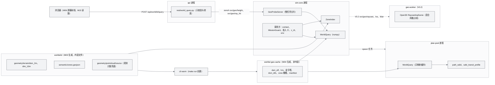
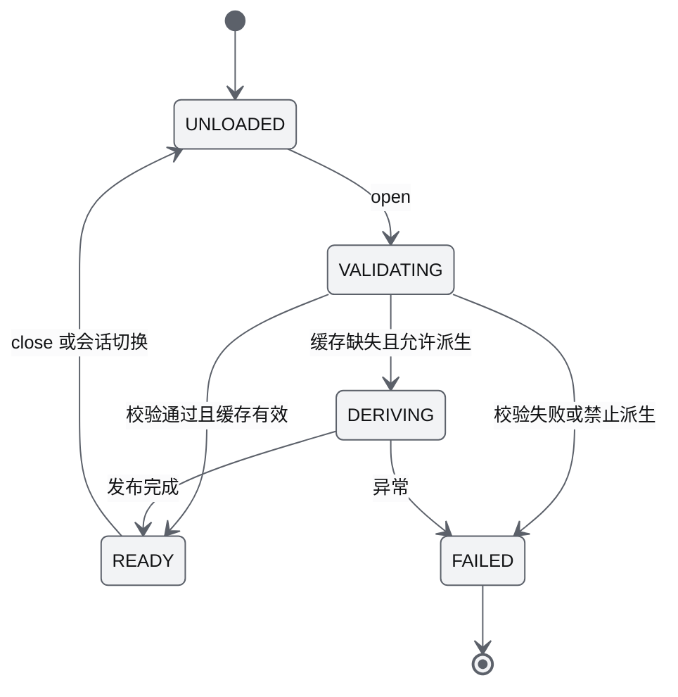
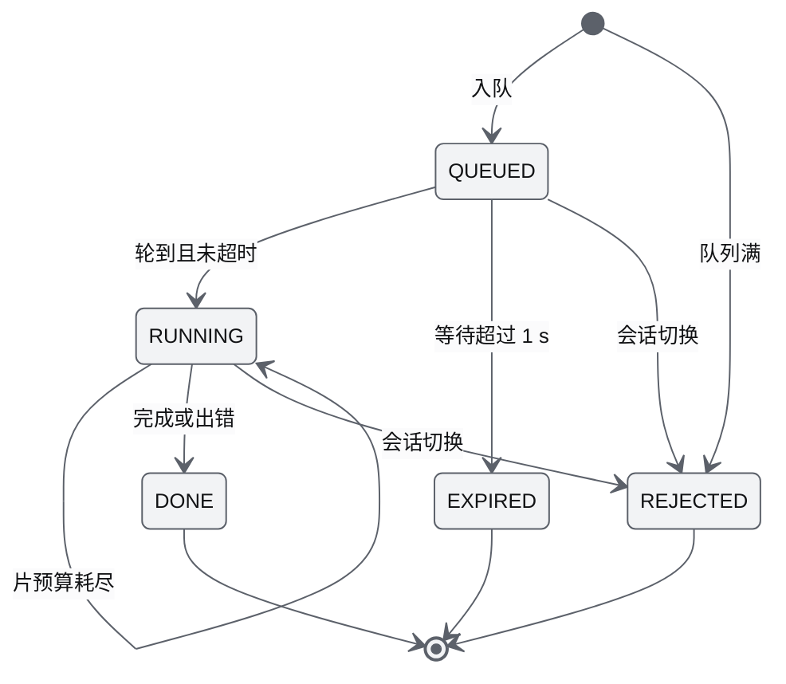
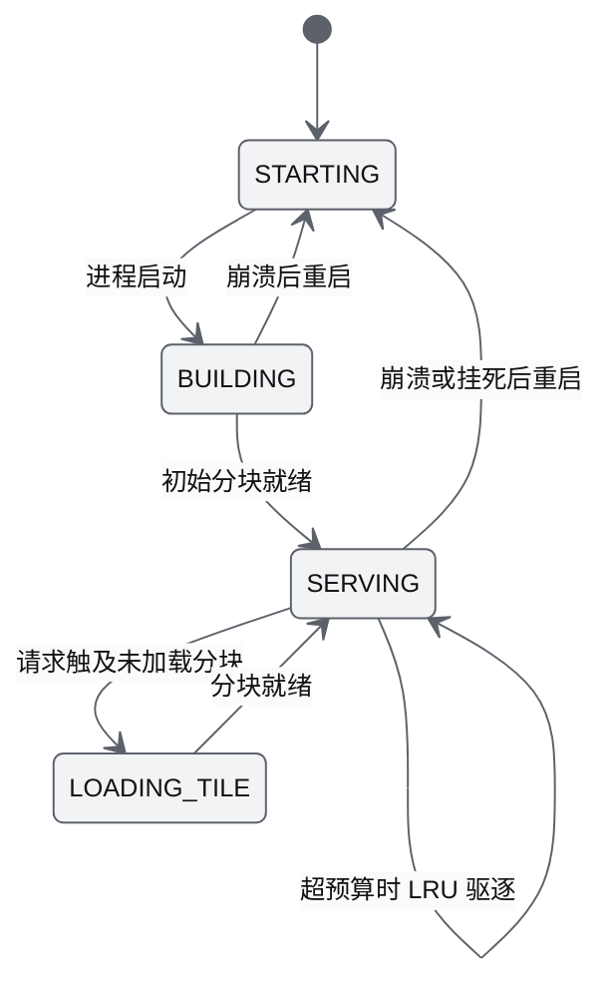
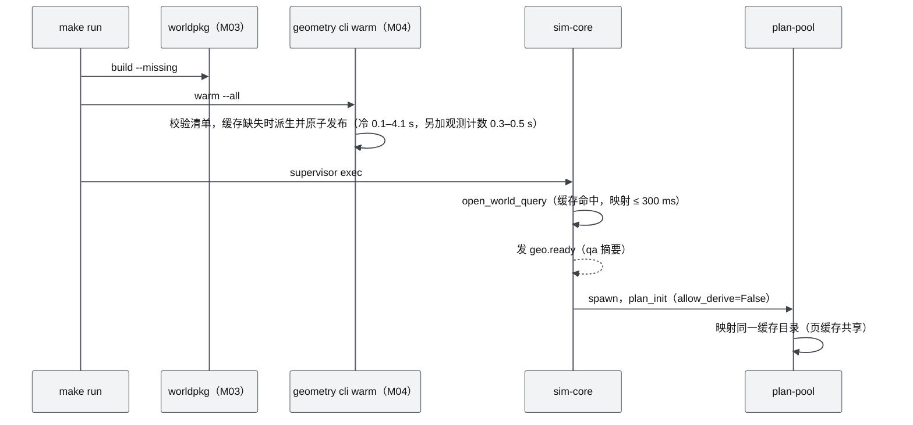
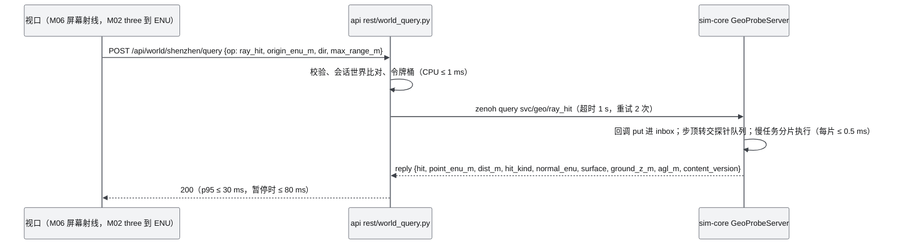
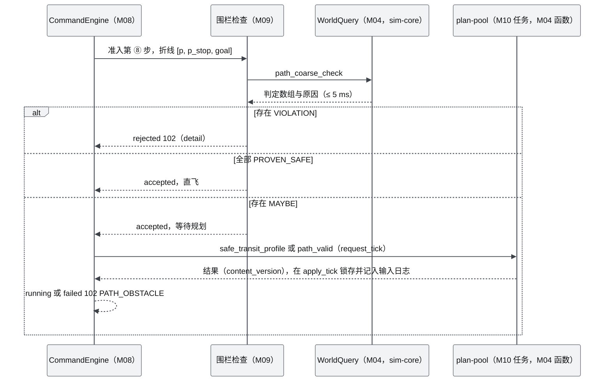
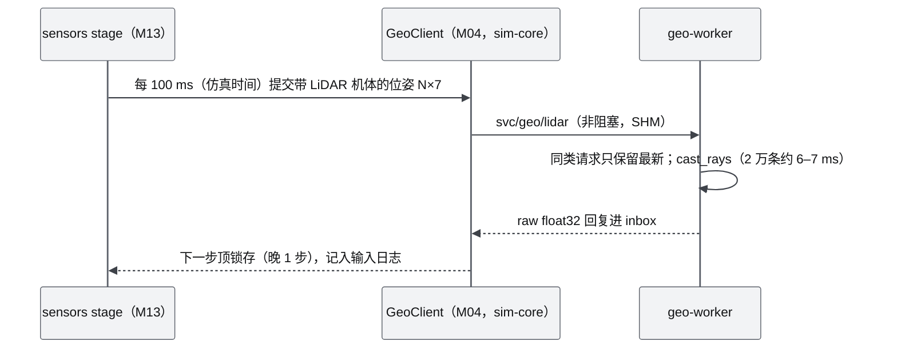

# M04 几何世界查询服务 PRD

| 项 | 内容 |
|---|---|
| 文档编号 | AWR-M04 |
| 标题 | 几何世界查询服务 PRD（Geometry World 查询服务） |
| 版本 | v1.0 |
| 日期 | 2026-09-28 |
| 状态 | 草案 |
| 上游文档 | [AWR-03 设计基线与决策记录](../03-设计基线与决策记录.md)（P-01、P-02、P-03、P-07、P-09、P-10；§3.3、§4.1–§4.4、§5.1、§5.5、§5.8、§6.1–§6.3、§8.2–§8.7；ADR-006、ADR-016、ADR-017、ADR-018、ADR-026、ADR-038、ADR-039、ADR-042、ADR-045、ADR-048、ADR-049）；[01-design](../01-design.md) §4、§6、§7、§8、§30、§35、§41、§42、§43、§51；研究笔记 [r06](../research/r06-open3d.md)、[r13](../research/r13-potree-next-splats.md)、[r24](../research/r24-mrs-uav.md)、[x01](../research/x01-urbanscene3d-data.md)、[r25](../research/r25-ego-fastplanner.md)、[g05](../research/g05-gap.md)，以及 [00-index](../research/00-index.md) §3.1、§3.4、§3.10、C13、§7 第 10 条；本文实测原型 `.cache/research/m04/` |
| 下游文档 | [M08 仿真内核](M08-仿真内核与飞行器适配PRD.md)（contact stage、组合根、慢任务宿主）、[M09 安全与健康](M09-安全与健康PRD.md)（准入第 ⑧ 步、ALT_MIN、RTL 高度、方向限速）、[M10 任务规划与集群](M10-任务规划与集群PRD.md)（safe_transit、path_valid、2.5D A*、地形跟随）、[M13 传感器仿真](M13-传感器仿真PRD.md)（检测器 LOS、V0.2 LiDAR）、[M07 环境引擎](M07-环境引擎PRD.md)（廓线 `z − dtm`）、[M11 实时网关](M11-实时网关PRD.md)（REST 框架、Bus）、[M06 Web 视口](M06-Web视口与渲染后端PRD.md)（点选射线、V0.4 相机防穿模）、[M15 前端 UI 壳](M15-前端UI壳与设计体系组件PRD.md)（坐标读数、GoTo 预览）、[M16 演示与测试](M16-演示数据剧本与流畅性测试PRD.md)；[16 World 数据规范](../16-World数据规范.md)、[17 接口与实时协议规范](../17-接口与实时协议规范.md)、[18 性能与测试方案](../18-性能与测试方案.md) |
| 适用版本范围 | V0.1（D1）至 V1.0；D1-core 为 numpy DSM/DTM 查询全集与服务化；V0.2 geo-worker（Open3D）；V0.3 占据体素与 ESDF；V0.4 SVO；V0.5 真实数据网格代理 |

## 0. 摘要

1. M04 是 Geometry World 的**唯一查询实现**：碰撞、AGL、净空、视线、准入围栏几何、路径可行性、安全转场高度、点选求交，全部只读全分辨率派生栅格（DSM 2 m、DTM 10 m、zones），不读 LOD 瓦片（P-03）；代码位于 `python/awr/world/geometry/`，以进程内库形式运行在 sim-core 与 plan-pool 中。
2. **D1-core**：`WorldQuery` 的 numpy 实现（柱体语义的 DSM、观测感知闭运算补洞、Height_map 加最大值金字塔、精确栅格遍历、走廊上界采样、每米 20 步向量化 `path_valid`）；zones 棱柱几何；供 M08 contact 核直接读取的只读栅格视图 `dsm_grid()`、`dtm_grid()`；sim-core 慢任务内的分片探针服务 `svc/geo/{height,ray_hit}`；REST `POST /api/world/{id}/query` 只做转发（依据 10 AD-04）。
3. **本文六城实测**（`.cache/research/m04/`，负载约 1）：2 m DSM 空格率 9.5%（深圳）至 83.6%（苏州），纽约 11.8% 的建筑格内有"屋顶坑"；3×3 观测感知闭运算后残留 ≤ 0.02%，且观测到的地面格零抬升。ray_hit（5 km）p50 0.55–0.63 ms，p99 ≤ 1.65 ms；1000 航点粗校验 0.92–0.94 ms（含 5 个 64 顶点禁飞区时 p99 ≤ 4.3 ms）；长 12.8–20 km、全部航段需细校验的 `path_valid` 33–56 ms；1000 架同时 RTL 的走廊上界 p50 1.8–3.5 ms、p99 ≤ 3.8 ms。
4. 粗校验与细校验满足单调性：粗校验"已证明安全"的航段在细校验中 0 例失败（1800 次随机检验）；精确遍历与每米 20 步离散在 1200 条随机航段上结论 100% 一致。起终点贴墙时整格膨胀会误拒，`path_valid` 为竖直起降段提供按碰撞半径判定的端点规则（M04-FR-018，回应 M10 §14 第 12 条）。
5. 后续版本：V0.2 geo-worker（Open3D RaycastingScene，独立进程，混合网格分块）承担 LiDAR 与精确光线；V0.3 占据体素（L1）与 ESDF（L2）服务规划；V0.4 SuperSplat 格式 SVO 供前端相机防穿模与后端球体查询；V0.5 由真实融合数据生成网格代理。
6. 对基线与相关文档的反馈 16 条（§14）：3 条已被 10、16 号文档吸收，1 条部分吸收；其余涉及 AWR-03 的 key 归属与派生缓存路径、17 的 REST 登记、M08 的接口命名与 contact 采样语义、12 §5.3 的目标净空规则、M13 的视线耗时。

---

## 1. 背景与目标

### 1.1 背景

原设计把 World 分成 Geometry World 与 Visual World 两种表达（01-design §8），Geometry World 负责 Collision、Distance、Navigation、Path Planning、Sensor Simulation、Physics，数据类型列为 Point Cloud、Mesh、Voxel、SDF、Occupancy Grid。基线把"可视化与物理分离"定为原则 P-03，并把碰撞代理分为 L0–L3 四级（AWR-03 §4.4）。研究与本文实测给出下列事实，决定了 M04 的形态：

1. **稀疏数据会伪造可穿越空间**。UrbanScene3D 采样点云的最近邻中位距离为 0.35–1.88 m（x01 §3.4）。按"每格取最大 z、空格填 DTM"（16 §6.3）生成的 2 m DSM，空格率从 9.5% 到 83.6% 不等，屋顶空格会成为"坑"，无人机可以从坑里"穿过"建筑（本文 §6.11）。
2. **2.5D 高度图是城市航拍场景性价比最高的碰撞代理**。UrbanScene3D 团队自己用 Height_map 判定无人机位置安全（x01 §2.2）；按全城固定巡航高度 120 m 飞，纽约、苏州、芝加哥会撞楼，任务高度必须按航线查询高度图（x01 §3.8）。
3. **Open3D RaycastingScene 精确但持有 GIL**。2 万条射线约 6 ms，464 万三角形 BVH 构建 4–5 s、内存增加约 530 MB（r06 §3.0）；调用期间不释放 GIL，放进网关进程时，10 万条射线的调用会让事件循环 p99 从 5.1 ms 升到 20 ms（g05 C3）。因此它只能进独立的 geo-worker（V0.2），AGL、碰撞、安全转场不能依赖它（00-index C13；g05 §6）。
4. **sim-core 永不阻塞**（P-09）：主循环每 tick 4 ms，慢任务预算每迭代 ≤ 1 ms（ADR-021；10 §4.2 细化为 `min(1000, 2800 − 本迭代已用)` µs、下限 100 µs），任何预计 > 2 ms 的计算进入 plan-pool（ADR-039），准入同步部分 ≤ 5 ms（ADR-016）。

### 1.2 目标

| 编号 | 目标 | 可度量表述 | 版本 |
|---|---|---|---|
| G-M04-1 | 物理几何唯一真源 | 碰撞、AGL、净空、围栏几何、路径可行性、LOS、点选求交在全仓库只有 M04 一处实现（M08 contact numba 核直接索引 `dsm_grid()`，取值语义由 M04 规定并以 M04-AC-005 对拍）；任何调用方都拿到同一 `content_version` 与派生参数摘要 | V0.1 |
| G-M04-2 | 安全偏保守、不漏检 | 合成夹具上"障碍被判为可通行"为 0；粗校验"已证明安全"蕴含细校验通过，违例 0 | V0.1 |
| G-M04-3 | 不拖累实时性 | 1000 架时 M04 在 sim-core 每 tick 的开销不改变 D1-AC-07 的阈值（单步 p99 ≤ 3 ms、最大 ≤ 12 ms）；探针每片 ≤ 0.5 ms | V0.1 |
| G-M04-4 | 点选交互跟手 | REST `ray_hit` 端到端 p95 ≤ 30 ms（仿真运行中），支撑 D1-AC-32 与 UX-AC-013 | V0.1 |
| G-M04-5 | 精度逐级提升、接口不变 | V0.2 精确光线、V0.3 ESDF、V0.4 SVO、V0.5 真实网格上线时，`WorldQuery` 签名与 REST 字段只做追加 | V0.2–V0.5 |

### 1.3 对原设计的继承、修正与增强

| 01-design 章节 | 原内容 | 处置 | 本文落点 |
|---|---|---|---|
| §8 Geometry World | 负责 Collision、Distance、Navigation、Path Planning、Sensor、Physics | **沿用**职责（AWR-03 附录 C §8 为"沿用"） | 全部查询集中在 `WorldQuery`（§7.1） |
| §8 数据类型 | Point Cloud、Mesh、Voxel、SDF、Occupancy Grid 并列 | **修订**为按版本递进的代理阶梯：L0 DSM/DTM（D1）→ L3 网格 BVH（V0.2）→ L1 占据、L2 ESDF（V0.3）→ SVO（V0.4）→ 真实网格（V0.5） | §2.2、§6.8–§6.10 |
| §7 World：Collision Mesh、Voxel、SDF | 作为静态资产 | **修订**：网格代理运行时派生、不落盘；体素与 ESDF 为 V0.3 落盘资产；增加 D1 派生缓存（非内容文件） | §6.2.4、§6.9 |
| §6 Open3D 承担 Voxelization、Mesh Reconstruction | Open3D 为几何处理主力 | **修订**：Open3D 在 M04 的价值是 RaycastingScene（r06 §0 第 1 条）；体素化、闭运算、EDT 用 numpy/scipy（r06 §3.6、r25 §3.1）；Open3D 只进 geo-worker | §6.8 |
| §41 `geometry/{pointcloud,mesh,collision,voxel}` | 目录 | **修订**为 AWR-03 §4.4：`geometry/terrain/`（DTM、DSM）、`geometry/pointcloud/source/`、`geometry/{collision,voxel,sdf}/`（V0.3）；mesh 归 Visual | §6.2 |
| §42 `world/{geometry,voxel,sdf}` | 顶层包 | **取代**为 `python/awr/world/geometry/` 单一包（ADR-050） | §9.1 |
| §30 Collision Avoidance | 第二阶段控制模式 | **修订**：D1 的静态障碍规避由准入第 ⑧ 步（粗、细校验）、safe_transit 与 ALT_MIN 纠正共同完成；传感器扇区 bumper 在 V0.6 | §6.4.5–§6.4.7 |
| §35 Gazebo 与 Isaac 共用 World Model | 原则 | **增强**：geo-worker 与 gz 导出器共用同一网格构建器（ADR-048） | M04-FR-044 |
| §43 MVP 链路 `Point Cloud → Octree → Three.js → Drone Movement` | 缺"几何"一环 | **增强**：D1 主链路包含 DSM 查询；walking skeleton 的 goto 必经准入第 ⑧ 步（r06 §7 第 10 条、r24 §7 第 12 条） | §6.7 |
| §4.1 浏览器负责 World Editing，不负责物理 | 原则 | **沿用** P-02：浏览器只发几何探针请求；V0.4 的前端 SVO 只服务相机，不回流物理 | §8 |
| §37 频率表 | 未列查询预算 | **增强**：给出每类查询按调用方的预算与实测 | §5.1 |

### 1.4 设计原则落点

| 原则 | M04 的落地约束 |
|---|---|
| P-01 World 唯一真源 | 装载时校验 `coordinate.sha256` 与 `contentVersion`，不一致拒绝；派生缓存以二者为键 |
| P-02 浏览器看世界 | 浏览器不做任何物理几何计算；只经 REST 取结果 |
| P-03 可视化与物理分离 | 只读 `geometry/**` 与 `semantic/zones.geojson`；点云画质档位对所有查询零影响 |
| P-07 接口不变 | `WorldQuery` 在 MS1 冻结签名；精确实现（V0.2）与体素实现（V0.3）以同一 Protocol 追加方法 |
| P-09 仿真永不阻塞 | 探针分片执行、有界队列、截止时间；重计算进 plan-pool；Open3D 只在 geo-worker |
| P-10 确定性 | 全部查询为纯函数，不用线程、不用 BLAS；plan-pool 结果按 apply_tick 锁存（ADR-049） |

---

## 2. 范围

### 2.1 D1 范围（在 AWR-03 §6.3 的基础上细化）

与 AWR-03 §6.3 M04 行的对应：基线的 `heightmap_top` 即本文 `heightmap_top_along`；基线的 `segment_los`（2.5D 步进）以精确柱体遍历实现；基线列为 D1 桩的 `svc/geo/*` 中，`svc/geo/{height,ray_hit}` 按 10 AD-04 升为 D1-core（点选 GoTo 依赖，§14 第 1 条）；`ray_hit`、`probe`、`column_max_within`、`contact_mask`、`free_distance` 与只读栅格视图是 D1-AC-32、M08、M09 的直接依赖，一并列入 D1-core。

| 层 | 内容 |
|---|---|
| **D1-core（P0）** | `WorldQuery`：只读栅格视图 `dsm_grid()`、`dtm_grid()`；`height_dsm`、`ground_dtm`、`agl`、`column_max_within`、`clearance`、`contact_mask`、`probe`、`ray_hit`、`segment_los`（2.5D 精确遍历）、`free_distance`、`heightmap_top_along`（膨胀加安全距离，含最大值金字塔）、`path_coarse_check`（O(航段数)，同步准入用）、`path_valid(polyline, buffer)`（每米 20 步，plan-pool 执行）、`safe_transit_profile`；`ZoneIndex`（border、nofly、restricted 棱柱）；派生缓存与 `geo warm` 命令；sim-core 探针服务 `svc/geo/{height,ray_hit}`；REST 探针 `POST /api/world/{id}/query`；`geo.ready` 事件与指标 |
| **D1-ext（P1）** | `los_batch`（S3 检测器批量视线）；`terrain_profile`（地形跟随与航线剖面）；`grid_2p5d`（2.5D A* 用 4 m 高度图）；航点编辑时的粗校验预览数据 |
| **D1 桩** | `svc/geo/{raycast,los,lidar}` 的 key 与请求 schema；`GeoClient` 与 `worker.py` 空实现（启动即报"V0.2 提供"） |
| **不在 D1** | Open3D RaycastingScene、ESDF、SVO、网格代理、增量障碍层 |

### 2.2 后续版本

| 版本 | 内容 | 退出指标（M04 部分） |
|---|---|---|
| V0.2 | geo-worker 独立进程：Open3D 0.20 RaycastingScene，混合网格（DTM 高度场 + 建筑柱体）分块加载；`svc/geo/{raycast,los,lidar}`；sim-core `GeoClient` 非阻塞调用；与 DSM 实现的一致性 | LiDAR 2 万条射线 ≤ 10 ms（AWR-03 §8.1 V0.2 退出标准）；geo-worker 以 100k 射线 / 10 Hz 运行、10 个客户端时 api 循环延迟 p99 ≤ 10 ms（g05 §9） |
| V0.3 | 碰撞代理 L1 占据体素、L2 ESDF（4 m 全局或区域窗口、2 m 走廊窗）；`OccupancyMap` 接口供 M10 的 B-spline 与 ESDF 优化 | 单次规划 p95 ≤ 100 ms（V0.3 退出标准，与 M10 共担） |
| V0.4 | SVO（SuperSplat `.voxel` 格式，1 m / 2 m）；Python 与 TS 双实现；前端相机防穿模、航点贴地 | TTFP 不变；推出查询每帧 ≤ 0.2 ms |
| V0.5 | 真实数据的网格代理（M02 融合产物经 TSDF/Poisson 简化）替代 DSM 网格进入 geo-worker；DSM 仍为 2.5D 快速层 | 真实园区 LiDAR 仿真点与实测点的 Chamfer 距离报告 |
| V0.6 | bumper 扇区（16 水平 + 上下，r24 §3.7）；网格构建器供 gz 导出器（ADR-048）；增量障碍层（log-odds） | 100 架 30 min 零碰撞（与 M10 共担） |
| V0.8 | Dynamic Objects 层的移动障碍查询（ADR-047） | — |

### 2.3 与其他模块的边界

| 模块 | 对方负责 | M04 负责 |
|---|---|---|
| M03 | 生成 `dtm_10m`、`dsm_2m`、`zones.geojson`、源点云；`worldpkg build/validate` | 读取、校验、派生、查询；V0.3 起提供体素、ESDF、SVO 的构建函数，由 `worldpkg build` 调用 |
| M08 | sim-core 组合根、contact stage（numba 核，125 Hz）、慢任务调度、`SimBackend.attach(world)` | 提供 `open_world_query()`、contact 核直接读取的 `dsm_grid()`（dsm_eff）与 `dtm_grid()`、作为参考实现的 `contact_mask()`、`GeoProbeServer` |
| M09 | 围栏策略（哪些 zone 拒绝、阈值、事件码）、准入检查注册、ALT_MIN、RTL 高度公式 | 几何原语：粗校验判定、棱柱包含与相交、边界距离、`heightmap_top_along` |
| M10 | plan-pool 进程池、`safe_transit` 任务包装、A*、B-spline、生成器 | `path_valid`、`safe_transit_profile`、`terrain_profile`、`grid_2p5d` 纯函数 |
| M11 | REST 框架与自动发现、Bus、鉴权、限流框架 | `awr/api/rest/world_query.py` 路由（只校验与转发） |
| M13 | 检测器、LiDAR 模型、扫描模式 | `los_batch`（D1-ext）、`dtm_grid()`；V0.2 `svc/geo/lidar` 光线求交 |
| M07 | 廓线公式 | `ground_dtm`（默认界外钳制）是 Python 侧唯一的 DTM 采样函数 |
| M05、M06、M15 | 屏幕射线、HAG 着色纹理、UI 组件 | REST 返回值语义；V0.4 SVO 查询库 |

### 2.4 本模块新增术语（其余见 AWR-03 §11）

| 术语 | 定义 |
|---|---|
| 柱体语义（column semantics） | 把 DSM 的每个格视为一根顶面高度为格值、侧壁竖直的方柱；碰撞、净空、视线、求交都按柱体集合计算 |
| dsm_eff | 装载时由 `dsm_2m` 派生的有效 DSM：对非"观测地面"格做 3×3 灰度闭运算，填补屋顶空格；本文所有"dsm"均指 dsm_eff |
| 观测地面格 | DSM 格内至少有 1 个源点，且格值与格心 DTM 之差 < 2 m；闭运算不抬升这类格 |
| Height_map（hm） | `maxfilter(dsm_eff, 2·dilate + 1) + safe_m`，默认 dilate 2 格、safe 10 m（x01 §3.8；16 §6.3） |
| 最大值金字塔 | 对栅格做 2×2 最大池化直到边长 ≤ 64 格；"膨胀金字塔"再对每层做 3×3 最大值滤波 |
| 走廊上界 | 对航段附近半宽 ≤ tol 的走廊取 hm 最大值的保守估计，`heightmap_top_along` 的输出 |
| 粗校验判定 | `PROVEN_SAFE`（已证明无障碍）、`MAYBE`（需细校验）、`VIOLATION`（确定违例） |
| 派生缓存 | `worlds/.geo-cache/<world>/<contentVersion>-<params_sha8>/`，存放 dsm_eff、hm、金字塔等只读数组，供 sim-core 与 plan-pool 共享映射；不是 World Package 内容 |
| 探针 | 经 REST 或 bus 发起、无副作用的几何查询 |

---

## 3. 用户与用例

### 3.1 用户角色

| 角色 | 使用方式 |
|---|---|
| 内部调用方（M07、M08、M09、M10、M13） | 进程内调用 `WorldQuery`；plan-pool 任务 |
| 操作员（operator） | 在视口点选 GoTo、查看坐标读数与高度查询（经 M15 UI） |
| 观察者（viewer） | 坐标读数与高度查询（只读探针） |
| 科研与测试人员 | CLI `python -m awr.world.geometry.cli`、pytest、性能基准；V0.2 起用精确光线做传感器实验 |

### 3.2 用例

| 编号 | 用例 | 调用方与频率 | 所用查询 | D1 |
|---|---|---|---|---|
| UC-01 | 点选 GoTo 预览与确认 | M15 → REST，≤ 5 Hz | `ray_hit` | core |
| UC-02 | 坐标读数（鼠标下 ENU 与 AGL） | M15 → REST，≤ 5 Hz | `ray_hit`（结果附 AGL） | core |
| UC-03 | 右键"查询高度（DSM、DTM、AGL）" | M15 → REST，按需 | `probe` | core |
| UC-04 | goto、follow_path、orbit 准入第 ⑧ 步 | M09 检查，每条命令 | `path_coarse_check` | core |
| UC-05 | 细校验与安全转场 | M10 plan-pool，按需 | `path_valid`、`safe_transit_profile` | core |
| UC-06 | 机体触碰建筑（坠毁判定） | M08 contact stage，125 Hz × N | `dsm_grid()`、`dtm_grid()`（numba 核直接索引）；`contact_mask` 作对拍参考 | core |
| UC-07 | 净空不足纠正 ALT_MIN | M09 MissionGuard，10 Hz × N | `height_dsm`（即 `clearance(r = 0)`） | core |
| UC-08 | 返航高度 z_rtl | M09，触发时，最多 1000 架同时 | `heightmap_top_along` | core |
| UC-09 | Velocity 子模式方向限速 | M09，50 Hz，只对遥操作机体 | `free_distance` | core |
| UC-10 | 出生点检查（添加虚拟 P600） | M08 roster add，按需 | `zones.contains`、`height_dsm` | core |
| UC-11 | 环境廓线 `z − dtm` | M07 env stage，50 Hz × N | `ground_dtm` | core |
| UC-12 | S3 检测器视线 | M13 检测器，10 Hz，≤ 16 对 | `los_batch` | ext |
| UC-13 | 地形跟随、2.5D A* | M10 生成器与 plan-pool | `terrain_profile`、`grid_2p5d` | ext |
| UC-14 | 虚拟 MID-360 与深度相机 | M13 → geo-worker，10 Hz | `svc/geo/lidar`、`raycast` | V0.2 |
| UC-15 | ESDF 轨迹优化 | M10 plan-pool | `OccupancyMap.distance` | V0.3 |
| UC-16 | 相机防穿楼、航点贴地 | M06 前端，每帧 | SVO `querySphere`、`queryRay` | V0.4 |

---

## 4. 功能需求

### 4.1 装载、校验与派生（D1-core）

| 编号 | 需求描述 | 优先级 | 目标版本 | D1 | 验收要点 | 依据 |
|---|---|---|---|---|---|---|
| M04-FR-001 | `open_world_query(world_dir, cache_root, params)`：读取 `world.json`，按 `layers[]` 的 id 定位 `terrain.dtm`、`terrain.dsm`、`terrain.dsm-n`（可选）、`semantic.zones`、`pointcloud.source`，要求必需图层 `status = ready`；读取 `coordinate.json`；按 16 §6.2 校验 sidecar（`kind` 分别为 dtm、dsm、`dtype = float32`、`valueFrame = world-z-m`、`rowOrder = south-to-north`、`cellM` 分别为 10 与 2、两者 `originXY` 相同、字节数 = 宽 × 高 × 4、`nodata = null`），校验 zones 的 `awr.coordinate_sha256` 与 `world.coordinate.sha256` 相同；栅格以 `np.memmap(mode="r")` 映射；任一不符抛 `GeoLoadError`，sim-core 拒绝启动 | P0 | V0.1 | 是 | M04-AC-001 | P-01；16 §3.2、§6.2、§6.3、§7；ADR-006 |
| M04-FR-002 | 观测计数：优先读取 M03 提供的可选栅格 `dsm_2m_n`（16 §6.3，D1-ext；每格点数，u8 饱和）；缺失时在 warm 阶段从 `geometry/pointcloud/source/xyz.f32` 按 DSM 同一格网用 `np.bincount` 统计（本文复测六城 5M 点在内存中 0.28–0.45 s/城，另加读取约 60 MB 文件），只在派生时使用；这是 16 §6.1 登记的唯一例外读取 | P0 | V0.1 | 是 | M04-AC-002 | 本文 §6.4.1；16 §6.1、§6.3 |
| M04-FR-003 | 观测感知闭运算：`dsm_eff = where(obs_ground, dsm, grey_closing(dsm, 3×3))`，`obs_ground = (n ≥ 1) & (dsm − dtm_bilinear(格心) < 2 m)`；闭运算按 `mode = nearest` 处理边界 | P0 | V0.1 | 是 | M04-AC-002：六城残留屋顶坑 ≤ 0.05%（按建筑格计），观测地面格抬升数为 0 | 本文 §6.11；r25 §3.1（grey_closing）；r06 §3.4（补洞） |
| M04-FR-004 | 派生 Height_map `hm = maxfilter(dsm_eff, 5) + 10 m`；hm 与 dsm_eff 的最大值金字塔（2×2 池化至边长 ≤ 64 格）；hm 的膨胀金字塔（第 2 层起，3×3 最大值）；1 格膨胀的 `dsm_dil1`（contact 预筛）；默认缓冲 1 m 的细校验栅格 `inflated_1m` 及其金字塔（plan-pool 首次 `path_valid` 不再现算）；参数见 §6.5 | P0 | V0.1 | 是 | M04-AC-002、M04-AC-008 | x01 §3.8；16 §6.3 |
| M04-FR-005 | 派生缓存：键为 `sha256(contentVersion, coordinate.sha256, GeoParams, DERIVE_VERSION)` 取 8 位；目录 `worlds/.geo-cache/<world>/<contentVersion>-<sha8>/`（以点开头，不匹配 world id 规则 `^[a-z0-9-]{1,63}$`，静态服务 `/worlds/{id}/**` 不会暴露它）；先写 `tmp-<pid>/` 再原子 rename；`manifest.json` 记录各数组形状、dtype、sha256；每个世界保留最近 3 个条目；命令 `python -m awr.world.geometry.cli warm --world <id>|--all` 由 `make run` 预检在 `worldpkg build --missing` 之后调用（19 §4.3 需追加该步骤，§14 第 5 条）；某城 warm 失败只告警，sim-core 装载时自行派生 | P0 | V0.1 | 是 | M04-AC-003：热打开 ≤ 300 ms；冷派生 ≤ 8 s/城 | D1-AC-11a（重启 ≤ 3 s）；本文 §6.11 |
| M04-FR-006 | 装载完成后在 sim-core 发 `evt/sim-core/sim` 事件 `geo.ready`，并写 INFO 日志：`world_id`、`content_version`、`derive_sha8`、`cache`（hit 或 built）、`load_ms`、`qa{empty_frac, pits_filled_frac, raised_frac, dsm_max_m, mem_mib}` | P0 | V0.1 | 是 | M04-AC-022 | ADR-033（可观测）；g05 §7 |

### 4.2 点查询（D1-core）

| 编号 | 需求描述 | 优先级 | 目标版本 | D1 | 验收要点 | 依据 |
|---|---|---|---|---|---|---|
| M04-FR-007 | `height_dsm(xy, raw=False, oob="clamp") -> f32[n]`：柱体语义，取 dsm_eff 最近格；`oob = clamp` 按 16 §6.2 钳制到最近格，`oob = nan` 返回 NaN（REST 与 `probe` 一律用 nan，线上为 null）；`raw=True` 返回未闭运算的 dsm | P0 | V0.1 | 是 | M04-AC-004 | 16 §6.2；17 §4.3.2 |
| M04-FR-008 | `ground_dtm(xy, oob="clamp")` 按格心双线性插值（16 §6.2），`oob ∈ {clamp, nan}`，默认 clamp（与 16 §6.2 的钳制规则和 M07 的调用约定一致）；`agl(xyz) = z − ground_dtm(xy)` | P0 | V0.1 | 是 | M04-AC-004 | AWR-03 §5.5；16 §6.2；M07 §7.6 |
| M04-FR-009 | `column_max_within(xy, radius_m) = max{dsm_eff[c] : 格 c 的正方形与圆盘 (xy, r) 相交}`（r = 0 即所在格）；`clearance(xyz, radius_m=0) = z − column_max_within(xy, r)`；进程内 r ≤ 50 m，REST r ≤ 10 m；M10 起终点规则直接调用 `column_max_within` | P0 | V0.1 | 是 | M04-AC-004：与逐格暴力解逐位相等 | 12 §5.7.1、§5.7.5；M10 §6.5.7 |
| M04-FR-010 | `contact_mask(xyz, r)`（r ≤ 格宽）：先以 `z − r ≤ dsm_dil1(xy)` 预筛，只对命中行做精确圆盘判定；结果与精确判定逐元素相等。它是按柱体语义判定机体（半径 r，P600 为 0.49 m）是否触碰建筑的参考实现，供 M08 contact 核对拍、V0.3 前的半径碰撞与测试使用；D1 的 M08 contact 核按点模型在 numba 内直接读 `dsm_grid()`（M08 §6.5.5） | P0 | V0.1 | 是 | M04-AC-005 | M08 §6.5.5、§7.1.6；ADR-043（collision_radius_m）；16 §11.4 |
| M04-FR-046 | 只读栅格视图 `dsm_grid()`、`dtm_grid()` 返回 `GridView(a, x0_m, y0_m, cell_m)`：`a` 为 dsm_eff（2 m）或 dtm（10 m）的 `float32` 只读 memmap（行主序、第 0 行在南，`x0_m`、`y0_m` 为 16 §6.2 的 `originXY`）；供 M08 contact numba 核与 M13 足迹计算在热路径上直接索引，不经 Python 调用；调用方必须按柱体语义取最近格（§6.3），不得对 dsm 做双线性（§14 第 13 条） | P0 | V0.1 | 是 | M04-AC-029 | M08 §7.1.6；M13 §7.1 |
| M04-FR-011 | `probe(xy) -> {dsm_z_m, dsm_raw_z_m, dtm_z_m, hag_m, in_border, zones[]}`：出生点检查与"查询高度"菜单 | P0 | V0.1 | 是 | M04-AC-004 | 12 §6.3；14 位置菜单 |

### 4.3 线查询

| 编号 | 需求描述 | 优先级 | 目标版本 | D1 | 验收要点 | 依据 |
|---|---|---|---|---|---|---|
| M04-FR-012 | `ray_hit(origin, dir, max_range_m ≤ 5000)`：柱体精确遍历（2D DDA 加 z 线性），256 m 分块、以金字塔 AABB 最大值跳块、命中即停；起点在柱体内时先求离开点再继续（`origin_inside = true`）；输出命中点、距离、`hit_kind`（top 或 side）、法向（top 为 +Z，side 为穿越轴的反向）、`surface`（格 HAG ≤ 1 m 记 dtm，否则 dsm）、格下标、命中点处 `ground_z_m` 与 `agl_m` | P0 | V0.1 | 是 | M04-AC-006：与 0.05 m 采样 oracle 的距离差 ≤ 0.05 m | 17 §4.3.2；12 §6.3；本文 §6.4.3 |
| M04-FR-013 | `segment_los(a, b, eps_m=0.5)`：同一精确遍历，排除两端 eps 内的命中（目标贴地时不自遮挡）；只用 dsm_eff，不加安全距离 | P0 | V0.1 | 是 | M04-AC-007 | x01 §3.11（LOS）；17 §4.3.2 |
| M04-FR-014 | `los_batch(A, B, step_m=1.0, eps_m=0.5)`：向量化采样视线（两端各排除 eps），≤ 64 对，用于 S3 检测器；1 m 采样只保证穿越弦长 ≥ 1 m 的格被采到，擦过格角的遮挡可能漏判，属于已知近似，需要精确结果时用 `segment_los` | P1 | V0.1 | 是 | M04-AC-023：与精确 LOS 一致率 100%（每城 1000 对）；16 对 p50 ≤ 0.8 ms | ADR-048（`thermal.imaging` 检测器）；x01 §3.11 |
| M04-FR-015 | `free_distance(origins, dirs, max_m)`：沿方向到首个柱体的距离，≤ 16 条/次；供 Velocity 子模式方向限速 `d_free` | P0 | V0.1 | 是 | M04-AC-007 | 12 §5.7.5（方向限速） |
| M04-FR-016 | `heightmap_top_along(A, B, tol_m=100, max_samples=30000, exact=False)`：批量航段的 hm 走廊上界；A、B 为 (n,2) 或 (n,3)（只用 xy），传入 (2,) 或 (3,) 单段时返回 float；单段调用约 0.11–0.14 ms（本文实测，高于 M08 §7.1.6 期望的 50 µs，§14 第 8 条）。采样实现：选满足 `2√2·c_L ≤ tol` 的最粗层 L（`c_L = 2 m·2^L`，L ≥ 2），若总采样数超过 `max_samples` 则逐层上调，在膨胀金字塔上按间距 c_L 采样取最大；`exact=True` 时在第 0 层做精确遍历（plan-pool 用） | P0 | V0.1 | 是 | M04-AC-008：采样结果 ≥ 精确结果（0 例违反） | 12 §5.8.3（H_top）、§5.7.2；本文 §6.4.4 |

### 4.4 路径查询与准入

| 编号 | 需求描述 | 优先级 | 目标版本 | D1 | 验收要点 | 依据 |
|---|---|---|---|---|---|---|
| M04-FR-017 | `path_coarse_check(polyline, buffer_m=1.0, goal_clear_m=2.0, goal_radius_m=0.0, active_zone_ids=None)`：O(航段数)；返回每段判定与首个原因。`active_zone_ids` 为 None 时使用全部 nofly，否则只用所列 nofly（border 恒生效；M09 按剧本 `zones.active` 传入，M09-FR-040）；restricted 不参与判定。确定违例：任一顶点在 border 棱柱外（OUT_OF_BORDER）、任一顶点在 nofly 棱柱内（GOAL_IN_ZONE）、任一段与 nofly 棱柱相交（PATH_CROSSES_ZONE）、终点低于 `column_max_within(goal, goal_radius_m) + goal_clear_m`（GOAL_IN_OBSTACLE；`goal_radius_m = 0` 即 12 §5.3 的 `dsm + 2 m`）；确定安全：`min(z_a, z_b) − buffer ≥ 走廊上界`；其余 MAYBE。精确区域测试的"候选航段 × 候选边"计数超过 `coarse_zone_edge_budget`（默认 2×10⁵）时，超出部分航段不做同步区域判定，记 MAYBE 并在结果中标 `zone_deferred`，由 `path_valid` 做精确区域判定，保证同步部分 ≤ 5 ms。输入上限 1000 点、总长 20 km | P0 | V0.1 | 是 | M04-AC-009；M04-AC-012：1000 点 ≤ 2 ms（无 zone）、≤ 5 ms p99（5 个 64 顶点 zone）；M04-AC-030 | ADR-016；12 §5.7.2；16 §7（要素 ≤ 64、每环 ≤ 1024 顶点） |
| M04-FR-018 | `path_valid(polyline, buffer_m=1.0, steps_per_m=20, active_zone_ids=None, endpoint_radius_m=None, endpoint_clear_m=0.5)`：先以走廊上界预筛，对 MAYBE 段按每米 20 步向量化采样，检测样点 `z ≤ inflated(buffer)`（dsm_eff 水平膨胀 ceil(buffer/格宽) 格、竖直加 buffer）；zones 用精确线段–棱柱求交（与粗校验同一实现）。**端点规则**：`endpoint_radius_m` 非空时，首段与末段中水平位移 ≤ 0.01 m 的竖直起降段不按 inflated 判定，改为要求段内最低点 `≥ column_max_within(xy, endpoint_radius_m) + endpoint_clear_m`（M10 传 P600 的 `collision_radius_m` 0.49 m，与 MissionGuard 最低净空 0.5 m 一致）；按 26 万样点分块；返回 `{ok, seg, reason, point}`；在 plan-pool 执行 | P0 | V0.1 | 是 | M04-AC-010：与精确遍历结论一致率 100%；20 km 最坏 ≤ 80 ms；端点规则夹具通过 | ADR-016、ADR-039；r24 §2.4（每米 20 步）；12 §5.7.3、§5.7.5；M10 §6.5.7、§14 第 12 条 |
| M04-FR-019 | `safe_transit_profile(A, B, margin_m=5, z_ceiling_m)`：`z_c = max(H_top_exact(A→B) + margin, A.z, B.z)`；`z_c > z_ceiling` 时返回 `ok = false, reason = GEO_CEILING`；输出四点剖面 `[A, (A.xy, z_c), (B.xy, z_c), B]`、`top_m`、`climb_m`、`length_m`。巡航段按构造通过 `path_valid`（hm ≥ inflated，§6.4.5）；两端竖直段是否可飞取决于起终点本身，由调用方以端点规则校验 | P0 | V0.1 | 是 | M04-AC-011：巡航段 100% 通过 `path_valid`；起终点满足目标规则时整条剖面在端点规则下 100% 通过 | x01 §3.8；12 §5.7.4 |
| M04-FR-020 | 不变量：粗校验 PROVEN_SAFE 蕴含 `path_valid` 通过（要求 `hm_dilate_cells ≥ ceil(buffer/格宽)` 且 `hm_safe_m ≥ buffer`，参数加载时断言）；safe_transit 剖面通过 `path_valid`；两条均纳入属性测试 | P0 | V0.1 | 是 | M04-AC-009、M04-AC-011 | 本文 §6.4.5 |
| M04-FR-021 | `terrain_profile(polyline, ds_m=2)`：沿线弧长 `s` 与 `dtm`、`dsm_eff`、`hm` 采样数组；供 M10 地形跟随生成器与航线安全高度剖面 | P1 | V0.1 | 是 | M04-AC-024 | x01 §3.10（terrain_follow）、§7 第 9 条 |
| M04-FR-022 | `grid_2p5d(res_m=4)`：返回 hm 金字塔中格宽为 res 的层（4 m 即第 1 层）及其 sidecar 元数据，供 M10 的 2.5D A* | P1 | V0.1 | 是 | M04-AC-024 | ADR-039（2.5D A*，DSM 栅格 4 m） |

### 4.5 区域几何（D1-core）

| 编号 | 需求描述 | 优先级 | 目标版本 | D1 | 验收要点 | 依据 |
|---|---|---|---|---|---|---|
| M04-FR-023 | `ZoneIndex.load(zones.geojson)`：解析 border（恰好 1 个）、nofly、restricted 为棱柱（多边形、`min_z_m`、`max_z_m`，null 表示该向不设界）；执行 V-Z 规则子集（环闭合、外环逆时针、每环 ≤ 1024 顶点、顶点在 bounds 内）；构建 8 m 分辨率的 nofly 栅格（覆盖多边形内部并膨胀 1 格）及其最大值金字塔 | P0 | V0.1 | 是 | M04-AC-009 | 16 §7；12 §3.3.3 |
| M04-FR-024 | 区域原语：`contains(points, kinds, zone_ids=None)`、`segments_cross(A, B, kinds, zone_ids=None)`（先把线段裁剪到棱柱的 z 区间 `[min_z, max_z]`，再对子段做精确二维求交或端点包含判定，§6.4.8）、`border_signed_distance(xy)`、`nearest_zone_distance(xy, kinds, max_m)`；批量调用先经栅格预筛，只对邻近航段或点做精确计算 | P0 | V0.1 | 是 | M04-AC-009：栅格预筛与暴力解判定相同 | 12 §5.7.2、§5.7.5；r24 §3.6 |

### 4.6 服务化与集成

| 编号 | 需求描述 | 优先级 | 目标版本 | D1 | 验收要点 | 依据 |
|---|---|---|---|---|---|---|
| M04-FR-025 | sim-core 探针服务 `GeoProbeServer`：由 M08 组合根在 bus 上 serve `svc/geo/height`（op：`height_dsm`、`ground_dtm`、`agl`、`clearance`、`probe`、`segment_los`、`path_coarse_check`、`heightmap_top`、`terrain_profile`）与 `svc/geo/ray_hit`，调用方为 api 与 agent-runtime（ext，17 §9.3）；回调只入队；同一 `id` 的重试替换队列中尚未开始的旧请求；在慢任务中按每迭代 ≤ 0.5 ms 的片预算执行，可跨迭代续算；队列上限 64，满时回复 `213 SERVICE_UNAVAILABLE`；入队后 1 s（墙钟）未开始执行则丢弃；区域判定使用当前剧本的 `zones.active` | P0 | V0.1 | 是 | M04-AC-013、M04-AC-014 | 10 AD-04、§4.2；17 §9.3；g05 §4、§10 R5；ADR-021 |
| M04-FR-026 | REST 路由 `awr/api/rest/world_query.py`：pydantic 校验（op 白名单、各 op 上限、坐标有限、方向为单位向量 ±1e-3）；路径中的 world id 必须等于当前会话世界，否则 409 `123 WORLD_NOT_READY`（detail = WORLD_NOT_IN_SESSION）；每 principal 令牌桶 10 次/s、突发 10，超限 429 `111`（17 §3.4 需登记，§14 第 6 条）；经 `Bus.call` 转发，超时 1 s、同一 id 重试 2 次，仍失败 503 `211`；路由在事件循环内 CPU ≤ 1 ms；不 import `awr.world.geometry` | P0 | V0.1 | 是 | M04-AC-014、M04-AC-015 | 17 §3.4、§4.1 第 8 条、§4.3.2；AWR-03 §4.2 |
| M04-FR-027 | plan-pool 集成：`plan_init` 调用 `open_world_query(..., allow_derive=False)` 只映射缓存；所有路径函数为纯函数，结果带 `content_version` 与 `derive_sha8`，由 M08/M10 连同 apply_tick 写入输入日志 | P0 | V0.1 | 是 | M04-AC-019 | ADR-039、ADR-049；g05 §6 |
| M04-FR-028 | MS1 冻结 `WorldQuery` Protocol、结果类型与 `FakeWorldQuery`（在合成小世界上运行的测试替身，供 M08、M09、M10 在 MS2 之前开发） | P0 | V0.1 | 是 | M04-AC-019 | P-06、P-07；ADR-050 |
| M04-FR-029 | `svc/geo/{raycast,los,lidar}` 的请求与回复 schema 登记到 `packages/contracts/bus/geo.schema.json`；D1 无服务方 | P0 | V0.2 | 桩 | schema 与 golden 夹具通过 contracts check | AWR-03 §8.3（geo-worker 行） |

### 4.7 V0.2：geo-worker（Open3D RaycastingScene）

| 编号 | 需求描述 | 优先级 | 目标版本 | D1 | 验收要点 | 依据 |
|---|---|---|---|---|---|---|
| M04-FR-030 | 独立进程 `python -m awr.world.geometry.worker --threads 3`：以 dsm_eff 构建混合网格（DTM 10 m 高度场 + HAG > 1 m 格的建筑柱体，顶面行程合并、侧壁按边生成，高度量化 0.5 m），按 1024 m 分块，按需加载，常驻三角形 ≤ 800 万；场景就绪后声明 `proc/geo-worker/ready` | P0 | V0.2 | 否 | M04-AC-025 | r06 §3.4、§4.2；g05 §2.2、§6；本文 §6.11（网格三角形估算） |
| M04-FR-031 | 服务 `svc/geo/raycast`（≤ 10 万条射线，返回 t_hit、法向、图元 id）、`svc/geo/los`（≤ 1 万对）、`svc/geo/lidar`（机体位姿 N×7 与扫描模式 id，同类请求只保留最新一批）；sim-core 与 geo-worker 之间开启 zenoh SHM（池 8 MiB） | P0 | V0.2 | 否 | M04-AC-025 | g05 §3.5、§6 |
| M04-FR-032 | `GeoClient`（sim-core 侧）：非阻塞 query，回复进 inbox，在步顶锁存；LiDAR 结果晚 1 步可接受；结果与 apply_tick 记入输入日志 | P0 | V0.2 | 否 | M04-AC-025 | g05 §4；ADR-049 |
| M04-FR-033 | 降级：geo-worker 不在线时精确类请求回复 `213`，LiDAR 图层显示"降级"，LOS 退回 DSM 实现；AGL、碰撞、安全转场不受影响 | P0 | V0.2 | 否 | M04-AC-025 | g05 §6、§7.5；00-index C13 |
| M04-FR-034 | 一致性：同一射线在 DSM 实现与网格实现上的 top 命中，竖直差 ≤ 0.5 m（高度量化）且水平位置落在同一格或相邻格 | P1 | V0.2 | 否 | M04-AC-026 | 本文设定 |

### 4.8 V0.3：占据体素 L1 与 ESDF L2

| 编号 | 需求描述 | 优先级 | 目标版本 | D1 | 验收要点 | 依据 |
|---|---|---|---|---|---|---|
| M04-FR-035 | 构建器：占据 = dsm_eff 柱体挤出 ∪ 源点体素（为 V0.3 语义豁免桥下与树冠预留接口）；分辨率 4 m，高度带 `[dtm_min − 5, dsm_max + 50]`；体素数 ≤ 6400 万的世界写全局文件，其余只在 plan-pool 按区域计算；距离用 `scipy.ndimage.distance_transform_edt`，f16 米；格式在 16 §6.4 于 V0.3 定稿 | P0 | V0.3 | 否 | M04-AC-027 | r25 §3.1；16 §6.4；本文 §6.9 |
| M04-FR-036 | `OccupancyMap` 接口：`occupied(p)`、`distance(p) -> (d, grad)`（三线性）、`window(lo, hi, res)`（2 m 走廊窗） | P0 | V0.3 | 否 | M04-AC-027 | r25 §4.1 |
| M04-FR-037 | 版本绑定：体素与 ESDF 文件记录 `coordinate.sha256` 与构建参数；`contentVersion` 变化即重建 | P0 | V0.3 | 否 | M04-AC-027 | P-01 |

### 4.9 V0.4：SVO

| 编号 | 需求描述 | 优先级 | 目标版本 | D1 | 验收要点 | 依据 |
|---|---|---|---|---|---|---|
| M04-FR-038 | SVO 构建器：移植 splat-transform 3.7.0 `sparse-octree.ts` 的 BFS 稀疏八叉树（u32 节点 `childMask<<24 \| baseOffset`，实心叶 `0xFF000000`，混合叶 4×4×4 位掩码）；坐标为 world ENU、Z 向上；分辨率深圳、纽约、苏州 1 m，上海、旧金山、芝加哥 2 m；写 `geometry/voxel/occupancy.voxel.{json,bin}` | P0 | V0.4 | 否 | M04-AC-028 | r13 §3.10；16 §6.4 |
| M04-FR-039 | Python SVO 查询：`is_solid`、`query_ray`（AABB slab + DDA）、`query_sphere`（最深穿透迭代推出，≤ 4 次） | P1 | V0.4 | 否 | M04-AC-028 | r13 §2.3 |
| M04-FR-040 | TS SVO 库（端口自 supersplat-viewer 1.35.2 `voxel-collision.ts`），懒加载、不进首屏关键路径；供 M06 相机防穿模（Free、Orbit、Follow，球半径 1.5 m）与航点贴地；结果不回流物理 | P0 | V0.4 | 否 | M04-AC-028 | r13 §3.10、§3.11；P-02、P-03 |

### 4.10 V0.5 及以后

| 编号 | 需求描述 | 优先级 | 目标版本 | D1 | 验收要点 | 依据 |
|---|---|---|---|---|---|---|
| M04-FR-041 | 真实数据网格代理：接收 M02 融合产物经 TSDF 或 Poisson 与二次简化得到的碰撞网格，替代 geo-worker 的 DSM 网格 | P1 | V0.5 | 否 | 与实测点云 Chamfer 距离报告 | r06 §3.8 |
| M04-FR-042 | 增量障碍层：LiDAR 观测的 log-odds 占据叠加层 | P2 | V0.6 | 否 | — | r06 §3.8 |
| M04-FR-043 | bumper 扇区：16 个水平扇区加上下两个方向的最近障碍距离 | P1 | V0.6 | 否 | — | r24 §3.7 |
| M04-FR-044 | 网格构建器同时供 gz 导出器使用，导出清单记录 `coordinate.sha256` | P1 | V0.6 | 否 | — | ADR-048 |
| M04-FR-045 | Dynamic Objects 层的移动障碍查询 | P2 | V0.8 | 否 | — | ADR-047 |

---

## 5. 非功能需求

### 5.1 性能预算总表（本机 CPU，load < 6，3 次取中位）

"实测"列来自本文原型在六城上的结果（§6.11），"预算"为验收阈值。

| 查询 | 调用方与场景 | 规模 | 预算 | 实测（p50 / p99） |
|---|---|---|---|---|
| `height_dsm` | 通用 | 1 / 1000 / 10000 点 | ≤ 0.1 / 0.15 / 0.5 ms | 0.044 / 0.07–0.075 / 0.29–0.33 ms |
| `ground_dtm` | M07 env 50 Hz | 1000 点 | ≤ 0.25 ms | 0.17–0.18 ms |
| `clearance(r = 0)` | M09 ALT_MIN 10 Hz | 1000 点 | ≤ 0.15 ms | 0.077–0.082 ms |
| `contact_mask(r = 0.6)` | 参考实现与测试（D1 的 M08 contact 核直接读 `dsm_grid()`） | 1000 架 | 典型 ≤ 0.1 ms，最坏 ≤ 0.5 ms | 预筛（与 r = 0 查询同价）0.08 ms；随机低空点（大量命中预筛）0.34–0.42 ms |
| `clearance(r = 10)` | REST | 64 点 | ≤ 1 ms | 0.63–0.65 ms |
| `ray_hit`（5 km） | REST 探针 | 1 条 | 单次 p99 ≤ 2 ms；分片每片 ≤ 0.5 ms | 0.55–0.63 / 1.19–1.65 ms |
| `segment_los`（0.2–2 km） | REST、UI | 1 对 | p99 ≤ 2 ms | 0.15–0.35 / 0.93–1.54 ms |
| `los_batch` | M13 检测器（ext） | 16 对 / 64 对，每对 ≤ 300 m | ≤ 0.8 ms / ≤ 3 ms（p50） | 0.75（p99 1.04）/ 2.18–2.28 ms |
| `heightmap_top_along` 采样 | M09 z_rtl、M08 估价 | 1 段（0.5–3 km）/ 1000 架（预算 3 万样点） | ≤ 0.2 ms / ≤ 4.5 ms | 0.11 ms / 1.78–3.52（p99 ≤ 3.80）ms |
| `path_coarse_check` | M09 准入 ⑧ | 1000 点，无 zone / 5 个 64 顶点 zone | ≤ 2 ms / ≤ 5 ms（p99） | 0.92–0.94 ms / 1.38–3.90（p99 ≤ 4.23）ms |
| `path_valid` | plan-pool | 20 km、全部 MAYBE | ≤ 80 ms | 33–56 ms |
| `safe_transit_profile` | plan-pool | 城内任意两点 | ≤ 20 ms | 0.40–9.4 ms |

### 5.2 NFR 表

| 编号 | 需求描述 | 优先级 | 目标版本 | D1 | 验收要点 | 依据 |
|---|---|---|---|---|---|---|
| M04-NFR-001 | 进程内查询满足 §5.1 的预算 | P0 | V0.1 | 是 | M04-AC-012 | 本文 §6.11 |
| M04-NFR-002 | REST 端到端：`ray_hit` p95 ≤ 30 ms（时钟 PLAYING）；PAUSED 下门禁 ≤ 80 ms（P0），目标 ≤ 30 ms（P1，10 §4.2 已把暂停空转改为带 50 ms 超时的 inbox 等待，与 ARCH-AC-028 一致，MS4 实测后收紧门禁）；`height_dsm` 64 点 p95 ≤ 30 ms | P0 | V0.1 | 是 | M04-AC-014 | 14 §6.7（≤ 5 Hz 预览）；10 §4.2、ARCH-AC-027、ARCH-AC-028 |
| M04-NFR-003 | 不干扰 sim-core：N = 1000、探针负载 20 次/s 时单步 p99 ≤ 3 ms、最大 ≤ 12 ms，追帧饱和 0 次；探针片 p99 ≤ 0.5 ms | P0 | V0.1 | 是 | M04-AC-013 | D1-AC-07；ADR-021 |
| M04-NFR-004 | 内存：sim-core 内 M04 常驻 ≤ 200 MB（最大城市）；plan-pool 额外 ≤ 80 MB（`inflated_1m` 及其金字塔）；派生缓存经页缓存共享；每世界最多保留 3 个缓存条目，六城单条目合计约 0.75 GB（本文实测两类常驻量之和 549 + 193 MiB） | P0 | V0.1 | 是 | M04-AC-021 | 本文 §6.11 |
| M04-NFR-005 | 启动：缓存命中时 `open_world_query` ≤ 300 ms；冷派生 ≤ 8 s/城（warm 阶段完成，不进入 sim-core 重启路径） | P0 | V0.1 | 是 | M04-AC-003 | D1-AC-11a |
| M04-NFR-006 | 正确性：所有查询有暴力解或更细采样的 oracle；合成夹具上障碍漏检为 0 | P0 | V0.1 | 是 | M04-AC-004 至 M04-AC-011 | G-M04-2 |
| M04-NFR-007 | 保守性声明：闭运算与膨胀带来的假障碍率按城市在 `geo.ready` 的 qa 中报告；上海类窄巷（≤ 4 m）视为障碍是已知行为 | P0 | V0.1 | 是 | M04-AC-022 | 本文 §6.11、§11 |
| M04-NFR-008 | 确定性：同一 `content_version`、参数与输入在不同进程、不同运行中输出逐字节一致；不使用线程与随机数；numpy 版本锁定 2.5.3 | P0 | V0.1 | 是 | M04-AC-019 | P-10；ADR-038、ADR-049 |
| M04-NFR-009 | 隔离：D1 任何进程不 import open3d；`awr.api` 不 import `awr.world.geometry`；`awr/world/geometry` 不使用 numba | P0 | V0.1 | 是 | M04-AC-020 | AWR-03 §4.2；11 TECH-FR-004 |
| M04-NFR-010 | 过载与失效：探针队列满、截止超时、sim-core 缺席分别有确定的错误码；任何情况下不阻塞 sim-core 主循环 | P0 | V0.1 | 是 | M04-AC-015 | P-09 |
| M04-NFR-011 | 可测试：单元测试只依赖 `tests/world_query/fixtures/` 的合成小世界；六城用例标 `needs_data` | P0 | V0.1 | 是 | CI 通过 | ADR-050 |
| M04-NFR-012 | 安全：REST 只读、最低角色 viewer；world id 按 `^[a-z0-9-]{1,63}$` 校验，杜绝路径穿越；输入上限在路由与 sim-core 两处校验 | P0 | V0.1 | 是 | M04-AC-015 | AWR-03 §5.6；17 §4.2 R07 |
| M04-NFR-013 | V0.2：LiDAR 2 万条射线 ≤ 10 ms；geo-worker 以 100k 射线 / 10 Hz 运行、10 个客户端时 api 循环延迟 p99 ≤ 10 ms；geo-worker 常驻 ≤ 1.5 GB | P0 | V0.2 | 否 | M04-AC-025 | AWR-03 §8.1；g05 §9 |
| M04-NFR-014 | V0.3：区域 ESDF 构建 ≤ 3 s / 1e7 体素（plan-pool 单进程）；与 M10 共同满足单次规划 p95 ≤ 100 ms | P0 | V0.3 | 否 | M04-AC-027 | r25 §3.1；AWR-03 §8.1 |
| M04-NFR-015 | V0.4：SVO 文件 ≤ 25 MB/城（实心块逐级合并后；§6.10 第 3 条的上界估算中旧金山不合并时达 69 MiB，V0.4 实测冻结）；前端每帧推出查询 ≤ 0.2 ms；TTFP 不变（D1-AC-02 复测） | P0 | V0.4 | 否 | M04-AC-028 | r13 §3.11；本文 §6.10 |

---

## 6. 设计方案

### 6.1 组件图



### 6.2 数据结构

#### 6.2.1 输入文件（语义与字段见 16 §6.2、§6.3、§7）

| 文件 | 用途 | 读取方式 |
|---|---|---|
| `geometry/terrain/dsm_2m.{json,f32}` | 柱体高度 | memmap，只在派生时读取；运行时查询读 dsm_eff |
| `geometry/terrain/dtm_10m.{json,f32}` | AGL、廓线、地面分类 | memmap，常驻（最大 2.2 MB） |
| `semantic/zones.geojson` | 棱柱 | JSON 解析一次 |
| `geometry/pointcloud/source/xyz.f32` | 观测计数（兜底） | 只在 warm 时顺序读 |
| `world.json`、`coordinate.json` | 版本与校验 | JSON |

#### 6.2.2 进程内数组（float32，行主序，第 0 行在南）

| 数组 | 形状 | 用途 | 常驻于 |
|---|---|---|---|
| `dsm_eff` | H × W（2 m） | 柱体查询、LOS、ray_hit、contact 精判 | sim-core、plan-pool |
| `dsm_dil1` | H × W | contact 预筛 | sim-core |
| `hm` | H × W | 走廊上界、安全转场 | sim-core、plan-pool |
| `pyr_dsm[1..L]`、`pyr_hm[1..L]` | 逐层减半至 ≤ 64 | 跳块、AABB 最大值 | sim-core、plan-pool |
| `pyrdil_hm[2..L]` | 同上 | 采样式走廊上界 | sim-core、plan-pool |
| `dtm` | 10 m 格 | 双线性 | 全部 |
| `inflated_1m` 及其金字塔；其他 `inflated[buffer]` | H × W | `path_valid` | plan-pool（1 m 来自派生缓存；其他 buffer 首次调用时现算并在进程内缓存，最多 4 个） |
| `zone_raster` 与金字塔 | 8 m 格，u8 | 区域预筛 | sim-core、plan-pool |

六城常驻量（本文实测，§6.11）：sim-core 11–196 MB，plan-pool 额外 4–69 MB。

#### 6.2.3 结果类型

```python
@dataclass(frozen=True, slots=True)
class Hit:                       # ray_hit / free_distance 单条结果
    hit: bool
    point_enu_m: np.ndarray | None   # (3,) float64
    dist_m: float                    # 未命中为 nan
    hit_kind: Literal["top", "side"] | None
    normal_enu: np.ndarray | None    # (3,)，top 为 (0,0,1)
    surface: Literal["dsm", "dtm", "none"]
    cell_rc: tuple[int, int] | None
    ground_z_m: float                # 命中点 xy 处 dtm
    agl_m: float                     # 命中点 z − ground_z_m
    origin_inside: bool

@dataclass(frozen=True, slots=True)
class CoarseResult:
    verdict: np.ndarray              # int8[n_seg]：0 PROVEN_SAFE，1 MAYBE，2 VIOLATION
    reasons: list[tuple[str, int]]   # (detail, seg_index)，detail ∈ OUT_OF_BORDER、GOAL_IN_ZONE、PATH_CROSSES_ZONE、GOAL_IN_OBSTACLE
    zone_deferred: np.ndarray        # bool[n_seg]：区域判定超出边预算、交给 path_valid 的航段（其 verdict 为 MAYBE）
    ok: bool                         # 无 VIOLATION
    all_proven: bool                 # 全部 PROVEN_SAFE

@dataclass(frozen=True, slots=True)
class PathValidResult:
    ok: bool
    seg: int                         # 首个违例段，ok 时为 −1
    reason: str | None               # PATH_OBSTACLE、PATH_CROSSES_ZONE、OUT_OF_BORDER
    point_enu_m: np.ndarray | None
    samples: int
    content_version: str
    derive_sha8: str

@dataclass(frozen=True, slots=True)
class TransitProfile:
    ok: bool
    reason: str | None               # GEO_CEILING
    z_cruise_m: float
    top_m: float
    waypoints: np.ndarray            # (4,3)
    length_m: float
    climb_m: float
```

#### 6.2.4 派生缓存布局

```text
worlds/.geo-cache/<world_id>/<contentVersion>-<derive_sha8>/
├── manifest.json        # derive_version、params、contentVersion、coordinate_sha256、arrays[{name, shape, dtype, sha256}]、built_unix_ns、build_ms
├── obs_n.u8             # 每格点数（饱和 255）
├── dsm_eff.f32  dsm_dil1.f32  hm.f32
├── pyr_dsm_L1.f32 … pyr_dsm_Lk.f32
├── pyr_hm_L1.f32 …      pyrdil_hm_L2.f32 …
├── inflated_1m.f32      pyr_inflated_1m_L1.f32 …    # 默认缓冲 1 m 的细校验栅格（plan-pool 映射）
├── zone_raster_8m.u8    # 与各层金字塔
└── qa.json              # empty_frac、pits_filled_frac、raised_frac、obs_ground_raised=0、dsm_max_m、mem_mib
```

每个数组另有一个与 16 §6.2 字段相同的 sidecar（`kind` 取 dsm、heightmap 或 occupancy，`method` 写派生参数），便于用同一 `Grid` 类读取。缓存不属于 World Package，不进入 `files[]` 与 `contentVersion`（16 §3.1 规则 2）。

### 6.3 几何语义约定

| 量 | 定义 | 所用栅格 | 插值 |
|---|---|---|---|
| 地物高度 `dsm(x,y)` | 所在格柱顶 | dsm_eff | 最近格（柱体）；任何调用方都不得对 dsm 做双线性（会在立面生成 2 m 宽的斜坡） |
| 地面高度 `dtm(x,y)` | 裸地面 | dtm | 格心双线性 |
| AGL | `z − dtm(x,y)` | dtm | 双线性 |
| 净空 clearance | `z − max(dsm 在半径 r 内)`；r = 0 即所在格 | dsm_eff | 最近格 |
| 安全高度 | `hm(x,y) = maxfilter(dsm_eff, 5) + 10` | hm | 最近格 |
| 碰撞（contact） | 半径 r 的机体与任一柱体相交：`z − r ≤ max(dsm 在半径 r 内)` | dsm_eff | 最近格 |
| 视线、求交 | 线段与柱体集合的精确交 | dsm_eff | 精确遍历 |
| 越界 | 查询点在栅格外：进程内点查询默认按 16 §6.2 钳制到最近格（`oob = clamp`），REST 与 `probe` 用 `oob = nan` 并在线上返回 null；线查询在栅格边界截断，界外部分视为"无几何" | — | — |

规则：
1. 业务文档（12 §5.3、§5.7）中的"dsm"一律按 dsm_eff 实现；"AGL"与"净空"不得混用（AWR-03 §5.5；12 §5.7.1）。
2. 坐标一律 world ENU，float64 计算，栅格值 float32（六城 |坐标| ≤ 5.3 km，float32 ULP ≤ 0.49 mm，16 §6.1）。
3. 2.5D 语义下桥下、树冠下视为实心，属于保守近似（r06 §3.4、r25 §6 第 6 条）；V0.3 的体素层才表达悬挑。

### 6.4 算法与伪代码

#### 6.4.1 装载与派生

```python
def open_world_query(world_dir, cache_root="worlds/.geo-cache", params=GeoParams(), allow_derive=True) -> WorldQuery:
    w = read_json(world_dir / "world.json"); coord_sha = w["coordinate"]["sha256"]; cv = w["contentVersion"]
    dsm = Grid.open(world_dir / "geometry/terrain/dsm_2m.json", expect_kind="dsm", expect_cell=2.0)
    dtm = Grid.open(world_dir / "geometry/terrain/dtm_10m.json", expect_kind="dtm", expect_cell=10.0)
    zones = ZoneIndex.load(world_dir / "semantic/zones.geojson", expect_coord_sha=coord_sha)      # 不符即 GeoLoadError
    key = sha8(cv, coord_sha, params, DERIVE_VERSION)
    d = cache_root / w["id"] / f"{cv}-{key}"
    if not (d / "manifest.json").exists() or not verify_manifest(d, shallow=True):
        if not allow_derive: raise GeoLoadError("GEO_CACHE_MISS")
        derive_into(d, dsm, dtm, zones, params, obs_counts(world_dir, dsm))                        # 写 tmp-<pid> 后 rename
    return DsmWorldQuery.from_cache(d, dtm, zones, cv, key)                                        # 全部 np.memmap(mode="r")

def derive_into(d, dsm, dtm, zones, p, n):
    hag = dsm.a - dtm.bilinear_at_centres(dsm)
    obs_ground = (n >= 1) & (hag < p.obs_ground_hag_m)                                             # 2.0 m
    eff = np.where(obs_ground, dsm.a, ndi.grey_closing(dsm.a, size=(p.close_k, p.close_k), mode="nearest"))
    hm = ndi.maximum_filter(eff, size=2 * p.hm_dilate_cells + 1, mode="nearest") + np.float32(p.hm_safe_m)
    pyr_dsm, pyr_hm = max_pyramid(eff, p.pyr_min_cells), max_pyramid(hm, p.pyr_min_cells)
    pyrdil_hm = [ndi.maximum_filter(a, size=3, mode="nearest") for a in pyr_hm[2:]]
    dsm_dil1 = ndi.maximum_filter(eff, size=3, mode="nearest")
    infl1 = inflate(eff, buffer_m=1.0)                   # maxfilter(eff, 2·ceil(1/cell)+1) + 1，§6.4.6
    zr = zones.rasterize(cell_m=p.zone_raster_cell_m, dilate_cells=1)
    write_atomic(d, eff, dsm_dil1, hm, pyr_dsm, pyr_hm, pyrdil_hm, infl1, max_pyramid(infl1), zr,
                 qa=derive_qa(dsm, eff, hag, n))
```

`max_pyramid` 以 `NEG = −1e9` 补齐奇数边后 2×2 取最大；`obs_counts` 优先读 `dsm_2m_n`，否则顺序读源点云（仅 warm 阶段，或 sim-core 缓存缺失时的兜底派生）。

#### 6.4.2 点查询

```python
def column_max_within(xy, r):                       # 精确：格正方形与圆盘相交
    k = ceil(r / cell); c, rw = floor(ix), floor(iy); ux, uy = frac(ix), frac(iy)
    off = arange(-k, k+1); DY, DX = meshgrid(off, off)             # (2k+1)^2 个候选
    ddx = where(DX<0, ux + (-DX-1), where(DX>0, 1-ux + (DX-1), 0)) * cell
    ddy = 同理
    return max(where(ddx^2 + ddy^2 <= r^2, dsm_eff[rw+DY, c+DX], NEG), axis=1)

def contact_mask(p, r):                             # r <= cell
    flag = p.z - r <= dsm_dil1.nearest(p.xy)        # 1 格膨胀覆盖任何 r <= cell 的圆盘
    out = zeros(bool); out[flag] = p.z[flag] - r <= column_max_within(p.xy[flag], r)
    return out
```

#### 6.4.3 精确柱体遍历（ray_hit、segment_los、free_distance）

```python
def first_hit(a, b, t_lo=0, t_hi=1, chunk_m=256):
    for (s0, s1) in split(t_lo, t_hi, by_length=chunk_m):
        pa, pb = lerp(a, b, s0), lerp(a, b, s1)
        if min(pa.z, pb.z) > aabb_max(pyr_dsm, pa.xy, pb.xy):  continue    # 整块高于柱顶，跳过
        t0, t1, r, c = cells_along(a, b, s0, s1)     # 2D DDA：x、y 网格线交点参数合并排序，取中点所在格
        z0, z1 = a.z + (b.z - a.z) * t0, a.z + (b.z - a.z) * t1
        i = first(min(z0, z1) <= dsm_eff[r, c])
        if i is not None:
            if z0[i] <= dsm_eff[r[i], c[i]]:  return t0[i], "side", (r[i], c[i])   # 从侧壁进入
            return (dsm_eff[r[i], c[i]] - a.z) / (b.z - a.z), "top", (r[i], c[i]) # 从顶面下降穿入
    return None

def ray_hit(o, d, max_range):
    b = o + unit(d) * max_range; t_lo = 0
    if o.z <= dsm_eff.nearest(o.xy):                  # 起点在柱体内：找第一个 z1 > 柱顶 的格作为离开点
        t_lo = exit_param(o, b); origin_inside = True
    res = first_hit(o, b, t_lo)
    return Hit(...)  # surface = "dtm" if dsm_eff[cell] - dtm(cell_centre) <= 1.0 else "dsm"
```

- `segment_los(a, b)` 为 `first_hit(a, b, eps/L, 1 − eps/L) is None`。
- `free_distance` 对每条射线调用 `first_hit`，≤ 16 条。
- **分片**：探针服务把 `first_hit` 写成生成器，每处理一个 256 m 块检查一次片预算（§6.4.9）。

#### 6.4.4 走廊上界 heightmap_top_along

```python
def heightmap_top_along(A, B, tol_m=100, max_samples=30000, exact=False):
    if exact:  return [max(hm[cells_along(a, b)]) for a, b in zip(A, B)]
    L = max(2, max{L : 2*sqrt(2) * cell * 2**L <= tol_m})          # 最粗且满足走廊界的层；2 m 格、tol 100 m 时 L = 4（32 m）
    while sum(len_xy(A, B)) / (cell * 2**L) + 2*len(A) > max_samples and L < L_max:  L += 1
    s = 各段按间距 c_L 均匀取样（含两端）                            # 向量化：repeat + cumsum
    return maximum.reduceat(pyrdil_hm[L][rows(s), cols(s)], seg_starts)
```

保守性证明：样点间距 ≤ c_L，每个样点在膨胀层上覆盖以其所在格为中心的 3×3 块，即覆盖半径 ≥ c_L 的邻域，因此航段上任意一点所在的第 0 层格都被某个样点覆盖；过估的走廊半宽 ≤ 2√2·c_L ≤ tol。实测采样结果 ≥ 精确结果，200 × 6 次无一例外。过估量（tol 100 m）：单段 0.5–3 km 时 p50 0.3–17.9 m、p90 29–82 m；1000 架跨城 RTL 批量（不受样点预算限制时）p50 8–23 m、p90 40–152 m，样点预算迫使 L 上调时更大。过估只抬高返航与估价高度，不影响安全；z_rtl 因此超过 `effective_max_z` 的机体由 M09 改用 `exact=True`（§11 R8）。

#### 6.4.5 粗校验 path_coarse_check

```python
def path_coarse_check(P, buffer=1.0, goal_clear=2.0, goal_r=0.0, active=None, edge_budget=200_000):
    reasons = []
    if not all(zones.border.contains(P)):                    reasons += ("OUT_OF_BORDER", i)
    nofly = zones.select("nofly", active)                    # active 为 None 时取全部 nofly
    seg = zones.raster_flag(P) if nofly else []              # 只有靠近 nofly 栅格的航段做精确测试
    seg, deferred = split_by_budget(seg, nofly, edge_budget) # 候选航段 × 候选边超预算的部分延后
    for z in nofly:
        if any(z.contains(P[seg 端点])):                     reasons += ("GOAL_IN_ZONE", i)
        if any(z.segments_cross(P[seg], P[seg+1])):          reasons += ("PATH_CROSSES_ZONE", i)
    if P[-1].z < column_max_within(P[-1].xy, goal_r) + goal_clear:  reasons += ("GOAL_IN_OBSTACLE", n-1)
    if reasons:  return CoarseResult(verdict=2, reasons)
    top = heightmap_top_along(P[:-1], P[1:], tol_m=100, max_samples=30000)
    verdict = where(minimum(P[:-1].z, P[1:].z) - buffer >= top, PROVEN_SAFE, MAYBE)
    verdict[deferred] = MAYBE                                # zone_deferred：区域判定交给 path_valid
```

`split_by_budget` 按航段顺序累计"该航段的候选 zone 边数"，累计值超过 `edge_budget` 之后的航段进入 `deferred`；原型中 1000 段 × 320 条边（5 个 64 顶点 zone）的暴力判定为 1.9–4.3 ms，预算 2×10⁵ 次边测试按此比例折算约 1.2–2.7 ms，加上无 zone 部分 0.93 ms 后仍 ≤ 5 ms（本文设定，MS2 实测冻结）。延后的航段只可能把 VIOLATION 推迟为细校验阶段的 `failed 102 PATH_CROSSES_ZONE`，不会漏判。

单调性条件：hm ≥ inflated(buffer) 逐格成立的充分条件是 `hm_dilate_cells ≥ ceil(buffer/cell)` 且 `hm_safe_m ≥ buffer`（默认 2 ≥ 1、10 m ≥ 1 m），加载时断言；此时 `min(z_a, z_b) − buffer ≥ 走廊上界` 蕴含航段上每点都高于 inflated，细校验必然通过。

#### 6.4.6 细校验 path_valid

```python
def path_valid(P, buffer=1.0, steps_per_m=20, active=None, ep_r=None, ep_clear=0.5, chunk=262144):
    g = inflated(buffer)                                      # maxfilter(dsm_eff, 2*ceil(buffer/cell)+1) + buffer；1 m 取自派生缓存
    zres = zones.exact_check(P, active)                       # 与粗校验相同的精确区域判定，不设边预算
    if not zres.ok:  return fail(zres)
    ends = []
    if ep_r is not None:                                      # 端点规则：首末竖直段按碰撞半径内柱顶判定
        for k in (0, len(P) - 2):
            if len_xy(P[k], P[k+1]) <= 0.01:
                ends.append(k)
                if min(P[k].z, P[k+1].z) < column_max_within(P[k].xy, ep_r) + ep_clear:
                    return fail("PATH_OBSTACLE", seg=k, point=lower_end(P[k], P[k+1]))
    idx = where(minimum(P[:-1].z, P[1:].z) < heightmap_top_along(P[:-1], P[1:]))   # 只查 MAYBE 段
    idx = setdiff(idx, ends)
    n = ceil(len3d(P[idx], P[idx+1]) * steps_per_m) + 1
    for block in chunks(total=sum(n), size=chunk):           # 有界内存
        q = 样点坐标（searchsorted 定位所属段后线性插值）
        bad = q.z <= g.a.ravel()[row(q)*W + col(q)]
        if any(bad):  return fail("PATH_OBSTACLE", seg=idx[段号], point=q[first])
    return ok
```

每米 20 步即样点间距 0.05 m；在已水平膨胀 ≥ 1 格的栅格上，漏检只可能发生在切过膨胀区角部不足 0.05 m 的情形，此时真实障碍距离航段仍 ≥ 1.95 m，满足 buffer = 1 m 的语义。精确遍历（§6.4.3）作为 oracle 保留在测试中。

整格膨胀的代价是：距柱体边界 2 m 以内的点一律被视为障碍。起终点竖直段贴墙时（例如楼顶目标旁有更高的女儿墙或相邻塔楼），即使目标本身满足 `dsm + 2 m` 也会失败；M10 原型在纽约 40 组随机起终点中有 22.5% 因此失败（M10 §6.5.7）。端点规则只放宽首末两段竖直段、且以碰撞半径内的真实柱顶加 0.5 m 为下限，水平与斜向航段仍按 inflated 判定，因此不会引入穿越立面的路径。

#### 6.4.7 安全转场 safe_transit_profile

```python
def safe_transit_profile(A, B, margin=5.0, z_ceiling=None):
    top = heightmap_top_along([A], [B], exact=True)[0]       # plan-pool 中精确
    zc = max(top + margin, A.z, B.z)
    if z_ceiling is not None and zc > z_ceiling:  return TransitProfile(ok=False, reason="GEO_CEILING", ...)
    return TransitProfile(ok=True, waypoints=[A, (A.x, A.y, zc), (B.x, B.y, zc), B], ...)
```

z_ceiling 由调用方传入 `effective_max_z`（12 §5.7.1）。多机分层 `z_i = z_transit + rank·Δz` 由 M10 在本结果上叠加（12 §5.10.4）。

巡航段的安全由构造保证：`z_c ≥ H_top_exact + margin`，而 hm ≥ inflated(1 m)（§6.4.5 的充分条件），所以巡航段必然通过 `path_valid`。两端的竖直段取决于 A、B 自身：A 为机体当前位置，B 为目标点；调用方（M10）对整条剖面调用 `path_valid(..., endpoint_radius_m = r_col)`。原型基准只对每城 100 对随机点的巡航段做了断言（`m04_bench.py`），整条剖面的 1000 对验收在 MS2 补测（M04-AC-011）。

#### 6.4.8 区域几何

- 点在多边形内：向量化射线交叉数（含洞环），先按多边形 AABB 过滤。
- 航段与棱柱：先按 `z(t) = z_a + t·(z_b − z_a)` 求出航段落在 `[min_z, max_z]` 内的参数区间 `[t0, t1]`（null 边界取 ∓∞；区间为空即不相交；水平航段按 z 是否在区间内整段取舍），得到子段；子段与多边形任一边的参数化求交（r × s 叉积）成立，或子段任一端点在多边形内（含洞环），即相交。这样爬升航段在棱柱上方越过边界时不会被误判，从顶面或底面进入的航段也不会漏判。
- 栅格预筛：8 m 格上多边形内部格置 1 并膨胀 1 格，建最大值金字塔；航段按 §6.4.4 的方法采样，全部为 0 的航段跳过精确测试。实测栅格预筛与暴力解判定完全相同（12 组）。
- 距离：`border_signed_distance` 为到 border 各边的最小距离，内部为正；`nearest_zone_distance` 只对栅格距离 ≤ `max_m` 的点做精确计算。

#### 6.4.9 探针服务的分片执行

```python
class GeoProbeServer:
    def enqueue(self, kind, query):                       # 主线程：步顶 drain inbox 时调用（bus 回调只 put，M11 AST lint）
        old = self.pending_by_id.get(query.id)            # 同 id 重试：替换尚未开始的旧请求，保留队列位置
        if old is not None and old.gen is None:  old.query = query; return
        if len(self.q) >= 64:  query.reply(err(213)); return
        job = Job(kind, query, t_wall=monotonic_ns(), gen=None)
        self.q.append(job); self.pending_by_id[query.id] = job
    def run(self, budget_us=500):                         # sim-core 慢任务中调用
        t_end = now_us() + budget_us
        while self.q and now_us() < t_end:
            job = self.q[0]
            if job.gen is None:
                if now_ns() - job.t_wall > 1e9:  self.q.popleft(); continue      # 截止 1 s（墙钟），api 已超时
                job.gen = OPS[job.op](self.wq, job.args)                        # 生成器：每块 yield
            try:
                res = next_until(job.gen, t_end)          # 未完成则保留在队首，下次迭代续算
            except StopIteration as done:
                job.query.reply(ok(done.value)); self.q.popleft()
            except GeoError as e:
                job.query.reply(err(e.code)); self.q.popleft()
```

生成器的切分粒度（本文设定，按 §6.11 的整次耗时折算，MS3 以 `perf/server` 的 `geo.slice_us_p99` 实测校准）：`ray_hit` 与 `segment_los` 每 256 m 一块（5 km 约 20 块，整次 p50 0.55–0.63 ms，即平均每块约 30 µs，未被金字塔跳过的块更贵）；点类查询每 16 点一块（`clearance(r = 10)` 64 点 0.65 ms，16 点约 0.16 ms）；`path_coarse_check` 每 64 段一块（带 5 个 zone 时 1000 段最多 4.3 ms，64 段约 0.28 ms）。`pending_by_id` 在任务出队或回复时删除对应项。`enqueue` 与 `run` 都在 sim-core 主线程执行，不需要锁：zenoh 回调只把 `("geo", kind, query)` 放进 sim-core inbox（10 §4.2；M11 §9.5 第 3 条的回调 AST 规则只允许 put），主循环在步顶 drain inbox 时转交 `enqueue`。

### 6.5 关键参数默认值

| 参数 | 默认值 | 取值范围 | 依据 |
|---|---|---|---|
| DSM 格宽 | 2 m（读自文件，D1 校验必须为 2） | — | 16 §6.3 |
| `obs_ground_hag_m` | 2.0 m | 1–3 | 本文设定：与 12 §5.3 goto 目标 `dsm + 2 m` 同量级 |
| `close_k` | 3 | 1（关闭）、3、5 | 本文实测：3 已使残留坑 ≤ 0.02%；普通 5×5 闭运算会抬升上海 85% 的观测地面格（§6.11） |
| `hm_dilate_cells` / `hm_safe_m` | 2 格 / 10 m | — | x01 §3.8；16 §6.3 |
| `pyr_min_cells` | 64 | — | 16 §6.3 |
| `zone_raster_cell_m` | 8 m | 4–16 | 本文设定 |
| `coarse_tol_m` | 100 m | 50–200 | 本文实测：tol 50 使上海 1000 架 RTL 上界 23 ms，超预算 |
| `coarse_max_samples` | 30000 | — | 本文实测：3 万样点约 3.5 ms |
| `coarse_zone_edge_budget` | 2×10⁵ 次边测试 | 5×10⁴–5×10⁵ | 本文设定：按原型 32 万次暴力边测试 1.9–4.3 ms 折算，保证同步粗校验 ≤ 5 ms（§6.4.5） |
| `goal_radius_m` | 0（12 §5.3 现行口径）；M09 对齐后传 P600 `collision_radius_m` 0.49 | [0, 2] | 12 §5.3；M10 §6.5.7；16 §11.4 |
| `path_valid.endpoint_radius_m` / `endpoint_clear_m` | None（不启用）/ 0.5 m | [0, 2] / [0.25, 2] | M10 §6.5.7；12 §5.7.5（ALT_MIN 0.5 m） |
| 点查询 `oob` 默认 | clamp（REST、`probe` 用 nan） | clamp、nan | 16 §6.2（界外钳制）；17 §4.3.2（越界为 null） |
| `path_valid.buffer_m` / `steps_per_m` | 1.0 m / 20 | — | 12 §5.7.3；r24 §2.4；ADR-016 |
| `path_valid.chunk` | 262144 样点 | — | 本文设定：每块峰值内存约 20 MB |
| `goal_clear_m` | 2.0 m | — | 12 §5.3 |
| `transit_margin_m` | 5.0 m | — | x01 §3.8；12 §5.7.4 |
| `ray.max_range_m` | 5000（硬上限） | (0, 5000] | 17 §4.3.2；本文实测（§14 第 2 条） |
| `ray.chunk_m` | 256 m | — | 本文设定 |
| `ray.ground_hag_m` | 1.0 m | — | 本文设定：`surface = dtm` 判据 |
| `los.eps_m` / `los_batch.step_m` | 0.5 m / 1.0 m | — | 本文设定 |
| `clearance.radius_max_m` | REST 10 m；进程内 50 m | — | 本文实测：64 点 r = 10 m 为 0.65 ms |
| `probe.slice_budget_us` / 队列 / 截止 | 500 µs / 64 / 1000 ms（墙钟） | — | ADR-021 慢任务 1 ms；17 §4.1 第 8 条 |
| REST 令牌桶 | 每 principal 10 次/s、突发 10 | — | 14 §6.7（≤ 5 Hz 预览加 ≤ 5 Hz 读数） |
| V0.2 分块 / 常驻三角形 / 线程 | 1024 m / 800 万 / 3 | — | r06 §3.4；g05 §6 |
| V0.2 光线全局预算 | 1 M rays/s | — | r06 §3.5 |
| V0.3 体素 | 4 m 全局（≤ 6400 万体素）、2 m 走廊窗 | — | r25 §3.1 |
| V0.4 SVO 分辨率 / leafSize / 相机球半径 | 1 m 或 2 m / 4 / 1.5 m | — | 16 §6.4；r13 §3.10 |

### 6.6 状态机

#### 6.6.1 WorldQuery 生命周期（每进程）

| 状态 | 事件 | 守卫 | 动作 | 目标状态 |
|---|---|---|---|---|
| UNLOADED | open | — | 读清单与 sidecar | VALIDATING |
| VALIDATING | 校验通过 | 缓存 manifest 有效 | memmap 缓存数组 | READY |
| VALIDATING | 校验通过 | 缓存缺失且 `allow_derive` | 开始派生 | DERIVING |
| VALIDATING | 校验通过 | 缓存缺失且不允许派生 | 抛 GEO_CACHE_MISS | FAILED |
| VALIDATING | 校验失败 | — | 抛 GEO_SHA_MISMATCH、GEO_GRID_INVALID 或 GEO_MISSING_FILE | FAILED |
| DERIVING | 完成 | 原子 rename 成功或他人已发布 | memmap；发 `geo.cache_miss` 警告（sim-core 内派生时） | READY |
| DERIVING | 异常 | — | 删除 tmp 目录 | FAILED |
| READY | close 或会话切换 | — | 释放映射 | UNLOADED |



#### 6.6.2 探针请求

| 状态 | 事件 | 守卫 | 动作 | 目标状态 |
|---|---|---|---|---|
| — | 步顶从 inbox 转交 | 同 id 的旧请求尚未开始 | 替换旧请求的 query，沿用其位置与时刻 | QUEUED |
| — | 步顶从 inbox 转交 | 队列 < 64 | 入队并记录墙钟时刻 | QUEUED |
| — | 步顶从 inbox 转交 | 队列已满 | 回复 213 | REJECTED |
| QUEUED | 慢任务轮到 | 等待 ≤ 1 s | 创建生成器 | RUNNING |
| QUEUED | 慢任务轮到 | 等待 > 1 s | 丢弃（api 已超时） | EXPIRED |
| RUNNING | 片预算耗尽 | — | 保留在队首 | RUNNING |
| RUNNING | 完成 | — | 回复结果 | DONE |
| RUNNING | GeoError | — | 回复错误码 | DONE |
| QUEUED、RUNNING | 会话切换或 WorldQuery 关闭 | — | 回复 123 | REJECTED |



#### 6.6.3 geo-worker（V0.2）

| 状态 | 事件 | 守卫 | 动作 | 目标状态 |
|---|---|---|---|---|
| STARTING | 进程启动 | — | 声明 `proc/geo-worker/alive`，心跳宽限 30 s | BUILDING |
| BUILDING | 初始分块就绪 | — | 声明 `proc/geo-worker/ready`，心跳阈值 5 s | SERVING |
| SERVING | 请求触及未加载分块 | 常驻三角形未超预算 | 加载分块，期间对该块请求回 213 并附 `retry_after_ms` | LOADING_TILE |
| LOADING_TILE | 分块就绪 | — | — | SERVING |
| SERVING | 常驻超预算 | — | 按 LRU 驱逐最久未用分块 | SERVING |
| 任意 | 崩溃或挂死 | — | supervisor 重启；sim-core 精确类请求回 213 | STARTING |



### 6.7 时序

**（1）启动：warm、sim-core 装载、plan-pool 映射**



**（2）点选 GoTo 预览（REST ray_hit）**



**（3）goto 准入与细校验（route = auto）**



**（4）V0.2 LiDAR 批量光线**



### 6.8 V0.2 geo-worker 设计要点

1. **网格来源**：不直接用源点云（Embree 需要三角形），也不用每格两三角的高度场（旧金山 2700 万三角形）。采用**混合网格**：DTM 10 m 高度场（旧金山约 110 万三角形）加 HAG > 1 m 格的柱体（顶面按行合并、侧壁逐边），高度量化 0.5 m。本文按"全城柱体、行合并"估算（§6.11 表 4）：深圳 32 万、纽约 220 万、上海 1142 万、苏州 23 万、芝加哥 922 万、旧金山 1933 万三角形；混合方案去掉地形柱体后明显更少，V0.2 实测冻结。
2. **分块与内存**：1024 m 分块、常驻 ≤ 800 万三角形（按 r06 实测每 464 万三角形约 534 MB 折算约 0.9 GB）；上海 2 m 全城高度场网格需要 46 s 与 2.36 GB（r06 §3.0），因此必须分块。
3. **线程与进程**：`o3d.utility.set_max_threads(3)`、`RaycastingScene(nthreads=3)`；主循环串行处理请求，同类 LiDAR 请求最新优先，小查询优先（g05 §6）；禁止 `asyncio.to_thread` 包 Open3D（g05 C3）。
4. **部署**：Open3D 0.20 wheel 硬链接 `libEGL.so.1`，容器安装 `libegl1 libgl1`；本机无 root 时按 r06 §4.2 解包 deb 并设置 `LD_LIBRARY_PATH`；import 失败时进程以明确错误退出，supervisor 熔断后维持 DSM 路径（r06 §6 第 1 条）。
5. **动态障碍**：Open3D 场景不能移动几何，邻机用解析球求交，不重建场景（r06 §3.5）。

### 6.9 V0.3 占据体素与 ESDF 设计要点

1. 占据 = dsm_eff 柱体挤出（屋顶以下实心）∪ 源点所在体素；挤出使稀疏立面不产生"钻进楼里"的通道（r25 §0 第 3 条：1 m DSM 空洞 45.6%，2 m 9.5%，4 m 0.2%）。
2. 距离：`distance_transform_edt(~occ) · res`，f16 米（距离不是世界坐标，允许 f16，16 §6.4）。深圳 4 m 全城 463 × 500 × 77 体素，EDT 5.6 s、70 MB（r25 §3.1）。
3. 规模：体素数 = 面积 / res² × 高度带 / res。按高度带 `[dtm_min − 5, dsm_max + 50]`、4 m 计：深圳约 2600 万、苏州约 1000 万、纽约约 5000 万，写全局文件；芝加哥约 2.6 亿、上海约 5.2 亿、旧金山约 5.1 亿，只在 plan-pool 按任务区域计算并缓存（本文估算；r25 §3.1 按"地面 −5 m 至 +300 m"的高度带给出深圳 1780 万）。
4. 走廊窗：A* 路径 ± 20 m 裁子块按 2 m 重算，10⁶ 体素 EDT 约 0.3 s（r25 §3.1）。
5. plan-pool 的 BLAS 单线程要求沿用（r25 §6 第 1 条；g05 C5）。

### 6.10 V0.4 SVO 设计要点

1. 格式与 supersplat-viewer 1.35.2 `collision/voxel-collision.ts` 的 `VoxelMetadata` 一致（`version`、`gridBounds`、`gaussianBounds`、`voxelResolution`、`leafSize = 4`、`treeDepth`、`numInteriorNodes`、`numMixedLeaves`、`nodeCount`、`leafDataCount`；`gaussianBounds` 写 dsm_eff 的包围盒），坐标改为 world ENU、Z 向上；八分体编号 `(bz<<2)|(by<<1)|bx`（r13 §3.10）；查询语义沿用 `collision.ts`（`querySphere`、`queryCapsule` 的迭代推出上限 `MAX_RESOLVE_ITERATIONS = 4`）。
2. 构建：体素实心 = dsm_eff 柱体挤出（V0.4 起并入 V0.3 的源点体素）；构建算法移植 splat-transform 3.7.0 `writers/sparse-octree.ts`（混合叶上限 2²⁴）。
3. 规模估算（本文，§6.11 表 5）：混合叶数深圳 1 m 27 万、纽约 1 m 88 万、苏州 1 m 25 万、上海 2 m 139 万、芝加哥 2 m 73 万、旧金山 2 m 107 万，全部低于 2²⁴。按每混合叶 8 B 加每节点 4 B 估算：只计混合叶及其父节点（实心块完全合并）约 3–17 MiB；实心 4³ 块一律不合并的上界为 3.8–69 MiB，旧金山因丘陵地形被整体挤出而最大（`m04_svo_est.json` 的 `est_mib`）。splat-transform 的构建器会逐级合并全实心子树，实际大小介于两者之间，V0.4 实测后冻结 M04-NFR-015。
4. 前端：懒加载，揭开遮罩后才请求（r13 §3.11"碰撞、语义等非渲染数据不进关键路径"）；相机推出每帧 ≤ 4 次迭代；推出结果只作用于相机位姿（P-02、P-03）。

### 6.11 本文实测汇总（`.cache/research/m04/`）

环境：Xeon E5-2603 v4 8 核、numpy 2.5.3、scipy 1.18.1，运行期间 1 分钟 loadavg 0.9–1.4。数据为 x01 的规范化数组（旧金山为已作废的 10.1 尺度，只采信性能数字，MS2 在 10.15 的 World Package 上复测，§14 第 12 条）。

**表 1　DSM 质量与派生**

| 城市 | DSM 格（行 × 列） | 空格率 | 屋顶坑（占建筑格） | 普通 3×3 闭运算后残留坑 | 普通 3×3 闭运算抬升的观测地面格 | 观测感知闭运算抬升 > 5 m 的格（占全部） | 派生耗时（普通闭运算版） | sim-core 常驻 / plan-pool 额外 |
|---|---|---|---|---|---|---|---|---|
| 深圳 | 1000 × 925 | 9.5% | 0.17% | 0 | 1.96% | 0.56% | 0.25 s | 13 / 5 MB |
| 纽约 | 1584 × 1465 | 37.3% | 11.84% | 0.02% | 1.53% | 12.08% | 0.67 s | 34 / 12 MB |
| 上海 | 3106 × 3869 | 73.2% | 2.90% | 0 | 38.47% | 13.22% | 3.29 s | 174 / 61 MB |
| 苏州 | 344 × 2204 | 83.6% | 0.16% | 0 | 2.44% | — | 0.14 s | 11 / 4 MB |
| 芝加哥 | 4019 × 2088 | 65.2% | 6.09% | 0 | 7.75% | 5.47% | 2.53 s | 121 / 43 MB |
| 旧金山 | 3738 × 3621 | 73.6% | 4.80% | 0.01% | 0.78% | 8.01% | 4.11 s | 196 / 69 MB |

屋顶坑定义：空格、自身非建筑、8 邻域中 ≥ 6 个建筑格（HAG > 5 m）。"观测感知"对观测地面格按构造抬升为 0。

**表 2　查询耗时（p50 / p99，ms）**

| 城市 | ray_hit 5 km | segment_los | 粗校验 1000 点（无 zone，p50） | 粗校验 1000 点（5 zone，栅格预筛） | RTL 上界 1000 架（tol 100 m，3 万样点） | path_valid 20 km 全 MAYBE | safe_transit（p50） | contact_mask 1000 架（p50） |
|---|---|---|---|---|---|---|---|---|
| 深圳 | 0.58 / 1.22 | 0.15 / 0.93 | 0.93 | 3.12 / 3.40 | 3.49 / 3.71 | 33.2（12.8 km） | 0.44 | 0.35 |
| 纽约 | 0.60 / 1.65 | 0.35 / 1.49 | 0.92 | 1.65 / 1.69 | 2.97 / 3.25 | 55.7 | 0.88 | 0.42 |
| 上海 | 0.62 / 1.63 | 0.21 / 1.36 | 0.94 | 1.38 / 1.59 | 3.33 / 3.55 | 48.2 | 8.38 | 0.36 |
| 苏州 | 0.55 / 1.19 | 0.17 / 1.28 | 0.92 | 3.90 / 4.23 | 1.78 / 1.81 | — | 0.40 | 0.34 |
| 芝加哥 | 0.63 / 1.52 | 0.21 / 1.54 | 0.94 | 1.66 / 1.91 | 3.05 / 3.28 | 51.7 | 6.28 | 0.37 |
| 旧金山 | 0.62 / 1.59 | 0.21 / 1.08 | 0.94 | 1.38 / 1.63 | 3.52 / 3.80 | 45.2 | 9.35 | 0.41 |

**表 3　正确性**

| 检验 | 结果 |
|---|---|
| ray_hit 与 0.05 m 采样 oracle 的首次命中距离差 | 每城前 60 条射线中的命中者，六城最大 0.050 m（等于 oracle 步长） |
| `path_valid` 精确遍历与每米 20 步采样结论一致 | 200 × 6 条随机航段一致率 100%；20 km 全 MAYBE 航线一致 |
| 粗校验 PROVEN_SAFE 而细校验失败 | 300 × 6 次随机检验 0 例 |
| 走廊上界采样值 ≥ 精确值 | 单段 200 × 6 次、RTL 批量 200 × 6 段 × 3 种 tol 均 0 例违反；单段过估 p50 0.3–17.9 m、p90 29–82 m；RTL 批量（tol 100 m）p50 8–23 m、p90 40–152 m |
| 栅格预筛与暴力 zone 判定 | 12 组判定与原因集合完全相同 |
| 向量化圆盘最大值与逐格循环、两段式 contact 与精确判定 | 逐元素相等 |
| `los_batch`（1 m 步长）与精确 LOS | 深圳、纽约各 64 对一致率 100%；64 对 p50 2.18–2.28 ms；本文复测 16 对 p50 0.75 ms、p99 1.04 ms |

**表 4　V0.2 柱体网格三角形估算（全城柱体、行合并）**

| 城市 | 高度量化 1 cm | 高度量化 0.5 m | 对照：高度场网格 |
|---|---|---|---|
| 深圳 | 51 万 | 32 万 | 185 万 |
| 纽约 | 663 万 | 220 万 | 464 万 |
| 上海 | 1438 万 | 1142 万 | 2403 万 |
| 苏州 | 32 万 | 23 万 | 152 万 |
| 芝加哥 | 2708 万 | 922 万 | 1678 万 |
| 旧金山 | 4755 万 | 1933 万 | 2707 万 |

**表 5　V0.4 SVO 混合叶估算（leafSize 4，柱体挤出）**

| 城市与分辨率 | 深圳 1 m | 纽约 1 m | 苏州 1 m | 上海 2 m | 芝加哥 2 m | 旧金山 2 m |
|---|---|---|---|---|---|---|
| 混合叶 | 27 万 | 88 万 | 25 万 | 139 万 | 73 万 | 107 万 |
| 树深 | 9 | 10 | 11 | 10 | 10 | 10 |

---

## 7. 接口

### 7.1 Python：`awr.world.geometry`（D1-core，MS1 冻结签名）

```python
DERIVE_VERSION = "m04-derive@1"

@dataclass(frozen=True)
class GeoParams:                                  # 全部字段进入派生缓存键
    obs_ground_hag_m: float = 2.0; close_k: int = 3
    hm_dilate_cells: int = 2; hm_safe_m: float = 10.0; pyr_min_cells: int = 64
    zone_raster_cell_m: float = 8.0

class GridView(NamedTuple):                       # 只读栅格视图（M08 contact 核、M13 足迹）
    a: np.ndarray                                 # float32 (H, W) 只读 memmap，行主序，第 0 行在南
    x0_m: float; y0_m: float                      # originXY：格 (0, 0) 的西南角，world ENU，m
    cell_m: float                                 # dsm 2.0，dtm 10.0

def open_world_query(world_dir: Path, cache_root: Path = Path("worlds/.geo-cache"),
                     params: GeoParams = GeoParams(), allow_derive: bool = True) -> "WorldQuery": ...

class WorldQuery(Protocol):                      # P-07 冻结；V0.2/V0.3 只追加方法
    world_id: str; content_version: str; derive_sha8: str
    coordinate_sha256: str; bounds_m: np.ndarray         # (2,3)，[[xmin,ymin,zmin],[xmax,ymax,zmax]]
    zones: "ZoneIndex"
    # 只读栅格
    def dsm_grid(self) -> GridView: ...                   # dsm_eff；调用方按最近格取值（柱体语义）
    def dtm_grid(self) -> GridView: ...                   # dtm；按格心双线性取值
    # 点查询（xy: (n,2) float64；xyz: (n,3) float64，m；返回 float32 或 bool）
    def height_dsm(self, xy: np.ndarray, *, raw: bool = False,
                   oob: Literal["clamp", "nan"] = "clamp") -> np.ndarray: ...
    def ground_dtm(self, xy: np.ndarray, *, oob: Literal["clamp", "nan"] = "clamp") -> np.ndarray: ...
    def agl(self, xyz: np.ndarray) -> np.ndarray: ...
    def column_max_within(self, xy: np.ndarray, radius_m: float = 0.0) -> np.ndarray: ...   # 0 ≤ r ≤ 50
    def clearance(self, xyz: np.ndarray, radius_m: float = 0.0) -> np.ndarray: ...
    def contact_mask(self, xyz: np.ndarray, radius_m: float) -> np.ndarray: ...             # 0 ≤ r ≤ 2
    def probe(self, xy: np.ndarray) -> list[dict]: ...                                       # oob 恒为 nan
    # 线查询（origin、direction、a、b：(3,) float64；方向自动归一化）
    def ray_hit(self, origin: np.ndarray, direction: np.ndarray, max_range_m: float = 5000.0) -> Hit: ...
    def segment_los(self, a: np.ndarray, b: np.ndarray, eps_m: float = 0.5) -> bool: ...
    def los_batch(self, A: np.ndarray, B: np.ndarray, step_m: float = 1.0,
                  eps_m: float = 0.5) -> np.ndarray: ...                                    # ext，≤ 64 对，返回 bool[n]
    def free_distance(self, origins: np.ndarray, dirs: np.ndarray, max_m: float) -> np.ndarray: ...  # ≤ 16 条，未命中为 max_m
    def heightmap_top_along(self, A: np.ndarray, B: np.ndarray, *, tol_m: float = 100.0,
                            max_samples: int = 30000, exact: bool = False) -> np.ndarray | float: ...
    # 路径（polyline: (n,3) float64，2 ≤ n ≤ 1000，总长 ≤ 20 km）
    def path_coarse_check(self, polyline: np.ndarray, *, buffer_m: float = 1.0, goal_clear_m: float = 2.0,
                          goal_radius_m: float = 0.0, active_zone_ids: Sequence[str] | None = None) -> CoarseResult: ...
    def path_valid(self, polyline: np.ndarray, *, buffer_m: float = 1.0, steps_per_m: int = 20,
                   active_zone_ids: Sequence[str] | None = None, endpoint_radius_m: float | None = None,
                   endpoint_clear_m: float = 0.5) -> PathValidResult: ...
    def safe_transit_profile(self, a: np.ndarray, b: np.ndarray, *, margin_m: float = 5.0,
                             z_ceiling_m: float | None = None) -> TransitProfile: ...
    def terrain_profile(self, polyline: np.ndarray, ds_m: float = 2.0) -> dict[str, np.ndarray]: ...   # ext
    def grid_2p5d(self, res_m: float = 4.0) -> tuple[np.ndarray, dict]: ...                           # ext
    # 生成器版本（探针服务分片用）
    def iter_op(self, op: str, args: dict) -> Iterator[None]: ...
```

所有方法不修改内部状态（`path_valid` 的非默认 buffer 膨胀栅格缓存除外，缓存对结果无影响）。进程内调用方必须传 float64 数组；热路径调用（N ≤ 1000）只产生 NumPy 临时数组，不逐元素创建 Python 对象。参数越界（半径、点数、航点数、总长）抛 `GeoError(code=110)`。

**下游调用名对照**（下游 PRD 在 M04 冻结签名前使用了不同名称，实现一律以本表右列为准，§14 第 13 条）：

| 下游文档中的名称 | M04 实现 | 说明 |
|---|---|---|
| M08 §7.1.6 `dsm_grid()`、`dtm_grid()` | 同名，返回 `GridView` | dsm 为 dsm_eff；只按最近格取值 |
| M08 §7.1.6、M08 §6.10.4 `heightmap_top_along(a_xy, b_xy)` | `heightmap_top_along(a, b)`，单段返回 float | 单段约 0.11–0.14 ms，不是 50 µs |
| M08 §7.1.6 `clearance_along(p, dir, max_m)` | `free_distance(p[None], dir[None], max_m)[0]` | ≤ 16 条/次 |
| M08 §7.1.6 `inside_border(p)`、`in_nofly(p)` | `zones.contains(p, {"border"})`、`zones.contains(p, {"nofly"})` | 批量 |
| M09 §7.4 `heightmap_top_segment(a, b)` | `heightmap_top_along(a, b)` | 同上 |
| M09 §7.4 `path_coarse_check(P, border, nofly, buffer_m)` | `path_coarse_check(P, buffer_m=, active_zone_ids=)` | border 恒生效；nofly 按 `active_zone_ids` 选择 |
| M09 §7.4 `zones()` | `zones.border`、`zones.nofly`、`zones.restricted` | `Prism` 列表 |
| M10 §7.5 `column_max_within` | 同名 | M10 §6.5.7 端点规则也可直接用 `path_valid(..., endpoint_radius_m=)` |
| M13 §7.1 `los_batch(A, B, step_m=1.0)`、`dtm_grid()` | 同名 | 16 对 p50 约 0.75 ms |

### 7.2 Python：`awr.world.geometry.zones`

```python
class ZoneIndex:
    border: Prism; nofly: list[Prism]; restricted: list[Prism]
    @classmethod
    def load(cls, path: Path, expect_coord_sha: str) -> "ZoneIndex": ...
    def select(self, kind: str, zone_ids: Sequence[str] | None = None) -> list[Prism]: ...   # None 为该类全部
    def contains(self, xyz: np.ndarray, kinds: set[str], zone_ids: Sequence[str] | None = None) -> np.ndarray: ...  # (n,) bool
    def zone_ids_at(self, xyz: np.ndarray) -> list[list[str]]: ...
    def segments_cross(self, A: np.ndarray, B: np.ndarray, kinds: set[str],
                       zone_ids: Sequence[str] | None = None) -> np.ndarray: ...   # (m,) bool，§6.4.8
    def border_signed_distance(self, xy: np.ndarray) -> np.ndarray: ...                   # 内部为正，m
    def nearest_zone_distance(self, xy: np.ndarray, kinds: set[str], max_m: float) -> np.ndarray: ...  # 超出为 inf
```

### 7.3 bus：sim-core 探针服务（D1-core）

| key | 服务方 | 调用方 | QoS | 请求（msgpack，`v: 1`） | 回复 |
|---|---|---|---|---|---|
| `svc/geo/height` | sim-core | api、agent-runtime（ext） | INTERACTIVE_LOW / DROP | `{v, id, world_id, op, args}`；op ∈ `height_dsm`、`ground_dtm`、`agl`、`clearance`、`probe`、`segment_los`、`path_coarse_check`、`heightmap_top`、`terrain_profile` | `{v, id, ok, code, result, content_version, derive_sha8, source, t_proc_us}` |
| `svc/geo/ray_hit` | sim-core | api、agent-runtime（ext） | 同上 | `{v, id, world_id, op: "ray_hit", args}` | 同上 |
| `svc/geo/raycast`、`svc/geo/los`、`svc/geo/lidar` | geo-worker | sim-core、api | INTERACTIVE_LOW；lidar 为 BACKGROUND | 见 §7.6 | 见 §7.6 |

`source` 取值：`dsm_2m`（dsm_eff）、`dtm_10m`、`heightmap_2m`、`zones`、`mesh`（V0.2）。schema 文件为 `packages/contracts/bus/geo.schema.json`（M04 起草，M00 合入）。

### 7.4 REST：`POST /api/world/{id}/query`（17 §4.3.2 的 M04 语义）

请求体公共字段：`op`（string，必填）与各 op 参数；坐标一律 world ENU、m、float64。响应公共字段：`content_version`（12 位）、`source`、`derive_sha8`（追加，8 位十六进制）、`t_proc_us`（追加，int，sim-core 内处理耗时 µs）。点类 op 以 `oob = nan` 调用，越界点在线上为 null。

| op | 入参（类型、单位、默认、范围） | 出参 | 上限 | D1 |
|---|---|---|---|---|
| `height_dsm`、`ground_dtm` | `points: [[x_m, y_m]]` | `z_m: (float \| null)[]` | 64 点 | core |
| `agl` | `points: [[x, y, z]]`（m） | `agl_m: (float \| null)[]` | 64 点 | core |
| `clearance` | `points: [[x, y, z]]`；`radius_m: float = 0`，[0, 10] | `clearance_m: (float \| null)[]` | 64 点 | core |
| `ray_hit` | `origin_enu_m: [3]`；`dir: [3]` 单位向量（模长误差 ≤ 1e-3）；`max_range_m: float = 5000`，(0, 5000] | `{hit, point_enu_m, dist_m, surface}`；追加 `hit_kind`、`normal_enu`、`ground_z_m`、`agl_m`、`origin_inside` | 1 条 | core |
| `segment_los` | `pairs: [[[3],[3]]]`；`eps_m: float = 0.5` | `visible: bool[]`；`first_block_enu_m: ([3] \| null)[]` | 16 对 | core |
| `path_coarse_check` | `polyline: [[x, y, z]]`（2–1000 点，总长 ≤ 20 km）；`buffer_m: float = 1`，[0, 5]；区域取当前剧本的 `zones.active` | `{ok, violations: [{seg, reason}]}`；追加 `verdicts: int[]`（0、1、2） | 1000 点 | core |
| `probe`（追加） | `points: [[x, y]]` | `items: [{dsm_z_m, dsm_raw_z_m, dtm_z_m, hag_m, in_border, zones: [zone_id]}]` | 16 点 | core |
| `heightmap_top`（追加） | `segments: [[[3],[3]]]`；`tol_m: float = 100` | `top_m: float[]` | 16 段 | ext |
| `terrain_profile`（追加） | `polyline: [[x, y, z]]`；`ds_m: float = 4`，[1, 50] | `{s_m, dtm_z_m, dsm_z_m, hm_z_m}` | 样点数 `ceil(L/ds_m) + 1` ≤ 5000（20 km 需 `ds_m` ≥ 4），超出返回 110 | ext |

"追加"项按 AWR-03 §5.11 第 1 条为可选新增，需在 17 登记（§14 第 6 条）。示例：

```json
{"op":"ray_hit","origin_enu_m":[-240.5,12.0,180.0],"dir":[0.3714,0.5571,-0.7428],"max_range_m":5000}
```

```json
{"hit":true,"point_enu_m":[-176.32,108.27,51.63],"dist_m":172.81,"surface":"dsm","hit_kind":"top",
 "normal_enu":[0,0,1],"ground_z_m":-2.37,"agl_m":54.0,"origin_inside":false,
 "content_version":"a1b2c3d4e5f6","source":"dsm_2m","derive_sha8":"9f3e21aa","t_proc_us":612}
```

### 7.5 plan-pool 任务函数

| 函数（M10 包装为任务） | 输入 | 输出 | 记入输入日志的字段 |
|---|---|---|---|
| `path_valid(polyline, buffer_m, active_zone_ids, endpoint_radius_m)` | 折线（float64，m）、buffer（m）、生效 nofly 列表、端点半径（m 或 None） | `PathValidResult` | `ok`、`seg`、`reason`、`content_version`、`derive_sha8` |
| `safe_transit_profile(a, b, margin_m, z_ceiling_m)` | 两点、裕度、天花板 | `TransitProfile` | `waypoints` 字节哈希、`z_cruise_m`、`content_version` |
| `terrain_profile(polyline, ds_m)`（ext） | 折线 | 数组字典 | 数组哈希 |

`plan_init(world_dir)` 在子进程内调用 `open_world_query(..., allow_derive=False)`。

### 7.6 V0.2：geo-worker 服务 schema（D1 为桩）

| key | 请求 | 回复 | 上限 |
|---|---|---|---|
| `svc/geo/raycast` | `{rays: f32[n,6]（ox,oy,oz,dx,dy,dz，方向可不归一），t_max: f32, want: [t_hit, normal, prim]}` | `{t_hit: f32[n]（未命中 inf）, normal: i8[n,3]（×1/127）, prim: u32[n]}` | 10 万条 |
| `svc/geo/los` | `{pairs: f32[n,6], eps_m}` | `{visible: u8[n]}` | 1 万对 |
| `svc/geo/lidar` | `{t_sim_ns, poses: f32[n,7]（x,y,z,qx,qy,qz,qw）, pattern_id, rays_per_frame: u32[n]}` | `{t_sim_ns, offsets: u32[n+1], points: f32[m,3], normals: i8[m,3]}` | 每机 ≤ 2 万条/帧 |

载荷为 raw 小端数组加 msgpack 头；V0.2 在 sim-core 与 geo-worker 之间开启 zenoh SHM（池 8 MiB、`message_size_threshold` 16 KiB，g05 §3.5）。

### 7.7 依赖的契约（引用 16、17）

| 契约 | 定义方 | M04 使用的字段 |
|---|---|---|
| `grid.schema.json` | 16 §6.2 | `kind`、`dtype`、`href`、`width`、`height`、`cellM`、`originXY`、`rowOrder`、`nodata`、`valueFrame` |
| DTM、DSM 生成规则 | 16 §6.3 | 格宽、空格处理、`originXY` 相同 |
| `zones.geojson` | 16 §7 | `awr.coordinate_sha256`、`zone_id`、`kind`、`min_z_m`、`max_z_m` |
| `world.json`、`coordinate.json` | 16 §3.2、§3.3 | `id`、`contentVersion`、`coordinate.sha256`、`bounds` |
| 源点云 `awr-pts@1` | 16 §6.1 | `xyz.f32`、`count`（观测计数兜底） |
| REST 通用规则 | 17 §4.1 | 执行预算、转发超时、错误体 |
| bus key 空间 | 17 §9.3 | `svc/geo/*`（§14 第 1 条） |
| `reasons.json` | 17 §8 | 102、110、111、123、211、213、300、320 |

### 7.8 错误码与 detail

| 场景 | 码（17 `reasons.json`） | HTTP | detail |
|---|---|---|---|
| op 不认识、schema 不合法、方向非单位向量 | 300 BAD_REQUEST | 400 | `UNKNOWN_OP`、`BAD_VECTOR` |
| 超出点数、射线长度、半径、航点数、总长上限 | 110 PARAM_OUT_OF_RANGE | 422 | 字段名与上限 |
| 令牌桶耗尽 | 111 RATE_LIMITED | 429 | `retry_after_ms` |
| 路径 world id 不是当前会话世界；世界未装载 | 123 WORLD_NOT_READY | 409 | `WORLD_NOT_IN_SESSION`、`GEO_NOT_READY` |
| sim-core 无回复（1 s × 3 次，重试间隔 0.3 s） | 211 SIM_UNAVAILABLE | 503 | — |
| 探针队列满；V0.2 geo-worker 不在线或分块加载中 | 213 SERVICE_UNAVAILABLE | 503 | `GEO_QUEUE_FULL`、`GEO_WORKER_DOWN`、`GEO_TILE_LOADING` |
| 未预期异常 | 320 INTERNAL_ERROR | 500 | request_id |
| 准入第 ⑧ 步确定违例（M09 使用） | 102 GEOFENCE_REJECT | 409 | `OUT_OF_BORDER`、`GOAL_IN_ZONE`、`PATH_CROSSES_ZONE`、`GOAL_IN_OBSTACLE` |
| 细校验失败（调用以 failed 结束） | 102 | — | `PATH_OBSTACLE`、`PATH_CROSSES_ZONE` |
| 安全转场超出天花板（M10 使用） | 102 | — | `GEO_CEILING`（新增 detail，§14 第 6 条） |

装载期错误不走 `reasons.json`，而是 `GeoLoadError.code ∈ {GEO_MISSING_FILE, GEO_GRID_INVALID, GEO_SHA_MISMATCH, GEO_CACHE_MISS}`，写入 sim-core 退出日志，由 supervisor 的进程状态呈现。

### 7.9 计时器与时钟域（ADR-045；第 1 行已在 17 §10.7 登记，其余按 17 §10.7 的登记范围由本表登记）

| 计时器 | 时钟域 | 暂停时 | 倍速时 |
|---|---|---|---|
| 探针入队后 1 s 截止 | 墙钟 | 继续 | 墙钟 |
| REST 令牌桶（10 次/s） | 墙钟 | 继续 | 墙钟 |
| V0.2 LiDAR 请求周期 100 ms | 仿真 | 冻结 | 随仿真 |
| V0.2 geo-worker 心跳阈值（启动 30 s、就绪后 5 s） | 墙钟 | 继续 | 墙钟 |

### 7.10 事件与指标

| 名称 | 通道 | 内容 | 频率 |
|---|---|---|---|
| `geo.ready` | `evt/sim-core/sim` | §4.1 M04-FR-006 的字段 | 装载一次 |
| `geo.cache_miss` | `evt/sim-core/sim`（level warn） | `world_id`、`build_ms` | 缓存缺失时 |
| `geo.overload` | `evt/sim-core/sim`（level warn；17 §9.3 的事件类别中没有 sim-core 的 `health`） | `queue_len`、`rejected_1min` | ≤ 1 次/min |
| `geo{probe_qps, probe_p95_ms, queue_len, slice_us_p99}` | `perf/server`（`awr.perf.server.v1`，17 §6.5 已登记；sim-core 经 `state/sim-core/perf` 提供） | 数值 | 1 Hz |

---

## 8. UI 与交互

M04 不拥有前端组件；以下为 M04 提供的数据及其在 UI 中的呈现约束，组件与交互以 [14](../14-UI交互设计PRD.md) 为准，视觉 token 以 [15](../15-视觉设计规范与色卡.md) 为准，组件由 [M15](M15-前端UI壳与设计体系组件PRD.md) 实现。全部 UI 使用 shadcn 组件、morphicons 注册表图标、transitions.dev token，禁止 emoji 与符号字形。

| 场景 | 版本 | 数据来源（M04） | UI 约束 |
|---|---|---|---|
| 点选 GoTo 预览与确认 | core | `ray_hit`：`point_enu_m`、`hit_kind`、`surface`、`ground_z_m` | 14 §6.7：≤ 5 Hz、在途请求被新请求取消；预览标记用图标 `cmd.goto`（MapPin）加铅垂线；读数"E · N · 地面高度"取 `ground_z_m`；`hit = false` 时提示"未命中地面"；goto 目标由 UI 外推：`top` 取命中点上方 2.2 m，`side` 沿 `normal_enu` 水平外推 4.5 m（12 §6.3 业务规则第 1、2 条） |
| 坐标读数卡 | core | `ray_hit` 的 `point_enu_m` 与 `agl_m` | 14 §4.3 坐标读数：`Card size="sm"`；数字 tabular、按 15 §5.4 的数字格式（高度 1 位小数并标明基准）；显示经纬度时附"示意"`Badge` |
| 位置菜单"查询高度（DSM、DTM、AGL）" | core | `probe` | 结果以 `Popover` 显示三行读数，标注基准（AWR-03 §5.4 单位后缀规则）；`zones` 非空时列出区域标签（经运行时净化） |
| 探针失败 | core | 错误码 | 211、213 用合并 Toast（中性样式）"几何服务暂不可用"；123 在静态浏览（非会话世界）时直接禁用读数与 GoTo，不发请求 |
| 世界信息卡与进程面板 | P1 | `geo.ready` 的 qa | 显示"几何就绪"、DSM 格宽、闭运算抬升比例、派生摘要 `derive_sha8`；图标 `layer.terrain`（Mountain） |
| 航点编辑违例预览 | ext | `path_coarse_check`（编辑后 300 ms） | 14 §6.8：违规航段红描边虚线加中点 `alert.warning`（TriangleAlert），属于 warning 形态，不占实心红 |
| 航线安全高度剖面图 | V0.2 | `terrain_profile` | lieflat 静态 SVG：DTM 面积渐隐 12% → 0、DSM 细线（`--lf-data2`）、hm 虚线 `2 4`、计划高度主线（`--lf-data`），最小净空点为唯一主角（`--lf-hero`）；来源行 `GEOMETRY · <CITY> · DSM 2 M`；图标 `alt`（MoveVertical）；新组件名 LfProfile 需在 15 §9.5 登记（§14 第 9 条） |
| DebugLayer 几何叠加 | V0.2 | dsm_eff、hm 切片（服务端生成 PNG 或按瓦片取值） | 只用 Graphite 序数阶 `--lf-ramp-1…5`，不引入新色相（15 §10.1） |
| 相机防穿楼 | V0.4 | SVO | 设置页 `Switch`"相机防穿楼"，默认开；推出为逐帧几何约束，不叠加额外动效；图标 `layer.occupancy`（Grid3x3） |

动效：预览标记的出现与目标标记的状态变化沿用 14 §6.7 的状态表（`input.resultHoldMs` 1500 ms 后 150 ms 渐隐）与 15 的 transitions.dev token；图标切换走 morphicons 注册表的 morph 或 swap（例如 `alert.warning` 的 smooth morph）。M04 不新增动效、图标或色值。

---

## 9. 实现指引

### 9.1 目录与文件清单（在 AWR-03 §4.1、§4.3 范围内）

| 路径 | 内容 | D1 |
|---|---|---|
| `python/awr/world/geometry/__init__.py` | 导出 `open_world_query`、`WorldQuery`、`GeoParams`、结果类型、`DERIVE_VERSION` | core |
| `.../geometry/types.py` | `Hit`、`CoarseResult`、`PathValidResult`、`TransitProfile`、`GeoLoadError`、`GeoError` | core |
| `.../geometry/grids.py` | `Grid`（sidecar 解析、memmap、`idx`、`nearest`、`bilinear`、按格心取值） | core |
| `.../geometry/derive.py` | 观测计数、观测感知闭运算、派生编排（调用 `heightmap.py`）、QA | core |
| `.../geometry/heightmap.py` | Height_map、最大值金字塔与膨胀金字塔、`inflate(buffer)`、走廊上界采样与精确版（AWR-03 §4.2 第 6 条与 §8.7 指定的 Height_map 落点） | core |
| `.../geometry/cache.py` | 键计算、manifest、原子发布、保留最近 3 个 | core |
| `.../geometry/traverse.py` | `cells_along`、`first_hit`（分块跳块、生成器版）、`aabb_max` | core |
| `.../geometry/query.py` | `DsmWorldQuery` | core |
| `.../geometry/path.py` | `path_coarse_check`、`path_valid`、`safe_transit_profile`、`terrain_profile`、`grid_2p5d` | core（后两项 ext） |
| `.../geometry/zones.py` | `Prism`、`ZoneIndex`、`ZoneRaster` | core |
| `.../geometry/probe.py` | `GeoProbeServer` 与 op 表 | core |
| `.../geometry/fake.py` | `FakeWorldQuery`（合成小世界）与 `tiny_world()` 构造器 | core（MS1） |
| `.../geometry/cli.py` | `warm`、`info`、`query`、`bench` 子命令 | core |
| `.../geometry/client.py`、`worker.py`、`mesh.py` | V0.2（D1 为桩：导入即可，调用报"V0.2 提供"） | 桩 |
| `.../geometry/{voxel,esdf,svo}.py` | V0.3、V0.4 | 否 |
| `python/awr/api/rest/world_query.py` | REST 路由（pydantic 模型、令牌桶、Bus 转发） | core |
| `packages/contracts/bus/geo.schema.json` | bus 请求与回复（经 M00 合入） | core |
| `tests/world_query/` | `test_grids.py`、`test_derive.py`、`test_queries.py`、`test_traverse_oracle.py`、`test_path.py`、`test_zones.py`、`test_probe_server.py`、`test_rest.py`、`test_perf.py`（perf 标记）、`fixtures/` | core |
| `mk/m04.mk` | `test-world-query`、`geo-warm`、`bench-geo` 目标 | core |
| `tools/bench/geo/` | 六城几何查询基准脚本（输出 `bench-result.json`，18 §9.6）；AWR-03 §4.3 待登记为 M04 所有 | core |
| `worlds/.geo-cache/` | 派生缓存（生成物，gitignore 已覆盖 `worlds/`） | core |
| `apps/web/src/engine/collision/` | V0.4 TS SVO 库（路径需 ADR，§14 第 10 条） | 否 |

### 9.2 关键签名（节选，补充 §7.1）

```python
# derive.py
def obs_counts(world_dir: Path, dsm: Grid) -> np.ndarray: ...                       # u8[H,W]
def derive_arrays(dsm: Grid, dtm: Grid, zones: ZoneIndex, p: GeoParams, n: np.ndarray) -> DerivedSet: ...

# traverse.py
def cells_along(g: Grid, a: np.ndarray, b: np.ndarray, t0: float = 0.0, t1: float = 1.0
                ) -> tuple[np.ndarray, np.ndarray, np.ndarray, np.ndarray]: ...     # t_in, t_out, row, col
def first_hit_iter(g: Grid, pyr: list[np.ndarray], a, b, t_lo=0.0, t_hi=1.0, chunk_m=256.0
                   ) -> Generator[None, None, tuple[float, str, tuple[int, int]] | None]: ...

# heightmap.py
def max_pyramid(a: np.ndarray, min_cells: int = 64) -> list[np.ndarray]: ...
def heightmap(dsm_eff: np.ndarray, dilate_cells: int = 2, safe_m: float = 10.0) -> np.ndarray: ...
def inflate(dsm_eff: np.ndarray, buffer_m: float, cell_m: float = 2.0) -> np.ndarray: ...   # maxfilter(2·ceil(b/cell)+1) + b
def corridor_max_sampled(pyr_dil: list[np.ndarray], g: Grid, A, B, tol_m, max_samples) -> np.ndarray: ...

# probe.py
class GeoProbeServer:
    def __init__(self, wq: WorldQuery, *, queue_max: int = 64, deadline_ms: int = 1000): ...
    def enqueue(self, kind: Literal["height", "ray_hit"], query) -> None: ...        # 主线程，步顶 drain inbox 时调用
    def run(self, budget_us: int = 500) -> int: ...                                  # 返回本次完成数

# api/rest/world_query.py
router = APIRouter()
@router.post("/api/world/{world_id}/query")
async def world_query(world_id: str, body: WorldQueryBody, principal = Depends(viewer)) -> dict: ...
```

M08 组合根的接线（M08 所有，写在此处供对齐）：

```python
wq = open_world_query(world_dir)                                  # 构建 WorldHandle
probe = GeoProbeServer(wq)
bus.serve("svc/geo/height",  lambda q: inbox.put(("geo", "height", q)))      # 回调只 put（M11 AST lint）
bus.serve("svc/geo/ray_hit", lambda q: inbox.put(("geo", "ray_hit", q)))
# 步顶 drain inbox：kind == "geo" 的条目调用 probe.enqueue(sub, q)（主线程）
register_slow_task("geo.probe", lambda ctx: probe.run(500), budget_us=500)    # M08 §7.1.1 注册点；剩余预算不足 500 µs 时顺延到下一轮（M08-FR-004）
```

`StageCtx.world` 即此处的 `wq`（M08 §7.1.1）；plan-pool 的 `plan_init` 另行调用 `open_world_query(..., allow_derive=False)`（§7.5）。

### 9.3 可复用的研究原型

| 原型 | 内容 | 迁移去向与要求 |
|---|---|---|
| `.cache/research/m04/m04_proto.py` | Grid、GeoWorld（闭运算、hm、金字塔、柱体遍历、分块跳块、走廊采样、contact 两段式）、Prism、ZoneRaster、path_coarse_check | 拆入 `grids.py`、`derive.py`、`heightmap.py`、`traverse.py`、`query.py`、`zones.py`、`path.py`；闭运算改为观测感知版（`m04_extra2.py` 的 `eff_obs`）；遍历改为生成器；原型的 `Grid.nearest` 一律钳制，正式版加 `oob` 参数；棱柱求交改为 §6.4.8 的 z 区间裁剪版 |
| `.cache/research/m04/m04_extra2.py::path_valid_vec` | 每米 20 步向量化细校验 | `path.py::path_valid`，加 zones 精确判定 |
| `.cache/research/m04/m04_bench.py`、`m04_extra*.py`、`m04_losbatch.py`、`m04_svo_est.py`、`m04_mesh_est.py` | 六城基准与估算 | `tools/bench/geo/`（M04 所有，AWR-03 §4.3 待登记，§14 第 10 条；经 M16 harness 调度）与 `tests/world_query/test_perf.py` |
| `.cache/research/x01/analyze.py` | Height_map 原始移植、LOS 采样公式 | 落点 `heightmap.py`（AWR-03 §8.7 迁移表的 Height_map 行），算法以本文 §6.4 为准；x01 的 LOS 用 hm（含 10 m 安全距离）判定遮挡，本文改为 dsm_eff 精确遍历 |
| `.cache/research/r25/proto/world.py` | 规划栅格、DSM 挤出、EDT | V0.3 `voxel.py`、`esdf.py` |
| `.cache/research/r06/bench1..6.py`、`run.sh` | RaycastingScene 基准与本地 libEGL 加载 | V0.2 `worker.py`、`mesh.py` |
| `refs/web3d/supersplat-viewer/src/collision/voxel-collision.ts`（1.35.2） | SVO 查询 | V0.4 TS 库 |
| `refs/discovery/splat-transform/src/lib/writers/sparse-octree.ts`（3.7.0） | SVO 构建 | V0.4 `svo.py` |

### 9.4 第三方依赖与版本

| 依赖 | 版本 | 用途 | 进程 | 选型依据 |
|---|---|---|---|---|
| numpy | 2.5.3 | 全部查询 | sim-core、plan-pool | ADR-038 |
| scipy（`ndimage`） | 1.18.1 | 闭运算、最大值滤波（只在派生与膨胀缓存时）；V0.3 EDT | warm、sim-core（装载时）、plan-pool | ADR-038；11 T37（star 15,048，2026-09-28） |
| pydantic | 2.13 | REST 请求模型 | api | ADR-038 |
| msgpack | 1.2.2 | bus 载荷 | sim-core、api | ADR-038 |
| open3d | 0.20.0（extra `geo-worker`） | RaycastingScene | geo-worker（V0.2） | 11 T48（star 14,005，2026-09-16）；r06 |
| supersplat-viewer / splat-transform | 1.35.2 / 3.7.0（只移植算法） | SVO | V0.4 | r13；n01（splat-transform star 1,339，2026-09-28） |

numba 不在 M04 使用（11 TECH-FR-004）；本文实测证明 numpy 实现满足 D1 预算。

### 9.5 D1 实施步骤

1. MS1：`types.py`、`WorldQuery` Protocol、`fake.py`（合成小世界：单塔、窄巷、屋顶坑、斜坡地形、凹多边形禁飞区）、`geo.schema.json`；M08、M09、M10 可基于 `FakeWorldQuery` 开发。
2. MS2：`grids.py` → `heightmap.py` → `derive.py` → `cache.py` → `cli warm`；`dsm_grid()`、`dtm_grid()` 交给 M08 联调 contact 核；`query.py` 点查询与遍历；`path.py`；`zones.py`；六城 `needs_data` 测试与基准。
3. MS3：`probe.py` 与 REST 路由接入 walking skeleton（点选 GoTo 与准入第 ⑧ 步）。
4. MS4：与 M08（contact、组合根、慢任务）、M09（准入、ALT_MIN、z_rtl、方向限速）、M10（plan-pool）联调；带探针负载的 fleet_ladder。
5. MS5：与 M06、M15 联调坐标读数与 GoTo 预览；REST 端到端时延用例。
6. MS6：`los_batch`、`terrain_profile`、`grid_2p5d`（ext）。

---

## 10. 测试与验收

环境列："本机 CPU"为本机 Python 进程；"本机 S"为 Tier S 浏览器用例。性能类用例执行 ADR-033 性能运行协议。

| 编号 | 度量 | 阈值 | 测试方法 | 环境 | 优先级 |
|---|---|---|---|---|---|
| M04-AC-001 | 装载与校验 | 六城 `open_world_query` 成功；篡改 zones 的 `coordinate_sha256`、sidecar 字节数、`rowOrder` 时分别抛 GEO_SHA_MISMATCH、GEO_GRID_INVALID，sim-core 退出码非 0 | `pytest tests/world_query/test_grids.py`（夹具 + `needs_data`） | 本机 CPU | P0 |
| M04-AC-002 | 派生质量 | 六城残留屋顶坑 ≤ 0.05%（按建筑格计）；观测地面格抬升数 = 0；夹具中 1 格与 2 格屋顶坑被填平，4 m 宽观测窄巷不被填 | `test_derive.py` | 本机 CPU | P0 |
| M04-AC-003 | 缓存 | 热打开 ≤ 300 ms（旧金山，10 次 p95）；冷派生 ≤ 8 s/城；参数或 `contentVersion` 变化生成新键；manifest 损坏时重建；两个进程并发 warm 只发布一次 | `test_derive.py::test_cache*` | 本机 CPU | P0 |
| M04-AC-004 | 点查询正确性 | `height_dsm`、`column_max_within`、`clearance`、`probe` 与逐格暴力解逐位相等（10⁴ 随机点）；`ground_dtm` 与 float64 参考实现差 ≤ 1e-4 m；越界点在 `oob = clamp` 时等于最近边界格的值、在 `oob = nan` 时为 NaN | `test_queries.py` | 本机 CPU | P0 |
| M04-AC-005 | contact 两段式与立面语义 | 与精确圆盘判定在 10⁵ 随机点上逐元素相等；立面夹具（5 m、10 m、20 m 高墙，机体以 5 m/s 与 12 m/s 水平接近）中，按柱体语义逐 8 ms 步进时穿入柱体的第一步即被 `contact_mask(r = 0)` 判为接触，并作为 M08 contact 核撞墙判据的对拍输入 | `test_queries.py::test_contact`、`test_queries.py::test_facade_fixture` | 本机 CPU | P0 |
| M04-AC-006 | ray_hit 精度 | 与 0.05 m 采样 oracle 的首次命中距离差 ≤ 0.05 m（每城 300 条）；`hit_kind` 与夹具预期一致；起点在柱体内时返回离开后的首个命中 | `test_traverse_oracle.py` | 本机 CPU | P0 |
| M04-AC-007 | LOS 与 free_distance | 与 oracle 一致率 100%（每城 1000 对 / 1000 条）；贴地目标不自遮挡 | 同上 | 本机 CPU | P0 |
| M04-AC-008 | 走廊上界保守 | 采样结果 ≥ 精确结果，10⁴ 段 0 例违反；报告过估分位数 | `test_path.py::test_corridor` | 本机 CPU | P0 |
| M04-AC-009 | 粗校验 | PROVEN_SAFE 而 `path_valid` 失败 0 例（每城 10⁴ 段）；栅格预筛与暴力 zone 判定相同；夹具覆盖四类确定违例 | `test_path.py`、`test_zones.py` | 本机 CPU | P0 |
| M04-AC-010 | 细校验 | 每米 20 步实现与精确遍历一致率 100%（每城 10³ 段）；20 km 全 MAYBE 航线 ≤ 80 ms；夹具：2 m 薄墙、角部擦边、凹多边形穿越、终点在障碍内；端点规则夹具：楼顶目标距更高女儿墙 1 m 时，不带端点规则失败、带 `endpoint_radius_m = 0.49` 通过，目标低于碰撞半径内柱顶 + 0.5 m 时两者都失败 | `test_path.py::test_path_valid*` | 本机 CPU | P0 |
| M04-AC-011 | 安全转场 | 每城 1000 对随机起终点（均满足 `z ≥ column_max_within(·, 0.49) + 2 m`）：巡航段 100% 通过 `path_valid`；整条四点剖面在 `endpoint_radius_m = 0.49` 下 100% 通过；天花板夹具返回 GEO_CEILING | `test_path.py::test_transit` | 本机 CPU | P0 |
| M04-AC-012 | 进程内性能 | §5.1 全部预算（3 次取中位，load < 6） | `pytest -m perf tests/world_query/test_perf.py` | 本机 CPU | P0 |
| M04-AC-013 | 不干扰 sim-core | N = 1000、20 次/s 混合探针（ray_hit 与 64 点 height，外加每秒 1 次 1000 点 5 zone 的 `path_coarse_check`）时单步 p99 ≤ 3 ms、最大 ≤ 12 ms、追帧饱和 0；探针片 p99 ≤ 0.5 ms | `python tools/bench/fleet_ladder/run.py --n 1000 --geo-probe-qps 20`（`--geo-probe-qps` 由 M04 向 M08 提变更请求追加；负载与 ARCH-AC-027 一致） | 本机 CPU | P0 |
| M04-AC-014 | REST 端到端 | `ray_hit` p95 ≤ 30 ms（PLAYING）、≤ 80 ms（PAUSED）；`height_dsm` 64 点 p95 ≤ 30 ms；路由事件循环 CPU ≤ 1 ms | `test_rest.py`（真 sim-core，`--rt` 标记） | 本机 CPU | P0 |
| M04-AC-015 | REST 错误语义 | 超限 422 110；未知 op 400 300；非会话世界 409 123；> 10 次/s 时 429 111；kill -9 sim-core 后请求在 ≤ 3.8 s 内返回 503 211（1 s × 3 次，加 M11 `Bus.call` 两次 0.3 s 重试间隔）；队列满 503 213；越界点返回 null | `test_rest.py` | 本机 CPU | P0 |
| M04-AC-016 | 点选 GoTo 支撑 | D1-AC-32 与 UX-AC-013 通过；鼠标连续移动 5 s 时服务端无 429 | Playwright `interaction.spec.ts` | 本机 S + 本机 CPU | P0 |
| M04-AC-017 | 准入集成 | S1 世界中 goto（route auto）：粗校验 ≤ 5 ms；MAYBE 时调用停在 accepted，规划结果在 apply_tick 生效后 running；直飞穿楼（route direct）以 failed 102 PATH_OBSTACLE 结束；目标在 nofly 内以 rejected 102 GOAL_IN_ZONE 结束 | `pytest tests/world_query/test_goto_geo.py`（`--rt` 标记，真 sim-core；由 M16 harness 调度） | 本机 CPU | P0 |
| M04-AC-018 | 大规模返航 | D1-AC-27：1000 架同时 RTL 时 sim-core 单步最大 ≤ 12 ms（其中 M04 ≤ 4.5 ms）；每架 `z_rtl ≥ 精确 H_top + 5 m` | `storm.spec.ts` + `fleet_ladder` | 本机 S + 本机 CPU | P0 |
| M04-AC-019 | 确定性 | 同一输入在两进程、两次运行的输出哈希相同（10⁴ 组查询）；plan-pool 结果带 `content_version` | `test_queries.py::test_determinism` | 本机 CPU | P0 |
| M04-AC-020 | 隔离 | import 检查：D1 无 open3d；`awr.api` 不 import `awr.world.geometry`；`awr/world/geometry` 无 numba | `make lint`（py-imports 规则） | 本机 | P0 |
| M04-AC-021 | 内存 | sim-core 打开旧金山后 RSS 增量 ≤ 200 MB；plan-pool PSS 增量 ≤ 80 MB | `test_perf.py::test_memory` | 本机 CPU | P0 |
| M04-AC-022 | 可观测 | `geo.ready` 字段齐全；`perf/server` 的 geo 字段 1 Hz 更新 | `test_probe_server.py` | 本机 CPU | P1 |
| M04-AC-023 | 批量视线 | `los_batch` 与精确 LOS 一致率 100%（每城 1000 对，目标贴地、距离 50–300 m）；16 对 p50 ≤ 0.8 ms、p99 ≤ 1.2 ms；64 对 p50 ≤ 3 ms | `test_queries.py::test_los_batch` | 本机 CPU | P1 |
| M04-AC-024 | 剖面与 2.5D 栅格 | `terrain_profile` 与逐点查询相等；`grid_2p5d(4)` 等于 hm 金字塔第 1 层 | `test_path.py` | 本机 CPU | P1 |
| M04-AC-025 | V0.2 geo-worker | 2 万条射线 ≤ 10 ms；100k 射线 / 10 Hz、10 个客户端时 api 循环延迟 p99 ≤ 10 ms；kill geo-worker 后 LiDAR 降级、AGL 与碰撞不受影响、≤ 30 s 恢复 | `tests/world_query/test_geo_worker.py`、`tools/bench/ipc` | 本机 CPU | P0（V0.2） |
| M04-AC-026 | V0.2 一致性 | top 命中竖直差 ≤ 0.5 m、水平落在同格或邻格（每城 1000 条） | 同上 | 本机 CPU | P1（V0.2） |
| M04-AC-027 | V0.3 ESDF | 夹具上 EDT 距离与暴力解差 ≤ res/2；区域窗 ≤ 3 s / 1e7 体素；与 M10 共同满足规划 p95 ≤ 100 ms | `test_esdf.py` | 本机 CPU | P0（V0.3） |
| M04-AC-028 | V0.4 SVO | Python 与 TS 的 `is_solid`、`query_ray` 在 10⁵ 样本上一致；文件 ≤ 25 MB/城；脚本化穿楼飞行中相机从不位于实心体素内；D1-AC-02 的 TTFP 复测不变 | `test_svo.py`、Playwright `camera-collision.spec.ts` | 本机 CPU + 本机 S | P0（V0.4） |
| M04-AC-029 | 只读栅格视图 | `dsm_grid().a` 与 dsm_eff 逐字节相同且不可写（写入抛异常）；`x0_m`、`y0_m`、`cell_m` 与 sidecar 一致；用 `GridView` 按最近格取值的结果与 `height_dsm` 逐位相等（10⁴ 点）；`dtm_grid()` 双线性与 `ground_dtm` 差 ≤ 1e-4 m | `test_grids.py::test_grid_view` | 本机 CPU | P0 |
| M04-AC-030 | 区域判定细节 | 棱柱求交：在棱柱上方越过边界的爬升航段不相交、从顶面下降进入的航段相交（夹具各 20 条）；`active_zone_ids` 只含 A 时穿越 B 的航段不违例；构造 64 个 1024 顶点 nofly 且航线全程贴近区域时，粗校验 p99 ≤ 5 ms，超预算航段标 `zone_deferred`，同一折线的 `path_valid` 给出与暴力解相同的区域结论 | `test_zones.py`、`test_path.py::test_zone_budget` | 本机 CPU | P0 |

---

## 11. 风险与对策

| 编号 | 风险 | 影响 | 对策 |
|---|---|---|---|
| R1 | 稀疏数据的屋顶坑让柱体"透气" | 碰撞漏检、点选命中坑底 | 观测感知闭运算（M04-FR-003）；qa 中报告残留；夹具回归 |
| R2 | 闭运算把窄巷判为障碍（上海普通闭运算会抬升 38% 的观测地面格） | 低空窄巷不可飞、点选落在"巷顶" | 观测地面格不抬升；仍被填补的是无观测的窄缝，属于保守行为；`close_k` 可按世界设为 1（需参数进入缓存键） |
| R3 | 2.5D 把桥下、树冠下视为实心 | 保守；不能从桥下穿越 | V0.3 体素层按语义豁免；文档声明 |
| R4 | 探针挤占 sim-core 时间片 | 单步抖动 | 片预算 0.5 ms、有界队列、截止时间、REST 令牌桶；M04-AC-013 |
| R5 | 大城市派生数组占内存（旧金山 196 MB） | 两进程重复占用 | 缓存文件映射，页缓存共享；M04-AC-021 |
| R6 | 缓存与世界内容不同步 | 用旧几何做物理 | 键含 `contentVersion`、`coordinate.sha256`、参数与派生版本；manifest 校验；原子发布 |
| R7 | zone 数量或顶点数过多使粗校验超 5 ms | 准入超预算 | 栅格预筛；16 §7 已限定每环 ≤ 1024 顶点、nofly 与 restricted 合计 ≤ 64；边测试预算超出部分记 `zone_deferred` 交给细校验（M04-FR-017、M04-AC-030） |
| R8 | 走廊上界过估使返航过高（单段 p90 可达 82 m，1000 架跨城批量 p90 可达 152 m） | 能耗与 t_rtl 偏大，能量 RTL 提前 | tol 与样点预算可调；z_rtl 超过 `effective_max_z` 时 M09 对该机改用 `exact=True`（单段约 0.2 ms）；12 §5.8.3 第 4 条的 CLIMB 结束时重算同样用精确版；UI 显示返航高度 |
| R9 | 静态浏览另一世界时读数请求失败 | 用户困惑 | 非会话世界返回 123，UI 直接禁用读数与 GoTo |
| R10 | V0.2 Open3D 依赖 libEGL、持有 GIL、网格内存大 | 部署与内存风险 | 独立进程、分块、混合网格；import 失败熔断后维持 DSM 路径 |
| R11 | V0.3 大城市 ESDF 体素数达 5 亿 | 内存不可接受 | 只对 ≤ 6400 万体素的世界建全局文件，其余按区域计算 |
| R12 | V0.4 SVO 加载影响首屏 | TTFP 退化 | 懒加载、揭开遮罩后请求；M04-AC-028 复测 D1-AC-02 |
| R13 | numpy 版本变化导致结果漂移 | 重仿真不一致 | 锁定 2.5.3；`meta.json` 记录版本（ADR-049） |
| R14 | 旧金山基准数据为作废尺度 | 旧金山数字偏差 | MS2 在 10.15 World Package 上复测并更新 §6.11 |
| R15 | 下游直接读栅格时采样语义不一致（M08 §6.5.5 对 DSM 做双线性） | 立面处形成 2 m 宽斜坡：低矮墙体被当成可"爬上"的地面而不是撞墙，碰撞与点选、准入结论不一致 | M04-FR-046 规定 `dsm_grid()` 只按最近格取值；§14 第 13 条请 M08 改为最近格；M04-AC-005 的 contact 对拍覆盖立面用例 |
| R16 | 整格膨胀使贴墙起终点被细校验误拒（纽约 22.5%，M10 §6.5.7） | 点选楼顶或窄巷目标失败 | `path_valid` 端点规则（M04-FR-018）；12 §5.3 的目标规则按 §14 第 15 条对齐 |

---

## 12. 里程碑

| 里程碑 | M04 交付 | 出口（验收） |
|---|---|---|
| D1-MS1 | `WorldQuery` Protocol、结果类型、`FakeWorldQuery` 与合成夹具；`geo.schema.json`；REST op 与错误码登记草案 | 契约 golden 通过；下游可用替身开发 |
| D1-MS2 | 装载、派生、缓存、`cli warm`；全部 core 查询、只读栅格视图与 zones；六城测试与基准 | M04-AC-001 至 012、019 至 021、029、030 |
| D1-MS3 | 探针服务与 REST 接入 walking skeleton | D1-AC-34 中点选与 goto 闭环；M04-AC-014、015 |
| D1-MS4 | 与 M08、M09、M10 联调（contact、准入、ALT_MIN、z_rtl、方向限速、plan-pool） | M04-AC-013、017、018 |
| D1-MS5 | 与 M06、M15 联调坐标读数与 GoTo 预览 | M04-AC-016；D1-AC-32 |
| D1-MS6 | `los_batch`、`terrain_profile`、`grid_2p5d`；世界信息卡 qa | M04-AC-022 至 024 |
| V0.2 | geo-worker、混合网格、`svc/geo/{raycast,los,lidar}`、`GeoClient`、航线安全高度剖面数据 | M04-AC-025、026；LiDAR 2 万射线 ≤ 10 ms |
| V0.3 | 占据体素、ESDF、`OccupancyMap` | M04-AC-027 |
| V0.4 | SVO（Python 与 TS） | M04-AC-028 |
| V0.5 | 真实数据网格代理 | Chamfer 报告 |
| V0.6 | bumper 扇区、增量障碍层、gz 导出共用网格 | 100 架 30 min 零碰撞（与 M10 共担） |
| V0.8 | 动态障碍查询 | — |

---

## 13. 研究依据索引与追溯

### 13.1 研究依据

| 结论或参数 | 依据 |
|---|---|
| Height_map = 2.5D 最大高度 + 膨胀 + 安全距离；safe_transit 爬升—巡航—下降；固定 120 m 巡航会撞楼 | x01 §2.2、§3.8；x01 §2.3 第 6 条（边界下标与魔数修正） |
| 1 m 体素内平均点数、碰撞体素宜 2 m 并膨胀；六城形态 | x01 §3.4 |
| S3 LOS 与检测概率公式 | x01 §3.11 |
| RaycastingScene 性能、GIL、BVH 构建、内存、libEGL、分块建议；线段碰撞用 t < 1；解析球求交；DSM 不闭合时符号用高度场判断 | r06 §0、§2.1、§3.0、§3.4、§3.5、§3.6、§4.2、§6 |
| Geometry World 分层 L0–L3 与统一查询接口 | r06 §7 第 2 条；AWR-03 §4.4 |
| SVO 格式、查询、前后端共用、非渲染数据不进关键路径 | r13 §0 第 7 条、§2.3、§3.10、§3.11 |
| SafetyZone 棱柱、路径每米 20 步、围栏是准入层、AGL/净空纠正 | r24 §2.4、§3.6、§4.5 |
| bumper 扇区 | r24 §3.7 |
| 规划栅格 DSM 挤出、闭运算、空洞率、EDT 耗时、BLAS 单线程、OccupancyMap 接口 | r25 §0 第 2–3 条、§3.1–§3.3、§4.1、§6 第 1、6 条 |
| 进程拓扑、geo-worker、plan-pool、事件循环禁令、SHM、key 空间 | g05 §0 第 1、5、9 条，C3、C5，§2.2、§3.5、§3.6、§5、§6 |
| C13 裁决：MVP numpy DSM，V0.2 Open3D，V0.4 SVO | 00-index §8.1 C13 |
| 可视化与物理分离；World Model 扩展 | 00-index §3.1、§7 第 10 条 |
| DSM、DTM、zones 文件格式与生成规则 | 16 §6.2、§6.3、§7 |
| 粗、细校验与路由、净空与 AGL 区分、返航高度 | 12 §5.3、§5.7、§5.8.3、§6.3 |
| REST 字段与上限、执行预算 | 17 §4.1、§4.3.2 |
| D1 几何探针落点 | 10 AD-04、§4.2 |
| SVO 元数据字段、推出迭代上限、构建器常量 | `refs/web3d/supersplat-viewer/src/collision/{voxel-collision,collision}.ts`（1.35.2）；`refs/discovery/splat-transform/src/lib/writers/sparse-octree.ts`（3.7.0） |
| 下游对 M04 的调用约定（名称、性能期望、端点规则） | M08 §6.5.5、§7.1.6；M09 §7.4、M09-FR-040；M10 §6.5.7、§7.5、§14 第 12 条；M13 §7.1；M07 §7.6 |
| 本文实测数字 | `.cache/research/m04/m04_bench.json`、`m04_extra*.json`、`m04_svo_est.json`、`m04_mesh_est.json`；`m04_losbatch.py` 的输出（64 对）与审校复测（16 对、单段走廊上界、观测计数耗时）只记录在本文 §5.1、§6.11 |

### 13.2 追溯

| 类别 | 落实项 |
|---|---|
| 用户硬性要求 | R1a（本模块 PRD）、R1c（§1.3 二次优化）、R2a–R2d（§8 的呈现约束：lieflat 图表、transitions.dev 动效、morphicons 图标、shadcn 组件，无 emoji）、R3a（六城 Geometry World 查询）、R3b（无人机碰撞、准入与安全转场）、R3f（§5 预算保证不拖累流畅性）、R4b（§9.4 选型列 star 与日期） |
| ADR | ADR-006、ADR-016、ADR-017、ADR-018、ADR-021、ADR-026、ADR-038、ADR-039、ADR-042、ADR-043、ADR-045、ADR-047、ADR-048、ADR-049、ADR-050 |
| AWR-03 条款 | P-01、P-02、P-03、P-07、P-09、P-10；§3.3（geo-worker 行）、§4.2 第 1 条、§4.3（`world/geometry` 与 `rest/world_query.py` 所有权）、§4.4（碰撞代理分级）、§5.1、§5.5、§5.8、§6.3（M04 行）、§8.2（点选 GoTo）、§8.3（geo-worker 与 plan-pool 行）、§8.4（D1-AC-07、11a、27、32、34） |
| 01-design | §4、§6、§7、§8、§30、§35、§41、§42、§43、§51（处置见 §1.3） |

---

## 14. 对基线的反馈

第 2 轮处置（2026-09-28）：本节各条已由文档总编在 [AWR-03 附录 D.2](../03-设计基线与决策记录.md) 逐条处置（采纳、部分采纳、转交或已由下游解决），基线已随之修订；本节保留为提出时的原文，结论以附录 D.2 与修订后的基线为准。

以下问题不在本文私自改变基线决策，提请评审以 ADR 或所属文档修订处理。"状态"列记录 2026-09-28 审校时各文档的现状：已处理的条目保留，便于追溯。

| 编号 | 问题 | 影响 | 建议 | 相关条款 | 状态 |
|---|---|---|---|---|---|
| 1 | bus key 归属冲突：AWR-03 §3.3（geo-worker 行"保留 `svc/geo/*` key"）、§5.10、§6.3 M04 行（`svc/geo/*` 为 D1 桩）与 §8.3 表（`svc/geo/{raycast,height,los,lidar}`）仍把几何探针整体列为 V0.2 geo-worker 桩；10 AD-04 规定 D1 由 sim-core 服务 `svc/geo/{height,ray_hit}` | 同一 key 在 V0.2 可能出现两个服务方；D1-core 的点选 GoTo 依赖 `ray_hit` | 按 AD-04 统一：`svc/geo/{height,ray_hit}` 为 sim-core D1-core；`svc/geo/{raycast,los,lidar}` 为 geo-worker V0.2 | AWR-03 §3.3、§5.10、§6.3、§8.3；10 AD-04；17 §9.3 | 部分处理：10 AD-04 与 17 §9.3 已采纳，AWR-03 四处待改 |
| 2 | 10 §4.2 曾估算"ray_hit 射线 ≤ 20 km、步长 2 m 约 0.2–0.5 ms" | 实测 5 km 已是 p50 0.55–0.63 ms、p99 ≤ 1.65 ms | 以 `max_range_m = 5000` 为硬上限，探针按 0.5 ms 分片执行 | 10 §4.2、ARCH-AC-027 | 已处理（10 附录 A 第 4 条） |
| 3 | ADR-016 的"细粒度 path_valid（每米 20 步离散）"未说明 zones 的判定方式 | 对 zones 做每米 20 步点在多边形测试是 O(样点 × 顶点)，20 km、1024 顶点时不可行 | 在 ADR-016 注明"每米 20 步"作用于膨胀后的高度栅格，zones 用精确线段–棱柱求交（本文 §6.4.8）；二者结论不弱于原离散 | ADR-016；12 §5.7.3 | 待处理 |
| 4 | 16 §6.3 曾规定 DSM 空格取 DTM 且不记录观测 | 稀疏城市出现大量屋顶坑（纽约 11.8% 建筑格）；M04 无法区分"观测到的地面"与"空格" | M03 增写可选栅格 `dsm_2m_n`；落地前 M04 在 warm 阶段读取源点云统计 | 16 §6.1、§6.3 | 已处理（16 §6.1 例外条款、§6.3 `dsm_2m_n` 为 ext）；M03 按 ext 实现 |
| 5 | 派生缓存路径 `worlds/.geo-cache/` 不在 AWR-03 §4.1 目录树与 §4.3 所有权表中；`make run` 预检（19 §4.3 流程图、OPS-FR-011）在 `worldpkg build --missing` 之后没有 warm 步骤 | 路径归属不明；缓存缺失时 sim-core 自行派生（旧金山约 4 s，另加观测计数约 0.5 s）会挤占 D1-AC-11a 的 3 s 重启窗口 | AWR-03 §4.1、§4.3 增加 `worlds/.geo-cache/`（M04 生成物，与 M03 的 `worlds/.locks`、`.trash` 同级）；19 §4.3 在 `worldpkg build --missing` 之后加 `make geo-warm`（失败只告警） | AWR-03 §4.1、§4.3；19 §4.3、OPS-FR-011；ADR-034 | 待处理 |
| 6 | REST 与 detail 需要登记：op `probe`、`heightmap_top`、`terrain_profile`；`ray_hit` 响应 `hit_kind`、`normal_enu`、`ground_z_m`、`agl_m`、`origin_inside`；`path_coarse_check` 响应 `verdicts`；公共字段 `derive_sha8`、`t_proc_us`；`clearance.radius_m ≤ 10`、`segment_los.eps_m`；102 的 detail `GEO_CEILING`；world query 的令牌桶（每 principal 10 次/s、突发 10）未列入 17 §3.4 | UI 的立面外推（12 §6.3）与"查询高度"菜单（14 §6.9）缺数据来源；限流无契约依据 | 按 AWR-03 §5.11 第 1 条作为可选字段登记到 17 §4.3.2、§3.4 与 `reasons.json` 的 detail 表 | 17 §3.4、§4.3.2、§8 | 待处理 |
| 7 | 17 API-AC-034 的测试路径 `tests/rt/test_world_query.py` 位于 M11 的测试目录 | 路径所有权冲突（AWR-03 §4.3：`tests/<module>/**` 归对应模块） | 改为 `tests/world_query/test_rest.py`（M04），17 引用该路径 | 17 API-AC-034；AWR-03 §4.3 | 待处理 |
| 8 | M08 §7.1.6 把 `heightmap_top_along` 写成"O(log) 金字塔查询，≤ 50 µs"，12 §13 第 4 条也要求"线段最大值的金字塔查询" | 实际为带样点预算的保守采样：单段约 0.11–0.14 ms，1000 架 ≤ 4.5 ms，过估单段 p90 可达 82 m | 12 与 M08 改述为"带样点预算的保守走廊上界"；M09 在 z_rtl 超过 `effective_max_z` 时对该机改用 `exact=True` | 12 §5.8.3、§13 第 4 条；M08 §7.1.6 | 待处理 |
| 9 | 15 §9.5 的 D1 图表清单无航线剖面图；x01 §7 第 9 条建议 UI 显示最小安全高度剖面 | V0.2 航线编辑缺少剖面组件定义 | 15 在 V0.2 增加 LfProfile（面积渐隐 12% → 0、hm 虚线 `2 4`、最小净空点为唯一主角） | 15 §9.5；x01 §7 第 9 条 | 待处理 |
| 10 | V0.4 前端 SVO 库目录 `apps/web/src/engine/collision/` 与基准脚本目录 `tools/bench/geo/` 不在 AWR-03 §4.3 所有权表 | 实施时无归属 | 登记两条：`tools/bench/geo/**` 归 M04（D1）；`apps/web/src/engine/collision/**` 在 V0.4 启动前以 ADR 登记，M04 所有、M06 消费 | AWR-03 §1.3 第 5 条、§4.3 | 待处理 |
| 11 | 16 §7 曾只限制每环 ≤ 1024 顶点，不限 zone 要素数 | 要素过多时同步粗校验可能超过 5 ms | 限定 nofly 与 restricted 合计 ≤ 64；M04 另设边测试预算兜底（M04-FR-017） | 16 §7；ADR-016 | 已处理（16 §7） |
| 12 | AWR-03 §4.4 写 L3 为"网格 BVH 与 Open3D RaycastingScene（V0.2）"，16 §6.4 写"由源点云或 DSM 网格派生" | Embree 不能直接使用点云；真实网格重建在 V0.5 | 明确 V0.2 的 L3 = dsm_eff 混合网格（DTM 高度场 + 建筑柱体），V0.5 起可替换为 M02 融合产物的 TSDF 或 Poisson 网格；另注明本文六城基准中旧金山使用 x01 的 10.1 尺度数组（附录 B.2 已作废），只采信性能数字，MS2 复测 | AWR-03 §4.4、附录 B.2；16 §6.4 | 待处理 |
| 13 | M08 与 M04 的接口：①M08 §7.1.6 的方法名（`clearance_along`、`inside_border`、`in_nofly`）与 M04 不同；②M08 §6.5.5 的 contact 核对 DSM 做双线性，与 M04 的柱体语义（最近格）不一致，立面处形成 2 m 宽斜坡：125 Hz、12 m/s 时每步水平前进 0.096 m，约 20 m 以下的墙每步高差 < 1 m（5 m/s 时约 50 m 以下），`wall_step_m = 1.0` 判据会把撞墙判成"触地夹持"；③M04-AC-013 需要 `fleet_ladder --geo-probe-qps` 参数 | 实现者按两份文档编码会互不兼容；低矮建筑可被"爬上"；探针负载无法复现 | ①按本文 §7.1 下游调用名对照实现；②M08 contact 核改为按 `dsm_grid()` 最近格取值（撞墙判据不变）；③M08 在 `tools/bench/fleet_ladder` 追加该参数 | M08 §6.5.5、§7.1.6；本文 M04-FR-046、§6.3 | 待处理 |
| 14 | M13 §5.2、§6.5.9 按"`los_batch` 16 对 ≤ 0.6 ms（M04 实测）"编制检测器预算 | 本文复测 16 对 p50 0.75 ms、p99 1.04 ms；原 0.6 ms 无实测出处 | M13 检测器预算按 p99 1.2 ms 计（5 Hz 时约 0.006 核，不改变其门禁结论） | M13 §5.2、§6.5.9；本文 M04-AC-023 | 待处理 |
| 15 | 12 §5.3 `goto.pos` 只要求 `z ≥ dsm(x,y) + 2 m`，M10 §14 第 12 条指出贴墙目标会通过准入却必然无法通过整格膨胀的细校验 | 点选楼顶目标误拒（纽约 22.5%） | 12 §5.3 改为 `z ≥ column_max_within(goal, r_col) + 2 m`（M09 以 `goal_radius_m = r_col` 调用粗校验）；细校验对首末竖直段用端点规则（M04-FR-018）；M04 已按此提供参数 | 12 §5.3、§5.7.3；M10 §6.5.7、§14 第 12 条 | 待处理 |
| 16 | M09 §7.4 按 `path_coarse_check(P, border, nofly, buffer_m)` 描述签名，M09 §14 第 9 条要求 M04 表述第 ⑧ 步边界 | 调用方式不一致 | 边界按 M09 的划分：棱柱、DSM、heightmap_top 的几何判定归 M04；折线构造、有效上限、目标阈值、`zones.active` 选择、原因映射与 remedy 归 M09；M09 以 `active_zone_ids` 与 `goal_radius_m` 传入策略参数 | M09 §7.4、§14 第 9 条；ADR-016 | 本文已按此表述，待 M09 对齐签名 |
