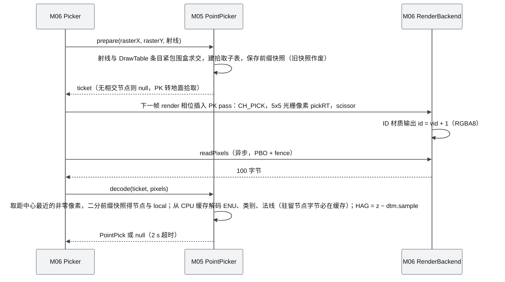
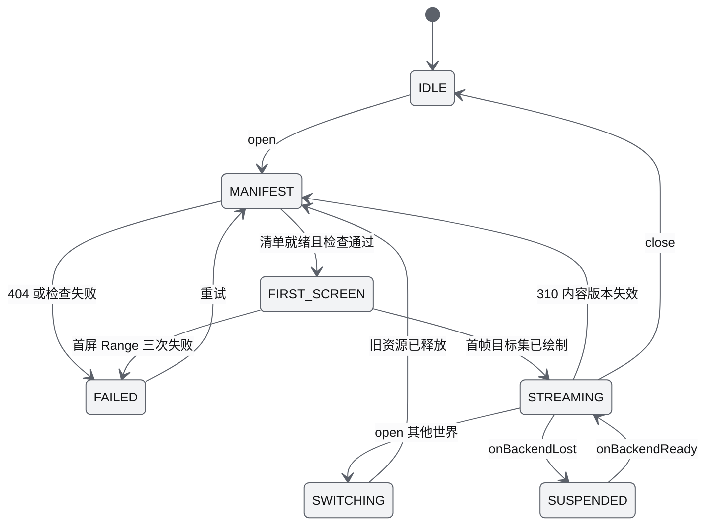
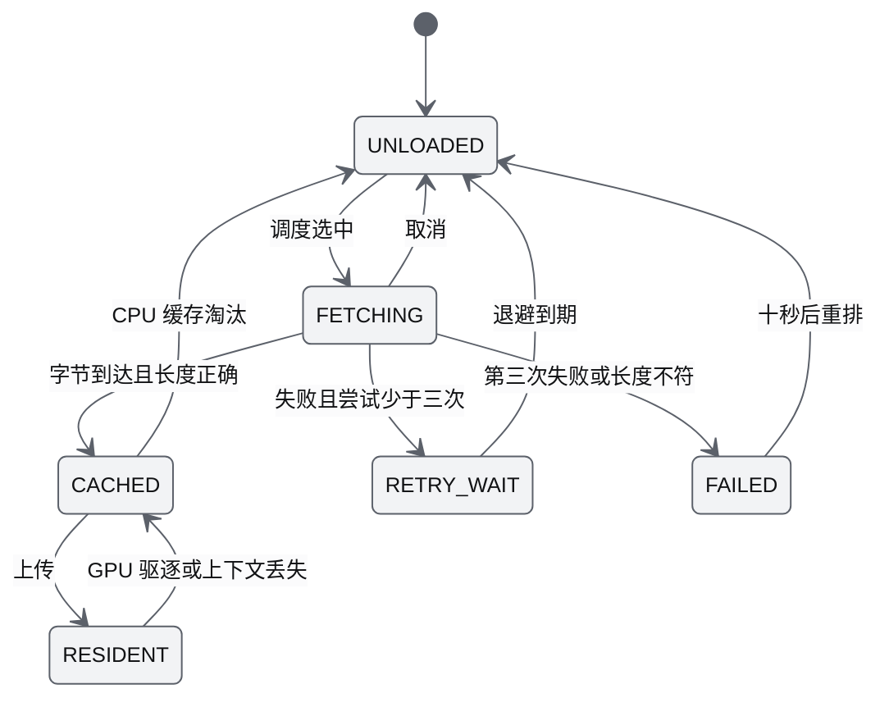
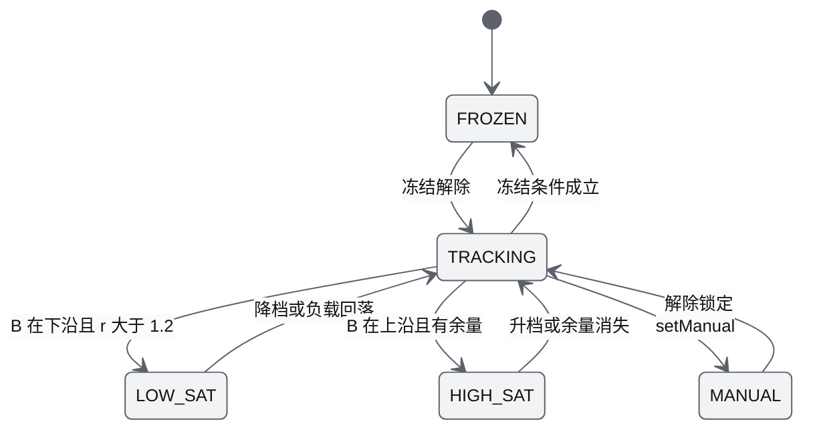
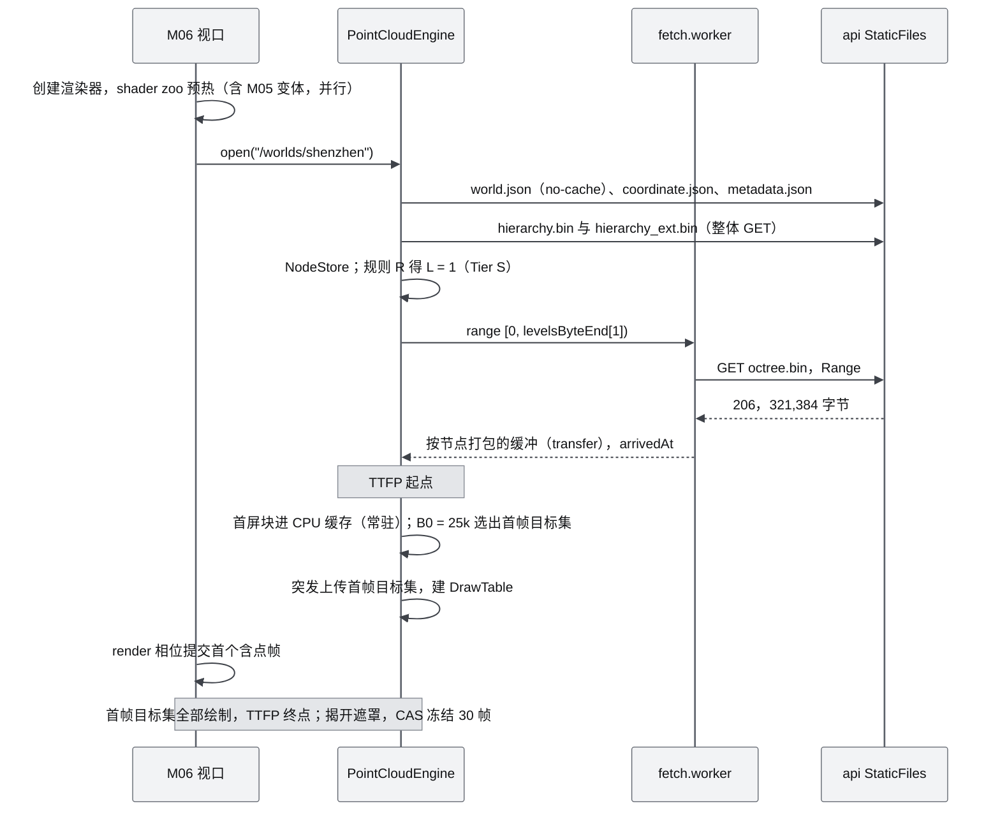
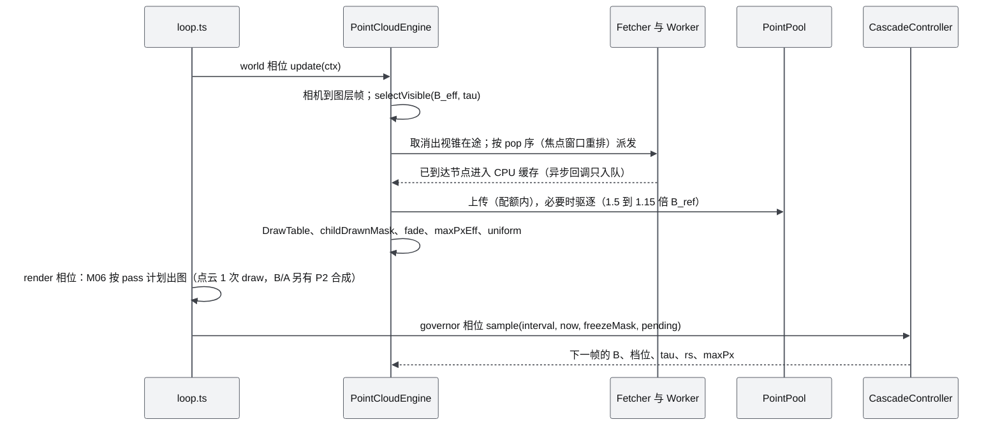
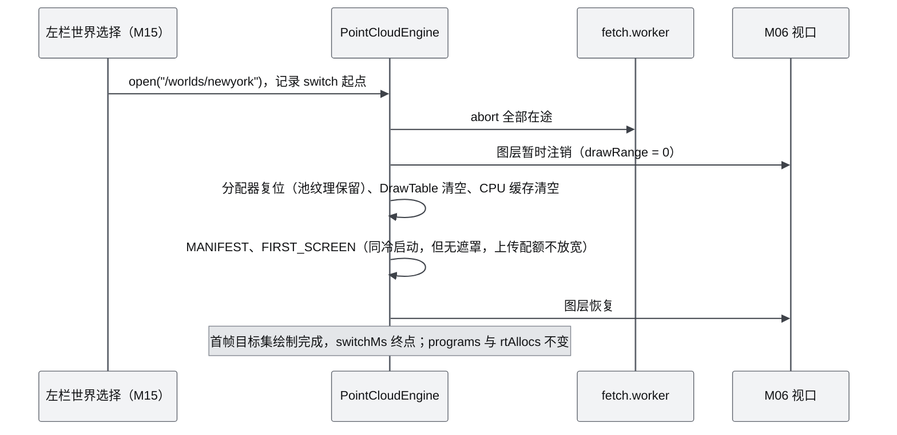

# M05 Web 点云引擎（PointCloudEngine）PRD——渐进加载与疏密自动调节

| 项 | 内容 |
|---|---|
| 文档编号 | AWR-M05 |
| 标题 | Web 点云引擎（PointCloudEngine）PRD——渐进加载与疏密自动调节 |
| 版本 | v1.1 |
| 日期 | 2026-09-28 |
| 状态 | 草案（v1.0 经技术审校修订：纠正 golden 字、池纹理无镜像分配条件、对照库版本、DTM 契约、classMask 默认值等；补齐退化档规则、驻留一致性与模块边界，待交叉评审） |
| 上游文档 | [AWR-03 设计基线](../03-设计基线与决策记录.md)（ADR-002、ADR-004、ADR-005、ADR-006、ADR-007、ADR-008、ADR-009、ADR-010、ADR-011、ADR-012、ADR-013、ADR-029、ADR-031、ADR-032、ADR-033、ADR-041、ADR-042、ADR-044、ADR-050；§3.5–§3.8、§4.1、§4.3、§5.1、§5.8、§6.3、§8.2–§8.7、§11、附录 A、B、C）；[01-design](../01-design.md) §8、§9、§12、§14、§15、§16、§37、§38；研究笔记 [g02](../research/g02-gap.md)（权威）、[g01](../research/g01-gap.md)、[n01](../research/n01-discover-web-pointcloud.md)、[r12](../research/r12-potree-core-loader.md)、[r11](../research/r11-threejs-webgpu.md)、[r13](../research/r13-potree-next-splats.md)、[r10](../research/r10-3dtiles.md)、[g03](../research/g03-gap.md)、[00-index](../research/00-index.md) §3.5、§3.6、§5.2；并行说明书 [10](../10-系统架构说明书.md) §5.1、§7，[14](../14-UI交互设计PRD.md) §3.7、§4.2、§5.5、§7.3–§7.5，[15](../15-视觉设计规范与色卡.md) §8、§10.3，[16](../16-World数据规范.md) §4，[17](../17-接口与实时协议规范.md) §5、§8，[18](../18-性能与测试方案.md) §4、§8.6、§9 |
| 下游文档 | [M06 Web 视口与渲染后端](M06-Web视口与渲染后端PRD.md)（RenderBackend、pass 计划、RT 分配、相机、FrameSampler、PerfGovernor、拾取 pass 插入）；[M15 前端 UI 壳](M15-前端UI壳与设计体系组件PRD.md)（HUD、左栏 LAYERS、Perf 面板、设置）；[M16 演示与流畅性测试](M16-演示数据剧本与流畅性测试PRD.md)（flight60 harness、`apps/web/perf/m05/*`）；[18](../18-性能与测试方案.md)（本文参数作为测试预言值，阈值归档）；[14](../14-UI交互设计PRD.md)（HUD 字段与文案）；[17](../17-接口与实时协议规范.md)（原因码 400–411，已登记于 17 §8） |
| 适用版本范围 | V0.1（D1）至 V1.0 |
| 验收加固修订 | 2026-10-01（FX-WEB1）：ADR-063 非叶节点点径上限（FR-029、FR-030、§6.2.3、§6.7.3、§6.8.1 注）；Tier S 稀疏点径复核结论记入 RK-M05-02；拾取（AC-027）、flight60 `scene=pc` 与 TTFP 不含首次编译的用例转为必跑（§10） |

## 0. 摘要

1. M05 是浏览器中唯一的点云运行时：按相机与帧节奏渐进加载 ANET_Q16 八叉树，并以闭环调节点预算、屏幕误差、点径与渲染比例，是用户硬性要求 R3d（渐进加载）、R3e（疏密自动调节）、R3f（非常流畅）的直接落点。
2. 选择器为 APH：两级预算 best-first，首个被预算拒绝的 required 节点画 ≥ 512 点前缀，±10% 迟滞；屏幕误差以光栅像素计（medium 档 τ = 1.35）；每帧输出 `limitedBy` 与 `achievedScreenError`，与 g02 原型逐帧差分一致。
3. GPU 组织为 PointPool（RGBA32UI、宽 4096，行数按设备能力档的自动上限档计算：Tier S 62 行、iGPU 1221 行、dGPU 2442 行（ADR-010 第 2 轮修订），256 点为一页、线性寻址、不留 CPU 镜像，staging 加 `copyTextureToTexture` 上传）加 DrawTable 单次 draw，TSL 单源，三后端共用。
4. 疏密控制为 CAS：内环每 250 ms 做对数域 AIMD，外环只在内环饱和时无扰换档，且自动模式不进入被点池容量钳制成单点的退化档；7 档阶梯中 Tier S 为 soft-min [10k, 40k]、起步 25k、质量下限 20k；Lite 点径加自适应 maxPx（受 τ 约束 8、受预算约束 16）。
5. 加载在 Worker 中取数与打包：首屏按规则 R 每根一次 BFS 前缀 Range（Tier S ≤ 1e5 点）；按 pop 顺序并发（HTTP/1.1 ≤ 4），出视锥 2 帧取消，0.5/2/8 s 退避；CPU LRU（64/256 MB）与 GPU 池两层驻留，GPU 驻留节点的字节在 CPU 缓存中必留（上下文丢失与拾取不重下载），GPU 超过 1.5·B_ref 时驱逐到 1.15·B_ref（B_ref 为钳制后的档位 hi）。
6. 画面：Weyl screen-door 淡入（`--duration-lod-fade` 250 ms，取代原 220 ms）；Height、HAG、Normal、Class、Source 五种着色以 uniform 切换、零运行期编译；EDL 仅 Tier B/A（强度 0.45、半径 1.4 px、4/8 tap）；ID pass 点击拾取为 D1-ext。
7. 二次优化：删除原设计"远处 10K / 近处 1M"的静态阈值，改为全局预算闭环；补齐原设计缺失的首屏协议、两层驻留、控制器、淡入、遥测与可测验收。
8. 验收全部映射到 D1-AC-02、03a、04、05、06、24、25、30、34 与 18 号文档的 PERF-AC，共 35 条 M05-AC；对基线与并行文档的反馈 17 条（§14），其中 6 条已被 16、17、18 采纳；未擅改任何 ADR。

---

## 1. 背景与目标

### 1.1 定位与决定形态的研究事实

原设计把点云称为"整个 Web 系统最容易遇到性能问题的地方"（01-design §14）。本机没有 GPU，性能验收在 SwiftShader 上执行（ADR-033），所以 M05 的每一项形态都由本机实测或基于实测的闭环仿真决定：

| # | 事实 | 对设计的影响 | 依据 |
|---|---|---|---|
| F1 | SwiftShader 每个绘制点 0.5–1.3 µs，随负载相差 2 倍；本机 headless 管线的呈现间隔中位数钉在 33.3 ms，与点数无关 | Tier S 的 T* 固定 33.3 ms；预算带 [10k, 40k]，起步 25k；250k 否决 | g02 §6.4、§7.1 |
| F2 | 流式 60 s 飞行下，APH 在预算受限区填充率 0.99–1.00，r12 目标集方案 0.71–0.98；APH 的帧间节点变化率比 AP 低 5–20%、下载量少 3–11% | 选择器采用 APH；前缀使点数随 B 线性变化，成为 CAS 的单调执行器 | g02 §3.2 |
| F3 | 逐节点 VBO、multi-draw、页池加 DrawTable 三者 GPU 耗时比 1.02 / 1.00 / 1.04；单缓冲 liveness 方案慢 18–50%；经典渲染器每个对象 CPU 约 14 µs | PointPool + DrawTable，全部用公开 API，单次 draw | g02 §4.2、§4.3 |
| F4 | 在"最多缩小 1 级"前提下 cut 纹理与 Lite 掩码画质指标逐位相同，Lite 开销 0.99 倍；maxPx 由 8 调到 16 空洞率约减半、耗时平均 +21% | 全部档位用 Lite，maxPx 按 `limitedBy` 自适应 | g02 §5.1–§5.3 |
| F5 | 画质阶梯（QL）在 SwiftShader 上卡死 0 档；AIMD 与二者叠加每分钟反向 23–46 次；CAS 实测 p95 50 ms、不换档、每分钟反向 6–13 次 | 控制器采用 CAS | g02 §6.2、§6.4 |
| F6 | TSL 写的 PointPool 与手写 GLSL 等速（1.05 倍），三后端逐像素一致；int uniform 在 handler 下失效；WebGPU 下设 `internalFormat` 会读出 0 | TSL 单源；整数参数一律 float uniform；任何后端不设 `internalFormat` | g01 §0 第 1、5、10 条，§4.5 |
| F7 | 720p 8-tap EDL 全屏 pass 在 SwiftShader 上约 107 ms，360p 约 36 ms | Tier S 关闭 EDL | r12 §4.12 |
| F8 | `octree.bin` 按层级优先 BFS 写出，首屏一次 Range；`hierarchy.bin` 14.5–19.3 KB，整体 GET；`multipart/byteranges` 请求头触发 CORS 预检 | 首屏协议；禁止多区间请求 | 16 §4.11；n01 §3.5；g03 §7 |
| F9 | 驱逐阈值跟随瞬时 B 时，B 下探即驱逐、回升即重下载；OLV 以 1.5/1.15 双阈值加 1 s 驻留保护消除颠簸 | 驱逐基准 B_ref 固定为档位（钳制后的）hi | ADR-010；`refs/discovery/openlidarviewer/src/render/streaming/evictionPolicy.ts` |
| F10 | 节点点数中位数：深圳 6,533、纽约 3,860、上海 7,518；纽约 p10 仅 712 点。以 4096 点（一行）为页时池利用率 75–80%，以 256 点为页时 98% | 分配页取 256 texel（本文设定，§6.6.2） | 本文实测（`.cache/research/g02/data/<city>/nodes.json`） |
| F11 | UrbanScene3D 没有颜色与强度；深圳、上海 17–24% 的原始法线朝下；旧金山地形起伏 268 m | 默认 Height × Lambert 并做 faceforward；旧金山默认 HAG | 15 §10.3；x01 §3.7 |

### 1.2 对原设计的继承、修正与增强

| 01-design 条款 | 处置（附录 C） | 本文落点 |
|---|---|---|
| §14"World Point Cloud → Spatial Partition → Octree → LOD → Streaming"；浏览器根据 Camera Position、Camera FOV、Distance、Screen Size 确定要加载的节点 | 继承主链与"相机驱动加载" | APH 的误差度量正好用这四个输入：到节点紧包围盒的距离、fovY、光栅高度 H_px（§6.4）；Streaming 由 Worker Fetcher 承担（§6.5） |
| §14"远处 10K points、近处 1M points，只有相机附近才加载高精度点云" | **取代** | 改为全局点预算 B 加屏幕误差 τ 的两级预算选择，B 由 CAS 按实测帧节奏闭环决定；Tier S 的 10k–40k、独显的 1.5M–6M 是控制器的档位带，不是距离阈值（ADR-009、ADR-012） |
| §14"500 million points 不能一次全部加载" | 继承并量化 | 两层驻留：GPU 驻留 ≤ 1.5·B_hi，CPU 缓存 ≤ 64 / 256 MB（ADR-010） |
| §15"Web 端转换为 Binary Tile + Octree Index，后期兼容 3D Tiles" | 修订 | 运行时为 Potree 2.0 三文件容器 + ANET_Q16 v1；3D Tiles 只作导出（V0.5）（ADR-004） |
| §16 WorldLayer 下的 PointCloud | 修订 | 点云是 WorldLayer（根旋转 −π/2，ADR-002）下的**一个** `THREE.Points` 对象，内部全部为 World ENU |
| §9、§12"React + Three.js + WebGPURenderer + WGSL"，WebGPU 承担 Point Rendering | 修订 | WebGPU 下点恒为 1 px；D1 默认经典 WebGL2（Tier B/S），Tier A 用 vertex-pulling quad，为显式开启的 P1；着色器写 TSL 而不是 WGSL（ADR-007、ADR-044） |
| §37"Web Rendering 60 FPS" | 部分取代 | Tier S 目标 30 fps（T* = 33.3 ms）；硬件档按刷新率（ADR-044） |
| §38 左栏"Layers"列表以勾选框字形表示 | 修订 | shadcn `Switch` 与 `Checkbox`（classMask）加 morphicons；不用任何字形 |
| 原设计没有涉及 | 增强 | 首屏协议与 TTFP 口径、节点淡入、EDL、着色模式、ID 拾取、遥测（`limitedBy`、`achievedScreenError`、fillRate、holeRate）、上下文丢失恢复、可复现的 flight60 基线与可测验收 |

### 1.3 目标

| 编号 | 目标 | 可度量的表述 | 首次达成 |
|---|---|---|---|
| G-M05-1 | 首屏快 | Tier S：TTFP ≤ 1.0 s（深圳、纽约、上海、苏州 P0；旧金山、芝加哥 P1），UI 内切换世界 ≤ 1.5 s | V0.1 |
| G-M05-2 | 画面流畅 | flight60 `scene=pc` 呈现间隔 p50 / p95 / p99 ≤ 33.4 / 50 / 100 ms，> 50 ms 的帧 ≤ 5% | V0.1 |
| G-M05-3 | 疏密稳定 | 60 s 内换档 ≤ 2 次、10 s 内来回 0 次、B 反向 ≤ 15 次/分钟、2 s 内进入目标带 | V0.1 |
| G-M05-4 | 渐进加载无浪费 | 失败节点 0；drawn ≤ B 违例 0；GPU 驻留 ≤ 1.5·B_ref + 根节点点数；重复下载比 ≤ 1.3 | V0.1 |
| G-M05-5 | 画质可见 | Tier S 12 采样帧空洞率 ≤ 25%；真 GPU 静止帧空洞率 ≤ 3%（iGPU）/ ≤ 1%（dGPU，设计值） | V0.1 / V0.3 |
| G-M05-6 | 行为可观测 | `limitedBy`、`achievedScreenError`、fillRate、覆盖率、CAS 档位与 B 实时进入 `window.__perf` 与 HUD；holeRate 进入画质运行报告 | V0.1 |

### 1.4 设计原则

1. **闭环而不是阈值**（P-05）：点数、档位、点径、渲染比例都由呈现间隔驱动，禁止按距离或设备写死点数。
2. **执行器单调**：选择器输出的点数随 B 近似线性变化（前缀补齐），CAS 才能稳定；任何破坏单调性的加权（屏幕中心、焦点）只允许影响下载顺序。
3. **策略是纯函数**：选择、CAS、驱逐、分配、取消、重试、首屏层级全部写成无 DOM、无 three、无时钟的纯函数，时钟与帧号由调用方传入，Node 下可逐帧复现。
4. **热路径零分配**（AWR-03 §3.6 规则 1）：每帧执行的代码只用预分配的 TypedArray 与对象池。
5. **不在运行期编译**：着色模式、EDL、档位、淡入全部以 uniform 切换；预热变体由本模块声明（ADR-007）。
6. **可视化与物理分离**（P-03、§5.8 第 4 条）：M05 只发 `GET /worlds/**`，任何画质变化对物理、事件与录制零影响。

---

## 2. 范围

### 2.1 分层范围（与 AWR-03 §6.3 M05 行一致）

| 层 | 内容 |
|---|---|
| **D1-core（P0）** | `openWorld`（按档位首屏，规则 R）；HierarchyLoader（整体 GET、`hierarchy_ext.bin` 紧包围盒、PROXY 解析）；Worker Fetcher（Range、取消、退避、并发上限）；CPU LRU 缓存；APH 选择器；CAS（冻结条件、积压定义、质量下限、手动锁档）与 7 档阶梯；PointPool + DrawTable（B_ref 驱逐、容量钳制、256 点页分配器、上传配额）；Lite 点径与自适应 maxPx；`--duration-lod-fade` 节点淡入；多根森林；着色模式 Height、HAG、Normal、Class、Source 与 classMask；雾接入（M07 的 Fn）；EDL（Tier B）；Tier B 渲染比例子视口；预热变体；上下文丢失恢复；Stats（4 Hz）与 `window.__perf` 点云字段；flight60 场景生成；测试夹具 |
| **D1-ext（P1）** | ID pass 点击拾取（异步回读）；Tier A quad 点径与 EDL；Tier B/A 运动降载的接收；起步档记忆信号（持久化属 M06-FR-013）；相机飞行目的地预取；画质采样钩子与全量参考页 `fullref.html`（D1-AC-05 为 P1）；per-node 对照页 |
| **D1 桩** | Intensity 着色入口（需要 `ext` 流，UrbanScene3D 没有强度，入口置灰，伪强度随虚拟 LiDAR 在 V0.2）；节点 gzip 解压接口（`DecompressionStream`，本机默认 `compression = none`） |
| **后续版本** | 见 §2.2 |
| **不做** | 逐节点 `Points`（O1，只作对照页）；单缓冲加 liveness（O2）；octree cut 纹理与 Full 自适应点径（与 Lite 等价，g02 §5.2）；QL、AB 控制器；按距离分配点数；浏览器端任何物理查询（碰撞、AGL、点选 GoTo 的求交属 M04） |

### 2.2 版本演进

| 版本 | M05 的增量 | 依据 |
|---|---|---|
| V0.1（D1） | §2.1 全部 | ADR-042 |
| V0.2 | 相邻兄弟节点 Range 合并（远程 SSH 转发 RTT > 20 ms 时收益明显）；hover 拾取（≤ 10 Hz）；伪 Intensity 着色；`twin-default` 对照页（potree-core） | r12 §4.4；r13 §3.6 |
| V0.3 | Tier A 点池改 storage buffer（12 B/点）；评估 compute 三遍软光栅；裁剪体（include/exclude 盒与平面，禁飞区剖切）；GPU runner 或 `/bench` 数据固化 iGPU/dGPU 阈值 | ADR-010；n01 §3.8；r12 §3.8 |
| V0.5 | COPC 读取（copc.js 于 Worker）；公网 gzip 节点与 HTTP/2 并发 8/12；真实数据（合肥园区）复跑 flight60 | ADR-004；n01 §3.10 |
| V0.6 | 跨数据源预算仲裁（PlayCanvas 性价比分配器）；WebGPU compute 剔除与压实 | n01 §3.9；r13 §3.4 |
| V0.8 | 3DGS 图层与点云共享预算；3D Tiles 网格与地形底座 | r13 §4.2；ADR-048 |
| V1.0 | 多城拼接压力场景作为默认 e2e | n01 §3.12 |

### 2.3 与相邻模块的边界

| 相邻模块 | M05 负责 | 对方负责 |
|---|---|---|
| M03 World 与切片 | 按 [16 §4](../16-World数据规范.md) 读取与校验容器 | 生成容器、`levelsByteEnd`、`levelsPoints`、`hierarchy_ext.bin`、`stats` |
| M06 视口与渲染后端 | 点云图层对象、DrawTable、点材质、EDL 合成四边形、ID 材质；声明所需 RT、pass 与预热变体；CAS | RenderBackend 与设备能力档、pass 计划与出图、RT 分配、相机与 near/far、FrameSampler、冻结信号、PerfGovernor、`window.__perf` 容器、拾取 pass 的插入时机 |
| M07 环境 | 点材质开启雾并读取环境光照 uniform | `scene.fogNode` 的雾因子 Fn、太阳方向、云阴影 |
| M15 UI 壳 | `stores/world.ts`、`stores/layers.ts`、Stats 与事件 | 左栏、HUD、Perf 面板、设置的组件与交互 |
| M16 测试 | flight60 生成器、相机采样函数、`apps/web/perf/m05/*.spec.ts` | harness、性能运行协议、报告 |
| M04 几何查询 | 无（点云拾取只做显示） | 点选 GoTo 的 DSM `ray_hit`（D1-core） |
| M11 网关 | 无 | `/worlds/**` 的 Range、缓存头与 `309`、`310` 原因码（[17 §5](../17-接口与实时协议规范.md)） |

---

## 3. 用户与用例

### 3.1 角色

| 角色 | 与 M05 的关系 |
|---|---|
| 研究人员 | 在浏览器中漫游六城世界，切换着色与类别，贴近立面观察细节 |
| 演示者（远程） | 经 SSH 转发访问本机，要求首屏快、飞行中画面不卡、不闪 |
| 操作员 | 跟随或 FPV 观察无人机；点击点云查看坐标（D1-ext） |
| 开发与测试工程师 | 用 flight60、差分测试、对照页定位回归 |
| 性能 harness（M16） | 只读 `window.__perf` 判定验收 |

### 3.2 用例

| 编号 | 用例 | 主要流程 | 相关需求 |
|---|---|---|---|
| UC-01 | 冷启动进入 `/world/shenzhen` | 遮罩下并行预热、取清单、首屏 Range → 首帧目标集上传 → 首个含点帧 → 揭开遮罩 | FR-001–005 |
| UC-02 | 俯瞰下降、巡航、贴近高楼 | 选择器逐帧细化，下载按 pop 顺序，新节点淡入，父节点八分体点径在子节点就位后缩小 | FR-010–018、FR-028–031 |
| UC-03 | UI 内切换世界 | 中止请求 → 注销 → 释放池页 → 清空 DrawTable → 打开新世界；画布不重建 | FR-007 |
| UC-04 | 切换着色模式、关闭植被类别 | 改 uniform，零编译，1 s 内无卡顿 | FR-032、FR-033 |
| UC-05 | 手动锁定画质档 | 外环停止，内环仍在档内调节；超出点池容量时显示钳制标识 | FR-025、FR-044 |
| UC-06 | 跟随或 FPV 无人机 | 焦点附近节点下载优先；选择集不受焦点影响 | FR-014 |
| UC-07 | 点击点云中的点（D1-ext） | ID pass 5×5 窗口回读，反查节点与下标，显示 ENU、类别、HAG | FR-047、FR-048 |
| UC-08 | 主机负载突增 | CAS 先降 B 到 20k；PerfGovernor 降完可选图层后才允许 B 越过下限 | FR-038、FR-043 |
| UC-09 | GPU 上下文丢失 | M06 重建渲染器，M05 重建 GPU 资源，从 CPU 缓存重传，不重下载 | FR-027 |
| UC-10 | flight60 性能回归 | harness 驱动相机，读 `__perf` 判定 | FR-051、FR-055 |
| UC-11 | 静态浏览非会话世界 | 不依赖 WS，只加载点云（BIZ-FR-005） | FR-009 |
| UC-12 | 世界在两次会话之间重建 | 请求返回 `310 CONTENT_VERSION_STALE`，中止并以新 contentVersion 重开，保持相机 | FR-008 |

### 3.3 本模块新增术语（其余见 AWR-03 §11 与 18 §1.5）

| 术语 | 定义 |
|---|---|
| 光栅像素、H_px | 点云 pass 实际光栅化目标的像素；`H_px = cssHeight · dpr · rs`。Tier S 的 `dpr · rs` 恒为 0.5。τ、minPx、maxPx 都以光栅像素计 |
| 首帧目标集 | 首屏数据到达后，选择器以起步预算 B0 在初始相机下选出的节点集合 |
| 首屏块 | 每根一次 Range 取回的 `[0, levelsByteEnd[L])` 字节；拆成节点后在 CPU 缓存中常驻 |
| 覆盖率（progress） | 当前选择集中已在 GPU 驻留的节点数 / 选择集节点数；首屏阶段分母为首帧目标集 |
| 页 | PointPool 的分配单位，256 texel（256 点）；地址线性，可跨行 |
| B_ref、B_eff | GPU 驱逐基准 = 当前档位钳制后的 hi = `min(rung.hi, 0.6·池容量)`；本帧实际预算 = `min(B, 0.6·池容量)` |
| 退化档 | `rung.lo ≥ 0.6·池容量` 的档位：容量钳制后预算带收缩为单点，升入它不增加预算；自动模式不进入，只能手动选择（§6.8.4） |
| drawn | 本帧实际绘制的点数 = DrawTable 的 Σcnt，恒 ≤ B_eff |
| 填充率（fillRate） | `limitedBy ∈ {budget, nodes}` 的帧上 drawn / B_eff；遥测值取 1 s 指数平均 |
| 空洞率（holeRate） | 与全量参考渲染比较的覆盖缺失比例（18 §4.5），只在画质运行与 `/bench` 中产生 |
| 积压（pending） | 待上传点数超过 2 帧上传配额，或在途请求数达到上限（ADR-012） |
| 稀疏态 | `limitedBy ∈ {budget, nodes}` 或覆盖率 < 0.95；此时 maxPx 取受预算约束值 |
| 淡入进度 fade | 节点首次驻留后按 `--duration-lod-fade` 与 `--ease-smooth-out` 从 0 升到 1 的值 |

---

## 4. 功能需求

优先级与 D1 列的含义见 AWR-03 §10.2 第 4 条与 ADR-042：D1-core 为 P0，D1-ext 为 P1；D1 = 桩只交付接口或替身。

### 4.1 世界打开与首屏

| 编号 | 需求描述 | 优先级 | 目标版本 | D1 | 验收要点 | 依据 |
|---|---|---|---|---|---|---|
| M05-FR-001 | `openWorld` 按固定顺序取数：`world.json`（`cache: 'no-cache'`）→ `coordinate.json?v=` → 各根 `metadata.json?v=` → 各根 `hierarchy.bin?v=`（不带 Range 的整体 GET）→ 各根 `hierarchy_ext.bin?v=` → 规则 R 选层 → 每根一次 `octree.bin?v=` 首屏 Range；除 `world.json` 外所有请求都带 `?v=<contentVersion>`；请求头不得出现 `content-type: multipart/byteranges` | P0 | V0.1 | 是 | M05-AC-006（HAR 核对序列与请求头） | ADR-006、ADR-013；16 §4.12；17 §5.5；n01 §3.5 |
| M05-FR-002 | 生产环境只做廉价检查（16 §15.5）：`world.schemaVersion` 主版本为 1；`encoding = ANET_Q16` 且 `anet.formatVersion = 1`，`bytesPerPoint ∈ {12,16}`，`compression ∈ {none, gzip}`，立方体包围盒，`levelsByteEnd` 单调且不超过首屏 Range 的 `Content-Range` 总长，`hierarchy.bin` 长度为 22 的倍数，`roots[]` 与 metadata 点数一致；任一失败拒绝整个世界（`401 PC_FORMAT_UNSUPPORTED`），不做"尽力而为"解析 | P0 | V0.1 | 是 | 单测：逐项篡改夹具均被拒绝 | 16 §15.5；AWR-03 §5.11 第 3 条 |
| M05-FR-003 | 首屏层级按规则 R 在运行时计算：以各根 `levelsPoints` 逐层求和得 P[L]，取满足 `P[L] ≤ min(4.5e5, 0.8·池容量, 2.5·B_hi(起步档))` 的最深 L，所有根共用同一 L，每根一次 Range `[0, levelsByteEnd[L])` | P0 | V0.1 | 是 | M05-AC-004：六城结果与 16 §4.11 表逐项相等 | ADR-013；16 §4.11 |
| M05-FR-004 | 首屏字节在 Worker 中切分并打包为节点数据，进入 CPU 缓存并标记常驻；首帧目标集的选择以首屏层 L 为深度上限（level > L 的节点不入堆），保证 TTFP 不依赖首屏之外的请求；遮罩揭开前（冷启动）首帧目标集可一次性上传（突发配额 = 首帧目标集点数，≤ B0）；Fetcher 在首屏 Range 响应体全部到达时记录 TTFP 起点，首帧目标集全部驻留且被绘制的那一帧提交后记录终点 | P0 | V0.1 | 是 | M05-AC-007；`__perf.load.ttfp` 口径符合 18 §4.2 | ADR-013；AWR-03 §11 TTFP |
| M05-FR-005 | 打开阶段与首屏进度写入 `stores/world.ts`：`phase ∈ {idle, manifest, first_screen, streaming, error}`；首屏进度 = \|首帧目标集 ∩ GPU 驻留\| / \|首帧目标集\|，阶段文字附首屏字节数（例如"加载首屏点云 · 0.3 MB"） | P0 | V0.1 | 是 | Playwright 读取进度单调不减并在揭开时为 1 | ADR-013；14 §7.3 |
| M05-FR-006 | 多根森林：全部根的节点编入同一个 NodeStore（全局下标），在同一个堆中共享一个点预算；每根保留自己的 URL 前缀与字节偏移 | P0 | V0.1 | 是 | 苏州 6 根：drawn ≤ B 违例 0；D1-AC-06 通过 | ADR-004、ADR-009；16 §4.10 |
| M05-FR-007 | 世界切换严格按"中止全部请求 → 注销图层 → 分配器复位（池纹理不销毁）→ 清空 DrawTable → 清空 CPU 缓存 → 打开新世界"执行；切换后 CAS 冻结 30 帧；CAS 的档位与 B 保留（设备未变），新世界的首帧目标集以当前 B 选择；画布与材质不重建 | P0 | V0.1 | 是 | M05-AC-008：`switchMs` ≤ 1.5 s，`programs` 与 `rtAllocs` 不增 | 10 §5.1、§6.6；ADR-012 |
| M05-FR-008 | 任一 `/worlds/**` 请求返回 409（`310 CONTENT_VERSION_STALE`）时，中止全部请求，重新取 `world.json` 并以新 contentVersion 重开，保持当前相机与着色设置；宿主（M15 世界路由）从 WS `serverInfo` 或 `session.switched` 得知 contentVersion 与 `OpenedWorldInfo.contentVersion` 不一致时，以 `open(base)` 触发同一流程 | P0 | V0.1 | 是 | M05-AC-033：重建后 ≤ 3 s 恢复出点 | 17 §5.2；10 §5.1 |
| M05-FR-009 | 引擎不依赖 WS 与仿真会话：打开非会话世界（静态浏览）时照常加载与渲染 | P0 | V0.1 | 是 | M05-AC-032 | BIZ-FR-005（12 §4.1.4） |

### 4.2 选择器

| 编号 | 需求描述 | 优先级 | 目标版本 | D1 | 验收要点 | 依据 |
|---|---|---|---|---|---|---|
| M05-FR-010 | 实现 APH：两级预算 best-first（key ≥ τ 为 required，可花满 B；key < τ 为奖励层，最多花到 `floor(B·(1 − 0.15))`，下限 τ/4）；入堆时视锥裁剪并向下传递 INSIDE；预算放不下时跳过而不是 break（最多 32 次）；**第一个**被预算拒绝的 required 节点画前缀 `cnt = B − pts`（≥ 512 点，其子节点不展开）；上一帧已绘制的子节点 key × 1.1、其余 × 0.9；输出 `idx`、`cnt`、`key`、`n`、`points`、`limitedBy`、`achievedScreenError`、`minSpacingM`、`levelCounts` | P0 | V0.1 | 是 | M05-AC-001 差分；M05-AC-002 性质 | ADR-009；g02 §3.3 |
| M05-FR-011 | 误差度量统一为 `key = spacing_L · projK / max(d, near)`，`projK = 0.5·H_px / tan(fovY/2)`，d 为相机到节点**子树紧包围盒**（`hierarchy_ext.bin`，缺省用立方体）的最近距离；H_px 为光栅像素高度 | P0 | V0.1 | 是 | 单测：与 g02 `keyPx` 数值一致 | ADR-009；n01 §3.1、§3.2 |
| M05-FR-012 | 根节点入堆时同样做视锥裁剪，键取真实误差 `keyPx`（不用 +∞，保证 `achievedScreenError` 有限）；首个节点（堆中第一个被接纳者）不受预算与奖励层约束，`own ≤ B` 时整节点接纳并展开子节点，`own > B` 时画前缀 `B` 且不展开；其余根节点与普通节点同样受预算约束，保证任何情况下 drawn ≤ B_eff | P0 | V0.1 | 是 | M05-AC-002：苏州 B = 10k 时违例 0；单根城市与原型逐帧一致 | 本文设定（§14 第 9 条） |
| M05-FR-013 | 每帧运行一次、零分配；输出进入遥测；选择耗时 p95 ≤ 0.5 ms（Tier S，浏览器内） | P0 | V0.1 | 是 | M05-AC-003 | g02 §3.2、§8.1 |
| M05-FR-014 | 下载顺序默认等于 pop 顺序；Follow/FPV 模式下只在候选前 `2·maxInflight` 个节点的窗口内按 `key · w_center · w_focus` 重排（`w_center = clamp(1 − \|ndc\|, 0, 1) + 0.5`，`w_focus = 1 + 1.5·exp(−\|c − p_focus\|² / (2·150²))`）；两个权重不得进入选择键 | P0 | V0.1 | 是 | 单测：选择集与无焦点时逐位相同，下载顺序不同 | g02 §3.3 |

### 4.3 加载管线

| 编号 | 需求描述 | 优先级 | 目标版本 | D1 | 验收要点 | 依据 |
|---|---|---|---|---|---|---|
| M05-FR-015 | 节点字节在 Worker 中取回并打包：Worker 执行 `fetch`（Range、`AbortController`），按 ANET_Q16 SoA 布局零拷贝建视图，打包为 PointPool texel 字（§6.2.4），以 transferable 交回主线程；主线程不做逐点循环 | P0 | V0.1 | 是 | M05-AC-005 打包 golden；LoAF 中无我方 > 50 ms 任务 | r12 §3.3；g02 §4.4 |
| M05-FR-016 | 在途请求上限：首屏 Range（每根一次，并发受 HTTP 上限约束）完成前不派发任何节点请求；此后 Tier S 为 4，Tier B/A 为 `min(8 或 12, HTTP 上限)`；HTTP 上限按 `world.json` 的 Resource Timing 条目 `nextHopProtocol` 判定，`http/1.1` 或空串时为 4（可配置到 5），`h2`/`h3` 时不限；M05 发出的全部 `/worlds/**` 请求（层级、节点、DTM、预取）共用这一计数 | P0 | V0.1 | 是 | M05-AC-018 | 17 §5.3 第 7 条；g02 §7.2 |
| M05-FR-017 | 取消：在途节点离开视锥满 2 帧即 abort；"被取代"（连续 8 帧未被选中且在途已满）取消默认关闭；世界切换与关闭时全部 abort；`AbortError` 不计失败 | P0 | V0.1 | 是 | M05-AC-017 单测 | n01 §3.5；voxelkloud `stream-policy.ts` |
| M05-FR-018 | 失败与重试：同一节点最多尝试 3 次，退避 0.5 s、2 s、8 s（墙钟）；第 3 次失败标记 FAILED 并计数，10 s 后允许重新入队一轮；响应长度或 `Content-Range` 与层级记录不符时直接 FAILED，不重试 | P0 | V0.1 | 是 | M05-AC-017：注入 5% 随机 503 时 flight60 失败节点 0 | n01 §3.5；10 §5.1 |
| M05-FR-019 | 层级分页：遇到 PROXY 记录时按需以 Range 取子 chunk（`hierarchy_ext.bin` 同步按 12/22 比例取对应区间），展开前该节点视为叶；六城都是单 chunk，此路径以合成夹具测试 | P1 | V0.1 | 是 | 单测：合成 3 级分页层级展开后与单 chunk 等价 | 16 §4.1 第 3 条、§4.8 |
| M05-FR-020 | 目的地预取：M06 开始相机飞行时调用 `prefetchView(eye, target, fovY)`，以当前 B 与 τ 对目的相机运行一次选择（独立 scratch，不写迟滞标记），把未驻留节点放入低优先级队列（≤ 64 个），仅在在途数 < 上限一半时派发；飞行被打断时清空 | P1 | V0.1 | 是 | 双击定位后到达时覆盖率 ≥ 0.8（本文设定） | 14 §6.5；M06-FR-050；r12 §4.4 |

### 4.4 缓存与驻留

| 编号 | 需求描述 | 优先级 | 目标版本 | D1 | 验收要点 | 依据 |
|---|---|---|---|---|---|---|
| M05-FR-021 | CPU 缓存按字节计，上限 Tier S 64 MB、Tier B/A 256 MB；超过上限时淘汰到 0.9 倍上限；首屏块、GPU 驻留节点与待上传节点不淘汰（GPU 驻留的字节供上下文丢失重传与拾取解码；池满载时仅占 Tier S 3.9 MB、Tier B 77 MB，恒小于上限）；其余按"最久未选中者优先，再先深层"淘汰 | P0 | V0.1 | 是 | `pc.cpuCachePeak` ≤ 上限；M05-AC-013、026 | ADR-010 |
| M05-FR-022 | PointPool：RGBA32UI 纹理，宽 4096，每点 1 texel；行数 = `ceil(hi(自动上限档) / (0.6·4096))`：Tier S 62、iGPU 1221、dGPU 2442（Tier A 与所在设备能力档相同；ADR-010）；不保留 CPU 镜像：以 `data = null` 创建，置 `source.dataReady = false` 与 `needsUpdate = true` 后调用一次 `initTexture`，three 只执行 `texStorage2D` 分配而不传数据（§6.6.2）；分配器以 256 texel 为页、线性地址首次适配、释放合并、尾部回缩高水位 | P0 | V0.1 | 是 | M05-AC-015：页利用率 ≥ 95%，stall 0；M05-AC-019 像素正确且无 GL 错误 | ADR-010；§6.6.2 |
| M05-FR-023 | 上传器：每帧上传配额 Tier S 20k 点、Tier B/A 8 MiB；候选按"在本帧选择集中 > lastSeen 新 > pop 顺序"排序；单节点超过剩余配额时留到下一帧（本帧首个节点除外）；经 staging 纹理与 `copyTextureToTexture` 写入目标区间（跨行时拆为 ≤ 3 个矩形）；staging 永不绑定到材质、永不 `initTexture`，使经典路径走 CPU `texSubImage2D` 分支 | P0 | V0.1 | 是 | M05-AC-014 | ADR-010、ADR-012；g02 §7.2 |
| M05-FR-024 | GPU 驱逐：驻留点数 > 1.5·B_ref 时按 OLV 顺序（视锥外 → 视锥内未选中 → 其余）、同类先深层后远，驱逐到 1.15·B_ref；B_ref = 当前档位钳制后的 hi（`min(rung.hi, 0.6·池容量)`，保证 1.5·B_ref ≤ 0.9·池容量）；本帧选择集与根节点永不驱逐；可见节点驻留满 1 s 前下移而不是豁免；被驱逐节点回到 CACHED | P0 | V0.1 | 是 | M05-AC-016；D1-AC-06 驻留上限 | ADR-010；OLV `evictionPolicy.ts` |
| M05-FR-025 | 容量钳制：`B_eff = min(B, 0.6·池容量)`；钳制生效时 `pc.clampedByCapacity = true`，HUD 与画质 `Select` 旁显示"受点池容量限制"；钳制值低于档位 lo 时该档预算带退化为单点（§6.8.4） | P0 | V0.1 | 是 | 手动选 ultra 时标识出现且 drawn ≤ B_eff | ADR-010 |
| M05-FR-026 | 分配失败时立即按 FR-024 顺序驱逐（不等阈值）后重试；仍失败则本帧停止上传、`pc.poolStalls` 加 1、已解码数据留在 CPU 缓存；不得丢弃或重新下载 | P0 | V0.1 | 是 | 六城 flight60 下 `poolStalls` = 0 | voxelkloud `view.ts::drainPending` |
| M05-FR-027 | 设备丢失：`onBackendLost()` 时释放 GPU 对象、全部 GPU 驻留节点回到 CACHED（CPU 缓存保留）；`onBackendReady(be)` 时重建池纹理、表纹理与材质，分配器复位，按正常配额从 CPU 缓存重传；恢复期间不发任何新的节点请求 | P0 | V0.1 | 是 | M05-AC-026：`downloadedBytes` 不增，≤ 2 s 恢复出点 | ADR-007；M06 LayerSpec |

### 4.5 绘制

| 编号 | 需求描述 | 优先级 | 目标版本 | D1 | 验收要点 | 依据 |
|---|---|---|---|---|---|---|
| M05-FR-028 | DrawTable（RGBA32UI，宽 1024，每条 16 B）每帧重写，只上传用到的行（经典路径每行一个 `addUpdateRange`，three 的 update range 按单行上传，不得跨行）；NodeTable（RGBA32F，每节点 2 texel）在打开世界时写一次；无属性 `THREE.Points` 以 `drawRange = Σcnt` 单次绘制；顶点程序以 TSL 编写，按 `vertexIndex` 在 DrawTable 上做固定 12 次二分；整数参数全部为 float uniform；任何纹理不设 `internalFormat`；`frustumCulled = false`，`raycast` 置空 | P0 | V0.1 | 是 | M05-AC-019 像素一致；`render.calls` 等于 pass 计划 | ADR-007、ADR-010；g01 §4.5 |
| M05-FR-029 | Lite 点径：`pitch = childDrawnMask 在该点八分体为 1 ? 0.5·spacing_L : spacing_L`，`px = 1.7 · pitch · projK / (−z_view)`，叶节点钳到 `[minPx, maxPxEff]`、非叶节点钳到 `[minPx, maxPxCapEff]`（ADR-063，叶标志取 NodeTable t1.z）；`childDrawnMask` 只统计"本帧被绘制且淡入完成"的子节点，因此父节点八分体的点径在子节点淡入完成后才缩小；点形状 Tier S 为方点（无片元 discard），Tier B/A 为圆点（`length(pointCoord − 0.5) > 0.5` 时 discard），由后端档在构建时决定，不产生运行期变体 | P0 | V0.1 | 是 | M05-AC-020 | ADR-011；g02 §5.3；15 §10.3 |
| M05-FR-030 | 自适应 maxPx：稀疏态（`limitedBy ∈ {budget, nodes}` 或覆盖率 < 0.95）取档位 `maxPxSparse`，否则取 `maxPx`（`maxPxEff`，叶节点与 `__perf.pc.maxPxEff` 的上限）；非叶节点在非稀疏态另以 `maxPxCap = min(maxPx, max(4, ⌈2.5·sizeK·τ⌉))` 钳制（`maxPxCapEff`，稀疏态等于 `maxPxEff`；ADR-063）；两者以 300 ms 时间常数指数平滑；minPx 取档位值 | P0 | V0.1 | 是 | `pc.maxPxEff` 在 flight60 中无阶跃；`tests/pointcloud/pointsize.test.ts` | ADR-011、ADR-063；g02 §5.3 |
| M05-FR-031 | 节点淡入：节点首次上传后，按节点内下标 `local` 计算 Weyl 哈希 `fract(local · 0.618033988749895)`，≤ fade 的点保留，其余以零点径移出裁剪体；fade 在 `--duration-lod-fade`（250 ms）内按 `--ease-smooth-out` 从 0 到 1；不透明、写深度；reduced 动效档立即为 1；时长与曲线只来自生成的 token 模块，由薄适配层经 `options.tokens` 注入（engine 代码不 import `ui/**`，AWR-03 §4.2 第 2 条；M06 §14 第 11 条） | P0 | V0.1 | 是 | M05-AC-021 | ADR-029；15 §8.7；OLV `fadeDither.ts` |
| M05-FR-032 | 着色模式 Height（默认）、HAG（旧金山默认）、Normal、Class、Source 由同一程序以 float uniform `uColorMode` 切换；公式、颜色与光照项取 [15 §10.3](../15-视觉设计规范与色卡.md)；HAG 采样 FR-060 加载的 DTM 纹理（R16F） | P0 | V0.1 | 是 | M05-AC-022：切换不增加 `programs` | ADR-005；15 §10.3；PRD-FR-012 |
| M05-FR-033 | classMask：float uniform（≤ 2^16），`visible = (classMask >> cls) & 1`，关闭的点以零点径移出裁剪体；默认 `0x1FFF`（隐藏类别 13、14；类别 15 为保留位，引擎写入 uniform 前恒清零）；类别 11 在视口已有更高优先级红色实体时改用 g50（`uHeroClassActive`） | P0 | V0.1 | 是 | 关闭植被后像素 golden 一致；不重新下载 | ADR-005、ADR-032；15 §10.3 |
| M05-FR-034 | 雾与光照：点材质保持 `fog = true`，由 M07 设置的 `scene.fogNode` 作用（经典路径依赖 AnetNodesHandler 修复 2）；太阳方向、云阴影读取 M07 的 EnvLighting uniform；M05 不自带雾公式 | P0 | V0.1 | 是 | env-gpu 用例中点云雾色与地面一致 | g01 §6.2、§7；ADR-025 |
| M05-FR-035 | EDL 合成材质（Tier B；Tier A 部分随 FR-050 为 P1）：M05 提供单个全屏四边形 NodeMaterial，读取 cloudRT 的颜色与深度纹理，uniform `uvScale`、`strength`（0.45，EDL 关闭时为 0）、`taps`（按档 4 或 8）均为 float；背景像素（深度 = 远平面）输出 M06 注入的天空 Fn（`backgroundNode`）；`depthNode` 把点云深度写回；M06 在 P2 渲染该四边形；Tier S 不产生此 pass | P0 | V0.1 | 是 | M05-AC-023 | ADR-007；g01 §6.5；M06 §6.5；15 §10.3 |
| M05-FR-036 | 渲染比例：Tier S 由画布 DPR 0.5 实现，所有档位锁定 0.5；Tier B/A 由 M06 在每帧开始时读取 `cas.state().rs`（当前档位 rs），以 `be.setCloudScale(rs × 运动系数)` 设置 cloudRT 子视口；M05 每帧从 `ctx.cloudScale` 读取有效比例计算 H_px 与 `uvScale`；换档在下一帧生效，不重新分配任何 RT | P0 | V0.1 | 是 | 换档时 `rtAllocs` 不增（D1-AC-24） | ADR-011、ADR-029；M06-FR-070 |
| M05-FR-037 | 预热变体：向 M06 的 shader zoo 声明本档全部变体（点材质 × 每个真实目标、EDL 合成四边形、ID 材质），以 1 texel 哑池纹理与 1 条 DrawTable 可见一次；结束时根节点可见性取当时的实际状态（图层开关且世界已打开），不取开始时的快照：shader zoo 在 `compileAsync` 期间数秒内世界可能已经打开（ACC-4 4.2b，点云整段不绘制，ADR-076）；揭开遮罩后任何点云操作不得新增程序 | P0 | V0.1 | 是 | D1-AC-25；M05-AC-022 | ADR-007 |

### 4.6 疏密控制（CAS）

| 编号 | 需求描述 | 优先级 | 目标版本 | D1 | 验收要点 | 依据 |
|---|---|---|---|---|---|---|
| M05-FR-038 | 内环：每帧推入呈现间隔（窗口 24 帧，至少 6 帧），每 250 ms 评估：`r = p50/T*`；`r > 1.10` 时 `B *= clamp((1/r)^0.8, 0.5, 0.92)`；否则 `p90 > tailK·T*` 时 `B *= 0.9`；否则连续 2 次 `r < 0.85` 且无积压时 `B *= 1.08`；否则（目标带内）每 8 次评估 `B *= 1.03`，**有积压时仍允许**；B 限制在有效预算带内 | P0 | V0.1 | 是 | M05-AC-011；D1-AC-04 | ADR-012；g02 §6.3 |
| M05-FR-039 | 积压判定：待上传点数 > 2 帧上传配额（Tier S 40k 点，Tier B/A 16 MiB 折合点数），或在途请求数 = 当前上限 | P0 | V0.1 | 是 | 单测 | ADR-012 |
| M05-FR-040 | 冻结：页面隐藏、模态框打开且主动限帧、遮罩揭开或切换世界后的前 30 帧、本帧 `renderer.info.programs.length` 增加、用户主动限帧；任一成立时不评估并清空采样窗口 | P0 | V0.1 | 是 | `cas.evals` 在冻结期为 0 | ADR-012 |
| M05-FR-041 | 外环：`B = lo` 且 `r > 1.2` 持续 ≥ 1 s、且不是被质量下限托住时降一档，B 取新档 hi；`B = hi` 且有余量证据（有 workMs 时中位数 < 0.7·T* 持续 3 s；否则 `r < 0.7` 持续 3 s，或 `p95 ≤ 1.1·T*` 持续 5 s）且距上次换档 > upDelay 时升一档，B 取新档 lo；自动模式不升入退化档（`rung.lo ≥ 0.6·池容量`，§6.8.4）；upDelay 初值 5 s，升档后 10 s 内降档则翻倍，上限 120 s | P0 | V0.1 | 是 | D1-AC-04：换档 ≤ 2、来回 0；M05-AC-011 | ADR-012；g02 §6.3 |
| M05-FR-042 | 7 档阶梯（§6.8.1）；起步档取 `be.startRung`，若该档为退化档（只在 `MAX_TEXTURE_SIZE` 截断池时出现）则取不高于它的最高非退化档；最低允许档取 `be.lowestAllowedRung`（M06 判定：Tier S 0/0；Tier B/A 起步 iGPU 3、dGPU 4 或 5，最低允许档 2）；自动上限 Tier S 为 1、iGPU 为 4、dGPU 为 5（按 ADR-010 的池容量规则，这些档位在钳制后都不退化）；起步 B：software 25k（只有点云的 flight60 `scene=pc`），有固定层（无人机、轨迹、环境、地面与天空）同帧时取 `startBudget` = max(B_floor, 25k ·(T* − 10 ms)/T*) = 20k（18 §5.1 Tier S 固定层合计 ≤ 10 ms，ADR-076），硬件取起步档 hi；T*：software 33.3 ms，硬件取 M06 的刷新周期；tailK：software 2.0，硬件 1.6 | P0 | V0.1 | 是 | Tier S 最终档位为 0 或 1 | ADR-012、ADR-044；g02 §7.2；M06 §6.18 |
| M05-FR-043 | 质量下限：Tier S 的有效下沿为 `max(lo, 20k)`，硬件档不低于最低允许档，直到 PerfGovernor 第 7 步调用 `cas.setFloorOverride(lo)`（Tier S：B_floor 改为 10k；硬件：解锁 1、0 两档）；`cas.state()` 向 M06 提供 `atFloorSinceMs`、`atFloorTotalMs`、`atCeilSinceMs`、`B`、`lo`、`hi`、`rung`、`rs`、`Bfloor`（§6.8.5） | P0 | V0.1 | 是 | M05-AC-034：PerfGovernor 第 6 步完成前 B ≥ 20k | ADR-041；M06-FR-075 |
| M05-FR-044 | 手动锁档：`setManual(index)` 停止外环，内环仍在该档预算带内调节；ultra 与退化档只能手动；解除锁定后从当前 B 恢复外环 | P0 | V0.1 | 是 | 手动选档后 `cas.rungChanges` 不增 | ADR-012；g02 §6.3 |
| M05-FR-045 | 起步档记忆的信号：`cas.state().atFloorTotalMs` 为本会话内"被质量下限托住且超载"的累计毫秒数（单调不减，冻结期间不累计）；持久化由 M06-FR-013 负责（超过 30 s 时把"起步档 − 1"写入 `localStorage["awr.render.v1"]`，下次启动经 `be.startRung` 生效）；M05 不读写 localStorage | P1 | V0.1 | 是 | 注入负载后刷新页面，`be.startRung` 降低一档（M06-AC-012 联测） | AWR-03 §3.5；M06-FR-013 |
| M05-FR-046 | 测试构建开关：`fixedB`（锁定 B，关闭 CAS）、`pcInject=fail:<p>`（Fetcher 以概率 p 注入失败）、`quality=1`（画质采样）；生效的 `fixedB` 与 `pcInject` 写入 `__perf.forced`（`pcInject` 记为 `perfInject = "pcFail:<p>"`），使 harness 按 18 §2.5 判定有效性；生产构建中移除 | P0 | V0.1 | 是 | 生产 `dist` 中不含注入代码 | 18 §2.5、§9.5；ADR-044 |

### 4.7 拾取、运动降载与 Tier A

| 编号 | 需求描述 | 优先级 | 目标版本 | D1 | 验收要点 | 依据 |
|---|---|---|---|---|---|---|
| M05-FR-047 | ID pass 点击拾取（M06 `pickAt` 编排）：M05 的 `pick.prepare` 只对与拾取射线相交的 DrawTable 条目构建拾取子表并保存前缀快照，ID 材质在 `CH_PICK` 通道输出 id = vid + 1（RGBA8 4 字节）；M06 渲染到 5×5 光栅像素 `pickRT` 并异步回读；M05 的 `pick.decode` 取距中心最近的非零像素，反查节点与节点内下标，从 CPU 缓存解码 ENU 坐标（float64）、类别、法线与 HAG | P1 | V0.1 | 是 | M05-AC-027：误差 ≤ 该节点点间距 | ADR-007；g02 §4.4；r13 §3.6；PRD-FR-017；M06-FR-063、064 |
| M05-FR-048 | 拾取不阻塞：同时只保留 1 个拾取快照，新 `prepare` 使旧快照失效（旧解码返回 null）；回读等待超过 2 s 返回 null（`411 PC_PICK_TIMEOUT`）；被拾取的节点必然 GPU 驻留，其字节按 FR-021 必在 CPU 缓存，解码不发任何请求 | P1 | V0.1 | 是 | 连续点击 20 次无 > 50 ms 长任务 | D1-AC-06 |
| M05-FR-049 | 运动降载的接收（仅 Tier B/A）：运动系数由 M06 计算（× 0.75，静止 200 ms 恢复，M06 §6.5），M05 只经 `ctx.cloudScale` 把它计入 H_px、点径换算与 `uvScale`，不另设阈值 | P1 | V0.1 | 是 | 快速偏航时 `pc.rsEff` 与 `ctx.cloudScale` 一致且 `rtAllocs` 不增 | ADR-012；M06 §6.5 |
| M05-FR-050 | Tier A quad 点径：同一取点函数，`drawRange = 6·Σcnt`，`pid = vertexIndex / 6`，四边形角点按 `vertexIndex % 6`；点池沿用纹理布局 | P1 | V0.1 | 是 | `?tier=A&allowFallback=1` 下功能矩阵通过 | ADR-007、ADR-044；g01 §6.3 |

### 4.8 遥测、工具与对照

| 编号 | 需求描述 | 优先级 | 目标版本 | D1 | 验收要点 | 依据 |
|---|---|---|---|---|---|---|
| M05-FR-051 | 在 `window.__perf` 的 `pc`、`cas`、`load` 分区就地写入 18 §9.2 列出的全部点云字段，含 M05 提出、18 §9.2 已收录的 1.x 可选字段 `pc.fillRate`、`pc.maxPxEff`、`pc.rsEff`、`pc.poolStalls`、`pc.pageUtil`、`cas.atFloorSinceMs`、`cas.atCeilSinceMs`、`load.firstScreenBytes` | P0 | V0.1 | 是 | Ajv 校验 `awr.perf.v1` 快照通过 | 18 §9；g02 §2.2 |
| M05-FR-052 | Stats 以 4 Hz 进入 `stores/world.ts`（供 React），字段见 §7.5：由薄适配层 `viewport/layers/pointcloud.tsx` 以 `loop.register('governor', 'pointcloud.stats', fn, {fps: 4})` 复制 `engine.stats()` 的标量，引擎本身不 import `stores/**`；HUD 与 Perf 面板经 LfScheduler 读取 | P0 | V0.1 | 是 | M05-AC-031 | 14 §3.7、§5.5；AWR-03 §4.2 第 2 条 |
| M05-FR-053 | 事件：`pc.world.opened`、`pc.world.error`、`pc.rung.changed`（附原因）、`pc.capacity.clamped`、`pc.node.failed`（节流 ≤ 1 Hz）、`pc.gpu.reset`；以引擎内轻量发射器派发，不经 React | P0 | V0.1 | 是 | 换档时恰 1 条事件 | 14 §7.5 |
| M05-FR-054 | 画质采样钩子：`quality=1` 时在 t = 2.5 + 5k s（k = 0…11）回读覆盖掩码与相机位姿；全量参考页 `dev/oracles/fullref.html` 以全部节点、Lite 点径、minPx 1 渲染同位姿 | P1 | V0.1 | 是 | D1-AC-05 | 18 §4.5 |
| M05-FR-055 | flight60 生成器 `tools/bench/flight60/gen.py`（移植 g02 `prep.py::flight()`，最高楼取 `argmax(DSM − DTM)`），`make flight60` 为六城生成 `apps/web/public/bench/flight60/<world>.{bin,json}`；前端提供纯函数 `sampleFlight60(buf, t)` 供 M06 的 camera 相位使用 | P0 | V0.1 | 是 | M05-AC-030 | 18 §8.6；g02 §2 |
| M05-FR-056 | 测试夹具：`apps/web/tests/fixtures/pointcloud/<city>/{nodes.json, flight60.bin}`（深圳、纽约、上海，入库约 0.3 MB/城）与 g02 原型只读拷贝 `oracle/lod.mjs`（含驻留标记补丁） | P0 | V0.1 | 是 | `make ci` 中差分测试可离线运行 | 18 §4.3 |
| M05-FR-057 | dev 对照页：`dev/oracles/per-node.tsx`（O1 逐节点对照，P1）、`fullref.html`（P1）、potree-core 与 `@voxelkloud/react` 对照页（需 `--twin-default` 容器，P2）；只进 dev 构建 | P1 | V0.1 | 是 | 生产 `dist` 中查不到 `PotreeLoader`、`voxelkloud` 标识 | TECH-FR-011；AWR-03 §4.1 |
| M05-FR-058 | Intensity 着色入口：`anet.streams` 含 `ext` 时启用，读取 `ext.intensity`；UrbanScene3D 无 `ext`，入口置灰并说明"数据无强度"；伪强度在 V0.2 | P2 | V0.2 | 桩 | 夹具含 `ext` 时像素 golden | 15 §10.3；16 §4.3 |
| M05-FR-059 | 节点 gzip：`compression = gzip` 时 Worker 以 `DecompressionStream('gzip')` 逐节点解压，解压长度必须等于 `n × bpp` | P2 | V0.5 | 桩 | 夹具 gzip 容器与 none 容器像素一致 | 16 §4.13 |
| M05-FR-060 | DTM 采样：首屏完成后（不在 TTFP 关键路径上）按 `coordinate.ground.dtm.href` 下载栅格 sidecar（`geometry/terrain/dtm_10m.json`，`grid.schema.json`）及其 `href` 指向的 f32 数据；提供 CPU 端 `dtm.sample(x, y)`（float64，以格心为节点双线性，m，World ENU；栅格外按最近格钳制，16 §6.2；未加载时返回 `coordinate.ground.zM`）供 M06 相机离地钳制与拾取 HAG；另上传为 R16F、LinearFilter 纹理（存 `dtm − ground.zM`，只用于 HAG 着色，旧金山起伏范围内量化步长 ≤ 0.125 m） | P0 | V0.1 | 是 | M05-AC-035 | M06-FR-056；15 §10.3；16 §3.3、§6.2、§6.3 |

---

## 5. 非功能需求

环境列："本机 S" 指本机 Tier S（SwiftShader，1280×720 CSS，0.5 渲染比例，headless Chromium 151）；"本机 CPU" 指 Node；"真 GPU" 为设计阈值，在 GPU runner 或 `/bench` 回传数据上固化，不阻塞 D1。所有性能类条目执行 ADR-033 性能运行协议。

| 编号 | 需求描述 | 验收要点（度量与阈值） | 环境 | 优先级 | 目标版本 | D1 | 依据 |
|---|---|---|---|---|---|---|---|
| M05-NFR-001 | 首屏时间 | TTFP ≤ 1.0 s（深圳、纽约、上海、苏州 P0；旧金山、芝加哥 P1）；真 GPU：iGPU ≤ 700 ms、dGPU ≤ 500 ms | 本机 S / 真 GPU | P0 | V0.1 | 是 | D1-AC-02；PRD-NFR-007；g02 §8.2 |
| M05-NFR-002 | 世界切换 | 切换首帧 ≤ 1.5 s；`programs`、`rtAllocs` 不增 | 本机 S | P0 | V0.1 | 是 | D1-AC-02、D1-AC-24 |
| M05-NFR-003 | 纯点云帧节奏 | flight60 `scene=pc`：p50 / p95 / p99 ≤ 33.4 / 50 / 100 ms；> 50 ms 帧 ≤ 5%；> 100 ms 帧 ≤ 0.5%；t > 2 s 后最大间隔 ≤ 250 ms | 本机 S | P0 | V0.1 | 是 | D1-AC-03a；g02 §8.1 |
| M05-NFR-004 | 控制器行为 | 换档 ≤ 2；10 s 内来回 0；B 反向 ≤ 15 次/分钟；2 s 内进入目标带；最终档位 0 或 1 | 本机 S | P0 | V0.1 | 是 | D1-AC-04 |
| M05-NFR-005 | 画质 | 12 采样帧空洞率均值 ≤ 25%；平均绘制点数 ≥ 20k（均仅 load < 6）；真 GPU 静止帧空洞率 ≤ 3% / ≤ 1% | 本机 S / 真 GPU | P1 | V0.1 | 是 | D1-AC-05；g02 §8 |
| M05-NFR-006 | 流式资源 | 失败节点 0；GPU 驻留 ≤ 1.5·B_hi(当前档，钳制后) + 根节点点数；CPU 缓存 ≤ 64 / 256 MB；重复下载比 ≤ 1.3（深圳、上海、苏州） | 本机 S | P0 | V0.1 | 是 | D1-AC-06 |
| M05-NFR-007 | 主线程开销 | 选择耗时 p95 ≤ 0.5 ms；M05 每帧主线程合计（选择、下载调度、上传、DrawTable、统计）p95 ≤ 2.0 ms（暂定，MS5 冻结）；真 GPU ≤ 2 ms | 本机 S / 真 GPU | P0 | V0.1 | 是 | g02 §8.1、§8.2；AWR-03 §3.8（主线程 JS ≤ 4 ms） |
| M05-NFR-008 | 长任务 | 遮罩揭开后我方 > 50 ms 长任务为 0（含层级解析、拾取、世界切换） | 本机 S | P0 | V0.1 | 是 | D1-AC-06 |
| M05-NFR-009 | 零分配 | 热路径函数在 Node 中 10^4 次调用前后 `heapUsed` 增长 ≤ 64 KB；浏览器 flight60 中 GC 停顿 ≤ 帧时间 1% | 本机 CPU / 本机 S | P0 / P1 | V0.1 | 是 | AWR-03 §3.6；D1-AC-30 |
| M05-NFR-010 | 无运行期编译 | 揭开遮罩后切换着色、类别、EDL、档位、世界，`renderer.info.programs.length` 不增 | 本机 S | P0 | V0.1 | 是 | D1-AC-25 |
| M05-NFR-011 | 填充率 | 实时 flight60 中 fillRate 均值 ≥ 0.95（暂定，MS5 冻结）；drawn ≤ B_eff 违例 0 | 本机 S | P1 / P0 | V0.1 | 是 | 18 §4.4 |
| M05-NFR-012 | 收敛 | 跳变到关键位姿后收敛 ≤ 3 s（Tier S 暂定）；真 GPU iGPU ≤ 4 s、dGPU ≤ 3 s | 本机 S / 真 GPU | P1 | V0.1 | 是 | 18 §4.6；g02 §8.2 |
| M05-NFR-013 | GPU 内存 | M05 在 Tier S 的 GPU 占用 ≤ 8 MB（池 4.1 MB、表与 staging < 1 MB）；iGPU ≤ 128 MB、dGPU ≤ 256 MB（设计；池 80 MB、160 MB） | 本机 S / 真 GPU | P0 | V0.1 | 是 | g02 §8.2 |
| M05-NFR-014 | 可恢复性 | 上下文丢失后 ≤ 2 s 恢复出点且不重新下载；Worker 崩溃后 ≤ 1 s 重建并重发在途请求 | 本机 S | P0 | V0.1 | 是 | ADR-007 |
| M05-NFR-015 | 确定性 | 同一相机序列、同一驻留序列下选择结果逐位相同；选择、CAS、驱逐、分配不读取墙钟与随机数 | 本机 CPU | P0 | V0.1 | 是 | P-10；18 §4.3 |
| M05-NFR-016 | 物理零影响 | M05 只发 `GET /worlds/**`；画质变化不改变任何物理量、事件或录制 | 本机 S | P0 | V0.1 | 是 | P-03；AWR-03 §5.8 第 4 条 |
| M05-NFR-017 | 依赖最小 | 生产依赖只有 `three ~0.186.1`；对照库只进 dev | 本机 | P0 | V0.1 | 是 | ADR-037；TECH-FR-011 |
| M05-NFR-018 | 安全 | 同源请求；不发多区间 Range；Worker 为同源模块脚本，满足 CSP `worker-src 'self'`；不以 `eval` 生成代码 | 本机 | P0 | V0.1 | 是 | 17 §5.4 |
| M05-NFR-019 | 可测试性 | 纯函数策略覆盖率（行）≥ 90%；每个 FR 至少一条自动化用例 | 本机 CPU | P1 | V0.1 | 是 | P-06 |
| M05-NFR-020 | 真 GPU 帧节奏（设计） | iGPU：p50 = 刷新周期、掉帧 ≤ 5%、换档 ≤ 2、B 反向 ≤ 8 次/分钟；dGPU：掉帧 ≤ 2%（60 Hz）、换档 ≤ 1、B 反向 ≤ 6 次/分钟 | 真 GPU | P1 | V0.3 | 否 | g02 §8.2；18 §2.3 |

---

## 6. 设计方案

### 6.1 组件图、线程与相位

```mermaid
%%{init: {"theme": "base", "themeVariables": {"fontFamily": "Inter, PingFang SC, Microsoft YaHei, Noto Sans CJK SC, sans-serif", "fontSize": "13px", "background": "#FBFBFC", "primaryColor": "#F2F3F5", "primaryTextColor": "#111214", "primaryBorderColor": "#5C616A", "secondaryColor": "#E4E6E9", "tertiaryColor": "#FBFBFC", "lineColor": "#5C616A", "textColor": "#111214", "mainBkg": "#F2F3F5", "nodeBorder": "#5C616A", "clusterBkg": "#FBFBFC", "clusterBorder": "#A7ABB3", "edgeLabelBackground": "#FBFBFC", "noteBkgColor": "#E4E6E9", "noteTextColor": "#111214", "noteBorderColor": "#81868F"}}}%%
flowchart LR
  subgraph MAIN["主线程：engine/pointcloud（纯 TS，不依赖 React）"]
    OW["openWorld 与 NodeStore"]
    SEL["Selector（APH）"]
    DQ["DownloadQueue（pop 序与焦点窗口）"]
    FE["Fetcher（并发、取消、退避）"]
    CC["CpuCache（字节 LRU）"]
    UP["Uploader（配额与 staging）"]
    PP["PointPool 与 PageAllocator"]
    EV["Evictor（1.5 到 1.15 倍 B_ref）"]
    DT["DrawTable、淡入、childDrawnMask"]
    MAT["点材质、EDL 四边形、ID 材质（TSL）"]
    CAS["CascadeController 与 Ladder"]
    PK["Picker（D1-ext）"]
    ST["Stats 与 __perf 写入"]
  end
  subgraph WK["Worker：fetch.worker.ts"]
    WF["Range fetch 与 Abort"]
    WP["ANET_Q16 打包为 texel 字"]
  end
  API[("api StaticFiles：/worlds/(id)/**")]
  M06["M06：RenderBackend、loop、FrameSampler、PerfGovernor"]
  OW --> SEL
  SEL --> DQ --> FE
  FE -- "postMessage" --> WF
  WF --> API
  API --> WF
  WF --> WP
  WP -- "transferable" --> CC
  CC --> UP --> PP
  EV --> PP
  SEL --> DT
  PP --> DT --> MAT
  CAS -- "B、档位、tau、maxPx、rs" --> SEL
  M06 -- "呈现间隔、冻结掩码" --> CAS
  CAS -- "下限与上沿饱和时长" --> M06
  MAT -- "LayerSpec 与 EDL 合成材质" --> M06
  PK --> M06
  SEL --> ST
  CAS --> ST
```



**线程**：主线程只做选择、调度、表构建与纹理拷贝；Worker 做网络、切分与打包。Worker 数：Tier S 1 个（SwiftShader 占用 core2–6，ADR-033），Tier B/A 2 个；每个 Worker 内以 async 并发承载多个请求。

**相位注册**（AWR-03 §3.6；经 `loop.register`，不修改 `loop.ts`）：

| 相位 | 序 | 注册 id | 内容 | 预算（Tier S） |
|---|---|---|---|---|
| world | 0 | `pointcloud.update` | 相机变换到图层帧 → 选择 → 下载调度 → 上传 → 驱逐 → DrawTable 与 uniform → 覆盖率与统计 | 合计 p95 ≤ 2.0 ms（M05-NFR-007） |
| render | 1 | —（M06 出图） | M06 按点云 `LayerSpec` 与 pass 计划出图（§7.2） | 由 CAS 保证点云合计 ≤ 16 ms（AWR-03 §3.8） |
| governor | 3 | `pointcloud.cas` | `cas.sample(interval, now, freezeMask, pending, workMs?)`；写 `__perf.cas` | ≤ 0.05 ms |

### 6.2 数据结构

#### 6.2.1 NodeStore（SoA，打开世界时一次分配）

| 字段 | 类型 | 说明 |
|---|---|---|
| `N`、`roots` | int、Int32Array | 节点总数（全部根）；各根的根节点全局下标 |
| `rootOf`、`level` | Uint8Array | 所属根序号；层级 |
| `numPoints` | Int32Array | 本节点自身点数（加法式 LOD） |
| `byteOffset`、`byteSize` | Float64Array | `octree.bin` 中的偏移与长度（< 2^53，Number 安全） |
| `children`、`parent` | Int32Array(8N)、Int32Array | 子节点全局下标，−1 表示不存在；子序 `i = (x<<2)\|(y<<1)\|z`（16 §4.2） |
| `cubeMin`、`cubeSize` | Float64Array(3N)、Float64Array | 图层局部 ENU（m），由名字在 CPU 上以 float64 计算 |
| `tightMin`、`tightMax` | Float64Array(3N) | 子树紧包围盒（`hierarchy_ext.bin` 反量化，缺省为立方体） |
| `spacing` | Float64Array | `metadata.spacing / 2^level`（m） |
| `state`、`attempts` | Uint8Array | 节点状态（§6.11.2）；已尝试次数 |
| `retryAt` | Float64Array | 下次允许请求的时刻（ms，`performance.now()`） |
| `lastSeen`、`drawnFrame` | Int32Array | 最近被选中的帧号；最近被绘制（选中且驻留）的选择帧号，迟滞与 `childDrawnMask` 共用，初值 −10 |
| `poolBase` | Int32Array | 池内 texel 起址，−1 表示未驻留 |
| `residentSince`、`fadeStart` | Float64Array | 驻留时刻、淡入起点（ms） |
| `fade` | Float32Array | 本帧淡入进度 0–1（DrawTable 构建时写入） |
| `cacheSlot` | Int32Array | CPU 缓存槽，−1 表示不在缓存 |
| `pinned` | Uint8Array | 首屏块节点置 1 |

选择在**图层局部帧**中进行：每帧把相机眼点与 6 个视锥平面以 float64 变换到图层帧（`T_world_layer` 为刚体，UrbanScene3D 为单位阵），节点数据不做任何变换（r12 §4.4）。

#### 6.2.2 Selection（预分配，长度 maxNodes = 4096）

| 字段 | 类型 | 说明 |
|---|---|---|
| `idx`、`cnt` | Int32Array | pop 顺序的节点下标与本帧绘制点数（`cnt < numPoints` 表示前缀） |
| `key` | Float32Array | 被选中时的屏幕误差（光栅 px），供下载重排与拾取子表 |
| `n`、`points` | int | 条目数；Σcnt |
| `frame` | int | 本次选择的帧号（`LodScratch.frame` 自增值），传给 DrawTable 构建写 `drawnFrame` |
| `limitedBy` | 0–4 | budget、nodes、headroom、error、complete（与 `__perf.pc.limitedBy` 编码一致） |
| `achievedScreenError` | float | 被放弃区域中最大的误差（px） |
| `minSpacingM` | float | 被接纳节点的最小点间距（m），供 M06 计算 near |
| `levelCounts` | Int32Array(32) | 每层选中点数（Perf 面板 LfRungBars） |

#### 6.2.3 DrawTable 与 NodeTable

| 纹理 | 格式与尺寸 | 每条内容 | 更新 |
|---|---|---|---|
| DrawTable | RGBA32UI，宽 1024，4 行（4096 条，64 KB） | x = `prefixStart`；y = `poolBase`；z = `cnt`（位 0–23）\| `childDrawnMask`（位 24–31）；w = `nodeIdx`（位 0–23）\| `round(fade·255)`（位 24–31） | 每帧重写，只上传用到的行（`addUpdateRange`，经典路径） |
| NodeTable | RGBA32F，宽 1024，每节点 2 texel | t0 = `[min.x, min.y, min.z, cubeSize]`（float32，图层局部 ENU）；t1 = `[spacing_L, level, leaf, 0]`（leaf = 1 表示数据中无子节点，ADR-063） | 打开世界时写一次 |

float32 的 `cubeMin` 在 10 km 半径内误差 ≤ 1 mm（AWR-03 §5.1 第 4 条）；点坐标 = `min + q/65535 · size`，节点内量化步长为 `size/65535`（16 §4.3）。

#### 6.2.4 PointPool texel（RGBA32UI，1 点 1 texel，16 B）

| 字 | 内容 | 与 ANET_Q16 源字节的关系（16 §4.3） |
|---|---|---|
| w0 | `qx \| qy<<16` | pos 流第 k 点字节 0–3，按 u32 原样读取 |
| w1 | `qz \| oct16<<16` | pos 流第 k 点字节 4–7，按 u32 原样读取 |
| w2 | `r \| g<<8 \| b<<16 \| classIdx<<24` | col 流第 k 点 4 字节，按 u32 原样读取 |
| w3 | ext 4 字节或 0 | ext 流（`bytesPerPoint = 16` 时） |

因此打包只是按点交错拷贝：`dst[4k] = pos32[2k]`、`dst[4k+1] = pos32[2k+1]`、`dst[4k+2] = col32[k]`、`dst[4k+3] = ext32 ? ext32[k] : 0`（小端平台）。16 §4.3 的深圳解码示例（pos 字节 `95 61 9d 8c 10 32 80 80`，col 字节 `f2 f3 f5 05`）打包为 `w0 = 0x8c9d6195`、`w1 = 0x80803210`、`w2 = 0x05f5f3f2`、`w3 = 0`，作为 golden（M05-AC-005）。

#### 6.2.5 CPU 缓存条目

| 字段 | 类型 | 说明 |
|---|---|---|
| `node` | int | 节点下标 |
| `packed` | Uint32Array | 4·n 个字（Worker 转移过来的 ArrayBuffer） |
| `bytes` | int | 16·n |
| `lastUsed` | int | 最近被选中或上传的帧号 |
| `pinned` | 0/1 | 首屏块节点 |

槽位用预分配的对象池（容量 = 节点数），不在热路径新建对象。

### 6.3 openWorld 与首屏

```ts
// io/openWorld.ts（签名由 16 §4.12 冻结；此处为实现要点）
export async function openWorld(base: string, env: OpenEnv): Promise<OpenedWorld> {
  const wj = await getJson(`${base}/world.json`, { cache: 'no-cache' })        // 记录 nextHopProtocol → HTTP 上限
  checkWorldCheap(wj)                                                          // schemaVersion 主版本 = 1
  const cv = wj.contentVersion
  const coord = await getJson(`${base}/coordinate.json?v=${cv}`)               // anchor.kind 供"示意坐标"徽标
  const layer = wj.layers.find((l) => l.kind === 'pointcloud' && l.default)
  const roots = await Promise.all(layer.roots.map((r) => loadRoot(base, r, cv)))   // 每根：metadata → hierarchy（整体 GET）+ ext 并行
  roots.forEach(checkMetaCheap)                                                // 失败抛 401 PC_FORMAT_UNSUPPORTED
  const store = NodeStore.build(roots, layer.T_world_layer)
  const L = firstScreenLevel(roots, env.poolCapacityPts, env.ladder[env.startRung].hi)
  const blocks = await Promise.all(roots.map((r) => env.fetcher.firstScreen(r, L)))  // 每根一次 Range，Worker 切分打包
  env.perf.load.ttfpStart = max(blocks.map((b) => b.arrivedAt))                // 最后一个首屏 Range 响应体到齐
  for (const b of blocks) env.cache.putPinned(b.nodes, b.packed)
  return { store, coord, firstScreenLevel: L, firstScreenBytes: sum(blocks.map((b) => b.bytes)) }
}

// io/firstScreen.ts：规则 R（ADR-013；16 §4.11）
export function firstScreenLevel(roots: RootMeta[], poolCapPts: number, startHi: number): number {
  const cap = Math.min(4.5e5, 0.8 * poolCapPts, 2.5 * startHi)
  const depth = Math.max(...roots.map((r) => r.depth))
  let best = 0
  for (let L = 0; L <= depth; L++) {
    let P = 0
    for (const r of roots) P += r.levelsPoints[Math.min(L, r.levelsPoints.length - 1)]
    if (P <= cap) best = L; else break
  }
  return best                                                                   // L0 也超限时仍取 0（单根 L0 ≤ 6k 点）
}
```

- Tier S：池容量 253,952 点、起步档 hi 40k，`cap = min(4.5e5, 203,161, 100,000) = 1e5`；Tier B/A 为 4.5e5。六城结果必须与 [16 §4.11](../16-World数据规范.md) 的表逐项相等（M05-AC-004），例如深圳 Tier S 为 L1、26,782 点、321,384 字节。
- **首帧目标集**：首屏字节进入 CPU 缓存后，以起步预算 B0 对当前相机（M06 的初始总览位姿）运行一次选择（深度上限为首屏层 L，FR-004），结果即首帧目标集；遮罩未揭开时上传配额放宽为"首帧目标集全部"（Tier S ≤ B0 = 25k 点（整景 20k，ADR-076），约 0.4 MB；硬件档 ≤ 首屏点数 4.5e5，约 7.2 MB），揭开后恢复每帧 20k 点（硬件 8 MiB）。
- **TTFP 终点**：首帧目标集全部驻留、且其节点都出现在该帧 DrawTable 中的那一帧，在 render 相位提交后记录（18 §4.2）。首屏进度 = \|首帧目标集 ∩ GPU 驻留\| / \|首帧目标集\|。
- 苏州为 6 根，每根一次首屏 Range，受 HTTP/1.1 上限 4 约束，分两批完成；TTFP 起点取最后一个响应体到齐的时刻。

### 6.4 APH 选择器

```ts
// core/Selector.ts：相对 g02/lod.mjs::selA(prefix = true, hyst = 0.1) 的语义差异只有 FR-012（根入堆与首节点）与迟滞标记来源
export function selectVisible(t: NodeStore, cam: LodCamera, o: SelectOptions, s: LodScratch, out: Selection): Selection {
  const frame = ++s.frame, tau = o.tau, tauMin = tau * 0.25, B = o.B, bonus = Math.floor(B * (1 - o.headroom))
  s.heap.clear()
  for (let r = 0; r < t.roots.length; r++) {                                   // FR-012：根同样入堆裁剪，键取真实误差
    const i0 = t.roots[r], c0 = classifyAabb(cam.planes, t.tightMin, t.tightMax, i0)
    if (c0 !== OUTSIDE) s.heap.push(i0, keyPx(t, cam, i0), c0)
  }
  let n = 0, pts = 0, skips = 0, worst = 0, flags = 0, prefixed = false, minSp = Infinity
  while (s.heap.size > 0) {
    if (n >= o.maxNodes) { flags |= F_NODES; break }
    const i = s.heap.pop(), key = s.heap.poppedKey, cont = s.heap.poppedCont
    const required = key >= tau, cap = required ? B : bonus, own = t.numPoints[i]
    if (n === 0 && own > B) {                                                  // FR-012：首节点超出 B 时画前缀 B，不展开
      out.idx[0] = i; out.cnt[0] = B; out.key[0] = key; n = 1; pts = B; flags |= F_BUDGET; if (key > worst) worst = key; continue
    }
    if (n > 0 && pts + own > cap) {                                            // 首节点 own ≤ B 时免预算与奖励层约束，照常展开
      flags |= required ? F_BUDGET : F_HEADROOM; if (key > worst) worst = key
      if (required && !prefixed && B - pts >= o.minPrefix) {                   // 第一个被拒的 required 节点画前缀，子节点不展开
        prefixed = true; out.idx[n] = i; out.cnt[n] = B - pts; out.key[n++] = key; pts = B; continue
      }
      if (++skips > o.maxSkips) break
      continue
    }
    pts += own; out.idx[n] = i; out.cnt[n] = own; out.key[n++] = key
    if (t.spacing[i] < minSp) minSp = t.spacing[i]
    if (t.level[i] >= o.depthCap) continue                                     // depthCap 默认 255；首帧目标集取首屏层 L（FR-004）
    for (let c = 0; c < 8; c++) {
      const ch = t.children[8 * i + c]; if (ch < 0) continue
      const cc = cont === INSIDE ? INSIDE : classifyAabb(cam.planes, t.tightMin, t.tightMax, ch)   // 入堆时裁剪
      if (cc === OUTSIDE) continue
      let ck = keyPx(t, cam, ch)                                               // spacing_L · projK / max(distToTightAabb, near)
      ck *= t.drawnFrame[ch] === frame - 1 ? 1 + o.hysteresis : 1 - o.hysteresis                    // ±10% 迟滞
      if (ck < tauMin) { flags |= F_FLOOR; if (ck > worst) worst = ck; continue }
      if (ck < tau && pts >= bonus) { flags |= F_HEADROOM; if (ck > worst) worst = ck; continue }
      s.heap.push(ch, ck, cc)
    }
  }
  if (s.heap.size > 0 && s.heap.topKey > worst) worst = s.heap.topKey
  out.n = n; out.points = pts; out.frame = frame; out.achievedScreenError = worst; out.minSpacingM = minSp
  out.limitedBy = flags & F_NODES ? 0x1 : flags & F_BUDGET ? 0x0 : flags & F_HEADROOM ? 0x2 : flags & F_FLOOR ? 0x3 : 0x4
  return out                                                                   // drawnFrame 在 DrawTable 构建时对"选中且驻留"的节点写入 out.frame
}
```

| 要点 | 规定 | 依据 |
|---|---|---|
| 相机量 | `projK = 0.5·H_px·P[1][1]`（`P[1][1] = 1/tan(fovY/2)`）；`near = camera.near`（有限值，不用 `Number.MAX_VALUE`）；正交相机 `projK = H_px / orthoHeight`，距离项取 1 | n01 §3.1 |
| 堆 | 平行 TypedArray 最大堆（`hn`、`hk`、`hc`），容量 2N；pop 顺序即下载优先级，父节点必先于子节点 | g02 `lod.mjs` |
| 迟滞标记 | 只对"本帧选中且在 GPU 驻留"的节点写 `drawnFrame = frame`（g02 §3.3 第 3 处改动）；差分测试的原型拷贝打同样的补丁（§14 第 10 条） | g02 §3.3 |
| 根与首节点 | 根节点入堆前做视锥裁剪，键取真实 `keyPx`（原型对单根用 +∞；森林用 +∞ 会让被拒的根把 `achievedScreenError` 变成 +∞）；堆中第一个被接纳的节点在 `own ≤ B` 时免预算与奖励层约束并照常展开，`own > B` 时画前缀 B 且不展开；深圳、纽约、上海的根节点点数为 5,069、5,647、2,344，均小于最低预算 10k，与原型逐帧一致；森林中其余根与普通节点同样受预算约束 | 本文设定（§14 第 9 条） |
| 前缀 | 前缀节点只取 `[0, cnt)`，节点内点序已打散，前缀即均匀子样本（16 §4.7）；前缀节点的子节点不展开，因此它的 `childDrawnMask` 恒为 0 | ADR-004、ADR-009 |
| 运行频率 | 每帧 1 次，不降频；3M 预算下 Node 实测 p95 ≤ 0.17 ms | g02 §3.2 |

`limitedBy` 的语义（HUD 文案见 §8.2）：

| 编码 | 值 | 含义 | 已达目标质量 | maxPx |
|---|---|---|---|---|
| 0 | budget | 有 required 节点被预算拒绝 | 否 | 受预算约束值 |
| 1 | nodes | 达到 maxNodes（4096） | 否 | 受预算约束值 |
| 2 | headroom | τ 已满足，奖励细化花完 B·0.85 的余量 | 是 | 受 τ 约束值 |
| 3 | error | 奖励细化到达 τ/4 下限 | 是 | 受 τ 约束值 |
| 4 | complete | 视锥内全部节点已选中 | 是 | 受 τ 约束值 |

### 6.5 加载管线

#### 6.5.1 Worker 消息协议（`io/worker/fetch.worker.ts`）

| 方向 | op | 字段 | 说明 |
|---|---|---|---|
| 主 → Worker | `init` | `bpp`、`compression`、`injectFail`（仅测试构建） | 每个世界一次 |
| 主 → Worker | `range` | `id`、`url`、`start`、`endIncl`、`spans: Int32Array`（每 3 个一组：`node`、`relOffset`、`n`） | 一次请求可含多个节点（首屏块）；D1 的普通节点请求只含 1 个节点 |
| 主 → Worker | `abort` | `id` | Worker 调用对应 `AbortController.abort()` |
| Worker → 主 | `done` | `id`、`spans`、`buffers: ArrayBuffer[]`（transfer）、`bytes`、`fetchMs`、`packMs`、`arrivedAt` | `arrivedAt` 为 Worker 中 `arrayBuffer()` 兑现时刻，经 `performance.timeOrigin` 对齐主线程 |
| Worker → 主 | `fail` | `id`、`status`、`kind ∈ {http, network, length, abort}` | `abort` 不计失败 |

Worker 内部：`fetch(url, {headers: {Range: 'bytes=a-b'}, signal})` → 校验 `status === 206` 与 `Content-Range` 起止、总长（首次记录 `octree.bin` 总长供 FR-002 检查）→ 按 `spans` 零拷贝建视图 → 打包（§6.2.4）→ transfer。响应长度不符为 `length` 失败（FR-018）。

#### 6.5.2 下载调度（`core/DownloadQueue.ts` + `io/fetcher.ts`，world 相位）

```ts
function scheduleDownloads(sel: Selection, t: NodeStore, cam: LodCamera, now: number, focus: FocusState): void {
  const frame = sel.frame
  for (let k = 0; k < sel.n; k++) t.lastSeen[sel.idx[k]] = frame
  fetcher.cancelStale(frame, cam.planes)            // 在途节点离开视锥满 2 帧 → abort（纯函数 shouldAbort）
  let m = 0                                          // 候选：pop 顺序中尚未驻留、不在缓存、不在途、可重试的节点
  for (let k = 0; k < sel.n; k++) {
    const i = sel.idx[k]
    if (t.byteSize[i] === 0 || t.poolBase[i] >= 0 || t.cacheSlot[i] >= 0 || fetcher.inFlight(i)) continue
    if (t.state[i] === FAILED || t.retryAt[i] > now) continue
    cand[m] = i; candKey[m++] = sel.key[k]
  }
  if (focus.mode !== 'none') reorderWindow(cand, candKey, m, 2 * fetcher.limit(), focus)   // 只重排前 2·maxInflight 个
  for (let j = 0; j < m && fetcher.inflight < fetcher.limit(); j++) fetcher.request(cand[j])
  if (fetcher.inflight < fetcher.limit() / 2) fetcher.drainPrefetch()                    // FR-020（ext）
}
```

- `fetcher.limit()`：首屏 Range（每根一次，苏州 6 个，受 HTTP 上限约束分批）完成前不派发节点请求，等效于 g02 的"首节点落地前并发宽度 1"；之后 Tier S 4，Tier B `min(8, httpCap)`，Tier A `min(12, httpCap)`；`httpCap` 在 `http/1.1` 下为 4（配置 `pc.httpCap`，允许 5），`h2`/`h3` 下为无穷（FR-016）。
- **取消策略**（纯函数，移植 voxelkloud `stream-policy.ts`）：`abortOutside = stale ≥ 2 帧 ∧ 节点紧包围盒与视锥不相交`；`abortSuperseded = 开关 ∧ stale ≥ 8 帧 ∧ 在途已满`，默认关闭。
- **重试策略**：`attempts < 3` 时 `retryAt = now + 500·4^(attempts−1)` ms（0.5、2、8 s）；第 3 次失败置 FAILED，`retryAt = now + 10 000`，届时回到 UNLOADED 并清零 attempts（FR-018）。以墙钟而不是帧数计，使 Tier S（30 fps）与 144 Hz 显示器上的退避一致；0.5/2/8 s 等于 60 Hz 下的 30/120/480 帧（n01 §3.5）。
- 请求 URL：`${base}/${root.href}octree.bin?v=${cv}`（`root.href` 为 `world.json` 中以 `/` 结尾的相对路径，单根为 `visual/pointcloud/`，森林为 `visual/pointcloud/r-<i>/`，16 §4.10），Range 为 `[byteOffset, byteOffset + byteSize − 1]`；`byteSize = 0` 的节点（自身无点的内部节点）不发请求，视为已驻留且淡入完成，不写入 DrawTable，但参与父节点的 `childDrawnMask` 计算。

#### 6.5.3 目的地预取（D1-ext）

`prefetchView(dest: LodCameraInput)`：M06 开始相机飞行时调用一次；以当前 B、τ 对目的相机运行 `selectVisible`（使用独立 scratch，不写迟滞标记），得到的未驻留节点按 pop 顺序进入低优先级队列（上限 64 个），只在在途数 < 上限一半时派发；普通候选总是优先于预取；相机飞行被打断时清空预取队列。

### 6.6 两层驻留

#### 6.6.1 CPU 缓存（`core/CpuCache.ts`）

- 上限（字节）：Tier S 64 MB、Tier B/A 256 MB（ADR-010）；以打包后 16 B/点计，Tier S 可容纳约 419 万点，接近单城全部点数，因此 flight60 的重复下载比预期接近 1.0。
- `put` 超上限时淘汰到 0.9 倍上限；候选排除 `pinned`（首屏块）、GPU 驻留节点（`poolBase ≥ 0`）、本帧选择集中的节点与"已排队待上传"的节点；排序键依次为：`lastUsed` 升序、`level` 降序、节点下标。淘汰只删除引用（`packed = null`），不做其他分配。
- **驻留一致性不变式**：若 `poolBase[i] ≥ 0`，则 `cacheSlot[i] ≥ 0`。GPU 池满载时对应的 CPU 字节为 Tier S 约 4.1 MB、iGPU 约 80 MB、dGPU 约 160 MB（CPU 缓存按 12 B/点计时更少），恒小于缓存上限（64 / 256 MB），因此该不变式总能满足；它保证上下文丢失后只重传不重下载（FR-027）、拾取解码不发请求（FR-048）。
- 首屏块节点常驻：Tier S 首屏 ≤ 1e5 点（1.6 MB），Tier B/A ≤ 4.5e5 点（7.2 MB）。

#### 6.6.2 PointPool 与分配器（`gpu/PointPool.ts`、`gpu/PageAllocator.ts`）

| 项 | 规定 | 依据 |
|---|---|---|
| 纹理 | `new DataTexture(null, 4096, rows, RGBAIntegerFormat, UnsignedIntType)`，`NearestFilter`，不生成 mipmap，不设 `internalFormat`；随后 `pool.source.dataReady = false; pool.needsUpdate = true; textures.initTexture(pool)`：three 在 `version > 0` 时才建纹理，`dataReady = false` 时只执行 `texStorage2D` 分配、不调用 `texSubImage2D`（若保留 `dataReady = true`，会以 `null` 数据整幅上传而报错）；之后不得再置 `needsUpdate` | ADR-010；g01 §0 第 10 条；three 0.186 `WebGLTextures.js` `setTexture2D`（L614 起）与 DataTexture 分支（L1034 起）、`TextureSource.dataReady` |
| 行数 | `ceil(hi(自动上限档) / (0.6·4096))`：Tier S 62 行（253,952 点，约 4.1 MB）；iGPU 1221 行（5,001,216 点，约 80 MB）；dGPU 2442 行（10,002,432 点，约 160 MB）；Tier A 同所在设备能力档；`MAX_TEXTURE_SIZE` 不足时截断并下调自动上限档 | ADR-010（第 2 轮修订） |
| 页 | 256 texel；地址线性（`row = gi >> 12`，`col = gi & 4095`），一个节点占连续页、可跨行 | 本文设定：F10 实测以 4096 点为页时利用率 75–80%，原 Tier S 59 行最多只能驻留约 59 个节点；256 点为页时利用率 98% |
| 算法 | 空闲区间表（预分配 Int32Array，按起址有序）首次适配；释放时与左右邻区间合并；尾部空闲时下调高水位 | voxelkloud `BlockAllocator` 语义（n01 §3.4） |
| 指标 | `pc.pageUtil = 驻留点数 / (已分配页 × 256)`；`largestFree`（最大空闲区间） | 本文设定 |

分配失败（空闲总量足够但无连续区间，或总量不足）时：按 §6.6.4 顺序立即驱逐（不等 1.5 倍阈值）直到分配成功；驱逐候选耗尽仍失败时本帧停止上传，`pc.poolStalls += 1`，数据留在 CPU 缓存（FR-026）。D1 不做池内整理（compaction）；若 MS5 实测 `poolStalls > 0`，以追加 ADR 引入按页整理。

#### 6.6.3 上传器（`gpu/Uploader.ts`）

```ts
function drainUploads(quotaPts: number, now: number): void {
  const m = pickCandidates(cand)                      // CACHED ∧ 本帧在选择集中（或预取），原地排序：(在选择集 desc, lastSeen desc, pop 序 asc)
  let used = 0
  for (let k = 0; k < m; k++) {
    const i = cand[k], n = t.numPoints[i]
    if (used > 0 && used + n > quotaPts) break        // 本帧第一个节点不受配额限制，避免大节点饿死
    let base = alloc.alloc(n)
    if (base < 0) { evictor.evictFor(n, now); base = alloc.alloc(n); if (base < 0) { stats.poolStalls++; break } }
    stage(i, base)                                    // 把 packed 按目标列偏移写入 staging.image.data（一次一个节点）
    copyRects(base, n)                                // renderer.copyTextureToTexture(staging, pool, srcRect, dstPos)，跨行拆成 ≤ 3 个矩形
    t.poolBase[i] = base; t.state[i] = RESIDENT; t.residentSince[i] = now; t.fadeStart[i] = now
    residentPts += n; used += n
  }
}
```

- **staging**：`DataTexture(Uint32Array(4096·R·4), 4096, R, RGBAIntegerFormat, UnsignedIntType)`，`R = ceil(最大节点点数 / 4096) + 1`，打开世界时按 NodeStore 计算（深圳、纽约、上海实测最大节点 31,745 点（纽约），R = 9，约 590 KB）；一次只放一个节点，数据按目标地址的列偏移写入，使三个矩形（首行残段、中间整行、末行残段）在 staging 与池中位置一致。经典路径的 `copyTextureToTexture`（three 0.186 `WebGLRenderer.js` L3359 起）在源纹理**从未被渲染器登记**（`properties.has(src) === false`）时，以 `UNPACK_ROW_LENGTH = 4096`、`UNPACK_SKIP_PIXELS/ROWS` 直接执行 `texSubImage2D(image.data)`；因此 staging 永不绑定到任何材质、永不 `initTexture`，否则会改走 `copyTexSubImage2D`，拷贝的是 GPU 上的旧内容。拷贝同步返回后 staging 即可给下一个节点复用；Tier A 路径先上传 staging 再做 GPU 拷贝，每个节点一次（P1）。
- **配额**：Tier S 20k 点/帧；Tier B/A 8 MiB/帧（524,288 点）；遮罩揭开前为首帧目标集全量（§6.3）。
- **积压**（FR-039）：`pendingUploadPts > 2·quotaPts`（Tier S 40k 点，Tier B/A 16 MiB）或 `fetcher.inflight === fetcher.limit()`。

#### 6.6.4 GPU 驱逐（`core/EvictionPolicy.ts`，纯函数，移植 OLV `planEviction`）

```ts
export function planEviction(c: EvictionCandidates, residentPts: number, Bref: number, nowMs: number, out: Int32Array): number {
  if (residentPts <= 1.5 * Bref && !c.force) return 0            // 触发阈值 1.5·B_ref；分配失败时 force
  const target = c.force ? residentPts - c.needPts : 1.15 * Bref // 释放到 1.15·B_ref
  // 候选：GPU 驻留 ∧ 不在本帧选择集 ∧ 不是根节点
  // 分类：0 视锥外；1 视锥内未选中；2 视锥内未选中且驻留 < 1 s（保护：只下移，不豁免）
  // 同类排序：level 降序，再按到相机距离降序；最终以节点下标打破平局（结果与遍历顺序无关）
  ...
}
```

- B_ref = 当前档位钳制后的 hi（`min(rung.hi, 0.6·池容量)`），不随 CAS 的 B 每 250 ms 变化（ADR-010）；手动锁档时取所锁档位钳制后的 hi。钳制保证 1.5·B_ref ≤ 0.9·池容量，驱逐总在池满之前触发。
- 加法式 LOD 下父节点总在子节点之前被选中，OLV 的"被更细层取代"类在本项目为空集，保留分类位以便 V0.8 的 REPLACE 图层（3DGS、网格）复用同一函数。
- 被驱逐节点回到 CACHED（驻留一致性不变式保证其字节仍在 CPU 缓存）；再次需要时只重传，不重新下载（ADR-010）。

#### 6.6.5 上下文丢失

M06 在 `webglcontextlost` 或 `onDeviceLost` 后整体重建渲染器（ADR-007），并经图层注册表先调用 `onBackendLost()`、重建完成后调用 `onBackendReady(be)`（M06 §6.14 时序）。M05 在 `onBackendLost` 中释放 GPU 对象、把所有 `poolBase ≥ 0` 的节点置 −1 并回到 CACHED、暂停派发；在 `onBackendReady` 中重建 PointPool、staging、DrawTable、NodeTable、DTM 纹理与三种材质，分配器复位，从 CPU 缓存按正常配额重传；覆盖率恢复到 0.95 或满 2 s 后恢复派发；WARMUP 冻结 30 帧。事件 `pc.gpu.reset`。

### 6.7 绘制

#### 6.7.1 DrawTable 构建（world 相位末尾）

```ts
function buildDrawTable(sel: Selection, now: number, fadeMs: number, reduced: boolean): void {
  const frame = sel.frame; let prefix = 0, k = 0
  for (let j = 0; j < sel.n; j++) {
    const i = sel.idx[j]
    if (t.numPoints[i] === 0) { t.drawnFrame[i] = frame; t.fade[i] = 1; continue }   // 自身无点的内部节点：视为驻留且淡入完成，不写条目
    if (t.poolBase[i] < 0) continue                                   // 未驻留的节点不画，父节点八分体保持原点径
    const f = reduced ? 1 : easeSmoothOut(clamp01((now - t.fadeStart[i]) / fadeMs))
    t.fade[i] = f; t.drawnFrame[i] = frame                            // 迟滞标记：选中 ∧ 驻留
    dPrefix[k] = prefix; dBase[k] = t.poolBase[i]; dCnt[k] = sel.cnt[j]; dNode[k] = i
    prefix += sel.cnt[j]; k++
  }
  for (let e = 0; e < k; e++) {                                       // 第二遍：只计"本帧绘制且淡入完成"的子节点
    const i = dNode[e]; let m = 0
    for (let c = 0; c < 8; c++) { const ch = t.children[8 * i + c]; if (ch >= 0 && t.drawnFrame[ch] === frame && t.fade[ch] >= 1) m |= 1 << c }
    write(e, dPrefix[e], dBase[e], dCnt[e] | (m << 24), dNode[e] | (Math.round(t.fade[i] * 255) << 24))   // 按 >>> 0 写入 Uint32Array
  }
  uNumDraws.value = k; geometry.drawRange.count = prefix               // prefix = drawn ≤ sel.points ≤ B_eff
}
```

`easeSmoothOut` 与 `fadeMs` 来自生成的 motion token（`--duration-lod-fade`、`--ease-smooth-out`），由薄适配层经 `options.tokens` 注入，曲线经 M06 的 `engine/anim/bezier.ts` 求值；engine 代码中不得出现时长或曲线字面量（motion-lint，ADR-029），也不得 import `ui/**`（AWR-03 §4.2 第 2 条）。DrawTable 行上传按行调用 `addUpdateRange(row·4096, min(k − row·1024, 1024)·4)`（单位为 Uint32 元素）后置 `needsUpdate = true`（FR-028）。

**块索引**（ADR-064，验收加固 FX2-R2）：DrawTable 写完后由 `buildBlockIndex` 生成块索引 `block[b]` = 顶点 `b·64` 所在的条目（`b < nb = ⌈drawn/64⌉`），`block[nb]` = 最后一个条目；存于 `DrawTables.block`（R32UI，1024 宽，行数按池容量），与 DrawTable 同帧按行上传。three r186 把更新区间按 4 分量折算为纹素，单分量纹理的区间因此按 ×4 提交（`commitBlocks`）。预热变体（§6.7.7）同时把 `block[0..1]` 置 0，结束后恢复。

#### 6.7.2 顶点程序（TSL；GLSL 写法见 g02 §4.4，仅作语义参考）

```ts
// render/pointMaterial.ts（点材质一律经 be.createPointsMaterial() 创建：glpoint 档为 GLPointsNodeMaterial，其余为 PointsNodeMaterial）
const fetch = Fn(() => {
  const vid = (pointSizeMode === 'quad' ? int(vertexIndex).div(6) : int(vertexIndex)).toVar()
  // 块索引（ADR-064）：条目必在 [block[b], block[b + 1]] 内（≤ 65 条），区间只剩一条即停，最多 7 步、通常 0–1 步
  const b = vid.shiftRight(6).toVar()
  const lo = int(textureLoad(blockTex, ivec2(b.bitAnd(1023), b.shiftRight(10))).x).toVar()
  const hi = int(textureLoad(blockTex, ivec2(b.add(1).bitAnd(1023), b.add(1).shiftRight(10))).x).add(1).toVar()
  Loop(7, () => {
    If(hi.sub(lo).lessThanEqual(1), () => { Break() })
    const mid = lo.add(hi).shiftRight(1).toVar()
    If(int(textureLoad(drawTex, ivec2(mid.bitAnd(1023), mid.shiftRight(10))).x).lessThanEqual(vid),
      () => { lo.assign(mid) }).Else(() => { hi.assign(mid) })
  })
  // 拾取子表（§6.10）没有块索引，仍为整表 12 步二分：lo = 0、hi = uNumDraws
  const d = textureLoad(drawTex, ivec2(lo.bitAnd(1023), lo.shiftRight(10))).toVar()
  const local = vid.sub(int(d.x)).toVar()                                         // 节点内下标（淡入与拾取用）
  const gi = int(d.y).add(local).toVar()
  const w = textureLoad(poolTex, ivec2(gi.bitAnd(4095), gi.shiftRight(12))).toVar()
  const node = int(d.w.bitAnd(uint(0xffffff))).toVar()
  const n0 = textureLoad(nodeTex, ivec2(node.mul(2).bitAnd(1023), node.mul(2).shiftRight(10)))
  const n1 = textureLoad(nodeTex, ivec2(node.mul(2).add(1).bitAnd(1023), node.mul(2).add(1).shiftRight(10)))
  const q = vec3(float(w.x.bitAnd(uint(65535))), float(w.x.shiftRight(uint(16))), float(w.y.bitAnd(uint(65535)))).div(65535)
  return { p: n0.xyz.add(q.mul(n0.w)), q, w, n1, mask: d.z.shiftRight(uint(24)), fade: float(d.w.shiftRight(uint(24))).div(255), local }
})
```

- 顶点输出使用 `vertexNode`（裁剪坐标）：被 classMask 关闭或未通过淡入哈希的点输出 `vec4(2, 2, 2, 1)` 且点径 0（比 discard 便宜且不写深度，n01 §3.4）。
- 点径（glpoint）：`builtin('gl_PointSize').assign(liteSizePx())`；Tier A quad：同一 `fetch`，角点偏移 `sizePx·2/viewport·clip.w`。
- 点形状（15 §10.3）：Tier S 方点，片元阶段无 discard；Tier B/A 圆点，`length(pointUV − 0.5) > 0.5` 时 discard（glpoint 取 `gl_PointCoord`，quad 取角点插值 UV）。形状按后端档在构建材质时确定，预热表中每档只有一个点材质程序。
- 类别 `cls = w.z >> 24`，法线 `oct16 = w.y >> 16`（解码见 16 §4.5），底色 `w.z & 0xffffff`（sRGB）。
- 实现约束（ADR-064）：纹理节点关闭 uv 矩阵（`updateMatrix = false`；three r186 对无 uv 参数创建的 `texture(t)` 默认在每次 `load()` 前乘纹理矩阵）；类别掩码与子八分体掩码的位测试用整数移位 `(uint(mask) >> uint(bit)) & 1u`，不用 `pow(2, bit)`。在 SwiftShader 上 12 步二分约占 2.5 万点点通道的 4.3 ms。

#### 6.7.3 Lite 点径与自适应 maxPx

```text
oct   = (q.x ≥ 0.5 ? 4 : 0) | (q.y ≥ 0.5 ? 2 : 0) | (q.z ≥ 0.5 ? 1 : 0)       // Potree 子序，与 children[8i+c] 一致
pitch = ((mask >> oct) & 1) == 1 ? 0.5·spacing_L : spacing_L                    // 最多缩小 1 级
px    = uSizeK · pitch · uProjK / max(−z_view, 1e−6)                            // uSizeK = 1.7，uProjK = 0.5·H_px·P[1][1]
size  = clamp(px, uMinPx, leaf ? uMaxPxEff : uMaxPxCapEff)                   // leaf = NodeTable t1.z（ADR-063）
```

```ts
// 每帧（world 相位）
const sparse = sel.limitedBy <= 1 || progress < 0.95                           // budget、nodes，或流式未完成
const target = sparse ? rung.maxPxSparse : rung.maxPx                          // 16 : 8（0–1 档）
const targetCap = sparse ? rung.maxPxSparse : tauCapPx(rung)                  // ADR-063：min(maxPx, max(4, ⌈2.5·sizeK·τ⌉))
maxPxEff += (target - maxPxEff) * (1 - Math.exp(-dtMs / 300))                  // 300 ms 平滑
maxPxCapEff += (targetCap - maxPxCapEff) * (1 - Math.exp(-dtMs / 300))
```

非叶节点上限（ADR-063，验收加固 FX-WEB1）：Lite 只缩小 1 级，前沿层（τ ≤ key < 2τ）与其父层（子八分体已绘制时 pitch = 子层间距）的点径都 < 2·sizeK·τ，而两级及以上的祖先 pitch ≥ 2 倍前沿间距，τ 受限时被 maxPx 8 钳成覆盖细层的圆盘（"气泡"观感）。非叶节点因此在非稀疏态以 `maxPxCap` 钳制（soft-min 至 low 为 8，即 Tier S 与 low 不变；medium 6、high 5、ultra 4），叶节点（数据中无子节点，相机附近数据耗尽之处）保持档位 maxPx 以闭合表面。上限按节点区分，不能取帧级（例如"本帧最近叶节点的键"抬高整帧上限），否则一个近处叶节点就让整帧回到气泡观感。

"覆盖率 < 0.95 也视为稀疏"是本文设定：流式期间选择器可能已报 `headroom`，但目标集尚未到齐，绘制点比选择结果稀疏；g02 的实时验证在全部预驻留条件下进行，没有覆盖这一工况。该条件可由参数 `sparseWhileStreaming` 关闭，MS5 以收敛用例（18 §4.6）比较空洞率后决定是否保留。

#### 6.7.4 节点淡入

`keep = fract(float(local) · 0.618033988749895) ≤ fade`。以**节点内下标**（而不是全局 `vertexIndex`）求哈希，使同一个点在 DrawTable 前缀变化时哈希不变；fade 单调增，淡入过程中只加点、不闪烁（OLV `fadeDither.ts`）。父节点对应八分体的点径在子节点 fade = 1 后才缩小（§6.7.1 第二遍），所以细化过程中不会先出现空洞。reduced 动效档 fade 恒为 1（15 §8.4）。

#### 6.7.5 着色

同一程序以 `uColorMode`（float）选择分支；分支条件是 uniform，SIMD 批内一致，只执行被选中的分支。颜色 token 在 CPU 端一次性由 sRGB 转为线性后写入 uniform 数组。

| 模式 | `uColorMode` | 底色 | 光照 | 依据 |
|---|---|---|---|---|
| Height（默认） | 0 | `t = clamp((z − zP1)/(zP99 − zP1), 0, 1)^0.6`，`--pc-ramp-0…4` 五档分段线性；zP1、zP99 取 `metadata.anet.stats` | 是 | 15 §10.3 |
| HAG（旧金山默认） | 1 | `hag = z − dtm(x, y)`，按 `hagP1`、`hagP99` 同上取色；DTM 以 R16F、LinearFilter 纹理采样，存 `dtm − ground.zM` | 是 | 15 §10.3；16 §6.3 |
| Normal | 2 | g300 | 是 | 15 §10.3 |
| Class | 3 | 类别色表（16 项 uniform 数组）；类别 11 在 `uHeroClassActive = 1` 时用 g50 | 是 | 15 §10.3；ADR-032 |
| Source | 4 | `col.rgb`（UrbanScene3D 为 baked-height） | 否 | 16 §4.4 |
| Intensity（桩） | 5 | `ext.intensity` 按 `--pc-ramp` | 是 | 15 §10.3 |

光照项：`n' = faceforward(n, V)`；`lam = 0.45 + 0.55·max(n'·L_sun, 0) + 0.15·(0.5 + 0.5·n'_up)`；无法线（oct16 = 0）时 `lam = 1`；`c = base · lam · cloudShadow`，`L_sun` 与 `cloudShadow` 来自 M07 的 EnvLighting uniform（15 §10.3）。雾与输出变换在顶点阶段施加（ADR-064）：`c' = mix(c, fogColor, fogFactor(p))`（场景着色提供者的同一组项，等于 `scene.fogNode` 的逐片元结果，FR-034），再经 `outputTransform`（画布为输出色彩空间，渲染目标保持线性）写入 `vPcColor`；GL 点精灵的变化量全部来自同一顶点，结果与逐片元计算相同。材质 `fog = false`、`userData.awrOutputInVertex = true`，片元阶段只输出 `vPcColor`（Tier B/A 另有圆盘 discard）。SwiftShader 上 2.5 万点的点通道由 35.1 ms 降到 18.9 ms。DTM 由 FR-060 在首屏完成后下载（六城 f32 数据 0.12–2.2 MB，16 §6.3），未就绪时绑定 1×1 哑纹理，HAG 模式暂时退化为 Height 并在左栏说明"地形加载中"。

#### 6.7.6 EDL、渲染比例与 pass 贡献

pass 由 M06 规划与执行（M06 §6.5）；M05 提供图层对象与材质：

| 档 | M06 的 pass | M05 提供 | 渲染比例 | 点云图层 `drawCount` |
|---|---|---|---|---|
| Tier S | S0：默认帧缓冲（画布 DPR 0.5） | `Points`（`CH_MAIN`） | 0.5（全部档位锁定） | 1 |
| Tier B/A | P1：cloudRT 子视口 `dbW·s × dbH·s`，只画 `CH_CLOUD`；P2：全屏合成四边形写颜色与深度 | `Points`（`CH_CLOUD`）；合成四边形的 NodeMaterial（EDL） | `s = ctx.cloudScale = rung.rs × 运动系数`（M06 设置） | 1（合成四边形计入 M06 的 P2） |

EDL 合成材质（单个程序，公式同 r11 §3.5、r12 §3.6，改为显式 RT 与子视口，g01 §6.5）：

```text
uv0   = uv · uvScale                                        // uvScale = ctx.cloudScale，采样子视口
d     = depthT(uv0)
若 d 为远平面（reversed-Z 下 d ≤ 1e−7）：color = backgroundNode(uv)（M06 注入的天空 Fn），depth = 远平面
否则：
  lz    = log2(−viewZ(d))
  sum   = Σ_{i < taps} [邻点 i 不是背景] · max(0, lz − nd_i)，nd_i = log2(−viewZ(depthT(uv0 + invSize·1.4·dir_i)))，dir 取 8 方向中每 8/taps 个
          // 背景以"深度 = 远平面"判定，不用 nd_i ≠ 0（log2 线性深度在 1 m 处为 0，15 §10.3 V11）
  shade = exp(−300 · strength · sum / taps)                  // strength = 0 即 EDL 关闭
  color = colorT(uv0).rgb · shade；depthNode = d（点云深度写回，之后 P3 的图层正常深度测试）
```

- 参数：`strength` 0.45、半径 1.4 光栅像素（15 §10.3 的 `--pc-edl-strength`、`--pc-edl-radius`），`taps` 在 minimum、low 档为 4，medium 及以上为 8；用户关闭 EDL 或档位不开 EDL（0、1 档）时 `strength = 0`；`uvScale`、`strength`、`taps` 都是 float uniform，一个程序覆盖全部组合（M06 §6.4 预热表）。
- cloudRT 由 M06 按画布全尺寸一次分配（颜色 RGBA8、`DepthTexture`），档位变化与运动降载只改子视口与 `uvScale`，不重新分配（FR-036、M06-FR-070）。
- H_px 与点径：`H_px = dbH · ctx.cloudScale`（Tier S 为 `dbH`，画布 DPR 已含 0.5）；τ、minPx、maxPx 都以该光栅像素计（§3.3，§14 第 13 条）。

#### 6.7.7 预热变体（交给 M06 的 shader zoo）

| 变体 | Tier S | Tier B | Tier A |
|---|---|---|---|
| 点材质 → 默认帧缓冲 | 是 | 否 | 否 |
| 点材质 → cloudRT（输出线性，程序键不同，ADR-007） | 否 | 是 | 是（quad） |
| EDL 合成材质 → 默认帧缓冲（M06 在 P2 渲染） | 否 | 是 | 是 |
| ID 材质 → `pickRT`（RGBA8） | 是（ext） | 是（ext） | 是（ext） |

每个变体以 1 texel 哑池纹理、1 条 DrawTable、1 个点可见一次；着色模式、EDL 强度与 tap 数、fade、classMask 全部是 uniform，不产生额外变体。

### 6.8 CAS 级联控制器与画质阶梯

#### 6.8.1 7 档阶梯（ADR-012 冻结；g02 §7.2）

| idx | 名称 | 渲染比例 rs | 预算带 [lo, hi] | τ（光栅 px） | minPx | maxPx（受 τ / 受预算） | EDL | 说明 |
|---|---|---|---|---|---|---|---|---|
| 0 | soft-min | 0.5 | [10k, 40k] | 4.0 | 2 | 8 / 16 | 关 | software 起步，B0 = 25k |
| 1 | soft | 0.6（Tier S 锁定 0.5） | [40k, 150k] | 3.0 | 2 | 8 / 16 | 关 | software 自动上限（62 行池钳制后上沿为 152k，不影响） |
| 2 | minimum | 0.6 | [150k, 750k] | 2.7 | 1.5 | 8 / 12 | 4 tap | dGPU 最低允许档 |
| 3 | low | 0.75 | [750k, 1.5M] | 2.0 | 1.5 | 8 / 12 | 4 tap | iGPU 起步 |
| 4 | medium | 1.0 | [1.5M, 3M] | 1.35 | 1 | 8 / 8 | 8 tap | dGPU 起步；iGPU 自动上限 |
| 5 | high | 1.0 | [3M, 6M] | 1.0 | 1 | 8 / 8 | 8 tap | dGPU 自动上限；iGPU 池下为退化档，自动模式不进入（§6.8.4） |
| 6 | ultra | 1.0 | [6M, 12M] | 0.7 | 1 | 8 / 8 | 8 tap | 只能手动；Tier B/A 池下为退化档 |

注：表中"受 τ"的 maxPx 是叶节点与 `pc.maxPxEff` 的上限；非叶节点在非稀疏态另受 ADR-063 的 `maxPxCap = min(maxPx, max(4, ⌈2.5·sizeK·τ⌉))` 钳制（0–3 档为 8 不变，medium 6、high 5、ultra 4；§6.7.3）。阶梯数值不变（ADR-012）。

#### 6.8.2 按设备能力档的参数（ADR-044；起步档与最低允许档由 M06 判定）

| 参数 | software（Tier S） | iGPU（Tier B/A） | dGPU（Tier B/A） |
|---|---|---|---|
| 起步档 startRung | 0 | 3 | 4（M06 微基准余量充足 +1，至多 5） |
| 最低允许档 floorIndex | 0 | 2 | 2 |
| 自动上限 ceilIndex | 1 | 4 | 5 |
| 起步 B | 25k（`scene=pc`）；整景 20k（`startBudget`，ADR-076） | 起步档 hi | 起步档 hi |
| T* | 33.3 ms（固定） | M06 FrameSampler 的刷新周期估计 | 同左 |
| tailK | 2.0 | 1.6 | 1.6 |
| B_floor（第 7 步之前） | 20k | 最低允许档的 lo（150k） | 同左 |
| 第 7 步 `setFloorOverride` 之后 | B_floor = soft-min lo（10k） | floorIndex = 0（解锁 1、0 两档） | 同左 |
| workMs | 无 | 有 `EXT_disjoint_timer_query_webgl2` 时启用 | Tier A 有 `timestamp-query` 时启用 |

`startRung` 与 `lowestAllowedRung` 取自 `RenderBackendView`（M06 §6.18）：soft-min、soft 是软件档，硬件设备只有在 PerfGovernor 放开质量下限后才进入。基线尚未写明各设备能力档的最低允许档（§14 第 8 条）。

#### 6.8.3 控制律

```ts
// core/CascadeController.ts（g02 ctrl.mjs 的产品版，差异：积压时允许慢探测、冻结、质量下限、容量钳制与退化档保护、起步 B、饱和时长输出）
sample(dt: number, now: number, freeze: number, pending: boolean, workMs?: number): -1 | 0 | 1 {
  if (freeze !== 0) { this.win.clear(); this.ww.clear(); this.frozenFrames++; this.resetSat(); return 0 }
  if (!(dt > 0) || dt > 1000) return 0
  this.win.push(dt); if (workMs !== undefined) this.ww.push(workMs)          // 环形 24 帧
  if (now - this.lastEval < 250 || this.win.size < 6) return 0
  const dEval = Math.min(now - this.lastEval, 1000); this.lastEval = now; this.evals++
  const p50 = this.win.q(0.5), p90 = this.win.q(0.9), p95 = this.win.q(0.95)       // q(p)：窗口升序后取下标 floor(n·p)，与 ctrl.mjs 相同
  const r = p50 / this.T, tail = p90 > this.tailK * this.T
  const [lo, hi] = this.band()                                                // §6.8.4
  let B = this.B
  if (r > 1.10) { B *= clamp(Math.pow(1 / r, 0.8), 0.5, 0.92); this.good = 0; this.onT = 0 }
  else if (tail) { B *= 0.9; this.good = 0; this.onT = 0 }
  else if (r < 0.85) { this.onT = 0; if (!pending && ++this.good >= 2) B *= 1.08 }
  else { this.good = 0; if (++this.onT >= 8) { B *= 1.03; this.onT = 0 } }  // ADR-012：积压时仍允许 +3%
  B = clamp(B, lo, hi); this.countReversal(B)
  const atLo = B <= lo * 1.001, atHi = B >= hi * 0.999
  this.loSince = atLo && r > 1.2 ? (this.loSince < 0 ? now : this.loSince) : -1
  this.floorSince = atLo && this.floorHolding() && (r > 1.10 || tail) ? (this.floorSince < 0 ? now : this.floorSince) : -1
  if (this.floorSince >= 0) this.floorTotalMs += dEval                          // 起步档记忆信号（FR-045），冻结期间不累计
  const wm = this.ww.size >= 6 ? this.ww.q(0.5) : undefined
  const headroom = wm !== undefined ? wm < 0.7 * this.T : (r < 0.7 || p95 <= 1.1 * this.T)
  this.hiSince = atHi && headroom ? (this.hiSince < 0 ? now : this.hiSince) : -1                    // 升档依据
  this.ceilSince = atHi || B >= 0.9 * hi ? (this.ceilSince < 0 ? now : this.ceilSince) : -1           // PerfGovernor 恢复依据（ADR-041），hi 为钳制后上沿
  if (!this.manual && this.loSince >= 0 && now - this.loSince >= 1000 && this.index > this.floorIndex && !this.floorHolding()) {
    if (now - this.lastUp < 10_000) this.upDelay = Math.min(this.upDelay * 2, 120_000)
    this.moveTo(this.index - 1, now); B = this.band()[1]; this.B = B; return -1   // 无扰：降档取新档 hi
  }
  const needMs = r < 0.7 || wm !== undefined ? 3000 : 5000
  if (!this.manual && this.hiSince >= 0 && now - this.hiSince >= needMs && this.index < this.ceilIndex
      && !this.isDegenerate(this.index + 1) && now - this.lastChange > this.upDelay) {             // 不升入退化档（§6.8.4）
    this.moveTo(this.index + 1, now); this.lastUp = now; B = this.band()[0]; this.B = B; return 1   // 升档取新档 lo
  }
  this.B = B; return 0
}
```

- `state()` 把内部起点换成持续时长：`atFloorSinceMs = floorSince < 0 ? 0 : now − floorSince`，`atCeilSinceMs` 同理（M06 PerfGovernor 以 ≥ 2000 与 ≥ 10 000 判定）；`atFloorTotalMs = floorTotalMs`（会话内累计，M06-FR-013 以 > 30 000 判定）。
- 构造时 `startIndex` 取 `max{k ≤ be.startRung : !isDegenerate(k)}`，`initialB` 为该档 hi（software 为 `startBudget`：只有点云时 25k，有固定层时 20k，ADR-076）。
- `moveTo` 清空采样窗口与饱和计时，写 `cas.rungChanges`、`cas.index_ring`，并在 10 s 内反向换档时 `cas.bounces += 1`；事件 `pc.rung.changed{from, to, reason}`，原因取 `overload`（r > 1.2 下限饱和）或 `headroom`。
- **B 反向**计数与 18 §1.5 一致：相邻两次相对变化 > 2% 的有效调整方向相反记 1 次。
- 冻结掩码由 M05 每帧从 `FrameCtx` 组合（任一位非 0 即冻结）：

| 位 | 名称 | 来源 |
|---|---|---|
| 1 | EXTERNAL | `ctx.frozen`：页面隐藏、模态打开且限帧（≤ 15 fps）、用户限帧、窗口小于最小视口、遮罩揭开与世界切换后的 30 帧（M06-FR-022；M06 §6.14） |
| 2 | SHADER_COMPILE | `ctx.compiledThisFrame`（本帧 `programs` 增加） |
| 4 | WARMUP | M05 自己在 `open` 完成、`onBackendReady` 之后置位 30 帧（与 M06 的冻结取或，保证设备恢复后也冻结） |

#### 6.8.4 有效预算带、质量下限与容量钳制

```ts
band(): [number, number] {
  const cap = 0.6 * this.poolCapacityPts                         // ADR-010 容量钳制
  const floorLo = this.override ? this.rung.lo : Math.max(this.rung.lo, this.Bfloor)   // Bfloor：Tier S 20k；硬件 = 最低允许档 lo
  const hi = Math.min(this.rung.hi, cap)
  const lo = Math.min(floorLo, hi)                               // 钳制值低于 lo 时预算带退化为单点 [hi, hi]
  return [lo, hi]
}
floorHolding(): boolean {                                        // 质量下限托住：此时不降档，而是向 PerfGovernor 报饱和
  return !this.override && (this.Bfloor > this.rung.lo || this.index <= this.floorIndex)
}
isDegenerate(k: number): boolean {                               // 退化档：钳制后预算带收缩为单点，升入不增加预算
  return this.ladder[k].lo >= 0.6 * this.poolCapacityPts         // Tier S：无；iGPU：5、6 档（3M、6M ≥ 0.6·5.0M）；dGPU：6 档（6M ≥ 0.6·10.0M）
}
```

- Tier S：soft-min 档有效带为 [20k, 40k]，直到 PerfGovernor 调用 `cas.setFloorOverride(lo)`（ADR-041 第 7 步）后变为 [10k, 40k]；soft 档有效带为 [40k, 150k]。
- 硬件档：CAS 外环可以逐档降到 `floorIndex = 2`；在该档下沿饱和时报 `atFloorSinceMs`，PerfGovernor 降完第 1–6 步后调用 `setFloorOverride`，`floorIndex` 变为 0，外环才可进入 soft、soft-min（M06 §6.17 第 7 步）。
- 退化档只在手动锁档（例如用户选 ultra）或 `be.startRung` 指向它时出现；后者在构造时回落到最高非退化档。手动锁在退化档时内环不再移动 B（带为单点），HUD 显示"受点池容量限制"（FR-025）；解除锁定后外环按正常规则降档。
- 自动模式的有效上限为 `min(ceilIndex, 最高非退化档)`：按 ADR-010 第 2 轮修订的池容量，Tier S 为 1、iGPU 为 4、dGPU 为 5，退化档只在手动选 ultra 或 `MAX_TEXTURE_SIZE` 截断池时出现。这一保护避免"升档后预算不变、τ 与点径突变"的无效换档（§14 第 2 条，已由基线采纳）。
- `B_eff = B`（已含钳制）；bench 的 `fixedB` 直接覆盖 B 并停止 CAS。

#### 6.8.5 与 PerfGovernor 的接口（M06 `engine/perf`，M06 §6.17）

| 方向 | 接口 | 语义 |
|---|---|---|
| M05 → M06 | `cas.state(): {atFloorSinceMs, atFloorTotalMs, atCeilSinceMs, B, lo, hi, rung, rs, Bfloor}`（预分配对象，单位 ms、点、档序号、无量纲） | `atFloorSinceMs`：B 被质量下限托住且仍超载（`r > 1.10` 或 tail）已持续的毫秒数，未饱和时为 0（≥ 2000 触发降级一步）；`atFloorTotalMs`：本会话累计值（M06-FR-013 起步档记忆）；`atCeilSinceMs`：B 在钳制后上沿或 ≥ 0.9·hi 已持续的毫秒数（≥ 10 000 触发逆序恢复一步）；`lo`、`hi` 为有效预算带；`rs` 为当前档位渲染比例（M06 每帧开始时据此 `setCloudScale`）；持续时长在冻结期间清零 |
| M06 → M05 | `cas.setFloorOverride(lo: number \| null)` | 第 7 步：Tier S 把 B_floor 改为 `lo`（10k）；硬件档把 floorIndex 改为 0；`null` 恢复默认（恢复时逆序最先调用） |
| M06 → M05 | `cas.setTarget(targetMs, tailK)` | 硬件档刷新周期估计变化 > 5% 时更新 |
| M05 → M06 | 事件 `pc.rung.changed` | M06 用于 HUD 与合并 Toast（ADR-041） |

### 6.9 拾取（D1-ext）

拾取由 M06 的 `Picker.pickAt` 编排（顺序：无人机 → 点云 → 地面，M06-FR-063、064）；M05 只负责准备拾取子表、ID 材质与解码。



- 拾取子表只含与拾取射线相交的节点（射线与紧包围盒的 slab 测试），ID pass 的顶点数因此远小于 B（Tier S 通常 < 5k 点），避免全量重画造成约 25 ms 的尖峰。
- 精度：返回真实数据点，坐标量化误差 ≤ 节点边长 / 131,070（纽约 L5 约 0.7 mm）；与点击表面的偏差 ≤ 该节点点间距（PRD-FR-017）。
- `PointPick` 映射到 M06 的 `PickResult {kind: 'point', nodeId, pointEnu, classIdx}`，其余字段供信息卡显示。
- D1-core 的点选 GoTo 不使用本功能，而由 M04 在 DSM 上 `ray_hit`（AWR-03 §8.2）。

### 6.10 关键参数默认值总表

定义方为本文（AWR-03 §10.1 单一真源）；18 §4.1 的"测试预言值"以此表为准。参数集中在 `engine/pointcloud/params.ts`，禁止在其他文件写字面量。

| 类别 | 参数 | Tier S | Tier B | Tier A | 单位 | 依据 |
|---|---|---|---|---|---|---|
| 选择器 | τ | 按档（§6.8.1） | 同左 | 同左 | 光栅 px | ADR-009、ADR-012 |
| | τ_min | τ/4 | 同左 | 同左 | 光栅 px | g02 §3.3 |
| | headroom | 0.15 | 同左 | 同左 | — | n01 §3.1 |
| | maxNodes / maxSkips | 4096 / 32 | 同左 | 同左 | 个 | g02 §3.3 |
| | depthCap | 255（首帧目标集取首屏层 L） | 同左 | 同左 | 层 | FR-004 |
| | minPrefix | 512 | 同左 | 同左 | 点 | ADR-009 |
| | hysteresis | 0.1 | 同左 | 同左 | — | ADR-009 |
| | 焦点权重 σ | 150 | 同左 | 同左 | m | g02 §3.3 |
| | 重排窗口 | 2·maxInflight | 同左 | 同左 | 个 | 本文设定 |
| CAS | 评估周期 / 窗口 | 250 / 24（≥ 6） | 同左 | 同左 | ms / 帧 | g02 §6.3 |
| | T* / tailK | 33.3 / 2.0 | 刷新周期 / 1.6 | 刷新周期 / 1.6 | ms / — | ADR-012 |
| | 下降 | r > 1.10：`(1/r)^0.8` ∈ [0.5, 0.92]；tail：0.9 | 同左 | 同左 | 倍 | g02 §6.3 |
| | 上升 | 2 次 r < 0.85 且无积压：1.08；带内每 8 次评估 1.03 | 同左 | 同左 | 倍 | ADR-012 |
| | 降档 / 升档 | r > 1.2 持续 1 s / 余量 3 s 或 5 s | 同左 | 同左 | s | g02 §6.3 |
| | upDelay | 5 s 起，10 s 内来回翻倍，≤ 120 s | 同左 | 同左 | s | g02 §6.3 |
| | B0 / B_floor | 25k（整景 20k，ADR-076）/ 20k | 起步档 hi / 最低允许档 lo（150k） | 同左 | 点 | ADR-012、ADR-041 |
| | 自动有效上限 | 1 | min(5, 最高非退化档) = 4 | 同左 | 档 | ADR-012；§6.8.4 |
| | 冻结帧数 | 30 | 同左 | 同左 | 帧 | ADR-012 |
| | 起步档记忆阈值（M06-FR-013 使用 `atFloorTotalMs`） | 30 | 同左 | 同左 | s | AWR-03 §3.5 |
| 加载 | 在途上限（首屏完成后） | 4 | min(8, httpCap) | min(12, httpCap) | 个 | g02 §7.2；17 §5.3 |
| | httpCap | HTTP/1.1 为 4（≤ 5）；h2 不限 | 同左 | 同左 | 个 | 17 §5.3 |
| | 出视锥取消 / 被取代取消 | 2 帧 / 8 帧（默认关） | 同左 | 同左 | 帧 | n01 §3.5 |
| | 重试退避 | 0.5、2、8；FAILED 10 s 后重排 | 同左 | 同左 | s | n01 §3.5；10 §5.1 |
| | Worker 数 | 1 | 2 | 2 | 个 | 本文设定 |
| | 首屏上限 | min(4.5e5, 0.8·池容量, 2.5·B_hi(起步档)) = 1e5 | 4.5e5 | 4.5e5 | 点 | ADR-013 |
| 驻留 | CPU 缓存上限 / 淘汰到 | 64 MB / 0.9 | 256 MB / 0.9 | 256 MB / 0.9 | 字节 | ADR-010 |
| | 池行数（宽 4096） | 62 | 1221 | 2442 | 行 | ADR-010 |
| | 页 | 256 | 256 | 256 | texel | 本文设定（F10） |
| | 每帧上传 | 20k 点 | 8 MiB | 8 MiB | — | ADR-012 |
| | 积压阈值 | 40k 点 | 16 MiB | 16 MiB | — | ADR-012 |
| | 驱逐触发 / 释放（B_ref = 钳制后档位 hi） | 1.5·B_ref / 1.15·B_ref | 同左 | 同左 | 点 | ADR-010 |
| | 驻留保护 | 1 | 1 | 1 | s | OLV |
| | 容量钳制 | 0.6·池容量 = 152k | 3.0M | 6.0M | 点 | ADR-010 |
| | staging 行数 | ceil(最大节点点数/4096) + 1（六城为 9） | 同左 | 同左 | 行 | 本文设定 |
| 绘制 | sizeK | 1.7 | 同左 | 同左 | — | g02 §5.3 |
| | minPx / maxPx / maxPxSparse | 按档（§6.8.1） | 同左 | 同左 | 光栅 px | ADR-011 |
| | maxPx 平滑时间常数 | 300 | 同左 | 同左 | ms | g02 §5.3 |
| | 稀疏态覆盖率阈值 | 0.95 | 同左 | 同左 | — | 本文设定 |
| | 淡入 | `--duration-lod-fade` 250 ms，`--ease-smooth-out`，Weyl 常数 0.618033988749895 | 同左 | 同左 | — | ADR-029；OLV |
| | 渲染比例 | 0.5（锁定） | `ctx.cloudScale` = 按档 rs × 运动系数 | 同左 | — | ADR-011；M06 §6.5 |
| | 运动降载 | 不用 | 由 M06 计算（× 0.75，静止 200 ms 恢复），经 `ctx.cloudScale` 生效 | 同左 | — | M06 §6.5 |
| | EDL 强度 / 半径 / tap | 关 | 0.45 / 1.4 px / 4 或 8 | 同左 | — | 15 §10.3；g02 §7.2 |
| | Height γ / 光照系数 | 0.6 / 0.45、0.55、0.15 | 同左 | 同左 | — | 15 §10.3 |
| 拾取 | 窗口 / 在途 / 超时 | 5×5 / 1 / 2 | 同左 | 同左 | 光栅 px / 个 / s | r13 §3.6；本文设定 |
| 遥测 | Stats 频率 / fillRate 平滑 | 4 Hz / 1 s | 同左 | 同左 | — | 14 §3.7 |

### 6.11 状态机

#### 6.11.1 引擎生命周期

| 状态 | 事件 | 守卫 | 动作 | 目标状态 |
|---|---|---|---|---|
| IDLE | `open(base)` | — | 取 `world.json`，`phase = manifest` | MANIFEST |
| MANIFEST | 清单与层级就绪 | 廉价检查通过 | 规则 R；发首屏 Range | FIRST_SCREEN |
| MANIFEST | 404 或检查失败 | — | 事件 `pc.world.error`（400 或 401） | FAILED |
| FIRST_SCREEN | 首帧目标集全部驻留且已绘制 | — | 记录 TTFP；`phase = streaming`；WARMUP 冻结 30 帧 | STREAMING |
| FIRST_SCREEN | 首屏 Range 3 次失败 | — | `403 PC_FIRST_SCREEN_FAILED` | FAILED |
| STREAMING | `open(other)` | — | 中止请求、注销、复位 | SWITCHING |
| STREAMING | 请求返回 310 | — | 中止请求，保持相机 | MANIFEST |
| STREAMING | `onBackendLost` | — | 释放 GPU 对象，暂停上传与派发 | SUSPENDED |
| SUSPENDED | `onBackendReady` | — | 重建 GPU 资源，从 CPU 缓存重传 | STREAMING |
| SWITCHING | 旧世界资源释放完毕 | — | 开始新世界 | MANIFEST |
| FAILED | `open(base)`（重试） | — | 重置 | MANIFEST |
| 任意 | `close()` | — | 中止全部、清缓存、复位池 | IDLE |



#### 6.11.2 节点状态

| 状态 | 事件 | 守卫 | 动作 | 目标状态 |
|---|---|---|---|---|
| UNLOADED | 被下载调度选中 | 在途未满 | 发 Range | FETCHING |
| FETCHING | `done` | 长度正确 | 放入 CPU 缓存 | CACHED |
| FETCHING | `fail`（http、network） | attempts < 3 | `retryAt = now + 500·4^(a−1)` | RETRY_WAIT |
| FETCHING | `fail` | attempts = 3，或 kind = length | `failed += 1`，`retryAt = now + 10 s` | FAILED |
| FETCHING | 出视锥 2 帧，或切换世界 | — | abort，`canceled += 1` | UNLOADED |
| RETRY_WAIT | `now ≥ retryAt` | — | — | UNLOADED |
| FAILED | `now ≥ retryAt` | — | attempts 清零 | UNLOADED |
| CACHED | 上传器选中 | 配额与分配成功 | staging 拷贝，`fadeStart = now` | RESIDENT |
| CACHED | CPU 缓存淘汰 | 非 pinned、未排队上传 | 释放引用 | UNLOADED |
| RESIDENT | GPU 驱逐 | 不在选择集且不是根 | 释放页 | CACHED（驻留一致性不变式保证字节仍在） |
| RESIDENT | 上下文丢失 | — | `poolBase = −1` | CACHED |



#### 6.11.3 CAS 状态

| 状态 | 事件 | 守卫 | 动作 | 目标状态 |
|---|---|---|---|---|
| FROZEN | 冻结掩码为 0 | — | 清窗口 | TRACKING |
| TRACKING | 冻结掩码非 0 | — | 清窗口，`frozenFrames++` | FROZEN |
| TRACKING | 评估 | 预算带内 | 内环调 B | TRACKING |
| TRACKING | `B = lo` 且 `r > 1.2` | — | 开始计时 | LOW_SAT |
| LOW_SAT | 持续 ≥ 1 s | index > floorIndex ∧ 未被下限托住 ∧ 非手动 | 降档，B = 新 hi | TRACKING |
| LOW_SAT | 持续 ≥ 2 s | 被下限托住 | `atFloorSinceMs` ≥ 2000，PerfGovernor 读取后降级一步 | LOW_SAT |
| TRACKING | `B = hi` 且有余量证据 | — | 开始计时 | HIGH_SAT |
| HIGH_SAT | 持续 ≥ 3 或 5 s | index < ceilIndex ∧ 目标档非退化 ∧ 超过 upDelay ∧ 非手动 | 升档，B = 新 lo | TRACKING |
| 任意 | `setManual(k)` | — | 锁档，外环停 | MANUAL |
| MANUAL | `setManual(null)` | — | 解锁 | TRACKING |



### 6.12 时序

**（1）冷启动到 TTFP**（与 AWR-03 §3.7（1）顺序一致，本图只展开 M05 内部）



**（2）每帧**（world 相位 → render → governor）



**（3）UI 内切换世界**



UI 内切换世界没有遮罩，上传配额保持每帧 20k 点（Tier S），首帧目标集按当前 B 选择（Tier S 的 B 在 [20k, 40k] 内，FR-007），在 2 帧内完成上传；这保证 18 §4.4 的"每帧上传最大值 ≤ 20k 点"在世界切换时同样成立，且无 > 50 ms 的长任务（M05-AC-008）。

### 6.13 错误处理与降级

原因码为浏览器端内部码，已在 [17 §8](../17-接口与实时协议规范.md) 的模块段登记（M05 占 400–419，已用 400–411）；原因码只进入事件、`__perf` 与日志，不上线传输。

| 码 | 名称 | 触发 | 处置 | 用户可见（14 §7） |
|---|---|---|---|---|
| 400 | PC_WORLD_NOT_FOUND | `world.json` 404 | 不创建节点树；FAILED | 空状态，列出可用世界 |
| 401 | PC_FORMAT_UNSUPPORTED | 廉价检查失败（FR-002） | 拒绝整个世界 | 错误态"世界格式不受支持" |
| 402 | PC_CONTENT_STALE | 任一请求 409（`310`） | 中止并重开（FR-008） | 紧凑加载卡 |
| 403 | PC_FIRST_SCREEN_FAILED | 首屏 Range 3 次失败 | FAILED | 遮罩错误态与"重试" |
| 404 | PC_NODE_FAILED | 节点 3 次失败 | FAILED，10 s 后重排 | HUD 失败计数（warning 描边） |
| 405 | PC_RANGE_MISMATCH | 206 缺失、`Content-Range` 或长度不符 | 直接 FAILED | HUD 失败计数 |
| 406 | PC_POOL_STALL | 驱逐后仍分配失败 | 本帧停止上传 | 仅 Perf 面板 |
| 407 | PC_CAPACITY_CLAMPED | 预算被 0.6·池容量钳制 | 信息 | `Badge`"受点池容量限制" |
| 408 | PC_WORKER_CRASHED | Worker `onerror` | 重建 Worker，在途请求重发并计 1 次尝试 | 无 |
| 409 | PC_GPU_RESET | 上下文丢失 | SUSPENDED → 重建 → 从 CPU 缓存重传 | 紧凑加载卡 |
| 410 | PC_PICK_MISS | 拾取窗口内无点 | 返回 null | 无 |
| 411 | PC_PICK_TIMEOUT | 回读或数据超过 2 s | 返回 null | 无 |

降级顺序由 PerfGovernor 仲裁（ADR-041）：点云是唯一的连续执行器，先在质量下限之上工作；只有可选图层全部降完后才允许越过下限。M05 自身不关闭 EDL、不改着色模式（用户选择不被自动覆盖，n01 §3.6）。

---

## 7. 接口

### 7.1 对外 API（`apps/web/src/engine/pointcloud/index.ts`，经 `engine/index.ts` 门面导出）

```ts
export type RungIndex = 0 | 1 | 2 | 3 | 4 | 5 | 6
export type ColorMode = 'height' | 'hag' | 'normal' | 'class' | 'source' | 'intensity'
export type LimitedBy = 'budget' | 'nodes' | 'headroom' | 'error' | 'complete'

export interface PointCloudEngineOptions {
  backend: RenderBackendView                   // M06（M06 §6.2.1）：tier、deviceClass、pointSizeMode、caps、startRung、lowestAllowedRung、createPointsMaterial、readPixels
  textures: TextureOps                         // M06 授予的纹理操作：initTexture、copyTextureToTexture（§7.2，登记请求见 §14 第 16 条）
  perf: AwrPerf                                // M06 创建的 window.__perf（18 §9.2；pc、cas、load.ttfp、load.switchMs、quality 由 M05 写）
  tokens: MotionTokens                         // 由适配层从生成的 motion token 模块注入：lodFadeMs（ms，默认 250）、easeSmoothOut（[0.22, 1, 0.36, 1]）
  motionTier: () => 'full' | 'lite' | 'reduced' // M15 的 motion tier；reduced 时淡入立即完成
  refreshMs: () => number                      // M06 FrameSampler 的刷新周期估计（ms，硬件档 T*；software 固定 33.3）
  params?: Partial<PointCloudParams>           // 仅测试构建可覆盖（fixedB、pcInject、quality）
}

export class PointCloudEngine {
  constructor(o: PointCloudEngineOptions)
  open(base: string, o?: { signal?: AbortSignal }): Promise<OpenedWorldInfo>   // 同一时刻只有一个世界；再次 open 即切换
  close(): void
  update(ctx: FrameCtx): void                                  // world 相位
  sampleFrame(ctx: FrameCtx): void                             // governor 相位
  readonly spec: LayerSpec                                     // §7.2，登记到 viewport/layers/registry.ts
  readonly edlMaterial: EdlCompositeMaterial | null            // Tier B/A：M06 在 P2 渲染
  readonly cas: CasHandle                                      // §6.8.5：state()、setFloorOverride()、setTarget()
  readonly dtm: DtmSampler                                     // FR-060：sample(x, y)
  readonly picker: PointPicker                                 // D1-ext：prepare()、decode()
  setQuality(mode: 'auto' | RungIndex): void                   // 'auto' 解除手动锁档
  setColorMode(m: ColorMode): void
  setClassMask(mask: number): void                             // 0..0xffff，位 i 对应类别索引 i；位 15（保留类别）写入前清零
  setEdl(on: boolean): void                                    // Tier S 调用无效
  setFocus(p: Float64Array | null, mode: 'none' | 'follow' | 'fpv'): void
  prefetchView(eye: Float64Array, target: Float64Array, fovYRad: number): void   // D1-ext，M06 相机飞行开始时调用
  stats(): Readonly<PointCloudStats>                           // 预分配对象，world 相位就地更新
  on<K extends keyof PointCloudEvents>(k: K, fn: (e: PointCloudEvents[K]) => void): () => void
  dispose(): void
}
```

**OpenedWorldInfo**

| 字段 | 类型 | 单位 | 说明 |
|---|---|---|---|
| `worldId`、`contentVersion` | string | — | 取自 `world.json` |
| `roots`、`nodes`、`points` | int | 个、个、点 | 森林为合计 |
| `firstScreenLevel`、`firstScreenBytes` | int | 层、字节 | 规则 R 的结果 |
| `anchorKind` | `'rtk' \| 'survey' \| 'gnss' \| 'synthetic'` | — | synthetic 时 UI 显示"示意坐标"（AWR-03 §5.1 第 3 条） |
| `bboxEnuM` | Float64Array(6) | m | 紧包围盒（图层局部 ENU） |
| `defaultColorMode` | ColorMode | — | 取 `world.json` 的 `render.defaultColorMode`（16 §3.2；旧金山为 `hag`，其余 `height`），缺省 `height` |

**PointPick**（D1-ext）

| 字段 | 类型 | 单位 | 说明 |
|---|---|---|---|
| `posEnuM` | Float64Array(3) | m | World ENU（已叠加 `T_world_layer`） |
| `classIdx`、`className` | int、string | — | anet-classes@1 紧凑索引与名称 |
| `normal` | Float64Array(3) \| null | — | oct16 解码并 faceforward；无法线为 null |
| `hagM` | number \| null | m | `z − dtm.sample(x, y)`；DTM 未加载时为 null |
| `nodeId`、`nodeName`、`local` | int、string、int | — | 全局节点下标、名字（例如 `r0342`）、节点内下标 |
| `spacingM` | number | m | 该节点点间距（精度上限） |

**PointCloudStats**（world 相位就地更新；适配层以 4 Hz 复制标量到 `stores/world.ts`；未打开世界时数值字段为 0、`phase = 'idle'`、`limitedBy = 'complete'`、布尔字段为 false）

| 字段 | 类型 | 单位 | 说明 |
|---|---|---|---|
| `phase` | `'idle' \| 'manifest' \| 'first_screen' \| 'streaming' \| 'suspended' \| 'error'` | — | 引擎状态（§6.11.1） |
| `progress` | number | 0–1 | 覆盖率 |
| `drawn`、`B`、`Beff` | int | 点 | 本帧绘制、CAS 输出、钳制后 |
| `rungIndex`、`manual` | int、bool | — | 当前档位与是否手动 |
| `limitedBy`、`achievedErrPx` | LimitedBy、number | —、光栅 px | 选择器输出 |
| `fillRate` | number | 0–1 | 1 s 指数平均 |
| `inflight`、`queued`、`failed`、`canceled` | int | 个 | 累计值（failed、canceled） |
| `residentPts`、`cpuCacheBytes`、`pendingUploadPts` | int | 点、字节、点 | — |
| `clampedByCapacity`、`floorHeld` | bool | — | 容量钳制、质量下限托住 |
| `poolStalls`、`pageUtil` | int、number | 次、0–1 | 分配器 |
| `maxPxEff`、`rsEff` | number | 光栅 px、— | 当前点径上限与有效渲染比例 |
| `frozenMask` | int | 位掩码 | §6.8.3 |
| `levelCounts` | Int32Array(32) | 点 | 每层选中点数 |

### 7.2 与 RenderBackend 及图层注册表的接口

M05 以 M06 定义的 `LayerSpec`（M06 §6.7）登记点云图层：

| LayerSpec 字段 | M05 的实现 |
|---|---|
| `id`、`owner`、`perfKey` | `'pointcloud'`、`'M05'`、`'pointcloud'` |
| `root` | 单个无属性 `Points`（WorldRoot 子节点，森林也只有一个），`frustumCulled = false`、`renderOrder = −1`、`raycast` 置空 |
| `channel` | Tier S 为 `CH_MAIN`；Tier B/A 为 `CH_CLOUD` |
| `caps` | `{S: {}, BA: {}}`（点云的上限由 CAS 预算带与容量钳制表达，不用 LayerCaps） |
| `drawCount(ctx)` | 可见且 `drawn > 0` 时为 1，否则 0（EDL 合成四边形由 M06 计入 P2） |
| `warmupVariants(be)` | §6.7.7 |
| `setVisible(v)` | 设置 `root.visible`；隐藏时跳过选择、下载与上传，只保留统计 |
| `onBackendLost()`、`onBackendReady(be)` | §6.6.5 |
| `knobs` | 无（点云是 PerfGovernor 之外的连续执行器，只经 `cas.setFloorOverride` 参与第 7 步） |
| `dispose()` | 中止请求、释放纹理与材质、清空缓存 |

```ts
export interface EdlCompositeMaterial extends NodeMaterial {  // M06 在 P2 用全屏三角形渲染
  readonly uniforms: { uvScale: UniformNode<number>; strength: UniformNode<number>; taps: UniformNode<number> }
  bindTargets(color: Texture, depth: DepthTexture): void      // M06 分配或重建 cloudRT 后调用
  setBackgroundNode(fn: ShaderNodeFn): void                   // M06 注入天空 Fn（背景像素）
}
export interface TextureOps {                                 // M06 从 RenderBackend 授予的最小能力
  initTexture(t: Texture): void
  copyTextureToTexture(src: DataTexture, dst: DataTexture, srcRegion: Box2, dstPosition: Vector2): void
}
```

| M05 对 M06 的依赖 | 用途 | 缺失或异常时 |
|---|---|---|
| `tier`、`deviceClass`、`startRung`、`lowestAllowedRung` | 阶梯参数、起步档、最低允许档、Worker 数、通道 | 启动即确定（ADR-044） |
| `pointSizeMode`、`createPointsMaterial()` | 点材质（glpoint、quad；自检失败时为 pixel） | pixel 时点径恒 1 px，HUD 告警（g01 §6.3） |
| `TextureOps` | 池、表、staging 的无镜像上传 | 不可用时退回 CPU 镜像 + `addUpdateRange`（RK-M05-03） |
| `caps.maxTextureSize` | 池行数校验 | 不足时截断并告警 |
| `readPixels`（异步，行序统一） | 画质采样（拾取回读由 M06 Picker 执行） | — |
| `caps.timerQuery` | CAS 的 workMs（可选） | 退回只看呈现间隔 |
| `FrameCtx`：`frameNo`、`nowMs`、`dtMs`、`camera`、`dbH`、`dpr`、`cloudScale`、`moving`、`frozen`、`compiledThisFrame` | 选择、H_px、冻结、淡入时钟 | — |

pass 计划与出图唯一由 M06 保证（M06 §6.5、`loop.render-calls.spec.ts`）：Tier S 的 S0 中点云 1 次 draw；Tier B/A 的 P1 在 cloudRT 子视口画点（1 次），P2 画 EDL 合成（1 次，计入 M06），之后 P3 画其余图层。

### 7.3 loop 注册

```ts
// viewport/layers/pointcloud.tsx（≤ 150 行薄适配，M05 所有）
useEffect(() => {
  const offs = [
    loop.register('world', 'pointcloud.update', (ctx) => engine.update(ctx), { layer: 'pointcloud' }),
    loop.register('governor', 'pointcloud.cas', (ctx) => engine.sampleFrame(ctx), { layer: 'pointcloud' }),
    loop.register('governor', 'pointcloud.stats', () => worldStore.getState().copyFrom(engine.stats()), { fps: 4 }),  // FR-052
    layersStore.subscribe(bindLayerPrefs(engine)),                                // colorMode、classMask、edl、quality、visible → 引擎 setter
  ]
  const offLayer = layersRegistry.add(engine.spec)
  return () => { offs.forEach((f) => f()); offLayer() }
}, [engine])
```

### 7.4 事件（引擎内发射器，不经 React，不上线）

| 事件 | 载荷 | 频率上限 | 消费者 |
|---|---|---|---|
| `pc.world.opened` | `OpenedWorldInfo`、`ttfpMs` | 每次打开 | M15（揭开遮罩与加载卡）、M16 |
| `pc.world.error` | `{code, message}`（§6.13） | 每次 | M15（空状态、错误态） |
| `pc.rung.changed` | `{from, to, reason: 'overload' \| 'headroom' \| 'manual'}` | 每次换档 | M15（HUD 文本；合并 Toast 由 PerfGovernor 统一发） |
| `pc.capacity.clamped` | `{Beff, capacity}` | 状态变化时 | M15（Badge） |
| `pc.node.failed` | `{node, code}` | ≤ 1 Hz | HUD 失败计数 |
| `pc.gpu.reset` | `{recoveredMs}` | 每次 | M15（加载卡） |

### 7.5 stores（M05 所有，zustand vanilla，AWR-03 §4.3）

`stores/world.ts`（只读快照，写入 ≤ 4 Hz）：`worldId`、`contentVersion`、`phase`、`error`、`anchorKind`、`progress`、`firstScreenBytes`、`rung{index, name, manual}`、`B`、`Bfloor`、`lo`、`hi`、`limitedBy`、`clampedByCapacity`、`floorHeld`、`inflight`、`failed`；selector 与 `useWorld` hook 一并导出。

`stores/layers.ts`（用户偏好，随视图状态持久化，14 §3.6）：

| 字段 | 类型 | 默认 | 说明 |
|---|---|---|---|
| `visible` | `Record<LayerId, boolean>` | 全部 true | 全部图层的本地显隐（其他模块只读自己的项） |
| `colorMode` | ColorMode | 世界默认 | `OpenedWorldInfo.defaultColorMode`（旧金山 `hag`，其余 `height`） |
| `classMask` | int | 0x1FFF | 位 i 对应类别索引 i；默认隐藏 13、14，位 15（保留类别）恒为 0（15 §10.3） |
| `edl` | boolean | true | Tier S 忽略 |
| `quality` | `'auto' \| RungIndex` | `'auto'` | — |

动作：`setVisible(id, on)`、`setColorMode(m)`、`setClassMask(mask)`、`setEdl(on)`、`setQuality(q)`。由薄适配层 `viewport/layers/pointcloud.tsx` 以 vanilla `subscribe` 监听并调用引擎对应 setter，不经 React 状态树（d04 §3.5）；`engine/pointcloud/**` 不 import `stores/**`（AWR-03 §4.2 第 2 条）。

### 7.6 `window.__perf` 中由 M05 写入的字段

| 分区 | 字段 | 写入时机 | 说明 |
|---|---|---|---|
| `load` | `ttfp`、`ttfpFirstPixel`、`switchMs`、`firstScreenBytes`（新增） | 一次 | 口径见 18 §4.2 |
| `pc` | `drawn`、`limitedBy`、`limitedByHist`、`achievedErr`、`selectMs`、`drawn_ring`、`B_ring`、`limitedBy_ring`、`budgetViolations`、`inflight`、`queued`、`failed`、`canceled`、`residentPts`、`residentPeak`、`cpuCacheBytes`、`cpuCachePeak`、`downloadedBytes`、`uniqueBytes`、`uploadPtsMax`、`progress`、`poolRows`、`clampedByCapacity` | world 相位每帧 | 18 §9.2 已定义 |
| `pc`（新增） | `fillRate`、`maxPxEff`、`rsEff`、`poolStalls`、`pageUtil` | world 相位每帧 | 登记请求见 §14 第 12 条 |
| `cas` | `index`、`B`、`lo`、`hi`、`B_floor`、`rungChanges`、`bounces`、`reversals`、`inBandAtMs`、`frozenFrames`、`evals`、`B_ring`、`index_ring` | governor 相位 | 18 §9.2 已定义 |
| `cas`（新增） | `atFloorSinceMs`、`atCeilSinceMs` | governor 相位 | 与 `cas.state()` 同源（§6.8.5） |
| `quality` | `samples[k]` | 仅 `quality=1` | 覆盖掩码与位姿；holeRate 离线计算 |

`downloadedBytes` 计 Worker 收到的响应体字节（含浏览器 HTTP 缓存命中）；`uniqueBytes` 计首次到达的节点字节，二者之比即重复下载比。

### 7.7 依赖的契约（引用 16、17、15、18 的字段，不复制定义）

| 契约 | 使用的字段或规则 | 定义处 |
|---|---|---|
| `world.json` | `contentVersion`；`layers[]` 中 `kind = pointcloud` 且 `default` 的图层：`roots[]{name, href, cubeMin, cubeSize, points, depth}`、`T_world_layer` | [16 §3.2](../16-World数据规范.md) |
| `coordinate.json` | `anchor.kind`、`ground.zM` | 16 §3.3 |
| `metadata.json` | `hierarchy{firstChunkSize, stepSize, depth}`、`spacing`、`boundingBox`、`encoding`、`attributes`、`anet{formatVersion, streams, bytesPerPoint, compression, pointOrder, levelsByteEnd, levelsPoints, hierarchyExt, stats{zP1, zP99, hagP1, hagP99}, root}` | 16 §4.9 |
| `hierarchy.bin` / `hierarchy_ext.bin` | 22 B `<BBIqq>` 记录；12 B u16×6 子树紧包围盒，逐条镜像 | 16 §4.2、§4.8 |
| `octree.bin` | 节点 SoA：pos u16[4n]、col u8[4n]、可选 ext u8[4n]；层级优先 BFS | 16 §4.3、§4.11 |
| `geometry/terrain/dtm_10m.{json,f32}` | 栅格 sidecar 与 f32 数据（HAG 着色与拾取） | 16 §6.2、§6.3 |
| `semantic/anet-classes@1.json` | 类别名 | 16 §5 |
| 静态服务 | 路由、缓存头、Range 语义、`309`、`310`、HTTP/1.1 在途 ≤ 4 | [17 §5](../17-接口与实时协议规范.md) |
| 视觉 token | `--pc-ramp-0…4`、`--pc-hero`、`--pc-gamma`、`--pc-edl-strength`、`--pc-edl-radius`、类别色、`--duration-lod-fade`、`--ease-smooth-out` | [15 §8.1、§10.3](../15-视觉设计规范与色卡.md) |
| 性能探针 | `awr.perf.v1` | [18 §9](../18-性能与测试方案.md) |
| flight60 | `awr.flight60.v1`：`<world>.bin` f32 [3601 × 6] 与 `<world>.json` | 18 §8.6 |

---

## 8. UI 与交互

M05 不实现任何 React 组件；UI 由 M15 按 [14](../14-UI交互设计PRD.md) 与 [15](../15-视觉设计规范与色卡.md) 实现，本节只规定 M05 提供的数据、动作与 3D 内的视觉行为。全部控件来自 shadcn（base-mira），图标来自 morphicons 注册表，图表按 lieflat 视觉语言，严禁 emoji 与字形。

### 8.1 数据与控件映射

| UI 位置（14） | 组件 | M05 数据或动作 | 刷新 |
|---|---|---|---|
| 左栏 LAYERS · 点云行 | `Field` > `Switch` + `StateIcon`（`layer.loading`：LoaderCircle 在覆盖率 ≥ 0.99 持续 1 s 后 smooth morph 为 CircleCheck） | `layers.visible.pointcloud`；`world.progress` | 4 Hz |
| 左栏 · 着色模式 | `ToggleGroup`（高度、HAG、法线、类别） | `setColorMode`；Source 与 Intensity 只在 dev 构建与 `/bench` 中提供 | 即时 |
| 左栏 · 类别开关 | `Collapsible` > `Checkbox` × 16 | `setClassMask` | 即时 |
| 左栏 · 画质 | `Select`（自动、soft-min … ultra）+ `Slider`（自动时只读显示实时 B） | `setQuality`；`world.B`、`lo`、`hi` | 4 Hz |
| 画质旁标识 | `Badge`"受点池容量限制" | `world.clampedByCapacity` | 4 Hz |
| HUD 第 3 行 | `LfTickGauge` 迷你（1 tick = 5%）："点 24.1K / 预算 40K" | `stats.drawn`、`stats.Beff` | 4 Hz |
| HUD 第 4 行 | `Progress` + 文本："加载 96%  在途 3  受点预算限制" | `progress`、`inflight`、`limitedBy` | 4 Hz |
| Perf · 点预算 | `LfTickGauge`（1 tick = 1% 预算带），标出 B_floor、lo、hi | `cas` | 2 Hz |
| Perf · 逐层点数 | `LfRungBars`（1 档 = `nice(max/40)` 点的自动单位，15 §9.5） | `levelCounts` | 1 Hz |
| Perf · 流式与驻留 | `LfStat` + `LfSparkline` × 4 | `inflight`、`residentPts`、`cpuCacheBytes`、`pendingUploadPts` | 4 Hz |
| Perf · 控制器状态 | 文本行 | 档位名、B、`limitedBy`、冻结原因、最近换档时间 | 2 Hz |
| 设置 · 渲染 | `Select`（画质档）、`Button`（清除起步档记忆，ext，调用 M06 视口门面清除 `awr.render.v1`，M06-FR-013）、`Switch`（EDL，Tier S 置灰并说明"软件渲染档关闭"） | `setQuality`、`setEdl` | 即时 |
| 启动遮罩 | 完整徽章 + `Progress` + 阶段文字 | `phase`、首屏进度、`firstScreenBytes` | 4 Hz |
| 切换世界 | 视口中央紧凑加载卡（`Card size="sm"` + `Progress`） | 同上 | 4 Hz |
| 拾取信息（ext） | `Popover` + `Item` 行（ENU、类别、HAG）+ 复制按钮（`Copy` morph `Check`） | `pick()` 结果 | 事件 |

### 8.2 文案

| 数据 | 取值 | 中文文案 |
|---|---|---|
| `limitedBy` | budget | 受点预算限制 |
| | nodes | 受节点数限制 |
| | headroom | 已达目标精度（细化余量已用完） |
| | error | 已达目标精度 |
| | complete | 已完整 |
| `phase` | manifest / first_screen / streaming / suspended / error | 读取世界清单 / 加载首屏点云 · x.x MB / —（不显示）/ 正在恢复图形上下文 / 按错误码 |
| 冻结原因 | PAGE_HIDDEN / MODAL_THROTTLED / WARMUP / SHADER_COMPILE / USER_FRAME_LIMIT | 页面隐藏 / 对话框打开 / 预热中 / 着色器编译 / 用户限帧 |
| 质量下限 | `floorHeld` | 点预算受质量下限约束 |
| 画质档 | soft-min … ultra | 保留英文档名，副文案"最低 … 极高"（14 §9） |

14 §7.4 把 headroom 译为"受上传余量限制"，与选择器语义不符（headroom 表示目标精度已满足、奖励细化花完了 15% 余量），以本表为准并已在 §14 第 6 条反馈。

### 8.3 图标（15 §7.6 B 组）

| 语义 key | 图标 | 切换 |
|---|---|---|
| `layer.pointcloud` | 自定义 PointCloud | static |
| `layer.lod` | 自定义 OctreeLod | static |
| `layer.loading` | LoaderCircle → CircleCheck | smooth morph（旋转交接） |
| `layer.colormode` | Palette | static |
| `layer.pointsize` | CircleDot | static |
| `layer.stream` | CloudDownload | static |
| `layer.visible` | Eye / EyeOff | swap |

### 8.4 动效

| 场景 | token | reduced 档 |
|---|---|---|
| 点云节点淡入（3D） | `--duration-lod-fade`（250 ms）+ `--ease-smooth-out`，screen-door，不透明写深度 | 立即出现 |
| 加载卡退出 | `--duration-quick`（150 ms）淡出（14 §7.3） | 0.01 ms |
| 图层状态图标 | morphicons smooth morph，并发 ≤ 8 | set |
| HUD 数字 | C 类，不做动画（15 §8.6） | 同左 |

点云画面本身不做任何 CSS 动画；换档、钳制、降级只改 HUD 文本与 Badge，合并 Toast 由 PerfGovernor 统一发出（ADR-041）。

### 8.5 3D 视觉

点云颜色全部取自场景 token（`--pc-*`，与 UI 主题无关）；类别 11（电力线）的红色受"一处红"仲裁，`uHeroClassActive` 由 M06 的 RedArbiter 每帧写入（15 §3.7）；EDL 只在 Tier B/A 出现；M05 不在点云上绘制任何选中光晕或描边（选中、告警符号属 M06）。

---

## 9. 实现指引

### 9.1 目录与文件清单（均在 M05 所有路径内，AWR-03 §4.3）

```text
apps/web/src/engine/pointcloud/
├── index.ts                     # 门面：PointCloudEngine、类型、参数
├── PointCloudEngine.ts          # 生命周期状态机、相位入口、事件发射器
├── params.ts                    # 阶梯、设备能力档参数、§6.10 全部默认值（唯一定义处）
├── types.ts                     # OpenedWorldInfo、PointPick、PointCloudStats、Selection、FrameCtx 引用
├── io/
│   ├── openWorld.ts             # 清单、层级、规则 R、首屏
│   ├── firstScreen.ts           # firstScreenLevel（纯函数）
│   ├── meta.ts                  # checkWorldCheap、checkMetaCheap
│   ├── hierarchy.ts             # parseHierarchy（22 B）、parseHierarchyExt（12 B）、PROXY 分页
│   ├── q16.ts                   # packQ16、decodePoint（拾取）、oct16 解码
│   ├── dtm.ts                   # DtmSampler：dtm_10m 下载、CPU 双线性采样、R16F 纹理（FR-060）
│   ├── fetcher.ts               # 在途、取消、退避、HTTP 上限、注入（测试构建）
│   ├── workerPool.ts            # 有界 Worker 池（1 或 2），崩溃重建
│   └── worker/fetch.worker.ts   # Range fetch、校验、打包、transfer
├── core/
│   ├── NodeStore.ts             # SoA 节点表、名字到立方体（float64）
│   ├── heap.ts  frustum.ts      # 平行数组最大堆；平面、AABB 分类、距离
│   ├── Selector.ts              # selectVisible（APH）
│   ├── DownloadQueue.ts         # 候选、焦点窗口重排、预取队列
│   ├── StreamPolicy.ts          # shouldAbort、nextRetryAt（纯函数）
│   ├── CpuCache.ts              # 字节 LRU、首屏常驻
│   ├── EvictionPolicy.ts        # planEviction（纯函数）
│   ├── CascadeController.ts     # CAS
│   └── stats.ts                 # Stats、__perf 写入、fillRate
├── gpu/
│   ├── PointPool.ts             # 池纹理、staging、矩形拆分拷贝
│   ├── PageAllocator.ts         # 256 texel 页首次适配
│   ├── Uploader.ts              # 配额、优先级、分配失败处置
│   └── DrawTable.ts             # DrawTable、NodeTable、childDrawnMask、fade
├── render/
│   ├── fetchNode.ts             # TSL：DrawTable 二分、池取点（三种点径共用）
│   ├── pointMaterial.ts         # 点材质（glpoint、quad）、Lite 点径、着色、淡入、classMask
│   ├── edlComposite.ts          # EDL 合成材质（uvScale、strength、taps、backgroundNode）
│   ├── idMaterial.ts            # 拾取 ID 材质（ext）
│   └── warmup.ts                # 预热变体
├── pick/PointPicker.ts          # 拾取子表、前缀快照、解码（ext；回读由 M06 Picker 执行）
└── bench/flight60.ts            # sampleFlight60(buf, t) → eye、target（纯函数）
apps/web/src/viewport/layers/pointcloud.tsx       # 薄适配（≤ 150 行）
apps/web/src/stores/world.ts  stores/layers.ts
apps/web/dev/oracles/per-node.tsx  fullref.html  (potree-core.tsx、voxelkloud.tsx：P2)
apps/web/tests/pointcloud/                         # vitest：单测、差分、闭环仿真、浏览器像素测试
apps/web/tests/fixtures/pointcloud/<city>/         # nodes.json、flight60.bin（深圳、纽约、上海）
apps/web/perf/m05/                          # Playwright：ttfp、switch、converge、contextlost、pick、inject
tools/bench/flight60/gen.py                        # 六城 flight60 生成
mk/m05.mk                                          # flight60、test-m05、perf-m05 目标
```

### 9.2 关键签名

```ts
// io/firstScreen.ts
export function firstScreenLevel(roots: RootMeta[], poolCapPts: number, startHi: number): number
// io/hierarchy.ts
export function parseHierarchy(buf: ArrayBuffer, md: PotreeMeta, ext: ArrayBuffer | null, into: NodeStoreBuilder): void
// io/q16.ts
export function packQ16(src: ArrayBuffer, byteOffset: number, n: number, bpp: 12 | 16, dst: Uint32Array, dstOffset: number): void
export function decodePoint(packed: Uint32Array, local: number, cubeMin: Float64Array, o: number, cubeSize: number, out: Float64Array): void
// core/Selector.ts
export function selectVisible(t: NodeStore, cam: LodCamera, o: SelectOptions, s: LodScratch, out: Selection): Selection
export function makeLodCamera(camera: PerspectiveCamera, layerMatrixInv: Float64Array, Hpx: number, out: LodCamera): LodCamera
// core/StreamPolicy.ts
export function shouldAbort(staleFrames: number, outsideFrustum: boolean, p: AbortPolicy): boolean
export function nextRetryAt(attempts: number, nowMs: number): number        // 0.5、2、8 s；≥ 3 返回 now + 10 s 并标记 FAILED
// core/EvictionPolicy.ts
export function planEviction(c: EvictionCandidates, residentPts: number, Bref: number, nowMs: number, out: Int32Array): number
// core/CascadeController.ts
export class CascadeController {
  constructor(o: { ladder: Rung[]; deviceClass: DeviceClass; startIndex: number /* be.startRung，退化时回落 */; floorIndex: number; ceilIndex: number;
                   targetMs: number; tailK: number; initialB: number; Bfloor: number; poolCapacityPts: number })
  sample(dtMs: number, nowMs: number, freezeMask: number, pending: boolean, workMs?: number): -1 | 0 | 1
  setManual(index: RungIndex | null): void
  setFloorOverride(lo: number | null): void
  setTarget(targetMs: number, tailK: number): void
  state(): Readonly<{ atFloorSinceMs: number; atFloorTotalMs: number; atCeilSinceMs: number; B: number; lo: number; hi: number;
                      rung: number; rs: number; Bfloor: number }>          // 预分配对象，就地更新
  isDegenerate(k: RungIndex): boolean                                         // ladder[k].lo ≥ 0.6·poolCapacityPts
  readonly index: number; readonly B: number; readonly rung: Rung
}
// gpu/PageAllocator.ts
export class PageAllocator { constructor(totalTexels: number, page = 256); alloc(n: number): number; free(base: number, n: number): void;
  reset(): void; readonly highWater: number; readonly usedTexels: number; readonly largestFree: number }
// gpu/Uploader.ts
export function drainUploads(q: UploadQueue, quotaPts: number, nowMs: number, pool: PointPool, alloc: PageAllocator, ev: Evictor, t: NodeStore): UploadResult
// gpu/DrawTable.ts
export function buildDrawTable(sel: Selection, t: NodeStore, frame: number, nowMs: number, fadeMs: number, reduced: boolean, dt: DrawTableBuffers): number   // 返回 Σcnt
// render/pointMaterial.ts
export function makePointMaterial(be: RenderBackendView, tex: { pool: DataTexture; draw: DataTexture; node: DataTexture; dtm: DataTexture },
                                  u: PointUniforms, target: 'screen' | 'cloudRT' | 'id'): NodeMaterial
// render/edlComposite.ts
export function makeEdlCompositeMaterial(u: EdlUniforms): EdlCompositeMaterial
// pick/PointPicker.ts（M06 Picker 编排，M05 只准备与解码）
export class PointPicker {
  prepare(rasterX: number, rasterY: number, rayOriginEnu: Float64Array, rayDirEnu: Float64Array): PickTicket | null   // 建拾取子表与前缀快照；无相交节点返回 null
  decode(ticket: PickTicket, pixels: Uint8Array /* 5×5×4，自下而上 */): Promise<PointPick | null>
}
// io/dtm.ts
export class DtmSampler { load(base: string, cv: string): Promise<void>; sample(x: number, y: number): number; readonly texture: DataTexture }
// bench/flight60.ts
export function sampleFlight60(buf: Float32Array, tSec: number, outEye: Float64Array, outTarget: Float64Array): boolean   // t ≥ 60 返回 false
```

```python
# tools/bench/flight60/gen.py（M05；g02 prep.py::flight() 的移植，规则见 18 §8.6(2)）
def gen_flight60(world_dir: Path, out_dir: Path, *, fps: int = 60, seconds: float = 60.0,
                 fov_y_deg: float = 60.0, width: int = 1280, height: int = 720) -> dict   # 返回 awr.flight60.v1 的 json 内容
```

### 9.3 可复用的研究原型与迁移要求

| 原型或上游源码 | 目标文件 | 迁移要求 |
|---|---|---|
| `.cache/research/g02/lod.mjs`（`selA`、`keyPx`、`classify`、堆） | `core/Selector.ts`、`heap.ts`、`frustum.ts` | 改为 TypedArray 零分配；加 FR-012（根入堆裁剪并取真实键、首节点规则）与"选中且驻留"迟滞标记；原样只读拷贝为 `tests/pointcloud/oracle/lod.mjs` 并打同样两组补丁（§14 第 9、10 条） |
| `.cache/research/g02/ctrl.mjs`（`CascadeController`、`LADDER`）、`ctrlsim.mjs` | `core/CascadeController.ts`、`tests/pointcloud/cas.sim.test.ts` | 加冻结、积压仍允许 +3%、质量下限、容量钳制、起步 B、饱和时长输出；QL、AB 保留在测试中作阴性对照 |
| `.cache/research/g02/sim.mjs` | `tests/pointcloud/selector.diff.test.ts` 的流式模型 | 延迟 20 ms + 30 MB/s、首节点并发 1 之后 4、每帧上传 20k 点、驱逐 1.5B → 1.15B |
| `.cache/research/g02/prep.py::flight()` | `tools/bench/flight60/gen.py` | 最高楼改用 `argmax(DSM − DTM)`；输出 `awr.flight60.v1`；六城 |
| `.cache/research/g02/bench.mjs`（GLSL O3d 与 Lite） | `dev/oracles/per-node.tsx` 与像素对照 | 只作 dev 对照，不进生产 |
| `.cache/research/g02/data/<city>/{nodes.json, flight.bin}` | `tests/fixtures/pointcloud/<city>/` | MS1 迁入；MS2 起改由 World Package 导出（18 §4.3） |
| `.cache/research/g01/src/pool.js` | `render/fetchNode.ts`、`pointMaterial.ts` | 去掉 `internalFormat`；DrawTable 条目改为 §6.2.3 的打包布局；NodeTable 按节点下标 |
| `.cache/research/g01/src/feat.js::depthPipelines` | `render/edlComposite.ts` | 改为子视口采样、float uniform 的 tap 数与开关 |
| `refs/discovery/voxelkloud-view/src/stream-policy.ts` | `core/StreamPolicy.ts` | 常量 `ABORT_OUTSIDE_FRAMES = 2`、`ABORT_STALE_FRAMES = 8`、`MAX_LOAD_ATTEMPTS = 3` 原样保留；退避改墙钟 |
| `refs/discovery/openlidarviewer/src/render/streaming/evictionPolicy.ts` 及 `tests/evictionPolicy.test.ts` | `core/EvictionPolicy.ts`、`tests/pointcloud/eviction.test.ts` | 候选改为 TypedArray；B 改为 B_ref；测试用例迁移 |
| `refs/discovery/openlidarviewer/src/render/streaming/fadeDither.ts` 及测试 | `render/pointMaterial.ts`（TSL 片段）与 `tests/pointcloud/fade.test.ts` | 时长改为 token，哈希输入改为节点内下标 |
| `refs/discovery/voxelkloud-format-potree/src/hierarchy-fetch.ts` | `io/hierarchy.ts` | 整体 GET、无 multipart 请求头 |
| `refs/web3d/three-loader/src/utils/worker-pool.ts` | `io/workerPool.ts` | 有界池；崩溃重建 |
| `refs/web3d/potree-core` 的 `edl.fs` 与 r11 §3.5 TSL 版 | `render/edlComposite.ts` | 显式 RT，不用 RenderPipeline（ADR-007） |

### 9.4 第三方依赖与版本（ADR-037）

| 依赖 | 版本 | 用途 | 构建 |
|---|---|---|---|
| three | ~0.186.1（`three/webgpu`、`three/tsl`） | 渲染、TSL | 生产 |
| zustand | 5.0.15 | `stores/world.ts`、`stores/layers.ts` | 生产 |
| vitest + @vitest/browser-playwright | 5.0.2 | 单测、差分、浏览器像素测试 | dev |
| @playwright/test | 1.63.0（本地 Chrome 151） | perf 与 e2e | dev |
| ajv | 8.20.0 | `awr.perf.v1` 与 flight60 schema 校验 | dev |
| potree-core、@voxelkloud/react | 2.0.15、0.6.0（npm 上 react 包最新版，peer three `^0.180.0`，靠根 `overrides` 解析，11 §3.5；移植算法以本地克隆的 `@voxelkloud/view` 0.8.0 为准） | 对照页（P2） | dev，只在 `apps/web/dev/oracles` |
| numpy（Python） | 锁文件版本 | flight60 生成 | 工具 |

不新增其他生产依赖；Worker 用 Vite 的 `new Worker(new URL('./worker/fetch.worker.ts', import.meta.url), { type: 'module' })`。

### 9.5 编码约束清单（评审逐条检查）

1. 整数参数（`uNumDraws`、`uColorMode`、`classMask`、`taps`）一律 float uniform，着色器内 `int()`（g01 §0 第 5 条）。
2. 任何纹理不设 `internalFormat`；整数纹理用 `RGBAIntegerFormat + UnsignedIntType`（g01 §0 第 10 条）。
3. 热路径不用逐对象 `onObjectUpdate`；每节点参数一律来自 DrawTable 与 NodeTable（g01 §7）。
4. `engine/pointcloud/**` 不 import `react`、`ui/**`、`viewport/**`、`stores/**`；与 store、token、图层注册表的连接全部由薄适配层 `viewport/layers/pointcloud.tsx` 完成（§7.3、§7.5），M05 所有的 `stores/{world,layers}.ts` 也不 import 引擎；engine 中不写时长、曲线字面量（motion-lint）。
5. 每帧路径（`update`、`sampleFrame`）零分配：禁止数组字面量、闭包创建、`Array.prototype.sort` 于新数组、`Map` 新增键；排序在预分配的 Int32Array 上原地进行。
6. 请求头只有 `Range`；不发 `content-type`；不发多区间。
7. 纯函数模块（`firstScreen`、`Selector`、`StreamPolicy`、`EvictionPolicy`、`CascadeController`、`PageAllocator`、`q16`）不得读取 `performance.now()`、`Math.random()` 或 DOM，时间与帧号由参数传入。

---

## 10. 测试与验收

### 10.1 测试分层

| 层 | 工具 | 内容 | 进入 `make ci` |
|---|---|---|---|
| L1 单测（Node） | vitest | 规则 R、层级解析、打包 golden、StreamPolicy、EvictionPolicy、PageAllocator、CAS 单测、fade 单调 | 是 |
| L2 差分与闭环仿真（Node） | vitest | 选择器与 g02 原型逐帧差分；CAS 四类设备闭环仿真与阴性对照（18 §4.3） | 是 |
| L3 浏览器像素（Tier S） | vitest browser + Playwright | PointPool 单 draw、Lite、淡入、着色、EDL（`?tier=B`）、ID 拾取的 RT 回读 golden | 是（不含 bench） |
| L4 浏览器性能（Tier S） | Playwright + 性能运行协议 | flight60 `scene=pc`、TTFP、切换、收敛、注入、上下文丢失 | 否（里程碑与每日） |
| L5 真 GPU（设计） | `/bench` 回传 | 硬件阈值 | 否 |

### 10.2 验收用例

| 编号 | 度量 | 阈值 | 测试方法 | 环境 | 优先级 | 对应 |
|---|---|---|---|---|---|---|
| M05-AC-001 | 选择器与原型逐帧差分 | 深圳、纽约、上海 × B ∈ {25k, 40k, 150k, 750k, 3M}（τ 按档），理想与流式两种模式下 `idx`、`cnt`、`n`、`points`、`limitedBy` 逐帧相同，`achievedScreenError` 相对误差 ≤ 1e-9（oracle 带 §9.3 两组补丁；理想模式下与未打补丁的原型也逐帧一致）；苏州另测 B ∈ {10k, 25k} 下 `achievedScreenError` 恒为有限值 | `apps/web/tests/pointcloud/selector.diff.test.ts` | 本机 CPU | P0 | 18 §4.3；ADR-009 |
| M05-AC-002 | 选择器性质 | B ≤ 250k 时填充率 p10 ≥ 0.98；B ≥ 750k（τ 受限）时 `limitedBy ≠ budget`；任意城市（含苏州 B = 10k）drawn ≤ B 违例 0 | 同上 + `selector.props.test.ts` | 本机 CPU | P0 | g02 §8.3 |
| M05-AC-003 | 选择耗时 | 浏览器 flight60 中 `pc.selectMs` p95 ≤ 0.5 ms | `perf/m05/flight60-pc.spec.ts` | 本机 S | P0 | D1-AC-06 |
| M05-AC-004 | 规则 R | 六城 Tier S 与 Tier B 的层、点数、字节与 16 §4.11 表逐项相等 | `firstScreen.test.ts`（读 `worlds/*/visual/pointcloud*/metadata.json`） | 本机 CPU | P0 | ADR-013 |
| M05-AC-005 | Q16 打包与解码 | 16 §4.3 深圳示例打包为 `0x8c9d6195, 0x80803210, 0x05f5f3f2, 0`；解码坐标误差 ≤ 量化步长一半；oct16 解码与 16 §4.5 参考实现一致 | `q16.test.ts` | 本机 CPU | P0 | 16 §4.3 |
| M05-AC-006 | 请求序列 | HAR 中：`world.json` 带 `no-cache`；其余带 `?v=`；`hierarchy.bin` 无 Range；每根恰一次首屏 Range；无 `multipart/byteranges`；除 `/worlds/**` 外 M05 无其他请求 | `perf/m05/requests.spec.ts` | 本机 S | P0 | FR-001；P-03 |
| M05-AC-007 | TTFP | ≤ 1.0 s（深圳、纽约、上海、苏州 P0；旧金山、芝加哥 P1），3 次取中位；不含点程序首次编译：点材质与 ID 材质由 shader zoo 在遮罩下预热，揭开后 `gpu.compiledAfterReveal = 0`，等待预热的时长记入 `load.warmupWaitMs` 并从 TTFP 中扣除（功能运行即断言，验收加固 FX-WEB1） | `perf/m05/ttfp.spec.ts`，读 `__perf.load.ttfp` | 本机 S | P0 / P1 | D1-AC-02；PRD-NFR-007 |
| M05-AC-008 | 切换世界 | 深圳 → 纽约 → 上海 → 苏州：每次 `switchMs` ≤ 1.5 s；`programs`、`rtAllocs` 不增；旧世界节点全部释放（`residentPts`、`cpuCacheBytes` 回到只含新世界）；切换期间无 > 50 ms 长任务 | `perf/m05/switch.spec.ts` | 本机 S | P0 | D1-AC-02、D1-AC-24 |
| M05-AC-009 | 纯点云帧节奏 | flight60 `scene=pc` 深圳：p50 / p95 / p99 ≤ 33.4 / 50 / 100 ms；> 50 ms ≤ 5%；> 100 ms ≤ 0.5%；t > 2 s 后最大间隔 ≤ 250 ms；纽约、上海主回归 | `npm run perf:flight60 -- --city shenzhen --scene pc` | 本机 S | P0 | D1-AC-03a |
| M05-AC-010 | CAS 行为 | 换档 ≤ 2；10 s 内来回 0；B 反向 ≤ 15 次/分钟；2 s 内进入目标带；最终档位 0 或 1；遮罩揭开后 30 帧与页面隐藏期间 `cas.evals` 不增 | 同上，读 `__perf.cas` | 本机 S | P0 | D1-AC-04 |
| M05-AC-011 | CAS 单测 | 5 个冻结条件各 1 例；积压时允许 +3% 而禁止 ×1.08；降档取新 hi、升档取新 lo；upDelay 翻倍且 ≤ 120 s；B_floor 托住时不降档且 `atFloorSinceMs` 增长；`setFloorOverride(10000)` 后 Tier S 可降到 10k、硬件档可降到 0 档；退化档：Tier B 池下自动模式在 4 档上沿饱和时不升入 5 档，`be.startRung = 5` 时起步为 4，手动锁 ultra 时 B 恒为 2.88M 且 `clampedByCapacity = true`；`atFloorTotalMs` 单调且冻结期间不增 | `cas.unit.test.ts` | 本机 CPU | P0 | ADR-012、ADR-041 |
| M05-AC-012 | CAS 闭环仿真 | swiftshader、igpu、dgpu、dgpu144 四模型 × 深圳、纽约 × 3 种子满足 18 §4.3 第 2 层表；QL+AB 阴性对照必须违反"B 反向"阈值 | `cas.sim.test.ts` | 本机 CPU | P0 | g02 §6.2 |
| M05-AC-013 | 流式与驻留 | 深圳、上海、苏州 flight60：失败节点 0；`residentPeak` ≤ 1.5·B_ref（钳制后档位 hi）+ 根节点点数；`cpuCachePeak` ≤ 64 MB；任一帧 GPU 驻留节点均在 CPU 缓存中（驻留一致性不变式）；`downloadedBytes / uniqueBytes` ≤ 1.3；遮罩揭开后我方 > 50 ms 长任务 0 | `flight60-pc.spec.ts`，读 `__perf.pc`、LoAF | 本机 S | P0 | D1-AC-06 |
| M05-AC-014 | 上传配额 | 遮罩揭开后 `uploadPtsMax` ≤ 20k（本帧首个节点超配额的情形单独计数并 ≤ 1%）；揭开前突发 ≤ 首帧目标集点数 | 同上 | 本机 S | P0 | ADR-012 |
| M05-AC-015 | 分配器 | 单测：随机 1e5 次分配与释放后空闲区间完全合并、高水位回缩；六城 flight60 中 `pageUtil` ≥ 0.95、`poolStalls` = 0 | `allocator.test.ts` + flight60 | 本机 CPU / 本机 S | P0 | ADR-010；F10 |
| M05-AC-016 | 驱逐策略 | 迁移 OLV 测试全部通过；不驱逐本帧选择集与根；驻留 < 1 s 的可见节点排在同类之后；释放到 1.15·B_ref；结果与候选输入顺序无关 | `eviction.test.ts` | 本机 CPU | P0 | ADR-010 |
| M05-AC-017 | 取消与重试 | 单测：出视锥满 2 帧 abort、`AbortError` 不计失败、退避 0.5/2/8 s、第 3 次 FAILED、10 s 后重排、长度不符直接 FAILED；e2e：`pcInject=fail:0.05` 下 flight60 结束时选择集中无缺失节点（FAILED 节点经 10 s 重排后全部驻留），`pc.failed` 3 次中位数为 0（单节点连续 3 次失败概率 1.25e-4） | `stream-policy.test.ts`；`perf/m05/inject.spec.ts` | 本机 CPU / 本机 S | P0 | FR-017、FR-018 |
| M05-AC-018 | 并发上限 | HTTP/1.1 下任意时刻在途 ≤ 4；首屏 Range 全部完成前没有节点请求；`h2` 模拟下 Tier B 可到 8 | Fetcher 单测（注入 `nextHopProtocol`）；HAR 时间线 | 本机 CPU / 本机 S | P0 | 17 §5.3 |
| M05-AC-019 | 单 draw 像素 | 固定夹具（3 节点、已知点）在 Tier S 与 `?tier=B` 下 RT 回读逐像素一致；`render.calls` 等于 `drawCount()`；`?tier=A&allowFallback=1` quad 模式覆盖像素与 glpoint 相差 ≤ 2%（P1） | `tests/pointcloud/browser/pool.pixel.test.ts` | 本机 S | P0 / P1 | ADR-007；g01 §4.5 |
| M05-AC-020 | Lite 点径 | 夹具中子节点淡入完成前父节点八分体点径不变，完成后减半；与 g02 `bench.mjs` 的 GLSL Lite 在同一位姿下覆盖像素差 ≤ 1% | `lite.pixel.test.ts` | 本机 S | P0 | ADR-011 |
| M05-AC-021 | 淡入 | 新节点覆盖像素数随时间单调不减，在 `--duration-lod-fade` 后等于全量；深度 RT 回读证明淡入中的点写深度；reduced 档首帧即全量 | `fade.pixel.test.ts` | 本机 S | P0 | ADR-029 |
| M05-AC-022 | 着色切换与零编译 | 揭开遮罩后依次切换 5 种模式、关闭 3 个类别、切换 EDL（Tier B）、手动换档：`programs.length` 不增，每次操作后 1 s 内最大帧间隔 ≤ 150 ms；每种模式 RT 回读与 golden 相差 ≤ 2% 像素；旧金山默认 HAG | `perf/m05/modes.spec.ts` | 本机 S | P0 | D1-AC-25；PRD-FR-012 |
| M05-AC-023 | EDL | `?tier=B` 与 `?tier=A&allowFallback=1` 的 EDL 合成输出逐像素一致（去掉行序差异后）；Tier S 无合成 pass（`drawCount() = 1`） | `edl.pixel.test.ts` | 本机 S | P0 / P1 | ADR-007；g01 §0 第 2 条 |
| M05-AC-024 | 画质 | 12 采样帧空洞率均值 ≤ 25%；平均绘制点数 ≥ 20k（仅 load < 6） | 18 §4.5 流程，`quality=1` + `fullref.html` | 本机 S | P1 | D1-AC-05 |
| M05-AC-025 | 收敛 | 六城 5 个关键位姿跳变后收敛 ≤ 3 s（暂定）；跳变后 1 s 内最大帧间隔 ≤ 250 ms；失败 0 | `perf/m05/converge.spec.ts`（18 §4.6） | 本机 S | P1 | 18 §4.6 |
| M05-AC-026 | 上下文丢失 | `WEBGL_lose_context` 触发后 ≤ 2 s 覆盖率恢复到 ≥ 0.95；`downloadedBytes` 不增；无 pageerror | `perf/m05/contextlost.spec.ts` | 本机 S | P0 | FR-027 |
| M05-AC-027 | 拾取（ext） | 在深圳 20 个已知点位点击：返回坐标与夹具点距离 ≤ 该节点点间距；点击到兑现 p95 ≤ 200 ms（本文设定）；连续点击 20 次无 > 50 ms 长任务 | `perf/m05/pick.spec.ts` | 本机 S | P1 | PRD-FR-017；D1-AC-06 |
| M05-AC-028 | 零分配 | 热路径函数（`selectVisible`、`buildDrawTable`、`cas.sample`、`planEviction`、`alloc/free`）各 10^4 次调用前后 `heapUsed` 增长 ≤ 64 KB（`--expose-gc` 后测）；flight60 GC 停顿 ≤ 帧时间 1% | `alloc.bench.test.ts`；CDP `v8.gc` | 本机 CPU / 本机 S | P0 / P1 | AWR-03 §3.6；D1-AC-30 |
| M05-AC-029 | 物理零影响 | 结构隔离（P0）：`engine/pointcloud/**` 的 import 图不含 `net/**`（oxlint `no-restricted-imports`，规则由 M00 登记）；`scene=full` 下切换着色、类别、档位与 `fixedB`（10k 与 150k）期间，M05 发出的请求全部为 `GET /worlds/**`（HAR 按 initiator 归属）。重仿真对照（P1，依赖 G6b，ADR-049）：同一 S1 输入日志在两种 `fixedB` 下重仿真，Full64 逐位相同 | lint；`perf/m05/isolation.spec.ts` + HAR；`python -m awr.sim.runtime --resim` | 本机 CPU / 本机 S | P0 / P1 | P-03；AWR-03 §5.8 第 4 条 |
| M05-AC-030 | flight60 生成 | 六城 `.bin` 为 86,424 字节（3601 × 6 × 4）；`.json` 通过 `awr.flight60.v1` 校验，`coordinate_sha256` 与世界 `coordinate.json` 一致、`bin_sha256` 与 `.bin` 一致；速度中位数 20.7 m/s ± 10%、最大偏航角速度 90°/s ± 5%；`sampleFlight60` 与 Python 生成器逐帧一致（PERF-AC-061） | `pytest tests/pointcloud/test_flight60.py`；`vitest run tests/pointcloud/flight60.test.ts` | 本机 CPU | P0 | 18 §8.6；g02 §2.1 |
| M05-AC-031 | Stats 与 HUD 数据 | `stores/world.ts` 写入频率 ≤ 4 Hz；字段齐全；`limitedBy` 文案符合 §8.2；覆盖率从 < 1 升到 ≥ 0.99 过程中点云图层图标恰好 morph 1 次 | `perf/m05/stats.spec.ts`（配合 UX-AC-025） | 本机 S | P0 | 14 §7.4 |
| M05-AC-032 | 静态浏览 | 不启动后端 WS（`source` 为空）时打开深圳，TTFP 满足 M05-AC-007 | `perf/m05/static.spec.ts` | 本机 S | P0 | BIZ-FR-005 |
| M05-AC-033 | 内容版本失效 | 运行中替换世界目录（新 contentVersion）后，客户端收到 409，≤ 3 s（本文设定）重开并出点，相机位姿不变 | `perf/m05/stale.spec.ts` | 本机 S | P0 | FR-008 |
| M05-AC-034 | PerfGovernor 联动 | 18 §4.7 注入流程中，第 6 步完成前 `cas.B` 从不低于 20k；第 7 步后 B 可到 10k；恢复按逆序 | `apps/web/perf/governor.spec.ts`（M16 调度） | 本机 S | P0 | ADR-041 |
| M05-AC-035 | DTM 采样 | `dtm.sample` 与 Python 参考（`awr/world/geometry` 的同一栅格双线性插值）在 1 万个随机点上差 ≤ 1e-3 m；栅格外按最近格钳制（16 §6.2），未加载时返回 `ground.zM`；DTM 下载在首屏 Range 之后发出、不计入 TTFP；单次采样 ≤ 1 µs（Node） | `dtm.test.ts`；HAR 顺序 | 本机 CPU / 本机 S | P0 | FR-060；M06-FR-056 |

### 10.3 度量口径

帧节奏、TTFP、填充率、空洞率、收敛时间、B 反向、来回、重复下载比的定义以 [18 §1.5、§2.5、§4.2](../18-性能与测试方案.md) 为准；本节不重复。本机阈值只采信运行期间 load ≤ 12.8 的帧节奏与 load < 6 的画质、点数（ADR-033）。真 GPU 阈值（M05-NFR-020）在 GPU runner 或同一设备能力档 3 份 `/bench` 报告上固化。

---

## 11. 风险与对策

| 编号 | 风险 | 可能性 | 影响 | 触发信号 | 对策 |
|---|---|---|---|---|---|
| RK-M05-01 | 本机与并行开发任务共用 CPU，SwiftShader 每点耗时随负载相差 2 倍，帧节奏验收波动 | 高 | 中 | 同一构建 3 次运行 p95 相差 > 20% | CAS 以点数吸收负载（g02 §6.4 在负载 12.8 下仍达标）；执行 ADR-033 运行协议（排他锁、开跑前 load ≤ 4、3 次中位）；画质与点数阈值只在 load < 6 时判定 |
| RK-M05-02 | g02 的实时闭环在"全部预驻留、N 点径、maxPx 8、无无人机"条件下验证；改用 Lite + maxPx 16 后每点开销约 +21%，推测 CAS 会以约少 17% 的点数维持节奏，未经实测（g02 §10 局限） | 中 | 中 | MS5 实测平均绘制点数 < 20k（load < 6） | MS5 出口按 ADR-012 重跑 live 闭环后以 ADR 冻结；若不足，候选对策为 soft-min 档 maxPxSparse 16 → 12（需 ADR），并用 M05-AC-024 比较空洞率。验收加固 FX-WEB1 复核（视觉，非性能）：Tier S `fixedB=25000` 深圳，soft-min、soft 的 maxPxSparse 16 → 12 使背景穿透率近景 1.0% → 3.0%、街景 11.7% → 18.2%，方块观感不消失而楼体开始破碎，保持 16（g02 定案；ADR-063 依据）；帧节奏影响仍按本条在性能阶段判定 |
| RK-M05-03 | 无镜像池依赖 three 0.186 的两处内部行为：`dataReady = false` 时只 `texStorage2D` 不传数据；`copyTextureToTexture` 对未登记的 DataTexture 源走 `texSubImage2D(image.data)` 分支（§6.6.2、§6.6.3）；staging 一旦被绑定或 `initTexture` 就会改走 GPU 拷贝旧内容 | 低 | 高 | 浏览器像素测试中池内容错误或 GL 错误 | MS3 前以 `pool.pixel.test.ts` 核实经典与 WebGPU 两条路径，并加单测断言 staging 不在渲染器 properties 中；备选为保留 CPU 镜像加按行 `addUpdateRange`（Tier S 多 3.9 MB，Tier B 多 77 MB）；锁定 three ~0.186.1，升级时重跑该测试 |
| RK-M05-04 | 分配器外部碎片导致 `poolStalls` | 低 | 中 | 六城 flight60 中 `poolStalls > 0` 或 `pageUtil < 0.95` | 256 texel 页（F10 实测利用率 98%）；分配失败先强制驱逐；仍发生时以 ADR 引入按页整理 |
| RK-M05-05 | 远程演示经 SSH 转发，RTT 数十毫秒，HTTP/1.1 在途 ≤ 4 限制细化速度 | 中 | 中 | 远程收敛时间明显长于本机 | 首屏一次 Range 不受影响；V0.2 相邻兄弟 Range 合并；V0.5 HTTP/2 放开 8/12；远程冒烟用例记录收敛时间（M16） |
| RK-M05-06 | 苏州 6 根首屏 Range 超过 4 个连接，分两批 | 低 | 低 | 苏州 TTFP 接近 1 s | Tier S 首屏合计仅 243,924 字节；如超标，把首屏 6 个 Range 的优先级置于 hierarchy 之后立即连发（本地往返 < 5 ms） |
| RK-M05-07 | three 升级改变 GLSL 模板，`GLPointsNodeMaterial` 的 `gl_PointSize` 删除失效 | 低 | 高 | M06 启动自检点亮像素 < 4 | 版本锁定；自检失败时 `pointSizeMode` 降为 `pixel` 并告警（g01 §6.3），HUD 显示"点径受限" |
| RK-M05-08 | handler 路径的隐性约束（int uniform 失效、`internalFormat` 读出 0、逐对象 uniform 重传） | 中 | 高 | 像素测试覆盖像素异常低（如 9386 px） | §9.5 编码约束清单逐条评审；M05-AC-019 以三后端像素一致作门禁 |
| RK-M05-09 | 流式、驱逐与 CAS、PerfGovernor 的耦合在整景条件下出现新的振荡 | 中 | 高 | `cas.reversals` > 15/min 或来回 > 0 | 驱逐基准固定为档位 hi；冻结条件；积压时只允许 +3% 慢探测；MS5 第一周整景配对测量（AWR-03 §3.8） |
| RK-M05-10 | 差分测试依赖原型补丁（首节点规则、驻留迟滞），补丁本身出错会掩盖缺陷 | 低 | 中 | 差分通过但 flight60 行为异常 | 补丁以独立提交、带单测；理想模式下（全部驻留）无补丁差异也必须逐帧一致 |
| RK-M05-11 | 浏览器 HTTP 缓存对 206 的命中使 `downloadedBytes` 统计偏大 | 中 | 低 | 重复下载比虚高但网络流量正常 | 统计口径写明"Worker 收到的字节，含缓存命中"，是保守上界；必要时在 perf 运行中以 `cache: 'no-store'` 做对照 |
| RK-M05-12 | 覆盖率 < 0.95 视为稀疏会在流式期间放大点径，增加片元开销 | 低 | 低 | 流式段 p95 高于稳态 | 参数 `sparseWhileStreaming` 可关闭；MS5 以收敛用例比较空洞率与帧节奏后定案 |
| RK-M05-13 | 客户端原因码与 16、17 号文档的编号冲突（原 16 草稿提议 301，17 已用 301 为 AUTH_REQUIRED） | 已关闭 | 低 | 契约生成器报重复码 | 17 §8 已把 400–419 分配给 M05 并登记 400–411，16 已撤回 301 并改引 `401 PC_FORMAT_UNSUPPORTED`（§14 第 7 条） |
| RK-M05-14 | CPU 缓存在 soak 中填满 64 MB，被误判为内存泄漏 | 低 | 中 | D1-AC-29 堆增长告警 | 节点字节为 ArrayBuffer 外部内存，不计入 JSHeapUsedSize；缓存有硬上限；世界切换时清空并在 `__perf.pc.cpuCacheBytes` 中可见 |

---

## 12. 里程碑

| 里程碑（AWR-03 §8.6） | M05 交付 | 出口验收 | 前置 |
|---|---|---|---|
| D1-MS1 契约、骨架与夹具 | `params.ts`、类型；纯函数模块（`firstScreen`、`q16`、`StreamPolicy`、`EvictionPolicy`、`PageAllocator`、`CascadeController`）与单测；夹具与 oracle 迁入（含补丁）；向 M00 提交 `perf-snapshot.schema.json` 的点云 1.x 可选字段 | M05-AC-001（理想模式）、005、011、012、015（单测部分）、016、017（单测部分） | M00 |
| D1-MS2 World | 读取六城 World Package；层级解析（含 PROXY 合成夹具）；`tools/bench/flight60/gen.py` 与 `make flight60` | M05-AC-004、030 | M03 完成六城生成 |
| D1-MS3 Walking skeleton | `openWorld` + `fixedB = 25k` + PointPool + DrawTable + 单次 draw（Tier S），无 CAS、无淡入；池纹理无镜像上传路径核实 | D1-AC-34 中"点云上屏"；M05-AC-019（Tier S 部分） | M06 骨架（渲染器、loop） |
| D1-MS5 第 1 周 | 完整引擎：选择器、Worker Fetcher、两层驻留、CAS、Lite 与自适应 maxPx、淡入、着色、Tier B EDL、上下文恢复、Stats；配合 M06 做整景逐层配对测量 | M05-AC-001（流式）、002、003、006、007、009、010、013、014、019–023、026、028、029、031–034 | MS3 |
| D1-MS5 出口 | 在"流式加载 + Lite 点径 + maxPx 16 + S1 无人机"条件下重跑 g02 live 闭环；以 ADR 冻结 D1-AC-03b、04、05 与 M05-NFR-007、NFR-011、NFR-012 的暂定值 | 上述全部 + M05-AC-008、018、025 | — |
| D1-MS6 D1-ext | ID 拾取、Tier A quad 与 EDL、运动降载接收、起步档记忆信号、目的地预取、画质采样钩子与 `fullref.html`、per-node 对照页 | M05-AC-024、027；M05-AC-019、023 的 Tier A 部分 | MS5 出口 |
| V0.2 | Range 合并、hover 拾取、伪 Intensity、potree-core 对照页 | 远程收敛时间下降 ≥ 30%（本文设定） | — |
| V0.3 | Tier A storage buffer（12 B/点）、compute 光栅评估、裁剪体；真 GPU 阈值固化 | M05-NFR-020 | GPU runner 或 `/bench` 数据 |
| V0.5 | COPC、gzip、HTTP/2 并发、真实数据 flight60 | 合肥园区 TTFP 与帧节奏达标 | M03 真实数据入库 |
| V0.6 / V0.8 / V1.0 | 跨源预算仲裁、compute 剔除；3DGS 共享预算与网格底座；多城拼接压力场景 | 各版本退出标准（AWR-03 §8.1） | — |

---

## 13. 研究依据索引与追溯

### 13.1 研究依据索引

| 来源 | 小节 | 在本文的用途 |
|---|---|---|
| [g02](../research/g02-gap.md)（权威） | §0；§2（flight60）；§3.2–§3.3（APH 与改动）；§4.2–§4.4（PointPool、DrawTable、着色器）；§5.1–§5.3（Lite、maxPx）；§6.1–§6.4（控制器仿真与实测）；§7.1–§7.2（软件档预算与阶梯）；§8（阈值）；§10（局限） | §1.1 F1–F5；§6.4、§6.6、§6.7、§6.8、§6.10；§10 |
| [g01](../research/g01-gap.md) | §0 第 1、2、3、5、8、10 条；§4.4、§4.5；§6.1–§6.5；§7 | TSL 单源、float uniform、禁设 `internalFormat`、EDL 显式 RT、`GLPointsNodeMaterial`、预热、pass 结构 |
| [n01](../research/n01-discover-web-pointcloud.md) | §0 第 1–12 条；§3.1（两级预算）；§3.2（SSE 口径）；§3.3（点径缩小封顶 1 级）；§3.4（单 draw、移出裁剪体）；§3.5（流式与驱逐）；§3.6（阶梯与 EDL 不被自动关闭）；§3.7（Weyl 淡入）；§3.9（跨源仲裁，V0.6）；§3.11（near/far）；§3.12（盒计数与预算规划） | §6.4、§6.5、§6.6、§6.7；§2.2 |
| [r12](../research/r12-potree-core-loader.md) | §0；§3.3（加载管线）；§3.4（LRU）；§3.5（Lite 原型）；§3.6（EDL 参数）；§3.7（拾取）；§4.4–§4.8；§4.12（本机实测）；§6（风险） | 首屏、LRU、EDL 在 Tier S 关闭的依据（107 ms）、拾取、风险 |
| [r11](../research/r11-threejs-webgpu.md) | §3.5（TSL EDL）；§3.9（GPU 内存释放）；§3.10（拾取）；§3.11（headless 测试） | EDL 合成、上下文重建、测试方法 |
| [r13](../research/r13-potree-next-splats.md) | §0 第 1–3 条；§3.3（页池与单 draw）；§3.5（reversed-Z）；§3.6（点 ID 拾取）；§3.7（EDL 参数）；§3.11（渐进揭示） | 前缀疏密、拾取窗口、首屏只取最粗层 |
| [r10](../research/r10-3dtiles.md) | §0 第 2–4 条；LRU 与队列参数 | SSE 统一口径、ADD 细化语义、CPU 缓存淘汰"先深层" |
| [g03](../research/g03-gap.md) 与 [16](../16-World数据规范.md) | §4.1–§4.13 | 容器、首屏、打包源字节 |
| [00-index](../research/00-index.md) | §2.4、§3.5、§3.6、§5.2 P1–P17 | 复用清单与目标文件 |
| 上游源码 | `refs/discovery/voxelkloud-view/src/stream-policy.ts`；`refs/discovery/openlidarviewer/src/render/streaming/{fadeDither,evictionPolicy}.ts`；`refs/web3d/three.js/src/renderers/webgl/WebGLTextures.js`（`setTexture2D` 的 `version > 0` 条件、DataTexture 分支的 texStorage 与 `dataReady`、`updateTexture` 的单行 update range）、`src/textures/TextureSource.js`（`dataReady`）、`src/renderers/WebGLRenderer.js` L3359 起（`copyTextureToTexture` 的 `properties.has(src)` 分支） | 取消与重试常量、淡入与驱逐、池上传路径 |
| 本文实测 | `.cache/research/g02/data/<city>/nodes.json` 节点点数分布 | F10，页大小 256 |

### 13.2 追溯

| 用户硬性要求（AWR-03 §2.4） | 落点 |
|---|---|
| R3d 渐进加载 | M05-FR-001–009、014–027、060；M05-NFR-001、002、006；M05-AC-004、006、007、008、013–018、026、032、033、035 |
| R3e 疏密自动调节 | M05-FR-010–013、029、030、038–046；M05-NFR-004、005、011；M05-AC-001、002、010–012、020、024、034 |
| R3f 非常流畅 | M05-NFR-003、007–010、012、014；M05-AC-003、009、021、022、025、028 |
| R3a 内置六城点云 | M05-AC-004、007、030（六城回归） |
| R2a lieflat、R2b transitions.dev、R2c morphicons 与禁 emoji、R2d shadcn、R2e 色卡 | §8.1（Lf 组件与 shadcn 控件）、M05-FR-031（`--duration-lod-fade` token）、§8.3（图标）、§8.5（`--pc-*` token）；全文无 emoji 与字形 |
| R1a 分模块 PRD、R1c 二次优化 | 本文；§1.2 |

| 类别 | 条目 |
|---|---|
| ADR | ADR-002、004、005、006、007、008、009、010、011、012、013、029、031、032、033、041、042、044、050 |
| AWR-03 条款 | §2.3 P-03、P-05、P-06、P-10、P-12；§3.5（设备能力档、起步档记忆）；§3.6（帧序、零分配、出图唯一）；§3.8（点云预算 ≤ 16 ms、主线程 JS ≤ 4 ms）；§4.3（路径所有权）；§5.1 第 4、5 条（精度、渲染映射）；§5.8 第 4 条；§6.3 M05 行；§8.4 D1-AC-02、03a、04、05、06、24、25、29、30、34；§11 TTFP |
| 01-design | §8、§9、§12、§14（取代）、§15（修订）、§16、§37（部分取代）、§38 |

---

## 14. 对基线的反馈

第 2 轮处置（2026-09-28）：本节各条已由文档总编在 [AWR-03 附录 D.2](../03-设计基线与决策记录.md) 逐条处置（采纳、部分采纳、转交或已由下游解决），基线已随之修订；本节保留为提出时的原文，结论以附录 D.2 与修订后的基线为准。

本文未改变任何 ADR 的决策。与基线措辞不一致之处分三类处理：①基线未规定的参数（第 3 条页大小）由本文设定；②基线措辞与研究实测口径不符、按字面执行会偏离实测结论的（第 2 条退化档、第 13 条像素口径），本文按实测口径实现，阈值与阶梯数值不变；③其余一律按基线执行。"状态"列记录截至 2026-09-28 各并行文档的采纳情况。

| # | 问题 | 依据 | 本文处置 | 建议 | 状态 |
|---|---|---|---|---|---|
| 1 | 任务说明写"节点淡入（Weyl 220 ms）"，而 ADR-029 已把 M05 淡入改为 `--duration-lod-fade` 250 ms（附录 B.2 作废 220 ms；220 ms 源自 OLV `evictionPolicy.ts` 注释中的原淡入时长） | ADR-029；附录 B.2 | 按 250 ms token 执行，Weyl 哈希保留 | 无需改基线；M16 报告模板与演示脚本统一写 250 ms | 待 M16 |
| 2 | ADR-010 的池容量（Tier S 59 行 = 241,664 点；Tier B 1172 行 = 4,800,512 点，按 g02 §4.4 的 `1.6·B_hi` 以 3M 计算）与"B ≤ 0.6·容量"钳制组合后：Tier S soft 档上沿 150k 只能到 145k；Tier B medium 档上沿 3M 只能到 2.88M；high 档 [3M, 6M] 与 ultra 档在 Tier B 池下整体低于钳制值，成为退化档；而 ADR-012、§3.5 把 high 定为硬件自动上限、dGPU 起步可到 5 | ADR-010、ADR-012、ADR-044；g02 §4.4 | 钳制按 ADR-010 实现；自动模式与起步档不进入退化档，Tier B/A 有效自动上限为 4（§6.8.4），退化档只能手动并显示"受点池容量限制" | 追加 ADR 二选一：①池行数改为 `ceil(B_hi(自动上限)/0.6/4096)`（Tier S 62 行、4.1 MB；dGPU 2442 行、160 MB；iGPU 仍 1172 行并把自动上限定为 4）；②钳制改为 `B ≤ 容量/1.5` 并按设备能力档分池 | 待 AWR-03 |
| 3 | ADR-010 只写"按页首次适配"，g02 §4.4 定义"1 行 = 1 页 = 4096 点"；实测深圳、纽约、上海节点点数中位数 3.9k–7.5k，行页利用率仅 75–80%，Tier S 59 行最多容纳约 59 个节点 | 本文 F10；g02 §4.4 | 页取 256 texel，线性寻址可跨行（ADR 未规定页大小，属本模块参数） | 在附录 B.1 或 B.2 记录"g02 §4.4 的行页定义由 M05 页 = 256 texel 取代" | 待 AWR-03 |
| 4 | 失败重试退避三处不一致：10 §5.1 为 0.25/0.5/1 s，18 §4.1(d) 与 n01 §3.5 为 30/120/480 帧 | 10 §5.1；18 §4.1；n01 §3.5 | M05 为参数定义方（AWR-03 §10.1），取墙钟 0.5/2/8 s（等于 60 Hz 下 30/120/480 帧），FAILED 10 s 后重排 | 10 §5.1 改为引用本文 §6.5.2 | 18 已采纳；10 待改 |
| 5 | 18 §4.1(d) 原写 Tier B/A 在途 1 → 8、1 → 12，而 17 §5.3 规定 HTTP/1.1 下静态在途 ≤ 4（可调到 5），D1 的 uvicorn 只有 HTTP/1.1 | 17 §5.3；18 §4.1 | 在途上限 = `min(档位值, HTTP 上限)`，HTTP 上限按 `nextHopProtocol` 判定 | 18 §4.1(d) 注明"8/12 仅在 HTTP/2 下生效（V0.5）" | 18 已采纳 |
| 6 | 14 §7.4 与 15 §8.7 写"父节点在子节点淡入完成后才隐藏"；加法式 LOD 中父节点从不隐藏，真实行为是"父节点对应八分体的点径在子节点淡入完成后才缩小"。15 §8.7 还写"`hash(vertexIndex) < uFade` 时 discard"，而本文以节点内下标求哈希（DrawTable 前缀变化时哈希不变）并以零点径移出裁剪体（不走片元 discard）。另外 14 §7.4 把 `limitedBy = headroom` 译为"受上传余量限制"，与选择器语义（目标精度已满足、奖励细化余量用完）不符 | ADR-009、ADR-011；g02 §3.3；OLV `fadeDither.ts` | §6.7.4 与 §8.2 以正确语义为准 | 14 §7.4、15 §8.7 相应句子按本文 §6.7.4、§8.2 修订 | 待 14、15 |
| 7 | 原因码冲突：16 草稿提议 `301 FORMAT_UNSUPPORTED`，17 §8.2 已把 301 定为 `AUTH_REQUIRED` | 16 §18.2；17 §8.1、§8.2 | 使用 400–411（§6.13） | 17 在模块段登记 M05 的 400–411；16 撤回 301 改引 `401 PC_FORMAT_UNSUPPORTED` | 16、17 已采纳 |
| 8 | ADR-041 写"硬件档的 B_floor 即最低允许档的 lo"，但基线没有定义各设备能力档的最低允许档 | ADR-041、ADR-044 | 与 M06 §6.18 一致：Tier S 为 0（B_floor 20k），Tier B/A 为 2，PerfGovernor 第 7 步解锁 1、0 两档（§6.8.2） | 在 ADR-012 中写明各设备能力档的最低允许档（M06 §14 第 8 条同此建议） | 待 AWR-03 |
| 9 | g02 原型 `selA` 对根节点免预算（`i !== 0`）且以 +∞ 为根键。苏州 6 根的 L0 合计 20,327 点，大于 soft-min 下沿 10k；PerfGovernor 放行到 10k 后会出现 drawn > B，违反 18 §4.2 的硬不变式；森林若沿用 +∞ 根键，被拒的根会使 `achievedScreenError` 为 +∞ | g02 `lod.mjs`；16 §4.11；18 §4.2 | FR-012：根入堆裁剪并取真实键；只有堆中第一个被接纳的节点免预算（超出 B 时画前缀），其余根照常受约束；单根城市行为不变 | 18 §4.3 注明差分测试的 oracle 带此补丁 | 18 已采纳 |
| 10 | g02 §3.3 规定迟滞只标记"选中且驻留"的节点，但原型 `lod.mjs` 标记全部选中节点；18 §4.3 要求在流式模式下与原型逐帧一致 | g02 §3.3；`lod.mjs::selA` | oracle 拷贝打同一补丁；理想模式（全部驻留）下无补丁也必须一致 | 18 §4.3 第 1 条补一句"oracle 按 M05 §9.3 打补丁" | 18 已采纳 |
| 11 | ADR-012 规定"积压时仍允许 +3% 慢探测"，而 g02 原型 `ctrl.mjs` 在积压时禁止；18 §4.3 第 2 层的阈值来自原型仿真 | ADR-012；g02 `ctrl.mjs` | `cas.sim.test.ts` 使用产品控制器；阴性对照保持 QL+AB | MS5 出口以产品控制器重跑闭环仿真，若阈值变化以 ADR 更新 18 §4.3 表 | 18 已采纳 |
| 12 | 18 §9.2 的 `__perf` 原先没有 fillRate、maxPxEff、rsEff、poolStalls、pageUtil、下限与上沿饱和时长、首屏字节数 | 18 §9.2 | 本文 §7.6 列出 | M00 在 `packages/contracts/perf/perf-snapshot.schema.json` 以 1.x 可选字段追加 | 18 已采纳；待 M00 schema |
| 13 | ADR-009 与 AWR-03 §11 写"误差按设备像素计"，ADR-011 与 §3.5 写"Tier B/A 的像素阈值按内部渲染比例换算为设备像素"，M06 §6.5 据此写"minPx、maxPx 以设备像素给出时，M05 按 s 换算"；但 g02 的 τ、minPx、maxPx 都是以点云 pass 的光栅像素实测的（`g02/live.mjs` 把画布设为 `1280·rs × 720·rs` 后以该尺寸计算选择键与 `uProjScale = 0.5·H·P[5]`），若再按 s 换算，rs = 0.75 时 maxPx 8 会变成 6 光栅像素，偏离实测 | ADR-009、ADR-011；g02 §5.3、§7.2；M06 §6.5 | 全部以光栅像素计，`H_px = dbH · ctx.cloudScale`（§3.3、§6.7.6），不做二次换算；阶梯数值不变 | ADR-009、ADR-011 与 §11 术语改为"以点云 pass 的光栅像素计"；M06 §6.5 相应句子删除 | 18 已采纳（§1.5 光栅像素、F-15）；待 AWR-03、M06 |
| 14 | 运动降载（ADR-012）的归属在基线 §6.3 中没有写明；若通过改 cloudRT 尺寸实现会违反 ADR-029 并计入 `rtAllocs` | ADR-012、ADR-029；§6.3 | 与 M06 §6.5 一致：运动系数由 M06 计算，经 `be.setCloudScale` 只改子视口，M05 经 `ctx.cloudScale` 接收（FR-036、FR-049） | 在 §6.3 的 M06 行 D1-ext 中补"运动降载"，M05 行不列 | 待 AWR-03 |
| 15 | 浏览器需要读取 Geometry World 的 `dtm_10m` 栅格：PRD-FR-017 的拾取 HAG、15 §10.3 的 HAG 着色、M06-FR-056 的相机离地钳制都依赖它 | P-03；PRD-FR-017；M06-FR-056 | FR-060：只读、只用于显示与相机约束，不回流任何物理计算；首屏之后下载 | 在 AWR-03 §5.8 注明"Visual 端可只读 Geometry World 栅格用于显示与相机约束，反向禁止" | 待 AWR-03 |
| 16 | M06 的 `RenderBackendView`（M06 §6.2.1）不含 `renderer`，而 PointPool 的无镜像上传需要 `initTexture` 与 `copyTextureToTexture` | ADR-010；M06 §6.2.1、§6.7 | 本文以最小能力接口 `TextureOps` 声明依赖（§7.2），不直接持有渲染器 | M06 在 `RenderBackendView` 中增加 `textures: TextureOps`，或在构造 M05 时传入 | 待 M06 |
| 17 | 18 §9.5 的测试开关表与 `__perf.forced` 没有 Fetcher 失败注入开关，M05-AC-017 需要它 | 18 §2.5、§9.5 | FR-046：`?pcInject=fail:<p>` 仅测试构建，生效时写 `forced.perfInject = "pcFail:<p>"` | 18 §9.5 登记 `?pcInject=fail:<p>`，并在 §2.5 有效性条件中允许它只出现在 `inject.spec.ts` | 待 18 |
