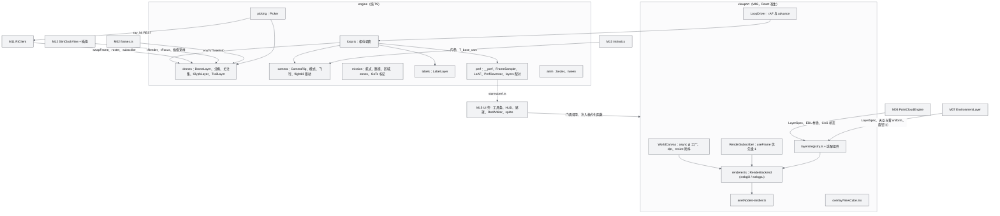
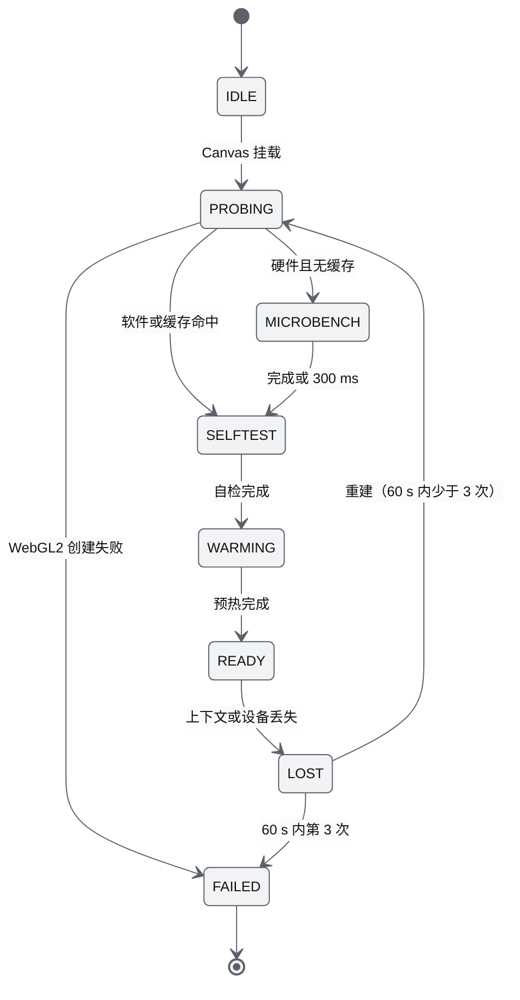
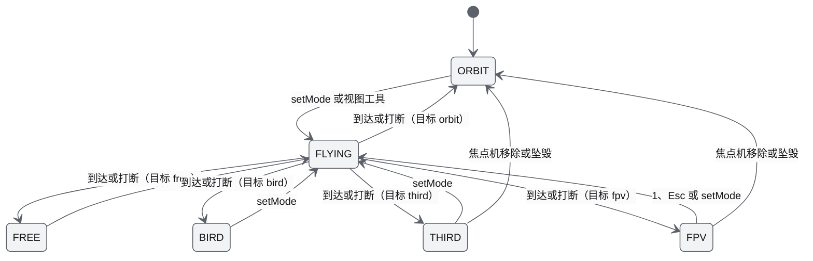
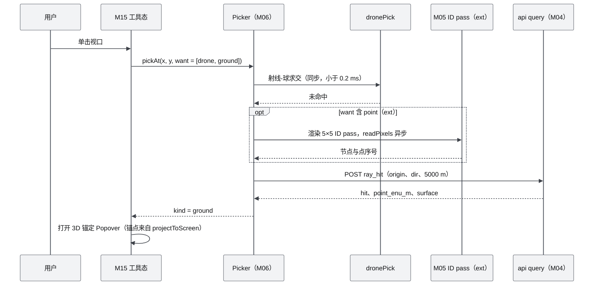
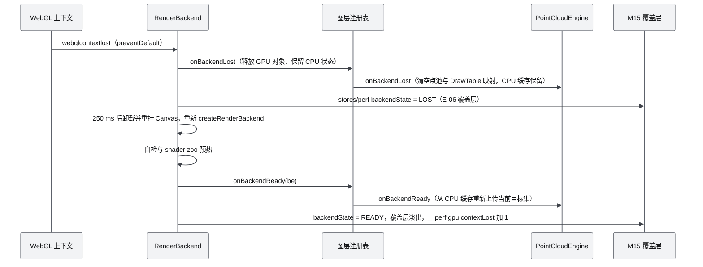
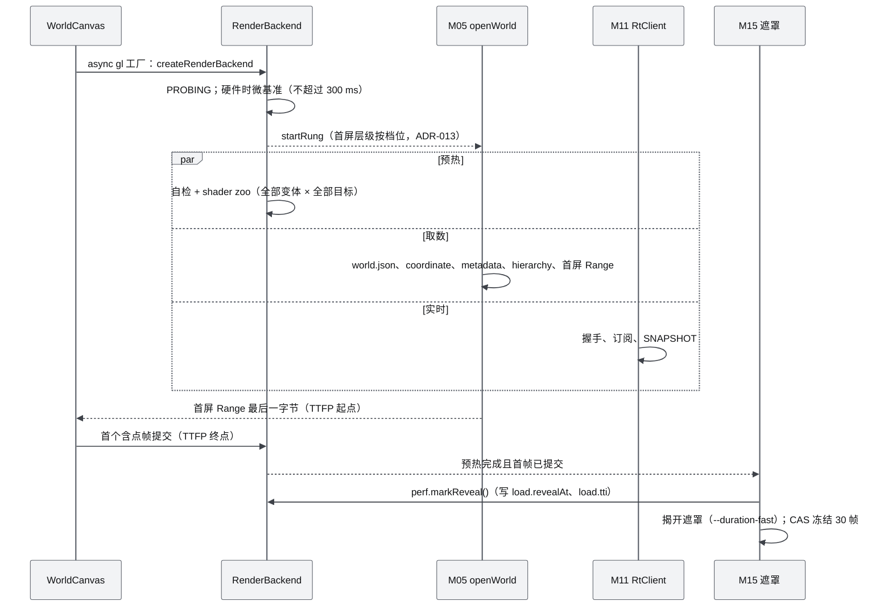
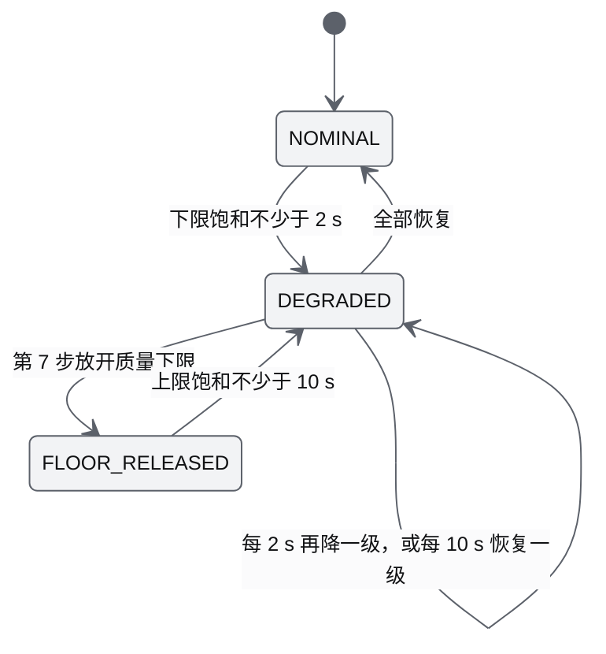

# M06 Web 视口与渲染后端 PRD

| 项 | 内容 |
|---|---|
| 文档编号 | AWR-M06 |
| 标题 | Web 视口与渲染后端 PRD |
| 版本 | v1.0 |
| 日期 | 2026-09-28 |
| 状态 | 草案（首版提交，待交叉评审） |
| 上游文档 | [AWR-03 设计基线](../03-设计基线与决策记录.md)（ADR-002、ADR-007、ADR-008、ADR-010、ADR-011、ADR-012、ADR-029、ADR-032、ADR-033、ADR-037、ADR-041、ADR-044、ADR-046、ADR-047、ADR-050；§3.5、§3.6、§3.8、§4.1–§4.3、§5.1–§5.3、§5.8、§6.3、§8.2–§8.7、Q6、Q9）；[01-design](../01-design.md) §4.1、§9–§13、§16、§34、§37–§40；研究笔记 [g01](../research/g01-gap.md)（权威）、[r14](../research/r14-r3f-drei.md)、[r11](../research/r11-threejs-webgpu.md)、[r15](../research/r15-cesium-deckgl-foxglove.md)、[r12](../research/r12-potree-core-loader.md)、[n05](../research/n05-discover-web-stack.md)、[g02](../research/g02-gap.md) §6.4、§7.2、[00-index](../research/00-index.md) §3.6、§5.3、C1、C4、C5；并行说明书 [10](../10-系统架构说明书.md) §6–§7、[11](../11-技术选型说明书.md) §4.4–§4.5、[14](../14-UI交互设计PRD.md) §3.4、§6.1–§6.7、§6.15、[15](../15-视觉设计规范与色卡.md) §3.7、§8.7、§10、[17](../17-接口与实时协议规范.md) §4.3.2、§4.3.11、§5.1、§6.5–§6.10、[18](../18-性能与测试方案.md) §2、§4.7、§5、§6.3、§7.3、§8.6、§9、§11；研究笔记 [r16](../research/r16-web-weather-fx.md) §0、[x01](../research/x01-urbanscene3d-data.md) §3.3；相邻模块接口 [M02](M02-LiDAR融合与地理配准PRD.md) §7、[M05](M05-Web点云引擎PRD.md) §7、[M11](M11-实时网关PRD.md) §7、[M12](M12-时间轴录制与回放PRD.md) §7.1、[M13](M13-传感器仿真PRD.md) §7.4 |
| 下游文档 | [10-系统架构说明书](../10-系统架构说明书.md)（§6.2、§6.3、§7 以本文为准）；[14-UI交互设计PRD](../14-UI交互设计PRD.md)（相机模式与参数、拾取行为）；[18-性能与测试方案](../18-性能与测试方案.md)（M06-AC 调度与阈值归档）；[M05](M05-Web点云引擎PRD.md)（RenderBackend、pass 计划、`loop.register`、渲染比例接口）；[M07](M07-环境引擎PRD.md)（图层注册、雾与天空 uniform 约定）；[M12](M12-时间轴录制与回放PRD.md)（SimClockView 与插值接口需求）；[M13](M13-传感器仿真PRD.md)（视锥与 FPV 内参）；[M15](M15-前端UI壳与设计体系组件PRD.md)（相机工具条、HUD、遮罩、RedArbiter、图标 sprite）；[M16](M16-演示数据剧本与流畅性测试PRD.md)（flight60、layers、ladder、latency、warmup 等用例调度） |
| 适用版本范围 | V0.1（D1）至 V1.0 |

## 0. 摘要

1. M06 是浏览器里"看世界"的宿主：选择并管理 RenderBackend（Tier A 为 WebGPURenderer；Tier B/S 为经典 WebGLRenderer + AnetNodesHandler；全部图层一套 TSL），承载 R3F 9.8.1 宿主与自研 `engine/loop.ts` 帧序，负责场景结构、无人机与状态符号、轨迹、任务叠加、视锥、禁飞区、相机、拾取、标签、ViewCube、`window.__perf` 探针与 PerfGovernor。
2. D1 主路径是 Tier S（本机性能验收）与 Tier B（硬件默认）；二者共享同一代码路径，只在画布 DPR、内部渲染比例、EDL 与图层上限上不同。Tier A、`/bench` 自检页与偏好记忆为 D1-ext（P1）。
3. 启动即创建渲染器并做 shader zoo 预热，与取数、WS 连接三路并行；揭开遮罩后 `renderer.info.programs` 不得再增加（D1-AC-25）；每帧 `renderer.info.render.calls` 必须等于 pass 计划（`info.autoReset = false`）。
4. 无人机按屏幕半径（CSS px）分三档（< 4 px 标记点、4–48 px 低模、> 48 px P600），带 15% 迟滞，Tier S 上限低模 32、P600 2；状态环、告警环、航点等屏幕符号统一由 GlyphLayer 一次绘制；轨迹用非实例化的屏幕空间四边形线段环形缓冲（`engine/lines/quadLines.ts`，ADR-067），3 次 draw 画完全部轨迹。
5. 相机用 `camera-controls` 3.1.2 在 `camera` 相位命令式驱动（不用 drei 组件，保证相机先于点云选择），5 个模式 Orbit、Free、Third、FPV、Bird 加"跟随锁定"修饰；相机飞行时长 `clamp(0.4 + 0.15·ln(1 + d/20), 0.4, 1.2)` s，可打断，曲线取自 token。
6. 拾取三层：无人机 CPU 包围球（悬停 ≤ 20 Hz，1000 架 ≤ 0.2 ms）、地面与建筑经 M04 `ray_hit`（≤ 5 Hz）、点云 ID pass（M05，D1-ext）；一律异步，不产生长任务。
7. 画布 drawing buffer 只随窗口尺寸变化：Tier S 固定 DPR 0.5；Tier B/A 的档位渲染比例与运动降载作用在固定尺寸 `cloudRT` 的子视口（`cloudRT.viewport`，不调用 `renderer.setViewport`）上，零 RT 重分配。
8. PerfGovernor 按 ADR-041 顺序降可选图层，全部到底后才放开点云质量下限；所有降级进 HUD 与合并 Toast。对基线的反馈 16 条（§14，其中第 3、5、6、7、10、11、14 条已在下游文档部分或全部落实），均未擅改决策。

---

## 1. 背景与目标

### 1.1 定位

M06 位于 Web Runtime 层（AWR-03 §3.2），拥有 `apps/web/src/viewport/**`（`layers/pointcloud.tsx` 归 M05、`layers/environment.tsx` 归 M07）、`engine/{index.ts, loop.ts, drones, camera, mission, labels, picking, perf, anim}/**` 与 `stores/perf.ts`（AWR-03 §4.3）。它定义前端的两条"缝"：`RenderBackend` 与 `loop.register(phase, id, fn)`，M05、M07、M11、M12、M15 在这两条缝上注册（AWR-03 §6.2 规则 1）。

M06 **不负责**：点云选择、CAS、点池与点材质（M05）；环境场求值与天气视觉（M07）；插值环与 SimClockView（M12）；传感器内参与视锥几何（M13）；UI 面板、HUD 图表、相机工具条、遮罩与 Toast 呈现（M15）；WS 连接与解码（M11）。

### 1.2 决定本模块形态的研究事实

| # | 事实 | 对设计的影响 | 依据 |
|---|---|---|---|
| F1 | WebGPU 下点恒为 1 px；WebGPURenderer 的 WebGL2 后端把 `gl_PointSize = 1.0` 写死；GLSL 材质不能在 WebGPURenderer 上运行 | 软件与硬件默认档走经典 WebGLRenderer；Tier A 只能用 quad 点径 | g01 §0 第 3 条、§2；r11 §0 第 3 条 |
| F2 | 软件档固定帧开销（1 对象、1000 点、960×540 墙钟）：经典 2.9–3.1 ms（GLSL 2.9、handler 3.1），WebGPURenderer（WebGL2 后端，默认 HalfFloat 输出）34.1 ms，SwiftShader WebGPU 42.5 ms（direct 17.2 ms） | fallback adapter 一律判为 Tier S 并改走经典路径 | g01 §0 第 6 条、§4.1 |
| F3 | 经典渲染器 + AnetNodesHandler 能运行全部需要的 TSL 功能，16 项应一致的功能三后端数值完全相同；stock handler 有 RT 重复 sRGB 编码与忽略 `scene.fogNode` 两个缺陷 | TSL 单源；AnetNodesHandler 修复两处；handler 7 条使用约束写入编码规范 | g01 §0 第 1、4、5 条、§6.2 |
| F4 | 经典路径 `compileAsync` 在 SwiftShader 上消除不了首帧编译（之后首帧仍需 230–470 ms）；冷首帧 0.93–1.35 s（Tier S 全图层） | 预热改为"启动即并行、渲染到真实目标"的 shader zoo | g01 §4.3、§4.4；ADR-007 |
| F5 | R3F 声明式 LOD 增删每 tick 2–154 ms；500 架遥测走 React commit 每次 6.5–8.4 ms；命令式与原生 three 无可测差异 | R3F 只做宿主，热路径全部命令式 | r14 §0 第 1–2 条、§5.3 |
| F6 | R3F 9.8.1 `core/loop.ts` 在没有 priority 订阅者时自动 `gl.render`；`frameloop="never"` 时 `advance(timestamp)` 以秒计算 delta | 引擎 render 相位注册为唯一 priority 1 订阅者；`advance()` 传秒 | R3F 9.8.1 `packages/fiber/src/core/loop.ts` L60–L80、L163；n05 §0 第 12–13 条 |
| F7 | drei 的 GizmoHelper、Line、Text、Grid、Sky 在 WebGPURenderer 下崩溃或失效；`gl` 同步工厂下 drei `Html` 不挂载 | ViewCube、LabelLayer、TSL 地面网格与天空、`Line2NodeMaterial` 替代；一律 async 工厂 | g01 §5 |
| F8 | 无属性 `vertexIndex` 扁平四边形三后端一致；SwiftShader 上实例化绘制每实例约 50–100 µs，扁平四边形同数量下快 15–25 倍 | 标记点、状态符号、降水统一用扁平四边形批次；低模 InstancedMesh 的实例上限必须实测（§11 K13） | g01 §3；r16 §0 第 2 条、§3.10 |
| F9 | 10 km 范围 ENU 用 float32 误差 0.69 mm；float32 直存 ECEF 误差 0.30 m | GPU 只放相对 WorldRoot 的 ENU float32；半径 > 10 km 告警 | r15 §0 第 2 条；AWR-03 §5.1 第 4 条 |
| F10 | 本机 headless 管线呈现间隔中位数钉在 33.3 ms，与点数无关；0.5 渲染比例不让帧更快，但让全屏 pass 成本降到约 1/3 | Tier S 目标 30 fps；Tier S 画布 DPR 固定 0.5 | g02 §6.4 第 1、5 条 |
| F11 | R3F `rootStore.subscribe` 在 dpr 或尺寸变化时调用 `gl.setPixelRatio` 与 `gl.setSize`，重分配 drawing buffer | 不使用 AdaptiveDpr；运动降载改作用于内部 RT 渲染比例 | R3F 9.8.1 `core/store.ts` L316–L324；AWR-11 反馈 F-05 |

### 1.3 对原设计的继承、修正与增强

| 01-design 章节 | 原设计 | 本文处置 | 理由与依据 |
|---|---|---|---|
| §4.1 浏览器职责 | Rendering、Interaction、Visualization、Mission Editing | 沿用；再加一条"React 不是渲染核心"：React 管结构与交互，引擎管每帧热路径 | r14 §7 第 10 条 |
| §9 技术选型 | React + Three.js + WebGPURenderer + WGSL | **修正**：Three.js 为唯一引擎；RenderBackend 三档，经典 WebGLRenderer 是硬件默认与 CI 主路径；着色器语言为 TSL 而非手写 WGSL | ADR-007、ADR-044；g01 §0 |
| §10 URL 直达 | `/world/hefei-01` 直接进入三维空间 | 沿用：`/world/:id`，冷启动可交互 ≤ 4.0 s（暂定） | D1-AC-02、D1-AC-32 |
| §12 WebGPU 定位 | Point Rendering、Particle、Large Drone Swarm Rendering 列为 WebGPU 强项 | **修正**：WebGPU 点图元只有 1 px；其红利在 compute（V0.3 起 Tier A 专属）；软件档 WebGPU 反而慢一个数量级 | g01 §4.1；r11 §7 第 2 条 |
| §16 Three.js 场景结构 | Scene 下 World、Environment、Drone、Sensor、Mission、Debug 六层 | **增强**：WorldRoot 根节点 `rotation.x = −π/2`，其内全部为 ENU；图层改为"注册表 + pass 计划 + 帧序"；新增 GlyphLayer、TrailLayer、LabelLayer（DOM）、ViewCube（DOM）、拾取 pass；SensorLayer 的 Camera FOV 为 D1、LiDAR FOV 为 V0.2、Radar FOV 为 V1.0；DebugLayer 为 V0.2 | ADR-002；AWR-03 附录 C §16 |
| §34 前端栈 | Renderer：WebGPURenderer；Fallback：WebGL2 | **修正**："WebGPURenderer 的 WebGL2 回退"不能跑 GLSL 且点为 1 px，不是可用的回退；回退与默认都是经典 WebGLRenderer | r14 §6；g01 §1.1 |
| §37 刷新频率 | Web Rendering 60 FPS | **部分取代**：Tier S 固定 30 fps（T* = 33.3 ms）；iGPU/dGPU 按刷新率 | ADR-044；g02 §6.4 |
| §38 UI | 左右两栏数字沙盘 | 沿用，改为浮层式：画布固定全屏，未遮挡区中心由 `camera.setViewOffset` 表达 | ADR-028；AWR-14 §3.4 |
| §40 Drone Interaction | Follow、FPV、Thermal、LiDAR、Trajectory、Camera FOV、Wind Force、Velocity、Mission；Third Person、FPV、Bird Eye、Free Camera | Follow（Third）、FPV、Trajectory、Camera FOV、Mission、4+1 个相机模式为 D1-core；Thermal 为 S3 检测结果叠加（D1-ext，M13 数据）；LiDAR 视图与 Wind Force、Velocity 叠加随 DebugLayer 在 V0.2 | AWR-03 §8.2 交互表 |

### 1.4 目标

| 编号 | 目标 | 可度量表述 | 版本 |
|---|---|---|---|
| G-M06-1 | 同一套代码在软件与硬件浏览器上都流畅 | Tier S 固定层配对增量合计 ≤ 10 ms（D1-AC-03b 暂定）；硬件默认 Tier B 与 Tier S 功能矩阵逐项等于 g01 §3 预期值 | V0.1 |
| G-M06-2 | 揭开遮罩后零运行期编译、零画布重分配 | `programs` 不增加（D1-AC-25）；Ctrl+B 与 Dock 拖动期间 drawing buffer 与 `rtAllocs` 不变（D1-AC-24） | V0.1 |
| G-M06-3 | 机群可视化随规模退化而不卡顿 | 200 架满足 D1-AC-09a；1000 架满足 D1-AC-09b（P1） | V0.1 |
| G-M06-4 | 焦点机低延迟、可测 | Follow/FPV 焦点机 t_sim 到像素 p95 ≤ 150 ms（D1-AC-26 暂定） | V0.1 |
| G-M06-5 | 后端可替换、R3F 可升级 | 引擎零 React 依赖；迁移 R3F v10 只替换 `loop.ts` 与宿主 | V0.3 评估 |

### 1.5 模块内设计原则

1. **单一出图者**：只有 RenderBackend 调用 `renderer.render`；R3F 不自动渲染；任何第三方组件不得持有 priority ≥ 1 的 `useFrame`。
2. **形状编码优先于颜色**：机体、符号、线只用 Graphite 灰阶加一处 r500；状态靠形状、线型、图标（AWR-15 §10.1）。
3. **所有颜色、时长以 uniform 或 token 进入着色器**：改色、换档、选中、告警不触发重编译。
4. **上限先于算法**：每个图层先声明按档位的硬上限与 PerfGovernor 旋钮，再谈画质。
5. **可测即实现的一部分**：每个相位、图层、pass 都在 `window.__perf` 中有对应字段。

---

## 2. 范围

### 2.1 分层范围（与 AWR-03 §6.3 M06 行一致）

| 层 | 内容 |
|---|---|
| **D1-core（P0）** | RenderBackend Tier S/B；设备能力档判定与 300 ms 微基准；AnetNodesHandler；GLPointsNodeMaterial（经 `be.createPointsMaterial()` 工厂交给 M05）与点径自检；shader zoo 预热；设备丢失处理；异步 `readPixels`；R3F 宿主与 `loop.ts`（唯一出图订阅者）；图层注册表与 pass 计划；WorldRoot 场景结构；无人机三档与图层上限；GlyphLayer；轨迹；任务叠加（航点、路径、区域、编队槽位、覆盖揭示、GoTo 目标）；传感器视锥；禁飞区叠加；TSL 地面网格与天空渐变；相机模式（Orbit、Free、Third、FPV、Bird、跟随锁定）与相机飞行；无人机悬停与点击拾取（CPU 包围球，≤ 20 Hz）；地面拾取（M04 `ray_hit`）；LabelLayer（Tier S ≤ 16，其余 ≤ 48）；DOM ViewCube；关注集管理；`window.__perf` 探针、FrameSampler、LoAF 归因、PerfGovernor、`stores/perf.ts`；flight60 相机驱动与 layers 配对驱动；测试开关 |
| **D1-ext（P1）** | Tier A（WebGPURenderer、quad 点径、`compileAsync` 预热、行序翻转）；`/bench` 自检页与报告回传；偏好记忆（起步档与后端）；运动降载（Tier B/A 内部渲染比例）；前端 1000 架阶梯；点云 ID pass 拾取的调度（ID 材质与回读解码归 M05） |
| **D1 桩** | 实体种类 `kind ≠ uav` 的渲染器接口（未知 kind 以通用标记点呈现）；DebugLayer 容器 |
| **后续版本** | V0.2：FPV 画中画（drei `View`）、DebugLayer 与 FrameTree（坐标轴、速度、力、风矢量）、LiDAR FOV、zones 编辑叠加、空闲降频；V0.3：R3F v10 与 `@pmndrs/scheduler` 迁移评估、Tier A 是否改为默认（按 AWR-18 §2.4 晋级判据）；V0.8：3D Tiles 网格与地形底座图层、3DGS 图层接入、可选 Cesium 地球视图；V1.0：异构实体渲染、Radar FOV |
| **不做** | 移动端与触控优化（Q6）；WebXR；Unreal/Unity 前端；浏览器侧物理 |

### 2.2 版本演进

| 版本 | M06 交付 |
|---|---|
| V0.1（D1） | 上表 core 与 ext |
| V0.2 | FPV 画中画（单上下文 scissor，点预算为主视图 30%，隔帧渲染，r14 §3.11）；DebugLayer；LiDAR FOV；空闲降频（暂停且相机静止时 ≤ 4 fps，CAS 冻结） |
| V0.3 | R3F v10 评估（React peer 约束，ADR-037）；Tier A 晋级判据评估；Tier A 点池 storage buffer 的 RenderBackend 能力位（`caps.storageInVertex`） |
| V0.8 | TilesLayer（3DTilesRendererJS）、GaussianLayer 接入图层注册表与点云共享预算；地球视图为独立路由 |
| V1.0 | `kind` 分组渲染器（UGV、车辆、人等）；Radar FOV |

### 2.3 与相邻模块的边界

| 相邻模块 | M06 提供 | M06 使用 | 边界规则 |
|---|---|---|---|
| M05 点云 | RenderBackendView（`pointSizeMode`、`createPointsMaterial`、`textures`、`readPixels`、`startRung`、`lowestAllowedRung`）、`ctx.cloudScale`、pass 计划、`loop.register`、图层注册表、相机飞行目的地提示、刷新周期估计 `refreshMs()` | PointCloudLayer 图层规格、EDL 合成材质（`bindTargets`、`setBackgroundNode`）、CAS（`state()`、`setFloorOverride()`、`setTarget()`）、DTM 采样（相机离地钳制） | Tier B/A 点云只在 `CH_CLOUD` 通道（Tier S 为 `CH_MAIN`）；M06 不读点池内部；点云像素量由 M05 以点云 pass 光栅像素计算 |
| M07 环境 | 图层注册、pass 位置、`scene.fogNode` 挂接点 | 天空与雾色 uniform（地平线色）、EnvLighting（太阳方向、云阴影）、环境档位旋钮 | 雾节点只设置一次，档位用 uniform；天空几何归 M06，天空颜色函数归 M07（§14 第 9 条） |
| M11 实时网关 | 订阅需求（关注集、选中机、传感器位姿） | `RtClient.subscribe`、`swapFrame()`、`roster` 视图、会话世界 id | 引用计数由 RtClient 负责；关注集变更 ≤ 每 250 ms 一次 |
| M12 时间 | telemetry 任务在取得 `swapFrame()` 的槽后调用 `time.ingest(frame)` | `ClockView`（`simNowS()`、`tRenderS()`、`tFocusS()`、`rate`、`state4`、`dGlobalMs`、`focusLowLatency`）、`Interp`（`sampleSwarm`、`sampleOne`、`setFocus`；Hermite + slerp、外推 3/f、HOLD 标志）、`onEpoch`、`onReset` | 渲染时刻唯一；M06 不自行插值 |
| M13 传感器 | — | `engine/sensors/intrinsics.ts`（`projectionFor`、`T_base_cam`、`frustumCorners`、`hasCamera`） | M06 不写传感器数学；FPV 画幅框由 M15 按 `frameRect` 绘制 |
| M02 地理 | — | `engine/geo/frames.ts`（`enuToThreeInto`、`threeToEnuInto`、`R_THREE_ENU`） | M06 不写帧换算公式 |
| M10 任务 | — | `stores/mission.ts`、`uav/{id}/path` | 只读 |
| M04 几何 | — | `POST /api/world/{id}/query {op: "ray_hit"}` | 地面求交只在服务端 |
| M15 UI | 相机、拾取、投影、标签、性能摘要、揭开遮罩打点（`perf.markReveal()`）的门面方法；`stores/perf.ts`；`/bench` 页内容规格（§8.1） | RedArbiter 纯函数 `lib/redArbiter.ts` 的结果、标签格式化函数、图标 sprite（`<IconSprite>`）、生成 token `lib/tokens/{scene,motion,input}.gen.ts`、motion tier、未遮挡区矩形、各类覆盖层与 `/bench` 页 JSX | `viewport/**` 不 import `ui/**`；UI 经门面与 props 注入；engine 只从 `lib/**` 读取 token 与纯函数（AWR-03 §4.2 第 2 条） |

---

## 3. 用户与用例

### 3.1 角色

| 角色 | 与 M06 的关系 |
|---|---|
| 研究人员 / 演示者（viewer、operator） | 观察城市点云与机群，切换相机，选择与跟随无人机，点选 GoTo |
| 性能与 CI 工程师 | 运行 flight60、layers、ladder、warmup、latency 用例，读取 `window.__perf` |
| 前端模块开发者（M05、M07、M15） | 通过 `loop.register`、图层注册表、RenderBackend 接入 |
| 远程 GPU 用户 | 打开 `/bench` 回传真 GPU 数据（ext） |

### 3.2 用例

| 编号 | 用例 | 主流程 | 相关验收 |
|---|---|---|---|
| UC-01 | 冷启动进入 `/world/shenzhen` | 创建后端 → 预热 ∥ 取数 ∥ WS → 首个含点帧 → 揭开遮罩 | D1-AC-02、D1-AC-25 |
| UC-02 | 观察 S1 双机扫描 | Orbit 环绕、滚轮推拉到光标、ViewCube 对齐北向 | D1-AC-03b |
| UC-03 | 跟随与 FPV | 选中机 → 键 3（Third）或 4（FPV）→ 焦点低延迟徽标 | D1-AC-25、D1-AC-26 |
| UC-04 | 点选 GoTo | G → 悬停预览（ray_hit ≤ 5 Hz）→ 单击 → 确认 → 目标标记随调用状态变化 | D1-AC-32 |
| UC-05 | 1000 架阶梯 | 远景全部为标记点，近处低模与 P600 按上限，关注集 30 Hz | D1-AC-09a/b、D1-AC-27 |
| UC-06 | 帧超预算自动降级 | PerfGovernor 依次减轨迹、视锥、标签、低模、环境、动效，HUD 显示步骤 | PRD-FR-011；AWR-18 §4.7 |
| UC-07 | 窗口与布局变化 | Ctrl+B、拖动 Dock：画布不 resize，只改 view offset | D1-AC-24 |
| UC-08 | 设备丢失 | `webglcontextlost` → 覆盖层提示 → 重建后端 → 从 CPU 缓存重新上传 | E-06 |
| UC-09 | 性能用例 | `?bench=flight60`、`?bench=layers&fixedB=25000`、`?tier=A&allowFallback=1` | D1-AC-03a/b、D1-AC-14 |
| UC-10 | 远程 GPU 自检（ext） | 用户打开 `/bench`，跑 flight60 并 POST 报告 | AWR-18 §11.5 |

### 3.3 本模块新增术语（其余见 AWR-03 §11）

| 术语 | 定义 |
|---|---|
| WorldRoot | three 场景中唯一 `rotation.x = −π/2` 的 Group，其子节点坐标全部为 World ENU |
| 图层规格 LayerSpec | 图层向注册表声明的 id、所有者、通道、相位、上限、预热变体、旋钮与 `drawCount()` |
| pass 计划 PassPlan | 本帧 pass 序列与预期 draw 数，渲染后与 `renderer.info.render.calls` 核对 |
| cloudRT | Tier B/A 点云离屏目标（颜色 + DepthTexture），按画布全尺寸分配，渲染比例用子视口实现 |
| GlyphLayer | 屏幕朝向符号（选中环、告警环、航点、目标、编队槽位）的单次绘制批次 |
| 桶 bucket | 无人机的可视档：marker、lowpoly、hero（P600） |
| 可视半径 R_vis | 机型 hero 模型包围盒对角线的一半，用于屏幕半径计算；缺失时 0.6 m |
| 未遮挡区 | 视口矩形减去浮层的区域（AWR-14 §3.4），其中心为投影中心 |

---

## 4. 功能需求

优先级与 D1 列按 AWR-03 §10.2 第 4 条：D1-core 为 P0、V0.1、是；D1-ext 为 P1、V0.1、是。

### 4.1 RenderBackend 与设备能力档

| 编号 | 需求描述 | 优先级 | 目标版本 | D1 | 验收要点 | 依据 |
|---|---|---|---|---|---|---|
| M06-FR-001 | `createRenderBackend(canvas, opts)` 按 AWR-03 §3.5 流程一次性决定渲染后端档；运行中不切换；结果写 `__perf.meta.{tier, deviceClass, renderer, adapterArch}` | P0 | V0.1 | 是 | M06-AC-001 | ADR-007、ADR-044；g01 §6.1 |
| M06-FR-002 | Tier S/B 使用 `new WebGLRenderer({antialias: false, powerPreference: "high-performance", reversedDepthBuffer: true, stencil: false})`，挂 `AnetNodesHandler`，设 `renderer.reversedDepthBuffer = capabilities.reversedDepthBuffer`；`toneMapping = NoToneMapping`（Canvas `flat`） | P0 | V0.1 | 是 | M06-AC-002 | g01 §2、§5、§6.1 |
| M06-FR-003 | 设备能力档：`software` 按 UNMASKED_RENDERER 或 `adapter.info` 正则；`iGPU` 按集成显卡家族启发式或微基准慢于阈值；其余 `dGPU`。起步档：software 0，iGPU 3，dGPU 4，dGPU 微基准余量充足 +1（上限 5）；删除"核数 ≥ 8 时 +1" | P0 | V0.1 | 是 | M06-AC-003 | ADR-044；g02 §7.2 |
| M06-FR-004 | 300 ms 启动微基准只在硬件浏览器运行：100 万点 glpoint 2 px 画到 960×540 离屏 RT，有 `EXT_disjoint_timer_query_webgl2` 时取 GPU 时间，否则取同步墙钟；Tier S 不运行 | P0 | V0.1 | 是 | M06-AC-003 | ADR-044 |
| M06-FR-005 | 点材质工厂与点径自检：`GLPointsNodeMaterial`（继承 `PointsNodeMaterial`，`onBeforeCompile` 删除模板末尾 `gl_PointSize = 1.0;`，`customProgramCacheKey` 加后缀 `\|glps`）位于 `viewport/glPointsNodeMaterial.ts`，经 `be.createPointsMaterial()` 交给 M05；启动时用它把 1 个 4 px 点画到 8×8 RT 并异步回读，点亮像素 < 4 时 `pointSizeMode` 降为 `pixel`，输出 M06-E004 并在 HUD 标注 | P0 | V0.1 | 是 | M06-AC-004 | g01 §6.3 |
| M06-FR-006 | AnetNodesHandler 自检：均匀 0.5 线性灰画到 RGBA8 RT，回读值应为 128 ± 2（线性，不做 sRGB 编码）；不符时输出 M06-E005（告警，不阻断） | P0 | V0.1 | 是 | M06-AC-004 | g01 §0 第 4 条 |
| M06-FR-007 | §6.3 编码规范 11 条（g01 §0 第 5 条的 handler 7 条约束，加 handler 源码自述的"实例化几何不能共享"、`internalFormat`、共享路径禁用项与无属性几何 4 条）在 dev/test 构建中以断言或 lint 强制：InstancedMesh 共享材质即抛 M06-E008；实例化对象共享几何即抛 M06-E008；int/uint uniform 即抛 M06-E009；设置 `texture.internalFormat` 即抛；lint 禁止写 `material.onBeforeRender` 与读取 `info.render.frame`；热路径禁用逐对象 `onObjectUpdate`；`onRenderUpdate` 回调必须幂等 | P0 | V0.1 | 是 | M06-AC-005 | g01 §0 第 5 条、§2、§4.5；three `examples/jsm/tsl/WebGLNodesHandler.js` L31–L38 |
| M06-FR-008 | `readPixels` 一律异步：WebGL2 用 `readRenderTargetPixelsAsync`（PBO + fence，只支持 RGBA8），WebGPU 用原生异步回读并翻转为自下而上行序；同步 `readRenderTargetPixels` 与 `gl.readPixels` 在 `engine/**`、`viewport/**` 中被 lint 禁止（微基准的 1 px 同步除外，且只在遮罩揭开前） | P0 | V0.1 | 是 | M06-AC-006 | ADR-007；three r186 `WebGLRenderer.js` L3236 |
| M06-FR-009 | shader zoo 预热：应用启动即创建渲染器，与 world.json、hierarchy、WS 并行；预热集覆盖全部已注册图层的全部档位变体 × 实际使用的全部目标（默认帧缓冲与每个 RT）；`KHR_parallel_shader_compile` 可用时先 `compileAsync` 再逐目标真实渲染一次；遮罩等待预热完成。SwiftShader（Tier S 软件档）另有两条（ADR-071 第 1 条，`viewport/backend/attribSlots.ts`）：①每个绘制之前以光栅化丢弃画一个 16 属性的复位点（两个顶点数组交替），使该绘制未用的顶点输入槽总是同一组格式；②每个目标再渲染一遍，其中每个绘制都作为一次新提交的第一个绘制（1 像素 blit 加 flush），使 ANGLE 中途提交时出现的第二种顶点例程变体也在遮罩下编译。预热集的完整性（ADR-071 第 2 条）：图层注册静止（120 ms 内无新注册，至多 1.5 s）后再收集，依赖无人机运行时的图层（轨迹三批、符号、视锥、任务叠加）因此也在预热集内；`compileAsync` 之后重新使各条目可绘制（等待期间 loop 的逐帧任务会把它们隐藏）；渲染完成后等一个宏任务再渲染一遍，重新上传 three `WebGLNodesHandler` 在构建节点材质后的微任务里丢弃的几何缓冲与顶点数组；预热之后才注册的图层在下一帧 world 相位内（本帧自身渲染之前）预热两次 | P0 | V0.1 | 是 | M06-AC-007、M06-AC-008 | ADR-007；g01 §4.3 |
| M06-FR-010 | 设备丢失：`webglcontextlost`（`preventDefault`）与 WebGPU `device.lost` 统一触发"整页重建渲染器"：卸载 Canvas → 各图层释放 GPU 资源但保留 CPU 状态 → 重新创建后端 → 预热 → 从 CPU 缓存重新上传（不重新下载）；60 s 内失败 3 次转致命错误 E-01 | P0 | V0.1 | 是 | M06-AC-009 | AWR-03 §3.5；AWR-10 §6.6；AWR-14 §7.6 E-06 |
| M06-FR-011 | 测试开关 `?tier=A\|B\|S`、`?rb=webgpu&allowFallback=1` 只在 dev/test 构建生效（生产构建由编译期常量剔除）；生效开关写 `__perf.forced`，强制档位不参与性能判定 | P0 | V0.1 | 是 | M06-AC-010 | ADR-044；AWR-18 §9.5 |
| M06-FR-012 | Tier A：偏好为 webgpu（`?rb=webgpu` 或设置页）或测试开关 `?tier=A`，且 adapter 非空、非 fallback（`?tier=A` 与 `allowFallback=1` 允许 fallback adapter，AWR-03 §3.5 流程图）时 `new WebGPURenderer({antialias: false, reversedDepthBuffer: true, trackTimestamp: true})`，保持默认 HalfFloat 输出；`await init()` 后 backend 不是 WebGPUBackend 则 `dispose()` 并改走经典路径（不用其 WebGL2 回退）；点径 `quad`；预热用 `compileAsync` 按实际目标格式建 pipeline | P1 | V0.1 | 是 | M06-AC-011 | ADR-007、ADR-044；g01 §6.1 |
| M06-FR-013 | 偏好记忆：首次会话中 CAS 在最低允许档下限饱和累计 > 30 s，把"起步档 − 1"（Tier A 时改为 Tier B）写入 `localStorage["awr.render.v1"]`，下次启动生效；设置页可清除；设备能力档与微基准结果按渲染器字符串与浏览器主版本缓存 30 天 | P1 | V0.1 | 是 | M06-AC-012 | AWR-03 §3.5 |
| M06-FR-014 | `/bench` 自检页（内容规格见 §8.1，JSX 由 M15 实现）：在用户 GPU 浏览器上依次跑 flight60 `scene=pc` 与 `scene=full`（深圳；运行世界不是深圳时 `scene=full` 用 `source=fake` 并在报告中标注），按 AWR-18 §11.2 生成 `awr.perf.report.v1`（`gate = "bench"`、`kind = "bench"`、`run_id = b<YYYYMMDD>-<HHMMSS>-<4hex>`，`env` 含 `device_class`、`backend_tier`、`renderer`、`adapter_info`），经用户确认后 POST 到 `/api/sys/perf-report`（≤ 4 MiB，每 principal 每分钟 1 次） | P1 | V0.1 | 是 | M06-AC-013 | ADR-044；AWR-18 §11.2、§11.5；AWR-17 §4.3.11 |
| M06-FR-015 | `wgpu-gl`（WebGPURenderer + forceWebGL + direct 输出）只作为功能矩阵的 CI 回归变体，不进入生产档位 | P2 | V0.1 | 是 | feat-matrix 附加列 | g01 §6.1 |

### 4.2 R3F 宿主与帧循环

| 编号 | 需求描述 | 优先级 | 目标版本 | D1 | 验收要点 | 依据 |
|---|---|---|---|---|---|---|
| M06-FR-016 | `WorldCanvas`：`<Canvas flat frameloop="never" dpr={dpr} gl={asyncFactory} resize={{scroll: false, debounce: {scroll: 50, resize: 120}}} eventSource={viewportContainer} eventPrefix="client">`；三档一律 async 工厂；`dpr` 首次挂载取 0.5，后端就绪后若为 Tier B/A 在遮罩揭开前改为 §6.5 的值（仅此一次），此后不再变化 | P0 | V0.1 | 是 | M06-AC-014 | ADR-008；g01 §5、§6.4 |
| M06-FR-017 | `engine/loop.ts`：rAF 中依次执行 telemetry、clock、drones、camera、world 相位，调用 R3F `advance(nowMs / 1000, true)`（秒；其中唯一 priority 1 订阅者执行 render 相位），再执行 overlay、governor 相位；`register(phase, id, fn, {order, fps, tiers, layer})` 返回注销函数（`layer` 为 AWR-18 §9.2 的 `PerfLayerId`）；`fps` 任务量化到帧边界；telemetry 任务在 `swapFrame()` 取得新槽后调用 M12 `time.ingest(frame)`（M12 §6） | P0 | V0.1 | 是 | M06-AC-015 | AWR-03 §3.6；AWR-10 AD-06；n05 §0 第 12 条 |
| M06-FR-018 | 出图唯一：`renderer.info.autoReset = false`（three r186 默认 true，每次 `render()` 清零，`WebGLRenderer.js` L1744），每帧 render 相位开始 `info.reset()`；主 pass 与本帧计划内的拾取 pass 完成后断言 `info.render.calls === plan.draws`；layers 配对驱动的离屏渲染在断言之后执行、不计入；不等时 dev 构建抛 M06-E007，生产构建计入 `__perf.gpu.glErrors`；断言只在 `READY` 状态执行（预热不计） | P0 | V0.1 | 是 | M06-AC-016 | AWR-03 §3.6 规则 2 |
| M06-FR-019 | 热路径零分配：`engine/**` 与相位回调中禁止 `new`、数组与对象字面量、闭包创建、`Array.prototype.map/filter`；预分配 TypedArray 与对象池；dev 构建以采样器检查每 1000 帧堆增量 | P0 | V0.1 | 是 | M06-AC-017 | AWR-03 §3.6 规则 1 |
| M06-FR-020 | drei 使用白名单（ADR-008）为上限而非清单：D1 实际只允许 `View`（V0.2）与 `Html`（≤ 3，D1 不用）；`CameraControls`、`AdaptiveDpr`、`PerformanceMonitor` 不使用（原因见 §6.6、§14）；oxlint `no-restricted-imports` 列出其余 drei 导出 | P0 | V0.1 | 是 | M06-AC-018 | ADR-008；g01 §5；AWR-11 F-05 |
| M06-FR-021 | 点云、地形与 WorldRoot 祖先节点禁止挂 R3F 指针事件；运行时在 dev 构建中遍历 `internal.interaction`，发现这些对象即抛错 | P0 | V0.1 | 是 | M06-AC-018 | r14 §0 第 8 条 |
| M06-FR-022 | 帧率上限与挂起：`viewport.setFrameCap(fps)`（M15 调用：模态打开期间 15 fps，覆盖页可见面积 ≥ 90% 时 5 fps，`0` 解除；AWR-14 §8.3；M15-FR-007）；`viewport.setSuspended(true)`（窗口 < 1280×720 或页面隐藏）；两者期间 `ctx.frozen = true`，CAS 与 PerfGovernor 不评估 | P0 | V0.1 | 是 | M06-AC-019 | ADR-012 冻结条件 |
| M06-FR-023 | 视口独立 ErrorBoundary：视口异常不卸载 UI 壳；异常时发 `backend.state = FAILED`（附诊断码），由 M15 以 shadcn `Empty` + `Button` 呈现错误覆盖层（AWR-14 §7.6 E-14），"重建视口"调用门面 `viewport.rebuild()`（等同设备丢失的重建流程，不重新下载） | P0 | V0.1 | 是 | M06-AC-009 | AWR-14 §7.6 E-14 |

### 4.3 场景结构、图层与 pass

| 编号 | 需求描述 | 优先级 | 目标版本 | D1 | 验收要点 | 依据 |
|---|---|---|---|---|---|---|
| M06-FR-024 | 场景结构按 §6.7：WorldRoot（`rotation.x = −π/2`）下挂 WorldLayer、EnvironmentLayer、DroneLayer、SensorLayer、MissionLayer、TrailLayer、GlyphLayer、DebugLayer；天空在 Tier S 为场景根下的全屏网格 SkyQuad（远平面、逐顶点着色、在不透明物体之后绘制，ADR-064），在 Tier B/A 由 P2 合成四边形的背景 Fn 着色（SkyQuad 不可见）；LabelLayer 与 ViewCube 为 DOM（`?chrome=0` 不挂载 ViewCube） | P0 | V0.1 | 是 | M06-AC-020 | ADR-002；01-design §16 |
| M06-FR-025 | 图层注册表 `viewport/layers/registry.ts`：每个图层以 LayerSpec 登记；适配组件 ≤ 150 行；M05 注册 pointcloud，M07 注册 environment，其余由 M06 注册 | P0 | V0.1 | 是 | M06-AC-020 | AWR-03 §4.3 |
| M06-FR-026 | pass 计划：Tier S 单 pass 上屏；Tier B/A 为 P1 点云→cloudRT、P2 EDL 合成四边形（写颜色与深度）、P3 其余图层（`autoClear = false`）、ext 的 P4/P5 体积云；按需的拾取 pass；共享路径禁止 RenderPipeline、`pass()`、MRT、storage texture、compute | P0 | V0.1 | 是 | M06-AC-016、M06-AC-021 | ADR-007；g01 §6.5 |
| M06-FR-027 | 地面网格：TSL 程序化网格，平面高度 `coordinate.ground.zM − 0.5 m`，细线 10 m、粗线 100 m，`fwidth` 抗锯齿，按距离淡出，深度测试开、不写深度，两种线色在顶点阶段做输出变换；天空：天顶 g950 到地平线色的解析渐变（有环境时为 M07 的 `sky()`），地平线色取 M07 uniform；Tier S 为 32 × 18 格的全屏网格，天空颜色与输出变换逐顶点计算，放在远平面、深度测试开、渲染顺序在不透明物体之后，只填充未被覆盖的像素（ADR-064） | P0 | V0.1 | 是 | M06-AC-022 | AWR-15 §10.11；g01 §5 |
| M06-FR-028 | 坐标：所有 ENU 与 three 之间的换算只经 `engine/geo/frames.ts`（`enuToThreeInto`、`threeToEnuInto`、`R_THREE_ENU`，M02 §7）；GPU 只放相对 WorldRoot 的 ENU float32；世界水平半径 > 10 km 时输出 M06-E016 | P0 | V0.1 | 是 | M06-AC-023 | ADR-002；AWR-03 §5.1 第 4、5、8 条 |
| M06-FR-029 | DebugLayer 容器（默认隐藏）；dev 构建提供拾取射线与相机视锥调试；FrameTree、速度、力、风矢量在 V0.2 | P2 | V0.2 | 桩 | 容器存在且默认不参与 pass | AWR-03 附录 C §16 |

### 4.4 无人机渲染

| 编号 | 需求描述 | 优先级 | 目标版本 | D1 | 验收要点 | 依据 |
|---|---|---|---|---|---|---|
| M06-FR-030 | 数据路径：telemetry 相位调用 `RtClient.swapFrame()`，取得新槽时调用 M12 `time.ingest(frame)`；drones 相位以 `interp.sampleSwarm(tRenderS, soa)` 取样全部机体、以 `interp.sampleOne(agentNo, tFocusS, pose)` 取样焦点机到预分配结构；`RtClient.roster` 负责 `agent_no → id → 机型`；路由世界不等于会话世界时不订阅仿真通道（静态浏览，AWR-10 AD-01） | P0 | V0.1 | 是 | M06-AC-024 | ADR-046；AWR-10 AD-01、AD-06；M12 §7.1 |
| M06-FR-031 | 三档分桶：屏幕半径以 CSS px 计，`r_px = R_vis · cssH / (2·d·tan(fovY/2))`（与标记点直径、热区、关注集阈值同一口径，各档一致，AWR-15 §10.1 第 4 条）；< 4 px 标记点、4–48 px 低模、> 48 px P600；15% 迟滞；重分桶 ≤ 10 Hz；超出档上限者降为下一档，保留顺序为红色实体 > 选中 > critical > warning > r_px | P0 | V0.1 | 是 | M06-AC-025 | AWR-03 §3.8、§8.5；r14 §3.6 |
| M06-FR-032 | 上限：Tier S 低模 ≤ 32（≤ 150 三角形，`lowpoly_s`）、P600 ≤ 2；Tier B/A 低模 ≤ 300（≤ 300 三角形）、P600 ≤ 6；PerfGovernor 第 ④ 步把低模上限 32 → 16 → 8 | P0 | V0.1 | 是 | M06-AC-025 | AWR-03 §3.8；ADR-041 |
| M06-FR-033 | 标记点：无属性扁平四边形 1 次 draw（`drawRange = 6·n`），直径 6 px + 1 px `--drone-halo` 光晕（SDF 圆），填 `--drone-marker`，过期为 `--drone-stale`；位置与样式码来自每帧更新的 RGBA32F `DroneStateTex`（宽 1024） | P0 | V0.1 | 是 | M06-AC-026 | AWR-15 §10.4；g01 §3 |
| M06-FR-034 | 低模：每档一个 InstancedMesh、独立材质；顶点色区分机身、后臂、前臂、桨盘（前臂最亮表达机头）；光照与点云同一 EnvLighting 公式；`instanceMatrix` 只更新 `[0, count)` 区间 | P0 | V0.1 | 是 | M06-AC-026 | AWR-15 §10.4；r11 §3.8 |
| M06-FR-035 | P600：依次尝试 `GET /models/p600.glb`（随前端构建复制的副本）与 `GET /vehicles/p600/model/p600.glb`（AWR-17 §5.1；D1 不带 `?v=`，走 no-cache + ETag），取第一个能解析的源，加载 ≤ 5000 三角形的 hero 模型（glb 晚于 shader zoo 到达时只替换几何，沿用已预热的材质：three r186 以节点 id 作 node 程序缓存键，新建材质会在揭开后编译第二个 hero 程序；验收加固 FX-WEB1），低模取同目录 `p600_lowpoly.glb` 的 `lowpoly`（≤ 300）与 `lowpoly_s`（≤ 150，第二个 mesh）；按 `model.yaml` 的 `gltf_from_flu` 逆矩阵一次性烘焙回 FLU；归一为 `{position, normal}` 属性；单材质 g300 哑光；缺失时回退低模并输出 M06-E011；红色实体额外绘制反向外壳轮廓（BackSide、沿法线外扩约 2 px 等效，r500） | P0 | V0.1 | 是 | M06-AC-026 | AWR-16 §11.5；AWR-15 §10.4；ADR-022 |
| M06-FR-036 | GlyphLayer：选中环、告警环（八边形 critical、三角形 warning）、过期虚线环、航点、目标、编队槽位统一为 1 次 draw 的 SDF 扁平四边形；Tier S ≤ 256、其余 ≤ 1024；超上限按"红色实体 > 其余 critical > warning > 选中 > 航点 > 过期"截断，dev 构建输出 `VIS_GLYPH_CAP`；不做深度测试（始终可见） | P0 | V0.1 | 是 | M06-AC-027 | AWR-15 §10.4、§10.6 |
| M06-FR-037 | 一处红：消费视口 RedArbiter 的 owner（`owner = {kind, id}`），owner 的标记、环、轨迹、标签描边统一改 r500；full 档 owner 以 1 Hz 呼吸（uniform），lite 与 reduced 静态；颜色经 uniform 切换，不重编译 | P0 | V0.1 | 是 | M06-AC-028 | ADR-032；AWR-15 §3.7 |
| M06-FR-038 | 关注集：每 250 ms 重算，K ≤ 32，屏幕半径 ≥ 8 px 进入、< 6 px 退出、至少停留 1 s；以增量 subscribe/unsubscribe 维护 `uav/{id}/state@30`；选中机与 FPV 焦点机 `@60`；开启视锥的机体订阅 `uav/{id}/sensor/{name}/pose@10` | P0 | V0.1 | 是 | M06-AC-029 | ADR-046；AWR-03 §8.5；AWR-17 §6.6、§6.13 第 4 条 |
| M06-FR-039 | HOLD 与过期：M12 报告外推耗尽（HOLD）或数据年龄超限的机体，标记改 `--drone-stale`，GlyphLayer 画虚线环，标签显示"信号延迟"与时长 | P0 | V0.1 | 是 | M06-AC-030 | ADR-046；AWR-15 §10.4 |
| M06-FR-040 | 机体增删：收到 roster 或生命周期事件后下一帧即出现或消失（端到端 ≤ 1 s 由 D1-AC-32 约束）；移除时回收桶位、轨迹槽、关注集订阅 | P0 | V0.1 | 是 | M06-AC-031 | D1-AC-32 |
| M06-FR-041 | 前端 1000 架：1000 架时插值、分桶、标记点纹理上传与关注集维护的主线程时长满足 M06-NFR-002 的 1000 架列 | P1 | V0.1 | 是 | M06-AC-032 | D1-AC-09b |

### 4.5 轨迹、任务叠加、视锥与禁飞区

| 编号 | 需求描述 | 优先级 | 目标版本 | D1 | 验收要点 | 依据 |
|---|---|---|---|---|---|---|
| M06-FR-042 | 轨迹：CPU 端为全部在场机体维护 256 样本的历史环（仿真时间每 0.5 s 或位移 ≥ 5 m 追加）；GPU 端 3 个屏幕空间宽线批次（每段一个显式四边形、不用实例化，`engine/lines/quadLines.ts`，ADR-067；关注集 1 px g400、选中 2 px g50、选中光晕 4 px `--drone-halo` 60%；三批各持有独立几何，不共享，§6.3 规则 11；绘制范围止于最后一个占用槽，空段在顶点阶段折叠）；Tier S ≤ 16 架 × 256 段，Tier B/A ≤ 64 × 1024；年龄透明度 0.8 → 0.15 由顶点时间属性与 uniform `uNow = tRender − t0` 在着色器中计算，不逐帧重建几何 | P0 | V0.1 | 是 | M06-AC-033 | AWR-03 §3.8；r14 §3.7；r15 §3.10；AWR-15 §10.5 |
| M06-FR-043 | 轨迹清空：全局 epoch 变化清空全部历史；`rflags.RESET` 只清空该生产者机体；时间属性以 ≤ 2 h 的块起点为基准，跨块时重新上传可见轨迹 | P0 | V0.1 | 是 | M06-AC-033 | AWR-03 §5.2 第 3–4 条 |
| M06-FR-044 | 任务叠加：计划航点（空心圆）、已到达航点（实心）、当前目标（实心 + 环）、计划路径（1.5 px 虚线 g300）、已执行路径（1 px 实线 g500）、任务与覆盖区域（地面贴片轮廓 + 5% 填充）、覆盖揭示（10% 填充）、编队槽位（菱形）；数据取 `stores/mission.ts` 与 `uav/{id}/path` | P0 | V0.1 | 是 | M06-AC-034 | AWR-15 §10.6；AWR-03 §6.3 M06 |
| M06-FR-045 | GoTo 目标标记：预览态（`cmd.goto` 符号 + 到地面的铅垂线）、accepted 描边、running 实心前景色、succeeded 后保持 `input.resultHoldMs`（1500 ms）再以 `--duration-quick` 渐隐、failed/rejected 红描边 + 三角告警符号并保留到下一次操作（红色仍服从 RedArbiter）；读数 "E · N · 高度"（m，1 位小数）以高优先级标签显示 | P0 | V0.1 | 是 | M06-AC-034 | AWR-14 §6.7 |
| M06-FR-046 | 传感器视锥：角点取 M13 `frustumCorners(sensor, L, out)`（原点 + 远平面 4 角，机体帧），乘以与机体相同的 tRender 位姿（FPV 焦点机为 tFocus）；长度 `L = min(range_m, 60 m)`；边线 8 段 1 px g300 70%、远平面 g50 5%；SensorPose48 超过 3/f 未更新时边线改虚线，`FOV_VALID = 0` 时不画远平面；在 world 相位 `m13.gimbal` 之后计算；Tier S 只画选中机，Tier B/A ≤ 16；PerfGovernor 第 ② 步先只留选中机再关闭（边线 `--duration-quick` 淡出） | P0 | V0.1 | 是 | M06-AC-035 | AWR-15 §10.7；AWR-03 §3.8；M13 §7.4、§8.1 |
| M06-FR-047 | 禁飞区：读 `semantic/zones.geojson`（ENU 米）；`nofly` 实线、`restricted` 虚线；侧壁 g300 8%、顶部轮廓 1.5 px、竖边 1 px 50%；`min_z_m = null` 时下沿取 DTM 最低值，`max_z_m = null` 时取世界顶 + 50 m；`border` 默认不画；违例告警胜出红色仲裁时该区改 r500 轮廓 + 侧壁 r500 10%（uniform `uHeroZone`）；Tier B/A 侧壁加 45° 斜线纹理 | P0 | V0.1 | 是 | M06-AC-036 | AWR-16 §7；AWR-15 §10.12 |
| M06-FR-048 | Thermal 检测结果叠加（S3 Mock 检测器的疑似目标，十字准星 + 环） | P1 | V0.1 | 是 | S3 用例截图断言由 M16 调度 | AWR-03 §8.2；AWR-15 §10.6 |

### 4.6 相机

| 编号 | 需求描述 | 优先级 | 目标版本 | D1 | 验收要点 | 依据 |
|---|---|---|---|---|---|---|
| M06-FR-049 | CameraRig：`camera-controls` 3.1.2 以命令式方式在 `camera` 相位 `controls.update(dtS)`（秒）更新（不经 drei 组件）；控制器工作在 three 帧（Y 上），CameraRig 对外一律以 ENU 表示位姿，调用控制器前经 `frames.ts` 换算；模式 `orbit`、`free`、`third`、`fpv`、`bird` 与修饰 `followLock`；快捷键 1–5 与 L 由 M15 绑定、经门面调用；进入 third/fpv 与开启 followLock 时调用 M12 `interp.setFocus(agentNo)`（ADR-046 的焦点例外同样覆盖跟随锁定；FX2-R3，ADR-067：此前锁定不调用），退出、解锁（含用户平移解除）与焦点丢失时 `setFocus(−1)` | P0 | V0.1 | 是 | M06-AC-037 | AWR-03 §8.5；AWR-14 §6.4；r14 §3.10；M12 §7.1 |
| M06-FR-050 | 相机飞行：`T = clamp(0.4 + 0.15·ln(1 + d/20), 0.4, 1.2)` s，d 取眼点与目标点位移的较大者（m）；曲线 `--ease-smooth-out` 由 `engine/anim/bezier.ts` 采样；每帧 `lerpLookAt(A, B, e(t), false)`；任何用户输入立即取消；reduced 档硬切；开始时向 M05 发目的地预取提示 | P0 | V0.1 | 是 | M06-AC-038 | ADR-029；AWR-14 §6.5；r15 §3.5 |
| M06-FR-051 | 未遮挡区投影：`setUnobscuredRect(rect, transition)` 以 `camera.setViewOffset(W, H, W/2 − cx, H/2 − cy, W, H)` 实现，过渡时长取 `--panel-open-dur` 400 ms、`--panel-close-dur` 350 ms、分隔条松开 `--duration-fast` 250 ms；不改变 drawing buffer；FPV 模式不应用 | P0 | V0.1 | 是 | M06-AC-039 | ADR-028；AWR-14 §3.4 |
| M06-FR-052 | Third（追尾）：目标锁定焦点机；参考系为水平速度方向（< 0.5 m/s 时改用机体航向），航向变化以 `controls.rotate(Δψ, 0, false)` 叠加，用户拖动产生的方位与俯仰偏移保持；默认偏移在速度参考系中为 (−15, 0, 6) m（x 沿水平速度、z 向上，即后方 15 m、上方 6 m，距离约 16.2 m）；距离 5–200 m；使用 tFocus（D_focus） | P0 | V0.1 | 是 | M06-AC-040 | r15 §3.15；r14 §3.10；ADR-046 |
| M06-FR-053 | FPV：`controls.enabled = false` 且 camera 相位不调用 `controls.update()`；相机 `matrixAutoUpdate = false`，世界矩阵 = WorldRoot × 焦点机 tFocus 位姿 × `T_base_cam`（M13，列主序）并同步 `matrixWorldInverse`；`projectionMatrix` 取 `projectionFor(sensor, aspect, 0.2, 20000, out)`（含主点）并同步 `projectionMatrixInverse`；进入守卫为 M13 `hasCamera(agentNo)`，不满足时返回 `no_camera_sensor`；退出到 orbit 时以当前相机位姿 `setLookAt(…, false)` 同步控制器，目标设为焦点机位置、后上方 60 m（AWR-14 §6.4） | P0 | V0.1 | 是 | M06-AC-040 | AWR-03 §5.1 第 7 条；ADR-046；M13 §7.4 |
| M06-FR-054 | Bird：北朝上正俯视（`min/maxPolarAngle = 0`，`min/maxAzimuthAngle = 0`），左拖平移、滚轮缩放 50–5000 m，不能旋转；默认高度目标上方 400 m | P0 | V0.1 | 是 | M06-AC-037 | AWR-14 §6.4 |
| M06-FR-055 | Free：W/A/S/D 平移、Q/E 升降、左拖转视角、Shift ×4、滚轮调速 ×1.25 每档（0.25–8）；基础速度 `clamp(0.5·AGL_cam, 5, 200)` m/s | P0 | V0.1 | 是 | M06-AC-037 | AWR-14 §6.4 |
| M06-FR-056 | 相机约束：Orbit `maxPolarAngle = 0.49π`；FPV 以外的模式眼点 ENU 高度 ≥ `dtm(x, y) + 2 m`（M05 `dtm.sample`，缺失时返回 `coordinate.ground.zM`；FPV 跟随机体，起降时可低于 2 m，不钳制）；near 0.5 m（FPV 0.2 m）、far 20 km、fovY 60°（本文设定；flight60 期间改用其 `<world>.json` 的 `near_m`、`far_m`、`fov_y_deg`，即 1 m、20 km、60°，与 Node 选择器差分同一相机） | P0 | V0.1 | 是 | M06-AC-037 | r14 §3.10；AWR-18 §8.6 |
| M06-FR-057 | 视图工具：聚焦 F（`fitToBox`，单机 60 m 半径球，padding 0.1，目标在未遮挡区中心）、正北 N、Home、双击地面移目标；DOM ViewCube 26 个区域（6 面、12 边、8 角）点击以相机飞行对齐 | P0 | V0.1 | 是 | M06-AC-041 | AWR-14 §6.5；g01 §5 |
| M06-FR-058 | 位姿读写：`getPose()`、`setPose(pose, {fly})` 供 M15 按世界记忆相机（Third、FPV 不恢复）与 URL 同步（≤ 1 Hz） | P1 | V0.1 | 是 | M06-AC-041 | AWR-14 §6.4 补充规则 4 |
| M06-FR-059 | flight60 驱动：`?bench=flight60` 时在 `camera` 相位按墙钟取样 `/bench/flight60/<world>.bin`（f32 小端，3601 × 6：eye xyz、target xyz，ENU，60 Hz），`t = now − t_start`、`k = floor(t·60)`，第 k 与 k + 1 行线性插值（M05 纯函数 `sampleFlight60`），禁用控制器输入；启动前校验 `<world>.json` 的 `coordinate_sha256` 与世界 `coordinate.json` 一致、`bin_sha256` 与 `.bin` 一致，不符时拒绝运行（M06-E012 / PERF-E009）；每帧写 `__perf.frame.t` 与 `bench.flightT`，t ≥ 60 s 置 `__perf.bench.done = true` | P0 | V0.1 | 是 | M06-AC-042 | AWR-18 §8.6；M05-FR-055 |
| M06-FR-060 | FPV 画中画（drei `View`，单上下文 scissor，点预算 30%，隔帧） | P1 | V0.2 | 否 | V0.2 验收 | r14 §3.11；PRD-FR-018 |

### 4.7 拾取与投影

| 编号 | 需求描述 | 优先级 | 目标版本 | D1 | 验收要点 | 依据 |
|---|---|---|---|---|---|---|
| M06-FR-061 | 无人机拾取：屏幕射线换到 ENU 后对全部可见机体做射线-球求交，球半径 `max(R_vis, 6 px 等效世界尺寸)`（热区 ≥ 12 px）；悬停 ≤ 20 Hz 且相机运动期间关闭；点击即时；1000 架单次 ≤ 0.2 ms | P0 | V0.1 | 是 | M06-AC-043 | AWR-03 §6.3 M06；AWR-14 §6.6 |
| M06-FR-062 | 地面与建筑拾取：`POST /api/world/{id}/query {op: "ray_hit", origin_enu_m, dir, max_range_m: 5000}`；预览与坐标读数 ≤ 5 Hz、新请求取消旧请求（AbortController）；点击立即发送；失败或超时（1 s）隐藏预览并输出 M06-E015 | P0 | V0.1 | 是 | M06-AC-044 | AWR-10 AD-04；AWR-17 §4.3.2 |
| M06-FR-063 | 拾取编排：`pickAt(x, y, opts)` 返回 Promise，顺序为无人机 → 点云（M05 ID pass，ext）→ 地面；工具态决定是否需要地面命中；全部异步，不产生 > 50 ms 长任务 | P0 | V0.1 | 是 | M06-AC-045 | ADR-007；D1-AC-06 |
| M06-FR-064 | 点云点拾取（PRD-FR-017）：M06 分配 5×5 光栅像素 `pickRT`（RGBA8，与 M05-FR-047 一致），在点击后的下一帧 render 相位以 scissor 渲染 ID pass（计入该帧 pass 计划）并异步 `readPixels`；拾取子表准备、解码与节点回查归 M05。拾取相机的投影 = 5×5 窗口矩阵 × 帧相机投影（手写），其 `reversedDepth` 标志必须与渲染器的反向深度一致，否则 three r186 在首次使用时按 fov/aspect 重建投影，页面的第一次拾取落到别处的点（验收加固 FX-WEB1，`tests/m06/pickPass.test.ts`、`perf/m05/pick.spec.ts`） | P1 | V0.1 | 是 | M06-AC-045 | AWR-03 §6.3 M05 |
| M06-FR-065 | 屏幕投影：`projectToScreen(enu, out)` 与 `anchor(id)` 提供每帧更新的 CSS 坐标，供 M15 的 3D 锚定 `Popover`（VirtualElement）使用；相机运动时发 `camera.moved` 事件 | P0 | V0.1 | 是 | M06-AC-046 | AWR-14 §4.3 |

### 4.8 标签与 DOM 叠加

| 编号 | 需求描述 | 优先级 | 目标版本 | D1 | 验收要点 | 依据 |
|---|---|---|---|---|---|---|
| M06-FR-066 | LabelLayer：单个 DOM 覆盖层、预分配元素池（S 16、B/A 48）；网格去重叠（单元 96×28 CSS px）；优先级为选中 > 红色实体 > critical > warning > 悬停 > GoTo 读数 > 距离；每帧只写 `transform`（位移 ≥ 0.5 px 才写）；文本 Tier S ≤ 4 Hz、其余 ≤ 10 Hz 合批写入；不做场景 raycast 遮挡 | P0 | V0.1 | 是 | M06-AC-047 | AWR-03 §3.8；ADR-029；r14 §3.8 |
| M06-FR-067 | 标签内容：名称经 `lib/sanitize.ts` 净化（roster 变化时一次）；FlightState 短文案由 M15 注入的格式化函数生成；图标用 `<use href="#awr-icon-<key>">` 引用 M15 渲染的 SVG sprite；PerfGovernor 第 ③ 步 16 → 8 → 4 | P0 | V0.1 | 是 | M06-AC-047 | ADR-030；AWR-03 §10.2 第 1 条 |
| M06-FR-068 | ViewCube：DOM 实现（72×72 CSS px），正交投影（ADR-072）：相机旋转的逆在 JS 中作用于六个面，每面写一个 2D `matrix()` 并只显示朝向观察者的面（面是独立合成层，朝向变化时在 overlay 相位写一次，只改 transform 与可见性）；面文字"东/西/北/南/上/下"，北面 g50 粗体；不用红；每个区域有 `aria-label` 并可键盘聚焦 | P0 | V0.1 | 是 | M06-AC-041 | AWR-15 §10.11；g01 §5；ADR-072 |

### 4.9 渲染比例与 DPR

| 编号 | 需求描述 | 优先级 | 目标版本 | D1 | 验收要点 | 依据 |
|---|---|---|---|---|---|---|
| M06-FR-069 | Tier S 画布 DPR 固定 0.5（drawing buffer = 0.5 × CSS），0、1 两档都锁定；Tier B/A 画布 DPR = `min(devicePixelRatio, dprCap)`，启动时决定、运行中不变（iGPU `dprCap = 1.5`，dGPU `2`） | P0 | V0.1 | 是 | M06-AC-048 | ADR-011；r11 §3.1 |
| M06-FR-070 | Tier B/A 档位渲染比例（M05 阶梯 `rung.rs`）作用于 cloudRT 子视口：cloudRT 按画布全尺寸分配一次；P1 前写 `cloudRT.viewport.set(0, 0, round(dbW·s), round(dbH·s))`（RT 像素）再 `setRenderTarget(cloudRT)`，不调用 `renderer.setViewport`（它改写默认帧缓冲视口且按 CSS px × pixelRatio 解释，three r186 `WebGLRenderer.js` L810–L823、L3058–L3064）；P2 合成四边形以 `uvScale = s` 采样；换档零 RT 重分配 | P0 | V0.1 | 是 | M06-AC-048 | ADR-011、ADR-029；AWR-11 F-05 |
| M06-FR-071 | 窗口 resize：过渡期间画布只做 CSS 拉伸（`width/height: 100%`），R3F 以 120 ms 防抖调用 `setSize`；随后 `resizeRTs()` 一次，`__perf.gpu.rtAllocs` 只在此时增加 | P0 | V0.1 | 是 | M06-AC-049 | ADR-029；D1-AC-24 |
| M06-FR-072 | 运动降载（Tier B/A）：相机角速度 > 0.5 rad/s 或线速度 > 0.5·视距/s 时内部比例 × 0.75，静止 200 ms 后恢复；Tier S 不叠加 | P1 | V0.1 | 是 | M06-AC-048 | ADR-012；r14 §3.4 |

### 4.10 性能探针与调节

| 编号 | 需求描述 | 优先级 | 目标版本 | D1 | 验收要点 | 依据 |
|---|---|---|---|---|---|---|
| M06-FR-073 | `window.__perf` 按 AWR-18 §9.2 实现（schema `awr.perf.v1`）：启动时预分配全部环形缓冲（容量 65536）；governor 相位就地更新；`snapshot()` 是唯一分配对象的方法；`inject()` 只在测试构建存在；字段写者按 §6.18 所有权表；`load.revealAt` 与 `load.tti` 由 M15 BootController 揭开遮罩时调用门面 `perf.markReveal()` 写入（M15 §14 第 6 条） | P0 | V0.1 | 是 | M06-AC-050 | AWR-18 §9；n05 §3.6 |
| M06-FR-074 | FrameSampler 记录每个 rAF 的呈现间隔，并以"最快帧 EMA"估计刷新周期，经 `refreshMs()` 提供给 M05，估计变化 > 5% 时调用 `cas.setTarget(targetMs, tailK)`（硬件档，g02 §6）；loop 在各相位前后打点写 `layers.*.cpuMs`、`gpu.renderMs`，render 相位 > 50 ms 时 `gpu.renderOver50` 加 1；LoAF 观察者按 build manifest 的 chunk 分组（`engine`、`net`、`ui` 与入口）归因 loop 之外的我方脚本（loop 回调按 rAF 回调的开始时刻与最近 256 帧回调开始时刻匹配并记住其源位置识别，兼容 Chrome 151 的 `user-callback` + `FrameRequestCallback` 报法，ADR-071 第 6 条）；每帧我方逻辑（相位合计减 render 相位）> 50 ms 时 `loaf.oursOver50` 加 1 | P0 | V0.1 | 是 | M06-AC-051 | AWR-18 §6.3 第 3 条；M05 §6.8.5 |
| M06-FR-075 | PerfGovernor：1 Hz 评估；Tier S 在 CAS 于 B_floor 下限饱和 ≥ 2 s 时按 ①轨迹 ②视锥 ③标签 ④低模上限 ⑤环境档 ⑥motion 档 ⑦放开 B_floor 的顺序每步间隔 ≥ 2 s 降级；CAS 上限饱和或 B ≥ 0.9·hi 持续 ≥ 10 s 时逆序恢复一步，步间 ≥ 10 s；硬件档先由 CAS 外环降到最低允许档（§6.18）再按 ①–⑥ 降；通信档不参与 | P0 | V0.1 | 是 | M06-AC-052 | ADR-041 |
| M06-FR-076 | 旋钮注册：`governor.registerKnob({step, id, levels, apply, visible?})`；M07 注册 ⑤；motion 上限写 `stores/perf.ts` 的 `motionCap` 供 M15 `tier.ts` 取最小值；每次步骤变化写 `__perf.governor.history` 与合并 Toast 文案键；`visible(level)` 为假（该旋钮的内容此刻不在屏上，例如未选中时的轨迹与视锥、少于上限的标签与低模、`?chrome=0` 下的 motion）时照常降级与记录，但不发 `governor.step` 事件，不弹 Toast（ADR-064）；这样的不可见子步骤没有可等待的效果，在同一次评估中接着执行下一子步骤，直到执行了一个可见子步骤，ADR-041 的"每步间隔 ≥ 2 s"约束相邻的可见步骤（恢复同理），历史条目原因后缀 `:hidden`（ADR-067）；M07 的 ⑤ 在 Low 层没有可隐藏的内容（无降水、2D 云遮罩 < 0.01、无风箭头与流线）时报告不可见；⑥ motion 只在有受 motion 档影响的动画运行时可见：`document.getAnimations()` 中挂在文档时间线（`DocumentTimeline`）上、`playState` 为 running 的 CSS 动画、过渡与 WAAPI，滚动驱动动画（`ScrollTimeline`、`ViewTimeline`，例如 `.fade-scroll-y` 的边缘渐隐）不计（它们只要元素存在就一直报告 running，且不受 `html[data-motion]` 影响；计入时 Tier S 每次会话揭开后约 5 s 都弹一条 motion Toast，并使首轮串联停在 ⑥，ADR-076）；采样在空闲回调中约每秒一次（`viewport/animationSampler.ts`，ADR-071 第 5 条） | P0 | V0.1 | 是 | M06-AC-052 | ADR-029、ADR-041 |
| M06-FR-077 | `stores/perf.ts`：4 Hz（Tier S）/ 10 Hz（其余）摘要：帧节奏 p50/p95、档位与设备能力档、强制标记、B 与档位、`limitedBy`、`achievedErr`、加载进度、在途请求、降级步骤、超预算图层位图、焦点时延 p95、后端状态（预热、重建） | P0 | V0.1 | 是 | M06-AC-053 | AWR-10 §6.4；AWR-14 §3.7 |
| M06-FR-078 | 时延度量：`latency.tSimToPixelMs`（焦点机或选中机，上一帧位姿的样本仿真时刻到本帧 rAF 时刻折算为墙钟）、`cmdToVisibleMs`（`mark("cmd.sent")` 到判据首次在渲染位姿上成立）、`focusJumpM`（进出关注集时渲染位置与外推位置之差）、`holdFrames`、`extrapFrames`（焦点机或选中机处于外推的帧数）、`dGlobalMs` | P0 | V0.1 | 是 | M06-AC-054 | ADR-046；AWR-18 §7.3、§9.3 |
| M06-FR-079 | 图层 CPU 计时：各任务按注册时的 `layer`（AWR-18 §9.2 的 `PerfLayerId`）把 CPU 时长写入 `layers[<layer>].cpuMs`；未声明 `layer` 的 telemetry、clock、drones 插值与 world 相位任务计入 `mainJs`；draw 数与顶点数写 `draws`、`verts`；超过 AWR-03 §3.8 预算的帧计入 `overBudgetFrames` 并在 HUD 标出 | P0 | V0.1 | 是 | M06-AC-055 | AWR-03 §3.8；AWR-18 §5.1、§5.2 第 3 条 |
| M06-FR-080 | layers 配对驱动：`?bench=layers&fixedB=` 时每帧在帧自身渲染之前把"基底"与"基底 + 图层 X"各渲染 5 次到绘制缓冲（同尺寸、同格式、同一套程序；ADR-064 前为离屏 RT），每次 `finishForBench()`（测试构建，1 像素同步回读）计时取最小值，奇偶帧交换先后 | P0 | V0.1 | 是 | M06-AC-055 | AWR-18 §5.2；ADR-064 |

### 4.11 后续版本

| 编号 | 需求描述 | 优先级 | 目标版本 | D1 | 验收要点 | 依据 |
|---|---|---|---|---|---|---|
| M06-FR-081 | 空闲降频：暂停且相机静止、无上传与淡入时 ≤ 4 fps，任一输入或数据到达即恢复；期间 CAS 冻结 | P2 | V0.2 | 否 | V0.2 | r15 §3.16；r14 §3.2 |
| M06-FR-082 | R3F v10 与 `@pmndrs/scheduler` 迁移评估：`loop.ts` 相位与 scheduler phase 一一映射，渲染改用 `setRenderOverride` | P2 | V0.3 | 否 | 迁移后 feat-matrix 与 flight60 不回归 | ADR-008；r14 §2.2 |
| M06-FR-083 | TilesLayer（3D Tiles 网格与地形底座）与 GaussianLayer 接入注册表，与点云共享预算 | P1 | V0.8 | 否 | V0.8 退出标准 | AWR-03 §8.1 |
| M06-FR-084 | 实体种类渲染器：按 `kind` 选择渲染器；D1 只有 `uav`，未知 kind 以通用标记点呈现并在 dev 构建告警 | P2 | V1.0 | 桩 | D1：未知 kind 的夹具可渲染为标记点 | ADR-047 |

---

## 5. 非功能需求

"本机 S"指 AWR-03 §8.4 的本机 Tier S 环境；全部性能类条目执行 ADR-033 性能运行协议。

| 编号 | 类别 | 需求描述 | 优先级 | 目标版本 | D1 | 验收要点 | 依据 |
|---|---|---|---|---|---|---|---|
| M06-NFR-001 | 帧预算 | Tier S 配对增量：drones ≤ 2.5 ms、trails + frustums ≤ 1 ms、groundSky ≤ 1 ms、labels ≤ 2 ms；与 M05、M07、M15 的固定层合计 ≤ 10 ms（暂定，MS5 冻结） | P0 | V0.1 | 是 | M06-AC-055；D1-AC-03b | AWR-03 §3.8；AWR-18 §5.1 |
| M06-NFR-002 | 主线程 | M06 自身每帧 JS（telemetry 交换、drones、camera、标签布局与 DOM 写入、governor）中位数：200 架 ≤ 1.2 ms、1000 架 ≤ 2.5 ms（本文设定：与 M05 的选择、DrawTable、上传共享 `mainJs ≤ 4 ms`） | P0（200）/ P1（1000） | V0.1 | 是 | M06-AC-032 | AWR-03 §3.8；r14 §3.6 |
| M06-NFR-003 | 分配 | flight60 `scene=full` 期间 V8 GC 停顿 ≤ 帧时间总和的 1%；Node 基准中 drones 相位 1000 架 × 10000 帧堆增量 ≤ 256 KB | P1（GC）/ P0（基准） | V0.1 | 是 | M06-AC-017；D1-AC-30 | AWR-03 §3.6 规则 1 |
| M06-NFR-004 | 编译 | 揭开遮罩后 `gpu.programs` 不增加；首次切换预设、选中、Third、FPV、P600 出现、点击拾取后 1 s 内最大帧间隔 ≤ 150 ms | P0 | V0.1 | 是 | M06-AC-008；D1-AC-25 | ADR-007 |
| M06-NFR-005 | 启动 | Tier S：后端创建（不含预热）≤ 150 ms；预热 ≤ 1.5 s（load ≤ 6，本文设定，依据 g01 §4.4 冷首帧 0.93–1.35 s）；冷启动可交互 ≤ 4.0 s（暂定，P1）；硬件档微基准 ≤ 300 ms | P0（创建、预热）/ P1（冷启动） | V0.1 | 是 | M06-AC-007 | D1-AC-02 |
| M06-NFR-006 | 画布稳定 | Ctrl+B 10 次、Dock 分隔条拖动 5 次期间 drawing buffer 尺寸与 `rtAllocs` 不变；该时段 > 50 ms 帧占比不高于基线 + 1 个百分点 | P0 | V0.1 | 是 | M06-AC-049；D1-AC-24 | ADR-028、ADR-029 |
| M06-NFR-007 | 时延 | Follow/FPV 焦点机 t_sim 到像素 p95 ≤ 150 ms；命令到可见 p95 ≤ D_global + 150 ms；关注集切换位置不连续 ≤ 0.5 m；×10 实时 HOLD 占比 < 1%（均暂定，MS5 冻结） | P0 | V0.1 | 是 | M06-AC-054；D1-AC-26 | ADR-046 |
| M06-NFR-008 | 交互 | 点击到 3D 选中高亮 ≤ 2 帧；悬停拾取单次 ≤ 0.2 ms（1000 架）；`ray_hit` 本机回环 p95 ≤ 50 ms（本文设定） | P0 | V0.1 | 是 | M06-AC-043、M06-AC-044 | AWR-18 §6.2 |
| M06-NFR-009 | 长任务 | 遮罩揭开后我方脚本 > 50 ms 的 LoAF 为 0（含拾取、世界切换、相机飞行开始） | P0 | V0.1 | 是 | M06-AC-051；D1-AC-06 | AWR-18 §6.2 |
| M06-NFR-010 | 可靠性 | 设备丢失后 ≤ 3 s 恢复出帧（Tier S，本文设定），`pc.downloadedBytes` 不变；60 s 内失败 3 次转 E-01 | P0 | V0.1 | 是 | M06-AC-009 | AWR-10 §6.6 |
| M06-NFR-011 | 资源 | M06 图层 GPU 内存 Tier S ≤ 8 MB、Tier B/A ≤ 64 MB（不含 cloudRT）；CPU 轨迹历史 1000 架 × 256 × 16 B = 4 MB 预分配 | P1 | V0.1 | 是 | `__perf` 与 `renderer.info.memory` | 本文设定 |
| M06-NFR-012 | 精度 | ENU 与 three 之间的换算与 M02 golden 对拍满足混合容差（位置 atol 1e-6 m）；GPU 相对坐标误差 ≤ 1 mm（半径 ≤ 10 km） | P0 | V0.1 | 是 | M06-AC-023 | AWR-03 §5.1 第 8 条；r15 §0 第 2 条 |
| M06-NFR-013 | 分离 | 画质档、图层降级、标签数量、相机状态对任何物理量、事件、录制零影响；M06 不向服务端发送任何影响仿真的数据（订阅变化除外） | P0 | V0.1 | 是 | 代码审查 + 契约测试 | P-03；AWR-03 §5.8 |
| M06-NFR-014 | 可测试性 | `engine/**` 的 M06 代码可在 Node 中用渲染器替身单测；`FakeSource` 驱动时无后端也能跑 `scene=full` | P0 | V0.1 | 是 | M06-AC-056 | ADR-050；D1-AC-35 |
| M06-NFR-015 | 兼容 | 桌面 Chrome/Edge 当前稳定版；缺少 `EXT_clip_control`（reversed-Z）、timer query、`KHR_parallel_shader_compile` 时功能不受影响，只降低精度或预热并行度 | P0 | V0.1 | 是 | M06-AC-001 | Q6 |
| M06-NFR-016 | 设计体系 | 视口内无 emoji 与禁用字形；颜色只来自场景 token；时长与缓动只来自生成的 token；无 `backdrop-filter` | P0 | V0.1 | 是 | D1-AC-20 | ADR-029 至 ADR-032 |
| M06-NFR-017 | 升级安全 | three、R3F、camera-controls 升级 PR 必须通过 feat-matrix（28 项 × 后端）、R3F 冒烟、warmup、flight60 `scene=pc` | P0 | V0.1 | 是 | M06-AC-002 | g01 §9；AWR-11 TECH-FR-010 |
| M06-NFR-018 | 包体 | M06 自有代码（viewport + engine 中 M06 目录）生产构建 ≤ 60 KB gz（本文设定；three、R3F 另计） | P2 | V0.1 | 是 | 构建报告 | n05 §0 第 5 条 |

---

## 6. 设计方案

### 6.1 组件图与文件落点



**文件落点**（在 AWR-03 §4.1 目录与 §4.3 所有权范围内细化）：

```text
apps/web/src/
├── viewport/                                  # M06（layers/pointcloud.tsx 归 M05，layers/environment.tsx 归 M07）
│   ├── WorldCanvas.tsx                        # R3F 宿主（≤ 150 行）
│   ├── LoopDriver.tsx  RenderSubscriber.tsx   # rAF 驱动与唯一优先级 1 订阅者
│   ├── renderer.ts                            # createRenderBackend、类型再导出
│   ├── backend/{webgl2.ts, webgpu.ts, deviceClass.ts, microbench.ts, selftest.ts, warmup.ts, passPlan.ts, testSwitches.ts, lost.ts}
│   ├── anetNodesHandler.ts  glPointsNodeMaterial.ts
│   ├── layers/{registry.ts, drones.tsx, trails.tsx, glyphs.tsx, mission.tsx, zones.tsx, sensors.tsx, groundSky.tsx, groundSky.materials.ts, debug.tsx}
│   ├── overlay/{ViewCube.tsx, LabelHost.tsx}
│   ├── bindings/{selection.ts, layersVisibility.ts, prefs.ts, redOwner.ts}   # store → 门面的单向胶水
│   └── facade.ts                              # 供 ui/** 使用的视口门面（相机、拾取、投影、帧率上限、重建、揭开遮罩打点、/bench 运行）
├── engine/
│   ├── index.ts  loop.ts                      # M06：门面再导出、相位调度、FrameCtx 与 RenderBackendView 类型
│   ├── drones/{DroneLayer.ts, buckets.ts, focusSet.ts, markers.ts, lowpoly.ts, hero.ts, glyph/GlyphLayer.ts, trails/TrailRing.ts, trails/TrailBatch.ts, vehicleModels.ts, index.ts}
│   ├── camera/{CameraRig.ts, modes/{orbit,free,third,fpv,bird}.ts, flight.ts, viewOffset.ts, clamp.ts, benchDriver.ts, index.ts}
│   ├── mission/{MissionOverlay.ts, zones.ts, gotoMarker.ts, lineBatch.ts, index.ts}
│   ├── labels/{LabelLayer.ts, declutter.ts, iconKeys.ts, index.ts}
│   ├── picking/{Picker.ts, dronePick.ts, groundRay.ts, index.ts}
│   ├── perf/{types.ts, probe.ts, frameSampler.ts, loaf.ts, governor.ts, latency.ts, layerTimer.ts, benchLayers.ts, benchReport.ts, index.ts}
│   └── anim/{bezier.ts, tween.ts, index.ts}
└── stores/perf.ts                             # M06
apps/web/tests/{m06,loop.render-calls.spec.ts}  apps/web/perf/m06/*.spec.ts   # 由 M16 harness 调度
```

### 6.2 RenderBackend

#### 6.2.1 接口

```ts
// apps/web/src/engine/loop.ts（类型定义处；实现位于 viewport/renderer.ts）
export type Tier = 'A' | 'B' | 'S'
export type DeviceClass = 'dGPU' | 'iGPU' | 'software'
export type PointSizeMode = 'glpoint' | 'quad' | 'pixel'          // pixel 仅在自检失败时出现
export type RTName = 'cloud' | 'cloudHalf' | 'pick' | 'selftest' | 'bench'
export interface BackendCaps {
  readonly reversedZ: boolean; readonly timerQuery: boolean; readonly parallelCompile: boolean
  readonly compute: boolean; readonly mrt: false; readonly readbackTopDown: boolean
  readonly maxTextureSize: number; readonly floatColorRT: boolean
}
export interface RenderBackendView {                               // 引擎可见的只读视图
  readonly tier: Tier; readonly deviceClass: DeviceClass; readonly kind: 'webgl2' | 'webgpu'
  readonly pointSizeMode: PointSizeMode; readonly caps: BackendCaps
  readonly startRung: number                                        // 0–5，M05 CAS 起步档
  readonly lowestAllowedRung: number                                // S: 0；B/A: 2（§6.18）
  readonly textures: TextureOps                                     // M05 PointPool 无镜像上传（M05 §7.2、§14 第 16 条）
  createRT(name: RTName, o?: { depthTexture?: boolean; halfFloat?: boolean; scaleOfCanvas?: number }): RenderTarget  // 每次分配 gpu.rtAllocs + 1
  readPixels(rt: RenderTarget, x: number, y: number, w: number, h: number, out: Uint8Array): Promise<Uint8Array> // RGBA8；自下而上
  createPointsMaterial(): PointsNodeMaterial                         // glpoint 档返回 GLPointsNodeMaterial，其余返回 PointsNodeMaterial
  programsCount(): number                                           // WebGL：renderer.info.programs.length；WebGPU：见 §11 K8
}
export interface TextureOps {                                       // 委托 renderer.initTexture / copyTextureToTexture（three r186 WebGLRenderer.js L3618、L3359）
  initTexture(t: Texture): void
  copyTextureToTexture(src: DataTexture, dst: DataTexture, srcRegion: Box2, dstPosition: Vector2): void
}
export interface RenderBackend extends RenderBackendView {
  readonly renderer: WebGLRenderer | WebGPURenderer
  readonly info: { rendererString: string; adapterArch: string; microbenchMs: number | null; forced: ForcedFlags | null }
  warmup(zoo: WarmupSet): Promise<WarmupReport>
  plan(ctx: FrameCtx, out: PassPlan): void                          // 零分配：写入预分配结构
  renderFrame(ctx: FrameCtx, plan: PassPlan): void                  // 唯一调用 renderer.render 的地方
  setCloudScale(s: number): void                                    // B/A：档位比例 × 运动降载
  resizeRTs(dbW: number, dbH: number): void
  onLost(cb: (reason: string) => void): () => void
  finishForBench?(): void                                           // 仅测试构建存在
  dispose(): Promise<void>
}
export async function createRenderBackend(canvas: HTMLCanvasElement, opts: BackendOptions): Promise<RenderBackend>
export interface BackendOptions { pref: 'auto' | 'webgpu'; forced: ForcedFlags | null; cached: DeviceCache | null }
```

#### 6.2.2 选择算法

```ts
async function createRenderBackend(canvas, { pref, forced, cached }) {
  // 1) 读 adapter 信息（不创建 WebGPURenderer；ADR-044）
  const ad = navigator.gpu ? await navigator.gpu.requestAdapter({ powerPreference: 'high-performance' }) : null
  const aInfo = ad?.info ?? null                                    // vendor、architecture、description、isFallbackAdapter
  // 2) Tier A 条件（D1 为 P1，仅显式偏好或测试开关）
  const wantA = forced?.tier === 'A' || (forced == null && pref === 'webgpu')
  const allowFb = forced?.tier === 'A' || forced?.allowFallback === true   // AWR-03 §3.5：?tier=A 允许 fallback adapter
  if (wantA && ad && (!aInfo?.isFallbackAdapter || allowFb)) {
    const r = new WebGPURenderer({ canvas, antialias: false, reversedDepthBuffer: true, trackTimestamp: true })
    await r.init()
    if ((r.backend as any).isWebGPUBackend) {
      const dcA = aInfo?.isFallbackAdapter ? 'software' : classify(aInfo, null, cached) ?? await runMicrobench(r)
      return wrapGpu(r, dcA, forced)
    }
    await r.dispose()                                               // 不用 WebGPURenderer 的 WebGL2 回退（g01 §4.1）
    emit('backend.notice', 'webgpu.unavailable')                   // M06-E013；M15 呈现一次 info Toast（AWR-14 §7.5）
  }
  // 3) 经典路径（Tier B/S）
  const r = new WebGLRenderer({ canvas, antialias: false, powerPreference: 'high-performance',
                                reversedDepthBuffer: true, stencil: false })
  r.setNodesHandler(new AnetNodesHandler())
  ;(r as any).reversedDepthBuffer = r.capabilities.reversedDepthBuffer   // 供 TSL 深度函数读取（g01 §2）
  r.info.autoReset = false                                          // 多 pass 下 calls 按帧累计（§6.5）；默认 true 时每次 render() 清零（WebGLRenderer.js L1744）
  const name = unmaskedRenderer(r.getContext())
  const software = SOFTWARE_RE.test(name + ' ' + adapterText(aInfo)) || (name === '' && aInfo?.isFallbackAdapter === true)   // 经典路径以 WebGL 渲染器字符串为准；只有它不可得时才看 isFallbackAdapter
  let tier: Tier = software ? 'S' : 'B'
  if (forced?.tier === 'B' || forced?.tier === 'S') tier = forced.tier // 只在 dev/test 构建存在
  const dc = software ? 'software' : classify(aInfo, name, cached) ?? await runMicrobench(r)   // classify 命中 iGPU 家族或缓存时返回档位，否则返回 null 并运行微基准（§6.2.3）
  return wrapGl(r, tier, dc, forced)
}
```

**设备能力档启发式**（本文设定；阈值在 `/bench` 数据上校准，ADR-044）。启发式命中 iGPU 家族时直接定为 iGPU、不跑微基准；其余硬件跑微基准，慢于阈值判 iGPU，否则判 dGPU：

| 判定 | 规则（不区分大小写，对 UNMASKED_RENDERER 与 `adapter.info.{vendor, architecture, description}` 拼接串匹配） |
|---|---|
| software | `swiftshader`、`llvmpipe`、`softpipe`、`software`、`basic render`；WebGL 渲染器字符串不可得（被屏蔽）时退用 `isFallbackAdapter`（fallback adapter 只说明 WebGPU 走软件实现，不能据此断定 WebGL 也是软件） |
| iGPU（家族） | `intel.*(hd\|uhd\|iris\|xe) graphics`、`intel.*arc.*graphics`（不含 `arc a\d`）、`radeon\(tm\) graphics`、`radeon.*vega \d+ graphics`、`apple m\d`、`mali`、`adreno`、`powervr` |
| iGPU（微基准） | 微基准 `t_1M > 4.0 ms`（暂定） |
| dGPU | 其余硬件；`t_1M ≤ 1.5 ms`（暂定）时起步档 +1 |

#### 6.2.3 微基准

```text
runMicrobench(r):                                  # 只在硬件浏览器，遮罩下执行，总预算 300 ms
  rt = 960×540 RGBA8；pts = 无属性 Points，drawRange = 1_000_000，GLPointsNodeMaterial，size 2 px
  位置 = hash(vertexIndex) 映射到视锥内的单位立方体（TSL，无 CPU 数据）
  渲染 1 次（编译，不计时）
  for k in 1..5，且累计 < 300 ms：
    有 timer query：begin/end 包住一次 render，结果异步取回（≤ 3 帧）→ t_k
    否则：render；1 px 同步 readPixels（唯一允许的同步回读，遮罩揭开前）→ 墙钟 t_k
    若 t_1 > 100 ms：提前结束，判 iGPU
  t_1M = 中位数(t_k)；写缓存 {rendererKey, t_1M, deviceClass, ts}
# Tier A（P1）：同一流程改用 quad 点材质（drawRange = 6e6）与 trackTimestamp 的 GPU 时间；阈值与 glpoint 不可比，/bench 校准前按启发式判定、只在缺省时运行
```

对外状态（`backend.state` 事件与 `stores/perf.backendState`）：IDLE、PROBING、MICROBENCH、SELFTEST、WARMING 一律映射为 `WARMING`；READY、LOST、FAILED 原样输出。

#### 6.2.4 状态机

| 状态 | 事件 | 守卫 | 动作 | 目标状态 |
|---|---|---|---|---|
| IDLE | Canvas 挂载 | — | 解析测试开关与偏好 | PROBING |
| PROBING | adapter 与渲染器字符串就绪 | 硬件且无有效缓存 | 运行微基准 | MICROBENCH |
| PROBING | 同上 | 软件或缓存命中 | 定档 | SELFTEST |
| PROBING | WebGL2 上下文创建失败 | — | 致命错误 E-01（M06-E001） | FAILED |
| MICROBENCH | 完成或超时 300 ms | — | 定设备能力档与起步档 | SELFTEST |
| SELFTEST | 点径与 RT 线性检查完成 | — | 必要时降为 `pixel`（M06-E004）或告警（M06-E005） | WARMING |
| WARMING | shader zoo 全部目标渲染完成 | — | 写 `warmupMs`、`programs` 基线 | READY |
| READY | `webglcontextlost` / `device.lost` | — | 通知图层释放 GPU 资源；覆盖层 E-06 | LOST |
| LOST | 定时 250 ms | 60 s 内重建次数 < 3 | 卸载并重挂 Canvas，重新创建 | PROBING |
| LOST | 定时 250 ms | 60 s 内重建次数 ≥ 3 | 致命错误 E-01（M06-E003） | FAILED |
| READY | 窗口 resize 防抖结束 | — | `resizeRTs`，`rtAllocs += n` | READY |



### 6.3 AnetNodesHandler 与编码约束

实现以 g01 §6.2 的实测代码为准（修复 1：绑定非 XR RT 时输出线性、不做色调映射；修复 2：`renderStart` 中把 `target.fogNode` 写入 `sceneContext.fogNode`）。它依赖 handler 三处内部结构（`getOutputCallback` 实例属性、`renderStack[].sceneContext`、proxy 转发 `getRenderTarget`），three 升级时由 feat-matrix 的 `onObjectUpdate == [64, 128, 191, 255]` 与 `fog_sceneFogNode == 红` 两项断言守护（g01 §9）。

**编码规范**（写入 `apps/web/src/viewport/README.md` 并由 dev 断言强制，g01 §0 第 5 条）：

| # | 规则 | dev 断言 |
|---|---|---|
| 1 | 每个 InstancedMesh 使用独立材质实例 | 注册时检查材质引用唯一，否则 M06-E008 |
| 2 | 不依赖 `material.onBeforeRender`（被 handler 覆盖）；需要逐对象回调时用 `object.onBeforeRender` | lint 禁止写 `material.onBeforeRender` |
| 3 | `info.render.frame` 不代表帧号；帧号取 `FrameCtx.frameNo` | lint 禁止读取 `info.render.frame` |
| 4 | 首次 build 后 handler 会在 microtask 中 `geometry.dispose()` 一次；几何体上传后不得依赖其 CPU 数组 | — |
| 5 | int/uint uniform 失效：整数参数用 float uniform，着色器内 `int()` | 扫描材质 uniform 类型，否则 M06-E009 |
| 6 | 热路径禁用逐对象 `onObjectUpdate`；逐对象参数由实例属性、实例纹理或模型矩阵推导 | lint |
| 7 | `onRenderUpdate` 回调必须幂等（首帧可能多触发 1 次） | — |
| 8 | 任何后端都不设 `texture.internalFormat` | 纹理创建包装器断言 |
| 9 | 共享路径禁止 RenderPipeline、`pass()`、MRT、storage texture、compute | lint `no-restricted-imports` |
| 10 | 无属性几何体不得为消除警告添加假 `position`（会被 `position.count` 截断 drawRange） | — |
| 11 | 实例化对象（InstancedMesh、`LineSegments2` 等使用 InstancedBufferGeometry 的对象）不共享几何体（handler 源码自述限制；首次 build 会把实例属性写入当前几何并在 microtask 中 dispose） | 注册时检查几何引用唯一，否则 M06-E008 |

规则 1–7 即 g01 §0 第 5 条的 handler 约束，规则 8–11 来自 ADR-007 约束、g01 §2 源码核对与 three `WebGLNodesHandler.js` L31–L38。

### 6.4 shader zoo 预热

**预热集**由图层注册表收集（每个 LayerSpec 的 `warmupVariants(be)`），M06 负责按目标展开并渲染：

| 图层 | 变体 | 目标（S） | 目标（B/A） | 所有者 |
|---|---|---|---|---|
| 点云 | 点材质（`glpoint` 或 `quad`）× 着色模式由 uniform 切换（1 个程序）；ID 材质（ext） | 默认帧缓冲；`pick` | `cloud`；`pick` | M05 |
| EDL 合成 | 4 tap 与 8 tap 若为 uniform 循环则 1 个 | — | 默认帧缓冲 | M05（材质）、M06（pass） |
| 天空、地面网格 | 地面 1；天空 S 为 SkyQuad 1，B/A 并入 EDL 合成程序（背景 Fn） | 默认帧缓冲 | 默认帧缓冲 | M06 |
| 无人机 | 标记点、低模（`lowpoly_s` 与 `lowpoly` 属性布局相同时 1 个）、P600、P600 反向外壳 | 默认帧缓冲 | 默认帧缓冲 | M06 |
| GlyphLayer、轨迹 3 批次、细线（`LineBasicNodeMaterial`，任务、zones 竖边与视锥边线共用程序）、粗线（`quadLines` 四边形宽线，实线与虚线各 1 程序）、区域贴片、zones 侧壁 | 各 1 | 默认帧缓冲 | 默认帧缓冲 | M06 |
| 视锥远平面填充 | 1 | 默认帧缓冲 | 默认帧缓冲 | M06 |
| 环境 Low（降水四边形、2D 云、风箭头）；Med（ext）：光线步进与合成 | 按 M07 声明 | 默认帧缓冲 | 默认帧缓冲；`cloudHalf` | M07 |
| 自检与微基准材质 | — | `selftest` | `selftest` | M06 |
| layers 配对驱动（仅测试构建） | 配对画到绘制缓冲，与上屏帧同一套程序，不另设目标（ADR-064） | — | — | M06 |

规则：
1. 程序键依赖几何体属性集合，预热替身几何必须与运行时几何属性完全一致：P600 与低模在加载时统一为 `{position, normal}`（低模另加 `color`），预热用同属性的小替身，不等待 glb 下载。
2. 雾节点 `scene.fogNode` 在启动时一次性设置，天气只改 uniform（M07 负责；否则切换预设会重编译，违反 D1-AC-25）。
3. 所有颜色、选中、告警、呼吸、淡入、虚线开关参数都是 uniform 或实例属性，不产生新程序；颜色常量取自 `lib/tokens/scene.gen.ts`（线性 sRGB，AWR-15 §13.6）。
4. flight60 `scene=pc`（画布独显基线，其余图层在页面生命期内隐藏）只预热点云的变体：其余图层的程序永不绘制，预热它们占去冷启动预热的大部分时间（ADR-064）。

```text
warmup(zoo):
  t0 = now
  scene = new Scene()；cam = 替身相机（面向原点 10 m）
  for v in zoo.variants：v.object.frustumCulled = false；v.object.position 放在相机前 1 m 网格内；scene.add(v.object)
  if caps.parallelCompile：await renderer.compileAsync(scene, cam)          # 让驱动并行编译（WebGL）
  for target in [null, ...zoo.targets]：                                   # null = 默认帧缓冲（屏幕，隐藏在 DOM 遮罩下）
    renderer.setRenderTarget(target)；renderer.render(子集(scene, v.targets ∋ target), cam)
  renderer.setRenderTarget(null)
  if kind == 'webgpu'：await renderer.compileAsync(...) 按每个目标格式；再各渲染一次
  释放替身；report = { warmupMs: now − t0, programs: programsCount() }；__perf.gpu.programs = report.programs
```

### 6.5 pass 计划与渲染比例

| 档 | pass | 目标 | 相机通道 | 内容 | draw 数 |
|---|---|---|---|---|---|
| S | S0 | 默认帧缓冲（DPR 0.5） | `CH_MAIN \| CH_CLOUD` | 不透明（点云、低模、P600）→ 天空 SkyQuad（renderOrder 1000，远平面，深度测试开，ADR-064）→ 透明带（§6.7） | Σ 可见图层 `drawCount()` |
| B/A | P1 | `cloud`，子视口 `round(dbW·s) × round(dbH·s)`（RT 像素） | `CH_CLOUD` | 点云 | 1 |
| B/A | P2 | 默认帧缓冲 | — | 全屏合成四边形（M05 `edlMaterial`）：`colorNode = EDL(color, depth)`（EDL 关闭时强度为 0 的同一程序），`depthNode` 写回点云深度；深度 = 远平面的像素输出 M06 经 `setBackgroundNode` 注入的天空 Fn | 1 |
| B/A | P3 | 默认帧缓冲，`autoClear = false` | `CH_MAIN` | 不透明（低模、P600）→ 透明带；SkyQuad 在 B/A 下 `visible = false` | Σ |
| B/A（ext） | P4、P5 | `cloudHalf` → 默认帧缓冲 | — | 体积云光线步进与深度门控合成（M07 材质） | 2 |
| 任意 | PK | `pick`（5×5 光栅像素，scissor） | `CH_PICK` | ID pass（点击后的下一帧，M05 ext），计入该帧 `plan.draws` | 按命中图层 |

```ts
const MASK_S = (1 << CH_MAIN) | (1 << CH_CLOUD); const MASK_CLOUD = 1 << CH_CLOUD; const MASK_MAIN = 1 << CH_MAIN
function renderFrame(ctx, plan) {
  const r = this.renderer
  r.info.reset()                                                   // autoReset = false（§6.2.2）
  if (this.tier === 'S') {
    ctx.camera.layers.mask = MASK_S; r.setRenderTarget(null); r.render(scene, ctx.camera)
  } else {
    const s = this.cloudScale                                      // 档位比例 × 运动降载
    this.rt.cloud.viewport.set(0, 0, Math.round(ctx.dbW * s), Math.round(ctx.dbH * s))  // RT 像素；不用 r.setViewport
    r.setRenderTarget(this.rt.cloud); r.clear()
    ctx.camera.layers.mask = MASK_CLOUD; r.render(scene, ctx.camera)
    r.setRenderTarget(null)                                        // 默认帧缓冲视口自动恢复为 _viewport × pixelRatio
    edl.uniforms.uvScale.value = s; r.render(compositeQuad, orthoCam)   // P2：EDL + 天空背景 Fn + 深度写回
    r.autoClear = false; ctx.camera.layers.mask = MASK_MAIN; r.render(scene, ctx.camera); r.autoClear = true
  }
  if (plan.pick) this.renderPickPass(ctx, plan.pick)               // PK：scissor 5×5，CH_PICK
  const calls = r.info.render.calls
  if (calls !== plan.draws) reportMismatch(calls, plan)            // dev：抛 M06-E007；生产：计数
  perf.gpu.calls = calls; perf.gpu.passPlan = plan.draws; perf.gpu.programs = this.programsCount()
  if (ctx.benchLayers) benchLayers.run(ctx)                        // 测试构建：断言之后执行，不计入
}
```

- 合成四边形采样点云颜色与深度时把纹理坐标钳到子视口内（`min(uv·s, s − 0.5/texSize)`），避免 EDL 邻域在子视口边缘读到清屏像素；该钳制由 M05 的 EDL 材质实现，M06 在 cloudRT 分配或重建后调用 `edl.bindTargets(color, depth)`。
- `ctx.dpr` 为画布有效像素比 `dbW / cssW`（Tier S 为 0.5）；除点云外的图层都以画布分辨率渲染，屏幕尺寸换算统一为 `w_rt = max(1, w_css × ctx.dpr)`，与 AWR-15 §10.1 第 4 条 `w_css × DPR × renderScale` 数值相同。

**渲染比例与 DPR**：

| 档 | 画布 DPR | 点云分辨率 | 其余图层分辨率 | 档位变化的实现 | 运动降载 |
|---|---|---|---|---|---|
| S | 固定 0.5 | 画布 | 画布 | 渲染比例锁定 0.5，档位只放宽预算带 | 不用 |
| B | `min(dpr, 1.5)`（iGPU）/ `min(dpr, 2)`（dGPU），启动时固定 | cloudRT 子视口 `s = rung.rs × motion` | 画布 | 改子视口与 `uvScale` uniform | × 0.75，静止 200 ms 恢复（P1） |
| A | 同 B | 同 B | 画布 | 同 B | 同 B |

cloudRT 在创建与窗口 resize 时按画布全尺寸分配（颜色 RGBA8 + `DepthTexture` FloatType）；子视口方案使 CAS 换档、运动降载、档位锁定全部是零分配的 uniform 与视口变化（D1-AC-24 的 `rtAllocs` 只随窗口变化）。点云相关像素量（τ、`minPx`、`maxPx`、点径）一律以点云 pass 的光栅像素计，`H_px = dbH · ctx.cloudScale`，由 M05 计算，不再按 `s` 二次换算（M05 §14 第 13 条；本文 §14 第 16 条）。

### 6.6 R3F 宿主与帧循环

```tsx
// apps/web/src/viewport/WorldCanvas.tsx（M06）
export function WorldCanvas({ worldId, labelFormatter }: Props) {
  const containerRef = useRef<HTMLDivElement>(null!)
  const beRef = useRef<RenderBackend | null>(null)
  const [dpr, setDprOnce] = useState(0.5)                 // 首次挂载按 Tier S；后端就绪后至多改一次（遮罩揭开前）
  return (
    <div ref={containerRef} className="viewport-root" data-figure="viewport">
      <Canvas flat frameloop="never" dpr={dpr} camera={{ fov: 60, near: 0.5, far: 20000 }}
        resize={{ scroll: false, debounce: { scroll: 50, resize: 120 } }}
        eventSource={containerRef} eventPrefix="client"
        gl={async ({ canvas }) => {
          const be = await createRenderBackend(canvas as HTMLCanvasElement, backendOptions())
          beRef.current = be
          if (dprFor(be) !== 0.5) setDprOnce(dprFor(be))         // Tier B/A：一次 setPixelRatio，计入揭开前的 rtAllocs
          void be.warmup(collectZoo(be)).then(markWarmupDone)   // 与取数、WS 并行（AWR-03 §3.7 时序 1）
          return be.renderer as never
        }}>
        <LoopDriver backendRef={beRef} />
        <RenderSubscriber backendRef={beRef} />
        <LayerMounts />                                  {/* registry 中每个图层一个 <primitive object={root} /> */}
      </Canvas>
      <LabelHost formatter={labelFormatter} />
      <ViewCube />
    </div>
  )
}
```

- `.viewport-root canvas { width: 100% !important; height: 100% !important }`：resize 防抖期间 CSS 拉伸（该 `!important` 不作用于 transition，不违反 ADR-029）。
- `dprFor(be)`：Tier S 为 0.5；Tier B/A 为 `min(devicePixelRatio, 1.5)`（iGPU）或 `min(devicePixelRatio, 2)`（dGPU）。R3F 在 dpr 变化时调用 `setPixelRatio` 与 `setSize`（`core/store.ts` L316–L324），因此 dpr 只允许在遮罩揭开前变化一次，揭开时记录 `rtAllocs` 基线，此后画布缓冲只随窗口尺寸变化。
- `eventSource` 为视口根容器；R3F 事件系统只对 `internal.interaction` 中的对象求交，D1-core 不给任何对象挂 R3F 指针事件（拾取由 Picker 完成），D1-ext 的航点编辑手柄使用 `raycast={meshBounds}`（r14 §3.9）。

**帧循环**（约 150 行，不引入 `@pmndrs/scheduler`，AWR-03 §8.3）：

```ts
// apps/web/src/engine/loop.ts（M06）
export type Phase = 'telemetry' | 'clock' | 'drones' | 'camera' | 'world' | 'render' | 'overlay' | 'governor'
export type { LayerId as PerfLayerId } from './perf/types'         // AWR-18 §9.2：pointcloud、drones、trails、frustums、environment、groundSky、labels、hudCharts、mainJs
export interface FrameCtx {
  frameNo: number; nowMs: number; dtMs: number                     // performance.now() 基准
  tRenderS: number; tFocusS: number; simRate: number; clockState: number   // 来自 M12；秒，相对会话起点
  camera: PerspectiveCamera; cssW: number; cssH: number; dbW: number; dbH: number; dpr: number   // dpr = dbW / cssW
  cloudScale: number; tier: Tier; deviceClass: DeviceClass; capsIdx: 0 | 1     // 0 = S 上限，1 = B/A 上限
  moving: boolean; frozen: boolean; compiledThisFrame: boolean; be: RenderBackendView
  benchLayers: boolean                                             // 仅测试构建 ?bench=layers 时为 true
}
export function register(phase: Phase, id: string, fn: (ctx: FrameCtx) => void,
  opts?: { order?: number; fps?: number; tiers?: readonly Tier[]; layer?: PerfLayerId }): () => void   // layer 缺省计入 mainJs

const PRE = ['telemetry', 'clock', 'drones', 'camera', 'world'] as const
const POST = ['overlay', 'governor'] as const
function frame(nowMs: number) {
  handle = requestAnimationFrame(frame)
  if (suspended) return
  if (cap > 0 && nowMs - lastRunMs < 1000 / cap - 2) return        // 模态 ≤ 15 fps
  ctx.begin(nowMs)                                                 // 预分配 FrameCtx；frozen = cap > 0 || 冻结计数 > 0
  for (const p of PRE) runPhase(p, ctx)                            // 每个任务前后 performance.now() 计入所属图层
  advance(nowMs / 1000, true)                                      // R3F：declarative useFrame（优先级 ≤ 0），再到唯一优先级 1 = render
  for (const p of POST) runPhase(p, ctx)
  ctx.end(); lastRunMs = nowMs
}
```

- `advance()` 必须传秒：R3F 在 `frameloop="never"` 时以 `timestamp − clock.elapsedTime` 计算 delta（R3F 9.8.1 `core/loop.ts` L64–L68），传毫秒会让所有 `useFrame` 的 delta 放大 1000 倍。
- `RenderSubscriber` 是 `useFrame((s) => runPhase('render', ctx), 1)`；它是唯一 priority > 0 的订阅者，于是 R3F 不再自动 `gl.render`（`core/loop.ts` L79）。
- `fps` 任务的触发点量化到帧边界：`if (nowMs − task.last ≥ 1000/fps − 1) run`（n05 §0 第 12 条）。
- 相位间顺序与 AWR-03 §3.6 一致；`camera` 在 `world` 之前，保证点云选择与标签投影使用本帧相机。这也是不使用 drei `CameraControls` 组件的原因：它在 `useFrame(…, −1)` 中调用 `controls.update(delta)`（drei 10.7.9 `src/core/CameraControls.tsx` L120–L122），位于 `advance()` 内部，晚于 `world` 相位。

**drei 白名单在 D1 中的实际使用**：

| 组件 | ADR-008 白名单 | D1 使用 | 说明 |
|---|---|---|---|
| CameraControls | 是 | 否（直接用 `camera-controls` 3.1.2） | 帧序；引擎不依赖 React |
| Html | 是（≤ 3） | 否 | 3D 锚定浮层由 M15 `Popover` + VirtualElement 实现，锚点来自 `projectToScreen` |
| Detailed、Instances | 是 | 否 | 分桶与实例化自研（r14 §3.6） |
| Bvh | 是 | 否 | V0.8 网格层再用 |
| AdaptiveDpr、PerformanceMonitor | 是 | 否 | 与画布稳定、PerfGovernor 冲突（§14 第 1 条） |
| AdaptiveEvents | 是 | 否 | 悬停拾取由 Picker 在相机运动时自行关闭 |
| Billboard、Bounds、Hud | 是 | 否 | 符号走 GlyphLayer；Hud 会接管渲染 |
| View | 是 | V0.2 | FPV 画中画 |

### 6.7 场景结构

```text
scene（three，Y 上）
├── SkyQuad（Tier S：32 × 18 格全屏网格，远平面，renderOrder 1000，深度测试开、不写深度，在不透明物体之后绘制，天空颜色逐顶点计算，ADR-064；Tier B/A：`visible = false`，天空由 P2 合成四边形在"深度 = 远平面"的像素上着色，否则会在 P3 覆盖点云）
└── WorldRoot（Group，rotation.x = −π/2；子节点坐标为 World ENU：x 东、y 北、z 上）
    ├── WorldLayer
    │   ├── PointCloudLayer（M05，单个无属性 Points，森林也只有一个对象；Tier B/A 为 CH_CLOUD，Tier S 为 CH_MAIN）
    │   ├── GroundGrid（M06，透明带 10）
    │   ├── ZonesLayer（M06，透明带 20；侧壁 1 + 顶部实线 1 + 顶部虚线 1 + 竖边细线 1）
    │   └── （V0.8）TilesLayer、GaussianLayer
    ├── EnvironmentLayer（M07：降水、2D 云、风箭头；雾经 scene.fogNode；透明带 60）
    ├── DroneLayer（M06：markers 1、lowpoly 1、hero 1、heroHull 0–1；不透明）
    ├── SensorLayer（M06：Camera FOV 边线 1（8 段/架）+ 远平面 1；V0.2 LiDAR FOV；V1.0 Radar FOV；透明带 50）
    ├── MissionLayer（M06：细线 1、计划路径 1、区域贴片 1；透明带 30）
    ├── TrailLayer（M06：光晕 1、选中 1、关注集 1；透明带 40）
    ├── GlyphLayer（M06：1 draw，depthTest 关，透明带 90）
    ├── DebugLayer（默认隐藏；V0.2 FrameTree）
    └── EditableObjects（R3F 声明式，D1-ext：航点手柄）
DOM：LabelHost（LabelLayer 元素池）、ViewCube；拾取 ID pass 使用独立 Scene 或 CH_PICK 通道
```

- **通道**（three `Layers`）：`CH_MAIN = 0`、`CH_CLOUD = 1`、`CH_PICK = 2`、`CH_BENCH = 3`（layers 配对的离屏组）。
- **透明带**（`renderOrder`）：地面 10 < zones 20 < 任务 30 < 轨迹 40 < 视锥 50 < 环境 60 < 符号 90。同带内由 three 按深度排序。
- **TSL 中的坐标约定**（给 M05、M07 的强制约定）：`positionWorld` 是 three 帧而不是 ENU；ENU 高度 = `positionWorld.y`，北 = `−positionWorld.z`；向着色器传入的方向类 uniform（太阳、风）一律先经 `frames.ts` 的 `enuToThreeInto` 换算。WorldRoot 局部坐标（`positionLocal` 经 WorldRoot 变换前）才是 ENU。
- 旋转映射验证：`rotation.x = −π/2` 把 ENU 点 (x, y, z) 变为 (x, z, −y)，即 (E, U, −N)，与 AWR-03 §5.1 第 5 条一致；由 `frames.ts` 的 golden 覆盖（M06-AC-023）。

**图层规格**：

```ts
// apps/web/src/viewport/layers/registry.ts（M06）
export type LayerId = 'pointcloud' | 'drones' | 'trails' | 'frustums' | 'environment' | 'groundSky'
                    | 'labels' | 'hudCharts' | 'mission' | 'zones' | 'glyphs' | 'debug'
export interface LayerCaps { maxInstances?: number; maxQuads?: number; maxSegments?: number; maxLabels?: number }
export interface LayerSpec {
  id: LayerId; owner: 'M05' | 'M06' | 'M07'
  root: Object3D | null                         // 挂在 WorldRoot 下；DOM 图层为 null
  channel: 0 | 1 | 2                            // CH_MAIN | CH_CLOUD | CH_PICK
  perfKey: Exclude<PerfLayerId, 'mainJs'>       // AWR-18 §9.2 的图层键；mission、zones、glyphs 取 'trails'
  caps: { S: LayerCaps; BA: LayerCaps }
  drawCount(ctx: FrameCtx): number              // 本帧该图层将产生的 draw 数（不可见为 0）
  warmupVariants(be: RenderBackendView): WarmupItem[]
  setVisible(v: boolean): void                  // 由 stores/layers.ts 经 bindings 写入
  onBackendLost(): void; onBackendReady(be: RenderBackendView): void   // 设备丢失：释放与重建 GPU 资源
  knobs?: GovernorKnob[]
  dispose(): void
}
```

注册表的 `LayerId` 与 `__perf.layers` 的 `PerfLayerId` 是两套键：前者按图层对象划分，后者按预算行划分；`mission`、`zones`、`glyphs` 的 `perfKey` 为 `trails`，计入"轨迹、视锥与叠加 ≤ 1 ms"（AWR-18 §5.1 已采纳，§14 第 10 条）。

### 6.8 坐标与精度

| 量 | 表示 | 规则 |
|---|---|---|
| 实例位置（无人机、符号、轨迹、zones） | float32，WorldRoot 局部 ENU | 世界水平半径 ≤ 10 km（六城规范化后 \|ENU\| ≤ 4.02 km，x01 §3.3）；超过时 M06-E016 并建议分区 |
| 姿态 | 线上 `[x,y,z,w]` WORLD←BODY(FLU)，ENU 局部直接使用 | 模型几何必须为 FLU（glb 加载时乘 `gltf_from_flu` 的逆，即行 `[0,0,1],[1,0,0],[0,1,0]`） |
| 航向显示 | `heading_deg = (90° − ψ_enu) mod 360` | 只在 M15 显示层；M06 内部只用 ψ_enu |
| 时间 uniform | float32 秒，相对块起点，块 ≤ 2 h | AWR-03 §5.2 第 3 条 |
| 深度 | reversed-Z（`EXT_clip_control` 可用时），near 0.5 m、far 20 km | 不可用时标准深度，功能不变 |

### 6.9 无人机渲染

**数据流**：

```text
telemetry：frame = RtClient.swapFrame()；if frame：time.ingest(frame)   # AD-06：3 槽环，零分配；M12 更新插值环与时钟偏移
clock（M12）：ctx.tRenderS、ctx.tFocusS
drones：
  interp.sampleSwarm(ctx.tRenderS, soa)                  # M12 DronePoseSoA：pos[3n]、quat[4n]、vel[3n]、state、flags、hold[n]、sampleT[n]、ageS[n]
  if focusAgentNo ≥ 0：interp.sampleOne(focusAgentNo, ctx.tFocusS, focusPose)   # Third/FPV 焦点例外（ADR-046）
  every 100 ms：buckets.assign(soa, camera, caps)        # 分桶、上限、优先级
  every 250 ms：focusSet.update(rpx, now)                # 关注集增量订阅
  markers.write(soa, style)  lowpoly.write(...)  hero.write(...)
  glyphs.collect(selection, alerts, redOwner, stale)     # 与 mission 共享批次
  trails.append(soa, tRender)
```

**分桶算法**：

```text
assign(soa, cam, caps):                                   # 100 ms 一次，结果在下次调用前复用
  k = cssH / (2·tan(fovY/2))                              # CSS px 口径（FR-031），各档一致
  for i in 0..N−1：
    d = |eye − p_i|；rpx[i] = R_vis[model_i] · k / max(d, near)
    b = bucket[i]；up = 1.15；dn = 0.85                    # 15% 迟滞（r14 §3.6）
    raw = rpx > 48·(b ≥ HERO ? dn : up) ? HERO : rpx > 4·(b ≥ LOW ? dn : up) ? LOW : MARKER
    inFrustum[i] = sphereInFrustum(p_i, R_vis)            # 只有视锥内的才占用 LOW/HERO 名额
    prio[i] = (redOwner==i)·8e9 + selected[i]·4e9 + alertLevel[i]·1e9 + rpx[i]
  heroSel = topK(i ∈ raw==HERO ∧ inFrustum, prio, caps.hero)          # 固定大小堆，零分配
  lowSel  = topK(i ∈ (raw ≥ LOW ∧ i ∉ heroSel) ∧ inFrustum, prio, caps.low)
  bucket[i] = i∈heroSel ? HERO : i∈lowSel ? LOW : MARKER
# 没有 hero 模型的机型（x500，或 glb 缺失）HERO 桶落到 LOW；FPV 焦点机不参与分桶（相机在机内）
```

| 参数 | Tier S | Tier B/A | 依据 |
|---|---|---|---|
| 标记点 → 低模阈值 | 4 px | 4 px | AWR-03 §8.5 |
| 低模 → P600 阈值 | 48 px | 48 px | 同上 |
| 迟滞 | ±15% | ±15% | r14 §3.6 |
| 重分桶频率 | 10 Hz | 10 Hz | r14 §3.6 |
| 低模上限（三角形） | 32（≤ 150，`lowpoly_s`） | 300（≤ 300，`lowpoly`） | AWR-03 §3.8 |
| P600 上限 | 2 | 6 | AWR-03 §3.8 |
| PerfGovernor ④ | 低模 32 → 16 → 8 | 300 → 150 → 75（本文设定，比例同 S） | ADR-041 |

**材质与数据**：

| 对象 | 几何 | 材质要点 | 每帧上传 |
|---|---|---|---|
| markers | 无属性，`drawRange = 6·n` | 顶点：`vertexIndex/6` 取实例，从 `DroneStateTex`（RGBA32F，宽 1024；texel0 = pos.xyz + styleCode）读位置，屏幕空间扩成 `(6 + 2)·ctx.dpr` 光栅像素方块；片元 SDF 圆 + 1 px 光晕；样式码索引 uniform 调色板 | n × 16 B（1000 架 16 KB） |
| lowpoly | 每个在场机型 1 个 InstancedMesh（D1 至多 p600、x500 两个）：`p600_lowpoly.glb` 的 `lowpoly_s` 或 `lowpoly`，x500 用程序化低模 | `MeshBasicNodeMaterial`，`colorNode = vertexColor × lambert(normalWorld, uSunDir)`；光照公式与点云同源（AWR-15 §10.3） | ≤ 32 × 64 B |
| hero | `p600.glb` | 同上，底色 g300 | ≤ 2 × 64 B |
| heroHull | hero 几何的独立副本（加载时克隆，不与 hero 共享，§6.3 规则 11） | `side = BackSide`，顶点沿法线外扩 `2 px × 世界每像素`，颜色 r500；count 0 或 1 | ≤ 1 × 64 B |

`R_vis` 取 hero 模型包围盒对角线一半（P600 约 0.6 m，r14 §3.6）；模型未加载时取 0.6 m。

**关注集**：

```text
update(rpx, now)：                                        # 250 ms 一次（ADR-046）
  for i：if !inSet[i] ∧ rpx[i] ≥ 8 → cand；if inSet[i] ∧ rpx[i] < 6 ∧ now − since[i] ≥ 1000 → drop
  新集合 = 保留者 ∪ 按 rpx 降序补足的候选，|集合| ≤ 32（选中机不计入，走 60 Hz）
  对差集调用 RtClient.subscribe(topicState[i], {rate: 30}) / 注销函数            # 引用计数在 RtClient；topic 字符串在 roster 变化时预生成
  记录进出事件用于 focusJumpM 统计
```

### 6.10 GlyphLayer、轨迹、任务叠加、视锥与 zones

**GlyphLayer**：一个无属性扁平四边形批次，实例数据写入 `GlyphTex`（RGBA32F，每实例 2 texel：`pos.xyz, sizePx` 与 `shape, lineW, paletteIdx, flags`）。形状码：0 圆环、1 实心圆、2 八边形环、3 三角形环、4 虚线圆环、5 菱形、6 十字准星 + 环、7 GoTo 标记；焦点机双圆环与"选中且 critical"的外圈 g50 圆环各用 2 个实例表达。`paletteIdx` 与 `lib/tokens/scene.gen.ts` 的 `glyphPalette` 同序（0 g50、1 r500、2 g500、3 g400、4 g300、5 g200，AWR-15 §13.6）。选中环直径 `max(24 px, 模型屏幕直径 × 1.3)`，告警环 20 px（AWR-15 §10.4）。片元以 SDF 绘制，线宽按 `w_rt = max(1, w_css × ctx.dpr)` 换算（§6.5；AWR-15 §10.1 第 4 条）；`depthTest = false` 保证状态符号始终可见。写入顺序即截断优先级，超出上限直接丢弃并计数（`VIS_GLYPH_CAP`）。

**轨迹**：

| 项 | 规格 |
|---|---|
| CPU 历史 | 每个在场机体 256 样本 `{x, y, z, t}`（Float32），追加条件：距上次样本仿真时间 ≥ 0.5 s 或位移 ≥ 5 m（本文设定：15 m/s 下覆盖约 85 s，悬停时覆盖 128 s）；新样本时间早于该行最新样本超过 1 ms（seek、回放倒退）时该行从头开始。同一时刻的重复采样（暂停、单步、`?simTime=&paused=1`）不算倒退：t 以相对块起点的 Float32 存储，读回值可能比原值晚至多半个 ulp（块内 2 h 处约 0.24 ms），此前按 `dt < 0` 判定时暂停后每帧都把各行清成 1 个样本，轨迹在暂停与单步期间消失（SHOW-M 发现并修复，`tests/m06/trails.test.ts`） |
| GPU 批次 | 非实例化四边形宽线（`engine/lines/quadLines.ts`，FX2-R3，ADR-067）：每段 4 个顶点、6 个索引，交错缓冲每顶点 9 个 float（起点 xyz、终点 xyz、起止时间（相对块起点的秒）、调色板索引）加静态角点属性（沿段 0/1、侧向 ±1）；顶点阶段投影两端（一端在近平面之后时在视空间裁到近平面），按光栅线宽的一半做横向偏移、沿段做方头延伸，空段（时间 −1）与完全在相机后的段折叠到裁剪体之外；线宽与绘制缓冲尺寸、近平面距离为每帧 uniform；槽 s 占 `[s·segs, (s+1)·segs)`，绘制范围止于最后一个占用槽；脏段以 `addUpdateRange` 增量上传；选中与光晕两批各自持有几何（§6.3 规则 11）。不用 `LineSegments2` + `Line2NodeMaterial` 的原因：SwiftShader 逐实例执行实例化 draw，选中轨迹与光晕 2 × 1024 个实例（大多为空段）每帧约 180 ms GPU 进程 CPU，选中一架机后帧间隔由 50 ms 变为 100 ms（D1-AC-26） |
| 进入显示 | 机体进入关注集或被选中时，把其 CPU 环整体拷入空闲 GPU 槽（≤ 256 段 × 36 B ≈ 9 KB） |
| 透明度 | 着色器内 `a = mix(0.8, 0.15, clamp((uNow − t)/uWindow, 0, 1))`，`uWindow = 120 s`（r15 §3.10）；超出窗口 discard |
| 颜色 | 关注集 g400；选中 g50（下垫 4 px `--drone-halo` 60% 光晕批次）；红色实体 r500（uniform 调色板 + 实例属性索引） |
| 上限 | S：16 架 × 256 段；B/A：64 × 1024；PerfGovernor ① 每级条数与长度减半：16×256 → 8×128 → 4×64 → 仅选中×64 |

**线宽与材质**：1 px 线一律用 `LineSegments` + `LineBasicNodeMaterial`（g01 §3 已验证，原生 1 px 线在 Tier S 的 `w_rt` 下同样为 1 px），虚线由顶点属性 `lineDistance`、`dashed` 与 uniform 周期在片元 discard（同一程序）；≥ 1.5 px 的线用非实例化四边形宽线（`engine/lines/quadLines.ts`，ADR-067；Tier S 上实例化的 `Line2NodeMaterial` 按段计费）。

**任务叠加**：`lineBatch.ts` 提供两个批次：细线批次（1 px：已执行路径实线 g500、区域轮廓虚线 g300）与计划路径批次（四边形宽线 1.5 px 虚线，虚线以世界米计 3 / 6，g300，ADR-067）；航点、当前目标、编队槽位、S3 目标写入 GlyphLayer；区域与覆盖揭示为地面贴片（三角化的平面网格，`ShapeUtils.triangulateShape`，高度 = DTM 采样 + 0.3 m）1 次 draw；已执行段与计划段以 `mission_item` 分割，事件驱动重建（≤ 4 Hz）。

**视锥**：world 相位（排在 M13 `m13.gimbal` 之后）对每个要画的传感器调用 `frustumCorners(sensor, L, out)`（`L = min(range_m, 60)`，输出原点 + 远平面 4 角共 15 个 float，机体帧，已含挂载与云台），乘以机体 tRender 位姿（FPV 焦点机为 tFocus）得到 ENU 点；边线 8 段（原点到 4 角 + 远平面 4 边，16 顶点/架）写入 SensorLayer 自己的 1 px 细线对象，远平面 2 个三角形（6 顶点/架）写入填充对象；SensorPose48 超过 3/f 未更新时该机边线 `dashed = 1`，`FOV_VALID = 0` 时远平面退化为零面积；`ACTIVE = 0` 的传感器不画（AWR-17 §6.5；M13 §8.1）。

**zones**：加载时一次性生成侧壁四边形（外环每边一个）、顶部轮廓（`nofly` 实线、`restricted` 虚线 `2w 4w`，均 1.5 px，四边形宽线两批，每帧更新线宽、绘制缓冲与近平面，ADR-067）与竖边（1 px g300 50%，细线批次），属性 `zoneIdx`；违例高亮用 `uHeroZone`（float）比较，不重建几何；Tier B/A 侧壁斜线纹理为世界空间 45° 条纹（线距 4 m）。

### 6.11 相机

**模式参数**（本文为相机模式的定义方，AWR-03 §10.1；与 AWR-14 §6.4 一致）：

| 模式 | 键 | 控制器配置 | 参考系与更新 | 依据 |
|---|---|---|---|---|
| orbit（默认） | 1 | `smoothTime 0.25`、`draggingSmoothTime 0.08`、`dollyToCursor true`、`infinityDolly false`、`minDistance 2`、`maxDistance 5000`、`maxPolarAngle 0.49π`；左旋转、右平移、中推拉 | 绕目标；跟随锁定时每帧 `moveTo(focus.pos, false)` | r14 §3.10；AWR-14 §6.1 |
| free | 2 | 距离钳为 0.01 m（原地转视角）、`azimuthRotateSpeed −0.3`、`polarRotateSpeed −0.3` | 键盘在 camera 相位调用 `forward`、`truck`、`elevate`；速度 `clamp(0.5·AGL, 5, 200)` m/s × Shift 4 × 倍率 | AWR-14 §6.4 |
| third | 3 | orbit 配置，`minDistance 5`、`maxDistance 200` | 目标 = 焦点机（tFocus）；航向 ψ_ref = 水平速度方向（水平速度模 < 0.5 m/s 时用机体 ψ），以 0.3 s 时间常数平滑；每帧 `rotate(Δψ_ref, 0, false)` 叠加（camera-controls 方位角 θ 绕 three +Y 即 +U 右手旋转，θ = ψ_enu − π/2 + 常数，因此 Δθ = Δψ）；进入时默认偏移在速度参考系中为 (−15, 0, 6) m | r15 §3.15；ADR-046 |
| fpv | 4 | `enabled = false`，camera 相位不调用 `controls.update()` | `matrixAutoUpdate = false`；`camera.matrixWorld = WorldRoot.matrixWorld × T(pose_focus, tFocus) × T_base_cam`，同步 `matrixWorldInverse`；`projectionMatrix` 取 `projectionFor`（含主点），同步 `projectionMatrixInverse`；near 0.2 m；不应用 view offset；Esc 或 1 退出 | AWR-03 §5.1 第 7 条；M13 §7.4 |
| bird | 5 | `min/maxPolarAngle 0`（控制器内部钳到 ε，避免 lookAt 退化）、`min/maxAzimuthAngle 0`、左键平移、滚轮推拉 50–5000 m | ENU 俯视北朝上（θ = 0 时画面上方为 three −Z，即 +N）；默认目标上方 400 m | AWR-14 §6.4 |
| followLock | L | 仅 orbit、bird | 目标锁焦点机，保持用户偏移；用户平移即解除 | AWR-14 §6.4 |

**状态机**（模式切换；进入守卫与 UI 反馈见 AWR-14 §6.4）：

| 状态 | 事件 | 守卫 | 动作 | 目标状态 |
|---|---|---|---|---|
| 任意 | `setMode(m)` | m ∈ {third, fpv} 需焦点机；fpv 需相机传感器 | 计算目标位姿，启动飞行；third/fpv 开始 D 的 300 ms 过渡 | FLYING |
| 任意 | `setMode(m)` | 守卫不满足 | 返回 `{ok: false, reason}`，由 M15 呈现 | 不变 |
| FLYING | 飞行完成 | — | 应用模式控制器配置 | m |
| FLYING | 任一用户输入（`controlstart`、视口 `wheel`（camera-controls 的滚轮不发 `controlstart`）、键盘移动） | — | 停在当前位姿 | m |
| third / fpv | 焦点机移除或坠毁后删除 | — | 目标设为最后位置；退回 orbit；`interp.setFocus(−1)`；Toast 一次（M15） | ORBIT |
| fpv | 用户按 1、Esc 或切换到其他模式 | — | 以当前相机位姿同步控制器，orbit 目标设为焦点机位置、眼点在其后上方 60 m，启动飞行 | FLYING |
| third / fpv | 焦点机 HOLD | — | 保持，`camera.focusHold = true` | 不变 |



**相机飞行**：

```ts
flyTo(B: Pose, reason: 'mode' | 'focus' | 'viewcube' | 'home' | 'dblclick') {
  const A = this.currentPose(tmpA)
  const d = Math.max(dist(A.eye, B.eye), dist(A.target, B.target))
  const T = clamp(0.4 + 0.15 * Math.log(1 + d / 20), T_MIN, T_MAX)      // T_MIN/T_MAX 取 lib/tokens/motion.gen.ts 的 --duration-camera-min/max（400/1200 ms）
  if (motionTier === 'reduced' || motionTier === 'off') { this.controls.setLookAt(...B, false); return }   // off 仅 dev/test
  this.flight.start(A, B, T, EASE_SMOOTH_OUT)                             // tokens 生成的贝塞尔参数
  prefetchHint(B)                                                         // M05：目的地视锥预取（r15 §3.5）
}
// camera 相位：u = bezier(e, (now − t0)/T)；controls.lerpLookAt(...A, ...B, u, false)；controls.update(dtS)
```

**未遮挡区**：M15 计算未遮挡矩形（CSS px）后调用 `setUnobscuredRect(rect, {durationMs, ease})`；camera 相位对 `(cx, cy)` 做 tween，写 `camera.setViewOffset(W, H, W/2 − cx, H/2 − cy, W, H)`；`controls.setViewport(null)`（整画布为输入区，dollyToCursor 的射线由含偏移的投影矩阵反投影，结果正确）。FPV 下 `clearViewOffset()`，保持传感器主点。

**离地钳制**：FPV 以外的模式在 camera 相位末尾 `eye.z_enu = max(eye.z_enu, dtm(eye.x, eye.y) + 2)`（M05 `dtm.sample`），钳制时同步推移目标以免视角突变；flight60 驱动期间不钳制（序列已按 DSM 生成，AWR-18 §8.6）。

### 6.12 拾取

```ts
// apps/web/src/engine/picking/Picker.ts（M06）
export type PickResult =
  | { kind: 'drone'; id: string; distM: number; pointEnu: Float64Array }
  | { kind: 'point'; nodeId: number; pointEnu: Float64Array; classIdx: number }   // M05，ext
  | { kind: 'ground'; pointEnu: Float64Array; surface: 'dsm' | 'dtm' }
  | { kind: 'none' }
export interface PickOptions { want: ReadonlyArray<'drone' | 'point' | 'ground'>; signal?: AbortSignal }
pickAt(cssX: number, cssY: number, opts: PickOptions): Promise<PickResult>
hoverAt(cssX: number, cssY: number): void          // ≤ 20 Hz 节流；结果以 'pick.hover' 事件发出
```

**无人机射线-球求交**（CPU，零分配）：

```text
ray = raycaster.setFromCamera(ndc(cssX, cssY), camera)        # 投影矩阵已含 view offset
o, dir = threeToEnuInto(…)（ray 先经 WorldRoot 逆变换）       # frames.ts，预分配 out
wpp(d) = d · 2·tan(fovY/2) / cssH                             # 距离 d 处每 CSS 像素的世界尺寸
best = ∞
for i in 可见机体：
  c = pos_i；t_c = dot(c − o, dir)；if t_c < near: continue
  r = max(R_vis_i, 6 · wpp(t_c))                              # 热区直径 ≥ 12 px（AWR-14 §6.6）
  d2 = |c − o|² − t_c²；if d2 > r²: continue
  t = t_c − sqrt(r² − d2)；if t < best：best = t；hit = i
```

1000 架时约 1000 次标量运算，单次 < 0.2 ms（本文设定上限）；相机运动（`controls.active` 或飞行中）期间不做悬停拾取。

**地面拾取**：射线转 ENU 后请求 `ray_hit`（AWR-17 §4.3.2）；预览每 200 ms 至多 1 次，发新请求前 `abort()` 旧请求；超时 1 s；返回 `point_enu_m` 与 `surface`，并写坐标读数（`hit.z − dtm` 作为 AGL 由 M15 显示）。

**时序**（单击，GoTo 工具态）：



### 6.13 LabelLayer 与 ViewCube

```text
world 相位（布局，只算屏幕坐标）：
  cand = 选中 ∪ 红色实体 ∪ 告警 ∪ 悬停 ∪ 关注集 ∪ GoTo 读数 ∪ 悬停 zone（总数 ≤ 64）
  for a in cand：ndc = project(a.pos)；在视锥外（z ∉ (−1,1) 或 |x|,|y| > 1.05）跳过
     prio = 选中 ? 7 : 红 ? 6 : critical ? 5 : warning ? 4 : 悬停 ? 3 : goto ? 2 : 1；次键 −距离
  部分排序后按网格去重叠：单元 96×28 CSS px，标签占 2 列 × 1 行；占用则跳过
  取前 cap 个（S 16 / B、A 48；PerfGovernor ③ 可降到 8、4）
overlay 相位（DOM 写入）：
  for 池中元素 k：若分配到锚点 a：x = round(sx)，y = round(sy − labelOffsetPx)（`--space-label-offset` 12 px，取自生成 token）；|Δ| ≥ 0.5 px 才写 style.transform = translate3d(x,y,0)
                  否则 display = none（只在状态变化时写）
  文本：Tier S 每 250 ms、其余每 100 ms 合批写 textContent 与 <use href>
```

- 元素结构（一次创建）：`div.lbl > svg.ic > use` + `span.id` + `span.sub`；样式按 AWR-15 §10.10（底 `--label-bg`、`rounded-md`、ring 1 px，红色实体 ring 改 r500）。
- 名称在 roster 变化时经 `lib/sanitize.ts` 净化并缓存；FlightState 短文案由 M15 注入的 `labelFormatter(state, sub, lang)` 生成（引擎不 import `ui/**`）。
- 悬停机体的标签展开为两行（名称 + FlightState 短文案；高度 · 速度 · 电量），展开不改变标签上限（AWR-14 §6.6 第 2 条）；禁飞区悬停标签为"禁飞区 · 名称 · 高度上限"（同一标签层，第 6 条）。
- 图标：`<use href="#awr-icon-alert.critical">` 等，键表 `engine/labels/iconKeys.ts`（`alert.critical`、`alert.warning`、`state.hold`、`cmd.goto`），经 `engine/index.ts` 门面导出；sprite 由 M15 `<IconSprite>` 以 morphicons 图标注册表渲染（M15-FR-068），check-icons 校验键存在；标签内不出现 emoji 或禁用字形。

**ViewCube**：72×72 CSS px 的立方体，正交投影（ADR-072；原 CSS 3D 立方体 `perspective: 400px` 的每个可见面在 Tier S 每帧各是一个 render pass，交替 A/B 中约占 GPU 进程每帧 11 ms CPU），六面文字"东、西、北、南、上、下"；每面分 3×3 区域，中心为面、边缘为边、四角为角，共 26 个方向；overlay 相位在立方体矩阵（WorldRoot 局部下相机旋转的逆）变化时，为每个面写一个 2D `matrix()`（面摆放矩阵与立方体矩阵之积的 2×2 部分与平移），法线朝向观察者的面可见，其余 `visibility: hidden`；面为 `will-change: transform` 的合成层，朝向变化只是合成器更新，矩阵元素变化小于 0.006 时不写，Tier S 上只在共享 UI 节拍（4 Hz）的帧写；点击方向 `n` 时，目标保持，眼点 = 目标 + `n̂ × 当前距离`（纯上方向使用 bird 等价俯视但保持 orbit 模式），以相机飞行完成。区域元素为 `div role="button" tabindex="0" aria-label="视向：北"`（no-raw-controls 对 ViewCube 内部结构的白名单，ADR-028）。视觉按 AWR-15 §10.11 第 3 条：面 g800、ring 1 px `foreground/10`、文字 `text-hud-cap`，北面文字 g50 粗体、其余 muted，不用红；悬停与焦点态只改明度，过渡 `--duration-quick`。

### 6.14 设备丢失与世界切换



错误覆盖层的"重建视口"（`viewport.rebuild()`）走同一流程，只是由用户触发而非 `webglcontextlost`。

世界切换（路由变化）不重建 RenderBackend：M06 通知各图层清空世界相关数据（轨迹、GoTo 标记、zones、关注集订阅），相机按世界记忆位姿或默认视角（`camera_home`，AWR-17 §4.3.2）复位，`ctx.frozen` 保持 30 帧（ADR-012 冻结条件）；不产生新程序编译。

### 6.15 启动时序



微基准只在硬件浏览器运行，并且先于首屏 Range 的层级计算完成（首屏层级依赖起步档）；Tier S 不运行微基准，不影响 TTFP。

### 6.16 时延度量

| 指标 | 计算 | 写入 |
|---|---|---|
| `tSimToPixelMs` | 焦点机（无焦点时选中机）：本帧 telemetry 相位时，上一帧呈现的位姿样本仿真时刻 `t_pose`，以及本帧 rAF 时刻对应的 `simNow`；`(simNow − t_pose) / rate`（ms，墙钟） | 每帧 1 次 |
| `cmdToVisibleMs` | `mark('cmd.sent', {id, kind})` 后，首次显示命令效果的帧时刻减 mark 时刻。判据（满足其一即可）：①状态判据（FX2-R3，ADR-067）：该机最新样本的飞行状态或控制权按命令切换（takeoff 切到 TAKING_OFF，land 切到 LANDING；hover 与 goto 为状态字节变化（FLYING 的子状态 HOVER、GOTO 在第 5–7 位；安全类命令免租约，owner 不一定变）或控制字节 owner 切到 OPERATOR；效果样本时刻一经观察即保留，剧本随后收回控制也按该时刻判定），与 mark 时显示的不同，且渲染时刻（tRender，焦点机为 tFocus）已到达携带该切换的样本时刻（InterpRing `stateSinceMs`，状态字节或控制字节 owner、native 位变化时记录），即 AWR-18 §7.3 分解的"准入 + 锁存 + 发布 + D + 呈现"；②运动学判据：takeoff 为渲染高度较 mark 时升高 0.3 m；goto 为渲染速度在目标方向投影 ≥ 0.5 m/s；land 为渲染高度下降 0.3 m；hover 为速度模 ≤ 0.3 m/s（本文设定）。只用运动学判据时，机体在 6 m/s 巡航中 hover 的度量主要是减速时间（约 1–2 s），与 D1-AC-26 的"≤ D_global + 150 ms"不是同一个量 | 每次 mark |
| `focusJumpM` | 机体进出关注集当帧：`\|p_render − (p_prev + v_prev·dt)\|` | 每次进出 |
| `holdFrames` | 可见机体中存在 HOLD 的帧数 | 每帧 |
| `extrapFrames` | 焦点机或选中机处于外推（样本已过期但未到 3/f）的帧数；诊断判据外推帧占比 ≤ 5%（AWR-18 §7.3） | 每帧 |
| `dGlobalMs` | M12 当前 D_global | 每帧 |

### 6.17 PerfGovernor

```text
evaluate()（1 Hz，frozen 时跳过）：
  cas = pointcloud.cas.state()                    # M05：{atFloorSinceMs, atCeilSinceMs, B, hi, rung}
  if tier == S：
    if cas.atFloorSinceMs ≥ 2000 ∧ now − lastStep ≥ 2000 ∧ step < 7：degradeOne()
  else：                                          # 硬件：先由 CAS 外环降档
    if cas.rung ≤ lowestAllowedRung ∧ cas.atFloorSinceMs ≥ 2000 ∧ now − lastStep ≥ 2000 ∧ step < 7：degradeOne()
  if (cas.atCeilSinceMs ≥ 10000 ∨ cas.B ≥ 0.9·cas.hi 持续 10 s) ∧ now − lastStep ≥ 10000 ∧ step > 0：restoreOne()

degradeOne()：knob = knobs[currentStep]；若 knob.level < knob.levels − 1：knob.apply(++level)
              否则 currentStep++（跳到下一个旋钮并应用其第一级）；第 7 步：pointcloud.cas.setFloorOverride(lo)
              history.push({t, step, dir: −1, reason})；stores/perf.governorChange = 文案键
restoreOne()：逆序撤销最近一级
```

| 步 | 旋钮 | 所有者 | 级别数（S / B·A，含初始级） | Tier S 取值 | Tier B/A 取值 |
|---|---|---|---|---|---|
| ① | 轨迹条数与长度 | M06 | 4 / 4 | 16×256 → 8×128 → 4×64 → 仅选中 | 64×1024 → 32×512 → 16×256 → 仅选中 |
| ② | 视锥 | M06 | 2 / 3 | 仅选中 → 关 | 16 → 仅选中 → 关 |
| ③ | 标签上限 | M06 | 3 / 3 | 16 → 8 → 4 | 48 → 24 → 12 |
| ④ | 低模上限（其余转标记点） | M06 | 3 / 3 | 32 → 16 → 8 | 300 → 150 → 75 |
| ⑤ | 环境视觉档 | M07 | 2 / 3 | Low → Off（雾保留） | Med → Low → Off |
| ⑥ | motion 上限 | M06 → M15 | 2 / 3 | lite → reduced | full → lite → reduced |
| ⑦ | 放开点云质量下限 | M05 | 2 / 2 | B_floor 20k → 档位 lo 10k | 解锁 1、0 两档（§14 第 8 条） |

**状态机**：

| 状态 | 事件 | 守卫 | 动作 | 目标状态 |
|---|---|---|---|---|
| NOMINAL | 评估 | 下限饱和 ≥ 2 s | 应用第 1 个可降级别 | DEGRADED(k) |
| DEGRADED(k) | 评估 | 下限饱和 ≥ 2 s 且距上步 ≥ 2 s 且未到底 | 降一级 | DEGRADED(k+1) |
| DEGRADED(k) | 评估 | 已到第 ⑦ 步 | 不再动作；HUD 显示"已降到最低" | FLOOR_RELEASED |
| DEGRADED(k) / FLOOR_RELEASED | 评估 | 上限饱和或 B ≥ 0.9·hi 持续 ≥ 10 s 且距上步 ≥ 10 s | 逆序恢复一级 | DEGRADED(k−1) 或 NOMINAL |
| 任意 | 冻结（隐藏、模态限帧、揭开遮罩后 30 帧、编译帧） | — | 不评估，清空饱和计时 | 不变 |



### 6.18 `window.__perf` 所有权与 `stores/perf.ts`

接口与字段语义以 AWR-18 §9.2–§9.3 为准；M06 负责创建对象（预分配）并定义写者：

| 字段组 | 写者 | 频率 |
|---|---|---|
| `meta`、`forced`、`gpu`、`frame`、`layers`、`latency`、`loaf`、`governor`、`bench` | M06 | 每帧或事件 |
| `load.revealAt`、`load.tti` | M06 门面 `perf.markReveal()`，由 M15 BootController 在揭开遮罩时调用（M15 §14 第 6 条） | 一次 |
| `load.ttfp`、`load.switchMs`、`cas`、`pc`、`quality` | M05 | 每帧或事件 |
| `net` | M11（rt.worker 经帧消息回填） | 每帧 |
| `ui` | M15 | 事件 |

`lowestAllowedRung`：Tier S 为 0（B_floor = 20k 由 ADR-012 规定）；Tier B/A 为 2（minimum 档，本文设定：0、1 两档是软件档，硬件设备只在 PerfGovernor 第 ⑦ 步后才允许进入）。

`stores/perf.ts` 摘要（zustand vanilla，由 `stores/perf.ts` 自身以 `loop.register('governor', 'perf-summary', fn, {fps: 4 或 10})` 注册）：

| 字段 | 类型 | 单位 | 说明 |
|---|---|---|---|
| `tier`、`deviceClass`、`forced` | enum、enum、bool | — | 档位徽标"S 档 · 30 FPS 目标" |
| `p50Ms`、`p95Ms` | number | ms | 最近 2 s 窗口 |
| `targetMs` | number | ms | T* |
| `B`、`rung`、`limitedBy`、`achievedErrPx`、`progress`、`inflight`、`failed`、`clampedByCapacity` | — | 点、档、枚举、px、0–1、个、个、bool | 取自 `__perf.cas/pc` |
| `governorStep`、`governorLabelKey` | int、string | — | "降级 ① 轨迹减半" |
| `motionCap` | `full` \| `lite` \| `reduced` | — | M15 motion tier 取最小值 |
| `layersOverMask` | u32 | 位图 | 超预算图层 |
| `latencyP95Ms`、`focusLowLatency` | number、bool | ms | "焦点低延迟"徽标 |
| `backendState` | `WARMING` \| `READY` \| `LOST` \| `FAILED` | — | 遮罩与覆盖层 |

### 6.19 关键参数默认值

| 参数 | 默认值 | 依据 |
|---|---|---|
| 渲染后端 | 硬件 Tier B；软件 Tier S；Tier A 仅显式开启 | ADR-044 |
| 起步档 | S 0、iGPU 3、dGPU 4（余量 +1，≤ 5） | ADR-044；g02 §7.2 |
| 微基准 | 1e6 点、2 px、960×540、≤ 5 次、≤ 300 ms；iGPU 阈值 4.0 ms、dGPU +1 阈值 1.5 ms（暂定） | ADR-044；本文设定 |
| 画布 DPR | S 0.5；iGPU `min(dpr, 1.5)`；dGPU `min(dpr, 2)` | ADR-011；r11 §3.1 |
| resize 防抖 | 120 ms | ADR-029 |
| 相机 | fovY 60°、near 0.5 m（FPV 0.2）、far 20 km；flight60 期间取其 json 的 60°、1 m、20 km | 本文设定（reversed-Z 下固定 near）；AWR-18 §8.6 |
| 相机飞行 | `clamp(0.4 + 0.15·ln(1 + d/20), 0.4, 1.2)` s，`--ease-smooth-out`（`lib/tokens/motion.gen.ts`） | ADR-029 |
| 追尾偏移 | (−15, 0, 6) m，距离 5–200 m，速度阈值 0.5 m/s，航向平滑 0.3 s | r15 §3.15；本文设定（平滑常数） |
| 分桶阈值 | 4 px / 48 px，迟滞 15%，10 Hz | AWR-03 §8.5；r14 §3.6 |
| 关注集 | K ≤ 32，8 px 进 / 6 px 出，驻留 1 s，250 ms | ADR-046 |
| 标记点 | 6 px + 1 px 光晕 | AWR-15 §10.4 |
| GlyphLayer 上限 | S 256、B/A 1024 | AWR-15 §10.4 |
| 轨迹 | 256 样本 / 机，0.5 s 或 5 m，窗口 120 s；S 16×256、B/A 64×1024 | AWR-03 §3.8；r15 §3.10 |
| 视锥长度 | `min(range_m, 60 m)` | AWR-15 §10.7 |
| 拾取 | 悬停 ≤ 20 Hz；热区 ≥ 12 px；ray_hit 预览 ≤ 5 Hz、超时 1 s、`max_range_m` 5000；频率常量取自 `lib/tokens/input.gen.ts`（`hoverPickHz`、`rayPreviewHz`、`clickTolPx`） | AWR-14 §6.1、§6.6；AWR-17 §4.3.2；M15-FR-045 |
| 标签 | S 16、B/A 48；网格 96×28；文本 S 4 Hz、其余 10 Hz；位移阈值 0.5 px | AWR-03 §3.8；r14 §3.8；ADR-029 |
| 运动降载 | × 0.75，静止 200 ms 恢复（B/A） | r14 §3.4；本文设定（系数） |
| PerfGovernor | 1 Hz；降级触发 2 s、步间 2 s；恢复 10 s、步间 10 s | ADR-041 |
| 设备丢失 | 重建延迟 250 ms；60 s 内 3 次转致命 | 本文设定 |

### 6.20 错误与诊断码

线上原因码以 [17 §8](../17-接口与实时协议规范.md) 的 `reasons.json` 为准（例如 `ray_hit` 超上限返回 `110 PARAM_OUT_OF_RANGE`，world 版本变化返回 `310 CONTENT_VERSION_STALE`）。下列诊断码只在前端控制台、`__perf.gpu` 与 HUD 中使用，不上线、不占用原因码空间；UI 呈现映射到 AWR-14 §7.6 的 E-xx。

| 码 | 级别 | 触发 | 处置 | UI |
|---|---|---|---|---|
| M06-E001 | 致命 | WebGL2 上下文创建失败 | 停止 | E-01 |
| M06-E002 | 错误 | 上下文或设备丢失 | 自动重建 | E-06 |
| M06-E003 | 致命 | 60 s 内重建失败 3 次 | 停止 | E-01 |
| M06-E004 | 警告 | 点径自检失败 | `pointSizeMode = pixel` | HUD 徽标 |
| M06-E005 | 警告 | handler RT 线性检查失败 | 继续 | 控制台 |
| M06-E006 | 错误（dev） | 揭开遮罩后 `programs` 增加 | dev 抛错；生产计数 | Perf 面板 |
| M06-E007 | 错误（dev） | `render.calls ≠ plan.draws` | 同上 | Perf 面板 |
| M06-E008 | 错误（dev） | InstancedMesh 共享材质 | dev 抛错 | — |
| M06-E009 | 错误（dev） | int/uint uniform | dev 抛错 | — |
| M06-E010 | 错误（dev） | 引擎代码调用同步回读 | dev 抛错 | — |
| M06-E011 | 警告 | 机型 glb 加载失败 | 回退低模 | 机体详情"模型未加载" |
| M06-E012 | 错误 | flight60 文件与世界不一致 | bench 拒绝运行（PERF-E009） | — |
| M06-E013 | 信息 | WebGPU 偏好不可用 | 回退 Tier B | info Toast 一次 |
| M06-E014 | 警告（dev） | GlyphLayer 超上限截断 | 截断 | `VIS_GLYPH_CAP` |
| M06-E015 | 警告 | `ray_hit` 失败或超时 | 隐藏预览 | 提示条"未命中地面" |
| M06-E016 | 警告 | 世界水平半径 > 10 km | 继续 | 控制台 |

---

## 7. 接口

### 7.1 对外 API（视口门面 `viewport/facade.ts` 与 `engine/index.ts`）

| 方法 | 签名 | 说明 | 调用方 |
|---|---|---|---|
| `camera.setMode` | `(m: 'orbit' \| 'free' \| 'third' \| 'fpv' \| 'bird') => {ok: boolean; reason?: 'no_focus' \| 'no_camera_sensor'}` | 守卫失败不切换 | M15 工具条、快捷键 |
| `camera.setFollowLock` | `(on: boolean) => boolean` | 仅 orbit、bird | M15 |
| `camera.focus` | `(ids?: readonly string[]) => void` | 空为世界包围盒 | M15 |
| `camera.northUp` / `home` | `() => void` | — | M15 |
| `camera.getPose` / `setPose` | `() => CameraPose`；`(p: CameraPose, o?: {fly: boolean}) => void` | `CameraPose = {mode, eye_enu_m: [3], target_enu_m: [3], fov_deg}` | M15 prefs、URL |
| `viewport.setUnobscuredRect` | `(r: {x, y, w, h}, t?: {durationMs: number; ease: 'smooth-out'}) => void` | CSS px | M15 布局 |
| `viewport.setFrameCap` / `setSuspended` | `(fps: number \| 0) => void`；`(on: boolean) => void` | 0 = 不限 | M15 模态、`Empty` |
| `viewport.projectToScreen` | `(enu: ArrayLike<number>, out: Float32Array) => boolean` | `out` 写 CSS px（原点视口左上）；返回是否在视锥内 | M15 Popover 锚点 |
| `viewport.rebuild` | `() => Promise<void>` | 按设备丢失流程重建渲染器（§6.14），不重新下载 | M15 错误覆盖层（E-14） |
| `viewport.screenRay` | `(cssX: number, cssY: number, o: Float64Array, d: Float64Array) => boolean` | 经视口 CSS 像素的 ENU 射线（原点、单位方向）；相机未就绪为 false（ADR-072） | M15 任务编辑拖动航点 |
| `viewport.groundZ` | `(x: number, y: number) => number` | 已加载世界的地形高度（M05 DTM，缺省为世界地面高度）；只用于绘制与 AGL 预览，提交前的 AGL 换算用 M04 `ground_dtm`（ADR-072） | M15 任务编辑 |
| `perf.markReveal` | `() => void` | 写 `__perf.load.revealAt` 与 `load.tti`（ms，`performance.now()` 基准）；只生效一次，世界切换后的首帧由 M05 写 `load.switchMs` | M15 BootController |
| `bench.start` / `bench.state` / `bench.upload` | `(o: {scenes: readonly ('pc' \| 'full')[]}) => void`；`() => BenchState`；`() => Promise<{rid: string}>` | `/bench` 自检（P1，§8.1）；`BenchState = {phase: 'idle' \| 'running' \| 'done' \| 'failed'; scene; t_s; report: PerfReport \| null}` | M15 `/bench` 页 |
| `pick.at` / `pick.hover` | 见 §6.12 | — | M15 工具态 |
| `pick.setClickConsumer` | `(fn: ((kind: 'click' \| 'dblclick', cssX: number, cssY: number) => boolean) \| null) => void` | 视口单击、双击（已过点击容差）先交给 fn，返回 true 时不做选择、地面拾取标记与双击移目标；相机控制照常收到完整指针序列（ADR-072） | M15 任务编辑的添加航点与绘制区域工具 |
| `drones.setHighlights` | `(h: {selected: readonly string[]; primary: string \| null; hover: string \| null}) => void` | 由 `bindings/selection.ts` 调用 | stores/selection |
| `drones.setRedOwner` | `(o: {kind: 'drone' \| 'zone' \| 'target' \| 'class'; id: string} \| null) => void` | 视口 RedArbiter（`lib/redArbiter.ts` 的 `arbitrate`，250 ms 评估）结果；形状同 AWR-15 §3.7.2 `RedEntity` 的前四种 kind | bindings/redOwner |
| `layers.setVisible` | `(id: LayerId, v: boolean) => void` | — | stores/layers |
| `mission.setGotoPreview` / `setGotoState` | `(p: Float64Array \| null) => void`；`(callId: string, s: CallStatus) => void` | GoTo 标记 | M15 工具态 |
| `mission.setDraft` | `(d: MissionDraft \| null) => void` | 任务编辑草稿由 MissionLayer 绘制：航线为亮色计划线，粗校验拒绝的航段为 r500 虚线并在中点画警示三角（warning 形态，不占实心红），航点为环、所选航点为当前航点符号，区域顶点为菱形、未闭合时为折线、闭合后为任务区域面片，服务端预览路径为计划虚线；变化后下一帧重建（不受 4 Hz 重建上限约束，ADR-072） | M15 任务编辑 |
| `governor.registerKnob` | `(k: {step: 1..7; id: string; levels: number; apply(level: number): void}) => () => void` | — | M05、M07 |
| `loop.register` | 见 §6.6 | — | M05、M07、M11、M12、M15 |
| `registry.register` | `(spec: LayerSpec) => () => void` | — | M05、M07 |

### 7.2 事件（引擎事件总线，同步派发，载荷为预分配对象的只读视图）

| 事件 | 载荷 | 频率 | 订阅方 |
|---|---|---|---|
| `backend.state` | `{state, tier, deviceClass}` | 变化时 | M15 遮罩、覆盖层 |
| `backend.notice` | `'webgpu.unavailable' \| 'pointsize.degraded'` | 一次 | M15 Toast、HUD 徽标 |
| `camera.mode` | `{mode, followLock}` | 变化时 | M15 工具条 |
| `camera.moved` | `{active: boolean}` | 开始与停止 | M15（关闭锚定 Popover） |
| `camera.flight` | `{phase: 'start' \| 'end' \| 'cancel'; reason}` | — | M05 预取、M15 |
| `pick.hover` | `PickResult` | ≤ 20 Hz | M15（悬停读数）、LabelLayer |
| `governor.step` | `{step, dir, reasonKey}` | 变化时 | M15 Toast |
| `focus.hold` | `{id, hold: boolean}` | 变化时 | M15 徽标 |

### 7.3 依赖的契约

| 契约 | 使用的字段 | 定义处 |
|---|---|---|
| `awr.SwarmLite32.v1`、`awr.DroneState64.v1` | `agent_no`、`flight_state`、`flags`（ALERT、GCS_LINK）、`ctrl`、`pos`、`q`/`q_snorm`、`vel`/`vel_cms`；客户端红色高亮判据 `CORRECTING ≤ fs ≤ CRASHED 且 fs ≠ LANDED` 或 ALERT | [17 §6.5](../17-接口与实时协议规范.md) |
| `awr.SensorPose48.v1` | `sensor_no`、`kind`、`flags`（bit0 ACTIVE、bit1 FOV_VALID）、`hfov_rad`、`vfov_rad`、`range_m`（NaN 为未知，此时长度取 60 m）；`pos`、`q` 由 M13 云台跟随消费，M06 不直接用 | 17 §6.5 |
| `awr.fleet.roster.v1` | `agent_no`、`id`、`kind`、`model`、`profile_id`、`sensors[]`、`lifecycle` | 17 §6.5 |
| topic 表与默认订阅 | `swarm/uav/state`（S 10 Hz / B、A 20 Hz）、`uav/{id}/state`（关注集 30、选中 60）、`uav/{id}/sensor/{name}/pose@10`、`uav/{id}/path@2` | 17 §6.6 |
| TIME 与插值 | `tRender = simNow − D_global`、D_focus、外推 3/f 后 HOLD、epoch 与 `rflags.RESET` 处置 | 17 §6.10；ADR-046 |
| World Package | `world.json` 的 `bounds`、`roots[]`、`contentVersion`；`coordinate.json` 的 `ground.zM`、`anchor.kind`；`semantic/zones.geojson`（`awr.zones.v1`） | [16 §7](../16-World数据规范.md) 及相关节 |
| Vehicle Package | `model/model.yaml` 的 `axes.gltf_from_flu`、`outputs`、`fallback`；`params.yaml` 的 `geometry` | 16 §11.5 |
| REST | `POST /api/world/{id}/query`（`ray_hit`）；`GET /api/worlds/{id}`（`camera_home`、`bounds_m`）；`POST /api/sys/perf-report` | 17 §4.3.2、§4.3.11 |
| 静态资源 | `/bench/flight60/<world>.{bin,json}`（`awr.flight60.v1`，json 字段 snake_case：`coordinate_sha256`、`bin_sha256`、`fov_y_deg`、`near_m`、`far_m`）；`/vehicles/{model}/model/{file}.glb`（D1 不带 `?v=`，no-cache + ETag） | 17 §5.1；18 §8.6 |
| 性能契约 | `awr.perf.v1` 快照（页内 TS 对象，camelCase）、`awr.perf.report.v1` 报告（snake_case，字段表以 18 §11.2 为准） | 18 §9.1 第 7 条、§9.6、§11.2 |

### 7.4 对相邻模块的接口需求（MS1 冻结时以各模块 PRD 为准）

| 提供方 | 需求 |
|---|---|
| M12 | `ClockView`：`simNowS()`、`tRenderS()`、`tFocusS()`、`rate`、`state4`、`dGlobalMs`、`dFocusMs`、`focusLowLatency`；`Interp`：`sampleSwarm(tS, out: DronePoseSoA)`、`sampleOne(agentNo, tS, out): boolean`、`setFocus(agentNo)`，输出含 `hold`、`sampleT`、`ageS`，零分配；`time.ingest(frame)`；`onEpoch`、`onReset`（M12 §7.1）；clock 相位写 `ctx.tRenderS`、`tFocusS`、`simRate`、`clockState` |
| M11 | `RtClient.swapFrame(): TelemetryFrame \| null`、`subscribe(topic, {rate})` 引用计数（250 ms 合并发送）、`roster` 只读视图（`agentNo → id/model/kind/producer/simulated`）、会话世界 id（M11 §7） |
| M05 | LayerSpec（pointcloud）、`cas.state()`（`atFloorSinceMs`、`atCeilSinceMs`、`B`、`lo`、`hi`、`rung`、`Bfloor`）、`cas.setFloorOverride(lo \| null)`、`cas.setTarget(targetMs, tailK)`、事件 `pc.rung.changed`、`prefetchView(eye, target, fovYRad)`、`dtm.sample(x, y)`、`edlMaterial`（`uvScale`、`strength`、`taps` 为 float uniform；`bindTargets(color, depth)`、`setBackgroundNode(skyFn)`；采样钳在子视口内）、`sampleFlight60(buf, t)`；点材质一律经 `be.createPointsMaterial()` 创建（M05 §7.1、§7.2） |
| M07 | LayerSpec（environment）、天空 uniform（地平线色、天顶色）、EnvLighting uniform（太阳方向、云阴影），PerfGovernor ⑤ 旋钮 |
| M13 | `intrinsics.ts`：`projectionFor(sensor, aspect, near, far, out)`（列主序 16）、`T_base_cam(sensor, out)`（列主序 16）、`frustumCorners(sensor, L, out)`（15：原点 + 4 角，机体帧）、`sensorsOf(agentNo)`、`hasCamera(agentNo)`；`m13.gimbal` 在 world 相位先于视锥任务（M13 §7.4） |
| M15 | `lib/redArbiter.ts`（M15-FR-091）；`labelFormatter`；`<IconSprite>` 渲染 `#awr-icon-<key>`（M15-FR-068）；`lib/tokens/{scene,motion,input}.gen.ts`（M15-FR-045，AWR-15 §13.6）；motion tier（读取 `stores/perf.motionCap`）；未遮挡区矩形；BootController 调用 `perf.markReveal()`；错误覆盖层、FPV 画幅框（M13 `frameRect`）与 `/bench` 页 JSX |

---

## 8. UI 与交互

M06 只提供视口内的 3D 与 DOM 叠加元素；面板、工具条、HUD 与 Toast 属 M15，交互流程属 [14](../14-UI交互设计PRD.md)，视觉 token 属 [15](../15-视觉设计规范与色卡.md)。

| 元素 | M06 职责 | 视觉规范 | 动效 | 图标 |
|---|---|---|---|---|
| 无人机三档、GlyphLayer、轨迹、视锥、任务叠加、zones、地面、天空 | 几何、着色、上限、仲裁结果应用 | AWR-15 §10.2–§10.12 场景 token（uniform 注入，线性 sRGB） | 选中环出现：full 档 scale 0 → 1、`--duration-very-slow` + `--ease-bounce`，lite 档 `--duration-fast` + `--ease-smooth-out`（无超调），reduced 与 off 无动画（AWR-15 §8.4）；航点添加同选中环、删除 `--duration-quick` 淡出；视锥关闭淡出 `--duration-quick`；红色实体 1 Hz 呼吸只在 full 档；全部经 uniform 驱动，不产生新程序 | 形状与 morphicons 注册表的 `OctagonAlert`、`TriangleAlert` 一致（SDF 复刻，不嵌入 SVG） |
| LabelLayer | 布局、DOM 写入、优先级 | AWR-15 §10.10 | 无（文本 ≤ 4 Hz 直接替换） | sprite：`alert.critical`、`alert.warning`、`state.hold`、`cmd.goto` |
| ViewCube | DOM、方向映射、点击飞行 | AWR-15 §10.11 第 3 条（g800 面、不用红） | 相机飞行 | 无 |
| 相机飞行、view offset 过渡 | 时长与曲线求值 | — | `--duration-camera-min/max`、`--ease-smooth-out`；`--panel-open-dur`、`--panel-close-dur`、`--duration-fast` | — |
| 性能摘要 | `stores/perf.ts` | HUD 由 M15 按 AWR-14 §3.7 绘制（lieflat LfStat、LfSparkline） | HUD 4 Hz，C 类数字不做动画 | — |
| 遮罩与覆盖层 | `backendState` 与预热进度 | M15 | 遮罩淡出 `--duration-fast` | `LoaderCircle` |

规则：
1. 所有时长、缓动常量只来自生成的 token 模块 `lib/tokens/motion.gen.ts`（`ui/motion/tokens.ts` 只做再导出，AWR-15 §13.6；motion-lint 同时扫描 TS 与 TSL，ADR-029）；3D 曲线由 `engine/anim/bezier.ts`（Newton 8 次迭代，导数接近 0 时二分兜底）求值（AWR-15 §8.7）。
2. 视口是一张"图"：同一时刻最多一个红色实体（ADR-032）；GlyphLayer、标记点、轨迹、标签描边、P600 外壳、zones、类别电力线均服从同一 owner。
3. 视口内不出现 emoji 与禁用字形；标签文本来自净化后的名称与 M15 注入的文案。
4. 视口内所有 DOM 控件（ViewCube 除外，ADR-028 白名单）与覆盖层都由 M15 以 shadcn 组件实现；M06 不自造按钮、菜单或浮层。

### 8.1 `/bench` 自检页内容（P1；路由与 JSX 由 M15 实现，M15-FR-022）

| 区块 | 组件（shadcn，经 `ui/components/ui`） | 内容 | 动效与图标 |
|---|---|---|---|
| 页头 | `Card` + `CardHeader` | 标题"GPU 自检"；副标题写结论而非说明（例如"本机为 iGPU · Tier B · 起步档 low"）；品牌 logo 按 ADR-032 放顶栏，不在卡内重复 | 无 |
| 设备 | `Card size="sm"` + `table.log` 皮肤的 `Table` | `renderer`、`adapter_info`、`device_class`、`backend_tier`、`dpr`、画布 CSS 尺寸、微基准 `t_1M`（ms，2 位小数，tabular 数字） | 无 |
| 运行 | `Button`（"开始自检"，运行中 `disabled`）+ `Progress`（`t_s / 120`）+ 阶段文字 | 依次 `scene=pc`、`scene=full` 各 60 s；运行中本页收起为顶部进度条，视口按 flight60 场景配置隐藏 UI 壳（AWR-18 §8.6（5）） | 进度文字 `SwapText`（04）；按钮图标 `LoaderCircle` → `CircleCheck`（失败为 `TriangleAlert`）经 morphicons morph（ADR-030；同 AWR-14 §6.7 发送按钮） |
| 结果 | 每个场景一张 `Card`：lieflat `LfStat`（p50、p95、p99、掉帧占比、TTFP）+ `LfSparkline`（呈现间隔）；下方 `table.log` 列出指标、实测、iGPU 与 dGPU 设计阈值（AWR-18 §2.3）、结论 | 结论写"达标 / 未达标"文字，不用颜色编码；整页至多一个红色实体（未达标项中偏离最大的一项，ADR-032） | 图表入场 `--duration-chart-enter`（ADR-031）；数字不做 pop-in |
| 上报 | `AlertDialog` 确认 + `Button`（"上传报告"）+ `Badge`（结果 rid） | 展示将上传的字段摘要；确认后调用 `bench.upload()`；429 时提示"每分钟只能上传 1 次" | Toast 合并（ADR-028） |

状态：`idle → running(pc) → running(full) → done`，任一场景失败转 `failed` 并允许重试；运行世界不是深圳时 `scene=full` 用 `source=fake` 并在结果卡副标题标注"前端隔离"（FR-014）。本页不出现 emoji、不写 hex，颜色全部取 Graphite 色卡 token（ADR-032）。

---

## 9. 实现指引

目录与文件清单见 §6.1；路径所有权以 AWR-03 §4.3 为准，扩展点为 `loop.register`、`viewport/layers/registry.ts` 与 `engine/index.ts` 的再导出。

### 9.1 关键类与函数签名

```ts
// engine/drones/DroneLayer.ts
export class DroneLayer implements LayerSpecSource {
  constructor(opts: { capacity: number; tier: Tier; models: VehicleModels; rt: RtClientView; interp: InterpView })
  telemetry(ctx: FrameCtx): void           // swapFrame
  update(ctx: FrameCtx): void              // drones 相位：采样、分桶（10 Hz）、关注集（4 Hz）、写实例
  setHighlights(h: Highlights): void; setRedOwner(o: RedOwner | null): void
  pickRay(o: Float64Array, d: Float64Array, cssPerWorld: number): number   // 返回 agent 索引或 −1
  readonly spec: LayerSpec
}
// engine/drones/trails/TrailRing.ts
export class TrailRing { constructor(maxDrones: number, samples: 256); append(i: number, x: number, y: number, z: number, tS: number): void; clear(i?: number): void }
// engine/camera/CameraRig.ts
export class CameraRig {
  constructor(camera: PerspectiveCamera, dom: HTMLElement, deps: { intrinsics: IntrinsicsApi; dtm: DtmSampler; tokens: MotionTokens; interp: InterpView })   // tokens 取自 lib/tokens/motion.gen.ts
  setMode(m: CameraMode): SetModeResult; flyTo(p: Pose, reason: FlightReason): void
  update(ctx: FrameCtx, focus: FocusPose | null): void     // camera 相位
  setUnobscuredRect(r: Rect, t?: Transition): void
}
// engine/perf/governor.ts
export class PerfGovernor { registerKnob(k: GovernorKnob): () => void; evaluate(ctx: FrameCtx): void; readonly step: number }
// engine/anim/bezier.ts
export function makeBezier(x1: number, y1: number, x2: number, y2: number): (x: number) => number
```

### 9.2 可复用研究原型

| 原型 | 迁移到 | 迁移要求 |
|---|---|---|
| `.cache/research/g01/src/common.js`（`AnetNodesHandler`、`GLPointsNodeMaterial`、`createBackend`、`makeRT`、`readRT`） | `viewport/anetNodesHandler.ts`、`viewport/glPointsNodeMaterial.ts`、`viewport/backend/webgl2.ts`、`webgpu.ts` | `readRT` 的同步回读改为 `readRenderTargetPixelsAsync`；删除 `patchGLPointSize`（私有 API）；加设备能力档与测试开关（AWR-03 §8.7） |
| `.cache/research/g01/src/feat.js`、`run.mjs` | `apps/web/perf/feat-matrix.spec.ts`（M16 调度） | 28 项预期值按后端分列；Tier A 列用 `?tier=A&allowFallback=1` |
| `.cache/research/g01/src/r3f.jsx` | `apps/web/tests/m06/r3f-smoke.test.tsx` | 只保留 base、Html、Hud、Instances、Bvh 与 TSL 材质冒烟 |
| `.cache/research/g01/src/pool.js` 的深度与 EDL 部分 | `viewport/backend/passPlan.ts` 合成四边形 | 与 M05 的 EDL 材质对拍逐像素一致 |
| `.cache/research/n05/trial/src/engine/droneLayer.ts` | `engine/drones/DroneLayer.ts` | 线性插值改为调用 M12；欧拉角改为四元数；`MeshBasicNodeMaterial` 红色改为 token uniform |
| `.cache/research/n05/trial/src/perf/metrics.ts` | `engine/perf/frameSampler.ts`、`probe.ts` | 输出统一到 `window.__perf` 预分配结构（AWR-03 §8.7） |
| `.cache/research/n05/trial/src/Viewport.tsx`（`SchedulerDriver`） | `viewport/LoopDriver.tsx` | 改为自研 `loop.ts`；`advance` 传秒 |
| `.cache/research/r14/bench/src/cpu.jsx` | `apps/web/tests/m06/bench/drones.bench.ts` | 作为 Node 端 drones 相位性能回归 |
| `.cache/research/r11/probe.mjs` | `apps/web/tests/m06/probe.spec.ts` | 能力探针（扩展、`MAX_TEXTURE_SIZE`、adapter） |

### 9.3 第三方依赖与版本（锁定以 ADR-037 为准）

| 依赖 | 版本 | 用途 | 备注 |
|---|---|---|---|
| three | ~0.186.1 | WebGLRenderer、WebGPURenderer、TSL、`Line2NodeMaterial`、`LineBasicNodeMaterial`、GLTFLoader | handler 在 `three/addons/tsl/WebGLNodesHandler.js`；产品粗线改为自有的非实例化四边形宽线（ADR-067），`three/addons/lines/webgpu/Line2.js` 只在功能矩阵回归页 `line2_node_fatline` 一项中使用（不是 GLSL 版 `lines/LineSegments2.js`，g01 §3） |
| @react-three/fiber | 9.8.1 | 宿主 | peer React < 19.4 |
| @react-three/drei | 10.7.9 | 白名单（D1 基本不用） | — |
| camera-controls | 3.1.2 | CameraRig | peer three `>=0.126.1`；drei 10.7.9 依赖 `^3.1.0`，同一份；AWR-11 T78 已给出锁定建议，ADR-037 待补（§14 第 2 条） |
| stats-gl | 4.2.3 | dev 与 `/bench` 的 GPU timestamp 参考 | 产品 HUD 不用其 DOM |
| @playwright/test、vitest | 1.63.0、5.0.2 | 测试 | `executablePath` 指向 Chrome 151 |

### 9.4 实现顺序

1. MS1：`loop.ts` 与 `register` API、`FrameCtx`、`RenderBackendView` 类型、`__perf` 预分配骨架与 schema（与 M00）、图层注册表类型、`stores/perf.ts` 形状。
2. MS3（walking skeleton）：Tier S 后端 + AnetNodesHandler、WorldCanvas、orbit 相机、标记点无人机、点云挂载、出图唯一断言。
3. MS5：全部 D1-core（顺序：预热与自检 → pass 计划与 cloudRT → 分桶与低模/P600 → GlyphLayer → 轨迹 → 任务与 zones → 相机其余模式与飞行 → 拾取 → 标签与 ViewCube → PerfGovernor → 时延度量 → flight60 与 layers 驱动）；第一周配合 M16 完成 `perf:layers` 实测。
4. MS6：Tier A、`/bench`、偏好记忆、运动降载、1000 架阶梯。

---

## 10. 测试与验收

环境列："本机 S" = 本机 Tier S（SwiftShader、headless Chrome 151、1280×720 CSS、DPR 1、渲染比例 0.5）；"本机 WGPU" = SwiftShader WebGPU（只做功能）；"Node" = Vitest Node；"真 GPU" = `/bench` 或 GPU runner（设计阈值，不阻塞 D1）。性能用例一律执行 ADR-033 性能运行协议。

| 编号 | 度量 | 阈值 | 测试方法 | 环境 | 优先级 | 关联 |
|---|---|---|---|---|---|---|
| M06-AC-001 | 后端选择 | 本机默认 Tier S、`deviceClass = software`；`?tier=B` 得 B 且写 `forced`；生产构建中测试开关无效；缺 `EXT_clip_control` 时（注入）功能矩阵不变 | `apps/web/tests/m06/backend-select.spec.ts` | 本机 S | P0 | D1-AC-14 |
| M06-AC-002 | 功能矩阵 | 28 项在 B、S 上逐项等于 g01 §3 经典路径预期值（含点径 6400、PointPool 185071 像素、`onObjectUpdate` 64/128/191/255、`fogNode` 红） | `npm run perf:feat-matrix -- --tier B/S` | 本机 S | P0 | D1-AC-14 |
| M06-AC-003 | 设备能力档 | 启发式表 30 条渲染器字符串分类全部正确；注入 `t_1M` = 0.8/3.0/6.0 ms 分别得 dGPU+1、dGPU、iGPU；微基准 ≤ 300 ms；Tier S 不运行微基准 | `tests/m06/deviceClass.test.ts`（Node）+ 注入用例 | Node、本机 S | P0 | ADR-044 |
| M06-AC-004 | 自检 | 正常时点亮像素 = 16（4×4）、RT 线性值 128 ± 2；注入去除补丁时降为 `pixel` 并出现 M06-E004 | `tests/m06/selftest.spec.ts` | 本机 S | P0 | g01 §6.3 |
| M06-AC-005 | handler 约束 | 共享材质、int uniform、设置 `internalFormat`、写 `material.onBeforeRender` 各触发对应 dev 断言或 lint 失败 | `tests/m06/constraints.test.ts` + `make lint` | Node | P0 | g01 §0 第 5 条 |
| M06-AC-006 | 异步回读 | `readPixels` 在 B、S 行序自下而上，在 A 翻转后一致；引擎代码中同步回读调用为 0（lint）；调用期间无 > 50 ms 长任务 | `tests/m06/readback.spec.ts` | 本机 S、本机 WGPU | P0 | ADR-007 |
| M06-AC-007 | 启动 | Tier S 后端创建 ≤ 150 ms；预热 ≤ 1.5 s（load ≤ 6）；冷启动可交互 ≤ 4.0 s（暂定，P1） | `perf/m06/startup.spec.ts` 读 `__perf.load` 与 `warmupMs` | 本机 S | P0 / P1 | D1-AC-02 |
| M06-AC-008 | 无运行期编译 | 揭开遮罩后依次：切换天气预设、选中无人机、Third、FPV、出现 P600、点击拾取、切换着色模式、切换世界；`programs` 不增加；每步后 1 s 内最大帧间隔 ≤ 150 ms（帧间隔判定时各步在揭开后 PerfGovernor 首轮走完后开始，ADR-076） | `perf/warmup.spec.ts` | 本机 S | P0 | D1-AC-25 |
| M06-AC-009 | 设备丢失 | `WEBGL_lose_context.loseContext()` 后 ≤ 3 s 恢复出帧；`pc.downloadedBytes` 不变；`contextLost` 加 1；连续 3 次注入失败转 E-01 | `perf/m06/context-lost.spec.ts` | 本机 S | P0 | E-06 |
| M06-AC-010 | 测试开关 | 生产构建产物中不存在 `allowFallback`、`finishForBench`、`perfInject`、`fixedB`、`pcInject`、`selftestNoFix` 标识符与 `tier=` 解析分支（`make scan-m06-bundle`，验收加固 FX-WEB1 补 M05 的 `pcInject`；ADR-079 起由每次生产 `make build` 在构建后执行，扫描不通过即构建失败）；生产页面中 `window.__perf.inject === undefined`、带 `?tier=B` 打开时 `__perf.forced === null` | `tools/ci` 构建产物扫描 + Playwright 生产构建冒烟 | 本机 | P0 | ADR-044；AWR-18 §9.1 第 4 条 |
| M06-AC-011 | Tier A | `?tier=A&allowFallback=1` 下 28 项等于 g01 §3 WebGPU 预期值（PointPool 1 px 84277 像素、GLSL `ShaderMaterial` 不可用）；R3F 冒烟无 `pageerror`；`forced.tier = "A"`。D1 落实方式（FX2-R3，ADR-067）：回归页 `viewport/dev/featMatrixWgpu.ts` 在 C2 标志下自建 WebGPURenderer（WebGPU 后端，不用其 WebGL2 回退）跑 28 项 + PointPool，预期值为 `perf/m06/featMatrix.expected.ts` 的 `WGPU` 列（取自 g01 `F_feat_wgpu.json`、`P_pool.jsonl`）；产品页在 `?tier=A` 下按 FR-012 的回退分支走经典路径（M06-E013，产品 Tier A 后端 FR-012 仍待 D1-MS6），冒烟断言无 `pageerror`、`forced.tier = "A"`、每帧 calls 等于 pass 计划 | `npm run perf:feat-matrix -- --tier A --allowFallback`（`perf/m06/feat-matrix.spec.ts` 的 Tier A 用例，自起 C2 浏览器） | 本机 WGPU | P1 | D1-AC-14 |
| M06-AC-012 | 偏好记忆 | 模拟 CAS 在最低允许档下限饱和 31 s 后，下次启动起步档 − 1；设置页清除后恢复 | `tests/m06/prefs.spec.ts` | 本机 S | P1 | AWR-03 §3.5 |
| M06-AC-013 | `/bench` | 报告通过 `awr.perf.report.v1` Ajv strict 校验，`gate = "bench"`、`kind = "bench"`、`env.device_class`、`env.backend_tier`、`env.renderer` 齐全，含两个场景的帧节奏与 TTFP 指标；`source=fake` 时有标注；页面通过 no-emoji、no-raw-controls 与 `a11y.spec.ts`；第二次 1 分钟内上传得到 429 提示 | `perf/m06/bench-page.spec.ts` | 本机 S | P1 | AWR-18 §11.2、§11.5；AWR-17 §4.3.11 |
| M06-AC-014 | 宿主 | async 工厂下 drei `Html` 冒烟可挂载；`flat` 生效（r500 token 色在 RT 回读中逐通道误差 ≤ 1，未被色调映射改色） | `tests/m06/r3f-smoke.test.tsx` | 本机 S | P0 | g01 §5 |
| M06-AC-015 | 帧序 | 相位执行顺序与 AWR-03 §3.6 一致；`fps: 4` 任务实测 3.5–4.0 Hz（30 fps 节奏下）；`useFrame` 的 delta 单位为秒 | `tests/m06/loop.test.ts` | Node、本机 S | P0 | AWR-03 §3.6 |
| M06-AC-016 | 出图唯一 | flight60 `scene=full` 全程每帧 `render.calls == passPlan`；Tier B 下 P1–P3 计数正确；点击拾取帧的 PK pass 计入计划；把 `info.autoReset` 改回 true 的注入用例必然失败（证明断言有效） | `apps/web/tests/loop.render-calls.spec.ts` | 本机 S | P0 | AWR-03 §3.6 规则 2 |
| M06-AC-017 | 零分配 | Node 基准：drones 相位 1000 架 × 10000 帧堆增量 ≤ 256 KB；flight60 `scene=full` GC 停顿 ≤ 1%（P1） | `tests/m06/bench/drones.bench.ts`；CDP Tracing | Node、本机 S | P0 / P1 | D1-AC-30 |
| M06-AC-018 | 白名单与事件 | 引入非白名单 drei 组件或在点云祖先挂事件时 lint 或 dev 断言失败 | `make lint`；`tests/m06/events-guard.test.ts` | Node | P0 | ADR-008 |
| M06-AC-019 | 限帧与冻结 | 打开模态期间帧率 ≤ 15 fps，CAS `frozenFrames` 增加且不评估；窗口 1200×700 时渲染暂停，恢复后无需刷新 | `perf/m06/framecap.spec.ts` | 本机 S | P0 | ADR-012 |
| M06-AC-020 | 场景与注册表 | WorldRoot 唯一且 `rotation.x = −π/2`；全部 D1 图层已登记、适配组件行数 ≤ 150 | `tests/m06/scene.test.ts` + 行数脚本 | Node | P0 | ADR-002 |
| M06-AC-021 | EDL 合成 | Tier B 下 cloudRT + 合成四边形的输出与"点云直接上屏 + 同一 EDL"逐像素一致（`s = 1`）；`s = 0.6` 时 `rtAllocs` 不变 | `tests/m06/composite.spec.ts`（`?tier=B`） | 本机 S | P0 | g01 §6.5 |
| M06-AC-022 | 地面与天空 | 地面网格 10 m/100 m 线距像素测量误差 ≤ 1 px；天空天顶与地平线颜色等于 token；预设切换不编译 | `tests/m06/groundSky.spec.ts` | 本机 S | P0 | AWR-15 §10.11 |
| M06-AC-023 | 坐标 | ENU (E, N, U) 经 WorldRoot 变换后三维坐标为 (E, U, −N)；与 M02 `frames.ts` golden 在混合容差内；六城半径检查无 M06-E016 | `tests/m06/frames.test.ts` | Node | P0 | AWR-03 §5.1 |
| M06-AC-024 | 数据路径 | FakeSource 200 架下渲染位置与 M12 插值输出逐帧一致（误差 ≤ 1e-4 m）；路由世界 ≠ 会话世界时无仿真订阅 | `tests/m06/drones-path.test.ts` | Node | P0 | AD-01 |
| M06-AC-025 | 分桶与上限 | ladder 200 架：Tier S 低模 ≤ 32、P600 ≤ 2、其余标记点；阈值附近往返移动不抖动（10 s 内桶切换 ≤ 2 次）；红色实体与选中优先占用名额；同一相机下 Tier S 与 Tier B（DPR 2）的 `r_px` 相同（CSS px 口径） | `tests/m06/buckets.test.ts`；`perf:ladder --n 200` 读 `layers.drones` | Node、本机 S | P0 | AWR-03 §3.8 |
| M06-AC-026 | 机体呈现 | 标记点直径 6 ± 1 px（CSS）且有光晕；P600 模型轴向正确（机头朝 +x_FLU，与 `q` 一致）；glb 缺失时回退低模并出现 M06-E011 | `tests/m06/drone-visual.spec.ts`（RT 回读） | 本机 S | P0 | AWR-16 §11.5 |
| M06-AC-027 | GlyphLayer | 1 次 draw；形状 8 种 SDF 与 AWR-15 §10.4 一致；超过 256 时按优先级截断并计数 | `tests/m06/glyphs.spec.ts` | 本机 S | P0 | AWR-15 §10.4 |
| M06-AC-028 | 一处红 | 5 种场景（无告警、选中、1 个 critical、多个 critical、critical + 选中）下视口内 r500 实心实体数 ≤ 1；owner 切换不改变 `programs` | `tests/m06/red.spec.ts`（RT 回读统计 r500 连通域） | 本机 S | P0 | ADR-032 |
| M06-AC-029 | 关注集 | K ≤ 32；8/6 px 迟滞与 1 s 驻留生效；订阅变更 ≤ 每 250 ms 一次；1000 架时订阅消息数 ≤ 8 条/s | `tests/m06/focusSet.test.ts` | Node | P0 | ADR-046 |
| M06-AC-030 | HOLD 呈现 | 停发某机数据超过 3/f 后该机标记变 g500、虚线环出现、标签显示"信号延迟" | `tests/m06/hold.spec.ts`（fake_gw 丢帧） | 本机 S | P0 | ADR-046 |
| M06-AC-031 | 增删 | `vehicle.add` 事件后下一帧出现；移除后下一帧消失，轨迹槽与订阅回收 | `tests/m06/lifecycle.spec.ts` | 本机 S | P0 | D1-AC-32 |
| M06-AC-032 | 主线程 | M06 自身每帧 JS 中位数：200 架 ≤ 1.2 ms（P0）、1000 架 ≤ 2.5 ms（P1） | `perf:ladder --n 200/1000` 读 `layers.*.cpuMs` | 本机 S | P0 / P1 | D1-AC-09a/b |
| M06-AC-033 | 轨迹 | 3 次 draw；Tier S ≤ 16 × 256；透明度随年龄单调下降；epoch 变化后全部清空、RESET 只清空该生产者机体 | `tests/m06/trails.spec.ts` | 本机 S | P0 | AWR-03 §3.8 |
| M06-AC-034 | 任务叠加与 GoTo | 航点、路径、区域与 `stores/mission` 夹具一致；GoTo 标记 5 种状态样式正确 | `tests/m06/mission.spec.ts` | 本机 S | P0 | AWR-14 §6.7 |
| M06-AC-035 | 视锥 | 视锥角点与 M13 `frustumCorners` 一致（≤ 1e-4 m）；与机体同帧（机体快速转向时角点与机头偏差 ≤ 0.5°）；停发 SensorPose48 超过 3/f 后边线为虚线、`FOV_VALID = 0` 时无远平面，均不增加 `programs`；`range_m = NaN` 时长度为 60 m | `tests/m06/frustum.test.ts` | Node | P0 | AWR-15 §10.7 |
| M06-AC-036 | zones | 六城 zones 夹具的顶点与 `zones.geojson` 一致；违例区改 r500 不重编译；`border` 默认不画 | `tests/m06/zones.spec.ts` | 本机 S | P0 | D1-AC-32 |
| M06-AC-037 | 相机模式 | 5 模式参数与 §6.11 一致；orbit、free、third、bird 不能钻到地下（眼点 ≥ DTM + 2 m），FPV 在焦点机降落到地面时不被钳制；bird 北朝上（画面上方为 +N） | `tests/m06/camera-modes.test.ts` | Node | P0 | AWR-14 §6.4 |
| M06-AC-038 | 相机飞行 | d = 0、100、10000 m 的时长分别为 0.40、0.67、1.20 s（± 1 帧）；用户输入 1 帧内取消；reduced 档硬切 | `tests/m06/flight.test.ts`（伪时钟） | Node | P0 | ADR-029 |
| M06-AC-039 | 未遮挡区 | 设置矩形后投影中心落在矩形中心（误差 ≤ 1 px）；过渡期间 drawing buffer 不变 | `tests/m06/viewOffset.spec.ts` | 本机 S | P0 | ADR-028 |
| M06-AC-040 | Third 与 FPV | 追尾在速度方向后上方（默认距离 16.2 ± 0.1 m）；低速切换为航向无跳变（相机方位角变化率 ≤ 180°/s）；FPV `projectionMatrix` 与 `projectionFor` 逐元素一致、世界矩阵与 WorldRoot × 位姿 × `T_base_cam` 一致；`hasCamera = false` 的机体返回 `no_camera_sensor` 且不切换；进出 third/fpv 时 `interp.setFocus` 被调用 | `tests/m06/chase-fpv.test.ts` | Node | P0 | r15 §3.15 |
| M06-AC-041 | 视图工具与 ViewCube | F、N、Home、双击行为正确；ViewCube 26 区域方向正确，键盘可操作，均有 `aria-label` | `tests/m06/viewcube.spec.ts`、`a11y.spec.ts` | 本机 S | P0 | AWR-14 §6.5 |
| M06-AC-042 | flight60 驱动 | 相机位姿与 `<world>.bin` 插值结果一致（≤ 1e-3 m）；相机 near、far、fovY 等于 json 的 `near_m`、`far_m`、`fov_y_deg`；篡改 `coordinate_sha256` 或 `bin_sha256` 时拒绝运行（M06-E012 / PERF-E009）；60 s 后 `bench.done = true` | `tests/m06/benchDriver.spec.ts` | 本机 S | P0 | AWR-18 §8.6 |
| M06-AC-043 | 无人机拾取 | 1000 架随机场景 1000 次点击与暴力参考一致；单次 ≤ 0.2 ms；选中高亮 ≤ 2 帧；相机运动期间无悬停拾取 | `tests/m06/dronePick.test.ts`；`interaction.spec.ts` | Node、本机 S | P0 | AWR-18 §6.2 |
| M06-AC-044 | 地面拾取 | 预览请求 ≤ 5 Hz 且旧请求被取消；点选 GoTo 后机体停在点击位置 3 m 内；本机回环 p95 ≤ 50 ms | `interaction.spec.ts` | 本机 S | P0 | D1-AC-32 |
| M06-AC-045 | 拾取编排 | `pickAt` 返回顺序与 `want` 一致；全程无 > 50 ms 长任务；（ext）点云点拾取误差 ≤ 节点点间距 | `tests/m06/picker.spec.ts` | 本机 S | P0 / P1 | PRD-FR-017 |
| M06-AC-046 | 投影锚点 | `projectToScreen` 与 three `project()` 一致（≤ 0.5 px）；相机移动时发 `camera.moved` | `tests/m06/project.test.ts` | Node | P0 | AWR-14 §4.3 |
| M06-AC-047 | 标签 | 数量 ≤ 16（S）/ 48；无重叠；每帧只写 transform，文本 ≤ 4 Hz（S）；净化用例通过；标签层配对增量 ≤ 2 ms | `perf/m06/labels.spec.ts`、`sanitize.spec.ts`、`perf:layers` | 本机 S | P0 | ADR-029 |
| M06-AC-048 | 渲染比例与 DPR | Tier S drawing buffer = 640×360；Tier B 换档与运动降载期间 `rtAllocs` 不变、合成 `uvScale` 等于档位比例 × 运动系数、`cloudRT.viewport` 等于 `round(db·s)`，`renderer.getViewport()`（默认帧缓冲视口）在 P1 前后不变 | `tests/m06/renderScale.spec.ts` | 本机 S | P0 / P1 | ADR-011 |
| M06-AC-049 | 画布稳定 | Ctrl+B 10 次、Dock 拖动 5 次：drawing buffer 与 `rtAllocs` 不变，> 50 ms 帧占比 ≤ 基线 + 1 个百分点；窗口 resize 只在防抖结束时 `rtAllocs` 增加 | `perf/layout.spec.ts` | 本机 S | P0 | D1-AC-24 |
| M06-AC-050 | `__perf` | 快照通过 `awr.perf.v1` Ajv strict；探针每帧开销 ≤ 0.1 ms；非 `snapshot()` 路径零分配 | `tests/m06/probe.spec.ts` | 本机 S | P0 | AWR-18 §9 |
| M06-AC-051 | 长任务归因 | `?perfInject=busyMs:60`（overlay 相位）时 `oursOver50` 恰好随注入帧数增加；`?perfInject=renderBusyMs:60`（render 相位）时 `oursOver50` 不增加、`gpu.renderOver50` 增加；正常 flight60 中 `oursOver50` 为 0 | `perf/m06/loaf.spec.ts` | 本机 S | P0 | D1-AC-06；AWR-18 §6.3 第 3 条（PERF-AC-021） |
| M06-AC-052 | PerfGovernor | 深圳 `scene=full` + ladder 200 架，10–70 s 注入 `busyMs: 40`：CAS 1 s 内降到 B_floor = 20k，下限饱和 ≥ 2 s 后按 ①→⑥ 逐步降级（旋钮内子步连续执行），相邻步间隔 ≥ 2 s，第 ⑥ 步完成前 B 不低于 20k，⑦ 在 t ≤ 60 s 前出现；70 s 解除后第一步恢复在 t ≤ 190 s，恢复为逆序子序列、步间 ≥ 10 s，恢复期间无降级；每步至多 1 条合并 Toast；硬件档伪时钟单测先由 CAS 外环降到第 2 档再降图层 | `apps/web/perf/governor.spec.ts`；`apps/web/tests/perf/governor.unit.test.ts` | 本机 S、Node | P0 | ADR-041；AWR-18 §4.7 |
| M06-AC-053 | 摘要 | `stores/perf.ts` 写入频率 ≤ 4 Hz（S）；HUD 文本与 `__perf` 一致 | `tests/m06/perfStore.spec.ts` | 本机 S | P0 | PRD-FR-014 |
| M06-AC-054 | 时延 | Follow/FPV 焦点机 `tSimToPixelMs` p95 ≤ 150 ms；命令到可见 p95 ≤ D_global + 150 ms；`focusJumpM` ≤ 0.5 m；×10 实时 HOLD 占比 < 1%（均暂定） | `perf/latency.spec.ts` | 本机 S | P0 | D1-AC-26 |
| M06-AC-055 | 图层预算 | `perf:layers`：drones ≤ 2.5、trails + frustums ≤ 1、groundSky ≤ 1、labels ≤ 2 ms（配对增量中位数，暂定）；与其他模块合计固定层 ≤ 10 ms | `npm run perf:layers` | 本机 S | P0 | D1-AC-03b |
| M06-AC-056 | 替身可测 | 无后端时 `source=fake` 跑完 flight60 `scene=full` 无 `pageerror`；M06 引擎单测不依赖 WebGL | `make test-fixtures`；Vitest | Node、本机 S | P0 | D1-AC-35 |
| M06-AC-057 | 真 GPU（设计阈值） | iGPU：p50 = T*（误差 ≤ 0.5 ms）、> 1.5T* 占比 ≤ 5%、TTFP ≤ 700 ms；dGPU：> 1.5T* 占比 ≤ 2%（60 Hz）/ ≤ 4%（144 Hz）、TTFP ≤ 500 ms | `/bench` 回传，同档 ≥ 3 份且来自 ≥ 2 台设备后以 ADR 固化 | 真 GPU | 不阻塞 D1 | AWR-18 §2.3、§11.5 |

---

## 11. 风险与对策

| # | 风险 | 可能性 | 影响 | 触发信号 | 对策 | 所有者 |
|---|---|---|---|---|---|---|
| K1 | three 升级改动 `WebGLNodesHandler` 内部或 GLSL 模板 | 中 | 高 | feat-matrix 的 handler 与点径断言失败 | 锁 `~0.186.1`；升级单独 PR 必跑 M06-NFR-017；点径自检运行时降级 | M06 |
| K2 | Tier S 整景固定层超 10 ms | 中 | 高 | MS5 第一周 `perf:layers` | 按 ADR-041 旋钮顺序下调 Tier S 上限，最多 2 轮后以 ADR 调阈值（AWR-18 §5.3） | M06、M16 |
| K3 | SwiftShader 冷编译使预热 > 1.5 s | 中 | 中 | `warmupMs` 回归 | 合并材质变体（颜色与形状全部 uniform）；预热顺序先点云与天空；TTFP 定义不含编译 | M06 |
| K4 | 1000 架时主线程超预算 | 中 | 中 | M06-AC-032 1000 架列 | 分桶与关注集降频不变，标记点纹理只上传变化区间；插值由 M12 批量实现 | M06、M12 |
| K5 | 标签 DOM 写入拖慢合成 | 低 | 中 | labels 配对增量 > 2 ms | 只写 transform、≥ 0.5 px 才写、`contain: strict`；PerfGovernor ③ | M06 |
| K6 | camera-controls 与 view offset、dollyToCursor 组合异常 | 低 | 中 | M06-AC-039 失败 | `setViewport(null)` 并以投影矩阵反投影；必要时自写推拉到光标 | M06 |
| K7 | 机型 glb 在其他机器缺失 | 中 | 低 | M06-E011 | `model.yaml` 的 `lowpoly_only` 回退（AWR-16 §11.5） | M06、M08 |
| K8 | Tier A 的 `programs` 计数依赖私有字段 | 中 | 低 | Tier A 升级后计数恒为 0 | Tier A 为 P1，只做功能验收；以 pipeline 缓存大小近似并登记 | M06 |
| K9 | R3F v10 迁移时 React peer 冲突 | 中 | 中 | V0.3 评估 | 引擎零 React；只替换 `loop.ts` 与宿主（ADR-008） | M06 |
| K10 | 透明图层排序错误（轨迹穿透 zones 等） | 中 | 低 | 视觉回归 | 固定透明带 renderOrder；GlyphLayer 不测深度 | M06 |
| K11 | 真 GPU 数据长期缺失 | 中 | 高 | V0.3 前 `/bench` 每档 < 3 份 | 硬件默认 Tier B 与 Tier S 同代码路径；主动收集 `/bench` | M06、AWR-18 |
| K12 | 设备丢失时 M05 重上传产生长任务 | 低 | 中 | M06-AC-009 期间 LoAF | 重上传按每帧上传配额分帧进行（ADR-012 pending 定义） | M05、M06 |
| K13 | SwiftShader 实例化逐实例开销（r16 实测每实例 50–100 µs）使 Tier S 低模 32 实例达到 1.6–3.2 ms，超出 drones ≤ 2.5 ms | 中 | 中 | MS5 第一周 `perf:layers` 的 drones 增量 | 先按 ADR-041 第 ④ 步把 Tier S 低模上限降到 16；仍超时把 Tier S 低模改为"展开顶点缓冲 + `vertexIndex` 取实例"（与标记点同一技术，32 × 150 三角形 = 14,400 顶点），数据经实例纹理读取；以 ADR 记录 | M06 |

---

## 12. 里程碑

| 里程碑 | M06 交付 | 出口验收 |
|---|---|---|
| D1-MS1 | `loop.ts` 与类型、`register` API、LayerSpec 类型、`__perf` 骨架与 `awr.perf.v1` schema（与 M00）、`stores/perf.ts` 形状、RenderBackendView 类型冻结 | M06-AC-015、M06-AC-050（骨架部分） |
| D1-MS3 | Tier S 后端、AnetNodesHandler、WorldCanvas、orbit、标记点无人机、出图唯一 | D1-AC-34；M06-AC-016 |
| D1-MS5 第一周 | 全图层上限实现与 `perf:layers` 实测，协助冻结 §3.8 与 D1-AC-03b、26 | M06-AC-055 |
| D1-MS5 出口 | 全部 D1-core | M06-AC-001～010、014～056（P0 部分）；D1-AC-02、03a、03b、14、24、25、26、32 |
| D1-MS6 | Tier A、`/bench`、偏好记忆、运动降载、1000 架、点云拾取调度 | M06-AC-011～013、032（1000 架）、045（ext）、048（运动降载） |
| V0.2 | FPV 画中画、DebugLayer 与 FrameTree、LiDAR FOV、空闲降频 | V0.2 退出标准 |
| V0.3 | R3F v10 评估；Tier A 晋级评估（AWR-18 §2.4） | ADR |
| V0.8 | TilesLayer、GaussianLayer 接入 | V0.8 退出标准 |
| V1.0 | `kind` 分组渲染、Radar FOV | V1.0 退出标准 |

---

## 13. 研究依据索引与追溯

### 13.1 研究依据

| 主题 | 依据 |
|---|---|
| 后端分档、handler 修复、TSL 单源、功能矩阵、固定开销、预热、R3F 与 drei 兼容性、pass 结构 | g01 §0、§2、§3、§4.1–§4.5、§5、§6.1–§6.5、§7、§9 |
| R3F 宿主 + 命令式引擎、帧序、分桶、轨迹环、标签、拾取护栏、相机参数、多视图 | r14 §0、§2.1、§2.3、§3.1–§3.11、§5.2–§5.3 |
| WebGPU 能力与限制、后端探测、dispose 规则、CPU 拾取、headless 测试 | r11 §0、§3.1、§3.8–§3.11 |
| 坐标规则、Hermite 插值、TripsLayer 时间窗、相机参考系、按需渲染 | r15 §0、§3.1、§3.9、§3.10、§3.15、§3.16 |
| 异步拾取与深度回读、React 集成 | r12 §3.7、§4.10 |
| 工程栈、scheduler 桥接、useFrame delta 陷阱、COI 计时、`__perf` 原型 | n05 §0、§3.6–§3.9 |
| Tier S 帧节奏上限、渲染比例、阶梯参数 | g02 §6.4、§7.2 |
| SwiftShader 实例化逐实例开销、扁平四边形 | r16 §0 第 2 条、§3.10 |
| 六城坐标范围与 float32 精度 | x01 §3.3 |
| 相邻模块接口（逐项核对） | M02 §7（`enuToThreeInto`）；M05 §7.1、§7.2、§6.8.5、§14 第 13、16 条；M11 §7（RtClient）；M12 §7.1（ClockView、Interp）；M13 §7.4、§8；M15-FR-007、045、068、091，§14 第 6 条；AWR-15 §3.7.2、§10、§13.6；AWR-18 §4.7、§5、§6.3、§8.6、§9、§11 |
| 源码核对 | three r186 `WebGLRenderer.js` L810–L823、L1744、L3058–L3064、L3236、L3359、L3618，`examples/jsm/tsl/WebGLNodesHandler.js` L31–L38；R3F 9.8.1 `core/loop.ts` L60–L80、L163，`core/store.ts` L316–L324，`core/configuration.ts` L315–L317；drei 10.7.9 `src/core/CameraControls.tsx` L120–L122；camera-controls 3.1.2 `dist/index.d.ts`（`lerpLookAt`、`rotate`、`fitToBox`、`setViewport`） |
| 跨单元裁决 | 00-index §3.6、§5.3、C1、C4、C5 |

### 13.2 追溯

| 类别 | 落实项 |
|---|---|
| 用户硬性要求 | R1a（本模块 PRD）、R1c（§1.3 二次优化）；R2a（HUD 与 `/bench` 结果经 lieflat 组件与 `table.log`，§8、§8.1）、R2b（相机飞行、view offset、选中环按 motion tier 取 token，§8）、R2c（标签图标经 morphicons sprite，禁 emoji）、R2d（视口 DOM 控件与覆盖层全部由 M15 以 shadcn 实现，ViewCube 为 ADR-028 白名单）、R2e（场景 token 与 Graphite 色卡，一处红）；R3b（无人机渲染）、R3c（`__perf`、flight60、layers 驱动）、R3f（帧预算、零编译、零重分配、PerfGovernor） |
| ADR | ADR-002、ADR-007、ADR-008、ADR-011、ADR-012（冻结条件、运动降载）、ADR-022、ADR-028、ADR-029、ADR-030、ADR-031、ADR-032、ADR-033、ADR-037、ADR-041、ADR-044、ADR-046、ADR-047、ADR-050 |
| AWR-03 条款 | §3.5、§3.6、§3.8、§4.3、§5.1 第 4、5、7、8 条、§5.2 第 3、4 条、§5.8、§6.3 M06 行、§8.2 交互表、§8.4 D1-AC-02、03、06、09、14、24、25、26、27、30、32、34、35、§8.5 |
| 验收映射 | D1-AC-14 → M06-AC-001、002、011；D1-AC-24 → M06-AC-049；D1-AC-25 → M06-AC-008；D1-AC-26 → M06-AC-054；D1-AC-03b → M06-AC-055；D1-AC-32 → M06-AC-031、036、044 |

---

## 14. 对基线的反馈

第 2 轮处置（2026-09-28）：本节各条已由文档总编在 [AWR-03 附录 D.2](../03-设计基线与决策记录.md) 逐条处置（采纳、部分采纳、转交或已由下游解决），基线已随之修订；本节保留为提出时的原文，结论以附录 D.2 与修订后的基线为准。

以下均未改变任何 ADR；本文在自身范围内采用"默认处理"，需要冻结或修订基线的请由 AWR-03 追加 ADR。

| # | 类别 | 事项 | 本文默认处理 | 建议 |
|---|---|---|---|---|
| 1 | 不一致 | ADR-008 白名单含 `AdaptiveDpr` 与 `PerformanceMonitor`：前者经 R3F `setDpr` 重分配 drawing buffer（`core/store.ts` L316–L324），与 ADR-011、ADR-029、D1-AC-24 冲突；后者构成第二个性能控制器，与 ADR-041 冲突（与 AWR-11 F-05 一致） | 不使用二者；运动降载只作用于 Tier B/A 内部渲染比例 | 从白名单删除 `AdaptiveDpr`，`PerformanceMonitor` 限定为 dev 观察工具；ADR-012 的"DPR 或内部渲染比例"改为"内部渲染比例" |
| 2 | 缺口 | drei `CameraControls` 在 `useFrame(−1)` 中更新，位于 `advance()` 内部，晚于 §3.6 的 `world` 相位，会让点云选择与标签投影使用上一帧相机；引擎又不能依赖 React | 直接依赖 `camera-controls` 3.1.2，在 `camera` 相位命令式更新 | ADR-037 锁定清单增加 `camera-controls 3.1.2`（目前只经 drei 间接引入）（AWR-11 T78 已给出 3.1.2 锁定建议，ADR-037 未更新） |
| 3 | 澄清 | R3F 9.8.1 在 `frameloop="never"` 时以 `timestamp − clock.elapsedTime` 计算 delta（秒）；AWR-10 §6.3 骨架写 `advance(nowMs)` | M06 传 `nowMs / 1000` | AWR-10 §6.3 骨架改为秒；§3.6 注明单位（AWR-10 附录 A 第 7 条已改为 `advance(nowMs / 1000, true)`；§3.6 仍未注明单位） |
| 4 | 澄清 | §3.6 规则 2 要求每帧 `render.calls` 等于 pass 计划，但 WebGLRenderer 默认 `info.autoReset = true`，Tier B/A 多次 `render()` 会逐次清零 | `info.autoReset = false`，每帧开始手动 `reset()` | §3.6 规则 2 补一句实现前提 |
| 5 | 缺口 | 机型模型 `vehicles/*/model/*.glb` 是仓库根目录下的生成物，[17 §5.1](../17-接口与实时协议规范.md) 的静态路由表没有它的访问路径 | 暂按 `/vehicles/{model}/model/{file}.glb`（只暴露 `model/*.glb`，按 sha 缓存 immutable）实现请求 | 由 M11/M00 在 17 §5.1 登记该路由，或规定构建时复制到 `apps/web/public/vehicles/`（17 §5.1 已登记 `/vehicles/{model}/model/{file}.glb`，本条关闭；版本参数 `?v=` 的 sha 来源未定义，D1 不带 `?v=`） |
| 6 | 缺口 | AWR-15 VIS-FR-006 要求每张图与 3D 视口各一个 RedArbiter 实例，但未规定实现位置；引擎不能 import `ui/**`（§4.2 第 2 条） | M06 只消费 owner 结果（`drones.setRedOwner`），由 `viewport/bindings/redOwner.ts` 写入 | RedArbiter 纯函数放在 `apps/web/src/lib/redArbiter.ts`（M15 所有），在 §4.3 或 M15 PRD 中写明（M15-FR-091 与 AWR-15 §3.7.2 已采纳 `lib/redArbiter.ts`，待写入 AWR-03 §4.3） |
| 7 | 缺口 | LabelLayer 在 `engine/labels`，需要告警与 HOLD 图标，但引擎不能 import `ui/icons` | 以 `<use href="#awr-icon-<key>">` 引用 M15 渲染的 SVG sprite；键表在 `engine/labels/iconKeys.ts` | M15 提供 sprite 组件；check-icons 把 `iconKeys.ts` 纳入校验（M15-FR-068 已采纳 `<IconSprite>`，本条关闭） |
| 8 | 缺口 | ADR-012、ADR-041 的"硬件档下限即最低允许档的 lo"未定义"最低允许档" | Tier B/A 最低允许档 = 2（minimum）；第 ⑦ 步解锁 1、0 两档；Tier S 为 0 且 B_floor = 20k | 在 ADR-012 中写明各设备能力档的最低允许档 |
| 9 | 不一致 | §6.3 同时把"天空渐变"列入 M06（"TSL 地面网格与天空渐变"）与 M07（视觉 Low 的"天空渐变"） | 天空几何与 pass 归 M06；天空颜色函数（天顶、地平线色 = 雾色）归 M07，经 uniform 提供 | §6.3 两行措辞按此拆分 |
| 10 | 缺口 | AWR-18 §9.2 的 `LayerId` 没有 `mission`、`zones`、`glyphs`，§3.8 也没有这三项的预算行（AWR-15 把 GlyphLayer 归入"轨迹与传感器视锥 ≤ 1 ms"） | 三者在 `__perf.layers` 中并入 `trails` 键统计与计入预算 | §3.8 表把"轨迹与传感器视锥"行改名为"轨迹、视锥与叠加（任务、zones、符号）"，或 18 增加独立键（AWR-18 §5.1 已采纳"并入 `trails` 键"；AWR-03 §3.8 行名未改） |
| 11 | 不一致 | 基线 ADR-029 规定 motion token 生成到 `ui/motion/tokens.ts` 并"供 TS 与 TSL 使用"，而 §4.2 第 2 条禁止 `engine/**` import `ui/**`；AWR-15 的场景色 token 同样需要进入引擎 | 暂从生成器的无框架副本读取（同一生成器、同一内容） | 生成器同时输出 `apps/web/src/lib/tokens/{motion,scene}.ts`（M15 所有），或把 `ui/motion/tokens.ts` 单文件列为 `engine/**` 的 import 例外（AWR-15 §13.6 与 M15-FR-045 已采纳 `lib/tokens/{palette,scene,motion,input}.gen.ts`，`ui/motion/tokens.ts` 只做再导出；ADR-029 措辞待改） |
| 12 | 澄清 | §8.5 写"3 Follow（第三人称，速度系）"，AWR-14 §6.4 写"3 Third（基线称 Follow）+ L 跟随锁定"，01-design §40 同时有 Follow 与 Third Person | 本文（相机模式定义方）定为：模式 `third`（第三人称追尾，显示名"跟随"）+ 修饰 `followLock`（orbit、bird 下锁定目标） | §8.5 改用本文命名，避免把"跟随"同时指模式与修饰 |
| 13 | 澄清 | AWR-14 §3.4 规定相机投影中心为未遮挡区中心，但 FPV 必须保持传感器内参的主点 | FPV 不应用 view offset | AWR-14 §3.4 增加 FPV 例外 |
| 14 | 不一致 | 性能报告 schema 名：17 §4.3.11 为 `awr.perf_report.v1`，18 §9.6、§11.2 为 `awr.perf.report.v1` | M06 按 18（`awr.perf.report.v1`）生成 | 17 与 18 统一为 `awr.perf.report.v1`（17 §4.3.11 已改名为 `awr.perf.report.v1`；残留差异：17 仍写报告字段为 camelCase 且 `/bench` 带 `env.gpu{vendor, renderer, adapterArch}`、存储路径按 `deviceClass` 分目录，18 §11.2 为 snake_case 与 `env.{renderer, adapter_info, device_class, backend_tier}`；M06 按 schema 定义方 18 生成） |
| 15 | 缺口 | §6.3 的 M06 行 D1-core 只列"无人机悬停拾取"，未列 §8.2 D1-core 交互所需的地面拾取编排（`ray_hit`）、GoTo 目标标记、禁飞区叠加与关注集管理；D1-ext 未列运动降载与点云 ID pass 拾取调度 | 本文 §2.1 按 §8.2 与 ADR-046 列入（D1-core：地面拾取、GoTo 标记、zones、关注集；D1-ext：运动降载、ID pass 调度），与 M05 §14 第 14 条一致 | §6.3 的 M06 行按本文 §2.1 补齐 |
| 16 | 澄清 | ADR-011 与 §3.5 写"Tier B/A 的像素阈值按内部渲染比例换算为设备像素"，而 g02 的 τ、`minPx`、`maxPx` 是以点云 pass 光栅像素实测的（M05 §14 第 13 条） | M06 只提供 `ctx.cloudScale` 与 `dbH`，点云像素量由 M05 以 `H_px = dbH · cloudScale` 的光栅像素计算，不做二次换算（§6.5） | ADR-011 与 §3.5 措辞改为"以点云 pass 的光栅像素计" |
