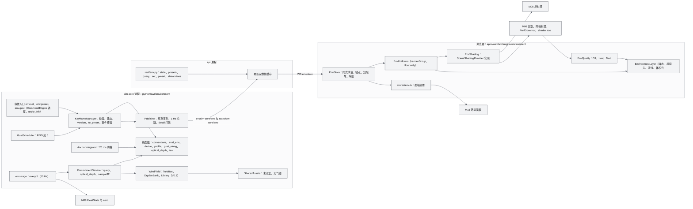
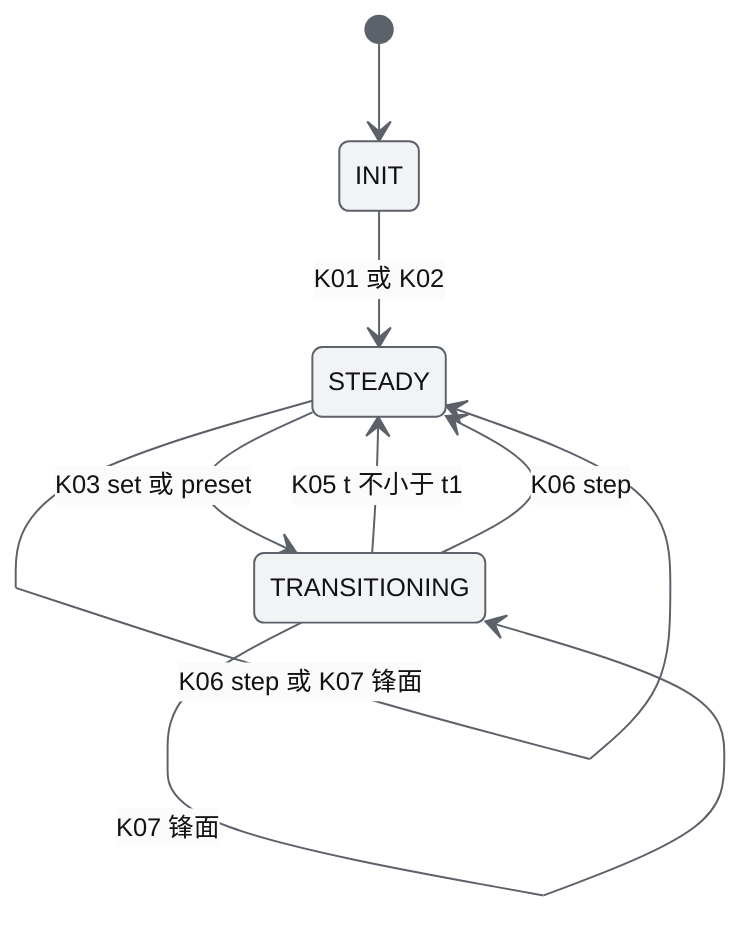
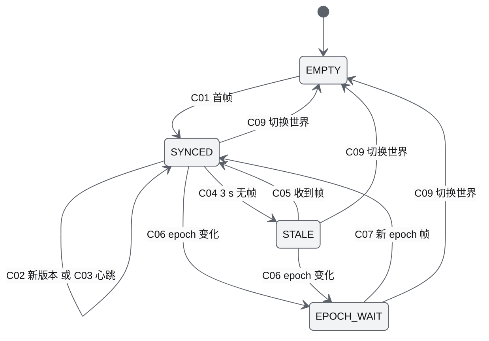
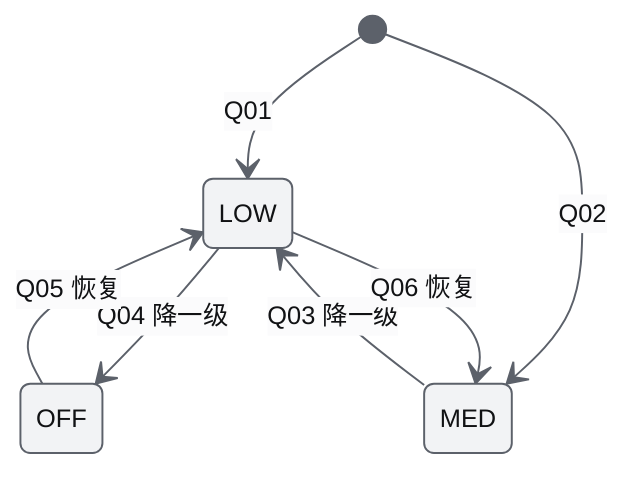
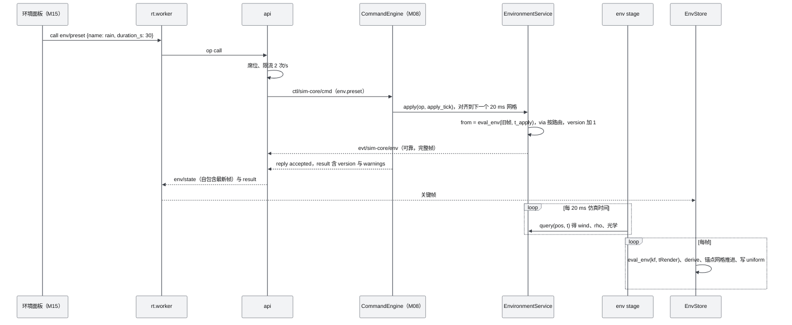
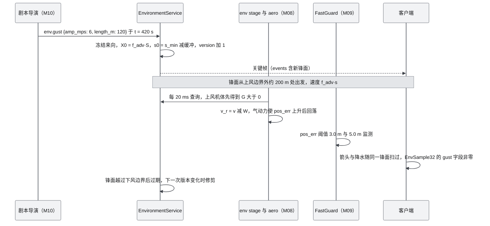
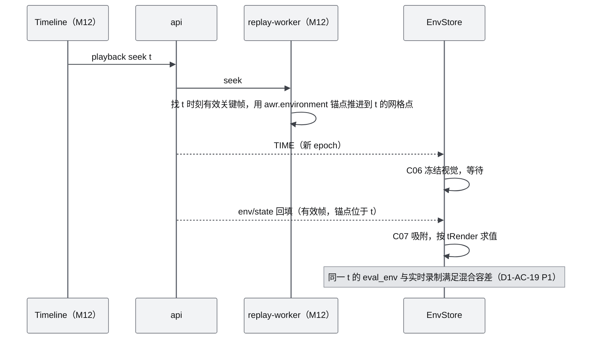
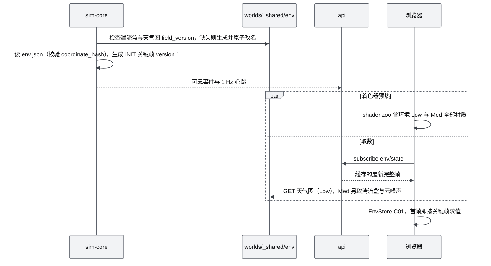

# M07 环境引擎 PRD（Environment Engine：物理场 + 视觉）

| 项 | 内容 |
|---|---|
| 文档编号 | AWR-M07 |
| 标题 | 环境引擎（Environment Engine：物理场 + 视觉） |
| 版本 | v1.0 |
| 日期 | 2026-09-28 |
| 状态 | 草案 |
| 上游文档 | [AWR-03 设计基线](../03-设计基线与决策记录.md)（ADR-021、ADR-023、ADR-024、ADR-025、ADR-041、ADR-044 至 ADR-046、ADR-049，§3.8、§5、§6.3、§8.4）；[01-design](../01-design.md) §16–§25、§37、§38、§41、§46–§47；研究笔记 [g06](../research/g06-gap.md)（权威）、[g08](../research/g08-gap.md) §3.2、§6、§8、§11、[r16](../research/r16-web-weather-fx.md)、[r17](../research/r17-wind-cfd-vdb.md)、[n04](../research/n04-discover-environment-twin.md)、[n03](../research/n03-discover-uav-sim-agents.md)、[r23](../research/r23-airsim-gzsim.md)、[g01](../research/g01-gap.md)、[00-index](../research/00-index.md) §2.5、§3.7、§3.8、§5.6；并行说明书 [12](../12-业务逻辑设计说明书.md) §4.9、§5.12、[15](../15-视觉设计规范与色卡.md) §10、[16](../16-World数据规范.md) §8、[17](../17-接口与实时协议规范.md) §4.3.8、§6.5、§6.6、§8.4、§10.7、§10.8；被依赖模块 [M06](M06-Web视口与渲染后端PRD.md) §6.2、§6.4、§6.5、§6.7（FrameCtx、预热、pass 计划、透明带）、[M08](M08-仿真内核与飞行器适配PRD.md) §7.1（stage 注册与 EnvironmentService Protocol）、[M03](M03-World模型与Ingest切片PRD.md) §6.16（`env.json` 派生） |
| 下游文档 | [M05](M05-Web点云引擎PRD.md)（点材质调用环境着色）、[M06](M06-Web视口与渲染后端PRD.md)（天空、图层与预热）、[M08](M08-仿真内核与飞行器适配PRD.md)（env stage 与气动）、[M09](M09-安全与健康PRD.md)（风限告警）、[M13](M13-传感器仿真PRD.md)（光学厚度与退化）、[M14](M14-智能体运行时与ANet-PRD.md)（估价环境）、[M15](M15-前端UI壳与设计体系组件PRD.md)（环境面板）、[M16](M16-演示数据剧本与流畅性测试PRD.md)（S1 阵风与环境用例）、[18](../18-性能与测试方案.md) |
| 适用版本范围 | V0.1（本期交付 D1）至 V1.0 |

## 0. 摘要

1. M07 维护环境的唯一物理真值 E(x,y,z,t)：线上形态为自包含的 EnvKeyframe（配置、插值标量、积分锚点、离散事件），求值由 Python 与 TS 两端逐行对应的纯函数（`eval_env`、`derive`、风合成、`optical_depth`）完成，golden 按混合容差对拍（ADR-025，g06 §9）。
2. 能见度只有 MOR 一个真值：σ₅₅₀ = ln20 / MOR；状态量是不含降水的 `mor_bg_m`，降水消光加性叠加，界面主数字是派生的总 MOR；3.912 只用于传感器波长换算（ADR-023，g06 §4）。
3. 风 W = s·f(z)·e(θ) + w_mean + 1−cos 阵风锋面 + 湍流；湍流默认全场共享冻结 von Kármán 盒，Dryden 只作回归并采用标准化状态精确离散；L2 质量守恒库（V0.3）、L2.5 LBM（V0.4）、L3 OpenFOAM 扇区库（V0.6）以 AWRV v1 为体数据格式（ADR-024，g06 §5，g08 §8）。
4. 服务端权威：变化关键帧走可靠事件、1 Hz 心跳携带完整帧；每个版本带生效网格时刻 `t_apply_ns`，客户端在 tRender 越过它时才切换版本；锚点在两端用同一个 20 ms 网格梯形积分，客户端按 tRender 求值即可精确 seek；客户端只对 step 类视觉跳变做短阻尼，epoch 变化一律吸附。
5. 视觉分档：Low（Tier S 与集显，D1-core）为无状态扁平四边形降水、解析高度雾、天空中的 2D 云、逐顶点云阴影、天空渐变、风箭头；Med（D1-ext）为体积云、双层降水、湍流漂移、AWSL 流线、湿地面变暗；High 在 V0.3。3D 场景只用 Graphite 灰阶（15 §10）。
6. 性能：N = 1000 时 env stage 单次 ≤ 1.6 ms（50 Hz，≤ 0.08 核）；前端每帧求值 p95 ≤ 0.1 ms、零分配；Tier S 环境图层配对增量 ≤ 2.5 ms（暂定）；预设切换与档位切换零运行期编译。
7. 二次优化要点：关键帧紧凑编码（位置编码 + 规范数值编码 + 资产 URL 派生，稳态与预设切换帧实测 0.84–0.94 KB）、确定性锚点网格积分与版本按 `t_apply_ns` 切换、阵风锋面方向在事件创建时冻结、光学层统一以 `ground_z` 为基准而风廓线地形跟随、环境着色经 M06 在 `engine/loop.ts` 定义的着色提供者接口注入点云与网格（`scene.fogNode` + 光照 Fn + 天空 Fn）。

---

## 1. 背景与目标

### 1.1 背景

原设计把环境定义为统一场 E(x,y,z,t)，要求"视觉与物理分开但同源"，风分 L0–L3，雨、雾、沙尘既有视觉也影响传感器与飞行（01-design §17–§25）。研究阶段在同一主题上出现了 8 处分歧（g06 §0）：雾消光常数 3.0 与 3.912 混用；风体纹理第 4 通道语义不一；方向约定三套；湍流"每机 Dryden"与"共享湍流盒"之争；流线无格式；预设与派生量无对拍机制；推送频率 5–20 Hz 与"变化时推送"之争；r17 的旧金山风场库建在错误单位上。另有两处已被 g08 与基线修订：Dryden 在物理坐标下保存状态会在空速变化时发散（g08 §8.1）；心跳只带增量会使关键帧丢失后不可恢复（ADR-025）。

M07 把这些裁决落成可实现的模块：一套契约（EnvKeyframe、`presets.json`、golden）、一个 sim-core 内的 EnvironmentService 与 env stage、一套浏览器端求值器与分档视觉。

### 1.2 目标

| 编号 | 目标 | 可度量表述 | 首次达成 |
|---|---|---|---|
| G-M07-1 | 单一真值 | 动力学、传感器、网关、录制与前端视觉读取同一份 EnvKeyframe；两端纯函数 golden 全部满足混合容差（AWR-03 §5.1 规则 8） | V0.1 |
| G-M07-2 | 风真实作用于飞行 | 风只经相对空速进入动力学；S1 阵风期间 pos_err 最大值 < 3.0 m 且可在遥测中观察到偏移（D1-AC-15） | V0.1 |
| G-M07-3 | 可复现、可 seek | 同一种子与输入日志下关键帧序列逐字节一致；任意时刻 seek 后客户端锚点与服务端差 ≤ 1e-6 m | V0.1（core 实时）/ V0.1 ext（回放） |
| G-M07-4 | 流畅 | Tier S 环境图层配对增量 ≤ 2.5 ms（暂定）；30 s 预设过渡期间 > 100 ms 帧 ≤ 0.5%，`programs` 不增加（D1-AC-19） | V0.1 |
| G-M07-5 | 可扩展到物理风场 | L2/L2.5/L3 库经同一 `query` 接口与 AWRV 纹理接入，UI 与协议零改动 | V0.3–V0.6 |
| G-M07-6 | 传感器可信 | 相机、LiDAR 退化与 Web 雾共用 `optical_depth` 与 σ（V0.4） | V0.4 |

### 1.3 对原设计的继承、修正与增强

| 原设计（01-design） | 处置 | 本文落点 | 依据 |
|---|---|---|---|
| §17 环境不是一组 Shader，视觉与物理分开 | 继承并强化 | 视觉与物理共用纯函数与资产，视觉档位只能省略项，不能改公式（§1.4 EP-3） | AWR-03 §5.8 第 3 条 |
| §18 E(x,y,z,t) 含 Wind、Temperature、Humidity、Visibility、Pressure、Rain、Snow、Dust、Cloud；`environment.query(x,y,z,timestamp)` | 继承并补单位与语义 | 21 个带单位 EnvScalars（§6.2.1）；`query` 向量化、四种帧、字段位掩码（§7.1）；"4D"指时变状态 | g06 §3、§6 |
| §19 W(x,y,z,t) = (u,v,w)；第一阶段 Constant + Gust + Turbulence | 继承、修正 | 常值风改为带廓线的均值（8 m/s@10 m 在 40 m 为 11.7 m/s）；阵风改为服务端调度的 1−cos 锋面；湍流默认共享冻结盒 | r17 §3.2；g06 §5 |
| §20 L0 风速风向 / L1 阵风湍流垂直风 / L2 建筑与地形效应 / L3 OpenFOAM `*.vdb` | 继承分级、修正格式 | L2 为质量守恒诊断库（V0.3），新增 L2.5 LBM（V0.4），L3 OpenFOAM 扇区库（V0.6）；运行时格式由 VDB 改为 f16+zstd 物理库与 AWRV v1 可视化体，VDB 只作导出 | ADR-024、ADR-025；r17 §0 第 4 条 |
| §21 WebGPU 绘制粒子、流线、箭头、热力图 | 修正 | 软件档与经典路径下不用 compute；D1-core 为风箭头网格，D1-ext 为无状态 AWSL 流线，GPGPU 迹线 V0.3；3D 中不画热力色 | r16 §3.2.5；n04 §3.3；15 §10.8 |
| §22 Rain：GPU 粒子、湿地面、云、散射；物理为能见度、相机与 LiDAR 噪声、飞行阻力、传感器可靠性 | 继承、修正 | 雨一律无状态扁平四边形；σ_rain 加入 MOR；阻力倍率与传感器退化在 V0.4 | r16 §3.2.1；n03 §7 第 3 条 |
| §23 Fog 不应只是 `scene.fog`；"Fog 0.21" | 修正 | MOR 为唯一真值，禁止 FogExp2 与无单位浓度 | ADR-023 |
| §24 沙尘：粒子 + 光学衰减 + LiDAR 退化 + 飞行影响 | 继承 | 光学贡献计入 `mor_bg_m`，`dust` 只驱动粒子与杂波类型；推力效率修正 V0.4 | g06 §3.2 |
| §25 云三档，第一阶段推荐 Level 2（3D Noise Volume） | 修正 | 无 GPU 设备上 3D 体积云过重（SwiftShader 摊销后仍 +41 ms），Low 默认为天空中的 2D 云加全档云阴影，体积云为 Med（D1-ext） | r16 §3.10、§7 第 8 条；AWR-03 附录 C §25 |
| §37 刷新频率 | 修正 | 环境不走高频推送：关键帧变化推送 + 1 Hz 心跳，物理侧 env 采样固定 50 Hz | ADR-021、ADR-025 |
| §38 左栏 ENVIRONMENT 显示风、风向、雨、Fog、Sand、Cloud | 修正 | 风向为"来向 + 度数"，能见度为 MOR 米数，云量为百分比显示；面板由 M15 渲染，数据由本模块 store 提供 | 14 §4.2 |
| §41 `environment/{wind,weather,atmosphere}` | 修正 | 天气与大气是参数化预设，不落盘为场；每世界只存 `env.json` 与风场库 | AWR-03 §4.4；16 §8.2 |
| §46–§47 V0.3 环境视觉、V0.4 物理环境 | 重排 | 风到力（相对空速）与视觉 Low 前移到 V0.1；传感器退化仍在 V0.4 | AWR-03 §8.1 |

本文在研究结论之上新增的优化（均为"本文设定"，理由在对应小节给出）：

1. **关键帧紧凑编码**：EnvScalars 在线上按 `presets.json` 字段登记顺序编码为定长数组，路由中间态只传预设 id，数值按"整数值写最短整数、其余写 float64"的规范编码，共享资产 URL 由 seed 与参数派生而不上线；本机实测稳态与预设切换帧 0.84–0.94 KB（§6.2.5）。
2. **确定性锚点网格积分**：两端都在 20 ms 仿真时间网格上做梯形积分，客户端求值无需等服务端推送即可精确 seek（§6.3.10）；每个版本带 `t_apply_ns`，客户端在 tRender 越过它时才切换，正向播放与 seek 到同一时刻得到同一版本（§6.3.10、§6.6.2）。
3. **锋面方向冻结**：阵风锋面的传播方向在事件创建时确定，避免风向过渡时公里级锋面整体旋转造成的远处跳变（与 g06 §5.5.2 否决"旋转采样坐标"同理，§6.3.7）。
4. **光学层与风廓线分基准**：雾顶、云底、降水层按 `coordinate.ground.zM` 平层计算（两端恒等），风廓线与湍流强度按 `z − dtm(x,y)` 地形跟随（§6.3.4、§6.3.6）。
5. **着色提供者接口**：环境对点云、网格、天空的着色通过 M06 在 `engine/shading.ts`（与 `engine/loop.ts` 同层，验收加固 FX-WEB1 落位）定义的 `SceneShadingProvider` 注入（雾走 `scene.fogNode`，光照与天空为 TSL Fn），不增加 M05 对 M07 的依赖边（§7.2、§7.6）。
6. **两个视觉字段**：`visual.horizon_step`、`visual.cloud2d_alpha_max` 进入 EnvScalars，使 15 §10.9 的预设配色在过渡中连续且两端一致（§6.2.1）。

### 1.4 模块设计原则

| 编号 | 原则 | 约束 |
|---|---|---|
| EP-1 | 单一真值 | 任何模块不得自行维护能见度、风或天气副本；一切求值走 `awr.environment` 或 `engine/environment` 的公开函数 |
| EP-2 | 同源纯函数 | `conventions`、`eval_env`、`derive`、`optical_depth`、`profile`、`gust`、湍流盒采样在 Python 与 TS 各有一份逐行对应的实现，golden 由 Python 生成 |
| EP-3 | 省略项不改公式 | 视觉档位只能关闭某些项（例如 Low 不加湍流），被保留项的公式与物理侧完全一致（AWR-03 §5.8 第 3 条） |
| EP-4 | 服务端权威、客户端同式求值 | RNG 只在服务端；客户端不做第二次长过渡；短阻尼只作用于视觉 uniform |
| EP-5 | 确定性 | 同种子、同输入日志 → 同关键帧字节序列；湍流盒由 seed 唯一决定 |
| EP-6 | 零运行期编译 | 天气参数一律为 float uniform；换预设、换档只改 uniform、`drawRange` 与可见性 |
| EP-7 | 灰阶视觉 | 3D 环境视觉只改变明度与透明度，不引入写实色相，永不使用 r500（15 §10.1） |

---

## 2. 范围

### 2.1 D1-core（P0，发布阻塞）

与 AWR-03 §6.3 M07 行一致：

1. 契约：`env_state.schema.json`、`presets.json`（12 个预设、常数、窗口、速率、路由、字段登记）、`presets.schema.json`、golden 生成与对拍。
2. EnvironmentService：L0 廓线、L1 阵风锋面、冻结湍流盒（默认）、Dryden 回归模式；`derive`、`eval_env`、锚点；ISA 热力学；`query`、`optical_depth`。
3. sim-core `env` stage（50 Hz，零阶保持）；`env.set`、`env.preset`、`env.gust` 操作落地；输入日志登记。
4. EnvKeyframe 可靠推送 + 自包含 1 Hz 心跳；EnvSample32（兴趣集，10 Hz）；`env/query`（≤ 256 点）；REST `env/state`、`env/presets`、`env/query`。
5. 共享资产：湍流盒 AWRV、天气图 AWRV 的启动期按需生成。
6. 前端：EnvStore（每帧求值、锚点、短阻尼、陈旧检测、预设哈希校验）、`stores/env.ts`、`windCPU.ts`。
7. 视觉 Low：无状态降水（雨四边形、雪与沙尘点）、解析高度雾、天空 2D 云、云阴影、天空渐变着色、风箭头；质量档与 GPU 预算；PerfGovernor 旋钮；shader zoo 登记。
8. env-gpu 对拍（L0/L1 廓线 + 湍流盒 texture3D）与 env-switch 用例。

### 2.2 D1-ext（P1，缺失时须有豁免记录）

视觉 Med（体积云、双层降水与 DSM 遮挡、湍流漂移、逐片元网格雾）；解析场 AWSL 流线（服务端生成、前端虚线相位）；湿地面变暗（Low/Med）；env 状态 checkpoint 与恢复；回放环境一致性（`GET /api/env/state?t_ns=`）；`env.warning` 事件；选中机环境时序图数据；`env/set`、`env/preset` 的 REST 镜像。

### 2.3 D1 桩

`wind_manifest.schema.json` 与风场库 `library` 配置字段（V0.3 实现）；`sector_slots` 纯函数与 golden（V0.3 运行时使用）；Kim 波长换算与 LiDAR 双程透过率纯函数（V0.4 由 M13 使用）；阻力与推力修正字段（恒为 1，V0.4 生效）。

### 2.4 后续版本

| 版本 | 内容 |
|---|---|
| V0.2 | DebugLayer 的机体风矢量与气动力叠加（M06 负责渲染，本模块提供数据）；`grid()` 调试切片（AWRV kind 3） |
| V0.3 | L2 质量守恒风场库（六城在规范化 World 上重建）与 L2 流线；前端 AWRV 风纹理采样（env-gpu 的 AWRV 用例）；风场入库验收指标；High 档（Tier A compute 粒子与迹线、体积云光照缓存）；闪电；溅落与水坑；降水空间场（云单体门控，物理与视觉同式） |
| V0.4 | 相机与 LiDAR 退化（共用 σ）；降水与沙尘的阻力、推力修正；L2.5 LBM 瞬态库与 `env/wind/frame`；云内消光 |
| V0.5 | 真实气象数据以 `exp` 模式驱动；写实大气（takram 等）需先追加 ADR（15 §10.1 第 2 条） |
| V0.6 | L3 OpenFOAM 扇区库与 TKE 导出的湍流强度场；gz 导出器写入标定后的风力系数 |
| V1.0 | froxel 体积雾；Agent `env.query` 能力（≤ 64 点）；3D 城市风场神经代理（可选） |

### 2.5 不做

实时 CFD；浏览器端求解风场；以 VDB 作运行时格式；逐机 Dryden 作为默认湍流；环境视觉引入写实色相；在 D1 中实现闪电、High 档、传感器退化与 L2 及以上风场。

### 2.6 职责边界

| 事项 | 属于 M07 | 不属于 M07（归属） |
|---|---|---|
| 风、能见度、降水、云、热力学的状态、求值与推送 | 是 | — |
| 气动力方程 `F_aero`、推力密度修正的施加 | 否 | M08（g08 §6，本模块只提供 wind、ρ） |
| 传感器退化模型 | 提供 σ、`optical_depth`、Kim 换算纯函数 | M13 |
| 风限告警 `SAF.ENV.WIND_LIMIT` | 否（提供机体处风） | M09（12 §5.12） |
| 天空网格对象与其绘制、地面网格 | 否（提供天空着色） | M06 |
| 点材质本体 | 否（提供着色 Fn） | M05 |
| 环境面板 JSX、图卡组件 | 否（提供 `stores/env.ts`） | M15 |
| `env.json` 的写出 | 提供默认值与 schema 语义 | M03（`worldpkg build`） |
| 文件与线上字节格式 | 语义与取值 | 16、17 |

---

## 3. 用户与用例

### 3.1 用户与消费者

| 角色 | 需要什么 |
|---|---|
| 科研人员（operator 席位） | 一键预设、精确设置风与能见度、剧本阵风、可复现 |
| 演示观众（viewer） | 平滑过渡、可读的物理量读数、流畅画面 |
| 仿真内核 M08 | 每 20 ms 一次向量化风、密度、光学样本 |
| 安全 M09、智能体 M14、传感器 M13 | 机体处风、σ、光学厚度 |
| 测试 M16、18 号文档 | 确定性、对拍、帧预算可测 |

### 3.2 用例

| 编号 | 用例 | 主流程 | 相关需求 |
|---|---|---|---|
| UC-01 | 切换天气预设 | 面板点 thunderstorm → `env/preset` → 服务端按路由生成 30 s 过渡 → 全部客户端同式求值，雨、雾、云逐轴过渡；MOR 下降 | M07-FR-004、M07-FR-021、M07-FR-025、M07-FR-035–M07-FR-041 |
| UC-02 | 设置风速与来向 | 滑杆松开 → `env/set {wind: {speed_ref_mps: 8}}`，3 s 过渡；来向走最短弧 | M07-FR-004、M07-FR-025 |
| UC-03 | 剧本阵风 | S1 在 420 s 执行 `env.gust` → 锋面自上风边界推进，两机先后遭遇；pos_err 可见后回稳 | M07-FR-011、M07-FR-017 |
| UC-04 | 查看本机环境 | 选中机 → `uav/{id}/env` 10 Hz → 面板显示本机风、阵风、MOR、降水与空速 | M07-FR-023、M07-FR-058 |
| UC-05 | 环境探针 | 工具或 UI 调 `env/query`（≤ 256 点） | M07-FR-024 |
| UC-06 | 迟到客户端 | 新连接取 api 缓存的最新完整帧，立即可渲染 | M07-FR-022 |
| UC-07 | 回放 seek（ext） | seek → epoch + 1 → 回填 `env/state` → 客户端吸附锚点，画面与原时刻一致 | M07-FR-018、M07-FR-028、M07-FR-031 |
| UC-08 | 性能降级 | PerfGovernor 第 ⑤ 步 → 环境视觉 Med → Low → Off（雾保留），零编译 | M07-FR-043 |
| UC-09 | 湍流回归 | CI 以 `turbulence.model = dryden` 跑 σ 回归与 SIH 对照 | M07-FR-013 |
| UC-10 | 风场库入库（V0.3） | `build_l2_library` 在规范化世界上求解 6 扇区并验收 | M07-FR-053、M07-FR-054 |

---

## 4. 功能需求

优先级与 D1 列按 AWR-03 §10.2 第 4 条：D1-core 为 P0 / V0.1 / 是；D1-ext 为 P1 / V0.1 / 是；桩为本期只交付接口或纯函数。

### 4.1 契约与纯函数

| 编号 | 需求描述 | 优先级 | 目标版本 | D1 | 验收要点 | 依据 |
|---|---|---|---|---|---|---|
| M07-FR-001 | 定义 `awr.env.keyframe.v1`：config、`t_apply_ns`、mode、t0/t1、from/to（21 维 EnvScalars，位置编码）、via（预设 id）、to_preset、anchors、events、vis；每帧自包含；规范数值编码（§6.2.5） | P0 | V0.1 | 是 | M07-AC-001：Python 与 TS 编解码往返逐字节一致；schema 校验通过；稳态与预设切换帧 ≤ 1024 B | ADR-025；g06 §3.5；本文 §6.2.5 |
| M07-FR-002 | `presets.json` v1 取值：常数表、21 个字段登记（路径、单位、组、插值空间、范围）、默认状态、窗口、速率、默认时长、路由、12 个预设（§6.5） | P0 | V0.1 | 是 | M07-AC-003：12 个预设经 `derive` 回算的 MOR 与作者值差 ≤ 0.1 m；schema 通过 | g06 §3.3、§4.2；16 §8.1 |
| M07-FR-003 | 方向与坐标换算唯一实现：`from_to_uv`、`uv_to_from`（静风标志）、`e`、`n`、`shortest_arc`、`enu_to_three`、`three_to_enu`、`enu_to_ned`；Python `awr/environment/conventions.py` 与 TS `engine/environment/state/conventions.ts` | P0 | V0.1 | 是 | M07-AC-002：`conventions.json` golden（0–359.5° 步长 0.5° 加静风）全部命中 | g06 §2.2；AWR-03 §5.1 规则 8 |
| M07-FR-004 | `eval_env(kf, t)`：step、smooth（分段 smoothstep、按组窗口、enter/leave 判别）、exp（按组速率）三模式；插值空间 lin、log（MOR）、arc（风向最短弧） | P0 | V0.1 | 是 | M07-AC-002：`eval_env.json` golden；M07-AC-012 过渡连续性 | g06 §3.3 |
| M07-FR-005 | `derive(s)`：降水云量门控、σ 各分量、地面总 σ 与 MOR、rainK、snowK、sunVis、mpLambda、cloudOD、雨与雪代表终速、湿度目标 | P0 | V0.1 | 是 | M07-AC-002：12 预设 + 1000 组随机状态 golden | g06 §4.1；r16 §3.2.1、§3.6 |
| M07-FR-006 | 光学：`optical_depth(ro, rd, L)`（指数霾解析积分 + 平顶雾层 + 云底以下降水层）；点消光 `sigma_at(p)`；透过率 `T = exp(−τ)`；光学层一律以 `coordinate.ground.zM` 为 AGL 基准 | P0 | V0.1 | 是 | M07-AC-002：`optical_depth.json`（200 射线 × 3 状态）；与 2 万段数值积分相对误差 ≤ 2e-4 | g06 §4.3、§4.4 |
| M07-FR-007 | golden 生成器 `tools/contracts/gen_env_golden.py`（M07 起草，M00 合入）与两端对拍测试；CI 顺序：`--check` → pytest → vitest | P0 | V0.1 | 是 | `make test-contracts` 通过；golden 头含 `presets_sha256` | g06 §9；AWR-03 §5.10 |
| M07-FR-008 | `config.presets_sha256` 写入每帧；客户端哈希不一致时拉取 `GET /api/env/presets` 并以服务端版本求值，同时发出 `status{id: "env.presets_mismatch"}` 告警条件 | P0 | V0.1 | 是 | M07-AC-025；API-AC-033 | AWR-03 §5.11 第 5 条；17 §4.3.8 |

### 4.2 风场物理

| 编号 | 需求描述 | 优先级 | 目标版本 | D1 | 验收要点 | 依据 |
|---|---|---|---|---|---|---|
| M07-FR-009 | L0 廓线：`log`（z ≤ d+z0 时为 0）、`power`、`uniform`；参数来自世界 `env.json`；物理侧 `z_agl = z − dtm(x,y)`（地形跟随），前端用同一 DTM 手工双线性采样 | P0 | V0.1 | 是 | `profile.json` golden；env-gpu 用例 | g06 §5.2；r17 §3.2；AWR-03 §5.5 |
| M07-FR-010 | 均匀垂直风 `w_mean_mps`（L0/L1；L2 起必须为 0） | P0 | V0.1 | 是 | golden | g06 §3.2 |
| M07-FR-011 | L1 阵风锋面：服务端以 RNG 流 6 调度（间隔 Exp(rate) 钳制 [2, 600] s，幅值 amp·U(0.5,1)，λ = 2·d_m），至少提前 2 s 进入 `events`；同时活跃 ≤ 4 个；锋面方向在创建时冻结；剧本 `env.gust` 以确定参数注入 | P0 | V0.1 | 是 | M07-AC-007：同 seed 事件序列逐字节一致；两机遭遇时差与 Δs/(f_adv·s) 偏差 ≤ 2% | g06 §5.4；16 §12.3 |
| M07-FR-012 | 冻结 von Kármán 湍流盒：`vk_box(N=64, dx=4, L=30, seed)`，修正波数 Helmholtz 投影，三分量合并按单一 std 归一化（保持离散无散，§6.3.8）；存为 AWRV kind 2；格心约定三线性采样，"平移坐标、旋转输出"；MIL-F-8785C 高度缩放；近地 2 m 线性淡入 | P0 | V0.1 | 是 | M07-AC-004、M07-AC-005 | g06 §5.5.2；r17 §3.3(d)；ADR-024 |
| M07-FR-013 | Dryden 回归模式：每机标准化状态精确离散（g08 §8.2），V = max(\|U_mean − v\|, 0.5)，RNG 流 1 按 slot 升序抽样，平稳起步 | P0 | V0.1 | 是 | M07-AC-006：σ 偏差 ≤ ±3%，与 dt 无关 | g08 §8；ADR-024 |
| M07-FR-014 | 风等级与湍流模型配置：`config.wind.level ∈ {0,1}`（2、3 保留），`turbulence.model ∈ {box, dryden, off}`；经 `env/set` 的 `config` 补丁以 step 关键帧生效 | P0 | V0.1 | 是 | 切换后下一个 env tick 生效；前端纹理交叉淡化 | g06 §3.1 |

### 4.3 其他物理量与物理效应

| 编号 | 需求描述 | 优先级 | 目标版本 | D1 | 验收要点 | 依据 |
|---|---|---|---|---|---|---|
| M07-FR-015 | ISA 热力学：`h_msl = anchor.hMslM + z`，温度（叠加 `isa_dt_c`）、气压、密度；`rh` 为占位 | P0 | V0.1 | 是 | `isa.json` golden | g06 §2.1；AWR-03 §5.5 |
| M07-FR-016 | `EnvironmentService.query`：N 点向量化；字段位掩码（WIND、WIND_PARTS、TURB_SPEC、OPTICS、PRECIP、THERMO）；四种帧（GLOBAL、LOCAL、ADD_VELOCITY_GLOBAL、ADD_VELOCITY_LOCAL）；EnvFlags；`source_level`；`out=` 复用预分配数组 | P0 | V0.1 | 是 | M07-AC-009 | g06 §6.1；r23 §3.9 |
| M07-FR-017 | sim-core `env` stage：`every=5, phase=0, order=20`（50 Hz），写 FleetState 的 wind、rho、env_flags、env_gust，子步零阶保持；风（平均风、阵风、湍流）与 env_gust 每个 env tick 求值；rho、env_flags 与 EnvSample32 行缓存的其余列（光学、降水、热力、湍流谱）每 5 个 env tick 全量求值一次（平均 10 Hz，`tick % 50 ∈ {5, 35}`，间隔 120/80 ms 交替，都是奇数 tick，与偶数 tick 的 M08 l1 组错开；AWR-03 ADR-070），关键帧变化或新机体（行缓存无效）时立即全量（AWR-03 ADR-060）；全量求值中风由融合核求得之后，其余字段（MIL 湍流谱、光学含雾层与云下降水标志、降水、ISA 热力、标志与来源级别）由 numba 核 `kernels_rows.full_rest_nb` 一次遍历写完，与 numpy 路径逐字节相同（`tests/environment/test_wind_fused.py`；N = 1000 时全量查询进程内 1.01 → 0.70 ms，生产口径 env 全量 tick 1.73–1.80 → 约 1.49 ms，AWR-03 ADR-073 第 3 条）；NED 与 ENU 换算只调用 `conventions` | P0 | V0.1 | 是 | M07-AC-008 | g08 §3.2；ADR-021；ADR-073 |
| M07-FR-018 | 积分锚点：`s_m`、`d_enu_m`、`fall_rain_m`、`fall_snow_m`、`wetness`、`puddle`，两端在 20 ms 网格上同式推进（梯形；湿度为精确指数） | P0 | V0.1 | 是 | M07-AC-011：1 h 随机操作序列后两端差 ≤ 1e-6 m | g06 §3.4；本文 §6.3.10 |
| M07-FR-019 | 风到力：保证 M08 气动所用 wind 与 ρ 即本模块 `query` 结果（风只经相对空速进入动力学，禁止 gz 默认 k = 1）；降水阻力倍率与沙尘推力效率字段本期恒为 1（公式见 §6.3.12，V0.4 生效） | P0 | V0.1 | 是 | M07-AC-014 | ADR-024；g08 §6；n03 §7 第 3 条 |
| M07-FR-020 | 传感器光学函数：任意波长的 `optical_depth`（Kim 模型 q(V₂)，V₂ = ln50/σ_bg）、LiDAR 双程透过率、有效距离求解；D1 交付纯函数与 golden，V0.4 由 M13 接入 | P2 | V0.4 | 桩 | golden 命中 | g06 §4.4；r23 §3.10 |

### 4.4 服务端运行时

| 编号 | 需求描述 | 优先级 | 目标版本 | D1 | 验收要点 | 依据 |
|---|---|---|---|---|---|---|
| M07-FR-021 | 关键帧管理：`apply` 在 env 网格点生效；`from = eval_env(kf, t_apply)`；按路由生成 via；version + 1；剧本初值、重置、seek 用 step；过渡中新操作以当前求值态为起点（12 §4.9 V01–V05） | P0 | V0.1 | 是 | M07-AC-012 | 12 §4.9；g06 §3.3 |
| M07-FR-022 | 推送：变化帧走可靠事件 `evt/sim-core/env`（kind `env.keyframe`）；1 Hz【墙钟】心跳 `state/sim-core/env` 携带完整帧；每次变化发 `env.changed{version, by, reason}` | P0 | V0.1 | 是 | M07-AC-010；API-AC-033 | ADR-025；17 §9.5 |
| M07-FR-023 | EnvSample32：为兴趣集（≤ 64 架）在慢任务中打包 `awr.EnvSample32.v1`，经 `state/sim-core/detail` 发出，WS `uav/{id}/env` 默认 10 Hz、仅选中机 | P0 | V0.1 | 是 | 字段与 17 §6.5 逐字节一致 | g06 §6.4；10 AD-10 |
| M07-FR-024 | `env/query`：经 `ctl/sim-core/query` 在慢任务预算内执行，≤ 256 点，`t_ns` 只允许 [当前关键帧锚点时刻, 当前 + 10 s] | P0 | V0.1 | 是 | M07-AC-009 | 17 §4.3.8 |
| M07-FR-025 | 环境操作：`env.set`（嵌套 EnvScalars 部分快照与 `config` 补丁）、`env.preset`、`env.gust`；范围校验（§6.4）、时长 [0, 600] s、模式 smooth/step/exp；写输入日志（apply_tick 与载荷哈希） | P0 | V0.1 | 是 | M07-AC-031 | 12 §5.12；ADR-049 |
| M07-FR-026 | 共享资产：sim-core 启动时确保 `worlds/_shared/env/turb/vk_s{seed}_n64_dx4_L30.awrv` 与天气图 `weather_s{seed}_512.awrv` 存在且 `field_version` 相符，否则写临时文件后原子改名；湍流盒生成失败时湍流模型降为 off，天气图失败时 2D 云与云阴影以常量覆盖 `cover` 呈现（无空间结构），二者都发 `env.warning{code: "asset_unavailable"}` | P0 | V0.1 | 是 | M07-AC-004 | 16 §8.4 |
| M07-FR-027 | checkpoint：关键帧、锚点（float64 原值）、DrydenBank、阵风调度器下一时刻与 RNG 状态；恢复后后续关键帧与不中断运行一致 | P1 | V0.1 | 是 | M07-AC-032 | ADR-019 |
| M07-FR-028 | 回放：recorder 原样记录全部变化帧与心跳；`GET /api/env/state?t_ns=` 返回 t 时刻有效关键帧且锚点推进到 t | P1 | V0.1 | 是 | M07-AC-022；D1-AC-18 | ADR-040 |
| M07-FR-029 | `env.warning`（`asset_unavailable` 见 M07-FR-026）：`mor_low`（总 MOR < 1000 m）、`wind_high`（10 m 参考风速 > 12 m/s）、`precip_heavy`（有效雨强 > 7.6 mm/h），进入与离开各发一次 | P1 | V0.1 | 是 | pytest | g06 §8；r16 §3.7.1 |

### 4.5 前端状态与求值

| 编号 | 需求描述 | 优先级 | 目标版本 | D1 | 验收要点 | 依据 |
|---|---|---|---|---|---|---|
| M07-FR-030 | EnvStore：接收关键帧与 epoch 通知；版本队列（≤ 4）按 `t_apply_ns` 在 tRender 越过时切换；每帧在 `world` 相位用 tRender 求值、派生、推进锚点、写 EnvUniforms；热路径零分配 | P0 | V0.1 | 是 | M07-AC-015、M07-AC-021 | ADR-046；AWR-03 §3.6；本文 §6.3.10 |
| M07-FR-031 | 客户端短阻尼与锚点校正：只对视觉 uniform 做 step 跳变的交叉淡化（`--duration-slow`），epoch 或生产者纪元变化一律吸附；锚点偏差 < 1 m 在 `--duration-very-slow` 内摊平，否则吸附 | P0 | V0.1 | 是 | M07-AC-021 | g06 §3.4、§12；AWR-03 附录 B.2 |
| M07-FR-032 | 陈旧与同步状态机：3 s【墙钟】未收到任何帧置 STALE；新 epoch 期间保持最后一帧并等待回填 | P0 | V0.1 | 是 | M07-AC-025 | 本文设定（3 个心跳周期）；呈现按 14 §7.7 |
| M07-FR-033 | CPU 镜像 `windCPU.ts` 与 DTM 采样器（CPU 与 TSL 同为格心双线性、界外钳制） | P0 | V0.1 | 是 | env-gpu 用例 | g06 §10；16 §6.2 |
| M07-FR-034 | `stores/env.ts`：面板与 HUD 摘要，Tier S ≤ 4 Hz、其余 ≤ 10 Hz 写入 | P0 | V0.1 | 是 | 14 §4.2 字段齐全 | ADR-008；ADR-029 |

### 4.6 视觉

| 编号 | 需求描述 | 优先级 | 目标版本 | D1 | 验收要点 | 依据 |
|---|---|---|---|---|---|---|
| M07-FR-035 | 实现 M06 在 `engine/shading.ts` 定义的 `SceneShadingProvider`（§7.2；`setSceneShading`/`onSceneShading`，环境适配器在其余图层与 shader zoo 之前挂载并设置，之前已建材质的消费者经 `onSceneShading` 在首次编译前重建；验收加固 FX-WEB1）：`lambert()`（15 §10.3 光照项，太阳直射项乘 sunVis 与逐顶点云阴影）、`fogFactor()` 与启动时一次性设置的 `scene.fogNode`（`fog(雾色, 1 − T)`）、`sky()`（天顶到地平线渐变，地平线色 = 雾色，叠加 2D 云；Tier S 的 SkyQuad 与 Tier B/A 的 P2 背景都调用它，不再有单独的临时云四边形）；点材质（M05）、无人机网格与天空都从它取光照与天空色；无环境时由 M06 的恒等实现兜底 | P0 | V0.1 | 是 | M07-AC-023 | r16 §3.11；15 §10.3、§10.9；M05-FR-034；M06 §6.4 规则 2 |
| M07-FR-036 | 雾：`T = exp(−optical_depth)`，禁止 FogExp2 与 `densityFogFactor`；雾色取 `visual.horizon_step` 对应的灰阶 | P0 | V0.1 | 是 | M07-AC-023 | ADR-023；g06 §4.4 |
| M07-FR-037 | 2D 云：天空着色中射线与云底平面求交，查天气图得局地云量；云随 `f(z_cloud)·D` 漂移；不透明度上限取 `visual.cloud2d_alpha_max` | P0 | V0.1 | 是 | RT 回读 | r16 §3.4.4；15 §10.9 |
| M07-FR-038 | 云阴影：全档开启，点与网格逐顶点沿太阳方向投影到云中层查同一天气图 | P0 | V0.1 | 是 | 与 2D 云同图同偏移 | r16 §3.4.5 |
| M07-FR-039 | 雨（Low）：无属性扁平四边形（`vertexIndex / 6`）、world-tiling、4 档下落相位、流光、亚像素补偿、近处剔除、DTM 以下剔除、按透过率衰减；数量门控只改 `drawRange` | P0 | V0.1 | 是 | M07-AC-020 | r16 §3.2.1；00-index §5.6 E1 |
| M07-FR-040 | 雪与沙尘（Low）：Tier S/B 用 GLPointsNodeMaterial 点（经 `be.createPointsMaterial()` 取得，M06 §6.2.1；雪 2–3 px、沙尘 1–2 px；无属性几何下 `positionGeometry` 解析为常量，无 AttributeNode 告警，ADR-086），Tier A 用扁平四边形；无状态 | P0 | V0.1 | 是 | 同上 | r16 §3.2.2；15 §10.9 |
| M07-FR-041 | 降水锚点八度档（R 20/60/180/540 m），锚点在相机与轨道焦点之间按 AGL 插值，换档带迟滞并交叉淡化；Follow 与 FPV 强制第 0 档 | P0 | V0.1 | 是 | M07-AC-027 | r16 §3.2.6 |
| M07-FR-042 | 风箭头（Low）：24 × 24 个箭头，每个为 1 个扁平四边形（片元 SDF 画杆、头与 1 px 光晕），AGL 切片 10/50/120 m（默认 50 m），间距按相机距离八度取值；Low 含均值与阵风，Med 加湍流；颜色按固定域 20 m/s 分 5 档取 `--wind-ramp-1…5`；Tier S 与降水共享 2000 四边形当量（1 箭头 = 1 当量） | P0 | V0.1 | 是 | M07-AC-020 | 15 §10.8；n04 §3.3.4 |
| M07-FR-043 | 质量档 Off/Low/Med（High 在 V0.3）：按设备能力档起步；经 `governor.registerKnob({step: 5, id: "env", levels, apply})` 注册第 ⑤ 步旋钮（Tier S 2 级 Low → Off；Tier B/A 3 级 Med → Low → Off；雾保留）；设置页可手动覆盖；切换零编译；旋钮带 `visible(level)`：Low 层此刻没有可隐藏的内容（无降水、2D 云遮罩 cover × alpha ≤ 0.01、无风箭头与流线）时报告不可见，调度器不为它等待 2 s、也不弹 Toast（ADR-067） | P0 | V0.1 | 是 | M07-AC-026 | ADR-041；ADR-044；M06-FR-076；ADR-067 |
| M07-FR-044 | 预热与出图：全部环境材质的 Low/Med 变体登记到 shader zoo；透明环境层在 EDL 合成之后绘制，固定 renderOrder | P0 | V0.1 | 是 | M07-AC-019 | ADR-007；r16 §6 |
| M07-FR-045 | 计量：`window.__perf.layers.environment`（CPU 提交耗时、draw、顶点）与 `window.__perf.env`（质量档、降水实数、锚点偏差、陈旧、版本） | P0 | V0.1 | 是 | Playwright 读取 | AWR-03 §3.8 |
| M07-FR-046 | Med 降水：双层（72% 近层）、数量上限 5 万（B）/ 20 万（A）、DSM 遮挡、湍流盒漂移 | P1 | V0.1 | 是 | RT 回读 | r16 §3.2.1、§3.9 |
| M07-FR-047 | Med 体积云：0.35 分辨率、1/16 Bayer 摊销、历史重投影与邻域钳制、Catmull-Rom 上采样、只合成天空像素；相机高于云底 − 50 m 时 cutaway | P1 | V0.1 | 是 | M07-AC-029 | r16 §3.4.3；ADR-007 |
| M07-FR-048 | AWSL 解析场流线：服务端按 (field_id, 来向取整到 1°) 生成并缓存；前端 1 px 虚线、不透明度 0.6，相位 `fract((τ̂ − S)/T̂)`、T̂ = 48 m、前缀 + drawRange 调密度、换向 `--duration-slow` 交叉淡化且 ≤ 2 Hz；Tier S 不可用 | P1 | V0.1 | 是 | M07-AC-028 | g06 §7.4；n04 §3.3.1；15 §10.8；AWR-03 附录 B.3 C31 |
| M07-FR-049 | 湿地面变暗：暴露面按 `wetness` 变暗（`c·(1 − 0.325·wet)`）；水坑与假反射在 V0.3 | P1 | V0.1 | 是 | RT 回读 | r16 §3.6 |
| M07-FR-050 | High 档、闪电（确定性节律）、溅落、水坑、GPGPU 迹线 | P2 | V0.3 | 否 | — | r16 §3.8、§3.9 |

### 4.7 风场库与体数据

| 编号 | 需求描述 | 优先级 | 目标版本 | D1 | 验收要点 | 依据 |
|---|---|---|---|---|---|---|
| M07-FR-051 | AWRV v1 编解码（Python 与 TS）：magic、version、CRC、`payload_bytes` 校验；TS 解码直接生成 HalfFloat `Data3DTexture` 与 CPU 镜像 | P0 | V0.1 | 是 | M07-AC-004 | 16 §8.3；g06 §7.3 |
| M07-FR-052 | `wind_manifest.schema.json` 与 `config.wind.library` 字段；`sector_slots` 纯函数与 golden | P1 | V0.3 | 桩 | golden 命中 | g06 §5.3、§7.2 |
| M07-FR-053 | L2 质量守恒库：离线在规范化 World 上求解 6 个 30° 扇区（反对称）；运行时旋转形式扇区混合、单次 flat-gather、边界 2 格淡出回 L0、实体标志；前端 AWRV 纹理双槽采样与预乘还原 | P1 | V0.3 | 否 | M07-AC-030 | r17 §3.4、§3.6；g06 §5.3 |
| M07-FR-054 | 风场入库验收：散度残差、壁面穿透、入口廓线误差、`coordinate_hash` 绑定，不达标拒绝入库 | P1 | V0.3 | 否 | M07-AC-030 | n04 §3.5；00-index §3.8 |
| M07-FR-055 | L2.5 LBM 瞬态库：D3Q19 + Smagorinsky 离线序列，AWRV kind 5；运行时 `W_L2 + α·(W_LBM(t mod T) − W̄_LBM)`；`env/wind/frame` 通道 | P2 | V0.4 | 否 | 稳定无 NaN；湍流强度统计 | n04 §3.4 |
| M07-FR-056 | L3 OpenFOAM 扇区库：15°–22.5° 步长、360°、1–3 风速档；k 通道导出 σ = √(2k/3) | P2 | V0.6 | 否 | 与 L2 及参考算例对照 | r17 §3.5 |
| M07-FR-057 | 前端 `windAtEnu` 的库采样分支（两扇区纹理、2×2 旋转矩阵、边界淡出、实体隐藏） | P1 | V0.3 | 否 | env-gpu AWRV 用例 | g06 §10 |

### 4.8 UI 数据与智能体接口

| 编号 | 需求描述 | 优先级 | 目标版本 | D1 | 验收要点 | 依据 |
|---|---|---|---|---|---|---|
| M07-FR-058 | 为 M15 提供：预设到图标语义 key 的映射、读数格式（MOR、来向、蒲福级）、过渡进度、选中机本机环境与空速（§8.1） | P0 | V0.1 | 是 | 14 §4.2、§6.14 字段齐全 | 15 §7.6 C 组 |
| M07-FR-059 | 环境子图层开关（降水、云、风箭头与切片高度、流线）存于 `stores/env.ts`，只影响画面；总开关沿用 `stores/layers.ts` 的 environment 图层可见性 | P0 | V0.1 | 是 | 切换零编译 | P-03；14 §6.15 |
| M07-FR-060 | Agent `env.query` 能力：≤ 64 点、JSON、只读，经受信守卫 | P2 | V1.0 | 否 | — | g06 §6.3 |
| M07-FR-061 | 图卡数据：风廓线曲线 `profileCurve`（31 个高度）与选中机本机风 120 s 环形序列 `envSeries`（§8.2） | P1 | V0.1 | 是 | 数据点数与刷新节流符合 §8.2 | ADR-031；15 §9 |

---

## 5. 非功能需求

| 编号 | 类别 | 需求描述 | 优先级 | 目标版本 | D1 | 验收要点 | 依据 |
|---|---|---|---|---|---|---|---|
| M07-NFR-001 | 性能（服务端） | env stage，N = 1000，L1 + 湍流盒 + OPTICS + THERMO：单次 p99 ≤ 1.6 ms，平均 ≤ 0.08 核（50 Hz） | P0 | V0.1 | 是 | M07-AC-008 | g08 §11.2；g06 §6.2（L2 + box 为 2.2 ms） |
| M07-NFR-002 | 性能（服务端） | Dryden 模式同条件单次 p99 ≤ 2.0 ms | P0 | V0.1 | 是 | M07-AC-008 | g08 §8、§11 |
| M07-NFR-003 | 性能（服务端） | `env/query` 256 点 ≤ 0.6 ms；慢任务中单 tick 至多处理 1 个查询，不超过 1 ms 慢任务预算 | P0 | V0.1 | 是 | M07-AC-009 | ADR-021；17 §4.3.8 |
| M07-NFR-004 | 带宽 | 关键帧（规范编码，§6.2.5）：稳态与预设切换帧（≤ 4 段路由、≤ 1 个锋面）≤ 1024 B；任意取值的 `env/set` 帧 ≤ 1200 B；D1 最坏（4 段路由、4 个锋面、流线 URL）≤ 1536 B；编码硬上限 2048 B；稳态环境下行 < 1 KB/s | P0 | V0.1 | 是 | M07-AC-001 | ADR-025；本文 §6.2.5 实测 |
| M07-NFR-005 | 启动 | 湍流盒生成 ≤ 1 s，天气图 ≤ 0.5 s；文件已存在时启动开销 ≤ 50 ms | P0 | V0.1 | 是 | M07-AC-004 | g06 §5.5.2（0.25 s） |
| M07-NFR-006 | 性能（前端） | EnvStore 每帧 p95 ≤ 0.1 ms（含 20× 回放、30 fps 时每帧 ≤ 34 个网格步）；`engine/environment/**` 每帧零分配 | P0 | V0.1 | 是 | M07-AC-015 | 18 §8.4；AWR-03 §3.6 规则 1 |
| M07-NFR-007 | 性能（Tier S） | 环境图层配对增量 ≤ 2.5 ms（暂定，MS5 以 ADR 冻结）；环境 draw ≤ 3；降水与箭头合计 ≤ 2000 四边形当量（1 个箭头 = 1 当量） | P0 | V0.1 | 是 | M07-AC-017、M07-AC-020 | AWR-03 §3.8 |
| M07-NFR-008 | 性能（真 GPU） | 设计阈值：Low ≤ 1.5 ms（iGPU）、Med ≤ 3.0 ms（dGPU）GPU 时间，以 `/bench` 数据固化，不阻塞 D1 | P1 | V0.1 | 是 | `/bench` 报告 | r16 §3.9 |
| M07-NFR-009 | 流畅 | 预设切换 30 s 过渡期间 > 100 ms 帧 ≤ 0.5%；揭开遮罩后切预设、切质量档、开关子图层 `renderer.info.programs.length` 不增加 | P0 | V0.1 | 是 | M07-AC-018、M07-AC-019 | D1-AC-19、D1-AC-25 |
| M07-NFR-010 | 确定性 | 同 `world_seed`、同输入日志、同内核与版本：关键帧字节序列一致；env stage 输出逐位一致 | P0 | V0.1 | 是 | M07-AC-007、M07-AC-013 | ADR-049 |
| M07-NFR-011 | 一致性 | 两端纯函数满足混合容差 `\|a − b\| ≤ atol + 1e-9·\|b\|`（位置 1e-6 m、速度 1e-9 m/s、无量纲 1e-12）；扇区下标与符号完全相等 | P0 | V0.1 | 是 | M07-AC-002 | AWR-03 §5.1 规则 8 |
| M07-NFR-012 | 一致性 | GPU 采样与 CPU 求值误差 ≤ 0.01·vmax + 0.02 m/s | P0 | V0.1 | 是 | M07-AC-016 | D1-AC-13 |
| M07-NFR-013 | 一致性 | 客户端锚点与服务端锚点在 1 h 仿真后差 ≤ 1e-6 m（s、d、fall），湿度 ≤ 1e-9 | P0 | V0.1 | 是 | M07-AC-011 | 本文 §6.3.10 |
| M07-NFR-014 | 可靠性 | 任一变化帧丢失后 ≤ 1 s【墙钟】经心跳恢复一致 | P0 | V0.1 | 是 | M07-AC-010 | ADR-025 |
| M07-NFR-015 | 资源 | 服务端环境常驻内存 ≤ 64 MB（D1）；客户端 GPU 资源 Low ≤ 4 MB、Med ≤ 16 MB | P1 | V0.1 | 是 | 进程 RSS 与纹理登记 | 本文设定 |
| M07-NFR-016 | 安全 | 写操作只允许席位持有者与剧本导演；补丁 ≤ 4 KB；NaN 与 Inf 一律拒绝；viewer 与回放只读 | P0 | V0.1 | 是 | M07-AC-031 | 12 §5.12；17 §3.5 |
| M07-NFR-017 | 可观测 | `perf/server` 带 env stage p50/p99；`__perf.env` 与 `__perf.layers.environment` 在 dev 与生产构建均可读 | P0 | V0.1 | 是 | Playwright 读取 | AWR-03 §3.8 |
| M07-NFR-018 | 设计合规 | 3D 环境颜色只来自 15 §10.2 的场景 token；从不使用 r500；动效时长只引用 token；源码零 emoji | P0 | V0.1 | 是 | M07-AC-024；D1-AC-20 | ADR-029、ADR-032 |
| M07-NFR-019 | 可测试 | dev/test 构建支持 `?simTime=<s>&paused=1` 固定时刻渲染，保证 RT 回读可比 | P0 | V0.1 | 是 | M07-AC-021 | r16 §3.12 |
| M07-NFR-020 | 可移植 | 环境图层只写一套 TSL；共享路径不使用 compute、MRT、RenderPipeline；uniform 只用 float | P0 | V0.1 | 是 | feat-matrix 回归 | ADR-007；g01 §0 |

---

## 6. 设计方案

### 6.1 组件图



### 6.2 数据结构

#### 6.2.1 EnvScalars（插值标量，21 维）

字段顺序即 `presets.json` 的 `fields[]` 顺序，也是线上位置编码的下标；生成器据此导出 Python 与 TS 的下标常量（`F_SPEED_REF = 0` 等）。

| 下标 | 路径 | 单位 | 组 | 插值空间 | 范围 | 默认 | 说明 |
|---:|---|---|---|---|---|---|---|
| 0 | `wind.speed_ref_mps` | m/s | wind | lin | [0, 40] | 3 | `z_ref` 处平坦地面入流风速，不是机体处风 |
| 1 | `wind.dir_from_deg` | ° | wind | arc | [0, 360) | 270 | 气象来向，从网格北顺时针；预设不改（用户轴） |
| 2 | `wind.w_mean_mps` | m/s | wind | lin | [−5, 5] | 0 | L0/L1 均匀垂直风；用户轴 |
| 3 | `wind.turb_sigma_u_ref_mps` | m/s | wind | lin | [0, 8] | 0.5 | 10 m 高度纵向湍流 rms |
| 4 | `wind.gust_amp_mps` | m/s | wind | lin | [0, 20] | 0 | 随机锋面幅值上限 |
| 5 | `wind.gust_rate_hz` | 1/s | wind | lin | [0, 0.2] | 0 | 锋面平均发生率 |
| 6 | `wind.gust_length_m` | m | wind | lin | [10, 500] | 60 | MIL-F-8785C 的 d_m，全波长 λ = 2·d_m |
| 7 | `cloud.cover` | 1 | cloud | lin | [0, 1] | 0.05 | 云量（界面按百分比显示） |
| 8 | `cloud.type` | 1 | cloud | lin | [0, 1] | 0.5 | 0 层云 – 1 积雨云 |
| 9 | `cloud.base_m` | m AGL | cloud | lin | [100, 5000] | 1500 | 云底；约束 `top ≥ base + 100` |
| 10 | `cloud.top_m` | m AGL | cloud | lin | [200, 15000] | 2500 | 云顶 |
| 11 | `precip.rain_mmh` | mm/h | precip | lin | [0, 150] | 0 | 名义雨强，实际 `rain_eff = rain·gate(cover)` |
| 12 | `precip.snow_mmh` | mm/h 水当量 | precip | lin | [0, 30] | 0 | 同上 |
| 13 | `atmosphere.mor_bg_m` | m | vis | log | [1, 50000] | 30000 | 背景 MOR，不含降水 |
| 14 | `atmosphere.fog_top_agl_m` | m AGL | vis | lin | [0, 500] | 0 | 0 表示无平顶雾层 |
| 15 | `atmosphere.dust` | 1 | vis | lin | [0, 1] | 0 | 只驱动粒子与杂波类型，光学已计入 `mor_bg_m` |
| 16 | `atmosphere.isa_dt_c` | K（= Δ°C） | misc | lin | [−40, 40] | 0 | ISA 温度偏差；用户轴 |
| 17 | `atmosphere.rh` | 1 | misc | lin | [0, 1] | 0.5 | 占位（V0.4 起用于传感器）；用户轴 |
| 18 | `lightning.rate_per_min` | 1/min | precip | lin | [0, 30] | 0 | V0.3 视觉使用；物理无消费者 |
| 19 | `visual.horizon_step` | 1 | vis | lin | [500, 850] | 850 | 地平线（即雾色）在 Graphite 灰阶上的阶号，按相邻两阶在线性 sRGB 中插值；服务端不消费 |
| 20 | `visual.cloud2d_alpha_max` | 1 | cloud | lin | [0, 0.5] | 0 | 2D 云不透明度上限；服务端不消费 |

- "用户轴"（1、2、16、17）不出现在预设快照里，切预设时保持当前值（g06 §3.2）；其余 17 个字段每个预设都完整给出，避免从 fog 切到 rain 时残留雾顶。
- 下标 19、20 为本文新增的视觉字段：15 §10.9 按预设给出地平线色与 2D 云上限，放进插值标量后过渡连续、两端一致；物理侧恒不读取（EP-3 不受影响）。

#### 6.2.2 Config（非插值配置）

| 字段 | 类型 | 默认 | 说明 |
|---|---|---|---|
| `wind.level` | u8 | 1 | 0 = L0（无阵风、无湍流）；1 = L1；2、3 在 V0.3/V0.6 启用 |
| `wind.profile` | `{kind, z_ref_m, z0_m, d_m, alpha, adv_height_m}` | 取自 `env.json`：`{"log", 10, 0.5, 0, 0.25, 40}` | 启用风场库时以库 manifest 的 `ref` 为准，UI 置灰 |
| `wind.library` | object \| null | null | V0.3：`{id, manifest, sha256}` |
| `wind.turbulence` | `{model, n, dx_m, l_m}` | `{"box", 64, 4, 30}` | model ∈ box、dryden、off；资产 URL 不上线，两端按 `turb_url(seed, n, dx_m, l_m) = "/worlds/_shared/env/turb/vk_s{seed}_n{n}_dx{dx}_L{l}.awrv"` 派生（与 16 §8.4 的文件名规则同式） |
| `wind.gust` | `{model, max_active}` | `{"cos1_front", 4}` | — |
| `sun` | `{azimuth_deg, elevation_deg}` | `{150, 50}` | 方位从网格北顺时针；本文设定：示意光照，V0.5 起可按锚点经纬度与仿真 UTC 求星历 |
| `weather_map` | `{n, scale_m}` | `{512, 24000}` | 2D 云、云阴影共用；URL 同样派生：`"/worlds/_shared/env/weather/weather_s{seed}_{n}.awrv"` |
| `presets_sha256` | string | — | `presets.json` 字节的 sha256（64 位小写十六进制） |

#### 6.2.3 Anchors（积分锚点）

| 字段 | 单位 | 定义 | 用途 |
|---|---|---|---|
| `t_ns` | ns | 锚点所在的 20 ms 网格时刻 | — |
| `s_m` | m | ∫ speed_ref dt | 锋面行进、流线相位 |
| `d_enu_m` | m ×3 | ∫ (speed_ref·e(θ), w_mean) dt | 湍流盒平移、降水水平漂移、云漂移 |
| `fall_rain_m` | m | ∫ v_rain(t) dt | 雨下落相位 |
| `fall_snow_m` | m | ∫ v_snow(t) dt | 雪下落相位 |
| `wetness`、`puddle` | 1 | 服务端一阶指数（τ 上升 7 s、下降 70 s；积水 32 s / 150 s） | 湿地面 |

#### 6.2.4 Events（离散事件）

| 字段 | 类型 | 说明 |
|---|---|---|
| `kind` | u8 | 1 = gust（D1）；2 = lightning（V0.3） |
| `id` | u32 | 单调递增 |
| `t_create_ns` | i64 | 创建时刻（网格对齐） |
| `x0_m` | f64 | 创建时刻的锋面行进量 `f_adv·S(t_create)` |
| `s0_m` | f64 | 起始偏移 `s_min − margin`（沿 e_ev） |
| `amp_mps` | f64 | 幅值 |
| `lam_m` | f64 | 全波长 |
| `dir_from_deg` | f64 | 冻结的传播来向 |
| `s_span_m` | f64 | `s_max − s0`，用于判定过期 |

#### 6.2.5 EnvKeyframe 线上形态（msgpack，snake_case）

| 字段 | 类型 | 说明 |
|---|---|---|
| `schema` | str | `awr.env.keyframe.v1` |
| `world_id` | str | — |
| `version` | u32 | 每次变化 + 1；心跳不变 |
| `epoch` | u32 | 生产者纪元（sim-core 重启或 checkpoint 恢复 + 1）；与全局 WS epoch 不同 |
| `seed` | u32 | `env_seed = hash32(world_seed, "env")` |
| `t_ns` | i64 | 本条消息生成时刻（心跳更新） |
| `t_apply_ns` | i64 | 本版本生效的 env 网格时刻（`t_apply = ceil(t_cmd / H)·H`，§6.3.10）；同一版本内不变，心跳不改；step 帧 `t0 = t1 = t_apply` |
| `config` | map | §6.2.2 |
| `mode` | str | `smooth`、`exp`、`step` |
| `t0_ns`、`t1_ns` | i64 | 过渡窗口；exp 模式 `t1 = t0 + ceil(12 / min(rates))` s（残差 e⁻¹² ≈ 6e-6，t1 处吸附到 `to`） |
| `from`、`to` | number[21] | 位置编码的 EnvScalars（解码后一律转 float64） |
| `via` | str[] | 路由中间态的预设 id，≤ 4；中间态 = `to` 覆盖该预设快照 |
| `to_preset` | str \| null | 目标预设 id；`env/set` 修改后为 null |
| `anchors` | map | §6.2.3；变化帧中 `anchors.t_ns = t_apply_ns`，心跳中为最近一个已推进的网格时刻 |
| `events` | array[array] | 每项按 §6.2.4 字段顺序的定长数组，≤ 4 项（每次版本变化先修剪过期项，§6.3.7） |
| `vis` | `{streamlines, vmax_mps}` | 流线 URL（D1-ext，否则 null）；`vmax_mps` 为色带与箭头长度的归一化上限，D1 恒为 15 §10.8 的固定域 20 m/s（`presets.json.client.wind_ramp_vmax_mps`），V0.3 起风场库可给出更高值 |

- **编码理由**：g06 §3.5 用嵌套具名 map，from 与 to 各约 460 B，加上路由中间态后超过 ADR-025 的 1 KB。本文三项措施：①位置编码，每个状态 ≤ 192 B（21 个 float64 为 21 × 9 + 3），路由只传预设 id（`presets.json` 由 `presets_sha256` 保证两端一致，仍属自包含）；②**规范数值编码**：整数值（含整值浮点，且 \|x\| < 2⁵³）写最短整数编码，其余写 float64，−0 归一为 0；这与 @msgpack/msgpack 3.1.3 默认编码器的行为一致（`Encoder.ts` 中非 `forceIntegerToFloat` 时对安全整数走整数分支），Python 端在打包前做同一预处理，因此"Python 编码 → TS 解码 → TS 编码"逐字节相同；预设取值大多为整数，`to` 为预设时只占约 70 B；③共享资产 URL 由 seed 与参数派生，不上线。
- **实测**（本文按本表字段构造帧，msgpack 1.2.2（r27 研究 venv）计量，`world_id = sanfrancisco`，版本号 6 位）：稳态预设帧 837 B；预设切换（from 为预设值，≤ 1 个锋面）895 B，经 4 段路由 932 B；任意取值 `env/set` 帧 1149 B；D1 最坏（from 与 to 全为非整数、4 段路由、4 个锋面、流线 URL）1415 B；V0.3 加风场库引用 1553 B。若沿用 g06 的全 float64 与资产路径，同类帧为 1.25–1.88 KB。
- **调试展开**：`GET /api/env/state?expand=1` 返回具名 map 形式（from、via、to 均展开），只供工具与人读，不作为推送形态。

#### 6.2.6 Derived（两端各自计算，不上线）

`rain_eff_mmh`、`snow_eff_mmh`、`sigma_rain`、`sigma_snow`、`sigma_precip`、`sigma_bg`、`sigma_fog`、`sigma_haze0`、`sigma_ground`、`mor_m`、`rain_k`、`snow_k`、`sun_vis`、`mp_lambda`、`cloud_od`、`v_rain_mps`、`v_snow_mps`、`wet_target`、`vmax_vis_mps`。公式见 §6.3.3。

#### 6.2.7 查询结果与枚举

`Fields`（WIND 1、WIND_PARTS 2、TURB_SPEC 4、OPTICS 8、PRECIP 16、THERMO 32；DEFAULT = WIND | OPTICS | THERMO）、`Frame`（GLOBAL 0、LOCAL 1、ADD_VELOCITY_GLOBAL 2、ADD_VELOCITY_LOCAL 3）、`EnvFlags`（VALID 1、IN_SOLID 2、OUTSIDE_GRID 4、ABOVE_GRID 8、IN_FOG_LAYER 16、BELOW_CLOUD_PRECIP 32、CALM 64）与 `source_level`（0 解析 L0、1 解析 L1、2 质量守恒库、3 CFD 库、4 LBM 帧）沿用 g06 §6.1，写入 `rt/enums.json`。`EnvSampleSoA` 字段按单位后缀改名：`wind_mps`、`wind_mean_mps`、`wind_gust_mps`、`wind_turb_mps`（N×3，f64）；`turb_sigma_mps`、`turb_l_m`（N×3，f32）；`gust_long_mps`（阵风矢量 Σ_k G_k·e(θ_k) 在当前平均风去向 e(θ(t)) 上的投影，即 17 §6.5 EnvSample32 的 `gust`；各锋面方向相同时等于 Σ_k G_k）、`sigma_ext_per_m`、`mor_m`、`sigma_precip_per_m`、`rain_eff_mmh`、`snow_eff_mmh`、`dust`、`temperature_c`、`pressure_pa`、`rho_kgm3`、`rh`（N，f32）；`flags`、`source_level`（N，u8）。

#### 6.2.8 EnvUniforms（前端，全部 float，`renderGroup`，每帧写一次）

| 组 | uniform | 来源 |
|---|---|---|
| 相机 | `uCamPos`、`uPixelWorldScale`（`2·tan(fov/2) / RT 高度`） | M06 相机 |
| 太阳与云 | `uSunDir`、`uSunVis`、`uCloudCover`、`uCloudOD`、`uCloudBase`、`uCloudTop`、`uCloud2DAlphaMax`、`uCloudOffset`（float64 取模后）、`uWeatherScale`、`uShadowStrength` | derive、Config、锚点 |
| 雾 | `uGroundZ`、`uSigmaHaze0`、`uHazeH`、`uSigmaFog`、`uFogTop`、`uSigmaPrecip`、`uPrecipTop`、`uFogColor`、`uZenithColor` | derive、horizon_step、场景 token |
| 风 | `uWindS`、`uWindE`、`uWMean`、`uProfKind`、`uProfZ0`、`uProfD`、`uProfZref`、`uProfAlpha`、`uFAdv`、`uGustA[4]`、`uGustB[4]`、`uTurbOn`、`uTurbD`（按 256 m 周期取模）、`uTurbSigmaRef`、`uVmax`（= `vis.vmax_mps`） | eval_env、锚点、事件 |
| 降水 | `uRainK`、`uSnowK`、`uDustK`、`uWindOffset`（按 P_MAX 取模）、`uFallPhase4`、`uFallSpeed4`、`uSnowPhase`、`uPrecipAnchor`、`uPrecipR`、`uPrecipH`、`uPrecipFade` | derive、锚点、PrecipAnchor |
| 地表 | `uWetness`、`uPuddle` | 锚点 |
| 箭头 | `uArrowOrigin`、`uArrowSpacing`、`uArrowSliceAgl` | WindArrows |

所有取模都在 CPU 上以 float64 完成后再上传，GPU 只处理有界量（r16 §6"float32 精度"）。锋面打包：`uGustA[k] = (ξ0_k, e_k.x, e_k.y, 0)`，其中 `ξ0_k = f_adv·S(t) − x0_k + s0_k` 在 CPU 上以 float64 求出（有界，千米级，float32 精度约 0.5 mm）；`uGustB[k] = (amp_k, 2π/λ_k, λ_k, active_k)`；GPU 求 `ξ = ξ0_k − e_k·p_xy`（p 为 ENU，m）后按 §6.3.7 同式取值，未用槽 `active = 0`。坐标：太阳方向 `uSunDir` 按 M06 §6.7 约定先经 `enu_to_three` 换算为 three 帧（与法线同帧）；风场节点 `windAtEnu` 内部在 ENU 中计算（入口把 `positionWorld` 经 `three_to_enu` 换算，出口经 `enu_to_three` 换回），因此 `uWindE`、`uGustA` 的方向分量保持 ENU，只在 `windNode.ts` 内部使用，不外露。

### 6.3 算法

#### 6.3.1 方向与坐标换算

```python
# awr/environment/conventions.py —— 与 engine/environment/state/conventions.ts 逐行对应（g06 §2.2）
def from_to_uv(speed, dir_from_deg):  t = radians(dir_from_deg); return (-speed*sin(t), -speed*cos(t))
def uv_to_from(u, v, calm=1e-6):      s = hypot(u, v); return (0.0, 0.0, True) if s < calm else (s, (degrees(atan2(-u, -v)) + 360) % 360, False)
def e(dir_from_deg):                   t = radians(dir_from_deg); return (-sin(t), -cos(t))      # 去向单位矢量
def n(dir_from_deg):                   ex, ey = e(dir_from_deg); return (-ey, ex)               # e 逆时针 90°
def shortest_arc(a, b):                return ((b - a + 540.0) % 360.0) - 180.0
def enu_to_three(u, v, w):             return (u, w, -v)
def three_to_enu(x, y, z):             return (x, -z, y)
def enu_to_ned(u, v, w):               return (v, u, -w)
```

外部代码移植时的方向换算按 g06 §2.2 表执行（gz 种子方向 `dir_from = (270 − φ_deg) mod 360`；PX4、AirSim 先 NED 转 ENU）。

#### 6.3.2 `eval_env` 与路由

```python
def eval_env(kf, t_ns, out):                                  # out: f64[NF]，预分配
    if kf.mode == "step" or t_ns >= kf.t1_ns: out[:] = kf.to; return out
    if t_ns <= kf.t0_ns:                      out[:] = kf.from_; return out
    if kf.mode == "exp":
        dt = (t_ns - kf.t0_ns) * 1e-9
        for i in range(NF): out[i] = interp(SPACE[i], kf.from_[i], kf.to[i], 1.0 - exp(-RATE[GROUP[i]] * dt))
        return out
    route = [kf.from_] + [overlay(kf.to, PRESET[v]) for v in kf.via] + [kf.to]   # overlay：to 的副本被预设快照覆盖
    nseg = len(route) - 1
    x = (t_ns - kf.t0_ns) / (kf.t1_ns - kf.t0_ns)
    seg = min(int(x * nseg), nseg - 1); xl = x * nseg - seg
    A, B = route[seg], route[seg + 1]
    W = WINDOWS["enter" if precip_level(B) > precip_level(A) else "leave"]         # precip_level = rain + 10·snow
    for i in range(NF): out[i] = interp(SPACE[i], A[i], B[i], smoothstep(W[GROUP[i]][0], W[GROUP[i]][1], xl))
    return out

interp("lin", a, b, k) = a + (b - a)*k
interp("log", a, b, k) = exp(log(a) + (log(b) - log(a))*k)
interp("arc", a, b, k) = (a + shortest_arc(a, b)*k) % 360.0
```

路由规则：仅当当前关键帧已稳态（`t ≥ t1`）且 `kf.to_preset == 路由起点` 时使用路由；过渡中改选预设一律直达（避免"过渡到一半回头还要绕经暴雨"）。路由总时长按段数均分。

`to` 的构造：`from = eval_env(kf, t_apply)`；`env.preset` 时 `to = overlay(from, PRESET[name])`（17 个预设字段取预设值，4 个用户轴保留 `from`）；`env.set` 时 `to = from` 再按 patch 覆盖所列字段（字段路径按 §6.2.1 映射到下标，未列字段不变）；二者都先做范围与 `top ≥ base + 100` 校验，失败时整条操作拒绝（110）。

#### 6.3.3 `derive`

```python
def derive(s, d):                                              # 常数全部来自 presets.json.constants
    gate = smoothstep(0.6, 0.85, s[COVER])                     # 云量不足不会下雨，过渡途中不会晴天落雨
    R = s[RAIN] * gate;  S = s[SNOW] * gate
    d.sigma_rain = 2.6e-4 * R**0.63 if R > 0 else 0.0          # m⁻¹，占位系数，V0.4 标定
    d.sigma_snow = 1.0e-3 * S**0.8  if S > 0 else 0.0
    d.sigma_precip = d.sigma_rain + d.sigma_snow
    d.sigma_bg = K_MOR / clamp(s[MOR_BG], 1.0, 50000.0)        # K_MOR = ln 20 = 2.995732273553991
    d.sigma_fog = 0.9 * d.sigma_bg if s[FOG_TOP] > 0 else 0.0
    d.sigma_haze0 = d.sigma_bg - d.sigma_fog                   # 指数霾地面值，标高 H = 1500 m
    d.sigma_ground = d.sigma_haze0 + d.sigma_fog + d.sigma_precip
    d.mor_m = K_MOR / d.sigma_ground                           # 界面主数字"能见度 MOR"
    d.rain_k = clamp(log1p(R) / log(51.0), 0, 1);  d.snow_k = clamp(log1p(10*S) / log(51.0), 0, 1)
    d.sun_vis = (1 - 0.9 * s[COVER]**1.5) * (1 - 0.6 * s[DUST])
    d.mp_lambda = 4.1 * max(R, 0.1)**-0.21                     # Marshall–Palmer，mm⁻¹
    d.cloud_od = clamp((s[TOP] - s[BASE]) * 0.022 * 0.35, 0, 6)
    d.v_rain_mps = 9.65 - 10.3 * exp(-0.6 * clamp(4.0 / d.mp_lambda, 0.3, 5.0))   # Gamma(4,Λ) 均值粒径的 Atlas 终速
    d.v_snow_mps = 0.6 + 0.9 * d.snow_k
    d.wet_target = clamp(1.2 * d.rain_k, 0, 1)
    d.vmax_vis_mps = s[SPEED_REF] * profile(150.0) + s[GUST_AMP] + 3.0 * s[SIGMA_REF] + abs(s[W_MEAN])   # 场内风速上界估计：env-gpu 容差 0.01·vmax 中的 vmax（D1-AC-13）；色带不用它（固定 20 m/s）
    return d
```

- 保证：雾层内地面处 σ 恰为 K_MOR / mor_m；降水只进入云底以下的均匀层（g06 §4.1，修正了 r16 雾层 1.1 倍与降水误入雾层的问题）。
- `v_rain_mps` 在 R = 0.1、6、45 mm/h 时分别约为 2.5、5.3、6.8 m/s（本文按 r16 §3.2.1 的粒径分布与 Atlas 1973 公式推出）。

#### 6.3.4 光学厚度与点消光

```python
def optical_depth(z0_agl, rd_z, L, d, fog_top, cloud_base, H=1500.0):   # z0_agl = ro.z − ground_z
    a = d.sigma_haze0 * exp(-z0_agl / H);  k = rd_z * L / H
    od = a * L * ((1 - exp(-k)) / k if abs(k) > 1e-4 else 1.0)          # Quilez 解析积分
    if d.sigma_fog > 0:    od += d.sigma_fog    * flat_len(z0_agl, rd_z, L, fog_top)
    if d.sigma_precip > 0: od += d.sigma_precip * flat_len(z0_agl, rd_z, L, cloud_base)
    return od

def sigma_at(z_agl, d, fog_top, cloud_base):                              # 点消光与 EnvFlags
    s = d.sigma_haze0 * exp(-z_agl / 1500.0)
    if z_agl < fog_top:    s += d.sigma_fog;    flags |= IN_FOG_LAYER
    if z_agl < cloud_base: s += d.sigma_precip; flags |= BELOW_CLOUD_PRECIP if d.sigma_precip > 0 else 0
    return s
```

- **基准**：光学层一律以 `coordinate.ground.zM` 为 AGL 零点（g06 §2.1"云底、云顶、雾顶相对 ground_z"），两端无需 DTM 即恒等；与 2 万段中点积分的最大相对误差 1.8e-4（g06 §4.3）。
- **使用规则**（g06 §4.4）：Web 雾与天空 `T = exp(−τ)`；相机退化 `I = J·T + A·(1 − T)`（V0.4）；任何模块不得自行用 3.912 从 MOR 换算 σ。

#### 6.3.5 风合成

```text
W(p, t) = s(t)·M(p; θ(t))                 均值：L0/L1 为 f(z_agl)·e(θ)；L2/L3 为库（V0.3+）
        + w_mean(t)·ẑ                      仅 L0/L1
        + Σ_k G_k(p, t)·(e(θ_k), 0)        阵风锋面，θ_k 为事件冻结方向（§6.3.7）
        + g(z_agl)·T(p, t)                 湍流：box 或 dryden；g = clamp(z_agl / 2 m, 0, 1) 近地淡入
```

物理侧 `z_agl = z − dtm(x,y)`（M04 `ground_dtm`，格心双线性、界外钳制，16 §6.2）；前端用同一 `dtm_10m.f32` 以 `textureLoad` 四次取样手工双线性（R32F 线性过滤不是 WebGL2 核心能力），CPU 镜像同式。Low 档只保留前三项，Med 加湍流（EP-3）。

#### 6.3.6 廓线

```python
def profile(z_agl, kind, z_ref=10.0, z0=0.5, d=0.0, alpha=0.25):
    if kind == "uniform": return 1.0 if z_agl > 0 else 0.0
    if kind == "power":   return (max(z_agl, 0.0) / z_ref) ** alpha
    if z_agl <= d + z0:   return 0.0                                  # WindNinja windProfile.cpp L73–76 原样行为
    return log((z_agl - d) / z0) / log((z_ref - d) / z0)
```

城区默认 z0 = 0.5 m、d = 0：f(40 m) = 1.463、f(50 m) = 1.537、f(120 m) = 1.829（g06 `env_ref.py` 实算）。`f_adv = profile(adv_height_m = 40)` 是锋面与湍流盒的对流速度系数（Taylor 冻结假设，g06 §5.2）。

#### 6.3.7 阵风锋面

```python
# 服务端：GustScheduler（awr/environment/wind/gust.py），只在 env 网格点运行
def on_grid(t, s_now, kf, anchors):
    if level < 1 or s_now[GUST_RATE] <= 0 or s_now[GUST_AMP] <= 0: self.next_t = None; return
    if self.next_t is None: self.next_t = t + clamp(rng.exponential(1/s_now[GUST_RATE]), 2, 600)
    if t >= self.next_t and active_count(t) < 4:
        create(t, amp=s_now[GUST_AMP]*rng.uniform(0.5, 1.0), d_m=s_now[GUST_LEN], dir=s_now[DIR])
        self.next_t = t + clamp(rng.exponential(1/s_now[GUST_RATE]), 2, 600)

def create(t, amp, d_m, dir):                          # 剧本 env.gust 直接调用，不抽随机数
    e_ev = e(dir); X = f_adv * S(t)
    s_min, s_max = min/max over world.bounds 四角 of dot(e_ev, corner)
    margin = f_adv * s_now[SPEED_REF] * 2.0 + 200.0    # 至少提前 2 s，外加 200 m 缓冲
    ev = (1, next_id(), t, X, s_min - margin, amp, 2*d_m, dir, s_max - (s_min - margin))
    kf = new_version(events = prune_expired(kf.events) + [ev])   # 版本 + 1，可靠推送

# 两端求值：gust_along（与 g06 env_ref.py 同式，方向改用事件冻结方向）
def gust(p_xy, S_t, ev):
    xi = f_adv*S_t - ev.x0_m + ev.s0_m - dot(e(ev.dir_from_deg), p_xy)
    return 0.5*ev.amp_mps*(1 - cos(2*pi*xi/ev.lam_m)) if 0 <= xi <= ev.lam_m else 0.0
# 过期：f_adv*S_t − x0 > s_span + lam；过期事件在下一次版本变化时修剪，不单独发版本
```

- 锋面沿 e_ev 推进，相距 Δs 的两架机遭遇时差 ≈ Δs / (f_adv·s)；前端粒子与箭头看得到锋面扫过（g06 §5.4）。
- **方向冻结**（本文设定）：g06 §5.1 用 e(θ(t))，风向 3 s 过渡时一道横贯 2–8 km 的锋面会绕世界原点旋转，远处点的 ξ 在几秒内跳变数百米；冻结后锋面几何只随 S(t) 平移，与湍流盒"平移坐标、不旋转采样"的理由一致。
- 同时活跃 ≤ 4 个，与 TSL `uGustA/B[4]` 对应；调度到时若已满 4 个则顺延到最早一个过期之后的网格点；剧本 `env.gust` 已满时按同一规则顺延，回复 `accepted` 并在 `t_apply_ns` 中给出实际生效时刻。
- 列表长度：每次版本变化先修剪过期事件再追加，因此 `events` 恒 ≤ 4 项；过期事件在心跳中最多残留到下一次变化，前端求值为 0，不影响正确性。
- 提前量：`margin = f_adv·s·2 + 200 m` 在 s 不变时给出 ≥ 2 s；s 在过渡中上升时，200 m 缓冲在 `f_adv·s ≤ 100 m/s` 内仍保证 ≥ 2 s（speed_ref ≤ 40 m/s、默认廓线 f_adv = 1.463 时最大 58.5 m/s）。
- **f_adv 变化时重基**（本文设定）：`config` 补丁改变廓线参数使 f_adv 变为 f_adv′ 时，生成的 step 帧对每个活跃事件改写 `x0′ = x0 + (f_adv′ − f_adv)·S(t_apply)`，使 ξ 在 t_apply 连续，锋面不跳位。

#### 6.3.8 冻结湍流盒

```python
# 生成（awr/environment/wind/turbulence.py::vk_box，移植 .cache/research/r17/r17_turb_box.py）
k = 2π·fftfreq(64, 4.0);  K = |k|;  E = (K·L)^4 / (1 + (K·L)^2)^(17/6);  amp = sqrt(E / (4π K²))，amp[0] = 0
p = sin(k·dx)/dx                                    # 修正波数：离散中心差分散度 / 梯度 ≈ 1e-7（普通波数为 0.55）
a = (ξ − p·(p·ξ)/|p|²)·amp，ξ ~ CN(0, 1)³，rng = PCG64(seed)
u = Re(ifftn(a))；u /= std(u 的三分量合并)          # 单一标量归一化，保持离散无散；写 AWRV kind 2（RGB = u,v,w，A = 0，f16）

# 采样（物理与前端同式）
Dq = (f_adv · D_enu) mod 256.0                      # CPU float64
b  = trilerp_periodic(box, (p − Dq) / 4.0 − 0.5)    # 周期 256 m；格心约定（格 i 的中心在 (i + 0.5)·4 m）
                                                    # GPU：texture3D(uvw = (p − Dq)/256, RepeatWrapping, LinearFilter)，与上式等价
σ_w = 0.5295·σ_ref；σ_u(z) = σ_v(z) = σ_w / (0.177 + 0.000823·h_ft)^0.4，h_ft = max(z_agl / 0.3048, 10)
T.xy = Rθ · diag(σ_u, σ_v) · Rθᵀ · b.xy              # D1 中 σ_u = σ_v，等价于 σ_u·b.xy；保留矩阵形式供 V0.6 各向异性 σ
T.z  = σ_w · b.z
```

归一化方式：r17 原型对三分量合并做一次 `u /= u.std()`，离散中心差分散度 / 梯度 rms 为 8.6e-8；若改为逐分量各自归一化，本文复测（seed 7、11、12345）该比值升到 3.3e-2–6.3e-2，破坏无散性，故不采用。代价是各分量 rms 随 seed 在 0.97–1.04 之间（同一复测），即 σ 标定有 ±5% 以内的种子依赖；f16 量化后散度比约 7e-4（同一复测），只影响视觉，不影响物理对拍（两端读同一 f16 资产）。

0.5295 = (0.177 + 0.000823·32.8)^0.4，使 10 m 处 σ_u 恰为 `turb_sigma_u_ref_mps`；UI 的"轻、中、强"对应 σ_ref = 1.45、2.91、4.36 m/s（g06 §5.5.1）。不得旋转采样坐标（r17 伪代码的写法在 θ 变化时远处整片跳变，g06 §5.5.2）。选它作默认的理由：确定性（seek 无需 RNG 状态）、空间相关（编队与避碰评估有意义）、前后端同一资产、生成 0.25 s 且查询约 0.5 ms / 1000 点。

#### 6.3.9 Dryden 回归模式

```python
# DrydenBank（每个 slot 一份标准化状态 z_u ∈ R, z_v, z_w ∈ R²，平稳分布方差为 I；g08 §8.2）
h_ft = max(z_agl/0.3048, 10);  L_w = h_ft·0.3048;  L_u = L_v = h_ft/(0.177 + 0.000823·h_ft)**1.2 · 0.3048
V = max(|U_mean − v|, 0.5)                                    # 相对空速，Taylor 假设
a = exp(−V·dt/L_u);  z_u ← a·z_u + sqrt(1 − a²)·n;  u' = σ_u·z_u
r = dt·V/L  （v、w 各用自己的 L）
Φz = e^{−r}·[[1+r, r], [−r, 1−r]]
Qz = [[1 − e^{−2r}(1+2r+2r²), 2r²e^{−2r}], [2r²e^{−2r}, 1 − e^{−2r}(1−2r+2r²)]]      # = I − Φz Φzᵀ
z ← Φz·z + chol(Qz)·n;   y = (σ/2)·(z₁ + √3·z₂)                                         # Var(y) = σ²
输出 (u', v', w') 在平均风坐标系（e、n、ẑ），旋转回 ENU
RNG：rng_streams.json 流 1（`dryden`），每个 env tick 按 slot 升序一次抽 (N, 5) 个标准正态；新 slot 以 N(0, I) 平稳起步
```

- 不照搬 RotorPy `GustModelBase`：输入未按 1/√dt 缩放（σ = 1 时输出 std 仅 0.029 或 0.082），且配 8785C 的 L_z = h 时尺度放大 2 倍（g06 §5.5.3）。
- g06 原写法在物理坐标下保存状态，空速变化时 σ 从 1.22 放大到 2.54、最大 39 m/s；标准化状态实测 σ 偏差 ±1.3% 且与 dt 无关（g08 §8.1、§8.3）。

#### 6.3.10 积分锚点（确定性网格）

```python
H_NS = 20_000_000                                  # 20 ms，= env stage 周期，t_k = k·H_NS（自会话起点）
def rates(kf, t):                                  # 在网格点求值
    s = eval_env(kf, t, buf); d = derive(s, dbuf); ex, ey = e(s[DIR])
    return (s[SPEED_REF], s[SPEED_REF]*ex, s[SPEED_REF]*ey, s[W_MEAN], d.v_rain_mps, d.v_snow_mps, d.wet_target, puddle_target(d))

def advance(A, kf, k0, k1):                        # 从网格 k0 推进到 k1；两端同一实现
    r0 = rates(kf, k0*H_NS)
    for k in range(k0, k1):
        r1 = rates(kf, (k+1)*H_NS); h = 0.02
        A.s_m += 0.5*h*(r0[0] + r1[0]);  A.d_enu_m += 0.5*h*(r0[1:4] + r1[1:4])
        A.fall_rain_m += 0.5*h*(r0[4] + r1[4]);  A.fall_snow_m += 0.5*h*(r0[5] + r1[5])
        A.wetness += (r0[6] - A.wetness)*(1 - exp(-h/(7.0 if r0[6] > A.wetness else 70.0)))
        A.puddle  += (r0[7] - A.puddle )*(1 - exp(-h/(32.0 if r0[7] > A.puddle else 150.0)))     # puddle_target = wet_target^1.8
        r0 = r1
    A.t_ns = k1*H_NS
```

- 服务端：env stage 每次运行即推进一格，是权威值；新关键帧在网格点 `t_apply = ceil(t_cmd / H)·H` 生效（`t_cmd` 为 CommandEngine 锁存的 `apply_tick × 4 ms`），其 anchors 为旧关键帧积分到 t_apply 的结果。`on_env_tick` 内的固定顺序：①用旧版本把锚点推进到本网格点；②应用本网格点到期的全部操作（按 apply_tick、再按到达序）与阵风调度，各生成一个新版本；③本 tick 的 `query` 用最终版本求值；剧本初值与重置时 `s = d = fall = 0`，`wetness = wet_target`、`puddle = wet_target^1.8`（稳态）。
- 客户端：从本地锚点出发用同一 `advance` 推进到 `floor(tRender / H)`，网格内部取梯形部分值 `A_k + (t − t_k)·(r_k + r(t))/2`（湿度用精确指数部分值）；保留最近 64 个网格状态，tRender 小幅回退时从环中回溯。由于两端运算序列相同，差异只来自超越函数 1 ulp 级差别，1 h 后仍 ≤ 1e-6 m（M07-NFR-013）。
- **版本切换时刻**：tRender 比服务端当前时刻滞后 D_global（ADR-046，60–300 ms × 倍率），新版本的 `t_apply_ns` 通常晚于 tRender。EnvStore 因此维护版本队列（≤ 4 个，按 version 升序）：求值时取 `t_apply_ns ≤ tRender` 的最高版本；tRender 越过下一个版本的 `t_apply_ns` 时切换，并把锚点置为该版本变化帧携带的 `anchors`（t = t_apply，与本地推进值只差 ulp 级）；若变化帧丢失、只收到其心跳，则用本地按旧版本推进到 t_apply 的值继续。这样正向播放到 t 与 seek 到 t 使用同一版本（M07-AC-021）。
- **首帧与新 epoch**：首帧的锚点时刻 t_a 可能晚于 tRender。对 `s_m`、`d_enu_m`、`fall_*` 用同一梯形式逐格反推 `A_k = A_{k+1} − h·(r_k + r_{k+1})/2` 到 tRender（≤ 15·倍率 个网格步），`wetness`、`puddle` 在 t_a 之前保持 t_a 的值（τ ≥ 7 s，差异不可见）；若 tRender < 该版本 `t_apply_ns`，按 eval_env 的 `t ≤ t0` 分支取 `from`。tRender 越过 t_a 后即回到精确的正向推进。
- 相对 g06 §3.4 的改进：g06 客户端按帧长 dt 做梯形积分再向锚点校正，帧率不同的客户端会得到不同相位；网格化后相位只取决于 (关键帧, t)，seek 与多客户端天然一致，校正分支只是保险。

#### 6.3.11 ISA

`h_msl = coordinate.anchor.hMslM + z`；`T_isa = 288.15 − 0.0065·h_msl`（K）；`T = T_isa + isa_dt_c`；`p = 101325·(T_isa / 288.15)^5.25588`（Pa）；`ρ = p / (287.053·T)`（kg/m³）；`temperature_c = T − 273.15`；`rh` 原样（依据 g06 §2.1，海拔基准按 AWR-03 §5.5 统一）。

#### 6.3.12 物理效应

| 现象 | 作用对象 | 公式或规则 | 版本 | 依据 |
|---|---|---|---|---|
| 风 | 动力学 | `v_r = v − W(p,t)`；`F_aero = −½ρ·CdA·\|v_r\|·v_r − (ΣΩ·c_rd)·v_r⊥`（M08 施加）；风只经 v_r 进入，禁止 gz 默认 k = 1（实测把 1 kg 机体吹出 143 m） | V0.1 | g08 §6；r23 §3.8 |
| 空气密度 | 推力与阻力 | 推力 × (ρ/ρ0)^1，ρ 取 THERMO | V0.1 | g08 §6.1 |
| 降水 | 阻力 | `c_d_mult = min(1 + 0.001·rain_eff_mmh, 1.05)`（50 mm/h 时 + 5%），系数待标定；D1 恒为 1 | V0.4 | n03 §7 第 3 条 |
| 沙尘 | 推力效率 | `k_eta = 1 − 0.05·dust`；D1 恒为 1 | V0.4 | n03 §7 第 3 条 |
| 能见度 | 相机 | `I = J·T + A·(1 − T)`，T 与 Web 雾同一 `optical_depth` | V0.4 | g06 §4.4 |
| 能见度 | LiDAR（905 nm） | `V₂ = 3.912 / σ_bg`（km 单位代入 Kim）；`q = 1.6 (V₂ > 50)、1.3 (6 < V₂ ≤ 50)、0.16·V₂ + 0.34 (1 < V₂ ≤ 6)、V₂ − 0.5 (0.5 < V₂ ≤ 1)、0`；`σ_λ = σ_bg·(λ/550)^−q + σ_precip`；双程 `T² = exp(−2τ_λ)`；`SNR(R) = SNR₀·ρ_t·T²·(R_ref/R)²`；有效距离由 `SNR = 1` 求解；雾中近距假回波 `P ∝ 1 − e^{−σ·r}`（r ∈ [1, 10] m） | V0.4（D1 桩） | g06 §4.4；r23 §3.10 |
| 云 | 传感器 | 机体位于云层内时 `σ_cloud = cloud_od / (top − base)` 叠加（D1 作业高度 ≤ 150 m，预设云底 ≥ 300 m，不触发） | V0.4 | 本文设定 |
| 能见度 | S3 Mock 检测器 | `vis = T_550(p_uav → p_target)`（红外与可见光差异在 V0.8 修正） | V0.1 ext | ADR-048 |

#### 6.3.13 L2 与 L3 风场库（V0.3、V0.6）

1. **离线构建**（`tools/wind/build_l2_library.py` 调用 `awr.environment.wind.library.build`）：从规范化 World 读 DSM/DTM（2.5D 实体掩码）；初始场按 `z − dtm` 的对数廓线沿 e(θ) 铺开；MAC 交错网格上组装 7 点 SPD 矩阵，`pyamg` smoothed aggregation 预条件 CG（`rtol = 1e-6`），AMG 层级只依赖几何、所有扇区复用；α_h = 1，α_v = 1.5（城市建议 1.5–2），|w| 按 p99.9 截断；只算 [0°, 180°) 的 6 个 30° 扇区（反对称误差 1.9e-6，对风速严格线性）。实测旧金山 4 m 网格 1.34M 格每扇区 7–12 s，深圳 8 m 网格 4.64M 格约 30 s（r17 §3.4）。
2. **入库验收**：散度残差 `div_max ≤ 1e-5`、壁面穿透 `≤ 1e-3`（无量纲，n04 §3.5 的 3D 改写）、入口廓线 RMSE ≤ 0.02·U_ref；`coordinate_hash` 等于世界 `coordinate.sha256`，否则拒绝加载。manifest 的 `grid.origin_enu_m` 为最小角（r17 原型误写 [0,0,0]）。
3. **运行时采样**：选槽 `sector_slots(θ)` 展开为 12 个虚拟扇区并把符号折进矩阵；槽矩阵 `M_i = w_i·sgn_i·Rot(−(θ − a_i))`（旋转形式与 r17 flow-aligned 分解数学等价，差 1.07e-14）；两扇区拼成 `(nz, ny, nx, 6)` 单次 flat-gather（N = 1000 时 1.4 ms，含湍流盒 2.2 ms）；边界 `wg = smoothstep(0, 2·cell, dist)` 平滑退回 L0 廓线；实体格 wind = 0 并置 IN_SOLID。前端 AWRV 可视化体为 2× 降采样 RGBA16F、按流体占比预乘，采样后 `u = rgb / max(1 − a, 0.5)`（平均误差 0.13 → 0.07 m/s）；a > 0.5 时粒子重生、箭头隐藏（g06 §5.3、§7）。
4. **L3**（V0.6）：OpenFOAM 13 Docker，`snappyHexMeshConfig -cylindricalBackground` 只划一次网格，逐风向改 `flowDir` 后 `foamRun -solver incompressibleFluid`，ABL 入口边界，`kEpsilon`（σε = 1.11）或 `RNGkEpsilon`，`boxUniform` 采样到规则网格；15°–22.5° 步长、存满 360°、1–3 个风速档按最近档缩放；k 通道导出 σ = √(2k/3)（r17 §3.5）。

#### 6.3.14 L2.5 LBM（V0.4）

D3Q19 + Smagorinsky（C_s = 0.14，τ0 = 0.51，τ ≤ 1.6），格子风速 U10_lat = 0.045，`dt = U10_lat·dx / U10_phys`；入口为对数律平衡分布，出口零梯度，壁面半程反弹；dx = 8 m 时一城约 134 万格，60 s 瞬态约 5 min（numba 5.8 MLUPS）。输出 AWRV kind 5 帧序列与平均场、湍流强度；运行时 `W = W_L2 + α·(W_LBM(x, t mod T) − W̄_LBM)`，α 由"阵风强度"控制；`env/wind/frame` 通道 0.5–2 Hz（n04 §3.4；17 §6.6）。

#### 6.3.15 客户端短阻尼与锚点校正

| 情形 | 判据 | 处理 |
|---|---|---|
| 新版本到达但 `t_apply_ns > tRender` | — | 进入版本队列挂起，tRender 越过 `t_apply_ns` 时再按下列各行处理（§6.3.10） |
| 同 epoch、同生产者纪元，新帧为 smooth 或 exp | 由构造保证 `eval(新, t_apply) = eval(旧, t_apply)` | 不阻尼（过渡本身即动画） |
| 同 epoch，新帧为 step（操作员 step、config 切换如湍流模型或等级） | 视觉 uniform 在 tRender 处不连续 | 视觉 uniform 在 `--duration-slow`（400 ms）内按 `--ease-smooth-out` 从旧值过渡；纹理资产切换交叉淡化；reduced 动效档直接切换；HUD 数字、锚点、物理不阻尼 |
| 全局 epoch 变化（seek、剧本重置、实时与回放切换）或关键帧 `epoch` 变化 | — | 等待新 epoch 的关键帧，到达后全部吸附，不阻尼 |
| 心跳锚点与本地网格值不一致 | `\|e\| < 1 m`（湿度 `< 0.02`） | 在 `--duration-very-slow`（500 ms）内线性摊平；dev 构建 `\|e\| > 1e-3 m` 时记录 `ENV_ANCHOR_DRIFT` |
| 同上 | 超过上述阈值 | 吸附 |

这取代了 00-index §3.7 与 r16 的"客户端 τ ≈ 0.3 s 阻尼 + 5–20 Hz 推送"（AWR-03 附录 B.2 已作废），阻尼只剩"视觉防闪"一个用途。

---
### 6.4 关键参数默认值

"所在"列：P = `presets.json`（`constants`、`windows`、`rates_per_s`、`durations_s` 或 `client`），W = 世界 `env.json`，T = 前端 `engine/environment/quality/envTiers.ts` 具名常量表，K = 代码常量（只允许出现在 `conventions`/`derive` 等纯函数模块中，且有 golden 覆盖）。

| 参数 | 默认值 | 单位 | 所在 | 依据 |
|---|---|---|---|---|
| K_MOR | ln 20 = 2.995732273553991 | — | P | ADR-023；g06 §4 |
| K_V2（仅 Kim 换算） | ln 50 = 3.912023005428146 | — | P | g06 §4.4 |
| `mor_bg_m` 夹紧 | [1, 50000] | m | P | g06 §3.2 |
| 霾标高 H | 1500 | m | P | g06 §4.1 |
| 雾层占比 | 0.9 | — | P | g06 §4.1 |
| 雨消光 a、b | 2.6e-4、0.63 | m⁻¹、— | P | r16 §3.3（占位，V0.4 标定） |
| 雪消光 a、b | 1.0e-3、0.8 | m⁻¹、— | P | 同上 |
| 降水云量门控 | smoothstep(0.6, 0.85, cover) | — | P | g06 §4.1 |
| smooth 窗口 enter | wind [0, 0.8]、cloud [0, 0.7]、precip [0.3, 1]、vis [0.2, 1]、misc [0, 1] | 归一化时间 | P | g06 §3.3 |
| smooth 窗口 leave | wind [0, 0.8]、cloud [0.3, 1]、precip [0, 0.6]、vis [0, 0.8]、misc [0, 1] | 归一化时间 | P | g06 §3.3 |
| exp 速率 | cloud 0.9、precip 1.6、wind 1.1、vis 1.2、misc 0.5 | 1/s | P | g06 §3.3（natural-disasters rates × 4） |
| 默认过渡时长 | 预设 30、界面修改 3 | s | P | g06 §3.3；12 §5.12 |
| 过渡时长范围 | [0, 600] | s | P | 12 §5.12 |
| 廓线 | log，z_ref 10 m，z0 0.5 m，d 0，α 0.25 | — | W | g06 §5.2；r17 §3.2 |
| 对流高度 adv_height | 40 | m | W | g06 §5.2 |
| 湍流盒 N、dx、L、周期 | 64、4 m、30 m、256 m | — | P | g06 §5.5.2；ADR-024 |
| MIL 高度缩放 | σ_w = 0.5295·σ_ref；h_ft 下限 10 | — | K | g06 §5.5.1 |
| 近地淡入 | clamp(z_agl / 2 m, 0, 1) | — | P | 本文设定：落地机体不抖动，接触由 M08 夹持 |
| Dryden 空速下限 | 0.5 | m/s | P | r17 §0 第 7 条；g08 §8.2 |
| 阵风 d_m 默认 | 60（λ = 120） | m | P | g06 §5.4（MIL-F-8785C） |
| 阵风间隔钳制 | [2, 600] | s | P | g06 §5.4 |
| 阵风幅值系数 | U(0.5, 1) | — | P | g06 §5.4 |
| 阵风提前量与缓冲 | 2 s、200 m | — | P | g06 §5.4；本文设定 |
| 同时活跃锋面上限 | 4 | 个 | P | g06 §10（`gust[4]`） |
| 锚点网格 | 20 | ms | P | 本文设定（= env stage 周期，ADR-021） |
| 湿度 τ（升、降） | 7、70 | s | P | r16 §3.6（Eanpa） |
| 积水 τ（升、降） | 32、150 | s | P | 同上 |
| 湿度目标 | clamp(1.2·rain_k, 0, 1)；积水目标 = 其 1.8 次方 | — | P | 同上 |
| 锚点摊平阈值 | 1 m（湿度 0.02） | — | P（`client`） | g06 §3.4 |
| env stage | every 5（250 Hz 主时钟下 50 Hz），phase 0，order 20 | — | K（M08 注册表） | ADR-021；g08 §3.2 |
| 心跳 | 1 Hz【墙钟】 | — | K | ADR-025；17 §10.7 |
| 客户端陈旧判定 | 3 s【墙钟】 | — | P（`client`） | 14 §7.7 |
| `env/query` 点数上限 | 256 | 点 | K | 17 §4.3.8 |
| 太阳默认方位与高度角 | 150°、50° | ° | P（`defaults.config`） | 本文设定：示意光照，屋顶与东南立面受光 |
| 天气图 | 512²、RGBA8、周期 24 km | — | P | r16 §3.4.1（1024² 降为 512²，Low 只需覆盖与单体两通道） |
| 云阴影强度 `k_sh` | 0.8 × `cloud2d_alpha_max` / 0.5 | — | T | 本文设定（r16 §3.4.5 的 `uShadowStrength`，按可见云不透明度缩放） |
| 云量对比度；云层等效高度 | 1.6；`h_mid = base + 0.35·(top − base)` | — | T | 本文设定；r16 §3.4.5 |
| 降水盒 R / H 八度 | 20/20、60/48、180/120、540/320；P_MAX = 1080，HGT_MAX = 960 | m | T | r16 §3.1.4、§3.2.6 |
| 锚点插值 | k = smoothstep(80, 400, 相机 AGL)；换档迟滞 0.8 / 1.25 | — | T | r16 §3.2.6 |
| 下落速度档 | [0.55, 0.75, 0.9, 1.0] × v_rain | — | T | r16 §3.1.4 |
| 雨滴粒径 | Gamma(4, Λ)，截断 [0.3, 5] mm | — | T | r16 §3.2.1 |
| 流光曝光 | 0.042 s；长度钳制 [0.3, 1.2] m | — | T | 曝光取 natural-disasters `Precipitation.js` L222 `uStreak`（其长度上限为 3.2 m，L97）；上限 1.2 m 取 r16 §3.2.1 |
| 亚像素补偿系数 | 1.15 | — | T | r16 §3.2.1 |
| 近处淡出 / Low 近处剔除 | 0.9–2.6 m / 3 m | m | T | r16 §3.2.1、§3.10 |
| 风箭头 | 24 × 24；切片 10/50/120 m（默认 50）；间距八度 10–160 m；长度 `min(\|W\|/vmax, 1)·0.9·间距`；杆宽 1.5 px、头宽 6 px、光晕 1 px（`--drone-halo`）；不透明度 0.8 | — | T | 15 §10.8；头宽为本文设定 |
| 风色带归一化上限 `wind_ramp_vmax_mps` | 20（5 档：0–4、4–8、8–12、12–16、≥ 16 m/s） | m/s | P（`client`） | 15 §10.8 |
| AWSL 虚线周期 T̂；线宽；不透明度 | 48 m；1 px；0.6 | — | T | g06 §7.4；15 §10.8 |
| 体积云（Med） | 分辨率 0.35；1/16 Bayer；24–32 步；光照 2–3 步；历史混合 0.4；cutaway 云底 − 50 m | — | T | r16 §3.4.3 |

### 6.5 12 个预设定稿

**风与降水**（风向、垂直风、ISA 偏差、湿度为用户轴，不在预设中）：

| id | 中文名 | 图标 key | speed_ref_mps | turb_sigma_u_ref_mps | gust_amp_mps | gust_rate_hz | gust_length_m | rain_mmh | snow_mmh | lightning.rate_per_min |
|---|---|---|---:|---:|---:|---:|---:|---:|---:|---:|
| clear | 晴 | env.clear | 3 | 0.5 | 0 | 0 | 60 | 0 | 0 | 0 |
| partlyCloudy | 少云 | env.partly | 5 | 1.0 | 0 | 0 | 60 | 0 | 0 | 0 |
| overcast | 阴 | env.overcast | 6 | 1.2 | 0 | 0 | 60 | 0 | 0 | 0 |
| lightRain | 小雨 | env.drizzle | 5 | 1.2 | 0 | 0 | 60 | 1.5 | 0 | 0 |
| rain | 中雨 | env.rain | 8 | 2.0 | 3 | 0.016667 | 60 | 6 | 0 | 0 |
| heavyRain | 大雨 | env.storm | 11 | 3.0 | 5 | 0.022222 | 60 | 25 | 0 | 0.5 |
| thunderstorm | 雷雨 | env.thunder | 14 | 5.0 | 8 | 0.033333 | 60 | 45 | 0 | 6 |
| fog | 雾 | env.fog | 1.5 | 0.3 | 0 | 0 | 60 | 0 | 0 | 0 |
| haze | 霾 | env.haze | 2 | 0.4 | 0 | 0 | 60 | 0 | 0 | 0 |
| snow | 雪 | env.snow | 5 | 1.5 | 0 | 0 | 60 | 0 | 2 | 0 |
| blizzard | 暴风雪 | env.blizzard（待登记，§14 第 7 条；登记前用 env.snow） | 18 | 5.0 | 8 | 0.033333 | 60 | 0 | 5 | 0 |
| sandstorm | 沙尘暴 | env.sand | 16 | 5.0 | 8 | 0.033333 | 60 | 0 | 0 | 0 |

**云、能见度与视觉**：

| id | cover | type | base_m | top_m | mor_bg_m | fog_top_agl_m | dust | horizon_step | cloud2d_alpha_max | 回算总 MOR（m） | σ_precip（m⁻¹） |
|---|---:|---:|---:|---:|---:|---:|---:|---:|---:|---:|---:|
| clear | 0.05 | 0.5 | 1500 | 2500 | 30000 | 0 | 0 | 850 | 0 | 30000.0 | 0 |
| partlyCloudy | 0.35 | 0.5 | 1200 | 2600 | 20000 | 0 | 0 | 850 | 0.20 | 20000.0 | 0 |
| overcast | 0.90 | 0.1 | 700 | 1500 | 12000 | 0 | 0 | 800 | 0.45 | 12000.0 | 0 |
| lightRain | 0.90 | 0.2 | 600 | 1800 | 18309.1 | 0 | 0 | 800 | 0.45 | 6000.0 | 3.357e-4 |
| rain | 0.95 | 0.3 | 500 | 2500 | 15389.2 | 0 | 0 | 700 | 0.50 | 3000.0 | 8.039e-4 |
| heavyRain | 1.00 | 0.5 | 450 | 4000 | 5750.5 | 0 | 0 | 700 | 0.50 | 1200.0 | 1.975e-3 |
| thunderstorm | 1.00 | 1.0 | 800 | 9000 | 3389.6 | 0 | 0 | 850 | 0.50 | 800.0 | 2.861e-3 |
| fog | 0.50 | 0.0 | 300 | 700 | 150 | 60 | 0 | 600 | 0.25 | 150.0 | 0 |
| haze | 0.20 | 0.4 | 1500 | 2500 | 3000 | 0 | 0.15 | 700 | 0.10 | 3000.0 | 0 |
| snow | 0.95 | 0.2 | 500 | 2000 | 11699.6 | 0 | 0 | 600 | 0.50 | 1500.0 | 1.741e-3 |
| blizzard | 1.00 | 0.3 | 400 | 2500 | 183.3 | 0 | 0 | 500 | 0.50 | 150.0 | 3.624e-3 |
| sandstorm | 0.30 | 0.4 | 2000 | 3500 | 400 | 0 | 1.0 | 600 | 0.15 | 400.0 | 0 |

- 风、云、降水、总 MOR 取自 r16 §3.7.1 作者表；`mor_bg_m` 由 `mor_bg_from_total` 换算并取 0.1 m（g06 §4.2），回算列已用 `.cache/research/g06/env_ref.py` 复核；`horizon_step` 与 `cloud2d_alpha_max` 取自 15 §10.9。
- `gust_rate_hz` 取 1/60、1/45、1/30 的 6 位小数；两端读同一 JSON，不影响一致性。
- 所有预设的 σ_bg 均为正，作者给的总 MOR 与雨雪经验公式自洽（g06 §4.2）。
- 10 m 参考风速在 50 m 处放大 1.537 倍（默认 log 廓线）：thunderstorm（21.5 m/s）、sandstorm（24.6）、blizzard（27.7）与 heavyRain（16.9）在 50 m 处的平均风已超过 P600 的 13.8 m/s；rain（8 m/s）在 z_agl ≳ 88 m 处超过；这些情形触发 M09 的 `SAF.ENV.WIND_LIMIT`（ext），属研究变量，不拒绝（12 §5.12 第 6 条）。

**路由**（`routes[]`，仅在稳态且 `to_preset` 等于起点时使用，§6.3.2）：

| from | to | via |
|---|---|---|
| thunderstorm | clear | rain、overcast、partlyCloudy |
| clear | thunderstorm | partlyCloudy、overcast、rain、heavyRain |
| clear | heavyRain | overcast、rain |
| heavyRain | clear | rain、overcast |
| blizzard | clear | snow、overcast |
| clear | blizzard | overcast、snow |
| sandstorm | rain | haze、overcast |
| fog | thunderstorm | overcast、rain |

来源：r16 §3.7.3 的 5 条（thunderstorm → clear、clear → thunderstorm、blizzard → clear、sandstorm → rain、fog → thunderstorm），加上本文补的 3 条（clear → heavyRain、heavyRain → clear、clear → blizzard）；其余组合直达。

### 6.6 状态机

#### 6.6.1 服务端关键帧（细化 12 §4.9，语义以 12 为准）

| # | 源 | 事件 | 守卫 | 动作 | 目标 |
|---|---|---|---|---|---|
| K01 | INIT | 世界加载完成 | `env.json` 与 `coordinate.sha256` 一致；`presets.json` 可解析 | 确保共享资产；以 `defaults` 叠加世界默认预设与剧本 `env` 生成 step 帧，锚点取稳态初值，version = 1 | STEADY |
| K02 | INIT | 资产生成失败（磁盘、CRC） | — | `turbulence.model` 置 off，发 `env.warning{code: "asset_unavailable"}`；其余同 K01 | STEADY |
| K03 | STEADY | `env.preset` 或 `env.set`（smooth、exp） | 席位持有者或剧本导演；字段、范围、时长合法 | `t_apply` 取下一个网格点；`from = eval_env(kf, t_apply)`；按路由生成 via；version + 1；可靠事件 | TRANSITIONING |
| K04 | TRANSITIONING | 同上 | 同上 | 以当前求值态为起点，路由不启用；version + 1 | TRANSITIONING |
| K05 | TRANSITIONING | 网格时刻 ≥ t1 | — | 仅内部标记稳态，不发新版本 | STEADY |
| K06 | 任意 | 剧本初值、重置、回放 seek、`mode = step` 的操作、`config` 补丁 | 同 K03（剧本与 seek 免席位） | step 帧；剧本重置时锚点归零；version + 1 | STEADY |
| K07 | STEADY 或 TRANSITIONING | 调度器或 `env.gust` 创建锋面 | 活跃 < 4 | 追加事件并修剪过期事件；version + 1 | 原状态 |
| K08 | 任意 | checkpoint 恢复（ext） | 快照 CRC 正确 | 恢复关键帧、锚点、DrydenBank、调度器；生产者纪元 + 1；立即发一帧 | 恢复前状态 |
| K09 | 任意 | 非法操作 | 校验失败 | 回复错误码（§7.5），不改状态 | 原状态 |



#### 6.6.2 客户端同步（EnvStore）

| # | 源 | 事件 | 守卫 | 动作 | 目标 |
|---|---|---|---|---|---|
| C01 | EMPTY | 收到关键帧 | 哈希一致，或已拉取服务端 `presets.json` | 解码，吸附锚点，开始每帧求值 | SYNCED |
| C02 | SYNCED | 新版本关键帧 | version 更大，epoch 未变 | 入版本队列（≤ 4，满时丢弃最旧的已生效版本）；tRender ≥ `t_apply_ns` 时成为当前版本，step 帧此时触发视觉短阻尼（§6.3.15）；version 更小的帧丢弃 | SYNCED |
| C03 | SYNCED | 心跳（version 相同） | — | 校对锚点（摊平或吸附）；刷新陈旧计时 | SYNCED |
| C04 | SYNCED | 3 s【墙钟】未收到任何帧 | 时钟状态不是 STOPPED、FAILED | 摘要置 `stale`；画面继续按最后一帧求值 | STALE |
| C05 | STALE | 收到任意帧 | — | 同 C02 或 C03，清除 stale | SYNCED |
| C06 | 任意 | TIME 全局 epoch 变化，或关键帧生产者 epoch 变化 | — | 冻结视觉（保持最后 uniform），丢弃旧 epoch 的帧 | EPOCH_WAIT |
| C07 | EPOCH_WAIT | 新 epoch 的关键帧 | — | 全部吸附，不阻尼 | SYNCED |
| C08 | 任意 | 哈希不一致 | — | 拉取 `GET /api/env/presets`，以服务端版本求值；置 `presetsMismatch` 标志（界面横条） | 原状态 |
| C09 | 任意 | 切换世界或断开 | — | 清空 | EMPTY |



#### 6.6.3 视觉质量档（EnvQuality）

| # | 源 | 事件 | 守卫 | 动作 | 目标 |
|---|---|---|---|---|---|
| Q01 | — | 启动 | 设备能力档 software 或 iGPU，或 Med 未交付 | 降水上限、箭头上限按档；不创建体积云 pass | LOW |
| Q02 | — | 启动 | dGPU 且 Tier B/A 且 Med 已交付 | 同上，启用体积云 pass 与双层降水 | MED |
| Q03 | MED | PerfGovernor ⑤ 降一级（旋钮 `apply`） | — | 关闭体积云 pass，降水切单层、数量降到 Low 上限，湍流漂移关闭 | LOW |
| Q04 | LOW | PerfGovernor ⑤ 降一级 | — | 降水、2D 云、云阴影、箭头、流线关闭（uniform 与可见性），雾保留 | OFF |
| Q05 | OFF | PerfGovernor ⑤ 恢复一级 | 恢复条件满足（ADR-041） | Q04 逆操作 | LOW |
| Q06 | LOW | PerfGovernor ⑤ 恢复一级 | 起步档允许 MED | Q03 逆操作 | MED |
| Q07 | 任意 | 设置页手动指定 | 目标档 ≤ 该渲染档上限（Tier S 上限 LOW） | 锁定档位，PerfGovernor 仍可向下 | 指定档 |

任何转移只改 uniform、`drawRange`、对象可见性与 pass 计划，材质全部在 shader zoo 中预热（ADR-007），`programs` 数不变。



### 6.7 时序

#### 6.7.1 预设切换



#### 6.7.2 剧本阵风锋面（S1，t = 420 s）



#### 6.7.3 回放 seek（ext）



#### 6.7.4 启动与迟到客户端



### 6.8 视觉管线

#### 6.8.1 分档总表

| 效果 | Low（Tier S、iGPU；D1-core） | Med（Tier B/A dGPU；D1-ext） | High（Tier A；V0.3） |
|---|---|---|---|
| 天空 | 解析渐变：天顶 g950 → 地平线（`horizon_step`），无日盘 | 同左 | 同左；写实大气需 ADR |
| 雾 | 点：顶点阶段；网格与地面网格：片元阶段；同一 `optical_depth` | 同左 | 加 froxel 体积雾（V1.0） |
| 云 | 天空着色中的 2D 云（每天空像素 1–3 次采样） | 体积云：0.35 分辨率、1/16 Bayer、重投影、Catmull-Rom、只合成天空像素 | 半分辨率逐帧、光照缓存 |
| 云阴影 | 天气图逐顶点 | 同左 | 同左或阴影图 |
| 雨 | 单层扁平四边形，Tier S ≤ 2000，iGPU ≤ 8000；DTM 以下剔除 | 双层（近层 72%），B ≤ 5 万、A ≤ 20 万，默认 2 万 / 6 万；DSM 遮挡 | compute、雨区门控 |
| 雪、沙尘 | 点（Tier S/B）；Tier S ≤ 2000，iGPU ≤ 3000 | 雪 1.5 万、沙尘 1.6 万（仍无状态） | compute、起沙层 |
| 湍流 | 无 | 湍流盒：降水漂移、箭头 | 加 curl 细节（默认关） |
| 风可视化 | 风箭头 24 × 24（1 箭头 1 四边形，Tier S 计入 2000 当量） | 箭头 + AWSL 流线（B ≤ 1000 × 64） | compute 迹线 |
| 湿地面 | 变暗（ext） | 变暗 | 水坑、假反射 |
| 闪电 | 否 | 否 | V0.3 |
| 环境 draw | ≤ 3（降水 ≤ 2：雨、雪、沙尘同时非零时 Tier S 只画强度系数最高的两类；箭头 1；天空与雾不另计 draw） | ≤ 9（含体积云 4 个 pass，见 §6.8.3 与 §14 第 16 条） | — |
| 预算 | Tier S 配对增量 ≤ 2.5 ms（暂定）；iGPU GPU ≤ 1.5 ms | dGPU GPU ≤ 3 ms | ≤ 5 ms |

依据：r16 §3.9、§3.10；g06 §5.5.4、§10；AWR-03 §3.8；15 §10.8–§10.9、§10.13。AWSL 在 Tier S 不可用：n04 实测 500 条 × 32 段已使 SwiftShader 帧时间 + 32 ms，远超 2.5 ms 预算。

#### 6.8.2 Low 档效果要点

1. **着色提供者**（`EnvShading`，§7.2）：
   - `lambert(nW, posW)`：`n' = faceforward(n, V)`；`lam = 0.45 + 0.15·(0.5 + 0.5·n'_up) + 0.55·max(n'·L_sun, 0)·sun_vis·S_cloud(p)`；湿地面（ext）再乘 `(1 − 0.325·wet_exposed)`，未交付时 `uWetness = 0`。晴天（sun_vis = 0.99、无云影）时与 15 §10.3 的光照项相差 ≤ 1%。云阴影与 sun_vis 只作用于直射项（r16 §3.11 的 `sun·uCelestialVis·sh`），环境光不变，避免阴天整体压到不可读（overcast 时若整体相乘，系数约 0.2）。
   - 雾：`fogFactor(posW) = 1 − exp(−optical_depth(cam → p))`，雾色 = 地平线色；启动时一次性设置 `scene.fogNode = fog(uFogColor, fogFactor(positionWorld))`（three 0.186 `nodes/fog/Fog.js` 的 `fog(color, factor)` 即 `mix(output.rgb, color, factor)`，等价于 `c·T + fog·(1 − T)`），网格与地面网格在片元阶段求值。点材质按 15 §10.3 可改为 `fog = false` 并以 `vertexStage(fogFactor(positionWorld))` 逐顶点混色（点只占 1 至数像素，两种写法差 ≤ 1/255），取哪种由 M05 决定（§14 第 3 条）。
   - 透明环境对象（降水、箭头、流线）`fog = false`，自行乘 `T(cam → p)`，避免预乘 alpha 被 fog 管线再次混色。
2. **天空**（`EnvShading.sky`）：`mix(zenith, horizon, pow(1 − max(rd_z, 0), 3))`，地平线色 = 雾色；2D 云：射线与云层等效高度平面 `z = ground_z + h_mid`（`h_mid = base + 0.35·(top − base)`）求交（只对 `rd_z > 0` 的射线），查天气图得云掩码 `m(xy) = smoothstep(0.4, 0.8, cov·(0.6 + 0.4·wm.g))`，其中 `cov = clamp((wm.r − 0.5)·1.6 + cover, 0, 1)·smoothstep(0, 0.05, cover)`；`alpha = cloud2d_alpha_max·m·smoothstep(0, 0.08, rd_z)`，云色取场景 token `--cloud-2d`；最后对整条天空射线施加 L = 20 km 的雾。相机高于 h_mid 时向上射线不与平面相交，自然不画云（不会出现云层切过楼群的情形，因此不采用 r16 的"云底按楼高抬升"规则）。
3. **云阴影**：`xy' = p.xy + L_sun.xy / max(L_sun.z, 0.15)·(h_mid − z_agl)`；`S_cloud = mix(1, exp(−m(xy' + uCloudOffset)·cloud_od), k_sh)`，`k_sh = 0.8·cloud2d_alpha_max / 0.5`。阴影与可见 2D 云使用同一掩码 m、同一平面高度、同一偏移，严格对齐（r16 §3.4.5）；阴影强度随可见云的不透明度缩放，clear（`cloud2d_alpha_max = 0`）无云影，不会出现"天上无云、地上有影"。云漂移偏移 `uCloudOffset = f(h_mid)·D_enu.xy mod scale`（CPU float64 取模）。
4. **雨**：几何不带任何属性（遵守 M06 §6.3 编码约束第 10 条，不加假 `position`，否则 drawRange 被 `position.count` 截断），`setDrawRange(0, 6·N_live)`；`id = vertexIndex / 6`，角点 `(x ∈ ±0.5, y ∈ [0, 1])` 由 `vertexIndex % 6` 查常量表得到；独立 PCG 整数哈希通道（不用 sin 哈希，大参数下出现条带）；world-tiling `p = A + (fract(h + (windOffset − A)/P) − 0.5)·P`；下落 `fallN = fract(h3 − phase_c / H − A_z / H)`，phase_c 为速度档 c 的 `fall_rain_m·ratio_c mod HGT_MAX`；流光长度 `clamp(|v|·0.042, 0.3, 1.2)`；宽度 `max(D, dist·pixelWorldScale·1.15)`，不透明度乘 `D / 宽度`；`alpha *= T(cam → drop)`；近处 3 m 内剔除；低于 `dtm(x, y)` 的雨滴丢弃（Low 不加载 DSM）。数量门控 `N_live = floor(N_cap·rain_k)`，只改 `drawRange = 6·N_live`，粒子编号预先打散，前缀即均匀子集。预乘 alpha、关深度写、开深度测试。
5. **雪与沙尘**：Tier S/B 用 `GLPointsNodeMaterial`（每片 1 个顶点，几何无属性，位置全部来自 `positionNode`；材质在无 `position` 属性时把 `positionGeometry` 解析为常量 `vec3(0)`，不再打印 AttributeNode 告警，ADR-086；r16 §3.10 SwiftShader 配对测量：5000 点 + 19 ms，对照同数量扁平四边形雨 + 23 ms；20000 点 + 52 ms，比同数量扁平四边形雨的 + 71 ms 便宜约 25%），雪 2–3 px、`--precip-snow`，沙尘 1–2 px、`--precip-dust`；飘动 `x += sin(φ_snow·(1.5 + 2s) + φ)·A`，A 从 2 m（小雪）降到 0.5 m（暴风雪），φ_snow 由 `fall_snow_m` 导出（不用 `time·speed`）。Tier A 点恒 1 px，改用扁平四边形。
6. **降水锚点**：`s = max(cam_agl, 0.35·|cam − focus|)` 按八度选档（迟滞 0.8/1.25）；`k = smoothstep(80, 400, cam_agl)`；锚点 = lerp(cam, focus, k)，锚点高度 = lerp(cam_z, ground(focus) + 0.35·H_level, k)；换档时新旧两档同时绘制，`--duration-very-slow` 交叉淡化，数量按 60/40 分配（总数不变）；Follow 与 FPV 强制第 0 档。远景雨幕由 σ_precip 并入雾自然呈现（r16 §3.2.6）。
7. **风箭头**：原点为轨道焦点按间距吸附；间距按相机距离取 10/20/40/80/160 m 八度（迟滞同上）；每个箭头在 `z = dtm(xy) + slice` 处求 `W_vis`（Low：均值 + 垂直风 + 锋面）；每个箭头是 1 个沿 `W_vis` 方向拉伸、宽度方向朝向相机的扁平四边形（6 个顶点，`id = vertexIndex / 6`，与雨同一框架），片元用 SDF 画杆（1.5 px）、头（6 px 宽）与 1 px `--drone-halo` 光晕（15 §10.8），四边形屏幕宽 = 头宽 + 2 px；俯仰由 w 给出；长度 `min(|W|/vmax, 1)·0.9·间距`，`vmax = vis.vmax_mps`（D1 恒为 20 m/s）；颜色按 `|W|` 落入 0–4、4–8、8–12、12–16、≥ 16 m/s 五档取 `--wind-ramp-1…5`（分档，不做连续插值）；不透明度 0.8 并乘透过率。Tier S 下降水与箭头共享 2000 四边形当量（1 个箭头 = 1 当量），箭头开启时 `N_cap(雨) = 2000 − 576 = 1424`。

#### 6.8.3 Med 档要点（D1-ext）

- **体积云**：按 ADR-007 用"显式 RT + 全屏四边形"实现 march（W·0.35/4 × H·0.35/4，每片元代表 4×4 块中的 `bayer[frame % 16]`）、reproject（历史云深度重投影，3×3 邻域钳制 `tol = 1.5·(hi − lo) + 0.06`，混合 0.4）、upsample（4 tap Catmull-Rom，相机移动时混入 4×4 box）、composite（只作用于天空像素）四个 pass；密度函数、双速步进、光照 3 个多次散射八度与 `dualHG(0.82, −0.32, 0.55)` 按 r16 §3.4.2–§3.4.3 由 GLSL 改写为 TSL（`Fn().setLayout()` 防内联膨胀）；形状噪声 96³ 与细节噪声 32³ 为离线烘焙的 AWRV（kind 6 `noise_field`，16 §8.3 已登记）。相机高于云底 − 50 m 时 cutaway：只 march `rd_z > 0` 的射线。M06 当前 pass 计划只为体积云预留 P4、P5 两个 pass 与 `cloudHalf` 一个 RT（M06 §6.5），本方案需要 march RT（0.35/4 尺度）与两张历史 RT（0.35 尺度，乒乓）共 3 个 RT、4 个 pass，由 M07 以 `createRT` 申请（§14 第 16 条）；在 M06 扩展之前，Med 退化为"march 直接写 `cloudHalf` + 深度门控合成"两 pass 版本（无重投影，摊销改为 1/4 棋盘），视觉验收只要求 M07-AC-029。
- **降水**：近层 72%（R/3），DSM（`dsm_2m`，懒加载）遮挡；局部漂移 `drift = (windAt(p) − windBase)·age`，windAt 含湍流盒；环境图折射着色不采用（15 禁止写实色相），只用灰阶。
- **AWSL**：服务端对解析场 `M = f(z)·e(θ)` 播种（AABB 内拒绝采样、避开 DSM 实体、`z = zmin + (zmax − zmin)·r^1.9`），RK4 步长 12 m，进入实体、出界或满 64 点即停，少于 8 点丢弃，打乱线序；按 `(field_id, round(θ))` LRU 缓存 16 份。前端每段 6 顶点扁平四边形（屏幕宽 1 px），`φ = fract((τ̂ − S)/48)`，`alpha = 0.6·smoothstep(0, 0.04, φ)·(1 − φ)^3·T(cam → p)`，颜色按 `s·ŝ` 落入与箭头相同的 5 档取 `--wind-ramp-1…5`（15 §10.8）；风向变化 ≥ 1° 换一组，≤ 2 Hz，`--duration-slow` 交叉淡化。风速变化时几何不变、相位连续（τ̂ 已归一到单位参考风速）。

#### 6.8.4 出图顺序、pass 与预热

绘制顺序以 M06 §6.5、§6.7 的 pass 计划与透明带为准，本表只列 M07 对象在其中的位置：

| 位置 | 对象 | 所属 | 备注 |
|---|---|---|---|
| Tier S：SkyQuad（renderOrder −1000，最先）；Tier B/A：P2 合成四边形的背景 Fn | 天空（含 2D 云、雾） | M06 对象与 pass，M07 提供 `sky()` | Tier B/A 只对深度 = 远平面的像素着色 |
| Tier B/A P4 起（ext） | 体积云 march 与合成 | M07 材质，M06 pass | 只写天空像素（§6.8.3） |
| 不透明段 | 点云、无人机与其他网格 | M05、M06，M07 着色 | 雾经 `scene.fogNode`，光照经 `lambert()` |
| 透明带 10 | 地面网格 | M06，M07 雾 | — |
| 透明带 60（环境），带内固定子序 60.1 沙尘 < 60.2 雨 < 60.3 雪 < 60.4 风箭头 < 60.5 流线（ext） | 降水、箭头、流线 | M07 | 固定子序避免 three 按对象深度重排造成闪烁；Tier B/A 位于 P3（EDL 合成之后，否则被 EDL 一并压暗，r16 §6） |

- 透明环境对象全部预乘 alpha、不写深度、开深度测试、`fog = false`。
- shader zoo：雨、雪、沙尘（点与四边形两种）、箭头、流线、体积云 4 个 pass 材质，以及含环境着色节点的点、网格、天空材质，均在启动遮罩下对默认帧缓冲与真实 RT 各渲染一次（ADR-007）。天气、档位、子图层开关只改 uniform、`drawRange`、`visible` 与 pass 计划，`programs.length` 不变（D1-AC-25）。
- 所有 uniform 为 float（布尔用 0/1），不写 `define`，不使用逐对象 `onObjectUpdate`（ADR-007 约束）。

#### 6.8.5 预算与降级

- 计量：M07 的每个 draw 在 `__perf.layers.environment` 记录 CPU 提交耗时、draw 数与顶点数；Tier S 的绝对预算以 18 号文档的 `perf:layers` 配对测法（B 锁定 25k，逐层开启，3 次中位）判定，负载按"降雨预设 ≤ 2000 四边形 + 高度雾 + 2D 云 + 云阴影 + 箭头开启"打满（18 §5.1、§5.2 的 environment 行）。
- 降级：`EnvQuality` 经 `governor.registerKnob({step: 5, id: "env", levels, apply})` 注册（M06-FR-076），PerfGovernor 调 `apply(level)`（Med → Low → Off，雾保留）；恢复按 ADR-041 逆序、间隔 ≥ 10 s。每次档位变化由 PerfGovernor 统一发合并 Toast，M07 只提供原因文案 key（`env.degraded.low`、`env.degraded.off`）。
- 物理零影响：任何视觉降级都不改变关键帧、env stage 与录制内容（AWR-03 §5.8 第 4 条）。

---
## 7. 接口

### 7.1 服务端 Python 接口（sim-core 进程内）

`EnvironmentService` 的 Protocol 由 M08 定义于 `awr/sim/backends/base.py`（AWR-03 §6.2 规则 1；10 §3.4 骨架），本模块实现并补齐签名细节：

```python
# awr/environment/field.py
class EnvironmentServiceImpl:                      # implements awr.sim.backends.base.EnvironmentService
    def __init__(self, world: WorldHandle, wq: WorldQuery, presets: Presets, env_world: EnvWorldConfig,
                 env_seed: int, rng: RngStreams, shared_dir: Path) -> None: ...
    # —— 物理查询（向量化，N 点）——
    def query(self, pos: np.ndarray, t_sim_ns: int, *, fields: int = Fields.DEFAULT,
              frame: Frame = Frame.GLOBAL, vel: np.ndarray | None = None,
              quat_xyzw: np.ndarray | None = None, agent_idx: np.ndarray | None = None,
              out: EnvSampleSoA | None = None) -> EnvSampleSoA: ...
    def optical_depth(self, p0: np.ndarray, p1: np.ndarray, t_sim_ns: int, *,
                      wavelength_nm: float = 550.0) -> np.ndarray: ...     # 550 nm 为 D1；其他波长 V0.4
    def scalars(self, t_sim_ns: int, out: np.ndarray | None = None) -> np.ndarray: ...  # f64[21] = eval_env
    def derived(self, t_sim_ns: int) -> Derived: ...
    # —— 状态 ——
    def keyframe(self) -> EnvKeyframe: ...                                  # 当前完整帧（心跳用）
    def apply(self, op: EnvOp, apply_tick: int) -> ApplyResult: ...        # env.set / env.preset / env.gust / reset
    def on_env_tick(self, tick: int) -> EnvKeyframe | None: ...           # 锚点推进一格、锋面调度；有新版本时返回
    # —— 旁路 ——
    def sample32(self, slots: np.ndarray, out: np.ndarray) -> None: ...    # 兴趣集打包 awr.EnvSample32.v1
    def handle_query(self, req: QueryReq) -> bytes: ...                   # ctl/sim-core/query，返回 msgpack SoA
    def streamlines(self, field_id: str, dir_deg: int, n_lines: int = 1000, k: int = 64) -> bytes: ...  # AWSL（ext）
    def grid(self, bbox: Box3, spacing_m: float, t_sim_ns: int, fields: int) -> bytes: ...             # AWRV kind 3（V0.2）
    def checkpoint(self) -> bytes: ...; def restore(self, blob: bytes) -> None: ...                     # ext

@dataclass(frozen=True, slots=True)
class EnvOp:
    kind: Literal["set", "preset", "gust", "reset"]
    patch: dict | None = None          # set：嵌套 EnvScalars 部分快照，另可含 {"config": {...}}
    name: str | None = None            # preset
    amp_mps: float | None = None; length_m: float | None = None; dir_from_deg: float | None = None   # gust
    duration_s: float | None = None    # 缺省：preset 30、set 3
    mode: Literal["smooth", "step", "exp"] = "smooth"
    by: str = ""                       # principal 或 "scenario"

@dataclass(frozen=True, slots=True)
class ApplyResult:
    version: int; t_apply_ns: int; route: list[str]; warnings: list[str]   # warnings 如 ["ENV_LIMIT"]（由 M09 估计受影响机体数后补充）
```

sim-core 装配（由 M08 的组合根按 `configs/runtime.yaml` 的 `plugins:` 导入 `awr.environment.stage`）：

```python
# awr/environment/stage.py（签名以 M08 §7.1 的 StageFn = Callable[[FleetState, StageCtx], None] 为准）
@register_stage("env", every=5, phase=0, order=20, owner="M07", budget_core=0.08,
                writes=("wind", "rho", "env_flags", "env_gust"))
def env_stage(st: FleetState, ctx: StageCtx) -> None:
    env = cast(EnvironmentServiceImpl, ctx.env)                      # Protocol 之外的方法只在 M07 内部使用
    new_kf = env.on_env_tick(ctx.tick)                               # 网格推进；返回新版本则发布
    if new_kf is not None: ctx.events.emit("env.keyframe", new_kf.to_wire())
    full = ctx.tick % 25 == 0 or new_kf is not None or 有新机体         # ADR-060：慢变量 10 Hz 全量，其余 env tick 只求风
    s = env.query(st.pos_enu_view(), ctx.t_ns,                       # ctx.t_ns = tick·4_000_000，恒为 20 ms 网格点
                  fields=(Fields.WIND | Fields.WIND_PARTS | Fields.THERMO | Fields.OPTICS) if full else Fields.WIND_PARTS,
                  vel=st.vel_enu_view(), agent_idx=st.slot, out=ctx.env_buf)
    st.set_wind_from_enu(s.wind_mps); st.env_gust[:] = s.gust_long_mps   # 每个 env tick（阵风投影见 §6.2.7）
    if full: st.rho[:] = s.rho_kgm3; st.env_flags[:] = s.flags        # 10 Hz，零阶保持；EnvSample32 行缓存同步刷新

register_slow_task("env.heartbeat", fn=publish_heartbeat, period_wall_s=1.0)   # 墙钟 1 Hz，完整帧；fn(ctx: StageCtx)
register_slow_task("env.detail", fn=publish_detail, period_sim_s=0.1)         # 兴趣集 EnvSample32，10 Hz【仿真】
register_query("env/query", fn=lambda req, ctx: ctx.env.handle_query(req))     # ctl/sim-core/query
```

- `st.pos_enu_view()`、`st.vel_enu_view()`、`st.set_wind_from_enu()` 由 M08 提供（M08-FR-033），内部 NED 与 ENU 的换算只调用 `awr.environment.conventions`（AWR-03 §5.1 规则 8）；`register_stage` 的 `owner` 与 `budget_core` 在 D1 为必填（M08 §7.1）。
- `EnvironmentService` Protocol（M08 §7.1.2）只含 `query`、`keyframe`、`apply`、`checkpoint`、`restore`；本模块其余公开方法供 stage、慢任务与 REST 使用，不进入 Protocol。

### 7.2 前端接口（`apps/web/src/engine/environment/index.ts` 门面）

```ts
// 纯函数（与 Python 逐行对应，golden 对拍）
export function evalEnv(kf: EnvKeyframe, tNs: number, out: Float64Array): Float64Array
export function derive(s: Float64Array, out: EnvDerived): EnvDerived
export function opticalDepth(z0AglM: number, rdZ: number, lenM: number, d: EnvDerived,
                             fogTopM: number, cloudBaseM: number): number
export function windCPU(pEnu: Float64Array, tNs: number, store: EnvStore, out: Float64Array): Float64Array // 均值 + 阵风（+ 湍流）

// 运行时
export class EnvStore {
  ingest(frame: EnvKeyframeWire): void                  // rt.worker 解码后投递，≤ 数 Hz，允许分配；入版本队列（§6.6.2 C02）
  onEpoch(epoch: number): void                          // 来自 M12 SimClockView（全局 epoch）
  update(ctx: FrameCtx): void                           // loop 'world' 相位调用，零分配；读 ctx.tRenderS（秒，相对会话起点）与 ctx.nowMs
  readonly scalars: Float64Array                        // 21 维，tRender 处
  readonly derived: EnvDerived
  readonly anchors: EnvAnchorsView
  readonly uniforms: EnvUniforms                        // renderGroup（经典路径下每个材质程序各有一份 render block，由 M06 handler 逐 draw 上传与绑定，ADR-086）
  readonly version: number                              // 当前生效版本（t_apply_ns ≤ tRender）
  readonly state: 'EMPTY' | 'SYNCED' | 'STALE' | 'EPOCH_WAIT'
  summary(out: EnvSummary): EnvSummary                  // stores/env.ts 以 ≤ 4/10 Hz 拉取
}
export class EnvQuality {                               // 同时是 PerfGovernor 第 ⑤ 步旋钮（M06 GovernorKnob）
  readonly level: 'off' | 'low' | 'med'
  readonly knob: { step: 5; id: 'env'; levels: 2 | 3; apply(level: number): void }   // level 0 = 起步档，末级 = off
  setUserLevel(level: 'auto' | 'off' | 'low' | 'med'): void
}
export function createEnvShading(u: EnvUniforms): SceneShadingProvider   // 接口由 M06 定义（见下）
export function registerEnvironment(be: RenderBackendView, scene: Scene): () => void
  // loop.register('world', 'env', …, {layer: 'environment'})、governor.registerKnob(quality.knob)、
  // 在 shader zoo 预热之前 setSceneShading(createEnvShading(u)) 并设置 scene.fogNode；返回注销函数
```

`FrameCtx` 中的 `tRenderS` 为 float64 秒；网格下标一律按 `k = Math.floor(tRenderS·1e9 / H_NS)` 计算（会话 ≤ 104 天时整数纳秒在 Number 中精确，AWR-03 §5.2 第 3 条）。

`SceneShadingProvider`（M06 定义于 `apps/web/src/engine/shading.ts`，由 `engine/index.ts` 导出 `setSceneShading()`、`sceneShading()`、`onSceneShading()`，§14 第 3 条；不能放在 `viewport/**`，因为 `engine/**` 禁止 import `viewport/**`，AWR-03 §4.2 第 2 条；验收加固 FX-WEB1 落地）：

```ts
export interface SceneShadingProvider {
  /** 15 §10.3 光照项 lam（float）；nW、posW 为 three 世界坐标。环境实现把 sunVis 与云阴影乘到直射项上 */
  lambert(nW: Node, posW: Node): Node
  /** 雾因子 1 − T（float），T = exp(−optical_depth(cam → posW)) */
  fogFactor(posW: Node): Node
  /** 雾色（vec3，线性 sRGB，= 地平线色） */
  readonly fogColor: Node
  /** 天空颜色（vec3，线性 sRGB，含渐变、2D 云与天空雾）；dirW 为 three 世界单位方向 */
  sky(dirW: Node): Node
}
export function setSceneShading(p: SceneShadingProvider): () => void   // 在 shader zoo 预热之前设置（WorldCanvas 先挂载环境适配器）；返回恢复恒等实现的函数（适配器卸载时调用）
export function sceneShading(): SceneShadingProvider             // M05 点材质、M06 网格与天空材质取用
export function onSceneShading(cb: () => void): () => void      // 提供者变更时回调：先于设置而建的材质（例如画布重挂后的图层）在首次编译前用新节点重建（FX-WEB1）
```

M06 在无提供者时使用恒等实现（`lambert` 为 15 §10.3 原式、太阳方向取 `sun` 默认值、`fogFactor = 0`、天空为 g950 → g850 渐变），因此 M05、M06 可先于 M07 联调。`scene.fogNode = fog(fogColor, fogFactor(positionWorld))` 由 M07 在 `registerEnvironment` 中设置一次（M06 §6.4 规则 2），此后天气只改 uniform。M05-FR-034、M06 §2.3 与 15 §10.3 所称的"EnvLighting uniform"即本接口的 `lambert()` 及其背后的 `uSunDir`、`uSunVis`、云阴影 uniform。

### 7.3 线上接口（字段级定义以 17 为准）

| 类别 | 名称 | 方向 | 编码 | 频率 | 说明 | 17 位置 |
|---|---|---|---|---|---|---|
| topic | `env/state` | 服务端 → 客户端 | msgpack `awr.env.keyframe.v1` | 变化时 + 1 Hz 心跳，latest | 每帧自包含；默认订阅 | §6.5、§6.6 |
| topic | `uav/{id}/env` | 同上 | raw `awr.EnvSample32.v1` | 原生 50【仿真】，默认 10（仅选中机） | 本机环境 | §6.5 |
| topic | `env/wind/frame` | 同上 | blob（AWRV kind 5） | 0.5–2 Hz | V0.4 | §6.6 |
| call | `env/set` | 客户端 → 服务端 | JSON | ≤ 2 次/s | `{patch, duration_s = 3, mode = "smooth"}`；patch 为嵌套 EnvScalars 部分快照，例如 `{"wind": {"speed_ref_mps": 8}}`，可含 `{"config": {"wind": {"level": 0}}}` | §7.1 |
| call | `env/preset` | 同上 | JSON | ≤ 2 次/s | `{name, duration_s = 30}` → `{version, route, warnings}` | §7.1 |
| call | `env/query` | 同上 | JSON 请求、msgpack SoA 回复 | 按需 | ≤ 256 点 | §7.1 |
| REST | `GET /api/env/state[?t_ns=&expand=1]` | — | JSON | — | 最新帧；回放时按 t 取（ext）；`expand=1` 为具名形式 | §4.3.8 |
| REST | `GET /api/env/presets` | — | JSON | — | ETag = sha256 | §4.3.8 |
| REST | `POST /api/env/query`、`/api/env/set`、`/api/env/preset` | — | JSON | — | set/preset 为 ext 镜像 | §4.3.8 |
| REST | `GET /api/env/streamlines/{lib}/d{deg}.awsl` | — | AWSL | — | immutable（ext）；`{lib}` 为风场 id，解析场为 `analytic-<hex8>`（hex8 = sha256(`"awsl\|<world_id>\|<coordinate_sha256>\|<profile 规范 JSON>\|v=1"`) 前 8 位），`{deg}` 为 000–359 三位补零 | §4.2 R32 |
| 事件 | `env.changed` | 服务端 → 客户端 | JSON | 每次变化 | `{version, by, reason}`，reason ∈ `preset`、`set`、`gust`、`scenario`、`reset`、`seek`、`restore` | §6.12 |
| 事件 | `env.warning` | 同上 | JSON | 进入、离开各一次 | `{code: "mor_low" \| "wind_high" \| "precip_heavy" \| "asset_unavailable", state: "enter" \| "leave", value}`（ext，asset_unavailable 为 core） | §6.12 |
| status | `env.presets_mismatch` | api → 客户端 | JSON | 不一致时 | API-AC-033 | §4.3.8 |
| bus | `evt/sim-core/env`、`state/sim-core/env`、`ctl/sim-core/query`、`state/sim-core/detail` | 进程间 | msgpack | 见上 | — | §9.3 |

### 7.4 文件与资产（格式以 16 为准）

| 资产 | 路径 | 格式 | 生成者 | D1 |
|---|---|---|---|---|
| 预设与常数 | `packages/contracts/env/presets.json` | 16 §8.1（本文 §6.4、§6.5 给取值） | M07 起草，M00 合入 | core |
| 关键帧 schema | `packages/contracts/env/env_state.schema.json` | JSON Schema 2020-12 | 同上 | core |
| 每世界配置默认值 | `packages/contracts/env/env_world_defaults.json` | `{"default": {...}, "<world_id>": {...}}`，每项含 `roughness{z0_m, d_m, source}`、`profile{kind, z_ref_m, alpha, adv_height_m}`、`default_preset`、`wind{levels, library}`、`streamlines{analytic, library}`；D1 只有 `default`：`{0.5, 0.0, "default"}`、`{"log", 10, 0.25, 40}`、`"clear"`、`{[0, 1], null}`、`{true, null}` | M07 维护取值，M03 读取（M03 §6.16） | core |
| 每世界配置 | `worlds/<id>/environment/env.json` | 16 §8.2 | M03（`worldpkg build`，取值来自上一行） | core |
| 湍流盒 | `worlds/_shared/env/turb/vk_s{seed}_n64_dx4_L30.awrv` | AWRV kind 2 | M07（sim-core 启动时） | core |
| 天气图 | `worlds/_shared/env/weather/weather_s{seed}_512.awrv` | AWRV kind 6 `noise_field`，nz = 1，RGBA8；`field_version` 参数串 `"weather\|seed=<seed>\|n=512\|v=1"`（16 §8.4 第 3、5 条同式） | M07（sim-core 启动时） | core |
| 云噪声 | `worlds/_shared/env/cloud/{shape_n96,detail_n32}.awrv` | AWRV kind 6，RGBA8；参数串 `"cloud-shape\|n=96\|v=1"`、`"cloud-detail\|n=32\|v=1"` | M07（`make worlds` 时离线烘焙） | ext |
| 风场库 | `worlds/<id>/environment/wind/l2/…` | 16 §8.5 | M07 工具 | V0.3（D1 只交付 schema） |
| 流线 | 按需生成，不落盘；V0.3 起 `environment/streamlines/<lib>/d{deg:03d}.awsl` | 16 §8.6 | M07 | ext |
| golden | `packages/contracts/env/golden/*.json`、`awrv/turb_small.awrv` | JSON、AWRV | `gen_env_golden.py` | core |

### 7.5 错误码

| 场景 | 码 | 名称 | 说明 |
|---|---|---|---|
| 字段越界、时长越界、NaN 或 Inf、`top < base + 100` | 110 | PARAM_OUT_OF_RANGE | 17 已登记 |
| 超过 2 次/s；查询排队 > 8 | 111 | RATE_LIMITED | 17 已登记 |
| viewer 调写接口 | 115 | ROLE_FORBIDDEN | 17 已登记 |
| 非席位持有者 | 116 | SEAT_TAKEN | 17 已登记 |
| 回放中写 | 118 | READ_ONLY_MODE | 17 已登记 |
| 回复中的环境超限提示（不拒绝） | 120 | ENV_LIMIT | 17 已登记，作 warnings |
| sim-core 不可用 | 211 | SIM_UNAVAILABLE | 17 已登记 |
| JSON 或 schema 不合法 | 300 | BAD_REQUEST | 17 已登记 |
| 未知预设 id | 440 | ENV_PRESET_UNKNOWN（422） | 17 §8.4 已登记 |
| patch 中未登记的字段路径 | 441 | ENV_FIELD_UNKNOWN（422） | 17 §8.4 已登记 |
| 请求的风等级或湍流模型本期不可用（例如 level 2 无风场库） | 442 | ENV_LEVEL_UNAVAILABLE（409） | 17 §8.4 已登记 |
| AWRV 或 AWSL 校验失败（magic、CRC、field_version） | 443 | ENV_ASSET_INVALID（500） | 17 §8.4 已登记；服务端内部与日志 |
| 风场库或 `env.json` 的坐标哈希与世界不一致 | 352 | COORDINATE_MISMATCH（409） | 17 §8.4 已登记（本文原申请的 444 已并入 352） |

### 7.6 对其他模块的依赖与要求

| 模块 | 本模块需要 | 形式 |
|---|---|---|
| M00 | 契约目录、生成器导出 EnvScalars 下标常量与 `presets.json` 字节常量（含 sha256）、golden CI 顺序 | `packages/contracts/env/*`、`tools/contracts/*` |
| M03 | 每世界 `env.json`，取值读自本模块维护的 `env_world_defaults.json`（§7.4；M03 §6.16 已采纳）；`world.bounds`；`dtm_10m`、`dsm_2m`；`worlds/_shared/` 目录不计入 `contentVersion` | 16 §3、§6、§8 |
| M04 | `WorldQuery.ground_dtm(xy)`：向量化、格心双线性、界外钳制（与 16 §6.2 一致，前端同式） | Python API |
| M05 | 点材质经 `sceneShading().lambert()` 取光照项（替换 M05 §6 中 `c = base·lam·cloudShadow` 的写法，§14 第 3 条）；雾走 `scene.fogNode`（M05-FR-034）或按 15 §10.3 以 `vertexStage(fogFactor())` 逐顶点；导出已上传的 DTM 纹理访问器（避免重复加载，否则 M07 自行加载同一 URL） | TS |
| M06 | 在 `engine/shading.ts` 定义 `SceneShadingProvider`、`setSceneShading()`/`sceneShading()`/`onSceneShading()` 与恒等实现（FX-WEB1 落地）；SkyQuad（S）与 P2 背景 Fn（B/A）调用 `sky()`；网格与地面材质调用 `lambert()`、开 `fog`；`loop.register('world', …)`；图层注册表（LayerSpec、透明带 60）；shader zoo 登记；`governor.registerKnob`（第 ⑤ 步）；`__perf.layers` 容器；ext：体积云 RT 与 pass（§14 第 16 条） | TS |
| M08 | `EnvironmentService` Protocol、stage 注册表、慢任务与查询注册、FleetState 字段（wind、rho、env_flags、env_gust）、`env.*` 操作经 CommandEngine 锁存并写输入日志、checkpoint 聚合、RNG 流 1 与 6 | Python |
| M09 | 读取 `st.wind` 与 EnvSample 做风限告警（ext） | — |
| M11 | 经横切库 `awr.runtime`（MS1 交付）使用可靠事件发布与心跳 key；api 最新帧缓存、`rest/env.py` 的自动发现、rt topic 注册（与 M08 依赖 `awr.runtime` 同理，不在 §6.2 依赖图中另加边） | — |
| M12 | tRender 与全局 epoch 经 M06 的 `FrameCtx`（`tRenderS`，秒）与 SimClockView 通知到达，不直接依赖 M12 代码；回放时 replay-worker（M12）调用 `awr.environment` 纯函数推进锚点（M12 依赖 M07 的纯函数，方向与依赖图一致） | — |
| M13 | 使用 `optical_depth`、`sigma_at`、Kim 与 LiDAR 纯函数（V0.4）；S3 Mock 检测器 `vis`（ext） | Python |
| M15 | 环境面板按 `stores/env.ts` 渲染；图标、图卡、动效按 14、15 | TS |
| M16 | S1 的 `env` 初值与 `env.gust` 事件；性能 harness 调度 `apps/web/perf/m07/*` | — |

### 7.7 计时器与 RNG 流登记

| 计时器或流 | 值 | 时钟域 | 暂停时 | 倍速时 | 登记状态 |
|---|---|---|---|---|---|
| env stage | 50 Hz | 仿真 | 冻结 | 随仿真 | ADR-021 已有 |
| 锚点网格（新关键帧生效对齐） | 20 ms | 仿真 | 冻结 | 随仿真 | 17 §10.7 已登记 |
| 环境过渡窗口 | 0–600 s | 仿真 | 冻结 | 随仿真 | 本表登记（模块内，17 §10.7 登记范围规则） |
| 阵风调度与 2 s 提前量 | — | 仿真 | 冻结 | 随仿真 | ADR-045 已列"阵风调度" |
| 湿度与积水 ODE | τ 7/70/32/150 s | 仿真 | 冻结 | 随仿真 | 本表登记（模块内） |
| 环境心跳 | 1 Hz | 墙钟 | 继续（迟到客户端需要） | 墙钟 | 17 §10.7 已登记 |
| 兴趣集 EnvSample32 | 10 Hz | 仿真 | 冻结 | 随仿真（快进时墙钟节流 ≤ 10 Hz） | 17 §9.3 `state/sim-core/detail` 已登记 |
| 客户端陈旧判定 | 3 s | 墙钟 | 继续（暂停期间心跳照发） | 墙钟 | 本表登记（模块内，只影响呈现） |
| AWSL 换向节流 | ≤ 2 Hz | 墙钟 | 继续 | 墙钟 | 本表登记（呈现类） |
| 视觉短阻尼、锚点摊平 | 400 ms、500 ms（`--duration-slow`、`--duration-very-slow`） | 墙钟 | 继续 | 墙钟 | 本表登记（呈现类，15 §8） |
| 降水锚点与箭头间距迟滞 | 0.8/1.25（距离比） | — | — | — | 非计时器 |
| RNG 流 1 `dryden`、流 6 `gust_schedule` | — | — | — | — | 17 §10.8 已有 |

---
## 8. UI 与交互

本模块不写 JSX：环境面板、HUD 读数与图卡由 M15 按 [14 §4.2、§6.14](../14-UI交互设计PRD.md) 的交互与 [15](../15-视觉设计规范与色卡.md) 的视觉实现，数据全部来自本模块的 `apps/web/src/stores/env.ts`（vanilla zustand store，selector 与 `useEnv` hook）。本节只规定数据契约、读数口径与本模块负责的 3D 视觉约束。

### 8.1 左栏 ENVIRONMENT 分组的数据契约

| 元素（组件见 14 §4.2） | store 字段 | 读数与格式 | 写操作 |
|---|---|---|---|
| 天气预设 `ToggleGroup`（3 × 4） | `toPreset`、`activePreset`、`transition{active, t0SimS, t1SimS, progress}` | 选中态 = `activePreset`；点击后到 `toPreset` 等于该项之前显示"待确认"描边；过渡 `Progress` 显示"12 / 30 s"（仿真秒） | `env/preset {name}` |
| 预设图标 | `PRESET_ICON[id]` | §6.5 图标 key（15 §7.6 C 组）；相邻白名单对 morph，其余 swap（14 §6.14 第 2 条） | — |
| 风速 | `scalars.windSpeedRefMps`、`beaufort` | "8.2 m/s"（10 m 参考高度）+ `Badge`"蒲福 5 级"；范围 0–40 | `env/set {wind: {speed_ref_mps}}` |
| 风向（来向） | `scalars.windDirFromDeg` | "来向 SE 135°"；图标 `env.wind.dir` 以 CSS rotate `dir_from + 180°` 指向去向，按展开角度旋转避免 359° → 1° 绕圈 | `env/set {wind: {dir_from_deg}}` |
| 能见度 | `derived.morM`（主数字）、`scalars.morBgM`（滑杆） | 主数字为总 MOR："MOR 850 m"、"MOR 12.0 km"（< 10 km 显示米，≥ 10 km 一位小数千米）；滑杆标签"背景能见度（不含降水）"，对数刻度 50 m–50 km；绝不显示 σ 或 0–1 浓度 | `env/set {atmosphere: {mor_bg_m}}` |
| 降水 | `scalars.rainMmh`、`scalars.snowMmh`、`derived.rainEffMmh` | "6.0 mm/h"；云量不足时显示"有效 0.0 mm/h（云量不足）" | `env/set {precip: {rain_mmh 或 snow_mmh}}` |
| 云量 | `scalars.cloudCover` | 以百分比显示"35%"，线上为 0–1 | `env/set {cloud: {cover}}` |
| 高级（`Collapsible`，默认收起） | 湍流 σ_ref、阵风幅值与频次、垂直风、雾顶、沙尘、风等级、湍流模型 | 湍流标签"轻 / 中 / 强"对应 1.45 / 2.91 / 4.36 m/s；风等级 L0/L1；湍流模型 box/dryden/off（研究用，切换为 step） | `env/set` |
| 本机处环境（`LfStat` 行） | `selected{windMps, speedMps, dirFromDeg, gustMps, morM, rainEffMmh, airspeedMps, stale}` | "本机风 9.1 m/s · 来向 W · 阵风 +2.3 m/s · 空速 12.3 m/s · MOR 2800 m"（MOR 格式同上一行）；空速 = \|v − wind\|（Full64 与 EnvSample32 同时刻） | — |

- 写入时机、草稿值、"待确认"呈现、拒绝回滚与 12 shake、只读规则均按 14 §6.14，不在此重复；字段路径以本文 §6.2.1 为准（14 §6.14 已按此引用）。
- 预设过渡与数值变化不做 UI 动画：服务端 3 s / 30 s 过渡本身就是动画（14 §7 表第 31 行）；连续读数属 C 类，Tier S ≤ 4 Hz、其余 ≤ 10 Hz 合批写入。

### 8.2 图卡（lieflat 视觉语言，ADR-031）

| 图卡 | 图型 | 数据 | 刷新 | 位置 | D1 |
|---|---|---|---|---|---|
| 风廓线 | `LfHairlineLine`（即 `LfLine mode = 'static'`，M15 §7.1.6；横轴为 AGL 0–150 m，占数据的 `t` 位，纵轴 m/s；`guides` 在 10/50/120 m 画三条发丝标注箭头切片；`hero: 'none'`） | `profileCurve`：`{t: z_agl, v: s·f(z)}` 在 0、5、…、150 m 共 31 个高度上的值；另一条序列为"均值 + 当前锋面峰值"包络 | 关键帧变化或过渡中 ≤ 2 Hz | 环境分组"详情" | P1 |
| 本机风时序 | `LfLiveLine`（CPU canvas，120 s 窗口，\|W\| 与阵风两条线，M4 降采样） | `envSeries`（Float32 环形缓冲，由 `uav/{sel}/env` 10 Hz 填充） | LfScheduler：Tier S ≤ 4 Hz，其余 ≤ 10 Hz；不可见暂停 | 机体详情与环境分组 | P1 |

两张图的风速线一律灰阶、不用红（15 §10.8）；如需强调最大阵风，由 M15 在 HUD 用 LfRangeHairline 的 HERO 点表达，本模块提供 `envSeries` 的 1 s 分桶 `{t, min, mean, max, n}`；Tier S 同屏流式图 ≤ 4 张的配额由 M15 的 LfScheduler 统一计数。

### 8.3 视口图层与子开关

| 开关（`Switch`，14 §6.15） | store 字段 | 默认 | 约束 |
|---|---|---|---|
| 环境视觉（总开关） | `stores/layers.ts` 的 environment 图层可见性（14 §6.15，经 M06 `layers.setVisible` 绑定） | 开 | 关闭只隐藏降水、云、箭头、流线，雾与光照保留（与 PerfGovernor 的 Off 一致） |
| 降水粒子 | `layers.precip` | 开 | — |
| 云（2D 或体积） | `layers.clouds` | 开 | 关闭时云阴影同时关闭 |
| 风箭头 + 切片高度 `ToggleGroup`（10/50/120 m） | `layers.arrows`、`layers.arrowsSliceAglM` | 关、50 | Tier S 开启时降水上限按 §6.8.2 第 7 条让出 576 当量 |
| 流线（ext） | `layers.streamlines` | 关 | Tier S 置灰，`Tooltip`："软件渲染档不支持流线，改用风箭头" |

子开关只影响画面，不影响物理（P-03）；不写 localStorage 以外的任何权威状态（14 §4 的持久化规则）。

### 8.4 状态呈现

| 状态 | 判定 | 呈现（组件与文案由 14 定义） |
|---|---|---|
| 加载 | EnvStore `EMPTY` | 分组内 `Skeleton` |
| 陈旧 | `STALE`（3 s 无帧） | 数值虚线 + `STALE 3.2 S` |
| 等待回填 | `EPOCH_WAIT` | 数值保持，不闪烁 |
| 只读 | viewer、回放 | 控件只读，数值照常 |
| 哈希不一致 | `presetsMismatch` | 分组顶部 warning 横条 |
| 视觉降级 | `quality.level = off` 且 `reason = governor` | 分组顶部说明"视觉已降级（雾保留）；物理不受影响" |
| 资产不可用 | `env.warning{asset_unavailable}` | 高级区湍流模型显示"off（资产不可用）" |

### 8.5 3D 视觉约束（本模块负责落地）

1. 颜色只取 15 §10.2 的场景 token（`--scene-sky-zenith`、`--scene-sky-horizon`、`--precip-*`、`--cloud-2d`、`--wind-ramp-1…5`、`--drone-halo`），经生成物 `apps/web/src/lib/tokens/{scene,palette}.gen.ts`（线性 sRGB，15 §13.6、VIS-FR-009）读入 uniform，不在运行时读 CSS 变量，着色器中不写颜色字面量；地平线色按 `horizon_step` 在相邻两个 Graphite 原始阶之间于线性 sRGB 中插值（`palette.gen.ts` 的原始阶为 sRGB 0–1，先换算为线性，§14 第 18 条），预设取值与 `skyHorizonByPreset`、`cloudMaxByPreset` 一致性由 `presets.json` 的 CI 断言保证；环境视觉永不使用 r500。
2. 3D 过渡时长只引用 token：流线换向 `--duration-slow`；降水锚点换档 `--duration-very-slow`；视觉短阻尼 `--duration-slow`；锚点摊平 `--duration-very-slow`。时长与曲线取自生成物 `lib/tokens/motion.gen.ts`（`engine/**` 不得 import `ui/**`，AWR-03 §4.2 第 2 条；15 §13.6），按 15 §8.7 的贝塞尔采样器求值。motion tier 为 reduced 时全部直接切换；环境的服务端过渡属于仿真状态，不受 motion tier 影响（15 §10.9）。
3. 图标一律经 `ui/icons` 语义 key，严禁 emoji 与 Unicode 字形；风向这类连续角度只用 CSS rotate（ADR-030）。

---

## 9. 实现指引

### 9.1 目录与文件（所有权：AWR-03 §4.3 M07 行）

| 路径 | 内容 | D1 |
|---|---|---|
| `python/awr/environment/conventions.py` | 方向与坐标换算（唯一实现） | core |
| `python/awr/environment/weather/{presets,derive,transitions}.py` | 预设加载与快照叠加；`derive`；`eval_env`、路由、窗口 | core |
| `python/awr/environment/atmosphere/{optics,isa}.py` | `optical_depth`、`sigma_at`、Kim 与 LiDAR 纯函数（桩）；ISA | core |
| `python/awr/environment/wind/{profile,gust,turbulence}.py` | 廓线；`GustScheduler` 与 `gust_along`；`vk_box`、`TurbBox`、`DrydenBank` | core |
| `python/awr/environment/wind/library.py` | `sector_slots`（桩与 golden）；V0.3 库构建与采样 | 桩 / V0.3 |
| `python/awr/environment/wind/streamlines.py` | 解析场 AWSL 生成 | ext |
| `python/awr/environment/wind/{lbm,validate}.py` | V0.4 LBM；V0.3 入库指标 | 否 |
| `python/awr/environment/{anchors,keyframe,field,query,stage}.py` | 锚点网格积分；关键帧编码与管理；EnvironmentService；查询；stage 与慢任务注册 | core |
| `python/awr/environment/io/{awrv,awsl,assets}.py` | AWRV、AWSL 编解码；共享资产确保（原子改名） | core（awsl 为 ext） |
| `python/awr/environment/noise.py` | 天气图与云噪声的确定性烘焙（整数哈希值噪声与 Worley fbm） | core（云噪声 ext） |
| `python/awr/api/rest/env.py` | R27–R32 路由（M11 框架自动发现） | core（set/preset 镜像 ext） |
| `apps/web/src/engine/environment/state/{conventions,derive,evalEnv,anchors,keyframe,presets,EnvStore,damping}.ts` | 前端纯函数与状态 | core |
| `apps/web/src/engine/environment/atmosphere/{optics,fogNode}.ts` | CPU 与 TSL 光学 | core |
| `apps/web/src/engine/environment/wind/{windCPU,windNode,awrv,turbBox,WindArrows}.ts` | 风 CPU 镜像、TSL、AWRV 解码、箭头 | core |
| `apps/web/src/engine/environment/wind/{awsl,Streamlines}.ts` | 流线 | ext |
| `apps/web/src/engine/environment/precip/{PrecipAnchor,flatQuads,RainStreaks,SnowPoints,DustPoints}.ts`、`precip/nodes/{hash,tiling}.ts` | 降水 | core |
| `apps/web/src/engine/environment/clouds/{WeatherMap,CloudShadowNode,Cloud2DNode}.ts` | 天气图、云阴影、2D 云 | core |
| `apps/web/src/engine/environment/clouds/VolumeClouds.ts` | 体积云 4 pass | ext |
| `apps/web/src/engine/environment/lighting/{EnvShading,EnvUniforms}.ts` | 着色提供者与 uniform 组 | core |
| `apps/web/src/engine/environment/terrain/dtmSampler.ts` | DTM 手工双线性（CPU 与 TSL） | core |
| `apps/web/src/engine/environment/quality/{envTiers,EnvQuality}.ts` | 分档常量表与状态机 | core |
| `apps/web/src/engine/environment/index.ts` | 门面（`engine/index.ts` 只再导出它） | core |
| `apps/web/src/viewport/layers/environment.tsx` | 图层薄适配（≤ 150 行），经 `viewport/layers/registry.ts` 登记；以 Tier S ≤ 4 Hz、其余 ≤ 10 Hz 调 `EnvStore.summary()` 写 `stores/env.ts`，并把子开关从 store 推给引擎门面（`engine/**` 不 import `stores/**`，AWR-03 §4.2 第 2 条） | core |
| `apps/web/src/stores/env.ts` | 面板摘要 store | core |
| `tools/contracts/gen_env_golden.py` | golden 生成（M07 起草，M00 合入） | core |
| `packages/contracts/env/env_world_defaults.json` | 每世界 `env.json` 取值（§7.4） | core |
| `tools/wind/{build_l2_library,build_vis}.py`、`tools/cfd/openfoam/` | 离线建库 | V0.3 / V0.6 |
| `tests/environment/test_*.py` | parity、presets、turb_box、dryden、gust、anchors、keyframe、query、stage_bench、awrv、streamlines、checkpoint | core / ext |
| `apps/web/tests/environment/*.test.ts`、`*.bench.ts` | parity、evalEnv bench、anchors、keyframe、EnvStore、PrecipAnchor、EnvQuality | core |
| `apps/web/perf/m07/{env-gpu,env-switch,env-seek,env-visual}.spec.ts` | 端到端与性能（M16 harness 调度） | core（env-seek 为 ext） |
| `mk/environment.mk` | `test-env`、`bench-env`、`env-assets` 目标 | core |

### 9.2 关键类与函数（内部）

```python
class Presets:                                  # awr/environment/weather/presets.py
    fields: tuple[FieldSpec, ...]               # 21 项：path, unit, group, space, lo, hi
    sha256: str
    def snapshot(self, preset_id: str) -> np.ndarray: ...     # 17 个预设字段，NaN 表示"不覆盖"
    def overlay(self, base: np.ndarray, preset_id: str, out: np.ndarray) -> np.ndarray: ...
    def route(self, from_id: str, to_id: str) -> list[str]: ...
    def validate_patch(self, patch: dict) -> list[tuple[int, float]]: ...   # 失败抛 EnvError(code)

class KeyframeManager:                          # awr/environment/keyframe.py
    def apply(self, op: EnvOp, t_apply_ns: int, anchors: Anchors) -> EnvKeyframe: ...
    def add_event(self, ev: GustEvent, t_ns: int) -> EnvKeyframe: ...
    def encode(self, kf: EnvKeyframe) -> bytes: ...           # msgpack，位置编码 + 规范数值编码（整值浮点转 int，−0 → 0）；断言 ≤ 2048 B
    @staticmethod
    def decode(b: bytes, presets: Presets) -> EnvKeyframe: ...

class AnchorIntegrator:                         # awr/environment/anchors.py
    def advance_to(self, kf: EnvKeyframe, k_target: int) -> Anchors: ...     # 网格推进（服务端每 tick 1 格）
    def at(self, kf: EnvKeyframe, t_ns: int) -> Anchors: ...                 # 回放与 REST 用

class TurbBox:                                  # awr/environment/wind/turbulence.py
    @classmethod
    def load_or_build(cls, shared_dir: Path, seed: int) -> "TurbBox": ...
    def sample(self, q: np.ndarray, out: np.ndarray) -> None: ...           # 周期三线性，flat gather

class DrydenBank:
    def __init__(self, capacity: int, rng: np.random.Generator) -> None: ...
    def spawn(self, slots: np.ndarray) -> None: ...; def despawn(self, slots: np.ndarray) -> None: ...
    def step(self, z_agl, v_rel, sigma_ref, dt, out) -> None: ...
```

```ts
// apps/web/src/engine/environment/precip/RainStreaks.ts
export class RainStreaks {                       // 一个 Mesh，无属性几何，drawRange = 6·nLive
  constructor(cap: number, u: EnvUniforms, be: RenderBackendView)   // 引擎只见只读视图（M06 §6.2.1）
  setLive(n: number): void                       // 只改 drawRange
  readonly object: Mesh
}
// apps/web/src/engine/environment/wind/windNode.ts
export const windAtEnu: (pEnu: Node, opts: { turb: boolean }) => Node   // 返回 ENU m/s，调用方再转 three
```

### 9.3 研究原型迁移

| 原型 | 落点 | 迁移要求 |
|---|---|---|
| `.cache/research/g06/env_ref.py` | `awr/environment/{conventions,weather,atmosphere,wind}/`、`tools/contracts/gen_env_golden.py` | 字段 `*_ms`（m/s）改为 `*_mps`；EnvScalars 改为位置数组；删除 N > 250 时 25 Hz 分支（ADR-021）；`gust_along` 改用事件冻结方向；`derive` 增加 `v_rain_mps`、`v_snow_mps`、`wet_target`、`vmax_vis_mps` |
| `.cache/research/g06/derive_check.mjs` | `apps/web/src/engine/environment/state/derive.ts` 与 `apps/web/tests/environment/parity.test.ts` | 改为读取 golden，不再内置常数 |
| `.cache/research/g06/g06_query_flat.py`、`g06_query_opt.py` | `awr/environment/wind/turbulence.py::TurbBox.sample`、V0.3 `library.py` | 扁平下标一次 gather 8 角点；两扇区拼 `(nz,ny,nx,6)` |
| `.cache/research/r17/r17_turb_box.py` | `turbulence.py::vk_box` | 保留修正波数与三分量合并的单一 std 归一化（原型 `u /= u.std()`，不得改为逐分量）；rng 用 `PCG64(seed)`；输出写 AWRV kind 2（A = 0）；`field_version` 按 16 §8.4 |
| `.cache/research/g08/`（Dryden 标准化状态脚本） | `turbulence.py::DrydenBank` | 按 g08 §8.2；RNG 用流 1 按 slot 升序 |
| `.cache/research/r17/r17_masscons2.py`、`r17_dirinterp.py` | V0.3 `library.py` 与 `tools/wind/build_l2_library.py` | 在规范化 World ENU 上重建；manifest `origin_enu_m` 为最小角 |
| `.cache/research/n04/bench/src/streak.js` | `wind/Streamlines.ts`（ext） | 改为 TSL、扁平四边形；相位改用 τ̂ 与锚点 S |
| `.cache/research/n04/lbm/lbm_bench.py` | V0.4 `wind/lbm.py` | numba 核保持 float32；输出 AWRV kind 5 |
| `.cache/research/r16/www/bench.html` | `apps/web/perf/m07/env-visual.spec.ts` 的配对测法参考 | 改用 TSL 与 RT 回读 |
| `.cache/research/g01/src/feat.js`（T7 雾、texture3D 用例） | `apps/web/perf/m07/env-gpu.spec.ts` | 沿用 RT 回读与三后端断言 |

### 9.4 第三方依赖

| 依赖 | 版本 | 用途 | 状态 |
|---|---|---|---|
| numpy | 2.5.x | 全部服务端计算 | ADR-038 已锁 |
| numba | 0.67.0 | 可选：N ≥ 2000 时 env stage 融合核 | ADR-038 已锁（D1 不强制使用） |
| msgpack | 1.2.2 | 关键帧编码 | ADR-038 已锁 |
| scipy | 1.18.1 | V0.3 稀疏矩阵 | ADR-038 已锁 |
| pyamg | 5.3.0（r17 研究 venv 实测版本，V0.3 引入时由 M00 锁定） | V0.3 质量守恒求解预条件 | 需 M00 新增 |
| zstandard | 0.25.0 | V0.3 风场库压缩 | ADR-038 已锁 |
| three | ~0.186.1（TSL、`vertexIndex`、`texture3D`、`Data3DTexture` HalfFloat） | 前端 | ADR-037 已锁 |
| @msgpack/msgpack | 3.1.3 | rt.worker 解码 | ADR-037 已锁 |
| jsonschema、ajv | 4.26、8.20.0 | `env_state.schema.json`、`presets.schema.json` 的两端校验（ajv 只在 dev 与 test） | ADR-038、ADR-037 已锁 |
| OpenFOAM | 13（Docker） | V0.6 L3 | 不入锁文件，离线工具 |

不引入：`@takram/three-atmosphere`（npm 0.19.1 在 three r186 下模块求值即崩溃，且 SwiftShader 上天空慢 4 倍，n04 §6.1）；RotorPy Dryden（g06 §5.5.3）；任何图表库（ADR-031）。

### 9.5 编码规则

1. 纯函数模块（conventions、derive、evalEnv、optics、profile、gust、anchors）两端逐行对应，改动必须同步改 golden（`gen_env_golden.py --check` 为合并门禁）。
2. 服务端 env stage 与查询路径禁止逐机 Python 循环；Dryden 与湍流盒全部向量化（ADR-021 实时性保障第 1 条）。
3. 前端 `engine/environment/**` 每帧代码零分配：预分配 `Float64Array` 与对象池；关键帧解码在 `ingest` 中完成（低频）。
4. TSL 中 uniform 一律 float；每个材质独立实例；不写 `define`；不用 `onObjectUpdate`；复杂纯函数用 `Fn().setLayout()`（r16 §5）。
5. 3D 颜色与时长只从 token 生成物读取；`envTiers.ts` 的物理与视觉常数（快门 0.042 s 等）是具名常量，不属于动效时长（§14 第 9 条申请 motion-lint 按文件豁免）。
6. 不在 `awr.api` 事件循环中做任何环境求值：`env/query` 一律经 `ctl/sim-core/query` 交给 sim-core（AWR-03 §4.2 第 1 条）。

### 9.6 实施顺序

1. MS1：`presets.json`、`env_state.schema.json`、golden 生成器、两端纯函数与对拍、`fake_gw.py` 可合成 EnvKeyframe（D1-AC-35）。
2. MS4：EnvironmentService（L0/L1、湍流盒、Dryden）、env stage、锚点、关键帧管理与推送、查询、共享资产；接入 fleet_ladder 基准测 env stage 预算。
3. MS5：EnvStore、着色提供者、Low 视觉全部效果、质量档、shader zoo 登记；第一周参与"全图层 flight60 + 200 架"整景实测，冻结环境图层预算。
4. MS6：Med（体积云、双层降水）、AWSL、湿地面变暗、checkpoint、回放一致性、`env.warning`、图卡数据。

---
## 10. 测试与验收

环境列："本机 CPU"为本机 Python 进程；"本机 S"为 Tier S（SwiftShader、headless Chromium 151、1280×720 CSS、0.5 渲染比例）；"真 GPU"为 GPU runner 或 `/bench` 回传。全部性能类用例执行 ADR-033 性能运行协议（18 §3）。阈值不宽于 AWR-03 §8.4。

| 编号 | 名称 | 度量 | 阈值 | 方法 | 环境 | 优先级 | 基线验收 |
|---|---|---|---|---|---|---|---|
| M07-AC-001 | 关键帧契约 | schema 校验；Python 编码 → TS 解码 → TS 编码字节（规范数值编码，§6.2.5）；帧大小（夹具覆盖 §6.2.5 实测的 6 类帧） | 全部夹具通过 Ajv strict 与 jsonschema；往返逐字节相同；稳态与预设切换帧 ≤ 1024 B、任意值 `env/set` 帧 ≤ 1200 B、D1 最坏（4 段路由 + 4 锋面 + 流线 URL）≤ 1536 B；`events` ≤ 4 项 | `pytest tests/environment/test_keyframe.py`；`vitest apps/web/tests/environment/keyframe.test.ts` | 本机 CPU | P0 | D1-AC-13 |
| M07-AC-002 | 纯函数对拍 | conventions、profile、derive（12 预设 + 1000 组随机）、eval_env（全部路由 × 三模式 × 50 个 t）、optical_depth（200 射线 × 3 状态）、gust、sector_slots、isa、湍流盒采样（`turb_small.awrv`）、锚点推进 | 混合容差 rtol 1e-9，atol：位置 1e-6 m、速度 1e-9 m/s、无量纲 1e-12；扇区下标与符号相等；`gen_env_golden.py --check` 无差异 | `make test-contracts`；`tests/environment/test_parity.py`；`apps/web/tests/environment/parity.test.ts` | 本机 CPU | P0 | D1-AC-13 |
| M07-AC-003 | 预设 | 12 预设 `derive` 回算 MOR；`presets_sha256` | 与作者总 MOR 差 ≤ 0.1 m；σ_bg 全部为正；帧内哈希等于文件哈希 | `tests/environment/test_presets.py` | 本机 CPU | P0 | — |
| M07-AC-004 | 湍流盒与资产 | 生成耗时；三分量合并 rms 与各分量 rms；离散散度比（f16 量化前与后）；AWRV 头与 CRC；文件大小；`field_version` | ≤ 1 s；合并 rms = 1 ± 1e-6、各分量 rms ∈ [0.94, 1.06]；中心差分散度 rms / 梯度 rms：量化前 ≤ 1e-6、f16 量化后 ≤ 2e-3（本文复测 8.6e-8 与 7e-4）；CRC 正确；2,097,216 B；等于 16 §8.4 公式；已存在时跳过（≤ 50 ms） | `tests/environment/test_turb_box.py`、`test_awrv.py` | 本机 CPU | P0 | — |
| M07-AC-005 | 湍流盒连续性 | 风向在 3 s 内 0° → 90°，距原点 2 km 处相邻 20 ms 湍流矢量差 | ≤ 4·σ_u·(平移量 / 格距) 的线性界（无跳变）；对照"旋转采样坐标"写法应检出跳变 | `test_turb_box.py::test_direction_change` | 本机 CPU | P0 | — |
| M07-AC-006 | Dryden 回归 | 1000 架 × 600 s 集合，h = 50 m、U = 8 m/s、σ_ref = 1.45；dt ∈ {0.01, 0.02, 0.05}；V 在 2–14 m/s 变化 | σ_u、σ_v、σ_w 与目标偏差 ≤ ±3%，与 dt 无关；前 L/V 秒 σ 偏差 ≤ ±5%（平稳起步） | `tests/environment/test_dryden.py` | 本机 CPU | P0 | — |
| M07-AC-007 | 阵风确定性与时序 | 同 seed 两次运行的事件序列；提前量；活跃数；两机遭遇时差 | 逐字节相同；创建到首次作用于任一机体 ≥ 2 s；活跃 ≤ 4；时差与 Δs/(f_adv·s) 偏差 ≤ 2% | `tests/environment/test_gust.py` | 本机 CPU | P0 | — |
| M07-AC-008 | env stage 性能 | N = 1000 单次耗时 p99；平均 CPU | box：≤ 1.6 ms、≤ 0.08 核；dryden：≤ 2.0 ms（load < 6 时判定） | `pytest tests/environment/test_stage_bench.py -m perf`；`python tools/bench/fleet_ladder/run.py --n 1000 --dur 60` 输出的逐 stage 分项（M08） | 本机 CPU | P0 | D1-AC-07 |
| M07-AC-009 | 查询接口 | 四种帧语义；flags；256 点耗时；排队 | 帧与 golden 一致；IN_FOG_LAYER、BELOW_CLOUD_PRECIP、CALM 正确；≤ 0.6 ms；排队 > 8 返回 111 | `tests/environment/test_query.py`；`tests/environment/test_env_query.py` | 本机 CPU | P0 | — |
| M07-AC-010 | 推送可靠性 | 丢弃任一变化帧后恢复时间；心跳内容；录制 | ≤ 1 s 恢复 version 一致；心跳除 `t_ns` 与 anchors 外与最新变化帧字节一致；recorder 记录全部帧 | `pytest tests/environment/test_env_push.py`（API-AC-033） | 本机 CPU | P0 | D1-AC-18（P1 部分） |
| M07-AC-011 | 锚点确定性 | 1 h 仿真随机 `env/set` 与预设序列（seed 固定）后，TS 从任意关键帧推进到 t 与服务端锚点之差 | s、d、fall ≤ 1e-6 m；wetness、puddle ≤ 1e-9 | `tests/environment/test_anchors.py` 生成序列；`apps/web/tests/environment/anchors.test.ts` 对拍 | 本机 CPU | P0 | — |
| M07-AC-012 | 过渡连续 | 过渡中任意时刻下发新操作，新旧关键帧在 t_apply 的全部字段差；风向走最短弧；MOR 对数插值 | 差为 0（按构造）；359° → 1° 只走 2°；预设序列逐帧一阶差分有界 | `tests/environment/test_transitions.py` | 本机 CPU | P0 | — |
| M07-AC-013 | 确定性（整段） | S1 运行 600 s 两次的关键帧字节序列；输入日志重仿真（ext） | 完全相同；重仿真关键帧与 Full64 逐位一致 | `pytest tests/e2e/test_scenarios.py::test_s1_env_determinism`；`tests/sim/test_resim.py` | 本机 CPU | P0 / P1 | D1-AC-31 |
| M07-AC-014 | 风到力 | S1 阵风窗口 pos_err 最大值；uniform 廓线、8 m/s 风中 x500 悬停稳态俯仰 | < 3.0 m；−7.85° ± 0.3°（g08 §9.3 回归容差） | `pytest tests/e2e/test_scenarios.py::test_s1`；`tests/sim/test_env_coupling.py` | 本机 CPU | P0 | D1-AC-15 |
| M07-AC-015 | 前端求值性能 | EnvStore.update 每帧耗时 p95（含 20× 回放、30 fps 下每帧 34 个网格步）；每帧分配 | ≤ 0.1 ms；V8 分配采样中 `engine/environment` 帧内分配为 0 | `apps/web/tests/environment/evalEnv.bench.ts`；Playwright 分配采样 | 本机（Node 与本机 S） | P0 | — |
| M07-AC-016 | GPU 采样对拍 | 32 × 32 个点在 RT（RGBA32F）上求 `windAtEnu`（L0/L1 廓线 + DTM 双线性 + 锋面 + 湍流盒 texture3D）与 `windCPU` 之差（vmax 取 `derive().vmax_vis_mps`；测试状态取 thunderstorm 且 4 个锋面活跃） | ≤ 0.01·vmax + 0.02 m/s | `apps/web/perf/m07/env-gpu.spec.ts`（`?tier=S`、`?tier=B`） | 本机 S | P0 | D1-AC-13 |
| M07-AC-017 | 环境图层预算 | `perf:layers` 配对增量：门禁负载按 18 §5.2（降雨预设 ≤ 2000 四边形 + 高度雾 + 2D 云）；另报告"箭头开启（576 箭头 + 1424 雨）"一组，只记录不判定 | 门禁组 ≤ 2.5 ms（暂定，MS5 以 ADR 冻结）；draw ≤ 3 | `npm run perf:layers`（18 §5.2） | 本机 S | P0 | D1-AC-03b |
| M07-AC-018 | 预设切换 | clear → thunderstorm 30 s（经路由）过渡期间帧节奏与 programs；过渡在揭开遮罩且 PerfGovernor 静止（揭开 ≥ 8 s 且最近 6 s 无步骤，至多 45 s）后开始，环境保持 Low（D1-AC-19 写明 Low；Tier S 上 PerfGovernor 首轮可能已把 ⑤ 降到 Off），> 100 ms 帧的时刻写入 `env-switch.json`（ADR-076） | > 100 ms 帧 ≤ 0.5%；`renderer.info.programs.length` 不变 | `apps/web/perf/m07/env-switch.spec.ts` | 本机 S | P0 | D1-AC-19 |
| M07-AC-019 | 零运行期编译 | 揭开遮罩后首次切预设、切质量档（Low → Off → Low）、开关箭头与降水 | programs 不增加；每个操作后 1 s 内最大帧间隔 ≤ 150 ms | `apps/web/perf/warmup.spec.ts` 的环境步骤 | 本机 S | P0 | D1-AC-25 |
| M07-AC-020 | Tier S 上限 | 降水与箭头顶点数、draw 数；`N_live` 与 rain_k 关系 | 雨顶点 ≤ 6·2000（箭头关）或 6·1424（箭头开）；箭头顶点 = 6·576；环境 draw ≤ 3；`N_live = floor(N_cap·rain_k)` | 读取 `__perf.layers.environment` 与 `__perf.env` | 本机 S | P0 | D1-AC-03b |
| M07-AC-021 | 固定时刻可复现 | `?simTime=t&paused=1` 下正向播放到 t 与直接定位到 t 的 RT 回读；新版本 `t_apply_ns` 晚于 tRender 时的切换时刻；step 帧短阻尼；epoch 变化 | 每通道平均绝对差 ≤ 1/255、最大 ≤ 4/255；`EnvStore.version` 恰在 tRender 越过 `t_apply_ns` 的那一帧切换，之前不变；step 帧后视觉 uniform 在 400 ms 内完成过渡；epoch 变化后首帧即吸附 | `apps/web/perf/m07/env-visual.spec.ts`；固定时刻对比 `apps/web/perf/m07/env-fixed-time.spec.ts`（两页注入同一阶跃关键帧、锁定点预算，一页直接钉在 t，一页从 t0 以 0.2 s 步进播放到 t，世界打开后再设相机位姿；验收加固 FX-WEB1） | 本机 S | P0 | — |
| M07-AC-022 | 回放一致（ext） | 同一 t 上实时与回放的 `eval_env`；seek 后锚点 | 混合容差；锚点 ≤ 1e-6 m | `apps/web/perf/m07/env-seek.spec.ts`；`tests/recorder/test_replay.py::test_env` | 本机 S 与本机 CPU | P1 | D1-AC-18、D1-AC-19 |
| M07-AC-023 | 雾与着色正确 | 已知深度的点在 heavyRain 与 clear 下的颜色；晴天光照项；overcast 下云影与可见 2D 云的对齐 | 与 CPU 计算的 `c·T + fog·(1 − T)` 差 ≤ 2/255；clear（无云影）下 `lambert()` 与 15 §10.3 原式差 ≤ 2/255（sun_vis = 0.99 带来 ≤ 0.55% 的差）；阴影像素投影到 `h_mid` 平面的位置与 2D 云掩码 m > 0.5 的区域重合率 ≥ 95% | `env-visual.spec.ts` | 本机 S | P0 | — |
| M07-AC-024 | 视觉合规 | 环境着色器颜色来源；r500 使用；时长常量 | 仅来自场景 token uniform；r500 次数为 0；motion-lint 通过（含豁免清单） | `make lint`；`check-env-colors` 断言 | 本机 | P0 | D1-AC-20 |
| M07-AC-025 | 客户端同步 | 断开心跳 3 s；哈希不一致；新 epoch | 3 s ± 0.2 s 进入 STALE 且界面显示 `STALE`；哈希不一致时拉取服务端 presets 并显示横条；EPOCH_WAIT 期间不渲染旧 epoch 帧 | `apps/web/tests/environment/envStore.test.ts`；Playwright `env-sync.spec.ts` | 本机 S | P0 | — |
| M07-AC-026 | 质量档 | PerfGovernor 注入负载后的降级序列；恢复；手动覆盖 | 第 ⑤ 步 Low → Off（雾保留）且顺序符合 ADR-041；恢复逆序；零编译 | 18 `governor.spec.ts` 的环境断言 | 本机 S | P0 | — |
| M07-AC-027 | 降水锚点 | 相机 AGL 20 → 500 → 20 m 往返；FPV 切换 | 换档次数 = 期望次数（迟滞生效，不抖动）；同一雨滴 id 在换档前后世界位置连续（跳变 < 1 个雨滴下落步长） | `apps/web/tests/environment/precipAnchor.test.ts` | 本机 | P0 | — |
| M07-AC-028 | AWSL（ext） | 1000 × 64 生成耗时；文件校验；风速变化时相位连续；换向节流 | ≤ 0.5 s；通过 V-E-05；相位无跳变；≤ 2 Hz | `tests/environment/test_streamlines.py`；`env-visual.spec.ts` | 本机 CPU 与 Tier B 功能 | P1 | — |
| M07-AC-029 | 体积云（ext） | Tier B 下体积云 RT 回读非空；cutaway；Tier S 从不启用 | 天空像素云覆盖与 cover 单调相关；相机高于云底 − 50 m 时俯视像素无云；Tier S pass 数为 0 | `env-visual.spec.ts --tier=B` | 本机（功能） | P1 | — |
| M07-AC-030 | 风场库入库（V0.3） | 六城 L2 库散度、壁面穿透、入口廓线、坐标哈希 | div_max ≤ 1e-5；壁面 ≤ 1e-3；入口 RMSE ≤ 0.02·U_ref；哈希不符拒绝 | `tools/wind/build_l2_library.py --validate` | 本机 CPU | P1（V0.3） | AWR-03 §8.1 V0.3 |
| M07-AC-031 | 校验与权限 | 越界、NaN、未知字段、未知预设、viewer 写、非席位持有者写、回放写、超频 | 分别返回 110、110、441、440、115、116、118、111；状态与 version 不变 | `tests/environment/test_ops.py`；`tests/environment/test_env_auth.py` | 本机 CPU | P0 | — |
| M07-AC-032 | checkpoint（ext） | kill -9 后恢复；与不中断运行对比 | 恢复后关键帧、锚点、Dryden 状态逐位一致；后续事件序列相同 | `pytest tests/environment/test_checkpoint.py`；`make chaos` | 本机 CPU | P1 | D1-AC-11b |

---

## 11. 风险与对策

| 编号 | 风险 | 影响 | 可能性 | 对策 | 触发与负责 |
|---|---|---|---|---|---|
| RK-01 | Tier S 降水 2000 四边形超出 2.5 ms：r16 在高负载下测得扁平四边形每个约 2.4–4.6 µs（5000 个 + 12–23 ms） | 整景帧节奏不达标 | 中 | Tier S 渲染比例 0.5 使填充降到约 44%；`N_live = N_cap·rain_k`（heavyRain rain_k = 0.829，约 1658）；MS5 第一周实测后若超标，以 ADR 把 Tier S 上限降到 1200，并建议 ADR-041 第 ⑤ 步增加"降水 × 0.5"子步（§14 第 10 条） | MS5 layers 实测；M07 |
| RK-02 | 两端超越函数 1 ulp 差异累积使锚点漂移 | seek 画面不一致 | 低 | 网格积分使运算序列一致；校正分支兜底（< 1 m 摊平）；dev 记录 `ENV_ANCHOR_DRIFT` | M07-AC-011 |
| RK-03 | 前端缺 DTM 或与 M04 插值不一致 | 箭头与物理风不符（旧金山地形起伏 268 m） | 中 | 统一格心双线性（16 §6.2）；env-gpu 用例包含 DTM；M05 共享纹理或 M07 自取 | M07-AC-016 |
| RK-04 | 关键帧超过 1 KB | ADR-025 条款不满足 | 中（任意值 `env/set` 帧实测 1.15 KB） | 位置编码 + 规范数值编码 + 资产 URL 派生 + 预设 id 路由；稳态与预设切换帧 ≤ 1 KB，编码时断言 ≤ 2048 B；§14 第 1 条澄清 | M07-AC-001 |
| RK-05 | 对数廓线在作业高度放大风速（f(50 m) = 1.54） | 大风预设下 P600 超限、控制饱和 | 高 | 属研究变量：M09 告警不拒绝；面板显示"10 m 参考风速"与本机风；剧本可改 `power` 或 `uniform` 廓线 | M09、M16 |
| RK-06 | 着色器编译卡顿（Eanpa 实测数十秒；经典路径 `compileAsync` 无效） | 首次下雨或切档卡顿 | 中 | 全部材质进 shader zoo；天气只改 uniform；M07-AC-019 门禁 | ADR-007 |
| RK-07 | SwiftShader 实例化绘制每实例 50–100 µs | 降水与箭头成本爆炸 | 高（若误用） | 一律 `vertexIndex` 扁平展开；lint 禁止环境模块使用 `InstancedMesh`（单个 GlyphLayer 例外归 M06） | r16 §3.10 |
| RK-08 | 质量守恒法无分离与回流，楼角 w 尖峰 ±10–34 m/s | V0.3 风场库误导 | 中 | α_v = 1.5–2、\|w\| p99.9 截断、UI 标注"诊断风场"；需要安全级精度时升级 L3 | V0.3 |
| RK-09 | r17 旧金山库建在原始单位上 | 物理错误 | 已发生 | 作废；V0.3 在规范化 World 上重建，manifest 绑定 `coordinate_hash` | ADR-001 |
| RK-10 | takram 与 three r186 不兼容、软件档极慢 | High 档写实大气不可用 | 已确认 | 不引入；V0.5 若需要先追加 ADR 并锁 three 版本 | n04 §6.1 |
| RK-11 | 20× 回放时每帧网格步增多（30 fps 时 34 步） | EnvStore 超 0.1 ms | 低 | 每步只做 eval_env + derive 的子集（约 2 µs，本文估算）；超过 64 步时改用服务端心跳锚点吸附 | M07-AC-015 |
| RK-12 | 锋面过期修剪依赖下一次版本变化，过期事件在心跳中残留 | 帧略大（≤ 4 × 68 B） | 低 | 每次版本变化先修剪再追加，列表恒 ≤ 4；残留项前端求值为 0 | M07-AC-001 |
| RK-13 | 视觉字段 `horizon_step` 被用户 `env/set` 忽略，自定义浓雾呈暗色 | 观感 | 中 | 高级区允许设置地平线阶；预设覆盖常见场景 | 15 §10.9 |

---

## 12. 里程碑

| 里程碑 | M07 交付 | 出口验收 |
|---|---|---|
| D1-MS1 契约、骨架与夹具 | `presets.json`（§6.4、§6.5）、`env_state.schema.json`、`gen_env_golden.py` 与 golden、两端纯函数（conventions、eval_env、derive、optics、profile、gust、isa、anchors）、AWRV 编解码、`fake_gw.py` 的 EnvKeyframe 合成 | M07-AC-001、002、003；D1-AC-13（契约部分）、D1-AC-35 |
| D1-MS2 World | 与 M03 对齐 `env.json` 默认值与 `worlds/_shared/` 目录 | `worldpkg validate` 的 V-E 组通过 |
| D1-MS3 walking skeleton | 不参与（骨架使用 clear 静态关键帧） | — |
| D1-MS4 后端 core | EnvironmentService、env stage、湍流盒与天气图资产、Dryden、GustScheduler、关键帧管理与推送、查询、`rest/env.py`（core 部分）、S1 阵风 | M07-AC-004–014、031；D1-AC-07、D1-AC-15 |
| D1-MS5 Web core 与基线冻结 | EnvStore、EnvShading、Low 全部效果、EnvQuality、zoo 登记、`stores/env.ts`；第一周整景实测冻结环境图层预算 | M07-AC-015–021、023–027；D1-AC-03b、13、19、25 |
| D1-MS6 D1-ext | Med（体积云、双层降水、湍流漂移）、AWSL、湿地面变暗、checkpoint、回放一致、`env.warning`、图卡数据、REST set/preset 镜像 | M07-AC-022、028、029、032；D1-AC-11b、18 |
| V0.2 | `grid()` 调试切片；DebugLayer 风矢量数据 | 切片与 `query` 一致 |
| V0.3 | L2 库与流线、AWRV 纹理采样、入库验收、High 档、闪电、溅落与水坑、降水空间场 | M07-AC-030；env-gpu AWRV 用例；AWR-03 §8.1 V0.3 退出标准 |
| V0.4 | 传感器退化（与 M13）、阻力与推力修正、LBM 瞬态库、云内消光 | 相机与 LiDAR 退化用例；LBM 稳定 |
| V0.5 | 真实气象 `exp` 驱动；写实大气 ADR 评估 | — |
| V0.6 | L3 OpenFOAM 扇区库与 σ 场 | 与 L2 及参考算例对照 |
| V1.0 | froxel 雾；Agent `env.query`；可选 3D 风场代理 | — |

---
## 13. 研究依据索引与追溯

### 13.1 研究依据索引

| 主题 | 本文位置 | 依据（研究笔记小节） | 本机实测或源码核实 |
|---|---|---|---|
| MOR 唯一真值、加性分解、12 预设 `mor_bg_m` | §6.3.3、§6.5 | g06 §0 #1、§4.1、§4.2；00-index C9（已修订） | `.cache/research/g06/env_ref.py` 复核回算 MOR（本文执行） |
| 光学厚度解析积分与使用规则 | §6.3.4、§6.3.12 | g06 §4.3、§4.4；r16 §3.3；r23 §3.10 | 与 2 万段数值积分最大相对误差 1.8e-4（g06 §13） |
| 方向约定与换算 | §6.3.1 | g06 §2.2；r17 §3.1 | `refs/weather/windninja/src/ninja/ninjaMathUtility.h` `wind_sd_to_uv`（本文核实） |
| 关键帧、过渡、窗口、速率、路由 | §6.2.5、§6.3.2、§6.5 | g06 §3；r16 §3.7.3；12 §4.9 | 帧大小按 §6.2.5 字段构造、msgpack 1.2.2 计量（837–1415 B）；@msgpack/msgpack 3.1.3 `src/Encoder.ts` 的安全整数分支（`refs/discovery/msgpack-javascript`）决定规范数值编码 |
| 锚点与积分相位 | §6.3.10 | g06 §3.4；r16 §3.1.4、§0 第 3 条 | `refs/weather/Eanpa-Sky/engine/weather_system.js` L1502–1904（`totalFallDistance`、`totalWindDistance`） |
| 廓线 | §6.3.6 | g06 §5.2；r17 §3.2 | WindNinja `windProfile.cpp` L73–76 |
| 阵风锋面 | §6.3.7 | g06 §5.4；r17 §3.3(a)；r23 §3.8 | — |
| 冻结湍流盒 | §6.3.8 | g06 §5.5.1–§5.5.2；r17 §3.3(d) | `.cache/research/r17/r17_turb_box.py`（修正波数散度比 1e-7，生成 0.25 s）；本文以 3 个 seed 复跑：生成 0.24–0.34 s，合并归一化散度比 8.6e-8、逐分量归一化 3.3e-2–6.3e-2、f16 量化后 7e-4，各分量 rms 0.97–1.04 |
| Dryden 标准化精确离散 | §6.3.9 | g08 §8；g06 §5.5.3；n03 §3.2（已作废部分） | g08 §8.3 集合回归 ±1.3% |
| 查询 API、帧语义、EnvSample32 | §6.2.7、§7.1、§7.3 | g06 §6；r23 §3.9（gz TransformTypes）；17 §6.5 | g06 §6.2：N = 1000 flat-gather 1.4 ms、含 box 2.2 ms |
| env stage 频率与预算 | §7.1、M07-NFR-001 | ADR-021；g08 §3.2、§11.2 | g08 §11.1 env 77–105 ms/仿真 s |
| 风到力 | §6.3.12 | g08 §6；r23 §3.8；n03 §3.1 | r23：gz 默认 k = 1 把 1 kg 机体吹出 143 m |
| 推送与频率 | §4.4、§6.7 | ADR-025；g06 §8；g05 §3.4 | — |
| 天气视觉分档与降级 | §6.8 | r16 §3.2–§3.9；00-index §3.7、§5.6；g06 §10 | r16 §3.10：实例化每实例 50–100 µs，扁平四边形快 15–25 倍，全屏 pass 15–20 ms |
| 扁平四边形与 TSL 单源 | §6.8.2、§6.8.4 | g01 §0 #1、§3（`vertexIndex`、`texture3D`、Fn 雾三后端一致）；ADR-007 | `refs/web3d/three.js/src/nodes/core/IndexNode.js` L131（`vertexIndex`，three 0.186.0）；`src/nodes/fog/Fog.js` L93（`fog(color, factor)` = `mix(output.rgb, color, factor)`）；`src/nodes/core/VaryingNode.js` L226（`vertexStage`） |
| 无状态雨参数 | §6.8.2 第 4 条 | r16 §3.2.1 | `refs/weather/natural-disasters/src/weather/Precipitation.js` L59、L80、L108、L117、L222（`live`、半径、`vThin`、curtain、`uStreak 0.042`） |
| 云、云阴影、体积云 | §6.8.2、§6.8.3 | r16 §3.4；n04 §3.2 | r16 §3.10：1/16 摊销 24 步 + 41 ms（SwiftShader） |
| 风可视化 | §6.8.2 第 7 条、§6.8.3 | n04 §3.3；g06 §7.4；15 §10.8 | n04：500 条 × 32 段 + 32 ms，1000 × 64 生成 143 ms |
| AWRV、AWSL | §7.4 | g06 §7.3、§7.4；16 §8.3–§8.6 | g06：WebGPU 后端无 RGB16F（`WebGPUTextureUtils.js` L1661–1676） |
| L2 质量守恒与扇区混合 | §6.3.13 | r17 §3.4、§3.6；g06 §5.3 | r17：旧金山每扇区 7–12 s，散度 ≤ 3.3e-6；flow-aligned 30° 误差 0.019 m/s |
| L2.5 LBM | §6.3.14 | n04 §3.4 | n04：numba 3.8–5.8 MLUPS |
| L3 OpenFOAM | §6.3.13 第 4 条 | r17 §3.5 | 本机无 OpenFOAM，成本为估算 |
| 风场入库指标 | M07-FR-054 | n04 §3.5；00-index §3.8 | — |
| 写实大气不采用 | §9.4 | n04 §3.1、§6.1；00-index C19 | n04：r186 下模块求值崩溃，SwiftShader 天空慢 4 倍 |

### 13.2 追溯

| 类别 | 条目 | 本文落点 |
|---|---|---|
| 用户硬性要求 | R1a（分模块 PRD）、R1c（二次优化） | 全文；§1.3 |
| 用户硬性要求 | R2a（lieflat）、R2b（transitions.dev）、R2c（morphicons、禁 emoji）、R2d（shadcn）、R2e（色卡） | §8；M07-NFR-018；M07-AC-024 |
| 用户硬性要求 | R3b（Mock 仿真中风真实作用于无人机，D1-AC-15） | §6.3.12、M07-FR-019、M07-AC-014 |
| 用户硬性要求 | R3c、R3f（流畅性） | §5、§6.8、§10（M07-AC-015–021） |
| 用户硬性要求 | R4b（新仓库与高 star 优先，实测为准） | §9.4、§13.1（natural-disasters（273 star）、Eanpa-Sky 2026-09、urban-wind-lab 2026-09 为主算法来源，takram（1697 star） 因实测不兼容未采用） |
| ADR | ADR-023、ADR-024、ADR-025（主体）；ADR-007、ADR-021、ADR-029、ADR-030、ADR-031、ADR-032、ADR-033、ADR-041、ADR-044、ADR-045、ADR-046、ADR-049 | §6、§7、§8、§10 |
| AWR-03 条款 | §3.6（帧序）、§3.8（预算）、§4.2 第 2 条（TS 边界：着色提供者与 token 的位置）、§4.3（所有权）、§5.1 规则 5 与 8、§5.2（时间与 epoch）、§5.4、§5.5、§5.7、§5.8、§5.11 第 5 条、§6.2（依赖图不加边）、§6.3 M07 行、§8.2、§8.4（D1-AC-03b、13、15、18、19、25、31） | 对应小节 |
| 受保护意图 | "环境是统一场 E(x,y,z,t)，视觉与物理分开但同源"（§2.5） | §1.3、§1.4、§6.3 |
| 01-design | §16–§25、§37、§38、§41、§46–§47（处置见 AWR-03 附录 C） | §1.3 |

---

## 14. 对基线的反馈

第 2 轮处置（2026-09-28）：本节各条已由文档总编在 [AWR-03 附录 D.2](../03-设计基线与决策记录.md) 逐条处置（采纳、部分采纳、转交或已由下游解决），基线已随之修订；本节保留为提出时的原文，结论以附录 D.2 与修订后的基线为准。

以下各条均不改变基线决策，只请求澄清或由对应文档补记；需要改动决策的第 10 条须按 AWR-03 §1.3 追加 ADR。"状态"列记录截至 2026-09-28 并行文档的处理情况，已采纳的条目保留以备追溯。

| # | 事项 | 请求 | 状态 |
|---:|---|---|---|
| 1 | ADR-025"关键帧 < 1 KB" | g06 §3.5 的具名 map 形态下 from 与 to 各约 460 B，加路由后超过 1 KB。本文改为位置编码 + 规范数值编码 + 资产 URL 派生 + 预设 id 路由（§6.2.5），实测稳态 837 B、预设切换 ≤ 932 B、任意值 `env/set` 1149 B、D1 最坏 1415 B。请把 ADR-025 的"< 1 KB"解释为稳态与预设切换帧，并请 17 §6.5 的 `awr.env.keyframe.v1` 行把"典型 0.8–1.0 KB、最坏 ≤ 1.5 KB"改为上述实测值，字段表补 `t_apply_ns` | 17 §6.5 已记位置编码与生产者纪元；数值与 `t_apply_ns` 待更新 |
| 2 | 天空的归属 | AWR-03 §6.3 的 M06 行（"TSL 地面网格与天空渐变"）与 M07 行（"天空渐变"）重叠。建议天空对象、pass 与"地面网格与天空 ≤ 1 ms"预算归 M06；天空颜色函数（渐变、雾、2D 云）由 M07 经 `sky()` 提供，2D 云增量计入环境图层预算 | M06 §14 第 9 条提出同一拆分，待 AWR-03 §6.3 措辞修订 |
| 3 | 着色提供者接口 | M05 点材质需要环境雾、云阴影与光照，但 AWR-03 §6.2 没有 M07 → M05 的边。请 M06 在 `engine/loop.ts`（不是 `viewport/**`，因 `engine/**` 禁止 import `viewport/**`）定义 `SceneShadingProvider`、`setSceneShading()`、`sceneShading()` 与恒等实现（§7.2）。另请 M05 把 §6 中 `c = base·lam·cloudShadow` 改为调用 `sceneShading().lambert()`：云阴影与 sun_vis 只作用于直射项（r16 §3.11），整体相乘会使 overcast 下点云亮度降到约 0.2 倍；雾的求值阶段（M05-FR-034 的 `scene.fogNode` 片元阶段，或 15 §10.3 的逐顶点）由 M05 选定，两者公式相同 | 已落实（验收加固 FX-WEB1）：M06 `engine/shading.ts` 定义提供者与恒等实现，M05 点材质改为 `sceneShading().lambert()`（云阴影与 sun_vis 只作用于直射项，逐顶点），雾经 `scene.fogNode` |
| 4 | 共享环境资产 | 16 §8.3 新增 AWRV kind 6 `noise_field`，AWR-03 §4.4 与 16 §3.1 登记 `worlds/_shared/env/{turb,weather,cloud}/` | 16 §8.3、§3.1、§8.4 已采纳；AWR-03 §4.4 待补 |
| 5 | EnvScalars 与 `presets.json` 结构 | 16 §8.1 补 `visual.horizon_step`、`visual.cloud2d_alpha_max` 两个视觉字段与顶层 `defaults`、`client` 两块（1.x 可选新增）；`client` 另加本文 §6.4 的 `wind_ramp_vmax_mps = 20` | 16 §8.1 已采纳前两项；`wind_ramp_vmax_mps` 待补 |
| 6 | 14 §6.14 的字段名 | 线上字段按 EnvScalars 路径（`wind.speed_ref_mps`；`cloud.cover` 为 0–1） | 14 §6.14 已改为引用本文 §6.2.1 |
| 7 | 暴风雪图标 | 15 §7.6 C 组登记 `env.blizzard = Snowflake`（lucide canonical 名）；登记前 blizzard 暂用 `env.snow` | 未采纳 |
| 8 | 错误码与计时器 | 17 §8.2 登记 440–443；444 与 `COORDINATE_MISMATCH` 合并；17 §10.7 登记锚点网格 20 ms | 17 §8.4 已登记 440–443，444 并入 352；锚点网格已登记；其余计时器按 17 §10.7 登记范围规则由本文 §7.7 登记 |
| 9 | motion-lint 范围 | `engine/environment/quality/envTiers.ts` 中的流光曝光 0.042 s、湿度 τ 等是物理或视觉常数而非动效时长，请 18 的 motion-lint 对该文件的具名物理常数表豁免（或允许 `_s` 物理后缀常数白名单） | 未采纳 |
| 10 | PerfGovernor 第 ⑤ 步粒度（需 ADR） | Tier S 环境起步即为 Low，第 ⑤ 步只剩 Low → Off 一步，会同时关掉降水与云。若 MS5 实测 2000 当量降水超出 2.5 ms（RK-01），建议追加 ADR 在第 ⑤ 步之前插入"降水 × 0.5"子步，或把 Tier S 降水上限降到 1200；ADR 之前 M07 只提供 `precipScale` 旋钮而不被调用 | 待 MS5 实测 |
| 11 | 语义澄清（12 §4.9） | ①新关键帧在下一个 20 ms env 网格点生效，并以 `t_apply_ns` 上线；②`epoch` 字段是生产者纪元；③锋面过期不单独发版本，在下一次变化时修剪；④锋面传播方向在创建时冻结 | 17 §6.5、§10.7 已记①②；12 §4.9 待补四点 |
| 12 | 流线的渲染档 | 15 §10.8 把 AWSL 列为 D1-ext 而未区分渲染档；n04 实测软件档成本过高（500 条 × 32 段 + 32 ms），本文限定 Tier S 不提供流线、改用风箭头，箭头与降水共享 2000 四边形当量。请 15 §10.13 的分档表补记 | 未采纳 |
| 13 | 用例落点路径 | 18 §8.5 把环境用例写作 `apps/web/perf/env-gpu.spec.ts`、`env-switch.spec.ts`，AWR-03 §4.3 要求模块用例放在 `apps/web/perf/<module>/`。本文采用 `apps/web/perf/m07/`，请 18 统一 | 未采纳 |
| 14 | `env.json` 的取值 | M03 按本文默认值写出 `env.json` | M03 §6.16 已采纳，改为读取本文维护的 `env_world_defaults.json`（§7.4） |
| 15 | 共享资产 URL 不上线 | 16 §8.4 第 4 条写"URL 写入 EnvKeyframe 的 `config.wind.turbulence.asset`"。本文改为两端按 seed 与参数派生 URL（§6.2.2），关键帧不再携带 `asset` 字段（节省约 120 B，仍自包含）。请 16 §8.4 第 4 条同步 | 新增 |
| 16 | 体积云的 RT 与 pass（ext） | M06 §6.5 只为体积云预留 P4、P5 与 `cloudHalf`，而 r16 §3.4.3 的摊销方案需要 march、重投影、上采样、合成 4 个 pass 与 3 个 RT（§6.8.3）。请 M06 的 `RTName` 增加 `envCloudMarch`、`envCloudHist0`、`envCloudHist1`，pass 计划扩展到 P4–P7；在此之前 Med 用两 pass 退化版本 | 新增 |
| 17 | 阵风标量的定义 | M08 FleetState `env_gust` 写"沿锋面方向的阵风分量"，17 §6.5 EnvSample32 `gust` 写"阵风沿平均风向分量"。多锋面且方向冻结时前者无单一定义，本文统一为"阵风矢量在当前平均风去向上的投影"（§6.2.7），请 M08 §6.3.1 的 `env_gust` 字段说明对齐 | 新增 |
| 18 | 场景 token 缺 `cloud2d` 与 Graphite 中间阶 | 15 §13.6 的 `SceneTokens` 没有 `--cloud-2d`，且 `skyHorizonByPreset` 只给预设端点色，无法在过渡中连续；本文按 `horizon_step` 在 `palette.gen.ts` 的 Graphite 原始阶之间插值（§8.5）。请 15 在 `SceneTokens` 增加 `cloud2d: {rgb, a}` 并确认 `palette.gen.ts` 输出 g500–g950 各阶 | 新增 |
