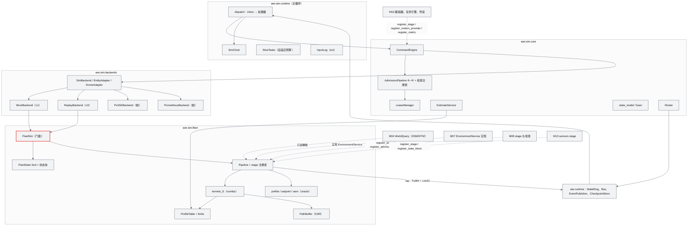
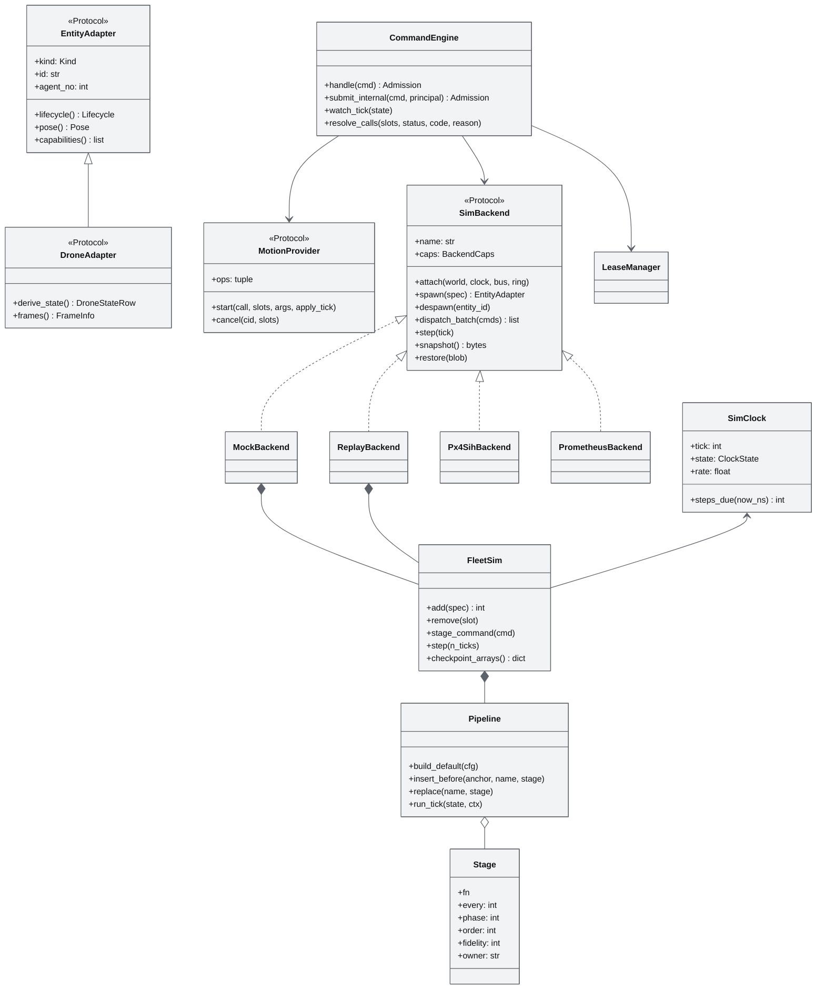
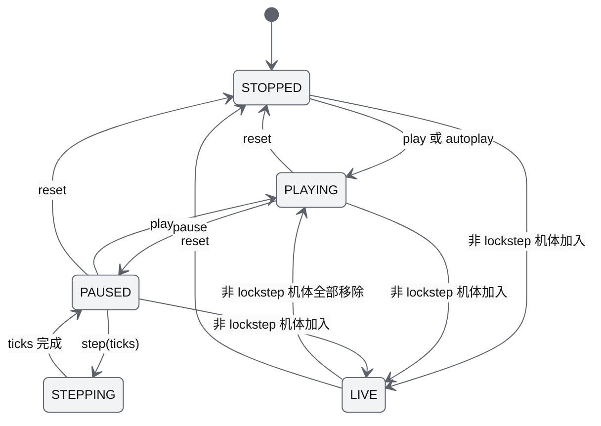
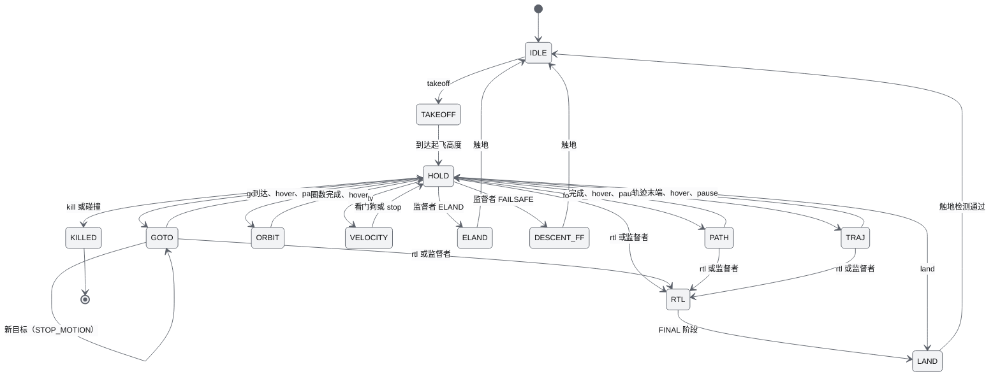
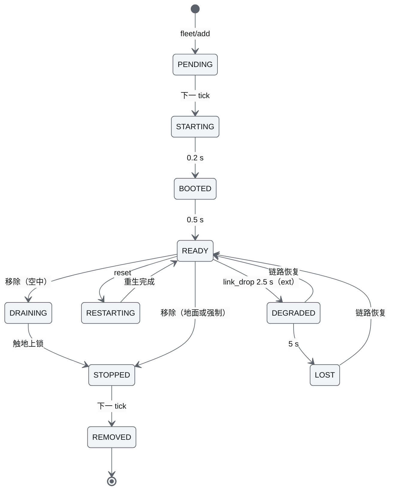
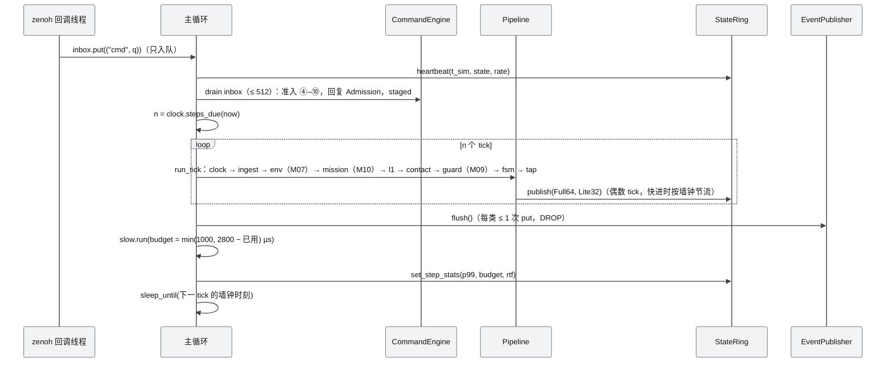
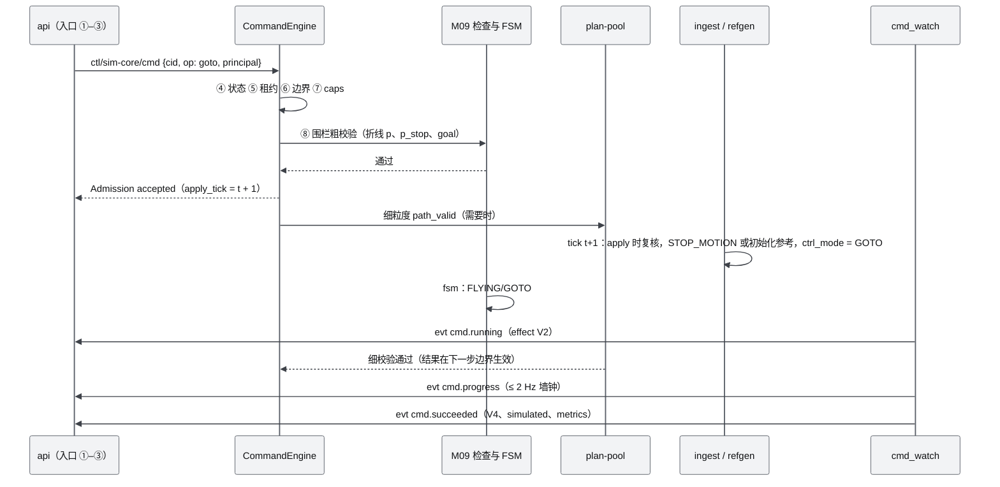
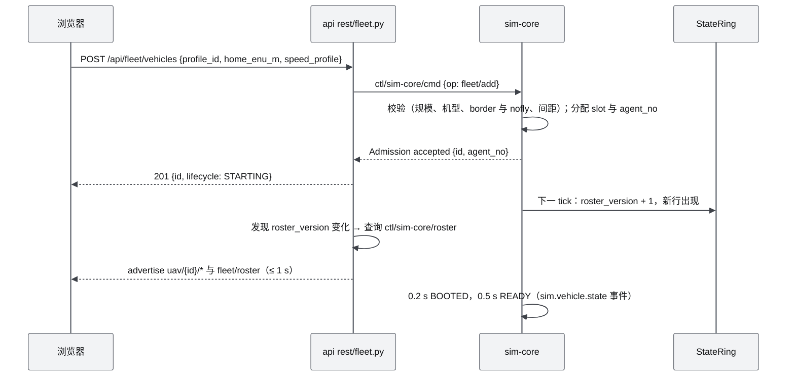
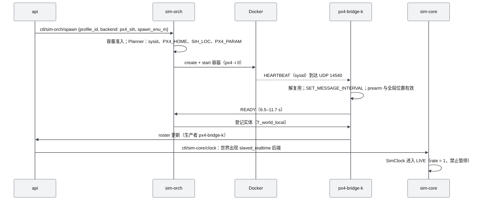

# M08 仿真内核 FleetSim 与 DroneAdapter PRD

| 项 | 内容 |
|---|---|
| 文档编号 | AWR-M08 |
| 标题 | 仿真内核 FleetSim 与 DroneAdapter PRD |
| 版本 | v1.0 |
| 日期 | 2026-09-28 |
| 状态 | 草案 |
| 上游文档 | [AWR-03 设计基线与决策记录](../03-设计基线与决策记录.md)（§3.3、§3.7、§4.1–§4.3、§5.1–§5.3、§5.7、§5.9、§6.1–§6.3、§8.2–§8.7、附录 A–C；ADR-015 至 ADR-022、ADR-024、ADR-026、ADR-027、ADR-028 至 ADR-033、ADR-036、ADR-038、ADR-039、ADR-040、ADR-042、ADR-043、ADR-045、ADR-047 至 ADR-050）；[01-design](../01-design.md) §26–§30、§35–§37、§39；研究笔记 [g08](../research/g08-gap.md)（权威）、[r20](../research/r20-px4.md)、[r21](../research/r21-mavsdk-mavros-mavlink.md)、[r22](../research/r22-px4-multi-sim-xtdrone.md)、[r23](../research/r23-airsim-gzsim.md)、[r19](../research/r19-prometheus-amov.md)、[n03](../research/n03-discover-uav-sim-agents.md)、[r24](../research/r24-mrs-uav.md)，以及 [g04](../research/g04-gap.md) §1、§4–§8，[g05](../research/g05-gap.md) §3–§4、§7，[g06](../research/g06-gap.md) §6，[00-index](../research/00-index.md) §2.7、§3.9、§5.4 |
| 下游文档 | [M07 环境引擎](M07-环境引擎PRD.md)、[M09 安全与健康](M09-安全与健康PRD.md)、[M10 任务规划与集群](M10-任务规划与集群PRD.md)、[M11 实时网关](M11-实时网关PRD.md)、[M12 时间轴录制与回放](M12-时间轴录制与回放PRD.md)、[M13 传感器仿真](M13-传感器仿真PRD.md)、[M14 智能体运行时与 ANet](M14-智能体运行时与ANet-PRD.md)、[M15 前端 UI 壳](M15-前端UI壳与设计体系组件PRD.md)、[M16 演示与测试](M16-演示数据剧本与流畅性测试PRD.md)；[10 系统架构](../10-系统架构说明书.md)、[12 业务逻辑](../12-业务逻辑设计说明书.md)、[16 World 数据规范](../16-World数据规范.md)、[17 接口与实时协议](../17-接口与实时协议规范.md)、[18 性能与测试](../18-性能与测试方案.md)、[19 部署与运维](../19-部署与运维说明书.md) |
| 适用版本范围 | V0.1（D1）至 V1.0。D1 交付 Mock L1（FleetSim，1–1000 架）与 Replay L0；PX4 SIH、Prometheus 为接口桩；Simulation Orchestrator 在 V0.2 |

## 0. 摘要

1. M08 是 sim-core 进程的内核：单一世界时钟（主时钟 250 Hz，4 ms/tick）驱动 numpy SoA 加 Crazyflow 式命名 stage pipeline；L1 控制与物理 125 Hz，env 与 guard 50 Hz，tap 125 Hz 写 StateRing（依据 g08 §3、ADR-021）。
2. 控制律是移植自 PX4 的 PX4-lite 外环：位置 P → 速度 PID（PX4 原生 ARW）→ 推力矢量与倾角限制 → 四元数姿态 P → 理想速率环；参考生成器为 PositionSmoothing-lite + `time_stretch` + STOP_MOTION；气动为组合模型 `−½ρ·CdA·|v_r|·v_r − ΣΩ·c_rd·v_r⊥`，风只经相对空速进入（依据 g08 §4–§6）。
3. 热路径是 numba 融合核，numpy 版本保留为 oracle（单步 ≤ 1e-12，10 s 轨迹 ≤ 1e-6 m）；N = 1000、RTF = 1 时 sim-core 全部 stage 预算合计约 0.32 核（告警 0.40 核，门禁 0.6 核），单步 p99 ≤ 3 ms（依据 g08 §11、ADR-021，逐 stage 预算见 §5.2）。
4. 机型：x500（composite）与 x500_sih（linear）是 SIH 回归机体；p600_mid360（3.5 kg、TWR 2.24、默认 `prometheus_outdoor` 限速 3 m/s）是产品默认，状态为 placeholder（依据 g08 §10、ADR-022）。
5. 回归门禁：与 PX4 SIH v1.18.0-rc1 黄金轨迹对照 17 项指标，在 `aero ∈ {linear, composite}` × `l1_every ∈ {1, 2}` 四种组合下全部落在容差内，guard 事件为 0（依据 g08 §9、D1-AC-12）。
6. 适配层：`SimBackend` 管理一组实体与时钟能力，`EntityAdapter` 与其特化 `DroneAdapter` 屏蔽后端差异，差异一律由 `caps`（含 `caps.clock`）表达；D1 实现 MockBackend（L1）与 ReplayBackend（L0 运动学回放），PX4 SIH 与 Prometheus 交付推导纯函数、caps 与 fake 测试桩；SIH 容器编排（Orchestrator）在 V0.2。
7. M08 还承担 SimClock（暂停、倍速、单步）、CommandEngine（调用生命周期与规范准入 ④–⑩ 的框架）、LeaseManager（D1-core：owner、单 operator 锁、安全类免租约）、`ctl/sim-core/estimate`，并定义 stage、状态块、准入检查、慢任务、查询、运动提供者、度量、能量模型与安全钩子九个注册点，以及 EnvironmentService、EntityAdapter 等接口和供 fleet 以外 stage 使用的 ENU/FLU 只读视图（AWR-03 §6.2 规则 1、§5.3 第 3 条）。
8. 二次优化：以同钟 FleetSim 取代原设计"每机一个 PX4 SITL"，以保真度阶梯承接"不从零自研飞控、走 PX4 语义"，把原设计 100–1000 Hz 的频率区间落为 250/125/50 Hz 的整除关系（§1.3）。

---

## 1. 背景与目标

### 1.1 背景

1. 原设计要求无人机物理层不从零开发、采用 PX4 SITL，并且"每架无人机独立维护一个 PX4 SITL"（01-design §26、§29），第一阶段后端为 PX4 + Gazebo（§35）。
2. 研究给出三条硬约束：
   - 本机无 GPU，Gazebo 固定加载 ogre2 传感器系统，只能作为 GPU 节点可选项（r20 §0 第 12 条）；
   - PX4 SIH 每实例约 0.21–0.23 核，本机 ≤ 8 机时 RTF ≥ 0.92，16 机时 RTF 约 0.72，且各实例的 lockstep 时钟互相漂移，16 机时每分钟约差 1 s（r20 §0 第 1、11 条）；
   - R3 要求内置六城加无人机 Mock 并做流畅性测试，机群阶梯到 1000 架（AWR-03 §2.4、ADR-042）。
3. g08 已把 r20（PX4-lite 级联，已与 SIH 对照）、r23（减速约束与风阻）、r24（STOP_MOTION 与安全阈值）、n03（Crazyflow pipeline）合成一份可回归的规格，并实测了 1000 架的 CPU 成本（g08 §0）。
4. 因此 M08 在 D1 以自研 FleetSim L1 为默认后端，但控制律、模式名、参数名、状态枚举全部采用 PX4 语义，使 V0.2 接入 SIH 时 UI 与协议无感（P-07）。多机协同所需的"同一时钟"由单进程 SoA 保证，而不是由多个 SITL 近似同步（g08 §1）。

### 1.2 目标

| 编号 | 目标 | 可度量表述 | 首次达成 |
|---|---|---|---|
| MG1 | 像 PX4 一样飞 | SIH 对照 17 项指标在 4 种配置下全部落在 g08 §9.3 容差内，guard 事件为 0（M08-AC-005） | V0.1 |
| MG2 | 1000 架同钟实时 | N = 1000、RTF = 1：RTF ≥ 0.99，sim-core ≤ 0.6 核，单步 p99 ≤ 3 ms、最大 ≤ 12 ms，追帧饱和 0 次（M08-AC-020） | V0.1 |
| MG3 | 环境真实作用于机体 | 8 m/s 风中悬停俯仰 −7.85° ± 0.3°（x500 composite 与 P600）；风只经 `v_r` 进入（M08-AC-011、AC-012） | V0.1 |
| MG4 | 后端可替换 | SimBackend、EntityAdapter、DroneAdapter 在 MS1 冻结；Mock 与 Replay 通过一致性套件；UI 对后端零改动（M08-AC-032） | V0.1 冻结；V0.2 SIH |
| MG5 | 可复现 | 同一内核、同一版本、同一输入：Full64 字节逐位一致（M08-AC-019；输入日志重仿真 M08-AC-036 为 ext） | V0.1 |
| MG6 | P600 数字孪生可度量 | profile 通过 VH-1–VH-7；UI 显示 11 个组成部分的置信度；V0.4 满足 ADR-043 一致性指标 | V0.1 占位；V0.4 辨识 |
| MG7 | 命令效果可验证 | 10 个命令走完调用生命周期；Mock succeeded 为 V4 并标 `simulated`，必带 metrics（M08-AC-026） | V0.1 |

### 1.3 对原设计的继承、修正与增强

| 01-design | 原文要点 | 处置（按 AWR-03 附录 C） | 本文落点 |
|---|---|---|---|
| §26 Drone Simulation | 物理层不从零开发；PX4 SITL → MAVLink → ROS/MAVSDK → Simulation Service | **继承**"走 PX4 语义、不自创飞控算法"：D1 的 L1 是 PX4 `PositionControl`、`AttitudeControl`、`PositionSmoothing` 的逐式移植（port），不是新算法。**修正**"一开始就接 SITL"为保真度阶梯：Mock L1（D1）→ SIH（V0.2）→ SITL-EXT lockstep（V0.4）→ HITL（V0.6）；ROS 不进主链路（ADR-020；r21 §0 第 7 条） | §6.5、§6.11 |
| §27 P600 Digital Twin | Geometry、Mass、Inertia、Motor、Propeller、Battery、Flight Controller、Camera、LiDAR、RTK、Payload | **继承**（受保护意图）。**增强**为 Vehicle Package 载体、A–E 置信度、自洽检查与逐项一致性指标（ADR-043）；1.505 kg 的 SDF 占位值被自洽检查拒绝（g08 §10） | §6.7 |
| §28 DroneState | 统一字段；10–50 Hz 推送 | **修订**：七轴模型与 Full64/Lite32（ADR-015）；M08 负责 tap 与 `state_ext`；`acceleration` 不进 Full64，改由 `state_ext.accel_mps2`（2 Hz）提供（附录 C §28） | §6.3.6、§7.5 |
| §29 多无人机架构 | 每机一个 PX4 SITL；每机独立 State、Sensor、Mission、Controller、Agent | **修正**：一个 sim-core 进程内同钟 SoA 推进 1000 架；"每机独立"保留为逻辑划分（slot 视图 + 按模块注册的状态块与 stage）；外部飞控是另一个生产者进程，lockstep 机体放独立 FleetSim 实例（ADR-020） | §6.3、§6.4 |
| §30 控制模式 | Takeoff、Land、GoTo、FollowPath、Orbit、Hover、ReturnHome | **增强**为 10 个命令加辅助命令、统一调用生命周期与效果状态（ADR-016）；M08 给出每个命令的运动实现 | §6.5.2、§6.10 |
| §35 Simulation Backend | PX4 + Gazebo；第二阶段 Isaac；共用同一 World Model | **继承**受保护意图"多后端共用同一 World"：落为 SimBackend 接口 + World 导出器（ADR-048，导出器属 M03，传感器落点属 M13）；Gazebo 推迟到 V0.6 | §2.2、§6.11 |
| §37 更新频率 | Physics 100–1000 Hz；飞控 100–400 Hz；Backend State 50–100 Hz | **部分取代**：主时钟 250 Hz（在 Physics 区间内，且与 PX4 SITL/SIH lockstep 同频）；L1 控制与物理 125 Hz（在飞控区间内）；Backend State 125 Hz（由 100 Hz 上调，因为 100 不能整除 250，g08 §3.3） | §6.4 |
| §39 Timeline | Pause、Play、Replay、Fast Forward、Seek | 实时部分（pause、play、step、×0.25–×10）由 SimClock 实现；Replay 与 Seek 属 M12（D1-ext） | §6.8 |

### 1.4 设计原则落点

| 原则 | 在本模块的落地 |
|---|---|
| P-03 可视化与物理分离 | contact、AGL、RTL 高度只读 M04 的 DSM/DTM 与 max-pooled `heightmap_top`，从不读 LOD 瓦片 |
| P-04 服务端权威 | SimClock 是仿真时间、倍率、时钟状态的唯一计算者；客户端只插值 |
| P-07 保真度阶梯、接口不变 | SimBackend、EntityAdapter、DroneAdapter、stage 注册表、EnvironmentService 在 MS1 冻结；差异经 `caps` 表达 |
| P-08 单一权威 | FlightState 由 M09 的 Flight FSM 计算；M08 的 `ctrl_mode` 只是"怎么飞"的内部实现，不上线、不参与准入 |
| P-09 仿真永不阻塞 | 回调只入队；状态走 StateRing；事件按步合批并以 DROP 发送；慢任务按剩余预算执行 |
| P-10 确定性分级 | 固定步长、固定 stage 顺序、按 slot 升序、RNG 按流；外部输入按 apply_tick 生效并可写入输入日志 |
| P-11 相对量可测 | 性能以"核·秒/仿真秒"与单步分位数度量，执行 ADR-033 性能运行协议 |

---

## 2. 范围

### 2.1 D1 范围（与 AWR-03 §6.3 M08 行一致）

| 层 | 内容 |
|---|---|
| **D1-core（P0）** | ①SimClock 与 sim-core runtime（步边界锁存、追帧、自适应慢任务、gc 策略、心跳、StateRing 发布、`ctl/sim-core/clock`）；②FleetSim：FleetState SoA、ENU/FLU 只读视图、状态块注册表、Pipeline 与 stage 注册表、默认 pipeline；③PX4-lite 级联与 10 种运动模式（GOTO、PATH、ORBIT、TAKEOFF、LAND、RTL、HOLD、VELOCITY、OFFBOARD_POS 以及 ELAND/FAILSAFE 下降剖面），外加供 M10 跟踪器写设定点的 TRAJ 模式与运动提供者注册表；④组合与线性气动、风耦合、密度修正、contact；⑤numba 融合核 + numpy oracle + 自动退回；⑥机型 profile 加载与自洽检查、限速配置，x500、x500_sih、p600_mid360，Digital Twin 映射中 M08 负责的组成部分，`stl2glb` 与低模工具；⑦state_model、fuser（Mock 取 FSM）、tap、`state_ext`；⑧CommandEngine、准入 ④–⑩ 框架与检查注册表、内部调用入口与结果回调、度量注册表、LeaseManager（owner + 单 operator 锁 + 安全类免租约）、`ctl/sim-core/estimate`；⑨SimBackend、EntityAdapter、DroneAdapter、EnvironmentService 接口，MockBackend、ReplayBackend（L0），`caps/mock.json`（含 `caps.clock`）、`caps/replay.json`；⑩REST `rest/fleet.py`；⑪SIH 黄金数据回归与鲁棒用例、`fleet_ladder` 基准 |
| **D1-ext（P1）** | 完整 Control Lease（HMAC token、7 级抢占、TTL、确认令牌、kill）；checkpoint 恢复接线（FleetSim 与 CommandEngine 的 checkpoint/restore 实现与 M11 CheckpointStore 对接）；输入日志与 `--resim`（G6b）；机间碰撞判定（COLLISION_UAV）；故障注入在融合核中的效果（`motor_ok` 缺位的失控滚转、`state_drop` 的状态冻结）；`tools/vehicles/regen_sih_golden/` 重录脚本 |
| **D1 桩** | `derive_px4`、`native_px4`、`mock_emulate_px4`、custom_mode 编解码，`derive_prometheus` 与 Prometheus 发送防护规则，均为纯函数加 fake 测试；`caps/px4_sih.json`、`caps/prometheus.json`、`sih_params.yaml`；`Px4SihBackend`、`PrometheusBackend` 骨架（open 返回 213 SERVICE_UNAVAILABLE）；`awr/sim/orchestrator/` 目录与 SessionSpec schema 草案 |
| **不在 D1** | SIH 容器与 px4-bridge、SITL-EXT、HITL、L2 气动力矩、interaction（下洗与地效）stage、Orchestrator 实现、Prometheus 实网通信、跨主机分片 |

### 2.2 后续版本

| 版本 | M08 交付 | 退出判据（M08 相关） | 依据 |
|---|---|---|---|
| V0.2 | Orchestrator（独立进程 `sim-orch`，持有 docker.sock）+ DockerSihDriver（每机一容器 `px4 -i 0`）；px4-bridge-k（MAVSDK 4.0，每进程 ≤ 16 架）实现 DroneAdapter；Prometheus 模拟器后端（r19 codec）；世界时钟 LIVE；`10050_sihsim_p600` 机架文件草案 | SIH 8 架 RTF ≥ 0.92；10 个命令在 SIH 上走完生命周期；S1 可在 SIH 后端跑通；UI 零改动（AWR-03 §8.1） | r22 §4.2；r20 §3.8；ADR-020 |
| V0.3 | L2：同一外环 + 速率 PID + 控制分配 + 转子滞后 + RotorPy 气动力矩（250 Hz）；contact 接入 M04 体素与 SDF（L1–L2 碰撞代理），计入碰撞半径 | L2 50–300 架在 250 Hz 下 RTF ≥ 1；与 L1 共用 guard、气动与 Dryden | g08 §1；n03 §3.1 |
| V0.4 | SITL-EXT：独立 FleetSim 实例，TCP 4560+i lockstep（HIL_SENSOR/HIL_GPS 与 HIL_ACTUATOR_CONTROLS 往返，50 ms 超时标 STALLED 并沿用上一帧）；interaction stage（下洗与地效）；P600 参数辨识（status → identified）；基于输入日志的 what-if 分叉 | SITL-EXT 8 架 lockstep 稳定 10 min；P600 满足 ADR-043 一致性指标 | n03 §3.6；ADR-020、ADR-043 |
| V0.5 | Prometheus 真机后端（`caps.clock = live`）；ReplayBackend 读 ULog/tlog；ZenohStateBus 跨主机 | 真机状态与控制端到端可用 | r19 §4.5；r21 §4.2.4 |
| V0.6 | HITL（`slaved_realtime`）；GazeboPodDriver；sim-core 按区域分片预研 | HITL 4 架稳定 10 min | ADR-020 |
| V1.0 | 异构实体（kind ≠ uav）的 EntityAdapter；K8sDriver | S3 用真 ANet 跑通 | ADR-047 |

### 2.3 与其他模块的边界

| 模块 | M08 提供 | M08 使用 | 边界规则 |
|---|---|---|---|
| M04 Geometry World | — | `WorldQuery`（M04 §7.1）：`dsm_grid()`、`dtm_grid()` 只读栅格视图（contact、AGL）、`heightmap_top_along`（估价）、`free_distance`（Velocity 限速）、`height_dsm`、`zones`（出生点校验） | M08 不做几何求交以外的几何处理；DSM 一律按柱体语义取最近格，DTM 为格心双线性（M04 §6.3） |
| M07 环境 | `EnvironmentService` Protocol（`awr/sim/backends/base.py`）、stage 注册表、慢任务与查询注册（`register_slow_task`、`register_query`）、FleetState 环境字段与 ENU 视图 | `query()`、`keyframe()`、`apply()`；checkpoint（ext） | env stage 由 M07 注册（order 020、every 5、phase 0）；风场、湍流、廓线的公式与状态全部在 M07；气动力的施加在 M08 |
| M09 安全与健康 | stage 注册表、状态块注册表、SupervisorQueue（即 M09 `SafetyActuator` 协议的 Mock 实现）、准入检查注册表、`CommandEngine.resolve_calls()` 与 `schedule_fine_check()`、contact 的碰撞与触地标志（IN_AIR）、`p_stop` 与 `pos_ref`、ENU 视图、`SimClock.paused_total_ns()`、LeaseManager `suspend/resume`、`SafetyHooks` 的调用时机 | FlightState/sub/flags 状态块（含 RTL 阶段）、电量块、`d_free_fence_m`、`EnergyModel`（`estimate`、`rtl_plan`、`path_wh`）与 `SafetyHooks` 实现 | FlightState 与 RTL 阶段的唯一计算者是 M09 FSM；M08 只按 SupervisorAction 与当前阶段改变运动 |
| M10 任务与规划 | 内部调用入口 `submit_internal`（principal = MISSION/SWARM）与结果回调、TRAJ 模式与运动提供者注册表、度量注册表、`FleetSim.add`（经 roster）、plan-pool 结果按 apply_tick 生效的通道 | `mission_item` 状态块、跟踪器 stage 写入的 TRAJ 设定点、safe_transit 与细粒度 `path_valid` 结果 | 轨迹生成器、跟踪器与剧本加载器属 M10；装配 M10 时 follow_path、orbit 与非直飞 goto 由 M10 运动提供者执行（TRAJ），M08 的 PATH、ORBIT 是无提供者时的原生执行与回归参考（§6.5.2） |
| M11 网关与运行时库 | 生产者侧：`ctl/sim-core/*` 服务、StateRing 写者、事件生产者 | `awr.runtime`（StateRing、Bus、EventPublisher、CheckpointStore、child） | M08 依赖 `awr.runtime` 库，不依赖网关（ADR-050） |
| M12 时间轴 | TIME 所需的时钟状态（经 StateRing 头部） | — | TIME 语义与客户端插值属 M12；SimClock 是源 |
| M13 传感器 | ENU/FLU 视图（`pose_enu_flu`、`acc_enu`、`omega_flu`）、传感器 stage 槽位（order 100–109）、`StageCtx.call_index` | `describe()` 生成的 `sensors{}` 与孪生表 Camera、LiDAR、RTK 三行 | 传感器挂载与噪声属 M13；M13 不读 NED 数组（AWR-03 §5.3 第 3 条） |
| M14 智能体 | `ctl/sim-core/estimate`、AGENT 租约 | — | agent 命令经 agent-runtime 受信守卫进入准入 ④–⑩ |
| M06、M15 | 模型资产（glb）、caps、profile 与孪生表数据 | — | 显示与交互属 M06、M15 |
| M16 | `fleet_ladder` 工具、SIH 回归用例 | `ladder-shenzhen` 与 S1 剧本（阶梯负载定义见 M16 §6.4.8） | 剧本文件属 M16，调度由 M16 harness 执行 |

### 2.4 本模块新增术语（其余见 AWR-03 §11）

| 术语 | 定义 |
|---|---|
| slot | FleetState 的行号；分配后稳定，移除只打掩码 |
| 状态块（state block） | 由某个模块声明、M08 统一分配与 checkpoint 的 SoA 字段组，每个字段只有一个写者 |
| stage / every / phase / order | pipeline 中的命名步骤；`(tick − phase) % every == 0` 时执行；order 决定同一 tick 内的顺序 |
| 融合核（fused kernel） | 把 refgen → integrate 合并为一次逐机循环的 numba 函数 |
| oracle | 每个 stage 的 numpy 参考实现，用于对拍与调试 |
| 运动模式（CtrlMode） | M08 内部"怎么飞"的枚举（GOTO、PATH 等），不上线，与 FlightState 的映射见 §6.9 |
| 限速配置（limits profile） | 一组 PX4 限幅参数（`MPC_XY_VEL_MAX` 等），决定同一机型的飞行手感 |
| 幽灵机（ghost） | ReplayBackend 按轨迹文件运动学回放的实体，`pose_src = KINEMATIC` |
| apply_tick | 外部输入实际生效的主时钟 tick，写入输入日志 |
| RTF 受限 | 请求倍率超过算力时，时钟重锚墙钟、报告实际倍率，不跳步也不欠账 |
| TRAJ 模式与运动提供者 | TRAJ 是 refgen 跳过、由外部跟踪器 stage 每个 L1 tick 写入 `tr_x/tr_v/tr_a/yaw_sp` 的运动模式；运动提供者是经 `register_motion_provider` 登记、接管某些命令运动执行的对象（D1 为 M10） |
| ENU 视图 | M08 为 fleet 以外的 stage 提供的 World ENU/FLU 只读数组，每 tick 按需换算一次并缓存（§6.3.1） |

---

## 3. 用户与用例

### 3.1 用户角色

| 角色 | 与 M08 的关系 |
|---|---|
| 操作员（operator） | 经 UI 与网关下发命令、增删机体、控制时钟；受席位与租约约束 |
| 剧本导演（M10 scenario loader） | 布设机群、启动任务、声明倍速与 `gcs_loss_policy` |
| 智能体（agent） | 经 agent-runtime 的受信守卫下发命令与估价请求；视为不可信指挥官 |
| 研发与测试 | 运行 pytest、SIH 回归、fleet_ladder，读取逐 stage 计时 |
| 集成方（V0.2 起） | 接入 SIH、Prometheus 后端，实现 DroneAdapter |

### 3.2 用例

| 编号 | 用例 | 主要步骤 | 涉及需求 |
|---|---|---|---|
| UC-01 | 单机闭环（walking skeleton） | 布设 1 架 → takeoff → 点选 goto → land | FR-016–FR-027、FR-054–FR-057 |
| UC-02 | S1 深圳双机立面螺旋扫描（×10） | 剧本布设 → 任务引擎经 `submit_internal` 下发 follow_path → M10 跟踪器写 TRAJ 设定点 → 阵风事件 → 完成 | FR-086、FR-089、FR-033、FR-001 |
| UC-03 | 机群阶梯 1000 架随机 goto | fleet_ladder 按 N 递增运行 60 s，采集 RTF、CPU、单步分位数 | FR-038、FR-078、NFR-001–NFR-003 |
| UC-04 | 运行时添加与移除 P600 | `POST /api/fleet/vehicles` → roster 更新 ≤ 1 s → 起飞 → `DELETE` | FR-067、FR-080、FR-081 |
| UC-05 | 调风速观察倾角与漂移 | `env/set` 12 m/s → 机体倾角约 13°、pos_err < 3 m | FR-032–FR-034 |
| UC-06 | 暂停、单步、倍速 | pause → step 25 ticks → speed ×5 → play | FR-001、FR-002、FR-008 |
| UC-07 | 1000 架同时 RTL | 批量 rtl → 向量化准入 → 分阶段返航 → 降落 | FR-027、FR-059 |
| UC-08 | SIH 对照回归（CI） | 4 种配置 × 3 个实例对照 17 项指标 | FR-075、FR-076 |
| UC-09 | 幽灵机对照 | ReplayBackend 加载 SIH 黄金 CSV，与同命令的 Mock 机同屏对照 | FR-068 |
| UC-10 | 智能体估价 | agent-runtime → `ctl/sim-core/estimate` → eta、能耗、可行性 | FR-064 |
| UC-11 | 输入日志重仿真（ext） | S1 录制输入日志 → `--resim` → Full64 逐位一致 | FR-084 |
| UC-12 | 混合 SIH 与 Mock（V0.2） | Orchestrator 拉起 4 架 SIH → 世界时钟进入 LIVE → UI 置灰暂停 | FR-009、FR-073 |

---

## 4. 功能需求

需求表的"D1"列按 AWR-03 §10.2 第 4 条取值：D1 = 是的条目目标版本为 V0.1，P0 为 D1-core、P1 为 D1-ext；D1 = 桩只交付接口、纯函数或测试替身，真实实现的版本写在描述中。验收要点中的 M08-AC-### 见 §10。

### 4.1 时钟与运行时

| 编号 | 需求描述 | 优先级 | 目标版本 | D1 | 验收要点 | 依据 |
|---|---|---|---|---|---|---|
| M08-FR-001 | SimClock：主时钟 tick = 4 ms，`t_sim_ns = tick × 4_000_000`（int64）；状态 STOPPED、PLAYING、PAUSED、STEPPING、LIVE，按 AWR-03 §5.2 第 6 条映射到 TIME.state（0、1、2、3、9）；倍率集合 {0.25, 0.5, 1, 2, 5, 10}；单步 1 ≤ ticks ≤ 2500；内部保持（剧本开局屏障，AWR-03 ADR-068 第 4 条、ADR-073 第 7 条）：`hold(reason, timeout_s, ready)` / `release(reason)`，保持期间 `steps_due` 返回 0 并重锚（不欠账、不计追帧），对外状态仍为 PLAYING（不写输入日志、不发 `sim.clock`），`ready()` 为真或墙钟超过 timeout_s 时放行（记入 `hold_log`），reset 解除全部保持；`per_tick` 为真时主循环逐 tick 推进并在每个 tick 后检查保持（FR-003） | P0 | V0.1 | 是 | M08-AC-001 | g08 §3.2；AWR-03 §5.2；AWR-12 §4.1.2 S08、S09 |
| M08-FR-002 | 固定步长追帧：每轮迭代最多执行 `max_batch = max(5, ⌈5·rate⌉)` 个 tick；到期 tick 超过 `max_batch` 时执行 `max_batch` 个并把墙钟锚点前移（不跳步、不累积欠账），置 `rtf_limited`，StateRing 头部 `rtf_milli` 与 TIME 报告实际倍率 | P0 | V0.1 | 是 | M08-AC-002 | g05 §4；g08 §3.3、§11.2 规则 4；本文设定（×10 快进时的批量上限，见 §14 F-04） |
| M08-FR-003 | 主循环固定顺序：写心跳 → 步边界 drain inbox（每轮 ≤ 512 条，且墙钟 ≤ 1.5 ms：超出后余下的请求留到下一轮、至少处理 1 条、FIFO 不变；500 架逐机 link_drop 的 20 条并发命令此前在同一轮内全部准入，单步 32–39 ms，AWR-03 ADR-073 第 4 条）→ 执行到期 tick 的 pipeline → `events.flush()` → 慢任务 → `sleep_until(下一 tick 的墙钟时刻)`；×1 下（非锁步、非单步）刚执行完偶数 tick 时休眠到其后的偶数 tick 到期，奇、偶两个 tick 成对推进，主循环按 125 Hz 唤醒（StateRing 发布时刻不变，奇数 tick 的 stage 至多晚 4 ms 执行，计算顺序与结果不变；`AWR_SIM_PAIR_TICKS=0` 关闭；AWR-03 ADR-070）；休眠前以预计醒来时刻打开 checkpoint 写线程的空闲窗口、醒来后关闭（`IdleGate`，FR-083，ADR-073 第 1 条）；×1 成对推进时窗口另带主循环等待余量 slack = max(0, 2 × 2.6 ms − 下一轮所在相位（tick % 50）的迭代耗时上包络)（上包络：实测更大时取实测，否则每轮该相位向实测靠拢 10%；迭代耗时含等锁），只有持状态锁的 checkpoint 后台拷贝把它计入窗口剩余（FR-083，ADR-073 第 2 条）；每轮迭代持仿真状态锁（`state_lock`），开始计时在取锁之前（等锁计入单步）；设置期（SimClock `per_tick`，M10 剧本开局屏障）内逐 tick 推进，某个 tick 置下内部保持后本轮不再推进（FR-001）；sim-core 主循环线程保持 supervisor 给定的亲和性，其余线程由慢任务每 2 s【墙钟】改到 `AWR_SIM_AUX_CPUS`（缺省为主循环亲和性之外的 CPU，ADR-070；`configs/runtime.yaml` 给 core7，ADR-073 第 6 条）；主循环内禁止网络同步等待、禁止非 tmpfs 文件 I/O、禁止无界 Python 循环遍历全部机体 | P0 | V0.1 | 是 | M08-AC-003（代码审查清单 + 单步计时） | g05 §4 不阻塞规则；ADR-021 ① |
| M08-FR-004 | 慢任务轮转：M08 自身的 `state_ext` 2 Hz 打包（每片 8–48 架按本轮剩余预算与逐机耗时取值，跨迭代完成；逐机耗时取上包络——实测更大时取实测、每次至多翻倍，更小时每片向实测靠拢 10%——此前 0.7/0.3 指数平均会被缓存温热的轻片压到实际值的一半以下，下一片取满 48 架落在只剩约 0.8 ms 预算的轮次上；末片之后剩余预算放不下整体拼接与发布的上包络时，发布顺延到下一次调用；sim-core 进程中 `put` 交给空闲窗口发布线程 `bgpub.GatedPublisher`（`AWR_SIM_EXT_BG=0` 关闭）：等剩余 ≥ 估计 × 1.25 + 0.6 ms 的空闲窗口再发，至多 0.25 s【墙钟】，同一发布者在途时只发最新一份；api 与 recorder 订阅时 N = 1000 的单次 put 4–7 ms，AWR-03 ADR-073 第 3 条；拼接也由该线程在空闲窗口内完成，主线程只交出已编码的各片，ADR-074 第 3 条；逐机上包络使片长停在下限、主要由饿死兜底推进时，兜底的最小片只落在本轮剩余预算 ≥ 600 µs 的轻轮，连续 150 ms 未推进时不再挑轮，ADR-074 第 4 条）、`fleet/vehicles` 全表查询的分片作业（N > 64；按不可分片任务的公平轮转与借贷启动，每次按剩余预算编码 8–64 架，作业存在超过 200 ms【墙钟】后每次 64 架，完成后拼接与回复交给空闲窗口发布线程；ADR-074 第 2 条）、估价请求、幂等表与租约过期清理、roster 快照、gc gen2 手动回收（每 1 s【墙钟】一次并冻结幸存者；启用 checkpoint 时与 checkpoint 合并，顺序为 gen2 → 拷贝 → 冻结拷贝出的元数据，ADR-073 第 2 条，此前 gen2 在拷贝之后、要遍历刚建出的整代元数据；sim-core 进程中两步都由后台拷贝线程在空闲窗口内持状态锁执行，慢任务只提出请求，见 FR-083；上一次 gen2 估计耗时 > 3 ms 或自上次以来准入 ≥ 64 条调用（风暴）时本次只冻结、不回收，连续至多 30 次；年轻代回收只做 gen0，gen1 只在 gen0 计数到 120 次时强制）、checkpoint 数组拷贝（ext）；以及他模块经 `register_slow_task` 登记的任务（M07 `env.heartbeat`、`env.detail`，M09 safety 详情，M13 sensor 详情，M04 `GeoProbeServer` 分片，`register_query` 的请求）；每轮预算 `min(1000 µs, 2300 µs − 本 tick 已用)`，下限 100 µs；不足 100 µs（本轮管线已用尽 tick 预算）时预算记 0，只执行已到饿死上界的任务（不可分片任务顺延满 20 ms【墙钟】或 10 轮、整块周期任务顺延满 1 s，ADR-070）；任务按轮转指针续做，不在同一轮追完；不可分片的请求（估价、`ctl/sim-core/query`、细校验）按 ADR-057 的公平轮转与预算借贷启动：启动门槛为 min(p99, 每轮最大预算)，有待处理请求而顺延时把本轮剩余预算记为该任务的积分并让下一轮从它开始，积分加剩余预算达到门槛即启动，超支部分记为借贷（上限 4 ms）并在其后各轮扣还（每轮保留 100 µs 下限），顺延至多 ⌈1000 / 100⌉ = 10 轮、且不超过 20 ms【墙钟】（有界时延）；启动后同一轮内续处理排队请求（≤ 4 条）；追帧与成对推进时每轮预算按本轮 tick 数折算为 `min(1000 µs, n·2300 µs − 本轮已用)`（n = 1 时同上式）；`ctl/sim-core/query` 排队 > 8 个时 111 | P0 | V0.1 | 是 | M08-AC-003；`tests/sim/test_slow_tasks.py` | ADR-021 ②、ADR-057；AWR-10 §4.2；本文设定（2300 µs 为墙钟抖动留出单步 p99 余量，ADR-070；此前 2800 µs） |
| M08-FR-005 | 启动序列：`init_child`（PDEATHSIG、BLAS 单线程断言、faulthandler、QueueHandler 日志）→ `compose_plugins(cfg.plugins)`（组合根按 `configs/runtime.yaml` 导入 M07、M09、M10、M13，执行注册，AWR-10 §3.3 规则 1）→ 加载 profile 与世界栅格 → StateRing `open_or_create` → 生产者 `epoch = 头部 epoch + 1`、`segment = 头部 segment + 1`（checkpoint 恢复时沿用快照 segment，AWR-10 §4.2）→ pipeline 构建与注册校验（FR-012）→ numba 预热（N = 2 的哑数组调用全部核）→ `gc.collect(); gc.freeze()`，gen2 阈值设为 1,000,000（`stop()` 时 `gc.unfreeze()`：同一进程内反复启停（`--inproc`、测试）不再把已停止实例的对象留在永久代，AWR-03 ADR-060）→ 发 `sim.started` → 声明 `proc/sim-core/ready`；numba 缓存命中时 exec 到 ready ≤ 2.0 s（p95）；numba 预热（ADR-065）：`python -m awr.sim.runtime.warm`（`make numba-warm`）按运行期签名（只读 ENU 视图、只读 DSM/DTM 网格、float32 记分板）预热全部插件核与 plan-pool 规划核，`tests/sim/test_numba_signatures.py` 校验运行期不新增签名；单机发布走 numpy 路径（结构化字段视图在 n = 1 时为 C 连续）；热备用模式（AWR-03 ADR-070，AWR-19 §4.2）：`AWR_STANDBY=1` 时先设 PDEATHSIG，完成插件装配（含各插件 numba 预热）、L1 核预热、机型表与剧本校验器预热后在 stdout 打印 `AWR_STANDBY_READY`，阻塞读 stdin 的一行 JSON `{"env": {...}}`（supervisor 接替时写入），以其更新环境后从 `init_child` 继续上述序列（机型表复用预热结果），读到 EOF 即退出码 0 退出 | P0 | V0.1 | 是 | M08-AC-024 | ADR-021 ③；g05 §4；AWR-10 §4.2；AWR-11 TECH-NFR-004 |
| M08-FR-006 | StateRing 发布：每次 L1 更新后由 tap 发布（125 Hz【仿真】）；快进时按墙钟间隔 ≥ 4 ms 节流（≤ 250 Hz），并置 SlotHeader `flags.FASTFWD`；主循环每次迭代在 `clock_seq` 顺序锁内写时钟组（`heartbeat_ns`、`t_sim_ns`、`clock_state`、`rate_milli`、`epoch`、`segment`），每秒写 `step_p50_us`、`step_p99_us`、`step_max_us`、`catchup_saturated`、`rtf_milli`、`step_budget_us`，增删机体时写 `roster_version`（头部布局见 AWR-17 §9.2 v1.1）；Full64/Lite32 由 Gateway 按 `awr.rt.v1` 编帧下发（M11） | P0 | V0.1 | 是 | M08-AC-033 | ADR-014；ADR-018；AWR-17 §9.2 |
| M08-FR-007 | 线程与 CPU：pipeline 只在主线程执行；numba 不使用 `prange`；`NUMBA_NUM_THREADS=1`、`OMP_NUM_THREADS=1`；亲和性与 nice 由 supervisor 按 `configs/runtime.yaml` 设置，sim-core 启动时读回并写入 `meta.json` | P0 | V0.1 | 是 | M08-AC-024 | ADR-017；g05 §4 |
| M08-FR-008 | `ctl/sim-core/clock`：play、pause、step{ticks}、speed{rate}、reset{scenario_id?}、checkpoint（ext）；守卫与失败码按 AWR-12 §5.13；reset 执行段切换（`segment + 1`、`epoch + 1`）、机群重生、租约全部 FREE、在途调用 `canceled 6` | P0 | V0.1 | 是 | M08-AC-001 | AWR-12 §4.1.2 S05–S10；ADR-040 |
| M08-FR-009 | `caps.clock` 汇总：世界中所有后端的时钟能力取最严者；出现 `slaved_realtime` 或 `live` 时 SimClock 进入 LIVE，rate 锁定 1，pause、step、speed 返回 `117 CLOCK_CONSTRAINT`；lockstep 外部飞控必须在独立 FleetSim 实例中运行 | P0 | V0.1 | 是 | M08-AC-001（用假 caps 驱动） | ADR-020、ADR-045 |

### 4.2 FleetSim 状态与 pipeline

| 编号 | 需求描述 | 优先级 | 目标版本 | D1 | 验收要点 | 依据 |
|---|---|---|---|---|---|---|
| M08-FR-010 | FleetState SoA：容量 1024 行预分配（等于 StateRing cap），运行期不重新分配；slot 分配后稳定，移除只清 `active`；内部坐标 NED/FRD、四元数 (w,x,y,z)，只允许出现在 `awr/sim/fleet/**` 内（AWR-03 §5.3 第 3 条） | P0 | V0.1 | 是 | M08-AC-003 | g08 §2；ADR-018 |
| M08-FR-011 | 状态块注册：`register_state_block(name, owner, fields)`；M09（safety、battery）、M10（mission）、M13（sensors）的 SoA 由 M08 统一分配、统一参与 checkpoint；每个字段声明唯一写者 stage，pipeline 构建时校验"一字段一写者" | P0 | V0.1 | 是 | M08-AC-003 | AWR-03 §6.2 规则 1；P-08 |
| M08-FR-012 | stage 注册表 `@register_stage(name, every, phase, order, *, owner, fidelity, budget_core, shards)`：AWR-03 §4.3 的四参数写法必须可用，`owner` 缺省按注册函数所在包推断（§6.4.2 包到模块表），`budget_core` 缺省取 §5.2 预算表中同名 stage 的值；`tick_hz % every == 0`（避免 Crazyflow 在非整除频率下静默降频），`0 ≤ phase < every`，name 与 order 唯一，order 必须落在所有者的区段内（§6.4.2），stage 名不在预算表中且未显式给出 `budget_core` 时拒绝；违反时构建失败（KeyError 或 ValueError） | P0 | V0.1 | 是 | M08-AC-003 | g08 §3.1；AWR-03 §4.3 |
| M08-FR-013 | 默认 pipeline 与 `build_default(cfg)`：顺序、频率、phase 按 §6.4.1；`fidelity` 掩码 L1 = 1、L2 = 2、EXT = 4、L0 = 8，各 stage 只处理掩码内的 slot | P0 | V0.1 | 是 | M08-AC-004 | g08 §3.2；ADR-021 |
| M08-FR-014 | 逐 stage 计时：每个 stage 调用前后 `perf_counter_ns` 累加，1 Hz【墙钟】汇总为"ms/仿真秒"（字段 `stage_ms_per_s{<stage>}`；预算 0.07 核即 70 ms/仿真秒），经 `state/sim-core/perf` 送 api 并入 `perf/server.sim`；某 stage 超过 §5.2 预算 1.25 倍时写告警事件 `sim.stage.overbudget` | P0 | V0.1 | 是 | M08-AC-020 | AWR-17 §9.3；AWR-18 §7.1、§9.4 |
| M08-FR-015 | slot 与 agent_no：agent_no = `id_base` + Session 内单调序号，本 Session 不复用；每次增删 `roster_version + 1`；容量满（1024 行）时添加返回 `110 PARAM_OUT_OF_RANGE`（detail = CAPACITY） | P0 | V0.1 | 是 | M08-AC-030 | AWR-12 §5.14；AWR-17 §9.2 |

### 4.3 控制级联与参考生成

| 编号 | 需求描述 | 优先级 | 目标版本 | D1 | 验收要点 | 依据 |
|---|---|---|---|---|---|---|
| M08-FR-016 | 位置与速度环：`K_pos = (0.95, 0.95, 1.0)`；速度 PID xy `1.8/0.4/0.2`、z `4.0/2.0/0`；xy 速度按范数限幅到 `MPC_XY_VEL_MAX`（取当前限速配置），z 限幅 −3/+1.5 m/s（NED）；z 积分限幅 ±g | P0 | V0.1 | 是 | M08-AC-005 | g08 §4；r20 §3.3 ①② |
| M08-FR-017 | 加速度到推力矢量：解耦倾角 `body_z = normalize(−a_x, −a_y, g)`，倾角 ≤ `MPC_TILTMAX_AIR` 45°；collective ≥ `MPC_THR_MIN` 0.12；垂直优先饱和并保留 `MPC_THR_XY_MARG` 0.3 的水平裕度 | P0 | V0.1 | 是 | M08-AC-005 | r20 §3.3 ③④ |
| M08-FR-018 | 抗积分饱和只用 PX4 原生方案：垂直推力贴边且误差同向时 `e_v.z ← 0`；水平 tracking ARW `e_v.xy −= (2/Kp_xy)·(a_sp.xy − a_prod.xy)`；禁止引入 r23 条件积分作为第二套方案 | P0 | V0.1 | 是 | M08-AC-005、AC-006 | g08 §4 修订 6；ADR-021 |
| M08-FR-019 | 姿态：`bodyzToAttitude(−thr/‖thr‖, yaw_sp)`；L1 为四元数 P（4、4、2.8）+ 速率限幅（220、220、200 °/s；自动模式偏航另限 `MPC_YAWRAUTO_MAX` 60 °/s 与限速配置 `MC_YAWRATE_MAX` 取小）+ 理想速率环（ω = ω_sp）；L2 预留速率 PID 与控制分配 | P0 | V0.1 | 是 | M08-AC-005 | g08 §4；r20 §3.3 ⑤–⑧ |
| M08-FR-020 | GOTO 参考（PositionSmoothing-lite）：巡航 `min(speed_mps 或 MPC_XY_CRUISE, MPC_XY_VEL_MAX)`；减速约束 `vmax_from_dist(j, a, d)`（PX4 `computeMaxSpeedFromDistance`）；水平加速度按范数限幅；jerk 限幅 `MPC_JERK_AUTO`；输出 `tr_x/tr_v/tr_a` 作为位置环设定与前馈，并输出 `pos_ref` | P0 | V0.1 | 是 | M08-AC-005、AC-010 | g08 §4、§5.1 |
| M08-FR-021 | `time_stretch`：`MPC_XY_ERR_MAX = 2.0 m`、`MPC_Z_ERR_MAX = 1.0 m`，只在机体落后于参考时逐轴放慢虚拟轨迹；对 GOTO、PATH、ORBIT、RTL、LAND 生效；FleetConfig 可关闭（只用于回归反例） | P0 | V0.1 | 是 | M08-AC-005（关闭时 GoTo RMSE_x 0.633 m 不通过） | g08 §5.2 |
| M08-FR-022 | STOP_MOTION：已在 GOTO 或 PATH 时收到外部新目标，且 `‖tr_v‖ > 0.05` 且新目标方向与参考速度夹角余弦 < 0.98，先按 jerk 限幅刹停再转向；从其他模式进入 GOTO 时以机体状态初始化参考；准入时给出刹停点 `p_stop = p + unit(v)·(v²/(2a) + v·a/(2j))` 供 M09 围栏校验折线 `[p, p_stop, goal]`；PATH 内部航点切换不触发 | P0 | V0.1 | 是 | M08-AC-013 | g08 §5.3；r24 §3.4 |
| M08-FR-023 | PATH（follow_path）：折线 ≤ 1000 个航点、总长 ≤ 20 km；航点存入 CSR 路径缓冲；TOPP-lite 时间参数化（航点转弯限速 `√(a·d_acc·tan(α/2))`、前后向梯形速度剖面），按轨迹时间输出 p/v/a；`time_stretch` 作用于轨迹时间；`bspline` 参数在准入时以 1 m 步长采样为折线（仍受 1000 点上限）；装配 M10 时 follow_path 由 M10 运动提供者执行（FR-086），本条为原生执行路径 | P0 | V0.1 | 是 | M08-AC-014 | ADR-016；g04 §6.3 FollowPath；PX4 `src/lib/mathlib/math/TrajMath.hpp` L87 `computeMaxSpeedInWaypoint` |
| M08-FR-024 | ORBIT：若机体距圆 > 1 m，先以 GOTO 入圈（至圆上最近点）；随后沿圆运动，角速度按 `ACC_HOR/R` 斜坡，切向速度 `≤ min(speed_mps, √(ACC_HOR·R))`；累计转角计圈；偏航行为 `center`（默认）、`tangent`、`fixed`；半径 [1, 1000] m；装配 M10 时 orbit 由 M10 解析原语提供者执行（FR-086），本条为原生执行路径 | P0 | V0.1 | 是 | M08-AC-015 | g04 §6.3 Orbit；AWR-17 §7.7 |
| M08-FR-025 | TAKEOFF：SPOOLUP 1 s（推力斜坡到 `THR_MIN`）→ CLIMB（xy 保持，垂直速度 3 s 内斜坡升至 `MPC_TKO_SPEED` 1.5 m/s）→ 到达 `alt_m`（AGL，默认 2.5 m）后转 HOLD | P0 | V0.1 | 是 | M08-AC-016 | r20 §3.5；g04 §6.3 Takeoff |
| M08-FR-026 | 下降剖面：LAND 在 AGL > 10 m 时 1.5 m/s，5–10 m 线性降到 0.7 m/s，≤ 5 m 为 0.7 m/s，≤ 1 m 为 0.3 m/s；ELAND 恒 0.5 m/s；FAILSAFE/DESCENT 冻结参考、垂直前馈向下 1 m/s；触地后 1 s 内推力斜坡降到 `THR_MIN` | P0 | V0.1 | 是 | M08-AC-016 | r20 §3.4（`MPC_LAND_*`）；g08 §7.2 |
| M08-FR-027 | RTL 运动执行：CLIMB（原地升至 `z_rtl`，≤ 3 m/s）→ CRUISE（飞至 home 上方，巡航 `v_c`；`rtl_plan` 带绕行点 `via_enu_m` 时先飞向绕行点，参考点进入 3 m 接受半径后转向 home 上方，FleetState `rtl_via` 清为 NaN，AWR-03 ADR-054）→ DESCEND（降至 `z_home + 10 m`，1.5 m/s）→ FINAL（LAND 剖面）；`z_rtl`、`v_c`、`t_rtl` 取自 M09 注册的 `EnergyModel.rtl_plan(slot)`（按 AWR-12 §5.8.3 计算并缓存，M09-FR-052）；阶段推进由 M09 FSM 负责（M09-FR-011），refgen 按 `safety.sub` 选择本阶段目标 | P0 | V0.1 | 是 | M08-AC-016 | AWR-12 §5.8.3；g04 §6.3 RTL；M09-FR-011、FR-052 |
| M08-FR-028 | HOLD、SafetyStop、Pause：`v_des = 0`，按 jerk 限幅刹停，参考速度 < 0.05 m/s 后把目标锁定为当前参考点；SafetyStop 同时置 `locked`；Pause 由 M10 发起，保留任务游标 | P0 | V0.1 | 是 | M08-AC-026 | g08 §7.2；g04 §6.3 |
| M08-FR-029 | VELOCITY：`ctl/sim-core/setpoint` 取每机最新值（mailbox）；world 或 body 帧；零速轴保持（`‖v_axis‖ ≤ 0.09 m/s` 锁定该轴，漂移 > 0.04 m 时施加 `−1.8·drift`）；沿速度方向按 `vmax_from_dist(j, a, max(d_free − 2 m, 0))` 限速，`d_free` 取 M04 `free_distance(p, dir, 200 m)`（200 m 处的限速约 30 m/s，已高于任何 `MPC_XY_VEL_MAX`，本文设定）与 M09 `d_free_fence_m`（M09-FR-043）的较小者；ingest 检出 250 ms【墙钟，暂停冻结判定】无新 setpoint 时调用 M09 注册的 `SafetyHooks.on_stream_watchdog(slots)`（M09-FR-062），由 M09 使机体进入 HOLD/LINK_LOSS；只在 rate = 1 可用 | P0 | V0.1 | 是 | M08-AC-017 | g04 §6.3 Velocity；g08 §5.1；ADR-026、ADR-045 |
| M08-FR-030 | OFFBOARD_POS：原始位置阶跃设定、不经平滑，只用于 SIH 回归与测试，不对外暴露为命令 | P0 | V0.1 | 是 | M08-AC-005 | g08 §9.1 inst0 |
| M08-FR-031 | 偏航：goto 可带 `yaw_rad`（ψ_enu），缺省保持当前航向；PATH 缺省沿切线，允许逐航点给定；偏航速率限制见 M08-FR-019 | P0 | V0.1 | 是 | M08-AC-014 | r20 §3.5 |

### 4.4 气动、风与电机

| 编号 | 需求描述 | 优先级 | 目标版本 | D1 | 验收要点 | 依据 |
|---|---|---|---|---|---|---|
| M08-FR-032 | 气动模型：composite `F = −½ρ·CdA·‖v_r‖·v_r − ΣΩ·c_rd·(v_r − (v_r·b3)·b3)`，`ΣΩ = n·ω_max·√clip(T̂, 0, 1)`；linear `F = −K_dv·v_r`；由 profile 的 `aero.model` 选择，FleetConfig 可在回归时覆盖 | P0 | V0.1 | 是 | M08-AC-011 | g08 §6；ADR-021 |
| M08-FR-033 | 风耦合：env stage 由 M07 注册（order 020、every 5、phase 0，50 Hz，两次查询之间零阶保持）；M08 提供 FleetState 环境字段（`wind`、`rho`、`env_flags`、`env_gust`）与 ENU 视图及换算助手（`pos_enu_view()`、`vel_enu_view()`、`set_wind_from_enu()`，ENU 去向矢量换算为 NED 空气速度）；风**只**经 `v_r = v − w` 进入动力学；禁止 gz WindEffects 默认 k = 1 与 SIH"来向"语义 | P0 | V0.1 | 是 | M08-AC-012 | ADR-024；g08 §2、§6.1；r23 §0 第 3 条；M07 §7.1 |
| M08-FR-034 | 推力密度修正：`T = T̂·T_max·(ρ/ρ0)^k_rho`，`k_rho = 1`，ρ0 = 1.225 kg/m³，ρ 取自 env THERMO | P0 | V0.1 | 是 | M08-AC-011 | g08 §6.1 |
| M08-FR-035 | 电机一阶滞后精确离散：`T̂ ← T̂ + (1 − e^{−dt/τ})·(T̂_sp − T̂)`；`T̂`（字段 `thrust`）始终是指令推力状态，执行器故障乘子 `thrust_scale` 只作用于施加到机体的推力（`F = T̂·thrust_scale·T_max·(ρ/ρ0)^k_rho`），因此推力损失时 `thrust` 会顶到 `MPC_THR_MAX`，M09 的油门饱和判据才能触发（g08 R7 的故障只改机体） | P0 | V0.1 | 是 | M08-AC-006、AC-007 | g08 §3.2 motor 行、§9.4 R7 |

### 4.5 接触与碰撞

| 编号 | 需求描述 | 优先级 | 目标版本 | D1 | 验收要点 | 依据 |
|---|---|---|---|---|---|---|
| M08-FR-036 | contact（125 Hz）：在 numba 核内直接索引 M04 `dsm_grid()`（dsm_eff，2 m）按柱体语义取所在格的柱顶高度（最近格，禁止双线性），AGL 用 `dtm_grid()`（10 m）格心双线性；在地面时夹持；空中穿入地表时按 §6.5.5 判定撞墙（CRASHED/COLLISION_WORLD）、硬着陆（下降速度 > 3 m/s，CRASHED/IMPACT）或触地；触地检测输出 `landed`；只读 Geometry World | P0 | V0.1 | 是 | M08-AC-018 | AWR-03 §5.5、§5.8；M04 §6.3、M04-FR-046；r20 §3.5（触地判据）；本文设定（撞墙与硬着陆阈值） |
| M08-FR-037 | 机间碰撞：两机中心距 < 两机碰撞半径之和判为 CRASHED/COLLISION_UAV；以 M09 FleetGuard 的网格哈希在 10 Hz 做 0.1 s 扫掠检测（与 AWR-12 F37、M09-FR-084 一致，属 D1-core） | P0 | V0.1 | 是 | M08-AC-018 | g04 §5.3（CRASHED 子模式）；本文设定 |

### 4.6 数值实现

| 编号 | 需求描述 | 优先级 | 目标版本 | D1 | 验收要点 | 依据 |
|---|---|---|---|---|---|---|
| M08-FR-038 | numba 融合核 `kernels_l1.tick_l1` 覆盖 refgen → pos_ctrl → att_ctrl → motor → aero → integrate，逐机循环；`@njit(cache=True, fastmath=False)`；contact 与 tap 各有一个 numba 核；numba 只允许出现在 `awr/sim/fleet/kernels_*.py` | P0 | V0.1 | 是 | M08-AC-007、AC-020 | ADR-021；AWR-11 TECH-FR-004 |
| M08-FR-039 | numpy oracle：每个 stage 保留独立的向量化实现，与融合核共用参数表与 SoA | P0 | V0.1 | 是 | M08-AC-007 | g08 §11.2 规则 1 |
| M08-FR-040 | 自动退回：numba import 或 JIT 失败时使用 oracle，机群上限钳到 300 架，超出的添加返回 `110`（detail = KERNEL_LIMIT）；发 `sim.kernel.fallback` 事件，`meta.json` 记 `sim_kernel = numpy` | P0 | V0.1 | 是 | M08-AC-008 | ADR-038；AWR-11 TECH-FR-005 |
| M08-FR-041 | 对拍：单步等价（同一状态出发走一步）相对误差 ≤ 1e-12；100 架自由运行 10 s 后位置差 ≤ 1e-6 m、速度差 ≤ 1e-6 m/s、guard 事件序列完全一致 | P0 | V0.1 | 是 | M08-AC-007 | ADR-021；D1-AC-07 |

### 4.7 机型与数字孪生

| 编号 | 需求描述 | 优先级 | 目标版本 | D1 | 验收要点 | 依据 |
|---|---|---|---|---|---|---|
| M08-FR-042 | profile 加载：读取 `vehicles/*/params.yaml`（`awr.vehicle.v1`，结构见 AWR-16 §11.2），按 `id` 与 `variants` 建全局索引；执行 VH-1 至 VH-7 自洽检查，任一不通过拒绝加载并以 `353 VEHICLE_PROFILE_INVALID` 使 sim-core 启动失败（写入 `meta.json` 与 `sim.stopped.reason`）；E 级值不得出现在参数位 | P0 | V0.1 | 是 | M08-AC-009 | g08 §10.2–§10.3；AWR-16 §11.3；AWR-17 §8.4 |
| M08-FR-043 | ProfileTable：按 `profile_id` 把机型参数 gather 成 SoA（质量、`T_max`、悬停推力、τ、桨数、ω_max、气动参数），按 `limits_id` gather 限速参数；每架机可在添加时选择限速配置 | P0 | V0.1 | 是 | M08-AC-010 | g08 §3.1 `ProfileTable` |
| M08-FR-044 | x500（composite）与 x500_sih（linear）参数恒等于注入 SIH 黄金数据的值（2.064 kg、8.55 N/桨、τ 0.03 s、CdA 0.02065 m²、c_rd 8.06428e-5、K_dv 0.35）；任何改动必须同时重录黄金数据 | P0 | V0.1 | 是 | M08-AC-005、AC-009 | g08 §6.2、§9.1；ADR-022 |
| M08-FR-045 | p600_mid360：3.5 kg、19.23 N/桨、TWR 2.24、CdA 0.035 m²、c_rd 1.05e-4、τ 0.04 s、惯量 (0.0548, 0.0548, 0.101) kg·m²；status = placeholder；默认限速配置 `prometheus_outdoor` | P0 | V0.1 | 是 | M08-AC-009、AC-010 | g08 §10.4；ADR-022 |
| M08-FR-046 | 限速配置：`px4_default`（12/5/3 m/s、m/s、m/s²）、`prometheus_outdoor`（3/3/3）、`prometheus_command`（1/1/2）；`speed_mps` 超过当前配置的 `MPC_XY_VEL_MAX` 时准入第 ⑥ 步返回 `110`（detail = SPEED_ABOVE_PROFILE，remedy 给出上限） | P0 | V0.1 | 是 | M08-AC-010 | g08 §10.2 规则 4 |
| M08-FR-047 | Digital Twin：M08 维护 Geometry、Mass、Inertia、Motor、Propeller、Flight Controller、Payload 七个组成部分的载体与一致性指标计算脚本；`GET /api/fleet/profiles/{id}` 返回完整参数、置信度与孪生表 | P0 | V0.1 | 是 | M08-AC-009 | ADR-043 |
| M08-FR-048 | 模型资产：`tools/vehicles/stl2glb.py`（trimesh 读 Prometheus `p600.stl`，gltf-transform `simplify` 减面到 ≤ 5k 三角形）与 `tools/vehicles/lowpoly.py`（按 `frame.type`、`motor.n` 与 `geometry` 程序化生成 ≤ 300 与 ≤ 150 三角形两档；P600 与 x500 均为 `quad_x`、4 桨，见 §14 F-09）；源 STL 缺失时按 `fallback: lowpoly_only` 处理，构建不失败 | P0 | V0.1 | 是 | M08-AC-009 | ADR-022；AWR-16 §11.2、§11.5；g08 `vehicles/p600/params.yaml` |

### 4.8 状态模型与输出

| 编号 | 需求描述 | 优先级 | 目标版本 | D1 | 验收要点 | 依据 |
|---|---|---|---|---|---|---|
| M08-FR-049 | `sim/core/state_model.py` 由 g04 原型转正：枚举、`pack_fs`、`pack_ctrl`、准入矩阵导出（作为 `rt/enums.json` 与 `commands.json` 准入矩阵的生成源，由 M00 合入）；原型 `_selftest` 的 7 组断言迁入 `tests/contracts/` | P0 | V0.1 | 是 | M08-AC-034 | g04 §9；AWR-03 §8.7 |
| M08-FR-050 | tap：NED/FRD → ENU/FLU 换算后直接写 StateRing 槽（Full64 + Lite32，零拷贝写入）；`flight_state`、`flags` 取 M09 safety 块，`mission_item` 取 M10 块，`battery_pct` 取 M09 battery 块，`ctrl` 由 LeaseManager 与 FSM 组合；`pose_src` 为 TRUTH，幽灵机为 KINEMATIC | P0 | V0.1 | 是 | M08-AC-033 | ADR-015；g04 §4.4、§4.9；g08 §2 |
| M08-FR-051 | `state_ext`（2 Hz，`state/sim-core/ext`）中 M08 负责的字段：`lifecycle`、`profile{id, version, status}`、`ctrl{mode, phase}`、`px4`（显示仿真）、`lease{owner, holder, priority}`、`accel_mps2`、`thrust_frac`、`tilt_deg`、`pos_err_m`、`wind_rel_mps`、`frames{T_world_local}` | P0 | V0.1 | 是 | M08-AC-034 | 附录 C §28；g04 §4.4 |
| M08-FR-052 | PX4 显示仿真 `mock_emulate_px4()`：由规范态算出 `arming_state`、`nav_state`、`landed_state`、`system_status`、`custom_mode` 写入 `state_ext.px4`；Mock 规范态始终取 FSM，绝不从显示值反推 | P0 | V0.1 | 是 | M08-AC-034 | g04 §4.4 |
| M08-FR-053 | 事件：已登记于 AWR-17 §6.12 的 `sim.started/restarted/stopped/reset/clock`、`sim.vehicle.state`（全部生命周期转移，含加入与移除）、`roster.changed`、`cmd.*`（含 `cmd.rejected`）、`lease.*`、`seat.*`，以及本文新增、待登记的 `sim.rtf_limited`、`sim.kernel.fallback`、`sim.stage.overbudget`、`sim.profile.loaded`、`sim.contact.touchdown`、`sim.contact.collision`、`cmd.progress`（§7.4、§14 X-10）；机体 id 放在事件外层 `uav` 字段；经 EventPublisher 按步合批、DROP 发送 | P0 | V0.1 | 是 | M08-AC-026 | ADR-018；AWR-17 §6.12、§9.5 |

### 4.9 CommandEngine、准入、租约与估价

| 编号 | 需求描述 | 优先级 | 目标版本 | D1 | 验收要点 | 依据 |
|---|---|---|---|---|---|---|
| M08-FR-054 | 准入框架：在生产者本地依次执行 ④ 状态（准入矩阵）⑤ 租约 ⑥ 参数边界 ⑦ 后端能力 ⑧ 围栏粗校验 ⑨ 分发 ⑩ 审计；执行前验证可信入口签发的 principal；同步准入 ≤ 5 ms（p99）；原因码优先级按步骤顺序 | P0 | V0.1 | 是 | M08-AC-025 | ADR-016；AWR-12 §5.1.2 |
| M08-FR-055 | 准入检查注册表 `register_admission_check(step, name, fn, *, owner)`：M09 注册 ④ 状态矩阵、锁与预检（矩阵数据由 M08 `state_model` 生成）与 ⑧ 围栏粗校验（O(航段数)，折线含 `p_stop`；需要细校验时 `needs_fine = True`，由 CommandEngine 经 `schedule_fine_check` 交 plan-pool），M10 注册任务类前置条件；M08 自身执行 ④ 中的生命周期（108）、定位（113）与时钟约束（117）以及 ⑤–⑦；M08 不 import M09、M10 | P0 | V0.1 | 是 | M08-AC-025 | AWR-03 §6.2 规则 1；ADR-050；M09 §7.1 |
| M08-FR-056 | 调用生命周期：准入通过即 `accepted`（Mock 由同 tick 的准入矩阵确认，`native_ack = true`）→ 下一 tick 规范态读回符合期望为 `running` → 完成判据成立为 `succeeded`；另有 `rejected`、`failed`、`canceled`、`timeout`；effect 与 `verify_trust` 按 AWR-17 §7.3，Mock succeeded 为 V4 并置 `simulated = true`，必带 metrics | P0 | V0.1 | 是 | M08-AC-026 | g04 §7；ADR-016 |
| M08-FR-057 | 完成判据向量化：`cmd_watch` stage（50 Hz）按 AWR-12 §5.4 的参数对全部活动调用做向量化判定（running、succeeded、`203 STALLED`、`202 PROGRESS_TIMEOUT`、`207 VEHICLE_LOST`）；安全原因的结局（`204`、`208`、`209`、操作员安全类命令取代的 `206`）由 M09 经 `CommandEngine.resolve_calls()` 回调给出（M09-FR-010），CommandEngine 以先到者为准且只结束一次；progress ≤ 2 Hz【墙钟】，且每次 cmd_watch 至多 16 条（多于此数时取最久未发者，AWR-03 ADR-060）；在途调用 ≥ 32 时逐行判据改为向量预筛，产生事件的行仍按行号升序逐行处理，与逐行实现等价（ADR-060，`tests/sim/test_cmd_watch_vec.py`）；大机群节流（ADR-065）：每次 `cmd_watch` 至多把 16 条调用读回为 running，起飞完成判据并入 numba 预筛核；批量命令（`uav` 为列表或 `"*"`）多于 4 架时每次主循环迭代准入 4 架，整批完成后一次回复，分片写入输入日志（`batch_chunk`） | P0 | V0.1 | 是 | M08-AC-026 | g04 §6.4；ADR-021 ①；ADR-060 |
| M08-FR-058 | 幂等、取代、取消：cid 幂等表保留 60 s【墙钟】、最多 4096 条，重复调用回最新结果（总线 status = duplicate）；新导航调用取代旧调用（`206 SUPERSEDED`），安全类命令取代一切；`cancel` = 先 hover 再判 `6 CANCELLED` | P0 | V0.1 | 是 | M08-AC-026 | g04 §7.6；g05 §3.3 |
| M08-FR-059 | 批量命令：`uav` 为列表或 `"*"` 时向量化执行 ④–⑧ 与分发，回复 `per_uav{accepted, rejected}`；1000 架同时 RTL 时准入 ≤ 8 ms、单步最大 ≤ 12 ms | P0 | V0.1 | 是 | M08-AC-027 | D1-AC-27；g05 §3.3 |
| M08-FR-060 | apply 时复核：staged 命令在 apply_tick 由 ingest 按当前 FlightState 复核；若状态已升级为禁止该命令的状态（例如同一 tick 的守卫触发了 ELAND），调用判 `failed 204 PREEMPTED_BY_SAFETY` | P0 | V0.1 | 是 | M08-AC-026 | 本文设定（消除准入与 FSM 升级之间的竞态） |
| M08-FR-061 | 规划结果：细粒度 `path_valid` 与 safe_transit 在 plan-pool 执行，结果按 apply_tick 生效；细校验完成前调用停在 `accepted` 不进入 `running`，失败以 `failed 102` 结束 | P0 | V0.1 | 是 | M08-AC-026 | ADR-016、ADR-039 |
| M08-FR-062 | LeaseManager（core）：每机 owner ∈ {NONE, OPERATOR, AGENT, MISSION, SWARM}；单 operator 锁（席位）；Land、Hover、RTL、SafetyStop 免租约但仍受准入矩阵约束；SafetyStop 对 agent 不可用；owner 写入 `ctrl` 与 `state_ext.lease`；`ctl/sim-core/lease` 接受 agent principal（`agent:<aid>`，K_entry 验签，不要求席位）的 `acquire{owner: AGENT}`（按优先级抢占 MISSION、SWARM 并入栈，OPERATOR 持有时 100）与 `release{return_to: previous}`（弹栈恢复），agent 的席位操作与非 AGENT 类别 115；`lease.*` 事件 data 带 owner、holder、by（ADR-058） | P0 | V0.1 | 是 | M08-AC-028；`tests/sim/test_service_surface.py` | ADR-027、ADR-058；g04 §4.9；M14-to-M08 第 1 条 |
| M08-FR-063 | LeaseManager（ext）：HMAC lease token（由 `AWR_SECRET` 经 HKDF 派生）、优先级抢占（SAFETY > PILOT > OPERATOR override > OPERATOR > AGENT > MISSION > SWARM）、TTL 每 5 s 续约【墙钟，暂停冻结判定】、kill 与 escalate 的确认令牌 | P1 | V0.1 | 是 | M08-AC-028 | ADR-027 |
| M08-FR-064 | 估价 `ctl/sim-core/estimate`：M08 负责入口、限流（≤ 20 次/s，超出 `111 RATE_LIMITED`）、roster 解析与安全转场路径构造（起点 → 转场高度 → 目标 → 停留 → 返航），时间与能量积分调用 M09 注册的 `EnergyModel.estimate(profile, soc, path, env)`（M09-FR-053），返回 `eta_s`、`energy_wh`、`soc_after_pct`、`feasible`（含返航能量与 20% 余量）；drain 时只入队，在慢任务轮转中执行（FR-004），单次 p99 ≤ 1 ms，入队到回复 p99 ≤ 20 ms【墙钟】 | P0 | V0.1 | 是 | M08-AC-029 | ADR-036；AWR-10 §4.2；AWR-12 §5.8.4 |

### 4.10 适配器与后端

| 编号 | 需求描述 | 优先级 | 目标版本 | D1 | 验收要点 | 依据 |
|---|---|---|---|---|---|---|
| M08-FR-065 | 接口冻结：`SimBackend`、`EntityAdapter`、`DroneAdapter`（签名见 §7.1.2）在 D1-MS1 冻结，变更只能追加 ADR | P0 | V0.1 | 是 | M08-AC-032 | P-07；ADR-047 |
| M08-FR-066 | MockBackend：包装 FleetSim，实现 10 §3.4 骨架的 attach、spawn、despawn、dispatch_batch（参数即 10 §3.4 的 `AdmittedCommand`，本文字段级定义为 `StagedCmd`，§6.3.4）、step、snapshot、restore；DroneAdapter 为 SoA 行视图；能力声明 `caps/mock.json` | P0 | V0.1 | 是 | M08-AC-032 | ADR-020；AWR-17 §7.7 |
| M08-FR-067 | Mock 生命周期（A 轴）：PENDING → STARTING → BOOTED（+`boot_s` 0.2 s【仿真】）→ READY（+`ready_s` 0.5 s，Mock 的 prearm 立即通过，时长只用于让生命周期事件可观测，设为 0 时与 AWR-12 §4.3 L05 完全一致）；FCU 链路丢失（仅故障注入 `link_drop`，ext）2.5 s 后 DEGRADED、5 s 后 LOST，链路恢复回 READY；移除时在空中先 DRAINING（以 safety 名义降落）再 STOPPED → REMOVED；reset 时 RESTARTING → READY | P0 | V0.1 | 是 | M08-AC-030 | g04 §4.6；AWR-12 §4.3、§5.14.2；r22 §4.3；本文设定（满足 D1-AC-32 ≤ 1 s） |
| M08-FR-068 | ReplayBackend（L0）：读取 `awr.traj.v1`（CSV 或 NPZ：`t_s, e, n, u, qx, qy, qz, qw`）与 SIH 黄金 CSV（LOCAL_POSITION_NED + ATTITUDE，经 M02 换算到 World ENU）；位置用 Hermite（利用速度）、姿态用 slerp 在世界时钟上插值；命令一律返回 `109 BACKEND_UNSUPPORTED`；时钟能力 lockstep、可暂停 | P0 | V0.1 | 是 | M08-AC-031 | ADR-020 L0；r21 §4.2.4 |
| M08-FR-069 | PX4 SIH 桩：`derive_px4`、`native_px4`、`mock_emulate_px4`、custom_mode 编解码（按 PX4 `px4_custom_mode.h` 生成的表，不用 MAVSDK 的表）、`sih_params.yaml`、`caps/px4_sih.json`、`Px4SihBackend` 骨架（`open` 返回 213）；`fake_px4` 回放测试覆盖 takeoff → reposition → orbit（含半径越界）→ RTL → 自动上锁 与 `intended ≠ custom` 场景；真实实现 V0.2 | P0 | V0.2 | 桩 | M08-AC-032 | g04 §4.2、§9；r21 §3.13 |
| M08-FR-070 | Prometheus 桩：`derive_prometheus`（`control_state` 一律按 ROS 枚举 0..3）、发送防护纯函数（非 COMMAND 不发 108、RTL 由适配层仿真、kill 不支持、ABSOLUTE 锁由适配层跟踪）、`caps/prometheus.json`、`PrometheusBackend` 骨架；fake 帧测试；真实实现 V0.2（模拟器）/ V0.5（真机） | P0 | V0.2 | 桩 | M08-AC-032 | g04 §4.3、§8.4；r19 §0 |
| M08-FR-071 | 外部飞控坐标：roster 与 `state_ext.frames` 写 `T_world_local`；合成世界由 spawn 位姿与 `SIH_LOC_*` 构造（M02 帧换算），真实地理配准世界的目标点一律走全局坐标（M02 精确换算）；EKF 原点重置时发 `sim.frame.reset`；真实实现 V0.2 | P0 | V0.2 | 桩 | M08-AC-032 | AWR-03 §5.1 规则 6；M02 §0 第 3 条 |
| M08-FR-072 | 一致性测试套件 `tests/sim/backends/test_conformance.py`：对任一 SimBackend 参数化运行（D1：Mock、Replay；V0.2 起 SIH） | P0 | V0.1 | 是 | M08-AC-032 | P-07 |

### 4.11 Simulation Orchestrator

| 编号 | 需求描述 | 优先级 | 目标版本 | D1 | 验收要点 | 依据 |
|---|---|---|---|---|---|---|
| M08-FR-073 | Orchestrator：独立进程 `sim-orch`（唯一持有 docker.sock 的进程，只操作标签 `awr.role=px4-sitl` 的容器）；SessionSpec → Planner（sysid、`PX4_HOME_*`、`SIH_LOC_*`、`PX4_PARAM_*`）→ DockerSihDriver（每机一容器 `px4 -i 0`）→ HealthMonitor L0–L4 → 重启预算与退避 → Teardown；容量准入 `空闲核 × 0.8 ≥ N × 0.25` | P0 | V0.2 | 否 | V0.2 验收（§12） | r22 §3.1–§3.3、§4.2 |
| M08-FR-074 | D1 桩：`awr/sim/orchestrator/` 目录、SessionSpec schema 草案、生命周期枚举复用 `rt/enums.json` 的 Lifecycle；Mock 生命周期即 MockDriver 语义（M08-FR-067） | P0 | V0.1 | 桩 | schema 通过 Ajv 与 jsonschema 校验 | r22 §4.3 |

### 4.12 回归与性能工具

| 编号 | 需求描述 | 优先级 | 目标版本 | D1 | 验收要点 | 依据 |
|---|---|---|---|---|---|---|
| M08-FR-075 | SIH 黄金数据入库：`.cache/research/r20/x500_n3/` 的 inst0–2.csv、marks.csv、log.txt 与 `r20/models_x500_model.sdf`、`r20/models_x500_base_model.sdf` 原样复制到 `tests/golden/sih_x500_px4-1.18rc1/`，附 README 记录镜像 `px4io/px4-sitl:v1.18.0-rc1`、全部 SIH 参数与各文件 sha256；本机无法重新生成 | P0 | V0.1 | 是 | M08-AC-005 | AWR-03 §8.7；g08 §9.1 |
| M08-FR-076 | `tests/sim/test_fleet_sih_parity.py`：参数化 `aero ∈ {linear, composite}` × `l1_every ∈ {1, 2}`，48 ms 采样、Mock 右移 0.12 s，逐项断言 17 项指标与 guard 事件 = 0 | P0 | V0.1 | 是 | M08-AC-005 | g08 §9.2–§9.3；ADR-021 |
| M08-FR-077 | `tests/sim/test_fleet_robust.py`：R4–R8；R9 改为 ADR-021 的两项对拍（`tests/sim/test_kernel_parity.py`） | P0 | V0.1 | 是 | M08-AC-006、AC-007 | g08 §9.4 |
| M08-FR-078 | `tools/bench/fleet_ladder/run.py`：N ∈ {10, 50, 100, 200, 500, 1000}（100 只作表征点）、每档 60 s，以真实 sim-core 进程运行 M16 的 `ladder-shenzhen` 剧本（`--scenario`、`--profile n<N>`，负载定义见 M16 §6.4.8）；输出 `bench-result.json`（schema `awr.bench.result.v1`，AWR-18 §7.6：RTF、CPU、`step_us{p50,p99,max}`、`catchup_saturated`、`stage_ms_per_s`、RSS、内核、loadavg）；支持 `--rate`、`--kernel`、`--churn <s>`、`--with-recorder`、`--with-checkpoint`、`--clients`、`--with-flight60`、`--out`；执行 ADR-033 性能运行协议；FX2-R2 补齐（ADR-065）：剧本口径订阅剧本标记、`ladder.steady` 之后开始测量；`--scenario none` 为骨架布设（`AWR_SCENARIO_LOAD=0`、负载代发 GCS 信标、按层批量起飞、≥ 95% FLYING 后 3 m 半径环绕）；`--clients K [--with-flight60]` 同时启动 api 并复用 `tools/bench/ipc` 的客户端编排、取 tick 数据年龄；`--with-recorder` 同时启动 recorder（自动开始录制）并计 CPU 与写入速率；任一规模点失败以退出码 1 结束、不写 NaN，明细写 `fleet-ladder.json` | P0 | V0.1 | 是 | M08-AC-020、AC-021 | D1-AC-07、D1-AC-28；AWR-18 §7.6；M16 §6.4.8 |
| M08-FR-079 | `tools/vehicles/regen_sih_golden/`：由 r20 `run_sih_x500.sh` 与 `sih_probe.py` 整理而成（放在 M08 所有的 `tools/vehicles/**` 下，AWR-03 §4.3），PX4 升级时在有 docker 的机器上重录，新旧差异随合并说明提交 | P1 | V0.1 | 是 | 脚本可运行（在具备 docker 的环境人工验证） | g08 §9.5 |

### 4.13 REST `rest/fleet.py`

| 编号 | 需求描述 | 优先级 | 目标版本 | D1 | 验收要点 | 依据 |
|---|---|---|---|---|---|---|
| M08-FR-080 | 端点：`GET/POST /api/fleet/vehicles`、`GET/DELETE /api/fleet/vehicles/{id}`、`GET /api/fleet/profiles`、`GET /api/fleet/profiles/{profile_id}`（AWR-17 R61，含孪生表与 M13 `describe()` 的 `sensors{}`）、`GET /api/fleet/caps`；字段按 AWR-17 §4.3.5；REST 只做入口 ①–③，写操作经 `ctl/sim-core/cmd`（op = `fleet/add`、`fleet/remove`）进入生产者 | P0 | V0.1 | 是 | M08-AC-030 | AWR-17 §4.3.5；AWR-03 §4.3 |
| M08-FR-081 | 添加校验按 AWR-12 §5.14.1：规模（numba ≤ 1000、numpy ≤ 300）、机型存在、出生点在 `zones.border` 内且不在 nofly 内（z 缺省取 M04 `height_dsm(x, y)`，给定 z 时 `dsm − 0.05 m ≤ z ≤ dsm + 0.5 m`）、与已有机体水平间距 ≥ `2√2·R_safe`（P600 约 4.2 m）；添加后 ≤ 1 s 出现在 advertise 与 roster | P0 | V0.1 | 是 | M08-AC-030 | AWR-12 §5.14.1；D1-AC-32 |

### 4.14 确定性、checkpoint 与输入日志

| 编号 | 需求描述 | 优先级 | 目标版本 | D1 | 验收要点 | 依据 |
|---|---|---|---|---|---|---|
| M08-FR-082 | 确定性：固定 tick、固定 stage 顺序、按 slot 升序处理与抽样、RNG 流 `PCG64(SeedSequence([world_seed, stream_id]))`；同一内核、同一版本、同一输入序列下 Full64 字节逐位一致 | P0 | V0.1 | 是 | M08-AC-019 | ADR-049；g08 §2 |
| M08-FR-083 | checkpoint：FleetSim 与 CommandEngine 提供 `checkpoint_arrays()`/`restore()`，内容含 SoA、全部状态块、路径缓冲、staged 队列、幂等表、租约、SimClock、RNG 状态；主循环内只做 numpy 拷贝（≤ 1 ms，计入慢任务预算），序列化在后台线程；主线程开销（ADR-065）：数组不预先拷贝（CheckpointStore 拷贝进双缓冲），调用表只存活动行高水位以下，在途调用为"不变字段字典（准入时生成）+ 可变字段列表"，roster、租约、幂等表增量缓存；恢复兼容旧格式；后台编码（ADR-070）：在途调用缓存不变字段字典的编码并在可变字段不变时整条复用，roster 与租约按缓存键整体缓存编码，幂等表逐行缓存（M11 `pack_meta` 的 `ck_pack_parts` 约定，输出与 `packb` 逐字节相同）；写线程在复用缓冲中编码，只在主循环休眠期间编码（CheckpointStore `gate`）；空闲窗口（ADR-073 第 1 条）：gate 为 `IdleGate`，主循环休眠前给出预计醒来时刻，写线程开始编码前与每个让出点都等一个"打开且距截止 ≥ 0.4 ms"的窗口（至多 0.25 s，超时照常继续），让出点之间不可中断的段 ≤ 约 0.3 ms，主循环醒来时 GIL 空闲：此前写线程在 save() 唤醒后立即编码首段（约 2–3 ms），并在窗口末尾开始不可中断的段，checkpoint 所在轮与下一轮的主循环各等 GIL 1–3 ms（D1 验收第 3 轮 4.1）；后台拷贝（ADR-073 第 2 条，sim-core 进程，`AWR_SIM_CKPT_BG=0` 关闭）：checkpoint 慢任务每 250 ms【仿真】检查是否到期（按上一代的拷贝时刻），到期只提出请求；拷贝线程分两步（gen2 或冻结；`capture` + `CheckpointStore.save` 的数组拷贝 + 冻结），每步等一个"窗口剩余 + 主循环等待余量 ≥ 该步估计耗时 × 1.1 + 0.6 ms"的空闲窗口（FR-003；估计取最近 5 次的中位数，前 2 次不计入），关闭该窗口（写线程停在让出点）后持仿真状态锁执行；0.5 s【墙钟】内等不到窗口时照常持锁执行（主循环醒来后等它完成）；请求在途时主循环每轮慢任务预算压到 200 µs；拷贝线程留在主循环核上（`cpuaff.AuxPinner.keep`：只在主循环空闲时运行，状态数组在该核缓存中；在后台核上与 plan-pool 作业争核并跨核取数，生产口径拷贝中位 4.9 ms，留在主循环核上 4.5 ms）。快照仍是同一 tick 边界的一致状态（zenoh 与 plan-pool 回调线程只入队、不改仿真状态）；进程内测试台（未调用 `enable_background`）保持在慢任务内拷贝 | P1 | V0.1 | 是 | M08-AC-035 | ADR-019；g05 §7.4 |
| M08-FR-084 | 输入日志与重仿真：全部外部输入（命令、时钟、租约、`env/set`、故障、plan-pool 与 geo 结果、roster 变化）以 apply_tick 与载荷哈希写入 `runs/<run>/inputs.msgpack`（格式见 AWR-16 §13.8）；`python -m awr.sim.runtime --resim runs/<run>` 批处理注入；`meta.json` 中内核、版本、FleetConfig、contentVersion、world_seed 任一不一致即拒绝（`355 RESIM_INCOMPATIBLE`，AWR-17 §8.4） | P1 | V0.1 | 是 | M08-AC-036 | ADR-049 |
| M08-FR-085 | RNG 流表 `packages/contracts/rt/rng_streams.json` 由 M08 维护内容（M00 合入），新流先登记后使用 | P0 | V0.1 | 是 | 契约 CI | ADR-049；AWR-17 §10.8 |

### 4.15 面向其他 sim-core 模块的扩展接口

| 编号 | 需求描述 | 优先级 | 目标版本 | D1 | 验收要点 | 依据 |
|---|---|---|---|---|---|---|
| M08-FR-086 | TRAJ 运动模式与运动提供者：`CtrlMode.TRAJ = 15`；refgen 跳过 TRAJ 槽位；pos_ctrl 对 TRAJ 走与 GOTO 相同的前馈分支（`tr_x/tr_v/tr_a`），`pos_ref = tr_x`，FastGuard 的 pos_err 阈值照常适用；`register_motion_provider(provider)` 登记接管某些命令运动的对象（`ops`、`start`、`cancel`），⑨ 分发时若该 op 有提供者则调用 `provider.start()` 并置 TRAJ，否则走 M08 原生运动；提供者在轨迹末端置 `EVT_ARRIVED` 并把槽位交回 HOLD；完成判据仍由 cmd_watch 按 AWR-12 §5.4 统一判定 | P0 | V0.1 | 是 | M08-AC-041 | M10 §6.2、§14 第 1 条；g08 §4、§7.1 |
| M08-FR-087 | ENU/FLU 只读视图：`FleetState.enu` 提供 `pos`、`vel`、`acc`（ENU）、`q_xyzw`（WORLD←FLU）、`q_sp_xyzw`、`omega_flu`、`pos_ref`、`home`（均 N 行预分配），以及切片函数 `pose_enu_flu(slots)`、`acc_enu(slots)`、`omega_flu(slots)`；每个 tick 首次访问时由 tap 同源的 numba 换算函数刷新一次并缓存，写 `p/v/q` 的 stage 负责置脏；fleet 以外的 stage 只经视图读取机体状态（AWR-03 §5.3 第 3 条），返回数组只读（`writeable = False`） | P0 | V0.1 | 是 | M08-AC-042 | AWR-03 §5.1 规则 8、§5.3；M13 §6.4、§14 第 10 条 |
| M08-FR-088 | 度量注册表 `awr/sim/core/metrics.py`：`register_metric(name, fn, *, owner)`、`metric(name, **kw)`；供 M10 剧本导演读取 M09、M13、M14、M10 登记的剧本度量（`min_separation_m`、`guard_events`、`pos_err_max_m` 等）；名称全局唯一，未登记名称返回 `KeyError`。外部度量（ADR-058）：`register_external_metric(name, *, owner, keys)` 声明进程外生产者写入的度量（M08 声明 M14 的 `target_confidence{target_id}`、`t_conf_s{target_id, threshold}`），`ctl/sim-core/cmd` 的 `scenario/metric{name, args, value}` 由 agent（或 admin、内部）principal 写入，写输入日志、apply_tick 生效；尚无取值时读取抛 LookupError（谓词为假）；剧本重置清空，随 checkpoint 扩展段保存 | P0 | V0.1 | 是 | M08-AC-043；`tests/sim/test_service_surface.py` | M10-FR-064、§14 第 3 条；12 §7.1.3；M14-FR-043 |
| M08-FR-089 | 内部调用与结果回调：`CommandEngine.submit_internal(cmd, principal)`（M09、M10 内部调用，走同一准入 ④–⑩ 与生命周期，principal 为 MISSION、SWARM 或 SAFETY）、`CommandEngine.subscribe_results(owner, cb)`（在途调用终态回调，按 cid 前缀过滤）、`CommandEngine.schedule_fine_check(cid, polyline)`（把细粒度 `path_valid` 交 plan-pool，结果在下一步边界生效，FR-061） | P0 | V0.1 | 是 | M08-AC-043 | M09 §7.4；M10 §7.5 |
| M08-FR-090 | 安全侧契约：SupervisorQueue 实现 M09 `SafetyActuator` 全部方法（`hold`、`correct`、`rtl`、`land`、`eland`、`failsafe`、`kill`、`resume_hover`）；M08 在规定时机调用 M09 注册的 `SafetyHooks`（`on_stream_watchdog`、`on_spawn`、`on_remove`、`apply_operator`、`on_lease_event`、`on_gcs_beacon`、`on_agent_liveliness`、`matrix_verdict`）；dispatch 把 `ctl/sim-core/gcs` 与 liveliness `proc/agent-runtime/alive` 转交钩子；SimClock 提供 `wall_mono_ns()` 与 `paused_total_ns()`（PAUSED、STEPPING 期间按墙钟累加）；LeaseManager 提供 `suspend(slots)`、`resume(slots)` | P0 | V0.1 | 是 | M08-AC-043 | M09 §6.3.3、§7.1、§7.4；ADR-045 |
| M08-FR-091 | 故障在机体上的效果（ext）：`motor_ok` 某位为 0 时融合核在该机施加不受控滚转角速度 `ω_fail`（M09 给出，默认 4 rad/s）并去掉该桨推力；`state_drop` 期间 ingest 冻结供 guard 使用的状态估计并推进 `est_age_s` | P1 | V0.1 | 是 | M08-AC-006（扩展用例） | M09 §14 第 10 条；r24 |

---

## 5. 非功能需求

### 5.1 NFR 表

| 编号 | 需求描述 | 优先级 | 目标版本 | D1 | 验收要点 | 依据 |
|---|---|---|---|---|---|---|
| M08-NFR-001 | CPU：N = 1000、RTF = 1、全部 stage（含 M07、M09、M10、M13 注册的 stage）合计目标 ≤ 0.32 核（§5.2 预算和），告警线 0.40 核，门禁 ≤ 0.6 核（单位：核·秒/仿真秒，`/proc/<pid>/stat` 60 s 窗口） | P0 | V0.1 | 是 | M08-AC-020 | g08 §11.2；ADR-021；AWR-18 §7.1；§5.2 本文分解 |
| M08-NFR-002 | 实时性：N ≤ 1000、×1：RTF ≥ 0.99；单步（drain 开始到慢任务结束）p99 ≤ 3 ms、最大 ≤ 12 ms；追帧饱和 0 次 | P0 | V0.1 | 是 | M08-AC-020 | D1-AC-07 |
| M08-NFR-003 | 逐 stage：每个 stage 的"ms/仿真秒"（`stage_ms_per_s`）不超过 §5.2 预算的 1.25 倍（告警级）；§5.3 所列最坏 tick 组合 ≤ 2.8 ms | P0 | V0.1 | 是 | M08-AC-020 | ADR-021 ④；AWR-18 §7.1 |
| M08-NFR-004 | 准入：单条命令在 sim-core 内的同步准入 p99 ≤ 5 ms；1000 架批量 RTL 准入 ≤ 8 ms | P0 | V0.1 | 是 | M08-AC-025、AC-027 | ADR-016；D1-AC-27 |
| M08-NFR-005 | 命令往返：50 条命令/s 时失败 0，准入 RTT p99 ≤ 25 ms（与 M11 联测） | P0 | V0.1 | 是 | M08-AC-025 | D1-AC-10；g05 §3.3 |
| M08-NFR-006 | 估价：`ctl/sim-core/estimate` 单次执行 p99 ≤ 1 ms，入队到回复 p99 ≤ 20 ms【墙钟】 | P0 | V0.1 | 是 | M08-AC-029 | 本文设定（≤ 20 次/s 时占用 ≤ 2% 核；慢任务每 4 ms 一轮，偶数 tick 之外的剩余预算 ≥ 1 ms） |
| M08-NFR-007 | tap：N = 1000 时 StateRing 发布 p99 ≤ 300 µs | P0 | V0.1 | 是 | M08-AC-033 | g05 §9 |
| M08-NFR-008 | 冷启动：numba 缓存命中时 exec → ready ≤ 2.0 s（p95，10 次）；未命中 ≤ 15 s；`NUMBA_CACHE_DIR` 持久且 `make run` 前置预热 | P0 | V0.1 | 是 | M08-AC-024 | AWR-11 TECH-NFR-004 |
| M08-NFR-009 | 内存：N = 1000、深圳世界栅格已加载时 sim-core RSS ≤ 400 MB；S1 + 200 架连续 30 min，RSS 增长 ≤ 10% | P0 | V0.1 | 是 | M08-AC-037 | 本文设定（SoA 约 1 MB、PathBuffer 约 21 MB、DSM 最大 52 MB、numba 运行时约 150 MB）；D1-AC-29 |
| M08-NFR-010 | 热路径零分配：稳态下每 1000 tick 的 Python 堆净增长 ≤ 64 KB（tracemalloc），numba 核内无数组分配 | P0 | V0.1 | 是 | M08-AC-037 | AWR-03 §3.6 规则 1 的后端对应；本文设定 |
| M08-NFR-011 | GC：自动 gen2 关闭，gen2 只在慢任务中手动执行；gc 回调统计的停顿 p99 ≤ 2 ms | P0 | V0.1 | 是 | M08-AC-037 | ADR-021 ③ |
| M08-NFR-012 | 无 numba 退化：`AWR_KERNEL=numpy`、N = 300、125 Hz：CPU ≤ 0.6 核、RTF ≥ 0.99 | P1 | V0.1 | 是 | M08-AC-022 | g08 §11.2 规则 2；AWR-18 PERF-AC-033 |
| M08-NFR-013 | 快进：N = 200 在 ×2、×5 下 RTF ≥ 0.99·rate，CPU ≤ 1.15 × 线性外推；N = 1000、×10 时 `rtf_limited = 1` 且 TIME 报实际倍率，不报错 | P1 | V0.1 | 是 | M08-AC-023 | g08 §11.2 规则 4 |
| M08-NFR-014 | 保真度：SIH 17 项指标在 4 种配置下全部通过；R4–R8 断言全部成立 | P0 | V0.1 | 是 | M08-AC-005、AC-006 | g08 §9.3–§9.4；D1-AC-12 |
| M08-NFR-015 | 确定性：同一内核、同一版本、同一输入 Full64 逐位一致；numba 与 numpy 满足 M08-FR-041 | P0 | V0.1 | 是 | M08-AC-007、AC-019 | ADR-021、ADR-049 |
| M08-NFR-016 | 可靠性：sim-core 被 kill -9 后 supervisor ≤ 3 s 重启并从剧本起点重开；在途调用按 AWR-12 §4.1.5 结束 | P0 | V0.1 | 是 | D1-AC-11a（M11 主测，M08 配合） | ADR-019 |
| M08-NFR-017 | 安全：principal 必须验签；SafetyStop 对 agent 不可用；`cmd.*`、`lease.*` 写入 `audit.jsonl`（每 1 s fsync）；Orchestrator 以外的进程不得访问 docker.sock | P0 | V0.1 | 是 | M08-AC-028 | ADR-016、ADR-027；r22 §4.2 |
| M08-NFR-018 | 可测试性：stage 均为 `(state, ctx) → None` 的原地函数，可在 `--inproc` 与 LocalBus 下单测；M08 的 pytest（不含 perf 标记）在本机 ≤ 6 min | P0 | V0.1 | 是 | CI 计时 | 本文设定 |
| M08-NFR-019 | 可维护性：`awr.sim.{runtime,fleet,core,backends}` 不得 import `awr.sim.{safety,mission,planning,sensors}` 与 `awr.environment.{field,stage}`（依赖倒置经注册表与组合根）；NED/FRD 数组只在 `awr/sim/fleet/**` 内出现；numba 只在 `kernels_*.py` | P0 | V0.1 | 是 | `tools/lint/py-imports.py` 规则进 `make lint` | AWR-03 §5.3、§6.2；AWR-10 §3.3 规则 2；AWR-11 TECH-FR-004 |
| M08-NFR-020 | 可观测性：`state/sim-core/perf` 1 Hz 输出 §7.6 全部字段（并入 `perf/server.sim`）；StateRing 头部自报 `step_p50_us`、`step_p99_us`、`step_max_us`、`catchup_saturated` 与 `rtf_milli` | P0 | V0.1 | 是 | M08-AC-040 | g05 §4；AWR-17 §9.2、§9.3；AWR-18 §9.4 |
| M08-NFR-021 | 平台：StateRing seqlock 依赖 x86-64 TSO，sim-core 启动时检测架构，非 x86-64 拒绝启动并提示使用 ZenohStateBus（V0.5） | P0 | V0.1 | 是 | 启动自检 | ADR-018 |

### 5.2 逐 stage CPU 预算（N = 1000、RTF = 1，本机 CPU）

"预算"单位为核·秒/仿真秒；"单次"为该 stage 在 N = 1000 时一次调用的预算耗时。M07、M09、M10、M13 的行是分配给对应模块的上限（与其 PRD 一致，由其 PRD 细化），不得突破合计（ADR-021 ④）。

| order | stage | 所有者 | 频率 | 实现 | 预算（核） | 单次（µs） | 依据 |
|---|---|---|---|---|---|---|---|
| 000 | clock（推进、心跳） | M08 | 250 Hz | Python 标量 | 0.003 | 12 | 本文设定 |
| — | inbox drain（无命令时） | M08 | 每轮 | Python | 0.002 | 8 | g05 §3.3 |
| 010 | ingest | M08 | 250 Hz | numpy 掩码 | 0.005 | 20 | 本文设定 |
| 020 | env（网格推进 + 查询） | M07 | 50 Hz | numpy | 0.080 | 1600 | M07-NFR-001；g08 §11.1（77–105 ms/仿真秒）；g06 §6.2 |
| 025 | faults（执行器类，ext） | M09 | 125 Hz | numpy | 0.002 | 16 | M09 §5.2 |
| 027 | mission（跟踪器，写 TRAJ 设定点） | M10 | 125 Hz | numba | 0.012 | 100 | M10 §6.8（实测 78.5 µs/次） |
| 030 | l1（融合核 refgen → integrate） | M08 | 125 Hz | numba | 0.070 | 560 | g08 §11.1（100 Hz 0.046、250 Hz 0.125，折算 0.46–0.50 µs/机/步）；PATH 与 ORBIT 分支加 15% |
| 085 | kinematic（L0 幽灵机） | M08 | 125 Hz | numpy | 0.002 | 16（≤ 100 架幽灵机） | 本文设定 |
| 090 | contact | M08 | 125 Hz | numba | 0.010 | 80 | g08 §11.2（估算） |
| 100 | sensors | M13 | 50 Hz | numpy | 0.010 | 200 | 本文分配 |
| 110 | guard（FastGuard + 仲裁） | M09 | 50 Hz | numpy | 0.050 | 1000 | M09 §5.2（实测 p99 0.80 ms）；g08 §11.1 |
| 115 | fsm（事件驱动 + 向量化白名单） | M09 | 250 Hz | numpy / Python | 0.005 | 20（无转移时） | 本文分配；1000 次转移的 tick ≤ 4 ms（M09-NFR-004） |
| 120 | battery | M09 | 10 Hz | numpy | 0.006 | 600 | M09 §5.2 |
| 121 | mission_guard | M09 | 10 Hz | numba | 0.005 | 500 | M09 §5.2 |
| 128 | cmd_watch | M08 | 50 Hz | numpy | 0.005 | 100 | 本文设定 |
| 130–133 | fleet_guard（4 片） | M09 | 10 Hz（每片） | numba 网格哈希 | 0.012 | 每片 ≤ 1200 | M09 §5.2（全机一次 p99 1.10 ms） |
| 140 | tap | M08 | 125 Hz | numba | 0.020 | 160 | g05：publish p50 77 µs；g08 §11.2 |
| 150 | mission_engine | M10 | 10 Hz | numpy + 事件驱动 | 0.003 | 300 | M10 §6.8 |
| 155 | coverage（ext） | M10 | 5 Hz | numpy | 0.005 | 1000 | M10 §6.8 |
| 160 | director | M10 | 10 Hz | Python | 0.002 | 200 | M10 §6.8 |
| — | events.flush | M08 | 每轮 | Python | 0.003 | — | ADR-018 |
| — | 慢任务（state_ext、估价、清理、gc、checkpoint 拷贝；他模块登记的任务计入各自预算） | M08 | 自适应 | 混合 | 0.010 | ≤ 1000 | ADR-021 ② |
| **合计** | | | | | **0.322** | | 告警 0.40；门禁 0.6 |

说明：g08 §11.2 的"约 0.26 核"只包含 L1、env、guard、contact、sensors/battery/fleet_guard、tap 六项；ADR-021 要求补齐 Safety FSM、任务、CommandEngine、事件、checkpoint 拷贝与 inbox drain，补齐后约 0.32 核，仍低于告警线（见 §14 F-05）。其中 M09 合计 0.080 核，在 M09 自己的 0.10 核门禁之内（M09-NFR-001）；M10 合计 0.022 核，在 M10 的 0.03 核上限之内（M10 §6.8）。stage 名是 `stage_ms_per_s` 与 `bench-result.json` 的键（AWR-18 §7.6）。

### 5.3 同一 tick 的最坏组合

主时钟 tick 按 `every/phase` 错峰（§6.4.1）。偶数 tick 执行 L1 组（mission 跟踪器、l1、contact、tap，约 0.90 ms）；每个 tick 都执行 clock、ingest、fsm 与 drain、flush（约 0.07 ms）。下表列出每类 tick 的最坏预算耗时（N = 1000，按 50 tick 周期统计比例）：

| tick 条件 | 占全部 tick 的比例 | 叠加的 stage | 预算耗时 |
|---|---|---|---|
| `tick % 5 == 0`（env）且偶数 | 10% | env 1.60 + L1 组 0.90 + 0.07 | 2.57 ms |
| `tick % 5 == 1`（guard）且偶数 | 10% | guard 1.00 + L1 组 0.90 + 0.07 | 1.97 ms |
| `tick % 5 == 2`（sensors）且偶数 | 10% | sensors 0.20 + L1 组 0.90 + 0.07 | 1.17 ms |
| `tick % 25 ∈ {3, 13}`（battery 或 mission_guard）且偶数 | 4% | 0.60 + L1 组 0.90 + 0.07 | 1.57 ms |
| `tick % 25 == 8`（mission_engine 与 director 同 tick）且偶数 | 2% | 0.30 + 0.20 + L1 组 0.90 + 0.07 | 1.47 ms |
| `tick % 25 ∈ {4, 9, 14, 19}`（fleet_guard 一片，与 cmd_watch 同 tick）且偶数 | 8% | 1.20 + 0.10 + L1 组 0.90 + 0.07 | 2.27 ms |
| `tick % 50 == 13`（coverage，与 mission_guard 同 tick，恒为奇数） | 2% | 1.00 + 0.50 + 0.07 | 1.57 ms |
| 其余 | — | — | ≤ 1.0 ms |

慢任务预算按 `min(1000 µs, 2800 µs − 本 tick 已用)` 自适应（下限 100 µs），因此任何 tick 的预算耗时不超过 2.8 ms，满足单步 p99 ≤ 3 ms。关键前提是 env 在 N = 1000 时单次 p99 ≤ 1.6 ms（M07-NFR-001）：env 与 L1 组同 tick 时到 p99 门禁只有约 0.4 ms 余量。若 MS4 实测 env 超过 1.6 ms，由 M07 把 env 注册为两个各处理一半 slot 的分片 stage（`shards = 2`，phase 0 与 2，每机仍为 50 Hz），注册表按"同名前缀 + 分片号"支持（§6.4.2、§14 F-03）。M09 与 M10 的 10 Hz stage 全部落在 `tick % 5 ∈ {3, 4}`，任何 tick 至多执行 M09 的其中一个（M09 §5.2 相位安排）。M13 的 S3 检测 tick（N ≤ 50，约 0.8 ms）不在机群阶梯中出现，按 M13-NFR-002 单独验收。

---

## 6. 设计方案

### 6.1 组件图



### 6.2 类图



说明：Mock 与 Replay 共用同一个 FleetSim 实例（L0 幽灵机以 `fidelity = 8` 占用 slot），因此同一 sim-core 内所有实体在同一时钟、同一 StateRing 中；外部飞控后端（V0.2 起）运行在各自的生产者进程（px4-bridge-k）中，同样实现 SimBackend，经 roster 路由（g05 §3.3）。MotionProvider 由 M10 实现（FR-086）。

### 6.3 数据结构

#### 6.3.1 FleetState 核心字段（M08 块）

形状中 N = 1024（容量）。坐标除特别注明外为内部 NED/FRD。"写者"为唯一写入该字段的 stage 或组件。

| 字段 | dtype | 形状 | 单位 / 语义 | 写者 |
|---|---|---|---|---|
| `active` | bool | N | slot 是否在用 | Roster |
| `fidelity` | u8 | N | 1 L1、2 L2、4 EXT、8 L0 | Roster |
| `agent_no` | i32 | N | 线上 agent_no | Roster |
| `profile_id`、`limits_id` | u16、u8 | N | ProfileTable 行、限速配置行 | Roster |
| `home` | f64 | N×3 | m，出生点 | Roster |
| `p`、`v` | f64 | N×3 | m、m/s | integrate（L0 为 kinematic；接地时 contact 夹持） |
| `p_prev` | f64 | N×3 | m，上一个 L1 步的位置（contact 判定撞墙用） | integrate（积分前拷贝） |
| `a_meas` | f64 | N×3 | m/s²，上一步加速度（速度环 D 项） | integrate |
| `q` | f64 | N×4 | (w,x,y,z)，机体 FRD → NED | integrate |
| `omega` | f64 | N×3 | rad/s，FRD | att_ctrl |
| `thrust` | f64 | N | 归一化指令推力状态 T̂（0–1，电机滞后后；机体实际推力再乘 `thrust_scale`，FR-035） | motor |
| `thr_cap` | f32 | N | 推力上限系数（默认 1；TOUCHDOWN 斜坡降到 `THR_MIN/THR_MAX`）；有效上限 `MPC_THR_MAX·thr_cap` 即 M09 所称 `thr_max` | refgen |
| `thr_sp` | f64 | N×3 | 归一化推力矢量 | pos_ctrl |
| `q_sp` | f64 | N×4 | 期望姿态 | pos_ctrl |
| `yaw_sp` | f64 | N | rad，NED | ingest、refgen |
| `vel_int` | f64 | N×3 | m/s²，速度环积分 | pos_ctrl |
| `ctrl_mode`、`ctrl_phase` | u8 | N | 运动模式与子阶段（§6.9；M09 文中的 `mode` 即此字段） | ingest、refgen |
| `mode_evt` | u8 | N | 位掩码：bit0 模式切换、bit1 目标到达、bit2 阶段切换、bit3 触地、bit4 离地、bit5 碰撞；fsm 只读，tick 末由 tap 清零 | ingest、refgen、contact（按位分属）；tap 清零 |
| `target` | f64 | N×3 | 当前目标点 | ingest、refgen |
| `pos_sp`、`vel_cmd` | f64 | N×3 | OFFBOARD_POS 原始设定、VELOCITY 速度命令 | ingest |
| `tr_x`、`tr_v`、`tr_a` | f64 | N×3 | 参考轨迹状态 | refgen；TRAJ 槽位由运动提供者的跟踪器 stage 写（FR-086，同一 tick 内二者互斥） |
| `pos_ref` | f64 | N×3 | time_stretch 后的参考位置（guard 的 pos_err 基准） | refgen |
| `stopping` | bool | N | STOP_MOTION 进行中 | ingest、refgen |
| `speed_cmd` | f64 | N | m/s，NaN 表示用限速配置巡航值 | ingest |
| `path_off`、`path_len`、`path_seg` | i32 | N | 路径缓冲偏移、点数、当前段 | ingest、refgen |
| `path_tau` | f64 | N | s，轨迹时间 | refgen |
| `orb_c`、`orb_r`、`orb_w`、`orb_th`、`orb_turn`、`orb_goal` | f64 | N×3、N、N、N、N、N | 圆心、半径、角速度（带符号）、相位、已转圈数、目标圈数（0 表示持续） | ingest、refgen |
| `z_rtl`、`v_rtl` | f64 | N | RTL 高度与巡航速度 | ingest |
| `wind` | f64 | N×3 | m/s，NED 空气速度（去向），经 `set_wind_from_enu()` 写入 | env（M07） |
| `rho` | f32 | N | kg/m³ | env（M07） |
| `env_flags` | u8 | N | M07 `EnvFlags` | env（M07） |
| `env_gust` | f32 | N | m/s，沿锋面方向的阵风分量（EnvSample32 与剧本窗口用） | env（M07） |
| `ground_z`、`agl` | f64 | N | m：DSM 地表（NED z）、相对 DTM 的离地高度 | contact |
| `in_contact`、`landed`、`in_air` | bool | N | 与地表接触、触地检测通过、`in_air = ¬landed`（Full64 flags.IN_AIR，M09 消费其 1 → 0 跳变，M09-FR-012） | contact |
| `contact_t` | f64 | N | s【仿真】，触地计时，NaN 表示未计时 | contact |
| `crash_sub` | u8 | N | 0 无；1–4 对应 CRASHED 子模式 TILT、COLLISION_WORLD、COLLISION_UAV、IMPACT | contact |
| `thrust_scale`、`motor_ok` | f32、u8 | N | 执行器故障乘子（默认 1）与电机位掩码（默认全 1）（ext，M09 faults 写） | faults |
| `est_age_s` | f32 | N | s【仿真】，guard 所见状态估计的年龄；Mock 恒为 0，`state_drop` 故障期间递增（ext，FR-091） | ingest |
| `sp_wall_ns`、`vel_sess` | i64、bool | N | 最近一次流式 setpoint 的墙钟、Velocity 会话 | ingest |
| `axis_anchor` | f64 | N×3 | m，Velocity 零速轴保持的锚点（轴由非零变为零速时记录） | ingest |

**ENU 视图与换算助手**（FR-087；M07、M09、M10、M13 使用，M08 提供，内部调用 `awr.environment.conventions` 与 M02 的唯一换算实现或其经 golden 对拍的 numba 等价实现）：

| 视图（`FleetState.enu.*`，只读） | 形状 | 语义 | 主要使用者 |
|---|---|---|---|
| `pos`、`vel`、`acc` | N×3 | World ENU 的位置（m）、速度（m/s）、上一步加速度（m/s²） | M07 env（`pos_enu_view()`、`vel_enu_view()` 为其别名）、M09、M13 |
| `q_xyzw`、`q_sp_xyzw` | N×4 | WORLD←FLU 的实际与期望姿态，`[x, y, z, w]` | M09（倾角、倾角误差）、M13 |
| `omega_flu` | N×3 | rad/s，FLU | M13 IMU |
| `pos_ref`、`home` | N×3 | World ENU 的参考位置与出生点（M09 文中的 `home_enu_m`） | M09 |
| `pose_enu_flu(slots)`、`acc_enu(slots)`、`omega_flu(slots)` | k×7、k×3、k×3 | 按 slot 切片的拷贝（k ≤ 80，慢任务打包用） | M13 |

每个视图在本 tick 首次访问时刷新一次（写 `p`、`v`、`q`、`omega`、`pos_ref` 的 stage 置脏标志），N = 1000 时全部刷新约 30 µs（估算，计入调用方 stage 预算）。`set_wind_from_enu(w_enu)` 以 `w_ned = (w_n, w_e, −w_u)` 写入 `wind`；`slot` 为 `np.arange(N, dtype=i32)` 只读视图。

**状态块（其他模块经 `register_state_block` 声明，M08 分配）**：

| 块 | 所有者 | tap 与 CommandEngine 读取的字段（契约） |
|---|---|---|
| `safety` | M09 | `fs`（u8）、`sub`（u8，RTL 阶段即 RTL 子模式）、`flag_failsafe`、`flag_alert`、`flag_gcs`、`flag_fcu`、`flag_loc_ok`、`flag_loc_deg`（bool）、`locked`（bool）、`severity`（u8）、`d_free_fence_m`（f32，Velocity 方向限速用，M09-FR-043） |
| `battery` | M09 | `soc`（f32，0–1）、`battery_pct`（u8，255 未知）、`p_avg_w`（f32） |
| `mission` | M10 | `mission_item`（u16，0xFFFF 无）、`track_state`（u8） |
| `sensors` | M13 | 由 M13 自定，M08 不读 |

#### 6.3.2 ProfileTable

| 字段 | 形状 | 来源（AWR-16 §11.2） |
|---|---|---|
| `mass`、`t_max`（= n·t_max_n）、`hover`（= m·g/t_max）、`tau`、`n_rot`、`omega_max` | P | `mass_kg`、`motor.*` |
| `aero_model`（0 linear、1 composite）、`k_dv`、`cda`、`c_rd` | P | `aero.*`、`prop.c_rd` |
| `inertia` | P×3 | `inertia_kgm2`（L2 使用） |
| `collision_r` | P | `geometry.collision_radius_m` |
| `lim_vxy_max`、`lim_cruise`、`lim_acc_hor`、`lim_yawrate` | L | `limits_profiles.*.px4_params` |
| PX4 增益与其余限幅 | 常量表 | §6.6（profile 可覆盖 `px4_params` 中出现的项） |

P 为已加载 profile 数，L 为限速配置总数。每个 tick 核内按 `profile_id[i]`、`limits_id[i]` 下标取值，不做逐 slot 复制。

#### 6.3.3 PathBuffer（CSR）

| 数组 | dtype | 形状 | 说明 |
|---|---|---|---|
| `pts` | f64 | M×3 | 航点（NED），M = 262,144 |
| `yaw` | f64 | M | 逐航点偏航，NaN 表示沿切线 |
| `v_wp` | f64 | M | TOPP-lite 后航点速度 |
| `seg_t0`、`seg_T`、`seg_ta`、`seg_tc`、`seg_vc` | f64 | M | 段起始轨迹时间、段总时长、加速段时长、匀速段时长、段内最高速度 |

分配采用首次适配空闲链表；单次命令最多 1000 点；空间不足时准入返回 `110`（detail = PATH_BUFFER_FULL）。M = 262,144 对应 1000 架各 256 点，10 个 f64 标量列合计约 21 MB（本文设定）。

#### 6.3.4 staged 命令与 SupervisorQueue

```python
@dataclass(slots=True)
class StagedCmd:                   # 准入通过后进入 staged 队列，由 ingest 在 apply_tick 生效
    cid: str; slots: np.ndarray    # i32[k]，批量命令为多个 slot
    op: CmdOp                      # GOTO、PATH、ORBIT、TAKEOFF、LAND、RTL、HOLD、VELOCITY、SAFETY_STOP、PAUSE、RESUME、ARM、DISARM、KILL、OFFBOARD_POS
    provider: str | None           # 该 op 已登记运动提供者时为其名称（FR-086），ingest 调用 provider.start 并置 TRAJ
    args: dict                     # 已换算为 NED、已校验
    source: Source                 # SUPERVISOR、OPERATOR、AGENT、MISSION、SWARM、INTERNAL
    seq: int                       # 准入序号，决定同一 tick 内的执行顺序
    apply_tick: int
    request_tick: int

class SupervisorQueue:             # M09 FSM 写入，ingest 在下一 tick 最先执行
    def push(self, slots: np.ndarray, action: SupAction, sub: int, reason: str) -> None: ...
# SupAction ∈ {HOLD, CORRECT(target), RTL, LAND, ELAND, FAILSAFE_DESCENT, KILL, DISARM, RESUME}
```

SupervisorQueue 即 M09 `SafetyActuator` 协议（M09-FR-123，M09 §6.3.3）在 Mock 后端上的实现：`hold(slots)`、`correct(slots, target_enu_m)`、`rtl(slots, home_enu_m, z_rtl_m)`、`land(slots)`、`eland(slots, descent_mps = 0.5)`、`failsafe(slots, ff_down_mps = 1.0)`、`kill(slots)`、`resume_hover(slots)` 分别入队 HOLD、CORRECT、RTL、LAND、ELAND、FAILSAFE_DESCENT、KILL、RESUME（ENU 参数入队时经 M02 换算为 NED）；V0.2 的 PX4 镜像实现改为向外部飞控发原生命令。同一 tick 内 ingest 的执行顺序：SupervisorQueue（按 slot 升序）→ staged 队列（按 `seq` 升序）。这一顺序固定，是 ADR-049 确定性的前提。

#### 6.3.5 FleetConfig

| 字段 | 默认 | 说明 | 依据 |
|---|---|---|---|
| `tick_hz` | 250 | 主时钟 | g08 §3.3 |
| `l1_every` | 2 | L1 为 125 Hz；回归时也跑 1 | ADR-021 |
| `env_every` | 5 | env 50 Hz（stage 由 M07 注册；超预算时按 §5.3 分片） | ADR-021 |
| `tap_every` | 2 | 与 L1 同步 | g08 §3.2 |
| `aero_override` | null | `linear` 或 `composite`，只用于回归 | g08 §6.2 |
| `turbulence` | `box` | `box`、`dryden`、`off`（M07 实现） | ADR-024 |
| `stop_motion`、`time_stretch` | true、true | 回归反例时关闭 | g08 §5 |
| `stream_watchdog_s` | 0.25 | Velocity 看门狗【墙钟】 | ADR-026 |
| `kernel` | `numba` | `numba` 或 `numpy`（环境变量 `AWR_KERNEL` 覆盖） | ADR-021 |
| `capacity`、`path_capacity` | 1024、262144 | — | ADR-018；本文设定 |
| `max_batch_base` | 5 | 追帧批量基数 | g05 §4 |
| `tick_budget_us`、`slow_budget_us` | 2800、1000 | 自适应慢任务 | 本文设定 |
| `boot_s`、`ready_s` | 0.2、0.5 | Mock 生命周期时长【仿真】 | 本文设定 |
| `wall_step_m`、`pen_m`、`impact_vz_mps` | 1.0、0.3、3.0 | contact 判据 | 本文设定 |
| `land_detect_s`、`land_detect_land_s` | 1.0、0.5 | 通用触地计时、LAND 类模式触地计时 | r20 §3.5；本文设定 |

FleetConfig 全部字段写入 `meta.json`，重仿真时逐项比对（ADR-049）。

#### 6.3.6 输出记录

| 目标 | 内容 | 频率 | 规范 |
|---|---|---|---|
| StateRing 槽 | Full64 × n、Lite32 × n（行序按 slot 升序，同一 `roster_version` 内固定） | 125 Hz【仿真】，快进 ≤ 250 Hz【墙钟】 | AWR-17 §6.5、§9.2 |
| `state/sim-core/ext` | msgpack 数组，每机一条 `state_ext` | 2 Hz【墙钟】 | AWR-17 §9.3；本文 §7.5 |
| `evt/sim-core/{sim,cmd,lease}` | Event 数组，按步合批 | 事件驱动 | AWR-17 §9.5 |
| `state/sim-core/perf`（api 并入 `perf/server.sim`） | §7.6 字段 | 1 Hz【墙钟】 | AWR-17 §9.3；AWR-18 §9.4 |

### 6.4 Pipeline：顺序、频率与调度

#### 6.4.1 默认 pipeline（定稿）

主时钟 250 Hz。`every` 为每隔几个 tick 执行一次，`(tick − phase) % every == 0` 时执行。numba 模式下 order 030–080 合并为一个融合 stage `l1`；oracle 模式下拆成 6 个 numpy stage，顺序相同。

| order | stage | 所有者 | every | phase | 频率 | fidelity | 内容 |
|---|---|---|---|---|---|---|---|
| 000 | `clock` | M08 | 1 | 0 | 250 Hz | 全部 | 推进 tick 与 `t_sim_ns`；（V0.4 的 SITL-EXT 实例在此处做 lockstep 屏障） |
| 010 | `ingest` | M08 | 1 | 0 | 250 Hz | 全部 | 先执行 SupervisorQueue，再按 `seq` 执行到期的 staged 命令并做 apply 时复核；设置运动模式、目标与 STOP_MOTION；读取 setpoint mailbox；检查流式看门狗 |
| 020 | `env` | M07 | 5 | 0 | 50 Hz | L1、L2、EXT | 推进环境网格与阵风调度；`env.query` → `wind`、`rho`、`env_flags`、`env_gust`（零阶保持，M07 §7.1） |
| 025 | `faults` | M09 | 2 | 0 | 125 Hz | 全部 | 执行器类故障：写 `thrust_scale`、`motor_ok`（ext） |
| 027 | `mission` | M10 | 2 | 1 | 125 Hz | L1、L2 | 跟踪器：对 TRAJ 槽位求值 B-spline 或解析原语，写 `tr_x/tr_v/tr_a/yaw_sp`（含 time_stretch），轨迹末端置 EVT_ARRIVED 并交回 HOLD（M10-FR-015） |
| 030 | `refgen` | M08 | 2 | 0 | 125 Hz | L1、L2 | 按运动模式生成参考（§6.5.2）；跳过 TRAJ 槽位 |
| 040 | `pos_ctrl` | M08 | 2 | 0 | 125 Hz | L1、L2 | PX4 PositionControl（§6.5.3） |
| 050 | `att_ctrl` | M08 | 2（L2 为 1） | 0 | 125 Hz | L1、L2 | L1 四元数 P + 理想速率环 |
| 060 | `motor` | M08 | 2 | 0 | 125 Hz | L1、L2 | 推力一阶滞后 |
| 070 | `aero` | M08 | 2 | 0 | 125 Hz | L1、L2 | 组合或线性气动 |
| 075 | `interaction` | M08 | 5 | 0 | 50 Hz | L2 | 下洗与地效（V0.4，不在 D1） |
| 080 | `integrate` | M08 | 2 | 0 | 125 Hz | L1、L2 | 半隐式 Euler；姿态指数映射 |
| 085 | `kinematic` | M08 | 2 | 0 | 125 Hz | L0 | 幽灵机按轨迹插值写 p、v、q |
| 090 | `contact` | M08 | 2 | 0 | 125 Hz | L1、L2 | 地表夹持、撞墙、硬着陆、触地检测 |
| 091 | `collide` | M08 | 10 | 9 | 25 Hz | L1、L2 | 机间碰撞检查（自 contact 拆出，奇数 tick，AWR-03 ADR-070） |
| 100 | `sensors` | M13 | 5 | 2 | 50 Hz | 全部 | 传感器位姿、FOV（core）；噪声（ext） |
| 110 | `guard` | M09 | 5 | 1 | 50 Hz | L1、L2、EXT | FastGuard 向量化检查，只发 SafetyEvent |
| 115 | `fsm` | M09 | 1 | 0 | 250 Hz | 全部 | 读取 SafetyEvent 与 `mode_evt`，按白名单更新 FlightState，写 SupervisorQueue（下一 tick 生效） |
| 120 | `battery` | M09 | 25 | 3 | 10 Hz | L1、L2 | 电量、能量判据（缓存无效的机体即时刷新 `t_rtl`、`z_rtl`） |
| 121 | `mission_guard` | M09 | 25 | 13 | 10 Hz | L1、L2 | 运行期围栏、高度与净空判据（链路判据由 M09 在 50 Hz guard stage 中按墙钟评估，M09 §14） |
| 123 | `battery_rtl` | M09 | 50 | 17 | 5 Hz | L1、L2 | `t_rtl` 与 `z_rtl` 轮转刷新（每次 n/5 架，每机每秒一次；自 battery 拆出，ADR-070；相位 43 → 17，放在最轻的 tick 对 (17, 18)，ADR-073） |
| 128 | `cmd_watch` | M08 | 5 | 4 | 50 Hz | 全部 | 调用完成判据与通用 failed 判据（向量化） |
| 130–133 | `fleet_guard.0–3` | M09 | 25 | 8、13、18、23 | 10 Hz（每片） | 全部 | 多机间距（网格哈希 + CPA），机群按 slot 分 4 片（10 Hz stage 全部在 tick % 5 = 3，ADR-070） |
| 140 | `tap` | M08 | 2 | 0 | 125 Hz | 全部 | 换算 ENU/FLU，写 StateRing |
| 150 | `mission_engine` | M10 | 25 | 8 | 10 Hz | 全部 | Mission 与 Track 状态机；内部调用经 `submit_internal` 准入后 staged 到下一 tick |
| 155 | `coverage` | M10 | 50 | 1 | 5 Hz | 全部 | 覆盖揭示（ext；相位 23 → 1，按 tick 对错峰，ADR-073） |
| 160 | `director` | M10 | 25 | 8 | 10 Hz | 全部 | 剧本导演：事件与成功条件谓词（经度量注册表读度量） |

**顺序的理由**（继承 g08 §3.2 并补充）：

1. env 在控制器之前，同一 tick 内控制、guard、传感器、tap 看到同一份环境样本；PX4 控制律本身不读风，风只经气动作用于机体。
2. faults 放在 refgen 之前（g08 原为 055），使融合核在一次调用内读到本 tick 的执行器状态，oracle 与融合核的输入完全相同。
3. guard 只发事件；fsm 当 tick 裁决并写 SupervisorQueue，裁决结果在**下一 tick** 的 ingest 执行，固定 1 tick 延迟保证确定性（g08 §3.2、ADR-026）。
4. contact 与 tap 紧跟 L1（phase 0），每次发布的都是刚积分并完成地面夹持的状态。
5. 子频率 stage 用 phase 错峰，最坏 tick 见 §5.3。×1 下主循环成对推进奇、偶 tick（ADR-070），单步按一对 tick (2j+1, 2j+2) 均摊，重的低频 stage（battery、battery_rtl、mission_guard、coverage、mission_engine）按 tick 对错峰：任何一个 tick 对内至多一个，env 的 10 Hz 全量 tick（tick % 50 = 5、35）所在的 tick 对内没有（ADR-073；`tests/sim/test_schedule_golden.py::test_worst_tick_sets`）。
6. 快进时物理步长保持 4 ms，env 与 guard 不降频，只有 tap 的发布按墙钟节流（g08 §3.3、ADR-021）。
7. M10 跟踪器（027）必须在融合核（030）之前写完 TRAJ 设定点，因此与 L1 同为 every 2、phase 0；M10 的任务引擎与导演（150、160）放在 tap 之后，它们发起的内部调用本来就在下一 tick 生效，`mission_item` 在下一次 tap 发布。

#### 6.4.2 order 区段与注册规则

| order 区段 | 所有者 | 包（`owner` 缺省推断） | 说明 |
|---|---|---|---|
| 000–014、030–099、128–129、140–149 | M08 | `awr.sim.{runtime,fleet,core,backends}` | 物理、控制、输出 |
| 015–024 | M07 | `awr.environment` | 环境（env 为 020） |
| 025、110–124、130–139 | M09 | `awr.sim.safety` | 执行器故障、守卫、FSM、电量、间距 |
| 026–029、150–169 | M10 | `awr.sim.mission`、`awr.sim.planning` | 跟踪器、任务引擎、覆盖、导演 |
| 100–109 | M13 | `awr.sim.sensors` | 传感器 |
| 125–127、170–199 | — | — | 保留 |

`owner` 与 `budget_core` 可省略（缺省规则见 M08-FR-012）；构建时校验 Σ`budget_core` ≤ 0.40（告警线），超出拒绝构建并打印逐项预算。缺省预算取自 §5.2，实现为 `awr/sim/fleet/stages/budgets.py` 中的常量字典；显式传入的 `budget_core`（例如 M13-FR-010 的 0.010）覆盖表值并参与求和，与表值不同时构建日志告警，表值的修改走 M08 变更请求。分片 stage 以 `<name>.<k>` 命名（例如 `fleet_guard.0`），由 `shards = n` 展开，各片 order 连续、phase 不同，每片只处理 `slot % n == k` 的机体，片数写入 FleetConfig 与 `meta.json`。

#### 6.4.3 调度示意（tick 0–9，另有 25 周期的 stage）

```text
tick      :  0    1    2    3    4    5    6    7    8    9
每 tick   : clock、ingest、fsm（全部 tick 执行）
L1 组     :  是   -    是   -    是   -    是   -    是   -     （mission 跟踪器、l1、contact、tap，偶数 tick）
env       :  是   -    -    -    -    是   -    -    -    -     （M07）
guard     :  -    是   -    -    -    -    是   -    -    -
sensors   :  -    -    是   -    -    -    -    是   -    -
cmd_watch :  -    -    -    -    是   -    -    -    -    是
每 25 tick：battery 在 3、28、53……；mission_engine 与 director 在 8、33、58……；mission_guard 在 13、38、63……；
            fleet_guard 四片分别在 8、13、18、23（+25k）；每 50 tick：coverage 在 1、51……，battery_rtl 在 17、67……（ADR-073）
```

验收以 M08-AC-004 的执行日志 golden 为准（逐 tick 记录执行的 stage 名）。

### 6.5 算法

#### 6.5.1 坐标边界

FleetSim 内部 NED/FRD（与 PX4 源码逐行对应），换算只在以下五处发生，换算函数调用 M02 的唯一实现（`awr/world/georef/frames.py`）或其 numba 等价实现（由 M02 golden 对拍，AWR-03 §5.1 规则 8）；第五处是给 fleet 以外 stage 的 ENU/FLU 视图（FR-087），与 tap 使用同一个换算核：

| 边界 | 方向 | 公式 | 位置 |
|---|---|---|---|
| 命令进入（CommandEngine 准入后、staged 前） | ENU → NED | `p_ned = (y, x, −z)`；`ψ_ned = π/2 − ψ_enu` | `core/command.py` |
| 环境（M07 env stage 调用 M08 助手） | ENU 去向风 → NED 空气速度 | `w_ned = (w_n, w_e, −w_u)` | `fleet/state.py::set_wind_from_enu` |
| 地表（contact） | ENU 栅格高度 → NED | `ground_z = −dsm(x_e = p.y, y_n = p.x)`（dsm 取所在格柱顶，M04 §6.3） | `fleet/kernels_contact.py` |
| 输出（tap）与 ENU 视图 | NED/FRD → ENU/FLU | `p_enu = (p.y, p.x, −p.z)`；`q_enu_flu = (1/√2)·(w+z, x+y, x−y, w−z)`（输入按 (w,x,y,z)，对合，等价于 `R_enu_flu = T·R_ned_frd·B`，已用 1000 组随机四元数数值核对），再重排为 `[x,y,z,w]`；`ω_flu = (ω_x, −ω_y, −ω_z)` | `fleet/kernels_tap.py`（视图由 `fleet/views.py` 调用同一核） |

#### 6.5.2 参考生成器（refgen，125 Hz）

所有模式最终输出同一组量：`tr_x`、`tr_v`、`tr_a`（位置环的设定与前馈）、`yaw_sp`、`pos_ref`。numpy 伪代码（融合核为逐机标量写法，数学相同）：

```python
def refgen(S, P, L, dt, cfg):                      # P: ProfileTable；L: 限速配置表
    for mode, fn in ((GOTO, ref_goto), (HOLD, ref_hold), (PATH, ref_path), (ORBIT, ref_orbit),
                     (TAKEOFF, ref_takeoff), (LAND, ref_land), (RTL, ref_rtl),
                     (ELAND, ref_eland), (DESCENT_FF, ref_descent_ff), (VELOCITY, ref_velocity)):
        m = S.active & (S.ctrl_mode == mode) & (S.fidelity & (L1 | L2) != 0)
        if m.any(): fn(S, P, L, dt, cfg, m)
    # OFFBOARD_POS 不经平滑：tr_x = pos_sp，tr_v = tr_a = 0；IDLE、SPOOLUP 由 contact 夹持在地面
    # TRAJ 不在此处理：tr_x/tr_v/tr_a/yaw_sp 已由运动提供者的跟踪器 stage（order 027）写入，pos_ref = tr_x

def ref_goto(S, P, L, dt, cfg, m):                 # PositionSmoothing-lite（g08 §5.1）
    d = S.target - S.tr_x; dxy = norm(d[:, :2])
    cruise = fmin(nan_to(S.speed_cmd, L.cruise), L.vxy_max)
    vxy = fmin(cruise, vmax_from_dist(JERK_AUTO, L.acc_hor, dxy))
    vz_cap = where(d[:, 2] < 0, Z_V_AUTO_UP, Z_V_AUTO_DN)              # NED：d.z < 0 为上升
    vz = fmin(vz_cap, vmax_from_dist(JERK_AUTO, ACC_UP_MAX, abs(d[:, 2])))
    v_des = stack(unit(d[:, :2]) * vxy, sign(d[:, 2]) * vz)
    v_des[S.stopping] = 0.0                                            # STOP_MOTION 阶段
    a_tgt = 2.0 * (v_des - S.tr_v)
    clamp_xy_norm(a_tgt, L.acc_hor); a_tgt[:, 2] = clip(a_tgt[:, 2], -ACC_UP_MAX, ACC_DOWN_MAX)
    advance_ref(S, a_tgt, dt, m, cfg)                                  # 含 time_stretch 与 jerk 限幅
    S.stopping &= norm(S.tr_v) >= 0.05
    arrive = (norm(S.target - S.tr_x) < 0.05) & (norm(S.tr_v) < 0.05)  # 参考到达；机体到达由 cmd_watch 判定
    S.mode_evt[m & arrive] |= EVT_ARRIVED

def advance_ref(S, a_tgt, dt, m, cfg):             # time_stretch（g08 §5.2，照搬 PX4 _generateTrajectory）
    e_xy = S.tr_x[:, :2] - S.p[:, :2]; e_z = S.tr_x[:, 2] - S.p[:, 2]
    ts_xy = where(sum(e_xy * S.tr_v[:, :2], 1) >= 0, 1 - clip(norm(e_xy) / XY_ERR_MAX, 0, 1), 1)
    ts_z  = where(e_z * S.tr_v[:, 2] >= 0,          1 - clip(abs(e_z) / Z_ERR_MAX, 0, 1), 1)
    if not cfg.time_stretch: ts_xy[:] = 1; ts_z[:] = 1
    dts = dt * stack(ts_xy, ts_xy, ts_z)                               # 逐轴放慢虚拟轨迹
    S.tr_a += clip(a_tgt - S.tr_a, -JERK_AUTO * dts, JERK_AUTO * dts)
    S.tr_v += S.tr_a * dts; S.tr_x += S.tr_v * dts
    S.pos_ref[m] = S.tr_x[m]

def vmax_from_dist(j, a, d, vf=0.0):               # PX4 TrajMath::computeMaxSpeedFromDistance
    b = 4 * a * a / j; c = -2 * a * d - vf * vf
    return fmax(0.5 * (-b + sqrt(b * b - 4 * c)), vf)
```

**STOP_MOTION 与模式进入**（ingest 中执行，g08 §5.3）：

```python
def on_new_nav_target(i, goal):
    if S.ctrl_mode[i] in (GOTO, PATH):             # 已在导航：保留参考状态，避免 pos_err 跳变
        v = norm(S.tr_v[i]); c = dot(S.tr_v[i], goal - S.tr_x[i]) / (v * norm(goal - S.tr_x[i]) + 1e-9)
        S.stopping[i] = (v > 0.05) and (c < 0.98)
    else:                                          # 从其他模式进入：按 PX4 从机体状态初始化
        S.tr_x[i], S.tr_v[i], S.tr_a[i] = S.p[i], S.v[i], 0.0
        S.stopping[i] = False
def p_stop(i):                                     # 供 M09 围栏折线校验 [p, p_stop, goal]
    v = norm(S.v[i, :2]); a = L.acc_hor[S.limits_id[i]]
    d = v * v / (2 * a) + v * a / (2 * JERK_AUTO)
    return S.p[i] + unit(S.v[i]) * d
```

**PATH：TOPP-lite 时间参数化**（准入后、staged 前在 CommandEngine 中执行，O(航点数)，1000 点 ≤ 1 ms）：

```python
def topp_lite(w, v_start, v_c, a, vz_up, vz_dn, d_acc=2.0):       # w: (n+1)×3 NED，w[0] 为当前参考点
    L = norm(diff(w)); u = diff(w) / L[:, None]
    v_seg = fmin(v_c, fmin(where(u[:, 2] < 0, vz_up, vz_dn) / fmax(abs(u[:, 2]), 1e-6), inf))
    v_wp = empty(n + 1); v_wp[0] = min(v_start, v_seg[0]); v_wp[n] = 0.0
    for i in 1..n-1:                                              # 转弯限速（PX4 computeMaxSpeedInWaypoint）
        alpha = arccos(clip(dot(-u[i-1], u[i]), -1, 1))          # 两段在航点处张开的夹角，直线时为 π
        d = min(d_acc, 0.5 * min(L[i-1], L[i]))
        v_wp[i] = min(v_seg[i-1], v_seg[i], sqrt(a * d * tan(min(alpha, pi - 1e-6) / 2)))
    for i in n-1..0: v_wp[i] = min(v_wp[i], sqrt(v_wp[i+1]**2 + 2 * a * L[i]))   # 反向
    for i in 0..n-1: v_wp[i+1] = min(v_wp[i+1], sqrt(v_wp[i]**2 + 2 * a * L[i]))  # 正向
    for i in 0..n-1: seg[i] = trapezoid(L[i], v_wp[i], v_wp[i+1], v_seg[i], a)   # ta, tc, td, vc, T
    return v_wp, seg                                             # 写入 PathBuffer

def ref_path(S, ...):                              # 每 L1 tick：轨迹时间按 time_stretch 推进
    ts = min(ts_xy, ts_z); S.path_tau += dt * ts
    k = advance_segment(S.path_seg, S.path_tau)    # 游标单调前进
    s, sd, sdd = eval_trapezoid(seg[k], S.path_tau - seg_t0[k])
    S.tr_x = pts[k] + u_k * s; S.tr_v = u_k * sd; S.tr_a = u_k * sdd
    S.yaw_sp = nan_to(yaw[k+1], heading_of(u_k)); S.pos_ref = S.tr_x
    if k == last and S.path_tau >= seg_t0[k] + seg_T[k]: S.mode_evt |= EVT_ARRIVED
```

PATH 的段内加速度为常值、jerk 不限幅（位置环平滑），L1 可以接受。TOPP-lite 在准入时以当时的参考点为 `w[0]` 计算；到 apply_tick 时 ingest 以最新参考点替换 `w[0]` 并只重算第一段（O(1)），其余段不变。装配了 M10 时，follow_path 由 M10 的 `follow_path` 运动提供者以 B-spline 契约执行（TRAJ，M10 §6.2），本节的原生 PATH 用于无提供者的装配（`--inproc` 单元测试、只装 M07/M09 的最小组合）、plan-pool 连续失败时的降级（AWR-10 §13.2"直线 + LOS 检查或 TOPP-lite"）与回归参考；两者共用 pos_ctrl、time_stretch 语义与 cmd_watch 完成判据。

**ORBIT、TAKEOFF、LAND、RTL、HOLD、下降剖面、VELOCITY**：

```python
def ref_orbit(S, ...):                             # 入圈阶段（ctrl_phase = 0）复用 ref_goto
    w_max = min(S.speed_cmd_or_cruise, sqrt(L.acc_hor * S.orb_r)) / S.orb_r
    S.orb_w = sign(S.orb_w) * min(abs(S.orb_w) + L.acc_hor / S.orb_r * dt, w_max)
    dth = S.orb_w * dt * ts; S.orb_th += dth; S.orb_turn += abs(dth) / (2 * pi)
    r_hat = (cos(S.orb_th), sin(S.orb_th), 0); t_hat = sign(S.orb_w) * (-sin(S.orb_th), cos(S.orb_th), 0)
    S.tr_x = S.orb_c + S.orb_r * r_hat; S.tr_v = abs(S.orb_w) * S.orb_r * t_hat
    S.tr_a = -S.orb_w**2 * S.orb_r * r_hat
    S.yaw_sp = yaw_behavior(center | tangent | fixed)
    if S.orb_goal > 0 and S.orb_turn >= S.orb_goal: set_mode(HOLD)       # 绕完转悬停

def ref_takeoff(S, ...):                           # phase 0 SPOOLUP 1 s：推力斜坡到 THR_MIN，参考不动
    # phase 1 CLIMB：xy 保持起飞点；v_up 3 s 内由 0 斜坡升到 MPC_TKO_SPEED，目标 z = z_ground − alt_m（NED）
    # 到达（|z − z_t| < max(0.3, 5%·alt) 且 |vz| < 0.3）→ set_mode(HOLD)，置 EVT_ARRIVED

def land_speed(agl):                               # LAND（g04 §6.3；r20 §3.4 MPC_LAND_*）
    return 1.5 if agl > 10 else (0.7 + 0.8 * (agl - 5) / 5 if agl > 5 else (0.7 if agl > 1 else 0.3))
def ref_land(S, ...):                              # phase 0 GOTO（at ≠ here）→ phase 1 DESCEND → phase 2 TOUCHDOWN
    S.tr_v[:, 2] = land_speed(S.agl); S.tr_x[:, 2] += S.tr_v[:, 2] * dt  # NED 向下为正；xy 保持降落点
    # 触地（in_contact）后进入 TOUCHDOWN：1 s 内 thr_cap 由当前值斜坡到 THR_MIN
def ref_eland(S, ...):        S.tr_v[:, 2] = 0.5       # ELAND 恒 0.5 m/s（g08 §7.2）
def ref_descent_ff(S, ...):   S.tr_v[:] = (0, 0, 1.0); S.tr_a[:] = 0   # FAILSAFE：参考冻结，前馈下坠 1 m/s

def ref_rtl(S, ...):                               # 阶段取 M09 FSM 的 RTL 子模式（safety.sub），M08 不自行推进
    ph = S.safety.sub                              # 0 CLIMB、1 CRUISE、2 DESCEND、3 FINAL（M09-FR-011 的判据推进）
    # CLIMB：target = (p.xy, z_rtl)，垂直上限 3 m/s；CRUISE：target = (home.xy, z_rtl)，巡航 v_rtl
    # DESCEND：target = (home.xy, z_home + 10 m)，1.5 m/s；FINAL：LAND 剖面（at = home）
    # 阶段变化时按 GOTO 规则衔接参考（保留参考状态，不重置），置 EVT_PHASE 供事件与调试
    # M09 在 CLIMB 结束时若重算的 z_rtl 更高，经 SupervisorQueue 下发新的 z_rtl，ingest 更新目标

def ref_hold(S, ...):                              # HOLD、SafetyStop、Pause
    v_des = 0; a_tgt = 2 * (0 - S.tr_v); 同 ref_goto 的限幅与 advance_ref
    lock = norm(S.tr_v) < 0.05; S.target[lock] = S.tr_x[lock]

def ref_velocity(S, ...):                          # VELOCITY（g04 §6.3；g08 §5.1）
    v = S.vel_cmd (body 帧先按 yaw 转到 NED)
    lock_axis = abs(v) <= 0.09                     # 零速轴保持；轴刚变为零速时 axis_anchor ← p
    drift = S.p - S.axis_anchor; v[lock_axis & (abs(drift) > 0.04)] = -1.8 * drift
    d_free = min(world.free_distance(p_enu, unit(v_enu), 200.0),   # M04 沿方向自由距离，仅对活动 Velocity 会话计算（≤ 数架）
                 S.safety.d_free_fence_m)             # M09 围栏方向距离（10 Hz，M09-FR-043）
    v = unit(v) * min(norm(v), vmax_from_dist(JERK_AUTO, L.acc_hor, max(d_free - 2.0, 0.0)))
    S.tr_v = v; S.tr_x = S.p; S.tr_a = 0           # pos_ctrl 对 VELOCITY 不使用位置误差项
```

**RTL 规划的语义摘要**：`z_rtl`、`v_c`、`t_rtl` 由 M09 按 AWR-12 §5.8.3 计算并每机每秒轮转刷新缓存（M09-FR-052），经 `EnergyModel.rtl_plan(slot)` 提供给 M08；M08 在收到 rtl 命令或 SupAction RTL 时读取缓存值写入 `z_rtl`、`v_rtl`，批量 RTL 同样只读缓存（M09-FR-035）。M08 的对拍测试按下列语义检查读取结果（伪代码仅为语义说明，实现属 M09）：

```python
z_rtl = max(z_now, z_home + 30.0, H_top(p → home) + 5.0)      # H_top：M04 heightmap_top_along 的走廊上界，已含膨胀与安全距离
v_c   = max(1.0, min(cruise, vxy_max) - w_head)                 # w_head：z_rtl 处沿返航方向的逆风分量（M07 query）
t_rtl = d_xy / v_c + max(0, z_rtl - z_now) / 3.0 + max(0, z_rtl - z_home - 10) / 1.5 + 10 / 0.7
```

#### 6.5.3 PX4-lite 控制级联（pos_ctrl、att_ctrl，125 Hz）

```python
def pos_ctrl(S, P, L, dt):                         # PX4 PositionControl（r20 §3.3 ①–⑤；g08 §4）
    is_vel = S.ctrl_mode == VELOCITY
    ff = (S.ctrl_mode != OFFBOARD_POS) & ~is_vel            # OFFBOARD_POS 与 VELOCITY 不加参考前馈
    v_sp = where(is_vel, S.tr_v, K_POS * (S.tr_x - S.p) + where(ff, S.tr_v, 0))   # VELOCITY 直接跟速度
    clamp_xy_norm(v_sp, L.vxy_max); v_sp[:, 2] = clip(v_sp[:, 2], -Z_VEL_MAX_UP, Z_VEL_MAX_DN)
    S.vel_int[:, 2] = clip(S.vel_int[:, 2], -G, G)
    e_v = v_sp - S.v
    a_sp = KVP * e_v + S.vel_int - KVD * S.a_meas + where(ff, S.tr_a, 0)
    body_z = normalize(-a_sp[:, 0], -a_sp[:, 1], G); limit_tilt(body_z, TILTMAX_AIR)
    Th = P.hover[S.profile_id]
    coll = fmin((a_sp[:, 2] * Th / G - Th) / body_z[:, 2], -THR_MIN)
    thr = body_z * coll[:, None]
    saturate_vertical_priority(thr, THR_MAX * thr_cap, THR_XY_MARG)      # thr_cap：TOUCHDOWN 斜坡
    # 抗积分饱和：只用 PX4 原生方案（FR-018）
    e_v[:, 2] = where(((thr[:, 2] >= -THR_MIN) & (e_v[:, 2] >= 0)) |
                      ((thr[:, 2] <= -THR_MAX) & (e_v[:, 2] <= 0)), 0, e_v[:, 2])
    a_prod = thr[:, :2] * G / Th[:, None]
    over = norm(a_sp[:, :2]) > norm(a_prod)
    e_v[over, :2] -= (2.0 / KVP[0]) * (a_sp[over, :2] - a_prod[over])
    S.vel_int += KVI * e_v * dt
    S.thr_sp = thr
    S.q_sp = bodyz_to_attitude(-thr / norm(thr), S.yaw_sp)
    # 速率受限：自动模式偏航速率 min(MPC_YAWRAUTO_MAX, 限速配置 MC_YAWRATE_MAX)

def att_ctrl_l1(S, dt):                            # 四元数 P + 理想速率环（g08 §4）
    qe = qmul(qconj(S.q), S.q_sp); qe *= sign(qe[:, 0])[:, None]
    w = clip(2 * qe[:, 1:] * K_ATT, -RATE_MAX, RATE_MAX)       # K_ATT = (4, 4, 2.8)；RATE_MAX = (220, 220, 200) °/s
    S.omega = w
    S.q = qnormalize(qmul(S.q, qexp(w * dt / 2)))              # L1：姿态直接按 ω 积分
```

L2（V0.3）在同一外环之后接 PX4 RateControl（P = 0.15/0.15/0.2、I = 0.2/0.2/0.1、D = 0.003/0.003/0，`i_factor = max(0, 1 − (e/400°)²)`）、效能矩阵伪逆分配与每桨一阶滞后，积分改为刚体力矩方程（r20 §3.3 ⑦⑧；n03 §3.1）。

#### 6.5.4 电机、气动与积分（125 Hz）

```python
def motor(S, P, dt):
    a = 1.0 - exp(-dt / P.tau[S.profile_id])                 # 精确离散（g08 §3.2 修订）
    S.thrust += a * (norm(S.thr_sp) - S.thrust)              # 指令推力状态；故障乘子不在这里（FR-035）

def aero_integrate(S, P, dt):
    m = P.mass[S.profile_id]; b3 = body_z_ned(S.q)           # 机体 z 轴（向下）
    v_r = S.v - S.wind
    comp = P.aero_model[S.profile_id] == COMPOSITE
    sum_omega = P.n_rot * P.omega_max * sqrt(clip(S.thrust, 0, 1))
    v_perp = v_r - sum(v_r * b3, 1)[:, None] * b3
    F_aero = where(comp, -0.5 * S.rho * P.cda * norm(v_r)[:, None] * v_r - (sum_omega * P.c_rd)[:, None] * v_perp,
                         -P.k_dv[:, None] * v_r)
    T = S.thrust * S.thrust_scale * P.t_max * (S.rho / RHO0) ** K_RHO   # 推力损失只作用于机体（g08 R7）
    F = -b3 * T[:, None] + F_aero + m[:, None] * G * E_Z
    a_new = F / m[:, None]
    S.p_prev[:] = S.p
    S.v += a_new * dt; S.p += S.v * dt                       # 半隐式 Euler：先 v 后 p
    S.a_meas = a_new
```

#### 6.5.5 contact（125 Hz）

地表高度在 numba 核内直接索引 M04 `dsm_grid()` 返回的 `GridView(a, x0_m, y0_m, cell_m)`（dsm_eff，2 m，f32 只读 memmap，行主序，第 0 行在南）：按柱体语义取所在格的柱顶（`col = floor((x − x0)/cell)`、`row = floor((y − y0)/cell)`，越界钳到最近格），**不做双线性**（双线性会在立面生成 2 m 宽的斜坡，M04 §6.3、M04-FR-046）；AGL 用 `dtm_grid()`（10 m）格心双线性。判据（本文设定，阈值写在 FleetConfig）：

```python
def contact(S, dsm, dtm, cfg, dt):
    for i in active_L1_L2:
        x_e, y_n, z_u = S.p[i, 1], S.p[i, 0], -S.p[i, 2]
        h = dsm.column_top(x_e, y_n); S.ground_z[i] = -h; S.agl[i] = z_u - dtm.bilinear(x_e, y_n)
        if S.crash_sub[i]: pin_to_ground(i, h); continue                     # 坠毁后停在原地
        if S.ctrl_mode[i] in (IDLE, SPOOLUP): pin_to_ground(i, h); continue  # 在地面：夹持，姿态调平保留航向
        pen = h - z_u
        if pen <= 0: S.in_contact[i] = False; continue
        h_prev = dsm.column_top(S.p_prev[i, 1], S.p_prev[i, 0])             # 上一步所在格
        v_down = S.v[i, 2]                                                   # NED 向下为正
        if pen > cfg.pen_m and (h - h_prev) > cfg.wall_step_m:
            crash(i, COLLISION_WORLD)          # 水平进入更高的栅格：撞到建筑立面
        elif v_down > cfg.impact_vz_mps:
            crash(i, IMPACT)                   # 硬着陆
        else:
            S.p[i, 2] = -h; S.v[i, 2] = min(S.v[i, 2], 0.0); S.in_contact[i] = True   # 触地夹持
        # 触地检测：LAND 类模式（LAND、ELAND、DESCENT_FF、RTL FINAL）接触且 |v| < 0.25 持续 0.5 s；
        # 其他模式按 r20：|vz| < 0.25、|vxy| < 1.5、|ω| < 20°/s、推力 < 0.3·hover，持续 1 s
        update_land_detector(i)                # 通过 → landed = True，置 EVT_TOUCHDOWN
```

`crash()` 把 `crash_sub` 置位、运动模式置 KILLED、推力置 0，并发 `sim.contact.collision{id, kind, pos_enu_m, speed_mps}`；FlightState 的 CRASHED 由 M09 FSM 根据 `crash_sub` 设置。D1 以点模型判定，不计碰撞半径；DSM 2 m 栅格使立面位置误差约 ±1 m（§11 R5），V0.3 改用 M04 体素与 SDF 并计入 `collision_r`。

#### 6.5.6 融合核与 oracle 对拍

- 融合核 `tick_l1(n, idx, dt, <core SoA>, <profile/limits 表>, <PathBuffer>, cfg_flags)` 对 `idx`（本 tick 需要处理的 L1/L2 slot 下标，升序）逐机执行 §6.5.2–§6.5.4 的标量版本；所有参数按下标读取，不在核内分配数组；`fastmath=False`，不使用 `prange`（g08 §11.1 原型 `fleet_nb.py::tick_l1`）。
- oracle 为 numpy 向量化 stage，与融合核逐式对应；两者的运算顺序尽量一致（例如范数先平方和后开方、同一顺序累加），以满足单步 ≤ 1e-12。
- 对拍（`tests/sim/test_kernel_parity.py`）：①从 50 组随机但物理合理的状态出发各走一步，逐字段相对误差 ≤ 1e-12；②100 架随机 GOTO、PATH、ORBIT 混合，自由运行 10 s（2500 tick），位置差 ≤ 1e-6 m、速度差 ≤ 1e-6 m/s，guard 事件序列（tick、slot、code）完全一致（ADR-021）。

### 6.6 关键参数默认值

PX4 参数取 v1.18 默认值（`mc_pos_control`、`mc_att_control` 的参数 yaml，已与 `refs/sim/PX4-Autopilot` 源码逐项核对），机型的限速配置可以覆盖标"可覆盖"的项。实现放在 `awr/sim/fleet/params_px4.py`，与 SIH 黄金数据的 PX4 版本一致。

| 参数 | 默认 | 单位 | 可覆盖 | 用途 | 依据 |
|---|---|---|---|---|---|
| `MPC_XY_P`、`MPC_Z_P` | 0.95、1.0 | 1/s | 否 | 位置环 | g08 §4；r20 §3.3 ① |
| `MPC_XY_VEL_P/I/D_ACC` | 1.8、0.4、0.2 | — | 否 | 水平速度 PID | 同上 ② |
| `MPC_Z_VEL_P/I/D_ACC` | 4.0、2.0、0 | — | 否 | 垂直速度 PID | 同上 |
| `MPC_XY_VEL_MAX` | 12.0 | m/s | 是 | 水平速度上限 | g08 §4 修订 1 |
| `MPC_XY_CRUISE` | 5.0 | m/s | 是 | 自动模式巡航 | r20 §3.4 |
| `MPC_Z_VEL_MAX_UP/DN` | 3.0、1.5 | m/s | 否 | 垂直速度上限 | r20 §3.3 ① |
| `MPC_Z_V_AUTO_UP/DN` | 3.0、1.5 | m/s | 否 | 自动模式垂直速度 | r20 §3.4 |
| `MPC_ACC_HOR` | 3.0 | m/s² | 是 | 水平加速度（按范数限幅） | g08 §4 修订 2 |
| `MPC_ACC_UP_MAX`、`MPC_ACC_DOWN_MAX` | 4.0、3.0 | m/s² | 否 | 垂直加速度 | r20 §3.4 |
| `MPC_JERK_AUTO` | 4.0 | m/s³ | 否 | 参考 jerk 限幅 | r20 §3.4 |
| `MPC_XY_ERR_MAX`、`MPC_Z_ERR_MAX` | 2.0、1.0 | m | 否 | time_stretch | g08 §5.2 |
| `MPC_TILTMAX_AIR` | 45 | ° | 否 | 倾角上限 | r20 §3.3 ③ |
| `MPC_THR_MIN`、`MPC_THR_MAX`、`MPC_THR_XY_MARG` | 0.12、1.0、0.3 | — | 否 | 推力饱和 | r20 §3.3 ③④ |
| `MC_ROLL_P`、`MC_PITCH_P`、`MC_YAW_P` | 4.0、4.0、2.8 | 1/s | 否 | 姿态 P（L1 用净偏航增益） | g08 §4 |
| `MC_ROLLRATE_MAX`、`MC_PITCHRATE_MAX` | 220、220 | °/s | 否 | 理想速率环限幅（偏航见 `MC_YAWRATE_MAX`） | g08 §4；PX4 `mc_att_control_params.yaml` |
| `MPC_YAWRAUTO_MAX` | 60 | °/s | 否 | 自动模式偏航速率 | g08 §4 |
| `MC_YAWRATE_MAX` | 200 | °/s | 是 | 与上项取小（Prometheus 配置为 30） | g08 §10.4 |
| `MPC_TKO_SPEED`、`MIS_TAKEOFF_ALT` | 1.5、2.5 | m/s、m | 否 | 起飞 | r20 §3.5 |
| `COM_SPOOLUP_TIME`、`MPC_TKO_RAMP_T` | 1.0、3.0 | s | 否 | SPOOLUP 时长、起飞爬升速度斜坡时长 | PX4 `commander_params.yaml`、`multicopter_takeoff_land_params.yaml` |
| `MPC_LAND_SPEED`、`MPC_LAND_CRWL`、`MPC_LAND_ALT1/2/3` | 0.7、0.3、10、5、1 | m/s、m | 否 | 降落剖面（ALT3 以下用 CRWL） | r20 §3.4；g04 §6.3；PX4 `multicopter_takeoff_land_params.yaml` |
| `NAV_ACC_RAD`（PX4 默认 10，多旋翼常设值） | 2.0 | m | 否 | PATH 转弯限速距离 `d_acc` | r20 §3.4 |
| `RTL_RETURN_ALT`、`RTL_DESCEND_ALT` | 30、10 | m | 否 | RTL 最低返航高度、下降转 FINAL 高度（PX4 通用默认 60、30，多旋翼由 `rc.mc_defaults` 改为 30、10） | g04 §6.3；r20 §3.5；AWR-12 §5.8.3 |
| `RTL_VIA_ACCEPT_M` | 3 | m | 否 | RTL 巡航绕行点的接受半径（参考点水平距离；本文设定） | AWR-03 ADR-054 |
| `COM_DISARM_LAND` | 2 | s | 否 | LANDED 后自动上锁（M09 执行） | r20 §3.5 |
| 流式看门狗 | 0.25 | s【墙钟】 | 否 | Velocity | ADR-026 |
| 零速轴锁定、漂移阈值、回拉增益 | 0.09、0.04、1.8 | m/s、m、1/s | 否 | Velocity | g04 §6.3 |
| 触地判据 | `‖vz‖` < 0.25、`‖vxy‖` < 1.5、`‖ω‖` < 20 °/s、推力 < 0.3·hover，1 s | — | 否 | 通用触地检测 | r20 §3.5 |
| `K_RHO`、`RHO0` | 1、1.225 | —、kg/m³ | 否 | 推力密度修正 | g08 §6.1 |
| SIH 指令链路对齐延迟 | 0.12 | s | 否 | 只用于回归比较，不写入 Mock | g08 §9.2 |

### 6.7 机型 profile 与 Digital Twin

#### 6.7.1 三个 profile

文件结构与键名以 AWR-16 §11 为准，本表只列 M08 负责的物理含义与取值。

| 量 | x500（composite） | x500_sih（linear 变体） | p600_mid360 | 依据 |
|---|---|---|---|---|
| status | regression | regression | placeholder（UI"参数未辨识"） | ADR-022 |
| 质量 | 2.064 kg（A） | 同左 | 3.5 kg（B），MTOW 4.0 kg | g08 §10.4 |
| 单桨推力、ω_max | 8.55 N、1000 rad/s（A） | 同左 | 19.23 N、1500 rad/s（C） | g08 §10.4 |
| 悬停推力比、TWR | 0.592、1.69 | 同左 | 0.446、2.24（MTOW 时 1.96） | AWR-16 §11.3 |
| τ_motor | 0.03 s（A） | 同左 | 0.04 s（D） | g08 §10.4 |
| 惯量 | (0.0217, 0.0217, 0.040) | 同左 | (0.0548, 0.0548, 0.101)（D） | g08 §10.4 |
| 气动 | CdA 0.02065 m²、c_rd 8.06428e-5（A） | K_dv 0.35 N/(m/s)（A） | CdA 0.035 m²、c_rd 1.05e-4（D） | g08 §6.2–§6.3 |
| 8 m/s 风悬停倾角 | 7.85° | 7.88° | 7.85°（按构造与 x500 一致） | g08 §6.2 |
| 电池 | 无（回归不建电量模型） | 同左 | 6S 10 Ah 222 Wh、P_hover 515 W（D）、续航 22 min（B） | g08 §10.4 |
| 默认限速配置 | px4_default | px4_default | prometheus_outdoor | g08 §10.2 规则 4 |

**限速配置实测手感**（P600，125 Hz，GoTo 50 m，g08 §10.4）：`px4_default` 巡航 4.98 m/s、t90 10.66 s；`prometheus_outdoor` 巡航 3.02 m/s、t90 16.3 s、最大倾角 17.6°；`prometheus_command` 1.04 m/s。M08-AC-010 以此为预言值。

**加载流程**：解析 YAML → schema 校验（`vehicle/vehicle_profile.schema.json`）→ 深合并 `variants` → 计算 `derived` 并与文件值比对（相对差 ≤ 1%）→ VH-1 至 VH-7 → 写入 ProfileTable → 发 `sim.profile.loaded{profile_id, profile_version, status}`。VH-3 的风阻在 composite 下按 `½ρ·CdA·v² + ΣΩ_hover·c_rd·v`（ρ = 1.225、v = 8 m/s）计算（AWR-16 §11.3）。

#### 6.7.2 Digital Twin 映射中 M08 的职责

ADR-043 的 11 个组成部分中，M08 负责下列 7 项（Battery 属 M09；Camera、LiDAR、RTK 属 M13）。`GET /api/fleet/profiles/{id}` 的 `twin[]` 数组按本表输出，UI 在单机详情"孪生"标签中以 lieflat `table.log` 皮肤显示（AWR-14 §4.4）。

| 组成部分 | 载体（AWR-16 字段） | D1 状态 | 一致性指标（V0.4 验收） | M08 提供的计算 |
|---|---|---|---|---|
| Geometry | `geometry.*`、`model/p600.glb` | 显示与碰撞半径可用 | 外形尺寸误差 ≤ 2 cm | `tools/vehicles/check_geometry.py`：glb 包围盒对 STL |
| Mass | `mass_kg` | 占位（B） | 称重误差 ≤ 1% | `twin_metrics.mass_err()` |
| Inertia | `inertia_kgm2` | 占位（D） | 姿态阶跃响应 RMSE ≤ 2°（ULog 对照） | `twin_metrics.att_step_rmse(ulog, sim)` |
| Motor | `motor.{tau_s, k_f, omega_max_rad_s}` | 占位（C/D） | 推力台曲线误差 ≤ 5% | `twin_metrics.thrust_curve_err()` |
| Propeller | `prop.{d_m, c_rd}` | 占位（D） | 同上；风天悬停倾角拟合 CdA、c_rd | `tools/vehicles/calib_cda.py`（g08 `calib_g08.py` 转正） |
| Flight Controller | `fidelity`、`limits_profiles` | L1 | SIH 或 ULog 对照 17 项容差（g08 §9.3） | `tests/sim/test_fleet_sih_parity.py` 的指标函数复用 |
| Payload | `payload[]` | 否（V0.6） | 质量与挂点误差 ≤ 1% | — |

V0.4 辨识流程按 g08 §10.4：称重得 m → ULog `hover_thrust_estimate` 得 T_max → 阶跃与 DO_REPOSITION 各 50 m 对照得 τ 与惯量 → 两个以上风速下悬停，用 `tan θ = F(v)/(m·g)` 拟合 CdA、c_rd → 续航反推 P_hover；结果写回 yaml，`status` 改为 `identified`，并生成 `10050_sihsim_p600` 与 P600 自己的 SIH 黄金数据。

### 6.8 SimClock 状态机

#### 6.8.1 状态与转移

| # | 源 | 事件 | 守卫 | 动作 | 目标 |
|---|---|---|---|---|---|
| C01 | STOPPED | `play` 或剧本 autoplay | 席位持有者或剧本导演；非 LIVE | 记录墙钟锚点 `(wall0, tick0)`；清零 RTF 窗口 | PLAYING |
| C02 | PLAYING | `pause` | `caps_clock.pausable`；非 LIVE | 冻结 tick；记 `pause_start_ns`，此后 `paused_total_ns()` 按墙钟累加（M09 链路判据据此冻结，ADR-045） | PAUSED |
| C03 | PAUSED | `play` | 同 C01 | `paused_total_ns += now − pause_start_ns`；重新锚定墙钟 | PLAYING |
| C04 | PAUSED | `step{ticks}` | `caps_clock.steppable`；1 ≤ ticks ≤ 2500 | 以批处理方式连续执行 ticks 个 tick（不等墙钟）；tap 在最后一个 tick 必发布一次 | STEPPING |
| C05 | STEPPING | ticks 执行完 | — | 发 `sim.clock{state: PAUSED}` | PAUSED |
| C06 | PLAYING、PAUSED | `speed{rate}` | rate ∈ {0.25, 0.5, 1, 2, 5, 10}；≤ `caps_clock.max_speed`；非 LIVE | 更新倍率并重锚；rate ≠ 1 时取消 Velocity 会话（`canceled 209`） | 原状态 |
| C07 | 任意（非 LIVE） | 出现 `slaved_realtime` 或 `live` 后端的机体 | — | rate ← 1；重锚；pause、step、speed 从此返回 117 | LIVE |
| C08 | LIVE | 最后一个非 lockstep 机体移除 | — | 保持推进 | PLAYING |
| C09 | 任意 | `reset` | 席位持有者 | 结束录制段（`segment + 1`）、`epoch + 1`；机群重生；租约 FREE；在途调用 `canceled 6`；tick 归零 | STOPPED（autoplay 时直接 C01） |
| C10 | PLAYING、LIVE | 到期 tick > `max_batch` | — | 执行 `max_batch` 个 tick 后把锚点前移，`rtf_limited = 1`，发 `sim.rtf_limited{requested, actual}`（同一次受限只发一次） | 原状态 |



`STALLED`、`RESTARTING`、`FAILED` 不是 SimClock 的状态，而是 Gateway 根据进程健康覆盖在 TIME 上的状态（AWR-17 §9.6）。

#### 6.8.2 推进算法

```python
class SimClock:
    TICK_NS = 4_000_000
    def steps_due(self, now_ns: int) -> int:
        if self.state not in (PLAYING, LIVE): return 0
        target = self.tick0 + int((now_ns - self.wall0) * self.rate) // self.TICK_NS
        due = target - self.tick
        max_batch = max(5, math.ceil(5 * self.rate))
        if due > max_batch:                        # 算力不足：不跳步、不欠账
            self.wall0 = now_ns - int((self.tick + max_batch - self.tick0) * self.TICK_NS / self.rate)
            self.rtf_limited = True; return max_batch
        self.rtf_limited = False
        return max(due, 0)
    def next_deadline_ns(self) -> int:
        return self.wall0 + int((self.tick + 1 - self.tick0) * self.TICK_NS / self.rate)
```

RTF 以 1 s 墙钟窗口统计：`rtf = Δt_sim / Δt_wall`，写 StateRing 头部 `rtf_milli`。暂停时主循环在 inbox 上做带 50 ms 超时的阻塞等待：无请求时等同 20 Hz 空转（照写心跳），有请求或慢任务有未完成分片时立即进入下一轮（AWR-10 §4.2）；STEPPING 期间同样计入 `paused_total_ns`。`sleep_until` 使用 `time.sleep(max(0, deadline − now − 150 µs))`，不忙等；到期后由 `steps_due` 按墙钟补齐，因此睡眠抖动不会造成漂移。

### 6.9 运动模式（CtrlMode）状态机

运动模式是 M08 的内部量，决定 refgen 用哪一种参考；**FlightState 由 M09 FSM 根据运动模式、`mode_evt`、守卫事件与 contact 标志计算**，是唯一上线的飞行相位（P-08）。

#### 6.9.1 枚举与到 FlightState 的期望映射

| 值 | CtrlMode | ctrl_phase | 期望 FlightState/sub（M09 FSM 设置） | 进入方式 |
|---|---|---|---|---|
| 0 | IDLE | — | DISARMED/READY_TO_ARM、READY/IDLE、LANDED | 出生、上锁 |
| 1 | SPOOLUP | — | TAKING_OFF/SPOOLUP | takeoff（`auto_arm`）或 arm |
| 2 | TAKEOFF | 0 SPOOLUP、1 CLIMB | TAKING_OFF/SPOOLUP、TAKING_OFF/CLIMB | takeoff |
| 3 | GOTO | 0 | FLYING/GOTO（参考与机体到达后 FLYING/HOVER）；监督者纠正时 CORRECTING/<原因> | goto；SupAction CORRECT |
| 4 | PATH | 游标 | FLYING/PATH（owner = SWARM 时 FLYING/SWARM） | follow_path |
| 5 | ORBIT | 0 入圈、1 绕圈 | FLYING/ORBIT | orbit |
| 6 | HOLD | 0 刹停、1 保持 | FLYING/HOVER（hover、pause）；HOLD/SAFETY_STOP（safety_stop）；HOLD/<原因>（SupAction HOLD） | hover、pause、safety_stop、Velocity 看门狗、SupAction |
| 7 | VELOCITY | — | FLYING/VELOCITY | velocity 会话 |
| 8 | LAND | 0 GOTO、1 DESCEND、2 TOUCHDOWN | LANDING/GOTO、LANDING/DESCEND、LANDING/TOUCHDOWN | land；SupAction LAND |
| 9 | RTL | 镜像 M09 的 RTL 子模式：0 CLIMB、1 CRUISE、2 DESCEND、3 FINAL | RTL/CLIMB、RTL/CRUISE、RTL/DESCEND、RTL/FINAL（阶段由 M09 推进） | rtl；SupAction RTL |
| 10 | OFFBOARD_POS | — | FLYING/EXTERNAL | 仅测试 |
| 11 | ELAND | — | ELAND/CONTROLLED | SupAction ELAND |
| 12 | DESCENT_FF | — | FAILSAFE/DESCENT | SupAction FAILSAFE_DESCENT |
| 13 | KILLED | — | DISARMED/KILLED（地面）或 CRASHED/<sub>（空中坠落后） | kill、SupAction KILL、contact 碰撞 |
| 14 | KINEMATIC | — | 由 ReplayBackend 按轨迹给出（缺省 FLYING/EXTERNAL） | 幽灵机 |
| 15 | TRAJ | 提供者自定（跟踪器阶段） | FLYING/PATH（follow_path、非直飞 goto）、FLYING/ORBIT（orbit）、FLYING/SWARM（编队成员），由提供者在 `start()` 时声明 | 运动提供者（FR-086） |

#### 6.9.2 转移表（M08 负责的部分）

| # | 源 | 事件 | 守卫 | 动作 | 目标 |
|---|---|---|---|---|---|
| K01 | IDLE | takeoff（`auto_arm`） | 准入矩阵 Y（DISARMED/READY_TO_ARM 或 READY）；SOC ≥ 0.30（M09 检查注册于 ④） | 记录起飞点；推力斜坡 | TAKEOFF.0 |
| K02 | TAKEOFF.0 | SPOOLUP 计时 1 s【仿真】 | — | 置 EVT_PHASE | TAKEOFF.1 |
| K03 | TAKEOFF.1 | 到达 `alt_m` | `‖z − z_t‖ < max(0.3, 5%·alt)` 且 `‖vz‖ < 0.3` | 置 EVT_ARRIVED | HOLD.1 |
| K04 | FLY 类（GOTO、PATH、ORBIT、TRAJ、HOLD、VELOCITY，以及操作员发起的 RTL、LAND） | 新导航命令（goto、follow_path、orbit、velocity） | apply 时复核通过 | STOP_MOTION 判定或按机体状态初始化参考；前一调用 `canceled 206` | GOTO / PATH / ORBIT.0 / VELOCITY |
| K05 | FLY 类 | hover、pause、safety_stop | 同上 | 刹停；safety_stop 置 `locked` | HOLD.0 |
| K06 | HOLD.0 | `‖tr_v‖ < 0.05` | — | 目标锁定为 `tr_x` | HOLD.1 |
| K07 | GOTO、PATH | 参考到达 | 机体到达判定由 cmd_watch 执行 | 置 EVT_ARRIVED | HOLD.1（GOTO、PATH 完成后悬停） |
| K08 | ORBIT.0 | 入圈完成（距圆 < 1 m） | — | 以当前相位初始化 `orb_th` | ORBIT.1 |
| K09 | ORBIT.1 | `orb_turn ≥ orb_goal`（`orb_goal > 0`） | — | 置 EVT_ARRIVED | HOLD.0 |
| K10 | FLY 类 | rtl 或 SupAction RTL | — | 读取 `EnergyModel.rtl_plan(slot)` 缓存写 `z_rtl`、`v_rtl` 与 `rtl_via`（绕行点，NaN 为直飞，ADR-054） | RTL（阶段随 M09 FSM） |
| K11 | RTL | M09 FSM 推进 RTL 子模式（CLIMB 在 z ≥ z_rtl − 0.5 m 结束；CRUISE 在距 home 水平 < 2 m 结束；DESCEND 在 AGL < 10 m 结束，M09-FR-011） | — | refgen 切换到新阶段目标，参考状态连续；置 EVT_PHASE | RTL（下一阶段） |
| K12 | RTL（FINAL）、LAND.1 | contact `in_contact` | — | 推力斜坡 1 s 降到 `THR_MIN` | LAND.2 |
| K13 | LAND.2、ELAND、DESCENT_FF | 触地检测通过 | — | `landed = True`，置 EVT_TOUCHDOWN；推力 0 | IDLE（M09 FSM：LANDED → 2 s 后 DISARMED） |
| K14 | 任意空中模式 | SupAction HOLD / CORRECT / LAND / ELAND / FAILSAFE_DESCENT | 由 M09 保证只升不降 | 对应参考 | HOLD.0 / GOTO / LAND.1 / ELAND / DESCENT_FF |
| K15 | 任意 | kill 或 SupAction KILL | 确认令牌（ext） | 推力 0 | KILLED |
| K16 | KILLED、任意空中模式 | contact 判定撞墙或硬着陆 | — | `crash_sub` 置位，发 `sim.contact.collision` | KILLED（停在地表） |
| K17 | VELOCITY | ingest 检出 250 ms【墙钟，暂停冻结判定】无新 setpoint | — | 调用 M09 注册的 `SafetyHooks.on_stream_watchdog(slots)`；M09 FSM 设 HOLD/LINK_LOSS 并经 SupervisorQueue 下发 HOLD，调用 `canceled 209`（M09-FR-062） | HOLD.0（下一 tick） |
| K18 | FLY 类 | 已登记提供者的 op 在 apply_tick 生效（follow_path、orbit、非直飞 goto、编队） | apply 时复核通过 | 按机体状态初始化 `tr_x/tr_v/tr_a`，调用 `provider.start()`；前一调用 `canceled 206` | TRAJ |
| K19 | TRAJ | 提供者置 EVT_ARRIVED 并交回，或 hover、pause | — | 目标锁定为 `tr_x`（与 K06 相同的无跳变交接） | HOLD.1 / HOLD.0 |



（图中省略了"任意空中模式 → RTL/LAND/ELAND/DESCENT_FF/KILLED"的重复边，完整转移以 §6.9.2 表为准。）

### 6.10 CommandEngine、准入、租约与估价

#### 6.10.1 分工与流程

命令的业务语义（命令集、准入矩阵、完成判据、原因码优先级）由 AWR-12 §5.1–§5.6 定义，线上格式由 AWR-17 §7 定义；M08 负责在生产者本地执行准入 ④–⑩ 并驱动调用生命周期。

```python
class CommandEngine:
    def handle(self, q: BusQuery) -> Admission:            # 主循环步顶 drain 时调用（回调线程只入队）
        cmd = decode(q.payload)                            # bus/command.schema.json
        if (prev := self.idem.get(cmd.cid)): return prev.as_duplicate()      # 60 s【墙钟】、≤ 4096 条
        if not verify_principal(cmd.principal, cmd.cid): return reject(cmd, 115)
        slots = self.roster.resolve(cmd.uav)               # str、list 或 "*"；未知 id → 107
        res = self.admission.run(cmd, slots)               # ④–⑧，向量化；批量时逐机给出码
        adm = Admission.from_result(cmd, res, apply_tick=self.clock.tick + 1)
        if res.any_accepted:
            staged = self.to_staged(cmd, res.accepted_slots)   # ENU → NED；有提供者时 staged.provider = 名称，
                                                           # 否则 PATH 做 TOPP-lite 并写 PathBuffer
            self.staged.push(staged)                       # ⑨ 分发：下一 tick 的 ingest 生效
            if res.needs_fine: self.schedule_fine_check(cmd.cid, res.polyline)   # 细校验完成前停在 accepted
            self.calls.open(cmd, res.accepted_slots, expect=RUNNING_EXPECT[cmd.op])
            self.inputlog.append(cmd, adm.apply_tick)      # ext
        self.audit.write(cmd, adm)                         # ⑩；1 s fsync
        self.idem.put(cmd.cid, adm)
        return adm

    def watch_tick(self, S) -> None:                       # cmd_watch stage，50 Hz，向量化
        for kind, arr in self.calls.active_arrays():       # 按命令种类分组的 slot 数组
            fs, sub = S.safety.fs[arr.slots], S.safety.sub[arr.slots]
            running = arr.accepted & match(fs, sub, arr.expect)            # 规范态读回
            succeeded = running & DONE_PRED[kind](S, arr)                   # AWR-12 §5.4 参数
            failed = generic_failures(S, arr)                               # 203、202、207（非安全原因）
            self.emit(arr, running, succeeded, failed)                      # 事件 cmd.*；progress ≤ 2 Hz【墙钟】

    def resolve_calls(self, slots, status, code, reason) -> None:           # M09 回调：204、208、209、206（M09-FR-010）
        for call in self.calls.active_for(slots):
            call.finish_once(status, code, reason)                          # 同一调用只结束一次，先到者为准；
                                                                            # 终态经 subscribe_results 通知订阅者（M10）

    def submit_internal(self, cmd, principal) -> Admission:                 # M09、M10 进程内调用（FR-089）
        return self.handle(BusQuery.local(cmd, principal))                  # 同一准入与生命周期；principal 已由组合根签名
```

运动提供者分发（FR-086）：`register_motion_provider(p)` 以 `p.ops`（例如 `("follow_path", "orbit", "goto:route!=direct")`）登记；同一 op 只允许一个提供者，重复登记构建失败。ingest 在 apply_tick 执行 `provider.start(call, slots, args, apply_tick)` 并置 `ctrl_mode = TRAJ`；取代、取消与安全抢占时 CommandEngine 调用 `provider.cancel(cid, slots)`，槽位随即由 SupervisorQueue 或新命令接管。

**apply 时复核**（M08-FR-060）：ingest 在执行 staged 命令前以当前 `fs/sub` 重新查准入矩阵；若结果不再是 Y（例如同一 tick 的守卫触发了 ELAND），调用以 `failed 204 PREEMPTED_BY_SAFETY` 结束，不改变运动模式。

**规划结果**：需要细粒度路径校验或 safe_transit 的调用，准入时向 plan-pool 发请求并记录 `request_tick`；结果就绪后在下一个步边界生效，实际 `apply_tick` 写入输入日志；重仿真时在日志记录的 apply_tick 生效（ADR-039、ADR-049）。细校验完成前调用停在 accepted。

#### 6.10.2 准入步骤在 M08 内的实现

| 步骤 | 执行者 | 内容 | 失败码 | 依据 |
|---|---|---|---|---|
| ④ 状态 | M09（注册的检查；矩阵数据由 M08 `state_model.admission_matrix()` 生成）+ M08（生命周期、时钟） | `(fs, sub, flags)` 查准入矩阵；SafetyStop 加锁期间的非安全类命令 → 114；预检（起飞电量下限等，M09-FR-031）→ 103；M08 另查生命周期不是 READY → 108、LOC_OK = 0 → 113、时钟约束 → 117 | 101、103、104、105、106、108、113、114、117 | AWR-12 §5.2；g04 §6.2；10 §9.1 |
| ⑤ 租约 | M08 LeaseManager | D1-core：安全类命令免租约；其余命令要求持有者一致；operator 类命令要求席位；SafetyStop 对 agent 返回 115 | 100、115、116 | ADR-027 |
| ⑥ 参数边界 | M08 | `commands.json` 的 schema 与边界；航点 ≤ 1000、航程 ≤ 20 km；`speed_mps ≤ MPC_XY_VEL_MAX`；orbit 半径 [1, 1000]；alt [0.5, 120] | 110 | ADR-016；g04 §6.2 |
| ⑦ 后端能力 | M08 | 读取该机后端的 `caps.cmd`；none → 109 | 109 | AWR-17 §7.7 |
| ⑧ 围栏粗校验 | M09（注册） | 折线 `[p, p_stop, goal]` 或航点折线经 M04 `path_coarse_check`（航段对 zones 与 `heightmap_top_along` 走廊上界），O(航段数)；结果 `needs_fine = True` 时 CommandEngine 调 `schedule_fine_check` | 102 | ADR-016；g08 §5.3；M04 §6.4.5 |
| ⑨ 分发 | M08 | staged，apply_tick = 当前 tick + 1 | — | g05 §3.3 |
| ⑩ 审计 | M08 | `audit.jsonl`（cid、principal、op、结果码、apply_tick） | — | ADR-027 |

#### 6.10.3 LeaseManager

| 能力 | D1-core | D1-ext |
|---|---|---|
| owner 字段（NONE、OPERATOR、AGENT、MISSION、SWARM；SAFETY、PILOT、EXTERNAL 为投影值） | 是 | 是 |
| 单 operator 席位（同一世界只允许一个 operator 会话写） | 是（席位状态机见 AWR-12 §4.2.2） | 是 |
| 安全类命令免租约（Land、Hover、RTL、SafetyStop），仍受准入矩阵约束；agent 只能对自有机体发 Land、Hover、RTL | 是 | 是 |
| HMAC lease token（`AWR_SECRET` 经 HKDF 派生，info 与会话 token 不同），各生产者本地验签 | 否 | 是 |
| 抢占顺序 SAFETY > PILOT > OPERATOR override > OPERATOR > AGENT > MISSION > SWARM；被抢占方在途调用 `failed 210` | 否 | 是 |
| TTL 与 5 s 续约【墙钟，暂停冻结判定】 | 否 | 是 |
| kill、escalate 的确认令牌 | 否 | 是 |

`ctrl` 字节的 owner 投影规则：FAILSAFE 位为 1 或 `locked` 时为 SAFETY；否则取租约持有者类别（g04 §4.9）。Mock 的 `native` 按 g04 §4.4（DISARMED、PREFLIGHT、UNKNOWN 为 INIT；FLYING/MANUAL（虚拟摇杆，D1 不出现）为 MANUAL；LANDING、ELAND、FAILSAFE、LANDED、CRASHED 为 LAND；其余为 COMMAND），`pose_src` 为 TRUTH。`suspend(slots)`、`resume(slots)` 供 M09 在 SafetyStop 加锁与解锁时暂停、恢复租约持有者的写权限（M09 §7.4），租约事件经 `SafetyHooks.on_lease_event` 同步通知 M09。

#### 6.10.4 估价 `ctl/sim-core/estimate`

入口、限流与路径构造属 M08，时间与能量积分属 M09 注册的 `EnergyModel`（M09-FR-053），二者读取同一 ProfileTable 与限速配置，保证估价与运行期一致（ADR-036）。M08 不 import M09，经 `register_energy_model()` 获得实现：

```python
def estimate(req: EstimateReq) -> EstimateReply:            # 字段见 AWR-17 §9.4
    if not bucket.take(): return EstimateReply(code=111)    # ≤ 20 次/s（令牌桶，墙钟）
    i = roster.slot(req.vehicle_id)                          # 未知 → 107
    p0, home = pos_enu(i), home_enu(i); tgt = req.target_enu_m
    lim = limits(i); v = min(req.speed_mps or lim.cruise, lim.vxy_max)
    z_c = max(p0.z, tgt.z, world.heightmap_top_along(p0.xy, tgt.xy) + 5.0)          # 安全转场高度（AWR-12 §5.8.3 同一口径）
    path = EstimatePath(legs=[Leg("climb", p0, (p0.xy, z_c)), Leg("cruise", (p0.xy, z_c), (tgt.xy, z_c), v),
                              Leg("descend", (tgt.xy, z_c), tgt), Leg("dwell", tgt, tgt, dwell_s=req.dwell_s),
                              Leg("return", tgt, home)])                              # 返航腿按 rtl_plan 语义展开
    r = energy_model().estimate(profile(i), soc(i), path, env)                        # M09：eta、能量、soc_after、可行性
    return EstimateReply(eta_s=r.eta_s, energy_wh=r.energy_wh, soc_after_pct=r.soc_after_pct,
                         feasible=r.feasible, code=0 if r.feasible else r.code)      # 不可行为 119（环境超限 120，ext）
```

估价不进入 pipeline：drain 时只入队，由慢任务轮转按 ADR-057 的积分与借贷规则执行（门槛 min(p99, 每轮最大预算)，顺延至多 10 轮；单次 p99 ≤ 1 ms，入队到回复 p99 ≤ 20 ms，FR-004、FR-064；AWR-10 §4.2）。M10 的能量预检沿轨迹积分时直接调用 `energy_model().path_wh(profile_id, samples, env)`（同一模型，M10 §14 第 13 条）。

### 6.11 DroneAdapter 抽象与能力矩阵

#### 6.11.1 三层接口

| 接口 | 粒度 | 职责 | 典型实现 |
|---|---|---|---|
| `SimBackend` | 一个生产者进程内的一组实体 | 时钟能力、spawn/despawn、批量分发、每 tick 推进或同步、写 StateRing、checkpoint | MockBackend、ReplayBackend（sim-core 内）；Px4SihBackend、PrometheusBackend（V0.2 起，各自的 bridge 进程内） |
| `EntityAdapter` | 单个实体（任何 kind） | 生命周期、位姿、能力、命令分发与取消、坐标帧 | 所有实体 |
| `DroneAdapter` | 单架无人机（kind = uav） | 规范态（FlightState 推导或取 FSM）、原生态、流式速度、意图 | MockDroneView、ReplayDroneView、Px4SihDrone、PrometheusDrone |

设计要点（继承 r21 §4.1 并修订）：

1. **适配器只做翻译，不做决策**。租约仲裁、准入、完成判定、取代与取消统一在 CommandEngine 中执行，所有后端行为一致（r21 §4.1 要点 1）。
2. **状态拉取加事件推送**：进程内后端由 tap 每次 L1 更新写 StateRing，外部后端（V0.2 起）由各自 bridge 进程写自己的 StateRing；事件经 EventPublisher 合批。
3. **向量化优先**：Mock 的 `EntityAdapter` 是 `(backend, slot)` 的轻量视图，按需创建；1000 架批量命令走 `SimBackend.dispatch_batch()`，不逐机调用 Python 方法。
4. **同步接口**：sim-core 主循环是同步的，接口不使用 async；外部后端的异步 I/O（MAVSDK、TCP）封装在各自 bridge 进程内部，对主循环只暴露最新值 mailbox（r21 §0 第 3 条的"无界队列"与"线程池饥饿"问题由 bridge 进程自行规避）。
5. **坐标统一为 World ENU**：NED、经纬度、各机 local 帧的换算都在适配器边界完成，调用 M02 的唯一实现。

#### 6.11.2 能力矩阵

| 能力 | Mock L1（D1-core） | Replay L0（D1-core） | PX4 SIH（V0.2；D1 桩） | Prometheus（V0.2 模拟器 / V0.5 真机；D1 桩） | SITL-EXT（V0.4） | HITL（V0.6） |
|---|---|---|---|---|---|---|
| `caps.clock.mode` | lockstep | lockstep | slaved_realtime | slaved_realtime / live | lockstep（独立 FleetSim 实例） | slaved_realtime |
| pausable / steppable / max_speed | 是 / 是 / 10 | 是 / 是 / 10 | 否 / 否 / 1 | 否 / 否 / 1 | 是 / 是 / 受 PX4 步进速率限制 | 否 / 否 / 1 |
| spawn / despawn | 是 / 是 | 是（加载轨迹）/ 是 | 是（经 Orchestrator 拉容器，6.5–11.7 s 到 READY）/ 是 | 否（attach）/ 否 | 是 / 是 | 否 / 否 |
| 每实例规模 | 1000 | ≤ 100（本文设定） | ≤ 8（本机 RTF ≥ 0.92） | 真机数 | 8–16 | 4 |
| 10 个命令 | 全部 native | 全部 `109`（只读） | 按 AWR-17 §7.6（orbit 圈数、pause 为 emulated） | 按 AWR-17 §7.6（rtl、orbit、follow_path、pause 为 gateway；kill 不支持） | 同 SIH | 同 SIH |
| Velocity 流 | 是（rate = 1） | 否 | 是（offboard） | 是（机上无超时，适配层 500 ms 看门狗） | 是 | 是 |
| 风耦合 | E(x,y,z,t) 全场，经 `v_r` | 不适用 | 仅水平均匀、≤ 1 Hz（`SIH_WIND_N/E`，来向语义需取负） | 无（真实风） | E(x,y,z,t) 全场（我方物理） | 真实风 |
| 与 World 几何碰撞 | DSM（D1），体素/SDF（V0.3） | 不适用 | SIH 地面是 `SIH_LOC_H0` 处的无限平面；与建筑的碰撞只能由我方检测并报警 | 真实 | 我方物理 | 真实 |
| 真值与 `pose_src` | 真值，TRUTH | KINEMATIC | 估计（启用 19410+i 真值端口时为 TRUTH） | ESTIMATE | TRUTH | ESTIMATE |
| 信任上限 `trust_ceiling` | V4 | V0（无效果） | V2（真值端口时 V4） | V2（独立 RTK/mocap 旁路时 V3） | V4 | V2 |
| 电量模型 | M09 模型 | 无 | PX4 battery_simulator | 真实电池 | M09 模型 | 真实电池 |
| 故障注入 | 全部（ext） | 否 | PX4 failure_injection 子集 | 否 | 部分 | 否 |
| checkpoint / restore | 是 | 是（轨迹游标） | 否（重启即重生在 home） | 否 | 否 | 否 |
| 确定性 | 同内核逐位 | 精确 | 无 | 无 | 近似（lockstep） | 无 |
| `T_world_local` | 无（null） | 无 | 有（合成世界由 spawn 与 `SIH_LOC_*` 构造） | 有（每机起飞点 ENU） | 有 | 有 |
| 每架 CPU（本机） | 约 0.3 mcore（N = 1000 时全部 stage 约 0.32 核） | 可忽略 | 约 0.22 核 | 可忽略（地面站协议） | PX4 进程约 0.2 核 + 我方物理 | 可忽略 |
| 依据 | g08 §11；ADR-021 | ADR-020 L0 | r20 §0、§3.6、§3.9；r22 §0 | r19 §0；g04 §6.5 | n03 §3.6；ADR-020 | ADR-020 |

世界时钟模式取所有在场后端中最严者（M08-FR-009）：只要有一架 SIH、Prometheus 或 HITL 机体在场，SimClock 进入 LIVE，UI 置灰暂停、单步与倍速（ADR-045）。

#### 6.11.3 MockBackend 与 Mock 生命周期

| # | 源 | 事件 | 守卫 | 动作 | 目标 |
|---|---|---|---|---|---|
| L01 | — | `fleet/add` 准入通过 | §4.13 校验通过 | 分配 slot 与 agent_no，`roster_version + 1`，发 `sim.vehicle.state{from: null, to: PENDING, agent_no, profile_id, backend}` 与 `roster.changed` | PENDING |
| L02 | PENDING | 下一 tick | — | 写入 roster 与 advertise（经 api） | STARTING |
| L03 | STARTING | `boot_s` 0.2 s【仿真】 | — | FlightState 由 UNKNOWN/BOOTING 变为 DISARMED/NOT_READY | BOOTED |
| L04 | BOOTED | `ready_s` 0.5 s【仿真】 | — | DISARMED/READY_TO_ARM；FCU_LINK = 1 | READY |
| L05 | READY | `fleet/remove`，机体在地面 | — | 取消在途调用（`6`），租约 FREE | STOPPED |
| L06 | READY | `fleet/remove`，机体在空中，`force = false` | — | 以 SAFETY 名义 land | DRAINING |
| L07 | DRAINING | 触地并上锁 | — | — | STOPPED |
| L08 | READY、DRAINING | `fleet/remove`，`force = true` | 确认令牌 | 立即取消在途调用 | STOPPED |
| L09 | STOPPED | 下一 tick | — | 清 `active`；`roster_version + 1`；发 `sim.vehicle.state{to: REMOVED, reason}` 与 `roster.changed` | REMOVED |
| L10 | READY | `reset` | — | 回到出生点、IDLE | RESTARTING → READY |
| L11 | READY | 故障 `link_drop`（ext，M09）持续 2.5 s【仿真】 | — | FCU_LINK = 0、ALERT = 1 | DEGRADED |
| L12 | DEGRADED | 持续 5 s【仿真】 | — | 在途调用 `failed 207 VEHICLE_LOST`；新命令返回 `108` | LOST |
| L13 | DEGRADED、LOST | 故障解除（链路恢复） | — | FCU_LINK = 1；FlightState 由 M09 按规范态重新投影 | READY |



V0.2 的 SIH 机体沿用同一枚举，但 PROVISIONING、STARTING、BOOTED、READY 的推进由 Orchestrator 的健康探针驱动（§6.12）。

#### 6.11.4 ReplayBackend（L0）

- **数据源**：①`awr.traj.v1`：CSV 或 NPZ，列 `t_s, e_m, n_m, u_m, qx, qy, qz, qw`（可选 `ve, vn, vu`），World ENU；②SIH 黄金 CSV：`LOCAL_POSITION_NED` 与 `ATTITUDE`（约 21 Hz），经 M02 换算（local NED 原点为该实例 EKF 原点，按 spawn 偏移放到 World ENU）；③V0.5 起 ULog 与 tlog（pyulog、§3.1 轻量解码器，r21 §4.2.4）；④MCAP 单机通道抽取（ext，依赖 M12）。
- **插值**：位置用三次 Hermite（有速度列时用速度，否则用中心差分），姿态用 slerp；超出轨迹末端保持最后一帧并置 `EVT_ARRIVED`；插值时刻为世界时钟 `t_sim − t_offset`，因此随暂停、单步、倍速一致变化。
- **用途**：幽灵机对照（UC-09：SIH 黄金轨迹与同命令的 Mock 同屏）、大规模群体可视化（> 1000 时仍受环容量 1024 限制）、V0.5 真飞日志回放。
- **限制**：命令一律 `109`；`fidelity = 8`，guard、contact、电量不处理；幽灵机占用 FleetState slot 与 StateRing 行。

#### 6.11.5 PX4 SIH 与 Prometheus 桩（D1）

| 交付物 | 内容 | 依据 |
|---|---|---|
| `backends/px4_sih/derive.py` | `derive_px4(raw, intent)`（g04 §4.2 全部分支，含 RTL 阶段启发式、`hold_reason` 文本匹配、`intended ≠ custom` 持续 1.5 s 判 `201 MODE_NOT_ENTERED`）、`native_px4()`、`nav_from_custom_mode()`（按 PX4 `px4_custom_mode.h` 生成表） | g04 §4.2 |
| `backends/px4_sih/emulate.py` | `mock_emulate_px4()`（Mock 的显示仿真，D1-core 使用） | g04 §4.4 |
| `backends/px4_sih/sih_params.yaml` | `COM_OBL_RC_ACT = 5`、`NAV_DLL_ACT = 0`、`COM_LOW_BAT_ACT = 3`、`MIS_TAKEOFF_ALT = 2.5`、`RTL_RETURN_ALT = 30`、`COM_DISARM_PRFLT = 10`；消息间隔（CURRENT_MODE 250 ms 等） | g04 §6.3 |
| `backends/px4_sih/adapter.py` | `Px4SihBackend` 骨架：签名完整，`open()` 返回 `213 SERVICE_UNAVAILABLE`（detail = NOT_IN_THIS_RELEASE） | P-07 |
| `backends/prometheus/derive.py` | `derive_prometheus(raw, intent)`（g04 §4.3 判定表，`control_state` 按 ROS 0..3，遇 4 按 INIT 并记 `PROM.ENUM_ANOMALY`）；`in_air` 滞回推导 | g04 §4.3 |
| `backends/prometheus/guard.py` | 发送防护纯函数：非 COMMAND 不发 108（`10 NOT_IN_CONTROL`）；RTL 由适配层仿真；kill → 109；ABSOLUTE 锁跟踪（`114 LOCKED`） | g04 §8.4 |
| `tests/sim/backends/fake_px4.py` | 由 r21 `fake_px4.py`（pymavlink 2.4.50）迁入，回放 HEARTBEAT、CURRENT_MODE、EXTENDED_SYS_STATE 序列 | r21 §3.13 |
| 契约 | `caps/px4_sih.json`、`caps/prometheus.json`（AWR-17 §7.7） | ADR-020 |

### 6.12 Simulation Orchestrator（V0.2）

**定位**：Orchestrator 是 SIH 等外部飞控后端的控制面，负责"一个会话 = 一个 World + N 个外部飞控机体"的计划、供给、健康、监督与销毁；数据面（遥测与命令）由 px4-bridge-k 实现的 SimBackend 承担（r22 §4.2）。

| 组件 | 内容 | 依据 |
|---|---|---|
| 进程 | `sim-orch`（V0.2，supervisor 管理）：唯一挂载 docker.sock 的进程，只操作标签 `awr.role=px4-sitl`、`awr.run=<run>` 的容器；对外只暴露 `ctl/sim-orch/{spawn,despawn,status}` | r22 §4.2 安全段 |
| SessionSpec | `backend`（`px4_sih_docker`）、`image`（`px4io/px4-sitl:v1.18.0-rc1`，V0.2 锁定 tag）、`fleet[]`（`id`、`profile_id`、`spawn_enu_m`、`yaw_rad`、`params`）、`resources{cpu_per_vehicle: 0.3, rtf_min: 0.9, max_parallel_spawn: 4}`、`policies{restart{max: 3, window_s: 60, backoff_s: [1,2,4,8]}, teardown{land_first: true, land_timeout_s: 30}}`、`telemetry{rate_hz{...}}` | r22 §4.2 |
| Planner | sysid = k + 1；`PX4_HOME_LAT/LON/ALT` 由 M02 从 spawn ENU 换算；`SIH_LOC_LAT0/LON0/H0` 取 World 锚点（合成世界为示意 datum，AWR-03 §5.1 规则 3）；`PX4_PARAM_*` 由 Vehicle Package 的 `fidelity.sih_airframe`、限速配置 `px4_params` 与 `sih_params.yaml` 合成；`T_world_local` 同时写入 roster | r22 §3.1–§3.2；r20 §3.2 |
| DockerSihDriver | 每机一个容器，全部 `px4 -i 0`；`ExtraHosts host.docker.internal:<bridge_ip>` 使所有实例把遥测发到 bridge 的同一 UDP 14540，按 sysid 解复用；`NanoCpus = cpu_per_vehicle·1e9`；日志卷收集 ulog | r22 §0 第 2 条、§3.1 |
| HealthMonitor | L0 进程存活；L1 HEARTBEAT > 2.5 s DEGRADED、> 5 s LOST；L2 READY = prearm 位 + 全局位置有效，启动后 30 s 未 READY 判失败；L3 RTF 5 s 滑窗 < 0.95 告警、< 0.8 暂停准入；L4 丢包 > 5% 告警 | r22 §3.3 |
| 监督 | LOST 或退出 → 按预算重启同一容器（保留参数与 ulog，6.7–9.1 s 回到 READY），发 `sim.vehicle.respawned`（M10 重规划）；预算耗尽 → FAILED | r22 §3.3 |
| 销毁 | DRAINING：空中机体 LAND（21）→ 等 ON_GROUND 或 30 s → 强制 DISARM；SIGTERM 2 s → 并行 remove → 删除网络；启动时按标签清理残留 | r22 §4.2 |
| 容量准入 | `空闲核 × 0.8 ≥ N × 0.25`；本机上限 8 架；不满足返回 `110`（detail = CAPACITY，remedy 给出建议规模） | r20 §3.9；r22 §4.2 |
| 时钟 | SIH 自带时钟，`caps.clock = slaved_realtime`；有 SIH 机体在场时世界时钟 LIVE | ADR-020、ADR-045 |

V0.2 验收（M08 部分）：N = 4 时 READY < 15 s；arm、takeoff、goto、land 全部 ACK 0；LOST 检出 < 5 s；重启到 READY < 15 s；销毁后残留 0；8 架 RTF ≥ 0.92（r22 §4.4；AWR-03 §8.1）。

### 6.13 与 SIH 对照的回归规格

#### 6.13.1 黄金数据与对齐

- 来源：r20 `sih_probe.py` + `run_sih_x500.sh`，镜像 `px4io/px4-sitl:v1.18.0-rc1`，SIH 参数 `SIH_MASS 2.064`、`SIH_T_MAX 8.55`、`SIH_KDV 0.35`、`SIH_T_TAU 0.03`、`SIH_L_ROLL 0.174`、`MPC_THR_HOVER 0.59`（g08 §9.1）。
- 3 个实例都先在 10 m 悬停：inst0 offboard 北向 50 m 位置阶跃（20 Hz 流，Mock 用 OFFBOARD_POS）；inst1 `DO_REPOSITION` 北 50 m（Mock 用 GOTO）；inst2 AUTO_LOITER 中 `SIH_WIND_N = 8`（来向为北，空气向南流动，Mock 用常值风测试替身 `ConstWindEnv(w_enu = (0, −8, 0))`）。
- Mock 按 48 ms 采样，从命令时刻起记录，比较时整体右移 0.12 s（SIH 指令链路延迟，g08 §9.2 扫描 0–0.4 s 得出；不写入 Mock 本身）。

#### 6.13.2 17 项指标与容差

| # | 用例 | 指标 | SIH 值 | 容差 | g08 实测（linear @125 / composite @125） |
|---|---|---|---|---|---|
| 1 | 阶跃 | vmax | 11.89 m/s | ±3% | 11.89 / 11.75 |
| 2 | 阶跃 | acc98（48 ms 差分） | 8.00 m/s² | ±10% | 7.97 / 7.92 |
| 3 | 阶跃 | 最大倾角 | 44.4° | ±2° | 44.2 / 44.1 |
| 4 | 阶跃 | t90 | 5.00 s | ±0.25 s | 4.85 / 4.90 |
| 5 | 阶跃 | 进入 0.5 m 带 | 9.60 s | ±1.0 s | 9.60 / 9.65 |
| 6 | 阶跃 | 超调 | 1.70 m | ±0.30 m | 1.64 / 1.54 |
| 7 | 阶跃 | RMSE_x（0–20 s，右移 0.12 s） | — | ≤ 0.25 m | 0.097 / 0.104 |
| 8 | 阶跃 | RMSE_v | — | ≤ 0.40 m/s | 0.112 / 0.133 |
| 9 | GoTo | 巡航 vmax | 5.16 m/s | ±5% | 4.97 / 4.97 |
| 10 | GoTo | acc98 | 2.78 m/s² | ±20% | 2.97 / 3.00 |
| 11 | GoTo | 最大倾角 | 20.1° | ±2° | 19.7 / 19.5 |
| 12 | GoTo | t90 | 10.90 s | ±0.55 s | 10.70 / 10.66 |
| 13 | GoTo | 超调 | 0.08 m | ±0.30 m | 0.16 / 0.12 |
| 14 | GoTo | RMSE_x | — | ≤ 0.50 m | 0.369 / 0.337 |
| 15 | GoTo | RMSE_v | — | ≤ 0.25 m/s | 0.177 / 0.165 |
| 16 | 8 m/s 风 | 稳态俯仰（风阶跃 8 s 后均值） | −7.85° | ±0.3° | −7.87 / −7.85 |
| 17 | 8 m/s 风 | 最大水平漂移 | 0.82 m | ±0.25 m | 0.69 / 0.69 |
| — | 全部 | guard 事件数 | — | = 0 | 0 / 0 |

不纳入容差（只记录）：GoTo 进入 0.5 m 带时间（SIH 24.1 s 是 EKF 慢漂移）、风测试横滚（SIH 1.62° 为非对称量）、阶跃高度下沉（SIH 0.28 m，Mock 0.17 m）（g08 §9.3）。

#### 6.13.3 配置矩阵与反例

| 配置 | aero | l1_every | kernel | 期望 |
|---|---|---|---|---|
| A | linear（x500_sih） | 1 | numba | 17 项全部通过 |
| B | linear | 2 | numba | 同上 |
| C | composite（x500） | 1 | numba | 同上 |
| D | composite | 2 | numba | 同上（产品默认形态） |
| E | composite | 2 | numpy | 同上（oracle） |
| 反例 F | composite，`time_stretch = False`、`stop_motion = False` | 2 | numba | 必须**不通过**：GoTo RMSE_x ≈ 0.633 m > 0.50 m（证明测试有判别力） |

#### 6.13.4 鲁棒用例（不对照 SIH，只断言）

| ID | 场景 | 断言 | g08 实测 |
|---|---|---|---|
| R4 | 5 m/s 向东飞行时 135° 重定目标（约 45 m） | STOP_MOTION 开启时实际航迹距折线 `[p, p_stop, goal]` ≤ 1.0 m；无 guard 事件 | 0.54 m；0 |
| R5a | GoTo 80 m + 8 m/s 侧风阶跃 + Dryden σ_ref 1.45，40 架 | pos_err p99.9 < 1.5 m；无事件 | 0.89 m |
| R5b | 同上，σ_ref 2.91、12 m/s（x500 与 P600） | pos_err 最大 < 3.0 m；无事件 | 1.82 m |
| R6 | 10 与 14 m/s 逆风 GoTo 150 m | time_stretch 开启时最大 pos_err ≤ 1.0 m | 0.32 / 0.38 m |
| R7 | 悬停中推力损失 45%（`thrust_scale = 0.55`） | 3 s 内 THROTTLE_SAT（M09 守卫） | 2.07 s |
| R8 | Dryden σ，env dt ∈ {0.01, 0.02, 0.05} | 偏差 ±3%（M07 实现，M08 环境 stage 驱动） | ±1.3% |

### 6.14 1000 架性能与 fleet_ladder

**已有实测**（g08 §11.1，host load 13–19，偏悲观）：

| 实现 | N = 1 | N = 100 | N = 1000 | N = 2000 | 说明 |
|---|---|---|---|---|---|
| numpy 全 pipeline @125 Hz（核·秒/仿真秒） | 0.271 | 0.346 | 0.872 | 1.284 | 固定调用开销约 1.9–2.4 ms/步，单机也要 0.27 核 |
| numba L1 融合核 @100 Hz | 0.0005 | 0.0045 | 0.046 | 0.082 | 约 0.46–0.50 µs/机/步 |
| numba L1 融合核 @250 Hz | 0.0014 | 0.017 | 0.125 | 0.239 | — |

结论：numba 从 D1 就上（numpy 只保证 ≤ 300 架）；1000 架全部 stage 约 0.32 核（§5.2），sim-core 钉在 1 核时快进上限约 ×3（ADR-021 与 g08 §11.2 给出 ×3.5，只按六项 0.26 核计；含全部 stage 后按 1/0.32 ≈ 3.1 估算）。

**fleet_ladder 规格**：

| 项 | 规定 |
|---|---|
| 命令 | `python tools/bench/fleet_ladder/run.py --n 10,50,100,200,500,1000 --dur 60 [--scenario ladder-shenzhen] [--profile n<N>] [--rate 1] [--kernel numba] [--churn 20] [--with-recorder] [--with-checkpoint] [--clients 3] [--with-flight60] [--out runs/perf/<run_id>]`；N = 100 只作表征点，不判定（AWR-18 §8.7） |
| 负载 | M16 的 `ladder-shenzhen` 剧本（M16 §6.4.8）：N 架按 4 层交错布局起飞后执行环绕负载，环境取 `partlyCloudy` 预设（L1 风 + 湍流盒）；`--churn <s>` 可选，每 s 秒【仿真】在本机 24 m 单元内随机 goto（按 slot 升序、固定种子）。不用全域随机 goto：它在 1000 架时引发大量让行与 HOLD，测到的是 FleetGuard 而不是内核（M16 §14 第 3 条） |
| 进程 | 真实 supervisor + sim-core（不用 `--inproc`）；api 仅在 `--clients` 时启动 |
| 采集 | CPU：`/proc/<pid>/stat` 的 utime + stime 在 60 s 窗口的增量；RTF：`Δt_sim/Δt_wall`；单步：主循环每轮从 drain 开始到慢任务结束的墙钟（p50、p99、max）；追帧饱和次数；逐 stage µs/仿真秒；env 查询单次耗时；tap 发布 p99 |
| 协议 | ADR-033：`flock runs/.perf.lock`；开跑前 1 分钟 loadavg ≤ 4（最长等 10 min，超时记"环境不满足"）；每档 3 次取中位；CPU 阈值只在运行期间 load < 6 时判定 |
| 输出 | `bench-result.json`（schema `awr.bench.result.v1`，每个 N 与倍率一条记录，字段见 AWR-18 §7.6），写到 `--out` 目录；M16 据此生成 lieflat 报告（阶梯表加行内 sparkline） |
| 门禁 | N = 1000：RTF ≥ 0.99、CPU ≤ 0.6（> 0.40 告警）、单步 p99 ≤ 3 ms、最大 ≤ 12 ms、追帧饱和 0；逐 stage ≤ 1.25 × 预算（告警） |
| 前移 | D1-MS4 第一周即以 numba 核 + 占位 stage（M07、M09、M10、M13 尚未就绪的 stage 以按 §5.2 预算空转的桩函数注册）跑通 N = 1000，作为 sim-core 骨架门禁（ADR-021 后果） |

### 6.15 确定性、checkpoint 与输入日志

**确定性来源**（ADR-049、g08 §2）：

1. 固定 4 ms 步长，快进只改变墙钟节奏；追帧时不跳步。
2. stage 顺序固定（order），子频率按整数 every/phase 门控。
3. ingest 的执行顺序固定：SupervisorQueue（slot 升序）→ staged（`seq` 升序）；外部输入的生效时刻是 apply_tick，而不是墙钟到达时刻。
4. 所有逐机循环按 slot 升序；RNG 按流 `PCG64(SeedSequence([world_seed, stream_id]))`，按 slot 升序一次性抽样；编组变化（增删机体）会改变其他机体的噪声序列，编组变化本身写入输入日志（g08 §2）。
5. numba `fastmath=False`；不使用 `prange`；逐位一致只承诺"同一内核（numba 或 numpy）、同一版本、同一输入"（ADR-021、ADR-049）。

**checkpoint（D1-ext 接线，接口 core）**：

```python
class FleetSim:
    def checkpoint_arrays(self) -> dict[str, np.ndarray]: ...   # 主循环内只做 np.copyto 到预分配的影子数组（≤ 1 ms）
    def checkpoint_meta(self) -> dict: ...                      # 小对象：staged 队列、路径空闲链、roster、RNG 状态
    def restore(self, arrays: dict[str, np.ndarray], meta: dict) -> None: ...
```

内容：FleetState 全部字段与全部状态块、PathBuffer、staged 队列、SupervisorQueue、CommandEngine 活动调用与幂等表、LeaseManager、SimClock（tick、rate、state）、RNG 状态、M07 `EnvironmentService.checkpoint()` 返回的字节。每 1 s【仿真】由慢任务拷贝到影子数组，后台线程用 msgpack 序列化并写 tmpfs（M11 CheckpointStore，保留 3 代，每 10 s【墙钟】镜像到磁盘）。实测序列化 1–2 MB（g05 §7.4）。

**输入日志（D1-ext）**：记录类型 `cmd`、`clock`、`lease`、`env`、`fault`、`plan_result`、`geo_result`、`roster`；每条带 `apply_tick`、`kind`、载荷与 `sha256(载荷)`；格式见 AWR-16 §13.8。`--resim` 以批处理方式运行（不受墙钟约束），在记录的 apply_tick 注入；plan 结果未就绪时阻塞等待；结束时逐帧比对 Full64（ADR-049）。

### 6.16 时序

**（1）sim-core 主循环一次迭代（N = 1000，tick ≡ 0 mod 10）**



**（2）goto 调用在 sim-core 内的生命周期**



**（3）运行时添加 P600**



**（4）V0.2：SIH 机体上线**



---

## 7. 接口

### 7.1 Python 接口（签名在 D1-MS1 冻结）

方法名与职责以 [10 §3.4](../10-系统架构说明书.md) 的架构骨架为准（冻结），本节给出 M08 负责的字段级定义；装配方式为 sim-core 组合根按 `configs/runtime.yaml` 的 `plugins:` 导入 M07、M09、M10、M13 的模块，导入时执行各注册函数（10 §3.3 规则 1）。

#### 7.1.1 注册表（`awr/sim/fleet/stages/registry.py`）

```python
class Fidelity(IntFlag): L1 = 1; L2 = 2; EXT = 4; L0 = 8; ALL = 15

StageFn = Callable[["FleetState", "StageCtx"], None]          # ctx.tick、ctx.t_ns 提供时间

def register_stage(name: str, every: int, phase: int, order: int, *, owner: str | None = None,
                   fidelity: Fidelity = Fidelity.ALL, budget_core: float | None = None,
                   writes: tuple[str, ...] = (), reads: tuple[str, ...] = (),
                   shards: int = 1) -> Callable[[StageFn], StageFn]: ...    # shards > 1 时展开为 <name>.<k>
def register_state_block(name: str, owner: str, fields: dict[str, tuple[np.dtype, tuple[int, ...]]],
                         *, checkpoint: bool = True) -> None: ...
def register_admission_check(step: Literal[4, 8], name: str,
                             fn: Callable[["AdmissionReq", "AdmitCtx"], "AdmitResult"], *,
                             owner: str | None = None) -> Callable: ...        # 也可作装饰器（M09 §7.1 写法）
def register_slow_task(name: str, fn: Callable[["StageCtx"], None], *,
                       period_wall_s: float | None = None, period_sim_s: float | None = None,
                       budget_us: int = 200) -> None: ...                   # 慢任务轮转（FR-004）；M07 心跳、M13 打包器等
def register_query(name: str, fn: Callable[["QueryReq", "StageCtx"], bytes]) -> None: ...   # ctl/sim-core/query 路由（env/query）
def register_energy_model(model: "EnergyModel") -> None: ...               # M09 调用一次；重复登记构建失败
def register_safety_hooks(hooks: "SafetyHooks") -> None: ...               # M09 调用一次
# ---- 追加的扩展点（不改冻结签名；ADR-058）
def register_command_handler(op: str, fn: Callable[[dict, int, "StageCtx"], dict], *, owner: str | None = None,
                             need_seat: bool = True) -> None: ...          # 非机体命令（env/*、mission/*、fault/inject|clear）
    # fn(msg, apply_tick, ctx) -> {status, code, detail?, warnings?, result?, watch?, deadline_s?}；生命周期
    # accepted（准入）→ running（apply_tick）→ succeeded（无 watch 时同步；OK、V4、simulated，data 带 result）
    # 或由 watch(ctx) -> None | {status: succeeded|failed, code?, result?, metrics?} 判定，截止（缺省 10 s【仿真】）202
def register_state_ext_hook(fn: Callable[[np.ndarray, int, list[dict]], None], *,
                            owner: str | None = None) -> None: ...          # state_ext 分片打包时原地合并字段（M13 GNSS、云台、IMU）

# awr/sim/runtime/main.py（SimCore）
def register_post_step_hook(self, fn: Callable[[int, int, int], Any]) -> Callable[[], None]: ...
    # 锁步（--inproc 与测试）：fn(t_sim_ns, epoch, segment) 在每个 tick 的 pipeline 之后同步调用，登记后逐 tick 推进；返回注销函数

# awr/sim/core/command.py
def register_motion_provider(provider: "MotionProvider") -> None: ...       # M10（FR-086）；同一 op 只允许一个提供者
# awr/sim/core/metrics.py
def register_metric(name: str, fn: Callable[..., float], *, owner: str | None = None) -> None: ...   # FR-088
def metric(name: str, **kw) -> float: ...                                   # M10 导演读取；未登记名称抛 KeyError
def register_external_metric(name: str, *, owner: str | None = None, keys: tuple[str, ...] = ()) -> None: ...  # ADR-058

@dataclass(slots=True)
class StageCtx:
    tick: int; t_ns: int; dt_tick: float                # 0.004
    call_index: int                                     # 本 stage 已被调用的次数（M13 分相位用），每个 stage 独立计数
    env: "EnvironmentService"; world: "WorldQuery"
    profiles: "ProfileTable"; paths: "PathBuffer"
    supervisor: "SupervisorQueue"; events: "EventPublisher"; calls: "CommandEngine"
    clock: "SimClock"                                   # 只读：state、rate、wall_mono_ns()、paused_total_ns()
    interest: np.ndarray                                # u16[≤ 80]，detail ∪ marks 的 agent_no（ctl/sim-core/interest）
    rng: Mapping[str, np.random.Generator]              # 按 rng_streams.json 的流名
    env_buf: "EnvSampleSoA"                             # M08 预分配，env stage 复用
    cfg: "FleetConfig"
    def dt(self, stage: "Stage") -> float: return self.dt_tick * stage.every
```

`owner` 缺省按注册函数所在包推断（§6.4.2），`budget_core` 缺省取 §5.2 同名 stage 的预算；因此 AWR-03 §4.3 的四参数写法 `@register_stage(name, every, phase, order)` 直接可用，stage 名不在预算表且未显式给出预算时构建失败（FR-012）。

#### 7.1.2 后端与适配器（`awr/sim/backends/base.py`）

```python
class Kind(StrEnum): UAV = "uav"; UGV = "ugv"; ROBOT = "robot"; VEHICLE = "vehicle"; SENSOR = "sensor"; HUMAN = "human"

@dataclass(frozen=True)
class ClockCaps:
    mode: Literal["lockstep", "slaved_realtime", "free_running", "live"]
    pausable: bool; max_speed: float; steppable: bool

@dataclass(frozen=True)
class BackendCaps:                            # 由 packages/contracts/rt/caps/<backend>.json 加载
    backend: str; version: int; kinds: tuple[Kind, ...]; max_vehicles: int
    clock: ClockCaps; cmd: Mapping[str, object]; ack: Mapping[str, object]
    trust_ceiling: int; truth: bool | Literal["optional"]

@dataclass(frozen=True)
class EntitySpec:
    entity_id: str | None; kind: Kind; profile_id: str; limits_profile: str | None
    home_enu_m: tuple[float, float, float | None]; yaw_rad: float; initial_soc: float = 1.0
    capabilities: tuple[str, ...] = ()        # 裸能力 id（ANet 用）
    source: dict | None = None                # Replay：轨迹文件；SIH：容器参数（V0.2）

@dataclass(frozen=True)
class DispatchResult:
    entity_id: str; ok: bool; code: int; native_ack: bool; detail: str | None = None

class SimBackend(Protocol):                   # 10 §3.4 骨架
    name: str
    caps: BackendCaps
    def attach(self, world: "WorldHandle", clock: "SimClock", bus: "Bus", ring: "StateRing | None") -> None: ...
    def spawn(self, spec: EntitySpec) -> "EntityAdapter": ...
    def despawn(self, entity_id: str) -> None: ...                     # 强制与否由 CommandEngine 在准入中决定
    def dispatch_batch(self, cmds: Sequence["StagedCmd"]) -> list[DispatchResult]: ...   # 准入 ④–⑧ 之后，向量化
    def step(self, tick: int) -> None: ...                            # lockstep 后端推进；slaved_realtime / live 为空操作
    def snapshot(self) -> bytes: ...                                  # checkpoint（ext）；Mock 内部经 checkpoint_arrays()
    def restore(self, blob: bytes) -> None: ...

class EntityAdapter(Protocol):                # Mock 的实现是 SoA 行视图，不持有逐机对象状态
    kind: Kind; id: str; agent_no: int
    def lifecycle(self) -> "Lifecycle": ...
    def pose(self) -> "Pose": ...                                     # t_sim_ns、pos、q_xyzw（WORLD←FLU）、vel_mps、omega_rad_s
    def capabilities(self) -> list[str]: ...

class DroneAdapter(EntityAdapter, Protocol):
    def derive_state(self) -> "DroneStateRow": ...    # 七轴到 Full64 字段；Mock 取 FSM，外部后端调用 derive_px4 / derive_prometheus；
                                                      # 行内另带 native（state_ext.px4 / .prom）与 pose_src
    def frames(self) -> "FrameInfo": ...              # uavNN/local 与 T_world_local（Mock、Replay 为 None）
```

`intent`（最近一条导航意图，供 `derive_px4` 区分 GOTO、HOVER 与 LANDING/GOTO）由 CommandEngine 在 `attach` 时以只读视图交给外部后端，不作为 DroneAdapter 方法（g04 §4.2、§11 第 1 条）。

#### 7.1.3 FleetSim 门面（`awr/sim/fleet/fleet.py`）

```python
class FleetSim:
    def __init__(self, cfg: FleetConfig, env: EnvironmentService, world: WorldQuery,
                 events: EventPublisher, profiles: ProfileTable, seed: int): ...
    def add(self, spec: EntitySpec, *, fidelity: Fidelity = Fidelity.L1) -> int: ...     # 返回 slot
    def remove(self, slot: int) -> None: ...
    def stage_command(self, cmd: StagedCmd) -> None: ...
    def step(self, n_ticks: int = 1) -> None: ...                     # 主时钟 tick（4 ms）
    def pos_enu_view(self) -> np.ndarray: ...; def vel_enu_view(self) -> np.ndarray: ...
    def set_wind_from_enu(self, w_enu: np.ndarray) -> None: ...
    def p_stop(self, slots: np.ndarray) -> np.ndarray: ...             # 供 M09 围栏折线
    def checkpoint_arrays(self) -> dict[str, np.ndarray]: ...
    def restore(self, arrays: dict[str, np.ndarray], meta: dict) -> None: ...
```

#### 7.1.4 SimClock、CommandEngine、LeaseManager、估价

```python
class SimClock:
    tick: int; state: ClockState; rate: float; rtf_limited: bool
    def apply(self, op: ClockOp) -> ClockReply: ...                   # play、pause、step、speed、reset
    def steps_due(self, now_ns: int) -> int: ...
    def next_deadline_ns(self) -> int: ...
    def wall_mono_ns(self) -> int: ...                                # CLOCK_MONOTONIC（可注入假时钟）
    def paused_total_ns(self) -> int: ...                             # PAUSED、STEPPING 期间按墙钟累加的单调量（C02、C03）；
                                                                      # M09 墙钟链路判据用 now − t_recv − Δpaused 冻结计时（ADR-045）

class CommandEngine:
    def handle(self, q: BusQuery) -> Admission: ...
    def submit_internal(self, cmd: Command, principal: Principal) -> Admission: ...    # M09、M10 内部调用（FR-089）
    def subscribe_results(self, owner: str, cb: Callable[["CallResult"], None]) -> None: ...   # 在途调用终态回调
    def schedule_fine_check(self, cid: str, polyline_enu_m: np.ndarray) -> None: ...  # 细粒度 path_valid 交 plan-pool
    def watch_tick(self, S: FleetState) -> None: ...
    def resolve_calls(self, slots: np.ndarray, status: CallStatus, code: int, reason: str) -> None: ...  # M09 回调

class LeaseManager:
    def acquire(self, op: LeaseOp) -> LeaseReply: ...                  # core：owner + 席位；ext：HMAC、抢占、TTL
    def check(self, slots: np.ndarray, principal: Principal, cmd_class: str) -> np.ndarray: ...   # 逐机原因码
    def suspend(self, slots: np.ndarray) -> None: ...                   # SafetyStop 加锁期间暂停持有者写权限（M09）
    def resume(self, slots: np.ndarray) -> None: ...
    def owner_codes(self) -> np.ndarray: ...                            # u8[N]，tap 用

def estimate(req: EstimateReq) -> EstimateReply: ...
```

#### 7.1.5 M08 定义、他模块实现的协议

`EnvironmentService` 与 P-07 其他接口同在 `awr/sim/backends/base.py`（10 §3.3 表中 M07 允许 import 的模块）；`EnergyModel`、`SafetyHooks`、`MotionProvider` 在 `awr/sim/core/interfaces.py`（M09、M10 位于 `awr.sim.*`，可以 import）：

```python
class EnvironmentService(Protocol):                    # M07 实现（M07 §7.1）；10 §3.4 骨架
    def query(self, pos: np.ndarray, t_sim_ns: int, *, fields: int, frame: "Frame" = ...,
              vel: np.ndarray | None = None, quat_xyzw: np.ndarray | None = None,
              agent_idx: np.ndarray | None = None, out: "EnvSampleSoA | None" = None) -> "EnvSampleSoA": ...
    def keyframe(self) -> "EnvKeyframe": ...
    def apply(self, op: "EnvOp", apply_tick: int) -> "ApplyResult": ...          # env/set、env/preset 经 CommandEngine 锁存
    def checkpoint(self) -> bytes: ...; def restore(self, blob: bytes) -> None: ...   # ext

class EnergyModel(Protocol):                           # M09 实现（M09-FR-052、FR-053）
    def estimate(self, profile: "VehicleProfile", soc: float, path: "EstimatePath", env: EnvironmentService) -> "EstimateResult": ...
    def rtl_plan(self, slot: int) -> "RtlPlan": ...    # 缓存的 z_rtl、v_c、t_rtl 与可选绕行点 via_enu_m（每机每秒刷新；ADR-054 只追加字段）
    def path_wh(self, profile_id: str, samples: np.ndarray, env: EnvironmentService | None = None) -> float: ...
                                                       # samples：k×7（t_s、ENU 位置、ENU 速度），沿轨迹积分能量（M10 能量预检）
    # 可选（ADR-054）：rtl_route(p, home, slot) -> (via_xy | None, z_rtl) | None，任意点的返航路线，M10 能量预检的返航段按此抽样

# RtlPlan(z_rtl_m: float, v_c_mps: float, t_rtl_s: float, via_enu_m: tuple[float, float] | None = None)
#   via_enu_m：返航绕行点（World ENU 水平坐标）；None 为原地爬升后直飞 home 上方（AWR-12 §5.8.3 第 1 条，ADR-054）

class SafetyHooks(Protocol):                           # M09 实现（除看门狗外，方法名与 M09 §7.1 SafetyService 一致）；全部只入候选或写状态块，不阻塞
    def on_stream_watchdog(self, slots: np.ndarray) -> None: ...                     # ingest 检出 250 ms 超时（M09-FR-062）
    def on_spawn(self, slots: np.ndarray, profile_ids: np.ndarray, home_enu_m: np.ndarray,
                 initial_soc: np.ndarray) -> None: ...                               # roster 加入（L01 后同 tick）
    def on_remove(self, slots: np.ndarray) -> None: ...                              # L09
    def apply_operator(self, slot: int, cmd: "Command", t_apply_ns: int) -> None: ...  # ⑨ 分发时（安全类命令的 FSM 转移）
    def on_lease_event(self, ev: "LeaseEvent") -> None: ...                          # acquired、released、preempted、returned、seat_*
    def on_gcs_beacon(self, principal_id: str | None, seat_state: str, ping_age_ms: int,
                      t_recv_ns: int, paused_ns: int) -> None: ...                   # ctl/sim-core/gcs，drain 时调用
    def on_agent_liveliness(self, alive: bool) -> None: ...                          # proc/agent-runtime/alive
    def matrix_verdict(self, slots: np.ndarray, op: str) -> np.ndarray: ...          # apply 时复核（FR-060），逐机原因码，0 为通过

class MotionProvider(Protocol):                        # M10 实现（FR-086）
    name: str
    ops: tuple[str, ...]                               # 例如 ("follow_path", "orbit", "goto:route!=direct")
    def start(self, call: "CallRef", slots: np.ndarray, args: dict, apply_tick: int) -> str: ...   # 返回 FlightState 子模式名
    def cancel(self, cid: str, slots: np.ndarray) -> None: ...
```

约定：`pos` 为 World ENU（N×3，float64），由 `pos_enu_view()`（即 `FleetState.enu.pos`）提供；返回的 `wind` 为 ENU 去向矢量；`out` 由 M08 预分配（`StageCtx.env_buf`）并复用，`query` 不得分配 N 级数组；`agent_idx` 只在 `dryden` 模型下使用。

#### 7.1.6 依赖 M04 的 WorldQuery（M08 使用的子集，签名以 M04 §7.1 为准）

| 方法 | 返回 | M08 用途 | 性能（M04 实测或要求） |
|---|---|---|---|
| `dsm_grid()`、`dtm_grid()` | `GridView(a, x0_m, y0_m, cell_m)`：f32 只读 memmap，行主序，第 0 行在南 | contact 核：DSM 按柱体取最近格，DTM 格心双线性（M04 §6.3、M04-FR-046） | 启动时一次 |
| `height_dsm(xy)` | f32[n]（m，柱顶） | 出生点 z 缺省值与校验（FR-081） | 1000 点约 0.08 ms |
| `heightmap_top_along(A, B, tol_m=100)` | 单段 float，批量 f32[n]（m，已含膨胀与安全距离的走廊上界） | 估价的安全转场高度（§6.10.4） | 单段约 0.11–0.14 ms，1000 段 ≤ 4.5 ms（M04-FR-016） |
| `free_distance(origins, dirs, max_m)` | f32[n]（m） | Velocity 方向限速（FR-029） | 只对活动 Velocity 会话（≤ 数架）调用 |
| `zones.border`、`zones.nofly` | 棱柱集合 | 出生点在 border 内且不在 nofly 内（FR-081） | 按需 |

### 7.2 服务的 bus key（消息字段以 AWR-17 §9.4 为准）

| key | 方向 | M08 行为 | 超时与 QoS |
|---|---|---|---|
| `ctl/sim-core/cmd` | api、agent-runtime → sim-core | CommandEngine（含 `fleet/add`、`fleet/remove`） | 调用方 1 s × 3（墙钟），INTERACTIVE_HIGH、DROP |
| `ctl/sim-core/clock` | api → sim-core | SimClock.apply | 同上 |
| `ctl/sim-core/lease` | api、agent-runtime → sim-core | LeaseManager（含席位 op；agent principal 只允许 AGENT 类别的 acquire/release，ADR-058） | 同上 |
| `ctl/sim-core/roster` | api、recorder、agent-runtime → sim-core | 返回 Roster 快照：回调线程只入队，步边界 drain 时取预编码字节，sim-core 进程中交给空闲窗口发布线程回复（约 160 KB 的 zenoh 回复在主循环内约 2.7 ms；各条目的 msgpack 编码在加入与生命周期转移时生成并按 slot 缓存，整份回复按 (roster_version, lc_gen, 条目数) 缓存，与 `packb(snapshot())` 逐字节相同；N = 1000 时命中约 0、单条变更后重拼约 0.4 ms，此前整份重建并编码约 6.5 ms，AWR-03 ADR-074 第 1 条） | INTERACTIVE_LOW |
| `ctl/sim-core/estimate` | agent-runtime、任务引擎 → sim-core | §6.10.4 | INTERACTIVE_LOW |
| `ctl/sim-core/setpoint` | api → sim-core | 32 B raw 写入每机 mailbox（回调线程只做赋值） | REAL_TIME、DROP、express |
| `ctl/sim-core/query` | api → sim-core | 按 `register_query` 的登记转交处理器（D1 为 M07 的 `env/query`）；M08 只负责路由、排队（> 8 个返回 111）与在慢任务中执行；M08 自身的 `fleet/vehicles` 全表查询在 N > 64 时转入分片作业（FR-004、§7.3，ADR-074 第 2 条） | INTERACTIVE_LOW |
| `ctl/sim-core/gcs` | api → sim-core | 5 Hz【墙钟】席位链路信标：drain 时记本地 `t_recv_ns` 与 `paused_total_ns()`，转交 `SafetyHooks.on_gcs_beacon` | INTERACTIVE_HIGH、DROP、express |
| `ctl/sim-core/interest` | api → sim-core | 兴趣集 `detail ∪ marks`（≤ 80 架）：按 `seq` 取最新，写入 `StageCtx.interest`，供慢任务中 10 Hz 逐机详情打包 | INTERACTIVE_LOW、DROP |
| liveliness `proc/agent-runtime/alive` | agent-runtime → sim-core | 回调只入队，drain 时转交 `SafetyHooks.on_agent_liveliness`（ext） | — |
| `evt/sim-core/{sim,cmd,lease}` | sim-core → api、recorder、agent-runtime | EventPublisher 按步合批 | DROP，seq + `_replay` |
| `state/sim-core/ext` | sim-core → api、recorder | 2 Hz 全机 state_ext | DATA_LOW、DROP |
| `state/sim-core/perf` | sim-core → api | 1 Hz【墙钟】，§7.6 字段，api 并入 `perf/server.sim`；另带 `slow_ms_per_s{<task>}`（慢任务按名计时，M13-to-M08 第 5 条）与 ADR-057 诊断 `slow_debt_us`、`slow_deferred`、`slow_defer_max{<task>}` | DATA_LOW、DROP |

**Roster 条目**（`awr.fleet.roster.v1`，字段语义由 M08 定义、格式由 AWR-17 登记）：`id`、`agent_no`、`kind`、`model`、`profile_id`、`limits_profile`、`backend`、`simulated`、`producer`、`caps_ref`、`home_enu_m`、`yaw_rad`、`lifecycle`、`T_world_local`（null 或嵌套行主序 4×4）、`fidelity`（`l1`、`l0` 等）。

### 7.3 REST（`python/awr/api/rest/fleet.py`，M08 所有）

| 方法与路径 | 请求 | 响应 | 错误 | 说明 |
|---|---|---|---|---|
| `GET /api/fleet/vehicles` | — | items（AWR-17 §4.3.5） | — | ≤ 1000 条，不分页；N > 64 时 sim-core 分片构造（每次 8–64 架，各条目即时编码，state_ext 直接拼接最近一次发布的已编码行），拼接与回复交给空闲窗口发布线程，N = 1000 时 sim-core 侧回复时延约 0.3–0.5 s、REST 端到端约 0.75 s；各机来自相邻的若干 tick（ADR-074 第 2 条；此前一次构造并编码 30–60 ms 落在一轮内） |
| `GET /api/fleet/vehicles/{id}` | — | 单机状态 + state_ext + lease | 404 `107` | — |
| `POST /api/fleet/vehicles` | `profile_id`（str，缺省 `p600_mid360`）、`vehicle_id?`（str，缺省 `<model>-<nn>`）、`home_enu_m`（float[3]，m，必填，z 可为 null）、`yaw_rad`（float，rad，缺省 0）、`speed_profile?`（限速配置名，缺省取 profile 的 `limits_profiles.default`，即 `EntitySpec.limits_profile`）、`initial_soc`（float，0–1，缺省 1.0） | 201 `{id, agent_no, lifecycle: STARTING}` + `Location` | `110`（UNKNOWN_PROFILE、CAPACITY、KERNEL_LIMIT、SPAWN_TOO_CLOSE）、`102`、`105`（ID_EXISTS）、`115`、`116` | 席位持有者；经 `ctl/sim-core/cmd` op `fleet/add` |
| `DELETE /api/fleet/vehicles/{id}?force=false` | 强制时需 `AWR-Confirm-Token` | 202 `{id, lifecycle}`：地面机体为 STOPPED，空中机体为 DRAINING（AWR-12 §5.14.2） | `112`（强制缺令牌）、`116`、404 `107` | op `fleet/remove`；与 AWR-17 §4.3.5 的差异见 §14 X-10 |
| `GET /api/fleet/profiles` | — | items：`profile_id`、`model`、`mass_kg`、`twr`、`cda_m2`、`vmax_mps`、`status`、`speed_profiles[]` | — | — |
| `GET /api/fleet/profiles/{profile_id}`（AWR-17 R61） | — | `{profile: <params.yaml 规范化 JSON>, derived, checks[{id, value, range, pass}], twin[{component, carrier, conf, status, metric, target_version}], sensors{}}`；`twin[]` 共 11 行（M08 7 行、M09 Battery 1 行、M13 Camera/LiDAR/RTK 3 行），`sensors{}` 由 M13 `describe()` 生成 | 404 `305 NOT_FOUND` | 孪生表数据源（§6.7.2） |
| `GET /api/fleet/caps` | — | `{<backend>: caps}` | — | 前端置灰依据 |

### 7.4 事件（`evt/sim-core/*`，kind、severity 与 data）

事件外层字段（`seq`、`epoch`、`producer`、`kind`、`severity`、`t_sim_ns`、`t_wall_ns`、`uav`、`cid`）由 M11 `EventPublisher.emit()` 填写（AWR-17 §9.5），机体 id 一律放外层 `uav`，data 为 snake_case。"登记"列为"已登记"的以 AWR-17 §6.12 为准；"待登记"的由本文提出，M00 合入 `bus/event.schema.json` 的 `kind` 枚举后生效（§14 X-10）。

| kind | data 字段 | severity | 登记 | 说明 |
|---|---|---|---|---|
| `sim.started`、`sim.reset`、`sim.stopped` | `epoch`、`segment`、`reason`（`cold_start`、`scenario_reset`、`crash_restart`、`session_switch`，停止时另有 `profile_invalid` 等）、`kernel`、`n` | 1 | 已登记 | 只作纪元一致性校验与审计 |
| `sim.restarted` | `epoch`、`restored_t_sim_ns`、`lost_ms`、`restart_count` | 2 | 已登记（ext） | checkpoint 恢复 |
| `sim.clock` | `state`、`rate`、`t_sim_ns` | 0 | 已登记 | 时钟状态变化 |
| `sim.vehicle.state` | `from`、`to`（生命周期）、`reason?`；加入时另带 `agent_no`、`profile_id`、`backend` | 1 | 已登记 | 取代草稿中的 `fleet.added`、`fleet.removed` |
| `roster.changed` | `roster_version` | 0 | 已登记 | 增删机体 |
| `cmd.accepted`、`cmd.running`、`cmd.succeeded`、`cmd.failed`、`cmd.canceled`、`cmd.timeout`、`cmd.rejected` | `op`、`code`、`effect` | 0、0、0、2、1、2、1 | 已登记 | 线上形态见 AWR-17 §7.2；批量子调用由 Gateway 汇总 |
| `cmd.progress` | `op`、`progress{…}` | 0 | 待登记 | 每个调用 ≤ 2 Hz【墙钟】；每次 cmd_watch 至多 16 条（ADR-060） |
| `lease.acquired`、`lease.released`、`lease.preempted`、`lease.expired`、`seat.*` | `owner`、`holder`、`priority?`；席位事件为 `principal_id` | 1 | 已登记（preempted、expired、takeover 为 ext） | 写入审计 |
| `sim.rtf_limited` | `requested_rate`、`actual_rtf` | 1 | 待登记 | 同一次受限只发一次 |
| `sim.kernel.fallback` | `reason`、`max_vehicles: 300` | 2 | 待登记 | numba 不可用 |
| `sim.stage.overbudget` | `stage`、`ms_per_s`、`budget_ms_per_s` | 1 | 待登记 | 1 Hz 汇总时判定 |
| `sim.profile.loaded` | `profile_id`、`profile_version`、`status` | 0 | 待登记 | — |
| `sim.contact.touchdown` | `pos_enu_m` | 0 | 待登记 | — |
| `sim.contact.collision` | `kind`（COLLISION_WORLD、COLLISION_UAV、IMPACT）、`pos_enu_m`、`speed_mps` | 3 | 待登记 | 同时由 M09 发 safety 事件 |
| `sim.frame.reset` | `T_world_local` | 1 | 已登记（V0.2） | 外部飞控适配器发出 |

### 7.5 `state_ext` 中 M08 负责的字段

| 字段 | 类型 | 单位 | 说明 |
|---|---|---|---|
| `lifecycle` | enum 名称 | — | A 轴 |
| `profile` | `{id, version, status}` | — | status 为 placeholder 时 UI 显示"参数未辨识" |
| `ctrl` | `{mode, phase}` | — | 运动模式名称（调试用，UI 不作为状态显示） |
| `px4` | `{arming_state, nav_state, landed_state, system_status, custom_mode}` | — | 显示仿真（g04 §4.4） |
| `lease` | `{owner, holder, priority}` | — | core 时 priority 为 null |
| `accel_mps2` | f32[3] | m/s² | ENU，由速度差分，附录 C §28 |
| `thrust_frac` | f32 | 0–1 | 归一化推力 |
| `tilt_deg` | f32 | ° | 机体倾角 |
| `pos_err_m` | f32 | m | `‖pos_ref − p‖`（只在导航类模式下有值，否则 null） |
| `wind_rel_mps` | f32[3] | m/s | ENU，`v − w` |
| `frames` | `{T_world_local}` | — | Mock 为 null |

### 7.6 `state/sim-core/perf` 与 StateRing 头部的 sim-core 指标（1 Hz）

两路来源合成 `perf/server.sim`（schema `awr.perf.server.v1`，字段登记在 AWR-17 §6.5，判定用法见 AWR-18 §9.4）：

| 来源 | 字段 | 单位 | 说明 |
|---|---|---|---|
| StateRing 头部（Gateway 每 tick 读） | `step_p50_us`、`step_p99_us`、`step_max_us`、`catchup_saturated`、`rtf_milli`、`rate_milli` | µs、次、×1000 | 最近 1 s 窗口；`catchup_saturated` 为累计次数 |
| `state/sim-core/perf` | `stage_ms_per_s{<stage>}` | ms/仿真 s | stage 名取 §5.2 |
| 同上 | `n_active`、`n_l0`、`kernel`（numba、numpy）、`cpu_pct`、`rtf_limited`、`rss_mb` | 架、—、%、—、MiB | `n_active` 在 `perf/server.sim` 中映射为 `n` |
| 同上 | `env_query_us_p99`、`publish_us_p99`、`admission_us_p99`、`estimate_us_p99`、`gc_gen2_ms_max` | µs、ms | 本文新增的可选字段（按 AWR-03 §5.11 第 1 条作 1.x 可选追加） |

### 7.7 错误码

M08 只使用 `reasons.json` 中已登记的码（AWR-17 §8.2），并以 `detail` 区分具体原因：

| 码 | 名称 | M08 使用场景（detail） |
|---|---|---|
| 6 | CANCELLED | cancel、reset、强制移除 |
| 100 | LEASE_DENIED | 非持有者的导航命令 |
| 101 | SAFETY_ACTIVE | 准入矩阵 S |
| 102 | GEOFENCE_REJECT | M09 注册的粗校验失败；细校验失败（failed）；出生点越界 |
| 103 | PREFLIGHT_FAILED | 起飞电量不足（M09 检查） |
| 104 | NOT_ARMED | 未解锁且未要求自动解锁 |
| 105 | STATE | 准入矩阵"-"；ID_EXISTS |
| 106 | DUPLICATE | 准入矩阵"="（附 `dup_of`） |
| 107 | NO_VEHICLE | 未知或已移除的机体 |
| 108 | LINK_ERROR | 生命周期不是 READY |
| 109 | BACKEND_UNSUPPORTED | caps 不支持；Replay 幽灵机的任何命令 |
| 110 | PARAM_OUT_OF_RANGE | SPEED_ABOVE_PROFILE、PATH_TOO_LONG、PATH_BUFFER_FULL、ORBIT_RADIUS、ALT_RANGE、UNKNOWN_PROFILE、CAPACITY、KERNEL_LIMIT、SPAWN_TOO_CLOSE |
| 111 | RATE_LIMITED | 估价超过 20 次/s |
| 112 | CONFIRM_REQUIRED | kill、escalate、强制移除缺少确认令牌 |
| 113 | LOC_NOT_READY | LOC_OK = 0 |
| 114 | LOCKED | SafetyStop 加锁期间 |
| 115 | ROLE_FORBIDDEN | principal 验签失败；SafetyStop 来自 agent |
| 116 | SEAT_TAKEN | 非席位持有者的写操作 |
| 117 | CLOCK_CONSTRAINT | LIVE 下的 pause、step、speed；rate ≠ 1 时的 velocity |
| 119 | ENERGY_INFEASIBLE | 估价不可行 |
| 202–209 | 执行类 | 202 PROGRESS_TIMEOUT、203 STALLED、207 VEHICLE_LOST 由 cmd_watch 判定；204 PREEMPTED_BY_SAFETY、206 SUPERSEDED（安全类取代）、208 CRASHED、209 WATCHDOG 由 M09 经 `resolve_calls` 给出，导航取代的 206 由 CommandEngine 给出（FR-057、FR-058）；205 PREEMPTED_BY_PILOT 为 V0.2 |
| 210 | LEASE_PREEMPTED | ext |
| 211、212、213、214 | SIM_UNAVAILABLE、SIM_ROLLBACK、SERVICE_UNAVAILABLE、PLANNER_CRASHED | 恢复与桩后端 |
| 305 | NOT_FOUND | 未知 profile_id（`GET /api/fleet/profiles/{profile_id}`） |
| 353 | VEHICLE_PROFILE_INVALID | 机型文件 schema 或 VH-1 至 VH-7 失败，sim-core 启动失败并写入 `meta.json`（AWR-17 §8.4） |
| 355 | RESIM_INCOMPATIBLE | 重仿真输入日志与内核、版本或 FleetConfig 不一致（ext，AWR-17 §8.4） |

M08 的模块码段为 420–439（AWR-17 §8.4，与 M09 共用，当前未占用）；新增码先在 AWR-17 登记再使用。

### 7.8 计时器登记（提请 AWR-17 §10.7 登记或确认）

| 计时器 | 值 | 时钟域 | 暂停时 | 倍速时 |
|---|---|---|---|---|
| Mock 生命周期 BOOTED / READY | 0.2 s / 0.5 s | 仿真 | 冻结 | 随仿真 |
| TAKEOFF SPOOLUP、CLIMB 速度斜坡 | 1 s、3 s | 仿真 | 冻结 | 随仿真 |
| 触地检测 | 1.0 s（LAND 类 0.5 s） | 仿真 | 冻结 | 随仿真 |
| TOUCHDOWN 推力斜坡 | 1 s | 仿真 | 冻结 | 随仿真 |
| Velocity 看门狗 | 250 ms | 墙钟 | 冻结判定 | 墙钟 |
| RTF 统计窗口 | 1 s | 墙钟 | 继续 | 墙钟 |
| state_ext 发布 | 2 Hz | 墙钟 | 继续 | 墙钟 |
| checkpoint 拷贝（ext） | 1 s | 仿真 | 不写 | 随仿真 |
| gc gen2 手动回收 | ≥ 30 s 间隔 | 墙钟 | 继续 | 墙钟 |
| 估价限流窗口 | 1 s | 墙钟 | 继续 | 墙钟 |

### 7.9 M08 维护内容的契约文件（M00 合入）

| 文件 | M08 负责的内容 |
|---|---|
| `packages/contracts/vehicle/vehicle_profile.schema.json` | 字段语义与取值范围（结构以 AWR-16 §11.2 为准） |
| `packages/contracts/rt/caps/mock.json` | Mock 能力声明（AWR-17 §7.7 样例） |
| `packages/contracts/rt/caps/replay.json`（本文新增，§14 F-01） | `backend = "replay"`；`clock = {"mode":"lockstep","pausable":true,"max_speed":10,"steppable":true}`；`cmd` 中 10 个命令全部为 `"none"`；`trust_ceiling = 0`；`truth = false` |
| `packages/contracts/rt/caps/{px4_sih,prometheus}.json` | 桩（AWR-17 §7.7） |
| `packages/contracts/rt/rng_streams.json` | 表内容（ADR-049） |
| `rt/enums.json`、`rt/commands.json` 的准入矩阵部分 | 由 `state_model.admission_matrix()` 生成 |
| `packages/contracts/sim/session_spec.schema.json`（桩，V0.2 生效） | Orchestrator SessionSpec |
| `packages/contracts/bus/event.schema.json` 的 `kind` 枚举 | §7.4 中 M08 事件（含待登记的 7 个 kind）及其 data 字段 |

---

## 8. UI 与交互

M08 是后端模块，不拥有前端代码；以下界面由 M15 按 [14 UI 交互设计 PRD](../14-UI交互设计PRD.md) 与 [15 视觉设计规范](../15-视觉设计规范与色卡.md) 实现，M08 负责数据、语义与约束。全部控件来自 shadcn（`ui/components/ui`），图表与表格按 lieflat 视觉语言，动效只引用 transitions.dev token 与项目扩展表，图标只经 `ui/icons` 注册表（morphicons 数据），不使用 emoji，也不用 Unicode 符号代替图标（ADR-028 至 ADR-032）。

| 界面位置（AWR-14） | 组件 | M08 提供的数据与规则 | 动效 / 图表 | D1 |
|---|---|---|---|---|
| 右栏 DRONES → 单机详情 → "孪生"标签（§4.4） | `Table`（lieflat `table.log` 皮肤，即 `LfTable`）+ `Badge` | `GET /api/fleet/profiles/{id}` 的 `twin[]`：组成部分、载体、置信度 A–E、状态、一致性指标、目标版本；`status = placeholder` 时顶部 `Badge variant="secondary"` 文案"参数未辨识"（灰阶，不用红色，符合"一处红"） | 表格静态；标签切换用 08 page-side-by-side | core |
| 单机详情 → "遥测"标签 | 第一行 `LfStat` × 4（高度、速度、电量、模式）+ `LfLiveLine` small multiples 按 AWR-14 §4.4；M08 另供第二行 `LfStat` × 4 | 第二行数据：`state_ext` 的 `thrust_frac`（百分数）、`tilt_deg`、`pos_err_m`（非导航模式显示"—"）、`wind_rel_mps` 的模（2 Hz）；不新增流式图 | 数字 02 number-pop-in（≤ 2 Hz）；流式图数量仍受 Tier S ≤ 4 张约束（VIS-AC-022） | core |
| 单机详情 → 命令区 | `ButtonGroup`、`Button`、`DropdownMenu`、`Tooltip` | `GET /api/fleet/caps`：`caps.cmd` 为 none 的按钮置灰，Tooltip 文案"当前后端不支持"；幽灵机（Replay）全部置灰 | 17 tooltip | core |
| 底部 Dock → Timeline（§4.5） | `ButtonGroup`、`ToggleGroup`、`Badge` | TIME 与 `perf/server.rtf_limited`：倍率受限时显示 `Badge`"受 RTF 限制 ×3.4"（数值取实际 RTF）；`caps.clock` 为 LIVE 时暂停、单步、倍速置灰并显示 `Badge`"LIVE" | 04 text-states-swap；16 tabs-sliding | core |
| 底部 Dock → 性能页 → 服务端 | `LfStat` × 3、`LfChartCard` 内 `LfPairedRungs` | `perf/server`：sim-core 单步 p99、CPU、RTF；逐 stage"预算 vs 实测"成对横条（预算来自 §5.2，实测来自 `stage_ms_per_s{}`），超过 1.25 倍的条目以文字标注"超预算"（不单靠颜色） | 1 Hz；不可见即暂停（LfScheduler） | core |
| 添加无人机（命令面板或 DRONES 顶部按钮） | `Dialog`、`Field`、`Select`（机型）、`InputGroup`（坐标或点选）、`ToggleGroup`（限速配置）、`Button` | `GET /api/fleet/profiles` 提供机型与限速配置；错误按 `detail` 映射为字段级文案（SPAWN_TOO_CLOSE、UNKNOWN_PROFILE、CAPACITY、KERNEL_LIMIT、出生点越界 102） | 06 modal；字段校验失败 12 error-shake | core |
| 机群列表行 | `Item`、`Badge` | `fidelity = l0` 的实体显示 `Badge`"REPLAY"；`simulated` 与 backend 显示 SIM 标识 | 09 icon-swap（状态图标） | core |
| 机群阶梯与 SIH 回归报告 | lieflat reports 模板（M16 生成） | `fleet_ladder` JSON 与 SIH 回归结果（17 项"SIH 值 vs Mock 值 vs 容差"，用 `LfDumbbell` 或 `LfPairedRungs`） | 静态 HTML | core |

补充规则：

1. **文本净化**：profile 的 `display_name` 与 `src` 来自 YAML，显示前经 `lib/sanitize.ts` 剥离 emoji 与禁用字形（D1-AC-20 第 5 条）。
2. **单位与格式**：速度 `m/s`、倾角 `°`、推力比百分数，千分位与有效位按 AWR-15（AWR-03 §5.4）；未知值显示"—"。
3. **图标**：一律经 `ui/icons` 注册表 id 引用（morphicons 数据，AWR-15 §7）：RTF 用 `nav.perf`（Gauge），sim-core 用 `perf.cpu`（Cpu），单步用 `tl.stepfwd`（StepForward）；幽灵机的 `drone.ghost`（lucide Ghost）注册表尚无，提请 M15 按 AWR-15 规则登记（§14 X-12），登记前行内只用文字 `Badge`"REPLAY"，不在业务代码中直接引用 lucide。
4. **不在 UI 暴露**：`ctrl_mode` 只用于调试面板（dev 构建），产品界面的飞行相位一律显示 FlightState（P-08）。

---

## 9. 实现指引

### 9.1 目录与文件清单（在 AWR-03 §4.1 与 §4.3 的范围内）

```text
python/awr/sim/
├── runtime/                          # M08
│   ├── __main__.py                   # python -m awr.sim.runtime [--resim runs/<run>]
│   ├── main.py                       # 主循环（§6.16 (1)）、启动序列（FR-005）
│   ├── clock.py                      # SimClock（§6.8）
│   ├── dispatch.py                   # inbox kind → 处理器（cmd、clock、lease、estimate、plan_result、geo_result）
│   ├── slow.py                       # SlowTasks：自适应预算与轮转
│   ├── config.py                     # FleetConfig 读取（runtime.yaml、剧本）与 meta.json 写出
│   ├── inputlog.py、resim.py         # ext
│   └── ckpt.py                       # 与 awr.runtime.checkpoint 的接线（ext）
├── fleet/                            # M08
│   ├── state.py                      # FleetState、状态块分配
│   ├── pipeline.py                   # Stage、Pipeline、StageCtx、build_default
│   ├── stages/registry.py            # register_stage、register_state_block、register_admission_check、register_slow_task、
│   │                                 #   register_query、register_energy_model、register_safety_hooks（§7.1.1）
│   ├── stages/budgets.py             # §5.2 预算常量（register_stage 的缺省 budget_core）
│   ├── stages/{clock,ingest,l1,kinematic,contact,cmd_watch,tap}.py   # env stage 属 M07（awr/environment/stage.py）
│   ├── views.py                      # ENU/FLU 只读视图（FR-087），调用 kernels_tap 的换算核
│   ├── params_px4.py                 # §6.6 常量表
│   ├── px4lite.py                    # oracle：pos_ctrl、att_ctrl_l1、motor
│   ├── setpoint.py                   # oracle：refgen 各模式
│   ├── path.py                       # PathBuffer、topp_lite、trapezoid
│   ├── aero.py                       # composite、linear（oracle）
│   ├── profiles.py                   # VehicleProfile 加载、VH 检查、ProfileTable、限速配置
│   ├── kernels_l1.py                 # numba 融合核
│   ├── kernels_contact.py            # numba contact
│   ├── kernels_tap.py                # numba ENU 换算与记录打包
│   └── fleet.py                      # FleetSim 门面
├── core/                             # M08
│   ├── interfaces.py                 # EnergyModel、SafetyHooks、MotionProvider Protocol；energy_model() 访问器
│   ├── metrics.py                    # register_metric、metric（FR-088）
│   ├── supervisor_queue.py           # SupervisorQueue（M09 SafetyActuator 的 Mock 实现）
│   ├── state_model.py                # 由 g04 原型转正
│   ├── fuser.py                      # 规范态合成（Mock：取 safety 块）
│   ├── command.py                    # CommandEngine、register_motion_provider
│   ├── admission.py                  # ④–⑩ 与检查注册表
│   ├── authority.py                  # LeaseManager
│   ├── estimate.py                   # 估价（入口、限流、路径构造）
│   └── roster.py                     # Roster、agent_no 分配、生命周期（Mock）
├── backends/                         # M08
│   ├── base.py                       # SimBackend、EntityAdapter、DroneAdapter、EnvironmentService、BackendCaps、EntitySpec
│   ├── mock.py                       # MockBackend、MockDroneView
│   ├── replay.py                     # ReplayBackend（L0）
│   ├── px4_sih/{derive.py,emulate.py,custom_mode.py,adapter.py,sih_params.yaml}   # 桩
│   └── prometheus/{derive.py,guard.py,adapter.py}                                # 桩
└── orchestrator/                     # M08：V0.2；D1 只有 README 与 SessionSpec 草案
python/awr/api/rest/fleet.py          # M08
vehicles/x500/{params.yaml,model/model.yaml}
vehicles/p600/{params.yaml,model/model.yaml}          # glb 为生成物
tools/vehicles/{stl2glb.py,lowpoly.py,calib_cda.py,check_geometry.py,twin_metrics.py}
tools/vehicles/regen_sih_golden/{run_sih_x500.sh,sih_probe.py,README.md}   # ext
tools/bench/fleet_ladder/{run.py,ladder_load.py}
tests/golden/sih_x500_px4-1.18rc1/{inst0.csv,inst1.csv,inst2.csv,marks.csv,log.txt,
                                   models_x500_model.sdf,models_x500_base_model.sdf,README.md}
tests/sim/{test_clock.py,test_pipeline.py,test_schedule_golden.py,test_refgen_modes.py,test_topp_lite.py,
           test_aero_wind.py,test_contact.py,test_kernel_parity.py,test_fleet_sih_parity.py,test_fleet_robust.py,
           test_profiles.py,test_command_engine.py,test_admission.py,test_lease.py,test_estimate.py,test_tap.py,
           test_determinism.py,test_fleet_rest.py,test_alloc.py,test_checkpoint.py,test_resim.py,
           test_startup.py,test_perf_fields.py,test_traj_provider.py,test_views.py,test_plugin_contract.py}
tests/sim/backends/{test_conformance.py,test_replay.py,test_px4_derive.py,test_prometheus_derive.py,fake_px4.py}
mk/m08.mk                             # test-sim、regress-sih、bench-ladder、vehicles-models、numba-warm
```

### 9.2 关键签名（节选，其余见 §7.1）

```python
# awr/sim/fleet/kernels_l1.py
@njit(cache=True, fastmath=False)
def tick_l1(idx: i32[:], dt: f64,
            p: f64[:, :], v: f64[:, :], a_meas: f64[:, :], q: f64[:, :], omega: f64[:, :],
            thrust: f64[:], thr_sp: f64[:, :], q_sp: f64[:, :], vel_int: f64[:, :], yaw_sp: f64[:],
            ctrl_mode: u1[:], ctrl_phase: u1[:], mode_evt: u1[:], target: f64[:, :], pos_sp: f64[:, :],
            vel_cmd: f64[:, :], tr_x: f64[:, :], tr_v: f64[:, :], tr_a: f64[:, :], pos_ref: f64[:, :],
            stopping: b1[:], speed_cmd: f64[:],
            path_off: i32[:], path_len: i32[:], path_seg: i32[:], path_tau: f64[:],
            pb_pts: f64[:, :], pb_yaw: f64[:], pb_t0: f64[:], pb_T: f64[:], pb_ta: f64[:], pb_tc: f64[:], pb_vc: f64[:],
            orb: f64[:, :],                      # 列：cx, cy, cz, r, w, th, turn, goal
            wind: f64[:, :], rho: f32[:], thrust_scale: f32[:], agl: f64[:],
            profile_id: u2[:], limits_id: u1[:],
            P_mass: f64[:], P_tmax: f64[:], P_hover: f64[:], P_tau: f64[:], P_nrot: f64[:], P_wmax: f64[:],
            P_aero: u1[:], P_kdv: f64[:], P_cda: f64[:], P_crd: f64[:],
            L_vxy: f64[:], L_cruise: f64[:], L_acc: f64[:], L_yawrate: f64[:],
            flags: i64) -> None: ...             # flags：bit0 time_stretch、bit1 stop_motion、bit2 l2

@njit(cache=True, fastmath=False)
def contact(idx: i32[:], p: f64[:, :], v: f64[:, :], p_prev: f64[:, :], dsm: f32[:, :], dsm_aff: f64[:],
            dtm: f32[:, :], dtm_aff: f64[:], ctrl_mode: u1[:], thrust: f64[:], omega: f64[:, :],
            P_hover: f64[:], profile_id: u2[:], in_contact: b1[:], landed: b1[:], contact_t: f64[:],
            crash_sub: u1[:], ground_z: f64[:], agl: f64[:], mode_evt: u1[:], t_s: f64,
            pen_m: f64, wall_step_m: f64, impact_vz: f64, land_s: f64, land_land_s: f64) -> None: ...

@njit(cache=True, fastmath=False)
def pack_records(idx: i32[:], agent_no: i32[:], p: f64[:, :], v: f64[:, :], q: f64[:, :], omega: f64[:, :],
                 fs_byte: u1[:], flags_byte: u1[:], mission_item: u2[:], battery_pct: u1[:], ctrl_byte: u1[:],
                 full_u8: u1[:], lite_u8: u1[:]) -> int: ...   # 直接写 StateRing 槽内存（小端，AWR-17 §6.5）
```

### 9.3 可复用的研究原型（迁移要求按 AWR-03 §8.7 与附录 B）

| 原型（`.cache/research/`） | 正式落点 | 迁移要求 |
|---|---|---|
| `g08/fleetsim_g08.py`（494 行） | `fleet/{state,pipeline,px4lite,setpoint,aero}.py` | `Rates` 改为 FleetConfig（`tap_every` 由 10 改 2、`env_every` 5 + env 拆分、faults 移到 025）；参数改为按 ProfileTable 下标读取；`Airframe` 常量改为读 `vehicles/*/params.yaml`；补 PATH、ORBIT、TAKEOFF、LAND、RTL、VELOCITY 模式 |
| `g08/fleet_nb.py`（167 行） | `fleet/kernels_l1.py` | 常量改为参数表；补全模式分支；与 oracle 按 ADR-021 两项对拍 |
| `g08/regress_g08.py`、`robust_g08.py` | `tests/sim/test_fleet_sih_parity.py`、`test_fleet_robust.py` | 参数化 4 种配置与反例 F；R9 改为 `test_kernel_parity.py` |
| `g08/calib_g08.py` | `tools/vehicles/calib_cda.py` | 作为 V0.4 辨识工具 |
| `g08/bench_g08.py` | `tools/bench/fleet_ladder/`（stage 计时部分） | 改为真实进程基准 |
| `g08/vehicles/p600/params.yaml` | `vehicles/p600/params.yaml` | 按 AWR-16 §11.4 规范化键名（`omega_max` → `omega_max_rad_s` 等），取值不变 |
| `r20/x500_n3/*` | `tests/golden/sih_x500_px4-1.18rc1/` | 原样复制并补 README；本机不可重生成，必须入库 |
| `r20/run_sih_x500.sh`、`sih_probe.py` | `tools/regen_sih_golden/` | ext |
| `r20/mock_px4lite.py` | 只作参考 | 已被 g08 取代 |
| `g04/state_model.py`（401 行） | `core/state_model.py`、`backends/px4_sih/{derive,emulate,custom_mode}.py`、`backends/prometheus/derive.py` | FS 枚举按 g04 §3.1 编号；命令参数带单位后缀（AWR-03 §5.4）；SafetyStop 对 agent 不可用；`_selftest` 7 组断言迁入 `tests/contracts/` |
| `g05/supervisor_proto.py::child_main` 主循环模式 | `runtime/main.py` | 心跳在主循环写；追帧 `max_batch`；慢任务自适应 |
| `r21/fake_px4.py`（321 行） | `tests/sim/backends/fake_px4.py` | 只作测试替身 |
| `r19/codec.py` | V0.2：`backends/prometheus/codec.py` | D1 只用于构造 fake 帧 |
| `r22/orchestrator.py`、`mavlite.py`、`dockerapi.py` | V0.2：`orchestrator/`、`backends/px4_sih/` | 按 §6.12 重写；保留端口与环境变量规则 |
| `r23/fastphys.py` | V0.3 L2 参考 | — |

### 9.4 第三方依赖与版本

| 依赖 | 版本 | 用途 | D1 | 依据 |
|---|---|---|---|---|
| numpy | 2.5.3 | SoA 与 oracle | core | ADR-038（2.5.x）；AWR-11 精确锁定 2.5.3 |
| numba（llvmlite 0.49.0） | 0.67.0 | 融合核；`NUMBA_CACHE_DIR` 持久 | core | ADR-038；AWR-11 T36 |
| msgpack | 1.2.2 | bus 载荷、state_ext、checkpoint | core | ADR-038 |
| eclipse-zenoh | 1.10.1 | 只经 `awr.runtime.bus` 间接使用 | core | ADR-018 |
| PyYAML | 6.0.3（只用 `yaml.safe_load`） | 读 `params.yaml`、`runtime.yaml` | core | AWR-11 T80 |
| jsonschema | 4.26.0 | profile schema 校验 | core | ADR-038；AWR-11 |
| trimesh | 5.1.0 | `stl2glb` 读 STL（工具） | core | ADR-038 |
| @gltf-transform/cli | 4.5.0 | 减面与写 glb（工具，Node） | core | AWR-16 §11.5 |
| pymavlink | 2.4.50 | `fake_px4` 测试替身 | 桩（测试） | AWR-11 T41；r21 §3.13 |
| mavsdk | 4.0.0 | px4-bridge（V0.2，extras `px4`） | 否 | AWR-11 T40 |
| scipy | — | M08 热路径**不使用** | — | AWR-11 §3.4（进程依赖表） |

### 9.5 D1 实施步骤

| 步 | 里程碑 | 内容 | 出口 |
|---|---|---|---|
| 1 | MS1 | 冻结接口（§7.1，含九个注册点、ENU 视图、SafetyHooks、MotionProvider）；`state_model` 转正并生成 enums 与准入矩阵；`caps/mock.json`、`caps/replay.json`、vehicle schema、`rng_streams.json` 交 M00；`tests/golden` 入库；给 M07、M09、M10、M13 的注册桩与 `FakeWorldQuery` 联调样例 | 契约 CI 通过；接口评审；M08-AC-043 |
| 2 | MS3 | FleetState、Pipeline、注册表、SimClock、主循环（numpy oracle，1 架 GOTO）、tap、contact 最小版；接入 StateRing | D1-AC-34 walking skeleton |
| 3 | MS4 第 1 周 | 融合核 + 桩 stage 按预算空转 → `fleet_ladder` N = 1000 | M08-AC-020 初测（门禁） |
| 4 | MS4 第 2 周 | 全部运动模式、TOPP-lite、RTL、Velocity、TRAJ 与视图；SIH 回归 4 配置 + 反例；鲁棒 R4–R8；对拍 | M08-AC-005、006、007、013–017、041、042 |
| 5 | MS4 第 3 周 | CommandEngine、准入框架、LeaseManager core、估价、REST fleet、Mock 生命周期、ReplayBackend、SIH 与 Prometheus 桩、一致性套件 | M08-AC-025–032 |
| 6 | MS4 出口 | 与 M07、M09、M10、M13 联调 S1；D1-AC-07 全量复测 | M08-AC-020、039；D1-AC-07、D1-AC-15（AWR-03 §8.6 把二者列为 MS4 出口） |
| 7 | MS5（与 Web 并行） | profile 与孪生表接口给 M15；全机 RTL 事件风暴联测 | D1-AC-27（RTL，后端部分 M08-AC-027） |
| 8 | MS6 | 完整租约、checkpoint 接线、输入日志与重仿真、机间碰撞、故障效果、`regen_sih_golden`；与 flight60 并发的 sim-core 指标 | M08-AC-035、036；D1-AC-28 |

---

## 10. 测试与验收

环境列："本机 CPU"指本机 Python 进程（性能类执行 ADR-033 性能运行协议）；"本机 S"指本机 Tier S 浏览器。阈值不得比 AWR-03 §8.4 宽松。

| 编号 | 度量 | 阈值 | 测试方法 | 环境 | 优先级 | 对应 |
|---|---|---|---|---|---|---|
| M08-AC-001 | SimClock 与时钟操作 | `t_sim_ns = tick × 4e6`；C01–C10 转移全部符合 §6.8.1；step 1–2500 边界；LIVE 下 pause、step、speed 返回 117；reset 后 segment 与 epoch 各 + 1 | `pytest tests/sim/test_clock.py` | 本机 CPU | P0 | FR-001、008、009 |
| M08-AC-002 | 追帧 | 人为注入 30 ms 停顿：该轮执行 `max_batch` 个 tick、tick 序列连续无跳号、锚点前移、`rtf_limited = 1`；恢复后 1 s 内 `rtf_limited = 0` | `test_clock.py::test_catchup` | 本机 CPU | P0 | FR-002 |
| M08-AC-003 | 注册表与状态块 | every = 3、phase ≥ every、重名、重复 order、越区段、同一字段两个写者均构建失败；Σbudget > 0.40 构建失败 | `pytest tests/sim/test_pipeline.py` | 本机 CPU | P0 | FR-010–012 |
| M08-AC-004 | 调度 golden | 50 个 tick 的执行日志（tick → stage 名序列）与 golden 完全一致 | `test_schedule_golden.py` | 本机 CPU | P0 | FR-013 |
| M08-AC-005 | SIH 对照 | 配置 A–E 的 17 项指标全部在 §6.13.2 容差内，guard 事件 0；反例 F 必须不通过 | `pytest tests/sim/test_fleet_sih_parity.py` | 本机 CPU | P0 | FR-016–021、030、075、076；D1-AC-12 |
| M08-AC-006 | 鲁棒 | R4–R8 断言全部成立 | `pytest tests/sim/test_fleet_robust.py` | 本机 CPU | P0 | FR-018、022、077；D1-AC-12 |
| M08-AC-007 | 核对拍 | 单步相对误差 ≤ 1e-12；100 架 10 s 位置差 ≤ 1e-6 m、速度差 ≤ 1e-6 m/s、guard 事件一致 | `pytest tests/sim/test_kernel_parity.py` | 本机 CPU | P0 | FR-038–041；D1-AC-07 |
| M08-AC-008 | numba 退回 | `AWR_KERNEL=numpy` 与模拟 import 失败两种方式：内核为 numpy、第 301 架添加返回 110 KERNEL_LIMIT、`meta.json.sim_kernel = numpy`、发 `sim.kernel.fallback` | `test_pipeline.py::test_fallback` | 本机 CPU | P0 | FR-040 |
| M08-AC-009 | profile | x500、x500_sih、p600_mid360 通过 VH-1–VH-7，`derived` 与文件值相对差 ≤ 1%；把 P600 质量改为 1.505 kg 时 VH-1、VH-2 失败且 sim-core 以 `353 VEHICLE_PROFILE_INVALID` 拒绝启动；E 级值出现在参数位时拒绝；`GET /api/fleet/profiles/p600_mid360` 返回 11 行孪生表与 7 条检查 | `pytest tests/sim/test_profiles.py tests/sim/test_fleet_rest.py` | 本机 CPU | P0 | FR-042–048 |
| M08-AC-010 | 限速配置手感 | P600 GoTo 50 m（125 Hz、composite）：`px4_default` 巡航 4.98 ± 0.15 m/s、t90 10.66 ± 0.55 s；`prometheus_outdoor` 巡航 3.02 ± 0.10 m/s、t90 16.3 ± 0.8 s；`prometheus_command` 1.04 ± 0.05 m/s；`speed_mps` 超限返回 110 SPEED_ABOVE_PROFILE | `test_refgen_modes.py::test_limits_profiles` | 本机 CPU | P0 | FR-043、045、046 |
| M08-AC-011 | 风致倾角 | 悬停逆风阶跃稳态俯仰：x500 composite 4/8/12/14 m/s 为 3.38/7.85/13.31/16.36° ± 0.3°；P600 8 m/s 为 7.85° ± 0.3°；ρ 降低 10% 时悬停推力比按 `1/0.9` 升高（± 0.5%） | `pytest tests/sim/test_aero_wind.py` | 本机 CPU | P0 | FR-032、034 |
| M08-AC-012 | 风只经 v_r | 同一状态下"机体 v = 5 m/s、无风"与"机体静止、风 −5 m/s"的气动力差 ≤ 1e-12 N；`set_wind_from_enu()` 写入的 NED 风与 M07 返回的 ENU 风满足轴置换（与 M02 golden 对拍） | `test_aero_wind.py::test_relative_airspeed` | 本机 CPU | P0 | FR-033 |
| M08-AC-013 | STOP_MOTION 与折线 | R4：实际航迹距 `[p, p_stop, goal]` ≤ 1.0 m；`p_stop` 预测刹停距离与实测相差 ≤ 15%；PATH 内部航点切换不触发刹停 | `test_fleet_robust.py::test_r4`、`test_refgen_modes.py` | 本机 CPU | P0 | FR-022 |
| M08-AC-014 | PATH | 20 航点之字形（段长 30 m、夹角 60°–150°）：每个航点处速度 ≤ TOPP-lite 转弯限速 + 0.2 m/s；最大 pos_err ≤ 1.5 m；完成时间与 TOPP-lite 预测相差 ≤ 10%；1000 点折线 TOPP-lite ≤ 1 ms；1001 点返回 110 PATH_TOO_LONG | `pytest tests/sim/test_topp_lite.py test_refgen_modes.py` | 本机 CPU | P0 | FR-023、031 |
| M08-AC-015 | ORBIT | R = 30 m、v = 5 m/s、turns = 2：入圈后 `‖r − R‖` < 1 m（稳定 3 s 后）；绕满 2 圈转 HOLD；偏航指向圆心误差 ≤ 5°；v 超过 `√(ACC_HOR·R)` 时被限到该值 | `test_refgen_modes.py::test_orbit` | 本机 CPU | P0 | FR-024 |
| M08-AC-016 | 起降与返航 | takeoff 到 10 m：SPOOLUP 1 s、最大爬升率 ≤ 1.55 m/s，到达后 1 s 内转 HOLD；land 从 30 m：剖面符合 FR-026（各高度段速度 ± 0.1 m/s）、触地后 ≤ 1.5 s `landed`；rtl：`z_rtl` 与 `v_rtl` 等于 `EnergyModel.rtl_plan()` 缓存值（用 M09 假实现注入），各阶段目标随 `safety.sub` 切换且参考连续，终点距 home ≤ 2 m 并上锁，实际用时与 `t_rtl` 相差 ≤ 15% | `test_refgen_modes.py::test_takeoff_land_rtl` | 本机 CPU | P0 | FR-025–027 |
| M08-AC-017 | Velocity | 停发 setpoint 后 250 ± 20 ms【墙钟】进入 HOLD/LINK_LOSS 并 `canceled 209`；暂停期间不触发；rate = 2 时新会话返回 117；零速轴 10 s 漂移 ≤ 0.1 m；朝建筑立面 5 m/s 推杆时在距立面 ≥ 1.5 m 处停下 | `test_refgen_modes.py::test_velocity` | 本机 CPU | P0 | FR-029 |
| M08-AC-018 | contact | 以 1 m/s 下降到屋顶：`landed` 且无坠毁；以 3 m/s 水平撞向建筑立面：越过立面栅格后 ≤ 1 个 L1 tick 判 COLLISION_WORLD；20 m 高 kill：落地判 IMPACT；地面静止时 z 与 DSM 相差 ≤ 1e-9 m；两机对撞判 COLLISION_UAV | `pytest tests/sim/test_contact.py` | 本机 CPU | P0 | FR-036、037 |
| M08-AC-019 | 确定性 | S1 前 60 s【仿真】，同一种子、同一输入，运行两次：Full64 全部帧逐字节一致（numba 与 numpy 各测一次）；改变 `world_seed` 时湍流相关字段不同 | `pytest tests/sim/test_determinism.py` | 本机 CPU | P0 | FR-082 |
| M08-AC-020 | 1000 架 | N = 1000、60 s、×1：RTF ≥ 0.99；CPU ≤ 0.6 核（> 0.40 告警）；单步 p99 ≤ 3 ms、最大 ≤ 12 ms；追帧饱和 0；逐 stage ≤ 1.25 × §5.2 预算 | `python tools/bench/fleet_ladder/run.py --n 1000 --dur 60` | 本机 CPU | P0 | NFR-001–003；D1-AC-07 |
| M08-AC-021 | 阶梯 | N ∈ {10, 50, 200, 500} 全部 RTF ≥ 0.99，CPU 随 N 单调不减（N = 100 只记录，不判定），每个 N 一条 `bench-result` 记录 | 同上 `--n 10,50,100,200,500` | 本机 CPU | P0 | FR-078 |
| M08-AC-022 | numpy 退化 | `--kernel numpy --n 300`：CPU ≤ 0.6 核、RTF ≥ 0.99 | 同上 | 本机 CPU | P1 | NFR-012 |
| M08-AC-023 | 快进 | N = 200、×2 与 ×5：RTF ≥ 0.99·rate、CPU ≤ 1.15 × 线性外推；N = 1000、×10：`rtf_limited = 1`、TIME 报实际倍率、无错误 | `run.py --n 200,1000 --rate 2,5,10` | 本机 CPU | P1 | NFR-013 |
| M08-AC-024 | 冷启动 | numba 缓存命中：exec → `proc/sim-core/ready` ≤ 2.0 s（p95，10 次）；清空缓存 ≤ 15 s；`meta.json` 记录实际亲和性与 nice | `pytest tests/sim/test_startup.py -m perf` | 本机 CPU | P0 | FR-005、007；NFR-008 |
| M08-AC-025 | 准入 | 50 条命令/s（goto、hover、rtl、follow_path 混合）：sim-core 内同步准入 p99 ≤ 5 ms；与 M11 联测 RTT p99 ≤ 25 ms、失败 0；原因码优先级符合 ④–⑧ 顺序（每步构造一例） | `pytest tests/sim/test_admission.py`；`python tools/bench/ipc/bench_cmd.py` | 本机 CPU | P0 | FR-054、055；D1-AC-10 |
| M08-AC-026 | 调用生命周期 | goto：accepted（`native_ack = true`、V1）→ 下一 tick running（V2）→ succeeded（V4、`simulated = true`、metrics 含 `dist_err_m`、`t_exec_s`）；新 goto 取代旧调用 206；cancel 得 6 并悬停；巡航卡住 5 s 得 203；超截止时间得 202；同 tick 守卫升级 ELAND 时 staged 的 goto 得 204；同一 cid 重发得 duplicate | `pytest tests/sim/test_command_engine.py` | 本机 CPU | P0 | FR-056–061 |
| M08-AC-027 | 批量 RTL | 1000 架 `rtl{uav: "*"}`：准入 ≤ 8 ms；该轮单步最大 ≤ 12 ms；全部机体 `succeeded`，用时 ≤ 1.5·t_rtl + 20 s | `pytest tests/sim/test_command_engine.py::test_batch_rtl -m perf` | 本机 CPU | P0 | FR-059；D1-AC-27 |
| M08-AC-028 | 租约 | 第二个 operator 写操作得 116；非持有者 goto 得 100；安全类命令免租约，但在 ELAND 下得 101；agent 的 SafetyStop 得 115；owner 投影到 `ctrl` 字节与 g04 §5.5 黄金向量一致；（ext）HMAC 伪造得 100、抢占顺序与 210 | `pytest tests/sim/test_lease.py` | 本机 CPU | P0 / P1 | FR-062、063 |
| M08-AC-029 | 估价 | 单次执行 p99 ≤ 1 ms、入队到回复 p99 ≤ 20 ms（N = 1000、20 次/s 并发 60 s，同时单步 p99 仍 ≤ 3 ms）；随机 50 组起终点：`eta_s` 与实际 goto 用时相差 ≤ 10%；路径各腿与 `EnergyModel.estimate` 收到的参数一致（假实现记录）；与 M09 真实现联测时 `energy_wh` 与 60 s 实飞积分相差 ≤ 10%；不可行时 `feasible = false`、code 119；第 21 次/s 得 111 | `pytest tests/sim/test_estimate.py` | 本机 CPU | P0 | FR-064 |
| M08-AC-030 | 增删机体 | POST 后 ≤ 1 s 出现在 roster 与 advertise；生命周期事件 PENDING → STARTING → BOOTED → READY 完整；SPAWN_TOO_CLOSE、UNKNOWN_PROFILE、CAPACITY、102、ID_EXISTS 各得对应码；空中非强制 DELETE 进入 DRAINING 后移除；agent_no 不复用 | `pytest tests/sim/test_fleet_rest.py` | 本机 CPU | P0 | FR-015、067、080、081；D1-AC-32 |
| M08-AC-031 | Replay L0 | 加载 SIH inst1：在原始采样时刻的位置误差 ≤ 1e-6 m；插值后速度连续（相邻 L1 tick 速度差 ≤ 0.5 m/s）；任何命令得 109；暂停与单步下与世界时钟一致 | `pytest tests/sim/backends/test_replay.py` | 本机 CPU | P0 | FR-068 |
| M08-AC-032 | 适配器 | 一致性套件对 Mock、Replay 全部通过；`derive_px4` 通过 fake_px4 的 5 段序列（含 orbit 半径越界与 `intended ≠ custom`）；`derive_prometheus` 通过 g04 §9 第 3 条全部场景且非 COMMAND 状态下没有 108 帧发出；桩后端 `open()` 得 213 | `pytest tests/sim/backends/` | 本机 CPU | P0 | FR-065–072 |
| M08-AC-033 | tap 与发布 | Full64、Lite32 字节经 Python 与 TS 生成解码器往返一致；pos、q、ω 的 NED → ENU 换算与 M02 golden 满足混合容差；N = 1000 发布 p99 ≤ 300 µs；快进时发布间隔 ≥ 4 ms【墙钟】且置 FASTFWD | `pytest tests/sim/test_tap.py`；`make test-contracts` | 本机 CPU | P0 | FR-006、050；D1-AC-13 |
| M08-AC-034 | 状态模型与 state_ext | g04 原型 `_selftest` 7 组断言通过（含 SafetyStop 黄金向量 `flight_state 0x07`、`flags 0x37`、`ctrl 0x6D`）；`mock_emulate_px4` 输出与 g04 §4.1 最后一列一致；state_ext 含 §7.5 全部字段 | `pytest tests/contracts/test_state_model.py tests/sim/test_tap.py` | 本机 CPU | P0 | FR-049、051、052 |
| M08-AC-035 | checkpoint | 运行 10 s 后 checkpoint，恢复后再运行 10 s，与不中断运行的 Full64 逐字节一致（同一内核）；主循环内拷贝 ≤ 1 ms | `pytest tests/sim/test_checkpoint.py` | 本机 CPU | P1 | FR-083；D1-AC-11b |
| M08-AC-036 | 重仿真 | S1 输入日志重仿真 Full64 逐位一致；内核或版本不一致时拒绝（`355 RESIM_INCOMPATIBLE`） | `pytest tests/sim/test_resim.py` | 本机 CPU | P1 | FR-084；D1-AC-31 |
| M08-AC-037 | 资源 | 稳态每 1000 tick Python 堆净增长 ≤ 64 KB；gc gen2 停顿 p99 ≤ 2 ms；N = 1000 RSS ≤ 400 MB；S1 + 200 架 30 min RSS 增长 ≤ 10% | `pytest tests/sim/test_alloc.py -m perf`；soak（M16） | 本机 CPU | P0 | NFR-009–011 |
| M08-AC-038 | walking skeleton | 1 架 FleetSim → StateRing → Gateway → WS → 上屏 → goto 闭环，无 pageerror | `npx playwright test perf/skeleton.spec.ts` | 本机 S 与本机 CPU | P0 | D1-AC-34 |
| M08-AC-039 | S1 集成 | 两机完成扫描；最小间距 ≥ 10 m；guard 事件 0；阵风期间 pos_err 最大 < 3.0 m（×10、`gcs_loss_policy: ignore`） | `pytest tests/e2e/test_scenarios.py::test_s1` | 本机 CPU | P0 | D1-AC-15 |
| M08-AC-040 | 可观测性 | `state/sim-core/perf` 每秒一条且含 §7.6 全部字段；StateRing 头部 `step_p50_us`、`step_p99_us`、`step_max_us`、`catchup_saturated`、`rtf_milli` 每秒更新，时钟组在 `clock_seq` 下一致读 | `pytest tests/sim/test_perf_fields.py` | 本机 CPU | P0 | NFR-020 |
| M08-AC-041 | TRAJ 与运动提供者 | 用假提供者登记 `follow_path` 与 `orbit`：调用在 apply_tick 置 TRAJ、refgen 不写该槽、pos_ctrl 用前馈、`pos_ref = tr_x`；跟踪一条 50 m 直线轨迹时 pos_err 最大 ≤ 0.5 m；轨迹末端交回 HOLD 时 `tr_x` 无跳变（≤ 1e-9 m）；新 goto 取代时调用 `provider.cancel` 且旧调用 206；同一 op 重复登记构建失败；无提供者时 follow_path 走原生 PATH | `pytest tests/sim/test_traj_provider.py` | 本机 CPU | P0 | FR-086 |
| M08-AC-042 | ENU 视图 | 1000 组随机状态：`enu.pos/vel/q_xyzw/omega_flu` 与 tap 写出的 Full64 字段逐元素相等；与 M02 golden 满足混合容差；同一 tick 多次访问只换算一次（计数器）；视图写入抛 `ValueError`；lint 规则拦截 `awr/sim/fleet/**` 以外对 NED 数组的访问 | `pytest tests/sim/test_views.py`；`make lint` | 本机 CPU | P0 | FR-087；NFR-019 |
| M08-AC-043 | 插件契约 | 以桩插件（M07、M09、M10、M13 各一）装配：四参数 `@register_stage` 推断出 owner 与预算；越区段、重名、重复登记的能量模型或提供者、未登记预算的 stage 均构建失败；`SafetyHooks` 八个方法在规定时机各被调用（spawn、remove、⑨ 分发、租约事件、gcs 信标、agent liveliness、看门狗、apply 复核）；`paused_total_ns()` 暂停 1 s 后增加 1 s ± 5 ms；`submit_internal` 与外部命令得到同一准入结果；`subscribe_results` 收到终态；`register_metric` 重名失败 | `pytest tests/sim/test_plugin_contract.py` | 本机 CPU | P0 | FR-012、FR-088–090 |

真 GPU 档与本模块无关（sim-core 只在 CPU 上运行）；前端对机群规模的帧节奏验收见 D1-AC-09（M06、M16）。

---

## 11. 风险与对策

| # | 风险 | 影响 | 可能性 | 对策 |
|---|---|---|---|---|
| R1 | numba 与 numpy 次版本强耦合，升级 numpy 可能使 numba 不可用 | 1000 架门禁失败 | 中 | 三者同步锁定（AWR-11 §3.5）；自动退回 numpy 并钳到 300 架（FR-040）；升级单独分支跑 fleet_ladder（AWR-11 TECH-FR-010） |
| R2 | JIT 冷编译拖慢重启，超出 D1-AC-11a 的 3 s 窗口 | 恢复验收失败 | 中 | 持久 `NUMBA_CACHE_DIR`、`make run` 前置预热（FR-005）；cache 失效时 supervisor 先起 sim-core 再起 api |
| R3 | env 查询在高负载下超过 1.6 ms/次（M07-NFR-001） | env 与 L1 组同 tick 时单步 p99 超 3 ms | 中 | M07 采用 flat-gather（g06 §6.2）；超标时按 §5.3 注册两个半数 slot 的分片 stage（每机仍 50 Hz）；仍不足时以显式 FleetConfig `env_every = 10` 运行并写入 meta（ADR-021 允许的显式降频，纳入回归） |
| R4 | zenoh 回调线程与主循环争 GIL，准入 RTT 抬高 | D1-AC-10 | 低 | 回调只入队（g05 §3.3 实测 RTT p99 13–22 ms）；V0.4 评估 `sys.setswitchinterval(0.001)` |
| R5 | DSM 2 m 栅格使立面位置误差约 ±1 m，贴近立面飞行时误判碰撞 | S1 等剧本误报坠毁 | 中 | S1 立面距离 30 m（x01 §3.10）；M10 生成器保证与 DSM 的水平净距 ≥ 5 m；V0.3 用体素与 SDF 并计入碰撞半径 |
| R6 | PATH 段内加速度阶跃、转角处速度方向突变 | pos_err 尖峰、guard 误报 | 低 | 转弯限速 + time_stretch；M08-AC-014 限定 pos_err ≤ 1.5 m（远低于 ELAND 3.0 m）；V0.3 改 B-spline |
| R7 | P600 参数为占位（C/D 级） | "数字孪生"可信度不足 | 高（已知） | UI 显示"参数未辨识"与逐项置信度；V0.4 按 g08 §10.4 辨识；x500 保持为回归机体不受影响 |
| R8 | PX4 升级后黄金数据与新版本 SIH 不一致 | 回归失真 | 中 | 黄金数据绑定 v1.18.0-rc1 并入库；`regen_sih_golden` 在有 docker 的机器重录，差异随合并说明提交 |
| R9 | 批量命令在 Python 层逐机处理 | 1000 架 RTL 单步超 12 ms | 中 | `dispatch_batch` 与向量化准入（FR-059）；M08-AC-027 |
| R10 | 跨机器或 CPU 微架构的浮点差异 | 逐位复现失败 | 低 | 只承诺同一机器、同一内核、同一版本（ADR-049）；`meta.json` 记录 CPU 型号 |
| R11 | Orchestrator 持有 docker.sock 等同 root | 安全 | 中（V0.2） | 独立进程、标签白名单、只暴露受限 key；优先 rootless Docker 或 Podman（r22 §4.2） |
| R12 | SIH 在场时时钟锁定 ×1，演示中暂停失效 | 用户困惑 | 高（V0.2） | UI 按 `caps.clock` 置灰并显示 LIVE；需要暂停的演示只用 Mock；lockstep 需求走 V0.4 SITL-EXT 独立实例 |
| R13 | StateRing 容量 1024 同时容纳 Mock 与幽灵机 | 超过 1024 时无法添加 | 低 | 添加时统一检查容量（110 CAPACITY）；幽灵机上限 100（本文设定） |
| R14 | 自适应慢任务在持续高负载下长期得不到预算 | state_ext、清理延迟 | 低 | 下限 100 µs 保证前进；轮转指针不回退；state_ext 年龄 > 2 s 时告警 |
| R15 | follow_path、orbit 同时存在 M08 原生实现与 M10 提供者实现，两者行为漂移 | 同一命令在不同装配下手感与完成时间不同 | 中 | 两者共用 pos_ctrl、time_stretch 语义与 cmd_watch 完成判据；AC-014、AC-015 的断言同时对两种实现参数化运行；产品装配只用提供者，原生实现只在无 M10 的装配与降级时启用（§6.5.2） |
| R16 | 视图换算与 tap 不同源导致 M09 判据与线上状态不一致 | 守卫误判 | 低 | 视图与 tap 调用同一 numba 换算核（§6.5.1），M08-AC-042 逐元素对拍 |

---

## 12. 里程碑

| 里程碑 | 版本 | M08 交付 | 出口验收 |
|---|---|---|---|
| D1-MS1 | V0.1 | 接口冻结（§7.1，含注册点、视图、SafetyHooks、MotionProvider）、契约草案（caps、vehicle schema、rng 流表、准入矩阵生成源）、SIH 黄金数据入库 | 契约 CI；接口评审；M08-AC-043 |
| D1-MS3 | V0.1 | 1 架 FleetSim（oracle）+ SimClock + tap + contact 最小版 | M08-AC-038（D1-AC-34） |
| D1-MS4 | V0.1 | 第 1 周 fleet_ladder 门禁；全部运动模式、TRAJ、视图、融合核、SIH 回归、CommandEngine、LeaseManager core、估价、REST fleet、Mock 与 Replay、桩；出口前 S1 联调 | M08-AC-001–034、037、039–042；D1-AC-07、10、12、15 |
| D1-MS5 | V0.1 | profile 与孪生表接口交 M15；全机 RTL 事件风暴联测 | D1-AC-27（RTL，后端部分） |
| D1-MS6 | V0.1 | 完整租约、checkpoint 接线、输入日志与重仿真、机间碰撞、故障效果、`regen_sih_golden`；与 flight60 并发的 sim-core 指标 | M08-AC-035、036；D1-AC-11b、28、31 |
| — | V0.2 | Orchestrator + DockerSihDriver + px4-bridge；Prometheus 模拟器；LIVE 时钟；P600 SIH 机架文件 | SIH 8 架 RTF ≥ 0.92；10 个命令在 SIH 上走完生命周期；S1 在 SIH 上跑通；UI 零改动 |
| — | V0.3 | L2 气动力矩 stage；体素与 SDF 碰撞 | L2 与 L1 共用回归；碰撞计入半径 |
| — | V0.4 | SITL-EXT 独立实例 lockstep；interaction；P600 辨识；what-if 分叉 | SITL-EXT 8 架稳定 10 min；P600 满足 ADR-043 |
| — | V0.5 | Prometheus 真机；ULog/tlog 回放 | 真机端到端 |
| — | V0.6 | HITL；GazeboPodDriver；分片预研 | HITL 4 架 10 min |
| — | V1.0 | 异构实体 EntityAdapter | S3 真 ANet |

---

## 13. 研究依据索引与追溯

### 13.1 研究依据

| 笔记 | 小节 | 本文采用的结论 |
|---|---|---|
| [g08](../research/g08-gap.md)（权威） | §0、§1 | 所有 Mock 档位共用一套 PX4-lite 外环；L1、L2、HIL 同一 pipeline |
| | §2 | 内部 NED/FRD，边界换算；FleetState SoA；RNG 按流 |
| | §3.1–§3.3 | Crazyflow 式命名 pipeline，整数 every/phase；250 Hz 主时钟、L1 125 Hz、env 与 guard 50 Hz；步长不是保真度瓶颈 |
| | §4 | PX4-lite 修订 1–6（巡航取小、按范数限幅、精确离散、time_stretch、pos_ref、只用原生 ARW）与默认参数 |
| | §5 | PositionSmoothing-lite、`vmax_from_dist`、time_stretch、STOP_MOTION 与折线校验（R4 实测 0.54 m） |
| | §6 | 组合气动与系数（x500 CdA 0.02065、c_rd 8.06428e-5；P600 0.035、1.05e-4） |
| | §7 | FastGuard 阈值以 PX4-lite 为基准（M09 使用，本文引用执行链） |
| | §8 | Dryden 标准化状态（M07 实现，env stage 驱动） |
| | §9 | SIH 黄金数据、0.12 s 对齐、17 项指标与容差、鲁棒用例 |
| | §10 | x500 与 P600 两个 profile、置信度规则、自洽检查、限速配置 |
| | §11 | numpy 与 numba 实测、1000 架预算、快进规则 |
| | §13 | 文件落点与 FleetSim API（本文据此扩展） |
| [r20](../research/r20-px4.md) | §0、§3.2–§3.6、§3.9–§3.11 | SIH 成本与时钟漂移；PX4 控制级联逐级公式；轨迹生成与 TrajMath；模式与 Offboard 协议；风扰途径；保真度阶梯 |
| [r21](../research/r21-mavsdk-mavros-mavlink.md) | §0、§3.3、§3.13、§4.1–§4.3 | MAVSDK v4 一实例多机与其 CPU 开销；坐标换算；fake_px4 测试替身；DroneAdapter 接口雏形与"适配器只翻译"原则；ReplayAdapter |
| [r22](../research/r22-px4-multi-sim-xtdrone.md) | §0、§3.1–§3.3、§4.2–§4.4 | 每机一容器 `px4 -i 0`、出生位姿与 FrameService、健康分级与生命周期、Orchestrator 设计与 V0.2 验收 |
| [r23](../research/r23-airsim-gzsim.md) | §0 第 1–3 条 | 风阻三种模型量级差两个数量级、必须标定；gz WindEffects k = 1 禁用；AirSim watchdog |
| [r19](../research/r19-prometheus-amov.md) | §0、§3.1、§4.5 | Prometheus 地面站协议、控制权状态机、P600 SDF 占位参数不可用 |
| [n03](../research/n03-discover-uav-sim-agents.md) | §0 第 1–4 条、§3.5、§3.6 | Crazyflow 机群骨架；时钟由 World 统一步进；HIL lockstep 防卡死（50 ms 超时沿用上一帧） |
| [r24](../research/r24-mrs-uav.md) | §0、§3.4–§3.6、§4.6 | LineTracker STOP_MOTION；触地检测；围栏路径校验；电量模型（M09） |
| [g04](../research/g04-gap.md) | §1、§4.2–§4.4、§4.9、§5、§6、§7、§8 | 七轴模型；PX4 与 Prometheus 推导；Mock 显示仿真；ctrl 字段；命令矩阵与完成判据；ACK 统一；CommandEngine 伪代码 |
| [g05](../research/g05-gap.md) | §0、§3.3–§3.4、§4、§7.4 | sim-core 执行模型、步边界锁存、不阻塞规则、事件合批、checkpoint 与重启语义 |
| [g06](../research/g06-gap.md) | §6.1–§6.2 | EnvironmentService 接口与 FleetSim 中的调用成本 |
| [00-index](../research/00-index.md) | §2.7、§3.9、§5.4 | 仿真与飞控选型矩阵、复用清单（其中 §3.9 的限速公式与"1000 架 3.5 ms"已被 g08 修正，本文不引用） |
| `refs/sim/PX4-Autopilot`（2026-09-27 提交） | `mc_pos_control/*.yaml`、`mc_att_control_params.yaml`、`commander_params.yaml`、`navigator/*.yaml`、`rc.mc_defaults`、`lib/mathlib/math/TrajMath.hpp` | §6.6 全部 PX4 默认值与 `computeMaxSpeedFromDistance`、`computeMaxSpeedInWaypoint` 公式逐项核对 |

### 13.2 追溯

| 类别 | 条目 |
|---|---|
| 用户硬性要求 | R3b（无人机与 Mock：FleetSim、Mock 与 Replay 后端）；R3c（系统流畅性测试：fleet_ladder、SIH 回归、1000 架门禁）；R3f（后端实时性支撑前端流畅：StateRing 125 Hz、单步 p99）；R4b（新仓库与高 star：PX4 12.7k star、2026-09 活跃、Crazyflow 2026 活跃、MAVSDK v4 2026 新能力，选型详见 AWR-11 T36–T40）；R1a、R1c（本模块 PRD 与二次优化，§1.3）；R2（§8 UI 规则） |
| ADR | ADR-014、ADR-015、ADR-016、ADR-017、ADR-018、ADR-019、ADR-020、ADR-021、ADR-022、ADR-024、ADR-026、ADR-027、ADR-028 至 ADR-032（§8 UI 规则）、ADR-033、ADR-036、ADR-038、ADR-039、ADR-040、ADR-042、ADR-043、ADR-045、ADR-047、ADR-048、ADR-049、ADR-050 |
| AWR-03 条款 | §2.3 P-03、P-04、P-07–P-11；§3.3 进程表；§4.1、§4.3 目录与所有权；§5.1 规则 6、8；§5.2；§5.3 第 3 条；§5.7；§5.9；§6.2 规则 1、2；§6.3 M08 行；§8.2–§8.7；附录 A（FleetSim、SIH 对照、气动）；附录 B（B.1 更名、B.2 作废结论）；附录 C §26–§30、§35、§37、§39 |
| D1 验收 | D1-AC-07、D1-AC-10、D1-AC-11a（配合）、D1-AC-11b、D1-AC-12、D1-AC-13（tap 部分）、D1-AC-15、D1-AC-27、D1-AC-28、D1-AC-31、D1-AC-32、D1-AC-34 |

---

## 14. 对基线的反馈

第 2 轮处置（2026-09-28）：本节各条已由文档总编在 [AWR-03 附录 D.2](../03-设计基线与决策记录.md) 逐条处置（采纳、部分采纳、转交或已由下游解决），基线已随之修订；本节保留为提出时的原文，结论以附录 D.2 与修订后的基线为准。

以下事项不改变本文遵循的基线决策，只请求基线在后续修订中澄清或补充。

| # | 基线条款 | 问题 | 本文的处理 | 建议 |
|---|---|---|---|---|
| F-01 | §5.10 契约文件清单；§6.3 M08 行 | §6.3 把 ReplayBackend（L0）列为 D1-core，但 §5.10 的 caps 文件只有 `{mock, px4_sih, prometheus}.json`；Orchestrator 的 SessionSpec schema（V0.2）也没有契约落点 | §7.9 提出 `rt/caps/replay.json` 与 `sim/session_spec.schema.json`（桩） | 在 §5.10 补列这两个文件（M00 合入） |
| F-02 | §3.3 进程表 | V0.2 的 SIH 编排需要一个持有 docker.sock 的进程（r22 §4.2 明确要求与浏览器可达的服务隔离），进程表只有 px4-bridge-k，没有编排进程 | §6.12 提出独立进程 `sim-orch`（V0.2），只暴露 `ctl/sim-orch/*` | V0.2 启动前以追加 ADR 或修订注记补入进程表与 `runtime.yaml` 的 `procs:` |
| F-03 | ADR-021（env 固定 50 Hz）与 D1-AC-07（单步 p99 ≤ 3 ms） | N = 1000 时一次 env 约 1.6 ms（M07-NFR-001；g08 §11.1 在高负载下为 1.5–2.1 ms），而 every = 5 与 every = 2 互质，env tick 有一半与 L1 组（含 M10 跟踪器约 0.9 ms）重叠，这类 tick 占 10%，单步约 2.6 ms，p99 门禁只剩约 0.4 ms 余量 | 慢任务按剩余预算自适应（FR-004）；注册表支持分片 stage（§6.4.2），env 超标时由 M07 分成两个半数 slot 的 stage（§5.3） | 在 ADR-021 注明"冻结的是每机采样频率 50 Hz，stage 可按 slot 分片错峰"，使分片不需要追加 ADR |
| F-04 | ADR-021、D1-AC-07"追帧饱和 0 次"；g05 §4 `max_catchup = 5` | 固定上限 5 在 ×5、×10 快进时每轮必然饱和（×10 时 4 ms 墙钟内到期约 10 个 tick），"饱和 0 次"在快进下无法成立 | `max_batch = max(5, ⌈5·rate⌉)`；超出即重锚并置 `rtf_limited`（FR-002）；"饱和 0 次"只在 ×1 判定 | 在 D1-AC-07 注明测量条件为 ×1，并把批量上限写成随倍率变化 |
| F-05 | 附录 A"FleetSim 全 pipeline 约 0.26 核"；AWR-18 §7.1 | 该数字来自 g08 §11.2，只含六项；ADR-021 ④要求补齐的 Safety FSM、任务、CommandEngine、事件、checkpoint 拷贝与 inbox drain 未计入；M10 PRD 实测跟踪器 78.5 µs/次后，任务类 stage 合计 0.022 核而不是早先分配的 0.010 核 | §5.2 给出完整分解：约 0.32 核（仍低于告警线 0.40、门禁 0.6） | 附录 A 改为"六项 0.26；全部 stage 约 0.32"；AWR-18 §7.1 的"目标 ≈ 0.31"同步改为 0.32，告警线不变 |
| F-06 | §6.2 规则 1（注册表清单）；ADR-036（估价用 FleetSim 同一电池模型） | 规则 1 只列了 stage 注册表、准入检查注册表、EnvironmentService 与 EntityAdapter；实际还需要能量模型（估价属 M08、电量模型属 M09，直接调用会形成 M08 → M09 的反向依赖）、安全钩子（Velocity 看门狗、apply 时复核、链路信标、租约事件）、慢任务与查询注册（M07 的心跳与 `env/query`）、运动提供者（M10 跟踪器接管 follow_path、orbit）与度量注册（M10 剧本导演读 M09、M14 的度量） | M08 定义 `register_energy_model`、`register_safety_hooks`、`register_slow_task`、`register_query`、`register_motion_provider`、`register_metric`（§7.1.1），M07、M09、M10 注册实现 | 在 §6.2 规则 1 的注册表清单中补这六项（AWR-10 §3.3 规则 1 已列出前四项） |
| F-07 | ADR-018（StateRing cap = 1024）与 §6.3 M08 行（ReplayBackend L0 为 core） | L0 幽灵机与 Mock 机体共用 sim-core 的环，二者合计受 1024 行限制；ADR-042 的 1000 架阶梯加幽灵机可能超出 | 添加时统一检查容量，幽灵机上限 100（本文设定），超出返回 110 CAPACITY | 在 ADR-018 或 §8.3 注明"cap 按生产者计，含 L0 实体"；大规模 L0 群体（> 1000）需独立生产者（V0.6 分片） |
| F-08 | ADR-043 映射表 Battery 行与 ADR-036 | Battery 的载体是"M09 电量模型"，但估价（M08）与电量 RTL（M09）必须用同一套 `P_hover` 与容量字段；ADR-043 未说明谁维护 `battery{}` 字段的物理含义 | 本文约定：`battery{}` 字段取值由 M08 在 Vehicle Package 中维护（与其他机型参数同一文件、同一置信度规则），模型公式由 M09 实现 | 在 ADR-043 Battery 行注明"字段 M08、模型 M09" |
| F-09 | ADR-022"低模按机型尺寸程序化生成（六旋翼十字臂 + 机身盒 + 桨盘）" | g08 `vehicles/p600/params.yaml` 与 AWR-16 §11.4 的 P600 都是 `frame.type = quad_x`、`motor.n = 4`（悬停比 0.446、TWR 2.24 均按 4 桨计算）；按"六旋翼"生成低模会与物理参数矛盾 | `lowpoly.py` 按 `frame.type` 与 `motor.n` 生成（P600 为四旋翼 X 型，FR-048） | ADR-022 的"六旋翼十字臂"改为"按 `frame` 与 `motor.n` 生成的十字臂" |
| F-10 | ADR-043 映射表 Mass 行"placeholder 3.5，置信度 D"、Motor 行 `max_rpm` | g08 §10.4 与 AWR-16 §11.3 给 P600 质量的置信度是 B（厂商规格折算）；电机字段已由 AWR-16 统一为 `omega_max_rad_s` | 本文按 g08 与 AWR-16 取 B 级与 `omega_max_rad_s`（§6.7） | ADR-043 Mass 行改为 B 级，Motor 行字段改为 `motor{tau_s, k_f, omega_max_rad_s}`（与 AWR-16 F-04 一并处理） |
| F-11 | ADR-021 ③"gc 自动 gen2 关闭，改在 checkpoint 边界手动触发" | checkpoint 属 D1-ext，D1-core 没有 checkpoint 边界，按原文 gen2 永远不会执行 | D1-core 由慢任务每 ≥ 30 s【墙钟】手动执行一次 gen2，启用 checkpoint 后改为紧随 checkpoint 拷贝（FR-004） | ADR-021 ③补"无 checkpoint 时按固定间隔在慢任务中执行" |

**给并行文档的交叉意见（非基线）**：

| # | 文档 | 问题 | 本文的处理与建议 |
|---|---|---|---|
| X-01 | AWR-17 §7.6 | Mock 的 follow_path 写为"TOPP-lite，50 Hz 输出 p/v/a"；本文原生 PATH 在 refgen（125 Hz）内执行，装配 M10 时由 M10 跟踪器按 125 Hz 执行（M10 §14 第 5 条同意见）。Mock 的 RTL 写为"CLIMB 30 m、CRUISE 5 m/s、FINAL 1 m/s"，与 AWR-12 §5.8.3（`z_rtl` 取楼顶上包络 + 5 m、`v_c` 扣逆风、末段 0.7 m/s）不一致 | 建议 follow_path 行改为"125 Hz（与 L1 同步）；装配 M10 时由运动提供者执行"；RTL 行引用 AWR-12 §5.8.3 |
| X-02 | AWR-17 §8.4 | 已由 AWR-17 v1.1 裁决：`353 VEHICLE_PROFILE_INVALID`、`355 RESIM_INCOMPATIBLE`，M08 与 M09 共用 420–439 码段 | 本文已回改（FR-042、FR-084、§7.7、AC-009、AC-036）；运行时添加未知机型仍用 110（detail = UNKNOWN_PROFILE） |
| X-03 | AWR-17 §4.3.5 | 已登记 R61 `GET /api/fleet/profiles/{profile_id}`（含 `twin[]` 与 M13 `sensors{}`） | 本文 §7.3 已对齐，无需进一步处理 |
| X-04 | M04 PRD | M04 §7.1 已给出 `dsm_grid()`、`dtm_grid()`、`heightmap_top_along`、`free_distance`、`height_dsm`、`zones`；并规定 dsm 只能按柱体取最近格（M04-FR-046） | 本文已改用这些名字与语义（§6.5.5、§7.1.6、FR-036）；`heightmap_top_along` 单段 0.11–0.14 ms 高于本文草稿期望的 50 µs，估价与 RTL 规划都在慢任务或 M09 轮转中执行，可以接受 |
| X-05 | M09 PRD | 本文已按 M09 PRD 对齐：看门狗钩子为 `on_stream_watchdog`（M09-FR-062 已采用，M09 内部实现名 `raise_watchdog` 不上接口），其余钩子方法名采用 M09 §7.1 的 `on_spawn`、`on_remove`、`apply_operator`、`on_lease_event`、`on_gcs_beacon`、`on_agent_liveliness`，外加本文的 `matrix_verdict`；SupervisorQueue 实现 `SafetyActuator` 全部 8 个方法；提供 `paused_total_ns()`、`schedule_fine_check()`、`suspend/resume`、`EnergyModel.path_wh` | M09 文中 FleetState 名称的对应：`mode` 即 `ctrl_mode`，`thr_max` 即 `MPC_THR_MAX·thr_cap`，`home_enu_m` 即 `enu.home`；M09 在 `awr/sim/safety/**` 中读取位姿与姿态须经 ENU 视图（AWR-03 §5.3 第 3 条，FR-087）；`thrust_scale` 只作用于机体推力（FR-035，g08 R7），M09 §6.12 中"融合核按 `thrust_scale·THR_MAX` 饱和"的表述请改为"油门饱和判据用指令推力 `thrust` 对比 `0.95·MPC_THR_MAX·thr_cap`"；`motor_ok` 与 `state_drop` 的机体效果见 FR-091 |
| X-06 | AWR-15 §9.10 与 AWR-03 D1-AC-20 | 本文按 Q9 默认"应"使用 Graphite mermaid 片段，片段含 hex；D1-AC-20 的 no-hex 规则扫描 `docs/modules/**` | 与 AWR-15 §16 第 1 条一致：no-hex 规则只扫描源码目录，或把与片段逐字一致的 init 行与 `classDef hero` 行列入豁免 |
| X-07 | M07 PRD §7.1 | M07 的 env stage 签名写作 `(st, tick, ctx)`，本文注册表的 StageFn 为 `(state, ctx)`，tick 经 `ctx.tick` 提供；M07 使用的 `st.slot`、`ctx.env_buf`、`pos_enu_view()`、`vel_enu_view()`、`set_wind_from_enu()`、`register_slow_task`、`register_query` 本文均已提供 | M07 按 `(state, ctx)` 签名实现（M07 PRD 已声明"以 M08 PRD 为准"）；四参数 `@register_stage` 写法可直接使用（FR-012） |
| X-08 | M10 PRD | M10 需要 TRAJ 模式、运动提供者注册表、度量注册表、`submit_internal`、结果回调与 `path_wh`；并把跟踪器 stage 注册在 order 15（M07 区段）、任务引擎等注册在 150、155、160 | 本文已提供全部接口（FR-086、FR-088、FR-089、§7.1）；order 区段改为 M10 使用 026–029 与 150–169，跟踪器请改为 order 027（every 2、phase 0）；`CtrlMode.TRAJ` 取值为 15（M10 §6.2 写的"4"与本文 PATH 冲突）；原生 PATH、ORBIT 保留为无提供者时的执行路径（§6.5.2、R15） |
| X-09 | M16 PRD §6.4.8、§14 第 3 条 | 本文草稿的阶梯负载（全域随机 goto、`breezy` 预设）与 M16 不一致，`breezy` 不在 M07 的 12 个预设中 | 已采用 M16 的 `ladder-shenzhen`、`partlyCloudy` 与可选 `--churn`（FR-078、§6.14） |
| X-10 | AWR-17 §4.3.5、§6.12 | ①§4.3.5 写"非强制移除只在 LANDED、DISARMED 下允许，否则 105"，但同一段又给出 202 DRAINING 响应，且与 AWR-12 §5.14.2（空中先 DRAINING 再移除）冲突；②本文新增的事件 kind（`sim.rtf_limited`、`sim.kernel.fallback`、`sim.stage.overbudget`、`sim.profile.loaded`、`sim.contact.*`、`cmd.progress`）未在 §6.12 登记 | ①本文按业务语义定义方 AWR-12 实现，建议 AWR-17 删除"否则 105"；②请 M00 在 `bus/event.schema.json` 登记（§7.4"待登记"行） |
| X-11 | AWR-18 §7.1 | contact 行写作"DSM 双线性"，与 M04 §6.3 的柱体语义矛盾 | 建议改为"DSM 柱体最近格"（FR-036） |
| X-12 | AWR-15 §7 与 M13 PRD | 图标注册表没有幽灵机图标；M13 要求的 `pose_enu_flu`、`acc_enu`、`omega_flu` 与 `StageCtx.call_index` | 请 M15 登记 `drone.ghost`（lucide Ghost）；M13 所需视图与字段本文已提供（FR-087、§7.1.1），慢任务登记参数名以本文 `period_sim_s`、`budget_us` 为准（M13 草稿中的 `hz`、`slice_budget_us` 请改名） |
