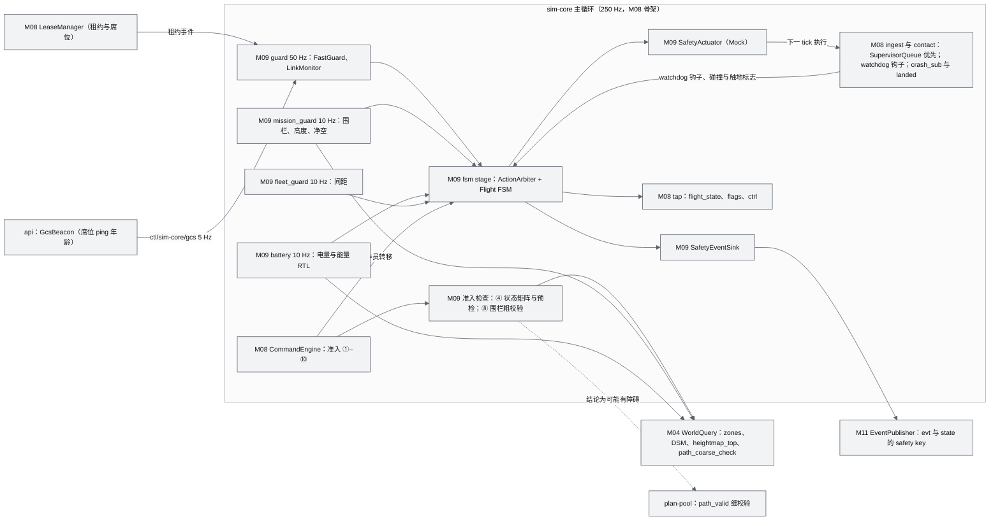
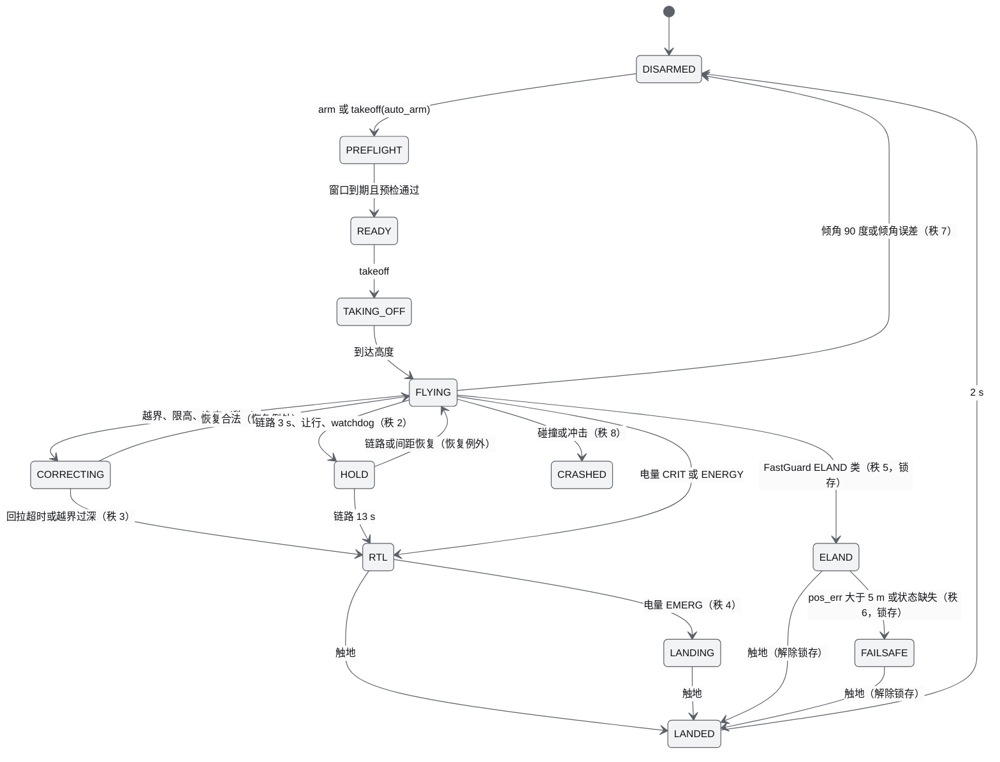
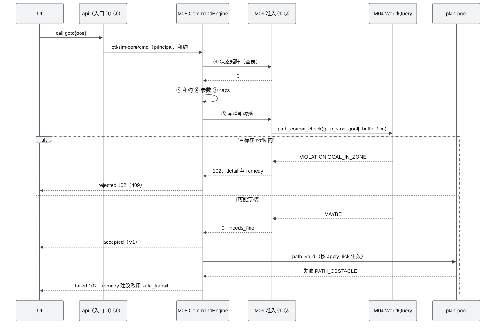
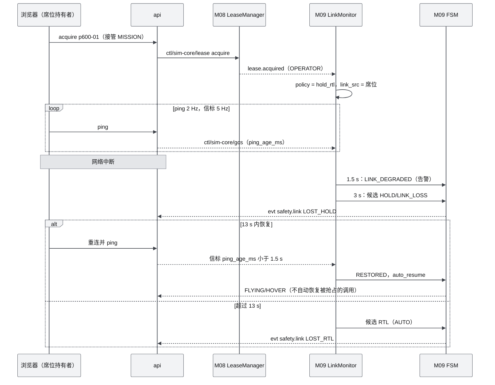
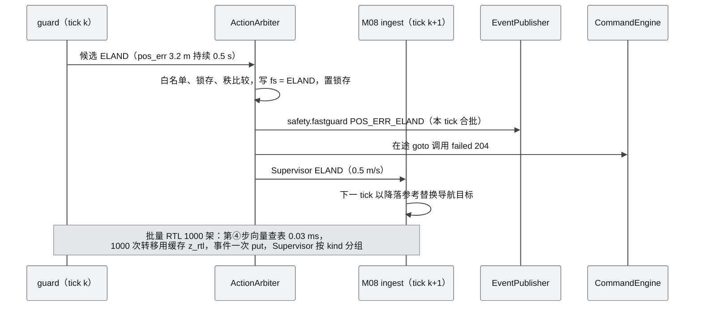

# M09 安全与健康 PRD（Safety & Health）

| 项 | 内容 |
|---|---|
| 文档编号 | AWR-M09 |
| 标题 | 安全与健康（Safety & Health） |
| 版本 | v1.0 |
| 日期 | 2026-09-28 |
| 状态 | 草案 |
| 上游文档 | [AWR-03 设计基线](../03-设计基线与决策记录.md)（ADR-015、016、019、021、026、027、036、039、041、042、045、047、049，§3.4、§5.2、§5.7、§5.9、§6.3、§8.2、§8.4、§8.5）；[01-design](../01-design.md) §7、§26–§30、§37–§40、§43（用户原稿）；研究笔记 [r24](../research/r24-mrs-uav.md)（权威）、[g04](../research/g04-gap.md)、[g08](../research/g08-gap.md)、[r19](../research/r19-prometheus-amov.md)、[r21](../research/r21-mavsdk-mavros-mavlink.md)、[00-index](../research/00-index.md) §3.9、§3.10、§7 第 11 条；并行说明书 [12](../12-业务逻辑设计说明书.md) §4.4、§4.8、§5.1–§5.11、§5.15，[17](../17-接口与实时协议规范.md) §6.5、§6.6、§6.12、§7、§9、§10.8，[16](../16-World数据规范.md) §7、§11、§12，[14](../14-UI交互设计PRD.md) §6.11、§6.12、§11，[15](../15-视觉设计规范与色卡.md) §9.10、§10.12，[10](../10-系统架构说明书.md) §8.3、§9；接口提供方 [M04](M04-几何世界查询服务PRD.md) §7.1–§7.2（WorldQuery、ZoneIndex）、[M08](M08-仿真内核与飞行器适配PRD.md) §6.3、§6.4、§7.1（FleetState 视图、注册表、SupervisorQueue、SimClock） |
| 下游文档 | [M08](M08-仿真内核与飞行器适配PRD.md)（stage 与准入注册、Supervisor 命令执行、tap 打包、估价）、[M10](M10-任务规划与集群PRD.md)（任务能量预检、让行后续飞）、[M11](M11-实时网关PRD.md)（safety 通道、事件、席位链路心跳）、[M12](M12-时间轴录制与回放PRD.md)（事件轨道与录制）、[M14](M14-智能体运行时与ANet-PRD.md)（agent 链路、机体可用性）、[M15](M15-前端UI壳与设计体系组件PRD.md)（安全面板、告警中心）、[M06](M06-Web视口与渲染后端PRD.md)（围栏与告警 3D 叠加）、[M16](M16-演示数据剧本与流畅性测试PRD.md)（故障剧本、CI 场景、S1）、[18](../18-性能与测试方案.md)、[19](../19-部署与运维说明书.md)（V0.5 真机安全） |
| 适用版本范围 | V0.1（即本期交付 D1）至 V1.0 |

## 0. 摘要

1. M09 是 sim-core 内的安全监管层。四层守卫——命令校验（准入第④、⑧步）、FastGuard（50 Hz）、MissionGuard（10 Hz：围栏、高度、电量；链路判据随 guard 以 50 Hz 评估）、FleetGuard（10 Hz：间距）——只产生候选 SafetyEvent，由 ActionArbiter 按 14 态白名单裁决 Flight FSM，在下一 tick 由 M08 的 ingest 执行 Supervisor 命令。Mock 后端的 FlightState 规范态就是 M09 的 FSM（ADR-015、ADR-026）。
2. 分工：M09 定义 FastGuard 阈值与 FSM 白名单的数值（AWR-03 §10.1）；FlightState 语义、准入矩阵与升级链的语义以 [12](../12-业务逻辑设计说明书.md) 为准，两者由 CI 逐项核对。
3. 阈值（ADR-026、g08 §7.1）：pos_err 超过 3.0 m 持续 0.5 s 进入 ELAND，超过 5.0 m 进入 FAILSAFE；倾角 75°、90°；倾角误差 20° 持续 0.5 s；油门 ≥ 0.95·THR_MAX 且低于参考 0.5 m、持续 1 s；电量 0.15 / 0.07 / 0.05，外加 `t_rem < 1.3·t_rtl`；GCS 链路 1.5 / 3 / 13 s（墙钟，暂停时冻结）；流式指令 watchdog 250 ms；间距告警 10 m，3 s 内 CPA 小于 3 m 时优先级低的一方让行。
4. 命令校验：第④步查表，1000 架批量实测 0.017 ms；第⑧步沿 STOP_MOTION 折线做粗校验（几何部分由 M04 实现，≤ 5 ms），细校验放在 plan-pool；拒绝一律返回 `reasons.json` 原因码（准入类多为 HTTP 409），并附 detail 与中文 remedy。
5. 性能：N = 1000 时 M09 全部 stage 合计约 0.06 核（城市分布）至 0.08 核（15 m 网格、12 m/s 密集布局），按本机实测 p50 折算（guard 0.63 ms、围栏 numba 0.08 ms、间距 numba 0.52–3.20 ms/全机群一次、电量 0.14 ms），不超过 M08 分配的 0.080 核，单步 p99 ≤ 3 ms（D1-AC-07）。
6. D1-core 包括：FSM 与 `uav.state` 事件、FastGuard、围栏、能量感知 RTL、FleetGuard、GCS 链路策略与 watchdog、SafetyStop 加锁、SafetyEvent 与 safety 通道，以及不依赖故障注入的 CI 场景库。D1-ext 包括：六类故障注入、escalate 与 kill、链路判定写入输入日志、checkpoint。HealthGraph 本期只交付桩（V0.2 实现）。M09 代码只处理 World ENU，FleetSim 内部的 NED/FRD 经 M08 视图换算（AWR-03 §5.3 第 3 条）。
7. 二次优化：电量 SOC 以可用能量为基准（P600 为 188.7 Wh，与厂商 22 min 悬停续航一致，12 §5.8.1 已采纳）。按此口径的连续判据复核表明 16 §12.4 现行 S1 上段会在扫描途中触发能量 RTL；12 §5.8.5 与 M16 §6.4.3 已各自给出新参数，在本文模型下都通过，但两者不一致，需以 ADR 定一（§6.8.6、§14 第 1 条）。此外：链路判定写入输入日志，保证重仿真可复现；间距守卫改为 numba 网格哈希并按 slot 分 4 片执行；原设计 §28 的笼统 `health` 字段拆分到七轴模型与 safety 通道。

---

## 1. 背景与目标

### 1.1 背景

原设计只在 §28 DroneState 中列了一个 `health` 字段，在 §30 第一阶段列了 ReturnHome、第二阶段列了 Collision Avoidance，**没有安全层、失效策略和指令准入**（r24 §7 第 1 条）。研究阶段从五个来源拼出了完整方案：

| 来源 | 贡献 | 被修订之处 |
|---|---|---|
| MRS（r24） | ControlManager `timerSafety` 的检查清单；锁存与 1 s 宽限；SafetyZone 棱柱与"每米 20 步"路径校验；白名单式状态机；落地检测；Safety FSM 原型与 6 个故障场景 | pos_err 阈值 1.5/2.5 m 与油门 0.8 不适用于 PX4-lite（g08 §7.1）；FS 编号作废（g04 §3.2） |
| PX4 | 电量三档 0.15/0.07/0.05；`COM_DL_LOSS_T` 10 s；`COM_OF_LOSS_T` | 链路判据改用墙钟（ADR-045） |
| g04 | FlightState 14 态与子模式、准入矩阵、原因码 100–114、七轴正交 | 本文补齐实现层参数 |
| g08 | 以 time_stretch 参考为基准重设阈值（中度湍流加 12 m/s 侧风时 pos_err p99.9 为 1.74 m）；STOP_MOTION 折线校验；guard 只发事件，下一 tick 执行 | — |
| r19、r21 | Prometheus 失效语义（围栏、odom、RC 丢失时转 LAND，ABSOLUTE 锁）；Control Lease 与心跳看门狗 | 租约分层见 ADR-027 |

AWR-03 以 ADR-026（四层守卫与阈值）和 ADR-027（租约与不可信指挥官）定案，并在 §6.3 把 M09 的 D1 范围拆成 core 与 ext。本文把这些结论落成可直接实现的模块规格。

### 1.2 目标

| 编号 | 目标 | 可度量表述 | 首次达成 |
|---|---|---|---|
| G-M09-1 | 单一权威、可预测 | Mock 的 FlightState 只由 M09 FSM 计算；14×14 白名单与 12 §4.4.4 逐项相等（M09-AC-001） | V0.1 |
| G-M09-2 | 零误报 | SIH 黄金数据回归 17 项与鲁棒用例 R4–R8、S1 剧本中 guard 事件为 0（D1-AC-12、D1-AC-15） | V0.1 |
| G-M09-3 | 不漏报 | r24 的 6 个故障场景与 g08 R7 全部按预期路径触发（时刻误差 ≤ 1 个 guard 周期 + 持续时间） | V0.1（无注入的部分为 core，注入部分为 ext） |
| G-M09-4 | 不拖慢仿真 | N = 1000 时 M09 全部 stage ≤ 0.10 核；sim-core 单步 p99 ≤ 3 ms 不被破坏（D1-AC-07） | V0.1 |
| G-M09-5 | 命令可读地被拒 | 每个拒绝都带原因码、detail 与 remedy；第④步 ≤ 0.05 ms/条，第⑧步 ≤ 5 ms（1000 个航点） | V0.1 |
| G-M09-6 | 可复现 | 同一输入日志重仿真，SafetyEvent 序列逐条一致（D1-AC-31） | V0.1（ext） |

### 1.3 对原设计的继承、修正与增强

| 01-design 章节 | 继承 | 修正 | 增强（本文） |
|---|---|---|---|
| §28 DroneState `health`、`battery`、`flight_mode` | 每机一份健康与电量 | `flight_mode` 改为 FlightState 14 态加子模式；`health` 拆到 flags（FAILSAFE、ALERT、GCS_LINK、FCU_LINK、LOC_*）、`state_ext.battery` 与 `uav/{id}/safety` 通道（ADR-015） | 活动条件位图与 `since` 时刻；能量余量 `t_rem / (1.3·t_rtl)` 可视化 |
| §30 ReturnHome | 返航 | 安全高度取"沿线障碍上包络 + 5 m"与"home + 30 m"两者的较大值（12 §5.8.3），不再固定 30 m | 能量感知自动 RTL；RTL 四个子阶段；CLIMB 结束时精确重算 H_top |
| §30 Collision Avoidance（第二阶段） | 多机防撞 | D1 只做 FleetGuard 间距守卫与让行，三层互避推迟到 V0.6（ADR-039；12 §5.10.5） | 五级让行优先级；振荡保护；扫掠式机间碰撞判定 |
| §7 World Model"Restricted Area" | 禁飞区 | 结构化为 `zones.geojson` 棱柱：border、nofly、restricted（16 §7） | 准入粗校验、细校验、运行期回拉三段式 |
| §39 Timeline | 事件回放 | 事件走可靠通道（ADR-026） | SafetyEvent 叠加为 Timeline 轨道标记（14 §11.6） |
| §40 Drone Interaction | 选中机操作 | — | 安全停止、恢复、升级、kill（ext）与"安全"详情页 |
| §43 最终 Demo"控制无人机飞行" | 点选控制 | 准入加入命令校验，避免"直接飞进楼"（r24 §7 第 12 条） | 点选 GoTo 默认 `route = auto`（12 §5.7.4） |
| §37 频率表 | Physics 100–1000 Hz | 守卫频率定为 50/10/10 Hz，按 phase 错峰（ADR-021） | 逐 stage CPU 预算（§5.2） |

### 1.4 设计原则

1. **守卫只报告，FSM 才裁决**：所有守卫只写候选事件，唯一的状态改变点是 ActionArbiter（g08 §7.2）。裁决结果在下一 tick 执行，固定 1 tick 延迟，保证确定性。
2. **快检向量化，逐机逻辑只由事件触发**：≥ 10 Hz 的检查一律用 numpy 或 numba 按 SoA 处理；逐机 Python 分支只在状态转移时执行（ADR-021 实时性保障第①条；r24 §4.2 实测逐机 FSM 每 tick 363 µs/机）。
3. **时钟域显式**：机体物理与安全判据用仿真时间；与人和外部进程的链路用墙钟，暂停时冻结判定（ADR-045）。全部墙钟读数经过可注入的时钟接口，测试可以替换。
4. **只升不降，锁存优先**：自动转移只能提高严重度，允许的恢复例外逐条列出；ELAND 与 FAILSAFE 锁存到 LANDED 或 DISARMED（r24 §4.4）。
5. **物理只读 Geometry World**：围栏、净空与返航高度只查 M04 的 DSM 与 zones，不读任何 LOD 数据（AWR-03 §5.8）。
6. **只处理 World ENU**：M09 代码（`awr/sim/safety/**`）不读写 FleetState 的 NED/FRD 数组，位置、速度、参考点与姿态误差一律经 M08 在 `awr/sim/fleet/**` 内换算后的只读视图取得（AWR-03 §5.3 第 3 条；M08-NFR-019 的 lint 规则）；M09 输出的目标点（回拉、限高）同样为 ENU，由 M08 的 SupervisorQueue 换算。
7. **后端无关**：Mock 由 M09 直接执行动作；外部飞控（V0.2 起）走镜像模式，飞控自身的失效保护优先，M09 只做覆盖层（g04 §8.2；r24 §4.1）。
8. **可测**：每条安全特性对应一个 CI 场景（r24 §5.1"一个安全特性一个集成测试"）。

---

## 2. 范围

### 2.1 D1-core（P0，发布阻塞）

与 AWR-03 §6.3 M09 行一致：

1. Flight FSM：14 态与 3 位子模式、白名单、只升不降、锁存、1 s 宽限、同 tick 取最大严重度、FSM 定时器、safety 状态块的标志派生（FAILSAFE、ALERT、GCS_LINK、FCU_LINK、LOC_OK、LOC_DEGRADED、locked、severity）、每次转移的 `uav.state` 事件。
2. FastGuard（ADR-026 阈值），含状态缺失检查（检查本身属 core；`state_drop` 注入属 ext）。
3. 命令校验：准入第④步（状态矩阵、锁、预检）与第⑧步（围栏粗校验）的检查实现，注册到 M08 的准入检查注册表；细校验任务的组合逻辑。
4. 地理围栏：border、nofly、restricted 棱柱；运行期 MissionGuard（接近告警、越界回拉、超时与越界过深时 RTL、限高、净空）；为 Velocity 子模式提供方向距离。
5. 电量模型与能量感知 RTL；`t_rtl` 与 `z_rtl`；供 `ctl/sim-core/estimate` 与任务能量预检共用的 `EnergyModel`。
6. 链路：GCS 链路策略（`gcs_loss_policy`，OPERATOR 持有时）、流式指令 watchdog 的处置、状态估计链路检查。
7. 控制权的安全侧：SafetyStop 加锁与解锁、安全类命令的准入矩阵约束、租约变化驱动的链路策略切换、owner 投影所需的输入。
8. FleetGuard：间距告警、CPA 让行、恢复与振荡保护、机间碰撞。
9. SafetyEvent 目录与可靠发布；`state/sim-core/safety` 10 Hz 行；告警分级映射。
10. 故障注入的**契约**（schema、RNG 流、剧本动作、REST 形状），在 MS1 冻结（ADR-042"D1-ext 的接口与 schema 在 D1-MS1 冻结"）。
11. 不依赖故障注入的 CI 场景库（§10.2）。

### 2.2 D1-ext（P1，缺失时须有豁免记录）

六类故障注入（thrust_loss、motor_fail、link_drop、state_drop、gnss_denied、battery_drain）及其 CI 场景；escalate（HOLD → ELAND → FAILSAFE）与 kill（确认令牌，按住 1 s）；AGENT 持有时的 agent 链路；FCU 链路双侧语义；链路判定写入输入日志（G6b）；M09 状态的 checkpoint 与恢复；`SAF.ENV.WIND_LIMIT`；FleetGuard 冲突连线与回拉目标的 3D 叠加数据；scenario `safety` 覆盖块。

### 2.3 D1 桩

HealthGraph（RateMonitor 加 errorgraph 根因分析，P2）：交付数据结构、`HLT.*` 事件码与空实现；`SafetyActuator` 的 PX4 镜像实现只交付接口。

### 2.4 后续版本

| 版本 | 内容 | 依据 |
|---|---|---|
| V0.2 | HealthGraph 1 Hz；realistic 预检（5 s 窗口加 5 s 倒计时）；PX4 SIH 镜像模式（覆盖层合并、`px4_mirror` 阈值 3.5/4.5 m）；zones 飞行中编辑（只允许扩大，或须 admin 权限） | r24 §4.12；g04 §8.2 |
| V0.4 | 电压模型阈值（单节 3.7/3.6 V）与内阻标定；风速超限与油门裕度联动；P600 参数辨识后重算能量模型 | r24 §4.5；ADR-043 |
| V0.5 | 定位降级联动（LOC_DEGRADED 时限速，LOST 时 HOLD、重定位、RTL 或 LANDING）；真机安全开关（与 [19](../19-部署与运维说明书.md) §12.5 协同） | g04 §4.7 |
| V0.6 | 三层互避、World SDF bumper（CORRECTING/BUMPER）、预测轨迹共享、KD-tree 粗筛 | r24 §3.7、§3.8；12 §5.10.5 |
| V1.0 | 机间协同链路（邻机预测轨迹超时即按不配合一方处理）；健康度与剩余能量作为 ANet 能力可用性约束；RTL 后由协作层重新分配任务 | r24 §4.7、§7 第 11 条 |

### 2.5 不做

降落伞与 `rc_emergency_handoff` 的"交还遥控"模式（仿真中没有遥控器，改用 escalate 与 kill）；MRS 的 MPC 本体（r24 §6 第 2 条）；把安全判定放到浏览器（P-02）。

### 2.6 职责边界

| 事项 | M09 负责 | 他方负责（引用） |
|---|---|---|
| FlightState 语义、准入矩阵语义、升级链、租约业务规则 | 数值实现、CI 核对 | [12](../12-业务逻辑设计说明书.md) §4.4、§4.8、§5.2、§5.11（定义方） |
| 准入流水线骨架、第⑤–⑦步、幂等、调用生命周期、apply 时复核的调用点 | 第④、⑧步的检查实现；apply 时复核的判定（`SafetyHooks.matrix_verdict`） | M08 CommandEngine 与准入检查注册表（ADR-016；M08 §7.1.5） |
| 几何：棱柱包含与相交、边界距离、DSM、净空、走廊上界、粗校验判定（含 GOAL_IN_OBSTACLE）、细校验 | 组合：折线构造、ABOVE_MAX_Z、有效上限、原因映射与 remedy、回拉目标、运行期 10 Hz 批量扫描（numba 快路径，M04 原语为 oracle，§6.7.2） | M04 WorldQuery 与 ZoneIndex（`path_coarse_check`、`path_valid`、`heightmap_top_along`、`clearance`、`free_distance`、`zones.contains`、`border_signed_distance`、`nearest_zone_distance`；名称以 M04 §7.1 对照表为准） |
| FleetState 的 NED/FRD 存储与到 ENU 的换算、STOP_MOTION 刹停点 `p_stop`、状态估计年龄 `est_age_s` | 只消费 ENU 视图与标量字段（§7.4） | M08 FleetSim（`FleetState.enu.*` 视图、`p_stop()`，M08-FR-087；AWR-03 §5.3 第 3 条） |
| Supervisor 命令的物理执行（参考生成器、刹停、下坠前馈）与 ENU → NED 换算 | 命令内容与发出时机 | M08 ingest 与 refgen（g08 §5、§7.2） |
| 流式 setpoint 接收与 `last_setpoint` 计时 | 超时后的处置 | M08 ingest（g08 §3.2） |
| 机体与 World 的接触检测 | 转移到 CRASHED | M08 `contact` stage |
| LeaseManager、席位 | 锁、策略切换、owner 投影输入 | M08 `awr/sim/core/authority.py`；12 §4.2、§4.8 |
| 事件总线、EventPublisher、WS 通道 | 事件内容、行内容 | M11；线格式见 [17](../17-接口与实时协议规范.md) |
| 告警视觉与交互 | 代码到 UI 严重度的映射数据 | [14](../14-UI交互设计PRD.md) §11、[15](../15-视觉设计规范与色卡.md)、M15、M06 |
| 剧本文件、S1 参数 | 能量可行性判据与复核脚本 | M16、[16](../16-World数据规范.md) §12 |

---

## 3. 用户与用例

### 3.1 用户与消费者

| 用户或消费者 | 与 M09 的关系 |
|---|---|
| 操作员 operator | 发起命令并看到拒绝原因；执行安全停止、恢复、升级与 kill；在告警中心确认告警 |
| 查看者 viewer | 只读地看安全状态与告警 |
| 智能体 agent（经 agent-runtime） | 不可信指挥官；命令同样经过第④、⑧步；可以查询 `EnergyModel` 估价 |
| 任务引擎（M10） | 被安全动作抢占时暂停（SUSPENDED）或丢弃（DROPPED）Track；启动前做能量预检 |
| 研究者与 CI | 用剧本与故障注入复现失效场景，读取事件序列与指标 |
| M08 | 执行 Supervisor 命令；把 M09 的标志打包进 Full64/Lite32 |

### 3.2 用例

| 编号 | 用例 | 主要路径 | D1 |
|---|---|---|---|
| UC-01 | 点选 GoTo 到禁飞区内 | 准入第⑧步命中 nofly → `rejected 102 GOAL_IN_ZONE`，UI 在目标标记处给出红描边与原因（14 §6.7） | core |
| UC-02 | GoTo 航线穿楼 | 粗校验结论为"可能有障碍" → 调用停在 accepted → 细校验失败 → `failed 102 PATH_OBSTACLE`，remedy 建议改用 safe_transit | core |
| UC-03 | 风把机体推出 border | MissionGuard 发现越界 → CORRECTING/GEOFENCE 回拉（目标为边界内 2 m）→ 余量 ≥ 1.5 m 后 FLYING/HOVER | core |
| UC-04 | 低电量任务机 | 能量余量不足 → 自动 RTL（FAILSAFE = 1）→ Track DROPPED → 在 home 降落 | core |
| UC-05 | 操作员接管后浏览器断开 | 1.5 s 告警 → 3 s HOLD/LINK_LOSS → 恢复则回到 HOVER；超过 13 s 则 RTL | core |
| UC-06 | 两机相向 | FleetGuard 预测 CPA < 3 m → 优先级低的一方 HOLD/SEPARATION → 间距恢复 2 s 后续飞 | core |
| UC-07 | 批量安全停止或返航 1000 架 | 批量准入向量化 → 1000 次转移 → 事件按步合批 → Toast ≤ 3 条（D1-AC-27） | core |
| UC-08 | 推力损失 45% | 1 s 油门饱和 → ELAND；继续恶化 → FAILSAFE（g08 R7：2.07 s 与 3.7 s） | ext（注入） |
| UC-09 | 单电机失效 | 倾角 > 75° → ELAND；> 90° → DISARMED/KILLED；接地 → CRASHED/IMPACT | ext |
| UC-10 | 研究者复现"定位丢失" | `gnss_denied` → HOLD/LOC_LOST → 30 s 后 LANDING | ext |
| UC-11 | 智能体发 SafetyStop | 入口第①步返回 `115 ROLE_FORBIDDEN`；M09 第④步再做一次防御性检查 | core |
| UC-12 | 操作员逐级升级 | hover → safety_stop → escalate 第 1 级（HOLD/ESCALATE）→ 第 2 级（ELAND），两级之间 ≥ 2 s | ext |

### 3.3 本模块新增术语（其余见 AWR-03 §11）

| 术语 | 定义 |
|---|---|
| 候选（Candidate） | 守卫在本 stage 内对某 slot 提出的目标状态、子模式与代码；只有仲裁后才生效 |
| 仲裁秩（Arbiter rank） | 自动转移比较用的整数：Severity 0–6、8，另加自动 kill 为 7（§6.4.3） |
| 转移来源（Origin） | SYSTEM（名义推进）、AUTO（安全动作）、OPERATOR（经准入的命令） |
| 活动条件位（cond） | 每 slot 一个 u64 位图，记录当前激活的安全条件，派生 ALERT 位与 safety 行的 `active[]` |
| 回拉目标 | CORRECTING/GEOFENCE 的飞行目标：最近合法点沿边界法向内移 2 m（§6.7.4） |
| 能量余量比 | `t_rem_usable / (1.3·t_rtl)`；小于 1 时触发能量 RTL |
| 链路源 | 决定某机 B 类链路年龄的对象：sim-core 自身、席位持有者会话、agent-runtime |
| 链路时钟 | `wall_mono_ns() − paused_total_ns()`：运行时按墙钟前进、暂停与单步时静止的单调时钟，B 类链路年龄只按它计算（§6.9.2） |
| 分片（Shard） | 把 FleetGuard 的全机群扫描按 `slot % 4` 拆成 4 个 stage（phase 4、9、14、19），每片以本片机体为主机、对 slot 更大的全体机体检查一次，4 片合起来每对恰好检查一次 |

---

## 4. 功能需求

表中"D1"列取值为"是"、"桩"、"否"；D1-core 条目为 P0 且目标版本 V0.1，D1-ext 条目为 P1 且目标版本 V0.1（ADR-042）。

### 4.1 Flight FSM

| 编号 | 需求描述 | 优先级 | 目标版本 | D1 | 验收要点 | 依据 |
|---|---|---|---|---|---|---|
| M09-FR-001 | 经 M08 `register_state_block("safety", owner="M09", …)` 登记 safety 块：M08 §6.3.1 的契约字段（`fs`、`sub`、`flag_failsafe`、`flag_alert`、`flag_gcs`、`flag_fcu`、`flag_loc_ok`、`flag_loc_deg`、`locked`、`severity`、`d_free_fence_m`）加本模块内部字段（`fs_auto`、`latch`、`t_enter_ns` 等，§6.3.1）；tap 按 `flight_state = fs \| sub << 5` 打包 byte 2 | P0 | V0.1 | 是 | M09-AC-001：g04 §5.5 的 Mock SafetyStop 黄金向量 `0x07/0x37/0x6D` 逐字节命中 | ADR-015；g04 §5；M08-FR-011、FR-050 |
| M09-FR-002 | 白名单为 14×14 布尔常量表（§6.4.2），与 12 §4.4.4 逐项相等；非法转移一律拒绝，记 `SAF.FSM.REJECTED`（info，每 slot 每秒至多 1 条） | P0 | V0.1 | 是 | M09-AC-001：196 个 (源, 目标) 组合穷举比对 | r24 §4.3；g04 §3.2 |
| M09-FR-003 | 转移分三种来源：SYSTEM（名义推进）、AUTO（安全动作）、OPERATOR（经准入的命令）。AUTO 只允许提高仲裁秩（§6.4.3），例外只有 12 §4.4.5 列出的 5 种恢复；OPERATOR 可以降级，但不得穿越锁存 | P0 | V0.1 | 是 | M09-AC-002：每类来源的正反例各 ≥ 3 个 | ADR-026；12 §4.4.5 |
| M09-FR-004 | 锁存：进入 ELAND 后只允许去往 FAILSAFE、LANDED、DISARMED、CRASHED；进入 FAILSAFE 后只允许去往 LANDED、DISARMED、CRASHED；到达 LANDED 或 DISARMED 时解除 | P0 | V0.1 | 是 | M09-AC-002 | r24 §4.4 第 3 条 |
| M09-FR-005 | 宽限：状态或子模式切换后 1.0 s【仿真】内只执行 kill 类检查（倾角 > 90°）；宽限期内倾角误差计时清零 | P0 | V0.1 | 是 | M09-AC-003 | ADR-026；r24 §2.2 |
| M09-FR-006 | 同一次仲裁中取最高秩的候选动作，其余只发事件；裁决立即改变 FSM 状态，动作以 SupervisorCommand 的形式在下一 tick 由 M08 ingest 执行 | P0 | V0.1 | 是 | M09-AC-002；M09-AC-004：触发到执行恰好 1 tick | g08 §3.2、§7.2 |
| M09-FR-007 | FSM 定时器向量化：预检窗口（demo 1.0 s、realistic 5.0 s）、READY 10 s 未起飞自动上锁、SPOOLUP 1 s、LANDED 2 s 自动上锁、围栏回拉超时 15 s、HOLD/LOC_LOST 30 s（ext），均为【仿真】 | P0 | V0.1 | 是 | M09-AC-005：各定时器 ±1 个 guard 周期（20 ms） | g04 §3.2；12 §5.15 |
| M09-FR-008 | 派生 safety 块中的标志供 M08 打包：`flag_failsafe`（`fs_auto` 或仲裁秩 ≥ 5）、`flag_alert`（M09 任一 warn 及以上的条件激活，或 LOC_DEGRADED；生命周期 DEGRADED 由 M08 fuser 并入）、`flag_gcs`（§6.9）、`flag_fcu`（Mock 恒为 1，`link_drop` 注入期间为 0）、`flag_loc_ok`（Mock 恒为 1，`gnss_denied` 注入期间为 0）、`flag_loc_deg`（D1 恒为 0，V0.5 定位降级联动）、`locked`、`severity`（g04 §3.1，无定级的状态写 0） | P0 | V0.1 | 是 | M09-AC-001 | g04 §4.7、§4.8、§4.9；M08 §6.3.1 |
| M09-FR-009 | Supervisor 动作的内容：HOLD 以当前参考点为目标刹停；ELAND 以 0.5 m/s 下降；FAILSAFE 冻结参考、前馈下坠 +1 m/s（NED）；RTL 按 §6.8.3 的剖面；LANDING 用降落剖面；CORRECTING 飞往回拉目标；KILL 使推力归零 | P0 | V0.1 | 是 | M09-AC-006 | g08 §7.2；g04 §6.3 |
| M09-FR-010 | 把转移原因映射为在途调用的结局，回调 M08 CommandEngine：安全抢占为 `failed 204`，watchdog 为 `canceled 209`，碰撞为 `failed 208`，操作员安全类命令为 `canceled 206` | P0 | V0.1 | 是 | M09-AC-007 | 12 §4.6 |
| M09-FR-011 | RTL 子阶段推进：CLIMB（z < z_rtl − 0.5 m）→ CRUISE（水平距离 home ≥ 2 m）→ DESCEND → FINAL（AGL < 10 m）。CLIMB 结束时以当前位置到 home 的线段（而非缓存时的线段）重算 H_top，需要更高时经 SupervisorQueue 下发新的 `z_rtl` 并继续爬升 | P0 | V0.1 | 是 | M09-AC-008 | 12 §4.4.6、§5.8.3；M08-FR-027 |
| M09-FR-012 | 消费 M08 contact 写入的触地标志（`landed` 由 0 变 1，即 IN_AIR 由 1 变 0）进入 LANDED/SETTLING，解除锁存；2 s 后 DISARMED 并结束 land 或 rtl 调用 | P0 | V0.1 | 是 | M09-AC-006 | g04 §4.8；12 F38、F39 |
| M09-FR-013 | Mock 的 FSM 内部不保存 UNKNOWN（初始 spawn 除外）；生命周期覆盖由 M08 fuser 在打包时投影（g04 §4.6） | P0 | V0.1 | 是 | 代码审查；M09-AC-001 | g04 §4.4、§4.6 |
| M09-FR-014 | 每次 `fs` 或 `sub` 变化（SYSTEM、AUTO、OPERATOR 三种来源都算）在同一 tick 的合批中发 `uav.state` 事件（`uav`、`from`、`to`、`reason`，17 §6.12），level 规则见 §6.13；同一 tick 内 1000 次转移只进一次 put（ADR-018） | P0 | V0.1 | 是 | M09-AC-035 | 17 §6.12；14 §11.6 |

### 4.2 FastGuard

| 编号 | 需求描述 | 优先级 | 目标版本 | D1 | 验收要点 | 依据 |
|---|---|---|---|---|---|---|
| M09-FR-020 | 50 Hz【仿真】向量化检查（阈值见 §6.5）：绝对倾角 kill 与 eland、倾角误差、pos_err 的 ELAND 与 FAILSAFE 两档、油门饱和双条件、航向误差、状态缺失；持续计时器在条件消失时清零。位姿输入只取 M08 的 ENU 视图（`enu.pos`、`enu.pos_ref`、`enu.q_xyzw`、`enu.q_sp_xyzw`），标量取 `thrust`、`thr_cap`、`est_age_s`（§7.4） | P0 | V0.1 | 是 | M09-AC-003：每项在阈值 ±ε 处翻转，触发时刻在"持续时间 + 1 个 guard 周期"以内 | ADR-026；g08 §7.1；AWR-03 §5.3；M08-FR-087 |
| M09-FR-021 | pos_err 只在 FLYING/GOTO、PATH、ORBIT，RTL，LANDING 下评估，参考点取 time_stretch 之后的 `pos_ref`；VELOCITY 与原始 OFFBOARD 不评 pos_err，控制劣化（`\|v_sp − v\| > 3 m/s` 持续 2 s）只发 `SAF.CTRL.TRACK_DEGRADED` | P0 | V0.1 | 是 | M09-AC-003 | g08 §7.1 第 3 条 |
| M09-FR-022 | 阈值按"控制器档位"参数化：`mock_l1`（D1）与 `px4_mirror`（V0.2，3.5/4.5 m） | P0 | V0.1 | 是 | 参数表存在两套取值，且只加载一套 | r24 §2.7；g08 §7.1 |
| M09-FR-023 | FastGuard 只写候选事件与计时器，不修改任何控制状态 | P0 | V0.1 | 是 | 代码审查；M09-AC-004 | g08 §3.2 |

### 4.3 命令校验（准入第④、⑧步与预检）

| 编号 | 需求描述 | 优先级 | 目标版本 | D1 | 验收要点 | 依据 |
|---|---|---|---|---|---|---|
| M09-FR-030 | 第④步状态检查：由 `commands.json` 生成 uint8 查找表 `ADMIT[cmd, fs, sub, auto, locked]`，给出 0、101、105、106、114；再检查 104（ARMED）与 103（预检）；经 `@register_admission_check(4, "safety.state", owner="M09")` 注册。108（生命周期）、117（时钟约束）、113（LOC_OK）由 M08 在同一步执行（M08-FR-055），CommandEngine 按 12 §5.1.2 的优先级 108 → 117 → 114 → 106 → 101 → 105 → 104 → 113 → 103 取第一个失败码 | P0 | V0.1 | 是 | M09-AC-009：与 12 §5.2 全表一致（BIZ-AC-002） | ADR-016；g04 §6.2；M08 §7.1.1 |
| M09-FR-031 | 预检（arm，以及 `auto_arm` 的 takeoff）：生命周期 READY、LOC_OK、soc ≥ 0.30、在 border 内、不在 nofly 内、速度 < 0.3 m/s、出生点净空（§6.6.2，本文设定）；失败返回 `103 PREFLIGHT_FAILED`，detail 列出全部失败项 | P0 | V0.1 | 是 | M09-AC-010 | r24 §4.5；12 F01 |
| M09-FR-032 | 第⑧步围栏粗校验：goto 构造折线 `[p, p_stop, goal]`；follow_path 构造 `[p, p_stop, w1…wn]`；orbit 用 16 段外接正多边形近似圆周；land{pos} 为 `[p, p_stop, (pos_x, pos_y, p_z)]`（在当前高度飞到降落点上方，竖直下降段由目标净空保证）。`p_stop` 取 M08 `FleetSim.p_stop()`；M09 先查 `goal.z ≤ effective_max_z`（ABOVE_MAX_Z），再调用 M04 `path_coarse_check(polyline, buffer_m=1.0, goal_clear_m=2.0, active_zone_ids=scenario.zones.active)`，把违例映射为 `102` 与 detail；结论含 MAYBE 或 `zone_deferred` 时标记需要细校验 | P0 | V0.1 | 是 | M09-AC-011：g08 R4 反向重定目标、禁飞区内、穿越禁飞区、越出 border、高于上限五类用例 | ADR-016；g08 §5.3；12 §5.7.2；M04-FR-017 |
| M09-FR-033 | 细校验组合：在 plan-pool 中执行 M04 `path_valid(polyline, buffer_m=1.0, active=scenario.zones.active)`，结果按 apply_tick 生效；失败时调用 `failed 102`（PATH_OBSTACLE 或 PATH_CROSSES_ZONE） | P0 | V0.1 | 是 | M09-AC-011 | ADR-039；12 §5.7.3 |
| M09-FR-034 | 每个拒绝都附 `detail`（枚举，§7.6）与中文 `remedy`；同一步内有多个违例时，detail 附其余违例（≤ 4 条） | P0 | V0.1 | 是 | M09-AC-009 | 12 §5.1.2 第 1、5 条 |
| M09-FR-035 | 批量命令（`fleet/cmd/*`）的第④步按向量执行，1000 架 ≤ 0.1 ms；RTL 批量使用缓存的 `z_rtl` | P0 | V0.1 | 是 | M09-AC-021 | D1-AC-27 |
| M09-FR-036 | resume 的"原因已解除"判定：SAFETY_STOP 须席位持有者；LINK_LOSS 须链路恢复；SEPARATION 须间距恢复；ESCALATE 须操作员确认（ext）；电量原因的 RTL 一律拒绝 `101`（detail = BATTERY） | P0 | V0.1 | 是 | M09-AC-012 | 12 §5.2 注 5 |

### 4.4 地理围栏

| 编号 | 需求描述 | 优先级 | 目标版本 | D1 | 验收要点 | 依据 |
|---|---|---|---|---|---|---|
| M09-FR-040 | 围栏模型：使用 M04 `ZoneIndex`（`border` 唯一，`nofly`、`restricted` 棱柱），按 `scenario.zones.active` 选择 nofly 与 restricted（border 恒生效）；`ZoneIndex.load(path, expect_coord_sha)` 发现 `awr.coordinate_sha256` 与世界不一致时拒绝加载，剧本加载以 `352 COORDINATE_MISMATCH` 失败；`effective_max_z = min(border.max_z_m, 机型最大高度（profile 有该字段时）, scenario.safety.max_z_m（ext 覆盖块，缺省不参与）)` | P0 | V0.1 | 是 | M09-AC-013 | 16 §7；12 §5.7.1；r24 §3.6；17 §8.4 |
| M09-FR-041 | 运行期 MissionGuard（10 Hz【仿真】）：距 border 或 nofly < 5 m 时发 NEAR；越出 border 或进入 nofly 时进入 CORRECTING/GEOFENCE，回拉目标为最近合法点再向内 2 m（`inset_m`），高度钳制到 `[min_z + 1, max_z − 1]`；余量回到 ≥ 1.5 m（`restore_margin_m` = inset 2 m − 到达容差 0.5 m，本文设定：r24 原型在 6 m/s 顺风下稳定悬停于内缩 1.9 m 处，若按 ≥ 2 m 判定会一直停在 CORRECTING 直到超时 RTL）时恢复 FLYING/HOVER；回拉超过 15 s 或越界深度 > 10 m 时自动 RTL；进入 restricted 只告警 | P0 | V0.1 | 是 | M09-AC-014（r24 fence_breach_correction 复现） | r24 §3.6、§4.11；12 §5.7.5 |
| M09-FR-042 | 高度：z > effective_max_z 时进入 CORRECTING/ALT_MAX，目标 `max_z − 0.25`；净空（M04 `clearance(xyz, radius_m=0)`，即 `z − dsm(x,y)`）< 0.5 m 时进入 CORRECTING/ALT_MIN，目标 `dsm + 0.75`；TAKING_OFF、LANDING、RTL/FINAL、LANDED 豁免 | P0 | V0.1 | 是 | M09-AC-014 | 12 §5.7.5；M04 §5.1 |
| M09-FR-043 | 对 FLYING/VELOCITY 的机体，每 10 Hz 输出沿速度方向到 border 或 nofly 边界的距离 `d_free_fence_m`，供 M08 refgen 做方向限速 | P0 | V0.1 | 是 | M09-AC-014（以 5 m/s 冲向边界时刹停在 2 m 以内） | g08 §5.1；12 §5.7.5 |
| M09-FR-044 | 飞行中编辑 zones：只允许扩大，否则须 admin 权限；变更后在下一个 MissionGuard 周期重新评估 | P2 | V0.2 | 否 | — | r24 §4.8 |

### 4.5 能量感知 RTL

| 编号 | 需求描述 | 优先级 | 目标版本 | D1 | 验收要点 | 依据 |
|---|---|---|---|---|---|---|
| M09-FR-050 | 电量模型（10 Hz【仿真】）：`P = P_hover·(T/T_hover)^1.5`；SOC 以可用能量 `E_use = usable_frac·capacity_wh` 为基准（P600 为 188.7 Wh）；以 f64 的 `wh_used` 积分，battery 块的 `soc`（f32）与 `battery_pct`（u8）由它派生；`P_avg` 每步按 0.98/0.02 做指数平均；电压按 OCV 模型计算，仅供显示；机型 `battery = null` 时 soc 恒为 1、`battery_pct` 为 255（未知，AWR-03 §5.7），不触发任何电量判据 | P0 | V0.1 | 是 | M09-AC-015：P600 悬停到 0% 为 1320 s ± 2%（VH-6） | g08 §3.2、§10.4；r24 §4.6；16 §11.3；12 §5.8.1；M08 §6.3.1 |
| M09-FR-051 | 判据：soc ≤ 0.15 告警一次（LOW）；soc ≤ 0.07 自动 RTL（CRIT）；`t_rem_usable < 1.3·t_rtl` 自动 RTL（ENERGY）；soc ≤ 0.05 就地 LANDING（EMERG，RTL 途中同样适用）。只在下降方向触发，每次飞行每档锁存一次；电量原因的 RTL 不可 resume | P0 | V0.1 | 是 | M09-AC-015、M09-AC-016 | ADR-026；r24 §4.5 |
| M09-FR-052 | `t_rem_usable = (soc − 0.05)·E_use·3600 / P_avg`，只算到 emergency 阈值为止；`t_rtl` 与 `z_rtl` 按 12 §5.8.3 计算（H_top 取自 M04，逆风分量取自 env 在 z_rtl 处的风），每机每秒刷新一次（轮转，每次 battery stage 处理 1/10 机群） | P0 | V0.1 | 是 | M09-AC-016：r24 battery_rtl 复现（在 home 降落，soc ≥ 0.05，没有 EMERG 事件） | r24 §4.6、§4.11 |
| M09-FR-053 | 实现 M08 定义的 `EnergyModel` 协议（M08 §7.1.5）并经 `register_energy_model()` 登记：`estimate(profile, soc, path: EstimatePath, env) -> EstimateResult`（`eta_s`、`energy_wh`、`soc_after_pct`、`soc_after_return_pct`、`feasible`、`code`）、`rtl_plan(slot) -> RtlPlan` 与 `path_wh(profile_id, samples, env)`（M10 任务能量预检沿轨迹积分）；功率按 `P_hover·(T/T_hover)^1.5`，T 含相对空速下的气动水平力（环境平均风取机体所在高度），不得用悬停功率近似（12 §5.8.4）；供 `ctl/sim-core/estimate`（M08）与任务能量预检（M10）调用，保证与运行期同一模型 | P0 | V0.1 | 是 | M09-AC-017：估价与 60 s 实飞的 soc 差 ≤ 0.01 | ADR-036；12 §5.8.4；M08 §6.10.4 |
| M09-FR-054 | 向 M08 提供 `state_ext` 中由 M09 计算的字段：`battery{voltage_v, current_a, soc_pct, t_remain_s, wh_used}`、`link{gcs_age_ms, fcu_age_ms}`、`gcs_loss_policy`（该机当前生效的策略） | P0 | V0.1 | 是 | 契约 schema 校验 | 17 §6.5 |
| M09-FR-055 | 单节电压阈值（3.7 V 告警、3.6 V RTL）与内阻标定 | P2 | V0.4 | 否 | — | r24 §4.5 |

### 4.6 链路丢失策略

| 编号 | 需求描述 | 优先级 | 目标版本 | D1 | 验收要点 | 依据 |
|---|---|---|---|---|---|---|
| M09-FR-060 | GCS 链路 LinkMonitor：OPERATOR 持有（含孤儿租约）时，链路为席位持有者 ping（2 Hz）的年龄，输入为 M11 经 `ctl/sim-core/gcs` 转发的 Gcs 消息（17 §9.4）；超过 1.5 s 为 DEGRADED（GCS_LINK = 0、ALERT）、超过 3 s 进入 HOLD/LINK_LOSS、超过 13 s 进入 RTL（没有 home 时进入 LANDING）；年龄按"链路时钟" `wall_mono_ns() − paused_total_ns()`（均由 M08 SimClock 提供）推进，暂停、单步期间判定冻结（§6.9.2）；`auto_resume = true` 时链路恢复（< 1.5 s）回到 FLYING/HOVER | P0 | V0.1 | 是 | M09-AC-018 | ADR-026、ADR-045；12 §5.9；M11-FR-024；M08 §7.1.4 |
| M09-FR-061 | 策略切换：机体在本 run 内从未被 operator 接管过时，取剧本声明值；operator 取得租约后该机改为 hold_rtl，直到租约交还 MISSION 或 AGENT；策略为 ignore 时 GCS_LINK 恒为 1 | P0 | V0.1 | 是 | M09-AC-019 | ADR-026；g04 §4.8 |
| M09-FR-062 | 流式指令 watchdog：M08 ingest 检出 250 ms【墙钟】内没有新 setpoint 后调用 M09 实现的 `SafetyHooks.on_stream_watchdog(slots)`（经 `register_safety_hooks()` 登记）；M09 使机体进入 HOLD/LINK_LOSS，Velocity 调用以 `canceled 209` 结束 | P0 | V0.1 | 是 | M09-AC-020 | ADR-026；g08 §7.1；M08 §7.1.5 |
| M09-FR-063 | 状态估计链路：M08 FleetState 的 `est_age_s` > 0.1 s【仿真】时进入 FAILSAFE/DESCENT。`est_age_s` 的写者是 M08 ingest：Mock 恒为 0，`state_drop` 注入期间冻结状态估计并递增（M08-FR-091，ext）；guard 的检查本身属 core | P0 | V0.1 | 是 | M09-AC-003（直接置年龄的单元测试） | r24 §4.7；M08 §6.3.1 |
| M09-FR-064 | AGENT 持有时，链路为 agent-runtime 的 liveliness；丢失时按同一阶梯处置，并通知 agent-runtime 把协作任务置为 input-required | P1 | V0.1 | 是 | M09-AC-019 | ADR-026；12 §5.9.1 |
| M09-FR-065 | FCU 链路（`link_drop`）双侧语义：地面侧 2.5 s DEGRADED、5 s LOST（生命周期由 M08 投影）；机上侧按 GCS 同一阶梯 HOLD 与 RTL | P1 | V0.1 | 是 | M09-AC-027 | 12 §5.9.4 |
| M09-FR-066 | 由墙钟判定得出的链路状态变化，按 apply_tick 写入输入日志；重仿真时由日志驱动，不读墙钟 | P1 | V0.1 | 是 | M09-AC-028（D1-AC-31） | ADR-049 |
| M09-FR-067 | 机间协同链路：邻机预测轨迹超过 1 s 未更新时，按不配合的一方处理，本机主动让行 | P2 | V1.0 | 否 | — | r24 §4.7 |

### 4.7 控制权的安全侧

| 编号 | 需求描述 | 优先级 | 目标版本 | D1 | 验收要点 | 依据 |
|---|---|---|---|---|---|---|
| M09-FR-070 | SafetyStop：进入 HOLD/SAFETY_STOP，置 `locked = 1`，按最大加速度刹停，并通知 LeaseManager 把租约置为 SUSPENDED；加锁期间非安全类命令返回 `114 LOCKED`；只有席位持有者可以 resume | P0 | V0.1 | 是 | M09-AC-012 | ADR-027；12 F15、F16 |
| M09-FR-071 | 安全类命令（land、hover、rtl、safety_stop）免租约，但仍受准入矩阵约束；principal 为 agent 时，第④步对 safety_stop、kill、escalate 再做一次防御性拒绝（`115`），并且只允许对其自有租约的机体发 land、hover、rtl | P0 | V0.1 | 是 | M09-AC-012 | ADR-027；C35 |
| M09-FR-072 | 为 ctrl.owner 的 SAFETY 投影提供输入：FAILSAFE 位与 locked 位 | P0 | V0.1 | 是 | 黄金向量 | g04 §4.9 |
| M09-FR-073 | 订阅 LeaseManager 的租约事件（进程内回调），据此切换链路源与策略（FR-061、FR-064） | P0 | V0.1 | 是 | M09-AC-019 | ADR-026 |
| M09-FR-074 | escalate：每次升一级，HOLD/ESCALATE → ELAND → FAILSAFE（第 3 级默认关闭）；两次之间 ≥ 2 s；需要确认令牌 | P1 | V0.1 | 是 | M09-AC-024 | r24 §4.4 第 7 条；12 F30–F32 |
| M09-FR-075 | kill：需要确认令牌并按住 1 s；电机立即停转 → DISARMED/KILLED；空中执行时随后接地判为 CRASHED/IMPACT | P1 | V0.1 | 是 | M09-AC-024 | ADR-016；12 F33 |

### 4.8 FleetGuard（多机间距与互避告警）

| 编号 | 需求描述 | 优先级 | 目标版本 | D1 | 验收要点 | 依据 |
|---|---|---|---|---|---|---|
| M09-FR-080 | 10 Hz【仿真】numba 网格哈希（格 10 m），每机扫描半径 `max(10, 3 + r_i + r_max)`，其中 `r = \|v\|·3 s`；按 M08 分片约定注册为 `fleet_guard.0–3`（`shards = 4`，phase 4、9、14、19），第 k 片只以 `slot % 4 == k` 的机体为主机 i，对端 j 取全体中 `j > i` 者，每对恰好处理一次；每片单独重建网格，开销计入每片预算 | P0 | V0.1 | 是 | M09-AC-022：4 片合并结果与单次全机群扫描、与暴力 O(N²) 结果逐对一致 | r24 §3.8 改进 4；M08 §6.4.2；本文实测 |
| M09-FR-081 | 条件：三维距离 < 10 m 时发 CONFLICT（warn，逐机边沿触发，距离 > 12 m 持续 2 s 后才重新布防）；3 s 线性外推 CPA < 3 m 时 AVOIDING；当前距离 < 3 m 时 VIOLATION。后两者都使优先级低的一方进入 HOLD/SEPARATION | P0 | V0.1 | 是 | M09-AC-022 | 12 §5.10.1 |
| M09-FR-082 | 让行优先级键 K1–K5 按 12 §5.10.2（机动受限、任务优先级、电量紧迫度、控制方类别、agent_no） | P0 | V0.1 | 是 | M09-AC-022 | 12 §5.10.2 |
| M09-FR-083 | 恢复：距离 > 5 m 且 CPA > 3 m，持续 2 s【仿真】后回到 FLYING/HOVER，MISSION 持有时续飞；同一对机体 60 s 内让行 ≥ 3 次时发 OSCILLATION，Track 保持 SUSPENDED | P0 | V0.1 | 是 | M09-AC-022 | 12 §5.10.3 |
| M09-FR-084 | 机间碰撞：对上一个 10 Hz 周期做扫掠最近距离检查，小于 `r_i + r_j`（机型 `collision_radius_m`，P600 为 0.49 m）时双方进入 CRASHED/COLLISION_UAV | P0 | V0.1 | 是 | M09-AC-023：相对速度 24 m/s 时不漏检 | 12 F37；r24 §6 第 3 条 |
| M09-FR-085 | 输出 `separation_m`、`sep_mate` 与剧本指标 `min_separation_m`；`sep_m`、`cpa_min`、`sep_mate` 在第 0 片开始时清空、第 3 片结束时定稿（一个 10 Hz 周期），CONFLICT 边沿、重新布防与恢复判定在周期定稿后执行，AVOIDING、VIOLATION、碰撞候选由发现它的分片立即提出 | P0 | V0.1 | 是 | D1-AC-15；M09-AC-022 | 16 §12.3 |
| M09-FR-086 | 三层互避、bumper、预测轨迹共享 | P2 | V0.6 | 否 | — | r24 §3.7、§3.8 |

### 4.9 故障注入

| 编号 | 需求描述 | 优先级 | 目标版本 | D1 | 验收要点 | 依据 |
|---|---|---|---|---|---|---|
| M09-FR-090 | 故障契约在 MS1 冻结：`faults.schema.json`（kind、params、`at_s` 或立即、`duration_s`、clear）；RNG 流 `faults`（stream_id 2）；剧本动作 `fault.inject`；REST `POST /api/fleet/vehicles/{id}/faults`（R16） | P0 | V0.1 | 是 | M00 契约校验通过 | ADR-042；17 §10.8；16 §12.3 |
| M09-FR-091 | 实现六类故障（模型见 §6.12）：thrust_loss、motor_fail、link_drop、state_drop、gnss_denied、battery_drain；只限 Mock 后端 | P1 | V0.1 | 是 | M09-AC-025 | AWR-03 §6.3；12 §5.11.3 |
| M09-FR-092 | 故障生命周期 ARMED → ACTIVE → CLEARED；写审计与输入日志；safety 行显示 `faults[]`；UI 标识"故障注入" | P1 | V0.1 | 是 | M09-AC-025 | ADR-049 |
| M09-FR-093 | CI 场景库分两层：core 层不依赖注入（初始 soc、不经校验的速度推动、假时钟断链、直接置状态年龄）；ext 层覆盖六类注入与 g08 R7，全部进入 `make ci` | P0（core 层）/ P1（ext 层） | V0.1 | 是 | M09-AC-026 | r24 §4.11、§7 第 10 条 |

### 4.10 事件、通道与告警分级

| 编号 | 需求描述 | 优先级 | 目标版本 | D1 | 验收要点 | 依据 |
|---|---|---|---|---|---|---|
| M09-FR-100 | SafetyEvent 目录（§6.13）登记到契约 `safety_codes.json`；经 M11 `EventPublisher` 发布到 `evt/sim-core/safety`（可靠通道，按步合批）；`safety.*` 写审计 | P0 | V0.1 | 是 | M09-AC-029 | ADR-026、ADR-027 |
| M09-FR-101 | `state/sim-core/safety`：只为 M11 下推的兴趣集（`ctl/sim-core/interest`，≤ 64 架，另加录制标记 ≤ 16 架）发布逐机行；10 Hz【仿真】发布变化行，1 Hz【墙钟】发布全量；数值按量化步长判断是否"变化"（margin 0.5 m、时间 1 s、soc 1%）；载荷为 `[[agent_no, row_bytes], …]`，`row_bytes` 即 `awr.uav.safety.v1` 的 msgpack 编码，由 api 的 DetailDemux 原样转发；主循环只做 numpy 拷贝，编码在后台线程 | P0 | V0.1 | 是 | M09-AC-029 | 17 §9；M11-FR-071、FR-072；P-09 |
| M09-FR-102 | 分级映射：M09 条件级别 info、warn、action、critical → 线上事件 level 1、2、2、3 → UI info、warning、warning、critical（14 §11.1）；safety 行 `active[].level` 与事件取同一线上 level | P0 | V0.1 | 是 | M09-AC-029 | 14 §11.1；17 §6.5、§6.12 |
| M09-FR-103 | 风暴抑制：事件保持逐机粒度（便于 DroneRail 与录制），但同一 tick 的全部 safety 事件经 `EventPublisher` 合为一次 put；同一机同一代码有迟滞与边沿触发；1000 架同时触发时每个 topic 每 tick 只 put 一次，前端按合并键合并 Toast | P0 | V0.1 | 是 | M09-AC-021（D1-AC-27） | ADR-018；14 §11.4 |
| M09-FR-104 | 事件与 safety 行中的文本字段只用码与参数，文案由前端按文案键生成，不含 emoji 或禁用字形 | P0 | V0.1 | 是 | D1-AC-20 | AWR-03 §10.2 |

### 4.11 健康与自保护

| 编号 | 需求描述 | 优先级 | 目标版本 | D1 | 验收要点 | 依据 |
|---|---|---|---|---|---|---|
| M09-FR-110 | 安全 stage 抛出异常时捕获并发 `HLT.SAFETY.STAGE_ERROR`（critical），下个周期重试；同一 stage 连续 3 次失败时，对全部空中机体下发 HOLD（AUTO），并置 `safety_degraded` | P0 | V0.1 | 是 | M09-AC-030 | 本文设定（安全层自身失效必须可见并偏向保守） |
| M09-FR-111 | HealthGraph：RateMonitor（绿 > 0.9、黄 > 0.5、其余红）与 errorgraph 根因分析；D1 只交付接口与 `HLT.*` 代码 | P2 | V0.2 | 桩 | — | r24 §3.9 |
| M09-FR-112 | 启动自检：白名单与 `commands.json` 一致、阈值自洽（ELAND 阈值 < FAILSAFE 阈值、LOW > CRIT > EMERG 等），任一失败时 sim-core 拒绝启动并给出原因 | P0 | V0.1 | 是 | M09-AC-031 | 本文设定 |

### 4.12 参数、契约与确定性

| 编号 | 需求描述 | 优先级 | 目标版本 | D1 | 验收要点 | 依据 |
|---|---|---|---|---|---|---|
| M09-FR-120 | `SafetyParams` 为冻结 dataclass（§6.15）；剧本可按白名单覆盖少数字段（预检档、auto_resume、`max_z_m`），FastGuard 阈值不可覆盖 | P0（参数）/ P1（覆盖） | V0.1 | 是 | M09-AC-031 | r24 §4.8 |
| M09-FR-121 | 除链路类判据外，M09 只读仿真时间；同一输入下事件序列逐条一致；numba 核与 numpy oracle 的布尔输出逐位一致，CPA 数值差 ≤ 1e-9 m | P0 | V0.1 | 是 | M09-AC-022、M09-AC-028 | ADR-049 |
| M09-FR-122 | M09 的状态块（safety、battery，经 M08 `register_state_block` 登记，随 M08 统一 checkpoint）之外，把故障登记表、链路源累计量与让行历史写入 checkpoint 扩展段；恢复后事件不重复发送 | P1 | V0.1 | 是 | M09-AC-032（D1-AC-11b） | ADR-019；M08-FR-011 |
| M09-FR-123 | `SafetyActuator` 协议（hold、correct、rtl、land、eland、failsafe、kill、disarm、resume_hover，目标点一律 World ENU）；D1 的 Mock 实现即 M08 SupervisorQueue（ENU → NED 换算在 M08），PX4 镜像实现在 V0.2 | P0 | V0.1 | 是 | 接口冻结 | r24 §4.1；ADR-020；M08 §6.3.4 |
| M09-FR-124 | 剧本度量经 M08 度量注册表 `register_metric(name, fn, owner="M09")` 登记，名称与参数按 16 §12.3：`min_separation_m{vehicle_ids?}`、`guard_events{level?}`（缺省统计 action 及以上）、`pos_err_max_m{window?, vehicle_ids?}`、`energy_rtl_count{vehicle_ids?}`、`battery_soc_min{vehicle_ids?}`、`flight_state{vehicle_id}` | P0 | V0.1 | 是 | M09-AC-036 | 16 §12.3；M08-FR-088；M10-FR-064 |

---

## 5. 非功能需求

### 5.1 NFR 表

| 编号 | 需求描述 | 优先级 | 目标版本 | D1 | 验收要点 | 依据 |
|---|---|---|---|---|---|---|
| M09-NFR-001 | CPU：N = 1000、RTF = 1 时，M09 全部 stage 合计 ≤ 0.10 核（目标 0.08），计入 sim-core 的 0.6 核门禁 | P0 | V0.1 | 是 | M09-AC-033 | ADR-021；g08 §11.2 |
| M09-NFR-002 | 单次调用 p99（N = 1000，本机 CPU）：guard ≤ 1.0 ms；mission_guard ≤ 0.5 ms；battery ≤ 0.6 ms；fleet_guard 每片 ≤ 1.2 ms；safety 快照 ≤ 0.05 ms | P0 | V0.1 | 是 | M09-AC-033 | §5.2 实测 |
| M09-NFR-003 | 准入：第④步 ≤ 0.05 ms/条，批量 1000 ≤ 0.1 ms；第⑧步 p99 ≤ 5 ms（1000 个航点、5 个 nofly） | P0 | V0.1 | 是 | M09-AC-009、M09-AC-011 | ADR-016；M04 原型实测 |
| M09-NFR-004 | 转移风暴：一个 tick 内 1000 次转移（含事件组装、合批与 Supervisor 命令）≤ 4 ms；在 1000 架全机 RTL 下 sim-core 单步最大 ≤ 12 ms | P0 | V0.1 | 是 | M09-AC-021（D1-AC-27） | D1-AC-27 |
| M09-NFR-005 | 判定时延：候选事件到 FSM 转移 ≤ 1 个 guard 周期（20 ms【仿真】）加持续时间；转移到执行恰好 1 tick（4 ms）；×1 时事件上屏 ≤ 250 ms【墙钟】（典型值） | P0 | V0.1 | 是 | M09-AC-004 | g08 §3.2 |
| M09-NFR-006 | 链路判据精度：×1 时阈值误差 ≤ 0.1 s【墙钟】；×10 时 2 Hz ping 不误判；暂停 60 s 后恢复，累计年龄不增加 | P0 | V0.1 | 是 | M09-AC-018 | ADR-045 |
| M09-NFR-007 | 零误报：SIH 回归与鲁棒 R4–R8、S1 中 FastGuard 与 FleetGuard 的 warn 以上事件为 0 | P0 | V0.1 | 是 | D1-AC-12、D1-AC-15 | g08 §9 |
| M09-NFR-008 | 内存：N = 1000 时 M09 SoA ≤ 1 MiB（32 个条件的 `since` 数组为 256 KiB） | P1 | V0.1 | 是 | 启动日志 | 本文设定 |
| M09-NFR-009 | 带宽：`state/sim-core/safety` 只覆盖兴趣集，最坏 80 架 × 10 Hz × 约 250 B ≈ 200 KB/s，典型（量化后变化稀疏）≤ 50 KB/s；每架被订阅的机体在 WS 上 ≤ 1.5 KB/s（5 Hz）；全机群概况只经 Lite32 与事件，事件风暴时经合批仍满足 D1-AC-10 的 570 条/s 无缺口 | P0 | V0.1 | 是 | M09-AC-029 | 本文设定（逐机 map 约 250 B）；M11-FR-071；D1-AC-10 |
| M09-NFR-010 | 可测试：全部墙钟读数经 M08 `SimClock.wall_mono_ns()` 与 `paused_total_ns()`（可注入假时钟），全部随机性经 RNG 流 `faults`；`awr/sim/safety/**` 中出现 `time.time`、`time.monotonic` 等直接时钟调用即为缺陷 | P0 | V0.1 | 是 | 代码审查；`make lint` | ADR-045、ADR-049；M08 §7.1.4 |
| M09-NFR-011 | 安全性：故障注入 API 只对 Mock 开放，须席位持有者，写审计；agent 不能调用 | P1 | V0.1 | 是 | M09-AC-025 | ADR-027 |
| M09-NFR-012 | numba 不可用时自动回退到 numpy oracle，此时机群上限为 300 架，M09 仍满足 NFR-001 与 NFR-002 | P1 | V0.1 | 是 | `AWR_KERNEL=numpy` 下跑 fleet_ladder | ADR-038；g08 §11.2 规则 2 |
| M09-NFR-013 | 估价：`EnergyModel.estimate()` 单次 p99 ≤ 0.5 ms（5 段 EstimatePath），使 M08 `ctl/sim-core/estimate` 整体 p99 ≤ 1 ms（M08 §6.10.4，路径构造与一次 `heightmap_top_along` 约 0.11–0.14 ms）；`rtl_plan(slot)` 只读缓存，≤ 5 µs | P0 | V0.1 | 是 | M09-AC-017（耗时部分为 `perf`） | 本文设定；M04 §5.1 |

### 5.2 逐 stage CPU 预算（ADR-021 第④条要求）

测量方法：`.cache/research/m09/bench_safety.py`（numpy，项目 `.venv`）与 `bench_safety_nb.py`（numba 0.67.0），N = 1000，300 次（间距为 200 次）取 p50/p99，本机 8 核，测量时 loadavg 0.3–1.4；M04 几何查询数据取自 M04 §5.1（六城实测）。g08 §11.2 在 load 13–19 下测得 guard 为 37–46 ms/仿真秒，与本表同量级。"单次预算"约束单步耗时（保护单步 p99 ≤ 3 ms）；"折合核"按实测 p50 × 调用频率折算，是 NFR-001 的 CPU 口径。

| stage 或操作 | 频率 | 实现 | 本机实测 N = 1000（ms/次，p50 / p99） | 单次预算（ms） | 折合核（实测 p50 折算） |
|---|---|---|---|---|---|
| guard：FastGuard + 链路评估 | 50 Hz | numpy | 0.63 / 0.80 | ≤ 1.0 | 0.032 |
| mission_guard：围栏（16 个 nofly）+ 净空 | 10 Hz | numba + M04 | 围栏 0.08 / 0.10；`clearance(r = 0)` 1000 点 p50 0.077–0.082（M04） | ≤ 0.5 | 0.002 |
| battery：电量、能量判据、`t_rtl` 轮转 | 10 Hz | numpy + M04 | 0.14 / 0.17；每次轮转 100 架的 `heightmap_top_along` 约 0.18–0.35（M04：1000 架 p50 1.78–3.52、p99 ≤ 3.80） | ≤ 0.6 | 0.005 |
| fleet_guard：网格哈希 + CPA（4 片合计 = 全机群一次） | 10 Hz | numba | 城市分布 3 m/s：0.88 / 1.10（138 对候选）；15 m 网格 3 m/s：0.52 / 0.60（1936 对）；15 m 网格 12 m/s：3.20 / 3.47（34,510 对） | 每片 ≤ 1.2（最密布局按 1/4 估算约 0.9） | 城市 0.009；最密 0.032 |
| fsm：仲裁与定时器（无转移时） | 250 Hz | numpy | ≤ 0.02（估计） | ≤ 0.02 | 0.005 |
| FSM 转移与事件组装 | 事件驱动 | Python | 约 2 µs/次（估计） | 单 tick 1000 次 ≤ 4 | — |
| faults（ext）：写执行器故障乘子 | 125 Hz | numpy | ≤ 0.016（估计） | ≤ 0.016 | 0.002 |
| safety 快照（主循环内拷贝） | 10 Hz | numpy | ≤ 0.05（估计） | ≤ 0.05 | 0.0005 |
| 准入第④步（批量 1000） | 按命令 | 查表 | 0.017 / 0.031 | ≤ 0.1 | — |
| 准入第⑧步（1000 个航点、5 个 64 顶点 nofly） | 按命令 | M04 | p50 1.38–3.90，p99 ≤ 4.23（六城，M04 §5.1） | ≤ 5 | — |
| **合计（稳态）** | — | — | — | — | **城市分布约 0.056，最密布局约 0.079；M08 §5.2 分配 0.080，门禁 0.10** |

对照：numpy 版 mission_guard（8 个 nofly）为 2.16 / 2.42 ms，fleet_guard 为 4.1–4.5 ms（p50；15 m 网格 12 m/s 时 45 ms），不满足单步预算，因此这两个 stage 必须用 numba 核，numpy 版只作 oracle 与 ≤ 300 架的回退（NFR-012）（`bench_safety.json`）。

**相位安排**（主时钟 250 Hz，tick = 4 ms）：guard `every = 5, phase = 1`；fsm `every = 1`；battery `every = 25, phase = 3`；fleet_guard 分 4 片 `fleet_guard.0–3`，`every = 25, phase = 4、9、14、19`；mission_guard `every = 25, phase = 13`。由于 env 在 `tick % 5 == 0`、sensors 在 `== 2`，而 M09 的 10 Hz stage 都落在 `tick % 5 ∈ {3, 4}`，任何一个 tick 至多同时执行一个 M09 的 10 Hz stage（依据 g08 §3.2 的错峰规则）。

---

## 6. 设计方案

### 6.1 组件图



M09 以插件形式装配：`configs/runtime.yaml` 中 sim-core 的 `plugins:` 含 `awr.sim.safety`，组合根导入时执行 M08 注册表函数（`register_stage`、`register_state_block`、`register_admission_check`、`register_energy_model`、`register_safety_hooks`、`register_metric`，签名见 M08 §7.1.1），M08 不静态依赖 M09（AWR-03 §6.2；[10](../10-系统架构说明书.md) §3.3 规则 1、§8.3）。

### 6.2 在 pipeline 中的位置与执行链

| 序 | stage | every | phase | 注册方 | M09 内容 |
|---|---|---|---|---|---|
| 010 | ingest | 1 | 0 | M08 | 先执行 SupervisorQueue（M09 上一 tick 的裁决），再执行 staged 命令并做 apply 时复核；流式 watchdog 超时时调用 M09 注册的钩子 |
| 025 | faults（ext） | 2 | 0 | M09 | 按 `FaultTable` 写 FleetState 的 `thrust_scale`、`motor_ok`（与 M08 §6.4.1 一致，位于 refgen 之前，使融合核本 tick 读到执行器状态） |
| 090 | contact | 2 | 0 | M08 | 写 `crash_sub`、`landed`；M09 fsm 读取后设置 CRASHED 或 LANDED |
| 110 | guard | 5 | 1 | M09 | FastGuard；LinkMonitor 评估；只写候选 |
| 115 | fsm | 1 | 0 | M09 | 收集候选、读取碰撞与触地标志、FSM 定时器；按白名单仲裁；写 SupervisorQueue（下一 tick 执行）；组装事件 |
| 120 | battery | 25 | 3 | M09 | 电量积分；能量判据；`t_rtl` 轮转；只写候选 |
| 121 | mission_guard | 25 | 13 | M09 | 围栏、高度、净空、restricted、`d_free_fence_m`；只写候选 |
| 130–133 | fleet_guard.0–3 | 25 | 4、9、14、19 | M09 | 间距、CPA、扫掠碰撞（每片处理 1/4 机群）；只写候选 |
| 140 | tap | 2 | 0 | M08 | 读取 M09 状态块打包 byte 2、flags、ctrl |
| 慢任务 | safety 快照 | 25 | — | M09 | 对兴趣集内的机体拷贝需要发布的字段，交给后台线程编码 `state/sim-core/safety` |

ADR-026 的逻辑分层与 stage 的对应：FastGuard = guard；MissionGuard = battery（电量与能量）+ mission_guard（围栏、高度、净空）；FleetGuard = fleet_guard。链路判据属于 MissionGuard 的职责，但放在 50 Hz 的 guard 中评估，因为它按墙钟计时，在 ×0.25 倍速时 10 Hz【仿真】只相当于 2.5 Hz【墙钟】，精度不足 0.1 s 的要求（M09-NFR-006）。

执行链（g08 §7.2）：守卫在 tick k 写候选 → fsm stage 在其后第一次执行时仲裁（guard 的候选在同一 tick k；order 大于 115 的 battery、mission_guard、fleet_guard 的候选在 tick k + 1）→ FSM 状态随即改变，事件进入该 tick 的合批 → SupervisorQueue 在下一 tick 的 ingest 执行。顺序固定，满足 ADR-049 的确定性要求。操作员命令在第⑨步分发，按 apply_tick 由 ingest 执行：ingest 先调用 `SafetyHooks.matrix_verdict(slots, op)` 做 apply 时复核（M08-FR-060），通过后调用 `SafetyService.apply_operator()`，它只把 OPERATOR 候选写入候选缓冲，由同一 tick 的 fsm stage 提交（§6.4.6）。FSM 状态块与电量块经 M08 的 `register_state_block` 登记，每个字段只有一个写者 stage（M08-FR-011）：`fs`、`sub`、标志位由 fsm 写，电量字段由 battery 写，`d_free_fence_m` 由 mission_guard 写；faults 只写 M08 的 `thrust_scale`、`motor_ok`。

### 6.3 数据结构

#### 6.3.1 SafetySoA（`awr/sim/safety/state.py` 声明字段，经 M08 `register_state_block("safety" | "battery", owner="M09", fields)` 登记；slot 与 FleetState 对齐，由 M08 统一分配并纳入 checkpoint；坐标一律 World ENU）

**M08 契约字段**（tap 与 CommandEngine 读取，名称与 dtype 以 M08 §6.3.1 为准）：

| 块 | 字段 | dtype × 形状 | 单位 | 含义 | 写者 stage |
|---|---|---|---|---|---|
| safety | `fs`、`sub` | u8 × N | — | FlightState 与子模式（enums.json；RTL 的 sub 即 RTL 阶段） | fsm |
| safety | `flag_failsafe`、`flag_alert`、`flag_gcs`、`flag_fcu`、`flag_loc_ok`、`flag_loc_deg` | bool × N | — | Full64 flags 的 bit3、bit7、bit4、bit5、bit2、bit6（FR-008） | fsm |
| safety | `locked` | bool × N | — | SafetyStop 加锁（ctrl bit3） | fsm |
| safety | `severity` | u8 × N | — | 当前 FlightState 的严重度（g04 §3.1；无定级为 0） | fsm |
| safety | `d_free_fence_m` | f32 × N | m | Velocity 方向到 border 或 nofly 的距离（无约束为 +inf） | mission_guard |
| battery | `soc` | f32 × N | 0–1 | 可用能量口径的 SOC（由 `wh_used` 派生） | battery |
| battery | `battery_pct` | u8 × N | % | `round(100·soc)`；battery = null 时 255 | battery |
| battery | `p_avg_w` | f32 × N | W | 功率指数平均 | battery |

**M09 内部字段**：

| 字段 | dtype × 形状 | 单位 | 含义 |
|---|---|---|---|
| `fs_auto` | bool × N | — | 当前状态由 AUTO 来源进入（用于 FAILSAFE 位与准入矩阵的 auto 列） |
| `latch` | u8 × N | 位 | bit0 ELAND、bit1 FAILSAFE |
| `t_enter_ns` | i64 × N | ns【仿真】 | 进入当前状态或子模式的时刻（宽限的基准） |
| `reason` | u16 × N | 代码索引 | 进入当前状态的 SAF 代码 |
| `deadline_ns`、`timer_kind` | i64 × N、u8 × N | ns【仿真】 | FSM 定时器（预检窗口、READY 上锁、SPOOLUP、LANDED 上锁、LOC_LOST 等） |
| `cond` | u64 × N | 位图 | 活动条件（§6.3.2） |
| `cond_since_ns` | i64 × N × 32 | ns【仿真】 | 前 32 个条件位的起始时刻；未激活为 −1 |
| `te_since`、`pe_since`、`thr_since`、`trk_since` | f64 × N | s【仿真】 | FastGuard 持续计时；NaN 表示未计时 |
| `wh_used` | f64 × N | Wh | 电量积分量（`soc = 1 − wh_used / E_use`，重生时按 `initial_soc` 回填） |
| `t_rem_s`、`t_rtl_s`、`z_rtl_m`、`v_c_mps`、`rtl_ref_xy` | f32 × N × 4、f64 × N × 2 | s、s、m、m/s、m | 能量判据与 `rtl_plan` 缓存；`rtl_ref_xy` 为上次刷新时的位置 |
| `bat_once` | u8 × N | 位 | 本次飞行已触发过的电量档 |
| `geo_margin_m`、`clearance_m`、`zone_hit` | f32 × N、f32 × N、i16 × N | m、m、zone 索引 | 围栏余量（border 内距离与 nofly 外距离取小）、净空、命中的 zone |
| `correct_target`、`correct_since_ns` | f64 × N × 3、i64 × N | m、ns | 回拉目标与起始时刻 |
| `link_src`、`policy`、`link_state` | u8 × N | 枚举 | 链路源（0 自身、1 席位、2 agent）、策略（0 ignore、1 hold_rtl）、链路状态 |
| `sep_m`、`cpa_min_m`、`sep_mate`、`yield_state`、`yield_hist` | f32 × N、f32 × N、i32 × N、u8 × N、f64 × N × 3 | m、m、slot、枚举、s | 间距、3 s 视界内的最近 CPA、最近邻、让行状态、最近 3 次让行时刻 |
| `ever_operator` | bool × N | — | 本 run 内是否被 operator 接管过（策略切换规则） |

内存：N = 1024 时约 0.5 MiB（M09-NFR-008）。

#### 6.3.2 活动条件位（`cond`）

| 位 | 条件 | 级别 | 位 | 条件 | 级别 |
|---|---|---|---|---|---|
| 0 | GEO_NEAR | warn | 11 | WATCHDOG | action |
| 1 | GEO_BREACH | action | 12 | SEP_CONFLICT | warn |
| 2 | GEO_RESTRICTED | warn | 13 | SEP_AVOIDING | action |
| 3 | ALT_MAX | action | 14 | SEP_VIOLATION | action |
| 4 | ALT_MIN | action | 15 | TRACK_DEGRADED | warn |
| 5 | BAT_LOW | warn | 16 | EST_TIMEOUT | critical |
| 6 | BAT_CRIT | action | 17 | LOC_LOST（ext） | action |
| 7 | BAT_ENERGY | action | 18 | WIND_LIMIT（ext） | warn |
| 8 | BAT_EMERG | critical | 19 | FAULT_ACTIVE（ext） | warn |
| 9 | LINK_DEGRADED | warn | 20 | SAFETY_DEGRADED | critical |
| 10 | LINK_LOST | action | 21–63 | 保留 | — |

ALERT 位 = `cond & WARN_OR_ABOVE_MASK != 0`（g04 §4.8：ALERT 只表示"有条件处于激活状态"，是否已确认是各客户端自己的 UI 状态）。

#### 6.3.3 SafetyActuator 协议与 M08 SupervisorQueue

M09 定义协议，M08 的 SupervisorQueue 是它在 Mock 后端上的实现（M08 §6.3.4：`push(slots, action: SupAction, sub, reason)`，SupAction ∈ HOLD、CORRECT(target)、RTL、LAND、ELAND、FAILSAFE_DESCENT、KILL、DISARM、RESUME）；ingest 在下一 tick 按 slot 升序先于 staged 命令执行。目标点为 World ENU，由 M08 在入队时换算为 NED。

```python
# awr/sim/safety/actuator.py（M09 定义）；Mock 实现为 M08 SupervisorQueue，V0.2 的 PX4 镜像实现改发原生命令
class SafetyActuator(Protocol):
    def hold(self, slots: np.ndarray, reason: str) -> None: ...                         # SupAction.HOLD：以当前参考点为目标刹停
    def correct(self, slots: np.ndarray, target_enu_m: np.ndarray, sub: int, reason: str) -> None: ...  # CORRECT(target)，k×3
    def rtl(self, slots: np.ndarray, reason: str, z_rtl_m: np.ndarray | None = None) -> None: ...
        # RTL：z_rtl、v_c 由 M08 读 EnergyModel.rtl_plan(slot)；CLIMB 结束重算得到更高 z_rtl 时传入新值
    def land(self, slots: np.ndarray, reason: str) -> None: ...                         # LAND：就地降落剖面
    def eland(self, slots: np.ndarray, reason: str) -> None: ...                        # ELAND：0.5 m/s 降落参考
    def failsafe(self, slots: np.ndarray, reason: str) -> None: ...                     # FAILSAFE_DESCENT：冻结参考，前馈下坠 +1 m/s（NED）
    def kill(self, slots: np.ndarray, reason: str) -> None: ...                         # KILL：推力归零
    def disarm(self, slots: np.ndarray, reason: str) -> None: ...                       # DISARM：LANDED 2 s、READY 10 s 自动上锁
    def resume_hover(self, slots: np.ndarray, reason: str) -> None: ...                 # RESUME：恢复例外后回到 FLYING/HOVER
```

#### 6.3.4 SafetyEvent（bus Event 的 `data`，snake_case）

| 字段 | 类型 | 说明 |
|---|---|---|
| `code` | str | §6.13 目录中的代码，例如 `SAF.BAT.ENERGY_RTL` |
| `cls` | enum | info、warn、action、critical（12 §3.3.16） |
| `from`、`to` | `{state, sub}` 或 null | 有转移时填写 |
| `value`、`threshold` | float 或 null | 触发量与阈值（单位见代码目录） |
| `detail` | str 或 null | 例如 `zone_id`、`mate` |
| `origin` | enum | SYSTEM、AUTO、OPERATOR |
| `rank` | int | 前端"一处红"仲裁用（14 §11.4 `AlarmItem.rank`）：有转移时取目标状态的仲裁秩（§6.4.3，自动 kill 为 7），无转移时取当前状态的严重度 |

外层 Event 字段（`seq`、`epoch`、`producer`、`kind = "safety.<类别>"`、`severity`、`uav`、`t_sim_ns`）由 M11 `EventPublisher.emit()` 填写（bus 字段名见 17 §9.5；Gateway 转为 WS 的 `type`、`level`，17 §6.12）。同一 tick 的全部 safety 事件合为一次 put（ADR-018）。

FlightState 变化另发 `uav.state`（`kind = "uav.state"`，data 为 `uav`、`from`、`to`、`reason`，FR-014），与 `safety.*` 同批 put；前端按 14 §11.6 把二者合并为一条 Toast。

#### 6.3.5 safety 行（`awr.uav.safety.v1`，17 §6.5 已登记字段；本节追加的可选字段已由 17 v1.1 按 §10.9 采纳登记）

bus 上的 `state/sim-core/safety` 只覆盖兴趣集（M11-FR-071），载荷为 `[[agent_no, row_bytes], …]`，`row_bytes` 是下表逐机行的 msgpack 编码，api 不重新编码（M11-FR-072）。全机群的安全概况不走这个通道，而由 Lite32 的 byte 2、flags 与 safety 事件提供。

| 字段 | 类型 | 单位 | 状态 |
|---|---|---|---|
| `active[]` | `{code: str, level: u8, since_t_ns: i64}` | —、线上 level 1–3、ns | 已登记（`level` 取值同事件 level，FR-102） |
| `fsm` | `{state: str, sub: str, latched: str[], auto: bool, since_t_ns: i64, reason: str}` | — | 已登记 `state`、`sub`、`latched`；可选追加 `auto`、`since_t_ns`、`reason` |
| `geofence_margin_m` | float | m | 已登记；border 内距离与 nofly 外距离取小，越界为负 |
| `separation_m` | float 或 null | m | 已登记；无邻机为 null |
| `battery_rtl` | `{t_rem_s, t_rtl_s}` | s | 已登记；battery = null 时整项为 null |
| `energy` | `{soc_pct, soc_rtl_pct, z_rtl_m}` | %、%、m | 可选追加；`soc_rtl_pct` 为"在当前位置触发能量 RTL 的 soc"，即 UI 电量刻度上的 RTL 保留线 |
| `link` | `{src: enum, policy: enum, state: enum, age_ms: u32 或 null}` | ms | 可选追加；`src` 为 self、seat、agent，`policy` 为 ignore、hold_rtl，`state` 为 OK、DEGRADED、LOST_HOLD、LOST_RTL；链路源为 self 时 `age_ms = null` |
| `zone_id`、`clearance_m`、`sep_mate` | str 或 null、float、str 或 null | —、m、— | 可选追加 |
| `resume` | `{ok: bool, blocked_by: str 或 null}` | — | 可选追加；`blocked_by` 取 §7.6 的 detail 枚举；UI 据此置灰"恢复" |
| `correct_target_enu_m` | float[3] 或 null | m | 可选追加（ext，3D 叠加用） |
| `faults[]` | `{fault_id, kind, since_t_ns, params}` | — | 可选追加（ext） |

### 6.4 Flight FSM

#### 6.4.1 状态与子模式

14 态的数值、子模式、严重度与 UI 映射以 g04 §3.1 与 `enums.json` 为唯一真源，业务含义见 [12 §4.4.1、§4.4.6](../12-业务逻辑设计说明书.md)，本文不重复。M09 只补充实现约定：UNKNOWN 由 M08 fuser 按生命周期投影，不写入 `fs`（spawn 初始值除外）；DISARMED 的 KILLED 子模式在下一次成功 arm 之前保持。

#### 6.4.2 白名单（M09 为数值定义方，与 12 §4.4.4 逐项相等）

"Y"为允许，"-"为拒绝，"="为自身。附加守卫（例如 RTL、LANDING 回到 FLYING 只在 FAILSAFE = 0 且由操作员导航命令触发）见 12 §4.4.4，由转移来源规则（§6.4.3）实现。

| 源 \ 目标 | UNK | DIS | PRE | RDY | TKO | FLY | COR | HLD | RTL | LND | ELD | FSF | LDD | CRS |
|---|---|---|---|---|---|---|---|---|---|---|---|---|---|---|
| UNK | = | Y | - | - | - | - | - | - | - | - | - | - | - | Y |
| DIS | Y | = | Y | Y | - | - | - | - | - | - | - | - | - | Y |
| PRE | Y | Y | = | Y | - | - | - | - | - | - | - | - | - | Y |
| RDY | Y | Y | - | = | Y | - | - | - | - | - | - | - | - | Y |
| TKO | Y | Y | - | - | = | Y | - | Y | - | Y | Y | Y | - | Y |
| FLY | Y | Y | - | - | - | = | Y | Y | Y | Y | Y | Y | - | Y |
| COR | Y | Y | - | - | - | Y | = | Y | Y | Y | Y | Y | - | Y |
| HLD | Y | Y | - | - | - | Y | - | = | Y | Y | Y | Y | - | Y |
| RTL | Y | Y | - | - | - | Y | - | Y | = | Y | Y | Y | Y | Y |
| LND | Y | Y | - | - | - | Y | - | Y | Y | = | Y | Y | Y | Y |
| ELD | Y | Y | - | - | - | - | - | - | - | - | = | Y | Y | Y |
| FSF | Y | Y | - | - | - | - | - | - | - | - | - | = | Y | Y |
| LDD | Y | Y | - | Y | - | - | - | - | - | - | - | - | = | Y |
| CRS | Y | Y | - | - | - | - | - | - | - | - | - | - | - | = |

表由 `awr/sim/safety/flight_fsm.py::WHITELIST` 生成（原型：`.cache/research/m09/bench_safety.py` 中的 `WL`），CI 把它与 12 §4.4.4 的表与 `commands.json` 做三方比对（M09-AC-001）。

#### 6.4.3 转移来源与仲裁秩

| 来源 | 发起者 | 规则 |
|---|---|---|
| SYSTEM | FSM 定时器、触地、到达判据 | 只按白名单；用于名义推进：DISARMED → PREFLIGHT → READY → TAKING_OFF → FLYING，RTL/LANDING/ELAND/FAILSAFE → LANDED → DISARMED，READY → DISARMED（`PREFLIGHT_INACTION`） |
| AUTO | FastGuard、MissionGuard、FleetGuard、battery、LinkMonitor、contact、watchdog | 白名单加锁存；目标仲裁秩必须**严格大于**当前秩。例外（恢复）只有：CORRECTING → FLYING；HOLD/LINK_LOSS → FLYING（`auto_resume`）；HOLD/SEPARATION → FLYING；LANDED → DISARMED；READY → DISARMED（12 §4.4.5） |
| OPERATOR | CommandEngine 第⑨步 | 白名单加锁存；准入矩阵已保证语义，可以降级（例如操作员 RTL 被 goto 覆盖） |

| 目标 | TKO、FLY | COR | HLD | RTL | LND | ELD | FSF | DIS/KILLED（自动） | CRS | 其余 |
|---|---|---|---|---|---|---|---|---|---|---|
| 仲裁秩 | 0 | 1 | 2 | 3 | 4 | 5 | 6 | 7 | 8 | −1 |

仲裁秩 0–6 与 8 等于 `enums.json` 的 Severity；7 是 M09 内部值（`enums.json` 未给 DISARMED 定级，而自动 kill 必须能压过 FAILSAFE，见 §14 第 4 条）。原型验证：倾角误差 45° 持续时，第 0.52 s 由 FLYING 进入 DISARMED/KILLED（持续 0.5 s 加 1 个 guard 周期）。

#### 6.4.4 M09 实现的触发与转移（状态、事件、守卫、动作、目标）

业务编号 F01–F41 见 12 §4.4.2；本表给出触发源、执行 stage 与动作参数。

| 源状态 | 事件（触发 stage） | 守卫 | 动作 | 目标 | 12 |
|---|---|---|---|---|---|
| DISARMED/READY_TO_ARM | arm 或带 `auto_arm` 的 takeoff（CommandEngine） | 预检通过（§6.6.2） | 设置窗口定时器 1.0 s（demo）或 5.0 s（realistic） | PREFLIGHT/CHECKING | F01 |
| PREFLIGHT | 定时器到期（fsm） | 重新检查预检项 | 锁定 home（Mock 即 `enu.home`，出生点）；ARMED = 1；若带 takeoff 则同 tick 续接 | READY/IDLE 或 TAKING_OFF/SPOOLUP | F02、F04 |
| READY | 10 s 定时器（fsm） | 没有 takeoff | DISARM（`SafetyActuator.disarm`）；`SAF.FSM.PREFLIGHT_INACTION` | DISARMED/READY_TO_ARM | F05 |
| TAKING_OFF/SPOOLUP | 1 s 定时器（fsm） | — | 以 1.5 m/s 爬升（M08） | TAKING_OFF/CLIMB | F06 |
| TAKING_OFF/CLIMB | 到达判据（fsm） | `abs(z − z_t) < max(0.3, 5%·alt)` 且 `abs(vz) < 0.3`，持续 1 s | takeoff 调用 succeeded | FLYING/HOVER | F07 |
| FLYING | 越界或进入 nofly（mission_guard） | 不在豁免状态 | CORRECT，目标为回拉点（§6.7.4）；`SAF.GEOFENCE.BREACH` | CORRECTING/GEOFENCE | F17 |
| FLYING | 超过 effective_max_z，或净空 < 0.5 m（mission_guard） | 不在豁免状态 | CORRECT，目标为 `max_z − 0.25` 或 `dsm + 0.75` | CORRECTING/ALT_MAX 或 ALT_MIN | F18 |
| CORRECTING | 恢复合法（mission_guard） | 在界内且余量 ≥ `restore_margin_m`（1.5 m，FR-041），净空 ≥ 0.5 m，高度 ≤ 上限 | HOVER_RESUME；`SAF.GEOFENCE.RESTORED` | FLYING/HOVER | F19 |
| CORRECTING | 回拉 > 15 s，或越界深度 > 10 m（mission_guard） | — | RTL，AUTO | RTL/*（FAILSAFE = 1） | F20 |
| TAKING_OFF、FLYING、CORRECTING | GCS 链路 > 3 s（guard 中的 LinkMonitor） | 策略为 hold_rtl | HOLD；`SAF.LINK.LOST_HOLD` | HOLD/LINK_LOSS | F21 |
| HOLD/LINK_LOSS | 链路 > 13 s | 策略为 hold_rtl | 有 home 时 RTL，否则 LAND | RTL 或 LANDING（AUTO） | F22 |
| HOLD/LINK_LOSS | 链路年龄 < 1.5 s | `auto_resume` | HOVER_RESUME；`SAF.LINK.RESTORED` | FLYING/HOVER | F23 |
| FLYING/VELOCITY | watchdog 超时（ingest 回调） | — | HOLD；Velocity 调用 `canceled 209` | HOLD/LINK_LOSS | 12 X15 |
| FLYING | AVOIDING 或 VIOLATION（fleet_guard） | 本机在该对中优先级较低 | HOLD；Track SUSPENDED | HOLD/SEPARATION | F24 |
| HOLD/SEPARATION | 间距恢复（fleet_guard） | 距离 > 5 m 且 CPA > 3 m，持续 2 s | HOVER_RESUME；Track 续飞 | FLYING/HOVER | F25 |
| FLYING、CORRECTING、HOLD | soc ≤ 0.07，或 `t_rem < 1.3·t_rtl`（battery） | 本档本次飞行未触发过 | RTL（`z_rtl` 用缓存值） | RTL/CLIMB 或 CRUISE（AUTO） | F26 |
| FLYING、HOLD、RTL | soc ≤ 0.05（battery） | — | LAND（就地） | LANDING/DESCEND（AUTO） | F27 |
| TKO、FLY、COR、HLD、RTL、LND | ELAND 类判据（guard，§6.5） | 宽限期外；pos_err 只在指定子模式评估 | ELAND，0.5 m/s；置锁存 | ELAND/CONTROLLED | F28 |
| TKO … ELD | pos_err > 5.0 m，或状态缺失 > 0.1 s（guard） | 前者受宽限约束，后者不受 | FAILSAFE：冻结参考，前馈 +1 m/s；置锁存 | FAILSAFE/DESCENT | F29 |
| 空中任意 | 倾角 > 90°，或倾角误差 > 20° 持续 0.5 s（guard） | 倾角误差受宽限约束 | KILL | DISARMED/KILLED | F34 |
| 空中任意（含 KILLED 下坠） | 接地时倾角 > 90° 或冲击；与 DSM 相交（M08 contact 写 `crash_sub`，fsm 读取） | 非降落段 | — | CRASHED/TILT、IMPACT、COLLISION_WORLD | F35、F36 |
| 空中任意 | 扫掠距离 < r_i + r_j（fleet_guard） | — | 双方 | CRASHED/COLLISION_UAV | F37 |
| LANDING、ELAND、FAILSAFE、RTL/FINAL | `landed` 由 0 变 1（M08 contact 写入，fsm 读取） | — | 解除锁存；设置 2 s 定时器 | LANDED/SETTLING | F38 |
| LANDED | 2 s 定时器（fsm） | — | DISARM（`SafetyActuator.disarm`）；land 与 rtl 调用 succeeded | DISARMED/READY_TO_ARM | F39 |
| 空中任意 | LOC_OK = 0（mission_guard，ext） | — | HOLD；30 s 定时器，到期 LAND | HOLD/LOC_LOST → LANDING | 12 §5.11.3 |

#### 6.4.5 状态图（自动链主干）



#### 6.4.6 仲裁伪代码

```python
# awr/sim/safety/flight_fsm.py —— 在 fsm stage（order 115）中调用；向量化仲裁，逐机 Python 只在"有变化的 slot"上执行
RANK = np.array([-1, -1, -1, -1, 0, 0, 1, 2, 3, 4, 5, 6, -1, 8], np.int8)   # 按 FlightState 数值
KILL_RANK = 7                                                           # DISARMED/KILLED 作为 AUTO 目标时
ELAND_OK = mask(FAILSAFE, LANDED, DISARMED, CRASHED); FAIL_OK = mask(LANDED, DISARMED, CRASHED)

class Candidates:            # 守卫、定时器、contact 标志在本 tick 内写入；同一 slot 只保留 key 最大者（np.maximum.at）
    key: i8[N]               # 目标仲裁秩（AUTO 的 DISARMED/KILLED 为 7；SYSTEM 目标取 RANK，LANDED、READY、DISARMED 为 -1）；NONE = -2
    want_fs: u8[N]; want_sub: u8[N]; origin: u8[N]; code: u16[N]; value: f32[N]; thr: f32[N]
    operator: list["OpTransition"]   # apply_operator() 写入的 OPERATOR 候选（逐条，已过准入与 apply 时复核）

def resolve(S, C, t_ns):
    commit_operator(S, C.operator, t_ns)                                   # ① 先提交 OPERATOR：只查白名单与锁存，可以降级
    idx = np.flatnonzero(C.key > NONE)                                     # ② 再以提交后的状态仲裁 SYSTEM 与 AUTO 候选
    src, dst, auto = S.fs[idx], C.want_fs[idx], C.origin[idx] == AUTO
    ok = WHITELIST[src, dst]
    ok &= ~((S.latch[idx] & 1).astype(bool) & ~ELAND_OK[dst]) & ~((S.latch[idx] & 2).astype(bool) & ~FAIL_OK[dst])
    ok &= ~auto | (C.key[idx] > RANK[src]) | is_restore_exception(src, S.sub[idx], dst)   # 只升不降只约束 AUTO
    same = auto & (dst == src)                                             # 同状态重标记（见下文），不算转移
    rej = idx[~ok & ~same]; acc = idx[ok & ~same]
    note_rejected(rej, C)                                                  # SAF.FSM.REJECTED，限速 1 条/秒/slot
    relabel(S, idx[same], C)                                               # fs_auto = 1、reason 更新并发事件
    for kind, slots in group_by_action(acc, C):                            # 至多 9 组，按 SafetyActuator 动作分组
        actuator.apply(kind, slots, C)                                     # 写 M08 SupervisorQueue（下一 tick 执行）
    commit(S, acc, C, t_ns)                                                # fs、sub、fs_auto、latch、t_enter_ns、reason、标志位
    events.transition(acc, C)                                              # uav.state 与 safety.* 事件（后台线程序列化）
    for status, code, slots in group_by_outcome(acc, C):                   # 在途调用：failed 204、208；canceled 206、209
        calls.resolve_calls(slots, status, code, reason=code_name(code))   # M08 CommandEngine（M08-FR-057）
    C.clear(idx)
```

同一 tick 内，同一 slot 若有多个 SYSTEM 或 AUTO 候选，`np.maximum.at` 按 key 保留最高者（r24 §4.4 第 1 条），因此安全动作（key ≥ 1）总是压过同 tick 的名义推进（例如到达高度时的 TAKING_OFF → FLYING）；其余候选只写入 `cond` 并发事件，不驱动转移。OPERATOR 先于 AUTO 提交，保证同 tick 到达的操作员命令不会压过安全动作。

**同状态重标记**：AUTO 候选的目标状态与当前状态相同时（例如操作员发起的 RTL 途中电量降到 CRIT），不发生转移，但把 `fs_auto` 置 1、`reason` 改为新代码并发事件。这样该 RTL 随即变为"自动、电量原因"，resume 按注 5 被拒绝（`101 BATTERY`），准入矩阵也切换到"RTL 自动"一列。

### 6.5 FastGuard（阈值定义方）

控制器档位 `mock_l1`（D1）的取值。全部为仿真时间；guard 为 50 Hz；参考点 `pos_ref` 是 time_stretch 之后的参考位置（g08 §4 第 5 条）。

| 检查 | 阈值 | 持续 | 宽限期内 | 评估范围 | 目标 | 代码 | 依据 |
|---|---|---|---|---|---|---|---|
| 绝对倾角（kill） | > 90° | 0 | 照常评估 | 空中任意 | DISARMED/KILLED（接地时为 CRASHED/TILT） | `SAF.CTRL.TILT_KILL` | r24 §2.2 第 7 项 |
| 绝对倾角 | > 75° | 0 | 跳过 | TKO、FLY、COR、HLD、RTL、LND | ELAND/CONTROLLED | `SAF.CTRL.TILT_ELAND` | r24 §2.2 第 4 项 |
| 倾角误差 `acos(b3·b3_sp)` | > 20° | 0.5 s | 跳过且计时清零 | 同上，TAKING_OFF/SPOOLUP 除外 | DISARMED/KILLED | `SAF.CTRL.TILT_ERR_KILL` | r24 §2.2 第 8 项；g08 §7.1（稳态湍流最大 6.8°） |
| pos_err = `\|pos_ref − p\|` | > 3.0 m | 0.5 s | 跳过 | FLYING/GOTO、PATH、ORBIT；RTL；LANDING | ELAND/CONTROLLED | `SAF.CTRL.POS_ERR_ELAND` | ADR-026；g08 §7.1（中度湍流加 12 m/s 侧风时 p99.9 为 1.74 m） |
| 同上 | > 5.0 m | 0 | 跳过 | 同上 | FAILSAFE/DESCENT | `SAF.CTRL.POS_ERR_FAILSAFE` | ADR-026 |
| 油门饱和 | 指令推力 `thrust` ≥ 0.95·THR_MAX（`THR_MAX = MPC_THR_MAX·thr_cap`，MPC_THR_MAX = 1.0）**且** 比参考低 0.5 m 以上 | 1.0 s | 跳过 | 空中任意 | ELAND/CONTROLLED | `SAF.CTRL.THROTTLE_SAT` | g08 §7.1（推力损失 45% 时 2.07 s 触发）；M08-FR-035 |
| 航向误差 | > 90° | 0 | 跳过 | 受控航向的子模式 | ELAND/CONTROLLED | `SAF.CTRL.YAW_ERR` | r24 §2.2 第 6 项 |
| 状态缺失 | 年龄 > 0.1 s | 0 | 照常评估 | 空中任意 | FAILSAFE/DESCENT | `SAF.EST.TIMEOUT` | r24 §4.7 |
| 控制劣化 | `\|v_sp − v\| > 3 m/s` | 2 s | 跳过 | VELOCITY、原始 OFFBOARD | 只告警 | `SAF.CTRL.TRACK_DEGRADED` | g08 §7.1 第 3 条 |

`px4_mirror`（V0.2）档：pos_err 为 3.5 / 4.5 m（r24 §4.8），只用于镜像检查，PX4 自身的失效保护优先（g04 §8.2）。

```python
# awr/sim/safety/fast_guard.py —— guard stage；位姿只读 M08 的 ENU 视图（M08-FR-087），不触及 NED/FRD 数组；只写候选
SAF = SafetyRuntime.instance()                                   # install() 时创建：SoA、参数、候选缓冲、LinkMonitor

@register_stage("guard", every=5, phase=1, order=110, owner="M09", budget_core=0.050)
def guard(S: FleetState, ctx: StageCtx):
    X = SAF.soa; P = SAF.params.guard; C = SAF.candidates; t = ctx.t_ns * 1e-9
    E = S.enu                                                    # pos、pos_ref、q_xyzw、q_sp_xyzw：World ENU / WORLD←FLU
    bz, bzs = body_up(E.q_xyzw), body_up(E.q_sp_xyzw)            # 机体 +z（FLU 上）在 ENU 中的方向
    tilt = arccos(clip(bz[:, 2], -1, 1)); terr = arccos(clip(rowdot(bz, bzs), -1, 1))
    yerr = abs(wrap_pi(yaw_of(E.q_xyzw) - yaw_of(E.q_sp_xyzw)))  # 航向误差（ψ_enu）
    grace = (t - X.t_enter_ns * 1e-9) < P.grace_s
    airborne = AIRBORNE_MASK[X.fs]
    pe = where(PE_SUB_MASK[X.fs, X.sub], norm(E.pos_ref - E.pos), 0.0)
    sink = (E.pos_ref[:, 2] - E.pos[:, 2]) > P.sink_m           # ENU：低于参考 0.5 m 以上
    te = persist((terr > P.tilt_err_rad) & ~grace & ~SPOOLUP(X), X.te_since, P.tilt_err_s, t)
    pel = persist((pe > P.pe_eland_m) & ~grace, X.pe_since, P.pe_s, t)
    ts = persist((S.thrust >= P.thr_frac * MPC_THR_MAX * S.thr_cap) & sink & ~grace, X.thr_since, P.thr_s, t)
    yaw = YAW_CTRL_MASK[X.fs, X.sub] & (yerr > P.yaw_err_rad)
    C.propose(airborne & ~grace & ((tilt > P.tilt_eland_rad) | pel | ts | yaw), ELAND, CONTROLLED, AUTO)
    C.propose(airborne & (((pe > P.pe_fail_m) & ~grace) | (S.est_age_s > P.state_age_s)), FAILSAFE, DESCENT, AUTO)
    C.propose(airborne & (te | (tilt > P.tilt_kill_rad)), DISARMED, KILLED, AUTO, key=KILL_RANK)
    SAF.link.eval(ctx)                                           # §6.9；链路候选同样写入 C

@register_stage("fsm", every=1, phase=0, order=115, owner="M09", budget_core=0.005)
def fsm(S: FleetState, ctx: StageCtx):
    C = SAF.candidates
    C.propose_contact(S.crash_sub)                   # M08 contact 写入的碰撞标志 → CRASHED/*（AUTO，key 8）
    SAF.timers.tick(ctx.t_ns, S.landed, S.mode_evt)  # 预检窗口、SPOOLUP、到达高度、触地 → LANDED、LANDED 2 s、READY 10 s（SYSTEM）
    if C.any():                                      # 无候选时约 20 µs 即返回
        SAF.arbiter.resolve(SAF.soa, C, ctx.t_ns)
```

### 6.6 命令校验

#### 6.6.1 第④步：状态矩阵查表

- 查找表 `ADMIT[cmd, fs, sub, auto, locked] → u8 code`，由 `packages/contracts/rt/commands.json` 的准入矩阵（语义为 12 §5.2）在启动时生成；`auto = fs_auto`，用于区分"操作员发起的 RTL、LANDING"与"自动"两列；`locked = 1` 时矩阵中的 S 一律改为 `114 LOCKED`。
- 查表之后再求值的附加谓词：注 1（子模式为 READY_TO_ARM）、注 2（AGL ≥ 2 m）、注 3（pause 需要子模式与活动 Track）、注 4（resume 需要 Track SUSPENDED）、注 5（resume 的原因已解除，§6.6.4）、注 6（escalate 的级别配置）。
- 第④步内的检查顺序与原因码优先级（12 §5.1.2）：108 LINK_ERROR（生命周期不是 READY）→ 117 CLOCK_CONSTRAINT（M08 SimClock 给出）→ 114 LOCKED → 106 DUPLICATE → 101 SAFETY_ACTIVE → 105 STATE → 104 NOT_ARMED → 113 LOC_NOT_READY → 103 PREFLIGHT_FAILED。
- 批量命令按向量查表：原型对 1000 架批量为 0.017 / 0.031 ms（p50/p99）。

#### 6.6.2 预检（arm 与带 `auto_arm` 的 takeoff）

| 检查项 | 判据 | detail |
|---|---|---|
| 生命周期 | READY | `LIFECYCLE` |
| 定位 | LOC_OK = 1 | `LOC_NOT_OK`（单独出现时报 113） |
| 电量 | soc ≥ 0.30 | `SOC_LOW` |
| 围栏 | 在 border 内且不在任何 nofly 内 | `OUT_OF_BORDER`、`IN_NOFLY` |
| 静止 | 速度 < 0.3 m/s | `NOT_STILL` |
| 净空 | 出生点 `abs(z − dsm) ≤ 0.5 m`（楼顶或地面） | `BAD_SPAWN_Z` |

依据：r24 §4.5 preflight 行（D1 取其中与 Mock 相关的项）；12 F01。"净空"一项为本文设定（12 F01 未列）：出生点由 `POST /api/fleet/vehicles` 的 `home_enu_m` 给出且 z 缺省取 `dsm(x,y)`（17 §4.3.5），悬空或埋入建筑的出生点会在起飞瞬间被 contact 判为碰撞，预检提前拒绝。窗口到期时重新检查一遍，失败则回到 DISARMED/NOT_READY 并以 `103` 结束调用。

#### 6.6.3 第⑧步：围栏粗校验

1. **构造折线**（STOP_MOTION 语义，g08 §5.3）：`p_stop` 取 M08 `FleetSim.p_stop(slots)`（World ENU；公式为 `v = |v_xy|`，`d_stop = v²/(2·ACC_HOR) + v·ACC_HOR/(2·JERK_AUTO)`，`p_stop = p + unit(v_xy)·d_stop`，z 不变，v < 0.05 m/s 时 `p_stop = p`；M09 不另行实现，保证与 refgen 的刹停同源）。goto 为 `[p, p_stop, goal]`；follow_path 为 `[p, p_stop, w1, …, wn]`；orbit 为以 center 为圆心、半径 `radius_m + 1 m` 的 16 段外接正多边形（外接保证覆盖圆周）加入圆段 `[p, p_stop, 入圆点]`；land{pos} 为 `[p, p_stop, (pos_x, pos_y, p_z)]`（在当前高度飞到降落点上方再竖直下降，下降柱由终点净空检查覆盖）。
2. **上限检查**（M09）：折线任一顶点 `z > effective_max_z` 时为 `ABOVE_MAX_Z`。
3. **几何检查**（M04 `path_coarse_check(polyline, buffer_m=1.0, goal_clear_m=2.0, active_zone_ids=scenario.zones.active)`，M04-FR-017）：返回每段结论 PROVEN_SAFE、MAYBE、VIOLATION 与首个原因，另有 `zone_deferred` 标记。原因原样映射为 `102` 的 detail：`OUT_OF_BORDER`、`GOAL_IN_ZONE`、`PATH_CROSSES_ZONE`、`GOAL_IN_OBSTACLE`（终点低于 `dsm + 2 m`，由 M04 判定）。
4. **结论**：有任一 VIOLATION 或 ABOVE_MAX_Z 时拒绝（`102`）；全部 PROVEN_SAFE 且无 `zone_deferred` 时直接放行；否则放行但返回 `needs_fine = true`，由 CommandEngine 调用 `schedule_fine_check(cid, polyline_enu_m)` 交给 plan-pool，调用停在 accepted（ADR-016）。
5. **预算**：M04 实测六城、1000 个航点、5 个 64 顶点 nofly 下 p50 1.38–3.90 ms、p99 ≤ 4.23 ms（M04 §5.1），满足 ≤ 5 ms；航点数 ≤ 1000、总长 ≤ 20 km 的上限由第⑥步保证（ADR-016）。

原型实测（g08 R4）：5 m/s 向东飞行时改为 135° 反向目标，STOP_MOTION 使实际航迹落在折线 ±0.54 m 以内，1 m 缓冲足够；不刹停时偏离折线 2.84 m，校验会漏掉。

#### 6.6.4 resume 的"原因已解除"判定

| 当前状态/子模式 | 允许 resume 的条件 | 失败码与 detail |
|---|---|---|
| HOLD/SAFETY_STOP | 调用者是席位持有者 | `116 SEAT_TAKEN` 或 `115`（入口） |
| HOLD/LINK_LOSS | `link_state = OK` | `101`，`LINK_NOT_RESTORED` |
| HOLD/SEPARATION | 距离 > 5 m 且 CPA > 3 m | `101`，`SEPARATION_NOT_RESTORED` |
| HOLD/ESCALATE（ext） | 操作员确认令牌 | `112` |
| HOLD/LOC_LOST（ext） | LOC_OK = 1 | `101`，`LOC_NOT_RESTORED` |
| RTL（AUTO） | 原因不是电量；链路或围栏类原因已解除 | 电量原因：`101`，`BATTERY` |
| FLYING（Track 暂停） | Track SUSPENDED | `105` |

#### 6.6.5 时序：点选 GoTo 进入禁飞区与穿楼航线



### 6.7 地理围栏

#### 6.7.1 模型

- border：`zones.geojson` 中唯一的保留要素，水平为 World 包围盒各边内缩 20 m 的矩形，`max_z_m = max(dsm) + 50 m`（深圳 424.05、上海 686.73、纽约 337.00、旧金山 493.20、苏州 202.37、芝加哥 495.24 m），见 16 §7。
- nofly：禁止进入的棱柱；restricted：进入只告警。二者来自 `scenarios/zones/<world>.zones.geojson` 的人工整理要素，构建时合并进 World Package（16 §7）。
- 加载：M04 `ZoneIndex.load(path, expect_coord_sha)`，`awr.coordinate_sha256` 与世界不一致时拒绝（`352 COORDINATE_MISMATCH`，FR-040）；生效集合为 `scenario.zones.active` 所列 nofly 与 restricted（border 恒生效）。
- 高度：`effective_max_z = min(border.max_z_m, 机型最大高度, scenario.safety.max_z_m)`，后两项缺省时不参与（12 §5.7.1；16 §11.2 目前没有机型最大高度字段，见 §14 第 17 条）；净空用 `z − dsm(x,y)`（楼顶即地面），不用 AGL（12 §5.7.1）。

#### 6.7.2 运行期 MissionGuard（numba 核）

几何判定的权威实现是 M04 ZoneIndex（`contains`、`border_signed_distance`、`nearest_zone_distance`）。它面向批量查询与 REST，10 Hz × 1000 架的全机群扫描由 M09 的 numba 快路径 `geofence_scan` 承担：输入为 ZoneIndex 导出的顶点数组（只读），CI 以 ZoneIndex 为 oracle 对拍（布尔结果逐位一致，距离差 ≤ 1e-9 m）。M04 若日后提供同等性能（1000 点 ≤ 0.5 ms）的批量核，M09 改为直接调用。

```python
# awr/sim/safety/kernels.py —— 与 numpy oracle、M04 ZoneIndex 对拍（M09-AC-013、AC-022）
@njit(cache=True, fastmath=False)
def geofence_scan(p, active, border_verts, zone_verts, vstart, vcount, zmin, zmax, bbox, near_m,
                  o_margin, o_zone, o_near, o_alt):
    # border：带符号水平距离（内为正）；nofly/restricted：AABB 预筛 → 奇偶射线法点在多边形内 → 到边最近距离
    # o_margin = min(border 内距离, 各 nofly 外距离)；o_zone = 命中的 zone（-1 无）；o_near = 5 m 内最近 zone
```

每 10 Hz 周期的处理（N = 1000、16 个 nofly，实测 0.08 / 0.10 ms）：

1. `geofence_scan(S.enu.pos, …)` → `geo_margin_m`、`zone_hit`；M04 `clearance(S.enu.pos, radius_m=0)`（1000 点 p50 0.077–0.082 ms）→ `clearance_m`。
2. 条件位：`GEO_NEAR = 0 ≤ margin < 5`；`GEO_BREACH = margin < 0 或 zone_hit 为 nofly`；`GEO_RESTRICTED = zone_hit 为 restricted`；`ALT_MAX = z > effective_max_z`；`ALT_MIN = 0 ≤ clearance < 0.5` 且不在豁免状态。净空为负属于接触，由 M08 contact 判为 CRASHED/COLLISION_WORLD。
3. 候选：FLYING 中出现 BREACH、ALT_MAX 或 ALT_MIN 时提出 CORRECTING；CORRECTING 中越界深度（`−margin`）> 10 m，或 `t − correct_since > 15 s` 时提出 RTL（AUTO）。
4. Velocity 方向距离：对 FLYING/VELOCITY 的机体，沿水平速度方向做"射线对多边形边"求交，得到 `d_free_fence_m`（border 取内侧出口、nofly 取入口），交给 M08 refgen 做 `v_dir ≤ vmax_from_dist(j, a, max(d_free − 2 m, 0))`（g08 §5.1）。

#### 6.7.3 每机围栏条件状态机

| 状态 | 事件 | 守卫 | 动作 | 目标 |
|---|---|---|---|---|
| INSIDE | margin < 5 m | — | 置 GEO_NEAR；`SAF.GEOFENCE.NEAR`（warn） | NEAR |
| NEAR | margin ≥ 7 m 持续 2 s | 迟滞 2 m | 清 GEO_NEAR | INSIDE |
| INSIDE、NEAR | margin < 0 或进入 nofly | FlightState 为 FLYING | 计算回拉目标（§6.7.4）；候选 CORRECTING/GEOFENCE | BREACH |
| BREACH | 回到界内且 margin ≥ `restore_margin_m`（1.5 m） | 已不在 nofly 内 | 候选 FLYING/HOVER（恢复例外）；`SAF.GEOFENCE.RESTORED` | INSIDE |
| BREACH | 越界深度 > 10 m，或回拉 > 15 s | — | 候选 RTL（AUTO）；`FAR_OUT` 或 `CORRECT_TIMEOUT` | RTL_PENDING |
| RTL_PENDING | 回到界内 | FlightState 已为 RTL | 不撤销 RTL（只升不降） | INSIDE |

依据：r24 §3.6、§4.11（运行期回拉是 MRS 没有的扩展，原型 `fence_breach_correction` 在 42.33 s 进入 CORRECTING，47.45 s 回到 FLYING，此后在 6 m/s 顺风下悬停于内缩约 1.9 m 处；恢复阈值因此取 1.5 m 而不是回拉目标的 2 m，见 FR-041）。

#### 6.7.4 回拉目标

1. border 越界：求机体水平投影到 border 各边的最近点 q 与该边的**内法向** n，目标 `q + 2 m·n`（r24 原型用"指向质心"的方向，对凹多边形会指向界外，本文改为内法向）。
2. 进入 nofly：求到 nofly 边界的最近点 q 与该边的**外法向** n，目标 `q + 2 m·n`；若 z 在棱柱高度范围内且 `z_max − z < 水平距离`，改为向上越顶：目标 `(p_x, p_y, z_max + 2 m)`（仍需 ≤ effective_max_z）。
3. 高度钳制到 `[border.min_z + 1, effective_max_z − 1]`（border 的 `min_z_m` 为 null 时下界取 `dsm(target) + 2 m`），并保证 `z ≥ dsm(target) + 2 m`。
4. 目标合法性检查（在 border 内、不在任何 nofly 内、净空满足）。不合法时直接提出 RTL（AUTO，`CORRECT_TIMEOUT`，detail = `NO_LEGAL_TARGET`）。

原型验证（矩形 border，质心方向与内法向近似重合）：`pullback((-930, 12, 60))` 对 ±900 m 的 border 给出 `(-898.0, 11.97, 60.0)`（`.cache/research/m09/bench_safety.json`）。

### 6.8 能量感知 RTL

#### 6.8.1 电量模型（battery stage，10 Hz【仿真】）

```text
E_use   = usable_frac · capacity_wh                 # P600：0.85 × 222 = 188.7 Wh（16 §11.4）
P       = p_hover_w · (T / T_hover)^1.5             # T 为当前总推力（M08），T_hover = m·g（g08 §3.2）
P_avg  ← 0.98 · P_avg + 0.02 · P                    # 每 100 ms 一步，时间常数约 5 s（r24 §4.6，与 PX4 平均电流同理）
soc    ← soc − P · Δt / (3600 · E_use)
V_oc    = cells · (3.3 + 0.9·soc − 0.2·e^(−20·soc) + 0.1·soc³)，I = P / V_oc，V = V_oc − I·R_int   # 仅显示；R_int = 0.005 Ω × cells（本文设定，4S 时等于 r24 的 0.02 Ω）
t_rem_usable = max(soc − 0.05, 0) · E_use · 3600 / P_avg          # 算到 emergency 阈值为止（r24 §4.6 的修正）
```

**SOC 以可用能量为基准**（本文设定，理由如下）：P600 的 `p_hover_w = 515 W` 本身是用"0.85 × 222 Wh ÷ 22 min"反推出来的（g08 §10.4、16 §11.3 VH-6）。若 SOC 以 222 Wh 全包能量为基准，模型悬停到 0% 需要 25.9 min，比厂商的 22 min 乐观 17.6%；以 188.7 Wh 为基准则恰好 1320 s，与厂商规格一致。12 §5.8.1 把 E_batt 写作 222 Wh，这一差异及其对 S1 的影响见 §6.8.6 与 §14 第 1、2 条。

#### 6.8.2 判据与能量状态机（每次飞行单调，DISARMED 或重生时复位）

| 状态 | 事件 | 守卫 | 动作 | 目标 |
|---|---|---|---|---|
| OK | soc ≤ 0.15 | — | 置 BAT_LOW；`SAF.BAT.LOW`（warn，只发一次） | LOW |
| OK、LOW | soc ≤ 0.07 | 空中，且 FlightState ∈ {FLYING, CORRECTING, HOLD} | 候选 RTL（AUTO）；`SAF.BAT.CRIT` | RTL_BAT |
| OK、LOW | `t_rem_usable < 1.3·t_rtl` | 同上 | 候选 RTL（AUTO）；`SAF.BAT.ENERGY_RTL`（value = t_rem，threshold = 1.3·t_rtl） | RTL_BAT |
| 任意 | soc ≤ 0.05 | 空中，且 FlightState ∈ {FLYING, HOLD, RTL} | 候选 LANDING（AUTO）；`SAF.BAT.EMERG` | EMERG |
| 任意 | DISARMED 或重生 | — | 复位 `bat_once` | OK |

RTL_BAT 状态下 resume 一律返回 `101 BATTERY`（FR-036）。

#### 6.8.3 返航高度与 t_rtl（实现 12 §5.8.3）

```text
z_rtl = max(z_now, z_home + rtl.alt_m(30), H_top(p→home) + 5 m)       # H_top：M04 heightmap_top_along(p_xy, home_xy)（已含膨胀与安全距离）
v_c   = max(1.0, v_cruise − w_head(z_rtl))                              # v_cruise = min(5 m/s, MPC_XY_CRUISE, MPC_XY_VEL_MAX)（12 §5.8.3；巡航口径同 g08 §5.1）
                                                                        # w_head：env 在 z_rtl 处沿返航方向的逆风分量（≥ 0）
t_rtl = d_xy(p, home)/v_c + max(0, z_rtl − z_now)/v_up + max(0, z_rtl − z_home − 10)/v_dn + 10/v_land
        # v_up = 2.0、v_dn = 1.5、v_land = 0.7 m/s（12 §5.8.3；v_up 取 g04 §6.3 Mock RTL CLIMB 的 2 m/s）
```

- 刷新：每次 battery stage 轮转处理 1/10 机群，每机每秒刷新一次；某机自上次刷新后水平移动 > 50 m 时立即单独刷新（本文设定：50 m 在 5 m/s 下约 10 s，使 H_top 的线段不过时）。`heightmap_top_along` 为带样点预算的保守走廊上界（M04-FR-016），1000 架 p50 1.78–3.52 ms，轮转后每次约 0.18–0.35 ms。
- 过估处理：采样上界 p90 可比精确值高数十米（M04 §6.4.4）；某机 `z_rtl > effective_max_z` 时，该机改用 `heightmap_top_along(…, exact=True)` 重算（单段，放在 battery 轮转的该机刷新中执行；超过 2 ms 的长航段交 plan-pool，ADR-039），仍超上限（只会在剧本把 `max_z_m` 压到建筑包络以下时出现）即判该机直线返航不可行：自动 RTL 改为就地 LANDING（AUTO，触发代码不变，detail = `RTL_CEILING`），操作员 rtl 以 `102`（detail = `ABOVE_MAX_Z`）拒绝，remedy 建议改用 safe_transit 飞到 home 上方再降落。
- RTL 执行：AUTO 与批量 RTL 用缓存的 `z_rtl` 立即进入 CLIMB；CLIMB 结束时以当前位置到 home 的线段重算 H_top，需要更高时继续爬升（FR-011）。因此批量 1000 架返航时不必在同一 tick 做 1000 次 H_top 查询（D1-AC-27）。
- 保守性：执行时 CLIMB 可达 3 m/s（M08-FR-027）、FINAL 为 1 m/s（12 §4.4.6），而 t_rtl 按 2 m/s 与 0.7 m/s 估计，偏差方向安全。

#### 6.8.4 估价接口（ADR-036 要求"同一机型与电池模型"）

```python
# awr/sim/safety/battery.py —— 实现 M08 §7.1.5 的 EnergyModel 协议，install() 时 register_energy_model(ENERGY)
class P600EnergyModel:                                         # 实际按 profile 参数化，名称仅示意
    def estimate(self, profile: "VehicleProfile", soc: float, path: "EstimatePath",
                 env: "EnvironmentService") -> "EstimateResult": ...
        # path.legs：climb、cruise（带 speed_mps）、descend、dwell（dwell_s）、return（按 rtl_plan 语义展开），World ENU，M08 构造
    def rtl_plan(self, slot: int) -> "RtlPlan": ...            # 缓存的 z_rtl_m、v_c_mps、t_rtl_s（§6.8.3），M08 执行 RTL 时读取（M08-FR-027）
    def path_wh(self, profile_id: str, samples: np.ndarray, env: "EnvironmentService | None" = None) -> float: ...
        # samples：k×7（t_s、ENU 位置、ENU 速度），沿轨迹积分能量，供 M10 任务能量预检（M08 §7.1.5）

@dataclass(frozen=True, slots=True)
class EstimateResult:
    eta_s: float; energy_wh: float; soc_after_pct: float; soc_after_return_pct: float
    feasible: bool; code: int          # 0，或 119 ENERGY_INFEASIBLE（返航落地后 < 20%），或 120 ENV_LIMIT（ext）
```

功率按 12 §5.8.4：各段 `P = P_hover·(T/T_hover)^1.5`，T 含 M08 组合气动在相对空速下的水平力（相对空速取该段高度处的环境平均风，`env.query(fields=WIND)`），爬升段另加 `m·g·v_z / 0.5`；不得用悬停功率近似。`soc_after_return_pct` 按 §6.8.3 加上从终点返航的能量，`feasible = soc_after_return_pct ≥ 20`（ADR-036）。M08 的 `ctl/sim-core/estimate` 与 M10 的任务能量预检都只经本接口计算（M09-AC-017）。

#### 6.8.5 数值示例（P600，可用能量口径）

| 量 | 值 | 来源 |
|---|---|---|
| 悬停到 5% 下限的可用时间 | 1253 s | `bench_safety.json` |
| z = 60 m、4 m/s 时触发 ENERGY RTL 的离家距离 | soc 0.15：215 m；0.20：418 m；0.30：824 m | `trigger_distance()` |
| soc 0.20 外飞 5 km 的一维仿真 | 算到 5% 下限：在 home 触地，soc 0.074；算到 0%：途中触发 emergency，没有回到 home（soc 0.031） | 复现 r24 §4.11 的"修正前后"对照 |

#### 6.8.6 S1 连续复核（`.cache/research/m09/s1_energy_check.py`、`s1_variants.py`）

模型：每 1 s 评估一次 `t_rem_usable < 1.3·t_rtl`，悬停功率 515 W 加爬升附加（不含前飞阻力），离家 80 m，t_rtl 不含 H_top 项。按两种 SOC 口径复核 16 §12.4 的 v1.0 样例 S1（半径 45 m、Δz 16.16 m、4 m/s；该样例已按 AWR-03 ADR-052 回改为 12 §7.2 定稿，本节保留为作废依据）：

| 口径 | 下段 10 → 195 m | 上段 190 → 391 m（现行，自下而上） | 上段 391 → 190 m（自上而下） |
|---|---|---|---|
| A：全包 222 Wh | 结束 soc 0.446，最小余量比 3.08 | 0.346，1.24 | 0.303，2.01 |
| B：可用 188.7 Wh（12 §5.8.1 现行口径） | 0.349，1.97 | **在 856 s、z = 366.5 m 触发 ENERGY RTL**（余量比 0.64） | 在 1000 s、z = 196.9 m 触发（0.88） |

结论：16 §12.4 v1.0 样例的 S1 在可用能量口径下 D1-AC-15 不可能通过（AWR-03 ADR-052 已采用可用能量口径并以 12 §7.2 定稿 S1）。本文最初建议的"上段自上而下、下段自下而上"已被 M16 §6.4.3 否决（两段同速同螺旋，收尾时两机汇合到同一高度，最小垂直间隔 0–12 m，违反 `min_separation_m ≥ 10`）。此后两份文档各自定稿了新参数，用同一模型（B 口径）复核如下（`s1_variants.json`；括号内为按 12 §5.8.3 的 v_up = 2 m/s）：

| 方案 | 机体与分段 | 扫描结束 soc | 最小余量比 |
|---|---|---|---|
| M16 §6.4.3：半径 45 m、Δz 18.47 m、5 m/s、均自下而上 | 10 → 230 m；225 → 391 m | 0.451；0.506 | 2.30（2.29）；1.63（1.52） |
| 12 §5.8.5：形心 57 m、6 m/s、均自上而下 | 252 → 50 m（Δz 18.36）；391 → 248 m（Δz 17.88） | 0.403；0.489 | 4.51（4.34）；2.36（2.09） |

两组参数在本模型下都不会触发 ENERGY RTL；本模型未计前飞阻力（12 §5.8.4 指出 391 m 处约多 9% 功率），M16 用余量比 ≥ 1.4 的门槛覆盖这一差异。AWR-03 ADR-052 已裁决：采用可用能量口径，S1 以 12 §7.2（上表第二行：形心 57 m、6 m/s、均自上而下）为准，M16 §6.4 与 16 §12.4 已同步，M16 v1.0 的"半径 45 m、5 m/s"方案作废。M09 的验收只要求：定稿的 S1 在 M09 实现的运行期判据下 `energy_rtl_count = 0`（M09-AC-034）。

### 6.9 链路丢失策略

#### 6.9.1 三类链路（r24 §4.7，按 ADR-026、ADR-045 定时钟域）

| 类别 | 链路 | 检测 | 策略 | 时钟域 | D1 |
|---|---|---|---|---|---|
| A 机体侧状态链路 | 状态估计与遥测源 | 状态年龄 > 0.1 s | FAILSAFE/DESCENT（最危险的一类） | 仿真 | core（检查）、ext（`state_drop`） |
| A′ | FCU 链路（`link_drop`） | 地面侧 2.5 s DEGRADED、5 s LOST（M08 生命周期）；机上侧按 B 类阶梯 | 地面侧：在途调用 `failed 207`，新命令 `108` | Mock 为仿真 | ext |
| B 指挥链路 | 席位持有者会话（OPERATOR，含孤儿租约） | ping 年龄：1.5 s 告警、3 s HOLD/LINK_LOSS、13 s RTL（没有 home 时 LANDING） | `gcs_loss_policy` | 墙钟，暂停时冻结 | core |
| B | agent-runtime liveliness（AGENT 持有） | 同上 | 同上；协作任务置为 input-required | 墙钟，暂停时冻结 | ext |
| B | 流式 setpoint（Velocity） | 250 ms 没有新 setpoint | HOLD/LINK_LOSS；调用 `canceled 209` | 墙钟 | core |
| C 机间协同链路 | 邻机预测轨迹 | 超过 1 s 未更新 | 按不配合一方处理，本机让行 | 墙钟 | V1.0 |

MISSION 与 SWARM 持有时，链路源是 sim-core 自身，恒为正常（ADR-026）。

#### 6.9.2 链路输入与冻结计时

- **席位链路信标**：M11 的 GcsBeacon 以 5 Hz【墙钟】向 `ctl/sim-core/gcs` 发布 Gcs 消息 `{v, seq, principal_id, seat_state, ping_age_ms}`（17 §9.4），其中 `ping_age_ms`（u32）是席位持有者全部连接中最新一次 ping（客户端 2 Hz）的年龄，持有者全部断线后持续增长；席位 FREE 时 `principal_id = null`（M11-FR-024）。M08 dispatch 在步顶 drain 时记下本地 `t_recv_ns = wall_mono_ns()` 与当时的 `paused_ns = paused_total_ns()`，转交 `on_gcs_beacon`（M08 §7.2）。
- **agent 链路**：zenoh liveliness `proc/agent-runtime/alive` 的消失与出现事件（回调只入队）；静默断链时 liveliness 本身约 3 s 后才消失（17 §9.6），M09 的阶梯从消失时刻起算。
- **链路时钟与冻结计时**：M09 只用"链路时钟" `L(t) = wall_mono_ns() − paused_total_ns()`（M08 SimClock；`paused_total_ns` 在 PAUSED、STEPPING 期间按墙钟累加，M08 时钟状态机 C02、C03），它在暂停与单步期间静止、在运行期间按墙钟前进，倍速不放大。每个链路源只保存"最近一次心跳的链路时刻" `t_last`：收到信标时计算候选 `L(t_recv) − ping_age_ms`，**取 `t_last = max(t_last, 候选)`**；有效年龄 `age = L(now) − t_last`。取最大值是冻结语义的关键：暂停期间断线的持有者，其 `ping_age_ms` 按墙钟继续增长，候选随之变小而被忽略，恢复运行后年龄只从暂停前的值继续累计（NFR-006"暂停 60 s 后累计年龄不增加"）；若直接用 `ping_age_ms` 覆盖年龄，恢复后第一帧信标就会把整段暂停计入并立即判为 LOST_RTL。api 不可达（收不到信标）时 `t_last` 不再前进，年龄随 `L(now)` 自然增长，与"操作员无法下发命令"的实际情况一致。只用 sim-core 本地单调时钟，不要求跨进程共用时钟。

```python
# awr/sim/safety/link.py —— 由 guard stage 每 20 ms【仿真】调用 eval()；按链路源计算，再按掩码映射到机体
def link_now(clock) -> int: return clock.wall_mono_ns() - clock.paused_total_ns()

def on_gcs_beacon(self, principal_id, seat_state, ping_age_ms, t_recv_ns, paused_ns):   # 主循环步顶 drain 后调用
    if principal_id is None:                          # 席位 FREE：孤儿 OPERATOR 租约的链路年龄从 t_last 继续增长
        return
    src = self.seat_src
    src.t_last = max(src.t_last, (t_recv_ns - paused_ns) - ping_age_ms * 1_000_000)

def on_lease_acquired_operator(self, slots):         # 由 on_lease_event 调用：租约获取即视为一次心跳，避免沿用旧会话的年龄
    self.seat_src.t_last = max(self.seat_src.t_last, link_now(self.clock))

def on_agent_liveliness(self, alive):
    if alive: self.agent_src.t_last = BIG_FUTURE      # 存活期间年龄恒为 0
    else:     self.agent_src.t_last = link_now(self.clock)   # 从消失时刻起算

def eval(self, ctx):
    clock = self.clock
    if clock.resim:                                   # 重仿真：由输入日志驱动，不读墙钟（ADR-049）
        return self.apply_logged(ctx.tick)
    now = link_now(clock)
    for src in self.sources:                          # 席位（信标）；agent-runtime（liveliness）
        age = max(0, now - src.t_last)
        new = OK if age < 1.5e9 else DEGRADED if age < 3e9 else LOST_HOLD if age < 13e9 else LOST_RTL
        if new != src.state:
            src.state = new; self.input_log.append("link", src.id, new, ctx.tick + 1)   # ext：写输入日志
    m = self.policy_mask_hold_rtl & airborne()        # 只对策略为 hold_rtl 的空中机体生效
    propose_by_state(m, self.state_of_slot_src())     # DEGRADED → 条件；LOST_HOLD → HOLD；LOST_RTL → RTL；OK → 恢复
```

#### 6.9.3 链路状态机（每个链路源）

| 状态 | 事件 | 守卫 | 动作 | 目标 |
|---|---|---|---|---|
| OK | age > 1.5 s | — | GCS_LINK = 0；置 LINK_DEGRADED；`SAF.LINK.DEGRADED` | DEGRADED |
| DEGRADED | age > 3 s | 机体策略为 hold_rtl 且在空中 | 候选 HOLD/LINK_LOSS；`SAF.LINK.LOST_HOLD` | LOST_HOLD |
| LOST_HOLD | age > 13 s | 同上 | 候选 RTL，没有 home 时 LANDING（AUTO）；`SAF.LINK.LOST_RTL` | LOST_RTL |
| DEGRADED、LOST_HOLD、LOST_RTL | age < 1.5 s | — | GCS_LINK = 1；`SAF.LINK.RESTORED`；HOLD/LINK_LOSS 在 `auto_resume` 时回到 FLYING/HOVER；已进入 RTL 的不自动撤销 | OK |
| 任意 | 暂停、单步或回放 | — | 链路时钟 L 静止，年龄不增加（新 ping 仍可刷新 `t_last`） | 不变 |

#### 6.9.4 流式指令 watchdog

计时在 M08 ingest（g08 §3.2，ingest 持有 setpoint 接收时刻 `sp_wall_ns`，同样按暂停冻结判定），超时回调 `SafetyHooks.on_stream_watchdog(slots)`；M09 提出 HOLD/LINK_LOSS（AUTO，秩 2），并通知 CommandEngine 以 `canceled 209 WATCHDOG` 结束 Velocity 调用（12 X15）。倍率不等于 1 时，Velocity 会话由 M08 以 `117` 拒绝或取消（ADR-045），不经过 M09。

### 6.10 控制权（Control Lease 与 operator 锁）的安全侧

"operator 锁"有两层含义，二者都由 LeaseManager（M08）保存权威状态，M09 只消费或触发：

| 机制 | 权威 | M09 的职责 | D1 |
|---|---|---|---|
| 单操作席位（同一世界同时只允许一个 operator 持有写权限，Q5） | LeaseManager（12 §4.2.2） | 席位信标（`ctl/sim-core/gcs`）作为 B 类链路源；席位 GRACE 或 FREE 时，孤儿 OPERATOR 租约的链路年龄照常增长 | core |
| 机体租约 owner（OPERATOR、MISSION、AGENT、SWARM） | LeaseManager | 订阅租约事件：OPERATOR 获取 → `ever_operator = 1`、`policy = hold_rtl`、`link_src = 席位`；交还 MISSION → 策略恢复剧本值、`link_src = 自身`；交还 AGENT → `link_src = agent`（ext） | core |
| SafetyStop 锁（ctrl.locked） | M09 FSM（`locked`）与 LeaseManager（租约 SUSPENDED） | 进入 HOLD/SAFETY_STOP、置锁、通知 LeaseManager；第④步把非安全类命令改为 `114`；resume 只允许席位持有者 | core |
| 安全类命令免租约 | M08 第⑤步 | 第④步仍按准入矩阵约束；对 agent 的 safety_stop、kill、escalate 做防御性拒绝 | core |
| owner 投影为 SAFETY | M08 fuser | 提供 FAILSAFE 位与 locked 位 | core |
| override、TTL、HMAC、确认令牌 | M08、入口 | kill 与 escalate 的执行（确认令牌由入口第③步校验） | ext |

接管后断链的时序（D1-core）：



### 6.11 FleetGuard（多机最小间距与互避告警）

#### 6.11.1 算法（numba，`kernels.py::fleet_scan`）

1. 计数排序网格：格长 C = 10 m（等于告警半径），按 slot 建立 `cnt`、`idx`。
2. 对每架机 i：`r_i = |v_i|·T`（T = 3 s），扫描半径 `R_i = max(10, 3 + r_i + r_max)`，只遍历 `ceil(R_i/C)` 格内、且 `j > i` 的机体；候选条件 `d_xy < max(3 + r_i + r_j, 10)` 且垂直差 `< max(3 + r_i + r_j, 10)`。
3. 对候选对：`d0 = |Δp|`；`t* = clip(−Δp·Δv / |Δv|², 0, T)`；`CPA = |Δp + Δv·t*|`；更新双方的 `sep_m`（当前距离最小值）、`cpa_min` 与 `mate`。
4. 扫掠碰撞：`Δp_prev = Δp − Δv·0.1 s`，在区间 [0, 0.1 s] 上对相对直线运动求最近距离，小于 `r_i + r_j` 时判碰撞（相对速度 24 m/s 时每周期移动 2.4 m，大于 P600 的 `2 × 0.49 m`，只查端点会漏检）。
5. 分片（M08 分片约定，`shards = 4`）：第 k 片（`fleet_guard.k`，phase 4 + 5k）只以 `slot % 4 == k` 的机体为主机 i，对端 j 取全体中 `j > i` 者，于是每个无序对只在 `min(i, j) % 4` 那一片处理一次，每对每 100 ms 恰好检查一次，与第 4 步的 0.1 s 扫掠区间一致。`sep_m`、`cpa_min_m`、`sep_mate` 在第 0 片开始时清空、第 3 片结束时定稿（FR-085）。

实测（N = 1000，原型核未含第 4 步扫掠，它只在候选对上增加一次闭式计算）：城市分布 3 m/s 为 0.88 / 1.10 ms（138 对候选）；15 m 网格 3 m/s 为 0.52 / 0.60 ms（1936 对）；15 m 网格 12 m/s 为 3.20 / 3.47 ms（34,510 对；分 4 片后每片约为其 1/4，估算约 0.8–0.9 ms，原型未实测分片）。同一场景的 numpy 版本 p50 为 4.1–4.5 ms 与 45 ms（`bench_safety.json`）。语义检查：两机相向各 5 m/s，距离 25 m 时判为冲突（CPA 0）；距离 40 m 时 CPA 出现在 4 s，超出 3 s 视界，不判冲突（`bench_safety_nb.json`）。

#### 6.11.2 让行与每机间距状态机

| 状态 | 事件 | 守卫 | 动作 | 目标 |
|---|---|---|---|---|
| CLEAR | d0 < 10 m | — | 置 SEP_CONFLICT；`SAF.SEP.CONFLICT`（warn，逐机边沿） | WARN |
| WARN | d0 > 12 m 持续 2 s | — | 清除 | CLEAR |
| CLEAR、WARN | CPA < 3 m（`t* ≤ 3 s`）或 d0 < 3 m | 本机按 K1–K5 排序较低，且不处于 K1 = 2 的受限状态 | 候选 HOLD/SEPARATION；`SAF.SEP.AVOIDING` 或 `VIOLATION`；记录让行时刻 | YIELD |
| CLEAR、WARN | 同上 | 本机优先 | 只置条件，不动作 | WARN |
| YIELD | d0 > 5 m 且 CPA > 3 m，持续 2 s | — | 候选 FLYING/HOVER（恢复例外）；`SAF.SEP.RESTORED`；MISSION 持有时续飞 | CLEAR |
| YIELD | 60 s 内第 3 次进入 YIELD | — | `SAF.SEP.OSCILLATION`；Track 保持 SUSPENDED，等待操作员 | OSC_HOLD |
| 任意 | 扫掠距离 < r_i + r_j | — | 双方候选 CRASHED/COLLISION_UAV；`SAF.SEP.COLLISION` | — |

双方 K1 都为 2 时无人可让，只发 critical 事件（12 §5.10.3 第 4 条）。优先级键 K1–K5 见 12 §5.10.2，比较在 numba 核外对冲突对向量化执行（冲突对通常 < 100）。

### 6.12 故障注入（契约 core，实现 ext，只限 Mock）

| kind | params（默认值） | L1 模型 | 预期路径 | 依据 |
|---|---|---|---|---|
| `thrust_loss` | `frac`（0.45） | faults stage 写 `thrust_scale = 1 − frac`；M08 融合核只把它乘到施加于机体的推力上（`F = thrust·thrust_scale·T_max…`，M08-FR-035），指令推力 `thrust` 仍在 `MPC_THR_MAX·thr_cap` 处饱和，油门饱和判据因此可见（g08 R7 语义） | 1 s 油门饱和 → ELAND；继续恶化 → FAILSAFE（g08 R7：2.07 s、3.7 s） | g08 §7.1 |
| `motor_fail` | `motor`（0）、`omega_fail_rad_s`（4.0） | faults stage 清除 `motor_ok` 的对应位；L1 没有逐桨模型，由 M08 融合核在电机位掩码缺位时去掉该桨推力并施加不可控滚转角速度 ω_fail（M08-FR-091，参数由 M09 给出）；L2 起换成逐桨模型 | 按 ω_fail 匀速滚转估算：约 0.33 s 倾角超过 75°（1.31 rad / 4 rad/s）→ ELAND；约 0.39 s 超过 90° → DISARMED/KILLED；接地 → CRASHED/IMPACT（r24 原型为 15.40 s 与 15.46 s，即故障后 0.40 s 与 0.46 s） | r24 §4.11；本文设定 ω_fail |
| `link_drop` | `side`（fcu），`duration_s`（null 表示持续） | 地面侧不再收到该机状态（M08 生命周期），机上按 B 类阶梯 | 2.5 s DEGRADED → 5 s LOST；机上 3 s HOLD → 13 s RTL | 12 §5.9.4 |
| `state_drop` | `duration_s` | M08 ingest 冻结供 guard 与控制使用的状态估计并递增 `est_age_s`（M08-FR-091）；注入标志的传递方式待 M08 确定（§14 第 10 条） | 0.1 s 后 FAILSAFE/DESCENT → 触地 → LANDED | r24 §4.11（原型 0.11 s） |
| `gnss_denied` | `duration_s` | LOC_OK = 0 | 空中：HOLD/LOC_LOST，30 s 后 LANDING；地面：arm 返回 113 | g04 §4.7；12 §5.11.3 |
| `battery_drain` | `rate_pct_s`（0.5）或 `set_soc` | soc 额外按速率下降 | LOW → ENERGY 或 CRIT RTL → EMERG LANDING | r24 §4.11 |

- **入口**：剧本 `events[].action = "fault.inject"`（16 §12.3）；REST `POST /api/fleet/vehicles/{id}/faults {kind, params, at_s?, duration_s?}` → `202 {fault_id, apply_tick}`（R16），`DELETE .../faults/{fault_id}` 清除（R62，204）；席位持有者，Mock 限定，其他后端返回 501 `109`；pytest 直接调用 `FaultInjector.inject()`。
- **`faults.schema.json` 字段**（MS1 冻结；取值范围为本文设定，越界返回 422 `110 PARAM_OUT_OF_RANGE`）：

| kind | 参数 | 类型 | 单位 | 默认 | 范围 |
|---|---|---|---|---|---|
| 通用 | `at_s`、`duration_s` | float 或 null | s【仿真】 | null（立即）、null（持续到清除） | `at_s` ∈ [0, 3600]；`duration_s` ∈ (0, 3600] |
| `thrust_loss` | `frac` | float | 1 | 0.45 | (0, 1]（17 §4.3.5） |
| `motor_fail` | `motor`、`omega_fail_rad_s` | int、float | —、rad/s | 0、4.0 | [0, n_rot − 1]、(0, 20] |
| `link_drop` | `side` | enum | — | `fcu` | `fcu`（D1 只此一种） |
| `state_drop` | — | — | — | — | 只用通用参数 |
| `gnss_denied` | — | — | — | — | 只用通用参数 |
| `battery_drain` | `rate_pct_s` 或 `set_soc` | float | %/s 或 1 | 0.5 | (0, 10] 或 [0, 1]，二者互斥 |

- **确定性**：参数中的随机项（例如起始抖动）只从 RNG 流 `faults`（stream_id 2）抽取；注入按 apply_tick 生效并写入输入日志（ADR-049）；写审计 `safety.fault`。

| 状态 | 事件 | 守卫 | 动作 | 目标 |
|---|---|---|---|---|
| — | inject | Mock 后端、席位持有者、机体存在 | 登记；`at_s` 缺省为下一 tick | ARMED |
| ARMED | 到达 apply_tick | — | 写 FaultTable；置 FAULT_ACTIVE；`SAF.FAULT.INJECTED` | ACTIVE |
| ACTIVE | `duration_s` 到期或 clear | — | 复原 FaultTable；`SAF.FAULT.CLEARED` | CLEARED |
| ACTIVE | 机体 CRASHED 或被移除 | — | 同上 | CLEARED |

### 6.13 SafetyEvent 目录与告警分级

线上 level：info → 1 NOTICE；warn → 2 WARNING；action → 2 WARNING；critical → 3 CRITICAL（17 §6.12）。前端按 14 §11.1 把 level 0、1 呈现为 info，2 为 warning，3 为 critical。图标名取自 15 §7.6 的图标注册表。本表登记到契约 `packages/contracts/rt/safety_codes.json`（17 v1.1 已登记该文件，语义与内容归 M09）。

`uav.state` 的 level（FR-014）按目标状态与 14 §11.1 的严重度划分：ELAND、FAILSAFE、CRASHED 与 DISARMED/KILLED 为 3；CORRECTING、HOLD、RTL，以及 FAILSAFE 位为 1 的 LANDING 为 2；其余转移（例如 TAKING_OFF → FLYING、操作员发起的 LANDING、LANDED → DISARMED）为 0。

| 代码 | 事件 type | 级别 | 触发 | FSM 动作 | UI | 图标 | Toast 合并键 | D1 |
|---|---|---|---|---|---|---|---|---|
| `SAF.GEOFENCE.NEAR` | safety.geofence | warn | 余量 < 5 m | — | warning | `alert.geofence` | `safety:geofence:near` | core |
| `SAF.GEOFENCE.BREACH` | safety.geofence | action | 越界或进入 nofly | CORRECTING/GEOFENCE | warning | `alert.geofence` | `safety:correcting:geofence` | core |
| `SAF.GEOFENCE.CORRECT_TIMEOUT`、`FAR_OUT` | safety.geofence | action | 15 s、10 m | RTL（AUTO） | warning | `mode.rtl` | `safety:rtl:geofence` | core |
| `SAF.GEOFENCE.RESTRICTED` | safety.geofence | warn | 进入 restricted（12 §5.7.5 写作 NEAR 加 detail = RESTRICTED，本文单列代码，见 §14 第 18 条） | — | warning | `zone.nofly` | `safety:geofence:restricted` | core |
| `SAF.GEOFENCE.RESTORED` | safety.geofence | info | 恢复合法 | FLYING/HOVER | info | `alert.success` | — | core |
| `SAF.ALT.MAX`、`SAF.ALT.MIN` | safety.geofence | action | 高度上限、净空 | CORRECTING/ALT_* | warning | `alert.geofence` | `safety:correcting:alt` | core |
| `SAF.BAT.LOW` | safety.battery | warn | soc ≤ 0.15 | — | warning | `alert.battery` | `safety:battery:low` | core |
| `SAF.BAT.CRIT`、`SAF.BAT.ENERGY_RTL` | safety.battery | action | soc ≤ 0.07；能量余量 | RTL（AUTO） | warning | `alert.battery` | `safety:rtl:battery` | core |
| `SAF.BAT.EMERG` | safety.battery | critical | soc ≤ 0.05 | LANDING（AUTO） | critical | `alert.battery` | `safety:land:battery` | core |
| `SAF.LINK.DEGRADED` | safety.link | warn | 1.5 s | — | warning | `alert.linklost` | `safety:link:degraded` | core |
| `SAF.LINK.LOST_HOLD` | safety.link | action | 3 s | HOLD/LINK_LOSS | warning | `alert.linklost` | `safety:hold:link_loss` | core |
| `SAF.LINK.LOST_RTL` | safety.link | action | 13 s | RTL 或 LANDING（AUTO） | warning | `mode.rtl` | `safety:rtl:link` | core |
| `SAF.LINK.WATCHDOG` | safety.link | action | 250 ms | HOLD/LINK_LOSS | warning | `cmd.velocity` | `safety:hold:watchdog` | core |
| `SAF.LINK.RESTORED` | safety.link | info | < 1.5 s | FLYING/HOVER | info | `alert.success` | — | core |
| `SAF.LINK.AGENT_LOST` | safety.link | action | agent liveliness 消失 | 同 B 类阶梯 | warning | `agent` | `safety:hold:agent_link` | ext |
| `SAF.EST.TIMEOUT` | safety.fastguard | critical | 状态缺失 > 0.1 s | FAILSAFE/DESCENT | critical | `alert.critical` | `safety:failsafe` | core |
| `SAF.EST.LOC_LOST` | safety.loc | action | LOC_OK = 0 | HOLD/LOC_LOST → LANDING | warning | `alert.warning` | `safety:hold:loc` | ext |
| `SAF.CTRL.POS_ERR_ELAND`、`TILT_ELAND`、`YAW_ERR`、`THROTTLE_SAT` | safety.fastguard | critical | §6.5 | ELAND | critical | `alert.critical` | `safety:eland` | core |
| `SAF.CTRL.POS_ERR_FAILSAFE` | safety.fastguard | critical | pos_err > 5 m | FAILSAFE | critical | `alert.critical` | `safety:failsafe` | core |
| `SAF.CTRL.TILT_KILL`、`TILT_ERR_KILL` | safety.fastguard | critical | §6.5 | DISARMED/KILLED | critical | `alert.emergency` | `safety:kill` | core |
| `SAF.CTRL.TRACK_DEGRADED` | safety.fastguard | warn | 2 s | — | warning | `alert.warning` | `safety:track` | core |
| `SAF.SEP.CONFLICT` | safety.separation | warn | < 10 m | — | warning | `alert.collision` | `safety:sep:conflict` | core |
| `SAF.SEP.AVOIDING`、`VIOLATION` | safety.separation | action | CPA < 3 m；< 3 m | HOLD/SEPARATION | warning | `alert.collision` | `safety:hold:separation` | core |
| `SAF.SEP.RESTORED` | safety.separation | info | 恢复 2 s | FLYING/HOVER | info | `alert.success` | — | core |
| `SAF.SEP.OSCILLATION` | safety.separation | warn | 60 s 内 3 次 | Track 保持暂停 | warning | `alert.collision` | `safety:sep:osc` | core |
| `SAF.SEP.COLLISION` | safety.separation | critical | 扫掠距离 < r_i + r_j | CRASHED/COLLISION_UAV | critical | `alert.collision` | `safety:crash` | core |
| `SAF.WORLD.COLLISION`、`SAF.WORLD.IMPACT` | safety.fsm | critical | M08 contact | CRASHED/* | critical | `alert.critical` | `safety:crash` | core |
| `SAF.ENV.WIND_LIMIT` | safety.env | warn | 平均风 > `wind_rating_mps` | — | warning | `alert.wind` | `safety:env:wind` | ext |
| `SAF.OP.SAFETY_STOP`、`SAF.OP.RESUME` | safety.fsm | action、info | 操作员 | HOLD/SAFETY_STOP；FLYING/HOVER | warning、info | `mission.abort`、`mission.start` | — | core |
| `SAF.OP.ESCALATE`、`SAF.OP.KILL` | safety.fsm | critical | 操作员 | ELAND 等；DISARMED/KILLED | critical | `alert.emergency` | `safety:op` | ext |
| `SAF.FSM.PREFLIGHT_FAILED`、`PREFLIGHT_INACTION`、`REJECTED` | safety.fsm | info | 预检失败、10 s 未起飞、白名单拒绝 | —、DISARMED、— | info | `alert.info` | — | core |
| `SAF.FAULT.INJECTED`、`CLEARED` | safety.fault | warn、info | 注入、清除 | — | warning、info | `alert.warning` | `safety:fault` | ext |
| `HLT.SAFETY.STAGE_ERROR` | safety.health | critical | stage 异常 | 连续 3 次时全机 HOLD | critical | `alert.critical` | `safety:health` | core |
| `HLT.<component>.{DEGRADED, DOWN, RESTORED}` | safety.health | warn、critical、info | HealthGraph | — | — | — | — | 桩（V0.2） |

合并键规则按 14 §11.4（`来源 : 事件类型 : 原因码`）；1000 架同码事件在前端合并为一条 Toast，例如"37 架进入 HOLD（链路丢失）"（D1-AC-27）。

### 6.14 HealthGraph（D1 桩，V0.2 实现）

`awr/sim/safety/health.py` 定义 `RateMonitor(expected_hz)`（1 s 桶、N 桶滑窗；颜色为 > 0.9 绿、> 0.5 黄、其余红）与 `HealthGraph.report(component, errors)`、`roots()`（有错误且不再等待其他出错节点的组件，r24 §3.9）。D1 只实现接口与 `HLT.SAFETY.STAGE_ERROR`；V0.2 接入 StateRing 发布率、env 心跳、WS 推送率、plan-pool 可用性，健康面板 UI 在 V0.2。

### 6.15 关键参数默认值（`SafetyParams`，`awr/sim/safety/params.py`）

| 组 | 参数 | 默认值 | 单位 | 时钟域 | 可被剧本覆盖 | 依据 |
|---|---|---|---|---|---|---|
| 频率 | guard / battery / mission_guard / fleet_guard | 50 / 10 / 10 / 10 | Hz | 仿真 | 否 | ADR-026 |
| FSM | `grace_s` | 1.0 | s | 仿真 | 否 | ADR-026 |
| FSM | `preflight.mode` / 窗口 | demo / 1.0（realistic 5.0） | s | 仿真 | 是 | g04 §3.2 |
| FSM | `ready_autodisarm_s`、`spoolup_s`、`landed_disarm_s` | 10、1、2 | s | 仿真 | 否 | g04 §3.2、§6.3 |
| FastGuard（mock_l1） | `tilt_kill_deg`、`tilt_eland_deg` | 90、75 | ° | — | 否 | r24 §2.2 |
| FastGuard | `tilt_err_deg`、`tilt_err_s` | 20、0.5 | °、s | 仿真 | 否 | r24；g08 |
| FastGuard | `pe_eland_m`、`pe_s`、`pe_fail_m` | 3.0、0.5、5.0 | m、s、m | 仿真 | 否 | ADR-026 |
| FastGuard | `thr_frac`、`sink_m`、`thr_s` | 0.95、0.5、1.0 | —、m、s | 仿真 | 否 | g08 §7.1 |
| FastGuard | `yaw_err_deg`、`state_age_s` | 90、0.1 | °、s | 仿真 | 否 | r24 |
| FastGuard | `track_dv_mps`、`track_s` | 3.0、2.0 | m/s、s | 仿真 | 否 | g08 §7.1 |
| 围栏 | `warn_margin_m`、`inset_m`、`correct_timeout_s`、`hard_out_m` | 5、2、15、10 | m、m、s、m | 仿真 | 否 | r24 §4.8 |
| 围栏 | `restore_margin_m`、`near_rearm_m`、`near_rearm_s` | 1.5、7、2 | m、m、s | 仿真 | 否 | 本文设定（FR-041；§6.7.3） |
| 围栏 | `max_z_offset_m`、`min_clear_m`、`min_clear_target_m` | 0.25、0.5、0.75 | m | — | 否 | 12 §5.7.5 |
| 围栏 | `goal_clear_m`、`path_buffer_m`、`orbit_poly_segments` | 2.0、1.0、16 | m、m、— | — | 否 | 12 §5.3；ADR-026；本文设定 |
| 围栏 | `max_z_m` | null（取 border） | m | — | 是 | r24 §3.6 |
| 电量 | `low`、`crit`、`emerg`、`rtl_margin`、`takeoff_min` | 0.15、0.07、0.05、1.3、0.30 | — | — | 否 | ADR-026 |
| 电量 | `p_avg_alpha`、`r_int_per_cell_ohm` | 0.02、0.005 | —、Ω | 仿真 | 否 | r24 §4.6；本文设定 |
| RTL | `alt_m`、`top_margin_m`、`v_cruise_cap_mps`、`v_up_est`、`v_dn_est`、`v_land_est`、`v_final` | 30、5、5.0、2.0、1.5、0.7、1.0 | m、m、m/s | — | `alt_m` 可经 rtl 命令参数 | 12 §5.8.3、§4.4.6；g04 §6.3（`*_est` 只用于 t_rtl 估算，执行速度归 M08-FR-027） |
| RTL | `rtl_refresh_hz`、`rtl_refresh_move_m` | 1、50 | Hz、m | 仿真 | 否 | 本文设定 |
| 链路 | `warn_s`、`hold_s`、`rtl_s` | 1.5、3.0、13.0 | s | 墙钟，暂停冻结 | 否 | ADR-026 |
| 链路 | `auto_resume` | true | — | — | 是 | r24 §4.8 |
| 链路 | `watchdog_ms` | 250 | ms | 墙钟 | 否 | ADR-026 |
| 间距 | `warn_m`、`rearm_m`、`rearm_s` | 10、12、2 | m、m、s | 仿真 | 否 | 12 §5.10.1；本文设定 |
| 间距 | `cpa_horizon_s`、`min_sep_m`、`recover_m`、`recover_s` | 3、3、5、2 | s、m、m、s | 仿真 | 否 | 12 §5.10 |
| 间距 | `osc_window_s`、`osc_count`、`cell_m`、`n_shards` | 60、3、10、4 | s、—、m、片 | 仿真 | 否 | 12 §5.10.3；M08 §6.4.1；本文设定 |
| 升级（ext） | `escalation.min_interval_s`、`levels` | 2.0、[HOLD, ELAND] | s | 墙钟 | 否 | r24 §4.4 |
| 故障（ext） | `motor_fail.omega_fail_rad_s` | 4.0 | rad/s | — | 否 | 本文设定（与 r24 原型的翻转时间同量级） |
| LOC（ext） | `loc_lost_land_s` | 30 | s | 仿真 | 否 | g04 §4.7 |

### 6.16 时序：一次 FastGuard 触发与一次批量 RTL



---

## 7. 接口

### 7.1 进程内 API（sim-core 内，供 M08、M10、M11 调用）

```python
# awr/sim/safety/__init__.py —— 组合根按 plugins: [awr.sim.safety] 导入；导入即注册 stage、状态块、准入检查、
# 能量模型、安全钩子与剧本度量（M08 §7.1.1 的注册表函数；M08 不 import 本包）
def install(ctx: "SimCoreCtx") -> "SafetyService": ...

class SafetyService:                     # 实现 M08 §7.1.5 的 SafetyHooks 协议，install() 时 register_safety_hooks(self)
    fsm: "FlightFSM"; energy: "EnergyModel"; params: "SafetyParams"; faults: "FaultInjector"   # faults 为 ext
    # —— SafetyHooks（M08 在规定时机调用；全部只入候选或只写状态块，不阻塞）——
    def on_stream_watchdog(self, slots: np.ndarray) -> None: ...                   # ingest 检出 250 ms 超时（FR-062）
    def on_spawn(self, slots: np.ndarray, profile_ids: np.ndarray, home_enu_m: np.ndarray,
                 initial_soc: np.ndarray) -> None: ...                             # roster 加入：初始化 SoA、wh_used、策略
    def on_remove(self, slots: np.ndarray) -> None: ...                            # 清空 SoA 行，结束该机的故障
    def apply_operator(self, slot: int, cmd: "Command", t_apply_ns: int) -> None: ...  # ⑨ 分发后在 apply_tick：写 OPERATOR 候选
    def on_lease_event(self, ev: "LeaseEvent") -> None: ...                        # acquired、released、preempted、returned、seat_*
    def on_gcs_beacon(self, principal_id: str | None, seat_state: str, ping_age_ms: int,
                      t_recv_ns: int, paused_ns: int) -> None: ...                 # ctl/sim-core/gcs，步顶 drain 时调用（§6.9.2）
    def on_agent_liveliness(self, alive: bool) -> None: ...                        # proc/agent-runtime/alive（ext）
    def matrix_verdict(self, slots: np.ndarray, op: str) -> np.ndarray: ...        # apply 时复核：逐机原因码 u16[k]，0 为通过
    # —— 输出（tap 直接读 safety、battery 块的契约字段，不经方法调用）——
    def state_ext_fields(self, slots: np.ndarray) -> dict: ...  # battery{…}、link{gcs_age_ms, fcu_age_ms}、gcs_loss_policy（FR-054）
    def snapshot(self) -> "SafetySnapshot": ...        # 主循环内 numpy 拷贝兴趣集行；后台线程组装 safety 行
    # —— 剧本度量（install() 时逐个 register_metric(name, fn, owner="M09")，FR-124；名称与参数见 16 §12.3）——
    def min_separation_m(self, vehicle_ids: list[str] | None = None) -> float: ...
    def guard_events(self, level: Literal["warn", "critical"] | None = None) -> int: ...   # None：统计 action 及以上
    def pos_err_max_m(self, window: Literal["all", "gust"] = "all", vehicle_ids: list[str] | None = None) -> float: ...
    def energy_rtl_count(self, vehicle_ids: list[str] | None = None) -> int: ...
    def battery_soc_min(self, vehicle_ids: list[str] | None = None) -> float: ...
    def flight_state(self, vehicle_id: str) -> str: ...                            # enums.json 的 FlightState 名
    # —— ext ——
    def checkpoint(self) -> bytes: ...                 # 状态块以外的扩展段（FR-122）
    def restore(self, blob: bytes) -> None: ...

@register_admission_check(4, "safety.state", owner="M09")        # 114、106、101、105、104、103；108、117、113 由 M08 执行（M08-FR-055）
def admit_state(req: "AdmissionReq", ctx: "AdmitCtx") -> "AdmitResult": ...
@register_admission_check(8, "safety.geofence", owner="M09")     # 102
def admit_geofence(req: "AdmissionReq", ctx: "AdmitCtx") -> "AdmitResult": ...

@dataclass(frozen=True, slots=True)
class AdmitResult:                       # 批量命令时 code、detail 为逐机数组（与 req.slots 同长）
    code: int = 0                        # reasons.json；0 为通过
    detail: str | None = None            # §7.6 枚举
    remedy: str | None = None            # 中文下一步建议：reasons.json 的 remedy_zh 模板按 detail 填参（§7.6），写入 Admission 与 result
    extra: tuple[str, ...] = ()          # 同一步内其余违例（≤ 4）
    needs_fine: bool = False             # 仅第⑧步：交 plan-pool 细校验
    polyline: np.ndarray | None = None   # 仅第⑧步：World ENU 折线，CommandEngine 交 schedule_fine_check(cid, polyline)
```

### 7.2 线上输出

| 输出 | 位置 | 字段与语义 | 频率 | 契约 |
|---|---|---|---|---|
| FlightState 字节 | Full64 与 Lite32 的 byte 2 | `state \| sub << 5` | 随状态帧 | 17 §6.5（`layouts.json`） |
| flags | Full64 byte 3、Lite32 byte 30 | bit2 LOC_OK、bit3 FAILSAFE、bit4 GCS_LINK、bit5 FCU_LINK、bit6 LOC_DEGRADED、bit7 ALERT 取 M09 safety 块；bit0 ARMED 由 tap 按 `fs` 派生（g04 §4.8：Mock 取 FSM，DISARMED、PREFLIGHT、UNKNOWN、CRASHED 为 0，其余为 1；CRASHED 为 0 是本文设定，因坠毁后电机已停），bit1 IN_AIR 取 M08 contact 的 `in_air`（M08 §6.3.1） | 随状态帧 | g04 §4.8；17 §6.5 |
| ctrl.locked | Full64 byte 7、Lite32 byte 31 的 bit3 | SafetyStop 加锁；owner 投影为 SAFETY 的输入 | 随状态帧 | g04 §4.9 |
| safety 事件 | bus `evt/sim-core/safety` → WS `event` | §6.3.4、§6.13；按步合批，可靠补拉 | 事件驱动 | 17 §6.12、§9 |
| safety 行 | bus `state/sim-core/safety` → WS `uav/{id}/safety`（`awr.uav.safety.v1`） | §6.3.5；变化行 10 Hz【仿真】+ 全量 1 Hz【墙钟】；订阅默认 5 Hz | 10 Hz | 17 §6.5、§6.6 |
| `uav.state` 事件 | bus `evt/sim-core/safety` 同批 → WS `event` | `uav`、`from`、`to`、`reason`；level 见 §6.13 | 事件驱动 | 17 §6.12 |
| `state_ext` 中的 M09 字段 | WS `uav/{id}/state_ext`（M08 打包） | `battery{voltage_v, current_a, soc_pct, t_remain_s, wh_used}`、`link{gcs_age_ms, fcu_age_ms}`、`gcs_loss_policy` | 2 Hz | 17 §6.5 |
| 剧本度量 | M08 度量注册表 | FR-124 的 6 个度量 | 按需读取 | 16 §12.3 |
| 审计 | `runs/<run>/audit.jsonl` | `safety.*`（FSM 转移、注入、操作员安全动作） | 事件驱动，1 s fsync | ADR-027 |
| 输入日志（ext） | `runs/<run>/inputs.msgpack` | `link`（链路源状态变化，apply_tick）、`fault`（注入与清除） | 事件驱动 | ADR-049 |

### 7.3 线上输入与命令

| 输入 | 位置 | 说明 | D1 |
|---|---|---|---|
| 安全类命令 | WS `call uav/{id}/cmd/{land, hover, rtl, safety_stop, resume}`、`fleet/cmd/{op}` | 语义见 12 §5.1；M09 执行第④、⑧步与 FSM 转移 | core |
| escalate、kill | `uav/{id}/cmd/escalate`、`uav/{id}/cmd/kill`（确认令牌） | 12 F30–F33 | ext |
| 席位链路信标 | bus `ctl/sim-core/gcs`（M11-FR-024；17 §9.3、§9.4 已登记 Gcs 消息） | `{v, seq, principal_id, seat_state, ping_age_ms}`，5 Hz【墙钟】；M08 dispatch 转交 `on_gcs_beacon` | core |
| agent 链路 | zenoh liveliness `proc/agent-runtime/alive` | 回调入队 | ext |
| 故障注入 | `POST /api/fleet/vehicles/{id}/faults`（17 R16）：请求 `{kind, params, at_s?, duration_s?}`，响应 `202 {fault_id, apply_tick}`；`DELETE /api/fleet/vehicles/{id}/faults/{fault_id}`（17 R62，204；已清除 404 `305`）；非 Mock 后端 501 `109` | 席位持有者；Mock 限定 | ext（契约 core） |
| 剧本字段 | `gcs_loss_policy`（必填）、`zones.active`、`vehicles[].initial_soc`、`events[].action = fault.inject`；提请追加的 `safety` 覆盖块（§14 第 8 条） | 16 §12 | core（覆盖块 ext） |

### 7.4 依赖的契约

| 提供方 | 接口 | M09 用途 |
|---|---|---|
| M08 FleetState | ENU 只读视图 `S.enu.pos`、`vel`、`pos_ref`、`home`、`q_xyzw`、`q_sp_xyzw`（M08-FR-087；M09 不读 NED/FRD 数组）；标量只读 `thrust`、`thr_cap`、`ctrl_mode`、`est_age_s`、`landed`、`in_air`、`crash_sub`、`mode_evt`、`profile_id`、`limits_id`、`agent_no`、`active`；PX4 常量 `MPC_THR_MAX`（1.0）；faults stage 写 `thrust_scale`、`motor_ok`；`FleetSim.p_stop(slots)`（ENU） | FastGuard、fsm、电量、围栏折线、故障 |
| M08 SimClock | `tick`、`t_ns`、`wall_mono_ns()`（CLOCK_MONOTONIC，可注入假时钟）、`paused_total_ns()`（PAUSED、STEPPING 期间按墙钟累加，M08 时钟状态机 C02、C03）、`state`、`rate`、`resim` | 时钟域（ADR-045）；链路时钟（§6.9.2） |
| M08 SupervisorQueue | 实现 `SafetyActuator`（§6.3.3） | 执行动作 |
| M08 CommandEngine | `resolve_calls(slots, status, code, reason)`（M08-FR-057）；`schedule_fine_check(cid, polyline_enu_m)`；`submit_internal(cmd, principal)`（ext 的 escalate 链内部调用） | 调用结局；细校验 |
| M08 LeaseManager、注册表 | 租约事件 `acquired`、`released`、`preempted`、`returned`、`seat_*`（经 `on_lease_event`）；`suspend(slots)`、`resume(slots)`；`register_stage`、`register_state_block`、`register_admission_check`、`register_energy_model`、`register_safety_hooks`、`register_metric`（M08 §7.1.1） | 链路策略；SafetyStop 锁；装配 |
| M04 WorldQuery、ZoneIndex | `zones.border`、`zones.nofly`、`zones.restricted`、`ZoneIndex.load(path, expect_coord_sha)`、`contains`、`border_signed_distance`、`nearest_zone_distance`；`clearance(xyz, radius_m=0)`、`height_dsm(xy)`；`heightmap_top_along(a, b, exact=False)`；`path_coarse_check(polyline, buffer_m, goal_clear_m, active_zone_ids)`；`path_valid(polyline, buffer_m, active)` | 围栏、净空、H_top、第⑧步（签名以 M04 §7.1–§7.2 为准） |
| M07 EnvironmentService | `query(pos, t, fields=WIND)` | `w_head`（逆风修正）；`SAF.ENV.WIND_LIMIT`（ext） |
| M11 awr.runtime | `EventPublisher.emit(kind, severity, uav, t_sim_ns, **data)`、Bus 订阅、`input_log` | 发布与输入 |
| 契约文件 | `rt/enums.json`、`rt/commands.json`、`rt/reasons.json`、`rt/payloads/uav_safety.schema.json`、`rt/safety_codes.json`、`rt/faults.schema.json`（后两项 17 v1.1 §10.5 已登记，语义归 M09）、`rt/rng_streams.json`（流 `faults`，stream_id 2） | 常量与代码生成 |
| Vehicle Package | `battery{usable_frac, capacity_wh, p_hover_w, cells}`、`geometry.collision_radius_m`、`limits_profiles`、`wind_rating_mps` | 电量、碰撞、刹停距离 |

### 7.5 时钟域登记（GCS 链路、watchdog 与 `ctl/sim-core/gcs` 已在 17 §10.7 登记；其余为模块内计时器，按 17 §10.7 的登记范围规则在本表登记）

| 计时器 | 值 | 时钟域 | 暂停时 | 倍速时 |
|---|---|---|---|---|
| FastGuard 持续与宽限 | §6.5 | 仿真 | 冻结 | 随仿真 |
| 围栏告警重新布防 | 2 s | 仿真 | 冻结 | 随仿真 |
| 间距重新布防、恢复、振荡窗口 | 2 s、2 s、60 s | 仿真 | 冻结 | 随仿真 |
| `t_rtl` 轮转刷新 | 1 Hz | 仿真 | 冻结 | 随仿真 |
| GCS 与 agent 链路 1.5 / 3 / 13 s | — | 墙钟（链路时钟 `wall_mono_ns − paused_total_ns`） | 冻结判定 | 墙钟 |
| 流式 watchdog | 250 ms | 墙钟（M08 计时） | 冻结判定 | 墙钟 |
| escalate 最小间隔（ext） | 2 s | 墙钟 | 继续 | 墙钟 |
| `SAF.FSM.REJECTED` 限速 | 1 条/秒/slot | 墙钟 | 继续 | 墙钟 |

### 7.6 原因码（M09 在第④、⑧步产生的部分；码表以 17 `reasons.json` 为唯一真源）

| 码 | 名称 | HTTP | 步骤 | detail 取值 | remedy（示例文案） |
|---|---|---|---|---|---|
| 101 | SAFETY_ACTIVE | 409 | ④ | `CORRECTING`、`HOLD_<sub>`、`AUTO_RTL`、`AUTO_LANDING`、`ELAND_LATCHED`、`FAILSAFE_LATCHED`、`BATTERY`、`LINK_NOT_RESTORED`、`SEPARATION_NOT_RESTORED`、`LOC_NOT_RESTORED` | "安全动作进行中，等待其结束或降落后重试" |
| 102 | GEOFENCE_REJECT | 409（同步）；细校验为 failed | ⑧ | `OUT_OF_BORDER`、`GOAL_IN_ZONE`、`PATH_CROSSES_ZONE`、`GOAL_IN_OBSTACLE`、`ABOVE_MAX_Z`、`PATH_OBSTACLE` | "目标位于禁飞区 {zone}，请更换目标或改用安全转场" |
| 103 | PREFLIGHT_FAILED | 409 | ④ | `SOC_LOW`、`OUT_OF_BORDER`、`IN_NOFLY`、`NOT_STILL`、`BAD_SPAWN_Z`、`LIFECYCLE`（可多项） | "预检未通过：{items}" |
| 104 | NOT_ARMED | 409 | ④ | — | "先解锁，或设置 auto_arm = true" |
| 105 | STATE | 409 | ④ | 当前 `{state}/{sub}` | "当前状态不接受该命令" |
| 106 | DUPLICATE | 409 | ④ | `dup_of` | "已在执行" |
| 108 | LINK_ERROR | 503 | ④ | 生命周期 | "等待链路恢复" |
| 113 | LOC_NOT_READY | 409 | ④ | — | "等待定位就绪" |
| 114 | LOCKED | 409 | ④ | `SAFETY_STOP` | "该机已安全停止，请先恢复" |
| 115 | ROLE_FORBIDDEN | 403 | ④（防御性，入口 ① 已拒） | `AGENT_SAFETY_STOP`、`AGENT_KILL`、`AGENT_ESCALATE` | — |
| 119 | ENERGY_INFEASIBLE | 409 | 估价与任务预检 | `{soc_after_return_pct}` | "电量不足以完成并返航" |
| 109 | BACKEND_UNSUPPORTED | 501 | 故障注入 | `FAULTS_MOCK_ONLY` | — |
| 352 | COORDINATE_MISMATCH | 409 | 世界与剧本加载（ZoneIndex） | `ZONES` | "禁飞区文件与世界坐标不一致，请重新构建世界包" |

remedy 文字由服务端按 `reasons.json` 的 `remedy_zh` 模板与 detail 参数生成，随 Admission 与 `result` 下发（17 §7.2、§9.4）；模板是契约文件中的固定中文串，经 D1-AC-20 的 no-emoji 扫描，参数只含 zone id、数值与状态名。事件与 safety 行不带文案，只带代码与参数，由前端按文案键生成（FR-104、§8.5）。

---

## 8. UI 与交互

视觉 token、字阶与动效取值以 [15](../15-视觉设计规范与色卡.md) 为准，交互以 [14](../14-UI交互设计PRD.md) 为准，组件实现归 M15、3D 叠加归 M06。本节只规定 M09 数据如何被呈现。

### 8.1 呈现总则

1. **形状编码，不加新色相**：warning 为红描边空心加 `TriangleAlert`，critical 为红实心（每张图只一个）加 `OctagonAlert`，stale 为灰虚线；一律附文字（ADR-032；14 §11.3）。
2. **"一处红"仲裁输入**：M09 在事件 data 中给出 `rank`（§6.3.4：目标状态的仲裁秩，无转移时为当前严重度），前端 `pickRed()` 取最高秩、同级取最新（14 §11.2）。
3. **不在前端做安全判定**：按钮可用性的预判只用于置灰与 Tooltip，最终以服务端第④步为准（P-02；14 §6.11 按钮状态机）。
4. **只读用户**：viewer 看得到全部安全信息，操作按钮置灰并说明原因（14 §7.8）。

### 8.2 组件与数据（全部为 shadcn base-mira 组件）

| 位置 | 组件 | 数据来源 | 更新 | D1 |
|---|---|---|---|---|
| DroneRail 行 | `Badge`（FlightState 中文短文案，形状编码）+ `StateIcon`（电量档、链路）+ 控制权图标 | Lite32 byte 2、flags、ctrl | ≤ 4 Hz 合批 | core |
| 单机详情"安全"页（`Tabs` 新增一页，`Card size="sm"`） | 状态头 `Badge` + "锁存" `Badge variant="outline"`；活动条件表 `LfTable`（`table.log` 皮肤：代码文案、级别图标、持续时间、当前值 / 阈值、动作）；余量 `LfStat` × 5（能量余量比 `t_rem / (1.3·t_rtl)`、围栏余量、净空、间距、链路年龄） | `uav/{id}/safety` | 5 Hz 订阅，HUD 4 Hz 刷新 | core |
| 单机详情电量 | `LfTickGauge`，RTL 保留线取 `energy.soc_rtl_pct`（14 §10.1 的"带 RTL 保留线"） | safety 行、`state_ext.battery` | 1 Hz | core |
| 命令区 | 入口与确认方式按 14 §6.11：悬停、降落、返航为 `ButtonGroup` 按钮，安全停止、恢复、升级（ext）、kill（ext）在"更多"`DropdownMenu`（安全停止另有 Shift+X）；恢复项依据 safety 行 `resume.ok` 置灰，`Tooltip` 显示 `blocked_by` 的文案；按钮可用性预判只用 `commands.json` 准入矩阵与本行数据，最终以服务端第④步为准 | 调用 result 与 safety 行 | 事件驱动 | core（升级、kill 为 ext） |
| kill（ext） | `AlertDialog` → 按住按钮，内嵌 `Progress` 在 `input.killHoldMs`（1000 ms）内填满 | 确认令牌 | — | ext |
| 故障注入（ext） | 按 14 §5.8：`Dialog`（入口在详情"更多"与工具菜单）内含机体 `Combobox` 多选（预选当前选中机）、故障类型 `Select`、参数 `Field`（取 `faults.schema.json` 的默认值与范围）、开始时刻；提交时逐机 `POST` R16，结果汇总为一条 Toast；注入中的机体行显示 `Badge variant="outline"`"故障注入"，清除走 R62 | REST R16、R62；safety 行 `faults[]` | — | ext |
| 告警中心与 Toast | 14 §11.4–§11.5（Base UI Toast，同屏 ≤ 3 条，按合并键合并） | safety 事件 | ≤ 4 Hz 批量 | core |
| Timeline | SafetyEvent 标记（warning 空心、critical 实心，按 14 §11.6） | 事件 | — | core |
| 图表页 | FlightState 分布 `LfRungBars`（CRASHED、FAILSAFE 档为主角）；机群概览 `LfTable` 行内电量刻度 | Lite32 | 1 Hz | core |

### 8.3 图标与动效

| 场景 | 图标（15 §7.6 注册表键） | 切换方式 | 动效（transitions.dev 配方编号按 15 §8.3，行号为 14 §8.2 的对照表） |
|---|---|---|---|
| 健康 → 告警 | `drone.armed`（ShieldCheck）→ ShieldAlert | morph smooth | 升级不受 1.5 s 迟滞约束（14 §9.1） |
| warning → critical | `alert.warning`（TriangleAlert）→ OctagonAlert | morph smooth | 状态 Badge 执行一次 12 error-shake（14 §8.2 第 17 行，ext；reduced 档不抖） |
| 链路 | `alert.linklost`（WifiOff） | swap | — |
| 电量档 | `bat.full` → `bat.medium` → `bat.low` → `bat.warn` | 相邻档 morph hud（1.5 s 迟滞，14 §9.1） | 数字 02 number-pop-in（D 类，≤ 2 Hz；14 §8.2 第 15 行） |
| 围栏、禁飞区 | `alert.geofence`（ShieldAlert）、`zone.nofly`（ShieldBan） | static | — |
| 间距 | `alert.collision`（ShieldHalf） | static | — |
| 安全停止 / 恢复 | `mission.abort` / `mission.start` | morph | — |
| kill、升级 | `alert.emergency`（Siren） | static | 按住进度用 `Progress`，不用常驻循环动画 |
| 告警计数 | `notify` / `notify.ring` | swap | 03 notification-badge（14 §8.2 第 16 行）；新 critical 时计数徽标 12 error-shake 一次（ext，10 s 内同一告警不重复） |

同屏常驻循环动画 ≤ 2 个、禁用 `backdrop-filter`、reduced 档直接赋值（ADR-029）；告警机体在 3D 中 1 Hz 呼吸由 shader uniform 实现，不是 DOM 循环（14 §8.3）。

### 8.4 3D 叠加（M06 绘制，M09 提供数据）

| 叠加 | 视觉规则 | 数据 | Tier S 上限 | D1 |
|---|---|---|---|---|
| zones 棱柱 | 15 §10.12：灰阶侧壁与轮廓；只有胜出红色仲裁的那个违例区改为 r500 轮廓 | `zones.geojson` + safety 行 `zone_id` | 与 zones 数相同 | core |
| 回拉目标 | 前景色虚线环（planned 样式），机体到目标的虚线 | `correct_target_enu_m` | 仅选中机 | ext |
| RTL 剖面预览 | 爬升、巡航、下降三段虚线（planned 样式） | `energy.z_rtl_m`、home | 仅选中机 | ext |
| 间距冲突对 | 两机之间 1 px 前景色虚线，中点 `TriangleAlert`（warning 形态，不占实心红） | `sep_mate` | ≤ 8 对 | ext |

以上叠加计入 §3.8"轨迹与传感器视锥 ≤ 1 ms"的图层预算，PerfGovernor 降级时与轨迹同步关闭（ADR-041）。

### 8.5 文案键示例（中文界面，技术名词保留英文）

| 代码 | 文案键 | 中文文案 |
|---|---|---|
| `SAF.LINK.LOST_HOLD` | `safety.link.lost_hold` | 链路中断 {age} s，已悬停 |
| `SAF.LINK.LOST_RTL` | `safety.link.lost_rtl` | 链路中断超过 13 s，自动 RTL |
| `SAF.BAT.ENERGY_RTL` | `safety.bat.energy_rtl` | 电量不足以继续任务，自动 RTL（剩余 {t_rem} s，返航需 {t_rtl} s） |
| `SAF.GEOFENCE.BREACH` | `safety.geo.breach` | 越出围栏 {depth} m，正在回拉 |
| `SAF.SEP.AVOIDING` | `safety.sep.avoiding` | 与 {mate} 预计间距 {cpa} m，让行悬停 |
| `SAF.CTRL.POS_ERR_ELAND` | `safety.ctrl.pos_err_eland` | 位置误差 {value} m 超过 {threshold} m，紧急降落 |

---

## 9. 实现指引

### 9.1 目录与文件清单（`python/awr/sim/safety/**` 归 M09，AWR-03 §4.3）

```text
python/awr/sim/safety/
├── __init__.py          # install()；导入时注册 stage（guard、fsm、battery、mission_guard、fleet_guard.0–3、faults）、状态块、准入检查（④、⑧）、
│                        #   EnergyModel、SafetyHooks、剧本度量
├── params.py            # SafetyParams（冻结 dataclass）、控制器档位 mock_l1 / px4_mirror、剧本覆盖白名单、启动自检
├── state.py             # SafetySoA、条件位注册表、容量随 FleetState 扩展
├── codes.py             # 由 packages/contracts/rt/safety_codes.json 生成（M00 生成器），禁止手改
├── flight_fsm.py        # WHITELIST、RANK、恢复例外、Candidates、resolve()、FSM 定时器、apply_operator()
├── fast_guard.py        # guard stage（50 Hz）
├── mission_guard.py     # mission_guard stage（10 Hz）：围栏、高度、净空、restricted、d_free_fence、LOC（ext）
├── geofence.py          # GeofenceModel（包装 M04 zones）、回拉目标、STOP_MOTION 折线、admit_geofence（⑧）
├── admission.py         # ADMIT 查找表（由 commands.json 生成）、附加谓词、预检、admit_state（④）、resume 判定
├── battery.py           # battery stage（10 Hz）、电量模型、能量状态机、t_rtl 与 z_rtl 轮转、EnergyModel.estimate
├── link.py              # LinkMonitor（席位、agent）、冻结计时、策略切换、输入日志（ext）
├── fleet_guard.py       # fleet_guard stage（10 Hz）、分片、优先级键、让行状态机
├── kernels.py           # numba：geofence_scan、fleet_scan；numpy oracle 同名 *_np
├── actuator.py          # SafetyActuator 协议；MockActuator（Supervisor submit）
├── events.py            # SafetyEventSink（合批、迟滞、边沿）、safety 行快照与后台组装
├── faults.py            # FaultInjector、FaultTable（ext）
├── health.py            # RateMonitor、HealthGraph（桩）；stage 异常自保护
└── checkpoint.py        # 状态块以外的扩展段：故障登记、链路源累计量、让行历史（ext）
tests/safety/            # 见 §10.3
mk/m09.mk                # test-safety、ci-faults 目标（追加 TEST_TARGETS；文件名按 mk/m<nn>.mk 惯例）
```

跨目录的文件：`packages/contracts/rt/safety_codes.json`、`rt/faults.schema.json`、`rt/payloads/uav_safety.schema.json`（由 M09 起草，M00 合入，AWR-03 §4.3）；`apps/web/src/stores/safety.ts`（选中机 safety 行与告警条目的 vanilla store，领域 store 扩展点，归属见 §14 第 7 条）。

### 9.2 关键类与函数签名

```python
# params.py
@dataclass(frozen=True, slots=True)
class GuardParams:
    tilt_kill_deg: float = 90.0; tilt_eland_deg: float = 75.0; tilt_err_deg: float = 20.0; tilt_err_s: float = 0.5
    pe_eland_m: float = 3.0; pe_s: float = 0.5; pe_fail_m: float = 5.0
    thr_frac: float = 0.95; sink_m: float = 0.5; thr_s: float = 1.0
    yaw_err_deg: float = 90.0; state_age_s: float = 0.1; grace_s: float = 1.0
    track_dv_mps: float = 3.0; track_s: float = 2.0
GUARD_PROFILES = {"mock_l1": GuardParams(), "px4_mirror": GuardParams(pe_eland_m=3.5, pe_fail_m=4.5)}   # V0.2

# flight_fsm.py
class Origin(IntEnum): SYSTEM = 0; AUTO = 1; OPERATOR = 2
class FlightFSM:
    def propose(self, mask: np.ndarray, fs: int, sub: int, code: int, *, rank: int | None = None,
                value: np.ndarray | None = None, threshold: float | None = None) -> None: ...
    def resolve(self, origin: Origin, t_ns: int) -> np.ndarray: ...          # 返回发生转移的 slot
    def apply_operator(self, slot: int, fs: int, sub: int, cmd_id: str, t_apply_ns: int) -> bool: ...
    def timers_tick(self, t_ns: int) -> None: ...

# geofence.py
def stop_polyline(p: np.ndarray, v: np.ndarray, goal_pts: np.ndarray, acc_hor: float, jerk: float) -> np.ndarray: ...
def pullback_target(p: np.ndarray, model: "GeofenceModel", dsm: "HeightQuery", inset_m: float = 2.0) -> np.ndarray | None: ...

# battery.py
def t_rtl_s(p: np.ndarray, home: np.ndarray, z_rtl: np.ndarray, v_c: np.ndarray, P: "RtlParams") -> np.ndarray: ...
def z_rtl_m(p: np.ndarray, home: np.ndarray, h_top: np.ndarray, P: "RtlParams") -> np.ndarray: ...

# kernels.py（numba 0.67.0，@njit(cache=True, fastmath=False)，启动预热）
def geofence_scan(p, active, bx, verts, vstart, vcount, zmin, zmax, bbox, near_m, o_margin, o_zone, o_near, o_alt) -> None: ...
def fleet_scan(p, v, active, shard_k, n_shards, cell_m, T, min_sep, warn, zband, r_col,
               o_sep, o_cpa, o_mate, o_warn, o_conf, o_hit) -> int: ...     # 主机 i 满足 i % n_shards == shard_k，对端 j > i
```

### 9.3 可复用的研究原型

| 原型 | 复用内容 | 迁移要求 |
|---|---|---|
| `.cache/research/r24/mrs_mock.py`（`SafetyFSM`、`Geofence`、`Battery`、`exp_safety_scenarios`） | 判据组织、电池 OCV 与 `time_remaining(floor)`、6 个故障场景的脚本 | FS 按 g04 重新编号（原 IDLE、EHOVER 作废）；pos_err 与油门阈值按 g08 §7.1 替换；回拉方向改为边的内法向；逐机 `tick()` 改为 SoA 向量化 |
| `.cache/research/g04/state_model.py` | 枚举、打包、`admit()` 与 `admission_matrix()`、黄金向量 | 转入 `awr/sim/core/state_model.py`（M08）；M09 的查找表由其导出的 `commands.json` 生成；SAFETY_CLASS 中的 kill 改为需要确认令牌（ext） |
| `.cache/research/g08/fleetsim_g08.py`（`st_guard`、`persist`、`GuardParams`） | FastGuard 向量化实现与持续计时 | 输出改为候选，不写 `guard_state`；grace 基准改为 `t_enter_ns`；位姿改读 M08 ENU 视图（原型读 NED） |
| `.cache/research/g08/robust_g08.py` | R4–R8 用例 | 迁入 `tests/sim/test_fleet_robust.py`（M08），M09 断言"guard 事件为 0"与 R7 的触发时刻 |
| `.cache/research/m04/m04_proto.py`（`Prism`、`path_coarse_check`、`top_max_along_*`） | 棱柱与粗校验几何 | 属 M04；M09 只调用其正式接口 |
| `.cache/research/m09/bench_safety.py`、`bench_safety_nb.py` | 仲裁、FastGuard、围栏与间距的 numba 核、电量与能量判据 | 核函数迁入 `kernels.py`，保留 numpy oracle 并做逐位对拍 |
| `.cache/research/m09/s1_energy_check.py`、`s1_energy_search.py`、`s1_variants.py` | S1 连续能量判据复核 | 并入 M16 的剧本能量回归 `tests/e2e/test_scenarios_energy.py`（M16-FR-025） |

### 9.4 第三方依赖与版本

不新增依赖。使用 numpy 2.5.x、numba 0.67.0（热核）、msgpack 1.2.2（safety 行）、eclipse-zenoh 1.10.1（经 `awr.runtime.bus`，M09 不直接 import zenoh），测试用 pytest 9.1.1（ADR-038）。numba 不可用时自动回退到 numpy oracle，机群上限 300 架（ADR-038）。

### 9.5 实现顺序与注意事项

1. MS1：契约与常量优先（白名单、仲裁秩、条件位、代码目录、故障 schema、safety 行 schema），启动自检随之交付。
2. MS3：FSM 最小集加第④步查表加 border 粗校验，接入 walking skeleton。
3. MS4 第一周：numba 核与 oracle 对拍，逐 stage 计时接入 `perf/server` 的 `stage_ms_per_s`（PERF-AC-031）。
4. 注意事项：
   - nanoflann 的 L2 返回平方距离，MRS 的碰撞半径因此实际偏小（r24 §6 第 3 条），本实现一律使用欧氏距离。
   - 电量判据的 `t_rem` 只算到 5% 下限；算到 0% 会在返航途中触发 emergency（r24 §4.11 实测，本文 §6.8.5 用 P600 复现）。
   - FastGuard 的 pos_err 必须以 `pos_ref`（time_stretch 后）为基准，不能以最终目标为基准（g08 §5.2）。
   - 所有墙钟读取只经 `SimClock.wall_mono_ns()`，禁止 `time.time()` 与 `Date.now()`（AWR-03 §5.2 第 5 条）。
   - 候选到转移只允许在 `resolve()` 中发生；任何 stage 直接写 `fs` 都视为缺陷（代码审查与 `tests/safety/test_single_writer.py`）。
   - safety 行只为兴趣集编码；若对 1000 架全部按逐机 map 编码，1 Hz 全量就约 250 KB/s（§5.1 NFR-009），所以全机群概况一律走 Lite32 与事件。

---

## 10. 测试与验收

### 10.1 验收用例

"本机 CPU"指本机 Python 进程，"本机 S"指本机 Tier S 浏览器。性能类用例遵守 ADR-033 的性能运行协议。

| 编号 | 类别 | 度量 | 阈值 | 测试方法 | 环境 | 优先级 |
|---|---|---|---|---|---|---|
| M09-AC-001 | 契约一致 | 白名单 196 个组合与 12 §4.4.4、`commands.json` 三方比对；g04 §5.5 的 Mock SafetyStop 黄金向量 | 全部一致；`0x07/0x37/0x6D` 逐字节命中 | `pytest tests/safety/test_whitelist.py tests/contracts/test_state_model.py` | 本机 CPU | P0 |
| M09-AC-002 | FSM 规则 | AUTO 只升不降、5 个恢复例外、锁存、OPERATOR 降级；每类正反例各 ≥ 3 个 | 全部断言成立 | `tests/safety/test_flight_fsm.py` | 本机 CPU | P0 |
| M09-AC-003 | FastGuard | 每项在阈值 ±1% 处翻转；触发时刻 ≤ 持续时间 + 20 ms【仿真】；宽限期内只有 kill 类触发；VELOCITY 下不评 pos_err；单元用例直接写 `thrust_scale = 0.55`（不经故障注入）的 THROTTLE_SAT 时刻；直接置 `est_age_s = 0.12` 的 FAILSAFE | 全部成立；THROTTLE_SAT ≤ 2.5 s（18 §8.2；g08 R7 实测 2.07 s） | `tests/safety/test_fast_guard.py` | 本机 CPU | P0 |
| M09-AC-004 | 执行时序 | 候选到转移 ≤ 1 个 guard 周期；转移到 Supervisor 执行恰好 1 tick；同一次仲裁多候选取最高秩 | 全部成立 | `tests/safety/test_arbiter_timing.py` | 本机 CPU | P0 |
| M09-AC-005 | FSM 定时器 | 预检 1.0 s、READY 10 s、SPOOLUP 1 s、LANDED 2 s；暂停期间不推进 | 误差 ≤ 20 ms【仿真】 | `tests/safety/test_fsm_timers.py` | 本机 CPU | P0 |
| M09-AC-006 | 动作内容 | ELAND 下降率；FAILSAFE 前馈；HOLD 刹停；触地 → LANDED → DISARMED | ELAND 0.5 ± 0.05 m/s；HOLD 在 3 s 内 `\|v\| < 0.3 m/s`；2 s ± 20 ms 上锁 | `tests/safety/test_actuator.py`（Mock FleetSim，1 架 P600） | 本机 CPU | P0 |
| M09-AC-007 | 调用联动 | 安全抢占、watchdog、碰撞、SafetyStop 取代 | 204、209、208、206 | `tests/safety/test_command_link.py` | 本机 CPU | P0 |
| M09-AC-008 | RTL 剖面 | 深圳 3 个楼群间起点的 RTL：全程净空、`z_rtl` 与 H_top 的关系、触地位置 | 净空 ≥ 2 m；`z_rtl ≥ H_top + 5 m`；在 home 2 m 内触地 | `tests/safety/test_rtl_profile.py`（`needs_data`） | 本机 CPU | P0 |
| M09-AC-009 | 第④步 | 与 12 §5.2 全表一致；码优先级顺序；1000 架批量耗时 | 全等；批量 p99 ≤ 0.1 ms | `tests/safety/test_admission_state.py` | 本机 CPU | P0 |
| M09-AC-010 | 预检 | soc 0.29、nofly 内、运动中、多项同时失败 | 103，detail 分别为 SOC_LOW、IN_NOFLY、NOT_STILL，多项时全部列出 | `tests/safety/test_preflight.py` | 本机 CPU | P0 |
| M09-AC-011 | 第⑧步 | g08 R4 反向重定目标、nofly 内、穿越 nofly、越出 border；1000 条随机航线中"粗校验判安全而细校验失败"的反例数；1000 个航点耗时 | 四类结论正确；反例 0；p99 ≤ 5 ms | `tests/safety/test_geofence_admission.py`（耗时部分为 `perf`） | 本机 CPU | P0 |
| M09-AC-012 | 控制权安全侧 | SafetyStop 加锁；非安全命令；非席位 resume；agent 发 safety_stop；电量 RTL 下 resume | HOLD/SAFETY_STOP 且 locked；114；116；115；101 BATTERY | `tests/safety/test_lock_resume.py` | 本机 CPU | P0 |
| M09-AC-013 | 围栏加载与对拍 | `coordinate_sha256` 不一致；`zones.active`；`effective_max_z`；`geofence_scan` 与 M04 ZoneIndex 在 M04 `FakeWorldQuery`（含凹多边形禁飞区）与六城 zones 上各 10⁴ 个随机点 | 拒绝加载并报 352；选择生效；取小；包含判定逐位一致、距离差 ≤ 1e-9 m | `tests/safety/test_geofence_model.py` | 本机 CPU | P0 |
| M09-AC-014 | 运行期围栏 | r24 fence_breach 复现（不经校验的速度推出加 6 m/s 顺风）；持续推动；越界 12 m；Velocity 5 m/s 冲向边界 | 越界后 ≤ 0.12 s 进入 CORRECTING；回到内侧 ≥ 1.5 m 后 FLYING；持续推动 15 s 后 RTL；12 m 立即 RTL；Velocity 停在距边界 ≥ 1 m | `tests/safety/test_mission_guard.py` | 本机 CPU | P0 |
| M09-AC-015 | 电量模型 | P600 悬停 soc 1 → 0 用时；x500（battery null）；LOW 次数 | 1320 s ± 2%；soc 恒为 1；LOW 只发 1 次 | `tests/safety/test_battery.py` | 本机 CPU | P0 |
| M09-AC-016 | 能量 RTL | P600 初始 soc 0.20 外飞 1 km；初始 soc 0.06 起飞后空中 | 触发 ENERGY_RTL，在 home 2 m 内触地，最低 soc ≥ 0.05，无 EMERG；后者 CRIT 后 EMERG LANDING | `tests/safety/test_energy_rtl.py` | 本机 CPU | P0 |
| M09-AC-017 | 估价一致 | `EnergyModel.estimate` 与 60 s 实飞（含 8 m/s 逆风段）；返航后 < 20% 的判定；`path_wh` 与 `estimate` 对同一轨迹；单次耗时 | soc 差 ≤ 0.01；返回 119；两者差 ≤ 1%；p99 ≤ 0.5 ms（NFR-013，`perf` 标记） | `tests/safety/test_estimate.py` | 本机 CPU | P0 |
| M09-AC-018 | GCS 链路 | 假时钟停发 ping；停发信标（api 不可达）；断线 1 s 后暂停 60 s 期间信标照常到达且 `ping_age_ms` 持续增长，恢复运行；×10 下 2 Hz ping 持续 60 s；恢复 | DEGRADED 1.5 ± 0.1 s、HOLD 3.0 ± 0.1 s、RTL 13 ± 0.1 s；停发信标同样按此时刻；暂停后年龄从 1 s 继续（恢复后第 0.5 s 进入 DEGRADED，不立即 RTL）；×10 零误判；恢复后 FLYING/HOVER | `tests/safety/test_link.py` | 本机 CPU | P0 |
| M09-AC-019 | 策略切换 | 从未接管时断链；接管后；交还 MISSION 后；AGENT 持有（ext） | 无动作；hold_rtl 生效；恢复剧本值；agent liveliness 驱动同一阶梯 | `tests/safety/test_link_policy.py` | 本机 CPU | P0（AGENT 部分 P1） |
| M09-AC-020 | watchdog | Velocity 会话停止发 setpoint；暂停期间 | 250 ± 20 ms 后 HOLD/LINK_LOSS 且调用 `canceled 209`；暂停期间不触发 | `tests/safety/test_watchdog.py` | 本机 CPU | P0 |
| M09-AC-021 | 风暴 | 1000 架批量 RTL：第④步、转移 tick、sim-core 单步最大、每 tick safety put 次数、前端 Toast | ≤ 0.1 ms；≤ 4 ms；≤ 12 ms；≤ 1；≤ 3 条 | `tests/safety/test_storm.py` + Playwright `storm.spec.ts`（D1-AC-27） | 本机 CPU 与本机 S | P0 |
| M09-AC-022 | FleetGuard | numba 与 oracle、与 O(N²) 暴力的一致性；4 片合并与单次全机群扫描的一致性；相向 25 m 各 5 m/s；恢复；振荡 | 布尔逐位一致、CPA 差 ≤ 1e-9 m、每对恰好处理一次；低优先级方 HOLD/SEPARATION 且最小距离 ≥ 3 m；2 s 后续飞；第 3 次发 OSCILLATION | `tests/safety/test_fleet_guard.py` | 本机 CPU | P0 |
| M09-AC-023 | 碰撞扫掠 | 相对 24 m/s 穿越（两端点距离均 > 1 m、中间最小 0.5 m） | 判为 COLLISION，双方 CRASHED/COLLISION_UAV | 同上 | 本机 CPU | P0 |
| M09-AC-024 | 升级与 kill | 间隔 < 2 s；第 3 级默认；缺令牌；按住不足 1 s | 拒绝；105；112；不发送 | `tests/safety/test_escalate.py`；Playwright `kill.spec.ts` | 本机 CPU 与本机 S | P1 |
| M09-AC-025 | 故障注入 | 六类路径（§6.12）；非 Mock 后端；agent 调用；审计与输入日志 | 路径与时刻符合；109；115；记录完整 | `tests/safety/test_faults.py` | 本机 CPU | P1 |
| M09-AC-026 | CI 场景库 | §10.2 的 core 8 个与 ext 8 个 | 全部通过；core 层总时长 ≤ 120 s，全部 ≤ 240 s | `make test-safety` | 本机 CPU | P0（core）/ P1（ext） |
| M09-AC-027 | FCU 链路 | `link_drop` | 地面侧 2.5 s DEGRADED、5 s LOST；机上 3 s HOLD、13 s RTL；恢复后重新投影 | `tests/safety/test_faults.py::test_link_drop` | 本机 CPU | P1 |
| M09-AC-028 | 确定性 | 同一种子运行两次；按输入日志重仿真（ext） | 事件序列逐条一致；重仿真一致（D1-AC-31） | `tests/safety/test_determinism.py`；`tests/sim/test_resim.py` | 本机 CPU | P0 / P1 |
| M09-AC-029 | 通道契约 | safety 行 schema（含 `active[].level`）；变化行 10 Hz 加全量 1 Hz；兴趣集 80 架时的 bus 带宽；每架被订阅机体的 WS 带宽；level 映射；文本无 emoji | schema 通过；频率符合；bus 最坏 ≤ 200 KB/s、典型 ≤ 50 KB/s；WS ≤ 1.5 KB/s；映射正确；0 | `tests/safety/test_channel.py`；`make lint` | 本机 CPU | P0 |
| M09-AC-030 | 自保护 | 向 guard 注入异常 | 发 `HLT.SAFETY.STAGE_ERROR`；连续 3 次后空中机体 HOLD；sim-core 不退出 | `tests/safety/test_self_protect.py` | 本机 CPU | P0 |
| M09-AC-031 | 启动自检 | 篡改白名单或参数顺序 | sim-core 拒绝启动，给出原因与非 0 退出码 | `tests/safety/test_selfcheck.py` | 本机 CPU | P0 |
| M09-AC-032 | checkpoint | kill -9 后从 checkpoint 恢复 | FSM、锁存、计时器、电量、链路累计一致；事件不重复（D1-AC-11b） | `make chaos` | 本机 CPU | P1 |
| M09-AC-033 | 性能 | N = 1000 各 stage p99；合计 CPU；sim-core 单步 | 不超过 §5.2 预算；≤ 0.10 核；单步 p99 ≤ 3 ms（D1-AC-07） | `python tools/bench/fleet_ladder/run.py --n 1000 --dur 60`，读 `stage_ms_per_s` | 本机 CPU | P0 |
| M09-AC-034 | S1 | 两机完成扫描；`min_separation_m`；`guard_events`；`energy_rtl_count` | 完成；≥ 10 m；0；0（依赖 §14 第 1 条的 S1 定稿） | `pytest tests/e2e/test_scenarios.py::test_s1`（D1-AC-15） | 本机 CPU | P0 |
| M09-AC-035 | `uav.state` 事件 | 一次完整飞行（arm → takeoff → goto → rtl → 上锁）与 1000 架批量 RTL | 每次 `fs`/`sub` 变化恰好一条事件，`from`、`to`、level 符合 §6.13；1000 架转移的 tick 内 safety 与 uav.state 合计只 put 一次 | `tests/safety/test_uav_state_event.py` | 本机 CPU | P0 |
| M09-AC-036 | 剧本度量 | FR-124 的 6 个度量在注册表中可读；在合成场景中与手算值比对；重复登记 | 名称与参数同 16 §12.3；数值一致；重复登记构建失败（M08-AC-043） | `tests/safety/test_metrics.py` | 本机 CPU | P0 |

### 10.2 CI 场景库（`tests/safety/scenarios/`，由 M16 的 harness 调度，结果按 lieflat reports 模板 `table.log` 输出）

| # | 场景 | 触发方式 | 断言 | 来源 | 层 |
|---|---|---|---|---|---|
| 1 | validate_reference | goto 到 nofly 内、穿越 nofly、到 border 外 | 三次都返回 102，detail 分别正确 | r24 §4.11 | core |
| 2 | fence_breach_correction | 不经校验的速度指令推出 border，并加 6 m/s 顺风（`env.set`） | CORRECTING → 回到内侧 → FLYING | r24 §4.11 | core |
| 3 | link_loss_rtl | 接管后假时钟停止 ping | 3 s HOLD、13 s RTL、在 home 触地 | r24 §4.11 | core |
| 4 | battery_rtl | P600 `initial_soc = 0.20`，goto 离家 600 m | ENERGY_RTL，在 home 触地，soc ≥ 0.05 | r24 §4.11 | core |
| 5 | separation_head_on | 两机相向各 5 m/s | 低优先级方让行，最小距离 ≥ 3 m，恢复后续飞 | 本文 | core |
| 6 | safety_stop_resume | SafetyStop、非安全命令、resume | 114，席位持有者 resume 后 HOVER | 本文 | core |
| 7 | watchdog | Velocity 会话中断 | 250 ms 后 HOLD/LINK_LOSS，调用 209 | 本文 | core |
| 8 | regression_zero_events | SIH 对照 17 项与 R5a、R5b | guard 事件为 0 | g08 §9 | core |
| 9 | thrust_loss_45 | 注入 thrust_loss 0.45 | 3 s 内 THROTTLE_SAT → ELAND；随后 POS_ERR_FAILSAFE | g08 R7 | ext |
| 10 | motor_fail | 注入 motor_fail | ELAND → DISARMED/KILLED → CRASHED/IMPACT | r24 §4.11 | ext |
| 11 | state_drop | 注入 state_drop | 0.1 s 后 FAILSAFE，触地后 DISARMED | r24 §4.11 | ext |
| 12 | fcu_link_drop | 注入 link_drop | §6.12 路径 | 12 §5.9.4 | ext |
| 13 | gnss_denied | 空中注入 | HOLD/LOC_LOST，30 s 后 LANDING | g04 §4.7 | ext |
| 14 | battery_drain | 1%/s 下降 | LOW → ENERGY RTL → EMERG LANDING | 本文 | ext |
| 15 | storm_link_drop_500 | 500 架同时注入 link_drop | 主线程无 > 50 ms 长任务，Toast ≤ 3 条（D1-AC-27） | AWR-03 §8.4 | ext |
| 16 | escalate_chain | 逐级升级 | HOLD/ESCALATE → ELAND，间隔 < 2 s 时拒绝 | r24 §4.4 | ext |

### 10.3 测试文件与目标

`tests/safety/`：`test_whitelist.py`、`test_flight_fsm.py`、`test_fast_guard.py`、`test_arbiter_timing.py`、`test_fsm_timers.py`、`test_actuator.py`、`test_command_link.py`、`test_rtl_profile.py`、`test_admission_state.py`、`test_preflight.py`、`test_geofence_admission.py`、`test_lock_resume.py`、`test_geofence_model.py`、`test_mission_guard.py`、`test_battery.py`、`test_energy_rtl.py`、`test_estimate.py`、`test_link.py`、`test_link_policy.py`、`test_watchdog.py`、`test_storm.py`、`test_fleet_guard.py`、`test_escalate.py`、`test_faults.py`、`test_determinism.py`、`test_channel.py`、`test_self_protect.py`、`test_selfcheck.py`、`test_single_writer.py`、`test_uav_state_event.py`、`test_metrics.py`，以及 `scenarios/`。`mk/m09.mk` 提供 `make test-safety`（core，进入 `make ci`）与 `make ci-faults`（ext）。[18](../18-性能与测试方案.md) §8.2 的 safety 行覆盖 `test_flight_fsm.py`、`test_fast_guard.py`、`test_battery.py`、`test_fleet_guard.py`，其中的 `test_geofence.py` 在本文拆为 `test_geofence_admission.py`、`test_geofence_model.py` 与 `test_mission_guard.py`（§14 第 20 条）。

---

## 11. 风险与对策

| 编号 | 风险 | 影响 | 对策 | 责任 |
|---|---|---|---|---|
| R1 | S1 参数与能量口径（已关闭）：AWR-03 ADR-052 采用可用能量口径并以 12 §7.2 定稿 S1，16 §12.4 与 M16 已同步（§6.8.6） | 剩余风险：模型未计前飞阻力与 P_hover 偏差 | 已按 ADR-052 选定；两组在本文模型下余量比均 ≥ 1.5；M16 的剧本能量回归（余量比 ≥ 1.4、落地 SOC ≥ 0.25）与 M09-AC-034 共同把关 | M16、12、M09 |
| R2 | CPA 线性外推在曲线航迹（环绕、相邻环绕的机群阶梯）上误报，导致无谓让行与振荡 | 机群阶梯出现 HOLD 风暴，干扰性能测试 | 振荡保护；建议阶梯布局间距 ≥ 2·r_orbit + 20 m（本文推算：r = 5 m、3 m/s 时外推最多把间隙缩小 10.6 m）；V0.6 改用预测轨迹 | M09、M16 |
| R3 | 密集高速场景下 FleetGuard 耗时 3.2 ms | 单步 p99 超 3 ms | 分片（每片 ≤ 1.2 ms）；numba 必选；numpy 回退时机群上限 300 架 | M09 |
| R4 | numba 首次编译 2–5 s | 首次触发时卡顿 | `cache=True`，启动阶段预热，完成后才声明 ready（ADR-021） | M09、M08 |
| R5 | 信标经 zenoh 传输，api 或总线的延迟会计入链路年龄 | 阈值附近可能提前约 1 个信标周期（200 ms）判定 | 信标 5 Hz 相对 1.5 s 判据有 7 倍余量（M11 §6.4.13）；年龄只用 sim-core 本地单调时钟推进；V0.5 跨主机时复核 | M09、M11 |
| R6 | 墙钟判据破坏重仿真的确定性 | G6b 不成立 | 链路状态变化写入输入日志（ext）；core 阶段声明"确定性不含链路类判据" | M09 |
| R7 | L1 的 motor_fail 是现象模型，不是物理模型 | 结论只适用于 FSM 路径验证 | 在 UI 与报告中标注"L1 近似"；L2（V0.3–V0.4）换成逐桨模型 | M09、M08 |
| R8 | 城市峡谷或相邻 nofly 之间找不到合法回拉点 | CORRECTING 无法完成 | 回拉目标合法性检查失败时直接 RTL（detail = NO_LEGAL_TARGET）；有专门用例 | M09 |
| R9 | 事件风暴（间距告警、批量 RTL） | 事件通道与 UI 过载 | 边沿触发加迟滞；每 tick 一次 put；前端合并 Toast | M09、M11、M15 |
| R10 | P600 参数为 D 级占位，阈值只在 x500 与按比例缩放的 P600 上验证过 | 真实机型上可能误报或漏报 | V0.4 辨识后重跑 R5 与 R7 并复核阈值（ADR-043） | M09、M08 |
| R11 | 12 与 M09 的语义漂移 | 两份文档不一致 | 白名单与准入矩阵三方比对进入 CI（BIZ-AC-001、BIZ-AC-002、M09-AC-001） | M09、12 |
| R12 | 2 m DSM 栅格在贴近立面飞行时把机体判为"在楼内" | 误判 CRASHED 或 ALT_MIN | 剧本与点选 GoTo 保持距立面 ≥ 5 m（S1 为 30 m）；准入缓冲 1 m 与 DSM 膨胀由 M04 保证 | M04、M16 |
| R13 | M08、M04、17 与本文在并行修订中接口名反复变化（钩子、注册表、ZoneIndex、Gcs 消息） | 实现者按过期名称编码，MS1 契约冻结时返工 | 本文接口一律注明"以 M08 §7.1、M04 §7.1–§7.2、17 §9.4 为准"；MS1 以 M08-AC-043 插件契约测试与 M09-AC-001 为冻结点，冻结后改名走 ADR | M09、M08、M04 |

---

## 12. 里程碑

| 里程碑 | M09 交付 | 出口验收 |
|---|---|---|
| D1-MS1 契约 | 白名单、仲裁秩、条件位、`safety_codes.json`、`faults.schema.json`、`uav_safety` 行 schema、`SafetyParams` 与启动自检；配合 M08 迁入 `state_model.py` | M09-AC-001、M09-AC-031 |
| D1-MS3 walking skeleton | FSM 最小集（DISARMED → PREFLIGHT → READY → TAKING_OFF → FLYING → LANDING → LANDED）、第④步查表、第⑧步 border 粗校验 | D1-AC-34 |
| D1-MS4 后端 core | FastGuard、MissionGuard（numba）、电量与能量 RTL、FleetGuard（numba、分片）、LinkMonitor、watchdog 处置、SafetyStop 锁、事件与 safety 行、自保护、core 场景库；逐 stage 预算实测 | M09-AC-002 至 023、026（core）、028（P0 部分）、029 至 031、033 至 036；D1-AC-07、10、12、15 |
| D1-MS5 Web core | 与 M15、M06 联调：safety 通道、告警映射、安全页、批量风暴 | M09-AC-021；D1-AC-27（RTL）、D1-AC-32 |
| D1-MS6 ext | 六类故障注入、escalate 与 kill、agent 链路、FCU 双侧、输入日志、checkpoint、WIND_LIMIT、3D 叠加数据、剧本 `safety` 覆盖块 | M09-AC-024、025、027、028（ext）、032；D1-AC-11b、D1-AC-27（link_drop）、D1-AC-31 |
| V0.2 | HealthGraph；realistic 预检；PX4 镜像模式与覆盖层合并；zones 飞行中编辑 | SIH 8 架：10 个命令与安全链路在 SIH 与 Mock 上 UI 行为一致 |
| V0.4 | 电压模型；风限与油门裕度联动；P600 辨识后阈值复核 | R5、R7 在辨识参数下零误报且按时触发 |
| V0.5 | 定位降级联动；真机安全开关（与 19 协同） | 真机链路丢失演练通过 |
| V0.6 | 三层互避、bumper、预测轨迹共享 | 100 架随机任务 30 min 零碰撞（AWR-03 §8.1） |
| V1.0 | 机间协同链路；健康度与剩余能量作为 ANet 能力可用性约束 | S3 真 ANet 下执行机 RTL 后任务被重新分配 |

---

## 13. 研究依据索引与追溯

### 13.1 用户硬性要求

| 子项 | 落点 |
|---|---|
| R1a（分模块 PRD）、R1c（二次优化） | 本文全文；§1.3 对原设计的继承、修正与增强；§6.8.6 与 §14 对 S1 的复核 |
| R2a–R2d（lieflat、transitions.dev、morphicons、shadcn） | §8（图表用 Lf 组件，动效只引 token，图标只取注册表，控件全部为 shadcn） |
| R2c（禁 emoji） | FR-104；文案键机制；M09-AC-029 |
| R3b（无人机与 Mock） | Mock 的安全行为全部由本模块提供 |
| R3c、R3f（流畅性测试、非常流畅） | §5.2 逐 stage 预算；M09-AC-021、M09-AC-033 |

### 13.2 ADR 与 AWR-03 条款

ADR-015（FlightState 与标志位）、ADR-016（准入顺序与原因码）、ADR-018（事件按步合批）、ADR-019（checkpoint）、ADR-020（后端阶梯与镜像）、ADR-021（stage 频率、错峰、实时性保障第④条的逐 stage 预算）、ADR-026（四层守卫与阈值、链路策略）、ADR-027（租约与不可信指挥官）、ADR-028 至 ADR-032（UI 设计体系）、ADR-036（估价同一模型）、ADR-038（依赖版本）、ADR-039（plan-pool 与 apply_tick）、ADR-041（降级时 3D 叠加让位）、ADR-042（D1 分层）、ADR-045（时钟域）、ADR-049（输入日志）。AWR-03 §2.3 P-08、P-09、P-10、P-13；§3.4 命令流；§4.3 路径所有权；§5.2、§5.7、§5.8、§5.9；§6.3 M09 行；§8.2、§8.4（D1-AC-07、10、11、12、15、20、27、31、32、34）；§10.1 单一真源表。

### 13.3 研究笔记小节

| 本文章节 | 依据 |
|---|---|
| §1.1、§6.4 FSM、白名单、仲裁 | r24 §2.2、§2.5、§4.3、§4.4；g04 §1、§3.1、§3.2、§4.4、§5；12 §4.4 |
| §6.5 FastGuard | g08 §4 第 5 条、§5.2、§7.1、§7.2、§9.4（R4–R8）；r24 §2.2、§4.5 |
| §6.6 命令校验 | g04 §6.2、§7.4；g08 §5.3；ADR-016；M04-FR-017、M04 §5.1（`.cache/research/m04/m04_bench.out`）；12 §5.1.2、§5.2 |
| §6.7 围栏 | r24 §2.4、§3.6、§4.5、§4.11；16 §7；12 §5.7；M04 §7.2（ZoneIndex） |
| §6.8 能量 | r24 §4.6、§4.11、§6 第 9 条；g08 §3.2、§10.4；16 §11.3–§11.4；12 §5.8；M04-FR-016；M16 §6.4.3；`.cache/research/biz12/s1_budget.py`、`.cache/research/m09/s1_energy_check.py`、`s1_energy_search.py`、`s1_variants.py` |
| §6.9 链路 | r24 §4.7；r21 §3.5、§3.8、§4.3；r19 §2.2、§3.12；g04 §4.8；ADR-045 |
| §6.10 控制权 | r21 §4.3（Control Lease）；r19 §2.2（ABSOLUTE 锁）、§3.3；g04 §4.9、§6.1；12 §4.2、§4.8 |
| §6.11 FleetGuard | r24 §3.8、§6 第 5 条；12 §5.10；r25 §3.9（经 12 引用） |
| §6.12 故障注入 | r24 §4.11、§7 第 10 条；g08 §9.4 R7；g04 §4.7；r19 §3.12；r21 §3.13（`fake_px4 --mute` 的注入思路） |
| §6.13 事件目录 | r24 §4.8；17 §6.12；14 §11 |
| §5.2 性能 | g08 §11；`.cache/research/m09/bench_safety.json`、`bench_safety_nb.json` |
| 总体定位 | 00-index §3.10（多机、规划与安全）、§7 第 11 条、C12 |

---

## 14. 对基线的反馈

第 2 轮处置（2026-09-28）：本节各条已由文档总编在 [AWR-03 附录 D.2](../03-设计基线与决策记录.md) 逐条处置（采纳、部分采纳、转交或已由下游解决），基线已随之修订；本节保留为提出时的原文，结论以附录 D.2 与修订后的基线为准。

以下事项不在本文中擅自改变决策，只提出建议，由基线维护者或对应文档的所有者决定。"已处理"表示并行文档的当前版本已采纳，保留记录以便追溯。

1. **S1 参数需以 ADR 定一（P0 风险）**。以 `E_use = 0.85 × 222 = 188.7 Wh` 连续评估时，16 §12.4 现行 S1（半径 45 m、Δz 16.16 m、4 m/s、分段 195 m）上段在 856 s、z = 366.5 m 处触发 ENERGY_RTL（`s1_energy_check.json`），D1-AC-15 不可能通过。本文最初建议的"上段自上而下"已被 M16 §6.4.3 以两机收尾汇合为由否决，撤回。目前 M16 §6.4.3（5 m/s、Δz 18.47 m、10 → 230 m 与 225 → 391 m、均自下而上）与 12 §5.8.5（形心 57 m、6 m/s、252 → 50 m 与 391 → 248 m、均自上而下）各自定稿且互不相同，16 §12.4 的样例仍是旧参数。两组在本文模型下都通过（最小余量比 1.52–4.51，§6.8.6）。建议追加 ADR 选定其一，并同步 12 §5.8.5、§7.2、16 §12.4 与 M16。
2. **能量口径（已处理）**：12 §5.8.1 已把 E_use 定义为可用能量 `usable_frac·capacity_wh`，与 `p_hover_w` 的推导（g08 §10.4）和 16 §11.3 VH-6 自洽。剩余事项：ADR-036 的"返航后 < 20% 不可行"在该口径下更保守，M14 的打分归一化常数（`anet.score_norm`）应按 188.7 Wh 复核。
3. **stage 表**：ADR-026 规定 MissionGuard 为 10 Hz，但 g08 §3.2 与 [10](../10-系统架构说明书.md) §8.3 的 stage 表只有 guard、battery、fleet_guard。M08 §6.4.1 已加入 `fsm`（order 115，every 1）、`mission_guard`（order 121，every 25，phase 13）与 `fleet_guard.0–3`（phase 4、9、14、19），本文与之一致，请 10 号文档同步。M08 表中 mission_guard 的内容仍写有"链路判据"，本文把链路判据放在 50 Hz 的 guard 中评估（§6.2 末段说明理由），请 M08 同步措辞。
4. **`enums.json` 的 Severity 没有给 DISARMED 定级**：自动 kill（DISARMED/KILLED）必须能压过 FAILSAFE，本文在内部使用仲裁秩 7。建议在 `enums.json` 增加 `ArbiterRank`（含 KILLED = 7），或明确声明"仲裁秩是 M09 的内部常量"。
5. **17 号文档的事件与载荷（已处理）**：17 v1.1 已按 §10.9 采纳：`safety.*` 的 RESTORED 类 level 为 1；新增 `safety.loc`、`safety.env`、`safety.fault`、`safety.health`；`awr.uav.safety.v1` 追加 §6.3.5 的可选字段；登记 R62 `DELETE /api/fleet/vehicles/{id}/faults/{fault_id}`；`state/{producer}/safety` 限定兴趣集；§10.5 登记 `rt/safety_codes.json` 与 `rt/faults.schema.json`。剩余事项：AWR-03 §5.10 的契约文件清单尚未列出这两个文件，需追加 ADR 补录。
6. **席位链路信标与暂停累计量（已处理）**：17 §9.3、§9.4、§10.7 已登记 `ctl/sim-core/gcs` 与 Gcs 消息；M08-FR-090 已提供 `SimClock.paused_total_ns()`。本文 §6.9.2 的"取最大值"算法依赖 Gcs 的 `ping_age_ms` 在持有者断线后持续增长（17 §9.4 已如此规定），请 M11 在实现中保持这一语义。
7. **路径所有权**：AWR-03 §4.3 没有列出 `apps/web/src/stores/safety.ts`。建议按"领域模块提供 `stores/<domain>.ts`"的扩展规则把它归属 M09（M15 §14 第 2 条提出同一请求）；`packages/contracts/rt/safety_codes.json` 与 `faults.schema.json` 归 M00，由 M09 起草。
8. **剧本 schema（16 §12）**：建议增加可选的 `safety` 覆盖块，只允许 `preflight_mode`、`link.auto_resume`、`max_z_m`；补全 `fault.inject` 的 args schema（与 `faults.schema.json` 同源）；在 `vehicle_sets.layout` 的说明中加入间距建议（≥ 2·r_orbit + 20 m，§11 R2），并建议机群阶梯剧本显式声明 `gcs_loss_policy: ignore`。
9. **第⑧步的 M04 与 M09 边界**：M04 §7.1 已按本文的划分给出调用名对照（几何判定含 GOAL_IN_OBSTACLE 归 M04；折线构造、ABOVE_MAX_Z、有效上限、原因映射与 remedy 归 M09）。ADR-016 与 12 §5.7.2 仍把"航段包围盒对 zones、max-pooled heightmap_top"整体写在第⑧步而未指明执行方，请 12 号文档按此表述。
10. **故障 stage 与融合核**：10 号文档把 `faults`（order 55）列为 M09 注册的 stage，但 order 55 位于 M08 的 numba 融合核内部，M08 §6.4.1 已把 faults 移到 refgen 之前（order 025），请 10 号文档同步。M08-FR-035、FR-091 已规定 `thrust_scale` 只作用于机体推力、`motor_ok` 缺位时施加 ω_fail、`state_drop` 期间 ingest 冻结状态估计并递增 `est_age_s`；剩余事项：`state_drop` 注入标志从 M09 faults 传到 M08 ingest 的方式未定，建议 M08 在 FleetState 增加 `est_freeze: bool[N]`（写者 faults），与 `thrust_scale`、`motor_ok` 同一机制。
11. **故障注入的 D1 层级**：本期任务说明写有"D1 实现……故障注入基础"，AWR-03 §6.3 则把六类故障列为 D1-ext（P1，仍在 V0.1 交付）。本文遵循基线：契约在 MS1 冻结（core），六类实现为 P1；D1-core 的安全功能用不依赖注入的 CI 场景覆盖（§10.2 第 1–8 项），core 的验收不受 ext 进度影响。
12. **RTL 速度口径**：12 §4.4.6 规定 FINAL 为 1 m/s，M08-FR-027 的 CLIMB 可达 3 m/s，而 12 §5.8.3 的 t_rtl 按 v_up 2 m/s、v_land 0.7 m/s 估计。估计偏保守、偏差方向安全，本文按 12 §5.8.3 实现，只作记录。
13. **文档中的 hex**：本文的 mermaid 初始化片段照 15 §9.10 使用 hex，与 D1-AC-20 的 no-hex 扫描范围（含 `docs/modules/**`）冲突；15 号文档已提出豁免建议，本文附议。
14. **机间碰撞的优先级**：M08 把"机间碰撞判定（COLLISION_UAV）"列为 D1-ext（M08-FR-037 为 P1），而 12 F37 与本文 M09-FR-084 把它作为 FleetGuard 的 core 部分（扫掠检测只是在已有的 CPA 候选对上多做一次闭式最近距离计算，开销与 CPA 同量级）。建议 M08 改为 P0，或注明以 M09-FR-084 为准。
15. **SafetyActuator 方法清单**：M08-FR-090 与 §6.3.4 列出 8 个方法，本文 §6.3.3 另需 `disarm`（LANDED 2 s 与 READY 10 s 的自动上锁，对应 M08 已有的 SupAction.DISARM），且每个方法带 `reason`（SupervisorQueue.push 需要）。另外 M08 §7.1.5 把 `apply_operator` 的调用时机注为"⑨ 分发时"，本文要求在 apply_tick 的 ingest 中、`matrix_verdict` 复核通过后调用（§6.2），使 FSM 转移与运动生效落在同一 tick。请 M08 同步。
16. **CORRECTING 恢复阈值（12 F19）**：12 F19 写"在内且距边界 ≥ 2 m"，与回拉目标的内缩量相同。r24 原型在 6 m/s 顺风下稳定悬停于内缩约 1.9 m 处，按 ≥ 2 m 判定会一直停留在 CORRECTING 直到 15 s 超时转 RTL。本文取 1.5 m（FR-041），建议 12 F19 同步。
17. **机型最大高度**：12 §5.7.1 规定 `effective_max_z = min(border.max_z, 机型最大高度)`，但 16 §11.2 的 Vehicle Package 字段中没有最大高度。本文在该字段缺省时不参与取小；建议 16 增加可选字段 `limits.max_alt_m`，或 12 删去该项。
18. **restricted 的事件码**：12 §5.7.5 把进入 restricted 写作 `SAF.GEOFENCE.NEAR`（detail = RESTRICTED），本文单列 `SAF.GEOFENCE.RESTRICTED`（与 NEAR 的迟滞与合并键不同）。`safety_codes.json` 的内容归 M09（17 §10.5），请 12 号文档按本文更新。
19. **`uav.state` 的生产者**：17 §6.12 登记了 sim-core 的 `uav.state` 事件，但没有写明由哪个模块发出。Mock 下 FlightState 的唯一计算者是 M09 FSM，本文由 fsm stage 发出（FR-014）；外部后端（V0.2）由 StateFuser 推导后由 M08 发出。请 17 与 M08 注明，避免重复发送。
20. **测试文件名**：18 §8.2 的 safety 行列有 `tests/safety/test_geofence.py`，本文拆为 `test_geofence_admission.py`、`test_geofence_model.py` 与 `test_mission_guard.py`（§10.3），请 18 号文档同步。
