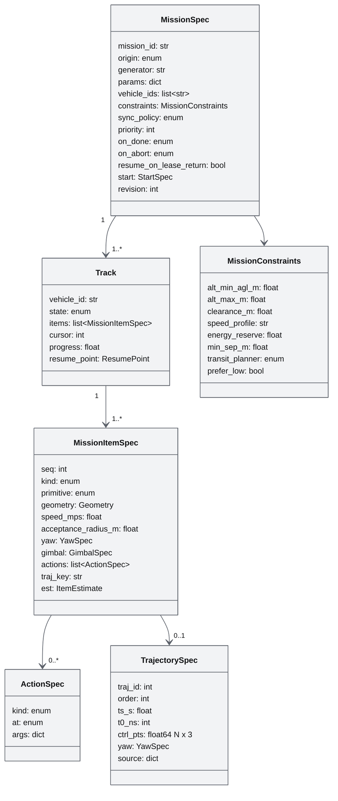
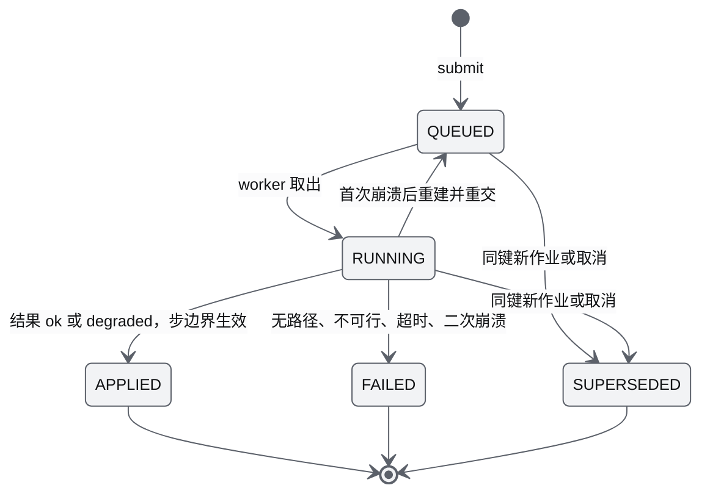
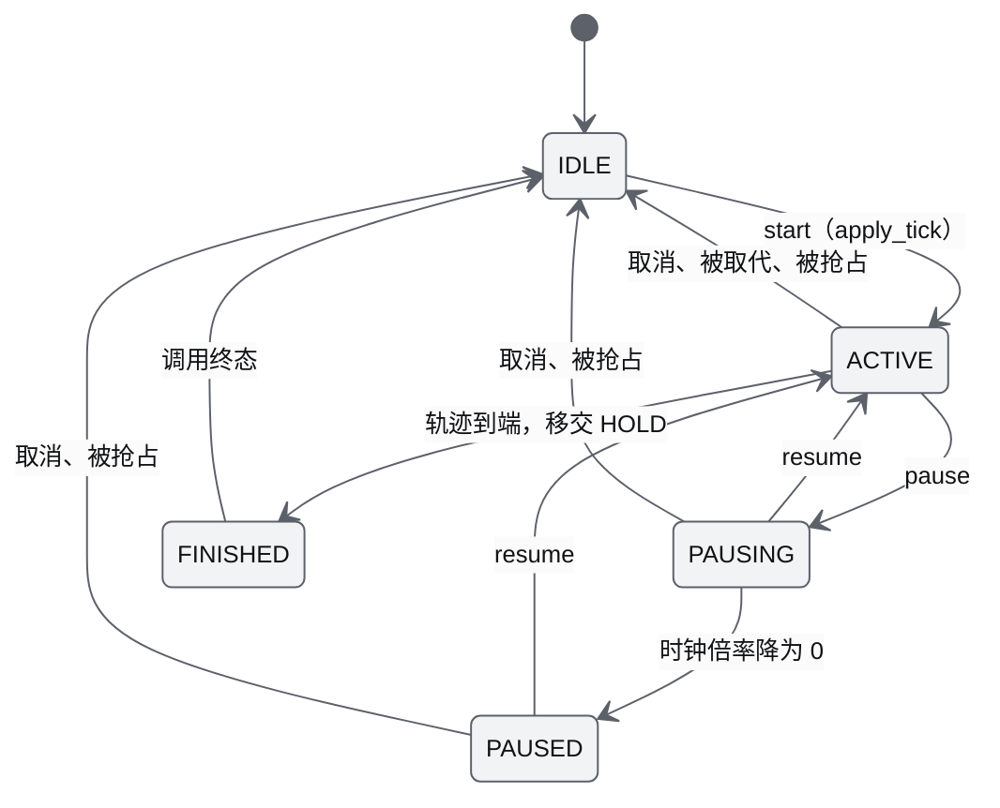
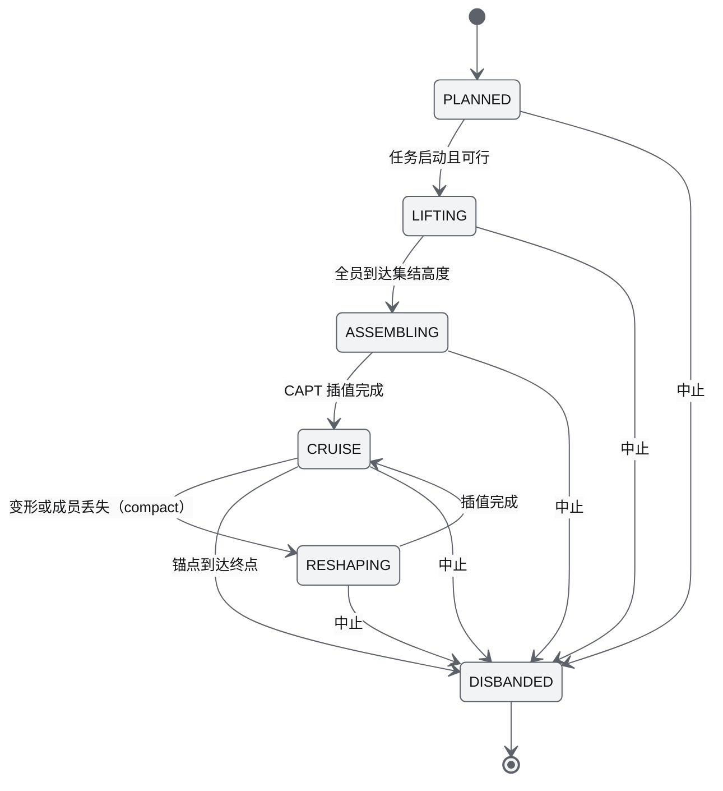
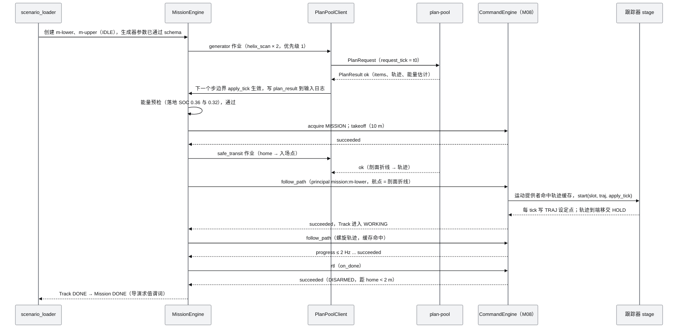
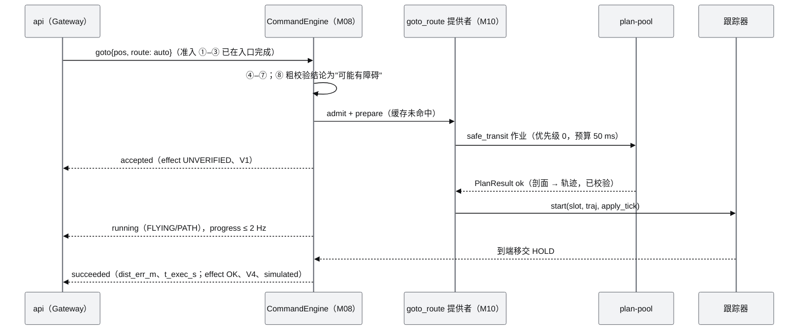
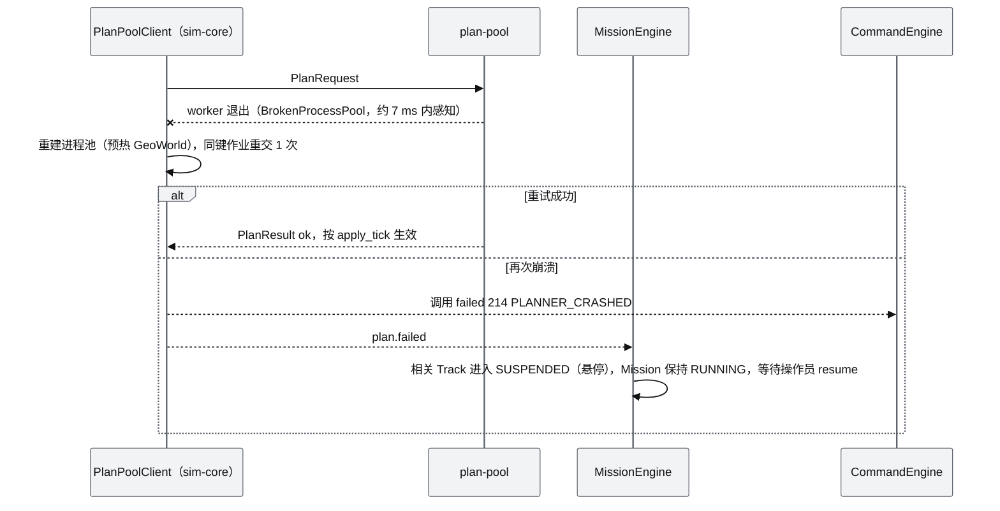
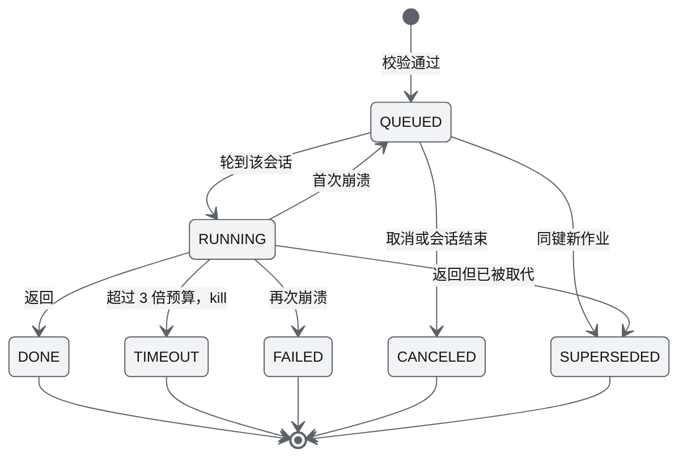
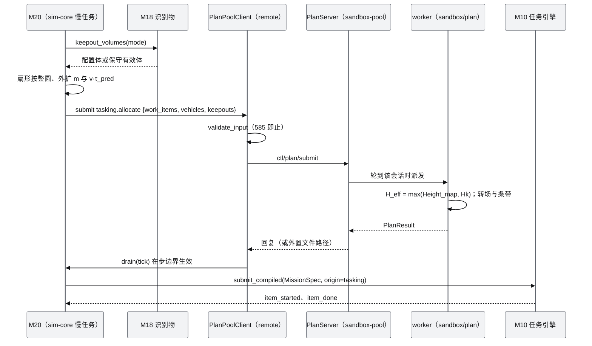

# M10 任务、规划与集群 PRD（Mission, Planning & Swarm）

| 项 | 内容 |
|---|---|
| 文档编号 | AWR-M10 |
| 标题 | 任务、规划与集群 |
| 版本 | v1.0 |
| 日期 | 2026-09-28 |
| 状态 | 草案 |
| 上游文档 | [AWR-03 设计基线](../03-设计基线与决策记录.md)（ADR-016、ADR-020、ADR-021、ADR-026、ADR-027、ADR-036、ADR-039、ADR-042、ADR-045、ADR-047、ADR-049、ADR-050；§3.3、§3.4、§4.1–§4.3、§5、§6.1–§6.3、§8.1–§8.7；附录 B、C）；[01-design](../01-design.md) §7–§8、§26–§32、§37–§40、§42、§49–§50；研究笔记 [r25](../research/r25-ego-fastplanner.md)、[r26](../research/r26-px4-swarm-controllers.md)、[n03](../research/n03-discover-uav-sim-agents.md)、[x01](../research/x01-urbanscene3d-data.md)、[g08](../research/g08-gap.md)（权威），以及 [g04](../research/g04-gap.md)、[g05](../research/g05-gap.md)、[r24](../research/r24-mrs-uav.md)、[d05](../research/d05-anet.md)、[00-index](../research/00-index.md) §2.8、§3.10、§3.14、§5.4；并行说明书 [10](../10-系统架构说明书.md) §8.3、§8.5、[11](../11-技术选型说明书.md) T61、[12](../12-业务逻辑设计说明书.md) §3.3.9、§4.5、§5.3–§5.10、§6.4、§7、[16](../16-World数据规范.md) §12、[17](../17-接口与实时协议规范.md) §4.3.4、§4.3.7、§6.6、§7.1、§7.6、§8、§9.3、§10.7、[18](../18-性能与测试方案.md) §8.3；模块 [M04](M04-几何世界查询服务PRD.md)（WorldQuery）、[M08](M08-仿真内核与飞行器适配PRD.md)（stage 注册表、TRAJ 与运动提供者、CommandEngine、度量注册表）、[M09](M09-安全与健康PRD.md)（EnergyModel、FleetGuard 让行、剧本度量）、[M13](M13-传感器仿真PRD.md)（云台模式与相机几何库） |
| 下游文档 | [M06](M06-Web视口与渲染后端PRD.md)（任务叠加图层）、[M14](M14-智能体运行时与ANet-PRD.md)（估价与分配打分）、[M15](M15-前端UI壳与设计体系组件PRD.md)（任务面板与编辑 UI）、[M16](M16-演示数据剧本与流畅性测试PRD.md)（S1–S6、ladder 剧本与测试）；[14](../14-UI交互设计PRD.md)、[16](../16-World数据规范.md)（`gen_<name>` 子 schema）、[17](../17-接口与实时协议规范.md)（REST、topic、原因码登记）、[18](../18-性能与测试方案.md) |
| 适用版本范围 | V0.1（本期交付 D1）至 V1.0 |

## 0. 摘要

1. M10 按"命令—跟踪器—任务"三层组织（r26 §7.1）：命令的生命周期、准入与租约归 M08，运行期安全归 M09；M10 拥有**任务层**（任务引擎、7 种生成器、剧本加载器与剧本导演）、**跟踪器层**（sim-core 的 `mission` stage，order 027，以 M08 的 TRAJ 模式按轨迹输出 p/v/a 设定点，M08-FR-086）与**规划层**（在 plan-pool 中执行的规划作业）。
2. 全系统只有一种轨迹表示：均匀三次 B-spline `awr.traj.bspline.v1`（ADR-039）。D1-core 用它作为内部执行表示，由折线或解析原语经"圆角—TOPP-lite—Schoenberg 采样"生成；跟踪器以 125 Hz 与 L1 同步求值，带 PX4 time_stretch 与暂停时钟斜坡。实测 1000 架求值为 78.5 µs/次（numba），合 0.0098 核；M10 四个 stage 在 M08 §5.2 中合计分配 0.022 核。
3. 规划分四级。D1-core 为 `safe_transit`（M04 剖面，按构造无碰撞）；D1-ext 为 4 m Height_map 上的 2.5D A*（爬升代价、2.5D LOS 剪枝、按构造安全的高度剖面）。在六城 240 组随机起终点上实测：轨迹全部有效，A* p95 为 1.2–4.1 ms；120 m 限高（DTM 中位数 + 120 m）下 A* 可达率为 92.5%–100%，剖面转场只有 52.5%–90%。V0.3 为体素 A* + ESDF + L-BFGS-B；V0.6 接 EGO-Swarm 后端。
4. 7 种生成器（割草机、螺旋扫描、环绕、扩展方形、走廊、地形跟随、编队槽位）全部按航段查询 Height_map，不使用全局固定高度（x01 §3.8）。S1 按 12 §7.2 定稿：塔体形心 (−162.2, 77.3)、半径 57 m、标称 Δz 18.47 m/圈按整圈取整、6 m/s、两机自上而下，落地 SOC 预检 0.36 与 0.32。
5. 编队：D1-core 提供"槽位偏移轨迹 + 群组时钟"。D1-ext 提供虚拟结构跟踪、二阶航向滤波与 CAPT 集结变形；间距缺省 12 m（高于 FleetGuard 10 m 告警线），变形前按预测最小间距校验。覆盖：D1-core 做单机割草机；D1-ext 做多机的 BCD-lite、代价均衡切分与 Hungarian 分配，在规范化世界上规划耗时 27–78 ms。
6. 互避：D1-core 由 M09 FleetGuard 在运行期让行，任务轨道随之挂起和续飞。D1-ext 提供"简单互避"：转场分层（Δz 4 m）加任务内 4D 冲突检查，冲突时用延迟或错层消解（8 架 × 20 min 的检查耗时 59 ms）。完整的三层互避（4D 预约、椭球代价、ORCA-3D）在 V0.6。
7. 任务分配：D1-ext 只用 Hungarian（CAPT 与覆盖）；V0.6 引入统一打分与 SSI 拍卖；V1.0 引入修正 DMG 的 CBBA，并与 M14 合同网共用打分。航线模板复用（相似变换 + 外推 + 安全连接）在 V0.2，D1 只交付桩。
8. 确定性：规划结果按 apply_tick 生效并写入输入日志（ADR-049）；轨迹按内容哈希缓存；跟踪、任务、同步与剧本计时器在仿真时间域，plan-pool 作业预算、预览结果保留与 status 节流为墙钟（ADR-045，§7.7）。
9. 对基线与并行文档提出 18 条反馈（§14）。已被并行文档采纳的：TRAJ 模式、运动提供者注册表与跟踪器 order 027、度量注册表（M08）；125 `PLAN_FAILED`（17 §8.2，HTTP 422）、预览异步 R65、`mission/preview` 查询（17）；`transit.planner = astar25`（16 §12.2）；端点柱规则（M04-FR-017、018）。仍待处理的关键项：provider 的 `prepare` 与 ENU 写入助手（M08）、B-spline 在 D1-core 作为内部表示（AWR-03 §6.1、§6.3 表述）、17 §7.6 的 50 Hz 表述、S1 数值在 16 §12.4 与 M16 中的回改。

---

## 1. 背景与目标

### 1.1 背景

01-design §30 把控制模式分为两个阶段：第一阶段是 Takeoff、Land、GoTo、FollowPath、Orbit、Hover、ReturnHome；第二阶段是 Area Coverage、Search、Tracking、Formation、Collision Avoidance、Swarm。§29 要求每架机独立维护 State、Sensor、Mission、Controller、Agent；§49 把 Swarm、Formation、Planning、Avoidance 放在 V0.6。研究阶段在这一主题上给出了互相补充、但口径不一的结论：

- r25 在服务端先验地图上验证了"全局 A* + LOS 剪枝 + B-spline（ESDF 代价）+ TOPP-lite"，给出 EGO 轨迹契约与三层互避；
- r26 发现两个参考仓库的编队律存在脱连、dt 为负等缺陷，改用"虚拟结构 + 前馈 + 航向滤波 + CAPT"，并做了多机覆盖规划器；
- x01 证明航线直接相似变换到城市上时 1.5%–48% 的视点不安全，城市任务必须按航段查询 Height_map，并给出 7 种生成器公式与 S1–S6 剧本；
- n03 给出统一打分函数与 Hungarian/SSI/CBBA 三档分配；
- g08 定稿了 FleetSim 的时钟、PX4-lite 外环、time_stretch 与 pos_err 阈值，M10 的跟踪器必须与之吻合。

基线把 M10 的 D1 范围定为：任务引擎、7 种生成器、轨迹原语、`safe_transit` 与剧本加载器属于 core；2.5D A*、编队、覆盖属于 ext；B-spline 轨迹契约（由折线生成）为 D1 桩；ESDF 与 L-BFGS-B 优化、三层互避、CBBA 属于后续版本（AWR-03 §6.1、§6.3、ADR-039、ADR-042；附录 C §30）。本文把这些结论落实为可以直接实现的模块设计；其中 B-spline 契约按 ADR-039"D1 中由折线生成"用作 D1-core 的内部执行表示，范围表述的差异见 §14 第 2 条。

### 1.2 目标

| 编号 | 目标 | 可度量表述 | 首次达成 |
|---|---|---|---|
| G-M10-1 | 任务可执行、可复现 | S1 在 ×1 与 ×10 下两条 Track 均为 DONE，成功谓词全部成立；同一种子与输入日志下规划结果与 apply_tick 逐字节一致（D1-AC-15、D1-AC-31） | V0.1 |
| G-M10-2 | 城市中按构造无碰撞 | 所有生成器与规划器的输出都通过 `path_valid`（1 m 缓冲，巡航段）与端点柱检查；六城随机转场 240 组，有效率 100%（M10-AC-004、M10-AC-017） | V0.1 |
| G-M10-3 | 不拖累仿真实时性 | N = 1000 时 M10 在 sim-core 内的 stage 合计目标 0.022 核（M08 §5.2 分配）、上限 0.03 核，单步 p99 增量 ≤ 0.25 ms；预计 > 2 ms 的计算一律进入 plan-pool（ADR-039） | V0.1 |
| G-M10-4 | 多机协同可演示 | 编队跟踪 RMS ≤ 0.5 m（无风 Mock），S2、S4 有风时 ≤ 3 m；集结与变形全程最小间距 ≥ `min_sep_m`（缺省 10 m，与 S2、S4 的 `min_separation_m ≥ 10` 一致）；多机覆盖预测覆盖率 ≥ 99%，均衡度 ≤ 1.15（D1-AC-17） | V0.1（ext） |
| G-M10-5 | 接口不随后端变化 | 同一份轨迹契约与任务模型可驱动 Mock、SIH（V0.2）、EGO 后端（V0.6），UI 与剧本无需改动（P-07） | V0.2 起逐步验证 |

### 1.3 对原设计的继承、修正与增强

| 01-design 章节 | 继承 | 修正（二次优化） | 增强 | 依据 |
|---|---|---|---|---|
| §30 控制模式（两个阶段） | 7 个基础模式与 6 个二期模式的清单与分期 | ReturnHome 改名 RTL；按"命令—跟踪器—任务"三层重新组织：GoTo(direct)、Hover、Takeoff、Land、RTL 的运动由 M08 完成，FollowPath、Orbit、GoTo(safe_transit) 的运动由 M10 跟踪器完成；Search = 扩展方形生成器加 S3（ext）；Tracking 推迟到 V0.8（ADR-047 的 Tracks 层）；Collision Avoidance 拆成运行期让行（D1-core，M09）、简单互避（D1-ext）与三层互避（V0.6） | 统一的 B-spline 轨迹契约；每个模式都登记参数 schema、完成判据（12 §5.4）与图标（15 §7.6 的 E 组） | 附录 C §30；r26 §7.1；r25 §7.4 |
| §29 多无人机架构 | 每架机逻辑上有独立的 Mission、Controller | "每机一个 SITL + 控制器进程"改为 sim-core 内集中式、向量化的任务引擎与跟踪器；"分布式"只放在 ANet 协商层（M14） | 群组时钟：编队成员共用一个轨迹时钟，时间拉伸取全体最小值 | r26 §7.2；ADR-020、ADR-021 |
| §49 V0.6 Swarm、Formation、Planning、Avoidance | 版本主题 | 编队、覆盖、2.5D A* 提前到 V0.1（ext）；三层互避、覆盖 VRP、EGO 后端保留在 V0.6，并写明算法与验收 | 编队可行性检查；集结与变形用 CAPT；分区覆盖按代价均衡切分 | AWR-03 §8.1；r25 §3.9；r26 §3.4–§3.9 |
| §50 Task Assignment | V1.0 主题 | 指定算法演进：Hungarian（ext）→ SSI 拍卖（V0.6）→ CBBA（V1.0，修正 DMG）；LLM 只生成候选任务，不做分配决策 | 与 M14 合同网共用同一个打分函数 | n03 §3.9、§7.8 |
| §8 Geometry World 支撑 Path Planning | 规划只读 Geometry World | 规划栅格采用 M04 Height_map（2 m 膨胀 2 格加 10 m）经 2×2 取最大得到的 4 m 栅格，D1 不建体素；体素 A* 与 ESDF 在 V0.3 | 规划栅格绑定 `coordinate.sha256` 与 `contentVersion`，不一致即拒绝（P-01） | r25 §3.1；x01 §3.8；AWR-03 §4.4 |
| §2、§35 "PX4 + Gazebo 负责 Planning" | — | 更正：PX4 不做城市级三维避障。平台规划由本模块完成（服务端、全局、任务级）；真机机载局部规划为 EGO（V0.6），两者以航点或 local target 衔接 | EGO UDP 轨迹报文的编解码已逐字节验证（r25 §3.10），留作 V0.6 虚实混合 | r25 §7.7 |
| §40 Drone Interaction 的 Mission | 选中机可查看任务 | 任务叠加只画不算：路径、区域、槽位与覆盖揭示的数据由 M10 提供，渲染归 M06 | `uav/{id}/path` 由轨迹采样得到，与飞行实际执行的是同一条轨迹 | M06-FR-044；15 §10.6 |
| §32 Multi-Agent Workflow | 发现疑似目标后请求复核 | V1.0 把"插入验证航段并重新切分剩余航段"定义为任务层的标准动作 | — | r26 §7.11 |
| §42 仓库 `swarm/{mission,planning,avoidance}` | 三个子域 | 改为 `awr/sim/{mission,planning}` 与纯算法包 `awr/swarm/{formation,coverage,allocation}`（AWR-03 §4.1），本文在 M10 所有的 `awr/swarm/**` 内再细化出 `deconflict/`（AWR-03 §1.3 第 5 条允许模块细化子目录） | 纯算法包不依赖 `awr.sim`，可单独测试 | AWR-03 §4.1–§4.3 |

### 1.4 模块设计原则

1. **规划只读 Geometry World**：所有高度都来自 M04 的 DSM、DTM 与 Height_map；点云 LOD 与 3DGS 永远不进入规划（P-03）。
2. **重计算不进主循环**：预计 > 2 ms 的计算一律提交 plan-pool；结果在就绪后的下一个步边界生效，实际 apply_tick 写入输入日志（ADR-039、ADR-049）。
3. **任务引擎不享特权**：任务引擎与剧本导演以 principal `mission:<mid>`、`scenario:<id>` 走与操作员相同的准入流水线第 ④–⑩ 步（ADR-016，12 §6.4 规则 1）。
4. **一种轨迹表示**：执行、显示、录制与后端对接都使用同一份 B-spline 契约，避免"画的和飞的不一致"。
5. **锚点是虚拟的**：编队的控制锚点永远是虚拟点，"领航机"只是 UI 角色（r26 §3.6）。
6. **仿真时间驱动**：跟踪器、任务引擎、同步屏障、覆盖戳记全部按仿真时间推进；只有 plan-pool 的作业预算、预览结果保留与 status 发布节流用墙钟（§7.7，ADR-045）。

---

## 2. 范围

### 2.1 D1-core（P0，发布阻塞）

| 项 | 内容 | 验收 |
|---|---|---|
| 任务模型与任务引擎 | Mission、Track、MissionItem、Action、Constraints（§6.3）；Mission 与 Track 状态机的实现（语义以 12 §4.5 为准）；MISSION 租约申请；能量预检；`on_done`、`on_abort`；暂停、恢复、中止 | M10-AC-001–003、010、014 |
| 基础命令的运动实现 | follow_path、orbit、goto（`route = safe_transit`，以及 `auto` 判定为非直飞时）三个运动提供者；跟踪器 stage；航向模式；轨迹缓存；`uav/{id}/path` 发布 | M10-AC-004–009 |
| 7 种生成器 | lawnmower（单机，fly_over 高度模式）、helix_scan、orbit、expanding_square、corridor、terrain_follow、formation（槽位偏移轨迹 + 群组时钟），另加显式 follow_path | M10-AC-012、013 |
| 规划 | plan-pool 作业协议；`safe_transit`；折线圆角、TOPP-lite、B-spline 生成与校验（follow_path 的必经环节） | M10-AC-004、011 |
| 剧本 | 剧本加载器（V-SC-01 至 V-SC-12）；剧本导演（事件、谓词、结果）；M10 的度量（`missions_done`、`facade_coverage`、`area_coverage`、`agl_min_m`、`agl_rms_err_m`） | M10-AC-015、016；D1-AC-15 |
| 接口 | REST R10、R11、R23、R24；topic `mission/{mid}/status`、`uav/{id}/path`；事件 `evt/sim-core/mission`；前端 `stores/mission.ts` | M10-AC-029 |

### 2.2 D1-ext（P1，缺失时必须有豁免记录）

| 项 | 内容 | 验收 |
|---|---|---|
| 2.5D A* 与平滑 | 4 m 规划栅格、2.5D A*、2.5D LOS 剪枝、按构造安全的高度剖面，接入 B-spline 生成；转场规划器选择策略（先剖面，限高不可行或 `prefer_low` 时改用 A*） | M10-AC-017 |
| 编队 | 虚拟结构跟踪器、二阶航向滤波、CAPT 集结与变形、可行性检查、成员丢失处理；Python 与 TS 的槽位和 CAPT golden 对拍 | M10-AC-018–020 |
| 覆盖 | 多机分区（扫描角搜索、凹多边形航带、障碍裁剪、BCD-lite、段内精确切分的均衡切分、Hungarian 分配）；`per_lane` 高度模式（S4 需要）；覆盖栅格快照推送 | M10-AC-021、022 |
| 简单互避 | 多机转场的分层；任务内 4D 冲突检查，并用延迟或错层消解 | M10-AC-023、024 |
| 任务编辑后端 | `POST /api/missions`、`POST /api/missions/preview`、`GET /api/missions/preview/{preview_id}`（R25、R26、R65）；barrier 与 timed 同步；`wait_sync`、`sensor` 动作 | M10-AC-025；D1-AC-17 |
| 剧本 S2、S4–S6 的 M10 部分 | 生成器与度量支撑（`formation_err_rms_m`、`link_quality_min`） | M10-AC-026、027 |

### 2.3 D1 桩

| 项 | 本期交付 | 真实实现 |
|---|---|---|
| 外部输入的 B-spline（`follow_path.bspline`） | schema 与校验（order = 3、4 ≤ N ≤ 4096、ts 在 [0.05, 5] s）；D1-ext 可以接收 | V0.2 起供外部规划器（EGO）使用 |
| 航线模板复用 `retarget` | 纯函数与单元测试（P2），数据解析由 M16 的 `awr/datasets` 提供（P2） | V0.2 |
| 统一打分 `score.py` | 接口与 docstring（P2） | V0.6 |

### 2.4 后续版本

| 版本 | 内容 |
|---|---|
| V0.2 | 航线模板复用；`oblique5_grid`、`sector_search` 生成器；SIH 后端下跟踪器输出改走适配层的 TrajectorySetpoint（p/v/a 三项全填，r26 §3.1）；zones 编辑后规划缓存失效 |
| V0.3 | 碰撞代理 L1–L2 上的体素 A*（26 邻域）+ ESDF 代价的 L-BFGS-B 优化 + 局部时间重分配（Fast-Planner `reallocateTime`）；单次规划 p95 ≤ 100 ms（AWR-03 §8.1 V0.3 退出标准） |
| V0.4 | 风场感知规划：`clearance += k·gust`、`v_max_eff = v_max − abs(w_head)`、逆风段能耗进入 A* 代价（r25 §7.9） |
| V0.6 | 三层互避（全局 4D 预约、椭球 swarm 代价、ORCA-3D 加刹停错层兜底）；EGO-Swarm `ros2_version` 规划后端与虚实混合 UDP；带电量约束的覆盖 VRP 与故障重规划；统一打分与 SSI 拍卖；编队一致性律与拓扑可视化（律 A 作为对照） |
| V0.8 | Tracking：跟踪 Dynamic Objects 与 Tracks 层中的移动目标（ADR-047） |
| V1.0 | CBBA（修正 DMG，用于断网与去中心化）；按 ANet 能力加权切分；插入验证航段；异构实体 |

### 2.5 不做

在线学习或 RL 规划器；LLM 直接生成轨迹（LLM 只能提出任务意图，经 M14 受信守卫后由本模块生成轨迹，n03 §3.7）；任务级气象预报；实时 CFD 耦合规划。

### 2.6 职责边界

| 主题 | M10 负责 | 不负责（归属） |
|---|---|---|
| 命令 | follow_path、orbit、goto（非直飞）的运动实现与进度 | 调用生命周期、准入、幂等、取代、完成判据（M08，语义见 12 §4.6、§5.4）；takeoff、land、hover、rtl、velocity、goto(direct) 的运动（M08） |
| 安全 | 生成与规划按构造无碰撞；规划期的任务内互避 | 运行期围栏、FleetGuard 让行、FastGuard（M09，12 §5.7、§5.10） |
| 几何 | 规划栅格的派生与缓存（plan-pool 内） | DSM、DTM、Height_map、`path_valid`、`safe_transit_profile`（M04） |
| 状态机语义 | 实现 Mission 与 Track 状态机 | 定义其语义（12 §4.5） |
| 剧本 | 加载器、导演、M10 的度量 | 剧本文件（M16）；文件格式（16 §12） |
| 显示 | 提供路径、区域、槽位、覆盖栅格数据与 `stores/mission.ts` | 3D 图层（M06）；面板 JSX（M15） |
| 分配 | 编队 CAPT、覆盖分块分配；V0.6 起统一打分 | 合同网流程、报价与证据链（M14） |
| 传感器 | 相机触发的逻辑计数与覆盖戳记 | 相机内参、云台位姿、检测器（M13） |

---

## 3. 用户与用例

### 3.1 用户与调用方

| 调用方 | 通过什么调用 M10 | 可信等级 | 典型需求 |
|---|---|---|---|
| 操作员（UI） | WS `call`（goto、follow_path、orbit、`mission/{mid}/*`）；REST R23–R26 | 可信入口认证后的人 | 点选 GoTo 不撞楼；编辑航线；框选区域生成覆盖任务；暂停与恢复任务 |
| 剧本导演 | sim-core 进程内调用；principal `scenario:<id>` | 可信内部 | 按剧本启动任务、注入事件、求值成功谓词 |
| agent-runtime（M14，ext） | WS 等价的内部命令；`ctl/sim-core/estimate` | 受信守卫之后的不可信指挥官 | 为协作任务生成航线；按能力与时间估价 |
| 研究者 | REST 预览接口、剧本文件、录制 | 同操作员 | 批量对比规划器参数、复现实验 |
| CI 与流畅性测试（M16） | 剧本 `--profile ci`、ladder 剧本 | 可信 | 无头 ×10 跑剧本；1000 架持续负载 |

### 3.2 用例

| 编号 | 用例 | 参与者 | 前置条件 | 主流程 | 结果与验收 | D1 |
|---|---|---|---|---|---|---|
| UC-01 | 深圳双机立面巡检（S1） | 剧本导演 | 世界 READY；两架 P600 在 home | 加载剧本 → 能量预检 → 申请 MISSION 租约 → takeoff → safe_transit 到入场点 → 螺旋扫描 → RTL | 两条 Track DONE，`facade_coverage ≥ 0.9`，最小间距 ≥ 10 m，guard 事件为 0 | core |
| UC-02 | 点选 GoTo 到楼顶 | 操作员 | 焦点机 FLYING | 视口点选 → `goto{route: auto}` → 粗校验不能证明无障碍 → 规划 safe_transit → PATH 执行 | 停在点击点 3 m 内，全程 `path_valid` 通过（D1-AC-32） | core |
| UC-03 | 编辑并下发航线 | 操作员 | 焦点机 FLYING | 航点编辑 → 提交 `follow_path` → 调用停在 accepted → plan-pool 生成轨迹并细校验 → running → succeeded | 违规航段在提交前标出；细校验失败时以 102 结束并保留草稿 | core（编辑 UI 为 ext） |
| UC-04 | 框选区域生成多机覆盖 | 操作员 | ≥ 1 架可用机体 | 绘制多边形 → 预览（分区、航带、ETA、能量）→ 生成任务 → 启动 | 预测覆盖率 ≥ 99%，均衡度 ≤ 1.15，执行后 `area_coverage ≥ 0.95` | ext |
| UC-05 | 编队环绕与变形（S2、S4） | 剧本导演 | 5 架机在地面 | CAPT 集结 → 沿环线或走廊巡航（航向滤波）→ 队形变换（例如横队变为 V 形）→ 解散返航 | `formation_err_rms_m ≤ 3`（有风）；全程 `min_separation_m ≥ 10`（槽位间距 12 m） | ext |
| UC-06 | 丘陵地形跟随（S5） | 剧本导演；端到端测试（对照） | 旧金山世界 | 割草机航带 → 地形跟随剖面（限坡 15°）→ 执行；对照方案不写入剧本，由测试以 operator 身份下发固定 z 的 follow_path（12 §7.3） | `agl_min_m ≥ 60`；对照方案被准入以 102 拒绝 | ext（生成器为 core） |
| UC-07 | 限高 120 m 下的转场 | 操作员或剧本 | 任务约束 `alt_max_m` | 剖面转场越过限高 → 改用 2.5D A* 绕行 | A* 可达率 ≥ 90%（六城实测 92.5%–100%，剖面转场为 52.5%–90%） | ext |
| UC-08 | 机群阶梯持续负载 | M16 | ladder 剧本（12 §7.4） | 1000 架以出生点为圆心 orbit（半径 3 m、2 m/s、20 圈，入圆走 direct） | 无 CRASHED；`guard_events = 0`；M10 stage 合计不超过 §6.8 预算 | core |
| UC-09 | 规划进程崩溃 | 系统 | 有进行中的规划 | worker 被 kill → 重建进程池并重试 1 次 → 仍失败则调用以 214 结束，相关 Track 进入 SUSPENDED | 主循环不超时；调用到达终态（ARCH-AC-006） | core |
| UC-10 | 被接管后续飞 | 操作员 | Track WORKING | 接管 → 手动 GoTo → 交还 → 以 safe_transit 回到续飞点 → 从断点继续 | 续飞后覆盖不缺段（12 §4.5.2 K06、K07） | core |
| UC-11 | 航线模板复用 | 研究者 | 模板文件 | Zhang 模板 → 相似变换到目标塔 → 外推不安全视点 → 安全连接 → 时间参数化 | 不安全视点为 0，`path_valid` 100% | V0.2（D1 桩） |
| UC-12 | 失效机分担（覆盖） | 系统 | 覆盖进行中 | 某机 DROPPED → 剩余航段重新切分 → Hungarian 重分配 | 1 s 内给出新计划 | V0.6 |

### 3.3 本模块新增术语（其余见 AWR-03 §11）

| 术语 | 定义 |
|---|---|
| 运动提供者 | 经 M08 `register_motion_provider` 登记、接管 follow_path、orbit、非直飞 goto 运动执行的 M10 对象（M08-FR-086） |
| TRAJ 模式 | M08 的运动模式 15：refgen 跳过，设定点由 M10 跟踪器每个 L1 tick 写入 |
| 跟踪槽位 | 跟踪器 SoA 中与 FleetState slot 对齐的一行，持有轨迹时钟 τ、时钟倍率与控制点区段（§6.3.4） |
| 轨迹时钟 τ | 轨迹的局部参数时间；受 time_stretch 与暂停斜坡影响，一般不等于 `t − t0` |
| 群组时钟 | 编队成员共用的轨迹时钟，倍率取成员 time_stretch 的最小值 |
| 规划栅格 Hf | 4 m 分辨率的 2.5D 可飞高度：`max(grid_2p5d(4), dtm + alt_min_agl_m)` |
| 端点柱规则 | 起终点竖直段按"碰撞半径内最大 DSM + 0.5 m"判定，目标点要求 `z ≥ column_max_within(goal, r_col) + 2 m`（§6.5.7） |
| 规划作业 | 提交到 plan-pool 的 `PlanRequest`，结果在就绪后的下一个步边界生效并记录 apply_tick（§6.3.3、§6.4.1） |
| 错层变形 | 预测最小间距不足时，编队成员先按 rank 竖直错开、再水平变形、最后回到同层的三段式 CAPT（FR-044） |

---

## 4. 功能需求

优先级与版本按 AWR-03 §10.2 第 4 条：D1-core 为 P0/V0.1/是，D1-ext 为 P1/V0.1/是，桩为"桩"，后续版本为"否"。

### 4.1 任务模型与任务引擎

| 编号 | 需求描述 | 优先级 | 目标版本 | D1 | 验收要点 | 依据 |
|---|---|---|---|---|---|---|
| M10-FR-001 | 实现 §6.3 的任务数据模型（MissionSpec、MissionItemSpec、ActionSpec、MissionConstraints、TrajectorySpec），以 pydantic 定义，msgpack 与 JSON 往返无损；字段名与 12 §3.3.9 一致，带单位后缀 | P0 | V0.1 | 是 | M10-AC-001 | 12 §3.3.9；AWR-03 §5.4 |
| M10-FR-002 | 按 12 §4.5.1 的 M01–M09 与 §4.5.2 的 K01–K12 实现 Mission 与 Track 状态机；Track 投影到 Full64 `mission_item` 与 `state_ext.mission` | P0 | V0.1 | 是 | M10-AC-002 | 12 §4.5 |
| M10-FR-003 | 任务引擎以 principal `mission:<mid>` 申请 MISSION 租约，并通过准入第 ④–⑩ 步下发内部调用，不绕过准入 | P0 | V0.1 | 是 | M10-AC-003 | ADR-016；ADR-027；12 §6.4 |
| M10-FR-004 | IDLE → RUNNING 前做能量预检：对每条 Track 以 M09 实现的 `EnergyModel`（`path_wh` 与 `estimate`，与运行期同一模型，§6.5.17）计算起飞、入场转场、各任务项与返航的能量，`soc_now − E_need/E_use ≥ energy_reserve（0.20）` 时可行，`E_use` 为可用能量（P600 为 188.7 Wh，12 §5.8.1）；不可行时按剧本 `energy_precheck`（缺省 reject；UI 创建的任务缺省 warn）返回 119 或发出 `mission.energy_warning` | P0 | V0.1 | 是 | M10-AC-014 | 12 §5.8.4；M09-FR-053；ADR-036 |
| M10-FR-005 | 任务项切分：单个 follow_path 调用的航点 ≤ 1000、总长 ≤ 20 km；单条轨迹的控制点 ≤ 4096；超出时自动切成多个 MissionItem，切点处速度连续（相邻两条轨迹首尾各带 `states2pts` 边界） | P0 | V0.1 | 是 | M10-AC-012 | ADR-016；12 §6.4 规则 2 |
| M10-FR-006 | 同步策略：`free`（core）；`barrier` 与 `timed`（ext）。barrier 超时 30 s【仿真】后把未到者标记为 `lagging`，其余机体继续 | P0 / P1 | V0.1 | 是 | M10-AC-002、025 | r26 §3.11；12 §4.5.2 K04–K05 |
| M10-FR-007 | 任务级 pause、resume、abort：pause 在 TRAJ 槽位上用时钟斜坡让各机停在轨迹上（§6.5.8；这是 12 §4.5.1 M04 的"STOP_MOTION 悬停"在轨迹执行下的实现，刹停过程不偏离路径）；resume 从断点斜坡恢复；租约交还后按 `resume_on_lease_return` 以 safe_transit 回到续飞点 | P0 | V0.1 | 是 | M10-AC-010 | 12 §4.5.1 M04–M06、§4.5.2 K06–K07 |
| M10-FR-008 | 动作：`dwell`、`yaw`、`gimbal`、`camera.trigger`（逻辑触发，只计数和打覆盖戳记）、`mark` 属于 core；`sensor`、`wait_sync` 属于 ext | P0 / P1 | V0.1 | 是 | M10-AC-012 | x01 §3.10；r26 §3.11 |
| M10-FR-009 | `on_done ∈ {rtl, hover, land}`（默认 rtl）、`on_abort ∈ {hover, rtl, land}`（默认 hover），按 12 §3.3.9 执行 | P0 | V0.1 | 是 | M10-AC-002 | 12 §3.3.9 |
| M10-FR-010 | 在 `evt/sim-core/mission` 上发布 §7.3 的事件目录，每 tick 至多一次 put（按步合批）；`mission/{mid}/status` 在变化时发布（节流 ≤ 2 Hz），另有 1 Hz 心跳 | P0 | V0.1 | 是 | M10-AC-029 | ADR-018；17 §6.6 |

### 4.2 基础命令的运动实现与跟踪器

| 编号 | 需求描述 | 优先级 | 目标版本 | D1 | 验收要点 | 依据 |
|---|---|---|---|---|---|---|
| M10-FR-011 | 在 M08 的运动提供者注册表（M08-FR-086）中注册 `follow_path`、`orbit`、`goto_route` 三个提供者，ops 分别为 `follow_path`、`orbit`、`goto:route!=direct`；`route = auto` 的 goto 由 M08 在第 ⑧ 步粗校验已证明无障碍时按 direct 原生执行，否则分发给 `goto_route`（12 §5.7.4）；接口见 §7.4.2 | P0 | V0.1 | 是 | M10-AC-005、008 | 17 §7.6；12 §5.7.4；M08-FR-086 |
| M10-FR-012 | follow_path：同步做参数与缓存检查（≤ 1 ms）；缓存未命中时提交 plan-pool 作业（圆角、TOPP-lite、B-spline、细校验），调用停在 accepted，结果在 apply_tick 生效后进入 running | P0 | V0.1 | 是 | M10-AC-004 | ADR-016；ADR-039 |
| M10-FR-013 | orbit：入圆转场（粗校验能证明无障碍时直线切入，入圆段按巡航速度飞（环绕速度是圆周切向速度），否则 safe_transit；orbit 作业项的入圆段可证无障碍时任务引擎直接下发 orbit、不另做转场规划，AWR-03 ADR-070）、角速度斜坡（`α = a_tan/R`）、累计圈数、`yaw_behavior ∈ {center, tangent, fixed}`；`speed²/radius ≤ 3 m/s²` 由 M08 在第 ⑥ 步检查；`yaw_behavior = center` 时生成器另查 `speed/radius ≤ 0.9 × 机体自动模式偏航角速度上限`，否则 110（remedy：降速、增大半径或改用 tangent；AWR-03 ADR-062） | P0 | V0.1 | 是 | M10-AC-007 | 12 §5.3；x01 §3.10 |
| M10-FR-014 | goto_route：`safe_transit` 由 M04 `safe_transit_profile` 生成"爬升—巡航—下降"折线后按 FR-012 的流水线生成轨迹，以 PATH 子模式执行；D1-ext 按 §6.5.1 的策略可以换成 2.5D A* | P0 | V0.1 | 是 | M10-AC-008 | x01 §3.8；12 §5.7.4 |
| M10-FR-015 | 跟踪器 stage `mission`（order 027、every 2、phase 0，125 Hz，在 L1 融合核之前）：对 TRAJ 槽位求值 B-spline 或解析原语，输出 ENU 的 p、v、a、ψ，经 M08 助手换算后写入 `tr_x/tr_v/tr_a/yaw_sp`（§6.2）；带 time_stretch（2.0 m / 1.0 m）与时钟斜坡；轨迹结束后以静止点移交给 M08 的 HOLD。热路径使用 numba 核，numpy 版本作为 oracle | P0 | V0.1 | 是 | M10-AC-005、006 | g08 §3.2、§5.2；ADR-021 |
| M10-FR-016 | 航向模式：`lookahead`（前视 1 s；位移 < 0.1 m 时保持）、`path`（切向）、`center`（看向点）、`axis`（看向竖直轴线）、`fixed`、`none` | P0 | V0.1 | 是 | M10-AC-005 | r25 §3.7 |
| M10-FR-017 | 轨迹缓存：键为（world contentVersion、profile、speed_profile、限值、几何与动作参数的 sha256），LRU 256 条；同一输入得到逐字节相同的轨迹；剧本启动时预先生成的轨迹经缓存直接生效 | P0 | V0.1 | 是 | M10-AC-009 | ADR-049 |
| M10-FR-018 | 轨迹变化时发布 `uav/{id}/path`（`awr.blob.polyline4.v1`，每点 `(x, y, z, t_rel_s)`，按弧长与曲率自适应采样，≤ 4096 点）；取消或结束时发布空路径 | P0 | V0.1 | 是 | M10-AC-029 | 17 §6.5 |

### 4.3 生成器

| 编号 | 需求描述 | 优先级 | 目标版本 | D1 | 验收要点 | 依据 |
|---|---|---|---|---|---|---|
| M10-FR-019 | `lawnmower`（单机）：由相机 FOV 与重叠率求航带间距与触发间距；支持凹多边形与洞；扫描角可设为 `auto`；高度模式 `fly_over`（core）、`fixed_agl` 障碍裁剪与 `per_lane`（ext） | P0 / P1 | V0.1 | 是 | M10-AC-012、021 | x01 §3.10；r26 §3.8 |
| M10-FR-020 | `helix_scan`：给定中心、飞行半径、立面距离、z 区间（`z_range_m[0] > z_range_m[1]` 表示自上而下）、标称每圈 Δz（或垂直重叠率）、速度与云台模式，生成等速螺旋；圈数取 `ceil(abs(z1 − z0)/Δz_nom)` 并据此回算实际 Δz，使扫描终点与入场点同方位；入场方位缺省 `auto`（指向该机 home） | P0 | V0.1 | 是 | M10-AC-012 | x01 §3.10；12 §5.8.3 第 3 条、§7.2 |
| M10-FR-021 | `orbit`：生成环绕原语，云台俯角 `θ = atan2(h − h_target/2, r)` | P0 | V0.1 | 是 | M10-AC-012 | x01 §3.10 |
| M10-FR-022 | `expanding_square`：首腿 `leg0 = 0.8·W`，腿长序列 L、L、2L、2L、3L…，方向每腿旋转 90° | P0 | V0.1 | 是 | M10-AC-012 | x01 §3.10（IAMSAR） |
| M10-FR-023 | `corridor`：沿折线两侧偏移 ±offset，斜视 45° 朝向中线；可与地形跟随组合 | P0 | V0.1 | 是 | M10-AC-012 | x01 §3.10 |
| M10-FR-024 | `terrain_follow`：`z(s) = dtm(s) + agl`，再与 `H_top(s)` 取大，最后做纵向限坡的上包络（前向与后向两遍，`abs(dz/ds) ≤ tan 15°`）；可接收路径或割草机区域 | P0 | V0.1 | 是 | M10-AC-012、026 | x01 §3.10；12 §7.3 S5 |
| M10-FR-025 | `formation`（槽位）：由锚点路径、队形、间距与航向模式生成各成员的偏移轨迹，成员共用群组时钟（§6.5.11）；静态可行性检查 | P0 | V0.1 | 是 | M10-AC-012 | x01 §3.10；r26 §3.5 |
| M10-FR-026 | `follow_path`（显式航点）：按 FR-012 生成 | P0 | V0.1 | 是 | M10-AC-012 | 16 §12.2 |
| M10-FR-027 | 所有生成器输出 MissionItem 列表、最小安全高度剖面与能量估计；转场段一律走 safe_transit；**禁止使用全局固定巡航高度** | P0 | V0.1 | 是 | M10-AC-013 | x01 §3.8、§7.6 |
| M10-FR-028 | 每个生成器的参数 schema 以 `gen_<name>` 登记到 `scenario.schema.json`（M00 合入），参数名带单位后缀 | P0 | V0.1 | 是 | M10-AC-015 | 16 §12.2；AWR-03 §5.4 |
| M10-FR-029 | `oblique5_grid`、`sector_search` 生成器 | P2 | V0.2 | 否 | — | x01 §3.10 |

### 4.4 规划服务

| 编号 | 需求描述 | 优先级 | 目标版本 | D1 | 验收要点 | 依据 |
|---|---|---|---|---|---|---|
| M10-FR-030 | plan-pool 作业协议（§7.4.3）：优先级队列；按（mission_id、revision）或（vehicle_id、call_id）去重；按作业类别设墙钟预算；done_callback 入 inbox；结果在就绪后的下一个步边界生效；`plan_result` 与实际 apply_tick 写入输入日志。**剧本开局屏障**（AWR-03 ADR-068 第 4 条、ADR-073 第 7 条）：剧本加载后进入设置期，设置期内每次提交作业（含加载前已在途的预热）即置 M08 SimClock 内部保持（`hold("m10.setup", timeout_s = 10, ready)`，M08-FR-001），提交所在 tick 结束后不再推进（设置期内主循环逐 tick 推进，M08-FR-003）；全部设置期作业的结果进入 inbox 即放行，由下一次 mission stage 统一生效，因此开局作业的生效 tick 与倍速、墙钟负载无关；设置期在加载后 1 s【仿真】且无未到达作业时结束；单次保持超过 10 s【墙钟】（与 123 WORLD_NOT_READY 一致）时放行、发 `mission.warning{warning: SETUP_BARRIER_TIMEOUT}` 并结束设置期；崩溃重启后的首次加载不进入设置期；`AWR_SCENARIO_BARRIER=0` 关闭（诊断） | P0 | V0.1 | 是 | M10-AC-009、011；`tests/mission/test_start_barrier.py`；`tests/e2e/test_scenarios.py::test_s3_start_rate_invariant` | ADR-039；ADR-049；ADR-068；ADR-073；10 §8.5 |
| M10-FR-031 | plan-pool worker 按（world_id、contentVersion、coordinate.sha256）缓存 GeoWorld 与规划栅格；会话开始时预热；与 sim-core 的绑定不一致时拒绝加载（P-01） | P0 | V0.1 | 是 | M10-AC-032 | AWR-03 P-01 |
| M10-FR-032 | 轨迹生成流水线：折线圆角（偏差 ≤ 1.0 m）→ 1 m 重采样 → TOPP-lite（v_max、a_tan、a_lat、vz_up、vz_dn）→ 按 ts = 0.5 s 采样得到控制点（Schoenberg）→ 按控制点导数凸包均匀拉伸时间 → 校验 | P0 | V0.1 | 是 | M10-AC-004 | r25 §3.4–§3.5 |
| M10-FR-033 | 轨迹校验：样条按 0.1 s 采样；距起终点水平 > 4 m 的样点以 M04 `path_valid(buffer_m = 1.0)` 校验（巡航段）；全部样点逐点要求 `z ≥ column_max_within(xy, r_col) + 0.5 m`（端点柱规则，对巡航段自然成立，实际约束起终点竖直柱；`r_col` 取机型 `geometry.collision_radius_m`，P600 为 0.49 m，16 §11.4；对未圆角的折线等价于 M04 `path_valid` 的 `endpoint_radius_m = r_col`）；失败时先把圆角偏差减半重试，再退化为折线加路口停顿（按构造安全），并在 metrics 中标注 `degraded` | P0 | V0.1 | 是 | M10-AC-004 | 本文 §6.5.7；M04-FR-018 |
| M10-FR-034 | 2.5D A*：4 m 规划栅格 `Hf = max(grid_2p5d(4), dtm + alt_min_agl_m)`（`grid_2p5d` 为 M04 Height_map 最大值金字塔的 4 m 层，M04-FR-022）；8 邻域；代价 `cell·len + λ_up·max(0, Δh) + λ_dn·max(0, −Δh)`；加权启发式；`Hf > ceil_z` 的格视为阻塞；扩展上限 5×10⁵ 或 300 ms | P1 | V0.1 | 是 | M10-AC-017 | r25 §3.2；x01 §3.9；本文实测 |
| M10-FR-035 | 2.5D LOS 剪枝与高度剖面：i→j 保留的条件是线段上 `max Hf ≤ max(h_i..h_j)`；每段以线段 `max Hf` 为巡航高度；在顶点前爬升、顶点后下降，使剖面按构造安全 | P1 | V0.1 | 是 | M10-AC-017 | 本文 §6.5.3–§6.5.4 |
| M10-FR-036 | 转场规划器选择：先用剖面；剖面巡航高度 > `ceil_z` 或任务要求 `prefer_low` 时改用 2.5D A*；结果 metrics 记录 `planner`、`t_ms`、`zmax_m`、`len_m` | P1 | V0.1 | 是 | M10-AC-017 | 本文实测 |
| M10-FR-037 | plan-pool 崩溃：重建进程池并重试 1 次；仍失败时调用以 214 结束，相关 Track 进入 SUSPENDED（悬停，即 10 §13.2 的"任务进入 Pause"），发出 `plan.failed`；池不可用期间需要作业的新 provider 调用以 `213 SERVICE_UNAVAILABLE`（detail = PLAN_POOL_DOWN）拒绝，操作员的 goto 只能以 direct 执行（粗校验证明无障碍时，M08 原生 GOTO），池重建成功后由操作员 resume | P0 | V0.1 | 是 | M10-AC-011 | 10 §8.5、§13.2；ARCH-AC-006 |
| M10-FR-038 | 体素 A*（26 邻域）+ ESDF 代价的 L-BFGS-B 优化 + 局部时间重分配；`OMP_NUM_THREADS = 1` | P1 | V0.3 | 否 | 单次规划 p95 ≤ 100 ms | r25 §3.4；ADR-039 |
| M10-FR-039 | 风场感知规划 | P2 | V0.4 | 否 | — | r25 §7.9 |
| M10-FR-040 | EGO-Swarm `ros2_version` 规划后端（Docker）与虚实混合 UDP 报文 | P2 | V0.6 | 否 | — | r25 §3.10、§4.3 |

### 4.5 编队

| 编号 | 需求描述 | 优先级 | 目标版本 | D1 | 验收要点 | 依据 |
|---|---|---|---|---|---|---|
| M10-FR-041 | 槽位生成器（line、column、V、echelon、grid、circle；虚拟锚点，偏移减去形心），Python 为参考实现 | P0 | V0.1 | 是 | M10-AC-018 | r26 §3.5 |
| M10-FR-042 | TS 版槽位与 CAPT，与 Python golden 对拍（分配结果相等，代价满足混合容差） | P1 | V0.1 | 是 | M10-AC-018 | 18 §8.3；AWR-03 §6.3 |
| M10-FR-043 | 虚拟结构跟踪器：锚点轨迹 + 二阶临界阻尼航向滤波（τψ = 2 s）+ 转动前馈（`v = v_A + ω×r`，`a = a_A + α×r + ω×(ω×r)`）；支持 `aligned`、`filtered`、`world` 三种航向模式 | P1 | V0.1 | 是 | M10-AC-019 | r26 §3.4 |
| M10-FR-044 | CAPT：以平方距离做 Hungarian，全员共用同步插值 `s(t)`，`T = max(4 s, max_i abs(Δ_i)/(0.6·v_max))`；集结时先原地垂直起飞到队形高度，再同步直线进入槽位；起终点间距 ≥ 2√2·R_safe（碰撞保证）。规划时按采样求预测最小间距 `d_min`：集结时间距阈值取任务 `min_sep_m` + 0.5 m（跟踪误差余量，起终构型的上限仍为 0.95 × 起终最小间距；AWR-03 ADR-070），`d_min` 小于阈值时改为三段式错层变形（先各自竖直移到 `z + rank_i·dz_r`，再在各层同步做 CAPT 水平插值，最后竖直回到同层；`dz_r = max(layer_dz_m, sqrt(min_sep_m² − d_min²) + 1 m)`，rank 两两不同，因此水平插值期间任意两机的垂直差 ≥ dz_r）；错层方案按采样复核后仍不满足则以 125（FORMATION_INFEASIBLE）拒绝 | P1 | V0.1 | 是 | M10-AC-018 | r26 §3.6；本文 §6.5.11 实测 |
| M10-FR-045 | 可行性检查（`aligned` 模式的内侧速度、外侧速度、向心加速度；曲率突变）；不可行时拒绝（125，detail = FORMATION_INFEASIBLE）并给出 remedy（降速、增大转弯半径、改用 filtered 或 world、缩小间距） | P1 | V0.1 | 是 | M10-AC-020 | r26 §3.5 |
| M10-FR-046 | 成员丢失：`keep_slot`（默认，空槽保留）或 `compact`（n − 1 重排并做一次 CAPT）；UI 的领航机角色转交给离锚点最近的成员 | P1 | V0.1 | 是 | M10-AC-019 | r26 §3.7 |
| M10-FR-047 | 一致性与分离修正（律 C）、PrC 拓扑、脱连检测；律 A 作为对照 | P2 | V0.6 | 否 | — | r26 §3.2–§3.4 |

### 4.6 区域覆盖

| 编号 | 需求描述 | 优先级 | 目标版本 | D1 | 验收要点 | 依据 |
|---|---|---|---|---|---|---|
| M10-FR-048 | 传感器几何：`W = 2h·tan(HFOV/2)`、`s = (1 − o_side)·W`、`b = (1 − o_front)·2h·tan(VFOV/2)`；`fly_over` 取 `h_eff = z_fly − P95(DSM∩AOI)`；相机参数取 M13 的相机模型（缺省为 UrbanScene3D 相机：HFOV 60°、VFOV 42.1°） | P0 | V0.1 | 是 | M10-AC-012 | r26 §3.8.1；x01 §2.4 |
| M10-FR-049 | 扫描角：候选为 AOI 各边方向与 0°、5°、…、175°，取单机时间最小者；航带由"扫描线 × 边交点"生成，支持凹多边形与洞 | P0 | V0.1 | 是 | M10-AC-021 | r26 §3.8.3–§3.8.4 |
| M10-FR-050 | 障碍裁剪（`fixed_agl`）、BCD-lite 分胞、面积 < W² 的小胞并入相邻胞、胞的贪心排序 | P1 | V0.1 | 是 | M10-AC-021 | r26 §3.8.5、R11 |
| M10-FR-051 | 多机切分：按"航段时间 + 转弯 + 衔接"的代价做连续均衡切分，在航段内部按目标代价精确插入切点；分块到机库按 Hungarian 分配（可反向）；均衡度 ≤ 1.15 | P1 | V0.1 | 是 | M10-AC-021 | r26 §3.9 |
| M10-FR-052 | 覆盖栅格：`owner u8`、`count u8`；5 Hz 按足迹戳记；`area_coverage` 度量（core）；`owner` 快照按 17 的 `awr.blob.grid_u8.v1` 不压缩推送，≤ 16384 格、1 Hz、仅在有订阅时发布（ext，§6.3.5） | P0 / P1 | V0.1 | 是 | M10-AC-022 | r26 §3.12；17 §6.5 |
| M10-FR-053 | 故障重规划（剩余航段重新切分 + 从当前位置做 Hungarian）；带电量约束的多架次 VRP | P2 | V0.6 | 否 | — | r26 §3.9；n03 §5.3 |

### 4.7 多机互避

| 编号 | 需求描述 | 优先级 | 目标版本 | D1 | 验收要点 | 依据 |
|---|---|---|---|---|---|---|
| M10-FR-054 | 与 FleetGuard 协同：让行导致的 HOLD/SEPARATION 使 Track 进入 SUSPENDED，间距恢复后自动续飞；同一对机体 60 s 内让行 ≥ 3 次时保持 SUSPENDED 并告警（语义见 12 §5.10.3） | P0 | V0.1 | 是 | M10-AC-010 | 12 §5.10 |
| M10-FR-055 | 转场分层：同一任务多机同时转场时 `z_i = z_transit + rank_i·Δz`，Δz = 4 m，rank 按让行优先级升序 | P1 | V0.1 | 是 | M10-AC-024 | r26 §3.11；12 §5.10.4 |
| M10-FR-056 | 任务内 4D 冲突检查：对同一任务的全部轨迹按 0.1 s 采样，用椭球距离 `ρ = ‖(Δx, Δy, Δz/2)‖`，冲突阈值取任务 `min_sep_m`（缺省 10 m）；冲突时对优先级较低者依次尝试 `(delay, dz)` 候选，候选排序键为 `delay + 0.5·abs(dz)`；消解不了时发出 `deconflict.partial` 告警，交由 FleetGuard 兜底；入场转场（ADR-070）：2–12 机的非编队任务在首段转场前收集全员转场轨迹（等待上限后未到者不等），在 plan-pool 做一次只用起步延迟的消解（阈值 `min_sep_m + 1 m`），各机按延迟起步；编队解散的分层返航先分层、后横飞（rank k ≥ 1 先在原地竖直升到当前高度 + 12k m，rank 0 原地悬停，全员到层或 30 s【仿真】后各自返航） | P1 | V0.1 | 是 | M10-AC-023 | r25 §3.9(1) |
| M10-FR-057 | 三层互避：全局 4D 预约、椭球 swarm 代价、ORCA-3D（k = 10、τ = 5 s、`r_eff = r_body + 0.5 m`）加刹停与 ±3 m 错层兜底 | P1 | V0.6 | 否 | 100 架随机任务 30 min 零碰撞；ORCA 每 tick ≤ 2 ms | r25 §3.9；AWR-03 §8.1 V0.6 |

### 4.8 任务分配

| 编号 | 需求描述 | 优先级 | 目标版本 | D1 | 验收要点 | 依据 |
|---|---|---|---|---|---|---|
| M10-FR-058 | Hungarian 分配（`scipy.optimize.linear_sum_assignment`）供 CAPT 与覆盖分块使用；n ≤ 200 时 ≤ 10 ms | P1 | V0.1 | 是 | M10-AC-018 | n03 §3.9；本文实测 |
| M10-FR-059 | 统一打分函数 `S(path) = Σ value_j·e^{−λ_j·(t_start_j − t_open_j)} − fuel·len`，出价取边际增益；约束为兼容矩阵、时间窗与电量可行；SSI 拍卖用于多任务 | P1 | V0.6 | 桩 | D1 只交付接口 | n03 §3.9 |
| M10-FR-060 | CBBA（修正 DMG、按真实邻接图异步收敛、轮数上限后回退到集中式） | P2 | V1.0 | 否 | — | n03 §3.9、R8 |

### 4.9 航线模板复用

| 编号 | 需求描述 | 优先级 | 目标版本 | D1 | 验收要点 | 依据 |
|---|---|---|---|---|---|---|
| M10-FR-061 | `retarget(template, target, world)`：相似变换（水平按 R95 缩放，垂直按"目标高度 + 30 m"缩放）；沿径向外推不安全视点直到安全，外推距离超过 100 m 的视点丢弃；按方法排序（Zhang 去掉重复帧，Zhou 做 TSP）；连接段走 safe_transit 或 A*；按 `v = 5 m/s、a = 2 m/s²、ψ̇ = 45°/s、驻留 1.5 s` 做时间参数化 | P2 | V0.2 | 桩 | M10-AC-030 | x01 §3.9 |

### 4.10 剧本加载器与剧本导演

| 编号 | 需求描述 | 优先级 | 目标版本 | D1 | 验收要点 | 依据 |
|---|---|---|---|---|---|---|
| M10-FR-062 | 剧本加载器：执行 V-SC-01 至 V-SC-11，失败返回 121；V-SC-12（能量预检）在任务启动时按 FR-004 执行，失败为 119；V-SC-13（剧本目录）属静态校验，不在加载器中；`profiles` 深合并；展开 `vehicle_sets`（含以出生点为中心的 `mission`），展开后执行 V-SC-14（编组同时段最小间距的几何下界）与 V-SC-15（航向朝心环绕的偏航角速度），失败 121（AWR-03 ADR-062；16 §12.6）；orbit 生成器对同一 v/R 条件在生成时返回 110 | P0 | V0.1 | 是 | M10-AC-015 | 16 §12 |
| M10-FR-063 | 剧本导演：`at_s` 与 `when`（10 Hz【仿真】）触发；以 principal `scenario:<id>` 执行动作；按封闭语法求值成功谓词；度量缺失判为假；发出 `scenario.result` | P0 | V0.1 | 是 | M10-AC-016 | 12 §7.1；16 §12.3 |
| M10-FR-064 | 度量注册：导演通过 M08 组合根的度量注册表 `awr/sim/core/metrics.py`（`register_metric(name, fn, *, owner)`、`metric(name, **kw)`，M08-FR-088）读取度量（M09 的 `min_separation_m`、`guard_events`、`pos_err_max_m`、`battery_soc_min`、`energy_rtl_count`（M09-FR-124），M08 的 `elapsed_s`、`landed_all`，M14 的 `target_confidence` 等）；M10 登记 `missions_done`、`facade_coverage`、`area_coverage`、`formation_err_rms_m`、`agl_min_m`、`agl_rms_err_m`，以及只作展示、不进入成功谓词的 `link_quality_min`（ext，12 §7.1.3） | P0 | V0.1 | 是 | M10-AC-016 | 12 §7.1.3；16 §12.3 |

### 4.11 对外接口与前端数据

| 编号 | 需求描述 | 优先级 | 目标版本 | D1 | 验收要点 | 依据 |
|---|---|---|---|---|---|---|
| M10-FR-065 | `awr/api/rest/scenarios.py` 实现 R10、R11、R23、R24（core）与 R25、R26、R65（预览结果查询）（ext）；api 进程不做规划计算（AWR-03 §4.2 第 1 条），大块结果走文件平面 | P0 / P1 | V0.1 | 是 | M10-AC-025、029 | 17 §4.2、§4.3.7 |
| M10-FR-066 | `apps/web/src/stores/mission.ts`：vanilla store、selector、`useMission` hook；按事件批量更新，≤ 4 Hz；含任务表、当前航点、路径版本、覆盖栅格快照引用（ext） | P0 | V0.1 | 是 | M10-AC-033 | AWR-03 §4.3；10 §9 |

### 4.12 度量

| 编号 | 需求描述 | 优先级 | 目标版本 | D1 | 验收要点 | 依据 |
|---|---|---|---|---|---|---|
| M10-FR-067 | `facade_coverage`：在目标立面柱面上建 2 m × 2 m 网格（z 区间取剧本给定的立面范围，S1 为 world z [45, 374.1]，12 §7.1.3）；5 Hz 用 M13 相机模型判断视锥、距离 ≤ 2·standoff、入射角 ≤ 60°，并用 M04 `segment_los` 判断视线；被覆盖格的比例 | P0 | V0.1 | 是 | M10-AC-003 | 12 §7.1.3；x01 §3.11 |
| M10-FR-068 | `area_coverage` 由覆盖栅格给出；`formation_err_rms_m` 为槽位参考与实际位置之差的 RMS（10 Hz 累计）；`agl_min_m`、`agl_rms_err_m` 在地形跟随段上统计 | P0 / P1 | V0.1 | 是 | M10-AC-019、026 | 12 §7.1.3 |
| M10-FR-069 | 大编组任务（≥ 32 机）的主循环开销上界（AWR-03 ADR-073 第 3、5 条）：①入圆段直线粗校验（`coarse_proven`，N = 1000 时约 1.7 ms/次）每次 mission_engine stage 全部任务合计至多 2 次，其余轨道保持 idle、之后的 stage 续做；粗校验不通过时记下（入圆点、生效区、机体位置），同一入圆点、同一组生效区且机体离记下的位置 ≤ 1 m 时不再重做、直接走 plan-pool 转场（结果必然仍不通过；适用于全部任务。n1000 稳态中个别机体转场确定性失败、按 30 s 退避续飞，每次续飞在 stage 内重做一次约 2.5 ms 的粗校验，与 12 个 tick 后的转场下发落在同一秒，使该秒单步 p99 超过 3 ms）；②FCU 链路丢失（M09 `safety.flag_fcu = 0`，例如 link_drop）的机体不续飞（K07"机体可用"），其挂起轨道不逐 stage 复查，链路恢复由每 1 s 一次的兜底全量检查发现；③`state/mission` 的进度、ETA 与"规划中"汇总分片累加（每次至多 64 条轨道，一轮完成前沿用上一轮的值，任务状态字段照常即时更新；`mission_progress` 度量不经缓存）；④小编组任务（S1–S6）的时序不变；⑤转场被地理围栏拒绝的记忆（AWR-03 ADR-074 第 6 条，适用于全部任务）：转场 follow_path 以 102 GEOFENCE_REJECT 失败后记下该转场（规划器、长度、最高点、生效区、机体位置），退避续飞规划出的转场与之相同（规划器与生效区相同，长度与最高点各差 < 1 m，机体离记下的位置 ≤ 1 m）时不再下发，保持 SUSPENDED 并按原退避续飞；转场不同或某次转场成功后照常下发、清除记忆。ladder n1000 中 sim-0406 的转场每次都爬升到约 378 m、每次都被拒，每 30 s 一次的下发与准入在主循环内约 7 ms（mission 5.3–6.6 ms + 输入日志 2 ms）；转场为何爬升到该高度（规划器高度上限与围栏不一致）列为遗留项 | P0 | V0.1 | 是 | `tests/mission`（含 `test_transit_reject_memo.py`）；D1-AC-07、D1-AC-27 | ADR-065；ADR-070；ADR-073；ADR-074 |
| M10-FR-090 | 循环剧本（`on_complete = reset`，ADR-084）：导演在 `scenario.result` 之后 `LOOP_GAP_S` = 8 s【仿真】经 `M10Runtime.request_loop_reset()` 请求一次剧本重置（SimCore `request_reset` 入步边界 inbox，下一次 drain 执行与 `sim/reset` 相同的路径，原因 `scenario_loop`，`args.loop_index` 为下一轮序号）；重置钩子记下轮次，重新加载时按 `scenario_loader.rotate_weather` 把天气序列循环左移该轮次（深拷贝，不改剧本文件的 sha256）；人工 `sim/reset` 与崩溃重启的轮次归零 | P1 | V0.1 | 是 | M10-AC-050 | ADR-084；AWR-16 §12.1 |

---

## 5. 非功能需求

"本机 CPU"指本机 Python 进程（8 核 Xeon E5-2603 v4 1.7 GHz，无 GPU）。性能类用例执行 ADR-033 的性能运行协议。

| 编号 | 类别 | 需求 | 阈值 | 测试方法与环境 | 优先级 | 目标版本 | D1 | 依据 |
|---|---|---|---|---|---|---|---|---|
| M10-NFR-001 | CPU（sim-core） | 跟踪器 stage 在 N = 1000 个 TRAJ 槽位、125 Hz 下的占用 | ≤ 0.012 核（平均每次 ≤ 100 µs，M08 §5.2 分配）；每次调用 p99 ≤ 160 µs | `tools/bench/fleet_ladder/run.py --n 1000 --mission orbit`，读取 `stage_ms_per_s.mission`；本机 CPU | P0 | V0.1 | 是 | 本文实测 78.5 µs/次，合 0.0098 核（numba，只含求值、time_stretch 与时钟推进；航向与时钟斜坡另计） |
| M10-NFR-002 | CPU（sim-core） | M10 在 sim-core 内的全部 stage 合计（跟踪器、任务引擎 10 Hz、覆盖戳记 5 Hz、导演 10 Hz） | N = 1000 时目标 0.022 核、上限 0.03 核；D1-AC-07 的单步 p99 ≤ 3 ms 保持成立 | 同上，与"无任务"配对比较 | P0 | V0.1 | 是 | ADR-021；M08 §5.2（全部 stage 0.322 核，告警 0.40，门禁 0.6） |
| M10-NFR-003 | 实时性 | M10 每个 stage 的单次调用最大耗时 | 跟踪器 ≤ 0.25 ms；任务引擎 ≤ 0.5 ms；覆盖戳记 ≤ 1.0 ms；导演 ≤ 0.3 ms | 同上，统计最大值 | P0 | V0.1 | 是 | ADR-021 慢任务 ≤ 1 ms 规则 |
| M10-NFR-004 | 规划时延 | safe_transit 作业（含轨迹生成） | p95 ≤ 50 ms（六城） | `pytest tests/planning/test_latency.py::test_safe_transit`；本机 CPU | P0 | V0.1 | 是 | M04 `safe_transit_profile` 0.40–9.4 ms（M04 §6 性能表）；本文实测 TOPP-lite p95 19.7 ms（最大 29.6 ms）、B-spline 生成 ≤ 0.8 ms |
| M10-NFR-005 | 规划时延 | follow_path 作业（≤ 200 航点、≤ 5 km） | p95 ≤ 500 ms；1000 航点、20 km 的最坏情况 ≤ 2.0 s | 同上 `test_follow_path` | P0 | V0.1 | 是 | M04-AC-010：20 km 全 MAYBE 航线 `path_valid` ≤ 80 ms；圆角与 TOPP-lite 按 1 m 重采样，20 km 为 2 万点，正式版 TOPP 为 numba |
| M10-NFR-006 | 规划时延 | 2.5D A* 端到端（A*、剪枝、剖面、轨迹、校验），随机起终点 300–3000 m | 暂定 p95 ≤ 150 ms，A* 本身 p95 ≤ 15 ms；MS6 实测后冻结 | `pytest tests/planning/test_astar25_cities.py`；本机 CPU | P1 | V0.1 | 是 | 原型实测：A* p95 1.2–4.1 ms；端到端 p95 127–362 ms，其中校验占 97–241 ms、剪枝占 22–87 ms，均为 Python 循环，正式版改用 numba |
| M10-NFR-007 | 规划时延 | 覆盖规划（≤ 1 km²、≤ 8 架） | ≤ 1 s | `tests/swarm/test_coverage.py` | P1 | V0.1 | 是 | 规范化世界实测 27–78 ms（§6.5.12） |
| M10-NFR-008 | 规划时延 | 编队 CAPT（n ≤ 50） | ≤ 5 ms | `tests/swarm/test_capt.py` | P1 | V0.1 | 是 | 实测 n = 50 为 0.68 ms，n = 200 为 8.2 ms |
| M10-NFR-009 | 内存 | plan-pool 常驻内存（单个世界） | 深圳 ≤ 200 MiB，上海与旧金山 ≤ 400 MiB | `/proc/<pid>/status` VmRSS | P0 | V0.1 | 是 | 实测：规划栅格 0.7–12.9 MiB，A* 节点池 68–142 MiB；M04 在 plan-pool 中额外占用 4–69 MiB |
| M10-NFR-010 | 确定性 | 同一剧本、种子、内核与版本下，规划结果字节与 apply_tick 完全一致；重仿真在记录的 apply_tick 注入 | 逐字节一致 | `pytest tests/mission/test_determinism.py`；D1-AC-31 | P0（实时）/ P1（重仿真） | V0.1 | 是 | ADR-049 |
| M10-NFR-011 | 安全 | 规划与生成的输出通过 `path_valid`（1 m 缓冲）与端点柱检查 | 100% | M10-AC-004、013、017 | P0 | V0.1 | 是 | P-03 |
| M10-NFR-012 | 可靠性 | plan-pool 崩溃后 ≤ 0.5 s 重建并重试；sim-core 主循环不受影响 | 追帧饱和 0 次 | `make chaos-core` 中的 plan-pool 用例 | P0 | V0.1 | 是 | ARCH-AC-006 |
| M10-NFR-013 | 带宽 | `uav/{id}/path` 单次 ≤ 64 KiB（4096 点 × 16 B）；`mission/{mid}/status` ≤ 2 KiB；覆盖栅格快照 ≤ 16 KiB + 16 B 头、≤ 1 Hz，只发给订阅者（每客户端 ≤ 16.1 kB/s） | 同左 | `tests/mission/test_mission_topics.py` | P0 / P1 | V0.1 | 是 | 17 §6.5（blob v1 不压缩；超过 256 KB 的 blob 不进 WS）；r26 §3.12.1 的 1.1 kB/s 为 zlib 增量，不适用 |
| M10-NFR-014 | 可测试性 | 纯算法包 `awr.swarm` 与 `awr.sim.planning` 的行覆盖率 | ≥ 90% | `pytest --cov` | P1 | V0.1 | 是 | P-06 |
| M10-NFR-015 | 冷启动 | numba 核缓存命中时，plan-pool 预热（加载 GeoWorld、规划栅格、JIT）完成时间 | 深圳 ≤ 2 s；上海 ≤ 8 s；不阻塞 sim-core ready（剧本开局屏障只保持仿真时间，sim-core 照常 ready、写心跳，ADR-073 第 7 条） | 启动日志 `plan.warm` 事件 | P1 | V0.1 | 是 | TECH-NFR-004；M04 冷派生 0.1–4.1 s 在 `make run` 的 warm 阶段完成，plan-pool 只映射缓存（≤ 300 ms，M04-NFR-005、M04-FR-027）；规划栅格取 `grid_2p5d(4)` 后只做一次与 DTM 地板的取大（原型含 2×2 池化的全量构建 45–1146 ms） |

---

## 6. 设计方案

### 6.1 组件图与进程落点

```mermaid
%%{init: {"theme": "base", "themeVariables": {"fontFamily": "Inter, PingFang SC, Microsoft YaHei, Noto Sans CJK SC, sans-serif", "fontSize": "13px", "background": "#FBFBFC", "primaryColor": "#F2F3F5", "primaryTextColor": "#111214", "primaryBorderColor": "#5C616A", "secondaryColor": "#E4E6E9", "tertiaryColor": "#FBFBFC", "lineColor": "#5C616A", "textColor": "#111214", "mainBkg": "#F2F3F5", "nodeBorder": "#5C616A", "clusterBkg": "#FBFBFC", "clusterBorder": "#A7ABB3", "edgeLabelBackground": "#FBFBFC", "noteBkgColor": "#E4E6E9", "noteTextColor": "#111214", "noteBorderColor": "#81868F"}}}%%
flowchart LR
  subgraph API["api 进程"]
    REST["rest/scenarios.py：R10、R11、R23–R26"]
  end
  subgraph SIM["sim-core 进程（M10 经组合根装配）"]
    LOADER["scenario_loader：V-SC 校验、profiles、vehicle_sets"]
    DIR["director：事件、谓词、度量"]
    ENG["MissionEngine：Mission、Track、内部调用、能量预检"]
    PROV["运动提供者：follow_path、orbit、goto_route"]
    TRK["mission stage：跟踪器（numba，125 Hz）"]
    COV["coverage stage：覆盖戳记（5 Hz）"]
    PPC["PlanPoolClient：队列、去重、预算、apply_tick"]
    PUB["publish：path blob、status、详情文件"]
  end
  subgraph PP["plan-pool 进程（spawn，W = 1，OMP_NUM_THREADS = 1）"]
    WK["worker：GeoWorld 与规划栅格缓存"]
    PLN["transit、astar25、smooth、bspline、deconflict"]
    SW["awr.swarm：formation、coverage、allocation"]
  end
  M08["M08：CommandEngine、FleetState、运动提供者注册表"]
  M04["M04：WorldQuery（DSM、DTM、Height_map、path_valid）"]
  M09["M09：FleetGuard、MissionGuard"]
  REST -- "ctl/sim-core/query：mission/preview" --> SIM
  LOADER --> ENG
  DIR --> ENG
  ENG -- "内部调用（principal mission:mid）" --> M08
  M08 -- "准入通过后分派" --> PROV
  PROV --> PPC
  ENG --> PPC
  PPC -- "PlanRequest" --> WK
  WK --> PLN
  WK --> SW
  WK -- "PlanResult（done_callback 入 inbox）" --> PPC
  PPC -- "apply_tick 生效" --> TRK
  TRK -- "TRAJ 设定点" --> M08
  M09 -- "SafetyEvent：让行、挂起" --> ENG
  PLN -.->|"只读 memmap"| M04
  PUB -- "文件平面 + evt/sim-core/mission" --> REST
```



| 组件 | 进程 | 目录（AWR-03 §4.1、§4.3，M10 所有） | 调度 |
|---|---|---|---|
| 剧本加载器、导演、任务引擎、运动提供者、跟踪器、覆盖戳记、发布 | sim-core | `python/awr/sim/mission/` | stage 与事件驱动 |
| PlanPoolClient、plan worker、转场、2.5D A*、平滑、B-spline、互避检查、跟踪核 | sim-core（客户端）与 plan-pool | `python/awr/sim/planning/` | 按需 |
| 编队、覆盖、分配、分层等纯算法 | plan-pool（CAPT n ≤ 9 时可在 sim-core 同步执行） | `python/awr/swarm/` | 按需 |
| REST | api | `python/awr/api/rest/scenarios.py` | 请求 |
| 前端任务 store | 浏览器 | `apps/web/src/stores/mission.ts` | 事件批 ≤ 4 Hz |

### 6.2 三层模型与基础命令的实现归属

| 层 | 内容 | 频率 | 所有者 |
|---|---|---|---|
| 命令（Command） | 10 个命令的生命周期、准入、幂等、完成判据 | 事件 | M08（语义 12 §4.6、§5） |
| 跟踪器（Tracker） | 把轨迹或原语变成每 tick 的 p/v/a/ψ 设定点；time_stretch；时钟斜坡 | 125 Hz | M10 |
| 任务（Mission） | 生成器、Mission 与 Track 状态机、同步、互避检查、剧本 | 事件 + 10 Hz | M10 |

| 命令 | 运动由谁实现 | M10 的职责 | CtrlMode（M08 §6.9） | 子模式（g04） |
|---|---|---|---|---|
| takeoff | M08（SPOOLUP 1 s，CLIMB 斜坡到 `MPC_TKO_SPEED`） | 任务引擎按目标高度下发（任务缺省 10 m AGL） | TAKEOFF | TAKING_OFF/* |
| land | M08（DESCEND 1.5 → 0.7 → 0.3 m/s，按 AGL 分段） | `on_done = land` 时下发 | LAND | LANDING/* |
| hover | M08（STOP_MOTION 后以当前参考为目标） | 轨迹结束时移交 | HOLD（目标 = tr_x） | FLYING/HOVER |
| rtl | M08（阶段由 M09 推进，z_rtl 规则见 12 §5.8.3） | `on_done = rtl` 时下发 | RTL | RTL/* |
| goto（direct） | M08 refgen（PositionSmoothing-lite + STOP_MOTION） | 无 | GOTO | FLYING/GOTO |
| goto（safe_transit、auto 判定为非直飞） | **M10**：规划 → 轨迹 → 跟踪 | 运动提供者 `goto_route` | TRAJ | FLYING/PATH |
| follow_path | **M10** | 运动提供者 `follow_path` | TRAJ | FLYING/PATH |
| orbit | **M10**（解析原语） | 运动提供者 `orbit` | TRAJ | FLYING/ORBIT |
| 编队成员 | **M10**（群组时钟） | 任务引擎 | TRAJ | FLYING/SWARM |
| velocity | M08（CLIENT_DATA） | 无 | VELOCITY | FLYING/VELOCITY |

TRAJ 模式由 M08 提供（M08-FR-086，`CtrlMode.TRAJ = 15`）：已登记运动提供者的 op 在 apply_tick 由 ingest 调用 `provider.start()` 并置 TRAJ；`refgen` 跳过 TRAJ 槽位；`pos_ctrl` 对 TRAJ 走与 GOTO 相同的前馈分支（`pos_sp = tr_x`、`v_ff = tr_v`、`a_ff = tr_a`），`pos_ref = tr_x`，使 FastGuard 的 pos_err 阈值（ELAND 3.0 m，持续 0.5 s）照常适用（g08 §4、§7.1）；提供者在轨迹末端置 `EVT_ARRIVED` 并交回 HOLD（M08 K19）。M08 原生的 PATH、ORBIT 保留，用于未装配 M10 的组合（`--inproc` 单测、只装 M07/M09 的最小组合）、plan-pool 连续失败时的降级（10 §13.2）与回归参考（M08 §6.5.2）。

设定点的坐标：M10 的跟踪核只计算 World ENU 的 p、v、a 与 ψ_enu；写入 FleetState 的 NED 字段 `tr_x/tr_v/tr_a/yaw_sp` 由 M08 在 `awr/sim/fleet/` 内提供的 numba 助手完成（`p_ned = (N, E, −U)`、`yaw_ned = π/2 − ψ_enu`），M10 代码中不出现 NED 公式（AWR-03 §5.3 第 3 条；§14 第 1 条）。机体位置经 M08 的 ENU 只读视图 `pos_enu_view()` 读取（M08-FR-087）。

### 6.3 数据结构

本节只定义 M10 的内部结构与线上载荷的 M10 部分。线上字段名一律为 snake_case 并带单位后缀（AWR-03 §5.6、§5.4）；坐标一律为 World ENU（m），时间一律为 int64 `t_sim_ns` 或 float 秒（字段后缀 `_s`）；禁止用 float32 保存绝对时间（r26 R14）。

#### 6.3.1 任务模型



**MissionSpec 与 MissionItemSpec**（与 12 §3.3.9、16 §12.2 同名同义的字段只列类型与缺省；M10 新增字段给出全部属性）

| 字段 | 类型 | 单位 | 缺省 | 取值范围 | 说明 |
|---|---|---|---|---|---|
| `mission_id` | str | — | 剧本给定；R25 创建时为 `m-<8hex>` | 剧本内唯一 | 12 §3.3.9 |
| `origin` | enum | — | — | `scenario`、`operator`、`agent` | 决定 principal（`scenario:<id>`、会话 principal、`agent:<aid>`） |
| `generator`、`params` | enum、object | — | 必填 | §6.5.10 的 7 种生成器与 `follow_path`；`params` 按 `gen_<name>` 校验 | 16 §12.2 |
| `vehicle_ids` | str[] | — | 必填 | 1–64 | 编队、覆盖可多架 |
| `constraints` | MissionConstraints | — | 见下表 | — | 本文新增；剧本中由 `transit{planner, margin_m, layer_dz_m}` 映射为 `transit_planner`、`clearance_m`、`layer_dz_m`（16 §12.2） |
| `sync_policy` | enum | — | `free` | `free`、`barrier`、`timed` | 12 §3.3.9 |
| `priority` | int | — | 0 | 0–9 | 让行优先级第 2 键（12 §5.10.2） |
| `on_done`、`on_abort` | enum | — | `rtl`、`hover` | `rtl`、`hover`、`land` | 12 §3.3.9 |
| `resume_on_lease_return` | bool | — | true | — | 12 §4.8.4 |
| `start` | StartSpec | — | 剧本 `{"on": "ready"}`；R25 为 null（停在 IDLE，等待 `mission/{mid}/start`） | `{at_s}`、`{after: mission_id}`、`{on: "ready"}`；R25 另允许 `{now: true}` | 16 §12.2 |
| `revision` | u32 | — | 0 | — | 每次编辑或重规划 + 1，写入 `mission.status` 与 R24 |
| `MissionItemSpec.seq` | u16 | — | 0 起连续 | ≤ 65534（0xFFFF 为 Full64 `mission_item` 哨兵） | 同时写入 `mission_item` |
| `MissionItemSpec.kind`、`primitive` | enum | — | — | kind：`transit`、`leg`、`dwell`、`orbit`、`land`；primitive：`goto`、`follow_path`、`orbit`、`hover` | 12 §3.3.9 |
| `MissionItemSpec.geometry` | object | m（world ENU） | — | `{polyline_enu_m[][3]}`（≤ 1000 点、≤ 20 km）或 `{orbit{center_enu_m, radius_m, turns, cw}}` 或 `{helix{...}}` | 超限由 FR-005 自动切分 |
| `MissionItemSpec.speed_mps` | float | m/s | 机型巡航速度 | (0, 12]，超过限速配置时截断并附 `SPEED_CLAMPED` | 12 §5.3 |
| `MissionItemSpec.acceptance_radius_m` | float | m | `max(1.0, 0.25·V)` | [0.5, 20] | 12 §3.3.9 |
| `MissionItemSpec.yaw`、`gimbal` | YawSpec、GimbalSpec | — | `{mode: lookahead, t_fwd_s: 1.0}`、null | §6.5.8；ActionSpec `gimbal` | 本文新增 |
| `MissionItemSpec.actions` | ActionSpec[] | — | [] | ≤ 32 | 见下表 |
| `MissionItemSpec.traj_key` | str \| null | — | null | sha256 前 16 位 | 轨迹缓存键（FR-017），生成后回填 |
| `MissionItemSpec.est` | object | — | 生成后回填 | `{len_m, duration_s, energy_wh, photos}` | 预览与能量预检使用 |

**MissionConstraints**（缺省值为本文设定，理由列在"依据"列）

| 字段 | 类型 | 单位 | 缺省 | 取值范围 | 依据 |
|---|---|---|---|---|---|
| `alt_min_agl_m` | float | m（相对 DTM） | 20 | [5, 300] | 规划栅格地板：起降段以外的最低巡航高度，高于 Height_map 的 10 m 安全距离并留出 10 m 余量 |
| `alt_max_m` | float \| null | m（world z） | null（取 `effective_max_z`） | ≤ border.max_z | 12 §5.7.1 |
| `clearance_m` | float | m | 5 | [2, 50] | 转场裕度（x01 §3.8；16 `transit.margin_m`） |
| `speed_profile` | str | — | 机体的限速配置 | `limits_profiles` 中的名字 | g08 §10.2 第 4 条 |
| `energy_reserve` | float | 0–1 | 0.20 | [0.1, 0.5] | 12 §5.8.4；d05 §3.5 |
| `min_sep_m` | float | m | 10 | [4.2, 50] | 与 S2、S4 成功谓词 `min_separation_m ≥ 10` 及 FleetGuard 10 m 告警线一致（12 §5.10.1、§7.3）；下限为 2√2·R_safe（P600 R_safe 1.5 m）；设为 < 10 m 时运行期会产生 `SAF.SEP.CONFLICT` 告警 |
| `transit_planner` | enum | — | `safe_transit` | `safe_transit`、`astar25`（ext）、`direct`（只在粗校验能证明无障碍时生效，否则按 `safe_transit`；ladder 使用） | §6.5.1；16 §12.2 `transit.planner` |
| `prefer_low` | bool | — | false | — | 本文实测：相对剖面转场，`λ_up = 4` 时最高点中位降低 5–34 m（`λ_up = 1` 时为 5–29 m），飞行时间中位数比 `λ_up = 1` 增加 0%–14% |
| `layer_dz_m` | float | m | 4 | [2, 20] | r26 §3.11；12 §5.10.4 |
| `time_window` | object \| null | s【仿真】 | null | `{start_after_s, deadline_s}` | n03 §3.9（为 V0.6 分配预留） |

**ActionSpec**

| kind | args | 时机 | D1 | 语义 |
|---|---|---|---|---|
| `dwell` | `duration_s` ∈ [0, 600] | end | core | 在轨迹末端追加静止段（轨迹终点速度为 0） |
| `yaw` | `mode`、`center_enu_m?`、`fixed_rad?`、`t_fwd_s = 1.0` | during | core | 跟踪器航向模式（§6.5.8） |
| `gimbal` | `mode ∈ {fixed, look_at, look_at_axis, nadir, forward}`，参数：fixed 为 `az_rad`、`el_rad`；look_at 为 `p_enu_m`；look_at_axis 为 `center_enu_m`（只用 xy） | during | core | 经 M13 `set_mode` 锁存（M13-FR-011，枚举 `GimbalMode` 0–4）；未设置时由 M13-FR-012 取缺省（orbit 为 LOOK_AT 环绕中心） |
| `camera.trigger` | `every_m` \| `every_s` \| `at_points: true` | during | core | 逻辑触发：计数 `photos`，并为覆盖栅格与立面网格打戳记；不生成图像 |
| `mark` | `label` | start \| end | core | 写事件与录制标记 |
| `sensor` | `name`、`on` | start | ext | 开关传感器（M13） |
| `wait_sync` | `sync_id` | end | ext | barrier 同步点（FR-006） |

#### 6.3.2 轨迹契约 `awr.traj.bspline.v1`

均匀三次 B-spline，与 EGO `Bspline.msg` 一一对应（r25 §3.4、§4.1）。内部以 float64 保存；线上传输时 `ctrl_pts` 用 float32（规范化世界各分量 |ENU| ≤ 4.02 km < 4096 m，float32 ULP ≤ 0.244 mm，16 §6.1；x01 §3.3）。

| 字段 | 类型 | 单位 | 缺省 | 范围 | 说明 |
|---|---|---|---|---|---|
| `schema` | str | — | `awr.traj.bspline.v1` | — | — |
| `traj_id` | u64 | — | 生产者内单调递增 | — | `(vehicle_id, traj_id)` 在 run 内唯一 |
| `vehicle_id` | str | — | — | — | 编队成员为锚点轨迹时取 `formation:<mid>` |
| `frame` | str | — | `world` | 只允许 `world` | — |
| `order` | u8 | — | 3 | 只允许 3 | — |
| `ts_s` | float | s | 0.5 | [0.05, 5.0] | 均匀节点间隔 |
| `t0_ns` | i64 | ns【仿真】 | apply_tick 对应的时刻 | — | 名义起点。实际进度 τ 由跟踪器维护（time_stretch 与暂停时 τ ≠ t − t0） |
| `ctrl_pts` | f64[N][3] | m | — | 4 ≤ N ≤ 4096 | 定义域 `τ ∈ [0, (N − 3)·ts_s]` |
| `yaw` | object | — | `{mode: lookahead, t_fwd_s: 1.0}` | §6.5.8 | — |
| `limits` | object | — | 由 profile 推出 | — | `{v_max_mps, a_max_mps2, vz_up_mps, vz_dn_mps}`，记录生成时使用的限值 |
| `source` | object | — | — | — | `{planner: profile \| astar25 \| generator:<name> \| client, plan_ms, stretch_ratio, degraded}` |
| `time_policy` | enum | — | `stretch` | `stretch`、`group:<gid>` | 编队成员共用群组时钟 |
| `revision` | u32 | — | 0 | — | 同一 `traj_id` 重规划时递增 |

求值（r25 §3.4 矩阵形式；本文原型已验证跟踪核与参考求值的最大差为 7.1e-15）：

```text
区间 i = floor(τ/ts)，局部参数 u = τ/ts − i ∈ [0, 1)
p(τ) = [1 u u² u³] · M · [Q_i, Q_{i+1}, Q_{i+2}, Q_{i+3}]ᵀ
M = 1/6 · [[1,4,1,0], [−3,0,3,0], [3,−6,3,0], [−1,3,−3,1]]
v 取 [0,1,2u,3u²]/ts；a 取 [0,0,2,6u]/ts²
导数控制点：V_i = (Q_{i+1} − Q_i)/ts，A_i = (Q_{i+2} − 2Q_{i+1} + Q_i)/ts²
凸包性质：max‖v‖ ≤ max‖V_i‖，max‖a‖ ≤ max‖A_i‖（用于保守的可行性检查）
边界（Fast-Planner states2pts）：Q0 = p0 − ts·v0 + ts²/3·a0；Q1 = p0 − ts²/6·a0；Q2 = p0 + ts·v0 + ts²/3·a0
静止起止：v = a = 0，首尾各 3 个控制点重合
EGO 映射：knots u_k = (k − 3)·ts；start_time = t0；pos_pts = ctrl_pts；yaw_pts 为空（航向由模式计算）
```

#### 6.3.3 规划作业

```python
# python/awr/sim/planning/jobs.py
PlanKind = Literal["warm", "safe_transit", "astar25", "follow_path", "generator", "coverage", "formation",
                   "deconflict", "path_valid", "preview"]

@dataclass(frozen=True, slots=True)
class PlanRequest:
    job_id: str                      # "<kind>:<mid|cid>:<revision>"
    kind: PlanKind
    world_key: tuple[str, str, str]  # (world_id, content_version, coordinate_sha256)
    vehicle_ids: tuple[str, ...]
    payload: dict                    # 各类作业的输入：起止状态、航点、生成器参数、约束
    limits: dict                     # {v_max_mps, a_tan_mps2, a_lat_mps2, vz_up_mps, vz_dn_mps, collision_radius_m}
    priority: int                    # 0 交互（操作员命令、预览）；1 任务启动；2 编队与覆盖；3 后台
    request_tick: int
    budget_ms: int                   # 墙钟预算（§6.6）
    dedupe_key: str                  # 同键的旧作业被取代（结果丢弃）

@dataclass(frozen=True, slots=True)
class PlanResult:
    job_id: str
    status: Literal["ok", "degraded", "no_path", "infeasible", "timeout", "start_blocked", "goal_blocked", "error"]
    trajectories: tuple[dict, ...]   # TrajectorySpec（msgpack 可序列化）
    items: tuple[dict, ...] | None   # 生成器或覆盖作业产出的 MissionItemSpec
    stats: dict                      # t_ms 分项、expanded、len_m、duration_s、zmax_m、min_clear_m、stretch_ratio、planner
    detail: str | None               # 原因码 detail（§7.6）
    remedy: str | None
    result_sha256: str               # 结果字节哈希，写入输入日志
```

#### 6.3.4 跟踪器 SoA（sim-core 内，按 slot 对齐 FleetState）

| 字段 | dtype | 说明 |
|---|---|---|
| `kind` | u8[N] | 0 无、1 B-spline、2 环绕、3 编队成员 |
| `off`、`nseg` | i64[N]、i32[N] | 控制点池中的起点与段数 |
| `ts` | f64[N] | 节点间隔 |
| `tau`、`rate`、`rate_tgt`、`rate_dot` | f64[N] | 轨迹时钟、当前时钟倍率、目标倍率（1 运行，0 暂停）、倍率变化率 |
| `rate_slope` | f64[N] | 时钟斜坡斜率 `a_brake / max(abs(v(τ)), 0.5)` |
| `yaw_mode`、`yaw_arg` | u8[N]、f64[N,3] | 航向模式与参数 |
| `group` | i32[N] | 编队群组号，−1 表示无 |
| `orb` | f64[N,8] | 环绕：`cx, cy, cz, R, ω, ω_t, θ, θ_acc` |
| `orb_dir`、`orb_turns` | i8[N]、f64[N] | 方向、目标圈数（0 为持续） |
| `slot_off` | f64[N,3] | 编队槽位偏移（编队系 FLU） |
| `done` | u8[N] | 1 表示已到端并移交 HOLD |
| `out_p`、`out_v`、`out_a`、`out_psi` | f64[N,3] × 3、f64[N] | 跟踪核的 ENU 输出缓冲（m、m/s、m/s²、rad），由 M08 助手换算写入 `tr_x/tr_v/tr_a/yaw_sp` |

以上 N 行字段经 `register_state_block("mission", owner="M10", fields=...)` 由 M08 统一分配并参与 checkpoint（M08-FR-011）；该块同时含 M08 tap 读取的 `mission_item`（u16，0xFFFF 为无）与 `track_state`（u8）。下面的控制点池不进入状态块，checkpoint（ext）只拷贝已用区段。

控制点池：`f64[1_048_576, 3]`（24 MiB）。分配为首次适配，释放后放入空闲表；碎片率超过 50% 时在慢任务预算内（≤ 1 ms/tick）分批压缩（本文设定）。群组状态单独保存：`psi_f, w_f, tau_g, anchor_off, anchor_nseg`。

跟踪器 stage `mission` 在奇数 tick（`every = 2, phase = 1`）运行，与偶数 tick 的 M08 l1、contact、tap 错开；跟踪器在 l1 之前一个 tick 写出同一参考，τ 推进同为 8 ms，l1 看到的参考序列不变（ADR-065）。任务引擎（`mission_engine`，10 Hz）对 ≥ 32 架的任务每次 stage 至多下发 4 条新调用、处理 16 条调用终态（转场完成后直接起步作业项同样计入），其余按轮转顺序在之后的 stage 续做；≥ 32 架的任务启动前的能量预检按每次 stage 全部任务合计 8 架分批，算完前任务保持 IDLE；计数节流、不读墙钟，S1–S6 等小编组不受影响（ADR-065）。

#### 6.3.5 覆盖栅格与立面网格

| 结构 | 字段 | 说明 | 依据 |
|---|---|---|---|
| CoverageGrid | `x0_m, y0_m, res_m, w, h`；`owner u8[h,w]`（0 未扫，否则为 vehicle 序号 + 1，超过 254 时取模）；`count u8[h,w]`（饱和到 255）；`t0 u16[h,w]`（首扫时刻，0.5 s 单位） | 内部栅格 `res_m = max(2, sqrt(AOI 面积 / 65536))`，≤ 65536 格，用于戳记与 `area_coverage`；5 Hz 戳记，脏瓦片 32 × 32。推送快照为 `owner` 按 k × k 步长抽取（每块取首个非零值，k 取使格数 ≤ 16384 的最小整数），≤ 16 KiB，17 v1 blob 不压缩 | r26 §3.12.1；17 §6.5；本文设定（按 1 Hz 原始字节推送的带宽约束） |
| FacadeGrid | 柱面网格（塔体外立面的柱面代理）：半径 `r_fp = radius_m − standoff_m`，角向步长 `2 m / r_fp`，竖向 2 m，z 区间取剧本给定的立面范围，缺省为任务 z 区间 ∩ [dtm, 柱面内 DSM 最大高度]；`seen u8` | S1：r_fp = 57 − 30 = 27 m（外接塔体半对角线 26.7 m），z ∈ [45, 374.1]，约 85 × 165 = 14025 格 | x01 §3.11；12 §5.8.5、§7.1.3 |

### 6.4 状态机

Mission 与 Track 的状态、事件、守卫与动作以 [12 §4.5](../12-业务逻辑设计说明书.md) 为唯一定义，本文不重复。下面给出 M10 内部的三个状态机。

#### 6.4.1 规划作业 PlanJob

| 状态 | 事件 | 守卫 | 动作 | 目标状态 |
|---|---|---|---|---|
| — | `submit(req)` | 无同 `dedupe_key` 的更新作业 | 入优先级队列；记录 `request_tick` | QUEUED |
| — | `submit(req)` | 存在同键更旧的作业 | 旧作业标记 SUPERSEDED（运行中的结果到达后丢弃） | QUEUED |
| QUEUED | worker 取出 | — | 开始计时 | RUNNING |
| RUNNING | 结果到达 inbox | 状态为 `ok` 或 `degraded` | 下一个步边界生效，写 `plan_result`（含 `result_sha256` 与 apply_tick） | APPLIED |
| RUNNING | 结果到达 inbox | 状态为 `no_path`、`infeasible`、`start_blocked`、`goal_blocked` | 调用以 125 或 102 结束（§7.6）；事件 `plan.failed` | FAILED |
| RUNNING | 墙钟超过 `budget_ms × 3`（仍未返回） | — | 标记超时；结果到达后丢弃；调用以 125（detail = PLAN_TIMEOUT）结束 | FAILED |
| RUNNING | `BrokenProcessPool` | 首次 | 重建进程池，重新提交 | QUEUED |
| RUNNING | `BrokenProcessPool` | 已重试 1 次 | 调用以 214 结束；Track 进入 SUSPENDED | FAILED |
| QUEUED、RUNNING | 被同键新作业取代，或调用被取消、会话重置 | — | 丢弃 | SUPERSEDED |

重仿真模式（ADR-049）：不做墙钟超时判定；在输入日志记录的 apply_tick 处阻塞等待结果，并校验 `result_sha256`。

剧本开局屏障（M10-FR-030，ADR-073 第 7 条）：设置期内"结果到达 inbox"不再是生效时刻的唯一决定因素——提交即置 SimClock 内部保持，结果全部到达后放行，生效 tick 只取决于提交 tick（×1 与 ×10、负载高低相同）。设置期外仍按"就绪后的下一个步边界生效"，其 apply_tick 由墙钟到达决定（ADR-049 已承认，输入日志记录实际 apply_tick）。



#### 6.4.2 跟踪槽位 TrackerSlot

| 状态 | 事件 | 守卫 | 动作 | 目标状态 |
|---|---|---|---|---|
| IDLE | `start(slot, traj, apply_tick)` | 调用处于 accepted，且 slot 的 owner 与调用 principal 一致 | 装入控制点；`tau = 0`；`rate = 0`、`rate_tgt = 1`（起步斜坡） | ACTIVE |
| ACTIVE | 每个 L1 tick | — | 求值，写 TRAJ 设定点；`tau += dt·rate·f_stretch` | ACTIVE |
| ACTIVE | `pause` | — | `rate_tgt = 0` | PAUSING |
| PAUSING | `rate` 降为 0 | — | 保持在 p(τ)，速度为 0 | PAUSED |
| PAUSED、PAUSING | `resume` | — | `rate_tgt = 1` | ACTIVE |
| ACTIVE | `tau ≥ T` | — | 以终点静止状态移交 M08 的 HOLD；`done = 1` | FINISHED |
| 任意非 IDLE | `provider.cancel`（取消、被新导航命令取代、单机 `cmd/pause` 或 hover 经 M08 K19 交回 HOLD、安全抢占） | — | 立即停止写入（M08 已切模式）；释放控制点；Track 按 12 K06 进入 SUSPENDED 并记录续飞点 | IDLE |
| FINISHED | CommandEngine 判定调用终态 | — | 释放控制点 | IDLE |



#### 6.4.3 编队阶段 FormationPhase（ext）

| 状态 | 事件 | 守卫 | 动作 | 目标状态 |
|---|---|---|---|---|
| PLANNED | 任务启动 | 全员持有 MISSION 租约，可行性检查通过 | 各成员原地起飞到集结高度 | LIFTING |
| LIFTING | 全员 `abs(z − z_form) < 1 m` | — | CAPT 分配；同步直线进入槽位（`s(t)` 为五次 smoothstep） | ASSEMBLING |
| ASSEMBLING | `s = 1` | — | 启动群组时钟，锚点开始沿路径运动 | CRUISE |
| CRUISE | 变形事件 `reshape{shape}` | 新队形可行，且预测最小间距 ≥ `min_sep_m` 或错层方案复核通过（FR-044） | 计算新槽位；CAPT；槽位偏移插值 T 秒（需要时三段式错层） | RESHAPING |
| CRUISE | 变形事件 `reshape{shape}` | 不可行或错层复核不通过 | 发 `formation.infeasible`，保持原队形；来源调用以 125（FORMATION_INFEASIBLE）结束 | CRUISE |
| RESHAPING | 插值结束 | — | — | CRUISE |
| CRUISE、RESHAPING | 成员 Track DROPPED | `on_member_loss = compact` | n − 1 重排并做一次 CAPT | RESHAPING |
| CRUISE | 锚点到达路径终点 | — | 解散：各成员按 `on_done` 转入 RTL，返航按 rank 分层（rank k 的返航高度为当前高度 + 12k m，不超过围栏 max_z − 10 m，以 RTL `alt_m` 下发；跟踪器交回 HOLD 时把成员调用的完成判据目标点改为交回点，CommandEngine `retarget_goal`；ADR-065） | DISBANDED |
| 任意 | 任务 abort | — | 各成员 hover | DISBANDED |



### 6.5 算法与伪代码

本节数字除注明出处外，均来自本文原型 `.cache/research/m10/`（`m10_proto.py`、`m10_bench.py`、`m10_cov_bench.py`，结果为 `m10_bench.json`、`m10_cov_bench.json`）。原型构建在 M04 原型 `.cache/research/m04/m04_proto.py` 之上（DSM 2 m、闭运算 3×3、Height_map = 最大值滤波 5×5 + 10 m），测量时本机负载 < 1。

#### 6.5.1 转场规划与规划器选择

```python
def plan_transit(A, B, cons, world, grid25):            # plan-pool 内执行
    prof = world.safe_transit_profile(A, B, margin=cons.clearance_m, z_ceiling=cons.alt_max_m)   # M04
    use_astar = cons.transit_planner == "astar25" or cons.prefer_low or not prof["ok"]
    if use_astar and FEATURE_ASTAR25:                    # D1-ext
        P3, st = astar25_path(A, B, cons, grid25)        # §6.5.2–§6.5.4
        if P3 is None and not prof["ok"]:
            return fail("no_path", detail="CEILING_INFEASIBLE" if st.ceiling_hit else "NO_PATH")
        if P3 is None:
            P3 = np.array(prof["waypoints"])             # A* 失败但剖面可行：退回剖面
    elif prof["ok"]:
        P3 = np.array(prof["waypoints"])                 # 爬升—巡航—下降，按构造无碰撞（x01 §3.8）
    else:
        return fail("infeasible", detail="CEILING_INFEASIBLE",
                    remedy="提高 alt_max_m，或在 D1-ext 启用 astar25")
    return make_trajectory(P3, cons.limits, yaw=YAW_LOOKAHEAD)   # §6.5.5–§6.5.7
```

实测对比（六城各 40 组随机起终点，水平距离 300–3000 m，起终点在 DTM + 30 m 且满足目标规则 `z ≥ column_max_within(·, 1.0) + 2 m`；飞行时间按同一组 TOPP-lite 限值计算：v_max 10 m/s、a_tan 2、a_lat 3、vz 3/1.5；限高列的上限为 world z = DTM 中位数 + 120 m，该列 A* 取 λ_up = 4）：

| 城市 | A* p95（λ_up = 1）/ ms | 端到端 p50 / p95 / ms | 飞行时间比（A* / 剖面）p10 / p50 / p90 | 最高点降低（中位）/ m | 120 m 限高下可达率（剖面 → A*） |
|---|---|---|---|---|---|
| 深圳 | 1.56 | 40 / 127 | 0.65 / 0.97 / 1.09 | 7.4 | 72.5% → 100% |
| 纽约 | 4.12 | 130 / 362 | 0.79 / 1.02 / 1.38 | 20.9 | 52.5% → 100% |
| 上海 | 1.97 | 68 / 270 | 0.85 / 1.00 / 1.30 | 11.7 | 90.0% → 100% |
| 芝加哥 | 1.84 | 38 / 292 | 0.79 / 1.00 / 1.13 | 7.6 | 65.0% → 97.5% |
| 旧金山 | 1.61 | 25 / 140 | 0.91 / 0.99 / 1.02 | 5.0 | 87.5% → 92.5% |
| 苏州 | 1.20 | 70 / 165 | 0.73 / 0.94 / 1.25 | 29.0 | 77.5% → 100% |

结论：在没有限高时，2.5D A* 与剖面转场的飞行时间中位数相当（0.94–1.02），但最高点的中位数低 5–29 m，并能在限高下绕开超高层；有限高或要求低空时使用 A*，否则用剖面。这就是 FR-036 的选择策略。端到端耗时主要花在原型的 Python 校验与剪枝循环上，正式实现改为 numba（NFR-006）。

#### 6.5.2 2.5D A*（D1-ext）

**规划栅格**：`Hf = max(grid_2p5d(4), dtm + alt_min_agl_m)`，4 m 分辨率；`grid_2p5d(4)` 即 M04 Height_map（2 m）最大值金字塔的第 1 层（2×2 取最大，M04-FR-022）。Height_map 已包含最大值滤波 5×5（水平 4 m）与 10 m 安全距离，再做 2×2 取最大，所以任一 4 m 格的 `Hf` 不低于其覆盖范围内、以及水平 4–6 m 以内所有 DSM 高度加 10 m。栅格尺寸：深圳 500 × 463（0.9 MiB）、上海 1553 × 1935（11.5 MiB）、旧金山 1869 × 1811（12.9 MiB）。

```text
状态：2D 格 c；飞行高度 h(c) = Hf[c]；ceil_z 为 min(alt_max_m, border.max_z)，Hf[c] > ceil_z 的格阻塞
邻域：8 邻域，长度 1 或 √2 格
代价：g(n→m) = cell·len + λ_up·max(0, h_m − h_n) + λ_dn·max(0, h_n − h_m)
启发式：f = g + w_heu·cell·octile(m, goal) + λ_up·max(0, h_goal − h_m)
节点池：round-stamp（免重置，EGO dyn_a_star 的技巧），重复入堆 + closed 惰性删除（修正 EGO 不重排开放集的问题）
终止：到达目标格；扩展数超过 max_expand 或墙钟超过 budget 时判 no_path
```

| 参数 | 缺省 | 依据 |
|---|---|---|
| `cell` | 4 m | r25 §3.1（UrbanScene3D 稀疏，1 m 栅格 DSM 空洞 45.6%，4 m 只有 0.2%） |
| `λ_up`、`λ_dn` | 1.0、1.0 | 本文实测：λ_up = 1 时飞行时间中位数最短（0.94–1.02）；`prefer_low` 时取 λ_up = 4 |
| `w_heu` | 1.5 | r25 §3.2（路径比最优长 0–8%，扩展数减少一个量级） |
| `max_expand` | 5×10⁵ | 本文实测：芝加哥限高下的 1 组无解样本穷尽可达区耗时 1271 ms（原型上限 3×10⁶）；按实测 0.6–0.8 µs/次扩展，5×10⁵ 约对应 300–400 ms，与 `budget_ms` 先到先停 |
| `budget_ms` | 300 | r25 §4.2 `time_budget_ms` |

实测扩展数 p95：λ_up = 1 时 954–5341，λ_up = 16 时最高 45070（旧金山）。节点池内存为 68–142 MiB（`g` 用 f64，`parent` 用 i64，`stamp` 与 `closed` 用 i32，堆容量 4×10⁶）。

#### 6.5.3 2.5D LOS 剪枝

```python
def shortcut25(xy, h, Hf):            # numba；xy 为 A* 格心折线（起终点替换为真实坐标），h 为各点 Hf
    out, zseg, i = [0], [], 0
    while i < len(xy) - 1:
        j = len(xy) - 1
        while j > i + 1 and max_along(Hf, xy[i], xy[j]) > h[i:j + 1].max():
            j -= 1                      # 剪枝后的线段不得要求比 A* 子路径更高的高度
        zseg.append(max_along(Hf, xy[i], xy[j]))   # 该段巡航高度
        out.append(j); i = j
    return xy[out], np.array(zseg)
# max_along：Amanatides–Woo 超覆盖遍历（恰好经过格角时两个相邻格都计入），返回线段经过的全部格的 Hf 最大值
```

剪枝保证两件事：(1) 剪枝后每段的巡航高度 ≤ A* 在该跨度上本来要达到的最高高度，因此不会引入新的爬升；(2) 每段巡航高度 ≤ `ceil_z`。原型中每条路径剪枝后剩 2–98 个水平顶点（720 条）。

#### 6.5.4 高度剖面（按构造安全）

```text
输入：2D 顶点 V_0..V_K，段高度 z_k（k = 0..K−1），起点高度 z_s，终点高度 z_g，爬降坡度 tan γ = 1.0
顶点高度：a_0 = max(z_s, z_0)；a_k = max(z_{k−1}, z_k)；a_K = max(z_{K−1}, z_g)
折线：(V_0, z_s) → (V_0, a_0)                       # 起点竖直柱
     每段 k：从 a_k 以坡度 γ 降到 z_k，巡航，再以坡度 γ 升到 a_{k+1}
            若两段坡长之和 ≥ 段长，则整段按 max(a_k, a_{k+1}) 飞行
     → (V_K, z_g)                                   # 终点竖直柱
安全性：在第 k 段的水平投影上，任意点的高度 ≥ z_k = max(Hf 沿该段) ≥ DSM + 10 m（且水平方向有 4–6 m 的膨胀）；
       竖直柱只在起终点，由端点规则（§6.5.7）单独校验
```

这一步不需要任何碰撞查询。原型对 720 条剖面（6 城 × 40 组 × 3 种 λ）做 `path_valid(buffer = 1 m)`，巡航段 100% 通过。

#### 6.5.5 圆角与 TOPP-lite

```python
def fillet(P, e_max=1.0, frac=0.45, ds=1.0):
    """每个内角用与两边相切的圆弧替换：R = e_max / (1/cos(φ/2) − 1)，切线长 l = R·tan(φ/2)，
    且 l ≤ frac·min(L_prev, L_next)（超限时缩小 R）；在两段所在平面内画弧，最后按 ds = 1 m 重采样。"""

def topp_lite(P, s, v_max, a_tan, a_lat, vz_up, vz_dn, v0=0, v1=0):   # r25 §3.5
    κ = ‖P′ × P″‖ / ‖P′‖³
    v_lim = min(v_max, sqrt(a_lat/κ))
    v_lim = min(v_lim, vz_up / (dz/ds))  where dz/ds > 0
    v_lim = min(v_lim, vz_dn / (−dz/ds)) where dz/ds < 0
    v[0] = min(v_lim[0], v0); v[−1] = min(v_lim[−1], v1)
    前向：v_i = min(v_i, sqrt(v_{i−1}² + 2·a_tan·Δs))；后向：v_i = min(v_i, sqrt(v_{i+1}² + 2·a_tan·Δs))
    t = cumsum(Δs / mean(v_i, v_{i+1}))
```

`e_max = 1.0 m` 小于 Height_map 的 4 m 水平膨胀，因此圆角不会切进障碍（本文设定）。TOPP-lite 在 r25 的验证用例中与理论值吻合（R = 30 m 弧上 9.54 m/s，理论 9.49 m/s）。

#### 6.5.6 B-spline 生成与时间拉伸

```python
def bspline_from_samples(P, s, t, ts=0.5, lim, tol=1.05):
    tk = arange(0, t[-1], ts) ∪ {t[-1]}
    p_k = P(s(t_k))                                   # 按时间等间隔采样
    Q = [p_0, p_0] + p_k + [p_N, p_N]                  # Schoenberg：控制点即样本；首尾补齐为静止
    V = diff(Q)/ts；A = diff(Q, 2)/ts²
    ratio = max(1, max‖V_xy‖/(v_max·tol), max V_z/(vz_up·tol), max(−V_z)/(vz_dn·tol),
                sqrt(max‖A‖/a_max)/sqrt(tol))
    return Q, ts·ratio                                # 均匀时间拉伸（EGO lengthenTime 的均匀版，r25 §3.4）
```

- Schoenberg 近似的位置误差约为 `a·ts²/6`，a = 3 m/s² 且 ts = 0.5 s 时约 0.125 m。实测样条相对圆角折线的最大偏差为 0.23–0.29 m。
- 实测拉伸比 p50 为 1.04–1.10，最大为 1.27；拉伸后速度峰值 ≤ v_max，加速度峰值 ≤ 3.15 m/s²（`a_max × 1.05`）。
- 控制点数 = ⌈T/ts⌉ + 5，上限 4096，约对应 34 min；超出时由任务引擎切分（FR-005）。
- V0.3 把"均匀拉伸"换成局部时间重分配（Fast-Planner `reallocateTime`），把"Schoenberg 采样"换成以采样点为初值的 L-BFGS-B 优化（光滑项、ESDF 距离项、可行性项，r25 §3.4）。契约不变。

#### 6.5.7 校验与降级

```python
def validate(traj, world, A, B, r_col):
    S = eval_bspline(traj, arange(0, T, 0.1))          # 0.1 s 采样
    far = (dist_xy(S, A) > 4.0) & (dist_xy(S, B) > 4.0)
    ok_cruise = world.path_valid(decimate(S[far], 1.0), buffer_m=1.0)             # M04，每米 20 步离散的等价实现
    ok_ends = all(S.z − world.column_max_within(S.xy, r_col) >= 0.5)              # 端点柱：碰撞半径内的最大 DSM + 0.5 m
    return ok_cruise and ok_ends

def make_trajectory(P3, lim, yaw):
    for e_max in (1.0, 0.5):                           # 失败时圆角偏差减半重试
        traj = bspline_from_samples(*topp_lite(*fillet(P3, e_max), lim), lim)
        if validate(traj, ...): return ok(traj)
    traj = polyline_stop_at_corners(P3, lim)            # 退化：不做圆角，在每个顶点停住（折线已校验，按构造安全）
    return degraded(traj)
```

**端点规则**是原型发现的问题的修正：M04 的 `inflated(buffer)` 以 2 m 格为单位膨胀，只要缓冲 > 0 就膨胀一整格，因此紧贴墙面（2 m 以内）的起终点竖直柱在 `buffer = 1 m` 下必然失败（原型早期版本在纽约的 40 组随机起终点中有 22.5% 因此失败；现行 `m10_bench.py` 已按目标规则预筛起终点，不再复现该数字）。本文对起终点竖直柱改用"碰撞半径 `r_col`（P600 的 `geometry.collision_radius_m` = 0.49 m，16 §11.4；原型取 1.0 m）内的最大 DSM + 0.5 m"（与 MissionGuard 的最低净空 0.5 m 一致，12 §5.7.5），并要求目标点满足 `z_goal ≥ column_max_within(goal, r_col) + 2 m`。修正后，六城 720 条轨迹全部通过，全程相对 DSM 的最小净空为 2.8–10.0 m。M04 已采纳：`path_valid` 的 `endpoint_radius_m`、`endpoint_clear_m` 参数（M04-FR-018）与 `path_coarse_check` 的 `goal_radius_m`（M04-FR-017，缺省 0 即 12 §5.3 现行口径）；12 §5.3 的 `goto.pos` 边界与 M09 第 ⑧ 步传入 `goal_radius_m = r_col` 仍待对齐（§14 第 12 条）。

#### 6.5.8 跟踪器核

```python
@njit(cache=True, fastmath=False)          # python/awr/sim/planning/kernels_track.py；numpy oracle 同签名
def track_step(slots, S, Q, G, p_enu, dt, emax_xy, emax_z, out):     # p_enu：M08 pos_enu_view()（只读）
    for k in slots:                         # 只遍历 kind != 0 的槽位
        if S.kind[k] == ORBIT:  p, v, a = orbit_eval(S, k, dt)                      # §6.5.9
        else:
            tau = S.tau[k] if S.group[k] < 0 else G.tau[S.group[k]]
            p, v, a = bspline_eval(Q, S.off[k], S.nseg[k], S.ts[k], tau)            # §6.3.2
            if S.kind[k] == FORMATION: p, v, a = apply_slot(G, S.group[k], S.slot_off[k], p, v, a)  # §6.5.11
        r = S.rate[k]                                                             # 时钟斜坡：dτ/dt = r
        dr = S.rate_dot[k]                                                        # 上一 tick 的 dr/dt
        v_out = v * r;  a_out = a * r * r + v * dr                                # 时间缩放后的 v 与 a
        e = p − p_enu[k]                                                          # 全部为 World ENU
        f = time_stretch(e, v_out, emax_xy, emax_z)                               # g08 §5.2：只在落后时放慢
        S.rate[k] = approach(r, S.rate_tgt[k], S.rate_slope[k] * dt); S.rate_dot[k] = (S.rate[k] - r) / dt
        if S.group[k] < 0: S.tau[k] += dt * r * f
        else:              G.fmin[S.group[k]] = min(G.fmin[S.group[k]], f)        # 群组取最小
        psi = yaw_eval(S, k, p, v_out, Q, tau)                                    # 航向模式
        out.p[k], out.v[k], out.a[k], out.psi[k] = p, v_out, a_out, psi           # ENU 输出缓冲（M10 状态块列）
        if tau >= T(k): handover_hold(k)                                          # 终点静止（v = a = 0），移交 HOLD
    for g in active_groups: G.tau[g] += dt * G.rate[g] * G.fmin[g]; G.fmin[g] = 1.0
# 同一 stage 内随后调用 M08 助手 write_traj_setpoints(slots, out.p, out.v, out.a, out.psi)（awr/sim/fleet/，numba），
# 由它换算为 NED 并写 tr_x/tr_v/tr_a/yaw_sp；M10 不直接写 NED 字段（§6.2）
```

| 机制 | 规则 | 依据 |
|---|---|---|
| time_stretch | `e_xy·v_xy ≥ 0` 时 `f_xy = 1 − clip(abs(e_xy)/2.0, 0, 1)`，z 轴用 1.0 m；`f = min(f_xy, f_z)`；只在机体落后于参考时生效 | g08 §5.2（MPC_XY_ERR_MAX、MPC_Z_ERR_MAX） |
| 时钟斜坡（暂停、恢复、起步） | `dτ/dt = rate`，rate 以斜率 `a_brake / max(abs(v(τ)), 0.5)` 在 0 与 1 之间变化，`a_brake = 2 m/s²`；暂停时机体停在轨迹上，不偏离路径 | 本文设定（a_brake 不超过 TOPP 的 a_tan） |
| 航向 `lookahead` | `ψ = atan2(p(τ + 1 s) − p(τ))`，水平位移 < 0.1 m 时保持上一值；航向速率由 M08 的姿态环限幅（自动模式 60°/s） | r25 §3.7；g08 §4 |
| 航向输出限速（全部模式） | 跟踪器输出的 `ψ` 以 45°/s 限幅逼近目标航向（`kernels_track.YAW_RATE_MAX`）。FX-SIM2 实测：环绕入圆时 `center` 模式的目标航向一步翻转 180°，姿态环耦合出 28.7° 倾角（设定值 7°），触发 M09 FastGuard `TILT_ERR_KILL`（S3 的 b1 坠毁）；限幅后同一工况最大倾角 14.2° | FX-SIM2 报告 §3 |
| 航向 `axis` / `center` | `ψ = atan2(c − p)`，c 为螺旋轴线或给定点 | x01 §3.10 |
| 移交 | 轨迹终点静止（v = a = 0），切换为 HOLD（GOTO 目标 = 终点）时参考连续；是否 succeeded 由 CommandEngine 按 12 §5.4 判定 | 12 §5.4 |
| 与 FSM 的关系 | 每 tick 先读 `ctrl_mode` 与 flight_state/sub：`ctrl_mode ≠ TRAJ` 或子模式不在 {PATH, ORBIT, SWARM} 的槽位跳过（FSM 或 M08 已接管，例如 HOLD/SEPARATION、ELAND；M08 同时调用 `provider.cancel`） | ADR-026；g08 §7.2；M08 K18、K19 |
| 调度 | stage `mission`，order 027、every 2、phase 0，与 L1 同 tick 且在融合核（030）之前写完设定点，零延迟 | M08 §6.4.1 第 7 条 |

实测（1000 个槽位，各 400 个控制点，含 time_stretch 与时钟推进）：numba 78.5 µs/次，125 Hz 下合 0.0098 核；numpy 版本 939 µs/次，合 0.117 核。numba 与 numpy 最大差 7.1e-15。numba 不可用时（TECH-FR-005 把机群钳到 300 架），numpy 版本在 300 个槽位时约 0.05 核（按 100 与 1000 槽位的实测插值），仍在 sim-core 的 0.6 核上限以内。

#### 6.5.9 环绕与螺旋原语

```text
环绕（解析，槽位状态 cx, cy, cz, R, ω, ω_t, θ, θ_acc, dir）：
  ω ← ω + clip(ω_t·rate − ω, ±(a_tan/R)·dt)；θ ← θ + dir·ω·dt·f；θ_acc ← θ_acc + ω·dt·f
  p = c + R(cos θ, sin θ, 0)
  v = dir·R·ω(−sin θ, cos θ, 0)
  a = −R·ω²(cos θ, sin θ, 0) + dir·R·(dω/dt)(−sin θ, cos θ, 0)
  turns > 0 且 θ_acc ≥ 2π·turns：ω_t ← 0，停住后移交 HOLD
  入圆：机体不在圆上时，先以 follow_path 飞到最近方位角的圆上点（能证明无障碍时直线，否则 safe_transit），再从 ω = 0 起步
  约束：v_t²/R ≤ 3 m/s²（M08 第 ⑥ 步检查）；ladder 剧本取 R = 3 m、v_t = 2 m/s、20 圈，向心加速度 1.33 m/s²（12 §7.4；M16 §6.4.8）
螺旋（helix_scan）：按等速在时间上采样解析螺旋，生成 B-spline（控制点 ≤ 4096，超出时切分）
  p(φ) = (cx + R cos φ, cy + R sin φ, z0 + Δz·φ/2π)，φ 从入场方位开始，dφ/dt = v / sqrt(R² + (Δz/2π)²)
```

S1（参数以 12 §7.2 为准）：中心 (−162.2, 77.3)（塔体足迹形心），半径 57 m，标称 Δz 18.47 m/圈（30 m 立面距离处垂直重叠 20%），6 m/s，ccw，两机均自上而下。p600-01：z 252 → 50 m，`ceil(202/18.47) = 11` 圈，实际 Δz 18.36 m，3.94 km，约 657 s，约 1320 个控制点；p600-02：z 391 → 248 m，`ceil(143/18.47) = 8` 圈，实际 Δz 17.88 m，2.87 km，约 478 s，约 962 个控制点。两条都在单条轨迹的上限以内；下降率约 0.31 m/s，远低于 `vz_dn`；向心加速度 0.63 m/s²。入场方位指向各自 home，入场点为 (−205.7, 40.5) 与 (−212.1, 49.8)，扫描终点与入场点同方位（12 §5.8.3 第 3 条）。能量预检落地 SOC 为 0.36 与 0.32（12 §5.8.5）。

#### 6.5.10 生成器公式与参数

相机缺省为 M13 的相机模型；在 P600 标定之前采用 UrbanScene3D 的采图相机：HFOV 60°、VFOV 42.1°（x01 §2.4、§7.11）。下表参数名即 `gen_<name>` schema 的字段。

| 生成器 | 主要参数（缺省） | 几何与公式 | 输出 | D1 |
|---|---|---|---|---|
| `lawnmower` | `polygon_enu_m`（3–64 个顶点，可带 `holes`）；`altitude{mode: fly_over, agl_m: 60, clearance_m: 10}`；`side_overlap 0.7`、`front_overlap 0.8` 或显式 `spacing_m`；`sweep_angle_deg: auto`；`speed_mps`；`min_lane_m 6` | `W = 2h·tan(HFOV/2) = 1.155h`；`s = W·(1 − side)`；`b = 2h·tan(VFOV/2)·(1 − front) = 0.770h·(1 − front)`；h = 150 m 且 70%/80% 时 s = 52.0 m、b = 23.1 m。`fly_over`：`z_fly = max(z_g + agl, P99.9(DSM∩AOI) + clearance)`，`h_eff = z_fly − P95(DSM∩AOI)` | 航带序列（蛇形），转弯为圆角 | core（单机 fly_over）；ext（`fixed_agl` 裁剪、`per_lane`、多机） |
| `helix_scan` | `center_enu_m`、`radius_m`、`standoff_m 30`、`z_range_m`（`[z0, z1]`，z0 > z1 表示自上而下）、`dz_per_rev_m` 或 `vertical_overlap 0.2`、`speed_mps`、`gimbal: look_at_axis`、`entry_azimuth_deg: auto`（指向 home）、`direction: ccw`、`facade_z_range_m?` | 标称 `Δz = 2·standoff·tan(VFOV/2)·(1 − ov_v)`：standoff 30 m 时 ov_v = 0.2 为 18.47 m（S1），0.3 为 16.16 m，0.6 为 9.24 m（x01 原值）；圈数 `ceil(abs(z1 − z0)/Δz)`，实际 Δz 按整圈回算；长度 ≈ 圈数·sqrt((2πR)² + Δz²) | 单条 B-spline（§6.5.9） | core |
| `orbit` | `center_enu_m`、`radius_m`、`z_m` 或 `agl_m`、`speed_mps`、`turns`、`cw`、`yaw: center`、`target_h_m?` | 云台俯角 `θ = atan2(h − h_target/2, r)` | 环绕原语 | core |
| `expanding_square` | `datum_enu_m`、`z_m` 或 `agl_m 60`、`leg0_m`（缺省 0.8·W）、`max_extent_m` 或 `legs`、`first_heading_deg 0`（ENU，向东）、`turn: ccw` | 腿长 L、L、2L、2L、3L…，每腿转 90°（E、N、W、S） | 折线 → B-spline | core |
| `corridor` | `polyline_enu_m`、`offset_m`、`sides: both`、`agl_m`、`gimbal_tilt_deg 45`、`terrain_follow: true` | 沿折线法向偏移 ±offset；相机斜视 45° 朝向中线 | 每侧一条轨迹（双机时各取一侧） | core |
| `terrain_follow` | `path_enu_m` 或 `area{lawnmower 参数}`；`agl_m`；`max_slope_deg 15`；`clearance_m 10` | `z_raw(s) = max(dtm(s) + agl, dsm_dil(s) + clearance)`，`dsm_dil = H_top − 10 m`（Height_map 去掉安全距离）；上包络：前向 `z_f[i] = max(z_raw[i], z_f[i−1] − tanγ·Δs)`，后向 `z_b[i] = max(z_f[i], z_b[i+1] − tanγ·Δs)` | 满足 `abs(dz/ds) ≤ tan 15°` 且 `z ≥ z_raw` 的剖面 | core |
| `formation` | `members`、`shape`、`spacing_m 12`（≥ `min_sep_m` + 2 m）、`half_angle_deg 35`、`cols?`、`heading_mode: filtered`、`tau_psi_s 2`、`anchor_path_enu_m`、`speed_mps`、`corner_radius_m`、`z_m` 或 `agl_m` | 槽位见 §6.5.11；锚点轨迹由路径经圆角与 TOPP 得到；成员偏移随滤波航向旋转 | 锚点轨迹 + 各成员槽位（群组时钟） | core（静态）；ext（集结、变形、成员丢失） |
| `follow_path` | `waypoints_enu_m`（2–1000 个）、`speed_mps`、`yaw` | §6.5.5–§6.5.7 | B-spline | core |

**通用规则**（FR-027）：生成器先产出几何，再对每个航段查询 `heightmap_top` 抬升到安全高度（x01 §3.8 实测：全局固定巡航 120 m 在纽约、苏州、芝加哥会撞楼），转场段一律走 §6.5.1，最后按 §6.5.5–§6.5.7 生成轨迹并校验。输出附带最小安全高度剖面 `{s_m[], z_path_m[], z_min_safe_m[]}`，供 UI 预览（14 §6.8）。

#### 6.5.11 编队

**槽位**（编队系 FLU：x 前、y 左、z 上；k = 1..n−1，`r = ⌈k/2⌉`，k 为奇数时 side = +1，否则 −1；α 为半角）：

| 队形 | 偏移 |
|---|---|
| line | `(0, side·r·s, 0)` |
| column | `(−k·s, 0, 0)` |
| V | `(−r·s·cos α, side·r·s·sin α, 0)` |
| echelon | `(−k·s·cos α, −k·s·sin α, 0)` |
| grid | 行 `⌊idx/cols⌋`，列 `idx mod cols`；按 `(row, abs(col − (cols−1)/2))` 排序，第 0 个为锚点：`(−row·s, ((cols−1)/2 − col)·s, 0)` |
| circle | `m = n − 1`，`R = max(s, s/(2·sin(π/m)))`，第 k 个为 `(R·cos(2π(k−1)/m), R·sin(2π(k−1)/m), 0)` |

虚拟锚点：`off −= mean(off)`，即锚点取队形形心（CAPT 的无碰保证需要，r26 §3.6）。

**跟踪（ext，与跟踪核合一）**：

```text
锚点：pA, vA, aA = anchor_bspline(τ_g)；ψA = atan2(vA)
航向（filtered，二阶临界阻尼）：α_f = wrap(ψA − ψ_f)/τψ² − 2·w_f/τψ；w_f ← clip(w_f + α_f·dt, ±w_fmax)；ψ_f ← ψ_f + w_f·dt
       aligned：ψ_f = ψA；world：ψ_f = world_heading
刚体参考：r = Rz(ψ_f)·off_i；p* = pA + r；v* = vA + ω×r；a* = aA + α×r + ω×(ω×r)，ω = (0, 0, w_f)
群组时钟：τ_g += dt·rate_g·min_i f_i（任一成员落后，全队一起放慢，保持队形）
w_fmax = a_max / (V + max|r_i|·|ω|)，并要求 τψ ≥ 1 s（r26 §3.5）
```

**可行性检查**（FR-045，给定路径最大曲率 κ_max、巡航速度 V、槽位偏移 (x_i, y_i)）：

```text
aligned：κ_max·max|y_i| < 1（否则内侧机需要倒飞）；V·(1 + κ_max·max|y_i|) ≤ v_max；V²·κ_max·(1 + κ_max·max|y_i|) ≤ a_max
         直线进弧的速度阶跃 Δv_i = V·Δκ·|x_i| ≤ 1 m/s，否则要求 filtered 模式或回旋线过渡
filtered：w_f ≤ w_fmax，τψ ≥ 1 s
```

r26 §3.4 实测（7 机 V 字，间距 6 m，5 m/s 过 R = 15 m 的 U 形弯）：`aligned` 的 RMS 为 4.87 m、最大 27.9 m；`filtered`（τψ = 2 s）的 RMS 为 0.065 m、最大 0.18 m；`world` 为 0.072 m。

**CAPT**：`C_ij = ‖P_i − G_j‖²`，用 Hungarian 求分配，全员共用同一个 `s(t)`（五次 smoothstep `10t³ − 15t⁴ + 6t⁵`），`T = max(4 s, max_i‖G_{a_i} − P_i‖/(0.6·v_max))`。变形时在跟踪核中插值槽位偏移：`off_i(t) = off_from_i + (off_to_{a_i} − off_from_i)·s(t/T)`，v*、a* 叠加 `d(off)/dt` 项，锚点可以一边移动一边变形。保证条件：起点之间与终点之间的间距都 > 2√2·R_safe（P600 取 R_safe = 1.5 m，即 4.2 m），且全员同步插值（Turpin、Michael、Kumar 2014）。

本文实测：9 机 6 m 间距，6 种队形两两互变共 30 组。虚拟锚点下最小间距为 **4.24 m**（= 6/√2）；固定领航机槽位时为 **0.02 m**，复现了 r26 的结论。按 S2、S4 的 12 m 间距复测（`capt_assign` + `min_sep_linear`，n = 5 与 9）：S4 的横队变 V 形（5 机）最小间距 10.64 m，满足 `min_sep_m = 10`；但 30 组中的最坏情况为 8.49 m（= 12/√2，横队与纵队、网格与横队互变），低于 10 m。因此 FR-044 规定变形前必须按采样校验预测最小间距，不满足时改用错层变形或拒绝。`scipy.optimize.linear_sum_assignment` 耗时：n = 9 为 0.08 ms，n = 50 为 0.68 ms，n = 200 为 8.2 ms，n = 1000 为 240 ms。

#### 6.5.12 区域覆盖

```text
plan_coverage(aoi, k, homes, sensor, altitude, speed):
  1. 高度：fly_over → z_fly、h_eff（§6.5.10）；fixed_agl → z_fly = z_g + agl，阻塞格 = dilate(DSM > z_fly − clearance, r_safe)
     per_lane（ext，S4 需要）→ 每条航带 z_lane = max(DSM 在 ±W/2 走廊内) + clearance，航带之间在转弯处爬降
  2. 间距 s、触发间距 b；扫描角 θ* = argmin_θ T_single(lanes(aoi, s, θ))，候选为 AOI 各边方向 ∪ {0°, 5°, …, 175°}
  3. 航带：旋转后扫描线与各边求交（半开区间规则防止顶点重复），偶奇配对；凹多边形得到多段
  4. fixed_agl：沿航段以 res/2 采样，取连续的空闲区段，丢弃 < 6 m 的片段；BCD-lite 分胞；面积 < W² 的胞并入相邻胞
  5. 胞排序：贪心近邻，每个胞有 4 种进入方式
  6. 切分：航段代价 w_j = L_j/V + V/a + gap_j/V；按累计代价的 k 等分点切，**在航段内部插入切点**使各块代价相等
  7. 分配：C[i, j] = min(|home_i − entry_j| + |exit_j − home_i|，反向同理)/V → Hungarian；记录每块是否反向
  8. 每块输出 MissionItem：transit（safe_transit，按 rank 分层）→ legs（camera.trigger every_m = b）→ 按 on_done 返航
```

规范化世界上的实测（r26 算法原样移植；相机 60°/42.1°，重叠 70%/80%，8 m/s；原型尚未实现第 6 步的段内切点）：

| 场景 | AOI | 模式 | 航带/段/胞 | 路径 | 规划耗时 | 覆盖 | k 与均衡度 |
|---|---|---|---|---|---|---|---|
| 深圳中心 | 739 m 见方，150 m AGL | fly_over（z_fly 309 m） | 8/8/1 | 5.91 km | 34 ms | 100% | k = 4 时 1.34 |
| 上海世纪公园（S2 B 组） | 300 m 见方，120 m AGL | fly_over | 8/8/1 | 2.40 km | 30 ms | 100% | k = 3 时 1.28 |
| 芝加哥 Loop（S4 B 组） | 600 m 见方，150 m AGL | fly_over（z_fly 449 m，越过 443 m 塔） | 7/7/1 | 3.63 km | 27 ms | 100% | k = 4 时 1.34 |
| 同上 | 同上 | fixed_agl 150 m（裁剪超高层） | 12/25/21 | 6.45 km | 51 ms | 100% | k = 4 时 1.21 |
| 纽约 | 1 km 见方，150 m AGL | fly_over（z_fly 271 m） | 18/18/1 | 15.6 km | 57–60 ms | 100% | k = 4 时 1.25；k = 8 时 1.58 |
| 同上 | 同上 | fixed_agl | 21/29/18 | 19.0 km | 76–78 ms | 100% | k = 4 时 1.11；k = 8 时 1.22 |

结论：规划耗时 27–78 ms，远低于 1 s 的要求。多机时均衡度多为 1.2–1.6（只有纽约 fixed_agl k = 4 为 1.11），高于 1.15 的目标，原因是航带数少（7–21 条），切点只能落在航段之间；因此第 6 步的段内精确切分是必须实现的（r26 §3.9 已指出这一点）。芝加哥的 fly_over 被 443 m 的塔抬到 449 m，这说明 S4 需要 `per_lane` 高度模式（12 §7.3）。另外，r26 原文在旧金山的数字是在未规范化的单位上算的（旧金山实际 10.15 m/单位，x01 §0 第 2 条），只能作为算法耗时的参考，不能作为城市几何的结论。

覆盖栅格戳记（5 Hz）：足迹为按 yaw 旋转的相机矩形 `W × L` 或 LiDAR 圆盘，只在足迹包围盒子窗内更新；`new = mask & (owner == 0)` 时写 `owner`，`count += mask`，并记录 32 × 32 脏瓦片。r26 §3.12 实测：8 机 0.41 ms/tick（旧金山未规范化栅格，只作耗时参考）；100 机在 2048² 栅格上 3.0 ms/tick。r26 的 1.1 kB/s 是 zlib 增量带宽，17 v1 的 blob 不压缩，推送量按 NFR-013 计。本文规定覆盖戳记仅对执行覆盖类任务项（lawnmower、corridor、terrain_follow 的区域形式）与 helix_scan（立面网格）的机体进行，单次调用 > 1 ms 时自动降到 2 Hz（NFR-003）。

#### 6.5.13 多机互避

| 层 | D1 | 实现 | 参数 | 依据 |
|---|---|---|---|---|
| 运行期让行 | core（M09） | FleetGuard 10 Hz 网格哈希：CPA < 3 m 时优先级低者 HOLD/SEPARATION；M10 的 Track 进入 SUSPENDED，间距恢复后续飞 | 见 12 §5.10 | r24；12 §5.10 |
| 转场分层 | ext | `z_i = z_transit + rank_i·Δz`，rank 按 12 §5.10.2 的优先级键升序（优先级高者在最低层，爬升最少） | Δz = 4 m | r26 §3.11 |
| 任务内 4D 检查 | ext | 见下 | clearance = `min_sep_m`（缺省 10 m），z 缩放 0.5，采样 0.1 s | r25 §3.9(1)；12 §5.10.1 |
| 全局 4D 预约、椭球代价、ORCA-3D | V0.6 | r25 §3.9 | k = 10，τ = 5 s，`r_eff = r_body + 0.5 m` | r25 §3.9(2)(3) |

```python
def deconflict_mission(trajs, prio, clearance=10.0, dt=0.1, z_scale=0.5,
                       delays=range(0, 31, 2), dzs=(0.0, +4.0, +8.0, -4.0)):      # plan-pool 内执行
    cands = sorted(((d, z) for d in delays for z in dzs), key=lambda c: c[0] + 0.5 * abs(c[1]))
    reserved = []
    for k in sorted(range(len(trajs)), key=lambda i: -prio[i]):                     # 高优先级先占
        for d, z in cands:
            T = shift(trajs[k], delay=d, dz=z)                                     # 平移起始时刻与整体高度（dz 需重新校验净空）
            if z != 0 and not validate(T): continue
            if all(min_ellipsoid_dist(T, R, dt, z_scale) >= clearance for R in reserved):
                reserved.append(T); trajs[k] = T; break
        else:
            emit("deconflict.partial", vehicle=k)                                  # 交由 FleetGuard 兜底
            reserved.append(trajs[k])
    return trajs
```

实测：8 条 20 min 的轨迹（平行航线间隔 30 m，clearance 8 m），0.1 s 采样的两两椭球检查耗时 59 ms，耗时与阈值无关。r25 §3.9 实测的全局版本（100 架随机起终点，延迟加高度层）为 0.63 s，属于 V0.6 的范围。ORCA 在加速度受限的对心汇聚场景下不保证安全（实测最小间距 0.2–0.7 m，r25 §3.9），所以 V0.6 仍要保留战略层，不能只靠战术层。

#### 6.5.14 任务分配

| 版本 | 算法 | 用途 | 依据 |
|---|---|---|---|
| D1-ext | Hungarian（`linear_sum_assignment`） | CAPT；覆盖分块到机库 | n03 §3.9；r26 §3.9 |
| V0.6 | 统一打分 + SSI 拍卖：`t_start = max(t_open, t_arrive)`；可行条件为 `t_start ≤ t_close − duration`、兼容矩阵与电量；`S(path) = Σ value_j·e^{−λ_j(t_start_j − t_open_j)} − fuel·len`；出价 `bid = max_pos[S(path ⊕ j) − S(path)]` | 自动分配机体；多任务 | n03 §3.9 |
| V1.0 | CBBA（打分改为边际增益以满足 DMG；按真实邻接图异步；轮数上限后回退到集中式） | 断网或去中心化；ANet | n03 §3.9、R8 |
| V1.0 | 与 M14 合同网共用打分函数，报价经 `ctl/sim-core/estimate` | 能力协作 | ADR-036 |

#### 6.5.15 航线模板复用（V0.2，D1 桩）

```text
retarget(template, target{center_enu_m, height_m, radius_m}, world):
  1. 模板视点（M16 解析：UE 左手系 cm → ENU m，E = Y/100、N = X/100、U = Z/100；ψ_enu = 90° − yaw；pitch 截断到 [−30°, 90°]）
  2. 排序：Zhang 去掉重复帧；Smith 保持文件顺序；Zhou 用最近邻初解 + 2-opt 做 TSP
  3. 相似变换：水平 (p_xy − c_tpl)·(R_target/R95_tpl) + c_target；垂直 z·(height_target + 30)/z_max_tpl
  4. 不安全视点（Height_map，膨胀 2 格加 10 m）沿"远离目标中心"的径向每 2 m 外推，直到安全；超过 100 m 仍不安全则丢弃
  5. 连接：相邻视点间先做 path_valid，失败时用 safe_transit（ext 用 A*）；禁止直接复用文件顺序的直线段
  6. 时间参数化：v = 5 m/s、a = 2 m/s²、ψ̇ = 45°/s，每个视点驻留 1.5 s 并触发拍照
```

x01 §3.9 实测：Zhang School_fine 相似变换到深圳 173 m 塔与纽约 70 Pine 时，不安全视点率为 1.5% 与 1.8%；Zhou 模板为 27.4% 与 48.4%。外推与安全连接之后的目标是不安全视点为 0（M10-AC-030）。

#### 6.5.16 度量计算

| 度量 | 算法 | 频率 | 依据 |
|---|---|---|---|
| `facade_coverage` | 在 FacadeGrid（§6.3.5）上，对执行 helix_scan 的机体：取 M13 相机位姿与内参；格心 x 满足以下四条即置 `seen`：在视锥内；距离 ≤ 2·standoff；入射角 `acos(n·(cam − x)/‖·‖) ≤ 60°`；M04 `segment_los(cam, x + 0.5·n)` 为真。只检查当前方位 ±60° 且高度在 ±VFOV 足迹内的格（S1 每次 < 1000 格） | 5 Hz | x01 §3.11；12 §7.1.3 |
| `area_coverage` | 覆盖栅格中 AOI 内已扫描格的比例 | 5 Hz 更新，1 Hz 发布 | r26 §3.12 |
| `formation_err_rms_m` | CRUISE 阶段 `‖p* − p‖` 的 RMS | 10 Hz 累计 | r26 §4.4 |
| `agl_min_m`、`agl_rms_err_m` | 地形跟随段的 `z − dtm` 与 `z − (dtm + agl)` | 10 Hz | x01 §3.10 |
| `missions_done` | 所列任务全部为 DONE 且 `incomplete = false`（没有 DROPPED 的 Track） | 事件 | 12 §4.5.1 M07、§7.1.3 |
| `link_quality_min`（ext，只作展示，不进入成功谓词） | 中继模型 `q = clip(1 − (d_hop/R_link)², 0, 1)`，R_link = 2000 m | 10 Hz | x01 §3.11 S6；12 §7.1.3 |

#### 6.5.17 能量预检

```text
E_need(track) = E(takeoff) + E(入场转场) + Σ_items E(item) + E(返航，按 12 §5.8.3 的 z_rtl 与 t_rtl)
E(segment)：EnergyModel.path_wh(profile_id, samples, env)（M08 §7.1.5 定义协议，M09 实现）
            samples：k × 7（t_s、ENU 位置、ENU 速度），各任务项轨迹按 1 s 抽样（S1 p600-01 约 660 行）
            （P = P_hover·(T/T_hover)^1.5，相对空速取机体所在高度的环境平均风；爬升另加 m·g·Δz/0.5；12 §5.8.4–§5.8.5）
E(返航)：EnergyModel.estimate(profile, soc, path, env) 的 soc_after_return_pct（M09-FR-053），与 ctl/sim-core/estimate 同一实现
        返航路线（最后一项终点 → home）取 EnergyModel.rtl_route(p, home, slot)：直飞或经单绕行点的两段折线，与运行期 rtl 分发同一路线（AWR-03 ADR-054），
        z_rtl 取所走各段走廊上界的较大者加 5 m；EnergyModel 未提供 rtl_route 时按直飞
可行，当且仅当 soc_now − E_need/E_use ≥ energy_reserve（0.20），E_use = usable_frac·capacity_wh（P600 188.7 Wh）
```

两条接口都在 sim-core 内由 M09 以同一电池与气动模型实现（M09-FR-053）；M09-AC-017 要求 `path_wh` 与 `estimate` 对同一轨迹相差 ≤ 1%、单次 p99 ≤ 0.5 ms。预检在生成结果生效后于 `mission_engine` stage 内按 Track 逐条执行，每条 ≤ 1 ms（1 s 抽样、向量化），单 tick 超过 1 ms 时顺延到下一次 stage 调用。S1 的定稿数字见 12 §5.8.5：落地 SOC 0.36（p600-01）与 0.32（p600-02）；P_hover 上浮 10% 时为 0.30 与 0.26，仍 ≥ 0.20。

### 6.6 关键参数缺省值

参数集中在 `configs/runtime.yaml` 的 `mission:` 段与各机型 profile 的限速配置中，剧本与任务约束可以覆盖标注为"可覆盖"的项。

| 参数 | 缺省 | 可覆盖 | 依据 |
|---|---|---|---|
| 跟踪器 stage | order 027、every 2、phase 0（125 Hz） | 否 | M08 §6.4.1、§6.4.2（M10 区段 026–029、150–169）；g08 §3.2 |
| 任务引擎 stage | order 150、every 25、phase 8（10 Hz） | 否 | 本文设定：phase 8 与 battery（25/3）、fleet_guard（25/4）以及 every = 5 的 stage（余数 0、1、2）都不同相 |
| 剧本导演 stage | order 160、every 25、phase 8 | 否 | 同上，在任务引擎之后执行 |
| 覆盖戳记 stage | order 155、every 50、phase 13（5 Hz） | 否 | r26 §3.12；余数（mod 5 = 3，mod 25 = 13）不与已有子频率 stage 同相 |
| time_stretch 误差上限 | xy 2.0 m，z 1.0 m | 否 | g08 §5.2 |
| 时钟斜坡减速度 `a_brake` | 2 m/s² | 否 | 本文设定 |
| B-spline `ts_s` | 0.5 s | 是 | 本文设定：10 m/s 时控制点间距 5 m（r25 城市 ctrl_pt_dist 为 6 m）；Schoenberg 误差约 0.125 m |
| 单条轨迹控制点上限 | 4096 | 否 | 本文设定（约 34 min） |
| 可行性容差 `tol` | 1.05 | 否 | 本文设定 |
| 圆角偏差 `e_max` | 1.0 m（重试 0.5 m） | 否 | 本文设定，小于 Height_map 的 4 m 水平膨胀 |
| TOPP-lite `a_tan`、`a_lat` | 2.0、3.0 m/s² | 由 profile | r25 §3.5；PX4 `MPC_ACC_HOR` 3 |
| `vz_up`、`vz_dn` | 3.0、1.5 m/s | 由 profile | g08 §4（`MPC_Z_VEL_MAX_UP/DN`） |
| 航向前视 | 1.0 s，保持阈值 0.1 m | 是 | r25 §3.7 |
| 接受半径 | `max(1.0, 0.25·V)` m | 是 | r26 §3.11 |
| 任务起飞高度 | 10 m AGL | 是 | 本文设定：离开地面扰动区后再转场，与 12 §7.2 时间线一致 |
| 转场裕度 `clearance_m` | 5 m | 是 | x01 §3.8 |
| 分层 Δz | 4 m | 是 | r26 §3.11 |
| 规划栅格 | 4 m，`alt_min_agl` 20 m | 否 | r25 §3.1；本文设定 |
| A* `λ_up`、`λ_dn`、`w_heu` | 1.0、1.0、1.5（`prefer_low` 时 λ_up = 4） | 是 | 本文实测；r25 §3.2 |
| A* 扩展上限与预算 | 5×10⁵，300 ms | 否 | 本文实测 |
| 作业墙钟预算 | safe_transit 50 ms；follow_path 500 ms；astar25 300 ms；coverage 1000 ms；formation 100 ms；deconflict 200 ms；preview 2000 ms；超时判定取预算 × 3 | 否 | NFR-004 至 NFR-008 |
| plan-pool 优先级 | 0 交互（操作员命令、预览）> 1 任务启动 > 2 编队与覆盖 > 3 后台 | 否 | 本文设定 |
| 编队 τψ、间距缺省、变形 T_min、速度比 | 2 s、12 m、4 s、0.6 | 是 | r26 §3.4、§3.6；12 §7.3（S2、S4 槽位间距 12 m，高于 FleetGuard 10 m 告警线） |
| 互避 clearance、z 缩放、延迟候选、错层候选 | `min_sep_m`（10 m）、0.5、0–30 s 步长 2 s、{0, +4, +8, −4} m | 是 | r25 §3.9；12 §5.10.1；本文设定（与 Δz 4 m 对齐） |
| 覆盖重叠率、最短航带、戳记频率 | 0.7 / 0.8、6 m、5 Hz | 是 | r26 §3.8、§3.12 |
| 立面网格、入射角上限、距离上限 | 2 m × 2 m、60°、2·standoff | 否 | 本文设定 |
| 能量余量 | 0.20 | 是 | 12 §5.8.4 |
| barrier 超时 | 30 s【仿真】 | 是 | r26 §3.11 |
| 轨迹缓存 | LRU 256 条 | 否 | 本文设定 |

### 6.7 时序

**（1）S1 启动：预生成轨迹、按 apply_tick 生效**



**（2）点选 GoTo（`route = auto`，粗校验不能证明无障碍）**



**（3）plan-pool 崩溃**



### 6.8 sim-core 内的 stage 登记与 CPU 预算

| stage | 注册（order, every, phase） | 频率 | N = 1000 时的预算 | 实测或估算 | 实现 |
|---|---|---|---|---|---|
| `mission`（跟踪器） | 027, 2, 0 | 125 Hz | 0.012 核（每次 ≤ 100 µs） | 78.5 µs/次（B-spline，含 time_stretch）；numpy 环绕 138 µs/次，numba 版本估算 ≤ 30 µs | numba；numpy oracle |
| `mission_engine` | 150, 25, 8 | 10 Hz | 0.003 核（每次 ≤ 0.3 ms） | 估算：向量化检查进度与同步，只有状态变化的 Track 走 Python 分支 | numpy + 事件驱动 |
| `coverage` | 155, 50, 1（ADR-073） | 5 Hz | 0.005 核（每次 ≤ 1 ms） | r26：8 机 0.41 ms；S1 立面每机每次 < 1000 格。只处理覆盖类生成器（helix_scan、lawnmower、corridor、terrain_follow）与 formation 的任务，其余任务（orbit、follow_path 等）不逐轨道筛选：ladder n1000 的 4 个 250 机环绕任务此前每次约 0.7 ms、落在最重的 tick 对上（AWR-03 ADR-074 第 5 条） | numpy |
| `director` | 160, 25, 8 | 10 Hz | 0.002 核（每次 ≤ 0.2 ms） | 估算：谓词数 < 20 | Python |
| inbox 中的规划结果生效 | 步顶（计入 M08 inbox drain） | 按需 | 每个结果 ≤ 0.3 ms | 控制点拷贝进池（4096 × 3 × 8 B = 96 KB） | numpy |
| **合计** | | | **0.022 核（M08 §5.2 分配），上限 0.03 核** | | |

以上 order、every、phase 与预算已登记在 M08 §5.2 与 §6.4.1（M10 区段 026–029、150–169，§14 第 1、11 条）。M08 §5.2 的 sim-core 全部 stage 合计为 0.322 核（含 M10 的 0.022 核），低于告警线 0.40 核与 ADR-017、D1-AC-07 的 0.6 核门禁；M10 两个 10 Hz stage 同在 `tick % 25 == 8`，与 L1 组叠加的最坏 tick 为 1.47 ms（M08 §5.3）。

---

## 7. 接口

线上字段的权威定义在 [17](../17-接口与实时协议规范.md)（REST、topic、bus key、原因码）与 [16](../16-World数据规范.md)（Scenario 文件）；本节给出 M10 负责实现的部分。本文 v1.0 草案提出的新增项已由 17 登记（17 §8.5 评审处置：R65、125、`mission/preview`、`mission.status` 可选字段、`mission/{mid}/coverage`、`state_ext.traj`），以 17 为准；仍待登记的项标注"待登记"。

### 7.1 REST（`python/awr/api/rest/scenarios.py`，M10 所有）

api 进程不做规划计算（AWR-03 §4.2 第 1 条）：R25、R26 经 `ctl/sim-core/query` 转发到 sim-core，大块结果走文件平面（ADR-018）。

| # | 方法与路径 | 请求 | 响应 | 角色 | D1 |
|---|---|---|---|---|---|
| R10 | `GET /api/scenarios?world_id=` | — | 17 §4.3.4 的列表项 | viewer | core |
| R11 | `GET /api/scenarios/{id}` | — | 剧本 JSON 全文 | viewer | core |
| R23 | `GET /api/missions` | — | 17 §4.3.7 的列表项（`mid`、`state`、`generator`、`vehicles[]`、`progress_pct`、`t_start_ns`） | viewer | core |
| R24 | `GET /api/missions/{mid}` | — | 17 §4.3.7 的详情，含可选 `plan{planner, t_ms, degraded}`、`coverage_grid{x0_m, y0_m, res_m, w, h}`（ext，推送快照的几何）、`metrics{...}` | viewer | core |
| R25 | `POST /api/missions` | 见下 | 201 `{mid, state: "IDLE", revision}` | operator 席 | ext |
| R26 | `POST /api/missions/preview` | 同 R25（不含 `start`） | 200 预览结果；超过 2.5 s 时返回 202 `{preview_id}`，`Location: /api/missions/preview/{preview_id}` | viewer | ext |
| R65 | `GET /api/missions/preview/{preview_id}` | — | 200 结果；202 进行中；过期（60 s【墙钟】）或不存在为 404 `305 NOT_FOUND`（过期时 detail = PREVIEW_EXPIRED） | viewer | ext |

**R25 请求体**（`POST /api/missions`，Idempotency-Key）：

| 字段 | 类型 | 单位 | 缺省 | 说明 |
|---|---|---|---|---|
| `generator` | enum | — | 必填 | §6.5.10 的 8 种之一 |
| `params` | object | — | 必填 | 按 `gen_<name>` schema 校验，失败返回 422 `110` 或 `121`（detail 为 JSON Pointer） |
| `vehicle_ids` | str[] | — | 必填 | 1–64；编队与覆盖可以多架 |
| `constraints` | object | — | §6.3.1 缺省 | MissionConstraints |
| `sync_policy`、`priority`、`on_done`、`on_abort`、`resume_on_lease_return` | — | — | 同 16 §12.2 | — |
| `start` | object \| null | — | null（停在 IDLE，由 `mission/{mid}/start` 启动） | `{at_s}`、`{after: mid}`、`{on: "ready"}`（16 §12.2），或 `{"now": true}`（创建后立即尝试启动） |
| `preview_id` | str \| null | — | null | 复用预览结果（结果未过期、参数哈希一致时跳过重新规划） |

**R26 响应体**（预览，只画不执行）：

```json
{ "preview_id": "pv-5c1e0a", "status": "ok", "generator": "lawnmower", "planner": "profile",
  "paths": [ { "vehicle_id": "p600-01", "polyline_enu_m": [[x, y, z], "..."], "length_m": 5910.0,
               "duration_s": 950.0, "energy_wh": 142.0, "soc_after_pct": 36, "photos": 152, "color_idx": 0 } ],
  "min_safe_alt_profile": [ { "vehicle_id": "p600-01", "s_m": [0, 10], "z_path_m": [140, 140], "z_min_safe_m": [60, 71] } ],
  "energy_precheck": { "feasible": true, "per_vehicle": [ { "id": "p600-01", "energy_wh": 142.0, "soc_after_pct": 36 } ] },
  "region": [[x, y], "..."], "formation": null,
  "stats": { "plan_ms": 34.4, "coverage_pred": 1.0, "balance": 1.06, "theta_deg": 90.0, "spacing_m": 92.4 },
  "warnings": [ "SPEED_CLAMPED" ] }
```

`polyline_enu_m` 由轨迹采样，≤ 2000 点/机；数组按 16 位定点压缩的方案留给 V0.2。

**任务服务**（WS `call`，17 §7.1 已登记，core）：`mission/{mid}/start`、`pause`、`resume`、`abort` 无参数，只要求操作席位（①–③ 在可信入口完成），机体租约由任务引擎以 MISSION 名义申请；sim-core 内经 CommandEngine 的服务分发调用 §7.4.4 的 `MissionEngine.start/pause/resume/abort`，结果沿用调用生命周期（start 通过即 `succeeded`，Mission 进入 RUNNING）。

| 服务 | 前置状态 | 成功后 | 失败码 |
|---|---|---|---|
| `mission/{mid}/start` | IDLE | RUNNING（12 M02） | 119（能量预检，detail 为缺口 Wh）；105（状态不允许）；305（mid 不存在）；125（生成或规划失败） |
| `mission/{mid}/pause` | RUNNING | PAUSED（12 M04，TRAJ 槽位按时钟斜坡停在轨迹上） | 105 |
| `mission/{mid}/resume` | PAUSED | RUNNING（12 M05） | 105；101（有 Track 处于安全动作中） |
| `mission/{mid}/abort` | RUNNING、PAUSED | ABORTED（12 M06，各机执行 `on_abort`） | 105 |

### 7.2 实时 topic

| topic | 编码 | 内容 | 频率 | D1 | 说明 |
|---|---|---|---|---|---|
| `mission/{mid}/status` | msgpack `awr.mission.status.v1` | 17 §6.5 字段，含可选 `eta_s`、`metrics{facade_coverage, area_coverage, formation_err_rms_m}`、`plan{pending, last_ms}`、`formation{phase, shape, rms_m, heading_rad}` | 变化 + 1 Hz 心跳（发布端 2 Hz 节流） | core | 自包含 latest |
| `uav/{id}/path` | blob `awr.blob.polyline4.v1` | `(x, y, z, t_rel_s)` f32，`t_rel_s` 相对 `t0_ns`；按弧长 ≤ 5 m、转角 ≤ 5° 自适应采样，≤ 4096 点；取消时为空数组 | 变化驱动 | core | 17 §6.5；由 sim-core 写到文件平面，api 推送 |
| `mission/{mid}/coverage` | blob `awr.blob.grid_u8.v1`（dtype 3 u8，`comp = 1`，不压缩） | 覆盖栅格 `owner` 抽取快照（§6.3.5）；几何见 R24 的 `coverage_grid` | 1 Hz，只在有订阅时 | ext | 快照 ≤ 16 KiB；17 §6.5 |
| `uav/{id}/state_ext` 的 `traj` | 同 17（`awr.uav.state_ext.v1`，M08 发布，M10 提供字段值） | `traj{traj_id, tau_s, rate}` | 2 Hz | core | 回放时对齐轨迹进度（r25 §7.4） |

### 7.3 事件目录（`evt/sim-core/mission`，按步合批，ADR-018）

级别按 17 §6.12 的 `level`（0 INFO、1 NOTICE、2 WARNING、3 CRITICAL）。`mission.state`、`mission.item_reached`、`mission.energy_warning` 已列入 17 §6.12；其余事件名由 M10 起草、M00 登记到 `packages/contracts/bus/event.schema.json` 的 `kind` 枚举（MS1）。

| 事件名 | 字段（data，snake_case） | level | D1 |
|---|---|---|---|
| `mission.created` | `mid, generator, vehicle_ids, revision, origin` | 0 | core |
| `mission.state` | `mid, from, to, reason, incomplete` | 1；进入 ABORTED 为 2 | core |
| `mission.item_reached` | `mid, vehicle_id, seq, kind` | 0 | core |
| `mission.energy_warning` | `mid, per_vehicle[{id, need_wh, soc_after_pct}]` | 2 | core |
| `mission.aborted` | `mid, reason`（全部 Track DROPPED 时，12 §4.5.1 M08） | 2 | core |
| `track.state` | `mid, vehicle_id, from, to, item, reason` | 0 | core |
| `track.lagging` | `mid, vehicle_id, sync_id` | 2 | ext |
| `plan.ready` | `job_id, kind, mid?, vehicle_id?, planner, t_ms, apply_tick, stats{len_m, duration_s, zmax_m, stretch_ratio}` | 0 | core |
| `plan.failed` | `job_id, code, detail, remedy` | 2 | core |
| `plan.degraded` | `job_id, reason` | 2 | core |
| `plan.warm` | `world_id, t_ms` | 1 | core |
| `path.changed` | `vehicle_id, traj_id, revision, file, bytes` | 0（内部，api 据此推送 `uav/{id}/path`，不转发客户端） | core |
| `formation.phase` | `mid, from, to, shape` | 1 | ext |
| `formation.infeasible` | `mid, reason, remedy` | 2 | ext |
| `formation.member_lost` | `mid, vehicle_id, policy` | 2 | ext |
| `formation.member_lagging` | `mid, vehicle_id, pos_err_m`（pos_err > 2 m 持续 5 s） | 2 | ext |
| `deconflict.result`、`deconflict.partial` | `mid, delays_s{}, layers_m{}, residual`；`mid, vehicle_id` | 0；2 | ext |
| `coverage.progress` | `mid, ratio`（≤ 1 Hz） | 0 | core |
| `scenario.loaded`、`scenario.event`、`scenario.result` | `scenario_id, sha256`；`event_id, action`；`status, predicates[{expr, value, ok}]` | 1 | core |

### 7.4 进程内接口（sim-core 与 plan-pool）

#### 7.4.1 stage 与插件入口

```python
# python/awr/sim/mission/__init__.py —— 由 sim-core 组合根按 runtime.yaml plugins 导入（10 §3.3）
from awr.sim.fleet.stages.registry import register_stage, register_state_block, register_query   # M08 §7.1.1
from awr.sim.core.command import register_motion_provider          # M08-FR-086
from awr.sim.core.metrics import register_metric                   # M08-FR-088

register_state_block("mission", owner="M10", fields=tracker.STATE_FIELDS)          # §6.3.4
register_stage("mission",        every=2,  phase=0,  order=27,  owner="M10", budget_core=0.012,
               writes=("tr_x", "tr_v", "tr_a", "yaw_sp"))(tracker.stage)          # 经 M08 助手写 NED 字段
register_stage("mission_engine", every=25, phase=8,  order=150, owner="M10", budget_core=0.003)(engine.stage)
register_stage("coverage",       every=50, phase=13, order=155, owner="M10", budget_core=0.005)(coverage.stage)
register_stage("director",       every=25, phase=8,  order=160, owner="M10", budget_core=0.002)(director.stage)
register_query("mission/preview", preview.handle)   # ctl/sim-core/query（ext，17 §9.4）；结果写 /dev/shm/awr/<run>/plans/
for p in (tracker.FollowPathProvider(), tracker.OrbitProvider(), tracker.GotoRouteProvider()):
    register_motion_provider(p)
for name, fn in metrics.PROVIDED.items():            # missions_done、facade_coverage、area_coverage 等
    register_metric(name, fn, owner="M10")
```

stage 函数签名为 M08 的 `StageFn = (FleetState, StageCtx) -> None`，时间取 `ctx.tick`、`ctx.t_ns`（M08 §7.1.1）。

#### 7.4.2 运动提供者（M08 定义协议，M10 实现）

M08 定义的基础协议（`awr/sim/core/interfaces.py`，M08 §7.1.5 与 FR-086；登记函数 `register_motion_provider` 在 `awr/sim/core/command.py`）：

```python
class MotionProvider(Protocol):                        # M10 实现
    name: str                                          # "m10.follow_path"、"m10.orbit"、"m10.goto_route"
    ops: tuple[str, ...]                               # ("follow_path",)、("orbit",)、("goto:route!=direct",)
    def start(self, call: "CallRef", slots: np.ndarray, args: dict, apply_tick: int) -> str: ...   # 返回子模式名 PATH | ORBIT | SWARM
    def cancel(self, cid: str, slots: np.ndarray) -> None: ...
```

M10 另需两个可选方法，已作为 §14 第 1 条提请 M08 纳入协议；在纳入前按右列的等价路径实现：

| 方法 | 语义 | 纳入前的等价路径 |
|---|---|---|
| `prepare(call: CallRef, args: dict) -> Ticket` | 同步 ≤ 1 ms：参数与 M10 特有检查（例如 orbit 入圆、编队可行性），查轨迹缓存；返回 `READY`（下一 tick 可 start）或 `PENDING(job_id)`（提交 plan-pool 作业，调用停在 accepted） | M08 对已登记提供者的 op 一律调用 `schedule_fine_check(cid, polyline)`（M08-FR-089），M10 的 PlanPoolClient 接到该请求时执行"轨迹生成 + 校验"作业（§6.3.3 `follow_path`、`safe_transit`），结果生效后 M08 再分发 |
| `progress(cid) -> Progress` | `phase`、`frac`、`dist_m`、`eta_s`、`tau_s`，供 progress ≤ 2 Hz 与 `state_ext.traj` | M10 直接写 `mission` 状态块，由 M08 cmd_watch 与慢任务读取 |

`start` 从缓存装入控制点并返回子模式（follow_path、非直飞 goto 为 PATH，orbit 为 ORBIT，编队成员为 SWARM）；prepare 产出的轨迹在 start 之前被钉住、不参与 LRU 驱逐，因此 start 必然命中。orbit 的圆周段是解析原语，入圆段能由粗校验证明无障碍时 prepare 直接返回 READY（ladder 即此情形），否则为入圆段提交 safe_transit 作业。`cancel` 释放槽位与控制点，Track 按 12 K06 处理。

#### 7.4.3 plan-pool 客户端

```python
class PlanPoolClient:                                  # python/awr/sim/planning/pool.py（sim-core 内）
    def __init__(self, world_key: tuple[str, str, str], workers: int = 1, cpu: int = 7): ...
    def warm(self) -> None: ...                         # 会话开始时提交 warm 作业
    def submit(self, req: PlanRequest, on_done: Callable[[PlanResult, int], None]) -> str: ...  # 回调在步顶 inbox drain 时执行，带 apply_tick
    def cancel(self, dedupe_key: str) -> None: ...
    def pending(self) -> int: ...

def worker_main(req: PlanRequest) -> PlanResult: ...   # python/awr/sim/planning/worker.py（plan-pool 进程）
```

#### 7.4.4 任务引擎

```python
class MissionEngine:                                   # python/awr/sim/mission/engine.py
    def create(self, spec: MissionSpec, origin: str, principal: "Principal") -> str: ...        # → mid（IDLE）
    def start(self, mid: str, principal: "Principal") -> "Admission": ...                       # 能量预检 → RUNNING 或 119
    def pause(self, mid: str, principal) -> "Admission": ...; def resume(self, mid: str, principal) -> "Admission": ...
    def abort(self, mid: str, principal, reason: str) -> "Admission": ...
    def on_call_result(self, call_id: str, result: "CallResult") -> None: ...                   # CommandEngine 回调
    def on_safety_event(self, ev: "SafetyEvent") -> None: ...                                   # 让行、ELAND 等 → Track
    def reset(self) -> None: ...                                                                # 剧本重置
    def snapshot(self) -> bytes: ...; def restore(self, b: bytes) -> None: ...                  # checkpoint（ext）
```

#### 7.4.5 纯算法包（`awr.swarm`，不 import `awr.sim`）

```python
def formation_slots(shape: str, n: int, spacing_m: float, half_angle_deg: float = 35.0,
                    cols: int | None = None, virtual: bool = True) -> np.ndarray: ...     # (n, 3) FLU
def capt_assign(P: np.ndarray, G: np.ndarray) -> np.ndarray: ...                       # 成员 → 槽位
def capt_duration(P, G, v_max_mps: float, t_min_s: float = 4.0, v_frac: float = 0.6) -> float: ...
def formation_feasible(offsets: np.ndarray, kappa_max: float, v_mps: float, v_max_mps: float,
                       a_max_mps2: float, heading_mode: str) -> "FeasibilityReport": ...
def plan_coverage(aoi: np.ndarray, holes: list, k: int, homes: np.ndarray, sensor: dict, altitude: dict,
                  speed_mps: float, dsm: "GridView", sweep_angle_deg: float | None = None) -> "CoveragePlan": ...
def transit_layers(prio_keys: list[tuple], z_transit_m: float, dz_m: float = 4.0) -> np.ndarray: ...
def hungarian(C: np.ndarray) -> np.ndarray: ...                                         # scipy 包装
```

### 7.5 依赖的契约（M10 对其他模块的要求）

| 提供方 | 接口或数据 | M10 的用法 | 状态 |
|---|---|---|---|
| M04 | `height_dsm`、`ground_dtm`、`agl`、`heightmap_top_along`（max 金字塔）、`safe_transit_profile`、`path_valid(polyline, buffer_m, endpoint_radius_m, endpoint_clear_m)`、`path_coarse_check(..., goal_radius_m)`、`segment_los`、`column_max_within`、`terrain_profile`、`grid_2p5d(res_m=4)`；Height_map 派生参数（闭运算 3×3、最大值滤波 5×5、safe 10 m） | 规划栅格、转场、校验、地形跟随、立面 LOS | 已列（M04-FR-009、017、018、019、021、022） |
| M08 | TRAJ 模式与 `register_motion_provider`（M08-FR-086）；`register_metric`（M08-FR-088）；`CommandEngine.submit_internal`、`subscribe_results`、`schedule_fine_check`（M08-FR-089）；`register_state_block`（`mission` 块：`mission_item` u16、`track_state` u8，M08-FR-011）；stage 注册表与 M10 的 order 区段 | 执行、度量、内部调用 | 已采纳（§14 第 1、3 条） |
| M09 | SafetyEvent（`SAF.SEP.*`、ELAND、FAILSAFE、ENERGY_RTL）；让行优先级键（12 §5.10.2）；`EnergyModel.path_wh(profile_id, samples, env)` 与 `EnergyModel.estimate(profile, soc, path, env)`（协议 M08 §7.1.5，实现 M09-FR-053）；度量 `min_separation_m`、`guard_events`、`pos_err_max_m`、`battery_soc_min` | Track 挂起与续飞、能量预检、导演度量 | 已列（M09-FR-053、M09-FR-124） |
| M11 | 文件平面约定：`/dev/shm/awr/<run>/plans/`（预览与任务详情大块结果）与 `ctl/sim-core/query` 的 `mission/preview` op 已登记（17 §4.3.7、§9.4）；`paths/`（`uav/{id}/path` blob）与 `missions/`（R24 详情缓存）子目录**待登记** | 预览与路径推送 | 部分登记（§14 第 7 条） |
| M08 | 输入日志 `plan_result` 记录（16 §13.8，`runs/<run>/inputs.msgpack`）与重仿真阻塞语义（M08-FR-084） | 确定性 | ADR-049 |
| M13 | 云台 5 种模式 FIXED、LOOK_AT、LOOK_AT_AXIS、NADIR、FORWARD（M13-FR-011）；相机几何库 `frustum_planes`、`in_fov`、`footprint_on_dtm`（M13-FR-014）；`T_base_cam` | 立面覆盖、覆盖足迹、云台动作 | 已列 |
| M14 | `estimate` 复用任务能量模型（V0.6 起共用打分） | — | ADR-036 |
| M16 | 剧本文件；`awr/datasets` 航线解析（P2） | 加载与复用 | AWR-03 §4.3 |
| M00 | `scenario.schema.json` 的 `gen_<name>` 子 schema、`rt/traj_bspline.schema.json`、事件名登记、原因码登记 | 契约 | 本文提交草案 |

### 7.6 原因码

| 码 | 名称 | 场景（M10） | detail | 状态 |
|---|---|---|---|---|
| 102 | GEOFENCE_REJECT | 细校验失败；目标点低于端点规则 | `PATH_OBSTACLE`；目标点低于 `column_max_within(goal, r_col) + 2 m` 时沿用 `GOAL_IN_OBSTACLE`（12 §5.3、M04-FR-017 的 `goal_radius_m`），不新增 detail | 已有 |
| 110 | PARAM_OUT_OF_RANGE | 生成器参数越界；航点超过 1000 或 20 km；orbit 加速度越界 | 字段 JSON Pointer | 已有 |
| 119 | ENERGY_INFEASIBLE | 能量预检失败 | 机体与缺口 Wh | 已有 |
| 121 | SCENARIO_INVALID | V-SC 校验失败 | 规则号 | 已有 |
| 123 | WORLD_NOT_READY | plan-pool 预热未完成且超过 10 s；world 绑定不一致 | `PLAN_GRID_MISMATCH` | 已有 |
| 125 | PLAN_FAILED | 规划无解或超时；R25、R26 预检无解；运行中规划失败时调用以 125 终结 | `NO_PATH`、`CEILING_INFEASIBLE`、`START_BLOCKED`、`GOAL_BLOCKED`、`PLAN_TIMEOUT`、`FORMATION_INFEASIBLE`、`COVERAGE_EMPTY` | 已登记（17 §8.2，HTTP 422，core） |
| 202、203、204、206 | — | 执行期（M08 判定） | — | 已有 |
| 213 | SERVICE_UNAVAILABLE | plan-pool 重建中或已判崩溃时，需要作业的新调用 | `PLAN_POOL_DOWN` | 已有（detail 待登记） |
| 214 | PLANNER_CRASHED | plan-pool 二次崩溃 | — | 已有 |

每个拒绝与失败都带 `remedy`（12 §5.1.2 第 5 条），例如 `CEILING_INFEASIBLE` 的 remedy 为"提高 alt_max_m，或设置 transit_planner = astar25"。

### 7.7 计时器登记（提交 17 §10.7）

| 计时器 | 值 | 时钟域 | 暂停时 | 倍速时 |
|---|---|---|---|---|
| 跟踪器、任务引擎、导演、覆盖戳记 | 125 / 10 / 10 / 5 Hz | 仿真 | 冻结 | 随仿真 |
| 时钟斜坡、time_stretch、barrier 30 s、dwell | — | 仿真 | 冻结 | 随仿真 |
| plan-pool 作业预算与超时（预算 × 3） | §6.6 | 墙钟 | 继续（结果仍在 apply_tick 生效） | 墙钟 |
| 预览结果保留 | 60 s | 墙钟 | 继续 | 墙钟 |
| mission status 发布节流 | 2 Hz | 墙钟 | 继续 | 墙钟 |

---

## 8. UI 与交互

M10 不写 JSX，也不画 3D。面板由 M15 按 [14 §5.3、§6.8](../14-UI交互设计PRD.md) 用 shadcn 组件实现，3D 任务叠加由 M06 按 M06-FR-044 与 [15 §10.6](../15-视觉设计规范与色卡.md) 绘制。M10 提供数据、预览接口与本节的映射约定。

### 8.1 `stores/mission.ts`（M10 所有）

```ts
// apps/web/src/stores/mission.ts —— zustand vanilla store；事件批 ≤ 4 Hz 写入；UI 只读 selector
export interface MissionRow {
  mid: string; generator: string; state: 'IDLE' | 'RUNNING' | 'PAUSED' | 'DONE' | 'ABORTED';
  vehicles: string[]; progressPct: number; etaS: number | null; revision: number;
  tracks: { vehicleId: string; state: TrackState; item: number; total: number }[];
  metrics?: { facadeCoverage?: number; areaCoverage?: number; formationErrRmsM?: number };
  plan?: { pending: number; lastMs: number; planner?: 'profile' | 'astar25'; degraded?: boolean };
}
export interface MissionStore {
  rows: Map<string, MissionRow>;                         // 来自 mission/{mid}/status
  paths: Map<string, { trajId: number; rev: number; pts: Float32Array }>;   // 来自 uav/{id}/path，共享 ArrayBuffer，不复制
  detail: Map<string, MissionDetail>;                    // R24，按 revision 懒加载
  coverage: Map<string, { geom: GridGeom; owner: Uint8Array; ver: number }>; // ext，1 Hz
  preview: PreviewState | null;                          // R26（ext）
}
export const missionStore: StoreApi<MissionStore>;
export const selectMissionRows: (s: MissionStore) => MissionRow[];          // 按 state、mid 排序，引用稳定
export const selectPathOf: (vehicleId: string) => (s: MissionStore) => Float32Array | null;
export function useMission<T>(sel: (s: MissionStore) => T): T;
// 纯函数（与 Python golden 对拍，§6.5.11）：
export function formationSlots(shape: FormationShape, n: number, spacingM: number, halfAngleDeg?: number, cols?: number): Float64Array;
export function captAssign(P: Float64Array, G: Float64Array): Int32Array;
```

规则：`paths` 中的 `Float32Array` 直接引用 rt.worker 转交的缓冲，M06 读取时不复制；`rows` 按 `revision` 与 `t_ns` 去重，乱序到达时保留较新的。

### 8.2 组件、图标、动效与图表的映射

| 场景 | 组件（M15 实现） | 图标（15 §7.6 E 组注册名） | 动效（15 §8） | 图表（lieflat，14 §10.1） | D1 |
|---|---|---|---|---|---|
| 任务表 | `Table`（lieflat `table.log` 皮肤，即 14 §10.1 的 `LfTable`）+ 行内 20 格刻度条 | `mission.pending`、`mission.running`（LoaderCircle 平滑 morph 为 CircleCheck）、`mission.paused`、`mission.failed`、`mission.done` | 状态文字 04 text-states-swap | table.log + 行内刻度条（1 格 = 5%，DOM，2 Hz） | core |
| 任务行操作 | `DropdownMenu` | `mission.start`、`mission.abort`（与 SafetyStop 共用 OctagonX）、`mission.edit` | — | — | core |
| 命令按钮与命令面板 | `Button`、`Command` | `cmd.goto`、`cmd.followpath`、`cmd.orbit`、`cmd.hover`、`cmd.rth`、`cmd.takeoff`、`cmd.land` | 按钮进行中：LoaderCircle 平滑 morph 为 CircleCheck | — | core |
| 航点编辑 | `Sheet`、`ToggleGroup`、`Table`、`InputGroup` | `wp.add`、`wp.remove`、`cmd.followpath` | 07 panel-reveal；航点手柄添加时从 0 缩放到 1（`--duration-very-slow` + `--ease-bounce`），删除 150 ms 淡出 | — | ext |
| 区域生成 | `Select`（生成器）、`Slider`（间距、重叠、高度）、`Field` | `cmd.coverage`（Scan）、`cmd.search`（ScanSearch）、`cmd.formation`（custom:Formation） | Slider 在不可行时轨道改为告警形态（描边 + 文字），不另加红色主角（ADR-032） | 每机 ETA：F1 梯级柱 `LfRungBars`；最小安全高度剖面：`LfLiveLine` 静态双线（规划高度与最小安全高度） | ext |
| 编队队形选择 | `ToggleGroup`（文字项：横队、纵队、V 形、梯队、网格、圆形） | 组标题用 `cmd.formation`；队形专用图标待 15 补登（§14 第 14 条） | — | 编队误差：`LfSparkline`（4 Hz） | ext |
| 规划诊断 | `Tooltip`、`Badge` | `perf.degraded`（degraded 时） | — | 预览 `stats` 以 `LfStat` 展示 `plan_ms`、`coverage_pred`、`balance` | ext |

约束：
1. 状态只用灰、黑、白与形状编码，不引入绿色或黄色（ADR-032）；每张图至多一处红，任务表的红色只给最新一条 ABORTED 行的 hot 单元格（14 §10.1）。
2. 全部图标经 `ui/icons` 注册表引用，禁止直接 import lucide-react，禁止 emoji 与 Unicode 符号字形（ADR-030、AWR-03 §10.2）。
3. 生成器名称与剧本名在显示前经 `lib/sanitize.ts` 净化（D1-AC-20）。
4. 3D 叠加：计划路径为 1.5 px 虚线 g300，已执行路径为 1 px 实线 g500，以 `mission_item` 与轨迹 τ 分割；覆盖揭示为 g50 10% 填充；编队槽位为空心菱形 10 px g200（15 §10.6）。M10 只保证数据：`uav/{id}/path` 带 `t_rel_s`，M06 可以按 tRender 切分已飞与未飞部分，无需额外字段。

---

## 9. 实现指引

### 9.1 目录与文件清单

```text
python/awr/sim/mission/                  # M10（AWR-03 §4.3）
  __init__.py            插件入口：注册 stage、运动提供者、度量（§7.4.1）
  model.py               MissionSpec、MissionItemSpec、ActionSpec、MissionConstraints、TrajectorySpec（pydantic 2.13）与 msgpack 编解码
  engine.py              MissionEngine：Mission 与 Track 状态机、内部调用、租约、能量预检、同步、事件
  tracker.py             TrackerSoA、ControlPointPool、stage 函数、三个运动提供者、轨迹缓存
  primitives.py          环绕与螺旋解析式、航向模式、states2pts、静止段
  generators/            __init__.py（注册表）、lawnmower.py、helix_scan.py、orbit.py、expanding_square.py、corridor.py、
                         terrain_follow.py、formation.py、follow_path.py；（V0.2）oblique5.py、sector.py、retarget.py
  coverage.py            CoverageGrid、FacadeGrid、覆盖戳记 stage
  metrics.py             M10 提供的度量函数
  scenario_loader.py     V-SC-01 至 V-SC-12、profiles、vehicle_sets 展开
  director.py            事件触发、谓词求值、结果
  publish.py             文件平面写出（paths、plans、missions）与事件
python/awr/sim/planning/                 # M10；numba 只允许出现在此目录与 sim/fleet/kernels_*（TECH-FR-004）
  jobs.py                PlanRequest、PlanResult
  pool.py                PlanPoolClient（sim-core 内）
  worker.py              plan-pool 进程入口：world 缓存、作业分派
  transit.py             safe_transit 封装、规划器选择（§6.5.1）
  grid25.py              4 m 规划栅格（向量化构建，缓存到 plan-pool）
  astar25.py             2.5D A*、max_along、shortcut25、profile3d（numba，ext）
  smooth.py              fillet、topp_lite（numba）、bspline_from_samples、validate、make_trajectory
  bspline.py             求值、导数控制点、EGO Bspline 映射
  kernels_track.py       跟踪核（numba）与 numpy oracle
  deconflict.py          任务内 4D 检查（ext）
  （V0.3）esdf.py、optimize.py；（V0.6）orca3d.py、reserve4d.py、backends/{ego_ros2.py, ego_udp.py}
python/awr/swarm/                        # 纯算法，不 import awr.sim
  formation/{slots.py, capt.py, feasibility.py, heading.py}；（V0.6）laws.py、topology.py
  coverage/{sensor.py, lanes.py, bcd.py, partition.py, plan.py}
  allocation/{hungarian.py}；（V0.6）score.py、ssi.py；（V1.0）cbba.py
  deconflict/{layers.py}；（V0.6）reserve4d.py
python/awr/api/rest/scenarios.py         # R10、R11、R23–R26、R65
apps/web/src/stores/mission.ts
tests/mission/  tests/planning/  tests/swarm/  apps/web/tests/mission/
mk/m10.mk                                # TEST_TARGETS += test-mission；BENCH_TARGETS += bench-plan
packages/contracts/（草案交 M00 合入）   scenario/gen_*.schema.json、rt/traj_bspline.schema.json、事件名、原因码 125
```

### 9.2 关键签名

```python
# awr/sim/planning/smooth.py
def fillet(P: np.ndarray, e_max_m: float = 1.0, frac: float = 0.45, ds_m: float = 1.0) -> tuple[np.ndarray, np.ndarray]: ...
@njit(cache=True, fastmath=False)
def topp_lite(P, s, v_max, a_tan, a_lat, vz_up, vz_dn, v0, v1) -> tuple[np.ndarray, np.ndarray]: ...   # (v, t)
def bspline_from_samples(P, s, t, ts_s=0.5, limits: dict = ..., tol=1.05) -> tuple[np.ndarray, float, float]: ...  # (Q, ts, ratio)
def make_trajectory(P3: np.ndarray, limits: dict, yaw: dict, world: "GeoWorld", r_col_m: float) -> PlanResult: ...

# awr/sim/planning/astar25.py
class Planner25:
    def __init__(self, grid: "Grid25", heap_cap: int = 1 << 22): ...
    def search(self, A, B, ceil_z_m: float, lam_up: float = 1.0, lam_dn: float = 1.0,
               w_heu: float = 1.5, max_expand: int = 500_000, budget_ms: float = 300.0): ...
    def shortcut(self, xy, h) -> tuple[np.ndarray, np.ndarray]: ...
def profile3d(V, z_seg, z_start_m, z_goal_m, tan_gamma: float = 1.0) -> np.ndarray: ...

# awr/sim/planning/kernels_track.py
@njit(cache=True, fastmath=False)
def track_step(idx, kind, off, nseg, ts, tau, rate, rate_tgt, rate_slope, rate_dot, yaw_mode, yaw_arg, group,
               orb, orb_dir, orb_turns, slot_off, Q, G_tau, G_rate, G_fmin, G_psi, G_w, G_anchor,
               p_enu, dt, emax_xy, emax_z, out_p, out_v, out_a, out_psi, out_done) -> None: ...   # 全部 World ENU
```

### 9.3 可复用的研究原型

| 原型 | 复用内容 | 迁移要求 |
|---|---|---|
| `.cache/research/m10/m10_proto.py` | `astar25`、`max_along`、`Planner25.shortcut`、`profile3d`、`fillet`、`topp_lite`、`bspline_from_samples`、`eval_bspline`、`tracker_step`、`tracker_kernel`、`time_stretch`、`formation_slots`、`capt_assign`、`conflicts_4d` | 拆到 §9.1 的文件；`shortcut` 与校验改为全 numba；把端点规则与降级路径补全；保留 `m10_bench.py` 作为 `tools/bench/plan/` 的基准 |
| `.cache/research/m10/m10_cov_bench.py` | 覆盖规划在规范化世界上的基准 | 迁入 `tests/swarm/bench_coverage.py` |
| `.cache/research/r25/proto/{astar.py, bspline.py, velprof.py, priority.py, orca3d.py}` | round-stamp 节点池；ESDF 三线性与 L-BFGS-B（V0.3）；TOPP-lite 验证用例；4D 预约（V0.6）；ORCA-3D（V0.6） | V0.3、V0.6 按需迁移 |
| `.cache/research/r26/{r26_formation.py, r26_formation2.py, r26_coverage.py}` | 编队律 B 与航向滤波；CAPT 对拍；航带、BCD-lite、切分、分配、覆盖戳记 | 修正 r26 §2.11 的缺陷清单后迁入 `awr/swarm`；补上段内精确切分 |
| `.cache/research/x01/{missions.py, retarget.py, paths2.py}` | 生成器公式、重定向实验、航线统计 | 剧本 JSON 改为 snake_case（AWR-03 §8.7）；`retarget` 迁入 V0.2 |
| `.cache/research/m04/m04_proto.py` | GeoWorld 与查询（M04 的正式实现交付前的测试替身） | 只在测试中使用 |
| `.cache/research/g08/fleetsim_g08.py` | time_stretch 公式、FleetState 的 NED 约定 | 按 M08 正式接口对接 |

### 9.4 第三方依赖（ADR-038 锁定；ADR 只写到次版本的项按 11 号文档 T35–T42 的精确补丁版本）

| 依赖 | 版本 | 用途 | 进程 |
|---|---|---|---|
| numpy | 2.5.3（ADR-038 为 2.5.x） | 全部 | sim-core、plan-pool |
| numba | 0.67.0（llvmlite 0.49.0） | A*、剪枝、TOPP、跟踪核；`@njit(cache=True, fastmath=False)` | sim-core（只有跟踪核）、plan-pool |
| scipy | 1.18.1 | `optimize.linear_sum_assignment`、`spatial.cKDTree`、`ndimage`（规划栅格）；V0.3 起用 `optimize.minimize(L-BFGS-B)` | plan-pool（sim-core 内只允许 CAPT n ≤ 9 的同步调用） |
| pydantic | 2.13 | 任务模型与 REST 校验 | sim-core、api |
| msgpack | 1.2.2 | 作业与事件编码 | sim-core、plan-pool |
| jsonschema | 4.26 | 剧本与生成器参数校验 | sim-core |

不引入 shapely（多边形运算用 numpy，r26 已验证）、OR-Tools、PyVRP（V0.6 先做 PoC 再定，00-index §2.8）。numba 不可用时：跟踪核退回 numpy，机群钳到 300 架（TECH-FR-005）；A* 退回纯 Python，只允许 `max_expand ≤ 10⁴`，超出时返回 125 `PLAN_TIMEOUT` 并建议使用剖面转场。

### 9.5 实施顺序

1. **MS1**：契约草案（`gen_*` schema、`traj_bspline` schema、M10 事件名）交 M00，125 与 `mission.status` 可选字段按 17 已登记的定义同步到 `reasons.json` 与 schema；与 M08 冻结 §7.4.2 的 provider 扩展与 ENU 写入助手；`model.py`；`stores/mission.ts` 的类型与 FakeSource 夹具（S1 两个任务的状态流）。
2. **MS2**：`grid25.py` 与 plan-pool 预热（依赖 M04 的 WorldQuery）。
3. **MS3**：不需要 M10（walking skeleton 只用 goto direct）。
4. **MS4**：`smooth.py`、`bspline.py`、`kernels_track.py`、`tracker.py`、`transit.py`、`engine.py`、`scenario_loader.py`、`director.py`、7 种生成器；S1 与 ladder 通过（D1-AC-15、D1-AC-07 的 fleet_ladder 带 orbit）。
5. **MS5**：`publish.py`、R23、R24、topic；前端 store 接真数据（M06 叠加、M15 任务表）。
6. **MS6**：`astar25.py`、`awr/swarm/{formation,coverage,deconflict}`、R25、R26、R65、S2 与 S4–S6 的 M10 部分。

---

## 10. 测试与验收

环境列中，"本机 CPU"指本机 Python 进程，"本机 S"指 headless Chromium 151 + SwiftShader（Tier S）。性能类用例执行 ADR-033 的性能运行协议。阈值不宽于 AWR-03 §8.4。

| 编号 | 类别 | 度量 | 阈值 | 测试方法 | 环境 | 优先级 | 对应 |
|---|---|---|---|---|---|---|---|
| M10-AC-001 | 模型 | 任务模型 msgpack 与 JSON 往返；字段名与单位后缀 | 往返逐字段相等；`units.json` 检查通过 | `pytest tests/mission/test_model.py` | 本机 CPU | P0 | FR-001 |
| M10-AC-002 | 状态机 | Mission 的 M01–M09、Track 的 K01–K12 全部转移（含 barrier 超时、租约抢占、让行挂起与续飞、DROPPED） | 每条转移的目标状态、事件与投影（`mission_item`、`state_ext.mission`）与 12 §4.5 一致 | `pytest tests/mission/test_fsm.py`（参数化 21 条转移，FakeCommandEngine） | 本机 CPU | P0 | FR-002、006、009 |
| M10-AC-003 | 剧本 S1 | 端到端 | 12 §7.2 的成功谓词全部成立：`missions_done`（两条 Track DONE）；`facade_coverage ≥ 0.9`；`min_separation_m ≥ 10`；`guard_events = 0`；阵风窗口 `pos_err_max_m < 3.0`；`landed_all`；`battery_soc_min ≥ 0.20`；`elapsed_s ≤ 1800`；端到端另判 `energy_rtl_count = 0`、`landed_home_err_m < 2.0`；×10 与 ×1 结果一致；全部内部调用的 principal 为 `mission:<mid>` 并出现在 `audit.jsonl` | `pytest tests/e2e/test_scenarios.py::test_s1`（M16 调度） | 本机 CPU | P0 | D1-AC-15；FR-003、067 |
| M10-AC-004 | 轨迹生成 | 六城各 50 条随机折线（2–200 个航点，高度按 Height_map + 5 m）经 follow_path 流水线 | `path_valid`（1 m 缓冲）与端点规则通过率 100%；‖v‖ ≤ 1.05·v_max；‖a‖ ≤ 1.05·a_max；样条相对圆角折线的偏差 ≤ 0.5 m；degraded 比例 ≤ 2% | `pytest tests/planning/test_follow_path.py` | 本机 CPU | P0 | FR-012、032、033 |
| M10-AC-005 | 跟踪器 | numba 与 numpy oracle 对拍；航向模式 | 同一输入下 p、v、a 的相对误差 ≤ 1e-12；六种航向模式与解析期望一致（误差 ≤ 1e-9 rad） | `pytest tests/planning/test_track_kernel.py` | 本机 CPU | P0 | FR-015、016 |
| M10-AC-006 | 跟踪器 CPU | N = 1000 个 TRAJ 槽位（B-spline 与环绕各半），125 Hz，60 s | ≤ 0.012 核；单次调用 p99 ≤ 160 µs、最大 ≤ 250 µs | `python tools/bench/fleet_ladder/run.py --n 1000 --mission mixed --dur 60` | 本机 CPU | P0 | NFR-001、003 |
| M10-AC-007 | 环绕 | 半径 3–200 m、速度 2–8 m/s 的环绕 20 组 | 稳态半径误差 ≤ 1 m；切向速度误差 ≤ 0.5 m/s；`turns > 0` 时累计转角误差 ≤ 5°；入圆过程通过 `path_valid`；succeeded 判据按 12 §5.4 | `pytest tests/mission/test_orbit.py`（FleetSim L1 实跑） | 本机 CPU | P0 | FR-013 |
| M10-AC-008 | GoTo 路由 | 深圳、纽约各 100 个随机点选目标（楼顶与街道，按 12 §6.3 沿法线外推 2.2 m），`route = auto` | 全部 succeeded，或以 102（`GOAL_IN_OBSTACLE`，目标低于碰撞半径内柱顶 + 2 m）拒绝；succeeded 者停在目标 3 m 内；飞行全程 pos_err 无 ELAND；轨迹 `path_valid` 100% | `pytest tests/mission/test_goto_route.py`；Playwright `interaction.spec.ts` | 本机 CPU 与本机 S | P0 | D1-AC-32；FR-014 |
| M10-AC-009 | 确定性 | S1 跑两次（同种子）；缓存命中与未命中各一次 | 每个 `plan_result` 的 `result_sha256` 与 apply_tick 相同；轨迹字节相同 | `pytest tests/mission/test_determinism.py` | 本机 CPU | P0 | NFR-010；FR-017、030 |
| M10-AC-010 | 暂停、恢复、让行 | 以 8 m/s 飞行时暂停；恢复；FleetGuard 让行后续飞 | 暂停过程偏离轨迹 ≤ 0.5 m；停止距离 ≤ v²/(2·a_brake) + 0.5 m；续飞后 Track 从断点继续，无缺段；60 s 内让行 3 次时保持 SUSPENDED 并告警 | `pytest tests/mission/test_pause_yield.py` | 本机 CPU | P0 | FR-007、054 |
| M10-AC-011 | plan-pool 崩溃 | 规划进行中 kill -9 worker（首次、连续两次） | ≤ 0.5 s 重建；首次崩溃后重试成功；两次崩溃时调用以 214 结束且 Track SUSPENDED；sim-core 追帧饱和 0 次 | `make chaos-core` 的 `test_plan_pool_crash` | 本机 CPU | P0 | NFR-012；ARCH-AC-006 |
| M10-AC-012 | 生成器几何 | 8 种生成器的 golden 用例 | lawnmower：h = 150 m、70%/80% 时 s = 52.0 m、b = 23.1 m（±0.1 m）；helix：standoff 30 m、ov_v 0.2 时标称 Δz = 18.47 m（±0.01 m）；S1 按 12 §7.2 取整为 11 圈 18.36 m 与 8 圈 17.88 m，长度 3.94 km 与 2.87 km（±2%），入场点 (−205.7, 40.5) 与 (−212.1, 49.8)（±0.5 m），终点与入场点同方位（±1°）；expanding_square 腿长序列与方向；terrain_follow 限坡 ≤ 15°（±0.1°）；formation 六种队形的槽位与 r26 公式一致；任务项切分满足 1000 航点与 4096 控制点上限 | `pytest tests/mission/test_generators.py` | 本机 CPU | P0 | FR-005、008、019–026、048 |
| M10-AC-013 | 生成器安全 | 六城各自的中心区 lawnmower（盒长 = 城市短边 40%）、S1–S6 的全部生成器输出 | `path_valid` 100%；航线上没有低于 `heightmap_top` 的点；不存在全局固定巡航高度 | `pytest tests/mission/test_generator_safety.py` | 本机 CPU | P0 | FR-027；x01 §3.10 |
| M10-AC-014 | 能量预检 | S1 定稿参数（12 §7.2）；x01 原参数（半径 45 m、Δz 9.24 m、4 m/s） | S1 可行，落地 SOC p600-01 为 0.36 ± 0.03、p600-02 为 0.32 ± 0.03；原参数返回 119 且 detail 列出两架机的缺口 Wh | `pytest tests/mission/test_energy.py` | 本机 CPU | P0 | FR-004；12 §5.8.5 |
| M10-AC-015 | 剧本加载 | V-SC-01 至 V-SC-11 各注入一个缺陷；S1 `--profile ci` | 缺陷全部返回 121；S1 加载得到 2 架机、2 个任务、rate 10 | `pytest tests/sim/test_scenario_loader.py` | 本机 CPU | P0 | DATA-AC-012；FR-028、062 |
| M10-AC-016 | 导演 | 定时与条件事件；封闭语法；度量缺失 | 事件在指定仿真时刻 ±1 tick 触发；未登记的动作或指标返回 121；度量缺失的谓词判假 | `pytest tests/mission/test_director.py` | 本机 CPU | P0 | FR-063、064 |
| M10-AC-017 | 2.5D A* | 六城各 40 组随机起终点（300–3000 m，DTM + 30 m）；另加 120 m 限高 | 无限高时成功率 100%，轨迹有效率 100%；A* p95 ≤ 15 ms；端到端 p95 ≤ 150 ms（暂定，MS6 冻结）；120 m 限高时 A* 可达率 ≥ 90%（原型为 92.5%–100%）且不低于剖面转场的可达率 | `pytest tests/planning/test_astar25_cities.py`（复用 `m10_bench.py` 的采样规则） | 本机 CPU | P1 | FR-034–036；NFR-006 |
| M10-AC-018 | CAPT 与槽位 | Python 与 TS golden；9 机 6 m 间距的 30 组变形；5 机 12 m 间距的横队变 V 形与横队变纵队 | 分配结果相等，代价满足混合容差；6 m 间距虚拟锚点下最小间距 ≥ 4.2 m；12 m 横队变 V 形预测最小间距 ≥ 10 m 且直接执行，横队变纵队（预测 8.49 m）自动改为错层变形且实跑最小间距 ≥ 10 m；n = 50 时 CAPT ≤ 5 ms | `pytest tests/swarm/test_capt.py`；`vitest apps/web/tests/mission/capt.test.ts` | 本机 CPU | P1 | FR-041、042、044、058；18 §8.3 |
| M10-AC-019 | 编队跟踪 | 5 机 V 形，间距 12 m，环线半径 350 m，6 m/s（S2 A 组参数），无风；成员丢失 | 跟踪 RMS ≤ 0.5 m；最小间距 ≥ 10 m；`keep_slot` 时其余成员 RMS 不变；`compact` 时 CAPT 重排全程最小间距 ≥ 10 m | `pytest tests/mission/test_formation.py`（FleetSim L1 实跑） | 本机 CPU | P1 | FR-043、046、068 |
| M10-AC-020 | 编队可行性 | 7 机 V 形、6 m 间距、5 m/s、R = 15 m U 形弯 | `aligned` 判为不可行（125，FORMATION_INFEASIBLE，附 remedy）；`filtered`（τψ = 2 s）可行且实跑 RMS ≤ 0.2 m | `pytest tests/swarm/test_feasibility.py` | 本机 CPU | P1 | FR-045；r26 §3.4 |
| M10-AC-021 | 覆盖规划 | §6.5.12 的 5 个场景，k ∈ {1, 3, 4, 8} | 规划 ≤ 1 s；预测覆盖率 ≥ 99%；实现段内切点后均衡度 ≤ 1.15；S2 B 组执行后 `area_coverage ≥ 0.95` | `pytest tests/swarm/test_coverage.py` | 本机 CPU | P1 | FR-049–051；D1-AC-17 |
| M10-AC-022 | 覆盖栅格 | 8 机执行覆盖（纽约 1 km 见方） | 戳记单次 ≤ 1 ms；快照 ≤ 16 KiB（≤ 16384 格）、1 Hz、无订阅时不发布；抽取快照与内部栅格的覆盖率差 ≤ 1% | `pytest tests/mission/test_coverage_grid.py` | 本机 CPU | P1 | FR-052；NFR-013 |
| M10-AC-023 | 任务内互避 | 8 机两两交叉的合成任务 | 消解后 4D 检查零冲突；最大延迟 ≤ 30 s；实跑最小间距 ≥ 10 m；检查耗时 ≤ 200 ms | `pytest tests/planning/test_deconflict.py` | 本机 CPU | P1 | FR-056 |
| M10-AC-024 | 转场分层 | S2、S4 的集结与返航 | 同一任务的机体转场高度按 rank 相差 4 m；`min_separation_m ≥ 10`；FleetGuard `SAF.SEP.*` 事件为 0 | `pytest tests/e2e/test_scenarios.py::test_s2,test_s4` | 本机 CPU | P1 | FR-055；D1-AC-17 |
| M10-AC-025 | 任务编辑后端 | R25、R26、R65；barrier | 预览 ≤ 2.5 s 同步返回，超时走 202 并可经 R65 查询，过期返回 404（PREVIEW_EXPIRED）；复用 `preview_id` 时不重新规划；创建后启动进入 RUNNING；barrier 超时 30 s 后发 `track.lagging` | `pytest tests/mission/test_missions_rest.py`；Playwright `mission-edit.spec.ts` | 本机 CPU 与本机 S | P1 | D1-AC-17；FR-065 |
| M10-AC-026 | 地形跟随（S5） | 旧金山丘陵区 | `agl_min_m ≥ 60`；坡度 ≤ 15°；固定 MSL 的对照方案被准入以 102 拒绝 | `pytest tests/e2e/test_scenarios.py::test_s5` | 本机 CPU | P1 | FR-024 |
| M10-AC-027 | 搜索与走廊（S3、S6 的 M10 部分） | 扩展方形与走廊的几何与安全 | 腿长与方向符合公式；走廊两侧偏移 ±offset（±0.5 m）；全部 `path_valid` | `pytest tests/mission/test_search_corridor.py` | 本机 CPU | P1 | FR-022、023 |
| M10-AC-028 | 机群阶梯 | ladder 剧本 N ∈ {10, 50, 200, 500, 1000} | 无 CRASHED；`guard_events = 0`；FleetGuard 冲突为 0；M10 stage 合计 ≤ 0.03 核（目标 0.022 核） | `python tools/bench/fleet_ladder/run.py --scenario ladder-shenzhen` | 本机 CPU | P0 | NFR-002；D1-AC-07 |
| M10-AC-029 | 线上契约 | `mission/{mid}/status`、`uav/{id}/path`、事件 | 载荷通过 schema；status 发布 ≤ 2 Hz 且变化时 ≤ 1 tick 发出；path 在轨迹生效后 ≤ 100 ms 推送；事件每 tick 至多一次 put | `pytest tests/mission/test_mission_topics.py` | 本机 CPU | P0 | FR-010、018 |
| M10-AC-030 | 航线复用（桩） | Zhang School_fine → 深圳 173 m 塔 | 外推后不安全视点为 0；连接段 `path_valid` 100% | `pytest tests/mission/test_retarget.py` | 本机 CPU | P2 | FR-061 |
| M10-AC-031 | 实时性 | fleet_ladder N = 1000 且全部执行任务时的单步耗时 | 单步 p99 ≤ 3 ms、最大 ≤ 12 ms（与 D1-AC-07 相同）；与无任务的配对增量 p99 ≤ 0.25 ms | 同 AC-028 | 本机 CPU | P0 | NFR-002、003 |
| M10-AC-032 | 世界绑定 | 用错误的 `coordinate.sha256` 启动 plan-pool | 拒绝加载，调用返回 123（`PLAN_GRID_MISMATCH`） | `pytest tests/planning/test_binding.py` | 本机 CPU | P0 | FR-031 |
| M10-AC-033 | 前端 store | 回放 `.awrrt` 夹具（S1 两个任务） | store 写入 ≤ 4 Hz；`rows` 与夹具最终态一致；路径缓冲零拷贝（引用相同的 ArrayBuffer） | `vitest apps/web/tests/mission/store.test.ts` | 本机 | P0 | FR-066 |
| M10-AC-034 | 规划时延 | safe_transit、follow_path 作业（六城） | safe_transit p95 ≤ 50 ms；follow_path（≤ 200 航点、≤ 5 km）p95 ≤ 500 ms；1000 航点、20 km 的最坏情况 ≤ 2.0 s | `pytest tests/planning/test_latency.py` | 本机 CPU | P0 | NFR-004、005 |
| M10-AC-050 | 剧本 | 循环剧本 | 小剧本（无任务、12 s 时限、两条天气事件）以 `on_complete = reset` 运行：结束后约 8 s 只重置一次、epoch + 1、两轮的天气序列分别左移 1 与 2 位、人工重置后轮次归零；`rotate_weather` 整轮回到原序列且不改入参 | `pytest tests/mission/test_director.py::test_loop_reset_rotates_weather` | 本机 CPU | P1 | FR-090 |

---

## 11. 风险与对策

| 编号 | 风险 | 可能性 | 影响 | 征兆 | 对策 |
|---|---|---|---|---|---|
| RK-M10-01 | M08 已提供 TRAJ 与运动提供者注册表（M08-FR-086），但基础协议缺少 `prepare` 与 ENU 写入助手，provider 调用在轨迹就绪前可能提前进入 running，或 M10 不得不在 `awr/sim/planning` 中写 NED | 中 | 高 | MS4 联调时 follow_path 在 accepted 阶段就置 TRAJ，或出现 NED 换算的第二份实现 | MS1 与 M08 冻结 §7.4.2 的两个扩展（§14 第 1 条）；冻结前按 §7.4.2 的等价路径（`schedule_fine_check` 委托 PlanPoolClient）实现；ENU 助手缺席时 M10 暂不注册 provider，由 M08 原生 PATH、ORBIT 执行（M08 §6.5.2），S1 仍可通过 |
| RK-M10-02 | 端点紧贴墙面，`path_valid` 的整格膨胀导致误拒 | 高 | 中 | 纽约点选 GoTo 频繁返回 102 | §6.5.7 的端点规则（M04-FR-018 已提供 `endpoint_radius_m`）；12 §5.3 的 `goto.pos` 与 M09 第 ⑧ 步的 `goal_radius_m` 仍待对齐（§14 第 12 条），对齐前准入口径（`dsm + 2 m`）比细校验宽，个别贴墙目标会先 accepted 后以 102 失败 |
| RK-M10-03 | 原型中的校验与剪枝是 Python 循环，端到端 p95 达 362 ms | 中 | 中 | M10-AC-017 的时延不达标 | 正式实现改为 numba；样条按 1 m 抽稀后再校验；超预算时降级为剖面转场 |
| RK-M10-04 | 覆盖均衡度 1.2–1.6（航带少时的粒度问题） | 高 | 低 | S2、S4 各机完成时间相差大 | 段内精确切分（FR-051）；航带数少于 2k 时自动缩小间距或减少分配的机数 |
| RK-M10-05 | 芝加哥 Loop 等场景 fly_over 被超高层抬到 449 m，影响 GSD 与续航 | 高 | 中 | S4 能量预检失败 | `per_lane` 模式（ext）；或者把 AOI 按超高层切开 |
| RK-M10-06 | 2.5D 模型把桥下、树冠下与挑檐下的空间视为实心 | 中 | 低 | 某些低空路径被判为无解 | V0.3 用体素与 ESDF；D1 语义上保守，不会导致碰撞 |
| RK-M10-07 | 群组时钟取全体最小的 time_stretch，个别成员持续落后会拖慢全队 | 中 | 低 | 编队速度明显低于设定 | 成员 pos_err > 2 m 持续 5 s 时发 `formation.member_lagging` 告警（V0.6 改为一致性律补偿） |
| RK-M10-08 | numba 与 numpy 次版本耦合，JIT 编译拖慢冷启动 | 低 | 中 | sim-core ready 超过 2 s | `cache=True` 与持久化 `NUMBA_CACHE_DIR`；plan-pool 预热异步进行，不阻塞 sim-core ready（NFR-015） |
| RK-M10-09 | 剧本导演与度量注册表的归属不清，模块之间出现循环依赖 | 低 | 中 | M09 或 M14 需要 import M10 | 度量注册表已放在 M08 的 `awr/sim/core/metrics.py`（M08-FR-088）；导演归属 M10 仍需写入 AWR-03 §4.3（§14 第 3 条） |
| RK-M10-10 | 预览结果体积大（多机 × 2000 点），经事件平面传输会拖慢总线 | 低 | 中 | zenoh 事件发布阻塞 | 大块结果一律走文件平面，事件只带路径（§7.1） |
| RK-M10-11 | 相机模型未标定，立面覆盖率与真机不一致 | 中 | 低 | 真机复飞后覆盖不足 | 度量标注"预测"；V0.4 替换为 P600 实测内参 |
| RK-M10-12 | 任务内 4D 检查只覆盖同一任务，不同任务之间仍可能冲突 | 中 | 中 | FleetGuard 让行次数增多 | D1 依赖 FleetGuard 兜底；V0.6 全局 4D 预约 |

---

## 12. 里程碑

| 里程碑 | M10 交付 | 出口验收 |
|---|---|---|
| D1-MS1 契约、骨架与夹具 | 契约草案（gen schema、traj schema、事件、原因码 125、status 可选字段）；`model.py`；`stores/mission.ts` 类型与 FakeSource 夹具；§14 反馈中需要 M08、M11 提供的接口冻结 | M10-AC-001、033 |
| D1-MS2 World | `grid25.py`；plan-pool 预热 | M10-AC-032 |
| D1-MS3 Walking skeleton | 无（goto direct 由 M08 完成） | — |
| D1-MS4 后端 core | 轨迹流水线、跟踪核、运动提供者、任务引擎、7 种生成器、剧本加载器与导演、能量预检；S1 与 ladder | M10-AC-002–016、028、029、031、034；D1-AC-15 |
| D1-MS5 Web core | 发布路径与状态；R23、R24；前端 store 接真数据 | M10-AC-008（Playwright 部分）、029、033；D1-AC-32 |
| D1-MS6 D1-ext | 2.5D A*、编队、覆盖、简单互避、任务编辑后端、S2 与 S4–S6 | M10-AC-017–027；D1-AC-17 |
| V0.2 | 航线模板复用；`oblique5_grid`、`sector_search`；SIH 后端的 TrajectorySetpoint 输出 | M10-AC-030；10 个命令在 SIH 上完整走完生命周期 |
| V0.3 | 体素 A*、ESDF、L-BFGS-B、局部时间重分配 | 单次规划 p95 ≤ 100 ms |
| V0.4 | 风场感知规划 | 逆风段时间预测误差 ≤ 10% |
| V0.6 | 三层互避；EGO 后端与虚实混合；覆盖 VRP 与故障重规划；SSI；编队一致性律 | 100 架随机任务 30 min 零碰撞；ORCA 每 tick ≤ 2 ms（100 架）（AWR-03 §8.1） |
| V0.8 | Tracking | 移动目标跟随误差 ≤ 5 m |
| V1.0 | CBBA；能力加权切分；插入验证航段；异构实体 | 断网条件下 CBBA 收敛（AWR-03 §8.1） |

---

## 13. 研究依据索引与追溯

### 13.1 研究依据索引

| 结论或参数 | 本文位置 | 依据 |
|---|---|---|
| 全局 A* + LOS + B-spline + TOPP-lite 的服务端流水线；BLAS 必须单线程 | §6.5.1–§6.5.6 | r25 §0、§3.2–§3.5、§6 第 1 条 |
| B-spline 契约、矩阵求值、states2pts、EGO 映射 | §6.3.2 | r25 §3.4、§4.1；ADR-039 |
| round-stamp 节点池、惰性删除、w_heu = 1.5 | §6.5.2 | r25 §2.1.2、§3.2 |
| 4 m 规划栅格、DSM 挤出的保守性 | §6.5.2 | r25 §3.1、§6 第 6 条；x01 §3.4 |
| 三层互避参数、ORCA 在加速度受限时的局限 | §6.5.13 | r25 §3.9 |
| 虚拟结构编队、航向滤波、CAPT、可行性检查、成员丢失 | §6.5.11 | r26 §3.4–§3.7 |
| 参考仓库编队律的缺陷（不移植） | §1.1、§9.3 | r26 §2.11 |
| 覆盖规划器与覆盖栅格 | §6.5.12 | r26 §3.8–§3.12 |
| 统一打分、Hungarian、SSI、CBBA 的 DMG 修正；LLM 不做分配 | §6.5.14 | n03 §3.7、§3.9 |
| 7 种生成器公式、S1–S6、Height_map、safe_transit、航线复用 | §6.5.9–§6.5.10、§6.5.15 | x01 §3.8–§3.11 |
| time_stretch、NED 内部约定、pos_err 阈值、主时钟与 L1 频率、1000 架预算 | §6.2、§6.5.8、§6.8 | g08 §2、§3.2、§5.2、§7.1、§11 |
| 命令集、准入顺序、完成判据、原因码 | §6.2、§7.6 | ADR-016；12 §5；17 §7–§8 |
| plan-pool 进程模型与崩溃语义 | §6.4.1、§6.7 | ADR-017、ADR-039；g05 §6；10 §8.5 |
| 确定性与输入日志 | §6.4.1、NFR-010 | ADR-049；16 §13.8 |
| 本文原型实测（2.5D A*、轨迹、跟踪核、CAPT、4D 检查、规范化世界上的覆盖） | §6.5 全节 | `.cache/research/m10/{m10_bench.json, m10_cov_bench.json}` |

### 13.2 追溯

| 类别 | 条目 |
|---|---|
| 用户硬性要求 | R1a（分模块 PRD）、R1c（§1.3 二次优化）、R2a–R2d（§8 的图表、动效、图标、组件约定）、R3b（无人机 Mock 任务与剧本）、R3c（ladder 与流畅性相关的 CPU 预算，M10-AC-006、028、031）、R4b（§9.4：优先使用锁定的高 star 依赖；EGO、Fast-Planner 只移植算法） |
| ADR | ADR-016、ADR-017、ADR-018、ADR-020、ADR-021、ADR-026、ADR-027、ADR-030、ADR-031、ADR-032、ADR-036、ADR-038、ADR-039、ADR-042、ADR-045、ADR-047、ADR-049、ADR-050 |
| AWR-03 条款 | §3.3（plan-pool 钉 core7）、§3.4（命令数据流）、§4.1–§4.3（目录与所有权）、§5.1–§5.7（坐标、时间、单位、命名）、§6.1–§6.3（M10 范围）、§8.2–§8.4（D1 范围与验收 D1-AC-07、15、17、31、32）、附录 B.2（作废"规划在仿真进程内执行"）、附录 C §29、§30、§49、§50 |
| 研究笔记 | r25 §0–§7；r26 §0–§7；n03 §3.7–§3.9、§5.3、§7.8；x01 §2.4、§3.3–§3.11、§7.6；g08 §2–§5、§7、§11；g05 §6；r24 §3.8、§4.5；d05 §3.5；00-index §2.8、§3.10、§3.14、§5.4、§7 第 13 条 |
| 01-design | §7–§8（Geometry World）、§26–§30（仿真与控制模式）、§32（验证航段，V1.0）、§37（频率补充：跟踪器 125 Hz、任务引擎 10 Hz、覆盖 5 Hz）、§40（Mission 交互）、§42（仓库结构）、§49–§50（版本） |

---

## 14. 对基线的反馈

第 2 轮处置（2026-09-28）：本节各条已由文档总编在 [AWR-03 附录 D.2](../03-设计基线与决策记录.md) 逐条处置（采纳、部分采纳、转交或已由下游解决），基线已随之修订；本节保留为提出时的原文，结论以附录 D.2 与修订后的基线为准。

以下各条都不改变基线的决策；需要改变的，按 AWR-03 §1.3 追加 ADR 或由对应文档修订。"状态"列记录 2026-09-28 交叉审校时并行文档的处置。

| # | 类别 | 问题 | 本文的处理 | 建议 | 状态 |
|---|---|---|---|---|---|
| 1 | 接口（M08） | g08 的 `FleetState.mode` 没有带前馈的轨迹设定点，基线也没有规定 follow_path、orbit 的运动由谁实现 | 由 M10 运动提供者以 TRAJ 执行（§6.2、§7.4.2） | M08 已采纳 TRAJ（`CtrlMode.TRAJ = 15`）、`register_motion_provider` 与跟踪器 order 027（M08-FR-086、§6.4.2）。仍请 M08 补两项：①协议增加 `prepare`、`progress`（或写明对 provider op 一律经 `schedule_fine_check` 委托 M10 PlanPoolClient）；②在 `awr/sim/fleet/` 提供 ENU → NED 设定点写入助手 `write_traj_setpoints`，避免 M10 代码出现 NED 公式（AWR-03 §5.3 第 3 条）；③在 FR-086 写明 `route = auto` 且粗校验已证明无障碍的 goto 走原生 GOTO。10 §8.3 的 stage 表仍写 mission 在序 15，应改为 M08 §6.4.2 的 027 | 部分采纳 |
| 2 | 范围表述 | AWR-03 §6.1 M10 行把 B-spline 列为"否"，§6.3 列为 D1 桩；但 TRAJ 执行需要一种带 p/v/a 的内部轨迹表示 | D1-core 以 B-spline 契约作为唯一内部执行表示（由折线生成，符合 ADR-039 原文"D1 中由折线生成"）；外部输入 `follow_path.bspline` 仍为 ext 或桩；ESDF 优化与局部时间重分配留在 V0.3 | §6.1、§6.3 的 M10 行改为"B-spline 契约：core 内部表示（由折线生成）；外部输入与优化为桩或后续版本"。这是对既有 ADR-039 的落实，不需要新 ADR | 待基线修订 |
| 3 | 归属 | AWR-03 §4.3 只写"剧本加载器属 M10"，没有写导演与度量注册表 | M10 实现导演（`awr/sim/mission/director.py`）；度量注册表在 M08 | M08 已提供 `awr/sim/core/metrics.py`（M08-FR-088）；请 §4.3 所有权表补"剧本导演：M10" | 部分采纳 |
| 4 | 范围解释 | 附录 C §30 写"三层互避为 V0.6" | D1-ext 的"简单互避"（转场分层 + 任务内 4D 检查）只作用于同一任务内部，是 V0.6 战略层的子集 | 请确认；如不接受，把 FR-056 降为 P2 | 待确认 |
| 5 | 并行文档（17） | 17 §7.6 的实现矩阵仍写 Mock follow_path"50 Hz 输出 p/v/a" | 跟踪器与 L1 同步按 125 Hz 输出（M08 §6.4.1 已按 order 027、every 2 登记） | 17 §7.6 改为"125 Hz（与 L1 同步）；装配 M10 时由运动提供者以 TRAJ 执行" | 未采纳 |
| 6 | 原因码 | 现有码中没有"规划无解或超时" | 使用 125 `PLAN_FAILED`（detail 见 §7.6）；贴墙目标沿用 102 的 `GOAL_IN_OBSTACLE`，撤回草案中的 `GOAL_TOO_CLOSE` | 17 §8.2 已登记 125（HTTP 422，core）；请登记 213 的 detail `PLAN_POOL_DOWN` | 已采纳（213 detail 待登记） |
| 7 | 线上契约 | 预览与任务详情的大块结果需要文件平面与异步查询 | 按 17 的登记实现：R65（草案写作 R26b）、过期返回 404 `305`（草案写作 410）、`mission/preview` query op、`plans/` 目录、`mission.status` 与 `state_ext.traj` 可选字段、`mission/{mid}/coverage` 不压缩 | 17 与 16 的运行目录约定补登 `/dev/shm/awr/<run>/{paths,missions}/` 两个子目录 | 大部分采纳 |
| 8 | Scenario schema | 16 §12.2 的 `transit.planner` 原只有 `safe_transit`、`direct` | 增加 `astar25`（ext）；`gen_<name>` 子 schema 以 §6.5.10 为准 | — | 已采纳（16 §12.2） |
| 9 | 所有权细化 | AWR-03 §4.3 只把 `apps/web/src/stores/mission.ts` 划给 M10，而 18 §8.3 要求 TS 的 CAPT 与 Python golden 对拍 | 暂时把 `formationSlots`、`captAssign` 写在 `stores/mission.ts` 中 | 所有权改为 `apps/web/src/stores/mission*.ts`，允许拆出 `stores/missionGeom.ts` | 待基线修订 |
| 10 | 时钟域登记 | 新增计时器需要登记 | 跨进程计时器（预览转异步 2.5 s、结果保留 60 s）已由 17 §10.7 登记；模块内部计时器按 17 §10.7 的登记范围规则保留在本文 §7.7 | — | 已采纳 |
| 11 | CPU 预算 | ADR-021 第④点只要求 M08、M09 给出逐 stage 预算，g08 §11.2 的 0.26 核不含任务 stage | §6.8 | M08 §5.2 已纳入 M10 四个 stage（合计 0.022 核，全部 stage 0.322 核）；ADR-021 第④点建议把"M08、M09"扩为"M08、M09、M10" | 大部分采纳 |
| 12 | 几何口径 | M04 的 `inflated(buffer)` 按整格膨胀，12 §5.3 的 `goto.pos` 只要求 `z ≥ dsm + 2 m`；贴墙目标能通过准入却必然无法通过细校验 | 端点柱规则：碰撞半径内最大 DSM + 0.5 m；目标 `z ≥ column_max_within(goal, r_col) + 2 m`（§6.5.7） | M04 已采纳（FR-017 `goal_radius_m`、FR-018 `endpoint_radius_m`）；请 12 §5.3 的 `goto.pos` 与 M09 第 ⑧ 步传 `goal_radius_m = collision_radius_m`（P600 0.49 m） | 部分采纳 |
| 13 | 能量接口 | 能量预检需要沿轨迹积分，17 §9.4 的 `EstimateReq` 只支持单目标 | 调用 M09 实现的 `EnergyModel.path_wh` 与 `estimate`（§6.5.17） | M08 §7.1.5 定义协议、M09-FR-053 实现，M09-AC-017 对拍 | 已采纳 |
| 14 | 设计体系 | 15 §7.6 的 E 组只有 `cmd.formation` 一个编队图标；另外 `cmd.search` 在 A 组（Search）与 E 组（ScanSearch）重复登记，同一语义 key 对应两个图标 | D1-ext 的队形选择用文字项加组图标；区域搜索按 E 组的 ScanSearch 使用 | 15 在 V0.2 补登 4–6 个队形 custom 图标；把 E 组的 key 改为 `cmd.search_area`（或 A 组改为 `nav.search`）以消除重复 | 未处理 |
| 15 | 研究结论修正 | r26 §3.8.6、§3.12 的旧金山覆盖数字在未规范化单位上算得（实际 10.15 m/单位） | 在规范化世界上重测（§6.5.12），r26 数字只作耗时参考 | AWR-03 附录 B.2 登记"r26 旧金山覆盖数字的几何含义作废（耗时仍可参考）" | 待基线修订 |
| 16 | 并行文档（S1 数值） | 12 §7.2 已按几何与可用能量复核定稿 S1（形心 (−162.2, 77.3)、半径 57 m、标称 Δz 18.47 m 按整圈取整、6 m/s、两机自上而下、落地 SOC 0.36 与 0.32）；16 §12.4 仍是半径 45 m、Δz 16.16 m、4 m/s，M16 §6.4.3、§7.3.2 是半径 45 m、Δz 18.47 m、5 m/s、自下而上 | 本文按 12 §7.2 与 12 §13.1 第 1 条回改（§6.5.9、§6.5.10、M10-AC-003、012、014） | 16 §12.4 与 M16 的 S1 数值按 12 §7.2 统一；若 M16 坚持其方案，须由 12 与 M16 在一处裁决后再改本文 | 待并行文档修订 |
| 17 | 并行文档（间距口径） | 草案的编队间距缺省 8 m、`min_sep_m` 缺省 8 m 低于 FleetGuard 10 m 告警线与 S2、S4 的 `min_separation_m ≥ 10`；12 m 间距下 CAPT 最坏只保证 8.49 m | 缺省改为间距 12 m、`min_sep_m` 10 m；变形前按预测最小间距校验，不足时三段式错层（FR-044） | M16 的 S2、S4 已用 12 m，无需改动；12 §5.10.4 可注明编队变形也可能使用错层 | 本文已处理 |
| 18 | 并行文档（M13） | M13 UC-03 写"M10 以 2 Hz 调用"相机几何库计算立面覆盖；本文为 5 Hz | 保持 5 Hz（每机每次 < 1000 格，计入 M10 的 coverage 预算 0.005 核） | M13 UC-03 的频率改为"5 Hz（M10 覆盖戳记）" | 未处理 |


---

## 15. D2 增补（V0.2-demo）

> 本节是 M10 对 D2（V0.2-demo）的增补，依据 [AWR-04 D2 设计增补与决策记录](../04-D2-设计增补与决策记录.md)（D2 唯一基线）与 [用户 D2 需求原文](../inputs/D2-需求原文-2026-10-05.md)。§1–§14 的 D1 条款在未被本节修改处继续有效；与 AWR-04 冲突时以 AWR-04 为准，问题列在 §15.11。

### 15.0 定位与编号

1. **D2 中 M10 的位置**：用户任务（定点巡航、巡线、区域巡查、GSD 扫描、巡边、接力、区域值守）的分解、分配与编排归新模块 M20（AWR-04 §3.3、§8）；识别物与敏感范围归 M18（§7）。M10 在 D2 不新增任务类型，而是作为**规划与执行底座**被 M20 调用，并把 M18 给出的敏感范围当作规划障碍：
   - 规划作业注册点 `register_plan_kind`（替换 worker 的 if/elif 分派，ADR-113）；
   - `PlanPoolClient` 的 `remote` 模式与规划服务端核心 `sim/planning/server.py`（公平队列、可杀 worker、输入规模配额），由 M17 的 sandbox-pool 宿主运行；
   - 全部规划器接受**禁入体**（keepout）参数：M18 产生、M20 组装与外扩、M10 消费（M10 不 import M18、M20）；
   - 覆盖库（最优扫描角、条带、BCD 分割、代价均衡切分、Hungarian）作为 M20 的纯函数库；固定翼航段编译（圆角半径约束、跳带顺序）；
   - 任务引擎为 M20 提供"已编译架次"的提交、进度回调与抢占接口；Grid25 改由 M04 派生缓存提供；`rest/scenarios.py` 改用 `ctx_for`。
2. **编号**：D2 条目从 201 起（FR、NFR、AC 各自在 2xx 段内连续）；"D2"列取"是、桩、否"，目标版本 `V0.2-demo`（AWR-04 §1.2）。

### 15.1 与 M18、M20、M17 的分工

| 能力 | M18 识别物 | M20 编排 | M10（本模块） | M17 沙盒池 |
|---|---|---|---|---|
| 敏感范围几何 | 定义敏感体；按判据模式给出"配置体"或"保守有效体"（`keepout_volumes()`） | 按 AWR-04 §8.1 组装：运动识别物的扇形按整圆、外扩 `m = 20 m + 3σ_hold`、运动目标再外扩 `v_t·τ_pred`；与 zones 合并后随作业下发 | 把禁入体作为硬障碍用于转场、A*、航线校验、条带裁剪与补拍；只认契约 `KeepoutVolume`，不解释其来源 | — |
| 任务分解与分配 | — | 工作项、贪心分配、GSD 反推、站位选择、接力、可持续性评估 | 提供条带、分割、Hungarian、转场、航线编译与能量预检 | — |
| 重计算执行 | — | 经 `register_plan_kind` 注册 `tasking.*` 作业 | 注册表、worker、服务端核心、PlanPoolClient（process 与 remote） | 宿主共享规划服务进程，管理 cgroup `sandbox/plan/` |
| 架次执行 | 识别物运动（不经 M10） | 生成架次（工作项序列），监控进度与交接 | 编译为 MissionSpec 并由任务引擎与跟踪器执行；多旋翼走 TRAJ，固定翼交 M21 运动提供者 | — |
| 运行期越界 | 判定"被发现" | 预测进入并后撤 | 不在运行期判定敏感范围（只保证规划结果在禁入体外） | — |

依赖方向：M20 → M10（库与作业接口）；M18 → 契约 `KeepoutVolume`（由 M18 起草）← M10；M17 → `sim/planning/server.py`（库）。M10 不依赖 M17、M18、M20。

### 15.2 功能需求（D2）

| 编号 | 需求描述 | 优先级 | 目标版本 | D2 | 验收要点 | 依据 |
|---|---|---|---|---|---|---|
| M10-FR-201 | 作业注册表：`register_plan_kind(kind, fn, *, owner, budget_ms, validate_input, priority_default)`，`fn(req: PlanRequest, world: GeoWorld) -> PlanResult`；D1 的 11 种作业改由 `planning/kinds_builtin.py` 登记，`worker_main` 只查表分派（未知类别 `300 BAD_REQUEST`，detail = UNKNOWN_KIND）；同名重复登记在导入时失败；worker 进程启动时按 `AWR_PLAN_PLUGINS`（缺省 `awr.sim.planning.kinds_builtin,awr.tasking.plan_kinds`）导入插件模块完成登记，sim-core 侧导入同一清单以获得预算与输入校验函数 | P0 | V0.2-demo | 是 | M10-AC-201 | ADR-113 第 ② 条；AWR-04 §14.3 |
| M10-FR-202 | `PlanPoolClient` 的 `remote` 模式（`AWR_PLAN_POOL=remote`，沙盒 sim-core 缺省）：作业经本会话总线 query `ctl/plan/submit`（由 sandbox-pool 在该会话命名空间登记的 queryable 应答）提交给共享规划服务；`ctl/plan/cancel` 取消或取代；提交前先在 sim-core 内执行该类别的 `validate_input`（不通过即 `585 PLAN_INPUT_TOO_LARGE`，不提交）；结果仍只在步边界 `drain(tick)` 生效并把 `result_sha256` 与 apply_tick 写入输入日志（D1 语义不变）；结果载荷 > 1 MB 时由服务写入 `/dev/shm/awr/<sid>/plan/<job_id>.msgpack` 并只回复路径与 sha256，sim-core 读取校验后删除 | P0 | V0.2-demo | 是 | M10-AC-202 | ADR-113；AWR-04 §4.9 |
| M10-FR-203 | 规划服务端核心 `sim/planning/server.py`（`PlanServer`，由 M17 宿主）：每会话一条队列（≤ 8 个待执行作业，超出 `111 RATE_LIMITED`），会话间按轮转公平调度、会话内按 D1 的优先级类与提交序；同一会话同 `dedupe_key` 的新作业取代旧作业；worker 数 W = 1（可配 2）；作业墙钟超过 `budget_ms × 3` 即 SIGKILL 该 worker 并重建（≤ 5 s），作业以 `125 PLAN_FAILED`（detail = TIMEOUT）失败；同一会话 10 min【墙钟】内 3 次超时则冻结其提交 5 min，期间提交立即回复 `586 PLAN_THROTTLED`；worker 崩溃按 D1 规则重试一次，再崩溃 `214 PLANNER_CRASHED` | P0 | V0.2-demo | 是 | M10-AC-203 | ADR-113 第 ① 条；AWR-04 §4.9、§11.5 |
| M10-FR-204 | 多世界 worker：worker 按 `(world_id, contentVersion, coordinate.sha256)` 以只读方式打开 M04 GeoWorld 并缓存（LRU，容量 = 当前活动世界数，上限 4）；只映射派生缓存（含 Grid25），公开模式 `allow_derive = false` 时缓存缺失或键不一致的作业以 `123 WORLD_NOT_READY`（detail = derived_cache_missing）失败；worker 匿名页 PSS ≤ 90 MB（不含 memmap 文件页） | P0 | V0.2-demo | 是 | M10-AC-204 | ADR-113 第 ⑤ 条；D2-AC-28 |
| M10-FR-205 | Grid25 来自派生缓存：`_grid25(world, alt_min)` 改为调用 M04 `world.grid25(alt_min_agl_m)`（memmap 只读）；sim-core 与沙盒内一律不在进程内构建；本机开发且 `allow_derive = true` 时由 M04 首次派生写入缓存 | P0 | V0.2-demo | 是 | M10-AC-204 | ADR-113 第 ⑤ 条；AWR-04 §4.2 |
| M10-FR-206 | 禁入体参数：`path_valid`、`safe_transit`/`astar25`、`follow_path`、`generator`/`coverage`、`preview`、`resume` 与 M20 的全部 `tasking.*` 作业接受 `payload.keepouts: KeepoutVolume[]`（≤ 64 个，§15.3.1）；禁入体按 2.5D 语义合成"禁入高度场" `Hk`（§15.5 算法 1）并与 Height_map 取大；转场剖面、A*、航线细校验与条带裁剪全部使用合成场；机体碰撞半径 `r_col`（profile `collision_radius_m`）由 M10 叠加，M20 下发的半径已含外扩 `m`；任一结果段与禁入体相交时作业返回 `infeasible`（detail = KEEPOUT，附第一个相交点与禁入体 id），由 M20 映射为 `583 KEEPOUT_VIOLATION`；`keepouts` 的摘要计入 `dedupe_key` 与轨迹缓存键 | P0 | V0.2-demo | 是 | M10-AC-205 | AWR-04 §8.1"所有航段的规划都把识别物的禁入体……交给 M10" |
| M10-FR-207 | 进程内快速校验 `keepout.segment_clear(a, b, keepouts, r_col) -> (ok, t_hit, kid)`（numpy 纯函数，单段 ≤ 50 µs @ 64 个禁入体）：供 M20 在 sim-core 的 1 Hz 站位跟随中校验"当前站位 → 新站位"的直线段（位移 ≤ 20 m）而不提交作业；与 worker 内的细校验同一几何定义 | P0 | V0.2-demo | 是 | M10-AC-205 | AWR-04 §9.4"跟随" |
| M10-FR-208 | 覆盖库（纯函数，可在 worker 与单测中直接调用，不依赖 sim-core）：`best_sweep_angle(poly, spacing, v, holes)`、`lanes_for_angle(poly, spacing, theta, holes)`、`clip_lanes(lanes, blocked, geo)`、`bcd_cells`、`order_cells`、`split_balanced(seq, k, v)`、`assign_chunks(chunks, homes, v)`、`hungarian(cost)`；新增 `stripes_for_gsd(poly, w_m, overlap, theta, keepouts, obstacles)`（返回条带段、被截断条带与"条带直接覆盖率"）与 `partition_area(poly, n, weights)`（按机巢距离加权的等面积子区）；全部确定性（同一输入逐字节相同） | P0 | V0.2-demo | 是 | M10-AC-206 | ADR-103（"条带生成、扫描角与子区分割复用 M10 coverage 库"）；r26 §3.8.3 |
| M10-FR-209 | 固定翼航段编译：机型 `frame_kind ∈ {fixed_wing, vtol}` 的架次编译为 `fw_path` 与 `loiter` 项，不生成 B-spline、不进入 TRAJ：折线拐角以半径 `R_fw = max(R_loiter,min, 1.1·R_min(V_cruise))`（`R_loiter,min` 按巡航空速与会话风场上限 `w_max` 计算）的圆弧圆角（无法内切的锐角改为外绕环），速度取巡航；条带间距 `d < 2·R_fw` 时按跳带顺序（步长 `k = ⌈2·R_fw / d⌉`，§15.5 算法 2）排列；`loiter` 半径 ≥ `R_loiter,min`；执行交 M21 经 M08 登记的固定翼运动提供者 | P0 | V0.2-demo | 是 | M10-AC-207 | AWR-04 §5.3、§8.1（固定翼条带转弯半径约束）；ADR-096 |
| M10-FR-210 | 已编译架次接口（供 M20）：`MissionEngine.submit_compiled(spec: MissionSpec, *, origin="tasking", on_event=cb) -> mid`（经 M08 `submit_internal`，租约 owner = MISSION，principal `svc:tasking`）；`cb` 收到 `item_started`、`item_done`、`mission_done`、`aborted{reason}`（tick 精确）；`MissionEngine.preempt(vehicle_id, reason)`（手动接管或接替）；新增项 `dwell{station_enu_m, look_at_enu_m?, duration_s: null}`（`null` 为直到取消，用于定点巡航与接力站位）与 `MissionSpec.on_done = land_at{nest_pos_enu_m}` | P0 | V0.2-demo | 是 | M10-AC-208 | AWR-04 §8.4（返航与接替、手动接管） |
| M10-FR-211 | 能量预检沿用 D1（M09 `EnergyModel.path_wh`），功率经 M08 的按构型分派（M08-FR-214、215）；固定翼架次以 `fw_path` 的弧长与巡航功率积分；预检失败 `119 ENERGY_INFEASIBLE` | P0 | V0.2-demo | 是 | M10-AC-208 | ADR-036、ADR-052 |
| M10-FR-212 | 输入规模配额（AWR-04 §11.5）由各作业类别的 `validate_input` 实现，在 sandbox-api（经 M20 的 REST 校验）、sim-core 提交前与服务端入队前三处执行：多边形面积 ≤ 1 km²、顶点 ≤ 64、条带 ≤ 200、每任务工作项 ≤ 50、站位候选 ≤ 2400、覆盖校验格 ≤ 250 000、禁入体 ≤ 64；超出 `585` 并给出超限项与上限 | P0 | V0.2-demo | 是 | M10-AC-209 | ADR-113 第 ④ 条 |
| M10-FR-213 | `rest/scenarios.py` 改用 `Depends(ctx_for)`；sandbox-api 不挂载 scenarios 路由（AWR-04 §4.7 第 3 条）；共享展示（S7，d1_250）仍用 process 模式 plan-pool（W = 1），同样经注册表分派（S7 中 M20 的 `tasking.*` 作业在该进程执行） | P0 | V0.2-demo | 是 | M10-AC-210 | AWR-04 §14.3；ADR-094 |
| M10-FR-214 | D1 任务编辑在沙盒中作为 M20 任务面板的"手工指定架次"子模式：`mission/*` 服务在沙盒照常可用（operator 角色），与 M20 冲突时按 D1 租约优先级处理（同为 MISSION 时后到者取代，被取代的工作项由 M20 重新分配） | P1 | V0.2-demo | 是 | M10-AC-208 | AWR-04 §10.5"任务"行 |
| M10-NFR-201 | 性能：D2 规模（工作项 ≤ 50、机 ≤ 12）的分配作业 ≤ 200 ms；AOI-A 级 GSD 扫描规划（8 条带、补洞前）≤ 2 s；64 个禁入体下 safe_transit p95 ≤ 50 ms、astar25 p95 ≤ 300 ms（本机单核）；`Hk` 合成 ≤ 5 ms/作业 | P0 | V0.2-demo | 是 | M10-AC-205、AC-206 | AWR-04 §8.4、§11.5 |
| M10-NFR-202 | 确定性：同一输入（含 keepouts）结果 `result_sha256` 逐字节一致；公平队列与超时不改变单个作业的结果，只改变生效 tick | P0 | V0.2-demo | 是 | M10-AC-201、AC-202 | ADR-049；D1 NFR-010 |

### 15.3 接口

#### 15.3.1 `KeepoutVolume`（契约 `target/keepout.schema.json`，M18 起草，M10 消费）

| 字段 | 类型 | 单位 | 取值 | 说明 |
|---|---|---|---|---|
| `id` | str | — | ≤ 32 字符 | 例如 `tg-3/visual` |
| `shape` | enum | — | `cylinder`、`sphere`、`hemisphere`、`sector` | `sector` 为水平扇形柱（只用于静止识别物；运动识别物由 M20 改为 `cylinder`） |
| `center_enu_m` | f64[3] | m（World ENU） | — | 球心或柱轴底点 |
| `r_m` | f64 | m | (0, 2000] | **已含**外扩 `m` 与运动外扩，M10 只再加 `r_col` |
| `z_min_m`、`z_max_m` | f64 | m（ENU 绝对高程） | `z_min < z_max` | `cylinder`、`sector` 的竖直范围；`hemisphere` 只用 `z_min`（球心高度） |
| `heading_deg`、`half_angle_deg` | f64 | °（自北顺时针） | 半角 (0, 180] | 仅 `sector` |
| `source` | object | — | `{kind ∈ {target, zone, manual}, id}` | 只用于诊断与回复 |

#### 15.3.2 作业注册与远程提交

```python
# awr/sim/planning/jobs.py
PlanFn = Callable[[PlanRequest, "GeoWorld"], PlanResult]
def register_plan_kind(kind: str, fn: PlanFn, *, owner: str, budget_ms: int,
                       validate_input: Callable[[dict], tuple[int, str] | None] | None = None,
                       priority_default: int = PRIO_START) -> None: ...
def plan_kinds() -> Mapping[str, PlanKindSpec]: ...

# awr/sim/planning/server.py（M17 宿主调用）
class PlanServer:
    def __init__(self, *, workers: int = 1, worlds_dir: Path, allow_derive: bool, cgroup_leaf: str | None): ...
    def submit(self, sid: str, req: PlanRequest) -> "Ticket": ...          # 入队或立即拒绝（585、586、111）
    def cancel(self, sid: str, job_id: str) -> None: ...
    def drop_session(self, sid: str) -> None: ...                           # 会话结束：清队列，在途作业结果丢弃
    def stats(self) -> dict: ...                                            # 每会话排队、在途、超时、冻结截止
```

| 总线 key（会话命名空间） | 方向 | 载荷 | 说明 |
|---|---|---|---|
| `ctl/plan/submit` | sim-core → pool（query） | `PlanRequest.to_wire()`（msgpack） | 回复 `{status, job_id, result?, result_path?, result_sha256, code?, detail?}`；query 超时 = `budget_ms × 3 + 5 s` |
| `ctl/plan/cancel` | sim-core → pool（query） | `{job_id}` | 幂等 |

#### 15.3.3 新作业类别与预算（M20 登记，M10 执行框架）

| kind | 所有者 | budget_ms | 输入上限（`validate_input`） |
|---|---|---|---|
| `tasking.allocate` | M20 | 200 | 工作项 ≤ 50、机 ≤ 12 |
| `tasking.scan_plan` | M20 | 2000 | 面积 ≤ 1 km²、顶点 ≤ 64、条带 ≤ 200、覆盖格 ≤ 250 000 |
| `tasking.station_select` | M20 | 500 | 候选 ≤ 2400、视线候选 ≤ 64 × 3 条 |
| `tasking.coverage_check` | M20 | 2000 | 覆盖格 ≤ 250 000 |
| D1 类别 | M10 | 见 `BUDGET_MS`（`jobs.py`） | 增加 keepouts ≤ 64 |

#### 15.3.4 已编译架次（MissionSpec 增量）

| 字段 | 类型 | 单位 | 缺省 | 说明 |
|---|---|---|---|---|
| `MissionSpec.origin` | enum | — | `operator` | `operator`、`scenario`、`tasking` |
| `MissionSpec.on_done` | enum 或 object | — | `rtl` | 增加 `{land_at: {nest_id, pos_enu_m}}` |
| `MissionItemSpec.kind` | enum | — | — | 增加 `dwell`（已有）的 `duration_s = null` 语义、`fw_path`、`loiter` |
| `geometry.fw_path` | `{polyline_enu_m[][3], fillet_r_m}` | m | — | ≤ 1000 点；`fillet_r_m ≥ R_fw` |
| `geometry.loiter` | `{center_enu_m, radius_m, dir, turns \| duration_s}` | m、s | — | 半径 ≥ `R_loiter,min` |
| `geometry.station` | `{station_enu_m, look_at_enu_m}` | m | — | `dwell` 用；云台按 `look_at` 指向（M13 LOOK_AT） |
| `keepouts_digest` | str | — | — | 编译时使用的禁入体摘要，变化时 M20 重编译 |

### 15.4 默认参数

| 参数 | 值 | 依据 |
|---|---|---|
| 共享规划 worker 数 W | 1（可配 2，内存 +70 MB） | ADR-113；AWR-04 §15.1 |
| 每会话待执行作业上限 | 8 | 本文设定（区域值守一次重规划约 3–5 个作业） |
| 超时判定 / worker 重建上限 | `budget_ms × 3` / ≤ 5 s | ADR-113 |
| 冻结规则 | 10 min 内 3 次超时 → 冻结 5 min | AWR-04 §4.9 |
| 结果载荷外置阈值 | 1 MB | 本文设定（单会话 12 架条带轨迹的上界约 1.2 MB） |
| 每作业禁入体上限 | 64 | AWR-04 §10.5 图层预算（敏感体 ≤ 64） |
| `Hk` 栅格 | 与 A* 同一 4 m Height_map；转场剖面沿线按 Amanatides–Woo 取格 | M10 §6 `max_along` |
| 固定翼圆角半径 | `R_fw = max(R_loiter,min, 1.1·R_min(V_cruise))` | AWR-04 §5.3；本文设定 10% 余量 |
| worker 世界缓存 | LRU，≤ 4 个世界 | AWR-04 §4.4.2 |

### 15.5 算法

**算法 1：禁入高度场与段校验**

```text
build_Hk(keepouts, grid, r_col):                     # grid 为 4 m Height_map 的几何（原点、步长、尺寸）
    Hk = full(grid.shape, −inf)
    for v in keepouts（按 id 排序，确定性）:
        R = v.r_m + r_col
        cells = 包围盒 ∩ grid；d = 格心到轴心的水平距离
        inside = d ≤ R （sector 另要求方位角落在 heading ± half_angle 内，边界格按格角任一在内计）
        top = cylinder/sector: v.z_max_m + r_col
              sphere:          v.center.z + sqrt(R² − d²)
              hemisphere:      v.center.z + sqrt(R² − d²)（下界取地面：2.5D 不表示"从下方穿过"，保守）
        Hk[inside] = max(Hk[inside], top)
    return Hk
H_eff = max(Height_map, Hk)                          # 转场剖面、A*、细校验、补拍点可飞性都用 H_eff

segment_clear(a, b, keepouts, r_col):                 # 进程内快速校验（FR-207）
    for v in keepouts:
        R = v.r_m + r_col
        t* = argmin_t∈[0,1] 水平距离(a + t(b − a), 轴)；z(t*) 线性插值
        if 水平距离 ≤ R 且 z(t*) 落在 v 的竖直范围（球：三维距离 ≤ R）且（sector 时方位在扇区内，按 ≤ 2 m 步长抽样复核）:
            return (False, t*, v.id)
    return (True, None, None)
```

**算法 2：固定翼跳带顺序**

```text
order_fw(stripes[0..n−1], d, R_fw):                   # stripes 已按扫描方向排序
    k = max(1, ceil(2·R_fw / d))
    seq = []
    for s in 0..k−1:                                   # 组 s：s, s+k, s+2k, …
        group = stripes[s::k]
        方向交替（boustrophedon），组内相邻条带间距 k·d ≥ 2·R_fw，掉头为半径 k·d/2 的半圆
        组与组之间以 R_fw 圆角连接
        seq += group
    return seq
# 算例：AWR-F1 巡航 18 m/s、φ_max 35°、无风：R_loiter,min = 1.2 × 18² / (9.81 × tan 35°) = 56.6 m，R_fw = 56.6 m；
#       d = 51.8 m 时 k = ⌈113.2 / 51.8⌉ = 3；会话风场上限 5 m/s 时 R_fw = 92.4 m、k = 4
```

**算法 3：公平队列与超时**

```text
loop（PlanServer 调度线程）:
    if 有空闲 worker:
        sid = 轮转指针下一个"有待执行作业且未冻结"的会话
        job = 该会话队列中（优先级升序，提交序升序）的第一个；启动；记 t_start
    for job in running:
        if now − t_start > 3·budget_ms:
            SIGKILL(job.worker)；job → TIMEOUT（125，detail = TIMEOUT）；重建 worker（≤ 5 s）
            timeouts[sid].append(now)；若 10 min 内 ≥ 3：frozen_until[sid] = now + 5 min
    结果到达：若作业已被取代或会话已结束则丢弃，否则按 FR-202 回复
```

### 15.6 状态机与时序

#### 15.6.1 共享规划服务中的作业

| 状态 | 事件 | 守卫 | 动作 | 目标状态 |
|---|---|---|---|---|
| — | `submit` | 会话已冻结 | 回复 586 | — |
| — | `submit` | `validate_input` 不通过或队列满 | 回复 585 或 111 | — |
| — | `submit` | 通过 | 入会话队列；同 `dedupe_key` 的旧作业 → SUPERSEDED | QUEUED |
| QUEUED | 轮到该会话且有空闲 worker | — | 派发，记开始墙钟 | RUNNING |
| QUEUED | `cancel` 或会话结束 | — | 移出队列 | CANCELED |
| RUNNING | worker 返回 | 未被取代 | 回复结果（> 1 MB 外置） | DONE |
| RUNNING | worker 返回 | 已被取代 | 丢弃结果 | SUPERSEDED |
| RUNNING | 墙钟 > 3 × 预算 | — | SIGKILL 并重建 worker；计超时 | TIMEOUT |
| RUNNING | worker 崩溃 | 首次 | 重建并重交 | QUEUED |
| RUNNING | worker 崩溃 | 第二次 | 回复 214 | FAILED |



#### 15.6.2 区域值守的一次重规划（时序）



### 15.7 实现指引

| 路径 | 改动 | 复用的 D1 代码 |
|---|---|---|
| `python/awr/sim/planning/jobs.py` | `register_plan_kind`、`PlanKindSpec`、`plan_kinds()`；`PlanKind` 改为开放字符串 | `PlanRequest`、`PlanResult`、`result_digest` |
| `python/awr/sim/planning/kinds_builtin.py`（新） | 把 `worker.py` 中 11 个 `_do_*` 登记为内置类别 | `worker.py` 的 `_do_path_valid`、`_do_transit`、`_do_generator` 等 |
| `python/awr/sim/planning/worker.py` | 查表分派；多世界 LRU；Grid25 改读 M04 缓存；结果外置 | `init_worker`、`get_world`、`_pdeathsig` |
| `python/awr/sim/planning/pool.py` | `remote` 模式（总线 query、取消、外置结果读取） | 队列、取代、drain、输入日志 |
| `python/awr/sim/planning/server.py`（新） | `PlanServer`（§15.5 算法 3） | `pool.py` 的优先级与取代规则、`BrokenProcessPool` 处理 |
| `python/awr/sim/planning/keepout.py`（新） | `build_Hk`、`segment_clear`、`keepouts_digest` | `astar25.py` 的栅格几何、M10 §6 的 `max_along` |
| `python/awr/sim/planning/{transit,astar25,smooth}.py` | 接受 `H_eff`；剖面可行性先查 `Hk` | `plan_transit`、2.5D A* |
| `python/awr/swarm/coverage/{lanes,partition,plan}.py` | `stripes_for_gsd`、`partition_area`；`clip_lanes` 接收禁入体栅格 | `lanes_for_angle`、`best_sweep_angle`、`bcd_cells`、`split_balanced`、`assign_chunks` |
| `python/awr/swarm/allocation/hungarian.py` | 原样作为 M20 的库调用 | 全部 |
| `python/awr/sim/mission/fw_compile.py`（新）、`mission/engine.py`、`mission/model.py` | 固定翼编译；`submit_compiled`、事件回调、`preempt`；`dwell` 直到取消、`land_at` | 任务引擎状态机、`submit_internal` 用法、FR-005 切分 |
| `python/awr/api/rest/scenarios.py` | `ctx_for` | D1 路由 |
| `tests/planning/test_registry.py`、`test_server_fairness.py`、`test_keepout.py`、`test_fw_compile.py`（新） | 见 §15.8 | `tests/planning/*` 的 golden |

### 15.8 验收

| 编号 | 度量 | 阈值 | 测试方法 | 环境 | 优先级 | 对应 |
|---|---|---|---|---|---|---|
| M10-AC-201 | 注册表等价 | D1 的 S1、S4 覆盖与 6 城 240 组转场在注册表分派下 `result_sha256` 与 D1 golden 逐字节一致；未知类别回复 300（UNKNOWN_KIND）；重复登记导入失败 | `pytest tests/planning/test_registry.py` | 本机 CPU | P0 | FR-201、NFR-202 |
| M10-AC-202 | remote 模式与公平 | 4 个会话各持续提交 `tasking.allocate`（各 200 个）：每会话完成数占比在 25% ± 5% 内；同键取代后旧结果不生效；结果只在步边界生效且输入日志记录 apply_tick；外置结果（> 1 MB）sha256 校验通过且文件被删除 | `pytest tests/planning/test_server_fairness.py` | 本机 CPU | P0 | FR-202、203 |
| M10-AC-203 | 超时与冻结 | 注入"睡眠 10 × 预算"的作业：worker 在 3 × 预算 ± 100 ms 被 kill，≤ 5 s 重建，后续作业正常；同会话第 3 次超时后 5 min 内提交回复 586，其他会话不受影响；再崩溃回复 214 | 同上 `::test_kill_and_throttle` | 本机 CPU | P0 | FR-203；D2-AC-28 |
| M10-AC-204 | worker 内存与缓存 | 缓存 synthcity 与 sanfrancisco 后 worker 匿名页 PSS ≤ 90 MB；Grid25 位于文件页（`/proc/<pid>/smaps` 中对应 memmap）；`allow_derive = false` 且缓存缺失时回复 123（derived_cache_missing） | `pytest tests/planning/test_worker_mem.py` | 本机 CPU | P0 | FR-204、205；D2-AC-28 |
| M10-AC-205 | 禁入体 | synthcity 200 组随机起终点 × 1–8 个禁入体（含 sector 与 hemisphere）：全部 ok 结果的最小水平余量 ≥ `r_m + r_col`（按 1 m 抽样复核）；`segment_clear` 与 worker 细校验对 10⁴ 条随机段结论一致；keepouts 为空时结果与 D1 golden 一致；64 个禁入体时 safe_transit p95 ≤ 50 ms、astar25 p95 ≤ 300 ms、`segment_clear` 单段 ≤ 50 µs | `pytest tests/planning/test_keepout.py`；`tools/bench/plan/keepout_bench.py` | 本机 CPU | P0 | FR-206、207、NFR-201；D2-AC-16 |
| M10-AC-206 | 覆盖库 | AOI-A（AWR-04 §8.3）在 w = 57.6 m、s = 0.1 下：8 条带，间距 51.8 m ± 1%，总长 5.16 km ± 3%；`partition_area` 子区面积偏差 ≤ 5%；同一输入两次结果逐字节一致 | `pytest tests/swarm/test_coverage_d2.py` | 本机 CPU | P0 | FR-208；D2-AC-17 |
| M10-AC-207 | 固定翼编译 | 全部圆角半径 ≥ `R_fw`；`d < 2·R_fw` 时相邻执行条带间距 ≥ 2·R_fw；`loiter` 半径 < `R_loiter,min` 时编译失败；固定翼 slot 的 `ctrl_mode` 从不为 TRAJ，M10 跟踪器不写其设定点 | `pytest tests/planning/test_fw_compile.py` | 本机 CPU | P0 | FR-209；D2-AC-10、16 |
| M10-AC-208 | 已编译架次 | `submit_compiled` 的架次按序执行并逐项回调（tick 与事件流一致）；`dwell(duration = null)` 保持到取消；`preempt` 后 ≤ 1 tick 释放租约并回调 `aborted{reason: preempted}`；能量不足返回 119；沙盒中 D1 `mission/*` 照常可用（P1） | `pytest tests/mission/test_compiled.py` | 本机 CPU | P0 | FR-210、211、214；D2-AC-18、21 |
| M10-AC-209 | 输入配额 | §15.3.3 各上限的边界值与边界值 + 1：前者受理，后者在 sim-core 提交前与服务端入队前都回复 585，且回复列出超限项 | `pytest tests/planning/test_quota.py` | 本机 CPU | P0 | FR-212；D2-AC-23 |
| M10-AC-210 | D1 不回退 | D1 的 M10-AC-001 至 AC-034、AC-050 在 show-api（`ctx_for`）与 process 模式下全部通过；sandbox-api 不暴露 scenarios 路由（404） | `make test-mission` | 本机 CPU | P0 | FR-213；D2-AC-26 |

### 15.9 风险

| 风险 | 影响 | 对策 |
|---|---|---|
| 大半径敏感体（人 320 m 级）使 120 m 限高下的转场不可达 | 接力与巡查站位无法到达 | 2.5D 合成场下 A* 绕行；不可达时作业返回 `no_path` 并由 M20 给出原因与换机巢建议 |
| 单 worker 被一个会话的长作业占满 | 其他会话规划等待 | 预算 × 3 强杀、每会话队列上限、轮转；W 可配 2 |
| 外置结果文件残留 | tmpfs 占用 | 会话结束由 sandbox-pool 删除 `/dev/shm/awr/<sid>/`；sim-core 读取即删 |

### 15.10 D2 追溯

| 需求 | ADR | 本节条款 | D2 验收 |
|---|---|---|---|
| R-D2-03 至 R-D2-05（定点、巡线、区域巡查） | 103 | FR-206、208–210 | D2-AC-16 |
| R-D2-06（GSD 完整扫描） | 103 | FR-208、212 | D2-AC-17 |
| R-D2-16、R-D2-17（自行编排、默认贪心、接口预留） | 104、113 | FR-201–203、210 | D2-AC-18 |
| R-D2-19（不进入敏感范围的接力） | 105 | FR-206、207 | D2-AC-19、20 |
| R-D2-02、R-D2-24（沙盒容量） | 113 | FR-202–205、212 | D2-AC-23、28 |

研究依据：r25、r26 §3.8（覆盖、扫描角与 GSD 足迹）；n03（任务分配）；M10 D1 实现的 `swarm/coverage`、`swarm/allocation`。

### 15.11 对基线（AWR-04）的反馈

处置结果以 [AWR-04 附录 B](../04-D2-设计增补与决策记录.md)（v1.2）为准；本节保留为起草时的记录。

| # | 基线条款 | 问题 | 本节的处理 | 建议 |
|---|---|---|---|---|
| D2F-01 | 本轮任务书对 M10 的定位"与 M18 的分工与接口" | 按 AWR-04 §3.3，任务编排归 M20、识别物归 M18；M10 与 M18 之间只有禁入体一条接口，主要分工在 M10 与 M20 之间 | §15.1 同时给出 M18、M20、M17 三方分工 | 无需改基线；下游 M18、M20 PRD 引用本节 §15.1 |
| D2F-02 | §8.1"禁入体……交给 M10 的 safe_transit 与 2.5D A*"、§11.6 契约清单 | 没有禁入体的契约（形状、半径是否已含外扩、竖直范围、sector 参数），M18、M20、M10 三方各自实现会不一致 | 定义 `KeepoutVolume`（§15.3.1），半径已含外扩、M10 只加 `r_col` | §11.6 `target/` 一行增加 `keepout.schema.json`（M18 起草） |
| D2F-03 | §4.1 图与 §4.9"沙盒 sim-core 经 `ctl/plan/submit` 提交到 sandbox-pool" | D1 总线把 namespace 写进会话配置（§4.7 已指出），沙盒 sim-core 的 key 只能落在 `awr/<world>/<sid>/` 下，无法直达池命名空间 `awr/_sandbox/pool` | 由 sandbox-pool 在每个会话的总线会话（它本来就为心跳持有）上登记 `ctl/plan/submit` queryable（FR-202） | §4.9 写明"规划提交在会话命名空间内，由池的会话级总线会话应答" |
| D2F-04 | §4.9 与 §15 `125 PLAN_TIMEOUT` | `reasons.json` 中 125 的名字是 `PLAN_FAILED`（超时只是 detail），没有 `PLAN_TIMEOUT` | 回复 `125 PLAN_FAILED`，detail = TIMEOUT | §4.9、ADR-113 改写为"125 PLAN_FAILED（TIMEOUT）" |
| D2F-05 | §5.3、§8.1、§9.2（固定翼） | 规定了固定翼的盘旋与条带转弯约束，但没有说明固定翼架次由谁执行：D1 的 M10 跟踪器只服务多旋翼 TRAJ | M10 编译 `fw_path` 与 `loiter`（FR-209），执行交 M21 的运动提供者，M10 跟踪器不接管固定翼 | §5.3 末段补一句执行归属 |
| D2F-06 | §4.4.2 世界工作集与共享 worker | worker 需同时映射多个世界的派生缓存，基线没有给出 worker 的世界缓存上限，L 级世界文件页 220–350 MB/个 | worker 世界缓存 LRU ≤ 4，且只映射活动世界（FR-204） | §4.4.2 注明"共享 worker 只映射活动世界，会话结束后解除映射" |
