# M11 实时网关 PRD（Realtime Gateway / awr.rt.v1 服务端）

| 项 | 内容 |
|---|---|
| 文档编号 | AWR-M11 |
| 标题 | 实时网关（Realtime Gateway）PRD：`awr.rt.v1` 服务端、REST 框架与静态服务、进程运行时库 `awr.runtime`、前端参考客户端 `net/rt` |
| 版本 | v1.0 |
| 日期 | 2026-09-28 |
| 状态 | 草案 |
| 上游文档 | [03-设计基线与决策记录](../03-设计基线与决策记录.md)（§3.3、§3.4、§3.6、§3.7、§4.1–§4.3、§5.2、§5.6、§5.9、§5.10、§6.3 M11 行、§8.2–§8.7；ADR-013、014、016、017、018、019、027、033、040、041、045、046、047、050）；[01-design](../01-design.md) §3、§4、§10、§28、§33、§36、§37、§39；研究笔记 [r27](../research/r27-realtime-bridges.md)（实时协议权威）、[g05](../research/g05-gap.md)、[g04](../research/g04-gap.md)、[g06](../research/g06-gap.md)、[00-index](../research/00-index.md) §2.9、§3.11、§5.5、C10、C17；说明书 [10](../10-系统架构说明书.md)（§4.3、§4.4、§4.6、§4.8、§4.9、§5.2、§6.5、§8.1、§8.2、§8.4，AD-01 至 AD-10，附录 A）、[12](../12-业务逻辑设计说明书.md)（§4.1、§4.2、§5.1、§5.9）、[14](../14-UI交互设计PRD.md)（§4.1、§7.7、§8.2）、[17](../17-接口与实时协议规范.md)（v1.1，线上格式与 bus 消息的唯一定义方）；并行模块请求 [M12](M12-时间轴录制与回放PRD.md) §14 F-16、F-17 |
| 下游文档 | [M08](M08-仿真内核与飞行器适配PRD.md)（StateRing 写者、`ctl/sim-core/*` 服务方）、[M12](M12-时间轴录制与回放PRD.md)（SimClockView、recorder、replay-worker、McapSource）、[M06](M06-Web视口与渲染后端PRD.md)（telemetry 相位 `swapFrame`）、[M07](M07-环境引擎PRD.md)、[M09](M09-安全与健康PRD.md)、[M13](M13-传感器仿真PRD.md)、[M14](M14-智能体运行时与ANet-PRD.md)、[M15](M15-前端UI壳与设计体系组件PRD.md)、[M16](M16-演示数据剧本与流畅性测试PRD.md)；[18](../18-性能与测试方案.md)、[19](../19-部署与运维说明书.md) |
| 适用版本范围 | V0.1（本期交付 D1）至 V1.0 |

## 0. 摘要

1. M11 交付四件东西：api 进程内的 Gateway（`awr.rt.v1` 服务端）；REST 框架与 World 静态 Range 服务；横切运行时库 `awr.runtime`（StateRing、Bus、事件、心跳、child、supervisor、checkpoint、config、cli）；前端参考客户端 `apps/web/src/net/rt`（rt.worker、RtClient、FakeSource）与 `stores/fleet.ts`。线格式以 [17](../17-接口与实时协议规范.md) 为准，本文只定义实现。
2. 数据面：60 Hz tick 从 StateRing 取最新帧（数据年龄 p99 ≤ 15 ms），按 rate class 对齐网格取最新值并保证尾帧，每个 (channel, seq) 只编码一次，懒生产；每连接一个 sender task，控制面有界 FIFO 1024（满即 1013），数据面单槽 mailbox 改为"发送时装帧"以消除原型的尾帧丢失（线上行为与 17 v1.1 §6.8 等价）；credit 窗口 W 与 ack 联动（默认 6），`srtt` 主用客户端 `ping.srttMs`，未上报时回退为服务端上界估计；字节令牌桶按优先级装帧。
3. 控制与事件面：D1 即采用 zenoh（peer、本机、关 SHM、DROP、自研 seq + `_replay`），入口执行准入 ①–③ 后经 roster 路由到 `ctl/{producer}/cmd`；执行幂等表在 sim-core；事件按生产者序交付（缺口补齐前暂存后续事件），分配 Gateway 全局 seq，EventRing 65,536 条，同一 tick 合并为 `events`。
4. 时间：TIME 由 StateRing 头部时钟组的顺序锁（`clock_seq`）一致性读合成（`t_srv_ns` 为 Gateway 单调时钟），生产者健康覆盖 `state`；全局 epoch 由头部 `segment` 驱动并持久化到 `gw.epoch`，checkpoint 恢复只置 `rflags.RESET`，`sim.started{reason}` 与头部矛盾时以头部为准。
5. 容量：r27 原型 200 架、10 客户端 CPU 34%（ack 合并后 29%），推算单帧成本约 0.64 ms（1.7 GHz）；D1 门禁为 N = 1000、3 客户端 api ≤ 0.35 核；连接上限 32；更大规模按 V1.0 分片或 Rust 数据面。
6. 录制：Gateway 不录制（取代 r27 在 Gateway 发布点写 MCAP 的做法）；M11 提供 StateRing LOSSY drain 游标、`rec/*` 路由、录制标记集与回放 Source 接口，MCAP 读写归 M12（D1-ext）。
7. D1：core 为运行时库、`awr.rt.v1` 全部 op（`playback`、`m4` 除外）、REST 框架与静态服务、参考客户端；ext 为 `playback`、checkpoint 恢复与混沌、会话切换；桩为 ZenohStateBus。§14 列出 17 条对基线与并行文档的反馈，其中 6 条已被 17 v1.1 与 10 采纳、2 条部分采纳；仍待基线处理的包括 AWR-03 §3.3 的 api 启动命令缺 `--ws-per-message-deflate false`（uvicorn 0.54.0 默认开启）。

---

## 1. 背景与目标

### 1.1 背景：实时通路要解决的六个事实

| # | 事实（实测） | 对设计的含义 | 依据 |
|---|---|---|---|
| F1 | 浏览器没有接收背压：WS 在主线程、主线程 14 fps 时，显示时延 8 s 内线性涨到 4.2 s，服务端写缓冲始终为 0 | 必须同时有应用层 credit 与 Worker 拉取；TCP 信号不可用 | r27 §3.1.3 |
| F2 | 瓶颈是 Python 逐对象构造：1000 架 JSON 编码 40.7 ms、raw struct 5.7 µs；JS 解码 7.08 ms 对 15 µs | 热路径只用 16 B 对齐的 raw 记录；低频异构用 msgpack；控制面 JSON | r27 §3.1.1–§3.1.2 |
| F3 | rosbridge `queue_length=0` 与 zenoh 降采样都是 leading-edge，最后一个值永不送达；zenoh 通配规则共享时间戳，会饿死其他 key | 调度器自研：对齐 tick 取最新值并保证尾帧 | r27 §3.1.4、§3.8 |
| F4 | PX4-lite 1000 架每步毫秒级；UDS 流在 Gateway 阻塞时把 sim-core 卡在 `sendall` | sim-core 与 api 分进程；状态走有损 StateRing，任何消费者都不能反压仿真 | g05 §0 第 1、5 条 |
| F5 | Gateway 是单核 asyncio，r27 原型 50 客户端饱和（但 credit 使其平滑降级、无队列膨胀） | 事件循环内禁止 > 1 ms 同步计算；编码共享与 ack 合并；连接数设上限 | r27 §3.1.5；g05 C1 |
| F6 | zenoh liveliness 检不出主线程挂死（lease 由 Rust 线程维持） | 挂死检测靠主循环心跳；supervisor 自研 | g05 §0 第 6 条 |

### 1.2 目标

| 编号 | 目标 | 可度量的表述 | 版本 | 依据 |
|---|---|---|---|---|
| G-M11-1 | 数据面流畅 | N = 1000、3 个浏览器客户端同时跑 flight60 时，api ≤ 0.35 核，tick 数据年龄 p99 ≤ 15 ms | V0.1 | D1-AC-08 |
| G-M11-2 | 时延有界 | 客户端主线程 14 fps 时显示时延 p95 ≤ 150 ms，且不随时间增长 | V0.1 | r27 §3.1.3；API-AC-008 |
| G-M11-3 | 命令与事件可靠 | 50 条命令/s 失败 0、准入 RTT p99 ≤ 25 ms；570 条事件/s 缺口与乱序为 0 | V0.1 | D1-AC-10 |
| G-M11-4 | 仿真永不阻塞 | api 事件循环人为阻塞 3 s，sim-core `step_seq` 连续、RTF ≥ 0.99 | V0.1 | P-09；g05 §9 |
| G-M11-5 | 可恢复 | kill -9 api 后 ≤ 3 s 重连且同一 call id 得到 `duplicate`；kill -9 sim-core 后客户端先收新 epoch 的 TIME 再收 SNAPSHOT | V0.1 | D1-AC-11a |
| G-M11-6 | 安全默认 | 默认只监听回环；Origin 与 Host 白名单；token 不进 URL、不进日志 | V0.1 | AWR-03 §3.3；D1-AC-33 |
| G-M11-7 | 前端不等后端 | MS1 起 `fake_gw.py`（复用本模块协议栈）与 `FakeSource.ts` 可驱动 flight60 `scene=full` | V0.1 | ADR-050；D1-AC-35 |

### 1.3 对原设计的继承、修正与增强

| 原设计章节 | 原文要点 | 处置 | 本文落点 | 依据 |
|---|---|---|---|---|
| §3 总体架构 | 浏览器与后端之间 "HTTP / WebSocket / WebRTC" | **继承** HTTP + WebSocket；WebRTC 不做，WebTransport 推迟到 V1.0（Python 端不可用） | §2.2 | 00-index §2.9 |
| §4.1 浏览器不是仿真核心 | Browser = Visualization Runtime，Server = Physical Runtime；换后端 UI 不推倒 | **继承并落到通信层**：Source 接口 + `caps` 声明，后端替换时协议与 UI 零改动 | §7.4 | P-02、P-07 |
| §10 为什么选择 Web | URL 直达、多人访问、远程演示 | **增强**：viewer/operator/admin 三角色、单操作席位、回环 + SSH 转发与局域网两种访问模式、Origin/Host 白名单 | §6.10 | ADR-027；AWR-03 §3.3 |
| §28 DroneState | "通过 WebSocket 推送，10–50 Hz" | **修正**：热路径定为 Full64/Lite32 raw 记录；频率按订阅协商（rate class）；低频字段拆到 `state_ext`、`safety` | §4.3、§4.9 | ADR-015；r27 §3.5 |
| §33 Backend 技术栈 | Real-time：WebSocket；Message：ROS2/DDS | **修正**：自研 `awr.rt.v1`（FastAPI + websockets 17.1）；进程间为 StateRing + zenoh；ROS2 只作 V0.5 适配器 | §6.8 | ADR-014、ADR-018 |
| §36 前后端实时通信 | REST 管 Scene/Mission/Configuration/File，WebSocket 管 State/Weather/Time/Sensor/Event；数据流 PX4 → ROS2 → Gateway → WS | **继承分工**；**修正数据流**：D1 为 FleetSim → StateRing → Gateway → WS → rt.worker；V0.2 px4-bridge 写 StateRing；V0.5 rosbridge 适配 | §6.1 | r27 §7 第 2 条 |
| §37 更新频率 | Backend State 50–100 Hz、WebSocket 10–50 Hz、"不需要每一次物理更新都推给浏览器" | **继承降采样思想**；**部分取代频率**：StateRing 125 Hz、WS 按订阅 1–60 Hz、swarm 任何情况下 ≥ 10 Hz | §6.4.3 | ADR-018、ADR-041 |
| §39 Timeline | Pause、Play、Replay、Fast Forward、Seek | **增强**：TIME 帧与全局 epoch、`playback` op、backfill 快照（回放为 D1-ext） | §6.4.8、§6.9 | ADR-040 |
| §42 Repo 结构 | `backend/api` 等 | **取代**：`python/awr/api`、`python/awr/runtime`、`apps/web/src/net` | §9.1 | ADR-050 |

### 1.4 相对研究原型的二次优化

| # | 原型做法（出处） | 定稿 | 理由 | 依据 |
|---|---|---|---|---|
| O1 | 各订阅独立相位 `next_due`（`r27/gw_proto.py`） | 全局 tick 网格对齐，`k % period_ticks == 0` | 同 rate 客户端在同一 tick 拿到同一 seq，编码缓存命中；10 个同 rate 客户端的编码次数降到 1/10 | r27 §3.8 性质 3 |
| O2 | offer 时即推进 `last_seq`，单槽直接覆盖旧帧字节（`gw_proto.py::tick_loop`、`Client.offer_frame`） | **发送时装帧**：单槽保存"待发意图"（到期位），sender 取帧时才按最新值装配 | 原型中被覆盖帧所含的记录永久丢失；若该 channel 随后不再发布，尾帧保证被破坏（本文分析） | §6.4.4 |
| O3 | 帧头第 3 字段为 count | 改为 epoch | 控制面与数据面之间不保证顺序 | r27 R15；AWR-03 §8.7 |
| O4 | W = 3、每帧 ack | `W = clamp(ceil(max_rate·(srtt + ack_interval)) + 2, 3, 8)`，默认 6；ack 每 3 帧或 50 ms；`srtt` 取客户端 `ping.srttMs`，未上报时以"帧发出到被 ack 覆盖"的最小时延作上界 | W = 3 时 60 Hz 通道周期性被跳过；ack 合并实测省约 15% CPU（34% → 29%） | ADR-014；r27 §3.1.5、§3.10；17 §6.9 |
| O5 | 仿真与 Gateway 同进程 | 双进程 + StateRing；`--inproc` 只用于测试 | 1000 架每步 4.2–7.8 ms 会卡住事件循环 | g05 §0 第 1 条；ADR-017 |
| O6 | Gateway 在 Source 发布点录 MCAP（r27 §3.11） | 独立 recorder 进程，LOSSY drain StateRing | api 重启不影响录制；压缩不进事件循环 | ADR-017、ADR-040 |
| O7 | 事件逐条 `event` | 同一 tick 合并为 `events`；批量命令只汇总 | 1000 架全机 RTL 时逐条 JSON 会撑满 1024 的控制面 FIFO | 17 §6.12；10 AD-03 |
| O8 | TIME 携带 UNIX `t_wall_ns` | `t_srv_ns` = Gateway 单调时钟 | 间隔计算禁止使用墙钟 | AWR-03 §5.2 第 5 条；17 §15 第 1 条 |
| O9 | 每机一个 queryable `uav/{id}/cmd/**` | `ctl/{producer}/cmd` + roster 路由 | 1000 个 queryable 或通配冲突 | g05 §3.3 |
| O10 | StateRing K = 8、4 游标、100 Hz | K = 32、8 游标、125 Hz、头部 `segment` | 覆盖 256 ms 历史；区分剧本重置与 checkpoint 恢复 | ADR-018；17 §9.2 |
| O11 | 逐机详情通道全量生产 | 兴趣集（≤ 64 架）下推，sim-core 只为兴趣集生产 | 1000 架逐机 msgpack 约 20 ms，超过慢任务 1 ms 预算 | 10 AD-10；r27 §3.1.1 |
| O12 | zenoh 事件 BLOCK + AdvancedPublisher（r27 §3.15） | DROP + 自研 seq 与 `_replay` | sim-core 永不阻塞；AdvancedPublisher 在 1.10.1 仍为 unstable | g05 §3.4 |
| O13 | ClockSync 直接在 Worker 中用 `performance.now()` | 偏移换算到主线程时基（加上两侧 `performance.timeOrigin` 之差） | Worker 与 Window 的 timeOrigin 不同，不换算会让 simNow 系统性偏移 | 本文分析；§6.4.14 |

### 1.5 本模块新增术语（其余见 AWR-03 §11）

| 术语 | 含义 |
|---|---|
| Gateway tick | api 进程内 60 Hz（墙钟）的调度节拍，全局序号 k |
| Channel | 一个 topic 的最新值容器：`seq`、`t_sim_ns`、`payload` 与按 (seq, reset) 的编码缓存 |
| SubChan | (连接, channel) 的调度状态：`period_ticks`、`last_seq`、`due`、`snapshot`、`seen_reset_gen` |
| 发送时装帧 | 数据面单槽不保存帧字节，只保存"本连接有到期记录"的意图；sender 取帧时才按最新值装配并分配 `frame_seq` |
| ProducerState | Gateway 对一个 StateRing 生产者的跟踪：环句柄、`last_seq`、`segment`、`epoch`、健康、行号缓存 |
| 全局 epoch 存储 | `/dev/shm/awr/<run>/gw.epoch`（u32），api 重启后沿用 |
| 兴趣集 | 各连接对逐机详情通道订阅的并集（≤ 64 架），经 `ctl/sim-core/interest` 下推 |
| DetailDemux | 把 `state/{producer}/{ext,safety,sensor,detail}` 的批量消息拆成逐机 channel |
| 在途表 | call id → 发起连接、服务名、最新 result；终态后保留 60 s |
| TelemetryFrame 槽 | rt.worker 与主线程之间往返复用的可转移缓冲（3 槽环），内含 swarm SoA、Full64 记录、最新 TIME 与元数据 |
| gw_t0 | api 进程启动时刻的 CLOCK_MONOTONIC；`t_srv_ns` 与 `pong.server_ns` 均相对它取值 |

---

## 2. 范围

### 2.1 D1 范围（与 AWR-03 §6.3 M11 行一致）

| 层 | 内容 |
|---|---|
| **D1-core（P0）** | ①`awr.runtime`：StateRing 产品版（K = 32、cap = 1024、8 游标、`open_or_create`、`identity`、`segment`、零拷贝写接口）、LocalRing、Bus 接口与 ZenohBus、LocalBus、EventPublisher 与 EventSubscriber（按步合批、seq、`_replay`）、Heartbeat、`init_child`、supervisor（exec、waitpid、心跳巡检、退避、熔断、`sys/procs`、`sys/restart`、配额）、`configs/runtime.yaml` 加载与校验、checkpoint 文件格式与 CheckpointStore 写入、`awr` CLI。②Gateway：握手、鉴权、访问模式、Origin 与 Host 校验、限流与上限；`awr.rt.v1` 除 `playback`、`m4` 外全部 op；BATCH、TIME、CLIENT_DATA；调度器、credit、令牌桶、sender task；LiveSource 与生产者健康、纪元；RPC 入口与路由、批量命令、在途表；EventRing 与 `events`；兴趣集下推、DetailDemux、环境关键帧缓存；GCS 链路心跳转发；`perf/server`、`sys/procs` 通道。③REST 框架（`rest/*.py` 自动发现、problem+json、请求 id、Idempotency-Key、限流）与 M11 路由（auth、worlds、sessions/current、events、health、sys）；静态 World 服务（Range、缓存头、COOP/COEP、SPA）。④前端 `net/rt`（rt.worker、client、transport、clockSync、frame、decode、layouts 再导出、FakeSource）与 `stores/fleet.ts`。⑤`tools/bench/ipc/`、`awr/api/rt/sources/synthetic.py`（供 M00 的 `fake_gw.py`）、`.awrrt` 读写库 |
| **D1-ext（P1）** | `playback` op 与 ReplaySource；checkpoint 恢复链路（CheckpointStore 读取、毒性标记、supervisor 配合）与混沌钩子；会话世界切换（`session/start`、`POST /api/sessions`、`sys/run`，FR-103）；按需进程 `sys/start`、`sys/stop`；REST 命令镜像、确认令牌、`/api/rt/{topics,inspect}`、perf-report、audit 查询（与 17 §4.2 标 P1 的端点一致）；`perf/clients`；`rec/*` 路由与录制标记集；CSP |
| **D1 桩** | ZenohStateBus（接口与 key `state/{producer}/frame`，V0.5） |
| **不在 D1** | foxglove-sdk 调试旁路（V0.2，AWR-03 §6.3 M11 行"不在 D1"）、`m4` 与 `fields` 裁剪（V0.3）、SharedArrayBuffer 环（V0.3）、DELTA 记录（V0.6）、rosbridge 适配（V0.5）、`/api/sys/metrics` Prometheus 导出（V0.5，D1 路由返回 404）、多 Gateway worker 与 Rust 数据面（V1.0）、WebTransport（V1.0） |

### 2.2 后续版本

| 版本 | M11 增量 | 前置 |
|---|---|---|
| V0.2 | 多生产者合并（px4-bridge-k，`AWR_ID_BASE` 区段拼接 swarm）；foxglove-sdk 调试旁路（只读订阅 Gateway 的 channel）；`svc/geo/*` 路由 | M08 SIH 后端 |
| V0.3 | `m4` 曲线降采样订阅；`fields` 裁剪；COI 下的 SharedArrayBuffer 环（替换可转移缓冲） | M15 图表需求 |
| V0.5 | ZenohStateBus（跨主机状态平面）；zenoh TLS + ACL；rosbridge 适配器（P600 ROS1）；真机 `caps.clock = live` | GPU 节点、真机 |
| V0.6 | DELTA 记录（相对 keyframe）；`static` 进程常态化 | 公网演示 |
| V1.0 | Gateway 多 worker（按 world 分片，各自 attach StateRing）；评估 Rust 数据面（参考 foxglove-sdk `connected_client.rs` + tokio-tungstenite）；WebTransport | 上百客户端 |

### 2.3 与其他模块的边界

| 模块 | 对方提供 | M11 提供 | 边界规则 |
|---|---|---|---|
| M00 工程骨架与契约 | `packages/contracts/**`、生成器 `tools/contracts/gen.{py,mjs}`、`tools/fake/fake_gw.py` 外壳、lint | 生成物的消费方；`SyntheticSource` 与 `.awrrt` 读写库（fake_gw 直接复用本模块协议栈）；对生成器的需求（§4.14） | M11 不手写 struct 格式串与 key 字面量 |
| M08 仿真内核 | StateRing 写者（tap）、`ctl/sim-core/{cmd,clock,lease,roster,estimate,query}` 服务方、事件生产者、幂等表 | `awr.runtime` 库；入口 principal；兴趣集与 GCS 心跳 | M08 只依赖 `awr.runtime`，不依赖网关（ADR-050） |
| M12 时间轴、录制、回放 | SimClockView 与插值环（`engine/time`）、recorder、replay-worker、McapSource | TIME 帧、Source 接口、ReplaySource、`playback` op、recorder 读者游标 | M11 不 import `awr.recorder` |
| M07 环境 | EnvKeyframe（可靠事件 + 1 Hz 心跳）、EnvSample32（兴趣集） | 环境关键帧缓存、`env/state` 自包含 latest、`env/*` 路由 | — |
| M09、M13 | safety 与传感器位姿详情 | 兴趣集下推与 DetailDemux | — |
| M14 agent-runtime | agent 命令的可信入口（直连 bus） | Bus、principal 签名库；agent 事件与状态转发给 UI | agent 命令不经 Gateway |
| M04 | `rest/world_query.py` | REST 框架、限流 | M11 不 import `awr.world.geometry` |
| M03 | World Package 文件 | `worlds.py` 只读清单、静态服务 | — |
| M06 | telemetry 相位调用 `swapFrame()` | TelemetryFrame、RtClient、roster 视图 | 帧序契约见 AWR-03 §3.6 |
| M15 | UI 组件与面板 | `stores/fleet.ts`、连接状态、`__perf.net`、`status` 横幅数据 | M11 不写 JSX |
| M16 | harness、chaos 编排 | `tools/bench/ipc/**`、supervisor 测试钩子 | — |

---

## 3. 用户与用例

### 3.1 角色

| 角色 | 形态 | 与 M11 的关系 |
|---|---|---|
| viewer | 浏览器，只读 token | 订阅、REST GET、`env/query`；不占席位 |
| operator（席位持有者） | 浏览器，operator token | 命令、时钟、环境、机群增删；其 ping 同时是 GCS 链路心跳 |
| admin | 浏览器或脚本，需管理口令 | operator 全部能力 + `sys/restart`、`seat/takeover`、`perf/clients` |
| agent-runtime（ext） | 可信基础设施进程 | 经 bus 直连 sim-core；其事件与 `agent/*` 状态经 Gateway 给 UI |
| harness 与基准脚本 | Playwright、`tools/bench/ipc/*` | 读取 `perf/server`、`/api/sys/perf`、`/api/rt/inspect` |
| 运维 | 终端 | supervisor、`awr doctor`、`/api/sys/procs` |

### 3.2 用例

| 编号 | 用例 | 主流程要点 | 关联 FR |
|---|---|---|---|
| UC-01 | 首次连接看到机群 | 签 token → WS 握手 → serverInfo、advertise、TIME → hello、subscribe → SNAPSHOT → LIVE | FR-020、030、031、052 |
| UC-02 | 关注集增量订阅 | 前端每 250 ms 重算关注集（K ≤ 32），RtClient 引用计数后发增量 subscribe/unsubscribe | FR-031、094 |
| UC-03 | 选中机 60 Hz 与 FPV | `uav/{id}/state@60` + 详情通道；兴趣集下推 | FR-037、071 |
| UC-04 | 点选 GoTo | `call` → 入口 ①–③ → `ctl/sim-core/cmd` → Admission → `result` → `evt/sim-core/cmd` → running/succeeded | FR-055 至 059 |
| UC-05 | 全机 RTL | `fleet/cmd/rtl` 展开 1000 个子调用 → 一条汇总 result + ≤ 2 Hz 进度 | FR-061、066 |
| UC-06 | 主线程卡顿或标签页隐藏 | 不再归还槽 → 不再 ack → 窗口满 → 数据面停发、控制面继续 | FR-040、090、095 |
| UC-07 | 断线重连 | 退避重连 → sessionId 相同则 resume 事件并以同一 call id 重发未终结调用 → `duplicate` | FR-067、093 |
| UC-08 | sim-core 崩溃 | 健康 STALLED → RESTARTING → 新 `segment` → 全局 epoch + 1 → TIME 先于 SNAPSHOT | FR-047、048 |
| UC-09 | 多人同屏 | 第二个 operator 签发返回 116，可改签 viewer；席位持有者断线 30 s 宽限 | FR-023 |
| UC-10 | 远程访问 | 回环 + `ssh -L`（Origin 为 localhost 任意端口）；局域网模式需口令 | FR-022 |
| UC-11 | 回放 seek（ext） | `playback{seek}` → replay-worker backfill → epoch + 1 → TIME → SNAPSHOT（REPLAY） | FR-078 |
| UC-12 | 流畅性验收与诊断 | harness 读 `perf/server` 与 `/api/sys/perf`；排查时读 `/api/rt/inspect` | FR-085、086 |
| UC-13 | 会话世界切换（ext） | `session/start` → `sys/run` → 新命名空间重开 Bus → 新 sim-core ready → epoch + 1 → `session.switched`、serverInfo、advertise、TIME、SNAPSHOT，WS 不断开 | FR-103 |

---
## 4. 功能需求

"D1"列取值：是、桩、否（AWR-03 §10.2 第 4 条）；D1 = 是且优先级 P0 为 D1-core，P1 为 D1-ext。线上字段、op、错误码的定义均在 [17](../17-接口与实时协议规范.md)，本表只写实现要求。

### 4.1 运行时库 `awr.runtime`

| 编号 | 需求描述 | 优先级 | 目标版本 | D1 | 验收要点 | 依据 |
|---|---|---|---|---|---|---|
| M11-FR-001 | StateRing 产品版布局严格按 17 §9.2：头部 256 B、8 个 32 B 读者游标、K = 32（下限 16）、cap = 1024、每槽 `ceil64(64 + cap·96)`，文件 3,148,288 B；创建时写 tmp 文件、magic 最后写入、`os.replace` 原子发布；权限 0600 | P0 | V0.1 | 是 | M11-AC-001 | ADR-018；g05 §3.2；17 §9.2 |
| M11-FR-002 | 写端 API：`publish(full, lite, t_sim_ns, roster_version, flags)` 与零拷贝的 `begin_publish() → (full_view, lite_view, ticket)` / `commit_publish(ticket, n, t_sim_ns, roster_version, flags)`（供 M08 tap 的 `pack_records` 直接写槽）；`heartbeat()`、`set_epoch()`、`set_segment()` 写头部时钟组时以 `clock_seq` 包围（写前 + 1 为奇数、写后 + 1 为偶数）；`set_step_stats(p50_us, p99_us, max_us, budget_us, rtf_milli, catchup_saturated)` 1 Hz 写入（签名按 17 §9.2）；头部 `step_seq` 由 `heartbeat(..., *, step_seq=None)` 的仅关键字可选参数写入（本文补充：17 §9.2 的签名未覆盖该字段，而 M11-AC-028 依赖它，§14 第 15 条）；非 x86-64 平台创建时抛 `PlatformUnsupported` | P0 | V0.1 | 是 | M11-AC-001、002 | M08-FR-006、050；ADR-018 后果；17 §9.2 |
| M11-FR-003 | 读端 API：`attach(path, expect_layout_id)` 不一致抛 `LayoutMismatch`（312）；`register(mode, name)`；`read_latest(last_seq)` 撕裂重试 ≤ 3 次；`drain()` 返回（帧、overrun）；`header()` 按 `clock_seq` 顺序锁一致性读（读到奇数或前后不等即重试，≤ 3 次，仍失败沿用上一次读数并计 `header_retries`；g05 原型"`heartbeat_ns` 前后两次相等"的判据不充分，原型先写 `t_sim_ns` 后写 `heartbeat_ns`）；`identity()` 返回 (st_ino, writer_pid, epoch, segment)；`writer_age_ms()` | P0 | V0.1 | 是 | M11-AC-001 | g05 §3.2；17 §9.2（v1.1） |
| M11-FR-004 | `open_or_create`：capacity、slots、layout_id 均兼容则复用原文件（head 继续递增，读者 mmap 不失效）；否则 tmp 替换，读者经 `identity()` 的 inode 变化在 1 s 内重新 attach | P0 | V0.1 | 是 | M11-AC-001 | g05 §7.4 |
| M11-FR-005 | `LocalRing`：与 StateRing 同接口的进程内实现（无 mmap），供 `--inproc` 与单元测试 | P0 | V0.1 | 是 | M11-AC-001 | AWR-03 §3.3 |
| M11-FR-006 | `Bus` 接口与 `ZenohBus`：全仓库唯一 `import zenoh` 的模块；`serve`、`call`（async）、`call_cb`（同步进程用）、`publisher`、`subscribe`、`token`、`watch`；queryable 回调只入队或 `call_soon_threadsafe`，由包装器在 `finally` 中调用 `Query.drop()`；sim-core 侧全部发送为 DROP；命令与 setpoint 开 express；`call` 默认 1 s 超时、间隔 0.3 s 同 cid 重试 2 次 | P0 | V0.1 | 是 | M11-AC-003 | g05 §3.3、§8、§10 R4–R5 |
| M11-FR-007 | `LocalBus`：同接口的进程内实现（同步分发 + 线程安全入队），语义与 ZenohBus 一致（超时、drop、liveliness 模拟） | P0 | V0.1 | 是 | M11-AC-003 | 17 §9.8 |
| M11-FR-008 | `EventPublisher`：按 (producer, epoch) 分配单调 seq；环 4096；`emit()` 只追加，`flush()` 每轮迭代每个 category 至多一次 put（msgpack 数组，DROP）；自动服务 `evt/{producer}/_replay`（`{since, epoch}` → `{events, truncated}`） | P0 | V0.1 | 是 | M11-AC-004 | ADR-018；g05 §3.4 |
| M11-FR-009 | `EventSubscriber`：按 (producer, epoch) 跟踪已交付的最大连续 seq；发现缺口立即异步补拉 `_replay{since, epoch}`；缺口补齐前，该生产者后续事件进入重排缓冲（≤ 4096 条），补齐后按 seq 顺序交付，因此每个生产者的交付顺序与发布顺序一致；1 s（墙钟）内未补齐或 `truncated` 时向下游报告缺口 `[lo, hi]` 并放行缓冲；epoch 变化时丢弃旧 epoch 的跟踪与缓冲；去重（同一 (producer, epoch, seq) 只交付一次） | P0 | V0.1 | 是 | M11-AC-004 | g05 §3.4；17 §9.5 |
| M11-FR-010 | `Heartbeat`：`/dev/shm/awr/<run>/hb.<name>` 16 B mmap（`mono_ns` i64、`pid` u32、`beat` u32）；`beat()` 只允许在主循环调用；`age_ms(path)` 供 supervisor 读取 | P0 | V0.1 | 是 | M11-AC-005 | g05 §7.3 |
| M11-FR-011 | `init_child(name) → RunCtx`：`prctl(PR_SET_PDEATHSIG, SIGTERM)` 后核对 `getppid() == AWR_SUPERVISOR_PID`；SIGTERM 只置 `stopping`；断言 BLAS 线程变量为 1；启用 faulthandler；JSON 行日志写 stderr；读取 `AWR_SECRET_FILE` | P0 | V0.1 | 是 | M11-AC-005 | g05 §7.3 |
| M11-FR-012 | supervisor 进程管理：`asyncio.create_subprocess_exec` 启动（不用 fork）；waitpid 检测退出；5 Hz 巡检心跳（sim-core 读环头部，其余读 `hb.<name>`）；心跳超过 `stale_s` 判 HUNG → SIGTERM → 1 s → SIGKILL；退避 0.5/1/2/4/8 s；60 s 内第 6 次启动熔断为 FAILED；按 `start_after` 启动；停止顺序 api → sim-core → 其余，每步 5 s 后 SIGKILL | P0 | V0.1 | 是 | M11-AC-005 | ADR-017；g05 §7.1–§7.3 |
| M11-FR-013 | supervisor 服务：queryable `sys/procs`（进程表：name、state、pid、restarts、last_exit、uptime_s、hb_age_ms、cpu_pct、rss_mb）、`sys/restart{name, reset_breaker}`；进程状态变化发 `evt/supervisor/proc`；子进程 stderr 写 `runs/<run>/logs/<name>.log`（10 MB × 5 轮转），内存保留最后 200 行 | P0 | V0.1 | 是 | M11-AC-005 | g05 §7.3；19 §4 |
| M11-FR-014 | supervisor 启动准备：打开 zenoh 汇合点 `tcp/127.0.0.1:7447`（随 `port_offset` 平移，主机部分不可改）；清理并创建 `/dev/shm/awr/<run>/`；生成并持久化 `runs/<run>/secret`（32 字节，0600）与 `admin.token`（0600；两种访问模式都生成，admin token 在任何模式下都需要管理口令，17 §3.1、AWR-03 §3.3）；启动时与每 600 s 检查 `runs/` 配额（默认 20 GB，删除最旧的非 keep 运行） | P0 | V0.1 | 是 | M11-AC-005 | AWR-03 §3.3；19 §6.2 |
| M11-FR-015 | 配置：解析 `configs/runtime.yaml`（结构见 19 §6.2），按 `AWR_PROFILE` 叠加 profile；优先级为命令行 > `AWR_*` > profile > 基础值 > 内置默认；未知键、类型错误、lan 模式缺 `origins`、D1 中出现 `field` profile 一律以退出码 2 失败并给出键路径；生效配置写 `runs/<run>/effective-config.yaml`（秘密掩码为 `***`） | P0 | V0.1 | 是 | M11-AC-006 | 19 OPS-FR-001、003、004 |
| M11-FR-016 | checkpoint 文件格式与 `CheckpointStore` 写入：`save(t_sim_ns, epoch, segment, arrays, meta)` 在调用方主线程只做 numpy 拷贝，序列化与 `os.replace` 在后台线程；tmpfs 保留 3 代，每 10 s（墙钟）镜像到 `runs/<run>/ckpt/`；格式见 §6.3.7，MS1 冻结 | P0 | V0.1 | 是 | M11-AC-007 | ADR-019；g05 §7.4 |
| M11-FR-017 | checkpoint 恢复链路：`load_latest(skip_poisoned=True)`；恢复后 5 s 内再次崩溃时 `poison(t)` 并改用上一代；连续 3 代中毒时通知生产者从剧本起点重开；supervisor 注入 `AWR_RESTART_COUNT`、`AWR_LAST_EXIT` | P1 | V0.1 | 是 | M11-AC-007、048 | ADR-019；D1-AC-11b |
| M11-FR-018 | CLI `awr`：`doctor [--quick]`（Python、依赖版本、/dev/shm 容量、端口、zenoh 自环、StateRing 自测）、`config print [--profile]`、`ring dump <path>`（头部与最新槽摘要）、`bus ls`（liveliness 与 key 探测） | P0 | V0.1 | 是 | M11-AC-006 | 19 §7.3 |
| M11-FR-019 | `ZenohStateBus` 桩：实现与 StateRing 读写相同的接口签名，key `state/{producer}/frame`；D1 调用抛 `NotImplementedError`，契约测试只校验签名 | P2 | V0.5 | 桩 | 签名测试 | ADR-018；g05 §2.3 |

### 4.2 接入、鉴权与会话

| 编号 | 需求描述 | 优先级 | 目标版本 | D1 | 验收要点 | 依据 |
|---|---|---|---|---|---|---|
| M11-FR-020 | WS 端点 `GET /api/rt` 的握手顺序：Host → Origin（403）→ 子协议含 `awr.rt.v1`（400）→ 以 `awr.rt.v1` 接受升级（不回显 bearer）→ token（`error` + 4401）→ 连接数（4429）→ 发送 `serverInfo`、全量 `advertise`、TIME、全部活动 `status` → 等待 `hello`（10 s，4408；之前的其他 op 回 `error 300`） | P0 | V0.1 | 是 | M11-AC-008 | 17 §6.2 |
| M11-FR-021 | token：`v1.<b64url(payload)>.<b64url(sig)>`，`sig = HMAC-SHA256(K_auth, …)`，`K_x = HKDF-SHA256(AWR_SECRET, salt = run_id, info = "awr/<x>/v1")`；有效期 12 h 且绑定 run；只经 `Authorization: Bearer` 或子协议 `bearer.<token>` 携带，禁止 URL 与 cookie；日志与 inspect 中只出现 `jti` | P0 | V0.1 | 是 | M11-AC-008 | ADR-027；17 §3.2 |
| M11-FR-022 | 访问模式：以 `AWR_ACCESS_MODE ∈ {loopback, lan}` 为准，未设置时 `bind = 127.0.0.1` 推导为 loopback、否则 lan（容器部署必须显式设置，AWR-03 §3.3 第 3 条）；Host 不在白名单返回 400 `323 HOST_FORBIDDEN`；Origin 白名单为 `^https?://(localhost\|127\.0\.0\.1)(:\d+)?$` ∪ `AWR_ORIGINS`；Host 白名单为 localhost、127.0.0.1 ∪ `AWR_ALLOWED_HOSTS`（防 DNS 重绑定）；lan 模式签 operator 与任意模式签 admin 必须提供管理口令（常数时间比较）；不带 Origin 的非浏览器客户端放行但仍需 token | P0 | V0.1 | 是 | M11-AC-009 | AWR-03 §3.3；17 §3.3；D1-AC-33 |
| M11-FR-023 | 席位：签发 operator/admin token 时经 `ctl/sim-core/lease{op: seat_claim}` 登记，冲突返回 116；api 缓存席位持有者，在 `proc/sim-core/ready` 后幂等重登记；持有者最后一个连接关闭时发 `seat_grace`，30 s 内重连发 `seat_resume`；被接管（ext）时对旧持有者的连接发 `error 116` 并以 4403 关闭 | P0 | V0.1 | 是 | M11-AC-008、032 | 12 §4.2.2；17 §3.1 |
| M11-FR-024 | GCS 链路心跳转发：Gateway 以 5 Hz（墙钟）向 `ctl/sim-core/gcs`（17 §9.3、§9.4 已登记）发布 Gcs `{v: 1, seq: u64, principal_id: str 或 null, seat_state: FREE、HELD、GRACE, ping_age_ms: u32}`；`ping_age_ms` 取席位持有者（按 principal，不按连接）最近一次 ping 至今的时长，持有者全部连接关闭后继续增长；持有者登记后尚未 ping 时从登记时刻起算；席位 FREE 时 `principal_id = null`、`ping_age_ms = 0`；超过 u32 上限时钳制；判据与冻结规则在 sim-core（12 §5.9） | P0 | V0.1 | 是 | M11-AC-032 | ADR-026、ADR-045；12 §5.9.1；17 §9.4 |
| M11-FR-025 | `hello`：`contracts` 主版本不一致发 `error 311` 并 4426；`role` 只能等于或低于 token 角色；`resume.sessionId` 等于当前实例时补发 `seq > lastEventSeq` 的事件；记录 `tier`、`deviceClass`、`client` | P0 | V0.1 | 是 | M11-AC-008 | 17 §6.2、§6.3 |
| M11-FR-026 | 限流（令牌桶，墙钟，按 principal；无 token 的请求按来源地址）：`call`（含 REST 命令镜像）50 次/s 突发 100；`env/set`、`env/preset` 2 次/s；`sim/*` 5 次/s；机群增删 10 次/s；`subscribe`/`unsubscribe` 20 条/s；超限返回 111 并带 `retry_after_ms`（REST 为 429 + `Retry-After`）；`ping` > 10 条/s、`clientStats` > 2 条/s 的部分忽略；CLIENT_DATA 每 channel > 60 Hz 的部分丢弃计数；agent-runtime 合计 20 次/s 由其受信守卫执行（M14），不经 Gateway | P0 | V0.1 | 是 | M11-AC-010 | 17 §3.4 |
| M11-FR-027 | 上限：文本帧 ≤ 256 KiB（由 uvicorn `--ws-max-size 262144` 在协议层执行，超限 1009）、二进制帧 ≤ 4 KiB（应用层检查，1009）；每 principal WS ≤ 8、全部 ≤ 32（4429，316）；每连接订阅 ≤ 256、≥ 30 Hz 的 Full64 channel ≤ 64（`error 315`）；三次格式错误（10 s 内）以 1002 关闭 | P0 | V0.1 | 是 | M11-AC-010 | 17 §3.4、§8.3 |
| M11-FR-028 | uvicorn 参数：`--loop uvloop --ws websockets --ws-per-message-deflate false --ws-max-size 262144 --ws-max-queue 32 --workers 1`（与 17 §3.4、19 §6.2 一致；`--ws-max-queue 32` 与默认值相同，显式写出以免升级漂移）；启动自检确认握手响应不含 `Sec-WebSocket-Extensions`；`websockets` 版本锁 17.1（`--ws websockets` 使用其 legacy `WebSocketServerProtocol`） | P0 | V0.1 | 是 | M11-AC-011 | ADR-014（关闭 permessage-deflate）；uvicorn 0.54.0 `config.py` L207–211、`main.py` 默认 `--ws-per-message-deflate True`、`--ws-max-size 16777216` |
| M11-FR-029 | 错误与关闭：非 `call` 请求的错误用 `error{code, name, message, ref}`；关闭码按 17 §8.3；`message` 取 `reasons.json` 的 `message_zh`，不含 emoji 与禁用字形 | P0 | V0.1 | 是 | M11-AC-008 | 17 §8；AWR-03 §10.2 |

### 4.3 通道、订阅与懒生产

| 编号 | 需求描述 | 优先级 | 目标版本 | D1 | 验收要点 | 依据 |
|---|---|---|---|---|---|---|
| M11-FR-030 | `ChannelRegistry`：channel id（u16）在 Gateway 实例内稳定，topic、encoding、schemaName 完全相同才复用；topic 前缀树 + 通配匹配（`*` 一段、`**` 多段）；增删 channel 时对全部连接发增量 `advertise`/`unadvertise`；`/api/rt/topics` 输出同一张表 | P0 | V0.1 | 是 | M11-AC-012 | 17 §6.3；r27 §3.6 |
| M11-FR-031 | 订阅语义按 17 §6.7：rate 向上量化到 {1,2,5,10,15,20,30,60}，`rate = 0` 为"原生但不超过 tick"；同一 channel 多订阅取最高 rate、帧内只出现一次；通配展开并对新匹配 channel 补发 `subscribed{added: true}`；订阅建立后的下一帧带 SNAPSHOT；同一订阅 id 再次 subscribe 只改 rate/priority，不重发 SNAPSHOT；`mode = all` 只用于 `event`，支持 `filter{types, levelMin}` | P0 | V0.1 | 是 | M11-AC-012 | 17 §6.7；r27 §3.7 |
| M11-FR-032 | 频率约束：`swarm/*/state` 的请求 rate 在 1–9 Hz 时量化为 10 Hz（`subscribed.rate` 返回实际值），落实"swarm 任何情况下 ≥ 10 Hz"；对 `uav/*/…` msgpack 通配订阅 rate 上限 2 Hz | P0 | V0.1 | 是 | M11-AC-012 | ADR-041；17 §6.7 第 3 条 |
| M11-FR-033 | 懒生产：channel 订阅计数为 0 时不切片、不编码、不进兴趣集；`uav/{id}/state` 只对有订阅者的机体从 Full64 区切出 64 B | P0 | V0.1 | 是 | M11-AC-013 | r27 §4 第 4 条；17 §6.7 第 8 条 |
| M11-FR-034 | 别名：`swarm/state` 只作为订阅别名映射到规范名 `swarm/uav/state`；advertise 只出现规范名；预留 `<kind>/{id}/…` 与 `swarm/<kind>/state` 的注册路径（D1 只有 uav） | P0 | V0.1 | 是 | M11-AC-012 | ADR-047 |
| M11-FR-035 | `fleet/roster`：合并各生产者 roster，Gateway 合并版本号 + 1；帧内排在全部 `swarm/*` 之前；环头部 `roster_version` 变化时异步 `call_cb("ctl/{producer}/roster")`，完成前出现的未知 agent_no 照常转发 | P0 | V0.1 | 是 | M11-AC-012 | 17 §9.7 第 2 条 |

### 4.4 调度、背压、降采样与优先级

| 编号 | 需求描述 | 优先级 | 目标版本 | D1 | 验收要点 | 依据 |
|---|---|---|---|---|---|---|
| M11-FR-036 | Gateway tick 60 Hz（墙钟）：以绝对截止时间 `t0 + k·T` 驱动；落后超过一个周期时跳过对应 tick（不补发），计入 `tick_overruns`；tick 序号 k 全局单调 | P0 | V0.1 | 是 | M11-AC-019 | ADR-014；r27 §3.8 性质 4 |
| M11-FR-037 | 对齐网格取最新值与尾帧保证：`aligned = k % period_ticks == 0`；只要 `channel.seq ≠ sc.last_seq`，到期位就一直保留到被发送为止；中间 seq 表现为记录头跳号；恢复发送时不补发积压帧 | P0 | V0.1 | 是 | M11-AC-013 | r27 §3.8；17 §6.8 |
| M11-FR-038 | 编码一次：`Channel.record(reset)` 按 (seq, reset) 缓存 bytes（最多 2 份），所有连接共享；计数器 `encode_count` 与 `record_hits` | P0 | V0.1 | 是 | M11-AC-013 | r27 §4 第 5 条 |
| M11-FR-039 | 发送时装帧：数据面单槽保存"待发意图"（本连接存在到期位），不保存帧字节；sender 在发送前按当时各 channel 的最新值装帧并分配 `frame_seq`；装帧后才推进 `last_seq`；被合并的到期计入 `slot_overwrites` | P0 | V0.1 | 是 | M11-AC-013 | §1.4 O2；r27 §3.9 L3 |
| M11-FR-040 | credit：只在 `frame_seq − acked < W` 时装帧；`ack` 为累积确认；W 每 1 s 按 `clamp(ceil(max_rate·(srtt + 0.05)) + 2, 3, 8)` 重算，`max_rate` 为该连接全部订阅中的最大 rate class（无订阅时取 10）；`srtt` 优先取客户端在 `ping.srttMs` 中上报的 ClockSync 平滑 RTT（最近一次上报，≤ 5 s 内有效）；未上报时回退为最近 32 个已确认帧"发出到被 ack 覆盖"时延的最小值（上界估计，含客户端消费等待）；两者都没有时取 5 ms（默认 W = 6）；窗口满且有到期数据的 tick 计入 `credit_skips` | P0 | V0.1 | 是 | M11-AC-014 | ADR-014；r27 §3.9 L1、§3.10；17 §6.3 `ping`、§6.9 L1 |
| M11-FR-041 | 字节令牌桶：速率为 `hello.maxKbps`，未给时为 `max(512 KiB/s, min(8 MB/s, 1.5 × 已确认字节速率 EWMA))`，初值 8 MB/s；桶深 2 帧（不小于 128 KiB）；装帧时按优先级放入，超预算的记录保留到期位顺延（`bucket_defers`）；每帧第一条记录不受预算限制（防饿死） | P0 | V0.1 | 是 | M11-AC-016 | r27 §3.9 L2；本文设定下限 |
| M11-FR-042 | 帧装配规则：记录按 (priority 升序, channel_id 升序)，`fleet/roster` 在全部 `swarm/*` 之前；帧内同一 channel 至多一次；无记录不发帧；帧 ≤ 1 MiB，超出部分顺延；置 SNAPSHOT、GAP、REPLAY 标志；`t_sim_ns` 取主生产者最新帧时刻，记录 `dt_us` 为样本时刻差 | P0 | V0.1 | 是 | M11-AC-013 | 17 §6.4 |
| M11-FR-043 | 每连接一个 sender task：先排空控制面 FIFO，再装帧发送数据面；控制面为有界 deque（1024），满时不再入队，`status{level: error, code: 318}` 直接写 socket（不经队列，发送超时 1 s）后以 1013 关闭；记录 `ctrl_queue_hwm`；没有跨连接的队头阻塞 | P0 | V0.1 | 是 | M11-AC-013、015 | r27 §3.9 L3；foxglove-sdk `connected_client.rs` |
| M11-FR-044 | L4 拥塞：单次 `send` 耗时 > 200 ms，或连续 3 次 > 50 ms，标记 congested：暂停装帧（控制面照常），发 `status{id: "net.congested", level: warning}`；随后发送耗时 < 20 ms 连续 3 次时恢复并 `removeStatus` | P0 | V0.1 | 是 | M11-AC-017 | r27 §3.9 L4（ASGI 拿不到传输层写缓冲，改用发送耗时判据） |
| M11-FR-045 | 降采样边界：服务端不对 `swarm/*` 做空间过滤（保持编码共享），空间兴趣管理由客户端关注集完成；通信档位不参与 PerfGovernor 帧预算仲裁；`m4` 在 V0.3 | P0 | V0.1 | 是 | M11-AC-012 | ADR-041；r27 §3.8 |

### 4.5 Source、StateRing 读取、健康与纪元

| 编号 | 需求描述 | 优先级 | 目标版本 | D1 | 验收要点 | 依据 |
|---|---|---|---|---|---|---|
| M11-FR-046 | LiveSource：以 LOSSY、name = `api` 注册 `state.sim-core` 读者；每 tick `read_latest(last_seq)`；`swarm/uav/state` 负载 = 各生产者 Lite32 按 `id_base` 升序拼接（单生产者直接用槽拷贝，不再拼接）；`uav/{id}/state` 按行号缓存切片，行号表 `row_of`（agent_no → 行）在 `roster_version` 变化时从该帧 Full64 区每行首 2 字节重建（1000 行本机实测 p50 0.15 ms、p99 0.33 ms，只在 roster 变化的 tick 发生；不依赖异步 roster 查询完成） | P0 | V0.1 | 是 | M11-AC-018、019 | 17 §9.2 SlotHeader、§9.7 第 1 条；g05 §5 |
| M11-FR-047 | 生产者健康：写者心跳年龄 < 250 ms 为 OK；< 2 s 且 pid 存活为 STALLED；否则 DOWN；supervisor 报告 BACKOFF 或 STARTING 为 RESTARTING，熔断为 FAILED；liveliness `proc/sim-core/alive` 的 DELETE 立即把 OK 降为 STALLED（加速判定，不替代心跳） | P0 | V0.1 | 是 | M11-AC-023 | g05 §3.2、§5；10 §4.8 |
| M11-FR-048 | 全局 epoch：主判据为环头部 `segment` 变化 → 全局 epoch + 1；`segment` 不变而生产者 `epoch` 变化 → 该生产者全部 channel 的 `reset_gen` + 1（下一条记录置 RESET）；回放 open/seek/close、会话切换同样 + 1；变化时先写 `gw.epoch`，再对全部连接排入 TIME，并把全部有值 channel 的到期位与 SNAPSHOT 位置位（sender 先排空控制面，保证 TIME 先于 SNAPSHOT）；`sim.started{reason}` 事件只作一致性校验，与头部判定矛盾时以头部为准，计 `epoch_mismatch` 并写 WARNING 日志；api 启动后首次 attach 不 + 1，但若 `gw.seen` 中记录的该生产者 (segment, epoch) 与头部不同（api 停机期间生产者重开或恢复），按上述两条分类补做 | P0 | V0.1 | 是 | M11-AC-021、022 | AWR-03 §5.2 第 4 条；17 §6.10、§9.7；10 AD-02、ARCH-AC-009 |
| M11-FR-049 | 每 1 s 检查 `identity()`：inode 或 writer pid 变化时重新 attach 并按 FR-048 分类；`layout_id` 不一致时不转发该生产者、发 `status{id: "ring.layout_mismatch", code: 312}` | P0 | V0.1 | 是 | M11-AC-001、023 | g05 §3.2、§10 R2 |
| M11-FR-050 | ReplaySource：attach `state.replay` 与 `evt/replay/*`，与 LiveSource 共用 `RingSource` 基类与全部下游路径；BATCH 置 REPLAY，TIME 置 bit7；回放环槽为复合帧（`full_len = m × 64`，m ≤ 50，行首 `agent_no` 自描述，M12 §6.7.5），因此 `row_of` 每帧从 Full64 区重建而不按 `roster_version` 缓存；回放环 `segment` 为回放生成号 gen，由 `playback` 路径切换全局 epoch 后记下 gen，随后看到相同 gen 的 `segment` 变化不再 + 1 | P1 | V0.1 | 是 | M11-AC-042 | ADR-040；17 §9.7 第 7 条；M12 §6.7.5、§14 F-16 |
| M11-FR-051 | Source 接口（生产者侧，`awr/runtime/source.py`）在 MS1 冻结：`open`、`seek`、`play`、`pause`、`set_speed`、`step`、`close`，写同格式 StateRing 与 `evt/{producer}/*`；M12 的 McapSource 实现它 | P0 | V0.1 | 是 | 签名契约测试 | AWR-03 §6.2 第 1 条；r27 §3.11 |

### 4.6 TIME 与时钟同步

| 编号 | 需求描述 | 优先级 | 目标版本 | D1 | 验收要点 | 依据 |
|---|---|---|---|---|---|---|
| M11-FR-052 | TIME 合成：实时取 `state.sim-core` 头部、回放取 `state.replay` 头部的一致性读；`t_srv_ns = heartbeat_ns − gw_t0`；`rate = rate_milli / 1000`；`state` 先取头部 `clock_state`，再按健康覆盖为 STALLED（健康 STALLED 或 DOWN）、RESTARTING、FAILED；尚无已 attach 的生产者时（api 先于 sim-core 就绪）发 `t_sim_ns = 0`、`t_srv_ns = 当前单调时钟 − gw_t0`，state 按 supervisor 状态取 RESTARTING（STARTING、BACKOFF）或 STALLED；10 Hz 发送，state、rate、epoch 变化时在同一 tick 立即发送；连接建立时紧随 `advertise` | P0 | V0.1 | 是 | M11-AC-024 | 17 §6.4、§6.10 |
| M11-FR-053 | `pong`：`t` 原样返回；`server_ns` = 当前单调时钟 − gw_t0；`sim_ns` 为 PLAYING/LIVE 时按 rate 外推的仿真时刻，其余冻结；附 `epoch` 与字符串 `unix_ns`；`pong` 走控制面 FIFO；`ping.srttMs` 存入该连接供 credit 窗口使用（FR-040），`ping` 同时刷新该 principal 的最近 ping 时刻（FR-024） | P0 | V0.1 | 是 | M11-AC-024 | r27 §3.10；17 §6.3 |
| M11-FR-054 | `serverInfo.clock` 由 roster 中在场后端的 `caps.clock` 合成（任一非 lockstep 则 `mode ≠ lockstep`、`pausable = false`、`max_speed = 1`）；变化时重发 `serverInfo` | P0 | V0.1 | 是 | M11-AC-024 | ADR-045 |

### 4.7 RPC 与命令路由

| 编号 | 需求描述 | 优先级 | 目标版本 | D1 | 验收要点 | 依据 |
|---|---|---|---|---|---|---|
| M11-FR-055 | 入口 ①–③（可信入口）：①身份与角色（115）、会话模式（回放或关闭中 118）、席位（116）；②按类别限流（111）；③确认令牌（112，ext）；①–③ 通过后用 `commands.json` 的参数 schema 做结构校验（类型与必填错误 300；schema 中声明的数组长度、枚举等上限违例 110），数值语义边界留给生产者 ⑥；原因码按步骤顺序取第一个失败项；入口耗时 ≤ 1 ms | P0 | V0.1 | 是 | M11-AC-025 | ADR-016；17 §7.1 |
| M11-FR-056 | principal：入口构造 `{principal_id, role, entry: "api", conn_id, seat}` 并以 `K_entry` 签名；命令消息携带 `principal`、`t_wall_ns`、`epoch_seen`、`batch_id`；签名库 `awr/runtime/principal.py` 同时供 agent-runtime 使用 | P0 | V0.1 | 是 | M11-AC-025 | ADR-027；17 §9.4 |
| M11-FR-057 | 路由表（服务名到 bus key）：`uav/{id}/cmd/*` 经 roster 查生产者 → `ctl/{producer}/cmd`；`fleet/cmd/*`、`mission/*`、`env/set`、`env/preset`、机群增删 → `ctl/sim-core/cmd`；`sim/*` → `ctl/sim-core/clock`；`acquire`、`release`、`seat/*` → `ctl/sim-core/lease`；`env/query` → `ctl/sim-core/query`；`rec/*`（ext）→ `ctl/recorder/*`；`session/start`（ext）→ `sys/run`（FR-103）；`confirm/issue`（ext）在 api 内处理；服务名不匹配 `commands.json` 任何模式时返回 `rejected 300`（`detail.field = "service"`），模式匹配但机体不在 roster 时返回 `rejected 107` | P0 | V0.1 | 是 | M11-AC-025 | g05 §3.3；17 §7.1、§9.7 第 4 条；10 AD-05 |
| M11-FR-058 | bus 调用：1 s 超时，间隔 0.3 s 以同一 cid 重试 2 次，仍失败返回 `rejected 211`；Admission 映射为 `result`：accepted、rejected（带 code、reason、message、remedy、effect）、duplicate（带 `duplicate: true` 与 `call_state`） | P0 | V0.1 | 是 | M11-AC-025、026 | g05 §3.3；17 §7.2 |
| M11-FR-059 | 在途表：cid → (conn_id, principal_id, service, t_start, last_result)；`evt/{producer}/cmd` 的 `cmd.*` 按 cid 转为 `result`/`progress` 只发给发起连接，同时作为事件进入 EventRing（批量子调用除外）；`progress` 按 cid 节流 ≤ 2 Hz；终态后保留 60 s，供重连与 REST 长轮询；生产者无 checkpoint 重启（`segment` 变化且此前健康为 RESTARTING 或 DOWN）时，把其名下已 accepted 未终态的调用以 `failed 212` 结束 | P0 | V0.1 | 是 | M11-AC-025、047 | 17 §7.2、§9.7 第 4 条；12 §4.1.5 |
| M11-FR-060 | `cancel{id}`：机体调用转为 `uav/{id}/cmd/cancel{call_id}`；非机体调用或已终态返回 `rejected 105` | P0 | V0.1 | 是 | M11-AC-025 | 17 §7.5 第 4 条 |
| M11-FR-061 | 批量 `fleet/cmd/{op}`（op ∈ rtl、land、hover、safety_stop、pause、resume、takeoff）：`batch_id` = 客户端 call id；在入口按 roster 分组，每个生产者一条 Command（`cid = batch_id`、`uav` 为列表、`batch_id`），生产者同一 tick 逐机准入，子调用 id 为 `<batch_id>:<vehicle_id>`；只回一条汇总 result，`data{accepted_n, rejected_n, rejected_by_code: {code: n}, accepted: [ids], rejected: [[id, code]]}`；此后以 `progress{data: {counts}}` 与 `fleet.batch.progress` 事件（均 ≤ 2 Hz）汇总；全部子调用终态后发 `final` | P0 | V0.1 | 是 | M11-AC-027 | 17 §7.5 第 5 条；12 §5.5 第 5 条；10 AD-03 |
| M11-FR-062 | CLIENT_DATA：校验客户端 advertise 的 channel、operator 角色、本连接对该机存在活动 velocity 调用；`seq` 不递增或 `t_client_sim_ns < simNow − 200 ms`（仿真）的包丢弃并计数；有效包立即（不等 tick）转为 32 B raw 发布到 `ctl/sim-core/setpoint`；不满足条件时发一次 `error 322` | P0 | V0.1 | 是 | M11-AC-029 | 17 §6.4、§9.4；r27 §3.12 |
| M11-FR-063 | REST 命令镜像 `/api/commands*`：与 WS 共用入口、在途表与幂等键（call id），`GET /api/commands/{id}` 支持长轮询 ≤ 25 s | P1 | V0.1 | 是 | M11-AC-025 | 17 §4.2 R19–R22 |
| M11-FR-064 | 幂等分工：执行幂等表在 sim-core（60 s、4096 条、写入 checkpoint），是否执行只由它裁决；Gateway 在途表是 call id → 最新 result 的缓存：对已终态的 cid 直接回放缓存的终态 result（带 `duplicate: true`），不向生产者转发；对未终态或未知的 cid 一律转发，由 sim-core 返回 `duplicate` 与 `call_state`；同一 cid 由新连接重发时，在途表的发起连接改绑到新连接（后续 `result`/`progress` 发往新连接） | P0 | V0.1 | 是 | M11-AC-025、047 | g05 §0 第 8 条；17 §7.5 |

### 4.8 事件

| 编号 | 需求描述 | 优先级 | 目标版本 | D1 | 验收要点 | 依据 |
|---|---|---|---|---|---|---|
| M11-FR-065 | 全局 EventRing：65,536 条，按到达顺序分配 Gateway 全局 seq（u64，实例内从 1 起）；按 (producer, epoch, seq) 去重 | P0 | V0.1 | 是 | M11-AC-004 | 17 §6.12 |
| M11-FR-066 | 分发：每 tick 把新事件按连接的 `filter` 过滤后，1 条用 `event`、≥ 2 条合并为 `events`（每条 ≤ 256 项）放入控制面 FIFO；批量子调用的逐机 `cmd.*` 不逐条下发 | P0 | V0.1 | 是 | M11-AC-027 | 17 §6.12；10 AD-03 |
| M11-FR-067 | 断线恢复：`hello.resume` 的 sessionId 等于当前实例时补发 `seq > lastEventSeq`；超出环范围时下一帧置 GAP 并发 `status{id: "events.gap"}` | P0 | V0.1 | 是 | M11-AC-004 | r27 §3.9；17 §6.12 |
| M11-FR-068 | REST `GET /api/events?since=&limit=&types=&level_min=`；`since` 早于环最早序号返回 410 `319` | P0 | V0.1 | 是 | M11-AC-034 | 17 §4.3.13 |
| M11-FR-069 | api 侧审计：`auth.token_issued`、`auth.denied`（每来源每秒至多 1 条）、`seat.*` 入口动作、`proc.*` 写 `runs/<run>/audit.jsonl`，由后台线程每 1 s fsync，事件循环只入队 | P0 | V0.1 | 是 | M11-AC-034 | ADR-027；17 §3.6 |
| M11-FR-070 | api 产生的事件：`fleet.batch.progress`、`proc.state`、`session.switched`（ext）、`session.error`、入口拒绝的 `cmd.rejected`；与生产者事件同一 EventRing | P0 | V0.1 | 是 | M11-AC-027 | 17 §6.12 |

### 4.9 低频、环境与详情通道

| 编号 | 需求描述 | 优先级 | 目标版本 | D1 | 验收要点 | 依据 |
|---|---|---|---|---|---|---|
| M11-FR-071 | 兴趣集聚合：取全部连接对 `uav/{id}/{state_ext,safety,env}`、`uav/{id}/sensor/*/pose` 订阅的机体并集（`detail` ≤ 64 架，超出时按最近订阅优先截断并发 `status{id: "interest.truncated"}`）加录制标记集（`marks` ≤ 16 架，剧本 `marked` 优先，其余为各连接选中机与 FPV 焦点机，ext）；变化后去抖 250 ms 以全量 Interest 消息 `{v: 1, seq: u64, detail: u16[], marks: u16[], topics: str[]}`（`topics` 取自 `state_ext`、`safety`、`sensor`、`env`，17 §9.4）发布到 `ctl/sim-core/interest`，另每 1 s 重发一次以自愈；录制中且 N ≤ 64 时附可选字段 `record_scope: "all"`（ext，M12 §14 F-17，待 17 登记，§14 第 13 条） | P0 | V0.1 | 是 | M11-AC-030 | 10 AD-10；ADR-040；17 §9.3、§9.4 |
| M11-FR-072 | DetailDemux：订阅 `state/{producer}/{ext,safety,sensor}` 与 `state/sim-core/detail`，按 agent_no 拆分，只对有订阅者的逐机 channel 发布，一律不重新编码：`ext`、`safety` 为 msgpack 数组，用 `msgpack.Unpacker.read_array_header()` 与逐项 `unpack()`/`tell()` 取每项字节区间作为 channel 负载；`sensor` 为 `{v, t_sim_ns, rows: bin(n·48)}`，按 48 B 切片（行内自带 `agent_no`、`sensor_no`）装入 `uav/{id}/sensor/{name}/pose`；`detail` 为 `{v, t_sim_ns, agent_no: u16[n], rows: bin(n·32)}`，按 32 B 切片装入 `uav/{id}/env`；记录 `dt_us` = 消息 `t_sim_ns` − 帧 `t_sim_ns` | P0 | V0.1 | 是 | M11-AC-030 | 17 §9.3、§9.7 第 5 条；M07-FR-023；M13 |
| M11-FR-073 | 环境关键帧缓存：`evt/sim-core/env`（kind `env.keyframe`）与 `state/sim-core/env` 心跳都更新 `env/state` 的自包含 latest；心跳负载字节直接作为 channel 负载；发现 `version` 缺口时补拉 `_replay`；`presets_sha256` 与 api 加载的 `presets.json` 不一致时发 `status{id: "env.presets_mismatch"}` | P0 | V0.1 | 是 | M11-AC-031 | ADR-025；17 §9.5 |
| M11-FR-074 | 任务与路径：`state/sim-core/mission` → `mission/{mid}/status`；`uav/{id}/path` blob 超过 256 KB 时只推 `{version, url}` | P0 | V0.1 | 是 | M11-AC-030 | r27 §3.4；17 §6.5 |
| M11-FR-075 | `sys/procs` 通道：每 1 s 查询 supervisor `sys/procs`，内容变化或满 1 s 时发布；进程非 RUNNING 时维护 `status{id: "proc.<name>"}`，恢复后 `removeStatus` | P0 | V0.1 | 是 | M11-AC-023 | g05 §5；17 §9.7 第 6 条 |

### 4.10 录制与回放对接

| 编号 | 需求描述 | 优先级 | 目标版本 | D1 | 验收要点 | 依据 |
|---|---|---|---|---|---|---|
| M11-FR-076 | StateRing 为 recorder 提供 LOSSY drain（≥ 20 Hz 轮询，K = 32 覆盖 256 ms）与批处理模式的 LOSSLESS 读者（卡住 > 250 ms 或心跳 > 2 s 降级为 LOSSY），overrun 数由 `drain()` 返回 | P0 | V0.1 | 是 | M11-AC-001 | ADR-018、ADR-040；g05 §6 |
| M11-FR-077 | 录制控制：`rec/start`、`rec/stop` 路由到 `ctl/recorder/{start,stop}`（17 §9.3 已登记；recorder 不可用时 `rejected 213`）；recorder 订阅 `ctl/sim-core/interest` 只读 `marks`；`evt/recorder/rec` 的 `rec.*`、`recorder.gap` 事件转发 UI | P1 | V0.1 | 是 | M11-AC-042 | ADR-040；17 §9.3 |
| M11-FR-078 | `playback` op：open、close、play、pause、seek、speed 转发 `ctl/replay-worker/*`（`speed` 越出 [0.1, 20] 返回 110，超过 `speed_max` 时由 replay-worker 钳制并在 `playbackState.warnings` 带 `SPEED_CLAMPED`）；open、seek、close 使全局 epoch + 1，严格按 TIME → `playbackState` → SNAPSHOT 顺序；seek 的回复携带 backfill 包（env、roster、state_ext、safety、mission、sensor 的最新值，M12 §6.7.6），Gateway 先把 backfill 原子装入对应 channel（各 seq + 1）再切 epoch 与排入 TIME，并记下回复中的 gen（FR-050 去重）；open/close 重发 `serverInfo{mode}`；回放期间一切写操作返回 118 | P1 | V0.1 | 是 | M11-AC-042 | 17 §6.11；ADR-040；M12 §6.7.6、§14 F-16 |
| M11-FR-079 | 按需进程：经 supervisor queryable `sys/start{cid, name, args}`、`sys/stop{cid, name}` → `{status, code, pid}`（17 §9.3、10 §4.4（4）已登记；只允许 `runtime.yaml` 中 `on_demand: true` 的进程，D1 为 replay-worker，`args = {run, segment}`）；`start` 在 `proc/<name>/ready` 出现或启动宽限到期后回复；`playback{open}` 在 replay-worker 就绪后才继续，其间 `playbackState.status = opening`，失败返回 213 | P1 | V0.1 | 是 | M11-AC-042 | 19 §4.1、§6.2 `on_demand`；10 §4.4 |

### 4.11 REST 框架与静态服务

| 编号 | 需求描述 | 优先级 | 目标版本 | D1 | 验收要点 | 依据 |
|---|---|---|---|---|---|---|
| M11-FR-080 | REST 框架：`awr/api/main.py` 按文件名排序自动发现 `awr/api/rest/*.py` 导出的 `router`；中间件顺序 Host → Origin → 请求 id → 安全头 → 鉴权 → 限流（限流按鉴权得到的 principal 计，无 token 的请求按来源地址计）；错误统一 problem+json 且 `code ∈ reasons.json`；响应头 `AWR-API-Version: 1`、`X-Request-Id`（UUIDv7）；`/api/**` 默认 `Cache-Control: no-store`（`/api/env/presets`、`/api/scenarios*` 由领域路由改为 no-cache + ETag）；Idempotency-Key 60 s；请求体 ≤ 1 MiB（perf-report ≤ 4 MiB，超限 413 `307`）；处理函数在事件循环内 ≤ 1 ms，需要仿真的一律 `await bus.call(...)`，不可用时 503 `211`；api 停止中返回 503 `213` | P0 | V0.1 | 是 | M11-AC-034 | AWR-03 §4.2、§4.3；17 §4.1 |
| M11-FR-081 | M11 拥有的 REST（编号见 17 §4.2）：`auth.py`（R01 token、R02 whoami；R03 confirm 为 P1）、`worlds.py`（R04、R05）、`sessions.py`（R08 current；R09 POST 为 P1）、`sys.py`（R50–R54 health、info、procs、restart，R56 events，R59 config，R60 perf；R47–R49 perf-report 与 R55 audit 为 P1；R78 metrics 为 V0.5，D1 返回 404）、`commands.py`（R19–R22，P1）、`api/rt/inspect.py`（R57 topics、R58 inspect，P1） | P0 | V0.1 | 是 | M11-AC-034 | 17 §4.2 |
| M11-FR-082 | 静态服务按 17 §5：路由 `/worlds/{id}/**`、`/worlds/_shared/env/**`、`/vehicles/{model}/model/*.glb`（只暴露 `model/`）、`/assets/**`、`/brand/**`、`/bench/**` 与 SPA 回退；单区间 Range（206、416 `309`）；`/worlds/{id}/**` 的每个请求先 `stat` 一次该世界 `world.json`，inode 或 mtime 变化即重读 contentVersion（收到 `world.added`、`world.updated` 时主动刷新），`?v=` 等于当前 contentVersion 时 immutable，不等时 409 `310` + no-store，不带 `?v=` 时 no-cache + ETag；world.json no-cache + 强 ETag + 304；禁止动态 Content-Encoding；COOP same-origin、COEP require-corp、CORP same-origin、nosniff、Referrer-Policy no-referrer；CSP 为 P1 | P0 | V0.1 | 是 | M11-AC-033 | ADR-013；17 §5.1–§5.4 |
| M11-FR-083 | worlds 清单：按 `worlds/<id>/world.json` 的 mtime 刷新缓存（contentVersion、点数、根数、首屏字节）；status 由文件存在性、`qa/report.json` 与构建锁推导；`in_use` 取当前会话；只读文件，不 import `awr.world.geometry` | P0 | V0.1 | 是 | M11-AC-034 | AWR-03 §4.2 第 1 条；17 §4.3.2 |
| M11-FR-084 | 静态拆分回退（仅当 M11-AC-018 不达标时启用）：`static` 进程监听 8001，`/worlds/**` 带 `CORP: cross-origin` 与按 Origin 白名单的 CORS，前端从 `GET /api/sys/config` 的 `worlds_base` 读取地址 | P1 | V0.1 | 是 | M11-AC-018 | ADR-013；10 AD-07 |

### 4.12 可观测性

| 编号 | 需求描述 | 优先级 | 目标版本 | D1 | 验收要点 | 依据 |
|---|---|---|---|---|---|---|
| M11-FR-085 | `perf/server`（1 Hz，msgpack `awr.perf.server.v1`，字段名按 17 §6.5）：`api{cpu_pct, loop_lag_p99_ms, tick_age_p50_ms, tick_age_p99_ms, tick_overruns, encodes_per_s, bytes_per_s, n_clients}`；`clients[{conn_id, fps, window, credit_skips, bucket_defers, slot_overwrites, ctrl_queue_hwm, srtt_ms, kbps}]`；`sim{cpu_pct, rtf, step_p50_us, step_p99_us, step_max_us, catchup_saturated, stage_ms_per_s{}, n_active, kernel}`（`rtf`、`step_*`、`catchup_saturated` 取环头部，其余取 `state/sim-core/perf`）；`geo{probe_qps, probe_p95_ms, queue_len, slice_us_p99}`（M04 经 `state/sim-core/perf` 提供，缺失时省略）；`cpu_pct` 为单核百分比，`api.cpu_pct` 由 `/proc/self/stat` 的 `utime + stime` 1 s 增量求得 | P0 | V0.1 | 是 | M11-AC-035 | 17 §6.5；18 §9.4 |
| M11-FR-086 | `GET /api/sys/perf?window_s=60`（R60，`window_s` ∈ [5, 600]，越界 422 `110`）：返回 `perf/server` 各数值字段在窗口内的 `{p50, p95, p99, max, count}`，外加 `t_from_unix_ns`、`t_to_unix_ns`（字符串），供 harness 在运行结束时拉取；数据来自 api 内 600 s 的 1 Hz 环形缓冲；`/api/rt/inspect`（R58，P1）输出 17 §4.3.14 的 `tick`、`clients[]`、`channels[]`、`event_ring`，`?dump=<conn_id>` 返回该连接最近一帧的十六进制与逐记录解码（仅 dev/test 构建） | P0 | V0.1 | 是 | M11-AC-035 | 18 PERF-FR-006；17 §4.3.12、§4.3.14 |
| M11-FR-087 | 进程自监控：10 Hz asyncio 任务写 `hb.api` 并以调度偏差测量事件循环延迟；`faulthandler.dump_traceback_later(2.5)` 每 0.5 s 重新布置；JSON 行日志经 QueueHandler 由后台线程写出，token、口令、secret 掩码 | P0 | V0.1 | 是 | M11-AC-035 | g05 §5 |
| M11-FR-088 | `.awrrt` 采集：dev/test 构建中设 `AWR_RT_CAPTURE=<dir>` 时，把新连接的收发帧按 16 §13.9 写成 `.awrrt`（后台线程写盘），用于生成 `packages/contracts/fixtures/rt/` 夹具 | P1 | V0.1 | 是 | M11-AC-040 | ADR-050；16 §13.9 |

### 4.13 前端 `net/rt` 与 `stores/fleet.ts`

| 编号 | 需求描述 | 优先级 | 目标版本 | D1 | 验收要点 | 依据 |
|---|---|---|---|---|---|---|
| M11-FR-089 | rt.worker 是唯一持有 WebSocket 的地方（`binaryType = "arraybuffer"`）；BATCH 只记录每个 channel 最新记录的 (buffer, offset, length, seq, dt_us) 引用；TIME 在 `onmessage` 中立即解析并更新 epoch；未知新 epoch 的 BATCH 暂存一帧，等到同 epoch 的 TIME 才放行，否则丢弃；旧 epoch 的 BATCH 丢弃 | P0 | V0.1 | 是 | M11-AC-036 | 17 §6.10、§6.13；AWR-03 §5.2 第 4 条 |
| M11-FR-090 | TelemetryFrame 3 槽可转移缓冲环（10 AD-06）：主线程在 telemetry 相位调用 `swapFrame()` 取走就绪槽、归还已消费槽并发出下一次 pull；Worker 收到归还时把各 channel 最新记录解码进空闲槽（swarm 到 SoA，Full64、EnvSample32、SensorPose48 原样拷贝）；槽布局见 §6.3.8 | P0 | V0.1 | 是 | M11-AC-036、037 | 10 AD-06；r27 §3.9 L0 |
| M11-FR-091 | ack：以归还槽中最大 `frame_seq` 为已消费；满足"距上次 ack ≥ 3 帧或 ≥ 50 ms"时发送 `ack{frame, fps, decodeMs, lagMs}` | P0 | V0.1 | 是 | M11-AC-014 | ADR-014 |
| M11-FR-092 | ClockSync（Worker 内）：连接后 5 次 ping（间隔 100 ms），此后 2 Hz；保留 16 个样本取最小 RTT；偏差 > 50 ms 直接跳变，否则 0.1 平滑；平滑 RTT `srtt = 0.875·srtt + 0.125·rtt`，随每次 ping 以 `srttMs` 上报服务端（FR-040）；`sessionId` 变化清空；偏移换算到主线程时基：`off_main = off_worker + (timeOrigin_main − timeOrigin_worker)`（主线程创建 Worker 时传入自己的 `performance.timeOrigin`），结果写入槽头 | P0 | V0.1 | 是 | M11-AC-024、036 | r27 §3.10；17 §6.3、§6.10 |
| M11-FR-093 | 重连：`minDelay 500 ms`、`grow 1.5`、`max 10 s`、±20% 抖动、`connectionTimeout 4 s`；重连后 sessionId 相同则重放订阅并带 `resume`，不同则清空缓存、重置 ClockSync 与事件序号（不清插值环）；断线期间不排队命令；重连后对未终结调用以同一 call id 重发；按关闭码处理（17 §8.3、14 §7.7）：1006 调 `GET /api/auth/whoami` 判别 401 与 403（是则 E-08 FATAL）；4401 向主线程请求用同一 `principal_hint` 重签的 token 后立即重连（不计退避次数）；4403 以 viewer 重连（E-16）；4429 等 30 s 后重连（E-17）；1013 按退避重连并上报 E-09；1002 连续 3 次、1008、4426 进入 FATAL；1000 为本端主动关闭，不重连 | P0 | V0.1 | 是 | M11-AC-008、047 | 17 §6.13、§3.3 第 4 条、§8.3；14 §7.7；00-index §5.5 T6 |
| M11-FR-094 | RtClient 门面（`net/rt/client.ts`）：`subscribe(topic, opts)` 引用计数（同 topic 取最高 rate），增量 subscribe/unsubscribe 合并后每 250 ms 至多发送一次；`call()` 返回 CallHandle（Promise、onProgress、cancel；默认 `timeout_ms` 3000）；`onEvents` 每帧至多一批；`onTime`；`status` 为 14 §7.7 的连接状态；`roster` 只读视图；`serverInfo` 只读视图（运行世界 id、run、mode、clock、role、seat，供 M06 判定静态浏览与 M15 呈现） | P0 | V0.1 | 是 | M11-AC-012、036 | 10 §6.5；14 §7.7；M06 §7 |
| M11-FR-095 | 零分配与隐藏页：`net/**` 每帧代码零分配（视图按缓冲缓存、解码写预分配 SoA）；控制消息每帧至多一次成批交付；主线程不拉取时（标签页隐藏），Worker 仍持续 ping，控制消息缓存上限 8192 条事件，超出后丢弃最旧并置本地 GAP，恢复可见后由 UI 经 `/api/events` 补拉 | P0 | V0.1 | 是 | M11-AC-036 | AWR-03 §3.6 规则 1；r27 §3.9 |
| M11-FR-096 | `window.__perf.net` 回填（结构为 18 §9.2 的 `awr.perf.v1`，由 M06 实现；M11 每帧经槽头提供数值）：`swarmHz`、`focusHz`（关注集 30 Hz 通道）、`selectedHz`（选中机 60 Hz 通道）、`decodeUs`（Ring，每槽一个样本：Worker 在 flush 时解码，一槽可能合并多个 BATCH）、`ageMs`（Ring，槽头 `ageMs`）、`creditSkips`（本连接 `perf/server.clients[].credit_skips`）、`reconnects`、`epoch`、`eventGaps`（本地 GAP 与 `events.gap` 次数）；RTT、时钟偏移、下行字节速率以扩展字段 `rttMs`、`clockOffsetMs`、`bytesPerS` 提供（请求 18 登记，§14 第 17 条） | P0 | V0.1 | 是 | M11-AC-035 | 18 §9.2、§9.3；M06 §6.18 |
| M11-FR-097 | `stores/fleet.ts`（zustand vanilla）：Tier S 4 Hz、Tier B/A 10 Hz 从 swarm SoA 与 roster 生成机群摘要（总数、按 FlightState 计数、告警数、最低电量、控制权分布）与 DroneRail 行数据（id、model、fs、sub、battery、owner、alert、stale），以版本号 + TypedArray 暴露，`useFleet(selector)` hook 供 M15 使用 | P0 | V0.1 | 是 | M11-AC-046 | AWR-03 §4.3；10 §5.2 |
| M11-FR-098 | `FakeSource.ts`：实现 RtClient 同一接口，按 `layouts.json` 合成 N 架 SoA、TIME、roster、EnvKeyframe 与事件，能回放 `.awrrt` 夹具；用于纯前端单测 | P0 | V0.1 | 是 | M11-AC-040 | ADR-050；D1-AC-35 |
| M11-FR-099 | `SyntheticSource`（Python）与 `awr/api/rt/awrrt.py`：供 M00 的 `tools/fake/fake_gw.py` 以真实 Gateway 协议栈合成 N ∈ {1, 200, 1000} 的 Lite32/Full64、TIME、EnvKeyframe 与事件，或回放 `.awrrt` | P0 | V0.1 | 是 | M11-AC-040 | ADR-050；D1-AC-35 |

### 4.14 契约生成物的消费与测试形态

| 编号 | 需求描述 | 优先级 | 目标版本 | D1 | 验收要点 | 依据 |
|---|---|---|---|---|---|---|
| M11-FR-100 | 启动自检：`awr.contracts.layouts.LAYOUT_ID` 必须等于 StateRing 头部 `layout_id`；`serverInfo.layouts` 由生成物的每 schema 哈希填充；`net/rt/layouts.ts` 只再导出 `@awr/contracts`；rt.worker 对自己解码的 schema 比对哈希，不一致以 1000 关闭并上报 E-07 | P0 | V0.1 | 是 | M11-AC-008、040 | 17 §6.2 版本协商第 3 条、§10.3 |
| M11-FR-101 | 对 M00 生成器的需求（§6.3.9）：Python 端 `layouts.py`（dtype 与偏移常量）、`enums.py`（TimeState、FlightState 等双向表）、`frame.py`（帧头与记录头 `struct.Struct`、TIME 编解码）、`bus_keys.py`、`reasons.py`、`topics.py`、`commands.py`；TS 端同名模块；bus 消息 schema 取 `packages/contracts/bus/{command,event,roster,interest,gcs,detail}.schema.json`；M11 代码中禁止出现 zenoh key 字面量与手写 struct 格式串（lint） | P0 | V0.1 | 是 | M11-AC-003 | 17 §10.4、§10.5、§10.6 第 11 条 |
| M11-FR-102 | `--inproc` 启动器 `python -m awr.api.inproc`：同一进程内以线程运行 sim-core 主循环（M08 提供 `run(cfg, bus, ring)` 入口），使用 LocalBus 与 LocalRing；只用于测试与 ≤ 50 架降级演示，不参与性能验收 | P0 | V0.1 | 是 | M11-AC-041 | AWR-03 §3.3；g05 §3.7 |
| M11-FR-103 | 会话世界切换（run 切换）：席位持有者经 WS `call session/start{world_id, scenario_id?}` 或 R09 `POST /api/sessions` 发起；api 校验席位与世界 status = ready 后广播 `session.switching`，以 `sys/run{cid, world_id, scenario_id, principal}` 请 supervisor 编排（超时 10 s、不重试，回复 `{status, code, run_id, world_id, scenario_id, segment}`）；收到回复后 api 以新命名空间 `awr/<world>/<run>` 重开 Bus、LiveSource 等待新 `proc/sim-core/ready` 后 attach，全局 epoch 在内存中 + 1 并写入新 run 的 `gw.epoch`，WS 连接不断开，依次下发 `session.switched`、新 `serverInfo`、全量 advertise、TIME、SNAPSHOT；旧 run 的 token 在 REST 返回 302；新 sim-core 启动失败时回到旧世界并发 `session.error`（123 或 213）；切换期间写操作返回 118 | P1 | V0.1 | 是 | M11-AC-043 | 10 AD-01、AD-09、§4.6；12 §4.1.4；17 §9.3 `sys/run` |
| M11-FR-104 | 停止流程：api 收到 SIGTERM 后置 `stopping`，新 `call` 与写类 REST 返回 213，广播事件 `sys.shutting_down`（level 1，12 S20）与 `status{id: "proc.api", level: warning}`，随后以 1001 关闭全部 WS，关闭 Bus 并排空 audit 写线程，5 s 内退出（超时由 supervisor SIGKILL） | P0 | V0.1 | 是 | M11-AC-049 | 10 §4.6；12 §4.1.2 S20；19 §4.2；g05 §7.6 |

---

## 5. 非功能需求

### 5.1 NFR 表

环境列："本机 CPU"为本机 Python 进程；"本机 S"为 Tier S（SwiftShader、headless Chromium 151）。性能类条目执行 ADR-033 性能运行协议。

| 编号 | 需求描述 | 优先级 | 目标版本 | D1 | 验收要点 | 依据 |
|---|---|---|---|---|---|---|
| M11-NFR-001 | api 进程 CPU：N = 1000、3 个浏览器客户端同时跑 flight60（持续 Range）≤ 0.35 核 | P0 | V0.1 | 是 | M11-AC-018（本机 CPU 与本机 S） | D1-AC-08；ADR-017 |
| M11-NFR-002 | tick 数据年龄（tick 时刻 − 取到的最新帧 `t_pub_ns`）p99 ≤ 15 ms | P0 | V0.1 | 是 | M11-AC-018 | D1-AC-08；g05 §3.2（p99 11.4 ms） |
| M11-NFR-003 | 事件循环延迟 p99 ≤ 10 ms（同上负载） | P1 | V0.1 | 是 | M11-AC-018 | 18 PERF-AC-035 |
| M11-NFR-004 | 读环开销：N = 1000、无客户端时 api ≤ 3% 核；StateRing publish p99 ≤ 300 µs | P0 | V0.1 | 是 | M11-AC-002 | g05 §9 |
| M11-NFR-005 | tick 处理（不含 send）p99 ≤ 1.5 ms；每 tick 编码与装帧 p99 ≤ 0.3 ms（N = 1000、3 客户端） | P0 | V0.1 | 是 | M11-AC-019 | 17 API-NFR-001；本文设定（1.5 ms = 9% tick 周期） |
| M11-NFR-006 | 编码共享：1 个与 10 个同 rate 轻量客户端的编码次数之比 ≥ 0.9 | P1 | V0.1 | 是 | M11-AC-013 | 18 PERF-AC-036 |
| M11-NFR-007 | 10 个轻量客户端（每个订阅 swarm 10 Hz + 32 架关注集 30 Hz + 1 架选中 60 Hz，按 30 Hz 消费并 ack）、N = 1000：api ≤ 0.6 核，每客户端 swarm 实际 ≥ 9.5 Hz，credit_skips ≤ 5%，tick 数据年龄 p99 ≤ 15 ms，编码共享比 ≥ 0.9 | P1 | V0.1 | 是 | M11-AC-020 | 18 §8.7（2）（暂定） |
| M11-NFR-008 | 背压：客户端主线程每帧忙 70 ms（约 14 fps）、30 Hz × 32 KiB、8 s：显示时延 p95 ≤ 150 ms，控制面零丢失 | P0 | V0.1 | 是 | M11-AC-015（本机 S） | r27 §3.1.3（credit p95 138 ms） |
| M11-NFR-009 | 命令准入 RTT：50 条/s 失败 0、p99 ≤ 25 ms | P0 | V0.1 | 是 | M11-AC-026 | D1-AC-10 |
| M11-NFR-010 | 事件：570 条/s 下缺口与乱序 0；人为丢弃后 1 s 内补齐 | P0 | V0.1 | 是 | M11-AC-004 | D1-AC-10 |
| M11-NFR-011 | 仿真永不阻塞：api 事件循环阻塞 3 s，sim-core `step_seq` 连续、RTF ≥ 0.99 | P0 | V0.1 | 是 | M11-AC-028 | P-09 |
| M11-NFR-012 | 恢复：kill api 后 ≤ 3 s 重连；kill sim-core（无 checkpoint）后 ≤ 3 s 收到新 epoch 的 TIME 与 SNAPSHOT；checkpoint 恢复新 epoch 首帧 ≤ 1.5 s（P1） | P0 / P1 | V0.1 | 是 | M11-AC-047、048 | D1-AC-11a、11b |
| M11-NFR-013 | 选中机 60 Hz 通道：Tier S 实际消费频率 ≥ rAF 频率，credit_skips ≤ 1% | P0 | V0.1 | 是 | M11-AC-038 | D1-AC-26 |
| M11-NFR-014 | 带宽：N = 1000 默认订阅集（Tier S）单客户端下行 ≤ 0.5 MB/s | P0 | V0.1 | 是 | M11-AC-039 | 17 API-NFR-008；10 §4.9 |
| M11-NFR-015 | Worker 解码 N = 1000 每帧 p95 ≤ 2 ms（本机 S） | P1 | V0.1 | 是 | M11-AC-037 | D1-AC-09b |
| M11-NFR-016 | 零分配：`net/**` 每帧代码零分配；flight60 `scene=full` 期间 GC 停顿 ≤ 帧时间总和的 1% | P1 | V0.1 | 是 | M11-AC-036 | AWR-03 §3.6；D1-AC-30 |
| M11-NFR-017 | 资源：api RSS ≤ 400 MB（N = 1000、3 客户端）；每 run 的 `/dev/shm/awr/<run>/` ≤ 16 MB（D1-core 进程集合）；soak 30 min 文件描述符增长 ≤ 10 个、RSS 增长 ≤ 10% | P1 | V0.1 | 是 | M11-AC-045 | 17 API-NFR-015；18 §7.5 |
| M11-NFR-018 | 安全：默认只监听回环；无 token 不可写；token 不进 URL、日志与 inspect；管理口令常数时间比较 | P0 | V0.1 | 是 | M11-AC-009 | AWR-03 §3.3 |
| M11-NFR-019 | 可测试性：LocalBus、LocalRing、`--inproc`、SyntheticSource、弱网代理齐备，CI 不依赖外部服务 | P0 | V0.1 | 是 | M11-AC-040、044 | ADR-050 |
| M11-NFR-020 | 平台：StateRing 只在 x86-64 上启用，其他架构启动即报错（V0.5 改用 ZenohStateBus） | P0 | V0.1 | 是 | M11-AC-001 | ADR-018 |
| M11-NFR-021 | 弱网：W1、W2 剖面下显示时延 p95 ≤ 单程时延均值 + 150 ms，漂移（末 10 s 与首 10 s 中位数之差）≤ 50 ms，swarm ≥ 9.5 Hz；W3 断连 3 s 后链路恢复 ≤ 3 s 重连且事件补齐 | P1 | V0.1 | 是 | M11-AC-044 | 18 §8.7（3）（暂定） |
| M11-NFR-022 | 时钟同步：回环下偏移估计误差 p95 ≤ 2 ms；Worker 与主线程时基换算误差 ≤ 1 ms | P0 | V0.1 | 是 | M11-AC-024、036 | 17 API-NFR-009 |
| M11-NFR-023 | 显示时延（LAN）：N = 1000、3 客户端时客户端 `__perf.net.ageMs` p95 ≤ 25 ms | P1 | V0.1 | 是 | M11-AC-018 | 18 PERF-AC-036（暂定：r27 实测 10 客户端、200 架 p95 9.4 ms，按 5 倍机群放宽） |

### 5.2 tick 预算分解（N = 1000、3 个客户端、本机 1.7 GHz）

0.35 核的门禁折算为每个 16.67 ms tick 平均 5.83 ms。下表是本文设定的逐步预算，MS4 以 `tools/bench/ipc/bench_state.py --clients 3` 实测后在 18 冻结。

| 步骤 | 每 tick 预算 | 依据 |
|---|---|---|
| `Source.poll`：头部一致性读、`read_latest`（96 KB 拷贝）、健康与纪元判定 | ≤ 60 µs | g05 §3.2（`read_latest` 33 µs） |
| swarm channel 发布（单生产者直接复用槽拷贝；多生产者拼接 ≤ 10 µs） | ≤ 15 µs | 本文设定 |
| uav 懒切片（≤ 64 行 × 64 B，memoryview 切片） | ≤ 40 µs | 本文设定 |
| bus 入队项处理（事件 msgpack 解码、去重、EventRing；平均 10 条/tick） | ≤ 200 µs | g05 §3.3：按步合批后事件使 Gateway 多占 < 1% 核 |
| TIME 编码（每 6 tick 一次，24 B）与事件分发 | ≤ 30 µs | — |
| 调度（每连接到期位计算） | ≤ 50 µs × 连接数 | 本文设定（默认订阅约 40 个 SubChan） |
| 装帧与发送（每帧，含 ack 接收处理） | ≈ 640 µs × 帧数 | r27 §3.1.5 推算：(29% − 3.4%) ÷ 401 帧/s |
| 指标累加 | ≤ 20 µs | — |
| **合计（3 连接每 tick 各 1 帧的最坏情况）** | **约 2.4 ms（约 14% 核）** | 余量留给静态 Range 服务与 REST |

### 5.3 容量模型

**实测基线**（r27 §3.1.5，原型 `gw_proto.py`，200 架，每客户端 `swarm/state@20Hz`（6.4 KB/帧）+ 10 架 `uav/*/state@30Hz`，约 149 KiB/s，负载客户端与服务端同机）：

| 客户端数 | api CPU（单核） | 每客户端 fps | 时延 p50 / p95 | 结论 |
|---|---|---|---|---|
| 0 | 3.4%（仅原型内置仿真） | — | — | 基线 |
| 1 | 7.5% | 34 | 1.7 / 3.2 ms | — |
| 10 | **34%**；ack 每 3 帧、W = 6 时 **29%** | 39 | 7.6 / 16.9 ms；ack 合并后 5.5 / 9.4 ms | 与 ADR-014 默认一致 |
| 50 | 饱和 | 24.4；ack 合并后 29.2 | 40 / 63 ms；ack 合并后 33 / 47 ms | credit 让它平滑降级，无队列膨胀 |

**模型**（本文设定，MS4 标定）：

```text
CPU_api ≈ C_idle + C_ring + Σ_c F_c · (c_frame + B_c · c_byte) + C_evt + C_static
  C_idle  ≤ 1%        zenoh 空闲会话 0.13%（g05 §3.3）+ tick 与心跳任务
  C_ring  ≈ 1.5%      N = 1000、60 Hz 读环（g05 §3.2）
  c_frame ≈ 0.64 ms   每发出一帧的固定成本（ack 合并后；1.7 GHz）
  c_byte  待标定       与帧字节数成正比的部分（send 拷贝、join）；MS4 用 N ∈ {200, 1000} 两点回归
  F_c     ≤ 60 帧/s    受 max rate class 与 credit（消费节奏）约束
  C_evt   < 1%        按步合批后的事件与低频状态
  C_static            flight60 期间的 Range 服务，D1-AC-08 一并计入
```

| 场景 | 预测 | 门禁 | 依据 |
|---|---|---|---|
| D1 门禁：N = 1000、3 个浏览器客户端 | 1% + 1.5% + 3 × 60 × 0.64 ms ≈ 14% + 字节项 + 静态 | ≤ 35% | D1-AC-08 |
| 10 个轻量客户端、N = 1000（P1） | 约 41% + 字节项 | ≤ 60% | 18 §8.7 |
| 连接上限 32（全部 40 帧/s） | 2.5% + 32 × 40 × 0.64 ms ≈ 84% + 字节项 | 超过后 4429 拒绝 | 17 §3.4；r27 容量估算约 40 个 150 KiB/s 客户端 |
| 超出上限的演进 | 多 Gateway worker（按 world 分片，各自 attach StateRing）或 Rust 数据面 | V1.0 | r27 §3.13 |

---
## 6. 设计方案

### 6.1 组件总览

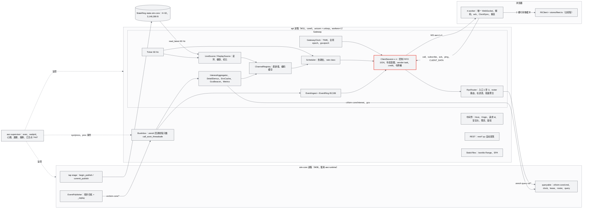

### 6.2 线程与并发模型（api 进程）

| 执行体 | 数量 | 做什么 | 禁止 | 依据 |
|---|---|---|---|---|
| asyncio 主线程（uvloop） | 1 | tick、全部连接的收发、REST 处理函数、事件分发、调度、编码 | 任何 > 1 ms 的同步调用（Open3D、scipy.optimize、> 10 万元素 numpy、MCAP 解压）；`asyncio.to_thread` 包装重计算 | AWR-03 §4.2 第 1 条；g05 §5 |
| zenoh 回调线程 | zenoh 内部 | 收到 reply、sample、liveliness 变化 | 除 `loop.call_soon_threadsafe(inbox.put, item)` 与 `future.set_result` 之外的任何工作 | g05 §10 R4 |
| 默认 executor | ≤ 4 线程 | StaticFiles 的文件读取（anyio）、world.json 与 qa 报告读取 | CPU 密集计算 | g05 §5 |
| 后台写线程 | 2 | 审计 `audit.jsonl`（1 s fsync）、日志 QueueHandler、`.awrrt` 采集写盘 | 触碰 Gateway 数据结构（只消费队列） | ADR-027 |
| faulthandler 看门狗 | C 线程 | 2.5 s 未重新布置即转储全部线程栈 | — | g05 §5 |

规则：
1. Gateway 的全部可变状态（ChannelRegistry、ClientSession、EventRing、在途表）只在主线程读写，不加锁。
2. zenoh 回调携带的是原始 bytes；msgpack 解码在主线程的 tick 内批量进行（事件）或在 reply future 的回调中进行（RPC，量小）。
3. RPC 的 `reply` 通过 `call_soon_threadsafe(fut.set_result, …)` 立即唤醒等待者，不等下一个 tick，保证准入 RTT 不额外增加最多 16.7 ms。
4. CLIENT_DATA 在接收协程中立即转发，不等 tick。

### 6.3 数据结构

#### 6.3.1 类图

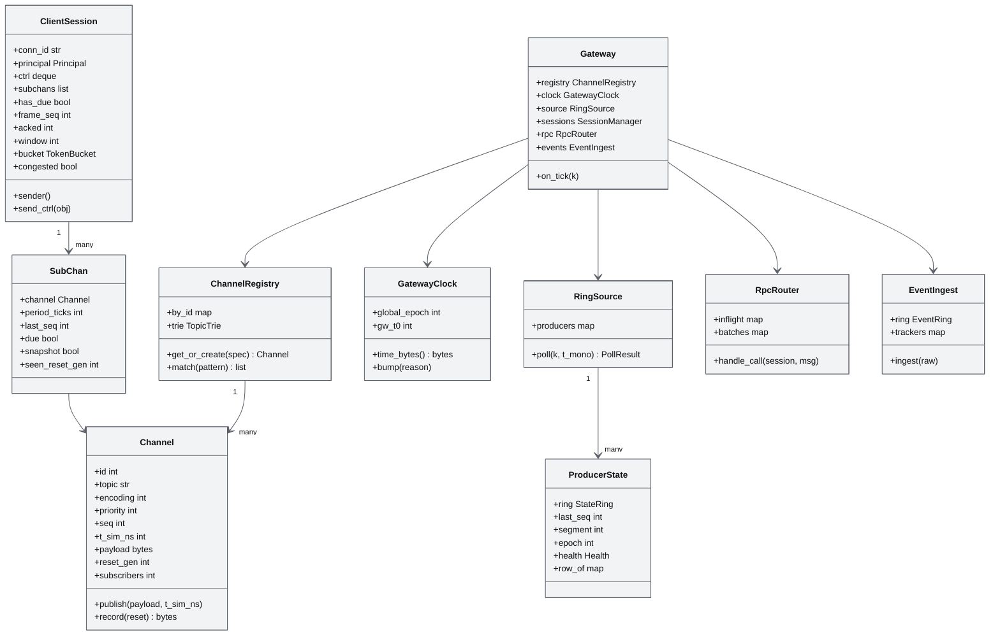

#### 6.3.2 Channel 与 SubChan

| 结构 | 字段 | 类型 | 说明 |
|---|---|---|---|
| Channel | `id` | int（1–65535） | Gateway 实例内稳定 |
| | `topic`、`encoding`、`schema_name`、`kind`、`priority`、`native_hz`、`self_contained`、`entity` | — | 与 advertise 字段一一对应（17 §6.3） |
| | `seq` | int（u32 回绕） | 每次 `publish` + 1 |
| | `t_sim_ns` | int | 样本时刻 |
| | `payload` | bytes 或 memoryview | 只替换引用，O(1) |
| | `reset_gen` | int | 生产者纪元变化时 + 1 |
| | `_cache` | 2 个槽：(seq, reset) → bytes | 记录头 + 负载 + 填充，所有连接共享 |
| | `subscribers` | int | 懒生产计数 |
| SubChan | `period_ticks` | int | 60 / rate_class ∈ {60, 30, 12, 6, 4, 3, 2, 1} |
| | `last_seq` | int | 已装入本连接帧的最新 seq |
| | `due` | bool | 到期位：对齐 tick 置位，装帧后清零；未装入（预算或 credit）则保留 |
| | `snapshot` | bool | 订阅建立或全局 epoch 变化后置位 |
| | `seen_reset_gen` | int | 小于 `channel.reset_gen` 时下一条记录置 RESET |
| | `sub_ids` | 小集合 | 引用本 channel 的订阅 id（多订阅取最高 rate） |

#### 6.3.3 ClientSession

| 字段 | 类型 | 默认 | 说明 |
|---|---|---|---|
| `conn_id` | str | `c-` + 12 位十六进制 | `serverInfo.connId` |
| `principal` | Principal | — | principal_id、role、seat、jti |
| `ctrl` | deque | 上限 1024 | 元素为 str（JSON）或 bytes（TIME） |
| `subs` | dict | — | 订阅 id → (pattern, rate_class, mode, priority, filter) |
| `subchans` | list | — | 按 (priority, channel_id) 排序；roster 恒在首位 |
| `has_due` | bool | False | 待发意图位（替代原型的单槽帧字节） |
| `wait_next_tick` | bool | False | 本 tick 有记录被令牌桶顺延时置位，下一 tick 的 `mark_due` 清零，防止连续装帧绕过令牌桶 |
| `frame_seq`、`acked` | int | 0 | credit 依据 |
| `window` | int | 6 | 每 1 s 重算 |
| `srtt_client_ms`、`srtt_client_mono` | float、int | None | 最近一次 `ping.srttMs` 及其接收时刻；5 s 内有效 |
| `send_times` | 环 64 | — | frame_seq → 单调发送时刻；ack 时计算"发出到被覆盖"时延，保留最近 32 个样本作回退估计 |
| `bucket` | TokenBucket | 8 MB/s，深 128 KiB | §6.4.6 |
| `congested` | bool | False | §6.4.7 |
| `pending_events` | list | — | 本 tick 待合批的事件 |
| `event_gap` | bool | False | 下一帧置 GAP |
| `last_ping_mono` | int | — | 本连接最近 ping 时刻；同时写入 SessionManager 的 `principal_last_ping[principal_id]`（按 principal 保留到席位释放，连接关闭后不删除，供 GCS 心跳计算年龄） |
| `stats` | 计数器组 | — | credit_skips、bucket_defers、slot_overwrites、ctrl_queue_hwm、bytes、frames、fps（ack 上报） |

#### 6.3.4 ProducerState 与 EventRing、在途表

| 结构 | 字段 | 说明 |
|---|---|---|
| ProducerState | `name`、`ring`、`cursor_idx` | `state.<name>` 的读者句柄 |
| | `last_seq`、`segment`、`epoch`、`roster_version` | 上次观察值 |
| | `health` | OK、STALLED、DOWN、RESTARTING、FAILED、UNATTACHED |
| | `row_of` | agent_no → 行号（同一 roster_version 内稳定，17 §9.2） |
| | `full`、`lite`、`n_rows`、`t_sim_ns`、`t_pub_ns` | 最近一帧（已拷贝的 bytes） |
| | `identity` | (st_ino, writer_pid, epoch, segment)，每 1 s 比较 |
| EventRing | `buf` | 65,536 项的环；项 = (gseq, t_sim_ns, type, level, producer, uav, cid, json_bytes) |
| | `oldest`、`newest` | 全局 seq 范围 |
| | `dedup` | (producer, epoch) → 已交付最大 seq |
| InFlight | 键 `cid` | 值 (conn_id, principal_id, service, batch_id, t_start_mono, last_result_json, final, t_final_mono) |
| BatchAgg | 键 `batch_id` | 值 (conn_id, n, counts[accepted, running, succeeded, failed, canceled, rejected], t_last_progress) |

#### 6.3.5 兴趣集、详情与环境缓存

| 结构 | 字段 | 说明 |
|---|---|---|
| InterestAggregator | `detail`（agent_no 列表，按最近订阅时刻降序，≤ 64）、`marks`（≤ 16，ext）、`topics`（str 列表，取自 `state_ext`、`safety`、`sensor`、`env`）、`record_scope`（None 或 "all"，ext）、`seq`、`dirty_since` | 订阅变化时重算；去抖 250 ms；1 Hz 自愈重发 |
| DetailDemux | 每种 `state/{producer}/{ext,safety,sensor,detail}` 一个解析器 | msgpack 数组 → 每项 (agent_no, bytes 切片)；只写有订阅者的 channel |
| EnvCache | `version`、`epoch`、`frame_bytes`、`presets_sha256`、`t_ns` | `env/state` 的自包含 latest |

#### 6.3.6 全局 epoch 存储与 GatewayClock

| 字段 | 说明 |
|---|---|
| `gw.epoch` 文件 | `/dev/shm/awr/<run>/gw.epoch`，u32 小端，写 tmp 后 `os.replace`（格式按 17 §9.6） |
| `gw.seen` 文件 | `/dev/shm/awr/<run>/gw.seen`，M11 内部格式（本文设定）：msgpack `{v: 1, producers: {name: [segment u32, epoch u32]}}`，每次分类完成后与 `gw.epoch` 一同原子写；api 启动首次 attach 时与头部比较（FR-048），文件缺失时不补做分类 |
| `global_epoch` | 启动时读取文件（不存在则 1）；线上 u16 取低 16 位，只做相等比较 |
| `gw_t0` | api 启动时的 `time.monotonic_ns()`；`t_srv_ns` 与 `pong.server_ns` 均相对它 |
| `last_time` | 最近一次 TIME 的 (state, rate, epoch)，任一变化置 `time_dirty` |

#### 6.3.7 checkpoint 文件格式（M11 内部格式，MS1 冻结）

路径 `/dev/shm/awr/<run>/ckpt/<t_sim_ns 20 位补零>.bin`，毒性标记为同名 `.poison` 空文件；镜像目录 `runs/<run>/ckpt/`。小端：

| 区段 | 布局 |
|---|---|
| 头部 [0, 64) | `magic` "AWRC"、`version` u16 = 1、`flags` u16、`epoch` u32、`segment` u32、`t_sim_ns` i64、`layout_id` u32、`n_arrays` u32、`meta_off` u64、`meta_len` u64、`crc32` u32（覆盖 TOC、数组与 meta）、填充 |
| TOC [64, 64 + 96·n) | 每项 `name` char[40]、`dtype` char[16]（numpy `dtype.str`）、`shape` u32 × 4、`offset` u64、`nbytes` u64、填充 8 B |
| 数组区 | 每个数组 C 连续、64 字节对齐 |
| meta | msgpack：SimClock、RNG 状态、任务、租约与席位、FSM、围栏、cid 幂等表、contracts 版本（内容由 M08 定义） |

写入：调用方在慢任务预算内把 SoA 拷贝到预分配缓冲（1000 架 1–2 MB，g05 §7.4），后台线程序列化、计算 crc32、写 `.tmp`、`os.replace`，保留 3 代；每 10 s（墙钟）把最新一代复制到镜像目录。读取时校验 magic、version、layout_id、crc32，任一失败视为毒性并尝试上一代。

#### 6.3.8 TelemetryFrame 槽布局（rt.worker 与主线程之间，每槽 64 KiB）

容量 C = 1024 架、F = 64 条 Full64 记录、R = 32 条小型原样记录。每个 ArrayBuffer 的视图只创建一次并按槽缓存。

| 偏移 | 类型 | 字段 | 说明 |
|---|---|---|---|
| 0 | u32 | `magic` | 0x31524654（"TFR1"） |
| 4 | u32 | `slotNo` | 0–2 |
| 8 | u32 | `frameSeqMax` | 本槽包含的最大 BATCH `frame_seq`（归还时用于 ack） |
| 12 | u16 | `epoch` | 当前全局 epoch |
| 14 | u16 | `flags` | bit0 EPOCH_CHANGED（自上一槽）、bit1 SNAPSHOT、bit2 REPLAY、bit3 GAP、bit4 ROSTER_CHANGED、bit5 TIME_CHANGED、bit6 CONN_CHANGED |
| 16 | f64 | `frameTSimMs` | 帧时刻，相对 run 起点，ms |
| 24 | u32 | `swarmN` | 本槽 swarm 行数（0 表示本槽无新 swarm） |
| 28 | u32 | `swarmSeq` | swarm channel 的 seq |
| 32 | f64 | `swarmTSimMs` | swarm 样本时刻 |
| 40 | u32 | `fullCount`、44 u32 `rawCount`、48 u32 `resetCount`、52 u32 `ctrlCount` | 各区条数；控制消息随同一 postMessage 以数组附带 |
| 56 | f64 | `timeTSimMs` | 最新 TIME 的 `t_sim_ns`（ms） |
| 64 | f64 | `timeTSrvMs` | 最新 TIME 的 `t_srv_ns`（ms） |
| 72 | f32 | `timeRate` | — |
| 76 | u8 | `timeState` | 含 bit7 REPLAY |
| 77 | u8 | `connState` | §6.6.3 的枚举 |
| 78 | u16 | `timeEpoch` | — |
| 80 | f64 | `clockOffsetMainMs` | 服务端单调时钟 − 主线程 `performance.now()`（已换算时基） |
| 88 | f64 | `srttMs` | ClockSync 最小 RTT 的平滑值 |
| 96 | f64 | `decodeMs` | 本槽解码耗时 |
| 104 | f64 | `ageMs` | 显示时延样本：flush 时刻换算到服务端时钟，减去本槽最新帧 `t_sim_ns` 对应的服务端时刻（按最近 TIME 的 (`t_sim_ns`, `t_srv_ns`, rate) 换算；暂停时不产生样本） |
| 112 | f64 | `bytesPerS` | 最近 1 s 下行字节速率 |
| 120 | f32 | `swarmHz`、124 f32 `selHz` | 最近 1 s 实测频率（`selHz` 回填为 `__perf.net.selectedHz`） |
| 128 | u32 | `reconnects`、132 u32 `droppedEpochFrames` | 计数 |
| 136 | u16 × 32 | `resetChannelIds` | 本槽内置 RESET 的 channel id |
| 200 | f64 | `swarmRecvMainMs` | 本槽 swarm 记录在 Worker 的接收时刻，已换算到主线程 `performance.now()` 时基（M12 DelayController 计算到达抖动，M12 §14 F-16） |
| 208 | f32 | `focusHz` | 关注集通道最近 1 s 实测频率（各关注机频率的中位数） |
| 212 | u32 | `eventGaps` | 本地 GAP 与服务端 `events.gap` 累计次数 |
| 216–255 | — | 保留 | 写 0 |
| 256 | f32 × 3C | `swarmPos` | World ENU，m |
| 12544 | f32 × 4C | `swarmQuat` | [x,y,z,w]，已乘 1/32767 |
| 28928 | f32 × 3C | `swarmVel` | m/s（已乘 0.01） |
| 41216 | u16 × C | `swarmAgentNo` | — |
| 43264 | u8 × C × 4 | `swarmFs`、`swarmFlags`、`swarmCtrl`、`swarmBattery` | 各 1024 B，顺序排列 |
| 47360 | 80 B × F | Full64 区 | 每项 `agentNo` u16、`channelId` u16、`seq` u32、`tSampleMs` f64、原样 64 B |
| 52480 | 80 B × R | 小记录区 | 每项 `agentNo` u16、`channelId` u16、`schema` u8（1 EnvSample32、2 SensorPose48）、填充 u8、`len` u16、`tSampleMs` f64（项内偏移 8）、原样 ≤ 64 B（项内偏移 16） |
| 55040–65535 | — | 保留 | — |

#### 6.3.9 `layouts.json` 代码生成与 M11 的消费

生成链路属于 M00（`tools/contracts/gen.{py,mjs}`，17 §10.4）；M11 是主要消费方，对生成物的要求如下（MS1 冻结）：

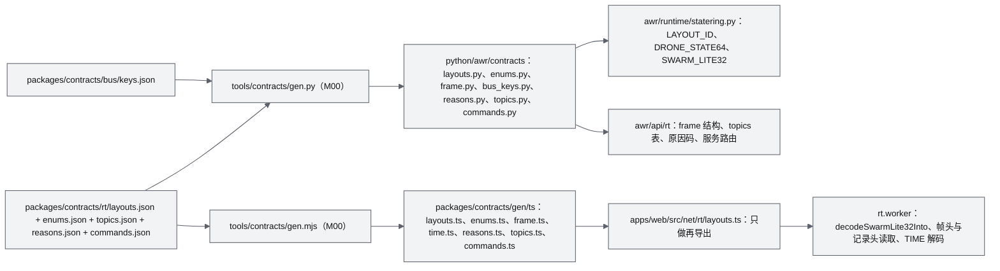

| 生成物 | M11 使用处 | 要求 |
|---|---|---|
| `layouts.py`：`LAYOUT_ID`、`SCHEMA_HASH{schemaName: hash8}`、`DRONE_STATE64`、`SWARM_LITE32`、`ENV_SAMPLE32`、`SENSOR_POSE48`、`VEL_SETPOINT16` 的 dtype 与偏移常量 | StateRing 创建与校验、`serverInfo.layouts`、SyntheticSource | dtype `itemsize` 断言；`pack_fs`、`pack_ctrl` |
| `enums.py`：TimeState（0–9，`REPLAY_BIT = 0x80`）、FlightState、Owner 等名称与数值双向表 | clock.py（TIME.state 覆盖）、fleet 摘要的 TS 同名表 | 与 `rt/enums.json` 一致；M11 代码中不写枚举数值字面量 |
| `frame.py`：`FRAME_HDR = Struct("<BBHIq")`、`REC_HDR = Struct("<HBBIIi")`、`TIME = Struct("<BBHfqq")`、`CLIENT_DATA_HDR = Struct("<BBHIq")`、`SETPOINT_BUS = Struct("<HBBIq")` 与 flags 位常量 | protocol.py、channels.py、rpc.py | M11 代码中不得出现格式串字面量（lint） |
| `bus_keys.py`：全部 key 常量与构造函数（`ctl_cmd(producer)`、`evt(producer, cat)`） | bus_bridge、rpc、interest | key 字面量只允许在此文件（17 §10.6 第 11 条） |
| `topics.py`：topic 模式、kind、encoding、schemaName、默认 rate、priority、self_contained | ChannelRegistry 建表、订阅校验 | 与 `topics.json` 一致 |
| `reasons.py`：码、名称、HTTP、`message_zh`、`remedy_zh` | problem+json、`result`、`error` | 未登记的码在 CI 中失败 |
| `commands.py`：服务名模式、类别（导航、安全、批量、时钟等）、参数 JSON Schema、是否需租约、agent 可用 | 入口结构校验与路由 | 与 AWR-12 §5.1 一致 |
| TS `layouts.ts`：`DS64`、`SL32` 偏移常量、`fsOf`、`subOf`、`ctrlOwner`、`decodeSwarmLite32Into(buf, off, n, out)` | rt.worker 解码 | 零分配：视图按缓冲缓存，不在循环内创建 |
| TS `frame.ts`、`time.ts`：`readFrameHeader(dv, out)`、`nextRecord(dv, off, out) → nextOff`、`readTime(dv, out)`、`writeClientData(dv, …)` | rt.worker | 以 out 参数返回，不产生对象 |

### 6.4 算法与伪代码

#### 6.4.1 Ticker 与 tick 主流程

```python
# awr/api/rt/gateway.py（主线程；墙钟域）
TICK_HZ = 60
PERIOD_NS = 1_000_000_000 // TICK_HZ           # 16,666,666 ns

async def run_ticker(gw: "Gateway") -> None:
    t0 = time.monotonic_ns(); k = 0
    while not gw.stopping:
        k += 1
        deadline = t0 + k * PERIOD_NS
        lag = time.monotonic_ns() - deadline
        if lag > PERIOD_NS:                     # 落后超过一个周期：跳格，不补发（r27 §3.8 性质 4）
            skip = lag // PERIOD_NS
            k += skip; gw.metrics.tick_overruns += skip
            continue
        if lag < 0:
            await asyncio.sleep(-lag / 1e9)
        else:
            await asyncio.sleep(0)                  # 落后不足一个周期时也让出一次，避免连续 tick 饿死 sender 与接收协程
        gw.on_tick(k)

def on_tick(self, k: int) -> None:
    t = time.monotonic_ns()
    self.inbox.drain(limit=4096)                 # zenoh 回调入队的事件、低频状态、roster 应答、proc 状态
    poll = self.source.poll(k, t)                # §6.4.2：读环、channel 发布、健康、纪元
    self.clock.update(poll.header, poll.health)  # 先用本 tick 头部合成 TIME 字段；变化置 time_dirty
    if poll.global_bump:
        self.clock.bump(poll.reason)             # 写 gw.epoch 与 gw.seen；逐连接排入新纪元 TIME、置到期位与 snapshot（§6.4.8）
    tb = self.clock.time_bytes_if_due(k)         # k % 6 == 0 或 time_dirty（bump 已发过的不重复）
    self.events.check_gaps(t)                    # 缺口超过 1 s 放弃补拉并放行重排缓冲（§6.4.12）
    self.events.dispatch()                       # EventRing 新增 → 各连接 pending_events（按 filter）
    for s in self.sessions.active():
        if tb is not None:
            s.send_ctrl(tb)                      # TIME 先于同一 tick 的任何 BATCH（sender 先排空控制面）
        s.flush_events()                         # 0 条不发；1 条 event；多条 events（≤ 256 项/条）
        self.scheduler.mark_due(s, k)            # §6.4.3
    self.interest.maybe_push(t); self.gcs.maybe_publish(t)
    self.metrics.on_tick(t, poll)
```

#### 6.4.2 LiveSource.poll（StateRing 读取）

```python
def poll(self, k: int, t_mono: int) -> PollResult:
    r = PollResult()
    for p in self.producers.values():                      # D1 只有 sim-core；V0.2 起多生产者
        h = p.last_header = p.ring.header()                 # clock_seq 顺序锁一致性读（17 §9.2 v1.1）
        p.health = classify(age_ms=(t_mono - h.heartbeat_ns) / 1e6,
                            pid_alive=p.pid_alive(), sup_state=self.sup_state(p.name),
                            liveliness_lost=p.liveliness_lost)
        if p.segment is None:                               # api 启动后首次 attach：默认不 + 1
            p.segment, p.epoch = self.seen.get(p.name, (h.segment, h.epoch))   # gw.seen 缺失时取头部值
        if h.segment != p.segment and not self.is_known_gen(p, h.segment):     # 剧本重置、无 checkpoint 重启
            r.global_bump, r.reason = True, "segment"       # 回放环：playback 路径已按 gen 切过的不重复（FR-050）
            p.segment, p.epoch = h.segment, h.epoch
        elif h.epoch != p.epoch:                            # checkpoint 恢复：只置 RESET
            p.epoch = h.epoch
            self.registry.bump_reset_gen(producer=p.name)
            self.seen.save(p.name, p.segment, p.epoch)
        f = p.ring.read_latest(p.last_seq)
        if f is None:
            continue
        p.last_seq = f.frame_seq
        if f.roster_version != p.roster_version or p.is_replay:
            p.row_of = rows_from_full(f.full)               # 每行首 2 字节为 agent_no；回放复合帧每帧重建
            if f.roster_version != p.roster_version:
                self.roster.refresh_async(p)                # bus.call_cb 取 roster 条目，结果经 inbox 回主线程
            p.roster_version = f.roster_version
        p.full, p.lite, p.n_rows, p.t_sim_ns, p.t_pub_ns = f.full, f.lite, f.n_rows, f.t_sim_ns, f.t_pub_ns
        r.new_frame = True
        self.metrics.tick_age.add((t_mono - f.t_pub_ns) / 1e6)
    if r.new_frame:
        prim = self.primary
        lite = prim.lite if len(self.producers) == 1 else b"".join(q.lite for q in self.by_id_base())
        self.swarm.publish(lite, prim.t_sim_ns)
        mv = memoryview(prim.full)
        for ch in self.registry.uav_state_with_subscribers():      # 懒切片
            row = prim.row_of.get(ch.agent_no)
            if row is not None:
                ch.publish(mv[row * 64:(row + 1) * 64], prim.t_sim_ns)
    prim = self.primary                                      # 尚未 attach 时 last_header 为 None，health 为 UNATTACHED（§6.4.9）
    r.header, r.health, r.frame_t_sim_ns = prim.last_header, prim.health, prim.t_sim_ns
    if k % TICK_HZ == 0:
        self.check_identity()                                # §6.4.8
    return r
```

注：`read_latest` 返回的 `full`、`lite` 已是拷贝（g05 §3.2），可以长期持有；memoryview 切片在 `Channel.record()` 首次编码时才拷贝成 bytes（每个被订阅的机体每 tick 一次 64 B）。

#### 6.4.3 调度：到期位

```python
def mark_due(self, s: ClientSession, k: int) -> None:
    s.wait_next_tick = False
    any_due = False
    for sc in s.subchans:                                   # 默认订阅约 40 项；上限 256
        if k % sc.period_ticks == 0 or sc.snapshot:
            if sc.channel.seq != sc.last_seq or sc.snapshot:
                if sc.due:
                    s.stats.slot_overwrites += 1            # 上一次到期尚未发出，被本次合并（语义等同单槽覆盖）
                sc.due = True
        any_due |= sc.due
    if any_due:
        s.has_due = True
        s.wake.set()                                        # 唤醒 sender（含上一 tick 因令牌桶顺延、本 tick 解除 wait_next_tick 的情形）
    if any_due and s.frame_seq - s.acked >= s.window:
        s.stats.credit_skips += 1
```

性质：到期位只在记录真正装入帧后清零，因此"对齐 tick 到期但因 credit、令牌桶或 sender 忙而未发出"的 channel 一定会在第一个可发时机带着**当时最新**的值发出，尾帧保证不依赖源是否继续发布（17 §6.8 性质 1）。

#### 6.4.4 发送时装帧与 sender task

```python
async def sender(self) -> None:                             # 每连接一个 task
    while not self.closing:
        while self.ctrl:                                    # 先排空控制面（TIME、result、events、status…）
            await self._send(self.ctrl.popleft())
        if (self.has_due and not self.congested and not self.wait_next_tick
                and self.frame_seq - self.acked < self.window):
            frame = self._assemble()                        # 按当时最新值装帧
            if frame is not None:
                t0 = time.monotonic_ns()
                await self.ws.send_bytes(frame)
                self._on_sent(len(frame), time.monotonic_ns() - t0)   # 字节统计、send_times、拥塞判定
            continue
        self.wake.clear()
        await self.wake.wait()                              # send_ctrl、mark_due、收到 ack 时置位

def _assemble(self) -> bytes | None:
    budget = self.bucket.take_all()
    recs, flags, first, deferred, size = [], 0, True, False, 16   # size 含 16 B 帧头
    for sc in self.subchans:                                # 已按 (priority, channel_id) 排序，roster 在前
        if not sc.due:
            continue
        ch = sc.channel
        if ch.seq == 0 or (ch.seq == sc.last_seq and not sc.snapshot):
            sc.due = False; continue                        # 尚无值（snapshot 保留，首值到达后补发）或无新值
        reset = sc.seen_reset_gen != ch.reset_gen
        rec = ch.record(reset)                              # 编码一次，所有连接共享
        if not first and (len(rec) > budget or size + len(rec) > FRAME_MAX):
            self.stats.bucket_defers += 1; deferred = True; continue   # 保留到期位，顺延到下一 tick
        recs.append(rec); budget -= len(rec); size += len(rec); first = False
        sc.last_seq, sc.due, sc.seen_reset_gen = ch.seq, False, ch.reset_gen
        if sc.snapshot:
            flags |= SNAPSHOT; sc.snapshot = False
    self.bucket.give_back(max(budget, 0))
    self.has_due = any(sc.due for sc in self.subchans)
    self.wait_next_tick = deferred                          # 被顺延的记录等下一个 tick 再装，避免绕过令牌桶
    if not recs:
        return None
    if self.event_gap: flags |= GAP; self.event_gap = False
    if self.gw.mode == "replay": flags |= REPLAY
    self.frame_seq += 1
    self.send_times.put(self.frame_seq, time.monotonic_ns())
    hdr = FRAME_HDR.pack(0x10, flags, self.gw.clock.epoch_u16, self.frame_seq, self.gw.frame_t_sim_ns)
    return b"".join((hdr, *recs))

def send_ctrl(self, m: str | bytes) -> None:
    if len(self.ctrl) >= CTRL_MAX:                          # 1024：控制面不能丢
        self._close_after_status(1013, code=318)            # status 直接写 socket（不入队，1 s 超时），随后 close(1013)
        return
    self.ctrl.append(m); self.stats.ctrl_hwm = max(self.stats.ctrl_hwm, len(self.ctrl)); self.wake.set()
```

与原型的差异（§1.4 O2）：`r27/gw_proto.py` 在 offer 时就推进 `last_seq`，而 `offer_frame` 直接覆盖尚未发出的帧字节；被覆盖帧里若含某个 30 Hz channel 的记录，而新帧因该 channel 未到期没有包含它，那条记录就永久丢失，源停止发布后客户端停在倒数第二个值。发送时装帧让"单槽"只保存意图，数据永远取最新，frame_seq 也不再出现被覆盖造成的空号。17 v1.1 §6.8 的参考伪代码采用另一种写法（tick 时装出待发计划，被覆盖计划中的订阅恢复为 pending，写出后才提交 `last_seq`）；两种写法的线上可观察行为相同（尾帧保证、只发最新、`frame_seq` 连续、`slot_overwrites` 计数），验收以 17 API-AC-036 与 M11-AC-013 判定，本文采用发送时装帧是因为它不需要在 tick 内为每个连接预先编码或持有记录引用。

#### 6.4.5 credit 窗口与 srtt 估计

```python
def on_ack(self, frame: int, fps: float | None, decode_ms: float | None, lag_ms: float | None) -> None:
    if frame <= self.acked:
        return                                              # 累积确认，旧 ack 忽略
    t_sent = self.send_times.get(frame)
    if t_sent is not None:
        self.ack_delay.add(time.monotonic_ns() - t_sent)    # 最近 32 个样本；回退用的上界估计（含客户端消费等待）
    self.acked = frame
    self.acked_bytes_ewma.update(self.bytes_up_to(frame))
    if self.has_due:
        self.wake.set()

def on_ping(self, t: float, srtt_ms: float | None) -> None:
    now = time.monotonic_ns()
    self.gw.sessions.note_ping(self.principal.id, now)      # GCS 心跳按 principal 计龄（FR-024）
    if srtt_ms is not None and 0 <= srtt_ms < 10_000:
        self.srtt_client_ms, self.srtt_client_mono = srtt_ms, now
    self.send_ctrl(pong_json(t, now - self.gw.clock.gw_t0, self.gw.clock.sim_now_ns(now), self.gw.clock.epoch_u16))

def recompute_window(self) -> None:                         # 每 1 s（墙钟）
    now = time.monotonic_ns()
    if self.srtt_client_ms is not None and now - self.srtt_client_mono < 5_000_000_000:
        srtt_s = self.srtt_client_ms / 1e3                  # 主来源：客户端 ClockSync 平滑 RTT（17 §6.9 L1）
    else:
        srtt_s = (self.ack_delay.min() or 5_000_000) / 1e9  # 回退：发出到被 ack 覆盖的最小时延；都没有时 5 ms
    max_rate = max((sc.rate_class for sc in self.subchans), default=10)
    self.window = min(8, max(3, math.ceil(max_rate * (srtt_s + ACK_INTERVAL_S)) + 2))
```

| 情形 | max_rate | srtt 来源与取值 | W | 说明 |
|---|---|---|---|---|
| 回环、选中机 60 Hz | 60 | `ping.srttMs` 约 1 ms | ceil(60 × 0.051) + 2 = 6 | 与 ADR-014 默认一致 |
| 客户端未上报 `srttMs`（旧客户端、基准脚本），Tier S 拉取等待约 33 ms | 60 | 回退估计 33 ms | ceil(60 × 0.083) + 2 = 7 | 估计含消费等待，偏大方向安全 |
| SSH 转发或 W1 广域，RTT 40 ms | 60 | `ping.srttMs` 40 ms | ceil(60 × 0.09) + 2 = 8 | 恰为上限；RTT > 50 ms 时被钳在 8 |
| 只订 swarm 10 Hz | 10 | 任意 ≤ 50 ms | ceil(10 × 0.1) + 2 = 3 | 恰为下限 |

`srtt` 的主来源是客户端在 `ping` 中上报的 `srttMs`（17 v1.1 §6.3、§6.9；r27 §3.10 的 ClockSync 本来就为 credit 窗口维护 srtt）；服务端无法自行测量客户端发起的 ping 的 RTT，因此只在未上报时退回"发出到被 ack 覆盖"的上界估计（§14 第 7 条）。

#### 6.4.6 令牌桶

```python
class TokenBucket:                                          # 字节；墙钟
    def __init__(self, rate_Bps: float = 8e6, depth_B: int = 131072): ...
    def take_all(self) -> int:
        self._refill(); b = int(self.tokens); self.tokens = 0.0; return b
    def give_back(self, b: int) -> None:
        self.tokens = min(self.depth, self.tokens + b)
    def retune(self, acked_Bps_ewma: float, max_kbps: int | None, last_frame_B: int) -> None:   # 每 1 s
        self.rate = max_kbps * 125 if max_kbps else max(524288, min(8e6, 1.5 * acked_Bps_ewma))
        self.depth = max(131072, 2 * last_frame_B)
```

优先级的作用只在两处：帧内记录顺序与预算不足时的顺延顺序；每帧第一条记录不受预算限制，保证最高优先级的到期数据不会被饿死。

#### 6.4.7 L4 拥塞判定

ASGI 不暴露传输层写缓冲（`get_write_buffer_size()` 不可达），而 websockets 17.1 legacy 协议在写缓冲超过 `write_limit`（64 KiB）时让 `send` 等待 drain（`websockets/legacy/protocol.py`），所以 `send` 耗时直接反映链路拥塞：

| 条件 | 动作 |
|---|---|
| 单次 `send_bytes` > 200 ms，或连续 3 次 > 50 ms | `congested = True`；停止装帧（控制面照常）；`status{id: "net.congested", level: warning}` |
| congested 期间控制面 `send` 连续 3 次 < 20 ms（TIME 以 10 Hz 经控制面发送，恢复判据总有样本） | `congested = False`；`removeStatus`；有到期位则立即装帧 |
| congested 持续且控制面 FIFO 达到 1024 | 1013 关闭（318），客户端按退避重连 |

浏览器处理慢时不会触发 L4（r27 §3.1.3：服务端写缓冲始终为 0），这种情况由 L1 credit 处理。

#### 6.4.8 生产者健康与全局纪元

```python
def classify(age_ms, pid_alive, sup_state, liveliness_lost) -> Health:
    if sup_state == "FAILED":                 return FAILED
    if sup_state in ("BACKOFF", "STARTING"):  return RESTARTING
    if age_ms < 250 and not liveliness_lost:  return OK
    if age_ms < 2000 and pid_alive:           return STALLED
    return DOWN

def bump(self, reason: str) -> None:                       # GatewayClock；调用前已用本 tick 头部 update()
    self.global_epoch = (self.global_epoch + 1) & 0xFFFFFFFF
    write_atomic(self.epoch_path, self.global_epoch.to_bytes(4, "little"))   # u32 小端（17 §9.6）
    self.gw.source.seen.save_all()                          # gw.seen：各生产者 (segment, epoch)
    tb = self.time_bytes()                                  # 新纪元 TIME（t_sim、state 已是本 tick 值）
    self.last_key, self.time_dirty = (self.state, self.rate, self.global_epoch & 0xFFFF), False
    for s in self.gw.sessions.active():
        for sc in s.subchans:                               # 待发意图不含旧数据（装帧时才取值），只需重置到期位
            sc.snapshot = True                              # 有值的 channel 下一帧带 SNAPSHOT，尚无值的首值到达后补发
            sc.due = sc.channel.seq != 0
        s.has_due = any(sc.due for sc in s.subchans)
        s.send_ctrl(tb)                                     # 先 TIME（sender 先排空控制面）
        s.wake.set()                                        # on_tick 返回后 sender 才运行，装出 SNAPSHOT
    self.gw.events.note_epoch(self.global_epoch, reason)
```

| 检测到的变化 | 判据 | Gateway 动作 | 依据 |
|---|---|---|---|
| 头部 `segment` 变化 | 主判据 | 全局 epoch + 1，写 `gw.epoch`，TIME 先于 SNAPSHOT | 17 §9.7 第 3 条 |
| `segment` 不变、生产者 `epoch` 变化 | 主判据 | 该生产者 channel `reset_gen` + 1，下一条记录置 RESET；全局 epoch 不变 | AWR-03 §5.2 第 4 条 |
| 上述判定与 1 s 内到达的 `sim.started{reason}` 不一致 | 一致性校验 | 以头部为准（不追加 + 1），计 `epoch_mismatch`，写 WARNING 日志 | 10 AD-02、ARCH-AC-009；17 §6.12 |
| `identity()` 的 inode 或 pid 变化 | 每 1 s | 重新 attach，读头部后按前两行分类 | g05 §3.2 |
| 回放 open、seek、close，会话切换 | Source 控制（seek 以 replay-worker 回复中的 gen 为准，同 gen 的环 `segment` 变化不再 + 1） | 全局 epoch + 1 | ADR-040；10 AD-01；M12 §6.7.6 |
| api 自身重启 | 启动读 `gw.epoch` 与 `gw.seen` | 沿用，不 + 1；若 `gw.seen` 与头部不同（api 停机期间生产者重开或恢复）按前两行补做分类；`sessionId` 变化使客户端重置 ClockSync 与事件序号 | 17 §6.10；本文设定（`gw.seen`） |

#### 6.4.9 TIME 合成

```python
def update(self, h: RingHeader | None, health: Health) -> None:
    if h is None:                                           # 尚无 attach 的生产者（api 先于 sim-core 就绪）
        h = RingHeader.placeholder(heartbeat_ns=time.monotonic_ns())   # t_sim_ns 0、rate_milli 1000、clock_state STOPPED
    st = h.clock_state
    if health in (STALLED, DOWN, UNATTACHED): st = (st & 0x80) | TS_STALLED
    elif health == RESTARTING:    st = (st & 0x80) | TS_RESTARTING      # 含 UNATTACHED 且 supervisor 报 STARTING、BACKOFF
    elif health == FAILED:        st = (st & 0x80) | TS_FAILED
    if self.gw.mode == "replay":  st |= 0x80
    self.t_sim_ns, self.t_srv_ns = h.t_sim_ns, h.heartbeat_ns - self.gw_t0
    self.rate = h.rate_milli / 1000.0
    key = (st, self.rate, self.global_epoch & 0xFFFF)
    if key != self.last_key:
        self.time_dirty, self.last_key, self.state = True, key, st

def time_bytes(self) -> bytes:
    return TIME.pack(0x02, self.state, self.global_epoch & 0xFFFF, self.rate, self.t_sim_ns, self.t_srv_ns)
```

`t_sim_ns` 与 `t_srv_ns` 来自同一次头部一致性读，客户端据此外推 `simNow = t_sim + rate·(srvNow − t_srv)`（17 §6.10），外推上限 1 s。

#### 6.4.10 RPC 入口与路由

```python
async def handle_call(self, s: ClientSession, m: dict) -> None:
    cid, service, args = m["id"], m["service"], m.get("args", {})
    if (prev := self.inflight.get(cid)) and prev.final:     # 结果缓存：已终态直接回放，不转发
        return s.send_ctrl(prev.result_json_with(duplicate=True))
    spec = self.commands.match(service)                     # commands.py 生成物
    if spec is None:                                        # 服务名不存在
        return s.send_ctrl(result(cid, "rejected", 300, detail={"field": "service"}, effect=UNAVAILABLE_V0))
    if (code := self.entry_checks(s, spec)):                # ① 角色、席位、模式 → ② 限流 → ③ 确认令牌
        self.events.emit_api("cmd.rejected", cid=cid, code=code)
        return s.send_ctrl(result(cid, "rejected", code, effect=UNAVAILABLE_V0))
    if (err := spec.validate_structure(args)):              # JSON Schema 结构校验；数值语义边界留给生产者 ⑥
        return s.send_ctrl(result(cid, "rejected", 110 if err.range else 300, detail=err.detail, effect=UNAVAILABLE_V0))
    if (route := self.route(service, args)) is None:        # uav/{id}/… 的机体不在 roster
        return s.send_ctrl(result(cid, "rejected", 107, effect=UNAVAILABLE_V0))
    key, target = route                                     # roster 查生产者；sim、lease、query 等固定 key
    msg = build_command(cid, spec.op, target, args, principal=self.sign(s), t_wall_ns=time.time_ns(),
                        epoch_seen=self.clock.global_epoch, batch_id=None)
    self.inflight.open_or_rebind(cid, s.conn_id, s.principal.id, service)   # 同 cid 重发时改绑到新连接
    asyncio.create_task(self._dispatch(s, cid, key, msg))   # 不阻塞接收协程

async def _dispatch(self, s, cid, key, msg) -> None:
    try:
        adm = await self.bus.call(key, msg, timeout=1.0, retries=2, retry_gap=0.3)   # 同一 cid 重试
    except BusTimeout:
        return self._final(s, cid, "rejected", 211)
    self._deliver_admission(s, cid, adm)                    # accepted、rejected、duplicate（call_state）
```

`evt/{producer}/cmd` 中的 `cmd.running`、`cmd.progress`、`cmd.succeeded` 等由 EventIngest 按 cid 查在途表，转成 `result`/`progress` 只发给发起连接（该连接已断开时只更新缓存），并进入 EventRing；`progress` 按 cid 节流到 2 Hz。

#### 6.4.11 批量命令聚合

```python
def handle_batch(self, s, cid, op, vehicles, args):
    ids = self.roster.all_ids() if vehicles == "*" else vehicles       # ≤ 1000
    by_producer = group_by(ids, self.roster.producer_of)
    agg = self.batches.open(batch_id=cid, conn=s.conn_id, n=len(ids))
    for producer, vs in by_producer.items():                           # D1 只有 sim-core：一条 Command
        msg = build_command(cid, op, vs, args, principal=self.sign(s), batch_id=cid, ...)   # 子调用 id 为 cid:<vehicle_id>
        asyncio.create_task(self._dispatch_batch(s, cid, ctl_cmd(producer), msg, agg))
    # Admission.per_uav{accepted, rejected} → 一条汇总 result：data{accepted_n, rejected_n, rejected_by_code, accepted, rejected}
    # 此后 evt/*/cmd 中 batch_id == cid 的逐机事件只累加 agg.counts，不进 EventRing 的逐条流
    # 每 500 ms（墙钟）至多一次：progress{counts} 给发起连接 + fleet.batch.progress 事件给全部连接
    # 全部子调用终态 → final result
```

#### 6.4.12 事件摄入与分发

```python
def ingest(self, producer: str, raw: bytes) -> None:          # 主线程，tick 内批量调用（EventSubscriber.feed）
    for ev in msgpack.unpackb(raw):                          # 生产者按步合批的数组
        self._accept(producer, ev, from_replay=False)

def _accept(self, producer: str, ev: dict, from_replay: bool) -> None:
    s = ev["seq"]
    tr = self.trackers.get((producer, ev["epoch"])) or self._new_tracker(producer, ev["epoch"], first_seq=s)
    # _new_tracker 丢弃该生产者旧 epoch 的 tracker；api 实例内首次见到该生产者时 delivered = s − 1（不回补 api 启动前的事件，
    # 客户端经 GET /api/events 或自包含 channel 恢复），此后出现的新 epoch 从 delivered = 0 起跟踪（缺首条即补拉）
    if s <= tr.delivered or s in tr.held:
        return                                               # 重复（重试、补拉与实时同时到达）
    if s == tr.delivered + 1:
        self._deliver(producer, ev); tr.delivered = s
        while (nxt := tr.held.pop(tr.delivered + 1, None)) is not None:
            self._deliver(producer, nxt); tr.delivered += 1  # 缺口补齐后按 seq 顺序放行缓冲
        if not tr.held:
            tr.gap_since = None
        return
    tr.held[s] = ev                                          # 缺口之后的事件先进重排缓冲（≤ 4096 条）
    if tr.gap_since is None:
        tr.gap_since = time.monotonic_ns()
        self.bus.call_cb(evt_replay(producer), {"since": tr.delivered, "epoch": ev["epoch"]},
                         lambda rep, err: self.inbox.put(("replay", producer, ev["epoch"], rep, err)))

def on_replay(self, producer, epoch, rep, err) -> None:      # 经 inbox 回到主线程
    for ev in (rep or {}).get("events", []):
        self._accept(producer, ev, from_replay=True)
    if err is not None or (rep or {}).get("truncated"):
        self._give_up_gap(producer, epoch)                  # 报告缺口 [delivered+1, min(held)-1]，放行缓冲

def check_gaps(self, t_mono: int) -> None:                   # 每 tick：缺口超过 1 s 或缓冲满 4096 条同样放弃
    for (producer, epoch), tr in self.trackers.items():
        if tr.gap_since and (t_mono - tr.gap_since > 1_000_000_000 or len(tr.held) >= 4096):
            self._give_up_gap(producer, epoch)

def _deliver(self, producer: str, ev: dict) -> None:
    if ev.get("batch_id"):
        self.batches.accumulate(ev); return                  # 批量子调用只汇总
    if ev["kind"].startswith("cmd."):
        self.rpc.on_cmd_event(ev)                            # 按 cid 转 result/progress，并进入 EventRing
    if ev["kind"] == "env.keyframe":
        self.env.on_keyframe(ev); return                     # 环境关键帧只更新 env/state 缓存
    self.ring.append(ev)                                     # 分配全局 seq

def dispatch(self) -> None:                                  # 每 tick
    for ev in self.ring.since(self.dispatched):
        for s in self.gw.sessions.subscribed_to_events():
            if s.filter_ok(ev):
                s.pending_events.append(ev.json)
    self.dispatched = self.ring.newest
```

`_give_up_gap` 把缺口区间计入每个订阅了事件的连接的 `event_gap`（下一帧置 GAP）并发 `status{id: "events.gap"}`，随后按 seq 顺序放行缓冲并把 `delivered` 推进到缓冲中的最大 seq。每个生产者的交付顺序因此与发布顺序一致（M11-AC-004 的"乱序 0"在人为丢包时同样成立）；代价是缺口期间该生产者的事件最多延迟 1 s。这一逻辑实现在 `awr/runtime/events.py` 的 `EventSubscriber`（FR-009），`EventIngest` 只提供 `_deliver`。

#### 6.4.13 兴趣集下推与 GCS 心跳

```python
def maybe_push(self, t_mono: int) -> None:
    if self.dirty_since and t_mono - self.dirty_since >= 250_000_000:      # 去抖 250 ms
        self._publish(); self.dirty_since = 0
    elif t_mono - self.last_pub >= 1_000_000_000:                          # 1 Hz 自愈重发
        self._publish()

def _publish(self) -> None:
    detail = self._union_detail_subscriptions()                            # 按最近订阅时刻降序
    if len(detail) > 64:
        self.status.set("interest.truncated", level="warning"); detail = detail[:64]
    msg = {"v": 1, "seq": self.seq, "detail": detail, "marks": self.marks[:16], "topics": self.topics}
    if self.record_scope:                                                  # ext，待 17 登记
        msg["record_scope"] = self.record_scope
    self.pub_interest.put(msgpack.packb(msg))
    self.seq += 1; self.last_pub = time.monotonic_ns()

def gcs_publish(self, t_mono: int) -> None:                                # 5 Hz（墙钟）
    holder, state = self.seat.holder_principal, self.seat.state             # state ∈ FREE、HELD、GRACE
    if holder is None:
        age = 0
    else:                                                                  # 按 principal 计龄，连接全部关闭后继续增长
        last = self.sessions.principal_last_ping.get(holder, self.seat.claimed_mono)
        age = min(0xFFFFFFFF, (t_mono - last) // 1_000_000)
    self.pub_gcs.put(msgpack.packb({"v": 1, "seq": self.gseq, "principal_id": holder,
                                    "seat_state": state, "ping_age_ms": age}))
    self.gseq += 1
```

sim-core 在 1 s 内收不到 `ctl/sim-core/gcs` 时，把 api 视为不可达（链路年龄继续增长），与"操作员无法下发命令"的实际情况一致；暂停时冻结判定由 sim-core 负责（ADR-045）。

#### 6.4.14 rt.worker

```ts
// apps/web/src/net/rt/rt.worker.ts（零分配热路径；伪代码）
const latestRef = new ChannelRefTable(4096)          // channelId → (buf, off, len, seq, dtUs, frameTSim)，预分配
let curEpoch = -1, stash: ArrayBuffer | null = null, lastFrameSeq = 0
let pullPending = false, free: ArrayBuffer[] = [], lastAck = 0, lastAckAt = 0

ws.onmessage = (e) => {
  if (typeof e.data === 'string') { ctrlQueue.push(e.data); return }           // 控制面：每帧成批交付
  const dv = dvOf(e.data); const op = dv.getUint8(0)
  if (op === 0x02) { readTime(dv, time); onTime(); return }                   // TIME 立即处理
  if (op !== 0x10) return
  readFrameHeader(dv, fh)
  if (fh.epoch !== curEpoch) {                                                // 线上 epoch 只做相等比较，新旧不可区分
    if (stash) droppedEpochFrames++
    stash = e.data; return                                                    // 暂存一帧（只留最新一个），等下一条 TIME 裁决
  }
  indexRecords(e.data, dv, fh)                                                // 只记引用；RESET 位记入 resetSet；swarm 记录记下接收时刻
  if (pullPending && free.length) flush()
}
function onTime() {
  if (time.epoch !== curEpoch) {
    curEpoch = time.epoch; latestRef.clear(); epochChanged = true
  }
  if (stash) {                                                                // 每条 TIME 都裁决暂存帧：同纪元放行，否则丢弃（旧纪元帧）
    if (epochOf(stash) === curEpoch) indexRecords(stash, dvOf(stash), headerOf(stash))
    else droppedEpochFrames++
    stash = null
  }
  timeChanged = true
}
self.onmessage = (m) => {
  if (m.data.pull) {
    const ret = m.data.returned as ArrayBuffer | null
    if (ret) { consumed = Math.max(consumed, frameSeqMaxOf(ret)); free.push(ret); maybeAck() }
    pullPending = true
    if (latestRef.size || timeChanged || ctrlQueue.length) flush()
  } else handleCommand(m.data)                                                // sub、call、cancel、setpoint、token…
}
function flush() {
  const buf = free.pop()!; const t0 = performance.now()
  writeHeader(buf, curEpoch, flags(), time, clock.offsetMain(), stats)        // 含 TIME 最新值与时钟偏移
  decodeInto(buf, latestRef)                                                  // swarm → SoA；Full64 与小记录原样拷贝
  latestRef.clear(); pullPending = false
  const ctrl = ctrlQueue.length ? ctrlQueue.splice(0) : null                  // 低频路径，允许分配
  postMessage({ buf, ctrl }, [buf])
  stats.decodeMs = performance.now() - t0
}
function maybeAck() {
  const now = performance.now()
  if (consumed - lastAck >= 3 || (consumed > lastAck && now - lastAckAt >= 50)) {
    ws.send(ackJson(consumed, stats.fps, stats.decodeMs, stats.lagMs)); lastAck = consumed; lastAckAt = now
  }
}
// ClockSync：off_worker = server_ms − (t0 + t1)/2（最小 RTT 样本）；主线程时基换算：
// off_main = off_worker + (timeOrigin_main − timeOrigin_worker)，timeOrigin_main 在 init 时由主线程传入
// ping：{op: 'ping', t: performance.now(), srttMs: clock.srttMs}（srtt 为 0.875/0.125 EWMA，供服务端 credit 窗口）
// swarmRecvMainMs = 接收时刻 + (timeOrigin_worker − timeOrigin_main)，写入槽头偏移 200
```

要点：
1. 主线程在 telemetry 相位调用 `swapFrame()`：若上一次 pull 已返回就绪槽，则取走它并把上一帧用过的槽随下一次 pull 归还；否则沿用上一槽数据（M12 插值继续）。Worker 只在归还时 ack，因此服务端节奏锁定到渲染节奏（10 AD-06；r27 §3.9 L1）。
2. 3 个槽的流转：主线程持有 1 个正在使用、Worker 持有 ≥ 1 个空闲、至多 1 个在途。
3. 页面隐藏时 rAF 停止，不再 pull，也就不再 ack，服务端窗口满后停发数据，控制面与 ping 照常；控制消息中的事件累计超过 8192 条时丢弃最旧并置本地 GAP（FR-095）。
4. 分配例外：每条收到的 WS 二进制消息本身由浏览器新建 ArrayBuffer，Worker 为它创建一个 DataView（≤ 60 条/s）；除此之外，解码到 SoA 与槽写入所用的全部 TypedArray 视图按槽缓存、不在循环内创建。

#### 6.4.15 `stores/fleet.ts` 摘要

以 `loop.register('overlay', 'fleet-summary', fn)` 注册，内部按 Tier 节流（S 4 Hz、B/A 10 Hz）：一次 O(N) 遍历 swarm SoA 与 roster 视图，写入预分配的 `Uint16Array(14)`（按 FlightState 计数）、`Uint8Array(C)` 的行数据列，并只在版本号变化时调用一次 `set({version})`；DroneRail 由 M15 的虚拟化列表按可见行读取。N = 1000 时单次 ≤ 1 ms（Tier S，M11-AC-046）。

### 6.5 关键参数默认值

| 参数 | 默认值 | 单位 | 范围 | 时钟域 | 依据 |
|---|---|---|---|---|---|
| Gateway tick | 60 | Hz | 固定 | 墙钟 | ADR-014 |
| rate class | {1, 2, 5, 10, 15, 20, 30, 60} | Hz | — | — | r27 §3.7 |
| swarm 最低频率 | 10 | Hz | — | — | ADR-041 |
| msgpack 通配订阅上限 | 2 | Hz | — | — | 17 §6.7 |
| TIME 发送 | 10，变化即发 | Hz | — | 墙钟 | ADR-014 |
| credit W | 6（公式计算） | 帧 | [3, 8] | — | ADR-014 |
| ack 合并 | 3 帧或 50 ms | — | — | 墙钟 | ADR-014 |
| W 重算周期 | 1 | s | — | 墙钟 | 17 §6.9、§10.7 |
| srtt 来源 | `ping.srttMs`（5 s 内有效）；回退为最近 32 帧"发出到被 ack 覆盖"最小时延；都没有时 5 ms | ms | [0, 10000) | 墙钟 | 17 §6.9 L1；初值 5 ms 为本文设定（回环约 1 ms，取偏大值） |
| 客户端 srtt 平滑 | EWMA 0.875 / 0.125 | — | — | 墙钟 | r27 §3.10；17 §6.9 |
| 控制面 FIFO | 1024 | 条 | — | — | ADR-014 |
| 令牌桶初速率、下限、上限 | 8 MB/s、512 KiB/s、8 MB/s | B/s | — | 墙钟 | r27 §3.9 L2；下限本文设定 |
| 令牌桶深度 | max(128 KiB, 2 × 上一帧) | B | — | — | r27 §3.9 L2 |
| 帧上限 | 1 | MiB | — | — | 17 §6.4 |
| `events` 每条上限 | 256 | 项 | — | — | 17 §6.12 |
| 全局 EventRing | 65,536 | 条 | — | — | 17 §6.12 |
| 生产者事件环 | 4096 | 条 | — | — | g05 §3.4 |
| 事件缺口补齐等待、重排缓冲上限 | 1 s、4096 条 | — | — | 墙钟 | D1-AC-10（1 s 内补齐）；本文设定（缓冲上限等于生产者环） |
| 拥塞判据 | 200 ms 单次，或 3 × 50 ms；恢复 3 × < 20 ms | ms | — | 墙钟 | r27 §3.9 L4；恢复阈值本文设定 |
| hello 超时 | 10 | s | — | 墙钟 | 17 §6.2 |
| 连接上限 | 32 全部、8 每 principal | 个 | — | — | 17 §3.4 |
| 订阅上限 | 256；≥ 30 Hz Full64 64 | 个 | — | — | 17 §3.4 |
| 文本帧、二进制帧上限 | 256 KiB、4 KiB | B | — | — | 17 §3.4 |
| 兴趣集、录制标记集 | 64、16 | 架 | — | — | 10 AD-10；ADR-040 |
| 兴趣集去抖、自愈重发 | 250 ms、1 s | — | — | 墙钟 | 本文设定（与关注集 250 ms 重算一致） |
| GCS 心跳 | 5 | Hz | — | 墙钟 | 17 §9.3、§10.7（1.5 s 告警判据内有 7 次发送） |
| bus 调用超时与重试 | 1 s，重试 2 次，间隔 0.3 s | — | — | 墙钟 | g05 §3.3 |
| 在途表保留 | 60 | s | — | 墙钟 | g04 §7.3 |
| progress 与批量进度节流 | 2 | Hz | — | 墙钟 | g04 §7.3 |
| 生产者 stalled、down | 250 ms、2 s | — | — | 墙钟 | g05 §3.2 |
| identity 检查 | 1 | s | — | 墙钟 | g05 §3.2 |
| 纪元分类一致性等待（只用于 `epoch_mismatch` 计数） | 1 | s | — | 墙钟 | 10 AD-02 |
| 头部一致性读重试 | 3 | 次 | — | — | 17 §9.2（v1.1） |
| stop 宽限 | 5 | s | — | 墙钟 | 19 §6.2 `defaults.stop.grace_s` |
| `hb.api` 与事件循环延迟采样 | 10 | Hz | — | 墙钟 | g05 §5 |
| faulthandler 超时、重布置 | 2.5 s、0.5 s | — | — | 墙钟 | g05 §5 |
| ClockSync | 5 × 100 ms 后 2 Hz；16 样本；跳变阈值 50 ms；平滑 0.1 | — | — | 墙钟 | r27 §3.10；17 §6.10 |
| 重连 | 0.5 s × 1.5ⁿ，≤ 10 s，±20%；连接超时 4 s | — | — | 墙钟 | 00-index §5.5 T6 |
| TelemetryFrame 槽 | 3 × 64 KiB | — | — | — | 10 AD-06；本文设定 |
| Worker 事件缓存上限 | 8192 | 条 | — | — | 本文设定 |
| `stores/fleet.ts` 更新 | Tier S 4、Tier B/A 10 | Hz | — | 墙钟 | AWR-03 §3.6 overlay 相位 |
| StateRing K、cap、游标 | 32（≥ 16）、1024、8 | — | — | — | ADR-018 |
| supervisor 巡检、退避、熔断 | 5 Hz；0.5/1/2/4/8 s；60 s 内第 6 次 | — | — | 墙钟 | ADR-017 |
| 心跳阈值 | sim-core 2 s、api 5 s、job-worker 120 s | s | — | 墙钟 | g05 §7 |
| checkpoint | 1 s 仿真、3 代、镜像 10 s、毒性窗口 5 s | — | — | 仿真 / 墙钟 | ADR-019 |
| `runs/` 配额 | 20 GB，检查 600 s | — | — | 墙钟 | AWR-03 §3.3 |
| token、确认令牌 | 12 h、10 s | — | — | 墙钟 | 17 §3.2 |
| uvicorn WS | deflate 关、`ws_max_size` 262144、`ws_max_queue` 32、`ws_ping_interval` 20 s | — | — | — | ADR-014；uvicorn 0.54.0 默认值核实 |

### 6.6 状态机

#### 6.6.1 ClientSession（服务端实现视角）

线上可见的状态与关闭码以 17 §6.2 为准；下表把 ACTIVE 细分为数据面子状态。

| 状态 | 事件 | 守卫 | 动作 | 目标状态 |
|---|---|---|---|---|
| UPGRADING | 升级请求 | Host、Origin、子协议合法 | 以 `awr.rt.v1` 接受 | AUTH |
| UPGRADING | 升级请求 | 任一不合法 | HTTP 403 或 400 | CLOSED |
| AUTH | token 校验 | 有效且未超连接上限 | 发 `serverInfo`、全量 `advertise`、TIME、活动 `status`；启动 sender task | AWAIT_HELLO |
| AUTH | token 校验 | 无效或超限 | `error` + 4401 或 4429 | CLOSED |
| AWAIT_HELLO | `hello` | contracts 主版本一致 | 处理 resume；登记 principal 连接 | IDLE |
| AWAIT_HELLO | `hello` | 主版本不一致 | `error 311` + 4426 | CLOSED |
| AWAIT_HELLO | 其他 op | — | `error 300`，忽略 | AWAIT_HELLO |
| AWAIT_HELLO | 10 s 超时 | — | 4408 | CLOSED |
| IDLE | `mark_due` 置位 | 窗口未满且未拥塞 | 唤醒 sender | READY |
| READY | sender 装帧 | 装出至少 1 条记录 | 发 BATCH，推进 `last_seq` | IDLE（无剩余到期位）或 READY |
| READY | sender 检查窗口 | `frame_seq − acked ≥ W` | 不装帧（`credit_skips` 由 `mark_due` 按 tick 计数） | CREDIT_WAIT |
| CREDIT_WAIT | `ack` | 窗口重新打开 | 唤醒 sender | READY |
| IDLE、READY | send 完成 | 单次 > 200 ms 或连续 3 次 > 50 ms | `status net.congested` | CONGESTED |
| CONGESTED | 控制面 send 完成 | 连续 3 次 < 20 ms | `removeStatus` | READY |
| 任一活动态 | 控制面入队 | 队长达到 1024 | `status(error, 318)` 直接写 socket 后 1013 | CLOSING |
| 任一活动态 | api 停止（FR-104） | — | `sys.shutting_down` 事件与 `status proc.api` 后 1001 | CLOSING |
| 任一活动态 | 席位被接管或 token 撤销 | — | `error 116` + 4403 | CLOSING |
| 任一活动态 | 对端关闭或网络断开 | — | 订阅计数减一、兴趣集重算、在途表保留 60 s；席位持有者最后一个连接则 `seat_grace` | CLOSED |
| CLOSING | sender 排空或 1 s 到期 | — | 关闭 socket | CLOSED |

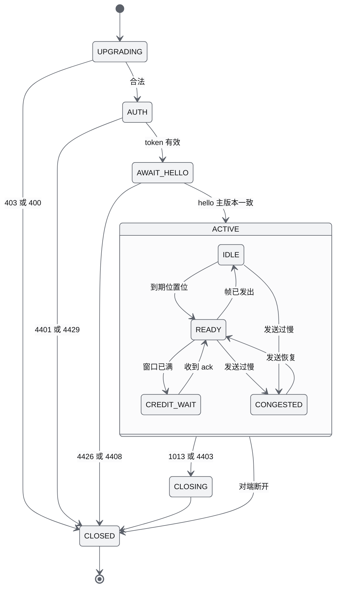

#### 6.6.2 生产者健康（ProducerHealth）

| 状态 | 事件 | 守卫 | 动作 | 目标状态 |
|---|---|---|---|---|
| UNATTACHED | liveliness `proc/<p>/ready` 或每 1 s 重试 | 文件存在且 `layout_id` 一致 | `register(LOSSY, "api")` | OK |
| UNATTACHED | attach | `layout_id` 不一致 | `status ring.layout_mismatch`（312），不转发 | UNATTACHED |
| OK | 心跳年龄 ≥ 250 ms，或 liveliness DELETE | pid 存活 | TIME.state 覆盖为 STALLED | STALLED |
| STALLED | 心跳年龄 < 250 ms | — | 取消覆盖 | OK |
| STALLED | 年龄 ≥ 2 s 或 pid 已死 | — | — | DOWN |
| STALLED、DOWN | supervisor 报 BACKOFF 或 STARTING | — | TIME.state 覆盖为 RESTARTING；新命令 1 s 超时后 211 | RESTARTING |
| RESTARTING | 心跳恢复或 `identity()` 变化 | — | 重新 attach；按 `segment`、`epoch` 分类（§6.4.8）；无 checkpoint 重启时把已 accepted 未终态的调用以 `failed 212` 结束 | OK |
| RESTARTING | supervisor 报 FAILED | — | TIME.state 覆盖为 FAILED；`status proc.sim-core`（error） | FAILED |
| FAILED | `sys/restart` | admin | — | RESTARTING |

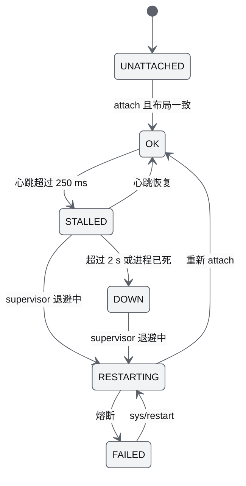

#### 6.6.3 rt.worker 连接状态（与 14 §7.7 的 UI 状态一致）

`connState` 编码：0 IDLE、1 CONNECTING、2 SYNCING、3 LIVE、4 DEGRADED、5 RECONNECTING、6 FATAL、7 CLOSED。

| 状态 | 事件 | 守卫 | 动作 | 目标状态 |
|---|---|---|---|---|
| IDLE | `init{url, token}` | — | 建立 WebSocket（子协议 `awr.rt.v1`、`bearer.<token>`），启动 4 s 连接超时 | CONNECTING |
| CONNECTING | open + `serverInfo` | 主版本兼容且布局哈希一致 | 发 `hello`、5 次 ping、重放订阅 | SYNCING |
| CONNECTING | open + `serverInfo` | 布局哈希不一致 | 以 1000 自关，上报 E-07 | FATAL |
| CONNECTING | 关闭码 4426 或 1008 | — | 上报 E-07 或策略错误 | FATAL |
| SYNCING | 首个 SNAPSHOT 帧 | — | 槽头 `connState` 置 LIVE | LIVE |
| LIVE | `input.staleAfterMs`（1000 ms）未收到 TIME | socket 仍开 | 标记 DEGRADED（UI 虚线与"信号延迟"） | DEGRADED |
| DEGRADED | 收到 TIME | — | 取消标记 | LIVE |
| CONNECTING、SYNCING、LIVE、DEGRADED | 关闭码 1001、1002（连续第 1、2 次）、1006、1009、1011、1013、4401、4403、4408、4429 | — | 计算退避并按关闭码附加处理：1006 调 `whoami`；4401 向主线程要新 token 后立即重连（不计退避次数）；4403 降为 viewer（E-16）；4429 退避固定 30 s（E-17）；1013 上报 E-09；1009 记录缺陷 | RECONNECTING |
| CONNECTING、SYNCING、LIVE、DEGRADED | 关闭码 1008、4426，或 1002 连续第 3 次 | — | 上报 E-07 或策略错误说明 | FATAL |
| RECONNECTING | 退避到期或用户点"立即重连" | — | 新建 WebSocket | CONNECTING |
| RECONNECTING | `whoami` 返回 401 且换 token 失败，或 403 | — | 上报 E-08 | FATAL |
| 任意 | `close()`（世界卸载或退出） | — | 以 1000 关闭 | CLOSED |

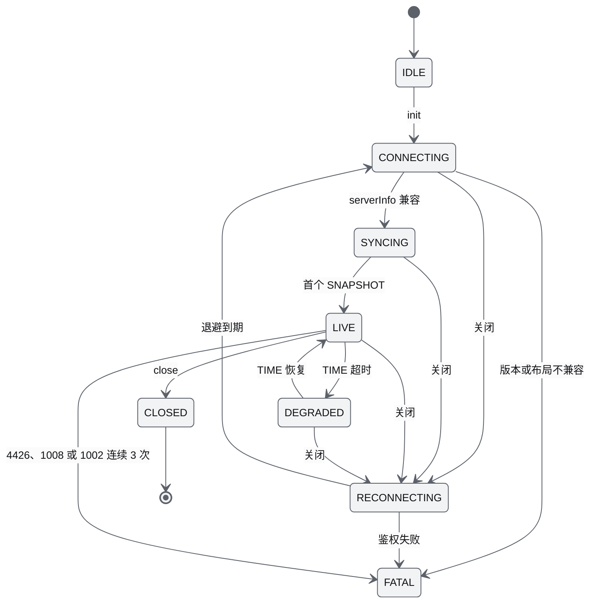

#### 6.6.4 supervisor 进程状态（`Proc`）

| 状态 | 事件 | 守卫 | 动作 | 目标状态 |
|---|---|---|---|---|
| STOPPED | start | 所属 layer 在当前 profile 启用；`start_after` 已 RUNNING 或超时 | exec，注入 `AWR_RUN`、`AWR_RUN_DIR`、`AWR_ID_BASE`、`AWR_SECRET_FILE`、BLAS 变量等 | STARTING |
| STARTING | liveliness `proc/<name>/ready` 或首次心跳 | — | 记录启动时刻 | RUNNING |
| STARTING | `startup_grace_s` 到期或进程退出 | — | 终止残留 | BACKOFF |
| RUNNING | 退出码非 0，或心跳超过 `stale_s`（HUNG） | — | HUNG 时 SIGTERM，1 s 后 SIGKILL；发 `proc.state` | BACKOFF |
| BACKOFF | 退避到期（0.5、1、2、4、8 s） | 60 s 内启动次数 < 6 | exec，`AWR_RESTART_COUNT` + 1 | STARTING |
| BACKOFF | — | 60 s 内第 6 次 | 发 `proc.failed` | FAILED |
| FAILED | `sys/restart{reset_breaker: true}` | admin | 清零计数 | STARTING |
| 任一 | stop | — | SIGTERM，`grace_s` 5 s 后 SIGKILL | STOPPING → STOPPED |

状态图与 19 §4.2 一致，此处不重复绘制。

### 6.7 时序

**（1）遥测一拍（sim-core → StateRing → Gateway → rt.worker → 主线程）**

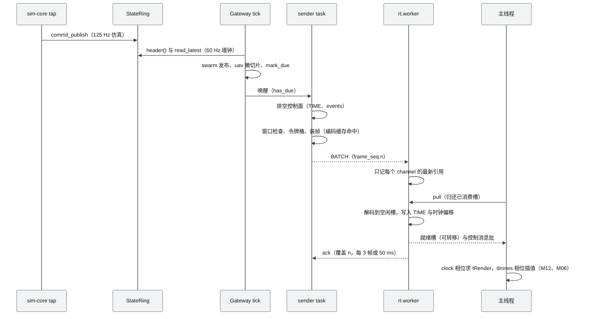

**（2）sim-core 被 kill -9（D1-core，无 checkpoint）**

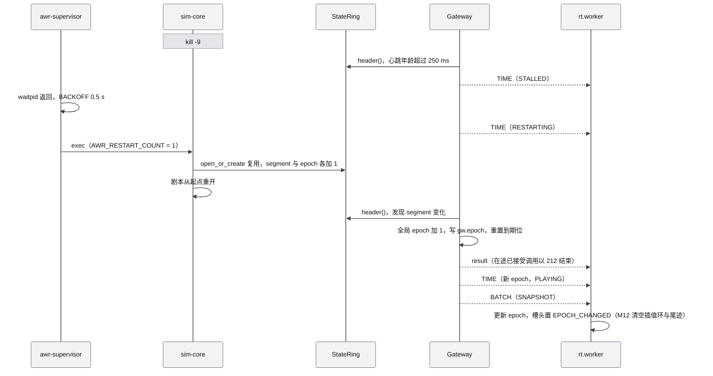

**（3）全机 RTL（批量命令与事件风暴，D1-AC-27）**

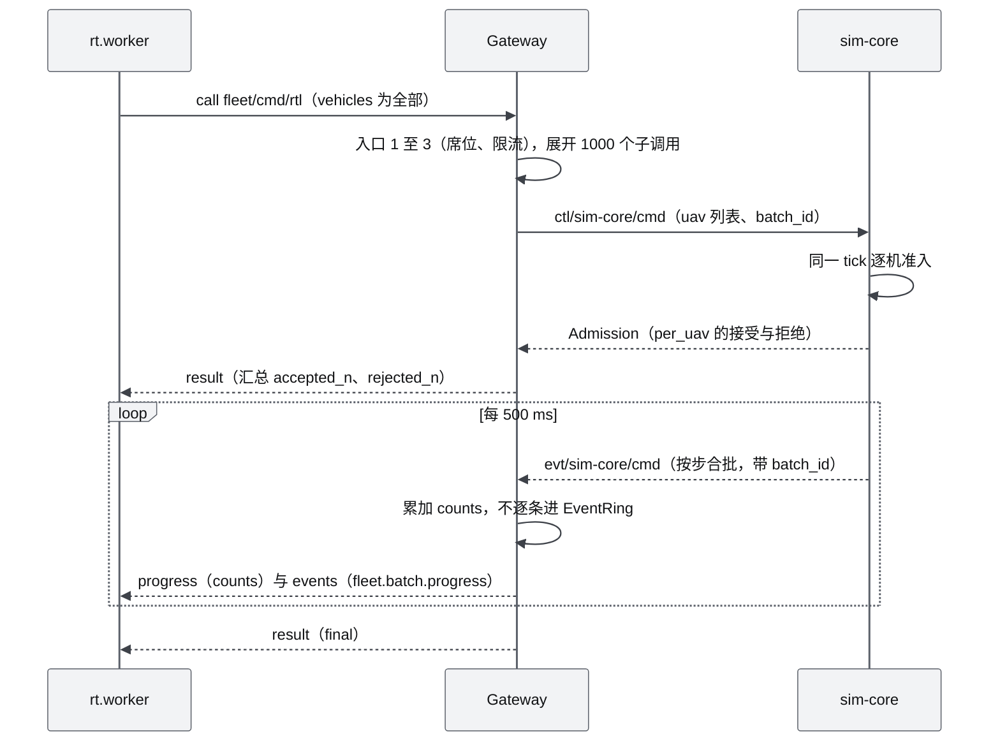

**（4）api 被 kill -9 后的重连与 duplicate（D1-AC-11a）**

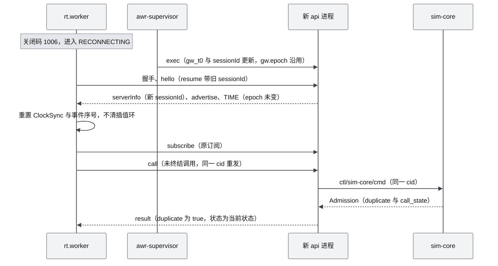

在整个过程中 sim-core 的 `step_seq` 连续（仿真不受 api 崩溃影响，g05 §7.5）。

### 6.8 zenoh 命令与事件：D1 的取舍

基线已在 D1 采用 zenoh（ADR-018）。下表记录备选方案与 D1 的简化，以便实现时不走回头路。

| 方案 | D1 结论 | 理由 | 依据 |
|---|---|---|---|
| **zenoh 1.10.1，peer 模式，只监听回环**（采用） | core | 按 key 路由、query/reply 自带超时与 finalize、liveliness、汇合点死亡后 peer 仍直连（实测 1.9 s 内 183 条）、V0.5 跨主机与 rmw_zenoh 可复用；空闲会话 0.13% 核 | g05 §0 第 4 条、§3.6 |
| 自研 UDS broker（控制面） | 否 | 压测下更省（Gateway 2.6% 对 8%），但要自写 ≥ 6 个进程间的路由、请求关联、在线状态与跨主机；按真实负载折算 zenoh 额外开销 < 1% | g05 §3.7 |
| UDS 流（状态面） | 否 | 实测复现死锁：Gateway 事件循环一阻塞，sim-core 卡在 `sendall` | g05 §0 第 5 条 |
| 进程内 LocalBus | 只用于测试与 ≤ 50 架降级 | 同接口；不参与性能验收 | AWR-03 §3.3 |
| zenoh-ext AdvancedPublisher / AdvancedSubscriber | 暂缓 | 1.10.1 仍标 unstable；自研 seq + `_replay` 约 60 行 | g05 §3.4 |
| zenoh 承载状态（ZenohStateBus） | 桩，V0.5 | CPU 是 StateRing 的 2–3 倍，无法无损排空 | g05 §3.7 |
| zenoh SHM | 关闭 | 每个发布会话 16 MiB 的 /dev/shm 池，Docker 默认 64 MiB | g05 §0 第 9 条 |
| TLS 与 ACL | V0.5 | D1 只在回环；本机 peer 均为可信进程，principal 由入口签名 | ADR-027 |

D1 的简化与约束（实现清单）：
1. 汇合点由 supervisor 打开（`tcp/127.0.0.1:7447`），子进程 `connect` 汇合点，`scouting.multicast` 关闭、gossip 开启；`lease 3000 ms`。
2. `import zenoh` 只在 `awr/runtime/bus.py`；key 只来自生成的 `bus_keys.py`；namespace `awr/<world>/<run>`（AWR-03 §5.6）。
3. 回调只做入队；`Query.drop()` 由包装器保证；sim-core 侧全部 `CongestionControl.DROP`。
4. 优先级：`ctl/*/cmd`、`clock`、`lease` 为 INTERACTIVE_HIGH + express；`ctl/sim-core/setpoint` 为 REAL_TIME + express；`evt/*` 为 INTERACTIVE_LOW（safety 为 INTERACTIVE_HIGH）；`state/*` 为 DATA_LOW（r27 §3.1.4：express 使 64 B 消息 p95 从 2.3 ms 降到 0.6 ms）。
5. 可靠性不靠 BLOCK：事件靠 seq + `_replay`，命令靠 cid 幂等 + 重试，状态靠 StateRing 取最新值（P-09）。

### 6.9 录制（MCAP）对接

Gateway 不录制；录制与回放的实现归 M12（recorder、replay-worker，D1-ext），格式归 [16](../16-World数据规范.md) §13。M11 负责的接缝如下：

```mermaid
%%{init: {"theme": "base", "themeVariables": {"fontFamily": "Inter, PingFang SC, Microsoft YaHei, Noto Sans CJK SC, sans-serif", "fontSize": "13px", "background": "#FBFBFC", "primaryColor": "#F2F3F5", "primaryTextColor": "#111214", "primaryBorderColor": "#5C616A", "secondaryColor": "#E4E6E9", "tertiaryColor": "#FBFBFC", "lineColor": "#5C616A", "textColor": "#111214", "mainBkg": "#F2F3F5", "nodeBorder": "#5C616A", "clusterBkg": "#FBFBFC", "clusterBorder": "#A7ABB3", "edgeLabelBackground": "#FBFBFC", "noteBkgColor": "#E4E6E9", "noteTextColor": "#111214", "noteBorderColor": "#81868F"}}}%%
flowchart LR
  SIM["sim-core"] -- "StateRing state.sim-core" --> REC["recorder（M12）：LOSSY drain 20 Hz 以上"]
  SIM -- "evt/**、state/**" --> REC
  GW["Gateway（M11）"] -- "ctl/recorder/start、stop" --> REC
  GW -- "ctl/sim-core/interest（marks 字段）" --> REC
  REC -- "runs/run/rec-seg.mcap" --> DISK[("runs/")]
  DISK --> RPW["replay-worker（M12）：McapSource 实现 Source 接口"]
  GW -- "ctl/replay-worker/open、seek、play、pause、speed、close" --> RPW
  RPW -- "StateRing state.replay 与 evt/replay/*" --> GW
  GW -- "BATCH 置 REPLAY，TIME 置 bit7" --> WK["rt.worker"]
```

| 接缝 | M11 提供 | M12 使用方式 | D1 |
|---|---|---|---|
| StateRing 读者游标 | 8 个游标之一给 recorder；`drain()` 返回帧与 overrun | 实时模式 LOSSY；批处理与超实时评测可 LOSSLESS（卡住 250 ms 降级） | core（库）/ ext（使用） |
| 录制控制 | `rec/start`、`rec/stop` 路由到 `ctl/recorder/*`；`rec.*` 事件转发 | recorder 服务这两个 key | ext |
| 标记集 | 兴趣集消息中的 `marks`（选中机与标记机 ≤ 16） | recorder 对标记机按 125 Hz 录 Full64（ADR-040） | ext |
| Source 接口 | `awr/runtime/source.py`（§7.4），MS1 冻结 | McapSource 实现，写 `state.replay` 与 `evt/replay/*` | core（接口）/ ext（实现） |
| 回放路径 | ReplaySource（与 LiveSource 同基类）、`playback` op、纪元与 TIME 顺序 | replay-worker 执行 seek 与 backfill | ext |
| 按需进程 | supervisor `sys/start`、`sys/stop` | replay-worker 为 `on_demand` | ext |

与 r27 §3.11 的差异：原方案在 Gateway 的 Source 发布点按原生频率录制所有 channel；定稿改为独立进程按 ADR-040 的录制频率策略录制，理由是 N = 1000 时原生频率约 12 MB/s、压缩不能进入事件循环，且 api 重启不应中断录制（ADR-017、ADR-040）。

### 6.10 鉴权、访问模式与 Origin 的实现

**中间件顺序**（Starlette 纯 ASGI 中间件，按列出的顺序执行；WS 升级请求同样经过前三项）：

| 顺序 | 中间件 | 规则 | 失败 |
|---|---|---|---|
| 1 | HostGuard | Host 头的主机部分 ∈ {localhost, 127.0.0.1} ∪ `AWR_ALLOWED_HOSTS`（lan 模式由 `AWR_ORIGINS` 推导） | 400（防 DNS 重绑定） |
| 2 | OriginGuard | 带 `Origin` 时必须匹配回环正则或 `AWR_ORIGINS` 精确值；静态路由（`/worlds/**`、`/assets/**`、`/brand/**`、`/bench/**`、`/vehicles/**`、SPA）不校验（17 §3.3 第 3 条） | REST 403 `303`；WS 升级 HTTP 403（`send_denial_response`） |
| 3 | RequestId | 生成或回显 `X-Request-Id`（UUIDv7） | — |
| 4 | SecurityHeaders | COOP same-origin、COEP require-corp、CORP same-origin、nosniff、Referrer-Policy no-referrer；`/api/**` 默认 `Cache-Control: no-store` | — |
| 5 | Auth | 解析 `Authorization: Bearer`；校验签名、过期、run；把 Principal 放入 `scope["awr.principal"]`；无需 token 的端点（R01、R50–R52、R59、静态）放行并记 principal 为空 | 401 `301`、`302` |
| 6 | RateLimit | 按 principal 与类别的令牌桶（§4.2 FR-026）；principal 为空时按来源地址计 | 429 `111` + `Retry-After` |

**token 签发**（`POST /api/auth/token`，17 §4.3.1）：

```python
async def issue(req: TokenReq, mode: AccessMode) -> TokenResp:
    role = req.role
    if role == "admin" or (role == "operator" and mode == "lan"):
        if not hmac.compare_digest(req.admin_secret or "", self.admin_secret):
            raise Problem(304)
    pid = "p-" + b32(req.principal_hint or secrets.token_bytes(16))
    seat = "none"
    if role in ("operator", "admin"):
        rep = await bus.call(LEASE_KEY, {"op": "seat_claim", "principal": sign_principal(pid, role)}, timeout=1.0)
        if rep["code"] == 116:
            raise Problem(116, detail={"holder_since_unix_ns": rep["seat"]["since"]}, remedy="改签 viewer")
        seat = "held"
    payload = {"v": 1, "sub": pid, "role": role, "run": RUN_ID, "mode": mode,
               "iat": now_s(), "exp": now_s() + 43200, "jti": secrets.token_hex(8)}
    audit("auth.token_issued", pid, role, jti=payload["jti"])     # 不写 token 本身
    return TokenResp(token=encode_v1(payload, K_auth), principal_id=pid, role=role, seat=seat, ...)
```

**席位与链路**：api 在内存中缓存 `seat{holder, state}`，每次 `ctl/sim-core/lease` 应答与 `seat.*` 事件都刷新它；sim-core 重启就绪后按缓存幂等重登记（12 §4.1.5）；席位持有者的全部连接断开时发 `seat_grace`，30 s 内重连发 `seat_resume`，宽限期计时在 sim-core LeaseManager（12 §4.2.2）。GCS 链路心跳见 §6.4.13。

**安全细节**：
1. token 只出现在 WS 子协议与 `Authorization` 头；uvicorn 访问日志关闭查询串之外的头部记录，自有日志把 `bearer.*` 与 `Authorization` 掩码。
2. 管理口令只在局域网模式签 operator 与任意模式签 admin 时需要；口令文件 `runs/<run>/admin.token` 0600，启动时打印到终端一次（AWR-03 §3.3）。
3. `AWR_SECRET` 从 `runs/<run>/secret` 读取（经 `AWR_SECRET_FILE`），不经环境变量传值；`K_auth`、`K_lease`、`K_entry`、`K_confirm` 以 HKDF 分钥（ADR-027）。
4. 回环模式下 Vite 开发服务器（5173）与 SSH 转发的任意本地端口都在 Origin 白名单内（正则允许任意端口）。

---
## 7. 接口

字段、类型、单位与错误码的定义方是 [17](../17-接口与实时协议规范.md)；本章列出 M11 实现或暴露的接口及其在代码中的落点。

### 7.1 `awr.rt.v1` op 实现清单

| op | 方向 | D1 | 实现位置 | 说明 |
|---|---|---|---|---|
| `serverInfo` | S→C | core | `ClientSession.send_server_info()` | 连接时首条；模式、世界、run、clock、seat 变化时重发（17 §6.3） |
| `advertise`、`unadvertise` | S→C | core | `ChannelRegistry.on_change` → 全部连接 | 全量后增量 |
| `hello` | C→S | core | `Gateway.on_hello()` | resume、contracts、role 降级 |
| `subscribe`、`subscribed`、`unsubscribe` | 双向 | core | `SessionManager.subscribe()` | 通配、SNAPSHOT、引用计数、兴趣集重算 |
| `ack` | C→S | core | `ClientSession.on_ack()` | 累积确认，srtt 估计 |
| `ping`、`pong` | 双向 | core | `ClientSession.on_ping()` | 同时刷新 GCS 链路年龄 |
| `call`、`result`、`progress`、`cancel` | 双向 | core | `RpcRouter` | 入口 ①–③、路由、在途表、批量 |
| `event`、`events` | S→C | core | `EventIngest.dispatch()`、`ClientSession.flush_events()` | 同 tick 合批 |
| `status`、`removeStatus` | S→C | core | `StatusBoard` | 同 id 覆盖，新连接补发全部活动项 |
| `error` | S→C | core | `ClientSession.error()` | 非 call 请求的错误 |
| `advertise`、`unadvertise`（客户端发布） | C→S | core | `ClientPublish` | 只允许 `uav/{id}/setpoint` |
| `clientStats` | C→S | core | `Metrics.on_client_stats()` | 1 Hz，汇入 `perf/server` 与 `perf/clients` |
| `playback`、`playbackState` | 双向 | ext | `PlaybackController` | §6.9 |
| BATCH（0x10） | S→C | core | `ClientSession._assemble()` | §6.4.4 |
| TIME（0x02） | S→C | core | `GatewayClock.time_bytes()` | §6.4.9 |
| CLIENT_DATA（0x20） | C→S | core | `ClientPublish.on_binary()` | §4.7 FR-062 |

### 7.2 M11 拥有的 REST 端点

编号与响应字段以 17 §4.2、§4.3 为准；原"新增"的 `sys/config`、`sys/perf` 已由 17 v1.1 登记为 R59、R60（§14 第 4 条）。

| 编号 | 方法与路径 | 角色 | D1 | 所在文件 |
|---|---|---|---|---|
| R01、R02 | `POST /api/auth/token`、`GET /api/auth/whoami` | 无、viewer | core | `rest/auth.py` |
| R03 | `POST /api/auth/confirm` | operator 席 | ext | `rest/auth.py` |
| R04、R05 | `GET /api/worlds`、`GET /api/worlds/{id}` | viewer | core | `rest/worlds.py` |
| R08 | `GET /api/sessions/current` | viewer | core | `rest/sessions.py` |
| R09 | `POST /api/sessions` | operator 席 | ext | `rest/sessions.py` |
| R19–R22 | `/api/commands*` | 见 17 | ext | `rest/commands.py` |
| R47–R49 | `/api/sys/perf-report*` | viewer | ext | `rest/sys.py` |
| R50、R51 | `GET /api/health/live`、`/ready` | 无 | core | `rest/sys.py` |
| R52–R54 | `GET /api/sys/info`、`GET /api/sys/procs`、`POST /api/sys/restart` | 无或 viewer、viewer、admin | core | `rest/sys.py` |
| R55 | `GET /api/sys/audit` | admin | ext | `rest/sys.py` |
| R56 | `GET /api/events` | viewer | core | `rest/sys.py` |
| R57、R58 | `GET /api/rt/topics`、`GET /api/rt/inspect` | viewer、admin（dev/test 为 viewer） | ext | `api/rt/inspect.py` |
| R59 | `GET /api/sys/config` → `{worlds_base: str = "/worlds", static_split: bool = false, access_mode: "loopback" 或 "lan", tick_hz: int = 60, rate_classes: int[] = [1,2,5,10,15,20,30,60]}`；`Cache-Control: no-store`；拆分回退时 `worlds_base = "http://<host>:8001/worlds"` | 无 | core | `rest/sys.py` |
| R60 | `GET /api/sys/perf?window_s=60`（[5, 600]）→ `perf/server` 各数值字段的 `{p50, p95, p99, max, count}` 与 `t_from_unix_ns`、`t_to_unix_ns`（字符串） | viewer | core | `rest/sys.py` |
| R78 | `GET /api/sys/metrics?format=prom` | viewer | 否（V0.5；D1 返回 404） | `rest/sys.py` |
| — | `GET /api/rt`（WS 升级） | token（子协议 `bearer.<token>`） | core | `api/rt/ws.py` |
| — | `/worlds/{id}/**`、`/worlds/_shared/env/**`、`/vehicles/{model}/model/*.glb`、`/assets/**`、`/brand/**`、`/bench/**`、SPA 回退 | 无 | core | `api/static.py` |

### 7.3 bus key：M11 的消费与产生

| key | M11 的角色 | 频率或时机 | 定义处 |
|---|---|---|---|
| `ctl/sim-core/cmd`、`clock`、`lease`、`roster`、`query` | api 调用 | 按需 | 17 §9.3 |
| `ctl/sim-core/setpoint` | api 发布（raw 32 B） | 每个有效 CLIENT_DATA | 17 §9.3、§9.4 |
| `ctl/sim-core/interest` | api 发布 Interest | 变化后 250 ms 去抖 + 1 Hz | 17 §9.3、§9.4（v1.1 登记，源自本文与 10 AD-10） |
| `ctl/sim-core/gcs` | api 发布 Gcs | 5 Hz | 17 §9.3、§9.4（v1.1 登记） |
| `evt/{producer}/*` | api 订阅 | 按步合批 | 17 §9.3 |
| `evt/{producer}/_replay` | api 调用 | 缺口时 | 17 §9.5 |
| `state/{producer}/{ext,safety,sensor,mission,env}` | api 订阅 | 2、10、10、2、1 Hz | 17 §9.3 |
| `state/sim-core/detail` | api 订阅（兴趣集 EnvSample32） | 10 Hz | 17 §9.3（v1.1 登记） |
| `state/sim-core/perf` | api 订阅（`{stage_ms_per_s{}, n_active, kernel, cpu_pct}`） | 1 Hz | 17 §9.3（v1.1 登记） |
| `proc/*/{alive,ready}` | api 监视；api 自身声明 `proc/api/alive`、`ready` | 事件驱动 | 17 §9.6 |
| `sys/procs`、`sys/restart`、`sys/run`（ext） | api 调用，supervisor 服务 | 1 Hz、按需；`run` 超时 10 s 不重试 | 17 §9.3；10 §4.4（4） |
| `sys/start`、`sys/stop` | api 调用，supervisor 服务（ext） | 按需 | 17 §9.3（v1.1 登记） |
| `sys/inject` | 测试 harness 调用，supervisor 服务（只在 ci profile 注册） | 按需 | 17 §9.3（v1.1 登记） |
| `ctl/recorder/start`、`stop`；`evt/recorder/rec` | api 调用（ext）；api 订阅 | 按需 | 17 §9.3（v1.1 登记） |
| `ctl/replay-worker/*`；`ctl/replay/roster`、`state/replay/*`、`evt/replay/*` | api 调用与订阅（ext） | 按需 | 17 §9.3 |
| `evt/supervisor/proc` | supervisor 发布 | 状态变化 | 符合 17 §9.3 的 `evt/{producer}/proc` 模式 |

M11 发布的消息字段（msgpack，全部带 `v: 1`；schema 为 `packages/contracts/bus/{interest,gcs}.schema.json`）：

| 消息 | 字段 | 类型 | 单位与取值 | 默认 |
|---|---|---|---|---|
| Interest | `seq` | u64 | 单调递增，api 实例内从 0 起 | — |
| | `detail` | u16[] | agent_no，≤ 64，最近订阅优先 | [] |
| | `marks` | u16[] | agent_no，≤ 16，剧本 `marked` 优先 | [] |
| | `topics` | str[] | 取自 `state_ext`、`safety`、`sensor`、`env` | 有订阅的类别 |
| | `record_scope` | str，可选 | `all`（录制中且 N ≤ 64，ext，待 17 登记） | 缺省 |
| Gcs | `seq` | u64 | 单调递增 | — |
| | `principal_id` | str 或 null | 席位 FREE 时 null | null |
| | `seat_state` | enum | FREE、HELD、GRACE | FREE |
| | `ping_age_ms` | u32 | ms，持有者最近 ping 至今；FREE 时 0 | 0 |
| Setpoint | 32 B raw | — | `agent_no` u16、`flags` u8、`frame` u8（0 world、1 body）、`seq` u32、`t_client_sim_ns` i64、VelSetpoint16 | — |

### 7.4 `awr.runtime` 对外 Python API（供 M08、M12、M14 使用）

```python
# awr/runtime/statering.py
LOSSY, LOSSLESS = 1, 2
class LayoutMismatch(Exception): code = 312
class PlatformUnsupported(Exception): ...
class RingHeader(NamedTuple):            # 17 §9.2（v1.1）的头部字段；时钟组来自同一次 clock_seq 一致性读
    version: int; flags: int; slot_count: int; capacity: int; layout_id: int; writer_pid: int
    epoch: int; segment: int; head: int; heartbeat_ns: int; t_sim_ns: int; rate_milli: int; clock_state: int
    roster_version: int; created_ns: int; step_seq: int; step_budget_us: int; step_p50_us: int
    step_p99_us: int; step_max_us: int; rtf_milli: int; catchup_saturated: int; id_base: int; id_count: int
    @classmethod
    def placeholder(cls, *, heartbeat_ns: int) -> "RingHeader": ...   # 无生产者时 TIME 用（FR-052）
class Frame(NamedTuple):
    frame_seq: int; t_sim_ns: int; t_pub_ns: int; epoch: int; roster_version: int; n_rows: int; flags: int
    full: bytes; lite: bytes                                   # 已拷贝，可长期持有
class PublishTicket(NamedTuple):
    frame_seq: int; slot: int
class StateRing:
    @classmethod
    def create(cls, path: Path, *, capacity: int = 1024, slots: int = 32, layout_id: int,
               epoch: int = 1, segment: int = 0, id_base: int = 0, id_count: int = 1024) -> "StateRing": ...
    @classmethod
    def open_or_create(cls, path: Path, *, capacity: int, slots: int, layout_id: int,
                       id_base: int, id_count: int) -> tuple["StateRing", bool]: ...     # bool = 是否复用
    @classmethod
    def attach(cls, path: Path, *, expect_layout_id: int) -> "StateRing": ...          # 不一致抛 LayoutMismatch
    # 写者（单一线程）
    def heartbeat(self, t_sim_ns: int, clock_state: int, rate_milli: int = 1000, *,
                  step_seq: int | None = None) -> None: ...             # 主循环每次迭代；clock_seq 包围
    def publish(self, full: np.ndarray, lite: np.ndarray, t_sim_ns: int, roster_version: int, flags: int = 0) -> int: ...
    def begin_publish(self) -> tuple[np.ndarray, np.ndarray, PublishTicket]: ...      # 返回槽内 Full64[cap]、Lite32[cap] 视图
    def commit_publish(self, ticket: PublishTicket, n_rows: int, t_sim_ns: int,
                       roster_version: int, flags: int = 0) -> int: ...
    def set_epoch(self, epoch: int) -> None: ...
    def set_segment(self, segment: int) -> None: ...
    def set_step_stats(self, p50_us: int, p99_us: int, max_us: int, budget_us: int, rtf_milli: int,
                       catchup_saturated: int) -> None: ...           # 1 Hz；签名按 17 §9.2
    # 读者
    def register(self, mode: int = LOSSY, name: str = "") -> int: ...
    def read_latest(self, last_seq: int = 0) -> Frame | None: ...
    def drain(self) -> tuple[list[Frame], int]: ...
    def header(self) -> RingHeader: ...                                                # clock_seq 顺序锁，≤ 3 次重试
    def identity(self) -> tuple[int, int, int, int]: ...                             # (st_ino, writer_pid, epoch, segment)
    def writer_age_ms(self) -> float: ...
    def close(self) -> None: ...
class LocalRing(StateRing): ...                                  # 同接口，进程内

# awr/runtime/bus.py（唯一 import zenoh 的模块）
class Prio(IntEnum): REAL_TIME = 1; INTERACTIVE_HIGH = 2; INTERACTIVE_LOW = 3; DATA = 5; DATA_LOW = 6; BACKGROUND = 7
class BusTimeout(Exception): code = 211
class Request(Protocol):
    key: str; payload: bytes
    def reply(self, payload: bytes) -> None: ...                  # 包装器在 finally 中 drop
class Bus(Protocol):
    @classmethod
    def open(cls, name: str, ctx: "RunCtx", *, loop: asyncio.AbstractEventLoop | None = None) -> "Bus": ...
    def serve(self, key: str, handler: Callable[[Request], None]) -> "Handle": ...        # handler 只入队
    async def call(self, key: str, msg: dict, *, timeout: float = 1.0, retries: int = 2, retry_gap: float = 0.3) -> dict: ...
    def call_cb(self, key: str, msg: dict, on_reply: Callable[[dict | None, Exception | None], None],
                *, timeout: float = 1.0, retries: int = 2) -> None: ...                  # 同步进程使用
    def publisher(self, key: str, *, priority: Prio, express: bool = False) -> "Publisher": ...   # 恒为 DROP
    def subscribe(self, key: str, cb: Callable[[str, bytes], None]) -> "Handle": ...      # cb 在回调线程
    def token(self, key: str) -> "Handle": ...
    def watch(self, pattern: str, on_change: Callable[[str, bool], None]) -> "Handle": ...
    def close(self) -> None: ...
class ZenohBus(Bus): ...
class LocalBus(Bus): ...

# awr/runtime/events.py
class EventPublisher:
    def __init__(self, bus: Bus, producer: str, epoch: int, ring: int = 4096) -> None: ...
    def emit(self, kind: str, *, t_sim_ns: int, severity: int = 0, uav: str | None = None,
             cid: str | None = None, batch_id: str | None = None, **data) -> int: ...
    def flush(self) -> int: ...                                  # 每 category 至多一次 put
    def set_epoch(self, epoch: int) -> None: ...
class EventSubscriber:
    def __init__(self, bus: Bus, *, on_events: Callable[[str, list[dict]], None],
                 on_gap: Callable[[str, int, int, int], None], pattern: str = "evt/**") -> None: ...
    def feed(self, producer: str, raw: bytes) -> None: ...        # 由宿主主循环调用；按生产者序交付
    def on_replay_reply(self, producer: str, epoch: int, reply: dict | None, err: Exception | None) -> None: ...
    def check(self, now_mono_ns: int, *, gap_timeout_s: float = 1.0, max_held: int = 4096) -> None: ...  # 超时放弃缺口

# awr/runtime/heartbeat.py、child.py
class Heartbeat:
    def __init__(self, path: Path) -> None: ...
    def beat(self) -> None: ...
    @staticmethod
    def age_ms(path: Path) -> float | None: ...
@dataclass
class RunCtx:
    name: str; run_id: str; world_id: str; run_dir: Path; persist_dir: Path; supervisor_pid: int
    restart_count: int; last_exit: int | None; id_base: int; id_count: int; secret_file: Path
    @property
    def stopping(self) -> bool: ...
def init_child(name: str) -> RunCtx: ...

# awr/runtime/checkpoint.py
class CheckpointStore:
    def __init__(self, dir: Path, *, layout_id: int, keep: int = 3, mirror: Path | None = None,
                 mirror_every_s: float = 10.0) -> None: ...
    def save(self, t_sim_ns: int, epoch: int, segment: int, arrays: Mapping[str, np.ndarray], meta: dict) -> None: ...
    def load_latest(self, *, skip_poisoned: bool = True) -> "Checkpoint | None": ...
    def poison(self, t_sim_ns: int) -> None: ...
    def close(self, *, final: bool = True) -> None: ...          # SIGTERM 时同步写最终一代并镜像

# awr/runtime/source.py（M12 的 McapSource 实现）
class SourceIncompatible(Exception): code = 122
class Source(Protocol):
    mode: Literal["live", "replay"]
    def open(self, spec: "SourceSpec", ring: StateRing, events: EventPublisher) -> "SourceInfo": ...
    def seek(self, t_ns: int) -> int: ...                        # 每 channel 不晚于 t 的最后一条写入环，返回实际 t
    def play(self) -> None: ...
    def pause(self) -> None: ...
    def set_speed(self, rate: float) -> None: ...                # [0.1, 20]
    def step(self, now_mono_ns: int) -> None: ...                # 宿主主循环调用：推进并写环
    def close(self) -> None: ...

# awr/runtime/principal.py（api 与 agent-runtime 共用）
def derive_key(secret: bytes, run_id: str, purpose: Literal["auth", "lease", "entry", "confirm"]) -> bytes: ...
def sign_principal(p: "Principal", cid: str, key: bytes) -> bytes: ...
def verify_principal(p: "Principal", cid: str, sig: bytes, key: bytes) -> bool: ...
def encode_token(payload: dict, key: bytes) -> str: ...
def decode_token(token: str, key: bytes, *, run_id: str, now_s: int) -> dict: ...   # 失败抛 TokenInvalid(302)

# awr/runtime/config.py
class ConfigError(Exception): exit_code = 2
def load_runtime_config(path: Path, *, profile: str | None, env: Mapping[str, str],
                        argv: Sequence[str]) -> "RuntimeConfig": ...
```

### 7.5 前端接口（`apps/web/src/net/rt/index.ts` 导出）

```ts
export type RateClass = 0 | 1 | 2 | 5 | 10 | 15 | 20 | 30 | 60
export type ConnState = 'IDLE' | 'CONNECTING' | 'SYNCING' | 'LIVE' | 'DEGRADED' | 'RECONNECTING' | 'FATAL' | 'CLOSED'
export interface SubscribeOpts { rate: RateClass; mode?: 'latest' | 'all'; priority?: 0 | 1 | 2 | 3
                                 filter?: { types?: readonly string[]; levelMin?: 0 | 1 | 2 | 3 } }
export interface RtClient {
  init(o: { url: string; token: string; tier: 'A' | 'B' | 'S'; deviceClass: 'dGPU' | 'iGPU' | 'software' }): void
  subscribe(topic: string, o: SubscribeOpts): () => void              // 返回注销函数；引用计数
  swapFrame(): TelemetryFrame | null                                  // telemetry 相位调用；零分配
  call(service: string, args: object, o?: { timeoutMs?: number; confirm?: string; id?: string }): CallHandle
  publishSetpoint(agentNo: number, vx: number, vy: number, vz: number, yawRate: number, final?: boolean): void
  onEvents(cb: (batch: readonly RtEvent[]) => void): () => void       // 每帧至多一批
  onTime(cb: (t: TimeView) => void): () => void                       // TimeView 为复用对象
  onStatus(cb: (items: readonly StatusItem[]) => void): () => void
  readonly status: ConnState
  readonly roster: RosterView                                         // agentNo → {id, model, kind, producer, simulated}
  readonly serverInfo: ServerInfoView | null                          // 运行世界 id、run、mode、clock、role、seat；serverInfo 变化时替换
  onServerInfo(cb: (s: ServerInfoView) => void): () => void
  reconnectNow(): void
  close(): void
}
export interface ServerInfoView { readonly sessionId: string; readonly worldId: string; readonly contentVersion: string
  readonly runId: string; readonly segment: number; readonly mode: 'live' | 'replay'
  readonly clock: { mode: string; pausable: boolean; maxSpeed: number; steppable: boolean }
  readonly role: 'viewer' | 'operator' | 'admin'; readonly seat: 'held' | 'none' | 'other' }
export interface CallHandle { readonly id: string; readonly result: Promise<CallResult>
                              onProgress(cb: (p: Progress) => void): void; cancel(): void }
export interface TelemetryFrame {                                    // §6.3.8 的视图，按槽缓存
  readonly hdr: FrameHeaderView; readonly swarm: SwarmSoA; readonly full: FullRecordsView; readonly raw: RawRecordsView }

// apps/web/src/stores/fleet.ts
export interface FleetSummary { version: number; n: number; alerts: number; minBatteryPct: number
                                byState: Uint16Array /* 14 */; byOwner: Uint16Array /* 8 */ }
export const fleetStore: StoreApi<FleetSummary>
export const fleetRows: { n: number; agentNo: Uint16Array; fs: Uint8Array; sub: Uint8Array; battery: Uint8Array
                          owner: Uint8Array; alert: Uint8Array; stale: Uint8Array }
export function useFleet<T>(selector: (s: FleetSummary) => T): T
```

### 7.6 事件

| 事件 | 方向 | M11 的处理 |
|---|---|---|
| 生产者事件（`cmd.*`、`safety.*`、`mission.*`、`sim.*`、`lease.*`、`seat.*`、`env.*`、`agent.*`、`job.*`、`rec.*`） | 消费 | 去重、补拉、全局 seq、按连接过滤；`cmd.*` 另转 result/progress；批量子调用只汇总 |
| `fleet.batch.progress` | 产生（api） | ≤ 2 Hz，level 0 |
| `proc.state` | 产生（api 转发 supervisor 的 `evt/supervisor/proc`） | 同时维护 `status proc.<name>` |
| `cmd.rejected` | 产生（api，入口拒绝时） | level 1 |
| `session.switched`、`session.error` | 产生（api） | switched 为 ext |
| `auth.token_issued`、`auth.denied` | 只写审计 | 不进 EventRing |

### 7.7 M11 使用的错误码与关闭码

| 码 | 触发位置 | 说明 |
|---|---|---|
| 105 STATE | `cancel` | 目标调用已终态或为非机体调用 |
| 107 NO_VEHICLE | 路由 | `uav/{id}/…` 的机体不在 roster |
| 110 PARAM_OUT_OF_RANGE | 入口结构校验；`GET /api/sys/perf` 的 `window_s` | 例如 `vehicles` 超过 1000、`ticks` 超出 [1, 2500] |
| 111 RATE_LIMITED | 入口 ② 与订阅限流 | 带 `retry_after_ms` |
| 112 CONFIRM_REQUIRED | 入口 ③（ext） | — |
| 115、116、118 | 入口 ① | 角色、席位、只读模式 |
| 211 SIM_UNAVAILABLE | bus 调用 3 次无回复；health 非 OK 时的 REST | — |
| 212 SIM_ROLLBACK | 无 checkpoint 重启后结束在途调用（D1-core 使用，17 §8.2 的 D1 列标为 ext，见 §14 第 14 条） | 12 §4.1.5 |
| 213 SERVICE_UNAVAILABLE | 依赖进程未就绪（replay-worker、recorder、会话切换中的 supervisor）；api 停止中 | — |
| 300 BAD_REQUEST | JSON 或 schema 不合法；`hello` 前的其他 op；服务名不存在（`detail.field = "service"`） | — |
| 301–322 | 协议与接入 | 见 17 §8.2 |
| 关闭码 1001、1002、1009、1013、4401、4403、4408、4426、4429 | ClientSession | 语义与客户端行为见 17 §8.3 |

---

## 8. UI 与交互

M11 不实现任何 UI 组件；它向 M15 与 AWR-14 定义的界面提供数据与状态。所有呈现一律遵守设计体系：组件只用 shadcn（base-mira）、图标只用 morphicons 注册名、动效只用 transitions.dev token 与配方、图表与表格按 lieflat 视觉语言、颜色只取 [15](../15-视觉设计规范与色卡.md) 的 token，文案为中文且不含 emoji（D1-AC-20）。

| M11 提供的信号 | 来源 | UI 落点（14） | 组件（shadcn） | 图标（15 §7 注册名） | 动效（15 §8.3 配方） | 图表（lieflat） |
|---|---|---|---|---|---|---|
| 连接状态 LIVE、DEGRADED、RECONNECTING、FATAL | `RtClient.status`、槽头 `connState` | 顶栏连接徽标（HoverCard 显示 RTT、消息率、credit_skips、swarm 实际频率）、断线横幅（14 §4.1、§4.6、§7.7） | Badge（outline）、HoverCard、Alert、Button（"立即重连"） | `conn.online`（Wifi 与 WifiOff 之间 morph）；横幅内 `alert.linklost` | 状态文字 04 text-states-swap；HoverCard 05 menu-dropdown；横幅 07 panel-reveal 的 Y 轴 8 px 变体（14 §8.2 第 11 行） | — |
| RTT、swarm 实际频率、credit_skips 百分比 | `__perf.net`、`perf/server` | Perf 面板"网络"卡（14 §5.5） | Card | — | 02 number-pop-in（≤ 2 Hz） | LfStat × 3 + LfSparkline |
| sim-core 单步 p99、api CPU、RTF | `perf/server` | Perf 面板"服务端"卡 | Card | `health` | 02 number-pop-in | LfStat × 3 |
| `status` 横幅（`proc.*`、`net.congested`、`events.gap`、`env.presets_mismatch`、`interest.truncated`、`ring.layout_mismatch`） | `status`/`removeStatus`，同 id 覆盖 | 顶部持久横幅（`--z-banner`） | Alert | 按 level 取 `alert.info`、`alert.warning`、`alert.error` | 进出场 07 panel-reveal 的 Y 轴 8 px 变体；同屏 ≤ 3 条，按 level 与时间排序（M15-FR-037） | — |
| 调用结果与进度 | `result`、`progress` | 按钮 loading 与 Toast（14 §6.11） | Button、Spinner、Toast | `StateIcon` | 22 toast，多条按 32 banner-stacking 堆叠（limit 3）；09 icon-swap | — |
| 事件流 | `onEvents` | Events 面板（虚拟化） | ScrollArea、Table | — | — | lieflat 表格规范（行高、tabular 数字） |
| 机群摘要与 DroneRail 行 | `stores/fleet.ts` | 顶栏计数、DroneRail | Badge、Item | `drone.*`、`bat.*` | 03 notification-badge | LfStat |
| 进程列表 | `sys/procs` | 设置面板"进程"页 | Table | — | — | LfTable |
| TIME.state（STALLED、RESTARTING、FAILED、LIVE、bit7） | 槽头 TIME 字段 | Timeline 状态文字、E-15 阻断横幅 | Badge、Alert | `mode.hold` 等 | 04 text-states-swap | — |

规则：
1. `status` 与 `result` 的 `message`、`remedy` 取自 `reasons.json` 的 `message_zh`、`remedy_zh`，前端经 `lib/sanitize.ts` 净化后显示。
2. 断线横幅在关闭 1 s 后出现（14 §7.7），断线期间画面保留最后一帧，命令与环境控件置灰；这些行为由 M15 实现，M11 只保证 `status` 与 `connState` 的及时性（状态变化后下一帧即反映）。
3. 连接徽标断线时为红描边、不占实心（14 §11；ADR-032"一处红"）。
4. Perf 面板的网络与服务端图表刷新走 LfScheduler（≤ 4 Hz，Tier S），不可见即暂停（AWR-03 §3.8）。

---
## 9. 实现指引

### 9.1 目录与文件清单（均在 AWR-03 §4.1 目录树与 §4.3 所有权表范围内）

```text
python/awr/runtime/                  # 所有者 M11
├── statering.py        StateRing、LocalRing、RingHeader、Frame、PublishTicket、LayoutMismatch（g05 原型转正）
├── bus.py              Bus、ZenohBus、LocalBus、Prio、BusTimeout；唯一 import zenoh
├── zenoh.json5         会话配置模板（17 §9.3），supervisor 注入 namespace 与端点
├── events.py           EventPublisher、EventSubscriber
├── heartbeat.py        Heartbeat（16 B mmap）
├── child.py            init_child、RunCtx
├── principal.py        HKDF 分钥、principal 签名、token 编解码
├── config.py           runtime.yaml 加载、profile 叠加、结构校验（退出码 2）
├── supervisor.py       Supervisor、Proc、sys/procs|restart|run|start|stop、日志收集
├── quota.py            runs/ 配额与磁盘水位
├── checkpoint.py       CheckpointStore（格式见 §6.3.7）
├── source.py           Source 协议、SourceSpec、SourceInfo、SourceIncompatible
├── statebus_zenoh.py   ZenohStateBus 桩（V0.5）
└── cli.py              awr doctor | config print | ring dump | bus ls
python/awr/api/                      # 所有者 M11（领域 rest 文件除外，AWR-03 §4.3）
├── main.py             create_app()、lifespan（打开 Bus、attach Source、启动 Ticker 与心跳）、rest/*.py 自动发现
├── inproc.py           --inproc 启动器（LocalBus + LocalRing，sim-core 主循环跑在线程里）
├── static.py           StaticFiles 包装：缓存头、?v= 校验、SPA 回退、禁止动态压缩
├── middleware.py       HostGuard、OriginGuard、RequestId、SecurityHeaders、RateLimit、Auth
├── problem.py          problem+json 与 reasons 映射
├── ratelimit.py        令牌桶（按 principal 与类别）
├── audit.py            audit.jsonl 后台写线程（1 s fsync）
├── rest/auth.py  rest/worlds.py  rest/sessions.py  rest/sys.py  rest/commands.py
└── rt/
    ├── gateway.py      Gateway、Ticker、on_tick
    ├── protocol.py     JSON op 校验与分派；BATCH、TIME、CLIENT_DATA 编解码（使用生成的 frame 结构）
    ├── channels.py     Channel、ChannelRegistry、TopicTrie
    ├── scheduler.py    SubChan、mark_due、TokenBucket、窗口计算
    ├── session.py      ClientSession、SessionManager、sender task、StatusBoard
    ├── clock.py        GatewayClock、EpochStore（gw.epoch、gw.seen）
    ├── rpc.py          RpcRouter、InFlightTable、BatchAggregator、ClientPublish、SessionSwitcher（ext）
    ├── events.py       EventIngest、EventRing
    ├── interest.py     InterestAggregator、GcsBeacon
    ├── detail.py       DetailDemux、EnvCache
    ├── bus_bridge.py   BusInbox（回调线程到主线程）
    ├── metrics.py      计数器与直方图、perf/server、/api/sys/perf 窗口
    ├── playback.py     PlaybackController（ext）
    ├── inspect.py      /api/rt/topics、/api/rt/inspect（ext）
    ├── awrrt.py        .awrrt 读写与采集（16 §13.9）
    ├── ws.py           @app.websocket("/api/rt")
    └── sources/base.py  sources/live.py  sources/replay.py  sources/synthetic.py
apps/web/src/net/                    # 所有者 M11
├── api.ts              REST 客户端（TanStack Query fetcher、token 获取与刷新）
└── rt/
    ├── rt.worker.ts    唯一 WebSocket；解码、ack、ClockSync、重连
    ├── client.ts       RtClient 门面、订阅引用计数、CallHandle、roster 视图
    ├── transport.ts    重连退避（移植 partysocket 约 60 行逻辑）
    ├── clockSync.ts    最小 RTT 滤波、timeOrigin 换算
    ├── frame.ts        TelemetryFrame 槽布局常量与视图缓存（§6.3.8）
    ├── decode.ts       记录索引、swarm 与 Full64 解码
    ├── ctrl.ts         控制消息批与事件缓存上限
    ├── layouts.ts      只再导出 @awr/contracts 生成物
    ├── FakeSource.ts   纯前端替身
    └── types.ts  index.ts
apps/web/src/stores/fleet.ts         # 所有者 M11
tools/bench/ipc/                     # 所有者 M11
├── bench_state.py      读环与 Gateway 容量（--n、--clients、--with-flight60）
├── bench_cmd.py        命令 RTT 与事件风暴（--events 570）
├── bench_encode.py     编码与装帧耗时
├── rt_client.mjs       Node 22 内置 WebSocket 的轻量协议客户端（10、30 客户端）
└── netem_proxy.py      用户态弱网代理（18 §8.7 剖面 W0–W3）
tests/runtime/  tests/rt/  apps/web/tests/m11/  apps/web/perf/m11/
mk/m11.mk                            # test-rt、bench-ipc、rt-fixtures
configs/runtime.yaml                 # 所有者 M11；内容见 19 §6.2，api 行按 FR-028 补全参数
```

### 9.2 Gateway 内部关键类与函数签名

```python
# awr/api/rt/gateway.py
class Gateway:
    mode: Literal["live", "replay"]
    frame_t_sim_ns: int
    def __init__(self, cfg: "RuntimeConfig", bus: Bus, source: "RingSource", clock: "GatewayClock",
                 registry: "ChannelRegistry", sessions: "SessionManager", rpc: "RpcRouter",
                 events: "EventIngest", aux: "AuxServices", metrics: "Metrics") -> None: ...
    async def start(self) -> None: ...                       # 启动 Ticker、心跳、faulthandler 重布置任务
    async def stop(self) -> None: ...                        # FR-104：213、sys.shutting_down、1001 关闭全部连接、关闭 Bus
    def on_tick(self, k: int) -> None: ...
    async def switch_source(self, source: "RingSource", reason: str) -> None: ...   # 回放打开与关闭
    async def switch_run(self, run_id: str, world_id: str, namespace: str) -> None: ...  # FR-103：重开 Bus、等待 ready、epoch + 1

# awr/api/rt/channels.py
class Channel:
    def publish(self, payload: bytes | memoryview, t_sim_ns: int, dt_us: int = 0) -> None: ...
    def record(self, reset: bool) -> bytes: ...
class ChannelRegistry:
    def get_or_create(self, topic: str, *, encoding: int, schema_name: str, kind: str, priority: int,
                      native_hz: float, self_contained: bool, entity: tuple[str, str] | None) -> Channel: ...
    def remove(self, channel_id: int) -> None: ...
    def match(self, pattern: str) -> list[Channel]: ...
    def bump_reset_gen(self, producer: str) -> None: ...
    def uav_state_with_subscribers(self) -> Iterable[Channel]: ...

# awr/api/rt/session.py
class ClientSession:
    conn_id: str; principal: "Principal"
    async def run(self) -> None: ...                         # 接收循环；sender 为独立 task
    def send_ctrl(self, m: str | bytes) -> None: ...
    def on_ack(self, frame: int, fps: float | None, decode_ms: float | None, lag_ms: float | None) -> None: ...
    def on_ping(self, t: float, srtt_ms: float | None) -> None: ...
    def recompute_window(self) -> None: ...
    def flush_events(self) -> None: ...
class SessionManager:
    principal_last_ping: dict[str, int]                      # principal_id → 最近 ping 的单调时刻（连接关闭后保留）
    def subscribe(self, s: ClientSession, subs: list[dict]) -> None: ...
    def unsubscribe(self, s: ClientSession, ids: list[int]) -> None: ...
    def active(self) -> Iterable[ClientSession]: ...
    def note_ping(self, principal_id: str, t_mono_ns: int) -> None: ...

# awr/api/rt/sources/base.py
class RingSource:
    def poll(self, k: int, t_mono_ns: int) -> "PollResult": ...
    def producers(self) -> Mapping[str, "ProducerState"]: ...
class LiveSource(RingSource): ...
class ReplaySource(RingSource): ...                            # ext
class SyntheticSource(RingSource):                             # 供 tools/fake/fake_gw.py
    def __init__(self, n: int, *, pattern: Literal["orbit", "lissajous", "replay_awrrt"] = "orbit",
                 hz: float = 125.0, env: bool = True, events_per_s: float = 5.0, seed: int = 7,
                 awrrt: Path | None = None) -> None: ...

# awr/api/rt/rpc.py
class RpcRouter:
    async def handle_call(self, s: ClientSession, m: dict) -> None: ...
    def handle_cancel(self, s: ClientSession, m: dict) -> None: ...
    def on_cmd_event(self, ev: dict) -> None: ...
    def on_producer_restart(self, producer: str) -> None: ...   # 已 accepted 未终态的调用以 212 结束
class ClientPublish:
    def on_advertise(self, s: ClientSession, channels: list[dict]) -> None: ...
    def on_binary(self, s: ClientSession, data: bytes) -> None: ...   # CLIENT_DATA → ctl/sim-core/setpoint

# awr/api/rt/events.py、interest.py、detail.py、metrics.py
class EventIngest:                                           # 内含 awr.runtime.events.EventSubscriber，按生产者序交付
    def ingest(self, producer: str, raw: bytes) -> None: ...
    def on_replay(self, producer: str, epoch: int, reply: dict | None, err: Exception | None) -> None: ...
    def check_gaps(self, t_mono_ns: int) -> None: ...
    def dispatch(self) -> None: ...
    def since(self, gseq: int, limit: int, types: tuple[str, ...], level_min: int) -> tuple[list[dict], int]: ...
class InterestAggregator:
    def on_subs_changed(self) -> None: ...
    def maybe_push(self, t_mono_ns: int) -> None: ...
class DetailDemux:
    def feed(self, key: str, raw: bytes) -> None: ...
class EnvCache:
    def on_keyframe(self, ev: dict) -> None: ...
    def on_heartbeat(self, raw: bytes) -> None: ...
class Metrics:
    def on_tick(self, t_mono_ns: int, poll: "PollResult") -> None: ...
    def perf_server(self) -> bytes: ...                          # msgpack awr.perf.server.v1
    def window(self, seconds: int) -> dict: ...                  # /api/sys/perf
```

```ts
// apps/web/src/net/rt 内部（节选）
class ChannelRefTable {                       // 预分配：cap 个 channel 的最新记录引用
  constructor(cap: number)
  set(ch: number, buf: ArrayBuffer, off: number, len: number, seq: number, dtUs: number, reset: boolean): void
  clear(): void
  readonly size: number
}
function decodeInto(slot: SlotViews, refs: ChannelRefTable, roster: RosterIndex): void   // swarm → SoA；Full64、小记录原样拷贝
class ClockSync {
  onPong(t0: number, t1: number, serverNs: number): void    // 16 样本最小 RTT
  offsetMainMs(): number                                    // 已加上 timeOrigin 差
  readonly srttMs: number
}
class Transport {                                           // 重连状态机（§6.6.3）
  connect(url: string, protocols: readonly string[]): void
  onState(cb: (s: ConnState, info: { attempt: number; nextInMs: number; code?: number }) => void): void
}
```

### 9.3 研究原型迁移

| 原型（`.cache/research/`） | 正式落点 | 迁移要求 |
|---|---|---|
| `r27/gw_proto.py` | `awr/api/rt/{protocol,channels,scheduler,session,gateway}.py` | 帧头第 3 字段改为 epoch；schema 名改为 `awr.*`；独立相位 `next_due` 改为对齐网格；offer 覆盖改为发送时装帧（§6.4.4）；W 与 ack 按 ADR-014；控制面 `asyncio.Queue` 改为有界 deque + Event；`json` 序列化使用 `separators=(",", ":")`；`WebSocketDisconnect(1013)` 改为先发 status 再关闭 |
| `r27/bench_encode.py` | `tools/bench/ipc/bench_encode.py` | 只保留 raw Full64、Lite32、msgpack 与 JSON 四种，增加装帧耗时 |
| `r27/node/bench_decode.mjs` | `apps/web/tests/m11/decode.bench.ts` | 改用生成的 `decodeSwarmLite32Into` 与槽布局 |
| `r27/node/gw_client.mjs` | `tools/bench/ipc/rt_client.mjs` | 改用 Node 22 内置 WebSocket；帧头按 epoch 解析；ack 每 3 帧或 50 ms；支持 `--clients`、`--n`、`--dur`，输出 `awr.bench.result.v1` |
| `r27/bench_ws_backpressure.py` | `apps/web/perf/m11/backpressure.spec.ts` | 三种模式对照保留，门禁只判 credit + Worker 模式 |
| `r27/z_bench.py` | `tests/runtime/test_bus_bench.py`（perf 标记） | RTT、express 对照、liveliness kill 检测 |
| `g05/statering.py` | `awr/runtime/statering.py` | 游标 4 → 8（头区 512 B）；K 默认 32；头部新增 `segment`、`rtf_milli`、`id_base`、`id_count`；`clock_state` 改为统一 TimeState；`open_or_create`、`identity`、`header()` 一致性读、`begin_publish/commit_publish`；`version` = 1 且原型文件不得复用 |
| `g05/supervisor_proto.py` | `awr/runtime/supervisor.py`、`child.py` | 配置改读 runtime.yaml；增加 `sys/*` 服务、日志收集、配额、熔断手动复位 |
| `g05/bench_state.py`、`bench_cmd.py` | `tools/bench/ipc/` | 接入性能运行协议（排他锁、load 前置、3 次中位数）与 `bench-result.json` 输出 |
| `g05/probe_misc.py`、`probe_mesh.py`、`probe_zshm.py` | `tests/runtime/test_platform_probes.py` | 挂死不被 liveliness 检出、shared_memory unlink 缺陷、汇合点死亡后直连、SHM 关闭后 /dev/shm 无 `*.zenoh` |
| `r15/foxglove-sdk/.../connected_client.rs`、`send_lossy.rs` | 语义参考 | 控制面满即断开、数据面丢最旧的双队列语义 |
| partysocket `ws.js`（n05） | `net/rt/transport.ts` | 只移植退避与连接超时；`binaryType` 固定为 arraybuffer；不排队命令 |

### 9.4 第三方依赖与版本（锁定值以 AWR-11 与 `requirements.lock`、`package-lock.json` 为准）

| 依赖 | 版本 | 用途 | 依据 |
|---|---|---|---|
| fastapi / starlette | 0.141.1 / 1.7.0 | REST、WS 端点、StaticFiles | ADR-038 |
| uvicorn / uvloop | 0.54.0 / 0.22.1 | ASGI 服务器（`--ws websockets`，关闭 deflate） | ADR-038；AWR-11 T28 |
| websockets | 17.1 | WS 协议实现（legacy，`write_limit` 64 KiB）与测试客户端 | AWR-11 T26 |
| eclipse-zenoh | 1.10.1 | 控制与事件平面 | ADR-018 |
| msgpack | 1.2.2 | 总线消息与低频载荷 | ADR-038 |
| numpy | 2.5.3 | StateRing dtype 与视图 | ADR-038 |
| jsonschema / pydantic | 4.26.0 / 2.13.5 | 命令参数结构校验（启动时编译）、配置模型 | ADR-038；AWR-11 T44 |
| PyYAML | 6.0.3 | `configs/runtime.yaml` 加载 | AWR-11 §3.6 |
| pytest（+ anyio 插件，随 starlette 安装） | 9.1.1 | 测试；用真实 uvicorn + websockets 客户端 + `http.client`，不新增 httpx | §14 第 9 条 |
| @msgpack/msgpack | 3.1.3 | 浏览器低频载荷解码 | 00-index C17；AWR-11 T24 |
| zustand | 5.0.15 | `stores/fleet.ts` | ADR-037 |
| Node 22 内置 WebSocket | Node 22.12 | `rt_client.mjs`，无新增依赖 | 本机环境 |
| Playwright | 1.63 | `apps/web/perf/m11/*.spec.ts` | ADR-037 |

JSON 编码使用标准库 `json`（控制面低频；lock 中无 orjson）。入口结构校验对 `follow_path.waypoints` 只做 `np.asarray(…, float64)` 形状与长度检查（1000 点约 50 µs），其余小参数用预编译的 jsonschema 验证器，保证入口 ≤ 1 ms。

### 9.5 编码规范与 lint（在 `mk/m11.mk` 中登记，由 M00 的 CI 执行）

1. `import zenoh` 只允许在 `awr/runtime/bus.py`；zenoh key 字面量只允许在生成的 `bus_keys.py`（17 §10.6 第 11 条）。
2. `struct.Struct(` 格式串只允许在生成的 `frame.py`；M11 代码中出现格式串字面量即失败。
3. 回调函数（`Bus.serve`、`Bus.subscribe` 的参数）函数体只允许 `put`、`call_soon_threadsafe`、`set_result`、dict 赋值（AST lint，g05 §10 R4）。
4. `awr.api` 不得 import `awr.world.geometry`、`awr.sim`、`awr.recorder`、`open3d`、`scipy.optimize`、`mcap`（AD-08 的 `tools/lint/py-imports.py`）。
5. `apps/web/src/net/**` 不得 import react、`ui/**`、`viewport/**`、`stores/**`（`stores/fleet.ts` 反向依赖 net）；oxlint `no-restricted-imports`。
6. 日志与异常消息中禁止出现 token、口令、secret 原文（单测扫描日志输出）。

### 9.6 常用命令

| 命令 | 作用 |
|---|---|
| `make test-rt` | `pytest tests/runtime tests/rt -m "not perf and not chaos"` + `vitest run apps/web/tests/m11` |
| `make bench-ipc` | 在性能运行协议下依次执行 `bench_state.py`、`bench_cmd.py`、`bench_encode.py`，写 `bench-result.json` |
| `make rt-fixtures` | 用 SyntheticSource（N ∈ {1, 200, 1000}）+ `AWR_RT_CAPTURE` 重新生成 `.awrrt` 夹具并与 golden 比对 |
| `awr doctor --quick` | 依赖版本、/dev/shm、端口、zenoh 自环、StateRing 自测 |
| `awr ring dump /dev/shm/awr/<run>/state.sim-core` | 头部与最新槽摘要 |
| `python -m awr.api.inproc --n 50` | 进程内降级运行（测试与 ≤ 50 架演示） |

---
## 10. 测试与验收

### 10.1 测试分层

| 层 | 路径 | 内容 | 执行时机 |
|---|---|---|---|
| 单元（Python） | `tests/runtime/test_{statering,bus,events,heartbeat,supervisor,config,checkpoint,principal}.py`；`tests/rt/test_{protocol,frames,channels,subscribe,scheduler,credit,bucket,congestion,clock,epoch,health,rpc_lifecycle,idempotency,teleop,events,interest,seat_gcs,env_push,limits,access,uvicorn_flags,static,rest_contract,metrics,shutdown}.py`；ext：`tests/rt/test_{replay,session_switch}.py` | 纯逻辑与真实 uvicorn（端口 0，线程内启动）+ websockets 客户端 + `http.client`；异步用 anyio 插件 | `make ci`（合并门禁） |
| 单元（TS） | `apps/web/tests/m11/{decode,frame,epoch,clockSync,transport,client,ack,alloc,hidden,fleet}.test.ts` | Node 下 vitest；分配测试用 `--expose-gc` | `make ci` |
| 契约 | `tests/contracts/**`（M00）+ `tests/rt/test_frames.py` | 五种 raw 布局字节往返、TIME 编解码、BATCH 模糊测试、`.awrrt` golden | `make ci` |
| 集成 | `tests/rt/test_gateway_e2e.py` | ZenohBus + 假 sim-core（写真实 StateRing、服务 `ctl/sim-core/*`）+ 真实 Gateway | `make ci` |
| 性能 | `tools/bench/ipc/*`、`apps/web/perf/m11/*.spec.ts` | ADR-033 性能运行协议（排他锁、load 前置、3 次中位数） | 里程碑出口与每日 |
| 混沌 | `tests/chaos/**`（M16 编排）；M11 提供 supervisor 测试钩子 `sys/inject{name, fault: kill|hang|stop_heartbeat}`（仅 ci profile） | kill、挂死、慢消费者 | 里程碑出口 |

### 10.2 验收标准

环境："本机 CPU"为本机 Python 进程；"本机 S"为 Tier S（SwiftShader、headless Chromium 151）。性能类条目执行 ADR-033 性能运行协议；阈值不宽于 AWR-03 §8.4。

| 编号 | 度量 | 阈值 | 测试方法 | 环境 | 优先级 | 追溯 |
|---|---|---|---|---|---|---|
| M11-AC-001 | StateRing 正确性 | 1 写 3 读并发 10⁵ 次撕裂漏检 0；`layout_id` 不一致 attach 抛 312；8 个游标均可注册；K = 32、cap = 1024 文件 3,148,288 B；写者被 kill -9 后读者仍读到最后一帧；兼容时 `open_or_create` 复用（inode 不变、head 连续）；非 x86-64 抛 PlatformUnsupported；写者以 250 Hz 调 `heartbeat()`、读者 10 万次 `header()`：(`t_sim_ns`, `heartbeat_ns`) 不同刻 0 次，`clock_seq` 读到奇数必重试 | `pytest tests/runtime/test_statering.py`（含 `::test_header_seqlock`） | 本机 CPU | P0 | FR-001–005、049、076；API-AC-025、035 |
| M11-AC-002 | StateRing 性能 | N = 1000 publish（含 begin/commit 路径）p99 ≤ 300 µs；无客户端时 api 读环 ≤ 3% 核 | `python tools/bench/ipc/bench_state.py --n 1000` | 本机 CPU | P0 | NFR-004；PERF-AC-034 |
| M11-AC-003 | Bus 用法 | import、key、callback、struct 四项 lint 违规 0；未 drop 的 query 0；sim-core 发布全为 DROP；LocalBus 与 ZenohBus 通过同一套契约测试；空载 query RTT p99 ≤ 5 ms | `make lint`；`pytest tests/runtime/test_bus.py` | 本机 CPU | P0 | FR-006、007、101；API-AC-027 |
| M11-AC-004 | 事件可靠性 | 570 条/s × 60 s 缺口 0、乱序 0；人为丢弃第 k 条后 ≤ 1 s 经 `_replay` 补齐，且该生产者的交付顺序仍与发布顺序一致（第 k+1 条起在补齐前不交付）；`_replay` 无回复 1 s 后放弃并放行缓冲；超出生产者环时下一帧 GAP 与 `status events.gap`；resume 补发 seq 连续；REST `since` 早于环返回 410 | `python tools/bench/ipc/bench_cmd.py --events 570`；`pytest tests/rt/test_events.py` | 本机 CPU | P0 | FR-008、009、065–068；D1-AC-10 |
| M11-AC-005 | supervisor | kill -9 子进程 ≤ 100 ms 检出并按退避重启；主循环挂死 ≤ 2.5 s 检出（P1）；60 s 内第 6 次启动为 FAILED，`sys/restart{reset_breaker}` 可恢复；supervisor 被 kill 后子进程 ≤ 1 s 退出；日志轮转与 200 行尾部可取；配额超限删除最旧非 keep 运行 | `pytest tests/runtime/test_supervisor.py` | 本机 CPU | P0 / P1 | FR-010–014；g05 §9 |
| M11-AC-006 | 配置与 CLI | 未知键、类型错误、lan 缺 origins、field profile 均以退出码 2 失败并指出键路径；优先级正确；effective-config 中秘密为 `***`；`awr doctor --quick` 全部通过 | `pytest tests/runtime/test_config.py`；`awr doctor --quick` | 本机 CPU | P0 | FR-015、018；OPS-AC-005 |
| M11-AC-007 | checkpoint | 1000 架 SoA + meta 保存后读回逐字节一致；crc 失败视为毒性；主线程 `save()` 耗时 p99 ≤ 2 ms（P0）；5 s 内再次崩溃标记 poison 并改用上一代，连续 3 代毒性通知剧本重开（P1） | `pytest tests/runtime/test_checkpoint.py` | 本机 CPU | P0 / P1 | FR-016、017；ADR-019 |
| M11-AC-008 | 握手与接入 | 顺序 serverInfo → advertise → TIME → status；缺子协议 HTTP 400；无效 token 4401；hello 前其他 op 回 error 300；10 s 无 hello 4408；contracts 主版本不同 4426；布局哈希不一致客户端以 1000 自关；1006 时 whoami 判别 401 与 403 | `pytest tests/rt/test_access.py -k handshake`；vitest `transport.test.ts` | 本机 CPU | P0 | FR-020、021、025、029、100；API-AC-005 |
| M11-AC-009 | 访问模式、Origin、Host | 回环模式放行 `http://localhost:<任意端口>` 与 `http://127.0.0.1:<任意端口>`，其他 Origin 403（WS 与 REST）；Host 不在白名单 400；局域网缺管理口令签 operator 返回 401（304）；任何日志行不含 token；经 `ssh -L` 转发 WS 与 Range 冒烟通过 | `pytest tests/rt/test_access.py`；`tests/e2e/remote_smoke.sh` | 本机 CPU | P0 | FR-022；NFR-018；D1-AC-33 |
| M11-AC-010 | 限流与上限 | 50 次/s 持续 60 s 无 111；瞬时 150 次时第 101 次起 111；第 33 个连接 4429；第 257 个订阅 error 315；257 KiB 文本帧 1009；10 s 内 3 次格式错误 1002 | `pytest tests/rt/test_limits.py` | 本机 CPU | P0 | FR-026、027；API-AC-029、037 |
| M11-AC-011 | uvicorn WS 参数 | 客户端提议 permessage-deflate 时响应无 `Sec-WebSocket-Extensions`；`runtime.yaml` 的 api 行含 FR-028 全部参数 | `pytest tests/rt/test_uvicorn_flags.py`；Playwright `apps/web/perf/m11/handshake.spec.ts` | 本机 CPU 与本机 S | P0 | FR-028；ADR-014；API-AC-037 |
| M11-AC-012 | 订阅语义 | 请求 7 Hz 得 10 Hz；swarm 请求 5 Hz 得 10 Hz；同 channel 两订阅取最高且帧内一次；通配新增 channel 1 s 内收到 `added`；订阅后下一帧 SNAPSHOT 含当前值；改 rate 不重发 SNAPSHOT；`uav/*/state_ext` 请求 10 Hz 得 2 Hz；`swarm/state` 别名可订阅且 advertise 无别名；添加机体后 ≤ 1 s 出现在 advertise 与 `fleet/roster`，移除后 ≤ 1 s unadvertise | `pytest tests/rt/test_subscribe.py` | 本机 CPU | P0 | FR-030–035、045；API-AC-006、034 |
| M11-AC-013 | 尾帧、编码一次与发送时装帧 | 源发布到 seq 148 后停止：10、30、60 Hz 订阅者最后都收到 148；"30 Hz channel 在到期 tick 被 credit 挡住、随后源停止"场景仍收到最后值（原型逻辑在此场景失败）；人为让 sender 每 3 tick 才取一次：只发布一次（seq 1）后停止的 channel 最终必收到 seq 1，`slot_overwrites` > 0，线上 `frame_seq` 连续无跳号；订阅尚无值的 channel 不产生记录，首值到达后的帧带 SNAPSHOT；10 个同 rate 客户端的编码次数等于发布次数；1 与 10 个客户端编码次数之比 ≥ 0.9（P1）；每条记录 payload 起点 % 8 == 0 | `pytest tests/rt/test_scheduler.py`（含 `::test_overwrite_keeps_tail`） | 本机 CPU | P0 / P1 | FR-033、037–039、042、043；API-AC-007、036 |
| M11-AC-014 | credit 与 ack | §6.4.5 表中四种情形的 W 全部命中（含 `ping.srttMs` 与回退两种来源；`srttMs` 超过 5 s 未更新时改用回退）；窗口满时数据帧 0 而控制面照常；ack 恢复后只发最新值、不补积压；客户端 ack 满足"3 帧或 50 ms"，ping 携带 `srttMs` | `pytest tests/rt/test_credit.py`；vitest `ack.test.ts` | 本机 CPU | P0 | FR-040、091 |
| M11-AC-015 | 背压 | 30 Hz × 32 KiB、主线程每帧忙 70 ms、8 s：显示时延 p95 ≤ 150 ms；末 2 s 与首 2 s 中位数之差 ≤ 20 ms；服务端 `slot_overwrites` > 0；控制面零丢失 | Playwright `apps/web/perf/m11/backpressure.spec.ts` | 本机 S | P0 | NFR-008；API-AC-008 |
| M11-AC-016 | 令牌桶与优先级 | `maxKbps = 2048` 时 priority 0 通道实际频率不下降；priority 3 通道出现顺延且最终送达；每帧首条记录不受预算限制 | `pytest tests/rt/test_bucket.py` | 本机 CPU | P0 | FR-041、042 |
| M11-AC-017 | L4 拥塞 | 经 `netem_proxy.py` 注入 500 ms 停顿：≤ 1 s 出现 `status net.congested`，停顿结束 ≤ 1 s 移除；期间控制面不丢、不触发 1013 | `pytest tests/rt/test_congestion.py` | 本机 CPU | P0 | FR-044 |
| M11-AC-018 | 网关容量 | N = 1000、3 个 headless Chromium 同时跑 flight60：api ≤ 0.35 核；tick 数据年龄 p99 ≤ 15 ms；事件循环延迟 p99 ≤ 10 ms（P1）；客户端 `__perf.net.ageMs` p95 ≤ 25 ms（P1，暂定）；超标按 FR-084 拆分静态服务后复测 | `python tools/bench/ipc/bench_state.py --clients 3 --with-flight60` | 本机 CPU 与本机 S | P0 / P1 | NFR-001–003、023；D1-AC-08；PERF-AC-035、036 |
| M11-AC-019 | tick 预算 | N = 1000、3 客户端：`on_tick`（不含 send）p99 ≤ 1.5 ms；编码与装帧 p99 ≤ 0.3 ms；60 s 内 `tick_overruns` ≤ 3 | `bench_state.py --clients 3`，读 `/api/sys/perf` | 本机 CPU | P0 | NFR-005；FR-036 |
| M11-AC-020 | 10 个轻量客户端 | N = 1000、NFR-007 的订阅组合：api ≤ 0.6 核；每客户端 swarm ≥ 9.5 Hz；credit_skips ≤ 5%；tick 数据年龄 p99 ≤ 15 ms；编码共享比 ≥ 0.9；30 客户端平滑降级为 P2 探索 | `node tools/bench/ipc/rt_client.mjs --clients 10 --n 1000 --dur 60` | 本机 CPU | P1 | NFR-007 |
| M11-AC-021 | 纪元与顺序 | kill sim-core（无 checkpoint）后先收 TIME（epoch + 1）再收 SNAPSHOT；旧 epoch 帧不上屏；未知 epoch 帧暂存一帧后放行；旧纪元帧在下一条 TIME 到达时丢弃；kill api 后 epoch 不变；api 停机期间 kill sim-core（重开）后 api 启动即补做 + 1（`gw.seen`）；伪造与头部矛盾的 `sim.started{reason}`：以头部为准、不追加 + 1、`epoch_mismatch` + 1 | `make chaos-core`；vitest `epoch.test.ts`；`pytest tests/rt/test_epoch.py` | 本机 CPU | P0 | FR-048、089；API-AC-018；ARCH-AC-009 |
| M11-AC-022 | RESET | checkpoint 恢复后全局 epoch 不变；受影响 channel 下一条记录 RESET = 1，其他 channel 不受影响；槽头 `resetChannelIds` 正确 | `make chaos` | 本机 CPU | P1 | FR-048；API-AC-019 |
| M11-AC-023 | 健康与 TIME.state | kill -9 sim-core 后 ≤ 50 ms 收到 liveliness DELETE，TIME.state 依次为 STALLED、RESTARTING；心跳停写 250 ms 转 STALLED；熔断后 FAILED 与 `status proc.sim-core`；`/api/health/ready` 不可用时 503；布局不一致时 `status ring.layout_mismatch` | `make chaos-core`；`pytest tests/rt/test_health.py` | 本机 CPU | P0 | FR-047、049、075；API-AC-028 |
| M11-AC-024 | TIME 与时钟同步 | TIME 的 `t_srv_ns` 等于头部 `heartbeat_ns − gw_t0`；10 个 TimeState 与 bit7 往返；回环 ClockSync 偏移误差 p95 ≤ 2 ms；TIME 停发 1 s 客户端 DEGRADED；`serverInfo.clock` 随 caps 变化 | `pytest tests/rt/test_clock.py`；vitest `clockSync.test.ts` | 本机 CPU | P0 | FR-052–054、092；API-AC-020 |
| M11-AC-025 | RPC 生命周期与幂等 | 10 个主命令在 Mock 上各走完生命周期，result 只发往发起连接且都带 effect；同 cid 60 s 内重发得 `duplicate: true` 且 sim-core 执行计数为 1；入口拒绝码 115、116、118、111、300 正确；`cancel` 语义正确；REST 镜像与 WS 结果一致（P1） | `pytest tests/rt/test_rpc_lifecycle.py tests/rt/test_idempotency.py` | 本机 CPU | P0 / P1 | FR-055–060、063、064；API-AC-014、015 |
| M11-AC-026 | 命令 RTT | 50 条/s × 60 s：失败 0，准入 RTT p99 ≤ 25 ms；principal 验签失败的命令被拒绝 | `python tools/bench/ipc/bench_cmd.py` | 本机 CPU | P0 | NFR-009；D1-AC-10 |
| M11-AC-027 | 批量与事件风暴 | `fleet/cmd/rtl` 对 1000 架：1 条汇总 result；progress ≤ 2 Hz；每连接每 tick 事件消息 ≤ 1 条；控制面 FIFO 水位 < 512；主线程无 > 50 ms 长任务；sim-core 单步最大 ≤ 12 ms | Playwright `apps/web/perf/storm.spec.ts`（M16 编排）+ `tools/bench/fleet_ladder` | 本机 S 与本机 CPU | P0 | FR-061、066、070；D1-AC-27 |
| M11-AC-028 | 慢消费者 | api 事件循环人为阻塞 3 s：sim-core `step_seq` 连续、RTF ≥ 0.99；恢复后 ≤ 1 s 数据年龄回到正常 | `pytest tests/chaos/test_slow_consumer.py`（M11 提供阻塞钩子） | 本机 CPU | P0 | NFR-011；API-AC-026 |
| M11-AC-029 | CLIENT_DATA | 50 Hz setpoint 从 WS 到 sim-core 锁存 p99 ≤ 2 步 + 5 ms；停发 250 ms 触发 hover 并以 209 结束；过期或乱序包丢弃；无活动 velocity 调用返回 322 | `pytest tests/rt/test_teleop.py` | 本机 CPU | P0 | FR-062；API-AC-031 |
| M11-AC-030 | 兴趣集与详情 | 订阅 1 架 `uav/{id}/env` 后 ≤ 350 ms 内 `ctl/sim-core/interest.detail` 含该机且 WS 收到首条 EnvSample32；多连接并集正确；`topics` 为字符串数组；第 65 架触发 `interest.truncated`；退订后 ≤ 1.25 s 移出兴趣集；DetailDemux 输出字节与 bus 负载切片相同（不重新编码） | `pytest tests/rt/test_interest.py` | 本机 CPU | P0 | FR-071–074；API-AC-038 |
| M11-AC-031 | 环境自包含 | 丢弃任意一条变化关键帧后 ≤ 1 s 经心跳恢复一致（version 相等）；version 缺口触发 `_replay`；`presets_sha256` 不一致出现 `status env.presets_mismatch` | `pytest tests/environment/test_env_push.py` | 本机 CPU | P0 | FR-073；API-AC-033 |
| M11-AC-032 | 席位与 GCS 心跳 | 席位持有者关闭全部连接后 `ctl/sim-core/gcs` 的 `ping_age_ms` 持续增长，sim-core 在 1.5 s 告警、3 s HOLD（与 M09 联测）；30 s 内重连发 `seat_resume`；第二个 operator 签发返回 116 | `pytest tests/rt/test_seat_gcs.py` | 本机 CPU | P0 | FR-023、024；API-AC-038 |
| M11-AC-033 | 静态服务与跨源隔离 | world.json 304 与 no-cache；当前 `?v=` 为 immutable（200 与 206）；过期 `?v=` 为 409 + no-store；Range 206、越界 416；hierarchy 整体 200；无 Content-Encoding；原子替换世界目录后不先取 world.json、直接用旧 `?v=` 请求得 409；`/vehicles/{model}/model/*.glb` 可取；`crossOriginIsolated === true` 且无 COEP 拦截；CSP 下 WS 可连（P1） | `pytest tests/rt/test_static.py`；Playwright `apps/web/perf/m11/coi.spec.ts` | 本机 CPU 与本机 S | P0 / P1 | FR-082、083；API-AC-022、023 |
| M11-AC-034 | REST 框架与契约 | 按文件名排序自动发现；全部错误为 problem+json 且 code 在 `reasons.json`；响应带 `AWR-API-Version` 与 `X-Request-Id`；Idempotency-Key 重放返回原响应、不同请求体 422 `321`；审计行不含 token；OpenAPI 与快照一致 | `pytest tests/rt/test_rest_contract.py` | 本机 CPU | P0 | FR-068、069、080、081；API-AC-024 |
| M11-AC-035 | 可观测性 | `perf/server` 含 FR-085 全部字段且 1 Hz；`/api/sys/perf?window_s=60` 返回 p50、p95、p99、max；`__perf.net` 每帧更新；`hb.api` 10 Hz；事件循环阻塞 3 s 时 faulthandler 输出全部线程栈 | `pytest tests/rt/test_metrics.py`；Playwright 读 `__perf.net` | 本机 CPU 与本机 S | P0 | FR-085–087、096；PERF-AC-030 |
| M11-AC-036 | rt.worker 正确性与零分配 | 1 万帧模糊输入解析不越界；未知 epoch 暂存与丢弃规则正确；`off_main` 与主线程独立测得的服务端时钟之差 ≤ 1 ms；`--expose-gc` 下解码 1 万帧（N = 1000）堆增长 ≤ 64 KiB；隐藏页 60 s 后事件缓存 ≤ 8192 且置本地 GAP | vitest `apps/web/tests/m11/{decode,epoch,clockSync,alloc,hidden}.test.ts` | 本机 | P0 | FR-089–095；NFR-016、022 |
| M11-AC-037 | Worker 解码耗时 | N = 1000 每帧 p95 ≤ 2 ms | `npm run perf:ladder -- --n 1000`，读 `__perf.net.decodeUs` 的 p95 | 本机 S | P1 | NFR-015；D1-AC-09b |
| M11-AC-038 | 选中机 60 Hz | Tier S 下选中机通道实际消费频率 ≥ rAF 频率；credit_skips ≤ 1% | Playwright `apps/web/perf/latency.spec.ts`（M16 编排，M11 提供 `__perf.net` 与 `perf/server` 字段） | 本机 S | P0 | NFR-013；D1-AC-26；API-AC-009 |
| M11-AC-039 | 带宽 | N = 1000 默认订阅集（Tier S）单客户端下行 ≤ 0.5 MB/s | Playwright `apps/web/perf/m11/bandwidth.spec.ts` 读 `perf/server.clients[].kbps` | 本机 S | P0 | NFR-014；API-AC-032 |
| M11-AC-040 | 早期数据源 | `fake_gw.py`（基于 SyntheticSource）合成 N ∈ {1, 200, 1000} 的 BATCH、TIME、EnvKeyframe 与事件，参考客户端解码与 golden 一致；能回放 `.awrrt`；`FakeSource.ts` 与 RtClient 同接口；无后端时前端可跑 flight60 `scene=full` | `make test-fixtures` | 本机 | P0 | FR-088、098、099；D1-AC-35 |
| M11-AC-041 | walking skeleton | 一城 World → 点云上屏 → 1 架 FleetSim → StateRing → Gateway → WS → 无人机上屏 → goto 闭环，无 pageerror；`--inproc` 下同一流程通过（不计性能） | `npx playwright test perf/skeleton.spec.ts` | 本机 S 与本机 CPU | P0 | FR-102；D1-AC-34 |
| M11-AC-042 | 回放控制 | seek 后首个 backfill 帧 ≤ 500 ms；TIME 先于 `playbackState` 与 SNAPSHOT；SNAPSHOT 中 `env/state` 为 backfill 包的值（不是 seek 前的旧关键帧）；一次 seek 全局 epoch 只 + 1（同 gen 的环 `segment` 变化不重复）；复合帧中 `uav/{id}/state` 按行首 agent_no 正确切片；BATCH REPLAY 与 TIME bit7 置位；回放中写操作返回 118；绑定不一致返回 122；replay-worker 就绪前 `playbackState.status = opening` | `pytest tests/recorder/test_replay.py`；Playwright `timeline.spec.ts` | 本机 CPU 与本机 S | P1 | FR-050、077–079；D1-AC-18 |
| M11-AC-043 | 会话切换 | `session/start` 后全部连接依次收到 `session.switched`、新 `serverInfo`、全量 advertise、TIME（epoch + 1）与 SNAPSHOT，非预期 WS 重连 0；`sys/run` 应答到新 `proc/sim-core/ready` ≤ 1.5 s；旧 run token 用于 REST 返回 302；新 sim-core 启动失败时回到旧世界并发 `session.error` | `pytest tests/rt/test_session_switch.py` | 本机 CPU | P1 | FR-048、081、103；10 AD-01、ARCH-AC-015 |
| M11-AC-044 | 弱网 | 18 §8.7 剖面 W1、W2：显示时延 p95 ≤ 单程时延均值 + 150 ms、漂移 ≤ 50 ms，swarm ≥ 9.5 Hz；W3 断连 3 s 后 ≤ 3 s 重连且事件补齐 | Playwright `apps/web/perf/m11/weaknet.spec.ts`（经 `netem_proxy.py`） | 本机 S | P1 | NFR-021 |
| M11-AC-045 | soak 资源 | 30 min：api RSS 增长 ≤ 10%，fd 增长 ≤ 10 个，`/dev/shm/awr/<run>/` ≤ 16 MB，非预期重连 0 | Playwright `apps/web/perf/soak.spec.ts`（M16 编排） | 本机 S | P1 | NFR-017；D1-AC-29 |
| M11-AC-046 | `stores/fleet.ts` 开销 | N = 1000、Tier S 4 Hz：单次摘要 ≤ 1 ms；flight60 `scene=full` 期间该任务无 > 5 ms 执行 | vitest bench `fleet.bench.ts` + Playwright LoAF | 本机 S | P0 | FR-097 |
| M11-AC-047 | 进程恢复（core） | kill -9 api：`step_seq` 连续，客户端 ≤ 3 s 重连，同 cid 重发得到 `duplicate`；kill -9 sim-core（无 checkpoint）：≤ 3 s 收到新 epoch 的 TIME 与 SNAPSHOT，已 accepted 未终态的调用以 212 结束 | `make chaos-core` | 本机 CPU | P0 | FR-059、093；D1-AC-11a |
| M11-AC-048 | 混沌（ext） | kill -9 sim-core（有 checkpoint）：新 epoch 首帧 ≤ 1.5 s、回滚 ≤ 1 s、在途调用全部终态；挂死 ≤ 2.5 s 检出、≤ 4 s 恢复；5 s 内再次崩溃改用上一代 | `make chaos` | 本机 CPU | P1 | FR-017；D1-AC-11b |
| M11-AC-049 | api 停止 | 向 api 发 SIGTERM：此后新 `call` 返回 213；全部连接先收到 `sys.shutting_down` 事件与 `status proc.api`，随后以 1001 关闭；进程 ≤ 5 s 退出；audit 最后 1 s 的记录已落盘；sim-core `step_seq` 连续 | `pytest tests/rt/test_shutdown.py` | 本机 CPU | P0 | FR-104；10 §4.6 |

真 GPU 档：本模块的指标与渲染后端无关，全部在本机 CPU 或 Tier S 上判定；Tier B 下选中机通道 ≥ 57 Hz 为 GPU 设计阈值（D1-AC-26），由 `/bench` 回传数据核对，不阻塞 D1。

---

## 11. 风险与对策

| # | 风险 | 可能性 | 影响 | 对策 |
|---|---|---|---|---|
| K-01 | StateRing 的 seqlock 依赖 x86-64 TSO，ARM 上可能读到撕裂帧 | 低（本机与目标部署均为 x86-64） | 高 | 启动检测非 x86-64 即拒绝；V0.5 ZenohStateBus；ARM runner 上跑 10⁵ 次撕裂检测 |
| K-02 | Gateway 单核 asyncio 在多人演示时饱和 | 中 | 中 | 连接上限 32、ack 合并、对齐网格编码共享；超出按 V1.0 分片或 Rust 数据面（r27 §3.13） |
| K-03 | uvicorn 默认开启 permessage-deflate，`--ws websockets` 实现将来变化 | 高（默认即开启） | 中 | FR-028 显式参数 + M11-AC-011；锁 uvicorn 0.54.0 与 websockets 17.1；升级前跑 `make bench-ipc` |
| K-04 | 发送时装帧与原型行为不同，边界场景缺测试 | 中 | 中 | M11-AC-013 的"credit 阻挡后源停止"专项用例；bench 对比 CPU 与原型不劣化 |
| K-05 | 客户端未上报 `srttMs` 时回退估计偏大导致 W 偏大 | 低 | 低 | 参考客户端恒上报 `srttMs`；上限钳 8，时延上界仍为 W 帧（60 Hz 下 ≤ 133 ms） |
| K-06 | zenoh 1.x API 变化或 unstable 特性 | 中 | 中 | 只用稳定 API；全部封装在 `bus.py`；锁 1.10.1；同一网络所有节点同一次版本 |
| K-07 | zenoh 回调线程抢 GIL，准入 RTT 约等于 1 个步长 | 已量化 | 低 | 接受（p99 13–22 ms，低于 25 ms 门禁）；需要更低时由 M08 在步尾再排空 inbox |
| K-08 | 事件风暴撑满控制面 FIFO 触发 1013 | 中 | 高 | `events` 合批、批量汇总、FIFO 水位进 `perf/server`；M11-AC-027 |
| K-09 | 标签页隐藏时 Worker 事件无限累积 | 中 | 中 | 8192 上限 + 本地 GAP + REST 补拉（FR-095） |
| K-10 | Worker 与主线程 `timeOrigin` 不同导致 simNow 偏移 | 高（若不处理） | 高 | FR-092 换算 + M11-AC-036 |
| K-11 | 与 17 的契约漂移（本文新增字段 `record_scope`、`gw.seen`、`heartbeat(step_seq=)`，以及 17 尚未登记的 `session/start` 服务与 `session.switching`、`sys.shutting_down` 事件） | 中 | 中 | §14 第 13、15、16 条；MS1 冻结 `bus/keys.json` 与 `event.schema.json` 前与 M00、M08、M12 逐项对齐；契约 CI 第 8、11 项兜底 |
| K-16 | 事件缺口期间重排缓冲使该生产者事件最多延迟 1 s | 低（只在丢包时） | 低 | 缺口 1 s 或缓冲 4096 条即放弃并放行；放弃时发 `status events.gap` 并写 WARNING 日志 |
| K-12 | 静态 Range 与 WS 同进程，flight60 时挤占 api CPU | 中 | 中 | M11-AC-018 实测；超标启用 FR-084 拆分回退 |
| K-13 | api 重启期间 sim-core 收不到 GCS 心跳，operator 接管过的机体在 3 s 时 HOLD | 中 | 中 | 属于符合语义的保守行为（操作员确实无法指挥）；S1 等剧本为 `ignore` 不受影响；在 §14 提请明确 D1-AC-11a 的预期 |
| K-14 | 席位缓存与 sim-core 权威不一致 | 低 | 中 | 每次 lease 应答与 `seat.*` 事件刷新缓存；sim-core 就绪后幂等重登记 |
| K-15 | 入口结构校验对大参数超过 1 ms | 低 | 低 | `waypoints` 用 numpy 形状检查代替逐点 schema；其余 schema 启动时预编译 |

---

## 12. 里程碑

| 里程碑 | M11 交付 | 出口验收 | 前置 |
|---|---|---|---|
| D1-MS1 契约、骨架与夹具 | `awr.runtime` 全部库（StateRing、LocalRing、Bus、LocalBus、events、heartbeat、child、principal、config、supervisor 基本版、checkpoint 格式、Source 接口、cli）；Gateway 最小协议栈（protocol、channels、scheduler、session、clock）与 SyntheticSource；`.awrrt` 库；`FakeSource.ts`、rt.worker 与 RtClient 初版；按 17 v1.1 已登记的 bus key 与 REST 端点实现，`record_scope` 等待登记项提交 M00 | M11-AC-001、003、006、008（握手部分）、012、013、040 | M00 契约生成 |
| D1-MS3 walking skeleton | LiveSource、RPC 入口与路由、TIME、REST 框架（auth、sys、worlds）、静态服务、`--inproc` | M11-AC-041 | MS1、MS2 |
| D1-MS4 后端 core | 限流与上限、credit、令牌桶、拥塞、事件与批量、兴趣集、GCS 心跳、环境缓存、健康与纪元、supervisor 全功能、`tools/bench/ipc` | M11-AC-002、004、005、009–011、014、016–019、021、023–026、028–034、047、049 | MS3 |
| D1-MS5 Web core | TelemetryFrame 槽、ClockSync 换算、`stores/fleet.ts`、`__perf.net`；背压、时延、带宽、Worker 解码、风暴 | M11-AC-015、027、035–039、046 | MS3（与 MS4 并行，数据源为 fake_gw） |
| D1-MS6 D1-ext | `playback` 与 ReplaySource、checkpoint 恢复与混沌、会话切换、REST 命令镜像、确认令牌、inspect、perf-report、CSP；10 客户端、弱网、soak | M11-AC-007（恢复部分）、020、022、042–045、048 | MS4、MS5 出口 |
| V0.2 | 多生产者 swarm 拼接与 roster 合并、foxglove-sdk 调试旁路、`svc/geo/*` 路由 | SIH 8 架与 Mock 1000 架同屏：swarm 行序与 roster 正确，`caps.clock` 使 TIME 为 LIVE | M08 SIH |
| V0.3 | `m4` 订阅、`fields` 裁剪、COI 下的 SharedArrayBuffer 环 | 遥测图表下行字节下降 ≥ 50%（本文设定） | M15 图表 |
| V0.5 | ZenohStateBus、zenoh TLS + ACL、rosbridge 适配 | 跨主机 tick 数据年龄 p99 ≤ 30 ms（本文设定） | GPU 节点、真机 |
| V0.6 | DELTA 记录、`static` 进程常态化 | — | 公网演示 |
| V1.0 | 多 Gateway worker、Rust 数据面评估、WebTransport | 100 个客户端平滑降级、无队列膨胀 | — |

---

## 13. 研究依据索引与追溯

### 13.1 研究依据索引

| 主题 | 研究笔记与小节 | 源码或实测产物 |
|---|---|---|
| 协议总体、帧格式、JSON op | r27 §0 第 1–5 条、§3.3–§3.5、§4 第 1–11 项 | `.cache/research/r27/gw_proto.py` |
| 编解码实测（5.7 µs、15 µs、40.7 ms） | r27 §3.1.1–§3.1.2 | `r27/bench_encode.out`、`bench_decode.out` |
| 浏览器无接收背压、credit 与 Worker | r27 §3.1.3、§3.9 | `r27/bench_ws_backpressure.out` |
| 调度、尾帧、zenoh 降采样陷阱 | r27 §3.1.4、§3.8 | `r27/z_bench.out` |
| 容量（200 架 10 客户端 34%） | r27 §3.1.5、§3.13 | `r27/gw_bench.out`、`gw_bench_ack3.out`、`gw_server*.log` |
| 时间同步与回放 | r27 §3.10–§3.11 | — |
| RPC、命令矩阵、ACK、原因码 | r27 §3.12；g04 §5、§6、§7 | `g04/state_model.py` |
| 浏览器客户端 | r27 §3.14；n05（partysocket、COI 计时精度） | `n05/trial/src/net/*` |
| 进程模型、StateRing、zenoh 配置、supervisor、恢复 | g05 §0、§2、§3、§4、§5、§7、§9、§10 | `g05/statering.py`、`supervisor_proto.py`、`bench_state.out`、`bench_cmd.out`、`probe_misc.out` |
| 环境关键帧推送与 EnvSample32 | g06 §3.5、§6.3、§6.4、§8 | `g06/env_ref.py` |
| 控制与数据平面分离的参考实现 | r27 §4 第 7 项 | `r15/foxglove-sdk/rust/foxglove/src/websocket/connected_client.rs`、`connected_client/send_lossy.rs` |
| 选型与冲突裁决 | 00-index §2.9、§3.11、§5.5 T1–T7、C10、C17 | — |
| 本文核实的第三方默认值 | uvicorn 0.54.0 `config.py` L207–211（`ws_max_size=16 MiB`、`ws_max_queue=32`、`ws_ping_interval=20.0`、`ws_per_message_deflate=True`）与 `main.py`（CLI 同默认）；`--ws websockets` 即 `websockets_impl.py` 的 legacy `WebSocketServerProtocol`，只在 `ws_per_message_deflate` 为真时挂 `ServerPerMessageDeflateFactory`；websockets 17.1 `legacy/protocol.py`（`write_limit=2**16`，`connection_made` 以它设置传输写缓冲高水位） | `.cache/research/r27/venv/lib/python3.12/site-packages/` |
| StateRing 头部时钟组的写入顺序 | g05 原型 `heartbeat()` 先写 `t_sim_ns`、后写 `heartbeat_ns`，因此需要 `clock_seq`（17 §9.2 v1.1） | `.cache/research/g05/statering.py` L106–108 |
| 原型尾帧缺陷 | `gw_proto.py` L164–165 在装帧时推进 `last_seq`，L90–91 `offer_frame` 覆盖未发帧；控制面 `asyncio.Queue(maxsize=1024)`、`WINDOW` 默认 3 | `.cache/research/r27/gw_proto.py` |

### 13.2 追溯

**用户硬性要求**：R1a（本模块 PRD）；R1c（§1.3 对 01-design §3、§4、§10、§28、§33、§36、§37、§39、§42 的继承、修正与增强，§1.4 对研究原型的二次优化）；R2a–R2e（§8 的呈现规则：shadcn、transitions.dev、morphicons、lieflat、色卡 token，禁止 emoji）；R3b（无人机状态与命令的实时通道）；R3c（容量、背压、恢复的验收与 `tools/bench/ipc`）；R3f（credit 与 Worker 背压、零分配、选中机通道、时延）；R4b（选型沿用 AWR-11：eclipse-zenoh（3,216 star）、FastAPI、websockets、@msgpack/msgpack，均为活跃项目）。

**ADR**：ADR-013（静态服务与拆分回退）、ADR-014（`awr.rt.v1` 全部实现要点）、ADR-015（Full64/Lite32）、ADR-016（入口 ①–③ 与原因码）、ADR-017（进程模型、api 预算、supervisor）、ADR-018（StateRing 与 zenoh 三平面）、ADR-019（checkpoint 格式与恢复）、ADR-025（环境关键帧推送）、ADR-026（GCS 链路、setpoint 看门狗）、ADR-027（token、席位、principal、分钥）、ADR-033（性能运行协议）、ADR-040（录制与回放接缝）、ADR-041（通信不参与帧预算、swarm ≥ 10 Hz）、ADR-045（时钟域与 `caps.clock`）、ADR-046（插值延迟与选中机通道）、ADR-047（kind 与别名）、ADR-050（所有权、fake_gw、MS1 冻结）。

**AWR-03 条款**：§3.3（进程拓扑、访问模式、`--inproc`）、§3.4（遥测与命令数据流）、§3.6（帧序与零分配）、§3.7（启动与命令规范时序）、§4.1–§4.3（目录与所有权）、§5.2（时间与 epoch）、§5.6（命名）、§5.9（状态权威）、§5.10（契约文件）、§6.3 M11 行、§8.2–§8.7（D1 范围、验收 D1-AC-08、10、11a、11b、18、26、27、29、33、34、35，默认配置与迁移表）、附录 B.1（更名）与 B.3（C21、C22、C38）。

**研究笔记**：见 §13.1。

---

## 14. 对基线的反馈

第 2 轮处置（2026-09-28）：本节各条已由文档总编在 [AWR-03 附录 D.2](../03-设计基线与决策记录.md) 逐条处置（采纳、部分采纳、转交或已由下游解决），基线已随之修订；本节保留为提出时的原文，结论以附录 D.2 与修订后的基线为准。

以下事项在落实基线时发现；本文没有改变任何基线决策，凡属新增的设定均已在正文标注"本文新增"或"本文设定"。编号保持稳定（17、10、M12 按编号引用），每条注明截至 2026-09-28 的处置状态。

1. **permessage-deflate 必须落到启动参数**（部分采纳）：uvicorn 0.54.0 的 `ws_per_message_deflate` 与 CLI `--ws-per-message-deflate` 默认均为 True（`uvicorn/config.py` L211、`main.py`，本文核实），而浏览器总是提议该扩展；ADR-014 的"关闭 permessage-deflate"不写进启动参数就不会生效。17 §3.4、10 §8.4、19 §4.1 与 §6.2 已补 `--ws-per-message-deflate false --ws-max-size 262144`；**AWR-03 §3.3 进程表的 api 入口仍缺这两个参数**，建议回改并在 ADR-014 的后果中写明。本文按正确方式执行（FR-028、M11-AC-011）。
2. **单槽覆盖会丢尾帧**（已采纳）：r27 原型在装帧时推进 `last_seq` 并由 `offer_frame` 覆盖尚未发出的帧字节，被覆盖帧中的记录永久丢失，与 r27 §3.8 性质 1 矛盾。17 v1.1 §6.8 已改为"写出后才提交、被覆盖订阅恢复 pending"，并新增 API-AC-036；本文的"发送时装帧"与之线上等价（§6.4.4）。
3. **bus key 缺口**（已采纳）：`ctl/sim-core/{interest,gcs}`、`state/sim-core/{detail,perf}`、`ctl/recorder/{start,stop}`、`sys/{start,stop}`、`sys/inject` 已由 17 v1.1 §9.3、§9.4 登记（字段见本文 §7.3）。AWR-03 §5.10 的 `bus/keys.json` 描述建议同步列出 `bus/{interest,gcs,detail}.schema.json`。
4. **REST 端点缺口**（已采纳）：`GET /api/sys/config` 与 `GET /api/sys/perf` 已登记为 17 R59、R60（§4.3.12）。
5. **说明书之间的表达不一致**（已采纳）：10 已按 17 与 14 修订（AD-02 以头部 `segment` 为准、事件只作校验；AD-03 使用 `events` op；§6.5 连接状态与本文 §6.6.3 一致，见 10 附录 A 第 1、13 条）。本文随之把纪元冲突的处理改为"以头部为准并计 `epoch_mismatch`"（与 10 ARCH-AC-009 同名）。
6. **路径所有权与目录**（部分采纳）：17 的性能用例已改为 `apps/web/perf/m11/`；`rest/sessions.py`、`rest/commands.py` 仍不在 AWR-03 §4.3 的领域文件清单中（按规则默认归 M11，17 §4.2 也标 M11），建议补列。
7. **credit 公式中 `srtt` 的来源**（已采纳）：17 v1.1 在 `ping` 中新增 `srttMs`（客户端 ClockSync 的 0.875/0.125 平滑 RTT）作为主来源，本文的"发出到被 ack 覆盖"最小时延降为未上报时的回退（FR-040、FR-092、§6.4.5）。
8. **Worker 与主线程的 `performance.timeOrigin` 不同**（已采纳）：17 §6.10 已写入换算规则，M12-FR-002 已引用槽头 `clockOffsetMainMs`。
9. **测试依赖**：Starlette TestClient 需要 httpx，而 AWR-11 的锁定清单没有；本文改用真实 uvicorn + websockets 客户端 + `http.client` 与 anyio pytest 插件，不新增依赖。若 M00 决定引入 httpx 与 pytest-asyncio，测试可以简化。
10. **checkpoint 文件格式没有定义方**：16 只定义对外文件格式，tmpfs 上的 checkpoint 属内部格式，AWR-03 §6.3 却把"checkpoint 格式"列入 M11 的 D1-core。本文在 §6.3.7 定义并在 MS1 冻结，建议 AWR-03 §5.10 注明"内部格式，由 M11 定义"。
11. **kill api 与 GCS 链路的交互**：api 重启（≤ 3 s）期间 sim-core 收不到 Gcs 消息，operator 获取过租约的机体（`gcs_loss_policy = hold_rtl`）会在 3 s 时进入 HOLD。这符合"操作员无法指挥即链路丢失"的语义（ADR-026），S1 等声明 `ignore` 的剧本不受影响；但 D1-AC-11a"kill api 时仿真不中断"容易被理解为机体行为不变，建议在 D1-AC-11a 或 12 §5.9 中明确该预期。
12. **模块 PRD 模板**：本任务规定的 14 节模板与 AWR-03 §10.4 的 11 节模板不同，且 §10.2 第 13 条要求文末为"追溯"。本文按任务模板，把追溯并入 §13，文末为本节；建议 §10.4 与任务模板对齐。
13. **M12 对本模块的请求**（M12 §14 F-16、F-17）：①槽头 `swarmRecvMainMs` 已加入 §6.3.8（M11 内部结构）；②回放复合帧按行首 `agent_no` 切片、同 gen 的 `segment` 变化不重复 + 1、seek 回复携带 backfill 包，已写入 FR-050、FR-078；③兴趣集消息的可选字段 `record_scope` 需要 17 §9.4 的 Interest 与 `bus/interest.schema.json` 登记，登记前本文只在 ext 中发送，sim-core 忽略未知字段不受影响。
14. **原因码 212 的 D1 层级**：17 §8.2 的 D1 列把 `212 SIM_ROLLBACK` 标为 ext，而 12 §4.1.5 与本文在 D1-core（sim-core 无 checkpoint 重启时结束已准入调用）使用它；与 12 §13.1 的请求相同，建议 17 改为 core。
15. **契约未覆盖、本文补充的内部项**：①`heartbeat(..., *, step_seq=None)`：17 §9.2 的写者签名没有写头部 `step_seq` 的途径，而 M11-AC-028 与 D1-AC-11a 依赖它；②`gw.seen`（§6.3.6）：17 §9.6 只有 `gw.epoch`，api 停机期间若生产者重开，重启后的 api 无法判断是否需要 + 1，本文以内部文件补足。两项都不改变线上格式，建议 17 §9.2、§9.6 注明。
16. **17 尚未登记的会话与停止语义**：10 AD-01 与 12 §4.1.2 S20 使用的 WS 服务 `session/start`、事件 `session.switching` 与 `sys.shutting_down` 不在 17 §7.1、§6.12 中（10 §21 第 1 条已提出）；本文按 10、12 实现（FR-103、FR-104）。另外 M15-FR-037 把顶栏连接徽标写作 `link.*` 分档图标，而 14 §4.1 与 §11 规定为 `conn.online`（Wifi 与 WifiOff 之间 morph）；本文 §8 按 14 执行，建议 M15 对齐。
17. **与 18 的字段对齐**：①18 §9.4 的 `perf/server` 映射表仍写 `sim.n` 并把 `sim.step_p50_us`、`step_max_us`、`catchup_saturated`、`cpu_pct` 标为待增，17 v1.1 §6.5 已定义为 `sim.n_active` 等字段，本文 FR-085 按 17 输出；②18 §9.2 的 `__perf.net` 没有 RTT、时钟偏移与下行字节速率，本文以扩展字段 `rttMs`、`clockOffsetMs`、`bytesPerS` 提供，建议 18 登记；③`net.decodeUs` 在 18 中写作"每个 BATCH"一个样本，而 rt.worker 只在 flush 时解码（一槽可合并多个 BATCH），本文按每槽一个样本提供，建议 18 改写；④18 §9.4 第 4 条"17 §4.2 尚未登记 `/api/sys/perf`"已过时（R60）。
