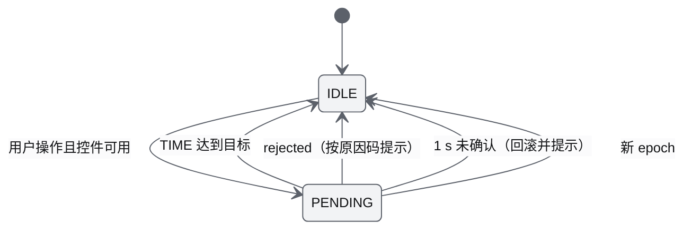
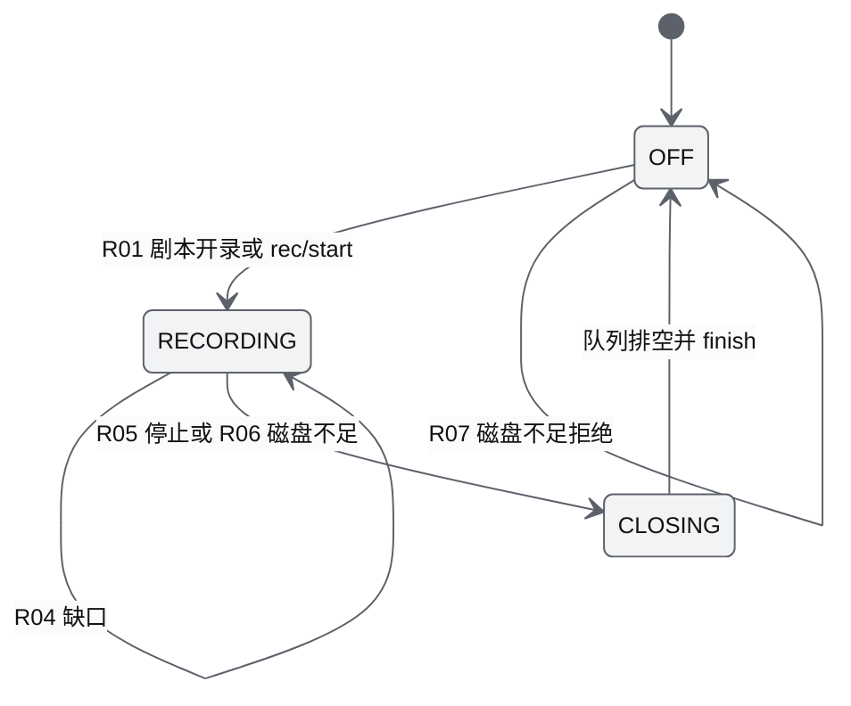
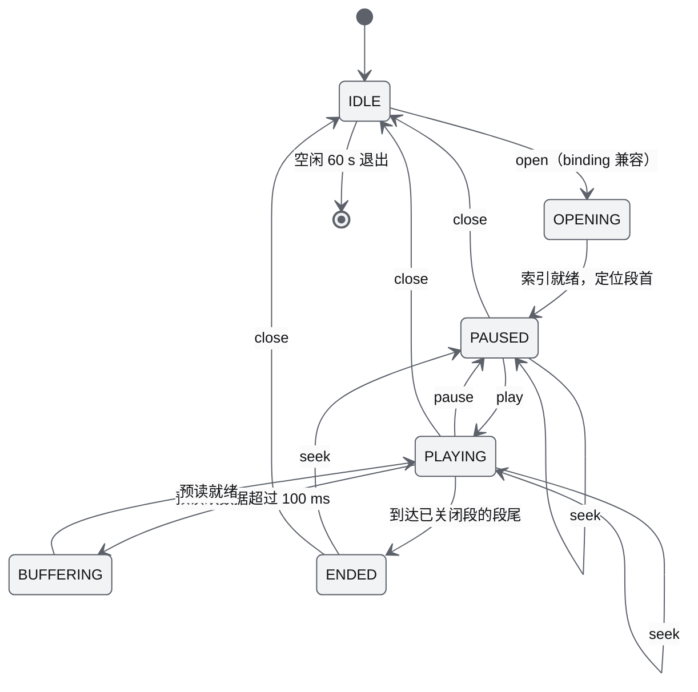
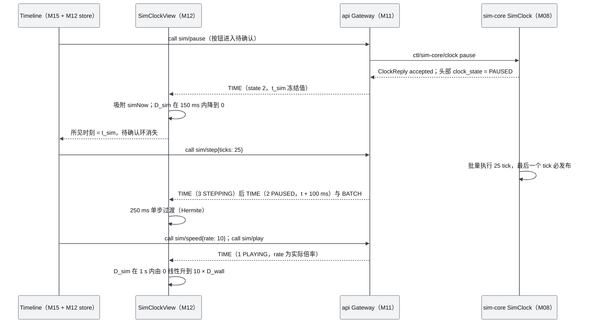
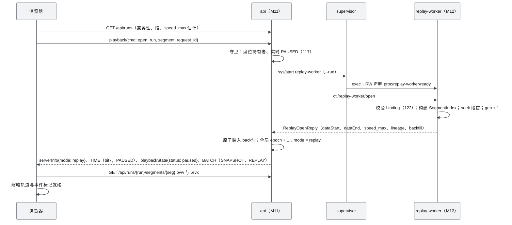
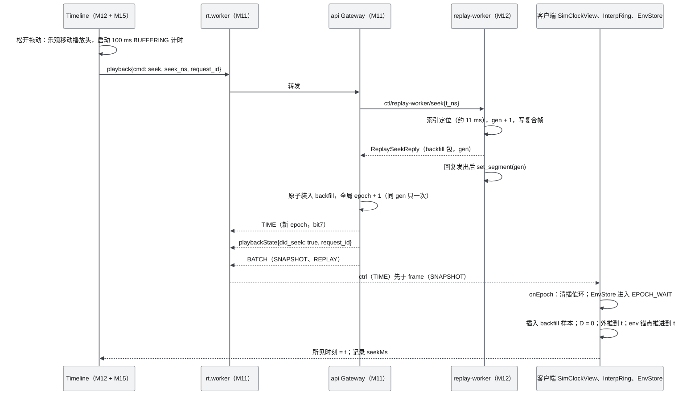
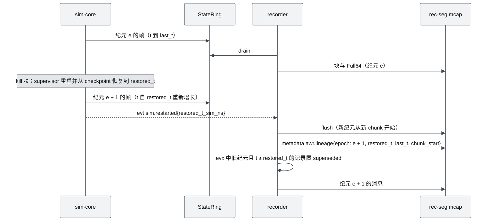

# M12 时间轴、录制与回放 PRD

| 项 | 内容 |
|---|---|
| 文档编号 | AWR-M12 |
| 标题 | 时间轴、录制与回放 PRD |
| 版本 | v1.0 |
| 日期 | 2026-09-28 |
| 状态 | 草案 |
| 上游文档 | [AWR-03 设计基线](../03-设计基线与决策记录.md)（§3.4、§3.6、§3.8、§5.2、§5.9、§6.3 M12 行、§8.2、§8.4 D1-AC-18/19/26/28/29；ADR-003、014、017、018、019、025、028–033、040、041、042、044、045、046、049、050）；[01-design](../01-design.md) §3、§10、§28、§36、§37、§39；研究 [00-index](../research/00-index.md) §3.11、§5.5 T7–T11、§7 第 18 条、C10；[r15](../research/r15-cesium-deckgl-foxglove.md)、[r27](../research/r27-realtime-bridges.md)、[g06](../research/g06-gap.md)、[r18](../research/r18-4dgs.md)、[x01](../research/x01-urbanscene3d-data.md)；辅助 [g05](../research/g05-gap.md)、[g08](../research/g08-gap.md)、[r14](../research/r14-r3f-drei.md)、[d01](../research/d01-lieflat-charts.md)、[d02](../research/d02-transitions-dev.md)、[d03](../research/d03-morphicons.md)；本模块实测 `.cache/research/m12/` |
| 下游文档 | [M06](M06-Web视口与渲染后端PRD.md)（tRender、插值采样的消费方）、[M07](M07-环境引擎PRD.md)（EnvStore 的 epoch 与锚点吸附、`env/state?t_ns`）、[M11](M11-实时网关PRD.md)（Source、TIME、playback op、回放环读取、兴趣集 `marks`、`sys/start`）、[M15](M15-前端UI壳与设计体系组件PRD.md)（Timeline 面板、回放横幅、Runs 覆盖页）、[M16](M16-演示数据剧本与流畅性测试PRD.md)（timeline.spec、回放 20× 与 soak seek）；[12](../12-业务逻辑设计说明书.md) §4.10–§4.11、[14](../14-UI交互设计PRD.md) §5.4 与 §6.17、[15](../15-视觉设计规范与色卡.md) §9.8、[16](../16-World数据规范.md) §13、[17](../17-接口与实时协议规范.md) §4.3.9、§6.10–§6.11、§9、[18](../18-性能与测试方案.md)、[19](../19-部署与运维说明书.md) §13.3 |
| 适用版本范围 | V0.1（D1）至 V1.0 |

## 0. 摘要

1. M12 拥有客户端时间语义（SimClockView、全局渲染时刻 tRender、插值环）、Timeline 的数据与控制、recorder 进程与 replay-worker 进程。时钟权威在 M08 SimClock，线格式在 17，M12 不重复定义（ADR-045、ADR-046、ADR-040）。
2. 客户端：SimClockView 只在 PLAYING 与 LIVE 推进 simNow；`tRender = simNow − D_global`，D 以仿真时间计；本文补充"冻结态 D 归零、恢复时 1 s 线性回升、倍率变化时 D 连续过渡"三条规则，使暂停、单步与 seek 后画面正好停在读数所示时刻（依据 ADR-046，本文设定）。
3. 插值环每机 32 样本，位置 Hermite（利用样本速度）、姿态 slerp，外推 ≤ 3/f 后 HOLD。实测：N = 1000 每帧采样 p95 0.142 ms；2 s 样本间隔下 Hermite 最大误差 79–167 mm，线性插值 1.5–3.7 m（`.cache/research/m12/interp_bench.out`、`interp_error.out`）。
4. Timeline 是一张 lieflat 图：日历地板刻度、按像素列聚合的事件标记（一处红）、选中机高度发丝面积、缩略轨道、书签、回滚重跑区间；拖动只预览，松开 seek（14 §6.17、15 §9.8）。
5. 录制：独立 recorder 进程以 LOSSY 方式排空 StateRing 并订阅总线，按 ADR-040 策略写 MCAP（16 §13），写入与 zstd 压缩在 writer 线程；另写派生索引 `.ovw`（1 s 概览）与 `.evx`（事件索引）。原型实测 N = 1000：写入开销 0.037 核，32.3 MB/min。
6. 回放：replay-worker 以"谱系裁剪的逐 channel MessageIndex 索引"做 seek，backfill 实测 p50 10.9 ms（mcap 库的逆序 `iter_messages` 为 838 ms，达不到 500 ms 门槛）；以录制块节拍把复合帧写入 `state.replay` 环，api 与浏览器走与实时完全相同的路径；流式回放 7.4 ms CPU/仿真秒，20× 约 0.15 核。
7. seek 精度：机体取不晚于 t 的最后样本并按速度外推（25 Hz 录制下误差 ≤ 6 mm），环境锚点按 M07 的 20 ms 确定性网格从关键帧推进到 t（误差 ≤ 1e-6 m）；回放帧的 Full64、事件、EnvKeyframe 与录制逐字节一致（G6a）。
8. D1：core（P0）= 时钟视图、插值环、Timeline 实时控制与实时轨道；ext（P1）= 录制、回放、runs REST、回放 Timeline 与书签（ADR-042）。UrbanScene3D 航线导入 V0.2，ULog V0.5，实时倒带、what-if 与多会话对比 V0.4。

---

## 1. 背景与目标

### 1.1 背景

1. **原设计 §39 只有草图**：`14:32:00 ─── 14:45:00`、播放三角、×1 ×2 ×5 ×10，以及 Pause、Play、Replay、Fast Forward、Seek 五个动词，没有时间模型、没有录制格式、也没有区分仿真时间与墙钟（00-index §7 第 18 条）。
2. **时间域混用会直接出错**：r27 原型的 SimClockView 在旧编号 `state === 0 或 3` 时冻结（AWR-03 附录 D E-15）；ADR-046 之前 D 以墙钟计却从仿真时间中减去，快进时持续外推进入 HOLD（ADR-046 背景）。
3. **1000 架录制的体量**：原生频率录制约 12 MB/s（43 GB/h），本机磁盘约 53 GB；按"每机一个 channel"每秒 12.5 万条消息，Python 写入器做不到（ADR-040 背景）。
4. **seek 的实测瓶颈**：本文用 mcap 1.5.0 对 N = 1000、10 min 的 awr 录制实测，按 16 §13.6 的"每 channel 逆序 `iter_messages(end_time=t+1, reverse=True)` 取第一条"做 backfill，39 个 channel 每次 seek 需 648–838 ms（p50），超过 D1-AC-18 的 500 ms；原因是该接口会把所有匹配 chunk 压入堆并对每个 channel 重复解压与逐条解析（`.cache/research/m12/bench_n1000_600s.out`；mcap `reader.py` SeekingReader.iter_messages）。
5. **回放必须复用实时路径**：否则前端要维护两套插值、环境与事件逻辑，回放与实时的画面不可比（ADR-040 "统一 Player"；r27 §3.11 Source 抽象）。
6. **环境积分相位**：阵风锋面位置、湍流盒平移、流线虚线相位都取决于积分量 S(t)、D(t)，seek 到任意 t 后必须得到与在线运行时相同的相位（g06 §3.4；M07 §6.3.10）。

### 1.2 目标

| 编号 | 目标 | 可度量的表述 | 首次达成 |
|---|---|---|---|
| G-M12-1 | 时间只有一个权威、画面只有一个时刻 | 客户端每帧只有一个 tRender（焦点例外 tFocus）；暂停 500 ms 后画面位置与服务端最终状态差 ≤ 1 cm；Timeline 读数与画面同一时刻 | V0.1 core |
| G-M12-2 | 流畅且不抖 | N = 1000 插值采样 p95 ≤ 0.3 ms（Tier S 主线程）；×10 实时 HOLD 占比 < 1%；关注集切换位置不连续 ≤ 0.5 m（D1-AC-26） | V0.1 core |
| G-M12-3 | 可录制 | N = 1000、×1 连续 10 min 缺口 0；recorder ≤ 0.1 核；写入 ≤ 60 MB/min（D1-AC-18） | V0.1 ext |
| G-M12-4 | 可精确回放 | seek 首个 backfill 帧 ≤ 500 ms（设计目标 p95 ≤ 200 ms）；Full64、事件、EnvKeyframe 逐字节一致；seek 后机体位置误差 ≤ 1 cm、环境锚点误差 ≤ 1e-6 m | V0.1 ext |
| G-M12-5 | Timeline 是一张可读的图 | 事件、书签、谱系、缺口在一条轨道上可见；Tier S 重绘 ≤ 4 Hz、每次 ≤ 1.5 ms；遵守一处红 | V0.1 core/ext |
| G-M12-6 | 真飞与仿真同构 | 导入的航线与飞行日志转为同一 channel 集，由同一 Player 回放 | V0.2（航线）、V0.5（ULog） |

### 1.3 对原设计的继承、修正与增强

附录 C 对 §39 的处置为"修订"（实时控制为 D1-core，Replay 与 Seek 为 D1-ext，时钟域见 ADR-045），本节逐项展开。

| 原设计 | 原文要点 | 处置 | 本文落点 | 依据 |
|---|---|---|---|---|
| §39 Timeline 布局 | 底部时间条，起止墙钟时刻，播放按钮，×1/×2/×5/×10 | **继承**底部时间条与倍速档；**修正**时刻标签为仿真时间 `SIM T+hh:mm:ss.s`，墙钟放进 HoverCard；播放三角字形改为 `StateIcon`（`tl.play` 与 `tl.pause` morph）；倍速扩为 ×0.25–×10（实时）与 0.1–20×（回放） | §6.2、§8 | ADR-045；15 §9.8；d03 §7 第 7 条 |
| §39 Pause、Play | 暂停与播放 | **继承**；**增强**：待确认环（TIME.state 到达前按钮描边，1 s 未确认回滚）；冻结态 D 归零，暂停后画面即服务端最终状态 | §6.3、§6.5 | 14 §6.17；ADR-046 |
| §39 Fast Forward | 快进 | **修正**为倍速：实时受 RTF 与 `caps.clock.max_speed` 约束，受限时显示实际倍率；回放受 `speed_max` 约束 | §6.5、§6.7.7 | M08 §6.8；ADR-040 |
| §39 Replay | 重放 | **修正**为"录制回放"：MCAP 录制、replay-worker、全局回放模式、只读；**增强**：谱系、分段、逐字节一致 | §6.6、§6.7 | ADR-040、ADR-049 G6a |
| §39 Seek | 任意时刻跳转 | **修正**：D1 只在回放中 seek；实时倒带与 what-if 分叉在 V0.4；**增强**：epoch + backfill、BUFFERING 反馈、机体外推与环境锚点相位 | §6.7.6、§6.8 | ADR-040；r27 §3.11；g06 §3.4 |
| §10 "回放真实飞行" | 浏览器中回放真实飞行 | **推迟并增强**：导入器把 UrbanScene3D 航线（V0.2）与 PX4 ULog（V0.5）转为同一 channel 集，同一 Player 回放 | §6.11 | 附录 C §10；x01 §3.9；r15 §4 第 26 行 |
| §3 浏览器中的 Timeline | Timeline 是浏览器五大 UI 之一 | **继承**；**增强**为一张 lieflat 图（日历地板、事件标记、发丝面积、缩略轨道、书签） | §8.3 | ADR-031；d01 §7 第 4 条 |
| §36 WS 传 Simulation Time | 仿真时间经 WebSocket 推送 | **继承**并定形：TIME 24 B、10 Hz 与变化即发、epoch、先 TIME 后 SNAPSHOT（线格式属 17） | §6.2、§7.2 | ADR-014；17 §6.4、§6.10 |
| §37 WS 10–50 Hz 与 Web 60 FPS | 状态推送与渲染频率不同 | **修正**：衔接靠插值而不是提高推送频率；Tier S 目标 30 fps（ADR-044 取代 §37 的 60 FPS） | §6.4 | ADR-044、ADR-046；r15 §7 第 7 条 |
| §28 DroneState 10–50 Hz | 统一状态经 WS 推送 | **继承**：插值环同时吸收 Lite32（整群）与 Full64（关注集、选中机），同一时刻以 Full64 优先 | §6.4 | ADR-015；r14 §3.6 |
| §41 World 文件结构 | 无"会话/录制"概念 | **增强**：录制不进 World Package，落在 `runs/<run>/`，但绑定 world id、`contentVersion`、`coordinate.sha256`、`layout_id` | §6.6 | P-01；ADR-040；r18 §7 第 3 条 |

### 1.4 设计原则落点

| 原则 | 在本模块的落点 |
|---|---|
| P-04 服务端权威 | 客户端不推进权威时钟；simNow 只是 TIME 的外推视图，上限 `rate × 1 s`；seek 由 replay-worker 执行，客户端只做乐观播放头 |
| P-09 仿真永不阻塞 | recorder 是 LOSSY 读者，写入队列有界，超限丢弃并记 `recorder.gap`，绝不反压 sim-core（g05 §6） |
| P-10 确定性与可回放 | 录制选择规则只取决于帧时刻（桶规则），同一输入得到同一消息序列；回放按谱系取最新有效纪元 |
| P-06 契约先行 | MCAP channel 与 `meta.json` 在 MS1 冻结（16 §13）；本文新增的派生索引、回放内部消息、REST 端点已由 16 §13.7、17 v1.1 登记，余项见 §14 |
| P-11 相对量可测 | 本机验收只用帧节奏、配对比值与行为指标；recorder 与 replay 的 CPU 在 load < 6 时判定（ADR-033） |
| P-12 设计体系强约束 | Timeline 只用 shadcn 组件与 lieflat 图语法；图标全部来自注册表；动效只引用 transitions.dev 与项目扩展 token |

---

## 2. 范围

### 2.1 D1 范围（与 AWR-03 §6.3 M12 行一致）

| 层 | 内容 |
|---|---|
| **D1-core（P0）** | ①TIME 与 epoch 的客户端语义（屏蔽 bit7、只在 PLAYING 与 LIVE 推进、LIVE 锁定 ×1、RESET 只清对应生产者）；②SimClockView 与 DelayController（D_global、D_focus、冻结规则、倍率过渡）；③InterpRing（Hermite + slerp、外推 3/f、HOLD）与 `sampleSwarm`、`sampleOne` 接口；④Timeline 实时控制（play、pause、step、speed、待确认、RTF 受限显示）；⑤实时轨道（日历地板、事件标记、选中机高度发丝面积、播放头）；⑥`stores/timeline.ts`；⑦`window.__perf.time`；⑧TIME 与 epoch 的 `.awrrt` 夹具与 vitest |
| **D1-ext（P1）** | ①recorder（策略、MCAP、writer 线程、分段、谱系、`.ovw` 与 `.evx`、meta、磁盘守卫、标记机集合）；②replay-worker（SegmentIndex、复合帧、seek 与 backfill 包、倍速、步进、查询、空闲退出）；③`rest/runs.py`；④回放 Timeline（缩略轨道、缩放平移、seek、书签、谱系与缺口区间）；⑤单步过渡；⑥修复与重建索引工具；⑦合成录制生成器 `synth.py`（测试夹具） |
| **桩** | 导入器接口 `awr/recorder/importers/base.py`（签名与测试替身，真实导入器在 V0.2、V0.5） |
| **不在 D1** | 实时倒带与 what-if 分叉（V0.4）；多会话对比（V0.4）；UrbanScene3D 航线导入（V0.2）；ULog 导入（V0.5）；拖动实时预览（V0.2）；循环与 playUntil（V0.2）；Foxglove/Lichtblick 导出（V0.2）；视频同步（V0.5） |

### 2.2 后续版本

| 版本 | 内容 | 退出判据（本模块部分） | 依据 |
|---|---|---|---|
| V0.2 | UrbanScene3D 航线导入器（输出 MCAP 与 `awr.traj.v1`）；拖动实时预览（节流 seek）；循环与 playUntil；Foxglove schema 导出；回放事件详情分页 | Zhang School_fine 导入后单机回放 1 次通过；导入到深圳后不安全视点被标记 | x01 §3.9；r15 §3.14 |
| V0.4 | 实时倒带（checkpoint + 输入日志确定性快进）；what-if 分叉（新 run 记录父 run 与分叉时刻）；多会话对比（幽灵轨迹、对齐方式、分歧时刻）；带时间戳点的时间窗渲染 | 分叉结果可复现；同一剧本两次运行的分歧时刻计算正确 | ADR-040、ADR-049；r27 §3.11 第 4 条；r18 §3.2 |
| V0.5 | ULog 导入器（真实会话时间基、`uavNN/local` 帧）；视频与传感器同步回放 | 合肥园区真机日志以同一 Player 回放 | AWR-03 §5.2 第 8 条；r15 §4 第 26 行 |
| V0.6 | 录制按尺寸滚动分片（>4 GB）；Timeline 多机泳道 | 1 h、200 架录制可 seek | 本文设定 |
| V0.8 | Dynamic Objects 与 Tracks 进入时间轴（逐帧点云回放预取） | — | ADR-047；r15 §3.11 |
| V1.0 | ANet 证据链作为 Timeline 事件源；真 ANet 墙钟下锁定 ×1 | — | 00-index §7 第 14 条；ADR-036 |

### 2.3 与其他模块的边界

| 模块 | 对方负责 | M12 负责 |
|---|---|---|
| M08 | SimClock（tick、rate、state、step、speed、reset、LIVE、RTF 受限）；StateRing 头部时钟字段；`sim.clock`、`sim.started`、`sim.restarted` 事件 | 消费这些信号；定义客户端语义与 Timeline 行为；把 `segment`、生产者纪元变化转成录制分段与谱系 |
| M11 | `awr.rt.v1` 服务端与 `net/rt` 参考客户端；ClockSync（ping/pong）；Gateway 全局 epoch；`Source` 接口与读取 `state.replay` 的回放源适配；`playback` op 转发；supervisor 按需启动进程 | SimClockView、插值环；McapSource（replay-worker 内）；回放内部消息契约（§7.4）；`rest/runs.py` |
| M06 | 帧循环 `loop.register`、无人机图层、轨迹图层（历史环 256 样本）、HOLD 呈现 | 提供 tRender、tFocus、插值采样、epoch 与 RESET 回调 |
| M07 | EnvStore、锚点 20 ms 网格推进与吸附、`GET /api/env/state?t_ns=` | 回放 backfill 提供不晚于 t 的 EnvKeyframe；`env_at` 查询；验证 seek 相位 |
| M15 | Timeline 面板 JSX、`LfTimelineTrack` 画布组件、回放横幅、Runs 覆盖页、快捷键注册表 | 轨道模型与数据、`stores/timeline.ts`、交互规格（§8）；M15 按本文实现画布绘制 |
| M16 | e2e 与性能 harness 调度、剧本 `record` 与机体 `marked` 的取值 | 用例内容（§10）、合成录制生成器 |
| M00 | `packages/contracts/rec/*` 的合入与代码生成 | 起草 `mcap_channels.json` 以外的新增契约（sidecar、bookmarks、markers 映射） |

### 2.4 本模块新增术语（其余见 AWR-03 §11）

| 术语 | 定义 |
|---|---|
| 所见时刻 | 画面所示的仿真时刻，即 tRender；Timeline 播放头与读数都显示它 |
| 冻结规则 | 时钟不推进时（STOPPED、PAUSED、STEPPING、BUFFERING、ENDED 以及健康覆盖态）把 D 衰减到 0，使所见时刻等于 simNow |
| 单步过渡 | 单步完成后在 `--duration-fast` 内把所见时刻从旧值推进到新值，画面沿 Hermite 曲线移动而不是跳变 |
| 复合帧 | replay-worker 写入 `state.replay` 的一个槽：同一录制时刻的整群 Lite32 块与标记机 Full64 行 |
| 回放生成号（gen） | replay-worker 每次 open 或 seek 加 1，随回复交给 Gateway（Gateway 据此把全局 epoch 加 1，同一 gen 只一次），回复发出后写入回放环头部 `segment` |
| SegmentIndex | 回放打开时由 MCAP 的 MessageIndex 记录构建的逐 channel 有序时间索引（时刻、chunk 序号、chunk 内偏移） |
| 谱系裁剪 | 每个生产者纪元只保留其有效窗口内的消息，使逐 channel 索引在仿真时间上单调 |
| 回滚重跑区间 | 崩溃回滚后被新纪元覆盖的仿真时间区间 `[restored_t, last_t]`；可 seek，取新纪元数据 |
| 概览索引 `.ovw` | 录制段的 1 s 仿真时间概览（机群计数、事件计数、标记机位置），供缩略轨道与多会话对比使用 |
| 事件索引 `.evx` | 录制段的定长事件索引（16 B/条），供事件标记与分页 |
| 标记机 | 以 125 Hz 录制 Full64 的机体，≤ 16 架；N ≤ 50 时全部机体（ADR-040） |
| speed_max | 某录制段允许的最大回放倍速 |

---

## 3. 用户与用例

### 3.1 用户角色

| 角色 | 与本模块的关系 |
|---|---|
| 操作员（operator 席位持有者） | 控制实时时钟（播放、暂停、单步、倍速）；开关录制、标记机体；进入与退出回放；添加共享书签 |
| 科研人员 | 回放、seek、逐帧检查事件与环境；对比两次运行（V0.4）；导入真实航线与日志（V0.2、V0.5） |
| 观众（viewer） | 看 Timeline 与回放（回放为全局模式，所有客户端同看）；添加本地书签；不能控制时钟 |
| 算法开发者 | 批处理录制、离线读取 MCAP、用 `synth.py` 造回放夹具 |
| 管理员 | 删除运行、处理配额与损坏段 |
| CI | 回放逐字节一致、seek 延迟、20× 回放负载等门禁 |

### 3.2 用例

| 编号 | 用例 | 主流程 | 相关需求 |
|---|---|---|---|
| UC-01 | 实时暂停与单步 | S1 播放 → Space 暂停（画面在 500 ms 内停在服务端最终状态）→ → 键单步 100 ms（画面沿曲线过渡）→ Shift+. 单步 1 tick | FR-001–004、013、014、016 |
| UC-02 | ×10 观看剧本 | 倍速切 ×10 → D 在 1 s 内连续放大 → HOLD < 1% → RTF 受限时显示实际倍率 | FR-003、015；NFR-005 |
| UC-03 | Follow 与 FPV | 选中机按 3 或 4 → 焦点机用 tFocus，300 ms 过渡，"焦点低延迟"标注 | FR-005 |
| UC-04 | 读 Timeline | 看事件标记（形状编码、一处红）、选中机高度发丝面积；悬停看事件；点击标记选中相关机体 | FR-017–019 |
| UC-05 | 录制剧本 | S1 开始即录制 → 剧本重置开新段 → 崩溃恢复写谱系 → 结束写 summary 与 meta | FR-030–040 |
| UC-06 | 打开回放 | 录制列表 → 选兼容的运行 → 确认进入回放 → 暂停在段首，缩略轨道显示整段事件 | FR-028、041、042、052 |
| UC-07 | seek 与步进 | 点击或拖动松开 → ≤ 500 ms 画面到位（机体与环境相位一致）→ ← → 键步进 1 s，Shift+. 步进一个录制采样 | FR-025、045、047、048 |
| UC-08 | 20× 回放 | 倍速选 20×（超过 speed_max 的档置灰）→ api ≤ 0.35 核，HOLD < 1% | FR-046；NFR-013 |
| UC-09 | 书签 | 按 M 在所见时刻加书签 → 编辑标签 → PageUp/PageDown 跳转 | FR-026 |
| UC-10 | 回放中途的录制段 | 实时暂停后回放当前运行的进行中段（读到最后一个已刷写的 chunk） | FR-041、042 |
| UC-11 | 录制损坏修复 | 主机断电后启动 → 修复工具线性扫描补写 summary → 段标记 CLOSED 或 CORRUPT | FR-040 |
| UC-12 | 导入 UrbanScene3D 航线（V0.2） | `python -m awr.recorder.importers.us3d_path` → 生成录制 → 同一 Player 回放 | FR-053 |
| UC-13 | what-if 分叉与对比（V0.4） | 在某时刻分叉改风速 → 两条时间线 → 幽灵轨迹对比、分歧时刻 | FR-055、056 |
| UC-14 | 真机日志回放（V0.5） | ULog → MCAP → 回放并与视频同步 | FR-054、059 |

---

## 4. 功能需求

"D1"列取值按 AWR-03 §10.2 第 4 条：D1 = 是的条目目标版本为 V0.1，P0 为 D1-core，P1 为 D1-ext。

### 4.1 时间语义与时钟视图（D1-core）

| 编号 | 需求描述 | 优先级 | 目标版本 | D1 | 验收要点 | 依据 |
|---|---|---|---|---|---|---|
| M12-FR-001 | TIME 解码：`state4 = state & 0x0F`，`replay = state & 0x80`；epoch 只做相等比较（u16 回绕）；`t_sim_ns`、`t_srv_ns` 用 `lo + hi·2³²` 精确转为 Number（≤ 2⁵³）；未知 state 值按 STALLED 处理并记 `__perf.time.unknownState` | P0 | V0.1 | 是 | M12-AC-001：TIME golden 全部 10 个 state 值与 bit7 组合解码一致 | AWR-03 §5.2 第 6 条；17 §6.4 |
| M12-FR-002 | simNow 推算：PLAYING、LIVE 时 `raw = t_sim + rate·(srvNow − t_srv)`，`srvNow = performance.now() + clockOffsetMainMs`（M11 ClockSync 写入 TelemetryFrame 槽头，已换算主线程时基），上限 `t_sim + rate·1 s`；其余状态 `raw = t_sim`。纪律：epoch 或 state 变化、冻结态、或 \|raw − 预测\| > 0.25 s·max(rate, 1) 时直接吸附；否则以 τ = 250 ms 指数收敛，推进中单调不减；TIME 超过 1 s（墙钟）未到置 STALE | P0 | V0.1 | 是 | M12-AC-002：注入 ±30 ms 网络抖动与 100 ms 丢帧，simNow 单调、与服务端真值差 p95 ≤ 5 ms·rate | 17 §6.10；r27 §3.10；本文设定（τ、阈值） |
| M12-FR-003 | D_global：墙钟分量 `D_wall = clamp(2/hz_eff + jitter_p95, 60 ms, 300 ms)`，hz_eff 为 swarm 通道 1 s 窗口内的新样本频率，jitter_p95 为最近 32 次到达间隔相对 `1/hz_eff` 偏差绝对值的 p95；D_wall 以 1 s 时间常数平滑、变化率 ≤ 10%/s、5% 迟滞；`D_sim = rate_actual × D_wall` | P0 | V0.1 | 是 | M12-AC-003：注入 10→20 Hz、抖动 0→40 ms 的阶跃，D_wall 满足平滑与变化率约束 | ADR-046；17 §6.10 |
| M12-FR-004 | 冻结规则与倍率过渡：时钟不推进时 D_sim 从进入冻结时的值在 `--duration-quick`（150 ms，墙钟）内按 `--ease-smooth-out` 降到 0（有限时长，结束时精确为 0；reduced 档直接置 0）；恢复推进时 D_sim 在 1.0 s（墙钟）内线性回升到目标；倍率变化时 D_sim 在 1.0 s 内从旧值线性过渡到 `rate_new × D_wall`，期间所见时刻连续、单调；新 epoch 从 D = 0 开始并按恢复规则回升；D_focus 适用同样三条规则；冻结态不更新 hz_eff 与 jitter_p95（暂停期间没有新样本不代表链路变慢） | P0 | V0.1 | 是 | M12-AC-004：暂停后 500 ms 所见时刻 = TIME.t_sim ±1 ms；×1→×10 与 ×10→×1 切换时 tRender 无回退 | ADR-046 的补充（本文设定，§14 F-02） |
| M12-FR-005 | 焦点例外：Follow 与 FPV 模式下焦点机与相机使用 `tFocus = simNow − rate·D_focus_wall`，`D_focus_wall = clamp(2/hz_focus + jitter_focus, 60 ms, 300 ms)`；hz_focus 与 jitter_focus 取 rt.worker 对 60 Hz 通道的到达统计（槽头 `selHz`、`selJitterMs`，M11 §6.3.8），两者未知时退回主线程按摄入时刻测量（FX2-R3，ADR-067：主线程每帧只摄入每个 channel 的最新样本，按摄入时刻测得的是帧率而不是通道频率，10 fps 时 D_focus 被钳在 300 ms）；进入与退出在 300 ms 内平滑过渡；`focusLowLatency` 标志供 UI 标注"焦点低延迟" | P0 | V0.1 | 是 | M12-AC-005：焦点机 t_sim 到像素 p95 ≤ 150 ms（Tier S） | ADR-046；D1-AC-26 |
| M12-FR-006 | epoch 与 RESET：收到新 epoch 的 TIME 后同步触发 `onEpoch` 回调（插值环全部清空、轨迹清空由 M06 执行、事件视图吸附、EnvStore 进入 EPOCH_WAIT）；记录头 `rflags.RESET` 触发 `onReset(producerRange)`，只清对应 `agent_no` 区段；TIME 之前到达的新 epoch BATCH 由 M11 worker 暂存一帧 | P0 | V0.1 | 是 | M12-AC-006：`.awrrt` 夹具中 seek、剧本重置、checkpoint 恢复三种情形的清空范围正确 | AWR-03 §5.2 第 4 条；17 §6.10 |
| M12-FR-007 | 帧相位与度量：在 `loop.register('clock', 'm12.clock')` 中每帧写 FrameCtx 的 `tRenderS`、`tFocusS`、`simRate`、`clockState`（秒，相对会话起点）；就地更新预分配的 `window.__perf.time`（§10.3） | P0 | V0.1 | 是 | M12-AC-007：`loop.render-calls.spec` 不受影响；热路径分配为 0 | AWR-03 §3.6；M06 §6.8 |
| M12-FR-008 | 时间显示：主读数 `SIM T+hh:mm:ss.s`（tabular-nums，显示所见时刻，Tier S ≤ 4 Hz、其余 ≤ 10 Hz）；HoverCard 显示 simNow、D_global、请求与实际倍率、全局 epoch、墙钟（由 `pong.unix_ns` 与单调时钟换算）；任何时间文本都带 `SIM` 或"墙钟"前缀 | P0 | V0.1 | 是 | M12-AC-008：Playwright 读 DOM 前缀与格式 | 14 §6.17；r15 §7 第 9 条；d01 §7 第 9 条 |

### 4.2 插值环（D1-core）

| 编号 | 需求描述 | 优先级 | 目标版本 | D1 | 验收要点 | 依据 |
|---|---|---|---|---|---|---|
| M12-FR-009 | InterpRing：每机 K = 32 样本的 SoA 环（t f64 ms、p f32×3、v f32×3、q f32×4、ω f32×3、src u8），容量按 roster 以 256 为步长增长（D1 上限 1024，增长只在 roster 变化时发生，不在热路径）；样本时刻 = 帧 `t_sim_ns` + 记录 `dt_us`（Full64 再加行 `dt_us`）；同一时刻 Full64 覆盖 Lite32；早于最新样本的乱序样本按时刻插入，早于最旧样本的丢弃 | P0 | V0.1 | 是 | M12-AC-009：Lite32 与 Full64 混合注入 10 万样本，环内时刻严格递增、去重正确 | r14 §3.6；10 §6.5；17 §6.4 规则 4 |
| M12-FR-010 | 插值：`a.t ≤ t < b.t` 时位置用三次 Hermite（端点位置与样本速度，`m = v·h`），速度线性插值，姿态 slerp（点积 < 0 取反；点积 > 0.9995 用 nlerp）并归一化 | P0 | V0.1 | 是 | M12-AC-010：与 `interp_error.py` 同一轨迹，h = 0.1 s 时最大误差 ≤ 1 mm | ADR-046；r15 §3.9；本文实测 |
| M12-FR-011 | 外推与 HOLD：`t > t_newest` 时按速度外推，姿态有 ω（Full64）时按机体角速度积分，否则保持；外推上限 `E_max = rate × 3/hz_eff`（仿真时间），超过后冻结在 E_max 处并置 `hold[i] = 1`；冻结态 E_max 保持进入冻结前的值，新 epoch 且冻结（seek 后）时取 max(该值, 当前录制块间隔)，保证 seek 落点可外推；`t < t_oldest` 时钳到最旧样本并置 `clamped` 标志 | P0 | V0.1 | 是 | M12-AC-011：断流 1 s 后 3/f 内平滑外推、之后静止，`hold` 置位 | ADR-046；r15 §3.9 |
| M12-FR-012 | 采样接口：`sampleSwarm(tS, out: DronePoseSoA)` 与 `sampleOne(agentNo, tS, out: DronePose)`，输出位置、四元数、速度、`state`、`flags`、`battery`、`hold`、`sampleT`、`ageS`；零分配 | P0 | V0.1 | 是 | M12-AC-012：`tests/m06/drones-path.test.ts` 用 FakeSource 200 架逐帧比对 ≤ 1e-4 m | M06 §7.4；ADR-046 |
| M12-FR-013 | 单步过渡：STEPPING → PAUSED 且步长 ≤ 1 s 时，所见时刻在 `--duration-fast`（250 ms）内按 `--ease-smooth-out` 从旧 t 推进到新 t，插值在单步前后两个样本之间进行；motion tier 为 reduced 时直接跳变 | P1 | V0.1 | 是 | M12-AC-013：单步期间机体轨迹连续，250 ms 后与服务端状态一致 | ADR-029；本文设定 |

### 4.3 Timeline 实时控制与实时轨道（D1-core）

| 编号 | 需求描述 | 优先级 | 目标版本 | D1 | 验收要点 | 依据 |
|---|---|---|---|---|---|---|
| M12-FR-014 | 传输控制：播放、暂停经 `sim/play`、`sim/pause`，单步经 `sim/step{ticks}`，倍速经 `sim/speed{rate}`；守卫：席位持有者、`caps.clock.pausable/steppable/max_speed`、非 LIVE、非回放；点击后按钮显示待确认描边环，直到 TIME.state（或 rate）变为目标值；1 s（墙钟）未确认则恢复原状并 Toast "未收到服务器确认"；失败按原因码 116、117、118 给出文案 | P0 | V0.1 | 是 | M12-AC-014：`timeline.spec.ts` 实时部分；viewer 下控件置灰 | 14 §6.17；17 §7.1；12 §4.1.2 S05–S09 |
| M12-FR-015 | 倍速集合：实时 {0.25, 0.5, 1, 2, 5, 10}，超过 `caps.clock.max_speed` 的档置灰；请求倍率取自 `sim.clock` 事件与 `GET /api/sessions/current`，实际倍率取自 TIME.rate；实际 < 0.95 × 请求持续 2 s 时显示 Badge "受 RTF 限制 ×3.4"，恢复 2 s 后消失 | P0 | V0.1 | 是 | M12-AC-015：N = 1000、×10 时出现 RTF 徽标且读数等于 TIME.rate | M08-FR-002；ADR-045；14 §6.17 |
| M12-FR-016 | 单步粒度：→ 25 tick（100 ms），Shift+→ 250 tick（1 s），Shift+. 1 tick（4 ms）；只在 PAUSED 且 `steppable` 时可用；STEPPING 期间单步按钮显示 Spinner | P0 | V0.1 | 是 | M12-AC-016：三种步长后 TIME.t_sim 增量正确 | 14 §6.10；17 §7.1 `sim/step` |
| M12-FR-017 | 实时轨道：范围为运行起点到 simNow；日历地板刻度（1 s，缩放后 10 s），缺数据时段仍画刻度；按像素列聚合事件标记（每列只画最高严重度，形状编码见 §8.3）；背景叠选中机高度发丝面积（4 Hz 取样，M4 降采样）；播放头 = 所见时刻，固定在右端；过去区域不可 seek（Tooltip 说明实时倒带在 V0.4） | P0 | V0.1 | 是 | M12-AC-017：1 h 运行、5 万事件时轨道重绘 ≤ 1.5 ms（1920 px） | 15 §9.8；14 §6.17；d01 §7 第 4 条 |
| M12-FR-018 | 事件标记数据源：实时 `event` 通道批量写入（≤ 4 Hz）；迟到或重连客户端先用 `GET /api/events?since=` 补拉 EventRing，录制开启时再用当前段 `.evx` 补齐更早的标记；标记数组上限 50 万条，超出后先丢 INFO 级 | P0 | V0.1 | 是 | M12-AC-018：页面刷新后 5 s 内轨道恢复全部 ≥ WARNING 标记 | 17 §6.12；本文设定 |
| M12-FR-019 | 一处红：轨道是一张图（15 §3.7.1），只有 RedArbiter 仲裁胜出的未确认 critical（rank 最高者中最新的一个，1.5 s 驻留，15 §3.7.2）画 HERO 实心点，其余 critical 为红色描边八边形，warning 为红色描边三角；选中事件时该标记改为 `bg-muted` 竖条，不另加红 | P0 | V0.1 | 是 | M12-AC-019：3 条 critical 同屏时红色实心元素恰为 1 个（像素统计） | ADR-032；15 §9.8 |
| M12-FR-020 | `stores/timeline.ts`：zustand vanilla store，字段与动作见 §7.1；UI 写入频率 Tier S ≤ 4 Hz、其余 ≤ 10 Hz；高频量（tRender、D）不进 store，只经 `engine/time` 门面读取 | P0 | V0.1 | 是 | M12-AC-020：flight60 `scene=full` 下 store 写入 ≤ 4 次/s | AWR-03 §4.3；10 §6.4 |
| M12-FR-021 | 快捷键（实时）：Space、`[`、`]`、→、Shift+→、Shift+. 按 14 §6.10 注册到 `ui/hotkeys/registry.ts`，`when` 守卫读取 store 的角色、状态与 caps | P0 | V0.1 | 是 | D1-AC-21 `a11y.spec.ts` 覆盖 | 14 §6.10 |
| M12-FR-022 | 状态映射：TIME.state 到按钮、单步、倍速、轨道、徽标的映射按 14 §6.17 表实现（本文不复制）；`caps.clock` 限制一律来自服务端，不硬编码 | P0 | V0.1 | 是 | M12-AC-022：用 `.awrrt` 夹具驱动 10 个 state，DOM 与 14 表一致 | 14 §6.17；ADR-045 |

### 4.4 Timeline 扩展（D1-ext）

| 编号 | 需求描述 | 优先级 | 目标版本 | D1 | 验收要点 | 依据 |
|---|---|---|---|---|---|---|
| M12-FR-023 | 缩略轨道：10 px 高，覆盖整段（回放）或整个运行（实时）；事件密度条码（按像素列计数，3 级灰度）、详细视图窗口框、播放头短线；拖动窗口框平移，双击适配全段 | P1 | V0.1 | 是 | M12-AC-023：10 min 录制打开后 1 s 内缩略轨道完整 | r15 §3.14；d01 L3 条码地板 |
| M12-FR-024 | 缩放与平移：Ctrl+滚轮或双指捏合以指针为中心缩放，最小跨度 2 s，最大为全段；刻度按 r15 §3.14 尺度表选主、次、微刻度，只画 ≥ 3 px 的层级，标签间距 ≥ 64 px | P1 | V0.1 | 是 | M12-AC-024：任意缩放下刻度不重叠 | r15 §3.14 |
| M12-FR-025 | 回放 seek 交互：点击轨道立即 seek；拖动播放头只更新预览标签（1:1，无过渡），松开才 seek；播放头乐观移动到目标；100 ms（墙钟）内无 `playbackState{did_seek}` 时在播放头处显示 Spinner 并置 BUFFERING；键盘 ←/→、Shift+←/→、Shift+,/. 见 14 §6.10 | P1 | V0.1 | 是 | D1-AC-18：seek 后首个 backfill 帧 ≤ 500 ms | 14 §5.4、§6.17；r15 §3.7 |
| M12-FR-026 | 书签：M 键或轨道右键菜单在所见时刻添加；`Popover` 编辑标签（≤ 64 字符，经 `lib/sanitize.ts`）；回放中 PageUp/PageDown 跳到上一个或下一个标记（书签或 ≥ WARNING 事件，14 §6.10）；operator 与 admin 写共享书签（`runs/<run>/bookmarks.json`），viewer 写本地书签（localStorage，按 run 分键）；每运行 ≤ 1000 条 | P1 | V0.1 | 是 | M12-AC-026：书签在实时添加、回放可见并可跳转 | 本文设定；15 §7.6 `tl.bookmark` |
| M12-FR-027 | 区间呈现：回滚重跑区间 `[restored_t, last_t]` 画斜纹地板（可 seek，Tooltip "崩溃回滚后重跑的区间，显示恢复后的数据"）；抽取区间（倍速 > 2 录制）画点状地板并注明"采样 0.2 s"；录制缺口画虚线地板 | P1 | V0.1 | 是 | M12-AC-027：混沌用例生成的录制中三种区间位置正确 | ADR-040；12 §4.11 P05；本文设定 |
| M12-FR-028 | 回放进入与退出：store 动作 `openReplay(run, seg, tS?)`、`closeReplay()`；路由 `/world/:id/replay/:run` 支持 `seg` 与 `t` 查询参数；进入前确认、只读横幅与 Runs 覆盖页由 M15 按 14 §5.4 实现，本模块提供数据（兼容性、段、speed_max） | P1 | V0.1 | 是 | M12-AC-028：深链 `?seg=0&t=420` 打开后停在 420 s | 14 §2.2、§5.4 |
| M12-FR-029 | 拖动实时预览：回放中拖动播放头时以 ≤ 4 Hz 节流发 seek，松开后发最终 seek | P2 | V0.2 | 否 | V0.2：拖动 5 s 内 seek 请求 ≤ 20 次 | 本文设定 |

### 4.5 录制（D1-ext）

| 编号 | 需求描述 | 优先级 | 目标版本 | D1 | 验收要点 | 依据 |
|---|---|---|---|---|---|---|
| M12-FR-030 | recorder 进程 `python -m awr.recorder`：由 supervisor 常驻启动（layer ext），主循环写 `hb.recorder` 心跳；状态机 OFF、RECORDING、CLOSING 按 12 §4.10 R01–R05（§6.6.1）；开启条件为剧本顶层 `record`（16 §12.2，默认 true，ladder 剧本必须为 false）或 `rec/start`，关闭为 `rec/stop` 或 Session CLOSING | P1 | V0.1 | 是 | M12-AC-030：S1 自动开录、ladder 不录、`rec/start` 手动开录 | ADR-040；12 §4.10；19 §6.2 |
| M12-FR-031 | 数据接入：以 LOSSY 游标 `drain()` 排空 `state.sim-core`（每 20 ms 墙钟一次，K = 32 覆盖 256 ms）；订阅全部生产者的 `evt/*/*`（排除 `evt/replay/*`）、`state/sim-core/{ext,safety,sensor,mission,env}` 与 `state/agent-runtime/{agents,tasks}`（§6.6.3）；段首与 `roster.changed` 时查询 `ctl/sim-core/roster`；drain 发现 overrun 时发 `recorder.gap{overrun, t_from_ns, t_to_ns}` 并写入 meta | P1 | V0.1 | 是 | M12-AC-031：N = 1000、×1、10 min 缺口 0 | ADR-018；g05 §6；17 §9.3 |
| M12-FR-032 | 录制策略：整群 Lite32 块按桶 `Δb = max(40 ms, rate × 20 ms)` 取桶内首帧（×1 为 25 Hz，倍速 > 2 时墙钟 ≤ 50 Hz）；标记机 Full64 按桶 `Δf = max(8 ms, rate × 8 ms)`；标记机传感器位姿 10 Hz；`state_ext` 2 Hz、`safety` 5 Hz，均为"每 5 s 仿真时间一个关键块 + 增量块"；EnvKeyframe 全部变化帧与 1 Hz 心跳；事件全量；时钟变化；roster 段首与变化时；任务状态变化时；抽取生效时写 `segments[].decimation` | P1 | V0.1 | 是 | M12-AC-032：同一帧序列两次录制得到逐字节相同的消息序列（除 chunk 边界） | ADR-040；16 §13.3；本文设定（Δf） |
| M12-FR-033 | 标记机集合 = 剧本机体 `marked: true`（16 §12.2）∪ M11 兴趣集消息 `ctl/sim-core/interest` 中的 `marks`（各客户端的选中机与 FPV 焦点机）；总数 ≤ 16，剧本标记优先，其余按最近选中优先；N ≤ 50 时全部机体；集合变化时新建或停止对应 125 Hz channel，并写 MCAP metadata `awr.marks{t_ns, marked}` | P1 | V0.1 | 是 | M12-AC-033：选中机变化 1 s 内开始 125 Hz 录制；集合上限 16 | ADR-040；M11-FR-071、FR-077 |
| M12-FR-034 | MCAP 写出：按 16 §13.3 的 awr profile（zstd、chunk 4 MiB、全部索引、summary offsets、CRC）；每条消息加 RecPrefix8；`log_time = publish_time = t_sim_ns`；`sequence` 为该 channel 的生产者序号；段首写 `awr.binding` metadata 与附件；写入与压缩在 writer 线程，主线程只入队；每 1 s（墙钟）`flush()` 结束当前 chunk；队列上限 64 MB，超限时先丢 Full64、再丢块消息，事件、环境、roster、时钟永不丢弃 | P1 | V0.1 | 是 | M12-AC-034：`mcap` 结构校验通过；recorder ≤ 0.1 核 | 16 §13.3–§13.5；ADR-040；本文实测 |
| M12-FR-035 | 分段：StateRing 头部 `segment` 变化（剧本重置、D1-core 无 checkpoint 重启）时结束当前段（写 `awr.segment_end`）并打开下一个文件段 `rec-<k+1>.mcap`（k 为本运行内的录制段序号，§6.6.5）；新段首条消息依次为 roster、时钟、最近 EnvKeyframe、`state_ext` 与 `safety` 关键块，保证段自包含 | P1 | V0.1 | 是 | M12-AC-035：S1 中途重置两次得到 3 段，每段可独立 seek | ADR-040；12 §4.10 R02 |
| M12-FR-036 | 谱系：生产者纪元变化（checkpoint 恢复）时先 `flush()` 使新纪元从新 chunk 开始，再写 `awr.lineage{epoch, restored_t_ns, last_t_ns, invalid_from_ns, invalid_to_ns, chunk_start}`；`.evx` 中已写入的作废区间记录回写 superseded 标志 | P1 | V0.1 | 是 | M12-AC-036：`make chaos` 后录制的 seek 只返回新纪元数据 | ADR-019、ADR-040；16 §13.5 |
| M12-FR-037 | 派生索引：`rec-<seg>.ovw`（1 s 仿真时间一个 bin：机群计数、事件计数、标记机位置与电量）与 `rec-<seg>.evx`（每事件 16 B）追加写入，与 chunk 同步刷写；二者可由 `python -m awr.recorder.reindex` 从 MCAP 重建 | P1 | V0.1 | 是 | M12-AC-037：重建结果与在线写出逐字节一致 | 本文设定（§7.5，§14 F-08） |
| M12-FR-038 | `meta.json`：段开闭与每 10 s（墙钟）以"写临时文件后原子改名"更新 `segments[]` 的 `t_end_ns`、`bytes`、`bytes_per_sim_s`、`events_per_sim_s`、`decimation`、`lineage`、`gaps` | P1 | V0.1 | 是 | M12-AC-038：录制中任意时刻 kill -9，meta 可解析 | 16 §13.7 |
| M12-FR-039 | 磁盘守卫：可用空间 < 5 GB 时停止录制并发 `rec.stopped{reason: disk_low}`，拒绝 `rec/start`（460 REC_DISK_LOW）；配额回收由 supervisor 执行，回放中的运行与当前运行豁免 | P1 | V0.1 | 是 | M12-AC-039：模拟低空间后录制停止、无半截文件 | 19 OPS-FR-035、OPS-FR-036 |
| M12-FR-040 | 修复：`python -m awr.recorder.repair <file>` 线性遍历记录，跳过尾部不完整记录，重写 summary（保留原文件为 `.orig`），成功则段置 CLOSED；失败则段置 CORRUPT（461 REC_SEGMENT_CORRUPT，不可回放）；supervisor 启动扫描 UNFINALIZED 运行（19 §13.3）中 `state = OPEN` 且无 recorder 在写的段时调用 | P1 | V0.1 | 是 | M12-AC-040：截断文件修复后可回放到截断前最后一个完整 chunk | 19 §13.3；16 §13.3 |

### 4.6 回放（D1-ext）

| 编号 | 需求描述 | 优先级 | 目标版本 | D1 | 验收要点 | 依据 |
|---|---|---|---|---|---|---|
| M12-FR-041 | replay-worker `python -m awr.recorder.replay`：`playback{open}` 时由 api 经 supervisor 按需启动（`on_demand`），就绪后声明 `proc/replay-worker/ready`；open 校验 binding（world、`contentVersion`、`coordinate.sha256`、`layout_id` 不一致返回 122，contracts 小版本不同只告警）；支持 CLOSED 段与 OPEN 段（读到最后一个已刷写的 chunk） | P1 | V0.1 | 是 | M12-AC-041：不兼容录制被拒；进行中的段可回放 | ADR-040；12 §4.11 P01；19 §20 第 10 条 |
| M12-FR-042 | SegmentIndex：读 summary（无 summary 时按记录遍历重建），对每个 chunk 的每个 channel 读 MessageIndex 记录（numpy 视图），按 chunk 所属纪元与谱系有效窗口裁剪后拼接为单调数组（时刻、chunk 序号、偏移）；10 min、N = 1000 的段构建 ≤ 1.0 s，常驻内存 ≤ 40 MB | P1 | V0.1 | 是 | M12-AC-042：实测 1,270,239 条索引构建 534 ms、25.4 MB | 本文实测；16 §13.6 的替代实现 |
| M12-FR-043 | 播放循环：回放时钟 `t_play += rate × Δwall`（int ns）；循环 ≤ 250 Hz（墙钟）；每轮只发布一次"不晚于 t_play 的最新复合帧"（整群块 + 同一时刻的标记机 Full64 行，SlotHeader `flags.REPLAY`）；头部心跳写 `t_play`、`clock_state`（置 bit7）、`rate_milli`；预读线程保持 `[t_play, t_play + max(2 s, 1.5 s × rate)]` 已解压，缺数据超过 100 ms（墙钟）置 BUFFERING；到段尾置 ENDED | P1 | V0.1 | 是 | M12-AC-043：20× 回放时 BUFFERING 占比 < 1% | ADR-040；r15 §3.7；本文实测 |
| M12-FR-044 | 低频与事件发布：事件按 `log_time` 顺序经 M11 的 `EventPublisher(producer = "replay", epoch = gen)` 发布到 `evt/replay/<category>`，保留原事件的 `kind`、`severity`、`t_sim_ns`、`t_wall_ns`、`uav`、`cid`、`data`，缺口由 EventPublisher 自带的 `_replay` 补拉；`state_ext`、`safety` 由关键块加增量合并后按录制节拍发布到 `state/replay/{ext,safety}`；传感器位姿、任务状态、EnvKeyframe 分别发布到 `state/replay/{sensor,mission,env}`；roster 由 `ctl/replay/roster` queryable 提供 | P1 | V0.1 | 是 | M12-AC-044：回放中事件列表与实时运行时一致（除 seq、epoch、producer） | 17 §9.3、§9.7 规则 7；M11-FR-008、FR-050 |
| M12-FR-045 | seek 与 backfill：收到 `ctl/replay-worker/seek{t_ns}` 后置 BUFFERING；按 SegmentIndex 取每个 latest 型 channel 不晚于 t 的最后一条、关键块型 channel 的最后关键块加其后增量；写复合帧（块时刻 t_b ≤ t）；gen + 1 写入环头部 `segment`；回复 `ReplaySeekReply`（含 EnvKeyframe、roster、`state_ext`、`safety`、任务、传感器的 backfill 包；roster 与上一次 open/seek 回复相同则为 null，网关保持当前名册，FX2-R2-gateway）；回复另带 `worker_ms`（worker 侧 seek 耗时）与 `queue_ms`（请求在 worker 收件箱的等待）；worker 侧 p95 ≤ 50 ms | P1 | V0.1 | 是 | M12-AC-045（原型实测 p50 10.9 ms、p95 11.4 ms，10 min、39 channel，不含关键块合并） | ADR-040；16 §13.6；本文实测 |
| M12-FR-046 | 倍速：接受 [0.1, 20]，越界返回 110；`speed_max = min(20, 64 MB/s ÷ bytes_per_sim_s, 5000 事件/s ÷ events_per_sim_s)`；请求值 > speed_max 时钳制并在 `result.warnings` 返回 `SPEED_CLAMPED`；`playbackState` 携带 `speed_max` | P1 | V0.1 | 是 | M12-AC-046：S1 录制 speed_max = 20；事件风暴录制被钳制 | ADR-040；12 §4.11 P06；本文设定（事件项，§14 F-03） |
| M12-FR-047 | 回放步进：回放打开态（PLAYING、PAUSED、ENDED）下 → / ← 为 seek(t ± 1 s)，Shift+→ / Shift+← 为 ± 10 s，Shift+. / Shift+, 为 ± 一个录制块间隔（×1 录制 40 ms，抽取段按实际间隔），目标对齐到块网格 | P1 | V0.1 | 是 | M12-AC-047：连续 25 次 Shift+. 前进 1.00 s | 14 §6.10 |
| M12-FR-048 | seek 精度：客户端在冻结态以 D = 0 渲染，机体从不晚于 t 的样本按速度外推到 t（外推量 ≤ 一个块间隔）；EnvStore 从 backfill 关键帧锚点按 M07 的 20 ms 网格推进到 t | P1 | V0.1 | 是 | M12-AC-048：标记机位置与录制 Full64 真值差 ≤ 1 cm；S(t)、D(t) 与下一心跳锚点反推差 ≤ 1e-6 m；同一 t 上实时与回放的 `eval_env` 满足混合容差（D1-AC-19 回放一致部分） | M07 §6.3.10；g06 §3.4；D1-AC-19；本文实测 |
| M12-FR-049 | 逐字节一致（G6a）：回放 WS 中 Full64 与 Lite32 行、`env/state` 载荷与录制消息（去掉 RecPrefix8）逐字节相等；事件以"除 seq、epoch、producer 外的 JSON 规范化文本"与实时运行时 WS 输出相等 | P1 | V0.1 | 是 | D1-AC-18；M12-AC-049 | ADR-049 G6a |
| M12-FR-050 | 回放查询：`ctl/replay-worker/query{kind}`，`events`（时间窗、级别下限、分页，返回完整事件）、`env_at`（不晚于 t 的关键帧原始字节），供 `rest/runs.py` 与 M07 `GET /api/env/state?t_ns=` 使用 | P1 | V0.1 | 是 | M12-AC-050：分页取回 10 min 全部事件与 `.evx` 计数一致 | M07-FR-028；本文设定 |
| M12-FR-051 | 关闭与退出：`playback{close}` 后停止发布、释放缓存；关闭后 60 s（墙钟）无新 open 则进程退出；进程崩溃时 api 置 `playbackState{status: error, code: 213}`，UI 提示可重新打开 | P1 | V0.1 | 是 | M12-AC-051：kill -9 replay-worker 后 UI 在 1 s 内提示 | ADR-017 |

### 4.7 REST（D1-ext）

| 编号 | 需求描述 | 优先级 | 目标版本 | D1 | 验收要点 | 依据 |
|---|---|---|---|---|---|---|
| M12-FR-052 | `awr/api/rest/runs.py`：17 §4.2 的 R33–R37（列表、meta、段下载、keep、删除）与 R66–R72（段派生索引 `.ovw`、`.evx` 静态下载并支持 Range；事件分页，回放中经 replay-worker；书签 CRUD）；run 与 seg 参数用正则校验，防路径穿越；事件循环内只做文件服务与小于 1 ms 的纯函数 | P1 | V0.1 | 是 | M12-AC-052：`tests/recorder/test_runs_rest.py` | 17 §4.2 R33–R37、R66–R72、§4.3.9；AWR-03 §4.2 第 1 条 |

### 4.8 后续版本

| 编号 | 需求描述 | 优先级 | 目标版本 | D1 | 验收要点 | 依据 |
|---|---|---|---|---|---|---|
| M12-FR-053 | UrbanScene3D 航线导入器：读 M16 的航线解析（UE 左手 cm → ENU，pitch 截断到 [−30, 90]），按 `time_param(v = 5 m/s, a = 2 m/s², ψ̇ = 45°/s, dwell = 1.5 s)` 生成时间线；放置参数 `anchor_enu_m`、`yaw_deg`、`z_offset_m`；输出 awr 录制（`pose_src = KINEMATIC`、`simulated = true`）与 `awr.traj.v1`（供 M08 ReplayBackend 幽灵机）；用 M04 Height_map 标记不安全视点并写事件 `import.viewpoint_unsafe` | P1 | V0.2 | 否 | Zhang School_fine（`overlap_high`，文件 1043 行，起点 216 行位置重复，去重后 828 个视点）导入与回放通过 | x01 §3.5(a)、§3.9；M08-FR-068（ReplayBackend 读 `awr.traj.v1`） |
| M12-FR-054 | ULog 导入器：vehicle_local_position、vehicle_attitude、vehicle_status、battery_status、vehicle_gps_position 重采样为 Full64 125 Hz 与整群块 25 Hz；时间基经 M02 `time.py`（GPST/UTC），帧经 M02 `frames.py` 与 `T_world_local`；`pose_src = ESTIMATE`、`simulated = false` | P0 | V0.5 | 否 | V0.5 退出标准"真机状态回放" | AWR-03 §5.2 第 8 条；r15 §4 第 26 行；r21 |
| M12-FR-055 | 实时倒带与 what-if 分叉的时间轴：实时轨道过去区域可 seek（checkpoint + 输入日志确定性快进）；分叉产生新 run（`parent_run`、`fork_t_ns`），Timeline 以两条时间线显示 | P0 | V0.4 | 否 | V0.4 退出标准"分叉结果可复现" | ADR-040、ADR-049；r27 §3.11 第 4 条 |
| M12-FR-056 | 多会话对比：选择第二个运行作为对照，幽灵轨迹（时间窗材质，偏移 uniform）、对齐方式（仿真时刻、事件锚点、书签锚点）、分歧时刻（首次 max‖p_A − p_B‖ > 0.01 m）、lieflat 对比图（哑铃图与成对发丝线） | P1 | V0.4 | 否 | 同一剧本同种子两次运行分歧时刻为"无" | r15 §3.10；d01；本文设定 |
| M12-FR-057 | 导出为 Foxglove 标准 schema（FrameTransforms、LocationFix），便于 Lichtblick 打开 | P2 | V0.2 | 否 | Lichtblick 打开导出文件无报错 | r15 §3.19 |
| M12-FR-058 | 带时间戳点的时间窗渲染（LiDAR 扫描、事件点），时间预滤波 `σ_eff² = σ² + (0.5·rate/fps)²` | P2 | V0.4 | 否 | ×10 回放无闪烁 | r18 §3.2 |
| M12-FR-059 | 真实会话的视频与传感器同步回放（曝光时间戳、`sync.json` 偏移） | P1 | V0.5 | 否 | 视频帧与位姿时间差 ≤ 1/(2·fps) | r18 §4.3、§6 第 5 条 |
| M12-FR-060 | 循环播放与 playUntil（播放到某事件后暂停） | P2 | V0.2 | 否 | 循环 10 次无累计漂移 | r15 §3.14 |

---

## 5. 非功能需求

### 5.1 NFR 表

| 编号 | 需求描述 | 优先级 | 目标版本 | D1 | 验收要点 | 依据 |
|---|---|---|---|---|---|---|
| M12-NFR-001 | clock 相位（SimClockView + DelayController）每帧 ≤ 0.02 ms，零分配 | P0 | V0.1 | 是 | M12-AC-007 | AWR-03 §3.6 规则 1 |
| M12-NFR-002 | `sampleSwarm`：N = 1000 每帧 p95 ≤ 0.3 ms，N = 200 ≤ 0.1 ms（本机 S 主线程）；Node 22 实测 0.142 ms 与 0.027 ms | P0 | V0.1 | 是 | M12-AC-061 | 本文实测；AWR-03 §3.8 主线程 JS ≤ 4 ms |
| M12-NFR-003 | 内存：插值环 ≤ 2.5 MB（1024 架）；标记数组 ≤ 8 MB；原型实测 1000 架 1.54 MB（只含 t、p、v、q），按 §6.4 完整布局（另含 ω、src、slotOf 等）计算为 1024 架约 2.3 MB | P0 | V0.1 | 是 | 堆快照 | 本文实测 |
| M12-NFR-004 | Timeline：画布重绘 Tier S ≤ 4 Hz、其余 ≤ 10 Hz，每次 ≤ 1.5 ms（1920 px、50 万标记）；每帧 DOM 写入只有播放头 transform；计入 AWR-03 §3.8 "HUD 与图表 ≤ 1 ms"（平均值） | P0 | V0.1 | 是 | M12-AC-017、M12-AC-062 | ADR-029、ADR-031 |
| M12-NFR-005 | 时延与平滑（D1-AC-26 中与 M12 相关部分）：焦点机 t_sim 到像素 p95 ≤ 150 ms；关注集切换位置不连续 ≤ 0.5 m；×10 实时 HOLD 占比 < 1% | P0 | V0.1 | 是 | `latency.spec.ts` | ADR-046 |
| M12-NFR-006 | 显示精度：暂停后 500 ms 与单步后 250 ms，画面位置与服务端最新样本差 ≤ 1 cm，读数等于 TIME.t_sim ± 1 ms | P0 | V0.1 | 是 | M12-AC-004、013 | 本文设定 |
| M12-NFR-007 | recorder：N = 1000、×1：CPU ≤ 0.1 核，RSS ≤ 200 MB（含 64 MB 有界写队列；19 按 120 MB 估算，§14 F-19），写入 ≤ 60 MB/min；原型实测写入开销 0.037 核（60 s）至 0.045 核（600 s）、32.3 MB/min | P1 | V0.1 | 是 | D1-AC-18；M12-AC-034 | ADR-040；本文实测 |
| M12-NFR-008 | recorder 不扰动仿真：开启录制时 sim-core 单步 p99 ≤ 3 ms、最大 ≤ 12 ms，追帧饱和 0 次 | P1 | V0.1 | 是 | D1-AC-28 | ADR-017、ADR-021 |
| M12-NFR-009 | 缺口：N = 1000、×1 连续 10 min 缺口 0；×10 快进 10 min 缺口 0 | P1 | V0.1 | 是 | M12-AC-031 | ADR-018（K = 32） |
| M12-NFR-010 | replay-worker：speed_max 下 CPU ≤ 1 核，RSS ≤ 400 MB（SegmentIndex 约 25 MB、ChunkCache 64 MB、预读 64 MB 加解释器与依赖；19 的 200 MB 估算偏低，§14 F-19）；原型流式回放 7.4 ms CPU/仿真秒（20× 约 0.15 核） | P1 | V0.1 | 是 | M12-AC-043 | ADR-017；本文实测 |
| M12-NFR-011 | seek：首个 backfill 帧 ≤ 500 ms（D1-AC-18）；设计目标 p95 ≤ 200 ms；worker 侧 p95 ≤ 50 ms | P1 | V0.1 | 是 | M12-AC-045、M12-AC-063 | D1-AC-18；本文设定 |
| M12-NFR-012 | 打开：10 min、N = 1000 段从 `playback{open}` 到首个 SNAPSHOT ≤ 2.0 s（含进程启动） | P1 | V0.1 | 是 | M12-AC-041 | 本文设定 |
| M12-NFR-013 | 20× 回放：api ≤ 0.35 核，tick 数据年龄 p99 ≤ 15 ms，HOLD 占比 < 1% | P1 | V0.1 | 是 | D1-AC-18 | ADR-040、ADR-046 |
| M12-NFR-014 | 逐字节一致：回放帧 Full64、Lite32、EnvKeyframe 与录制 100% 一致 | P1 | V0.1 | 是 | M12-AC-049 | ADR-049 G6a |
| M12-NFR-015 | 环境相位：seek 后客户端锚点 S、D、fall 与服务端权威值差 ≤ 1e-6 m，湿度 ≤ 1e-9 | P1 | V0.1 | 是 | M12-AC-048 | M07-NFR-013 |
| M12-NFR-016 | 耐久：recorder kill -9 丢失 ≤ 1 s（墙钟）数据；修复后可回放 | P1 | V0.1 | 是 | M12-AC-040 | 本文设定 |
| M12-NFR-017 | 磁盘：遵守 20 GB 配额与 5 GB 最低余量 | P1 | V0.1 | 是 | M12-AC-039 | 19 OPS-FR-035/036 |
| M12-NFR-018 | 安全：回放控制只允许席位持有者；共享书签写入需 operator 或 admin；删除运行需 admin；run、seg 参数正则 `^r\d{8}-\d{6}-[0-9a-f]{4}$`、`^\d{1,3}$` | P1 | V0.1 | 是 | M12-AC-052 | 17 §3.5 |
| M12-NFR-019 | 确定性：录制选择只依赖帧 `t_sim_ns`、该帧所在 drain 轮读到的倍率与策略参数；同一（帧, 倍率）序列得到同一消息序列 | P1 | V0.1 | 是 | M12-AC-032 | P-10 |
| M12-NFR-020 | 可观测性：`window.__perf.time`（§10.3）每帧更新；recorder 与 replay-worker 每 1 s 发 `perf/rec` 指标经 `perf/server` 汇总 | P0（前端）/ P1（后端） | V0.1 | 是 | M12-AC-007、M12-AC-064 | 18 §9 |

### 5.2 性能预算

| 位置 | 项 | 预算 | 实测或估算 | 依据 |
|---|---|---|---|---|
| 浏览器主线程 | clock 相位 | ≤ 0.02 ms/帧 | 纯标量运算，估算 < 5 µs | 本文设定 |
| 浏览器主线程 | 插值环 ingest | ≤ 0.2 ms/次 swarm 更新（N = 1000） | 1000 次环写入，估算 0.05 ms | 本文设定 |
| 浏览器主线程 | `sampleSwarm` | ≤ 0.3 ms/帧（N = 1000） | Node 22 p95 0.142 ms | `interp_bench.out` |
| 浏览器主线程 | Timeline 重绘 | ≤ 1.5 ms/次，≤ 4 Hz（S） | 估算：1920 列 × 3 层 | 本文设定 |
| 浏览器主线程 | `.evx` 解析与分箱 | 每片 ≤ 4 ms，空闲片分块 | 34 万条 16 B 记录 | 本文设定 |
| recorder | 主循环（drain + 选择 + 入队） | ≤ 0.05 核 | 估算：96 KB × 125 Hz 拷贝约 12 MB/s | g05 §3.2 |
| recorder | writer 线程（记录构建 + zstd） | ≤ 0.05 核 | 实测 0.037 核（N = 1000，合成数据） | `bench_n1000.out`、`bench_n1000_dry.out` |
| replay-worker | 流式解压与解析 | ≤ 20 ms CPU/仿真秒 | 实测 7.4 ms CPU/仿真秒 | `bench_replay_n1000.out` |
| replay-worker | seek backfill | ≤ 50 ms（p95） | 实测 p50 10.9 ms、p95 11.4 ms（每 channel 取不晚于 t 的最后一条；不含 `state_ext`、`safety` 关键块加增量的 msgpack 合并，估算另加 ≤ 10 ms，MS6 实测） | `bench_n1000_600s.out` |
| replay-worker | 打开建索引 | ≤ 1.0 s（10 min） | 实测 534 ms | 同上 |
| seek 端到端 | 请求 → 首个 SNAPSHOT 上屏 | p95 ≤ 200 ms | worker 50 + zenoh 2 + Gateway 下一 tick ≤ 17 + WS 与解码 ≤ 10 + 下一帧 ≤ 33（S） | 本文估算 |
| 磁盘 | N = 1000、×1 | ≤ 60 MB/min | 实测 32.3 MB/min（0.538 MB/仿真秒） | 同上 |

### 5.3 本机实测记录（`.cache/research/m12/`，load 0.4–1.1，8 核）

| 脚本 | 条件 | 结果 |
|---|---|---|
| `m12_rec_bench.py --n 1000 --sim-s 60` | ADR-040 策略（块 25 Hz、16 架 Full64 125 Hz、16 架位姿 10 Hz、`state_ext` 2 Hz 与 `safety` 5 Hz 关键块加增量、环境 1 Hz、事件约 5 条/s）；mcap 1.5.0 + zstandard 0.25.0；writer 在调用线程 | 总 CPU 6.10 s / 60 s（含数据合成 3.87 s，`--dry`），写入开销 2.23 s → 0.037 核；32.29 MB（0.538 MB/仿真秒）；127,057 条消息。600 s 运行总 CPU 65.94 s，按合成开销线性外推（38.7 s）得写入约 0.045 核 |
| 同上 `--sim-s 600` | 10 min | 322.6 MB；600 chunk；逆序 `iter_messages` backfill p50 838 ms；MessageIndex 索引构建 534 ms（1,270,239 条、25.4 MB）；索引 backfill p50 10.9 ms、p95 11.4 ms、最大 20.7 ms，每次触及 3 个 chunk；单 chunk 0.50 MB → 1.02 MB 解压 2.6 ms |
| `m12_replay_bench.py` | 10 min 录制顺序流式，复合帧组装（不含低频 msgpack 解码与 zenoh 发布） | 4.45 s CPU / 600 s → 7.4 ms CPU/仿真秒，1 核可达 135× |
| `interp_bench.mjs` | Node 22.12，K = 32，10 Hz 样本 | N = 1000：p50 0.124 ms、p95 0.142 ms、p99 0.246 ms，环 1.54 MB；N = 200：p95 0.027 ms |
| `interp_error.py` | 15 m/s、r = 30 m 转弯（7.5 m/s²）；12 m/s、3 m/s² 梯形 goto；速度量化 1 cm/s | h = 0.04 s：Hermite 0.062–0.067 mm、线性 0.6–1.5 mm、速度外推 2.3–6.0 mm；h = 0.1 s：0.16–0.42 mm、3.8–9.4 mm；h = 0.2 s：速度外推 59–150 mm；h = 2 s：79–167 mm、1.5–3.7 m |

说明：合成数据是光滑轨迹，真实数据压缩率可能更低；ADR-040 的 60 MB/min 上限在 MS6 用 S1 与 N = 1000 阶梯剧本实测后冻结（§12）。

---

## 6. 设计方案

### 6.1 组件图与进程视图

```mermaid
%%{init: {"theme": "base", "themeVariables": {"fontFamily": "Inter, PingFang SC, Microsoft YaHei, Noto Sans CJK SC, sans-serif", "fontSize": "13px", "background": "#FBFBFC", "primaryColor": "#F2F3F5", "primaryTextColor": "#111214", "primaryBorderColor": "#5C616A", "secondaryColor": "#E4E6E9", "tertiaryColor": "#FBFBFC", "lineColor": "#5C616A", "textColor": "#111214", "mainBkg": "#F2F3F5", "nodeBorder": "#5C616A", "clusterBkg": "#FBFBFC", "clusterBorder": "#A7ABB3", "edgeLabelBackground": "#FBFBFC", "noteBkgColor": "#E4E6E9", "noteTextColor": "#111214", "noteBorderColor": "#81868F"}}}%%
flowchart LR
  subgraph SIM["sim-core（M08）"]
    CLK["SimClock：tick、rate、state、segment、生产者纪元"]
    TAP["tap：Full64 + Lite32，125 Hz"]
  end
  RING[("StateRing state.sim-core")]
  subgraph REC["recorder 进程（M12，ext）"]
    DR["RingDrainer：LOSSY drain，20 ms"]
    SEL["FrameSelector：桶规则、标记机"]
    BLK["KeyDeltaBlocker：state_ext、safety"]
    WQ["有界队列 64 MB"]
    WT["writer 线程：mcap Writer、zstd、1 s flush"]
    SC["SidecarWriter：.ovw、.evx"]
  end
  FILES[("runs/run/rec-seg.mcap、.ovw、.evx、meta.json、bookmarks.json")]
  subgraph RPL["replay-worker 进程（M12，ext，按需）"]
    IDX["SegmentIndex：谱系裁剪的逐 channel 索引"]
    CC["ChunkCache + ReadAhead 线程"]
    MS["McapSource：open、seek、play、speed、query"]
    ASM["ReplayFrameAssembler：复合帧、低频、事件批"]
  end
  RRING[("StateRing state.replay")]
  subgraph API["api 进程（M11）"]
    GW["Gateway：全局 epoch、TIME、调度"]
    RS["rest/runs.py（M12）"]
  end
  subgraph BR["浏览器"]
    WK["rt.worker（M11）"]
    CV["SimClockView + DelayController（M12）"]
    IR["InterpRing（M12）"]
    TL["stores/timeline.ts + trackModel（M12）"]
    UI["Timeline 面板与 LfTimelineTrack（M15）"]
    DRN["drones 相位（M06）"]
    ENV["EnvStore（M07）"]
  end
  CLK --> RING
  TAP --> RING
  RING --> DR --> SEL --> WQ --> WT --> FILES
  SIM -- "zenoh evt、state/*" --> BLK --> WQ
  SEL --> SC --> FILES
  FILES --> IDX --> MS
  CC --> MS --> ASM --> RRING
  ASM -- "evt/replay/*、state/replay/*" --> GW
  RING --> GW
  RRING --> GW
  GW -- "ctl/replay-worker/*" --> MS
  FILES --> RS
  GW -- "WS awr.rt.v1" --> WK
  RS -- "HTTP .ovw、.evx、书签" --> TL
  WK -- "TIME" --> CV
  WK -- "TelemetryFrame" --> IR
  CV -- "tRender、tFocus" --> DRN
  IR -- "sampleSwarm" --> DRN
  CV -- "onEpoch" --> ENV
  CV --> TL --> UI
```



| 进程或线程 | 运行模型 | CPU 与内存预算 | 崩溃影响 | 依据 |
|---|---|---|---|---|
| recorder 主线程 | 同步循环 20 ms（墙钟）：心跳、总线收件箱、drain、选择、入队、meta | ≤ 0.05 核 | 录制出现缺口，段保持 OPEN；supervisor 重启后开新段 | g05 §6；ADR-017 |
| recorder writer 线程 | 阻塞取队列，`add_message`，每 1 s `flush()`（zstd 释放 GIL） | ≤ 0.05 核；队列 ≤ 64 MB | 同上 | 本文实测 |
| replay-worker 主线程 | 同步循环 ≤ 250 Hz：控制队列、回放时钟、发布、心跳 | ≤ 0.3 核（20×） | 回放中断，api 报 213，UI 可重新打开 | ADR-017、ADR-040 |
| replay-worker 预读线程 | 按 chunk 顺序解压与记录扫描 | ≤ 64 MB 缓冲 | 同上 | 本文设定 |
| 浏览器 clock 相位 | 每帧，零分配 | ≤ 0.02 ms | — | AWR-03 §3.6 |
| 浏览器 drones 相位中的插值 | 每帧（由 M06 调用 M12） | ≤ 0.3 ms（N = 1000） | — | M06 §6.9 |

### 6.2 时间模型

**时间量**（线上字段见 17 §6.4、§6.10；本表只规定语义与使用方）：

| 量 | 定义 | 单位与表示 | 权威或计算者 | 使用方 |
|---|---|---|---|---|
| `t_sim_ns` | 会话（run）起点起的仿真时间；剧本重置后从 0 重新计 | int64 ns；JS 中相对会话起点 ≤ 2⁵³ 时用 Number | M08 SimClock（`tick × 4 ms`） | 全部 |
| `t_srv_ns` | 与 `t_sim_ns` 同刻的 Gateway 单调时钟（相对 api 启动） | int64 ns | M11 Gateway | SimClockView |
| `rate` | TIME 中的实际倍率（RTF 受限时小于请求值） | f32 | M08 | SimClockView、DelayController |
| 请求倍率 | 操作员最近一次 `sim/speed` 的值 | — | M08 `sim.clock` 事件 | Timeline 倍速控件 |
| `simNow` | 客户端对当前仿真时刻的估计 | f64 s（相对会话起点） | M12 SimClockView | tRender、tFocus |
| `tRender` | 全局唯一渲染时刻，所见时刻 | f64 s | M12 | M06、M07、轨迹、视锥、Timeline 播放头 |
| `tFocus` | Follow/FPV 焦点机与相机的渲染时刻 | f64 s | M12 | M06 |
| `D_wall`、`D_sim` | 插值延迟的墙钟分量与仿真分量，`D_sim = rate × D_wall` | s | M12 DelayController | — |
| 全局 epoch | seek、剧本重置、实时与回放切换时 + 1 | u16（线上） | M11 Gateway | 全部客户端缓存 |
| 生产者纪元 | checkpoint 恢复时 + 1，线上以 `rflags.RESET` 表达 | u32（环头部） | M08 | InterpRing、recorder 谱系 |
| `segment`（环头部） | 仿真段号：剧本重置（含无 checkpoint 重启）时 + 1；回放环中为回放生成号 gen | u32 | M08（实时环）；replay-worker（回放环） | recorder、Gateway |
| 文件段号 k | 本运行内录制段序号，`rec-<k>.mcap`；每开一个新文件 + 1，与环头部 `segment` 不同（§6.6.5） | u32（三位补零） | recorder | runs REST、replay-worker、Timeline |
| `t_play` | 回放时钟 | int64 ns | replay-worker | 回放环头部 |
| 墙钟 | UNIX 时间，只用于显示与审计 | ns 字符串 | api（`pong.unix_ns`） | HoverCard、导出 |

**时钟域**（ADR-045）：M12 新增的计时器全部按下表登记（17 §10.7 规定只在单一模块内使用的计时器由模块 PRD 登记，本表即登记处）。

| 计时器 | 值 | 时钟域 | 暂停时 | 倍速时 | 所在 |
|---|---|---|---|---|---|
| simNow 收敛时间常数 | 250 ms | 墙钟 | 不适用（冻结态吸附） | 墙钟 | 浏览器 |
| D_wall 平滑 | 1 s、≤ 10%/s、5% 迟滞 | 墙钟 | 继续 | 墙钟 | 浏览器 |
| D 冻结衰减 / 恢复回升 / 倍率过渡 | 150 ms（`--duration-quick`）/ 1.0 s / 1.0 s | 墙钟 | 衰减进行 | 墙钟 | 浏览器 |
| 外推上限 E_max | 3/hz_eff | 仿真（按 rate 换算） | 保持冻结前的值（seek 后不小于块间隔） | 随仿真 | 浏览器 |
| 待确认超时 | 1 s | 墙钟 | 继续 | 墙钟 | 浏览器 |
| seek BUFFERING 反馈 | 100 ms | 墙钟 | 继续 | 墙钟 | 浏览器、replay-worker |
| Timeline 重绘 | 4 Hz（S）/ 10 Hz | 墙钟 | 继续（静止时跳过） | 墙钟 | 浏览器 |
| recorder 主循环 | 20 ms | 墙钟 | 继续 | 墙钟 | recorder |
| recorder chunk flush | 1 s | 墙钟 | 继续 | 墙钟 | recorder |
| meta 更新 | 10 s | 墙钟 | 继续 | 墙钟 | recorder |
| 关键块周期 | 5 s | 仿真 | 不写 | 随仿真 | recorder |
| 概览 bin | 1 s | 仿真 | 不写 | 随仿真 | recorder |
| 回放循环 | ≤ 250 Hz（4 ms） | 墙钟 | 继续（发心跳） | 墙钟 | replay-worker |
| 预读窗口 | max(2 s 仿真, 1.5 s 墙钟 × rate) | 仿真 | 保持 | 随倍率 | replay-worker |
| replay-worker 空闲退出 | 60 s | 墙钟 | — | — | replay-worker |

**显示格式**：主读数 `SIM T+00:12:31.2`；超过 100 h 显示 `SIM T+123:04:05`；HoverCard 中墙钟为本地时区 `HH:MM:SS`（实时为当前墙钟，回放为按 `/sim/clock` 记录推算的"录制墙钟 ≈"）。数字一律 tabular-nums（15 字阶规范）。

### 6.3 SimClockView 与 DelayController

```ts
// apps/web/src/engine/time/clockView.ts（M12）；每帧由 clock 相位调用 tick(nowMs)，零分配
export class SimClockView {
  // 最近 TIME 的基准（ms，相对会话起点；t_srv 相对 gw_t0）
  private baseSimMs = 0; private baseSrvMs = 0; private rate = 1; private state4 = 0; private epoch = -1
  private simMs = 0; private lastNowMs = 0; private lastTimeRecvMs = -Infinity; private snapPending = true
  replay = false; stale = true
  readonly delay = new DelayController()
  onTime(t: TimeFrame, recvMs: number): void {           // RtClient.onTime（M11）回调
    const epochChanged = t.epoch !== this.epoch
    const stateChanged = (t.state & 0x0f) !== this.state4
    this.baseSimMs = t.tSimMs; this.baseSrvMs = t.tSrvMs; this.rate = t.rate
    this.state4 = t.state & 0x0f; this.replay = (t.state & 0x80) !== 0; this.lastTimeRecvMs = recvMs
    if (epochChanged) { this.epoch = t.epoch; this.snapPending = true; epochBus.emitEpoch(t.epoch) }
    else if (stateChanged) this.snapPending = true
  }
  tick(nowMs: number, srvNowMs: number): void {            // srvNowMs = nowMs + frame.hdr.clockOffsetMainMs（M11 槽头，已换算主线程时基）
    const advancing = this.state4 === PLAYING || this.state4 === LIVE
    let raw = this.baseSimMs
    if (advancing) raw = Math.min(this.baseSimMs + this.rate * (srvNowMs - this.baseSrvMs), this.baseSimMs + this.rate * 1000)
    const dt = Math.max(0, nowMs - this.lastNowMs); this.lastNowMs = nowMs
    if (!advancing || this.snapPending) { this.simMs = raw; this.snapPending = false }
    else {
      const pred = this.simMs + this.rate * dt, err = raw - pred
      if (Math.abs(err) > 250 * Math.max(this.rate, 1)) { this.simMs = raw; perfTime.clockSnaps++ }
      else this.simMs = Math.max(this.simMs, pred + err * (1 - Math.exp(-dt / 250)))
    }
    this.stale = nowMs - this.lastTimeRecvMs > 1000
    this.delay.tick(nowMs, dt, advancing, this.rate, this.epoch)
  }
  simNowS(): number { return this.simMs / 1000 }
  tRenderS(): number { return (this.simMs - this.delay.dSimMs) / 1000 }
  tFocusS(): number { return (this.simMs - this.delay.dFocusSimMs) / 1000 }
}
```

DelayController 的规则（依据 ADR-046；"冻结、恢复、倍率过渡"三条为本文补充）：

```text
每次 swarm 新样本到达（TelemetryFrame 槽头 `swarmSeq` 变化；到达时刻取槽头 `swarmRecvMainMs`，未提供时取 `swapFrame()` 的主线程时刻，§14 F-16）：
  记录到达间隔 Δw；hz_eff = 1 s 窗口内新样本数（EMA）；jitter_p95 = p95_{最近 32 个}|Δw − 1/hz_eff|
每帧：
  D_wall_tgt = clamp(2/hz_eff + jitter_p95, 0.060, 0.300) s
  若 |D_wall_tgt − D_wall_held| > 5%·D_wall_held：D_wall_held = D_wall_tgt              # 5% 迟滞
  D_wall += clamp((D_wall_held − D_wall)·(1 − e^(−dt/1 s)), ±0.10·D_wall·dt)            # 1 s 平滑、≤ 10%/s
  目标 D_sim* = rate × D_wall
  冻结态（非 PLAYING、LIVE）：记进入冻结时的 D_sim0 与时刻 t_f；D_sim = D_sim0·(1 − ease_smooth_out(min(1, (now − t_f)/150 ms)))，
     150 ms 后精确为 0（有限时长；时长与曲线取 `--duration-quick`、`--ease-smooth-out`）；不更新 hz_eff 与 jitter_p95；标记 needRamp
  推进态且 needRamp（恢复、新 epoch）：D_sim 在 1.0 s 内从当前值线性升到 D_sim*，完成后清标记
  推进态且 rate 变化：以变化时刻的 D_sim 为起点，1.0 s 内线性过渡到新的 D_sim*
  其他：D_sim = D_sim*
焦点：D_focus_wall 同式（取焦点机 60 Hz 通道；hz 与 jitter 为 Worker 侧到达统计 `selHz`、`selJitterMs`，ADR-067）；冻结、恢复与倍率过渡三条规则同样作用于 dFocusSim；进出焦点例外时 dFocusSim 在 300 ms 内在 dSim 与 rate × D_focus_wall 之间线性过渡
```

**单调性证明要点**：推进态下 `d(tRender)/dt = rate − dD_sim/dt`。过渡期 `dD_sim/dt = (D_new − D_old)/1 s`，而 `D_new ≤ 0.3 s × rate_new`，所以 `d(tRender)/dt ≥ rate_new − 0.3·rate_new = 0.7·rate_new > 0`；倍率下调时 `dD_sim/dt < 0`，tRender 暂时加速追赶：×10 → ×1 时速度为 `1 + 9·D_wall`，D_wall ∈ [0.06, 0.3] s 对应 1.5×–3.7×（典型 D_wall = 0.2 s 时 2.8×），持续 1 s。

**冻结规则的理由**：ADR-046 没有规定时钟不推进时的 D。若沿用推进态的 D，暂停后画面停在 `t − D`（×10 时落后 2–3 s 仿真时间，机体差 30–45 m），与 Timeline 读数不一致，seek 也无法精确落点。冻结态没有"等新样本"的需要，所以 D 归零；用 150 ms 的有限时长过渡让最后一段运动平滑走完而不是跳变，且过渡结束时 D 精确为 0（指数衰减需要 τ·ln(D0/1 ms)，×10 时约 1.2 s 才落入 ±1 ms，不满足 FR-004 的验收）（本文设定，§14 F-02）。

参数表：

| 参数 | 默认 | 单位 | 依据 |
|---|---|---|---|
| simNow 上限 | rate × 1 s | s | 17 §6.10 |
| simNow 吸附阈值 | 0.25 × max(rate, 1) | s | 本文设定（大于 2 帧网络抖动，小于肉眼可辨的时间跳变） |
| simNow 收敛 τ | 250 ms | ms | 本文设定 |
| D_wall 下限、上限 | 60、300 | ms | ADR-046 |
| D_wall 平滑 τ、最大变化率、迟滞 | 1 s、10%/s、5% | — | ADR-046 |
| jitter 样本数 | 32 | — | 本文设定（10 Hz 下约 3 s） |
| 冻结衰减时长与曲线 | 150 ms、smooth-out | — | `--duration-quick`、`--ease-smooth-out`（ADR-029） |
| 恢复回升、倍率过渡 | 1.0 | s | 本文设定（保证 tRender 速度 ≥ 0.7·rate） |
| 焦点过渡 | 300 | ms | ADR-046 |
| TIME 过期 | 1 | s | 17 §10.7 |

呈现类时长（冻结衰减、单步过渡、视窗移动）一律取 `ui/motion/tokens.ts`；控制律参数（simNow τ、吸附阈值、D_wall 平滑、回升与倍率过渡、TIME 过期）属 ADR-045 计时器而非动效，集中定义在 `engine/time/params.ts`，与 §6.2 计时器表逐项对应，由 motion-lint 按计时器登记表放行（§14 F-21）。

### 6.4 InterpRing

**数据布局**（`apps/web/src/engine/time/interpRing.ts`，全部预分配；`cap` 为 roster 容量，以 256 为步长增长）：

| 数组 | 类型 | 长度 | 说明 |
|---|---|---|---|
| `t` | Float64Array | cap × K | 样本时刻，ms，相对会话起点 |
| `p`、`v`、`w` | Float32Array | cap × K × 3 | 位置（World ENU m）、速度（m/s）、机体角速度（rad/s，Lite32 样本为 NaN） |
| `q` | Float32Array | cap × K × 4 | [x,y,z,w]，WORLD←BODY(FLU) |
| `src` | Uint8Array | cap × K | 0 Lite32、1 Full64 |
| `head`、`count` | Int32Array | cap | 环头与有效样本数 |
| `state`、`flags`、`battery` | Uint8Array | cap | 最新样本的状态字段（不插值） |
| `slotOf` | Int32Array | 65536 | `agent_no → slot`，未知为 −1 |

K = 32：10 Hz swarm 下覆盖 3.2 s，足以容纳 D ≤ 300 ms × 倍率与乱序（r14 §3.6；10 §4 数据流图）。float32 在 8192 m 处 ULP 0.98 mm，满足 AWR-03 §5.1 第 4 条"< 1 mm"。

**写入**（M06 的 telemetry 任务取得 `swapFrame()` 的槽后调用 M12 门面 `time.ingest(frame)`，同一调用更新插值环与 SimClockView 的时钟偏移；在 drones 相位之前完成）：

```text
frame = RtClient.swapFrame() 的结果（M11，AD-06）
若 swarm 记录本帧更新（hdr.swarmN > 0）：tS = hdr.swarmTSimMs
  for i in 0..n-1：slot = slotOf[swarmAgentNo[i]]；push(slot, tS, swarmPos[i], swarmVel[i], normalize(swarmQuat[i]), ω = NaN, src = 0)
     # 槽中 swarmVel 已乘 0.01（m/s）、swarmQuat 已乘 1/32767（M11 §6.3.8），此处只做归一化
for 每条 Full64 记录 r：push(slotOf[r.agentNo], r.tSampleMs, r.pos, r.vel, r.q, r.omega, src = 1)   # 字段见 M11 §6.3.8
若 hdr.flags.EPOCH_CHANGED：先 clearAll；resetChannelIds 中属于某生产者的 channel：clearRange(该生产者区段)
push(s, t, …)：
  newest = t[s, head]
  t > newest：head = (head + 1) % K；写入；count = min(count + 1, K)
  t == newest：若 src ≥ 已有 src 则覆盖
  t < newest：若 t ≥ 最旧样本，按时刻插入（最多移动 K − 1 条，只发生在两个 channel 交错时）；否则丢弃
```

**采样**（`sampleSwarm(tS, out)`，由 M06 在 drones 相位调用）：

```text
for 每个在场 slot i：
  从 head 向旧扫描，找到 a.t ≤ t < b.t（t = tS·1000）
  若无 b（t ≥ 最新）：Δ = min(t − a.t, E_max)；p = a.p + a.v·Δ；
     q = a.w 有效 ? a.q ⊗ exp(a.w·Δ/2) : a.q；hold = (t − a.t > E_max)
  若无 a（t < 最旧）：取最旧样本，clamped = 1
  否则：h = (b.t − a.t)/1000，s = (t − a.t)/(b.t − a.t)
     p = h00(s)·a.p + h10(s)·h·a.v + h01(s)·b.p + h11(s)·h·b.v        # 三次 Hermite
     v = (1 − s)·a.v + s·b.v
     q = slerp(a.q, sign·b.q, s)，dot > 0.9995 时 nlerp；归一化
  out.sampleT[i] = 所用最新样本时刻；out.ageS[i] = (t − a.t)/1000/max(rate, 1e-3)（墙钟秒，供"信号延迟"显示）
E_max = rate × 3/hz_eff（仿真 ms），推进态每帧由 DelayController 写入；冻结态保持最后值，新 epoch 且冻结时取 max(最后值, 块间隔)
   （块间隔：回放取 `playbackState.decimation_s`，未抽取为 40 ms；实时取 1/hz_eff × rate）
```

**误差分析**（`.cache/research/m12/interp_error.py`；真值 1 ms 采样；速度按 Lite32 量化到 1 cm/s）：

| 运动 | 样本间隔 h | Hermite 最大误差 | 线性最大误差 | 速度外推（≤ h）最大误差 | 对应场景 |
|---|---|---|---|---|---|
| 15 m/s 转弯 r = 30 m | 0.04 s | 0.062 mm | 1.500 mm | 5.954 mm | 25 Hz 录制；seek 外推 |
| 同上 | 0.1 s | 0.163 mm | 9.375 mm | 37.4 mm | 10 Hz swarm 实时 |
| 同上 | 0.2 s | 0.264 mm | 37.5 mm | 149.7 mm | ×10 录制抽取段；seek 外推 |
| 同上 | 1.0 s | 5.834 mm | 932.6 mm | — | ×10 实时 |
| 同上 | 2.0 s | 79.3 mm | 3672.5 mm | — | 20× 回放、10 Hz |
| 12 m/s goto，a = 3 m/s² | 0.1 s | 0.417 mm | 3.750 mm | 14.7 mm | 10 Hz swarm |
| 同上 | 2.0 s | 166.7 mm | 1500.0 mm | — | 20× 回放 |

结论：Hermite 在高倍速下比线性插值精确一到两个数量级，是 ×10 实时与 20× 回放下"平滑且不偏离航线"的前提；seek 后按速度外推一个 25 Hz 块间隔的误差 ≤ 6 mm。

**epoch 与 RESET**：`onEpoch` 时 `count.fill(0)`；`onReset(range)` 时只清 `slotOf[agent_no]` 落在该生产者 `[id_base, id_base + id_count)` 的 slot（生产者区段取自 roster，17 §9.2 头部 `id_base`、`id_count`）。

### 6.5 Timeline 控制器

**传输控制的待确认状态机**（每个控件一个实例；与 TIME.state 解耦，只负责反馈）：

| 状态 | 事件 | 守卫 | 动作 | 目标 |
|---|---|---|---|---|
| IDLE | 用户点击（play、pause、speed、step） | 控件可用（§6.5 守卫表） | 发 `call` 或 `playback`；记录目标值与 1 s 截止 | PENDING |
| PENDING | TIME.state 或 rate 达到目标 | — | 去掉描边环 | IDLE |
| PENDING | `result.status = rejected` | — | 恢复原状；按原因码 Toast | IDLE |
| PENDING | 1 s 截止 | — | 恢复原状；Toast "未收到服务器确认" | IDLE |
| PENDING | 新 epoch | — | 丢弃等待 | IDLE |



**控件守卫**（同一张表同时驱动置灰与 Tooltip 原因，UI 对后端时钟能力零硬编码）：

| 控件 | 可用条件 | 不可用时的 Tooltip |
|---|---|---|
| 播放 / 暂停（实时） | 席位持有者；`caps.clock.pausable`；state4 ∉ {6, 7, 8, 9}；非回放 | "需要操作席位" / "外部飞控在场，实时从动 ×1" / "仿真停滞或重启中" |
| 单步（实时） | 同上且 state4 = PAUSED 且 `caps.clock.steppable` | "暂停后才能单步" |
| 倍速（实时） | 席位持有者；非 LIVE；档位 ≤ `caps.clock.max_speed` | "该后端最大 ×N" |
| 播放 / 暂停 / 步进 / seek（回放） | 席位持有者；`playbackState.status` ∈ {paused, playing, ended, buffering} | "只有操作席位可以控制回放" |
| 倍速（回放） | 同上；档位 ≤ `speed_max` | "该录制最大 ×N（数据量或事件密度限制）" |

**单步过渡**（FR-013）：STEPPING 期间 SimClockView 冻结；收到 PAUSED 且 `Δt = t_new − t_old ≤ 1 s` 时，store 记录 `(t_old, t_new, t0 = now)`，clock 相位在 250 ms 内输出 `tRender = t_old + (t_new − t_old)·ease(τ)`（`--ease-smooth-out`），插值环此时有单步前最后样本与单步后样本，按 Hermite 画出中间位置；motion tier 为 reduced 时直接输出 t_new。

**回放步进**（FR-047）：`→` 为 `seek(min(t + 1 s, dataEnd))`；Shift+. 为 `seek(block_grid(t) + Δb)`，`Δb` 取段 `decimation.sim_resolution_s` 或 40 ms；连续按键在 PENDING 期间合并为一次（取最终目标）。

**轨道数据模型**（`apps/web/src/engine/time/trackModel.ts`，纯 TS，不依赖 React 与 `ui/**`）：

| 结构 | 内容 | 更新 |
|---|---|---|
| `MarkerStore` | 定长列：`t`（f64 ms）、`level` u8、`marker` u8、`agentNo` u16、`mseq` u32、`superseded` u8；按时刻有序；上限 50 万 | 实时事件批（≤ 4 Hz）；`.evx` 批量导入 |
| `ColumnAgg` | 当前视窗宽度 W 像素的每列最高严重度、计数、代表事件下标 | 视窗或数据变化时重算，每片 ≤ 4 ms |
| `SeriesStore` | 选中机高度（z 或 AGL）Float32 环，4 Hz；回放取 `.ovw` 标记机轨迹 1 Hz | 每 250 ms |
| `RangeSet` | 回滚重跑、抽取、缺口、已预读区间 | meta 与 `playbackState` |
| `Bookmarks` | 共享与本地书签，按时刻有序 | REST 与本地存储 |
| `TickPlan` | 主、次、微刻度（r15 §3.14） | 视窗变化时 |

刻度算法（r15 §3.14，照搬）：

```ts
const SCALES = [0.001,0.002,0.005,0.01,0.02,0.05,0.1,0.25,0.5,1,2,5,10,15,30,60,120,300,600,900,1800,3600,7200,14400,21600,43200,86400]
export function ticks(spanS: number, widthPx: number, labelPx = 64, smallestPx = 7) {
  const ideal = Math.min(labelPx / widthPx, 1) * spanS
  const main = SCALES.find(s => s > ideal) ?? SCALES[SCALES.length - 1]
  const sub = [...SCALES].reverse().find(s => s < main && isMultiple(main, s))
  const tiny = SCALES.find(s => s < (sub ?? main) && isMultiple(sub ?? main, s) && widthPx * s / spanS >= smallestPx)
  return { main, sub, tiny }                       // 只绘制像素间距 ≥ 3 px 的层级
}
```

### 6.6 recorder

#### 6.6.1 状态机（落实 12 §4.10 R01–R05，补充 CLOSING 与磁盘守卫）

| # | 源 | 事件 | 守卫 | 动作 | 目标 |
|---|---|---|---|---|---|
| R01 | OFF | Session 进入 READY 且剧本 `record = true`；或 `rec/start` | 可用空间 ≥ 5 GB；席位持有者（`rec/start`）；自动开录只对非 ladder 剧本（ladder 的 `record` 必须为 false），`fleet_ladder --with-recorder` 经 `rec/start` 显式开录（D1-AC-28） | 打开 `rec-<k>.mcap`（k 为本运行已有段数，见 §6.6.5）；写 header、`awr.binding`、附件；查询 roster；入队段首消息；发 `rec.started` | RECORDING |
| R02 | RECORDING | 环头部 `segment` 变化（剧本重置、D1-core 无 checkpoint 重启） | — | 入队 ROTATE：当前段写 `awr.segment_end{t_end_ns, reason: scenario_reset 或 sim_restart}` 后 `finish()`、meta 置 CLOSED；打开 `rec-<k+1>.mcap` 并写段首消息 | RECORDING |
| R03 | RECORDING | 帧的生产者纪元变化（checkpoint 恢复） | — | 入队 FLUSH；写 `awr.lineage`；`.evx` 回写作废区间标志；发 `rec.lineage` | RECORDING |
| R04 | RECORDING | drain overrun，或队列超限丢弃 | — | 发 `recorder.gap{overrun, t_from_ns, t_to_ns, dropped}`；meta `gaps` 追加 | RECORDING |
| R05 | RECORDING | `rec/stop`、Session CLOSING、SIGTERM | — | 停止入队；等待队列排空（≤ 5 s）；写 `awr.segment_end{t_end_ns, reason: stop 或 session_closing}`；`finish()`；meta 置 CLOSED；发 `rec.stopped{reason}` | CLOSING → OFF |
| R06 | RECORDING | 可用空间 < 5 GB（每 10 s 检查） | — | 同 R05，`reason = disk_low` | CLOSING → OFF |
| R07 | OFF | `rec/start` | 可用空间 < 5 GB | 返回 460 REC_DISK_LOW | OFF |



#### 6.6.2 主循环

```python
# python/awr/recorder/app.py（M12）
class RecorderApp:
    LOOP_NS = 20_000_000                                   # 20 ms【墙钟】；K = 32 在 125 Hz 下覆盖 256 ms
    def run(self) -> None:
        ring = StateRing.attach(shm / "state.sim-core", expect_layout_id=LAYOUT_ID)
        ring.register(mode=LOSSY, name="recorder")
        self.writer.start_thread()
        while not self.stopping:
            t0 = time.monotonic_ns()
            self.hb.beat()                                  # hb.recorder，主循环写（ADR-017）
            self.inbox.drain(self.on_bus)                   # 事件、state/*、env、roster 回复（zenoh 回调线程只入队）
            hdr = ring.header()                             # 一致性读：segment、epoch、clock
            self.hdr_rate = hdr.rate_milli / 1000
            if hdr.segment != self.segment: self.on_segment(hdr.segment)
            frames, overrun = ring.drain()
            if overrun and self.state is RECORDING: self.gap(overrun, frames)
            for f in frames: self.on_frame(f)
            self.maybe_meta(t0); self.maybe_disk(t0)
            sleep_until(t0 + self.LOOP_NS)

    def on_frame(self, f: Frame) -> None:
        if f.epoch != self.prod_epoch: self.on_lineage(f)   # checkpoint 恢复：先 flush，再写 awr.lineage
        if self.state is not RECORDING: return
        rate = self.hdr_rate                                # 本轮头部一致性读的 rate_milli / 1000（Frame 本身不带倍率）
        db = max(40_000_000, int(rate * 20_000_000))        # 块桶宽：×1 为 25 Hz，倍速 > 2 时墙钟 ≤ 50 Hz
        df = max(8_000_000, int(rate * 8_000_000))          # Full64 桶宽：墙钟 ≤ 125 Hz（本文设定）
        blk = f.t_sim_ns >= self.next_blk_t                 # 记"下一个桶起点"而不是桶序号，倍率变化时不跳写也不漏写
        full = blk or f.t_sim_ns >= self.next_full_t        # 块帧强制带 Full64，保证每个块时刻都有同刻 Full64（§6.7.5）
        if blk:
            self.next_blk_t = (f.t_sim_ns // db + 1) * db
            self.q.put_block(f.t_sim_ns, BLOCK_HDR.pack(f.n_rows, f.roster_version, 0) + f.lite)
            self.ovw.observe_block(f)                       # 1 s 仿真时间 bin
        if full:
            if f.t_sim_ns >= self.next_full_t: self.next_full_t = (f.t_sim_ns // df + 1) * df
            for agent_no, row in self.rows.marked(f):       # agent_no → 行号，按 roster_version 缓存
                self.q.put_full(agent_no, f.t_sim_ns, f.full[row * 64:(row + 1) * 64])
```

- 桶规则只取决于帧时刻与本轮头部读到的倍率（段首与纪元变化时 `next_blk_t`、`next_full_t` 归零），同一（帧, 倍率）序列得到同一消息序列（NFR-019；倍率变化后最多一个 drain 轮 20 ms 内生效，`synth.py` 按帧给出倍率以便复现）；×1 时块落在 40 ms 网格（t % 40 ms = 0 的帧），Full64 落在 8 ms 网格；倍速抽取时块帧强制附带 Full64，因此任何情况下每个块时刻都有同刻的 Full64，为回放复合帧提供前提（§6.7.5）。
- `rows.marked(f)`：Full64 区行序在同一 `roster_version` 内固定（17 §9.2），`agent_no` 在行首 2 字节，首次遇到新 `roster_version` 时扫描一次建映射；同时校验 Lite32 区 `agent_no` 单调递增（16 §13.4 要求块内按 `agent_no` 升序），不满足时按 `agent_no` 重排后写入并计 `perf/rec.reordered`。
- 块消息与 Full64 消息都带 RecPrefix8（`epoch` 取 `f.epoch & 0xFFFF`，`prefix_version = 1`，`dt_us = 0`），由 `put_block`、`put_full` 统一加前缀。

#### 6.6.3 总线输入与块消息

| 输入 | 频率 | 处理 | 录制 channel |
|---|---|---|---|
| `evt/*/*`（sim-core、agent-runtime、api、supervisor 等全部生产者；排除 `evt/replay/*`） | 按步合批 | 拆成单条事件，原字节写入；按 (producer, epoch) 跟踪 seq，缺口经 `evt/{producer}/_replay` 补拉；同时写 `.evx` 与 `.ovw` 计数；`sim.clock` 另写 `/sim/clock`；recorder 自身的 `rec.*`、`recorder.gap` 直接写入 `/event` | `/event`、`/sim/clock` |
| `evt/sim-core/env`（`env.keyframe`）与 `state/sim-core/env`（1 Hz） | 变化时与 1 Hz | EnvKeyframe 原字节写入 | `/env/state` |
| `ctl/sim-core/interest` | 变化后 250 ms 去抖 + 1 Hz | 取 `marks` 更新标记机集合（FR-033） | metadata `awr.marks` |
| `state/sim-core/ext` | 2 Hz（全机一批，17 §9.3 v1.1） | KeyDeltaBlocker：每机 msgpack 字节与上次写入比较，只写变化机体；每 5 s 仿真时间写全量关键块（RecPrefix8 `rflags.KEYFRAME = 1`） | `/swarm/uav/state_ext_block` |
| `state/sim-core/safety` | 10 Hz（只含兴趣集 ∪ 标记集机体的变化行 + 这些机体 1 Hz 全量，见下注） | 合并到每机最新值，按 5 Hz 桶写增量块，每 5 s 关键块 | `/swarm/uav/safety_block` |
| `state/sim-core/sensor` | 10 Hz | 只取标记机的 SensorPose48 行 | `/uav/{id}/sensor/{name}/pose` |
| `state/sim-core/mission` | 2 Hz | 与上次不同时写 | `/mission/{mid}/status` |
| `state/agent-runtime/{agents,tasks}`（ext，S3） | 1 Hz 与变化时 | 按 agent 拆分，与上次不同时写 | `/agent/{aid}/status`、`/agent/tasks`（16 §13.3 `/agent/**`） |
| `ctl/sim-core/roster`（查询） | 段首与 `roster.changed` | 完整名册 | `/sim/roster` |

KeyDeltaBlocker 在段首第一次收到数据时立即写一个关键块，保证每段在 5 s 内具备完整的低频状态。

**详情覆盖范围**：17 §9.3（v1.1）规定 `state_ext` 为全机 2 Hz，因此 `/swarm/uav/state_ext_block` 总是覆盖全部机体；`safety` 与传感器位姿只为兴趣集（≤ 64 架）∪ 标记集生产（M11 §1.4 O11、M11-FR-071），与 ADR-040 第 ③ 条"safety 摘要全量录制"冲突。D1 处理：录制中且 N ≤ 64 时，M11 在兴趣集消息附 `record_scope: "all"`，sim-core 为全部机体生产 safety；N > 64 时只录兴趣集与标记集机体的 safety，`meta.json` 记 `detail_coverage = "interest"`，回放中其余机体的安全状态只显示 Lite32 可得的 `flight_state` 与 `flags.FAILSAFE`、`flags.ALERT`。V0.2 起建议按"每 0.5 s 轮转 100 架"补齐，5 s 覆盖全部机体，与关键块周期一致（§14 F-17）。

**不录制的实时 channel**：`state/sim-core/detail`（EnvSample32，WS `uav/{id}/env`）由 EnvKeyframe 与机体位置确定性求得，16 §13.3 的 channel 清单未收录；D1 回放中该 channel 不下发，需要机体处环境值的界面在回放模式下用客户端 `eval_env` 在插值位置求值（M07 TS 实现，与服务端同式）；是否由 replay-worker 生成留待 V0.2（§14 F-20）。

#### 6.6.4 writer 线程与队列

```python
# python/awr/recorder/writer.py（M12）
class McapSegmentWriter:
    QUEUE_BYTES = 64 << 20                                     # runtime.yaml recorder.queue_mb
    DROP_AT = {Kind.FULL: QUEUE_BYTES * 3 // 4, Kind.BLOCK: QUEUE_BYTES}   # 先丢 Full64（75%），再丢块（100%）
    def put(self, kind: Kind, topic: str, t_ns: int, data: bytes, seq: int) -> bool:   # 主线程调用
        limit = self.DROP_AT.get(kind)                         # 事件、环境、roster、时钟、低频块、metadata 永不丢
        if limit is not None and self.q_bytes + len(data) > limit:
            self.dropped[kind] += 1; return False              # 计入 recorder.gap{dropped} 与 perf/rec
        self.q.append((Kind.MSG, topic, t_ns, data, seq)); self.q_bytes += len(data); return True
    def thread_main(self) -> None:                             # writer 线程
        last = time.monotonic_ns()
        while True:
            item = self.q.popleft_wait(timeout_s=0.05)         # 超时返回 None
            if item is not None and item[0] is Kind.MSG: self.q_bytes -= len(item[3])
            if item is ROTATE: self._finish(); self._open_next(); continue          # 写 awr.segment_end 后 finish()
            if item is FLUSH or time.monotonic_ns() - last >= 1_000_000_000:
                self.w.flush(); self.sidecar.flush(); last = time.monotonic_ns()   # 结束 chunk；zstd 释放 GIL
                if item is FLUSH: continue
            if item is None: continue
            if item[0] is Kind.META: self.w.add_metadata(item[1], item[2]); continue  # awr.lineage、awr.marks
            _, topic, t_ns, data, seq = item
            ch = self.channels.get(topic) or self._register(topic)                 # 惰性注册
            self.w.add_message(channel_id=ch, log_time=t_ns, data=data, publish_time=t_ns, sequence=seq)
```

- mcap 1.5.0 的压缩在 `add_message`/`flush` 所在线程同步执行（`writer.py` `__finalize_chunk` 调用 `zstandard.compress`），因此写入必须放在独立线程；zstandard 压缩时释放 GIL，不影响主循环。
- mcap 1.5.0 的签名为 `add_message(channel_id, log_time, data, publish_time, sequence=0)`，`publish_time` 在 `data` 之后；实现一律用关键字参数，避免把序号误写进 `publish_time`（16 §13.3 要求 `publish_time = log_time`）。
- chunk 边界由 1 s 墙钟 flush 决定，4 MiB 上限由 writer 自动切分（16 §13.3）。
- 通道注册惰性进行：第一次写某机的 Full64 或传感器位姿时 `register_channel`，metadata 写 `producer`、`native_hz`、`record_hz`、`backfill`（16 §13.3）。

#### 6.6.5 分段与谱系

- **段号**：文件段号 k 是本运行内录制段的序号（`meta.json` 中已有段数，从 0 起，三位补零，16 §13.2），不取环头部 `segment`；同一仿真段内 `rec/stop` 后再 `rec/start` 也开新文件，不会与已关闭段重名。环头部 `segment` 记入 `segments[k].sim_segment`（1.x 可选新增，§7.5.4）与 `awr.binding` 的 `sim_segment` 键。
- **分段**（R02）：新段首条消息顺序为 `/sim/roster`、`/sim/clock`、最近的 `/env/state`（若新段已有新关键帧则用新的）、低频关键块；`segments[k].epoch_start` 取环头部生产者纪元。
- **谱系**（R03）：检测到帧 `epoch` 增加时，从 `sim.restarted{restored_t_sim_ns}` 事件取 `restored_t`（1 s 内未收到时取该纪元第一帧的 `t_sim_ns`），`last_t` 取旧纪元最后一帧的 `t_sim_ns`；先入队 FLUSH，保证新纪元从新 chunk 开始，再写 metadata：

```text
awr.lineage = { epoch, restored_t_ns, last_t_ns, invalid_from_ns = restored_t_ns, invalid_to_ns = last_t_ns,
                chunk_start = 新纪元的第一个 chunk 序号 }          # chunk_start 为本文提议新增的可选键（§14 F-08）
```

- `.evx` 中 `t ≥ restored_t` 且属于旧纪元的记录回写 `superseded = 1`（它们在文件尾部，回写是局部覆盖）。

#### 6.6.6 派生索引

- `.ovw`：以 1 s 仿真时间为 bin，bin 结束时追加一条定长记录（机群计数、事件计数、标记机最后位置与电量，布局见 §7.5.1）；段关闭时回写头部 `n_bins` 与 `closed`。
- `.evx`：每条事件追加 16 B（时刻、段内写入序号 `mseq`、级别、标记类别、`agent_no`，布局见 §7.5.2）；标记类别由 `packages/contracts/rec/markers.json`（本文起草）从事件 `type` 与 `level` 映射，前后端共用一张表。
- 两个文件与 MCAP 在同一次 flush 中 `write()`，崩溃后可由 `reindex` 从 MCAP 重建（重建结果与在线写出逐字节一致，M12-AC-037）。

#### 6.6.7 修复

```text
python -m awr.recorder.repair runs/<run>/rec-000.mcap
  1 读 header；逐记录读 (opcode u8, length u64)：
       长度越过文件尾 → 截断点；opcode 非法 → 截断点
  2 收集 Schema、Channel、Chunk（记下 ChunkIndex：起止时刻、偏移、长度、压缩）、MessageIndex、Metadata、Attachment
  3 以 mcap Writer 的 summary 布局写出新的 summary 与 footer 到临时文件；复制截断点之前的数据区
  4 原文件改名为 .orig，临时文件原子改名为原名；meta 段状态置 CLOSED（失败置 CORRUPT，461）
  5 调用 reindex 重建 .ovw、.evx
```

### 6.7 replay-worker 与 McapSource

#### 6.7.1 状态机

replay-worker 的 IDLE 对应 12 §4.11 Player 的 CLOSED；其余状态名与 12 §4.11 一致，W 编号与 P 编号的对应：W01–W02 = P01–P02，W03–W04 = P03–P04，W05 = P05，W10 = P06，W08 = P07，W11 = P08；W06–W07（预读不足时的 BUFFERING）、W09（OPEN 段追读）与 W12 为本文补充。

| # | 源 | 事件 | 守卫 | 动作 | 目标 | playbackState | TIME.state |
|---|---|---|---|---|---|---|---|
| W01 | IDLE | `open{run, segment}` | 文件存在；binding 兼容，否则 122 | 读 summary 或遍历重建；构建 SegmentIndex；计算 speed_max | OPENING | opening | 4（bit7） |
| W02 | OPENING | 索引就绪 | — | seek(段首)；gen + 1 | PAUSED | paused | 2（bit7） |
| W03 | PAUSED | `play` | — | 记录墙钟锚点 | PLAYING | playing | 1（bit7） |
| W04 | PLAYING | `pause` | — | 冻结 t_play | PAUSED | paused | 2（bit7） |
| W05 | PLAYING、PAUSED、ENDED | `seek{t}` | dataStart ≤ t ≤ dataEnd，否则 110 | BUFFERING；backfill；gen + 1；回到原状态（ENDED 回到 PAUSED） | 原状态 | buffering → 原状态 | 4 → 原状态 |
| W06 | PLAYING | 预读缺数据超过 100 ms | — | 保持 t_play 不前进 | BUFFERING | buffering | 4 |
| W07 | BUFFERING | 预读就绪 | — | 恢复锚点 | PLAYING | playing | 1 |
| W08 | PLAYING | t_play ≥ dataEnd | 段已关闭 | — | ENDED | ended | 5 |
| W09 | PLAYING | t_play ≥ dataEnd | 段 OPEN | 刷新索引（读新增 chunk）；无新增则保持 | PLAYING 或 BUFFERING | — | — |
| W10 | 任意打开态 | `speed{r}` | 0.1 ≤ r ≤ 20，否则 110 | `r' = min(r, speed_max)`；超出时 warnings | 原状态 | — | rate 更新 |
| W11 | 任意打开态 | `close` | 席位持有者（api 校验） | 停止发布，释放缓存；api 随后调用 `sys/stop`（19 §4.1"关闭回放即停止"） | IDLE | idle | 由 Gateway 切回实时 |
| W12 | IDLE | 60 s 无 open | — | 进程自行退出（api 未能调用 `sys/stop` 时的兜底，例如 api 重启） | — | — | — |



#### 6.7.2 SegmentIndex（谱系裁剪的逐 channel 索引）

```python
# python/awr/recorder/mcap_index.py（M12）
MI = np.dtype([("t", "<u8"), ("off", "<u8")])
class SegmentIndex:
    def build(self, f: BinaryIO) -> None:
        summ = SeekingReader(f).get_summary() or scan_records(f)          # OPEN 段或无 summary：遍历记录
        self.chunks = summ.chunk_indexes                                   # 按文件顺序
        lineage = self._read_metadata(f, summ.metadata_indexes, "awr.lineage")   # summary 只有索引，按偏移读记录
        epoch_of_chunk = self._chunk_epochs(summ, lineage)                 # 优先 awr.lineage.chunk_start；否则按起止时刻回退检测
        windows = self._valid_windows(lineage)                             # 纪元 k 有效窗口 [t_start_k, min_{j>k} restored_j)，最后一个纪元到段尾
        per_ch: dict[int, list] = defaultdict(list); n_seen = defaultdict(int)
        for ci, cx in enumerate(self.chunks):
            lo, hi = windows[epoch_of_chunk[ci]]
            for ch, off in cx.message_index_offsets.items():               # MessageIndex 记录未压缩，直接读
                body = read_record(f, off, opcode=0x07)
                n = struct.unpack_from("<I", body, 2)[0] // 16
                a = np.frombuffer(body, MI, count=n, offset=6)             # 同一 chunk 内按写入顺序
                ords = np.arange(n_seen[ch], n_seen[ch] + n, dtype=np.uint32); n_seen[ch] += n   # 段内写入序号（含作废）
                keep = (a["t"] >= lo) & (a["t"] < hi)                      # 谱系裁剪
                per_ch[ch].append((a["t"][keep], np.full(int(keep.sum()), ci, np.int32), a["off"][keep], ords[keep]))
        self.idx = {ch: tuple(np.concatenate(x) for x in zip(*parts)) for ch, parts in per_ch.items()}
        for ch, (t, c, o, w) in self.idx.items():
            if ch in self.merged_channels:                                  # /event 由多个生产者合流，到达顺序与 t 可有毫秒级交错
                k = np.argsort(t, kind="stable"); self.idx[ch] = (t[k], c[k], o[k], w[k])
                self.by_ord = np.full(n_seen[ch], -1, np.int64); self.by_ord[w[k]] = np.arange(len(k))  # .evx mseq → 索引下标
            else: assert np.all(t[1:] >= t[:-1])                            # 单一生产者 channel 裁剪后单调
    def last_le(self, ch: int, t_ns: int) -> tuple[int, int] | None:           # (chunk, off)；O(log n)
        t, c, o, _ = self.idx[ch]; k = int(np.searchsorted(t, t_ns, side="right")) - 1
        return None if k < 0 else (int(c[k]), int(o[k]))
```

- 构建成本：10 min、N = 1000、39 个 channel、1,270,239 条目，534 ms，25.4 MB（实测，每条 20 B：t、chunk、off）；写入序号列另加 4 B/条，约 30 MB，仍在 FR-042 的 40 MB 内。逆序 `iter_messages` 的 backfill 为 838 ms，不采用（§1.1 第 4 条）。
- 回滚重跑时新旧纪元在仿真时间上重叠；裁剪后每个时刻只有一个纪元，seek 自然落在"覆盖 t 的最新纪元"（12 §4.11 P05；16 §13.5）。
- 同一时刻的消息在一个 chunk 内按写入顺序排列，`searchsorted(side="right") − 1` 取到同刻最后一条。

#### 6.7.3 ChunkCache 与预读

| 组件 | 规则 | 参数 |
|---|---|---|
| ChunkCache | LRU，键为 chunk 序号，值为解压后的字节与记录表（`log_time`、`channel`、`offset`、`length` 四列 numpy 数组，由一次顺序扫描得到） | 上限 64 MB（约 60 个 ×1 chunk） |
| ReadAhead 线程 | 从 t_play 所在 chunk 起按文件顺序预解压，窗口 `[t_play, t_play + max(2 s, 1.5 s × rate)]`；seek 时取消并从目标 chunk 重新开始 | 缓冲 ≤ 64 MB |
| 已就绪区间 | `[t_play, 预读已覆盖的最大 log_time]`，经 `playbackState.loaded_until_ns` 告知 Timeline | 1 Hz 或变化 > 1 s 时 |

#### 6.7.4 播放循环

```python
# 宿主 replay.py 的循环与 McapSource.step() 循环体合并书写（M12）
def run(self) -> None:
    while self.open:
        now = time.monotonic_ns(); self.hb.beat(); self.ctl.drain(self.on_ctl)       # 宿主：open/seek/play/pause/speed/close/query
        if self.state is PLAYING:
            t_next = min(self.t_play + int(self.rate * (now - self.last_ns)), self.data_end)
            ready_until = self.readahead.ready_until()
            if t_next > ready_until:
                self.stall_ns += now - self.last_ns
                if self.stall_ns > 100_000_000: self.state = BUFFERING
                t_next = ready_until
            else: self.stall_ns = 0
            self.cursor.advance(self.t_play, t_next, self.sink)       # 按 log_time 顺序派发 (t_prev, t_next] 的消息
            self.t_play = t_next
            if self.t_play >= self.data_end and self.segment_closed: self.state = ENDED
        elif self.state is BUFFERING and self.readahead.ready_until() > self.t_play: self.state = PLAYING; self.stall_ns = 0
        self.sink.publish()                                           # 最新复合帧（至多 1 个）、事件批、低频批
        self.ring.heartbeat(self.t_play, self.state.time_code | 0x80, int(self.rate * 1000))
        self.last_ns = now
        sleep_until(now + 4_000_000)                                  # ≤ 250 Hz【墙钟】
```

`sink` 的派发规则：块消息更新"最新块"；Full64 消息按 `agent_no` 更新"最新 Full64"；事件追加到本轮事件批；EnvKeyframe、低频块按 channel 保留最新（增量块合并进每机最新值）。

#### 6.7.5 复合帧与回放环

- **为什么按块节拍发布复合帧**：Gateway 在回放模式下与实时一样每 tick 只读回放环的最新槽（17 §9.7 规则 7），环槽只有一个 `t_sim_ns`。若按 125 Hz 发布只含 Full64 的槽，Gateway 可能错过携带 Lite32 的槽；若在 Full64 槽里重复旧块，Lite32 的样本时刻又会被错标（15 m/s 下最多约 0.5 m）。复合帧让同一槽内所有行的样本时刻相同，Gateway 无需改动。
- **槽内容**：`t_sim_ns = t_b`（块时刻）；Lite32 区为块中 n 行原字节；Full64 区为该时刻有 Full64 消息的标记机行原字节（`full_len = m × 64`，m ≤ 50），行首 `agent_no` 自描述；SlotHeader `flags.REPLAY = 1`、`roster_version` 取块头。
- **代价**：回放中 `uav/{id}/state` 的有效频率为块节拍（×1 录制为 25 Hz 仿真），不再是 125 Hz；位置经 Hermite 插值后误差 ≤ 0.07 mm（§6.4 表 h = 0.04 s），画面无可见差异。125 Hz 的 Full64 仍保留在录制中，用于 seek 落点、分析与导出。
- **节流**：每轮只发布最新一个到期块，墙钟 ≤ 250 Hz；20× 回放时每秒约 500 个到期块只发布约 250 个，Gateway 按 60 Hz 取最新，不影响画面。

#### 6.7.6 seek 与 backfill

```python
def handle_seek(self, t_ns: int) -> ReplaySeekReply:        # 宿主处理 ctl/replay-worker/seek：McapSource.seek() 与 backfill_bundle() 合并书写
    t0 = time.monotonic_ns(); self.state_before = self.state; self.state = BUFFERING
    self.ring.heartbeat(t_ns, BUFFERING | 0x80, self.rate_milli)
    blk = self.index.last_le(CH_BLOCK, t_ns)                          # 最后一个不晚于 t 的块
    t_b, blk_bytes = self.cache.message(blk)
    rows = [self.cache.message_at(self.index.exact(ch, t_b)) for ch in self.full_channels if self.index.has(ch, t_b)]
    latest = {ch: self.cache.message(self.index.last_le(ch, t_ns)) for ch in (CH_ENV, CH_ROSTER, CH_CLOCK, *self.mission_chs, *self.pose_chs)}
    ext = self.keydelta.merge(CH_EXT, t_ns)                            # 最后关键块 + 其后 ≤ t 的增量（≤ 5 s，10–25 块）
    saf = self.keydelta.merge(CH_SAFETY, t_ns)
    self.gen += 1
    self.ring.publish_composite(t_b, blk_bytes, rows, flags=REPLAY)    # 先写新一代的复合帧（StateRing.publish，full_len = m × 64）
    self.t_play = t_ns; self.readahead.restart(t_ns); self.state = self.state_before if self.state_before is not ENDED else PAUSED
    self.pending_segment = self.gen                                    # 宿主发出回复之后才 ring.set_segment(gen)（§7.4 回放环）
    return ReplaySeekReply(t_ns=t_ns, t_sample_ns=t_b, gen=self.gen, ring_head=self.ring.head,
                           backfill=Backfill(env=latest[CH_ENV], roster=latest[CH_ROSTER], clock=latest[CH_CLOCK],
                                             state_ext=pack_batch(ext), safety=pack_batch(saf),
                                             missions=[latest[c] for c in self.mission_chs],
                                             sensor=pack_sensor_rows(t_ns, [latest[c] for c in self.pose_chs])),
                           worker_ms=(time.monotonic_ns() - t0) / 1e6)
```

- 事件不做 backfill：Timeline 的事件标记来自整段 `.evx`，事件列表在 seek 后按 `query{events, to = t, limit = 200}` 取 t 之前最近 200 条（事件视图"吸附到新时刻"，17 §6.10 表）。
- Gateway 收到回复后：把 backfill 包原子装入对应 channel 的最新值存储（各 channel seq + 1），全局 epoch + 1，按"先 TIME、后 `playbackState{did_seek}`、再 SNAPSHOT"的顺序下发（17 §6.10、§6.11）。

#### 6.7.7 倍速上限

```text
speed_max = min(20, 64 MB/s ÷ bytes_per_sim_s, 5000 事件/s ÷ events_per_sim_s)
```

- `bytes_per_sim_s`、`events_per_sim_s` 取 `meta.json` 中该段的实测值；S1（2 架）与 N = 1000（0.538 MB/仿真秒，约 5 条事件/秒）都得到 20。
- 事件项为本文补充（ADR-040 只有字节项）：570 条/s 的事件风暴录制按 20× 回放会产生 11,400 条/s，超过 Gateway EventRing 与客户端 ≤ 4 Hz 批量入 store 的处理能力；上限 5000 条/s 取 D1-AC-10 压测值 570 条/s 的约 9 倍（本文设定，MS6 以 `storm.spec.ts` 回放实测后冻结，§14 F-03）。

#### 6.7.8 低频、事件与环境的发布

| 数据 | 回放发布方式 | Gateway 处理（与实时相同） |
|---|---|---|
| 事件 | 本轮 `(t_prev, t_play]` 内的事件逐条 `EventPublisher.emit()`（producer = `replay`，epoch = gen，保留原事件字段），每轮每个类别至多一次 put；缺口经 `evt/replay/_replay`（EventPublisher 自带）补拉 | EventSubscriber 按 (replay, gen) 跟踪 seq，分配全局 seq，进入 EventRing |
| `state_ext`、`safety` | 每机最新值合并后按录制节拍（2 Hz、5 Hz）以实时相同的 msgpack 批格式发往 `state/replay/{ext,safety}` | 拆分为 `uav/{id}/state_ext`、`uav/{id}/safety` |
| 传感器位姿 | 按录制节拍以行数组发往 `state/replay/sensor` | 拆分为 `uav/{id}/sensor/{name}/pose` |
| 任务状态 | 变化时发往 `state/replay/mission` | 拆分为 `mission/{mid}/status` |
| EnvKeyframe | 变化帧经 `evt/replay/env`，心跳帧经 `state/replay/env`，均为原字节 | 缓存最新完整帧作为 `env/state` |
| roster | `ctl/replay/roster` queryable 返回不晚于 t_play 的最后名册 | 与实时相同，按 `roster_version` 变化查询 |
| agent 状态与协作任务（ext，S3） | 按录制节拍发往 `state/replay/{agents,tasks}`（与 `state/agent-runtime/*` 同格式；key 待 17 登记，§14 F-09） | 拆分为 `agent/{aid}/status`、`agent/tasks` |

### 6.8 seek 精度

| 对象 | 机制 | 误差上界 | 依据 |
|---|---|---|---|
| 时刻 | 冻结态 D = 0，所见时刻 = TIME.t_sim = 请求的 t | 0 | FR-004 |
| 机体位置 | backfill 样本 t_b ≤ t，`t − t_b` ≤ 一个块间隔；按速度外推到 t | ×1 录制 ≤ 6 mm（7.5 m/s² 转弯，h = 40 ms）；×10 抽取段（h = 200 ms）≤ 0.15 m | §6.4 表 |
| 机体姿态 | 标记机（Full64 带 ω）按 ω 积分；其余机体保持 t_b 时的姿态 | 标记机为角加速度项 ½·α·Δt²；其余 ≤ \|ω\|·Δt（×1 录制 Δt ≤ 40 ms，45°/s 偏航时 ≤ 1.8°） | FR-011 |
| 环境标量 | EnvStore 以 backfill 关键帧 `eval_env(kf, t)` 求值（纯函数） | 与服务端同式，逐位一致 | M07 §6.3.2、ADR-025 |
| 环境积分量 S、D、fall、湿度 | 从关键帧锚点 `(t_a, A)` 在 20 ms 网格上用与服务端同一 `advance` 推进到 t；×10 录制心跳间隔 10 s 仿真时间，最多 500 格 | 1 h 后 ≤ 1e-6 m，湿度 ≤ 1e-9 | M07 §6.3.10、M07-NFR-013 |
| 阵风锋面与湍流盒 | 由 S(t)、D(t) 与关键帧事件表决定 | 随锚点 | M07 §6.3.7、§6.3.8；g06 §5.4、§5.5.2 |
| 低频状态 | 最后关键块 + 增量合并 | 与 t 之前最后一次变化一致 | 16 §13.4 |

验证方法（M12-AC-048）：对 20 个随机 t 执行 seek，(1) 把画面采样的标记机位置与录制中 `t` 两侧最近的 Full64 做 Hermite 真值比较；(2) 从 backfill 关键帧把锚点推进到下一条心跳的 `t_h`，与录制中该心跳携带的锚点比较。

### 6.9 关键时序

**（1）实时暂停、单步与倍速**



**（2）打开回放**



**（3）seek**



**（4）录制中的崩溃回滚**



### 6.10 关键参数默认值

| 参数 | 默认 | 单位 | 可配置（位置） | 依据 |
|---|---|---|---|---|
| 插值环长度 K | 32 | 样本 | 否 | r14 §3.6 |
| 外推上限 | 3/hz_eff | s（墙钟，×rate） | 否 | ADR-046 |
| D_wall 限幅 | [60, 300] | ms | 否 | ADR-046 |
| recorder 主循环 | 20 | ms | `runtime.yaml` | g05 §6（≥ 20 Hz） |
| 块桶宽 | max(40 ms, rate × 20 ms) | ns | `runtime.yaml` `recorder.policy.swarm_hz`（25） | ADR-040 |
| Full64 桶宽 | max(8 ms, rate × 8 ms) | ns | `runtime.yaml` `recorder.policy.full_hz`（125） | ADR-040；本文设定 |
| 标记机上限 | 16（N ≤ 50 时全部） | 架 | 剧本机体 `marked`；兴趣集 `marks` | ADR-040；16 §12.2；M11-FR-071 |
| 关键块周期 | 5 | s（仿真） | `runtime.yaml` `recorder.policy.keyframe_every_s` | 16 §13.4 |
| writer 队列 | 64 | MB | `runtime.yaml` | 本文设定 |
| chunk flush | 1 | s（墙钟） | 否 | ADR-040 |
| chunk 上限 | 4 | MiB | 否 | 16 §13.3 |
| zstd 级别 | 3（库默认） | — | 否 | 16 §13.3；mcap 1.5.0 使用 `zstandard.compress` 默认级别 |
| 概览 bin | 1 | s（仿真） | 否 | 本文设定 |
| 磁盘最低余量 | 5 | GB | `quota.disk_min_gb` | 19 OPS-FR-036 |
| 回放循环 | ≤ 250 | Hz | 否 | 本文设定（与快进时 tap 节流同值） |
| ChunkCache、预读缓冲 | 64、64 | MB | `runtime.yaml` | 本文设定 |
| 预读窗口 | max(2 s, 1.5 s × rate) | s（仿真） | 否 | r15 §3.7（Lichtblick 预读 10 s、至少 1 s 的缩小版） |
| BUFFERING 判定 | 100 | ms（墙钟） | 否 | r15 §3.7（seek 100 ms 内给反馈） |
| 回放倍速范围 | [0.1, 20] | × | 否 | ADR-040 |
| speed_max 事件项 | 5000 | 事件/s | `runtime.yaml` | 本文设定 |
| 回放步进 | 1 s、10 s、一个块间隔 | — | 否 | 14 §6.10 |
| 空闲退出 | 60 | s（墙钟） | `runtime.yaml` | 本文设定 |
| 书签上限 | 1000 | 条/运行 | 否 | 本文设定 |
| 标记数组上限 | 50 万 | 条 | 否 | 本文设定（约 8 MB） |
| 实时轨道高度采样 | 4 | Hz | 否 | ADR-029（Tier S 文本 ≤ 4 Hz 同频） |

### 6.11 后续版本设计要点

**UrbanScene3D 航线导入（V0.2，FR-053）**：

```text
python -m awr.recorder.importers.us3d_path --file "data/raw/urbanscene3d/paths/School/Zhang et al/overlap_high/School_fine.txt"
       --world shenzhen --anchor-enu <x01 open_areas.json 中开阔区中心> --yaw-deg 0 --z-offset-m 30 --out runs/<new-run>/
1 解析（M16 awr.datasets.urbanscene3d.paths）：UE 左手 cm → ENU（E = Y/100，N = X/100，U = Z/100）；ψ_enu = 90° − yaw；
  pitch 截断 [−30, 90]；Zhang 去掉起点重复帧；Zhou 先 TSP 排序（x01 §3.9）
2 放置：绕 Z 转 yaw_deg、平移到 anchor、抬升 z_offset；用 M04 heightmap_top 标记不安全视点（事件 import.viewpoint_unsafe）
3 时间参数化：time_param(v = 5 m/s, a = 2 m/s², ψ̇ = 45°/s, dwell = 1.5 s)，得到 t_i
4 生成 125 Hz 运动学样本（位置 Hermite、姿态 slerp），写与仿真同一 channel 集：roster（1 架，pose_src = KINEMATIC）、
  Full64、块、相机位姿（云台俯角 = pitch）、mission.item_reached 事件、clear 预设关键帧；meta.source = {kind: import, format: us3d_path, sha256}
5 另写 awr.traj.v1（CSV：t_s, e, n, u, qx, qy, qz, qw），供 M08 ReplayBackend 在实时会话中作幽灵机
```

**ULog 导入（V0.5，FR-054）**：用 pyulog 读取主题并按 125 Hz 重采样；时间基为 GPS 时间（GPST 与 UTC 换算只在 M02 `time.py`），帧换算只在 M02 `frames.py`（`uavNN/local` 经 `T_world_local` 到 world）；原始 ULog 作为附件存入录制，满足可追溯。

**实时倒带与 what-if（V0.4，FR-055）**：实时轨道过去区域可点击；服务端恢复不晚于 t 的 checkpoint，按输入日志（`inputs.msgpack`，16 §13.8）确定性快进到 t（ADR-049），对客户端表现为一次 seek（epoch + 1、backfill）；"从此刻分叉"生成新 run，`meta.json` 记录 `parent_run`、`fork_t_ns`、改动的输入，Timeline 以主、分支两条轨道显示。

**多会话对比（V0.4，FR-056）**：对照运行的轨迹取自 `.ovw` 的标记机轨迹（1 Hz）或按需由 replay-worker 从块消息抽取（5 Hz）；M06 的幽灵图层使用时间窗材质（r15 §3.10，`uNow = tRender − t0 + offset`），对齐方式为仿真时刻、事件锚点（同类事件第 k 次出现）或书签锚点；分歧时刻为首次 `max_i ‖p_A,i − p_B,i‖ > 0.01 m`；对比图用 lieflat 哑铃图（每指标"对照 → 本次"）与成对发丝线（d01 F12、F3）。

---
## 7. 接口

### 7.1 前端接口（`apps/web/src/engine/time/index.ts` 门面与 `stores/timeline.ts`）

```ts
// engine/time —— 纯 TS，不 import react、ui/**、stores/**（AWR-03 §4.2 第 2 条）
export interface TimeFrame { state: number; epoch: number; rate: number; tSimMs: number; tSrvMs: number }  // 由 M11 从 TIME 24 B 解码
export interface ClockView {
  simNowS(): number; tRenderS(): number; tFocusS(): number           // 秒，相对会话起点
  readonly rate: number; readonly state4: number; readonly replay: boolean; readonly stale: boolean
  readonly dGlobalMs: number; readonly dFocusMs: number; readonly focusLowLatency: boolean
}
export interface DronePoseSoA {                                       // 由调用方（M06）按 roster 容量预分配
  n: number; agentNo: Uint16Array
  pos: Float32Array; quat: Float32Array; vel: Float32Array           // 3n、4n、3n
  state: Uint8Array; flags: Uint8Array; battery: Uint8Array
  hold: Uint8Array; clamped: Uint8Array; sampleT: Float64Array; ageS: Float32Array
}
export interface DronePose { pos: Float32Array; quat: Float32Array; vel: Float32Array; hold: boolean; sampleT: number; ageS: number }
export interface Interp {
  sampleSwarm(tS: number, out: DronePoseSoA): void                   // 零分配
  sampleOne(agentNo: number, tS: number, out: DronePose): boolean    // 该机无样本时返回 false
  setFocus(agentNo: number): void                                    // −1 取消；决定 D_focus 的通道
}
export function onEpoch(cb: (epoch: number) => void): () => void
export function onReset(cb: (r: { idBase: number; idCount: number }) => void): () => void
export function initTime(deps: { rt: RtClient; register: typeof loopRegister }): { clock: ClockView; interp: Interp; ingest(frame: TelemetryFrame): void }
```

轨道数据模型（`engine/time/trackModel.ts`，M15 的 `LfTimelineTrack` 只读它，M15 §7.1.6）与 store 中用到的类型：

```ts
export interface TrackModel {
  markers: {                                  // MarkerStore：定长列，按 t 升序，上限 500,000
    n: number; t: Float64Array                // ms，相对会话起点
    level: Uint8Array; marker: Uint8Array     // level 0–3；marker 低 4 位类别（§7.5.2），bit4 SUPERSEDED
    agentNo: Uint16Array; mseq: Uint32Array   // agentNo 0xFFFF 为无机体；mseq 回放中为 .evx 写入序号，实时中为全局事件 seq 低 32 位
  }
  columns(t0S: number, t1S: number, widthPx: number): ColumnAgg      // 每列 {maxClass, count, repIdx}，结果复用内部缓冲
  series: { n: number; t: Float64Array; v: Float32Array; unit: 'm' } // 选中机高度（z 或 AGL），4 Hz；回放取 .ovw 标记机轨迹 1 Hz
  ranges: { kind: 'rerun' | 'decimated' | 'gap' | 'stalled' | 'loaded'; t0S: number; t1S: number }[]
  heroIdx: number                             // RedArbiter 仲裁得到的 HERO 标记下标，无则 −1（§8.3）
  ticks(spanS: number, widthPx: number): { main: number; sub?: number; tiny?: number }   // 秒
  version: number                             // 数据或视窗变化时 + 1，画布据此判脏
}
export interface SegmentInfo { segment: number; t0S: number; t1S: number; state: 'OPEN' | 'CLOSED' | 'CORRUPT'
  speedMax: number; decimationS: number | null; lineage: { epoch: number; t0S: number; t1S: number }[] }
export interface Bookmark { id: string; segment: number; tS: number; epoch: number; label: string   // label ≤ 64 字符
  source: 'user' | 'local'; createdBy: string | null; createdWallNs: string }
```

`stores/timeline.ts`（zustand vanilla store，selector 与 `useTimeline` hook 由本模块提供，M15 只写 JSX）：

| 字段 | 类型 | 说明 | 写入频率 |
|---|---|---|---|
| `mode` | `'live' \| 'replay'` | 来自 `serverInfo.mode` | 变化时 |
| `state4`、`replay`、`stale` | number、boolean、boolean | TIME 状态 | 变化时 |
| `rateActual`、`rateRequested`、`rtfLimited` | number、number、boolean | §4.3 FR-015 | 变化时 |
| `epoch` | number | 全局 epoch | 变化时 |
| `runId`、`segment`、`segments` | string、number、`SegmentInfo[]` | 当前运行与段 | 变化时 |
| `rangeStartS`、`rangeEndS` | number | 实时 `[0, simNow]`；回放 `[dataStart, dataEnd]` | ≤ 4 Hz（S）/ 10 Hz |
| `tDisplayS` | number | 所见时刻（显示用，不用于渲染） | ≤ 4 Hz（S）/ 10 Hz |
| `caps` | `{pausable, steppable, maxSpeed}` | `serverInfo.clock` | 变化时 |
| `playback` | `{status, speedMax, loadedUntilS, decimationS, lineage}` 或 null | 回放状态 | 变化时 |
| `pending` | `{control, target, deadlineMs}` 或 null | 待确认 | 变化时 |
| `view` | `{t0S, t1S}` | 详细轨道视窗 | 交互时 |
| `bookmarks` | `Bookmark[]` | 共享与本地 | 变化时 |
| `markersVersion`、`seriesVersion` | number | 轨道数据版本号（数据本体在 trackModel） | ≤ 4 Hz |
| `lastSeekMs` | number 或 null | 最近一次 seek 的端到端时延 | seek 时 |

| 动作 | 签名 | 行为 |
|---|---|---|
| `play`、`pause`、`togglePlay` | `() => void` | 实时发 `sim/play`、`sim/pause`；回放发 `playback{play/pause}` |
| `setRate` | `(r: number) => void` | 实时 `sim/speed`；回放 `playback{speed}` |
| `step` | `(k: 'tick' \| '100ms' \| '1s' \| 'sample' \| '-sample' \| '-1s' \| '10s' \| '-10s') => void` | §6.5 |
| `seek` | `(tS: number) => void` | 仅回放；乐观播放头 + BUFFERING 计时 |
| `zoom`、`fit`、`pan` | `(t0S, t1S) => void`、`() => void`、`(dS) => void` | 更新视窗 |
| `jumpMarker` | `(dir: 1 \| -1) => void` | 跳到上一个或下一个书签或 ≥ WARNING 事件并 seek（只在回放中可用，与 14 §6.10 PageUp/PageDown 的作用域一致） |
| `addBookmark`、`editBookmark`、`removeBookmark` | `(label?, tS?) => Promise<void>` 等 | §4.4 FR-026 |
| `openReplay`、`closeReplay` | `(run, seg?, tS?) => Promise<void>`、`() => Promise<void>` | §4.4 FR-028 |

对 M11 的依赖（按 M11 PRD §6.3.8、§7.5 的定稿）：`RtClient.onTime(cb)`；TelemetryFrame 槽头的 `timeTSimMs`、`timeTSrvMs`、`timeRate`、`timeState`、`timeEpoch`、`clockOffsetMainMs`（服务端单调时钟 − 主线程 `performance.now()`，已换算时基）、`swarmHz`、`selHz`、`flags.EPOCH_CHANGED`、`resetChannelIds`；swarm 区的 `swarmTSimMs` 与 Full64 区每项的 `tSampleMs`。本文另请求槽头增加 `swarmRecvMainMs`（最近一次 swarm 记录在 Worker 的接收时刻，换算到主线程时基），用于计算到达间隔抖动；未提供时 DelayController 以 `swapFrame()` 的主线程时刻近似（高估不超过一帧，D 的下限 60 ms 可吸收）（§14 F-16）。

### 7.2 线上接口的使用（字段定义以 17 为准）

| 接口 | 用法 | 17 的位置 | 本文新增或调整及登记状态（§14） |
|---|---|---|---|
| TIME（opcode 0x02） | SimClockView 的唯一时间来源 | §6.4、§6.10 | — |
| BATCH `flags.REPLAY`、`rflags.RESET` | REPLAY 只用于显示；RESET 触发 `onReset` | §6.4 | — |
| `serverInfo.mode`、`dataStart_ns`、`dataEnd_ns`、`clock` | Timeline 范围与控件守卫 | §6.3 | — |
| `sim/play`、`sim/pause`、`sim/step{ticks}`、`sim/speed{rate}` | 实时传输控制 | §7.1 | — |
| `rec/start`、`rec/stop` | 手动开关录制（席位持有者） | §7.1 | — |
| `playback{cmd: open\|close\|play\|pause\|seek\|speed}` | 回放控制 | §6.11 | `speed` 越界 [0.1, 20] 返回 110；超过 speed_max 钳制并在 `playbackState.warnings` 给 `SPEED_CLAMPED`（17 v1.1 已按 12 §4.11 P06 对齐）；speed_max 的事件项仍待登记（§14 F-03） |
| `playbackState` | 回放状态 | §6.11 | 可选字段 `speed_max`、`loaded_until_ns`、`decimation_s`、`lineage[{epoch, t_from_ns, t_to_ns}]`、`warnings[]`（17 §6.3 v1.1 已登记） |
| `event`、`events` | 实时事件标记 | §6.12 | 新增事件类型见 §7.6 |

### 7.3 REST（`python/awr/api/rest/runs.py`，所有者 M12）

| 编号 | 方法 | 路径 | 说明 | 角色 | 响应 | D1 |
|---|---|---|---|---|---|---|
| R33 | GET | `/api/runs` | 运行与段列表（17 §4.3.9 字段）；本文补 `segments[].speed_max`、`events_per_sim_s`、`sidecars{ovw, evx}` | viewer | 200 | P1 |
| R34 | GET | `/api/runs/{run}` | `meta.json` | viewer | 200 | P1 |
| R35 | GET | `/api/runs/{run}/segments/{seg}.mcap` | 段下载，Range；关闭段 immutable，写入中 no-store | viewer | 200、206 | P1 |
| R36 | POST | `/api/runs/{run}/keep` | `{keep: bool}` | operator 席 | 200 | P1 |
| R37 | DELETE | `/api/runs/{run}` | 删除；当前运行或回放中 409 105 | admin | 204 | P1 |
| R66 | GET | `/api/runs/{run}/segments/{seg}.ovw` | 概览索引（§7.5.1），Range，缓存规则同 R35 | viewer | 200、206 | P1 |
| R67 | GET | `/api/runs/{run}/segments/{seg}.evx` | 事件索引（§7.5.2），Range | viewer | 200、206 | P1 |
| R68 | GET | `/api/runs/{run}/events?seg=&from_ns=&to_ns=&level_min=&limit=200&cursor=` | 完整事件分页（JSON，snake_case）；需要该运行处于回放打开状态，由 replay-worker `query{events}` 提供，否则 409 463 REPLAY_NOT_OPEN | viewer | 200 | P1（新增） |
| R69 | GET | `/api/runs/{run}/bookmarks` | 共享书签（`bookmarks.json` 的 `items`） | viewer | 200 | P1 |
| R70 | POST | `/api/runs/{run}/bookmarks` | `{segment, t_sim_ns, label}` → `{id}`；超过 1000 条 409 462 BOOKMARK_LIMIT；label 经服务端净化 | operator、admin | 201 | P1（新增） |
| R71、R72 | PATCH、DELETE | `/api/runs/{run}/bookmarks/{bid}` | 改标签 `{label}`、删除 | operator、admin | 200、204 | P1 |

- 参数校验：`run` 为 `^r\d{8}-\d{6}-[0-9a-f]{4}$`，`seg` 为 `^\d{1,3}$`，拼路径前再做 `resolve()` 前缀检查。
- 事件循环内只做文件服务、JSON 小对象读写与 < 1 ms 的纯函数；MCAP 解压与解析一律在 replay-worker（AWR-03 §4.2 第 1 条、ADR-017）。
- 书签文件以"写临时文件后原子改名"更新，写入审计 `runs.bookmark`。

### 7.4 内部 IPC（zenoh key 与消息，msgpack，`v: 1`）

| key | 类型 | 方向 | 请求 → 回复或载荷 | D1 |
|---|---|---|---|---|
| `ctl/replay-worker/open` | queryable | api → RW | `ReplayOpen{cid, run, segment, principal}` → `ReplayOpenReply{status, code, data_start_ns, data_end_ns, speed_max, decimation_s, lineage[], binding, gen, backfill, warnings[]}` | ext |
| `ctl/replay-worker/seek` | queryable | api → RW | `ReplaySeek{cid, t_ns}` → `ReplaySeekReply{status, code, t_ns, t_sample_ns, gen, ring_head, backfill, worker_ms}` | ext |
| `ctl/replay-worker/{play,pause,close}` | queryable | api → RW | `{cid}` → `{status, code, state}` | ext |
| `ctl/replay-worker/speed` | queryable | api → RW | `{cid, speed}` → `{status, code, speed, warnings[]}` | ext |
| `ctl/replay-worker/query` | queryable | api → RW | `{cid, kind: "events", from_ns, to_ns, level_min, limit, cursor}` → `{items[], next_cursor}`；`{cid, kind: "env_at", t_ns}` → `{keyframe: bin}` | ext |
| `ctl/replay/roster` | queryable | api → RW | → Roster（与 `ctl/sim-core/roster` 同 schema，不晚于 t_play） | ext |
| `evt/replay/{cat}`、`evt/replay/_replay` | pub/sub、queryable | RW → api | 标准 Event（EventPublisher，producer = `replay`，epoch = gen） | ext |
| `state/replay/{ext,safety,sensor,mission,env}` | pub/sub | RW → api | 与 `state/sim-core/*` 同格式 | ext |
| `ctl/recorder/{start,stop}`；`ctl/recorder/status` | queryable | api → recorder | `RecCtl{cid, op, principal}` → `{status, code, state, segment, marked[]}`（start、stop 已由 17 §9.3 v1.1 登记，M11-FR-077 路由；`status` 待登记，§14 F-09） | ext |
| `ctl/sim-core/interest` | pub/sub | api → sim-core、recorder | `{v, seq, detail[≤64], marks[≤16], topics, record_scope?}`（17 §9.4；M11-FR-071；`record_scope` 为可选新增，待 17 登记）；recorder 只读 `marks` | ext |
| `evt/recorder/rec` | pub/sub | recorder → api | Event（§7.6） | ext |

`Backfill` 结构（msgpack map，字段均可为 null 表示该 channel 在 t 之前无数据）：

| 字段 | 类型 | 格式 | 来源 channel |
|---|---|---|---|
| `env` | bin | 完整 EnvKeyframe（与 `state/sim-core/env` 心跳相同的原字节，去掉 RecPrefix8） | `/env/state` |
| `roster` | bin | Roster（与 `ctl/sim-core/roster` 回复同 schema） | `/sim/roster` |
| `clock` | bin | `awr.clock.v1`（`state`、`rate`、`t_sim_ns`） | `/sim/clock` |
| `state_ext`、`safety` | bin | 与 `state/sim-core/{ext,safety}` 同格式的一批（关键块加增量合并后的每机最新值，`keyframe = true`） | `/swarm/uav/{state_ext,safety}_block` |
| `missions` | bin[] | 每个任务最新的 `awr.mission.status.v1` | `/mission/{mid}/status` |
| `sensor` | bin | 与 `state/sim-core/sensor` 同格式：`{v: 1, t_sim_ns, rows: bin(n·48)}`，各标记机传感器最新位姿按行拼接 | `/uav/{id}/sensor/{name}/pose` |

api 收到后原子装入 channel 存储再切 epoch（§6.7.6；M11-FR-078）。

**回放环 `state.replay`**（17 §9.2 布局，语义差异如下）：头部 `flags.bit0 REPLAY = 1`；`segment` 为回放生成号 gen（open、seek 各 + 1），回复中同时携带 gen，Gateway 以回复为准切换一次全局 epoch，随后看到相同 gen 的 `segment` 变化不再重复 + 1（M11-FR-050）。写入顺序固定为：新一代复合帧 → 发出回复 → `set_segment(gen)`，使 Gateway 在收到回复之前不会从头部看到新 gen；Gateway 侧仍须在回放模式下只以 playback 回复切换 epoch、不以回放环 `segment` 变化自行 + 1（否则头部轮询先于回复处理时会重复 + 1，§14 F-16）；`clock_state` 带 bit7；`t_sim_ns` 为 t_play；槽为复合帧（§6.7.5），`full_len` 可小于 `n_rows × 64`，行首 `agent_no` 自描述，SlotHeader `flags.bit2 REPLAY = 1`。

### 7.5 文件格式（`runs/<run>/`；MCAP、`meta.json` 与 `inputs.msgpack` 以 16 §13 为准）

#### 7.5.1 概览索引 `rec-<seg>.ovw`（格式由本文定义，名称已在 16 §13.7 登记）

小端。头 128 B：

| off | 类型 | 字段 | 说明 |
|---|---|---|---|
| 0 | char[4] | `magic` | `"AWRO"` |
| 4 | u16 | `version` | 1 |
| 6 | u16 | `flags` | bit0 CLOSED |
| 8 | i64 | `t_start_ns` | bin 0 起点（向下对齐到 bin） |
| 16 | i64 | `bin_ns` | 1,000,000,000 |
| 24 | u32 | `n_bins` | 关闭时写；写入中读者用 `(size − 128) / bin_bytes` |
| 28 | u16 | `bin_bytes` | `32 + 16 × n_tracks` |
| 30 | u16 | `n_tracks` | 段首的剧本标记机数（≤ 16；N ≤ 50 时取前 16 架；由兴趣集临时加入的标记机不进概览，保证 bin 定长） |
| 32 | u16[16] | `track_agent_no` | 未用填 0xFFFF |
| 64 | u32 | `roster_version` | 段首名册版本 |
| 68 | u32 | `segment` | 文件段号 k（§6.6.5） |
| 72 | u8[56] | — | 保留 |

每个 bin：机群部分 32 B + `n_tracks` 个轨迹记录 16 B。

| off | 类型 | 字段 | 说明 |
|---|---|---|---|
| 0 | u16 | `n_present` | bin 内最后一个块的在场机数 |
| 2 | u16 | `n_airborne` | IN_AIR = 1 的机数 |
| 4 | u16 | `n_alert` | 整群红色高亮判据成立的机数（17 §6.5） |
| 6 | u16 | `n_failsafe` | ELAND、FAILSAFE、CRASHED 机数 |
| 8 | u16[4] | `ev_by_level` | 本 bin 事件数，按 level 0–3 |
| 16 | u8 | `min_battery_pct` | 255 为未知 |
| 17 | u8 | `bin_flags` | bit0 GAP、bit1 DECIMATED、bit2 RERUN |
| 18 | u16 | — | 保留 |
| 20 | f32 | `max_speed_mps` | — |
| 24 | f32 | `mean_z_m` | 在场机平均高度（world z） |
| 28 | f32 | `max_z_m` | — |
| 轨迹 +0 | f32×3 | `pos` | bin 内最后样本（World ENU），缺失为 NaN |
| 轨迹 +12 | u8 | `battery_pct` | — |
| 轨迹 +13 | u8 | `flight_state` | — |
| 轨迹 +14 | u8 | `flags` | bit0 PRESENT |
| 轨迹 +15 | u8 | — | 保留 |

体积：16 架时每 bin 288 B，1 h 约 1.0 MB。

#### 7.5.2 事件索引 `rec-<seg>.evx`（格式由本文定义，名称已在 16 §13.7 登记）

头 32 B：`magic "AWRX"`（char[4]）、`version` u16 = 1、`flags` u16（bit0 CLOSED）、`record_bytes` u16 = 16、`markers_version` u16、`n_records` u32（关闭时写）、`t_start_ns` i64、`segment` u32（文件段号 k）、保留 u32。记录 16 B：

| off | 类型 | 字段 | 说明 |
|---|---|---|---|
| 0 | i64 | `t_sim_ns` | 事件仿真时刻 |
| 8 | u32 | `mseq` | 该事件在本段 `/event` channel 中的写入序号（0 起，含作废记录）。不是 MCAP `sequence`：`/event` 由多个生产者合流，`sequence` 取各生产者自己的 seq，段内不唯一。replay-worker 由 SegmentIndex 保存的写入序号数组把 `mseq` 映射到 (chunk, 偏移) 取完整事件 |
| 12 | u8 | `level` | 0 INFO、1 NOTICE、2 WARNING、3 CRITICAL |
| 13 | u8 | `marker` | bit0–3 类别（0 不画、1 生命周期、2 航线变更、3 警告、4 严重、5 系统）；bit4 SUPERSEDED（回滚作废） |
| 14 | u16 | `agent_no` | 0xFFFF 为无机体 |

570 条/s 的事件风暴 10 min 约 34 万条、5.5 MB。类别映射表 `packages/contracts/rec/markers.json`：

```json
{ "schema": "awr.rec.markers.v1", "version": 1,
  "rules": [
    { "level_min": 3, "class": "critical" },
    { "level_min": 2, "class": "warning" },
    { "type": "uav.state", "data.to": ["TAKING_OFF", "LANDED"], "class": "lifecycle" },
    { "type": "sim.vehicle.state", "class": "lifecycle" },
    { "type": "cmd.accepted", "data.op": ["goto", "follow_path", "orbit", "rtl", "land"], "class": "route" },
    { "type": "mission.state", "class": "route" },
    { "type_prefix": ["sim.reset", "sim.started", "rec.", "session.", "scenario."], "class": "system" } ],
  "default": "none" }
```

规则按顺序匹配第一条（因此 level ≥ 2 的事件，例如 `sim.restarted`、`session.error`，先落入 warning 或 critical）；字段名取 WS 事件的 `type`、`level`（17 §6.12），后端读总线事件时对应 `kind`、`severity`（17 §9.5）；`data.to` 取 `rt/enums.json` 的 FlightState 名称。前端 `engine/time/markers.ts` 与后端 `awr/recorder/sidecar.py` 都从这张表生成（契约 CI 对拍）。该文件是契约（`packages/contracts/rec/markers.json`），不是运行目录中的数据文件。

#### 7.5.3 书签 `bookmarks.json`（snake_case）

```json
{ "schema": "awr.run.bookmarks.v1", "run_id": "r20260928-143200-a3f1",
  "items": [ { "id": "bm-7f3a19c0", "segment": 0, "t_sim_ns": 420000000000, "epoch": 1,
               "label": "阵风锋面到达", "created_by": "op-1", "created_wall_ns": "1790000000000000000", "source": "user" } ] }
```

`epoch` 为创建时刻的生产者纪元，回放时若该时刻落在回滚重跑区间，书签照常定位到新纪元数据并显示"位于回滚重跑区间"。本地书签以 `awr.bm.<run_id>` 为键存于 localStorage，结构相同、`source = "local"`，读写都包在 try/catch 中。

#### 7.5.4 `meta.json` 的补充字段（16 §13.7 的 1.x 可选新增）

`segments[].events_per_sim_s`（f64，事件/仿真秒）、`segments[].gaps[{t_from_ns, t_to_ns, overrun, dropped}]`、`segments[].sidecars{ovw: bool, evx: bool}`、`segments[].speed_max`（f64，×）、`segments[].detail_coverage`（`all` 或 `interest`，默认 `all`，§6.6.3）、`segments[].sim_segment`（u32，录制时环头部 `segment`，§6.6.5）、顶层 `source{kind: "sim" 或 "import", format?, file?, sha256?}`（默认 `{kind: "sim"}`）、`parent_run`、`fork_t_ns`（V0.4）。另请 `awr.segment_end.reason` 增加取值 `disk_low`（R06）。

### 7.6 事件（M12 产生，登记到 `bus/event.schema.json`）

| type | 生产者 | level | data | D1 |
|---|---|---|---|---|
| `rec.started` | recorder | 1 | `segment`、`file`、`policy` | ext（17 已有） |
| `rec.stopped` | recorder | 1（`disk_low` 为 2） | `segment`、`reason`（stop、session_closing、disk_low、error） | ext（17 已有） |
| `recorder.gap` | recorder | 2 | `overrun`、`dropped{full, block}`、`t_from_ns`、`t_to_ns` | ext（17 已有） |
| `rec.lineage` | recorder | 1 | `epoch`、`restored_t_ns`、`last_t_ns` | ext（新增） |
| `replay.opened`、`replay.closed` | api（代 RW） | 1 | `run`、`segment` | ext（新增） |
| `replay.error` | api | 3 | `code`、`detail` | ext（新增） |

recorder 的事件纪元（`evt/recorder/*` 的 `epoch`）= 进程重启次数 + 1（`AWR_RESTART_COUNT + 1`，与 agent-runtime、job-worker 一致，17 §9.5）：此前恒为 1，recorder 重启后 seq 从 1 重新计数而纪元不变，api 与其他消费者会把新事件按重复丢弃（验收加固 FX-GW 续）。api 启动晚于 recorder 时，`rec.started` 由 Gateway 在 `proc/recorder/ready` 出现时主动探测 `_replay` 补拉（17 §9.5；FX-WEB2-to-M11 第 2 条），时间轴的"录制中"指示不再只依赖 `GET /api/runs/{run}` 的 OPEN 段兜底。

### 7.7 原因码

| 码 | 名称 | HTTP | 用途 | 来源 |
|---|---|---|---|---|
| 105 | STATE | 409 | 删除当前或回放中的运行 | 17 §8.2 |
| 110 | PARAM_OUT_OF_RANGE | 422 | seek 越界；倍速越界 | 17 §8.2 |
| 111 | RATE_LIMITED | 429 | 时钟操作 `sim/*` 超过 5 次/s（`playback` 不单独限流，客户端在待确认期间合并同类请求，§6.5） | 17 §3.4 |
| 115、116 | ROLE_FORBIDDEN、SEAT_TAKEN | 403、409 | 非席位持有者控制时钟或回放 | 17 §8.2 |
| 117 | CLOCK_CONSTRAINT | 409 | LIVE 下 pause、step、speed；实时未暂停时 open 回放 | 17 §8.2 |
| 118 | READ_ONLY_MODE | 409 | 回放中的写操作 | 17 §8.2 |
| 122 | RECORDING_INCOMPATIBLE | 409 | binding 不一致 | 17 §8.2 |
| 211、213 | SIM_UNAVAILABLE、SERVICE_UNAVAILABLE | 503 | recorder 或 replay-worker 未就绪或崩溃 | 17 §8.2 |
| 305、309 | NOT_FOUND、RANGE_NOT_SATISFIABLE | 404、416 | runs 与段文件 | 17 §8.2 |
| 460 | REC_DISK_LOW | 507 | 可用空间 < 5 GB 拒绝开录 | 17 §8.4（M12 码段 460–469） |
| 461 | REC_SEGMENT_CORRUPT | 409 | 段修复失败，不可回放 | 17 §8.4 |
| 462 | BOOKMARK_LIMIT | 409 | 书签超过 1000 条 | 17 §8.4 |
| 463 | REPLAY_NOT_OPEN | 409 | 事件分页要求该运行处于回放打开状态 | 17 §8.4 |

### 7.8 依赖的契约

| 契约 | 提供方 | 本模块的用法 |
|---|---|---|
| TIME 24 B、BATCH 头、`rflags.RESET`、epoch 规则 | 17 §6.4、§6.10 | SimClockView、插值环清空 |
| `playback`/`playbackState` | 17 §6.11 | 回放控制 |
| `sim/*`、`rec/*` 服务 | 17 §7.1 | 传输控制 |
| StateRing 头部与槽布局、`segment`、`id_base` | 17 §9.2 | recorder drain、回放环 |
| zenoh key 与消息 | 17 §9.3–§9.5 | recorder 输入、回放发布 |
| 时钟域登记 | 17 §10.7 | §6.2 新增计时器登记 |
| MCAP profile、channel 清单、RecPrefix8、块消息、metadata、谱系、`meta.json` | 16 §13.3–§13.7 | 写入与读取 |
| Full64、Lite32、SensorPose48、EnvKeyframe 布局 | 17 §6.5 | 复合帧、backfill |
| SimClock、`sim.clock`、`sim.started{reason}`、`sim.restarted`、`caps.clock`、`rtf_milli` | M08 §6.8；10 AD-02 | 时间语义、谱系 |
| `RtClient.onTime`、TelemetryFrame 槽头时钟字段、`swapFrame`、ReplaySource、Source 协议、EventPublisher、兴趣集 `marks`、`sys/start` | M11（§6.3.8、§7.4、§7.5、FR-050、051、071、077、079） | 客户端时钟、回放、录制标记、按需启动 |
| EnvStore 的 epoch 等待与锚点推进、`GET /api/env/state?t_ns` | M07 §6.3.10、FR-028 | seek 相位 |
| `loop.register`、FrameCtx、`sampleSwarm` 调用点 | M06 §6.8、§6.9 | 插值输出 |

---
## 8. UI 与交互

本节只给出 Timeline 的数据呈现与交互规格；布局总图、状态映射、回放视图流程分别以 [14 §3.2（a）（c）、§6.17、§5.4](../14-UI交互设计PRD.md) 为准，色值、字阶与图标清单以 [15 §9.8、§7.6](../15-视觉设计规范与色卡.md) 为准。面板 JSX 与画布组件 `LfTimelineTrack` 由 M15 按本节实现（AWR-03 §4.3）。

### 8.1 布局（底部 Timeline 条，高 48 px）

```text
1920 × 1080（常规档）
┌──────────────────────────────────────────────────────────────────────────────────────────────────────────────┐
│[播放/暂停][单步] ×0.25 ×0.5 [×1] ×2 ×5 ×10 │ SIM T+00:12:31.2 │ 缩略 10 px ┌─────────[ 视窗框 ]──────────o┐│ LIVE ×1 │
│                                           │  墙钟与 epoch 在    │ 详细 28 px │' ' '|' ' '|' ' '|' ' '|' '  │ 录制中  │
│                                           │  HoverCard 中       │            │ 高度发丝面积、标记、书签、区间 │         │
└──────────────────────────────────────────────────────────────────────────────────────────────────────────────┘
1280 × 720（紧凑档）：倍速改为 Select（tl.speed），缩略轨道隐藏，详细轨道 36 px
```

- 轨道区自左侧读数之后到右侧徽标之前，宽度随窗口；缩略轨道与详细轨道之间留 2 px。
- 右侧状态区：状态徽标（LIVE、REPLAY、BUFFERING、已暂停、STALE）；录制中指示（`tl.record` 图标加"录制中"文字，前景色，不用红，保留一处红给严重告警）；RTF 受限徽标。
- 回放时 Dock 上方叠加回放横幅（14 §3.2（c）），Timeline 条本身结构不变，倍速改为 Select（0.1、0.25、0.5、1、2、5、10、20，超过 speed_max 置灰）。

### 8.2 组件映射（shadcn base-mira，ADR-028）

| 元素 | 组件 | 要点 |
|---|---|---|
| 播放/暂停 | `Button size="icon"` + `StateIcon`（`tl.play` 与 `tl.pause`） | 待确认时加描边环；`aria-label` 随状态切换 |
| 单步 | `ButtonGroup` 内 `Button size="icon"` + `Icon`（`tl.stepfwd`；回放另有 `tl.stepback`） | STEPPING 时换 `Spinner` |
| 倍速 | `ToggleGroup`（常规档实时）/ `Select`（紧凑档与回放） | 文本项 `×0.25 … ×10`，不用图标（15 §9.8） |
| 时间读数 | `HoverCard` 触发器 + 文本 | 内容：SIM、墙钟、epoch、D、请求与实际倍率 |
| 轨道 | 自研画布 `LfTimelineTrack`（M15，`ui/lf/`）+ 覆盖其上的 `Slider`（透明轨道与拇指，承担键盘与读屏） | 画布只画，不接收焦点 |
| 书签编辑 | `Popover` + `Input` + `Button` | 标签 ≤ 64 字符 |
| 轨道右键 | `ContextMenu` | 添加书签、复制时刻链接、适配全段、从这里播放（回放） |
| 状态徽标 | `Badge` | 文字切换用 04 text-states-swap |
| 快捷键提示 | `Kbd` / `KbdGroup` | 在 Tooltip 与菜单中显示 |
| Runs 覆盖页 | `Table`（lieflat `table.log` 皮肤）+ `Button` + `AlertDialog` | 列见 §8.8 |

### 8.3 轨道图规格（lieflat 视觉语言）

轨道是一张图（15 §3.7.1，根元素 `data-figure="timeline"`），自下而上分层绘制在同一 CPU canvas（`willReadFrequently`，DPR 上限 2）：

| 层 | 内容 | 颜色角色 | 几何 | 依据 |
|---|---|---|---|---|
| L0 | 轨道底 | `--lf-track` | 全高 | 15 §9.8 |
| L1 | 日历地板刻度：主刻度 8 px、次 5 px、微 3 px，1 px 宽；主刻度下方标签（`text-hud-cap`，tabular） | FLOOR | 缺数据时段照画（缺失一眼可见） | d01 §3.3、§7 第 4 条；r15 §3.14 |
| L2 | 选中机高度发丝面积（lieflat F3）：每个降采样桶一根 0.55 px 竖发丝，从轨道底立到桶内最大值；1.2 px 顶边轮廓；不做面积填充；纵轴取视窗内 min 与 max，上下留 2 px；Tooltip 注明"一根发丝 = N s" | 发丝 FAINTDATA，顶边 FAINT | 详细轨道全高 | 15 §9.8；d01 §3.5 F3 |
| L3 | 区间地板：回滚重跑（45° 斜纹，1 px，间距 6 px）；抽取（1 px 点，间距 3 px）；缺口与 STALLED（4 px 实 3 px 空的虚线） | FAINT | 详细轨道底部 4 px 带 | 本文设定；d01 §3.3 |
| L4 | 事件标记，每像素列只画最高严重度：生命周期 = DATA 实心圆点 5 px；航线变更 = 空心圆点 5 px（1 px 描边）；警告 = 红色描边三角（Path2D，边长 7 px）；严重 = 红色描边八边形 7 px；**RedArbiter 胜出的未确认严重**（全图唯一）= HERO 实心圆点 7 px；系统 = FLOOR 竖线 6 px | DATA、r500 描边、HERO | 垂直居中于详细轨道 | 15 §9.8；ADR-032 |
| L5 | 书签：注册表 `tl.bookmark` 的 canonicalD 以 Path2D 绘制，10 px，描边 1.5 px；选中书签加 `bg-muted` 竖条 | 前景 g200 | 详细轨道顶部 | 15 §7.6 |
| L6 | 已预读区间（回放）：详细轨道底部 2 px | FAINTDATA | — | r15 §3.7 |
| DOM | 播放头：1 px g50 竖线 + `T+hh:mm:ss.s` 标签；每帧只写 `transform: translateX` | g50 | 覆盖层 | 15 §9.8；ADR-029 |
| DOM | 悬停线：1 px g400 虚线 + 共享 Tooltip（`标签 — 数值 单位 · 时间`） | g400 | 覆盖层 | 15 §9.7 |

缩略轨道：L0 + 事件密度条码（每列计数 1–2、3–9、≥ 10 三级，分别为 FAINT、FAINTDATA、DATA 的 1 px 竖线；含严重事件的列顶端加 2 px r500 描边短线，不做实心）+ 视窗框（1 px `--ring` 描边）+ 播放头短线（g50）。

**绘制算法**（每次重绘 O(W)，W 为像素宽）：

```text
脏标记：视窗变化、数据版本变化、选中机变化、主题变化；否则跳过
col = floor((t − t0)/(t1 − t0)·W)
ColumnAgg 在数据或视窗变化时增量重算：对 MarkerStore 在 [t0, t1] 的二分区间逐条归并到列（每列保留最高 class 与最新下标），每片 ≤ 4 ms，
   超过则分多片在 LfScheduler 空闲片中完成（此期间先画上一版）
HERO 仲裁：Timeline 轨道是一张图（`data-figure="timeline"`），每 250 ms 以全部未确认 critical 标记（不只视窗内）为 CRITICAL 候选调用 M15 的
   `arbitrate()`（`lib/redArbiter.ts`；rank = 严重度，同级取最新，1.5 s 驻留，15 §3.7.2），胜出者写入 `heroIdx`；确认状态来自 M15 告警中心
   （用户在事件表或 Toast 中点"已读"）；该列画 HERO，其余 critical 列画描边八边形（ADR-032）
发丝面积：SeriesStore 在视窗内按 M4 降采样到每 3 px 一桶（首、最小、最大、末）（00-index T10）
```

**调度**：由 M15 的唯一 LfScheduler 驱动，Tier S 4 Hz、其余 10 Hz，不可见（Dock 收起或页面隐藏）时暂停；拖动与缩放期间画布按 rAF 重绘但只重绘 L1、L4 与视窗相关层，结束后恢复节拍。

### 8.4 交互

| 输入 | 区域 | 实时模式 | 回放模式 |
|---|---|---|---|
| 单击 | 详细轨道空白处 | 无动作（Tooltip 说明实时倒带在 V0.4） | seek 到该时刻 |
| 单击 | 标记（±6 px 热区） | 选中该事件（事件表滚动并高亮）与相关机体 | 同左，并 seek 到事件时刻 |
| 拖动 | 播放头 | 不可拖动 | 预览标签 1:1 跟随，关闭一切过渡；松开 seek |
| 拖动 | 详细轨道空白处 | 平移视窗 | 平移视窗 |
| 滚轮 | 轨道 | 横向平移 | 横向平移 |
| Ctrl+滚轮、双指捏合 | 轨道 | 以指针为中心缩放（最小跨度 2 s） | 同左 |
| 拖动 | 缩略轨道视窗框 | 平移 | 平移 |
| 单击、双击 | 缩略轨道 | 视窗居中、适配全段 | 同左（不 seek） |
| 悬停 | 轨道 | 悬停线 + Tooltip：该列事件数与最严重的一条 | 同左 |
| 右键 | 轨道 | ContextMenu：在此处添加书签、适配全段 | 另有"从这里播放"、"复制该时刻链接"（`/world/:id/replay/:run?seg=&t=`） |
| M | 全局 | 在所见时刻添加书签（operator 共享，viewer 本地），随后打开标签 Popover | 同左 |
| PageUp、PageDown | Timeline 或视口获得焦点 | 不生效（14 §6.10 限定仅回放） | 上一个、下一个标记（书签或 ≥ WARNING 事件）：seek 到该标记并选中相关机体 |
| Home、End | Timeline 获得焦点 | 视窗到起点、终点 | seek 到段首、段尾 |
| Space、`[`、`]`、→、Shift+→、Shift+.、←、Shift+←、Shift+, | 全局 | 见 14 §6.10 | 见 14 §6.10 |

回放中悬停 Tooltip 的事件正文按需经 R68 取回（悬停 150 ms 后请求该列所覆盖的时间窗，最多 20 条，结果按 `mseq` 缓存）；实时模式直接用已收到的事件。

M、PageUp、PageDown 已由 14 §6.10 登记；Timeline 获得焦点时的 Home、End 待登记（§14 F-12），不与既有绑定冲突（Home 在视口作用域为"重置视角"，按 14 §6.10 冲突规则由获得焦点的组件优先）。

### 8.5 图标（morphicons 注册表，15 §7.6 F 组）

| 用途 | 语义 key | 图标 | 切换 |
|---|---|---|---|
| 播放 / 暂停 | `tl.play` / `tl.pause` | Play / Pause | morph snappy（互为对端） |
| 单步前进 / 后退 | `tl.stepfwd` / `tl.stepback` | StepForward / StepBack | static |
| 结束后从头播放 | `tl.replay` | RotateCcw | static |
| 实时徽标 | `tl.live` | Radio | static |
| 录制中 | `tl.record` | CircleDot | static（前景色） |
| 事件标记图例 | `tl.marker` | Flag | static |
| 书签 | `tl.bookmark` | Bookmark | static（画布内以 Path2D 绘制同一 path） |
| 倍速（紧凑档 Select 触发器） | `tl.speed` | Gauge | static |
| HoverCard 时间标题 | `tl.clock` | Clock | static |
| 回滚重跑区间图例 | `tl.history` | RotateCcwClock | static |
| LIVE 锁定 | `layer.lock` | Lock | static |
| 循环播放（V0.2） | `tl.loop` | Repeat / Repeat1 | swap |

不新增图标；严禁以 Unicode 三角、圆点等字形代替（AWR-03 §10.2 第 1 条）。

### 8.6 动效（transitions.dev token，ADR-029；配方编号同 14 §8.2）

| 交互 | 配方或实现 | token | reduced |
|---|---|---|---|
| 倍速 ToggleGroup 指示器 | 16 tabs-sliding | `--tabs-dur`（250 ms）、`--ease-smooth-out` | 0 s |
| 播放与暂停图标 | morphicons snappy | — | set |
| 状态徽标文字（LIVE、REPLAY、缓冲中、已暂停） | 04 text-states-swap | `--duration-quick`（150 ms） | 0.01ms |
| Tooltip、HoverCard、书签 Popover、ContextMenu | 17 tooltip；05 menu-dropdown | 14 §8.2 第 6、9 行 | 0 s |
| 待确认描边环 | outline 不透明度过渡 | `--duration-quick` | 直接出现 |
| 缩放到"适配全段"与标记跳转时的视窗移动 | rAF 插值视窗端点 | `--duration-fast`（250 ms）、`--ease-smooth-out` | 直接跳转 |
| 单步过渡（所见时刻） | clock 相位时间插值（FR-013） | `--duration-fast`、`--ease-smooth-out` | 直接跳转 |
| 暂停后画面走完最后一段（D 冻结衰减） | clock 相位 D 过渡（FR-004） | `--duration-quick`、`--ease-smooth-out` | D 直接置 0 |
| 拖动播放头 | 无过渡，1:1 | — | — |
| BUFFERING | 播放头处 `Spinner`（计入同屏常驻循环 ≤ 2） | 14 §8.2 第 25 行 | 静态图标 |

motion-lint：`engine/time/**` 中的呈现类时长与缓动一律取自生成的 `ui/motion/tokens.ts`（ADR-029）：单步过渡 250 ms 取 `--duration-fast`，冻结衰减 150 ms 取 `--duration-quick`；控制律计时器只在 `engine/time/params.ts`（§6.3 末段，§14 F-21）。

### 8.7 状态

| 状态 | 条件 | 呈现 |
|---|---|---|
| 空 | 实时运行不足 1 s，或回放段无事件 | 只画地板刻度；不显示空状态文字 |
| 索引加载中 | 回放打开后 `.ovw`、`.evx` 未就绪 | 缩略轨道只画地板，读数旁小字"索引加载中"；不用 shimmer |
| 缓冲中 | TIME.state = 4 | 播放头 Spinner，徽标"缓冲中" |
| 过期 | TIME 超过 1 s 未到 | 读数虚线下划线 + `STALE`（14 §7.9） |
| 仿真停滞、重启、熔断 | state 6、7、8 | 控件禁用，轨道静止、虚线地板；横幅由 M15 按 14 §7.7 |
| 回放进程停止 | `playbackState.status = error`（213） | 横幅"回放进程已停止，可重新打开"；控件禁用 |
| 只读 | viewer 或无席位 | 控件置灰，Tooltip"需要操作席位"；书签只写本地 |

### 8.8 Runs 覆盖页的数据（布局见 14 §5.4）

列：运行 id、世界、剧本、开始墙钟、时长（各段之和）、段数、大小、`keep`、兼容性（world、`contentVersion`、`layout_id` 与当前一致）、最大回放倍速、状态（CLOSED、OPEN、CORRUPT）。不兼容与 CORRUPT 行禁用"回放"并在 Tooltip 说明原因；表格按 lieflat `table.log` 皮肤，超过 100 行虚拟化（ADR-028）；表内"一处红"只给 CORRUPT 行中最新的一条（hot 单元格）。

### 8.9 可访问性

1. 覆盖在画布上的 `Slider`：`aria-valuemin/max/now` 以秒为单位，`aria-valuetext` 如"仿真时间 12 分 31.2 秒，共 18 分 40 秒"；实时模式 `aria-disabled` 并由 `aria-describedby` 说明"实时模式不支持回看"。
2. 标记跳转（PageUp、PageDown）经 `aria-live="polite"` 区域播报"警告：P600-02 进入 HOLD，SIM T+00:04:12"，节流 ≤ 1 次/s。
3. 严重度同时由形状、图标与文字编码，不只靠颜色（15 §3.6、§3.8）。
4. 所有纯图标按钮有 `aria-label`，Tooltip 显示同名文案与 `Kbd`（D1-AC-21）。

---
## 9. 实现指引

### 9.1 目录与文件清单（路径所有权按 AWR-03 §4.3）

| 路径 | 所有者 | 内容 | D1 |
|---|---|---|---|
| `python/awr/recorder/__init__.py`、`__main__.py` | M12 | `python -m awr.recorder` 入口 | ext |
| `python/awr/recorder/app.py` | M12 | RecorderApp：状态机、主循环、总线收件箱、段与谱系 | ext |
| `python/awr/recorder/policy.py` | M12 | RecordingPolicy（桶宽、标记机、关键块周期；读剧本 `record`、机体 `marked` 与 `runtime.yaml`） | ext |
| `python/awr/recorder/selector.py` | M12 | FrameSelector、MarkedRows（`agent_no → 行号` 缓存） | ext |
| `python/awr/recorder/keydelta.py` | M12 | KeyDeltaBlocker（`state_ext`、`safety`；写入与合并共用） | ext |
| `python/awr/recorder/writer.py` | M12 | McapSegmentWriter（writer 线程、有界队列、flush、metadata、附件） | ext |
| `python/awr/recorder/formats.py` | M12 | RecPrefix8、块头、`.ovw`、`.evx` 的 `struct` 定义（由契约生成的常量校验） | ext |
| `python/awr/recorder/sidecar.py` | M12 | OverviewWriter、EventIndexWriter、marker 映射 | ext |
| `python/awr/recorder/meta.py` | M12 | `meta.json` 原子更新 | ext |
| `python/awr/recorder/ctl.py` | M12 | `ctl/recorder/*` 处理（start、stop、status）与兴趣集 `marks` 订阅 | ext |
| `python/awr/recorder/replay.py` | M12 | replay-worker 入口 `python -m awr.recorder.replay` | ext |
| `python/awr/recorder/mcap_source.py` | M12 | McapSource：状态机、播放循环、seek、speed、query | ext |
| `python/awr/recorder/mcap_index.py` | M12 | SegmentIndex、记录遍历（无 summary 时）、谱系窗口 | ext |
| `python/awr/recorder/chunk_cache.py` | M12 | ChunkCache、ReadAhead 线程 | ext |
| `python/awr/recorder/assembler.py` | M12 | ReplayFrameAssembler、事件与低频发布 | ext |
| `python/awr/recorder/bookmarks.py` | M12 | 书签文件读写（供 `rest/runs.py`） | ext |
| `python/awr/recorder/repair.py`、`reindex.py` | M12 | 修复 summary；重建 `.ovw`、`.evx` | ext |
| `python/awr/recorder/synth.py` | M12 | 合成录制生成器（测试夹具与基准）；命令行缺省把录制绑定到已安装世界的 `contentVersion` 与坐标哈希（`--world`、`--content-version`、`--coordinate-sha256` 可覆盖），否则当前运行有绑定时回放打开返回 122（验收加固 FX-GW） | ext |
| `python/awr/recorder/importers/base.py` | M12 | Importer 协议与测试替身 | 桩 |
| `python/awr/recorder/importers/us3d_path.py`、`ulog.py` | M12 | 导入器 | V0.2、V0.5 |
| `python/awr/api/rest/runs.py` | M12 | §7.3 端点（由 api 自动发现） | ext |
| `apps/web/src/engine/time/index.ts` | M12 | 门面：`export *` 各子模块 | core |
| `apps/web/src/engine/time/clockView.ts`、`delay.ts`、`params.ts` | M12 | SimClockView、DelayController；控制律计时器常量（与 §6.2 计时器表逐项对应） | core |
| `apps/web/src/engine/time/interpRing.ts`、`hermite.ts` | M12 | 插值环；Hermite、slerp、ω 积分纯函数 | core |
| `apps/web/src/engine/time/epochBus.ts`、`register.ts` | M12 | `onEpoch`、`onReset`；`loop.register` 接线（clock 相位）；`ingest` 门面由 M06 的 telemetry 任务调用 | core |
| `apps/web/src/engine/time/playerController.ts`、`stepGlide.ts` | M12 | 待确认状态机、步进规则、单步过渡 | core（步进回放部分 ext） |
| `apps/web/src/engine/time/trackModel.ts`、`markers.ts`、`sidecars.ts` | M12 | 轨道数据模型；marker 映射（生成）；`.ovw`、`.evx` 解析 | core（sidecars ext） |
| `apps/web/src/engine/time/perfTime.ts` | M12 | `window.__perf.time` 预分配对象 | core |
| `apps/web/src/stores/timeline.ts` | M12 | §7.1 store | core |
| `apps/web/src/ui/lf/LfTimelineTrack.tsx`、`ui/panels/timeline/*` | M15 | 按 §8 实现画布与面板 | core |
| `packages/contracts/rec/{markers.json, bookmarks.schema.json, ovw.md, evx.md}`、`packages/contracts/bus/replay.schema.json`、`fixtures/rt/time_epoch.awrrt`、`golden/rt/time.json` | M00（M12 起草） | 契约与夹具 | MS1 |
| `tests/recorder/*`、`apps/web/tests/time/*` | M12 | 单元与集成测试 | core、ext |
| `apps/web/perf/m12/*` | M12（M16 调度） | `interp.spec.ts`、`redraw.spec.ts`、`seek-latency.spec.ts`、`replay20x.spec.ts` | core、ext |
| `tests/e2e/timeline.spec.ts` | M16（M12 提供内容） | D1-AC-18 的 Playwright 部分 | ext |
| `tools/bench/rec/*` | M12（所有权待登记，§14 F-10） | `bench_write.py`、`bench_seek.py`、`bench_replay.py`、`interp_error.py`（由 `.cache/research/m12/` 迁入） | ext |
| `mk/m12.mk` | M12 | `test-m12`、`bench-rec`、`bench-seek`、`bench-replay` | core |

### 9.2 关键类与函数签名

```python
# python/awr/recorder/policy.py
@dataclass(frozen=True)
class RecordingPolicy:
    swarm_bucket_ns: Callable[[float], int]       # rate -> max(40e6, rate*20e6)
    full_bucket_ns: Callable[[float], int]        # rate -> max(8e6, rate*8e6)
    marked: frozenset[int]                        # agent_no，≤ 16（N ≤ 50 时全部）
    keyframe_every_ns: int = 5_000_000_000
    state_ext_hz: float = 2.0; safety_hz: float = 5.0; pose_hz: float = 10.0
    @classmethod
    def from_scenario(cls, scenario: dict, roster: Roster, cfg: RecorderCfg) -> "RecordingPolicy": ...

# python/awr/recorder/writer.py
class McapSegmentWriter:
    def open(self, path: Path, binding: dict[str, str], attachments: list[Attachment]) -> None: ...
    def put(self, kind: Kind, topic: str, t_ns: int, data: bytes, seq: int) -> bool: ...   # 主线程；超限返回 False
    def lineage(self, entry: dict[str, str]) -> None: ...                                # 入队 FLUSH + metadata
    def rotate(self, next_path: Path, binding: dict[str, str]) -> None: ...
    def close(self, timeout_s: float = 5.0) -> SegmentStats: ...

# python/awr/recorder/mcap_index.py
class SegmentIndex:
    @classmethod
    def build(cls, path: Path, *, allow_open: bool = True) -> "SegmentIndex": ...
    data_start_ns: int; data_end_ns: int; lineage: list[LineageEntry]; bytes_per_sim_s: float; events_per_sim_s: float
    def last_le(self, topic: str, t_ns: int) -> MsgRef | None: ...
    def exact(self, topic: str, t_ns: int) -> MsgRef | None: ...
    def range(self, topic: str, t0_ns: int, t1_ns: int) -> Iterator[MsgRef]: ...
    def refresh_tail(self) -> int: ...                                                  # OPEN 段：追加新 chunk，返回新增条目数

# python/awr/recorder/mcap_source.py —— 实现 M11 的 Source 协议（awr/runtime/source.py，M11-FR-051）
class McapSource(Source):
    mode = "replay"
    def open(self, spec: SourceSpec, ring: StateRing, events: EventPublisher) -> SourceInfo: ...  # SourceInfo 扩展：data_start_ns、data_end_ns、speed_max、decimation_s、lineage
    def seek(self, t_ns: int) -> int: ...                  # 写复合帧、gen + 1；返回钳到段内的实际 t
    def play(self) -> None: ...
    def pause(self) -> None: ...
    def set_speed(self, rate: float) -> None: ...          # [0.1, 20]；钳制结果与 warnings 经 info() 取得
    def step(self, now_mono_ns: int) -> None: ...          # §6.7.4 的循环体，由宿主每轮调用
    def close(self) -> None: ...
    # 协议之外的扩展，只由宿主 replay.py 使用
    def backfill_bundle(self) -> Backfill: ...             # 最近一次 seek 的 backfill 包（§6.7.6）
    def query(self, q: ReplayQuery) -> dict: ...
    def info(self) -> SourceInfo: ...

# python/awr/recorder/replay.py —— replay-worker 宿主
def main() -> None:
    src = McapSource(cfg); host = ReplayHost(bus, src)     # 服务 ctl/replay-worker/*（回复组装：seek → t + backfill_bundle）与 ctl/replay/roster
    while host.alive():                                    # 关闭后空闲 60 s 退出
        now = time.monotonic_ns(); hb.beat(); host.drain_ctl(); src.step(now); sleep_until(now + 4_000_000)
```

```ts
// apps/web/src/engine/time/interpRing.ts
export class InterpRing implements Interp {
  constructor(capacity: number, K?: number)                                            // K 默认 32
  ensureCapacity(n: number): void                                                      // 仅 roster 变化时调用
  ingest(frame: TelemetryFrame): void                                                  // 零分配
  sampleSwarm(tS: number, out: DronePoseSoA): void
  sampleOne(agentNo: number, tS: number, out: DronePose): boolean
  clearAll(): void
  clearRange(idBase: number, idCount: number): void
  setExtrapLimitS(eMaxSimS: number): void                                              // DelayController 每帧写入
}
// apps/web/src/engine/time/hermite.ts（纯函数，Python oracle 对拍）
export function hermite3(p0: F32, v0: F32, p1: F32, v1: F32, h: number, s: number, out: F32, o: number): void
export function slerpInto(qa: F32, ia: number, qb: F32, ib: number, s: number, out: F32, o: number): void
export function integrateOmegaInto(q: F32, iq: number, w: F32, iw: number, dt: number, out: F32, o: number): void
```

### 9.3 可复用的研究原型

| 原型或参考 | 落点 | 迁移要求 |
|---|---|---|
| r27 §3.10 `ClockSync`、`SimClockView`；`.cache/research/r27/gw_proto.py`（TIME 打包） | `engine/time/clockView.ts`（ClockSync 归 M11） | TIME.state 按 AWR-03 §5.2 重新编号并屏蔽 bit7；只在 PLAYING、LIVE 推进（AWR-03 附录 D E-15）；`t_wall_ns` 改为 `t_srv_ns`（17 §6.4） |
| r15 §3.9 `sampleDrone`（Cesium `HermitePolynomialApproximation` 思路） | `engine/time/hermite.ts`、`interpRing.ts` | 加 r18 §3.3 的四元数符号修正；外推上限改为 3/f 按 rate 换算 |
| r14 §3.6 每机快照环（容量 32） | `interpRing.ts` | SoA 化，零分配 |
| r15 §3.7 Lichtblick `IterablePlayer` 状态机（`.cache/research/r15/lichtblick/.../IterablePlayer.ts`） | `awr/recorder/mcap_source.py` | 服务端化：状态机与"100 ms 内给 BUFFERING 反馈"沿用；tick 读取窗口改为回放时钟 `t_play`；渲染屏障不移植（屏障不得反压数据源，r15 §6 第 10 条） |
| r15 §3.14 Cesium `Timeline.js` 刻度与 Lichtblick `PlaybackControls` 交互 | `engine/time/trackModel.ts`；§8.4 | 照搬 SCALES；步进键改为 14 §6.10 的定义 |
| 00-index T10 M4 降采样（`.cache/research/r15/bench/m4_bench.mjs`） | `ui/lf/lib/downsample.ts`（M15），由 `LfTimelineTrack` 调用 | `engine/time` 不得 import `ui/**`（AWR-03 §4.2 第 2 条），trackModel 只提供原始序列 |
| g06 `env_ref.py`、M07 `advance`（20 ms 网格） | seek 相位测试 oracle | 只作测试，不复制实现 |
| `.cache/research/m12/m12_rec_bench.py`、`m12_replay_bench.py`、`interp_bench.mjs`、`interp_error.py` | `tools/bench/rec/*`、`apps/web/tests/time/*.bench.ts` | 数据合成改用 `awr.recorder.synth`；输出 JSON 供 18 的报告模板 |
| mcap 1.5.0 `reader.py`（SeekingReader、MessageIndex 记录格式） | `mcap_index.py` | 只用其记录解析与 summary 读取；backfill 不用 `iter_messages(reverse=True)` |
| x01 `paths.py`、`paths2.py`、`retarget.py`（航线解析、TSP、time_param） | `importers/us3d_path.py`（V0.2，经 M16 `awr.datasets`） | UE 左手 cm → ENU 只在 M02 帧库实现 |

### 9.4 第三方依赖与版本

| 依赖 | 版本 | 用途 | 依据 |
|---|---|---|---|
| mcap（Python） | 1.5.0 | MCAP 写入与 summary、记录解析 | ADR-038；本文在 `.cache/research/m12/venv` 安装实测 |
| zstandard | 0.25.0 | chunk 解压（写入由 mcap 调用） | ADR-038 |
| msgpack | 1.2.2 | 事件、低频块、内部消息 | ADR-038 |
| numpy | 2.5.x | MessageIndex 视图、searchsorted、块切片 | ADR-038 |
| eclipse-zenoh | 1.10.1（经 `awr.runtime.bus`，禁止直接 import） | 总线 | ADR-018 |
| pyulog | V0.5 选型时按 P-14 锁定 | ULog 导入 | r21 |
| 前端 | 无新增依赖 | — | ADR-037 |

### 9.5 配置

```yaml
# configs/runtime.yaml（所有者 M11；M12 追加以下键，procs 条目已在 19 §6.2）
recorder:
  loop_ms: 20                   # 墙钟
  queue_mb: 64
  meta_every_s: 10
  policy: {swarm_hz: 25, full_hz: 125, keyframe_every_s: 5, max_marked: 16, full_all_if_n_le: 50}
replay:
  cache_mb: 64
  readahead_mb: 64
  idle_exit_s: 60
  loop_hz_max: 250
  speed_max_bytes_per_s: 67108864   # 64 MB/s
  speed_max_events_per_s: 5000
```

---

## 10. 测试与验收

### 10.1 测试分层

| 层 | 内容 | 位置 | 进入合并门禁 |
|---|---|---|---|
| unit（前端） | SimClockView、DelayController、InterpRing、Hermite 与 slerp、trackModel、sidecar 解析、playerController | `apps/web/tests/time/*.test.ts`（vitest） | 是 |
| unit（后端） | policy、selector、keydelta、formats、sidecar、meta、repair、SegmentIndex、speed_max | `tests/recorder/test_*.py` | 是 |
| contract | TIME golden、`markers.json` 两端对拍、sidecar 布局 golden、`replay.schema.json`、`.awrrt` 夹具解码 | `tests/contracts/`（M00 调度）、`apps/web/tests/time/*.parity.test.ts` | 是 |
| integration | recorder + sim-core（真实进程）；replay-worker + api + Python 参考 WS 客户端 | `tests/recorder/test_lifecycle.py`、`tests/recorder/test_replay_worker.py`、`tests/recorder/test_replay.py` | 否（每日与 MS 出口） |
| e2e | Timeline 实时与回放 | `tests/e2e/timeline.spec.ts`（Playwright，M16 调度） | 否 |
| perf | 插值、重绘、seek 端到端、20× 回放、recorder 与 replay-worker 基准 | `apps/web/perf/m12/*`、`tools/bench/rec/*`、`fleet_ladder --with-recorder` | 否（ADR-033 运行协议） |
| chaos | recorder、replay-worker、sim-core 的 kill -9 与挂死 | `tests/chaos/`（M16）中 M12 子集 | 否 |

### 10.2 验收用例

环境列："本机 S" 为本机 Tier S（SwiftShader、1280×720、headless Chromium 151）；"本机 CPU" 为本机 Python 进程；"Node" 为 Node 22 单测。性能类用例执行 ADR-033 运行协议；CPU 与内存阈值只在 load < 6 时判定。

| 编号 | 度量 | 阈值 | 测试方法 | 环境 | 优先级 |
|---|---|---|---|---|---|
| M12-AC-001 | TIME 解码 golden（10 个 state × bit7 × epoch 回绕、未知 state） | 全部一致；未知 state 按 STALLED | `apps/web/tests/time/clockview.test.ts`，`golden/rt/time.json` | Node | P0 |
| M12-AC-002 | simNow 纪律（±30 ms 抖动、100 ms TIME 丢失、1 s 停发） | 单调；与真值差 p95 ≤ 5 ms × rate；1 s 后 STALE | `clockview.test.ts`（假时钟） | Node | P0 |
| M12-AC-003 | D_wall 响应（10 → 20 Hz、抖动 0 → 40 ms 阶跃） | 时间常数 1 s ± 10%；变化率 ≤ 10%/s；5% 迟滞；限幅 [60, 300] ms | `delay.test.ts` | Node | P0 |
| M12-AC-004 | 冻结与倍率过渡（pause、resume、×1 与 ×10 互切、新 epoch） | 暂停 500 ms 后所见时刻 = t_sim ± 1 ms；过渡期 tRender 单调且速度 ≥ 0.7·rate | `delay.test.ts`；`tests/e2e/timeline.spec.ts` 读 `__perf.time` | Node、本机 S | P0 |
| M12-AC-005 | 焦点机 t_sim 到像素 p95 | ≤ 150 ms | `latency.spec.ts`（M16 调度，D1-AC-26） | 本机 S | P0 |
| M12-AC-006 | epoch 与 RESET 清空范围（seek、剧本重置、checkpoint RESET） | 清空范围正确；新 epoch 后无旧样本参与插值 | `epoch.test.ts` + `fixtures/rt/time_epoch.awrrt` | Node | P0 |
| M12-AC-007 | 帧相位与零分配（flight60 `scene=full`，60 s） | clock、ingest、sample 路径分配为 0（CDP 堆采样）；clock 相位每帧 p95 ≤ 0.02 ms；`__perf.time` 每帧更新 | `apps/web/perf/m12/interp.spec.ts` | 本机 S | P0 |
| M12-AC-008 | 时间显示格式 | 主读数与 HoverCard 100% 符合 §6.2；无裸时刻 | Playwright DOM 断言 | 本机 S | P0 |
| M12-AC-009 | 插值环写入（10 万样本、Lite32 与 Full64 混合、5% 乱序） | 时刻严格递增；同刻 Full64 优先；容量增长不发生在帧内 | `interpRing.test.ts` | Node | P0 |
| M12-AC-010 | Hermite 精度（`interp_error.py` 同轨迹，h = 0.1 s） | ≤ 1 mm；与 Python oracle 差 ≤ 1e-4 m | `hermite.test.ts`（golden 由 `tools/bench/rec/interp_error.py` 生成） | Node | P0 |
| M12-AC-011 | 外推与 HOLD（断流 1 s） | 3/f 内线性外推，之后静止且 `hold = 1`；恢复后 1 帧内解除 | `interpRing.test.ts` | Node | P0 |
| M12-AC-012 | 采样接口与 M06 路径（FakeSource 200 架） | 逐帧 ≤ 1e-4 m | `tests/m06/drones-path.test.ts`（M06 用例） | Node | P0 |
| M12-AC-013 | 单步过渡（100 ms、1 s） | 过渡中相邻帧位移 ≤ 1.5·v·Δt；结束后与服务端差 ≤ 1 cm | `timeline.spec.ts` | 本机 S | P1 |
| M12-AC-014 | 传输控制（播放、暂停、单步、倍速；viewer；LIVE 假 caps） | 待确认 ≤ 1 s 消失；拒绝文案对应原因码；viewer 与 LIVE 控件置灰 | `timeline.spec.ts` 实时段 | 本机 S | P0 |
| M12-AC-015 | RTF 受限（N = 1000、×10） | 2 s 内显示"受 RTF 限制 ×r"，r = TIME.rate ± 0.05 | `timeline.spec.ts` + `fleet_ladder` | 本机 S、本机 CPU | P0 |
| M12-AC-016 | 单步粒度（→、Shift+→、Shift+.） | TIME.t_sim 增量分别为 100 ms、1 s、4 ms；STEPPING 期间单步按钮为 Spinner | `tests/e2e/timeline.spec.ts` 实时段（读 `__perf.time` 与 TIME） | 本机 S | P0 |
| M12-AC-017 | 实时轨道重绘（1 h 运行、5 万事件、1920 px） | 单次 p95 ≤ 1.5 ms；Tier S ≤ 4 次/s | `apps/web/perf/m12/redraw.spec.ts` | 本机 S | P0 |
| M12-AC-018 | 迟到补拉（刷新页面） | 5 s 内恢复全部 ≥ WARNING 标记 | `timeline.spec.ts` | 本机 S | P0 |
| M12-AC-019 | 一处红（3 条 critical 同屏） | 轨道内 r500 实心元素恰为 1 个（RT 回读连通域统计） | `timeline.spec.ts` | 本机 S | P0 |
| M12-AC-020 | store 写入频率（flight60 `scene=full`） | `stores/timeline.ts` ≤ 4 次/s（S） | vitest spy + Playwright | 本机 S | P0 |
| M12-AC-021 | 快捷键（14 §6.10 的 Timeline 键与本文新增键） | 全部生效；输入框内不触发 | `a11y.spec.ts`（D1-AC-21） | 本机 S | P0 |
| M12-AC-022 | 状态映射（10 个 state 与 bit7） | DOM 与 14 §6.17 表一致 | `timeline.spec.ts`（`fake_gw.py` 回放 `.awrrt`） | 本机 S | P0 |
| M12-AC-023 | 缩略轨道（10 min 录制） | 打开后 1 s 内完整；视窗框拖动平移正确 | `timeline.spec.ts` 回放段 | 本机 S | P1 |
| M12-AC-024 | 刻度（跨度 2 s 至 2 h 共 20 档） | 标签间距 ≥ 64 px；只画 ≥ 3 px 层级 | `trackModel.test.ts` | Node | P1 |
| M12-AC-025 | seek 交互与首帧（10 min S1 录制，20 次随机：点击、拖动、键盘） | 每次首个 backfill 帧 ≤ 500 ms；100 ms 未完成显示 Spinner | `timeline.spec.ts`（D1-AC-18） | 本机 S | P1 |
| M12-AC-026 | 书签（实时添加、回放跳转、viewer 本地） | 共享书签持久化；PageDown 跳转正确；viewer 书签不写服务端 | `timeline.spec.ts` + `test_runs_rest.py` | 本机 S、本机 CPU | P1 |
| M12-AC-027 | 区间呈现（checkpoint 回滚、×10 录制、人为缺口） | 区间位置误差 ≤ 1 px；回滚区间可 seek 且显示新纪元数据 | `timeline.spec.ts` + `make chaos` 产物 | 本机 S | P1 |
| M12-AC-028 | 深链 `/world/shenzhen/replay/<run>?seg=0&t=420` | 所见时刻 = 420 s | `timeline.spec.ts` | 本机 S | P1 |
| M12-AC-029 | 拖动实时预览（V0.2，拖动 5 s） | seek 请求 ≤ 20 次；松开后停在释放点 | Playwright | 本机 S | P2 |
| M12-AC-030 | 录制开关（S1、ladder、`rec/start`） | S1 自动开录；ladder 不录；手动开录成功 | `tests/recorder/test_lifecycle.py` | 本机 CPU | P1 |
| M12-AC-031 | 缺口（N = 1000，×1 与 ×10 各 10 min） | `recorder.gap` 为 0 | `fleet_ladder/run.py --n 1000 --with-recorder --dur 600` | 本机 CPU | P1 |
| M12-AC-032 | 选择确定性（`synth.py` 帧序列录两次） | 消息序列（channel、log_time、data）逐字节相同 | `tests/recorder/test_policy.py` | 本机 CPU | P1 |
| M12-AC-033 | 标记机（选中机变化、剧本标记 16 架时再选中第 17 架） | 选中机变化 1 s 内开始或停止 125 Hz 录制；集合始终 ≤ 16 且剧本标记优先 | `test_lifecycle.py`（假兴趣集消息） | 本机 CPU | P1 |
| M12-AC-034 | MCAP 有效性与资源（N = 1000、×1、10 min） | summary 与统计一致；recorder ≤ 0.1 核；≤ 60 MB/min；RSS ≤ 200 MB；缺口 0（`meta.json` 的 `gaps` 为空，块消息 = 仿真秒 × 25 + 1、相邻间隔 ≤ 60 ms） | 同 AC-031，读 `/proc`；`tools/bench/rec/bench_write.py --n 1000 --sim-s 600`（M16 用例 `m12.bench-write`，FX2-R2-gateway 由 60 s 改为 10 min 并增加缺口判定） | 本机 CPU | P1 |
| M12-AC-035 | 分段（S1 中途重置两次） | 3 段；段首消息顺序正确；每段可独立打开与 seek | `test_segments_lineage.py` | 本机 CPU | P1 |
| M12-AC-036 | 谱系（checkpoint 恢复） | `awr.lineage` 键齐全；seek 到回滚区间只得到新纪元数据；`.evx` superseded 正确 | `test_segments_lineage.py` | 本机 CPU | P1 |
| M12-AC-037 | 派生索引重建 | 与在线写出逐字节一致 | `test_sidecar_reindex.py` | 本机 CPU | P1 |
| M12-AC-038 | meta 耐久（录制中随机 kill -9 recorder 20 次） | `meta.json` 每次可解析；段为 OPEN | `test_lifecycle.py` | 本机 CPU | P1 |
| M12-AC-039 | 磁盘守卫（`AWR_DISK_FREE_OVERRIDE_GB=4`） | 录制停止；`rec.stopped{disk_low}`；`rec/start` 返回 460 | `test_lifecycle.py` | 本机 CPU | P1 |
| M12-AC-040 | 修复（随机截断 50 次） | 可回放到最后完整 chunk；丢失 ≤ 1 s（墙钟） | `test_repair.py` | 本机 CPU | P1 |
| M12-AC-041 | 打开与兼容（兼容、world 不一致、layout 不一致、OPEN 段） | 兼容者 ≤ 2.0 s 到首个 SNAPSHOT；不一致 122；OPEN 段回放到最后 chunk | `tests/recorder/test_replay.py` | 本机 CPU | P1 |
| M12-AC-042 | 索引构建（10 min、N = 1000） | ≤ 1.0 s；≤ 40 MB | `tools/bench/rec/bench_seek.py` | 本机 CPU | P1 |
| M12-AC-043 | 20× 全程播放（10 min、N = 1000） | BUFFERING 占比 < 1%；replay-worker ≤ 1 核（目标 0.3 核） | `apps/web/perf/m12/replay20x.spec.ts` + `/proc` | 本机 S、本机 CPU | P1 |
| M12-AC-044 | 事件等价（S1 实时与回放的 WS 事件流） | 去掉 `seq`、`producer` 后规范化 JSON 相同；比较范围为录制期间的全部事件，不含回放自身产生的 `replay.*` 与 `proc.state{name: replay-worker}` | `test_replay.py` | 本机 CPU | P1 |
| M12-AC-045 | worker 侧 seek（10 min、N = 1000、100 次随机，含关键块加增量合并与复合帧写环） | p95 ≤ 50 ms | `bench_seek.py` | 本机 CPU | P1 |
| M12-AC-046 | speed_max（S1 录制；570 条/s 事件风暴录制） | S1 = 20；风暴 = 8.77（5000 ÷ 570）；超限请求钳制并返回 `SPEED_CLAMPED` | `tests/recorder/test_speed_max.py` | 本机 CPU | P1 |
| M12-AC-047 | 回放步进（25 次 Shift+.；← →） | 累计前进 1.00 s ± 1 个块；± 1 s 正确 | `timeline.spec.ts` | 本机 S | P1 |
| M12-AC-048 | seek 精度（20 个随机 t） | 标记机位置与 Hermite 真值差 ≤ 1 cm（×1 录制）；锚点推进到下一心跳与录制值差 ≤ 1e-6 m、湿度 ≤ 1e-9 | `test_replay.py` + `apps/web/tests/time/seekPhase.test.ts` | 本机 CPU、Node | P1 |
| M12-AC-049 | 逐字节一致（20 次 seek + 3 段 60 s 播放） | Full64、Lite32、`env/state` 载荷与录制 100% 相同 | `test_replay.py`（D1-AC-18） | 本机 CPU | P1 |
| M12-AC-050 | 事件分页（10 min 全量） | 条数等于 `.evx` 记录数，顺序一致 | `test_replay_worker.py` | 本机 CPU | P1 |
| M12-AC-051 | 崩溃与空闲退出 | kill -9 后 UI 1 s 内提示；close 后 60 s 进程退出 | `timeline.spec.ts` + `test_replay_worker.py` | 本机 S、本机 CPU | P1 |
| M12-AC-052 | REST（全部端点、路径穿越、角色） | 行为与 §7.3 一致；非法 run 返回 422 或 404；权限按角色 | `tests/recorder/test_runs_rest.py` | 本机 CPU | P1 |
| M12-AC-053 | UrbanScene3D 导入（V0.2，Zhang `overlap_high/School_fine.txt`） | 1043 行去掉起点重复后 828 个视点全部入录制（每个视点一条 `mission.item_reached`）；不安全视点有 `import.viewpoint_unsafe` 事件；回放通过 | `tests/recorder/test_import_us3d.py` | 本机 CPU | P1 |
| M12-AC-054 | ULog 导入（V0.5，合肥园区） | 与 ULog 位置差 ≤ 1 cm（重采样误差） | V0.5 用例 | 本机 CPU | P0 |
| M12-AC-055 | 分叉可复现（V0.4） | 同一分叉点两次分叉 Full64 逐位一致 | V0.4 用例 | 本机 CPU | P0 |
| M12-AC-056 | 分歧时刻（V0.4） | 同剧本同种子两次运行为"无"；改风速后分歧时刻晚于改动时刻 | V0.4 用例 | 本机 CPU | P1 |
| M12-AC-057 | Foxglove 导出（V0.2） | Lichtblick 打开无错误 | 脚本 + 人工 | 本机 | P2 |
| M12-AC-058 | 时间窗渲染（V0.4，×10 回放 LiDAR 点） | 相邻帧像素变化率 < 5%（无闪烁） | V0.4 用例 | 本机 S | P2 |
| M12-AC-059 | 视频同步（V0.5） | 帧与位姿时间差 ≤ 1/(2·fps) | V0.5 用例 | 真 GPU 档 | P1 |
| M12-AC-060 | 循环与 playUntil（V0.2） | 循环 10 次无累计漂移；playUntil 停在事件时刻 ± 1 块 | V0.2 用例 | 本机 S | P2 |
| M12-AC-061 | 浏览器插值耗时（N = 1000、200，`scene=full`） | `__perf.time.sampleMs` p95 ≤ 0.3 ms、≤ 0.1 ms | `apps/web/perf/m12/interp.spec.ts` | 本机 S | P0 |
| M12-AC-062 | 重绘上界（50 万标记、1920 px） | 单次 ≤ 1.5 ms；ColumnAgg 每片 ≤ 4 ms；无 > 50 ms 长任务 | `redraw.spec.ts` | 本机 S | P0 |
| M12-AC-063 | seek 端到端（10 min、N = 1000、20 次） | p95 ≤ 200 ms（设计目标，告警不阻塞；阻塞阈值为 AC-025 的 500 ms） | `seek-latency.spec.ts`（后端以 `perf` profile 启动，api、sim-core、replay-worker 分别钉 core0、core1、core7，与 Chromium 的 core2–6 分开，18 PR-6；FX2-R2-gateway：此前用 ci profile 不钉核，后端继承 Playwright 的 `taskset -c 2-6` 与 SwiftShader 争核） | 本机 S | P1 |
| M12-AC-064 | 后端可观测 | recorder 与 replay-worker 每 1 s 输出 §10.3 字段 | `test_lifecycle.py` | 本机 CPU | P1 |
| M12-AC-065 | 20× 回放负载（N = 1000，3 个客户端） | api ≤ 0.35 核；tick 数据年龄 p99 ≤ 15 ms；HOLD 占比 < 1% | `replay20x.spec.ts` + `perf/server`（后端钉核同 AC-063） | 本机 S、本机 CPU | P1 |

真 GPU 档：除 AC-059 外本模块不设绝对帧率阈值；Tier B 上选中机 60 Hz 通道 ≥ 57 Hz 属 D1-AC-26 的 GPU 设计阈值，由 M11 与 18 在 `/bench` 回传数据上判定。

### 10.3 度量采集

`window.__perf.time`（预分配对象，M06 的 `__perf` 根下由 M12 写入）：

| 字段 | 单位 | 说明 |
|---|---|---|
| `simNowS`、`tRenderS`、`tFocusS` | s | 当前帧 |
| `dGlobalMs`、`dFocusMs`、`dWallMs` | ms | D 的仿真与墙钟分量 |
| `hzEff`、`jitterP95Ms` | Hz、ms | swarm 通道 |
| `rate`、`state4`、`epoch`、`stale` | — | 时钟 |
| `clockSnaps`、`unknownState` | 计数 | 纪律事件 |
| `holdRatio`、`extrapRatio`、`maxAgeMs` | 比例、ms | 1 s 窗口，在场机体 |
| `ingestMs`、`sampleMs`、`sampleP95Ms` | ms | 插值开销（10 s 窗口 p95） |
| `seekMs`、`seekP95Ms`、`bufferingMs` | ms | 回放 |
| `timelineRedrawMs`、`timelineRedraws` | ms、计数 | 轨道 |

后端 `perf/rec`（1 Hz，经 `perf/server` 汇总，字段登记到 17）：recorder `{state, segment, cpu_pct, rss_mb, queue_bytes, dropped_full, dropped_block, overrun, msgs_per_s, bytes_per_s}`；replay-worker `{state, gen, rate, t_play_ns, cpu_pct, rss_mb, cache_mb, readahead_s, buffering_ratio, seek_ms_p95}`。

---
## 11. 风险与对策

| 编号 | 风险 | 可能性 | 影响 | 监测 | 对策 |
|---|---|---|---|---|---|
| RK-M12-01 | mcap Python 写入吞吐在更多标记机或更高频率下不足 | 低 | 中 | `perf/rec.queue_bytes`、`dropped_*` | 实测写入开销 0.037 核，余量约 2.7 倍；不足时换 foxglove-sdk 的 Rust MCAP writer（同格式，读端不变，AWR-11 RK-06） |
| RK-M12-02 | backfill 用 mcap 逆序 `iter_messages` 超时 | 已证实 | 高 | AC-045 | 采用 SegmentIndex（实测 p50 10.9 ms）；契约测试禁止在 `awr/recorder/**` 调用 `iter_messages(reverse=True)` |
| RK-M12-03 | SegmentIndex 内存随段长线性增长（1 h、N = 1000 约 150 MB） | 中 | 中 | replay-worker RSS | 段 > 30 min 时 Full64 channel 只索引块时刻（每 5 条取 1），seek 用块时刻；V0.6 按尺寸滚动分片 |
| RK-M12-04 | 复合帧使回放中选中机频率降为块节拍 | 已知 | 低 | — | Hermite 误差 0.07 mm；如需 60 Hz，V0.2 评估 Gateway 在回放模式按槽 drain（需 M11 配合） |
| RK-M12-05 | 冻结规则、倍率过渡与 ADR-046 的解读不一致 | 中 | 中 | 评审 | §14 F-02 请求 ADR 澄清；实现以 `time.frozenZeroD` 开关保护（默认开），开关状态写入 `__perf.forced` |
| RK-M12-06 | ClockSync 偏移突变导致 simNow 跳变 | 低 | 中 | `clockSnaps` | 吸附阈值与单调约束；TIME 1 s 未到 STALE；`sessionId` 变化时重置 |
| RK-M12-07 | 事件风暴录制在高倍速回放时压垮 Gateway 与客户端 | 中 | 中 | 事件速率 | speed_max 事件项；Toast 合并（ADR-028）；事件表 5000 条上限 |
| RK-M12-08 | 真实数据压缩率低于合成数据，写入超过 60 MB/min | 中 | 中 | `bytes_per_sim_s` | MS6 用 S1 与 N = 1000 阶梯剧本实测后冻结；必要时减少标记机或调 zstd 级别（需换 writer 压缩接口） |
| RK-M12-09 | OPEN 段边写边读出现不完整记录 | 低 | 中 | 解析异常计数 | 只读到最后一个完整 chunk 及其 MessageIndex；按长度与 CRC 校验，失败则回退到上一 chunk |
| RK-M12-10 | 回放是全局模式，打断其他观众 | 中 | 低 | — | 进入确认对话框；所有客户端显示回放横幅；多会话并行在 V1.0 之后评估 |
| RK-M12-11 | Timeline 画布在 Tier S 上拖慢帧节奏 | 中 | 中 | `timelineRedrawMs`、D1-AC-23 | 4 Hz 节拍、脏标记、分片聚合；拖动时只重绘必要层 |
| RK-M12-12 | chunk 纪元的时间回退检测误判 | 低 | 中 | 索引单调断言失败 | 优先使用 `awr.lineage.chunk_start`（§14 F-08）；断言失败时整段按线性扫描重建 |
| RK-M12-13 | 超长会话超出 JS Number 精度（> 104 天） | 低 | 低 | — | 按 AWR-03 §5.2 第 3 条启用 `useBigInt64`；SimClockView 以相对段起点的 ms 计 |
| RK-M12-14 | 冻结态 D 归零时，最后一段运动在 150 ms 内加速走完（×10 时约 D_sim0/150 ms，最快约 20×） | 已知 | 低 | 目视 | 时长取 `--duration-quick`、曲线 `--ease-smooth-out`；reduced 档直接跳变 |

## 12. 里程碑

| 里程碑 | M12 交付 | 出口 |
|---|---|---|
| D1-MS1 契约、骨架与夹具 | `packages/contracts/rec/{markers.json, bookmarks.schema.json, ovw.md, evx.md}`、`bus/replay.schema.json` 草案交 M00；配合 16 冻结 `mcap_channels.json` 与 `meta.schema.json`；TIME golden 与 `time_epoch.awrrt`；`engine/time` 接口签名与 Hermite 实现（不提供线性插值占位） | D1-AC-13（TIME 编解码）、D1-AC-35 |
| D1-MS3 Walking skeleton | SimClockView（TIME 推进）与 InterpRing（Hermite）接入 1 架上屏链路 | D1-AC-34 |
| D1-MS5 Web core 与基线冻结 | DelayController 全部规则、单步与单步过渡、Timeline 实时传输与实时轨道、一处红、store、`__perf.time`、latency 用例；以 ADR 冻结冻结规则（§14 F-02） | D1-AC-26；M12-AC-001–022、061、062 |
| D1-MS6 D1-ext 与收尾 | recorder、replay-worker、`rest/runs.py`、回放 Timeline（缩略轨道、缩放、seek、书签、区间）、修复与 reindex、`synth.py`、基准迁入 `tools/bench/rec`；实测后以 ADR 冻结 60 MB/min 与 speed_max 事件项 | D1-AC-18、D1-AC-28、D1-AC-29（seek 部分）；M12-AC-023–052、063–065 |
| V0.2 | UrbanScene3D 导入器、拖动实时预览、循环与 playUntil、Foxglove 导出 | M12-AC-029、053、057、060 |
| V0.4 | 实时倒带、what-if 分叉、多会话对比、时间窗渲染 | M12-AC-055、056、058 |
| V0.5 | ULog 导入器、视频同步、真实会话时间基 | M12-AC-054、059 |
| V0.6 | 录制按尺寸滚动分片、Timeline 多机泳道 | 1 h、200 架录制可 seek |

依赖顺序：M11 的 `RtClient.onTime`、`swapFrame`（MS1 接口、MS3 实现）先于 M12-MS3；M08 的 SimClock 与 `segment` 字段（MS4）先于 recorder 联调；M07 的 EnvStore epoch 处理（MS5）先于 seek 相位验收。

---

## 13. 研究依据索引与追溯

### 13.1 研究依据

| 依据 | 要点 | 本文位置 |
|---|---|---|
| r15 §3.6 | Cesium Clock 与 Foxglove Player 合体的 SimClock、倍速档 | §6.3 |
| r15 §3.7 | IterablePlayer 状态机、seek-backfill、100 ms BUFFERING 反馈、两级缓存 | §6.7.1、§6.7.3 |
| r15 §3.8、§6 第 10 条 | 渲染屏障不得反压仿真 | §9.3 |
| r15 §3.9 | Hermite + slerp + 有限外推，禁用逐帧弹簧平滑 | §6.4 |
| r15 §3.10 | 时间窗轨迹（TripsLayer）用于幽灵对比 | §6.11 |
| r15 §3.13、00-index T10 | M4 降采样 | §8.3 |
| r15 §3.14 | Timeline 刻度尺度表与交互 | §6.5、§8.4 |
| r15 §3.19、§4 第 26 行 | foxglove-sdk MCAP 旁路；ULog 回放 | §6.11、FR-057 |
| r27 §3.4 | BATCH 与 TIME 帧、Playback 字段 | §7.2 |
| r27 §3.8–§3.9 | 对齐 tick 取最新值；Worker 与 credit | §6.7.5 |
| r27 §3.10 | ClockSync 最小 RTT、SimClockView、D 公式 | §6.3 |
| r27 §3.11 | MCAP 录制、Source 抽象、seek 步骤、what-if 分叉、真飞同构 | §6.6、§6.7、§6.11 |
| g06 §3.3–§3.5 | `eval_env`、锚点、关键帧自包含；seek 与换 epoch 一律吸附 | §6.8 |
| g06 §5.4、§5.5.2、§8 | 阵风锋面与湍流盒的确定性；录制与回放原样记录关键帧与心跳 | §6.6.3、§6.8 |
| M07 §6.3.10 | 20 ms 确定性锚点网格（对 g06 §3.4 的改进） | §6.8 |
| r18 §3.2–§3.3 | 时间窗与时间预滤波；回放缓冲四元数符号修正 | §6.4、FR-058 |
| r18 §4.3、§7 第 3–5 条 | 统一时间基、会话目录、Timeline 播放语义 | §1.3、§6.11 |
| x01 §3.5(a)、§3.9、§3.11 | 航线 UE → ENU、time_param、重定向；S1 剧本 | §6.11、FR-053 |
| g05 §3.2、§6、§7.4 | StateRing LOSSY drain；recorder 进程；重启与 epoch | §6.6 |
| g08 §3.2–§3.3、§11.2 | 250 Hz 主时钟、快进只改墙钟节奏、×N 预算线性放大 | §6.2、§6.6.2 |
| r14 §3.6 | 每机快照环容量 32 | §6.4 |
| d01 §3.3、§7 第 4 条、L3 | 日历地板、Timeline 本身是一张图、条码 | §8.3 |
| d02 §4.7；d03 §7 第 7 条 | DOM 动效预算；倍速用文本不用图标 | §8.6、§8.2 |
| 00-index §3.11、§5.5 T7–T11、§7 第 18 条 | 时钟与回放复用清单；Timeline 优化建议 | §1.3、§9.3 |
| 本文实测 `.cache/research/m12/` | 写入开销、体积、seek、流式回放、插值耗时与误差 | §5.3 |

### 13.2 追溯

| 类别 | 条目 | 本文落点 |
|---|---|---|
| 用户硬性要求 | R1a（分模块 PRD）、R1c（二次优化） | 全文；§1.3 |
| 用户硬性要求 | R2a lieflat、R2b transitions.dev、R2c morphicons 与禁 emoji、R2d shadcn、R2e 色卡 token | §8.3、§8.6、§8.5、§8.2、§8.3 |
| 用户硬性要求 | R3b 无人机与 Mock、R3c 流畅性测试、R3f 非常流畅 | §6.4、§10、NFR-002、004、005 |
| 用户硬性要求 | R4b 新仓库与高 star 优先 | §9.4（mcap 选型见 AWR-11 §4.9） |
| ADR | ADR-003、014、017、018、019、025、028、029、030、031、032、033、038、040、041、042、045、046、049、050 | §1、§6、§7、§8、§10 |
| AWR-03 条款 | §3.3、§3.4、§3.6、§3.8、§4.2、§4.3、§5.2、§5.7、§5.9、§6.3、§8.2、§8.4、§8.5、§10.2 | 各节引用处 |
| 原设计 | 01-design §3、§10、§28、§36、§37、§39、§41 | §1.3 |

---

## 14. 对基线的反馈

第 2 轮处置（2026-09-28）：本节各条已由文档总编在 [AWR-03 附录 D.2](../03-设计基线与决策记录.md) 逐条处置（采纳、部分采纳、转交或已由下游解决），基线已随之修订；本节保留为提出时的原文，结论以附录 D.2 与修订后的基线为准。

以下事项不改变本文遵循的基线决策（本文按基线实现），只请求在后续修订中澄清、补充或登记。"状态"列按 2026-09-28 审校时 16、17（v1.1）、14、M11 的实际内容填写。

| # | 条款 | 问题 | 本文的处理 | 建议与状态 |
|---|---|---|---|---|
| F-01 | 任务说明与 AWR-03 §8.5、ADR-045 | 任务说明写"倍速 ×0.5–×10"，基线实时倍速为 ×0.25、×0.5、×1、×2、×5、×10 | 按基线实现（包含任务说明的范围） | 无需修改，记录以免下游混淆 |
| F-02 | ADR-046 | 未规定时钟不推进时与倍率变化时的 D；沿用推进态 D 会使暂停与 seek 后画面落后读数 `rate × D`（×10 时 2–3 s 仿真时间），seek 无法精确落点；倍率阶跃时 `D_sim = rate × D_wall` 若直接跳变会使 tRender 回退 | §6.3：冻结态 D 在 150 ms（`--duration-quick`）内有限时长降到 0，恢复与倍率变化时 1 s 线性过渡（tRender 单调，速度 ≥ 0.7·rate）；冻结态不更新 hz_eff；10%/s 限速只作用于墙钟分量 | 追加 ADR 或在 ADR-046 注明上述规则，并确认"变化率 ≤ 10%/s"只约束 D_wall。状态：待基线 |
| F-03 | ADR-040 回放最大倍速；17 §6.11 | 公式只有字节项；事件风暴录制在 20× 下产生约 1.1 万条/s 事件 | §6.7.7 增加事件项 `5000 ÷ events_per_sim_s`（收紧，不放宽） | MS6 实测后以 ADR 冻结；17 §6.11 的 speed 行补事件项。状态：`events_per_sim_s` 已由 16 §13.7 登记名称，公式待基线与 17 |
| F-04 | ADR-040 录制频率策略第 ② 条 | "选中机"是客户端状态，基线没有说明 recorder 如何得知 | 采用 M11 兴趣集消息的 `marks`（M11-FR-071）与剧本机体 `marked` 的并集，≤ 16 | ADR-040 注明选中机经 `ctl/sim-core/interest.marks` 传递。状态：17 §9.3、§9.4 v1.1 已登记该 key 与 `marks`；ADR 注释待基线 |
| F-05 | ADR-040 回放、16 §13.6 | 原 16 §13.6 以逆序 `iter_messages` 做 backfill；本文实测 39 个 channel 每次 648–838 ms，超过 D1-AC-18 的 500 ms | 采用 MessageIndex 逐 channel 索引（p50 10.9 ms） | 状态：16 §13.6 已改为"必须使用逐 channel 索引"；ADR-040 补注待基线 |
| F-06 | ADR-040 "回放 backfill 从块消息中切出单机记录"、17 §9.7 规则 7 | Gateway 在回放中每 tick 只读回放环最新槽，按 125 Hz 发布只含 Full64 的槽会丢失 Lite32 更新 | 复合帧按块节拍发布（§6.7.5）；回放中 `uav/{id}/state` 有效频率为块节拍 | 状态：M11-FR-050 已采纳复合帧与 `row_of` 逐帧重建；17 §9.7 第 7 条与 ADR-040 的回放环语义说明待补 |
| F-07 | ADR-038 | "mcap 本机从未安装与实测" | 已在 `.cache/research/m12/venv` 安装 mcap 1.5.0 与 zstandard 0.25.0 并实测（§5.3） | MS1 的 mcap 冒烟可直接复用 `m12_rec_bench.py` |
| F-08 | AWR-03 §5.10、16 §13 | 本文新增派生索引 `.ovw`、`.evx`、运行级 `bookmarks.json`、契约 `packages/contracts/rec/markers.json` 与 `bus/replay.schema.json`；`awr.lineage` 可选键 `chunk_start`；metadata `awr.marks`；`meta.json` 可选字段 `events_per_sim_s`、`gaps`、`sidecars`、`speed_max`、`detail_coverage`、`source`、`sim_segment`；`awr.segment_end.reason` 取值 `disk_low` | 本文 §7.5 起草格式 | 状态：16 §13.7 已登记前述名称（`sim_segment` 与 `disk_low` 除外，本次补提）；16 §13.2 与 §13.7 把 `markers.json` 写成运行目录中的"运行级标注文件"，应更正为契约文件（运行目录只有 `bookmarks.json`）；AWR-03 §5.10 契约清单补列 |
| F-09 | 17 §8.4、§9.3、§6.3、§10.7 与事件 schema | 本文新增的原因码、key、字段、计时器、事件需要登记 | 本文 §7.2–§7.7 给出字段 | 状态：17 v1.1 已登记 460–463（M12 码段 460–469）、R66–R72、`playbackState` 可选字段、`ctl/replay-worker/*`、`ctl/replay/roster`、`state/replay/{ext,safety,sensor,mission,env}`、`ctl/recorder/{start,stop}`，并规定模块内计时器由本文 §6.2 登记。仍待登记：`ctl/recorder/status`、`state/replay/{agents,tasks}`、事件 `rec.lineage`、`replay.opened`、`replay.closed`、`replay.error`、`perf/rec` 字段 |
| F-10 | AWR-03 §4.3 所有权表、§8.4 D1-AC-18 | `tools/bench/rec/**` 未列所有者；D1-AC-18 指向 `tests/rt/test_replay.py`，该目录属 M11（M11-AC-042 共用同一文件） | 本文按 D1-AC-18 保留文件名，由 M12 提供回放内容断言 | 所有权表增加 `tools/bench/rec/**` 归 M12，并注明 `tests/rt/test_replay.py` 由 M11 与 M12 共管，或把 D1-AC-18 的路径改为 `tests/recorder/test_replay_e2e.py`。状态：待基线 |
| F-11 | 14 §5.4、§6.17 与 12 §4.11 P05 | 14 称作废区间"画斜纹虚线地板并不可 seek"，12 规定 seek 落在作废区间时对齐到最新有效谱系；回滚后该仿真时间段由新纪元覆盖，并不存在"无数据"的区间 | 按 12（业务语义定义方）实现：区间可 seek，显示新纪元数据，画斜纹并注明"回滚重跑区间" | 14 修订措辞。状态：待 14 |
| F-12 | 14 §6.10 | 本文使用 M（书签）、PageUp、PageDown（标记跳转），以及 Timeline 获得焦点时的 Home、End | §8.4；PageUp、PageDown 按 14 限定为仅回放 | 状态：M、PageUp、PageDown 已登记；Home、End（Timeline 焦点）待 14 登记 |
| F-13 | 17 §6.11 与 12 §4.11 P06 | 原 17 对超过 speed_max 的请求返回 117，12 规定钳制并返回 warnings | 按 12 实现：越界 [0.1, 20] 返回 110；超过 speed_max 钳制并给 `SPEED_CLAMPED` | 状态：17 v1.1 已对齐，关闭 |
| F-14 | 16 §13.3 与 17 §6.5 | 传感器位姿 schema 名称不一致 | 本文使用 `awr.SensorPose48.v1` | 状态：16 §13.3 已统一为 `awr.SensorPose48.v1`，关闭 |
| F-15 | 19 §20 第 10 条、17 | replay-worker 为按需进程，需要按需启停接口 | 采用 M11-FR-079 的 `sys/start`、`sys/stop`（§6.9 时序 2）；关闭回放后由 api 调用 `sys/stop`，60 s 空闲自退出为兜底 | 状态：17 §9.3 v1.1 已登记，关闭 |
| F-16 | M11 PRD（给并行文档的意见） | ①槽头缺少 swarm 记录的接收时刻；②复合帧 `full_len` 为子集，ReplaySource 不能按固定行序缓存；③backfill 若在切 epoch 之后到达，SNAPSHOT 会带上 seek 前的旧 EnvKeyframe；④回放环 `segment` 与 playback 回复两条路径都会触发 epoch + 1，Gateway 头部轮询先于回复处理时会重复 + 1；⑤回放中 Gateway 若对回放的 `cmd.*` 再做批量汇总，会与录制中已有的 `fleet.batch.progress` 重复 | 本文由 replay-worker 在 seek 回复中携带 backfill 包（§6.7.6）；写入顺序为复合帧 → 回复 → `set_segment(gen)`（§7.4） | 状态：①②③与 gen 去重已由 M11（槽头偏移 200 `swarmRecvMainMs`、M11-FR-050、FR-078）采纳。仍请 M11：回放模式下只以 playback 回复切换 epoch，不以回放环 `segment` 变化 + 1；回放模式不对 `cmd.*` 做批量汇总；EventPublisher 可选保留原事件 `producer` |
| F-17 | ADR-040 第 ③ 条"safety 摘要全量录制"与 17 §9.3（v1.1）、M11 §1.4 O11 | 17 v1.1 已把 `state_ext` 定为全机 2 Hz，冲突只剩 safety（与传感器位姿）：只为兴趣集 ∪ 标记集生产，N > 64 时回放中多数机体没有 safety 详情 | D1：录制中且 N ≤ 64 时兴趣集消息带 `record_scope = all`；N > 64 只录兴趣集与标记集机体的 safety，meta 记 `detail_coverage` | 追加 ADR 明确 N > 64 时的覆盖策略（建议 V0.2 由 M08 轮转生产，每 0.5 s 100 架）。状态：M11-FR-071 已加 `record_scope` 可选字段，17 §9.4 待登记 |
| F-18 | 16 §13.3"关闭"行、§13.6 第 1 条、V-RC-01 与 17 §8.4 461、19 §13.3 | 16 把"无 summary、可线性扫描恢复"的段称为 CORRUPT；17 的 461 与 19 的生命周期把 CORRUPT 用于"修复失败、不可回放" | 按 17 与 19：无 summary 的段先修复，成功为 CLOSED，失败为 CORRUPT（461）；replay-worker 对 OPEN 段遍历读取到最后一个完整 chunk | 16 把"无 summary"改称 OPEN（未完成），CORRUPT 只表示修复失败 |
| F-19 | 19 进程表与内存估算 | 19 估算 recorder 120 MB、replay-worker 200 MB，低于本文的 200 MB（含 64 MB 写队列）与 400 MB（SegmentIndex、ChunkCache、预读缓冲） | 按本文预算验收（M12-AC-034、043） | 19 按本文更新估算；MS6 以实测 RSS 冻结 |
| F-20 | ADR-040 第 ③ 条"录制通道集合 = LiveSource 对外发布的全部 channel"与 16 §13.3 channel 清单 | `state/sim-core/detail`（WS `uav/{id}/env`，EnvSample32）不在录制清单中，回放中该 channel 缺失 | D1 不录；回放中需要机体处环境值的界面用客户端 `eval_env` 求值（§6.6.3） | ADR-040 注明例外；V0.2 评估由 replay-worker 调用 M07 `eval_env` 生成 |
| F-21 | ADR-029 motion-lint 与 ADR-045 计时器 | motion-lint 扫描 TS 中全部时长常量，而 SimClockView 与 DelayController 的控制律参数（τ、平滑、回升、过期）属计时器，不是动效，无法取自 transitions.dev token | 呈现类时长取 token（冻结衰减 `--duration-quick`、单步过渡 `--duration-fast`）；控制律参数集中在 `engine/time/params.ts`，与 §6.2 计时器表逐项对应 | ADR-029 注明 motion-lint 对按 ADR-045 登记的计时器放行（M00 在 `tools/lint/**` 实现） |
| F-22 | 12 §4.10 R01 守卫"非机群阶梯剧本"与 D1-AC-28 | D1-AC-28 以 `fleet_ladder --with-recorder` 在 ladder 下开启录制，与 R01 守卫字面冲突 | 守卫只作用于自动开录；ladder 下经 `rec/start` 显式开录（§6.6.1 R01） | 12 R01 守卫改为"自动开录只对非 ladder 剧本" |
