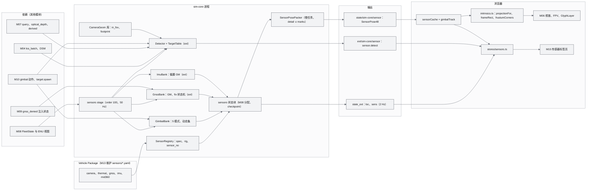
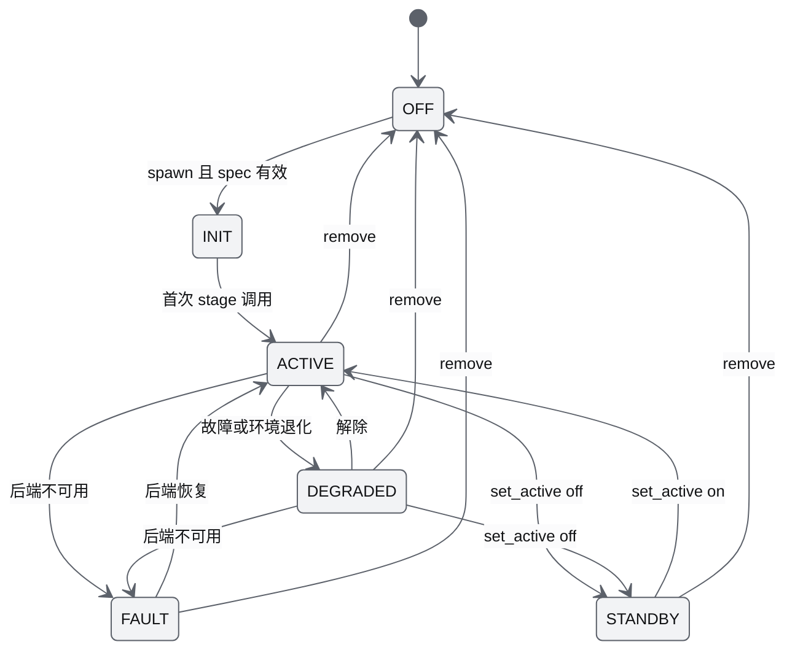
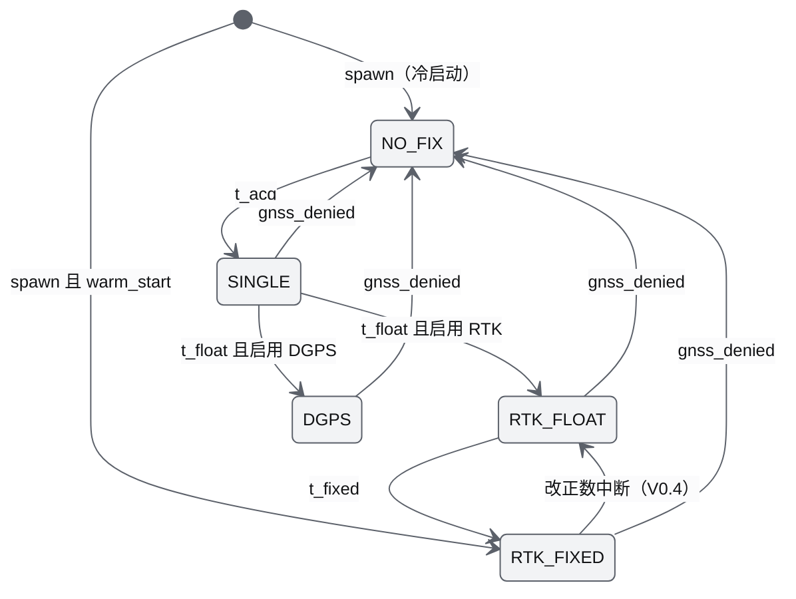
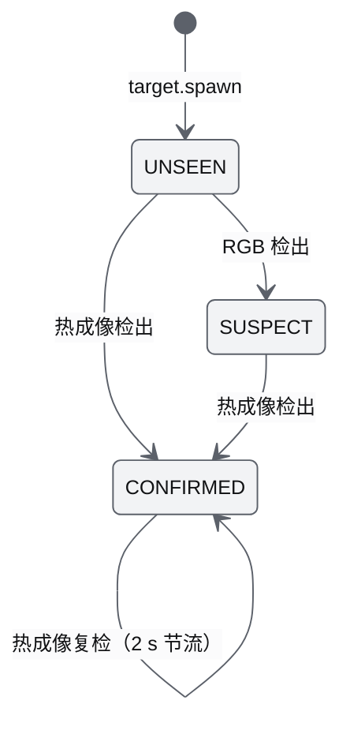
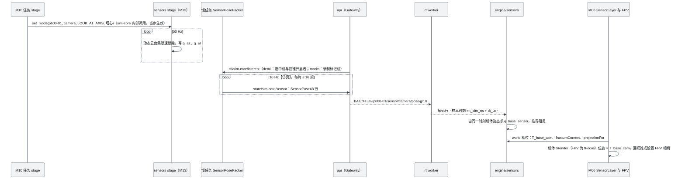
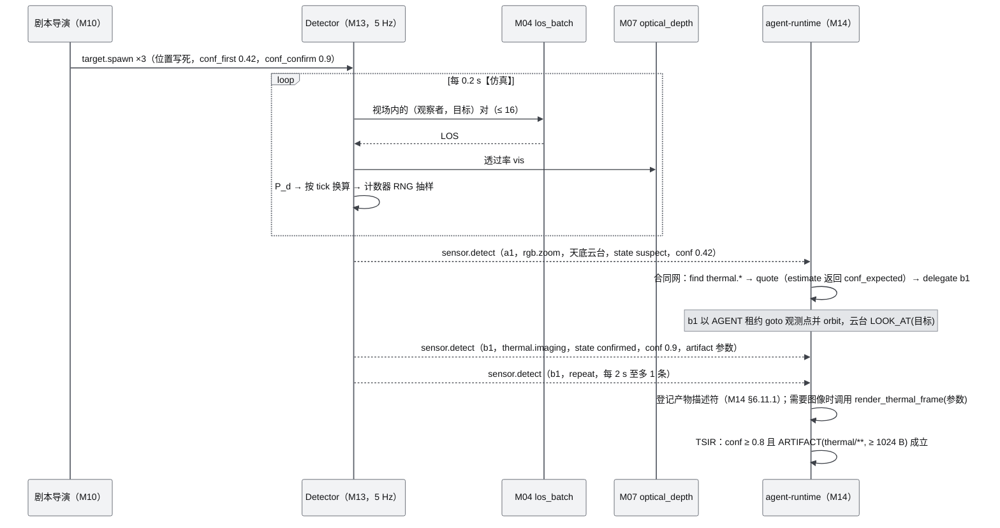
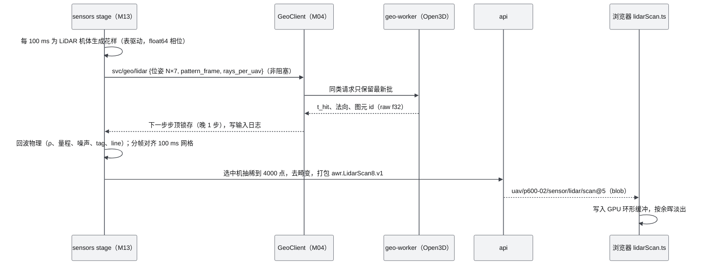
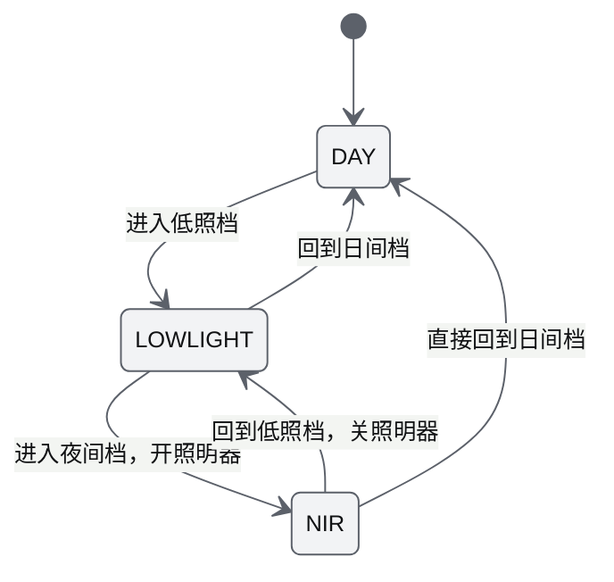
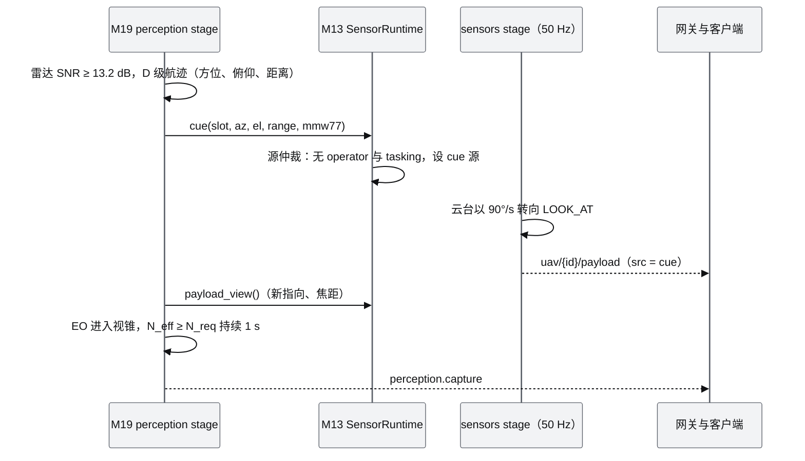

# M13 传感器仿真 PRD

| 项 | 内容 |
|---|---|
| 文档编号 | AWR-M13 |
| 标题 | 传感器仿真 PRD |
| 版本 | v1.1 |
| 日期 | 2026-09-28 |
| 状态 | 草案（v1.1 审校：对齐 17 的 `state/sim-core/sensor` 与兴趣集 ∪ 标记集、16 的 `target.spawn` 与 gnss 必填字段、M08 注册表签名、M04 `los_batch` 实测、M14 事件与产物口径；修正计数器 RNG 键碰撞、GNSS 计时语义、LiDAR 夹具 `sync_type`；补覆盖类生成器默认天底云台、按 caps 过滤检测器、传感器开关） |
| 上游文档 | [AWR-03 设计基线](../03-设计基线与决策记录.md)（§3.8、§4.3、§5.1–§5.5、§5.7–§5.9、§6.3、§8.2–§8.4、ADR-015、ADR-023、ADR-041、ADR-043、ADR-045、ADR-046、ADR-048、ADR-049）；[01-design](../01-design.md) §2、§8、§16、§22–§24、§27、§28、§35、§37、§40、§42；研究 [r04](../research/r04-livox-driver-calib.md)、[r05](../research/r05-fastlio-livo-r3live.md)、[r06](../research/r06-open3d.md)、[g06](../research/g06-gap.md)、[r23](../research/r23-airsim-gzsim.md)、[n03](../research/n03-discover-uav-sim-agents.md)（旁及 x01、g08、00-index §3.3）；[16 World 数据规范](../16-World数据规范.md)、[17 接口与实时协议规范](../17-接口与实时协议规范.md)；[M04](M04-几何世界查询服务PRD.md)、[M06](M06-Web视口与渲染后端PRD.md)、[M07](M07-环境引擎PRD.md)、[M08](M08-仿真内核与飞行器适配PRD.md)；接口对齐另参照 [M09](M09-安全与健康PRD.md) §6.12、[M10](M10-任务规划与集群PRD.md) §6.3、[M14](M14-智能体运行时与ANet-PRD.md) §6.11、§7.6、[M16](M16-演示数据剧本与流畅性测试PRD.md) §6.4（S3、机群阶梯） |
| 下游文档 | [M06](M06-Web视口与渲染后端PRD.md)（视锥、FPV）、[M09](M09-安全与健康PRD.md)（定位标志、gnss_denied）、[M10](M10-任务规划与集群PRD.md)（云台模式、`facade_coverage`）、[M14](M14-智能体运行时与ANet-PRD.md)（检测器能力、热成像产物）、[M15](M15-前端UI壳与设计体系组件PRD.md)（传感器标签页）、[M16](M16-演示数据剧本与流畅性测试PRD.md)（剧本与性能用例）、[M02](M02-LiDAR融合与地理配准PRD.md)（LiDAR 帧夹具、LIO 测试床）；[12](../12-业务逻辑设计说明书.md)、[16](../16-World数据规范.md)、[17](../17-接口与实时协议规范.md)、[18](../18-性能与测试方案.md) |
| 适用版本范围 | V0.1（D1）至 V1.0 |

## 0. 摘要

1. M13 为每个实体挂载一组传感器（带云台的相机、热成像、GNSS/RTK、IMU、气压计、虚拟 MID-360）。传感器参数统一来自 Vehicle Package 的 `sensors/*.yaml`，挂载父帧为 `base_link`（FLU），光学帧为 RDF。服务端负责计算，前端 `engine/sensors` 只做纯数学。
2. **D1-core（P0）**：传感器位姿与 FOV（`awr.SensorPose48.v1`，对兴趣集 ∪ 标记集（≤ 80 架）按 10 Hz 在慢任务中打包，经 `state/sim-core/sensor` 发布）、5 种云台模式（S1 使用 `look_at_axis`，覆盖类生成器默认天底）、供 M10 计算立面覆盖率的相机几何库，以及前端的内参投影（含主点和画幅框）、视锥角点、FPV。视锥与机体使用同一个渲染时刻的位姿，二者对齐。
3. **D1-ext（P1）**：GNSS/RTK 采用 Gauss-Markov 模型（精确离散化，5 级 fix 状态机），加 IMU 噪声；S3 Mock 检测器 `P_d = P0·exp(−(r/R_fp)²)·LOS·vis·FOV`，`P_d` 定义为 1 s 凝视的检出概率，因此结果与抽样频率无关，观察者按机体 `caps` 过滤；另有 Mock 热成像帧纯函数（PGM 160×120），可由事件参数逐字节重建。
4. **D1 桩**：MID-360 参数化花样（Python 与 TS 同源，表驱动，20k 射线耗时 1.8 ms，逐点误差 5e-7°）、`lidar_frame` 夹具，以及 DSM 2.5D 简化 LiDAR（作为测试替身，离线使用，不接入运行时）、气压计纯函数、电量量测噪声纯函数（可选）。
5. **二次优化**：白噪声使用计数器 RNG（逐级 SplitMix64 键派生，无键碰撞）；有状态的噪声过程对所有 slot 按固定频率推进。这样结果与谁在观看、兴趣集如何变化都无关，可以逐位重仿真；带白噪声的观测只为兴趣集 ∪ 标记集生成，不影响其他机体。成本较高的位姿打包移到慢任务中执行。天气退化的大气部分只用 M07 提供的 σ、`optical_depth` 与 Kim 模型（V0.4）。LiDAR FOV 画成 −7.2° 到 +52.2° 的环形壳（V0.2）。
6. **本机实测**（`.cache/research/m13/`）：N = 1000 机群阶梯下，sensors stage 单次 p50 28 µs、p99 73 µs；S1 单次 p99 219 µs；16 架一片的位姿打包 p50 129 µs（80 架分 5 片约 0.65 ms）；投影矩阵像素误差 ≤ 4e-12 px；GM 集合统计 σ 误差 ≤ 2%；计数器 RNG 24 万样本 KS p = 0.97。
7. §14 列出 21 条对基线与相关文档的反馈，并标注处置状态。其中"简化虚拟 LiDAR 进入 D1 演示"需要追加 ADR，本文不改变 D1 范围。

---

## 1. 背景与目标

### 1.1 背景

原设计把 Sensor Simulation 划给 Geometry World（01-design §8），在 SensorLayer 中列出 Camera FOV、LiDAR FOV、Radar FOV（§16），要求雾、雨、沙尘作用于 RGB 与 LiDAR（§22–§24），P600 Digital Twin 包含 Camera、LiDAR、RTK（§27），高保真传感器由 Isaac Sim 承担（§35），选中机可切换 FPV、Thermal、LiDAR、Camera FOV（§40）。研究阶段给出了以下可落地的部件：

- MID-360 的数据语义与参数化扫描花样（r04 §3.1）；
- 基于点云的球面 z-buffer 虚拟雷达（r04 §3.2、r05 §3.7）；
- Open3D RaycastingScene 精确求交，以及它持有 GIL 的约束（r06 §2.1、§3.5）；
- AirSim 与 Pegasus 的 IMU、GPS、气压计噪声参数（r23 §3.10、n03 §3.6）；
- 能见度唯一真值 MOR，以及 Kim 波长换算规则（g06 §4）。

这些部件之间存在冲突，例如 σ 常数有 3.0 与 3.912 两种写法，LiDAR 求交进程也有不同主张。它们还缺少与 D1 预算、确定性要求、实时协议的对接设计。

M13 的定位：**传感器是"世界如何被看到"的物理模型，不是渲染效果**。它只读 Geometry World 与环境真值（P-02、P-03），输出位姿、视场、噪声化观测与检测结果；浏览器只把这些结果画出来。

### 1.2 目标

| 编号 | 目标 | 可度量表述 | 首次达成 |
|---|---|---|---|
| G-M13-1 | 传感器与机体同源 | 视锥与 FPV 用同一 tRender（Follow/FPV 为 tFocus）机体位姿 × 同一 `T_base_cam`；机体快速转向时视锥角点与机头偏差 ≤ 0.5°；FPV 投影矩阵与 `intrinsics.ts` 逐元素一致 | V0.1 |
| G-M13-2 | 物理可复现 | 全部噪声与检测只由 RNG 流 3（`sensor_noise`）与 4（`detector`）决定，与订阅者、兴趣集、倍速无关；同一输入日志重仿真时 sensors 状态块与 `sensor.detect` 事件逐位一致 | V0.1（ext） |
| G-M13-3 | 不挤占预算 | sim-core 内 N = 1000 时 ≤ 0.010 核（M08 §5.2 分配）；前端视锥计入"轨迹与传感器视锥 ≤ 1 ms"（AWR-03 §3.8） | V0.1 |
| G-M13-4 | 换真机不改契约 | GNSS（PX4 eph/epv 语义）、IMU（Livox 原始单位 g，网关换算）、LiDAR 帧（Livox CustomMsg 语义）契约在 V0.1 冻结，V0.5 接入真机时前后端都不改 | V0.1 冻结 / V0.5 |
| G-M13-5 | 环境一致 | 相机与 LiDAR 退化只调用 M07 的 `optical_depth`、`sigma_at` 与 Kim 纯函数，与 Web 雾使用同一函数（ADR-023） | V0.4 |
| G-M13-6 | 多个后端共用一个 World | Gazebo 与 Isaac 传感器通过同一个 `SensorBackend` 接口接入；GPU 缺席时，自研近似是唯一实现（ADR-048） | V0.6 / V0.8 |

### 1.3 对原设计的继承、修正与增强

| 01-design | 原文要点 | 处置（附录 C 口径） | 本文落点 |
|---|---|---|---|
| §2 首期硬件平台 | 采集 RGB、MID-360、RTK、IMU 等 | 沿用 | 按真实设备语义冻结契约（§7.3），V0.5 接入 |
| §8 Geometry World 承担 Sensor Simulation | 传感器由几何世界支撑 | 沿用并强化 | 光线求交与视线只读 Geometry World（DSM、源点云、V0.2 的混合网格），绝不读 LOD 瓦片（P-03）；D1 视线由 M04 `los_batch` 提供 |
| §16 SensorLayer：Camera、LiDAR、Radar FOV | 三类视场可视化 | 修订 | Camera FOV 为 D1-core；LiDAR FOV 画成 −7.2° 到 +52.2° 的**环形壳**，不画成锥体（r04 §3.3），放在 V0.2；Radar 放在 V1.0（ADR-048） |
| §22–§24 雨、雾、沙尘作用于传感器 | 只列出"range↓、dropout↑、noise↑" | 修正为可计算模型 | MOR/σ 唯一真值、Kim 波长换算、双程透过率、杂波与 Livox tag 位、有效距离（§6.5.11），V0.4 |
| §27 Camera、LiDAR、RTK | 真机与虚拟机尽量一致 | 增强 | `camera.yaml`、`mid360.yaml`、`gnss.yaml` 带 A–E 置信度与一致性指标（ADR-043）；增加挂载预设（正装前倾 20°、倒装）与云台限位 |
| §28 DroneState.sensors | 状态模型包含 sensors | 修正 | 不进 Full64 热路径；位姿走 SensorPose48（仅兴趣集 ∪ 标记集），GNSS 与 IMU 摘要走 `state_ext`（2 Hz） |
| §35 Isaac 做相机、LiDAR、Radar 仿真 | 高保真传感器依赖 GPU | 修订 | 无 GPU 路线：D1 为几何与 Mock，V0.2 为 Open3D LiDAR，V0.4 加退化，V0.6 接 Gazebo，V0.8 接 Isaac（ADR-048） |
| §37 频率 | 未列出传感器 | 补充 | 传感器位姿 10 Hz、GNSS 10 Hz、IMU 200 Hz（V0.4 用于 HIL）、LiDAR 10 Hz 帧 / 200 kHz 点、扫描下行每机每帧 ≤ 4000 点 |
| §40 Thermal、LiDAR、Camera FOV | 选中机可切换 | 修订（AWR-03 §8.2） | Camera FOV 为 core；Thermal 为 S3 检测结果叠加（ext）；LiDAR 视图在 V0.2 |
| §42 `sensors/{rgb,thermal,lidar,radar,imu,gnss}` | 独立顶层目录 | 取代 | `python/awr/sim/sensors/`、`apps/web/src/engine/sensors/`、`vehicles/*/sensors/`（AWR-03 §4.3） |

**本文对研究结论的修正**（下游文档以本表为准）：

| 研究原结论 | 修正 | 理由 |
|---|---|---|
| LiDAR 与雾换算用 σ = 3.912/V（r04 §3.1.4、r05 §3.6、r06 §3.5、r23 §3.10） | σ₅₅₀ = ln20/MOR；3.912 只出现在 Kim 波长换算中（ADR-023、g06 §4.4） | 直接代入会把 σ 高估 30.6%，在 R = MOR/2 处双程透过率相差 2.5 倍（g06 §1） |
| 虚拟雷达在 sim-core 内用 Open3D（r06 §4.2） | Open3D 只进 geo-worker（V0.2）；D1 的 sim-core 禁止 import Open3D | RaycastingScene 持有 GIL（r06 §2.1；AWR-11 TECH-FR-004） |
| GPS 位置取真值（AirSim `GpsSimple`，r23 §3.10）；Pegasus GPS 偏置按 `b += rw·√dt·n·dt − b/τ` 更新 | 采用精确离散化的一阶 GM：`x ← φx + σ√(1−φ²)·n`，φ = e^{−Δt/τ} | Pegasus 的衰减项没有乘 dt，统计量会随步长变化（`refs/discovery/PegasusSimulator/.../sensors/gps.py` 第 128–137 行） |
| IMU 照搬 Pegasus `imu.py`（n03 §3.6） | 只取其声明的默认参数（§6.6），离散化按本文 §6.5.6 自行实现 | 本机源码核对：第 101 行陀螺偏置误用加计的 τ（300 s 而非 1000 s）；第 145 行加计偏置用均匀分布 `rand()`；第 148 行加计偏置被注释掉，未加到输出 |
| 检测概率 `P_d` 的时间基没有定义（x01 §3.11） | `P_d` 定义为 1 s 凝视的检出概率，每个抽样 tick 换算为 `1 − (1 − P_d)^{Δt/1 s}`，并加 FOV 门控 | 否则改变检测器频率会改变 S3 的结果 |
| RNG 按 slot 升序一次性抽样（g08 §2） | 白噪声改用计数器 RNG（按 agent_no、tick、通道取键）；有状态过程仍按 slot 升序，但对所有 slot 按固定频率推进 | 只为兴趣集生成噪声时，结果会依赖观看者，破坏 G6b（§6.5.4） |
| 用 float32 直接计算花样相位（r04 §3.1.3 已提示风险） | 每帧起点的相位用 float64 约化，着色器只处理帧内偏移 | 本机实测：未约化的 f32 俯仰误差 p99 为 5.4°（`m13_proto2.json`） |

### 1.4 设计原则的落地

| 原则（AWR-03 §2.3） | 在 M13 的约束 |
|---|---|
| P-02 浏览器看世界 | 射线求交、检测、噪声都在服务端完成；前端只算投影、视锥和花样动画，结果不回流物理 |
| P-03 可视化与物理分离 | LOS 与 LiDAR 只读 DSM、源点云或 geo-worker 网格；点云画质档位对任何传感器输出**零影响** |
| P-04 服务端权威 | 云台角与传感器位姿以服务端为准；前端只对云台做视觉阻尼（τ = 0.15 s） |
| P-07 保真度阶梯 | `SensorModel` 与 `SensorBackend` 接口在 V0.1 冻结；Mock、geo-worker、Gazebo、Isaac 互换实现时 UI 与协议不变 |
| P-09 仿真永不阻塞 | stage 单次 ≤ 200 µs（机群阶梯）；LiDAR 求交放在进程外，结果晚 1 步锁存；产物落盘不在 sim-core 中进行 |
| P-10 确定性 | 流 3、流 4 加计数器 RNG；外部设置的云台模式按 apply_tick 记入输入日志 |

---

## 2. 范围

### 2.1 分层范围（与 AWR-03 §6.3 M13 行一致）

| 层 | 内容 | 需求 |
|---|---|---|
| **D1-core（P0）** | SensorSpec 装配与 roster `sensors[]`；`camera.yaml` 取值；sensors stage（云台 5 模式、传感器状态块）；SensorPose48 打包（慢任务，兴趣集 ∪ 标记集，10 Hz）；相机几何库（供 M10 `facade_coverage`）；前端 `engine/sensors`（内参投影、画幅框、`T_base_cam`、视锥角点、云台视觉跟随、sensorCache）；传感器标签页的基础数据 | M13-FR-001–015、020–023、080 |
| **D1-ext（P1）** | GNSS/RTK GM 模型与 fix 状态机；IMU 噪声；`state_ext` 的定位与传感器摘要；计数器 RNG；Mock 目标表、RGB 与热成像检测器、`sensor.detect` 事件、热成像帧纯函数、`expected_pd`；检测叠加数据；传感器开关（M10 `sensor` 动作） | M13-FR-016、030–034、040–045、081 |
| **D1 桩** | MID-360 花样纯函数（Python 与 TS，golden）；`mid360.yaml`；`lidar_frame` 离线夹具（读 M04 `dsm_grid()` 的 2.5D 简化求交，放在 `tests/sensors/`，P2）；气压计纯函数（V0.4 接入）；电量量测噪声纯函数（P2，默认关闭）；`SensorBackend` 接口与 FakeBackend（M13-FR-004 中 V0.6/V0.8 部分） | M13-FR-035、036、050–052 |
| **V0.2** | 虚拟 MID-360（geo-worker `svc/geo/lidar`）；扫描下行 blob、LiDAR FOV 环形壳与扫描层；伪 Intensity；为 M02 测试床离线合成 200 Hz IMU | M13-FR-053–055 |
| **V0.4** | 相机与 LiDAR 退化（共用 σ）；SensorPose48 的有效作用距离；GNSS 城市峡谷；为 SITL-EXT 提供 HIL_SENSOR、HIL_GPS（IMU、气压计、磁力计） | M13-FR-060–063 |
| **V0.5** | 真机 LiDAR、RTK、IMU 数据流进入同一契约；ADR-043 一致性指标 | M13-FR-070 |
| **V0.6 / V0.8 / V1.0** | Gazebo 传感器；Isaac 相机、LiDAR、热成像；物理热成像；Radar | M13-FR-071–073 |
| **不做** | 浏览器中的真实感 RGB 渲染（FPV 画面就是视觉世界本身）；浏览器端射线求交或检测；用 GPU 结果回流物理；在 D1 运行时做 LiDAR 光线求交（AWR-03 §8.2 明确排除） | — |

### 2.2 与相邻模块的边界

| 模块 | 对方提供 | M13 提供 | 边界说明 |
|---|---|---|---|
| M08 仿真内核 | stage 注册表、状态块注册、ENU/FLU 只读视图 `FleetState.enu`（M08-FR-087）、慢任务宿主（`register_slow_task`）、`state_ext` 装配、estimate、组合根 | `sensors` stage（order 100–109）、`sensors` 状态块、SensorPose48 打包函数、`describe()`、`state_ext_fields()`、`expected_pd()` | M08 不 import `awr.sim.sensors`（依赖倒置）；estimate 经组合根注入的函数调用 `expected_pd` |
| M04 几何查询 | `los_batch`（ext）、`ray_hit`、只读栅格 `dsm_grid()`、`dtm_grid()`；V0.2 geo-worker `svc/geo/lidar` | 检测与 LiDAR 的请求 | M13 不写几何求交代码（D1 LiDAR 夹具的测试替身除外，只在 `tests/sensors/`） |
| M07 环境 | `query`（THERMO、OPTICS）、`derived().mor_m`、`optical_depth(p0, p1, t, wavelength_nm)`、Kim 与双程透过率纯函数（V0.4） | 退化模型的逐点应用 | 大气光学常数与公式只在 M07 实现；传感器响应律（反射率—量程、检出曲线、杂波、测距噪声）属传感器模型，在 M13（§14 第 16 条） |
| M09 安全 | `gnss_denied` 注入状态（提请暴露只读掩码，§14 第 17 条）；定位标志 `flag_loc_ok`、`flag_loc_deg` 的唯一计算者 | GNSS fix 与 sats 观测（D1 的 M09 不消费；V0.5 定位降级联动时消费） | M13 不写任何安全或定位标志（P-08） |
| M10 任务 | 任务项 `gimbal` 与 `sensor` 动作、生成器类型、剧本动作 `target.spawn`（16 §12.3） | 云台模式 API（动作映射见 §6.5.2）、传感器开关、相机几何库、目标表 API | `facade_coverage` 由 M10 计算 |
| M14 智能体 | 订阅 `sensor.detect`、登记产物（D1 为描述符，M14 §6.11.1）、合同网打分 | `bayes_miss`、`render_thermal_frame` 纯函数（无副作用模块）；`expected_pd` 经 M08 estimate 的 `conf_expected` 返回 | 置信度的业务融合与产物形态归 M14 |
| M06 视口 | 视锥绘制、FPV 相机、GlyphLayer、PerfGovernor | `intrinsics.ts` 全部几何 | M06 不写传感器数学（M06 §1.1、§7.4） |
| M15 UI 壳 | 面板 JSX、图标、动效 | `stores/sensors.ts`（提请登记）与字段说明 | 视觉 token 以 15 号文档为准 |
| M11 / M12 | 兴趣集下推 `ctl/sim-core/interest`（`detail` ≤ 64 ∪ `marks` ≤ 16）、`state/sim-core/sensor` 切片为 `uav/{id}/sensor/{name}/pose`（17 §9.3、§9.7）、插值与 tRender | 样本时刻与 flags 语义 | — |
| M02 融合 | `lidar_frame` 驱动映射与校验规则、时间语义 | 虚拟帧生成、夹具 | 校验规则由双方共用（M02 §6.3.2） |

---

## 3. 用户与用例

### 3.1 用户

| 角色 | 关心的问题 |
|---|---|
| 演示观众与操作员 | 选中机"看到了什么"：视锥、FPV、云台指向、检测标记 |
| 科研人员 | 噪声是否可信、可复现，检测概率与环境是否一致，能否导出 LiDAR 帧用于算法实验 |
| 平台开发者（M06、M10、M14 的实现者） | 调用传感器几何与检测 API，确定性与预算 |
| 真机工程师（V0.5） | 真实 MID-360、RTK、IMU 数据流能否不改契约接入 |

### 3.2 用例

| 编号 | 用例 | 触发与频率 | 涉及接口 | D1 |
|---|---|---|---|---|
| UC-01 | 选中 P600-01，按 V 打开视锥 | 用户操作；位姿 10 Hz | SensorPose48、`frustumCorners` | core |
| UC-02 | 按 4 进入 FPV，看到与视锥一致的画面，画幅框标出传感器真实画面 | 用户操作；每帧 | `projectionFor`、`frameRect`、`T_base_cam` | core |
| UC-03 | S1 结束时判定 `facade_coverage ≥ 0.9` | M10 以 5 Hz 调用（M10-FR-067） | `in_fov`、`sensor_world_pose`、M04 `segment_los` | core |
| UC-04 | 在"传感器"标签页查看相机内参、云台角、GNSS fix、eph/epv、IMU 偏置 | 用户操作；≤ 4 Hz | `stores/sensors.ts`、`state_ext` | core（相机）/ ext（GNSS、IMU） |
| UC-05 | 注入 `gnss_denied`：fix 变为 NO_FIX，图标从 LocateFixed 切换为 LocateOff；解除后按 SINGLE → RTK_FLOAT → RTK_FIXED 收敛 | 故障注入（ext） | GNSS 状态机 | ext |
| UC-06 | S3：RGB 机（天底云台）发现疑似目标（conf 0.42）→ 委派热成像机 → 确认（conf 0.9），事件携带 thermal 帧参数 | 检测 5 Hz | `sensor.detect`、`render_thermal_frame` | ext |
| UC-07 | 从输入日志重仿真 S3，检测事件逐位一致 | CI | 流 3、流 4、计数器 RNG | ext |
| UC-08 | 离线生成一帧深圳 30 m AGL 的虚拟 MID-360 `lidar_frame` 夹具，交给 M02 校验器 | CLI | 花样与 DSM 测试替身 | 桩 |
| UC-09 | 查看选中机的 LiDAR 实时扫描（余晖 0.1–2 s）与环形 FOV | V0.2 | `svc/geo/lidar`、扫描 blob | V0.2 |
| UC-10 | 切换 fog 预设后，LiDAR 有效距离从 40 m 降到 29 m，杂波点增多 | V0.4 | M07 Kim、双程透过率 | V0.4 |
| UC-11 | 回放 P600 真机 LiDAR 与 RTK | V0.5 | `lidar_frame`、`state_ext.loc` | V0.5 |
| UC-12 | 在 GPU 节点上切换为 Isaac 相机与 LiDAR 后端，UI 不变 | V0.8 | `SensorBackend` | V0.8 |

### 3.3 本模块新增术语（其余见 AWR-03 §11）

| 术语 | 英文 | 定义 |
|---|---|---|
| 传感器组 | Sensor rig | 一个实体挂载的全部传感器，按 `sensor_no` 编号，在机体生命周期内稳定 |
| 挂载 | Mount（`T_base_mount`） | 传感器安装点相对 `base_link` 的刚体变换；有云台的传感器在其后再乘云台旋转 |
| 云台模式 | Gimbal mode | FIXED、LOOK_AT、LOOK_AT_AXIS、NADIR、FORWARD 五种，决定目标方位角与俯仰角 |
| 兴趣集 ∪ 标记集 | detail ∪ marks | 17 §9.7 第 8 条：连接订阅逐机详情的机体（≤ 64）加录制标记机（≤ 16）；M13 只为其生产位姿与带白噪声的观测 |
| 动态云台集 | Dynamic gimbal set | 正在跟踪或转动中的云台 slot 集合，stage 只处理这个集合 |
| 活跃传感器集 | Active sensor set | 兴趣集 ∪ 标记集 ∪ 检测观察者 ∪ 覆盖统计机，需要计算世界位姿的机体集合 |
| 画幅框 | Sensor frame rect | 视口宽高比与传感器不同时，传感器真实画面在 NDC 中的矩形 |
| 计数器 RNG | Counter-based RNG | 以（seed、流、agent_no、tick、通道）为键生成的哈希随机数，与抽样子集无关 |
| 单次凝视检出概率 | P_d（1 s 凝视） | 目标在视场内持续 1 s 时被检出的概率；每个 tick 按指数换算 |
| 花样 | Scan pattern | MID-360 非重复扫描的射线方向序列（r04 §3.1.3 的参数化模型） |
| 余晖 | Persistence | 扫描点在前端按出生时间淡出的时长（0.1–2 s） |
| 有效作用距离 | Effective range | 当前环境下传感器可探测的最大距离；D1 为静态值，V0.4 起由 σ 动态求解 |

---

## 4. 功能需求

优先级与 D1 列的含义见 AWR-03 §10.2 第 4 条：D1 = 是的条目目标版本为 V0.1（core 为 P0，ext 为 P1）；D1 = 桩的条目本期只交付接口、纯函数或测试替身，真实实现版本写在描述中。

### 4.1 契约与装配

| 编号 | 需求描述 | 优先级 | 目标版本 | D1 | 验收要点 | 依据 |
|---|---|---|---|---|---|---|
| M13-FR-001 | 加载 `vehicles/<model>/sensors/*.yaml` 为 `SensorSpec`：camera、thermal（本文新增结构）、gnss、imu（本文新增结构）、mid360。加载时做 schema 校验（结构以 16 §11.6 为准）；每个取值带 `conf`（A–E）与 `src`；失败时拒绝加载该机型（错误见 §7.5） | P0 | V0.1 | 是 | M13-AC-001 | ADR-043；16 §11.6 |
| M13-FR-002 | 装配传感器组：按剧本 `vehicles[].sensors`（缺省时取机型的全部传感器）为每个 slot 生成 roster `sensors[{sensor_no, name, kind}]`；`sensor_no` 在机体生命周期内稳定；`kind` 取 `SensorKind` 枚举 {0 camera、1 lidar、2 thermal、3 radar、4 gnss、5 imu、6 baro}（前 4 个值与 SensorPose48 `kind` 一致） | P0 | V0.1 | 是 | M13-AC-002 | 17 §6.5；16 §12 |
| M13-FR-003 | 坐标链只有一处实现：`T_world_sensor = T_world_base · T_base_mount · R_gimbal`；FLU 到 RDF 光学帧、FLU 到 three RUB 的常量（§6.3）只出现在 `awr/sim/sensors/frames.py` 与 `engine/sensors/intrinsics.ts` 中；与 M02 frames 的 golden 按混合容差对拍 | P0 | V0.1 | 是 | M13-AC-003 | AWR-03 §5.1 第 7、8 条 |
| M13-FR-004 | `SensorModel` 接口（Protocol）：`describe()`、`on_spawn(slot)`、`on_remove(slot)`、`step(ctx)`、`checkpoint()` 与 `restore()`、`caps`。D1 交付 Camera、Thermal、Gnss、Imu 的实现与 Lidar 桩；`SensorBackend`（V0.6 Gazebo、V0.8 Isaac）使用同一接口，本期只交付接口与测试替身。包 `awr.sim.sensors` 导入无副作用：注册只在组合根入口 `awr.sim.sensors.plugin` 中执行（`configs/runtime.yaml` 的 `plugins:` 写该模块），`detector`、`thermal_mock` 只依赖 numpy，供 agent-runtime 与 M08 estimate 直接 import | P0 | V0.1 | 是 | M13-AC-004 | ADR-048；P-07；AWR-11 TECH-FR-004 |

### 4.2 位姿、云台与 FOV（core）

| 编号 | 需求描述 | 优先级 | 目标版本 | D1 | 验收要点 | 依据 |
|---|---|---|---|---|---|---|
| M13-FR-010 | 注册 stage：`@register_stage("sensors", every=5, phase=2, order=100, owner="M13", fidelity=Fidelity.ALL, budget_core=0.010)`；stage 内按调用计数 `c = (tick − 2) // 5` 分相位执行（§6.5.1） | P0 | V0.1 | 是 | M13-AC-005 | M08 §6.4.1、§6.4.2、§7.1.1 |
| M13-FR-011 | 云台 5 种模式：FIXED(az, elev)、LOOK_AT(p)、LOOK_AT_AXIS(center_xy)、NADIR、FORWARD。受限位约束（`gimbal` 字段），角速度 ≤ `rate_max_deg_s`（默认 90°/s）；只有"跟踪中或转动中"的 slot 进入动态云台集。模式来源为 M10 任务项 `gimbal` 动作（映射见 §6.5.2）、剧本，以及外部来源（V0.2 起的 operator 云台操作与 agent 观测请求）；外部设置在步边界锁存，并按 apply_tick 记入输入日志 | P0 | V0.1 | 是 | M13-AC-006 | x01 §3.11（`look_at_axis`）；M10 §6.3 ActionSpec；ADR-049 |
| M13-FR-012 | 默认云台策略（任务项没有 `gimbal` 动作时）：`lawnmower`、`expanding_square`、`terrain_follow` 取 NADIR（这些生成器的足迹与腿距公式按正下视相机推导，x01 §3.10、M10-FR-022）；`orbit` 取 LOOK_AT(环绕中心的地面点)；`helix_scan` 按其 `gimbal` 参数；`corridor` 取 FIXED(±90°, −`gimbal_tilt_deg`)，方位朝向中线一侧；其余情况与无任务时取 FIXED(0°, −15°) | P0 | V0.1 | 是 | M13-AC-006 | 本文设定：覆盖类任务相机须看到其足迹带，其余情况兼顾 FPV 看得到地平线与地面 |
| M13-FR-013 | SensorPose48 打包：对兴趣集 ∪ 标记集（`detail` ≤ 64、`marks` ≤ 16，10 AD-10）内机体的每个带视场的传感器，按 10 Hz【仿真】在慢任务中打包，每片 ≤ 16 架，写入 `state/sim-core/sensor`（msgpack `{v: 1, t_sim_ns, rows: bin(n·48)}`，17 §9.3）。D1 只打包 camera 与 thermal 两列，LiDAR 列从 V0.2 起。`flags` 取 ACTIVE、FOV_VALID；`hfov_rad` 与 `vfov_rad` 由内参计算；`range_m` 取 spec（V0.4 起为有效作用距离） | P0 | V0.1 | 是 | M13-AC-007 | 17 §6.5、§9.3；10 AD-10 |
| M13-FR-014 | Python 相机几何库：`frustum_planes`、`in_fov(points, pose, spec, near, far)`、`footprint_on_dtm`（四角射线与 DTM 求交）、`pixel_of(points)`；供 M10 计算 `facade_coverage` 与检测器使用；与 TS 实现按 golden 对拍 | P0 | V0.1 | 是 | M13-AC-008 | 12 §7.1.3；x01 §3.10 |
| M13-FR-015 | `describe()` 为 `GET /api/fleet/profiles/{id}` 生成 `sensors{}`：内参、FOV、挂载、云台限位、置信度，以及 `twin[]` 中 Camera、LiDAR、RTK 三项的状态 | P0 | V0.1 | 是 | M13-AC-009 | ADR-043；M08 §6.7.2 |
| M13-FR-016 | 传感器开关 `set_active(slot, sensor, on)`：供 M10 任务项 `sensor` 动作（ext）；关闭后进入 STANDBY（§6.7.1），SensorPose48 `ACTIVE = 0`，不参与检测；有状态噪声过程照常推进（确定性规则 ②）；外部来源按 apply_tick 记入输入日志 | P1 | V0.1 | 是 | M13-AC-031 | M10-FR-008（`sensor` 动作）；ADR-049 |

### 4.3 前端几何（core）

| 编号 | 需求描述 | 优先级 | 目标版本 | D1 | 验收要点 | 依据 |
|---|---|---|---|---|---|---|
| M13-FR-020 | `engine/sensors/intrinsics.ts`：`projectionFor(sensor, aspect, near, far, out)`（含主点，contain 规则）、`frameRect(sensor, aspect, out)`、`T_base_cam(sensor, out)`、`frustumCorners(sensor, L, out)`，常量 `R_FLU_CAM`、`R_FLU_OPT`。输出为预分配的 Float64Array，零分配，不依赖任何渲染代码 | P0 | V0.1 | 是 | M13-AC-010、011 | M06 §7.4（M06-FR-046、053）；AWR-03 §3.6 规则 1 |
| M13-FR-021 | 云台视觉跟随：由 SensorPose48 样本（时刻 = 帧 `t_sim_ns` + 记录 `dt_us`·1000，17 §6.4）与该时刻的机体插值姿态求 `q_base_sensor`，按临界阻尼（τ = 0.15 s）平滑后写入 `sensor.gimbal`；视锥与 FPV 使用 tRender（Follow/FPV 为 tFocus）的机体位姿 × `T_base_cam` | P0 | V0.1 | 是 | M13-AC-012 | ADR-046；P-04 |
| M13-FR-022 | `sensorCache`：按 agent_no 缓存 `SensorSpec`（世界加载时从 profile 接口取一次）与最近 4 个样本；样本过期（> 3/f）时 FOV_VALID 视为 0，视锥按虚线降级样式显示 | P0 | V0.1 | 是 | M13-AC-012 | AWR-03 §5.7 |
| M13-FR-023 | FPV 画幅框：视口比传感器更宽时保持 VFOV、横向扩展，更窄时保持 HFOV、纵向扩展；`frameRect` 返回传感器真实画面的 NDC 矩形，由 M15 以遮罩和 1 px 边线显示（§8.2） | P0 | V0.1 | 是 | M13-AC-011 | 本文设定：避免把视口外的世界当成传感器所见 |

### 4.4 噪声模型（ext 与桩）

| 编号 | 需求描述 | 优先级 | 目标版本 | D1 | 验收要点 | 依据 |
|---|---|---|---|---|---|---|
| M13-FR-030 | 计数器 RNG `cbrng.normal(seed, stream, agent_no, tick, ch)` 与 `cbrng.uniform(…)`（逐级 SplitMix64 键派生 + Box–Muller，§6.5.4）：所有白噪声都使用它；有状态过程（GM、随机游走）对所有挂载该传感器的 slot 按固定频率推进，用 PCG64 流 3，按 slot 升序抽样 | P1 | V0.1 | 是 | M13-AC-013 | ADR-049；g08 §2（其中已预告"计数器式 RNG"）；本文 §6.5.4 |
| M13-FR-031 | GNSS/RTK：归一化一阶 GM（精确离散）+ 白噪声；5 级 fix（NO_FIX、SINGLE、DGPS、RTK_FLOAT、RTK_FIXED）按状态机切换参数；输出 eph/epv（PX4 语义，1σ）、sats、HDOP；计入天线杆臂；10 Hz；支持 `warm_start` | P1 | V0.1 | 是 | M13-AC-014、015 | r23 §3.10；n03 §3.6；ADR-043（RTK） |
| M13-FR-032 | 与故障联动：M09 注入 `gnss_denied` 时输出 NO_FIX、sats = 0；解除后按 `t_float`、`t_fixed` 收敛。M13 只输出观测，LOC 标志由 M09 计算 | P1 | V0.1 | 是 | M13-AC-016 | 12 §5.11.3（gnss_denied）；P-08 |
| M13-FR-033 | IMU：比力 `f = R_wbᵀ(a − g)` 与角速度 ω；白噪声密度、偏置 GM（τ_g = 1000 s、τ_a = 300 s）、上电偏置。线上单位为 m/s²；MID-360 内置 IMU 的原始单位 g 在网关换算。D1 只对兴趣集 ∪ 标记集输出 2 Hz 摘要 | P1 | V0.1 | 是 | M13-AC-017 | n03 §3.6（Pegasus 参数）；AWR-03 §5.4 |
| M13-FR-034 | 输出：`state_ext.loc` 追加可选字段 `eph_m`、`epv_m`、`hdop`、`err_enu_m[3]`（仅仿真真值误差），已有字段 `loc.gnss_fix`（GnssFix 枚举）与 `loc.sats` 改由 M13 提供；追加 `state_ext.sens.imu`（`acc_mps2`、`gyro_rad_s`、`bias_acc_mps2`、`bias_gyro_rad_s`）。生成范围：`gnss_fix`、`sats`、`eph_m`、`epv_m`、`hdop` 与 core 的 `sens.gimbal`（M13-FR-080）为全机（查表与拷贝，无 RNG）；含白噪声的 `err_enu_m` 与 `sens.imu` 只对兴趣集 ∪ 标记集生成（其余机体不出现该字段），由 M13 的 2 Hz 慢任务一次算出后交给 M08 的 state_ext 打包 | P1 | V0.1 | 是 | M13-AC-018 | 17 §6.5；AWR-03 §5.11（1.x 只新增可选字段） |
| M13-FR-035 | 气压计纯函数：`p_meas = p_env·(1 + b_p) + n`，b_p 为 GM，p_env 取 M07 THERMO；D1 只交付函数与测试，V0.4 用于 HIL_SENSOR | P1 | V0.4 | 桩 | M13-AC-019 | r23 §3.10（AirSim BarometerSimple） |
| M13-FR-036 | 电量量测噪声（可选）：电压、电流 ADC 白噪声 + 增益 GM，SOC 估计误差 GM；只写 `state_ext.battery` 的 `voltage_meas_v`、`current_meas_a`、`soc_meas_pct`，不影响 M09 的安全判据；默认关闭 | P2 | V0.1 | 桩 | M13-AC-019 | 本文设定（任务说明"GNSS/电量噪声"） |

### 4.5 Mock 检测器与热成像（ext）

| 编号 | 需求描述 | 优先级 | 目标版本 | D1 | 验收要点 | 依据 |
|---|---|---|---|---|---|---|
| M13-FR-040 | Mock 目标表（≤ 64 个）：由剧本动作 `target.spawn{target_id, pos_enu_m, kind, conf_first?, conf_confirm?}`（16 §12.3）写入；字段为内部序号 `idx`、`target_id`（字符串，剧本内唯一）、类别、位置、状态、置信度。V0.8 由 Dynamic Objects 层取代（ADR-047） | P1 | V0.1 | 是 | M13-AC-020 | 16 §12.3；12 §7.1.2；x01 §3.11 |
| M13-FR-041 | 检测器：观察者为"挂载带 `detector` 的传感器、且该 `detector.capability` 属于机体有效能力集"的机体；有效能力集取剧本 `vehicles[].caps`，缺省时由传感器合成（16 §12.2）。S3 中 a1（`caps: [rgb.zoom]`）只以相机参与、b1（`caps: [thermal.imaging]`）只以热成像参与、c1（`comm.relay`）不参与。委派能力（R-12，M14 §14 第 21 条）：`configure_vehicle(vehicle_id, sensors=, caps=, delegated=)` 的 `delegated` 所列能力只在机体持有 AGENT 租约时参与检测（由 `StageCtx.lease` 的确定性租约状态派生，不写输入日志）；M10 剧本导演按剧本 `agents.tasks[].capability` 与成员能力的交集设置（S3 的 b1–b3 为 `thermal.imaging`），MISSION 待命航线上的复核候选因此不会在委派之前确认目标。每 tick 至多 16 对（观察者传感器，目标）；5 Hz【仿真】评估 `P_d`（§6.5.9），每 tick 概率由 1 s 凝视换算；LOS 用 M04 `los_batch`；`vis = T₅₅₀`（M07）；FOV 门控；抽样用流 4 的计数器 RNG | P1 | V0.1 | 是 | M13-AC-021、022 | ADR-048；x01 §3.11；M07 §6.3.12；16 §12.2 |
| M13-FR-042 | 置信度：首次检出按剧本指定值（S3 为 0.42），否则取 U(0.35, 0.6)；热成像确认按剧本指定值（S3 为 0.9），否则取 0.9；提供未检出时的贝叶斯更新纯函数 `bayes_miss(p_c, p_d)`，供 M14 维护概率栅格 | P1 | V0.1 | 是 | M13-AC-022 | 12 §7.3（S3）；x01 §3.11 |
| M13-FR-043 | 事件 `sensor.detect`：`{uav, sensor, capability, target_id, target_kind, pos_enu_m, range_m, pd, conf, state, repeat, artifact?}`，按步合批、可靠发布（`evt/sim-core/sensor`，17 §9.3 已有 key）。发布规则：RGB 只对 UNSEEN 目标发 1 次（转 SUSPECT）；热成像对 UNSEEN、SUSPECT 目标发 1 次（转 CONFIRMED），此后同一目标的热成像复检以 `repeat = true` 发布，每目标每 2 s【仿真】至多 1 条（满足 M14 按检出次数与斜距中位数聚合证据的需要，M14 §7.6） | P1 | V0.1 | 是 | M13-AC-022 | 17 §6.12；M14 §6.11.1、§7.6 |
| M13-FR-044 | 热成像帧纯函数 `render_thermal_frame(params) -> bytes`：输出 PGM P5 格式，160×120，u8，19215 B（≥ 1024 B，满足 TSIR `ARTIFACT("thermal/**", min_size = 1024)`）；内容为背景温度（M07 THERMO 加类别偏置）、目标热斑、大气透过率与 NETD 噪声；参数随事件的 `artifact` 字段下发，任何进程可由参数逐字节重建图像。产物形态由 M14 决定（D1 为描述符，M14 §6.11.1）；sim-core 不落盘 | P1 | V0.1 | 是 | M13-AC-023 | 12 §6.10 第 5 条；ADR-048 |
| M13-FR-045 | `expected_pd(spec, p_uav, p_tgt, env)`：与检测器使用同一实现（FOV 视为 1），由 M08 estimate 在 sim-core 内调用，经 EstimateReply 可选字段 `conf_expected` 返回 M14（单一计算者，M14 §6.10.5） | P1 | V0.1 | 是 | M13-AC-021 | 12 §6.10 第 3 条；M14 §6.10.5 |

### 4.6 虚拟 MID-360

| 编号 | 需求描述 | 优先级 | 目标版本 | D1 | 验收要点 | 依据 |
|---|---|---|---|---|---|---|
| M13-FR-050 | 花样纯函数：Python `mid360_pattern(frame_idx, out_az, out_el)` 与 TS `mid360Pattern.ts` 同源；表驱动，每帧起点相位按 float64 约化；与 r04 参考公式逐点误差 ≤ 1e-6°。本期交付函数与 golden | P1 | V0.2 | 桩 | M13-AC-024 | r04 §3.1.3；AWR-03 §6.3（D1 桩） |
| M13-FR-051 | `mid360.yaml` 取值（r04 §3.1.7 参数卡）与两种挂载预设 `p600_prometheus_sim`、`inverted_mapping`；`imu.acc_unit = g` | P1 | V0.2 | 桩 | M13-AC-001 | r04 §3.1.6–§3.1.7；16 §11.6 |
| M13-FR-052 | LiDAR 帧夹具生成器（`tests/sensors/fixtures/gen_lidar_fixture.py`，M13 所有的测试目录）：在 M04 `dsm_grid()`（dsm_eff，柱体语义）上做 2.5D 步进求交作为测试替身，产出 `awr.sensor.lidar_frame.v1`；`sync_type` 取 `ptp`（仿真时钟视为已同步，r04 §3.1.5；16 §14.3 的冻结枚举没有 `sim`，§14 第 5 条），`T_world_sensor` 给出真值；交给 M02 校验器，并作为 V0.2 的对照基线；不接入 sim-core 运行时与 UI | P2 | V0.1 | 桩 | M13-AC-025 | 本文 §6.5.10；M02-FR-013；16 §14.3 |
| M13-FR-053 | 虚拟 MID-360 运行时：sensors stage 每 100 ms【仿真】为 LiDAR 机体提交 `svc/geo/lidar`（M04 geo-worker），结果晚 1 步锁存并写入输入日志；回波物理（§6.5.10）、tag 与 line、帧对齐 100 ms 网格；全局射线预算 1 M rays/s（选中机满规格，其余机体每帧 5k 条或降到 5 Hz） | P0 | V0.2 | 否 | V0.2 验收 | r06 §3.5；M04 §6.7（4） |
| M13-FR-054 | 扫描下行 `uav/{id}/sensor/lidar/scan`（blob，每点 8 B，每帧 ≤ 4000 点，仅选中机，5 Hz）；前端用环形缓冲加余晖显示，另画 LiDAR FOV 环形壳 | P0 | V0.2 | 否 | V0.2 验收 | r04 §3.3 |
| M13-FR-055 | 从录制轨迹离线合成 200 Hz IMU（含噪声与偏置），供 M02 LIO 测试床使用 | P2 | V0.2 | 否 | M02-AC-019 | M02-FR-020；r05 §3.10 |

### 4.7 环境退化（V0.4）

| 编号 | 需求描述 | 优先级 | 目标版本 | D1 | 验收要点 | 依据 |
|---|---|---|---|---|---|---|
| M13-FR-060 | 相机退化：`I = J·T + A·(1 − T)`（与 Web 雾同一函数）；有效视程 `r_cam = MOR·ln(C0/ε)/ln20`（ε = 0.05）写入 SensorPose48 `range_m`，并作为检测器的 vis | P0 | V0.4 | 否 | V0.4 用例 | g06 §4.4；M07 §6.3.12 |
| M13-FR-061 | LiDAR 退化：Kim 波长换算、双程透过率、ρ_eff、logistic 检出、测距噪声随 σ 增大、杂波注入（tag bit[1:0] = 01）、雨滴近窗附着（bit[3:2] = 01）、沙尘杂波；有效距离写入 UI | P0 | V0.4 | 否 | V0.4 用例 | r04 §3.1.4；r05 §3.6；g06 §4.4 |
| M13-FR-062 | GNSS 城市峡谷：由 DSM 估计天空遮挡，得到可见卫星数、HDOP 与多路径跳变 | P2 | V0.4 | 否 | — | r23 §3.10 |
| M13-FR-063 | 为 SITL-EXT 生成 HIL_SENSOR（250 Hz IMU、气压计、磁力计）与 HIL_GPS（5–10 Hz） | P0 | V0.4 | 否 | SITL-EXT 8 架 lockstep | n03 §3.6；ADR-020 |

### 4.8 多后端与真机

| 编号 | 需求描述 | 优先级 | 目标版本 | D1 | 验收要点 | 依据 |
|---|---|---|---|---|---|---|
| M13-FR-070 | 真机：livox_ros_driver2 数据经 M02 驱动映射进入 `lidar_frame`；RTK 与 IMU 真实流写入同一 `state_ext` 字段；按 ADR-043 一致性指标出报告 | P0 | V0.5 | 否 | ADR-043 | r04 §3.5；M02-FR-013 |
| M13-FR-071 | Gazebo 传感器（V0.6）与 Isaac 相机、LiDAR、热成像（V0.8）经 `SensorBackend` 接入；caps 声明；World 坐标一致（锚点误差 ≤ 1 cm） | P1 | V0.8 | 否 | V0.8 退出标准 | ADR-048 |
| M13-FR-072 | 物理热成像：anet-classes 伪温度 + 大气透过率 + 目标 | P1 | V0.8 | 否 | — | ADR-048 |
| M13-FR-073 | Radar：经 Isaac RTX；无 GPU 时 caps 声明为不支持 | P2 | V1.0 | 否 | — | ADR-048 |

### 4.9 UI 数据供给

| 编号 | 需求描述 | 优先级 | 目标版本 | D1 | 验收要点 | 依据 |
|---|---|---|---|---|---|---|
| M13-FR-080 | `stores/sensors.ts`（vanilla zustand，提请在 AWR-03 §4.3 登记）：选中机的传感器列表、内参与 FOV、云台角与模式（core，数据经 `state_ext.sens.gimbal` 可选字段下发，§7.2.3）；GNSS、IMU 摘要与检测列表（ext）；更新 ≤ 4 Hz，只驱动可见标签 | P0 | V0.1 | 是 | M13-AC-026 | ADR-028；14 §4.4 |
| M13-FR-081 | 检测叠加数据：把检测结果（位置、conf、能力、状态）提供给 M06 GlyphLayer 的 `mission.target` 标记与 M15 事件表 | P1 | V0.1 | 是 | M13-AC-026 | 15 §10.6；AWR-03 §8.2 |

---

## 5. 非功能需求

### 5.1 NFR 表

| 编号 | 需求描述 | 优先级 | 目标版本 | D1 | 验收要点 | 依据 |
|---|---|---|---|---|---|---|
| M13-NFR-001 | sim-core CPU：sensors stage 加 M13 慢任务（位姿打包、白噪声观测），N = 1000、兴趣集 ∪ 标记集取最坏 80 架时合计 ≤ 0.010 核（核·秒/仿真秒） | P0 | V0.1 | 是 | M13-AC-027 | M08 §5.2 |
| M13-NFR-002 | stage 单次耗时：机群阶梯 N = 1000 时 p99 ≤ 200 µs；S1（2 个跟踪云台）p99 ≤ 250 µs；S3 检测 tick（N ≤ 50，含 `los_batch` 16 对）p99 ≤ 1.3 ms，并且 M08 §5.3 的最坏 tick ≤ 2.8 ms 仍成立 | P0（阶梯、S1）/ P1（S3） | V0.1 | 是 | M13-AC-027 | 本文实测（§5.2）；M04-AC-023；ADR-021 ② |
| M13-NFR-003 | 慢任务：兴趣集 ∪ 标记集（≤ 80 架）的位姿打包每片 ≤ 16 架、单片 p99 ≤ 0.2 ms；白噪声观测（≤ 80 架 × 9 通道）一次计算 p99 ≤ 0.3 ms，2 Hz | P0（打包）/ P1（噪声） | V0.1 | 是 | M13-AC-027 | g05 §4；10 AD-10；本文实测 |
| M13-NFR-004 | 前端：视锥几何更新在 Tier S（选中 1 架）≤ 0.05 ms/帧，Tier B（16 架）≤ 0.3 ms/帧；热路径零分配；计入"轨迹与传感器视锥 ≤ 1 ms" | P0 | V0.1 | 是 | M13-AC-028 | AWR-03 §3.8；M06-NFR-001 |
| M13-NFR-005 | 几何一致：FPV 投影矩阵与 `projectionFor` 逐元素一致；视锥角点与 `frustumCorners` 偏差 ≤ 1e-4 m；机体快速转向时角点与机头偏差 ≤ 0.5° | P0 | V0.1 | 是 | M13-AC-010、012 | M06-AC-035、040 |
| M13-NFR-006 | 确定性：同一输入日志重仿真，sensors 块与 `sensor.detect` 逐位一致；兴趣集和订阅变化不改变任何噪声与检测结果 | P1 | V0.1 | 是 | M13-AC-013、029 | ADR-049 |
| M13-NFR-007 | 统计正确：GM 集合（4000 样本）稳态 σ 误差 ≤ 3%，τ 处自相关为 e⁻¹ ± 0.04；计数器 RNG 的 KS 检验 p ≥ 0.01、\|均值\| ≤ 0.01、相邻 tick 相关系数 ≤ 0.03 | P1 | V0.1 | 是 | M13-AC-013、014 | 本文实测（§6.5.4、§6.5.5） |
| M13-NFR-008 | 内存：sensors 状态块 ≤ 1 MB（N = 1024）；前端 sensorCache ≤ 64 KB | P0 | V0.1 | 是 | M13-AC-027 | 本文设定 |
| M13-NFR-009 | 契约兼容：`state_ext` 新字段全部为可选；SensorPose48 布局不改；`lidar_frame` 通过 16 §14.3 schema 与 M02 §6.3.2 校验规则 ①②③④⑦（夹具不含 IMU 流，⑤不适用；不写可选的 `model` 时⑥不适用） | P0 | V0.1 | 是 | M13-AC-018、025 | AWR-03 §5.11 |
| M13-NFR-010 | 依赖约束：`awr.sim.sensors` 不 import numba 与 open3d（AWR-11 TECH-FR-004）；包导入无副作用；`engine/sensors` 不 import three 的渲染对象与 react（只输出 TypedArray） | P0 | V0.1 | 是 | `make lint`（py-imports、oxlint）；`python -c "import awr.sim.sensors"` 不触发任何注册 | AWR-03 §4.2；AWR-11 |
| M13-NFR-011 | V0.2 LiDAR：geo-worker 2 万条射线 ≤ 10 ms；扫描层在 Tier B ≤ 0.5 ms/帧，Tier S 默认关闭（开启时 ≤ 8k 点） | P0 | V0.2 | 否 | V0.2 验收 | AWR-03 §8.1；r04 §3.3 |
| M13-NFR-012 | 文本安全：传感器名、目标类别与检测文本在 UI 显示前经 `lib/sanitize.ts`；不出现 emoji 与禁用字形 | P0 | V0.1 | 是 | D1-AC-20 | AWR-03 §8.4 注 |

### 5.2 预算分解（本机 8 核 Xeon，numpy 2.5.3，负载约 0.5–1.4，`.cache/research/m13/m13_proto3.json`、`m13_cbrng_key.json`）

| 项 | 频率 | 规模 | 实测单次 | 折合核 | 说明 |
|---|---|---|---|---|---|
| GNSS GM 分片 | 50 Hz 调用，每片 200 slot | N = 1000，每 slot 10 Hz | p50 28 µs，p99 49 µs | 0.0014 | 精确离散，PCG64 流 3 |
| IMU 偏置分片 | 10 Hz 调用，每片 100 slot | 每 slot 1 Hz | p50 28 µs | 0.0003 | 偏置 τ ≥ 300 s，1 Hz 已足够，统计量与步长无关 |
| 动态云台（numpy 路径） | 50 Hz | 2 / 16 slot | p50 约 135 / 114 µs（2 slot 由 S1 合计减阶梯合计得出） | 0.0068（2 个） | 实现时 n ≤ 8 走纯 Python 标量路径（目标 ≤ 10 µs/slot）；阶梯中为 0 |
| 位姿打包（慢任务） | 10 Hz | detail ∪ marks ≤ 80 架，每片 16 架（camera、thermal 两列） | 每片 p50 129 µs，p99 165 µs | 0.0052（64 架）/ 0.0065（80 架） | 只针对兴趣集 ∪ 标记集 |
| 白噪声观测（慢任务） | 2 Hz | ≤ 80 架 × 9 通道，一次计算 | p50 199 µs，p99 242 µs（`m13_cbrng_key.json`） | 0.0004 | GNSS `err_enu_m` 与 IMU 摘要；全机的 fix、sats、eph、epv、hdop 由 M08 state_ext 打包直接拷贝，计入 M08 慢任务 |
| 检测器（ext） | 5 Hz | ≤ 16 对 | 公式 17 µs + `los_batch` 16 对 p50 0.75 ms、p99 1.04 ms（M04-AC-023） | 0.006（按 p99 1.2 ms 计，M04 §14 第 14 条） | 只在目标表非空时运行 |
| **阶梯 stage 合计** | 50 Hz | N = 1000，无动态云台 | **p50 27.7 µs，p99 73 µs，max 283 µs** | **约 0.0014** | 加慢任务后合计约 0.007（64 架）至 0.0083（80 架）核 |
| S1 stage 合计 | 50 Hz | 2 架，2 个动态云台 | p50 163 µs，p99 219 µs（numpy 路径） | 约 0.008 | 纯 Python 路径预计 ≤ 60 µs；S1 的兴趣集只有 2 架，打包 ≤ 0.0013 核 |

结论：M08 分配的 0.010 核在阶梯（≤ 0.0083）、S1（≤ 0.0095）与 S3（N ≤ 50：检测 0.006 + 打包与噪声约 0.0015 + stage 约 0.0005，合计约 0.008）中都够用。S3 的检测 tick 单次会超过 200 µs，但只在目标表非空时出现，M08 §5.3 最坏 tick（2.8 ms）仍有余量（§6.5.1、M08 §5.3 已注明例外）。

---

## 6. 设计方案

### 6.1 组件图



`CameraGeom` 同时被 M10 在任务 stage 中用于计算 `facade_coverage`。V0.2 在 stage 与 M04 geo-worker 之间增加 `svc/geo/lidar` 旁路（§6.8 第 3 张时序图）。

### 6.2 模块结构与文件落点（AWR-03 §4.1、§4.3 范围内）

```text
python/awr/sim/sensors/                  # 所有者 M13；基线目录注释中的 noise 拆为 cbrng、gm、gnss、imu
├── __init__.py          # 空（导入无副作用，M13-FR-004）
├── plugin.py            # register(ctx)：组合根入口（runtime.yaml plugins 写 awr.sim.sensors.plugin）；注册 stage、状态块、慢任务、estimate 钩子
├── spec.py              # SensorSpec、GimbalSpec、DetectorSpec；load_rig(profile, names) 读取 vehicles/*/sensors/*.yaml
├── frames.py            # R_FLU_OPT、R_FLU_CAM、mount_R(rpy_deg)、gimbal_R(az, el)、quat 工具（唯一实现）
├── block.py             # sensors 状态块字段声明（register_state_block，一字段一写者）
├── stage.py             # sensors stage 与相位调度（§6.5.1）
├── gimbal.py            # GimbalBank：模式、限位、速率、动态集；set_mode()、set_gimbal()（M10 动作映射）、set_active()
├── camera.py            # CameraModel：内参、FOV、in_fov、footprint_on_dtm、pixel_of
├── pose_pack.py         # SensorPosePacker：detail ∪ marks 切片 → awr.SensorPose48.v1 行 → state/sim-core/sensor
├── cbrng.py             # 计数器 RNG（逐级 SplitMix64 键 + Box–Muller），通道号登记表
├── ext_fields.py        # state_ext_fields()（全机拷贝）与 2 Hz 白噪声观测慢任务（detail ∪ marks）
├── gm.py                # 归一化 Gauss-Markov 精确离散（GNSS、IMU 偏置、气压计、电量共用）
├── gnss.py              # GnssBank：fix 状态机、误差、eph/epv（ext）
├── imu.py               # ImuBank：比力、偏置、摘要（ext）
├── baro.py              # 气压计纯函数（桩，V0.4 接入 HIL）
├── battery_meas.py      # 电量量测噪声纯函数（桩，P2，默认关闭）
├── detector.py          # Detector、TargetTable、expected_pd、bayes_miss（ext；只依赖 numpy）
├── thermal_mock.py      # render_thermal_frame（纯函数，无 I/O，ext；只依赖 numpy）
├── lidar/
│   ├── pattern.py       # mid360_pattern（表驱动，桩）
│   ├── echo.py          # 回波物理（V0.2；V0.4 退化）
│   └── frame.py         # awr.sensor.lidar_frame.v1 编码与 awr.LidarScan8.v1 打包（桩）
└── backends/base.py     # SensorBackend 接口与 FakeBackend（桩；V0.6 gz、V0.8 isaac）
apps/web/src/engine/sensors/             # 所有者 M13，纯数学，不 import react 与渲染对象
├── index.ts             # 门面：export * from './intrinsics' 等
├── intrinsics.ts        # projectionFor、frameRect、T_base_cam、frustumCorners、R_FLU_CAM、R_FLU_OPT
├── gimbalTrack.ts       # SensorPose48 样本 → q_base_sensor → 临界阻尼
├── sensorCache.ts       # 每机 SensorView 与样本环（4 条）
├── mid360Pattern.ts     # 花样（桩；V0.2 用于环形壳动画与对拍）
└── lidarScan.ts         # V0.2：扫描 blob 解码与环形缓冲写入
apps/web/src/stores/sensors.ts           # 提请登记为 M13 所有（§14 第 6 条）
vehicles/p600/sensors/{camera,thermal,gnss,imu,mid360}.yaml
vehicles/x500/sensors/camera.yaml        # 回归机体只挂相机，供 x500 变体阶梯中的 FPV 使用（16 §11.4 已登记）
tests/sensors/                           # pytest：spec、frames、gimbal、gm、gnss、imu、detector、thermal、pattern、determinism、bench_stage
tests/sensors/fixtures/gen_lidar_fixture.py   # DSM 2.5D 测试替身，生成 lidar_frame 夹具（桩，P2；python tests/sensors/fixtures/gen_lidar_fixture.py）
apps/web/tests/sensors/                  # vitest：intrinsics、gimbalTrack、pattern parity
```

扩展点：stage 经 `awr/sim/fleet/stages/registry.py` 注册；状态块经 `register_state_block`；位姿打包与白噪声观测经 `register_slow_task`（M08 §7.1.1）；组合根由 `configs/runtime.yaml` 的 sim-core `plugins:` 列表导入 `awr.sim.sensors.plugin`（10 ARCH-FR-003）。前端门面由 `engine/index.ts` 再导出。LiDAR 夹具生成器放在 M13 所有的 `tests/sensors/` 下，不新增 `tools/sensors/`（该路径不在 AWR-03 §4.3 所有权表中）。

### 6.3 坐标帧与变换链

| 帧 | 定义 | 出现位置 |
|---|---|---|
| `uavNN/base_link` | 机体 FLU（REP-103） | 挂载父帧 |
| `uavNN/<s>_mount` | 安装点：`T_base_mount = [R(rpy), t]`，`R = Rz(yaw)·Ry(pitch)·Rx(roll)`（ZYX，与 livox_ros_driver2 外参约定一致，r04 §2.2）；pitch = +20° 表示前倾（光轴下俯 20°） | `sensors/*.yaml` 的 `mount` |
| `uavNN/<s>` | 传感器帧，FLU，x 为光轴；有云台时 `R_mount_s = R_gimbal(az, elev) = Rz(az)·Ry(−elev)`（elev 为仰角，向上为正；az 向左为正） | SensorPose48 `q`（17 §6.5） |
| `uavNN/<s>_optical` | 光学帧 RDF：`R_flu_opt = [[0,0,1],[−1,0,0],[0,−1,0]]` | 内参投影、像素 |
| three 相机 | RUB（看向 −Z）：`R_flu_cam = R_flu_opt·diag(1,−1,−1) = [[0,0,−1],[−1,0,0],[0,1,0]]` | FPV、视锥（AWR-03 §5.1 第 7 条） |
| Livox 雷达帧 | FLU（x 前、y 左、z 上），与 `uavNN/mid360` 相同 | `lidar_frame` 点坐标（r04 §3.1.2） |

```text
T_world_sensor = T_world_base(t) · T_base_mount · [R_gimbal(az(t), elev(t)) | 0]
p_ant_world    = p_base + R_wb · lever_gnss                       # GNSS 天线杆臂
像素（COLMAP 约定，像素中心为 0.5）：u = fx·x_opt/z_opt + cx，v = fy·y_opt/z_opt + cy
线上姿态：q_world_sensor = [x, y, z, w]，WORLD←SENSOR(FLU)；换到光学帧时右乘 R_flu_opt
```

FleetSim 内部是 NED/FRD。M13 的 stage 与打包器只通过 M08 提供的 ENU/FLU 只读视图 `FleetState.enu`（M08-FR-087：全量数组 `pos`、`acc`、`q_xyzw`、`omega_flu`，切片函数 `pose_enu_flu(slots)` 返回 k×7 `[x, y, z, qx, qy, qz, qw]`，`acc_enu(slots)`、`omega_flu(slots)` 返回 k×3；由 `awr/sim/fleet/views.py` 调用 tap 同源核）读取机体状态，不直接接触 NED（AWR-03 §5.3 第 3 条）。

### 6.4 数据结构

#### 6.4.1 SensorSpec（Python，冻结 dataclass，启动时加载一次）

| 字段 | 类型 | 单位 | 说明 |
|---|---|---|---|
| `name`、`kind` | str、SensorKind | — | `camera`、`thermal`、`gnss`、`imu`、`mid360`；kind 见 M13-FR-002 |
| `mount_R`、`mount_t` | f64[3,3]、f64[3] | —、m | `T_base_mount` |
| `intr` | `{w, h, fx, fy, cx, cy, dist}` \| None | px | 相机与热成像才有 |
| `hfov_rad`、`vfov_rad` | f64 | rad | 由内参派生：`atan(cx/fx) + atan((w − cx)/fx)`（主点居中时即 `2·atan(w/(2fx))`），VFOV 同理；LiDAR 为 2π 与 59.4° |
| `range_m` | f64 | m | 静态作用距离（相机 300 m，热成像 400 m，LiDAR 70 m）；NaN 为未知 |
| `gimbal` | `GimbalSpec` \| None | — | `az_min/max_rad`、`el_min/max_rad`、`rate_max_rad_s`、`default_mode`、`default_az_rad`、`default_el_rad` |
| `detector` | `DetectorSpec` \| None | — | `capability`、`p0`、`r_fp_m`、`t_look_s`、`conf_model`、`pos_sigma_m` |
| `noise` | dict | SI | GNSS、IMU、气压计、LiDAR 各自参数（§6.6） |
| `rate_hz` | f64 | Hz | 名义输出率 |
| `conf`、`src` | str | — | 置信度 A–E 与来源（ADR-043） |

#### 6.4.2 sensors 状态块（SoA，N = 1024 容量，M08 分配，参与 checkpoint）

| 字段 | dtype | 形状 | 单位与语义 | 唯一写者 |
|---|---|---|---|---|
| `has` | u8 | N | 位掩码：bit0 CAM、bit1 THERMAL、bit2 GNSS、bit3 IMU、bit4 LIDAR、bit5 BARO | registry（spawn、remove） |
| `act` | u8 | N | 与 `has` 同位序，1 = ACTIVE、0 = STANDBY（M13-FR-016）；spawn 时等于 `has` | gimbal（`set_active` 锁存） |
| `det_en` | u8 | N | bit0 相机检测器、bit1 热成像检测器；spawn 时按机体有效能力集计算（M13-FR-041） | registry |
| `g_mode` | u8 | N×2 | 云台模式（每机最多 2 个带云台的传感器：相机与热成像） | gimbal |
| `g_az`、`g_el` | f64 | N×2 | rad，当前云台角 | gimbal |
| `g_tgt` | f64 | N×2×3 | LOOK_AT 目标（ENU m）或 LOOK_AT_AXIS 中心（z 为 NaN） | gimbal（经 set_mode 锁存） |
| `g_dyn` | bool | N×2 | 是否在动态集 | gimbal |
| `g_lim` | bool | N×2 | 本步是否撞到限位（供 UI 与 M10） | gimbal |
| `gn_fix` | u8 | N | GnssFix 枚举 0–4 | gnss |
| `gn_z` | f64 | N×3 | 归一化 GM 状态 | gnss |
| `gn_t_state_ns` | i64 | N | 进入当前 fix 的仿真时刻 | gnss |
| `gn_sats`、`gn_hdop` | u8、f32 | N | 可见星数、HDOP | gnss |
| `im_zb` | f64 | N×6 | IMU 偏置归一化 GM（gyro 3、acc 3） | imu |
| `im_b0` | f32 | N×6 | 上电偏置（spawn 时抽一次） | registry |
| `ba_z` | f64 | N | 气压计因子 GM（桩） | baro |
| `bm_z` | f64 | N×3 | 电量量测 GM（桩，P2） | battery_meas |

目标表（ext，≤ 64 行，同样参与 checkpoint）：`idx u16`（行号，计数器 RNG 通道用）、`target_id` 16 B（UTF-8，剧本给定，例如 `t1`）、`kind u8`（0 person、1 vessel、2 vehicle、3 generic，对应剧本字符串）、`pos f64×3`、`state u8`（UNSEEN、SUSPECT、CONFIRMED）、`conf f32`、`conf_first f32`（NaN 表示用模型）、`conf_confirm f32`、`t_first_ns i64`、`t_confirm_ns i64`、`t_last_emit_ns i64`（复检节流）。

内存：块约 N × 231 B ≈ 237 KB（N = 1024），加目标表约 5 KB，满足 M13-NFR-008。

#### 6.4.3 前端 SensorView（TS，预分配，零分配热路径）

```ts
export interface SensorView {
  agentNo: number; sensorNo: number; name: string; kind: 0 | 1 | 2 | 3;     // SensorPose48 kind
  w: number; h: number; fx: number; fy: number; cx: number; cy: number;      // 像素（相机、热成像）
  hfov: number; vfov: number; rangeM: number;                                 // rad、m
  mount: Float64Array;          // 16，行主序 T_base_mount
  hasGimbal: boolean;
  gimbal: { az: number; el: number; azT: number; elT: number; vaz: number; vel: number }; // 平滑后 / 目标 / 角速度
  ring: Float64Array;           // 4 × [t_ms, qx, qy, qz, qw, px, py, pz, flags]，环形样本
  ringHead: number; valid: boolean;
}
```

### 6.5 算法与伪代码

#### 6.5.1 sensors stage 的相位调度

```python
@register_stage("sensors", every=5, phase=2, order=100, owner="M13",
                fidelity=Fidelity.ALL, budget_core=0.010)
def sensors_stage(st, ctx):
    sb = SENSORS                             # register_state_block("sensors", ...) 登记、M08 分配的 SoA 视图
    c = (ctx.tick - 2) // 5                  # 调用序号；M08 §2.2 承诺的 StageCtx.call_index 上线后改用它（§14 第 20 条）
    gimbal.step(sb, st.enu, dt_s=5 * ctx.dt_tick)  # 0.02 s；只处理动态云台集；n ≤ 8 走纯 Python 标量路径
    gnss.step_part(sb, ctx, part=c % 5)      # slot % 5 == part 的 slot，每 slot 10 Hz
    if c % 5 == 2:
        imu.bias_part(sb, ctx, part=(c // 5) % 10)   # slot % 10 == part，每 slot 1 Hz
    if c % 10 == 4 and detector.enabled(ctx):        # 5 Hz；目标表为空时直接返回
        detector.tick(sb, ctx)
```

- 按 slot 取模分片：分片成员只取决于 slot 编号，不随兴趣集变化；roster 变化本身会写入输入日志，因此是确定的。
- 位姿打包不在 stage 中进行：它只服务显示与录制（兴趣集 ∪ 标记集），在慢任务中按 10 Hz 执行（§6.5.3）。检测器与覆盖率统计需要世界位姿时，只为自己的观察者（≤ 16 架）现算。
- 快进时 stage 频率不变（主时钟步长固定 4 ms，ADR-021；M08 §6.4.1 第 6 条）。
- 检测 tick（`c % 10 == 4`）与 IMU 分片（`c % 5 == 2`）不同相位，任一次调用至多叠加 GNSS、IMU、检测中的两项。

#### 6.5.2 云台

`GimbalMode` 枚举（登记到 `rt/enums.json`）：0 FIXED、1 LOOK_AT、2 LOOK_AT_AXIS、3 NADIR、4 FORWARD。

| 模式 | 目标角计算（`d` 为目标在机体 FLU 中的方向） | 进入动态集 |
|---|---|---|
| FIXED(az, elev) | 常量 | 与当前角差 > 0.1° 时进入，收敛到 ≤ 0.01° 后退出 |
| LOOK_AT(p) | `d = R_wbᵀ·(p − p_mount_world)`；`az = atan2(d_y, d_x)`；`elev = atan2(d_z, √(d_x² + d_y²))` | 常驻 |
| LOOK_AT_AXIS(c_xy) | 同 LOOK_AT，目标取 `(c_x, c_y, z_sensor)`，即水平指向中轴（S1 立面扫描） | 常驻 |
| NADIR | `elev = el_min`（通常为 −90°），`az = 0`（图像宽边垂直于机头方向，与覆盖类生成器的足迹公式一致） | 同 FIXED |
| FORWARD | `az = 0`，`elev = default_el` | 同 FIXED |

```python
def gimbal_step_scalar(i, k, R_wb, p_w, dt):            # n ≤ 8 时逐个 slot 用 math 计算
    az_t, el_t = target_angles(mode[i,k], ...)
    az_t = clamp(az_t, az_min, az_max); el_t = clamp(el_t, el_min, el_max)
    lim[i,k] = (az_t, el_t) != 原始目标                   # 撞到限位：M10 应转动机体航向
    step = rate_max * dt
    az[i,k] += clamp(az_t - az[i,k], -step, step)         # 方位范围 < 360°，不做跨 ±180° 的最短弧
    el[i,k] += clamp(el_t - el[i,k], -step, step)
    if LOOK_AT 类模式 且 目标在正下方（√(d_x² + d_y²) < 1e-3·|d|）: az_t = az[i,k]   # 天底奇异点：保持上一方位
```

- `set_mode(slot, sensor, mode, args)`：M10（任务项 `gimbal` 动作）与剧本在 sim-core 内部调用，结果由确定性状态派生，当步生效，不写日志；外部来源（V0.2 起的 operator 云台操作、agent 观测请求）在步边界锁存，并写输入日志 `{op: "sensor.gimbal", slot, sensor, mode, args, apply_tick}`（§7.2.6），因此重仿真一致。D1 中 M14 的热成像观测依靠 orbit 的默认 LOOK_AT（M13-FR-012），不需要外部云台调用。
- 限位默认：俯仰 [−90°, +30°]（x01 §3.9），方位 [−150°, +150°]，角速度 90°/s（本文设定，conf D）。

**M10 任务项 `gimbal` 动作与生成器缺省的映射**（M10 §6.3 ActionSpec：`pitch_rad` 或 `look_at: axis | center | target`；`set_gimbal()` 是 `set_mode()` 的便捷封装）：

| 来源 | 取值 | 模式与参数 |
|---|---|---|
| `gimbal` 动作 | `pitch_rad = θ` | FIXED(0, θ)；θ = −π/2 时等价于 NADIR |
| `gimbal` 动作 | `look_at: axis` | LOOK_AT_AXIS(任务的 `center_enu_m`) |
| `gimbal` 动作 | `look_at: center` | LOOK_AT((c_x, c_y, dtm(c))) |
| `gimbal` 动作 | `look_at: target` | LOOK_AT(任务 `target_enu_m`)；缺省时退回 `center` |
| 生成器缺省 | `lawnmower`、`expanding_square`、`terrain_follow` | NADIR（图像宽边与航线正交，足迹宽 `W = 2h·tan(HFOV/2)`） |
| 生成器缺省 | `orbit` | LOOK_AT(环绕中心地面点) |
| 生成器缺省 | `helix_scan` | 参数 `gimbal: look_at_axis` → LOOK_AT_AXIS(`center_enu_m`) |
| 生成器缺省 | `corridor` | FIXED(±90°, −`gimbal_tilt_deg`)，符号取中线所在一侧 |
| 其余与无任务 | — | FIXED(0°, −15°) |

S3 的搜索机 a1 执行 `expanding_square`（z 60 m、首腿 55 m ≈ 0.8·W），按上表取 NADIR，60 m 高度时相机足迹约 69 m × 46 m；若沿用 FIXED(0°, −15°)，视场下缘俯角只有 36°，最近可见地面在前方约 82 m（斜距 ≥ 102 m，`P_d` ≤ 0.22），与生成器的腿距假设不符。

#### 6.5.3 SensorPose48 打包（慢任务）

```python
class SensorPosePacker:                       # register_slow_task("m13.sensor_pose", period_sim_s=0.1)，每片 ≤ 16 架
    def pack(self, slots: np.ndarray, out: np.ndarray) -> int:     # out: awr.SensorPose48.v1 结构化数组
        PQ = st.enu.pose_enu_flu(slots)                             # (n,7)：ENU m + [x,y,z,w] WORLD←BODY(FLU)
        P, Rb = PQ[:, :3], quat_to_R(PQ[:, 3:])                     # (n,3)、(n,3,3)
        row = 0
        for k, spec in enumerate(self.cols):                        # D1：camera、thermal；V0.2 起加 mid360
            m = (sb.has[slots] & spec.bit) != 0
            n, sl = int(m.sum()), slice(row, row + int(m.sum()))
            Rs = Rb[m] @ spec.mount_R @ gimbal_R(sb.g_az[slots[m], k], sb.g_el[slots[m], k])  # 无云台时为单位阵
            out["agent_no"][sl], out["sensor_no"][sl] = agent_no[slots[m]], spec.sensor_no
            out["pos"][sl] = P[m] + Rb[m] @ spec.mount_t
            out["q"][sl]   = R_to_quat_xyzw(Rs)
            out["kind"][sl], out["hfov_rad"][sl], out["vfov_rad"][sl], out["range_m"][sl] = spec.kind, spec.hfov_rad, spec.vfov_rad, spec.range_m
            out["flags"][sl] = flags_of(sb, slots[m], spec)          # ACTIVE = act 位；FOV_VALID = ACTIVE 且状态 ∈ {ACTIVE, DEGRADED} 且内参有效
            row += n
        return row                                                  # 慢任务把各片行拼成 {v: 1, t_sim_ns, rows} 发布到 state/sim-core/sensor
```

本机实测：每片 16 架（两列）p50 129 µs、p99 165 µs（`m13_proto3.json`）；64 架分 4 片共约 0.52 ms，80 架分 5 片约 0.65 ms。

#### 6.5.4 计数器 RNG 与确定性规则

```python
C1, C2, C3 = 0x9E3779B97F4A7C15, 0xBF58476D1CE4E5B9, 0x94D049BB133111EB
def sm(z): z += C1; z = (z ^ z >> 30) * C2; z = (z ^ z >> 27) * C3; return z ^ z >> 31   # SplitMix64 终混，uint64 回绕，双射
def cb_key(seed, stream, agent_no, tick, ch):             # 逐级派生：每一级对下一个分量都是双射，分量互换不会碰撞
    k = sm(seed); k = sm(k ^ stream); k = sm(k ^ agent_no); k = sm(k ^ tick); return sm(k ^ ch)
def cb_normal(seed, stream, agent_no, tick, ch):          # 向量化：agent_no (n,)、ch (m,) → (n, m)
    a = cb_key(seed, stream, agent_no[:, None], tick, ch[None, :]); b = sm(a ^ C3)
    u1 = ((a >> 11) + 0.5) / 2**53; u2 = (b >> 11) / 2**53
    return sqrt(-2 ln u1) · cos(2π u2)                       # Box–Muller
def cb_uniform(seed, stream, agent_no, tick, ch): return (cb_key(...) >> 11) / 2**53   # [0, 1)
```

研究原型 `m13_proto.py` 的键写作 `seed·K_AG ^ stream·K_CH ^ agent_no·K_AG ^ tick·K_TK ^ ch·K_CH`，同一乘子用了两次：（流 3，通道 4）与（流 4，通道 3）、（seed a，agent b）与（seed b，agent a）得到同一个键（本机复核为真，`m13_cbrng_key.json`），因此改为上面的逐级派生。

| 量 | 性质 | 随机源 | 推进方式 |
|---|---|---|---|
| GNSS GM 状态 `gn_z` | 有状态 | PCG64 流 3，按 slot 升序 | 全部 GNSS slot 10 Hz（分 5 片） |
| GNSS 白噪声 | 无记忆 | `cb_normal(seed, 3, agent, tick, ch 0–2)` | 取样时计算（D1：detail ∪ marks 的 2 Hz 观测；V0.4：HIL_GPS 机体） |
| IMU 偏置 `im_zb` | 有状态 | PCG64 流 3 | 全部 IMU slot 1 Hz（分 10 片） |
| IMU 白噪声 | 无记忆 | `cb_normal(…, ch 3–8)` | 取样时计算（D1：detail ∪ marks 的 2 Hz 摘要） |
| 上电偏置 `im_b0` | 常量 | `cb_normal(…, tick = spawn_tick, ch 9–14)` | spawn 时一次 |
| 气压计、电量 GM（桩） | 有状态 | PCG64 流 3 | 各自固定频率 |
| 检测抽样 | 无记忆 | `cb_uniform(seed, 4, agent, tick, ch 256 + idx·2 + d)`（idx 为目标表行号；d = 0 相机检测器、1 热成像检测器） | 5 Hz |
| 首次 conf、位置误差、热成像帧种子 | 无记忆 | `cb_*(seed, 4, agent, tick, ch 1024 + idx·8 + j)` | 检出时 |

规则：①白噪声一律用计数器 RNG，所以"只为兴趣集 ∪ 标记集生成"不影响其他机体，也不依赖谁在观看；②有状态过程对所有挂载者按固定频率推进，禁止只为被观看的机体推进；③通道号在 `cbrng.py` 的登记表中统一分配，CI 检查不重叠（流 4：检测抽样 256–511，检出附带量 1024–1535）。

本机实测（`m13_cbrng_key.json`，逐级派生键，24 万样本）：均值 −8.1e-4，标准差 1.0004，KS 检验 p = 0.97，相邻 tick 相关系数 0.003，子集不变性为真，分量互换无碰撞。开销（p50 / p99）：16 × 9 为 139 / 179 µs，80 × 9 为 199 / 242 µs，1000 × 9 为 978 / 1197 µs；主要是 numpy 调用开销，比原型的单级键多约 60 µs，因此白噪声观测只为 detail ∪ marks 一次算出。

#### 6.5.5 GNSS/RTK

```python
# 10 Hz，slot % 5 == part；fix 取当前状态
phi = exp(-0.1 / tau[fix]);  z = phi*z + sqrt(1 - phi**2) * pcg64_stream3.standard_normal((n, 3))
# 取样（D1：detail ∪ marks 的 state_ext 2 Hz；V0.4：HIL_GPS 5–10 Hz）
n_w = cb_normal(seed, 3, agent, tick, [0, 1, 2])
err = [σh[fix]*z0, σh[fix]*z1, σv[fix]*z2] + [wh[fix]*n_w0, wh[fix]*n_w1, wv[fix]*n_w2]
p_meas = p_ant_world + err
eph = √2 · hypot(σh, wh);  epv = hypot(σv, wv)     # 只依赖 fix 档，全机查表；eph 为水平 DRMS（= √2·每轴 σ），epv 为垂直 1σ
fix = NO_FIX 时 p_meas、eph、epv 为 NaN（二进制）或 null（JSON），sats ∈ [0, 3]
```

- 状态以归一化量 `z ~ N(0, 1)` 存储。fix 切换时只按新档的 σ 缩放，不重新抽样，因此误差方向与归一化状态保持连续，不会跳到一个无关的新随机值。
- 集合检查（4000 样本，`m13_gm_check.json`）：稳态 σ 相对误差最大 1.9%；τ 处自相关 0.362–0.392（期望 e⁻¹ = 0.368）；dt = 0.02 s 与 0.1 s 的统计量一致（精确离散化与步长无关）。

| fix | σh（m，每轴） | σv（m） | τ（s） | 白噪声 h / v（m） | sats | HDOP | 依据 |
|---|---|---|---|---|---|---|---|
| NO_FIX | — | — | — | — | 0–3 | 99.9 | — |
| SINGLE | 1.2 | 2.0 | 60 | 0.2 / 0.4 | 14 | 1.2 | r23 §3.10 给出 σ_h 约 1.5 m、τ 约 60 s；本文取每轴 1.2 m，合成每轴 1.22 m，水平 CEP50 1.43 m、DRMS 1.72 m，与 1.5 m 量级一致 |
| DGPS | 0.5 | 0.8 | 60 | 0.1 / 0.2 | 16 | 1.0 | 本文设定 |
| RTK_FLOAT | 0.25 | 0.40 | 30 | 0.03 / 0.05 | 18 | 0.9 | 本文设定 |
| RTK_FIXED | 0.010 | 0.015 | 30 | 0.005 / 0.010 | 22 | 0.8 | r23 §3.10（RTK 0.02 m 量级）；ADR-043 |

#### 6.5.6 IMU

```text
比力 f_b = R_wbᵀ·(a_w − g_w)，g_w = (0, 0, −9.80665) m/s²（ENU），悬停时 f_b ≈ (0, 0, +9.80665)
测量 f̃ = f_b + σ_ba·z_ba + b_a0 + ND_a/√Δt · n_a        ω̃ = ω_b + σ_bg·z_bg + b_g0 + ND_g/√Δt · n_g
偏置 GM：σ_b = RW·√(τ/2)（与连续 GM 的稳态方差等价）；φ = e^{−Δt/τ}（Δt = 1 s）
单位：线上 m/s² 与 rad/s；MID-360 内置 IMU（V0.2 起）在 lidar_frame 侧保持 g，网关换算（AWR-03 §5.4）
```

`a_w` 取 M08 视图 `acc_enu`（FleetState 上一步加速度经 tap 同源换算），`ω_b` 取 `omega_flu`。D1 摘要取样率 2 Hz，白噪声按 Δt = 1/200 s 计算，即报告"一个 200 Hz 样本"的噪声水平。参数见 §6.6。

**`state_ext` 供给**（M13-FR-034）：①慢任务 `m13.noisy_obs`（`register_slow_task`，`period_sim_s = 0.5`，`budget_us = 300`）每 0.5 s【仿真】对当时的 detail ∪ marks 一次算出 GNSS `err_enu_m` 与 IMU 摘要，写入 ≤ 80 行的侧缓冲（按 agent_no 索引；计数器 RNG 的 tick 与所用机体状态都取慢任务实际执行时的 tick）。与 SensorPose48 一样，这些输出只用于显示与录制，不进入 G-M13-2 的逐位比对（比对对象是 sensors 块与 `sensor.detect`）；②M08 的 state_ext 分片打包调用 `state_ext_fields(slots, t_sim_ns, out)`：对片内全部机体拷贝 `gn_fix`、`gn_sats`、`gn_hdop` 与按 fix 查表的 `eph_m`、`epv_m`，并合入 `sens.gimbal`；片内属于侧缓冲的机体再合入 `err_enu_m` 与 `sens.imu`。该函数不调用 RNG，开销计入 M08 的 state_ext 预算（与 M09 `state_ext_battery` 同一口径）。

#### 6.5.7 气压计（桩，V0.4 接入）

```text
p_true = M07 THERMO pressure_pa（传感器位置，ISA 含 isa_dT）
p_meas = p_true·(1 + σ_p·z_p) + 2.7 Pa · n        z_p：GM，τ = 3600 s
alt_baro = 44330.77·(1 − (p_meas / 101325)^0.190263)   # 标准大气反算，QNH = 101325 Pa
```

AirSim 默认 `pressure_factor_sigma = 0.0365/20 = 1.8e-3`（约 185 Pa，相当于约 15 m，r23 §3.10）。这个值对应"1 小时天气漂移"，放到 30 min 的剧本里过大。本文取其 1/5，即 σ_p = 3.65e-4（约 37 Pa，约 3 m），10 min 漂移约 1.6 m（本文设定，V0.4 用 ULog 对标后冻结）。白噪声 2.7 Pa 取 MS5611 实测值。

#### 6.5.8 电量量测噪声（桩，P2，默认关闭）

```text
V_meas = V·(1 + 0.005·z_v) + 0.02 V·n      I_meas = I·(1 + 0.01·z_i) + 0.10 A·n      I = P_avg / V
SOC_meas = clip(SOC + 0.015·z_s, 0, 1)      z_v、z_i：GM τ = 600 s；z_s：GM τ = 900 s（库仑计数漂移）
```

V、SOC、P_avg 取自 M09 电量块（真值）。输出只写 `state_ext.battery.*_meas*`，不回写 M09，安全判据仍用真值，以保证确定性与安全语义（本文设定）。

#### 6.5.9 Mock 检测器与热成像

```python
def detector_tick(sb, ctx):                                  # 5 Hz，Δt = 0.2 s
    obs = observers(sb, st.enu)     # 空中；det_en 对应位为 1（有效能力集过滤）；该传感器 act 位为 1
    tgt = targets.alive()           # 相机检测器取 UNSEEN；热成像检测器取 UNSEEN、SUSPECT，
                                    #   以及距 t_last_emit_ns ≥ 2 s 的 CONFIRMED（复检）
    pairs = candidate_pairs(obs, tgt, r_h ≤ 3·R_fp)          # 按 (agent_no, d, idx) 升序
    pairs = round_robin(pairs, cap=16, tick)                 # 超过 16 对时按 tick 确定性轮转
    ps, Rs = sensor_pose(pairs.obs)                          # 只为观察者现算世界位姿
    fov = camera.in_fov(pairs.tgt_pos, ps, Rs, spec, near=1.0, far=spec.range_m)
    los = np.zeros(n); los[fov] = world.los_batch(ps[fov], pairs.tgt_pos[fov])   # M04，≤ 16 对，p50 0.75 ms、p99 1.04 ms
    r   = norm(pairs.tgt_pos - ps)
    vis = exp(-env.optical_depth(ps, pairs.tgt_pos, t))      # M07，550 nm（D1）
    Pd  = P0 * exp(-(r / R_fp)**2) * los * vis * fov        # 1 s 凝视检出概率
    p   = 1 - (1 - Pd) ** (0.2 / T_look)                    # 按 tick 换算，结果与检测频率无关
    u   = cb_uniform(seed, 4, agent_no, tick, 256 + 2*idx + d)
    for hit in (u < p):  on_detect(pair, Pd[hit], r[hit])    # 同一 tick 同一目标多次命中时取 (agent_no, d) 最小者
```

| 能力 | P0 | R_fp（m） | T_look（s） | 位置误差 σ（m） | 首检 conf | 确认 conf | 依据 |
|---|---|---|---|---|---|---|---|
| `rgb.zoom`、`rgb.wide` | 0.80 | 90 | 1.0 | 2.0 | 剧本给定（S3 为 0.42），否则 U(0.35, 0.6) | — | x01 §3.11；12 §7.3；R_fp 为本文设定：航高 60 m 正下方 P_d = 0.51 |
| `thermal.imaging` | 0.95 | 150 | 1.0 | 0.5 | — | 剧本给定（S3 为 0.9），否则 0.9 | x01 §3.11；12 §6.10；R_fp 为本文设定：60 m 正下方 P_d = 0.81 |

- 60 m 航高正下方的单 tick 概率：RGB 为 1 − 0.487^0.2 = 0.134（目标在视场内时平均约 1.5 s 检出）；热成像为 0.283。
- 状态转移：RGB 检出且目标为 UNSEEN → SUSPECT；热成像检出且目标为 UNSEEN 或 SUSPECT → CONFIRMED，同时生成产物参数（§6.7.3）；CONFIRMED 之后的热成像复检只发 `repeat = true` 的事件并更新 `t_last_emit_ns`，不改状态与 conf。
- M14 的复核驻留（观测点离地 60 m、环绕半径 20 m，斜距约 63 m）：`P_d` = 0.95·exp(−(63/150)²) = 0.80，单 tick 概率 0.27（平均 0.74 s 检出一次）；按 2 s 节流，10 s 驻留期望得到约 4 条检出（首条确认加 3 条复检），供 M14 计算 `detections` 与斜距中位数。
- `expected_pd(spec, p_uav, p_tgt, env)` 与上式使用同一实现，FOV 视为 1（报价时假定观测点满足视场）；由 M08 estimate 在 sim-core 内调用，经 `conf_expected` 返回 M14。
- `bayes_miss(p_c, pd) = p_c·(1 − pd)/(1 − p_c·pd)`（x01 §3.11），供 M14 维护概率栅格。

**热成像帧**（纯函数，无 I/O）：

```python
def render_thermal_frame(p: ThermalFrameParams) -> bytes:
    # p: w=160, h=120, u, v（目标像素，经 pixel_of 缩放到 160×120）, size_px = max(1, fx_s·0.6 m / r),
    #    t_bg_c = T_env − 3（水面）或 T_env + 类别偏置, t_tgt_c = 34（落水人员）, tau = vis, netd_k = 0.05, seed
    T = full((h, w), tau*t_bg_c + (1 - tau)*T_env)
    T += tau*(t_tgt_c - t_bg_c) * gauss2d(u, v, sigma=size_px/2)
    T += netd_k * cb_normal_grid(seed, h, w)                 # 以像素下标为通道，确定性
    img = clip(round((T - (t_bg_c - 5)) / 30 * 255), 0, 255).astype(u8)
    return b"P5\n160 120\n255\n" + img.tobytes()             # 19215 B ≥ 1024 B
```

参数随 `sensor.detect` 事件的 `artifact` 字段下发，任何进程由参数重建的字节都一致（回放、导出、AGENTS 面板预览）。D1 的产物形态由 M14 决定：M14 §6.11.1 以描述符登记 `thermal/<task_id>/<vehicle_id>-<n>.tiff`（655360 B），不写真实图像；需要落盘时调用本函数，写入位置按 §14 第 15 条。

#### 6.5.10 虚拟 MID-360

**花样**（表驱动，桩）：载波周期正好是 5000 个束样本，也就是一帧（0.1 s），所以俯仰载波 `EC[i]` 每帧都相同，预计算一次即可。每帧只需用 float64 计算扇形旋转相位 θ0 与方位起点 az0，再用和角公式展开。

```python
# 预计算（20 000 点）：k = i & 3，n = i >> 2，EC = C0 + Σ_{j=1..6} Cj·cos(2π j n / 5000)，SEC = 1/cos(EC)
# 常量（r04 §3.1.3）：C = [20.4535, 23.5232, 1.1247, 2.3002, 0.2232, 0.1565, 0.0330]°，ROT = 274.1，AZSTEP = −1.31341°
def mid360_pattern(frame_idx, out_az, out_el):
    n0 = frame_idx * 5000
    th0 = 2π·(n0 mod ROT)/ROT                          # float64 约化
    az0 = (270.08 + (AZSTEP·n0 mod 360)) mod 360
    out_el[:] = EC + S_EL[k]·(cosD·cos th0 − sinD·sin th0)          # cos(θ0 + δ + 1.7°)
    out_az[:] = (az0 + AZSTEP·n + S_AZ[k]·SEC·(sinD0·cos th0 + cosD0·sin th0)) mod 360
```

本机实测：每帧 20k 射线 1.76 ms（原始公式为 6.8 ms）；第 987654 帧与参考公式的最大误差为方位 5.0e-7°、俯仰 4.9e-14°；如果不做每帧约化而直接用 f32，俯仰误差 p99 为 5.4°（`m13_proto2.json`）。TS 与 TSL 移植必须沿用"每帧 float64 约化，着色器只算帧内偏移"。

**帧语义**（与 16 §14.3、M02 §6.3.2 一致）：每帧 20 000 点、10 Hz；`offset_time = i·5000 ns`；`line = i & 3`；帧边界对齐仿真时间的 100 ms 网格，`timebase_ns` 即帧首点的 `t_sim_ns`；`sensor_id = <uav_id>/mid360`，`frame_id = uavNN/mid360`（`mid360.yaml` 的 `frame_id: livox_frame` 只是驱动侧名称）；`sync_type = ptp`（16 §14.3 冻结枚举中没有虚拟传感器取值，按 r04 §3.1.5 把仿真时钟视为已同步的 PTP，追加 `sim` 见 §14 第 5 条）；`T_world_sensor` 给出真值；`reflectivity = clamp(round(150·ρ_eff), 0, 150)`，ρ 取 anet-classes@1 的伪反射率（16 §5 类别表：屋顶 0.60、立面 0.45、地面 0.25、水面 0.05 等）。

**三条求交路径**：

| 路径 | 实现 | 本机实测 | 精度 | 用途 | 版本 |
|---|---|---|---|---|---|
| A 球面 z-buffer | 源点云裁剪 + 0.5° 深度图 + 3×3 膨胀（r04 §3.2）；或 0.5 m 传感器专用 LOD + 10 m 格网、量程 40 m（r05 §3.7） | 30–80 ms/帧（r04）；9.3 / 22.7 ms（p50 / p95，r05） | 遮挡近似；稀疏立面需要膨胀 | geo-worker 不在线时的回退 | V0.2 回退 |
| B DSM 2.5D 步进 | M04 `dsm_grid()`（dsm_eff 2 m，柱体语义、已补洞，取最近格），步长 0.5 m，量程 40 m（原型 `m13_proto.py` 自建 DSM，逻辑相同） | 深圳 30 m AGL 时 113 ms/帧；60 m 时 235–246 ms（不含 DSM 构建） | 柱体语义，没有悬挑，立面呈栅格台阶 | D1 测试替身与夹具（M13-FR-052） | D1 桩 |
| C Open3D RaycastingScene | geo-worker 混合网格（M04 §6.8） | 2 万射线 3.2–6.5 ms；10 架 61 ms（r06 §3.0） | 精确三角形 | 正式实现 | V0.2 |

路径 B 的命中率（深圳高密区附近，本文实测）：前倾 20° 正装 30 m AGL 为 64%，60 m 为 5%；倒装 30 m 为 79%，60 m 为 22%。r04 在最密 20 m 格、30 m AGL 用球面 z-buffer 实测正装 34%、倒装 75%。两者绝对值因场景位置与求交方法不同而有差异，但趋势一致（倒装明显高于正装，升高后正装几乎看不到地面），都说明挂载预设比任何渲染优化更影响"能否看到地面"（r04 §3.1.6）。

**回波物理**（V0.2 基础版；V0.4 起 σ 取 M07 值，V0.2 中 σ = 0）：

```text
1  ρ_eff = ρ_class · max(|n·d|, 0.05)
2  ρ_eff ← ρ_eff · exp(−2·σ905·r)                          σ905 = M07 Kim 换算（§6.5.11）
3  r_max(ρ_eff) = 70 · (ρ_eff / 0.8)^0.269                  过 (0.1, 40 m) 与 (0.8, 70 m) 两个规格点（r04 §3.1.4）
4  P_det = 1 / (1 + exp((r − r_max) / (0.05·r_max)))；r < 0.1 m 丢弃
5  r' = r + N(0, σ_r)，σ_r = (0.02 + 0.01·e^{−r/2})·(1 + k_r·σ905·r)，k_r = 5（待标定，r05 §3.6）
6  az、el 各加 N(0, 0.1°)
7  refl = clamp(round(150·ρ_eff), 0, 150)；回反射材质 151–255（V0.5 真机）
8  tag：正常 0x00；雾、尘、雨杂波 bit[1:0] = 01；雨滴近窗附着 bit[3:2] = 01；bit[5:4] = 00
   （FAST-LIO 只保留 (tag & 0x30) ∈ {0x00, 0x10}，r04 §3.1.4）
9  杂波（V0.4）：每条射线以 p = min(0.3, 5·σ905) 概率产生 r ~ Exp(1/σ905) 截断到 [0.1, 10] m 的假回波；
   雨滴近窗：p = 1e-3·rain_eff_mmh·e^{−r/5}，r ∈ [0.5, 5] m（系数待标定，r05 §3.6）
10 虚警：以 1e-4 概率在 [0.1, r_max] 均匀生成
```

- **射线预算**（V0.2）：全局 1 M rays/s（本机约占 33% 核，r06 §3.5）；选中机满规格（每帧 2 万条、10 Hz），其余 LiDAR 机每帧 5k 条或降到 5 Hz；邻机用解析球求交，不重建场景。
- **下行抽稀**：每机每帧 ≤ 4000 点；服务端按真值把每个点去畸变到帧中时刻的传感器位姿（flags bit0 DESKEWED）；布局 `awr.LidarScan8.v1`（§7.2.4）。

#### 6.5.11 环境退化（V0.4；数值为本文按 g06 预设计算）

```text
σ550 = ln20 / mor_bg + σ_precip（M07 derive）；V₂ = ln50 / σ_bg（km 代入 Kim）
q = 1.6（V₂ > 50）；1.3（6 < V₂ ≤ 50）；0.16V₂ + 0.34（1 < V₂ ≤ 6）；V₂ − 0.5（0.5 < V₂ ≤ 1）；0（≤ 0.5）
σ905 = σ_bg·(905/550)^−q + σ_precip（降水粒径远大于波长，与 λ 无关）
LiDAR 有效距离：解 r = 70·(ρ·e^{−2σ905·r}/0.8)^0.269（不动点迭代）
相机有效视程：r_cam = MOR·ln(C0/ε)/ln20，ε = 0.05（C0 = 1 时等于 MOR）；图像 I = J·T + A·(1 − T)
```

| 预设 | σ550（1/m） | V₂（km） | q | σ905（1/m） | LiDAR r_max（ρ = 0.1 / 0.8，m） | 杂波概率 | MOR（m） | T550(300 m) |
|---|---|---|---|---|---|---|---|---|
| clear | 1.0e-4 | 39.2 | 1.30 | 5.2e-5 | 40.0 / 69.9 | 0.0003 | 30000 | 0.970 |
| haze | 1.0e-3 | 3.92 | 0.97 | 6.2e-4 | 39.5 / 68.4 | 0.003 | 3000 | 0.741 |
| rain | 1.0e-3 | 20.1 | 1.30 | 9.1e-4 | 39.3 / 67.7 | 0.005 | 3000 | 0.741 |
| heavyRain | 2.5e-3 | 7.51 | 1.30 | 2.3e-3 | 38.2 / 64.7 | 0.011 | 1198 | 0.472 |
| sandstorm | 7.5e-3 | 0.52 | 0.02 | 7.4e-3 | 34.8 / 56.0 | 0.037 | 400 | 0.106 |
| fog | 2.0e-2 | 0.20 | 0.00 | 2.0e-2 | 29.2 / 43.7 | 0.100 | 150 | 0.003 |
| blizzard | 2.0e-2 | 0.24 | 0.00 | 2.0e-2 | 29.2 / 43.7 | 0.100 | 150 | 0.002 |

（来源：`.cache/research/m13/m13_env_degrade.json`；预设取值见 g06 §4.2。表中按"水平路径全程处于该 σ 中"计算；运行时一律沿路径积分 `optical_depth`，例如 fog 预设雾顶 60 m，路径穿出雾层后透过率高于表值。）结论：雨对 LiDAR 量程影响很小（< 5%），主要表现为近窗杂波；浓雾与暴雪使 ρ = 0.1 目标的量程下降约 27%（ρ = 0.8 时约 37%），并且约 10% 的射线产生杂波；相机与检测器的 vis 在 300 m 处从 0.97 降到 0.003，S3 类任务在 fog 下基本不可行，这与 M14 报价中 `ENV_LIMIT 120` 的业务判断一致。

#### 6.5.12 前端几何

**投影（含主点）**：three 相机为 RUB。设传感器宽高比 `a_s = w/h`，视口宽高比为 `a`（下式矩阵按行主序书写，接口输出时转为列主序，§7.4）：

```text
sx = 2fx/w，sy = 2fy/h，ox = 1 − 2cx/w，oy = 2cy/h − 1
若 a > a_s：k = a_s/a，sx ← k·sx，ox ← k·ox，frameRect = [−k, k] × [−1, 1]     # 保持 VFOV，横向扩展
若 a < a_s：k = a/a_s，sy ← k·sy，oy ← k·oy，frameRect = [−1, 1] × [−k, k]     # 保持 HFOV，纵向扩展
P = [[sx, 0, ox, 0], [0, sy, oy, 0], [0, 0, −(f+n)/(f−n), −2fn/(f−n)], [0, 0, −1, 0]]
```

本机验证（`intrinsics_check.mjs`，10 万随机点，主点偏移 (37.5, −21.25) px）：与 OpenCV 像素公式的最大误差为 2.7e-12–3.6e-12 px（随机点不同，多次运行）。6000×4000、fx = 5196.15 的相机在 1280×720 视口中：视口 HFOV 68.77°、VFOV 42.10°，传感器画幅占 NDC 横向 [−0.844, 0.844]。

**视锥角点**：像素 (u, v) ∈ {(0,0), (w,0), (w,h), (0,h)} 在传感器 FLU 帧中为 `(L, −(u − cx)·L/fx, −(v − cy)·L/fy)`，另加原点，共 5 个点、8 条边；`frustumCorners` 在函数内乘以 `T_base_mount·R_gimbal`（平滑后的云台角），输出**机体帧**坐标，M06 再乘机体 tRender（FPV 焦点机为 tFocus）位姿（M06-FR-046）。长度 `L = min(range_m, 60 m)`，`range_m` 为 NaN 时取 60 m（15 §10.7）。

**云台视觉跟随**：

```ts
// 收到 SensorPose48 样本（时刻 ts = 帧 t_sim_ns + dt_us）时：
qWB = interp.orientationAt(agentNo, ts)                   // M12 插值环
qBS = mul(conj(qWB), qWS_sample)                          // 机体 → 传感器
R_g = mul(transpose(mountR), toR(qBS))                     // 去掉挂载
azT = atan2(R_g[1][0], R_g[0][0]); elT = asin(R_g[2][0])   // Rz(az)·Ry(−el) 的第一列 = 光轴方向
// 每帧（world 相位）：二阶临界阻尼，ω = 1/τ，τ = 0.15 s；reduced 动效档直接取目标值
```

`T_base_cam(sensor, out) = T_base_mount · R_gimbal(az, el) · R_flu_cam`，写入预分配的 Float64Array(16)。M06 以 `WorldRoot × T(pose_tRender) × T_base_cam` 设置视锥与 FPV 相机（M06-FR-046、053）。

**V0.2 扫描层与环形壳**：

- LiDAR FOV 画成环形壳：在传感器帧中取 el = −7.2° 与 +52.2° 两个锥面，半径 `L = min(range, 60 m)`，画 2 个圆环加 12 条母线，共 1 个 draw。可选的"花样动画"在 TSL 中按 §6.5.10 公式只画射线方向，属于常驻循环动画，计入 §3.8"同屏常驻循环 ≤ 2"，Tier S 关闭。
- 扫描点使用预分配的环形缓冲（Tier B 200k、Tier A 400k、Tier S 8k 点），属性为位置（相对 WorldRoot 的 ENU float32）、出生时刻（float32 s，相对块起点）和反射率 u8；`alpha = 1 − (tRender − birth)/persist`，persist 由"余晖"滑杆设定（0.1–2 s，r04 §3.1.2 覆盖率曲线）；颜色按反射率映射 `--pc-ramp-0…4`（g800 至 g50，15 §10.2），余晖只改 alpha，不使用红色（ADR-032）。

### 6.6 关键参数默认值

| 参数 | 默认值 | 单位 | 依据 |
|---|---|---|---|
| 相机分辨率与内参 | 6000 × 4000，fx = fy = 5196.15，cx = 3000，cy = 2000，无畸变 | px | x01 §2.4（UrbanScene3D 采图相机，HFOV 60°、VFOV 42.1°），conf D |
| 相机挂载 | xyz [0.12, 0, −0.08]，rpy [0, 0, 0] | m、° | 本文设定，conf D（机头下方吊舱） |
| 云台限位与速率 | 俯仰 [−90°, +30°]；方位 [−150°, +150°]；90°/s | ° | x01 §3.9；本文设定 |
| 云台默认模式 | FIXED(0°, −15°)；ORBIT 时 LOOK_AT(中心) | ° | 本文设定 |
| 相机作用距离 | 300（D1 静态） | m | 本文设定；视锥显示取 min(range, 60) |
| 热成像 | 640 × 512，HFOV 50°（fx = 686.3），NETD 50 mK，作用距离 400 m；挂载同相机 | px、K、m | 本文设定，conf D（常见 640 级非制冷机芯） |
| GNSS | 10 Hz；fix 参数见 §6.5.5；天线杆臂 [−0.10, 0, 0.20] m；`t_acq` = 1 s，`t_float` = 10 s，`t_fixed` = 30 s；`warm_start` = true | — | r23 §3.10（启动延迟 1 s）；本文设定 |
| IMU 陀螺 | ND 3.39e-4 rad/s/√Hz；RW 3.88e-5 rad/s²/√Hz；τ 1000 s；上电偏置 8.73e-3 rad/s | — | n03 §3.6（Pegasus） |
| IMU 加计 | ND 4.0e-3 m/s²/√Hz；RW 6.0e-3 m/s³/√Hz；τ 300 s；上电偏置 0.196 m/s² | — | n03 §3.6（Pegasus） |
| IMU 名义速率 | 200 Hz（D1 摘要 2 Hz；V0.4 HIL 250 Hz） | Hz | r04 §3.1.1；n03 §3.6 |
| 气压计 | 50 Hz；σ_p 3.65e-4，τ 3600 s；白噪声 2.7 Pa | — | r23 §3.10；本文设定 |
| 检测器 | 见 §6.5.9；5 Hz；每 tick ≤ 16 对；T_look 1 s | — | x01 §3.11；本文设定 |
| MID-360 | 200 kHz，10 Hz，4 束，FOV 360° × [−7.2°, 52.2°]，盲区 0.1 m，40 m@10%、70 m@80%，σ_r 0.02–0.03 m，角度 0.1°，虚警 1e-4 | — | r04 §3.1.1、§3.1.7 |
| MID-360 挂载预设 | `p600_prometheus_sim`：xyz [0.13, 0, 0.28]，rpy [0, 20, 0]；`inverted_mapping`：[0, 0, −0.08]，rpy [180, 0, 0] | m、° | r04 §3.1.6 |
| MID-360 内置 IMU | 200 Hz，acc 单位 g，`lidar_in_imu` t = [−0.011, −0.02329, 0.04412] m | — | r04 §3.1.1（FAST_LIO mid360.yaml） |
| LiDAR 射线预算 | 全局 1 M rays/s；选中机每帧 2 万条 | — | r06 §3.5 |
| 扫描下行 | 每机每帧 ≤ 4000 点，5 Hz，仅选中机 | — | r04 §3.3 |
| 前端云台阻尼 | τ = 0.15 s，二阶临界 | s | 本文设定（视觉专用，P-04） |
| SensorPose48 频率 | 10 Hz【仿真】，兴趣集 ∪ 标记集 ≤ 80 架 | Hz | 17 §6.6、§9.3；10 AD-10 |
| 检测复检节流 | 每目标 2 s【仿真】 | s | 本文设定（M14 §7.6 的申请） |

### 6.7 状态机

#### 6.7.1 传感器实例生命周期

| 状态 | 事件 | 守卫 | 动作 | 目标状态 |
|---|---|---|---|---|
| OFF | spawn(slot) | spec 校验通过 | 分配块行；抽上电偏置；GNSS 按 `warm_start` 初始化 | INIT |
| OFF | spawn(slot) | spec 无效 | `fleet/add` 拒绝，`110 PARAM_OUT_OF_RANGE`（detail = SENSOR_SPEC_INVALID） | OFF |
| INIT | 首次 stage 调用 | — | flags 置 ACTIVE（不发事件，由 `roster.changed` 覆盖） | ACTIVE |
| ACTIVE | 故障 gnss_denied（GNSS）；V0.4 环境退化超阈值 | 该传感器受影响 | GNSS 降为 NO_FIX；发 `sensor.state`（level 2） | DEGRADED |
| DEGRADED | 故障解除；环境恢复 | — | 按收敛时间恢复 | ACTIVE |
| ACTIVE、DEGRADED | `set_active(off)`（M10 `sensor` 动作） | — | `act` 位清零；SensorPose48 `ACTIVE = 0`；不参与检测；噪声过程照常推进；不发事件 | STANDBY |
| STANDBY | `set_active(on)` | — | `act` 位置 1；GNSS 仍按其 fix 状态机（关闭期间照常推进） | ACTIVE |
| ACTIVE、DEGRADED | 后端不可用（V0.2 geo-worker 离线） | kind = lidar | FOV_VALID = 0；扫描层显示"降级"；`213` | FAULT |
| FAULT | 后端恢复 | — | 清除降级标志 | ACTIVE |
| 任意 | remove(slot) | — | 清空块行，从动态集与目标观察者中移除 | OFF |



#### 6.7.2 GNSS fix 状态机（仿真时钟）

| 状态 | 事件 | 守卫 | 动作 | 目标状态 |
|---|---|---|---|---|
| NO_FIX | 在本状态停留满 `t_acq`（1 s） | 无 gnss_denied | sats = 14，HDOP = 1.2 | SINGLE |
| SINGLE | 在本状态停留满 `t_float`（10 s） | `rtk.enabled` | σ 切到 RTK_FLOAT 档 | RTK_FLOAT |
| SINGLE | 在本状态停留满 `t_float` | 未启用 RTK 且 `dgps.enabled` | σ 切到 DGPS 档 | DGPS |
| RTK_FLOAT | 在本状态停留满 `t_fixed`（30 s） | `rtk.enabled` | σ 切到 RTK_FIXED 档 | RTK_FIXED |
| 任意（非 NO_FIX） | 注入 gnss_denied | — | 位置输出 NaN，sats = 0 | NO_FIX |
| RTK_FIXED | RTK 改正数中断（V0.4）、城市峡谷（V0.4） | — | 退回浮点解 | RTK_FLOAT |
| 初始 | spawn | `warm_start = true` | 直接进入配置的最高档（`fix_type`），不发事件 | 最高档 |
| 初始 | spawn | `warm_start = false` | — | NO_FIX |

计时以 `gn_t_state_ns`（进入当前状态的仿真时刻）为起点，因此解除 gnss_denied 后依次在 +1 s 进入 SINGLE、+11 s 进入 RTK_FLOAT、+41 s 进入 RTK_FIXED（10 Hz 推进，误差 ≤ 0.1 s）。除 spawn 外的每次 fix 变化都发 `sensor.gnss_fix`（`reason`：acquire、converge、fault、canyon；降为 NO_FIX 时 level 2，其余 level 1）。gnss_denied 的来源见 §7.1 消费接口表的 M09 行。



#### 6.7.3 Mock 目标状态（ext）

| 状态 | 事件 | 守卫 | 动作 | 目标状态 |
|---|---|---|---|---|
| — | `target.spawn`（剧本，apply_tick） | 目标表未满（≤ 64）且 `target_id` 未占用 | 写入目标表 | UNSEEN |
| UNSEEN | RGB 检出 | — | conf = conf_first；记录 `t_first_ns`；发 `sensor.detect`（state = suspect） | SUSPECT |
| UNSEEN、SUSPECT | 热成像检出 | — | conf = conf_confirm；记录 `t_confirm_ns`、`t_last_emit_ns`；生成产物参数；发 `sensor.detect`（state = confirmed） | CONFIRMED |
| SUSPECT、CONFIRMED | RGB 检出 | — | 不发事件 | 不变 |
| CONFIRMED | 热成像复检 | 距 `t_last_emit_ns` ≥ 2 s【仿真】 | 更新 `t_last_emit_ns`；发 `sensor.detect`（state = confirmed，`repeat = true`，带新的产物参数） | CONFIRMED |



### 6.8 时序

**（1）视锥与 FPV 数据链（core）**



**（2）S3 检测与热成像确认（ext）**



**（3）V0.2 虚拟 MID-360 帧**



---

## 7. 接口

### 7.1 Python 内部接口（sim-core 进程内，`awr.sim.sensors`）

```python
def register(ctx: CompositionCtx) -> None: ...          # awr.sim.sensors.plugin：注册 stage、状态块、慢任务（位姿打包、白噪声观测）、estimate 钩子

class SensorModel(Protocol):                             # M13-FR-004；Camera、Thermal、Gnss、Imu、LidarStub 实现
    kind: SensorKind
    caps: SensorCaps                                     # {pose, noise, detect, raycast: "none"|"dsm"|"geo"|"gz"|"isaac"}
    def describe(self) -> dict: ...                      # 进入 GET /api/fleet/profiles/{id} 的 sensors{}
    def on_spawn(self, slot: int, spec: SensorSpec, tick: int) -> None: ...
    def on_remove(self, slot: int) -> None: ...
    def step(self, ctx: StageCtx) -> None: ...
    def checkpoint(self) -> bytes: ...
    def restore(self, b: bytes) -> None: ...

class SensorBackend(Protocol):                           # V0.6 gz、V0.8 isaac；D1 只有 FakeBackend
    caps: SensorCaps
    def open(self, world: WorldHandle, rigs: dict[int, list[SensorSpec]]) -> None: ...
    def request(self, slots: np.ndarray, poses_enu: np.ndarray, t_sim_ns: int) -> int: ...   # 非阻塞
    def poll(self) -> list["SensorFrame"]: ...          # 在步顶锁存，结果写输入日志

class GimbalApi:                                         # 供 M10（任务项 gimbal、sensor 动作）
    def set_mode(self, slot: int, sensor: str, mode: GimbalMode, args: dict, *, apply_tick: int) -> None: ...
    def set_gimbal(self, slot: int, sensor: str = "camera", *, pitch_rad: float | None = None,
                   look_at: Literal["axis", "center", "target"] | None = None,
                   mission_ctx: "MissionGeom | None" = None, apply_tick: int) -> None: ...   # §6.5.2 映射表
    def set_default_for(self, slot: int, generator: str, params: dict, *, apply_tick: int) -> None: ...  # M13-FR-012
    def set_active(self, slot: int, sensor: str, on: bool, *, apply_tick: int) -> None: ...  # M13-FR-016

class CameraGeom:                                        # 供 M10 facade_coverage 与检测器
    @staticmethod
    def in_fov(pts_enu: np.ndarray, pos: np.ndarray, R_ws: np.ndarray, spec: SensorSpec,
               near_m: float = 1.0, far_m: float | None = None) -> np.ndarray: ...        # bool[n]
    @staticmethod
    def footprint_on_dtm(pos: np.ndarray, R_ws: np.ndarray, spec: SensorSpec, dtm: "Grid") -> np.ndarray: ...  # (4,3)
    @staticmethod
    def pixel_of(pts_enu: np.ndarray, pos: np.ndarray, R_ws: np.ndarray, spec: SensorSpec) -> np.ndarray: ...  # (n,2) px，视场外为 NaN
def sensor_world_pose(slots: np.ndarray, sensor: str) -> tuple[np.ndarray, np.ndarray]: ...  # (n,3) m、(n,3,3)

class TargetApi:                                         # 供 M10 剧本导演执行 target.spawn（ext）
    def spawn(self, target_id: str, pos_enu_m, kind: Literal["person", "vessel", "vehicle", "generic"], *,
              conf_first: float | None = None, conf_confirm: float | None = None,
              apply_tick: int) -> int: ...                # 返回 idx；满或 target_id 重复时抛 SensorError(110, "TARGET_TABLE_FULL" | "TARGET_ID_DUP")
def expected_pd(spec: DetectorSpec, p_uav: np.ndarray, p_tgt: np.ndarray, env, t_sim_ns: int) -> np.ndarray: ...  # 模块 awr.sim.sensors.detector
def bayes_miss(p_c: np.ndarray, pd: np.ndarray) -> np.ndarray: ...
def render_thermal_frame(p: "ThermalFrameParams") -> bytes: ...     # 模块 awr.sim.sensors.thermal_mock；纯函数，无 I/O

class SensorPosePacker:                                  # 经 register_slow_task 调度
    def pack(self, slots: np.ndarray, out: np.ndarray) -> int: ...  # 写 awr.SensorPose48.v1 行，返回行数
def state_ext_fields(slots: np.ndarray, t_sim_ns: int, out: list[dict]) -> None: ...   # 供 M08 state_ext 分片打包：loc 扩展、sens.*（§6.5.6）

def mid360_pattern(frame_idx: int, out_az_deg: np.ndarray, out_el_deg: np.ndarray) -> None: ...  # 桩
def encode_lidar_frame(hdr: "LidarFrameHeader", pts: np.ndarray) -> bytes: ...                   # 桩
```

**本模块消费的接口**：

| 提供方 | 接口 | 用途 | D1 |
|---|---|---|---|
| M08 | `register_stage(name, every, phase, order, *, owner, fidelity, budget_core)`、`register_state_block`、`register_slow_task(name, fn, *, period_sim_s, budget_us)`（M08 §7.1.1）；`StageCtx.tick`、`dt_tick`、`rng["sensor_noise"]`、`rng["detector"]`；`FleetState.enu`（`pose_enu_flu(slots)` k×7、`acc_enu(slots)`、`omega_flu(slots)` k×3，M08-FR-087）；`EntitySpec.capabilities`（有效能力集）；estimate 的 `conf_expected` 钩子（§14 第 20 条） | stage、状态块、打包、IMU、检测器过滤、报价 | core / ext |
| M04 | `los_batch(A, B, step_m=1.0, eps_m=0.5)`（≤ 64 对）；`dtm_grid()`、`dsm_grid()`（`GridView`，取最近格，M04-FR-046）；`segment_los`（供 M10 覆盖率）；V0.2 `GeoClient.lidar(poses, pattern_frame, rays)` | 检测 LOS、足迹、LiDAR 夹具与运行时 | ext / 桩 / V0.2 |
| M07 | `query(pos, t, fields = THERMO \| OPTICS)`、`optical_depth(p0, p1, t_sim_ns, *, wavelength_nm = 550)`、`derived(t).mor_m`；V0.4 Kim 与双程透过率纯函数（M07-FR-020） | 气压、vis、退化 | ext / V0.4 |
| M09 | `gnss_denied` 注入状态：提请 `FaultInjector.active_mask("gnss_denied") -> bool[N]`（只读，§14 第 17 条）；未上线前以 `FaultInjector` 的故障登记表按 slot 查询 | GNSS 故障 | ext |
| M10 | 任务项 `gimbal`、`sensor` 动作与生成器类型（调用 `set_gimbal`、`set_default_for`、`set_active`）；剧本动作 `target.spawn`（调用 `TargetApi.spawn`） | 云台、传感器开关、目标 | core / ext |
| M11 | 兴趣集 `ctl/sim-core/interest`（`detail`、`marks`）；`state/sim-core/sensor` 由 api 切片为 `uav/{id}/sensor/{name}/pose`（17 §9.7 第 5 条） | 打包对象 | core |

### 7.2 线上接口（语义归 M13，格式以 [17](../17-接口与实时协议规范.md) 为准）

#### 7.2.1 topic

| topic | 编码 | schema | 源频率 | 默认订阅 | D1 | 说明 |
|---|---|---|---|---|---|---|
| `uav/{id}/sensor/{name}/pose` | raw | `awr.SensorPose48.v1` | 10【仿真】 | 10（选中机与开启视锥者） | core | §7.2.2 |
| `uav/{id}/state_ext` | msgpack | `awr.uav.state_ext.v1`（新增可选字段） | 2 | 2（选中机与关注集） | core（`sens.gimbal`）/ ext | §7.2.3 |
| `fleet/roster` | msgpack | `awr.fleet.roster.v1`，`sensors[]` | 变化驱动 | 10 | core | M13-FR-002 |
| `event` | JSON | `sensor.detect`、`sensor.gnss_fix`、`sensor.state` | — | all | ext（`sensor.state` 为 core） | §7.2.5 |
| `uav/{id}/sensor/lidar/scan` | blob | `awr.LidarScan8.v1` | 10 | 5（仅选中） | 否（V0.2） | §7.2.4 |

#### 7.2.2 SensorPose48 字段语义（布局见 17 §6.5，本文不改布局）

| 字段 | 语义与取值 |
|---|---|
| `agent_no`、`sensor_no` | 与 roster 一致；`sensor_no` 在机体生命周期内稳定 |
| `kind` | 0 camera、1 lidar、2 thermal、3 radar；GNSS、IMU 没有视场，不发布位姿 |
| `flags` | bit0 ACTIVE、bit1 FOV_VALID；提请新增 bit2 GIMBAL_LIMIT、bit3 DEGRADED（§14 第 8 条），旧客户端忽略 |
| `pos` | 传感器原点，World ENU，f32（10 km 内 ULP ≤ 1 mm，AWR-03 §5.1 第 4 条） |
| `q` | [x,y,z,w]，WORLD←SENSOR（FLU，x 为光轴）；前端右乘 `R_flu_opt` 得光学帧，右乘 `R_flu_cam` 得 three 相机 |
| `hfov_rad`、`vfov_rad` | 由内参派生（非对称主点时取两侧之和）；LiDAR 为 2π 与 59.4° |
| `range_m` | D1 为 spec 静态值；V0.4 起为有效作用距离（相机 `r_cam`、LiDAR `r_max(ρ = 0.1)`）；未知为 NaN |

#### 7.2.3 `state_ext` 新增可选字段（1.x 只新增可选字段，AWR-03 §5.11）

| 路径 | 类型 | 单位 | 说明 | D1 |
|---|---|---|---|---|
| `sens.gimbal[]` | `{sensor_no, mode, az_rad, el_rad, limited}` | rad | 云台模式名与角度 | core |
| `loc.gnss_fix` | u8（GnssFix） | — | 已有字段，改由 M13 提供：0 NO_FIX、1 SINGLE、2 DGPS、3 RTK_FLOAT、4 RTK_FIXED | ext |
| `loc.sats` | u8 | — | 已有字段，改由 M13 提供 | ext |
| `loc.eph_m`、`loc.epv_m` | f32 \| null | m | 1σ（PX4 语义）；NO_FIX 为 null | ext |
| `loc.hdop` | f32 \| null | — | — | ext |
| `loc.err_enu_m` | f32[3] \| null | m | 仿真真值误差（`simulated = true` 时才有），真机为 null；只对 detail ∪ marks 出现 | ext |
| `sens.imu.acc_mps2`、`sens.imu.gyro_rad_s` | f32[3] | m/s²、rad/s | 最新一个 200 Hz 样本（FLU）；只对 detail ∪ marks 出现 | ext |
| `sens.imu.bias_acc_mps2`、`sens.imu.bias_gyro_rad_s` | f32[3] | m/s²、rad/s | 当前偏置（含上电偏置）；只对 detail ∪ marks 出现 | ext |
| `battery.voltage_meas_v`、`battery.current_meas_a`、`battery.soc_meas_pct` | f32 | V、A、% | 可选量测值（P2，默认不出现） | 桩 |

#### 7.2.4 `awr.LidarScan8.v1`（V0.2，blob；本文提议，由 17 登记）

通用 blob 头（17 §6.5：`"AWRB"`、version 1、dtype 3 u8、count = 48 + 8n、comp 1）之后依次为：

| off | 类型 | 字段 | 说明 |
|---|---|---|---|
| 0 | i64 | `t_frame_ns` | 帧起点仿真时刻（100 ms 网格） |
| 8 | u32 | `frame_seq` | 帧序号 |
| 12 | u32 | `n_points` | 点数 n |
| 16 | f32×3 | `pos_enu_m` | 帧中时刻的传感器原点 |
| 28 | f32×4 | `q_xyzw` | 帧中时刻的 WORLD←SENSOR(FLU) |
| 44 | u16 | `decim` | 抽稀倍数（1 为全量） |
| 46 | u16 | `flags` | bit0 DESKEWED（已去畸变到帧中位姿）、bit1 DEGRADED |
| 48 | 8 B × n | 点 | i16 `x_cm`、i16 `y_cm`、i16 `z_cm`（传感器帧，±327 m）；u8 `refl`；u8 `tag_line = (tag & 0x3F) \| (line << 6)` |

每机每帧 4000 点时为 32 KB，按 5 Hz 订阅约 160 KB/s，低于 blob 256 KB 上限（17 §6.5，r04 §3.3）。完整分辨率帧 `awr.sensor.lidar_frame.v1`（20 B/点，16 §14.3）只用于夹具、离线导出与标记机录制（按需开启）。

#### 7.2.5 事件（登记到 `bus/event.schema.json`）

| type | level | data | D1 |
|---|---|---|---|
| `sensor.detect` | 1 | `uav`、`sensor`（传感器名，例如 `camera`、`thermal`）、`capability`、`target_id`（剧本字符串）、`target_kind`、`pos_enu_m[3]`（带位置误差）、`range_m`（斜距）、`pd`（1 s 凝视）、`conf`、`state`（suspect、confirmed）、`repeat`（bool）、`artifact`（`{kind: "thermal_frame", params{w, h, u, v, size_px, t_bg_c, t_tgt_c, tau, netd_k, seed}}` 或 null） | ext |
| `sensor.gnss_fix` | 1（降为 NO_FIX 时为 2） | `uav`、`from`、`to`、`sats`、`eph_m`、`reason`（fault、acquire、converge、canyon） | ext |
| `sensor.state` | 2（回到 ACTIVE 时为 1） | `uav`、`sensor`、`from`、`to`（ACTIVE、DEGRADED、FAULT）、`reason` | core（INIT 到 ACTIVE、STANDBY 切换不发） |

level 取 17 §6.12 的 0 INFO、1 NOTICE、2 WARNING；17 §6.12 登记表的 level 列写作 0–1，需改为 1–2（§14 第 19 条）。`seed` 为 u64，超出 JS Number 的精确范围，以十进制字符串传输（与 17 §4.1 对 UNIX 纳秒字段的处理方式相同）。事件经 `evt/sim-core/sensor` 按步合批、可靠发布（17 §9.3 已有 key）。

#### 7.2.6 输入日志条目（ADR-049）

| op | 来源 | 字段 |
|---|---|---|
| `sensor.gimbal` | 外部来源（V0.2 operator 云台操作；agent 观测请求） | `slot`、`sensor`、`mode`、`args`、`apply_tick` |
| `sensor.active` | 外部来源的传感器开关（M10 任务项内部调用不写） | `slot`、`sensor`、`on`、`apply_tick` |
| `geo.lidar.result` | V0.2 geo-worker 回复 | `req_id`、`payload_sha256`、`apply_tick` |

剧本导演与任务引擎在 sim-core 内部设置的云台模式与目标，由确定性状态派生，不写入日志；剧本文件本身已绑定在 run 上。

### 7.3 文件契约（结构归 [16 §11.6](../16-World数据规范.md)，取值归 M13）

```yaml
# vehicles/p600/sensors/camera.yaml（D1-core，结构见 16 §11.6；gimbal 的 rate 与 default_* 以及 detector 为可选字段）
schema: awr.sensor.camera.v1
sensor_id: camera
model: pinhole
width: 6000
height: 4000
fx: 5196.152
fy: 5196.152
cx: 3000.0
cy: 2000.0                                  # COLMAP 像素约定
distortion: {model: none, k: []}
rate_hz: 30
range_m: 300
mount: {xyz_m: [0.12, 0.0, -0.08], rpy_deg: [0, 0, 0]}
gimbal: {pitch_min_deg: -90, pitch_max_deg: 30, yaw_min_deg: -150, yaw_max_deg: 150,
         rate_max_deg_s: 90, default_mode: fixed, default_yaw_deg: 0, default_pitch_deg: -15}   # 后四项为 16 §11.6 可选字段
detector: {capability: rgb.zoom, p0: 0.80, r_fp_m: 90, t_look_s: 1.0, pos_sigma_m: 2.0}      # 16 §11.6 可选字段（ext）
conf: D
src: "UrbanScene3D 采图相机 HFOV 60°、6000×4000（x01 §2.4）；云台 [-90, 30]（x01 §3.9）；P600 标定后替换"
```

```yaml
# vehicles/p600/sensors/thermal.yaml（D1-ext，结构见 16 §11.6，已采纳本文 §14 第 7 条）
schema: awr.sensor.thermal.v1
sensor_id: thermal
model: pinhole
width: 640
height: 512
fx: 686.3
fy: 686.3
cx: 320.0
cy: 256.0
netd_k: 0.05
rate_hz: 30
range_m: 400
mount: {xyz_m: [0.12, 0.0, -0.08], rpy_deg: [0, 0, 0]}
gimbal: {pitch_min_deg: -90, pitch_max_deg: 30, yaw_min_deg: -150, yaw_max_deg: 150, rate_max_deg_s: 90,
         default_mode: fixed, default_yaw_deg: 0, default_pitch_deg: -15}
detector: {capability: thermal.imaging, p0: 0.95, r_fp_m: 150, t_look_s: 1.0, pos_sigma_m: 0.5}
conf: D
src: "640 级非制冷机芯常见值；P0 取 x01 §3.11；R_fp 为本文设定"
```

```yaml
# vehicles/p600/sensors/gnss.yaml（D1-ext，结构见 16 §11.6）
schema: awr.sensor.gnss.v1
rate_hz: 10
fix_type: rtk_fixed                          # 配置的最高档
warm_start: true
antenna: {xyz_m: [-0.10, 0.0, 0.20]}         # 杆臂 T_base_gnss
timing: {t_acq_s: 1.0, t_float_s: 10.0, t_fixed_s: 30.0}
gauss_markov: {sigma_h_m: 1.2, sigma_v_m: 2.0, tau_s: 60, white_h_m: 0.2, white_v_m: 0.4}   # SINGLE 档
dgps: {enabled: false, sigma_h_m: 0.5, sigma_v_m: 0.8, tau_s: 60, white_h_m: 0.1, white_v_m: 0.2}
rtk:
  enabled: true
  sigma_h_m: 0.010                           # 16 §11.6 必填：即 RTK_FIXED 档的 σ
  sigma_v_m: 0.015
  float: {sigma_h_m: 0.25, sigma_v_m: 0.40, tau_s: 30, white_h_m: 0.03, white_v_m: 0.05}
  fixed: {tau_s: 30, white_h_m: 0.005, white_v_m: 0.010}   # σ 取上面两行；若同时写 σ，必须与上面相等（加载校验）
sats: {single: 14, dgps: 16, rtk_float: 18, rtk_fixed: 22}
hdop: {single: 1.2, dgps: 1.0, rtk_float: 0.9, rtk_fixed: 0.8}
conf: D
src: "r23 §3.10（σ_h 约 1.5 m、τ 约 60 s、RTK 0.02 m 量级）；其余本文设定，V0.5 以真机静态数据冻结（ADR-043）"
```

```yaml
# vehicles/p600/sensors/imu.yaml（D1-ext 结构，V0.4 HIL 使用；结构见 16 §11.6）
schema: awr.sensor.imu.v1
rate_hz: 200
frame: base_link
gyro:  {noise_density: 3.39e-4, random_walk: 3.88e-5, bias_tau_s: 1000, turn_on_sigma: 8.73e-3}  # rad/s/√Hz、rad/s²/√Hz、s、rad/s
accel: {noise_density: 4.0e-3,  random_walk: 6.0e-3,  bias_tau_s: 300,  turn_on_sigma: 0.196}    # m/s²/√Hz、m/s³/√Hz、s、m/s²
baro:  {rate_hz: 50, factor_sigma: 3.65e-4, factor_tau_s: 3600, white_pa: 2.7}                  # V0.4 使用
conf: C
src: "Pegasus imu.py 默认值（n03 §3.6）；气压计按 AirSim BarometerSimple 调整（r23 §3.10）"
```

```yaml
# vehicles/p600/sensors/mid360.yaml（D1 桩，结构见 16 §11.6，取值见 r04 §3.1.7）
schema: awr.sensor.lidar_livox.v1
sensor: livox_mid360
dev_type: 9                                  # MID-360S 为 35，协议相同
frame_id: livox_frame                        # 驱动侧名称；lidar_frame 头部的 frame_id 写 uavNN/mid360（§6.5.10）
pattern: {mode: parametric, pattern_mode: 0, point_rate_hz: 200000, beams: 4}
frame_rate_hz: 10
fov: {h_deg: 360, v_min_deg: -7.2, v_max_deg: 52.2}
range: {blind_m: 0.1, r_at_rho10_m: 40, r_at_rho80_m: 70, exponent: 0.269, hard_max_m: 70}
noise: {range_sigma_far_m: 0.02, range_sigma_near_m: 0.03, angle_sigma_deg: 0.1, false_alarm: 1.0e-4}
imu: {rate_hz: 200, acc_unit: g, gyro_unit: rad_s, lidar_in_imu: {t: [-0.011, -0.02329, 0.04412], rpy_deg: [0, 0, 0]}}
mount: {preset: p600_prometheus_sim, xyz_m: [0.13, 0.0, 0.28], rpy_deg: [0, 20, 0]}
mount_presets:
  p600_prometheus_sim: {xyz_m: [0.13, 0.0, 0.28], rpy_deg: [0, 20, 0]}
  inverted_mapping:    {xyz_m: [0.0, 0.0, -0.08], rpy_deg: [180, 0, 0]}
output: {web_decimation_pts_per_frame: 4000}
conf: C
src: "r04 §3.1（mid360.csv 拟合、Livox 规格）；挂载取 Prometheus p600_mid360.sdf"
```

x500（回归机体）只挂 `camera.yaml`（取值同 p600，conf D），供 x500 变体的机群阶梯进入 FPV（16 §11.4）。`ladder-shenzhen` 缺省使用 p600_mid360，全部机体挂载全部传感器（M16 §6.4.8），因此阶梯预算按 p600 计。

### 7.4 前端 TS 接口（`apps/web/src/engine/sensors`，供 M06、M15）

```ts
export const R_FLU_CAM: Float64Array;          // 3×3 行主序 [[0,0,-1],[-1,0,0],[0,1,0]]
export const R_FLU_OPT: Float64Array;          // 3×3 行主序 [[0,0,1],[-1,0,0],[0,-1,0]]
export function projectionFor(s: SensorView, aspect: number, near: number, far: number,
                              out: Float64Array /* 16，列主序，可直接 Matrix4.fromArray */): Float64Array;
export function frameRect(s: SensorView, aspect: number, out: Float64Array /* x0, y0, x1, y1（NDC） */): Float64Array;
export function T_base_cam(s: SensorView, out: Float64Array /* 16，列主序 */): Float64Array;   // mount·gimbal·R_FLU_CAM
export function frustumCorners(s: SensorView, L: number, out: Float64Array /* 15：原点 + 4 角，机体帧 */): Float64Array;
export function onPoseSamples(rows: SensorPose48SoA, n: number): void;        // net/rt 解码后调用
export function updateGimbals(dtMs: number, tier: 'full' | 'lite' | 'reduced'): void;   // world 相位注册
export function sensorsOf(agentNo: number): readonly SensorView[];
export function hasCamera(agentNo: number): boolean;                          // M06 FPV 守卫
export function mid360Pattern(frameIdx: number, outAzDeg: Float32Array, outElDeg: Float32Array): void;  // 桩
```

约定：所有 `out` 由调用方预分配；函数不分配对象；角度用 rad；矩阵输出为列主序（three 约定），与 AWR-03 §5.1 第 1 条的 JSON 行主序在此处显式区分。`updateGimbals` 经 `loop.register('world', 'm13.gimbal', fn)` 注册，位于无人机插值（drones 相位）之后。

### 7.5 错误处理与降级

| 场景 | 处理 | 原因码与 detail | 用户可见 |
|---|---|---|---|
| `sensors/*.yaml` 校验失败 | 拒绝该机型；构建与启动日志 ERROR | 启动自检失败；运行期 `fleet/add`（M08-FR-080）返回 `110 PARAM_OUT_OF_RANGE`（detail = SENSOR_SPEC_INVALID） | Toast"机型传感器参数无效" |
| 剧本引用不存在的传感器 | 剧本加载失败 | `121 SCENARIO_INVALID`（detail = SENSOR_UNKNOWN） | 剧本面板错误 |
| 焦点机没有相机时进入 FPV | M06 拒绝切换 | 前端 `no_camera_sensor` | Tooltip"该机未挂载相机"（14 §6.4） |
| SensorPose48 超过 3/f 未更新 | FOV_VALID 视为 0 | — | 视锥改为虚线，标签页显示 `STALE <t> S` |
| 云台撞到限位 | 保持在限位；`limited = true` | — | 标签页 `Badge`"云台限位" |
| `los_batch` 超出预算或异常 | 该 tick 的 LOS 视为 0（保守），计数 `det.los_skip` | — | 性能 HUD 计数 |
| 检测对超过 16 | 按 tick 确定性轮转 | — | — |
| 目标表已满（64）或 `target_id` 重复 | 拒绝该 `target.spawn` | `110`（detail = TARGET_TABLE_FULL 或 TARGET_ID_DUP） | 剧本面板警告 |
| V0.2 geo-worker 离线 | LiDAR 进入 FAULT；可退回路径 A | `213 SERVICE_UNAVAILABLE` | `Badge`"LiDAR 降级" |
| 姿态四元数含 NaN | 该 slot 本 tick 跳过并计数 | — | — |
| 热成像产物登记或写入失败（M14） | 由 M14 重试 1 次；仍失败则证据缺失，TSIR 判假 | — | AGENTS 面板显示证据缺失 |

detail 字符串 SENSOR_SPEC_INVALID、SENSOR_UNKNOWN、TARGET_TABLE_FULL 已由 17 §8.4 登记；本版新增的 TARGET_ID_DUP 提请补登（§14 第 9 条），不新增数值码。

---

## 8. UI 与交互（遵循 [14](../14-UI交互设计PRD.md)、[15](../15-视觉设计规范与色卡.md)；组件由 M15 实现）

### 8.1 视锥

- 几何由 M13 提供，M06 绘制（M06-FR-046）。视觉取 15 §10.7：边线 1 px `--fov-edge`（g300 70%），远平面 `--fov-fill`（g50 5%），长度 `min(range_m, 60 m)`，**不使用红色**。
- 开关：图层总开关加每机快捷键 V；图标 `cam.fov`（Cone，静态，不 morph）。Tier S 只画选中机，Tier B/A ≤ 16 个（AWR-03 §3.8）。
- PerfGovernor 第 ② 步先只保留选中机，再关闭视锥，边线按 `--duration-quick` 淡出，reduced 档直接消失（15 §10.7）。
- 样本过期时视锥改为虚线（与 `STALE` 同一语义，AWR-03 §5.7）；FOV_VALID = 0 时不画远平面。

### 8.2 FPV

- 投影取 `projectionFor`（含主点），相机世界矩阵为焦点机 tFocus 位姿 × `T_base_cam`（M06-FR-053）。
- **画幅框**：视口与传感器宽高比不同时，`frameRect` 以外的区域加一层暗色遮罩（g950 token，不透明度 0.4；15 登记 `--fpv-mask` 后改用该 token，§14 第 13 条），框线 1 px `--fov-edge`；reduced 档同样显示（静态元素）；不写 hex。
- 顶栏文字按 14 §3.2（f）：`焦点低延迟 · P600-01 · 相机 FOV 60.0° × 42.1° · 云台 −15°`，角度为 tabular 数字、≤ 4 Hz 更新；FOV 值取自内参，不写死。
- 云台变化时 FPV 画面按服务端云台角转动；前端阻尼只影响画面（τ = 0.15 s），reduced 档无阻尼。

### 8.3 单机详情"传感器"标签页（14 §4.4）

| 区块 | 组件组合 | 内容 | 动效 | D1 |
|---|---|---|---|---|
| 列表 | `Item size="sm"`（`ItemMedia` 图标、`ItemContent`、`ItemActions`） | 每个传感器一行：图标、名称、kind、状态 `Badge`（在线、降级、故障、V0.2 提供） | 行状态文字 04 text-swap | core |
| 相机、热成像 | `LfChartCard`（`Card size="sm"`）+ `LfTable`（shadcn `Table` 加 lieflat `table.log` 皮肤，M15-FR-079） | 分辨率、fx、主点、HFOV × VFOV、作用距离；云台模式 `Badge`、方位与俯仰（`MotionNumber`，≤ 4 Hz）；"云台限位" `Badge`；STANDBY 时状态 `Badge` 显示"待机" | 数字 MotionNumber；reduced 档直接写入 | core（热成像 ext） |
| GNSS | `LfStat` × 4（fix 类型、eph、epv、卫星数）+ `LfLiveLine`（水平误差，m，2 Hz，120 s 窗口，small multiple） | fix 变化时 `StateIcon` 在 `gnss.fix`（LocateFixed）与 LocateOff 之间 swap；RTK 行加 `gnss.rtk`（Satellite）；`err_enu_m` 注明"仿真真值误差" | swap；图表遵守 LfScheduler（Tier S 可见流式图 ≤ 4 张） | ext |
| IMU | `LfTable`（`table.log` 皮肤）：轴 × {比力 m/s²、角速度 °/s、偏置} | 偏置以 °/h 与 mg 显示（显示换算只在 `lib/format.ts`） | 无 | ext |
| LiDAR | `Item` + `Badge`"V0.2 提供"（禁用态）+ 挂载预设文字 | D1 只显示参数，不显示扫描 | 无 | 桩 |
| 空状态 | `Empty` | "该机未挂载传感器" | — | core |

- 数据源：`stores/sensors.ts`（M13 提供 vanilla store、selector、`useSensors` hook 与字段说明，M15 只写 JSX，AWR-03 §4.3）。只有可见标签驱动更新（14 §4.4"遥测 10 Hz 只驱动当前可见标签"）。
- 图标均取自 `ui/icons` 注册表：`sensor.camera`（Camera）、`sensor.thermal`（ThermometerSun）、`sensor.lidar`（Radar）、`gnss.rtk`（Satellite）、`gnss.fix`（LocateFixed，swap LocateOff）、`gnss.nofix`（LocateOff）；IMU 与气压计需补登（§14 第 13 条）。禁止 emoji 与 Unicode 符号替代图标。
- 数字格式、未知值 `—`、`STALE <t> S` 按 15 号文档与 AWR-03 §5.7。

### 8.4 检测叠加（ext）

- GlyphLayer 用 `mission.target`（Target）语义画十字准星加圆环，16 px。按 15 §10.6：没有更高优先级的红色实体时，首个疑似目标用 r500（数据主角），其余用 g50（ADR-032"一处红"）。标签显示 `疑似 0.42`、`确认 0.90`。
- 首次检出时发一条合并 Toast（中性样式）：`发现疑似目标 · A 机 · 置信度 0.42`；确认后更新同一条 Toast，而不是新增一条。事件表记录 `sensor.detect` 行。
- 图标切换：目标状态由疑似变为确认时，标签文字走 04 text-swap；不引入新的 morph 对。
- 复检事件（`repeat = true`）不弹 Toast、不改标签，只进事件表（事件表可按 `repeat` 过滤，默认折叠为"复检 ×n"）。

### 8.5 V0.2 LiDAR 视图与 V0.4 退化显示

- 图层面板新增"LiDAR 扫描"开关（`layer.lidar`，Radar）、"余晖"滑杆（shadcn `Slider`，0.1–2.0 s，默认 0.5 s，对应 r04 §3.1.2 的覆盖率曲线：0.5 s 时 1° 网格覆盖 99%）与"环形视场" `Switch`。Tier S 默认关闭，开启时上限 8k 点，并提示"软件渲染下已限制点数"。
- 扫描点按反射率映射 `--pc-ramp-0…4` 灰阶，余晖只改 alpha（§6.5.12）。环形壳边线与视锥同 token。
- V0.4 起，标签页与 HUD 显示"LiDAR 有效距离 29 m（雾）"与"相机视程 150 m"，视锥长度随 `range_m` 缩短（仍不超过 60 m 显示上限）。

---

## 9. 实现指引

### 9.1 实现顺序与要点

1. **MS1 契约**：在 `rt/enums.json` 增加 `SensorKind`、`GnssFix`、`GimbalMode`；SensorPose48 golden（17 已定义布局）；`vehicle/{camera,thermal,gnss,imu,lidar_livox}.schema.json`；事件 schema；`rng_streams.json` 的流 3、流 4 通道登记；`FakeSource.ts` 按固定内参合成视锥样本，前端不必等后端。
2. **MS3 骨架**：静态相机 spec，没有云台；打包器经 `state/sim-core/sensor` 把位姿送到前端，M06 画出视锥（验证 D1-AC-34 链路中的传感器支路）。
3. **MS4 后端 core**：stage 相位调度、云台 5 模式（n ≤ 8 走纯 Python 标量路径）、打包器分片、`CameraGeom`（先交给 M10 做 `facade_coverage`）、`describe()`；按 M13-AC-027 的两项基准（阶梯 `bench-result.json` 与 `bench_stage.py` 微基准）验证预算。
4. **MS5 前端 core**：`intrinsics.ts`、`gimbalTrack.ts`、`sensorCache.ts`、画幅框、`stores/sensors.ts`；与 M06 联调 FPV 与视锥同帧。
5. **MS6 ext 与桩**：`cbrng`、GNSS、IMU、目标表、检测器、热成像纯函数、`expected_pd`；花样的 Python 与 TS 实现及 golden、`mid360.yaml`、夹具生成器、气压计与电量纯函数；白噪声观测慢任务与传感器开关。

易错点：

- 四元数符号连续性：前端插值与 `q_base_sensor` 推导前，把 q 与上一样本对齐到同一半球（点积 < 0 时取反）。
- 天底奇异：LOOK_AT 类模式的目标位于正下方时方位角不确定，保持上一值；NADIR 模式固定 az = 0（§6.5.2）。
- 主点：`frustumCorners` 与 `projectionFor` 必须使用同一 (cx, cy)，否则视锥与 FPV 会有像素级错位。
- 单位：IMU 线上只有 m/s²；只有 `mid360.yaml` 的 `imu.acc_unit` 与 `lidar_frame` 原始流保持 g。
- 确定性：禁止在 stage 中使用 `np.random` 全局状态；有状态过程只从 `ctx.rng["sensor_noise"]` 取数。

### 9.2 研究原型迁移

| 原型（`.cache/research/`） | 正式落点 | 迁移要求 |
|---|---|---|
| `r04_mid360_model2.py`、`m13/m13_proto2.py::mid360_frame_fast` | `awr/sim/sensors/lidar/pattern.py`、`engine/sensors/mid360Pattern.ts` | 表驱动 + 每帧 float64 约化；golden 逐点 ≤ 1e-6° |
| `m13/m13_cbrng_key.py::key_new、normal`（取代 `m13_proto.py::cb_normal` 的单级键） | `awr/sim/sensors/cbrng.py` | 逐级派生键；增加通道登记表与 uniform 版本；KS、相关性与键碰撞测试迁入 `tests/sensors/test_cbrng.py` |
| `m13/m13_proto2.py::quat_to_R、gimbal_R、make_pose` | `frames.py`、`pose_pack.py` | 增加 n ≤ 8 的纯 Python 标量路径 |
| `m13/m13_gm_check.py` | `tests/sensors/test_gm.py` | 集合统计阈值见 M13-AC-014 |
| `m13/intrinsics_check.mjs` | `apps/web/tests/sensors/intrinsics.test.ts` | 改为 vitest，并补 `frameRect` 与 `frustumCorners` |
| `m13/m13_proto.py::lidar_fake` | `tests/sensors/fixtures/gen_lidar_fixture.py` | 只作测试替身，不进入 `awr` 包；DSM 改读 M04 `dsm_grid()`，删掉原型自建 DSM 与 scipy 补洞；输出 `lidar_frame` |
| `m13/m13_env_degrade.py` | `tests/sensors/test_degrade_table.py`（V0.4） | 改为调用 M07 的 Kim 与 optical_depth 纯函数，不复制常数 |
| `r04_raycast_bench3.py`、`r05_mock_mid360_bench3.py` | V0.2 `lidar/zbuffer.py`（路径 A 回退） | 0.5 m 传感器专用 LOD + 10 m 格网 + 先按 sin(el) 过滤 |
| `r06/bench*.py` | M04 geo-worker（V0.2） | M13 只调用 `svc/geo/lidar` |
| `r04_livox_codec.py` | M02 `lidar/livox_codec.py`（P2） | M13 不重复实现 |

### 9.3 第三方依赖与版本

| 依赖 | 版本 | 用途 | 进程 | 版本来源 |
|---|---|---|---|---|
| numpy | 2.5.x（研究实测 2.5.3） | 全部 Python 实现 | sim-core、agent-runtime | ADR-038 |
| scipy | 1.18.1 | 只用于测试（`test_cbrng.py` 的 KS 检验）；运行时不使用 | pytest | ADR-038 |
| Open3D | 0.20.0 | V0.2 LiDAR（在 M04 geo-worker 中，M13 不直接 import） | geo-worker | ADR-038；r06 |
| 前端 | 无新增依赖 | `engine/sensors` 为纯 TS | 浏览器 | ADR-037 |

`awr.sim.sensors` 禁止 import numba（AWR-11 TECH-FR-004）与 open3d（D1 的 sim-core 禁止）。

---

## 10. 测试与验收

环境：本机 CPU = 本机 Python 进程；本机 S = Tier S（SwiftShader，1280×720，headless Chromium 151）；Node = vitest。性能类用例按 ADR-033 性能运行协议执行。阈值不比 AWR-03 §8.4 宽松。

| 编号 | 度量 | 阈值 | 测试方法 | 环境 | 优先级 |
|---|---|---|---|---|---|
| M13-AC-001 | spec 加载与校验 | 5 份 yaml 通过 schema；缺 fx、conf 不在 A–E、云台限位倒置三种错误各自被拒并给出 detail | `pytest tests/sensors/test_spec.py` | 本机 CPU | P0 |
| M13-AC-002 | roster `sensors[]` | S1 两机传感器与剧本一致；增删其他机体后 `sensor_no` 不变 | `pytest tests/sensors/test_rig.py` | 本机 CPU | P0 |
| M13-AC-003 | 帧链 golden | Python、TS、M02 frames 三方混合容差一致（角度 1e-12 rad、位置 1e-6 m）；`R_flu_cam` 等于 AWR-03 §5.1 第 7 条 | `make test-contracts`；`vitest apps/web/tests/sensors` | 本机 CPU、Node | P0 |
| M13-AC-004 | 后端可替换 | 用 FakeBackend 替换 Camera 实现后，SensorPose48 字节与 UI 快照不变 | `pytest tests/sensors/test_backend_swap.py` | 本机 CPU | P0 |
| M13-AC-005 | stage 相位 | tick 0–199 执行日志 golden：只在 tick ≡ 2 (mod 5) 执行；GNSS 按 `slot % 5` 轮转；IMU 在 c ≡ 2 (mod 5)；检测在 c ≡ 4 (mod 10) | `pytest tests/sensors/test_stage_schedule.py` | 本机 CPU | P0 |
| M13-AC-006 | 云台 | LOOK_AT 静止目标 0.5 s 内误差 ≤ 0.1°；角速度 ≤ 90°/s；限位钳制并置 `limited`；§6.5.2 映射表逐行 golden（`pitch_rad`、`look_at` 三种取值、7 种生成器缺省）；`expanding_square` 与 `lawnmower` 缺省为 NADIR 且 az = 0；S1 稳定扫描段相机光轴与"水平指向中轴"方向的夹角 p95 ≤ 2° | `pytest tests/sensors/test_gimbal.py`；`tests/e2e/test_scenarios.py::test_s1` | 本机 CPU | P0 |
| M13-AC-007 | SensorPose48 | 只发布 detail ∪ marks 内的机体（D1 为 camera、thermal 两列）；频率 10 Hz（±1 帧）；pos 与参考差 ≤ 1e-3 m（f32），q 分量差 ≤ 1e-6；flags 正确 | `pytest tests/sensors/test_pose_pack.py`；Playwright `sensors-ws.spec.ts` | 本机 CPU、本机 S | P0 |
| M13-AC-008 | 相机几何 | `in_fov` 与逐点投影判定一致率 100%（10⁵ 点）；平地 footprint 与解析解差 ≤ 1e-6 m；`pixel_of` 与 TS 差 ≤ 1e-6 px | `pytest tests/sensors/test_camera.py`；vitest | 本机 CPU、Node | P0 |
| M13-AC-009 | profile 输出 | `GET /api/fleet/profiles/p600_mid360` 的 `sensors{}` 字段齐全；`twin[]` 中 Camera、LiDAR、RTK 状态正确 | `pytest tests/sensors/test_profile_api.py` | 本机 CPU | P0 |
| M13-AC-010 | 投影 | 与 OpenCV 像素公式最大误差 ≤ 1e-6 px（10⁵ 点，含主点偏移）；FPV 相机 `projectionMatrix` 与 `projectionFor` 逐元素一致 | `vitest intrinsics.test.ts`；M06-AC-040 | Node | P0 |
| M13-AC-011 | 画幅框 | 16:9 视口、3:2 传感器：frameRect = [−0.84375, 0.84375] × [−1, 1]，VFOV 保持 42.10°；4:3 视口时 HFOV 保持 60.00° | `vitest intrinsics.test.ts` | Node | P0 |
| M13-AC-012 | 同帧对齐与过期 | 机体以 90°/s 偏航时视锥角点与机头方向偏差 ≤ 0.5°；样本超过 3/f 后 FOV_VALID = 0 并显示虚线 | `vitest gimbalTrack.test.ts`；Playwright `frustum.spec.ts` | Node、本机 S | P0 |
| M13-AC-013 | 计数器 RNG 与确定性 | 24 万样本 KS p ≥ 0.01、\|均值\| ≤ 0.01、相邻 tick 相关 ≤ 0.03；子集不变；（流 3，通道 4）与（流 4，通道 3）、（seed a，agent b）与（seed b，agent a）的键不相等；通道登记表无重叠；S3 在"无人订阅"与"全部订阅"两种兴趣集下 sensors 块与 `sensor.detect` 逐字节一致 | `pytest tests/sensors/test_cbrng.py test_determinism.py` | 本机 CPU | P1 |
| M13-AC-014 | GM 统计 | 4000 样本集合：稳态 σ 相对误差 ≤ 3%；τ 处自相关 0.368 ± 0.04；dt = 0.02 s 与 0.1 s 结果等价（同阈值） | `pytest tests/sensors/test_gm.py` | 本机 CPU | P1 |
| M13-AC-015 | GNSS 输出 | 1000 架静止集合：RTK_FIXED 水平误差 95% 分位 0.0274 m ± 10%，SINGLE 为 2.98 m ± 10%；`eph` 与公式一致（≤ 1e-6）；NO_FIX 时位置为 null | `pytest tests/sensors/test_gnss.py` | 本机 CPU | P1 |
| M13-AC-016 | 故障联动 | 注入 gnss_denied 后 ≤ 0.1 s【仿真】变为 NO_FIX、sats = 0；解除后 +1 s 进入 SINGLE、+11 s 进入 RTK_FLOAT、+41 s 进入 RTK_FIXED（各 ±0.1 s）；每次变化各发 1 条 `sensor.gnss_fix`；LOC 标志只由 M09 写 | `pytest tests/sensors/test_gnss_fault.py` | 本机 CPU | P1 |
| M13-AC-017 | IMU | 悬停时比力均值 = (0, 0, 9.80665) + 偏置（≤ 1e-9）；白噪声 σ = ND·√200 ± 5%（10⁴ 样本，加计 0.0566 m/s²、陀螺 4.79e-3 rad/s）；偏置稳态 σ ± 3% | `pytest tests/sensors/test_imu.py` | 本机 CPU | P1 |
| M13-AC-018 | `state_ext` 兼容 | 新字段全为可选；contracts 1.0 golden 客户端解码不报错；Ajv strict 通过 | `make test-contracts` | 本机 CPU、Node | P1 |
| M13-AC-019 | 桩纯函数 | 气压计：标准大气下去噪后的 `alt_baro` 与 h_msl 差 ≤ 0.5 m；电量噪声默认关闭时 `state_ext` 没有 `*_meas*` 字段，开启时 σ ± 5% | `pytest tests/sensors/test_baro.py test_battery_meas.py` | 本机 CPU | P1（气压计）/ P2（电量） |
| M13-AC-020 | 目标表 | `target.spawn` 超过 64 个时拒绝（detail = TARGET_TABLE_FULL），`target_id` 重复时拒绝（TARGET_ID_DUP）；checkpoint 与 restore 后字节一致 | `pytest tests/sensors/test_targets.py` | 本机 CPU | P1 |
| M13-AC-021 | 检测器公式 | `expected_pd` 与检测器同一实现（1000 组 golden，≤ 1e-12）；5 Hz 与 10 Hz（测试开关）下平均首检时间差 ≤ 5%（2000 次蒙特卡洛） | `pytest tests/sensors/test_detector.py` | 本机 CPU | P1 |
| M13-AC-022 | S3 检测链 | 首次 RGB 检出来自 a1 且 conf = 0.42，热成像确认来自 b1 且 conf = 0.9；b1 的相机、c1 的全部传感器不产生检出（caps 过滤）；CONFIRMED 后同一目标的复检事件间隔 ≥ 2 s 且 `repeat = true`；满足 D1-AC-16（300 s 内 ≥ 0.9，×1 与 ×10 一致） | `pytest tests/sensors/test_detector.py`；`tests/e2e/test_scenarios.py::test_s3` | 本机 CPU | P1 |
| M13-AC-023 | 热成像帧 | PGM 头合法、文件 19215 B（≥ 1024 B）；同参数两次渲染字节一致；热斑峰值像素位于 (u, v) ± 1 px | `pytest tests/sensors/test_thermal_mock.py` | 本机 CPU | P1 |
| M13-AC-024 | 花样 | Python、TS 与 r04 参考逐点 ≤ 1e-6°（第 0、1、987654 帧）；俯仰范围落在 [−7.2°, 52.2°]；1° 网格覆盖率（0.1、0.5、1.0 s）与 r04 §3.1.2 实测差 ≤ 5 个百分点；每帧 20k 射线 ≤ 3 ms | `pytest tests/sensors/test_pattern.py`；`vitest mid360Pattern.test.ts` | 本机 CPU、Node | P1 |
| M13-AC-025 | LiDAR 夹具 | 生成的帧通过 16 §14.3 schema（`sync_type = ptp`、`T_world_sensor` 非空）与 M02 校验规则 ①②③④⑦ 且 0 告警；每帧 20 000 点，line < 4，offset 非递减，`timebase_ns` 落在 100 ms 网格上 | `pytest tests/sensors/test_lidar_fixture.py` | 本机 CPU | P2 |
| M13-AC-026 | UI 数据 | `stores/sensors.ts` 更新 ≤ 4 Hz；标签不可见时不订阅；S1 标签页显示相机内参、FOV 与云台（core），ext 显示 GNSS 与 IMU | Playwright `sensors-tab.spec.ts` | 本机 S | P0 / P1 |
| M13-AC-027 | sim-core 预算 | ①机群阶梯 n1000（p600_mid360，全部传感器，由 bench 向 `ctl/sim-core/interest` 注入最坏兴趣集 64 + 16 架）的 `bench-result.json` 中 `stage_ms_per_s.sensors` 与慢任务 `m13.*` 的耗时合计 ≤ 10 ms/s（即 0.010 核；慢任务按名计时见 §14 第 20 条）；②单次耗时微基准（N = 1000 合成 FleetState，兴趣集 80 架）：阶梯 stage p99 ≤ 200 µs，S1 p99 ≤ 250 µs，S3 检测 tick p99 ≤ 1.3 ms，打包每片 p99 ≤ 0.2 ms，白噪声观测 p99 ≤ 0.3 ms；③sensors 块 ≤ 1 MB | ①`python tools/bench/fleet_ladder/run.py --scenario ladder-shenzhen --profile n1000 --dur 60`（M16-FR-052；18 §9.6）；②`pytest tests/sensors/bench_stage.py -m perf` | 本机 CPU | P0 |
| M13-AC-028 | 前端开销 | `perf:layers` 中 frustums 的配对增量 ≤ 0.3 ms（Tier S，选中 1 架，含 M06 绘制）；`engine/sensors` 每帧零分配（1000 帧前后堆快照差为 0） | `npm run perf:layers`；`vitest sensors.alloc.test.ts` | 本机 S、Node | P0 |
| M13-AC-029 | 重仿真 | S3 从输入日志重仿真，sensors 块与 `sensor.detect` 逐位一致 | `pytest tests/sim/test_resim.py -k sensors` | 本机 CPU | P1 |
| M13-AC-030 | FPV 预热与时延 | 首次进入 FPV 时 `renderer.info.programs` 不增加（D1-AC-25）；焦点机 t_sim 到像素 p95 ≤ 150 ms（D1-AC-26），FPV 相机与机体同帧，不额外引入延迟 | Playwright `warmup.spec.ts`、`latency.spec.ts` | 本机 S | P0 |
| M13-AC-031 | 传感器开关 | `set_active(off)` 后下一次打包该传感器 `ACTIVE = 0`、M06 不画其视锥、检测器不再以它为观察者；`set_active(on)` 后恢复；关闭期间 GNSS 与 IMU 的有状态过程与未关闭的对照运行逐位一致 | `pytest tests/sensors/test_active.py` | 本机 CPU | P1 |

**后续版本验收（摘要）**：V0.2——geo-worker 2 万射线 ≤ 10 ms；扫描层 Tier B ≤ 0.5 ms/帧；帧通过 M02 校验；与路径 B 夹具的命中率差 ≤ 10 个百分点；加入 LiDAR 位姿列后重测 M13-AC-027 的打包项。V0.4——退化表与 §6.5.11 一致（±2%）；SITL-EXT 8 架 lockstep 10 min 的 HIL_SENSOR 稳定。V0.5——ADR-043：相机重投影 ≤ 1 px；LiDAR 点密度分布 KL ≤ 0.1；RTK 静态 95% 分位误差差值 ≤ 1 cm。

---

## 11. 风险与对策

| 编号 | 风险 | 影响 | 对策 |
|---|---|---|---|
| RK-1 | 本机慢 CPU 上 numpy 单次调用开销大（2 个 slot 也要约 130 µs） | stage 单次超过 200 µs | n ≤ 8 走纯 Python 标量路径；按 slot 取模分片；位姿打包移到慢任务；以本文实测为回归基线（§5.2） |
| RK-2 | 相机、热成像、IMU 参数是占位值（conf C–D），不是 P600 实测 | 科研结论被误读 | UI 显示置信度与"参数未辨识"（ADR-043）；V0.4、V0.5 用真机数据冻结 |
| RK-3 | 检测器是 Mock | S3 只证明流程可行，不证明检测性能 | 效果标注 V4、`simulated = true`；文案写"仿真检测" |
| RK-4 | DSM 2.5D 测试替身没有悬挑，立面是台阶 | 夹具不代表真实点云 | 只用于契约与回归；精度结论只采信 V0.2 的 Open3D 路径 |
| RK-5 | 花样拟合自社区 CSV，不是 Livox 官方数据；MID-360S 的 ESC Slow 模式节奏不同 | 逐点不保真 | 只承诺统计特性（覆盖率、俯仰分布、交织）；V0.5 用真机静态录制反解（r04 §6 第 8、9 条） |
| RK-6 | 前端推导云台角需要样本时刻的机体姿态，插值环可能已丢弃该时刻 | 视锥短时偏差 | 取不到时用最近姿态；云台角速度 ≤ 90°/s，偏差有界；收到下个样本即收敛 |
| RK-7 | SplitMix64 哈希的统计质量 | 噪声偏差 | M13-AC-013 做 KS 与相关性门禁；不达标时换用 numpy Philox（按 key 与 counter 构造） |
| RK-8 | S3 检测 tick 叠加在 L1 组上 | 单步 p99 升高 | 只在目标表非空时运行；每 tick ≤ 16 对；相位与 IMU 错开；检测 tick p99 约 1.3 ms，加 L1 组 0.90 ms 与每 tick 固定项 0.07 ms 约 2.3 ms，仍 ≤ 2.8 ms（S3 的 N ≤ 50，L1 组实际更短） |
| RK-9 | V0.2 扫描层在 Tier S 上开销大 | 帧节奏下降 | Tier S 默认关闭、上限 8k 点；提请 §3.8 增加扫描层行与 PerfGovernor 步骤（§14 第 12 条） |
| RK-10 | 契约命名不一致（`sensor.detect` 与 M14 的 `sensor.detection`；17 的 lidar scan schema 仍为待定） | M14 订阅不到检出事件，S3 断链 | §14 第 2、18 条；M14 在 MS6 联调前改名；`make test-contracts` 校验事件名与 17 §6.12 一致 |
| RK-11 | 热成像产物落盘占用磁盘 | runs 配额 | D1 由 M14 登记描述符、不落盘；需要落盘时每帧 19 KB、每任务最多 10 帧，计入 `runs/` 20 GB 配额（AWR-03 §3.3；§14 第 15 条），也可随时由事件参数重建而不落盘 |
| RK-12 | GNSS 噪声被误认为会影响控制 | 用户误解 | D1 中控制用真值（Mock V4）；标签页注明"观测噪声，不参与控制"；定位标志只由 M09 计算 |
| RK-13 | 覆盖类生成器沿用前视默认云台 | S3 搜索机看不到正下方目标，D1-AC-16 超时 | M13-FR-012 按生成器取 NADIR；M10 在任务项开始时调用 `set_default_for`（§14 第 21 条）；M13-AC-006 golden 覆盖 |

---

## 12. 里程碑

| 里程碑 | M13 交付 | 对应验收 |
|---|---|---|
| D1-MS1 契约、骨架与夹具 | `SensorKind`、`GnssFix`、`GimbalMode` 枚举；5 份传感器 schema；事件 schema；RNG 通道登记；`intrinsics.ts` 签名与 FakeSource 视锥样本 | AC-001、003、018（部分） |
| D1-MS3 walking skeleton | 静态相机 spec；SensorPose48（无云台）经 `state/sim-core/sensor` 到前端；M06 画出视锥 | AC-007（部分） |
| D1-MS4 后端 core | stage 相位调度、云台 5 模式与生成器缺省映射、打包器、`CameraGeom`（交付 M10）、`describe()`；预算基准 | AC-002、004–009、027 |
| D1-MS5 Web core | `intrinsics.ts`、`gimbalTrack.ts`、`sensorCache.ts`、画幅框、`stores/sensors.ts` 与标签页 core 字段 | AC-010–012、026、028、030 |
| D1-MS6 ext 与桩 | `cbrng`、GNSS、IMU、白噪声观测慢任务、目标表、检测器、热成像纯函数、`expected_pd`、传感器开关；花样的 Python 与 TS 实现、`mid360.yaml`、夹具生成器、气压计与电量纯函数 | AC-013–025、029、031 |
| V0.2 | 虚拟 MID-360 运行时、扫描 blob、环形壳与扫描层、伪 Intensity、IMU 200 Hz 离线合成 | §10 后续版本验收 |
| V0.4 | 相机与 LiDAR 退化、有效作用距离、城市峡谷、HIL_SENSOR 与 HIL_GPS | 同上 |
| V0.5 | 真机传感器接入与一致性报告 | ADR-043 |
| V0.6 / V0.8 / V1.0 | Gazebo 传感器 / Isaac 传感器与物理热成像 / Radar | ADR-048 |

---

## 13. 研究依据索引

### 13.1 依据对照表

| 本文内容 | 依据 |
|---|---|
| MID-360 规格、花样常数、覆盖率曲线、挂载预设、回波模型、参数卡、Web 抽稀 8 B/点 | r04 §3.1.1–§3.1.7、§3.3、§3.5 |
| 球面 z-buffer 基准（30–80 ms）、驱动外参笔误、IMU 单位 g、时间戳语义 | r04 §2.2、§3.2、§6 |
| 传感器专用 LOD 与 10 m 格网（9.3 / 22.7 ms）、`calcBodyCov` 噪声与退化扩展、近场雨杂波 | r05 §3.6、§3.7 |
| RaycastingScene 基准、持有 GIL、射线预算 1 M rays/s、动态障碍解析求交、深度相机 | r06 §2.1、§3.0、§3.5 |
| MOR 唯一真值、Kim 波长换算、`optical_depth`、各模块使用 σ 的强制规则、12 个预设 | g06 §4.1–§4.4；ADR-023 |
| IMU（ARW、偏置）、GPS（无噪声的缺陷）、气压计 GM、天气到传感器的退化公式 | r23 §3.10 |
| Pegasus IMU 与 GPS 参数、Backend 接口、HIL_SENSOR 消息集、无 GPU 的传感器路线 | n03 §2.3、§3.6、§7 第 13 条 |
| 相机 HFOV 60° 与 6000×4000、云台范围、检测公式与贝叶斯更新、S3 剧本 | x01 §2.4、§3.9、§3.11 |
| RNG 流与按 slot 抽样规则、FleetSim stage 预算 | g08 §2、§11；M08 §5.2–§5.3、§6.4 |
| 虚拟雷达"只画返回点，浏览器不求交"、LiDAR FOV 画环形壳 | r04 §3.3；00-index §3.3 |
| 本文实测：stage 调度、打包、云台、GM、计数器 RNG、花样、DSM 测试替身、退化表、投影 | `.cache/research/m13/`（`m13_proto*.py`、`m13_gm_check.py`、`m13_env_degrade.py`、`intrinsics_check.mjs` 及同名 `.json`） |

### 13.2 选型与来源（P-14、R4b）

| 项目 | Star | 最后提交 | 2026 新项目 | 在 M13 中的用法 | 偏离理由 |
|---|---|---|---|---|---|
| Livox-SDK/livox_ros_driver2 | 853 | 2026-09-21 | 否 | 数据契约（CustomMsg、逐点时间、分帧、tag、line）；V0.5 真机驱动 | — |
| Livox-SDK/Livox-SDK2 | 516 | 2026-09-21 | 否 | 包格式与端口语义（V0.5–V0.6 codec 与虚拟设备，经 M02） | — |
| hku-mars/LiDAR_IMU_Init | 1515 | 2026-04-30 | 否 | V0.5 标定；IMU mock 自检思路 | star 最多，但只在真机阶段使用 |
| hku-mars/FAST_LIO | 5225 | 2024-07-23 | 否 | tag 过滤条件、MID-360 IMU 外参 | 主仓停更，但生态活跃（r05） |
| isl-org/Open3D | 14005 | 2026-09-16 | 否 | V0.2 RaycastingScene（在 geo-worker 中） | — |
| PegasusSimulator | 887 | 2026-07-24 | 否 | IMU 与 GPS 噪声参数、Backend 接口 | 修正其 GPS 离散化缺陷 |
| gazebosim/gz-sim | 1520 | 2026-09-25 | 否 | V0.6 传感器后端；CpuLidar 需要 gz-sim ≥ 11 | Harmonic 版本的相机与 gpu_lidar 需要 GPU（r23） |
| robin-shaun/XTDrone（`mid360.csv`） | 1725 | 2025-08-02 | 否 | 花样拟合的数据源 | 社区数据，非官方 |

---

## 14. 对基线的反馈

第 2 轮处置（2026-09-28）：本节各条已由文档总编在 [AWR-03 附录 D.2](../03-设计基线与决策记录.md) 逐条处置（采纳、部分采纳、转交或已由下游解决），基线已随之修订；本节保留为提出时的原文，结论以附录 D.2 与修订后的基线为准。

本文没有擅自改变基线决策。基线或并行文档确有缺口之处，本文先按现行冻结契约给出可落地的处理（例如第 5 条夹具暂用 `ptp`、第 6 条夹具生成器改放 `tests/sensors/`），并保留变更建议；需要改基线的，建议追加 ADR 或修订 16、17 号文档。"状态"列按 2026-09-28 各文档现状核对。

| 编号 | 位置 | 问题 | 建议 | 状态 |
|---|---|---|---|---|
| 1 | AWR-03 §8.2"明确不在 D1 范围内"、§6.3 M13 行 | 任务说明要求"D1 实现简化虚拟 LiDAR（可选）"，而基线明确把"虚拟 MID-360 光线求交"排除在 D1 之外，只把扫描模式与帧契约列为桩 | 本文把简化 LiDAR 落为 **D1 桩（P2）**：离线夹具生成器以 DSM 2.5D 测试替身生成 `lidar_frame` 夹具，不接入运行时与 UI（M13-FR-052）。如果产品希望在 D1 演示中看到 LiDAR，建议追加 ADR："D1-ext（P2）增加选中机的 DSM 2.5D 预览扫描（≤ 5 Hz、每帧 5k 射线，本机约 30–60 ms，放在独立线程或 plan-pool）与 LiDAR FOV 环形壳，只在 Tier B/A 开启"。设计已在 §6.5.10、§6.5.12 给出 | 待决 |
| 2 | 17 §6.6 topic 表 | `uav/{id}/sensor/lidar/scan` 标为"否（V0.4）"、schema"待定"，与基线 V0.2（geo-worker 与虚拟 MID-360，退出标准"LiDAR 2 万条射线 ≤ 10 ms"）不一致 | 改为 V0.2，schema 采用 §7.2.4 的 `awr.LidarScan8.v1` | 待处理 |
| 3 | 16 §13.3 与 17 §6.5 | 同一布局曾写作 `awr.SensorPose.v1` 与 `awr.SensorPose48.v1` | 统一为 `awr.SensorPose48.v1` | 已采纳（16 v1.0 审校） |
| 4 | 16 §14.3 与 M02 §6.3.2 | LiDAR 帧 schema 名曾不一致 | 统一为 `awr.sensor.lidar_frame.v1`，contracts check 校验 | 已采纳（16 §23 交叉意见第 4 条；M02 §6.3.2 已同步） |
| 5 | AWR-03 §5.2 第 8 条；16 §14.3 | 同步类型只有 `ptp`、`gps_pps`、`px4_timesync`、`none`，没有虚拟传感器的取值（M02 §6.3.2 也在等待裁决） | 增加 `sim`（仿真时钟，天然同步）。在此之前本文夹具按 r04 §3.1.5 写 `ptp` 并给出 `T_world_sensor` 真值，可通过 M02 规则 ③④（§6.5.10） | 待处理 |
| 6 | AWR-03 §4.1 stores 清单、§4.3 所有权表 | 没有 `stores/sensors.ts`，传感器标签页的数据没有归属；`tools/` 下也没有 M13 可用的子目录 | 增加 `apps/web/src/stores/sensors.ts`，所有者 M13（M15 只写 JSX，M15 §14 第 2 条同样提请）。夹具生成器本文已放入 M13 所有的 `tests/sensors/fixtures/`，不需要新增 `tools/sensors/` | 待处理 |
| 7 | 16 §11.6、§11.4 | 传感器文件曾只冻结 camera、mid360、gnss；缺 thermal、imu 与 camera 可选字段；x500 无 `sensors` | 增加 `thermal.yaml`、`imu.yaml`、camera 可选字段与 x500 相机 | 已采纳（16 §11.1、§11.4、§11.6） |
| 8 | 17 §6.5 | SensorPose48 `flags` 只定义了 bit0、bit1；`state_ext.loc` 只有 `status、gnss_fix、sats`，没有 GNSS 精度、IMU 摘要与 `sens.gimbal` | flags 增加 bit2 GIMBAL_LIMIT、bit3 DEGRADED；`state_ext` 按 §7.2.3 增加可选字段（1.x 兼容） | 待处理 |
| 9 | 17 §6.12、§8.4 | 传感器事件与 detail 字符串 | 登记 `sensor.detect`、`sensor.gnss_fix`、`sensor.state` 与 SENSOR_SPEC_INVALID、SENSOR_UNKNOWN、TARGET_TABLE_FULL；本版新增 TARGET_ID_DUP 待补登 | 已采纳（17 §10.9）；TARGET_ID_DUP 待补登 |
| 10 | M08 §5.3；AWR-03 §5.3 第 3 条 | ① S3 检测 tick 超过 stage 单次 200 µs；② fleet 以外的 stage 读取位姿缺少规定途径 | ① M08 §5.3 注明检测 tick 例外；② ENU/FLU 只读视图 | 已采纳（M08 §5.3、M08-FR-087）；检测 tick 按 M04 复测改为 p99 约 1.3 ms（§5.2） |
| 11 | ADR-049；g08 §2；17 §10.8 | RNG 规则"按 slot 升序一次性抽样"下，只为兴趣集生成噪声会使结果依赖观看者；编组变化也会改变其他机体的噪声序列 | 追加 ADR-049 补充条款：白噪声使用计数器 RNG（逐级派生键：world_seed、stream_id、agent_no、tick、通道）；有状态过程对所有挂载者按固定频率推进；通道号统一登记（§6.5.4）。g08 §2 已预告"计数器式 RNG" | 待处理 |
| 12 | AWR-03 §3.8、ADR-041 | 帧预算表与 PerfGovernor 顺序中没有 V0.2 的 LiDAR 扫描层 | V0.2 在"轨迹与传感器视锥"行下增加"扫描层"：Tier S 默认关闭、上限 8k 点，Tier B/A 上限 200k 点、≤ 0.5 ms；PerfGovernor 在第 ② 步之后插入"余晖减半 → 关闭扫描层" | 待处理（V0.2 前） |
| 13 | 15 §7.6 图标注册表、§10.2 场景 token | 没有 IMU 与气压计图标；FPV 画幅框遮罩没有 token | 补登 `sensor.imu`（Rotate3d）与 `sensor.baro`（MoveVertical，与 `alt` 同形、语义相同）；增加 `--fpv-mask`（g950，不透明度 0.4） | 待处理 |
| 14 | 12 §6.10 第 3 条与 x01 §3.11 | 检测概率 `P0·exp(−(r/R_fp)²)·LOS·vis` 没有时间基与视场门控：检测器频率改变会改变 S3 结果，视场外的目标也会被"检出" | 在 12 中写明：`P_d` 为 1 s 凝视检出概率，逐 tick 按 `1 − (1 − P_d)^{Δt}` 换算，并乘以 FOV 门控；报价中的 `conf` 调用同一个 `expected_pd`（FOV 视为 1） | 待处理 |
| 15 | AWR-03 §3.3 运行目录 | `runs/<run>/` 没有产物目录；D1 的 M14 以描述符登记 `thermal/**`，暂不需要，但回放预览、导出或 V0.8 物理热成像需要落盘位置 | 增加 `runs/<run>/artifacts/`（由 M14 写入，计入 20 GB 配额，回放时可由事件参数重新生成） | 待决（D1 非阻塞） |
| 16 | M07 §6.3.12"能见度 LiDAR"行、M07-FR-020 | M07 用 `SNR ∝ ρ·T²/R²` 求 LiDAR 有效距离，雾中杂波取 `P ∝ 1 − e^{−σr}`；该模型在 ρ = 0.1 时把量程算成约 25 m，与 MID-360 规格点（40 m@10%、70 m@80%）不符（r04 §3.1.4）；反射率—量程律与杂波属传感器响应，不是大气光学 | 分工改为：M07 提供 σ_λ、τ_λ、T² 纯函数；M13 提供传感器响应律（r04 幂律 `70·(ρ_eff/0.8)^0.269`、logistic 检出、杂波与测距噪声，§6.5.10）；有效距离求解器接受响应律参数 | 待处理（V0.4 前） |
| 17 | M09 §6.12、§7.1 | `gnss_denied` 的效果只写为"LOC_OK = 0"，M09 没有给出供其他模块读取的逐机注入状态；M13 若读 `flag_loc_ok`，V0.5 定位降级联动后会形成 M13 fix → M09 LOC → M13 的循环 | M09 的 `FaultInjector` 暴露只读 `active_mask(kind) -> bool[N]`，M13 只读该掩码 | 待处理 |
| 18 | M14 §6.11.1、§6.17、§7.6、§14 第 17 条 | M14 订阅的事件名写作 `sensor.detection`，与 17 §6.12 已登记的 `sensor.detect` 不一致；M14 要求 M13 规定复检节流；M14 对 `thermal.yaml` 的 HFOV 设想（42°）与本文取值（50°）不同 | M14 改用 `sensor.detect`；字段按 §7.2.5（本版已把 `r_m` 改名为 M14 使用的 `range_m`，并定义 `repeat` 与每目标 2 s 节流）；热成像参数一律读 `thermal.yaml` | 待处理（MS6 联调前） |
| 19 | 17 §6.12 事件登记表 | `sensor.*` 的 level 登记为 0–1，而 `sensor.state` 的降级与 `sensor.gnss_fix` 的丢星是 WARNING | level 列改为 1–2（§7.2.5） | 待处理 |
| 20 | M08 §2.2、§7.1.1、§5.2 | ① §2.2 承诺向 M13 提供 `StageCtx.call_index`，但 §7.1.1 的 `StageCtx` 没有该字段；② M14 要求报价返回 `conf_expected`，但 M08 不 import M13，estimate 没有登记点；③ 慢任务只有总预算，没有按任务名计时，M13-AC-027 无法单独度量 `m13.*` | ① `StageCtx` 增加 `call_index`（本文暂按 `(tick − phase) // every` 自算）；② 增加 `register_estimate_hook("conf_expected", fn)`，由 `awr.sim.sensors.plugin` 注册 `expected_pd`；③ `state/sim-core/perf` 增加 `slow_ms_per_s{<task>}` | 待处理 |
| 21 | M10 §6.3 ActionSpec、§7.5 依赖表 | `gimbal` 动作只给出取值（`pitch_rad` 或 `look_at`），没有到 M13 云台模式的映射；生成器的缺省云台未定义，S3 的 `expanding_square` 若沿用前视默认云台，搜索机看不到足迹带 | 采用 §6.5.2 的映射表；M10 在任务项开始时，若该项没有 `gimbal` 动作，调用 `set_default_for(slot, generator, params)`；有动作时调用 `set_gimbal` | 待处理 |

---

## 追溯

| 类别 | 条目 |
|---|---|
| 用户硬性要求 | R1a（本模块 PRD）；R1c（§1.3 二次优化）；R2a（§8.3 lieflat 图表与表格）；R2b（§8 动效 token）；R2c（§8.3 morphicons 图标，禁止 emoji）；R2d（§8.3 shadcn 组件）；R3b（无人机传感器 Mock）；R3c（§10 预算与性能用例）；R3f（视锥计入帧预算，PerfGovernor 第 ② 步）；R4b（§13.2） |
| ADR | ADR-002、ADR-003、ADR-014、ADR-015、ADR-021、ADR-023、ADR-028 至 ADR-033、ADR-041、ADR-043、ADR-045、ADR-046、ADR-047、ADR-048、ADR-049、ADR-050 |
| AWR-03 条款 | §2.3（P-02、P-03、P-04、P-07、P-09、P-10）；§3.6 规则 1；§3.8；§4.1–§4.3；§5.1 第 1、4、7、8 条；§5.2 第 8 条；§5.3；§5.4；§5.7；§5.8；§5.9；§5.11；§6.3 M13 行；§8.2；§8.4（D1-AC-16、20、25、26、34） |
| 01-design | §2、§8、§16、§22–§24、§27、§28、§35、§37、§40、§42（处置见 §1.3） |


---

## 15. D2 增补（V0.2-demo）

> 本节是 M13 对 D2（V0.2-demo）的增补，依据 [AWR-04 D2 设计增补与决策记录](../04-D2-设计增补与决策记录.md)（D2 唯一基线）与 [用户 D2 需求原文](../inputs/D2-需求原文-2026-10-05.md)。§1–§14 的 D1 条款在未被本节修改处继续有效；与 AWR-04 冲突时以 AWR-04 为准，问题列在 §15.11。

### 15.0 定位与编号

1. 用户要求"传感器包括日视、夜视、红外、雷达波、声波"（R-D2-14），并要求以接口获取"所有 sensor 信息"（R-D2-23）。AWR-04 把**物理判据与检测引擎**放在新模块 M19（ADR-100、ADR-101），把**挂载、云台、变焦与数据产品**留在 M13（AWR-04 §3.2 M13 行、WP-10）。本节回答"五类传感器模型落在哪里、检测引擎从哪里取数"：

| 层 | 内容 | 归属 |
|---|---|---|
| 规格（spec） | 传感器参数文件与 schema：`eo_zoom`、`nir`、`nir_illuminator`、`lwir`、`radar_mmw`、`acoustic_array`、`mid360` v2 | schema 由 M19 起草（`nav`、`payload` 由 M13）；P600 的文件由 M13，`awr_*` 机型的文件由 M21；**加载与校验由 M13** |
| 挂载与状态 | 挂载、云台（共享指向）、焦距与变焦动态、成像模式、照明器开关、分析分辨率 | **M13**（sensors stage 与 `payload` 状态块） |
| 物理判据 | 像素数、TTPF、对比度、照度、消光、热对比、雷达 SNR、声学带 SNR、点数判据、明确捕获 | M19（只读 M13 的状态与几何） |
| 数据产品 | `uav/{id}/payload`、`uav/{id}/sensor/nav`、`uav/{id}/sensor/lidar/scan` | **M13** |
| | `uav/{id}/perception`、`.../radar/tracks`、`.../acoustic/bearings`、检测历史 | M19 |
| D1 Mock 检测器 | S3 的 `P_d` 模型与 `sensor.detect` | M13 保留，不观察 M18 识别物（ADR-100） |

2. **编号**：D2 条目从 201 起（FR、NFR、AC 各自在 2xx 段内连续）；"D2"列取"是、桩、否"，目标版本 `V0.2-demo`（AWR-04 §1.2）。

### 15.1 五类传感器的落点

| 用户原文 | 传感器 id（spec） | SensorKind | 挂载方式 | M13 维护的动态状态 | M19 的判据（AWR-04 §6.2） |
|---|---|---|---|---|---|
| 日视 | `eo_gx40`（`eo_zoom`） | camera（0） | 云台 `g0` | 焦距、FOV、模式 `day`、分析分辨率 | Johnson + TTPF，`k_los·k_c·k_light·k_blur` |
| 夜视 | 同一 `eo_gx40` 的 `lowlight` 与 `nir` 模式；机内 850 nm 补光；可选 `nir_ill_l`（`nir_illuminator`） | camera（0）；照明器 illuminator（7） | 云台 `g0`（照明器与相机同轴） | 模式、各照明器开关、发散角（机内随变焦取 HFOV） | 被动 `k_light`；主动 `R_nir` 与照明锥 |
| 红外 | `lwir640`（`lwir`，镜头 13、25、75、100 mm 四选一） | thermal（2） | 云台 `g0` 或 `g1` | 镜头焦距（不可光学变焦）、FOV | ΔT、NETD、杂波，N 按原生像元 |
| 雷达波 | `mmw77`（`radar_mmw`） | radar（3） | 机体固连（缺省前视下俯 10°） | 开关 | 雷达方程 SNR、航迹 |
| 声波 | `mic8`（`acoustic_array`） | acoustic（8） | 机体固连（全向） | 开关、自噪声抑制档 | 逐 1/3 倍频程带 SNR、方位 |
| （随附规格） | `mid360` v2（`lidar_livox`） | lidar（1） | 机体固连 | 扫描订阅状态 | 点数判据（不需要扫描） |

`SensorKind` 枚举追加 `illuminator = 7`、`acoustic = 8`（`rt/enums.json`，只追加）；`awr.SensorPose48.v1` 只为 camera、lidar、thermal、radar 四类生成行（有视场的传感器），照明器与声阵列不进入 SensorPose48。

### 15.2 功能需求（D2）

| 编号 | 需求描述 | 优先级 | 目标版本 | D2 | 验收要点 | 依据 |
|---|---|---|---|---|---|---|
| M13-FR-201 | 规格加载：`SensorSpec` 增加五种结构（`eo_zoom`、`nir_illuminator`、`lwir`、`radar_mmw`、`acoustic_array`）与 `mid360` v2，按 M19 起草的 `sensor/*.schema.json` 校验；每个取值带 `conf`（A–E）与 `src`；每个 spec 带 `mass_kg`、`power_w`、`mount{xyz_m, rpy_deg, gimbal_id?, optional, mounted}`；失败拒绝加载该机型（文件 353，会话覆盖 561）；D1 的 camera、thermal、gnss、imu 结构不变 | P0 | V0.2-demo | 是 | M13-AC-201 | AWR-04 §6.1、§11.6；M13-FR-001 |
| M13-FR-202 | 挂载组与覆盖：机队实例的 `sensors[]` 覆盖（`{name, mounted?, lens_mm?, analysis_res?, rpy_deg?}`）经 `fleet/cmd/update`（LANDED 且 DISARMED）生效；可选挂载默认不装；挂载质量与功率汇总提供给 M08 的 MNT-1 检查与 M21 的续航复算；`analysis_res = 4k` 只允许带 `compute.orin_nx` 能力的机型，否则 `561 SENSOR_PARAM_INVALID` | P0 | V0.2-demo | 是 | M13-AC-201 | AWR-04 §5.1（Orin NX 能力标签）、§5.4 第 3 条 |
| M13-FR-203 | 载荷状态块 `payload`（M08 `register_state_block`，M13 唯一写者，参与 checkpoint）：每 slot 每云台的偏航、俯仰与指向源，每成像传感器的当前焦距 `f_mm`、指令焦距、F 数、HFOV/VFOV、成像模式，每照明器的开关与发散角；由 sensors stage 以 50 Hz 推进（两个时钟档相同，M08 §15.4.1） | P0 | V0.2-demo | 是 | M13-AC-202 | AWR-04 §11.7"云台与载荷"行 |
| M13-FR-204 | 变焦：`uav/{id}/cmd/zoom{sensor, f_mm \| hfov_deg \| zoom_x}`；焦距按对数速率逼近指令（`|d ln f / dt| ≤ ln(f_max/f_min) / t_zoom_full`，GX40 全程 4 s）；FOV 由靶面与焦距复算（`HFOV = 2·atan(W_s / 2f)`），F 数按 `F#(f) = F_wide + (F_tele − F_wide)·ln(f/f_min)/ln(f_max/f_min)`；越界 `110 PARAM_OUT_OF_RANGE`，无光学变焦的传感器（LWIR、雷达等）`560 SENSOR_UNSUPPORTED`；LWIR 的数字变焦与调色板只在前端显示，不进入状态 | P0 | V0.2-demo | 是 | M13-AC-202 | AWR-04 §6.1（GX40 4.8–48 mm、F1.7–3.2、全程 4 s；LWIR 数字变焦只影响显示） |
| M13-FR-205 | 成像模式：`uav/{id}/cmd/sensor/mode{sensor, active?, mode? ∈ {auto, day, lowlight, nir}, illum?{builtin?, ext?} ∈ {auto, on, off}, resolution?, palette?, cue?}`（AWR-04 §11.2 的统一载荷）；`auto` 按 M07 照度档切换（日间 → `day`；低照 → `lowlight`；夜间 → `nir`，并打开该云台上全部照明器），切换只在照度档变化事件时发生（确定性，无随机）；`nir` 需要至少一个照明器（GX40 机内补光恒存在），否则 560；模式与照明器状态写入 `payload` 并发 `sensor.mode{uav, sensor, from, to, reason}` | P0 | V0.2-demo | 是 | M13-AC-203 | AWR-04 §6.1"夜视"、§6.5 照度档；ADR-101 |
| M13-FR-206 | 云台指向源与仲裁：源按优先级 `operator`（手动或 API 的 `gimbal` 命令）> `tasking`（M20 架次项与接力站位的 LOOK_AT）> `cue`（M19 由雷达或声阵列检测引导）> `default`（D1 缺省策略，M13-FR-012）；`operator` 源在最后一条 operator 云台命令后保持 60 s【仿真】或至 `gimbal{mode: release}`；`cue` 源保持 5 s【仿真】；同一 `gimbal_id` 上的传感器共享指向（P600 的 GX40 与 `nir_ill_l` 同轴）；当前源写入 `payload.gimbal_src` | P0 | V0.2-demo | 是 | M13-AC-204 | AWR-04 §6.4（雷达、声阵列"自动把云台转向检测方位"）、§10.6 |
| M13-FR-207 | 引导接口（供 M19）：`SensorRuntime.cue(slot, az_enu_deg, el_deg, range_m \| None, source_sensor)`：有距离时 LOOK_AT `p_sensor + range·u`，无距离时取方位射线与 DTM 的交点（M04 `ray_hit`，无交点取 300 m 处）；受限位与 90°/s 角速度约束；`operator` 或 `tasking` 源存在时只记录不执行 | P0 | V0.2-demo | 是 | M13-AC-204 | AWR-04 §6.2"非成像传感器只给 D"、§6.4 |
| M13-FR-208 | 云台命令扩展：`uav/{id}/cmd/gimbal{gimbal_id?, mode ∈ {fixed, look_at, look_at_axis, nadir, forward, release}, yaw_deg?, pitch_deg?, look_at_enu_m?, rate_deg_s?}`（D1 五种模式 + `release`）；GX40 限位俯仰 −90°~+30°、偏航 ±160°、90°/s（AWR-04 §6.1，D 级） | P0 | V0.2-demo | 是 | M13-AC-204 | M13-FR-011；AWR-04 §6.1 |
| M13-FR-209 | `uav/{id}/payload`（msgpack，2 Hz，订阅时生成）与 `GET .../vehicles/{vid}/sensors`（M08 路由调用 M13）：每个挂载传感器的 `describe()` 静态参数加 §15.3.2 的动态字段；同一内容进入 `state_ext.sens.payload`（选中机 2 Hz） | P0 | V0.2-demo | 是 | M13-AC-205 | AWR-04 §11.7 |
| M13-FR-210 | `uav/{id}/sensor/nav`（msgpack，10 Hz，只为被订阅的机体生成，每会话 ≤ 4 架）：IMU 比力与角速度（D1 IMU 模型按 10 Hz 取样）、GNSS（D1 GM 模型：位置、速度、fix、eph、epv、卫星数、HDOP）、气压高度（D1 纯函数）与定位档 `loc_mode ∈ {rtk, slam, single}`；D1 中这些属于 D1-ext 且只对兴趣集 2 Hz，D2 在订阅时升为 P0 | P0 | V0.2-demo | 是 | M13-AC-205 | AWR-04 §11.7"导航"行；M13-FR-031、033、035 |
| M13-FR-211 | 定位档：会话内存在带 `rtk_base` 且链路距离覆盖该机的机巢时为 `rtk`（GNSS 取 RTK_FIXED 档参数，悬停误差取 `nav.hold_sigma_m.rtk`），否则装有 MID-360 的机体为 `slam`（`hold_sigma_m.slam`），其余为 `single`；机巢 RTK 覆盖经 M08 度量注册表读取 M20 登记的度量 `tasking.rtk_bases`（不 import M20），1 Hz【仿真】刷新 | P1 | V0.2-demo | 是 | M13-AC-205 | AWR-04 §5.1 RTK 行、悬停精度行 |
| M13-FR-212 | MID-360 v2：`range.hard_max_m` 由 70 改为 100，其余沿用 r04 拟合（`R_max(ρ) = 40 m·(ρ/0.1)^0.269`、盲区 0.1 m、FOV 360° × −7°~52°、20 万点/s、10 Hz）；质量 0.265 kg、功率 6.5 W（B） | P0 | V0.2-demo | 是 | M13-AC-201 | AWR-04 §5.1 三维激光雷达行 |
| M13-FR-213 | MID-360 限频扫描：`uav/{id}/sensor/lidar/scan` 只在被订阅时生成，≤ 2 Hz，每会话同时只为 1 架机生成（订阅另一架时切换到最近订阅者，被暂停者在 `payload.lidar_scan = paused`）；每帧取 D1 花样纯函数 `mid360_pattern` 的一个 100 ms 帧（20 000 条射线），在 M04 DSM（2 m，柱体语义）上做 numba DDA 求交，并对 ≤ 30 个识别物包围盒做射线–AABB 求交；距离上限按命中面反射率 `R_max(ρ)` 截断（地物缺省 ρ = 0.2，识别物取 `reflect_905`）；测距噪声沿用 D1 参数（计数器 RNG）；以 `awr.LidarScan8.v1` 编码（每帧 ≤ 20 000 点、≤ 160 KB）；计算放在慢任务 `m13.lidar_scan` 中按片执行（每轮 ≤ 300 µs，一帧在 ≤ 250 ms 墙钟内完成） | P0 | V0.2-demo | 是 | M13-AC-206 | AWR-04 §11.7 MID-360 行；M13-FR-050、052、054；r04 §3.1 |
| M13-FR-214 | Mock 检测器并存：S3 的 Mock 目标表与 `sensor.detect` 保持 D1 行为（ADR-100）；Mock 检测器只观察剧本 `target.spawn` 写入的 Mock 目标，不读取 M18 实体表；沙盒与 S7 中没有 Mock 目标时不产生 `sensor.detect`；D1 槽位 `camera.yaml` 与 `thermal.yaml` 保留 `detector` 块以维持 S3（AWR-20 §3.4） | P0 | V0.2-demo | 是 | M13-AC-207 | ADR-100；M13-FR-040–045 |
| M13-FR-215 | P600 2.0.0 的传感器集合（按 AWR-20 §3.4、AWR-04 ADR-115；本节起草时"把 `camera` 改指 GX40"的写法作废，附录 B 第 83 行）：新槽位 `eo` → 挂载文件 `sensors/eo_gx40.yaml`（`spec_ref: eo_gx40@…`，缺省挂载，沙盒与 FPV 传感器视图使用）；`mid360` v2；`gnss`、`imu` 不变；`nir_ill`（`nir_ill_l`，可选，缺省不装）；`camera`（6000 × 4000）与 `thermal` 保留为字符串形式的 D1 槽位，只供 D1 剧本（S3 的 Mock 检测器），不出现在 D2 目录与沙盒实例中；`sensor_no` 按映射顺序编号（camera 0、thermal 1、mid360 2、gnss 3、imu 4、eo 5、nir_ill 6），D1 编号不变；`p600_mid360@1.0.0` 仍引用 D1 文件 | P0 | V0.2-demo | 是 | M13-AC-207 | ADR-095、ADR-115；AWR-04 §5.2 缺省挂载 |
| M13-FR-216 | `describe()` 扩展：返回全部挂载传感器（含可选与未装）的静态参数、置信度、质量、功率与派生值（GX40 两端 FOV、各镜头 LWIR FOV、雷达 `R_ref` 对 1 m² 与车、人的作用距离）；供 `GET /catalog/sensors`（M21）、`GET .../vehicles/{vid}/sensors` 与孪生表 | P0 | V0.2-demo | 是 | M13-AC-201 | M13-FR-015；AWR-04 §10.5 机队面板 |
| M13-FR-217 | 前端（`apps/web/src/engine/sensors/**`、`stores/sensors.ts`）：`specs.gen.ts` 由新 spec 生成（含变焦范围、F 数、镜头表）；`intrinsics.ts` 增加 `withFocal(sensor, f_mm, out)`，FPV 与视锥按 `payload.f_mm` 更新并沿用 D1 云台视觉跟随的临界阻尼（τ = 0.15 s）平滑焦距；`stores/sensors.ts` 增加载荷字段（≤ 4 Hz）；照明器以与相机同轴的锥体由 M06 绘制 | P0 | V0.2-demo | 是 | M13-AC-208 | M13-FR-020–023；AWR-04 §10.5 |
| M13-NFR-201 | 成本：sensors stage（含变焦、模式、指向仲裁）在 sandbox100、12 架下 ≤ 0.004 核；`payload` 与 `nav` 打包 ≤ 0.002 核；`m13.lidar_scan` 2 Hz 时 ≤ 0.012 核（每轮 ≤ 300 µs）；N = 1000 的 d1_250 阶梯中 sensors stage 预算 0.010 不变 | P0 | V0.2-demo | 是 | M13-AC-206、AC-209 | M08 §15.4.2；AWR-04 §4.4.1 |
| M13-NFR-202 | 确定性：变焦、模式、指向仲裁全部按仿真时间推进且不抽随机数；扫描噪声用计数器 RNG（键含 frame_seq 与点序号），同一快照与种子下扫描帧逐字节一致 | P1 | V0.2-demo | 是 | M13-AC-209 | ADR-049；D2-AC-32 |

### 15.3 接口

#### 15.3.1 规格文件（结构要点；完整 schema 以 M19 起草的 `sensor/*.schema.json` 为准）

```yaml
# vehicles/p600/sensors/eo_gx40.yaml（awr.sensor.eo_zoom.v1；槽位 eo，规格经 spec_ref 取自型号库 vehicles/sensor_models/，AWR-20 §7.5）
schema: awr.sensor.eo_zoom.v1
sensor_id: camera
model: pinhole
native: {width: 3840, height: 2160, pixel_um: 1.45}          # 靶面 5.568 × 3.132 mm
outputs: {"4k": [3840, 2160, 1.45], "1080p": [1920, 1080, 2.90], "720p": [1280, 720, 4.35],
          sxga: [1280, 1024, 3.06], "1.3m": [1280, 960, 3.26]}  # [W, H, 等效像元 µm]
analysis_res: {default: "1080p", max_without_cap: "1080p", requires_cap_4k: compute.orin_nx}
zoom: {f_min_mm: 4.8, f_max_mm: 48.0, f_num: [1.7, 3.2], t_full_s: 4.0}
modes:
  day:      {e_min_color_lx: 0.5, t_exp_s: 0.001}
  lowlight: {e_min_mono_lx: 0.05, t_exp_s: 0.0333}
  nir:      {illuminators: [builtin_850, nir_ill_l], t_exp_s: 0.0333}
illuminator_builtin: {id: builtin_850, wavelength_nm: 850, power_w: 0.8, divergence: follow_hfov, r_ref_m: 200, theta_ref_deg: 6.6}
gimbal: {id: g0, pitch_min_deg: -90, pitch_max_deg: 30, yaw_min_deg: -160, yaw_max_deg: 160, rate_max_deg_s: 90,
         default_mode: fixed, default_yaw_deg: 0, default_pitch_deg: -15}
mount: {xyz_m: [0.12, 0.0, -0.08], rpy_deg: [0, 0, 0], optional: false, mounted: true}
mass_kg: 0.4236          # 云台 405 g + GCU 18.6 g（B）
power_w: 8.0             # D，模拟参考值
stream: {codecs: [h264, h265, mjpeg], bitrate_mbps: [0.25, 16]}   # 标签
detector: {capability: rgb.zoom, p0: 0.80, r_fp_m: 90, t_look_s: 1.0, pos_sigma_m: 2.0}   # 仅 S3 Mock
conf: B
src: "用户 GX40 规格（AWR-04 §6.1）；云台限位、曝光与最低照度为模拟参考值（D）"
```

`nir_ill_l.yaml`（`awr.sensor.nir_illuminator.v1`）：`{wavelength_nm: 850, power_w: 3.0, divergence_deg: 5.5, r_ref_m: 465, gimbal_id: g0, mass_kg: 0.18, mount{optional: true, mounted: false}, conf: D}`。`lwir640`、`mmw77`、`mic8` 的参数见 §15.4，文件放在各机型包的 `sensors/` 下（P600 不缺省挂载）。

#### 15.3.2 `uav/{id}/payload` 与 `GET .../vehicles/{vid}/sensors` 的动态字段

| 字段 | 类型 | 单位 | 说明 |
|---|---|---|---|
| `t_sim_ns` | i64 | ns | 采样时刻 |
| `gimbals[]` | `{id, yaw_deg, pitch_deg, mode, src ∈ {operator, tasking, cue, default}, target_enu_m?}` | ° | 机体系偏航与俯仰（D1 约定） |
| `imaging[]` | `{sensor, kind, f_mm, f_cmd_mm, f_num, hfov_deg, vfov_deg, mode, analysis_res, active}` | mm、° | 成像传感器 |
| `illuminators[]` | `{id, on, divergence_deg, power_w}` | °、W | 机内与外挂 |
| `radar` | `{active}` | — | 航迹由 M19 发布 |
| `acoustic` | `{active, nr_db}` | dB | 方位由 M19 发布 |
| `lidar_scan` | enum | — | `off`、`active`、`paused` |

#### 15.3.3 `uav/{id}/sensor/nav`（契约 `sensor/nav.schema.json`，M13 起草）

| 字段 | 类型 | 单位 | 说明 |
|---|---|---|---|
| `imu.acc_mps2`、`imu.gyro_rad_s` | f32[3] | m/s²、rad/s | FLU，含噪声与偏置（D1 IMU 模型） |
| `gnss.fix` | enum `GnssFix` | — | NO_FIX、SINGLE、DGPS、RTK_FLOAT、RTK_FIXED |
| `gnss.pos_enu_m`、`gnss.vel_enu_mps` | f64[3]、f32[3] | m、m/s | 含 GM 误差与杆臂 |
| `gnss.eph_m`、`gnss.epv_m`、`gnss.sats`、`gnss.hdop` | f32、f32、u8、f32 | m | PX4 语义 1σ |
| `baro.alt_m`、`baro.p_pa` | f32 | m、Pa | D1 气压计纯函数 |
| `loc_mode` | enum | — | `rtk`、`slam`、`single`（FR-211） |

#### 15.3.4 运行时 API（供 M19、M20、M08）

```python
class SensorRuntime:                                     # awr/sim/sensors/runtime.py（D1 类，追加方法）
    def payload_view(self) -> PayloadView: ...           # 只读：焦距、FOV、模式、照明器、云台角与源（M19 用）
    def sensor_world_pose(self, slots, sensor="camera"): ...                 # D1 已有
    def imaging_specs(self, slot) -> list[ImagingSpec]: ...                  # 含当前 f、F#、p_eff、分析分辨率
    def cue(self, slot, az_enu_deg, el_deg, range_m, source_sensor) -> bool: ...   # FR-207
    def set_tasking_pointing(self, slot, gimbal_id, look_at_enu_m | None) -> None: ...  # M20；None 释放
    def scan_interest(self, slots: list[int]) -> None: ...                   # M11 兴趣下推（FR-213）
```

### 15.4 默认参数

| 传感器 | 参数（模拟参考值除注明外） | 质量 / 功率 | 置信度与来源 |
|---|---|---|---|
| `eo_gx40` | 3840 × 2160、1.45 µm；f 4.8–48 mm（HFOV 60.2°–6.6°、VFOV 36.1°–3.7°）；F1.7–3.2；全程变焦 4 s；快门 1–1/30000 s；机内 850 nm 补光 0.8 W、`R_ref` 200 m @ 6.6°；分析分辨率缺省 1080P | 0.424 kg / 8 W | 光学参数 B（用户规格）；云台、曝光、功率 D |
| `nir` 模式 | 彩色最低照度 0.5 lx，黑白 0.05 lx；低照曝光 1/30 s | — | D（AWR-04 §6.1） |
| `nir_ill_l` | 850 nm、3 W、固定 5.5°、`R_ref` ≈ 465 m | 0.18 kg / 3 W | D |
| `lwir640` | 640 × 512、12 µm、8–14 µm、NETD 50 mK、30 Hz、积分 10 ms；镜头 13 mm（32.9° × 26.6°）、25 mm（17.5° × 14.0°）、75 mm（5.9° × 4.7°）、100 mm（4.4° × 3.5°） | 13 mm 0.12 kg、25 mm 0.15 kg、75 mm 0.35 kg、100 mm 0.45 kg / 3 W | D |
| `mmw77` | 77 GHz FMCW；方位 ±60°、俯仰 ±15°；`R_ref` 180 m（1 m²，P_d 0.9、P_fa 1e-6）；距离分辨 0.3 m、方位分辨 4°、速度分辨 0.1 m/s、方位精度 1°；5 Hz；缺省挂载前视、下俯 10° | 0.15 kg / 4 W | D |
| `mic8` | 8 麦克风、孔径 0.3 m、100 Hz–8 kHz、阵增益 9 dB、自噪声抑制 NR 多旋翼 25 dB / 固定翼 35 dB、方位精度 ±5°、1/3 倍频程 | 0.20 kg / 2 W | D |
| `mid360` v2 | 见 FR-212；扫描帧 ≤ 2 Hz、≤ 20 000 点、每会话 1 路 | 0.265 kg / 6.5 W | B |
| 指向仲裁 | `operator` 保持 60 s、`cue` 保持 5 s【仿真】 | — | 本文设定 |
| `nav` 订阅 | 10 Hz、每会话 ≤ 4 架 | — | AWR-04 §11.7；会话上限为本文设定 |

### 15.5 算法

```text
# 1 变焦与 FOV（sensors stage，50 Hz，dt = 0.02 s）
for 每个带 zoom 的成像传感器 s:
    λ = ln(f_cmd / f)；step = ln(f_max/f_min) · dt / t_full
    f = f · exp(clamp(λ, −step, +step))
    hfov = 2·atan(W_s/(2f))；vfov = 2·atan(H_s/(2f))
    f_num = F_wide + (F_tele − F_wide)·ln(f/f_min)/ln(f_max/f_min)
    机内照明器发散角 = hfov（AWR-04 §6.1）

# 2 指向仲裁（每次 stage 调用，按 slot 升序）
src = 第一个有效者：operator（t − t_op ≤ 60 s 且未 release）> tasking（M20 设置非空）> cue（t − t_cue ≤ 5 s）> default
目标 = 该源给出的模式与目标；按 D1 kernels_gimbal 以限位与 90°/s 推进（复用 D1 实现）

# 3 cue（M19 调用）
if 当前源 ∈ {operator, tasking}: 记录 last_cue，返回 False
u = 方位 az、俯仰 el 的 ENU 单位向量
p = p_sensor + range·u                if range 已知
    ray_hit(DTM, p_sensor, u) 或 p_sensor + 300·u     否则
设 cue 源 LOOK_AT(p)，t_cue = t；返回 True

# 4 MID-360 扫描帧（慢任务 m13.lidar_scan，每轮 ≤ 300 µs）
on 帧开始（≤ 2 Hz 且存在扫描兴趣）:
    az, el = mid360_pattern(frame_seq)；位姿取帧中时刻；rays = R_world_sensor · dir(az, el)
分片 k（每片约 2000 条，numba）:
    t_dsm = dda_dsm(origin, rays, step = 2 m, r_max = 100 m)      # 柱体语义，返回命中距离与类别
    t_tgt = ray_aabb(origin, rays, target_boxes)                  # ≤ 30 个识别物
    t = min(t_dsm, t_tgt)；ρ = 命中物反射率；有效 if 0.1 ≤ t ≤ min(100, 40·(ρ/0.1)^0.269)
    t += cbrng.normal(seed, stream=lidar, agent_no, frame_seq, i)·σ(t)
全部分片完成: 写 LidarScan8（传感器帧 cm，refl = ρ·255，tag_line 按 D1），发布到 scan 通道
```

### 15.6 状态机与时序

#### 15.6.1 成像模式（`mode = auto` 时）

| 状态 | 事件 | 守卫 | 动作 | 目标状态 |
|---|---|---|---|---|
| DAY | 照度档变为低照 | — | 黑白、曝光 1/30 s；发 `sensor.mode` | LOWLIGHT |
| LOWLIGHT | 照度档变为夜间 | 云台上有照明器（GX40 恒有） | 打开该云台全部照明器；发 `sensor.mode` | NIR |
| LOWLIGHT | 照度档变为日间 | — | 彩色、曝光 1/1000 s | DAY |
| NIR | 照度档变为低照或日间 | — | 关闭照明器 | LOWLIGHT 或 DAY |
| 任一 | `sensor_mode{mode ≠ auto}` | 目标模式可用 | 锁定为该模式（退出 auto） | 对应状态 |
| 任一 | `sensor_mode{mode = nir}` | 无照明器 | 回复 560 | 原状态 |



#### 15.6.2 雷达引导云台到明确捕获（时序）



### 15.7 实现指引

| 路径 | 改动 | 复用的 D1 代码 |
|---|---|---|
| `python/awr/sim/sensors/spec.py`、`enums.py` | 五种新结构与 `mid360` v2 的加载与校验；`SensorKind` 追加 7、8；`mount.optional/mounted`、`mass_kg`、`power_w` | `SensorSpec` 加载、`conf`/`src` 校验 |
| `python/awr/sim/sensors/block.py`、`payload.py`（新） | `payload` 状态块字段；变焦、F 数、模式与照明器推进 | `block.FIELDS` 注册方式 |
| `python/awr/sim/sensors/gimbal.py`、`kernels_gimbal.py` | 指向源与仲裁、`gimbal_id` 共享、`release`、`cue` | D1 五种模式与限位、角速度核 |
| `python/awr/sim/sensors/stage.py` | 调用序号改用 `ctx.call_index`、步长改用 `ctx.dt(stage)`（M08 §15.7 变更请求 ②）；加入变焦与模式推进 | D1 sensors stage 的分相位结构 |
| `python/awr/sim/sensors/plugin.py` | 登记 `gimbal`、`zoom`、`sensor_mode` 命令处理函数（M08 `register_command_handler`）、慢任务 `m13.payload_pub`、`m13.nav_pub`、`m13.lidar_scan` | `install()` 的登记模式、`register_slow_task` |
| `python/awr/sim/sensors/lidar/scan_rt.py`（新） | DDA 求交、AABB、LidarScan8 打包 | `lidar/pattern`（D1 花样）、`tests/sensors/fixtures/gen_lidar_fixture.py` 的 2.5D 步进、`frame.py` 的 LidarScan8 打包（D1 桩） |
| `python/awr/sim/sensors/{gnss,imu,baro}.py`、`nav_pub.py`（新） | `sensor/nav` 10 Hz 订阅生成；`loc_mode` | D1 GM、IMU、气压计模型与 `cbrng` |
| `python/awr/sim/sensors/describe.py` | 新类型描述、派生值、质量与功率汇总 | D1 `describe()` 与孪生表行 |
| `python/awr/sim/sensors/detector.py` | 确认只读 Mock 目标表（不变，加单测） | D1 Mock 检测器 |
| `vehicles/p600/sensors/{eo_gx40,nir_ill_l}.yaml`（新）、`mid360.yaml`（v2） | §15.3.1 | D1 `camera.yaml` 的挂载与云台块 |
| `apps/web/src/engine/sensors/{intrinsics.ts,specs.gen.ts}`、`apps/web/src/stores/sensors.ts` | `withFocal`、新 spec 生成、载荷字段 | D1 `projectionFor`、`frameRect`、`sensorCache` |
| `packages/contracts/sensor/{nav,payload}.schema.json`（起草） | §15.3.2、§15.3.3 | — |
| `tests/sensors/test_zoom_modes.py`、`test_gimbal_arbitration.py`、`test_lidar_scan.py`、`test_nav_payload.py`（新） | 见 §15.8 | D1 `tests/sensors/*` |

### 15.8 验收

| 编号 | 度量 | 阈值 | 测试方法 | 环境 | 优先级 | 对应 |
|---|---|---|---|---|---|---|
| M13-AC-201 | 规格加载 | 五种新 spec 与 `mid360` v2 通过 schema 与取值校验；缺 `conf`、焦距范围倒置、`analysis_res = 4k` 而机型无 `compute.orin_nx` 各被拒绝（353 或 561）；可选挂载缺省不装；`describe()` 返回全部挂载的质量与功率，P600 缺省挂载合计质量与 §15.4 一致 | `pytest tests/sensors/test_spec_d2.py` | 本机 CPU | P0 | FR-201、202、212、216；D2-AC-09 |
| M13-AC-202 | 变焦与 FOV | GX40 在 4.8 mm 与 48 mm 的 HFOV、VFOV 与规格误差 ≤ 0.2°；4.8 → 48 mm 用时 4.00 s ± 1 个 stage 周期，且 ln f 随时间线性；F 数两端为 1.7 与 3.2；越界返回 110，对 LWIR 变焦返回 560 | `pytest tests/sensors/test_zoom_modes.py` | 本机 CPU | P0 | FR-203、204；D2-AC-13 |
| M13-AC-203 | 成像模式 | 日历扫过日出与日落：`auto` 模式在照度档变化的同一 tick 切换并发 `sensor.mode`；夜间模式打开同云台全部照明器；手动锁定后不随照度切换；无照明器时 `nir` 返回 560 | `test_zoom_modes.py::test_auto_modes` | 本机 CPU | P0 | FR-205；D2-AC-14、15 |
| M13-AC-204 | 指向仲裁与引导 | 源优先级矩阵（4 × 4 组合）全部符合 FR-206；`operator` 60 s、`cue` 5 s 到期回落；`cue` 在 operator 或 tasking 期间不改变指向；雷达航迹引导后云台指向误差 ≤ 1°，用时 ≤ 偏角/90°/s + 0.1 s；共享 `gimbal_id` 的照明器与相机光轴夹角 0 | `pytest tests/sensors/test_gimbal_arbitration.py` | 本机 CPU | P0 | FR-206–208；D2-AC-31 |
| M13-AC-205 | 数据产品 | `uav/{id}/payload` 2 Hz ± 5%、`sensor/nav` 10 Hz ± 5%，字段覆盖 AWR-04 §11.7"导航""云台与载荷"两行并通过 schema；第 5 架 nav 订阅不生成并在回复中说明；有 RTK 机巢覆盖时 `loc_mode = rtk` 且 GNSS 为 RTK_FIXED，移出覆盖后为 `slam`（P1） | `pytest tests/sensors/test_nav_payload.py`；`tools/sdk/examples/` | 本机 CPU | P0（定位档 P1） | FR-209–211；D2-AC-22、36 |
| M13-AC-206 | MID-360 扫描 | 订阅后 ≤ 2 Hz、每帧 ≤ 20 000 点、帧 ≤ 160 KB；落在 DSM 面上的点与 DSM 高度偏差 ≤ 0.5 m（剔除噪声 3σ）；识别物包围盒出现在点云中；同一会话第二架被订阅时第一架为 `paused`；慢任务每轮 p99 ≤ 300 µs，2 Hz 时 ≤ 0.012 核 | `pytest tests/sensors/test_lidar_scan.py`；`fleet_ladder --clock sandbox100` | 本机 CPU | P0 | FR-213、NFR-201；D2-AC-22 |
| M13-AC-207 | D1 并存 | S3 Mock 检测 golden 不变（`sensor.detect` 序列逐字节一致）；在含 M18 识别物、无 Mock 目标的会话中 `sensor.detect` 为 0；`p600_mid360@1.0.0` 下 D1 的 M13-AC-001 至 AC-031 全部通过；v2 下 FPV、视锥与孪生表路径（名称 `camera`）可用 | `pytest tests/sensors`；S3 剧本回归（`make test-mission`） | 本机 CPU | P0 | FR-214、215；D2-AC-26 |
| M13-AC-208 | 前端几何 | `withFocal` 的投影矩阵与 Python 几何库在 5 个焦距上的像素误差 ≤ 1e-6 px；FPV 视场在变焦指令后按 τ = 0.15 s 收敛；`specs.gen.ts` 与 YAML 对拍 | `npx vitest run tests/m13/`（`apps/web`） | 本机 | P0 | FR-217；D2-AC-21 |
| M13-AC-209 | 成本与确定性 | sandbox100、12 架：sensors stage ≤ 0.004 核；同一快照与种子下两次扫描帧逐字节一致（P1） | `fleet_ladder`；`test_lidar_scan.py::test_determinism` | 本机 CPU | P0（确定性 P1） | NFR-201、202；D2-AC-08、32 |

### 15.9 风险

| 风险 | 影响 | 对策 |
|---|---|---|
| 名称 `camera` 改指 GX40 后，D1 依赖 6000 × 4000 内参的用例或 S3 结果变化 | D1 回退 | D1 剧本可固定 `p600_mid360@1.0.0`（ADR-095）；AC-207 两个版本都跑 |
| 扫描帧在慢任务中跨多轮完成，快进时帧内位姿变化 | 点云拖影 | 位姿统一取帧中时刻（D1 `DESKEWED` 语义），快进 ×5 以上暂停扫描生成 |
| 自动模式与 M19 的照度判据不同步 | 模式切换与 `k_light` 不一致 | 二者都读 M07 同一照度档事件，同一 tick 生效 |

### 15.10 D2 追溯

| 需求 | ADR | 本节条款 | D2 验收 |
|---|---|---|---|
| R-D2-14（日视、夜视、红外、雷达波、声波） | 100、101 | §15.1、FR-201、203–208 | D2-AC-14、31 |
| R-D2-12（视锥与分辨率阈值，几何输入） | 100 | FR-203、204、217 | D2-AC-13、14 |
| R-D2-13、R-D2-27（传感器参数配置、随附规格） | 095、101 | FR-201、202、212、215、216 | D2-AC-09 |
| R-D2-21（手动控制与传感器视图） | 108 | FR-204–208、217 | D2-AC-21 |
| R-D2-23（所有 sensor 信息） | 107 | FR-209–211、213 | D2-AC-22、36 |

研究依据：r04 §3.1（MID-360 量程、花样与扫描）；r23 §3.10（GNSS、IMU、气压计噪声）；用户 GX40 与 MID-360 规格（R-D2-27）。

### 15.11 对基线（AWR-04）的反馈

处置结果以 [AWR-04 附录 B](../04-D2-设计增补与决策记录.md)（v1.2）为准；本节保留为起草时的记录。

| # | 基线条款 | 问题 | 本节的处理 | 建议 |
|---|---|---|---|---|
| D2F-01 | §11.7 MID-360 行"抽稀到每帧 ≤ 2 万点，ANET_Q16 编码……沿用 AWR-17" | AWR-17 为该 topic 登记的是 `awr.LidarScan8.v1`（每点 8 B，M13 §7.2.4），ANET_Q16 是 M05 的点云切片编码，二者不同 | 采用 `awr.LidarScan8.v1`，每帧 ≤ 20 000 点（≤ 160 KB，低于 blob 256 KB 上限） | §11.7 改为"LidarScan8 编码" |
| D2F-02 | §11.6 `rt/enums.json` 一项 | 只列了 `frame.type`、感知等级、识别物感知态与判据模式，未列 `SensorKind` 的追加（照明器、声阵列）与 `Kind` 的 `target` | 追加 `SensorKind` 7、8（只追加） | §11.6 补上 |
| D2F-03 | §5.2 P600"缺省挂载 GX40、MID-360" | D1 的 P600 还有 `camera.yaml`（UrbanScene3D 采图相机 6000 × 4000）与 `thermal.yaml`（S3 使用），基线未说明 v2 中二者的去留 | `camera` 名称改指 GX40；`thermal` 保留为可选挂载、缺省不装；v1 冻结引用原文件（FR-215） | §5.2 注明 |
| D2F-04 | §11.3 原因码段（560–579 归 M19） | 变焦、模式与挂载覆盖的参数错误由 M13 判定，语义上属同一族 | M13 直接使用 560、561（由 M19 登记） | §11.3 注明"560–579 为传感器码段，M13 与 M19 共用，M19 登记" |
| D2F-05 | §11.7"每会话同时 ≤ 1 路"扫描 | 没有规定 sim-core 如何得知"哪架机的扫描被订阅"；D1 的兴趣下推（`ctl/sim-core/interest`）只有 detail 兴趣集 | 增加扫描兴趣并由 M11 下推（`SensorRuntime.scan_interest`） | 在 §11.2 或 M11 增补中登记扫描兴趣的下推字段 |
| D2F-06 | §11.7"导航"行 | MID-360 自带 IMU（ICM40609，200 Hz）不在数据产品表中；"所有 sensor 信息"若被解读为含该 IMU，会缺项 | `sensor/nav` 只给飞控 IMU 的 10 Hz 取样；MID-360 IMU 不单独输出 | 表中注明"MID-360 内置 IMU 不单独输出（V0.4 HIL 起提供）" |
| D2F-07 | §2.2、§2.3 的字段名 `lw_dba`、`lwa_hover_dba`、`tonal_db`、`band_shape_db`、`gain_back_db`、`eirp_dbm` | 单位后缀 `_db`、`_dba`、`_dbm` 不在 `rt/units.json` 的后缀字典中，`check-units` 对带 `unit` 注记的 schema 属性会报 UNIT-01 | 本节的 `payload.acoustic.nr_db` 沿用同一写法 | 由 M00 在 `units.json` 登记 `_db`（dB）、`_dba`（dB(A)）、`_dbm`（dBm）三个后缀 |
