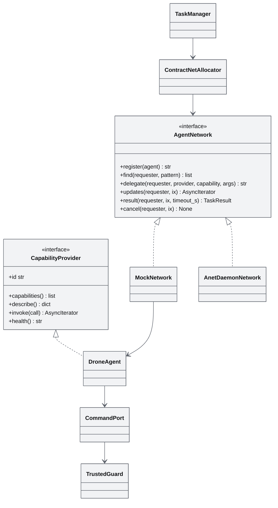
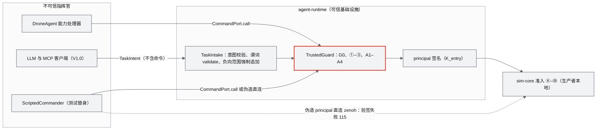
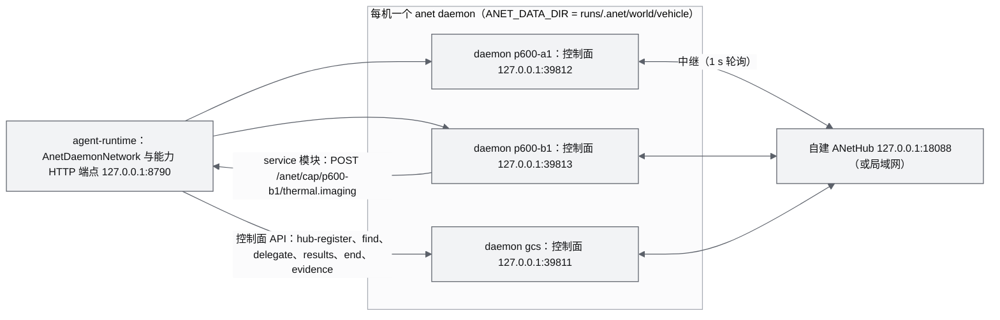
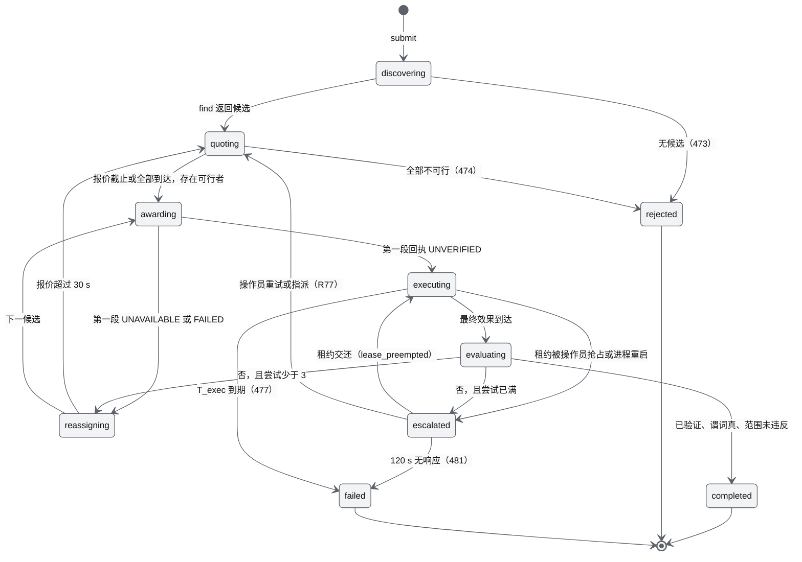
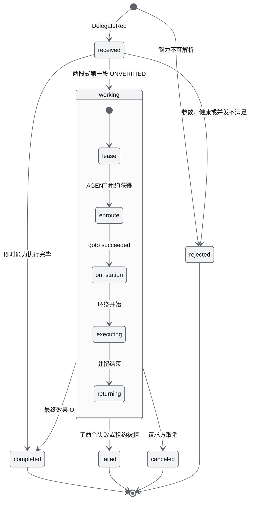

# M14 智能体运行时与 ANet 集成 PRD（Agent Runtime & ANet Integration）

| 项 | 内容 |
|---|---|
| 文档编号 | AWR-M14 |
| 标题 | 智能体运行时与 ANet 集成 |
| 版本 | v1.0 |
| 日期 | 2026-09-28 |
| 状态 | 草案 |
| 上游文档 | [AWR-03 设计基线与决策记录](../03-设计基线与决策记录.md)（ADR-016、ADR-026、ADR-027、ADR-036、ADR-042、ADR-045、ADR-047、ADR-049、ADR-050；§3.3、§3.4、§4.1–§4.3、§5.2、§5.4、§5.6、§5.9、§5.10、§6.1–§6.3、§8.2–§8.7；附录 B 的 C29、C35、C36）；[01-design](../01-design.md) §3、§29–§32、§33、§36–§37、§50–§51；研究笔记 [d05](../research/d05-anet.md)（权威）、[n03](../research/n03-discover-uav-sim-agents.md)、[00-index](../research/00-index.md) §0 第 10 条、§2.10、§3.10、§3.12、§3.14，[x01](../research/x01-urbanscene3d-data.md) §3.11，[g04](../research/g04-gap.md) §6.1、§7.5，[g05](../research/g05-gap.md) §3，[g08](../research/g08-gap.md) §2、§10；并行说明书 [10](../10-系统架构说明书.md)、[12](../12-业务逻辑设计说明书.md) §3.3.15–§3.3.18、§4.7、§4.8、§4.13、§6.10、§7.1、[16](../16-World数据规范.md) §11–§13、[17](../17-接口与实时协议规范.md) §3、§4.2、§6.6、§6.12、§7、§8、§9、§10.7–§10.9（v1.1 已处置本文的登记申请）；并行模块 [M08](M08-仿真内核与飞行器适配PRD.md) §6.10.4（估价）、[M13](M13-传感器仿真PRD.md) §6.5.9、§7.2.5（检测器、`sensor.detect`、热成像帧）、[M16](M16-演示数据剧本与流畅性测试PRD.md) §6.4.5（S3 定稿）；源码 `ANetCore@v0.14.0/{tsir/predicate.go, delegation/delegation.go, evidence/evidence.go}`、`refs/design/ANet/provider/registry.go`、`refs/design/ANet/internal/daemon/capability.go` |
| 下游文档 | [M15 前端 UI 壳](M15-前端UI壳与设计体系组件PRD.md)（AGENTS 面板）、[M16 演示与测试](M16-演示数据剧本与流畅性测试PRD.md)（S3 剧本与 e2e）、[M08 仿真内核](M08-仿真内核与飞行器适配PRD.md)（估价、租约、度量上报）、[M09 安全与健康](M09-安全与健康PRD.md)（AGENT 链路）、[M10 任务规划与集群](M10-任务规划与集群PRD.md)（剧本导演、度量注册、统一打分）、[M13 传感器仿真](M13-传感器仿真PRD.md)（检测器与热成像传感器）、[M06 视口](M06-Web视口与渲染后端PRD.md)（协作叠加）、[M11 实时网关](M11-实时网关PRD.md)（`agent/*` 转发）；[14](../14-UI交互设计PRD.md)、[15](../15-视觉设计规范与色卡.md)、[17](../17-接口与实时协议规范.md)、[18](../18-性能与测试方案.md)、[19](../19-部署与运维说明书.md) |
| 适用版本范围 | V0.1（D1：core 为契约，ext 为 agent-runtime 与进程内 Mock ANet、S3）至 V1.0（真 ANet：每机一个 daemon + 自建 ANetHub） |

## 0. 摘要

1. M14 把每架机抽象为一个按能力协作的 Physical Agent（一机一 AID），在 agent-runtime 进程内实现任务管理（A2A 七态加 `awr.phase`）、合同网分配（find → quote → score → delegate）、TSIR 验收、黑板与证据链，并担任 agent 命令唯一的可信入口（受信守卫）。
2. ANet 定位为秒级协作平面：只承载发现、委派、验收、证据这类任务级消息（每个任务约 1 Hz 量级），遥测、控制与点云始终留在 StateRing、zenoh 与 `awr.rt.v1` 上（ADR-036；d05 §0 第 1 条）。
3. D1-core（P0）只交付契约：能力、清单、任务、效果、谓词与剧本 `agents` 块的 schema，能力目录 `capability_catalog.json`；原因码 470–486、REST R73–R77、`agent-runtime` 的 bus key 与 RNG 流 5 的键控用法已由 17 v1.1 登记（17 §8.4、§4.2、§9.3、§10.8）；效果 schema 同时被命令回执使用（17 §7.3）。
4. D1-ext（P1）交付进程内 Mock ANet（hub 与 daemon 都是内存对象，委派往返 0.9–1.1 s，按仿真时钟计时，RNG 流 5 键控抽样），跑通 S3 纽约港搜救的热成像复核（机体与目标按 M16 §6.4.5 定稿）：仿真 300 s 内把目标置信度从 0.42 提到 ≥ 0.9，×1 与 ×10 的分配决策一致（D1-AC-16）。
5. 报价只能经 `ctl/sim-core/estimate` 用 FleetSim 同一机型与电池模型计算；打分函数 U 的归一化常数按机型给出：p600_mid360 为 η_norm = 200 s、E_norm = 18.87 Wh；x500 为 η_norm = 120 s、能量项关闭（本文 §6.10.3）。
6. 效果状态与任务状态是两根独立的轴："已验证"唯一定义为 OK 且（verify_trust ≥ 2 或 simulated）；任务 completed 还要求 TSIR 验收谓词为真、负向范围未被违反。
7. DroneAgent 的能力处理器与 V1.0 的 LLM/MCP 指挥官一律视为不可信指挥官：只能经受信守卫下发白名单命令或提交任务意图；SafetyStop、kill、escalate、velocity、时钟与环境写入对 agent 一律不可用。
8. V1.0 以同一 `AgentNetwork` 接口换接真 ANet（每机一个 daemon、自建 ANetHub、`service` 模块、按 v0.2/A2A 语义设计），真网按墙钟运行，剧本倍速锁定为 ×1。

---

## 1. 背景与目标

### 1.1 背景

原设计 §31 要求"多机仿真成熟之后再引入 Agent Network"，每架无人机成为 Physical Agent 并对外描述能力（`thermal.imaging`、`rgb.zoom`、`lidar.mapping`、`relay.communication`）；§32 以山区搜救为例描述"发现疑似目标（confidence 0.42）→ 发布任务 → ANet → 发现 Drone B → 接受 → 调整路线 → 热成像观测 → 结果回传"。§50 把 ANet、能力发现、任务分配、异构协作作为 V1.0 主题，§51 把 ANet 定义为"负责多个 Physical Agent 在世界中的自主发现、协同和任务执行"。

研究阶段对这一主题给出了三个关键事实：

1. **ANet 的真实能力边界**（d05，读码并实测）：ANet 是身份（AID + KEL）、按能力发现、签名委派、可离线验证回执与证据的"委派网络"，本身不运行模型；一次能力委派经 hub 往返 921–1016 ms，延迟来自 1 s 中继轮询；v0.1 没有"广播任务 / 抢单"原语，只有 `find` 与点对点 `delegate`；daemon 不评估验收谓词；`service` 模块的信任固定为 V1；本机工作区里有尚未推送的 v0.2（A2A 七态、wire 2）检查点。
2. **LLM 与远程 agent 的安全模型**（n03）：droneserver 把 LLM 视为不可信指挥官，所有指令走固定顺序的守卫流水线（身份、状态、分级、授权、限流、确认令牌、边界、围栏、前置条件、执行、审计），失败即关闭；AerialClaw 的"LLM 直接分解任务"不可验证，分配必须是确定性算法。
3. **估价必须与仿真同源**（ADR-036、C36）：d05 原型按 4.5 kg、397.5 W、8 m/s 估价，而产品默认机型 p600_mid360 为 3.5 kg、悬停约 515 W、限速 3 m/s，ETA 被低估 1.7–2.7 倍，能耗被低估 2–3.5 倍，中标机可能在途中触发电量 RTL。

基线据此冻结了 ADR-036（协作平面、一机一 AID、合同网、估价经 `ctl/sim-core/estimate`、Mock 按仿真时钟、MS6 实施）、ADR-027（agent-runtime 是可信基础设施，agent 逻辑与 LLM 是不可信指挥官，SafetyStop 对 agent 不可用）与 ADR-042（Mock ANet 与 S3 为 D1-ext）。本文把这些决策落成可直接实现的模块设计。

### 1.2 目标

| 编号 | 目标 | 可度量的表述 | 首次达成 |
|---|---|---|---|
| G-M14-1 | 能力语义可发现 | 每个 agent 的能力清单可通过 `agent.describe` 获得并通过 schema 校验；按能力前缀 `find` 返回全部提供者 | V0.1（ext） |
| G-M14-2 | 协作可审计 | 每个协作任务都能从证据链重建 find → quote → awarded → effect → accepted/rejected，链校验通过率 100%，篡改任一字段可检出 | V0.1（ext） |
| G-M14-3 | 分配与仿真一致 | 报价的 `eta_s` 与实际到站用时相差 ≤ 10%，能耗与实飞积分相差 ≤ 10%（与 M08-AC-029 同口径） | V0.1（ext） |
| G-M14-4 | 协作可复现 | 同一种子下 ×1 与 ×10 的中标者、候选集、可行性、证据类型序列与最终置信度一致；`--inproc` 锁步下证据链 id 逐位一致 | V0.1（ext） |
| G-M14-5 | 指挥安全 | agent 发出的 SafetyStop、kill、escalate、velocity、时钟与环境写入、他机命令 100% 被拒；伪造 principal 被生产者拒绝 | V0.1（ext） |
| G-M14-6 | 可换接真网 | 替换为真 ANet 时 TaskManager、Allocator、UI 零改动；S3 委派往返 ≤ 2 s（墙钟） | V1.0 |

### 1.3 对原设计的继承、修正与增强（二次优化）

| 01-design 出处 | 原设计 | 处置 | 二次优化内容 | 依据 |
|---|---|---|---|---|
| §3 总体架构中的 Agent Runtime（ANet、Task Planner、Collaboration、Capability Discovery） | 一个服务端模块里同时包含 ANet 与任务规划 | 修正 | 拆成两层：**Agent Runtime**（自研 Python：任务、分配、验收、黑板、证据、受信守卫）与 **ANet**（外部覆盖网络，经 `AgentNetwork` 接口接入）；轨迹与覆盖规划留在 M10，Agent 层只输出目标与观测点 | d05 §7.1；r25（agent 只输出目标） |
| §29 每架机独立维护 State、Sensor、Mission、Controller、Agent | 每机一个 Agent | 继承并细化 | 一机一 AID；DroneAgent 是 agent-runtime 内的逻辑对象，不是进程；V1.0 真网一机一 daemon（实测约 14 MB/个，≤ 50 架无压力） | d05 §0 第 2 条、§3.10 |
| §31 "多机仿真成熟之后再引入 Agent Network" | 引入顺序 | 继承 | 由里程碑顺序保证：Mock ANet 在 D1-MS6 实施，排在机群核心验收（MS5 出口）之后 | ADR-036、ADR-042 |
| §31 能力列表 | 四个能力 id | 继承并增强 | 沿用四个裸能力 id；新增能力 id 语法与目录（24 条）、每机必备元能力 `agent.describe`、`agent.state`、`task.quote`，能力清单 `awr.agent.manifest.v1` 与 V0–V4 / A0–A4 信任轴；禁止 `@device` 后缀 | d05 §0 第 3 条、§3.1–§3.2 |
| §32 "发布任务 → ANet → 发现 Drone B → 接受" | 广播式发布与接受 | 修正 | ANet 没有广播原语，落成合同网 find → quote → score → delegate；补齐验收谓词、负向范围、超时与重试、失败升级、租约冲突处理、黑板防重复出动、回执与证据链、环境感知的可行性与风险 | d05 §0 第 8 条、§7.3 |
| §32 confidence 0.42 → thermal 复核 | 流程示意 | 增强 | 固化为 S3 剧本与 D1-AC-16：0.42 → ≥ 0.9，仿真 300 s 内，报价经 estimate，效果 OK 且 `simulated = true` | x01 §3.11；ADR-036 |
| §33 Backend 栈"Agent：ANet" | 一行 | 修正 | 拆为"Agent Runtime：自研 Python asyncio"与"Agent Network：ANet（V1.0 锁定 anet、ANetHub、ANetCore 同一 wire 的版本组合）+ 自建 hub" | d05 §7.5；11 T64、T65 |
| §36–§37 通信与频率 | 未列协作平面 | 增强 | 新增协作平面一行：事件驱动，Mock 往返 0.9–1.1 s（仿真），真网约 1 s（墙钟），UI 合批 ≤ 4 Hz，不承载遥测与控制（§6.2） | d05 §7.6 |
| §50 V1.0：ANet、能力发现、任务分配、协作、异构 | 全部在 V1.0 | 修正 | Mock ANet 与 S3 提前到 V0.1（ext，排在 MS5 出口之后）；真 ANet、CBBA、LLM/MCP、异构实体留在 V1.0；分配算法分三档并共用打分（§6.10.6） | ADR-042；00-index §3.12；n03 §7.8 |
| §51 "ANet 负责自主发现、协同和任务执行" | 职责表述 | 修正 | 更正为：ANet 负责身份、发现、签名委派与证据；协同策略与任务执行由 Agent Runtime、M10 规划与 M08 仿真负责 | d05 §7 第 11 条 |
| 原设计未涉及 | LLM 与远程 agent 安全 | 新增 | LLM/MCP 与 agent 逻辑一律为不可信指挥官，经受信守卫流水线；人工 UI 与 agent 共用同一套准入与审计 | n03 §0 第 6 条、§3.8；ADR-027 |
| 原设计未涉及 | 可复现 | 新增 | 全部协作计时器按仿真时钟；Mock 延迟用登记的 RNG 流、按消息键控抽样；`--inproc` 锁步驱动下证据链逐位可复现 | ADR-036、ADR-045、ADR-049 |

### 1.4 对研究结论的修正（本文新增，均写入 §14 或已按基线执行）

| 原结论（出处） | 问题 | 本文处置 |
|---|---|---|
| d05 原型按 4.5 kg、8 m/s、222 Wh 的 80% 估价（d05 §3.5） | 与 p600_mid360 不一致（C36） | 已按 ADR-036 作废，改经 `ctl/sim-core/estimate`；归一化常数按机型给出（§6.10.3） |
| d05 风险函数 `risk = clamp(0.5·wind/wind_max + 0.3·rain/rain_max + 0.2·(1 − vis/vis_min_ok), 0, 1)` | 能见度项未单独限幅：MOR 10 km、下限 200 m 时第三项为 −9.8，整体恒被截到 0，风与雨的风险全部失效 | 每项先限幅到 [0, 1] 再加权（§6.10.4） |
| d05 能力清单字段 `wind_ms`、`rain_mm_h`、`alt_m`、`res` | 违反 AWR-03 §5.4 单位后缀规则（`_ms` 只表示毫秒） | 改为 `wind_mps`、`rain_mmh`、`alt_agl_m`、`res_px` |
| d05 原型证据 id 截断为 24 位十六进制 | 抗碰撞余量不足，与 ANet 的完整 sha2-256 不一致 | 完整 64 位十六进制；墙钟时间不进入哈希原像 |
| d05 Mock 延迟按墙钟 | ×10 与暂停下 S3 不可复现 | 已按 ADR-036 改为仿真时钟；本文进一步规定按消息键控抽样，避免异步到达顺序改变抽样序列（§6.12.3） |
| 12 §6.10 规则 1"find 排除 health 不为空的 Agent" | 真 ANet 的 hub 不知道健康状态，排除需要额外一次 `agent.state` 往返（约 1 s） | 实现上由 `task.quote` 对不健康者返回 UNAVAILABLE 完成，结果与规则 1 等价，并与真网同构、少一次往返 |
| d05 §3.2 与 12 §3.3.17 的清单 schema 名 `awr.capability-manifest/1` | 不符合 AWR-03 §5.6 的 schema 名规则 `awr.<Name>.v<N>` | 改为 `awr.agent.manifest.v1`（与 `awr.agent.status.v1`、`awr.agent.tasks.v1` 同族；§14 第 22 条） |
| d05 §2.2 回执"7 项绑定校验" | 本文初稿把"request_cid 一致""时间单调"列入 7 项，与 `ANetCore@v0.14.0/delegation.VerifyResult` 的实际检查不符 | 7 项按源码改正（§6.12.1）；request_cid 一致作为 Mock 附加检查 |
| d05 原型产物 `thermal/frame-0001.tiff`（655360 B，640 × 512 × 2） | D1 的热成像帧由 M13 `render_thermal_frame` 从事件参数生成，为 PGM 160 × 120（19215 B），TIFF 描述符无法由参数重建 | 产物描述符改为 `thermal/<task_id>/<event_seq>.pgm`、19215 B（§6.11.1；§14 第 19 条） |
| d05 原型报价的 `conf_expected` 固定取 P0（0.95），本文初稿 §6.10.5 写作"观测点在目标正上方时 r = 0" | 检测器公式中的 r 是传感器到目标的斜距（M13 §6.5.9），正上方 60 m 时 r = 60 m，热成像为 0.95·e^(−(60/150)²) ≈ 0.81，再乘 LOS 与 vis | 按斜距计算（§6.10.5；12 §6.10 规则 3 的公式不变，§14 第 15 条请其注明 r 为斜距） |

### 1.5 本模块新增术语（其余见 AWR-03 §11）

| 中文 | 英文 | 定义 |
|---|---|---|
| 无人机智能体 | DroneAgent | agent-runtime 内与一架机一一对应的逻辑对象，持有该机的 AID，作为 `CapabilityProvider` 服务能力调用；不持有线程 |
| 协调者 | Coordinator（`gcs`） | 代表地面站的 agent，提供 `blackboard.*`，作为操作员与剧本发起任务时的请求方 |
| 能力目录 | Capability Catalog | `packages/contracts/agent/capability_catalog.json`，全部合法能力 id 及其默认属性的唯一真源 |
| 能力清单 | Capability Manifest | 某个 agent 实际提供的能力及其物理参数（`awr.agent.manifest.v1`），由 `agent.describe` 返回 |
| 委派 | Delegation（`ix`） | 一次点对点能力调用，id 形如 `ix_<32hex>`；一个任务可以有多次委派（报价、执行、重试） |
| 两段式长任务 | Two-stage long task | 飞行与观测类能力先立即返回 UNVERIFIED、`eta_s`、`task_ref`，完成后再返回最终效果 |
| 观测点 | Station | 执行观测时机体的目标位置，由目标点、观测离地高度与 DSM 净空计算 |
| 受信守卫 | TrustedGuard | agent-runtime 中 agent 命令的可信入口，执行规范准入 ①–③ 与 agent 专用检查 A1–A4 |
| 命令端口 | CommandPort | 交给能力处理器的唯一出口对象，所有命令都经 TrustedGuard |
| 仿真调度器 | SimScheduler | 以仿真时间为轴的定时器堆，全部协作计时器由它驱动 |
| 伪 AID | Pseudo-AID | Mock 下由世界 id 与机体 id 确定性派生的 AID，形状与真 AID 相同 |
| 回执 | Receipt | 提供方对"请求 CID、结果 CID"签名的结果凭证；请求方做 7 项绑定校验 |
| 任务包络 | Task envelope | 某次委派允许机体活动的空间与参数范围（到目标的水平距离、离地高度、速度） |
| 足迹半径 | R_foot | 观测高度处传感器地面足迹半径 `alt_agl_m·tan(hfov/2)`；与 M13 检测器的距离尺度 `r_fp_m`（热成像 150 m）不是同一个量 |

---

## 2. 范围

### 2.1 D1 范围（与 AWR-03 §6.3 的 M14 行一致）

| 层 | 内容 | 验收 |
|---|---|---|
| **D1-core（P0）** | ①`packages/contracts/agent/`：`capability.schema.json`、`capability_catalog.json`（24 条）、`manifest.schema.json`、`task.schema.json`、`effect.schema.json`（命令回执共用）、`predicate.schema.json`、剧本 `agents` 块 schema；②契约登记（17 v1.1 已采纳，MS1 由 M00 写入契约文件）：原因码 470–486（17 §8.4）、`agent.*` 事件 kind、`awr.agent.status.v1`、`awr.agent.tasks.v1`、`awr.agent.v1`（MCAP，16 §13.3）、bus key（17 §9.3）、计时器（17 §10.7 与本文 §7.8）、RNG 流 5 的键控用法（17 §10.8）；③TSIR 枚举与 ANetCore v0.14 数值对齐的 golden | M14-AC-001 至 004 |
| **D1-ext（P1）** | agent-runtime 进程（`python -m awr.agent.runtime`）；进程内 MockANet（MockHub、MockDaemon、MockRelay）；一机一伪 AID 与能力清单；TaskManager（A2A 七态加 `awr.phase`、`alloc`）；合同网 Allocator 与打分（经 `ctl/sim-core/estimate`）；TSIR 求值器；黑板；证据链；DroneAgent 与 `thermal.imaging`、`rgb.zoom` 处理器；热成像帧产物描述符（参数随 `sensor.detect` 下发，可由 M13 `render_thermal_frame` 逐字节重建）；SimScheduler（环头部驱动与锁步驱动）；受信守卫与 AGENT 租约；S3 流程与 `target_confidence`、`t_conf_s` 度量；REST `rest/agents.py`；`stores/agents.ts`；ScriptedCommander 对抗测试替身 | M14-AC-005 至 036；D1-AC-16 |
| **D1 桩** | `anet_bridge`：`AnetDaemonNetwork` 接口、daemon 配置生成器、FakeDaemon 契约测试（P2）；`LlmCommander` 接口（只有签名与拒绝一切的默认实现） | M14-AC-037 |
| **不在 D1** | 真 daemon 与 hub、`service` 能力 HTTP 端点、CBBA、集中式 Hungarian/SSI 分配、LLM/MCP 接入、`relay.communication` 的链路质量模型、`lidar.mapping` 等未实现能力的执行、网络拓扑视图、异构实体（kind ≠ uav）的 agent | — |

### 2.2 版本路线

| 版本 | M14 内容 | 依据 |
|---|---|---|
| V0.1（D1） | 见 §2.1 | ADR-042 |
| V0.2 | `anet_bridge` 配置生成器与 FakeDaemon 契约测试转为 P1；效果五态已随命令回执在 V0.1 上线，外部飞控后端（SIH）的 V1/V2 信任在此验证 | d05 §7 第 8 条 |
| V0.6 | 集中式分配器档位（Hungarian/SSI，由 M10 `awr/swarm/allocation` 实现，与本文打分函数合并为同一实现）；`mission.insert_leg`（插入验证航段）；`relay.communication` 与 S6 链路质量模型 | n03 §3.9、§7.8；r26 §7.11 |
| V1.0 | 真 ANet：自建 ANetHub + 每机一个 daemon（`service` 模块接入 agent-runtime 的能力端点），v0.1 适配层与 v0.2（A2A）语义；CBBA 断网分配（M10）；LLM/MCP 指挥官经受信守卫；异构实体 agent；网络图视图 | ADR-036；AWR-03 §8.1 |
| V1.x | ANetLink `uav` 适配器（Go），信任提升到 V2–V4；设备端 daemon（Jetson，A3/A4） | d05 §3.3 形态 C |

### 2.3 与相邻模块的边界

| 事项 | M14 负责 | 不负责（归属） |
|---|---|---|
| 合同网业务语义（状态、规则） | 实现，并补齐实现级参数 | 语义定义方为 [12 §4.13、§6.10](../12-业务逻辑设计说明书.md) |
| 估价 `eta_s`、`energy_wh`、`soc_after_pct`、`feasible` | 调用与打分 | 计算：M08 入口与路径构造、M09 `EnergyModel`（ADR-036） |
| 租约 | 以 AGENT 身份申请与交还 | LeaseManager 与抢占规则：M08；业务语义：12 §4.8 |
| 命令准入 ④–⑩ | 不重复实现 | sim-core CommandEngine（M08）与 Safety（M09） |
| 检测器与热成像传感器 | 消费 `sensor.detect` 事件；按事件的 `artifact` 参数登记产物描述符（D1 不落盘） | 检测、目标状态（UNSEEN → SUSPECT → CONFIRMED）与帧内容：M13（Mock 检测器、`thermal.yaml`、`render_thermal_frame`） |
| 剧本中的目标生成、搜索航线 | 读剧本 `agents` 块并触发任务 | 剧本文件与 S3 坐标 M16；`target.spawn` 目标表 M13（M13-FR-040）；剧本导演、`expanding_square` 生成器 M10 |
| AGENTS 面板 | 数据 store `stores/agents.ts` 与字段语义 | 面板 JSX 与布局 M15；交互 14；视觉 15 |
| 3D 协作叠加 | 提供只读数据 selector | 绘制 M06 |
| `agent/*` 线上转发 | 定义载荷与事件 | Gateway 转发 M11；格式登记 17 |

---

## 3. 用户与用例

### 3.1 参与者

| 参与者 | 类型 | 与 M14 的关系 | 信任 |
|---|---|---|---|
| 操作员（operator 席位） | 人 | 发起与取消协作任务、在 AGENTS 面板查看任务与证据、对 AGENT 持有的机体强制接管 | 经 api 可信入口 |
| 科研人员、观众（viewer） | 人 | 只读查看 AGENTS 面板、证据链与 Timeline | 只读 |
| 剧本导演（sim-core，M10） | 系统 | 发出 `scenario.agent_task` 动作、读取 `target_confidence` 度量 | 可信 |
| DroneAgent 能力处理器 | 系统（agent 逻辑） | 执行被委派的能力，经 CommandPort 下发命令 | **不可信指挥官** |
| LLM 指挥官（V1.0） | 系统 | 经 MCP 工具提交任务意图 | **不可信指挥官** |
| agent-runtime | 系统（可信基础设施） | 运行 TaskManager、Allocator、MockANet、TrustedGuard | 可信 |
| sim-core | 系统 | 提供估价、租约、命令准入、检测事件、仿真时钟 | 可信 |

### 3.2 用例

| 编号 | 用例 | 主流程 | 相关需求 |
|---|---|---|---|
| UC-01 | S3 热成像复核（主演示） | 搜索机 a1 的 RGB 检出置信度 0.42（< 0.8）→ 剧本触发器以 a1 为请求方建任务 → find `thermal.*` → 三个候选报价 → b1 中标 → 两段式执行（租约、改航、环绕驻留、热成像检出 0.9）→ 已验证且谓词为真 → 黑板结论、证据链完整、度量 0.9 上报 | FR-015–031、038–043 |
| UC-02 | 操作员点选请求复核 | 操作员在视口点选水面点 → "请求热成像复核" → `POST /api/agent-tasks` → 同 UC-01 的分配与执行 | FR-062 |
| UC-03 | 重试与升级 | 首选机途中触发电量 RTL（任务 failed）→ 换次选；三次失败 → input-required（escalated）→ 操作员指派或取消，120 s 无响应 → failed | FR-025、019 |
| UC-04 | 操作员接管执行机 | 操作员对执行中的 b1 申请 OPERATOR 租约 → AGENT 被抢占 → 任务 input-required（lease_preempted）→ 操作员交还 → 回到 working | FR-019；12 A10–A11 |
| UC-05 | 防止重复出动 | 另一架搜索机（或操作员点选）对同一目标 25 m 内再次提交同能力复核 → 合并到已有任务，不再委派（M13 对同一目标的 suspect 事件只发一次，同机不会重复触发） | FR-018 |
| UC-06 | 查看证据链 | viewer 在 AGENTS 面板点任务行 → Sheet 显示 find、quote×3、awarded、state…、effect、accepted 与"链校验通过" | FR-035–037、072 |
| UC-07 | 对抗与越权 | agent 逻辑试图 SafetyStop、给他机发 goto、超出任务包络、写环境 → 受信守卫拒绝并审计，sim-core 状态不变 | FR-052–058 |
| UC-08 | agent-runtime 崩溃 | kill -9 → AGENT 持有的机体按链路阶梯 HOLD → supervisor 重启 → 从证据链重建任务、交还遗留租约 → 非终态任务 input-required（interrupted）→ 操作员重试或取消 | FR-021 |
| UC-09 | 倍速与暂停 | S3 以 ×10 运行、中途暂停 30 s 墙钟 → 协作计时器冻结，恢复后结果与 ×1 一致 | FR-049–050 |
| UC-10 | 回放 | 回放 S3 录制 → AGENTS 面板按录制的 `agent.*` 事件重现任务与证据，只读 | FR-065 |
| UC-11 | 换接真 ANet（V1.0） | 剧本 `agents.network = anet` → 编排每机 daemon 与 hub → 同一 S3 流程，委派往返 ≤ 2 s，倍速锁 ×1 | FR-069–071 |
| UC-12 | LLM 提交任务（V1.0） | LLM 经 MCP `tasks.submit` 提交意图 → 守卫分级（NORMAL 直接入队，CRITICAL 需人工确认）→ 确定性分配 | FR-059 |

---

## 4. 功能需求

优先级与版本按 AWR-03 §10.2 第 4 条：D1-core 为 P0/V0.1/是；D1-ext 为 P1/V0.1/是（可豁免）；D1 = 桩只交付接口或测试替身。

| 编号 | 需求描述 | 优先级 | 目标版本 | D1 | 验收要点 | 依据 |
|---|---|---|---|---|---|---|
| **契约（MS1 冻结）** | | | | | | |
| M14-FR-001 | `capability.schema.json`：能力 id 语法 `^[a-z][a-z0-9_]*(\.[a-z][a-z0-9_]*){1,2}$`、≤ 64 B；能力条目字段见 §6.4.2（`access`、`requires_lease`、`long_running`、`timeout_s`、`max_concurrent`、`input_schema`、`output_metrics`、`output_artifacts`、`physical`、`trust`、`ops`、`default_accept`、`d1`） | P0 | V0.1 | 是 | M14-AC-001、007 | d05 §3.1–§3.2；AWR-03 §5.10 |
| M14-FR-002 | `capability_catalog.json` v1 收录 §6.4.3 的 24 个能力；由 M00 生成器产出 Python 与 TS 常量；sim-core 估价（查 `physical.limits`）与 agent-runtime 共读同一文件 | P0 | V0.1 | 是 | M14-AC-001 | ADR-036；d05 §3.1 |
| M14-FR-003 | `manifest.schema.json`（`awr.agent.manifest.v1`，字段见 §6.4.4），字段与 A2A AgentSkill 对齐，全部 snake_case 带单位后缀 | P0 | V0.1 | 是 | M14-AC-001、008 | d05 §3.2；AWR-03 §5.6 |
| M14-FR-004 | `task.schema.json`：TaskSpec（提交）与 TaskStatus（状态），状态为 A2A 七态，`phase` 为 `awr.phase` 六值，`alloc` 为合同网子阶段五值（12 §3.3.15） | P0 | V0.1 | 是 | M14-AC-001 | 12 §3.3.15；d05 §3.4 |
| M14-FR-005 | `effect.schema.json`：效果五态 OK、UNVERIFIED、FAILED、UNAVAILABLE、PAYMENT_REQUIRED；`verify_trust` 0–4、`auth_trust` 0–4、`simulated`、证据字段（`requested`、`protocol`、`native_ack`、`observed_state`、`latency_ms`、`quirk`）、`metrics`、`artifacts`、`message`；**扁平结构**，与 17 §7.8 命令回执示例逐字段一致，命令回执与协作任务共用 | P0 | V0.1 | 是 | M14-AC-002 | g04 §7.5；d05 §2.4；17 §7.3 |
| M14-FR-006 | `predicate.schema.json`：TSIR 封闭文法，op 与枚举数值与 ANetCore v0.14 完全一致（AND 1、OR 2、NOT 3、ARTIFACT 10、TEST 11、THRESHOLD 12、SCOPE 13；比较 LT 1–GT 5；动词 CREATE 1–GET 5；匹配 GLOB 1、SET 2、PREFIX 3） | P0 | V0.1 | 是 | M14-AC-003 | `ANetCore/tsir/predicate.go` |
| M14-FR-007 | 剧本 `agents` 块 schema（`scenario.schema.json#/$defs/agents`，§7.4），16 §12.2 引用 | P0 | V0.1 | 是 | M14-AC-001 | 16 §12.2 |
| M14-FR-008 | 契约登记（17 v1.1 已采纳，交 M00 写入契约文件）：原因码 470–486（§7.7；17 §8.4 码段 470–489）、`agent.*` 事件 kind（§7.2.3）、`awr.agent.status.v1`、`awr.agent.tasks.v1`、`awr.agent.v1`、bus key（§7.3；17 §9.3）、计时器（§7.8；17 §10.7）、RNG 流 5 的键控用法（17 §10.8）、Command op `scenario/metric`（17 §9.4） | P0 | V0.1 | 是 | M14-AC-004 | AWR-03 §10.2 第 9 条；17 §8.4、§10.7–§10.9 |
| **身份与能力** | | | | | | |
| M14-FR-009 | 一机一 AID：Mock 伪 AID 按 §6.3 公式由 (world_id, vehicle_id) 确定性派生，跨 run 稳定；协调者 AID 由保留 id `gcs` 派生；AID 与 vehicle_id 在一个 Session 内双向唯一 | P1 | V0.1 | 是 | M14-AC-005 | d05 §0 第 2 条；ADR-036 |
| M14-FR-010 | 能力 id 校验：拒绝带 `@`、大写、非法字符、超长或不在目录中的 id，返回 `471 CAPABILITY_UNKNOWN` | P1 | V0.1 | 是 | M14-AC-007 | d05 §0 第 3 条 |
| M14-FR-011 | `Registry.resolve`：先精确匹配，再按 `.` 逐级回退到父能力；同一 AID 内两个 provider 声明同一能力时拒绝注册（ANet `ErrCapabilityConflict` 语义） | P1 | V0.1 | 是 | M14-AC-006 | d05 §2.2；`provider/registry.go` |
| M14-FR-012 | 能力清单生成：由机型 profile、传感器 yaml 与剧本成员 `capabilities` 合成；`physical.sensor` 取机型传感器 yaml（hfov 由内参换算，`p0`、`r_fp_m` 取 `detector{}`），缺失时用目录默认值；`physical.limits` 取传感器 yaml、目录默认与机型 `wind_rating_mps` 中较严者（§6.4.4）；清单 sha256 写入证据链 `agent.registered` | P1 | V0.1 | 是 | M14-AC-008 | d05 §3.2；M13 §7.3；16 §11.3 |
| M14-FR-013 | 每个 DroneAgent 必须提供元能力 `agent.describe`、`agent.state`、`task.quote`；协调者提供 `blackboard.add`、`blackboard.snapshot`、`blackboard.conclude` | P1 | V0.1 | 是 | M14-AC-008 | d05 §3.1 |
| M14-FR-014 | 健康推导（12 §3.3.17）：FlightState ∈ {UNKNOWN, ELAND, FAILSAFE, CRASHED}、lifecycle ≠ READY、租约被 OPERATOR 或 PILOT 持有时不健康；机型有电池模型（profile `battery ≠ null`）而 `battery_pct` 为哨兵 255（读数缺失）时也不健康。`battery = null` 的机型（x500 回归机体）`battery_pct` 恒为 255（M09-FR-050），不据此判不健康。不健康者 `task.quote` 返回 UNAVAILABLE 并在 `message` 写原因 | P1 | V0.1 | 是 | M14-AC-009 | 12 §3.3.17；M09-FR-050；AWR-03 §5.7 |
| **任务与状态** | | | | | | |
| M14-FR-015 | TaskManager 按 12 §4.13 的 A01–A15 实现 A2A 七态；终态迁移用比较交换（等价于 `UPDATE … WHERE state NOT IN 终态`）；`phase`、`alloc` 只作元数据 | P1 | V0.1 | 是 | M14-AC-010 | 12 §4.13；d05 §3.4 |
| M14-FR-016 | 两轴：任务状态与效果状态分别存储、分别上线；completed 当且仅当 `verified(effect)` ∧ TSIR 验收为真 ∧ 负向范围未违反 | P1 | V0.1 | 是 | M14-AC-011 | d05 §0 第 5 条；12 §4.13 规则 1 |
| M14-FR-017 | 信任钳制：`verified()` 是唯一判定（OK 且 `verify_trust ≥ 2` 或 `simulated`）；quirk、提供方自报、`service` 模块 V1 不得抬升；Mock 仿真真值为 V4 并置 `simulated = true` | P1 | V0.1 | 是 | M14-AC-011 | d05 §0 第 6 条；12 §4.7 规则 1–2 |
| M14-FR-018 | 同目标同能力去重：新 claim 与黑板上活动 intent 的水平距离 ≤ `merge_radius_m`（30 m）且能力相同，合并到已有任务，REST 返回 `merged_into` | P1 | V0.1 | 是 | M14-AC-012 | 12 §4.13 规则 3；d05 §3.7 |
| M14-FR-019 | 截止与升级：`T_exec = 1.5·eta_s + dwell_s + 60 s`；重试上限 2；重试耗尽进入 input-required（escalated），120 s【仿真】无操作员响应则 failed（`481 ESCALATION_TIMEOUT`）；租约被抢占进入 input-required（lease_preempted），交还后回到 working | P1 | V0.1 | 是 | M14-AC-016 | d05 §3.4；12 A09–A13 |
| M14-FR-020 | 并发上限：活动任务 ≤ 64（超出 `105 STATE`，detail = TASK_LIMIT）；每个 AID 的飞行类委派 ≤ 1（`max_concurrent`），忙时返回 UNAVAILABLE（BUSY），不排队 | P1 | V0.1 | 是 | M14-AC-033 | d05 §2.3（满额即 UNAVAILABLE） |
| M14-FR-021 | 故障处置：sim-core 纪元变化、剧本重置、进入回放、agent-runtime 自身重启时的任务与租约处置按 §6.19；重启后从协调者证据链重建任务表，先按 `return_to = previous` 交还本进程名下的全部 AGENT 租约，再把非终态任务置 input-required（interrupted，`reason_code = 483`），与 12 A15 一致 | P1 | V0.1 | 是 | M14-AC-030 | 12 §4.13 A15、§4.14；10 §13 |
| **合同网** | | | | | | |
| M14-FR-022 | find：以能力模式查询 hub（精确、尾部 `*` 字节前缀、逗号 OR，区分大小写）；结果排除请求方自身，按 `agent_no` 升序 | P1 | V0.1 | 是 | M14-AC-013 | d05 §2.7；ANetHub `FindByCapability` |
| M14-FR-023 | quote：并行向候选委派 `task.quote`；提供方调用 `ctl/sim-core/estimate` 得到 `eta_s`、`energy_wh`、`soc_after_pct`、`feasible`、`code` 与期望检出概率；报价截止 `T_quote = 3 s`【仿真】，全部到达即提前结束，迟到报价丢弃 | P1 | V0.1 | 是 | M14-AC-014 | ADR-036；d05 §3.4 |
| M14-FR-024 | score：`U = 1.0·conf − 0.6·eta_s/η_norm − 0.3·energy_wh/E_norm − 0.2·load − 0.5·risk`；不可行为 −∞；风险分项限幅（§6.10.4）；归一化常数按机型（§6.10.3）；U 量化到 1e-3，同分 `agent_no` 小者优先 | P1 | V0.1 | 是 | M14-AC-015 | ADR-036；12 §6.10 规则 3 |
| M14-FR-025 | delegate：对排名第一者委派；委派 rejected、failed、效果未验证、谓词为假或范围违反时换下一候选，总尝试 ≤ 3 次；距报价超过 30 s【仿真】的候选先重新报价 | P1 | V0.1 | 是 | M14-AC-016 | d05 §3.5；12 A08 |
| M14-FR-026 | `strategy = direct`：指定 `provider_aid`，跳过 find，仍先报价校验可行性，不可行返回 `474 ALL_INFEASIBLE` | P1 | V0.1 | 是 | M14-AC-016 | d05 §4.3 |
| M14-FR-027 | 每次分配的候选、报价明细、打分分项与名次写入证据链 `agent.task.quote`、`agent.task.awarded`，并发同名事件 | P1 | V0.1 | 是 | M14-AC-034 | D1-AC-16 |
| **TSIR** | | | | | | |
| M14-FR-028 | `validate`：深度 ≤ 16；AND、OR 子项 2–64；NOT 恰好 1 个子项；THRESHOLD 比较符在 1–5；SCOPE 动词在 1–5、匹配类型在 1–3（资源种类 `kind` 不做范围检查，与 v0.14 源码一致，见 §6.7.3）；未知 op、ARTIFACT 带 `schema_ref` 或 `contains`、TEST 的 `expect` 不为 1 或 2 一律 MALFORMED（失败即关闭，`121`，detail = PREDICATE_MALFORMED） | P1 | V0.1 | 是 | M14-AC-017 | `predicate.go` validate |
| M14-FR-029 | `evaluate`：THRESHOLD 在度量缺失时为假；ARTIFACT 按 C-D4 glob（`*` 不跨 `/`，`**` 跨 `/`）、`exists`、`min_size_bytes`；TEST 按 id 与期望；与移植自 ANetCore 测试的向量逐条一致 | P1 | V0.1 | 是 | M14-AC-017 | `predicate.go` Evaluate |
| M14-FR-030 | `evaluate_scope`：负向范围为硬闸门，命中即 `480 SCOPE_VIOLATION`；默认负向范围为本世界全部 nofly 区，提交方不能删除（只能追加） | P1 | V0.1 | 是 | M14-AC-018 | `predicate.go` EvaluateScope；d05 §3.5 |
| M14-FR-031 | 验收记录（EffectRecord）按 §6.7.3 由效果与执行过程构造：`metrics`、`artifacts`、`tests`、`resources`、`effects` | P1 | V0.1 | 是 | M14-AC-018 | tsir-spec §3.3a |
| **黑板** | | | | | | |
| M14-FR-032 | CogUnit（claim、intent、evidence、conclusion、retraction）、HLC（wall 取仿真毫秒）、只增 OR-Set、撤回以新单元表达；相位 active → concluded → archived，非 active 拒绝写入 | P1 | V0.1 | 是 | M14-AC-019 | d05 §2.6、§3.7 |
| M14-FR-033 | 单元 id = `sha256:` + 规范 JSON 的完整 sha256；Mock 签名为 HMAC-SHA256（每 AID 密钥由 `AWR_SECRET` 经 HKDF 派生，info = `awr/agent/<aid>/v1`），签名不进入 id | P1 | V0.1 | 是 | M14-AC-019 | d05 §3.7 |
| M14-FR-034 | 快照按 (wall, logical, node, id) 全序；4096 单元快照 ≤ 5 ms | P1 | V0.1 | 是 | M14-AC-019 | d05 §2.6（Go 版 2.5 ms） |
| **证据链** | | | | | | |
| M14-FR-035 | 每个 AID 一条仅追加哈希链（外加协调者链）：`id = sha256(规范 JSON(chain, seq, prev, type, payload, t_sim_ns))`，完整 64 位十六进制；`t_wall_ns` 另存，不进入哈希原像 | P1 | V0.1 | 是 | M14-AC-020 | d05 §3.8 |
| M14-FR-036 | 持久化 `runs/<run>/agents/evidence/<chain>.jsonl`，1 s【墙钟】fsync；打开时逐条校验，末尾半截行截断并补一条 `anet.evidence.gap` | P1 | V0.1 | 是 | M14-AC-021 | d05 §2.1 ledger.go |
| M14-FR-037 | 事件类型全集见 §6.9.2；每条证据记录同时以同名 `agent.*` 事件发出（`data` = payload 加 `chain`、`seq`、`id`），作为 Timeline 事件源并被录制 | P1 | V0.1 | 是 | M14-AC-036 | d05 §3.8 |
| **DroneAgent 与能力处理器** | | | | | | |
| M14-FR-038 | DroneAgent 实现 `CapabilityProvider`（`id`、`capabilities`、`describe`、`invoke`、`health`、`invoke_timeout`）；所有命令只能经 CommandPort → TrustedGuard | P1 | V0.1 | 是 | M14-AC-022 | d05 §2.2、§4.2 |
| M14-FR-039 | `thermal.imaging` 两段式处理器：第一段立即返回 UNVERIFIED（`accepted = 1`、`eta_s`、`task_ref`）；从第一段起订阅本机对该目标的 `sensor.detect`（首条 confirmed 可能在途中发生，之后 M13 以 `repeat = true` 每 2 s 至多再发一条）；申请 AGENT 租约；计算观测点；必要时 takeoff；goto（`route = auto`）；环绕驻留 `dwell_s`（云台依靠 orbit 的默认 LOOK_AT，M13-FR-012）；汇总检出；按事件携带的 `artifact` 参数登记产物描述符 `thermal/<task_id>/<event_seq>.pgm`（19215 B，与 M13 `render_thermal_frame` 的输出一致，D1 不落盘）；产出效果；按 previous 交还租约；`phase` 依次为 lease、enroute、on_station、executing、returning | P1 | V0.1 | 是 | M14-AC-022 | d05 §3.3；12 §6.10；M13-FR-043、FR-044；M13 §6.7.3 |
| M14-FR-040 | `rgb.zoom` 处理器与 `thermal.imaging` 同构（传感器 rgb）；`relay.communication` 只做定点驻留（P2）；目录中其余能力（`lidar.mapping`、`lidar.scan`、`rgb.capture`、`mission.*`、`flight.*`）在 D1 对调用诚实返回 UNAVAILABLE（`message = not served in D1`） | P1 | V0.1 | 是 | M14-AC-022 | d05 §0 第 9 条 |
| M14-FR-041 | 检出消费：订阅 `evt/sim-core/sensor` 的 `sensor.detect` 事件（M13-FR-043：`uav`、`sensor`、`capability`、`target_id`、`target_kind`、`pos_enu_m`、`range_m`、`pd`、`conf`、`state`、`repeat`、`artifact`）；剧本 `agents.tasks[].trigger` 命中（检出机角色、能力模式、`state = suspect`、置信度低于 `conf_lt`）时以检出机 AID 为请求方创建任务并在黑板写 claim 与 intent；不属于任何活动委派的 `confirmed` 事件只写黑板 claim，不提升 `target_confidence`（§6.19） | P1 | V0.1 | 是 | M14-AC-034 | x01 §3.11；12 §6.10；M13-FR-043 |
| M14-FR-042 | 观测点：`z = max(ground_dtm(xy) + alt_agl_m, height_dsm(xy) + 10 m)`，经 `svc/geo/height` 查询；`alt_agl_m` 不在能力 `physical.alt_agl_m` 范围内时拒单（`110`） | P1 | V0.1 | 是 | M14-AC-022 | M04-FR-025；d05 §3.2 |
| M14-FR-043 | 度量：`target_confidence{target_id}`（已验收任务的结论置信度；无结论时取最新搜索类 claim 置信度）与 `t_conf_s{target_id, threshold = 0.9}`（首次达到阈值的仿真时刻，未达到时缺失），名称按 16 §12.3 的登记表；由 TaskManager（不经 CommandPort）以协调者 principal `agent:<coordinator_aid>` 发 Command op `scenario/metric` 上报，sim-core 记入输入日志后写入 M08 度量注册表供剧本导演读取（§14 第 5 条） | P1 | V0.1 | 是 | M14-AC-023 | 12 §7.1.3；16 §12.3；17 §9.4；M08-FR-088 |
| **Mock ANet** | | | | | | |
| M14-FR-044 | MockHub：register（每 agent ≤ 256 个能力、每 id ≤ 64 B）、find（同 FR-022 的模式语法）、能力索引；hub 不知道健康状态 | P1 | V0.1 | 是 | M14-AC-013 | d05 §2.7 |
| M14-FR-045 | MockDaemon：provider registry、收件箱、中继、账本、回执（7 项绑定校验）、长任务并发 ≤ 4（满额立即 UNAVAILABLE）、**不配置 auto-reply**（解析失败一律 UNAVAILABLE） | P1 | V0.1 | 是 | M14-AC-013 | d05 §2.3、§0 第 9 条 |
| M14-FR-046 | 延迟模型（§6.12.2）：find 0.2 s；每次委派往返 L ~ U(0.9, 1.1) s（即时能力的回复不早于 t_send + L；长任务的请求在 t_send + L − 0.05 s 投递）；进度与最终结果回传按同一分布；全部为仿真时间；RNG 流 5 按消息键控抽样（§6.12.3） | P1 | V0.1 | 是 | M14-AC-024 | ADR-036；d05 §3.10 |
| M14-FR-047 | `AgentNetwork` 接口（register、unregister、find、view、delegate、updates、result、cancel，签名见 §9.2）在 MS1 冻结，Mock 与真 ANet 各一个实现 | P1 | V0.1 | 是 | M14-AC-037 | d05 §4.2 |
| M14-FR-048 | 压测模式 `latency_s = 0`：200 个 agent、64 个并发任务、每分钟 1000 次委派，无泄漏 | P2 | V0.1 | 是 | M14-AC-033 | d05 §5（可跑 100+ 架） |
| **时钟与确定性** | | | | | | |
| M14-FR-049 | SimScheduler 以仿真时间驱动全部协作计时器；两种驱动：RingClockDriver（有待触发定时器时每 5 ms、空闲时每 50 ms【墙钟】读 StateRing 头部 `t_sim_ns`、epoch、segment）与 LockstepDriver（`--inproc` 下由 sim-core 每步回调）；暂停冻结、倍速同比 | P1 | V0.1 | 是 | M14-AC-025 | ADR-036、ADR-045 |
| M14-FR-050 | 确定性：同一种子下 ×1 与 ×10 的决策一致（中标者、候选集、可行性、证据类型序列、谓词结论、最终置信度），完成时刻差 ≤ 1.0 s【仿真】；锁步驱动下证据链 id 逐位一致；多进程下由 sim-core 事件引出的协作计时以事件的仿真时刻为锚点（§6.13 规则 ⑥） | P1 | V0.1 | 是 | M14-AC-026、027 | ADR-049；D1-AC-16 |
| M14-FR-051 | 墙钟例外（ADR-045 计时器清单写作"agent-runtime 的全部定时器按仿真"，17 §10.7 已按 §14 第 1 条澄清为只有模拟外部协作者延迟的计时器属仿真域）：bus 调用超时 1 s × 3、AGENT 租约续约 5 s（ext）、状态发布 1 Hz、证据与审计 fsync 1 s、事件合批 50 ms、调度器轮询 5 ms（空闲 50 ms） | P1 | V0.1 | 是 | M14-AC-025 | 17 §10.7 |
| **受信守卫** | | | | | | |
| M14-FR-052 | TrustedGuard 按 §6.14.2 固定顺序执行 G0、①、②、③、A1–A4、签名、转发、审计；任一检查器自身异常一律拒绝（`470 AGENT_GUARD_INTERNAL`），不下发 | P1 | V0.1 | 是 | M14-AC-028 | ADR-016、ADR-027；n03 §3.8 |
| M14-FR-053 | op 白名单：takeoff、land、goto、follow_path（≤ 64 个航点）、orbit、hover、rtl、pause、resume（非解锁）、arm、disarm、cancel（仅自己的调用）、acquire（仅 AGENT）、release；其余一律 `115 ROLE_FORBIDDEN`（含 safety_stop、kill、escalate、velocity、fleet/*、mission/*、sim/*、env/set、env/preset、seat/*） | P1 | V0.1 | 是 | M14-AC-028、029 | ADR-027；C35；17 §7.1 |
| M14-FR-054 | 能力绑定（A1）：命令的目标机必须是该 AID 绑定的机体，且命令属于该 AID 一个活动委派、op 在该能力条目的 `ops` 中，否则 `482 AGENT_SCOPE_FORBIDDEN` | P1 | V0.1 | 是 | M14-AC-028 | n03 §3.7（技能即权限） |
| M14-FR-055 | 任务包络（A3）：目标点到任务目标的水平距离 ≤ `R_env = min(3·R_foot, 300 m)`（`R_foot` 见 §1.5），离地高度在能力 `alt_agl_m` 范围内，`speed_mps` ≤ 机型限速；否则 `110 PARAM_OUT_OF_RANGE`（detail = ENVELOPE） | P1 | V0.1 | 是 | M14-AC-028 | n03 §3.8（bounds） |
| M14-FR-056 | principal：`{principal_id: "agent:<aid>", role: "agent", entry: "agent-runtime", conn_id: null, seat: false}`，以 `K_entry` 做 HMAC 签名（复用 `awr/runtime/principal.py`） | P1 | V0.1 | 是 | M14-AC-029 | 17 §3.1、§9.4；M11-FR-056 |
| M14-FR-057 | 限流：agent-runtime 合计 20 次/s、突发 40；每个 AID 5 次/s、突发 10；超限 `111` | P1 | V0.1 | 是 | M14-AC-028 | 17 §3.4 |
| M14-FR-058 | 守卫审计：放行与拒绝都写 `runs/<run>/audit.agent-runtime.jsonl`（字段同 17 §3.6，1 s fsync），拒绝另写证据链 `agent.guard.rejected` | P1 | V0.1 | 是 | M14-AC-028 | ADR-027 |
| **LLM/MCP** | | | | | | |
| M14-FR-059 | `LlmCommander` 接口：LLM 只输出 TaskIntent（能力、目标、验收），不输出命令；MCP 工具分级 READ_ONLY、NORMAL、CRITICAL，CRITICAL 需人工确认令牌，未登记工具按 CRITICAL；负向范围不可移除；D1 只交付接口与拒绝一切的默认实现，真实接入在 V1.0 | P2 | V0.1 | 桩 | M14-AC-029 | n03 §3.7–§3.8、§7.7 |
| M14-FR-060 | ScriptedCommander 对抗测试替身：按脚本以 agent 身份发出越权、越界、注入文本、伪造 principal、超频请求 | P1 | V0.1 | 是 | M14-AC-029 | n03 §6 R10 |
| M14-FR-061 | 外来文本（agent、LLM、ANet 返回的 `message`、清单 `name`）只作显示，业务逻辑不解析自由文本；显示前经 `lib/sanitize.ts` 净化 | P1 | V0.1 | 是 | M14-AC-035 | AWR-03 §8.4 D1-AC-20 注 5 |
| **接口** | | | | | | |
| M14-FR-062 | REST `awr/api/rest/agents.py`：R43–R46 与 R73–R77（§7.1；17 v1.1 把本文原申请的 R47–R51 改编为 R73–R77，并把 12 §6.0 的 retry 合并入 R77）；经 `ctl/agent-runtime/*` 转发，不 import `awr.agent`；agent-runtime 不在时 `503 213` | P1 | V0.1 | 是 | M14-AC-031 | 17 §4.2；10 §3 |
| M14-FR-063 | bus：`ctl/agent-runtime/{task,cancel,query}` queryable；`evt/agent-runtime/agent` 事件；`state/agent-runtime/{agents,tasks}` 状态批（均已登记，17 §9.3） | P1 | V0.1 | 是 | M14-AC-031 | 17 §9.3 |
| M14-FR-064 | topic：`agent/{aid}/status` 1 Hz；`agent/tasks` 变化驱动、自包含 latest、≤ 64 条、≤ 16 KiB | P1 | V0.1 | 是 | M14-AC-035 | 17 §6.6 |
| M14-FR-065 | 录制：`/agent/**` channel 与 `agent.*` 事件全量录制（recorder 订阅 `evt/agent-runtime/*` 与 `state/agent-runtime/*`）；回放时 AGENTS 面板只读重现 | P1 | V0.1 | 是 | M14-AC-036 | 16 §13；ADR-040 |
| M14-FR-066 | 进程：`configs/runtime.yaml` 的 `procs:` 条目（§9.1，字段与 19 §6.2 的样例一致）、主循环写 `hb.agent-runtime`、liveliness `proc/agent-runtime/{alive,ready}`、StateRing LOSSY 读者游标 1 个 | P1 | V0.1 | 是 | M14-AC-030 | 19 进程表；10 §8 |
| **ANet bridge** | | | | | | |
| M14-FR-067 | `AnetDaemonNetwork` 接口桩与 FakeDaemon（模拟 daemon 控制面 29 个路由中用到的 7 个）契约测试 | P2 | V0.1 | 桩 | M14-AC-037 | d05 §4.2 |
| M14-FR-068 | daemon 配置生成：`service` 模块能力列表、禁 auto-reply、禁 `shell` tag、入站白名单、端口规划，版本锁 `tools/anet/versions.lock` | P2 | V0.1 | 桩 | M14-AC-037 | d05 §6、§7 第 12 条 |
| M14-FR-069 | 真 ANet：自建 ANetHub + 每机一个 daemon，`service` 指向 agent-runtime 的能力 HTTP 端点；按墙钟运行，剧本倍速锁定 ×1；S3 委派往返 ≤ 2 s | P0 | V1.0 | 否 | M14-AC-038 | ADR-036；AWR-03 §8.1 V1.0 |
| M14-FR-070 | 协议适配：v0.1（wire 1，两段式第二段经 `task.result` 委派取回）与 v0.2（A2A `/tasks/send`、`/tasks/get`、`/tasks/wait`、`/tasks/cancel`），`AgentNetwork` 签名不变 | P0 | V1.0 | 否 | M14-AC-038 | d05 §0 第 10 条 |
| M14-FR-071 | 真网验收附加证据：`service` 模块效果封顶 V1，请求方须以自身遥测读回（到站、驻留，V2）或独立旁路（V3）形成附加证据后才可 completed | P0 | V1.0 | 否 | M14-AC-038 | d05 §0 第 6 条 |
| **UI 数据** | | | | | | |
| M14-FR-072 | `apps/web/src/stores/agents.ts`：vanilla store、≤ 4 Hz 合批写入、任务环 ≤ 256、证据按需经 REST 拉取、selector 与 `use<Domain>` hook（§8.3） | P1 | V0.1 | 是 | M14-AC-035 | AWR-03 §4.3；14 §5.8 |
| M14-FR-073 | 3D 协作叠加的只读数据（目标点、置信度、执行机到目标的委派连线、观测足迹半径）以 selector 提供给 M06 | P2 | V0.1 | 是 | M14-AC-035 | 01-design §40 Thermal 视图 |
| **演进** | | | | | | |
| M14-FR-074 | 运维：日志 `logs/agent-runtime.log`、RSS ≤ 120 MB、证据文件计入 `runs/` 配额 | P1 | V0.1 | 是 | M14-AC-032 | 19 进程表 |
| M14-FR-075 | 分配器分档：V0.6 集中式 Hungarian/SSI 与本文打分合并为 `awr/swarm/allocation/score.py` 同一实现（M10 所有）；V1.0 CBBA（M10）作为断网档 | P1 | V0.6 | 否 | — | n03 §3.9；M10-FR-059 |

---

## 5. 非功能需求

| 编号 | 需求描述 | 优先级 | 目标版本 | D1 | 验收要点 | 依据 |
|---|---|---|---|---|---|---|
| M14-NFR-001 | CPU：agent-runtime 空闲 ≤ 0.01 核；S3 运行期间 1 min 均值 ≤ 0.05 核（load < 6 时判定） | P1 | V0.1 | 是 | M14-AC-032 | AWR-03 §3.3 进程表 |
| M14-NFR-002 | 内存：RSS ≤ 120 MB（S3）；200 agent 压测 ≤ 200 MB | P1 | V0.1 | 是 | M14-AC-032、033 | 19 进程表 |
| M14-NFR-003 | 守卫耗时：G0–A4 加签名 p99 ≤ 1 ms【墙钟】（入口 ①–③ 合计 ≤ 1 ms） | P1 | V0.1 | 是 | M14-AC-028 | 12 §5.1.2 |
| M14-NFR-004 | 分配时延：检出事件到 delegate 发出 ≤ find 0.2 s + 报价 1.1 s + 1 个调度周期【仿真】；报价全部到达后同一调度周期内完成打分 | P1 | V0.1 | 是 | M14-AC-014 | 本文设定（§6.18） |
| M14-NFR-005 | 估价负载：≤ 20 次/s（与 M08 限流一致）；单个任务的估价次数 ≤ 候选数 × 2 | P1 | V0.1 | 是 | M14-AC-014 | ADR-036；M08-FR-064 |
| M14-NFR-006 | 不干扰仿真：S3 期间 sim-core 单步 p99 与 max 仍满足 D1-AC-07（≤ 3 ms、≤ 12 ms）；agent-runtime 崩溃不影响 sim-core 步进 | P1 | V0.1 | 是 | M14-AC-030 | P-09；ADR-017 |
| M14-NFR-007 | 事件量：`agent.*` 事件 ≤ 50 条/s（S3 峰值 ≤ 20 条/s）；`agent/tasks` 单帧 ≤ 16 KiB；`agent/{aid}/status` 批 ≤ 200 B/agent | P1 | V0.1 | 是 | M14-AC-033 | 17 §6.12 |
| M14-NFR-008 | 规模：200 个 agent、64 个活动任务、latency 0 时每分钟 1000 次委派持续 10 min，RSS 增长 ≤ 10%，决策 p99 ≤ 5 ms【墙钟】 | P2 | V0.1 | 是 | M14-AC-033 | d05 §5 |
| M14-NFR-009 | 可恢复：agent-runtime 被 kill -9 后 supervisor 重启并 ≤ 3 s 回到 ready；AGENT 持有的机体在 3 s【墙钟】内按链路阶梯进入 HOLD | P1 | V0.1 | 是 | M14-AC-030 | ADR-026；M09-FR-064 |
| M14-NFR-010 | 确定性：见 M14-FR-050；锁步用例在 CI 中 ≤ 20 s【墙钟】跑完 S3 | P1 | V0.1 | 是 | M14-AC-026 | ADR-049 |
| M14-NFR-011 | 安全：agent 发出的非白名单 op、他机命令、越包络命令 100% 被拒且 sim-core 状态不变；伪造 principal 直连 zenoh 被生产者拒绝 | P1 | V0.1 | 是 | M14-AC-029 | ADR-027；ARCH-AC-019 |
| M14-NFR-012 | 可审计：任一任务可从证据链完整重建分配与验收过程；链校验 100% 通过；篡改任一字节可检出 | P1 | V0.1 | 是 | M14-AC-020 | G-M14-2 |
| M14-NFR-013 | 可测试：`tsir`、`blackboard`、`evidence`、`scoring`、`provider`、`identity` 为无 I/O 纯 Python，行覆盖率 ≥ 90% | P1 | V0.1 | 是 | `pytest --cov` | P-06 |
| M14-NFR-014 | 可演进：`AgentNetwork`、`CapabilityProvider`、`CommandPort` 接口在 MS1 冻结；V1.0 换真网时 TaskManager、Allocator、UI 零改动 | P1 | V0.1 | 是 | M14-AC-037 | P-07 |
| M14-NFR-015 | UI 开销：AGENTS 面板打开时 flight60 `scene=full` 的 > 50 ms 帧占比增加 ≤ 0.5 个百分点（本机 S） | P1 | V0.1 | 是 | M14-AC-035 | ADR-029；D1-AC-23 |
| M14-NFR-016 | 文本安全：UI 中来自 agent 的全部文本经净化，emoji 与禁用字形为 0 | P1 | V0.1 | 是 | M14-AC-035 | AWR-03 §10.2 |
| M14-NFR-017 | 协作时延：Mock 委派往返 0.9–1.1 s【仿真】；V1.0 真网 p95 ≤ 2 s【墙钟】 | P1 / P0 | V0.1 / V1.0 | 是 / 否 | M14-AC-024、038 | ADR-036；d05 §3.10 |
| M14-NFR-018 | 导入边界：`awr.agent` 只 import `awr.runtime`、`awr.contracts`、`awr.swarm`；与 sim-core 只经 Bus 与 StateRing reader 交互（lint 强制）；M13 的 `render_thermal_frame` 只在 `tests/agent/` 中用于核对产物描述符，运行时不导入 | P0 | V0.1 | 是 | `make lint`（py-imports） | 10 §3 导入表 |

---

## 6. 设计方案

### 6.1 组件与进程落点

agent-runtime 是 D1-ext 的独立进程（`python -m awr.agent.runtime`，asyncio 主线程加 zenoh 回调线程，≤ 0.05 核，AWR-03 §3.3），对 sim-core 只经 Bus 与 StateRing reader 交互（10 §3 导入表）。

```mermaid
%%{init: {"theme": "base", "themeVariables": {"fontFamily": "Inter, PingFang SC, Microsoft YaHei, Noto Sans CJK SC, sans-serif", "fontSize": "13px", "background": "#FBFBFC", "primaryColor": "#F2F3F5", "primaryTextColor": "#111214", "primaryBorderColor": "#5C616A", "secondaryColor": "#E4E6E9", "tertiaryColor": "#FBFBFC", "lineColor": "#5C616A", "textColor": "#111214", "mainBkg": "#F2F3F5", "nodeBorder": "#5C616A", "clusterBkg": "#FBFBFC", "clusterBorder": "#A7ABB3", "edgeLabelBackground": "#FBFBFC", "noteBkgColor": "#E4E6E9", "noteTextColor": "#111214", "noteBorderColor": "#81868F"}}}%%
flowchart LR
  subgraph AR["agent-runtime 进程（可信基础设施）"]
    SCH["SimScheduler：仿真时间定时器堆"]
    TM["TaskManager：A2A 七态、awr.phase、alloc"]
    AL["ContractNetAllocator：find、quote、score、delegate"]
    EVL["TSIR Evaluator"]
    BB["Blackboard（协调者 gcs）"]
    EVD["EvidenceLog：每 AID 一条哈希链"]
    NET["AgentNetwork 接口"]
    MOCK["MockANet：MockHub、MockDaemon、MockRelay"]
    BRG["AnetDaemonNetwork（V1.0；D1 桩）"]
    DA["DroneAgent × N：能力处理器（不可信指挥官）"]
    GU["TrustedGuard：G0、①–③、A1–A4、签名、审计"]:::hero
    SB["SimBridge：StateRing reader、estimate、lease、cmd、geo、事件"]
    PUB["Publisher：evt 与 state 批"]
    RPC["RPC：ctl/agent-runtime/task、cancel、query"]
  end
  SIM["sim-core：CommandEngine、LeaseManager、estimate、M13 检测器、剧本导演"]
  API["api：Gateway 与 rest/agents.py"]
  REC["recorder（ext）"]
  UI["浏览器：stores/agents.ts 与 AGENTS 面板"]
  TM --> AL --> NET
  NET --> MOCK
  NET -.-> BRG
  MOCK --> DA
  DA --> GU --> SB
  AL --> EVL
  TM --> BB
  TM --> EVD
  SCH --> TM
  SCH --> MOCK
  SB -- "zenoh ctl/sim-core/cmd、lease、estimate；svc/geo/height" --> SIM
  SIM -- "StateRing（LOSSY）与 evt/sim-core/*" --> SB
  PUB -- "evt/agent-runtime/agent；state/agent-runtime/*" --> API
  PUB --> REC
  API -- "ctl/agent-runtime/*" --> RPC
  RPC --> TM
  API -- "WS agent/*、event" --> UI
  classDef hero stroke:#E93024,stroke-width:2px
```



| 组件 | 职责 | 文件（`python/awr/agent/`） | D1 |
|---|---|---|---|
| AgentRuntime | 进程入口、组合根、心跳与 liveliness、启动恢复 | `runtime/app.py`、`runtime/__main__.py` | ext |
| SimScheduler | 仿真时间定时器；RingClockDriver、LockstepDriver | `runtime/clock.py` | ext |
| TaskManager | 任务表、状态迁移、去重合并、截止与升级 | `runtime/tasks.py` | ext |
| ContractNetAllocator | find、quote、score、delegate、重试 | `runtime/allocator.py`、`runtime/scoring.py` | ext |
| TSIR Evaluator | validate、evaluate、evaluate_scope | `runtime/tsir.py` | ext |
| Blackboard | CogUnit、HLC、OR-Set、相位 | `runtime/blackboard.py` | ext |
| EvidenceLog | 哈希链、持久化、校验、缺口补记 | `runtime/evidence.py` | ext |
| AgentNetwork 与 MockANet | 接口；进程内 hub、daemon、中继、账本、回执 | `runtime/network.py`、`anet_mock/*` | ext |
| DroneAgent 与能力处理器 | 能力服务；两段式执行 | `runtime/drone_agent.py`、`runtime/handlers/*` | ext |
| TrustedGuard | agent 命令可信入口 | `guard/*` | ext |
| SimBridge | 对 sim-core 的全部交互 | `runtime/bridge_sim.py` | ext |
| Publisher 与 RPC | 事件、状态批、REST 后端 queryable | `runtime/publisher.py`、`runtime/rpc.py` | ext |
| 契约 | schema、目录、golden | `packages/contracts/agent/*`（M00 合入） | core |
| AnetDaemonNetwork | 真 ANet 适配 | `anet_bridge/*` | 桩 |

### 6.2 秒级协作平面定位

ANet（D1 为 MockANet）只承载任务级协作消息；一切需要毫秒级时延或高频率的信息都不经过它（ADR-036；d05 §0 第 1 条、§6 第 2 条）。

| 信息 | 所在平面 | 频率 | 时延（D1） | 说明 |
|---|---|---|---|---|
| 能力发现 `find` | ANet（hub 查询） | 每个任务 1 次 | 0.2 s【仿真】 | 本文设定，V1.0 按实测校准 |
| 报价 `task.quote` | ANet（委派） | 每个任务 ≤ 候选数 × 2 | 0.9–1.1 s【仿真】 | 截止 3 s |
| 执行委派与最终结果 | ANet（委派，两段式） | 每个任务 1–3 次 | 0.9–1.1 s【仿真】 | — |
| 执行进度（`awr.phase`） | ANet（结果流） | 每次委派 ≤ 6 条 | 0.9–1.1 s【仿真】 | 只作显示，不参与控制 |
| 黑板单元、证据链 | 协调者本地（V1.0 经 `blackboard.*` 委派） | 事件驱动 | — | — |
| 估价 | zenoh `ctl/sim-core/estimate` | ≤ 20 次/s | 服务 p99 ≤ 1 ms | **不经 ANet**（ADR-036） |
| 飞行命令与租约 | zenoh `ctl/sim-core/{cmd,lease}` | 每个任务 ≤ 10 条 | 准入 RTT p99 ≤ 25 ms | **不经 ANet** |
| 机体状态 | StateRing（agent-runtime 按 2 Hz 读取） | — | — | 不经 ANet |
| 检出事件 | zenoh `evt/sim-core/sensor` | 事件驱动 | — | M13 |
| UI 状态 | WS `agent/{aid}/status`、`agent/tasks`、`event` | 1 Hz / 变化驱动 | UI ≤ 4 Hz 合批 | — |

硬规则：①禁止经 ANet 传输遥测、setpoint、点云与任何闭环控制量；②避碰、编队保持、跟踪等闭环一律在 M08、M09、M10 内完成，不依赖 ANet 消息的到达；③ANet 消息丢失或延迟只影响"谁去做"和"何时知道结果"，不影响飞行安全（执行机由 sim-core 的 Safety 与链路策略兜底）。

### 6.3 身份：一机一 AID

**规则**（d05 §0 第 2–3 条）：每架参与协作的机体一个 AID；能力 id 不带设备后缀；设备 id 中不含 `.`（AWR-03 §5.6 的机体 id 语法本就只允许小写字母、数字与连字符）。

**Mock 伪 AID**（本文设定：直接构造一个 CIDv1 dag-cbor sha2-256 的 multibase base32 字符串，与真网 AID 的前缀 `bafyrei` 和 59 字符长度一致，UI 截断与真网一致；跨 run 稳定，便于对比实验）：

```text
digest(world_id, vehicle_id) = sha256( "awr-mock-aid/v1" ‖ 0x00 ‖ world_id ‖ 0x00 ‖ vehicle_id )          # UTF-8
aid(world_id, vehicle_id)    = "b" + base32_lower_nopad( 0x01 ‖ 0x71 ‖ 0x12 ‖ 0x20 ‖ digest )             # CIDv1、dag-cbor、sha2-256、32 B
coordinator_aid(world_id)    = aid(world_id, "gcs")            # "gcs" 为保留 id，机体不得使用
aid_short(aid)               = aid[0:7] + "…" + aid[-6:]        # 例：aid("newyork", "p600-b1") 的缩写为 bafyrei…cy7bou
```

| 项 | Mock（D1） | 真 ANet（V1.0） |
|---|---|---|
| AID 来源 | 上式派生 | daemon 的 KEL inception 事件 CID |
| 密钥 | HMAC 密钥 `K_agent(aid) = HKDF-SHA256(AWR_SECRET, salt = run_id, info = "awr/agent/<aid>/v1")` | Ed25519（daemon `identity.kel`） |
| auth_trust | A1（网关担保：身份由 agent-runtime 背书） | A1（daemon 运行在地面站服务器上）；设备端 daemon 为 A3（V1.x） |
| 生命周期 | 剧本 `agents.members` 中的机体在 `vehicle.READY` 时注册，移除时注销 | daemon 随编排启动与停止 |
| 持久化 | 无（可重算） | `runs/.anet/<world_id>/<vehicle_id>/`（0700，见 §14 第 11 条） |

### 6.4 Capability Schema

#### 6.4.1 能力 id 语法与发现模式

- 语法：`<family>.<action>[.<variant>]`，正则 `^[a-z][a-z0-9_]*(\.[a-z][a-z0-9_]*){1,2}$`，≤ 64 B（hub 上限 256 B，留余量）；family 必须在目录中登记。
- 禁止：`@` 后缀、大写、连字符、设备 id（d05 §0 第 3 条实测：hub 为字节精确匹配，`thermal.imaging@uav/p600-02` 无法被 `?cap=thermal.imaging` 查到，registry 回退到 `thermal` 后解析失败）。
- 发现模式：`thermal.imaging`（精确）、`thermal.*`（字节前缀）、`thermal.*,rgb.zoom`（逗号 OR）；区分大小写（ANetHub `FindByCapability`，d05 §2.7）。
- provider 内部可以只注册 family（例如 `flight`），经父级回退服务 `flight.goto`（d05 §3.1 实测）。

#### 6.4.2 目录条目字段（`capability.schema.json`）

| 字段 | 类型 | 单位或取值 | 默认 | 说明 |
|---|---|---|---|---|
| `id` | string | 见 §6.4.1 | — | 能力 id |
| `name_zh`、`description_zh` | string | — | — | UI 文案（经净化） |
| `access` | enum | `get`、`set` | — | GET 为只读查询 |
| `requires_lease` | bool | — | — | 执行前必须持有 AGENT 租约 |
| `long_running` | bool | — | false | 为 true 时走两段式 |
| `timeout_s` | number | s【仿真】 | 60 | 单次委派上限；长任务以 `T_exec` 为准 |
| `max_concurrent` | int | ≥ 1 | 1 | 每个 AID 同时执行的上限；满额返回 UNAVAILABLE（BUSY） |
| `input_schema` | JSON Schema | — | — | 参数；水平位置 world ENU（m） |
| `output_metrics` | string[] | 度量名带单位后缀 | [] | 可被 THRESHOLD 求值 |
| `output_artifacts` | string[] | glob | [] | 可被 ARTIFACT 求值 |
| `physical` | object | 见下 | null | 传感器与环境限值 |
| `physical.sensor` | object | `{type: rgb、thermal、lidar, hfov_deg, res_px: [w, h], range_m, p0, r_fp_m}` | — | `p0`、`r_fp_m` 为检测器名义检出概率与距离尺度，取自传感器 yaml 的 `detector{}`（M13 §7.3；x01 §3.11）；`hfov_deg` 由内参 `2·atan(cx/fx)` 换算 |
| `physical.alt_agl_m` | [min, max] | m（AGL） | — | 观测高度范围 |
| `physical.limits` | object | `{wind_mps, rain_mmh, visibility_m}` | — | 超出即不可行（`120 ENV_LIMIT`） |
| `trust` | object | `{verify_max, auth, simulated_verify}` | `{2, 1, 4}` | 信任上限声明（只作展示，不抬升） |
| `ops` | string[] | 命令 op | [] | 执行该能力时守卫允许的命令（A1） |
| `default_accept` | Predicate | TSIR | null | 提交时未给 `accept` 的默认验收谓词 |
| `envelope` | object | `{r_env_m_max, speed_mps_max}` | `{300, null}` | 任务包络（A3） |
| `d1` | enum | `served`、`declared`、`future` | — | D1 是否实现；`declared` 与 `future` 调用时返回 UNAVAILABLE |

#### 6.4.3 目录 v1（`capability_catalog.json`，24 条）

| id | access | 租约 | 长任务 | 主要参数 | 输出度量 / 产物 | 守卫 ops | D1 | 目标版本 |
|---|---|---|---|---|---|---|---|---|
| `thermal.imaging` | set | 是 | 是 | `target_enu_m`、`target_id?`、`dwell_s = 10`（0–120）、`alt_agl_m = 60`（30–120）、`orbit_radius_m = 20`（0–60） | `confidence`、`detections`、`range_m`、`dist_err_m`、`t_exec_s` / `thermal/**` | takeoff、goto、orbit、hover、land、rtl、acquire、release、cancel | served | V0.1 |
| `rgb.zoom` | set | 是 | 是 | 同上（`alt_agl_m` 30–120） | 同上 / `rgb/**` | 同上 | served | V0.1 |
| `relay.communication` | set | 是 | 是 | `station_enu_m`、`alt_agl_m = 150`、`hold_s = 0`（0 表示直到取消） | `hold_s`、`dist_err_m` | takeoff、goto、hover、land、rtl、acquire、release、cancel | served（P2） | V0.1 |
| `lidar.mapping` | set | 是 | 是 | `area_enu_m`（多边形）、`alt_agl_m`、`spacing_m` | `coverage_ratio`、`points` / `lidar/**` | 同 thermal | future | V0.4 |
| `lidar.scan` | set | 是 | 是 | `station_enu_m`、`duration_s` | `points` / `lidar/**` | 同 thermal | future | V0.2 |
| `rgb.capture` | set | 是 | 否 | `target_enu_m` | `frames` / `rgb/**` | 同 thermal | future | V0.8 |
| `flight.takeoff`、`flight.land`、`flight.goto`、`flight.hover`、`flight.orbit`、`flight.rtl`、`flight.follow_path` | set | 是（land、hover、rtl 除外） | goto、orbit、follow_path、rtl 为是 | 同对应命令（17 §7.1） | `dist_err_m`、`t_exec_s` | 对应的单个命令 | declared | V1.0（跨组织直接委派） |
| `mission.coverage`、`mission.search` | set | 是 | 是 | 区域、生成器参数（M10） | `coverage_ratio` | 同 thermal 加 follow_path | future | V0.6 |
| `mission.insert_leg` | set | 是 | 是 | 验证点、插入位置（r26 §7.11） | `dist_err_m` | goto、orbit、follow_path | future | V0.6 |
| `mission.abort` | set | 是 | 否 | — | — | hover、rtl | future | V0.6 |
| `agent.describe` | get | 否 | 否 | — | 返回清单（deliverable） | — | served | V0.1 |
| `agent.state` | get | 否 | 否 | — | `soc_pct`、`load`、`flight_state`、`pos_enu_m` | — | served | V0.1 |
| `task.quote` | get | 否 | 否 | `capability`、`target_enu_m`、`args` | `eta_s`、`energy_wh`、`soc_after_pct`、`feasible`、`conf_expected`、`load`、`code` | — | served | V0.1 |
| `task.result` | get | 否 | 否 | `task_ref` | 最终效果（deliverable） | — | declared | V1.0（v0.1 两段式第二段） |
| `blackboard.add`、`blackboard.snapshot`、`blackboard.conclude` | set、get、set | 否 | 否 | `task_id`、`type`、`body` | 单元 id / 快照 | — | served（仅协调者，进程内） | V0.1 |

`thermal.imaging` 的 `physical` 默认值：`{sensor: {type: thermal, hfov_deg: 50, res_px: [640, 512], range_m: 400, p0: 0.95, r_fp_m: 150}, alt_agl_m: [30, 120], limits: {wind_mps: 12, rain_mmh: 10, visibility_m: 200}}`；`rgb.zoom` 为 `{type: rgb, hfov_deg: 60, res_px: [6000, 4000], range_m: 300, p0: 0.8, r_fp_m: 90}`，其余相同。依据：传感器参数与 M13 的 `vehicles/p600/sensors/{thermal,camera}.yaml` 一致（热成像 640 × 512、fx 686.3，hfov = 2·atan(320/686.3) ≈ 50°；相机 6000 × 4000、fx 5196.152，hfov = 60°；`detector{p0, r_fp_m}`，M13 §6.5.9、§7.3），d05 §3.2 样例中的 42° 作废；`p0` 与 x01 §3.11 一致（RGB 0.8、thermal 0.95）；风限 12 m/s 取 P600 抗风等级 13.8 m/s（16 §11.3）打 0.87 折的整数（本文设定，留阵风余量）。`default_accept` 见 §6.7.2。

#### 6.4.4 能力清单（`awr.agent.manifest.v1`，`agent.describe` 返回）

| 字段 | 类型 | 说明 |
|---|---|---|
| `schema` | string | `awr.agent.manifest.v1` |
| `agent` | object | `{aid, name, kind, model, profile_id, vehicle_id, world_id, network: mock、anet}` |
| `skills[]` | object[] | 目录条目的子集与覆盖：`{id, name_zh, tags[], input_schema, output_metrics[], output_artifacts[], physical, trust, requires_lease, long_running, timeout_s, max_concurrent, price: 0}` |
| `state_capability` | string | 恒为 `agent.state` |
| `manifest_sha256` | string | 规范 JSON 的 sha256（不含本字段） |

合成规则（FR-012）：`skills` = 剧本成员 `capabilities` ∩ 目录 ∪ 元能力；`physical.sensor` 取机型传感器 yaml（M13 的 `vehicles/p600/sensors/thermal.yaml` 等），缺失时用目录默认值；`limits` 取传感器 yaml、目录默认与机型 `wind_rating_mps` 三者中较严者。示例：

```json
{"schema": "awr.agent.manifest.v1",
 "agent": {"aid": "bafyrei…", "name": "p600-b1", "kind": "uav", "model": "p600", "profile_id": "p600_mid360",
           "vehicle_id": "p600-b1", "world_id": "newyork", "network": "mock"},
 "skills": [{"id": "thermal.imaging", "name_zh": "热成像复核", "tags": ["sensor", "thermal", "verification"],
             "input_schema": {"type": "object", "required": ["target_enu_m"],
               "properties": {"target_enu_m": {"type": "array", "items": {"type": ["number", "null"]}, "minItems": 3, "maxItems": 3},
                              "target_id": {"type": "string"},
                              "dwell_s": {"type": "number", "minimum": 0, "maximum": 120, "default": 10},
                              "alt_agl_m": {"type": "number", "minimum": 30, "maximum": 120, "default": 60},
                              "orbit_radius_m": {"type": "number", "minimum": 0, "maximum": 60, "default": 20}}},
             "output_metrics": ["confidence", "detections", "range_m", "dist_err_m", "t_exec_s"],
             "output_artifacts": ["thermal/**"],
             "physical": {"sensor": {"type": "thermal", "hfov_deg": 50, "res_px": [640, 512], "range_m": 400, "p0": 0.95, "r_fp_m": 150},
                          "alt_agl_m": [30, 120], "limits": {"wind_mps": 12, "rain_mmh": 10, "visibility_m": 200}},
             "trust": {"verify_max": 2, "auth": 1, "simulated_verify": 4},
             "requires_lease": true, "long_running": true, "timeout_s": 600, "max_concurrent": 1, "price": 0}],
 "state_capability": "agent.state", "manifest_sha256": "<64 位十六进制>"}
```

### 6.5 核心数据结构

```python
# python/awr/agent/runtime/types.py（字段与 packages/contracts/agent/*.schema.json 一致；线上一律 snake_case）
class EffectStatus(StrEnum): OK = "OK"; UNVERIFIED = "UNVERIFIED"; FAILED = "FAILED"; UNAVAILABLE = "UNAVAILABLE"; PAYMENT_REQUIRED = "PAYMENT_REQUIRED"
class TaskState(StrEnum):   SUBMITTED = "submitted"; WORKING = "working"; INPUT_REQUIRED = "input-required"
                            COMPLETED = "completed"; FAILED = "failed"; CANCELED = "canceled"; REJECTED = "rejected"
class Phase(StrEnum):       QUEUED = "queued"; LEASE = "lease"; ENROUTE = "enroute"; ON_STATION = "on_station"; EXECUTING = "executing"; RETURNING = "returning"
class Alloc(StrEnum):       DISCOVERING = "discovering"; QUOTING = "quoting"; AWARDING = "awarding"; REASSIGNING = "reassigning"; DONE = "done"
TERMINAL = {TaskState.COMPLETED, TaskState.FAILED, TaskState.CANCELED, TaskState.REJECTED}

@dataclass(frozen=True)
class Artifact:  path: str; size_bytes: int; content_cid: str = ""; media_type: str = ""

@dataclass(frozen=True)
class Effect:    # 扁平结构，与 17 §7.3 的命令回执 effect 同一 schema
    status: EffectStatus; verify_trust: int = 0; auth_trust: int = 0; simulated: bool = False
    native_ack: bool = False; protocol: str = ""; requested: str = ""; observed_state: str = ""
    latency_ms: int = 0; quirk: str = ""; message: str = ""
    metrics: Mapping[str, float] = field(default_factory=dict); artifacts: tuple[Artifact, ...] = ()
    def verified(self) -> bool:                        # 全系统唯一判定（12 §4.7 规则 1）
        return self.status is EffectStatus.OK and (self.verify_trust >= 2 or self.simulated)

@dataclass(frozen=True)
class CapabilityCall: capability: str; args: Mapping[str, Any]; call_id: str; caller_aid: str; task_id: str; ix: str

@dataclass(frozen=True)
class TaskSpec:
    capability: str; args: Mapping[str, Any]; target_enu_m: tuple[float, float, float] | None
    accept: dict; negative_scope: dict | None; strategy: Literal["auction", "direct"] = "auction"
    provider_aid: str | None = None; max_retries: int = 2; origin: Literal["scenario", "operator", "agent", "llm"] = "scenario"
    requester_aid: str = ""; principal_id: str = ""; claim: dict | None = None   # {conf, sensor, target_id, t_sim_ns}

@dataclass
class Quote:  aid: str; agent_no: int; eta_s: float; energy_wh: float; soc_after_pct: float; feasible: bool
              code: int; conf_expected: float; load: float; risk: float; score: float; t_quote_ns: int

@dataclass
class Task:   # 与 12 §3.3.15 字段一一对应
    task_id: str; spec: TaskSpec; state: TaskState = TaskState.SUBMITTED; phase: Phase = Phase.QUEUED
    alloc: Alloc = Alloc.DISCOVERING; retries_left: int = 2; t_quote_s: float = 3.0; t_exec_s: float | None = None
    provider_aid: str | None = None; ix: str | None = None; effect: Effect | None = None
    predicate_ok: bool | None = None; scope_ok: bool | None = None; reason: str | None = None; reason_code: int = 0
    quotes: list[Quote] = field(default_factory=list); conf_claim: float | None = None; conf_current: float | None = None
    tried: set[str] = field(default_factory=set)   # 已委派过的 AID（§6.10.1）；R77 重试或指派时清空
    t_submit_ns: int = 0; t_update_ns: int = 0
```



### 6.6 效果状态与任务状态双轴

| 轴 | 回答的问题 | 取值 | 计算者 | 上线位置 |
|---|---|---|---|---|
| 任务状态（A2A 七态） | 这件事在协作流程中走到哪一步 | submitted、working、input-required、completed、failed、canceled、rejected | TaskManager | `agent/tasks`.`state`；事件 `agent.task.state` |
| 物理子阶段 | 执行机在做什么 | queued、lease、enroute、on_station、executing、returning | DroneAgent 上报，TaskManager 记录 | `agent/tasks`.`phase` |
| 效果状态 | 物理世界里的效果是否发生并被验证 | OK、UNVERIFIED、FAILED、UNAVAILABLE（PAYMENT_REQUIRED 不用） | 提供方产出，请求方钳制 | `agent/tasks`.`effect` |
| 已验证 | 效果证据是否足够强 | 布尔 | `Effect.verified()` | `agent/tasks`.`verified` |
| 验收 | 效果是否满足任务目的 | 布尔（谓词、范围） | TSIR Evaluator | `predicate_ok`、`scope_ok` |

**合法组合**（其余组合视为缺陷，单测断言）：

| 任务状态 | 允许的效果状态 | 附加条件 |
|---|---|---|
| submitted | 无（null） | 报价中的效果只记在 Quote，不进入任务效果 |
| working | null、UNVERIFIED | 两段式第一段为 UNVERIFIED（V0 或 V1） |
| input-required | null、UNVERIFIED、FAILED、UNAVAILABLE、OK | 保留最近一次委派的效果；OK 只出现在谓词为假或范围违反且重试耗尽时，`verified` 可为真但 `predicate_ok` 或 `scope_ok` 为假 |
| completed | OK | `verified = true` ∧ `predicate_ok = true` ∧ `scope_ok = true` |
| failed | FAILED、UNVERIFIED（中断或超时）、UNAVAILABLE、OK（谓词为假且升级超时） | `reason_code` 必填（477、481 等） |
| canceled | UNVERIFIED、null | — |
| rejected | null、UNAVAILABLE | `reason_code` ∈ {471、473、474、475} |

规则：①"委派 completed"不蕴含"效果 OK"（d05 §0 第 5 条），UI 分两列显示；②效果状态之间不回退（12 §4.7 规则 3）；③能力效果由子命令结果聚合：任一关键子命令（goto 到站、驻留）以 failed 结束则能力效果为 FAILED；全部 succeeded 且有观测结果为 OK；执行过程被取消为 UNVERIFIED。

### 6.7 TSIR 验收

#### 6.7.1 文法（与 ANetCore v0.14 `tsir/predicate.go` 数值一致）

| op | 名称 | 字段 | 语义 |
|---|---|---|---|
| 1 | AND | `children`（2–64） | 全真为真 |
| 2 | OR | `children`（2–64） | 任一真为真 |
| 3 | NOT | `children`（恰 1） | 取反 |
| 10 | ARTIFACT | `artifact{path_glob, exists?, min_size_bytes?}` | 存在匹配产物；带 `schema_ref`、`contains` 即 MALFORMED |
| 11 | TEST | `test{test_id, expect: 1 pass、2 fail}` | 按 id 查测试结果 |
| 12 | THRESHOLD | `thresh{metric, op: 1 LT、2 LE、3 EQ、4 GE、5 GT, value}` | 度量缺失为假 |
| 13 | SCOPE | `scope{verb: 1–5, kind, match{kind: 1 GLOB、2 SET、3 PREFIX, val}}` | 存在匹配的 effect 为真；作负向范围时为真即违反 |

结构上限：深度 ≤ 16，AND/OR 子项 ≤ 64；validate 失败一律 MALFORMED（失败即关闭）。glob 方言：`*` 在段内（不跨 `/`），`**` 跨段。

#### 6.7.2 默认谓词

```json
{"accept": {"op": 1, "children": [
   {"op": 12, "thresh": {"metric": "confidence", "op": 4, "value": 0.8}},
   {"op": 10, "artifact": {"path_glob": "thermal/**", "min_size_bytes": 1024}},
   {"op": 11, "test": {"test_id": "station_reached", "expect": 1}}]},
 "negative_scope": {"op": 13, "scope": {"verb": 4, "kind": 101, "match": {"kind": 1, "val": "zone/nofly/**"}}}}
```

`confidence ≥ 0.8` 与 `thermal/**`、1024 B 取自 d05 §3.5；`station_reached` 测试为本文新增（证明确实在观测点，而不只是有一帧图像）。

#### 6.7.3 EffectRecord 构造

| 域 | 来源 | 示例 |
|---|---|---|
| `metrics` | 能力效果的 `metrics` | `{"confidence": 0.9, "detections": 4, "range_m": 63.2, "dist_err_m": 0.4, "t_exec_s": 78.3}` |
| `artifacts` | 能力效果的 `artifacts` | `[{"path": "thermal/T-0001/4187.pgm", "size_bytes": 19215, "media_type": "image/x-portable-graymap", "content_cid": "sha256:<参数哈希>"}]` |
| `tests` | 处理器记录的步骤判定 | `station_reached`（goto succeeded 且 `dist_err_m ≤ 3`）、`dwell_complete`（驻留满 `dwell_s`） |
| `resources` | 执行中涉及的资源 | `{kind: 102, id: "uav/p600-b1"}` |
| `effects` | 执行中发生的动作 | 每条下发的命令记 `{verb: 4, resource: {kind: 102, id: "uav/<vid>"}}`；命令被 `102 GEOFENCE_REJECT` 拒绝或触发 `safety.geofence` 事件时追加 `{verb: 4, resource: {kind: 101, id: "zone/<kind>/<zone_id>"}}` |

资源种类为本项目在 100 以上的私有编号：101 zone、102 vehicle、103 capability。TSIR 规范的核心资源种类为 1 file、2 record、3 endpoint、4 stream、5 lock（`anet/design3/spec/tsir-spec.md` §2.5）；`ANetCore@v0.14.0` 的 `validate` 不检查 `kind` 的范围，而该规范草案计划把越界种类判为 MALFORMED。谓词只在 agent-runtime 内求值（daemon 不评估谓词，d05 §0 第 7 条），因此 D1 至 V1.0 私有编号安全；若将来把谓词交给更严格的 ANetCore 版本求值，改为 `kind = 2`（record）并以 id 前缀 `zone/`、`uav/`、`cap/` 区分（由 `predicate.schema.json` 的版本号控制）。负向范围只是纵深防御：真正的硬闸门仍是 sim-core 准入第 ⑧ 步的围栏校验（ADR-016、ADR-026），M14 只保证"违反过的任务不会被判 completed"。

### 6.8 黑板

移植 ANet `module/blackboard`（d05 §2.6、§3.7；原型 `.cache/research/d05/agent_runtime_proto.py`）：

| 项 | 规定 |
|---|---|
| 单元 | `CogUnit{author, task_id, scope, type, stamp{wall, logical, node}, body}`；type ∈ claim、intent、evidence、conclusion、retraction |
| 时钟 | HLC，`wall` 取仿真毫秒（`t_sim_ns // 1_000_000`），`node` 取作者 AID 的前 8 字符；`now` 与 `merge` 按 d05 §3.7 |
| id | `"sha256:" + sha256(规范 JSON(unit 去掉签名))`，完整 64 位十六进制 |
| 签名 | Mock：`HMAC-SHA256(K_agent(author), id)`；V1.0：Ed25519 |
| 集合 | 只增 OR-Set；先按 id 去重再验签；撤回是一个 `retraction` 单元（`body.ref = <unit_id>`） |
| 相位 | active →（conclude）→ concluded →（archive）→ archived；从 active 直接 archive 非法；非 active 拒绝写入 |
| 快照 | 按 (wall, logical, node, id) 全序 |
| 业务序列 | claim（检出机：`{target_id, pos_enu_m, conf, sensor}`）→ intent（协调者代分配：`{capability, provider_aid}`）→ evidence（执行机：`{confidence, artifacts, effect_ref}`）→ conclusion（协调者：`{verified, confidence}`）→ conclude |
| 去重 | 新 claim 与活动 intent 的水平距离 ≤ 30 m 且能力相同即合并（FR-018） |
| 归档 | 任务终态后 60 s【仿真】archive；只保留在证据链与录制中 |

### 6.9 证据链

#### 6.9.1 记录与校验

```python
rec  = {"chain": chain_id, "seq": n, "prev": prev_id_or_"genesis", "type": t, "payload": p, "t_sim_ns": t_sim}
rid  = "sha256:" + sha256(canonical_json(rec)).hexdigest()        # 规范 JSON：键排序、无空白、UTF-8、浮点最短表示
line = {**rec, "id": rid, "t_wall_ns": str(t_wall)}              # t_wall 只作审计，不进入哈希原像
verify(): seq 连续、prev 链接正确、id 重算一致；末尾半截行截断并追加 {"type": "anet.evidence.gap", "payload": {"truncated_bytes": k}}
```

- 链：每个 AID 一条（提供方视角），协调者一条（分配与验收视角）；文件 `runs/<run>/agents/evidence/<aid_short_safe>.jsonl`（`aid_short_safe` 为 AID 前 16 字符）。
- 持久化：追加写，1 s【墙钟】fsync；进程退出时 flush。
- 确定性：哈希原像只含仿真时间，所以锁步驱动下两次运行的 id 逐位相同（FR-050）。

#### 6.9.2 类型全集

| type | 链 | payload 主要字段 | 同名事件 level |
|---|---|---|---|
| `agent.registered` | 提供方 | `aid`、`vehicle_id`、`manifest_sha256`、`network` | 0 |
| `agent.task.submitted` | 协调者 | `task_id`、`capability`、`origin`、`requester_aid`、`target_enu_m`、`conf_claim`、`accept_sha256` | 0 |
| `agent.task.find` | 协调者 | `task_id`、`pattern`、`candidates[aid]` | 0 |
| `agent.task.quote` | 协调者 | `task_id`、`rows[{aid, eta_s, energy_wh, soc_after_pct, feasible, code, conf_expected, load, risk, score, rank}]`、`estimate_calls` | 0 |
| `agent.task.awarded` | 协调者、提供方 | `task_id`、`aid`、`ix`、`score`、`rank`、`attempt` | 0 |
| `agent.task.state` | 协调者 | `task_id`、`from`、`to`、`phase`、`reason`、`reason_code` | 0；input-required 为 2 |
| `agent.task.phase` | 提供方 | `task_id`、`ix`、`phase`、`eta_s`、`progress` | 0 |
| `agent.task.effect` | 提供方、协调者 | `task_id`、`ix`、`status`、`verify_trust`、`simulated`、`metrics`、`artifacts_n`、`receipt_verified` | 0 |
| `agent.task.accepted` | 协调者 | `task_id`、`aid`、`confidence`、`predicate_ok`、`scope_ok` | 1 |
| `agent.task.rejected` | 协调者 | `task_id`、`aid?`、`reason_code`、`detail` | 2 |
| `agent.board.unit` | 协调者 | `task_id`、`unit_id`、`type`、`author` | 0 |
| `agent.lease.acquired`、`agent.lease.released`、`agent.lease.preempted` | 提供方 | `vehicle_id`、`owner`、`previous`、`by` | 1、0、2 |
| `agent.guard.rejected` | 提供方 | `op`、`code`、`detail`、`cid` | 2 |
| `agent.session.reset` | 全部链 | `epoch`、`segment`、`reason`（剧本重置、sim-core 重启） | 1 |
| `anet.evidence.gap` | 任一 | `truncated_bytes` | 2 |

### 6.10 合同网分配

#### 6.10.1 流程

```python
async def allocate(task: Task) -> None:                  # 协程运行在 SimScheduler 上，全部等待按仿真时间
    task.alloc = Alloc.DISCOVERING
    if task.spec.strategy == "direct":                                             # 跳过 find（FR-026）
        cands = [v for v in [net.view(task.spec.provider_aid)] if v is not None]
    else:
        cands = await net.find(task.spec.requester_aid, find_pattern(task.spec))   # Mock：0.2 s
        cands = [c for c in cands if c.aid != task.spec.requester_aid]
    if not cands:
        return tm.finish(task, TaskState.REJECTED, code=473)                       # NO_CANDIDATE
    ranked = await quote_and_rank(task, cands)
    attempts = 0
    while attempts <= task.spec.max_retries:                                       # 总尝试 ≤ 3（d05 §3.5）
        row = next((r for r in ranked if r.score > -inf and r.aid not in task.tried), None)
        if row is None:
            break
        if sim_now_s() - row.t_quote_ns / 1e9 > QUOTE_MAX_AGE_S:                   # 30 s
            ranked = await quote_and_rank(task, [c for c in cands if c.aid not in task.tried]); continue
        task.tried.add(row.aid); attempts += 1
        task.alloc = Alloc.AWARDING if attempts == 1 else Alloc.REASSIGNING
        outcome = await delegate_and_evaluate(task, row)                           # §6.11
        if outcome.completed:
            return tm.complete(task, outcome)
        task.retries_left = task.spec.max_retries - attempts + 1
    if not any(r.score > -inf for r in ranked):
        timeout_only = all(r.code == 475 for r in ranked)
        return tm.finish(task, TaskState.REJECTED, code=475 if timeout_only else 474)   # QUOTE_TIMEOUT 或 ALL_INFEASIBLE
    tm.escalate(task)                                                              # input-required(escalated)，120 s 后 481
```

#### 6.10.2 报价

```python
async def quote_and_rank(task: Task, cands: list[AgentView]) -> list[Quote]:
    task.alloc = Alloc.QUOTING
    ixs = {c.aid: await net.delegate(task.spec.requester_aid, c.aid, "task.quote", quote_args(task)) for c in sorted(cands, key=agent_no)}
    replies = await gather_results(ixs, deadline_s=sim_now_s() + T_QUOTE_S)      # 3 s；全部到达即返回，迟到丢弃
    rows = []
    for c in sorted(cands, key=agent_no):
        r = replies.get(c.aid)
        if r is None:                         rows.append(Quote.missing(c, code=475)); continue
        if r.effect.status is not EffectStatus.OK: rows.append(Quote.unavailable(c, r.effect)); continue
        m = r.effect.metrics
        risk = risk_of(m, limits_of(c, task.spec.capability))
        u = score(m, norms_of(c.profile_id), WEIGHTS, risk) if m["feasible"] else -inf
        rows.append(Quote.from_metrics(c, m, risk, u))
    rows.sort(key=lambda q: (-q.score, q.agent_no))                               # 同分 agent_no 小者优先（12 §6.10 规则 3）
    evidence.append(COORD, "agent.task.quote", {...}); publish("agent.task.quote", ...)
    return rows
```

提供方（DroneAgent）处理 `task.quote`：健康检查（不健康即 UNAVAILABLE）→ 忙则 UNAVAILABLE（BUSY）→ 调用 `ctl/sim-core/estimate`（`vehicle_id`、`target_enu_m` 为观测点、`dwell_s`、`capability`、`speed_mps = null`）→ 返回 OK 效果，`metrics = {eta_s, energy_wh, soc_after_pct, feasible, code, conf_expected, load, wind_mps, rain_mmh, mor_m}`。估价回复中的 `conf_expected` 与目标处环境（`env_target`）为本文申请的可选字段（§14 第 2 条）；缺失时 `conf_expected` 按 §6.10.5 的退化式计算，环境值经 `ctl/sim-core/query`（op `env/query`，§14 第 3 条）取得。

#### 6.10.3 打分函数与机型归一化常数

```text
U = w_c·conf_expected − w_t·eta_s/η_norm − w_e·energy_wh/E_norm − w_l·load − w_r·risk        不可行 → U = −∞
w = {conf 1.0, eta 0.6, energy 0.3, load 0.2, risk 0.5}                                       （ADR-036；d05 §3.5）
η_norm = R_ref / v_cruise                                                                     R_ref = 600 m（本文设定）
E_norm = 0.10 · E_use,   E_use = usable_frac · capacity_wh                                    机型 battery 为 null 时能量项取 0
U 量化：round(U, 3)
```

| profile | 巡航速度 v_cruise | η_norm | E_use | E_norm | 依据 |
|---|---|---|---|---|---|
| `p600_mid360` | 3.0 m/s（默认限速配置 `prometheus_outdoor`） | 200 s | 0.85 × 222 = 188.7 Wh | 18.87 Wh | g08 §10.4；M09-FR-050；16 §11.3 VH-6 |
| `x500`、`x500_sih` | 5.0 m/s（`px4_default` 的 `MPC_XY_CRUISE`） | 120 s | 无电量模型（battery = null） | 无（能量项为 0） | ADR-022；M08 §6 |

取值理由（本文设定）：①`R_ref = 600 m` 与 S3 搜索盒（500 m）同量级，盒内任意两点（≤ 707 m）的时间项 ≤ 0.71，与置信度项同量级；d05 的 120 s 在其 8 m/s 原型下对应 960 m，若原样用于 3 m/s 的 P600 只对应 360 m，同一距离的时间惩罚是本文取值的 1.7 倍（200/120），这正是 ADR-036 要求归一化常数随机型取值的原因；②能量项以可用电量的 10% 为单位（"用掉 10% 可用电量扣 0.3 分"），与机型电池容量成正比；在 P600 上每米外飞的时间项约 1.0e-3、每米总航程的能量项约 7.6e-4，时间仍略占优，保持 d05 权重"先快、再省"的意图；③归一化常数写入机型 profile 的可选字段 `anet.score_norm{eta_s, energy_wh}`（§14 第 6 条）；未写时按上式由 profile 推导，二者一致性由单测断言。

**S3 示例**（几何取 M16 §6.4.5 定稿：目标 t1 (−24, −1253)；b1、b2、b3 的 home 为 (−52, −1515)、(−46, −1515)、(−40, −1515)；b1、b2 以 MISSION 租约沿 `follow_path` 飞往待命点 (86, −1133, 80)、(−314, −1033, 80)，b3 留在地面。快照取报价时刻 t_q = 100 s【仿真】（首次检出预算 ≤ 120 s）：起飞爬升 40 s 到 z 80 m，再以 3 m/s 巡航，故 b1、b2 仍在途中。简化估算：悬停当量功率 515 W；`eta_s` = 当前高度巡航到观测点上方 + 下降 20 m；返航按 12 §5.8.3 的 t_rtl；`conf_expected` = 0.95·e^(−(60/150)²)·0.988 = 0.80（§6.10.5，partlyCloudy 总 MOR 20 km）；观测高度风 6 m/s（risk = 0.25）。实际数值一律以 estimate 为准。FX-SIM2 修订 M16 §6.4.5 后（ADR-059），home 改为 b1 (−70, −1515)、b2 (−94, −1515)、b3 (−58, −1515)，观测高度 75 m；下表保留原几何的示算，多进程实测报价为 b1 0.07、b2 0.016、b3 不可行 119，中标者与排序不变。）

| 候选 | t_q 时位置（world ENU，m） | SOC | 到目标 | eta_s | energy_wh | soc_after | 可行 | U |
|---|---|---|---|---|---|---|---|---|
| p600-b1 | (9.2, −1345.7, 80) | 0.724 | 98.5 m | 46.2 | 27.41 | 0.579 | 是 | **0.101（中标）** |
| p600-b2 | (−133.5, −1357.7, 80) | 0.874 | 151.5 m | 63.8 | 29.91 | 0.716 | 是 | 0.008 |
| p600-b3 | (−40, −1515, 0)，在地面 | 0.26 | 262.5 m | — | — | — | 否（119：SOC 低于起飞下限 0.30，12 §5.8.2） | −∞ |

首选与次选分差 0.093，远大于量化步长 1e-3（R-04）。计算脚本 `.cache/research/m14/s3_quote_calc.py`（§9.3）同时按 `.cache/research/d05/agent_runtime_proto.py` 的参数复算 d05 原型的分数（0.573、−0.420、−∞，固定 risk = 0.1，与原型 `main()` 的输出一致），两组数值都作为打分实现的回归预言值（M14-AC-015）。

#### 6.10.4 风险项（修正 d05 的整体限幅缺陷）

```text
c01(x) = min(1, max(0, x))
risk = 0.5·c01(wind_mps / L.wind_mps) + 0.3·c01(rain_mmh / L.rain_mmh) + 0.2·c01((mor_ref_m − mor_m) / (mor_ref_m − L.visibility_m))
mor_ref_m = 10 · L.visibility_m                      （本文设定：能见度高于 10 倍下限视为无风险）
```

`L` 为该候选能力的 `physical.limits`；`wind_mps` 取观测高度处的平均风速，`mor_m` 取总 MOR（ADR-023）。可行性（超限即不可行，`120`）只由 estimate 判定，M14 不覆盖（P-08 单一计算者）；风险只进入打分。

#### 6.10.5 候选的期望检出概率

`conf_expected = P0·exp(−(r/r_fp)²)·LOS·vis`，与 M13 Mock 检测器的 1 s 凝视检出概率同一公式（M13 §6.5.9 `expected_pd`，FOV 视为 1；x01 §3.11；12 §6.10 规则 3）。其中 r 为观测点到目标的**斜距**：观测点在目标正上方时 r = `alt_agl_m`（S3 为 60 m），`r_fp` 为检测器距离尺度（热成像 150 m、RGB 90 m），因此热成像在 60 m 正上方为 0.95·e^(−0.16) ≈ 0.81 再乘 LOS 与 vis。该值由 sim-core 在估价时调用 M13 的 `expected_pd` 计算（单一计算者，§14 第 2 条）；D1 若估价回复尚无该字段，provider 退化为 `P0·exp(−(alt_agl_m/r_fp)²)·exp(−3.912·alt_agl_m/mor_m)`（LOS 取 1，`mor_m` 取 `env/query` 的总 MOR）；同一能力、同一观测高度的候选得到相同的 conf，排序只由其余各项决定。

#### 6.10.6 分配器分档（共用打分）

| 档 | 场景 | 算法 | 所有者 | 版本 |
|---|---|---|---|---|
| 合同网 | 单任务、秒级、跨 agent | 本节 | M14 | V0.1（Mock）/ V1.0（真网） |
| 集中式 | 批量任务、通信可靠、≤ 50 机 | Hungarian（单轮）、SSI 顺序单物品拍卖 | M10 `awr/swarm/allocation` | V0.6 |
| 去中心化 | 断网、弱连通 | CBBA（边际增益修正 DMG） | M10 | V1.0 |

三档共用同一打分实现：V0.6 起本节 `scoring.py` 并入 `awr/swarm/allocation/score.py`（`awr.agent` 允许 import `awr.swarm`），M14 只保留调用（FR-075；n03 §3.9）。

### 6.11 DroneAgent 与搜救热成像复核工作流

#### 6.11.1 `thermal.imaging` 处理器

```python
class ThermalImaging(CapabilityHandler):
    cap = "thermal.imaging"
    async def invoke(self, call: CapabilityCall, ctx: HandlerCtx) -> AsyncIterator[Effect]:
        a = self.parse(call.args)                                               # input_schema；非法 → FAILED(110)
        if (h := ctx.agent.health()) is not None:
            yield Effect(EffectStatus.UNAVAILABLE, message=h); return
        if ctx.agent.load >= self.entry.max_concurrent:
            yield Effect(EffectStatus.UNAVAILABLE, message="BUSY"); return
        st, est = await ctx.prepared() or await self.prepare(call)              # 观测点（svc/geo/height，SharedReads 缓存）与
                                                                                 # 执行前复核估价；委派在途期间已预取（§6.12.2）
        if not est.feasible:
            yield Effect(EffectStatus.UNAVAILABLE, message=f"code={est.code}"); return
        yield Effect(EffectStatus.UNVERIFIED, verify_trust=0, protocol="awr.sim",   # 两段式第一段
                     requested=f"thermal.imaging {a.target_enu_m}", metrics={"accepted": 1, "eta_s": est.eta_s})
        sub = ctx.subscribe_detections(capability=self.cap, target_id=a.target_id, near=a.target_enu_m)
                                                                                 # 从第一段起订阅：首条 confirmed 可能发生在途中
        ctx.phase(Phase.LEASE);      await ctx.port.acquire()                    # owner = AGENT；100 → FAILED
        try:
            if not ctx.airborne():   await ctx.port.call("takeoff", alt_m=st.takeoff_agl_m)
            ctx.phase(Phase.ENROUTE)
            r = await ctx.port.call("goto", pos=st.pos, route="auto")           # 到站判据由 sim-core 给出
            t_on = r.t_sim_ns                                                   # 到站时刻：goto 终态事件的仿真时刻
            ctx.test("station_reached", r.status == "succeeded" and r.effect.metrics.get("dist_err_m", 1e9) <= 3.0)
            if r.status != "succeeded":
                yield Effect(EffectStatus.FAILED, verify_trust=2, observed_state=r.reason); return
            ctx.phase(Phase.ON_STATION)
            await ctx.port.call_nowait("orbit", center=st.orbit_center, radius_m=a.orbit_radius_m, turns=0)
            ctx.phase(Phase.EXECUTING)                                          # 云台：orbit 默认 LOOK_AT(环绕中心)，M13-FR-012
            await ctx.sleep_until(t_on + a.dwell_s)                             # 驻留窗口【仿真】，自到站起算（§6.13 规则 ⑥）
            ctx.test("dwell_complete", True)
            rh = await ctx.port.call("hover")                                   # 结束环绕，交还前停稳
            ctx.event_time(rh.t_sim_ns)                                         # 结果产生于 hover 终态时刻（§6.12.2）
            dets = sub.close()                                                  # 第一段以来收到的本机检出
            arts = [ctx.artifact_descriptor(d) for d in dets if d.artifact]     # 描述符，D1 不落盘
            yield self.effect_from(dets, arts, st, ctx)                         # OK、V4、simulated；无检出时 confidence = 0
        finally:
            sub.close(); ctx.phase(Phase.RETURNING); await ctx.port.release(return_to="previous")
```

- 观测点（FR-042）：`z = max(ground_dtm(xy) + alt_agl_m, height_dsm(xy) + 10 m)`；`orbit` 以目标为圆心、`orbit_radius_m` 为半径、高度同观测点，`turns = 0` 表示持续环绕；驻留结束后先 hover 再 `release(previous)`：原持有者为 MISSION 时任务按 12 §4.8.4 续飞，栈空时机体悬停待剧本事件（12 §6.10）。
- 检出收集：从第一段回执起，收本机（`uav` = 本机体）、`capability` = `thermal.imaging`、`target_id` 相同（缺省时 `pos_enu_m` 与目标水平距离 ≤ 30 m）的 `sensor.detect`（含 `repeat = true` 的复检），与 phase 无关；`confidence = max(conf)`，`detections = n`，`range_m` 取事件 `range_m` 的中位数。M13 在 CONFIRMED 后每 2 s【仿真】至多发一条复检，10 s 驻留期望约 4 条（M13 §6.5.9）。
- 产物（D1 为描述符，不落盘）：每条带 `artifact` 的检出登记一条 `{path: "thermal/<task_id>/<event_seq>.pgm", size_bytes: 19215, media_type: "image/x-portable-graymap", content_cid: "sha256:" + sha256(规范 JSON(artifact.params))}`；`event_seq` 取 sim-core 生产者按 (producer, epoch) 分配的 seq（确定性）；19215 B = 15 B 文件头 + 160 × 120 u8，与 M13 `render_thermal_frame(params)` 的输出长度一致（M13-FR-044），满足 `min_size_bytes = 1024`。回放、导出与面板预览由录制的参数逐字节重建；`content_cid` 在 D1 取生成参数的哈希（参数确定则字节确定）。效果 `simulated = true`。物理热成像（温度场）在 V0.8（ADR-048），D1 不输出 `max_temp_c`。
- 效果聚合按 §6.6 规则 ③；取消时（A14）先下发 hover，再以 UNVERIFIED 结束。
- 时间锚点（FX2-R3-other 修订，D1-AC-16）：驻留 `dwell_s` 自到站时刻（goto 终态事件的 `t_sim_ns`）起算，而不是自处理器收到该事件、下发 orbit 之后起算；最终结果的产生时刻取 hover 终态事件的 `t_sim_ns`（`ctx.event_time`），其后交还租约的往返不计入结果回传时刻；`t_exec_s` 取自处理器开始到该时刻。观测点与执行前复核估价是只读准备，在委派在途期间预取（§6.12.2），投递后处理器直接取用；健康、忙、包络登记、租约与命令仍在投递之后执行。三者使多进程下处理器的墙钟处理与事件滞后不进入协作时间线（§6.13 规则 ⑥）。

#### 6.11.2 S3 端到端（D1-AC-16）

参与机体（M16 §6.4.5 已按本文要求定稿）：搜索机 `p600-a1`（`rgb.zoom`，扩展方形基准点 (−64, −1283)、z 60 m、首腿 55 m、12 腿、5 m/s）；复核候选 `p600-b1`、`p600-b2`（`thermal.imaging`，以 MISSION 租约沿 `follow_path` 飞往待命点 (86, −1133, 80)、(−314, −1033, 80) 后悬停）与 `p600-b3`（`thermal.imaging`，SOC 0.26 低于起飞下限，留在地面，覆盖 119 路径）；中继 `p600-c1`（150 m 驻留，剧本任务，不是 `agents.members` 成员，不参与合同网）。三个候选是合同网有意义的前提（§14 第 13 条已被 M16 采纳）。目标 t1 (−24, −1253) 由 `target.spawn` 写死，`conf_first 0.42`、`conf_confirm 0.9`。

**时间预算**（仿真时间，本文设定；×1 与 ×10 相同）：

| 段 | 预算 | 依据 |
|---|---|---|
| 首次检出（t1 位于扩展方形前 3 腿的相机覆盖带内，位置写死） | ≤ 120 s | M16 §6.4.5；M10-FR-022 腿长序列 |
| find | 0.2 s | §6.2 |
| 报价（3 个候选并行） | ≤ 1.1 s | FR-046 |
| 委派往返（第一段回执） | ≤ 1.1 s（另加处理器墙钟处理时间 × 倍速，毫秒级） | FR-046；§6.12.2 |
| 租约、改航到观测点（设计上限：水平 ≤ 350 m、3 m/s，另加下降 20 m；S3 中 b1 约 98 m、46 s） | ≤ 135 s | §6.10.3 示例；限速 3 m/s；12 §5.8.3 v_dn 1.5 m/s |
| 环绕驻留 | 10 s | `dwell_s` 默认 |
| 最终结果回传 | ≤ 1.1 s | FR-046 |
| 合计 | ≤ 269 s，余量 ≥ 31 s | D1-AC-16 的 300 s |

目标置信度：claim 为检出置信度（S3 中 `conf_first` 写死为 0.42，满足 12 §7.1.4）；复核验收后结论置信度取热成像复核 `confidence`（`conf_confirm` 0.9，x01 §3.11）；`target_confidence` 取已验收任务的结论值，无结论时取最新搜索类 claim 值；`t_conf_s{threshold = 0.9}` 记录首次达到阈值的仿真时刻（FR-043）；M16 的成功谓词为 `target_confidence{t1} ≥ 0.9`，`t_conf_s ≤ 300` 由端到端测试判定。

### 6.12 进程内 Mock ANet

#### 6.12.1 结构

| 对象 | 语义来源 | 行为 |
|---|---|---|
| `MockHub` | ANetHub `FindByCapability`、`/hub-register` | 能力索引 `{capability: sorted[agent_no, aid]}`；find 支持精确、尾 `*` 前缀、逗号 OR；每 agent ≤ 256 能力 |
| `MockDaemon`（每 AID 一个） | ANet daemon：`capability.go`、`delegation.go`、`ledger.go` | provider registry（精确 + 父级回退）；收件箱；委派解析失败即 UNAVAILABLE；长任务并发 ≤ 4；结果签回执；账本即该 AID 的证据链 |
| `MockRelay` | `relay.go`（1 s 轮询） | 按 §6.12.3 的延迟把消息投递到对方收件箱；所有投递都是 SimScheduler 上的定时回调 |
| `MockNetwork` | `AgentNetwork` 实现 | 把 register、find、delegate、updates、result、cancel 映射到上述对象 |

委派线格式按 d05 §2.3 简化：`DelegateReq{ix, task_doc{capability, args, requires: [{id, type: "capability", necessity: "must"}]}, requester, provider}`；结果 `ResultResp{ix, deliverable: Effect, receipt}`；回执 `Receipt{ix, requester, provider, request_cid, result_cid = sha256(规范 JSON(deliverable)), completed_at_ns（Mock 取 t_sim_ns）, sig}`，字段对应 `ANetCore@v0.14.0/evidence.Receipt`。请求方按 `delegation.VerifyResult` 做 7 项绑定校验：①回执存在；②提供方密钥可得（真网为 KEL，Mock 为 `K_agent(provider)`）；③签名有效；④回执中的提供方等于预期提供方；⑤回执中的请求方等于自己；⑥回执中的 ix 等于本次委派；⑦`result_cid` 等于实际收到的 deliverable 的哈希。Mock 另加一项附加检查：`request_cid` 等于所发请求的哈希。任一项失败，效果按 FAILED 处理并记 `486 RECEIPT_INVALID`。

#### 6.12.2 消息时序与延迟

```text
L(key)  ~ U(0.9, 1.1) s（仿真）                           键控抽样，见 §6.12.3
d_resp  = 0.05 s                                           请求方取结果（ANet pollFresh 近似即时，d05 §0 第 1 条）
即时能力（task.quote、agent.describe、agent.state）：
  请求投递：t_send（提供方立即开始处理）
  回复投递：max(t_done + d_resp, t_send + L(ix/rt))        t_done 为提供方处理完成的仿真时刻
长任务（两段式能力）：
  请求投递：t_send + L(ix/rt) − d_resp                     模拟提供方侧中继轮询，保留执行起点约 1 s 的滞后
  第一段回执：t_first + d_resp                              t_first 为处理器产出第一段的仿真时刻
  进度第 n 条、最终结果：t_event + L(ix/upd/n) − d_resp、t_event + L(ix/res) − d_resp   近似 v0.1 经 task.result 再委派取回
    t_event：最终结果为处理器声明的结果产生时刻（ctx.event_time，thermal.imaging 取 hover 终态事件的仿真时刻），未声明时为
             处理器结束的时刻；声明之后的进度（returning）同样以它为起点，同一委派仍按投递顺序 FIFO
  委派在途预取：t_send 时提供方开始只读准备（观测点、执行前复核估价），投递时取用
find：t0 + 0.2 s                                           t0 = 触发时刻：检出触发的任务为检出事件的仿真时刻，其余为 t_send
```

即时能力把中继延迟整体放在回复一侧：只要"估价的墙钟时延 × 倍速 + d_resp ≤ L"，即估价墙钟时延 × 倍速 ≤ 0.85 s（M08-NFR-006 入队到回复 p99 ≤ 20 ms，×10 时约 0.2 s），报价到达的仿真时刻恒为 t_send + L，与倍速无关。长任务第一段回执的时刻含处理器的墙钟处理时间 × 倍速（估价与 `svc/geo/height` 各一次，毫秒级），只影响完成时刻，不影响分配决策（§6.13 规则 ④）；锁步驱动下处理时间按确定的 tick 数推进，全链路确定。

多进程实测修正（FX2-R3-other，D1 验收第 2 轮 D1-AC-16 诊断）：S3 在本机以 ×10 运行时 sim-core 受 RTF 限制（有效倍速约 4–5，每轮推进至多 50 tick），一次 sim-core 往返折合 0.2–0.9 s【仿真】，事件到达 agent-runtime 滞后 0.1–0.3 s【仿真】；原实现的报价按"观测点两次高度查询 → 估价 → 环境查询"串行 4 次往返，3 个候选的报价在 find 之后 1.05、1.65、2.25 s 才收齐（×1 为 1.01 s），执行前复核、驻留起点与结果回传各自再含一次往返或事件滞后。现按 §6.13 规则 ⑥ 处理：观测点高度是 world 静态数据，按 (op, x, y) 缓存并在任务提交时预热；环境查询与估价并行发出、同一目标的并发查询合并；长任务的只读准备在委派在途期间预取；find、驻留与结果回传以事件的仿真时刻为锚点。

#### 6.12.3 键控 RNG（流 5）

```python
def latency_s(world_seed: int, key: str) -> float:
    h = hashlib.blake2b(key.encode(), digest_size=8).digest()
    ss = np.random.SeedSequence([world_seed, 5, int.from_bytes(h[:4], "little"), int.from_bytes(h[4:], "little")])
    return 0.9 + 0.2 * np.random.Generator(np.random.PCG64(ss)).random()
```

理由（本文设定）：agent-runtime 的消息由异步事件驱动，顺序抽样会让"哪条消息先被处理"改变后续全部延迟；按消息键（`ix/rt`、`ix/upd/n`、`ix/res`）抽样与到达顺序无关。`ix = "ix_" + sha256(task_id ‖ kind ‖ round ‖ provider_aid)[0:32]`（kind 为 quote 或 exec，round 为报价轮次或执行尝试序号），任务 id 在 Session 内按提交顺序单调分配，因此同一种子下的全部延迟可复现。流 5 已登记为 `anet_mock_latency`，键控用法已写入登记表备注（17 §10.8，采纳 §14 第 10 条）。

### 6.13 仿真时钟调度与确定性

```python
class SimScheduler:
    def now_ns(self) -> int: ...                                   # 最近一次驱动推进后的 t_sim_ns
    def call_at(self, t_sim_ns: int, cb: Callable[[], None]) -> TimerHandle: ...
    async def sleep_s(self, dt_s: float) -> None: ...              # 仿真秒
    async def wait_for(self, aw: Awaitable[T], timeout_s: float) -> T: ...   # 仿真超时
    def on_epoch_change(self, cb: Callable[[int, int], None]) -> None: ...   # (epoch, segment)
```

| 驱动 | 用途 | 推进方式 | 触发精度 |
|---|---|---|---|
| RingClockDriver | 正式运行（多进程） | 有待触发定时器时每 5 ms【墙钟】、否则每 50 ms 读 StateRing 头部一致性快照（`t_sim_ns`、`epoch`、`segment`、TIME 状态），按 (t_due, seq) 顺序触发到期回调 | ×1 时 ≤ 5 ms 仿真；×10 时 ≤ 50 ms 仿真 |
| LockstepDriver | `--inproc` 集成测试与确定性验收 | sim-core 每步结束后同步调用 `advance_to(tick·4 ms)`，在同一线程内执行到期回调直至无新回调；回调产生的命令进入 LocalBus，在下一步顶锁存 | 逐 tick，确定 |

规则：①暂停时头部 `t_sim_ns` 不前进，全部协作计时器自然冻结；②epoch 或 segment 变化时调用 `on_epoch_change`，按 §6.19 处置；③墙钟例外只有 FR-051 所列几项；④**决策确定性**：分配决策只依赖仿真时间戳的输入（报价回复按 §6.12.2 在确定的仿真时刻投递、候选按 `agent_no` 排序、U 量化到 1e-3）；报价内容取决于 estimate 在 sim-core 执行时的机体状态，×10 时执行时刻最多晚约 0.2 s【仿真】（入队到回复 p99 ≤ 20 ms【墙钟】），3 m/s 下位置差 < 1 m、U 差约 1e-3 量级，由首选与次选的分差吸收（R-04），因此多进程下 ×1 与 ×10 的决策一致；命令在 sim-core 锁存的 tick 取决于墙钟到达时刻，其差异只影响完成时刻（≤ 1.0 s 仿真），并由 sim-core 输入日志记录 `apply_tick`（ADR-049）；⑤锁步驱动下全链路确定，证据链 id 逐位一致；⑥**仿真时间锚点**（FX2-R3-other 修订，D1-AC-16）：多进程下 agent-runtime 收到 sim-core 事件的时刻晚于事件的仿真时刻（合批与事件泵，×10 时 0.1–0.3 s【仿真】），每次 sim-core 往返折合 0.2–0.9 s【仿真】；凡是由 sim-core 事件引出的协作计时，起点取事件自带的 `t_sim_ns` 而不是处理时的 `now_ns()`：检出触发任务的 find 自检出时刻起算（`Task.t_anchor_ns`）、驻留自 goto 终态事件起算、长任务最终结果自处理器声明的事件时刻起算（§6.12.2）；只读查询（观测点高度、目标处环境、执行前复核估价）缓存、合并、并行或在委派在途期间预取，使其在模拟的中继延迟 L 之内完成。锚点只改变计时起点，不改变任何决策输入；锚点早于当前时刻且已过期的计时器立即触发（退化为原行为）。命令仍在到达 sim-core 时锁存（ADR-049），其墙钟滞后只影响完成时刻。

多进程下 ×1 与 ×10 的完成时刻差还取决于 sim-core 一侧：剧本开局任务的生效 tick 必须与倍速无关。第 2 轮验收的 10.18 s 中约 8.9 s 来自 M10 开局的 plan-pool 预热与 generator 作业（墙钟 1.0–1.8 s，按到达后的 tick 生效，×10 时折合约 9 s【仿真】），搜索机轨迹整体平移后 M13 检测器按 tick 键控的抽样又使首次检出时刻再变化数秒（D1-AC-16 第 2 轮：首检 62.3 s 对 77.9 s）。该项属 M10、M08，见 §14 第 23 条。

### 6.14 受信守卫与不可信指挥官

#### 6.14.1 信任边界



#### 6.14.2 流水线（固定顺序，失败即关闭）

| 步 | 检查 | 失败码 | 说明 |
|---|---|---|---|
| G0 | 结构：op 在白名单（FR-053）；参数 JSON Schema（取 `commands.json`）；数值有限（无 NaN、Inf）；航点 ≤ 64 | 115；110；300 | agent 不可用的 op 一律 115 |
| ① | 身份与角色：调用方是已注册 AID、角色 agent；Session 非回放、非关闭中 | 115；118 | 协调者 AID 不能指挥机体 |
| ② | 限流：合计 20 次/s 突发 40；每 AID 5 次/s 突发 10 | 111 | 17 §3.4 |
| ③ | 确认令牌：agent 永远拿不到确认令牌，需要令牌的操作直接拒绝 | 115 | kill、escalate、override 租约 |
| A1 | 能力绑定：目标机 = 该 AID 绑定的机体；命令属于该 AID 的一个活动委派；op ∈ 能力条目 `ops` | 482 | 技能即权限（n03 §3.7） |
| A2 | 租约前置：非安全类命令要求本 AID 已持有 AGENT 租约；安全类（land、hover、rtl）只对自有租约机体 | 100 | ADR-027；C35 |
| A3 | 任务包络：带空间目标的命令（goto 的 `pos`、orbit 的 `center`、follow_path 的航点、`land{at: pos}`）到任务目标的水平距离 ≤ `R_env`，离地高度在能力范围，`speed_mps` ≤ 限速；takeoff、hover、rtl、原地 land 不带空间目标，不做距离检查 | 110（detail = ENVELOPE） | `R_env = min(3·R_foot, 300 m)`，`R_foot = alt_agl_m·tan(hfov/2)`（S3 热成像 60 m、hfov 50° 时约 28 m，R_env ≈ 84 m）；只检查终点，`route = auto` 的转场路径由生产者第 ⑧ 步校验 |
| A4 | 语义前置：状态未知（机体健康为不健康）时只允许"减能量"命令（hover、land、rtl） | 105 | droneserver preconditions（n03 §3.8） |
| 签名 | principal `agent:<aid>`，HMAC `K_entry` | — | 17 §9.4 |
| 转发 | `ctl/sim-core/cmd`（或 `lease`）；1 s × 3 墙钟超时，仍失败 211 | 211 | 生产者执行 ④–⑩ |
| 审计 | 放行与拒绝都写 `audit.agent-runtime.jsonl`；拒绝另写证据链 | — | FR-058 |

检查器自身抛异常时整条流水线返回 `470 AGENT_GUARD_INTERNAL` 并记审计，不下发（droneserver `guard.internal_error`，n03 §2.5）。生产者侧仍按 ADR-016 执行 ④–⑩，并对 agent 的 safety_stop、kill、escalate 做防御性拒绝（M09-FR-071），守卫不替代它们。

#### 6.14.3 LLM/MCP 指挥官（V1.0；D1 只交付接口）

| 规则 | 内容 | 依据 |
|---|---|---|
| 输出受限 | LLM 只产出 TaskIntent：`{capability, target_enu_m, args, accept?, rationale}`；**不产出命令**；分配由确定性 Allocator 完成 | n03 §3.7、§7.8 |
| 工具分级 | READ_ONLY：`agents.list`、`agents.manifest`、`tasks.list`、`tasks.get`、`board.snapshot`；NORMAL：`tasks.submit`（能力在允许清单内、strategy = auction）、`tasks.cancel`（本 LLM 提交的任务）；CRITICAL：`strategy = direct` 指定提供方、提交会抢占 OPERATOR 的任务；未登记的工具一律 CRITICAL | droneserver `TOOL_TIERS`（n03 §2.5） |
| 人工确认 | CRITICAL 需要操作员在 UI 的 `AlertDialog` 中确认（确认令牌绑定 principal、工具、参数指纹，单次有效，10 s【墙钟】） | n03 §3.8；17 §3.2 |
| 不可移除的安全约束 | 负向范围（全部 nofly 区）强制 AND 追加；验收谓词只能收紧目录默认值（阈值不得低于默认）；EMERGENCY 级操作（安全类命令）对 LLM 不存在 | 本文设定 |
| 限流 | 每个 LLM principal ≤ 1 个任务/s，活动任务 ≤ 8 | 本文设定 |
| 文本 | LLM 返回文本只作显示并经净化；业务逻辑只读结构化字段 | AWR-03 §8.4 注 5 |
| 审计 | 每次工具调用与结果写审计与证据链 | n03 §3.8 |

### 6.15 ANet bridge（V1.0；D1 为桩）



| 项 | 规定 | 依据 |
|---|---|---|
| 拓扑 | 1 个自建 ANetHub（地面站或局域网，禁止公网 hub）；每机 1 个 daemon，另加协调者 daemon；≤ 50 架（每 daemon 约 14 MB、空闲 0.3% CPU） | d05 §0 第 11 条、§3.10 |
| 能力接入 | daemon `modules.service.capabilities[]` 的 `url` 指向 agent-runtime 自带的能力 HTTP 端点（Starlette，只监听回环 8790 端口）；api 不承载（`awr.api` 禁止 import `awr.agent`） | d05 §3.3 形态 B；10 §3 |
| 安全 | 禁 auto-reply；不编译 `-tags shell`；v0.1 自建 hub 且 `--guest-messages 0`，v0.2 `inbound.policy = closed` 加机队 AID 白名单；身份目录 0700，绝不使用 `~/.anet`；编排退出时清理 `/tmp/anet-<uid>` | d05 §6 第 5、7、8 条、§7 第 12 条 |
| 版本 | `tools/anet/versions.lock` 锁定同一 wire 的 anet、ANetHub、ANetCore；启动时比对 `X-ANet-Wire`，不一致即拒绝（`484 ANET_WIRE_MISMATCH`） | d05 §6 第 1 条 |
| 映射 | register → `POST /hub-register`；find → `POST /find`；delegate → `POST /delegate`；result → 轮询 `POST /results`（按 `interaction_id` 过滤，读 `receipt_verified`）；cancel → `/end`；证据 → `POST /evidence`；v0.2 起改用 `/tasks/send`、`/tasks/get`、`/tasks/wait`、`/tasks/cancel`，接口签名不变 | d05 §4.2 |
| 两段式 | v0.1 的 `service` 模块无 `LongRunning`，daemon 60 s 截断：第一段立即返回 `accepted = 1`、`eta_s`、`task_ref`；第二段由请求方委派 `task.result` 取回，每 5 s【墙钟】一次；v0.2 改为 A2A working → completed 流 | d05 §3.3、§6 第 6 条 |
| 信任 | `service` 模块效果封顶 V1；请求方以自身遥测读回（到站、驻留，V2）形成附加证据，二者合并后才可 completed（FR-071） | d05 §0 第 4、6 条 |
| 时钟 | 真网按墙钟运行；剧本 `agents.network = anet` 时 SimClock 锁定 ×1 并禁用暂停与单步（§14 第 14 条） | ADR-036、ADR-045 |
| 故障 | daemon 退出：该 AID 不健康（`485 ANET_DAEMON_DOWN`），编排按 supervisor 退避重启；hub 不可达：find 返回空（473） | 本文设定 |

### 6.16 状态机

#### 6.16.1 任务（实现视图；语义以 12 §4.13 的 A01–A14 为准）

| 源 | 事件 | 守卫 | 动作 | 目标 | 对应 |
|---|---|---|---|---|---|
| — | `submit(spec)` | 能力在目录（否则 471）；谓词 validate 通过（否则 121）；活动任务 < 64（否则 105）；去重未命中 | 分配 task_id；黑板 claim、intent；证据 submitted；启动 `allocate()` | submitted（alloc = discovering） | A01 |
| — | `submit(spec)` | 去重命中 | 返回 `merged_into`；黑板追加 claim | 不新建 | 12 规则 3 |
| submitted | find 为空或全部 UNAVAILABLE | — | 证据 rejected（473） | rejected | A03 |
| submitted | 报价全部不可行 | — | 证据 rejected（474） | rejected | A03 |
| submitted | 提供方第一段回执 UNVERIFIED | 回执校验通过 | 记 ix、provider；`t_exec_s = 1.5·eta_s + dwell_s + 60` 计时 | working（phase = lease） | A04、A05 |
| submitted | 提供方第一段 UNAVAILABLE 或 FAILED | 还有候选且尝试 < 3 | alloc = reassigning | submitted | A08 |
| working | 进度 | — | 更新 phase、eta | working | A06 |
| working | 最终效果 | verified ∧ 谓词真 ∧ 范围未违反 | 黑板 evidence、conclusion，conclude；证据 effect、accepted；上报度量 | completed | A07 |
| working | 最终效果 | 不满足上一行，且尝试 < 3 | 证据 rejected（478、479 或 480）；alloc = reassigning；换下一候选 | working | A08 |
| working | 同上 | 尝试已满 3 | 发升级事件（level 2） | input-required（escalated） | A09 |
| working | `agent.lease.preempted`（被 OPERATOR 抢占） | — | 暂停等待；不换候选 | input-required（lease_preempted） | A10 |
| input-required | 租约交还给 AGENT；或操作员 R77（`provider_aid` 为 null 即重试，否则指派） | 重试或指派时 `reason` ∈ {escalated, interrupted, sim_rollback}；租约交还只对 lease_preempted | 恢复，或清空已尝试集合后按指派重新委派（指派仍先报价校验可行性） | working | A11 |
| input-required | 操作员 cancel；或 120 s【仿真】无响应 | — | 取消委派、交还租约 | canceled；或 failed（481） | A12 |
| working | `T_exec` 到期 | — | 取消委派（hover） | failed（477） | A13 |
| 任意非终态 | cancel | — | hover、取消委派、交还租约 | canceled | A14 |
| 任意非终态 | epoch 变化（sim-core 重启）| — | 取消委派 | input-required（sim_rollback） | 12 §4.14 |
| 任意非终态 | 剧本重置 | — | 取消委派 | canceled | 12 §4.14 |
| submitted、working | agent-runtime 重启后恢复（SYNCING） | — | 从协调者证据链重建任务；按 `return_to = previous` 交还本进程名下的遗留 AGENT 租约；证据 `agent.task.state`（reason = interrupted，483） | input-required（interrupted） | A15；10 §13 |



（图为 `alloc` 与执行子阶段的细化视图：discovering、quoting、awarding、reassigning 属于 A2A 的 submitted 或 working；executing、evaluating 属于 working；escalated 即 input-required（reason 为 escalated、lease_preempted、interrupted 或 sim_rollback）；cancel 在任意非终态可达 canceled，图中省略。）

#### 6.16.2 委派（提供方视角）

| 源 | 事件 | 守卫 | 动作 | 目标 |
|---|---|---|---|---|
| — | 收到 DelegateReq | 能力可解析（精确或父级回退） | 入队 | received |
| — | 同上 | 不可解析 | 回 UNAVAILABLE（not served） | rejected |
| received | 校验 | 参数合法、健康、未满额 | 两段式能力回第一段 UNVERIFIED；即时能力直接执行 | working 或 completed |
| received | 校验 | 任一不满足 | 回 UNAVAILABLE 或 FAILED（110） | rejected |
| working | 处理器产出最终效果 | — | 签回执；账本追加；投递结果 | completed 或 failed |
| working | 请求方 cancel | — | 处理器收到取消：hover、交还租约 | canceled |



#### 6.16.3 agent-runtime 进程

| 状态 | 进入条件 | 行为 | 退出 |
|---|---|---|---|
| STARTING | exec | 读 `configs/runtime.yaml`、打开 Bus、attach StateRing（LOSSY 游标）；`layout_id` 不一致即退出（312） | → SYNCING |
| SYNCING | Bus 就绪 | 查 roster；读剧本 `agents` 块；注册 agent；打开并校验证据链（缺口补记）；从协调者链重建任务表；交还遗留 AGENT 租约；非终态任务置 input-required（interrupted，A15） | → READY（声明 `proc/agent-runtime/ready`） |
| READY | — | 正常服务；主循环写 `hb.agent-runtime` | sim-core 不可用 → DEGRADED；SIGTERM → STOPPING |
| DEGRADED | sim-core 心跳 down 或 bus 调用 211 | 暂停分配（新任务保持 submitted）；REST 仍可读 | sim-core 恢复 → SYNCING |
| STOPPING | SIGTERM | 取消非终态任务（canceled）、交还租约、flush 证据链 | 退出 0 |

### 6.17 时序

**S3 热成像复核（Mock，仿真时间）**：

```mermaid
%%{init: {"theme": "base", "themeVariables": {"fontFamily": "Inter, PingFang SC, Microsoft YaHei, Noto Sans CJK SC, sans-serif", "fontSize": "13px", "background": "#FBFBFC", "primaryColor": "#F2F3F5", "primaryTextColor": "#111214", "primaryBorderColor": "#5C616A", "secondaryColor": "#E4E6E9", "tertiaryColor": "#FBFBFC", "lineColor": "#5C616A", "textColor": "#111214", "mainBkg": "#F2F3F5", "nodeBorder": "#5C616A", "clusterBkg": "#FBFBFC", "clusterBorder": "#A7ABB3", "edgeLabelBackground": "#FBFBFC", "noteBkgColor": "#E4E6E9", "noteTextColor": "#111214", "noteBorderColor": "#81868F", "actorBkg": "#F2F3F5", "actorBorder": "#5C616A", "actorTextColor": "#111214", "signalColor": "#3E4249", "signalTextColor": "#111214", "activationBkgColor": "#E4E6E9", "activationBorderColor": "#5C616A", "sequenceNumberColor": "#FBFBFC"}}}%%
sequenceDiagram
  participant DET as sim-core（M13 检测器）
  participant TM as TaskManager 与 Allocator
  participant BB as 黑板（gcs）
  participant NET as MockANet
  participant B1 as DroneAgent p600-b1
  participant G as TrustedGuard
  participant SIM as sim-core（estimate、lease、cmd）
  DET-->>TM: sensor.detect（a1，rgb.zoom，suspect，conf 0.42，t1）
  TM->>BB: claim 与 intent（T-0001）
  TM->>NET: find thermal.*（0.2 s）
  NET-->>TM: b1、b2、b3
  par 并行报价（截止 3 s）
    TM->>NET: task.quote → b1、b2、b3
    NET->>B1: 立即投递（即时能力）
    B1->>SIM: ctl/sim-core/estimate
    SIM-->>B1: eta、能量、soc_after、feasible、conf_expected
    B1-->>TM: 报价（t_send + L）
  end
  TM->>TM: 打分：b1 0.101、b2 0.008、b3 不可行（119）
  TM->>NET: delegate thermal.imaging → b1
  NET->>B1: 投递（t_send + L − 0.05 s）
  B1-->>TM: 第一段 UNVERIFIED、eta、task_ref；开始订阅本机检出
  B1->>G: acquire（AGENT）
  G->>SIM: ctl/sim-core/lease（principal agent:b1）
  SIM-->>B1: HELD(AGENT)，待命 MISSION 入栈（已结束则 FREE）
  B1->>G: goto 观测点（route auto）
  G->>SIM: ctl/sim-core/cmd
  SIM-->>B1: cmd.succeeded（dist_err 0.4 m）
  B1->>G: orbit（半径 20 m，云台 LOOK_AT）
  DET-->>B1: sensor.detect（b1，thermal.imaging，confirmed，conf 0.9，artifact 参数）
  DET-->>B1: sensor.detect（repeat，每 2 s 至多 1 条）
  B1->>G: hover，release（previous）
  SIM-->>B1: 弹栈恢复 MISSION 续飞，栈空则 FREE
  B1-->>TM: 最终效果 OK、V4、simulated、产物描述符 thermal/T-0001/seq.pgm（t + L − 0.05 s）
  TM->>TM: 回执校验、verified、TSIR 真、范围未违反
  TM->>BB: evidence、conclusion（0.9），conclude
  TM->>SIM: scenario/metric target_confidence = 0.9、t_conf_s
```



**守卫拒绝（越权 SafetyStop）**：处理器调用 `port.call("safety_stop")` → G0 判定 op 不在白名单 → 返回 `115 ROLE_FORBIDDEN`，写审计与证据 `agent.guard.rejected`，**不发出任何 bus 消息**；若测试替身绕过守卫直接用伪造 principal 调 `ctl/sim-core/cmd`，sim-core 验签失败返回 115（M08-NFR-017、ARCH-AC-019）。

### 6.18 关键参数默认值

| 参数 | 默认值 | 单位 / 时钟 | 可配置位置 | 依据 |
|---|---|---|---|---|
| 报价截止 `T_quote` | 3 | s【仿真】 | 剧本 `agents.params` | d05 §3.4；12 §3.3.15 |
| find 时延 | 0.2 | s【仿真】 | 同上 | 本文设定（V1.0 实测校准） |
| 委派往返 L | U(0.9, 1.1) | s【仿真】 | 同上（`latency_s`） | ADR-036；d05 §3.10（921–1016 ms） |
| 取结果时延 `d_resp` | 0.05 | s【仿真】 | 常量 | d05 §0 第 1 条 |
| 执行截止 `T_exec` | `1.5·eta_s + dwell_s + 60` | s【仿真】 | — | d05 §3.4 |
| 总尝试次数 | 3（重试 2） | 次 | TaskSpec `max_retries` | d05 §3.5 |
| 报价有效期 | 30 | s【仿真】 | 常量 | 本文设定（候选位置与电量 30 s 内变化有限） |
| 升级等待 | 120 | s【仿真】 | 常量 | 12 A12 |
| 去重半径 `merge_radius_m` | 30 | m | 剧本触发器 | 本文设定（RGB 检出位置误差 σ = 2 m 的 15 倍，M13 §6.5.9；小于 60 m 高度 RGB 足迹半径 60·tan30° ≈ 35 m，同一画幅内对同一目标的重复检出被合并） |
| 复核触发阈值 `conf_lt` | 0.8 | — | 剧本触发器 | d05 §3.5 τ_verify |
| 验收阈值 | confidence ≥ 0.8 | — | 目录 `default_accept` | d05 §3.5 |
| 目标置信度达标 | ≥ 0.9 | — | 剧本 success | D1-AC-16 |
| 驻留 `dwell_s` | 10 | s【仿真】 | 能力参数 | d05 §3.2 |
| 观测高度 `alt_agl_m` | 60 | m AGL | 能力参数 | d05 §3.2；x01 §3.11 |
| 环绕半径 `orbit_radius_m` | 20 | m | 能力参数 | 本文设定（小于热成像足迹半径 60·tan25° ≈ 28 m，目标始终在画幅内；斜距 √(20² + 60²) ≈ 63 m，检出概率仍约 0.80） |
| DSM 净空 | 10 | m | 常量 | 本文设定（与 12 §5.8.3 的 +5 m 相比多留环绕余量） |
| 包络 `R_env` | min(3·R_foot, 300)（S3 约 84） | m | 目录 `envelope` | 本文设定（观测点在目标正上方，3 倍足迹半径给转场终点与环绕中心留余量） |
| 打分权重 | 1.0、0.6、0.3、0.2、0.5 | — | 剧本 `agents.score_weights` | ADR-036 |
| `R_ref`、E_norm 系数 | 600 m、0.10 | — | profile `anet.score_norm` | 本文设定（§6.10.3） |
| `mor_ref_m` | 10 × `visibility_m` | m | 常量 | 本文设定 |
| 调度器轮询 | 5（有待触发定时器）/ 50（空闲） | ms【墙钟】 | `AgentRuntimeConfig`（`runtime/config.py` 常量） | 本文设定（空闲轮询降频以满足空闲 ≤ 0.01 核） |
| 状态发布 | 1 | Hz【墙钟】 | 同上 | 17 §6.6 |
| 机体状态读取 | 2 | Hz【墙钟】 | 同上 | 本文设定 |
| 证据 fsync | 1 | s【墙钟】 | 同上 | 与审计同口径（ADR-027） |
| 守卫限流 | 合计 20/s 突发 40；每 AID 5/s 突发 10 | 次【墙钟】 | 同上 | 17 §3.4；本文设定 |
| agent 航点上限 | 64 | 个 | 常量 | 本文设定（比操作员 1000 更紧） |
| 活动任务上限 | 64 | 个 | 常量 | 本文设定 |
| 长任务并发（每 daemon） | 4 | 个 | 常量 | d05 §2.3 `maxConcurrentLongCalls` |
| 委派在途预取保留时长 | 60 | s【仿真】 | 常量（`PREPARED_TTL_S`） | 本文设定（远大于 L，委派被取消、未投递时到期丢弃；§6.12.2） |
| 热成像帧产物描述符 `size_bytes` | 19215 | B | 常量（与 M13 `render_thermal_frame` 输出长度一致，单测核对） | M13-FR-044（PGM P5 160 × 120 u8 加 15 B 文件头） |

### 6.19 故障、降级与恢复

| 情形 | 检测 | 处置 | 结果 |
|---|---|---|---|
| sim-core 崩溃重启（D1-core：剧本重开；ext：checkpoint 恢复） | 环头部 segment 或 epoch 变化 | 非终态任务按 12 §4.14 置 input-required（sim_rollback），等待操作员重试或取消，120 s【仿真】无响应则 failed（481）；剧本重开时按新剧本重新注册 agent | 12 §4.14 |
| 剧本重置 | segment + 1 | 全部非终态任务 canceled；黑板归档；证据链开新段（`chain` 不变，追加 `agent.session.reset`） | 12 §4.14 |
| 进入回放 | TIME 带 REPLAY 位 | 冻结；REST 写操作 118；AGENTS 面板改由录制驱动 | ADR-040 |
| agent-runtime 崩溃 | supervisor waitpid；liveliness 消失 | sim-core：AGENT 持有的机体按链路阶梯（1.5/3/13 s 墙钟）HOLD 或 RTL（M09-FR-064）；重启后 SYNCING：证据链校验与缺口补记 → 从协调者链重建任务表 → 按 `return_to = previous` 交还本进程名下的遗留 AGENT 租约 → 非终态任务置 input-required（interrupted，483），等待操作员 R77 重试、指派或取消，120 s【仿真】无响应则 failed（481） | 12 §4.13 A15；10 §13 |
| estimate 超时或 211 | bus 1 s × 3 | 该候选报价记 `code = 211` 视为不可用；全部失败则任务 rejected（475） | — |
| 租约申请被拒（100） | LeaseReply | 该次委派 FAILED；换下一候选 | 12 §6.10 规则 4 |
| 执行中触发 Safety（ELAND、电量 RTL） | `cmd.failed 204` | 能力效果 FAILED（observed_state 写 SafetyEvent 码）；换下一候选 | 12 §4.14 |
| 执行机被移除 | `sim.vehicle.state`（to = DRAINING 或 REMOVED）、`vehicle.removed`、roster 变化 | 委派 failed；AID 注销（hub 与黑板中的活动 intent 同步撤销） | 12 §4.3 L10–L13、§4.14 |
| 证据文件损坏 | 打开校验失败 | 截断到最后一条有效记录并补 gap；任务照常 | FR-036 |
| 检测器未上线（M13 缺失） | 无 `sensor.detect` | S3 不可验收；单测用 `MockDetectorShim` | §11 R-02 |
| 目标在委派之外被确认（复核候选在 MISSION 待命航线上途经目标，热成像先把目标置 CONFIRMED） | 收到不属于任何活动委派的 thermal `confirmed` 事件 | 只写黑板 claim（`body.incidental = true`），不结论、不提升 `target_confidence`；若之后仍有复核任务，执行机在驻留期间收到 `repeat` 检出，流程不受影响；若确认发生在搜索机 RGB 检出之前，M13 不再对该目标发 suspect 事件，复核任务不会被触发，S3 不能验收（R-12） | §11 R-12；§14 第 21 条 |

---
## 7. 接口

字段大小写按 AWR-03 §5.6：REST 与 msgpack 载荷为 snake_case 带单位后缀。线上格式的登记方是 [17](../17-接口与实时协议规范.md)，本章给出 M14 的字段语义；标注"申请"的条目需 17 登记（§14）。

### 7.1 REST（`python/awr/api/rest/agents.py`，M14 所有；经 `ctl/agent-runtime/*` 转发）

| 编号 | 方法 | 路径 | 角色 | 请求 | 成功 | 错误码 | 状态 |
|---|---|---|---|---|---|---|---|
| R43 | GET | `/api/agents` | viewer | `?network=` | 200 `{coordinator_aid, items: AgentView[]}` | 213 | 已登记 |
| R44 | GET | `/api/agents/{aid}/manifest` | viewer | — | 200 能力清单 | 305、213 | 已登记 |
| R45 | POST | `/api/agent-tasks` | operator 席位 | `Idempotency-Key` 头；TaskSubmit | 202 `{task_id, state, merged_into}` | 115、116、118、121、471、105（TASK_LIMIT）、111、213、321 | 已登记 |
| R46 | POST | `/api/agent-tasks/{id}/cancel` | operator 席位 | — | 200 `{task_id, state}` | 305、105（已终态）、115、116、118、213 | 已登记 |
| R73 | GET | `/api/agent-tasks` | viewer | `?state=&capability=&limit=64` | 200 `{items: TaskStatus[]}` | 213 | 已登记（17 v1.1） |
| R74 | GET | `/api/agent-tasks/{id}` | viewer | — | 200 TaskStatus 加 `quotes[]`、`board_phase` | 305、213 | 已登记（17 v1.1） |
| R75 | GET | `/api/agent-tasks/{id}/board` | viewer | — | 200 `{phase, units[]}` | 305、213 | 已登记（17 v1.1） |
| R76 | GET | `/api/agent-tasks/{id}/evidence` | viewer | — | 200 `{chains: [{chain, verified}], rows[]}` | 305、213 | 已登记（17 v1.1） |
| R77 | POST | `/api/agent-tasks/{id}/assign` | operator 席位 | `Idempotency-Key` 头；`{provider_aid}`（null 表示重试，合并 12 §6.0 的 retry） | 200 `{task_id, state}` | 105（不在 input-required）、305、115、116、118、213、321 | 已登记（17 v1.1） |

**TaskSubmit**

| 字段 | 类型 | 单位或取值 | 默认 | 说明 |
|---|---|---|---|---|
| `capability` | string | 目录中 `d1 = served` 的能力 | 必填 | 否则 471 |
| `target_enu_m` | [x, y, z] | world ENU，m；z 可为 null（取地面） | 必填（观测类） | — |
| `args` | object | 按能力 `input_schema` | {} | 例如 `{dwell_s: 10, alt_agl_m: 60}` |
| `accept` | Predicate | TSIR JSON | 目录 `default_accept` | 只能比默认更严（阈值不低于默认，本文设定） |
| `negative_scope` | Predicate \| null | TSIR SCOPE | null | 服务端强制 AND 追加 nofly 区范围 |
| `strategy` | enum | `auction`、`direct` | `auction` | — |
| `provider_aid` | string \| null | — | null | `direct` 时必填 |
| `max_retries` | int | 0–2 | 2 | — |
| `note` | string | ≤ 200 字符 | "" | 只作显示，经净化 |

请求方：REST 提交的任务请求方为协调者 AID，`principal_id` 为操作员；审计写 `entry = api`。

**AgentView**

| 字段 | 类型 | 说明 |
|---|---|---|
| `aid`、`aid_short` | string | §6.3 |
| `name`、`vehicle_id`、`kind`、`profile_id` | string | `kind` D1 恒为 `uav` |
| `network` | enum | `mock`、`anet` |
| `caps` | string[] | 清单中的能力 id（不含元能力） |
| `health` | string \| null | null 表示健康；否则为原因（`FS_ELAND`、`LIFECYCLE_DEGRADED`、`LEASE_OPERATOR` 等） |
| `load` | number | 0–1，活动委派数 / `max_concurrent`（12 §3.3.17 定义为委派数，`max_concurrent = 1` 时二者相同；§14 第 22 条） |
| `trust` | object | `{verify_max, auth}` |
| `current_task` | string \| null | task_id |
| `manifest_sha256` | string | — |

**TaskStatus**：字段即 12 §3.3.15 的 Task 实体（`task_id`、`origin`、`requester`、`capability`、`args`、`accept`、`negative_scope`、`strategy`、`provider`、`state`、`phase`、`alloc`、`retries_left`、`t_quote_s`、`t_exec_s`、`effect`、`verified`），另加 `provider_vehicle`、`predicate_ok`、`scope_ok`、`reason`、`reason_code`、`conf_claim`、`conf_current`、`eta_s`、`progress`（0–1）、`target_enu_m`、`t_submit_ns`、`t_update_ns`、`merged_count`。

```json
POST /api/agent-tasks
{"capability": "thermal.imaging", "target_enu_m": [-24.0, -1253.0, null],
 "args": {"dwell_s": 10, "alt_agl_m": 60}, "strategy": "auction"}
→ 202 {"task_id": "T-0002", "state": "submitted", "merged_into": null}
```

### 7.2 `awr.rt.v1` topic 与事件

#### 7.2.1 `agent/{aid}/status`（`awr.agent.status.v1`，msgpack，1 Hz，自包含 latest）

| 字段 | 类型 | 单位 | 说明 |
|---|---|---|---|
| `aid`、`vehicle_id` | string | — | — |
| `health` | string \| null | — | 同 AgentView |
| `load` | number | 0–1 | — |
| `current_task`、`phase` | string \| null | — | — |
| `lease_owner` | enum | NONE、OPERATOR、MISSION、AGENT、SWARM、SAFETY；V0.2 起另有 PILOT、EXTERNAL | 取自 `ctrl.owner` 投影（12 §4.8.5；`rt/enums.json` Owner） |
| `soc_pct` | int | % | 取自 StateRing，未知为 255 |
| `trust` | object | — | `{verify_max, auth}` |
| `t_sim_ns` | int64 | ns | — |

#### 7.2.2 `agent/tasks`（`awr.agent.tasks.v1`，msgpack，变化驱动加 1 Hz 心跳，自包含 latest）

`{version: u32, t_sim_ns, tasks: TaskStatusLite[≤ 64]}`：按 `t_update_ns` 倒序保留最近 64 个任务（非终态优先）；TaskStatusLite = TaskStatus 去掉 `args`、`accept`、`negative_scope`（这些经 R74 获取）；单帧 ≤ 16 KiB（M14-NFR-007）。

#### 7.2.3 `agent.*` 事件（`event` 通道，17 §6.12 登记为"见 M14"）

事件 kind 与证据类型一一对应（§6.9.2），另加两个非证据事件；level 一律在 17 §6.12 为 `agent.*` 登记的 0–2 之内（总线层字段名为 `kind`、`severity`，17 §9.5）：

| type | level | data | UI 呈现（14 §11.6） |
|---|---|---|---|
| `agent.task.*`、`agent.board.unit`、`agent.lease.*`、`agent.guard.rejected`、`agent.session.reset`、`anet.evidence.gap`、`agent.registered` | 见 §6.9.2 | payload 加 `chain`、`seq`、`id` | `agent.task.*` 进事件表与 Timeline；需要关注时（rejected、input-required、failed）Toast |
| `agent.health` | 1 | `aid`、`health`、`prev` | 事件表 |
| `agent.runtime.state` | 1；DEGRADED 为 2 | `state`（STARTING、SYNCING、READY、DEGRADED、STOPPING） | 事件表；DEGRADED 时 AGENTS 面板横幅 |

### 7.3 内部 bus

**提供**（zenoh key 相对 namespace `awr/<world>/<run>/`）：

| key | 类型 | 方向 | QoS | 载荷 | 状态 |
|---|---|---|---|---|---|
| `ctl/agent-runtime/task` | queryable | api → agent-runtime | INTERACTIVE_LOW / DROP | TaskReq `{v: 1, op: submit、assign、retry, spec?, task_id?, provider_aid?, principal, idem_key}` → TaskReply `{status, code, task_id, state, merged_into}` | 已登记（17 §9.3） |
| `ctl/agent-runtime/cancel` | queryable | api → agent-runtime | 同上 | `{v: 1, task_id, principal}` → `{status, code, state}` | 已登记（17 §9.3） |
| `ctl/agent-runtime/query` | queryable | api → agent-runtime | 同上 | `{v: 1, op: agents、manifest、tasks、task、board、evidence, args}` → msgpack；服务 R43、R44、R73–R76 | 已登记（17 §9.3） |
| `evt/agent-runtime/agent` | pub/sub | agent-runtime → api、recorder | INTERACTIVE_LOW / DROP | Event 数组，每 50 ms【墙钟】至多一次 put | 已登记（通用） |
| `evt/agent-runtime/_replay` | queryable | ← api、recorder | INTERACTIVE_LOW | `{since, epoch}` → `{events, truncated}`（环 4096） | 已登记（通用） |
| `state/agent-runtime/agents` | pub/sub | agent-runtime → api、recorder | DATA_LOW / DROP | 1 Hz，全部 agent 的 status 批 | 已登记（17 §9.3） |
| `state/agent-runtime/tasks` | pub/sub | agent-runtime → api、recorder | DATA_LOW / DROP | 变化驱动加 1 Hz 心跳，完整 tasks 帧 | 已登记（17 §9.3） |
| `proc/agent-runtime/{alive,ready}` | liveliness | agent-runtime | — | AGENT 租约的链路源（ADR-026） | 已登记 |

Gateway 按 17 §9.7 第 5 条（M11 DetailDemux）把 `state/agent-runtime/agents` 拆到 `agent/{aid}/status`，把 `state/agent-runtime/tasks` 原样转为 `agent/tasks`（§14 第 4 条已采纳）。

**消费**：

| key | 用途 | 频率 | 字段 |
|---|---|---|---|
| StateRing `state.sim-core`（LOSSY 游标） | 健康、SOC、owner | 2 Hz | Full64 `flight_state`、`flags`、`battery_pct`、`ctrl` |
| StateRing 头部 | 仿真时钟、epoch、segment | 200 Hz【墙钟】轮询（空闲 20 Hz） | `t_sim_ns`、`epoch`、`segment`、TIME 状态 |
| `ctl/sim-core/estimate` | 报价 | ≤ 20 次/s | 见 §7.6 |
| `ctl/sim-core/lease` | AGENT 租约 acquire、release（ext 另有 renew） | 每任务 2–3 次 | LeaseOp `{cid, op, uav, owner: AGENT, priority, return_to, principal}` |
| `ctl/sim-core/cmd` | 飞行命令；`scenario/metric`（op 已登记于 17 §9.4） | 每任务 ≤ 10 次 | Command `{cid, op, uav, args, principal, t_wall_ns, epoch_seen}` |
| `ctl/sim-core/roster` | 机体表、`agent_no` | 启动与 roster 变化 | Roster |
| `ctl/sim-core/query` | `env/query`（估价回复缺环境字段时） | 每任务 ≤ 1 次 | 17 §9.3 该行消费者仍只有 api，申请加入 agent-runtime（§14 第 3 条） |
| `svc/geo/height` | `ground_dtm`、`height_dsm`（观测点） | 每任务 1 次 | 已列入消费者（17 §9.3） |
| `evt/sim-core/{cmd,lease,sim,mission,safety,sensor}` | 命令结果、租约变化、剧本动作、Safety、检出（`sensor.detect`） | 事件驱动 | 已登记（17 §9.3、§6.12） |

### 7.4 剧本 `agents` 块（`scenario.schema.json#/$defs/agents`，16 §12.2 引用）

| 字段 | 类型 | 必填 | 取值 | 默认 | 说明 |
|---|---|---|---|---|---|
| `network` | enum | 是 | `mock`（D1）、`anet`（V1.0） | — | `anet` 时剧本倍速锁定 ×1 |
| `params` | object | 否 | `{t_quote_s, latency_s: [lo, hi], find_latency_s}` | `{3, [0.9, 1.1], 0.2}` | 只对 mock 生效 |
| `score_weights` | object | 否 | `{conf, eta, energy, load, risk}` | `{1.0, 0.6, 0.3, 0.2, 0.5}` | ADR-036 |
| `members[]` | object[] | 是 | `{vehicle_id, capabilities[], role}` | — | `role ∈ {searcher, verifier, relay, generic}`；`capabilities` 必须在目录中且与机体传感器相容 |
| `tasks[]` | object[] | 否 | 见下 | [] | 任务模板 |
| `tasks[].template_id` | string | 是 | — | — | — |
| `tasks[].trigger` | object | 是 | `{on: detection, from_roles[], capability, state, conf_lt, merge_radius_m}` 或 `{on: time, t_s}` | `state = suspect`、`merge_radius_m = 30` | detection：匹配 `sensor.detect` 的检出机角色、`capability`（同 find 的模式语法，例如 `rgb.*`）、`state` 与 `conf < conf_lt`，请求方为检出机 AID；time：在仿真 `t_s` 以协调者为请求方提交 |
| `tasks[].capability`、`args`、`accept`、`negative_scope`、`strategy`、`max_retries` | — | 部分 | 同 TaskSubmit | — | — |

`events[]` 中的 `agent.task{capability, args, accept}` 动作（16 §12.3；12 §7.1.2 业务名 `agent_task`）由剧本导演发出 `evt/sim-core/mission` 的 `scenario.agent_task` 事件，agent-runtime 以协调者为请求方建任务。S3 示例（与 M16 §6.4.5 的剧本文件一致，中继 c1 不是成员）：

```json
"agents": {
  "network": "mock",
  "members": [
    {"vehicle_id": "p600-a1", "capabilities": ["rgb.zoom"], "role": "searcher"},
    {"vehicle_id": "p600-b1", "capabilities": ["thermal.imaging"], "role": "verifier"},
    {"vehicle_id": "p600-b2", "capabilities": ["thermal.imaging"], "role": "verifier"},
    {"vehicle_id": "p600-b3", "capabilities": ["thermal.imaging"], "role": "verifier"}],
  "tasks": [{
    "template_id": "thermal-verify",
    "trigger": {"on": "detection", "from_roles": ["searcher"], "capability": "rgb.*", "state": "suspect", "conf_lt": 0.8, "merge_radius_m": 30},
    "capability": "thermal.imaging",
    "args": {"dwell_s": 10, "alt_agl_m": 60, "orbit_radius_m": 20},
    "accept": {"op": 1, "children": [
      {"op": 12, "thresh": {"metric": "confidence", "op": 4, "value": 0.8}},
      {"op": 10, "artifact": {"path_glob": "thermal/**", "min_size_bytes": 1024}},
      {"op": 11, "test": {"test_id": "station_reached", "expect": 1}}]},
    "strategy": "auction", "max_retries": 2}]
}
```

### 7.5 契约文件（M14 起草，M00 合入）

| 路径 | 内容 | D1 |
|---|---|---|
| `packages/contracts/agent/capability.schema.json` | 能力条目 | core |
| `packages/contracts/agent/capability_catalog.json` | 目录 v1（24 条） | core |
| `packages/contracts/agent/manifest.schema.json` | `awr.agent.manifest.v1` | core |
| `packages/contracts/agent/task.schema.json` | TaskSpec、TaskStatus、TaskStatusLite | core |
| `packages/contracts/agent/effect.schema.json` | 效果（命令回执共用） | core |
| `packages/contracts/agent/predicate.schema.json` | TSIR | core |
| `packages/contracts/agent/{agent_status,agent_tasks}.schema.json` | `awr.agent.status.v1`、`awr.agent.tasks.v1` | core |
| `packages/contracts/agent/golden/{tsir_vectors,aid_vectors,score_vectors}.json`、`golden/evidence_chain.jsonl` | 对拍向量 | core |
| `packages/contracts/scenario/scenario.schema.json#/$defs/agents` | 剧本块 | core |
| `packages/contracts/rt/reasons.json`（470–486）、`bus/event.schema.json`（`agent.*`）、`bus/keys.json`、`rec/mcap_channels.json`（`/agent/**`） | 登记 | core |

### 7.6 依赖的外部契约

| 契约 | 提供方 | M14 使用的字段 | 约束 |
|---|---|---|---|
| EstimateReq / EstimateReply（17 §9.4） | M08（入口）、M09（EnergyModel） | 请求：`vehicle_id`、`target_enu_m`、`dwell_s`、`capability`、`speed_mps`；回复：`eta_s`、`energy_wh`、`soc_after_pct`、`feasible`、`code`（119、120、107、111）；**申请的可选字段**：`conf_expected`、`env_target{wind_mps, rain_mmh, mor_m}` | ≤ 20 次/s；p99 ≤ 1 ms（M08-NFR-006）；`capability` 用于查目录的 `physical.limits` |
| LeaseOp / LeaseReply（17 §9.4；12 §4.8） | M08 LeaseManager | `acquire{owner: AGENT}`、`release{return_to: previous}`；回复 `lease{owner, holder}` | AGENT 优先级 3（高于 MISSION、SWARM，低于 OPERATOR）；须携带 agent principal |
| Command（17 §9.4） | M08 CommandEngine | 白名单 op（FR-053）；结果事件 `cmd.*` 的 `effect` | 准入 ④–⑩ 在生产者 |
| `sensor.detect` 事件（`evt/sim-core/sensor`） | M13（M13-FR-043、§7.2.5） | `uav`、`sensor`（传感器名 camera、thermal）、`capability`、`target_id`、`target_kind`、`pos_enu_m`（带位置误差）、`range_m`（斜距）、`pd`、`conf`、`state`（suspect、confirmed）、`repeat`、`artifact`（`{kind: "thermal_frame", params{w, h, u, v, size_px, t_bg_c, t_tgt_c, tau, netd_k, seed}}` 或 null）；事件信封另带 `t_sim_ns`、`seq` | RGB 只对 UNSEEN 目标发一次（→ SUSPECT，对 SUSPECT、CONFIRMED 目标不再发）；热成像对 UNSEEN、SUSPECT 发一次（→ CONFIRMED），此后以 `repeat = true` 每目标每 2 s【仿真】至多一条（M13 §6.7.3） |
| `render_thermal_frame(params) -> bytes` | M13（`awr.sim.sensors.thermal_mock`，纯函数） | 输入为事件的 `artifact.params`；输出 PGM P5 160 × 120（19215 B） | agent-runtime 运行时不导入（10 §3）；只在 `tests/agent/` 中核对描述符长度与可重建性 |
| `scenario/metric` 命令（op 已登记于 17 §9.4） | M08 CommandEngine 入输入日志，写入 M08 度量注册表（M08-FR-088），M10 剧本导演读取 | `{name: target_confidence 或 t_conf_s, args{target_id, threshold?}, value}`；`uav = null`；principal `agent:<coordinator_aid>` | 作为外部输入记 `apply_tick`（ADR-049）；sim-core 侧的度量接收器由 M08 提供（§14 第 5 条） |
| `scenario.agent_task` 事件 | M10 | `capability`、`args`、`accept`、`t_sim_ns` | — |
| `svc/geo/height` | M04 | `ground_dtm`、`height_dsm`（≤ 64 点） | 队列满 213 |
| `awr/runtime/principal.py` | M11 | 签名与验签 | 与 api 同一实现 |
| `lib/sanitize.ts` | M15 | 文本净化 | 显示前调用 |

### 7.7 原因码（17 §8.4 已把码段 470–489 分配给 M14 并登记 470–486；484、485 为 V1.0）

| 码 | 名称 | HTTP | 来源 | 含义 | remedy | D1 |
|---|---|---|---|---|---|---|
| 470 | AGENT_GUARD_INTERNAL | 500 | 受信守卫 | 守卫检查器自身异常，失败即关闭 | 查看 agent-runtime 日志 | ext |
| 471 | CAPABILITY_UNKNOWN | 422 | 提交、注册 | 能力 id 不合语法或不在目录 | 使用目录中的裸能力 id | ext |
| 472 | CAPABILITY_NOT_SERVED | 409 | 委派 | 提供方不服务该能力（D1 的 declared、future 能力） | 换能力或换提供方 | ext |
| 473 | NO_CANDIDATE | 409 | 分配 | find 无结果或全部不健康、忙 | 稍后重试或增加提供方 | ext |
| 474 | ALL_INFEASIBLE | 409 | 分配 | 全部报价不可行（detail 列各候选 119、120、110） | 调整目标或补充电量 | ext |
| 475 | QUOTE_TIMEOUT | 504 | 分配 | 报价截止前无任何回复 | 检查 agent-runtime 与 sim-core | ext |
| 476 | DELEGATION_REJECTED | 409 | 委派 | 提供方第一段拒绝（BUSY、租约被拒） | 自动换候选 | ext |
| 477 | EXEC_TIMEOUT | — | 执行 | 超过 `T_exec` | — | ext |
| 478 | ACCEPT_FALSE | — | 验收 | 效果已验证但验收谓词为假 | 自动换候选 | ext |
| 479 | EFFECT_UNVERIFIED | — | 验收 | 效果未验证（信任不足） | V1.0 补充独立读回证据 | ext |
| 480 | SCOPE_VIOLATION | — | 验收 | 违反负向范围 | — | ext |
| 481 | ESCALATION_TIMEOUT | — | 升级 | input-required 120 s 无操作员响应 | — | ext |
| 482 | AGENT_SCOPE_FORBIDDEN | 403 | 受信守卫 A1 | 命令不属于该 AID 的机体或活动委派，或 op 不在能力 `ops` 中 | — | ext |
| 483 | TASK_INTERRUPTED | — | 恢复 | agent-runtime 重启时任务被中断 | 重新提交 | ext |
| 484 | ANET_WIRE_MISMATCH | 409 | ANet bridge | daemon 与 hub 的 wire 版本不一致 | 按 `versions.lock` 重建 | V1.0 |
| 485 | ANET_DAEMON_DOWN | 503 | ANet bridge | 该 AID 的 daemon 不可达 | 等待编排重启 | V1.0 |
| 486 | RECEIPT_INVALID | — | 验收 | 回执 7 项绑定校验失败 | — | ext |

复用的已有码：105（活动任务上限、终态取消）、110（包络、参数越界）、111、115（非白名单 op、agent 无确认令牌）、116、118、119、120、121（谓词 MALFORMED，detail = PREDICATE_MALFORMED）、211、213、305、321。

### 7.8 时钟域与 RNG 登记（标"已登记"的行在 17 §10.7；其余只在本模块内部使用、不改变线上行为，按 17 §10.7 的登记范围由本表登记；RNG 见 17 §10.8）

| 计时器 | 值 | 时钟域 | 暂停时 | 倍速时 | 所在 |
|---|---|---|---|---|---|
| find 时延 | 0.2 s | 仿真 | 冻结 | 随仿真 | agent-runtime |
| 委派往返、进度与结果投递 | U(0.9, 1.1) s | 仿真 | 冻结 | 随仿真 | agent-runtime（已登记） |
| 报价截止 | 3 s | 仿真 | 冻结 | 随仿真 | agent-runtime（已登记） |
| 报价有效期 | 30 s | 仿真 | 冻结 | 随仿真 | agent-runtime |
| `T_exec` | `1.5·eta_s + dwell_s + 60` | 仿真 | 冻结 | 随仿真 | agent-runtime（已登记） |
| 驻留窗口 | `dwell_s` | 仿真 | 冻结 | 随仿真 | agent-runtime |
| 升级等待 | 120 s | 仿真 | 冻结 | 随仿真 | agent-runtime（已登记） |
| 黑板归档 | 终态后 60 s | 仿真 | 冻结 | 随仿真 | agent-runtime |
| 委派在途预取的保留时长 | 60 s | 仿真 | 冻结 | 随仿真 | agent-runtime（委派被取消、未投递时到期丢弃） |
| 调度器轮询 | 5 ms（空闲 50 ms） | 墙钟 | 继续 | 墙钟 | agent-runtime |
| 状态发布、机体状态读取 | 1 Hz、2 Hz | 墙钟 | 继续 | 墙钟 | agent-runtime |
| 事件合批 | 50 ms | 墙钟 | 继续 | 墙钟 | agent-runtime |
| 证据与审计 fsync | 1 s | 墙钟 | 继续 | 墙钟 | agent-runtime |
| bus 调用超时与重试 | 1 s × 3 | 墙钟 | 继续 | 墙钟 | agent-runtime（已登记） |
| AGENT 租约续约（ext） | 5 s | 墙钟 | 冻结判定 | 墙钟 | agent-runtime（ADR-027） |
| V1.0 `task.result` 轮询 | 5 s | 墙钟 | 不可暂停 | 锁 ×1 | agent-runtime |

RNG：流 5 `anet_mock_latency`，按消息键控派生子序列（§6.12.3）；报价与打分不使用随机数。

---

## 8. UI 与交互

M14 只拥有数据层 `apps/web/src/stores/agents.ts` 与字段语义；AGENTS 面板的布局与 JSX 属于 M15，交互规格见 [14 §5.8](../14-UI交互设计PRD.md)，视觉规格见 [15](../15-视觉设计规范与色卡.md)。本节给出面板所需的数据、组件映射与约束，保证全量使用 shadcn、morphicons、transitions.dev 与 lieflat。

### 8.1 AGENTS 面板（Dock 标签 `agents`，D1-ext）

| 区域 | shadcn 组件 | 数据（selector） | 图标（15 §7.6 的 D、E、H、I 组语义 key，经 `ui/icons`） | 动效（15 §8.3 配方） | 图表（lieflat） |
|---|---|---|---|---|---|
| 顶部摘要 | `Card size="sm"` | `useAgentSummary()`：agent 数、活动任务、需关注数、网络类型 | `agent.network`=Network | 数字变化 02 number-pop-in（`MotionNumber`，≤ 2 Hz，全站 ≤ 24 次/s） | `LfStat` × 3 |
| Agent 列表（左） | `ScrollArea` 内 `Item`（> 100 行时 TanStack Virtual） | `useAgents()` | `agent`=Bot/BotOff（在线与离线 morph）、`sensor.thermal`=ThermometerSun、`sensor.camera`=Camera、`link.radio`=RadioTower | 在线状态 StateIcon morph（只对可见行，非白名单对用 09 icon-swap，ADR-028） | — |
| 能力标签 | `Badge variant="outline"` | AgentView.`caps` | `agent.capability`=ScanSearch | — | — |
| 信任徽标 | `Badge` + `Tooltip` | `trust.verify_max`、`auth` | — | — | — |
| 协作任务表（右） | `Card` + `Table`（lieflat `table.log` 皮肤） | `useTasks(filter)` | `agent.task`=Workflow；`mission.running`=LoaderCircle/CircleCheck；`mission.failed`=CircleX | 状态文字 04 text-states-swap；行增删不做动画（超过 100 行的列表只做可见行，ADR-028） | `LfTable` |
| 任务表列 | — | 任务、能力、任务状态（A2A）、物理子阶段、**效果状态**、验证等级、提供方、ETA、置信度 | — | — | 置信度列为 `LfSparkline`（仅选中行） |
| 证据链抽屉 | `Sheet`（右侧） | `useTaskEvidence(id)`（打开时经 R76 拉取） | `agent.collab`=Handshake | 07 panel-reveal（开 400 ms、关 350 ms，按 side 平移 40 px） | `LfTickRows`（证据时间轴）、`LfRungBars`（候选打分对比） |
| 操作 | `Button`、`DropdownMenu`、`AlertDialog`（取消确认） | 席位持有者可见：取消（R46）、指派与重试（R77，只在 input-required 时可用） | `mission.abort`=OctagonX | 05 menu-dropdown、06 modal | — |
| 空与错误 | `Empty`、`Alert`、`Skeleton`（≤ 2 个常驻循环） | `runtimeState` | `agent.offline`=BotOff | 14 skeleton-reveal | — |

规则：①**两轴分列**：任务状态列与效果状态列必须分开，"已验证"以验证等级（V0–V4 与 simulated 标记）单独显示（d05 §0 第 5 条）；②**一处红**：同一张表只有最高严重度的一条（failed、rejected、input-required 中最近一条）用红色实心，其余需要关注的行用红描边加图标区分（ADR-032），其他状态只用灰阶；③所有文本（能力名、`message`、`reason`）显示前经 `lib/sanitize.ts`；④Tier S 下任务表不做行级动画，数字 ≤ 4 Hz 刷新（ADR-029）；⑤回放模式下面板只读，操作按钮置灰并附原因 Tooltip；⑥V1.0 真网的协商日志滚动使用 29 reasoning-stream（15 §8.3 等级 B，V1.0），D1 不使用。

### 8.2 状态

| 状态 | 条件 | 呈现 |
|---|---|---|
| 未启用 | 当前剧本无 `agents` 块且无 REST 任务 | `Empty`："当前剧本未启用协作智能体" |
| agent-runtime 不可用 | `sys/procs` 中 agent-runtime 非 READY 或 R43 返回 213 | `Alert`（描边）："协作服务不可用，正在恢复"；列表保持最后状态并标 `STALE <t> S` 虚线样式 |
| DEGRADED | `agent.runtime.state = DEGRADED` | 横幅："仿真核心不可用，分配暂停" |
| 加载证据 | Sheet 打开、R76 未返回 | `Skeleton` |
| 证据校验失败 | R76 `chains[].verified = false` | 该链行红描边加 `alert.warning`（TriangleAlert）图标，文字"证据链校验失败" |

### 8.3 `stores/agents.ts`（M14 所有）

```ts
// apps/web/src/stores/agents.ts —— zustand vanilla store；只由 net 层批量写入（≤ 4 Hz）
export type A2AState = 'submitted' | 'working' | 'input-required' | 'completed' | 'failed' | 'canceled' | 'rejected';
export type AwrPhase = 'queued' | 'lease' | 'enroute' | 'on_station' | 'executing' | 'returning';
export type EffectStatus = 'OK' | 'UNVERIFIED' | 'FAILED' | 'UNAVAILABLE';
export interface AgentRow { aid: string; aidShort: string; name: string; vehicleId: string; network: 'mock' | 'anet';
  caps: readonly string[]; health: string | null; load: number; leaseOwner: string; socPct: number | null;
  trust: { verifyMax: number; auth: number }; currentTask: string | null; tUpdateMs: number }
export interface TaskRow { taskId: string; capability: string; state: A2AState; phase: AwrPhase | null; alloc: string;
  requesterAid: string; providerAid: string | null; providerVehicle: string | null;
  effect: { status: EffectStatus; verifyTrust: number; simulated: boolean } | null; verified: boolean;
  predicateOk: boolean | null; scopeOk: boolean | null; reasonCode: number; reason: string | null;
  confClaim: number | null; confCurrent: number | null; etaS: number | null; progress: number | null;
  targetEnuM: readonly [number, number, number] | null; tSubmitMs: number; tUpdateMs: number }
export interface EvidenceRow { chain: string; seq: number; id: string; type: string; tSimMs: number; summary: string }
export interface AgentsState {
  runtimeState: 'READY' | 'DEGRADED' | 'OFFLINE' | 'STARTING';              // SYNCING 显示为 STARTING；STOPPING 与不可达为 OFFLINE
  coordinatorAid: string | null;
  agents: ReadonlyMap<string, AgentRow>; tasks: readonly TaskRow[];            // 环形保留 256 条
  evidence: ReadonlyMap<string, { rows: readonly EvidenceRow[]; verified: boolean; loading: boolean }>;
  selectedTaskId: string | null; attentionCount: number;
}
export const agentsStore: StoreApi<AgentsState>;
export function applyStatusBatch(rows: readonly AgentRow[]): void;           // 来自 agent/{aid}/status
export function applyTasksFrame(frame: { version: number; tasks: readonly TaskRow[] }): void;   // 来自 agent/tasks
export function applyAgentEvents(events: readonly AgentEvent[]): void;       // 来自 event 通道的 agent.*
export function loadEvidence(taskId: string): Promise<void>;                 // R76；结果经 sanitize
export function submitTask(spec: TaskSubmit): Promise<{ taskId: string; mergedInto: string | null }>;   // R45
export function cancelTask(taskId: string): Promise<void>;                   // R46
export function assignTask(taskId: string, providerAid: string | null): Promise<void>;   // R77；null 表示重试
export const useAgents: () => readonly AgentRow[];
export const useTasks: (filter?: { state?: A2AState[]; capability?: string }) => readonly TaskRow[];
export const useTaskEvidence: (taskId: string) => { rows: readonly EvidenceRow[]; verified: boolean; loading: boolean };
export const useAgentSummary: () => { agents: number; active: number; attention: number; network: string };
export const selectCollabOverlay: (s: AgentsState) => readonly CollabOverlayItem[];   // 供 M06 绘制（FR-073）
```

订阅：打开 AGENTS 面板时订阅 `agent/tasks@2` 与 `agent/*/status@1`，关闭后退订；`event` 通道常驻（D1 默认订阅 all）。

### 8.4 3D 协作叠加（M06 绘制）

`CollabOverlayItem = {taskId, targetEnuM, confCurrent, providerVehicle, phase, footprintRadiusM, attention}`：目标点标记加置信度环（数值标签 ≤ 4 Hz）、执行机到目标的虚线委派连线（phase 为 enroute 时）、观测足迹圆（phase 为 executing 时，半径 = `R_foot = alt_agl_m·tan(hfov/2)`）。视口的"一处红"仲裁由 M06 按 ADR-032 执行，协作叠加默认只用灰阶，需要关注的任务用红描边。Tier S 下连线与足迹计入"轨迹与传感器视锥"图层预算（AWR-03 §3.8，≤ 1 ms）。

---

## 9. 实现指引

### 9.1 目录与文件清单（所有权见 AWR-03 §4.3：`python/awr/agent/**`、`apps/web/src/stores/agents.ts`、`python/awr/api/rest/agents.py` 属 M14）

```text
python/awr/agent/
├── __init__.py
├── runtime/
│   ├── __main__.py            # python -m awr.agent.runtime → app.main()
│   ├── app.py                 # AgentRuntime：组合根、进程状态机（§6.16.3）、心跳 hb.agent-runtime、liveliness
│   ├── config.py              # AgentRuntimeConfig（默认值即 §6.18）
│   ├── clock.py               # SimScheduler、RingClockDriver、LockstepDriver
│   ├── types.py               # §6.5 数据结构
│   ├── provider.py            # CapabilityProvider 协议、Registry（精确加父级回退、冲突检测）
│   ├── network.py             # AgentNetwork 协议、AgentView、TaskResult、AgentEvent
│   ├── tasks.py               # TaskManager（A01–A15、去重、截止、升级、重启重建）
│   ├── allocator.py           # ContractNetAllocator（§6.10）
│   ├── scoring.py             # U、risk、ScoreNorm（V0.6 并入 awr/swarm/allocation/score.py）
│   ├── tsir.py                # validate、evaluate、evaluate_scope、glob（C-D4）
│   ├── blackboard.py          # HLC、CogUnit、OR-Set、相位
│   ├── evidence.py            # EvidenceLog、canonical_json、verify、gap
│   ├── effect.py              # Effect 构造、聚合、verified、钳制
│   ├── drone_agent.py         # DroneAgent（CapabilityProvider）、HandlerCtx、健康推导
│   ├── handlers/
│   │   ├── meta.py            # agent.describe、agent.state、task.quote
│   │   ├── observe.py         # thermal.imaging、rgb.zoom（同一实现，传感器参数化）；检出订阅与产物描述符
│   │   └── relay.py           # relay.communication（P2）
│   ├── bridge_sim.py          # SimBridge：StateRing reader、estimate、lease、cmd、roster、geo、事件订阅
│   ├── scenario.py            # 剧本 agents 块加载、触发器、度量上报
│   ├── publisher.py           # EventPublisher（50 ms 合批）、状态批
│   └── rpc.py                 # ctl/agent-runtime/{task,cancel,query}
├── capabilities/
│   ├── catalog.py             # 读取生成的目录常量（awr.contracts.agent）
│   └── manifest.py            # 清单合成（FR-012）
├── anet_mock/
│   ├── identity.py            # 伪 AID、K_agent 派生、aid_short
│   ├── hub.py                 # MockHub
│   ├── daemon.py              # MockDaemon（registry、inbox、ledger、receipt）
│   ├── relay.py               # MockRelay、键控延迟
│   └── network.py             # MockNetwork(AgentNetwork)
├── anet_bridge/               # D1 桩；V1.0 实现
│   ├── network.py             # AnetDaemonNetwork(AgentNetwork)
│   ├── config_gen.py          # daemon config.json 生成（禁 auto-reply、白名单、端口）
│   ├── orchestrator.py        # V1.0：daemon 与 hub 的启停、清理 /tmp/anet-<uid>
│   └── service_http.py        # V1.0：能力 HTTP 端点（Starlette，127.0.0.1:8790）
└── guard/
    ├── pipeline.py            # TrustedGuard（§6.14.2）、CommandPort
    ├── policy.py              # op 白名单、能力到 op 的映射、包络计算
    ├── ratelimit.py           # 令牌桶（墙钟）
    ├── audit.py               # audit.agent-runtime.jsonl
    └── llm_gateway.py         # LlmCommander 协议与 DenyAll 默认实现；ScriptedCommander（测试替身）
python/awr/api/rest/agents.py  # R43–R46、R73–R77；只 import awr.runtime 与 awr.contracts
apps/web/src/stores/agents.ts  # §8.3
packages/contracts/agent/**    # §7.5（M00 合入）
tests/agent/                   # test_identity、test_registry、test_catalog、test_manifest、test_tasks、test_effect、test_tsir、
                               # test_blackboard、test_evidence、test_scoring、test_mock_anet、test_relay、test_clock、test_allocator、
                               # test_drone_agent、test_guard、test_guard_adversarial、test_s3_lockstep、test_anet_bridge_contract、
                               # test_rest_agents、test_replay_agents（tests/rt 归 M11，本模块的 REST 与回放用例放在 tests/agent）
tests/chaos/test_agent_runtime.py、tests/e2e/test_scenarios.py::{test_s3, test_s3_rate_equivalence}   # 目录归 M16，用例由 M14 提交
tests/contracts/test_{effect_schema,tsir_enums}.py   # 目录归 M00，用例由 M14 起草（AWR-03 §4.3）
apps/web/tests/m14/agents.store.test.ts
apps/web/perf/m14/panel-overhead.spec.ts      # 由 M16 harness 调度
mk/m14.mk                      # TEST_TARGETS += test-agent；LINT_TARGETS += lint-agent-imports
configs/runtime.yaml           # procs: 追加 agent-runtime 条目（M11 所有，按扩展点追加）
tools/bench/agent/run.py       # M14-AC-032、033 的基准脚本（路径所有权见 §14 第 12 条）
tools/anet/                    # V1.0：build.sh、versions.lock（路径所有权见 §14 第 12 条）
```

`configs/runtime.yaml` 条目（与 19 §6.2 的 `procs:` 样例逐字一致；重启、停止、环境变量取 `defaults`；RSS 120 MB 与 CPU 0.05 核是 supervisor 经 `sys/procs` 监测的预算，不是配置项；§6.18 中的墙钟参数是 `runtime/config.py` 的常量，不进 `runtime.yaml`）：

```yaml
- name: agent-runtime
  layer: ext
  cmd: [python, -m, awr.agent.runtime]
  run_scoped: true
  start_after: [sim-core]
  liveness: {heartbeat: hb.agent-runtime, stale_s: 5.0, startup_grace_s: 15}
```

### 9.2 关键签名

```python
# runtime/network.py
class AgentNetwork(Protocol):
    async def register(self, agent: "DroneAgent | Coordinator") -> str: ...                 # 返回 AID
    async def unregister(self, aid: str) -> None: ...
    async def find(self, requester: str, pattern: str) -> list[AgentView]: ...
    def view(self, aid: str) -> AgentView | None: ...                                      # 本地已知 agent（注册或 find 缓存），direct 用
    async def delegate(self, requester: str, provider: str, capability: str, args: Mapping[str, Any], *, task_id: str) -> str: ...  # ix
    def updates(self, requester: str, ix: str) -> AsyncIterator[Effect]: ...               # 第一段、进度与最终结果
    async def result(self, requester: str, ix: str, timeout_s: float) -> TaskResult: ...   # 仿真超时
    async def cancel(self, requester: str, ix: str) -> None: ...

# runtime/provider.py
class CapabilityProvider(Protocol):
    id: str
    def capabilities(self) -> list[str]: ...
    def describe(self) -> dict: ...                                                        # awr.agent.manifest.v1
    def invoke(self, call: CapabilityCall) -> AsyncIterator[Effect]: ...                   # 两段式：先 UNVERIFIED 后最终
    def health(self) -> str | None: ...
    def invoke_timeout(self, capability: str) -> float | None: ...
class Registry:
    def register(self, provider_id: str, caps: Iterable[str]) -> None: ...                 # 冲突 → ValueError
    def resolve(self, capability: str) -> str | None: ...                                  # 精确，再按 "." 回退

# guard/pipeline.py
class CommandPort(Protocol):                                                               # 处理器唯一出口
    async def call(self, op: str, **args: Any) -> "CallResult": ...                        # 等到终态（仿真超时）
    async def call_nowait(self, op: str, **args: Any) -> str: ...                          # 返回 cid
    async def acquire(self) -> None: ...                                                   # owner = AGENT
    async def release(self, return_to: Literal["previous", "none"] = "previous") -> None: ...
class HandlerCtx(Protocol):                                                                # 处理器能拿到的全部东西（§9.5 第 4 条）
    vehicle_id: str; agent: "AgentView"; port: CommandPort; sim: "EstimateClient"
    def airborne(self) -> bool: ...                                                        # StateRing 缓存
    async def station(self, target_enu_m: Vec3, alt_agl_m: float) -> "Station": ...       # pos、orbit_center、takeoff_agl_m
    def subscribe_detections(self, *, capability: str, target_id: str | None, near: Vec3) -> "DetectionSub": ...
    async def sleep_s(self, dt_s: float) -> None: ...                                      # 仿真秒
    def phase(self, p: Phase) -> None: ...                                                 # 上报 awr.phase
    def test(self, test_id: str, passed: bool) -> None: ...                                # 写入 EffectRecord.tests
    def artifact_descriptor(self, det: "Detection") -> Artifact: ...                       # 由事件 artifact 参数登记描述符（§6.11.1）
class TrustedGuard:
    def __init__(self, policy: GuardPolicy, limiter: RateLimiter, signer: PrincipalSigner, bridge: SimBridge, audit: GuardAudit, tasks: TaskView): ...
    async def submit(self, aid: str, op: str, uav: str, args: Mapping[str, Any], *, ix: str) -> Admission: ...
    def port_for(self, aid: str, ix: str) -> CommandPort: ...

# runtime/tsir.py
def validate(p: Mapping[str, Any], depth: int = 0) -> None: ...                           # Malformed
def evaluate(p: Mapping[str, Any], rec: EffectRecord) -> bool: ...
def evaluate_scope(negative: Mapping[str, Any] | None, committed: EffectRecord) -> Literal["OK", "VIOLATION"]: ...

# runtime/scoring.py
@dataclass(frozen=True)
class ScoreNorm: eta_s: float; energy_wh: float | None                                    # None → 能量项为 0
def norm_for(profile: "VehicleProfile") -> ScoreNorm: ...                                  # §6.10.3
def risk_of(env: EnvAtTarget, limits: Limits) -> float: ...                                # §6.10.4
def score(q: QuoteMetrics, norm: ScoreNorm, w: Weights, risk: float) -> float: ...        # 量化到 1e-3，不可行 −inf

# runtime/evidence.py
class EvidenceLog:
    def __init__(self, chain: str, path: Path | None, clock: SimScheduler): ...
    def append(self, type_: str, payload: Mapping[str, Any]) -> str: ...                   # 返回 id
    def verify(self) -> bool: ...
    @classmethod
    def open(cls, chain: str, path: Path, clock: SimScheduler) -> "EvidenceLog": ...        # 校验、截断、补 gap

# runtime/bridge_sim.py
class SimBridge:
    async def estimate(self, vehicle_id: str, target_enu_m: Vec3, dwell_s: float, capability: str) -> EstimateReply: ...
    async def lease(self, op: Literal["acquire", "release"], uav: str, principal: Principal, return_to: str = "previous") -> LeaseReply: ...
    async def command(self, cmd: SignedCommand) -> Admission: ...
    async def geo_height(self, op: Literal["ground_dtm", "height_dsm"], xy: Sequence[Vec2]) -> list[float | None]: ...
    async def env_at(self, pos: Vec3) -> EnvAtTarget: ...                                  # 回复缺 env_target 时使用
    def vehicle_row(self, vehicle_id: str) -> VehicleRow: ...                              # StateRing 最近值（2 Hz 缓存）
```

### 9.3 可复用的研究原型

| 原型 | 迁入 | 迁移要求 |
|---|---|---|
| `.cache/research/d05/agent_runtime_proto.py`（TSIR、HLC 黑板、证据链、Registry、打分） | `runtime/tsir.py`、`runtime/blackboard.py`、`runtime/evidence.py`、`runtime/provider.py`、`runtime/scoring.py` | 按 AWR-03 §8.7 最后一行：定时器改仿真时钟，报价改 estimate；本文追加：证据 id 改完整 64 位、`t_wall` 移出哈希；风险项分项限幅；ARTIFACT 字段名改为 ANetCore 的 `min_size_bytes`，TEST 字段名改为 `test_id`（原型用 `id`），产物字段 `size` 改为 `size_bytes`；原型 `main()` 的三候选结果（0.573、−0.420、−∞）作为 `golden/score_vectors.json` 的 d05 组 |
| `.cache/research/d05/mock_drone_svc.py` | `tests/agent/fakes/fake_service.py`（V1.0 `service_http.py` 的契约参照） | 改为 Starlette；回复字段带单位后缀 |
| `.cache/research/d05/run_joint.sh`、`run_scale.sh` | `tools/anet/`（V1.0 编排脚本参照） | 身份目录改 `runs/.anet/`；端口按 §6.15 |
| `.cache/research/d05/resolvetest/main.go` | `tests/agent/test_registry.py` 的两个用例 | 用 Python 复现：`flight.goto@uav/p600-02` 可回退到 `flight`，`thermal.imaging@uav/p600-02` 解析失败 |
| `/data/projs/anet-oss/ANetCore/tsir/predicate_test.go` 的用例 | `packages/contracts/agent/golden/tsir_vectors.json` | 逐条转写为 JSON 向量并记录来源版本 v0.14.0 |
| `.cache/research/m14/s3_quote_calc.py`（本文） | `golden/score_vectors.json` 的 S3 组与 d05 组；`tests/agent/test_scoring.py` | S3 组按 M16 §6.4.5 几何与 t_q = 100 s 快照（0.101、0.008、−∞）；d05 组按原型参数复算（0.573、−0.420、−∞，与原型输出一致）；只作打分函数的预言值，真实报价以 estimate 为准 |

### 9.4 第三方依赖与版本（全部已在 ADR-037、ADR-038 锁定，M14 不新增运行时依赖）

| 依赖 | 版本 | 用途 | 位置 |
|---|---|---|---|
| Python 标准库（asyncio、hashlib、hmac、base64、json、heapq） | 3.12 | 核心逻辑 | agent-runtime |
| numpy | 2.5.x | `SeedSequence`、`PCG64`（键控延迟） | `anet_mock/relay.py` |
| msgpack | 1.2.2 | bus 载荷 | 经 `awr.runtime` |
| eclipse-zenoh | 1.10.1 | bus（只在 `awr/runtime/bus.py` 中 import） | 经 `awr.runtime` |
| jsonschema | 4.26 | dev、test 下的严格校验 | tests |
| pydantic | 2.13 | REST 模型 | `rest/agents.py` |
| starlette 1.7.0 + uvicorn 0.54.0 | 同 ADR-038 | V1.0 能力 HTTP 端点 | `anet_bridge/service_http.py` |
| anet、ANetHub、ANetCore | 同一 wire，`tools/anet/versions.lock`（V1.0 冻结；当前参考 ANet `840b8ea`、ANetHub `c4d08da`、ANetCore v0.14.0） | 真 ANet | V1.0 |
| zustand 5.0.15、@tanstack/react-virtual 3.14.13 | ADR-037 | store 与长列表 | `stores/agents.ts`（面板由 M15 使用） |

### 9.5 工程约束

1. **导入边界**：`awr.agent` 只 import `awr.runtime`、`awr.contracts`、`awr.swarm`（10 §3），由 `tools/lint/py-imports.toml` 强制；与 sim-core 的一切交互经 `SimBridge`。
2. **asyncio 纪律**：zenoh 回调只做 `loop.call_soon_threadsafe` 入队；任何回调或定时器执行 ≤ 1 ms；禁止在事件循环中做阻塞 I/O（证据 fsync 在线程池执行，每 1 s 一次）。
3. **规范 JSON**：键排序、`separators=(",", ":")`、`ensure_ascii=False`、浮点用 `repr` 最短表示、禁止 NaN 与 Inf；实现只有 `evidence.canonical_json` 一处，黑板与回执复用。
4. **处理器约束**：能力处理器只拿得到 `HandlerCtx`（只读机体视图、`CommandPort`、检出订阅、阶段上报），拿不到 Bus、签名器与其他 agent 的对象；单测用 fake `CommandPort` 断言处理器不可能绕过守卫。
5. **状态单一权威**：飞行状态、租约、电量、可行性都以 sim-core 为准；agent-runtime 只缓存用于显示与健康推导，不做任何物理判定（P-08）。
6. **命名**：任务 id `T-<nnnn>`（Session 内单调），委派 id `ix_<32hex>`；证据与事件字段 snake_case。

### 9.6 D1-MS6 内的实施顺序

| 周 | 内容 | 出口 |
|---|---|---|
| 第 1 周 | 纯库：`tsir`、`blackboard`、`evidence`、`provider`、`scoring`、`identity`、`effect`；golden 向量 | M14-AC-005、006、011、015、017–021 |
| 第 2 周 | `anet_mock`、`clock`（两种驱动）、`tasks`、`allocator`、`drone_agent` 与 `observe` 处理器（fake SimBridge） | M14-AC-010、012–014、016、022、024、025 |
| 第 3 周 | `bridge_sim`、`guard`、`rpc`、`publisher`、`rest/agents.py`、`stores/agents.ts`；与 M08 estimate、M13 检测器、M10 导演联调；S3 锁步与多进程 e2e | M14-AC-023、026–036；D1-AC-16 |

---
## 10. 测试与验收

环境列："本机 CPU"为本机 Python 进程；"本机 S"为本机 Tier S（SwiftShader，headless Chromium 151）。资源类阈值按 ADR-033 性能运行协议执行（排他锁、开跑前 load ≤ 4、3 次取中位、CPU 与内存阈值在运行期间 load < 6 时判定）。阈值不宽于 AWR-03 §8.4。

| 编号 | 类别 | 度量 | 阈值 | 测试方法 | 环境 | 优先级 | 关联 |
|---|---|---|---|---|---|---|---|
| M14-AC-001 | 契约 | agent 目录下全部 schema 的编译与校验；目录 24 条逐条校验；样例载荷往返 | Ajv 8.20 strict 与 jsonschema 4.26 均通过；0 个无效文档；Python 与 TS 生成类型字段集合一致 | `make test-contracts` | 本机 CPU | P0 | FR-001–004、007 |
| M14-AC-002 | 契约 | 效果 schema 与命令回执 | 17 §7.8 的全部示例帧中的 `effect` 通过 `effect.schema.json`；命令回执与协作任务共用同一生成类型 | `pytest tests/contracts/test_effect_schema.py` | 本机 CPU | P0 | FR-005 |
| M14-AC-003 | 契约 | TSIR 枚举对齐 | op、比较符、动词、匹配类型数值与 `ANetCore@v0.14.0/tsir/predicate.go` 常量逐一相等（golden `tsir_enums`） | `pytest tests/contracts/test_tsir_enums.py` | 本机 CPU | P0 | FR-006 |
| M14-AC-004 | 契约 | 登记完整性 | `reasons.json` 含 470–486；`event.schema.json` 含 §6.9.2 与 §7.2.3 全部 kind；`rng_streams.json` 流 5 备注键控用法；`commands.json` 含 `scenario/metric`；17 §10.7 含 §7.8 中标"已登记"的全部计时器 | `make test-contracts` | 本机 CPU | P0 | FR-008 |
| M14-AC-005 | 身份 | 伪 AID | 同一 (world, vehicle) 两次计算相同；1000 个不同 vehicle 无碰撞；长度 59、前缀 `bafyrei`、仅 base32 小写字符，去掉首字符 `b` 后 base32 解码的前 4 字节为 0x01 0x71 0x12 0x20；`aid_short` 为 14 字符；golden：`aid_short(aid("newyork", "p600-b1")) = bafyrei…cy7bou` | `pytest tests/agent/test_identity.py` | 本机 CPU | P1 | FR-009 |
| M14-AC-006 | 能力 | Registry | 精确优先；父级回退；同 AID 冲突拒绝；复现 d05 resolvetest 两例；带 `@` 的 id 注册被拒（471） | `pytest tests/agent/test_registry.py` | 本机 CPU | P1 | FR-011 |
| M14-AC-007 | 能力 | id 语法 | 20 个正例全部接受、20 个反例（大写、`@`、连字符、四段、超 64 B、未登记 family）全部拒绝 | `pytest tests/agent/test_catalog.py` | 本机 CPU | P1 | FR-010 |
| M14-AC-008 | 能力 | 清单 | S3 四个 `agents.members` 成员与协调者的清单通过 schema；`manifest_sha256` 两次生成相同；`agent.describe` 往返后与生成值逐字节相同；元能力齐全 | `pytest tests/agent/test_manifest.py` | 本机 CPU | P1 | FR-012、013 |
| M14-AC-009 | 能力 | 健康推导 | 8 个不健康用例（FlightState 为 UNKNOWN、ELAND、FAILSAFE、CRASHED 各 1 例；lifecycle ≠ READY；租约为 OPERATOR；租约为 PILOT；有电池模型而 `battery_pct` = 255）各自使 `task.quote` 返回 UNAVAILABLE 且 `message` 为对应原因；健康时与 x500（`battery = null`，`battery_pct` 恒为 255）均返回 OK | `pytest tests/agent/test_drone_agent.py::test_health` | 本机 CPU | P1 | FR-014 |
| M14-AC-010 | 任务 | 状态机 | A01–A15 与 §6.16.1 附加行各有单测；终态不可再迁移；1000 次并发迁移（asyncio 交错）无非法状态 | `pytest tests/agent/test_tasks.py` | 本机 CPU | P1 | FR-015 |
| M14-AC-011 | 任务 | 两轴与钳制 | 16 组 (status, verify_trust, simulated, predicate, scope) 组合的 verified 与 completed 判定与 §6.6 表完全一致；`service` 模块形态（OK、V1、非 simulated）不能 completed | `pytest tests/agent/test_effect.py` | 本机 CPU | P1 | FR-016、017 |
| M14-AC-012 | 任务 | 去重合并 | 同能力 29.9 m 内合并并返回 `merged_into`；30.1 m 新建；不同能力不合并；终态任务不参与合并 | `pytest tests/agent/test_tasks.py::test_merge` | 本机 CPU | P1 | FR-018 |
| M14-AC-013 | Mock ANet | find 与 daemon | 精确、尾 `*`、逗号 OR、大小写敏感、无匹配共 10 例；未服务能力返回 UNAVAILABLE（not served）；长任务第 5 个并发立即 UNAVAILABLE | `pytest tests/agent/test_mock_anet.py` | 本机 CPU | P1 | FR-022、044、045 |
| M14-AC-014 | 分配 | 报价截止与时延 | 3 个候选全部到达时在 max(L_i) 后同一调度周期内打分；注入一个 4 s 延迟的候选被丢弃（记 475）；检出到 delegate 发出 ≤ 0.2 + 1.1 s + 1 个调度周期（仿真） | `pytest tests/agent/test_allocator.py::test_quote_deadline` | 本机 CPU | P1 | FR-023；NFR-004 |
| M14-AC-015 | 分配 | 打分 | d05 原型参数组得到 0.573、−0.420、−∞（±1e-3）；p600 norms 下 §6.10.3 的 S3 示例输入得到 0.101、0.008、−∞（119）（±1e-3）；同分时 `agent_no` 小者优先；风险项在 MOR 10 km 时仍随风速单调增加（修正缺陷的回归） | `pytest tests/agent/test_scoring.py` | 本机 CPU | P1 | FR-024 |
| M14-AC-016 | 分配 | 重试与升级 | 首选 rejected、次选谓词为假、第三选成功 → completed；三次全失败 → input-required（escalated）；120 s 无响应 → failed（481）；direct 不可行 → 474 | `pytest tests/agent/test_allocator.py::test_retry` | 本机 CPU | P1 | FR-019、025、026 |
| M14-AC-017 | TSIR | 向量对拍 | 与 ANetCore v0.14 转写向量（≥ 30 条，含 glob、缺失度量、MALFORMED）逐条一致；深度 17、子项 65、NOT 两子项、未知 op 全部 MALFORMED | `pytest tests/agent/test_tsir.py` | 本机 CPU | P1 | FR-028、029 |
| M14-AC-018 | TSIR | 负向范围 | 执行中出现 `zone/nofly/*` effect 时 `evaluate_scope` 为 VIOLATION，任务不 completed（480）；提交时删除默认负向范围的请求被服务端补回 | `pytest tests/agent/test_tsir.py::test_scope` | 本机 CPU | P1 | FR-030、031 |
| M14-AC-019 | 黑板 | 语义与性能 | HLC 单调；重复 add 去重；conclude 后写入被拒；retraction 生效；快照全序稳定；4096 单元快照 ≤ 5 ms | `pytest tests/agent/test_blackboard.py` | 本机 CPU | P1 | FR-032–034 |
| M14-AC-020 | 证据 | 哈希链 | 篡改任一字段（含 payload 内浮点末位）校验失败；id 为 64 位十六进制；修改 `t_wall_ns` 不改变 id | `pytest tests/agent/test_evidence.py` | 本机 CPU | P1 | FR-035；NFR-012 |
| M14-AC-021 | 证据 | 持久化 | 截断最后一行一半后打开：截断并补 `anet.evidence.gap`，校验通过；进程 kill -9 后丢失 ≤ 1 s 的记录 | `pytest tests/agent/test_evidence.py::test_torn_tail` | 本机 CPU | P1 | FR-036 |
| M14-AC-022 | 执行 | `thermal.imaging` 处理器 | 第一段为 UNVERIFIED 且带 `eta_s`；phase 序列为 lease、enroute、on_station、executing、returning；租约先 AGENT、驻留后先 hover 再按 previous 交还；在 enroute 阶段注入的本机 confirmed 检出与驻留期间的 `repeat` 检出都被计入；最终效果 OK、V4、simulated，产物描述符为 `thermal/<task_id>/<seq>.pgm`、`size_bytes` = 19215（≥ 1024 B），且等于测试中 `len(render_thermal_frame(params))`；`station_reached` 为 pass；未服务能力返回 UNAVAILABLE | `pytest tests/agent/test_drone_agent.py`（fake SimBridge） | 本机 CPU | P1 | FR-038–040、042 |
| M14-AC-023 | 度量 | `target_confidence` | S3 中该度量从 0.42 变为 0.9；`t_conf_s{t1, 0.9}` 等于结论写入时刻；经 `scenario/metric` 上报、写入输入日志并出现在剧本结果中；incidental 的 confirmed 事件不改变该度量 | `pytest tests/agent/test_s3_lockstep.py::test_metric` | 本机 CPU | P1 | FR-043 |
| M14-AC-024 | Mock ANet | 延迟模型 | 10⁴ 次抽样全部在 [0.9, 1.1]，均值 1.000 ± 0.01；同键同值；×1、×10 与暂停下均按仿真时间计 | `pytest tests/agent/test_relay.py` | 本机 CPU | P1 | FR-046；NFR-017 |
| M14-AC-025 | 时钟 | SimScheduler | 暂停 10 s【墙钟】期间 0 个协作定时器触发；×10 下 3 s【仿真】超时在 0.30 ± 0.05 s【墙钟】触发；epoch 或 segment 变化 100 ms 内触发回调；墙钟例外项按 §7.8 | `pytest tests/agent/test_clock.py` | 本机 CPU | P1 | FR-049、051 |
| M14-AC-026 | 确定性 | 锁步 | `--inproc` 锁步下 S3 同种子连跑 2 次、×1 与 ×10 各 1 次：证据链 id 序列逐位相同 | `pytest tests/agent/test_s3_lockstep.py` | 本机 CPU | P1 | FR-050；NFR-010 |
| M14-AC-027 | 确定性 | 多进程 ×1 与 ×10 | 中标 AID、候选集、各候选可行性、证据类型序列、谓词结论、最终置信度相同；completed 的仿真时刻差 ≤ 1.0 s。锁步替身的多进程时序模型（往返 0.4 s、事件滞后 0.3 s【仿真】）下同样成立，并逐项核对 §6.13 规则 ⑥ 的锚点 | `pytest tests/e2e/test_scenarios.py::test_s3_rate_equivalence`；`pytest tests/agent/test_rate_anchor.py` | 本机 CPU | P1 | FR-050；D1-AC-16 |
| M14-AC-028 | 守卫 | 流水线 | G0、①、②、③、A1–A4 各有拒绝用例并返回规定码；10⁴ 次放行 p99 ≤ 1 ms【墙钟】；检查器注入异常时返回 470 且 bus 上无消息；审计文件记录全部放行与拒绝 | `pytest tests/agent/test_guard.py` | 本机 CPU | P1 | FR-052–058；NFR-003 |
| M14-AC-029 | 守卫 | 对抗 | ScriptedCommander 200 条对抗输入（safety_stop、kill、escalate、velocity、env/set、sim/speed、他机 goto、越包络、NaN、注入文本、伪造 principal 直连 zenoh、超频）全部被拒；sim-core 的 Full64 与租约状态在对抗前后逐字节相同 | `pytest tests/agent/test_guard_adversarial.py` | 本机 CPU | P1 | FR-053、056、060；NFR-011 |
| M14-AC-030 | 恢复 | 崩溃与纪元 | kill -9 agent-runtime：AGENT 持有的机体 3 s【墙钟】内进入 HOLD/LINK_LOSS；supervisor 重启后 ≤ 3 s ready；任务表从证据链重建，遗留 AGENT 租约先交还，非终态任务为 input-required（interrupted，483），R77 重试后回到 working；sim-core 重启：非终态任务 input-required（sim_rollback）；S3 期间 sim-core 单步 p99 ≤ 3 ms | `pytest tests/chaos/test_agent_runtime.py` | 本机 CPU | P1 | FR-021、066；NFR-006、009 |
| M14-AC-031 | 接口 | REST | R43–R46、R73–R77 正常路径；错误码 115、116、118、121、471、105、111、213、305、321 各有用例；agent-runtime 停止时全部返回 503 213 | `pytest tests/agent/test_rest_agents.py` | 本机 CPU | P1 | FR-062、063 |
| M14-AC-032 | 资源 | CPU 与内存 | S3 运行 60 s：agent-runtime ≤ 0.05 核、RSS ≤ 120 MB；空闲 ≤ 0.01 核 | `python tools/bench/agent/run.py --scenario s3-newyork-sar --dur 60`（M16 harness 调度） | 本机 CPU | P1 | NFR-001、002；FR-074 |
| M14-AC-033 | 规模 | 压测 | latency 0、200 agent、64 并发任务、每分钟 1000 次委派持续 10 min：RSS 增长 ≤ 10%，决策 p99 ≤ 5 ms【墙钟】，`agent.*` 事件 ≤ 50 条/s，`agent/tasks` 帧 ≤ 16 KiB | `python tools/bench/agent/run.py --stress` | 本机 CPU | P2 | FR-020、048；NFR-007、008 |
| M14-AC-034 | 端到端 | S3（= D1-AC-16） | 仿真 300 s 内 `target_confidence` 从 0.42 升到 ≥ 0.9；委派效果 OK 且 `simulated = true`；证据链 quote 行的每个报价都对应一次 sim-core estimate 调用（sim-core `estimate` 计数 = 报价数 + 授标复核数）；中标机实际到站用时（从 goto 被 accepted 起计）与第一段回执中的 `eta_s`（执行前复核估价）相差 ≤ 10%；证据链 find、quote、awarded、effect、accepted 齐全且校验通过 | `pytest tests/e2e/test_scenarios.py::test_s3` | 本机 CPU | P1 | FR-027、041；D1-AC-16 |
| M14-AC-035 | UI 数据 | store 与面板开销 | vitest：事件以 ≤ 4 Hz 合批写入、任务环 256 上限、证据按需加载、文本净化后 emoji 为 0；Playwright：AGENTS 面板打开与关闭配对，flight60 `scene=full` 的 > 50 ms 帧占比增加 ≤ 0.5 个百分点 | `vitest apps/web/tests/m14`；`npx playwright test perf/m14/panel-overhead.spec.ts`（M16 harness 调度） | 本机 S | P1 | FR-061、064、072、073；NFR-015、016 |
| M14-AC-036 | 录制 | 回放一致 | S3 录制包含 `/agent/**` 与全部 `agent.*` 事件；回放时 store 中的任务序列与实时逐条相同；回放中 R45 返回 118 | `pytest tests/agent/test_replay_agents.py` | 本机 CPU | P1 | FR-037、065 |
| M14-AC-037 | 桥接 | 接口桩 | FakeDaemon 契约测试：register、find、delegate、results、end、evidence 映射正确；生成的 daemon 配置不含 auto-reply 与 shell，入站为白名单 | `pytest tests/agent/test_anet_bridge_contract.py` | 本机 CPU | P2 | FR-047、067、068 |
| M14-AC-038 | 真网 | V1.0 退出 | S3 在自建 ANetHub + 每机 daemon 下跑通；委派往返 p95 ≤ 2 s【墙钟】；completed 需带请求方读回证据（V2） | `tests/e2e/test_s3_anet.sh` | 本机 CPU | P0（V1.0） | FR-069–071 |

---

## 11. 风险与对策

| 编号 | 风险 | 影响 | 可能性 | 触发信号 | 对策 |
|---|---|---|---|---|---|
| R-01 | ANet v0.2（A2A、wire 2）在 V1.0 前发布，v0.1 daemon 与新 hub 不兼容 | V1.0 换接返工 | 高 | 上游仓库出现 wire 2 标签 | 接口按 v0.2 语义设计，v0.1 只做适配层；`versions.lock` 锁同一 wire 组合；`AgentNetwork` 在 MS1 冻结（d05 §6 第 1 条） |
| R-02 | M13 Mock 检测器或 `thermal.yaml` 延期 | S3 无法验收 | 中 | MS6 第 2 周仍无 `sensor.detect` | 单测与锁步用例用 `MockDetectorShim`（同一公式，放在 `tests/agent/fakes/`）；D1-AC-16 按 ADR-042 走豁免流程 |
| R-03 | estimate 回复未增加 `conf_expected`、`env_target` | 期望检出与风险退化为常数 | 中 | 17、M08 未采纳 §14 第 2 条 | 退化方案（§6.10.2、§6.10.5）已定义；打分排序在 S3 几何下不变 |
| R-04 | 多进程下命令锁存抖动使 ×1 与 ×10 的中间位置不同，导致近分候选排序翻转 | D1-AC-16 的"一致"不成立 | 低 | M14-AC-027 偶发失败 | U 量化 1e-3；S3 几何下首选与次选分差约 0.09（§6.10.3 示例 0.093），而命令锁存抖动与 estimate 执行时刻差（×10 时 < 0.2 s 仿真，位置差 < 1 m）对 U 的影响在 1e-3 量级；锁步用例保证逐位一致 |
| R-05 | 中标机在途中触发电量 RTL 或 Safety | 任务失败 | 低 | `cmd.failed 204` | 报价与运行同一电量模型（ADR-036）；可行性要求返航后 SOC ≥ 20%；失败自动换候选 |
| R-06 | agent 逻辑越权（缺陷或未来 LLM） | 飞行安全 | 中 | 守卫拒绝率突增 | 守卫在入口、生产者 ④–⑩ 与 M09 防御性拒绝三层；能力即权限；对抗测试 200 条进 CI（M14-AC-029） |
| R-07 | 真网信任封顶 V1，UI 把"飞控已应答"显示为"已确认" | 误导操作员 | 中 | UI 评审 | 唯一 `verified()` 判定；两轴分列；V1.0 要求请求方读回证据（FR-071） |
| R-08 | 公网 hub 泄露科研数据 | 数据外泄 | 低 | 配置含公网地址 | 配置生成器只接受回环或局域网地址；禁止 `~/.anet`（d05 §6 第 7、8 条） |
| R-09 | 目标随机位置使首次检出晚于 120 s | S3 超时 | 中 | 锁步用例 `t_conf_s` > 250 s | 剧本种子与目标约束由 M16 固定（目标 1 位于扩展方形前 4 腿覆盖范围内）；预算余量 ≥ 31 s |
| R-10 | 证据与审计写盘占用 IO | 与 recorder 争用 | 低 | fsync 耗时 > 50 ms | 1 s 批量 fsync、在线程池执行；证据文件计入 `runs/` 配额 |
| R-11 | ANet star 少、维护不确定（star 数为 6） | V1.0 依赖风险 | 中 | 上游停更 > 90 天 | 只移植语义（Mock 本身即可运行）；真网为可替换实现（P-14 偏离理由见 11 T64、T65） |
| R-12 | 复核候选 b1 沿 MISSION 航线飞往待命点时，热成像（云台 FIXED(0°, −15°)、机头沿航向，M13-FR-012）在搜索机 a1 的 RGB 检出之前把 t1 置为 CONFIRMED；此后 M13 不再对 t1 发 suspect 事件，复核任务不被触发 | D1-AC-16 不能验收（没有委派） | 高（按 M13 §6.5.9 模型与 M16 §6.4.5 几何估算，b1 在 t = 80 s 前确认 t1 的概率约 0.99，脚本 `.cache/research/m14/s3_incidental_detect.py`） | 锁步用例中出现 incidental confirmed 事件 | incidental 检出只写黑板、不提升度量（§6.19）；请 M16 在 S3 复核候选的待命任务中以 M10 `sensor` 动作把 thermal 置 STANDBY（M13-FR-016），并请 M13 把"持有 AGENT 租约、执行 `thermal.imaging` 委派的机体"的 thermal 视为 ACTIVE（§14 第 21 条）；锁步用例断言 S3 中不出现 incidental 事件 |

---

## 12. 里程碑

| 里程碑 | M14 交付 | 出口验收 | 前置 |
|---|---|---|---|
| D1-MS1 契约、骨架与夹具 | §7.5 全部契约文件（schema、目录、golden）；原因码、事件 kind、bus key、计时器、RNG 用法登记；`AgentNetwork`、`CapabilityProvider`、`CommandPort` 接口冻结；`effect.schema.json` 供命令回执使用 | M14-AC-001 至 004 | — |
| D1-MS4 后端 core | 无开发；配合 M08 完成 `ctl/sim-core/estimate` 的字段评审（含 §14 第 2 条申请字段） | M08-AC-029 | MS3 |
| D1-MS5 Web core | 无开发；确认 M15 面板壳中 AGENTS 标签的占位与 store 接口 | — | MS3 |
| D1-MS6 第 1 周 | 纯库与 golden | M14-AC-005、006、011、015、017–021 | MS5 出口（ADR-036：排在机群核心验收之后） |
| D1-MS6 第 2 周 | MockANet、调度器、TaskManager、Allocator、DroneAgent | M14-AC-010、012–014、016、022、024、025 | 第 1 周 |
| D1-MS6 第 3 周 | SimBridge、守卫、RPC、REST、store、S3 联调 | M14-AC-023、026–036；D1-AC-16 | M13 检测器、M10 导演动作、M08 估价 |
| V0.2 | `anet_bridge` 配置生成器与 FakeDaemon 契约测试转 P1 | M14-AC-037 | — |
| V0.6 | 打分并入 `awr/swarm/allocation/score.py`；`mission.insert_leg`；`relay.communication` 链路模型 | M10 相应验收 | M10 SSI |
| V1.0 | 真 ANet（hub + 每机 daemon、`service` 端点、v0.1 适配与 v0.2）；LLM/MCP 指挥官；CBBA 接入；网络图视图 | M14-AC-038；AWR-03 §8.1 V1.0 退出标准 | GPU 无关；需 ANet 版本冻结 |

---

## 13. 研究依据索引与追溯

### 13.1 研究依据索引

| 结论或参数 | 本文位置 | 依据 |
|---|---|---|
| ANet 是协作平面，委派往返 921–1016 ms，来自 1 s 中继轮询 | §0、§6.2、§6.12.2 | d05 §0 第 1 条、§3.10；ADR-036 |
| 一机一 AID、能力 id 裸形式、`@` 后缀不可用 | §6.3、§6.4.1 | d05 §0 第 2–3 条（resolvetest 实测） |
| 合同网 find → quote → score → delegate；v0.1 无广播原语 | §6.10 | d05 §0 第 8 条、§3.5 |
| 效果五态、Evidence 8 字段、V0–V4、A0–A4、钳制不抬升 | §6.5、§6.6 | d05 §2.4；ANetLink `profile/trust.go`；g04 §7.5 |
| `service` 模块信任固定 V1；daemon 不评估谓词 | §6.15、FR-071 | d05 §0 第 4、6、7 条 |
| TSIR 文法、上限 64/16、失败即关闭、C-D4 glob、SCOPE 负向硬闸门 | §6.7 | `ANetCore@v0.14.0/tsir/predicate.go`；d05 §2.5、§3.6 |
| 黑板 HLC、只增 OR-Set、相位、4096 单元快照 2.5 ms | §6.8 | d05 §2.6、§3.7 |
| 证据链哈希、半截行截断与 gap | §6.9 | d05 §2.1（ledger.go）、§3.8 |
| 两段式长任务；daemon 60 s 上限；长任务并发 4 | §6.11、§6.12、§6.15 | d05 §2.3、§3.3；`refs/design/ANet/internal/daemon/capability.go`（`capabilityInvokeTimeout = 60 s`、`maxConcurrentLongCalls = 4`） |
| 回执 7 项绑定校验与 Receipt 字段 | §6.12.1 | `ANetCore@v0.14.0/delegation/delegation.go` `VerifyResult`、`evidence/evidence.go` `Receipt` |
| hub 每 agent ≤ 256 个能力、id ≤ 256 B | §6.4.1、FR-044 | ANetHub `internal/aghub/aghub.go`（`maxCapsPerAgent`、`maxCapIDLen`）；d05 §2.7 |
| A2A 七态与 `awr.phase` | §6.5、§6.16 | d05 §3.4；12 §4.13 |
| 打分权重 1.0/0.6/0.3/0.2/0.5；原型 0.573、−0.420、−∞ | §6.10.3 | d05 §3.5；ADR-036 |
| 估价只经 `ctl/sim-core/estimate`；原型参数作废 | §6.10.2 | ADR-036；C36；M08-FR-064；M09-FR-053 |
| P600 3.5 kg、515 W、222 Wh × 0.85、3 m/s | §6.10.3 | g08 §10.4；16 §11.3；M09-FR-050 |
| 检测器公式、P0 RGB 0.8 / thermal 0.95、复核后 0.9；r_fp（RGB 90 m、thermal 150 m）、斜距、`sensor.detect` 字段与 CONFIRMED 去重、热成像帧 19215 B | §6.4.3、§6.10.5、§6.11 | x01 §3.11；M13 §6.5.9、§6.7.3、§7.2.5、M13-FR-043、FR-044 |
| S3 纽约港搜救、0.42 → 0.9、V1.0 验收；机体、目标与坐标定稿 | §6.10.3、§6.11.2、§7.4 | x01 §3.11；00-index §3.14；D1-AC-16；M16 §6.4.5 |
| LLM 为不可信指挥官；11 步守卫；工具分级；确认令牌；失败即关闭 | §6.14 | n03 §0 第 6 条、§2.5、§3.8 |
| LLM 单步闭环、只做任务层；分配须确定性 | §6.14.3 | n03 §0 第 7 条、§3.7、§7.8 |
| 分配三档共用打分；CBBA 修正 DMG | §6.10.6 | n03 §3.9；00-index §3.12 |
| 规范准入 10 步与执行位置 | §6.14.2 | ADR-016；12 §5.1.2 |
| AGENT 租约优先级 3、抢占入栈、previous 交还 | §6.11、§7.6 | ADR-027；12 §4.8 |
| AGENT 持有时链路为 agent-runtime liveliness | §6.19 | ADR-026；M09-FR-064 |
| 时钟域规则、Mock 按仿真时钟 | §6.13、§7.8 | ADR-045；ADR-036 |
| RNG 流 5 `anet_mock_latency` | §6.12.3 | ADR-049；17 §10.8 |
| 自建 hub、禁 auto-reply 与 shell、身份目录、`versions.lock` | §6.15 | d05 §6、§7 第 12 条 |
| 每 daemon 约 14 MB、≤ 50 架无压力 | §6.15 | d05 §3.10 |
| AGENTS 面板结构、图标组 D、E、H、I、Sheet 配方 07 | §8 | 14 §5.8；15 §7.6（D、E、H、I 组）、§8.3（配方）；d05 §4.3 |

### 13.2 追溯

| 类别 | 条目 | 本文落点 |
|---|---|---|
| 用户硬性要求 | R1a（分模块 PRD）、R1c（二次优化） | 全文；§1.3、§1.4 |
| 用户硬性要求 | R2a（lieflat）、R2b（transitions.dev）、R2c（morphicons 与禁 emoji）、R2d（全量 shadcn）、R2e（色卡） | §8.1（`LfTable`、`LfTickRows`、`LfRungBars`、`LfSparkline`；配方 02、04、07；图标组 I；shadcn 组件；一处红）；FR-061；NFR-016 |
| 用户硬性要求 | R3b（无人机与 Mock） | Mock ANet 与 S3（D1-ext） |
| 用户硬性要求 | R4b（2026 新仓库与高 star 优先） | ANet（2026 新）、AerialClaw（2026 新）、droneserver 只移植语义，偏离理由见 11 T64、T65 与 §11 R-11 |
| ADR | ADR-016、ADR-026、ADR-027、ADR-036、ADR-042、ADR-045、ADR-047（`kind` 字段）、ADR-049、ADR-050（路径所有权） | §6.14、§6.19、§6.3、§6.10、§2、§6.13、§7.2、§6.12.3、§9.1 |
| AWR-03 条款 | §3.3（进程）、§3.4（智能体估价数据流）、§4.3（所有权）、§5.4（单位后缀）、§5.6（命名）、§5.9（任务轴 F 的计算者）、§5.10（agent 契约）、§6.3（M14 细目）、§8.2（D1-ext）、§8.7（d05 原型迁移） | §6.1、§6.10.2、§9.1、§1.4、§7、§6.6、§7.5、§2.1、§2.1、§9.3 |
| 01-design | §3、§29、§31、§32、§33、§36–§37、§50、§51 | §1.3 |
| 研究笔记 | d05 §0、§2.2–§2.7、§3.1–§3.11、§4.1–§4.3、§6、§7；n03 §0、§2.4–§2.5、§3.7–§3.9、§5.2–§5.3、§6、§7.7–§7.8；x01 §3.11；g04 §6.1、§7.5；g08 §2、§10；00-index §0 第 10 条、§3.10、§3.12、§3.14 | §13.1 |

---

## 14. 对基线的反馈

第 2 轮处置（2026-09-28）：本节各条已由文档总编在 [AWR-03 附录 D.2](../03-设计基线与决策记录.md) 逐条处置（采纳、部分采纳、转交或已由下游解决），基线已随之修订；本节保留为提出时的原文，结论以附录 D.2 与修订后的基线为准。

以下问题不改变基线决策，由本文按"可兼容"的方式先行处置，并请对应文档登记或以追加 ADR 的方式确认。"状态"列为本次审校（2026-09-28）时对 17 v1.1、16、M13、M16 等文档的核对结果。

| # | 位置 | 问题 | 建议 | 本文处置 | 状态 |
|---|---|---|---|---|---|
| 1 | AWR-03 ADR-045 计时器清单"Mock ANet 往返 0.9–1.1 s、T_quote 3 s、agent-runtime 的全部定时器：仿真" | "全部定时器"过宽：agent-runtime 的 bus 调用超时（1 s × 3）、AGENT 租约续约（5 s，ADR-027 规定为墙钟）、状态发布 1 Hz、证据 fsync、调度器轮询都必须是墙钟，否则暂停时租约过期或 UI 失去心跳 | 改为"agent-runtime 的**协作**定时器（委派往返、报价截止、执行截止、升级等待、驻留窗口）按仿真时间；与进程、租约、UI 相关的定时器按 17 §10.7 登记的墙钟" | 按建议实现（FR-051、§7.8） | 17 §10.7 已按此澄清；ADR-045 原文待追加说明 |
| 2 | ADR-036 与 17 §9.4 EstimateReply | ADR-036 要求"环境超出传感器限值时判为不可行"，但 EstimateReq 只有 `capability`，sim-core 不知道能力限值；打分所需的期望检出概率与目标处环境也没有来源 | ①sim-core 估价按 `capability` 查 `capability_catalog.json` 的 `physical.limits`（contracts 两端可读）；②EstimateReply 增加可选字段 `conf_expected`（调用 M13 `expected_pd`，r 为观测点斜距）与 `env_target{wind_mps, rain_mmh, mor_m}`；③EstimateReq 增加可选 `limits` 以支持机体级更严限值 | 已定义退化方案（§6.10.2、§6.10.5） | 待 17、M08 登记（M13 §6.5.9 已声明 `expected_pd` 供 M08 estimate 使用） |
| 3 | 17 §9.3 key 表 | `ctl/sim-core/query`（env/query）与 `svc/geo/height` 的消费者只有 api，agent-runtime 计算观测点与环境风险需要调用 | 在两行的消费者中加入 agent-runtime | 按申请使用（§7.3） | `svc/geo/height` 已加入；`ctl/sim-core/query` 仍待加入 |
| 4 | 17 §6.6、§9.3 | topic `agent/{aid}/status`、`agent/tasks` 已登记，但没有对应的生产者 bus key，Gateway 无从取得 | 登记 `state/agent-runtime/agents`（1 Hz 批）、`state/agent-runtime/tasks`（变化驱动 + 1 Hz 心跳）与 `ctl/agent-runtime/query`；M11 的 DetailDemux 增加两类解析 | §7.3 | 已采纳（17 §9.3、§9.7 第 5 条） |
| 5 | 12 §7.1.3、16 §12.3、M10-FR-064、M08-FR-088 | ①度量名；②M14 在 agent-runtime 进程，剧本导演在 sim-core，度量没有回传通道；M08 度量注册表只接受 sim-core 内注册的函数 | ①统一为 `target_confidence{target_id}` 与 `t_conf_s{target_id, threshold}`；②`scenario/metric` 命令经 CommandEngine 记入输入日志（ADR-049），M08 在度量注册表中提供"外部度量接收器"（保存最新值，按名登记 owner = M14） | 按 ① 命名、② 通道实现（FR-043） | ①已统一（12 §7.1.3、16 §12.3 登记表；`target_conf_max` 只作别名）；②`scenario/metric` op 已登记（17 §9.4），M08 的接收器待登记 |
| 6 | ADR-036 "归一化常数写在 vehicle profile 的 `anet.score_norm`"；16 §11.2 | 16 的 `params.yaml` 字段表中没有 `anet` 字段 | 16 §11.2 增加可选字段 `anet{score_norm{eta_s, energy_wh}}`；缺省时按本文 §6.10.3 由 profile 推导 | 推导规则已定义，单测断言两者一致 | 待 16 登记 |
| 7 | 17 §4.2 REST 表 | 只有 R43–R46，AGENTS 面板的任务列表、详情、黑板、证据链与操作员指派（12 A11）没有端点 | 登记任务列表、详情、黑板、证据链、指派与重试五个端点（§7.1） | §7.1 | 已采纳，编号为 R73–R77（原申请 R47–R51 与 perf 端点冲突） |
| 8 | 17 §8.2 | M14 的任务级原因码未登记 | 在 400–499 预留段登记 470–486 | §7.7 | 已采纳（17 §8.4：M14 码段 470–489） |
| 9 | 17 §3.6 审计、19 审计章节 | agent-runtime 的守卫在入口拒绝的命令不会到达生产者，不会写入 `audit.jsonl`；多进程同写一个文件也有交错风险 | 增加 `runs/<run>/audit.agent-runtime.jsonl`（同一行格式，单写者），19 的日志与审计章节同步列出 | FR-058 | 待 17、19 登记 |
| 10 | 17 §10.8 RNG 流登记"按 slot 升序一次性抽样" | 该规则适用于 sim-core 的逐 tick 抽样；agent-runtime 是事件驱动，顺序抽样会让消息处理顺序改变后续全部延迟 | 在流 5 行备注"按消息键控派生子序列：`SeedSequence([world_seed, 5, k0, k1])`，k 为消息键的 blake2b-64" | §6.12.3 | 已采纳（17 §10.8） |
| 11 | AWR-03 §4.1、§4.3 | V1.0 真 ANet 的 daemon 身份（`identity.kel`、`control_token.txt`）需要跨 run 持久化，但目录树中没有位置；新顶层目录只能经 ADR 增加 | 建议使用 `runs/.anet/<world_id>/<vehicle_id>/`（0700），并在 19 的 `runs/` 配额清理中排除以点开头的目录 | V1.0 前以 ADR 确认 | 待 ADR |
| 12 | AWR-03 §4.3 路径所有权 | `tools/anet/`（V1.0 构建脚本与 `versions.lock`）与 `tools/bench/agent/`（M14-AC-032、033 的基准脚本）没有所有者 | 两者归 M14 | `tools/bench/agent/` 在 MS6 前追加；`tools/anet/` 在 V1.0 前追加 | 待 AWR-03 §4.3 追加 |
| 13 | 16 §12.5 S3 行"B：thermal 确认" | 只有一架热成像机时合同网退化为单候选，报价、打分、重试路径无法被 S3 覆盖 | S3 使用 a1（RGB 搜索）、b1–b3（热成像，b3 低电量覆盖 119）、c1（中继） | §6.11.2、§7.4 | 已采纳（M16 §6.4.5 定稿；16 §12.5 写作"B 组"） |
| 14 | ADR-036 "V1.0 真 ANet 按墙钟运行，此时剧本倍速锁定为 1" | 锁定的执行位置未定义 | 剧本 `agents.network = anet` 时，剧本加载器（M10）令 SimClock 按 ADR-045 的非 lockstep 规则锁定 ×1 并禁用暂停与单步（M08-FR-009 的 LIVE 机制） | V1.0 由 M10、M08 实现 | 待 V1.0 前登记 |
| 15 | 12 §3.3.18 Capability.`physical` 写作 `alt_m`；12 §6.10 规则 3 的风险公式与期望检出 | ①`alt_m` 未说明基准，易与 world z 混淆；②风险公式照搬 d05，能见度项未单独限幅（高能见度时整体恒为 0）；③期望检出中的 r 应为斜距 | ①改为 `alt_agl_m`；②改为分项限幅（本文 §6.10.4）；③写明 r 为斜距（§6.10.5） | 本文按建议实现 | 待 12 修订 |
| 16 | AWR-03 §6.3 M14 行 D1-core"capability、task、effect schema 与能力注册表" | "能力注册表"可理解为运行时 Registry（属 D1-ext 进程）或静态目录 | 明确 D1-core 的"能力注册表"指静态目录 `capability_catalog.json`；运行时 Registry 属 D1-ext | §2.1 | 待 AWR-03 澄清 |
| 17 | M13、16 §11.1、17 §6.12 | S3 需要 P600 的热成像传感器参数与传感器检出事件 | M13 增加 `vehicles/p600/sensors/thermal.yaml` 与 `evt/sim-core/sensor` 的检出事件 | §6.4.3、§7.6 按 M13 的定稿对齐（hfov 50°、`r_fp_m` 150 m；事件名 `sensor.detect`，字段 `range_m`、`repeat`） | 已采纳（M13 §7.2.5、§7.3、M13-FR-043；16 §11.6；17 §6.12） |
| 18 | M08 sim-core runtime（`--inproc` 模式） | LockstepDriver 需要 sim-core 在每步结束后同步回调 agent-runtime，AWR-03 §3.3 只说明 `--inproc` 下三者同进程，没有定义步后钩子 | M08 在 `awr/sim/runtime` 提供 `post_step_hooks`（仅 `--inproc` 启用，回调在步边界外执行，预算 ≤ 1 ms），M14 注册 LockstepDriver | M14-AC-026 依赖此钩子；缺失时锁步用例以 fake sim 运行 | 待 M08 登记 |
| 19 | M13 §6.5.9"热成像帧"段末句、M13 §2 依赖表 | M13 引用本文初稿的产物描述符 `thermal/<task_id>/<vehicle_id>-<n>.tiff`（655360 B，640 × 512 × 2），与 M13 自己的 `render_thermal_frame` 输出（PGM 160 × 120，19215 B）不一致；由参数无法重建出 655360 B 的 TIFF | M13 改为引用本文 §6.11.1 的描述符 `thermal/<task_id>/<event_seq>.pgm`（19215 B）；产物仍不落盘，`awr.agent` 不导入 `awr.sim`（10 §3） | §6.11.1 已改为 PGM 描述符 | 待 M13 回改一句引用 |
| 20 | M16 §6.4.5、M13 §6.5.9 | ①M16 S3 剧本中 c1 的能力写作 `comm.relay`，目录中的能力 id 为 `relay.communication`（01-design §31）；②M13 检测器表与时序写有 `rgb.wide`，目录中没有该能力 | ①M16 改为 `relay.communication`（c1 不是 `agents.members` 成员，D1 不影响合同网）；②M13 改为 `rgb.zoom`，或由 M14 在目录 v1.1 中追加 `rgb.wide`（当前不追加，避免无消费者的能力） | 目录保持 24 条 | 待 M16、M13 回改 |
| 21 | M13 §6.7.3（RGB 只对 UNSEEN 目标发 suspect）、M13-FR-012（无任务或 follow_path 时云台 FIXED(0°, −15°)）、M16 §6.4.5（b1 待命航线经过 t1 附近） | 按 M13 模型估算，b1 沿待命航线飞行时约 0.99 的概率在 t = 80 s 前用热成像把 t1 置 CONFIRMED，早于 a1 的 RGB 检出；此后 a1 不再产生 suspect 事件，S3 的合同网不被触发，D1-AC-16 无法验收 | ①M16 在 S3 复核候选的待命任务开始时以 M10 `sensor` 动作把 thermal 置 STANDBY（M13-FR-016）；②M13 把"持有 AGENT 租约、执行 `thermal.imaging` 委派的机体"的 thermal 视为 ACTIVE（由确定性租约状态派生，不写输入日志）；二者缺一时，也可由 M16 调整待命航线使 t1 不进入 thermal 视场 | §6.19 incidental 规则；R-12；锁步用例断言无 incidental 事件 | 待 M13、M16 确认（高优先级） |
| 22 | d05 §3.2、12 §3.3.17、12 §3.2 聚合表与 §4.13 A15 | ①清单 schema 名 `awr.capability-manifest/1` 不符合 AWR-03 §5.6；②12 写证据持久化为 `runs/<run>/evidence.jsonl`，本文按"每 AID 一条链"落为 `runs/<run>/agents/evidence/<chain>.jsonl`；③12 §3.3.17 的 `load` 为委派数，本文归一化为委派数 / `max_concurrent`（`max_concurrent = 1` 时相同） | ①改为 `awr.agent.manifest.v1`；②12 引用本文路径；③12 注明归一化 | 本文按 ①②③ 实现 | 待 12 修订 |
| 23 | M10 §6.4.1（plan-pool 结果"就绪后的下一个步边界生效"）、M10-NFR-015（预热不阻塞 sim-core ready）、M08 SimClock（FX2-R3-other，D1-AC-16） | 剧本开局的 plan-pool 预热（spawn、导入、GeoWorld，本机 1.0–1.8 s【墙钟】）与 generator 作业（4 个约 0.2 s）在墙钟上完成，结果按到达后的 tick 生效，×10 时开局任务比 ×1 晚约 9 s【仿真】；搜索机轨迹整体平移后，M13 检测器按 tick 键控的抽样使首次检出时刻再变化数秒。D1 验收第 2 轮 `test_s3_rate_equivalence`：accepted 161.13 s 对 150.95 s，其中开局约 8.9 s、首检 77.9 s 对 62.3 s；agent-runtime 的锚点（§6.13 规则 ⑥）不能消除这一项 | 开局屏障：剧本加载后、开局任务的 generator 作业（及其排在后面的 warm 作业）结果就绪之前，SimClock 不推进仿真时间（主循环照常迭代、写心跳、处理 bus 与慢任务，不触发 2.0 s 挂死判定）；屏障在作业提交的 tick 生效（设置期间每轮至多推进 1 tick，或在 `fleet.step` 内逐 tick 检查），就绪后下一 tick 生效，墙钟上限 10 s（与 123 WORLD_NOT_READY 一致）后放行并告警。原型（诊断用 sitecustomize，未入库）：阻塞式（t < 1 s 时于 mission stage 内等待 plan-pool）在 load 8 时使 sim-core 被判挂死，只作验证；非阻塞式（设置期每轮至多 1 tick、hold 时 `steps_due` 返回 0 并重锚）保持 2.1 s 加 0.3 s 未触发挂死，accepted 差 0.40 s。阻塞式的数据：两种倍速下开局任务都在 0.932 s 生效、首检都在 62.288 s；诊断运行的 accepted 差 0.42 s（仅原型）与 0.26 s（原型加本文规则 ⑥），`test_s3_rate_equivalence` 加原型通过、不加时 10.04 s 不通过；快速核对用例 `test_s3_start_rate_invariant`（xfail，屏障实施后应通过） | 规则 ⑥ 已实现；开局屏障待 M10、M08 实施（sim 区域） | 待 M10、M08 登记（高优先级，D1-AC-16 阻塞项） |
