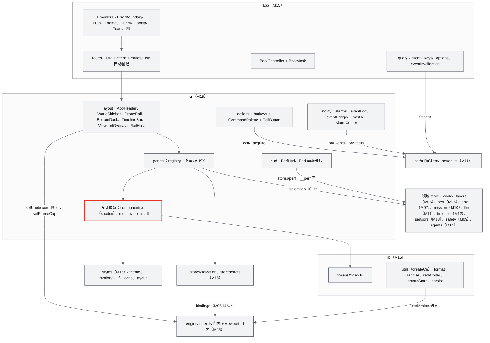
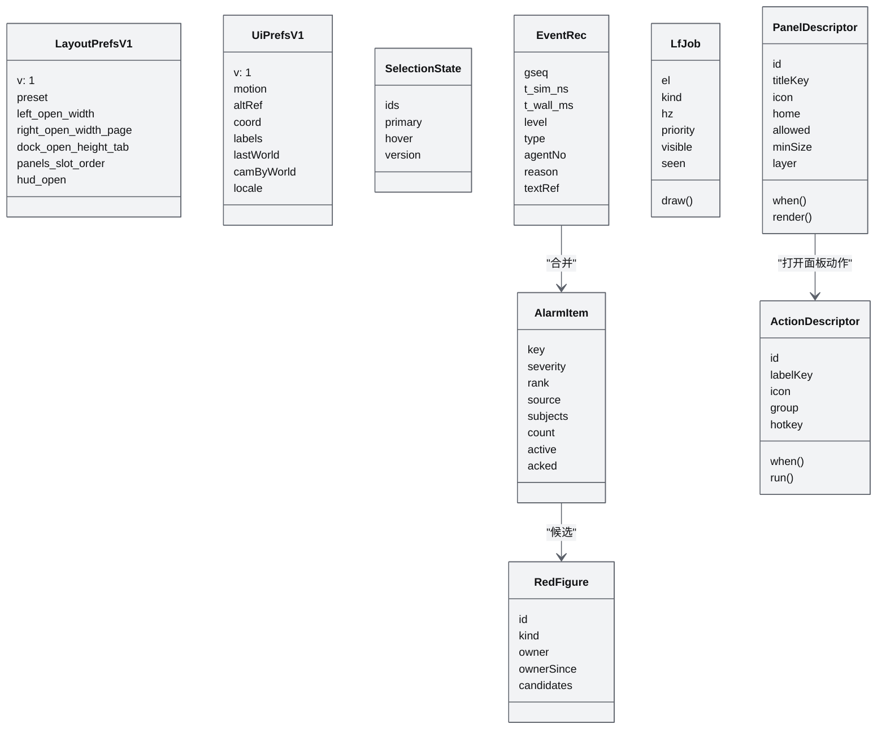
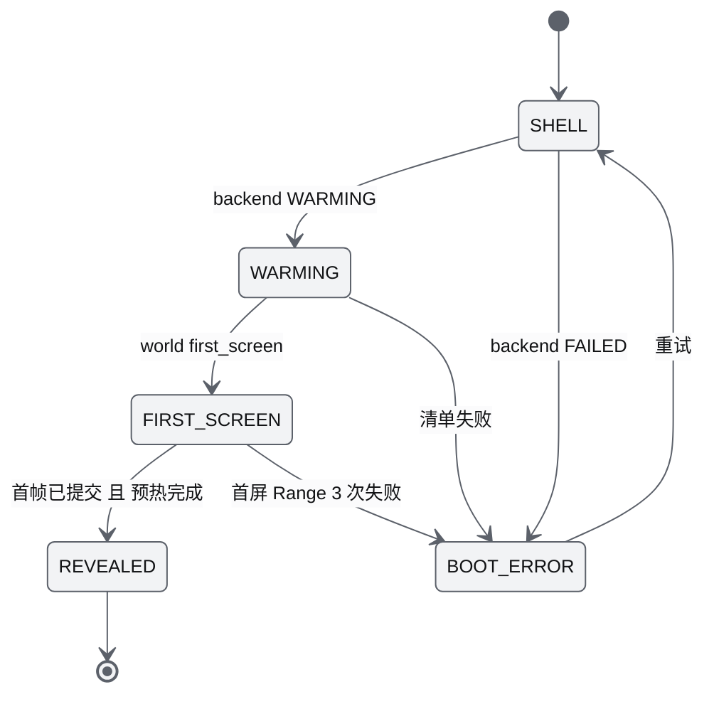
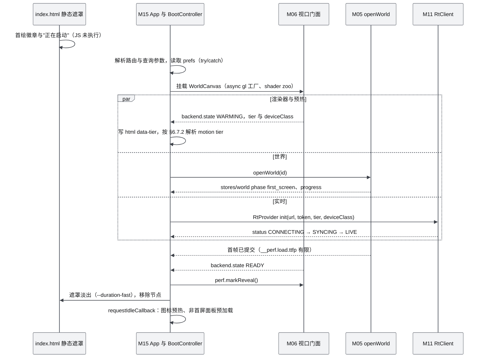
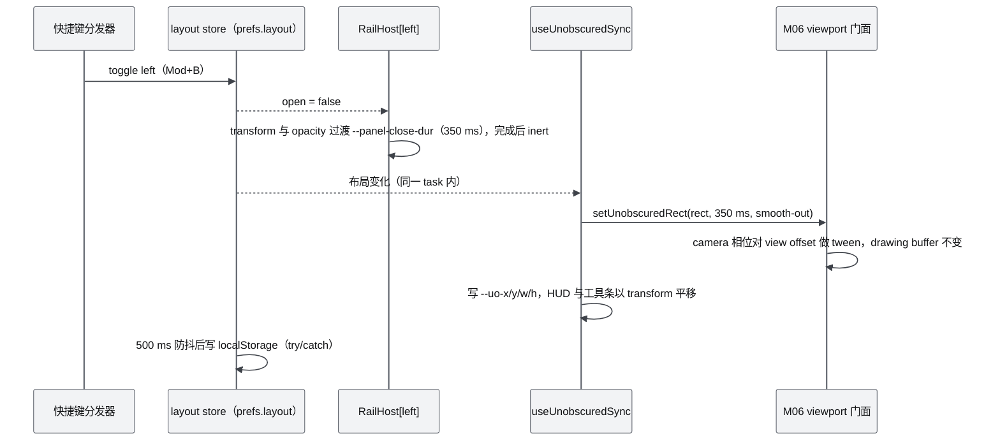
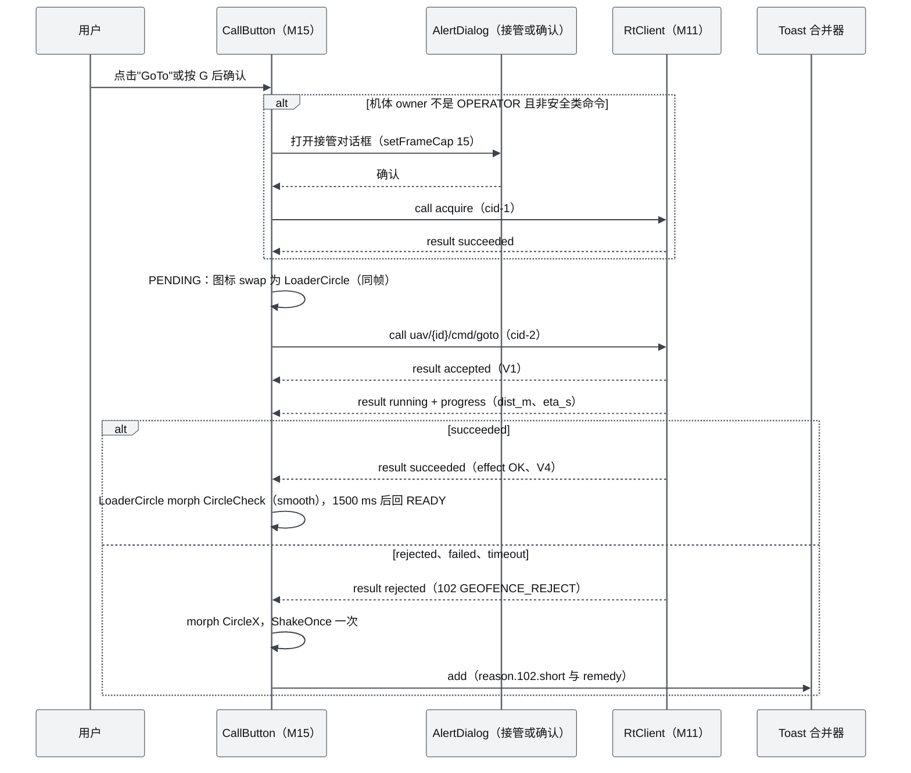
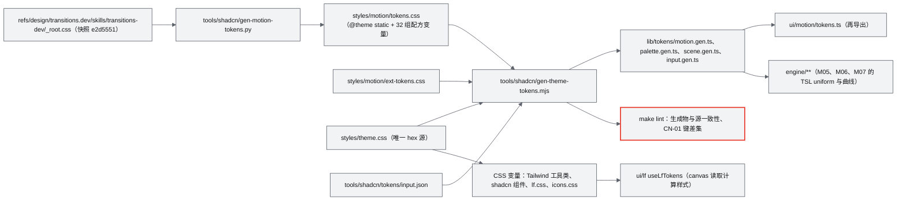
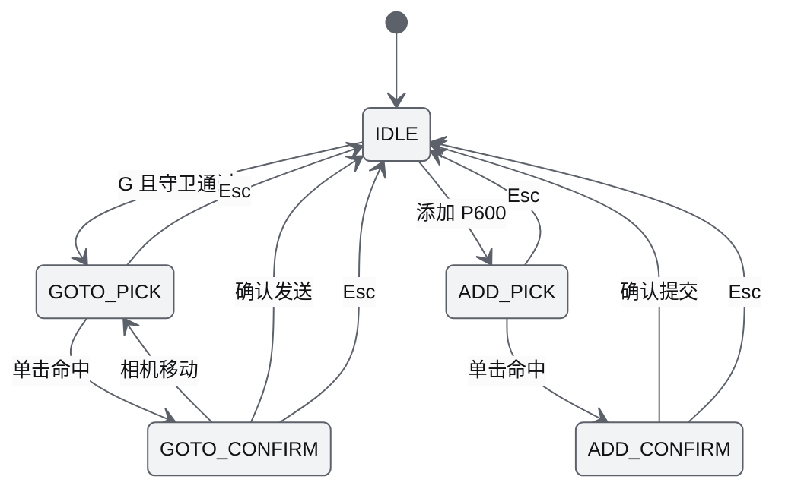

# M15 前端 UI 壳与设计体系组件 PRD

| 项 | 内容 |
|---|---|
| 文档编号 | AWR-M15 |
| 标题 | 前端 UI 壳与设计体系组件 PRD（App Shell、布局与 Dock、stores、net 集成、tokens、Motion、Icon、Lf 图表、shadcn 组件、性能 HUD、i18n、lint） |
| 版本 | v1.0 |
| 日期 | 2026-09-28 |
| 状态 | 草案 |
| 上游文档 | [AWR-03 设计基线](../03-设计基线与决策记录.md)（§3.6、§3.8、§4.1–§4.3、§5.6、§5.7、§8.2–§8.6、§10.2；ADR-008、ADR-028 至 ADR-033、ADR-037、ADR-041、ADR-044、ADR-046、ADR-050）；[01-design](../01-design.md) §4、§10、§34、§37–§40；研究 [g07](../research/g07-gap.md)（权威）、[d01](../research/d01-lieflat-charts.md)、[d02](../research/d02-transitions-dev.md)、[d03](../research/d03-morphicons.md)、[d04](../research/d04-shadcn-ui.md)、[d05](../research/d05-anet.md) §3.11、[n05](../research/n05-discover-web-stack.md)、[r14](../research/r14-r3f-drei.md)、[00-index](../research/00-index.md) §3.13、§5.7、C6–C8；[10](../10-系统架构说明书.md) §6、[14](../14-UI交互设计PRD.md)、[15](../15-视觉设计规范与色卡.md)、[17](../17-接口与实时协议规范.md)、[18](../18-性能与测试方案.md) |
| 下游文档 | [M16](M16-演示数据剧本与流畅性测试PRD.md)（UI 用例调度、测试报告渲染）；[18](../18-性能与测试方案.md)（M15-AC 归档、M15 提出的 lint 规则登记）；[11](../11-技术选型说明书.md)（依赖登记）；[M05](M05-Web点云引擎PRD.md)、[M06](M06-Web视口与渲染后端PRD.md)、[M07](M07-环境引擎PRD.md)、[M09](M09-安全与健康PRD.md)、[M10](M10-任务规划与集群PRD.md)、[M11](M11-实时网关PRD.md)、[M12](M12-时间轴录制与回放PRD.md)、[M13](M13-传感器仿真PRD.md)、[M14](M14-智能体运行时与ANet-PRD.md)（其 store 与 UI 数据契约的消费方） |
| 适用版本范围 | V0.1（即本期交付 D1）至 V1.0 |

## 0. 摘要

1. M15 拥有 `apps/web/src/{app,ui,lib,styles}/**`、`stores/{selection,prefs}.ts`、`public/brand/**`、`components.json` 与 `tools/shadcn/**`（AWR-03 §4.3）：用 shadcn 4.21 base-mira（Base UI 1.8）组件搭出"画布固定全屏、其余一律浮层"的数字沙盘，并把 ANet Graphite 色卡、transitions.dev 动效、morphicons 图标、lieflat 图表四件套落成可复用组件（ADR-028 至 ADR-032）。
2. 二次优化：原设计 §38 的左右两栏 + §39 底部 Timeline 改为浮层式布局，视觉中心由 `camera.setViewOffset` 表达，任何栏开合、分隔条拖动都不改变画布 drawing buffer（D1-AC-24）；§38 的 Unicode 勾选框与三角改为 shadcn `Switch`/`Checkbox` 加 morphicons；"Fog 0.21"改为 MOR 米数；新增性能 HUD 与 Perf 面板，让渐进加载与疏密自动调节可见（R3d、R3e）。
3. 状态四层：引擎 SoA（不进 React）→ 领域 vanilla store（≤ 10 Hz，Tier S 4 Hz）→ React selector → TanStack Query（REST）。WebSocket 由 M11 的 rt.worker 独占；M15 只做事件桥（≤ 4 Hz 批量）、连接呈现、命令按钮状态机与 Query 缓存联动。
4. 设计体系：token 单源（`_root.css` 生成物 + 扩展表 + `theme.css`）同时产出 CSS 变量与 `lib/tokens/*.gen.ts`；`@layer motion` 接管 18 个 Base UI slot；motion tier = min(系统, 用户, PerfGovernor 的 `motionCap`)，Tier S 起步 lite；图标注册表 229 个语义 key、222 个几何，`<StateIcon>` 白名单 morph、并发 K = 8；Lf 图表 16 型、全应用唯一 LfScheduler 挂在帧序 overlay 相位。
5. 性能预算：UI 壳叠加后 p50 不变、> 50 ms 帧占比增加 ≤ 1 个百分点（D1-AC-23）；单 store 写入 ≤ 10 Hz、稳态 commit ≤ 12 次/s 且 p95 ≤ 2 ms；图表每帧 ≤ 2 张且 ≤ 2 ms；1000 架全机返航时同屏 Toast ≤ 3、主线程无 > 50 ms 长任务（D1-AC-27）。
6. D1-core（P0）：壳、路由、布局与 Dock、设计体系全部组件、HUD 与 Perf 面板、命令面板、快捷键、通知与一处红、设置、品牌落点、i18n 运行时与净化、D1 交互编辑 UI。D1-ext（P1）：AGENTS 面板、回放 UI、Runs 与 Jobs 覆盖页、航线编辑与区域绘制 UI。
7. 对基线与相邻文档提出 17 条反馈（net 所有权与 M11 门面缺口、路由库、图标总数、tokens 落点、顶栏高度与 Tooltip 延迟、`__ux` 在生产构建用例中不可用、报告封面徽章层级等），均不私改决策，见 §14。

---

## 1. 背景与目标

### 1.1 定位与边界

M15 位于 Web Runtime 层（AWR-03 §3.2），是所有前端模块的"呈现出口"：领域模块提供 `stores/<domain>.ts` 与门面方法，M15 只写面板 JSX（AWR-03 §4.3 扩展规则）。M15 同时是设计体系的实现方：视觉取值由 [15](../15-视觉设计规范与色卡.md) 定义、交互由 [14](../14-UI交互设计PRD.md) 定义，本文负责把它们落成代码、生成器、组件 API、预算执行器与验收。

| M15 负责 | M15 不负责（引用） |
|---|---|
| App Shell：入口、Providers、路由器、启动遮罩与启动控制器、错误边界、覆盖页 | 渲染器、帧循环 `loop.ts`、相机、拾取、LabelLayer、`window.__perf` 骨架与 PerfGovernor（M06） |
| 浮层布局：顶栏、左右栏、底部 Dock、RailHost、未遮挡区计算、断点 | 未遮挡区的投影实现 `setUnobscuredRect`（M06） |
| 面板注册表与全部面板 JSX、视图（World Hub、Sandbox、Settings；ext：Replay、Runs、Jobs、AGENTS） | 面板数据：`stores/{world,layers}`（M05）、`perf`（M06）、`env`（M07）、`mission`（M10）、`fleet`（M11）、`timeline`（M12）、`sensors`（M13）、`safety`（M09）、`agents`（M14） |
| `stores/selection.ts`、`stores/prefs.ts`、store 工厂、UI 内部 store（告警、事件日志、工具态） | `net/**`（rt.worker、codec、`net/api.ts` fetcher，M11） |
| 设计体系：`styles/**`、`lib/tokens/*.gen.ts` 生成器、`ui/motion`、`ui/icons`、`ui/lf`、shadcn 源码与 codemod | 色值、字阶、动效 token 与图标清单的定义（AWR-15）；布局与交互规格（AWR-14） |
| 通知、告警中心、Toast 合并、RedArbiter 纯函数 | 告警语义与严重度来源（AWR-12、M09） |
| 性能 HUD、Perf 面板、`window.__perf.ui` 写入、`window.__ux` 测试探针 | 性能阈值与用例调度（AWR-18、M16） |
| 快捷键与动作注册表、命令面板、命令按钮状态机 | 命令语义、准入矩阵（AWR-12、M08） |
| i18n 运行时与 `zh-CN.json`、原因码文案生成、`lib/format.ts`、`lib/sanitize.ts` | 原因码数值与名称（AWR-17 `reasons.json`） |
| 品牌组件与 `public/brand/` 资产 | check-brand 等 lint 脚本实现（M00，规则由 AWR-15 与本文定义） |

### 1.2 目标

| 编号 | 目标 | 可度量表述 | 版本 |
|---|---|---|---|
| G-M15-1 | 全量 shadcn（R2d） | `ui/components/ui/**` 之外原生控件与自建浮层为 0（RAW-01）；D1 安装 44 个组件，禁用组件 0 个被安装 | V0.1 |
| G-M15-2 | 画布零扰动 | 左栏、右栏、Dock 开合与拖动期间 drawing buffer 尺寸与 `__perf.gpu.rtAllocs` 不变（D1-AC-24） | V0.1 |
| G-M15-3 | UI 开销可控（R3f） | flight60 `scene=full` 下 UI 壳对"只有画布"的 p50 不变、> 50 ms 帧占比增加 ≤ 1 个百分点（D1-AC-23） | V0.1 |
| G-M15-4 | 四件套可追溯（R2a–R2c、R2e、R2f） | D1-AC-20 的 11 项 lint 全部为 0 违规；动效时长与缓动只来自生成的 token 模块 | V0.1 |
| G-M15-5 | 大规模不卡 | N = 1000 全机返航：同屏 Toast ≤ 3、主线程无 > 50 ms 长任务、DroneRail 实际渲染行 ≤ 可见行 + 10（D1-AC-27） | V0.1 |
| G-M15-6 | 可观测（R3d、R3e） | HUD 实时显示呈现间隔 p95、点预算与档位、加载覆盖率、`limitedBy`、降级步骤；Perf 面板 11 张卡片齐全 | V0.1 |
| G-M15-7 | 契约先行 | D1-MS1 冻结面板注册表、路由表、`selection`/`prefs` 形状、token 生成物、图标注册表与 Lf 组件 API，领域模块并行开发不改 M15 文件 | V0.1（MS1） |

### 1.3 对原设计的继承、修正与增强

| 原设计 | 原内容 | 处置 | 本文落点 | 依据 |
|---|---|---|---|---|
| §34 Frontend 技术栈 | React、TypeScript、shadcn/ui、Zustand、REST、WebSocket | **继承**并精确化：React 19.3、Vite 8、TS 7（仅 tsc）、shadcn 4.21 base-mira + Base UI 1.8、Tailwind 4.3、zustand 5 vanilla、TanStack Query 5；新增 morphicons + lucide 数据、lieflat 自研组件、transitions.dev token | §9.4 | ADR-037；n05 §0 |
| §38 UI"整体采用数字沙盘"，左 WORLD/Layers/ENVIRONMENT、右 DRONES | 挤压式两栏 | **修正**为浮层：画布固定全屏，两栏与 Dock 都是 Sidebar floating 浮层，视觉中心用 view offset 表达 | §6.4 | ADR-028；g07 §2.3 第 01 行作废于画布宿主 |
| §38 图层列表用勾选框字形 | 字形表示开关 | **修正**为 shadcn `Switch`/`Checkbox` + `layer.visible` 图标，字形由 lint 拦截 | FR-059、FR-111 | AWR-15 §7.9；D1-AC-20 |
| §38"Fog 0.21" | 无单位雾浓度 | **修正**为 MOR 米数（`850 m`、`12.0 km`） | FR-105 | ADR-023；AWR-03 §5.4 |
| §38 右栏"Altitude 82.3 m、Battery 78%" | 纯文本 | **增强**：遥测 C/D/E/S 四类呈现（连续量不动画、离散量 pop-in），电量与信号用分档 StateIcon 且带迟滞 | FR-034、FR-065 | d02 §4.4.3；d03 §3.6 |
| §39 Timeline（播放三角字形、×1/×2/×5/×10） | 字形按钮 | **修正**为 `StateIcon`（Play/Pause morph）+ `ToggleGroup`；轨道为 lieflat L3 条码地板（`LfTimelineTrack`）；回放为 ext | FR-076 | ADR-040；M12 §6.5 |
| §40 Drone Interaction（Follow、FPV、Trajectory、Camera FOV、相机四模式） | 功能清单 | **继承**：由相机工具条（5 模式 + 跟随锁定）与单机详情开关实现；Thermal 为 S3 叠加（ext），LiDAR 视图与力、速度叠加推迟 V0.2 | FR-027 | AWR-03 §8.2 交互表 |
| §37"Web Rendering 60 FPS" | 固定目标 | **取代**：目标节奏按设备能力档（Tier S 30 fps），HUD 显示"S 档 · 30 FPS 目标" | FR-093 | ADR-044 |
| §10"URL 直达、多人访问" | Web 优势 | **继承**：`/world/:id` 直达、查询参数深链；单 operator 加多 viewer 的只读呈现 | FR-003、FR-004 | AWR-03 §8.2；Q5 |
| §4.1 浏览器负责 Mission Editing 与 World Editing | 浏览器职责 | **继承**：D1-core 为 GoTo 点选、添加/移除 P600、环境设置；航线与区域编辑为 ext；zones 编辑 V0.2 | FR-027、FR-028 | AWR-03 §8.2 |

### 1.4 相对研究原型与草案的二次优化

| # | 对象 | 原型或草案做法 | 问题 | 本文处理 | 依据 |
|---|---|---|---|---|---|
| 1 | g07 `LfSparkline` | `getContext("2d")` | SwiftShader 下 GPU 光栅化使 10 Hz 流式图掉到 5.6–7.4 fps | 一律 `getContext('2d', {willReadFrequently: true})`，并由 lint LF-CHART-02 检查 | d01 §3.6.1 |
| 2 | d01/g07 `Ring.at(i)` | 每次访问返回二元组 | 每次重画分配 N 个数组，违反热路径零分配 | 改为 `LfSeries` 零分配访问器 `t(i)`、`v(i)` | AWR-03 §3.6 规则 1 |
| 3 | g07 `lfScheduler` | 自带 `requestAnimationFrame` | 与引擎 rAF 并行，两个时钟；不受帧序约束 | 注册为 overlay 相位任务；只在 loop 未运行（报告页、Empty）时退回自带 rAF | AWR-10 §6.7 第 3 条 |
| 4 | g07 `StateIcon` swap | 硬编码 `250`、`"ease-in-out"`、`blur(2px)`；lite 档写 `blur(0px)` | 违反 motion-lint；`blur(0px)` 与 `none` 是不同计算值，lite 档仍产生 filter 动画 | 取自 `lib/tokens/motion.gen.ts`；lite 档关键帧不含 `filter` 属性 | g07 §0 第 + 条第 4 点；ADR-029 |
| 5 | g07 `useLfTokens` | `useMemo` 只读一次 | 主题切换（报告浅色）后 canvas 颜色不变 | MutationObserver 监听 `<html class>` 后失效重读 | d01 §3.6.5 |
| 6 | d02 §3.4-n | UI 自带 motion 调速器（p95 > 1.25·T* 持续 2 s 降档） | 与 CAS、PerfGovernor 形成第三个控制器，互相争抢 | 删除；motion 上限只来自 PerfGovernor 第 6 步写入的 `stores/perf.motionCap` | ADR-041 |
| 7 | d04 §3.5 布局骨架 | `ResizablePanelGroup` 包住视口，侧栏挤压，200 ms `transition-[left,right,width]` | 画布逐帧 resize、RT 重分配、扰动 CAS | 画布固定全屏；Resizable 只在各浮层自己的 RailHost 内调整浮层尺寸 | ADR-028；C33 |
| 8 | d04 §3.5 状态持久化 | Sidebar cookie `sidebar_state`、`useDefaultLayout` 写 localStorage | 两套持久化、两个 SidebarProvider 都绑 Ctrl+B | 受控 `open`，统一写 `awr.ui.layout.v1`；内置快捷键关闭，改由快捷键注册表 | AWR-14 §3.3、§3.6 |
| 9 | d04 `anet-base.json` | dependencies 含 `lucide-react` | 与"全仓库禁止 import lucide-react"冲突 | 保留 `iconLibrary: lucide`（CLI 转换需要），依赖中删除 `lucide-react`、加入 `lucide@1.48.0`、`morphicons@1.7.1`；postadd 自动移除 | ADR-030；C26 |
| 10 | d01 `LfChartCard` | `border border-border`、`text-[13px]`、`--radius .75rem` | mira 下双线；任意值字号 | `Card size="sm"`、`rounded-xl`、`text-hud-*` 字阶，不加 border | g07 §5.1 |
| 11 | d03 §4.4 `--icon-active` | 激活态图标用品牌红 | 与一处红冲突 | 激活态用前景色 + `bg-muted` | AWR-15 §7.4；AWR-14 §19 第 10 条 |
| 12 | g07 样板遮罩 | `rgb(0 0 0 / 0.6)` 字面量 | token 外颜色 | `var(--overlay)` | AWR-15 §16 第 9 条 |
| 13 | n05 trial `HudState` | UI 自建 fps、p95、budget 摘要 store | 与 `stores/perf.ts`（M06）重复计算 | HUD 只读 `stores/perf.ts` 与 `__perf` 环，不另算 | M06-FR-077 |

### 1.5 本模块新增术语（其余见 AWR-03 §11、AWR-14 §1.5）

| 术语 | 定义 |
|---|---|
| 浮层宿主（RailHost） | 包住左栏、右栏或 Dock 面板区的固定定位容器，内部是 shadcn Resizable 组；只改变自身尺寸，折叠时整体平移 |
| 未遮挡区（Unobscured rect） | 视口矩形减去已展开浮层后的矩形，CSS px；交给 M06 `setUnobscuredRect` 作为投影中心 |
| 面板描述符（PanelDescriptor） | 面板注册表的一项：id、标题键、图标、槽位、最小尺寸、层级、可用性守卫、渲染函数（AWR-14 §3.5） |
| 动作（Action） | 菜单、命令面板与快捷键共用的可执行项：id、文案键、图标、快捷键、守卫、执行函数 |
| 序列源（LfSeries） | Lf 流式图的数据接口，按下标零分配读取时刻与数值，并暴露版本号 |
| 流式图名额（Streaming slot） | Tier S 同屏最多 4 张流式图的名额，由 LfScheduler 按优先级分配 |
| 合并键（Merge key） | `source:type:reason`，同键告警与 Toast 更新计数而不新增 |
| 待确认（Pending） | 用户操作已发出、服务端回执未到的中间呈现态（AWR-14 §6.11） |
| UX 探针（`window.__ux`） | dev/test 构建暴露的只读 UI 状态快照，供 Playwright 断言；生产构建移除 |
| dev/test 构建 | Vite 开发服务（`import.meta.env.DEV`）或测试构建（生产构建加 `VITE_AWR_TEST_SWITCHES=1`，AWR-18 PR-7）。代码中统一以 `TEST_SWITCHES = import.meta.env.DEV \|\| import.meta.env.VITE_AWR_TEST_SWITCHES === '1'` 判定，不用 `import.meta.env.MODE`（测试构建的 MODE 也是 `production`） |

---

## 2. 范围

### 2.1 分层交付（与 AWR-03 §6.3 M15 行一致）

| 层 | 内容 |
|---|---|
| **D1-core（P0，发布阻塞）** | （1）App Shell：入口、Providers、自研路由器（`/`、`/worlds`、`/world/:id`、`/reports/:rid` 与 `/reports?src=`）、URL 查询参数、启动遮罩与 BootController、覆盖页限帧、错误边界、`window.__ux`。（2）浮层布局：顶栏、左栏、右栏（DroneRail）、Timeline 条与 Dock 面板区、RailHost、未遮挡区、断点、窗口 resize 协同。（3）面板注册表与 D1-core 面板（world、layers、env、drones、drone-detail、mission、events、charts、perf）、World Hub、Settings、快捷键帮助、关于。（4）stores：工厂、`selection`、`prefs`（布局与偏好持久化）、告警、事件日志、工具态。（5）net 集成：RtProvider、事件桥、连接呈现、TanStack Query、命令按钮状态机、批量命令聚合。（6）设计体系：`theme.css` 与 token 生成器、`@layer motion` 与 18 个 slot 映射、motion tier、JS 配方组件、DOM 动效预算执行器、图标注册表（229 个语义 key、222 个几何）与 Icon/StateIcon、Lf 图表 16 型与 LfScheduler、shadcn 44 个组件安装与 codemod 套件（含 TS 7 路径迁移、`tabs-indicator` line 扩展与 `toggle-group-indicator`）。（7）通知：Toast 合并、告警中心、RedArbiter、形状编码组件。（8）性能 HUD、Perf 面板、`__perf.ui`。（9）快捷键、动作注册表、命令面板。（10）i18n 运行时、`zh-CN.json`、原因码文案生成、格式化、运行时净化。（11）品牌落点（含测试报告封面徽章，ADR-032）。（12）D1 交互编辑 UI（GoTo 点选、添加与移除 P600、zones 显示、环境设置、Follow/FPV/轨迹/视锥、世界切换、播放暂停与倍速）。（13）可访问性（aria-label、焦点、键盘）与分辨率适配 |
| **D1-ext（P1，缺失需豁免）** | AGENTS 面板；回放横幅、回放 Timeline 控件与 `/world/:id/replay/:run`；Runs 与 Jobs 覆盖页（`/runs`、`/jobs`）；航线编辑与区域绘制 UI（右栏编辑页、ToolMode 扩展）；`/bench` 路由与页面 JSX（内容规格 M06 §8.1）；布局预设与面板停靠菜单；TextsReveal 与告警计数徽标单次 shake；`role="status"`/`role="alert"` 播报区；en 键对等检查；离线 registry 镜像 |
| **D1 桩** | 无（M15 不交付接口替身；FakeSource 由 M11 提供） |
| **后续版本** | V0.2：拖拽停靠（评估 @dnd-kit）、FPV 画中画 UI、zones 编辑 UI、3D 选中机状态 sprite（morph）、success-check 与 spinning-counter、共享 tooltip 扩展；V0.3：`m4` 降采样图表订阅、R3F v10 迁移后的壳适配；V0.4：路由库再评估（TanStack Router）；V0.6：多机图标 atlas、机群芯片 hover、FAB plus-menu；V1.0：英文界面全量、ANet 协商流式组件（shadcn chat 原语） |
| **不做** | 移动端与触屏布局（Q6）；浅色主题作为交互界面（Q7，只用于报告）；shadcn `chart`、Recharts、ECharts、Chart.js、Sonner；Motion（framer-motion）；`backdrop-filter` 任何用途 |

### 2.2 与相邻模块的边界

| 模块 | M15 消费 | M15 提供 | 约束 |
|---|---|---|---|
| M00 | `@awr/contracts`（enums、reasons、commands、topics、caps 类型）、lint 脚本、`make ci` | lint 规则定义（§4.16）、`tools/shadcn/**`、`mk/m15.mk` | 契约变更经 M00 |
| M05 | `stores/world.ts`、`stores/layers.ts`、事件 `pc.world.opened`、`pc.world.error`、`pc.rung.changed`、`pc.capacity.clamped` | 左栏 LAYERS 与画质控件、HUD、Perf 面板、World Hub、切换世界加载卡 | M05 不写 JSX |
| M06 | 视口门面（相机、未遮挡区、限帧、投影、拾取、GoTo 预览）、`stores/perf.ts`（含 `motionCap`、`tier`）、引擎事件 | RedArbiter 纯函数、`labelFormatter`、图标 sprite、motion tier、未遮挡区矩形、揭开遮罩信号 | `viewport/**`、`engine/**` 不 import `ui/**`；UI 只经 `engine/index.ts` 门面 |
| M07 | `stores/env.ts`（预设、读数、过渡进度、子图层开关）、预设到图标 key 的映射 | 环境分组 JSX、预设 ToggleGroup、滑块提交策略 | 读数口径以 M07 为准 |
| M09 | `stores/safety.ts`（M09 提请登记）、SafetyEvent 映射 | 告警中心、状态徽章 | 严重度映射以 M09、AWR-12 为准 |
| M10 | `stores/mission.ts`、R23–R26 | 任务面板、（ext）航线编辑 UI | — |
| M11 | `RtClient`（`subscribe`、`call`、`onEvents`、`onStatus`、`status`、`roster`）、`stores/fleet.ts`（`fleetStore`、`fleetRows`）、`net/api.ts` fetcher、`__perf.net` | 连接徽标、横幅、Perf 网络卡 | `net/**` 归 M11；UI 不解码二进制 |
| M12 | `stores/timeline.ts`、`engine/time` 门面、`trackModel` | TimelineBar、`LfTimelineTrack`、（ext）回放横幅与 Runs | 高频量不进 store |
| M13 | `stores/sensors.ts`（M13 提请登记）、`frameRect` | 传感器标签页、FPV 画幅遮罩 | — |
| M14 | `stores/agents.ts`（ext） | AGENTS 面板（ext） | — |
| M16 | 剧本与夹具；D1 门禁 spec（AWR-18 §8.5，M15 提供断言助手） | `apps/web/perf/m15/*.spec.ts`、`apps/web/tests/m15/**`、报告路由（`/reports?src=`、`/reports/:rid`，就绪标记 `data-report-ready`） | harness 由 M16 调度 |

---

## 3. 用户与用例

### 3.1 角色

| 角色 | 诉求 | 与本模块相关的能力 |
|---|---|---|
| 操作员（operator） | 在沙盘里选择、指挥、观察机群，设置环境 | 命令按钮、快捷键、命令面板、GoTo 工具态、确认对话框、告警中心 |
| 观察者（viewer） | 只读浏览、跟随、查看遥测与性能 | 相机工具条、选择、图层、HUD、Perf、事件；命令区显示为一处说明 |
| 研究与测试人员 | 验证流畅性与疏密调节、复现问题 | Perf 面板、"复制诊断信息"、`?tier=`、`?motion=off`、`window.__ux` |
| 前端模块开发者（M05–M14） | 在不改 M15 文件的前提下接入自己的数据与面板 | 面板注册表、动作注册表、路由注册、store 工厂、Lf 组件与图标 key |
| 设计评审者 | 核对四件套与一处红 | Storybook 式样板路由（dev）、lint 报告、截图基线 |

### 3.2 用例

| 编号 | 用例 | 触发 | 主流程（摘要） | 涉及 FR | D1 |
|---|---|---|---|---|---|
| UC-01 | 冷启动进入默认世界 | 打开 `/` | 静态遮罩显示徽章 → BootController 三路并行 → 首帧提交且预热完成 → 遮罩淡出 → S1 自动播放 | 001–006 | core |
| UC-02 | 深链打开并恢复视角 | `/world/newyork?cam=bird&sel=p600-01` | 加载世界 → 恢复相机模式与选择 → 不存在的 id 忽略并 Toast 1 条 | 004、009 | core |
| UC-03 | 开合侧栏与拖动 Dock | Mod+B、`\`、`` ` ``、拖分隔条 | 浮层 transform 过渡 → 松开后未遮挡区 250 ms 过渡 → drawing buffer 不变 | 012–015 | core |
| UC-04 | 在列表中选中并跟随 | 点击 DroneRail 行、按 3 | 选择写 store → 3D 高亮 ≤ 2 帧 → 相机切第三人称 → 焦点低延迟徽标 | 024、031 | core |
| UC-05 | 点选 GoTo | G 键 | 工具态提示条 → 悬停 ray_hit 预览 ≤ 5 Hz → 点击 → Popover 确认 → call → 按钮状态机 → 到达后 morph 成功 | 027、028、040 | core |
| UC-06 | 1000 架全机返航 | Mod+A、Shift+R、确认 | 批量 call → 回执入环 → 聚合 Toast ≤ 4 Hz 更新 → 无长任务 | 036、040、041、089 | core |
| UC-07 | 告警风暴与一处红 | 多架进入 FAILSAFE | 事件桥 250 ms 批量 → 告警合并 → RedArbiter 选出唯一红色实体 → 顶栏计数徽标 | 036、088–091 | core |
| UC-08 | 观察渐进加载与疏密调节 | 打开 Perf 或看 HUD | HUD 4 Hz：p95、B、档位、覆盖率、limitedBy；Perf 11 卡；Tier S 流式图 ≤ 4 | 093–097 | core |
| UC-09 | 性能降级可见 | PerfGovernor 进入第 1 步 | HUD 降级行 → 合并 Toast 1 条（10 s 去重）→ 恢复时移除行、无 Toast | 097 | core |
| UC-10 | 断线与重连 | WS 关闭 | 1 s 后横幅 → 控件置灰、STALE → 重连对账 → epoch 变化时 Toast 与选择集 prune | 037 | core |
| UC-11 | 设置动效档 | 设置 › 动效 | 选择 lite → `data-motion` 更新 → 显示生效档与来源 | 026、052 | core |
| UC-12 | 切换世界 | 左栏世界选择或 World Hub | 紧凑加载卡 → 首帧 ≤ 1.5 s → 选择清空 → 相机恢复记忆位姿（P1） | 005、023 | core |
| UC-13 | 其他模块接入新面板 | 开发者新增 `ui/panels/<id>` 与 store | `registerPanel` 登记 → 出现在 Dock 标签 → 数据只经 selector | 020 | core |
| UC-14 | 生成测试报告 | M16 `render.mjs` 打开 `/reports?src=report.json` | 注入报告 JSON → 浅色主题 Lf 组件与封面徽章渲染 → `data-report-ready` → M16 内联资源导出 HTML | 080、110 | core |

---

## 4. 功能需求

"D1"列：是 = 本期交付（P0 为 D1-core，P1 为 D1-ext）；否 = 不在本期。验收要点引用 §10 的 M15-AC 编号。

### 4.1 App Shell 与路由

| 编号 | 需求描述 | 优先级 | 目标版本 | D1 | 验收要点 | 依据 |
|---|---|---|---|---|---|---|
| M15-FR-001 | 入口 `main.tsx` 创建 React 根；`app/App.tsx` 把 M06 的 `<WorldCanvas>` 常驻挂在 `--z-canvas` 层，路由只切换其上的 DOM 层（画布不随路由卸载）；StrictMode 只在 dev 构建开启，所有 effect 有对称 cleanup（Worker、RtClient、订阅） | P0 | V0.1 | 是 | M15-AC-001、002 | AWR-14 §2.1 规则 1；n05 §6 第 14 条 |
| M15-FR-002 | Providers 自外向内：RootErrorBoundary → I18nProvider → ThemeProvider（固定 `dark`，无热键、无 `disableTransitionOnChange`）→ QueryClientProvider → TooltipProvider → ToastProvider（`limit=3`）→ RtProvider → Router → AppShell | P0 | V0.1 | 是 | M15-AC-001 | d04 §6 第 1 条；g07 §6 第 6 条 |
| M15-FR-003 | 自研路由器（原生 `URLPattern` + `history`，约 200 行）：路由表由 `app/routes/*.tsx` 经 `import.meta.glob` 自动登记（扩展点）；D1-core 路由 `/`（重定向 `/world/shenzhen`）、`/worlds`、`/world/:id`、`/reports/:rid` 与 `/reports`（仅带 `src` 参数，供 M16 `render.mjs`，FR-080）；D1-ext 路由见 FR-022；未知路由重定向 `/worlds` 并 Toast 1 条 | P0 | V0.1 | 是 | M15-AC-003 | AWR-03 §4.3；AWR-14 §2.2；n05 §5.5；M16-FR-071 |
| M15-FR-004 | 查询参数 `cam`、`sel`、`panel`、`settings`、`t` 的解析与校验（非法值静默忽略）；相机与选择变化以 `replaceState` 写回，节流 `input.urlSyncHz`（1 Hz）；路由切换 `pushState`。`?chrome=0` 在生产与测试构建都解析：不渲染 UI 壳（只保留 WorldCanvas 与 LabelLayer），供 `scene=pc` 与 D1-AC-23 的"只有画布"配对基线（AWR-18 §9.5）；`tier`、`rb`、`allowFallback`、`motion` 只在 dev/test 构建解析（术语见 §1.5）；其他模块的开关（`bench`、`city`、`scene`、`source`、`fixedB`、`quality`、`perfInject`、`rt`）原样保留，路由器写回 URL 时不清除 | P0 | V0.1 | 是 | M15-AC-003、058 | AWR-14 §2.2；ADR-044；AWR-18 §9.5 |
| M15-FR-005 | 世界切换：校验 id `^[a-z0-9-]{1,63}$`；经门面调用 M05 `openWorld`，不重建渲染器；清空选择集；视口中央显示紧凑加载卡（`Card size="sm"` + `Progress`），首帧后 `--duration-quick` 淡出 | P0 | V0.1 | 是 | M15-AC-004 | AWR-03 §5.6；AWR-10 §6.6；D1-AC-02 |
| M15-FR-006 | 启动控制器 BootController（SHELL、WARMING、FIRST_SCREEN、REVEALED、BOOT_ERROR，§6.3.3）：`index.html` 内联静态遮罩（完整徽章 480 px + 阶段文字）在 JS 解析前显示；揭开条件为"首个含点帧已提交且 shader zoo 完成"；揭开时调用门面 `perf.markReveal()`，遮罩以 `--duration-fast` + `--ease-smooth-out` 淡出；揭开不等待 WS | P0 | V0.1 | 是 | M15-AC-005 | AWR-14 §7.3；ADR-007；ADR-032 |
| M15-FR-007 | 限帧协同：覆盖页可见面积 ≥ 90% 时 `viewport.setFrameCap(5)`；Dialog、AlertDialog、CommandDialog、设置打开时 `setFrameCap(15)`，在 `onOpenChangeComplete(false)` 恢复；窗口 < 1280 × 720 时全屏 `Empty` 并 `setSuspended(true)`，恢复后自动继续 | P0 | V0.1 | 是 | M15-AC-006 | AWR-14 §2.1 规则 2、§14.1；d02 §4.6；g07 §1.1 第 6 条 |
| M15-FR-008 | 错误边界三级：根、视口、每个面板各一个；UI 错误态 E-01 至 E-15 按 AWR-14 §7.6 呈现，面板错误只替换面板体（"重新加载面板"） | P0 | V0.1 | 是 | M15-AC-007 | AWR-14 §7.6 |
| M15-FR-009 | 深链恢复：先加载世界，再按 `cam`、`sel` 恢复；不存在的机体 id 被忽略，并以 1 条 Toast 说明数量 | P0 | V0.1 | 是 | M15-AC-003 | AWR-14 §2.2 |
| M15-FR-010 | 测试探针 `window.__ux`（仅 dev/test 构建，字段全表见 §7.1.7）：`camera{mode, followLock, lastFlight{durationMs}}`、`selection{ids, primary}`、`toasts.visible`、`red{[figureId]: owner}`、`rayHitRequests`、`droneRail{renderedRows, visibleRows}`、`motion{tier, source}`、`boot{state, revealAt}`；预分配对象就地更新；非 dev/test 构建以 `TEST_SWITCHES` 常量在编译期剔除（§1.5）。生产构建用例（AWR-18 PR-7：flight60、storm、soak、latency、layout、ui-overhead）不得读取 `__ux`，改用 DOM 查询与 `__perf` | P0 | V0.1 | 是 | M15-AC-002、008 | AWR-14 §17 通用约定第 3 条；AWR-18 PR-7 |

### 4.2 布局、浮层与 Dock

| 编号 | 需求描述 | 优先级 | 目标版本 | D1 | 验收要点 | 依据 |
|---|---|---|---|---|---|---|
| M15-FR-011 | 层叠 token 按 AWR-14 §3.1 自低到高 `--z-canvas`、`--z-labels`、`--z-viewport-ui`、`--z-rails`、`--z-header`、`--z-banner`、`--z-overlay-page`、`--z-dialog`、`--z-popover`、`--z-toast`、`--z-mask`（弹层高于对话框，使对话框内的 Select、Combobox、Tooltip 可见）定义在 `styles/layout.css`（由 `styles/index.css` 导入）；业务代码禁止写 z-index 数值（lint UI-Z-01） | P0 | V0.1 | 是 | M15-AC-040 | AWR-14 §3.1 |
| M15-FR-012 | 布局骨架：顶栏固定高 44 px（紧贴视口顶边，不浮动，但在画布之上）；左栏、右栏为 `Sidebar variant="floating" collapsible="offcanvas"` 浮层；底部为常驻 Timeline 条（48 px）与可展开的 Dock 面板区（默认 240 px）；浮层与画布边缘及彼此间距 8 px；Dock 面板区水平方向占据两栏内沿之间 | P0 | V0.1 | 是 | M15-AC-009 | ADR-028；AWR-14 §3.2、§3.3 |
| M15-FR-013 | Sidebar 浮层 codemod（`tools/shadcn/codemods/sidebar-overlay.mjs`）：`sidebar-gap` 宽度恒为 0；`sidebar-container` 由 `fixed inset-y-0 h-svh` 改为 RailHost 内 `absolute inset-0`，删除 `transition-[left,right,width] duration-200 ease-linear` 与 offcanvas 的 `left/right: calc(var(--sidebar-width) * -1)` 偏移类；折叠位移统一由 RailHost 整体的 `transform` 与 `opacity` 承担（07 panel-reveal X 轴：开 `--panel-open-dur`、关 `--panel-close-dur`；全高表面任何档都不带 blur，ADR-029），Sidebar 容器自身不再有过渡；折叠后 RailHost 加 `inert`；`SidebarProvider` 增加 `keyboardShortcut={false}`、`persist={false}`、按侧宽度，受控 `open` | P0 | V0.1 | 是 | M15-AC-009、010 | ADR-028；d04 §6 第 6、7 条；g07 §2.3 |
| M15-FR-014 | 浮层尺寸调整：左栏 256–400 px（默认 288）、右栏 280–480 px（默认 320）、Dock 面板区 160 px 至 50% 视口高（默认 240），均用 shadcn Resizable（react-resizable-panels v4，数字 = px）在各自 RailHost 内实现；拖动期间只改浮层尺寸，不触发画布 `setSize` | P0 | V0.1 | 是 | M15-AC-010 | ADR-028；d04 §6 第 10 条；AWR-14 §3.3 |
| M15-FR-015 | 未遮挡区：由布局状态（不是 DOM 测量）计算矩形（§6.4.2）；浮层打开以 `--panel-open-dur`、关闭以 `--panel-close-dur`、分隔条松开以 `--duration-fast` 调用 `viewport.setUnobscuredRect(rect, {durationMs, ease: 'smooth-out'})`，拖动期间不调用；reduced 档 `durationMs = 0`；HUD、ViewCube、相机工具条、坐标读数锚定未遮挡区四角与上边中点，只写 `transform` | P0 | V0.1 | 是 | M15-AC-011 | ADR-028；AWR-14 §3.4；M06-FR-051 |
| M15-FR-016 | 断点四档 C/S/W/U 与高度规则按 AWR-14 §14.1；跨档保留用户拖动过的宽度但夹到新档可调范围；窗口 resize 结束（M06 120 ms 防抖）后重判断点并以 `--duration-fast` 过渡未遮挡区 | P0 | V0.1 | 是 | M15-AC-012 | AWR-14 §14；ADR-029 |
| M15-FR-017 | 布局预设：演示（默认，Dock 收起）、调试（Dock 280 px，默认"性能"）、回放（Dock 展开，默认"事件"）、编辑（右栏 400 px，打开 `mission-edit`） | P1 | V0.1 | 是 | M15-AC-013 | AWR-14 §3.5；r15 §3.18 |
| M15-FR-018 | 面板停靠：面板标题栏"更多"菜单"停靠到 左栏 / 右栏 / 底部"，受 `allowed` 约束；拖拽停靠为 V0.2（P2） | P1 | V0.1 | 是 | M15-AC-013 | AWR-14 §3.5 |
| M15-FR-019 | 布局与偏好持久化到 `awr.ui.layout.v1`（开合、宽高、页面、标签、预设、面板槽位、HUD 开合），不使用 Sidebar cookie 与 `useDefaultLayout` 的存储 | P0 | V0.1 | 是 | M15-AC-014 | AWR-14 §3.6 |

### 4.3 面板注册表与视图

| 编号 | 需求描述 | 优先级 | 目标版本 | D1 | 验收要点 | 依据 |
|---|---|---|---|---|---|---|
| M15-FR-020 | 面板注册表 `ui/panels/registry.ts`：`registerPanel(desc: PanelDescriptor)`（字段语义见 AWR-14 §3.5）；`layer = 'ext'` 的面板在对应 D1-ext 功能未交付时不登记；同一面板只出现在一个槽位；槽位为空时浮层自动收起 | P0 | V0.1 | 是 | M15-AC-015 | AWR-03 §4.3；AWR-14 §3.5 |
| M15-FR-021 | D1-core 面板：`world`、`layers`、`env`（左栏 Collapsible 分组）；`drones`、`drone-detail`（右栏页面栈，08 page-side-by-side）；`mission`、`events`、`charts`、`perf`（Dock 标签，16 tabs-sliding）；面板只通过对应领域 store 的 selector 取数，订阅频率 ≤ 10 Hz | P0 | V0.1 | 是 | M15-AC-015 | AWR-14 §4；ADR-008 |
| M15-FR-022 | D1-ext 视图：`agents` Dock 标签；`mission-edit` 右栏编辑页；回放横幅、回放 Timeline 控件与路由 `/world/:id/replay/:run`；Runs（`/runs`）、Jobs（`/jobs`、`/jobs/:jobId`）覆盖页；`/bench` 路由与页面 JSX（内容规格与门面 `bench.start/state/upload` 见 M06 §8.1、M06-FR-014，结果用 LfTable 与 LfStat 呈现） | P1 | V0.1 | 是 | M15-AC-016 | AWR-14 §5.4、§5.7、§5.8；M06-FR-014 |
| M15-FR-023 | World Hub 覆盖页（`/worlds`）：六城卡片，每卡 `LfStat`（点数、节点数、最高建筑、TTFP）+ `LfBarRank`（`levelsPoints`，1 档 = 自动单位）+ 校验状态徽章；数据来自 `GET /api/worlds` 与 `worlds/<id>/world.json`；构建按钮为 ext | P0 | V0.1 | 是 | M15-AC-004 | AWR-14 §3.2(e)、§5.1 |
| M15-FR-024 | DroneRail：`@tanstack/react-virtual` 虚拟化，行高 56 px（本文设定，含两行文本）；行只读 M11 `fleetRows` 类型化数组与 roster 视图，按 `fleetStore.version` 刷新（Tier S 4 Hz）；排序与筛选在 UI 侧计算为 `Uint16Array` 置换数组（N ≤ 1000，单次 ≤ 0.5 ms）；搜索按 id 前缀与子串；行内高度与速度为 C 类文本，经 `bindText`（FR-034）从 engine 门面的 swarm SoA 读取，只对已挂载的行绑定、行卸载即解绑；行根元素带 `data-rail-row`，供生产构建用例按 DOM 计数；选择数 ≥ 2 时出现批量操作条；实际渲染行 ≤ 可见行 + 10 | P0 | V0.1 | 是 | M15-AC-017 | ADR-028；M11-FR-097；D1-AC-27；AWR-14 §4.4 |
| M15-FR-025 | 事件面板：`ui/notify/eventLog.ts` 定长环（上限 5000 条，满时淘汰最旧）+ `LfTable` 虚拟滚动；列为时间（`SIM T+`）、来源、级别（形状编码）、消息（净化后）、机体；点击行即全局选中；hot 单元格 ≤ 1 | P0 | V0.1 | 是 | M15-AC-018 | ADR-028；AWR-14 §4.5 |
| M15-FR-026 | 设置对话框（640 px，六标签：常规、渲染、动效、快捷键、账户、关于）：修改即时生效并持久化，无"保存"按钮；需要重建渲染器的项显示"刷新后生效"徽章与"立即刷新"；动效标签显示生效档位与来源；深链 `?settings=<tab>` | P0 | V0.1 | 是 | M15-AC-019 | AWR-14 §5.6 |
| M15-FR-027 | D1 交互编辑 UI（AWR-03 §8.2 core 行）：GoTo 点选（工具态 + ray_hit 预览 + Popover 确认）；添加与移除虚拟 P600（R14、R15）；zones 叠加开关；环境预设与参数（`env/preset`、`env/set`，拖动本地显示、松开提交）；选中机 Follow（跟随锁定）、FPV、轨迹、视锥开关；世界切换；播放、暂停、倍速、单步 | P0 | V0.1 | 是 | M15-AC-020 | AWR-03 §8.2；AWR-14 §6.7、§6.13–§6.17；D1-AC-32 |
| M15-FR-028 | 工具态状态机 `ui/tools/toolMode.ts`（§6.9）：IDLE、GOTO_PICK、GOTO_CONFIRM、ADD_PICK、ADD_CONFIRM；ext 增加 EDIT_PATH、DRAW_AREA；Esc 分级退出（浮层 → 工具态 → FPV → 选择）；工具态提示条为 `Alert` + `Kbd` | P0 | V0.1 | 是 | M15-AC-020 | AWR-14 §6.7、§6.10 |

### 4.4 stores 与状态分层

| 编号 | 需求描述 | 优先级 | 目标版本 | D1 | 验收要点 | 依据 |
|---|---|---|---|---|---|---|
| M15-FR-029 | 四层状态：引擎 SoA（每帧，不经 React）→ 领域 vanilla store（Tier S ≤ 4 Hz、其余 ≤ 10 Hz）→ React selector（`useStore(store, selector)` + `useShallow`）→ TanStack Query（REST）；遥测、点云、插值结果禁止进入 React state | P0 | V0.1 | 是 | M15-AC-021 | ADR-008；n05 §3.9；AWR-10 §6.4 |
| M15-FR-030 | store 工厂 `lib/createStore.ts`：`createAwrStore(name, init)` 包装 `setState`，在 `__perf.ui.storeWrites[name]` 按秒计数（生产构建也开启，一次整数自增）；dev 构建单 store 写入 > 10 次/s 时控制台告警（M15-E007）；全部 `stores/*.ts` 与 UI 内部 store 使用该工厂 | P0 | V0.1 | 是 | M15-AC-021 | AWR-18 §6.3 第 2 条 |
| M15-FR-031 | `stores/selection.ts`：`ids`（≤ 1000，有序去重）、`primary`、`hover`、`version`；动作 `select(ids, mode)`（replace/add/toggle）、`selectRange`、`clear`、`setHover`、`prune(isValid)`；epoch 变化与机体移除时 prune；由 M06 `viewport/bindings/selection.ts` 订阅后写 `drones.setHighlights`；从输入事件到 3D 高亮 ≤ 2 帧 | P0 | V0.1 | 是 | M15-AC-022 | AWR-10 §6.4；UX-NFR-005 |
| M15-FR-032 | `stores/prefs.ts`：两个持久化切片 `awr.ui.layout.v1`、`awr.ui.prefs.v1`（字段见 AWR-14 §3.6）；读写一律 try/catch；版本不符或 JSON 损坏回落默认且不提示；读取时夹紧数值范围；写入防抖 500 ms（本文设定）；页面隐藏（`visibilitychange`）时立即落盘 | P0 | V0.1 | 是 | M15-AC-014 | AWR-14 §3.6；UX-NFR-015 |
| M15-FR-033 | UI 内部 store：`ui/notify/alarms.ts`、`ui/notify/eventLog.ts`、`ui/tools/toolMode.ts`、`ui/shell/connView.ts` 使用同一工厂；告警与事件日志写入 ≤ 4 Hz，工具态与连接视图按事件写入 | P0 | V0.1 | 是 | M15-AC-021 | ADR-028 |
| M15-FR-034 | 遥测文本绑定 `bindText(el, read, format, cls)`：C 类（连续量）由单个 overlay 相位任务按 `--telemetry-text-interval`（Tier S 250 ms、其余 100 ms）合批写 `textContent`，只在字符串变化时写；D 类交给 `MotionNumber`；E 类 D1 以 D 类代替；S 类交给 `SwapText` | P0 | V0.1 | 是 | M15-AC-023 | d02 §4.4.3；ADR-029；AWR-15 §8.6 |

### 4.5 net 集成（`net/**` 归 M11，M15 负责消费与呈现）

| 编号 | 需求描述 | 优先级 | 目标版本 | D1 | 验收要点 | 依据 |
|---|---|---|---|---|---|---|
| M15-FR-035 | RtProvider：用 `net/rt` 的工厂 `createRtClient()` 创建全局唯一 `RtClient`（M11 §7.5 尚未列出工厂与 `getToken`，本文请求补登，§14 第 13 条），`init({url, token, tier, deviceClass})` 的 token 取自 `net/api.ts` 的 `getToken()`，tier 与 deviceClass 取自 `stores/perf.ts`；卸载或世界切换到另一 run 时 `close()`；StrictMode 双调用下不产生两个 Worker | P0 | V0.1 | 是 | M15-AC-024 | M11-FR-094；n05 §6 第 14 条 |
| M15-FR-036 | 事件桥 `ui/notify/eventBridge.ts`：`RtClient.onEvents` 每帧至多一批，批内事件复制进预分配结构环（容量 8192）；每 250 ms 刷入一次告警 store、事件日志、Toast 合并器与 Query 失效表；单次刷入 ≤ 2 ms（570 条事件/s 压测） | P0 | V0.1 | 是 | M15-AC-025 | ADR-028；D1-AC-10、D1-AC-27 |
| M15-FR-037 | 连接呈现：`RtClient.status`（ConnState，M11 保证状态变化后下一帧即反映）与 `onStatus`（服务端状态条目）驱动顶栏连接徽标（`Badge variant="outline"` + `HoverCard`；图标 `conn.online`，断线时 morph 为 WifiOff 并加红描边；正常时显示 WS RTT，C 类文本）、断线横幅（`input.offlineBannerDelayMs` 1 s 后出现，重连次数与倒计时取自 M11 请求补登的 `onConnState`，§14 第 13 条）、命令与环境控件置灰、数值 STALE 呈现、重连对账 Toast（epoch 变化时"仿真已从剧本起点重开"）；`status` 横幅按 id 覆盖、堆叠 ≤ 3 | P0 | V0.1 | 是 | M15-AC-026 | AWR-14 §4.1、§7.7；M11 §6.6.3、§8 |
| M15-FR-038 | TanStack Query：`app/query/client.ts` 默认 `staleTime` 30 s、`gcTime` 5 min、幂等 GET `retry` 1、`refetchOnWindowFocus` false；query key 工厂 `app/query/keys.ts` 与 `queryOptions()` 工厂 `app/query/options.ts`；fetcher 一律来自 `net/api.ts`；命令类不走 Query（走 `RtClient.call`） | P0 | V0.1 | 是 | M15-AC-027 | n05 §3.9；AWR-17 §4.2 |
| M15-FR-039 | WS 事件驱动缓存（`app/query/eventInvalidation.ts`，表见 §6.6.3）：`sim.vehicle.state` → 失效 fleet vehicles；`mission.*` → `setQueryData` 任务列表；`job.*` → jobs；`session.switched` → sessions/current 并路由跳转；`env.*` 预设变化 → 不失效（环境走 `stores/env.ts`） | P0 | V0.1 | 是 | M15-AC-027 | n05 §3.9；AWR-10 §6.4 |
| M15-FR-040 | 命令调用 `useCommand(service)` 与 `<CallButton>`：按 AWR-14 §6.11 按钮状态机（READY、PENDING、ACCEPTED、RUNNING，终态后 `input.resultHoldMs` 1500 ms 回到 READY）；非 OPERATOR 持有的机体先弹接管 AlertDialog（`acquire` 先于目标命令）；断线期间保持图标并置灰，重连后以同一 call id 重发 `call`，服务端返回 `duplicate: true` 的最新结果（17 §6.13 第 3 条）；失败终态 morph `CircleX` 并 12 shake 一次；点击到"待确认"呈现 ≤ 100 ms | P0 | V0.1 | 是 | M15-AC-028 | ADR-016、ADR-027；AWR-14 §6.11、§6.12 |
| M15-FR-041 | 批量命令：选择集 ≥ 2 时只发一次 `call fleet/cmd/{op}`（`vehicles` 为 id 列表，选择集等于无筛选全体时为 `"*"`；op ∈ rtl、land、hover、safety_stop、pause、resume、takeoff），不逐机发 `call`；首个汇总 result 生成一条聚合 Toast（"返航：已接受 a / N · 拒绝 r"，内含 `Progress`），此后按 `progress` 与 `fleet.batch.progress` 事件（≤ 2 Hz）更新"执行中 / 成功 / 失败"计数，计数入 store ≤ 4 Hz 合批；`final` 后按原因码分组展示拒绝与失败项，点击分组选中这些机体 | P0 | V0.1 | 是 | M15-AC-029 | AWR-14 §6.11；17 §7.1、§7.5；M11 §6.4.11；D1-AC-27 |
| M15-FR-042 | UI 不解码二进制：`awr.rt.v1`（ADR-014）帧只由 M11 rt.worker 解码，UI 只读 M11 暴露的 `fleetRows`、`TelemetryFrame` 视图与 `@awr/contracts` 生成的访问器与枚举；显示遵循 AWR-03 §5 契约：位置为 World ENU（m）、线上 yaw 为 ψ_enu（rad，东为 0、逆时针为正）经 `fmt.heading` 换算为航向、姿态四元数 `[x, y, z, w]`（WORLD←BODY(FLU)）只在 engine 内使用、时间分 `SIM T+`（t_sim_ns）与墙钟两个域显示、未知值"—"；文本字段（机体名、剧本名、reason message）显示前一律经 `lib/sanitize.ts` | P0 | V0.1 | 是 | M15-AC-030、054 | AWR-03 §4.2、§5.1–§5.7；ADR-014、ADR-030 |

### 4.6 tokens 与主题

| 编号 | 需求描述 | 优先级 | 目标版本 | D1 | 验收要点 | 依据 |
|---|---|---|---|---|---|---|
| M15-FR-043 | `styles/theme.css` 是唯一允许 hex 的样式文件：ANet Graphite v1 原始层（冷灰 13 阶、红 5 阶）与语义层（shadcn 变量、`--brand*`、`--overlay`、`--viewport`、场景色），暗色 `.dark` 为默认，浅色 `:root` 只用于报告导出；取值逐字取自 AWR-15 §13.2 | P0 | V0.1 | 是 | M15-AC-031 | ADR-032；AWR-15 §3、§13.2 |
| M15-FR-044 | `styles/index.css` 按 AWR-15 §13.1 固定导入顺序与层序 `@layer theme, base, components, utilities, motion;`；`shadcn/tailwind.css` 内联为 `styles/shadcn-tailwind.css`（去掉 CLI 运行时依赖） | P0 | V0.1 | 是 | M15-AC-031 | g07 §3.5；d04 §3.1 |
| M15-FR-045 | token 生成器：`tools/shadcn/gen-motion-tokens.py`（`_root.css` → `styles/motion/tokens.css`，`@theme static` + `--transition-duration-*` 别名 + 32 组配方变量）；`tools/shadcn/gen-theme-tokens.mjs`（`theme.css`、`ext-tokens.css`、`motion/tokens.css`、`tools/shadcn/tokens/input.json` → `lib/tokens/{motion,palette,scene,input}.gen.ts`，颜色为线性 sRGB 浮点，不含 hex）；`make lint` 前运行，生成物与源不一致即失败 | P0 | V0.1 | 是 | M15-AC-032 | ADR-029；AWR-15 §13.6；g07 §3.2 |
| M15-FR-046 | `lib/utils.ts` 以 `createCn` 登记 `@theme` 新增的全部命名空间键（`text-hud-*`、`text-ed-*`、`ease-*`、`blur-*`、`duration-*`）；codemod 把组件内 `from "cn"` 改为 `from "@/lib/utils"`；CI 比对两侧键集合差集为空（lint CN-01） | P0 | V0.1 | 是 | M15-AC-032 | g07 §3.4 |
| M15-FR-047 | 字阶 token `--text-hud-{kpi,title,sub,cap}`（22/28/800、13/18/600、11/16、10/12/.08em）与 editorial `--text-ed-*` 写入 `@theme`；禁止 `text-[Npx]`、`duration-[Nms]`、`ease-[cubic-bezier…]` 等任意值（LF-TXT-01、MOT-01） | P0 | V0.1 | 是 | M15-AC-032 | g07 §5.1；AWR-15 §5.2 |
| M15-FR-048 | `<html>` 属性：`class="dark"`、`lang`、`data-motion`（§4.7）、`data-tier`（取 `stores/perf.tier`；`S` 时 `--telemetry-text-interval` 为 250 ms）；`color-scheme: dark` | P0 | V0.1 | 是 | M15-AC-031 | AWR-15 §13.3；d04 §3.3 |
| M15-FR-049 | 字体：`@fontsource-variable/inter` 与 `@fontsource-variable/jetbrains-mono` 同源打包，按 unicode-range 分片，页面未使用等宽文字时不下载；中文回退系统字体；数字全局 `tabular-nums lining-nums` | P0 | V0.1 | 是 | M15-AC-033 | d01 §3.1.1；AWR-15 §5.1、§13.7 |

### 4.7 Motion 系统

| 编号 | 需求描述 | 优先级 | 目标版本 | D1 | 验收要点 | 依据 |
|---|---|---|---|---|---|---|
| M15-FR-050 | token 单源：`_root.css` 生成物 + `styles/motion/ext-tokens.css`（`--distance-drawer`、`--stagger-cap`、`--duration-camera-min/max`、`--duration-lod-fade`、`--telemetry-anim-interval`、`--telemetry-text-interval`、`--duration-chart-enter`、`--duration-chart-slow`、`--ease-spring-snappy`）；TS、TSL、canvas 只从 `lib/tokens/motion.gen.ts`（`ui/motion/tokens.ts` 再导出）读取时长与缓动 | P0 | V0.1 | 是 | M15-AC-032 | ADR-029；d02 §3.1 |
| M15-FR-051 | `styles/motion/base-ui.css`（`@layer motion`）接管 18 个 data-slot：配方前置态 → `[data-starting-style]`，打开时长写默认规则，关闭态与关闭时长写 `[data-ending-style]`，`[data-instant]` 为 0 s；遮罩关闭时长 ≤ Popup 关闭时长；另接管常驻部件 `tabs-indicator`、`toggle-group-indicator`、`tabs-content`、`switch-thumb`、`checkbox-indicator`、`toast`、`tooltip-positioner` 与 RailHost（`sidebar-container` 的过渡由 codemod 删除，FR-013）；禁止对 transition 使用 `!important` | P0 | V0.1 | 是 | M15-AC-034 | g07 §1.1、§2.1、§2.2 |
| M15-FR-052 | motion tier：`effective = min(OS 偏好, 用户设置, stores/perf.motionCap)`（full > lite > reduced），Tier S 起步 lite；结果写 `<html data-motion>`、`__perf.ui.motionTier` 与 `__ux.motion`；`useMotionTier()` 基于 `useSyncExternalStore`；`off` 档只在 dev/test 构建经 `?motion=off` 生效，不进入降级链；`awr.perf.v1` 的 `ui.motionTier` 枚举只有 full、lite、reduced 三值，off 时写 `reduced`（真实档位只在 `__ux.motion` 中出现） | P0 | V0.1 | 是 | M15-AC-035 | ADR-029、ADR-041；AWR-15 §8.4 |
| M15-FR-053 | `styles/motion/tiers.css`：lite 档 21 个 `*-blur` 置 0、前置态与关闭态 `filter: none`、`--stagger-cap` 150 ms；reduced 档 Base UI 部件 `transition-duration: 0s`、JS 配方变量 0.01 ms、位移归零；off 档冻结全部过渡与循环 | P0 | V0.1 | 是 | M15-AC-035 | g07 §3.6；AWR-15 §13.4 |
| M15-FR-054 | motion codemod（slot 限定、幂等）删除 18 个 slot 上的 tw-animate keyframe 类、固定时长与缓动类、`opacity-0` 与 starting/ending 平移任意值、`backdrop-blur-*` 与 `supports-backdrop-filter:*` | P0 | V0.1 | 是 | M15-AC-034 | g07 §2.4 第 1 条 |
| M15-FR-055 | JS 配方组件与 hooks（`ui/motion/`）：`usePresence`、`useReplay`、`SwapText`（04）、`MotionNumber`（02）、`NotificationDot`（03）、`ShakeOnce`（12）、`SkeletonReveal`（14）、`ShimmerText`（15）、`MatrixLoader`（31）、`useListPresence`（18 改写）；API 见 §7.1.4 | P0 | V0.1 | 是 | M15-AC-036 | d02 §4.4；AWR-15 §8.3 |
| M15-FR-056 | `TextsReveal`（18，全视口空状态标题，只在 full 档）与新 critical 进入时计数徽章的单次 12 shake（同一告警 10 s 内不重复） | P1 | V0.1 | 是 | M15-AC-036、047 | AWR-14 §4.1、§7.2、§11.5 |
| M15-FR-057 | DOM 动效预算执行器 `ui/motion/budget.ts`：带 blur 的动画同时 ≤ 12（超出者以无 blur 版本播放）；number pop-in 全站令牌桶 24 次/s（超出直接赋值）；常驻循环（shimmer、骨架脉冲、spinner、matrix）同屏 ≤ 2（按优先级分配，屏外经 IntersectionObserver 暂停）；执行在组件侧完成，不依赖测量 | P0 | V0.1 | 是 | M15-AC-037 | ADR-029；d02 §4.7 |
| M15-FR-058 | Tooltip：全局 `TooltipProvider delay = --duration-slow`（400 ms）、`closeDelay 0`、`timeout = --duration-slow`；相机工具条等密集区用 `Tooltip.createHandle()` 共享气泡，Positioner 过渡 `transform`；Tooltip 文案与按钮 `aria-label` 同源 | P0 | V0.1 | 是 | M15-AC-034 | AWR-14 §4.6；g07 §6 第 2、4 条 |

### 4.8 Icon 系统

| 编号 | 需求描述 | 优先级 | 目标版本 | D1 | 验收要点 | 依据 |
|---|---|---|---|---|---|---|
| M15-FR-059 | 注册表 `ui/icons/registry.ts`：语义 key 与几何以 AWR-15 §7.6 为准，含 M 组（D1 补登）与 N 组（第 2 轮补登：`edit.undo`=Undo2、`edit.redo`=Redo2、`tool.select`=MousePointer2、`tool.box`=SquareDashedMousePointer、`nav.recon`=ScanLine、`drone.ghost`=Ghost、`env.blizzard`=Snowflake、`sensor.imu`=Rotate3d、`sensor.baro`=MoveVertical，均为 static、不参与 morph）；条目总数以注册表为准，文档不硬编码（ADR-030 第 2 轮修订；本文 v1.0 统计为 229 个 key、222 个几何，未含 N 组后 3 项）；几何为 `lucide@1.48.0` canonical IconNode 或 6 个自定义图标；兼容层另用 ArrowDown、PanelLeft 2 个（不入注册表，AWR-15 §7.7）；只具名导入，禁止 `import { icons }`；业务代码只写语义 key | P0 | V0.1 | 是 | M15-AC-038 | ADR-030；d03 §3.3、§4.1；AWR-15 §7.6 |
| M15-FR-060 | `<Icon>`：根为 `<svg data-icon viewBox="0 0 24 24">`，单条 `canonicalD` path，`currentColor`，`vector-effect: non-scaling-stroke`，线宽 `--icon-stroke`（1.5 px，≥ 48 px 为 2 px）；无 hook、无运行时；有 `label` 时 `role="img"` + `<title>`，否则 `aria-hidden` | P0 | V0.1 | 是 | M15-AC-038 | d03 §3.3；AWR-15 §7.2、§7.3 |
| M15-FR-061 | `<StateIcon>`：同一 `<svg>` 内主 path 与 ghost path；full 档白名单对 morph（spring `snappy` 用户触发、`smooth` 状态过程、`hud` 列表与 HUD），非白名单对 swap（09 icon-swap）；lite 档一律 swap 且关键帧不含 `filter`；reduced 与 off 档 `set`；固定传 `reducedMotion: "user"`；morph 期间根元素带 `data-morphing` | P0 | V0.1 | 是 | M15-AC-039 | d03 §3.4；g07 §7；AWR-15 §7.5 |
| M15-FR-062 | 白名单 `ui/icons/whitelist.ts`：只登记满足 d03 §4.2 四条准入的对（同一对象、子路径差 ≤ 2 或同族分档、max res ≤ 0.5 或纯旋转、contact sheet 目测通过）；lucide 升级后必须重跑 `tools/shadcn/icons/verify.mjs` 与 contact sheet | P0 | V0.1 | 是 | M15-AC-038 | d03 §4.2；AWR-15 §7.5 |
| M15-FR-063 | 并发预算 K = 8：`morphBudget.acquire(settleMs)` 失败则 `set`；维护 `__perf.ui.icons.{active, activeMax, denied}`；列表中只有已挂载的可见行与选中行会发生切换 | P0 | V0.1 | 是 | M15-AC-039 | d03 §0 第 4 条；ADR-030 |
| M15-FR-064 | 空闲预热：启动后在 `requestIdleCallback` 中按片（每片 `timeRemaining() > 3 ms`）对白名单对双向 `seek(y, 0.5)` 预热 plan 缓存；预热后首次 morph ≤ 0.5 ms | P0 | V0.1 | 是 | M15-AC-039 | d03 §3.5 |
| M15-FR-065 | 遥测分档图标 `useBucketedIcon(kind, value)`：电量边界 20/40/70%、升档需越过边界 +3%、降档立即生效、同一图标位驻留 ≥ 1.5 s（告警升级不受限）、图标变化 ≤ 0.7 Hz；信号档同法；记录 `__perf.ui.icons.minSwitchIntervalMs` | P0 | V0.1 | 是 | M15-AC-039 | d03 §3.6 |
| M15-FR-066 | 连续角度（航向、风向）写独立的 CSS `rotate` 属性（`el.style.rotate`），角度展开 `d = (((next − prev) % 360) + 540) % 360 − 180`、`unwrapped = prev + d`（prev 为上次展开值，可超出 0–360；AWR-15 §7.5 的写法在 prev 累计超过 540° 后会因 JS 负数取余出错，§14 第 16 条），过渡 `rotate var(--telemetry-text-interval) var(--ease-linear)`；不 morph | P0 | V0.1 | 是 | M15-AC-039 | d03 §3.6；AWR-15 §7.5 |
| M15-FR-067 | 兼容层 `ui/icons/lucide-compat.tsx`：base-mira 实际使用的 16 个名字按 canonical 名导出（`Loader2Icon` → LoaderCircle、`MoreHorizontalIcon` → Ellipsis）；`CheckIcon` 带 `pathLength=1` 与 `data-draw`；icons codemod 把 `lucide-react` import 改写到兼容层 | P0 | V0.1 | 是 | M15-AC-038 | g07 §4 |
| M15-FR-068 | 标签图标 sprite `<IconSprite>`：隐藏 `<svg>` 内按 `engine/labels/iconKeys.ts`（经 `engine/index.ts` 门面读取）渲染 `<symbol id="awr-icon-<key>">`，供 M06 LabelLayer `<use>` 引用；键不存在时 dev 构建抛错 | P0 | V0.1 | 是 | M15-AC-038 | M06-FR-067 |
| M15-FR-069 | 3D 选中机状态 sprite（`canvasTarget` morph）与多机图标 atlas | P2 | V0.2 / V0.6 | 否 | — | d03 §3.7 |

### 4.9 Lf 图表组件库

| 编号 | 需求描述 | 优先级 | 目标版本 | D1 | 验收要点 | 依据 |
|---|---|---|---|---|---|---|
| M15-FR-070 | D1 组件 16 型（`ui/lf/`，API 见 §7.1.6）：LfChartCard、LfStat、LfSparkline、LfLine（`mode: 'live'` 为 G17 CPU canvas，`'static'` 为 F2 发丝折线 SVG；导出别名 LfLiveLine、LfHairlineLine）、LfHairlineArea（F3）、LfRangeHairline、LfBarRank（`variant: 'rung'` 为 F1，`'ticks'` 为 F5；别名 LfRungBars、LfTickRows）、LfTickGauge（F11）、LfHistogram（F14）、LfTickBox（F15）、LfDumbbell（F12）、LfPairedRungs（F6）、LfTickDonut（F4）、LfBarcode（L3）、LfTable（table.log）、LfTimelineTrack | P0 | V0.1 | 是 | M15-AC-041 | ADR-031；d01 §4.3、§4.4 |
| M15-FR-071 | 渲染路径：流式图一律 CPU canvas（`willReadFrequently: true`，backing store DPR 上限 2，hairline = 1/dpr）；静态或 ≤ 2 Hz 图用 SVG，外层 `contain: strict; will-change: transform`；任何刷新路径不得重建节点（`innerHTML=''`、改 key 重挂） | P0 | V0.1 | 是 | M15-AC-042 | d01 §3.6.1、§3.6.5 |
| M15-FR-072 | 唯一 LfScheduler（§6.8.2）：以 `loop.register('overlay', 'lf-scheduler', …)` 运行，loop 未运行时退回自带 rAF；HUD 4 Hz、聚焦图 ≤ 10 Hz（Tier S 4 Hz）；不可见（IntersectionObserver、`document.hidden`、所在标签或浮层收起）即暂停；每帧最多重画 2 张且累计 ≤ 2 ms；Tier S 同屏流式图 ≤ 4 张（名额按"聚焦 > HUD > 详情 > 其余"分配），无名额的图卡显示"已暂停（软件渲染档最多 4 张流式图）"与"切换"按钮 | P0 | V0.1 | 是 | M15-AC-042 | ADR-031；d01 §3.6.2；AWR-14 §10.2 第 4 条 |
| M15-FR-073 | 数据接口 `LfSeries`（零分配访问器 `len()`、`t(i)`、`v(i)`、`version()`）与 `LfRing`（`Float64Array` 时刻 + `Float32Array` 值，默认容量 1200）；适配器 `seriesFromPerfRing(ring)` 直接读 `__perf` 的 `{buf, n}` 环；canvas 画线用逐像素列 first/min/max/last 包络（M4 式） | P0 | V0.1 | 是 | M15-AC-042 | d01 §3.6.3、§3.6.4；AWR-18 §9.2 |
| M15-FR-074 | `useLfTokens()`：挂载时与 `<html class>` 变化时读一次计算样式并缓存为对象（data、data2、faint、faintdata、floor、grid、hero、heroText、halo、txt、mut、ramp[5]）；canvas 颜色只来自该对象 | P0 | V0.1 | 是 | M15-AC-041 | d01 §3.6.5 |
| M15-FR-075 | 卡片四件套与两种密度：HUD 为 `Card size="sm"` + `gap-2 rounded-xl`、不加 border、标题 `text-hud-title`、来源行 `text-hud-cap` 全大写；editorial 为默认 Card + `gap-3 rounded-4xl`、标题写结论；来源行格式 `图型或领域 · 对象 · 数据来源` | P0 | V0.1 | 是 | M15-AC-041 | g07 §5.1、§5.2；AWR-15 §9.2 |
| M15-FR-076 | LfTimelineTrack：按 M12 `trackModel`（MarkerStore、ColumnAgg、SeriesStore、RangeSet、TickPlan）在 CPU canvas 上绘制 L3 条码地板、按像素列聚合的事件标记（最高严重度形状）、选中机高度发丝面积、播放头与作废区间斜纹；4 Hz；DOM 节点数与 canvas 调用次数不随事件数增长；seek 交互由 shadcn `Slider` 承担 | P0 | V0.1 | 是 | M15-AC-043 | M12 §6.5；AWR-14 §6.17、§10.1 |
| M15-FR-077 | 动效：HUD 与遥测图无入场、数据更新不补间；editorial 图入场 `--duration-chart-enter`（大图 `--duration-chart-slow`），错峰总长 ≤ 600 ms，动画结束后移除动画类；KPI 大数（HUD 除外）变化用 `--duration-slow` + `--ease-smooth-out` 且带代次保护 | P0 | V0.1 | 是 | M15-AC-041 | ADR-031；d01 §3.1.4 |
| M15-FR-078 | 交互：全应用一个 Lf Tooltip 浮层（复用 shadcn `TooltipContent` 样式，格式"标签 — 数值 单位 · 时间"）；canvas 图二分查找最近时间点并画纵向 hairline 光标；图卡可聚焦，←/→ 移动光标、Esc 清除；装饰元素 `pointer-events: none`；HUD 与 Perf 图中点击不钉住，机群图中点击即全局选中 | P0 | V0.1 | 是 | M15-AC-041 | d01 §3.7；AWR-14 §10.3 |
| M15-FR-079 | LfTable：shadcn `Table` + table.log 皮肤（数字右对齐、单位在表头、表头下 1 px 实线、行间点线、无斑马纹、合计行、每表 hot ≤ 1、选中行 `bg-muted` + 2 px 竖条）；> 200 行虚拟滚动；表头排序图标 `chev.up`/`chev.down` 白名单 morph，未排序为 `sort` | P0 | V0.1 | 是 | M15-AC-041 | d01 §3.9；AWR-15 §9.6 |
| M15-FR-080 | 报告路由：浅色主题（`:root`，移除 `.dark`）用 editorial 密度 Lf 组件渲染 `awr.perf.report.v1`（区块与图型按 AWR-18 §11.4：封面品牌徽章 480 px、速览 LfStat、门禁 LfTable、F14、F2 静态、F15、F12、L3、F1、F3）。数据源二选一：`/reports?src=<同源相对路径>`（M16 `render.mjs` 以 `page.route` 注入本地 `report.json`，D1-core 不依赖服务端）；`/reports/:rid` 取 `GET /api/sys/perf-reports/{rid}`（R49，17 中为 P1；404 时以 `Empty` 显示"报告不存在"与"返回世界列表"）。全部图表首帧绘制完成后在页面根元素写 `data-report-ready="true"`；页面层调用 `viewport.setSuspended(true)` | P0 | V0.1 | 是 | M15-AC-044 | ADR-031、ADR-032；AWR-18 §11.4；M16-FR-071 |

### 4.10 shadcn 组件与安装

| 编号 | 需求描述 | 优先级 | 目标版本 | D1 | 验收要点 | 依据 |
|---|---|---|---|---|---|---|
| M15-FR-081 | 以 `tools/shadcn/anet-base.json`（`registry:base`，`style: base-mira`、`iconLibrary: lucide`、`menuColor: default`、`menuAccent: subtle`，ANet Graphite cssVars，字体 fontsource）init；安装 44 个组件（AWR-14 §4.7 清单，即 ADR-028 所述"约 45 个"）；`chart`、`sonner`、`drawer`、`carousel`、`calendar`、`navigation-menu`、`pagination`、`input-otp` 不安装；不使用 `add --all` | P0 | V0.1 | 是 | M15-AC-045 | ADR-028；d04 §3.1、§3.3 |
| M15-FR-082 | TS 7 与路径迁移：`components.json` 的 `aliases.components = "@/ui/components"`、`aliases.ui = "@/ui/components/ui"`、`aliases.utils = "@/lib/utils"`、`aliases.lib = "@/lib"`；`tsconfig.json` 显式 `rootDir: "."`、`types: ["vite/client", "node"]`、`paths: {"@/*": ["./src/*"]}`；MS1 以 g07 样板在新路径下 `tsc --noEmit` 与 Playwright 冒烟通过 | P0 | V0.1 | 是 | M15-AC-045 | ADR-037；n05 §3.2 |
| M15-FR-083 | codemod 套件 `tools/shadcn/codemods/`（幂等，重复执行 diff 为 0）：`motion`、`icons`、`cn`、`sidebar-overlay`（含删除内置 Mod+B 监听与 `sidebar_state` cookie）、`accordion-single-chevron`、`tabs-indicator`（`Tabs.Indicator` + `TabsPanels` 单格 grid；`TabsList variant="line"` 也渲染 Indicator，样式为 2 px 前景色下划线，替换 `after:` 伪元素）、`toggle-group-indicator`（单选 `ToggleGroup` 渲染绝对定位指示块，按下项或容器尺寸变化时读 `offsetLeft`、`offsetWidth`，只写 `translate` 与 `width`，过渡 `--tabs-dur`，`data-instant` 与 reduced 档 0 s）、`popover-anchor`（透传 `anchor` 以支持 VirtualElement）、`scroll-area-ts6133`；`tools/shadcn/postadd.mjs` 在每次 `shadcn add` 后执行全部 codemod、删除 `lucide-react` 依赖并跑 `tsc --noEmit` | P0 | V0.1 | 是 | M15-AC-045 | g07 §2.4；d04 §3.9、§6 第 2、4 条；AWR-14 §4.7、§19 第 17 条 |
| M15-FR-084 | 补丁与快照记录：`tools/shadcn/PATCHES.md`（每个 codemod 的目的、命中文件、上游版本）；`tools/shadcn/VENDOR.md`（transitions.dev `e2d5551`、lieflat-charts `eace082`、shadcn `984f435` 快照与 CLI 4.21.0） | P0 | V0.1 | 是 | M15-AC-045 | AWR-11 §4.16；d04 §6 第 4 条 |
| M15-FR-085 | 离线安装：L1（组件源码与锁文件入库，构建零网络）为默认；L2 本地 registry 镜像 `tools/shadcn/registry-mirror/` + `mirror.sh`（含 `r/colors/neutral.json`）供升级时离线 `add` | P1 | V0.1 | 是 | M15-AC-045 | d04 §3.9 |
| M15-FR-086 | Base UI 用法约束：`DropdownMenuLabel`、`MenubarLabel`、`ContextMenuLabel` 必须在对应 Group 内（Base UI error #31，lint UI-MENU-01）；`Select` 必须传 `items`；`Slider` 一律传数组 `[x]`；`ToggleGroup`、`Accordion` 值为数组；自定义触发器用 `render={…}` 而非 `asChild`，非 button 元素加 `nativeButton={false}` | P0 | V0.1 | 是 | M15-AC-046 | g07 §6 第 1 条；d04 §6 第 9 条 |
| M15-FR-087 | 非视觉行为库白名单：`@tanstack/react-virtual`（超过 100 行的列表必须虚拟化）；`@tanstack/react-table`（ext，航点表）；其余同类控件与浮层定位禁止自造（RAW-01） | P0 | V0.1 | 是 | M15-AC-046 | ADR-028 |

### 4.11 通知、告警与一处红

| 编号 | 需求描述 | 优先级 | 目标版本 | D1 | 验收要点 | 依据 |
|---|---|---|---|---|---|---|
| M15-FR-088 | 告警 store `ui/notify/alarms.ts`：`AlarmItem`（字段见 AWR-14 §11.4）按合并键 `source:type:reason` 聚合，主体去重，UI 只显示前 3 个 + "等 N 架"；≤ 4 Hz 写入；critical 持续到确认或条件解除；确认（ack）只是本客户端状态，不上线；上限 512 条（本文设定），满时淘汰最旧的非活动项 | P0 | V0.1 | 是 | M15-AC-047 | AWR-14 §11.1、§11.4 |
| M15-FR-089 | Toast：Base UI Toast（`limit=3`，第 4 条 `data-limited`）；合并键相同则 `toast.update(id)` 而不新增，更新 ≤ 4 Hz；时长 info 4 s、warning 6 s、critical 不自动消失；悬停暂停计时；每条至多一个操作按钮；文本经净化；本控件可见时的命令结果不重复 Toast | P0 | V0.1 | 是 | M15-AC-047 | g07 §6 第 6 条；AWR-14 §11.4 |
| M15-FR-090 | 告警中心：顶栏告警按钮 + 计数 `Badge` + `Popover`（400 px，分段 ToggleGroup：全部、critical、warning；> 100 条虚拟化；确认、全部确认）；新 critical 进入时计数徽章执行 03 notification-badge（单次 12 shake 属 ext，见 FR-056）；面板、画布、Dialog 永不抖动 | P0 | V0.1 | 是 | M15-AC-047 | AWR-14 §4.1、§11.5；d02 §4.1 第 10 行 |
| M15-FR-091 | RedArbiter `lib/redArbiter.ts`（纯函数，接口 `arbitrate(prev: RedState, cands, nowMs): RedState` 与类型逐字按 AWR-15 §3.7.2，M06 与 M15 共用）：每张"图"（根元素 `data-figure`）一个实例，每 `input.redEvalIntervalMs`（250 ms）评估；优先级"未确认 critical（rank 高、同级最新）> 焦点机（SELECTED）> 数据主角（HERO）"；critical 与 hero 同级驻留 `input.redDwellMs`（1.5 s），只能被更高 rank 或更高级别抢占，SELECTED 切换立即生效；SELECTED 候选只来自 3D 视口与机群概览图，列表选中永不用红（AWR-15 §3.7.1 第 5 条）；输出 owner 给视口（经 M06 `drones.setRedOwner`）与各 DOM 图 | P0 | V0.1 | 是 | M15-AC-048 | ADR-032；AWR-15 §3.7；AWR-14 §11.2；M06 §14 第 6 条 |
| M15-FR-092 | 形状编码组件 `ui/notify/StatusBadge.tsx`：nominal、warning（红描边空心 + TriangleAlert）、critical-primary（`bg-brand-solid` 实心 + OctagonAlert，仅 owner）、critical-secondary（红描边 + OctagonAlert）、stale（虚线 + `STALE <t> S`）；FlightState 徽章按 AWR-14 §13.2 | P0 | V0.1 | 是 | M15-AC-048 | ADR-032；AWR-14 §11.3 |

### 4.12 性能 HUD 与 Perf 面板

| 编号 | 需求描述 | 优先级 | 目标版本 | D1 | 验收要点 | 依据 |
|---|---|---|---|---|---|---|
| M15-FR-093 | PerfHud（AWR-14 §3.7）：HUD 密度 LfChartCard，锚定未遮挡区左下；行 1 呈现间隔 p95 KPI + 档位徽章"S 档 · 30 FPS 目标"；行 2 `LfSparkline`（`__perf.frame.interval`，T* 虚线）；行 3 点数/预算 + 迷你 `LfTickGauge`（1 tick = 5%）；行 4 加载覆盖率、在途请求、`limitedBy` 文案；行 5 降级步骤（仅降级时）；4 Hz；只有 p95 > 1.5·T* 时 KPI 数字用 `--lf-hero-text` | P0 | V0.1 | 是 | M15-AC-049 | AWR-14 §3.7；ADR-044 |
| M15-FR-094 | HUD 交互：P 键在"展开 / 单行"之间切换（01 card-resize，只作用于 HUD 自身）；点击打开 Dock"性能"标签（`panel=perf`）；紧凑档只保留 KPI 行 | P0 | V0.1 | 是 | M15-AC-049 | AWR-14 §3.7、§14.1 |
| M15-FR-095 | Perf 面板 11 张卡片（AWR-14 §5.5：呈现间隔、帧间隔分布、点预算、逐层点数、流式与驻留、图层预算、降级阶梯、控制器状态、网络、时延、服务端）；数据来自 `stores/perf.ts`、`stores/world.ts`、`__perf`、`perf/server`；"复制诊断信息"写入 `__perf.snapshot()` 摘要；dev 构建显示 `__perf.forced` 警示徽章 | P0 | V0.1 | 是 | M15-AC-050 | AWR-14 §5.5；AWR-18 §9 |
| M15-FR-096 | `__perf.ui` 写入（字段见 AWR-18 §9.2，M15 不向 `awr.perf.v1` 新增字段）：`storeWrites`（store 工厂）、`charts{drawsMax, drawMsMax, hiddenDraws, streamingVisible, svgHzMax}`（LfScheduler）、`icons{active, activeMax, denied, minSwitchIntervalMs}`（StateIcon）、`motionTier`；`react{commits, durations}` 只在 profiling 构建写入；`labels` 由 M06 写入；事件桥耗时等 M15 自用诊断量只写 `__ux`（§7.1.7） | P0 | V0.1 | 是 | M15-AC-050 | AWR-18 §6.3、§9.2；M06 §6.18 |
| M15-FR-097 | 降级呈现：订阅 `governor.step` 事件 → HUD 降级行 + Perf 面板降级阶梯主角移动 + 合并 Toast（每步至多 1 条，同类 10 s 内不重复）；恢复只移除 HUD 行、不发 Toast；`backend.notice('webgpu.unavailable')` 发一次 info Toast | P0 | V0.1 | 是 | M15-AC-051 | ADR-041；AWR-14 §7.5 |

### 4.13 快捷键、动作与命令面板

| 编号 | 需求描述 | 优先级 | 目标版本 | D1 | 验收要点 | 依据 |
|---|---|---|---|---|---|---|
| M15-FR-098 | 动作注册表 `ui/actions/registry.ts`：`registerAction(ActionDescriptor)`；Menubar、CommandDialog、快捷键、右键菜单共用同一动作与 `when` 守卫；禁用时 Tooltip 给出原因文案 | P0 | V0.1 | 是 | M15-AC-052 | AWR-14 §2.3、§6.10 |
| M15-FR-099 | 快捷键注册表 `ui/hotkeys/registry.ts` 与单一 `keydown` 分发器：按 `KeyboardEvent.code` 匹配物理键；优先级"获得焦点组件自身 > 工具态 > 编辑模式 > 获得焦点的列表或视口 > 全局"；焦点在可编辑元素时只放行 Mod+K 与 Esc；模态打开时拦截（Esc 除外）；避开浏览器保留组合；绑定全表以 AWR-14 §6.10 为准 | P0 | V0.1 | 是 | M15-AC-052 | AWR-14 §6.10；d04 §3.11 |
| M15-FR-100 | 命令面板 Mod+K（`CommandDialog`）：分组跳转、无人机、相机、仿真、图层、环境、面板、设置；按机体 id 前缀与子串检索，N = 1000 时单次过滤 ≤ 16 ms；选中机体项即选中并聚焦 | P0 | V0.1 | 是 | M15-AC-052 | AWR-14 §2.3 |
| M15-FR-101 | 快捷键帮助（`?`）：`Dialog` > `Table` + `KbdGroup`，分组与注册表一致；显示实际键帽（按当前键盘布局） | P0 | V0.1 | 是 | M15-AC-052 | AWR-14 §2.3 |

### 4.14 i18n、文案与净化

| 编号 | 需求描述 | 优先级 | 目标版本 | D1 | 验收要点 | 依据 |
|---|---|---|---|---|---|---|
| M15-FR-102 | i18n 运行时 `app/i18n/`：`t(key, params?)`、`useT()`；参数语法 `{count}`、`{id}`；复数经 `Intl.PluralRules`；支持 `zh-CN` 与 `en` 两个 locale，回退链 `en → zh-CN`；`<html lang>` 同步；D1 默认且唯一可选 `zh-CN` | P0 | V0.1 | 是 | M15-AC-053 | AWR-14 §13.1、§13.7 |
| M15-FR-103 | 文案键 `<域>.<对象>.<属性>`；`app/i18n/zh-CN.json` 为 M15 所有；组件（`app/**`、`ui/**` 除 `ui/components/ui/**`）中不得出现中文字面量（lint I18N-01）；dev 构建缺失键显示键名并告警（M15-E002） | P0 | V0.1 | 是 | M15-AC-053 | AWR-14 §13.7 |
| M15-FR-104 | 原因码文案生成器 `tools/shadcn/gen-reasons-i18n.mjs`：从 `packages/contracts/rt/reasons.json` 的 `message_zh`、`remedy_zh` 生成 `app/i18n/reasons.gen.ts`（键 `reason.<code>.short`、`reason.<code>.remedy`）；未登记码显示"未知原因（码 N）" | P0 | V0.1 | 是 | M15-AC-053 | AWR-14 §13.6；M11 §8 规则 1 |
| M15-FR-105 | 格式化 `lib/format.ts`：每种量一个缓存的 `Intl.NumberFormat`；数字与单位间半角空格、`°` 与 `%` 紧贴；负号 U+2212；未知"—"；过期 `STALE 3.2 S`；航向 `heading_deg = (90° − ψ_enu) mod 360`；能见度用 MOR；时间带域前缀（`SIM T+`、`墙钟`）；合成世界经纬度带"示意" | P0 | V0.1 | 是 | M15-AC-054 | AWR-15 §5.4；AWR-03 §5.3、§5.7；d01 §3.8 |
| M15-FR-106 | 键对等检查（CI）：`en.json` 与 `zh-CN.json` 键集合一致，缺失值允许（运行时回退 `zh-CN`），多余键报错 | P1 | V0.1 | 是 | M15-AC-053 | 本文设定：保证 V1.0 英文界面只加文案不改代码 |
| M15-FR-107 | 英文界面全量文案与设置中的语言切换 | P2 | V1.0 | 否 | — | AWR-14 UX-FR-095 |
| M15-FR-108 | 运行时净化 `lib/sanitize.ts`：剥离 Extended_Pictographic、Emoji_Presentation、U+FE0F、U+200D、U+20E3、U+1F3FB–U+1F3FF、U+1F1E6–U+1F1FF、U+E0020–U+E007F 与禁用字形区段 U+25A0–U+25FF、U+2600–U+26FF、U+2700–U+27BF、U+2194–U+21FF；合并连续空白；默认长度上限 256；LRU 缓存 512 项；应用于 agent、LLM、ANet 返回、剧本名、机体名、reason message 与用户输入 | P0 | V0.1 | 是 | M15-AC-055 | AWR-03 §8.4 D1-AC-20 注 4、5；ADR-030 |

### 4.15 品牌

| 编号 | 需求描述 | 优先级 | 目标版本 | D1 | 验收要点 | 依据 |
|---|---|---|---|---|---|---|
| M15-FR-109 | 品牌资产本地托管 `public/brand/`：`anet-logo.svg`（与 `refs/design/ANet/docs/media/anet-logo.svg` 字节一致）、`avatar-96.png`、`avatar-460.png`（由 `https://avatars.githubusercontent.com/u/305781773?s=96&v=4` 及其 `s=460` 版本下载一次）、`favicon-16.png`、`favicon-32.png`、`brand.lock.json`（sha256、来源、获取日期）；运行时禁止引用 GitHub URL | P0 | V0.1 | 是 | M15-AC-056 | ADR-032；AWR-15 §4.1 |
| M15-FR-110 | 品牌组件：`BrandLockup`（顶栏：头像 24 px + "ANet Drone" + 分隔线 + "World Runtime"，紧凑档省略副名）、`BrandBadge`（完整徽章，宽 ≥ 320 px，实色底，禁止改色与滤镜）、`BootMask`（480 px）、`AboutDialog`（320 px）、测试报告封面（480 px，FR-080）、全视口空状态（徽章）、面板空状态（头像 48 px）；徽章不得位于 `[data-viewport]` 内；入场只允许 opacity + translateY `--distance-micro`，`--duration-fast` | P0 | V0.1 | 是 | M15-AC-056 | ADR-032；AWR-15 §4.2–§4.6 |

### 4.16 lint、可访问性与分辨率

| 编号 | 需求描述 | 优先级 | 目标版本 | D1 | 验收要点 | 依据 |
|---|---|---|---|---|---|---|
| M15-FR-111 | M15 定义并提交 M00 实现的 lint 规则（§6.13 表）：UI-Z-01、UI-MENU-01、I18N-01、CN-01、STORE-01、LF-CHART-02、MOT-05、UI-HTML-01；同时满足 AWR-18 §13.1 已登记的 EMOJI-01、GLYPH-01、VIS-L-01 至 03（含禁 `backdrop-filter`）、LF-TXT-01、LF-PAL-01 至 05、LF-CHART-01、MOT-01 至 04、ICON-01 至 04、RAW-01、BRAND-01 至 04、TS-BND-01（`engine/**`、`net/**` 不得 import React 等） | P0 | V0.1 | 是 | M15-AC-040 | D1-AC-20；AWR-18 §13 |
| M15-FR-112 | 可访问性（P0 部分）：纯图标按钮 `aria-label` 覆盖率 100% 且与 Tooltip 文案同源；焦点环 `--ring`（灰）可见；AlertDialog 默认焦点"取消"；焦点在可编辑元素时全局快捷键不误触发 | P0 | V0.1 | 是 | M15-AC-057 | D1-AC-21；AWR-14 §12 |
| M15-FR-113 | 可访问性（P1 部分）：跳转链接与 Tab 顺序、roving tabindex、列表键盘（↑/↓、Space、Enter、Home/End）、`role="status"`（≤ 1 条/2 s）与 `role="alert"`（≤ 1 条/5 s）播报区、画布屏外摘要 | P1 | V0.1 | 是 | M15-AC-057 | AWR-14 §12.2、§12.3 |
| M15-FR-114 | 分辨率：1280–3840 CSS px、DPR 1–2 下无水平滚动，顶栏、DroneRail 行、HUD 关键字段无截断（`scrollWidth ≤ clientWidth`）；字号不随分辨率缩放；性能上限（标签数、流式图数）只随设备能力档与渲染档变化 | P0 | V0.1 | 是 | M15-AC-012 | AWR-14 §14 |

---

## 5. 非功能需求

| 编号 | 需求描述 | 优先级 | 目标版本 | D1 | 验收要点 | 依据 |
|---|---|---|---|---|---|---|
| M15-NFR-001 | UI 开销：flight60 `scene=full`（深圳，生产构建）"UI 壳 + HUD + DroneRail 展开"对"只有画布"（`?chrome=0`，AWR-18 §9.5）交替各 3 次：p50 不变，> 50 ms 帧占比增加 ≤ 1 个百分点 | P1 | V0.1 | 是 | M15-AC-058 | D1-AC-23；d02 §4.7 |
| M15-NFR-002 | 画布稳定：Mod+B × 10、`\` × 10、`` ` `` × 10、三处分隔条各拖动 5 次，drawing buffer 尺寸与 `__perf.gpu.rtAllocs` 不变，该时段 > 50 ms 帧占比 ≤ 同段基线 + 1 个百分点 | P0 | V0.1 | 是 | M15-AC-010 | D1-AC-24 |
| M15-NFR-003 | store 写入：任一 store 写入 ≤ 10 次/s（Tier S 下领域摘要 ≤ 4 次/s）；flight60 `scene=full` 无用户输入时稳态 React commit ≤ 12 次/s | P0 | V0.1 | 是 | M15-AC-021 | AWR-18 §6.2；ADR-008 |
| M15-NFR-004 | commit 耗时：稳态 `actualDuration` p95 ≤ 2 ms、最大 ≤ 8 ms（profiling 构建）；交互引发的单次 commit ≤ 16 ms、p95 ≤ 8 ms（暂定，P1） | P0（稳态）/ P1（交互） | V0.1 | 是 | M15-AC-059 | AWR-18 §6.2；r14 §0 第 2 条 |
| M15-NFR-005 | 长任务：遮罩揭开后，LoAF 中归因到 `ui` chunk 的我方脚本 > 50 ms 次数为 0；我方脚本每帧中位数 ≤ 4 ms（Tier S） | P0 | V0.1 | 是 | M15-AC-059 | D1-AC-06；AWR-18 §6.2 |
| M15-NFR-006 | 图表：每帧重画 ≤ 2 张且 ≤ 2 ms；不可见图重画次数 0；Tier S 同屏流式图 ≤ 4；SVG 图刷新 ≤ 2 Hz | P0 | V0.1 | 是 | M15-AC-042 | ADR-031；d01 §3.6 |
| M15-NFR-007 | 图标：同时 morph ≤ 8；预热后首次 morph ≤ 0.5 ms；遥测驱动的单图标切换间隔 ≥ 1.5 s；挂载 1000 个 `<Icon>` ≤ 30 ms（本机 S，d03 实测 14.5 ms 的 2 倍余量） | P0 | V0.1 | 是 | M15-AC-039 | d03 §0 第 2、4、5 条 |
| M15-NFR-008 | DOM 动效预算：计算样式 `backdrop-filter` 非 none 的元素为 0；同时带 filter 的动画 ≤ 12；number pop-in ≤ 24 次/s；常驻循环 ≤ 2；Tier S 遥测文本写入 ≤ 4 Hz、其余 ≤ 10 Hz | P0 | V0.1 | 是 | M15-AC-037 | ADR-029；d02 §4.7 |
| M15-NFR-009 | 交互反馈：点击命令按钮到"待确认"呈现 p95 ≤ 100 ms；选择到 3D 高亮 ≤ 2 帧；Base UI 浮层全部动画 `finished` 到卸载 ≤ 1 帧 | P0 | V0.1 | 是 | M15-AC-028、022、034 | UX-NFR-005；g07 §1.3 |
| M15-NFR-010 | 事件风暴：N = 1000 全机返航，主线程无 > 50 ms 长任务、同屏 Toast ≤ 3（聚合 1 条）、DroneRail 实际渲染行 ≤ 可见行 + 10；事件桥单次刷入 ≤ 2 ms | P0 | V0.1 | 是 | M15-AC-029 | D1-AC-27 |
| M15-NFR-011 | 首绘：静态遮罩 FCP ≤ 500 ms（navigationStart 起，本机 S，本文设定）；UI 壳首次 commit ≤ 50 ms（本文设定） | P1 | V0.1 | 是 | M15-AC-005 | 本文设定：遮罩在 JS 执行前可见，冷启动可交互 ≤ 4.0 s 的前提 |
| M15-NFR-012 | 包体（gzip）：`ui` 与 `app` chunk 合计 ≤ 200 KB；CSS ≤ 25 KB；字体按 unicode-range 分片、只请求已用子集 | P1 | V0.1 | 是 | M15-AC-060 | 本文设定：g07 样板 JS gzip 166 KB（g07 §7），其中 React 约 68 KB（n05 §3.3 trial 构建产物）；CSS gzip 18–19.5 KB（g07 §7；AWR-15 §13.7） |
| M15-NFR-013 | 内存与长稳：S1 + 200 架 Tier S 连续 30 min，期间切换世界 3 次、预设 5 次、开关浮层 50 次，JS 堆首尾中位数之比 ≤ 1.2；事件日志 ≤ 5000、告警 ≤ 512、Toast ≤ 3 恒成立 | P1 | V0.1 | 是 | M15-AC-061 | D1-AC-29 |
| M15-NFR-014 | 热路径零分配：overlay 相位中 `bindText`、LfScheduler 调度、StateIcon 决策、事件桥入环不分配对象；flight60 `scene=full` 期间 V8 GC 停顿 ≤ 帧时间总和 1% | P1 | V0.1 | 是 | M15-AC-061 | AWR-03 §3.6 规则 1；D1-AC-30 |
| M15-NFR-015 | 持久化容错：localStorage 不可用、配额满、内容损坏时页面行为与首次访问一致，无异常抛出 | P0 | V0.1 | 是 | M15-AC-014 | UX-NFR-015 |
| M15-NFR-016 | 设计体系 lint：D1-AC-20 全部规则与 §6.13 新增规则 0 违规；`make lint` 总时长 ≤ 90 s | P0 | V0.1 | 是 | M15-AC-040 | D1-AC-20；AWR-18 §13.1 |
| M15-NFR-017 | 对比度：正文与数值 ≥ 4.5:1、大字 ≥ 3:1；所有红色文字计算色等于 `--lf-hero-text`/`--brand-text`；焦点环不用红 | P1 | V0.1 | 是 | M15-AC-057 | AWR-14 §12.1；d01 §3.2 |
| M15-NFR-018 | 可测试性：动效断言与帧率无关（`getAnimations()` 属性、时长、缓动与 `finished`/卸载先后）；Playwright 点击 Base UI 触发器前先 hover 50 ms；UI 单项用例以 `FakeSource`/`fake_gw.py` 驱动 | P0 | V0.1 | 是 | M15-AC-034 | g07 §6 第 5 条；ADR-033 |
| M15-NFR-019 | 可维护：shadcn 升级流程为 `add --diff` + `postadd`；codemod 在已处理源码上再执行 diff 为 0；升级后 `tsc`、lint、`motion.spec.ts` 通过 | P0 | V0.1 | 是 | M15-AC-045 | d04 §6 第 4 条 |
| M15-NFR-020 | 离线与安全：运行时零外网请求（字体、头像、图标数据全部同源，满足 COEP `require-corp`）；禁止 `dangerouslySetInnerHTML`（lint UI-HTML-01）；外来文本净化覆盖率 100% | P0 | V0.1 | 是 | M15-AC-055、056 | n05 §6 第 11 条；ADR-030 |
| M15-NFR-021 | 兼容：桌面 Chrome/Edge（URLPattern 可用版本）；Tier S/B/A 下 UI 行为一致（UI 对后端时钟能力与渲染档零硬编码，一律读 caps 与 stores） | P0 | V0.1 | 是 | M15-AC-003 | Q6；ADR-045 |

---

## 6. 设计方案

### 6.1 组件总览与依赖方向



依赖规则（oxlint `no-restricted-imports`，TS-BND-01）：

| 层 | 可以 import | 禁止 import |
|---|---|---|
| `lib/**` | `@awr/contracts`、`lib/**` 内部 | `react`（`lib/createStore.ts` 只用 `zustand/vanilla`）、`ui/**`、`app/**`、`viewport/**`、`engine/**`（`lib/tokens` 反向被 engine 使用） |
| `styles/**` | 字体包、`tw-animate-css`、生成的 CSS | 任何 JS |
| `stores/selection.ts`、`stores/prefs.ts` | `zustand`（vanilla 与 `useStore`，hook 与 store 同文件导出，见 §7.1.2）、`lib/**` | `ui/**`、`viewport/**`、`app/**` |
| `ui/components/ui/**` | `@base-ui/react`、`cn`（经 codemod 改为 `@/lib/utils`）、`ui/icons/lucide-compat` | `lucide-react` |
| `ui/**`（其余）、`app/**` | `ui/components/ui/**`、`stores/**`、`engine/index.ts` 与 `viewport/facade.ts`、`net/rt/index.ts`、`net/api.ts`、`lib/**` | `@base-ui/react`、`lucide-react`、`engine/**` 与 `net/rt/**` 深层路径（只经各自 `index.ts`）、`three` |
| `engine/**`、`net/**`（M06、M11） | — | `react`、`react-dom`、`@react-three/*`、`zustand`、`ui/**`、`stores/**`、`viewport/**` |

### 6.2 数据结构



```ts
// stores/prefs.ts —— 持久化切片（键名与字段语义以 AWR-14 §3.6 为准，本文给出类型与默认值）
export interface LayoutPrefsV1 {
  v: 1
  preset: 'demo' | 'debug' | 'replay' | 'edit'                       // 默认 'demo'
  left:  { open: boolean; width: number }                             // 默认按断点（AWR-14 §14.1），范围 256–400
  right: { open: boolean; width: number; page: 'list' | 'detail' | 'edit' }   // 范围 280–480
  dock:  { open: boolean; height: number; tab: string }               // height 160..0.5·innerHeight，默认 240
  panels: Record<string, { slot: 'left' | 'right' | 'bottom'; order: number }>
  hud: { open: boolean }                                              // 默认 true
}
export interface UiPrefsV1 {
  v: 1
  motion: 'system' | 'lite' | 'reduced'                               // 默认 'system'；用户只能更弱
  altRef: 'AGL' | 'MSL'                                               // 默认 'AGL'
  coord: 'enu' | 'lla'                                                // 默认 'enu'；lla 必带"示意"
  labels: boolean                                                     // 默认 true
  lastWorld: string | null                                            // 默认 null；world id（^[a-z0-9-]{1,63}$）
  camByWorld: Record<string, { mode: 'orbit' | 'free' | 'bird'; pose: CameraPose }>   // M06 CameraPose = {mode, eye_enu_m, target_enu_m, fov_deg}（World ENU，m）；third/fpv 依赖焦点机，不记忆
  locale: 'zh-CN' | 'en'                                              // 本文在 AWR-14 §3.6 形状上新增的可选字段；D1 固定 'zh-CN'
}

// ui/notify/eventLog.ts —— 定长结构环（不存对象数组，字符串进字符串池）
export interface EventLog {
  readonly cap: 5000
  readonly gseq: Float64Array; readonly tSimMs: Float64Array; readonly tWallMs: Float64Array
  readonly level: Uint8Array; readonly typeId: Uint16Array; readonly agentNo: Uint16Array
  readonly reason: Uint16Array; readonly textRef: Int32Array          // textRef → StringPool 下标（净化后）
  head: number; len: number; version: number
}

// ui/lf/series.ts —— 流式图数据接口（零分配）
export interface LfSeries { len(): number; t(i: number): number; v(i: number): number; version(): number }

// ui/layout/layoutState.ts —— 未遮挡区与 RailHost 的输入（CSS px；由 prefs.layout 与横幅状态派生）
export interface LayoutState {
  left:  { open: boolean; width: number }                             // 256–400
  right: { open: boolean; width: number }                             // 280–480
  dock:  { open: boolean; height: number }                            // 160..0.5·innerHeight
  bannerVisible: boolean; bannerHeight: number                        // 连接或回放横幅（回放 32）；默认 false / 0
  breakpoint: 'C' | 'S' | 'W' | 'U'
}
// 注册表与动作的上下文（只读快照，250 ms 或事件驱动刷新）
export interface PanelCtx { role: 'viewer' | 'operator' | 'admin'; seat: 'held' | 'none' | 'other'; mode: 'live' | 'replay'
                            tier: 'A' | 'B' | 'S'; caps: { clock: { pausable: boolean; maxSpeed: number; steppable: boolean } } }
export interface UiState extends PanelCtx { selection: SelectionState; conn: ConnState; modalOpen: boolean
  toolMode: 'IDLE' | 'GOTO_PICK' | 'GOTO_CONFIRM' | 'ADD_PICK' | 'ADD_CONFIRM' | 'EDIT_PATH' | 'DRAW_AREA' }   // 后两者为 ext（§6.9）
export interface RouteProps { params: Readonly<Record<string, string>>; search: URLSearchParams }
```

### 6.3 App Shell

#### 6.3.1 根组件与 Providers

```tsx
// apps/web/src/app/App.tsx（骨架）
export function App() {
  return (
    <RootErrorBoundary>
      <I18nProvider>
        <ThemeProvider theme="dark">                      {/* 无热键、无 disableTransitionOnChange */}
          <QueryClientProvider client={queryClient}>
            <TooltipProvider delay={MOTION.durationSlowMs} closeDelay={0} timeout={MOTION.durationSlowMs}>
              <ToastProvider limit={3}>
                <RtProvider>
                  <div data-app className="app-root">     {/* position: fixed; inset: 0; overflow: hidden */}
                    <ViewportErrorBoundary>
                      <WorldCanvas />                     {/* M06；z = --z-canvas，常驻，不随路由卸载 */}
                    </ViewportErrorBoundary>
                    <RouterOutlet />                       {/* sandbox 层或 overlay 页 */}
                    <GlobalLayers />                       {/* 横幅、ToastViewport、CommandDialog、Settings、IconSprite、BootMask */}
                  </div>
                </RtProvider>
              </ToastProvider>
            </TooltipProvider>
          </QueryClientProvider>
        </ThemeProvider>
      </I18nProvider>
    </RootErrorBoundary>
  )
}
```

- `index.html`：`<html lang="zh-CN" class="dark" data-motion="lite" data-tier="">`；`<body>` 内联 `#boot-mask`（纯 HTML + `styles/boot.css` 内联关键 CSS，徽章 ``、阶段文字、`Progress` 同构的 div），React 挂载后由 `BootMask` 接管同一 DOM 节点（不重新创建，避免闪烁）。`data-motion` 初值 `lite` 是保守起点，渲染档判定后按 §6.7.2 修正。
- `RouterOutlet` 按路由 `layer` 渲染：`sandbox`（`/world/:id`、回放）渲染 AppShell 浮层；`overlay`（`/worlds`、`/runs`、`/jobs`）在 sandbox 之上叠加覆盖页，底层 sandbox 保持挂载；`page`（`/reports/:rid`、`/reports?src=`、`/bench`）不渲染 sandbox；报告页调用 `viewport.setSuspended(true)`，`/bench` 由 M06 门面驱动画布。`?chrome=0` 时 RouterOutlet 与 GlobalLayers 都不渲染（FR-004）。

#### 6.3.2 路由器（`app/router/`）

```ts
export interface RouteDef {
  id: string                                        // 'world'、'worlds'、'replay' …
  pattern: string                                   // URLPattern pathname，例如 '/world/:id'
  layer: 'sandbox' | 'overlay' | 'page'
  d1: 'core' | 'ext'                                // ext 未交付时不登记
  component: React.LazyExoticComponent<React.ComponentType<RouteProps>>
  validate?: (p: Record<string, string>) => boolean // 例如 id 满足 ^[a-z0-9-]{1,63}$
  redirect?: (p: Record<string, string>) => string
}
// app/routes/world.tsx
export const route: RouteDef = { id: 'world', pattern: '/world/:id', layer: 'sandbox', d1: 'core',
  component: lazy(() => import('@/ui/views/Sandbox')), validate: p => /^[a-z0-9-]{1,63}$/.test(p.id) }
```

匹配算法：启动时把 `import.meta.glob('./routes/*.tsx', { eager: true })` 收集的 `route` 按"静态段数降序、参数段数升序"排序，逐个 `new URLPattern({ pathname })` 预编译；`location` 变化（`popstate` 或 `navigate()`）时线性匹配（路由 ≤ 10 条，单次 < 0.05 ms）；`validate` 失败或无匹配 → `navigate('/worlds', {replace: true})` 并 Toast `route.notFound`。查询参数解析器为每个参数一个纯函数（`parseCam`、`parseSel` 等），非法值返回 `undefined`，不抛异常。选择路由库的理由与后续评估见 §14 第 3 条。

#### 6.3.3 启动控制器（BootController）

输入：M06 `backend.state`（`WARMING`、`READY`、`LOST`、`FAILED`）与预热进度；M05 `stores/world.phase`、`progress`、`firstScreenBytes`、`pc.world.opened`、`pc.world.error`；M05 首帧提交事件（`__perf.load.ttfp` 由 NaN 变为有限值）。输出：遮罩阶段文字（04 text-swap）、`Progress` 值、揭开动作。

| 状态 | 事件 | 守卫 | 动作 | 目标状态 |
|---|---|---|---|---|
| SHELL | `backend.state = WARMING` | — | 阶段文字"预热着色器 · 读取世界清单 · 连接仿真" | WARMING |
| SHELL | `backend.state = FAILED` | — | 转 E-01 全屏错误页 | BOOT_ERROR |
| WARMING | `world.phase = first_screen` | — | 文字"加载首屏点云 · {mb} MB"；`Progress` 绑定 `world.progress` | FIRST_SCREEN |
| WARMING、FIRST_SCREEN | `pc.world.error` 或 E-02/E-03/E-04 | — | 遮罩转错误态，操作"返回世界列表""重试" | BOOT_ERROR |
| FIRST_SCREEN | 首帧已提交 | 预热完成（`backend.state = READY`） | `perf.markReveal()`；遮罩 `--duration-fast` 淡出后移除；`__ux.boot.revealAt` | REVEALED |
| FIRST_SCREEN | 预热完成 | 首帧未提交 | 等待 | FIRST_SCREEN |
| BOOT_ERROR | 用户"重试" | — | 重新 `openWorld`（渲染器失败时整页刷新） | SHELL |
| 任意（非 REVEALED） | 8 s 未揭开（本文设定，AWR-14 §7.3） | — | 显示"仍在加载 · 查看详情"，展开各阶段耗时 | 不变 |



冷启动时序（与 AWR-03 §3.7 时序 1 一致，M15 部分加粗说明）：



#### 6.3.4 限帧协同

| 场景 | 调用 | 恢复 | 依据 |
|---|---|---|---|
| 覆盖页（World Hub、Runs、Jobs）可见面积 ≥ 90% | `viewport.setFrameCap(5)` | 覆盖页关闭的下一帧 `setFrameCap(0)` | AWR-14 §2.1 规则 2 |
| Dialog、AlertDialog、CommandDialog、设置打开 | `onOpenChange(true)` 时 `setFrameCap(15)` | `onOpenChangeComplete(false)` 时 `setFrameCap(0)` | d02 §4.6；g07 §1.1 第 6 条 |
| 窗口 < 1280 × 720 | `setSuspended(true)` + 全屏 `Empty` | 尺寸恢复后 `setSuspended(false)` | AWR-14 §14.1 |
| `/reports/:rid` | `setSuspended(true)` | 离开路由 | 本文设定 |

多个来源同时生效时取最小非零帧率（`0` 表示不限）；由 `ui/shell/frameCap.ts` 维护来源集合，避免模态关闭时误恢复覆盖页的限帧。CAS 的冻结判定属 M05（ADR-012"模态框打开且主动限帧"）。

### 6.4 浮层布局

#### 6.4.1 结构

```text
div[data-app] (fixed, inset 0)
├── WorldCanvas                         z-canvas（M06，全视口，不参与任何布局动画）
├── LabelLayer 容器                      z-labels（M06）
├── ViewportOverlay                     z-viewport-ui；pointer-events: none；子元素按需 auto
│   ├── CameraToolbar  ViewCube  CoordReadout  ToolHint  StatusBadges
│   └── PerfHud                          锚点：未遮挡区左下（transform）
├── RailHost[left]                      z-rails；fixed；top = 44 + 8；bottom = 48 + 8
│   └── ResizablePanelGroup orientation=horizontal [ Panel(rail, minSize 256, maxSize 400) | Separator | Panel(slack) ]
│       └── Sidebar side=left variant=floating collapsible=offcanvas（container: absolute inset-0）
├── RailHost[right]                     同上，镜像；[ slack | Separator | Panel(rail, 280–480) ]
├── RailHost[dock]                      fixed；left/right = 两栏内沿 + 8；bottom = 48 + 8；高 = 0.5·innerHeight
│   └── ResizablePanelGroup orientation=vertical [ Panel(slack) | Separator | Panel(dock, minSize 160) ]
├── TimelineBar                         z-rails；fixed；bottom 0；高 48；全宽
├── AppHeader                           z-header；fixed；top 0；高 44；全宽；实色 g900
└── GlobalLayers                        z-banner … z-mask
```

- RailHost 容器与 slack 面板 `pointer-events: none`，rail 面板与 Separator `pointer-events: auto`，因此浮层外的画布区域照常接收指针。
- 折叠：RailHost 整体 `transform: translateX(calc(-1 * var(--distance-drawer)))`（右栏为正向、Dock 为 `translateY` 正向）+ `opacity: 0`，即 07 panel-reveal 的 40 px 位移加淡出（AWR-14 §8.2 第 1 行），过渡 `--panel-open-dur`/`--panel-close-dur` 与 `--panel-ease`；关闭过渡结束（`transitionend`）后加 `inert` 与 `pointer-events: none`（移出 Tab 顺序、无障碍树与命中测试），展开时先移除再过渡；reduced 档 0 s。
- 拖动 Separator：react-resizable-panels 4.14.1 在 pointermove 中改 rail 面板的 flex 尺寸，只引起浮层自身重排。v4 API（d04 §6 第 10 条；本机 `node_modules/react-resizable-panels` 类型声明核实）：`Group` 的 `orientation`、`Separator` 必须是 `Group` 的直接子元素；`Panel` 的 `minSize`/`maxSize`/`defaultSize` 为数字时是 px；`Group` 的 `onLayoutChange(layout)` 每次指针移动都触发、`onLayoutChanged(layout, meta)` 在指针松开后触发一次，`layout` 为百分比。实现：rail `Panel` 的 `onResize(size)` 只把 `size.inPixels` 写入 RailHost 的 CSS 变量（不写 store）；`onLayoutChanged` 在 `meta.isUserInteraction` 为真时把像素宽高写入 `awr.ui.layout.v1` 并调用 §6.4.2 的 `commit('dragEnd')`。
- Dock 面板区的展开与收起用 RailHost[dock] 的 `translateY` + `opacity`（07 Y 轴，位移 `--distance-drawer`，开 `--panel-open-dur`、关 `--panel-close-dur`），不用 AWR-14 §8.2 第 5 行的"21 accordion 高度过渡"：高度过渡会逐帧改变 Dock 内 Lf canvas 的尺寸，触发 backing store 重分配与重绘，且时长与 view offset 过渡（400/350 ms）不一致；偏离理由见 §14 第 14 条。
- 两个 SidebarProvider 各自受控（`open` 取 layout store），内置 Ctrl+B 与 cookie 由 codemod 关闭，快捷键统一走 §6.11。

#### 6.4.2 未遮挡区算法

```ts
// ui/layout/unobscured.ts —— 纯函数；输入全部来自 layout 状态与窗口尺寸，不做 DOM 测量
export function computeUnobscured(W: number, H: number, s: LayoutState, out: Rect): Rect {
  const G = 8, HEADER = 44, TL = 48                                   // AWR-14 §3.3
  const banner = s.bannerVisible ? s.bannerHeight : 0                 // 连接或回放横幅
  const x0 = s.left.open  ? G + s.left.width  + G : 0
  const x1 = s.right.open ? W - (G + s.right.width + G) : W
  const y0 = HEADER + banner
  const y1 = H - TL - (s.dock.open ? G + s.dock.height + G : 0)       // Dock 下沿距 Timeline 8 px，上沿再留 8 px 间距（AWR-14 §3.4 第 1 条）
  out.x = x0; out.y = y0; out.w = x1 - x0; out.h = y1 - y0
  if (out.w < 320 || out.h < 180) { out.x = 0; out.y = 0; out.w = W; out.h = H }   // 本文设定：过窄时回退整画布
  return out
}
// ui/layout/useUnobscuredSync.ts —— 只在"提交点"调用门面
function commit(reason: 'open' | 'close' | 'dragEnd' | 'resize' | 'breakpoint') {
  const rect = computeUnobscured(innerWidth, innerHeight, layout.getState(), scratch)
  if (rectEq(rect, last)) return
  const tier = getMotionTier()
  const durationMs = tier === 'reduced' || tier === 'off' ? 0
    : reason === 'open' ? MOTION.panelOpenMs : reason === 'close' ? MOTION.panelCloseMs : MOTION.durationFastMs
  viewport.setUnobscuredRect(rect, { durationMs, ease: 'smooth-out' })
  overlayRoot.style.setProperty('--uo-x', `${rect.x}px`)             // HUD 等锚点只读这 4 个变量并以 transform 定位
  overlayRoot.style.setProperty('--uo-y', `${rect.y}px`)
  overlayRoot.style.setProperty('--uo-w', `${rect.w}px`)
  overlayRoot.style.setProperty('--uo-h', `${rect.h}px`)
  copyRect(last, rect)
}
```

开合侧栏时序：



#### 6.4.3 断点

```ts
// ui/layout/breakpoints.ts（数值由 AWR-14 §14.1 定义，此处为落地常量）
export const BP = [
  { id: 'C', minW: 1280, leftOpen: false, leftW: 272, rightW: 288, dock: { open: false, h: 240 }, compactHeader: true,  speed: 'select', hudCompact: true,  perfCols: 2, hubCols: 3 },
  { id: 'S', minW: 1600, leftOpen: true,  leftW: 288, rightW: 320, dock: { open: false, h: 240 }, compactHeader: false, speed: 'toggle', hudCompact: false, perfCols: 3, hubCols: 3 },
  { id: 'W', minW: 2200, leftOpen: true,  leftW: 320, rightW: 360, dock: { open: true,  h: 240 }, compactHeader: false, speed: 'toggle', hudCompact: false, perfCols: 4, hubCols: 4 },
  { id: 'U', minW: 3000, leftOpen: true,  leftW: 360, rightW: 400, dock: { open: true,  h: 280 }, compactHeader: false, speed: 'toggle', hudCompact: false, perfCols: 4, hubCols: 5 },
] as const
// 高度规则：H < 900 → dock 默认收起、左栏只展开 LAYERS；H ≥ 1200 → dock 默认高 +40；W < 1280 或 H < 720 → 全屏 Empty
```

断点只决定"默认值"；用户在 `awr.ui.layout.v1` 中保存过的开合与宽度优先，并夹到当前档的可调范围。

### 6.5 stores

#### 6.5.1 store 工厂

```ts
// lib/createStore.ts
import { createStore, type StoreApi } from 'zustand/vanilla'
const writes = new Map<string, Uint32Array>()                         // [本秒计数, 上一秒计数]
export function createAwrStore<T extends object>(name: string, init: () => T): StoreApi<T> {
  const s = createStore<T>(init)
  const counter = new Uint32Array(2); writes.set(name, counter)
  const raw = s.setState
  s.setState = (partial, replace) => { counter[0]++; raw(partial as never, replace as never) }
  return s
}
export function rollStoreWrites(perfUi: { storeWrites: Record<string, number> }) {   // governor 相位注册，内部按墙钟每 1 s 执行一次
  for (const [name, c] of writes) {
    perfUi.storeWrites[name] = c[0]; c[1] = c[0]; c[0] = 0
    if (import.meta.env.DEV && c[1] > 10) console.warn(`M15-E007 store ${name} ${c[1]} writes/s`)
  }
}
```

`init` 的签名只给 `() => T`，不接收 `set`：zustand 传给初始化函数的 `set` 是 `createStoreImpl` 内部闭包，绕过被包装的 `api.setState`（本机 `zustand/esm/vanilla.mjs` 核实），会让计数漏记。因此全部写入必须经返回值的 `setState`，动作写成 store 外的函数（如 §7.1.2 的 `selection`、`prefs`）；STORE-01 同时拦截直接调用 `createStore`/`create`。

#### 6.5.2 选择集

- `select(ids, 'replace' | 'add' | 'toggle')` 在一次 `setState` 内完成去重与排序，`version++`；`primary` 取传入的第一个（点击项），`toggle` 移除 primary 时 primary 取剩余第一个或 null。
- `prune(valid: (id) => boolean)`：订阅 RtClient roster 变化、`sim.vehicle.state`（移除）与 epoch 变化；超过 32 个时不写 URL（AWR-14 §2.2）。
- 写入频率由用户操作决定；框选（ext）松开时一次写入（UX-AC-009）。

#### 6.5.3 持久化

```ts
// lib/persist.ts
export function loadSlice<T extends { v: number }>(key: string, v: number, def: T, clamp: (x: T) => T): T {
  try {
    const raw = localStorage.getItem(key); if (!raw) return def
    const obj = JSON.parse(raw) as T
    if (!obj || obj.v !== v) return def                               // 版本不符：默认值，不迁移（v1 起步）
    return clamp({ ...def, ...obj })                                  // 缺字段用默认补齐，数值夹紧
  } catch { return def }                                              // 不可用、配额、损坏：一律默认，M15-E001 仅 dev 日志
}
export function saveSliceDebounced(key: string, getter: () => unknown, ms = INPUT.persistDebounceMs) { /* setTimeout 合并；visibilitychange hidden 时立即写；写失败吞掉 */ }
```

#### 6.5.4 遥测文本绑定

```ts
// ui/motion/bindText.ts —— 所有 C 类文本共用一个 overlay 相位任务
interface TextJob { el: HTMLElement; read: () => number; fmt: (v: number) => string; last: string; stale: () => boolean }
const jobs: TextJob[] = []                                            // 预分配后只增删，不在帧内分配
let lastMs = 0
loop.register('overlay', 'ui-text', (ctx) => {
  if (ctx.nowMs - lastMs < TOKENS.telemetryTextIntervalMs(ctx.tier)) return   // Tier S 250 ms、其余 100 ms
  lastMs = ctx.nowMs
  for (let i = 0; i < jobs.length; i++) {
    const j = jobs[i]; const s = j.stale() ? STALE_TEXT : j.fmt(j.read())
    if (s !== j.last) { j.el.textContent = s; j.last = s }         // 只在变化时写 DOM
  }
})
```

### 6.6 net 集成

#### 6.6.1 RtProvider

```tsx
export function RtProvider({ children }: { children: React.ReactNode }) {
  const tier = usePerf(s => s.tier), deviceClass = usePerf(s => s.deviceClass)
  const [client] = useState(() => createRtClient())                   // net/rt（M11；工厂待 M11 §7.5 补登，§14 第 13 条）
  useEffect(() => {
    let alive = true
    void getToken().then(token => { if (alive) client.init({ url: rtUrl(), token, tier, deviceClass }) })  // net/api.ts
    const offEv = client.onEvents(eventBridge.push)                   // 每帧至多一批
    const offSt = client.onStatus(connView.onStatusItems)             // 服务端状态条目（横幅按 id 覆盖）
    const offCs = client.onConnState?.(connView.onConnState)          // 请求补登；未提供前由事件桥每 250 ms 读 client.status
    return () => { alive = false; offEv(); offSt(); offCs?.(); client.close() }  // StrictMode 对称清理
  }, [client])                                                        // tier 只影响订阅频率，由 M11 内部处理，不重建
  return <RtContext.Provider value={client}>{children}</RtContext.Provider>
}
```

StrictMode 下 effect 执行"挂载、清理、再挂载"：`client` 由 `useState` 惰性创建只有一个，第一次清理调用 `close()` 后，第二次挂载必须能再次 `init`。这要求 M11 的 `close()` 可逆（关闭 Worker 与 WS 后允许再次 `init` 新建）；若 M11 规定 `close()` 为终态，则 RtProvider 改为在 effect 内创建客户端、清理时关闭，dev 构建出现一次"创建即关闭"的空 Worker，AC-002 以"同一时刻存活的 Worker ≤ 1"判定。

#### 6.6.2 事件桥

```ts
// ui/notify/eventBridge.ts
const CAP = 8192                                                      // 与 M11 隐藏页事件缓存上限一致（M11-AC-036）
const ring = allocEventRing(CAP)                                      // 与 EventLog 同构的列式环
export const eventBridge = {
  push(batch: readonly RtEvent[]) {                                   // 在 M11 回调中执行：只复制字段，不分配
    for (let i = 0; i < batch.length; i++) ring.write(batch[i])       // 字符串进池；满则覆盖最旧并计 dropped
  },
}
setInterval(flush, INPUT.bridgeFlushMs)                               // 250 ms = 4 Hz；页面隐藏时浏览器节流到 ≥ 1 s，事件由 M11 Worker 缓存（上限 8192）
function flush() {
  connView.pollStatus(rt.status)                                      // onConnState 未提供前的兜底
  if (ring.len === 0) return
  const t0 = performance.now()
  eventLog.appendFrom(ring)                                           // 事件面板（上限 5000）
  alarmMerger.consume(ring)                                           // 按合并键聚合 → alarms store 一次 setState
  toastMerger.consume(ring)                                           // 同键 update，新键 add（≤ 3 可见）
  invalidateFromEvents(ring)                                          // §6.6.3
  batchCalls.consume(ring)                                            // 批量命令汇总计数（fleet.batch.progress）
  ring.clear()
  if (TEST_SWITCHES) uxBridge.record(performance.now() - t0, ring.dropped)   // __ux.bridge：flushes、over2ms、maxMs、dropped（不写 __perf）
}
```

#### 6.6.3 Query 与事件驱动缓存

| query key（`app/query/keys.ts`） | 端点（17 §4.2） | staleTime | 事件驱动更新 |
|---|---|---|---|
| `['worlds']`、`['worlds', id]` | R04、R05 | 30 s | `job.state`（世界构建任务，`to = SUCCEEDED`）→ invalidate |
| `['sessions', 'current']` | R08 | 30 s | `session.switched` → invalidate，并按新世界 `navigate` |
| `['scenarios', worldId]` | R10、R11 | 5 min（ETag） | — |
| `['fleet', 'vehicles']`、`['fleet', 'vehicles', id]` | R12、R13 | 30 s | `sim.vehicle.state` → invalidate（≤ 4 Hz 合并） |
| `['fleet', 'profiles']`、`['fleet', 'caps']` | R17、R18 | 5 min | `session.switched` → invalidate |
| `['missions']`、`['missions', mid]` | R23、R24 | 30 s | `mission.*` → `setQueryData`（就地更新状态字段） |
| `['env', 'presets']` | R28 | 5 min（ETag） | 预设哈希不一致横幅时 invalidate |
| `['runs']`（ext） | R33 | 30 s | `rec.*` → invalidate |
| `['jobs']`、`['jobs', id]`（ext） | R39、R40 | 30 s | `job.progress`、`job.state` → `setQueryData` 进度与状态（≤ 4 Hz） |
| `['sys', 'procs']` | R53 | 5 s | `proc.state` → invalidate |
| `['sys', 'info']` | R52 | 5 min | — |

变更类 REST（R14、R15、R06、R38 等）用 `useMutation`，请求头带 `Idempotency-Key`（UUIDv7），失败按原因码文案 Toast。命令（10 个飞行命令、`env/set`、`env/preset`、时钟控制）一律 `RtClient.call`，不进 Query。

#### 6.6.4 命令按钮状态机与时序

状态与迁移以 AWR-14 §6.11 为准，M15 的实现要点：

```ts
// ui/actions/useCommand.ts
export function useCommand(service: string) {
  const rt = useRt(), [st, setSt] = useState<'READY' | 'PENDING' | 'ACCEPTED' | 'RUNNING' | 'DONE_OK' | 'DONE_ERR'>('READY')
  const run = useCallback((args: object, o?: { confirm?: string }) => {
    perf.mark('ui.click')                                             // 交互反馈时延起点（PERF-AC-025）
    setSt('PENDING')                                                  // 同一事件处理内：图标 swap 为 LoaderCircle，aria-busy
    const h = rt.call(service, args, o)
    h.onProgress(p => progressStore.set(h.id, p))                     // ≤ 2 Hz，由服务端节流
    void h.result.then(r => settle(r), e => settle(asCallResult(e)))
    return h
  }, [rt, service])
  function settle(r: CallResult) {                                    // accepted/running 由 result 帧推动，终态后 1500 ms 回 READY
    /* 映射见 AWR-14 §6.11；失败时 ShakeOnce 一次 + Toast（reason 文案） */
  }
  return { state: st, run }
}
```



#### 6.6.5 连接视图

`ui/shell/connView.ts` 把 M11 的 `ConnState`（IDLE、CONNECTING、SYNCING、LIVE、DEGRADED、RECONNECTING、FATAL、CLOSED）映射为 UI 呈现（语义以 AWR-14 §4.1、§7.7 与 M11 §6.6.3、§8 为准；图标只用 `conn.online`，`link.*` 专用于机体链路信号，不用于 WS 连接）：

| ConnState | 顶栏徽标 | 横幅 | 控件 | 其他 |
|---|---|---|---|---|
| CONNECTING、SYNCING | `conn.online`（Wifi）+ 文字"连接中"/"同步中"（04 SwapText） | 无 | 命令区 Skeleton | DroneRail Skeleton × 3 |
| LIVE | `conn.online` + WS RTT 数字（C 类，Tier S ≤ 4 Hz）；HoverCard 显示延迟、消息率、credit_skips、swarm 实际频率、serverInfo | 移除（07 Y 轴变体退出） | 可用 | — |
| DEGRADED | 时钟文字虚线下划线 | 无 | 可用 | STALE 呈现 |
| RECONNECTING | `conn.online` morph 为 WifiOff + 红描边 | 关闭 1 s 后出现"正在重连（第 n 次，t s 后）[立即重连]"（n、t 取自 `onConnState` 的 `attempt`、`nextInMs`；未提供时只显示"正在重连"） | 命令与环境控件置灰 | 画面保留最后一帧；"离线 · 最后更新 12 s 前" |
| FATAL | WifiOff + 红描边 | 阻断 Dialog（E-07）或全屏说明（E-08） | 全部置灰 | — |

### 6.7 tokens 与 Motion

#### 6.7.1 token 管线



`lib/tokens/motion.gen.ts` 形状（生成物，勿手改）：

```ts
export const MOTION = {
  durationStaggerMs: 40, durationMicroMs: 80, durationQuickMs: 150, durationFastMs: 250,
  durationMediumMs: 350, durationSlowMs: 400, durationVerySlowMs: 500,               // d02 §3.1
  panelOpenMs: 400, panelCloseMs: 350, dropdownOpenMs: 250, dropdownCloseMs: 150, modalOpenMs: 250, modalCloseMs: 150,
  iconSwapMs: 250, textSwapMs: 150, toastOpenMs: 350, toastCloseMs: 250, digitMs: 500, shakeTotalMs: 280,
  cameraMinMs: 400, cameraMaxMs: 1200, lodFadeMs: 250, chartEnterMs: 900, chartSlowMs: 1200,   // ADR-029 扩展表
  telemetryAnimIntervalMs: 500, telemetryTextIntervalMs: { S: 250, B: 100, A: 100 },
  staggerCapMs: { full: 300, lite: 150 },
  springSettleMs: { snappy: 450, smooth: 800, hud: 380 },                             // StateIcon 并发预算的占用时长（d03 §3.4）
  distanceDrawerPx: 40, distanceMicroPx: 4, distanceBasePx: 8, blurSmallPx: 2,
} as const
export const EASE = {                                  // 一律四元组，供 bezier 采样（相机飞行、LOD 淡入、canvas）与 WAAPI 的 cubic-bezier()
  smoothOut: [0.22, 1, 0.36, 1], bounce: [0.34, 1.36, 0.64, 1], bounceStrong: [0.34, 3.85, 0.64, 1],
  springSnappy: [0.34, 1.36, 0.64, 1],
  inOut: [0.42, 0, 0.58, 1], out: [0, 0, 0.58, 1], linear: [0, 0, 1, 1],   // CSS 关键字 ease-in-out、ease-out、linear 的等价值（g07 §3.1）
} as const
export const EASE_CSS = { smoothOut: 'var(--ease-smooth-out)', inOut: 'ease-in-out', out: 'ease-out', linear: 'linear' } as const
export const SPRINGS = { snappy: { k: 420, c: 30 }, smooth: { k: 170, c: 26 }, hud: { k: 900, c: 60 } } as const  // d03 §3.2
// input.gen.ts（源 tools/shadcn/tokens/input.json；motion-lint 视为合法常量来源，AWR-14 §19 第 12 条）：
//   交互阈值（AWR-14 §6.1）：clickTolPx 4、contextMaxMs 300、boxMinPx 6、hoverPickHz 20、rayPreviewHz 5、sliderCommitIdleMs 500、
//     validateIdleMs 300、resultHoldMs 1500、killHoldMs 1000、urlSyncHz 1、offlineBannerDelayMs 1000、staleAfterMs 1000
//   一处红（AWR-15 §3.7.2）：redEvalIntervalMs 250、redDwellMs 1500
//   M15 呈现计时（本文 §6.14）：bridgeFlushMs 250、persistDebounceMs 500、toastInfoMs 4000、toastWarnMs 6000、iconDwellMs 1500、
//     bootSlowHintMs 8000、shakeDedupMs 10000、governorToastDedupMs 10000

#### 6.7.2 motion tier 的实现

状态与迁移以 AWR-15 §8.4 为准；M15 的解析器：

```ts
// ui/motion/tier.ts
type Tier = 'full' | 'lite' | 'reduced' | 'off'
const RANK = { full: 3, lite: 2, reduced: 1, off: 0 } as const
let os: Tier = mq('(prefers-reduced-motion: reduce)') ? 'reduced' : 'full'
let user: Tier = prefsToTier(prefs.ui.motion)                          // 'system' → 'full'
let gov: Tier = 'lite'                                                 // 启动保守值；perf.tier 就绪后按下表修正
let test: Tier | null = TEST_SWITCHES ? parseMotionParam() : null     // ?motion=off；TEST_SWITCHES 见 §1.5，生产构建编译期剔除
function resolve(): { tier: Tier; source: 'os' | 'user' | 'governor' | 'test' } {
  if (test) return { tier: test, source: 'test' }
  const c = [['os', os], ['user', user], ['governor', gov]] as const
  return c.reduce((a, b) => (RANK[b[1]] < RANK[a.tier] ? { tier: b[1], source: b[0] } : a), { tier: 'full' as Tier, source: 'os' as const })
}
// 订阅：matchMedia change → os；prefs.ui.motion → user；stores/perf.motionCap → gov
// 写入：document.documentElement.dataset.motion；__perf.ui.motionTier（off 写 'reduced'，schema 只有三值）；__ux.motion；通知 useMotionTier 订阅者；清空 token 读缓存
```

| 输入 | 初值 | 来源 |
|---|---|---|
| `gov` 在 `perf.tier` 就绪前 | `lite` | 本文设定：避免软件档启动时先播放 full 档 blur |
| `gov` 在 `perf.tier = S` | `lite` | ADR-029"Tier S 起步 lite" |
| `gov` 在 `perf.tier = B/A` | `full`（随后跟随 `motionCap`） | AWR-15 §8.4 |
| `gov` 运行中 | `stores/perf.motionCap`（PerfGovernor 第 6 步，降一档或逆序恢复一档） | ADR-041；M06-FR-076 |

M15 不设自己的帧率阈值，FPS 信号经 FrameSampler → PerfGovernor → `motionCap` 这一条链路进入动效（§1.4 第 6 条）。

#### 6.7.3 Base UI 映射与配方落点

| 宿主类型 | data-slot | 配方 | 打开（默认规则） | 关闭（`[data-ending-style]`） | lite | reduced |
|---|---|---|---|---|---|---|
| BU 锚定弹层 | `dropdown-menu-content`、`dropdown-menu-sub-content`、`context-menu-content`、`context-menu-sub-content`、`menubar-content`、`menubar-sub-content`、`popover-content`、`hover-card-content`、`select-content`、`combobox-content` | 05 | `--dropdown-open-dur`，自 `--scale-medium` | `--dropdown-close-dur`，至 `--scale-tiny`；`[data-instant]` 0 s | 同 | 0 s |
| BU 模态 | `dialog-content`、`alert-dialog-content`（含 CommandDialog、设置） | 06 | `--modal-open-dur`，自 `--scale-large` | `--modal-close-dur` | 同 | 0 s |
| BU 遮罩（不被等待） | `dialog-overlay`、`alert-dialog-overlay`、`sheet-overlay` | 06 | opacity `--duration-quick`，底色 `var(--overlay)`，`backdrop-filter: none` | 同（≤ Popup 关闭时长） | 同 | 0 s |
| BU 抽屉 | `sheet-content`（Jobs 详情、证据链，ext） | 07 | `--panel-open-dur`，按 side 平移 `--distance-drawer`；全高表面，任何档都不带 blur | `--panel-close-dur` | 同 | 0 s |
| BU 提示 | `tooltip-content`；`tooltip-positioner[data-shared]` | 17 | `--tt-in-dur`；移动 `--tt-move-dur`（transform、top、left） | `--tt-out-dur` | 同 | 0 s |
| BU 折叠 | `accordion-content`（内层 `accordion-content-inner`）、`accordion-trigger-icon` | 21 | 高度 `--acc-expand`；chevron `scaleY(-1)`；内层大于 240 × 240 px 时 full 档也不 blur | `--acc-collapse` | 内层无 blur | 0 s |
| BU 常驻 | `tabs-indicator`（default 与 line 两种变体）、`toggle-group-indicator`（codemod 新增）、`tabs-content`（`TabsPanels` 单格 grid） | 16、08 | `--tabs-dur`；页面 `--page-slide-dur` ±8 px；右栏页面栈与 Dock 标签页属全高或大面积表面，任何档都不带 blur | 同 | 无 blur | 0 s |
| BU 常驻 | `switch-thumb`（过渡属性 `translate`）、`checkbox-indicator`（path `pathLength=1`） | 27、25 | `--toggle-dur` bounce；描画 `--check-draw` | 取消 `--check-uncheck` | 同 | 0 s |
| BU Toast | `toast`（`--toast-index`、`data-expanded`、`data-limited`） | 22、32 | `--toast-open`，16 px、.97、blur | `--toast-close` | 无 blur | 0 s |
| 常驻浮层 | RailHost（左、右栏 X 轴；Dock Y 轴），`sidebar-container` 自身无过渡 | 07 | `--panel-open-dur`，位移 `--distance-drawer` + opacity；任何档都不带 blur | `--panel-close-dur` | 同 | 0 s |
| 自研 | `SwapText`、`MotionNumber`、`NotificationDot`、`ShakeOnce`、`SkeletonReveal`、`ShimmerText`、`MatrixLoader`、`useListPresence`、HUD card-resize、横幅与工具态提示条（07 Y 轴 8 px） | 04、02、03、12、14、15、31、18、01、07 | 配方变量 | 配方变量 | 无 blur；错峰上限 150 ms | 0.01 ms，终态可见 |

规则（g07 §1.1、§2.1；ADR-029；AWR-14 §8.1 第 4 条）：面积大于 240 × 240 px 或全高的表面（左右栏、Sheet、覆盖页、右栏页面、Dock 面板区）在任何档位都不做 blur 动画，表中 blur 只适用于小于该阈值的部件；一个部件最长的关闭动效必须放在被 Base UI 等待的 Popup 或 Root 元素上；不在子元素或伪元素上放关闭动画；Tooltip 意图延迟用 Provider 的 `delay`，不用 `transition-delay`；首屏 `defaultOpen` 的浮层不播进场。

#### 6.7.4 DOM 动效预算执行器

```ts
// ui/motion/budget.ts —— 预算在"发起动画之前"判定，超额则降级而不是排队
export const motionBudget = {
  blurActive: 0, BLUR_MAX: 12,                                          // ADR-029
  acquireBlur(ms: number): boolean { if (this.blurActive >= this.BLUR_MAX) return false; this.blurActive++; setTimeout(() => this.blurActive--, ms); return true },
  popTokens: 24, lastRefill: 0,                                          // 令牌桶：24 次/s，容量 24
  acquirePop(now: number): boolean {
    this.popTokens = Math.min(24, this.popTokens + (now - this.lastRefill) * 0.024); this.lastRefill = now
    if (this.popTokens < 1) return false; this.popTokens -= 1; return true
  },
  loops: new Set<LoopHandle>(), LOOP_MAX: 2,                             // shimmer、骨架脉冲、spinner、matrix
  requestLoop(h: LoopHandle): boolean {                                  // 按 h.priority 竞争；输家静态显示
    if (!h.onScreen) return false
    if (this.loops.size < this.LOOP_MAX) { this.loops.add(h); return true }
    const weakest = minBy(this.loops, l => l.priority)
    if (weakest.priority < h.priority) { weakest.pause(); this.loops.delete(weakest); this.loops.add(h); return true }
    return false
  },
}
// MotionNumber：acquirePop 失败 → 直接赋值；同字段最短间隔 --telemetry-anim-interval（500 ms），期间只记最新值
// 带 blur 的配方（SwapText、Toast、页面切换、Sheet）：lite 档不申请；full 档 acquireBlur 失败时以无 blur 关键帧播放
```

### 6.8 Icon 与 Lf

#### 6.8.1 StateIcon 决策

```ts
function onIconChange(from: IconNode, to: IconNode, spring: 'snappy' | 'smooth' | 'hud') {
  const tier = getMotionTier()
  if (tier === 'reduced' || tier === 'off') { drv.set(to); return }
  const inWhitelist = MORPH_OK.get(from)?.has(to) === true
  if (tier === 'full' && inWhitelist && morphBudget.acquire(MOTION.springSettleMs[spring])) {   // 生成物：snappy 450、smooth 800、hud 380（d03 §3.4）
    root.dataset.morphing = ''; drv.morphTo(to, SPRINGS[spring]).then(() => delete root.dataset.morphing); return
  }
  drv.set(to)                                                            // 主 path 直接到终态
  playSwap(ghost, main, canonicalD(from), tier === 'full' && motionBudget.acquireBlur(MOTION.iconSwapMs))
}
// playSwap 关键帧：OUT = [{opacity:1, transform:'scale(1)'}, {opacity:0, transform:'scale(.25)'}]；
// withBlur 时再给两帧加 filter（'blur(0px)' → `blur(${MOTION.blurSmallPx}px)`），否则关键帧中完全不出现 filter 属性
```

遥测分档（电量示例，d03 §3.6）：

```ts
const EDGES = [20, 40, 70], HYST = 3, DWELL_MS = INPUT.iconDwellMs      // 1500 ms，来自 input.gen.ts（MOT-01 不允许时长字面量）
function nextLevel(pct: number, prev: number): number {
  let l = prev
  while (l < 3 && pct >= EDGES[l] + HYST) l++                           // 升档需越过边界 +3%
  while (l > 0 && pct < EDGES[l - 1]) l--                               // 降档立即
  return l
}
// useBucketedIcon：level 变化且 now − since ≥ DWELL_MS（或为告警升级）才更新图标 key，并记录最短切换间隔
```

#### 6.8.2 LfScheduler

```ts
// ui/lf/scheduler.ts —— 全应用唯一实例
type Prio = 0 | 1 | 2 | 3                                               // 3 聚焦图、2 HUD、1 详情、0 其余（AWR-14 §10.2 第 4 条）
interface LfJob { el: Element; streaming: boolean; hz: number; prio: Prio; visible: boolean; hasSlot: boolean
                  last: number; seen: number; version(): number; draw(now: number): void; onSlot(has: boolean): void }
const jobs: LfJob[] = []; let rr = 0
function frame(nowMs: number, tier: 'A' | 'B' | 'S') {
  if (document.hidden) return
  assignSlots(tier)                                                     // 只在集合或可见性变化时重算（脏标记）
  const t0 = performance.now(); let drawn = 0
  for (let c = 0; c < jobs.length && drawn < 2 && performance.now() - t0 < 2; c++) {   // 每帧 ≤ 2 张、≤ 2 ms
    const j = jobs[(rr + c) % jobs.length]
    if (!j.visible || (j.streaming && !j.hasSlot)) continue
    const hz = tier === 'S' ? Math.min(j.hz, 4) : j.hz                  // Tier S 聚焦图也限 4 Hz
    if (nowMs - j.last < 1000 / hz) continue
    const v = j.version(); if (v === j.seen) continue                   // 数据未变不画
    j.seen = v; j.last = nowMs; j.draw(nowMs); drawn++
  }
  rr = (rr + 1) % Math.max(1, jobs.length)
  perfUi.charts.drawsMax = Math.max(perfUi.charts.drawsMax, drawn)
  perfUi.charts.drawMsMax = Math.max(perfUi.charts.drawMsMax, performance.now() - t0)
}
function assignSlots(tier: 'A' | 'B' | 'S') {
  const cap = tier === 'S' ? 4 : Infinity                               // ADR-031
  const cand = jobs.filter(j => j.streaming && j.visible).sort((a, b) => b.prio - a.prio || a.last - b.last)   // 仅脏时执行
  cand.forEach((j, i) => { const has = i < cap; if (has !== j.hasSlot) { j.hasSlot = has; j.onSlot(has) } })
  perfUi.charts.streamingVisible = Math.min(cand.length, cap)
}
// 驱动：loop.register('overlay', 'lf-scheduler', ctx => frame(ctx.nowMs, ctx.tier))；
//       若 2 帧内 loop 未调用（报告页、Empty 暂停），切换到自带 rAF 驱动，loop 恢复后切回
```

可见性来源：`IntersectionObserver`（视口内）、`document.hidden`、所在 Dock 标签或右栏页面是否激活（`PanelHost` 通过 `setVisible(el, bool)` 显式通知，因为隐藏标签可能仍在布局树中）。不可见图被 `draw` 调用即计入 `hiddenDraws`（应恒为 0）。

#### 6.8.3 序列源与包络

```ts
export class LfRing implements LfSeries {                              // 默认 1200 = 120 s @ 10 Hz（d01 §3.6.3）
  private ts: Float64Array; private vs: Float32Array; private head = 0; private n = 0; private ver = 0
  constructor(readonly cap = 1200) { this.ts = new Float64Array(cap); this.vs = new Float32Array(cap) }
  push(t: number, v: number) { this.ts[this.head] = t; this.vs[this.head] = v; this.head = (this.head + 1) % this.cap; if (this.n < this.cap) this.n++; this.ver++ }
  len() { return this.n }
  t(i: number) { return this.ts[(this.head - this.n + i + this.cap) % this.cap] }
  v(i: number) { return this.vs[(this.head - this.n + i + this.cap) % this.cap] }
  version() { return this.ver }
}
export function seriesFromPerfRing(r: { buf: Float64Array; n: number }, tRing?: { buf: Float64Array; n: number }): LfSeries { /* 容量 65536，下标 & 0xffff，零分配 */ }
// drawEnvelope(ctx, s, t0, t1, x, y)：按像素列累积 first/min/max/last，列变化时 4 次 lineTo；与原数据包络一致（d01 §3.6.4）
```

### 6.9 工具态状态机（GoTo 与添加 P600）

| 状态 | 事件 | 守卫 | 动作 | 目标状态 |
|---|---|---|---|---|
| IDLE | 按 G 或"GoTo"按钮 | operator；焦点机存在；准入预判允许 | 提示条"GoTo：点击地面选择目标 · Esc 取消"；开启 ray_hit 预览（≤ `input.rayPreviewHz` 5 Hz） | GOTO_PICK |
| GOTO_PICK | 指针移动 | — | `pick.hover` 与 `mission.setGotoPreview(p)`（M06）；坐标读数 | GOTO_PICK |
| GOTO_PICK | 单击（位移 < `input.clickTolPx`） | 命中地面或建筑 | 3D 锚定 Popover（VirtualElement，`projectToScreen`）：目标 E/N、高度规则、速度 | GOTO_CONFIRM |
| GOTO_PICK | 单击 | 未命中 | 提示条"未命中地面"（M06-E015） | GOTO_PICK |
| GOTO_CONFIRM | Enter 或"飞到此处" | — | `useCommand('uav/{id}/cmd/goto').run(args)`；`setGotoState(callId, …)` | IDLE |
| GOTO_CONFIRM | 相机移动（`camera.moved`） | — | 关闭 Popover（锚点不跟随相机，d04 §6 第 14 条） | GOTO_PICK |
| IDLE | "添加 P600" | operator | 提示条；ray_hit 预览 | ADD_PICK |
| ADD_PICK | 单击命中 | — | Popover：id（默认 `p600-NN` 递增）、朝向 | ADD_CONFIRM |
| ADD_CONFIRM | Enter | — | `POST /api/fleet/vehicles`（`useMutation`，Idempotency-Key） | IDLE |
| 任意工具态 | Esc | 最上层无浮层 | 清除预览与提示条 | IDLE |



GoTo 高度规则（目标点正上方、保持当前高度且不低于命中点 + 10 m，或用户指定 AGL）以 AWR-14 §6.7 与 §19 第 4 条为准。

### 6.10 通知与一处红

**告警合并**（`alarmMerger.consume`，每 250 ms 一次）：

```ts
for (const e of ring) {
  const sev = severityOf(e)                                              // 映射表以 M09、AWR-12 为准；info 不入告警 store
  if (sev === 'info') continue
  const key = `${e.source}:${e.type}:${e.reason ?? 0}`
  const a = alarms.get(key) ?? alarms.create(key, sev)                  // 超 512 条淘汰最旧的非 active 项
  a.count++; a.lastT_wall_ms = e.tWallMs; a.t_sim_ns = e.tSimNs; a.active = isRaise(e)
  if (e.agentNo !== NONE) a.subjects.addUnique(roster.idOf(e.agentNo)) // Set，UI 只显示前 3 个
  if (sev === 'critical' && isRaise(e)) a.acked = false
}
alarmStore.setState({ version: alarmStore.getState().version + 1 })     // 本批一次写入
```

**Toast 合并**：`toastMerger` 以合并键作为 Base UI toast id；新键 `toastManager.add({id, …})`，已存在则 `toastManager.update(id, {…})`（Base UI 1.8：`add` 传入已存在的 id 时原位更新并重置自动消失计时，`update` 只改内容；本机 `@base-ui/react/toast/useToastManager.d.ts` 核实）；同一 id 的更新 ≤ 4 Hz；`timeout` 取 `INPUT.toastInfoMs`（4 s）、`INPUT.toastWarnMs`（6 s），critical 设 `timeout: 0`（Base UI 定义为不自动消失）；可见 Toast 超过 3 时由 Base UI 标 `data-limited`。

**RedArbiter**（`lib/redArbiter.ts`；类型、算法与状态机逐字以 AWR-15 §3.7.2 为准，此处给出实现要点）：

```ts
export type RedLevel = 'critical' | 'selected' | 'hero'
export interface RedEntity { kind: 'drone' | 'zone' | 'target' | 'class' | 'row' | 'series' | 'point' | 'cell'; id: string }  // 视口只用前四种
export interface RedCandidate { entity: RedEntity; level: RedLevel; rank: number; tLastWallMs: number }   // 调用方只传未确认的 critical
export interface RedState { owner: RedEntity | null; level: RedLevel | null; ownerSinceMs: number }       // 默认 {null, null, 0}
const LV = { critical: 2, selected: 1, hero: 0 } as const
const same = (a: RedEntity | null, b: RedEntity | null) => !!a && !!b && a.kind === b.kind && a.id === b.id   // 按键比较：候选每 250 ms 重建，不能比较对象引用
export function arbitrate(prev: RedState, cands: readonly RedCandidate[], nowMs: number): RedState {
  let pick: RedCandidate | null = null
  for (const c of cands)                                               // critical 取 rank 最高、同 rank 取 tLastWallMs 最新；否则 selected，再否则 hero
    if (!pick || LV[c.level] > LV[pick.level]
        || (c.level === pick.level && (c.rank > pick.rank || (c.rank === pick.rank && c.tLastWallMs > pick.tLastWallMs)))) pick = c
  const curC = cands.find(c => same(c.entity, prev.owner) && c.level === prev.level) ?? null   // 失效（清除、确认、取消选中）即释放
  if (curC && pick && pick.level === curC.level && curC.level !== 'selected'
      && pick.rank <= curC.rank && nowMs - prev.ownerSinceMs < INPUT.redDwellMs) return prev   // 驻留：同级、同或更低 rank 不替换
  if (!pick) return prev.owner ? { owner: null, level: null, ownerSinceMs: nowMs } : prev
  if (same(pick.entity, prev.owner) && pick.level === prev.level) return prev
  return { owner: pick.entity, level: pick.level, ownerSinceMs: nowMs }  // 每 250 ms 至多分配一个小对象，不在帧热路径内
}
```

与 AWR-15 伪代码一致的两点：SELECTED 切换不驻留（驻留守卫中的 `curC.level !== 'selected'`）；更高级别（critical 对 selected、hero）直接抢占。`window.__ux.red[figureId]` 写 `{kind, id} | null`。

"图"清单与实例：`viewport`（结果经 M06 `drones.setRedOwner`）、`drone-rail`、`event-table`、`timeline-track`、`perf-hud`、每张 Perf 卡、每张 Lf 图卡、`header`（只允许告警计数徽标）、每个打开的 Dialog。每张图根元素带 `data-figure="<id>"`，测试用 RT 回读与计算样式统计红色实心数量（M15-AC-048）。

### 6.11 快捷键分发

```ts
// ui/hotkeys/dispatcher.ts —— 唯一 window keydown 监听（capture 阶段），组件内建键盘行为先于全局
function onKeyDown(ev: KeyboardEvent) {
  if (ev.isComposing || ev.defaultPrevented) return
  const combo = comboOf(ev)                                              // 'mod+k'、'shift+x'、'backslash' …，按 ev.code
  const editable = isEditableTarget(ev.target)
  const modalOpen = overlayStack.topIsModal()
  for (const scope of activeScopes()) {                                  // [focused-component, tool, editor, list|viewport|timeline, global]
    const b = registry.match(scope, combo); if (!b) continue
    if (editable && !b.allowInEditable && combo !== 'mod+k' && combo !== 'escape') return
    if (modalOpen && (b.blockedByModal ?? true) && combo !== 'escape') return
    if (b.when && !b.when(uiState())) { hintOnce(b); return }             // 例如 viewer 按 H：提示"只读模式"一次
    ev.preventDefault(); actions.run(b.id); return
  }
}
```

`isEditableTarget` 覆盖 `input`、`textarea`、`select`、`[contenteditable]` 与 Base UI Combobox 输入框；Esc 分级（浮层 → 工具态 → FPV → 选择）由 `actions.run('escape')` 按 `overlayStack` 与 `toolMode` 决定；`Mod` 在 macOS 为 Meta、其余为 Ctrl。

### 6.12 i18n 与净化

```ts
// app/i18n/index.ts
type Dict = Record<string, string>
let dict: Dict = zhCN, fallback: Dict = zhCN
export function t(key: string, p?: Record<string, string | number>): string {
  const raw = dict[key] ?? fallback[key]
  if (raw === undefined) { if (import.meta.env.DEV) console.warn(`M15-E002 missing ${key}`); return key }
  if (!p) return raw
  return raw.replace(/\{(\w+)(?:, plural, ([^}]*))?\}/g, (_, k, forms) => forms ? plural(forms, p[k] as number) : String(p[k] ?? ''))
}
// lib/sanitize.ts
const STRIP = /[\p{Extended_Pictographic}\p{Emoji_Presentation}\u{FE0F}\u{200D}\u{20E3}\u{1F3FB}-\u{1F3FF}\u{1F1E6}-\u{1F1FF}\u{E0020}-\u{E007F}\u{25A0}-\u{25FF}\u{2600}-\u{26FF}\u{2700}-\u{27BF}\u{2194}-\u{21FF}]/gu
export function sanitizeText(s: string, max = 256): string {
  const hit = lru.get(s); if (hit !== undefined) return hit
  let out = s.replace(STRIP, '').replace(/\s+/g, ' ').trim()
  if (out.length > max) { const cp = Array.from(out); if (cp.length > max) out = cp.slice(0, max - 1).join('') + '—' }   // 上限按码位计，不拆代理对；以破折号结尾，M15-E009 计数
  lru.set(s, out); return out
}
```

### 6.13 M15 定义的 lint 规则（提交 AWR-18 §13.1 登记，M00 在 `tools/lint/` 实现）

| 规则 | 检查 | 范围 | 理由 |
|---|---|---|---|
| UI-Z-01 | CSS 与 TSX 中 `z-index` 数值或 `z-[N]` 任意值（只允许 `var(--z-*)` 与 `z-(--z-*)`） | `apps/web/src/**`（`ui/components/ui/**` 豁免） | AWR-14 §3.1 |
| UI-MENU-01 | `DropdownMenuLabel`、`MenubarLabel`、`ContextMenuLabel` 的 JSX 祖先中必须有对应 Group | `apps/web/src/**` | g07 §6 第 1 条（Base UI error #31 会卸载整棵树） |
| I18N-01 | `app/**`、`ui/**`（除 `ui/components/ui/**`）TS/TSX 的字符串字面量、模板字面量与 JSX 文本中出现 CJK 字符（注释不计） | 同左 | AWR-14 §13.7 |
| CN-01 | `@theme` 中新增命名空间键与 `lib/utils.ts` `createCn` 登记键的差集非空 | `styles/**`、`lib/utils.ts` | g07 §3.4 |
| STORE-01 | `stores/**` 与 `ui/**` 中直接调用 `zustand` 的 `create`/`createStore`（必须经 `lib/createStore.ts`） | `apps/web/src/**` | AWR-18 §6.3 第 2 条 |
| LF-CHART-02 | `getContext('2d'` 调用未带 `willReadFrequently: true` | `ui/lf/**` | d01 §3.6.1 |
| MOT-05 | motion token 所在 `@theme` 块缺少 `static`，或使用 `@theme inline` 定义 `--ease-*`、`--blur-*` | `styles/motion/**` | g07 §3.3 |
| UI-HTML-01 | `dangerouslySetInnerHTML`、`innerHTML =` 赋值 | `app/**`、`ui/**` | 净化与图表不重建节点（d01 §3.6.1） |
| 既有规则 | EMOJI-01、GLYPH-01、VIS-L-01（token 外 hex）、VIS-L-02（颜色关键字）、VIS-L-03（`backdrop-filter`）、LF-TXT-01、LF-PAL-01 至 05、LF-CHART-01、MOT-01 至 04、ICON-01 至 04、RAW-01、BRAND-01 至 04、TS-BND-01（`engine/**`、`net/**` 不得 import `react`、`@react-three/*`、`zustand`、`ui/**`、`stores/**`、`viewport/**`；本文另建议把 `react-dom` 纳入同一条） | 见 AWR-18 §13.1 | D1-AC-20 |

### 6.14 关键参数默认值

| 参数 | 默认值 | 依据 |
|---|---|---|
| 顶栏高 / Timeline 条高 / 浮层间距 | 44 px / 48 px / 8 px | AWR-14 §3.3（顶栏与 AWR-15 §4.5 的 48 px 冲突，见 §14 第 7 条） |
| 左栏宽（范围） / 右栏宽（范围） | 288（256–400）/ 320（280–480），按断点调整 | AWR-14 §3.3、§14.1 |
| Dock 面板区高（范围） | 240（160 px–50% 视口高） | AWR-14 §3.3 |
| 未遮挡区最小尺寸 | 320 × 180 px，否则回退整画布 | 本文设定：避免投影中心偏到画面外 |
| 未遮挡区过渡 | 打开 400 ms、关闭 350 ms、松开分隔条 250 ms；reduced 0 | ADR-028；AWR-14 §3.4 |
| 限帧 | 覆盖页 5 fps、模态 15 fps、Empty 暂停 | AWR-14 §2.1；d02 §4.6 |
| 持久化写入防抖 | 500 ms，页面隐藏立即写 | 本文设定：拖动分隔条时避免每帧写 localStorage |
| URL 同步 | 1 Hz，`replaceState` | AWR-14 §2.2 |
| Tooltip | delay 400 ms、closeDelay 0、timeout 400 ms | AWR-14 §4.6（与 AWR-15 §8.3 的 80 ms 冲突，见 §14 第 8 条） |
| Toast | limit 3；info 4 s、warning 6 s、critical 常驻；同 id 更新 ≤ 4 Hz | AWR-14 §11.4；g07 §6 第 6 条 |
| 事件桥 | 入环容量 8192；刷入周期 250 ms；单次刷入 ≤ 2 ms | M11-AC-036；ADR-028 |
| 事件日志 / 告警 | 5000 条 / 512 条 | ADR-028 / 本文设定 |
| 摘要写入 | Tier S 4 Hz，其余 10 Hz | ADR-029；AWR-03 §3.6 |
| C 类文本 | Tier S 250 ms，其余 100 ms | ADR-029 |
| MotionNumber | 同字段 ≥ 500 ms；全站 ≤ 24 次/s | d02 §3.1、§4.7 |
| blur 动画并发 / 常驻循环 | ≤ 12 / ≤ 2 | ADR-029 |
| 图标 | K = 8；snappy settle 450 ms、smooth 800 ms、hud 380 ms；预热切片余量 > 3 ms；分档 20/40/70%、+3% 迟滞、驻留 1.5 s | d03 §3.4–§3.6 |
| LfScheduler | HUD 4 Hz；聚焦 ≤ 10 Hz（Tier S 4 Hz）；每帧 ≤ 2 张、≤ 2 ms；Tier S 流式名额 4 | d01 §3.6.2；ADR-031 |
| LfRing 容量 | 1200（120 s @ 10 Hz） | d01 §3.6.3 |
| canvas DPR 上限 | 2 | d01 §3.6.5 |
| QueryClient | staleTime 30 s、gcTime 5 min、GET retry 1、refetchOnWindowFocus false | n05 §3.9；本文设定（gcTime） |
| DroneRail 行高 / overscan | 56 px / 10 行 | 本文设定；D1-AC-27（实际行 ≤ 可见 + 10） |
| 虚拟化阈值 | 列表 > 100 行、表格 > 200 行 | ADR-028；d01 §3.9 |
| 启动慢提示 | 8 s 未揭开显示"仍在加载" | AWR-14 §7.3 |
| RedArbiter | 250 ms 评估；1.5 s 驻留 | AWR-14 §11.2；AWR-15 §3.7.2 |
| sanitize | 长度上限 256；LRU 512 | 本文设定 |

**M15 计时器表**（ADR-045；按 [17 §10.7](../17-接口与实时协议规范.md) 末段规则，呈现类计时器由本模块登记、不进入 17 主表）。下列计时器全部为墙钟域、只影响呈现，不参与任何仿真或安全判定；仿真暂停与倍速不改变其时长。常量一律取自 `lib/tokens/input.gen.ts` 或 `motion.gen.ts`，源码中不写字面量（MOT-01）。

| 计时器 | 时长 | 常量 | 暂停时 | 倍速时 |
|---|---|---|---|---|
| 事件桥刷入 | 250 ms | `INPUT.bridgeFlushMs` | 继续 | 不变 |
| C 类遥测文本合批 | Tier S 250 ms、其余 100 ms | `MOTION.telemetryTextIntervalMs` | 继续（值不变则不写 DOM） | 不变 |
| MotionNumber 同字段间隔 | 500 ms | `MOTION.telemetryAnimIntervalMs` | 继续 | 不变 |
| 持久化防抖 | 500 ms | `INPUT.persistDebounceMs` | 继续 | 不变 |
| URL 写回 | 1 Hz | `INPUT.urlSyncHz` | 继续 | 不变 |
| 断线横幅延迟 / STALE 判定 | 1000 ms / 1000 ms | `INPUT.offlineBannerDelayMs`、`INPUT.staleAfterMs` | STALE 以 TIME 帧到达为准（暂停期间 TIME 照常 10 Hz 下发），不会把暂停误判为断线 | 不变 |
| 命令结果停留 | 1500 ms | `INPUT.resultHoldMs` | 继续 | 不变 |
| Toast 自动消失 | info 4 s、warning 6 s、critical 不消失 | `INPUT.toastInfoMs`、`INPUT.toastWarnMs` | 继续（悬停暂停） | 不变 |
| RedArbiter 评估 / 驻留 | 250 ms / 1500 ms | `INPUT.redEvalIntervalMs`、`INPUT.redDwellMs` | 继续 | 不变 |
| 遥测图标驻留 | 1500 ms | `INPUT.iconDwellMs` | 继续 | 不变 |
| 启动慢提示 | 8 s | `INPUT.bootSlowHintMs` | — | — |
| 告警 shake 去重 / 降级 Toast 去重 | 10 s / 10 s | `INPUT.shakeDedupMs`、`INPUT.governorToastDedupMs` | 继续 | 不变 |

### 6.15 错误处理与降级

UI 错误态 E-01 至 E-15 的触发与呈现以 AWR-14 §7.6 为准；线上原因码以 17 号文档 `reasons.json` 为准。下表是 M15 的前端诊断码（只在控制台、`__ux` 与 Perf 面板使用，不上线，不占用原因码空间）：

| 码 | 级别 | 触发 | 处置 |
|---|---|---|---|
| M15-E001 | 信息（dev） | 持久化读取或写入失败 | 使用默认值；不提示用户 |
| M15-E002 | 警告（dev） | i18n 缺失键 | 显示键名 |
| M15-E003 | 错误（dev） | 图标 key 不在注册表 | dev 抛错；生产显示 `help` 图标并计数 |
| M15-E004 | 错误 | 面板渲染异常（ErrorBoundary 捕获，含 Base UI error #31） | 面板体替换为 `Empty` + "重新加载面板"（E-14） |
| M15-E005 | 信息 | Tier S 流式图无名额 | 图卡显示暂停说明与"切换" |
| M15-E006 | 警告（dev） | 动效预算触顶（blur、pop-in、循环） | 降级播放；计数写 `__ux` |
| M15-E007 | 警告（dev） | 单 store 写入 > 10 次/s | 控制台告警；`__perf.ui.storeWrites` 可见 |
| M15-E008 | 信息 | 路由不存在或参数非法 | 重定向 `/worlds` 并 Toast |
| M15-E009 | 信息 | sanitize 截断 | 以破折号结尾；计数 |
| M15-E010 | 警告 | 事件桥入环溢出（8192） | 覆盖最旧；事件面板顶部提示"部分事件未显示，可在服务器补拉"（`GET /api/events`） |

---

## 7. 接口

### 7.1 对外 API（M15 提供）

#### 7.1.1 注册扩展点

```ts
// ui/panels/registry.ts —— 面板（字段语义见 AWR-14 §3.5）
export type DockSlot = 'left' | 'right' | 'bottom'
export interface PanelDescriptor {
  id: string; titleKey: string; icon: IconKey; home: DockSlot; allowed: DockSlot[]
  minSize: { w: number; h: number }; layer: 'core' | 'ext'
  streaming?: number                                   // 本面板可见时最多占用的流式图名额（Tier S 调度提示）
  when?: (ctx: PanelCtx) => boolean                    // 角色、模式（live/replay）、caps
  render: () => React.ReactNode
}
export function registerPanel(d: PanelDescriptor): () => void
export function listPanels(slot?: DockSlot): readonly PanelDescriptor[]

// ui/actions/registry.ts —— 动作（Menubar、命令面板、快捷键、右键菜单共用）
export interface ActionDescriptor {
  id: string                                           // 与快捷键 id 同名，例如 'camera.mode.fpv'
  labelKey: string; icon?: IconKey; group: 'jump' | 'drone' | 'camera' | 'sim' | 'layer' | 'env' | 'panel' | 'settings'
  keywords?: string[]                                  // 命令面板检索
  when?: (s: UiState) => boolean; disabledReasonKey?: (s: UiState) => string | null
  run: (s: UiState) => void | Promise<void>
}
export function registerAction(a: ActionDescriptor): () => void

// ui/hotkeys/registry.ts —— HotkeyBinding 字段见 AWR-14 §6.10
export function registerHotkey(b: HotkeyBinding): () => void

// app/routes/*.tsx —— 每个文件导出 route: RouteDef（§6.3.2），由 import.meta.glob 自动登记
```

#### 7.1.2 stores（M15 所有）

```ts
// stores/selection.ts
export interface SelectionState { ids: readonly string[]; primary: string | null; hover: string | null; version: number }
export const selectionStore: StoreApi<SelectionState>
export const selection: {
  select(ids: readonly string[], mode?: 'replace' | 'add' | 'toggle'): void
  selectRange(fromId: string, toId: string, order: readonly string[]): void
  clear(): void; setHover(id: string | null): void; prune(valid: (id: string) => boolean): void
}
export function useSelection<T>(sel: (s: SelectionState) => T): T

// stores/prefs.ts
export interface PrefsState { layout: LayoutPrefsV1; ui: UiPrefsV1 }
export const prefsStore: StoreApi<PrefsState>
export const prefs: {
  setLayout(patch: DeepPartial<LayoutPrefsV1>, reason: 'user' | 'breakpoint' | 'preset'): void
  setUi<K extends keyof UiPrefsV1>(k: K, v: UiPrefsV1[K]): void
  resetLayout(): void
}
export function usePrefs<T>(sel: (s: PrefsState) => T): T
```

#### 7.1.3 lib

| 导出 | 签名 | 说明 |
|---|---|---|
| `cn` | `(...c: ClassValue[]) => string` | `createCn` 扩展版（g07 §3.4） |
| `createAwrStore` | `<T>(name: string, init: () => T) => StoreApi<T>` | 写入计数（§6.5.1） |
| `sanitizeText` | `(s: string, max?: number) => string` | §6.12；`max` 默认 256（码位） |
| `fmt` | `{ alt(m, ref), speed(mps), heading(yawRad), pct(v), mor(m), mmh(v), pts(n), bytes(b), ms(v), simTime(ns), wallTime(ms), enu(e, n, u), lla(lat, lon, synthetic), stale(ageS) }` | 全部返回字符串，内部缓存 `Intl.NumberFormat`；NaN、null 与哨兵值（u8 255、u16 0xFFFF）显示"—"；`heading` 为 `((90 − ψ_deg) % 360 + 360) % 360` 取整补足 3 位（`045°`，AWR-03 §5.3、AWR-15 §5.4）；`simTime` 接收 number（ns，run 起点起算，2^53 ns 约 104 天内精确） |
| `arbitrate` | `(prev: RedState, cands: readonly RedCandidate[], nowMs: number) => RedState`（§6.10，AWR-15 §3.7.2） | 纯函数，不依赖 React；M06 的 `viewport/bindings/redOwner.ts` 与各 DOM 图调用 |
| `MOTION`、`EASE`、`EASE_CSS`、`SPRINGS`、`INPUT`、`PALETTE`、`SCENE` | `lib/tokens/*.gen.ts` | engine 可 import（`lib/` 不依赖 React） |
| `loadSlice`、`saveSliceDebounced` | §6.5.3 | 持久化 |

#### 7.1.4 Motion（`ui/motion/`）

```ts
export type MotionTier = 'full' | 'lite' | 'reduced' | 'off'
export function useMotionTier(): MotionTier
export function getMotionTier(): MotionTier
export function getMotionSource(): 'os' | 'user' | 'governor' | 'test'
export function usePresence(open: boolean, closeMs: number): { mounted: boolean; phase: 'open' | 'closing' | 'closed' }   // 非 Base UI 浮层
export function useReplay<T extends HTMLElement>(): [React.RefObject<T | null>, () => void]                                // WAAPI 重放
export function SwapText(p: { value: string; className?: string }): JSX.Element                                            // 04，150 ms
export function MotionNumber(p: { value: number; format: (v: number) => string; minIntervalMs?: number }): JSX.Element      // 02，只动变化位
export function NotificationDot(p: { open: boolean; count?: number }): JSX.Element                                          // 03
export function ShakeOnce(p: { trigger: number; children: React.ReactElement }): JSX.Element                                // 12，同一 trigger 10 s 去重由调用方保证
export function SkeletonReveal(p: { ready: boolean; skeleton: React.ReactNode; children: React.ReactNode }): JSX.Element     // 14
export function ShimmerText(p: { children: string; priority?: number }): JSX.Element                                        // 15，受循环预算
export function MatrixLoader(p: { variant?: 'scan' | 'pulse'; priority?: number }): JSX.Element                              // 31，受循环预算
export function useListPresence<K>(keys: readonly K[]): ReadonlyMap<K, 'enter' | 'idle' | 'exit'>                            // 18 改写
export function TextsReveal(p: { lines: string[] }): JSX.Element                                                           // 18，ext，仅 full
export function bindText(el: HTMLElement, read: () => number, format: (v: number) => string, stale?: () => boolean): () => void  // C 类
export const motionBudget: { acquireBlur(ms: number): boolean; acquirePop(nowMs: number): boolean; requestLoop(h: LoopHandle): boolean; releaseLoop(h: LoopHandle): void }
```

#### 7.1.5 Icon（`ui/icons/`）

```ts
export type IconKey = keyof typeof ICONS                                      // 229 个语义 key（222 个几何）
export const ICONS: Readonly<Record<IconKey, IconNode>>
export const Icon: React.MemoExoticComponent<React.ForwardRefExoticComponent<IconProps & React.RefAttributes<SVGSVGElement>>>
export interface IconProps extends Omit<React.SVGProps<SVGSVGElement>, 'ref'> { icon: IconKey; label?: string; size?: number }
export const StateIcon: React.MemoExoticComponent<(p: StateIconProps) => JSX.Element>
export interface StateIconProps extends Omit<React.SVGProps<SVGSVGElement>, 'ref'> { icon: IconKey; spring?: 'snappy' | 'smooth' | 'hud'; label?: string }
export function useBucketedIcon(kind: 'battery' | 'link', value: number, alarm?: boolean): IconKey
export function prewarmIcons(): void                                           // 启动后 idle 调用一次
export function IconSprite(): JSX.Element                                      // 标签 sprite（#awr-icon-<key>）
```

#### 7.1.6 Lf 图表（`ui/lf/`）

| 组件 | 关键 props | 引擎与刷新 | 母本 |
|---|---|---|---|
| `LfChartCard` | `title`、`sub?`、`src?`、`action?`、`density: 'hud' \| 'editorial'`、`figureId`、`wide?` | shadcn `Card` | 卡片四件套 |
| `LfStat` | `label`、`value \| bind: () => number`、`unit`、`format`、`cls: 'C' \| 'D'`、`spark?: LfSeries`、`status?` | DOM（C 类 bindText；D 类 MotionNumber）+ 可选 canvas | R09 `.kpi`、G18 |
| `LfSparkline` | `series: LfSeries`、`width = 64`、`height = 16`、`hz = 4`、`target?`、`ariaLabel` | CPU canvas，调度器 | G17 精简 |
| `LfLine` | `mode: 'live' \| 'static'`；live：`series`、`windowSec = 60`、`domain: [lo, hi]`、`target?`、`guides?`、`staleMs = 2000`、`hz`、`prio`；static：`data: {t, v, hollow?}[]`、`peaks = 2`、`peakGap = 5`、`hero: 'peak' \| 'last' \| 'none'` | live：CPU canvas；static：SVG | G17 / F2 |
| `LfHairlineArea`、`LfRangeHairline` | `buckets: {t, min?, mean, max?, n}[]`、`bucketLabel` | SVG | F3 / F3 + F17 |
| `LfBarRank` | `variant: 'rung' \| 'ticks'`、`data: {label, value}[]`、`unit?`（自动 `nice(max/40)`）、`unitLabel`、`hero?: key \| 'max'` | SVG ≤ 2 Hz | F1 / F5 |
| `LfTickGauge` | `value`、`max = 100`、`reserve?`、`center`、`remainder?`、`milestones`、`mini?` | SVG ≤ 2 Hz | F11 |
| `LfHistogram` | `values \| bins`、`edges`（帧间隔 `[0, 8.3, 16.7, 33.3, 50, 100, ∞)`）、`medianFlag` | SVG 1 Hz | F14 |
| `LfTickBox` | `groups: {label, values \| five, outliers?}[]`、`domain`、`unit` | SVG 静态 | F15 |
| `LfDumbbell` | `data: {label, a, b}[]`、`aLabel`、`bLabel`、`beadUnit?` | SVG 静态 | F12 |
| `LfPairedRungs` | `data: {label, a, b}[]`、`aLabel`、`bLabel` | SVG 静态 | F6 |
| `LfTickDonut` | `data: {label, value}[]`（和为 100） | SVG 静态 | F4 |
| `LfBarcode` | `data: {t, v, state: 'solid' \| 'hollow' \| 'none'}[]`、`peaks = 3` | SVG（> 300 点改 canvas） | L3 |
| `LfTable` | `columns: {key, label, unit?, align?, format?, mini?: 'spark' \| 'ticks'}[]`、`rows \| rowCount + getCell`、`total?`、`hotKey?`、`virtual?`、`onRowClick?` | shadcn `Table` + 虚拟滚动 | R10 table.log |
| `LfTimelineTrack` | `model: TrackModel`（M12）、`view`、`onSeek(tS)`、`onMarkerClick(idx)`、`height = 36` | CPU canvas 4 Hz | L3 + 事件条码 |
| 别名 | `LfLiveLine = LfLine[mode=live]`、`LfHairlineLine = LfLine[mode=static]`、`LfRungBars = LfBarRank[rung]`、`LfTickRows = LfBarRank[ticks]` | — | ADR-031 命名 |

公共类型：`LfBase { ariaLabel: string; figureId?: string; height?: number; density?: 'hud' | 'editorial'; animate?: boolean; className?: string }`；`LfConfig` 沿用 shadcn `ChartConfig` 形状，颜色只能取角色 `data | data2 | faint | hero`（ADR-031）。

#### 7.1.7 测试探针 `window.__ux`（dev/test 构建）

| 字段 | 类型 | 写入 |
|---|---|---|
| `boot` | `{state: string; revealAt: number}` | BootController |
| `camera` | `{mode: string; followLock: boolean; lastFlight: {durationMs: number; d_m: number}}` | 订阅 M06 `camera.mode`、`camera.flight` |
| `selection` | `{ids: string[]; primary: string \| null}` | 选择 store（快照） |
| `toasts` | `{visible: number; merged: Record<string, number>}` | Toast 合并器 |
| `red` | `Record<figureId, {kind, id} \| null>` | RedArbiter |
| `rayHitRequests` | number | 工具态 |
| `droneRail` | `{renderedRows: number; visibleRows: number}` | 虚拟列表 |
| `motion` | `{tier: MotionTier; source: string}` | tier 解析器 |
| `budget` | `{blurMax: number; popPerSecMax: number; loopsMax: number}` | 预算执行器 |
| `layout` | `{unobscured: {x, y, w, h}; breakpoint: string; unobscuredCommits: number}` | 布局（`unobscuredCommits` 为 `setUnobscuredRect` 调用计数，供 M15-AC-010） |
| `bridge` | `{flushes: number; over2ms: number; maxMs: number; dropped: number}` | 事件桥（刷入耗时统计与入环溢出计数） |
| `defects` | `Record<string, number>` | 前端缺陷计数，例如 `ws.1009`（消息过大，AWR-14 §7.7 关闭码表）、`icon.missing`、`i18n.missing` |

`__ux` 只在 dev/test 构建存在（§1.5）；读取它的断言放在测试构建的 spec 中，生产构建的性能用例改用 DOM 查询（`[data-rail-row]`、`[data-slot=toast]:not([data-limited])`、`[data-figure]`）与 `__perf`（AWR-18 PR-7）。

### 7.2 依赖的接口

| 提供方 | 接口 | M15 用途 |
|---|---|---|
| M06 视口门面（`viewport/facade.ts`、`engine/index.ts`） | `camera.setMode/setFollowLock/focus/northUp/home/getPose/setPose`；`viewport.setUnobscuredRect/setFrameCap/setSuspended/projectToScreen`；`pick.at/hover`；`mission.setGotoPreview/setGotoState`；`drones.setRedOwner`（经 bindings）；`perf.markReveal()`（本文请求新增，§14 第 6 条）；`loop.register` | 工具条、快捷键、布局、限帧、工具态、一处红、启动 |
| M06 事件 | `backend.state`、`backend.notice`、`camera.mode`、`camera.moved`、`camera.flight`、`pick.hover`、`governor.step`、`focus.hold` | 遮罩、Toast、工具条、Popover 关闭、读数、降级呈现、徽标 |
| M06 `stores/perf.ts` | `tier`、`deviceClass`、`forced`、`p50Ms`、`p95Ms`、`targetMs`、`B`、`rung`、`limitedBy`、`progress`、`inflight`、`failed`、`clampedByCapacity`、`governorStep`、`governorLabelKey`、`motionCap`、`layersOverMask`、`latencyP95Ms`、`focusLowLatency`、`backendState` | HUD、Perf、motion tier、`data-tier` |
| M06 `engine/labels/iconKeys.ts`（经门面） | 标签图标键表 | IconSprite |
| M11 `net/rt` | `RtClient`（M11 §7.5：`init`、`subscribe`、`call`、`onEvents`、`onTime`、`onStatus`、`status`、`roster`、`serverInfo`、`onServerInfo`、`reconnectNow`、`close`）、`CallHandle`；本文请求补登：`createRtClient(): RtClient` 工厂（或单例导出）与 `onConnState(cb: (s: ConnState, info: {attempt: number; nextInMs: number; code?: number}) => void): () => void`（把内部 `Transport.onState` 暴露到门面，§14 第 13 条） | RtProvider、事件桥、命令按钮、连接呈现、角色与席位徽标 |
| M11 `stores/fleet.ts` | `fleetStore`（`version`、`n`、`alerts`、`minBatteryPct`、`byState`、`byOwner`）、`fleetRows`（`agentNo`、`fs`、`sub`、`battery`、`owner`、`alert`、`stale`）、`useFleet` | DroneRail、顶栏计数、图表页 |
| M11 `net/api.ts` | REST fetcher；本文请求补登 `getToken(): Promise<string>`（含刷新，M11 §9.1 目录注释已有"token 获取与刷新"，§7.5 未给签名） | Query、RtProvider |
| M05 `stores/world.ts`、`stores/layers.ts` | `worldId`、`contentVersion`、`phase`、`anchorKind`、`progress`、`firstScreenBytes`、`rung`、`B`、`Bfloor`、`lo`、`hi`、`limitedBy`、`inflight`、`failed`；图层开关、着色模式、classMask；事件 `pc.world.opened`、`pc.world.error`、`pc.rung.changed`、`pc.capacity.clamped` | 左栏、HUD、Perf、遮罩、World Hub |
| M07 `stores/env.ts` | 预设、读数（风、阵风、MOR、降水、云量）、过渡进度、子图层开关、预设到图标 key 映射 | 环境分组 |
| M10 `stores/mission.ts` | 任务表、当前航点、路径版本 | 任务面板 |
| M12 `stores/timeline.ts`、`engine/time`、`trackModel` | `mode`、`state4`、`replay`、`stale`、`rateActual`、`rtfLimited`、`epoch`、`caps`、`playback`、`pending`、`view`、`markersVersion`、`seriesVersion`；`ClockView` | TimelineBar、LfTimelineTrack、时钟徽标 |
| M13 `stores/sensors.ts`（提请登记） | 传感器列表、内参与 FOV、`frameRect` | 传感器标签页、FPV 画幅遮罩 |
| M09 `stores/safety.ts`（提请登记） | 选中机 safety 行、告警条目、严重度映射 | 状态徽章、告警中心 |
| M14 `stores/agents.ts`（ext） | Agent 列表、任务、证据链 | AGENTS 面板 |

### 7.3 事件（UI 侧）

M15 不向总线或服务端发布事件；它只调用门面方法、`RtClient.call` 与 REST。M15 消费的线上事件（名称以 17 号文档为准）及呈现映射见 AWR-14 §11.6；M15 内部的 UI 事件总线（`ui/shell/uiBus.ts`，同步派发）只有三类：`ui.revealed`（BootController，供 M05 冻结 CAS 30 帧计数起点经门面转发）、`ui.layout.committed`（未遮挡区提交）、`ui.overlay.changed`（覆盖页与模态栈变化，供限帧协同）。

### 7.4 依赖的契约字段

| 契约 | 使用的字段 | 定义处 |
|---|---|---|
| `enums.json` | FlightState 0–13 与子模式、Owner、TimeState（0–9，bit7）、CallStatus、EffectStatus、Kind | [17 §6.5、§10](../17-接口与实时协议规范.md) |
| `reasons.json` | `code`、`name`、`message_zh`、`remedy_zh` | [17 §8.2](../17-接口与实时协议规范.md) |
| `commands.json` | 服务名、参数 schema（带单位后缀）、准入矩阵（UI 预判） | 17 §7.1 |
| `caps/*.json` | `caps.cmd`、`caps.clock{mode, pausable, max_speed, steppable}` | 17 §7.7；ADR-045 |
| REST | R01、R02、R04、R05、R08、R10–R15、R17、R18、R23–R29、R50–R53、R56（D1-core）；R03、R06、R09、R16、R19–R22、R30–R49（ext） | 17 §4.2 |
| `awr.perf.v1` | `frame.interval`、`load`、`cas`、`pc`、`layers`、`gpu`、`latency`、`net`、`ui`、`governor` | [18 §9.2](../18-性能与测试方案.md) |
| `awr.perf.report.v1` | 报告 JSON | 18 §11.2 |
| World Package | `world.json` 的 `contentVersion`、`anchor.kind`、`stats`、`levelsPoints`；`zones.geojson`（显示） | [16](../16-World数据规范.md) |

### 7.5 错误码

线上错误码只引用 `reasons.json`（17 §8），M15 不新增线上码；UI 错误态 E-01 至 E-15 见 AWR-14 §7.6；前端诊断码 M15-E001 至 E010 见 §6.15。

---

## 8. UI 与交互

M15 是 AWR-14（交互）与 AWR-15（视觉）的实现方，本节只给出"区域 → 组件 → 图标 → 动效 → 图表"的实现对照，细节不重复。

| 区域 | shadcn 组件（base-mira） | 图标（注册表 key） | 动效（配方） | 图表（lieflat） | D1 |
|---|---|---|---|---|---|
| 顶栏 | Menubar、Breadcrumb、Badge、HoverCard（PreviewCard）、Button、Kbd、Separator、Popover | `nav.*`、`chev.right`、`tl.clock`、`conn.online`（morph WifiOff）、`user`、`layer.visible`、`notify`、`notify.ring`、`cmd.search`、`nav.settings` | 05、04、03；12 shake 为 ext | — | core |
| 左栏 | Sidebar（floating、offcanvas）、Collapsible、Field、Switch、ToggleGroup、Select、Combobox、Slider（数组值）、InputGroup、Checkbox、Progress、Item | `layer.*`、`env.*`（天气 smooth morph）、`env.wind.dir`（rotate） | 07、21、27、25、16 | LfStat（本机环境） | core |
| 视口叠加 | ToggleGroup、Toggle、ButtonGroup、Tooltip（共享 handle）、Card、Badge、Alert、Popover（VirtualElement）、ContextMenu | `cam.*`、`cmd.track`、`heading`、`state.hold`、`state.stale` | 16、17、04、05 | PerfHud：LfStat、LfSparkline、LfTickGauge | core |
| 右栏 | Sidebar、Tabs（页面栈，TabsPanels）、InputGroup、DropdownMenu、ScrollArea + react-virtual、Item、Badge、ButtonGroup、AlertDialog、Spinner、Table | `drone.*`、`bat.*`、`link.*`、`cmd.*`、`mission.*`、`user`、`lease.held` | 07、08、09、12、06 | LfStat、LfLine（live）、LfTickGauge、LfTable（孪生） | core |
| 底部 Dock | Tabs（line）、Resizable、ButtonGroup、ToggleGroup 或 Select（倍速）、Slider（seek）、Badge、Table、Card | `tl.*`、`panel.bottom` | 16、08、21、04 | LfTimelineTrack、Perf 11 卡、LfTable（事件、任务）、LfBarRank | core |
| 全局 | CommandDialog、AlertDialog、Dialog（设置、帮助、关于）、Toast（limit 3）、Alert（横幅）、Empty、Skeleton | `alert.*`、`help`、`shortcuts` | 06、22、32、07 Y 轴、14 | — | core |
| 覆盖页 | Card、Button、Empty、Table、Sheet（ext） | `nav.world`、`data.*`、`nav.recon` | 07 Y 轴 + opacity | LfStat、LfBarRank、LfTable | Hub core；Runs/Jobs ext |

补充规则：
1. 一处红：每张"图"的根元素带 `data-figure`，红色实心只来自 RedArbiter 的 owner；开关与导航的激活态用前景色图标 + `bg-muted`（AWR-15 §7.4）；顶栏只有告警计数徽标可为红色实心（`bg-brand-solid`）。
2. 遥测数字按 C/D/E/S 四类（AWR-15 §8.6）；HUD 与遥测图无入场动画。
3. 图标尺寸由 CSS 决定（按钮内 14 px、独立 16 px、工具条 20 px、空状态 48 px），纯图标按钮必带 `aria-label`。
4. 文案一律经文案键；运行时外来文本经 `sanitizeText`；全站无 emoji 与禁用字形（D1-AC-20）。
5. 品牌：顶栏锁定组合（头像 24 px）、启动遮罩与全视口空状态（徽章 480 px，视口宽 < 1280 时 320 px）、关于（320 px）、测试报告封面（480 px）、favicon（16/32 px）；徽章不浮于画布（ADR-032；AWR-15 §4.2）。

---

## 9. 实现指引

### 9.1 目录与文件清单（在 AWR-03 §4.1 与 §4.3 范围内）

```text
apps/web/
├── index.html                          # html.dark lang=zh-CN data-motion data-tier；内联 #boot-mask（徽章 + 阶段文字）
├── components.json                     # base-mira；aliases → @/ui/components、@/ui/components/ui、@/lib/utils、@/lib（ADR-037）
├── public/brand/                       # anet-logo.svg、avatar-96.png、avatar-460.png、favicon-16.png、favicon-32.png、brand.lock.json
├── src/
│   ├── main.tsx
│   ├── app/
│   │   ├── App.tsx  GlobalLayers.tsx
│   │   ├── providers/{ThemeProvider,QueryProvider,RtProvider,I18nProvider,ErrorBoundaries}.tsx
│   │   ├── router/{router.ts,match.ts,search.ts,Link.tsx,useRoute.ts}
│   │   ├── routes/{index,worlds,world,reports}.tsx      # core（reports 同时登记 /reports/:rid 与 /reports?src=）；ext：replay、runs、jobs、bench
│   │   ├── query/{client.ts,keys.ts,options.ts,eventInvalidation.ts}
│   │   ├── boot/{BootController.ts,BootMask.tsx}
│   │   └── i18n/{index.ts,zh-CN.json,en.json,reasons.gen.ts,plural.ts}
│   ├── ui/
│   │   ├── components/ui/              # shadcn base-mira 源码（44 个，经 codemod）
│   │   ├── layout/{AppHeader,WorldSidebar,DroneRail,BottomDock,TimelineBar,ViewportOverlay,RailHost}.tsx
│   │   │          {layoutState.ts,unobscured.ts,useUnobscuredSync.ts,breakpoints.ts}
│   │   ├── views/{Sandbox,WorldHub,Settings,AboutDialog,ShortcutHelp,SmallWindowEmpty,Report}.tsx  # ext：Replay、Runs、Jobs、Bench
│   │   ├── panels/registry.ts  PanelHost.tsx
│   │   │   └── world/ layers/ env/ drones/ drone-detail/ mission/ events/ charts/ perf/ agents/(ext) mission-edit/(ext)
│   │   ├── shell/{connView.ts,frameCap.ts,overlayStack.ts,uiBus.ts}
│   │   ├── tools/{toolMode.ts,GotoTool.tsx,AddVehicleTool.tsx,ToolHint.tsx}
│   │   ├── actions/{registry.ts,builtin.ts,useCommand.ts,CallButton.tsx,BatchBar.tsx,CommandPalette.tsx}
│   │   ├── hotkeys/{registry.ts,dispatcher.ts,keymap.ts,isEditable.ts}
│   │   ├── notify/{alarms.ts,eventLog.ts,eventBridge.ts,alarmMerger.ts,toastMerger.ts,Toasts.tsx,AlarmCenter.tsx,Banners.tsx,StatusBadge.tsx,redFigures.ts,stringPool.ts}
│   │   ├── hud/{PerfHud.tsx,hudModel.ts}
│   │   ├── motion/{tier.ts,tokens.ts,budget.ts,bindText.ts,usePresence.ts,useReplay.ts,SwapText.tsx,MotionNumber.tsx,
│   │   │          NotificationDot.tsx,ShakeOnce.tsx,SkeletonReveal.tsx,ShimmerText.tsx,MatrixLoader.tsx,useListPresence.ts,TextsReveal.tsx}
│   │   ├── icons/{registry.ts,custom.ts,whitelist.ts,Icon.tsx,StateIcon.tsx,morphBudget.ts,prewarm.ts,bucket.ts,lucide-compat.tsx,IconSprite.tsx}
│   │   ├── lf/{scheduler.ts,series.ts,envelope.ts,canvas.ts,useLfTokens.ts,tokens.ts,scale.ts,stats.ts,geom.ts,
│   │   │      LfChartCard,LfStat,LfSparkline,LfLine,LfHairlineArea,LfRangeHairline,LfBarRank,LfTickGauge,LfHistogram,
│   │   │      LfTickBox,LfDumbbell,LfPairedRungs,LfTickDonut,LfBarcode,LfTable,LfTimelineTrack}.tsx  primitives/
│   │   ├── brand/{BrandLockup,BrandBadge}.tsx
│   │   └── testing/uxProbe.ts          # window.__ux（生产构建剔除）
│   ├── stores/{selection.ts,prefs.ts}  # M15 所有；其余领域 store 归各模块
│   ├── lib/{utils.ts,createStore.ts,persist.ts,format.ts,sanitize.ts,redArbiter.ts}
│   │   └── tokens/{motion.gen.ts,palette.gen.ts,scene.gen.ts,input.gen.ts,index.ts}   # 生成物，入库，勿手改
│   └── styles/{index.css,theme.css,shadcn-tailwind.css,layout.css,boot.css,lf.css,icons.css}
│       └── motion/{tokens.css,ext-tokens.css,base-ui.css,tiers.css}
├── tests/m15/                          # vitest：unit（sanitize、persist、redArbiter、scheduler、bucket、router、i18n）、browser、bench
└── perf/m15/                           # Playwright：boot、layout、motion、storm、interaction、alarm、perf-ui、a11y、brand、responsive、ui-overhead…
tools/shadcn/                           # M15 所有
├── anet-base.json  install.mjs  postadd.mjs  mirror.sh  registry-mirror/  PATCHES.md  VENDOR.md
├── gen-motion-tokens.py  gen-theme-tokens.mjs  gen-reasons-i18n.mjs  tokens/input.json
├── codemods/{motion,icons,cn,sidebar-overlay,accordion-single-chevron,tabs-indicator,toggle-group-indicator,popover-anchor,scroll-area-ts6133}.mjs
└── icons/{inventory.mjs,verify.mjs,prewarm-bench.mjs,contact-sheet.cjs}
mk/m15.mk                               # TEST_TARGETS += test-m15；LINT_TARGETS += gen-tokens-check、cn-keys-check、i18n-parity
```

### 9.2 关键类与函数签名（补充 §6、§7 未列出者）

```ts
// ui/actions/CallButton.tsx
export function CallButton(p: { service: string; args: () => object; icon: IconKey; labelKey: string
  confirm?: { titleKey: string; bodyKey: string; actionKey: string }; requireLease?: boolean; targetId: string
  size?: 'sm' | 'default'; variant?: 'outline' | 'ghost' | 'secondary' }): JSX.Element
// ui/notify/StatusBadge.tsx
export function StatusBadge(p: { kind: 'nominal' | 'warning' | 'critical-primary' | 'critical-secondary' | 'stale'
  textKey: string; params?: Record<string, string | number>; ageS?: number }): JSX.Element
// ui/layout/RailHost.tsx
export function RailHost(p: { side: 'left' | 'right' | 'bottom'; children: React.ReactNode }): JSX.Element
// ui/panels/PanelHost.tsx —— 负责面板 ErrorBoundary、可见性通知（LfScheduler.setVisible）、流式名额提示
export function PanelHost(p: { slot: DockSlot; activeId: string }): JSX.Element
// app/boot/BootController.ts
export type BootState = 'SHELL' | 'WARMING' | 'FIRST_SCREEN' | 'REVEALED' | 'BOOT_ERROR'
export function createBootController(deps: { facade: ViewportFacade; world: StoreApi<WorldState>; perf: StoreApi<PerfSummary> }):
  { state(): BootState; subscribe(cb: (s: BootState) => void): () => void; retry(): void }
// ui/lf/scheduler.ts
export const lfScheduler: { add(job: Omit<LfJob, 'hasSlot' | 'last' | 'seen'>): () => void; setVisible(el: Element, v: boolean): void; focus(el: Element | null): void }
```

### 9.3 可复用研究原型（迁移前按 AWR-03 附录 B.1 更名，补测试）

| 原型（`.cache/research/`） | 正式落点 | 迁移要求 |
|---|---|---|
| `g07/sample/src/index.css`、`g07/sample/src/styles/{motion/*.css,lf.css,icons.css,shadcn-tailwind.css}` | `apps/web/src/styles/**`（`index.css` 迁为 `styles/index.css`） | 遮罩色改 `var(--overlay)`；加入 `layout.css`、`boot.css`、off 档（AWR-15 §13.4）；`lf.css` 改为 AWR-15 §13.5 版本（不含 hex） |
| `g07/sample/src/components/icons/{icon,state-icon,lucide-compat}.tsx` | `ui/icons/` | 时长与缓动改取 `MOTION`/`EASE`；lite 关键帧去掉 `filter`；接入 `morphBudget`、`data-morphing`、`__perf.ui.icons` |
| `g07/sample/src/components/lf/lf.tsx` | `ui/lf/{LfChartCard,LfStat,LfSparkline,scheduler,series}` | `willReadFrequently`；`LfRing` 零分配访问器；调度器改 overlay 相位；token 失效重读 |
| `g07/sample/src/motion/tier.ts` | `ui/motion/tier.ts` | 增加 `governor`（`motionCap`）与 `test` 来源、`off` 档与来源报告 |
| `g07/sample/src/lib/utils.ts` | `lib/utils.ts` | 登记 `text-ed-*`；增加 CN-01 检查 |
| `g07/sample/scripts/{gen-motion-tokens.py,shadcn-motion-codemod.mjs,shadcn-icons-codemod.mjs}` | `tools/shadcn/` | 输出路径改新目录；icons codemod 目标改 `@/ui/icons/lucide-compat` |
| `g07/sample/src/components/ui/{accordion,tabs}.tsx` 补丁 | `tools/shadcn/codemods/{accordion-single-chevron,tabs-indicator}.mjs` | 由手工补丁改为幂等 codemod |
| `g07/verify.mjs`、`g07/fps.mjs` | `apps/web/perf/m15/motion.spec.ts` | 判据保持与帧率无关；Playwright 先 hover 50 ms 再 click |
| `d04/anet-base.json`、`d04/mirror.sh`、`d04/mirror/` | `tools/shadcn/anet-base.json`、`mirror.sh`、`registry-mirror/` | 依赖去掉 `lucide-react`，加 `lucide@1.48.0`、`morphicons@1.7.1`；cssVars 与 AWR-15 §13.2 对齐 |
| `d03/{inventory.mjs,verify.mjs,prewarm.mjs,sheet.cjs,lucide-alias-map.json}` | `tools/shadcn/icons/`、`ui/icons/{registry,custom,whitelist}.ts` | 注册表扩到 229 个语义 key、222 个几何；verify 纳入 `make lint`（ICON-03、04） |
| `d01/palette.mjs`、`d01/www/bench.html` | `tools/lint/lint-lf.mjs --palette`（M00）、`apps/web/tests/m15/lf.bench.ts` | 对比度与 CVD 校验；CPU canvas 与 SVG 微基准转 vitest browser bench |
| `n05/trial/{.oxlintrc.json,vite.config.ts,tsconfig.json}` | `apps/web/`（M00 统一） | `overrides` 增加 `ui/**` 规则与 TS-BND-01；rolldown 分组增加 `ui`、`engine`、`net`（AWR-18 §6.3 第 3 条） |

### 9.4 第三方依赖与版本

| 包 | 版本 | 用途 | 依据 |
|---|---|---|---|
| react / react-dom | 19.3.0 | UI 运行时 | ADR-037 |
| typescript | 7.0.2（仅 tsc） | 类型检查 | ADR-037；n05 §0 第 2 条 |
| vite / @vitejs/plugin-react | 8.3.1 / 6.1.1 | 构建 | ADR-037 |
| tailwindcss / @tailwindcss/vite | 4.3.3 | 样式底座（`@theme static`） | ADR-037；g07 §3.3 |
| shadcn（devDependency） | 4.21.0 | 组件分发 CLI（base-mira） | ADR-037；d04 |
| @base-ui/react | 1.8.0 | shadcn base 组件底层 | ADR-037；g07 §1 |
| cn | 0.4.0 | class 合并（`createCn`） | ADR-037；g07 §3.4 |
| zustand | 5.0.15 | vanilla store | ADR-037 |
| @tanstack/react-query | 5.104.0 | REST 服务端状态 | ADR-037 |
| @tanstack/react-virtual | 3.14.13 | 列表虚拟化 | ADR-028、ADR-037 |
| morphicons | 1.7.1 | 图标渲染与 morph | ADR-030 |
| lucide（数据包） | 1.48.0 | 图标几何 | ADR-030 |
| react-resizable-panels / cmdk / class-variance-authority / tw-animate-css / @fontsource-variable/inter、jetbrains-mono | 4.14.1 / 1.1.1 / 0.7.1 / 1.4.0 / 5.3.0（AWR-11 T09 锁定建议，ADR-037 未列，由 M00 写入锁文件） | Resizable、Command、组件变体、未接管组件的动画、字体 | d04 §3.1；AWR-11 §3 T09、§4.3；ADR-037 |
| @tanstack/react-table | ext 引入时由 M00 锁定 | 航点表 | ADR-028 |
| @playwright/test、vitest、@vitest/browser-playwright | 1.63.0、5.0.2 | 测试 | ADR-037 |
| react-scan | 0.5.7（仅 dev） | 发现重渲染风暴 | ADR-037 |
| 明确不引入 | lucide-react、recharts、echarts、chart.js、sonner、framer-motion（Motion）、路由库、i18n 库、zod | — | ADR-030、ADR-031；§14 第 3 条 |

### 9.5 安装与迁移步骤（MS1）

```bash
cd apps/web
# 1) 以本项目 registry:base 一步 init（L1；联网一次，之后源码入库）
npx shadcn@4.21.0 init ../../tools/shadcn/anet-base.json -t vite --no-monorepo -y
# 2) 安装 D1 的 44 个组件（不使用 --all）
npx shadcn@4.21.0 add sidebar sheet tooltip skeleton input separator resizable card tabs scroll-area collapsible accordion \
  dialog alert-dialog popover hover-card menubar dropdown-menu context-menu command breadcrumb button button-group toggle \
  toggle-group slider input-group field label checkbox radio-group switch select native-select combobox table badge kbd \
  item empty progress spinner alert toast -y
# 3) codemod、依赖清理、类型检查（每次 add 后都执行，幂等）
node ../../tools/shadcn/postadd.mjs      # motion、icons、cn、sidebar-overlay、accordion、tabs-indicator、toggle-group-indicator、popover-anchor、scroll-area；删除 lucide-react
# 4) token 生成与校验
python3 ../../tools/shadcn/gen-motion-tokens.py ../../refs/design/transitions.dev/skills/transitions-dev/_root.css src/styles/motion/tokens.css
node ../../tools/shadcn/gen-theme-tokens.mjs && node ../../tools/shadcn/gen-reasons-i18n.mjs
# 5) 出口：tsc 与冒烟（g07 样板迁到新路径，TS 7）
npx tsc -p tsconfig.json --noEmit && npx playwright test perf/m15/smoke.spec.ts
```

### 9.6 实施顺序与并行拆分

| 批次 | 内容 | 依赖 | 可并行 |
|---|---|---|---|
| A（MS1 第 1 周） | shadcn 安装与 codemod、TS 7 路径迁移、`styles/**`、token 生成器、`lib/utils`、`createStore`、`persist`、`sanitize`、`format`、图标注册表与 Icon/StateIcon、Lf 核心（Card、Stat、Sparkline、LfLine、scheduler、series）、i18n 骨架、路由器、面板与动作注册表类型冻结 | M00 骨架 | 与 M05、M06、M11 并行 |
| B（MS3） | App Shell 最小版（Canvas 常驻、顶栏、DroneRail 最小、GoTo 按钮、遮罩）支撑 walking skeleton | M06 门面、M11 RtClient 初版 | — |
| C（MS5 第 1 周） | 全部浮层布局与未遮挡区、HUD、Perf 面板、告警与 Toast、命令面板与快捷键；与整景基线一起实测 UI 开销 | M06、M05、M11 store | 面板 JSX 按领域分给子任务 |
| D（MS5） | D1-core 其余面板、设置、World Hub、交互编辑 UI、可访问性、分辨率、lint 规则登记 | 各领域 store | 并行 |
| E（MS6） | D1-ext：AGENTS、回放、Runs、Jobs、航线编辑、布局预设与停靠、播报区、en 键对等 | M12、M14、M10 ext | 并行 |

---

## 10. 测试与验收

约定：环境"本机 S"= Tier S（SwiftShader、1280 × 720 CSS 画布、0.5 渲染比例、headless Chromium 151）；"本机"= Node 或浏览器单元测试；"真 GPU"= GPU runner 或 `/bench` 回传（设计阈值，不阻塞 D1）。所有性能类用例执行 ADR-033 性能运行协议（排他锁、开跑前 load ≤ 4、3 次取中位）。动效断言与帧率无关（g07 §6 第 5 条）。UI 单项用例用 `FakeSource.ts`/`fake_gw.py` 注入（D1-AC-35）。阈值只收紧或等于 AWR-03 §8.4。

构建形态与用例归属（AWR-18 PR-7、§8.5）：
1. 帧节奏、长任务、风暴、长稳与 UI 开销判据在**生产构建**运行，只用 DOM 查询与 `__perf`，不读 `__ux`；读 `__ux`、`?tier=`、`?motion=off` 的断言在**测试构建**（生产构建加 `VITE_AWR_TEST_SWITCHES=1`）运行；同一 AC 同时含两类断言时拆成两个 spec。禁止在 Vite 开发服务器上测性能。
2. AWR-18 §8.5 已列出的 D1 门禁 spec 归 M16：`apps/web/perf/{layout,storm,ui-overhead,ui-commit,soak,gc}.spec.ts` 与 `tests/e2e/{interaction,motion,brand,sanitize,a11y,timeline,mission-edit,recon}.spec.ts`；M15 以断言助手 `apps/web/perf/m15/helpers/` 参与，表中写作"`layout.spec.ts`（门禁）"。其余 spec 属 M15，位于 `apps/web/perf/m15/`（Playwright）与 `apps/web/tests/m15/`（vitest），由 M16 harness 调度。

| 编号 | 度量 | 阈值 | 测试方法 | 环境 | 优先级 |
|---|---|---|---|---|---|
| M15-AC-001 | 画布常驻 | 打开并关闭 World Hub 10 次、路由切换 10 次：渲染器实例 id、`gpu.programs`、`gpu.rtAllocs` 均不变 | `perf/m15/shell.spec.ts` | 本机 S | P0 |
| M15-AC-002 | 构建形态 | 生产构建产物中不存在 `window.__ux`、`?tier=`、`?motion=` 解析（产物字符串扫描）；测试构建中三者存在；`?chrome=0` 在两种构建中都生效；dev 构建 StrictMode 下同一时刻存活的 rt.worker ≤ 1 | `tests/m15/build.test.ts` + `shell.spec.ts` | 本机 | P0 |
| M15-AC-003 | 路由与深链 | `/` 4 s 内到 `/world/shenzhen`；`/world/newyork?cam=bird&sel=p600-01` 恢复模式与选择；非法 id 或未知路由 → `/worlds` + Toast 1 条；URL 写回 ≤ 1 次/s | `interaction.spec.ts`；`tests/m15/router.test.ts` | 本机 S | P0 |
| M15-AC-004 | 世界切换 | UI 切到纽约、上海、苏州首帧 ≤ 1.5 s；渲染器不重建；选择集清空；World Hub 六卡数据与 `world.json` 一致 | `interaction.spec.ts`（D1-AC-02） | 本机 S | P0 |
| M15-AC-005 | 启动 | 静态遮罩 FCP ≤ 500 ms（P1）；阻断 WS 时遮罩仍在首帧后揭开；`world.json` 404 转错误态并有两个操作；揭开后 `__perf.load.revealAt` 有值 | `perf/m15/boot.spec.ts` | 本机 S | P0（FCP P1） |
| M15-AC-006 | 限帧协同 | World Hub 打开 5 s 内呈现帧数 ≤ 30；设置对话框打开期间帧率 ≤ 15；关闭动画 finished 后恢复；1200 × 700 窗口呈现帧数为 0 且恢复后继续 | `layout.spec.ts`、`responsive.spec.ts` | 本机 S | P0 |
| M15-AC-007 | 错误边界 | 注入面板异常：只有该面板显示"面板出错"，其余可用；E-02、E-06、E-07、E-09、E-14 呈现与恢复符合 AWR-14 §7.6 | `errors.spec.ts` | 本机 S | P0 |
| M15-AC-008 | UX 探针 | dev/test 构建 `__ux` 各字段存在且随操作更新；探针更新不分配（`--expose-gc` 下 1 万次更新堆增长 ≤ 64 KiB） | `tests/m15/uxProbe.test.ts` | 本机 | P0 |
| M15-AC-009 | 浮层结构 | 画布元素 `position: fixed; inset: 0`；左右栏、Dock 计算样式为浮层；折叠后 `inert` 且 Tab 不可达；Sidebar 内置 Ctrl+B 监听数为 0（事件监听计数） | `layout.spec.ts` | 本机 S | P0 |
| M15-AC-010 | 画布稳定 | flight60 中 Mod+B × 10、`\` × 10、`` ` `` × 10、三处分隔条各拖 5 次：drawing buffer 不变、`rtAllocs` 不变、> 50 ms 帧占比 ≤ 同段基线 + 1 个百分点；拖动期间 `setUnobscuredRect` 调用 0 次、松开 1 次（`__ux.layout.unobscuredCommits`，测试构建） | `layout.spec.ts`（门禁，生产构建：buffer、rtAllocs、帧占比）；`perf/m15/layout-probe.spec.ts`（测试构建：调用计数） | 本机 S | P0 |
| M15-AC-011 | 未遮挡区 | 各开合组合下 `__ux.layout.unobscured` 等于 §6.4.2 公式；Orbit 目标投影落在矩形中心 ±4 px；HUD、ViewCube 位于角落且只以 transform 移动 | `perf/m15/layout-probe.spec.ts`（测试构建）；`tests/m15/unobscured.test.ts` | 本机 S | P0 |
| M15-AC-012 | 断点与分辨率 | 1280×720、1600×900、1920×1080、2560×1440、3840×2160（DPR 1）与 1920×1080（DPR 2）：档位与 AWR-14 §14.1 一致；无水平滚动；关键字段无截断；resize 结束只调用一次 `setSize` | `responsive.spec.ts` | 本机 S | P0 |
| M15-AC-013 | 布局预设与停靠 | 四个预设切换后布局与 AWR-14 §3.5 一致；停靠菜单只列 `allowed` 槽位；同一面板不出现两次 | `layout.spec.ts` | 本机 S | P1 |
| M15-AC-014 | 持久化容错 | 布局与偏好刷新后恢复；禁用 localStorage（抛异常）、写入损坏 JSON、版本号不符：页面正常并用默认值，无未捕获异常；拖动分隔条 5 s 内 localStorage 写入 ≤ 10 次 | `prefs.spec.ts`；`tests/m15/persist.test.ts` | 本机 S | P0 |
| M15-AC-015 | 面板注册表 | D1-core 9 个面板按默认槽位出现；ext 面板在未登记时无入口；新面板以 `registerPanel` 登记后出现在 Dock 且不改 M15 其他文件（样例模块） | `tests/m15/panels.test.ts` | 本机 | P0 |
| M15-AC-016 | D1-ext 视图 | 回放横幅、Runs、Jobs、AGENTS、航线编辑页按 AWR-14 §5.4、§5.7、§5.8 呈现；对应 D1-AC-17、18、22 的 UI 部分通过 | `timeline.spec.ts`、`recon.spec.ts`、`mission-edit.spec.ts` | 本机 S + 本机 CPU | P1 |
| M15-AC-017 | DroneRail | N = 1000 从顶滚到底：实际渲染行（`[data-rail-row]` 计数）≤ 可见行 + 10；进行 morph 的图标 ≤ 8（`svg[data-morphing]` 计数）；滚动期间 > 50 ms 帧占比 ≤ 基线 + 1 个百分点；排序与筛选单次 ≤ 0.5 ms | `storm.spec.ts`；`tests/m15/railSort.bench.ts` | 本机 S | P0 |
| M15-AC-018 | 事件面板 | 注入 6000 条事件：保留最新 5000；虚拟滚动行数 ≤ 可见 + 10；hot 单元格 ≤ 1；点击行后选择集等于该机体 | `alarm.spec.ts` | 本机 S | P0 |
| M15-AC-019 | 设置 | 六标签字段齐全；修改即时生效并持久化；渲染后端项显示"刷新后生效"；`?settings=motion` 深链定位；动效标签显示生效档位与来源 | `settings.spec.ts` | 本机 S | P0 |
| M15-AC-020 | 交互编辑与工具态 | GoTo：调用 accepted → running → succeeded，机体停在目标 3 m 内；鼠标连续移动 5 s 内 ray_hit 请求 ≤ 26；相机移动关闭 Popover；添加 P600 后 ≤ 1 s 出现、移除后 ≤ 1 s 消失；Esc 分级退出顺序正确；viewer 下工具态不可进入 | `interaction.spec.ts`（D1-AC-32） | 本机 S + 本机 CPU | P0 |
| M15-AC-021 | store 写入与分层 | flight60 `scene=full` 无输入 60 s：每个 store 写入 ≤ 10 次/s，Tier S 领域摘要 ≤ 4 次/s；稳态 commit ≤ 12 次/s（profiling 构建）；遥测字段不出现在任何 React state（React DevTools hook 扫描） | `perf/m15/ui-commit.spec.ts`（AWR-18 PERF-AC-020） | 本机 S | P0 |
| M15-AC-022 | 选择同源 | 列表、3D、事件表三条路径各点击 20 次：`__ux.selection` 与 3D 高亮、列表选中行一致；输入事件到三处一致 ≤ 2 帧 | `selection.spec.ts` | 本机 S | P0 |
| M15-AC-023 | 遥测文本 | Tier S 下 C 类文本写入频率 ≤ 4 Hz、Tier B（`?tier=B`）≤ 10 Hz；字符串不变时不写 DOM（MutationObserver 计数）；STALE 时显示 `STALE <t> S` | `motion.spec.ts` | 本机 S | P0 |
| M15-AC-024 | RtProvider | 页面生命周期内 RtClient 与 Worker 各 1 个；世界切换到另一 run 时旧客户端 `close` 且新客户端 `init`；token 过期经 `net/api.ts` 刷新后重连 | `reconnect.spec.ts` | 本机 S | P0 |
| M15-AC-025 | 事件桥 | 570 条事件/s 持续 60 s：每 250 ms 一次刷入，刷入耗时 p99 ≤ 2 ms（`__ux.bridge.over2ms / flushes ≤ 1%`，测试构建）；无丢失（`__ux.bridge.dropped = 0`）；`--expose-gc` 下 1 万条入环堆增长 ≤ 64 KiB | `tests/m15/eventBridge.bench.ts`；`storm.spec.ts` | 本机 S | P0 |
| M15-AC-026 | 连接呈现 | 关闭 WS 500 ms 后恢复：无横幅；关闭 5 s：横幅在 1.0–1.2 s 内出现、控件置灰；kill -9 api：≤ 3 s 重连并以同一 cid 得到终态；kill -9 sim-core：新 epoch Toast 1 条、选择集剔除失效 id | `reconnect.spec.ts`、`make chaos-core`（D1-AC-11a） | 本机 S + 本机 CPU | P0 |
| M15-AC-027 | Query 联动 | 注入 `sim.vehicle.state`（添加）后 1 s 内 fleet 查询失效并更新；`mission.*` 以 `setQueryData` 更新且无重复 GET；`session.switched` 触发路由跳转；窗口聚焦不触发重取 | `tests/m15/query.test.ts` + `interaction.spec.ts` | 本机 S | P0 |
| M15-AC-028 | 命令按钮 | FakeSource 依次注入 accepted、running、succeeded 与 rejected（102）、timeout：图标序列、shake 次数（失败 1 次）、Toast 条数与文案（含"102 GEOFENCE_REJECT"与中文短文案）符合 AWR-14 §6.11；接管时 `acquire` 帧先于目标命令帧；点击到"待确认"p95 ≤ 100 ms | `commands.spec.ts` | 本机 S | P0 |
| M15-AC-029 | 批量与风暴 | N = 1000：Mod+A、Shift+R、确认后只发出 1 帧 `fleet/cmd/rtl` call；同屏 Toast（`[data-slot=toast]:not([data-limited])` 计数）≤ 3 且聚合 1 条；聚合 Toast 更新 ≤ 4 Hz；主线程无 > 50 ms 长任务（LoAF）；拒绝项按原因码分组 | `storm.spec.ts`（D1-AC-27） | 本机 S + 本机 CPU | P0 |
| M15-AC-030 | 不解码、全净化 | `ui/**`、`app/**` 不 import `net/rt/decode`、`net/rt/frame`（lint）；注入含 emoji 与禁用字形的机体名、剧本名、reason message：DOM 中 0 个违规码位 | lint + `sanitize.spec.ts` | 本机 S | P0 |
| M15-AC-031 | 主题与属性 | `<html>` 带 `dark`、`lang`、`data-motion`、`data-tier`；`data-tier=S` 时 `--telemetry-text-interval` 计算值 250 ms；报告路由为浅色；空闲、菜单、对话框三态下 `backdrop-filter` 非 none 的元素为 0 | `theme.spec.ts` | 本机 S | P0 |
| M15-AC-032 | token 一致 | `gen-motion-tokens.py` 与 `gen-theme-tokens.mjs` 重新生成后 git diff 为 0；`getComputedStyle` 读 `--ease-out` 为 `ease-out`（`@theme static` 生效）；`cn("text-sm", "text-hud-title")` 结果只含 `text-hud-title`；CN-01 差集为空；TS/TSL 中无时长字面量（MOT-01） | `make lint`；`tests/m15/tokens.test.ts` | 本机 | P0 |
| M15-AC-033 | 字体 | 页面只请求同源 `inter-latin-wght-normal` 等已用子集；未用等宽文字时不下载 JetBrains Mono；可见文本最小字号 10 px | `theme.spec.ts`（AWR-15 VIS-AC-009、010） | 本机 S | P0 |
| M15-AC-034 | Base UI 映射 | 18 个 slot 各开合 3 次：打开时被等待动画的时长等于默认规则、关闭等于 `[data-ending-style]`；全部 finished 到卸载 ≤ 1 帧；键盘打开与 Esc 关闭动画数为 0（`data-instant`）；遮罩关闭时长 ≤ Popup；无 transition `!important` | `motion.spec.ts` | 本机 S | P0 |
| M15-AC-035 | motion tier | 模拟 reduced：Base UI 部件动画数 0、相机飞行 `durationMs = 0`；Tier S 起步 lite：被等待动画不含 `filter`；强制 `motionCap = reduced` 后 1 帧内 `data-motion` 变为 reduced 且来源为 governor；用户设 lite 后不能被 OS full 抬高 | `motion.spec.ts` | 本机 S | P0 |
| M15-AC-036 | JS 配方 | SwapText 150 ms、MotionNumber 只动变化位且同字段间隔 ≥ 500 ms、ShakeOnce 280 ms 且 10 s 去重、SkeletonReveal 400 ms；reduced 下终态可见；时长与 token 一致（读 `getAnimations()`） | `motion.spec.ts`；`tests/m15/recipes.test.ts` | 本机 S | P0（TextsReveal P1） |
| M15-AC-037 | 动效预算 | flight60 `scene=full` 全程每 1 s 采样：常驻循环 ≤ 2；同时带 filter 的动画 ≤ 12；pop-in ≤ 24 次/s；超额时降级而非排队（`__ux.budget`） | `motion.spec.ts`（UX-AC-033） | 本机 S | P0 |
| M15-AC-038 | 图标注册表 | 注册表 229 个语义 key、222 个几何，几何全部为 lucide 1.48.0 canonical 名或 6 个自定义；ICON-01 至 04 通过；lucide-compat 16 个名字齐全；IconSprite 覆盖 `iconKeys.ts` 全部键；1000 个 `<Icon>` 挂载 ≤ 30 ms | `make lint`；`tests/m15/icons.test.ts`、`icons.bench.ts` | 本机 S | P0 |
| M15-AC-039 | StateIcon | full 档白名单对 morph（中间 `d` ≥ 3 个不同值），非白名单 swap，lite 全 swap 且无 filter，reduced set；同时 morph ≤ 8、超出 set 并计 `denied`；预热后首次 morph ≤ 0.5 ms；电量分档：升档需 +3%、驻留 1.5 s；航向 359° 到 1° 旋转 +2° 而非 −358°，且在累计展开值 ≥ 720°（连转两圈后）时同样成立 | `tests/m15/stateIcon.test.ts`（browser）；`icons.prewarm.test.ts` | 本机 S | P0 |
| M15-AC-040 | lint | `make lint`：D1-AC-20 的 11 项与 §6.13 新增 8 项全部 0 违规；`make lint` ≤ 90 s | `make lint` | 本机 | P0 |
| M15-AC-041 | Lf 规格 | HUD 图卡内边距 12、gap 8、圆角约 10 px、border 0；标题 13/18/600、副标题 11/16、来源行 10/12；editorial 入场 900 ms；表格数字右对齐、无斑马纹、hot ≤ 1；图表 Tooltip 格式正确；键盘 ←/→ 移动光标 | `lf.spec.ts`（`getComputedStyle`） | 本机 S | P0 |
| M15-AC-042 | 调度与渲染路径 | 打开 Perf 面板（11 卡）+ HUD：每帧重画 ≤ 2 张且 ≤ 2 ms；`hiddenDraws` = 0；Tier S `streamingVisible` ≤ 4 且超额卡显示暂停说明；SVG 图刷新 ≤ 2 Hz；流式 canvas 均带 `willReadFrequently`；12 图 × 1200 点 @10 Hz（`?tier=B`）主线程图表耗时 p95 ≤ 2 ms | `perf-ui.spec.ts`；`lf.bench.ts`（d01 基准移植） | 本机 S | P0 |
| M15-AC-043 | LfTimelineTrack | 事件数 100、1 万、10 万时 DOM 节点数与每次绘制 canvas 调用数不变（按像素列聚合）；4 Hz；点击标记定位到对应事件 | `timeline.spec.ts` | 本机 S | P0 |
| M15-AC-044 | 报告路由 | `/reports?src=report.json`（`page.route` 注入样例）与 `/reports/:rid`（R49 替身）都以浅色主题渲染 `awr.perf.report.v1` 样例：AWR-18 §11.4 各区块齐全、封面徽章宽 480 px 且与源 SVG 字节一致；全部图表绘制后根元素 `data-report-ready="true"`；EMOJI-01、GLYPH-01 扫描通过；只有 SVG 静态图，无流式图；每张图红色实心 ≤ 1 | `perf/m15/report.spec.ts`（M16 `render.mjs` 复用同一路由） | 本机 | P0 |
| M15-AC-045 | 安装与 codemod | 在干净目录按 §9.5 执行成功；postadd 连续执行两次第二次 diff 为 0；`package.json` 无 `lucide-react`；44 个组件齐全、禁用组件 0；`tsc --noEmit` 通过 | `tools/shadcn/install.test.mjs` | 本机 | P0 |
| M15-AC-046 | Base UI 约束 | UI-MENU-01 对故意违规样例报错；`Select` 无 `items`、`Slider` 传标量的样例被类型检查或 lint 拦截；`@tanstack/react-virtual` 之外无第三方列表或浮层库 | `make lint`；`tests/m15/baseui.test.ts` | 本机 | P0 |
| M15-AC-047 | 告警与 Toast | 1 s 内注入 500 条同键 link_drop：可见 Toast ≤ 3，合并计数 500；critical 不自动消失；告警中心"全部确认"后计数徽标转描边或隐藏；新 critical 计数徽标执行 notification-badge；单次 shake 且 10 s 内同告警不重复（P1，FR-056） | `perf/m15/alarm.spec.ts` | 本机 S | P0（shake P1） |
| M15-AC-048 | 一处红 | 注入 3 架 critical（rank 5、6、8，rank 8 为 CRASHED）与焦点机：视口与 DroneRail 各恰 1 个红色实心且为 rank 8 机；其余为红描边 + OctagonAlert；1.5 s 内同 rank 新 critical 不抢占、更高 rank 立即抢占；确认全部后视口红色转给焦点机，DroneRail 无红色实心（列表选中不用红），此后切换焦点机红色立即跟随、无驻留；判定用 RT 回读像素与 DOM 计算样式 | `alarm.spec.ts`；`tests/m15/redArbiter.test.ts` | 本机 S | P0 |
| M15-AC-049 | HUD | 字段与 `stores/perf.ts`、`__perf` 一致；4 Hz；P 键切换单行；点击打开 Perf 标签；p95 ≤ 1.5·T* 时 HUD 无红，超过时只有 KPI 数字为红字 | `perf-ui.spec.ts` | 本机 S | P0 |
| M15-AC-050 | Perf 面板与探针 | 11 张卡齐全；"复制诊断信息"写入剪贴板且图标 morph 一次；`__perf.ui` 的 storeWrites、charts、icons、motionTier 均有值并符合 AWR-18 §9.2 schema（Ajv；`?motion=off` 下 motionTier 为 `reduced`） | `perf/m15/perf-ui.spec.ts` | 本机 S | P0 |
| M15-AC-051 | 降级呈现 | 以测试开关强制 PerfGovernor 进入第 1 步：HUD 降级行出现、Toast 1 条；10 s 内重复进入不再 Toast；恢复后行消失且无 Toast | `perf-ui.spec.ts`（UX-AC-026） | 本机 S | P0 |
| M15-AC-052 | 快捷键与命令面板 | AWR-14 §6.10 全表逐项触发预期动作；输入框内只有 Mod+K、Esc 生效；模态打开时 H、G、1–5 被拦截；命令面板在 N = 1000 时输入到结果 ≤ 16 ms；帮助对话框与注册表一致 | `a11y.spec.ts`、`hotkeys.spec.ts` | 本机 S | P0 |
| M15-AC-053 | i18n | `app/**`、`ui/**` 无中文字面量（I18N-01）；缺失键 dev 显示键名；`reasons.gen.ts` 覆盖 `reasons.json` 全部码；未知码显示"未知原因（码 N）"；en 与 zh-CN 键集合对等（P1） | `make lint`；`tests/m15/i18n.test.ts` | 本机 | P0（对等 P1） |
| M15-AC-054 | 格式化 | 表驱动用例覆盖全部 `fmt.*`：负号 U+2212、未知"—"、`315°`、`78%`、`82.3 m`、`850 m`/`12.0 km`、`STALE 3.2 S`、航向换算、示意坐标 | `tests/m15/format.test.ts` | 本机 | P0 |
| M15-AC-055 | 净化 | 语料（emoji 全集样本、ZWJ 序列、肤色修饰、旗帜、键帽、标签字符、禁用字形区段、允许的箭头与数学符号）：禁用码位 0 残留、允许码位 100% 保留；截断以破折号结尾 | `tests/m15/sanitize.test.ts`、`sanitize.spec.ts` | 本机 | P0 |
| M15-AC-056 | 品牌 | `anet-logo.svg` 与源字节一致；`brand.lock.json` sha256 匹配；徽章渲染宽 ≥ 320 px 且不在 `[data-viewport]` 内；顶栏头像 24 × 24；品牌元素 `filter: none`、`box-shadow: none`；运行时无外网请求 | `brand.spec.ts`；BRAND-01 | 本机 S | P0 |
| M15-AC-057 | 可访问性 | 纯图标按钮 `aria-label` 覆盖率 100%（P0）；焦点可见且非红；AlertDialog 默认焦点"取消"；Tab 顺序与跳转链接（P1）；抽样 60 个文本节点对比度达标（P1）；选择变化后 2 s 内 `role="status"` 更新 1 次（P1） | `a11y.spec.ts`（D1-AC-21） | 本机 S | P0 / P1 |
| M15-AC-058 | UI 开销 | 生产构建 flight60 `scene=full` 配对（UI 壳 + HUD + DroneRail 展开 vs `?chrome=0`），交替各 3 次：p50 不变；> 50 ms 帧占比增加 ≤ 1 个百分点 | `ui-overhead.spec.ts`（门禁，D1-AC-23） | 本机 S | P1 |
| M15-AC-059 | commit 与长任务 | profiling 构建稳态 commit p95 ≤ 2 ms、最大 ≤ 8 ms；脚本化 20 种交互单次 commit ≤ 16 ms（P1）；遮罩揭开后 LoAF 中 `ui` chunk 我方脚本 > 50 ms 次数为 0 | `ui-commit.spec.ts`；LoAF 归因 | 本机 S | P0 / P1 |
| M15-AC-060 | 包体 | 生产构建 `ui` + `app` chunk gzip ≤ 200 KB；CSS gzip ≤ 25 KB | `tools/ci/bundle-size.mjs`（M00 实现，阈值由本文提供） | 本机 | P1 |
| M15-AC-061 | 长稳与 GC | 30 min soak（S1 + 200 架，切世界 3 次、预设 5 次、浮层开关 50 次）：JS 堆首尾中位数比 ≤ 1.2；事件日志 ≤ 5000、告警 ≤ 512、可见 Toast ≤ 3 恒成立；flight60 期间 GC 停顿 ≤ 帧时间总和 1% | `soak.spec.ts`（D1-AC-29、D1-AC-30） | 本机 S | P1 |

真 GPU 档（设计阈值，GPU runner 或 `/bench` 回传同一设备能力档 ≥ 3 份后固化）：M15-AC-042 的"12 图 × 1200 点 @10 Hz"在 iGPU 与 dGPU 上主线程图表耗时 p95 ≤ 1 ms；M15-AC-058 的配对比较在 iGPU 上掉帧增量 ≤ 0.5 个百分点。

---

## 11. 风险与对策

| # | 风险 | 影响 | 对策 |
|---|---|---|---|
| K1 | SwiftShader 下 DOM 合成开销超预期，Tier S 起步 lite 仍拖累整景帧节奏 | D1-AC-23、03b | 预算执行器在组件侧硬限；PerfGovernor 第 6 步降到 reduced；MS5 第 1 周与整景基线一起测 UI 开销，超标项以 ADR 冻结前调整 |
| K2 | shadcn 升级覆盖 codemod 改动 | 动效失效、双线、快捷键重复 | 组件源码入库；升级只走 `add --diff` + `postadd`；`motion.spec.ts`、`layout.spec.ts` 作为回归门禁；`PATCHES.md` 记录全部补丁 |
| K3 | Sidebar 深度改造（浮层化、按侧宽度、关闭内置快捷键）与上游结构漂移 | codemod 失效 | codemod 以 `data-slot` 与类名定位并在未命中时失败；必要时把 `sidebar.tsx` 视为 M15 自有分叉，仅保留 API 形状 |
| K4 | 自研路由器功能不足（守卫、懒加载、滚动恢复） | 覆盖页与回放扩展时返工 | 路由 ≤ 10 条、只切换 DOM 层；接口按 `RouteDef` 封装，V0.4 评估 TanStack Router 时只替换 `app/router/` |
| K5 | morphicons 单维护者、2026 新仓库 | 上游停更 | 精确锁 1.7.1；必要时 vendor `src/core`、`src/dom`（约 2k 行，d03 §6 第 9 条） |
| K6 | 1000 架时 DroneRail 与事件风暴导致 React 重渲染 | 长任务 | 行只读类型化数组；版本号 4 Hz；事件入环 250 ms 批量；Toast 合并 |
| K7 | 两份上游文档冲突（顶栏 44/48 px、Tooltip 400/80 ms、图标总数） | 实现与验收不一致 | 按 AWR-14（交互与布局定义方）执行，冲突登记 §14，待 AWR-15 修订 |
| K8 | `@theme static` 或 `createCn` 登记遗漏导致样式覆盖失败 | 字号 14 px 顶替 13 px 等隐性回归 | CN-01、MOT-05 lint；`tokens.test.ts` 断言关键计算值 |
| K9 | 中文回退字体差异导致截图基线漂移 | 视觉回归误报 | 截图只在本机固定字体环境生成；3D 回归用 RT 回读；布局断言用计算样式而非像素 |
| K10 | Base UI 触发器在 Playwright 中瞬移点击约 1/3 概率打不开 | 测试不稳定 | 统一 `press = hover → 50 ms → click`（g07 §6 第 5 条） |
| K11 | Tier S 流式图名额让详情曲线暂停，用户误以为数据停止 | 可理解性 | 图卡内明示"已暂停"与"切换"；HUD 优先级固定 |
| K12 | `net/**` 所有权与本文职责描述不一致；M11 §7.5 缺 `createRtClient`、`getToken`、`onConnState` | 并行开发越权修改；重连横幅缺次数与倒计时 | 本文只消费 M11 接口，新接口经 M11 变更请求（§14 第 1、13 条）；未补登前以事件桥 250 ms 轮询 `status` 兜底，横幅只显示"正在重连" |
| K13 | 测试构建与生产构建混用（`__ux` 只在测试构建） | 门禁用例在生产构建读不到探针而误判 | §10 构建形态约定；生产构建用例只用 DOM 与 `__perf`（§14 第 15 条） |

---

## 12. 里程碑

| 里程碑 | M15 交付 | 出口验收 | 前置 |
|---|---|---|---|
| D1-MS1 契约、骨架与夹具 | shadcn 44 个组件 + codemod + TS 7 迁移；`styles/**`、token 生成器与生成物；`lib/{utils,createStore,persist,format,sanitize,redArbiter}`；图标注册表（229 key / 222 几何）、Icon、StateIcon、lucide-compat；Lf 核心 6 型与 LfScheduler；路由器、面板与动作注册表、`selection`/`prefs` 形状冻结；i18n 骨架与 `reasons.gen.ts`；lint 规则提交 M00 | M15-AC-032、038、040（lint 部分）、045、053、054、055 | M00 骨架 |
| D1-MS3 walking skeleton | 画布常驻 + 顶栏 + 最小 DroneRail + GoTo 按钮与 CallButton + 静态遮罩 | D1-AC-34 的 UI 部分；M15-AC-001、005 | MS1；M06、M11 初版 |
| D1-MS5 Web core 与基线冻结 | 全部浮层布局与未遮挡区、HUD、Perf 面板、告警与 Toast、命令面板、快捷键、设置、World Hub、交互编辑 UI、测试报告路由（含封面徽章，AWR-18 §11.4）、可访问性 P0、分辨率；第 1 周与整景基线一起测 UI 开销与动效预算 | M15-AC-001 至 012、014、015、017 至 031、033 至 052（其中 036、047 的 P1 部分除外）、056、057（P0）、059（P0） | MS3 |
| D1-MS6 D1-ext 与收尾 | AGENTS、回放、Runs、Jobs、`/bench` 页、航线编辑、布局预设与停靠、告警徽标 shake、播报区、en 键对等、离线镜像 | M15-AC-013、016、053（对等）、057（P1）、058、060、061 | MS5 出口 |
| V0.2 | 拖拽停靠（评估 @dnd-kit，需 ADR）、FPV 画中画 UI、zones 编辑 UI、3D 选中机状态 sprite、success-check、spinning-counter | 对应 UX-FR | — |
| V0.3 | `m4` 降采样图表订阅（下行字节 −50%）、R3F v10 迁移后的壳适配 | M11 V0.3 目标 | — |
| V0.4 | 路由库再评估（TanStack Router） | ADR | — |
| V0.6 | 多机图标 atlas、机群芯片 hover、FAB plus-menu、编队变换预览 UI | — | — |
| V1.0 | 英文界面全量（`en.json`）与语言切换；ANet 协商流式组件（shadcn chat 原语） | UX-FR-095 | — |

---

## 13. 研究依据索引

| 结论或参数 | 研究依据 |
|---|---|
| Base UI 卸载等待 Popup 自身动画、finished 到卸载 2–13 ms；starting/ending 映射；打开时长写默认规则 | g07 §0 第 1–2 条、§1.1、§1.3、§2.1 |
| `@theme static`、`--transition-duration-*` 别名、`@layer motion` 层序、`createCn` 登记 | g07 §3.2–§3.5 |
| 32 配方落点、codemod 正则与 slot 限定、accordion 与 tabs 补丁 | g07 §2.3、§2.4 |
| base-mira 16 个 lucide 名字与兼容层、CheckIcon `pathLength=1` | g07 §4 |
| LfChartCard HUD 规格（size sm、rounded-xl、text-hud-*、无 border） | g07 §5.1、§5.2 |
| DropdownMenuLabel 必须在 Group 内、Positioner 用 transform、Switch 过渡 `translate`、lite 档 `filter: none`、Playwright 先 hover | g07 §6 |
| CPU canvas 12 图 × 1200 点 @10 Hz 保持 60 fps；SVG 10 Hz 4.7 fps；LfScheduler；Ring；M4 包络；table.log；数字格式 | d01 §0、§3.6、§3.8、§3.9、§4.3、§4.4 |
| motion token 全表、扩展 token、spring 近似、C/D/E/S 分类、DOM 动效实测（blur −65%、backdrop-filter −63%、20 shimmer −57%） | d02 §3.1、§3.2、§4.4.3、§4.7 |
| 图标 208 初始清单、canonicalD 静态渲染 14.5 ms/1000、StateIcon、K = 8、预热 2–28 ms → 0.03–0.46 ms、分档迟滞 1.5 s、白名单准入四条 | d03 §0、§3.3–§3.6、§4.1、§4.2 |
| shadcn base-mira 选型、anet-base.json、约 45 个 MVP 组件（D1 定为 44 个）、离线三级、ThemeProvider `d` 键、scroll-area TS6133、两侧栏共用宽度、Tooltip 延迟 | d04 §0、§3.1–§3.5、§3.9、§6 |
| 品牌两套标志分工与尺寸 | d05 §3.11；AWR-15 §4 |
| 版本锁、TS 7 tsconfig、oxlint 边界规则、状态分层、COOP/COEP、路由暂不引入库 | n05 §0、§3.1–§3.3、§3.9、§3.10、§5.5 |
| 遥测与 LOD 严禁进 React state（500 架提交 6.5–8.4 ms；声明式 LOD 99–154 ms） | r14 §0 第 1–2 条、§5.3 |
| 设计体系四件套总裁决；C6（Base UI 卸载）、C7（lucide 兼容层）、C8（布局） | 00-index §3.13、§5.7、§8.1 |

---

## 14. 对基线的反馈

第 2 轮处置（2026-09-28）：本节各条已由文档总编在 [AWR-03 附录 D.2](../03-设计基线与决策记录.md) 逐条处置（采纳、部分采纳、转交或已由下游解决），基线已随之修订；本节保留为提出时的原文，结论以附录 D.2 与修订后的基线为准。

以下事项不改变 AWR-03 的任何决策（第 13–17 条涉及同期相邻文档）；本文在得到裁决前按"本文处理"执行。

| # | 位置 | 问题 | 本文处理 | 建议 |
|---|---|---|---|---|
| 1 | AWR-03 §4.3 所有权表；本文任务范围 | 任务要求本 PRD 覆盖"net（rt.worker、codec、TanStack Query api）"，而基线把 `apps/web/src/net/**`（含 `api.ts`）划给 M11 | 本文只定义 UI 侧消费（RtProvider、事件桥、连接呈现、Query 客户端与 key 工厂、命令按钮），rt.worker 与 codec 引用 M11 PRD；Query 客户端与 key 工厂放在 `app/query/`（M15 所有） | 在 §4.3 注明"`net/api.ts` 只含 fetcher 与 token；QueryClient、query key 与 `queryOptions` 属 M15 的 `app/query/`" |
| 2 | AWR-03 §4.1 `stores/` 注释 | 目录树只列领域 store；告警、事件日志、工具态、连接视图等 UI 内部状态无落点；M09（`stores/safety.ts`）、M13（`stores/sensors.ts`）已提请登记 | UI 内部 store 放 `ui/notify/`、`ui/tools/`、`ui/shell/`（`ui/**` 属 M15），统一经 `lib/createStore.ts` | §4.1 注明"`stores/` 只放领域 store 与 `selection`、`prefs`；UI 内部状态在 `ui/**`"；把 `stores/{safety,sensors}.ts` 登记到 §4.3 |
| 3 | ADR-037 | 前端版本锁定未包含路由库；AWR-14 需要 `/`、`/worlds`、`/world/:id`、回放、`/runs`、`/jobs`、`/bench`、`/reports` 与查询参数深链 | 自研约 200 行路由器（原生 `URLPattern` + `history`，零依赖），路由经 `app/routes/*.tsx` 自动登记 | 以 ADR 记录"D1 不引入路由库"；V0.4 再评估 TanStack Router（n05 §5.5） |
| 4 | ADR-030"图标共 208 个" | AWR-15 §7.6 已补登 8 个，AWR-14 §9.2 又新增 5 个且未计入 AWR-15，M08 请求 `ghost`；另外 AWR-15 §7.1 区分"223 个语义 key / 216 个几何"，AWR-14 §9.2 与本文初稿写的"222 项"实为几何数 | 注册表 229 个语义 key、222 个几何（216 + 5 + 1，6 个新增均为新几何），另有兼容层专用 2 个；6 个新名均已在本机 `lucide-alias-map.json` 与 `lucide/dist/esm/icons` 核实为 canonical | ADR-030 改为"注册表为唯一来源，数量以注册表与 check-icons 为准"；AWR-15 §7.6 收录 AWR-14 的 5 个与 M08 的 1 个；AWR-14 §9.2 把"222 项"改为"229 个语义 key、222 个几何" |
| 5 | ADR-029"生成器导出 `ui/motion/tokens.ts` 供 TS 与 TSL 使用" | 与 §4.2"`engine/**` 禁止 import `ui/**`"冲突（AWR-15 §16 第 2 条已指出） | 生成到 `lib/tokens/*.gen.ts`，`ui/motion/tokens.ts` 只做再导出 | ADR-029 改写落点 |
| 6 | `window.__perf.load.revealAt` 写者 | AWR-18 §9.3 写"遮罩组件，一次" | 揭开由 M15 BootController 判定，调用 M06 门面 `perf.markReveal()` 写入 `load.revealAt` 与 `load.tti` | M06 已采纳（M06-FR-073、§6.18、§7 门面表）；AWR-18 §9.3 改为"M06 `perf.markReveal()`，由 M15 BootController 调用" |
| 7 | 顶栏高度 | AWR-14 §3.3 为 44 px（g07 样板实测），AWR-15 §4.5 锁定组合示意为 48 px | 取 44 px（AWR-14 是布局定义方） | AWR-15 §4.5 改为 44 px |
| 8 | Tooltip 意图延迟 | AWR-14 §4.6 全局 `delay = --duration-slow`（400 ms），AWR-15 §8.3 第 17 行为 `delay 80`、画布边缘 400 | 全局 400 ms、`closeDelay 0`、`timeout 400`；组内切换靠 `data-instant="delay"` 瞬显。依据：d04 §6 第 13 条（密集工具栏设 400）；g07 §6 第 4 条的样板为 80 ms，但同条要求"3D 画布边缘等密集区域设 400"，本产品所有浮层都贴着画布 | AWR-15 §8.3 与 AWR-14 统一 |
| 9 | AWR-03 §6.3 M15 D1 细目 | 未列出 `/reports/:rid` 路由，而 AWR-18 §11.4 要求测试报告由 M15 路由 + Lf 组件渲染（R2a 测试报告按 lieflat） | 作为 D1-core（P0）交付 | §6.3 M15 行补"测试报告渲染路由" |
| 10 | AWR-03 §8.1、§8.5"UI 语言中文" | 版本路线未写英文界面；任务要求 i18n 覆盖 zh/en；AWR-14 定为 V1.0 | D1 交付 i18n 运行时与 `zh-CN.json`（P0）、en 键对等检查（P1）；英文全量 V1.0 | §8.1 V1.0 行补"英文界面" |
| 11 | ADR-028 布局冻结 | 未规定 Dock 面板区的水平范围（全宽或两栏之间），影响未遮挡区与遮挡关系 | Dock 面板区位于两栏内沿之间，两栏保持全高（本文设定） | AWR-14 §3.2 补一句明确 |
| 12 | D1-AC-20 no-hex 扫描范围 | 本文与其他文档的 mermaid 使用 AWR-15 §9.10 的 Graphite 初始化片段（Q9 要求"应"），片段只能写 hex，会触发 VIS-L-01（AWR-15 §16 第 1 条、AWR-18 §13.2 第 4 条已提出） | 本文 mermaid 使用该片段，正文不写其他色值 | 按 AWR-15 的建议追加 ADR：no-hex 只扫描源码目录，或豁免与 §9.10 逐字一致的 init 行 |
| 13 | M11 §7.5 前端接口 | M15 需要的三个门面未在 M11 §7.5 列出：`createRtClient()`（或单例）、`net/api.ts` 的 `getToken()`、连接状态变化回调（`attempt`、`nextInMs` 只在内部 `Transport.onState`，AWR-14 §7.7 的"正在重连（第 3 次，2 s 后）"无从取得）；StrictMode 下 `close()` 后能否再次 `init` 也未规定 | 按 §7.2 的签名编码；未补登前事件桥每 250 ms 轮询 `RtClient.status`，横幅只显示"正在重连" | M11 §7.5 补登 `createRtClient`、`getToken(): Promise<string>`、`onConnState(cb)`，并写明 `close()` 是否可逆 |
| 14 | AWR-14 §8.2 第 5 行 | Dock 面板区展开收起规定为"21 accordion 高度过渡 250 ms"，而同文 §3.4 规定 view offset 以 400/350 ms 过渡；高度过渡还会逐帧改变 Dock 内 Lf canvas 尺寸，触发 backing store 重分配 | Dock 与左右栏一致，用 07 Y 轴 `translate` + `opacity`（400/350 ms），与 view offset 同步（§6.4.1） | AWR-14 §8.2 第 5 行改为"07 panel-reveal 的 Y 轴变体" |
| 15 | AWR-14 §17 与 UX-AC-005/006/010/011；AWR-18 PR-7、§8.5 | AWR-14 规定 `__ux` 生产构建移除，却让 `layout.spec.ts` 等读 `__ux`；AWR-18 规定这些 spec 用生产构建；另外 AWR-18 §9.5 的"只有画布"开关是 `?chrome=0`（生产与测试构建），本文初稿自设的 `?ui=off` 已删除 | `__ux` 只在 dev 与测试构建（`VITE_AWR_TEST_SWITCHES=1`）存在；生产构建门禁只用 DOM 与 `__perf`，读 `__ux` 的断言拆到测试构建 spec（§10 约定） | AWR-14 §17 注明"读 `__ux` 的断言运行在测试构建"；AWR-18 §8.5 为 `layout.spec.ts` 标注"生产（帧节奏）+ 测试（探针）" |
| 16 | AWR-15 §7.5 rotate 行 | `unwrapped = prev + ((next − prev + 540) % 360 − 180)` 在 prev 为累计展开值（可超过 540°）时，JS 负数取余得到错误增量（例如 prev = 1080、next = 1 得 −359） | 用 `d = (((next − prev) % 360) + 540) % 360 − 180`（FR-066），M15-AC-039 增加 prev ≥ 720 的用例 | AWR-15 §7.5 改为同式 |
| 17 | AWR-15 §4.2"导出报告与测试报告封面"行 | 标为 ext（P1），而 ADR-032 把"导出报告与测试报告封面（徽章）"列为 D1 品牌落点，AWR-18 §11.4 的报告封面也含徽章，且报告路由为 D1-core | 封面徽章随报告路由作为 D1-core（P0）交付（FR-080、FR-110） | AWR-15 §4.2 该行改为 core（测试报告）；导出报告（产品内导出）仍可为 ext |

---

## 追溯

| 类别 | 条目 | 本文落点 |
|---|---|---|
| 用户硬性要求 | R1a（分模块 PRD）、R1c（二次优化） | 全文；§1.3、§1.4 |
| | R2a lieflat 视觉语言 | §4.9（FR-070–080）、§6.8、§7.1.6；M15-AC-041–044 |
| | R2b transitions.dev | §4.7（FR-050–058）、§6.7；M15-AC-032、034–037 |
| | R2c morphicons、严禁 emoji | §4.8（FR-059–069）、FR-108、FR-111；M15-AC-038、039、040、055 |
| | R2d 全量 shadcn | §4.10（FR-081–087）；M15-AC-045、046 |
| | R2e 色卡 | FR-043–049；M15-AC-031 |
| | R2f logo | §4.15（FR-109、110）；M15-AC-056 |
| | R3c 流畅性测试 | §5、§10（M15-AC-010、017、021、029、037、042、058–061） |
| | R3d 渐进加载、R3e 疏密自动调节 | FR-006、FR-093–097（HUD、Perf 面板、降级呈现） |
| | R3f 非常流畅 | NFR-001–014；画布零扰动（FR-013–015）、单一调度器（FR-072）、预算执行器（FR-057） |
| ADR | ADR-008、ADR-012（冻结条件消费）、ADR-014（`awr.rt.v1` 只由 M11 解码）、ADR-016、ADR-027、ADR-028、ADR-029、ADR-030、ADR-031、ADR-032、ADR-033、ADR-037、ADR-041、ADR-044、ADR-045、ADR-046、ADR-050 | §4、§6、§10 |
| AWR-03 条款 | §3.6（帧序 overlay 相位、零分配）、§3.8（HUD 与图表 ≤ 1 ms、标签与 DOM ≤ 2 ms）、§4.1–§4.3（目录、边界、所有权）、§5.1–§5.7（坐标、时间、四元数、单位、命名、未知值与显示格式）、§8.2（D1 交互编辑）、§8.4（D1-AC-02、20、21、23、24、27、29、30、32）、§8.5（快捷键、视口最小尺寸、UI 语言）、§10.2（写作规范） | 对应章节 |
| 相邻文档条款 | AWR-14 §3.1–§3.7、§4.1、§4.7、§6.10–§6.11、§7.7、§8.2、§11、§14、§19 第 17 条；AWR-15 §3.7、§4.2、§7、§13；AWR-17 §4.2、§10.7；AWR-18 PR-7、§8.5、§9.2、§9.5、§11.4、§13.1；M06 §7；M11 §7.5；M12 §6.5；M16-FR-071 | 对应章节；冲突见 §14 第 13–17 条 |
| 研究笔记 | g07 §0–§8；d01 §0、§3.1–§3.9、§4.2–§4.4；d02 §3.1–§3.4、§4.1–§4.7；d03 §0、§3.2–§3.7、§4.1–§4.4、§6；d04 §0、§3.1–§3.11、§6；d05 §3.11；n05 §0、§3.1–§3.3、§3.9、§3.10、§5.5；r14 §0、§3.4、§5.3；00-index §3.13、§5.7、C6–C8 | §13 |
