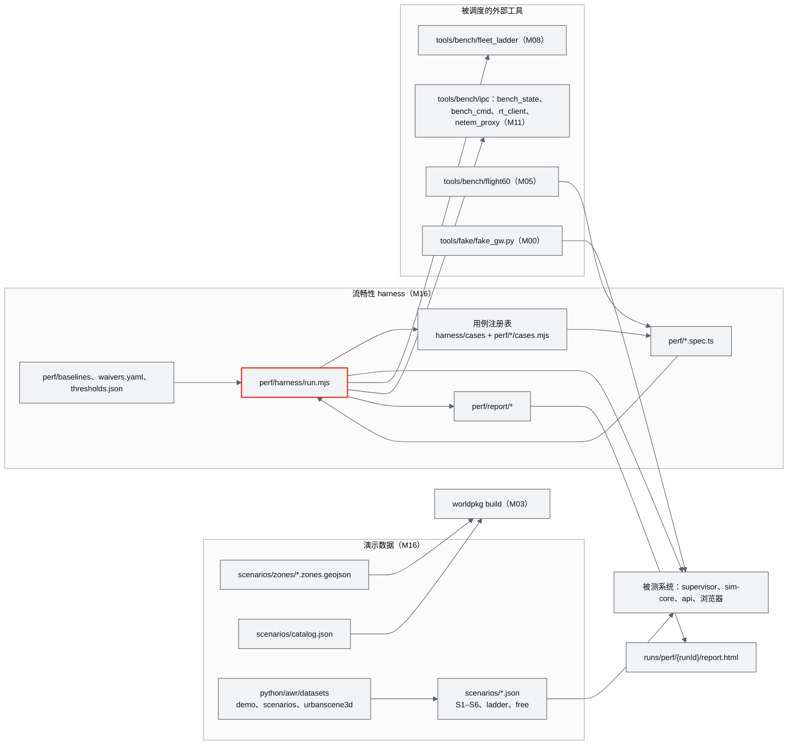
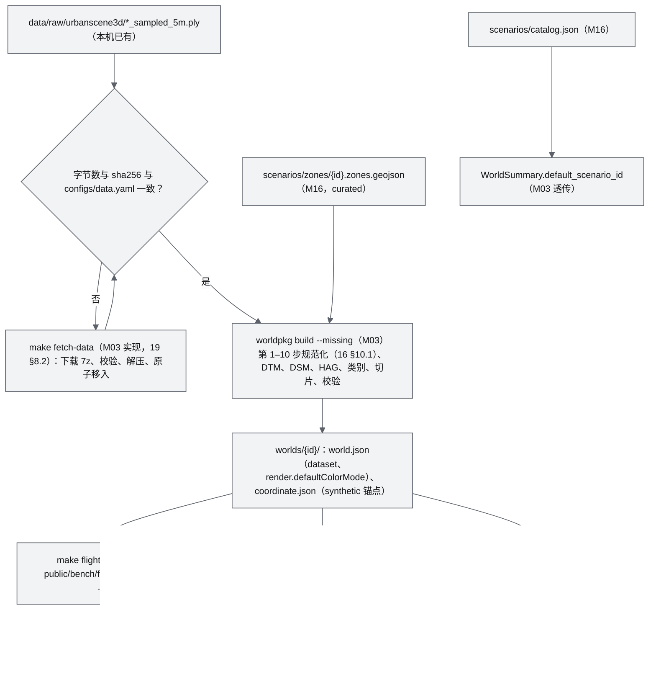
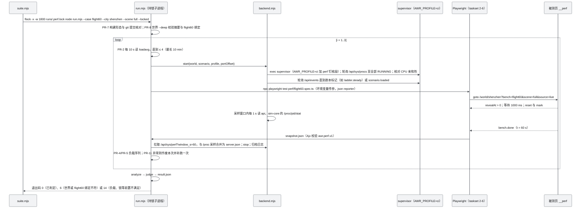
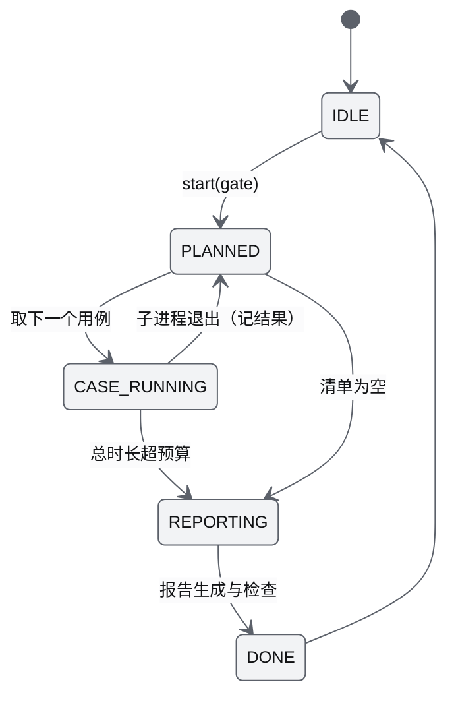
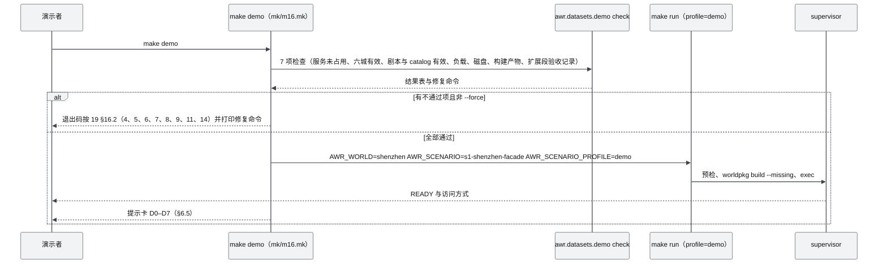

# M16 演示数据、剧本与流畅性测试 PRD

| 项 | 内容 |
|---|---|
| 文档编号 | AWR-M16 |
| 标题 | 演示数据、剧本与流畅性测试 |
| 版本 | v1.1 |
| 日期 | 2026-09-28 |
| 状态 | 草案（审校修订） |
| 修订记录 | v1.0 初稿；v1.1 审校：S1 改按 12 §5.8.5、§7.2 定稿（v1.0 的螺旋中心与半径穿入塔体，已作废）；ladder 改为分层错时起飞以保证爬升段间距；harness 指标键对齐 18 §11.2 登记名；按 16、18、12、M08 已采纳的反馈刷新引用与状态 |
| 上游文档 | [03-设计基线与决策记录](../03-设计基线与决策记录.md)（AWR-03，全部遵循）；[01-design](../01-design.md) §10、§14、§30、§32、§37–§41、§43；[12-业务逻辑设计说明书](../12-业务逻辑设计说明书.md) §3.3.6、§5.8、§7；[13-产品设计PRD](../13-产品设计PRD.md) §4.4、§13；[16-World数据规范](../16-World数据规范.md) §7、§10、§12；[18-性能与测试方案](../18-性能与测试方案.md)；研究笔记 x01（权威）、g02、n05、r26、r12、g08，另参考 00-index §3.14、d01、r27、g05 |
| 下游文档 | [13-产品设计PRD](../13-产品设计PRD.md)（演示脚本的剧本参数）；[18-性能与测试方案](../18-性能与测试方案.md)（harness 实现与报告）；[M03](M03-World模型与Ingest切片PRD.md)（curated zones、剧本清单透传）；[M05](M05-Web点云引擎PRD.md)、[M06](M06-Web视口与渲染后端PRD.md)、[M07](M07-环境引擎PRD.md)、[M08](M08-仿真内核与飞行器适配PRD.md)、[M09](M09-安全与健康PRD.md)、[M10](M10-任务规划与集群PRD.md)、[M11](M11-实时网关PRD.md)、[M12](M12-时间轴录制与回放PRD.md)、[M13](M13-传感器仿真PRD.md)、[M14](M14-智能体运行时与ANet-PRD.md)、[M15](M15-前端UI壳与设计体系组件PRD.md)（各模块 spec 由本模块 harness 调度）；[19-部署与运维说明书](../19-部署与运维说明书.md)（`make demo`、定时任务） |
| 适用版本范围 | V0.1（D1：core 为 S1、ladder、flight60、机群阶梯、harness、报告、一键演示；ext 为 S2–S6、恶劣天气 profile、混沌、soak、弱网、多客户端）至 V1.0 |

## 0. 摘要

1. M16 拥有 `scenarios/**`、`python/awr/datasets/**`、`apps/web/perf/**`、`tests/e2e/**`、`tests/chaos/**` 与 `mk/m16.mk`（AWR-03 §4.3），交付四样东西：六城演示数据的"可演示"闭环、剧本文件与演示脚本、流畅性测试 harness 与全部跨模块性能用例、lieflat 版式测试报告。
2. 六城数据链沿用 16 §10 的规范化矩阵（x01 权威）；M16 负责 curated 禁飞区、剧本清单、演示前检查与"六城事实回归"，不重复实现 ingest。
3. S1 参数采用 12 §5.8.5、§7.2 的定稿，本文负责落成剧本文件：螺旋中心取塔体足迹形心 (−162.2, 77.3)、半径 57 m（角点立面距离 ≥ 30 m）、`px4_default` 6 m/s、Δz 标称 18.47 m/圈并按整圈取整，p600-01 z 252 → 50、p600-02 z 391 → 248，两机均自上而下。可用能量口径（188.7 Wh）落地 SOC 0.36 与 0.32，两机同时扫描期间垂直间隔 155–159 m，全程最小三维间距 15.4 m。本文 v1.0 以峰值点 (−162.0, 98.5) 为中心、半径 45 m 的方案经 x01 高度图复核穿入塔体，已作废（§6.4.3）。
4. 任务书的六类主题映射到基线剧本：巡检 S1、S6；区域覆盖 S2-B、S4-B、S5；多机编队 S2-A、S4-A；目标搜索与 thermal 验证 S3；恶劣天气为 S1 的 `wx-fog`、`wx-rain`、`wx-storm` profile；压力测试为 `ladder-shenzhen`（10/50/100/200/500/1000，其中 100 为表征点）加风暴与弱网用例。S2–S6 全部按可用能量口径复核，落地 SOC ≥ 0.32、余量比 ≥ 1.5（12 §7.3 已采用这些数值）。
5. 机群阶梯布局定稿：4 个高度层（60/75/90/105 m AGL）交错于 12 m 格网，中心 (−375, 20)，原地环绕 r = 3 m、2 m/s；各层按"高层先飞"错开 5 s 起飞，使相邻层在爬升与入圆段始终保持 15 m 垂直间隔。按构造任意阶段机间三维距离 ≥ 16.2 m，远离 FleetGuard 的 10 m 告警线；在 flight60 相机视锥内的帧占比约 53%（n1000）至 55%（n200）。
6. Mock 模式取舍：D1-core 只承诺两种数据源——真实 sim-core 上的 Mock L1（产品默认）与 `fake_gw`（开发与隔离诊断）；纯浏览器离线回看包列为 V0.2（P2）；浏览器内跑 FleetSim 的方案否决（违反 P-02）。
7. harness 执行 18 号文档的性能运行协议，按用例注册表调度 Playwright、Python 基准、pytest 与混沌脚本，产出 `awr.perf.report.v1` 与自包含 lieflat HTML 报告；阈值只引用 18 号文档，本机 Tier S 阈值门禁，真 GPU 阈值为设计值、经 `/bench` 回传累积后以 ADR 固化。
8. 对基线与并行文档的反馈共 24 条（§14），其中 12 条已被 12、16、18、M08、M14 全部或部分采纳，6 条为本次审校新增；仍待处理的高优先级项为 `sim/reset` 与 `POST /api/sessions` 缺 profile 参数、性能用例的 CPU 钉核配置在 18 与 19 之间不一致、S1 几何与能量口径需以 ADR 冻结。

---

## 1. 背景与目标

### 1.1 定位

用户硬性要求 R3 的后半句是"可做模拟 mock 与系统流畅性测试；支持渐进加载、点云疏密自动调节，保证非常流畅"。M05、M06 负责"做到流畅"，M16 负责"证明流畅，并把它演示出来"：给出可重复的数据、剧本、相机脚本、负载阶梯、网络剖面与判定规则，让任何人在本机或 GPU 浏览器上得到同一结论（ADR-033）。M16 同时是依赖全部模块的"最后一环"（AWR-03 §6.2），它的剧本与用例就是系统集成的验收载体。

### 1.2 目标

| 编号 | 目标 | 可度量表述 | 首次达成 |
|---|---|---|---|
| G-M16-1 | 六城可演示 | 干净机器上 `make setup && make demo` 后，六城 `/world/<id>` 均可直达，深圳自动加载 S1；演示前检查 7 项自动输出 | V0.1 |
| G-M16-2 | 剧本可行且可复现 | 全部内置剧本通过 V-SC 校验与能量预检；S1 在 ×1 与 ×10 下成功谓词结果一致；同一种子逐事件一致 | V0.1 |
| G-M16-3 | 流畅性可证明 | 18 号文档列出的全部性能用例经 harness 执行，结果四态判定、三次取中位、可回归比较 | V0.1 |
| G-M16-4 | 报告可交付 | 每次门禁生成自包含 lieflat HTML 报告，"一处红"、无 emoji、带数据来源与保真度声明 | V0.1 |
| G-M16-5 | 真 GPU 数据闭环 | `/bench` 回传按设备能力档汇总，满足固化条件后产出 ADR 草稿所需的统计表 | V0.1（汇总）；V0.3（固化） |

### 1.3 对原设计的继承、修正与增强

01-design 没有测试与演示数据章节，相关意图散落在下列各节。引用时按 AWR-03 附录 C 注明处置。

| 01-design 条款 | 继承 | 修正 | 增强（本文） | 依据 |
|---|---|---|---|---|
| §43"先打通一条完整链路"；最终 Demo"添加虚拟 P600 → 控制无人机飞行"（部分取代，ADR-042） | 以 walking skeleton 用例作为 MS3 集成门禁；演示主线 D4 保留"添加 P600 并点选 GoTo" | "第一阶段不同时做 100 架"被 ADR-042 取代：1000 架是向量化 Mock 的规模压测 | 机群阶梯剧本、阶梯工具调度与报告；一键演示 `make demo` 与自动彩排 | ADR-042；13 §4.4 |
| §14"点云 LOD 最容易出性能问题"；"远处 10K / 近处 1M"（取代） | 以"相机驱动的渐进加载"作为主被测对象 | 静态阈值删除（AWR-03 附录 B.2），改为 flight60 固定六段脚本下的行为与帧节奏判定 | 六城回归矩阵；flight60 与机群、恶劣天气、弱网的组合用例 | g02 §2、§8；ADR-009、ADR-012 |
| §37"Web Rendering 60 FPS"（部分取代） | 分频思想 | Tier S 目标为固定 30 fps（ADR-044）；硬件档按刷新率，只作设计阈值 | 本机阈值门禁、真 GPU 阈值经 `/bench` 回传固化的闭环 | ADR-044；g02 §6.4、§8.2 |
| §10"URL 直达、远程演示、多人访问"（沿用） | 远程演示路径 | — | 远程冒烟、3 浏览器与 10 轻量客户端压测、W0–W3 弱网剖面 | 18 §8.7；r27 §3.1.3 |
| §30 控制模式（Area Coverage、Formation、Search）（修订） | 用剧本把每种模式落到一个城市 | 任务原语以 M10 生成器为准 | 六类主题到剧本的映射表（§6.4.1），每个剧本都有闭合成功谓词 | x01 §3.10–§3.11；r26 §4.4 |
| §32 Multi-Agent Workflow：疑似目标 0.42 → thermal 复核（修订） | 流程不变 | 为 D1-ext 的 Mock ANet 版本 | S3 的机体、目标、候选与坐标定稿（§6.4.5） | x01 §3.11；M14 §6.11 |
| §38–§40 UI、Timeline、相机（修订） | 演示中使用 Follow、FPV、轨迹、视锥、天气切换 | — | 演示脚本每段的自动化断言与录屏兜底 | 13 §4.4 |
| §41 World 文件结构（修订） | 六城 World Package 内置 | 目录按 AWR-03 §4.4 | 演示前检查与六城事实回归（`tests/e2e/test_builtin_worlds.py`） | x01 §0 第 11 条 |

### 1.4 相对研究原型与并行文档的修订

| 来源 | 原结论 | 本文结论 | 理由与证据 |
|---|---|---|---|
| x01 §3.11 S1；本文 v1.0 | x01：塔心 (−162.0, 98.5)、半径 45 m、Δz 9.24 m、4 m/s；本文 v1.0：同一中心与半径，5 m/s、Δz 18.47 m、分段 225 m、均自下而上 | 采用 12 §7.2：中心 (−162.2, 77.3)、半径 57 m、6 m/s、Δz 标称 18.47 m 按整圈取整、p600-01 252 → 50 m、p600-02 391 → 248 m、均自上而下 | (−162.0, 98.5) 是塔顶峰值点，位于塔体北缘；以它为心、半径 45 m 的螺旋在 HAG 50–250 m 离塔体栅格最近 0.1 m，约 15% 圆周落在 6 m 缓冲内（本文用 `x01/hmap_shenzhen.npy` 复核，与 12 §5.8.5 一致）。x01 原参数单架次能量不可行（12 §5.8.5） |
| M09 §14 第 1 条 | 5 m/s、分段 210 m、上段自上而下、下段自下而上 | 不采用混合方向；两段同向自上而下可行 | 混合方向时两机在收尾汇合，最小垂直间隔 0–12 m（`.cache/research/m16/scenario_energy.json` 的 `vsep_td_m`）；12 的定稿两机同向下行、速率相同，垂直间隔保持 155–159 m |
| 12 §7.4 草稿 ladder | 10 m 格网、r = 3 m 环绕、高度 30 + (行号 mod 4)·4 m | 12 m 交错格网、4 层 60/75/90/105 m AGL、同层间距 24 m、高层先飞 | 原布局相邻机三维距离可降到 4 m，落入 FleetGuard 10 m 告警线（M09 §11 R2）。12 §7.4 已采用本文布局；本文另加错时起飞，理由见 §6.4.8 |
| M08 §6.14 草稿 fleet_ladder 负载 | 60–120 m AGL、每 20 s 随机 goto 全 border 内目标、`breezy` 预设 | 环绕负载为默认；`--churn` 为可选；预设 `partlyCloudy` | 全域随机 goto 在 1000 架时测到的是让行而不是内核；`breezy` 不在 M07 的 12 个预设中。M08-FR-078 已采纳 |
| 12 §7.3 草稿 S2–S6 | 按 222 Wh 全包能量估算 | 按 188.7 Wh 可用能量复核并修订 S2、S4、S5、S6 | 原 S5（300 × 400 m）与 S6（4 km 往返、中继 600 s）在可用口径下落地 SOC 0.183、0.015（`scenario_energy.json` 的 `sx`）。12 §7.3 已采用本文数值 |
| x01 S4；16 §12.5 | 湖上走廊 x = +600 | x = +800 | x = +600 与 +700 的 ±20 m 带内最高 HAG 177.5 m；x = +800 为 1.6 m（湖面）。16 §12.5 已注明 |
| 18 §14.2 草稿 | `scenarios/s1_shenzhen.json`、`ladder.json`、`open_areas.json` | 按 16 §12.1 命名；不提交 `open_areas.json` | ladder 选址按 flight60 可见性重算（§6.4.8）。18 §14.2 已改 |

---

## 2. 范围

### 2.1 职责边界

| 主题 | M16 负责 | 不负责（引用） |
|---|---|---|
| 六城数据 | 演示前检查、六城事实回归、curated 禁飞区文件、剧本清单与默认剧本、报告与 UI 的来源声明验收 | 下载与校验实现（M03、[19](../19-部署与运维说明书.md) §8.2）；ingest、切片、校验器（M03，格式见 [16](../16-World数据规范.md) §10） |
| 剧本 | `scenarios/**` 全部文件；S1–S6、ladder、free、恶劣天气 profile 的参数定稿；剧本编写与离线复核工具 | 文件语法与校验规则（16 §12）；业务语义与度量定义（12 §7）；加载器与导演（M10） |
| 演示 | `make demo`、检查清单自动化、自动彩排与录屏兜底、演示提示卡 | 演示脚本内容（13 §4.4 为定义方） |
| 流畅性测试 | harness、用例注册表、跨模块 Playwright 用例、Python 基准与 pytest 的调度、基线与豁免、报告、`/bench` 汇总 | 阈值与协议（18 为定义方）；`window.__perf`（M06）；flight60 生成器（M05）；fleet_ladder（M08）；IPC 基准、弱网代理、轻量客户端（M11） |
| 混沌与长稳 | `tests/chaos/**`、`perf/soak.spec.ts` 的编排与判定 | supervisor 测试钩子 `sys/inject`（M11） |

### 2.2 D1 分层

| 层 | 内容 | 对应验收 |
|---|---|---|
| **D1-core（P0）** | S1 与 ladder 剧本；free 剧本（六城）；curated zones（六城）；剧本清单 `catalog.json`；剧本静态校验与 S1 端到端测试；flight60 用例（`scene=pc` 与 `scene=full`，深圳门禁、六城回归）；机群阶梯调度（sim-core 10–1000、前端 200）；walking skeleton 用例；IPC 基准与 SIH 黄金回归的调度；harness（协议、注册表、判定、基线、豁免）；报告生成与合规检查；`make demo` 与检查清单；六城事实回归；chaos-core；远程冒烟 | D1-AC-02、03a/b、04、06、07、08、09a、10、11a、12、14、15、24–27（27 的 link_drop 部分除外）、32–35 的调度与判定；模块用例（D1-AC-13、19、20）只调度 |
| **D1-ext（P1）** | S2–S6；恶劣天气 profile 与 `flight60-wx`；S3 端到端；混沌（checkpoint、挂死、毒性、熔断）；soak；UI 开销配对；弱网 W0–W3；10 客户端；前端 1000 架；画质采样；GC 与 React commit；自动彩排录屏；`/bench` 汇总 | D1-AC-05、09b、11b、16、17、18 的调度、23、28、29、30；PERF-AC-042、043 |
| **D1 桩** | 航线文件解析 `awr.datasets.urbanscene3d.paths`（接口与单测，P2 功能在 V0.2） | M02 UC-06、M12-FR-053 |
| **不在 D1** | 离线回看包（V0.2，P2）；GPU runner 作业 `make perf-gpu`（V0.3）；30 客户端（P2 探索）；其余五城 ladder（P2） | — |

### 2.3 后续版本

| 版本 | M16 增量 |
|---|---|
| V0.2 | 离线回看包；航线模板回放剧本（UrbanScene3D 43,654 个视点经 M12 导入器）；S1 在 SIH 后端的剧本 profile（`backend: px4_sih`，`caps.clock = slaved_realtime`） |
| V0.3 | GPU runner 作业与硬件阈值固化报告；Tier A 晋级比较报告（18 §2.4） |
| V0.4 | 风场 L2 进入剧本（`wx-*` profile 使用风场库）；what-if 分叉的回归用例 |
| V0.5 | 合肥园区真实数据世界与剧本；真机回放用例 |
| V0.6 | 100 架 30 min 随机任务零碰撞剧本（V0.6 退出标准） |
| V1.0 | S3 以真 ANet 跑通的验收剧本 profile（`agents.network = anet`，锁 ×1） |

---

## 3. 用户与用例

| 角色 | 使用 M16 的方式 |
|---|---|
| 演示者 | `make demo` 启动；按提示卡执行 D0–D7；失败时用录屏兜底 |
| 模块开发者（并行编码 agent） | 在 `apps/web/perf/<module>/` 提交 spec 并注册用例；本地 `make perf CASE=<id>` 复现 |
| 测试与发布负责人 | 执行 G2 夜间、G3 里程碑、G4 发布门禁；审阅报告、接受基线、登记豁免 |
| 科研用户 | 用剧本与 profile 做受控对比（晴与雨下的 pos_err、N 与 CPU 的关系），引用报告中的保真度声明 |
| 远程 GPU 浏览器用户 | 打开 `/bench` 回传真 GPU 数据 |

| 编号 | 用例 | 主要流程 | 层 |
|---|---|---|---|
| UC-01 | 一键演示 | `make demo` → 检查 7 项 → 启动 profile=demo（深圳 + S1）→ 打印访问方式与提示卡 | core |
| UC-02 | 夜间门禁 | cron 03:00 `make perf-nightly` → 逐用例持锁、等负载、三次运行 → 判定 → 报告与回归告警 | core |
| UC-03 | 里程碑出口 | `make perf-milestone MS=5` → 该里程碑全部验收 → G3 报告，P0 不通过则不得出口 | core |
| UC-04 | 剧本回归 | `pytest tests/e2e/test_scenarios.py -k s1` → ×10 运行 S1 → 读 `scenario.result` 与度量 | core |
| UC-05 | 机群阶梯 | `make perf CASE=fleet-ladder` → fleet_ladder 在 N 点集上运行 → CPU、RTF、单步统计 → 阶梯报告 | core |
| UC-06 | 恶劣天气对比 | `make run SCENARIO=s1-shenzhen-facade SCENARIO_PROFILE=wx-rain` 或 `make perf CASE=flight60-wx` | ext |
| UC-07 | 弱网验证 | `npm run perf:net -- --profile W2` → 代理注入 → 显示时延漂移、swarm 频率 | ext |
| UC-08 | 混沌 | `make chaos-core` → kill -9 api 与 sim-core → 重连、epoch、幂等 | core |
| UC-09 | 真 GPU 回传 | 用户打开 `/bench` → POST 报告 → `aggregate-bench.mjs` 汇总 → 满足条件后提示可固化 | ext |
| UC-10 | 新增性能用例 | 模块在 `perf/<module>/cases.mjs` 登记 CaseDef → harness 自动发现 → 进入指定门禁集 | core |

---

## 4. 功能需求

**A. 六城演示数据**

| 编号 | 需求描述 | 优先级 | 目标版本 | D1 | 验收要点 | 依据 |
|---|---|---|---|---|---|---|
| M16-FR-001 | 维护六城 curated 区域文件 `scenarios/zones/<world_id>.zones.geojson`（§6.2.4 表），格式与 V-Z 规则按 16 §7，`origin = curated`，不含 `border` | P0 | V0.1 | 是 | M16-AC-003 | 16 §7；13 §4.4 D4 |
| M16-FR-002 | 维护剧本清单 `scenarios/catalog.json`（§7.3.1）：每城 `default`、演示列表、主题映射；M03 的 WorldSummary 透传 `default_scenario_id` | P0 | V0.1 | 是 | M16-AC-004 | 12 §4.1.4；M03 §WorldSummary |
| M16-FR-003 | 为五个非深圳城市提供 free 剧本（2 架 P600 在实测平坦地块待命、无任务、`gcs_loss_policy: ignore`），另提供 `free-shenzhen` | P0 | V0.1 | 是 | M16-AC-005 | 12 §4.1.4 |
| M16-FR-004 | 演示前检查 `python -m awr.datasets.demo check`：自动执行 13 §4.4.1 的 7 项并输出通过或不通过与修复命令 | P0 | V0.1 | 是 | M16-AC-006 | PRD-FR-067 |
| M16-FR-005 | 六城事实回归 `tests/e2e/test_builtin_worlds.py`（`needs_data`）：最高 world z、根数、`nnMedianM`、默认着色、锚点类型与示意标签、北向置信度、合成地面与 16 §10 的规范值一致；原始文件 sha256 与 `configs/data.yaml` 一致（容差见 §6.2.3） | P0 | V0.1 | 是 | M16-AC-007 | 16 §10.3、§10.4；x01 §0 第 11 条 |
| M16-FR-006 | 诚实标识用例 `tests/e2e/honesty.spec.ts`：示意坐标、近似北向、合成地面、`simulated`、"参数未辨识"、强制档位标注在 UI 与报告中可见 | P1 | V0.1 | 是 | M16-AC-008 | PRD-AC-005；AWR-03 §5.1 规则 3 |
| M16-FR-007 | `make scenarios-pin`：在世界构建后把各剧本的 `world_coordinate_sha256` 写为实际 `coordinate.sha256`（提交入库） | P1 | V0.1 | 是 | M16-AC-004 | 16 §12.2 |

**B. 数据合规**

| 编号 | 需求描述 | 优先级 | 目标版本 | D1 | 验收要点 | 依据 |
|---|---|---|---|---|---|---|
| M16-FR-010 | 测试报告页脚写明数据来源、版本、引用与"科研用途"声明，取自 `world.json.dataset`，不手写 | P0 | V0.1 | 是 | M16-AC-030 | 13 §13.3 DC-5；ADR-034 |
| M16-FR-011 | 报告写入保真度声明：后端（Mock L1 等）、机型 profile 状态（placeholder 时写"参数未辨识"）、`simulated = true`、设备能力档与是否强制档位 | P0 | V0.1 | 是 | M16-AC-030 | 13 RK-13；ADR-043 |
| M16-FR-012 | 剧本文件、报告、演示提示卡通过 EMOJI-01 与 GLYPH-01；剧本名在 UI 显示前经运行时净化（由 M15 执行，M16 用例覆盖） | P0 | V0.1 | 是 | M16-AC-031 | AWR-03 §10.2；D1-AC-20 |

**C. 剧本与演示**

| 编号 | 需求描述 | 优先级 | 目标版本 | D1 | 验收要点 | 依据 |
|---|---|---|---|---|---|---|
| M16-FR-020 | S1 `s1-shenzhen-facade` 按 12 §7.2 的参数（§6.4.2）与 §7.3.2 全文提交，含 `ci`、`perf`、`demo`、`wx-fog`、`wx-rain`、`wx-storm` profile | P0 | V0.1 | 是 | M16-AC-010、011 | D1-AC-15；12 §7.2 |
| M16-FR-021 | ladder `ladder-shenzhen`：4 个高度层 vehicle_sets，按层错时起飞（L3 0 s、L2 5 s、L1 10 s、L0 15 s），profile `n10`、`n50`、`n100`、`n200`（缺省）、`n500`、`n1000`、`x500`，参数见 §6.4.8 | P0 | V0.1 | 是 | M16-AC-012 | D1-AC-07、09；12 §7.4 |
| M16-FR-022 | S2–S6 按 §6.4.4–§6.4.7 定稿并提交；全部通过能量预检 | P1 | V0.1 | 是 | M16-AC-013 | D1-AC-17；12 §7.3 |
| M16-FR-023 | S3 按 §6.4.5 定稿：5 架机（搜索、3 个 thermal 候选、中继）、3 个目标、首检置信度 0.42 | P1 | V0.1 | 是 | M16-AC-014 | D1-AC-16；M14 §6.11.2 |
| M16-FR-024 | 剧本静态校验 `tests/e2e/test_scenarios_static.py`（G1）：schema、V-SC-01～11 的离线部分、ID 与文件名一致、出生点在 border 内且不在 nofly 内、剧本间命名唯一、catalog 引用存在 | P0 | V0.1 | 是 | M16-AC-015 | 16 §12.6 |
| M16-FR-025 | 剧本能量回归 `tests/e2e/test_scenarios_energy.py`（`needs_data`）：以 `awr.sim.core.estimate` 对每个内置剧本做预检，落地 SOC ≥ 0.25，另用离线 1-D 模型复算最小余量比 ≥ 1.4 | P0（S1、ladder）/ P1（其余） | V0.1 | 是 | M16-AC-016 | 12 §5.8.4；M09 §6.8.6 |
| M16-FR-026 | 剧本端到端 `tests/e2e/test_scenarios.py`：S1（P0）、S2–S6（P1）、ladder n200 与 free 冒烟；×10 运行，读 `scenario.result`、度量与事件 | P0 / P1 | V0.1 | 是 | M16-AC-010、013、014 | M10-FR-063 |
| M16-FR-027 | `make demo`：检查清单 → 启动（profile=demo，`AWR_WORLD=shenzhen`，`AWR_SCENARIO=s1-shenzhen-facade`）→ 打印访问方式、SSH 转发命令与 D0–D7 提示卡（每段操作、看点、×1 与 ×10 的墙钟时刻） | P0 | V0.1 | 是 | M16-AC-017 | PRD-FR-067；13 §4.4 |
| M16-FR-028 | 自动彩排 `tests/e2e/demo_rehearsal.spec.ts`：headless 执行 D0–D5 的操作并断言看点；`--record` 时输出 1280×720 webm 作为录屏兜底 | P1 | V0.1 | 是 | M16-AC-018 | 13 §4.4.2 回退列 |
| M16-FR-029 | 剧本编写工具 `awr.datasets.scenarios`：ladder 布局、环形与方形折线、圆形 zones 多边形、S3 目标生成、离线能量复核；输出确定（同输入逐字节一致） | P1 | V0.1 | 是 | M16-AC-019 | 本文设定 |

**D. Mock 模式**

| 编号 | 需求描述 | 优先级 | 目标版本 | D1 | 验收要点 | 依据 |
|---|---|---|---|---|---|---|
| M16-FR-030 | 默认数据源为真实 sim-core 上的 Mock L1（M-L）；harness 门禁一律 `source=live` | P0 | V0.1 | 是 | M16-AC-020 | 18 §19 F-08 |
| M16-FR-031 | `source=fake`（M-G，`tools/fake/fake_gw.py`）用于前端隔离诊断：harness 支持以 fake 数据源跑 flight60 `scene=full`，报告标注"合成数据，不参与门禁" | P0 | V0.1 | 是 | M16-AC-021 | D1-AC-35；ADR-050 |
| M16-FR-032 | 离线回看包 `make demo-pack CITY=<id>`（M-B）：生产构建 + 单城世界 + S1 `.awrrt` 录制 + 静态服务脚本，前端以 FakeSource 回放，只读 | P2 | V0.2 | 否 | 设计见 §6.6 | 本文设定 |

**E. 流畅性测试 harness**

| 编号 | 需求描述 | 优先级 | 目标版本 | D1 | 验收要点 | 依据 |
|---|---|---|---|---|---|---|
| M16-FR-040 | harness `apps/web/perf/harness/run.mjs` 实现 18 §3 的 PR-1～PR-12 与单用例状态机（18 §3.2） | P0 | V0.1 | 是 | M16-AC-022 | ADR-033；PERF-FR-001 |
| M16-FR-041 | 用例注册表：核心用例在 `harness/cases/*.mjs`；模块用例在 `apps/web/perf/<module>/cases.mjs` 导出 `CaseDef[]`，按目录名排序自动发现；重复 id 拒绝启动 | P0 | V0.1 | 是 | M16-AC-023 | AWR-03 §4.3、ADR-050 |
| M16-FR-042 | 四类用例执行器：`pw`（Playwright spec）、`py`（Python 或 Node 基准工具，读 `awr.bench.result.v1`；自带客户端的多客户端用例也走此类，harness 以 `taskset` 包裹整个工具进程）、`pytest`（带 `perf` 标记的用例）、`shell`（混沌与冒烟脚本） | P0 | V0.1 | 是 | M16-AC-023 | 18 §3、PR-12 |
| M16-FR-043 | 后端编排：按 CaseDef 以 `AWR_PROFILE=ci` 加 `runtime.yaml` 的 `perf` 钉核段启动 supervisor（世界、剧本、profile、端口偏移），核对各进程 CPU 亲和性（不符判 PERF-E014），等待 `/api/sys/procs` 全部 RUNNING 与剧本标记事件；采样窗口内每 1 s 读 api 与 sim-core 的 `/proc/<pid>/stat`（CPU 门禁的权威来源，18 §9.4 第 3 条），运行后拉取 `/api/sys/perf?window_s=60`，二者合并写 `server.json`，停止并归档日志 | P0 | V0.1 | 是 | M16-AC-022 | M11-FR-086；18 PR-6、§9.4；19 §4.3 |
| M16-FR-044 | 指标提取与判定：稳态窗口 (2, 60] s、最近秩分位数、超时帧占比、离散度；四态加 WARN、NA、WAIVED；阈值取 `thresholds.json`（18 的可执行镜像） | P0 | V0.1 | 是 | M16-AC-024 | 18 §2.5、§3.1、§17 |
| M16-FR-045 | 基线库与回归判据（18 §11.3），`make perf-baseline-accept` 只接受 PASS 运行，基线永不自动更新 | P1 | V0.1 | 是 | M16-AC-025 | PERF-FR-022 |
| M16-FR-046 | 豁免登记 `apps/web/perf/waivers.yaml`，P0 不可豁免；G4 汇总进报告 | P0 | V0.1 | 是 | M16-AC-026 | 18 §12.3 |
| M16-FR-047 | 门禁集：`make perf-nightly`（G2 日集）、`make perf-weekly`（G2 周集）、`make perf-milestone MS=<n>`（G3）、`make perf-release`（G4），用例清单见 §6.7.4 | P0 | V0.1 | 是 | M16-AC-027 | 18 §12 |
| M16-FR-048 | harness 自检 `selftest.mjs`（锁冲突、负载超时、注入 pageerror 触发补跑、三次中位与四态） | P0 | V0.1 | 是 | M16-AC-022 | PERF-AC-001 |

**F. flight60、机群、客户端、弱网、混沌**

| 编号 | 需求描述 | 优先级 | 目标版本 | D1 | 验收要点 | 依据 |
|---|---|---|---|---|---|---|
| M16-FR-050 | `perf/flight60.spec.ts`：`scene=pc`（六城）、`scene=full`（深圳 + S1）、`scene=full&n=<N>`（深圳 + ladder）；绑定检查 flight60 JSON 的 `coordinate_sha256` 与 `bin_sha256`；采集快照与服务端指标 | P0 | V0.1 | 是 | M16-AC-028 | 18 §8.6；g02 §2 |
| M16-FR-051 | `flight60-wx`：S1 `wx-storm` profile 下的 `scene=full`，考察恶劣天气视觉与 PerfGovernor 降级下的帧节奏 | P1 | V0.1 | 是 | M16-AC-029 | ADR-041；§3.8 |
| M16-FR-052 | 机群阶梯（sim-core）：调度 `tools/bench/fleet_ladder/run.py --n 10,50,100,200,500,1000 --dur 60`（100 为表征点，不判定），判定 N = 1000；生成 CPU–N 曲线 | P0 | V0.1 | 是 | M16-AC-032 | D1-AC-07；g08 §11 |
| M16-FR-053 | 机群阶梯（前端）：`perf/ladder.spec.ts` N ∈ {10, 50, 100, 200, 500, 1000}，判定 N = 200（P0）与 1000（P1），其余为表征点 | P0 / P1 | V0.1 | 是 | M16-AC-033 | D1-AC-09a/b |
| M16-FR-054 | 客户端规模：`gw-3clients`（3 个 Chromium 同跑 flight60，N = 1000；MS4 用 `scene=pc&rt=1`，MS5 起用 `scene=full&n=1000`，P0）、`gw-10clients`（`rt_client.mjs`，P1）、`gw-30clients`（P2 探索） | P0 / P1 / P2 | V0.1 | 是（30 为否） | M16-AC-034 | D1-AC-08；18 §8.7(2)、§12.4 |
| M16-FR-055 | 弱网：`perf/net.spec.ts` 经 `netem_proxy.py` 执行 W0–W3，W3 在飞行 t = 30 s 断连 3 s；代理的启停由 `backend.mjs` 统一提供，M11 的 `perf/m11/weaknet.spec.ts`（M11-AC-044）复用同一接口 | P1 | V0.1 | 是 | M16-AC-035 | 18 §8.7(3) |
| M16-FR-056 | 风暴：`perf/storm.spec.ts`（全机 RTL P0、500 架 link_drop P1、UI 事件洪峰 P1）与 `bench_cmd.py` 调度 | P0 / P1 | V0.1 | 是 | M16-AC-036 | D1-AC-10、27 |
| M16-FR-057 | 混沌：`make chaos-core`（P0）与 `make chaos`（P1），用例见 §6.12 | P0 / P1 | V0.1 | 是 | M16-AC-037 | D1-AC-11a/b |
| M16-FR-058 | soak：`perf/soak.spec.ts` S1 + 200 架 30 min，含世界切换、预设切换、浮层开关与（有回放时）seek | P1 | V0.1 | 是 | M16-AC-038 | D1-AC-29 |
| M16-FR-059 | 配对与其他跨模块用例：skeleton、layout、warmup、latency、ui-overhead、ui-commit、gc、feat-matrix、quality、layers、governor、converge、bench 的 spec 与调度（18 §8.5） | P0 / P1 | V0.1 | 是 | M16-AC-039 | 18 §8.5 |
| M16-FR-060 | SIH 黄金回归与 IPC 基准的调度与报告（`pytest tests/sim/test_fleet_sih_parity.py`、`bench_state.py`、`bench_cmd.py`） | P0 | V0.1 | 是 | M16-AC-040 | AWR-03 §6.3 M16 |
| M16-FR-061 | 远程冒烟 `tests/e2e/remote_smoke.sh` 与首次可用时间 `tests/e2e/first_use_time.sh` | P0 / P1 | V0.1 | 是 | M16-AC-041 | D1-AC-33；PRD-NFR-027 |

**G. 报告与真 GPU 数据**

| 编号 | 需求描述 | 优先级 | 目标版本 | D1 | 验收要点 | 依据 |
|---|---|---|---|---|---|---|
| M16-FR-070 | `perf/report/build-report.mjs`：由各用例 `result.json` 生成 `awr.perf.report.v1` | P0 | V0.1 | 是 | M16-AC-030 | 18 §11.2 |
| M16-FR-071 | `perf/report/render.mjs`：以 Playwright 打开报告路由 `/reports?src=report.json`（M15-FR-080），用 `page.route` 注入本地 `report.json`，等待 `[data-report-ready=true]`，内联 CSS 与字体，输出自包含 `report.html`，可选 PDF；M15 路由交付前（MS5 前）以 `--plain` 降级输出纯 `table.log` 表格 | P0 | V0.1 | 是 | M16-AC-030 | 18 §11.4 第 5 条 |
| M16-FR-072 | `perf/report/check-report.mjs`：schema、无 emoji 与禁用字形、每图红色实心元素 ≤ 1、`table.log` 规则、指标键全部为 18 §11.2 登记名、页脚来源与保真度字段存在 | P0 | V0.1 | 是 | M16-AC-031 | PERF-AC-054 |
| M16-FR-073 | fleet_ladder 与 SIH 回归结果进入同一报告（阶梯表 + 行内 sparkline；17 项"SIH 值、Mock 值、容差"哑铃图） | P0 | V0.1 | 是 | M16-AC-032 | M08 §9 报告行 |
| M16-FR-074 | `perf/report/aggregate-bench.mjs`：按设备能力档与 GPU 型号汇总 `runs/perf-reports/`；满足"同档 ≥ 3 份且 ≥ 2 台设备"时输出固化候选表 | P1 | V0.1 | 是 | M16-AC-042 | 18 §11.5 |

---

## 5. 非功能需求

| 编号 | 需求描述 | 优先级 | 目标版本 | D1 | 验收要点 | 依据 |
|---|---|---|---|---|---|---|
| M16-NFR-001 | 测量扰动：harness 在采样期间对被测页的 `evaluate` 调用只在开始与结束各一次，等待条件轮询间隔 1000 ms；harness 进程 CPU ≤ 0.05 核（本机 CPU，load < 6） | P0 | V0.1 | 是 | M16-AC-022 | ADR-033；n05 §3.6 |
| M16-NFR-002 | 确定性：全部剧本种子固定；剧本中的随机量（目标位置、首检置信度）写死或由种子决定；harness 与 spec 禁止未播种随机数（DET-01） | P0 | V0.1 | 是 | M16-AC-010、015 | ADR-049；12 §7.1.4 |
| M16-NFR-003 | 门禁时长：G2 日集 ≤ 3 h、周集 ≤ 5 h、G3 ≤ 8 h（不含等锁与等负载）；单个 flight60 用例 3 次 ≤ 6 min | P1 | V0.1 | 是 | M16-AC-027 | 18 §12.1 |
| M16-NFR-004 | 结果稳定：同一提交连续 3 晚，状态在通过与不通过之间翻转的用例 ≤ 5% | P1 | V0.1 | 是 | M16-AC-025 | PERF-NFR-022 |
| M16-NFR-005 | 剧本可行：每个内置剧本按可用能量口径落地 SOC ≥ 0.25（S1 ≥ 0.29），离线 1-D 模型最小余量比 ≥ 1.4；S1 两机同时扫描期间垂直间隔 ≥ 150 m，全程最小三维间距 ≥ 12 m | P0（S1、ladder）/ P1 | V0.1 | 是 | M16-AC-016 | 12 §5.8.4、§5.8.5；M09 §6.8.6 |
| M16-NFR-006 | 机群布局安全：ladder 任意 N、任意阶段（错时爬升、入圆、环绕、返航）机间三维距离的构造值 ≥ 16.2 m，实测 ≥ 14 m（每机留 1 m 跟踪误差）；运行中 FleetGuard `CONFLICT` 与 `AVOIDING` 事件为 0 | P0 | V0.1 | 是 | M16-AC-012 | M09-FR-081；12 §7.4 |
| M16-NFR-007 | 剧本加载：S1 加载与预检 ≤ 2 s；ladder n1000 展开、预检与出生 ≤ 5 s（墙钟，本机 CPU） | P1 | V0.1 | 是 | M16-AC-012 | 本文设定：避免阶梯运行的预热被加载时间淹没 |
| M16-NFR-008 | S1 CI 运行（×10）墙钟 ≤ 3 min（仿真约 13.1 min，×10 约 79 s 加启动） | P0 | V0.1 | 是 | M16-AC-010 | §6.4.2 |
| M16-NFR-009 | 演示前检查 ≤ 60 s（不含世界构建）；`make demo` 在世界已构建时 ≤ 20 s 打印 READY | P1 | V0.1 | 是 | M16-AC-006、017 | 19 OPS-NFR-002 |
| M16-NFR-010 | 报告：`report.html` 自包含、≤ 5 MB、渲染 ≤ 60 s；图全部为静态 SVG，不播放入场动画 | P0 | V0.1 | 是 | M16-AC-030 | 18 §11.4 第 4 条 |
| M16-NFR-011 | 隔离：混沌与注入类测试只在 `AWR_PROFILE=ci` 下运行；harness 检测到 `demo` profile 的运行时以退出码 11 拒绝 | P0 | V0.1 | 是 | M16-AC-037 | M11 §10.1 `sys/inject` |
| M16-NFR-012 | 可扩展：新增模块用例只需新增 `perf/<module>/cases.mjs`，不修改 harness 源码 | P0 | V0.1 | 是 | M16-AC-023 | ADR-050 |
| M16-NFR-013 | 可追溯：每个 CaseDef 至少关联一个 D1-AC 或 PERF-AC 编号；报告按编号汇总通过率 | P0 | V0.1 | 是 | M16-AC-027 | 18 §11.2 |

---

## 6. 设计方案

### 6.1 组件与文件落点



文件清单与所有权（全部在 AWR-03 §4.3 的 M16 路径内，另加 `mk/m16.mk`）见 §9.1。

### 6.2 内置六城数据链

#### 6.2.1 端到端流程



M16 在链路中只做三件事：提供输入（curated zones、剧本清单）、提供锚定（剧本坐标哈希）、提供验收（检查与事实回归）。下载、校验、规范化与切片的实现全部在 M03，参数矩阵以 16 §10.2 为准，本文不复制。

#### 6.2.2 六城演示定位

| 城市 | 世界 id | 演示角色 | 默认剧本 | 主题 | 默认着色（16 §10.3） | 需要在 UI 与报告中标注 |
|---|---|---|---|---|---|---|
| 深圳 | `shenzhen` | 默认城市、门禁城市 | `s1-shenzhen-facade` | 巡检、压力、恶劣天气 | height | 示意坐标；北向未验证（近似） |
| 上海 | `shanghai` | 大场景流式（48 km²）、编队 | `free-shanghai` | 编队、覆盖 | height | 示意坐标 |
| 纽约 | `newyork` | 城市峡谷、搜救 | `free-newyork` | 搜索与 thermal | height | 示意坐标 |
| 旧金山 | `sanfrancisco` | 单位修正（10.15 m/单位）、丘陵 | `free-sanfrancisco` | 地形跟随覆盖 | hag | 示意坐标 |
| 苏州 | `suzhou` | Y-up、无地面、6 根森林 | `free-suzhou` | 走廊巡检 | height | 示意坐标；北向未知；合成地面 z = 0 |
| 芝加哥 | `chicago` | ×1000 与 2.03° 调平、最深八叉树 | `free-chicago` | 湖岸编队、Loop 覆盖 | height | 示意坐标 |

依据：x01 §5.1 的六类世界形态；16 §10.2 的 `trueNorth` 与示意锚点表。示意经纬度的使用边界按 AWR-03 §5.1 规则 3：只用于太阳、天空与 UI 显示，UI 标注"示意坐标"，禁止用于真实导航。

规范化配置与示意锚点摘要（定义方为 16 §10.2，x01 §3.2–§3.3 为权威实测；本表只供演示与测试核对，数值冲突时以 16 为准）：

| 世界 | 单位到米 | 上轴 | 调平 | 北向旋转 | 北向置信度 | 示意锚点（lat, lon） | 首屏层级（Tier B/A 口径） |
|---|---|---|---|---|---|---|---|
| shenzhen | 1 | +z | 否 | 0° | assumed | 22.5160584, 113.9432472 | L2 |
| shanghai | 1 | +z | 否 | 0° | verified | 31.2281892, 121.5316942 | L3 |
| newyork | 1 | +z | 否 | 0° | verified | 40.7130611, −74.0023445 | L2 |
| sanfrancisco | **10.15** | +z | 否（丘陵，禁止调平） | **+90°** | verified | 37.7791216, −122.4212116 | L2 |
| suzhou | 1 | **+y** | 否 | 0° | unknown | 31.30, 120.62（不确定度 5 km） | 6 根各 L1–L2 |
| chicago | **1000** | +z | **2.025°** | 0° | verified | 41.8841302, −87.6225307 | L3 |

着色：点云无 RGB，按 x01 §3.7 的 Graphite 五档渐变（g800 → g50）乘法线光照，默认 Height，旧金山默认 HAG（地形起伏 268 m 会吞掉建筑层次）；Class 着色用于语义检查。演示 D1 依次切换 Height、HAG、Class（13 §4.4），`warmup` 用例保证切换不触发着色器编译（D1-AC-25）。

#### 6.2.3 六城事实回归

`tests/e2e/test_builtin_worlds.py`（`needs_data`，G2 日集）读取已构建的 World Package，对照 16 §10.3 的规范值断言。容差为本文设定：几何量取浮点与栅格误差的上界，计数量取精确值。

| 断言 | 对象 | 期望（来源） | 容差 |
|---|---|---|---|
| 原始文件 | 六个 PLY | `configs/data.yaml` 的字节数与 sha256（入库真源；本机 `MANIFEST.json` 须与之一致，16 §10.4） | 精确 |
| 规范化范围 | `coordinate.extent`（`{min[3], max[3]}`） | E × N × U（16 §10.3） | ±1 m |
| 最高 world z | `coordinate.extent.max[2]` | 深圳 374.05、上海 636.73、纽约 287.00、旧金山 443.20、苏州 152.37、芝加哥 445.24 m | ±0.5 m |
| 根与深度 | `world.json` 点云层的 `roots[]`、`metadata.json` | 苏州 6 根深度 4；芝加哥深度 6；其余 1 根深度 5 | 精确 |
| 最近邻中位数 | `render.nnMedianM` | 0.526、1.845、1.016、1.887、0.348、1.587 m | ±2% |
| 默认着色 | `render.defaultColorMode` | 旧金山 `hag`，其余 `height` | 精确 |
| 锚点 | `coordinate.anchor` | `kind = synthetic`、`georeferenced = false`、标签以 `illustrative:` 开头 | 精确 |
| 合成地面 | 苏州 `render.syntheticGroundZ` | 0 | 精确 |
| 数据来源 | `world.json.dataset` | name、version、url、citation、license 非空（V-W-12）；`sourceFiles[]` 与 `MANIFEST.json` 逐项一致 | 非空 / 精确 |
| border 上限 | `semantic/zones.geojson` 的 `border.max_z_m` | 424.05、686.73、337.00、493.20、202.37、495.24 m（16 §7） | ±0.05 m |
| 芝加哥调平 | DTM 沿 S4 走廊（x = 800，y ∈ [−1200, 600]）的起伏 | ≤ 1 m | — |

这些断言是"演示数据正确"的最后一道闸：任何一项失败都意味着坐标、单位或调平出错，x01 §6 第 1 条指出这是全项目最高风险。

#### 6.2.4 curated 区域（`scenarios/zones/<world_id>.zones.geojson`）

每个区域是 32 边形近似圆（外环逆时针），由 `awr.datasets.scenarios.authoring.circle_zone(center, r, n=32)` 生成后提交入库。选址原则：演示中可点到、不与任何内置剧本的出生点、任务航线与返航线相交（`test_scenarios_static.py` 断言）。

| 世界 | zone_id | kind | 圆心（world ENU，m） | 半径 m | min_z_m / max_z_m | 用途 | 依据 |
|---|---|---|---|---|---|---|---|
| shenzhen | `nofly-sz-t2` | nofly | (−98.0, 346.5) | 60 | null / null | 演示 D4：点选禁飞区被拒（102） | x01 missions.json peaks[1]，303.9 m 塔 |
| shenzhen | `restricted-sz-t3` | restricted | (110.0, 162.5) | 50 | null / null | 进入只告警的对照 | peaks[2]，173.3 m |
| shanghai | `nofly-sh-pearl` | nofly | (−3427.2, 1547.6) | 100 | null / null | 东方明珠禁飞；距 S2 环线 ≥ 490 m | x01 §3.2 |
| newyork | `nofly-ny-70pine` | nofly | (−434.1, −741.3) | 60 | null / null | 城市峡谷禁飞示例 | x01 §3.2 |
| sanfrancisco | `nofly-sf-sutro` | nofly | (−2795.9, −2612.5) | 120 | null / null | S5 需避开 Sutro Tower（258 m） | 16 §12.5；x01 §3.11 |
| chicago | `nofly-chi-hancock` | nofly | (−15.0, 1636.0) | 80 | null / null | 禁飞示例；距 S4 两个作业区 > 1.5 km | x01 §3.2 Willis → Hancock |
| suzhou | —（空集合） | — | — | — | — | 苏州没有地标证据，不设 curated 区域 | x01 §3.2 |

zones 文件变化会使 `worldpkg build --missing` 重建对应世界（16 §7 第 2 条），因此修改后必须随提交执行 `make worlds` 与 `make scenarios-pin`。

### 6.3 数据合规

| 事项 | 决策 | 落地 |
|---|---|---|
| 许可 | 按 R4 忽略 UrbanScene3D"非商业、禁止再分发"条款对内置与演示的限制（ADR-034；13 §13.2） | 不以 license 为由裁剪任何演示内容 |
| 记录与告知 | 不因 R4 省略（13 §13.2 第 2 条） | 报告页脚从 `world.json.dataset` 读取来源、版本、引用与许可摘要；演示提示卡 D7 提醒打开关于对话框 |
| 分发体积 | World Package 与原始数据不入 git（ADR-034） | 剧本、zones、catalog、夹具入库；`worlds/`、`runs/`、`data/raw/` 不入库 |
| 保真度诚实 | Mock 结果不得被当作真实实验数据（13 RK-13） | 报告"保真度声明"区块；`honesty.spec.ts` 检查 UI 标识 |
| 性能回传 | `/bench` 只含设备能力档、帧节奏与首屏统计量（13 §13.4） | `aggregate-bench.mjs` 丢弃未登记字段；不收集 UA 以外的浏览器指纹 |
| 离线回看包（V0.2） | 包内附 `NOTICE.txt`（来源、引用、许可文本、"科研用途"声明） | `make demo-pack` 生成 |

报告页脚固定格式（中文界面文本，字段来自 `world.json.dataset` 与 `run.json`）：

```text
数据：UrbanScene3D（Lin et al., ECCV 2022）虚拟城市采样点云 v0.0.1，科研用途；许可摘要见 world.json。
坐标：示意锚点（synthetic），不得用于真实导航。仿真：Mock L1（PX4-lite），机型 p600_mid360（参数未辨识），结果为仿真值。
PERF · SHENZHEN · WEBGL2 SOFTWARE · run p20260928-031502-3f7a9c2
```

### 6.4 剧本体系

#### 6.4.1 主题映射

任务书把剧本按主题列为六类；基线（16 §12.1、12 §7、00-index §3.14）把 S1–S6 绑定到六个城市。本文不改剧本编号与城市绑定，用下表把主题落到剧本资产上：

| 主题 | 剧本资产 | 城市 | 机数 | D1 | 核心验证点 |
|---|---|---|---|---|---|
| 巡检 | S1 立面螺旋；S6 走廊斜视 | 深圳；苏州 | 2；5 | core；ext | 立面覆盖、机间间距、阵风、能量；无地面世界、长航程分段 |
| 区域覆盖 | S2-B 公园割草机；S4-B Loop 逐航带安全高度；S5 地形跟随 | 上海；芝加哥；旧金山 | 3；5；1 | ext | 覆盖率、安全高度剖面、AGL |
| 多机编队 | S2-A V 形环绕三塔；S4-A 横队变 V 形 | 上海；芝加哥 | 5；5 | ext | 编队误差、集结与变形、大场景流式 |
| 目标搜索与 thermal 验证 | S3 港口搜救 | 纽约 | 5 | ext | 0.42 → ≥ 0.9、合同网、证据链 |
| 恶劣天气 | S1 的 `wx-fog`、`wx-rain`、`wx-storm` profile；`flight60-wx` | 深圳 | 2 | ext | 安全终止、MOR 与降水视觉、降级下的帧节奏 |
| 压力测试 | `ladder-shenzhen`（n10–n1000）；风暴、弱网、多客户端用例 | 深圳 | 10–1000 | core（n200、n1000 sim-core）；ext（n1000 前端） | CPU、RTF、单步、帧节奏、事件合并 |

恶劣天气做成 profile 而不是新剧本：同一几何、同一种子下只改变环境，才能做"晴与雨"的受控对比（科研可复现，G6）；同时不新增剧本编号，不改动 16 §12.1 的内置清单。

#### 6.4.2 S1 深圳 · 超高层双机立面巡检（D1-core）

业务参数的定义方是 12 §7.2（依据 12 §5.8.5 的几何与能量复核）；本节把它落成剧本字段，数值与 12 不一致时以 12 为准并回改本文。高度一律为 world z（塔区地面 world z −7.24 m，塔顶 world z 374.1 m，HAG 381.3 m）。

| 项 | 取值 | 依据 |
|---|---|---|
| 目标 | 塔体足迹形心 (−162.2, 77.3)（HAG ≥ 150 m 处截面约 30 m × 44 m，x ∈ [−177, −147]，y ∈ [55, 99]）；x01 的峰值点 (−162.0, 98.5) 位于塔体北缘，不作螺旋中心 | 12 §7.2；本文复核（§6.4.3） |
| 机体 | `p600-01`：home (−230, 20)，z 取 DSM（屋顶，world z 23.5 m），`sensors: [camera]`，`rgb.zoom`；`p600-02`：home (−230, 40)（world z 0.1 m），`sensors: [camera, mid360]`，`rgb.zoom`、`lidar.mapping`；两机 `speed_profile = px4_default`、`initial_soc = 1.0`、`marked = true` | 12 §7.2 |
| 螺旋 | `helix_scan`：中心 (−162.2, 77.3)，`radius_m 57`、`standoff_m 30`；`dz_per_rev_m 18.47`（30 m 处垂直重叠 20%，生成器按整圈回算）；**6.0 m/s**；`entry_azimuth_deg` 缺省 `auto`（指向各自 home），入场点 (−205.7, 40.5) 与 (−212.1, 49.8)，扫描终点与入场点同方位；`direction = ccw`；`gimbal = look_at_axis` | 12 §7.2；M10 §6.5.10 |
| 分段 | `m-lower`（p600-01）**252 → 50 m**，11 圈，实际 Δz 18.36 m，3.94 km；`m-upper`（p600-02）**391 → 248 m**，8 圈，实际 Δz 17.88 m，2.87 km；重叠 4 m；**两机均自上而下** | 12 §5.8.5 |
| 环境 | `clear` + 风 6 m/s（10 m AGL 参考）、来向 135°、湍流 σ_u 1.0 m/s；world z 273 m 以上平均风超过 P600 抗风 13.8 m/s，只发 `SAF.ENV.WIND_LIMIT` 告警（ext）；t = 420 s 阵风 6 m/s、`length_m 120` | 12 §7.2；16 §12.4 |
| 转场 | `safe_transit`，裕度 5 m，分层 4 m（先在 home 上空爬升到起扫高度，再水平进入） | 16 §12.2；12 §7.2 |
| 区域 | `border`、`nofly-sz-t2`、`restricted-sz-t3`（均与螺旋、转场、返航线不相交，§6.2.4） | §6.2.4 |
| 运行 | 基础 ×1；`ci` ×10 且不录制；`gcs_loss_policy = ignore`；`energy_precheck = reject`；`time_limit_s = 1800`；`on_complete = pause`（`demo` profile 改为 `continue`，§6.5） | ADR-026、ADR-045；D1-AC-15 |

**业务时间线**（仿真时间，取自 12 §7.2；×10 时墙钟为十分之一）：

| 时刻 | p600-01 | p600-02 | 检查点 |
|---|---|---|---|
| 0 s | 能量预检（落地 SOC 估算 0.36）、MISSION 租约、arm、takeoff | 同左（0.32） | `scenario.loaded`；两条 Track 进入 TRANSIT |
| 约 82 s | 在 home 上空爬升到 252 m 后到达入场点，开始扫描 | 爬升中（约 245 m） | — |
| 约 134 s | 扫描中（约 237 m） | 到达入场点 z = 391 m，开始扫描 | 两机垂直间隔约 155 m，此后保持在 155–159 m |
| 420–440 s | z ≈ 149 m | z ≈ 306 m | 阵风窗口，`pos_err_max_m{window: gust} < 3.0` |
| 约 10.2 min | 扫描中（约 89 m） | 扫描完成于 248 m，RTL（z_rtl = 248 m，下降约 159 s） | — |
| 约 12.3 min | 扫描完成于 50 m，RTL（z_rtl ≈ 54 m） | 下降中 | 两机最小三维间距 15.4 m 出现在此前后；`scan complete` 标记 |
| 约 12.8 min | 屋顶着陆上锁 | 下降中 | p600-01 落地 SOC ≈ 0.36 |
| 约 13.1 min | — | 着陆上锁 | p600-02 落地 SOC ≈ 0.32；`scenario.result` |

Δz 18.47 m 小于相机在 30 m 距离上的垂直覆盖 23.09 m（`2·30·tan(21.05°)`，VFOV 42.1°），角点处（30.3 m）覆盖 23.3 m，立面理论覆盖率 100%；`facade_coverage` 的立面网格取 world z ∈ [45, 374.1] m（z < 45 m 被裙楼包围，12 §7.1.3），满足 `≥ 0.9`。全文 JSON 见 §7.3.2。

#### 6.4.3 S1 参数的选定依据

本节记录本文对 12 §7.2 定稿的独立复核，以及 v1.0 方案作废的原因。复核脚本：几何与能量用 12 的 `.cache/research/biz12/s1_check.py`（含风阻功率 `P_hover·(T/T_hover)^1.5`、power 廓线 α = 0.25），间距用 `s1_sep.py`；另以本文 `.cache/research/m16/scenario_energy.py` 的 1-D 悬停功率模型（M09 `s1_energy_check.py` 加返航段）交叉核对。

**几何**（`x01/hmap_shenzhen.npy`，2 m 栅格，HAG）：

| 螺旋 | HAG 50–250 m 离塔体栅格最近距离 | 落入 6 m 缓冲的圆周比例（HAG 50 / 250 / 350 m） | 结论 |
|---|---|---|---|
| 峰值点 (−162.0, 98.5)、半径 45 m（x01 与本文 v1.0） | 0.1 m | 0.15 / 0.14 / 0.09 | 穿入塔体，作废 |
| 形心 (−162.2, 77.3)、半径 57 m（12 §7.2） | 30.3–31.2 m | 0 / 0 / 0 | 角点立面距离 ≥ 30 m；z < 45 m 有裙楼遮挡，故下段止于 50 m |

**能量与间距**（可用能量 188.7 Wh）：

| 方案 | 落地 SOC（12 模型，含风阻） | 落地 SOC / 最小余量比（本文 1-D 模型，不含风阻） | 两机同时扫描期间垂直间隔 | 全程最小三维间距 |
|---|---|---|---|---|
| 形心 57 m、6 m/s、均自上而下（定稿） | 0.36；0.32（P_hover 上浮 10% 时 0.30；0.26） | 0.372 / 4.77；0.361 / 2.56 | 155–159 m（1-D 模型 152.8–156.7 m） | 15.4 m（约 743 s，p600-02 下降段） |
| 同几何、均自下而上（对照） | 0.31；0.29 | — | — | 上段收尾需从 391 m 下降 254 s |

结论与取舍：

1. v1.0 的"5 m/s、分段 225 m、均自下而上"在能量上可行，但沿用了 x01 的错误几何，作废；其网格搜索（`scenario_energy.json` 的 `s1`）只保留一个仍然成立的结论：同一螺旋上"下段上行、上段下行"的混合方向会在收尾汇合，最小垂直间隔 0–12 m，不可用。12 的定稿两机同向下行、速率相同，不存在该问题。
2. 两机均自上而下的好处是满电时完成爬升，扫描结束时已在低处，最后的返航从 248 m 与 50 m 开始；因此落地 SOC 比自下而上高约 0.03–0.05。
3. p600-02 的落地 SOC 比预检线 0.20 高 0.12；P_hover 上浮 10%（ADR-043 辨识容差）时落地 SOC 仍为 0.26（高 0.06）。本文 AC 取"落地 SOC ≥ 0.29（名义参数）"作为回归门槛（M16-AC-016），低于它时按 RK-M16-01 处置。
4. 13 PQ-1 建议"保持默认限速档并增加机数"：会改变 D1-AC-15 的"两架机"表述，需要追加 ADR；12 §7.2 已选 `px4_default` 与两机，本文沿用。
5. 风的影响：S1 基础环境下 world z 273 m 以上的平均风已超过 13.8 m/s 抗风等级，只告警、不拒绝（12 §5.12）；成功谓词中的 `guard_events` 缺省只计 action 及以上等级，不受该告警影响。

#### 6.4.4 S2 上海 · 编队环绕 + 公园覆盖（D1-ext）

| 组 | 机体 | 出生点（实测平坦地块） | 任务 | 参数 |
|---|---|---|---|---|
| A | `p600-a-01`～`p600-a-05`（`vehicle_sets` 生成，id 规则 `<id_prefix>-<序号>`，16 §12.2；2 行 × 3 列，间距 6 m） | (−2841, 1398) 起，地块中心 (−2835, 1404)，距三塔质心 470 m | `formation` V 形 | 锚点路径为以 (−2853, 934) 为圆心、半径 350 m 的 72 点闭合折线（由 `authoring.ring` 生成，首点方位 90°）；`spacing_m = 12`（高于 FleetGuard 10 m 告警线，与 12 §7.3 一致；16 §12.5 摘要中的 `min_separation_m ≥ 8` 以本文剧本的 ≥ 10 为准）；`half_angle_deg = 35`；`heading_mode = filtered`、`tau_psi_s = 2`；`z_m = 250`；`speed_mps = 6`；`corner_radius_m = 40`；`on_done = rtl` |
| B | `p600-b-01`～`p600-b-03` | 公园西南角 (1030, −1230) 起，间距 6 m | `lawnmower`（多机切分为 ext） | 以 (1158, −1094) 为中心 300 m 方形；`altitude{mode: fly_over, agl_m: 120, clearance_m: 10}`；`side_overlap 0.7`（航线间距 41.6 m）、`front_overlap 0.8`；5 m/s |

- 环线最高障碍 202.8 m（±25 m 带，x01 hmap 复算），z 250 m 留 47 m 净空；公园 300 m 方形内最高 HAG 7.9 m；两组出生点所在格 HAG 均为 0。
- 能量（可用口径）：A 落地 SOC 0.444、余量比 2.05、单架次 11.7 min；B 为 0.708、5.74、6.1 min。
- 环境 `partlyCloudy`。成功谓词：`formation_err_rms_m{m-formation} ≤ 3`、`min_separation_m ≥ 10`、`area_coverage{m-coverage} ≥ 0.95`、`guard_events == 0`、`landed_all`、`battery_soc_min ≥ 0.25`。

#### 6.4.5 S3 纽约 · 港口搜救与 thermal 复核（D1-ext）

几何取 x01 §3.11 与 M14 §6.10.3 的示例并定稿（M14 写明"M16 定稿坐标"）。M14 示例中的 home (−64, −1583) 在纽约 border（y ≥ −1563.3）之外，本文改为岸边平坦地块。

| 机体 | 出生点 | 初始 SOC | 能力 | 任务 |
|---|---|---|---|---|
| `p600-a1` | (−58, −1515) | 1.00 | `rgb.zoom` | `expanding_square`：基准点 (−64, −1283)，z 60 m，`leg0_m 55`，`legs 12`（2.31 km），首腿向东，ccw，5 m/s（`px4_default`） |
| `p600-b1` | (−52, −1515) | 0.80 | `thermal.imaging` | `follow_path` 经 (−52, −1515, 80) 到待命点 (86, −1133, 80)，3 m/s，`on_done = hover`（MISSION 租约待命；比搜索机高 20 m，第 10、11 腿（x = 101 与 y = −1118）距待命点水平只有 15 m，抬高后三维距离 ≥ 25 m） |
| `p600-b2` | (−46, −1515) | 0.95 | `thermal.imaging` | 同上，待命点 (−314, −1033, 80) |
| `p600-b3` | (−40, −1515) | 0.26 | `thermal.imaging` | 无任务，留在地面（SOC 低于起飞下限 0.30，估价判不可行，覆盖 119 路径，M14 §6.10.3） |
| `p600-c1` | (−34, −1515) | 1.00 | `relay.communication` | `follow_path` 经 (−34, −1515, 150) 到 (−64, −1283, 150)，`on_done = hover`；搜索任务完成后由事件 RTL |

- `follow_path` 要求 2–1000 个航点（M10 §6.5.10），因此以出生点上空为首航点；从地面到首航点由转场（`safe_transit`）完成。
- 目标（`target.spawn`，t = 0 s，位置写死以保证确定性）：`t1` (−24, −1253)，`conf_first 0.42`、`conf_confirm 0.9`，位于扩展方形第 2、3 腿（x = −9、y = −1228）外侧 15–25 m 的相机覆盖带内；`t2` (160, −1060)、`t3` (−290, −1500) 为干扰目标，距 12 腿航线 ≥ 80 m，端到端测试断言 D1 流程中二者没有检出事件（若检测器模型使其被检出，改为断言委派只针对 t1）。
- 扩展方形腿长 55、55、110、110、…、330 m，共 2.31 km（首腿向东、逆时针，M10 §6.5.10）；搜索盒 500 m（HAG 最大 0.24 m，开阔水面）。能量：a1 落地 SOC 0.510；b1（初始 0.80）约 0.43；c1 0.566（`scenario_final.json`）。
- `agents` 块列出参与合同网的 4 个成员（c1 为中继，不是 `members` 成员，M14 §6.11.2）；`tasks` 取 M14 §7.4 的 `thermal-verify` 模板（§7.3.3）。
- 成功谓词：`target_confidence{t1} ≥ 0.9`、`t_conf_s{t1, threshold 0.9} ≤ 300`、`guard_events == 0`、`min_separation_m ≥ 10`、`landed_all`（`t_conf_s` 已由 16 §12.3 登记，计算者 M14）。×1 与 ×10 各跑一次，委派结果与证据链逐项一致；b3 因 119 被排除、报价来自 estimate、effect = OK 且 `simulated = true` 由端到端测试另判（D1-AC-16）。

#### 6.4.6 S4 芝加哥 · 湖岸编队 + Loop 覆盖（D1-ext）

| 组 | 机体 | 出生点 | 任务 | 参数 |
|---|---|---|---|---|
| A | `p600-a-01`～`p600-a-05` | (573, −1174) 起，1 行 × 5 列，间距 6 m（岸边平坦地块 (585, −1174)） | `m-corridor-out`：`formation` 横队（`shape = line`），锚点 (800, −1200) → (800, 600)；`m-corridor-back`：V 形，(800, 600) → (800, −1200)，`start{after: m-corridor-out}` | `spacing_m 12`；`agl_m 150`；8 m/s；变形在两任务之间由 CAPT 重分配（ext） |
| B | `p600-b-01`～`p600-b-05` | (−1152, −665) 起，间距 6 m（Willis 西南平坦地块 (−1140, −665)） | `lawnmower` | 以 Willis (−1101, −584) 为中心 600 m 方形；`altitude{mode: per_lane, agl_m: 150, clearance_m: 10}`（ext）；`side_overlap 0.7`；5 m/s；5 机均衡切分 |

- 走廊从 x01 的 x = +600 东移到 x = +800：x = +600 与 +700 的 ±20 m 带内最高 HAG 177.5 m，x = +800 为 1.6 m（湖面，y ∈ [−1200, 600]）。走廊缩短为 1.8 km 往返，最远离家 1.81 km，使 8 m/s 巡航而 RTL 按 5 m/s 估算时余量比仍 ≥ 1.5。
- 能量：A 落地 SOC 0.470、余量比 1.52；B 按"全部航带 z 460 m"的保守估算为 0.424、1.78（`per_lane` 实际更省）。
- 成功谓词：两个编队任务 `formation_err_rms_m ≤ 3`；`min_separation_m ≥ 10`；`area_coverage{m-loop} ≥ 0.9`；`guard_events == 0`；`landed_all`；`battery_soc_min ≥ 0.25`。调平验证由 §6.2.3 的走廊 DTM 起伏断言承担。

#### 6.4.7 S5 旧金山 · 丘陵地形跟随；S6 苏州 · 走廊巡检 + 中继（D1-ext）

**S5**：单机 `p600-01`，出生点 (−1895, −2262)（平坦地块，距作业区 260 m）；`terrain_follow`，区域为以 (−2000, −2500) 为中心的 **300 m × 300 m** 方形（12 §7.3 草稿的 300 × 400 m 在可用口径下落地 SOC 0.183，不过预检），`agl_m 80`、`max_slope_deg 15`、`clearance_m 10`、`side_overlap 0.6`（航线间距 37 m）、5 m/s；区域激活 `nofly-sf-sutro`。能量：落地 SOC 0.325、余量比 2.44。成功谓词：`agl_min_m{m-survey} ≥ 60`、`area_coverage ≥ 0.95`、`guard_events == 0`、`landed_all`、`battery_soc_min ≥ 0.25`。"固定 MSL 对照组被准入拒绝"不写入剧本（剧本导演只能下发安全类命令与任务启停，12 §7.1.2 第 1 条），改由端到端测试以 operator 身份下发固定 z 的 `follow_path` 并断言被准入拒绝（原因码按 17 `reasons.json` 的围栏与障碍类）。

**S6**：原方案（两机 4.2 km 往返、中继驻留 600 s）在可用口径下不可行（落地 SOC 0.015，途中触发 ENERGY_RTL）。改为 4 架巡检机分东西两半、1 架中继：

| 机体 | 出生点（苏州无点区，合成地面，`home_enu_m` 的 z 显式写 0） | 任务 |
|---|---|---|
| `p600-i1`、`p600-i2` | (−1000, 200)、(−1000, −200) | `m-west`：`corridor`，折线 (−2000, 0) → (0, 0)，`offset_m 200`、`sides both`（i1 取北侧、i2 取南侧），`agl_m 80`、`gimbal_tilt_deg 45`、`terrain_follow true`、10 m/s；`on_done = rtl` |
| `p600-i3`、`p600-i4` | (1000, 200)、(1000, −200) | `m-east`：折线 (0, 0) → (2000, 0)（与西组同向飞行：两组在同一侧航线上始终相距 2 km，不会在 x = 0 相向交会），其余同上 |
| `p600-r1` | (0, 300) | `follow_path` 经 (0, 300, 170) 到 (0, 0, 170)，5 m/s，`on_done = hover`；事件：`missions_done{m-west, m-east} == true` → `cmd{rtl}` |

- 走廊两侧 ±15 m 带最高 HAG：y = +200 为 72 m、y = −200 为 152 m，`terrain_follow` 会把南侧局部抬到约 165 m；按"全程 165 m"的保守估算，巡检机落地 SOC 0.548、余量比 2.12；中继驻留 480 s 落地 SOC 0.454。z 170 m 低于苏州 border 上限 202.37 m。
- 成功谓词：`missions_done{m-west, m-east}`、`min_separation_m ≥ 10`、`guard_events == 0`、`landed_all`、`battery_soc_min ≥ 0.25`。链路质量曲线只作展示：16 登记了 `link_quality_min`，但基线没有规定由哪个模块按什么模型计算（§14 第 12 条），D1 不把它放进成功谓词，避免"度量缺失判假"。

#### 6.4.8 机群阶梯 `ladder-shenzhen`（D1-core）

**布局**（脚本 `.cache/research/m16/ladder_layout.py`，结果 `ladder_layout.json`）：

| 项 | 取值 | 理由 |
|---|---|---|
| 中心 | (−375, 20) | 在 x01 hmap 上搜索 372 m 方形内 HAG ≤ 35 m 且点覆盖 ≥ 95% 的候选中，flight60 视锥内帧占比最高（0.50–0.55）；x01 开阔区 (−674, −750) 只有 0.15，且约 15% 格子无点 |
| 结构 | 4 个 `vehicle_sets`（L0–L3），同层格距 24 m，L1 相对 L0 偏移 (12, 0)，L2 偏移 (0, 12)，L3 偏移 (12, 12)，即 12 m 交错格网 | 同层与跨层都远离 FleetGuard 10 m 告警线 |
| 高度 | L0–L3 分别 60、75、90、105 m AGL | 最高 HAG 34 m，最低层净空 26 m；与 M08 规格"60–120 m AGL"一致 |
| 行为 | 按层错时起飞：L3 在 t = 0 s、L2 在 5 s、L1 在 10 s、L0 在 15 s（`vehicle_sets[].mission.start{at_s}`）；到达本层高度后以出生点为圆心 `orbit`：`radius_m 3`、`speed_mps 2`（向心加速度 1.33 m/s²）、`turns 20`（约 188 s）、`cw false`、`yaw center`；`on_done` 取缺省 `rtl`（返航点距圆周 3 m，完成后着陆上锁，剧本判定结束） | 12 §7.4；M10-FR-013 的 `speed²/radius ≤ 3`；错时理由见下文 |
| 机型 | `p600_mid360`（profile `x500` 可切换为回归机体） | 产品默认；带电量 stage，负载更接近演示 |
| 环境 | `partlyCloudy`（L1 风 5 m/s + 湍流盒） | M08 写的 `breezy` 不在 12 个预设中 |
| 运行 | ×1；`record = false`；`gcs_loss_policy = ignore`；`energy_precheck = warn`；`transit.planner = direct`（入圆段 3 m，粗校验可证无障碍，避免 1000 个 safe_transit 请求挤占 plan-pool）；`time_limit_s = 600`；`on_complete = continue` | ADR-040；ADR-039 |
| 稳态标记 | 事件 `when elapsed_s ≥ 45 → mark "ladder.steady"`；harness 等到该标记后才开始 60 s 采样（采样窗 45–105 s，早于 20 圈结束的约 225 s） | L0 在 15 s 起飞、爬升 60 m 约 21 s、预检与入圆约 3 s，约 39 s 全体入圆 |
| 可选扰动 `--churn <s>` | fleet_ladder 每 s 秒（仿真时间）令每机在以出生点为圆心、半径 3 m 的圆盘内随机 goto（本层高度、限速 2 m/s、按 slot 升序、固定种子） | 与环绕同一包络，间距不变式与 CPA 上界不变；不取"24 m 单元内随机点"，否则同层相邻机可相向逼近到 10 m 以内 |

| N（profile） | 每层机数 | 每层列数 | 占地 m | 各层起点（L0 / L1 / L2 / L3，world ENU） | 最小三维距离（出生点 / 任意阶段构造值） |
|---|---|---|---|---|---|
| 10（`n10`） | 3, 3, 2, 2 | 2 | 36 × 24 | (−393, 2) / (−381, 2) / (−393, 14) / (−381, 14) | 12 / 16.2 m |
| 50（`n50`） | 13, 13, 12, 12 | 4 | 84 × 72 | (−417, −22) / (−405, −22) / (−417, −10) / (−405, −10) | 12 / 16.2 m |
| 100（`n100`，表征点） | 25 × 4 | 5 | 108 × 108 | (−429, −34) / (−417, −34) / (−429, −22) / (−417, −22) | 12 / 16.2 m |
| 200（`n200`，缺省） | 50 × 4 | 8 | 180 × 156 | (−465, −58) / (−453, −58) / (−465, −46) / (−453, −46) | 12 / 16.2 m |
| 500（`n500`） | 125 × 4 | 12 | 276 × 252 | (−513, −106) / (−501, −106) / (−513, −94) / (−501, −94) | 12 / 16.2 m |
| 1000（`n1000`） | 250 × 4 | 16 | 372 × 372 | (−561, −166) / (−549, −166) / (−561, −154) / (−549, −154) | 12 / 16.2 m |

机体 id 为 `sim-0001` 起连续编号（各层 `id_start` 依次累加，`id_digits 4`，AWR-03 §5.6）。间距按阶段构造（FleetGuard：三维 < 10 m 发 CONFLICT，3 s 线性外推 CPA < 3 m 发 AVOIDING，M09-FR-081）：

| 阶段 | 同层相邻（水平 24 m） | 跨层相邻（水平 12 m 或 17 m） | 最小三维距离 |
|---|---|---|---|
| 地面 | 24 m | 12 m | 12 m（未起飞，不计入 `min_separation_m`） |
| 错时爬升 | 同时起飞、同速爬升，水平 24 m | 高一层先飞 5 s，爬升中始终高出 15 m；水平 12 m | 19.2 m |
| 入圆（到达本层后水平移出 3 m） | 两机各移 3 m：≥ 18 m | 高一层早 5 s 到位，本层入圆时高一层已在上方 15 m；水平 ≥ 12 − 6 = 6 m | 16.2 m |
| 环绕（相位任意） | ≥ 18 m | 水平 ≥ 6 m、垂直 15 m | 16.2 m |
| 返航与着陆（同速下降，低层先到） | ≥ 18 m | 垂直间隔保持 15 m 直至低层着陆 | 16.2 m |

若全体同时起飞，低层机到达本层高度并水平移出 3 m 入圆时，相邻高层机正以 3 m/s 穿过同一高度：水平最近 9 m（`direct` 转场斜线入圆时两机相向可到 6 m），三维距离低于 10 m，`min_separation_m ≥ 10` 与零 CONFLICT 都无法保证；这是错时起飞的原因（12 §7.4 的"批量 takeoff"需按此修订，§14 第 20 条）。环绕相位不同步时，同层 CPA 外推（相对速度 ≤ 4 m/s、3 s 视界）≥ 18 − 12 = 6 m，跨层恒有 15 m 垂直间隔，因此 AVOIDING 不会误报（M09 §11 R2 的顾虑在此布局下不成立）。M10 若提供可选参数 `phase0_rad`，全体同相位环绕可使相对位置恒定，画面更整齐（§14 第 13 条）。

`vehicle_sets[].mission.start` 尚未在 16 §12.2 登记（§14 第 19 条）。登记前的降级：`authoring.ladder_sets()` 把 4 个 set 展开为显式 `vehicles[]` 与每机一个 `orbit` 任务（`missions[].start{at_s}` 已登记），功能等价，n1000 文件约 0.6 MB。

`free-<world>` 剧本：2 架 P600 在下表地块待命（间距 6 m，`home_enu_m` 的 z 为 null，落在 DSM 表面），无任务，`on_complete = continue`，成功谓词只有 `guard_events == 0`。

| 世界 | 地块中心（x01 hmap 实测：±24 m 内 HAG < 1 m） |
|---|---|
| shenzhen | (−35, −94) |
| shanghai | (−781, −830) |
| newyork | (160, 0) |
| sanfrancisco | (239, 20) |
| suzhou | (0, 300)（无点区，合成地面 z = 0；`home_enu_m` 的 z 显式写 0，不依赖无点格的 DSM 取值） |
| chicago | (0, 0) |

### 6.5 演示脚本的实现

演示脚本的内容由 13 §4.4 定义，本节只规定 M16 如何把它变成可执行、可彩排的资产。

| 段 | 13 的操作 | M16 提供的数据与参数 | 自动彩排断言（`demo_rehearsal.spec.ts`） |
|---|---|---|---|
| D0 开场 | 打开 `/world/shenzhen` | S1 为缺省剧本（catalog） | `__perf.load.ttfp ≤ 1000`；揭开遮罩前后无 `pageerror` |
| D1 世界 | 环绕主塔、着色切换、切上海再切回 | 上海为静态浏览（只加载点云、不订阅仿真通道，12 §4.1.4），深圳会话与 S1 不受影响 | `load.switchMs ≤ 1500`；着色模式切换后 `gpu.programs` 不增加 |
| D2 机群 | 用命令面板重新加载 S1（`sim/reset{scenario_id}`）、×10、Follow、FPV、轨迹与视锥 | S1 `demo` profile；×10 下 p600-01 约墙钟 0:08、p600-02 约 0:13 开始扫描，阵风约 0:42，两机约 1:19 着陆 | 两机在 DroneRail 出现；Follow 后 `latency.tSimToPixelMs` 有样本；阵风窗口 `pos_err` < 3.0 m |
| D3 环境 | ×1；切 rain、thunderstorm；风速调到 8 m/s | `demo` profile 的 `on_complete = continue`：S1 判定后时钟继续走，预设过渡可见 | 预设切换 30 s 内 > 100 ms 帧 ≤ 0.5%（D1-AC-19） |
| D4 指挥 | 添加 P600、点选楼顶 GoTo、点选禁飞区 | `nofly-sz-t2` 圆心 (−98, 346.5)、半径 60 m；楼顶 GoTo 示例为 x01 `missions.json` 的 peaks[5] (−262, 350.5)（HAG 138.9 m，距禁飞区圆心 164 m） | goto 以 succeeded 结束；禁飞区点选被拒（102）且 Toast 含原因 |
| D5 规模 | 加载 ladder（Tier S 200 架）；全机 RTL | `sim/reset{scenario_id: "ladder-shenzhen"}` 加载基础配置即 n200（不依赖 profile 参数）；约 40 s 后全体入圆 | Toast 合并后 ≤ 3 条；DroneRail 渲染行 ≤ 可见行 + 10（D1-AC-27） |
| D6 扩展 | S3、Mock 重建、回放 | S3 在纽约：D1-core 以 `make run WORLD=newyork SCENARIO=s3-newyork-sar` 重启；D1-ext 的会话切换（`POST /api/sessions`）通过后可在 UI 内切换 | 只在对应 D1-ext 验收通过时执行 |
| D7 收尾 | 关于对话框 | — | 关于对话框含数据来源与"科研用途" |

`make demo` 打印的提示卡（节选，终端纯文本，无 emoji）：

```text
[demo] 检查清单：7/7 通过（服务、六城、访问、档位提示、负载 1.2、预热提示、扩展段：S3 未通过验收，D6a 跳过）
[demo] 访问：ssh -N -L 8000:127.0.0.1:8000 <user>@<host>  然后打开 http://localhost:8000/world/shenzhen
[demo] D2  S1 按 ×10 播放：p600-01 约 0:08、p600-02 约 0:13 开始扫描；阵风约 0:42；约 1:19 两机着陆，时钟继续走
[demo] D4  禁飞区：nofly-sz-t2 圆心 (-98, 346.5) 半径 60 m；GoTo 示例楼顶 (-262, 350.5)
[demo] D5  加载剧本 ladder-shenzhen（200 架）；全机 RTL 用命令面板 "RTL all"
[demo] 兜底录屏：runs/demo/20260927/mainline.webm（MS5 出口录制）
```

### 6.6 Mock 模式与离线演示的取舍

问题："没有后端时前端能否离线演示？"本文的回答是：**D1 承诺"没有 sim-core 也能跑前端"，不承诺"没有任何服务端也能交互演示"**。

| 模式 | 数据源 | 需要的进程 | 能做什么 | 不能做什么 | D1 定位 |
|---|---|---|---|---|---|
| M-L 实时 Mock（默认） | sim-core 上的 FleetSim L1（Mock） | supervisor、sim-core、api | 全部交互、剧本、命令、性能门禁 | — | core，产品默认；门禁只认此模式 |
| M-G 合成网关 | `tools/fake/fake_gw.py`（基于 M11 的 SyntheticSource，按 `layouts.json` 合成 N 架，或回放 `.awrrt`；M11-FR-099） | 一个 Python 进程（不依赖 numba、zenoh、sim-core），钉 core0（18 PR-6） | 前端开发、flight60 `scene=full` 的前端隔离诊断（`source=fake`） | 命令（返回 211 `SIM_UNAVAILABLE`）、剧本、真实物理 | core（D1-AC-35），UI 常驻 Badge"合成数据"，报告标"不参与门禁" |
| M-B 离线回看包 | 浏览器内 `FakeSource.ts`（M11-FR-098，D1 已具备 `.awrrt` 回放能力，但只用于单测）回放 S1 的 `.awrrt` 录制；世界文件由静态服务提供 | 任意支持 Range 的静态服务（包内附 `serve.mjs`） | 在无 Python 的笔记本上回看 S1（相机、着色、天气视觉、Timeline 播放） | 命令、编辑、切换剧本；时间轴只能在录制范围内播放 | V0.2，P2；UI 常驻 Badge"离线回看，非实时仿真" |
| M-X 浏览器内仿真（WASM/JS 版 FleetSim） | — | — | — | — | **否决** |

取舍理由：

1. **M-X 否决**：违反 P-02"浏览器看世界，服务器算世界"；需要在 JS 中再实现并对拍一套 PX4-lite（ADR-021 的 17 项 SIH 容差），且与服务端结果只能做到容差一致，破坏 G6 的可复现性。
2. **M-B 推迟到 V0.2**：它主要解决"演示机无法连到服务器"的场景，而 D1 的演示路径是 SSH 转发到本机（AWR-03 §3.3），兜底已有录屏（§6.5）与 D1-ext 的 MCAP 回放；M-B 还需要一份与世界 `contentVersion` 绑定的 `.awrrt` 录制和单城约 140–190 MB 的世界文件（16 §10.3 的体积估算），维护成本不在 R3 主链路上。实现要点预先冻结：`make demo-pack CITY=shenzhen` → `dist/`（生产构建，`VITE_AWR_OFFLINE=1`）+ `worlds/shenzhen/` + `demo/s1.awrrt`（用 M11-FR-088 的 `AWR_RT_CAPTURE=<dir>` 在 S1 ×1 的实时会话中采集 300 s 收发帧，格式 16 §13.9）+ `serve.mjs`（Node `http`，支持 Range 与 COOP/COEP）+ `NOTICE.txt`；前端检测到 `VITE_AWR_OFFLINE` 时 RtClient 换成 FakeSource，命令类控件整体禁用并在 Tooltip 说明原因。
3. **M-G 保留在 core**：它让前端在 MS1 就能开工（ADR-050），也是判断"卡顿来自前端还是后端"的隔离手段；但它的 CPU 占用与真实后端不同，结论不能互换（18 §19 F-08），因此只用于诊断。
4. **纯浏览器合成的边界**：D1 的 `FakeSource.ts` 合成模式已能在只有静态服务时驱动 flight60 `scene=full`（D1-AC-35），但它没有剧本、命令与物理，数据为合成，只作开发与单测入口，不作为产品演示模式；需要"离线可看"时，D1 的答案是 §6.5 的录屏兜底，V0.2 的答案是 M-B。

### 6.7 流畅性测试 harness

#### 6.7.1 结构

```text
apps/web/perf/
├── harness/
│   ├── run.mjs            CLI：--case --city --scene --n --profile --gate --runs --locked --source
│   ├── suite.mjs          门禁集（G2 日、G2 周、G3、G4）顺序执行，逐用例持锁
│   ├── protocol.mjs       PR-1～PR-12：锁、负载等待、CPU 分区校验、构建形态、三次运行、补跑
│   ├── backend.mjs        supervisor 启停、就绪判定、剧本标记等待、服务端指标拉取、日志归档
│   ├── browser.mjs        Chromium 组合 C1/C2、临时 profile、taskset、标志检查（PERF-01）
│   ├── exec/{pw,py,pytest,shell}.mjs   四类执行器
│   ├── analyze.mjs        快照与基准输出 → 指标（稳态窗口、分位数、占比、离散度）
│   ├── judge.mjs          阈值判定、四态加 WARN/NA/WAIVED、回归比较
│   ├── registry.mjs       用例注册表加载与校验（自动发现 perf/*/cases.mjs）
│   ├── pyjson.mjs         经 .venv 的 PyYAML 读取 waivers.yaml（不新增 npm 依赖）
│   ├── cases/*.mjs        M16 核心用例定义
│   └── selftest.mjs       PERF-AC-001
├── fixtures/perf.ts       Playwright fixture：perfPage（open、waitReveal、waitBenchDone、snapshot）
├── *.spec.ts              跨模块用例（§6.7.4 表）
├── <module>/{cases.mjs, *.spec.ts}   模块用例（目录名以各模块 PRD 为准：pointcloud、m06、m11、m15 等，18 §1.3）
├── report/{build-report,render,check-report,aggregate-bench}.mjs
├── baselines/<case>.<deviceClass>.json
├── thresholds.json        18 号文档阈值的可执行镜像（§6.14）
└── waivers.yaml
```

Playwright 配置 `apps/web/playwright.config.ts`（18 §10 的 PERF-01 扫描对象）由 M16 编写：`workers: 1`；project `perf` 的 `testDir` 为 `apps/web/perf`，project `e2e` 的 `testDir` 为仓库根的 `tests/e2e`；两者都用 `executablePath = $PW_CHROME` 与 18 §10 的组合 C1（`feat-matrix` 的 Tier A 项用 C2），视口 1280×720、DPR 1。性能用例只能经 `run.mjs` 调用（18 §3），直接 `npx playwright test` 只用于调试。

#### 6.7.2 一次用例的执行序列



#### 6.7.3 用例定义（CaseDef）

```ts
// apps/web/perf/harness/types.ts
export type CaseKind = 'pw' | 'py' | 'pytest' | 'shell';
export type Gate = 'G2d' | 'G2w' | 'G3' | 'G4';      // 写报告时 G2d、G2w 映射为 18 §11.2 的 'G2'
export interface BackendSpec {
  kind: 'live' | 'fake' | 'none';          // live = supervisor + sim-core；fake = fake_gw.py；none = 只起 vite preview（4173+10k，COOP/COEP）供静态页用例
  world: string;                            // 'shenzhen'
  scenario?: string;                        // 's1-shenzhen-facade' | 'ladder-shenzhen' | 'free-<world>'
  scenarioProfile?: string;                 // 'ci' | 'n200' | 'wx-storm'
  waitMark?: string;                        // 例如 'ladder.steady'；缺省等 scenario.loaded
  env?: Record<string, string>;             // 附加环境变量（如 AWR_CHAOS）
}
export interface MetricDef {
  key: string;                              // 18 §11.2 登记名的点分写法，'.' 换成 '_' 后必须是登记名：'frame.p95_ms' → frame_p95_ms
  unit: 'ms' | 'us' | 'pct' | 'count' | 'core' | 'hz' | 'bytes' | 'ratio' | 'per_min' | 'm';
  source: 'snapshot' | 'server' | 'bench' | 'trace' | 'pytest' | 'script';
  extract: string;                          // analyze.mjs 中的提取器名（缺省同 key）
  threshold?: string;                       // thresholds.json 的键；缺省表示只记录
  gating: boolean;                          // false 为表征指标
  dispersionWatch?: boolean;                // 是否参与 PR-10 离散度告警；缺省 true 的只有 18 PR-10 列出的关键指标
}
export interface CaseDef {
  id: string;                               // 'flight60.shenzhen.full'
  kind: CaseKind;
  spec?: string;                            // 'perf/flight60.spec.ts'
  cmd?: string[];                           // py/pytest/shell 的命令行
  build: 'production' | 'test' | 'profiling' | 'none';
  browser?: 'C1' | 'C2';                    // 18 §10
  backend: BackendSpec;
  params: Record<string, string | number>;  // city、scene、n、netProfile、clients
  runs: 1 | 3;
  timeoutS: number;
  acIds: string[];                          // ['D1-AC-03b', 'PERF-AC-010']
  priority: 'P0' | 'P1' | 'P2';
  layer: 'core' | 'ext';
  gates: Gate[];
  metrics: MetricDef[];
  owner: string;                            // 'M16' | 'M05' ...（报告与豁免归属）
}
```

注册表加载规则：先载入 `harness/cases/*.mjs`，再按目录名升序载入 `perf/*/cases.mjs`；`id` 重复、`acIds` 为空、`spec` 路径不存在、`threshold` 键不在 `thresholds.json` 中、`key` 不能映射到 18 §11.2 登记名，任一成立即拒绝启动（PERF-E017，退出码 2）。

#### 6.7.4 用例清单（核心部分）

"门禁"列：d 为 G2 日集，w 为 G2 周集；G3、G4 按 18 §12.4 的里程碑对应自动选取。阈值一律见 18 号文档对应编号。

| 用例 id | 类型 | 被测组合 | 后端 | 次数 | 对应验收 | 优先级 | 门禁 |
|---|---|---|---|---|---|---|---|
| `skeleton` | pw | 深圳，1 架，goto 闭环 | live `free-shenzhen` | 1 | D1-AC-34 | P0 | d |
| `flight60.<city>.pc`（六城） | pw | `scene=pc`，`?chrome=0` | live `free-<city>` | 3 | D1-AC-03a、02、04、06 | P0（四城）/ P1（旧金山、芝加哥） | d |
| `flight60.shenzhen.full` | pw | `scene=full`，深圳 + S1 | live S1 `perf`（×1，不录制） | 3 | D1-AC-03b、04、06；PERF-AC-010 | P0 | d |
| `flight60.shenzhen.fake` | pw | `scene=full`，`source=fake` | fake（N = 2） | 1 | D1-AC-35（诊断） | P0 | d（不判定帧节奏） |
| `flight60-wx` | pw | `scene=full`，S1 `wx-storm` | live | 3 | D1-AC-03b（P1 口径）、ADR-041 | P1 | w |
| `layers` | pw | B 锁定 25k，逐层配对 | live S1 | 3 | D1-AC-03b 固定层 | P0 | w（MS5 起每周） |
| `ladder.front.n{10,50,100,200,500,1000}` | pw | `scene=full&n=N` | live `ladder-shenzhen` `n<N>`，等 `ladder.steady` | 3 | D1-AC-09a（n200）、09b（n1000）；其余表征 | P0 / P1 / 表征 | d（n200）；w（其余） |
| `fleet-ladder` | py | `run.py --n 10,50,100,200,500,1000 --dur 60 --world shenzhen` | 由工具自带 | 3 | D1-AC-07 | P0 | d |
| `fleet-ladder.concurrent` | py | `run.py --n 1000 --with-recorder --with-checkpoint --clients 3 --with-flight60`（工具自行启动 3 个浏览器） | 工具自带 | 3 | D1-AC-28、PERF-AC-038 | P1 | w |
| `sih-parity` | pytest | `tests/sim/test_fleet_sih_parity.py tests/sim/test_fleet_robust.py` | none | 1 | D1-AC-12 | P0 | d |
| `ipc.state` / `ipc.cmd` | py | `bench_state.py --n 1000`；`bench_cmd.py` | 工具自带 | 3 | PERF-AC-034 / D1-AC-10、PERF-AC-037 | P0 | d |
| `gw-3clients` | py | `bench_state.py --clients 3 --with-flight60`（M11 工具，自行启动 3 个 C1 浏览器同跑 flight60：MS4 `scene=pc&rt=1`，MS5 起 `scene=full&n=1000`）；harness 以 `taskset -c 2-6` 与 `PW_CHROME` 包裹整个工具进程，另读 `/proc` 与 `/api/sys/perf` | live ladder `n1000` | 3 | D1-AC-08、PERF-AC-035 | P0 | d |
| `gw-10clients` / `gw-30clients` | py | `rt_client.mjs --clients 10` 或 `--clients 30`（`--n 1000 --dur 60`） | live ladder `n1000` | 3 / 1 | PERF-AC-043 / 探索 | P1 / P2 | w / 手动 |
| `net.W0`～`net.W3` | pw | `scene=full&n=200` 经 `netem_proxy.py`；W0、W1 另跑 n1000 | live ladder | 3 | PERF-AC-042 | P1 | w |
| `latency` | pw | Follow/FPV、命令到可见、关注集切换、×10 HOLD | live S1 | 3 | D1-AC-26、PERF-AC-040 | P0 | d |
| `storm.rtl` / `storm.linkdrop` / `storm.flood` | pw + py | 1000 架全机 RTL；500 架 link_drop；10 s 5000 条事件 | live ladder `n1000` | 3 | D1-AC-27、PERF-AC-041 | P0 / P1 / P1 | d / w / w |
| `layout`、`warmup` | pw | Ctrl+B 与分隔条；首次操作无编译 | live S1 | 3 | D1-AC-24、25 | P0 | d |
| `ui-overhead` | pw | 同一浏览器交替 `chrome=1` 与 `chrome=0` 各 3 次 | live S1 | 1（内含 6 段） | D1-AC-23 | P1 | w |
| `ui-commit`、`gc` | pw | profiling 构建；CDP `v8.gc` 追踪 | live S1 | 3 | PERF-AC-020、D1-AC-30 | P1 | w |
| `feat-matrix.{B,S,A}` | pw | 28 项功能矩阵，`?tier=` | none（静态页） | 1 | D1-AC-14 | P0（B、S）/ P1（A，C2） | d |
| `quality`、`governor`、`converge` | pw | 画质采样、注入负载、5 位姿收敛 | live free | 3 | D1-AC-05、ADR-041、PERF-AC-007 | P1 / P0 / P1 | w |
| `soak` | pw | S1 + 200 架 30 min | live（S1 与 ladder 合并剧本 `soak-shenzhen`，§7.3.4） | 1 | D1-AC-29 | P1 | w |
| `chaos-core` / `chaos` | shell | §6.12 | live ci | 1 | D1-AC-11a / 11b | P0 / P1 | d / w |
| `remote-smoke` | shell | `ssh -L` 回环后 WS 与 Range | live | 1 | D1-AC-33 | P0 | G3 |
| `e2e.scenarios` | pytest | `tests/e2e/test_scenarios.py`（S1 P0；其余 P1） | 由 pytest fixture 自起 | 1 | D1-AC-15、16、17 | P0 / P1 | d |
| `e2e.builtin-worlds` | pytest | `tests/e2e/test_builtin_worlds.py` | none | 1 | D1-AC-01 附带 | P0 | d |
| `e2e.interaction` / `e2e.honesty` | pw | `tests/e2e/interaction.spec.ts`（直达、点选 GoTo、增删 P600、zones、静态浏览）；`honesty.spec.ts` | live S1 | 1 | D1-AC-32 / PRD-AC-005 | P0 / P1 | d |
| `bench-upload` | pw | `bench.spec.ts`：`?tier=B` 模拟回传与汇总 | live | 1 | PERF-AC-066 | P1 | w |

表中"live S1"未注明 profile 的用例一律使用 S1 的 `perf` profile（×1、不录制），避免录制进程改变负载。模块用例（M03 world-build、M07 env-gpu/env-switch、M11 weaknet 与 congestion、M15 motion/brand/sanitize/a11y、M01 recon 等）由各模块在 `perf/<module>/cases.mjs` 登记并放在各自目录（M15 为 `perf/m15/`，M15 PRD §9.1），harness 只负责调度与判定。18 §8.5 把 motion、brand、sanitize、a11y 写在 `tests/e2e/`，与 M15 PRD 不一致，本文按 M15 执行（§14 第 22 条）。

#### 6.7.5 指标提取与判定

```ts
// apps/web/perf/harness/analyze.mjs（伪代码；与 18 §2.5 的口径逐条对应）
function steadyIntervals(snap) {                       // 稳态窗口 (2, 60] s
  const { interval, t } = snap.frame;                  // Ring 已展开为数组
  const out = [];
  for (let i = 0; i < interval.length; i++) if (t[i] > 2 && t[i] <= 60) out.push(interval[i]);
  return out;
}
function q(sorted, p) { return sorted[Math.min(sorted.length - 1, Math.floor(p * sorted.length))]; } // 最近秩
// 键取 18 §11.2 登记名（frame_* 用点分写法 frame.*，写报告时 '.' 换成 '_'）；登记名之外的键须先由 18 登记（§14 第 21 条）
export const extractors = {
  'frame.p50_ms':  s => q(sorted(steadyIntervals(s)), 0.50),
  'frame.p95_ms':  s => q(sorted(steadyIntervals(s)), 0.95),
  'frame.p99_ms':  s => q(sorted(steadyIntervals(s)), 0.99),
  'frame.mean_ms': s => mean(steadyIntervals(s)),      // 回归趋势用（18 §11.3）
  'over50_pct':    s => pct(steadyIntervals(s), dt => dt > 50),
  'over100_pct':   s => pct(steadyIntervals(s), dt => dt > 100),
  'drop_pct':      s => pct(steadyIntervals(s), dt => dt > 1.5 * s.meta.targetMs),   // 硬件档
  'max_gap_ms':      s => Math.max(...steadyIntervals(s)),
  'ttfp_ms':       s => s.load.ttfp,
  'switch_ms':     s => s.load.switchMs,
  'cas_switches':  s => s.cas.rungChanges,
  'cas_bounces':    s => s.cas.bounces,
  'b_reversals_per_min': s => s.cas.reversals / (58 / 60),   // 稳态窗口 58 s
  'dup_download_ratio':  s => s.pc.downloadedBytes / s.pc.uniqueBytes,
  'sim_cpu_core':  (_, srv) => srv.proc['sim-core'].cpu_core,   // /proc 采样（CPU 权威来源）
  'api_cpu_core':  (_, srv) => srv.proc.api.cpu_core,
  'tick_age_p99_ms': (_, srv) => srv.window['api.tick_age_p99_ms'].p99,   // /api/sys/perf 窗口聚合
  // 待 18 登记：display_drift_ms、display_latency_p95_ms、swarm_hz、worker_decode_p95_ms、step_max_us 等（§14 第 21 条）
};
// judge.mjs
export function judgeMetric(m, runs, load, th) {
  const med = median(runs);
  const disp = (Math.max(...runs) - Math.min(...runs)) / Math.max(1e-9, med);
  if (th.kind === 'frame' && Math.max(...load.max) > 12.8) return { status: 'WARN', code: 'PERF-E012', med };
  if (th.kind === 'quality_or_cpu' && mean(load.mean) >= 6) return { status: 'NA', med };
  const ok = compare(med, th.op, th.value);
  const status = ok ? (disp > 0.25 && m.dispersionWatch ? 'WARN' : 'PASS') : 'FAIL';
  return { status, med, disp, code: disp > 0.25 ? 'PERF-E013' : undefined };
}
// 用例结果 = 全部 gating 指标最差者：FAIL > ENV_UNMET > WARN > PASS（NA 不参与）；P1 FAIL 且有有效豁免 → WAIVED
```

#### 6.7.6 门禁集运行状态机（suite）

单用例状态机见 18 §3.2，本文只定义门禁集层面的状态。

| 状态 | 事件 | 守卫 | 动作 | 目标状态 |
|---|---|---|---|---|
| IDLE | `start(gate)` | — | 解析门禁集清单，创建 `runs/perf/<runId>/manifest.json` | PLANNED |
| PLANNED | 取下一个用例 | 清单未空 | 以持锁子进程启动 `run.mjs --case` | CASE_RUNNING |
| PLANNED | 清单为空 | — | build-report、render、check-report | REPORTING |
| CASE_RUNNING | 子进程退出 | 退出码 = 0 | 读取 `result.json` 的判定 | PLANNED |
| CASE_RUNNING | 子进程退出 | 退出码 ∈ {6, 11, 14} | 记 ENV_UNMET（6 为 PERF-E009，11 为锁或 demo 运行占用，14 为 PERF-E001/E002） | PLANNED |
| CASE_RUNNING | 子进程退出 | 退出码 ∈ {1, 2} 或其他 | 记 FAIL（2 为 PERF-E017 配置错误，1 为工具错误） | PLANNED |
| CASE_RUNNING | 门禁总时长超预算 | G2：日集 3 h、周集 5 h | 剩余用例记 ENV_UNMET（原因"时长超限"） | REPORTING |
| REPORTING | 报告完成 | check-report 通过 | G3、G4 标记 `keep`；G2 回归项建 issue 草稿 | DONE |
| REPORTING | check-report 失败 | — | 报告标"无效"，退出码 1 | DONE |
| DONE | — | — | 打印报告路径与汇总 | IDLE |



### 6.8 flight60 用例

flight60 的六段设计、生成规则与文件格式由 18 §8.6 定义，生成器归 M05（g02 §2）。M16 的 spec 做四件事：绑定检查、按场景配置打开页面、按协议采样、写快照。

| 段 | 时间 | 与 M16 剧本的空间关系（深圳；可见占比为 g02 `flight.bin` 每 6 帧取样复算，n200 / n1000） |
|---|---|---|
| overview-descent | 0–6 s | 城市全景；ladder 全部在视锥内（1.00 / 1.00） |
| transit | 6–20 s | 朝主塔巡航，高度 90–97 m；ladder 在视锥内（1.00 / 0.90） |
| fast-yaw | 20–24 s | 原地偏航 180° 后转回（0.45 / 0.42） |
| tower-orbit | 24–40 s | 以塔顶峰值点为心、半径 75 m 环绕半圈；S1 两机（螺旋半径 57 m）与轨迹、视锥进入近景，触发 P600 模型档与标签（0.50 / 0.41） |
| follow | 40–50 s | 飞离主塔（0.00 / 0.12） |
| climb-out | 50–60 s | 拉升全景，驱逐与预算重分配（0.22 / 0.21） |

S1 的目标塔就是 flight60 环绕段的目标（`argmax(DSM − DTM)` 所在的塔；flight60 以峰值栅格为心，S1 以塔体形心为心，相距 21 m），因此 `scene=full` 天然覆盖"近景无人机 + 深层点云"的最难组合；ladder 选址让 `scene=full&n=N` 在约一半的帧里把 N 架机放进视锥，前端机群用例测到的是真实绘制负载，而不只是解码。

```ts
// apps/web/perf/flight60.spec.ts
import { test } from './fixtures/perf';
test('flight60', async ({ perfPage, caseParams, runDir }) => {
  const { city, scene, n, source } = caseParams;          // 由 harness 经环境变量注入
  await perfPage.assertBinding(city);                      // flight60 json 的 coordinate_sha256、bin_sha256 与世界及 .bin 一致，否则 PERF-E009
  const q = new URLSearchParams({ bench: 'flight60', city, scene, source });
  if (scene === 'pc') q.set('chrome', '0');
  if (n) q.set('n', String(n));
  await perfPage.open(`/world/${city}?${q}`);              // 生产构建；无 ?tier
  await perfPage.waitReveal();                             // __perf.load.revealAt > 0，轮询 1000 ms
  await perfPage.page.waitForTimeout(1000);                // g02 §8 预热
  await perfPage.eval(p => { p.reset('all'); p.mark('flight.start'); });
  await perfPage.waitBenchDone(90_000);                    // __perf.bench.done
  await perfPage.saveSnapshot(runDir);                     // snapshot({rings: true}) → Ajv awr.perf.v1
  perfPage.assertNoPageErrors();                           // 忽略 "WebGPU is not available"
});
```

### 6.9 机群阶梯

| 维度 | sim-core 阶梯 | 前端阶梯 |
|---|---|---|
| 点集 | {10, 50, 100, 200, 500, 1000} | {10, 50, 100, 200, 500, 1000} |
| 判定点 | N = 1000（D1-AC-07，P0） | N = 200（D1-AC-09a，P0）；N = 1000（D1-AC-09b，P1） |
| 表征点 | 其余（输出曲线，不判定） | 其余 |
| 负载 | `ladder-shenzhen` `n<N>`（§6.4.8）；fleet_ladder 可选 `--churn 20`（每 20 s 在以出生点为圆心、半径 3 m 的圆盘内随机 goto，固定种子，§6.4.8） | 同一剧本；flight60 `scene=full&n=N` |
| 测量窗口 | `ladder.steady` 之后 60 s | `ladder.steady` 之后启动浏览器，flight60 稳态窗口 |
| 输出 | `bench-result.json`（18 §7.6）：RTF、CPU、单步 p50/p99/max、追帧饱和、逐 stage 耗时（`stage_ms_per_s`） | 快照：帧节奏、Worker 解码、`drones` 图层耗时、低模与 P600 实例数 |
| 报告 | CPU–N 与单步 p99–N 的发丝线图；阶梯表（N、RTF、CPU、p99、max）+ 行内 sparkline | N–p95 箱线（五数概括，3 次运行）；N–Worker 解码 p95 |

N = 100 是任务书列出的阶梯点，基线（AWR-03 ADR-033、D1-AC-07）的点集是 {10, 50, 200, 500, 1000}。本文把 100 作为表征点加入两条阶梯，不设阈值，不改变基线的判定点（§14 第 2 条）。

### 6.10 客户端规模

| 用例 | 组成 | 客户端的启动方 | 判定来源 |
|---|---|---|---|
| `gw-3clients`（P0） | N = 1000；3 个 Chromium（C1，同一 `taskset -c 2-6`）同时打开 flight60（MS4 `scene=pc&rt=1`，MS5 起 `scene=full&n=1000`），持续 Range 流式 | `bench_state.py --clients 3 --with-flight60`（M11），由 harness 的 `py` 执行器包裹（PR-12：客户端计入本用例） | `/api/sys/perf`：api CPU、tick 数据年龄 p99；客户端帧节奏不判定 |
| `gw-10clients`（P1） | N = 1000；10 个 `rt_client.mjs`（swarm 10 Hz + 32 架关注集 30 Hz + 1 架选中机 60 Hz，30 Hz 消费并 ack） | harness 启动工具（M11） | 工具输出（swarm 实际频率、credit_skips、编码共享比）+ `/api/sys/perf` |
| `gw-30clients`（P2） | 同上 30 个 | 同上 | 平滑降级：显示时延不随时间增长 |

三个浏览器会让 SwiftShader 在 5 个核上竞争，这正是 D1-AC-08 要的"持续 Range 流式"压力；该用例只看服务端。超标时按 ADR-013 把 `/worlds` 静态服务拆到第二个 uvicorn 进程后复测，harness 支持 `params.splitStatic = true` 以相同剧本重跑并在报告中并列两组结果。

### 6.11 弱网注入

弱网代理 `tools/bench/ipc/netem_proxy.py` 归 M11（用户态 asyncio TCP 代理，不需要 root），剖面 W0–W3 与阈值见 18 §8.7(3)。M16 的编排：

1. `backend.mjs` 按常规启动后端（api 在 8000+10k）；
2. 启动代理：`netem_proxy.py --listen 127.0.0.1:<8100+10k> --upstream 127.0.0.1:<8000+10k> --profile W2 --seed 7 --control 127.0.0.1:<8199+10k>`；
3. 浏览器访问 `http://localhost:<8100+10k>/world/shenzhen?bench=flight60&scene=full&n=200`（Origin 白名单放行任意端口的 localhost，AWR-03 §3.3），HTML、Range 与 WS 都经代理；
4. W3：spec 在飞行时刻 t = 30 s 通过 `page.evaluate` 读取 `__perf.bench.flightT`，到点后由 harness 向控制端口发 `POST /cut?ms=3000`；
5. 采集：`__perf.net.ageMs`（显示时延）、漂移（末 10 s 与首 10 s 中位数之差）、`net.swarmHz`、`net.reconnects`、`net.eventGaps`；W3 另测"信号延迟"徽标在断连段出现与恢复后 ≤ 1 s 消失（DOM 查询 `[data-testid=signal-delay-badge]`，由 M15 提供）；
6. 相对 W0 的超时帧增量：同一次 harness 运行先跑 W0 再跑 Wx，配对比较。

代理的控制接口（`--control`、`/cut`、`/profile`）是 M16 对 M11 的接口需求（§7.4）。代理启停封装为 `backend.mjs` 的 `startProxy(profile, seed)` / `cutProxy(ms)`，M11 的 `perf/m11/weaknet.spec.ts`（M11-AC-044，协议层断言）与本文 `perf/net.spec.ts`（PERF-AC-042，显示时延与帧节奏）共用，二者不各自管理代理进程。

### 6.12 混沌与长稳

| 用例 | 步骤 | 判定（阈值见 18 §8.8） | 优先级 |
|---|---|---|---|
| kill -9 api | 运行 S1 `ci`；`rtprobe` 保持订阅并在途 1 个 goto（cid 固定）；`kill -9 <api pid>`（从 `/api/sys/procs` 取） | StateRing `step_seq` 连续；≤ 3 s 重连；同一 cid 重发得到 duplicate 且结果为终态 | P0 |
| kill -9 sim-core（无 checkpoint） | 同上，杀 sim-core | supervisor ≤ 3 s 重启并从剧本起点重开；客户端先收 TIME（新 epoch）再收 SNAPSHOT | P0 |
| kill -9 sim-core（checkpoint） | profile `demo` 等价的 ext 进程集，但 `AWR_PROFILE=ci` | 新 epoch 首帧 ≤ 1.5 s；回滚 ≤ 1 s；在途调用全部到达终态 | P1 |
| 主循环挂死 | `sys/inject{name: sim-core, fault: hang}`（M11 钩子，仅 ci profile 注册；18 §8.8 写作 `AWR_CHAOS=hang:5`，二者等价，本文统一用 `sys/inject`） | ≤ 2.5 s 检出，≤ 4 s 恢复出帧；faulthandler 有栈 | P1 |
| 毒性 checkpoint | 恢复后 5 s 内再次注入 kill | 改用上一代 | P1 |
| 熔断 | 60 s 内连续 6 次 kill | 进入 FAILED；`sys/restart` 可恢复 | P1 |
| soak | §7.3.4 的 `soak-shenzhen`，30 min；期间切世界 3 次（静态浏览）、预设 5 次、浮层开关 50 次、seek 10 次（有回放时） | 18 §8.8 soak 行；D1-AC-29、PERF-AC-045 | P1 |

`tests/chaos/rtprobe.py` 是最小 `awr.rt.v1` 客户端（websockets 17.1）：握手、订阅 `swarm/uav/state`（规范名；`swarm/state` 只是别名）与 `event`、解析 TIME 与 BATCH 帧头（epoch、seq、rflags）、发 `call` 并跟踪 `result`，按 17 号文档的帧格式实现，不依赖前端代码。

### 6.13 报告生成

版式、区块与规则由 18 §11.4 定义（lieflat R09 仪表盘 + R12 周报骨架，表格一律 R10 `table.log`，浅色纸面，d01 §2.5、§3.9）。M16 的实现要点：

1. **数据流**：`result.json`（每用例）→ `build-report.mjs` → `report.json`（`awr.perf.report.v1`，Ajv 校验）→ `render.mjs`：启动 `apps/web/dist` 的静态服务（`node:http`，只读），Playwright 打开 `/reports?src=report.json`，以 `page.route('**/report.json')` 注入本地文件；等待 `[data-report-ready=true]`；读取 `document.styleSheets` 与字体文件（`@fontsource-variable/inter`、`jetbrains-mono` 的 woff2）内联为 data URI，写出 `report.html`；`--pdf` 时调用 `page.pdf({format: 'A4', printBackground: true})`。
2. **图型**（组件为 M15 的 `ui/lf`）：速览 `LfStat` 2×2（P0 通过数、深圳整景 p95、六城 TTFP 最大值、1000 架 sim-core CPU）；门禁结论 `LfTable`；帧节奏 `LfHistogram`（箱界 8.3 / 16.7 / 33.3 / 50 / 100 ms）与飞行时刻—间隔 `LfHairlineLine`（T* 虚线 `2 4`，六段以刻度标出）；六城 `LfTickBox`；基线对比 `LfDumbbell`；控制器 `LfBarcode`；图层预算 `LfRungBars`；机群阶梯 `LfTable` + `LfSparkline`；SIH 17 项 `LfDumbbell`（SIH 值、Mock 值、容差带）；负载 `LfHairlineArea`。
3. **一处红**：每张图卡、每张表、每页至多一个品牌红实心元素，优先"最严重的不通过项"，其余不通过用红色描边加 `alert.critical`（OctagonAlert），告警用红色描边加 `alert.warning`（TriangleAlert）（ADR-032）。
4. **状态文字加图标**（图标键取自 15 号文档注册表）：通过 `mission.done`（CircleCheck）、不通过 `mission.failed`（CircleX）、告警 `alert.warning`、环境不满足 `mission.pending`（CircleDashed）、不判定 `alert.info`（Info）、已豁免 `layer.lock`（Lock）。
5. **封面与页脚**：完整徽章 480 px（`public/brand/anet-logo.svg`，原样、不改色，ADR-032），标题"流畅性测试报告"、runId、门禁级别、日期、提交号；页脚按 §6.3 固定格式。来源行 `PERF · <CITY> · <BACKEND> <DEVICECLASS>`（d01 §3.1.3）。
6. **动效**：报告页不播放入场动画（打印场景）；在应用内浏览报告路由时，卡片入场使用 `--duration-chart-enter` 与 `--ease-smooth-out`（ADR-031 映射），reduced 档为 0。
7. **check-report.mjs**：解析 `report.html`，对文本节点做 EMOJI-01 与 GLYPH-01 扫描；对每个 `[data-figure]` 统计 `fill` 为 r500 的元素数 ≤ 1；表格检查"无斑马纹"（相邻行背景一致）与"数字列右对齐"（`td[data-num]` 的计算样式）；`report.json` 的 `metrics[].key` 全部为 18 §11.2 登记名、`gate` 为 G2/G3/G4/G5/bench 之一；页脚与保真度区块存在；文件 ≤ 5 MB。

### 6.14 本机与真 GPU 阈值

阈值的唯一定义方是 18 号文档（§2.3、§4.4、§7、§8.7、§8.8），以 AWR-03 §8.4 为下限。M16 维护其可执行镜像 `apps/web/perf/thresholds.json`，并以下表说明两类环境的执行方式；表中数字为摘录，冲突时以 18 号文档为准并回写镜像。

| 类别 | 本机 Tier S（software，门禁） | iGPU（设计阈值） | dGPU（设计阈值） | M16 用例 |
|---|---|---|---|---|
| 纯点云帧节奏 | p50 / p95 / p99 ≤ 33.4 / 50 / 100 ms；> 50 ms ≤ 5%；> 100 ms ≤ 0.5%；稳态最大间隔 ≤ 250 ms | p50 = 刷新周期（误差 ≤ 0.5 ms）；> 1.5T* ≤ 5%；p99 ≤ 2T* | > 1.5T* ≤ 2%（60 Hz）/ ≤ 4%（144 Hz）；p99 ≤ 2T* | `flight60.<city>.pc` |
| 整景帧节奏（暂定） | p50 / p95 / p99 ≤ 33.4 / 66.7 / 116.7 ms；> 50 ms ≤ 10%；> 100 ms ≤ 1%；最大间隔 ≤ 250 ms；固定层合计 ≤ 10 ms | 同上 | 同上 | `flight60.shenzhen.full`、`layers` |
| 首屏 | TTFP ≤ 1.0 s；切换 ≤ 1.5 s；冷启动 ≤ 4.0 s（P1） | TTFP ≤ 700 ms | ≤ 500 ms | flight60、`interaction` |
| 控制器 | 换档 ≤ 2、来回 0、B 反向 ≤ 15/min、2 s 内进入目标带 | 换档 ≤ 2；B 反向 ≤ 8/min；静止后收敛 ≤ 4 s | 换档 ≤ 1；B 反向 ≤ 6/min；收敛 ≤ 3 s | flight60 |
| 前端机群 | N = 200 同整景；N = 1000 p95 ≤ 83.3 ms、> 100 ms ≤ 3%、Worker 解码 p95 ≤ 2 ms | — | — | `ladder.front.*` |
| sim-core | N = 1000：RTF ≥ 0.99、CPU ≤ 0.6 核、单步 p99 ≤ 3 ms、最大 ≤ 12 ms | 不适用（CPU 进程） | 不适用 | `fleet-ladder` |
| 网关 | 3 客户端：api ≤ 0.35 核、tick 年龄 p99 ≤ 15 ms | 不适用 | 不适用 | `gw-3clients` |

执行规则：

1. 本机只判 software 档；`__perf.meta.deviceClass ≠ software` 或 `__perf.forced` 非空的本机运行一律只做功能判定（PERF-E005）。
2. 真 GPU 阈值不阻塞 D1。数据来源为用户浏览器 `/bench` 回传（C5 组合）与 V0.3 的 GPU runner（C4）。`aggregate-bench.mjs` 按设备能力档分组，满足"同档 ≥ 3 份报告且来自 ≥ 2 台设备"（18 §11.5）时输出固化候选表（每项取中位数与四分位距），供追加 ADR 使用；未满足时报告标"设计阈值，待固化"。
3. `thresholds.json` 条目带 `status: frozen | provisional` 与 `source`（18 的节号）；MS5 出口以 ADR 冻结暂定值后，由 18 号文档更新数值，M16 同步镜像，镜像变更的提交信息必须引用该 ADR。

### 6.15 关键参数默认值

| 参数 | 默认值 | 单位 | 依据 |
|---|---|---|---|
| 性能锁 | `runs/.perf.lock`（主仓库，`AWR_PERF_LOCK` 可覆盖），排他持有，等锁上限 1800 | s | 18 PR-1；19 OPS-FR-008 |
| 开跑前负载阈值 / 最长等待 / 采样间隔 | 4 / 600 / 10 | —、s、s | ADR-033；18 PR-2 |
| 运行内负载采样 / 帧节奏强制上限 / 画质与 CPU 判定上限 | 5 s / 12.8 / 6（均值） | — | 18 PR-4、PR-5 |
| 每用例运行次数 | 3（功能类 1） | 次 | ADR-033 |
| 离散度告警 | 25% | — | 18 PR-10 |
| 揭开遮罩后预热 | 1000 | ms | g02 §8 |
| 稳态窗口 | (2, 60] | s | 18 §1.5 |
| 页面轮询间隔 | 1000 | ms | 本文设定（M16-NFR-001） |
| 后端就绪超时 / 剧本标记超时 | 30 / 90 | s | 本文设定：sim-core 就绪 ≤ 15 s（19 §4.3），ladder 稳态标记 45 s |
| CPU 分区 | Playwright 与 Chromium `taskset -c 2-6`；api core0；sim-core core1；plan-pool core7；`fake_gw.py` core0 | — | ADR-017；18 PR-6 |
| 视口 | 1280 × 720 CSS，DPR 1 | px | g02 §2.1 |
| 端口偏移 | harness 缺省 `AWR_PORT_OFFSET = 9`（19 §3.2 为测试夹具保留，可覆盖）；api 8000+10k，vite preview 4173+10k，弱网代理 8100+10k，代理控制 8199+10k（后两者为本文设定，与 19 OPS-FR-002 的端口不冲突） | — | 19 §3.2、§6.3 |
| S1 ci 倍速 / 剧本种子 | 10 / 7 | —、— | 16 §12.4 |
| ladder 缺省 N / 稳态标记 / 错时间隔 | 200 / `elapsed_s ≥ 45` / 5（高层先飞） | 架、s、s | §6.4.8 |
| 演示前负载门槛 | 1 分钟 loadavg < 2 且无测试、构建与 `worldpkg` 进程 | — | 13 §4.4.1 第 5 项 |
| 弱网 W3 断连时刻 / 时长 | 30 / 3 | s | 18 §8.7(3) |
| 报告体积上限 | 5 | MB | M16-NFR-010 |
| G2 定时 | 每日 03:00；周日加跑周集 | — | 18 §12.1；19 |

### 6.16 一键演示



检查清单与 13 §4.4.1 的对应：第 1 项服务端（端口未占用；`sys/procs` 在启动后复核）；第 2 项六城有效（`worldpkg validate --deep` 的摘要）；第 3 项访问路径（打印转发命令，远端浏览器无法由服务器自检，标"需人工确认"）；第 4 项浏览器档位（启动后提示在 HUD 核对 `__perf.meta.tier` 与 `deviceClass`，同上）；第 5 项负载（1 分钟 loadavg < 2，且没有测试、构建与 `worldpkg` 进程；超出为 DEMO-E005 告警）；第 6 项着色器预热（提示演示机首次打开后刷新一次）；第 7 项扩展段开关（读 `runs/perf/` 最近一次 G3/G4 报告中 D1-AC-16、18、22 的状态，未通过则提示跳过 D6 对应子段）。另加两项服务器侧检查：磁盘可用 > 10 GB、`/dev/shm` > 1 GB（19 §9.4），直接复用 `awr doctor --quick` 的 DOC-10、DOC-12 结果与退出码（9、7），不另行实现。`demo` profile 把 S1 的 `on_complete` 改为 `continue`，S1 判定后时钟继续走，D3 的预设过渡与 D4 的新增机体不受会话暂停影响。

---

## 7. 接口

### 7.1 命令行与 Make 目标（`mk/m16.mk`）

| 目标 | 命令 | 说明 | D1 |
|---|---|---|---|
| `make demo [FORCE=1]` | `python -m awr.datasets.demo check && AWR_WORLD=shenzhen AWR_SCENARIO=s1-shenzhen-facade AWR_SCENARIO_PROFILE=demo make run` | 一键演示 | core |
| `make demo-check` | `python -m awr.datasets.demo check --json` | 只做检查 | core |
| `make demo-rehearse [RECORD=1]` | `node apps/web/perf/harness/run.mjs --case demo.rehearsal [--record]` | 自动彩排与录屏 | ext |
| `make demo-pack CITY=<id>` | — | 离线回看包 | 否（V0.2） |
| `make scenarios-check` | `pytest tests/e2e/test_scenarios_static.py` | 剧本静态校验（G1 包含） | core |
| `make scenarios-pin` | `python -m awr.datasets.scenarios pin` | 写入 `world_coordinate_sha256` | ext |
| `make perf CASE=<id> [CITY=] [SCENE=] [N=] [NET=]` | `node apps/web/perf/harness/run.mjs --case …` | 单用例 | core |
| `make perf-nightly` / `perf-weekly` / `perf-milestone MS=<n>` / `perf-release` | `node apps/web/perf/harness/suite.mjs --gate <G2d、G2w、G3、G4>`（G3 另带 `--ms <n>`） | 门禁集 | core |
| `make perf-baseline-accept CASE= RUN=` | `node apps/web/perf/harness/baseline.mjs accept …` | 接受基线 | ext |
| `make perf-report RUN=<runId> [PDF=1]` | `node apps/web/perf/report/render.mjs --run …` | 重新渲染报告 | core |
| `make chaos-core` / `make chaos` | `pytest tests/chaos -m core` / `-m "core or ext"`（经 harness 持锁） | 混沌 | core / ext |

`npm run perf:<case>`（`apps/web/package.json`，18 §12.2）全部转发到 `node perf/harness/run.mjs --case <case>`。

`run.mjs` 参数：

| 参数 | 类型 | 默认 | 说明 |
|---|---|---|---|
| `--case` | string | 必填 | CaseDef id，或前缀加通配（`flight60.*.pc`） |
| `--city` / `--scene` / `--n` / `--net` / `--clients` | string / `pc\|full` / int / `W0–W3` / int | 取 CaseDef.params | 覆盖参数 |
| `--source` | `live\|fake` | `live` | `fake` 时结果标"不参与门禁" |
| `--runs` | 1 或 3 | CaseDef.runs | 调试可用 1，门禁强制按定义 |
| `--gate` | `G2d\|G2w\|G3\|G4\|local` | `local` | 写入报告；`local` 不更新基线比较记录 |
| `--locked` | flag | — | 由 suite 或 make 以 flock 包裹后传入；缺失时 run.mjs 自行以 `flock -x` 重新执行自身 |
| `--keep-backend` | flag | — | 调试：运行后不停后端 |

退出码（沿用 19 §16.2）：0 已完成判定（结果见 `result.json`，可能为 FAIL）；1 工具错误；2 配置错误（注册表或参数，PERF-E017）；6 世界或 flight60 绑定不满足（PERF-E009，`result.json` 同时写 ENV_UNMET）；11 锁被占用或存在 demo 运行；14 负载或锁等待超时（PERF-E001、E002）。suite 对 6、11、14 一律记 ENV_UNMET，与 18 §3.2 状态机一致。

### 7.2 环境变量

| 变量 | 取值 | 默认 | 使用方 | 说明 |
|---|---|---|---|---|
| `AWR_SCENARIO_PROFILE` | profile 名 | 空 | supervisor 传给 sim-core 的剧本加载器 | 选择剧本 profile（16 §12.2 已写明 `--profile` 与该变量）；19 §6 的环境变量表尚未登记（§14 第 6 条） |
| `AWR_WORLD`、`AWR_SCENARIO` | 世界 id、剧本 id | `shenzhen`、`s1-shenzhen-facade` | `make run` | 19 §6 把 `AWR_SCENARIO` 缺省写作 `S1`，应为剧本 id（§14 第 6 条） |
| `AWR_PERF_LOCK` | 路径 | 主仓库 `runs/.perf.lock` | harness、mk | 19 OPS-FR-008 |
| `PW_CHROME` | 路径 | `~/.cache/ms-playwright/chromium-1234/chrome-linux64/chrome` | browser.mjs | n05 §0 第 7 条 |
| `AWR_PERF_CASE_PARAMS` | JSON | — | harness → spec | 用例参数注入 |
| `AWR_PERF_RUN_DIR` | 路径 | — | harness → spec | 快照输出目录 |

### 7.3 文件格式

#### 7.3.1 剧本清单 `scenarios/catalog.json`（`awr.scenario_catalog.v1`，snake_case）

```json
{
  "schema": "awr.scenario_catalog.v1", "schema_version": "1.0.0",
  "worlds": {
    "shenzhen":     { "default": "s1-shenzhen-facade", "demo": ["s1-shenzhen-facade", "ladder-shenzhen", "free-shenzhen"], "gate": true },
    "shanghai":     { "default": "free-shanghai", "demo": ["s2-shanghai-formation"] },
    "newyork":      { "default": "free-newyork", "demo": ["s3-newyork-sar"] },
    "sanfrancisco": { "default": "free-sanfrancisco", "demo": ["s5-sanfrancisco-terrain"] },
    "suzhou":       { "default": "free-suzhou", "demo": ["s6-suzhou-corridor"] },
    "chicago":      { "default": "free-chicago", "demo": ["s4-chicago-lakeshore"] }
  },
  "ui_profiles": {
    "s1-shenzhen-facade": ["demo", "wx-fog", "wx-rain", "wx-storm"],
    "ladder-shenzhen": ["n10", "n50", "n100", "n200", "n500", "n1000"]
  },
  "themes": {
    "inspection": ["s1-shenzhen-facade", "s6-suzhou-corridor"],
    "coverage": ["s2-shanghai-formation", "s4-chicago-lakeshore", "s5-sanfrancisco-terrain"],
    "formation": ["s2-shanghai-formation", "s4-chicago-lakeshore"],
    "search_thermal": ["s3-newyork-sar"],
    "weather": ["s1-shenzhen-facade#wx-fog", "s1-shenzhen-facade#wx-rain", "s1-shenzhen-facade#wx-storm"],
    "stress": ["ladder-shenzhen", "soak-shenzhen"]
  }
}
```

字段：`worlds{<world_id>: {default: string, demo: string[], gate?: bool}}`（`gate = true` 表示该世界是性能门禁城市，只能有一个）；`ui_profiles{<scenario_id>: string[]}`；`themes{<theme>: string[]}`，元素为 `<scenario_id>` 或 `<scenario_id>#<profile>`。校验（16 §12.1 已登记格式，规则 V-SC-13，由 `test_scenarios_static.py` 执行）：每个 `default` 与 `demo` 项对应的剧本文件存在且 `world_id` 与键一致；`ui_profiles` 与 `#` 之后的名字存在于该剧本的 `profiles`。schema 文件 `packages/contracts/scenario/catalog.schema.json` 由 M16 起草、M00 合入。

#### 7.3.2 S1 全文 `scenarios/s1-shenzhen-facade.json`

```json
{
  "schema": "awr.scenario.v1", "schema_version": "1.0.0",
  "scenario_id": "s1-shenzhen-facade", "name": "Shenzhen facade helix duo", "name_zh": "深圳超高层双机立面巡检",
  "description": "Two P600 scan the 381 m tower facade top-down in two altitude bands; gust front at t = 420 s.",
  "world_id": "shenzhen", "world_coordinate_sha256": null,
  "seed": 7, "rate": 1, "autoplay": true, "gcs_loss_policy": "ignore", "record": true,
  "time_limit_s": 1800, "on_complete": "pause", "energy_precheck": "reject",
  "env": { "preset": "clear",
           "patch": { "wind": { "speed_ref_mps": 6.0, "dir_from_deg": 135, "turb_sigma_u_ref_mps": 1.0 } } },
  "vehicles": [
    { "vehicle_id": "p600-01", "profile_id": "p600_mid360", "home_enu_m": [-230, 20, null], "yaw_rad": 0.0,
      "initial_soc": 1.0, "speed_profile": "px4_default", "sensors": ["camera"], "caps": ["rgb.zoom"], "marked": true },
    { "vehicle_id": "p600-02", "profile_id": "p600_mid360", "home_enu_m": [-230, 40, null], "yaw_rad": 0.0,
      "initial_soc": 1.0, "speed_profile": "px4_default", "sensors": ["camera", "mid360"],
      "caps": ["rgb.zoom", "lidar.mapping"], "marked": true }
  ],
  "missions": [
    { "mission_id": "m-lower", "vehicle_ids": ["p600-01"], "generator": "helix_scan",
      "params": { "center_enu_m": [-162.2, 77.3], "radius_m": 57, "standoff_m": 30, "z_range_m": [252, 50],
                  "dz_per_rev_m": 18.47, "speed_mps": 6.0, "gimbal": "look_at_axis", "direction": "ccw" },
      "sync_policy": "free", "priority": 0, "on_done": "rtl", "on_abort": "hover" },
    { "mission_id": "m-upper", "vehicle_ids": ["p600-02"], "generator": "helix_scan",
      "params": { "center_enu_m": [-162.2, 77.3], "radius_m": 57, "standoff_m": 30, "z_range_m": [391, 248],
                  "dz_per_rev_m": 18.47, "speed_mps": 6.0, "gimbal": "look_at_axis", "direction": "ccw" },
      "sync_policy": "free", "priority": 1, "on_done": "rtl", "on_abort": "hover" }
  ],
  "transit": { "planner": "safe_transit", "margin_m": 5, "layer_dz_m": 4 },
  "zones": { "active": ["border", "nofly-sz-t2", "restricted-sz-t3"] },
  "events": [
    { "event_id": "gust-420", "at_s": 420, "action": "env.gust", "args": { "amp_mps": 6.0, "length_m": 120 } },
    { "event_id": "soc-guard-01", "when": { "metric": "battery_soc_min", "args": { "vehicle_ids": ["p600-01"] }, "op": "<", "value": 0.25 },
      "action": "cmd", "args": { "vehicle_id": "p600-01", "op": "rtl", "args": {} } },
    { "event_id": "soc-guard-02", "when": { "metric": "battery_soc_min", "args": { "vehicle_ids": ["p600-02"] }, "op": "<", "value": 0.25 },
      "action": "cmd", "args": { "vehicle_id": "p600-02", "op": "rtl", "args": {} } },
    { "event_id": "mark-done", "when": { "metric": "missions_done", "op": "==", "value": true },
      "action": "mark", "args": { "label": "scan complete" } }
  ],
  "success": { "all": [
    { "metric": "missions_done", "op": "==", "value": true },
    { "metric": "facade_coverage", "args": { "mission_ids": ["m-lower", "m-upper"] }, "op": ">=", "value": 0.9 },
    { "metric": "min_separation_m", "op": ">=", "value": 10 },
    { "metric": "guard_events", "op": "==", "value": 0 },
    { "metric": "pos_err_max_m", "args": { "window": "gust" }, "op": "<", "value": 3.0 },
    { "metric": "landed_all", "op": "==", "value": true },
    { "metric": "battery_soc_min", "op": ">=", "value": 0.20 },
    { "metric": "energy_rtl_count", "op": "==", "value": 0 },
    { "metric": "landed_home_err_m", "op": "<", "value": 2.0 } ] },
  "profiles": {
    "ci":   { "rate": 10, "record": false },
    "perf": { "rate": 1, "record": false },
    "demo": { "rate": 1, "record": true, "on_complete": "continue" },
    "wx-fog":  { "env": { "preset": "fog" } },
    "wx-rain": { "energy_precheck": "warn",
                 "env": { "preset": "rain", "patch": { "wind": { "speed_ref_mps": 8.0, "turb_sigma_u_ref_mps": 2.0 } } },
                 "success": { "all": [
                   { "metric": "min_separation_m", "op": ">=", "value": 10 },
                   { "metric": "guard_events", "args": { "level": "critical" }, "op": "==", "value": 0 },
                   { "metric": "landed_all", "op": "==", "value": true } ] } },
    "wx-storm": { "energy_precheck": "warn",
                  "env": { "preset": "thunderstorm", "patch": { "wind": { "speed_ref_mps": 14.0, "turb_sigma_u_ref_mps": 5.0 } } },
                  "success": { "all": [
                    { "metric": "min_separation_m", "op": ">=", "value": 10 },
                    { "metric": "landed_all", "op": "==", "value": true } ] } }
  },
  "tags": ["demo", "ci", "inspection"]
}
```

说明：
1. `world_coordinate_sha256` 在世界首次构建后由 `make scenarios-pin` 写入（M16-FR-007），此前为 null（16 允许）。
2. 成功谓词取 12 §7.2 全部条款：前 5 项对应 D1-AC-15，`energy_rtl_count` 与 `landed_home_err_m` 排除"途中电量返航后补飞""落在别处"的假成功（二者已在 16 §12.3 登记，直接写入剧本）；`elapsed_s ≤ 1800` 与 `time_limit_s` 重复，不写。
3. profile 合并规则按 16 §12.2：对象逐键递归合并，数组与标量整体替换。因此各 `wx-*` profile 的 `env.patch.wind` 只覆盖写出的键，其余键（来向 135°）继承基础剧本；`wx-fog` 不写 `patch`，风保持基础剧本的 6 m/s，只改变能见度，便于与晴天做"只差能见度"的受控对比。
4. `wx-rain`、`wx-storm` 的风速与湍流取 M07 §6.5 同名预设的值（8 与 14 m/s）并显式写入 `patch`，否则基础剧本的 `patch` 会把预设风覆盖回 6 m/s。雷雨下作业高度平均风远超 P600 抗风 13.8 m/s，估价会判不可行，所以这两个 profile 把 `energy_precheck` 改为 `warn`；成功谓词改为"安全终止"（无碰撞、全部落地、无 critical 级守卫事件），pos_err 与覆盖率作为报告记录值与晴天对比。效果按 12 §5.12"研究变量，不拒绝"执行，不修改机型限制。
5. V-SC-11：`ci`、`perf` profile 关闭录制而两机 `marked = true`，加载器只告警；不在 profile 中重写 `vehicles`（数组整体替换会复制全部机体定义）。

#### 7.3.3 S2–S6、free 与 ladder 的 JSON

S2–S6 的完整文件由 `awr.datasets.scenarios.authoring` 生成后提交；下列片段省略的顶层字段（`schema`、`schema_version`、`name`、`name_zh`、`description`、`world_coordinate_sha256`、`tags`）按 16 §12.2 与 S1 同样填写，其余未写字段取 16 §12.2 的默认值。以中文字符串标注的字段（S2 的 `anchor_path_enu_m`、ladder 的 `n<N>` profile）在提交的文件中是生成器输出的完整数值，文档只示意来源。`vehicle_sets` 生成的机体 id 为 `<id_prefix>-<序号>`（16 §12.2），例如 `p600-a-01`。

**S2**（上海，D1-ext）：

```json
{ "scenario_id": "s2-shanghai-formation", "world_id": "shanghai", "seed": 7, "gcs_loss_policy": "ignore",
  "time_limit_s": 1800, "energy_precheck": "reject", "env": { "preset": "partlyCloudy" },
  "vehicle_sets": [
    { "set_id": "fa", "id_prefix": "p600-a", "id_start": 1, "id_digits": 2, "count": 5, "profile_id": "p600_mid360",
      "speed_profile": "px4_default", "layout": { "kind": "grid", "origin_enu_m": [-2841, 1398, null], "spacing_m": 6, "cols": 3 } },
    { "set_id": "fb", "id_prefix": "p600-b", "id_start": 1, "id_digits": 2, "count": 3, "profile_id": "p600_mid360",
      "speed_profile": "px4_default", "layout": { "kind": "grid", "origin_enu_m": [1030, -1230, null], "spacing_m": 6, "cols": 3 } } ],
  "missions": [
    { "mission_id": "m-formation", "vehicle_ids": ["p600-a-01", "p600-a-02", "p600-a-03", "p600-a-04", "p600-a-05"], "generator": "formation",
      "params": { "shape": "v", "spacing_m": 12, "half_angle_deg": 35, "heading_mode": "filtered", "tau_psi_s": 2,
                  "anchor_path_enu_m": "由 authoring.ring([-2853, 934], 350, 72, start_az_deg=90) 生成的 73 点闭合折线",
                  "speed_mps": 6, "corner_radius_m": 40, "z_m": 250 }, "on_done": "rtl" },
    { "mission_id": "m-coverage", "vehicle_ids": ["p600-b-01", "p600-b-02", "p600-b-03"], "generator": "lawnmower",
      "params": { "polygon_enu_m": [[1008, -1244], [1308, -1244], [1308, -944], [1008, -944]],
                  "altitude": { "mode": "fly_over", "agl_m": 120, "clearance_m": 10 },
                  "side_overlap": 0.7, "front_overlap": 0.8, "speed_mps": 5 }, "on_done": "rtl" } ],
  "success": { "all": [
    { "metric": "formation_err_rms_m", "args": { "mission_id": "m-formation" }, "op": "<=", "value": 3 },
    { "metric": "min_separation_m", "op": ">=", "value": 10 },
    { "metric": "area_coverage", "args": { "mission_ids": ["m-coverage"] }, "op": ">=", "value": 0.95 },
    { "metric": "guard_events", "op": "==", "value": 0 },
    { "metric": "landed_all", "op": "==", "value": true },
    { "metric": "battery_soc_min", "op": ">=", "value": 0.25 } ] },
  "profiles": { "ci": { "rate": 10, "record": false } } }
```

**S3**（纽约，D1-ext；`agents.tasks` 取 M14 §7.4 的模板，数值形式的 TSIR 按 M14 `predicate.schema.json`）：

```json
{ "scenario_id": "s3-newyork-sar", "world_id": "newyork", "seed": 7, "rate": 1, "gcs_loss_policy": "ignore",
  "time_limit_s": 900, "energy_precheck": "reject", "env": { "preset": "partlyCloudy" },
  "vehicles": [
    { "vehicle_id": "p600-a1", "home_enu_m": [-58, -1515, null], "speed_profile": "px4_default", "sensors": ["camera"], "caps": ["rgb.zoom"], "marked": true },
    { "vehicle_id": "p600-b1", "home_enu_m": [-52, -1515, null], "initial_soc": 0.80, "caps": ["thermal.imaging"], "marked": true },
    { "vehicle_id": "p600-b2", "home_enu_m": [-46, -1515, null], "initial_soc": 0.95, "caps": ["thermal.imaging"] },
    { "vehicle_id": "p600-b3", "home_enu_m": [-40, -1515, null], "initial_soc": 0.26, "caps": ["thermal.imaging"] },
    { "vehicle_id": "p600-c1", "home_enu_m": [-34, -1515, null], "caps": ["relay.communication"] } ],
  "missions": [
    { "mission_id": "m-search", "vehicle_ids": ["p600-a1"], "generator": "expanding_square",
      "params": { "datum_enu_m": [-64, -1283], "z_m": 60, "leg0_m": 55, "legs": 12, "first_heading_deg": 0, "turn": "ccw", "speed_mps": 5 },
      "on_done": "rtl" },
    { "mission_id": "m-standby-b1", "vehicle_ids": ["p600-b1"], "generator": "follow_path",
      "params": { "waypoints_enu_m": [[-52, -1515, 80], [86, -1133, 80]], "speed_mps": 3 }, "on_done": "hover" },
    { "mission_id": "m-standby-b2", "vehicle_ids": ["p600-b2"], "generator": "follow_path",
      "params": { "waypoints_enu_m": [[-46, -1515, 80], [-314, -1033, 80]], "speed_mps": 3 }, "on_done": "hover" },
    { "mission_id": "m-relay", "vehicle_ids": ["p600-c1"], "generator": "follow_path",
      "params": { "waypoints_enu_m": [[-34, -1515, 150], [-64, -1283, 150]], "speed_mps": 5 }, "on_done": "hover" } ],
  "events": [
    { "event_id": "spawn-t1", "at_s": 0, "action": "target.spawn",
      "args": { "target_id": "t1", "pos_enu_m": [-24, -1253, 0], "kind": "person", "conf_first": 0.42, "conf_confirm": 0.9 } },
    { "event_id": "spawn-t2", "at_s": 0, "action": "target.spawn",
      "args": { "target_id": "t2", "pos_enu_m": [160, -1060, 0], "kind": "person", "conf_first": 0.42, "conf_confirm": 0.9 } },
    { "event_id": "spawn-t3", "at_s": 0, "action": "target.spawn",
      "args": { "target_id": "t3", "pos_enu_m": [-290, -1500, 0], "kind": "person", "conf_first": 0.42, "conf_confirm": 0.9 } },
    { "event_id": "home-b1", "when": { "metric": "missions_done", "args": { "mission_ids": ["m-search"] }, "op": "==", "value": true },
      "action": "cmd", "args": { "vehicle_id": "p600-b1", "op": "rtl", "args": {} } },
    { "event_id": "home-b2", "when": { "metric": "missions_done", "args": { "mission_ids": ["m-search"] }, "op": "==", "value": true },
      "action": "cmd", "args": { "vehicle_id": "p600-b2", "op": "rtl", "args": {} } },
    { "event_id": "home-c1", "when": { "metric": "missions_done", "args": { "mission_ids": ["m-search"] }, "op": "==", "value": true },
      "action": "cmd", "args": { "vehicle_id": "p600-c1", "op": "rtl", "args": {} } } ],
  "agents": { "network": "mock", "members": [
    { "vehicle_id": "p600-a1", "capabilities": ["rgb.zoom"], "role": "searcher" },
    { "vehicle_id": "p600-b1", "capabilities": ["thermal.imaging"], "role": "verifier" },
    { "vehicle_id": "p600-b2", "capabilities": ["thermal.imaging"], "role": "verifier" },
    { "vehicle_id": "p600-b3", "capabilities": ["thermal.imaging"], "role": "verifier" } ],
    "tasks": [ { "template_id": "thermal-verify",
      "trigger": { "on": "detection", "from_roles": ["searcher"], "sensor": "rgb", "conf_lt": 0.8, "merge_radius_m": 30 },
      "capability": "thermal.imaging", "args": { "dwell_s": 10, "alt_agl_m": 60, "orbit_radius_m": 20 },
      "accept": { "op": 1, "children": [
        { "op": 12, "thresh": { "metric": "confidence", "op": 4, "value": 0.8 } },
        { "op": 10, "artifact": { "path_glob": "thermal/**", "min_size_bytes": 1024 } },
        { "op": 11, "test": { "test_id": "station_reached", "expect": 1 } } ] },
      "strategy": "auction", "max_retries": 2 } ] },
  "success": { "all": [
    { "metric": "target_confidence", "args": { "target_id": "t1" }, "op": ">=", "value": 0.9 },
    { "metric": "t_conf_s", "args": { "target_id": "t1", "threshold": 0.9 }, "op": "<=", "value": 300 },
    { "metric": "guard_events", "op": "==", "value": 0 },
    { "metric": "min_separation_m", "op": ">=", "value": 10 },
    { "metric": "landed_all", "op": "==", "value": true } ] },
  "profiles": { "ci": { "rate": 10, "record": false } } }
```

`landed_all` 把留在地面的 b3 视为已上锁，成立。

**S4**（芝加哥，D1-ext）：

```json
{ "scenario_id": "s4-chicago-lakeshore", "world_id": "chicago", "seed": 7, "gcs_loss_policy": "ignore",
  "time_limit_s": 1800, "energy_precheck": "reject",
  "vehicle_sets": [
    { "set_id": "fa", "id_prefix": "p600-a", "id_start": 1, "id_digits": 2, "count": 5, "profile_id": "p600_mid360",
      "speed_profile": "px4_default", "layout": { "kind": "grid", "origin_enu_m": [573, -1174, null], "spacing_m": 6, "cols": 5 } },
    { "set_id": "fb", "id_prefix": "p600-b", "id_start": 1, "id_digits": 2, "count": 5, "profile_id": "p600_mid360",
      "speed_profile": "px4_default", "layout": { "kind": "grid", "origin_enu_m": [-1152, -665, null], "spacing_m": 6, "cols": 5 } } ],
  "missions": [
    { "mission_id": "m-corridor-out", "vehicle_ids": ["p600-a-01", "p600-a-02", "p600-a-03", "p600-a-04", "p600-a-05"], "generator": "formation",
      "params": { "shape": "line", "spacing_m": 12, "heading_mode": "filtered", "tau_psi_s": 2,
                  "anchor_path_enu_m": [[800, -1200], [800, 600]], "speed_mps": 8, "agl_m": 150 }, "on_done": "hover" },
    { "mission_id": "m-corridor-back", "vehicle_ids": ["p600-a-01", "p600-a-02", "p600-a-03", "p600-a-04", "p600-a-05"], "generator": "formation",
      "params": { "shape": "v", "spacing_m": 12, "half_angle_deg": 35, "heading_mode": "filtered", "tau_psi_s": 2,
                  "anchor_path_enu_m": [[800, 600], [800, -1200]], "speed_mps": 8, "agl_m": 150 },
      "start": { "after": "m-corridor-out" }, "on_done": "rtl" },
    { "mission_id": "m-loop", "vehicle_ids": ["p600-b-01", "p600-b-02", "p600-b-03", "p600-b-04", "p600-b-05"], "generator": "lawnmower",
      "params": { "polygon_enu_m": [[-1401, -884], [-801, -884], [-801, -284], [-1401, -284]],
                  "altitude": { "mode": "per_lane", "agl_m": 150, "clearance_m": 10 },
                  "side_overlap": 0.7, "front_overlap": 0.8, "speed_mps": 5 }, "on_done": "rtl" } ],
  "success": { "all": [
    { "metric": "formation_err_rms_m", "args": { "mission_id": "m-corridor-out" }, "op": "<=", "value": 3 },
    { "metric": "formation_err_rms_m", "args": { "mission_id": "m-corridor-back" }, "op": "<=", "value": 3 },
    { "metric": "min_separation_m", "op": ">=", "value": 10 },
    { "metric": "area_coverage", "args": { "mission_ids": ["m-loop"] }, "op": ">=", "value": 0.9 },
    { "metric": "guard_events", "op": "==", "value": 0 },
    { "metric": "landed_all", "op": "==", "value": true },
    { "metric": "battery_soc_min", "op": ">=", "value": 0.25 } ] },
  "profiles": { "ci": { "rate": 10, "record": false } } }
```

**S5**（旧金山，D1-ext）：

```json
{ "scenario_id": "s5-sanfrancisco-terrain", "world_id": "sanfrancisco", "seed": 7, "gcs_loss_policy": "ignore",
  "time_limit_s": 1800, "energy_precheck": "reject",
  "vehicles": [ { "vehicle_id": "p600-01", "home_enu_m": [-1895, -2262, null], "speed_profile": "px4_default", "sensors": ["camera"] } ],
  "missions": [
    { "mission_id": "m-survey", "vehicle_ids": ["p600-01"], "generator": "terrain_follow",
      "params": { "area": { "polygon_enu_m": [[-2150, -2650], [-1850, -2650], [-1850, -2350], [-2150, -2350]],
                            "side_overlap": 0.6, "front_overlap": 0.8, "speed_mps": 5 },
                  "agl_m": 80, "max_slope_deg": 15, "clearance_m": 10 }, "on_done": "rtl" } ],
  "zones": { "active": ["border", "nofly-sf-sutro"] },
  "success": { "all": [
    { "metric": "agl_min_m", "args": { "mission_id": "m-survey" }, "op": ">=", "value": 60 },
    { "metric": "area_coverage", "args": { "mission_ids": ["m-survey"] }, "op": ">=", "value": 0.95 },
    { "metric": "guard_events", "op": "==", "value": 0 },
    { "metric": "landed_all", "op": "==", "value": true },
    { "metric": "battery_soc_min", "op": ">=", "value": 0.25 } ] },
  "profiles": { "ci": { "rate": 10, "record": false } } }
```

**S6**（苏州，D1-ext；无点区出生点的 z 显式为 0）：

```json
{ "scenario_id": "s6-suzhou-corridor", "world_id": "suzhou", "seed": 7, "gcs_loss_policy": "ignore",
  "time_limit_s": 1800, "energy_precheck": "reject",
  "vehicles": [
    { "vehicle_id": "p600-i1", "home_enu_m": [-1000, 200, 0], "speed_profile": "px4_default", "sensors": ["camera"] },
    { "vehicle_id": "p600-i2", "home_enu_m": [-1000, -200, 0], "speed_profile": "px4_default", "sensors": ["camera"] },
    { "vehicle_id": "p600-i3", "home_enu_m": [1000, 200, 0], "speed_profile": "px4_default", "sensors": ["camera"] },
    { "vehicle_id": "p600-i4", "home_enu_m": [1000, -200, 0], "speed_profile": "px4_default", "sensors": ["camera"] },
    { "vehicle_id": "p600-r1", "home_enu_m": [0, 300, 0], "caps": ["relay.communication"] } ],
  "missions": [
    { "mission_id": "m-west", "vehicle_ids": ["p600-i1", "p600-i2"], "generator": "corridor",
      "params": { "polyline_enu_m": [[-2000, 0], [0, 0]], "offset_m": 200, "sides": "both", "agl_m": 80,
                  "gimbal_tilt_deg": 45, "terrain_follow": true, "speed_mps": 10 }, "on_done": "rtl" },
    { "mission_id": "m-east", "vehicle_ids": ["p600-i3", "p600-i4"], "generator": "corridor",
      "params": { "polyline_enu_m": [[0, 0], [2000, 0]], "offset_m": 200, "sides": "both", "agl_m": 80,
                  "gimbal_tilt_deg": 45, "terrain_follow": true, "speed_mps": 10 }, "on_done": "rtl" },
    { "mission_id": "m-relay", "vehicle_ids": ["p600-r1"], "generator": "follow_path",
      "params": { "waypoints_enu_m": [[0, 300, 170], [0, 0, 170]], "speed_mps": 5 }, "on_done": "hover" } ],
  "events": [
    { "event_id": "relay-home", "when": { "metric": "missions_done", "args": { "mission_ids": ["m-west", "m-east"] }, "op": "==", "value": true },
      "action": "cmd", "args": { "vehicle_id": "p600-r1", "op": "rtl", "args": {} } } ],
  "success": { "all": [
    { "metric": "missions_done", "args": { "mission_ids": ["m-west", "m-east"] }, "op": "==", "value": true },
    { "metric": "min_separation_m", "op": ">=", "value": 10 },
    { "metric": "guard_events", "op": "==", "value": 0 },
    { "metric": "landed_all", "op": "==", "value": true },
    { "metric": "battery_soc_min", "op": ">=", "value": 0.25 } ] },
  "profiles": { "ci": { "rate": 10, "record": false } } }
```

corridor 的两侧轨迹由生成器按 `vehicle_ids` 顺序分配（第 1 架取北侧 +offset，第 2 架取南侧）；若 M10 的分配规则不同，以 M10 为准，本文不依赖具体哪架取哪侧。

**free 模板**（六城同构，只换 `world_id` 与 §6.4.8 地块表的坐标；两机间距 6 m）：

```json
{ "schema": "awr.scenario.v1", "schema_version": "1.0.0",
  "scenario_id": "free-shenzhen", "name": "Shenzhen free play", "name_zh": "深圳自由剧本",
  "world_id": "shenzhen", "world_coordinate_sha256": null, "seed": 7, "gcs_loss_policy": "ignore", "on_complete": "continue",
  "vehicles": [
    { "vehicle_id": "p600-01", "profile_id": "p600_mid360", "home_enu_m": [-38, -94, null] },
    { "vehicle_id": "p600-02", "profile_id": "p600_mid360", "home_enu_m": [-32, -94, null] } ],
  "success": { "all": [ { "metric": "guard_events", "op": "==", "value": 0 } ] },
  "tags": ["free"] }
```

**ladder**（缺省即 n200；按层错时起飞见 §6.4.8）：

```json
{ "scenario_id": "ladder-shenzhen", "world_id": "shenzhen", "seed": 7, "rate": 1, "gcs_loss_policy": "ignore",
  "record": false, "energy_precheck": "warn", "time_limit_s": 600, "on_complete": "continue",
  "env": { "preset": "partlyCloudy" },
  "transit": { "planner": "direct", "margin_m": 5, "layer_dz_m": 4 },
  "vehicle_sets": [
    { "set_id": "L0", "id_prefix": "sim", "id_start": 1,   "id_digits": 4, "count": 50, "profile_id": "p600_mid360",
      "layout": { "kind": "grid", "origin_enu_m": [-465, -58, null], "spacing_m": 24, "cols": 8 },
      "mission": { "generator": "orbit", "center": "home", "start": { "at_s": 15 },
                   "params": { "radius_m": 3, "agl_m": 60, "speed_mps": 2, "turns": 20, "cw": false, "yaw": "center" } } },
    { "set_id": "L1", "id_prefix": "sim", "id_start": 51,  "id_digits": 4, "count": 50, "profile_id": "p600_mid360",
      "layout": { "kind": "grid", "origin_enu_m": [-453, -58, null], "spacing_m": 24, "cols": 8 },
      "mission": { "generator": "orbit", "center": "home", "start": { "at_s": 10 },
                   "params": { "radius_m": 3, "agl_m": 75, "speed_mps": 2, "turns": 20, "cw": false, "yaw": "center" } } },
    { "set_id": "L2", "id_prefix": "sim", "id_start": 101, "id_digits": 4, "count": 50, "profile_id": "p600_mid360",
      "layout": { "kind": "grid", "origin_enu_m": [-465, -46, null], "spacing_m": 24, "cols": 8 },
      "mission": { "generator": "orbit", "center": "home", "start": { "at_s": 5 },
                   "params": { "radius_m": 3, "agl_m": 90, "speed_mps": 2, "turns": 20, "cw": false, "yaw": "center" } } },
    { "set_id": "L3", "id_prefix": "sim", "id_start": 151, "id_digits": 4, "count": 50, "profile_id": "p600_mid360",
      "layout": { "kind": "grid", "origin_enu_m": [-453, -46, null], "spacing_m": 24, "cols": 8 },
      "mission": { "generator": "orbit", "center": "home", "start": { "at_s": 0 },
                   "params": { "radius_m": 3, "agl_m": 105, "speed_mps": 2, "turns": 20, "cw": false, "yaw": "center" } } } ],
  "events": [ { "event_id": "steady", "when": { "metric": "elapsed_s", "op": ">=", "value": 45 },
                "action": "mark", "args": { "label": "ladder.steady" } } ],
  "success": { "all": [
    { "metric": "missions_done", "op": "==", "value": true },
    { "metric": "guard_events", "op": "==", "value": 0 },
    { "metric": "min_separation_m", "op": ">=", "value": 14 },
    { "metric": "landed_all", "op": "==", "value": true } ] },
  "profiles": {
    "n10":   { "vehicle_sets": "按 §6.4.8 表 N = 10 行替换四个 set 的 count、id_start、origin_enu_m、cols（其余字段同上）" },
    "n50":   { "vehicle_sets": "同上，N = 50" }, "n100": { "vehicle_sets": "同上，N = 100" },
    "n200":  { "vehicle_sets": "与基础相同，显式写出便于 UI 与 fleet_ladder 统一按 profile 选择" },
    "n500":  { "vehicle_sets": "同上，N = 500" }, "n1000": { "vehicle_sets": "同上，N = 1000" },
    "x500":  { "vehicle_sets": "基础四个 set，profile_id 改为 x500" } },
  "tags": ["ladder", "ci"] }
```

16 §12.2 规定 profile 中的数组整体替换，因此每个 `n<N>` profile 写出完整的 4 个 set（由 `authoring.ladder_sets(n)` 生成，数值与 §6.4.8 表、`.cache/research/m16/ladder_layout.json` 一致）。`vehicle_sets[].mission.start` 待 16 登记（§14 第 19 条），登记前按 §6.4.8 的降级方式展开为显式 `vehicles[]` 与 `missions[]`。

#### 7.3.4 soak 剧本 `soak-shenzhen`

S1 与 ladder n200 合并为一个剧本：S1 的两架机、任务、事件原样保留，另加 ladder n200 的四个 set；`time_limit_s = 2400`、`on_complete = continue`；ladder 的 orbit `turns` 改为 200（约 31 min）以覆盖 30 min 运行，且四个 set 的 `profile_id` 取 `x500`（电量模型为 null，SOC 恒为 1，16 §11.2）。原因：p600_mid360 的悬停续航 1320 s，30 min 环绕必然触发能量 RTL，soak 测到的会是 200 架同时返航而不是稳态。两组机体的最小水平距离约 52 m（ladder n200 东缘出生点 x = −285，环绕后 −282；S1 出生点与起降竖直段在 x = −230；S1 螺旋西缘 x = −219.2），由 `test_scenarios_static.py` 以几何求交断言。成功谓词只保留 `min_separation_m ≥ 10` 与 `guard_events == 0`（S1 的其余谓词由 `e2e.scenarios` 覆盖）。

#### 7.3.5 harness 结果文件 `result.json`（`awr.perf.result.v1`，M16 内部格式）

| 字段 | 类型 | 说明 |
|---|---|---|
| `schema` | string | `awr.perf.result.v1` |
| `case` | object | CaseDef 快照（id、kind、params、acIds、priority、layer、owner） |
| `runs[]` | array | `{index, dir, status, errors[], load{pre, max, mean}, started_at, duration_s, retried}` |
| `metrics[]` | array | `{key, unit, runs[3], median, dispersion, threshold{op, value, status}, gating, status, baseline?, delta?, regression?}` |
| `status` | enum | `PASS`、`FAIL`、`ENV_UNMET`、`WARN`、`NA`、`WAIVED` |
| `fingerprint` | object | CPU 型号、核数、Chrome 版本、标志组合、`contentVersion`、`coordinate.sha256`、剧本 sha256 |
| `extra` | object | 18 §11.2 尚未登记的指标（键名按同一规则、带单位后缀），照常参与判定；报告只呈现用例级状态，不输出这些键（否则 check-report 拒绝），登记后迁入 `metrics[]`（§14 第 21 条） |

`report.json` 的结构由 18 §11.2 定义（`awr.perf.report.v1`），`build-report.mjs` 只做聚合与映射。

### 7.4 依赖的接口与对外部模块的需求

| 提供方 | 接口 | M16 的用法 | 状态 |
|---|---|---|---|
| M10 | 剧本加载器（`scenario_loader.py`）、导演、`scenario.loaded / scenario.event / scenario.result` 事件 | 端到端测试与 harness 的就绪和结果判定 | 已定义（M10-FR-063） |
| M10 | orbit 可选参数 `phase0_rad`；`turns = 0` 的语义 | ladder 同相位环绕 | **需求**（§14 第 13 条） |
| M11 | `/api/sys/procs`、`/api/sys/perf?window_s=60`、`/api/events`、`sys/inject`（仅 ci） | 就绪、服务端指标、剧本标记、混沌 | 已定义（M11-FR-086、§10.1） |
| M11 | `netem_proxy.py --control` 的 `/cut?ms=`、`/profile?name=` | W3 断连与剖面切换 | **需求** |
| M11 | `AWR_RT_CAPTURE=<dir>` 采集 `.awrrt`（M11-FR-088） | 离线回看包的录制（V0.2） | 已定义 |
| M08 | `tools/bench/fleet_ladder/run.py` 支持 `--scenario ladder-shenzhen --profile n<N>` 与 `--churn <s>` | 阶梯负载与剧本一致 | 已定义（M08-FR-078）；`--churn` 的扰动范围按 §6.4.8 收窄为半径 3 m 圆盘（**需求**） |
| M08 | `awr.sim.core.estimate` 可离线调用（给定世界、机型、任务） | 剧本能量回归 | 已定义（ADR-036） |
| M06 | `window.__perf`（`awr.perf.v1`）、`?bench=flight60` 驱动、测试开关 | 全部前端用例 | 已定义（18 §9） |
| M05 | `make flight60` 与 `awr.flight60.v1` | flight60 用例 | 已定义（M05-FR-055） |
| M15 | 报告路由 `app/routes/reports.tsx`、`ui/lf` 组件、`[data-report-ready]`、`[data-figure]` 标注、`signal-delay-badge` 的 `data-testid` | 报告渲染与弱网断言 | 部分已定义（18 §11.4）；标注属性为**需求** |
| M03 | WorldSummary 透传 `default_scenario_id`；构建时合并 curated zones | catalog 与 zones | 已定义 |
| M14 | `agents` 块格式（M14 §7.4）、`t_conf_s` 度量（M14-FR-043） | S3 | 已定义；16 §12.3 已登记 `t_conf_s` |
| M13 | `target.spawn`（M13-FR-040） | S3 目标 | 已定义；16 §12.3 已登记动作名 |
| 16 | `vehicle_sets[].mission.start{at_s}`（与 `missions[].start` 同义） | ladder 按层错时起飞 | **需求**（§14 第 19 条）；登记前按 §6.4.8 展开 |
| 17 | `sim/reset{scenario_id, profile?}`；`POST /api/sessions` 与 `GET /api/scenarios` 带 `profile` 与 `profiles[]` | UI 与 harness 在会话内选择剧本 profile | **需求**（§14 第 6 条） |
| 19 | `configs/runtime.yaml` 的 `perf` 钉核段可与 `AWR_PROFILE=ci` 叠加 | harness 在 ci profile 下满足 18 PR-6 | **需求**（§14 第 23 条） |

### 7.5 错误码

线上原因码一律引用 17 号文档的 `reasons.json`（例如剧本校验失败 121 `SCENARIO_INVALID`、能量不可行 119 `ENERGY_INFEASIBLE`、合成数据源下命令被拒 211 `SIM_UNAVAILABLE`）。性能工具的错误码沿用 18 §17 的 PERF-E001～E017。M16 新增的开发工具码（只出现在工具输出与 `result.json`，不进入 `reasons.json`，与 PERF-E 同理）：

| 错误码 | 名称 | 触发 | 处理 |
|---|---|---|---|
| DEMO-E001 | WORLD_NOT_READY | 六城任一 `--deep` 校验失败或缺失 | 退出码 6，提示 `make worlds` |
| DEMO-E002 | CATALOG_INVALID | catalog 引用的剧本不存在或世界不符 | 退出码 2 |
| DEMO-E003 | SCENARIO_INVALID | 剧本静态校验失败（附 V-SC 规则号） | 退出码 2 |
| DEMO-E004 | RUN_ACTIVE | 已有运行占用端口或锁 | 退出码 11，提示 `make stop` |
| DEMO-E005 | LOAD_HIGH | 1 分钟 loadavg ≥ 2，或存在测试、构建、`worldpkg` 进程 | 告警；`FORCE=1` 可继续 |
| DEMO-E006 | EXT_NOT_VERIFIED | 扩展段对应的 D1-ext 验收无通过记录 | 提示卡中该子段标"跳过" |
| SCN-E001 | ENERGY_MARGIN_LOW | 离线复算余量比 < 1.4 或落地 SOC < 0.25 | `test_scenarios_energy.py` 失败 |
| SCN-E002 | LAYOUT_SEPARATION | 剧本几何断言中两机最小距离 < 10 m，或 ladder 任意阶段构造值 < 16.2 m | `test_scenarios_static.py` 失败 |
| SCN-E003 | ZONE_INTERSECTS_PLAN | curated 区域与内置剧本的出生点、航线或返航线相交 | 同上 |

---

## 8. UI 与交互

M16 不拥有 UI 源码（`apps/web/src/**` 属 M06、M15 等），本节列出 M16 的数据与用例对 UI 的要求，交互细节以 [14](../14-UI交互设计PRD.md) 为准，视觉取值以 [15](../15-视觉设计规范与色卡.md) 为准。

| 场景 | 组件（shadcn） | 图标（15 号注册表键） | 动效（token） | 图表（lieflat） | 要求 |
|---|---|---|---|---|---|
| 剧本选择（左栏"剧本"行） | `Select`、`Button`、`AlertDialog` | `mission.list`、`mission.start` | 浮层打开与关闭按 ADR-029 映射 | — | 选项来自 `/api/scenarios?world_id=`；profile 子选项取 catalog 的 `ui_profiles`（依赖 §14 第 6 条）；剧本名经运行时净化 |
| 数据源 Badge | `Badge` | `alert.info` | 无常驻循环动画 | — | `source=fake` 时常驻"合成数据"；V0.2 离线包常驻"离线回看，非实时仿真" |
| 世界详情来源区 | `Card`、`Item` | `nav.data` | — | — | 显示 `world.json.dataset`、锚点类型与"示意坐标"、北向置信度、苏州"合成地面"（DC-3；`honesty.spec.ts`） |
| 测试报告路由 `/reports/:rid` 与 `/reports?src=`（M15-FR-080） | `Card size="sm"`、`Table`（`table.log` 皮肤）、`Tabs` | §6.13 第 4 条 | 应用内 `--duration-chart-enter` + `--ease-smooth-out`；打印无动画 | §6.13 第 2 条全部图型 | 浅色纸面；一处红；数字 `tabular-nums lining-nums` |
| `/bench` 自检页（M06） | `Button`、`Progress`、`Card` | `nav.perf`（Gauge） | `Progress` 数值过渡按 token | `LfStat`、`LfHistogram` | 结束后显示"已回传"与报告卡（14 §`/bench`） |
| 演示提示 | 终端文本（非 UI） | — | — | — | 无 emoji、无禁用字形 |

---

## 9. 实现指引

### 9.1 目录与文件清单

```text
scenarios/
├── catalog.json
├── s1-shenzhen-facade.json          core
├── ladder-shenzhen.json             core
├── free-{shenzhen,shanghai,newyork,sanfrancisco,suzhou,chicago}.json   core
├── soak-shenzhen.json               ext
├── s2-shanghai-formation.json  s3-newyork-sar.json  s4-chicago-lakeshore.json
├── s5-sanfrancisco-terrain.json  s6-suzhou-corridor.json               ext
└── zones/{shenzhen,shanghai,newyork,sanfrancisco,chicago,suzhou}.zones.geojson   core
python/awr/datasets/
├── __init__.py
├── urbanscene3d/{__init__.py, cities.py, paths.py}      cities.py 为六城事实常量（引用 16 §10）；paths.py 为桩（V0.2）
├── scenarios/{__init__.py, __main__.py, authoring.py, energy.py, catalog.py, geometry.py}
└── demo/{__init__.py, __main__.py, check.py, script.py}
apps/web/perf/                       见 §6.7.1；跨模块 spec：skeleton、flight60、ladder、layers、latency、storm、layout、warmup、
                                     ui-overhead、ui-commit、gc、feat-matrix、quality、governor、soak、net、bench（18 §8.5）
apps/web/playwright.config.ts        project perf 与 e2e（§6.7.1）；AWR-03 §4.3 未列所有者，由 M16 编写（§14 第 24 条）
apps/web/tests/m16/judge.test.ts     判定与分位数的 vitest 单测（M16-AC-024）
tests/e2e/
├── conftest.py
├── test_scenarios_static.py  test_scenarios.py  test_scenarios_energy.py
├── test_builtin_worlds.py  test_demo_check.py  test_s1_energy.py
├── interaction.spec.ts  honesty.spec.ts  demo_rehearsal.spec.ts
├── remote_smoke.sh  first_use_time.sh
tests/chaos/{conftest.py, rtprobe.py, test_chaos_core.py, test_chaos_ext.py}
mk/m16.mk
```

### 9.2 关键签名

```python
# python/awr/datasets/scenarios/authoring.py
def ring(center: tuple[float, float], r_m: float, n: int, start_az_deg: float = 90.0) -> list[list[float]]: ...
def square(center: tuple[float, float], side_m: float) -> list[list[float]]: ...           # 逆时针
def circle_zone(zone_id: str, kind: str, center: tuple[float, float], r_m: float, n: int = 32,
                min_z_m: float | None = None, max_z_m: float | None = None, label: str = "", label_zh: str = "") -> dict: ...
def ladder_sets(n: int, center=(-375.0, 20.0), spacing_m=24.0, offset_m=12.0,
                agl_m=(60, 75, 90, 105), id_prefix="sim", profile_id="p600_mid360") -> list[dict]: ...
def free_scenario(world_id: str, pad: tuple[float, float], spacing_m: float = 6.0) -> dict: ...
def write_json_canonical(obj: dict, path: Path) -> None: ...   # sort_keys=False、indent=2、ensure_ascii=False、末尾换行；逐字节确定

# python/awr/datasets/scenarios/energy.py（编写期离线复核；门禁以 awr.sim.core.estimate 为准）
@dataclass(frozen=True)
class EnergyModel:                                   # 常量从 vehicles/p600/params.yaml 读取，下列为缺省
    p_hover_w: float = 515.0; mass_kg: float = 3.5; eta_climb: float = 0.5
    v_climb_mps: float = 3.0                         # 起飞与转场爬升（px4_default）
    v_rtl_up_mps: float = 2.0; v_dn_mps: float = 1.5; v_land_mps: float = 0.7; v_rtl_mps: float = 5.0   # 12 §5.8.3
    e_use_wh: float = 0.85 * 222.0                   # 可用能量口径（12 §5.8.1）
    wind_drag: bool = True                           # True 时按 12 §5.8.4 计 P_hover·(T/T_hover)^1.5（移植 biz12/s1_check.py）
def simulate_sortie(legs: list[tuple], m: EnergyModel) -> SortieResult: ...    # soc_land、min_margin、energy_rtl_fired
def helix_segment(center: tuple[float, float], r_m: float, z0: float, z1: float, v: float,
                  dz_nominal_m: float, home: tuple[float, float], m: EnergyModel) -> SortieResult: ...   # 按整圈取整

# python/awr/datasets/scenarios/geometry.py
def min_pairwise_separation(tracks: dict[str, np.ndarray]) -> float: ...        # 采样轨迹两两最小三维距离
def polyline_intersects_zone(pl: np.ndarray, zone: dict, buffer_m: float = 10.0) -> bool: ...

# python/awr/datasets/demo/check.py
@dataclass
class CheckItem: id: str; title_zh: str; status: Literal["pass", "fail", "warn", "manual"]; detail: str; fix: str | None
def run_checks(repo: Path, worlds_dir: Path, *, force: bool = False) -> list[CheckItem]: ...
def exit_code(items: list[CheckItem]) -> int: ...                                  # 映射到 19 §16.2
```

```ts
// apps/web/perf/fixtures/perf.ts
export interface PerfPage {
  page: import('@playwright/test').Page;
  open(path: string): Promise<void>;
  waitReveal(timeoutMs?: number): Promise<void>;           // __perf.load.revealAt > 0，polling 1000
  waitBenchDone(timeoutMs: number): Promise<void>;         // __perf.bench.done
  eval<T>(fn: (p: AwrPerf) => T): Promise<T>;
  saveSnapshot(dir: string): Promise<string>;              // 路径；Ajv 失败抛 PERF-E011
  assertBinding(worldId: string): Promise<void>;
  assertNoPageErrors(): void;
}
// apps/web/perf/harness/backend.mjs
export async function startBackend(spec: BackendSpec, opts: { portOffset: number; runTag: string }): Promise<BackendHandle>;
export async function waitMark(h: BackendHandle, label: string, timeoutS: number): Promise<void>;
export async function fetchServerWindow(h: BackendHandle, windowS: number): Promise<object>;
export async function stopBackend(h: BackendHandle): Promise<{ exitCode: number; logsDir: string }>;
```

```python
# tests/e2e/conftest.py
@pytest.fixture
def scenario_run(request) -> Callable[[str, str | None], ScenarioOutcome]:
    """启动 AWR_PROFILE=ci 的 supervisor（world 取剧本 world_id，profile 经 AWR_SCENARIO_PROFILE），
    轮询 GET /api/events 直到 scenario.result；返回 status、predicates、metrics、events；结束后停止并归档 runs/<run>/。"""
```

### 9.3 可复用的研究原型

| 原型 | 落点 | 迁移要求 |
|---|---|---|
| `.cache/research/biz12/s1_check.py`、`s1_sep.py` | `awr/datasets/scenarios/energy.py` 的风阻功率与 `helix_segment`；`tests/e2e/test_s1_energy.py` | S1 的几何、能量与间距预言值（落地 SOC 0.36、0.32，±0.03；垂直间隔 155–159 m；最小三维间距 15.4 m）以此为准 |
| `.cache/research/m16/scenario_energy.py`、`scenario_final.py` | `awr/datasets/scenarios/energy.py` 的 1-D 骨架、`tests/e2e/test_scenarios_energy.py` | 常量改为读取 `vehicles/p600/params.yaml`；RTL 爬升改为 2 m/s；输出结构化 `SortieResult`；`scenario_final.json` 的 S2–S6 数值作为回归预言值；`scenario_energy.json` 的 `s1` 网格因几何错误作废，只保留 `vsep_td_m` 作为"混合方向不可用"的佐证 |
| `.cache/research/m16/ladder_layout.py` | `authoring.ladder_sets` 与 `test_scenarios_static.py` 的布局断言 | 可见性计算改为读 `public/bench/flight60/shenzhen.bin` 与世界 DSM |
| `.cache/research/m16/pads.py` | `authoring` 的地块搜索（编写期工具） | 改读 World Package 的 DSM 与 DTM，而不是 x01 hmap |
| `.cache/research/m09/s1_energy_check.py`、`s1_energy_search.py` | `tests/e2e/test_s1_energy.py` | 连续 ENERGY_RTL 判据（每秒 `t_rem_usable < 1.3·t_rtl`）的独立复算；几何参数改用 12 §7.2 |
| `.cache/research/x01/missions.py`、`missions.json`、`open_areas.json` | 编写期参考 | 坐标以本文定稿为准 |
| `.cache/research/g02/prep.py::flight`、`run_live.cjs` | M05 的 flight60 生成器；harness 的采样口径参考 | 统计窗口与分位数实现与 `run_live.cjs` 一致 |
| `.cache/research/n05/trial/perf/viewport.perf.spec.ts`、`playwright.config.ts`、`src/perf/metrics.ts` | `perf/fixtures/perf.ts`、`browser.mjs` | `executablePath` 与标志组合；等待条件写法；CDP 指标；删除 uncapped 组合 |
| `.cache/research/r26/r26_coverage.py` | S2-B、S4-B 覆盖参数核对 | 只作核对，规划由 M10 实现 |
| `.cache/research/biz12/sx_budget.py` | 被本文 `scenario_final.py` 取代 | — |

### 9.4 第三方依赖与版本

| 依赖 | 版本 | 用途 | 来源 |
|---|---|---|---|
| @playwright/test | 1.63.0（本机 Chrome 151，`executablePath`） | 浏览器用例、报告渲染、录屏 | AWR-11 T70；n05 §0 第 7 条 |
| ajv | 8.20.0 | `awr.perf.v1`、`awr.perf.report.v1`、`awr.perf.result.v1`、catalog 校验 | AWR-11 T44 |
| Node 内置 `node:http`、`node:child_process`、`node:os` | Node 22.12 | 静态服务、`flock`/`taskset` 调用、loadavg | — |
| 系统工具 `flock`、`taskset` | util-linux | 锁与 CPU 分区 | ADR-033；ADR-017 |
| pytest | 9.1.1 | e2e 与混沌 | ADR-038；AWR-11 |
| websockets | 17.1 | `rtprobe.py` | AWR-11 T26 |
| PyYAML | 6.0.3 | 读 `waivers.yaml`（经 `pyjson.mjs`）与机型参数 | AWR-11 T80 |
| numpy | 2.5.3 | 编写期几何与能量复核 | AWR-11 T35 |
| @fontsource-variable/inter、jetbrains-mono | 5.3.0（M15 已引入） | 报告内联字体 | AWR-11 T09 |

M16 不新增运行时依赖；不引入 Node 端 YAML 库（由 PyYAML 转 JSON）。

---

## 10. 测试与验收

"本机 S"指本机 Tier S（SwiftShader、headless Chromium 151、1280×720、渲染比例 0.5）；"本机 CPU"指本机 Python 进程；性能类用例执行 18 §3 的运行协议，阈值取 18 号文档并以 AWR-03 §8.4 为下限。

| 编号 | 名称 | 度量与阈值 | 方法 | 环境 | 优先级 |
|---|---|---|---|---|---|
| M16-AC-001 | 目录与所有权 | M16 只修改 §9.1 列出的路径；`mk/m16.mk` 只追加变量与目标 | `git diff --stat` 审查脚本 `tools/ci` 的所有权检查 | 本机 | P0 |
| M16-AC-003 | curated zones | 六个文件通过 V-Z 规则；不含 `border`；与全部内置剧本的出生点、航线、返航线不相交（SCN-E003） | `pytest tests/e2e/test_scenarios_static.py -k zones` | 本机 CPU | P0 |
| M16-AC-004 | 剧本清单与坐标钉 | catalog 校验通过；`world_coordinate_sha256` 非 null 时与世界一致 | 同上 `-k catalog`；`make scenarios-pin --check` | 本机 CPU | P0 |
| M16-AC-005 | free 剧本 | 六城各加载 free 剧本 ≤ 2 s，2 架机出生并处于 DISARMED；`scenario.result` 为成功 | `pytest tests/e2e/test_scenarios.py -k free` | 本机 CPU | P0 |
| M16-AC-006 | 演示前检查 | 7 项加 2 项全部给出状态；人为删除一个世界时退出码 6 并提示 `make worlds`；负载 ≥ 2 或存在构建进程时 DEMO-E005 告警；≤ 60 s | `pytest tests/e2e/test_demo_check.py` | 本机 CPU | P0 |
| M16-AC-007 | 六城事实回归 | §6.2.3 全部断言成立 | `pytest tests/e2e/test_builtin_worlds.py -m needs_data` | 本机 CPU | P0 |
| M16-AC-008 | 诚实标识 | PRD-AC-005 的 6 项可见且与数据一致 | Playwright `tests/e2e/honesty.spec.ts` | 本机 S | P1 |
| M16-AC-010 | S1 端到端 | `scenario.result = SUCCEEDED`；§7.3.2 成功谓词全部为真；×1 与 ×10 的谓词结果与事件序列一致（同一种子）；×10 墙钟 ≤ 3 min；落地 SOC 0.36、0.32（±0.03，与 M10-AC-014 同一预言值）；D1-AC-15 全部条款 | `pytest tests/e2e/test_scenarios.py::test_s1`（ci 与 `--rate 1` 各一次） | 本机 CPU | P0 |
| M16-AC-011 | S1 恶劣天气 profile | `wx-fog` 满足基础谓词；`wx-rain`、`wx-storm` 满足各自"安全终止"谓词；记录 pos_err、覆盖率并与晴天并列入报告 | `pytest tests/e2e/test_scenarios.py -k wx` | 本机 CPU | P1 |
| M16-AC-012 | ladder | n10–n1000 各加载成功，n1000 加载与出生 ≤ 5 s；`ladder.steady` 在仿真 45 s 出现且此时全部机体处于 ORBIT；从起飞到全部着陆（约 290 s）FleetGuard `CONFLICT`、`AVOIDING` 事件为 0；实测 `min_separation_m ≥ 14`（构造值 16.2）；静态校验对各阶段构造值断言（SCN-E002） | `pytest tests/e2e/test_scenarios.py -k ladder`；`test_scenarios_static.py -k ladder` | 本机 CPU | P0 |
| M16-AC-013 | S2、S4、S5、S6 | 各自成功谓词全部为真（×10）；S5 的固定 MSL 对照 `follow_path` 被准入拒绝 | `pytest tests/e2e/test_scenarios.py -k "s2 or s4 or s5 or s6"` | 本机 CPU | P1 |
| M16-AC-014 | S3 | D1-AC-16 全部条款；b3 因 119 被排除；`t_conf_s ≤ 300` | `pytest tests/e2e/test_scenarios.py::test_s3` | 本机 CPU | P1 |
| M16-AC-015 | 剧本静态校验 | 全部剧本通过 schema 与 V-SC 离线规则；文件名与 `scenario_id` 一致；DET-01 无违规；在 G1 中 ≤ 20 s | `make scenarios-check` | 本机 CPU | P0 |
| M16-AC-016 | 剧本能量与几何 | estimate 预检全部通过（`wx-rain`、`wx-storm` 为 warn，不计）；离线复算落地 SOC ≥ 0.25（S1 ≥ 0.29）、最小余量比 ≥ 1.4；S1 两机同时扫描期间垂直间隔 ≥ 150 m、全程最小三维间距 ≥ 12 m；S1 螺旋全程距 World Package DSM 缓冲（6 m）外 | `pytest tests/e2e/test_scenarios_energy.py tests/e2e/test_s1_energy.py` | 本机 CPU | P0（S1、ladder）/ P1 |
| M16-AC-017 | 一键演示 | 世界已构建时 `make demo` ≤ 20 s 打印 READY 与提示卡；`/world/shenzhen` 自动加载 S1 | `tests/e2e/test_demo_check.py::test_make_demo` | 本机 CPU | P0 |
| M16-AC-018 | 自动彩排与录屏 | D0–D5 看点断言全部通过；`RECORD=1` 生成 ≥ 8 min、1280×720 的 webm | `make demo-rehearse RECORD=1` | 本机 S | P1 |
| M16-AC-019 | 编写工具确定性 | 同输入两次生成的全部剧本与 zones 文件逐字节一致 | `pytest tests/e2e/test_scenarios_static.py -k authoring` | 本机 CPU | P1 |
| M16-AC-020 | 门禁数据源 | 门禁集内所有 pw 用例 `source=live`；报告无 `source=fake` 的判定项 | harness 自检 | 本机 | P0 |
| M16-AC-021 | 合成数据源诊断 | `source=fake` 跑 flight60 `scene=full` 无 `pageerror`；报告标"不参与门禁"；命令返回 211 | `make perf CASE=flight60.shenzhen.fake` | 本机 S | P0 |
| M16-AC-022 | harness 协议 | PERF-AC-001 全部断言；采样期间 harness CPU ≤ 0.05 核、`evaluate` 调用只在开始与结束 | `node apps/web/perf/harness/selftest.mjs` | 本机 | P0 |
| M16-AC-023 | 注册表 | 模块新增 `perf/<module>/cases.mjs` 后无需改 harness 即被发现；重复 id、缺 acIds、未知阈值键时退出码 2 | `selftest.mjs --registry` | 本机 | P0 |
| M16-AC-024 | 判定正确 | 以入库的 3 份合成快照（已知分位数）复算，指标与预言值逐项一致；负载 > 12.8 时帧节奏判 WARN；负载均值 ≥ 6 时画质判 NA | `vitest run apps/web/tests/m16/judge.test.ts` | 本机 CPU | P0 |
| M16-AC-025 | 基线与稳定 | 基线只经 accept 更新；回归判据按 18 §11.3；连续 3 晚翻转率 ≤ 5% | G2 连续 3 晚报告比对 | 本机 | P1 |
| M16-AC-026 | 豁免 | P0 豁免被拒；P1 豁免字段齐全才生效；G4 报告列出全部豁免 | `selftest.mjs --waivers` | 本机 | P0 |
| M16-AC-027 | 门禁集 | G2 日集 ≤ 3 h、周集 ≤ 5 h（不含等锁等负载）；每个用例关联验收编号；报告通过率按编号汇总 | CI 日志计时 | 本机 | P1 |
| M16-AC-028 | flight60 用例 | 六城 `pc` 与深圳 `full` 运行完成并判定；`coordinate_sha256` 或 `bin_sha256` 不一致时判 ENV_UNMET（PERF-E009，退出码 6）；阈值同 D1-AC-03a/03b | `make perf CASE='flight60.*'` | 本机 S | P0 |
| M16-AC-029 | 恶劣天气流畅性 | `flight60-wx`：整景暂定阈值（P1 口径）；PerfGovernor 历史中环境视觉降档先于点云越过质量下限 | `make perf CASE=flight60-wx` | 本机 S | P1 |
| M16-AC-030 | 报告生成 | `report.json` 通过 schema；`report.html` 自包含、≤ 5 MB、≤ 60 s 生成；封面徽章、页脚来源、保真度声明齐全 | `make perf-report RUN=<id>` | 本机 | P0 |
| M16-AC-031 | 报告合规 | PERF-AC-054 全部条款；`metrics[].key` 全部为 18 §11.2 登记名；剧本与提示卡文本 EMOJI-01、GLYPH-01 为 0 | `node apps/web/perf/report/check-report.mjs` | 本机 | P0 |
| M16-AC-032 | sim-core 阶梯 | 六个 N 点均输出；N = 1000 满足 D1-AC-07；报告含 CPU–N、p99–N 曲线与 SIH 17 项 | `make perf CASE=fleet-ladder` | 本机 CPU | P0 |
| M16-AC-033 | 前端阶梯 | N = 200 满足 D1-AC-09a（P0）；N = 1000 满足 D1-AC-09b（P1）；其余表征点有数据 | `make perf CASE='ladder.front.*'` | 本机 S | P0 / P1 |
| M16-AC-034 | 客户端规模 | `gw-3clients` 满足 D1-AC-08（MS4 以 `scene=pc&rt=1`，MS5 起以 `scene=full&n=1000`）；`gw-10clients` 满足 PERF-AC-043 | `make perf CASE=gw-3clients`、`gw-10clients` | 本机 CPU 与本机 S | P0 / P1 |
| M16-AC-035 | 弱网 | 18 §8.7(3) 阈值表；W3 断连 3 s 后 ≤ 3 s 重连、事件补齐、徽标 ≤ 1 s 消失 | `npm run perf:net -- --profile W0,W1,W2,W3` | 本机 S | P1 |
| M16-AC-036 | 风暴 | D1-AC-27（RTL P0、link_drop P1）；D1-AC-10 | `make perf CASE='storm.*'`、`ipc.cmd` | 本机 S 与本机 CPU | P0 / P1 |
| M16-AC-037 | 混沌 | D1-AC-11a（P0）、11b（P1）；demo profile 下拒绝运行（退出码 11） | `make chaos-core`、`make chaos` | 本机 CPU | P0 / P1 |
| M16-AC-038 | soak | D1-AC-29 全部条款；30 min 内 ladder 机体无能量 RTL（x500 机体） | `make perf CASE=soak` | 本机 S | P1 |
| M16-AC-039 | 其他跨模块用例 | 18 §8.5 表中 M16 编写的 spec 全部可运行并按对应验收判定 | `make perf-weekly` | 本机 S | P0 / P1 |
| M16-AC-040 | SIH 与 IPC 调度 | D1-AC-12、PERF-AC-034 的结果进入同一报告 | `make perf-nightly` | 本机 CPU | P0 |
| M16-AC-041 | 远程与首次可用 | D1-AC-33 通过；首次可用 ≤ 30 min（P1） | `tests/e2e/remote_smoke.sh`；`first_use_time.sh` | 本机 CPU | P0 / P1 |
| M16-AC-042 | `/bench` 汇总 | 本机以 `?tier=B` 模拟 3 份回传：按设备能力档分组；不足"≥ 2 台设备"时不输出固化候选 | `node apps/web/perf/report/aggregate-bench.mjs --selftest` | 本机 | P1 |

真 GPU 档：本模块没有本期阻塞的真 GPU 验收；`/bench` 数据按 §6.14 规则汇总，V0.3 起由 GPU runner 用例（18 PERF-AC-016）阻塞 V0.3 发布。

---

## 11. 风险与对策

| 编号 | 风险 | 可能性 | 影响 | 触发信号 | 对策 | 负责 |
|---|---|---|---|---|---|---|
| RK-M16-01 | estimate 的能量模型比 12 的复核模型更保守（或 P600 参数辨识后 P_hover 上浮），S1 预检失败 | 中 | 高（D1-AC-15） | MS4 首次 `test_scenarios_energy.py` 失败 | 名义参数下落地 SOC 比预检线高 0.12，P_hover 上浮 10% 时仍高 0.06；仍失败时依次调整：速度 6 → 7 m/s（缩短扫描时间，风阻功率上升，须复算确认净收益）、垂直重叠 20% → 15%（Δz 19.63 m，仍小于 23.09 m 覆盖）；每次调整用 `biz12/s1_check.py` 复算并由 12 §7.2 以 ADR 更新，本文随后回改 | M16、M09、12 |
| RK-M16-02 | 作业高度风速放大（391 m 处平均风约 15.1 m/s）使 S1 阵风窗口 pos_err ≥ 3 m | 中 | 高 | S1 CI 失败于 `pos_err_max_m` | 阵风时 p600-02 在约 306 m；报告中核对该高度平均风；按 M07 RK-05 调整廓线，或把 `speed_ref_mps` 从 6 降到 4，须经 12 §7.2 以 ADR 更新并同步 16 §12.4 样例 | M16、M07、12 |
| RK-M16-03 | 本机被并行 agent 长期占用，性能用例频繁 ENV_UNMET | 高 | 中 | 连续 3 晚 ENV_UNMET > 30% | 夜间 03:00；构建持共享锁；G3/G4 要求至少一次有效运行，必要时冻结并行开发 30 min（18 K-01） | M16、M00 |
| RK-M16-04 | 报告渲染依赖 M15 的报告路由，MS5 之前不可用 | 中 | 中 | MS4 需要阶梯报告时路由缺失 | `render.mjs` 提供 `--plain` 降级：以 `table.log` 规则生成纯 HTML 表格（无图），满足 PERF-AC-054 的表格与合规检查，图型在 MS5 补齐 | M16、M15 |
| RK-M16-05 | 3 浏览器用例让 SwiftShader 抢占 api 所在核 | 中 | 中 | `gw-3clients` api CPU 波动大 | 严格执行 CPU 分区（api core0 不在 2–6）；离散度告警时重跑；超标按 ADR-013 拆分静态服务 | M16、M11 |
| RK-M16-06 | 场景编写坐标基于 x01 的研究数组，与正式 World Package 有细微偏差 | 中 | 低 | 静态校验中出生点落在楼内或 zones 相交 | 编写工具改读正式世界的 DSM/DTM（§9.3）；`test_scenarios_static.py` 在 `needs_data` 模式下对正式世界复核 | M16 |
| RK-M16-07 | 剧本字段在 12、16、M10、本文之间再次漂移（S1 已发生过一次：v1.0 与 12 的定稿不一致） | 中 | 高 | `test_scenarios_static.py` 或 M10-AC-014 与本文预言值不一致 | 业务数值以 12 为准、语法以 16 为准；本文剧本文件是唯一落地处，M10 与 16 的样例引用本文文件而不复制数值；S1 数值以 ADR 冻结（§14 第 1 条） | M16、M10、12 |
| RK-M16-08 | headless 下"页面隐藏"不可靠，CAS 冻结用例不稳定 | 中 | 低 | 冻结断言间歇失败 | 首选第二标签页 `bringToFront`，失败改用 CDP `Page.setWebLifecycleState`（18 K-09） | M16 |
| RK-M16-09 | 录屏兜底与实时演示不一致（版本、剧本参数变化） | 中 | 低 | 录屏日期早于最近一次剧本修改 | 提示卡打印录屏的剧本 sha256 与当前剧本对比，不一致时提示重录 | M16 |
| RK-M16-10 | ladder 的 `direct` 转场在世界更新后遇到新障碍 | 低 | 中 | 静态校验中 HAG 上限 > 35 m | 布局断言要求占地内 HAG ≤ 35 m；不满足时改回 `safe_transit` 并在报告中注明 plan-pool 负载 | M16 |

---

## 12. 里程碑

| 里程碑 | M16 交付 | 出口验收 |
|---|---|---|
| D1-MS1 | harness 骨架（协议、锁、注册表、判定、selftest）；`awr.perf.result.v1`；`scenarios/` 目录与 S1、ladder、free 草稿；`test_scenarios_static.py`；catalog 与 zones 草稿；`mk/m16.mk` | M16-AC-015、022、023、024；PERF-AC-001 |
| D1-MS2 | zones 与 catalog 定稿；`test_builtin_worlds.py`；`make scenarios-pin`；flight60 用例接入（冒烟） | M16-AC-003、004、007 |
| D1-MS3 | `skeleton` 用例；首次 flight60 `scene=pc`（固定 B，冒烟不判定） | D1-AC-34 |
| D1-MS4 | 第一周：`fleet-ladder` 调度与阶梯报告（sim-core 门禁）；S1 端到端与能量回归；ladder 端到端；IPC 与 SIH 调度；chaos-core；`gw-3clients`（`scene=pc&rt=1`）；远程冒烟；报告 `--plain` 降级；演示前检查 | M16-AC-006、010、012、016、032、034（3 客户端，pc 版）、037（core）、040、041（远程）；D1-AC-07、08、10、11a、12、15、33（与 18 §12.4 一致） |
| D1-MS5 | 第一周：`layers` 与整景基线；flight60 全矩阵、前端阶梯 n200、latency、layout、warmup、storm（RTL）、`gw-3clients` 改 `scene=full&n=1000` 复测；interaction、feat-matrix 与模块用例（env-switch、motion、brand、sanitize）的调度；报告完整图型；`make demo` 与提示卡；以 ADR 冻结暂定阈值所需的数据包 | M16-AC-005、017、028、030、031、033（n200）、034（full 版）、036（RTL）；D1-AC-02、03a、03b、04、06、08、09a、14、19、20、24–27、32；PERF-AC-010（与 18 §12.4 一致） |
| D1-MS6 | S2–S6、恶劣天气 profile、`flight60-wx`；S3；混沌 ext；soak；弱网；10 客户端；前端 n1000；ui-overhead、gc、ui-commit；自动彩排与录屏；`/bench` 汇总；G4 发布报告 | 全部 P1；M16-AC-011、013、014、018、029、035、038、042 |
| V0.2 | 离线回看包；航线回放剧本；S1 的 SIH profile | — |
| V0.3 | GPU runner 作业与硬件阈值固化报告；Tier A 晋级比较 | PERF-AC-015、016 |

---

## 13. 研究依据索引

| 本文章节 | 依据 |
|---|---|
| §1.3 | 01-design §10、§14、§30、§32、§37–§41、§43；AWR-03 附录 C；ADR-042、ADR-044 |
| §6.2 六城数据链 | x01 §0、§1.3、§3.1–§3.7、§5.1、§6；16 §7、§10；g03 §7；ADR-001、ADR-034 |
| §6.2.4 curated zones | x01 missions.json peaks、§3.2 地标；16 §7 |
| §6.3 数据合规 | 13 §13；ADR-034；R4 |
| §6.4.2–§6.4.3 S1 | 12 §5.8.5、§7.2（定义方）与 `.cache/research/biz12/s1_check.py`、`s1_sep.py`；x01 §3.10–§3.11 与 `x01/hmap_shenzhen.npy`（几何复核）；M09 §6.8.6、§14 第 1 条；M10 §6.5.10；g08 §10.4；本文 `.cache/research/m16/scenario_energy.py`（1-D 交叉核对） |
| §6.4.4–§6.4.7 S2–S6 | x01 §3.11、open_areas.json、hmap；12 §7.3；r26 §3.4–§3.11、§4.4；M14 §6.10.3、§6.11.2；M13-FR-040；本文 `scenario_final.py`、`pads.py` |
| §6.4.8 ladder | 12 §7.4；M08 §6.14、M08-FR-078；M09-FR-081、§11 R2；M10-FR-013、§6.5.9 入圆规则；g08 §11；g02 flight.bin；本文 `ladder_layout.py` |
| §6.6 Mock 模式 | AWR-03 P-02、§3.3；ADR-050；D1-AC-35；M11-FR-098、099；16 §13.9 |
| §6.7 harness | 18 §3、§9、§10、§11、§12、§17；ADR-033；n05 §3.6、§0 第 7–10 条；g02 §1.1、§6.4 |
| §6.8 flight60 | g02 §2；18 §8.6；M05-FR-055 |
| §6.9–§6.11 阶梯、客户端、弱网 | g08 §11；r27 §3.1.3、§3.1.5；18 §8.7；M11 §10 |
| §6.12 混沌与长稳 | g05 §7.4、§9；18 §8.8；ADR-019 |
| §6.13 报告 | d01 §2.5、§3.1.3、§3.9、§4.4；18 §11.4；ADR-031、ADR-032；15 §9.10 |
| §6.14 阈值 | g02 §8.1–§8.3；18 §2.3；AWR-03 §8.4；ADR-044 |
| §8 UI | 14 相关章节；15 图标注册表 A–H 组 |

---

## 14. 对基线的反馈

第 2 轮处置（2026-09-28）：本节各条已由文档总编在 [AWR-03 附录 D.2](../03-设计基线与决策记录.md) 逐条处置（采纳、部分采纳、转交或已由下游解决），基线已随之修订；本节保留为提出时的原文，结论以附录 D.2 与修订后的基线为准。

以下事项本文不私自改变决策，只按"本文如何执行"与"建议"列出，由基线或对应文档的所有者裁决。"状态"列为 v1.1 审校时（2026-09-28）对各文档现行文本的核对结果。

| # | 位置 | 问题 | 本文执行方式 | 建议 | 严重度 | 状态 |
|---|---|---|---|---|---|---|
| 1 | 12 §5.8、§7.2；16 §12.4；M09 §6.8.6；M10-AC-014 | 能量口径（222 Wh 全包或 188.7 Wh 可用）与 S1 几何曾在 12、16、M09、M10 与本文 v1.0 之间各不相同；x01 与本文 v1.0 的螺旋中心、半径穿入塔体 | S1 按 12 §7.2 定稿落成剧本（§6.4.2、§7.3.2） | 追加 ADR 冻结可用能量口径与 S1 几何参数；附录 B.2 登记 x01 §3.11 的 S1 中心、半径、分段与 Δz 作废；16 §12.4 样例改为引用本文 §7.3.2 | 高 | 12 已采用可用口径并定稿 S1；ADR 与 16 §12.4 样例待办 |
| 2 | ADR-033、D1-AC-07、18 §8.7 | 基线阶梯点集为 {10, 50, 200, 500, 1000}，任务书列为 10/100/500/1000 | 两条阶梯都加入 100 作为表征点，不设阈值；判定点不变 | 如需把 100 设为判定点，追加 ADR；18 §8.7 前端阶梯行同步加 100 | 低 | 18 sim-core 阶梯已采纳；前端阶梯行待办 |
| 3 | 12 §7.4、M08 §6.14、16 §12.2 | ladder 负载三处定义不一致；profile 对数组的合并方式未定义 | 采用 §6.4.8 布局与 `partlyCloudy`；随机 goto 改为可选 `--churn`；数组整体替换 | — | 高 | 已采纳（12 §7.4、M08-FR-078、16 §12.2） |
| 4 | 12 §7.1、16 §12.3 | 剧本事件键、动作名与度量名两套写法；`target.spawn` 与 4 个度量未登记 | 剧本只用 16 登记名 | 12 §7.1.3 删除"提请登记"与"端到端另判"的过渡说明 | 高 | 16 已登记；12 §7.1.3 文字待清理 |
| 5 | 18 §14.2、§12.2 | 剧本文件名与 Make 目标文件 | 按 16 §12.1 命名；`mk/m16.mk` | — | 中 | 已采纳（18 §12.2、§14.2） |
| 6 | 17 `sim/reset`、R09 `POST /api/sessions`、`GET /api/scenarios`；19 §6 | 会话内无法选择剧本 profile（D5 规模、恶劣天气）；19 未登记 `AWR_SCENARIO_PROFILE`，且把 `AWR_SCENARIO` 缺省写作 `S1` | harness 以环境变量启动；UI 暂只加载缺省 profile；D5 直接加载 ladder 基础配置（n200） | 17 给 `sim/reset` 与 `POST /api/sessions` 增加可选 `profile`，`GET /api/scenarios` 列表项增加 `profiles[]`；19 登记变量并把缺省改为 `s1-shenzhen-facade` | 高 | 待办（16 §12.2 已写明该变量） |
| 7 | 13 PQ-1 | 建议"保持默认限速并增加机数"会改变 D1-AC-15 的"两架机" | 不采用，沿用 12 已选的 `px4_default` 与两机 | 关闭 PQ-1 | 低 | 待办 |
| 8 | 16 §2.3；M03 WorldSummary | `default_scenario_id` 的来源没有文件格式 | 定义 `scenarios/catalog.json`（§7.3.1） | — | 中 | 已采纳（16 §12.1、V-SC-13）；schema 文件待 M00 合入 |
| 9 | M14 §6.10.3、§6.11.2、§7.4 | S3 示例 home 在纽约 border 外；b3 低于起飞下限 | 出生点改为岸边地块；b3 留在地面 | M14 §7.4 示例把 c1 从 `members` 移除（与 §6.11.2 一致） | 中 | M14 §6.10.3、§6.11.2 已采纳；§7.4 示例待办 |
| 10 | x01 §3.11、16 §12.5 | 芝加哥走廊 x = +600 的 ±20 m 带内有 177 m 障碍 | 走廊东移到 x = +800 | — | 中 | 已采纳（16 §12.5、12 §7.3） |
| 11 | 12 §7.3 | S2–S6 按 222 Wh 估算，可用口径下 S5、S6 不过预检 | 按 §6.4.4–§6.4.7 修订 | — | 中 | 已采纳（12 §7.3） |
| 12 | 16 §12.3 `link_quality_min` | 链路质量没有计算模型 | S6 成功谓词不含链路质量 | 在 M13 或 M14 定义 Mock 链路模型（V0.6，M14 路线） | 低 | 16、12 已注明 D1 只作展示 |
| 13 | M10 §6.5.9–§6.5.10 orbit | `turns = 0` 的语义未写明；出生点在圆心时"最近方位角"入圆点不确定 | ladder 用 `turns = 20`；间距按相位任意的最坏情况构造 | M10 增加可选 `phase0_rad`（入圆方位），写明 `turns = 0` 表示持续环绕 | 低 | 待办 |
| 14 | 任务书的剧本主题 | 任务书把"恶劣天气""压力测试"列为剧本类别，基线 S1–S6 没有这两类 | 以 `wx-*` profile 与 ladder、soak 承担（§6.4.1） | 在 13 或 16 的剧本清单中收录主题映射（catalog 的 `themes` 已承载） | 低 | 待办 |
| 15 | 18 §12.3 `waivers.yaml` | Node 端没有锁定的 YAML 解析库 | 经 PyYAML 转 JSON 读取 | 无需改动 | 低 | — |
| 16 | 18 §11.4 | 报告路由 MS5 才交付，MS4 需要阶梯报告 | `render.mjs --plain` 降级 | — | 低 | 已采纳（18 §11.4 第 5 条） |
| 17 | AWR-03 §8.2、13 §4.4 D6a | S3 在纽约，D1-core 不能在 UI 内切换会话世界 | D6 提示卡给出 `make run WORLD=newyork SCENARIO=s3-newyork-sar`（§6.5） | 13 D6a 注明两种方式 | 低 | 待办 |
| 18 | AWR-03 §4.3 | 模块 perf 用例的注册方式 | `perf/<module>/cases.mjs` 导出 CaseDef（M16-FR-041） | §4.3 扩展方式列补记该扩展点 | 低 | 18 §1.3 已采纳；AWR-03 待办 |
| 19 | 16 §12.2 `vehicle_sets[].mission` | 只有 `{generator, params, center}`，不能错时启动 | ladder 需要按层错时起飞（§6.4.8）；登记前展开为显式 `vehicles[]` 与 `missions[]` | 增加可选 `start`（语义同 `missions[].start`）与 `on_done` | 中 | 新增 |
| 20 | 12 §7.4 | "批量 takeoff 后环绕"时，低层机入圆与高层机爬升穿越同一高度，三维距离可低于 10 m | 按层错时 5 s、高层先飞（§6.4.8） | 12 §7.4 行为行改为错时起飞，间距约束行补"爬升与入圆段" | 中 | 新增 |
| 21 | 18 §11.2 指标登记名 | 弱网、多客户端、前端机群与 sim-core 判定所需的键未登记（显示时延 p95 与漂移、swarm 频率、重连耗时、`credit_skips` 比例、编码共享比、Worker 解码 p95、单步最大值、追帧饱和次数、RSS 增长、Toast 条数、DroneRail 超额行数） | 报告只输出登记名；未登记指标写 `result.json` 的 `extra` 并照常判定，报告只显示用例状态 | 18 §11.2 登记 `display_latency_p95_ms`、`display_drift_ms`、`swarm_hz`、`reconnect_ms`、`credit_skips_pct`、`encode_share_ratio`、`worker_decode_p95_ms`、`step_max_us`、`catchup_saturated`、`rss_growth_pct`、`toast_count`、`rail_overflow_rows` | 中 | 新增 |
| 22 | 18 §8.5 与 M07、M15 PRD | 18 把 `env-gpu`、`env-switch` 写在 `perf/` 根目录、把 motion、brand、sanitize、a11y 写在 `tests/e2e/`；M07 放在 `perf/m07/`，M15 放在 `perf/m15/`；M15 §9.1 的 `perf/m15/` 另列 layout、storm、interaction、ui-overhead，与 18 的 M16 用例同名 | 按模块 PRD 放置设计体系与环境用例；layout、storm、ui-overhead、interaction 的门禁用例归 M16（18 §1.3 第 1 条） | 18 §8.5 按模块 PRD 改路径；M15 的同名 spec 只做 UI 内部断言、不登记同一 D1-AC | 低 | 新增 |
| 23 | 18 PR-6、19 §3.2 与 OPS-FR-001 | 18 要求性能用例按 `runtime.yaml` 的 `perf` 段钉核；19 的 profile 只有 dev、demo、ci、field，且 ci "关闭 CPU 钉核"，而混沌注入 `sys/inject` 只在 ci 注册 | harness 以 `AWR_PROFILE=ci` 加 `perf` 钉核段启动，并核对亲和性（PERF-E014） | 19 明确 `perf` 段是可与 ci 叠加的覆盖层（例如 `AWR_PERF_AFFINITY=1`），或新增 `perf` profile 并允许其注册测试钩子 | 高 | 新增 |
| 24 | AWR-03 §4.3 | `apps/web/playwright.config.ts` 未列所有者，而 18 PERF-01 扫描它、M16 与各模块的 spec 都依赖它 | 由 M16 编写（§6.7.1） | §4.3 把该文件归入 M16 | 低 | 新增 |

---

## 追溯

**用户硬性要求**：R1a（本文即 M16 分模块 PRD）；R1c（§1.3 对原设计的继承、修正与增强；§1.4 对研究与并行文档的修订）；R2a（§6.13 报告与图表按 lieflat；§8 表格 `table.log`）；R2b（§6.13 第 6 条、§8 动效 token）；R2c（§6.13 第 4 条与 §8 图标键；全文无 emoji，M16-FR-012）；R2d（§8 全部为 shadcn 组件）；R2e、R2f（§6.13 第 3、5 条：一处红、品牌徽章原样）；R3a（§6.2 六城数据链与事实回归）；R3b（§6.4 剧本、§6.6 Mock 模式）；R3c（§6.7–§6.14 流畅性测试全套）；R3d、R3e（flight60 对渐进加载与 CAS 的判定，§6.8）；R3f（§6.14 阈值与门禁）；R4a（§6.3 数据合规）；R4b（§9.4 依赖均为 AWR-11 已锁定项，不新增）。

**ADR**：ADR-001、ADR-006（世界与坐标绑定）；ADR-013（静态服务拆分回退）；ADR-017（CPU 分区）；ADR-021、ADR-022（机型与 L1）；ADR-026、ADR-045（`gcs_loss_policy`、倍速）；ADR-031、ADR-032（报告视觉）；ADR-033（运行协议）；ADR-034（数据分发与合规）；ADR-036（estimate）；ADR-040（录制开关）；ADR-041（PerfGovernor 与恶劣天气用例）；ADR-042（D1 分层）；ADR-044（设备能力档与真 GPU 阈值）；ADR-049（确定性）；ADR-050（扩展点与所有权）。

**AWR-03 条款**：§3.3（访问模式、端口）；§3.8（帧预算，经 18）；§4.1、§4.3（目录与所有权）；§5.1 规则 3（示意锚点）；§5.6（命名）；§6.3 M16 行（D1 细目）；§8.2、§8.4（D1 范围与验收）；§8.6（里程碑）；§10.2（写作规范）。

**研究笔记**：x01 §0、§1.3、§3.1–§3.11、§5、§6；g02 §1.1、§2、§6.4、§7、§8；n05 §0、§3.6、§6；r26 §3.4–§3.12、§4.4；r12 §0 第 5、6 条；g08 §10.4、§11；另参考 00-index §3.14、d01 §2.5、§3.9、r27 §3.1。
