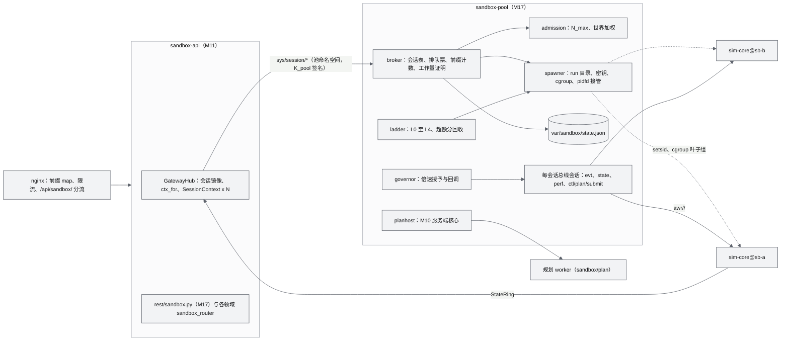
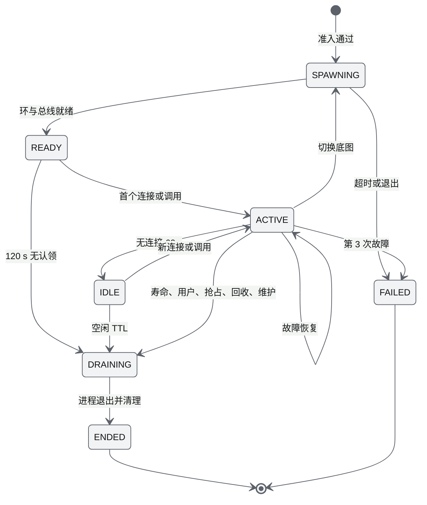
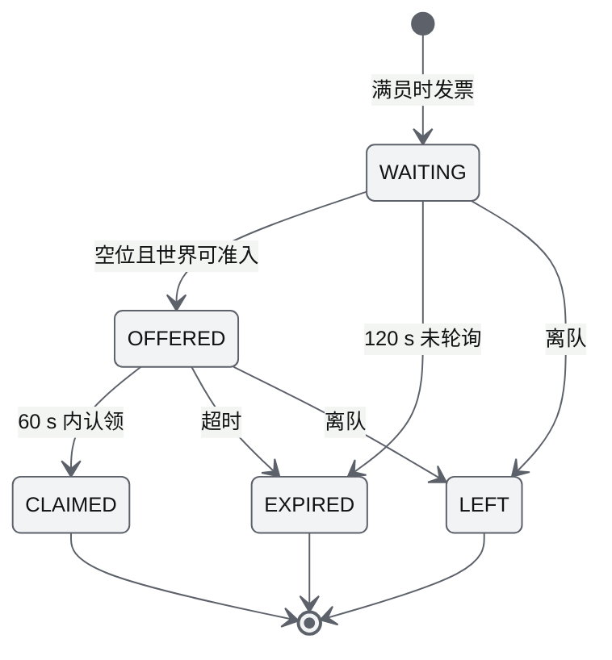
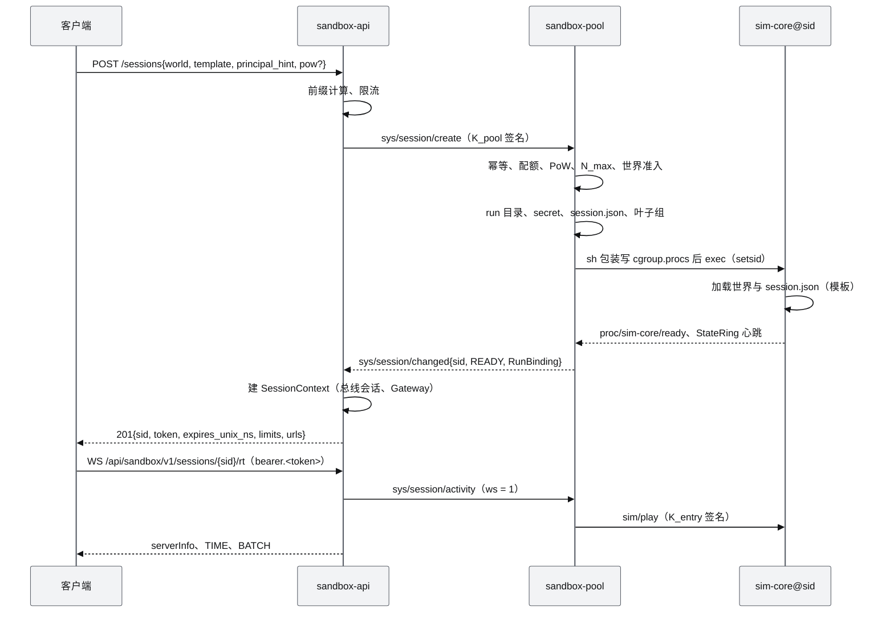
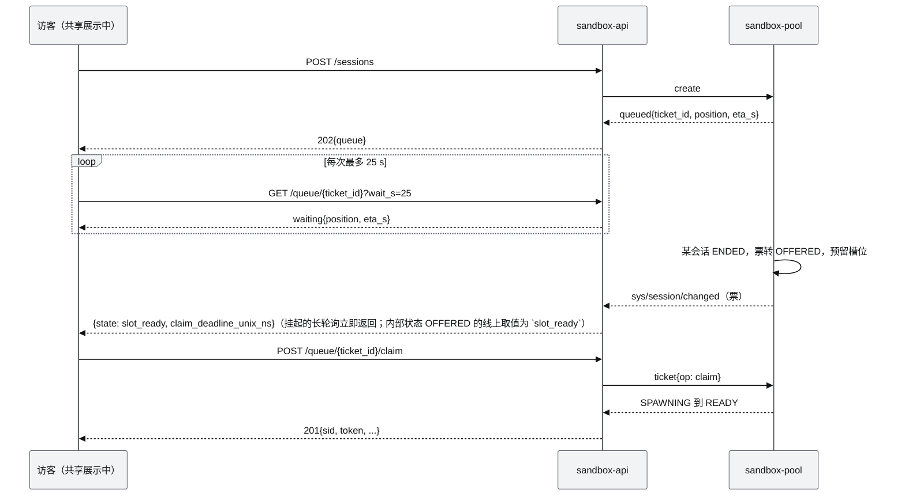

# M17 沙盒会话与开放接口 PRD（沙盒模拟器与开放接口）

| 项 | 内容 |
|---|---|
| 文档编号 | AWR-M17 |
| 标题 | 沙盒会话与开放接口（Sandbox Sessions & Open API）PRD：多租户沙盒会话、sandbox-pool 进程、网关多会话路由契约、沙盒 REST v1 与 WS、OpenAPI 页、Python SDK、鉴权与限流、公开站部署配置 |
| 编号说明 | 模块号按 [AWR-04 §3.3](../04-D2-设计增补与决策记录.md) 为 **M17**，需求前缀 `M17-`。起草时按派工命名为 `M19-沙盒模拟器与开放接口PRD.md`，已按 AWR-04 ADR-114 更名为本文件名（§13 第 1 条已处置） |
| 版本 | v1.0 |
| 日期 | 2026-10-05 |
| 状态 | 草案 |
| 上游文档 | 用户 D2 需求原文 [inputs/D2-需求原文-2026-10-05.md](../inputs/D2-需求原文-2026-10-05.md)（R-D2-02、20、22–25、28）；[AWR-04](../04-D2-设计增补与决策记录.md) §4、§10.2–§10.4、§11、§13、§14，ADR-088 至 094、107、109 至 113；[AWR-03](../03-设计基线与决策记录.md) ADR-014、016、017、027、045、051、053、082 至 085；[17](../17-接口与实时协议规范.md) §1.3、§3、§4、§6、§7、§8；[19](../19-部署与运维说明书.md) §3.7、§4、§6；[M11](M11-实时网关PRD.md)、[M10](M10-任务规划与集群PRD.md)、[M08](M08-仿真内核与飞行器适配PRD.md)、[M15](M15-前端UI壳与设计体系组件PRD.md)、[M16](M16-演示数据剧本与流畅性测试PRD.md)；[DEMO-PUBLIC 报告](../impl/DEMO-PUBLIC-报告.md)；研究 g05（进程与总线）、d05（ANet） |
| 下游文档 | M18 识别物、M19 感知、M20 编排、M21 机型目录（各自的 `rest/<domain>.py` 按本文 §7 的挂载约定提供沙盒路由）；M11 D2 增补节（sandbox-api、GatewayHub、`ctx_for`）；M15 D2 增补节（沙盒状态条、排队卡片、OpenAPI 页）；M16（容量、浸泡、chaos harness）；19 D2 增补节；`docs/impl/D2-*` |
| 适用版本范围 | V0.2-demo（本期交付 D2）至 V1.0 |

## 0. 摘要

1. M17 交付"对外开放的沙盒模拟器"的控制面：`sandbox-pool` 进程（会话池、broker、配额与排队、倍速治理、降级阶梯、cgroup、共享规划服务宿主、状态落盘与重启接管）、`awr/api/rest/sandbox.py`（会话、排队、世界、模板、快照、时钟、事件等 M17 端点）、单文件 Python SDK 与示例、前端 `stores/sandboxSession.ts`，以及沙盒 token、工作量证明、地址前缀配额等安全件。
2. 一个会话 = 一个 run = 一个 sim-core 进程（sandbox100）；sandbox-api（M11 实现 GatewayHub）按本文定义的契约做多会话路由；共享展示（D1）原样保留，两组进程两个故障域（ADR-089、ADR-092）。
3. 容量按 `N_max = min(6, ⌊(0.9·Q − 0.89 − 0.22 − 0.20)/0.23⌋)` 自动计算（Q = 2.5 时 4、2.0 时 2），内存按世界加权准入；Q-D2-01、Q-D2-09 未答复时公开站以 CPUQuota 200%、MemoryHigh 1.6G 部署，即 N_max = 2、沙盒内存额度 950 MB。
4. 排队采用长轮询票（`GET /queue/{ticket_id}?wait_s=25`），空位出现后 ≤ 5 s 通知、60 s 认领；队列非空时停止续期、按持有时长抢占（> 30 min），空闲会话 120 s 即回收。
5. 开放接口为 `/api/sandbox/v1`：M17 端点 19 个（另有 P1 批处理 2 个），领域端点由 M08、M18 至 M21、M07 按 `sandbox_router` 挂载；全部 sensor 与 status 按 AWR-04 §11.7 可经 REST 查询、经 WS 订阅；速度 setpoint 只经 WS CLIENT_DATA（SDK 封装）。
6. 新增原因码 511 至 514、WS 关闭码 4410；功能需求 67 条（P0 63 条）、非功能 15 条（P0 14 条）、验收 24 条，映射 D2-AC-02 至 07、22 至 24、26、28、29、34、36、38。
7. 对基线的反馈 14 条（§13），其中须基线裁决的有：模块文件编号、排队通知通道、§11.1 缺端点、sim-core 脱离池存活所需的 `init_child` 改动、规划结果回传键。

---

## 1. 背景与目标

### 1.1 约束本模块的事实

| # | 事实 | 对设计的含义 | 依据 |
|---|---|---|---|
| F1 | D1 supervisor 只有一套 run_id、run 目录、namespace 与 secret，`gc_runs` 只保护当前 run，且是 systemd 主进程 | 不在 supervisor 内做会话池；新增独立进程 sandbox-pool，由 supervisor 按 D1 语义监管，沙盒 run 根独立为 `var/sandbox/runs/` | AWR-04 ADR-089；`python/awr/runtime/supervisor.py`、`quota.py` |
| F2 | D1 子进程 `init_child` 在受监管时设置 PDEATHSIG，并在父进程不是 supervisor 时以 `EXIT_ORPHANED` 退出；supervisor 以管道接收子进程 stdout | 沙盒 sim-core 若沿用此行为，池崩溃会连带全部沙盒；须新增"脱离模式"并把输出写文件而不是管道 | `python/awr/runtime/child.py` 第 138–150 行；`supervisor.py::_spawn` |
| F3 | api 的设置、Gateway、REST 依赖都是单 run；总线 namespace 写在会话配置里 | 多会话路由由 sandbox-api 为每会话实例化 D1 Gateway（M11），M17 规定其生命周期、鉴权与活动报告契约 | AWR-04 §4.7；`api/settings.py`、`api/deps.py::app_ctx` |
| F4 | 单沙盒 ×1 约 0.15 核、匿名页 S 级 140 MB / L 级 155 MB；冷启动约 2 s（8 核空闲） | 并发上限按公式计算、冷启动串行、世界加权准入 | AWR-04 §4.2、§4.4 |
| F5 | emax 4 核、约 2.6 GB 可用内存，与 ANet 生产服务共用；systemd `CPUQuota=200%`、`MemoryMax=2G`，`ProtectSystem=full` | 限流与回收只落在 `sandbox/` 子组；任何沙盒负载不得使共享展示被 CFS 限流 | AWR-04 §4.4.4；`tools/deploy/emax/anet-drone4d.service` |
| F6 | 公开模式匿名只签 viewer；按地址令牌桶、WS 每地址 4 条 | 沙盒写权限只能来自"沙盒 token"，且只在本 run 内有效；按地址前缀聚合计数 | ADR-082、ADR-093；`api/public.py` |

### 1.2 目标

| 编号 | 目标 | 度量 |
|---|---|---|
| G1 | 公开站访客无需登录即可获得一个隔离、可写的沙盒 | 有空位时 `POST /sessions` 到 READY ≤ 6 s（cgroup 模拟、已有 N_max − 1 个会话） |
| G2 | 沙盒之间、沙盒与共享展示之间互不影响 | kill -9 任一沙盒或池或 sandbox-api 时，其余会话与共享展示 RTF ≥ 0.99、epoch 不变 |
| G3 | 资源有界、滥用可控 | 匿名页 + shmem 峰值 ≤ 1.25 GB；同一出口不能占满全部槽位；脚本创建受前缀配额与工作量证明约束 |
| G4 | 以接口形式完成"增删无人机、手动控制、取得全部 sensor 与 status"（应用场景二） | SDK 示例端到端通过（D2-AC-36） |
| G5 | 接口自描述 | OpenAPI 快照覆盖全部沙盒路由；文档页可复制 curl 与 SDK 示例 |

### 1.3 术语（本文新增，其余见 AWR-04 §1.2）

| 术语 | 定义 |
|---|---|
| sid | 沙盒会话 id，`sb-` + 10 位小写 base32，同时是该会话的 run id |
| 活跃会话 | 状态 ∈ {SPAWNING, READY, ACTIVE, IDLE, DRAINING} 的会话，占用一个槽位 |
| 槽位 | 并发上限 N_max 中的一个；OFFERED 状态的排队票预留一个槽位 |
| 前缀、聚合前缀 | IPv4 /32 与 /24，IPv6 /64 与 /48；IPv4-mapped IPv6 按 IPv4 计 |
| 排队票 | `tq-` + 26 位 base32（128 位随机数），持有者凭票轮询与认领 |
| 治理器 | 按 CPU 预算授予倍速的组件（AWR-04 §4.4.5） |
| 池命名空间 | zenoh namespace `awr/_sandbox/pool`，承载 `sys/session/*` |
| 会话配置 `session.json` | 池写给沙盒 sim-core 的启动配置（世界、时钟档、种子、日历、上限、模板或快照内容） |
| 配置快照 | 可重建场景的配置（机巢、机队、克隆机型、识别物、任务、环境与日历），不含动态状态 |

---

## 2. 范围

### 2.1 D2 范围

| 层 | P0 | P1 | 桩 | 不在 D2 |
|---|---|---|---|---|
| 会话 | 创建、幂等、生命周期、空闲回收、寿命与续期、抢占、崩溃恢复、快照与恢复、模板、切换底图、维护停机 | 预热 sim-core、运维 CLI、批处理端点（本机与局域网） | 观摩链接（viewer token） | 跨主机会话池、会话迁移 |
| 准入 | N_max 计算、世界加权准入、前缀配额、排队票、工作量证明 | — | API key 分级配额（Q-D2-08） | 登录与账户 |
| 资源 | cgroup 叶子组、倍速治理、降级 L0 至 L4、共享规划服务宿主 | — | — | GPU 资源 |
| 接口 | M17 端点、路由挂载约定、OpenAPI、SDK、`sandbox/session` topic、`sandbox.*` 事件 | SDK 下载端点 | 低分辨率合成帧（P2，AWR-04 §11.7） | REST 速度 setpoint |
| 部署 | public profile v2、nginx、systemd、cgroup 包装、install 校验 | emax 实测冻结 | — | 多实例水平扩展 |

### 2.2 与其他模块的边界

| 模块 | 边界 |
|---|---|
| M11 | 实现 sandbox-api 进程入口、GatewayHub、`RunBinding`、`ctx_for`、`awr.runtime.cgroup.join()`、`configs/runtime.yaml` 的 `sandbox:` 段与 public profile v2；M17 定义其契约（§4.6、§7.5）并验收 |
| M08 | sim-core 的 sandbox100、`session.json` 加载、`sim/reset{sandbox_config}`、`ctl/sim-core/snapshot`、`state/sim-core/perf` 自报、checkpoint、`rest/fleet.py` 的沙盒路由 |
| M10 | 规划服务端核心（公平队列、可杀 worker、`register_plan_kind`）与 `PlanPoolClient` remote 模式；M17 宿主该核心并执行冻结策略 |
| M18、M19、M20、M21、M07 | 各自 `rest/<domain>.py` 的沙盒路由与字段 schema；M17 汇总接口全表、验收覆盖 |
| M15 | 落地页入口、沙盒状态条、排队卡片、`/sandbox/api` 文档页渲染；使用 M17 的 store |
| M16 | 场景模板 `scenarios/sandbox/**`、世界成本表生成、容量与浸泡 harness |
| M00 | 契约合入、部署套件 `tools/deploy/emax/**` 实施 |

---

## 3. 用户与用例

| 角色 | 说明 |
|---|---|
| 访客 | 浏览器、匿名，持 principal_hint（localStorage）；可持有一个沙盒或一张排队票 |
| API 客户端 | 使用 SDK 或 curl 的脚本；与访客同配额（Q-D2-08） |
| 共享展示访客 | 不占槽位，只读 D1 run（S7）与公开目录 |
| 运维 | 部署、观察、维护停机 |

| 编号 | 用例 | 主路径 | 关联 |
|---|---|---|---|
| UC-01 | 开启沙盒 | 落地页"开启我的沙盒" → 选世界与模板 → `POST /sessions` → READY → 进入 `/sandbox/:sid` | D2-AC-02、34 |
| UC-02 | 满员排队 | 202 + 票 → 留在共享展示，排队卡片长轮询 → OFFERED → 60 s 内认领 → 进入沙盒 | D2-AC-05 |
| UC-03 | 刷新与多标签页 | sessionStorage 恢复 → `GET /sessions/{sid}` → 重连 WS；第二个标签页加入同一沙盒 | D2-AC-38 |
| UC-04 | 切换底图 | `POST /sessions/{sid}/world` → 新世界准入 → 重启 sim-core 并载入同名模板 → WS 1012 后重连 | D2-AC-24 |
| UC-05 | 应用场景二（接口） | SDK 创建 → 增删无人机 → 申请租约、速度控制、释放 → 拉取全部 sensor 与 status → 订阅感知与事件 → 结束 | D2-AC-36 |
| UC-06 | 寿命到期与恢复配置 | `sandbox.expiring` → 前端导出快照 → 会话结束 → 新会话 `config_snapshot` 恢复 | D2-AC-06 |
| UC-07 | 滥用 | 同一 /64 轮换地址、脚本循环创建 → 前缀与聚合前缀计数、429 或 409 504、工作量证明 | D2-AC-23 |
| UC-08 | 故障 | kill -9 沙盒 sim-core、池或 sandbox-api → 恢复与重新接管 | D2-AC-03 |
| UC-09 | 部署与维护 | `ctl drain` → 全部会话提前 60 s 告知并保存快照 → 停机更新 → 恢复接受创建 | D2-AC-27 |

---

## 4. 功能需求

表头沿用 AWR-03 §10.2，"D2"列取"是、桩、否"。"依据"中的 §x 不带文档名时指 AWR-04。

### 4.1 会话生命周期

| 编号 | 需求描述 | 优先级 | 目标版本 | D2 | 验收要点 | 依据 |
|---|---|---|---|---|---|---|
| M17-FR-001 | 一个会话 = 一个 run = 一个 sim-core 进程；sid 为 `sb-[a-z2-7]{10}`；会话记录字段见 §6.2 `SessionRecord`；状态机见 §6.3 | P0 | V0.2-demo | 是 | M17-AC-001 | §4.1、ADR-089 |
| M17-FR-002 | `POST /sessions` 按 §6.6.1 顺序处理：同一 principal 与前缀已有活跃会话或排队票时幂等返回原对象（200 或 202）；（已有会话时换发 token，供丢失 sessionStorage 的标签页恢复）；否则依次检查世界、配额、工作量证明、容量与世界准入；成功时同步等待至多 10 s，READY 返回 201，仍在 SPAWNING 返回 201 与 `state = SPAWNING`，客户端以 `GET /sessions/{sid}?wait_state=READY` 长轮询 | P0 | V0.2-demo | 是 | M17-AC-001、012 | §4.6、§11.1 |
| M17-FR-003 | 冷启动串行：同一时刻至多 1 个会话处于实际拉起阶段，其余已准入的创建在内部拉起队列等待（对外状态仍为 SPAWNING，不占用户队列）；单次拉起超时 30 s 判 FAILED 并返回 503 `502 SANDBOX_SPAWN_FAILED` | P0 | V0.2-demo | 是 | M17-AC-001 | §4.6 启动时间 |
| M17-FR-004 | READY 后首个 WS 连接或任一会话内 API 调用使会话进入 ACTIVE 并以 ×1 启动时钟；READY 后 120 s 无人认领（无连接且无调用）进入 DRAINING，原因 `unclaimed` | P0 | V0.2-demo | 是 | M17-AC-005 | 本文设定：防止创建后放弃的会话占位 |
| M17-FR-005 | 空闲回收：sandbox-api 每 1 s 上报每会话 `{ws, last_api_unix_ns}`；无 WS 且 60 s 无调用进入 IDLE；自最后一次活动起满 `idle_ttl_s`（600 s；队列非空时 120 s）进入 DRAINING，原因 `idle` | P0 | V0.2-demo | 是 | M17-AC-005 | §4.4.3；队列非空缩短为本文设定，理由：先回收无人使用的会话，再抢占有人使用的会话 |
| M17-FR-006 | 寿命与续期：初始寿命 1800 s；`POST /sessions/{sid}/keepalive` 使 `expires = min(created + 7200 s, max(expires, now + 1800 s))`；队列非空时不续期，返回 200 `renewed = false, reason = queue_nonempty`；续期成功换发 token（新 `exp` = 新寿命截止） | P0 | V0.2-demo | 是 | M17-AC-005 | §4.4.3 |
| M17-FR-007 | 结束：原因 ∈ {user, lifetime, idle, unclaimed, preempted, reclaimed_cpu, reclaimed_mem, maintenance, world_switch_failed, failed}；除 user、idle、unclaimed、failed 外提前 60 s 发 `sandbox.expiring{reason, end_unix_ns}`；DRAINING 时导出配置快照（保留 600 s，随状态落盘），向 sim-core 发 SIGTERM，5 s 未退出 SIGKILL；随后删除 `/dev/shm/awr/<sid>`、`var/sandbox/runs/<sid>`（快照除外）与 cgroup 叶子组，状态 ENDED，token 对写入与订阅返回 410 `506 SANDBOX_EXPIRED` | P0 | V0.2-demo | 是 | M17-AC-005 | §4.6 |
| M17-FR-008 | 崩溃与挂死：sim-core 非预期退出或 StateRing 心跳超过 2.0 s（启动宽限 30 s）判故障；挂死先 SIGUSR1 转储栈再 SIGKILL；60 s 窗口内第 1、2 次故障重启并从 tmpfs checkpoint 恢复（epoch + 1，sid 与 token 不变），第 3 次进入 FAILED 并释放槽位 | P0 | V0.2-demo | 是 | M17-AC-002 | §4.6；ADR-065 挂死口径 |
| M17-FR-009 | 配置快照：`GET /sessions/{sid}/snapshot` 经 `ctl/sim-core/snapshot` 组装（schema `sandbox/snapshot`，≤ 512 KiB）；ENDED 后 600 s 内凭原 token 仍可取回（此端点对已过期不超过 600 s 的 token 放行）；`POST /sessions/{sid}/restore` 只接受同一世界的快照（否则 422 `512 SANDBOX_SNAPSHOT_INVALID{why: world_mismatch}`），以 `sim/reset{sandbox_config}` 原地重建；`POST /sessions/{sid}/template` 同理载入模板 | P0 | V0.2-demo | 是 | M17-AC-016 | §4.6、§10.2、ADR-112 |
| M17-FR-010 | 切换底图：`POST /sessions/{sid}/world{world, template?}` 先按目标世界重做准入（只计 anon 与 ws 的差额），通过后导出当前快照、停止 sim-core、以目标世界与同名模板（缺省为当前模板 id）拉起新进程；sid 与 token 不变；sandbox-api 以 1012 关闭该会话的 WS，客户端重连后进入新世界；准入不通过返回 409 `508` 且原会话不受影响；拉起失败时按原世界与切换前快照恢复，仍失败则结束（原因 `world_switch_failed`） | P0 | V0.2-demo | 是 | M17-AC-010 | §10.2 底图、ADR-109 |
| M17-FR-011 | 恢复与多标签页：同一 principal 的多个连接与标签页共享会话与席位；`GET /sessions/{sid}` 用于刷新后校验；会话已结束时返回 410 `506` 与 `end_reason`、`snapshot_available` | P0 | V0.2-demo | 是 | M17-AC-012 | §4.6 会话恢复 |

### 4.2 准入、配额、排队与人机验证

| 编号 | 需求描述 | 优先级 | 目标版本 | D2 | 验收要点 | 依据 |
|---|---|---|---|---|---|---|
| M17-FR-012 | 客户端地址只由 D1 `public.client_ip`（可信代理与 X-Forwarded-For 规则）得到；前缀与聚合前缀按 §6.6.7 计算；前缀在状态文件与审计中以 `HMAC-SHA256(K_state, prefix)` 前 16 字节表示 | P0 | V0.2-demo | 是 | M17-AC-009 | §11.5、17 §3.3 第 7 条 |
| M17-FR-013 | 配额：每前缀创建 6 次/h（突发 2）、每聚合前缀 12 次/h（突发 4），超限 429 `504` + `Retry-After`；每前缀活跃会话 ≤ `min(2, ⌈N_max/2⌉)`、每聚合前缀 ≤ ⌈N_max/2⌉，超限 409 `504`；只有实际拉起计入创建次数 | P0 | V0.2-demo | 是 | M17-AC-009、012 | §11.5；每前缀上限取 min 为本文设定，见 §13 第 9 条 |
| M17-FR-014 | 排队票：满员时（`N_live = N_max`，含预留）返回 202 与票；队列 ≤ 20、每前缀 1 张，超限 409 `500 SANDBOX_FULL{why: queue_full}`；票状态机见 §6.4；长轮询 `GET /queue/{ticket_id}?wait_s≤25` 在状态变化时立即返回；120 s 未轮询作废；OFFERED 后 60 s 内 `POST /queue/{ticket_id}:claim`，否则作废并通知下一张；`DELETE /queue/{ticket_id}` 离队；回复含位置与按 §6.6.2 估计的 `eta_s` | P0 | V0.2-demo | 是 | M17-AC-004 | §4.4.6 L1、§4.6 |
| M17-FR-015 | 世界加权准入：`N + 1 ≤ N_max` 且 `Σ anon(w_i) + Σ_活跃世界 ws(w) ≤ M_sb`；未满员但世界准入不通过时返回 409 `508{startable_worlds[], can_queue: true}`，请求带 `queue: true` 时为该世界排队；派生缓存缺失或不在白名单的世界返回 409 `507{why}` | P0 | V0.2-demo | 是 | M17-AC-004、010 | §4.4.2、§4.4.7 |
| M17-FR-016 | 抢占：队列中有 WAITING 票且无空位时，每 1 s 检查一次，选持有时长（自 READY 起）最长且 > 1800 s 的会话，提前 60 s 发 `sandbox.expiring{reason: preempted}` 并在到期时以原因 `preempted`（码 510）结束；同一时刻至多 1 个抢占在途；IDLE 会话按 FR-005 优先回收 | P0 | V0.2-demo | 是 | M17-AC-005 | §4.4.6 L1、§11.5 |
| M17-FR-017 | 工作量证明：队列非空、该前缀 1 h 内创建 ≥ 3 次或聚合前缀 1 h 内创建 ≥ 8 次时，创建须附解（§6.6.8）；缺失或错误返回 409 `509{challenge}`（回复内直接附新题，免一次往返）；题绑定前缀、单次使用、120 s 过期；难度缺省 21 位，触发聚合阈值时 23 位，MS4 按浏览器实测调到 P50 1–2 s；SDK 与前端自动求解 | P0 | V0.2-demo | 是 | M17-AC-018 | §11.5、ADR-093、Q-D2-03 |
| M17-FR-018 | 实体上限与规划规模：上限（机 12、识别物 30、机巢 4、活动任务 6、克隆机型 8）写入 `session.json` 的 `limits`，由 sim-core 准入以 409 `505{kind, limit}` 拒绝；规划输入规模（AWR-04 §11.5）由 sandbox-api 预检、sim-core 复检，以 422 `585` 拒绝 | P0 | V0.2-demo | 是 | M17-AC-009 | §4.4.3、§11.5、ADR-113 |

### 4.3 资源预算、倍速治理与降级

| 编号 | 需求描述 | 优先级 | 目标版本 | D2 | 验收要点 | 依据 |
|---|---|---|---|---|---|---|
| M17-FR-019 | `max_sessions: auto` 时启动即按 §6.6.4 计算 N_max（Q 取单元根 `cpu.max`，无法读取时取配置值），硬上限 6；cgroup 不可委派时 N_max − 1；成本参数可配置，MS1 与 MS5 实测替换 | P0 | V0.2-demo | 是 | M17-AC-003 | §4.4.1、ADR-091 |
| M17-FR-020 | 倍速治理：`sim/speed` 请求一律经池授予（§6.6.5）：单会话上限 `min(10, 0.85/c_i)`，总量 `Σ c_j·r_j ≤ B_sim`；受限时回复 200 + `granted_rate` 与 `code = 501`；授予后 5 s 按实测 RTF 回调，此后每 5 s 复核；任何会话不被降到其请求值与 ×1 的较小者以下；手动控制期间锁 ×1（`limited_by = manual`）；变更以 `sandbox.rate` 事件通知 | P0 | V0.2-demo | 是 | M17-AC-006 | §4.4.5 |
| M17-FR-021 | 降级阶梯 L0 至 L4 每 1 s 判定（判据与动作见 AWR-04 §4.4.6，实现见 §6.6.6），L2 解除需判据连续 30 s 不满足；共享展示永不在回收之列 | P0 | V0.2-demo | 是 | M17-AC-004、006 | §4.4.6 |
| M17-FR-022 | L3、L4 回收按超额分 `e_i` 从高到低，超额会话先于无连接的空闲会话；每 15 s 至多启动一次回收；回收前 60 s 告知 | P0 | V0.2-demo | 是 | M17-AC-004 | §4.4.6 |
| M17-FR-023 | 计量：池 1 Hz 汇总每会话 CPU（叶子组 `cpu.stat`）、匿名页 + shmem（叶子组 `memory.stat`）、RTF、`c_i`、WS 数与 REST 速率，经 `state/sandbox-pool/session` 发布为 topic `sandbox/session`，经 `GET /status` 公开汇总（不含其他会话的细节） | P0 | V0.2-demo | 是 | M17-AC-003 | §11.2 |

### 4.4 进程模型与监管

| 编号 | 需求描述 | 优先级 | 目标版本 | D2 | 验收要点 | 依据 |
|---|---|---|---|---|---|---|
| M17-FR-024 | `python -m awr.sandbox.pool`：由 supervisor 按 D1 语义监管（心跳 `hb.sandbox-pool` 10 Hz，`stale_s` 5 s），启动时经 `awr.runtime.cgroup.join("sandbox/ctl")` 移入 `sandbox/ctl/`；单 asyncio 事件循环，zenoh 回调线程只入队 | P0 | V0.2-demo | 是 | M17-AC-002 | §4.9；g05 §3.3 |
| M17-FR-025 | 拉起（§6.6.9）：创建 run 目录（0700）、32 字节 per-run secret（0600）、`session.json`、zenoh 会话配置；以 `/bin/sh` 包装先写入叶子组 `cgroup.procs` 再 `exec`；`start_new_session = True`；环境变量含 `AWR_DETACHED=1`（不设 PDEATHSIG、不做孤儿自检）；stdout 与 stderr 写入 `var/sandbox/runs/<sid>/logs/sim-core.log`（不经管道），超过 20 MB 由池截断 | P0 | V0.2-demo | 是 | M17-AC-002、015 | F2；§4.4.4 第 1 条 |
| M17-FR-026 | cgroup：每会话叶子组 `sandbox/sb/<sid>/`，`cpu.weight 100`、`memory.high` S 级 230M / L 级 250M、`memory.max 320M`；结束时删除；不可委派（Q-D2-07）时跳过写入，sim-core `nice +5`，池以 RSS 看门狗兜底（匿名页 > 320 MB 即终止，按崩溃处理）并改用 `/proc/<pid>/stat` 计量 | P0 | V0.2-demo | 是 | M17-AC-019 | §4.4.4 |
| M17-FR-027 | 状态落盘：会话表、排队票、前缀计数、已用工作量证明题号、ended 快照索引原子写入 `var/sandbox/state.json`（变更合批 ≤ 1 Hz）；重启后 10 s 内按 pid、`/proc/<pid>/stat` 的 starttime 与 `AWR_RUN` 环境变量核对并以 pidfd 重新接管；已退出的 ACTIVE 或 IDLE 会话按 FR-008 恢复；配额与排队票不清零 | P0 | V0.2-demo | 是 | M17-AC-015 | §4.9 |
| M17-FR-028 | 池命名空间服务 `sys/session/{create,get,list,keepalive,stop,rate,world,template,ticket,activity}`（§7.5）；请求须带内部签名（`K_pool`，±5 s 时间窗），只接受 sandbox-api 与运维 CLI；变更以 `sys/session/changed` 发布，另每 5 s 发布全量摘要 | P0 | V0.2-demo | 是 | M17-AC-011 | §4.9 broker |
| M17-FR-029 | 每个活跃会话一个总线会话（namespace `awr/<world>/<sid>`）：发布 `evt/sandbox-pool/sandbox`（经 D1 `EventPublisher`，含 `_replay`）与 `state/sandbox-pool/session`（1 Hz）；订阅 `state/sim-core/perf`；服务 `ctl/plan/submit`；以本 run 的 `K_entry` 签名调用 `sim/speed` 与 `ctl/sim-core/snapshot` | P0 | V0.2-demo | 是 | M17-AC-006 | §4.1 图、§4.9 |
| M17-FR-030 | 预热 sim-core：`prewarm = 1` 时池常驻一个已完成 import 与 numba 加载的待命进程（沿用 D1 standby 协议：stdout 打印 `AWR_STANDBY_READY`、stdin 接收一行 JSON 环境），领取后只做世界绑定与总线打开；计入内存准入（+115 MB） | P1 | V0.2-demo | 否 | M17-AC-001 变体 | §4.4.3、ADR-070 |
| M17-FR-031 | 停机与维护：池收到 SIGTERM 时停止接受创建，对全部会话导出快照并以原因 `maintenance` 结束（不等待 60 s 告知，`stop.grace_s` 12 s 内完成）；运维 `ctl drain --notice 60` 先告知再结束；`ctl accept off` 后创建返回 503 `502{why: maintenance}` | P0 | V0.2-demo | 是 | M17-AC-023 | 本文设定：部署与回滚需要可控停机 |

### 4.5 共享规划服务宿主

| 编号 | 需求描述 | 优先级 | 目标版本 | D2 | 验收要点 | 依据 |
|---|---|---|---|---|---|---|
| M17-FR-032 | 宿主 M10 规划服务端核心：1 个可杀 worker 进程位于 `sandbox/plan/`（`cpu.max 0.5` 核、`memory.max 250M`、`nice +10`）；作业经各会话命名空间内由池声明的 `ctl/plan/submit` 提交，结果随 query 回复返回（query 超时 = 预算 × 3 + 5 s，M10-FR-202；> 1 MB 时经 `/dev/shm` 文件），`ctl/plan/cancel` 取消；按会话轮转的公平队列，每会话在途与排队合计 ≤ 8 | P0 | V0.2-demo | 是 | M17-AC-017 | §4.9、ADR-113 |
| M17-FR-033 | 超时：作业墙钟超过预算 × 3（扫描 2 s、站位 0.5 s、分配 0.2 s）即 SIGKILL worker 并重建（≤ 5 s），该作业以 `125 PLAN_TIMEOUT` 失败，队列中其他作业重新派发；同会话 10 min 内 3 次超时冻结其规划 5 min（`586 PLAN_THROTTLED`） | P0 | V0.2-demo | 是 | M17-AC-017 | §4.9、§11.5 |
| M17-FR-034 | worker 以 memmap 只读打开 Grid25 与派生缓存，按世界 LRU 保留 2 个已打开世界；会话结束时撤销其排队作业 | P0 | V0.2-demo | 是 | M17-AC-014 | ADR-113 第 5 条 |

### 4.6 sandbox-api 与多会话路由（M11 实现，M17 定义契约并验收）

| 编号 | 需求描述 | 优先级 | 目标版本 | D2 | 验收要点 | 依据 |
|---|---|---|---|---|---|---|
| M17-FR-035 | nginx 把 `/api/sandbox/` 前缀（REST 与 WS）转发到 sandbox-api（公开站 `127.0.0.1:18641`，本机 8002 + 10·k），其余 `/api/**` 到 show-api；sandbox-api 不挂载 D1 的 runs、jobs、recon、agents、sys、scenarios、auth 路由 | P0 | V0.2-demo | 是 | M17-AC-021 | §4.7 第 3 条 |
| M17-FR-036 | GatewayHub 维护会话镜像表（订阅 `sys/session/changed` 与全量摘要）；READY 时创建 SessionContext，DRAINING 时只放行 GET、snapshot 与 DELETE（其余 409 `513{state}`），ENDED 时销毁并以 4410 关闭该会话全部 WS；重启时经 `sys/session/list` 重建 | P0 | V0.2-demo | 是 | M17-AC-002 | §4.7 第 2、6 条 |
| M17-FR-037 | `ctx_for(request)`：从路径取 sid，校验沙盒 token（§7.7）且 `token.sid == sid`，否则 403 `503 SANDBOX_SCOPE`；会话不存在或已结束 410 `506`；SPAWNING 或重启中时需要 sim-core 的端点返回 HTTP 503 `211 SIM_UNAVAILABLE`（`Retry-After: 1`，17 §17.5 第 3 条），其余会话级状态冲突 409 `513` | P0 | V0.2-demo | 是 | M17-AC-011 | ADR-093 |
| M17-FR-038 | 路由挂载约定：各 `rest/<domain>.py` 导出 `sandbox_router`（会话内，路径相对，如 `/vehicles`）与可选 `sandbox_public_router`（无需 token，如 `/catalog/models`）；sandbox-api 以前缀 `/api/sandbox/v1/sessions/{sid}` 与 `/api/sandbox/v1` 分别挂载；`rest/sandbox.py` 不导出 `router`，因此 show-api 不会挂载它；`:{verb}` 后缀以 Starlette 自定义 convertor `sbid`（`[A-Za-z0-9_-]{1,64}`）实现 | P0 | V0.2-demo | 是 | M17-AC-007 | §11.1 |
| M17-FR-039 | 时钟拦截：沙盒内 WS `call sim/speed` 与 REST `clock{op: speed}` 先经 `sys/session/rate` 授予再以授予值下发；`sim/play`、`sim/pause`、`sim/step`（每 tick 10 ms）直通；`sim/reset` 对客户端 403 `115`（重置走 `/template`） | P0 | V0.2-demo | 是 | M17-AC-006 | §4.4.5 |
| M17-FR-040 | 连接上限：sandbox-api 全站 `N_max × 4`、每前缀 4、每会话 4，超限 `error 316` + 4429；新增关闭码 4410 `SESSION_ENDED`（客户端不重连，调 `GET /sessions/{sid}` 取结束原因）；切换底图用 1012（按退避重连） | P0 | V0.2-demo | 是 | M17-AC-012 | §4.7 第 5 条、§11.5 |
| M17-FR-041 | 每个 SessionContext 的 EventRing 容量 8192 条（D1 为 65 536），`GET /sessions/{sid}/events?since_seq=` 超出窗口返回 410 | P0 | V0.2-demo | 是 | M17-AC-014 | 本文设定：按 §4.4.2 每上下文 5 MB 估算，见 §13 第 8 条 |
| M17-FR-042 | 活动报告：sandbox-api 每 1 s 以一条 `sys/session/activity` 批量上报全部会话的 WS 数与最近 API 时刻；会话内任一 REST 或 WS `call` 计为活动，WS `ping` 不计 | P0 | V0.2-demo | 是 | M17-AC-005 | §4.6 |

### 4.7 开放 REST 接口

| 编号 | 需求描述 | 优先级 | 目标版本 | D2 | 验收要点 | 依据 |
|---|---|---|---|---|---|---|
| M17-FR-043 | M17 端点（§7.2）全部实现：会话、排队票、世界、模板、状态、工作量证明题、契约、快照、恢复、模板载入、切换底图、时钟、事件补拉 | P0 | V0.2-demo | 是 | M17-AC-007 | §11.1 |
| M17-FR-044 | 通用约定（§7.1）：前缀与版本 `/api/sandbox/v1`、snake_case 加单位后缀、UNIX 时刻字段 `_unix_ns` 十进制字符串、`t_sim_ns` 数字、`Idempotency-Key`、分页 `{items, next_cursor}`、PATCH 支持 `If-Match`（ETag 为资源版本号）、problem+json、429 与 503 附 `Retry-After`，`Cache-Control: no-store`（公开目录、世界与模板为 `public, max-age=300` + ETag） | P0 | V0.2-demo | 是 | M17-AC-007 | 17 §1.3、§4.1 |
| M17-FR-045 | "全部 sensor 与 status"：每类数据产品按 §7.3 映射到一个 REST 端点与一个 WS topic；`GET .../vehicles/{vid}/sensors` 对每个挂载传感器列出 `products[{name, topic, rest, rate_hz, schema}]`，客户端可据此发现全部数据产品 | P0 | V0.2-demo | 是 | M17-AC-008 | §11.7、R-D2-23 |
| M17-FR-046 | 控制命令：`POST .../vehicles/{vid}/commands{name, args, id?}` 与 WS `call` 走同一准入、同一幂等表（call id）；租约 `:acquire`、`:release`；速度控制为 `call cmd/velocity` + `advertise` + CLIENT_DATA VelSetpoint16（≤ 50 Hz，超出丢弃并计数，250 ms 看门狗），REST 不提供 setpoint | P0 | V0.2-demo | 是 | M17-AC-008、013 | 17 §6.4、§7.1；§11.5 |
| M17-FR-047 | 识别物、机巢、任务、机队、目录、环境、感知的资源路由由所有者实现（§7.2 第二表），M17 负责路由挂载、OpenAPI 汇总、限流类别映射与覆盖测试 | P0 | V0.2-demo | 是 | M17-AC-007 | §11.1、ADR-110 |
| M17-FR-048 | 批处理：`POST /sessions/{sid}/batch{until_s, seed?}` 以当前配置快照另起 `awr.sim.runtime --batch` 进程（同时 ≤ 1 个，不占槽位，`nice +10`），`GET .../batch/{bid}` 取进度与 `relay_stats.json`；只在 `sandbox.batch.enabled`（本机与局域网）时挂载，公开站 404；忙时 409 `514 SANDBOX_BATCH_BUSY` | P1 | V0.2-demo | 是 | M17-AC-024 | §4.10 第 3 条 |

### 4.8 WS 实时接口

| 编号 | 需求描述 | 优先级 | 目标版本 | D2 | 验收要点 | 依据 |
|---|---|---|---|---|---|---|
| M17-FR-049 | 端点 `/api/sandbox/v1/sessions/{sid}/rt`，握手、hello、credit、TIME、BATCH、事件与 D1 `awr.rt.v1` 完全一致；topic 为 D1 topic 加 AWR-04 §11.2 新增项；M17 提供 topic `sandbox/session`（§7.4）与事件 `sandbox.slot_ready`（SDK 合成，见 §7.4）、`sandbox.rate`、`sandbox.expiring`、`sandbox.state` | P0 | V0.2-demo | 是 | M17-AC-008 | §11.2 |

### 4.9 鉴权

| 编号 | 需求描述 | 优先级 | 目标版本 | D2 | 验收要点 | 依据 |
|---|---|---|---|---|---|---|
| M17-FR-050 | 沙盒 token：格式与 17 §3.2 相同；载荷增加 `scope = "sandbox"`、`sid`，`role = operator`、`run = sid`、`mode` 为部署访问模式，`exp` = 会话寿命截止；签名密钥 `K_sb = HKDF-SHA256(token.key, salt = sid, info = "awr/sandbox-auth/v1")`，`var/sandbox/token.key`（32 字节，0600）首次启动时生成并持久化；携带方式与 17 §3.2 相同（禁止 URL 与 cookie） | P0 | V0.2-demo | 是 | M17-AC-011 | ADR-093、§4.8 |
| M17-FR-051 | 权限：本 run 内 operator（命令、时钟、环境、机群、识别物、机巢、任务、目录克隆）；`sys/*`、`seat/takeover`、`rec/*`、`kill`、`escalate` 一律 403 `115`；沙盒 token 在 show-api 上校验失败（302），在其他沙盒上 403 `503` | P0 | V0.2-demo | 是 | M17-AC-011 | §4.8 |
| M17-FR-052 | 输入防护：沿用 D1 中间件的 Host、Origin（公开模式只认 `AWR_ORIGINS`）、请求体 ≤ 1 MiB、Idempotency；用户文本字段（名称、标签）≤ 64 字符，拒绝 C0 与 C1 控制字符（422 `300`）；只接受声明式数据，不执行任何用户代码 | P0 | V0.2-demo | 是 | M17-AC-011 | ADR-082；§15.1 滥用风险 |

### 4.10 OpenAPI 与文档页

| 编号 | 需求描述 | 优先级 | 目标版本 | D2 | 验收要点 | 依据 |
|---|---|---|---|---|---|---|
| M17-FR-053 | sandbox-api 公开 `GET /api/sandbox/v1/openapi.json`（OpenAPI 3.1，title "ANet Drone4D Sandbox API"，version 1.x）；按领域分 tag；`bearerAuth` 安全方案；每个操作列出可能的原因码（扩展 `x-awr-reasons`）与 curl、SDK 示例（扩展 `x-codeSamples`，从 `tools/sdk/examples/` 抽取）；快照 `packages/contracts/rest/sandbox.openapi.snapshot.json`，CI 以 `gen_openapi.py --sandbox --check` 比对；D1 全站 OpenAPI 在公开模式仍隐藏 | P0 | V0.2-demo | 是 | M17-AC-007 | §11.4、17 §4.1 第 10 条 |
| M17-FR-054 | 扩展 `x-awr-realtime`：从 `rt/topics.json`、`rt/commands.json` 生成沙盒可用的 topic（编码、频率、schema）、事件与命令清单，供文档页渲染"实时接口"一节；文档页 `/sandbox/api` 由 M15 以 shadcn 组件渲染，不引入 Swagger UI | P0 | V0.2-demo | 是 | M17-AC-007 | §11.4 |
| M17-FR-055 | SDK 下载：nginx 以静态文件提供 `/sdk/awr_sandbox.py`（发布目录内同名文件）与 `/sdk/examples/*.py`；文档页给出链接与校验和 | P1 | V0.2-demo | 是 | M17-AC-013 | 本文设定 |

### 4.11 Python SDK

| 编号 | 需求描述 | 优先级 | 目标版本 | D2 | 验收要点 | 依据 |
|---|---|---|---|---|---|---|
| M17-FR-056 | 单文件 `tools/sdk/awr_sandbox.py`（≤ 1500 行），依赖 httpx ≥ 0.24、websockets ≥ 12（同步客户端）、msgpack ≥ 1.0，Python 3.9 至 3.13；API 面见 §7.8；`__version__` 与 `API_VERSION = "v1"` | P0 | V0.2-demo | 是 | M17-AC-013 | §11.4 |
| M17-FR-057 | SDK 自动处理：工作量证明求解；429 与 503 按 `Retry-After` 重试（最多 3 次）；排队长轮询与认领；可选自动续期（缺省开，队列非空时服务端拒绝即停止）；token 换发；WS 的 hello、credit ack、TIME、BATCH 按 `GET /contracts/rt` 返回的 layouts 解码、事件按 seq 去重、断线按 D1 退避重连并 resume；4410 时抛 `SessionEnded` | P0 | V0.2-demo | 是 | M17-AC-013 | 17 §6 |
| M17-FR-058 | 示例 `tools/sdk/examples/`：`01_quickstart`、`02_manual_control`、`03_sensors_status`（逐机型、逐传感器拉取 §11.7 全部产品并校验 schema）、`04_targets_capture`、`05_gsd_scan_dryrun`、`06_external_allocator`、`scenario2_e2e`（D2-AC-36 的验收脚本） | P0 | V0.2-demo | 是 | M17-AC-013 | R-D2-22、23 |

### 4.12 前端会话 store

| 编号 | 需求描述 | 优先级 | 目标版本 | D2 | 验收要点 | 依据 |
|---|---|---|---|---|---|---|
| M17-FR-059 | `apps/web/src/stores/sandboxSession.ts`（§7.9）：阶段状态、创建与认领、排队长轮询、续期、结束、切换底图、模板、快照导出与恢复；`{sid, token, expires_unix_ns}` 存 sessionStorage 并备份到 localStorage（键 `awr.sandbox.v1`，过期即删）；BroadcastChannel `awr.sandbox` 同步多标签页（只由一个标签页续期）；自动续期条件：剩余 ≤ 300 s、页面可见、最近 10 min 内有用户输入；收到 `sandbox.expiring` 时自动导出快照到 localStorage；视口小于 1280 × 720 时拒绝创建 | P0 | V0.2-demo | 是 | M17-AC-022 | §4.6、§10.2 |
| M17-FR-060 | 工作量证明在 Web Worker 中求解（in-repo SHA-256，不新增依赖），主线程不产生 > 50 ms 长任务；位置 `apps/web/src/net/sandbox/pow.worker.ts`（路径归属待 ADR-110 增补，见 §13 第 10 条） | P0 | V0.2-demo | 是 | M17-AC-018 | D1-AC-03b 长帧口径 |

### 4.13 部署、运维与审计

| 编号 | 需求描述 | 优先级 | 目标版本 | D2 | 验收要点 | 依据 |
|---|---|---|---|---|---|---|
| M17-FR-061 | `configs/runtime.yaml` 新增 `sandbox:` 段（§8.1）与进程条目 sandbox-pool、sandbox-api（layer `sandbox`，`run_scoped: false`）；public profile v2 启用 `[core, sandbox]`、七个世界、`net.ws_max` 24、剧本 S7 | P0 | V0.2-demo | 是 | M17-AC-020 | §4.4.3、ADR-094、ADR-109 |
| M17-FR-062 | nginx 站点增补（§8.2）：sandbox upstream、前缀 map、沙盒创建限流区、`/api/sandbox/` 与会话 WS location、`/worlds/` 以 alias 静态服务（白名单正则）、`/sdk/` | P0 | V0.2-demo | 是 | M17-AC-020 | §4.7、ADR-092 |
| M17-FR-063 | systemd 单元增补 `Delegate=yes`、`MemoryHigh`、ExecStart 前置 `cgroup-exec.sh`；CPUQuota 与 MemoryHigh 按 Q-D2-01、Q-D2-09 的答复取值（未答复时 200%、1.6G） | P0 | V0.2-demo | 是 | M17-AC-019、020 | §4.4.4、§15.2 |
| M17-FR-064 | `install.sh` 增补：创建 `var/sandbox/`（0700，awr）；校验七个世界包与派生缓存（`MANIFEST.sha256` 与缓存键）；以沙盒插件集预热 numba 缓存；检查 cgroup v2 与委派并打印结论；安装后以回环地址冒烟：创建沙盒、等 READY、删除 | P0 | V0.2-demo | 是 | M17-AC-020 | §4.4.7 |
| M17-FR-065 | 运维 CLI `python -m awr.sandbox.ctl {status, list, stop <sid>, drain [--notice s], accept on\|off, limits [--max-sessions n]}`，读取 `var/sandbox/pool.secret` 签名，只有 awr 用户与 root 可用 | P1 | V0.2-demo | 是 | M17-AC-023 | 本文设定 |
| M17-FR-066 | 审计 `var/sandbox/audit.jsonl`（D1 `AuditWriter`，1 s fsync）：`session.create`、`session.end{reason}`、`session.preempt`、`session.reclaim{level, score}`、`queue.ticket`、`quota.denied`、`pow.failed`、`world.switch`、`rate.grant`；每来源每秒至多 1 条拒绝类记录；不记录 token 原文 | P0 | V0.2-demo | 是 | M17-AC-011 | 17 §3.6 |
| M17-FR-067 | 磁盘：每会话 run 目录 ≤ 50 MB（日志 20 MB），`var/sandbox` 合计 ≤ 500 MB，超出时池拒绝创建（503 `502{why: disk}`）并告警；tmpfs 每会话 ≤ 10 MB | P0 | V0.2-demo | 是 | M17-AC-005 | §4.4.7；本文设定 |

---

## 5. 非功能需求

| 编号 | 需求描述 | 优先级 | 目标版本 | D2 | 验收要点 | 依据 |
|---|---|---|---|---|---|---|
| M17-NFR-001 | 创建：cgroup 模拟、已有 N_max − 1 个会话时 `POST /sessions` 到 READY ≤ 6 s、到首个 TIME ≤ 7 s（numba 缓存命中） | P0 | V0.2-demo | 是 | M17-AC-001 | D2-AC-02 |
| M17-NFR-002 | 恢复：沙盒 sim-core 崩溃 ≤ 6 s 恢复；池被 kill -9 后 ≤ 10 s 重新接管全部会话；sandbox-api 被 kill -9 后客户端 ≤ 5 s 回到原 sid | P0 | V0.2-demo | 是 | M17-AC-002、015 | D2-AC-03 |
| M17-NFR-003 | 隔离：上述故障期间其余沙盒与共享展示 RTF ≥ 0.99 且 epoch 不变 | P0 | V0.2-demo | 是 | M17-AC-002 | D2-AC-03 |
| M17-NFR-004 | 池资源：N = 4 时 CPU 平均 ≤ 0.03 核、峰值 ≤ 0.10 核；匿名页 ≤ 45 MB + 0.5 MB/会话 | P0 | V0.2-demo | 是 | M17-AC-003 | §4.4.1、§4.4.2 |
| M17-NFR-005 | sandbox-api 在 `ws_max` 与配额打满时 CPU ≤ 0.7 核、事件循环延迟 p99 ≤ 20 ms；会话内 REST GET 处理 p95 ≤ 20 ms（不含 sim-core 往返） | P0 | V0.2-demo | 是 | M17-AC-003 | D2-AC-04 |
| M17-NFR-006 | 治理：授予满足 `Σ c·r ≤ B_sim × 1.1`；注入 CPU 压力后 ≤ 10 s 全部快进会话降为 ×1 | P0 | V0.2-demo | 是 | M17-AC-006 | D2-AC-07 |
| M17-NFR-007 | 回收：会话结束后 ≤ 5 s 进程退出、目录与叶子组删除，沙盒组内存回落到创建前 + 10 MB 以内 | P0 | V0.2-demo | 是 | M17-AC-005 | D2-AC-06 |
| M17-NFR-008 | 排队：任一会话结束后 ≤ 5 s 长轮询返回 OFFERED；认领后 ≤ 6 s READY | P0 | V0.2-demo | 是 | M17-AC-004 | D2-AC-05 |
| M17-NFR-009 | 状态持久：重启最多丢失 1 s 内的状态变化；配额计数与排队票在重启前后一致 | P0 | V0.2-demo | 是 | M17-AC-015 | §4.9 |
| M17-NFR-010 | 安全：伪造 X-Forwarded-For 无法改变计数前缀；token 不出现在 URL、日志与审计中；工作量证明题不可重放 | P0 | V0.2-demo | 是 | M17-AC-009、011、018 | D2-AC-23、29 |
| M17-NFR-011 | 契约一致：OpenAPI 快照与路由 100% 一致；§7.3 数据产品对每个可见机型 100% 可取 | P0 | V0.2-demo | 是 | M17-AC-007、008 | D2-AC-22 |
| M17-NFR-012 | 确定性：同一快照与种子创建的两个会话，第一个 TIME 时的实体集合与参数逐字节一致（动态推进的确定性由 D2-AC-32 负责） | P1 | V0.2-demo | 是 | M17-AC-016 | ADR-049 |
| M17-NFR-013 | D1 不回退：show-api 在 `tests/rt/test_public_mode.py` 下行为不变；共享展示单步 p99 ≤ 3 ms 且 `core/cpu.stat` 的 `nr_throttled` 增量为 0 | P0 | V0.2-demo | 是 | M17-AC-021 | D2-AC-04、26 |
| M17-NFR-014 | SDK：在 Python 3.9 与 3.13 上全部示例通过；单次 `stream` 可持续 30 min 不泄漏（RSS 增量 ≤ 10 MB） | P0 | V0.2-demo | 是 | M17-AC-013 | 本文设定 |
| M17-NFR-015 | 可观测：每会话 1 Hz 指标、每级降级的进入与退出、每次回收与抢占都有结构化日志与审计记录 | P0 | V0.2-demo | 是 | M17-AC-004 | 17 §3.6 |

---

## 6. 设计方案

### 6.1 组件



池为单 asyncio 事件循环：broker、admission、governor、ladder 都是纯逻辑类（便于单测，时间由注入时钟给出），spawner 与 cgroups 封装系统调用，planhost 封装 M10 核心。所有状态变化先改内存表再标脏，由落盘任务 ≤ 1 Hz 合批写出。

### 6.2 数据结构

```python
# python/awr/sandbox/model.py（时间：*_mono 为单调秒，*_unix_ns 为墙钟 UNIX 纳秒）
@dataclass
class SessionRecord:
    sid: str                    # "sb-xxxxxxxxxx"
    state: str                  # SPAWNING | READY | ACTIVE | IDLE | DRAINING | ENDED | FAILED
    world: str
    world_class: str            # "S" | "L"（§1.2 of AWR-04）
    template: str | None        # "t5_area_guard" 等；从快照恢复时为 None
    principal_id: str           # "p-<hint>"
    prefix_h: str               # HMAC(K_state, prefix)[:16].hex()
    agg_prefix_h: str
    client: str                 # "browser" | "sdk" | "other"（User-Agent 与请求字段判定，只用于统计）
    created_unix_ns: int
    ready_unix_ns: int | None
    expires_unix_ns: int        # 当前寿命截止
    max_expires_unix_ns: int    # created + 7200 s
    renewals: int
    last_activity_mono: float
    ws: int                     # 当前 WS 连接数（sandbox-api 上报）
    epoch: int                  # 崩溃恢复与原地重置累加
    pid: int | None
    pid_starttime: int | None   # /proc/<pid>/stat 第 22 列，接管时核对
    crashes: list[float]        # 最近 60 s 内的故障时刻（单调秒）
    granted_rate: float         # 当前授予倍速
    requested_rate: float
    c_i: float                  # cost_core_per_rate 指数平均，缺省 0.15
    rtf: float
    anon_mb: float
    end_reason: str | None
    drain_at_mono: float | None # 计划结束时刻（告知 60 s）；与 end_reason 一起表示"已排定结束"
    snapshot_path: str | None
    # 单调时钟影子字段（不落盘，加载时由 *_unix_ns 换算）：ready_mono、idle_since_mono、expires_mono、drain_at_mono

@dataclass
class Ticket:
    ticket_id: str              # "tq-" + 26 位 base32
    principal_id: str
    prefix_h: str
    world: str
    template: str | None
    create_args: dict           # 认领时原样用于拉起
    state: str                  # WAITING | OFFERED | CLAIMED | EXPIRED | LEFT
    created_unix_ns: int
    last_poll_mono: float
    offer_deadline_mono: float | None

@dataclass(frozen=True)
class WorldCost:                # configs/sandbox/world_costs.json（M16 生成）
    world: str
    world_class: str
    anon_mb: float              # 每会话 sim-core 匿名页 + shmem
    ws_mb: float                # 按世界计一次的文件页工作集
    c0: float                   # ×1 满载每会话核数先验
    available: bool             # 派生缓存探测结果
```

`state.json` 结构：`{v: 1, saved_unix_ns, sessions: [SessionRecord], tickets: [Ticket], prefix_creates: {prefix_h: [unix_s…]}（只保留 1 h）, pow_used: {challenge_id: exp_unix_s}, ended: [{sid, principal_id, world, snapshot_path, until_unix_s}], accepting: bool}`；写法为临时文件 + `os.replace`（复用 `supervisor._atomic_write`）。

### 6.3 会话状态机

| 状态 | 事件 | 守卫 | 动作 | 目标状态 |
|---|---|---|---|---|
| — | 创建请求 | 已有同 principal 与前缀的活跃会话 | 返回原会话 | 原状态 |
| — | 创建请求 | 通过 §6.6.1 全部检查且有空位 | 分配 sid、签 token、进入内部拉起队列 | SPAWNING |
| — | 创建请求 | 满员 | 发排队票（§6.4） | （票 WAITING） |
| SPAWNING | 环可附着且 `proc/sim-core/ready` | ≤ 30 s | 发布 changed；GatewayHub 建上下文 | READY |
| SPAWNING | 超时或进程退出 | — | 释放槽位，502 | FAILED |
| READY | 首个 WS 或会话内调用 | — | `sim/play` ×1 | ACTIVE |
| READY | 120 s 无认领 | — | 原因 unclaimed | DRAINING |
| ACTIVE | 无 WS 且 60 s 无调用 | — | 记 idle_since | IDLE |
| IDLE | WS 或调用 | — | 清除 idle_since | ACTIVE |
| IDLE | 达 idle_ttl | — | 原因 idle | DRAINING |
| ACTIVE、IDLE | 寿命到、用户结束、抢占、回收、维护 | 需告知时已过 60 s | 导出快照、SIGTERM | DRAINING |
| ACTIVE、IDLE | 进程故障 | 60 s 内第 1、2 次 | 重启并从 checkpoint 恢复，epoch + 1 | 原状态 |
| ACTIVE、IDLE | 进程故障 | 第 3 次 | 释放槽位，4410 | FAILED |
| ACTIVE、IDLE | 切换底图 | 目标世界准入通过 | 导出快照、停止、按新世界拉起 | SPAWNING |
| DRAINING | sim-core 退出 | ≤ 5 s，否则 SIGKILL | 清理目录与叶子组，4410 | ENDED |



### 6.4 排队票状态机

| 状态 | 事件 | 守卫 | 动作 | 目标状态 |
|---|---|---|---|---|
| — | 创建请求遇满员 | 队列 < 20 且本前缀无票 | 发票，位置为队尾 | WAITING |
| WAITING | 空位出现（§6.6.2） | 本票为队列中首个世界准入可通过的票 | 预留槽位，`offer_deadline = now + 60 s`，唤醒长轮询 | OFFERED |
| WAITING | 120 s 未轮询 | — | 删除 | EXPIRED |
| WAITING、OFFERED | `DELETE /queue/{id}` | — | 释放预留 | LEFT |
| OFFERED | `:claim` | 未过期、principal 一致 | 用 `create_args` 拉起（使用预留槽位） | CLAIMED |
| OFFERED | 60 s 未认领 | — | 释放预留，继续派发 | EXPIRED |



### 6.5 时序

**创建到第一次 TIME：**



**满员排队与认领：**



**池重启接管：** 池启动 → 读 `state.json` → 对每个记录有 pid 的会话：`/proc/<pid>` 存在、starttime 与记录一致、`/proc/<pid>/environ` 含 `AWR_RUN=<sid>` → `os.pidfd_open` 并以 `loop.add_reader` 监视退出，重开该会话的总线会话，状态保持；不一致或不存在 → ACTIVE、IDLE 按 FR-008 从 checkpoint 恢复，SPAWNING 与 DRAINING 直接清理 → 发布全量摘要 → sandbox-api 对账（多出的上下文销毁并 4410，缺少的上下文创建）。

### 6.6 算法

#### 6.6.1 创建与准入

```python
def create(req, addr) -> Reply:                      # broker；全部检查在单线程内完成，无竞争
    pfx, agg = prefix_of(addr)                         # §6.6.7
    pid = principal_id_from_hint(req.principal_hint)[0]
    if (s := live_by(pid, pfx)):  return existing(s)   # 200
    if (t := ticket_by(pid, pfx)): return queued(t)    # 202
    if not accepting:             return err(503, 502, why="maintenance")
    w = worlds.get(req.world or "synthcity")
    if w is None or w.id not in worlds_allow: return err(409, 507, why="not_allowed")
    if not w.available:           return err(409, 507, why="cache_missing")
    if active_count(pfx) >= per_prefix_cap() or active_count(agg) >= ceil(N_max / 2):
        return err(409, 504, why="active_cap")
    if pow_required(pfx, agg) and not pow_ok(req.pow, pfx):    # §6.6.8
        return err(409, 509, challenge=new_challenge(pfx, hot=agg_hot(agg)))
    if N_live() < N_max:                               # N_live 含 SPAWNING 与 OFFERED 预留
        if world_admit(w):
            if (ra := bucket_take(pfx, agg)) > 0: return err(429, 504, retry_after_s=ra)
            return spawn_enqueue(req, pid, pfx, agg)   # 201
        if not req.queue_for_world:
            return err(409, 508, startable_worlds=[x.id for x in worlds if world_admit(x)], can_queue=True)
    if not req.queue or len(queue) >= 20 or tickets_of(pfx) >= 1:
        return err(409, 500, why="queue_full" if len(queue) >= 20 else "no_queue")
    return new_ticket(req, pid, pfx)                   # 202

def world_admit(w, extra=None) -> bool:
    worlds_active = {s.world for s in live()} | ({w.id} if extra is None else set())
    anon = sum(cost[s.world].anon_mb for s in live()) + cost[w.id].anon_mb
    ws = sum(cost[x].ws_mb for x in worlds_active)
    return N_live() + 1 <= N_max and anon + ws <= M_sb   # M_sb = memory.high(sandbox) − 200 MB

def per_prefix_cap() -> int: return min(2, ceil(N_max / 2))
```

#### 6.6.2 派发、位置与 ETA

```python
def on_tick_1hz(now):
    expire_tickets(now)                 # WAITING 120 s 未轮询、OFFERED 60 s 未认领
    while free_slots() > 0:             # free = N_max − N_live
        t = next((t for t in queue if t.state == "WAITING" and world_admit(worlds[t.world])), None)
        if t is None: break
        t.state, t.offer_deadline = "OFFERED", now + 60; reserve(t); publish_changed(t)
    maybe_preempt(now)                  # §6.6.3

def eta_s(position_k):                  # 只计 WAITING 票；N = N_max
    rel = sorted(min(s.expires_mono, preempt_time(s)) - now for s in live() if s.state != "DRAINING")
    rel += [0.0] * (N_max - len(rel))   # 空位
    slot = rel[(position_k - 1) % N_max]
    return max(0, slot) + ((position_k - 1) // N_max) * (1800 + 60)

def preempt_time(s): return s.ready_mono + 1800 + 60 if queue_waiting() else float("inf")
```

#### 6.6.3 续期与抢占

```python
def keepalive(s, now):
    if s.state not in ("READY", "ACTIVE", "IDLE"): return err(409, 513, state=s.state)
    if queue_waiting(): return ok(renewed=False, reason="queue_nonempty", expires=s.expires)
    s.expires = min(s.max_expires, max(s.expires, now + 1800)); s.renewals += 1
    return ok(renewed=True, expires=s.expires, token=issue_token(s))

def maybe_preempt(now):
    if not queue_waiting() or free_slots() > 0 or any(x.end_reason == "preempted" and x.drain_at_mono for x in live()):
        return
    idle = [x for x in live() if x.state == "IDLE" and now - x.idle_since_mono >= 120]
    if idle: return schedule_drain(min(idle, key=lambda x: x.idle_since_mono), "idle", notice=0)
    cand = [x for x in live() if x.state in ("READY", "ACTIVE", "IDLE") and now - x.ready_mono > 1800]
    if cand: schedule_drain(max(cand, key=lambda x: now - x.ready_mono), "preempted", notice=60)
```

#### 6.6.4 N_max 与预算

```python
Q = read_unit_cpu_max() or cfg.cpu_quota_cores            # 单元根 cpu.max = "quota period"
N_max = min(cfg.max_sessions_hard, floor((0.9*Q - C_core - C_ctl - B_ff_min) / c_s))
if not cgroup_delegated: N_max -= 1
N_max = max(N_max, 0)                                     # 0 时创建一律排队并告警
cpu_max_sandbox = 0.9*Q - C_core                          # 写入 sandbox/cpu.max
B_sim = cpu_max_sandbox - C_ctl - 0.08*N_live() - 0.05    # 治理器可分配的核数
```

缺省 `C_core 0.89、C_ctl 0.22、c_s 0.23、B_ff_min 0.20`（AWR-04 §4.4.1）：Q = 2.5 时 N_max = 4、`sandbox/cpu.max` 1.36 核；Q = 2.0 时 N_max = 2、0.91 核。

#### 6.6.5 倍速授予

```python
TIERS = [0.25, 0.5, 1, 2, 5, 10]
def grant(s, r_req, now):
    if s.manual: return set_rate(s, 1, limited_by="manual", code=501 if r_req != 1 else 0)
    cap = min(10.0, 0.85 / max(s.c_i, 1e-3))
    others = sum(x.c_i * x.granted_rate for x in live() if x is not s)
    floor_r = min(r_req, 1)                                # 不低于请求值与 ×1 的较小者
    best = max([t for t in TIERS if floor_r <= t <= min(r_req, cap) and others + s.c_i*t <= B_sim] or [floor_r])
    limited = best < r_req
    set_rate(s, best, limited_by=("cap" if r_req > cap else "budget") if limited else None,
             code=501 if limited else 0, recheck_at=now + 5)          # 5 s 内不计入 L3 的 RTF 判定

def recheck(s, now):                                       # 授予后 5 s，其后每 5 s
    if s.rtf < 0.95 * s.granted_rate and s.granted_rate > 1:
        achievable = s.granted_rate * s.rtf
        set_rate(s, max([t for t in TIERS if t <= achievable] or [1]), limited_by="measured", code=501)
```

`c_i` 由 sim-core `state/sim-core/perf` 的 `cost_core_per_rate` 给出（M08 自报），会话前 10 s 用 `world_costs.c0`。L2 期间 `grant` 只允许 `best ≤ 1`。

#### 6.6.6 降级阶梯与超额分

```python
def ladder_tick(now):                                      # 1 Hz；窗口 10 s
    thr = delta(sandbox_cpu_stat.nr_throttled) / max(1, delta(sandbox_cpu_stat.nr_periods))
    mem = sandbox_mem_stat.anon + sandbox_mem_stat.shmem
    L4 = mem > 1000*MB or held(psi_mem_some_avg10 > 10, 10)
    L3 = any(held(x.rtf < 0.95 and not x.in_grant_window, 30) for x in live()) or held(show_rtf < 0.98, 10)
    L2 = thr > 0.05 or psi_cpu_some_avg10 > 20 or B_sim_exhausted()
    level = 4 if L4 else 3 if L3 else 2 if (L2 or (level_prev >= 2 and not held(not L2, 30))) else \
            1 if (N_live() >= N_max or world_blocked()) else 0
    if level >= 2: for x in live(): set_rate(x, min(x.granted_rate, 1), limited_by="l2")
    if level >= 3:
        accepting_new = False
        if now - last_reclaim >= 15 and not reclaim_in_flight():
            v = max(live(), key=lambda x: score(x, level))
            schedule_drain(v, "reclaimed_mem" if level == 4 else "reclaimed_cpu", notice=60); last_reclaim = now

def score(x, level):
    e = x.c_i*x.granted_rate / (B_sim / max(1, N_live())) + 10*max(0, 0.95 - x.rtf) \
        + max(0, x.anon_mb - cost[x.world].anon_mb) / 50
    if level == 4: e += max(0, x.anon_mb - cost[x.world].anon_mb) / 10   # 内存项为主
    return e + (0 if x.ws > 0 or x.state != "IDLE" else -0.5)            # 超额会话先于空闲会话
```

`show_rtf` 由池以 D1 `StateRing` 读者读取共享展示 run 的环头（supervisor 注入的 `AWR_RUN_DIR`）。

#### 6.6.7 前缀

```python
def prefix_of(addr: str) -> tuple[str, str]:
    a = ipaddress.ip_address(addr)
    if a.version == 6 and a.ipv4_mapped: a = a.ipv4_mapped
    if a.version == 4:
        return str(ipaddress.ip_network(f"{a}/32")), str(ipaddress.ip_network(f"{a}/24", strict=False))
    return str(ipaddress.ip_network(f"{a}/64", strict=False)), str(ipaddress.ip_network(f"{a}/48", strict=False))
```

nginx 层只做粗粒度限流（§8.2）：IPv6 的 `$drone4d_prefix` 以正则截取文本形式的前 4 组或 `::` 之前的组，同一 /64 至多得到少量不同键；精确计数以本函数为准。

#### 6.6.8 工作量证明

```text
题：salt = 16 B 随机数；bits ∈ {21, 23}；exp = now + 120 s
    id = b64url(HMAC-SHA256(K_pow, salt || bits || exp || prefix))[:22]
    下发 {challenge_id: id, salt_b64, bits, exp_unix_ns}
解：nonce 为 u64，使 SHA-256(salt || nonce_le64) 的前导零位数 ≥ bits
验：重算 id 一致（绑定前缀与参数）、未过期、id 不在 pow_used、前导零位数满足 → 记入 pow_used（至 exp）
期望计算量：2^21 ≈ 2.1M 次哈希
```

#### 6.6.9 拉起

```python
async def spawn(rec: SessionRecord, cfg_doc: dict):
    rd, shm = runs_root / rec.sid, Path("/dev/shm/awr") / rec.sid
    mkdir_private(rd, shm, rd / "logs"); write_private(rd / "secret", os.urandom(32))
    atomic_write(rd / "session.json", json.dumps(cfg_doc))          # schema sandbox/session
    zc = render_child_zenoh(rd, rendezvous)                          # 复用 supervisor 逻辑
    leaf = cg.create_leaf(rec.sid, rec.world_class)                  # 无委派时为 None
    env = base_env | {"AWR_RUN": rec.sid, "AWR_WORLD": rec.world, "AWR_RUN_DIR": str(shm),
        "AWR_PERSIST_DIR": str(rd), "AWR_SECRET_FILE": str(rd / "secret"), "AWR_ZENOH_CONFIG": str(zc),
        "AWR_PROC": "sim-core", "AWR_DETACHED": "1", "AWR_SANDBOX_CONFIG": str(rd / "session.json"),
        "AWR_CLOCK_PROFILE": "sandbox100", "AWR_PLAN_POOL": "remote", "AWR_PLUGINS": ",".join(SANDBOX_PLUGINS),
        "AWR_RESTART_COUNT": str(len(rec.crashes)), "AWR_PROFILE": profile}
    argv = ["/bin/sh", "-c", 'echo 0 > "$0/cgroup.procs" && exec "$@"', str(leaf), *SIMCORE_ARGV] if leaf \
           else ["nice", "-n", "5", *SIMCORE_ARGV]
    log = open(rd / "logs" / "sim-core.log", "ab", buffering=0)
    p = await asyncio.create_subprocess_exec(*argv, env=env, stdin=DEVNULL, stdout=log, stderr=log,
                                             start_new_session=True)
    rec.pid, rec.pid_starttime = p.pid, read_starttime(p.pid)
    await wait_ready(rec, timeout=30)   # StateRing 可附着（LayoutMismatch 即失败）且 proc/sim-core/ready
```

`SANDBOX_PLUGINS` = D1 public 剧本插件 + `awr.sim.targets`、`awr.sim.perception`、`awr.sim.tasking`、`awr.sim.catalog`（各模块注册 stage 的入口，名称以各 PRD 为准）。

### 6.7 默认参数

| 参数 | 键（`sandbox:` 段） | 缺省 | 单位 | 依据 |
|---|---|---|---|---|
| 并发上限 | `max_sessions`、`max_sessions_hard` | auto、6 | 个 | §4.4.1 |
| 成本 | `costs{c_core, c_ctl, c_s, b_ff_min, api_per_session}` | 0.89、0.22、0.23、0.20、0.08 | 核 | §4.4.1 |
| 沙盒内存额度 | `mem_sandbox_mb` | 1100（MemoryHigh 1.6G 时 950） | MB | §4.4.2、Q-D2-09 |
| 世界成本 | `world_costs` | `configs/sandbox/world_costs.json` | — | §4.4.2 |
| 实体上限 | `limits{vehicles, targets, nests, active_tasks, cloned_models, snapshot_kib}` | 12、30、4、6、8、512 | 个、KiB | §4.4.3；克隆机型与快照为本文设定 |
| 倍速档 | `rate_tiers`、`rate_cap_k`、`recheck_s` | {0.25 … 10}、0.85、5 | —、核、s | §4.4.5 |
| 寿命 | `lifetime{initial_s, renew_step_s, max_s}` | 1800、1800、7200 | s【墙钟】 | §4.4.3 |
| 空闲 | `idle{enter_s, ttl_s, ttl_busy_s, ready_claim_s}` | 60、600、120、120 | s | §4.4.3；后两项本文设定 |
| 告知 | `notice_s` | 60 | s | §4.4.6 |
| 排队 | `queue{max, per_prefix, offer_claim_s, ticket_idle_s, long_poll_s, preempt_after_s}` | 20、1、60、120、25、1800 | 个、s | §4.4.3；`ticket_idle_s` 见 §13 第 4 条 |
| 前缀 | `prefix{v4, v6, agg_v4, agg_v6}` | 32、64、24、48 | 位 | §11.5 |
| 前缀配额 | `prefix{active, agg_active, create_per_h, create_burst, agg_create_per_h, agg_create_burst}` | `min(2, ⌈N_max/2⌉)`、⌈N_max/2⌉、6、2、12、4 | — | §11.5 |
| 工作量证明 | `pow{bits, bits_hot, ttl_s, prefix_creates_1h, agg_creates_1h}` | 21、23、120、3、8 | 位、s、次 | §11.5；数值本文设定，MS4 校准 |
| 拉起 | `spawn{timeout_s, concurrency, nice, stale_s, startup_grace_s, max_crashes, crash_window_s}` | 30、1、5、2.0、30、3、60 | — | §4.6、§4.4.3 |
| cgroup | `cgroup{leaf_mem_high_mb{S, L}, leaf_mem_max_mb, plan_cpu_max, plan_mem_max_mb, rss_watchdog_mb}` | {230, 250}、320、0.5、250、320 | MB、核 | §4.4.4 |
| 降级 | `ladder{l2_throttle, l2_psi, l2_exit_s, l3_rtf, l3_hold_s, l3_show_rtf, l3_show_hold_s, l4_anon_mb, l4_psi, l4_hold_s, reclaim_interval_s}` | 0.05、20、30、0.95、30、0.98、10、1000、10、10、15 | — | §4.4.6 |
| 规划 | `planning{workers, nice, budget_ms{scan, station, alloc}, kill_factor, freeze{timeouts, window_s, freeze_s}, pending_per_session, world_lru}` | 1、10、{2000, 500, 200}、3、{3, 600, 300}、8、2 | — | §4.9、§11.5；后两项本文设定 |
| WS | `ws{max, per_prefix, per_session}` | `N_max × 4`、4、4 | 条 | §11.5 |
| REST 限流 | `rest{rps, burst, call_rps, call_burst, clock_rps, entity_rps, task_rps, setpoint_hz}` | 10、30、20、40、2、5、1、50 | 次/s | §11.5 |
| 匿名端点 | `public_rps`、`public_burst` | 20、120 | 次/s（每前缀） | ADR-082 口径 |
| 事件窗口 | `event_ring` | 8192 | 条 | 本文设定 |
| 快照保留 | `snapshot_keep_s` | 600 | s | §4.6 |
| 磁盘 | `disk{per_session_mb, total_mb, log_mb}` | 50、500、20 | MB | 本文设定 |
| 端口 | `port` | 8002（+10·k）；public 18641 | — | §4.7 |
| 批处理 | `batch{enabled, concurrency}` | false（本机与局域网 profile 为 true）、1 | — | §4.10 |

---

## 7. 接口

### 7.1 通用约定

1. 前缀 `/api/sandbox/v1`；响应头 `AWR-API-Version: sandbox/1`；契约版本见 `GET /contracts/rt`。
2. 字段与时间遵守 17 §1.3：UNIX 时刻 `*_unix_ns` 为十进制字符串，另给便捷数值 `*_in_s`（剩余秒）；`t_sim_ns` 为数字；单位后缀 `_m`、`_mps`、`_s`、`_deg`、`_rad`、`_hz`、`_mb`。
3. 鉴权：除标注"公开"的端点外均需 `Authorization: Bearer <沙盒 token>`。
4. 错误：problem+json（17 §4.4），`code` 取自 `reasons.json`；`detail` 字段名见各码。
5. 幂等：产生副作用的 POST 接受 `Idempotency-Key`（≤ 64 字符，保存 60 s）；命令以 call id 幂等。
6. 并发修改：资源带 `version`（整数），PATCH 可附 `If-Match: "<version>"`，不一致返回 412 `321`（复用 IDEMPOTENCY_CONFLICT 的语义族，见 §13 第 11 条）。

### 7.2 端点全表

M17 端点（`rest/sandbox.py`）：

| 方法与路径 | 鉴权 | 限流类别 | 请求 | 响应 | 优先级 |
|---|---|---|---|---|---|
| `POST /sessions` | 公开 | 前缀创建桶 + public | `CreateSession` | 201 `SessionView` + `token`；200 已有；202 `TicketView` | P0 |
| `GET /sessions/{sid}` | token | rest | `?wait_state=READY&wait_s≤10` | `SessionView` | P0 |
| `DELETE /sessions/{sid}` | token | rest | — | 202 `{state: DRAINING}` | P0 |
| `POST /sessions/{sid}/keepalive` | token | rest | — | `{renewed, reason?, expires_unix_ns, expires_in_s, token?, token_exp_unix_ns?}` | P0 |
| `GET /sessions/{sid}/snapshot` | token（ENDED 后 600 s 内仍可） | rest | — | `Snapshot`（`sandbox/snapshot`） | P0 |
| `POST /sessions/{sid}/restore` | token | entity | `{snapshot}` | 202 `{epoch}` | P0 |
| `POST /sessions/{sid}/template` | token | entity | `{template}` | 202 `{epoch, template}` | P0 |
| `POST /sessions/{sid}/world` | token | entity | `{world, template?}` | 202 `{state: SPAWNING, world, template}` | P0 |
| `POST /sessions/{sid}/clock` | token | clock | `{op ∈ {play, pause, speed, step}, rate?, ticks?}` | `{op, granted_rate?, rate_cap?, limited_by?, code}` | P0 |
| `GET /sessions/{sid}/events` | token | rest | `?since_seq&limit≤1000` | `{items, next_seq}`；超窗 410 | P0 |
| `POST /sessions/{sid}/batch`、`GET .../batch/{bid}` | token | task | `{until_s, seed?}` | 202 `{bid}`；`{state, progress, result}` | P1 |
| `GET /queue/{ticket_id}` | 公开（票即凭证） | public | `?wait_s≤25` | `TicketView` | P0 |
| `POST /queue/{ticket_id}/claim` | 票据令牌（`Bearer q1.…`，17 §17.3.2），principal 一致 | public | `{principal_hint}` | 同创建 201 | P0 |
| `DELETE /queue/{ticket_id}` | 公开 | public | — | 204 | P0 |
| `GET /worlds` | 公开，缓存 300 s | public | — | `[{id, name, size_class, available, reason?, startable_now, dataset{terms, citation}}]` | P0 |
| `GET /templates` | 公开，缓存 300 s | public | `?world=` | `[{id, title, summary, world, counts{vehicles, targets, nests, tasks}}]` | P0 |
| `GET /status` | 公开，缓存 2 s | public | — | `{accepting, n_live, n_max, queue_len, degrade_level, eta_new_s, worlds[{id, startable_now}]}` | P0 |
| `GET /challenge` | 公开 | public | — | `{challenge_id, salt_b64, bits, exp_unix_ns}` | P0 |
| `GET /contracts/rt` | 公开，ETag | public | — | `{contracts_version, layout_hash, layouts, topics, commands, reasons, enums}` | P0 |
| `GET /openapi.json` | 公开 | public | — | OpenAPI 3.1 | P0 |

`CreateSession`：`world`（str，缺省 `synthcity`）、`template`（str，缺省 `t5_area_guard`；取值 `t1_point_watch`、`t2_polyline`、`t3_area_patrol`、`t4_gsd_scan`、`t5_area_guard`、`t6_manual`、`empty`）、`config_snapshot`（object，与 template 互斥）、`calendar{start_utc: RFC 3339, tz: IANA}`（缺省取模板，模板未给则当前时刻与 `Asia/Shanghai`）、`acoustic_bg ∈ {rural, suburban, urban}`（缺省取模板）、`seed`（u32，缺省随机）、`principal_hint`（必填，16–64 位 base32）、`queue`（bool，缺省 true）、`queue_for_world`（bool，缺省 false）、`pow{challenge_id, nonce}`（可选）、`client ∈ {browser, sdk, other}`。

`SessionView`：`sid`、`state`、`world`、`template`、`created_unix_ns`、`ready_unix_ns`、`expires_unix_ns`、`expires_in_s`、`max_expires_unix_ns`、`renewable`、`epoch`、`granted_rate`、`rate_cap`、`limited_by`、`degrade_level`、`counts{vehicles, targets, nests, tasks}`、`limits{…，同 §6.7}`、`urls{rest, rt}`、`end_reason`、`snapshot_available`；创建与续期时另带 `token`、`token_exp_unix_ns`。

`TicketView`：`ticket_id`、`state`、`position`、`eta_s`、`world`、`offer_expires_in_s`、`queue_len`。

领域端点（各所有者实现，均在 `/sessions/{sid}` 之下，目录类为公开）：

| 资源 | 方法与路径 | 所有者 | 要点 |
|---|---|---|---|
| 机型目录 | `GET /catalog/models`、`/catalog/models/{id}`、`/catalog/sensors`（公开）；`GET/POST .../models`、`PATCH/DELETE .../models/{id}` | M21 | 克隆编辑走自洽检查，522 |
| 机队 | `GET/POST .../vehicles`、`GET/PATCH/DELETE .../vehicles/{vid}` | M08 | 实例 `{vehicle_id, model_id, nest_id, sensors[], limits_profile, label}`；525 |
| 状态 | `GET .../vehicles/{vid}/state` | M08 | Full64 按 `rt/layouts.json` 字段名解码 + `state_ext` |
| 传感器 | `GET .../vehicles/{vid}/sensors` | M08（M13 字段） | 挂载、云台、焦距与 FOV、模式、照明、`products[]` |
| 命令 | `POST .../vehicles/{vid}/commands`、`GET .../commands/{cid}`、`POST .../fleet/commands` | M08 | 与 WS `call` 同准入；含 `loiter`、`gimbal`、`zoom`、`sensor/mode` |
| 租约 | `POST .../vehicles/{vid}:acquire`、`:release` | M08 | `{priority}` → `{owner, kind}` |
| 感知 | `GET .../vehicles/{vid}/perception`、`GET .../detections?since_seq=` | M19 感知 | §11.7 |
| 识别物 | `GET/POST .../targets`、`GET/PATCH/DELETE .../targets/{id}`、`GET .../targets/{id}/state`、`GET .../targets/{id}/suggested_radius?model_id=` | M18 | 540–542、505 |
| 机巢 | `GET/POST .../nests`、`PATCH/DELETE .../nests/{id}` | M20 | 状态含电池队列 |
| 任务 | `POST .../tasks?dry_run=`、`GET .../tasks`、`GET .../tasks/{tid}`、`POST .../tasks/{tid}:{start,pause,resume,cancel}`、`GET .../tasks/{tid}/sustainability`、`GET .../relay/{tid}/stats` | M20 | 580–586 |
| 外部分配器 | `GET .../tasking/snapshot`、`POST .../tasking/plans` | M20 | 584 |
| 环境 | `POST .../env/preset`、`POST .../env/calendar`、`POST .../env/query`、`GET .../env/state` | M07 | 日历与照度 |

### 7.3 全部 sensor 与 status 的取得方式（落实 R-D2-23）

| 数据产品（AWR-04 §11.7） | REST | WS topic | 频率 | 覆盖测试 |
|---|---|---|---|---|
| 状态 Full64 + state_ext | `GET .../vehicles/{vid}/state` | `uav/{id}/state` | 选中 60 Hz，摘要 4–10 Hz | 字段集等于 layouts 与 schema |
| 导航 IMU、GNSS、气压 | `GET .../vehicles/{vid}/sensors/nav`（最新样本） | `uav/{id}/sensor/nav` | 10 Hz（订阅时） | `sensor/nav` |
| 云台与载荷 | `GET .../vehicles/{vid}/sensors` | `uav/{id}/payload` | 2 Hz | `sensor/payload` |
| EO、夜视、LWIR 检测 | `GET .../vehicles/{vid}/perception` | `uav/{id}/perception` | 5 Hz | `sensor/perception` |
| 毫米波雷达航迹 | `GET .../vehicles/{vid}/sensors/radar/tracks` | `uav/{id}/sensor/radar/tracks` | 5 Hz | `sensor/radar_tracks` |
| 声阵列方位 | `GET .../vehicles/{vid}/sensors/acoustic/bearings` | `uav/{id}/sensor/acoustic/bearings` | 2 Hz | `sensor/acoustic_bearings` |
| MID-360 扫描 | 不提供（体积大；REST 只给最近一帧的点数判据 `GET .../perception`） | `uav/{id}/sensor/lidar/scan` | ≤ 2 Hz，每会话 ≤ 1 路 | 沿用 AWR-17 |
| 检测历史 | `GET .../detections?since_seq=` | `event`（`perception.*`） | — | `sensor/detection` |
| 会话状态 | `GET /sessions/{sid}` | `sandbox/session` | 1 Hz | `sandbox/session` |

REST 的"最新样本"端点由 sandbox-api 从该会话 Gateway 的最新缓存读取，未订阅时临时订阅 2 s 后返回（首个样本前 404 `305`）；`nav`、`radar/tracks`、`acoustic/bearings` 三个 REST 端点由提供该数据的模块在 `rest/fleet.py` 或 `rest/perception.py` 中实现，列入 §9.3 变更请求。

### 7.4 实时接口增补

| 项 | 规格 |
|---|---|
| 端点 | `wss://<host>/api/sandbox/v1/sessions/{sid}/rt`，子协议 `awr.rt.v1` + `bearer.<token>` |
| topic `sandbox/session` | msgpack，1 Hz，来源 `state/sandbox-pool/session`：`sid, state, world, template, expires_unix_ns, max_expires_unix_ns, renewable, granted_rate, rate_cap, limited_by, degrade_level, counts{}, queue_len, preempt_at_unix_ns?, ws, rest_rps` |
| 事件 `sandbox.rate` | `{requested, granted, cap, limited_by ∈ {cap, budget, measured, l2, manual}}` |
| 事件 `sandbox.expiring` | `{reason, end_unix_ns, code?}`（510 抢占、其余原因不带码） |
| 事件 `sandbox.state` | `{from, to, epoch, reason?}`（含 world_switch、restore、template） |
| `sandbox.slot_ready` | 排队者没有沙盒 WS，因此不经 WS 推送；由长轮询返回 `state = slot_ready` 表达，SDK 把它转换为同名回调事件 |
| 关闭码 | 4410 SESSION_ENDED（不重连）；1012 切换底图（按退避重连） |

### 7.5 池命名空间接口（`awr/_sandbox/pool`，msgpack）

| key | 请求 | 回复 |
|---|---|---|
| `sys/session/create` | `{caller, ts, sig, principal_id, prefix_h, agg_prefix_h, prefix_raw_for_pow, req: CreateSession}` | `{status ∈ {created, existing, queued, rejected}, session?, ticket?, http, code?, detail?}` |
| `sys/session/get`、`list` | `{sid}`、`{}` | `SessionRecord`（含 `RunBinding{run_id, world_id, ring_path, namespace, secret_path}`） |
| `sys/session/keepalive`、`stop` | `{sid}`、`{sid, reason}` | 同 §7.2 |
| `sys/session/rate` | `{sid, rate}` | `{granted, cap, limited_by, code}` |
| `sys/session/world`、`template` | `{sid, world, template?}`、`{sid, template 或 snapshot}` | `{accepted, code?}` |
| `sys/session/ticket` | `{op ∈ {get, claim, leave}, ticket_id, principal_id?}` | `TicketView` 或创建回复 |
| `sys/session/activity` | `{items[{sid, ws, last_api_unix_ns}]}` | `{ok}` |
| `sys/session/changed`（发布） | `{sessions[], tickets[], full: bool}` | — |

签名：`sig = HMAC-SHA256(K_pool, msgpack(其余字段按键排序) || ts)`，`K_pool = HKDF-SHA256(pool.secret, salt = "_sandbox", info = "awr/pool/v1")`，`|now − ts| ≤ 5 s`；`pool.secret` 32 字节 0600，sandbox-api 与 ctl 读取同一文件。每会话命名空间新增：`ctl/plan/{submit,cancel}`（池服务）、`ctl/sim-core/snapshot`（sim-core 服务）、`state/sandbox-pool/session`、`evt/sandbox-pool/sandbox`，登记到 `bus/keys.json`。

### 7.6 原因码（500–519，M17 段）与 HTTP

| 码 | 名称 | HTTP | detail |
|---|---|---|---|
| 500 | SANDBOX_FULL | 409 | `why ∈ {queue_full, no_queue}` |
| 501 | SANDBOX_RATE_LIMITED | 200（结果体内） | `granted, cap, limited_by` |
| 502 | SANDBOX_SPAWN_FAILED | 503 + Retry-After | `why ∈ {timeout, crash, pool_unavailable, maintenance, disk}` |
| 503 | SANDBOX_SCOPE | 403 | `token_sid, path_sid` |
| 504 | SANDBOX_QUOTA | 429 + Retry-After 或 409 | `why ∈ {create_rate, active_cap, ticket_cap}` |
| 505 | SANDBOX_ENTITY_LIMIT | 409 | `kind, limit` |
| 506 | SANDBOX_EXPIRED | 410 | `end_reason, snapshot_available` |
| 507 | SANDBOX_WORLD_FORBIDDEN | 409 | `why ∈ {not_allowed, cache_missing}` |
| 508 | SANDBOX_WORLD_CAPACITY | 409 | `startable_worlds[], can_queue` |
| 509 | SANDBOX_CHALLENGE_REQUIRED | 409 | `challenge{…}`、`why ∈ {missing, invalid, expired, reused}` |
| 510 | SANDBOX_PREEMPTED | 事件与 410 | `held_s` |
| 511 | SANDBOX_TICKET_INVALID（新增；与 17 §17.9.2、14 一致，AWR-04 附录 B 第 35 行） | 404 或 410 | `why ∈ {unknown, expired, principal}` |
| 512 | SANDBOX_SNAPSHOT_INVALID（新增） | 422 | `why ∈ {schema, world_mismatch, version, limits, size}` |
| 513 | SANDBOX_STATE（新增） | 409 | `state` |
| 514 | SANDBOX_BATCH_BUSY（新增，P1） | 409 | `bid` |

复用 D1：111 RATE_LIMITED（会话内各桶）、115（禁止的操作）、125 PLAN_TIMEOUT、211 SIM_UNAVAILABLE、300、302、303、305、307、316、321、585、586。

### 7.7 沙盒 token

| 字段 | 值 |
|---|---|
| 格式 | `v1.<b64url(payload)>.<b64url(sig)>`，`sig = HMAC-SHA256(K_sb, "v1." + b64url(payload))` |
| payload | `{v: 1, sub: principal_id, role: "operator", run: sid, sid, scope: "sandbox", mode, iat, exp, jti}` |
| `K_sb` | `HKDF-SHA256(ikm = token.key, salt = sid, info = "awr/sandbox-auth/v1")` |
| 校验 | 签名、`exp`、`scope == "sandbox"`、`sid == 路径 sid`、会话状态（镜像表）；唯一例外：`GET /sessions/{sid}/snapshot` 对会话已结束且 `exp` 过期不超过 600 s 的 token 放行 |
| 席位与 principal 签名 | sandbox-api 以该 run 的 `K_entry = HKDF(per-run secret, sid, "awr/entry/v1")` 签 principal，sim-core 验签（ADR-016 准入不变） |
| 轮换 | 删除 `token.key` 即令全部沙盒 token 失效（运维文档写明）；per-run secret 随会话删除 |

### 7.8 Python SDK API 面

```python
class Sandbox:
    def __init__(self, base_url: str, *, principal_hint: str | None = None,   # 缺省读写 ~/.config/awr_sandbox/principal（0600，17 §17.13.1）
                 timeout_s: float = 10.0, auto_keepalive: bool = True, verify_tls: bool = True): ...
    def worlds(self) -> list[dict]: ...
    def templates(self, world: str | None = None) -> list[dict]: ...
    def status(self) -> dict: ...
    def create(self, world: str = "synthcity", template: str | None = "t5_area_guard", *, snapshot: dict | None = None,
               calendar: dict | None = None, acoustic_bg: str | None = None, seed: int | None = None,
               queue: bool = True, queue_timeout_s: float = 1800, on_queue=None) -> "Session": ...
    def attach(self, sid: str, token: str) -> "Session": ...
    catalog: "Catalog"           # models(), model(id), sensors()

class Session:
    sid: str; token: str; world: str; limits: dict; expires_unix_ns: int
    def state(self) -> dict: ...
    def keepalive(self) -> dict: ...
    def close(self) -> None: ...                         # DELETE；上下文管理器退出时调用
    def snapshot(self) -> dict: ...
    def restore(self, snapshot: dict) -> None: ...
    def load_template(self, template: str) -> None: ...
    def switch_world(self, world: str, template: str | None = None) -> None: ...
    def clock(self, op: str, *, rate: float | None = None, ticks: int | None = None) -> dict: ...
    def events(self, since_seq: int = 0, limit: int = 1000) -> dict: ...
    vehicles: "Vehicles"         # list/add/get/update/remove/state/sensors/nav/perception
    targets: "Targets"           # list/create/get/update/remove/state/suggested_radius
    nests: "Nests"               # list/create/update/remove
    tasks: "Tasks"               # create(dry_run=)/get/list/start/pause/resume/cancel/sustainability/relay_stats
    env: "Env"                   # preset/calendar/query/state
    def command(self, vid: str, name: str, *, wait: bool = True, timeout_s: float = 10, **args) -> dict: ...
    def acquire(self, vid: str, priority: str = "normal") -> "Lease": ...      # 上下文管理器
    def velocity(self, vid: str, vx: float, vy: float, vz: float, yaw_rate: float = 0.0, frame: str = "world") -> None: ...
    def velocity_stop(self, vid: str) -> None: ...
    def stream(self, topics: list[str], *, seconds: float | None = None): ...  # 迭代 Msg(topic, t_sim_ns, data)
    def sleep(self, s: float) -> None: ...                                     # 期间维持 WS 心跳与 credit
```

`velocity()` 首次调用时建立 WS、发起 `call uav/{id}/cmd/velocity` 与 `advertise`，之后发送 CLIENT_DATA；调用间隔小于 20 ms 的样本在客户端合并（≤ 50 Hz）。

### 7.9 前端 store

```ts
// apps/web/src/stores/sandboxSession.ts（M17）
type Phase = 'none' | 'creating' | 'challenge' | 'queued' | 'slot_ready' | 'spawning' | 'ready' | 'active'
           | 'draining' | 'ended' | 'failed'
interface SandboxSessionState {
  phase: Phase; sid?: string; token?: string; expiresUnixNs?: string; maxExpiresUnixNs?: string
  world?: string; template?: string; limits?: Limits; grantedRate?: number; rateCap?: number; limitedBy?: string
  queue?: { ticketId: string; position: number; etaS: number; offerExpiresInS?: number }
  endReason?: string; error?: ApiError
  create(world: string, template?: string): Promise<void>     // 视口 < 1280 × 720 时拒绝
  claim(): Promise<void>; leaveQueue(): Promise<void>; keepalive(): Promise<void>; end(): Promise<void>
  switchWorld(world: string, template?: string): Promise<void>; loadTemplate(t: string): Promise<void>
  exportSnapshot(): Promise<Snapshot>; restore(s: Snapshot): Promise<void>; resume(): Promise<boolean>
  rtEndpoint(): string | null                                 // 供 net/rt 选择端点
}
```

---

## 8. 公开站部署配置（emax）

### 8.1 `configs/runtime.yaml`（M11 文件，M17 起草内容）

```yaml
sandbox:                         # 键与缺省值见 PRD M17 §6.7；未列出的取缺省
  enabled: false
  quota_profile: local           # local：无前缀配额与工作量证明、batch 开放；public：§6.7 全部生效
  port: 8002                     # 随 net.port_offset 平移
  state_dir: var/sandbox
  world_costs: configs/sandbox/world_costs.json
  max_sessions: auto
procs:                           # 追加
  - name: sandbox-pool
    layer: sandbox
    cmd: [python, -m, awr.sandbox.pool]
    run_scoped: false
    env: {AWR_CGROUP: sandbox/ctl}
    stop: {grace_s: 12}
    liveness: {heartbeat: hb.sandbox-pool, stale_s: 5.0, startup_grace_s: 30}
  - name: sandbox-api
    layer: sandbox
    cmd: [uvicorn, awr.api.sandbox_main:app, --host, "${net.bind}", --port, "${sandbox.port_effective}",
          --loop, uvloop, --ws, websockets, --workers, "1",
          --ws-per-message-deflate, "false", --ws-max-size, "262144", --ws-max-queue, "32"]
    run_scoped: false
    start_after: [sandbox-pool]
    env: {AWR_CGROUP: sandbox/ctl}
    liveness: {heartbeat: hb.sandbox-api, stale_s: 5.0, startup_grace_s: 15}
profiles:
  public:                        # 只列 D2 改动的键，其余与 D1 public profile 相同
    procs_enable: [core, sandbox]
    run: {world: synthcity, scenario: s7-synthcity-relay, scenario_profile: public}
    net: {worlds_allow: [synthcity, shenzhen, suzhou, newyork, chicago, shanghai, sanfrancisco], ws_max: 24, ws_max_per_ip: 4}
    sandbox: {enabled: true, quota_profile: public, port: 18641, state_dir: /opt/anet-drone4d/var/sandbox}
```

supervisor 的停止顺序为"api → sim-core → 其余逆启动序"，因此 sandbox-api 先于 sandbox-pool 停止，池在 12 s 内完成 FR-031 的停机；沙盒 sim-core 以 setsid 运行，不在 supervisor 的进程组回收范围内，由池负责结束。

### 8.2 nginx 增补（`tools/deploy/emax/drone4d.agentnetwork.org.cn.conf`）

| 项 | 内容 |
|---|---|
| upstream | `drone4d_sandbox { server 127.0.0.1:18641; keepalive 16; }` |
| 前缀键 | `map $remote_addr $drone4d_prefix`：IPv4 原样；IPv6 正则取前 4 组或 `::` 之前的组 |
| 限流区 | `limit_req_zone $drone4d_prefix zone=drone4d_sb_create:10m rate=2r/m;`（精确的 6 次/h 在池内执行） |
| 会话 WS | `location ~ ^/api/sandbox/v1/sessions/sb-[a-z2-7]{10}/rt$ { limit_conn drone4d_ws 4; proxy_pass http://drone4d_sandbox; proxy_buffering off; proxy_read_timeout 3600s; proxy_send_timeout 3600s; }` |
| 创建 | `location = /api/sandbox/v1/sessions { limit_req zone=drone4d_sb_create burst=4 nodelay; proxy_pass http://drone4d_sandbox; }` |
| 其余沙盒 API | `location /api/sandbox/ { limit_req zone=drone4d_api burst=60 nodelay; proxy_pass http://drone4d_sandbox; proxy_read_timeout 60s; }`（长轮询 25 s） |
| 静态世界 | `location ~ ^/worlds/(synthcity\|shenzhen\|suzhou\|newyork\|chicago\|shanghai\|sanfrancisco\|_shared)/(.+)$ { alias /opt/anet-drone4d/var/worlds/$1/$2; … }`；缓存头与 COOP、COEP、CORP 与 D1 api 对拍（`tests/ops/test_nginx_static_parity.py`，M00） |
| SDK | `location /sdk/ { alias /opt/anet-drone4d/current/tools/sdk/; default_type text/x-python; }` |

### 8.3 systemd 与 cgroup

| 项 | D1 | D2 |
|---|---|---|
| ExecStart | supervisor | `tools/deploy/emax/cgroup-exec.sh` 包装后 `exec` supervisor（AWR-04 §4.4.4 第 1 条） |
| `CPUQuota` | 200% | Q-D2-01 答复前 200%（N_max = 2）；获批后 250%（N_max = 4） |
| `MemoryHigh` | 无 | Q-D2-09 答复前 1.6G（`sandbox/memory.high` 1.15G，`M_sb` 950 MB）；获批后 1.8G（1.30G，1100 MB） |
| `MemoryMax` | 2G | 2G |
| `Delegate` | 无 | `yes`（不支持时脚本跳过，FR-026 兜底） |
| `TimeoutStopSec` | 30 | 30（池 12 s 内完成） |

### 8.4 目录、密钥与环境

`/opt/anet-drone4d/var/sandbox/`（awr，0700）：`runs/<sid>/`、`state.json`、`token.key`、`pool.secret`、`pow.key`、`state.key`（各 32 字节，0600，池首次启动生成）、`audit.jsonl`、`snapshots/`。`env.example` 增加 `AWR_SANDBOX_STATE_DIR`、`AWR_GEO_CACHE_DIR`（派生缓存目录，M04）的说明；七个世界包放 `var/worlds/`，派生缓存随部署包上传（AWR-04 §4.4.7）。

### 8.5 运维要点

| 操作 | 命令或现象 |
|---|---|
| 查看 | `sudo -u awr .venv/bin/python -m awr.sandbox.ctl status`：N_max、Q、各会话世界、状态、剩余寿命、倍速、匿名页、降级级别、队列 |
| 维护 | `ctl drain --notice 60` → `systemctl restart anet-drone4d` → 恢复后自动接受；访客可凭旧 token 在 600 s 内取回快照 |
| 临时降容 | `ctl limits --max-sessions 1`（写入 state.json，重启保留，`--max-sessions auto` 复原） |
| 禁用沙盒 | 环境文件设 `AWR_SANDBOX_ENABLED=0` 重启；`GET /status` 返回 `accepting: false`，落地页按钮置灰并说明 |
| 告警 | 池日志 `ladder.enter{level}`、`spawn.failed`、`disk.low`、`cgroup.undelegated` 进 journal（经 supervisor） |

---

## 9. 实现指引

### 9.1 目录与文件（M17 所有）

| 路径 | 内容 |
|---|---|
| `python/awr/sandbox/__init__.py`、`pool.py` | 进程入口、事件循环装配、信号与停机 |
| `python/awr/sandbox/{model,config}.py` | §6.2 数据结构；`sandbox:` 段的 dataclass 与校验（由 `awr.runtime.config` 调用） |
| `python/awr/sandbox/{broker,admission,queue,governor,ladder}.py` | §6.6.1 至 §6.6.6，纯逻辑、注入时钟 |
| `python/awr/sandbox/{spawner,cgroups,adopt}.py` | §6.6.9、叶子组与统计读取（`cpu.stat`、`memory.stat`、PSI）、pidfd 接管 |
| `python/awr/sandbox/{state,pow,prefix,tokens,sign}.py` | 状态落盘、工作量证明、前缀、沙盒 token、`K_pool` 签名（sandbox-api 与 ctl 共用） |
| `python/awr/sandbox/{sessionbus,planhost,snapshot,templates}.py` | 每会话总线会话与事件、规划服务宿主、快照 schema 组装与校验、模板解析 |
| `python/awr/sandbox/client.py` | PoolClient（sandbox-api 使用）与会话镜像表 |
| `python/awr/sandbox/{ctl,batch}.py` | 运维 CLI（P1）、批处理（P1） |
| `python/awr/api/rest/sandbox.py` | §7.2 M17 端点；导出 `sandbox_router` 与 `sandbox_public_router` |
| `packages/contracts/sandbox/{session,limits,snapshot,template,world_costs,ticket,status}.schema.json` | 起草，M00 合入 |
| `configs/sandbox/world_costs.json` | M16 harness 生成、M17 消费（路径归属见 §13 第 10 条） |
| `tools/sdk/awr_sandbox.py`、`tools/sdk/examples/*.py`、`tools/sdk/README.md` | SDK |
| `apps/web/src/stores/sandboxSession.ts` | §7.9 |
| `tests/sandbox/**`、`apps/web/tests/m17/**` | 单测（§10.1） |

### 9.2 复用的 D1 代码

| 复用对象 | 位置 | 用法 |
|---|---|---|
| 进程拉起、挂死判定、组回收、私密与原子写、zenoh 子配置 | `python/awr/runtime/supervisor.py`：`_env`、`_spawn`、`_ring_age_ms`、`_kill_hung`、`_reap_group`、`_write_private`、`_atomic_write`、`_render_child_zenoh` | 请 M11 抽取到 `awr/runtime/procutil.py` 后由池调用；supervisor 主流程不改（§9.3） |
| 热备用协议 | `supervisor.py` `Spare`、`STANDBY_READY` | 预热 sim-core（P1） |
| StateRing 读者 | `python/awr/runtime/statering.py` `StateRing`、`RingNotReady`、`LayoutMismatch` | READY、心跳年龄、共享展示 RTF |
| 子进程初始化 | `python/awr/runtime/child.py` `init_child`、`RunCtx` | 池自身；沙盒 sim-core 增加 `AWR_DETACHED` |
| 总线、事件、心跳、日志 | `runtime/bus.py` `open_bus`、`Request`、`call_cb`；`runtime/events.py` `EventPublisher`；`runtime/heartbeat.py`；`runtime/logjson.py` | 池命名空间与每会话总线；`evt/sandbox-pool/*` |
| 分钥与 token | `runtime/principal.py` `derive_key`、`encode_token`、`decode_token`、`sign_principal` | 沙盒 token、`K_entry` |
| 磁盘检查 | `runtime/quota.py` `du`、`disk_status` | FR-067 |
| 令牌桶 | `python/awr/api/ratelimit.py` `RateLimiter` | 新类别，键为 sid 或前缀 |
| 客户端地址、principal | `api/public.py` `client_ip`、`parse_networks`；`api/security.py` `principal_id_from_hint` | 前缀输入、幂等 |
| 中间件、problem、审计、路由发现 | `api/middleware.py` `AwrMiddleware`；`api/problem.py`；`api/audit.py` `AuditWriter`；`api/main.py` `discover_routers` | sandbox-api 复用（M11）；`discover_routers` 增加属性名参数 |
| 世界目录 | `python/awr/world/package/catalog.py` `Catalog` | `GET /worlds` |
| 规划 | `sim/planning/pool.py` `PlanPoolClient`；`worker.py` `init_worker`、`worker_main` | remote 模式与服务端 worker（M10） |
| 测试替身 | `tests/rt/fakesim.py`、`tests/rt/gwstub.py`、`tests/chaos/rtprobe.py`、`tests/rt/test_public_mode.py` | 假 sim-core、Gateway 栈、chaos 探针、公开模式回归 |
| 前端 | `apps/web/src/net/api.ts`（`ApiError`、problem 解析、`withAuth`）、`net/rt/*`（RtClient、rt.worker）、`lib/demo.ts`、`app/demo/Landing.tsx` | store、端点切换、落地页入口（M15） |
| 部署 | `tools/deploy/emax/{anet-drone4d.service, drone4d.agentnetwork.org.cn.conf, env.example, install.sh, build-local.sh}` | §8 增补（M00） |

### 9.3 跨所有权变更请求（补充 AWR-04 §14.3）

| 文件 | 所有者 | 变更 | 所在工作包 |
|---|---|---|---|
| `python/awr/runtime/child.py` | M11 | `AWR_DETACHED=1` 时不设 PDEATHSIG、不做孤儿自检，其余同受监管 | WP-03 |
| `python/awr/runtime/procutil.py`（新） | M11 | 从 supervisor 抽取 §9.2 第一行函数，supervisor 改为调用，行为不变 | WP-03 |
| `python/awr/api/main.py` | M11 | `discover_routers(attr)`；sandbox-api 入口 `api/sandbox_main.py` | WP-03 |
| `python/awr/api/rt/{gateway,events}.py` | M11 | EventRing 容量参数化（沙盒 8192）；4410 与 1012 关闭；`sim/speed` 拦截钩子；`state/sandbox-pool/session` → topic `sandbox/session` | WP-03 |
| `python/awr/sim/runtime/**` | M08 | `AWR_SANDBOX_CONFIG` 加载、`sim/reset{sandbox_config}`、`ctl/sim-core/snapshot`（各领域注册快照段）、`limits` 准入与 505 | WP-02 |
| `python/awr/sim/planning/{pool,server}.py` | M10 | remote 模式：结果随 `ctl/plan/submit` 的 query 回复返回（超时 = 预算 × 3 + 5 s，超时按 `125 PLAN_FAILED`） | WP-15 |
| `python/awr/api/rest/{fleet,perception}.py` | M08、M19 感知 | `sensors/nav`、`sensors/radar/tracks`、`sensors/acoustic/bearings` 最新样本 REST | WP-02、WP-06 |
| `packages/contracts/rt/reasons.json`、17 §8.2、§8.3 | M00、M11 | 登记 511 至 514、关闭码 4410 | WP-01 |
| `packages/contracts/bus/keys.json` | M00 | §7.5 新增 key | WP-01 |
| `tools/deploy/emax/**` | M00 | §8 | WP-16 |

### 9.4 实施顺序

| 周 | 内容 | 出口 |
|---|---|---|
| 1 | `model`、`config`、`prefix`、`pow`、`tokens`、`sign` 与单测；契约 schema 起草；`tests/sandbox/fake_simcore.py`（打开真实 StateRing、心跳、ready、perf，可配置崩溃、挂死、吃 CPU 与内存） | WP-01 合入 |
| 2 | `spawner`、`cgroups`、`adopt`、`state`、`sessionbus`；池骨架与 supervisor 条目；`AWR_DETACHED` | 用假 sim-core 跑通 FR-001 至 008、024 至 027 |
| 3 | `broker`、`admission`、`queue`、`governor`、`ladder`；sandbox-api 骨架对接（M11） | 单测覆盖 §6.6 全部分支 |
| 4 | `planhost`、`rest/sandbox.py`、OpenAPI 生成；真实 sim-core（sandbox100）联调；第 4 周末容量探针 | D2-MS2 容量探针 |
| 5 | SDK 与示例、store、PoW worker；文档页对接（M15） | D2-AC-22、36 预跑 |
| 6 | cgroup 模拟 harness 全量、治理器调参、部署套件、浸泡 | D2-AC-02 至 07、23、28、29 |
| 7 | 验收与 emax 部署 | M17-AC 全部 |

---

## 10. 测试与验收

### 10.1 测试布局

| 层 | 路径 | 内容 |
|---|---|---|
| 单测 | `tests/sandbox/test_{broker,admission,queue,governor,ladder,prefix,pow,tokens,sign,state,snapshot}.py` | 纯逻辑，注入时钟与假 cgroup 读数 |
| 进程 | `tests/sandbox/test_{spawner,adopt,planhost,cgroups}.py` | 假 sim-core 进程；cgroup 用例在无委派环境自动跳过并在 cgroup 模拟环境执行 |
| REST | `tests/sandbox/test_rest_sandbox.py`、`test_openapi_sandbox.py` | httpx ASGI 客户端 + 假池 |
| e2e | `tests/e2e/test_sandbox_{lifecycle,queue,quota,world,sdk}.py` | 真实 supervisor、池、sandbox-api 与 sim-core（M16 所有目录，M17 提供用例） |
| chaos | `tests/chaos/test_sandbox_chaos.py` | kill -9 sim-core、池、sandbox-api、show-api |
| 前端 | `apps/web/tests/m17/sandboxSession.test.ts`；Playwright `tests/e2e/sandbox.spec.ts` | store 状态迁移、恢复、多标签页、窗口守卫 |
| 容量与浸泡 | `tools/bench/sandbox/{capacity,soak}.py`（M16） | D2-AC-04、39 |

### 10.2 验收

| 编号 | 度量与阈值 | 方法 | 环境 | D2-AC |
|---|---|---|---|---|
| M17-AC-001 | 已有 N_max − 1 个会话时创建到 READY ≤ 6 s、到首个 TIME ≤ 7 s；同一时刻实际拉起 ≤ 1；拉起超时返回 503 `502` 并释放槽位 | `tests/e2e/test_sandbox_lifecycle.py` | 本机（cgroup 模拟） | 02 |
| M17-AC-002 | kill -9 沙盒 A：A ≤ 6 s 恢复且 epoch + 1、sid 与 token 不变，其余会话与共享展示 RTF ≥ 0.99 且 epoch 不变；60 s 内第 3 次故障进入 FAILED 并以 4410 关闭；挂死（暂停心跳）按故障处理 | `tests/chaos/test_sandbox_chaos.py` | 本机（cgroup 模拟） | 03 |
| M17-AC-003 | D2-AC-04 变体 A 中池 CPU 平均 ≤ 0.03 核、峰值 ≤ 0.10 核、匿名页 ≤ 47 MB；sandbox-api CPU ≤ 0.7 核、事件循环延迟 p99 ≤ 20 ms；N_max 按公式输出（Q = 2.5 → 4、2.0 → 2、无委派再减 1） | `tools/bench/sandbox/capacity.py`；`test_admission.py` | 本机（cgroup 模拟） | 04 |
| M17-AC-004 | 第 N_max + 1 个请求 202 得票；任一会话结束后 ≤ 5 s 长轮询返回 `slot_ready`，认领后 ≤ 6 s READY；未认领 60 s 后转给下一张；120 s 未轮询的票作废；世界准入不通过时 409 `508` 且 `startable_worlds` 正确；L2 与 L3 注入时阶梯进入、动作与解除符合 §6.6.6，审计有记录 | `tests/e2e/test_sandbox_queue.py`、`test_ladder.py` | 本机 | 05 |
| M17-AC-005 | 空闲 TTL（测试配置 30 s）到期 ≤ 5 s 进程退出、shm 与 run 目录与叶子组删除、沙盒组内存回落到创建前 + 10 MB 以内；READY 未认领 120 s 回收；队列为空时续期生效，非空时 `renewed = false`；超过抢占阈值（测试配置缩短）的会话按持有时长最长者先被抢占且提前 60 s 收到 `sandbox.expiring{reason: preempted}`；D1 `gc_runs` 不触及 `var/sandbox/runs` | `tests/e2e/test_sandbox_lifecycle.py` | 本机 | 06 |
| M17-AC-006 | 两个满载会话同时申请 ×10：授予满足 `Σ c·r ≤ B_sim × 1.1` 且各不超过 `min(10, 0.85/c_i)` 的档位，受限方收到 501 与 `sandbox.rate`；5 s 回调把兑现不了的授予降档；手动接管期间请求 ×5 得到 ×1 与 `limited_by = manual`；注入 CPU 压力后 ≤ 10 s 全部降为 ×1 | `tests/e2e/test_sandbox_lifecycle.py::test_governor` | 本机（cgroup 模拟） | 07 |
| M17-AC-007 | `sandbox.openapi.snapshot.json` 与路由一致（`--check` 通过）；每个操作带 `x-awr-reasons` 与至少一个 `x-codeSamples`；`x-awr-realtime` 与 `rt/topics.json` 一致；`rest/sandbox.py` 未被 show-api 挂载 | `tests/sandbox/test_openapi_sandbox.py` | 本机 | 22 |
| M17-AC-008 | 对 5 个可见机型、每个挂载传感器：`products[]` 覆盖 §7.3 全部适用行；每项经 REST 与 WS 各取到 ≥ 1 个样本并通过 schema 校验 | `tools/sdk/examples/03_sensors_status.py`（pytest 包装） | 本机 | 22、36 |
| M17-AC-009 | §6.7 前缀配额与 REST 限流每条的超限码与 `Retry-After` 正确；伪造 X-Forwarded-For 不改变前缀；同一 /64 内轮换地址与同一 /24 内多地址按前缀与聚合前缀计数；超规模任务 585；实体超限 505 | `tests/e2e/test_sandbox_quota.py` | 本机 | 23 |
| M17-AC-010 | `GET /worlds` 列出七个世界；派生缓存缺失的世界 `available: false` 且创建 409 `507{cache_missing}`；在六城任一创建成功；切换底图后 sid 与 token 不变、WS 以 1012 关闭并在新世界重连、载入同名模板；准入不通过时原会话不受影响 | `tests/e2e/test_sandbox_world.py` | 本机 | 24 |
| M17-AC-011 | 沙盒 token 对 show-api 的写入与订阅返回 302，对其他沙盒返回 403 `503`；`sys/*`、`seat/takeover`、`rec/*`、`kill`、`escalate` 返回 115；未签名或签名过期的 `sys/session/*` 请求被池拒绝；审计不含 token 原文；公开 profile 下批处理端点 404 | `tests/sandbox/test_tokens.py`、`tests/e2e/test_sandbox_quota.py` | 本机 | 29 |
| M17-AC-012 | 刷新后 ≤ 3 s 回到同一 sid；第二个标签页加入同一沙盒；同一 principal 重复创建幂等；同前缀两个浏览器在有空位时都领到沙盒（N_max = 4），第三个 409 `504`；每会话第 5 条 WS 被 4429 关闭 | Playwright `tests/e2e/sandbox.spec.ts` | 本机 | 38 |
| M17-AC-013 | `scenario2_e2e.py` 只经 SDK 完成增删无人机、租约、速度控制（setpoint 送达 ≥ 25 Hz）、释放、拉取全部 sensor 与 status、订阅感知与事件；Python 3.9 与 3.13 均通过；30 min `stream` RSS 增量 ≤ 10 MB | `tests/e2e/test_sandbox_sdk.py` | 本机 | 36 |
| M17-AC-014 | 共享规划 worker PSS ≤ 90 MB；4 会话时沙盒组匿名页 + shmem ≤ 0.85 GB；每 SessionContext 增量 ≤ 5 MB（EventRing 8192） | `tools/bench/sandbox/capacity.py` | 本机（cgroup 模拟） | 28 |
| M17-AC-015 | kill -9 池：沙盒 sim-core 继续运行，池 ≤ 10 s 重新接管全部会话；配额计数、排队票与已用题号与重启前一致；接管后结束一个会话的清理完整；pid 被复用的伪造场景（starttime 不符）不被接管 | `tests/sandbox/test_adopt.py`、chaos | 本机 | 03 |
| M17-AC-016 | 快照导出 → 同世界恢复后实体集合与参数逐字节一致（NFR-012）；异世界快照 422 `512{world_mismatch}`；ENDED 后 600 s 内凭原 token 可取回快照，之后 410；T1 至 T6 经 `/template` 载入成功 | `tests/sandbox/test_snapshot.py`、e2e | 本机 | 34 |
| M17-AC-017 | 规划作业超出预算 × 3 时 worker 被杀并在 ≤ 5 s 内重建，该作业 125，其他会话的作业继续；同会话 10 min 内第 3 次超时后 5 min 内提交返回 586；公平队列下两会话交替提交时完成顺序轮转 | `tests/sandbox/test_planhost.py` | 本机 | 04 |
| M17-AC-018 | 触发条件下创建返回 409 `509` 且附题；正确解通过、错误解与重放解拒绝、换前缀使用的题拒绝；浏览器 Worker 求解 21 位 P50 1–2 s 且主线程无 > 50 ms 长任务；SDK 自动通过 | `tests/sandbox/test_pow.py`、Playwright | 本机 Tier S | 23 |
| M17-AC-019 | 无委派环境：包装脚本跳过、sim-core 以 nice 5 运行、N_max 减 1、RSS 看门狗在匿名页 > 320 MB 时终止该会话并按故障处理 | `tests/sandbox/test_cgroups.py` | 本机 | 04 |
| M17-AC-020 | 部署包按 §8 安装后：`install.sh` 校验七个世界包与派生缓存、创建 `var/sandbox` 权限正确、冒烟创建与删除成功；nginx `/worlds/` 静态头与 D1 api 一致 | `tools/deploy/emax/install.sh --dry-run` 本机模拟、`tests/ops/test_nginx_static_parity.py` | 本机 | 24、27 |
| M17-AC-021 | show-api 下 `tests/rt/test_public_mode.py` 全部通过；变体 A 中共享展示单步 p99 ≤ 3 ms、`core/cpu.stat` 的 `nr_throttled` 增量 0 | M16 harness | 本机（cgroup 模拟） | 04、26 |
| M17-AC-022 | store：阶段迁移覆盖 §7.9 全部阶段；收到 `sandbox.expiring` 后快照写入 localStorage；只有一个标签页发送续期；视口 < 1280 × 720 时不发出创建请求 | `apps/web/tests/m17/sandboxSession.test.ts` | 本机 | 34、38 |
| M17-AC-023 | `ctl drain --notice 60`：全部会话 60 s 前收到告知、结束后快照可取回；SIGTERM 停机 12 s 内完成且无残留进程、shm 与叶子组；`accept off` 后创建 503 `502{maintenance}` | e2e | 本机 | 27 |
| M17-AC-024 | 本机 profile 下批处理 1 h【仿真】完成并给出 `relay_stats.json`；并发第 2 个返回 409 `514`；公开 profile 下 404 | e2e | 本机 | 19（辅助） |

---

## 11. 风险与待决

| 风险 | 影响 | 对策 |
|---|---|---|
| Q-D2-01、Q-D2-09 未获批，公开站只有 2 个槽位 | 排队常态化 | 抢占与空闲 120 s 回收保证周转；`GET /status` 与排队卡片给出预计等待；共享展示的只读交互兜底（AWR-04 §10.3） |
| 池脱离模式与 D1 `init_child` 语义冲突 | 池崩溃连带沙盒 | §9.3 第一项为 WP-03 的第 2 周前置；未完成前 D2-AC-03 的"kill 池"子项不通过 |
| pidfd 在旧内核不可用 | 无法接管 | emax 为 Ubuntu 24.04（内核 ≥ 6.8）；回退为 1 Hz `os.kill(pid, 0)` 轮询加 starttime 核对 |
| 工作量证明难度与真实设备差异大 | 低端设备等待过长 | 难度可配置，MS4 按 Tier S 实测；队列为空且前缀干净时不触发 |
| 公开 API 被用于长时间脚本占位 | 槽位被长期占用 | 120 min 寿命上限、队列非空不续期、按持有时长抢占 |
| sandbox-api 单事件循环在长轮询与 REST 混合负载下超 0.7 核 | 沙盒响应变慢 | 长轮询只挂 future 不轮询；MS1 实测；超出时下调 `ws.max` |

| 编号 | 待决问题 | 默认决策 |
|---|---|---|
| Q-M17-01 | 是否允许跨前缀认领排队票（移动网络切换） | 允许，只校验 principal_hint（票号 128 位不可猜测） |
| Q-M17-02 | REST 速度 setpoint 是否在 V0.3 提供 | D2 不提供；SDK 封装 WS |
| Q-M17-03 | 公开 `GET /status` 是否暴露 N_max | 暴露（帮助访客判断等待），不暴露其他会话细节 |

---

## 12. 追溯

| 需求或依据 | 本文条款 |
|---|---|
| R-D2-02 开放低成本交互 | FR-001 至 018、§3 UC-01 至 03 |
| R-D2-20 手工增删无人机（接口侧） | FR-047、§7.2 机队行、FR-058 |
| R-D2-22 接口控制 | FR-046、§7.8 `acquire`、`velocity` |
| R-D2-23 全部 sensor 与 status | FR-045、§7.3、M17-AC-008 |
| R-D2-24 沙盒模拟器对外开放 | 全文；FR-053 至 060 |
| R-D2-25、R-D2-28 底图七城 | FR-010、FR-015、FR-061、FR-062、M17-AC-010 |
| ADR-089 | §6.1、FR-001、FR-024 至 027 |
| ADR-091 | FR-019 至 023、§6.6.4 至 §6.6.6 |
| ADR-092 | FR-035 至 042 |
| ADR-093 | FR-050 至 052、§7.7 |
| ADR-107 | §7、FR-043 至 049 |
| ADR-109、ADR-111、ADR-112 | FR-010、FR-059、FR-009 模板 |
| ADR-113 | FR-032 至 034 |
| AWR-03 ADR-016、027、082、085 | §7.7 准入与分钥、FR-052、§8 |
| 17 §1.3、§3、§4.1、§6、§8 | §7.1、§7.4、§7.6 |
| 19 §3.7、§4 | §8 |
| 研究 g05 §3.3（总线回调只入队）、§7（监管） | FR-024、§6.6.9 |
| 用户硬性要求 R2（设计体系、禁 emoji） | FR-054 文档页由 M15 以 shadcn 渲染；FR-060 |

---

## 13. 对基线的反馈

处置结果以 [AWR-04 附录 B](../04-D2-设计增补与决策记录.md)（v1.2）为准；本节保留为起草时的记录。

| # | 问题 | 建议 |
|---|---|---|
| 1 | 本文件按任务命名为 `M19-沙盒模拟器与开放接口PRD.md`，而 AWR-04 §3.3 规定沙盒模块为 M17、文件为 `M17-沙盒会话与开放接口PRD.md`，M19 是"感知与捕获"。本文按基线使用前缀 `M17-` 以免与 M19 感知 PRD 的需求编号冲突 | 合入时把本文件更名为 `M17-沙盒会话与开放接口PRD.md`，或由基线明确改号并同步全部引用 |
| 2 | §4.6 与 §4.4.6 要求向排队访客"推送 `sandbox.slot_ready`"，但排队者没有沙盒 WS，show-api 也不承载沙盒事件，推送通道未定义 | 采用本文的长轮询票（§7.2 `GET /queue/{ticket_id}?wait_s=25`）；`sandbox.slot_ready` 只作为 SDK 回调名 |
| 3 | §11.1 缺少端点：排队票三件、切换底图 `POST /sessions/{sid}/world`、`GET /status`、`GET /challenge`、`GET /contracts/rt`、各传感器"最新样本"REST | 按本文 §7.2、§7.3 补入 §11.1 |
| 4 | §4.4.3 "票 10 min 未领取作废"含义不明（排队时长上限会破坏公平，作为认领时限又与"60 s 内确认"冲突） | 改为两个计时：120 s 未轮询作废、OFFERED 后 60 s 未认领作废（本文 FR-014）；如坚持 10 min，可只把 `ticket_idle_s` 设为 600 |
| 5 | §11.1 与 §4.6 的字段 `expires_at` 不符合 17 §1.3（UNIX 时刻用 `*_unix_ns` 十进制字符串） | 统一为 `expires_unix_ns`，另给数值 `expires_in_s` |
| 6 | §4.6 写"sandbox-api……按场景模板或配置快照装配机巢、机队、识别物与任务"，即经多次 RPC 装配；崩溃重启与确定性都更难保证 | 由 sim-core 在冷启动时加载 `session.json`、在会话内经 `sim/reset{sandbox_config}` 原地重建（本文 FR-009）；须在 §14.3 增加 M08 变更请求（加载器、reset 参数、`ctl/sim-core/snapshot`） |
| 7 | §4.9 要求"池崩溃不连带终止沙盒"，但 D1 `init_child` 受监管时设 PDEATHSIG 并在父进程不是 supervisor 时退出，且 supervisor 式管道输出会在池退出后导致写失败 | §14.3 增加 `runtime/child.py` 的 `AWR_DETACHED` 变更（M11），并规定沙盒 sim-core 输出写文件 |
| 8 | §4.4.2 按"每会话上下文约 5 MB"估算 sandbox-api 内存，但 D1 EventRing 为 65 536 条，按典型事件体积远超 5 MB | 沙盒上下文 EventRing 取 8192 条（本文 FR-041），MS1 实测后回填 §4.4.2 |
| 9 | Q-D2-01 默认决策（维持 200%）下 N_max = 2，而每前缀活跃上限为 2，一个出口即可占满全部槽位 | 每前缀上限改为 `min(2, ⌈N_max/2⌉)`（本文 FR-013）；D2-AC-38 在 N_max = 4 的配置下执行 |
| 10 | ADR-110 的路径表未登记：`apps/web/src/net/sandbox/**`（PoW Worker 与沙盒 REST 客户端）、`configs/sandbox/**`（世界成本表）、`python/awr/api/sandbox_main.py`（sandbox-api 入口）、`python/awr/runtime/procutil.py` | 增补：前两项归 M17（世界成本表由 M16 工具生成），后两项归 M11 |
| 11 | 新原因码与关闭码未登记：511 SANDBOX_SNAPSHOT_INVALID、512 SANDBOX_TICKET_INVALID、513 SANDBOX_STATE、514 SANDBOX_BATCH_BUSY、WS 关闭码 4410；PATCH 的 `If-Match` 冲突暂借 321 | 登记到 §11.3 与 17 §8.2、§8.3；如需独立的版本冲突码，由 M11 在 3xx 段登记 |
| 12 | §4.9 的 `ctl/plan/submit` 只给了提交方向；规划作业可达数秒，不能用 1 s 超时的总线调用等待结果 | `bus/keys.json` 增加 `ctl/sim-core/plan_done`（池回传、job_id 幂等），sim-core 侧等待上限 30 s（本文 FR-032） |
| 13 | §11.5 写"nginx 以 map 从客户端地址截取前缀作为 limit_req 键"并配"6 次/h"，但 nginx 速率最小单位为 r/m，且无法从压缩文本形式精确截取 IPv6 /64 | nginx 只做粗粒度限流（`2r/m`、近似前缀键），精确的前缀计数与 6 次/h 由池执行（本文 §6.6.7、§8.2） |
| 14 | §4.4.1 的每会话 api 份额按 2 条 operator 连接（0.08 核）计，而每会话 WS 上限为 4 | `B_sim` 的 api 项改用实测值（池可从 sandbox-api 的活动报告得到每会话连接数）：`0.02 + 0.03·ws_i`，或把每会话 WS 上限降为 2；本文先按基线实现并在 MS1 实测后取舍 |
