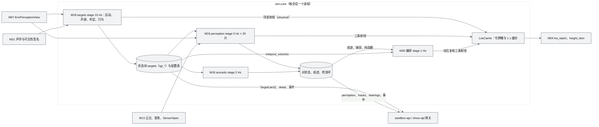
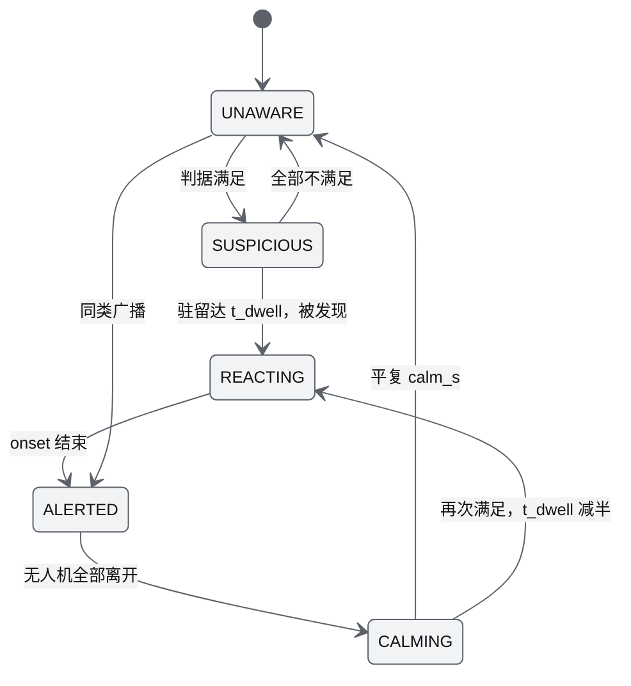
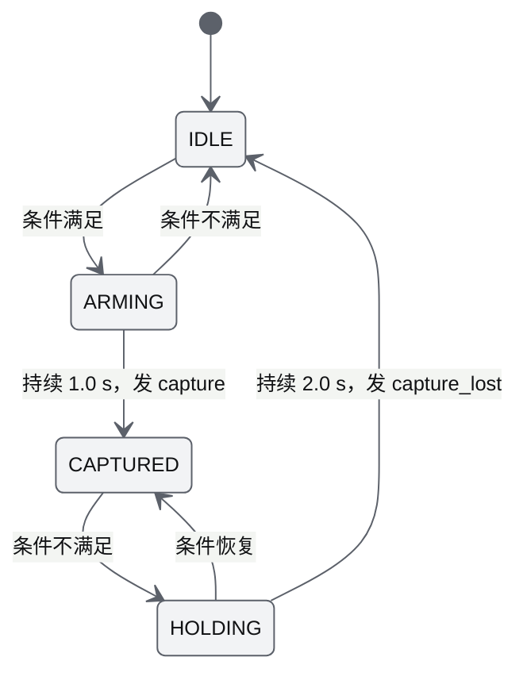
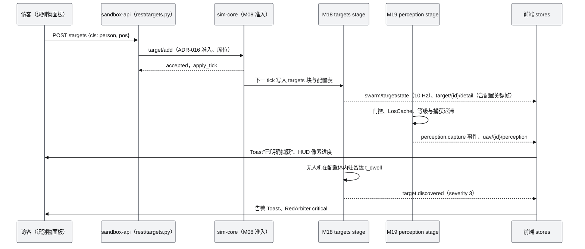

# 识别物与感知对抗 PRD（M18 识别物与敏感范围、M19 感知与捕获）

| 项 | 内容 |
|---|---|
| 文档编号 | AWR-M18、AWR-M19（合并 PRD；起草时按派工命名为 `M17-识别物与感知对抗PRD.md`，已按 AWR-04 ADR-114 更名为本文件名，见 §1.4） |
| 标题 | 识别物与感知对抗 PRD |
| 版本 | v1.0 |
| 日期 | 2026-10-05 |
| 状态 | 草案（待 D2 第 2 轮交叉评审） |
| 上游文档 | [AWR-04 D2 设计增补与决策记录](../04-D2-设计增补与决策记录.md)（§2.2、§2.3、§3.3、§4.4、§4.5、§6、§7、§9.2、§10.3、§10.5–§10.7、§11、§13、§14；ADR-097 至 ADR-102、ADR-105、ADR-108、ADR-110）；[AWR-03](../03-设计基线与决策记录.md)（§5.4、§5.6、§10.2、§10.4；ADR-016、ADR-023、ADR-047、ADR-048、ADR-049）；[用户 D2 需求原文](../inputs/D2-需求原文-2026-10-05.md)；[M04](M04-几何世界查询服务PRD.md)、[M07](M07-环境引擎PRD.md)、[M08](M08-仿真内核与飞行器适配PRD.md)、[M13](M13-传感器仿真PRD.md)、[M15](M15-前端UI壳与设计体系组件PRD.md)；研究 [r04](../research/r04-livox-driver-calib.md) §3.1、[r23](../research/r23-airsim-gzsim.md) §3.10、[g06](../research/g06-gap.md) §4、[x01](../research/x01-urbanscene3d-data.md) §3.11 |
| 下游文档 | M20（禁入体、可行窗口、航迹与捕获状态）、M15（识别物面板、HUD、提示）、M06（FPV 与传感器视图）、M17（会话快照与实体上限）、M16（S7、沙盒模板、基准）、M11（topic 与 REST 挂载）、M21（机型声学与可见性签名的消费方式） |
| 适用版本范围 | V0.2-demo（D2）至 V1.0 |

## 0. 摘要

1. 本文合并 AWR-04 的 M18 与 M19，称"感知对抗"：识别物用敏感体**发现**无人机（M18），无人机用传感器**捕获**识别物（M19）；二者共同决定接力监控的站位可行窗口 `[d_lo, d_hi]`（M20 消费）。
2. 识别物：人、他方无人机、机器、狗、车、物六类模板与 9 组属性，三种运动，周期声源；每会话 ≤ 30 个、敏感体 ≤ 64 个，运动与判定 10 Hz。
3. 被发现：缺省 geometric（进入配置体并驻留 `t_dwell = 3·(1.2 − a)` s），可选 physical（配置体 ∩ 视觉、声学准则体，逐 1/3 倍频程按 ISO 9613-2）；判据确定，不抽随机数；同时提供禁入体与建议半径纯函数。
4. 感知：EO 变焦、夜视（低照度与 850 nm 主动照明）、LWIR 按 Johnson 与 TTPF 三级（P ≥ 0.9 时 D 3.5、R 14、I 22.4 px），`N_eff = N·k_los·k_c·k_light·k_blur·(1 − occlusion)`；雷达、声阵列、MID-360 给 D 级；明确捕获 = 成像传感器、视锥内、`k_los ≥ 2/3`、`N_eff ≥ N_req` 持续 1.0 s。
5. 预算：感知每机 5 Hz（20 片），声阵列 2 Hz；视线以令牌桶计（每 tick ≤ 8 条、每仿真秒 ≤ 250 条），M18、M19、M20 共用一个 1 s 视线缓存；12 机 × 30 识别物时感知 ≤ 25 ms/仿真秒、单 tick ≤ 1 ms，识别物 stage ≤ 3 ms/仿真秒。
6. 接口：`awr.TargetLite32.v1`（10 Hz）、`target/{id}/detail`（2 Hz）、`uav/{id}/perception`（5 Hz）、雷达航迹与声学方位；REST `rest/targets.py`、`rest/perception.py`；纯函数 `perception_level`、`feasible_view`、`feasibility_window` 在 D2-MS1 冻结。
7. 复算发现 AWR-04 §9.2 可行窗口表按 σ = 3.912/MOR 计算，与 ADR-023 的 K_MOR = ln 20 及 M07 实现不一致，MOR 3 km 时上界偏小最多约 19%（车 975 m 对 1156 m）；建议 MS1 以本文参考实现重新生成（§14 第 2 条），另有 11 条反馈。

---

## 1. 背景与目标

### 1.1 背景

D1 的"目标"只有 M13 的 Mock 检测器（`python/awr/sim/sensors/detector.py`）：剧本 `target.spawn` 写入至多 64 行的 `TargetTable`，检出概率 `P_d = P0·exp(−(r/R_fp)²)·LOS·vis·FOV`，与目标尺寸、像素、照度、热对比无关，目标也不会反过来发现无人机。用户 D2 原文要求：

- 待识别物管理页面，手工加入人、机、狗、车、物（R-D2-07、R-D2-18）；
- 识别物有不同的敏感范围空间（视觉、声音等），无人机进入即被发现（R-D2-08、R-D2-09）；
- 真实的尺寸、热辐射、周期性声音波形及其他补充属性（R-D2-10、R-D2-11）；
- 视锥覆盖且分辨率大于阈值时被明确捕获并提示（R-D2-12）；
- 日视、夜视、红外、雷达波、声波五类传感器（R-D2-14）；
- 发现后 7×24 h 不进入敏感范围的接力监控（R-D2-19，M20 主责，本文提供判据与纯函数）。

### 1.2 目标

| 编号 | 目标 | 度量 |
|---|---|---|
| G1 | 识别物可在 UI 与 API 中增删改、放置到底图，属性有单位、默认值与依据 | D2-AC-11 |
| G2 | "被发现"可判定、可复现，两种模式与 AWR-04 §7.3 的解析锚点一致 | D2-AC-12 |
| G3 | 各传感器的检测、识别、确认等级与"明确捕获"可解释（HUD 显示像素进度与限制因素） | D2-AC-13、14、31 |
| G4 | 昼夜、能见度、湿度、背景噪声对两个方向的判据都生效 | D2-AC-15 |
| G5 | 给 M20 提供禁入体、可行观测、可行窗口与航迹，使接力"看得住且不被发现" | D2-AC-19、20 的前置 |
| G6 | 在 emax 的会话预算内运行（每会话 30 识别物、12 机） | D2-AC-08、13、30 |

### 1.3 对 D1 与基线的继承与修正

| 项 | D1 | 本文 |
|---|---|---|
| 目标实体 | M13 `TargetTable`（状态块 `sensor_targets`，字段前缀 `tg_`，仅 S3 使用） | 新状态块 `targets`（字段前缀 `tgt_`），roster `kind = target`；Mock 目标与 M18 识别物互不可见：Mock 检测器只读 `sensor_targets`，M19 只读 `targets`（ADR-100"并存"） |
| 检测模型 | 概率式 `P_d`，1 s 凝视 | 确定性像素判据（Johnson + TTPF），只在雷达 Swerling 1 起伏与测量噪声中使用计数器 RNG |
| 候选对轮转 | `start = ((tick // 50)·16) mod n` | 沿用"按（机体序号，识别物序号）升序、按 tick 确定性轮转"的规则，单位由"对"改为"射线"（§6.9） |
| 消光 | `optical_depth(..., wavelength_nm=550)`（D1 只实现 550 nm） | 550、850、905 nm 与 LWIR 四个波长，由 M07 在 WP-09 实现（§6.11） |
| 视线 | `los_batch` 每 tick ≤ 16 对 | 每对 3 条射线，令牌桶限流，1 s 缓存，M18、M19、M20 共用（§6.9） |
| 被发现 | 无 | 两种判据模式与行为状态机（ADR-099） |

### 1.4 文档与模块编号

AWR-04 §3.3 规定 M17 为"沙盒会话与开放接口"，M18 为"识别物与敏感范围"，M19 为"感知与捕获"。本文件覆盖 M18 与 M19 两个模块（起草时按派工路径命名为 `M17-…`，已按 AWR-04 ADR-114 更名为 `M18-M19-识别物与感知对抗PRD.md`）。编号以基线为准：需求前缀用 `M18-FR/NFR/AC` 与 `M19-FR/NFR/AC`，代码与路径所有权按 ADR-110 分属 M18（WP-05）与 M19（WP-06）。§14 第 1 条已处置。

---

## 2. 范围

### 2.1 分层范围

| 层 | D2（P0） | D2（P1） | 桩 | 后续版本 | 不做 |
|---|---|---|---|---|---|
| 识别物（M18） | 六类模板与 9 组属性、放置与校验、三种运动、周期声源、敏感体 4 种形状、geometric 与 physical 判据、状态机与行为（`hide` 除外）、禁入体与建议半径纯函数、TargetLite32 与 detail、REST 与命令、会话快照、软围栏钩子 | `hide` 行为、`GET /target_classes`、声音波形图数据 | `rf` 字段与 radar、rf 敏感体（只入 schema） | 概率式发现（V0.3 可选模式）、RF 发射与侦测（V0.3） | 真实音频合成、人群仿真 |
| 感知（M19） | EO、夜视、LWIR 的三级判据与明确捕获；雷达与声阵列 D 级、MID-360 点数判据；可见性管线、射线预算与缓存；事件、数据产品与检测历史；航迹（进程内）；云台引导；纯函数与 TS 计算器；`sensor/mode` 语义 | 雷达微多普勒 R 级与地杂波门限、声阵列谐波 R 级、航迹与可行窗口的 REST、`perception.level` 的 UI 历史曲线 | 低分辨率合成帧（P2） | 真实传感器图像（ADR-048：Isaac V0.8、Radar V1.0） | 目标检测神经网络、ATR 训练数据 |

### 2.2 与相邻模块的边界

| 模块 | 边界 |
|---|---|
| M08 | 分配状态块、注册 stage、承载命令与查询路由、roster `kind = target`、时钟档（`sandbox100`、`d1_250`）与 checkpoint；不 import M18、M19 |
| M04 | 提供 `los_batch`（≤ 64 对，D2 numba 化）、`height_dsm`、`ray_hit`、`clearance`；视线缓存与预算不在 M04 |
| M07 | 提供按波长的光学厚度、照度与照度档、地表温度与发射率、热交叉、声学背景带级、雨强（§6.11 的 `EnvPerceptionView`）；不做感知判定 |
| M13 | 传感器挂载、云台与变焦状态、`SensorSpec` 加载、MID-360 限频扫描 topic；M19 起草新传感器的 spec schema（§7.6），M13 或 M21 合入 YAML |
| M21 | 机型声学签名（`L_WA(T)`、`band_shape_db`、`tonal_db`）、可见截面、灯光、`nav.hold_sigma_m`、`capabilities`；M18 只读调用 |
| M20 | 调用本文纯函数做站位与可行性评估、读航迹与捕获状态、设置任务级 `N_req` 覆盖；不读识别物真值做决策（真值只用于统计） |
| M15、M06 | 面板、HUD、Toast、传感器视图着色由 M15、M06 实现；领域 store 与视口图层 `layers/targets.tsx` 由 M18 提供，`stores/perception.ts` 由 M19 提供 |
| M17、M11 | 实体上限 505、会话快照容器、REST 挂载与 topic 转发 |

---

## 3. 用户与用例

| 用例 | 角色 | 流程 | 涉及需求 |
|---|---|---|---|
| UC-1 放置识别物 | 沙盒访客（operator） | 识别物面板"新增"→ 选类别 → 在底图点选（贴 DSM）→ 表单调整尺寸、热、声音、敏感范围 → 视口出现识别物与敏感体 | M18-FR-001 至 009、019、024 |
| UC-2 调整敏感范围 | 访客 | 选中识别物 → 切换"配置体 / 对选中机型的有效体"→ 查看 physical 建议半径 → "采纳建议半径" | M18-FR-009、017 |
| UC-3 巡查发现与明确捕获 | 访客、M20 | 巡查机视锥扫过识别物 → HUD 显示 `9.6 / 14 px，受限：对比度` → 持续 1 s 后 Toast"已明确捕获" | M19-FR-011 至 016、026 |
| UC-4 被发现 | 访客 | 手动飞入扇形敏感体 → 3 s 前 HUD 预警 → 驻留达 `t_dwell` → 告警 Toast"被发现"、红色仲裁 → 识别物驻足注视后远离 | M18-FR-010、013 至 015、022 |
| UC-5 接力可行性 | M20 | 发现识别物 → 调用 `feasibility_window` 按照度档预检 → 选站位 → 持续捕获并保持在禁入体外 | M18-FR-016；M19-FR-019、021 |
| UC-6 SDK 读取感知 | API 客户端 | `GET .../vehicles/{vid}/perception`、订阅 `uav/{id}/perception` 与雷达航迹 → 字段与 AWR-04 §11.7 一致 | M19-FR-017、018、025 |
| UC-7 只读浏览 | 共享展示访客（viewer） | 浏览 S7 识别物列表与详情、切换有效体、用计算器求 GSD 与最大识别距离 | M18-FR-018；M19-FR-022 |
| UC-8 机型噪声对比 | 研究型访客 | 识别物切到 physical 模式 → 对比 P600 与 AWR-V1 的有效声学半径 | M18-FR-011、012、017 |

---

## 4. 功能需求

优先级含义见 AWR-04 §1.2：P0 为 D2 发布阻塞，P1 应交付（缺失须豁免），P2 可延期。"D2"列取"是、桩、否"；目标版本 `V0.2-demo`。

### 4.1 M18 识别物与敏感范围

| 编号 | 需求描述 | 优先级 | 目标版本 | D2 | 验收要点 | 依据 |
|---|---|---|---|---|---|---|
| M18-FR-001 | 识别物实体：roster `kind = target`，SoA 状态块 `targets`（容量 32，字段前缀 `tgt_`，参与 checkpoint）；单会话上限 30，超出以 `505 SANDBOX_ENTITY_LIMIT` 拒绝；识别物不经 DroneAdapter、不进入租约与 FleetGuard | P0 | V0.2-demo | 是 | M18-AC-001 | ADR-098；AWR-04 §4.4.3 |
| M18-FR-002 | 类别模板 `packages/contracts/target/class_defaults.json`：person、uav、machine、dog、vehicle、object 六类，取值见 AWR-04 §7.2；新增类别只加条目；UI 与 API 对模板值标注"模拟参考值" | P0 | V0.2-demo | 是 | M18-AC-002 | AWR-04 §7.2 |
| M18-FR-003 | 属性 9 组（几何、运动、外观、反射率、热、雷达、声源、射频、感知与行为）按 §6.2 的字段、单位、范围校验；名称经运行时文本净化（禁 emoji，≤ 32 字符） | P0 | V0.2-demo | 是 | M18-AC-002 | AWR-04 §2.2；AWR-03 §10.2 |
| M18-FR-004 | 关键维度 `d_c = √A_proj`（长方体投影精确式，§6.2.2），`critical_dim_m` 只作覆盖；LWIR 关键维度乘 `√max(hot_fraction, 0.25)`；规划用途对运动目标取 β 最不利值 | P0 | V0.2-demo | 是 | M18-AC-003 | AWR-04 §2.2；附录 A 第 17 条 |
| M18-FR-005 | 放置：地面类 `z = height_dsm(x, y)`（可落在屋顶），uav 类按 `alt_agl_m`（5–300 m）；越出世界 DSM 范围、random_walk 区域不含起点、区域面积不在 [100 m², 1 km²] 时返回 `540 TARGET_PLACEMENT_INVALID` | P0 | V0.2-demo | 是 | M18-AC-004 | AWR-04 §7.6 |
| M18-FR-006 | 运动 10 Hz：`static`、`path{points, loop, speed_mps, dwell_s[]}`、`random_walk{region, speed_mps, speed_sigma_mps, turn_tau_s, pause_prob}`；转向率截断于 `turn_rate_max_rad_s`，预测 2 s 越界时向内转向（不反射），高于 0.5 m 的台阶绕行 | P0 | V0.2-demo | 是 | M18-AC-005 | AWR-04 §7.6 |
| M18-FR-007 | 随机量只取 RNG 流 `targets_motion`（计数器式，键为 `(seed, stream, target_no, tick, channel)`），同一快照与种子下轨迹逐字节一致 | P0 | V0.2-demo | 是 | M18-AC-006 | ADR-049；D2-AC-32 |
| M18-FR-008 | 周期声源：`tone`、`harmonic`、`pulse_train`、`noise_band` 四种波形映射到 24 个 1/3 倍频程带（50 Hz–10 kHz），A 计权合计等于 `lw_dba`；关闭相位 −40 dB；相位在 10 Hz stage 内推进；参数越界返回 `541 SOUND_PARAM_INVALID` | P0 | V0.2-demo | 是 | M18-AC-007 | AWR-04 §7.5 |
| M18-FR-009 | 敏感体 `sensitivity[]`：`sphere`、`hemisphere`、`cylinder`、`sector`；每个识别物 ≤ 4 个，会话内启用的敏感体合计 ≤ 64（视口图层上限）；`visual`、`acoustic` 生效，`radar`、`rf` 只入 schema 并在回复中给出 warning；越界返回 `542 SENSITIVITY_PARAM_INVALID` | P0 | V0.2-demo | 是 | M18-AC-008 | AWR-04 §7.3、§10.5 |
| M18-FR-010 | geometric 判据（缺省）：我方机（`armed` 或 `in_air`）位于任一启用配置体内并连续驻留 `t_dwell = 3·(1.2 − a)` s 即被发现；判定 10 Hz，事件时刻误差 ≤ 1 个 stage 周期 | P0 | V0.2-demo | 是 | M18-AC-009 | ADR-099 |
| M18-FR-011 | physical 视觉准则：DSM 视线可见（识别物顶部射线）；角尺寸 `D_vis/r ≥ θ_th = θ_0/(0.5 + a)`，低照档乘 2；夜间不开灯只在 30 m 内可见、开防撞灯视为可见；`abs(C_drone)·τ_550(r) ≥ 0.05` | P0 | V0.2-demo | 是 | M18-AC-010 | AWR-04 §7.3；ADR-097 |
| M18-FR-012 | physical 声学准则：逐带 `L_p,b = L_W,b(T) − 20·lg r − 11 − α_b·r/1000 − g_back`，任一带 `L_pA,b ≥ max(L_th, L_bg,b + M_b) + 6·(1 − a) − adv` 即可闻；与独立参考实现 `tests/targets/ref_acoustic.py` 一致（≤ 0.1 dB）；单带锚点 `r_ac = 145.7 m` | P0 | V0.2-demo | 是 | M18-AC-011 | AWR-04 §7.3；D2-AC-12 |
| M18-FR-013 | 状态机 UNAWARE、SUSPICIOUS、REACTING、ALERTED、CALMING（§6.4）；发现后警觉度 +0.2（上限 1），平复后按 0.01/s 回落；`alert_others` 向 `alert_radius_m` 内同类广播 | P0 | V0.2-demo | 是 | M18-AC-012 | AWR-04 §7.4 |
| M18-FR-014 | 行为：onset（`none`、`freeze`、`look_at`）与 response（`ignore`、`flee`、`approach`、`return`、`emit`、`hide`）两段；`hide` 为 P1 | P0（`hide` P1） | V0.2-demo | 是 | M18-AC-012 | AWR-04 §7.4 |
| M18-FR-015 | 事件 `target.discovered`、`target.state`；计数口径：同一告警轮次内每架机首次满足驻留计一次，轮次在回到 UNAWARE 时结束 | P0 | V0.2-demo | 是 | M18-AC-013 | AWR-04 §9.5 |
| M18-FR-016 | 纯函数 `keepout_volumes(target, mode, margin_m, conservative, moving_as_circle)`：geometric 为配置体外扩，physical 为保守有效体外扩，运动识别物的扇形一律按整圆；供 M20 规划与 M15 显示 | P0 | V0.2-demo | 是 | M18-AC-014 | AWR-04 §8.1、§9.4 |
| M18-FR-017 | 有效体与建议半径：`effective_radius(target, model, env)` 与 `suggested_radius(target, model_id)`（当前、日间、夜间、保守四值）；按参数键缓存；`detail` 携带会话机队中各机型的有效半径 | P0 | V0.2-demo | 是 | M18-AC-015 | ADR-099 |
| M18-FR-018 | 线格式：`swarm/target/state`（`awr.TargetLite32.v1`，10 Hz）、`target/{id}/detail`（msgpack，2 Hz，配置变更与每 10 s 附完整配置） | P0 | V0.2-demo | 是 | M18-AC-016 | AWR-04 §7.1、§11.2 |
| M18-FR-019 | 命令 `target/add`、`target/update`、`target/remove` 经 ADR-016 准入（需席位），写入在下一 tick 生效；实体增删改限 5 次/s | P0 | V0.2-demo | 是 | M18-AC-017 | AWR-04 §11.2、§11.5 |
| M18-FR-020 | REST `rest/targets.py`：列表、增删改、`state`、`suggested_radius`（§7.2）；`GET /target_classes`（公开、可缓存）为 P1 | P0 | V0.2-demo | 是 | M18-AC-017 | AWR-04 §11.1 |
| M18-FR-021 | 会话快照：`export_targets()` 与 `import_targets()` 供 M17 快照、恢复与场景模板装配；切换底图不搬运坐标 | P0 | V0.2-demo | 是 | M18-AC-018 | ADR-112 |
| M18-FR-022 | 手动飞行防护：服务端软围栏（朝敏感体方向的速度分量钳为 0，经 M08 速度 setpoint 过滤钩子）与 `state_ext.keepout` 字段；前端以同一几何预测 3 s 内进入并预警 | P0 | V0.2-demo | 是 | M18-AC-019 | AWR-04 §10.6 |
| M18-FR-023 | 共享视线缓存与射线预算 `LosCache`（§6.9）：M19、M20、M18 共用，按所有者设子配额 | P0 | V0.2-demo | 是 | M19-AC-010 | AWR-04 §6.3 |
| M18-FR-024 | 前端：`engine/targets/**`（解码、几何、类别模板生成物）、`stores/targets.ts`、`viewport/layers/targets.tsx`（识别物 ≤ 32、敏感体网格 ≤ 64） | P0 | V0.2-demo | 是 | M18-AC-020 | ADR-110；D2-AC-30 |
| M18-FR-025 | 声音波形图数据：前端由同一参数合成一个周期 `s(t) = Σ a_k·sin(2π k f0 t)·gate(t)`，只作展示 | P1 | V0.2-demo | 是 | M18-AC-021 | AWR-04 §7.5 |
| M18-FR-026 | `rf{freq_mhz, eirp_dbm, duty}` 与 `radar`、`rf` 敏感体只入 schema，不参与判定 | P2 | V0.2-demo | 桩 | M18-AC-002 | AWR-04 §2.2 |
| M18-FR-027 | 同一实现在 `d1_250`（共享展示 S7）与 `sandbox100` 两个时钟档运行，频率按 Hz 声明、`every` 由时钟档换算 | P0 | V0.2-demo | 是 | M18-AC-022 | ADR-090、ADR-094 |

### 4.2 M19 感知与捕获

| 编号 | 需求描述 | 优先级 | 目标版本 | D2 | 验收要点 | 依据 |
|---|---|---|---|---|---|---|
| M19-FR-001 | 传感器 spec schema：`eo_zoom`、`nir_illuminator`、`lwir`、`radar_mmw`、`acoustic_array`，以及 MID-360 v2 的感知参数（§6.6）；越界返回 `561 SENSOR_PARAM_INVALID`，机型不支持的模式返回 `560 SENSOR_UNSUPPORTED` | P0 | V0.2-demo | 是 | M19-AC-001 | AWR-04 §6.1、§11.6 |
| M19-FR-002 | 光学：`HFOV(f) = 2·atan(W_s/2f)`、`F#(f)` 对数插值、`p_eff = 1.45 µm·W_crop/W_out`、`p' = max(p_eff, λ·F#)`、`GSD = R·p'/f`；分析分辨率缺省 1080P，带 `compute.orin_nx` 的机型可选 4K | P0 | V0.2-demo | 是 | M19-AC-002 | AWR-04 §6.1 |
| M19-FR-003 | 三级判据：`N = d_c·f/(R·p')`，TTPF `P = x^E/(1 + x^E)`，`x = N/N50`，`E = 2.7 + 0.7·x`；阈值表 `sensor/perception_levels.json`（D 1.0、R 4.0、I 6.4 周期） | P0 | V0.2-demo | 是 | M19-AC-003 | ADR-100 |
| M19-FR-004 | 有效像素 `N_eff = N·k_los·k_c·k_light·k_blur·(1 − occlusion)`，各系数按 §6.7 定义并在 [0, 1] 内单调 | P0 | V0.2-demo | 是 | M19-AC-004 | AWR-04 §6.2 |
| M19-FR-005 | 夜视：被动黑白低照度（`E_min,mono = 0.05 lx`）与 850 nm 主动照明（GX40 机内 0.8 W、外挂 `nir_ill_l` 3 W），`R_nir` 随发散角、功率、反射率与 τ_850 缩放，识别物须在照明锥内 | P0 | V0.2-demo | 是 | M19-AC-005 | ADR-101 |
| M19-FR-006 | LWIR：relative 与 absolute 两种热模式、`k_cross` 与背景杂波、`N` 按原生 12 µm 像元，数字变焦只影响显示；调色板只有白热、黑热 | P0 | V0.2-demo | 是 | M19-AC-006 | ADR-101、ADR-108 |
| M19-FR-007 | 雷达 D 级：`SNR = 13.2 + 10·lg σ − 40·lg(R/R_ref) − 2·γ_rain·R/1000`，`SNR ≥ 13.2 dB` 为 D；FOV、中心视线、Swerling 0/1；输出航迹（不外露识别物 id）并可引导云台 | P0 | V0.2-demo | 是 | M19-AC-007 | AWR-04 §6.2；D2-AC-31 |
| M19-FR-008 | 雷达 R 级：`SNR ≥ 20 dB` 且驻留 2 s；径向速度 < 0.3 m/s 的地面目标须 `σ ≥ 10·σ_0·A_cell` | P1 | V0.2-demo | 是 | M19-AC-008 | D2-AC-33 |
| M19-FR-009 | 声阵列 D 级：逐带 `SNR_b ≥ 6 dB`，输出方位与各带 SNR，2 Hz；R 级（≥ 3 个谐波带同时 ≥ 10 dB）为 P1 | P0（R 级 P1） | V0.2-demo | 是 | M19-AC-009 | AWR-04 §6.2 |
| M19-FR-010 | MID-360：1 s 内落点 `n = 3500·(A_t/R²)·10`，≥ 10 为 D、≥ 100 为 R，且 `R ≤ R_max(ρ_905·τ_905²)`，截止 100 m，盲区 0.1 m | P0 | V0.2-demo | 是 | M19-AC-009 | r04 §3.1 |
| M19-FR-011 | 可见性管线六级门控（距离、视锥、像素、环境、视线、迟滞），只有通过前级的对进入下一级 | P0 | V0.2-demo | 是 | M19-AC-010 | AWR-04 §6.3 |
| M19-FR-012 | 射线预算：令牌桶每 tick 补 `250/tick_hz` 条、容量 8；超出按（机体序号，识别物序号）确定性轮转；缓存键为（机体 5 m 三维格，识别物 2 m 三维格），有效期 1 s【仿真】 | P0 | V0.2-demo | 是 | M19-AC-010 | AWR-04 §6.3 |
| M19-FR-013 | 等级迟滞：升级须持续满足 1.0 s，降级须持续不满足 2.0 s；视线延期的对冻结计时 | P0 | V0.2-demo | 是 | M19-AC-011 | AWR-04 §6.3 |
| M19-FR-014 | 明确捕获：成像传感器、视锥内、`k_los ≥ 2/3`、`N_eff ≥ N_req` 持续 `t_hold = 1.0 s` 发 `perception.capture`；不满足持续 2.0 s 发 `perception.capture_lost`；雷达、声阵列、激光雷达不单独构成捕获 | P0 | V0.2-demo | 是 | M19-AC-012 | ADR-100 |
| M19-FR-015 | `N_req` 来源优先级：任务覆盖（M20 `set_requirement`）> 识别物 `n_req_px` > 识别物 `level_req` 在 P ≥ 0.9 的像素 > 缺省 R（14 px）；`level_req = I` 但传感器上限不可达时详情给出 `562 LEVEL_UNREACHABLE` | P0 | V0.2-demo | 是 | M19-AC-012 | AWR-04 §6.4 |
| M19-FR-016 | 事件 `perception.level`、`perception.capture`、`perception.capture_lost`（§7.5）；每会话感知事件 ≤ 50 条/s，超出合并为计数 | P0 | V0.2-demo | 是 | M19-AC-013 | AWR-04 §6.4 |
| M19-FR-017 | 数据产品：`uav/{id}/perception`（5 Hz）、`uav/{id}/sensor/radar/tracks`（5 Hz）、`uav/{id}/sensor/acoustic/bearings`（2 Hz）；只在有订阅时编码；字段覆盖 AWR-04 §11.7 | P0 | V0.2-demo | 是 | M19-AC-014 | AWR-04 §11.7 |
| M19-FR-018 | 检测历史：会话内环形缓冲 2048 条，`GET .../detections?since_seq=` 补拉 | P0 | V0.2-demo | 是 | M19-AC-014 | AWR-04 §11.1 |
| M19-FR-019 | 航迹 `TrackTable`：每识别物一条恒速 Kalman 航迹，融合我方各机测量（含噪声），状态 TENTATIVE、CONFIRMED、COASTING、DROPPED；M20 只读航迹；REST 暴露为 P1 | P0（REST P1） | V0.2-demo | 是 | M19-AC-015 | AWR-04 §9.1 |
| M19-FR-020 | 云台引导：雷达或声阵列 D 级检测且该机成像传感器处于 `cue` 策略、当前无明确捕获时，经 M13 GimbalBank 以 look_at 指向航迹估计位置 | P0 | V0.2-demo | 是 | M19-AC-007 | AWR-04 §6.4 |
| M19-FR-021 | 纯函数 `perception_level`、`perception_level_batch`、`feasible_view`、`feasibility_window`、`zoom_for_level`（§7.1），签名在 D2-MS1 冻结并提供桩 | P0 | V0.2-demo | 是 | M19-AC-016 | AWR-04 §3.3、§14.1 |
| M19-FR-022 | 前端计算器 `engine/perception/calc.ts`：GSD、N、TTPF、`d_c`、可行窗口的 TS 移植，与 Python 参考实现误差 ≤ 1% | P0 | V0.2-demo | 是 | M19-AC-017 | AWR-04 §10.3；D2-AC-37 |
| M19-FR-023 | `sensor/mode` 语义：EO `auto`、`color`、`mono`、`nir`；照明器 `auto`、`on`、`off`；雷达与声阵列 `on`、`off`；LWIR 调色板（只影响显示） | P0 | V0.2-demo | 是 | M19-AC-005 | AWR-04 §11.2 |
| M19-FR-024 | 环境输入接口 `EnvPerceptionView`（§6.11）由 M07 实现；M19 不自行计算太阳、照度、消光 | P0 | V0.2-demo | 是 | M19-AC-018 | AWR-04 §3.2 M07 行 |
| M19-FR-025 | REST `rest/perception.py`：`GET .../vehicles/{vid}/perception`、`GET .../detections`；`GET .../tracks` 与 `POST .../perception/feasibility` 为 P1 | P0 | V0.2-demo | 是 | M19-AC-014 | AWR-04 §11.1 |
| M19-FR-026 | HUD 数据：每个成像传感器给出视锥内最近识别物的 `N_eff / N_req` 与 `limiting`（`fov`、`los`、`pixels`、`light`、`contrast`、`blur`） | P0 | V0.2-demo | 是 | M19-AC-019 | AWR-04 §6.4 |
| M19-FR-027 | 与 M13 Mock 检测器并存且互不可见；S3 与 M14 行为不变 | P0 | V0.2-demo | 是 | M19-AC-020 | ADR-100；D2-AC-26 |
| M19-FR-028 | 前端 `stores/perception.ts`：订阅选中机的感知、捕获 Toast 同一识别物 30 s 去重、检测列表 | P0 | V0.2-demo | 是 | M19-AC-019 | AWR-04 §6.4 |
| M19-FR-029 | 低分辨率合成帧（EO、LWIR 的 160 × 120 示意帧） | P2 | V0.3 | 否 | — | AWR-04 §11.7 |

---

## 5. 非功能需求

### 5.1 NFR 表

| 编号 | 需求 | 阈值 | 验收 |
|---|---|---|---|
| M18-NFR-001 | 识别物 stage 成本 | 30 识别物 × 12 机（geometric，含 2 个 physical 识别物）≤ 3 ms/仿真秒，单 tick ≤ 0.3 ms | M18-AC-022 |
| M18-NFR-002 | 内存 | M18 状态块与配置 ≤ 0.5 MB/会话；建议半径缓存 ≤ 256 条 | M18-AC-022 |
| M18-NFR-003 | 确定性 | 同一快照与种子：识别物轨迹、事件序列逐字节一致 | M18-AC-006 |
| M18-NFR-004 | 带宽 | `swarm/target/state` ≤ 30 × 32 B × 10 Hz ≈ 9.6 KB/s；`detail` 不含配置时 ≤ 400 B/条 | M18-AC-016 |
| M18-NFR-005 | 前端 | 30 识别物 + 60 敏感体 + 12 机在 Tier S 满足 D1-AC-03b 阈值；拖动编辑不产生 > 50 ms 长帧 | M18-AC-020 |
| M18-NFR-006 | 安全 | 识别物名称净化；数值字段全部有上下界；命令走准入，viewer 无写入 | M18-AC-017 |
| M19-NFR-001 | 感知 stage 成本 | 12 机 × 30 识别物，接力与巡查几何、射线预算打满：≤ 25 ms/仿真秒，单 tick ≤ 1 ms | M19-AC-010 |
| M19-NFR-002 | 射线 | 每 tick ≤ 8 条；任意 1 s【仿真】窗口 ≤ 250 条 | M19-AC-010 |
| M19-NFR-003 | 内存 | 对状态、航迹、缓存、检测环合计 ≤ 2 MB/会话 | M19-AC-010 |
| M19-NFR-004 | 确定性 | 同一快照与种子：等级与捕获事件、航迹、雷达测量逐字节一致 | M19-AC-020 |
| M19-NFR-005 | 带宽 | `uav/{id}/perception` ≤ 2 KB/帧（每传感器至多 16 个识别物，按斜距升序） | M19-AC-014 |
| M19-NFR-006 | 一致性 | TS 计算器与 Python 参考实现在 200 组随机输入上误差 ≤ 1% | M19-AC-017 |

### 5.2 预算分解（会话口径：12 机、30 识别物、sandbox100）

| 项 | 频率 | 预算 | 依据 |
|---|---|---|---|
| 识别物运动、声源相位、geometric 判定 | 10 Hz | 2.0 ms/仿真秒 | 本文设定；AWR-04 §4.2 原型（运动、判定与三传感器检测合计 11.2–11.9 ms/仿真秒）以视线为主，向量化判定为其小部分，MS1 实测替换 |
| physical 判定（只对位于配置体内的对） | 10 Hz | 0.5 ms/仿真秒 | 逐带向量化，24 带 |
| 建议半径与 detail 打包 | 1 Hz 慢任务、2 Hz | 0.5 ms/仿真秒 | 参数键缓存命中为主 |
| 成像感知（门控、系数、迟滞） | 每机 5 Hz | 12 ms/仿真秒 | 60 次机评估/s × ≤ 0.2 ms |
| 视线（含 M18、M20 份额） | 令牌桶 | ≤ 8.3 ms/仿真秒（numba 化后更低） | 250 条 × 33 µs（AWR-04 §4.2） |
| 雷达、MID-360、航迹 | 5 Hz | 2.5 ms/仿真秒 | 向量化 |
| 声阵列 | 2 Hz | 1.5 ms/仿真秒 | 12 × 30 × 24 带 |
| **合计** | | 识别物 3 ms + 感知 ≤ 25 ms | AWR-04 §4.4.1（0.025 + 0.005 核） |

M08 预算表新增 `targets = 0.003`、`perception = 0.025`（核·秒/仿真秒），Σ 由当前 0.322 升至 0.350，仍 ≤ 0.40（M08-FR-012）。

---

## 6. 设计方案

### 6.1 组件与数据流



对抗关系：识别物方向的判据决定**下界** `d_lo`（禁入体外扩 m），无人机方向的判据决定**上界** `d_hi`（`N_eff ≥ N_req` 的最大水平距离）；`d_hi − d_lo ≥ w_min`（10 m，本文设定，避免刀刃可行）时站位可行。

### 6.2 识别物数据模型

#### 6.2.1 字段（`target/target.schema.json`，awr.target.v1）

字段名按 AWR-03 §5.6（snake_case，单位后缀）；角度线上为 rad（`yaw_rad` 为 ψ_enu，东为 0、逆时针为正），敏感体配置沿用 AWR-04 的 `_deg` 字段。默认值取类别模板（AWR-04 §7.2）。

| 组 | 字段 | 类型与单位 | 范围 | 缺省 | 说明 |
|---|---|---|---|---|---|
| 标识 | `id` | string | `^[a-z0-9-]{1,24}$` | 服务端分配 `tg-<n>` | 会话内唯一 |
| | `name` | string | ≤ 32 字符，净化 | 类别中文名 + 序号 | |
| | `cls` | enum | person、uav、machine、dog、vehicle、object | — | 必填 |
| | `enabled` | bool | | true | false 时不运动、不判定、不被感知 |
| 位姿 | `pos` | [x, y, z?] m（world ENU） | 世界 DSM 范围内 | — | z 缺省按放置规则求得 |
| | `yaw_rad` | f64 | [−π, π) | 0 | |
| | `alt_agl_m` | f64 | [5, 300] | 50 | 仅 uav 类 |
| 几何 | `size_m` | {l, w, h} m | 各 [0.05, 30] | 模板 | |
| | `critical_dim_m` | f64 或 null | [0.02, 30] | null | 覆盖 `d_c` |
| 运动 | `motion` | 见 §6.5.1 | | 模板 | |
| 外观 | `color_srgb` | #RRGGBB | | 模板 | 只用于渲染（经 token 映射） |
| | `albedo_vis`、`contrast0`、`camouflage`、`occlusion` | f64 | [0, 1]、[−1, 4]、[0, 1]、[0, 1] | 模板、模板、0、0 | |
| 反射率 | `reflect_850`、`reflect_905` | f64 | [0.01, 1] | 模板 | |
| 热 | `thermal{mode, delta_t_k, t_surface_c, emissivity, hot_fraction}` | K、°C | ΔT [−30, 200]；T [−40, 600]；ε [0.1, 1]；占比 [0.01, 1] | relative、模板 | |
| 雷达 | `radar{rcs_m2, rcs_fluct, rcs_band}` | m² | [1e-4, 1e3]；swerling0、swerling1；"77ghz" | 模板、swerling0 | |
| 声源 | `sound` 或 null | 见 §6.5.2 | | 模板 | |
| 射频 | `rf{freq_mhz, eirp_dbm, duty}` 或 null | MHz、dBm | — | null | 只入 schema |
| 感知与行为 | `criterion_mode` | enum | geometric、physical | geometric | |
| | `alertness` | f64 | [0, 1] | 模板 | 记为 a |
| | `hearing_th_dba`、`acoustic_adv_db`、`visual_theta0_arcmin` | dB(A)、dB、角分 | [0, 60]、[0, 20]、[0.3, 10] | 模板、模板、1.0 | 听阈、声学优势、视觉阈 θ_0 |
| | `sensitivity[]` | 见 §6.3.1 | ≤ 4 | 模板 | |
| | `reaction` | 见 §6.4.2 | | 模板 | |
| | `calm_s`、`alert_radius_m` | s、m | [0, 3600]、[0, 500] | 60、50 | |
| | `level_req`、`n_req_px` | enum D、R、I；f64 | n_req [1, 200] | R、null | 明确捕获阈值 |

#### 6.2.2 关键维度

```text
d_c(ε, β) = √( |sin ε|·l·w + |cos ε|·( |cos β|·w·h + |sin β|·l·h ) )
  ε：自识别物看观察者的俯视角（观察者高于识别物为正），β：观察者方位相对识别物航向的夹角
  worst = True（规划、运动目标）：|cos β|·w·h + |sin β|·l·h 取 min(w·h, l·h)
  critical_dim_m 非空时直接返回该值；LWIR 再乘 √max(hot_fraction, 0.25)
```

锚点（AWR-04 §7.2）：人平视最不利 0.7246 m、俯视 0.3873 m；轿车正面 1.643 m、侧面 2.598 m、俯视 2.846 m。

### 6.3 敏感体与"被发现"判据

#### 6.3.1 敏感体字段（`target/sensitivity.schema.json`）

| 字段 | 类型与单位 | 范围 | 缺省 | 说明 |
|---|---|---|---|---|
| `kind` | enum | visual、acoustic、radar、rf | — | radar、rf 只入 schema |
| `shape` | enum | sphere、hemisphere、cylinder、sector | — | sector 为水平扇形柱 |
| `radius_max_m` | f64 | [1, 2000] | 模板 | |
| `z_min_m`、`z_max_m` | f64（相对识别物） | [−50, 1000]，min < max | 0、300 | 用于 cylinder、sector |
| `half_angle_deg` | f64 | (0, 180] | 60 | 仅 sector |
| `azimuth_offset_deg` | f64 | [−180, 180) | 0 | 相对航向，逆时针为正 |
| `gain_back_db` | f64 | [0, 30] | 0 | physical 声学背向衰减 |
| `enabled` | bool | | true | |

#### 6.3.2 判据算法

```text
participants = 我方 roster（kind = uav）中 armed 或 in_air 的机体         # 落地上锁的机不计
def inside(body, T, p, moving):                      # p：无人机位置；T：识别物
    d = p − T.pos；r_h = hypot(d.x, d.y)；r3 = |d|；z = d.z
    sphere:     r3 ≤ R
    hemisphere: r3 ≤ R 且 z ≥ 0
    cylinder:   r_h ≤ R 且 z_min ≤ z ≤ z_max
    sector:     r_h ≤ R 且 z_min ≤ z ≤ z_max 且 (moving_as_circle 或 |wrap(atan2(d.y, d.x) − T.yaw − off)| ≤ half)
    # 判定时 moving_as_circle = False（真实方向性）；规划禁入体与 physical 保守体为 True（运动识别物）

def criterion(body, T, uav, env):                    # 只在 physical 模式、且 inside 为真时调用
    visual:   los_top(uav, T)                                  # LosCache 顶部射线，所有者 M18
              e = 自识别物看无人机的仰角；A = top if e ≥ 45° else side；D_vis = √A
              θ_th = θ_0/(0.5 + a)·(2 if 照度档 = 低照 else 1)
              if 照度档 = 夜：ok_ang = (lights.strobe or lights.nav) or r3 ≤ 30 m
              else：ok_ang = D_vis/r3 ≥ θ_th
              C = contrast_sky if e > 0 else contrast_ground
              return ok_ang 且 |C|·τ_550(r3) ≥ 0.05，margin_ratio = r_vis/r3
    acoustic: L_W[b] = M21.acoustic_bands(uav, thrust)               # 24 带，未计权声功率级
              g = gain_back_db·(1 − cos Δψ)/2                         # Δψ：无人机方位相对识别物航向
              Lp[b] = L_W[b] − 20·lg r3 − 11 − α[b]·r3/1000 − g
              thr[b] = max(hearing_th, L_bg[b] + M[b]) + 6·(1 − a) − adv  # A 计权带级比较
              return any(Lp[b] + A[b] ≥ thr[b])，margin_db = max(Lp[b] + A[b] − thr[b])

每 10 Hz 对每个 (T, uav)：
    hit = any(enabled body：inside(body, T, uav.p, False) 且 (mode = geometric 或 criterion(body, …)))
    hit：dwell[T, uav] += 0.1 s；否则 dwell[T, uav] = 0
    t_dwell = 3·(1.2 − a)·(0.5 if T.state = CALMING else 1)
    dwell ≥ t_dwell 且 uav ∉ discovered_set[T]：发 target.discovered，加入集合，驱动状态机（§6.4）
```

参数与依据：`α[b]` 取 ISO 9613-2 表 2（20 °C、70% RH）的倍频程值 0.1、0.3、1.1、2.8、5.0、9.0、22.9、76.6 dB/km（63 Hz–8 kHz），对数插值到 1/3 倍频程；`M[b]` 纯音带（M21 标记的 BPF 谐波带）−4 dB、宽带 0 dB；`A[b]` 为 IEC 61672 A 计权；`L_bg[b]` 为 M07 按日历给出的 A 计权带级。单带退化口径（只用 1 kHz 带，α = 5.0 dB/km，`A = 0`）重现 AWR-04 §7.3 全部算例：P600 88 dB(A) 对人（a 0.5、听阈 20）乡村日间 48.7 m、夜间 145.7 m，保守（a + 0.2、`L_bg` − 3 dB）225.7 m；V1 盘旋 81 dB(A) 对人夜间保守 108 m；狗（优势 5 dB）对 P600 夜间保守 414 m。

`g_back` 的余弦平滑为本文设定（背向满衰减、正前方 0）。判据全程不使用随机数（ADR-099）。

#### 6.3.3 禁入体、有效体与建议半径

| 函数 | 规则 |
|---|---|
| `keepout_volumes(T, mode, margin_m, conservative=True, moving_as_circle=True)` | geometric：每个启用配置体外扩 `margin_m`（M20 传入 `20 m + 3σ_hold`）；physical：每个体的半径取 `min(radius_max, r_eff,cons)` 后外扩；运动识别物（`motion.mode ≠ static` 或当前 speed > 0.1 m/s）的 sector 改为 cylinder；返回 `[{shape, center, radius_m, z_min_m, z_max_m, half_angle_deg, yaw_rad}]` |
| `effective_radius(T, body, model_id, env, conservative)` | visual：`min(radius_max, D_vis/θ_th, r(C_app = 0.05))`，夜间无灯为 30 m；acoustic：各带解 `Lp + A = thr` 的 r（[1, 5000] m 区间二分 40 次，单调递减），取最大后与 `radius_max` 取小；保守口径 a + 0.2、`L_bg` − 3 dB |
| `suggested_radius(T, model_id)` | 不受 `radius_max` 截断（上限 2000 m），返回 `{now_m, day_m, night_m, conservative_max_m}`；UI"采纳"把 `radius_max_m` 设为 `ceil(conservative_max_m / 10)·10` |

有效半径缓存键：`(cls 参数哈希, model_id, 照度档, round(L_bg 总级), round(a, 2), conservative)`；环境背景变化 ≥ 1 dB 或警觉度变化 ≥ 0.05 时失效。`detail` 只携带会话机队中出现的机型（≤ 8 个）。

### 6.4 识别物状态机与行为

#### 6.4.1 状态机

| 状态 | 事件 | 守卫 | 动作 | 目标状态 |
|---|---|---|---|---|
| UNAWARE | 任一参与者判据满足 | — | 该对开始驻留计时 | SUSPICIOUS |
| SUSPICIOUS | 全部参与者判据不满足 | — | 清零计时 | UNAWARE |
| SUSPICIOUS | 某机驻留 ≥ `t_dwell` | — | 发 `target.discovered`；a ← min(1, a + 0.2)；计数 + 1；`alert_others` 时广播；开始 onset | REACTING |
| REACTING | onset 时长结束 | — | 开始 response | ALERTED |
| REACTING、ALERTED | 另一架机驻留 ≥ `t_dwell` | 该机不在本轮集合中 | 发 `target.discovered`（同轮），计数 + 1 | 原状态 |
| ALERTED | 全部参与者离开全部启用体（按当前模式） | — | 开始平复计时；response 继续直至完成 | CALMING |
| CALMING | 平复 ≥ `calm_s` | — | 恢复原运动模式（从当前位置续行）；a 按 0.01/s 回落至基线；清空本轮集合 | UNAWARE |
| CALMING | 判据再次满足 | 驻留 ≥ `t_dwell/2` | 发 `target.discovered`（新轮次），a + 0.2 | REACTING |
| 任意 | 收到同类广播 | 处于 UNAWARE | a ← min(1, a + 0.1)；onset `look_at` 指向广播源方向 5 s，不计发现 | ALERTED |



#### 6.4.2 行为参数（`reaction`）

| 段 | 类型 | 参数（单位） | 语义 |
|---|---|---|---|
| onset | `none`、`freeze`、`look_at` | `duration_s` [0, 60] | 驻足；`look_at` 转向发现者（转向率受限） |
| response | `ignore` | — | 维持原运动 |
| | `flee` | `speed_mps`、`dist_m` | 沿远离发现者水平投影方向移动 `dist_m`；random_walk 区域边界处沿边界滑行 |
| | `approach` | `dist_m` | 靠近发现者水平投影至 `dist_m` |
| | `return` | `speed_mps` | uav 类：先 flee 再回到 path 起点 |
| | `emit` | `sound` 覆盖字段、`duration_s` | 临时改变声源（狗吠占空 0.6） |
| | `hide`（P1） | `search_m`（缺省 50） | 移向 50 m 内最近的遮蔽格（相邻格 DSM − DTM > 3 m），到达后 `occlusion` 置 0.8 |
| 广播 | `alert_others` | bool | 向 `alert_radius_m` 内同类广播 |

类别缺省：人 `look_at 10 s` + `flee 2.5 m/s、100 m`；uav `none` + `return 8 m/s`；狗 `none` + `emit 占空 0.6、30 s` 与 `approach 20 m`（两段并行）；车 `ignore`（AWR-04 §7.2）。

### 6.5 运动与周期声源

#### 6.5.1 运动

```text
每 0.1 s（10 Hz），对每个启用识别物：
  static：不动
  path：pure pursuit（前视 max(2 m, 1.5·v)），到点驻留 dwell_s[i]；loop ∈ {once, pingpong, loop}
  random_walk：
    ω = ω_prev − ω_prev·dt/turn_tau_s + σ_ω·√(2·dt/turn_tau_s)·n       # OU 过程，n ~ N(0,1) 取自 targets_motion
    预测 2 s 位置在 region 外：ω ← sign(指向区域内侧)·turn_rate_max
    ω ← clamp(ω, −turn_rate_max, turn_rate_max)；ψ += ω·dt
    v ← clamp(speed_mps + speed_sigma_mps·n2, 0, speed_max_mps)；以 pause_prob 每秒概率驻足 2–5 s
  台阶绕行（地面类）：前视点 p + ψ̂·max(1 m, v·dt) 的 height_dsm − 当前 z > 0.5 m 时，按 ±30°、±60°、±90° 顺序找首个可通行航向，按转向率限制转向
  高度：地面类 z = height_dsm；uav 类 z = max(height_dsm + 10, height_dsm + alt_agl_m)
  RNG：cbrng.normal(seed, S_TM, target_no, tick, ch)，ch 区分 ω、v、pause；不随观察者或订阅变化
```

σ_ω 缺省 `0.5·turn_rate_max`、`turn_tau_s` 缺省 4 s、`pause_prob` 缺省 0.02（本文设定，使行人轨迹在 30 s 内有明显转向而不抖动）。

#### 6.5.2 声源

`sound = {waveform, f0_hz, harmonics_db[], lw_dba, period_s, duty, phase_s, bandwidth_hz}`；校验：`f0_hz` [20, 10000]、`harmonics_db` ≤ 8 项且各 [−60, 0]、`lw_dba` [0, 140]、`period_s` [0.1, 3600]、`duty` [0, 1]、`phase_s` [0, period)、`bandwidth_hz` [10, 5000]（`noise_band`）。

```text
谱形 s[b]（dB，未计权）：
  tone：f0 所在带 0 dB，其余 −60
  harmonic、pulse_train：第 k 次谐波 k·f0（k ≤ len(harmonics_db) ≤ 8，且 ≤ 10 kHz）落入的带累加 harmonics_db[k−1]（能量相加）
  noise_band：[f0 − bw/2, f0 + bw/2] 覆盖的带按重叠比例均分
归一：L_W[b] = s[b] + (lw_dba − 10·lg Σ_b 10^((s[b] + A[b])/10))
门控：on = ((t − phase_s) mod period_s) < duty·period_s；off 相位 L_W[b] −= 40
```

### 6.6 传感器参数（`sensor/*.schema.json`，M19 起草）

| 传感器 | 字段与缺省（单位） | 来源 |
|---|---|---|
| `eo_zoom`（`eo_gx40`） | `sensor_px {3840, 2160}`、`pixel_um 1.45`、`sensor_mm {5.568, 3.132}`、`f_mm [4.8, 48]`、`f_number [1.7, 3.2]`（随 ln f 线性插值）、`outputs`：4k（裁切宽 3840）、1080p（3840）、sxga 1280 × 1024（2700 × 2160）、1.3m 1280 × 960（2880 × 2160）、720p（3840）；`analysis_output 1080p`（4k 需 `compute.orin_nx`）；`zoom_full_s 4`；`exposure {day_s 0.001, low_s 0.0333, switch_lx 50}`；`jitter_urad {short 10, long 30}`；`color_min_lx 0.5`、`mono_min_lx 0.05`；机内照明 `{power_w 0.8, wavelength_nm 850, divergence follows_hfov, r_ref_m 200, theta_ref_deg 6.6, p_ref_w 0.8, rho_ref 0.3, max_m 200}`；云台俯仰 [−90, 30]°、偏航 ±160°、90°/s | 用户规格（B）；云台、曝光、抖动为模拟参考值（D）；`switch_lx` 本文设定，与 `k_light` 开始下降的照度一致 |
| `nir_illuminator`（`nir_ill_l`） | `power_w 3`、`wavelength_nm 850`、`divergence_deg 5.5`（固定）、`r_ref_m 465`（派生：200·(6.6/5.5)·√(3/0.8)）、`mass_kg 0.18`、与 EO 同轴装于云台 | 模拟参考值（D） |
| `lwir`（`lwir640`） | `sensor_px {640, 512}`、`pixel_um 12`、`band_um [8, 14]`、`netd_k 0.05`、`f_number 1.0`、`lens_mm ∈ {13, 25, 75, 100}`、`integration_s 0.01`、`jitter_urad 20`、`digital_zoom [1, 4]`（只影响显示）、`palette ∈ {white_hot, black_hot}`、`sigma_clutter_k {day 2.0, night 1.0}` | 模拟参考值（D）；AWR-04 §6.1 |
| `radar_mmw`（`mmw77`） | `freq_ghz 77`、`fov_az_deg 60`（±）、`fov_el_deg 15`（±）、`r_ref_m 180`、`snr_d_db 13.2`、`r_max_m 400`、`range_res_m 0.3`、`az_res_deg 4`、`vel_res_mps 0.1`、`sigma {range_m 0.15, az_deg 1.0, el_deg 2.0, vr_mps 0.05}`、`rate_hz 5`、安装俯仰 −10°（机体固定）；P1：`snr_r_db 20`、`dwell_r_s 2`、`sigma0_db −20`、`v_clutter_mps 0.3` | AWR-04 §6.1；俯角、仰角精度与 `r_max_m` 为本文设定 |
| `acoustic_array`（`mic8`） | `n_mics 8`、`aperture_m 0.3`、`band_hz [100, 8000]`、`array_gain_db 9`、`nr_db {multirotor 25, fixed_wing 35}`、`ego_dist_m 0.5`、`bearing_sigma_deg 5`、`snr_d_db 6`、`rate_hz 2`；P1：`snr_r_db 10`、`n_harm 3` | AWR-04 §6.1；`ego_dist_m` 本文设定 |
| `lidar`（`mid360` v2 感知参数） | `pts_per_sr 3500`、`frame_hz 10`、`r_max10_m 40`、`rho_exp 0.269`、`hard_max_m 100`、`blind_m 0.1`、`fov_v_deg [−7, 52]`、`n_d 10`、`n_r 100` | 用户规格；r04 §3.1 |

GX40 复算：`HFOV(4.8 mm) = 60.23°`、`VFOV = 36.14°`；`HFOV(48 mm) = 6.64°`、`VFOV = 3.74°`（AWR-04 §6.1 误差 ≤ 0.1°）。裁切输出的视场按 `2·atan(W_crop·1.45 µm/2f)` 计。

### 6.7 统一感知判据

```text
def perception_level(sn, T, geom, env, n_req) -> LevelResult:     # 纯函数；batch 版本按对向量化
    R = |T.p − geom.p_sensor|；ε, β = 视线俯视角与相对方位
    f = sn.f_current；F = F#(f)；λ = 550（EO）| 850（NIR）| 10000（LWIR）
    p_eff = pixel_um·W_crop/W_out；p' = max(p_eff, λ·F)（LWIR：p' = 12 µm，F = 1.0 时 λ·F = 10 µm）
    d = d_c(T, ε, β)·(√max(hot_fraction, 0.25) if LWIR else 1)
    N = d·f/(R·p')；GSD = R·p'/f
    τ = exp(−env.optical_depth(p_sensor, T.p, λ))
    k_c:  EO/NIR：C = |contrast0|·(1 − camouflage)·τ；k_c = clamp((C − 0.05)/0.20, 0, 1)
          LWIR relative：ΔT = τ·ε_t·ΔT_rel·k_cross
          LWIR absolute：ΔT = τ·[ε_t·T_t + (1 − ε_t)·T_sky − ε_b·T_b − (1 − ε_b)·T_sky]（K）
          SNR_T = |ΔT|/√(NETD² + σ_clutter²)；k_c = clamp((SNR_T − 1)/3, 0, 1)
    k_light: EO 被动：k(E, E_min) = clamp(lg(E/E_min)/2, 0, 1)；mode = auto 时取 max(k(E, 0.5), k(E, 0.05))，
               color 只取前者，mono 只取后者
             NIR 主动：R_nir = R_ref·(θ_ref/θ)·√(P/P_ref)·√(ρ_850/0.3)·τ_850(R)；
               在照明锥内（与照明器光轴夹角 ≤ θ/2）时 k = clamp((R_nir − R)/(0.2·R_nir), 0, 1)，否则 0；
               多个照明器取最大
             LWIR：1
    k_blur:  t_exp = 0.001 if E ≥ 50 lx 且非 NIR else 1/30（LWIR 0.01）
             σ_jit = 10 µrad if t_exp ≤ 1/250 else 30 µrad（LWIR 20 µrad）
             v_res = 0.1·|v_t⊥| if 云台跟踪该识别物 else |v_rel⊥|
             b = v_res·t_exp + R·σ_jit；k_blur = GSD/√(GSD² + b²)
    occ = T.occlusion（hide 时 0.8）
    n_max = N·k_c·k_light·k_blur·(1 − occ)                    # 视线前的上界
    k_los = geom.k_los                                         # 0、1/3、2/3、1；由管线填入
    n_eff = n_max·k_los
    level = I if n_eff ≥ 22.4 else R if ≥ 14 else D if ≥ 3.5 else NONE
    p = TTPF(n_eff, N50[level_req])
    limiting = None if n_eff ≥ n_req else 'pixels' if N < n_req
               else argmin_name([(k_los·(1 − occ), 'los'), (k_light, 'light'), (k_c, 'contrast'), (k_blur, 'blur')])
    return {level, n, n_eff, n_req, p, gsd_m: GSD, range_m: R, k: [k_los, k_c, k_light, k_blur, occ], limiting}
```

EO 的 `auto` 取两种被动曲线的较大值，使 `k_light` 对照度单调（AWR-04 §6.1 的 0.5 lx 黑白切换点若硬切会在 0.5–5 lx 出现回落，见 §14 第 3 条）。锚点（1080P、48 mm、R 级 14 px、P ≥ 0.9）：人平视 857 m、天底 458 m；4K 平视受衍射约束 1412 m；LWIR 100 mm 人平视斜距 431 m。

### 6.8 非成像传感器

```text
雷达（5 Hz，随所在机的感知片）：
  在 FOV（相对安装轴 az ±60°、el ±15°）且 R ≤ r_max 且中心射线可见
  σ_k = σ（swerling0）| −σ·ln(u)（swerling1，u = cbrng.uniform(seed, S_PC, uav_no, tick, 64·sensor_no + target_no)）
  γ_rain = 0.9·Rr^0.75 dB/km（Rr 雨强 mm/h；本文设定，ITU-R P.838 在 77 GHz 的量级拟合）
  SNR = 13.2 + 10·lg σ_k − 40·lg(R/180) − 2·γ_rain·R/1000；SNR ≥ 13.2 → D
  测量 = 真值（距离、方位、俯仰、径向速度）+ N(0, σ)；航迹 id = (uav_no·65536 + 识别物在本机的检测序号) 的 32 位哈希
  P1：SNR ≥ 20 dB 持续 2 s → R；v_r < 0.3 m/s 时要求 σ ≥ 10·σ0·A_cell，A_cell = R·Δθ_az·ΔR·sec ψ_g
声阵列（2 Hz，独立 stage）：
  L_t[b] = T.L_W[b](t) − 20·lg R − 11 − α[b]·R/1000 − (10 dB 若缓存中心射线为遮挡，否则 0；不为声学发射新射线)
  L_ego[b] = 本机 L_W[b](T) − 20·lg(ego_dist_m) − 11
  SNR[b] = L_t[b] + 9 − 10·lg(10^((L_ego[b] − NR)/10) + 10^(L_bg[b]/10))，只计 100 Hz–8 kHz 的带
  max SNR ≥ 6 dB → D；输出方位 = 真方位 + N(0, 5°)、各带 SNR
  P1：≥ 3 个谐波带同时 ≥ 10 dB → R
MID-360（5 Hz）：
  在 FOV（安装帧竖直 −7°–52°）且 0.1 ≤ R ≤ min(100, R_max(ρ_905·τ_905²))，R_max(ρ) = 40·(ρ/0.1)^0.269，中心射线可见
  n = 3500·A_proj/R²·10·(1 − occ)；n ≥ 10 → D，n ≥ 100 → R
```

锚点：雷达对人（0.5 m²）D 级 151 m、对车（10 m²）320 m；MID-360 对人（ρ_905 0.4）量程 58.1 m。声阵列的屏障衰减 10 dB 为本文设定（ISO 9613-2 单屏障衰减 5–20 dB 的中值）。

### 6.9 可见性管线、射线预算与共享缓存

```text
perception stage：every = tick_hz/5，shards = 20；片 k 处理 slot % 20 == k 的在空机体（每机 5 Hz）
for 机 s in 本片：
  1 距离门：R ≤ min(sn.r_max, R_D,max(f_max))                       # R_D,max = d_max·f_max/(3.5·p')
  2 视锥门：CameraGeom.in_fov（当前云台指向与变焦；NIR 另查照明锥）
  3 像素门：N（未计衰减）≥ 3.5
  4 环境：τ、E、ΔT → n_max；n_max < 3.5 的对不需要视线，直接判 NONE
  5 视线：LosCache.get(s, T, rays=3, owner=M19)
  6 等级与捕获迟滞（§6.10）

LosCache（每会话一个，放在 awr.sim.targets.los_cache，M19、M20 经 import 使用，M18 自用）：
  key = (floor(p_s/5 m)（三维）, floor(p_T/2 m)（三维）)；值 = 3 位可见掩码 + 已算掩码 + t_ns；TTL 1 s【仿真】；≤ 4096 条，LRU
  令牌桶：每 tick 补 250/tick_hz 条（sandbox100 为 2.5，d1_250 为 1.0），容量 8
  子配额（每仿真秒）：M18 physical 顶部射线 ≤ 25，M20 站位复核 ≤ 25，其余归 M19；子配额也以令牌桶实现
  一次请求的射线必须全部可得（每对 3 条或 1 条），否则该对：
     缓存中有 ≤ 2 s 的旧值 → 使用旧值并标 stale
     否则 → deferred：本周期等级与捕获计时冻结（不增不减）
  候选按（机体序号，识别物序号）升序；本 tick 可服务 m 对时起点为 ((tick // shard_period)·m) mod n（同 M13 规则）
  射线端点：传感器挂载位置 → 识别物 z0 + {0.95, 0.5, 0.05}·h（顶部、中心、底部）；los_batch(step 1 m, eps 0.5 m)，每批 ≤ 64 对
```

雷达与 MID-360 只请求中心射线（1 条），M18 只请求顶部射线；同一缓存条目的已算位可被其他请求复用。缓存不进 checkpoint（恢复后为空，崩溃恢复不要求逐字节一致；两次从同一快照起跑的批处理都从空缓存开始，结果一致）。

### 6.10 等级与明确捕获状态机

对每个（机体，传感器，识别物）维护等级 `L` 与捕获态；评估间隔 Δt = 0.2 s（每机 5 Hz）。

| 状态 | 事件 | 守卫 | 动作 | 目标状态 |
|---|---|---|---|---|
| L（当前等级） | 测得 `L_m > L` | 持续 ≥ 1.0 s | `L ← 窗口内 L_m 的最小值`；发 `perception.level` | 新等级 |
| L | 测得 `L_m < L` | 持续 ≥ 2.0 s | `L ← 窗口内 L_m 的最大值`；发 `perception.level` | 新等级 |
| L | `L_m = L` 或 deferred | — | 清零（相等）或冻结（deferred）升降计时 | L |
| IDLE | 捕获条件满足 | — | 记 `t_ok` | ARMING |
| ARMING | 条件不满足 | — | 清零 | IDLE |
| ARMING | `t − t_ok ≥ 1.0 s` | — | 发 `perception.capture`；更新识别物 `perc` 字段 | CAPTURED |
| CAPTURED | 条件不满足 | — | 记 `t_bad` 与原因 | HOLDING |
| HOLDING | 条件恢复 | — | 不发事件 | CAPTURED |
| HOLDING | `t − t_bad ≥ 2.0 s` | — | 发 `perception.capture_lost{reason}` | IDLE |

捕获条件 = 成像传感器（EO、NIR、LWIR）∧ 视锥内 ∧ `k_los ≥ 2/3` ∧ `n_eff ≥ n_req`；deferred 对的捕获计时同样冻结。



识别物级汇总（写入 `targets` 块的 M19 字段，M19 为唯一写者）：`best_level = max(所有机、所有传感器的 L)`，`captured = 存在一对处于 CAPTURED 且该对 n_req 对应等级 ≥ 识别物 level_req`，`capture_uav_no = 最早进入 CAPTURED 的机体`。M20 的捕获指示 `G(t)` 以 `capture_state(target, level_req)` 为准。

### 6.11 环境与昼夜影响

| 环境量（M07 提供） | 影响的判据 | 方向 |
|---|---|---|
| 太阳高度与照度 E、照度档（日 h ≥ 6°、低照 −6°–6°、夜 h < −6°） | EO `k_light`、曝光与模糊、NIR 照明器自动开启（E < 0.5 lx）；physical 视觉 θ_th 低照乘 2、夜间无灯 30 m | 双向 |
| MOR 与降水消光（550、850、905 nm、LWIR 含水汽项 `σ_wv = 0.03 + 0.012·ρ_v` /km） | EO 与 NIR 的 `k_c`、`R_nir`；LWIR ΔT；MID-360 量程；physical 视觉对比度 | 双向 |
| 地表温度、发射率、天空温度、热交叉 `k_cross`（日出后、日落前约 1 h 为 0.5） | LWIR ΔT | 无人机方向 |
| 声学背景带级（rural、suburban、urban 的昼夜剖面，降水 +5–10 dB） | physical 声学；声阵列 SNR | 双向 |
| 雨强 | 雷达 γ_rain | 无人机方向 |
| 云量 c、月光 | E 乘 `(1 − 0.7·c)`；满月 +0.1 lx（可选，缺省关闭） | 双向 |

```python
class EnvPerceptionView(Protocol):                    # M07 在 WP-09 实现；sim-core 进程内调用，全部向量化
    def optical_depth(self, p0: NDArray, p1: NDArray, t_sim_ns: int, *, wavelength_nm: float) -> NDArray: ...
        # wavelength_nm ∈ {550, 850, 905, 10000}；550 nm 为 σ = ln20/MOR（ADR-023），其余按 Kim 与水汽项
    def illuminance(self, pos: NDArray, t_sim_ns: int) -> tuple[NDArray, NDArray]: ...   # (E_lx, band 0/1/2)
    def thermal_bg(self, xy: NDArray, t_sim_ns: int) -> ThermalBg: ...   # t_b_c, eps_b, t_sky_c, k_cross（各 NDArray）
    def acoustic_bg_bands(self, xy: NDArray, t_sim_ns: int) -> NDArray: ...   # [n, 24] A 计权带级 dB(A)
    def rain_rate_mmph(self, t_sim_ns: int) -> float: ...
```

未装配 M07 的 D2 部分（单测或 FakeEnv）时：E 取 1e5 lx、τ = 1、背景 rural 日间、`k_cross = 1`，并在 `perf` 计数 `env_fallback`。

### 6.12 航迹与云台引导

| 项 | 规则（本文设定） |
|---|---|
| 测量 | 成像 D 级及以上：位置 = 真值 + N(0, σ)，`σ = √((R·1 mrad)² + GSD² + σ_hold²)`（云台角度与姿态合成误差 1 mrad，`σ_hold` 取机型 RTK 或 SLAM 档）；雷达：距离、方位、俯仰噪声换算到位置；MID-360：σ = 0.05 m；声阵列只给方位，不入滤波 |
| 滤波 | 每识别物一条三维恒速 Kalman，过程噪声 q：person 0.5、dog 2.0、vehicle 2.0、uav 3.0、machine 与 object 0.05（m/s²）；5 Hz 预测 |
| 状态 | TENTATIVE（首个测量）→ CONFIRMED（2 s 内 ≥ 3 次更新）→ COASTING（无更新，协方差增长）→ DROPPED（无更新 30 s） |
| 输出 | `track(target) → {pos, vel, cov_diag, state, t_last_ns}`，M20 只读；真值只用于 `relay_stats` 的统计 |
| 云台引导 | 雷达或声阵列 D 级 ∧ 该机成像传感器 `cue = on`（缺省：执行巡查、扫描、值守任务的机为 on，其余 off）∧ 该机对该识别物无 CAPTURED：调用 M13 `set_mode(slot, sensor, "look_at", {point: 航迹位置或方位上 200 m 处})`；同一机 2 s 内只改一次指向 |

RNG：测量噪声取流 `perception`，键 `(seed, S_PC, uav_no, tick, 64·sensor_no + target_no)`，与订阅无关。

### 6.13 对抗关系纯函数

```text
feasible_view(vp[n,3], T, sn, env_band, level_req, k_los=None) -> {ok[n], ratio[n], f_mm[n], az_el[n,2], limiting[n]}
  对每个候选视点：在云台限位内指向 T；f = zoom_for_level(sn, R, d_c, n_req·1.3) 截断到 [f_min, f_max]；
  调 perception_level（k_los 缺省 1）；ok = n_eff ≥ n_req 且俯仰在 [−90°, 30°]；ratio = n_eff/n_req

zoom_for_level(sn, R, d_c, n_target) -> f_mm = clamp(n_target·R·p'/d_c, f_min, f_max)

feasibility_window(T, sn, light, mor_m, mode, model) -> (d_lo, d_hi) | None
  d_lo = max over keepout_volumes(T, mode, margin = 20 m + 3σ_hold, conservative, moving_as_circle) 的水平半径
         （球与半球按三维距离在各 AGL 下换算，取最大）
  d_hi = max over AGL ∈ {40, 60, 80, 100, 120} m 的最大水平距离 d，使 n_eff(d, AGL) ≥ n_req
         （k_los = 1；β 取最不利；运动目标 v_t⊥ = speed_max；light 与 mor 给定的环境样本；二分 + 1 m 步长单调性校验）
  d_hi − d_lo < 10 m 或 d_hi 不存在 → None（原因：照度档、缺少传感器、禁入半径大于识别距离）
```

`feasibility_window` 的输出就是 AWR-04 §9.2 的可行窗口表；本文参考实现在 K_MOR = ln 20（M07 实际口径）下的复算值见 §14 第 2 条，D2-MS1 以该函数重新生成表格并作为 D2-AC-14、D2-AC-19 的对拍基准。

### 6.14 时序



### 6.15 默认参数总表

| 参数 | 值 | 依据 |
|---|---|---|
| 识别物上限 / 状态块容量 | 30 / 32 | AWR-04 §4.4.3、§7.1 |
| 每识别物敏感体 / 会话启用敏感体 | ≤ 4 / ≤ 64 | AWR-04 §10.5 图层上限；本文设定 |
| path 点 / region 顶点 | ≤ 64 / 3–32 | 本文设定 |
| 识别物 stage、detail、state topic | 10 Hz、2 Hz、10 Hz | AWR-04 §4.5、§11.2 |
| `t_dwell` | `3·(1.2 − a)` s；CALMING 减半 | ADR-099 |
| 警觉度增量 / 回落 / 广播增量 | +0.2 / 0.01 s⁻¹ / +0.1 | AWR-04 §7.4；广播为本文设定 |
| `calm_s`、`alert_radius_m` | 60 s、50 m | AWR-04 §7.4 |
| θ_0、低照倍数、夜间无灯可见距离 | 1.0′、2、30 m | AWR-04 §2.3、§7.3 |
| 保守口径 | a + 0.2、`L_bg` − 3 dB | AWR-04 §7.3 |
| 掩蔽余量 | 纯音带 −4 dB、宽带 0 dB | AWR-04 §7.3 |
| 感知频率 | 每机 5 Hz（20 片）；声阵列 2 Hz | AWR-04 §4.5 |
| 射线 | 令牌桶补 250/s、容量 8；子配额 M18 25/s、M20 25/s | AWR-04 §6.3；子配额本文设定 |
| 视线缓存 | 机体 5 m、识别物 2 m 三维格，TTL 1 s，≤ 4096 条，旧值可用 ≤ 2 s | AWR-04 §6.3；后两项本文设定 |
| Johnson N50（周期）与 P ≥ 0.9 像素 | D 1.0 / 3.5、R 4.0 / 14、I 6.4 / 22.4 | ADR-100 |
| 升级 / 降级 / 捕获 / 丢失 | 1.0 / 2.0 / 1.0 / 2.0 s | AWR-04 §6.3、§6.4 |
| 对比度阈值与斜率 | 0.05，满值 0.25 | ADR-023；AWR-04 §6.2 |
| E_min（彩色 / 黑白） | 0.5 / 0.05 lx | AWR-04 §6.1 |
| 曝光切换照度 | 50 lx | 本文设定 |
| LWIR 杂波 σ（日 / 夜） | 2.0 / 1.0 K | AWR-04 §6.2 |
| 雷达 R_ref、SNR_D | 180 m、13.2 dB | AWR-04 §6.1 |
| 声阵列阵增益、自噪声抑制、SNR_D | 9 dB、25/35 dB、6 dB | AWR-04 §6.1、§6.2 |
| MID-360 角密度、D/R 点数 | 3500 点/sr、10/100 | AWR-04 §6.1 |
| 捕获 Toast 去重 | 同一识别物 30 s | AWR-04 §6.4 |
| 手动飞行预测时域 | 3 s | AWR-04 §10.6 |
| 可行窗口最小宽度 | 10 m | 本文设定 |
| 感知事件上限 | 50 条/s/会话 | 本文设定 |
| 检测环 | 2048 条 | 本文设定 |

---

## 7. 接口

### 7.1 Python 内部接口（sim-core 进程内；签名在 D2-MS1 冻结）

```python
# awr.sim.targets（M18）
@dataclass(frozen=True)
class TargetView:                    # M19、M20 只读视图；数组字段为 targets 块的切片
    n: int; target_no: NDArray; cls: NDArray; pos: NDArray; yaw_rad: NDArray; vel: NDArray
    size_m: NDArray; occlusion: NDArray; cfg: tuple[TargetConfig, ...]; rev: int

class TargetService:
    def add(self, cfg: dict, *, apply_tick: int) -> str: ...            # 540–542、505
    def update(self, tid: str, patch: dict, *, apply_tick: int) -> None: ...
    def remove(self, tid: str, *, apply_tick: int) -> None: ...         # 543 TARGET_NOT_FOUND
    def view(self) -> TargetView: ...
    def export_targets(self) -> list[dict]: ...
    def import_targets(self, items: list[dict]) -> None: ...

def critical_dim(size_m: NDArray, eps_rad: NDArray, beta_rad: NDArray, *, worst: bool = False,
                 override_m: NDArray | None = None) -> NDArray: ...
def keepout_volumes(t: TargetConfig, state: TargetState1, mode: str, margin_m: float, *,
                    conservative: bool = True, moving_as_circle: bool = True) -> list[Volume]: ...
def effective_radius(t: TargetConfig, body: int, model: VehicleSignature, env: EnvSample,
                     *, conservative: bool) -> float: ...
def suggested_radius(t: TargetConfig, model: VehicleSignature, cal: CalendarEnv) -> SuggestedRadius: ...
def predict_entry(p: NDArray, v: NDArray, vols: list[Volume], horizon_s: float = 3.0) -> float | None: ...  # 秒

class LosCache:
    def get(self, a: NDArray, b: NDArray, rays: Literal[1, 3], owner: Literal["M18", "M19", "M20"],
            t_ns: int, which: Literal["top", "center", "all"] = "all") -> LosResult: ...  # k_los、stale、deferred

# awr.sim.perception（M19）
def perception_level(sn: SensorState, t: TargetView, i: int, geom: ViewGeom, env: EnvSample,
                     n_req: float) -> LevelResult: ...
def perception_level_batch(sn: SensorState, t: TargetView, idx: NDArray, geom: ViewGeomBatch,
                           env: EnvBatch, n_req: NDArray) -> LevelBatch: ...
def feasible_view(vp: NDArray, t: TargetConfig, ts: TargetState1, sn: SensorSpecP, env: EnvSample,
                  level_req: str, *, n_req_px: float | None = None, k_los: NDArray | None = None) -> FeasibleView: ...
def feasibility_window(t: TargetConfig, sn: SensorSpecP, light: Literal["day", "low", "night"], mor_m: float,
                       mode: str, model: VehicleSignature, *, level_req: str = "R",
                       agl_m: tuple[float, ...] = (40, 60, 80, 100, 120)) -> tuple[float, float] | None: ...
def zoom_for_level(sn: SensorSpecP, r_m: float, d_c_m: float, n_target: float) -> float: ...

class PerceptionService:
    def set_requirement(self, uav: str, target: str, level_req: str | None, n_req_px: float | None) -> None: ...  # M20
    def capture_state(self, target: str, level_req: str) -> CaptureState: ...     # captured、by、since_ns
    def track(self, target: str) -> Track | None: ...
    def sensor_mode(self, uav: str, sensor: str, mode: dict) -> None: ...         # sensor/mode 命令载荷
```

`LevelResult` 字段：`level`（0 NONE、1 D、2 R、3 I）、`n`、`n_eff`、`n_req`（px）、`p`（0–1）、`gsd_m`、`range_m`、`k`（`[k_los, k_c, k_light, k_blur, occ]`）、`limiting`（枚举或 null）、`dt_app_k`（LWIR）。

### 7.2 REST（前缀 `/api/sandbox/v1/sessions/{sid}`，沙盒 token；资源字段以 §7.6 schema 为准）

| 方法与路径 | 请求 | 回复 | 错误 | 文件 |
|---|---|---|---|---|
| `GET /targets` | `?cls=&state=` | `{items: [target], rev}` | — | `rest/targets.py`（M18） |
| `POST /targets` | target（可只给 `cls`、`pos`，其余取模板） | `{id, cfg}`（命令已接受，下一 tick 生效） | 505、540、541、542、111 | 同上 |
| `GET /targets/{id}`、`PATCH /targets/{id}`、`DELETE /targets/{id}` | PATCH 为 JSON Merge Patch | target、`{ok}` | 543、540–542 | 同上 |
| `GET /targets/{id}/state` | — | `{aware_state, alertness, discovered_count, episode, discovered_by[], dwell[{uav, t_s}], behavior{phase, type, t_left_s}, sound{on, phase_s}, bodies_eff{model_id: [{kind, r_eff_m, r_cons_m}]}}` | 543 | 同上 |
| `GET /targets/{id}/suggested_radius?model_id=` | — | `{model_id, bodies: [{index, kind, now_m, day_m, night_m, conservative_max_m}]}` | 520、543 | 同上 |
| `GET /api/sandbox/v1/target_classes`（P1，公开） | — | `class_defaults.json` 内容 | — | 同上 |
| `GET /vehicles/{vid}/perception` | — | 与 `uav/{id}/perception` 同结构的最新帧 | 404 | `rest/perception.py`（M19） |
| `GET /detections?since_seq=&limit=` | limit ≤ 500 | `{items: [detection], next_seq}` | — | 同上 |
| `GET /tracks`（P1） | — | `{items: [{target, pos, vel, cov_diag, state, t_last_ns}]}` | — | 同上 |
| `POST /perception/feasibility`（P1） | `{target, model_id, sensor, light, mor_m, mode, level_req}` | `{d_lo_m, d_hi_m}` 或 `{feasible: false, why}` | 560、562 | 同上 |

全部路由经 `Depends(ctx_for)` 取会话上下文（AWR-04 §4.7）；写操作转为命令走准入，限流按 AWR-04 §11.5（实体增删改 5 次/s）。

### 7.3 实时 topic 与线格式

`awr.TargetLite32.v1`（登记到 `rt/layouts.json`，小端，32 B；topic `swarm/target/state`，10 Hz，n 行连续）。字节布局以 [17 §17.7.3](../17-接口与实时协议规范.md) 为准（定义方，AWR-04 ADR-114）；下表为本文起草稿，其中 17 没有的字段（`capture_uav_no`、`level_req`、`cfg_rev`、`vz_cms`）作为增补请求在 D2-MS1 契约冻结时合并，类别码与状态位以 17 为准：

| 偏移 | 字段 | 类型 | 说明 |
|---|---|---|---|
| 0 | `target_no` | u16 | roster 编号 |
| 2 | `cls` | u8 | `TargetClass`：0 person、1 uav、2 machine、3 dog、4 vehicle、5 object、6–254 扩展类别、255 unknown |
| 3 | `aware` | u8 | bits：state[0,3] `AwareState`（0 UNAWARE、1 SUSPICIOUS、2 REACTING、3 ALERTED、4 CALMING）、mode[3,1]（0 geometric、1 physical）、enabled[4,1]、moving[5,1]、hidden[6,1]、sound_on[7,1] |
| 4 | `pos` | f32 × 3 | world ENU，m |
| 16 | `yaw_snorm` | i16 | ψ_enu = raw·π/32767 |
| 18 | `speed_cms` | u16 | 水平速度，cm/s |
| 20 | `vz_cms` | i16 | 垂直速度，cm/s |
| 22 | `perc` | u8 | M19 写：best_level[0,2]（`PerceptionLevel`）、captured[2,1]、level_req[3,2]、tracked[5,1] |
| 23 | `alertness_u8` | u8 | a·255 |
| 24 | `discovered_count` | u16 | 累计（饱和） |
| 26 | `capture_uav_no` | u16 | M19 写；0xFFFF 为无 |
| 28 | `inside_n` | u8 | 当前位于配置体内的我方机数 |
| 29 | `n_bodies` | u8 | 启用敏感体数 |
| 30 | `cfg_rev` | u16 | 配置版本（模 65536） |

| topic | 编码 | 频率 | 内容 |
|---|---|---|---|
| `target/{id}/detail` | msgpack | 2 Hz | 同 `GET /targets/{id}/state`；`cfg_rev` 变化时与每 10 s 附 `cfg`（完整配置），客户端按 rev 缓存 |
| `uav/{id}/perception` | msgpack | 5 Hz | `{t_sim_ns, uav, sensors: [{sensor, kind, mode, f_mm, hfov_deg, illum{builtin, ext}, n_in_fov, targets: [{target, cls_est, level, n, n_eff, n_req, p, range_m, gsd_m, limiting, k[5], capture{state, t_s}, dt_app_k?}]}], hud{sensor, target, n_eff, n_req, limiting}}`；`cls_est` 在 level ≥ R 时为真实类别，否则 `unknown`；每传感器至多 16 个识别物 |
| `uav/{id}/sensor/radar/tracks` | msgpack | 5 Hz | `{t_sim_ns, tracks: [{track_id, range_m, az_rad, el_rad, vr_mps, snr_db, level}]}`（不含识别物 id） |
| `uav/{id}/sensor/acoustic/bearings` | msgpack | 2 Hz | `{t_sim_ns, bearings: [{bearing_rad, level, snr_db_max, band_snr_db[24]}]}` |

全部 msgpack topic 只在有订阅者时编码（网关兴趣集），兴趣集外不生成。

### 7.4 命令（`rt/commands.json`，ADR-016 准入）

| op | 载荷 | 处理者 | 说明 |
|---|---|---|---|
| `target/add` | target（§6.2.1） | M18（`register_command_handler`） | 需席位；结果 `{id}` |
| `target/update` | `{id, patch}` | M18 | 运动、敏感体、声源等全部可改；`cfg_rev` + 1 |
| `target/remove` | `{id}` | M18 | 相关感知对状态与航迹同步清除 |
| `uav/{id}/cmd/sensor/mode` | `{sensor, active?: bool, mode?: auto/day/lowlight/nir, illum?: {builtin?, ext?: auto/on/off}, resolution?: 1080p/4k, palette?: white_hot/black_hot, cue?: on/off}`（AWR-04 §11.2 的统一载荷；本文起草时的 `eo_mode` 取值 color、mono 分别对应 day、lowlight） | 状态与命令处理归 M13，判据语义归 M19，路由由 M08 承载（AWR-04 附录 B 第 6 行） | 租约规则同其他机体命令；不支持的组合 560 |

### 7.5 事件（登记到 `bus/event.schema.json` 的 known_kinds）

| kind | severity | data | 去向 |
|---|---|---|---|
| `target.discovered` | 3 | `{target, uav, kind: visual/acoustic, mode, body, range_m, margin_ratio?, margin_db?, episode, count}` | 告警 Toast（带"确认"）、RedArbiter critical、事件面板"识别物"、`relay_stats` |
| `target.state` | 1 | `{target, from, to, cause: dwell/onset_done/clear/calm/redetect/broadcast, uav?}` | 事件面板 |
| `perception.level` | 0 | `{uav, sensor, target, level_from, level_to, n_eff, n_req, range_m, gsd_m, p, limiting, snr_db?}` | 事件环、检测环 |
| `perception.capture` | 1 | 同上 + `{level_req, t_hold_s}` | 中性 Toast"已明确捕获"（30 s 去重）、视口徽标、FPV 捕获框 |
| `perception.capture_lost` | 1 | `{uav, sensor, target, reason, captured_s}` | 事件面板 |

### 7.6 契约文件（由本文起草，M00 合入）

| 路径 | 内容 |
|---|---|
| `target/target.schema.json`、`target/sensitivity.schema.json`、`target/sound.schema.json`、`target/reaction.schema.json`、`target/class_defaults.schema.json`、`target/class_defaults.json` | §6.2–§6.5 |
| `sensor/eo_zoom.schema.json`、`nir_illuminator`、`lwir`、`radar_mmw`、`acoustic_array`、`perception`、`radar_tracks`、`acoustic_bearings`、`detection`；`sensor/perception_levels.json`（N50、TTPF 参数、P ≥ 0.9 像素） | §6.6–§6.8、§7.3 |
| `rt/layouts.json`（`awr.TargetLite32.v1`）、`rt/enums.json`（`TargetClass`、`AwareState`、`CriterionMode`、`PerceptionLevel`、`Limiting`）、`rt/topics.json`（§7.3）、`rt/commands.json`（§7.4）、`rt/reasons.json`（§7.7）、`rt/rng_streams.json`（建议 17 `targets_motion` 归 M18、18 `perception` 归 M19，以合入为准）、`rt/units.json`（新后缀 `_dba`、`_lx`、`_px`、`_urad`） | 线上契约 |
| `fixtures/perception/{feasibility_table, ttpf_cases, factors_cases}.json`、`fixtures/targets/{dc_cases, acoustic_cases}.json` | Python 与 TS 共用的对拍夹具 |

### 7.7 原因码

| 码 | 名称 | 场景 |
|---|---|---|
| 540 | TARGET_PLACEMENT_INVALID | 越界、区域不含起点、区域面积越界、uav 类高度越界 |
| 541 | SOUND_PARAM_INVALID | §6.5.2 校验失败 |
| 542 | SENSITIVITY_PARAM_INVALID | §6.3.1 校验失败、每识别物 > 4 或会话启用 > 64 |
| 543 | TARGET_NOT_FOUND | 本文新增（M18 子段） |
| 544 | MOTION_PARAM_INVALID | 本文新增：path 点数、速度、转向率越界 |
| 560 | SENSOR_UNSUPPORTED | 机型无该传感器或模式 |
| 561 | SENSOR_PARAM_INVALID | 焦距、镜头、照明器参数越界 |
| 562 | LEVEL_UNREACHABLE | 所需等级在传感器上限下不可达（详情与可行性查询） |
| 563 | ILLUMINATOR_UNAVAILABLE | 本文新增（M19 子段）：`illum.ext = on` 但未挂载 |

### 7.8 前端 TS 接口

```ts
// apps/web/src/engine/targets（M18）
export function decodeTargetLite32(dv: DataView, n: number, out: TargetRows): void
export function criticalDim(l: number, w: number, h: number, epsRad: number, betaRad: number, worst?: boolean): number
export function bodyMesh(body: SensitivityBody, yawRad: number, movingAsCircle: boolean, out: MeshBuffers): void
export function keepoutVolumes(cfg: TargetConfig, mode: CriterionMode, marginM: number): Volume[]
export function predictEntry(p: Vec3, v: Vec3, vols: readonly Volume[], horizonS?: number): number | null
export function soundPeriodSamples(s: SoundParams, nSamples: number, out: Float32Array): void   // P1

// apps/web/src/engine/perception（M19）
export function gsdM(rM: number, pUm: number, fMm: number): number
export function pixelsOnTarget(dcM: number, fMm: number, rM: number, pUm: number): number
export function ttpf(n: number, n50: number): number
export function feasibilityWindow(input: FeasibilityInput): { dLoM: number; dHiM: number } | null
export function decodePerception(buf: Uint8Array): PerceptionFrame
export function hudLine(f: PerceptionFrame, sensor: string): HudInfo | null
```

---

## 8. UI 与交互（遵循 14、15；组件由 M15 实现，store 与图层由本文模块提供）

### 8.1 识别物面板（operator）

| 区域 | 内容与规则 |
|---|---|
| 工具条 | "新增"（shadcn DropdownMenu，六类，morphicons 图标 person、drone、cpu、dog、car、package）、筛选（类别、感知态、判据模式）、计数"识别物 n / 30" |
| 列表（LfTable，table.log 皮肤） | 名称、类别、感知态（文字：未察觉、可疑、反应中、警觉、平复中）、被发现次数、最佳等级（D、R、I 或"无"）、是否明确捕获、判据模式；行点击 → 视口聚焦并打开表单 |
| 放置 | 选类别后进入放置模式（光标十字，Esc 退出）；点击底图经 `GroundRay`（`ray_hit`）求交，地面类贴 DSM；成功即发 `target/add`；失败显示 540 的 detail |
| 拖动 | 选中识别物出现拖动手柄；拖动期间只更新本地预览，松手发一次 `target/update`（受 5 次/s 限流约束） |
| 路径与区域 | 复用 `ui/panels/mission-edit/EditViewportLayer.tsx` 的折线与多边形工具与撤销重做，写入 `motion.path` 或 `motion.region` |
| 表单（shadcn Sheet，五个标签页） | 基本（名称、类别、启用、尺寸、`level_req`、`n_req_px`）；外观与物理（对比度、伪装、遮挡、反射率、热、RCS）；声源（波形、f0、谐波、声功率、周期、占空；P1 波形图）；敏感范围（敏感体列表增删、形状、半径、角度、高度；判据模式；"对机型 X 的建议半径"与"采纳建议半径"）；行为（onset、response、平复、广播半径）。模板值旁标"模拟参考值"；越界即时校验，服务端错误码映射为字段级错误 |
| 敏感体显示 | 视口开关"配置体 / 对选中机型的有效体"；选中机型取当前选中的无人机，未选时用表单中的机型下拉 |
| 空状态 | 按 AWR-14 §7.2 Empty 写法："还没有识别物。点击新增并在底图上点选位置。" |

### 8.2 视口图层（`viewport/layers/targets.tsx`，M18）

| 元素 | 规则 | Tier S 上限 |
|---|---|---|
| 识别物 | 实例化包围盒线框（按 `size_m`）+ 类别图标 billboard + 航向短线；最佳等级与捕获状态以徽标文字显示 | 32 |
| 敏感体 | 半透明面 + 描边；sector 48 段、球与半球 24 × 12；运动识别物在"规划视图"下显示整圆禁入体 | 64 个网格 |
| 路径与区域 | 折线 | 1024 段 |
| 红色 | `target.discovered` 未确认时以 RedCandidate `{entity: {kind: 'target', id}, level: 'critical'}` 进入仲裁（`viewport/bindings/redOwner.ts`、`ui/notify/redFigures.ts`），确认后退为红色描边加告警图标；其余元素只用中性 token | — |

图层登记到 AWR-03 §3.8 Tier S 图层预算表，PerfGovernor 降级顺序：先降敏感体面为描边，再隐藏路径，最后隐藏非选中识别物的敏感体。

### 8.3 FPV、HUD 与传感器视图数据

- HUD（M15）：`hud{n_eff, n_req, limiting}` 显示为"9.6 / 14 px"与"受限：对比度"（i18n 键 `perception.limiting.<name>`）；无视锥内识别物时隐藏。
- FPV 捕获框（M06）：对 `capture.state = CAPTURED` 的识别物画框，框为该图的 HERO 候选；LWIR 视图只用白热、黑热灰阶。
- 三种传感器视图（日视、夜视、红外）的着色只做视觉近似，不回流判据（ADR-108）。

### 8.4 提示、事件面板与一处红

| 事件 | 提示 | 规则 |
|---|---|---|
| `perception.capture` | 中性 Toast"已明确捕获：{识别物}（{机体}，{传感器}，{等级}）" | 同一识别物 30 s 内只提示一次（`stores/perception.ts`） |
| `target.discovered` | 告警 Toast"被发现：{识别物} 发现了 {机体}"，操作"确认" | 进入 RedArbiter（§8.2） |
| 手动飞行预警 | HUD 与 Toast"3 秒内将进入 {识别物} 的{视觉/声学}敏感范围" | `predictEntry` 前端计算，不发请求 |
| 事件面板 | 新增"感知""识别物"两个筛选 | `perception.level` 默认折叠 |

### 8.5 共享展示（viewer）与计算器

viewer 可看识别物列表与详情（只读，表单禁用、无放置工具）、切换有效体；GSD 与最大识别距离计算器（选机型、传感器、焦距、识别物类别、距离与照度档，即时显示 GSD、N、TTPF 与可行窗口）使用 `engine/perception/calc.ts`，不产生任何写请求（D2-AC-37）。

---

## 9. 实现指引

### 9.1 目录与文件

| 路径 | 内容 | 所有者 |
|---|---|---|
| `python/awr/sim/targets/__init__.py` | 插件登记：状态块、stage、命令、查询、慢任务、state_ext 钩子 | M18 |
| `python/awr/sim/targets/{model,block,geometry,motion,sound,acoustic,visual,discover,behavior,los_cache,stage,service,wire}.py` | §6.2–§6.5、§6.9 | M18 |
| `python/awr/api/rest/targets.py` | §7.2 | M18 |
| `python/awr/sim/perception/{specs,optics,johnson,factors,level,nonimaging,feasibility,pipeline,state,tracks,cue,stage,wire,service}.py` | §6.6–§6.13 | M19 |
| `python/awr/api/rest/perception.py` | §7.2 | M19 |
| `apps/web/src/engine/targets/**`、`apps/web/src/stores/targets.ts`、`apps/web/src/viewport/layers/targets.tsx` | §7.8、§8 | M18 |
| `apps/web/src/engine/perception/**`（含 `calc.ts`）、`apps/web/src/stores/perception.ts` | §7.8、§8 | M19 |
| `packages/contracts/target/**`、`packages/contracts/sensor/*`（新增）、`fixtures/{targets,perception}/**` | §7.6（M00 合入） | 起草 M18、M19 |
| `vehicles/p600/sensors/{eo_gx40,nir_ill_l}.yaml`、`mid360.yaml` v2 | M19 起草取值，M13 合入 | M13 |
| `tests/targets/**`（含 `ref_acoustic.py`）、`tests/perception/**`（含 `ref_ttpf.py`、`test_budget.py`）、`apps/web/tests/{m18,m19}/**`、`apps/web/perf/{m18,m19}/**` | §10 | M18、M19 |

### 9.2 复用的 D1 代码

| D1 位置 | 复用方式 |
|---|---|
| `python/awr/sim/sensors/camera.py`：`world_pose`、`CameraGeom.in_fov`、`pixel_of` | 视锥门与 FOV 判定；变焦后用当前 f 生成内参 |
| `python/awr/sim/sensors/gimbal.py`：`GimbalBank.set_mode`、`R_gimbal` | 云台指向读取与 cue（look_at） |
| `python/awr/sim/sensors/cbrng.py`：`uniform_elem`、计数器式键派生 | `targets_motion` 与 `perception` 两个新流 |
| `python/awr/sim/sensors/detector.py`：`TargetTable.bind`（状态块绑定模式）、候选对确定性轮转、`_vis` 的异常回退 | M18 状态块绑定与 M19 射线轮转；Mock 检测器本身原样保留给 S3 |
| `python/awr/sim/sensors/spec.py`：`SensorSpec`、`load_rig`、schema 校验路径 | 新传感器 spec 的加载与校验扩展 |
| `python/awr/world/geometry/query.py`：`los_batch`（≤ 64 对）、`height_dsm`、`ray_hit`、`clearance` | 视线、贴地、台阶绕行、遮蔽格 |
| `python/awr/environment/field.py`：`optical_depth(wavelength_nm)`；`atmosphere/optics.py`：`sigma_lambda`、`kim_q`、`lidar_two_way` | 由 M07 扩展为多波长后直接调用 |
| `python/awr/sim/fleet/stages/registry.py`：`register_stage(shards=)`、`register_state_block`、`register_command_handler`、`register_query`、`register_slow_task`、`register_state_ext_hook` | 全部接入点（M08 不 import 本文模块） |
| `python/awr/sim/core/metrics.py`：`register_metric` | `los_rays`、`los_deferred`、`los_stale`、`env_fallback` 等计数 |
| `apps/web/src/engine/sensors/intrinsics.ts`、`engine/picking/groundRay.ts`、`ui/panels/mission-edit/EditViewportLayer.tsx`、`ui/lf/{LfTable,LfLine}.tsx`、`ui/notify/{toastMerger,eventBridge}.ts`、`viewport/bindings/redOwner.ts`、`viewport/layers/registry.ts`（`LayerCaps`）、`ui/icons/{registry,custom}.ts` | 计算器内参、放置、路径与区域绘制、表格与波形图、提示、红色仲裁、图层上限、图标 |

### 9.3 跨所有权变更请求（补充 AWR-04 §14.3）

| 文件 | 所有者 | 变更 | 工作包 |
|---|---|---|---|
| `python/awr/sim/fleet/stages/budgets.py` | M08 | `BUDGET_CORE` 增 `targets 0.003`、`perception 0.025`；`ORDER_RANGES` 按 M08-FR-204 为 M18 `(170, 174)`、M19 `(175, 184)`（perception 的 20 片在一个 stage 内按 tick 轮转，acoustic、track 各占一个 order；AWR-04 附录 B 第 8 行）；`PACKAGE_OWNER` 增 `awr.sim.targets → M18`、`awr.sim.perception → M19` | WP-02 |
| `python/awr/sim/fleet/stages/registry.py` 或时钟档模块 | M08 | 按 Hz 声明频率的换算（`every = tick_hz/hz`），供两个时钟档共用 | WP-02 |
| M08 速度 setpoint 路径 | M08 | 新扩展点 `register_setpoint_filter(fn)`，供 M18 软围栏钳制速度 | WP-02 |
| M08 机体命令路由 | M08 | `uav/{id}/cmd/sensor/mode` 转交 M19 处理函数 | WP-02 |
| `python/awr/environment/**` | M07 | `EnvPerceptionView`（§6.11）的全部方法 | WP-09 |
| `python/awr/world/geometry/query.py` | M04 | `los_batch` numba 化（AWR-04 已列） | WP-14 |
| `vehicles/p600/sensors/**` | M13 | `eo_gx40.yaml`、`nir_ill_l.yaml`、`mid360.yaml` v2；云台变焦状态暴露当前 f | WP-10 |
| M21 签名接口 | M21 | `acoustic_bands(slot, thrust) → L_W[24]`、`tonal_mask[24]`、`visual_signature(model)`、`lights(slot)` | WP-08 |

### 9.4 实现顺序

1. MS1 第 1 周：§7.6 契约与夹具；`TargetView`、`LevelResult` 与三个纯函数的签名和桩（WP-01）；参考实现 `ref_ttpf.py`、`ref_acoustic.py` 与可行窗口表重新生成。
2. 第 2 周：M18 模型、校验、几何、运动、声源、geometric 判定、TargetLite32；M19 光学、Johnson、系数纯函数与单测。
3. 第 3 周：physical 判据、状态机与行为；M19 管线、LosCache、迟滞与捕获、事件与数据产品；`los_batch` numba 化接入。
4. 第 4 周：雷达、声阵列、MID-360、航迹、cue；REST；前端 store、图层、计算器；第 4 周末参加容量探针（D2-AC-04 的 10 min 版）。
5. 第 5–6 周：与 M20 联调（可行窗口、航迹、`set_requirement`）、UI 联调、性能与确定性用例。

---

## 10. 测试与验收

环境：本机 CPU = 本机 Python 进程；本机 S = Tier S（SwiftShader，1280 × 720，headless Chromium）；Node = vitest。性能用例按 ADR-033 运行协议。

| 编号 | 度量 | 阈值 | 测试方法 | 环境 | 优先级 | 对应 D2-AC |
|---|---|---|---|---|---|---|
| M18-AC-001 | 上限与实体层 | 第 31 个返回 505；roster `kind = target`；识别物不出现在机群、租约与 FleetGuard | `pytest tests/targets/test_limits.py` | 本机 CPU | P0 | 11 |
| M18-AC-002 | 模板与 schema | 六类模板通过 schema；9 组字段的越界值各被拒并给出字段级 detail；名称含 emoji 被净化 | `pytest tests/targets/test_schema.py` | 本机 CPU | P0 | 11 |
| M18-AC-003 | 关键维度 | 与解析式误差 ≤ 1%：人 0.7246/0.3873 m，车 1.643/2.598/2.846 m；`critical_dim_m` 覆盖生效；LWIR 热斑缩放 | `pytest tests/targets/test_geometry.py`；`vitest apps/web/tests/m18/geom` | 本机 CPU、Node | P0 | 11、13 |
| M18-AC-004 | 放置 | 贴地误差 ≤ 0.5 m（DSM 对拍）；屋顶放置成立；四类非法放置各返回 540 | `pytest tests/targets/test_placement.py` | 本机 CPU | P0 | 11 |
| M18-AC-005 | 运动 | 三种模式；random_walk 在边界处转向率 ≤ `turn_rate_max`（10⁴ 步统计最大值）且不越出区域；path 三种 loop；0.6 m 台阶绕行 | `pytest tests/targets/test_motion.py` | 本机 CPU | P0 | 11 |
| M18-AC-006 | 确定性 | 同一快照与种子 1 h【仿真】两次：轨迹与事件逐字节一致；改变订阅与观察者不改变结果 | `pytest tests/targets/test_determinism.py` | 本机 CPU | P1 | 32 |
| M18-AC-007 | 声源 | 四种波形的 A 计权合计 = `lw_dba`（±0.1 dB）；周期与占空误差 ≤ 1 个 stage 周期；关闭相位 −40 dB；541 校验 | `pytest tests/targets/test_sound.py` | 本机 CPU | P0 | 11 |
| M18-AC-008 | 敏感体 | 四种形状的内外判定 golden（含边界、z 范围、扇形方向）；每识别物 > 4 或会话 > 64 返回 542；radar、rf 只给 warning | `pytest tests/targets/test_bodies.py` | 本机 CPU | P0 | 12 |
| M18-AC-009 | geometric 判据矩阵 | 视觉与声学 × 进入、驻留不足、驻留足、离开、遮挡（geometric 下遮挡不影响）、背景噪声变化（不影响）：事件时刻与解析值误差 ≤ 0.1 s；落地上锁机不触发 | `pytest tests/targets/test_discover_matrix.py` | 本机 CPU | P0 | 12 |
| M18-AC-010 | physical 视觉 | 角尺寸、对比度、低照乘 2、夜间无灯 30 m、开灯可见、顶部射线遮挡五组用例与解析值一致 | `pytest tests/targets/test_visual.py` | 本机 CPU | P0 | 12 |
| M18-AC-011 | physical 声学 | 单带锚点：88 dB(A)、α 5.0、`L_bg` 30、a 0.5 → `r_ac = 145.7 m`（≤ 0.5 m）；日间 48.7 m、保守 225.7 m、V1 108 m、狗 414 m；逐带模型与 `ref_acoustic.py` ≤ 0.1 dB；背景变化后判定随之变化 | `pytest tests/targets/test_acoustic.py` | 本机 CPU | P0 | 12 |
| M18-AC-012 | 状态机与行为 | §6.4.1 全部转移 golden；人 look_at 10 s 后以 2.5 m/s 远离 100 m；狗占空升至 0.6 并靠近 20 m；广播只改警觉度不计发现；CALMING 再发现驻留减半 | `pytest tests/targets/test_fsm.py` | 本机 CPU | P0 | 12 |
| M18-AC-013 | 计数口径 | 两架机先后进入同一识别物配置体：同一轮次计 2 次、各发一条事件；轮次结束后重新计数 | `pytest tests/targets/test_counting.py` | 本机 CPU | P0 | 19 |
| M18-AC-014 | 禁入体 | 运动识别物扇形为整圆；外扩量正确；physical 保守体 ≤ 配置体；Python 与 TS 输出一致 | `pytest tests/targets/test_keepout.py`；vitest | 本机 CPU、Node | P0 | 12、16 |
| M18-AC-015 | 建议半径 | P600 对人：日间、夜间、保守值与 §6.3.2 锚点一致（±1 m）；采纳后 `radius_max_m` 取整到 10 m；缓存命中率 ≥ 90%（S7 运行 10 min） | `pytest tests/targets/test_suggest.py` | 本机 CPU | P0 | 12 |
| M18-AC-016 | 线格式 | TargetLite32 golden 帧 Python 与 TS 解码一致；10 Hz ± 1 帧；detail 配置关键帧在 rev 变化后 ≤ 0.5 s 送达 | `pytest tests/targets/test_wire.py`；`vitest apps/web/tests/m18/decode` | 本机 CPU、Node | P0 | 22 |
| M18-AC-017 | 命令与 REST | 增删改 ≤ 1 s 在视口可见；viewer token 写入全部拒绝；限流 5 次/s 返回 111；OpenAPI 快照覆盖全部路由 | `pytest tests/targets/test_api.py`；Playwright `m18/targets-panel.spec.ts` | 本机 CPU、本机 S | P0 | 11、22、29 |
| M18-AC-018 | 快照与模板 | 导出后在同一世界导入：配置逐字段一致；T1–T6 模板中的识别物在七个世界可加载 | `pytest tests/targets/test_snapshot.py`；CI 模板用例 | 本机 CPU | P0 | 34 |
| M18-AC-019 | 软围栏与预警 | 软围栏开启时手动飞向敏感体不进入（速度分量钳为 0）；关闭后进入按判据计发现；HUD 在预测进入前 3 s（±0.2 s）预警 | Playwright `m18/manual-keepout.spec.ts`、e2e | 本机 S | P0 | 21 |
| M18-AC-020 | 可视化性能 | 30 识别物 + 60 敏感体 + 12 机在 synthcity 与 sanfrancisco 满足 D1-AC-03b；拖动编辑无 > 50 ms 长帧 | Playwright flight60 变体 `apps/web/perf/m18/` | 本机 S | P0 | 30 |
| M18-AC-021 | 波形图 | 一个周期合成波形与参数一致（周期、占空、相位） | `vitest apps/web/tests/m18/sound` | Node | P1 | — |
| M18-AC-022 | 预算 | 30 × 12（含 2 个 physical）在 sandbox100 下 targets stage ≤ 3 ms/仿真秒、单 tick ≤ 0.3 ms；d1_250 下 S7 同样运行 | `pytest tests/targets/test_budget.py`；fleet_ladder `--clock sandbox100 --targets 30` | 本机 CPU | P0 | 08 |
| M19-AC-001 | spec | 六类 spec 通过 schema；GX40 FOV 与规格误差 ≤ 0.2°；越界 561、不支持 560 | `pytest tests/perception/test_specs.py` | 本机 CPU | P0 | 13 |
| M19-AC-002 | 光学 | `p_eff` 四档、`p'` 衍射约束只影响 4K（550 nm F3.2 时 1.76 µm）、GSD 与 `R·p'/f` 误差 ≤ 1% | `pytest tests/perception/test_optics.py` | 本机 CPU | P0 | 13 |
| M19-AC-003 | TTPF 与锚点 | `x = 1.75` 时 P = 0.900（±0.001）；人 1080P/48 mm R 级平视 857 m、天底 458 m、4K 1412 m、LWIR 100 mm 431 m（±1%）；与 `ref_ttpf.py` 一致 | `pytest tests/perception/test_ttpf.py` | 本机 CPU | P0 | 13 |
| M19-AC-004 | 系数单调与模糊 | 各系数在其自变量上单调；MOR 5 km → 500 m 时 N_eff 单调下降；夜间运动平台（F1 15 m/s 盘旋、R 190 m、云台跟踪）：EO 1/30 s、f = 16 mm 时 `k_blur ≥ 0.5`（参考 0.526），LWIR 75 mm 时 ≥ 0.8（参考 0.851） | `pytest tests/perception/test_factors.py` | 本机 CPU | P0 | 13、15 |
| M19-AC-005 | 夜视 | 夜间被动 EO 不捕获；机内照明 48 mm 与 4.8 mm 的 `R_nir` 按 1/θ 缩放；`nir_ill_l` 的捕获上界与重新生成的可行窗口表 ±3%；照明锥外不捕获；`illum.ext = on` 未挂载返回 563 | `pytest tests/perception/test_nir.py` | 本机 CPU | P0 | 14 |
| M19-AC-006 | LWIR | relative 与 absolute 两模式、`k_cross` 0.5 时段、杂波日夜差异生效；数字变焦不改变 N；调色板只有两种灰阶 | `pytest tests/perception/test_lwir.py` | 本机 CPU | P0 | 14、25 |
| M19-AC-007 | 雷达基础与引导 | SNR 符合 R⁻⁴（人 151 m、车 320 m，±1%）；FOV 外不检；雨强 10 mm/h 时距离按 γ_rain 缩短；航迹不含识别物 id；D 级检测在 ≤ 2 s 内把 cue 开启机的云台转向识别物 | `pytest tests/perception/test_radar.py`；e2e | 本机 CPU | P0 | 31 |
| M19-AC-008 | 雷达进阶 | R 级需 SNR ≥ 20 dB 持续 2 s；静止地面目标按 `A_cell` 门限，与解析值对拍 | `pytest tests/perception/test_radar_p1.py` | 本机 CPU | P1 | 33 |
| M19-AC-009 | 声阵列与 MID-360 | 声阵列带 SNR 与自噪声抑制（多旋翼 25 dB、固定翼 35 dB）对拍；输出方位精度 σ ≈ 5°（1000 次统计 4.5–5.5°）；MID-360 人量程 58.1 m、点数判据 D/R 与解析值一致；P1 谐波 R 级 | `pytest tests/perception/test_acoustic_lidar.py` | 本机 CPU | P0（谐波 P1） | 31、33 |
| M19-AC-010 | 管线与预算 | 每 tick 射线 ≤ 8、任意 1 s 窗口 ≤ 250；12 × 30 在接力与巡查几何下感知 ≤ 25 ms/仿真秒、单 tick ≤ 1 ms；M18、M20 子配额生效；缓存命中率（接力悬停）≥ 70%；内存 ≤ 2 MB | `pytest tests/perception/test_budget.py`；fleet_ladder `--targets 30` | 本机 CPU | P0 | 08、13 |
| M19-AC-011 | 等级迟滞 | 升级 1.0 s、降级 2.0 s（±0.2 s）；deferred 时计时冻结 | `pytest tests/perception/test_level_fsm.py` | 本机 CPU | P0 | 13 |
| M19-AC-012 | 明确捕获 | 满足 1.0 s 后发 capture（±0.2 s）；建筑遮挡（`k_los < 2/3`）不发；`level_req = I` 与 `n_req_px` 覆盖改变阈值；任务覆盖优先；丢失 2.0 s 后发 capture_lost 且 reason 正确 | `pytest tests/perception/test_capture.py` | 本机 CPU | P0 | 14 |
| M19-AC-013 | 事件与 Toast | 事件字段完整；超过 50 条/s 合并；Toast 同一识别物 30 s 只一次；被发现以 critical 进入 RedArbiter，红色实心实体 ≤ 1 | Playwright `m19/capture-toast.spec.ts`、UX-AC-030 口径像素统计 | 本机 S | P0 | 14、25 |
| M19-AC-014 | 数据产品与 REST | AWR-04 §11.7 中 EO、夜视、LWIR、雷达、声阵列、检测历史各行字段经 REST 与 WS 逐项可得；帧 ≤ 2 KB；无订阅不编码 | `pytest tests/perception/test_products.py`；SDK 示例 | 本机 CPU | P0 | 22、36 |
| M19-AC-015 | 航迹 | 静止人：CONFIRMED 后位置误差 p95 ≤ 2 m（R ≤ 500 m）；1.2 m/s 游走：p95 ≤ 4 m；30 s 无测量 DROPPED；M20 不读真值（静态检查 import） | `pytest tests/perception/test_tracks.py` | 本机 CPU | P0 | 19 |
| M19-AC-016 | 纯函数与可行窗口 | 签名与 MS1 冻结版本一致；`feasibility_window` 重新生成的表与夹具逐格一致（±1 m）；`d_hi − d_lo < 10 m` 判不可行 | `pytest tests/perception/test_feasibility.py` | 本机 CPU | P0 | 14、19 |
| M19-AC-017 | TS 计算器 | 200 组随机输入与 Python 参考误差 ≤ 1%；viewer 使用时无写请求 | `vitest apps/web/tests/m19/calc`；Playwright | Node、本机 S | P0 | 37 |
| M19-AC-018 | 环境接口 | FakeEnv 回退计数；M07 实现接入后太阳与照度档变化时 `k_light` 与判定随之变化 | `pytest tests/perception/test_env.py` | 本机 CPU | P0 | 15 |
| M19-AC-019 | HUD | 选中机 FPV 中 HUD 显示像素进度与限制因素，与 `uav/{id}/perception` 一致 | Playwright `m19/hud.spec.ts` | 本机 S | P0 | 14 |
| M19-AC-020 | 并存与确定性 | S3 Mock 检测器结果与 D1 golden 一致；M19 看不到 Mock 目标；同一快照两次批处理感知事件与航迹逐字节一致 | `make test-golden`；`pytest tests/perception/test_determinism.py` | 本机 CPU | P0（确定性 P1） | 26、32 |

---

## 11. 风险与对策

| 风险 | 影响 | 对策 |
|---|---|---|
| 视线成本超预算（巡查机快速移动，缓存命中低） | 单 tick 超 1 ms | 令牌桶与轮转、stale 旧值 ≤ 2 s、n_max 门控先于视线、`los_batch` numba 化；`los_deferred` 计数纳入 perf |
| 可行窗口表与实现口径不一致 | D2-AC-14、19 误判 | MS1 以 `feasibility_window` 重生成表并入夹具（§14 第 2 条） |
| physical 声学参数缺乏实测 | 结论被误读为真实性能 | 缺省 geometric；全部参数标"模拟参考值"；建议半径与有效体只作参考 |
| 夜间与雾霾下多数组合不可行 | 接力间隙 | 可行窗口预检、`nir_ill_l` 与长焦 LWIR、不可行时段如实归类 `infeasible` |
| 运动识别物方向性导致意外被发现 | 被发现计数非 0 | 规划禁入体对运动识别物按整圆；硬优先级"不进入优先于保持捕获"（M20） |
| 被发现与捕获事件过多 | 网关与 UI 压力 | 事件上限 50 条/s、Toast 去重、`perception.level` 默认折叠 |
| 前端 30 识别物 + 64 敏感体拖慢 Tier S | D1-AC-03b 回退 | 图层上限、PerfGovernor 降级顺序（§8.2）、D2-AC-30 |
| 对人员持续监视的伦理与合规误读 | 公共形象 | 仅合成识别物；文案标注仿真；真机接入另行合规评审（AWR-04 §15.1） |

---

## 12. 里程碑

| 里程碑 | 本文交付 |
|---|---|
| D2-MS1（第 1–2 周） | 契约与夹具；`TargetView`、`LevelResult` 与纯函数签名冻结和桩；参考实现与重新生成的可行窗口表；模型、校验、geometric 判定与 TargetLite32 |
| D2-MS2（第 2–4 周） | M18 全部 P0、M19 全部 P0；M18-AC-001 至 016、019、022，M19-AC-001 至 016、018、020；第 4 周末容量探针 |
| D2-MS3（第 2–5 周） | 与 M20 联调：可行窗口、航迹、`set_requirement`、捕获状态；D2-AC-19、20 所需的批处理确定性 |
| D2-MS4（第 2–6 周） | store、图层、计算器、HUD 与 Toast；M18-AC-017、018、020、021，M19-AC-013、017、019 |
| D2-MS5（第 6 周） | cgroup 模拟下的容量与浸泡中感知与识别物成本复核 |
| D2-MS6（第 7 周） | 全部 AC 与报告 `docs/impl/D2-M18-M19-实现报告.md` |

---

## 13. 研究依据索引与追溯

| 需求 | ADR | 本文条款 | D2 验收 |
|---|---|---|---|
| R-D2-07、R-D2-18 | 098 | §6.2、§7.2、§8.1 | D2-AC-11 |
| R-D2-08、R-D2-09 | 097、099 | §6.3、§6.4 | D2-AC-12 |
| R-D2-10、R-D2-11 | 098 | §6.2、§6.5 | D2-AC-11 |
| R-D2-12 | 100、101、102 | §6.7、§6.10、§8.3、§8.4 | D2-AC-13、14、15 |
| R-D2-14 | 101 | §6.6–§6.8 | D2-AC-14、31、33 |
| R-D2-19（判据与纯函数部分） | 105 | §6.3.3、§6.12、§6.13 | D2-AC-19、20 |
| R-D2-23（感知数据产品） | 107 | §7.3 | D2-AC-22、36 |
| R2 设计体系 | 108 | §8 | D2-AC-25 |
| R3 流畅性 | 090、108 | §5、§8.2 | D2-AC-08、30 |

研究依据：r04 §3.1（MID-360 量程按反射率缩放、扫描角密度）；r23 §3.10（传感器噪声口径）；g06 §4（MOR 唯一真值与 Kim 波长换算）；x01 §3.11（D1 Mock 检测器口径，作为对照）。外部方法：Johnson 准则与 NVESD TTPF、Albersheim 方程、ISO 9613-1/-2 大气吸收与传播、Koschmieder 对比度传递、IEC 61672 A 计权（均为通行方法，数值在本文以模拟参考值标注）。AWR-03 条款：§5.4、§5.6（单位与命名）、§10.2、§10.4（写作与章节模板）、ADR-016、023、047、048、049。

---

## 14. 对基线的反馈

处置结果以 [AWR-04 附录 B](../04-D2-设计增补与决策记录.md)（v1.2）为准；本节保留为起草时的记录。

| 序 | 对象 | 问题 | 建议 |
|---|---|---|---|
| 1 | AWR-04 §3.3、§0 下游文档；派工路径 | 本文件按派工命名为 `M17-识别物与感知对抗PRD.md`，而基线中 M17 为"沙盒会话与开放接口"，识别物与感知分属 M18、M19，且基线指定的文件名为 `M18-识别物与敏感范围PRD.md`、`M19-感知与捕获PRD.md`；若沙盒模块也以 M17 命名，两份 PRD 的编号与需求前缀会冲突 | 本文已按基线使用 M18、M19 前缀。建议二选一：①把本文件改名为 `M18-M19-识别物与感知对抗PRD.md` 并修订 §3.3 的 PRD 列与 §0 的下游文档；②拆为两个文件（§6.2–§6.5、§6.9 的 LosCache 归 M18，其余归 M19） |
| 2 | AWR-04 §9.2 可行窗口表；D2-AC-14 | 用 §6.2 公式复算（K_MOR = ln 20，即 ADR-023 与 M07 `weather/derive.py` 的实际口径）与表不一致；改用 σ = 3.912/MOR 后与表吻合（差 ≤ 3%），说明表按 2% 对比度阈值的旧口径生成，与 §2.2、§6.2"5% 与 MOR 定义一致"相矛盾。差异集中在 MOR 3 km 与远距单元：人日间 EO 580 → 662 m，狗 365 → 407 m，车 975 → 1156 m（MOR 10 km 时车 1920 → 2068 m、狗 530 → 550 m）；`nir_ill_l` 人 445/360 → 457/389 m、狗 365/295 → 384/334 m、车 490/385 → 500/417 m；机内照明车 225/195 → 229/208 m；LWIR 列不受影响。另：人 LWIR 75 mm 上界本文复算 321 m（表 310 m），与下界 320 m 只差 1 m | 以 M19 `feasibility_window` 在 D2-MS1 重新生成 §9.2 表，作为 D2-AC-14、D2-AC-19 的对拍基准；引入"最小窗口宽度 10 m"（本文设定），避免 1 m 级的刀刃可行；结论（夜间须远距照明或长焦 LWIR、physical 模式 P600 夜间盯狗不可行）不变 |
| 3 | AWR-04 §6.1、§6.2 被动 EO `k_light` | 彩色 `E_min = 0.5 lx` 与"0.5 lx 以下转黑白（`E_min = 0.05 lx`）"硬切换时，0.5–5 lx 区间彩色 `k_light` 只有 0–0.5，而黑白已可达 0.5–1，k_light 随照度先降后升，违反 D2-AC-13"各系数单调" | `auto` 模式取两条曲线的较大值（§6.7），`color`、`mono` 强制模式各取其一；§6.1 补一句说明 |
| 4 | AWR-04 §11.1、§11.7 | M20 依赖的"感知航迹"没有对外接口，识别物类别模板没有 API 入口，计算器与 SDK 用户无法在服务端查询可行窗口 | 增加 `GET .../tracks`、`GET /target_classes`（公开、可缓存）、`POST .../perception/feasibility`，均为 P1（§7.2） |
| 5 | AWR-04 §11.2、§14.3 | `sensor/mode` 命令已登记，但所有者与路由未分配（§3.2 只给 M08 分配了 `loiter`、`gimbal`、`zoom`） | 载荷语义与状态归 M19，机体命令路由由 M08（WP-02）承载；§14.3 增一行 |
| 6 | AWR-04 §6.3 射线预算 | 只说明 M19 与 M20 站位复核共用预算；physical 视觉判据同样需要 DSM 视线（M18），且"每 tick ≤ 8、每仿真秒 ≤ 250"在 100 Hz 下需要平滑规则（否则每秒前 32 个 tick 即可用完） | 采用令牌桶（每 tick 补 250/tick_hz、容量 8）与所有者子配额（M18、M20 各 ≤ 25 条/s）；缓存放在 M18 包内供 M19、M20 import，符合依赖方向（§6.9） |
| 7 | AWR-04 §14.3（M08 变更请求） | 缺少 M18、M19 接入 sim-core 所需的 M08 改动：`ORDER_RANGES` 无 M18、M19 区段，`BUDGET_CORE` 无 `targets`、`perception`，`PACKAGE_OWNER` 无两个新包；§10.6 的服务端软围栏需要速度 setpoint 过滤扩展点 | 按 §9.3 增加四行变更请求（WP-02） |
| 8 | AWR-04 §4.4.3、§10.5 | 图层上限"敏感体 ≤ 64 个网格"没有对应的服务端数量上限，30 个识别物各挂 4 个敏感体即为 120 个 | §4.4.3 增加"每识别物敏感体 ≤ 4、会话启用敏感体 ≤ 64"，超出返回 542 |
| 9 | AWR-04 §7.4 状态表 | REACTING 行"行为时长结束 → 执行 reaction → ALERTED"未说明行为在哪个状态执行；多架机在同一告警轮次内进入时是否再次计"被发现"未定义，而被发现次数是接力硬指标 | 行为拆为 onset（REACTING 内执行）与 response（ALERTED、CALMING 内继续）；同一轮次内每架机首次满足驻留各计一次（§6.4、M18-FR-015） |
| 10 | D2-AC-13 夜间运动平台用例 | 未指定传感器与焦距，而结果强依赖二者：EO 1/30 s、48 mm 时 `k_blur ≈ 0.20`，16 mm 时 0.53，LWIR 75 mm 时 0.85；且模糊使 `N·k_blur → d_c/b` 饱和（该用例约 9 px），夜间被动或 NIR EO 从 15 m/s 盘旋平台无论如何变焦都达不到 R 级 | 用例写明"EO f = 16 mm 与 LWIR 75 mm 两档"（§10 M19-AC-004）；在 §9.2 注明固定翼夜间接力须用 LWIR |
| 11 | AWR-04 §11.6 `rt/rng_streams.json` | 新流 `targets_motion`、`perception` 未给 stream_id；D1 已占用 1–6、8–16 | 建议 17 归 M18、18 归 M19 |
| 12 | AWR-04 §7.1 与 ADR-100 | D1 Mock 检测器的状态块 `sensor_targets` 字段前缀为 `tg_`、类名 `TargetTable`，与 D2 识别物的命名易混淆，基线未说明二者是否互相可见 | 明确二者隔离：M18 使用块名 `targets`、前缀 `tgt_`；Mock 检测器不看 M18 识别物，M19 不看 Mock 目标（M19-FR-027） |
