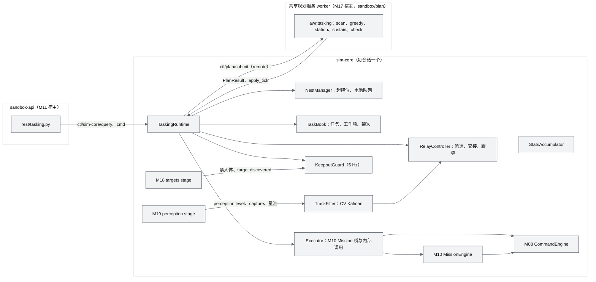
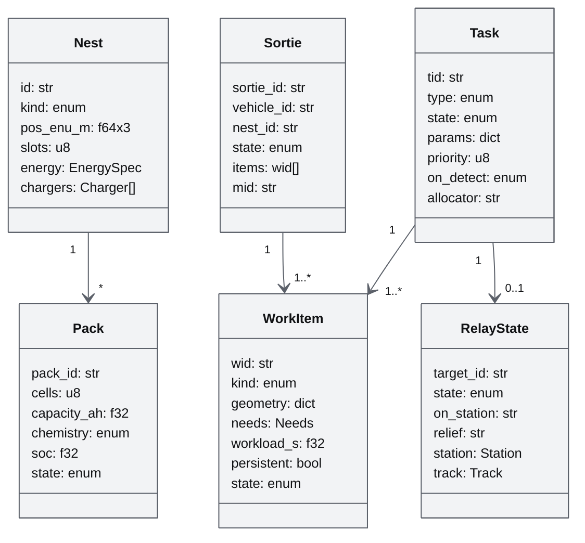
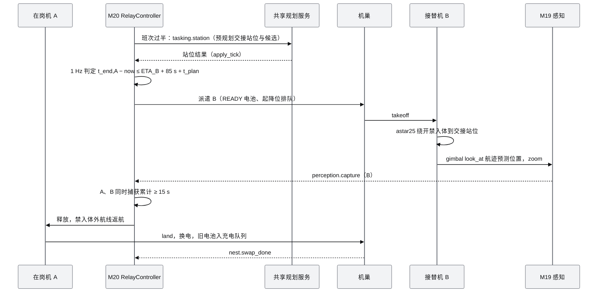
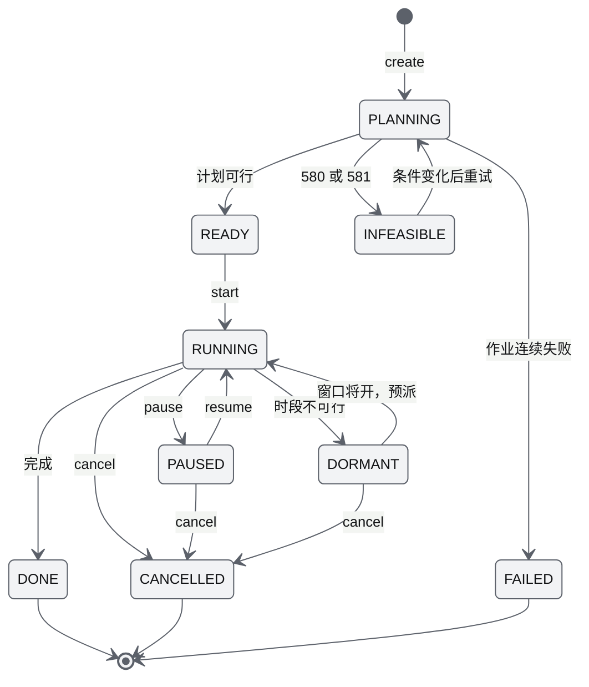
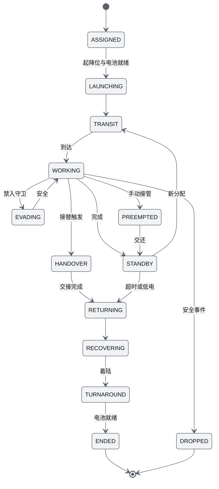
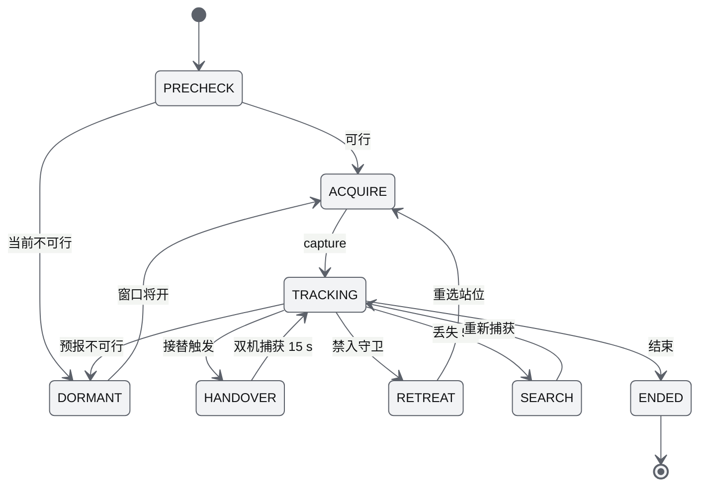
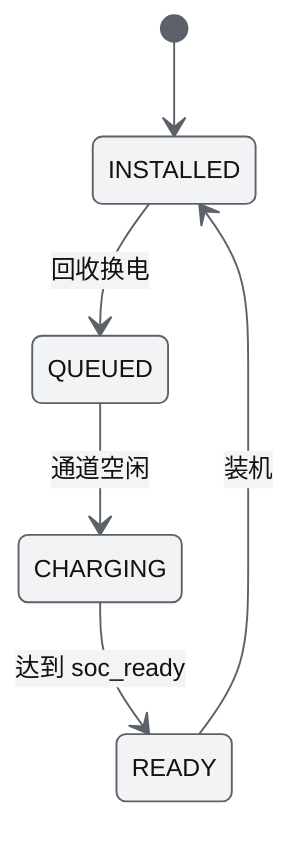
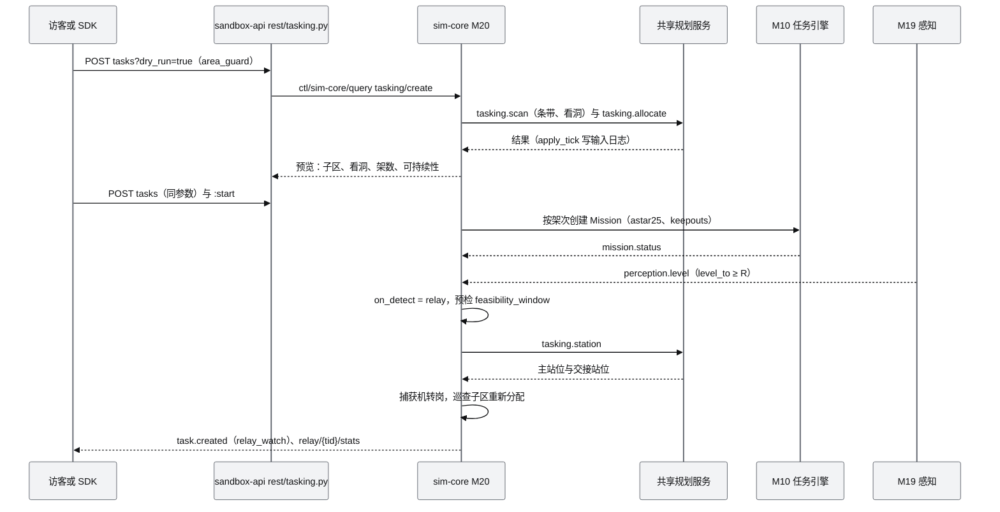

# M20 任务编排、机巢与接力监控 PRD（Tasking, Nests & Relay Watch）

| 项 | 内容 |
|---|---|
| 文档编号 | AWR-M20 |
| 标题 | 任务编排、机巢与接力监控 |
| 文件说明 | 起草时按 D2 文档分派存放为 `M18-机巢与任务编排PRD.md`，已按 [AWR-04](../04-D2-设计增补与决策记录.md) ADR-114 更名为本文件名；模块编号为 **M20**，需求前缀 `M20-`（§14 第 1 条已处置） |
| 版本 | v1.0 |
| 日期 | 2026-10-05 |
| 状态 | 草案 |
| 上游文档 | 用户 D2 需求原文 [inputs/D2-需求原文-2026-10-05.md](../inputs/D2-需求原文-2026-10-05.md)（应用场景一、二）；[AWR-04](../04-D2-设计增补与决策记录.md)（R-D2-03 至 06、16、17、19、21、26；§3.3、§4.4.3、§4.5、§4.9、§4.10、§5.2、§5.3、§6.2 至 §6.5、§7.2 至 §7.4、§8、§9、§10.4 至 §10.6、§11、§13、§14；ADR-090、094、096、099、100、103 至 106、110、112、113）；[AWR-03](../03-设计基线与决策记录.md)（ADR-016、017、027、036、039、045、049、052、054；§10.2、§10.4）；[M10](M10-任务规划与集群PRD.md)、[M09](M09-安全与健康PRD.md)、[M14](M14-智能体运行时与ANet-PRD.md)、[M08](M08-仿真内核与飞行器适配PRD.md)、[M04](M04-几何世界查询服务PRD.md)；研究 [r26](../research/r26-px4-swarm-controllers.md) §3.8、§3.9、§3.11，[n03](../research/n03-discover-uav-sim-agents.md) §3.9，[d05](../research/d05-anet.md) §3.4、§3.5，[r25](../research/r25-ego-fastplanner.md) §3.9，[g08](../research/g08-gap.md) §10.4，[x01](../research/x01-urbanscene3d-data.md) §3.8 |
| 下游文档 | M15（机巢面板、任务面板、接力统计）、M16（S7、沙盒模板 T1 至 T5、`relay_batch` 与容量 harness）、M17（REST 挂载、共享规划服务宿主、批处理端点）、M14（V1.0 `anet_cnp` 与 `llm_agent`）、[17](../17-接口与实时协议规范.md)（topic、命令、事件、原因码 580–599）、[18](../18-性能与测试方案.md) |
| 适用版本范围 | V0.2-demo（本期交付 D2）至 V1.0 |

## 0. 摘要

1. M20 把用户任务（定点巡航、多点巡线、多机区域巡查、按 GSD 完整扫描、巡边、接力监控六类，加组合任务"区域值守"）分解为**工作项**，用确定性贪心分配给多机巢、多机型，再交给 M10 任务引擎（航段类）或以内部调用直接驱动（站位类）执行；能量与安全兜底沿用 M09，不重复实现跟踪、能量积分与返航。
2. **机巢**：单起降位（起降共用间隔）、换电与充电两种能量模式、充电通道与电池队列；充电时间调用 AWR-20 §4.5 的 `charge_time_s`（恒流至 80% 加一阶衰减恒压，另计 300 s 降温），P600 0→95% 为 4178 s、AWR-V1 为 8832 s（2.45 h），稳态结论与 AWR-04 §8.2、§9.3 一致；稳态检查给出通道与电池下限。
3. **GSD 扫描**按 AWR-04 §8.3 反推焦距、航高与条带，补上"降焦后复核 H_floor"；可见格覆盖校验用 numba 核（1 km² ≤ 2 s）；**架数**取"每架只飞一个架次且完工 ≤ T_max"的最小 n，条带组按段内切点均衡切分，配对用瓶颈指派复核。
4. **贪心编排**：工作项排序、候选过滤（能力、能量、链路、风、硬约束）、代价最小、无候选时二分或排入下一架次、复算完工时间；同一快照逐字节一致；`Allocator` 协议预留 `external`（D2 交付）、`anet_cnp` 与 `llm_agent`（V1.0）。
5. **7×24 接力**：可行窗口预检 → 站位选择作业 → 按能量与昼夜预报提前派遣（新增快进下的规划时延项 `t_plan` 与提前预规划）→ 双机同时明确捕获 ≥ 15 s 才交接 → 原机沿禁入体外路线返航换电；运动目标扇形按整圆、5 Hz 禁入守卫、1 Hz 跟随，"宁可间隙不被发现"。
6. **情报与感知分离**：规划与守卫使用已布设识别物的敏感体（禁入体），观测、跟随与统计只用感知航迹；巡查对禁入"洞"插入看洞航段，做到不进入也能发现。
7. 统计在仿真时域累计、与倍速无关；批处理用 inline 规划与固定仿真时延保证逐字节一致；验收 33 条（P0 30 条）覆盖 D2-AC-16 至 20、34、35 与 ×5、×10 快进下的接力统计。对基线反馈 13 条（§14）。

---

## 1. 背景与目标

### 1.1 背景

用户 D2 应用场景一要求："用户划定区域后，不同地方的无人机机巢内的不同种类的无人机自行决定……完成巡航、巡边任务编排……巡航任务发现待识别物后实现 7×24h 不进入敏感范围的接力巡航监控"，并规定"默认使用贪心算法、不引入 LLM……后续提供模型和 LLM、agent 接入"。D1 的 M10 已交付任务引擎（Mission/Track 状态机、能量预检、挂起续飞）、7 种生成器、`safe_transit` 与 2.5D A*、覆盖切分与 Hungarian、plan-pool；M09 已交付电量模型、能量 RTL 与 `EnergyModel`；M14 已交付合同网与受信守卫。D1 缺少的是：机巢与电池周转、多机型多机巢的自动分配、"架数由需求反推"、持续性任务的返航与接替、以及以感知为闭环的长时接力。AWR-04 §8、§9 与 ADR-103 至 106 给出了口径与参数，本文把它们落成可直接实现的模块设计，并修补实现中会遇到的缺口（§14）。

### 1.2 目标

| 编号 | 目标 | 可度量表述 | 首次达成 |
|---|---|---|---|
| G-M20-1 | 应用场景一一键可用 | 在 UI 中画区域、放识别物、两个机巢两种机型，创建 `area_guard` 后自动巡航与巡边，发现后自动转接力；24 h 批处理被发现 0（D2-AC-35） | V0.2-demo |
| G-M20-2 | 不进入敏感范围 | 全部由 M20 驱动的机体：被发现 0、进入配置体 0，航段全部在禁入体外（D2-AC-16、19、20、35） | V0.2-demo |
| G-M20-3 | 7×24 可持续且可验证 | 接力 24 h 与 7×24 h 批处理零间隙（豁免类在阈值内）；dry-run 的"可持续 7×24"结论与批处理一致（D2-AC-19、20） | V0.2-demo |
| G-M20-4 | 多机必要性由几何与时间决定 | GSD 扫描自动得出 n，n − 1 不可行有书面理由；"单机远距视锥覆盖"以 580 拒绝（D2-AC-17） | V0.2-demo |
| G-M20-5 | 确定与可复现 | 同一快照两次分配结果逐字节一致；批处理 1 h 两次 `relay_stats` 与事件序列逐字节一致（D2-AC-18、32） | V0.2-demo |
| G-M20-6 | 不拖累沙盒 | sim-core 内 M20 stage 合计 ≤ 0.002 核（sandbox100、12 架、30 识别物、6 个任务）；作业在 AWR-04 §11.5 预算内（扫描 2 s、站位 0.5 s、分配 0.2 s） | V0.2-demo |

### 1.3 对 D1 与基线的继承、修正与增强

| 来源 | 继承 | 修正 | 增强 | 依据 |
|---|---|---|---|---|
| M10 任务引擎与生成器 | 航段类工作项以 M10 Mission（单机 Track）执行：起飞、入场转场、`follow_path`、on_done、挂起续飞、能量预检 | 增加 `origin = tasking` 与 `MissionConstraints.keepouts`（变更请求，§7.4） | 架次与工作项的映射、接替时的剩余航段续接 | M10 §6.3.1、§6.4、§7.4.4 |
| M10 覆盖与分配库 | `lanes_for_angle`、`best_sweep_angle`、`clip_lanes`、`bcd_cells`、`split_balanced(exact=True)`、`assign_chunks`、`hungarian` | 条带宽由 GSD 反推而非重叠率；makespan 关键任务用瓶颈指派复核 | 补洞航点、可见格覆盖校验 | r26 §3.8、§3.9；M10 §6.5.12 |
| M10 plan-pool | 作业协议 `PlanRequest/PlanResult`、apply_tick、结果哈希写输入日志 | 沙盒走 M17 共享规划服务（remote 模式，ADR-113） | 四类 M20 作业经 `register_plan_kind` 注册 | ADR-039、ADR-049、ADR-113 |
| M09 能量与安全 | `EnergyModel.estimate/path_wh/rtl_route`、能量 RTL 作兜底、FleetGuard 让行 | 返航不用 `rtl` 命令（其路线不避禁入体），改由 M20 规划禁入体外航线 | 换电接口 `swap_pack`（变更请求） | M09-FR-050 至 053；ADR-054 |
| M14 合同网 | 报价经 `ctl/sim-core/estimate`、受信守卫、AGENT 租约 | — | V1.0 作为 `anet_cnp` Allocator 接入同一可行性检查器 | ADR-036、ADR-027；M14 §6.10 |
| AWR-04 §8、§9 | 任务类型、机巢、GSD 反推、贪心代价、可行窗口、交接判据、统计口径 | f* > f_max 分支补 H_floor 复核；派遣阈值加 `t_plan`；交接与间隙的计时口径落到 M19 状态 | 情报与感知分离、看洞航段、组合值守周期、充电时间模型 | §14 |

### 1.4 设计原则

1. **编排只决定"谁、何时、去哪、做什么"**：运动由 M10 跟踪器与 M08 命令执行，电量与安全由 M09 判定；M20 不写 FleetState 的控制字段。
2. **情报与感知分离**：禁入体来自已布设识别物的敏感体配置（M18，场景内"已知情报"），用于全部路径规划与禁入守卫；识别物的位置估计、云台指向、站位跟随、捕获与间隙统计只读 M19 的感知输出，不读识别物真值（AWR-04 §9.1）。
3. **不进入敏感范围优先**：任何任务目标（覆盖率、捕获连续性）与禁入冲突时让位于禁入（AWR-04 §9.4）。
4. **重计算不进主循环**：扫描反推与覆盖校验、分配、站位选择、可持续性评估一律作为规划作业；sim-core 内只做有界、向量化的廉价计算（ADR-113）。
5. **确定性**：排序键与并列规则固定、作业结果按 apply_tick 生效并写输入日志、批处理用 inline 作业与固定仿真时延（§6.13）。
6. **单一检查器**：贪心、外部程序与 V1.0 的 agent 计划，都经同一 `FeasibilityChecker` 与 ADR-016 准入（ADR-104）。
7. **时钟域**：编排计时器、预报、交接、统计累计为仿真时间；作业预算与状态发布节流为墙钟（ADR-045）。

---

## 2. 范围

### 2.1 D2 交付（P0）

机巢实体、起降位与电池队列、充电时间模型、稳态检查；七类任务的参数、分解与执行；禁入体构造与 5 Hz 禁入守卫；GSD 扫描反推、可见格覆盖校验与补洞、自动架数；默认贪心分配与 `Allocator` 协议、`external` 实现、`FeasibilityChecker`；返航与接替、手动接管的重分配；接力监控（预检、站位选择、提前派遣、昼夜预报、交接、跟随、撤离、搜索、休眠）；可持续性评估；接力统计与 S7 日切；批处理下的确定性作业；REST、topic、事件、命令与契约 `tasking/*.schema.json`；`stores/tasking.ts` 与 `viewport/layers/tasking.tsx`。

### 2.2 D2 交付（P1）

接力覆盖率曲线与机巢电池甘特数据（UI 由 M15 实现，AWR-04 §3.1）；固定翼接力的双机 180° 相位盘旋；跨机巢中转（返航到最近可用机巢而非出发机巢）；捕获丢失后的搜索航线优化（不确定区按航迹协方差）。

### 2.3 桩

`Allocator` 的 `anet_cnp` 与 `llm_agent`：D2 只冻结协议、快照与计划契约，并提供 `NotImplementedAllocator` 返回 `584 PLAN_REJECTED{why: allocator_unavailable}`；`StationScorer` 与 `ReliefPolicy` 的可替换注册点（缺省实现即本文公式）。

### 2.4 后续版本

V0.3：`perceived` 情报模式（未被感知的识别物不进入禁入体，巡查改为前视安全搜索）；V0.6：SSI 拍卖与带电量约束的覆盖路由（n03 §3.9、AWR-03 §8.1）；V1.0：`anet_cnp`、`llm_agent`、CBBA 断网分配。

### 2.5 不做

CBBA 与 VRP（AWR-04 §3.1 列为不在 D2）；真实图像识别；RF 侦测；多 operator 协同编辑同一任务。

### 2.6 职责边界

| 事项 | M20 | 相邻模块 |
|---|---|---|
| 轨迹生成、跟踪、挂起续飞 | 生成 MissionSpec 并监听结果 | M10 实现 |
| 转场路径 | 提交带禁入体的 `astar25` 作业或复用 M10 Mission 的入场转场 | M10 规划器、M04 Grid25 |
| 电量积分、能量 RTL、FastGuard、FleetGuard | 订阅事件、做预测性接替 | M09 判定与执行 |
| 敏感体定义、"被发现"判定 | 读取禁入体、统计我方触发次数 | M18 |
| 检测、识别、确认、明确捕获、可行窗口与可行观测 | 调用纯函数、订阅事件 | M19 |
| 机型参数、固定翼盘旋半径与功率、机队实例 | 只读 | M21、M08 |
| 会话、配额、共享规划服务进程、批处理端点 | 注册作业、提供领域路由 | M17、M11 |
| 面板、图标、提示 | 提供 store 与图层数据 | M15、M06 |

---

## 3. 用户与用例

### 3.1 调用方

| 调用方 | principal | 能力 |
|---|---|---|
| 沙盒访客（operator 界面） | 会话 principal | 机巢与任务增删改、dry-run、启停、手动接管 |
| API 客户端（SDK） | 会话 principal | 同上，另可取快照、提交外部计划 |
| 共享展示剧本 S7 | `scenario:s7` | 由剧本创建机巢与 `area_guard`，viewer 只读 |
| M20 自身执行 | `tasking:<tid>`（owner MISSION） | 内部调用，经 ADR-016 准入 ④ 至 ⑩ |
| V1.0 agent | `agent:<aid>`（经受信守卫） | 提交提示或计划，不直接下发命令 |

### 3.2 用例

| 编号 | 用例 | 主流程 | 需求 |
|---|---|---|---|
| UC-01 | 区域值守（应用场景一） | 画多边形 → 选目标类别与等级 → dry-run 看到巡航与巡边分配、架数、可持续性 → 启动 → 巡查看到识别物 → 自动转接力 → 7×24 运行 | FR-014、018、050 至 062 |
| UC-02 | 定点巡航 | 点选位置与高度、驻留时长、云台指向 → 多旋翼悬停或固定翼盘旋 | FR-011 |
| UC-03 | 多点巡线 | 画折线、选单次、往返或循环 → 超长自动分段多机 | FR-012 |
| UC-04 | 多机区域巡查 | 画区域、选目标类别与重访周期 → 自动架数与子区、每格最近访问时刻 | FR-013 |
| UC-05 | 按 GSD 完整扫描 | 画区域、输入 GSD → dry-run 给出 n、完工曲线、"为何不能一架飞高扫完" → 执行到可见格 100% | FR-020 至 025 |
| UC-06 | 巡边 | 选多边形与偏移、重访周期 → 等相位多机 | FR-015 |
| UC-07 | 接力监控 | 自动（`on_detect = relay`）或在识别物详情中手动发起；预检不可行时给出原因与换型建议 | FR-050 至 062 |
| UC-08 | 外部分配器 | SDK 取快照 → 自己算 → 提交计划 → 逐项校验结果 | FR-082、083 |
| UC-09 | 手动接管 | 访客接管执行中的机体 → 其工作项被重新分配 → 释放后回可用池 | FR-046 |
| UC-10 | 7×24 验证 | 本机经批处理跑 24 h、7×24 h，得到 `relay_stats.json`；与 dry-run 结论对照 | FR-072、073 |

### 3.3 本模块术语

| 术语 | 定义 |
|---|---|
| 工作项（work item） | 分配的最小单位：一个站位、一组条带、一个子区、一段巡线、一个巡边相位、一个接力站位或一个看洞航段 |
| 架次（sortie） | 一架机从起飞到回收的一次飞行，承载一个或多个工作项 |
| 在岗机、接替机 | 接力中当前对目标保持明确捕获的机体、被派去接班的机体 |
| 禁入体 | 识别物敏感体按 §6.4 外扩后的规划禁区 |
| 看洞航段 | 巡查条带被禁入体截断形成"洞"时，在洞边界外对洞内做斜视观察的短时站位 |
| `t_on` | 一块满电在岗可用时长：`0.8·t_endur − 2·t_tr`（AWR-04 §9.3） |
| `N_air` | 维持一个连续在岗位所需的机体数 `ceil((t_on + 2·t_tr + t_turn)/t_on)` |
| `t_plan` | 从提交站位或分配作业到结果生效的仿真时长估计（快进时随倍速放大，§6.13） |
| 照度档 | 日间、低照、夜间（AWR-04 §6.5） |

---

## 4. 功能需求

"D2"列取值"是、桩、否"（AWR-04 §1.2）。

| 编号 | 需求描述 | 优先级 | 目标版本 | D2 | 验收要点 | 依据 |
|---|---|---|---|---|---|---|
| **机巢** | | | | | | |
| M20-FR-001 | 机巢实体按 §6.2.1 字段建模：位置贴 DSM、`kind ∈ {box, launcher, vtol_pad}`、`crewed`、槽位、能量模式、备用电池、充电器、检查与换电时长、起降间隔、风限、RTK 基站、链路距离；`box` 只收多旋翼，`launcher` 只收固定翼，`vtol_pad` 收 VTOL 与多旋翼；不兼容返回 `525 NEST_INCOMPATIBLE`；每会话 ≤ 4 个，超限 `505` | P0 | V0.2-demo | 是 | M20-AC-001 | AWR-04 §8.2、§4.4.3 |
| M20-FR-002 | 创建时的 `inventory[{model_id, count}]` 经 M08 `fleet/add` 生成绑定该机巢的机队实例（受单会话 12 架上限）；之后库存为机队实例的派生视图 | P0 | V0.2-demo | 是 | M20-AC-001 | AWR-04 §5.4 第 3 条 |
| M20-FR-003 | 单起降位：起飞与降落共用一个起降位，相邻事件间隔 ≥ `launch_interval_s`；回收优先于起飞；风速超过 `wind_max_mps` 时暂停起降，派遣延误记原因 `wind` | P0 | V0.2-demo | 是 | M20-AC-001 | AWR-04 §8.2 |
| M20-FR-004 | 换电模式：回收后经 `turnaround_s` 检查、`swap_s` 换电，装入 SOC 最高的 READY 电池（`soc ≥ soc_ready`），旧电池进入充电队列；无 READY 电池时机体在巢等待，派遣延误记原因 `battery`；充电模式下机体在槽位内给自身电池充电 | P0 | V0.2-demo | 是 | M20-AC-001 | AWR-04 §8.2 |
| M20-FR-005 | 充电时间模型：调用 AWR-20 §4.5 的 `charge_time_s(Q_ah, c_max, i_max_a, s0, s1)`（电流 `min(i_max_a, c_max·Q)`，恒流至 0.8，恒压段一阶衰减，另计 300 s 降温；AWR-04 附录 B 第 20 行裁决，替代本文起草时按化学体系取 `k_cv` 的写法）；节数超过 `cells_max` 的电池不可充 | P0 | V0.2-demo | 是 | M20-AC-001：P600 0→95% 4178 s ± 1%，AWR-V1 8832 s ± 1% | AWR-04 §5.1、§8.2、§9.3；AWR-20 §4.5 |
| M20-FR-006 | 机巢状态 1 Hz 发布 `nest/{id}/status`（槽位、机体、电池、通道进度、起降队列、风限）；事件 `nest.launch`、`nest.recover`、`nest.swap_done` | P0 | V0.2-demo | 是 | M20-AC-001 | AWR-04 §11.2 |
| M20-FR-007 | 稳态检查：对连续在岗位按 §6.3.4 计算 `N_air`、通道与电池下限，供 dry-run 与可持续性评估 | P0 | V0.2-demo | 是 | M20-AC-002 | AWR-04 §8.2、§9.3 |
| M20-FR-008 | `crewed = true` 的机巢（发射回收站）不参与持续性任务（接力、值守、持续巡查）的接替候选，只用于一次性任务 | P0 | V0.2-demo | 是 | M20-AC-002 | AWR-04 §5.2、§8.2 |
| **任务模型与分解** | | | | | | |
| M20-FR-010 | 任务公共字段与生命周期按 §6.2.2、§6.10.1；输入规模按 AWR-04 §11.5 在 sandbox-api 与 sim-core 双重校验，超限 `585`；每会话活动任务 ≤ 6，超限 `505` | P0 | V0.2-demo | 是 | M20-AC-003 | AWR-04 §8.1、§11.5 |
| M20-FR-011 | `point_watch`：1 个站位工作项；多旋翼到点悬停，固定翼与 VTOL 盘旋，半径 `max(r_loiter, R_loiter,min)`，小于下限以 `110` 拒绝并给出下限；驻留时长或"直到取消"；云台 look-at 点或航向；持续驻留按 §6.8 接替 | P0 | V0.2-demo | 是 | M20-AC-004 | AWR-04 §8.1、§5.3 |
| M20-FR-012 | `polyline_patrol`：航点 2–64 个，`once`、`pingpong`、`loop`；长度超过单架次可飞长度时按航段切分；航段穿越禁入体时缺省自动绕行（`auto_detour = true`），航点本身在禁入体内以 `583` 拒绝并列出序号 | P0 | V0.2-demo | 是 | M20-AC-005 | AWR-04 §8.1 |
| M20-FR-013 | `area_patrol`：由目标类别与等级反推所需 GSD（俯视关键维度 ÷ 所需像素），据此得条带；单机遍历时间 ÷ 重访周期得在岗数 n，均衡切分为 n 个子区；被禁入体截断处插入看洞航段（§6.5.2）；维护 10 m 格的最近访问时刻 | P0 | V0.2-demo | 是 | M20-AC-006 | AWR-04 §8.1、§6.2 |
| M20-FR-014 | `area_guard`：自动生成巡查与巡边；单机能在重访周期内完成"巡边一圈 + 区域一遍"时合并为值守周期工作项，否则拆成 `area_patrol` 与 `perimeter_patrol`；`on_detect` 缺省 `relay`；作为每个世界的缺省模板 T5 | P0 | V0.2-demo | 是 | M20-AC-028 | AWR-04 §8.1、ADR-112 |
| M20-FR-015 | `perimeter_patrol`：多边形按 `offset_m` 偏移，`n = ceil(L/(v·T_rev))` 架等相位同向；禁入体处绕行并插入看洞航段 | P0 | V0.2-demo | 是 | M20-AC-007 | AWR-04 §8.1 |
| M20-FR-016 | 禁入体按 §6.4 构造：geometric 用配置体，physical 用 M18 给出的保守有效体（按机型）；外扩 `m = 20 m + 3σ_hold`；运动识别物的扇形按整圆，再按 `v_nom·τ_route` 外扩；所有航段、站位与返航路线均在禁入体外 | P0 | V0.2-demo | 是 | M20-AC-008 | AWR-04 §8.1、§7.3、§9.4 |
| M20-FR-017 | 公共参数 `on_detect ∈ {notify, relay, ignore}`：`relay` 时首个达到所需等级（`perception.level` 的 `level_to ≥ level_req`）的检测生成 `relay_watch`；同一识别物已有活动接力时不重复生成 | P0 | V0.2-demo | 是 | M20-AC-028 | AWR-04 §8.1、§9.1 |
| M20-FR-018 | 任务暂停：执行机在当前位置外侧（禁入体外）悬停或盘旋待命；恢复后续接剩余工作；取消：全部执行机返航入巢 | P0 | V0.2-demo | 是 | M20-AC-005 | AWR-04 §11.1 |
| **GSD 扫描** | | | | | | |
| M20-FR-020 | 按 §6.6 反推：障碍格剔除并外扩 10 m 为禁入体、`H_floor` 取障碍外 P99 + 净空、`f* = H*·p'/g`；f* 越界降航高后**复核 `H* ≥ H_floor`**，不满足以 `580{why: height}` 拒绝 | P0 | V0.2-demo | 是 | M20-AC-009、010 | AWR-04 §8.3；§14 第 2 条 |
| M20-FR-021 | 条带宽 `w = min(W_out·g, 2·H*·tan θ_max)`，间距 `(1 − s)·w`；速度 `v ≤ min(巡航, 0.5·g/t_exp)`；扫描角取 M10 `best_sweep_angle`；条带被障碍或禁入体截断时按 BCD 分胞排序 | P0 | V0.2-demo | 是 | M20-AC-009 | AWR-04 §8.3；r26 §3.8 |
| M20-FR-022 | 可见格覆盖校验：2 m 格，"存在一帧使该格在视锥内、视线可见、离轴 ≤ θ_max 且 GSD ≤ g"；不可见格（障碍、禁入体正下方或正上方不可飞）单列、不计入分母；输出条带直接覆盖率 | P0 | V0.2-demo | 是 | M20-AC-009、011 | AWR-04 §8.3 |
| M20-FR-023 | 补洞：未覆盖可见格 8 邻接聚类，按贪心集合覆盖选补拍视点（天底或 θ_max 内偏置），插入最近条带航线；补洞后可见格覆盖 100% | P0 | V0.2-demo | 是 | M20-AC-009 | AWR-04 §8.3 |
| M20-FR-024 | 架数：`T_max` 缺省 `min(600 s, 0.8·t_sortie − 2·t_transit)`；取满足"每架一个架次且 makespan ≤ T_max"的最小 n；可用同类机不足时 `580{why: fleet_short, n_required, shortfall}`；`allow_multi_sortie = true` 才以换电架次补足；用户指定 n 但不满足时 `580{why: t_max}` | P0 | V0.2-demo | 是 | M20-AC-009、013 | AWR-04 §8.3、ADR-103 |
| M20-FR-025 | `strategy = single_station`（或外部计划中以单站位覆盖整个 AOI）时，若 AOI 外接圆直径 > `2·H_cap·tan θ_max`，以 `580{why: single_station_far_view, footprint_max_m, aoi_diameter_m}` 拒绝 | P0 | V0.2-demo | 是 | M20-AC-009 | AWR-04 §8.3 |
| **分配** | | | | | | |
| M20-FR-030 | 默认贪心分配按 §6.7 伪代码：排序键、候选过滤、代价、并列按 `vehicle_id` 升序；结果确定 | P0 | V0.2-demo | 是 | M20-AC-012 | AWR-04 §8.4、ADR-104 |
| M20-FR-031 | 硬约束：同一扫描或巡查任务的不同条带组、子区分给不同机体；一架机不同时持有同任务的两个工作项（`allow_multi_sortie` 的后续架次除外）；`crewed` 机巢不承担持续性工作项 | P0 | V0.2-demo | 是 | M20-AC-012 | AWR-04 §8.4 |
| M20-FR-032 | 无候选时：可分割且工作量 > 2 倍最小粒度则二分后放回队首；`allow_multi_sortie` 且换电后可行则排入下一架次；否则记不可行并给出原因集合 | P0 | V0.2-demo | 是 | M20-AC-012 | AWR-04 §8.4 |
| M20-FR-033 | 区域类任务的子区或条带组与所用机体之间做配对复核：一次性任务（扫描）用瓶颈指派（最小化最大 ETA），持续性任务用 Hungarian（最小化 ETA 和） | P0 | V0.2-demo | 是 | M20-AC-013 | AWR-04 §8.4 第 3 步；§14 第 9 条 |
| M20-FR-034 | 复算各任务 makespan，超过 `T_max` 且有未用可行机时 n + 1 重新分解与分配（≤ 3 轮），否则 `580{why: fleet_short}` | P0 | V0.2-demo | 是 | M20-AC-013 | AWR-04 §8.4 第 4 步 |
| M20-FR-035 | ETA 估计用禁入体的解析绕行（圆形禁入体的切线与圆弧）；能量估计用 M09 同一功率模型的分段闭式；选定后由 M10 `astar25` 生成实际航线、由 M10 能量预检（`EnergyModel.path_wh`）终审，实际长度超出估计 20% 或预检失败时该工作项重新分配 | P0 | V0.2-demo | 是 | M20-AC-012 | M09-FR-053；M10 §6.5.17 |
| M20-FR-036 | 分配作业注册为 `tasking.allocate`，在共享规划服务中执行，预算 200 ms（墙钟），D2 规模（工作项 ≤ 50、机 ≤ 12）内 p95 ≤ 200 ms | P0 | V0.2-demo | 是 | M20-AC-012 | ADR-113；AWR-04 §11.5 |
| M20-FR-037 | 计划经 `FeasibilityChecker`（能力、能量、禁入体、zones、链路距离、抗风、硬约束、站位约束）与 ADR-016 准入后下发；任一项失败该工作项回到待分配并记原因 | P0 | V0.2-demo | 是 | M20-AC-014 | ADR-104 |
| **执行、返航与接替** | | | | | | |
| M20-FR-040 | 航段类工作项（条带组、子区、巡线、巡边、补拍）以 M10 Mission 执行：`origin = tasking`、`generator = follow_path`、`transit_planner = astar25`、`keepouts`、云台与 `camera.trigger` 动作 | P0 | V0.2-demo | 是 | M20-AC-005、009 | M10 §6.3.1 |
| M20-FR-041 | 站位类工作项（定点、接力、看洞、待命）以内部调用直接驱动：`goto(route = astar25, keepouts)`、`hover` 或 `loiter`、`gimbal look_at`、`zoom`，principal `tasking:<tid>`、owner MISSION | P0 | V0.2-demo | 是 | M20-AC-004、018 | AWR-04 §11.2 新命令 |
| M20-FR-042 | 返航一律由 M20 规划禁入体外航线到所属机巢上方，再 `land`；不使用 `rtl` 命令（其直飞或单绕行路线不避禁入体）；M09 能量 RTL 只作兜底，计数目标为 0 | P0 | V0.2-demo | 是 | M20-AC-015 | ADR-054；AWR-04 §9.3 |
| M20-FR-043 | 预测性接替：每 1 s 估计 `t_end = now + (E_avail − E_back − 0.2·E_use)/P_role`；`t_end − now ≤ ETA_relief + t_handover + t_margin + t_plan` 时把剩余部分作为新工作项分配；航段类在"预测接替点"续接，站位类按 §6.9.4 交接 | P0 | V0.2-demo | 是 | M20-AC-015 | AWR-04 §8.4 |
| M20-FR-044 | 禁入守卫（5 Hz）：对每架 M20 驱动的机体，按当前速度预测 5 s 内是否进入"禁入体 + `v_t·τ_pred`"；预测进入即执行撤离（§6.9.6），并对剩余航线重规划 | P0 | V0.2-demo | 是 | M20-AC-008、021 | AWR-04 §9.4 |
| M20-FR-045 | 航线复核：每 10 s 对执行中航线按识别物预测位置（60 s 内）做距离检查，预测违规即提交重规划作业 | P0 | V0.2-demo | 是 | M20-AC-008 | 本文设定 |
| M20-FR-046 | 手动接管与 AGENT 租约：租约被 OPERATOR 或 AGENT 抢占时 2 s【仿真】内把该机工作项重新分配，统计记 `manual`；释放后空中机体进入 STANDBY（悬停或盘旋待命，禁入体外），电量低于返航阈值时返航 | P0 | V0.2-demo | 是 | M20-AC-016 | AWR-04 §8.4、§10.6 |
| M20-FR-047 | M09 安全事件（ELAND、FAILSAFE、坠毁、失联、能量 RTL）使该架次 DROPPED，工作项立即重新分配，原因写入任务状态 | P0 | V0.2-demo | 是 | M20-AC-015 | M09 §6.13 |
| **接力监控** | | | | | | |
| M20-FR-050 | 触发：`on_detect = relay` 的检测或手动发起；生成前对当前照度档与未来 24 h 做可行窗口预检（M19 `feasibility_window`），全部不可行时不起飞、返回 `581` 与原因、换型建议；部分时段不可行时任务进入运行并在不可行时段休眠 | P0 | V0.2-demo | 是 | M20-AC-017 | AWR-04 §9.1、§9.2 |
| M20-FR-051 | 航迹：接力的站位预测、云台指向、跟随只用 M19 维护的识别物航迹（`track(target)`，M18-M19 PRD §6.12，只读）；本文起草时在 M20 内另建 CV Kalman 的写法按 AWR-04 附录 B 第 17 行作废，`TrackFilter` 只保留为 M19 航迹缺失时的单测替身 | P0 | V0.2-demo | 是 | M20-AC-021 | AWR-04 §9.1；§14 第 5 条 |
| M20-FR-052 | 站位选择作业 `tasking.station`：候选 ≤ 2400、三射线视线 ≤ 64 个，硬约束与评分按 AWR-04 §9.2；输出主站位与相邻交接站位（间距 15–30 m）；预算 0.5 s | P0 | V0.2-demo | 是 | M20-AC-018 | AWR-04 §9.2 |
| M20-FR-053 | 提前派遣：能量触发与可行性预报触发（每 60 s 预测未来 45 min）两条规则，阈值含 `t_plan`；每个班次过半时预规划下一交接站位与接替候选，派遣时不在关键路径上提交作业 | P0 | V0.2-demo | 是 | M20-AC-019、020、025 | AWR-04 §9.3；§14 第 4 条 |
| M20-FR-054 | 交接判据：接替机到达交接站位并产生 `perception.capture`，双机同时处于明确捕获累计 ≥ `t_overlap`（15 s）后在岗机才释放；释放后沿禁入体外航线返航 | P0 | V0.2-demo | 是 | M20-AC-019 | AWR-04 §9.3 |
| M20-FR-055 | 跟随：1 Hz 用航迹预测位置加相对偏移更新站位；偏移不可行或目标位移 > 20 m 时重选；跟随视线检查计入 M19 射线预算（每接力每秒 ≤ 3 条） | P0 | V0.2-demo | 是 | M20-AC-021 | AWR-04 §9.4、§6.3 |
| M20-FR-056 | 硬优先级撤离：识别物逼近使禁入守卫触发时先撤离，产生的间隙记 `keepout_priority` | P0 | V0.2-demo | 是 | M20-AC-021 | AWR-04 §9.4 |
| M20-FR-057 | 搜索：明确捕获丢失 > 5 s 进入搜索：以航迹预测位置为心的扩展方形（M10 `expanding_square`），裁去禁入体，云台指向不确定区；重新捕获后回到跟踪 | P1 | V0.2-demo | 是 | M20-AC-022 | AWR-04 §9.4 |
| M20-FR-058 | 休眠：预报或预检判定当前时段不可行时不派机、在岗机返航，任务处于 DORMANT，期间间隙记 `infeasible`；窗口重新可行前按 §6.9.3 预派 | P0 | V0.2-demo | 是 | M20-AC-023 | ADR-105 |
| M20-FR-059 | 固定翼接力站位为以目标为心的盘旋圆，`r ≥ max(d_lo, R_loiter,min)`，整圈满足视线与像素；不满足时 P1 用双机 180° 相位（每架可见弧段 ≥ 50%），否则判该机型不可行 | P0（双机 P1） | V0.2-demo | 是 | M20-AC-018 | AWR-04 §9.2 |
| M20-FR-060 | 捕获机转岗：触发接力的巡查机若可行且能量余量 ≥ 0.3，直接成为首个在岗机，其巡查工作项按接替规则重新分配 | P0 | V0.2-demo | 是 | M20-AC-029 | 本文设定（缩短首捕获时间，D2-AC-34） |
| M20-FR-061 | 多目标：每个识别物一个 `relay_watch`；接力缺省优先级 8，高于巡查（5），但不打断执行中的他任务工作项，只争夺待命与在巢机体 | P0 | V0.2-demo | 是 | M20-AC-023 | 本文设定 |
| M20-FR-062 | 接力统计按 AWR-04 §9.5 字段 1 Hz 发布 `relay/{tid}/stats`，结束或批处理完成写 `relay_stats.json`；间隙原因按 §6.9.7 的优先序归类 | P0 | V0.2-demo | 是 | M20-AC-023、026 | AWR-04 §9.5 |
| **可持续性** | | | | | | |
| M20-FR-065 | `GET .../tasks/{tid}/sustainability` 与 dry-run 返回 §6.10 的评估：逐小时（缺省 168 h）可行窗口与视线、`N_air`、通道、电池、链路、风；结论"是 / 否"与瓶颈码 | P0 | V0.2-demo | 是 | M20-AC-002、033 | AWR-04 §9.6 |
| M20-FR-066 | `area_guard` 的可持续性对巡查、巡边与全部接力的在岗位合计评估 | P0 | V0.2-demo | 是 | M20-AC-031 | 本文设定 |
| M20-FR-067 | 不可行时给出换型建议（机型、挂载、加通道或电池数），按"新增资源最少"排序 | P1 | V0.2-demo | 是 | M20-AC-017 | AWR-04 §9.1 |
| **统计、快进与批处理** | | | | | | |
| M20-FR-070 | 统计按感知周期（5 Hz【仿真】）累计，全部积分量以仿真时间计，与倍速、治理器降速无关；发布按墙钟 1 Hz 节流 | P0 | V0.2-demo | 是 | M20-AC-026 | ADR-045 |
| M20-FR-071 | 实时快进下以 `t_plan = max(2 s, r_granted·L95)` 计入派遣与接替阈值，`L95` 为本会话站位加分配作业墙钟时延的 p95（指数平均，初值 0.7 s）；统计 `t_plan_slack_min_s` | P0 | V0.2-demo | 是 | M20-AC-025 | §14 第 4 条 |
| M20-FR-072 | 批处理模式（`--batch`）下作业以 inline 方式执行，结果在 `request_tick + L_sim(kind)` 生效（分配 1 s、站位 2 s、扫描 5 s、航线 1 s、评估 5 s【仿真】），保证逐字节确定且时延口径不优于实时 | P0 | V0.2-demo | 是 | M20-AC-027 | ADR-106；§14 第 12 条 |
| M20-FR-073 | 支持 24 h 与 7×24 h 批处理的接力用例与"不可行声明"用例，输出与事件流可对拍 | P0 | V0.2-demo | 是 | M20-AC-023、024 | AWR-04 §4.10、D2-AC-19、20 |
| M20-FR-074 | 共享展示 S7：每仿真日 04:00 软重置时把当日统计归档到 `relay_stats` 日表，清理交接记录与间隙明细，任务、站位与机巢状态不变 | P0 | V0.2-demo | 是 | M20-AC-031 | ADR-094 |
| M20-FR-075 | M20 状态进入 sim-core checkpoint 扩展段（5 s tmpfs），崩溃恢复后接力继续，恢复期间的间隙记 `other`（`crash`） | P1 | V0.2-demo | 是 | M20-AC-032 | AWR-04 §4.6 |
| **接口与预留** | | | | | | |
| M20-FR-080 | REST 与 WS 按 §7.1、§7.2；资源路由在 `rest/tasking.py`，由 sandbox-api 挂载；写操作即命令，走 ADR-016 准入 | P0 | V0.2-demo | 是 | M20-AC-003 | AWR-04 §11.1、§11.2 |
| M20-FR-081 | 契约 `packages/contracts/tasking/{task,nest,snapshot,plan,relay_stats,sustainability}.schema.json` 由本模块起草、M00 合入 | P0 | V0.2-demo | 是 | M20-AC-003 | AWR-04 §11.6 |
| M20-FR-082 | `Allocator` 协议、注册表与 `external` 实现：快照带单调 `seq`，计划须引用 `snapshot_seq`；快照过期（机体状态已变化）返回 `584{why: stale}`；外部计划 30 s【仿真】未到时按 `external_fallback`（缺省 `greedy`）处理 | P0 | V0.2-demo | 是 | M20-AC-014 | AWR-04 §8.5 |
| M20-FR-083 | 预留接入点：`anet_cnp`、`llm_agent` Allocator，`StationScorer`、`ReliefPolicy`、任务分解器注册表；D2 交付缺省实现与桩 | P0（接口） | V1.0 | 桩 | M20-AC-014 | ADR-104；M14 §6.14.3 |
| M20-FR-084 | dry-run 结果可在 60 s【墙钟】内以 `preview_id` 取回，超过 2.5 s 未完成时返回 202 | P0 | V0.2-demo | 是 | M20-AC-003 | M10 R26、R65 |

---

## 5. 非功能需求

| 编号 | 需求描述 | 优先级 | 目标版本 | D2 | 验收要点 | 依据 |
|---|---|---|---|---|---|---|
| M20-NFR-001 | sim-core 内 M20 stage 合计 ≤ 0.002 核、单 tick p99 ≤ 0.5 ms（sandbox100，12 架、30 识别物、6 个任务、2 个接力） | P0 | V0.2-demo | 是 | M20-AC-030 | AWR-04 §4.4.1（识别物与编排合计 0.005 核） |
| M20-NFR-002 | 作业墙钟 p95：`tasking.scan` ≤ 2 s（1 km²、250 000 格）、`tasking.allocate` ≤ 200 ms、`tasking.station` ≤ 0.5 s、`tasking.sustain` ≤ 1 s（168 h） | P0 | V0.2-demo | 是 | M20-AC-011、012、018 | AWR-04 §11.5 |
| M20-NFR-003 | 每会话 M20 状态 ≤ 8 MB（访问栅格、任务、统计）；作业 worker 峰值增量 ≤ 40 MB | P0 | V0.2-demo | 是 | M20-AC-030 | AWR-04 §4.4.2 |
| M20-NFR-004 | 同一快照、种子与版本下：分配计划、站位结果、扫描结果的 `result_sha256` 一致；批处理 `relay_stats.json` 与事件序列逐字节一致 | P0（批处理 P1） | V0.2-demo | 是 | M20-AC-012、027 | ADR-049、ADR-106 |
| M20-NFR-005 | `awr.tasking` 为纯算法包：不 import `awr.sim.runtime`、`awr.api`；只依赖 numpy、numba、`awr.swarm`、`awr.world.geometry` 只读接口与 M19 纯函数 | P0 | V0.2-demo | 是 | `make lint` 的 import 规则 | AWR-03 §6.2 |
| M20-NFR-006 | 全部用户可见文本走 i18n 键（`tasking.*`），原因码带 `remedy`；任务与机巢名称经运行时净化 | P0 | V0.2-demo | 是 | D2-AC-25 | AWR-03 §10.2 |
| M20-NFR-007 | 输入规模与频率配额（AWR-04 §11.5）在 sim-core 准入再校验一次，作业超时按 `125`、频繁超时由 M17 冻结（`586`），任务停在 PLANNING 并在解冻后自动重试 | P0 | V0.2-demo | 是 | M20-AC-003 | ADR-113 |

---

## 6. 设计方案

### 6.1 组件与进程落点



1. **sim-core 插件** `awr/sim/tasking`：按 M08 登记表注册两个 stage、查询与命令处理器（§6.15、§7.3）；所有状态在本进程内，随 checkpoint 保存。
2. **纯算法包** `awr/tasking`：在共享规划服务 worker 中执行四类作业，也可在批处理 inline 模式下于 sim-core 内同步执行；单测不依赖 sim-core。
3. **共享展示**（S7，d1_250 时钟）使用同一插件；作业走共享展示自己的规划进程（ADR-113 不改变共享展示）。

### 6.2 数据模型



#### 6.2.1 机巢 `tasking/nest.schema.json`

| 字段 | 类型 | 单位 | 缺省 | 范围 | 说明 |
|---|---|---|---|---|---|
| `id` | str | — | `n-<6hex>` | 会话内唯一 | — |
| `name` | str | — | — | ≤ 32 字 | 运行时净化 |
| `pos_enu_m` | f64[3] | m（world ENU） | z 省略时取 `height_dsm` | 世界边界内、不在 zones 禁飞区与任何禁入体内 | 地面或屋顶 |
| `kind` | enum | — | `box` | `box`、`launcher`、`vtol_pad` | 兼容规则见 FR-001 |
| `crewed` | bool | — | `launcher` 为 true，其余 false | — | true 不参与持续性任务 |
| `slots` | u8 | 架 | box 4、vtol_pad 4、launcher 6 | 1–12 | 本文设定 |
| `inventory` | `[{model_id, count}]` | 架 | [] | Σcount ≤ slots | 只在创建时使用（FR-002） |
| `energy.mode` | enum | — | `swap` | `swap`、`charge` | — |
| `energy.swap_s` | f32 | s | 180 | 30–900 | AWR-04 §8.2 |
| `energy.packs` | `[{cells, capacity_ah, chemistry, count}]` | 块 | 每架装机 1 块，另加 `spare` 由用户给出 | 总数 ≤ 64 | 备用电池；`chemistry ∈ {lipo_hv, lipo, li_ion}` 缺省取机型 |
| `chargers` | `[{model, count, channels, i_max_a, cells_max}]` | — | box：`[{c1_xr, 4, 1, 10, 6}]`；vtol_pad：`[{ref_12s, 2, 1, 10, 12}]` | 通道合计 ≤ 16 | C1-XR 参数取自用户规格 |
| `turnaround_s` | f32 | s | 60（launcher 600） | 0–3600 | 落地检查 |
| `launch_interval_s` | f32 | s | 30 | 5–600 | 起降位事件间隔 |
| `wind_max_mps` | f32 | m/s | 12 | 0–25 | 起降风限 |
| `rtk_base` | bool | — | true | — | 有基站时机体 `σ_hold` 取 RTK 档 |
| `link_range_m` | f32 \| null | m | null（取机型 `link.range_m`） | ≤ 50 000 | 站位与航线到机巢的最大水平距离 |

#### 6.2.2 任务 `tasking/task.schema.json`

公共字段：

| 字段 | 类型 | 单位 | 缺省 | 范围 | 说明 |
|---|---|---|---|---|---|
| `type` | enum | — | 必填 | 七类之一 | — |
| `name` | str | — | 类型名 + 序号 | ≤ 32 字 | — |
| `priority` | u8 | — | 5（`relay_watch` 8） | 0–9 | 排序第一键 |
| `start_at_s` | f64 \| null | s【仿真】 | null（立即） | ≥ now | — |
| `duration_s` | f64 \| null | s【仿真】 | 类型缺省；null 表示直到取消 | ≤ 7×86400 | — |
| `allowed_nests`、`allowed_models` | str[] | — | 全部 | — | 候选过滤 |
| `allocator` | str | — | `greedy` | `greedy`、`external` | V1.0 增加 `anet_cnp`、`llm_agent` |
| `external_fallback` | enum | — | `greedy` | `greedy`、`none` | FR-082 |
| `on_detect` | enum | — | `notify`（`area_guard` 为 `relay`） | `notify`、`relay`、`ignore` | — |
| `alt_agl_m` | f32 | m | 类型缺省 | 30–120 | 相对 DTM；不得高于 `H_cap` |
| `speed_mps` | f32 \| null | m/s | 机型巡航 | ≤ 机型最大 | — |
| `level_req` | enum | — | `R` | `D`、`R`、`I` | 识别物另有 `level_req` 时取二者较高者 |

类型参数（单位与缺省；范围按 AWR-04 §11.5）：

| 类型 | 参数（缺省） |
|---|---|
| `point_watch` | `point_enu_m`；`alt_agl_m` 60；`dwell_s` 600（null 为直到取消）；`look_at_enu_m` 或 `heading_deg`；`loiter_radius_m` 80 |
| `polyline_patrol` | `waypoints_enu_m`（2–64）；`mode` loop；`laps` 或 `duration_s`；`sensor_dir ∈ {forward, down, side}` forward；`auto_detour` true |
| `area_patrol` | `polygon_enu_m`（3–64 顶点，≤ 1 km²）；`target_class` person；`n_vehicles` auto；`revisit_s` 600；`theta_max_deg` 15；`side_overlap` 0.1 |
| `area_scan_gsd` | `polygon_enu_m`；`gsd_cm`；`side_overlap` 0.1；`front_overlap` 0.1；`theta_max_deg` 15；`t_max_s` null（缺省式）；`h_cap_m` 120；`clearance_m` 20；`allow_multi_sortie` false；`n_vehicles` auto；`strategy ∈ {strips, single_station}` strips |
| `perimeter_patrol` | `polygon_enu_m`；`offset_m` +20（外偏为正）；`direction` ccw；`revisit_s` 300；`n_vehicles` auto |
| `relay_watch` | `target_id`；`level_req`；`duration_s` null；`allowed_models` |
| `area_guard` | `polygon_enu_m`；`target_class`；`level_req`；`revisit_s` 600；`perimeter_offset_m` +20 |

#### 6.2.3 工作项与架次

| 字段 | 类型 | 说明 |
|---|---|---|
| `wid` | str | `<tid>.<k>`；分割产生 `<tid>.<k>.<a|b>`；接替产生 `<tid>.<k>.r<n>` |
| `kind` | enum | `station`、`relay_station`、`look_in`、`standby`、`path`、`strip_group`、`sub_area`、`perimeter_phase`、`guard_cycle`、`fill` |
| `geometry` | object | 站位 `{station_enu_m, alt_agl_m, loiter_radius_m?}`；航段 `{polyline_enu_m, closed}`；条带组 `{strips[], fills[]}` |
| `needs` | object | `{sensors[], level, gsd_m, fw_ok}` |
| `workload_s` | f32 | 按候选机型巡航速度换算的作业时长；持续性工作项为一个班次 `t_on` |
| `deadline_s` | f64 \| null | 一次性任务的完工截止（`start + T_max`） |
| `divisible`、`min_grain_s` | bool、f32 | 可分割与最小粒度（缺省 60 s） |
| `persistent` | bool | 持续性工作项（接力、值守、持续巡查与巡边） |
| `state` | enum | §6.11.2 |
| `vehicle_id`、`sortie_id`、`progress` | — | 分配与进度（航段为弧长比例） |

架次 `Sortie{sortie_id, vehicle_id, nest_id, state, items[], mid?, t_launch_s, t_recover_s, energy_wh}`，状态机见 §6.11.2。

### 6.3 机巢模型

#### 6.3.1 起降位与派遣时刻

候选机的可起飞时刻 `t_ready,i = max(now, t_pack_ready,i, t_pad_free(nest_i))`：`t_pack_ready` 为该机电池可用时刻（换电中为换电结束；充电模式为自身电池达到 `soc_ready`）；`t_pad_free` 为起降队列中下一个空档（相邻事件间隔 `launch_interval_s`，回收请求可插队）。风速（M07 在机巢处 10 m 高度的平均风）超过 `wind_max_mps` 时起降队列冻结。

#### 6.3.2 电池队列与充电

```text
到巢：t_recover → turnaround_s（检查）→ swap 模式：取 READY 电池中 SOC 最高者（并列按 pack_id），swap_s 后机体可用；
      旧电池 → QUEUED → 空闲且 cells ≤ cells_max 的通道（按到达顺序 FIFO）→ CHARGING → soc ≥ soc_ready 即 READY
charge 模式：机体占用一个通道给自身电池充电，soc ≥ soc_ready 后可用
充电时间 t(soc0 → s)：
  t = charge_time_s(capacity_ah, c_max, i_max_a, soc0, s)：AWR-20 §4.5 的唯一实现（M21 目录库提供；电流 min(i_max_a, c_max·Q)，
      恒流至 0.8、恒压段电流一阶衰减、另计 300 s 降温）
```

算例（AWR-20 §4.5）：P600（LPB610HV 10 Ah，C1-XR 10 A）0→95% 为 4178 s（约 70 min）；AWR-V1（12S 锂离子 22 Ah，`c_max` 0.5，10 A）为 8832 s（2.45 h）。稳态结论（P600 每目标 4 通道 5 块、挂照明器 6 块；V1 2 通道 3 块）与本文起草时按化学体系取 `k_cv` 的写法相同（§14 第 8 条，AWR-04 附录 B 第 20 行）。机体 SOC 的口径与 M09 一致（以 `E_use` 为基准）；换电经 M09 `swap_pack(slot, soc)` 写入并清除本次飞行的电量锁存。

#### 6.3.3 机巢状态 `nest/{id}/status`（1 Hz）

`{id, slots_used, wind_ok, aircraft[{uav, state ∈ {ready, charging, swapping, turnaround, airborne, standby}, soc}], packs[{pack_id, cells, soc, state ∈ {installed, queued, charging, ready}, t_ready_s}], channels[{ch, pack_id | null, soc, t_full_s}], pad_queue[{uav, op ∈ {launch, recover}, t_s}]}`。

#### 6.3.4 稳态检查

对一个连续在岗位（接力目标或持续巡查子区）：

```text
t_on    = 0.8·t_endur(role) − 2·t_tr                    （t_endur 按该角色功率：悬停、盘旋或巡航）
t_turn  = swap 模式 turnaround_s + swap_s + 2·launch_interval_s；charge 模式 turnaround_s + t_charge
N_air   = ceil((t_on + 2·t_tr + t_turn) / t_on)，推荐 N_air + 1
n_ch    ≥ Σ_位 ceil(t_charge / t_on)
n_pack  ≥ Σ_位 ceil((t_on + 2·t_tr + t_swap + t_charge) / t_on)
```

P600 机巢距目标 1 km、10 m/s：`t_on = 1192 s`，换电时 `N_air = 2`（推荐 3）、每位 4 个通道 5 块电池；挂 `nir_ill_l` 后 `t_on ≈ 1090 s`，每位 4 个通道 6 块电池（AWR-04 §8.2、§9.3）。

### 6.4 禁入体与情报模型

1. **来源**：M18 `keepout_volumes(target_id, model_id)` 返回该识别物当前位置下的敏感体：geometric 模式为全部 enabled 的配置体；physical 模式为对该机型的保守有效体（警觉度 +0.2、背景 −3 dB）。这是"已布设识别物的敏感范围情报"，规划与守卫使用；识别物的状态与运动由感知推断（§1.4 第 2 条）。
2. **外扩**：`m = 20 m + 3σ_hold`（σ_hold 按机巢是否有 RTK 基站取 RTK 0.01 m 或 SLAM 0.1 m）。运动识别物（`motion.mode ≠ static`）的 `sector` 按整圆；规划用的禁入体再外扩 `v_nom·τ_route`（τ_route 20 s，v_nom 取航迹速度与模板速度的较大者，下限 0.5 m/s）；守卫用 `v_t·τ_pred`（τ_pred 5 s）。
3. **投影**：规划栅格为 2.5D。禁入体的高度区间与 `[z_ground, H_cap]` 相交即在该水平圆内全高度禁入（球与半球取最低巡航高度处的水平截圆，保守）；因此禁入体只能绕行，不能飞越，转场一律用 `astar25`（§14 第 7 条）。
4. **看洞航段**：巡查与巡边的航线被禁入体截断形成"洞"时，对每个洞在边界外插入一个 `look_in` 工作项：用与接力相同的站位约束（§6.9.2，候选限于洞边界外 0–60 m 环带）选一个能以所需等级看到洞内的站位，停留 `t_hold + 10 s` 后继续；首个周期先访问看洞航段（缩短首次发现时间）。
5. **不可见区**：GSD 扫描与巡查覆盖中，禁入体正上方的格没有可飞视点，按"不可见格"单列，不计入覆盖分母（AWR-04 §8.3 的"可见格"定义）。

### 6.5 任务分解

#### 6.5.1 各类型的分解规则

| 类型 | 分解 | 架数 | 执行 |
|---|---|---|---|
| `point_watch` | 1 个 `station`；持续驻留时按班次滚动 | 1 在岗 | 内部调用；接替按 §6.8 站位类 |
| `polyline_patrol` | 航线（禁入体处自动绕行）按单架次可飞长度 `L_s = v·(0.8·t_endur − 2·t_tr)` 切成 `path` 项；loop 与时长模式为持续性 | once：段数；loop：1 在岗 | M10 Mission |
| `area_patrol` | §6.5.2 | `n = ceil(T_cov / T_rev)` | M10 Mission + `look_in` |
| `area_scan_gsd` | §6.6 | §6.6 第 6 步 | M10 Mission + `fill` |
| `perimeter_patrol` | 偏移后的闭合环（禁入体处绕行），按 n 等分起点相位，每项为整环的持续巡航 | `n = ceil(L / (v·T_rev))` | M10 Mission（loop） |
| `relay_watch` | §6.9 | 稳态 `N_air` | 内部调用 |
| `area_guard` | §6.5.3 | 合并周期 1 在岗或拆分 | 同上 |

#### 6.5.2 区域巡查

```text
g_req   = floor_mm( d_c,top(class) / N_req(level_req) )        人 R 级：0.39 m / 14 = 2.7 cm（AWR-04 §6.2）
传感器   = 当前照度档下能达到 g_req 且条带最宽者（日间 EO；夜间 NIR 照明或 LWIR，按 §6.6 第 1–2 步求 H、f、w）
条带     = §6.6 第 0–4 步（不做补洞），被禁入体截断处生成看洞项
T_cov   = Σ条带长 / v + 转弯开销（M10 seq_time）+ Σ看洞停留
n       = ceil(T_cov / T_rev)（n_vehicles 指定时取指定值，T_cov/n > T_rev 时 warning revisit_exceeded）
子区     = split_balanced(条带序列, n, exact=True)（等时切分，每个子区一个持续性 sub_area 项）
访问栅格 = 10 m 格，记录最近访问时刻（足迹按当前相机天底矩形，1 Hz 戳记）；输出每格重访间隔 p95
照度档切换前 10 min 按新档传感器重新分解，子区以接替方式切换
```

等时切分即可满足"每个子区在 T_rev 内被访问一次"；机巢距离只影响接替频度，不影响重访，因此不按距离加权（§14 第 10 条）。

#### 6.5.3 区域值守

```text
L_p = 巡边环长，L_a = 巡查条带总长（§6.5.2，取 g_req）
单机合并周期 T_cyc = (L_p + L_a)/v + 转弯与看洞开销
若 T_cyc ≤ T_rev：生成 1 个 guard_cycle 持续性工作项（先看洞，再巡边一圈，再扫一遍区域）
否则：生成 area_patrol（n_a）与 perimeter_patrol（n_p）两个内部任务，n 各自按 §6.5.1
on_detect = relay；每个新增接力任务优先级 8
```

合并周期使"巡航 + 巡边"在机体有限时仍可持续（例如 S7 机巢 B 的 2 架 AWR-V1 只能维持一个连续在岗位，§14 第 11 条）。

### 6.6 GSD 扫描反推（`tasking.scan`，预算 2 s）

在 AWR-04 §8.3 的流程上补两处（标"补"）：

```text
输入：AOI、g、传感器集合（每个：W_out、p'、[f_min, f_max] 或定焦列表、θ_e(f)）、θ_max、H_cap、c、T_max?、keepouts
0 障碍：AOI 内 DSM − DTM > H_cap − 10 − c 的格为障碍格，外扩 10 m 并入禁入体；H_floor = P99(非障碍格 DSM − DTM) + c
  H* = clamp(H_cap − 10, H_floor, H_cap)；H_floor > H_cap → 580{why: height}
1 对每个传感器：f* = H*·p'/g
  f* < f_min → H* ← g·f_min/p'；f* > f_max → H* ← g·f_max/p'
  （补）H* < H_floor 或 H* > H_cap → 该传感器不可行（why_sensor = height）；全部传感器不可行 → 580{why: height}
  定焦传感器：对每个焦距 f_k 求 H_k = g·f_k/p'，取 [H_floor, H_cap] 内条带最宽者
2 w = min(W_out·g, 2·H*·tan θ_max)；d = (1 − s)·w；选 w 最大的可行传感器（并列取 FOV 较大者）
3 v = min(v_cruise, 0.5·g/t_exp(照度档), (1 − s_f)·L_along·fps)
4 条带：θ* = best_sweep_angle(AOI \ 禁入体, d, v)；lanes_for_angle → clip_lanes（障碍与禁入体）→ bcd_cells → order_cells
  固定翼：相邻条带间距 < 2·R_min(v) 时改为跳行顺序（k, k+m, …，m = ceil(2·R_min/d)）
5 覆盖校验（numba 核 cover_check）：对每个非障碍格 x（2 m）：
    候选帧 = 最近条带及其两侧条带上、沿航迹最近的触发点（触发间距 (1 − s_f)·L_along），共 ≤ 3 帧
    帧 k 覆盖 x 当且仅当 离轴角 ≤ θ_max ∧ GSD_k(x) = (z_cam − z_x)·p'/f* ≤ g ∧ DSM 视线（2 m 步长，≤ 17 个样点）无遮挡
  未覆盖格 8 邻接聚类；每簇候选视点 = 簇质心正上方 H* 处与 θ_max 锥内 8 个偏置点（剔除禁入体、障碍禁入体内者）
  贪心集合覆盖选视点 → fill 航点（悬停 2 s、云台天底），按最小绕行插入最近条带；任何候选视点都看不到的格记为不可见格
6 架数（decide_n）：
    t_sortie* 、t_transit* = 能力匹配的（机型, 机巢）对中 0.8·t_sortie − 2·t_transit 最大者
    T_max = t_max_s 或 min(600, 0.8·t_sortie* − 2·t_transit*)
    for n in n_lo .. n_hi：                                  n_lo = max(1, ceil(T_work,1 / T_max))，n_hi = min(可用同类机, 12)
      groups = split_balanced(条带序列, n, exact=True)
      pairs  = bottleneck_assign(groups, 候选机)            （ETA 含起降位排队：同巢第 j 架起飞时刻 t_ready + j·launch_interval_s）
      makespan(n) = max_k(t_launch,k + t_transit,k + L_k/v)
      若 makespan(n) ≤ T_max 且每组单架次能量可行 → 选定 n，记 n_decisions
    无解：allow_multi_sortie → 以 n_hi 架、按换电架次补足；否则以虚拟同型机继续 n 至 12 求 n_required，580{why: fleet_short, n_required, shortfall}
7 输出：H*、f*、w、d、θ*、条带与补拍航点、条带直接覆盖率、补拍数、不可见格数、n_decisions、footprint_max_m = 2·H_cap·tan θ_max
```

算例复核（synthcity AOI-A，AWR-04 §8.3）：H* 110 m、f* 10.63 mm、θ_e 14.7°、w 57.6 m、d 51.8 m、8 条带约 5.16 km；P600 8 m/s 单机 645 s，机巢 1 km（转场 125 s），`T_max = 600 s`；n = 1 makespan 770 s 不可行，n = 2 为 30 + 125 + 322.5 = 477.5 s 可行，派 2 架。第 1 步的"补"使反例"f 固定 4.8 mm"在 AOI-A 上得到 `580{why: height}`（H = 49.7 m < H_floor 61.7 m），见 §14 第 2 条。

**单站拒绝**：`strategy = single_station` 或外部计划以一个站位覆盖 AOI 时，计算 AOI 外接圆直径 `D_aoi`；`D_aoi > 2·H_cap·tan θ_max`（120 m、15° 时 64.3 m）即 `580{why: single_station_far_view}`。

### 6.7 贪心编排（`tasking.allocate`，预算 200 ms）

```text
allocate(snap, budget_ms):
  J ← 待分配工作项（PENDING、REASSIGN），按 (−priority, deadline_s 升序（null 视为 +∞）, −workload_s, wid) 排序
  I ← 候选机：在巢 READY/CHARGING（给出 t_ready）或空中 STANDBY；排除租约非 MISSION、安全动作中、不在允许清单者；按 vehicle_id 升序
  plan ← ∅；queue ← J；reasons ← {}
  while queue 非空：
    若已用时 > 0.8·budget_ms：剩余项记 reason = budget，跳出（下一轮 1 s 后继续）
    j ← queue.pop_front()
    C ← []
    for i in I：
      if not capable(i, j)：reasons[j] ∪= {capability}；continue      # 传感器种类；match(i, j) > 0；构型（站位：多旋翼悬停或固定翼盘旋可行）；
                                                                       # 持续性项排除 crewed 机巢；机巢兼容
      if hard_violation(i, j, plan)：continue                         # 同任务不同条带组/子区不同机；i 已持有同任务工作项
      r ← route_estimate(i, j)                                        # 解析绕行长度、链路距离、抗风、zones
      if r.infeasible：reasons[j] ∪= r.why；continue                  # why ∈ {range, wind, keepout, nest}
      e ← energy_estimate(i, j, r)                                    # E_need = E_launch + E_out + E_work + E_back
      margin ← (E_avail,i − E_need − 0.2·E_use,i) / E_use,i
      if margin < 0：reasons[j] ∪= {energy}；continue
      C.append((cost(i, j, r, margin), i.vehicle_id, i))
    if C 为空：
      if j.divisible and j.workload_s > 2·j.min_grain_s：queue.push_front(split2(j))；continue
      if task(j).allow_multi_sortie and next_sortie_feasible(j)：book_next_sortie(j)；continue
      mark_infeasible(j, reasons[j] 按 capability > keepout > range > wind > energy > nest > fleet_short 取主因)；continue
    (c*, _, i*) ← min(C)                                             # 并列按 vehicle_id
    plan.assign(j, i*, t_launch, eta, e, cost_terms)
    i*.t_ready ← t_end(j)；i*.pos ← end(j)；i*.E_avail ← E_avail − E_out − E_work
    若 j.persistent 或 i* 剩余能量不足以再承担最小粒度：从 I 移除 i*
  for T in 区域类任务：pair_recheck(T)                              # 扫描：瓶颈指派；持续性：Hungarian（ETA 和）
  for T with T_max：若 makespan(T) > T_max：有未用可行机 → n(T) + 1，重分解并对 T 重跑（≤ 3 轮）；否则 580{fleet_short}
  return AllocationPlan（assignments 按 wid 排序；result_sha256）

cost(i, j) = 0.4·ETA/T_ref + 0.3·(1 − margin) + 0.2·(1 − match) + 1.0·noise_risk + 0.1·type_cost
  T_ref      = max(60 s, 该工作项全部可行候选 ETA 的中位数)
  ETA        = t_ready,i + t_launch_climb,i + L_route / v_cruise,i
  match      = 1（可在可行站位或条带上以 P ≥ 0.9 达到 level 或 GSD）、0.5（只达到 50% 像素）
  noise_risk = 估计航线穿越禁入体的长度占比（正确规划时为 0，保留作外部计划审查）
  type_cost  = P_role,i / max_候选 P_role（同等条件优先小机型）
```

| 估计项 | 方法 | 依据 |
|---|---|---|
| `route_estimate` | 起终点连线与各禁入圆求交；相交时以"切线 + 外侧圆弧"替代弦长，多个圆依次累加；与 Grid25 障碍的冲突不在此估计（由 astar25 终算，偏差 > 20% 时重分配） | 本文设定；圆的最短绕行为切线加圆弧 |
| `energy_estimate` | 多旋翼 `P = P_hover·(T/T_hover)^1.5`（M09-FR-053 同式，巡航段相对空速取机巢处风）；固定翼按 M21 `fw_power(V, n, ḣ)`；爬升另加 `m·g·Δz/0.5`；分段闭式求和 | M09-FR-053；AWR-04 §5.3 |
| `match` | M19 `perception_level`（站位）或 §6.6 第 1 步可行性（条带） | AWR-04 §8.4 |

复杂度 O(|J|·|I|) 次估计（每次约 20 µs）加 O(n³) 配对；50 × 12 时 p95 ≤ 20 ms，远低于 200 ms。**确定性**：输入为快照（含 `seq`），所有集合迭代按键排序，浮点比较不依赖字典顺序；结果哈希写输入日志。

### 6.8 执行、返航与接替

1. **下发**：计划生效后，对每个架次依次：申请起降位 → `takeoff`（多旋翼到 10 m AGL；固定翼弹射，VTOL 垂直起飞）→ 航段类创建 M10 Mission（`origin = tasking`、入场转场 `astar25` 带 keepouts、`follow_path` 带 `camera.trigger` 与云台动作、`on_done = hover`）并 `start`；站位类以内部调用 `goto(route = astar25)` → `hover` 或 `loiter` → `gimbal look_at` → `zoom`。M10 能量预检返回 119 时该工作项回到待分配。
2. **预测性接替**（1 Hz）：

```text
P_role   = 悬停、盘旋或巡航功率（M09 同式，计入当前风）
E_back   = 估计返航能量（禁入体外解析路线 + 降落），每 10 s 刷新
t_end    = now + (E_avail − E_back − 0.2·E_use) / P_role
ETA_rel  = 接替候选的最小 ETA（10 s 刷新的缓存，含起降位排队）
触发     ：t_end − now ≤ ETA_rel + t_handover + t_margin + t_plan
           t_handover：站位类 t_acq + t_overlap = 25 s；航段类 0
航段类   ：接替点 = A 在 now + ETA_rel 时的预测弧长位置；剩余航段生成新工作项（含该点之后的条带、巡线或巡边弧段），
           B 从接替点续飞；A 在 B 到达接替点或 t_end 时离开并返航
站位类   ：§6.9.4 交接
```

3. **返航**：`goto(route = astar25, keepouts)` 到机巢上方 30 m → 进入起降队列 → `land`（多旋翼、VTOL）；固定翼进近后伞降到发射回收站（需地勤，记 `crewed`）。返航航线同样受禁入守卫保护。
4. **待命**：工作项结束或被释放的空中机体进入 STANDBY：在禁入体外最近的安全点悬停（多旋翼）或盘旋（固定翼），作为下一轮分配的空中候选；STANDBY 超过 120 s【仿真】未被分配则返航。
5. **航线复核**（每 10 s）：对执行中航线按识别物航迹预测（60 s）做点到禁入圆距离检查，预测违规即提交 `astar25` 重规划；结果生效前由禁入守卫兜底。

### 6.9 接力监控

#### 6.9.1 触发与预检

`perception.level{level_to ≥ level_req}` 到达且该识别物没有活动接力 → 预检：对当前照度档、未来 24 h 逐小时（太阳位置为确定量，天气按会话天气时间表），调用 M19 `feasibility_window(target, sensor, light, mor, mode, drone)` 于候选机型与挂载的全部组合。全部为空：`581{why ∈ {night_sensor, los, weather, keepout_gt_range, link_range, wind}, infeasible_periods[], suggestions[]}`，不起飞；部分为空：创建任务并把不可行时段写入计划（DORMANT 时段）。

#### 6.9.2 站位选择（`tasking.station`，预算 0.5 s）

候选生成、过滤与评分按 AWR-04 §9.2：以航迹预测位置为心，水平距离在可行窗口 `[d_lo, d_hi]` 内每 25 m 一环、方位每 15°、AGL ∈ {40, 60, 80, 100, 120} m；候选超过 2400 时环距按 `ceil` 加倍。向量化过滤（禁入体外、`N_eff ≥ N_req`（不计视线）、云台俯仰 [−90°, +30°]、净空 ≥ 10 m、AGL ≥ 30 m、zones、链路、抗风、与其他站位间距 ≥ 15 m）后，按预评分取前 64 个做三射线视线（M04 `los_batch`），再按 AWR-04 §9.2 的评分 S 取最高者为主站位，并在其 15–30 m 内取次高的可行点为交接站位。运动目标输出相对偏移 `{bearing_rad, dist_m, agl_m}` 而非绝对坐标。

#### 6.9.3 提前派遣

```text
能量触发   ：t_end,A − now ≤ ETA_B + t_acq + t_overlap + t_margin + t_plan
              t_acq 10 s，t_overlap 15 s，t_margin 60 s，t_plan 见 §6.13
预报触发   ：每 60 s【仿真】预测未来 45 min 内当前站位与传感器的可行性（太阳高度、照度档、天气关键帧、MOR）；
              预测在 t_f 失效 → 在 t_f − (ETA_B + t_acq + t_overlap + t_margin + t_plan) 派出下一照度档可行的机型与挂载，
              目标站位取下一档的站位（评分项"同时落在下一照度档窗口内"使多数切换不必搬站）
预规划     ：在岗机班次过半时提交站位作业，求出下一交接站位与接替候选（含其巢位、电池），每 60 s 或目标位移 > 20 m 时刷新；
              派遣时直接使用，关键路径上只有一次分配作业（若候选状态已变化）
派遣选择   ：在可行候选中按 §6.7 代价取最小（满电优先由 margin 项体现）
```

#### 6.9.4 交接判据

B 到达交接站位 → 云台转向并变焦 → M19 对 B 发出 `perception.capture` → 计算 A、B 同时处于明确捕获状态的累计时长，≥ `t_overlap` 后发 `relay.handover{from, to, overlap_s}` → A 释放并按 §6.8 返航，B 留在交接站位成为在岗机（下一班次的交接站位重新选取）。若 B 在 `ETA_B + 90 s` 内仍未捕获：保持 A，按"其他候选站位"重派 B，记 warning `handover_slow`；A 若此时到达自身 `t_end` 则先返航，间隙记 `other`。

#### 6.9.5 跟随与航迹

`TrackFilter`：状态 `[x, y, vx, vy]`，过程噪声按类别最大加速度（人 1 m/s²、狗 4 m/s²、车 3 m/s²），量测为 M19 检测给出的 `meas_enu_m` 与 `sigma_m`（§14 第 5 条），5 Hz 更新；无量测时只预测，协方差增长。跟随（1 Hz）：期望站位 = 预测位置（`τ = 2 s`）+ 相对偏移；与当前站位相差 > 5 m 时下发 `goto`（直线段在禁入体外且 `path_coarse_check` 通过时直飞，否则 `astar25`）；同时调用 M19 `feasible_view` 对新站位做三射线复核（计入 sim-core 射线预算）；复核不通过或目标位移 > 20 m 时提交站位作业。

#### 6.9.6 撤离与搜索

**撤离**：禁入守卫预测 5 s 内将进入"禁入体 + `v_t·τ_pred`"时，计算撤离点 `p_e = p_t + û·(R_keep + m + v_t·τ_pred + 10 m)`（`û` 为目标指向机体的单位水平向量；该点被障碍或 zones 阻挡时在 ±45°、±90° 方向上依次尝试），以机型最大速度直飞；间隙记 `keepout_priority`。**搜索**：明确捕获丢失 > 5 s 时，以航迹预测位置为心生成 M10 `expanding_square`（首段 `d_lo + 20 m`，段数 ≤ 8），裁去禁入体部分，云台指向不确定区中心并缩到宽视场；300 s 未重新捕获时发 `task.warning{lost}` 并继续搜索。

#### 6.9.7 间隙与统计口径

`G(t) = 1` 当且仅当存在一架机对该目标处于所需等级的明确捕获状态（M19 状态，含 1 s 建立与 2 s 丢失迟滞）。间隙区间从"最后一次满足捕获条件的感知时刻"（`perception.capture_lost.t_last_ok_ns`，§14 第 6 条）起，到下一次 `perception.capture` 止，按 0.2 s 分辨率计；首次捕获之前不计。原因按优先序归类：`infeasible`（DORMANT 或评估不可行时段）> `keepout_priority`（撤离期间开始）> `battery`（接替因电池或通道延误）> `illum_transition`（照度档切换前后 15 min 内且限制因素为 light 或 contrast）> `other`（视线、遮挡、作业超时、崩溃等，附子原因）。其余指标按 AWR-04 §9.5，另增 `t_plan_slack_min_s`（实际派遣时刻相对最迟可派时刻的最小余量）与 `manual_takeovers`。

#### 6.9.8 时序



### 6.10 可持续性评估（`tasking.sustain`，预算 1 s）

```text
输入：任务（接力或值守）、快照、日历、天气时间表、horizon_h（缺省 168，dry-run 至少 24）
1 逐小时 h：照度档、MOR、风 → 对候选（机型, 挂载）求 feasibility_window；非空时对上一次站位结果的前 8 个候选站位做三射线视线
   结论：feasible(h) ∈ {是, 否}，否时记瓶颈 night_sensor | los | weather | wind
2 对每个连续在岗位（接力目标、持续巡查子区、巡边相位、值守周期）按 §6.3.4 求 N_air、n_ch、n_pack（夜间挂载取对应 t_on）
3 与可用资源比较：同类机（排除 crewed 机巢）、通道（按 cells_max 兼容）、电池 → 瓶颈 airframe | charger | battery
4 机巢与站位的链路距离、抗风 → link_range | wind
5 结论：全部小时可行且资源满足 → "可持续 7×24：是"；否则"否"与瓶颈列表、不可行时段 [start, end, reason]、建议
```

不可行时段在实时与批处理中记为 `infeasible`；其总时长与评估的偏差 ≤ 5%（D2-AC-19(c)）。

### 6.11 状态机

#### 6.11.1 任务

| 状态 | 事件 | 守卫 | 动作 | 目标状态 |
|---|---|---|---|---|
| — | `task/create` | 规模与配额通过 | 分解；提交 scan/allocate 作业 | PLANNING |
| PLANNING | 作业成功 | dry-run | 缓存预览 60 s【墙钟】 | PLANNING（预览完成，不执行） |
| PLANNING | 作业成功 | 非 dry-run | 写计划 | READY |
| PLANNING | 作业不可行 | — | 发 `task.infeasible{code, why}` | INFEASIBLE |
| INFEASIBLE | 机队、机巢、日历或参数变化 | 用户选择重试或 `auto_retry` | 重新分解 | PLANNING |
| READY | `start` 或到达 `start_at_s` | — | 下发架次 | RUNNING |
| RUNNING | `pause` | — | 执行机禁入体外待命 | PAUSED |
| PAUSED | `resume` | — | 续接剩余工作（必要时重新分配） | RUNNING |
| RUNNING | 预报或预检不可行 | 接力或值守 | 在岗机返航，停止派遣 | DORMANT |
| DORMANT | 可行窗口开始前 `ETA + t_plan` | — | 预派 | RUNNING |
| RUNNING | 全部工作项完成或时长到达 | — | 执行机返航 | DONE |
| 任意非终态 | `cancel` | — | 执行机返航，释放租约 | CANCELLED |
| PLANNING | 作业失败 3 次或 `586` 冻结超过 15 min | — | 发 `task.failed` | FAILED |



#### 6.11.2 架次（工作项随所在架次推进）

| 状态 | 事件 | 守卫 | 动作 | 目标状态 |
|---|---|---|---|---|
| ASSIGNED | 起降位与电池就绪 | 风 ≤ 风限 | `takeoff` | LAUNCHING |
| LAUNCHING | 到达起飞高度 | — | 转场（Mission 或 `goto`） | TRANSIT |
| TRANSIT | 到达工作起点或站位 | — | 航段类开始 `follow_path`；站位类 `hover`/`loiter` + 云台 | WORKING |
| WORKING | 接替触发 | — | 派遣接替机 | HANDOVER |
| HANDOVER | 交接完成（站位类双机捕获 ≥ 15 s；航段类 B 到达接替点） | — | 释放工作项 | RETURNING |
| WORKING | 工作项完成且无后续 | — | 进入待命 | STANDBY |
| STANDBY | 被分配 | — | 转场 | TRANSIT |
| STANDBY | 120 s 未分配或电量低于返航线 | — | 返航 | RETURNING |
| 任意空中态 | 禁入守卫触发 | — | 撤离 | EVADING |
| EVADING | 回到禁入体外安全余量 | — | 恢复原动作或重规划 | 原状态 |
| 任意空中态 | 租约被 OPERATOR 或 AGENT 抢占 | — | 工作项重新分配，记 `manual` | PREEMPTED |
| PREEMPTED | 租约交还 | — | 进入可用池 | STANDBY |
| RETURNING | 到达机巢上方 | — | 排队降落 | RECOVERING |
| RECOVERING | 着陆 | — | 检查、换电或充电 | TURNAROUND |
| TURNAROUND | 电池就绪 | — | 释放机体 | ENDED |
| 任意 | ELAND、FAILSAFE、坠毁、失联、能量 RTL | — | 工作项重新分配 | DROPPED |



#### 6.11.3 接力目标

| 状态 | 事件 | 守卫 | 动作 | 目标状态 |
|---|---|---|---|---|
| PRECHECK | 预检通过 | 当前时段可行 | 站位作业，派首机（或捕获机转岗） | ACQUIRE |
| PRECHECK | 当前时段不可行 | 未来有可行窗口 | 预派计划 | DORMANT |
| ACQUIRE | `perception.capture` | — | 开始统计 | TRACKING |
| TRACKING | 接替触发 | — | 派 B | HANDOVER |
| HANDOVER | 双机捕获 ≥ 15 s | — | A 返航 | TRACKING |
| TRACKING | 禁入守卫触发 | — | 撤离 | RETREAT |
| RETREAT | 撤离完成 | — | 重选站位 | ACQUIRE |
| TRACKING | 捕获丢失 > 5 s | — | 扩展方形搜索 | SEARCH |
| SEARCH | `perception.capture` | — | — | TRACKING |
| 任意活动态 | 预报不可行时刻到达 | — | 返航 | DORMANT |
| DORMANT | 窗口开始前预派时刻 | — | 派机 | ACQUIRE |
| 任意 | 任务结束或识别物删除 | — | 返航 | ENDED |



#### 6.11.4 电池

| 状态 | 事件 | 守卫 | 动作 | 目标状态 |
|---|---|---|---|---|
| INSTALLED | 机体回收且换电 | — | 卸下 | QUEUED |
| QUEUED | 有兼容空闲通道 | `cells ≤ cells_max` | 开始计时 | CHARGING |
| CHARGING | `soc ≥ soc_ready` | — | 释放通道 | READY |
| READY | 换电取用 | 该巢 SOC 最高者 | 装入 | INSTALLED |



### 6.12 端到端时序（区域值守到接力）



### 6.13 快进、批处理与确定性

1. **时域**：M20 全部计时器（派遣、预报、交接 15 s、搜索 5 s 与 300 s、待命 120 s、复核 10 s）与统计积分按仿真时间；倍速只改变每墙钟秒推进的仿真秒数，治理器降速或手动控制锁 ×1 都不改变统计口径。
2. **规划时延**：实时模式下作业墙钟时延在仿真时间中被放大 `r` 倍。M20 记录本会话 `tasking.station` 与 `tasking.allocate` 从提交到生效的墙钟时延（含共享规划服务排队），取指数平均的 p95 为 `L95`（初值 0.7 s），`t_plan = max(2 s, r_granted·L95)` 计入 FR-043、FR-053 的阈值；×10 且 `L95 = 0.7 s` 时 `t_plan = 7 s`，远小于 `t_margin` 60 s。预规划使派遣通常不在关键路径上提交作业。
3. **批处理**：`--batch` 下 `AWR_PLAN_POOL = inline`，作业在提交 tick 同步执行，结果在 `request_tick + L_sim(kind)` 生效（分配 1 s、站位 2 s、扫描 5 s、航线 1 s、评估 5 s【仿真】），`t_plan` 取 `L_sim` 之和；不依赖墙钟，故同一快照与种子逐字节一致，时延口径与 ×1 到 ×5 的实时运行相当。
4. **统计发布**：`relay/{tid}/stats` 以墙钟 1 Hz 节流发布当前累计值；×10 时每次发布覆盖约 10 s 仿真。

### 6.14 默认参数

| 参数 | 缺省 | 依据 |
|---|---|---|
| 禁入外扩 `m` | 20 m + 3σ_hold | AWR-04 §8.1 |
| `τ_route`、`τ_pred`、守卫频率 | 20 s、5 s、5 Hz | AWR-04 §9.4；本文设定（5 Hz 时 8 m/s 的狗每周期 1.6 m） |
| 撤离附加距离 | 10 m | 本文设定 |
| 能量保留 | 0.2·E_use | ADR-052；AWR-04 §8.4 |
| 起飞最低 SOC、`soc_ready` | 0.30、0.95 | AWR-12 §5.8.2；AWR-04 §8.2 |
| 充电时间 | AWR-20 §4.5 `charge_time_s`（`s_cv` 0.80、降温 300 s、`c_max` 按电池包） | AWR-04 附录 B 第 20 行 |
| 换电、检查、起降间隔、风限 | 180 s、60 s、30 s、12 m/s | AWR-04 §8.2 |
| `t_acq`、`t_overlap`、`t_margin` | 10 s、15 s、60 s | AWR-04 §9.3 |
| 预报周期与视界 | 60 s、45 min | AWR-04 §9.3 |
| `t_plan` 下限、`L95` 初值 | 2 s、0.7 s | 本文设定（站位 0.5 s + 分配 0.2 s 的预算和） |
| 站位环距、方位步长、AGL 集合 | 25 m、15°、{40, 60, 80, 100, 120} m | AWR-04 §9.2 |
| 候选上限、视线候选上限 | 2400、64 | AWR-04 §9.2、§11.5 |
| 站位间距 | ≥ 15 m（交接站位 15–30 m） | AWR-04 §9.2 |
| 跟随阈值、重选位移、搜索触发、搜索告警 | 5 m、20 m、5 s、300 s | AWR-04 §9.4；本文设定 |
| 待命超时 | 120 s | 本文设定 |
| 代价权重 | 0.4、0.3、0.2、1.0、0.1；`T_ref ≥ 60 s` | AWR-04 §8.4 |
| 最小分割粒度 | 60 s | 本文设定 |
| `T_max` | `min(600 s, 0.8·t_sortie − 2·t_transit)` | AWR-04 §8.3 |
| H_cap、净空、θ_max、侧向与航向重叠 | 120 m、20 m、15°、0.1、0.1 | AWR-04 §8.3 |
| 覆盖校验格、访问栅格 | 2 m、10 m | AWR-04 §8.3；本文设定 |
| 重访周期 | 巡查 600 s、巡边 300 s | 本文设定 |
| 定点高度、驻留、盘旋半径 | 60 m AGL、600 s、80 m | AWR-04 §5.3；本文设定 |
| 接力优先级、其他 | 8、5 | 本文设定 |
| 外部计划等待 | 30 s【仿真】 | 本文设定 |
| 批处理 `L_sim` | 分配 1 s、站位 2 s、扫描 5 s、航线 1 s、评估 5 s | 本文设定 |

### 6.15 sim-core stage 与预算

| stage | 频率 | order | 内容 | 预算（核） |
|---|---|---|---|---|
| `tasking_guard` | 5 Hz | 185 | 读 M18 禁入体与 M19 捕获状态；禁入守卫；`G(t)` 与间隙累计；航迹滤波更新 | 0.0008 |
| `tasking` | 1 Hz | 186 | 机巢起降位与充电推进；接替与派遣判定；跟随；预报（每 60 s）；航线复核（每 10 s）；作业提交与结果应用；状态发布 | 0.0012 |

频率按时钟档换算 `every`（sandbox100：20 与 100；d1_250：50 与 250），order 须在 M18 `targets` 与 M19 `perception` 之后，按 M08-FR-204 取 M20 区段 185–194（AWR-04 附录 B 第 8 行）。估算：守卫 12 × 30 × 4 个禁入体的向量化距离约 0.1 ms；1 Hz 段 ≤ 0.6 ms；合计约 0.0011 核。

---

## 7. 接口

### 7.1 REST（`python/awr/api/rest/tasking.py`，M20 所有；sandbox-api 挂载在 `/api/sandbox/v1/sessions/{sid}/` 下）

api 不做计算：写操作转为命令（`ctl/sim-core/cmd`），读与 dry-run 经 `ctl/sim-core/query`。

| 方法与路径 | 请求 | 响应 | 失败码 |
|---|---|---|---|
| `GET /nests` | — | `Nest[]`（含 status 摘要） | — |
| `POST /nests` | `Nest`（不含 id 与 status），Idempotency-Key | 201 `{id}` | 422 `110`；409 `505`、`525` |
| `PATCH /nests/{id}`、`DELETE /nests/{id}` | 部分字段 | 200 | 409 `105`（有在飞机体或活动任务引用） |
| `POST /tasks?dry_run=true` | `TaskSpec` | 200 `TaskPreview`；超过 2.5 s 时 202 `{preview_id}` | 422 `110`、`585`；`580`、`581`、`583` 在预览体内以 `infeasible[]` 返回 |
| `GET /tasks/previews/{preview_id}` | — | 200 / 202 / 404（60 s【墙钟】过期） | — |
| `POST /tasks` | `TaskSpec` + 可选 `preview_id`（哈希一致时复用） | 201 `{tid, state}` | 同上；409 `505` |
| `GET /tasks`、`GET /tasks/{tid}` | — | `TaskStatus` | 404 `305` |
| `POST /tasks/{tid}:{start,pause,resume,cancel}` | — | 200 `{state}` | 409 `105` |
| `GET /tasks/{tid}/sustainability` | `?horizon_h=24..168` | `Sustainability` | — |
| `GET /tasking/snapshot` | — | `TaskingSnapshot`（含 `seq`） | — |
| `POST /tasking/plans` | `AllocationPlan`（`allocator = external`、`snapshot_seq`） | 200 `{plan_id, accepted[], applied_tick}` | 422 `584{items[{wid, why}]}`、`584{why: stale}` |
| `GET /relay/{tid}/stats` | — | `RelayStats` | — |

**TaskPreview**：`{preview_id, type, decomposition{sub_areas[], strips[], fills[], look_ins[], stations[]}, assignments[], n_decisions[{n, makespan_s, feasible, why}], makespan_s, coverage{direct_ratio, fill_count, invisible_cells, obstacle_cells}, footprint_max_m, sustainability?, infeasible[{code, why, detail, remedy}], warnings[], stats{plan_ms_by_kind}}`。几何一律 world ENU（m），条带折线 ≤ 512 段（图层上限）。

**TaskStatus**：`{tid, type, state, progress, items[{wid, kind, state, vehicle_id, progress}], eta_done_s, coverage?, revisit_p95_s?, relay?{state, on_station, relief, next_dispatch_s, illum_band}, warnings[], last_error?{code, why}}`。

**RelayStats**（`tasking/relay_stats.schema.json`，AWR-04 §9.5）：`monitor_s`、`capture_ratio`、`gaps{count, max_s, by_reason{keepout_priority, illum_transition, infeasible, battery, other}}`、`discovered_count`、`keepout_entries{count, total_s}`、`handovers{count, overlap_mean_s, overlap_min_s}`、`keepout_margin_min_m`、`sorties`、`flight_hours_h`、`energy_wh`、`pack_ready_min`、`energy_rtl_count`、`manual_takeovers`、`t_plan_slack_min_s`、`day_table[]`（S7）。

### 7.2 实时协议（`awr.rt.v1`，只新增）

| 类别 | 名称 | 载荷与频率 |
|---|---|---|
| topic | `nest/{id}/status` | §6.3.3，1 Hz，msgpack |
| topic | `task/{tid}/status` | TaskStatus，1 Hz，msgpack |
| topic | `relay/{tid}/stats` | RelayStats，1 Hz，msgpack |
| 事件 | `nest.launch`、`nest.recover`、`nest.swap_done` | `{nest, uav, sortie, pack_id?, soc?}` |
| 事件 | `task.created`、`task.started`、`task.paused`、`task.resumed`、`task.dormant`、`task.done`、`task.cancelled`、`task.failed`、`task.infeasible`、`task.item_assigned`、`task.item_reassigned`、`task.evade`、`task.warning` | `{tid, wid?, uav?, code?, why?, detail?}` |
| 事件 | `relay.dispatch` | `{tid, uav, trigger ∈ {energy, forecast, lost, manual, initial}, t_end_s, eta_s, t_plan_s}` |
| 事件 | `relay.handover` | `{tid, from, to, overlap_s}` |
| 事件 | `relay.gap` | `{tid, t_start_s, t_end_s, reason, sub?}` |
| 命令 | `nest/{add,update,remove}`、`task/{create,start,pause,resume,cancel}` | 与 REST 同体；ADR-016 准入；限流按 AWR-04 §11.5 |

### 7.3 进程内接口

```python
# python/awr/sim/tasking/__init__.py —— sim-core 组合根按插件清单导入后调用
def install() -> "TaskingRuntime":
    R.register_stage("tasking_guard", every=hz_every(5), phase=3, order=185, owner="M20", budget_core=0.0008)(rt.st_guard)
    R.register_stage("tasking", every=hz_every(1), phase=11, order=186, owner="M20", budget_core=0.0012)(rt.st_tasking)
    for op, fn in queries.ops().items(): R.register_query(op, fn)        # tasking/create、preview、status、snapshot、plan、sustain、stats
    for op in ("nest/add", "nest/update", "nest/remove", "task/create", "task/start", "task/pause", "task/resume", "task/cancel"):
        R.register_command_handler(op, queries.command_handler(op), owner="M20")
    P.register_plan_kind("tasking.scan", T.scan.run, budget_ms=2000, priority=PRIO_START)          # M10 新注册点
    P.register_plan_kind("tasking.allocate", T.greedy.run, budget_ms=200, priority=PRIO_INTERACTIVE)
    P.register_plan_kind("tasking.station", T.station.run, budget_ms=500, priority=PRIO_INTERACTIVE)
    P.register_plan_kind("tasking.sustain", T.sustain.run, budget_ms=1000, priority=PRIO_BACKGROUND)
    CMD.subscribe_results("M20", rt.on_call_result)                      # 租约抢占、调用终态
    SAFETY.subscribe(rt.on_safety_event)                                 # ELAND、FAILSAFE、ENERGY_RTL
    CKPT.register_extension("tasking", rt.snapshot, rt.restore)          # checkpoint 扩展段

# python/awr/tasking/allocator.py
class Allocator(Protocol):
    name: str                                       # "greedy" | "external" | "anet_cnp" | "llm_agent"
    def plan(self, snap: "TaskingSnapshot", budget_ms: int) -> "AllocationPlan": ...
def register_allocator(name: str, factory: Callable[[dict], Allocator]) -> None: ...
class FeasibilityChecker:
    def check(self, snap: "TaskingSnapshot", plan: "AllocationPlan") -> list["ItemVerdict"]: ...   # ok | why

# 可替换注册点（D2 缺省实现即本文公式）
class StationScorer(Protocol):
    def score(self, cands: np.ndarray, ctx: "StationCtx") -> np.ndarray: ...
class ReliefPolicy(Protocol):
    def should_dispatch(self, slot: "RelaySlotView", now_s: float) -> "DispatchDecision": ...
def register_decomposer(task_type: str, fn: Callable[["TaskSpec", "TaskingSnapshot"], list["WorkItem"]]) -> None: ...

# python/awr/tasking/scan.py、station.py、sustain.py、nestmodel.py
def reverse_gsd(aoi, g_m: float, sensors: list["SensorSpec"], h_cap_m: float, clearance_m: float,
                theta_max_deg: float, dsm: "GridView", dtm: "GridView", keepouts: list["Keepout"]) -> "ScanGeometry": ...
def cover_check(strips, geom: "ScanGeometry", dsm: "GridView", keepouts, cell_m: float = 2.0) -> "CoverageReport": ...
def decide_n(strips, snap: "TaskingSnapshot", t_max_s: float | None, allow_multi_sortie: bool) -> "NDecision": ...
def select_station(track: "TrackView", cls: str, level: str, cands: list["ModelSensor"], keepouts, env: "EnvView",
                   illum_next: "IllumForecast", los_fn: Callable) -> "StationResult": ...
def evaluate(task: "TaskSpec", snap: "TaskingSnapshot", calendar: "Calendar", horizon_h: int = 168) -> "Sustainability": ...
# charge_time_s 由 M21 目录库提供（AWR-20 §4.5），本模块只调用
def steady_state(t_on_s: float, t_tr_s: float, t_turn_s: float, t_swap_s: float, t_charge_s: float) -> dict: ...
```

**TaskingSnapshot**（`tasking/snapshot.schema.json`）：`{seq, t_sim_s, rate, calendar{t_cal_utc, illum_band, sun_elev_deg}, env{wind_mps_by_alt, mor_m}, nests[], vehicles[{id, model_id, nest_id, state, pos_enu_m, vel_enu_mps, soc, e_avail_wh, lease_owner, role, wid, t_ready_s, sensors[]}], models{<id>: {fw, v_cruise_mps, v_max_mps, p_hover_w, p_cruise_w, p_loiter_w, e_use_wh, link_range_m, wind_max_mps, r_loiter_min_m, sensors[]}}, work_items[], keepouts[{target_id, model_id, shape, center_enu_m, r_m, z_min_m, z_max_m, moving, v_nom_mps}], tracks[{target_id, pos_enu_m, vel_enu_mps, cov}], limits{budget_ms}}`。快照不含识别物真值，只含禁入体与航迹。

**AllocationPlan**（`tasking/plan.schema.json`）：`{plan_id, allocator, snapshot_seq, assignments[{wid, vehicle_id, sortie, t_launch_s, eta_s, t_done_s, energy_wh, margin, cost, terms{eta, margin, match, noise, type}}], infeasible[{wid, why}], n_decisions[], hints?[{wid, prefer[], forbid[]}], warnings[], stats{plan_ms}}`。`hints` 为 V1.0 `llm_agent` 预留：只能收紧候选集或调整并列次序，不能绕过检查器。

### 7.4 与 M10、M09、M14 的接口

| 方向 | 接口 | 用途 | 状态 |
|---|---|---|---|
| M20 → M10 | `MissionEngine.create(spec, origin="tasking", principal={"id": "tasking:<tid>"}, precheck="reject")`、`start`、`abort` | 航段类执行；预检 119 时重分配 | D1 已有；`origin = tasking` 为变更请求 |
| M20 → M10 | `MissionConstraints.keepouts[{center_enu_m, r_m, z_min_m, z_max_m}]`；有 keepouts 时转场规划器强制 `astar25`，Grid25 以作业级掩码叠加（不修改 memmap） | 禁入体外转场 | 变更请求（§14 第 7 条） |
| M20 → M10 | `register_plan_kind(kind, fn, budget_ms, priority)`；`PlanPoolClient(mode="remote")` | 四类作业经共享规划服务执行 | AWR-04 §14.3 已列 |
| M20 → M10 | 库：`awr.swarm.coverage.{lanes_for_angle, best_sweep_angle, clip_lanes, bcd_cells, order_cells, boustrophedon, split_balanced, assign_chunks, aoi_samples, point_in_polygon, polygon_area, seq_time}`、`awr.swarm.allocation.hungarian`、`awr.sim.planning.{astar25, grid25.Grid25, transit.plan_transit}`、生成器 `expanding_square`、`follow_path` | 条带、切分、配对、搜索、转场 | D1 已有 |
| M10 → M20 | `mission.status`、Track 终态与 `on_call_result` | 架次状态推进 | D1 已有 |
| M20 → M09 | `EnergyModel.estimate`、`path_wh`、`rtl_route`（M09-FR-053） | 返航能量、终审能量 | D1 已有 |
| M20 → M09 | `BatteryModel.swap_pack(slot, soc)`：清除本次飞行锁存（`reset_flight`）并写 SOC | 换电 | 变更请求 |
| M09 → M20 | SafetyEvent：`SAF.BAT.ENERGY_RTL`、ELAND、FAILSAFE、`SAF.SEP.*`；FleetGuard 10 m 告警线 | DROPPED 与重分配；站位间距 ≥ 15 m | D1 已有 |
| 约定 | MISSION 持有租约时 GCS 链路恒为正常（ADR-026）；M20 在规划中以 `link_range_m` 作为硬约束 | 链路 | D1 已有 |
| M14 → M20（V1.0） | `anet_cnp` Allocator：工作项映射为能力任务（`watch.relay` ← relay_station、`watch.point` ← station、`survey.area` ← strip_group/sub_area、`patrol.path` ← path/perimeter_phase），报价经 `ctl/sim-core/estimate`，中标结果组装为 `AllocationPlan`，经同一检查器 | 合同网分配 | D2 冻结协议 |
| M14 → M20（V1.0） | `llm_agent`：经受信守卫，工具 `tasking.snapshot`（READ_ONLY）、`tasking.propose_hints`（NORMAL）、`tasking.submit_plan`（CRITICAL，需 operator 确认） | LLM 提示与计划 | D2 冻结协议 |
| M14 → M20 | agent-runtime 以 AGENT 租约接管 M20 驱动的机体时按手动接管处理（FR-046） | 租约 | D1 已有语义 |

其他依赖：M18 `keepout_volumes(target_id, model_id)`、目标状态块与 `target.discovered`；M19 `feasible_view`、`perception_level`、`feasibility_window`（WP-01 冻结签名）与检测量测 `meas_enu_m`、`sigma_m`；M21 机型参数、`fw_power`、`R_loiter_min(model, w_max)`；M08 `submit_internal`（接受 `tasking:` principal，owner MISSION）、`fleet/add`、checkpoint 扩展段、`hz_every`；M04 `los_batch`、`path_coarse_check`、`height_dsm`、`ground_dtm`；M17 作业宿主、配额、批处理入口与会话快照（导入导出机巢与任务）。

### 7.5 原因码（580–599，M20 所有；`why` 为 detail）

| 码 | 名称 | `why` | remedy 示例 |
|---|---|---|---|
| 580 | TASK_INFEASIBLE | `height`、`fleet_short`（`n_required`、`shortfall`）、`t_max`、`single_station_far_view`（`footprint_max_m`、`aoi_diameter_m`）、`capability`、`energy`、`range`、`wind`、`keepout`（AOI 全在禁入体内）、`gsd`、`fw_turn` | "增加 2 架同类机，或开启 allow_multi_sortie" |
| 581 | NO_FEASIBLE_STATION | `night_sensor`、`los`、`weather`、`keepout_gt_range`、`link_range`、`wind`；附 `infeasible_periods`、`suggestions` | "改用 P600 + nir_ill_l，或 LWIR 100 mm" |
| 582 | NEST_EMPTY | 允许的机巢内无可用机体或电池超过 60 s；持续性任务只有 crewed 机巢 | "添加机巢或放宽 allowed_nests" |
| 583 | KEEPOUT_VIOLATION | 航点在禁入体内（序号列表）；外部计划航线穿越 | "移动航点或开启 auto_detour" |
| 584 | PLAN_REJECTED | 逐项 `why`；`stale`；`allocator_unavailable` | "重新取快照后提交" |
| 585 | PLAN_INPUT_TOO_LARGE | 超出的配额项 | AWR-04 §11.5 |
| 586 | PLAN_THROTTLED | M17 冻结（M20 只透传并延后重试） | — |

另沿用：105（状态不允许）、110（参数越界）、119（能量预检）、125（作业超时）、305（不存在）、505、525。新码由 M20 起草、在 17 号文档登记后使用。

### 7.6 计时器（提交 17 §10.7）

| 计时器 | 值 | 时钟域 | 暂停时 | 倍速时 |
|---|---|---|---|---|
| 禁入守卫、间隙累计 | 5 Hz | 仿真 | 冻结 | 随仿真 |
| 编排慢任务、跟随、接替判定 | 1 Hz | 仿真 | 冻结 | 随仿真 |
| 预报、航线复核、ETA 缓存 | 60 s、10 s、10 s | 仿真 | 冻结 | 随仿真 |
| 交接重叠、搜索、待命、外部计划等待 | 15 s、5 s / 300 s、120 s、30 s | 仿真 | 冻结 | 随仿真 |
| 充电、换电、检查、起降间隔 | §6.14 | 仿真 | 冻结 | 随仿真 |
| 作业预算与超时（预算 × 3） | §6.14 | 墙钟 | 继续 | 墙钟 |
| 预览保留、状态发布节流 | 60 s、1 Hz | 墙钟 | 继续 | 墙钟 |

---

## 8. UI 与交互

面板与组件由 M15 实现（AWR-04 §10.5），M20 提供数据与图层：

1. **`apps/web/src/stores/tasking.ts`**（M20 所有）：`nests`、`tasks`、`previews`、`relayStats`（每任务保留最近 600 个 1 Hz 样本，供 P1 曲线）、选择器 `taskGeometry(tid)`、`nestQueue(id)`；订阅 §7.2 的 topic 与事件；命令封装与乐观状态以服务端回执为准。
2. **`apps/web/src/viewport/layers/tasking.tsx`**（M20 所有，AWR-04 ADR-110）：机巢标记与起降队列徽标、子区多边形、条带与补拍航点（≤ 512 段）、看洞与接力站位（主站位实心环、交接站位描边环）、预览中的禁入外扩带（虚线中性色）；在 AWR-03 §3.8 的 Tier S 图层预算表登记，由 PerfGovernor 管理；不使用品牌红（红色只留给 `target.discovered` 的 RedArbiter 仲裁，AWR-04 §10.7）。
3. **任务面板**的"预览分配"：画出 TaskPreview 的几何；列出架数与 n_decisions（例如"n = 1 完工 12.8 min > T_max 10 min，n = 2 完工 8.0 min"）、"单站足迹上界 64 m"的说明、可持续性结论与瓶颈、不可行原因（i18n 键 `tasking.why.<code>`）。
4. **机巢面板**：类型、库存、能量模式、通道与电池队列（P1 用 lieflat 甘特）。
5. **接力 KPI**：覆盖率、间隙（按原因）、被发现次数、交接次数与平均重叠；共享展示 viewer 只读可见（AWR-04 §10.3）。

---

## 9. 实现指引

### 9.1 目录与文件

```text
python/awr/tasking/                    # 纯算法包（共享规划服务 worker 与批处理 inline 执行）
├── __init__.py
├── model.py                           # Keepout、WorkItem、Sortie、Needs、AllocationPlan 等 dataclass 与 schema 映射
├── keepout.py                         # 禁入体外扩、整圆化、2.5D 投影、解析绕行长度
├── decompose.py                       # 七类任务分解与 register_decomposer
├── scan.py                            # reverse_gsd、strips、decide_n
├── kernels_cover.py                   # numba：cover_check、视线样点
├── greedy.py                          # GreedyAllocator、cost、bottleneck_assign
├── allocator.py                       # Allocator 协议、注册表、ExternalAllocator、桩
├── check.py                           # FeasibilityChecker
├── station.py                         # select_station、StationScorer 缺省
├── sustain.py                         # evaluate、steady_state
├── nestmodel.py                       # charge_time_s、起降位时间线
└── energy.py                          # 分段闭式能量估计（调用 M09 同式与 M21 fw_power）
python/awr/sim/tasking/                # sim-core 插件
├── __init__.py                        # install()
├── runtime.py                         # TaskingRuntime：stage 入口、作业提交与应用、checkpoint
├── nests.py                           # NestManager
├── book.py                            # TaskBook：任务、工作项、架次状态机
├── executor.py                        # M10 Mission 桥与内部调用
├── relay.py                           # RelayController、ReliefPolicy 缺省
├── guard.py                           # KeepoutGuard、撤离
├── track.py                           # 读取 M19 航迹的适配层；TrackFilter 仅作单测替身（AWR-04 附录 B 第 17 行）
├── stats.py                           # RelayStatsAccumulator、日表
└── queries.py                         # ctl/sim-core/query 与 cmd 处理器
python/awr/api/rest/tasking.py         # REST（§7.1）
packages/contracts/tasking/{task,nest,snapshot,plan,relay_stats,sustainability}.schema.json
apps/web/src/stores/tasking.ts
apps/web/src/viewport/layers/tasking.tsx
tests/tasking/                         # pytest：nest、scan、greedy、station、sustain、relay、determinism
apps/web/tests/m20/                    # store 与图层单测
```

### 9.2 复用的 D1 代码

| 需要 | D1 位置 | 用法 |
|---|---|---|
| 条带、扫描角、截断、分胞、排序 | `python/awr/swarm/coverage/lanes.py`（`lanes_for_angle`、`best_sweep_angle`、`clip_lanes`、`bcd_cells`、`order_cells`、`boustrophedon`、`seq_time`、`polygon_area`） | 直接调用；条带间距由 §6.6 给出 |
| 段内切点均衡切分、配对 | `python/awr/swarm/coverage/partition.py`（`split_balanced(exact=True)`、`assign_chunks`）、`python/awr/swarm/allocation/hungarian.py` | 子区与条带组；瓶颈指派以阈值二分 + `hungarian` 可行性实现 |
| AOI 采样与点在多边形 | `python/awr/swarm/coverage/plan.py`（`aoi_samples`、`point_in_polygon`） | 访问栅格、覆盖格 |
| 作业协议与生效 | `python/awr/sim/planning/{jobs,pool,worker}.py`（`PlanRequest`、`PlanResult`、`result_digest`、`drain`、inline 模式） | 四类作业；批处理 inline |
| 转场与 A* | `python/awr/sim/planning/{transit,astar25,grid25}.py` | 禁入体掩码叠加后的转场 |
| 任务引擎与生成器 | `python/awr/sim/mission/engine.py`（`MissionEngine.create/start/abort`）、`generators/{follow_path,expanding_square,orbit}.py` | 航段类执行、搜索 |
| 能量 | `python/awr/sim/mission/energy.py`（`EnergyParams`、`fallback_path_wh`、`segment_samples`）、`python/awr/sim/safety/battery.py`（`BatteryModel.set_soc`、`reset_flight`、`route`）、`python/awr/sim/core/estimate.py` | worker 内估计；换电接口在其上封装 |
| 插件登记 | `python/awr/sim/fleet/stages/registry.py`（`register_stage`、`register_query`、`register_command_handler`、`register_slow_task`）、`python/awr/sim/mission/__init__.py` 的 `install()` 写法 | 同构实现 |
| 内部调用与结果订阅 | `python/awr/sim/core/command.py`（`submit_internal`、`subscribe_results`） | 站位类执行、租约抢占通知 |
| 任务编辑 UI | `apps/web/src/ui/panels/mission-edit/{EditViewportLayer.tsx,editModel.ts,editStore.ts}`、`apps/web/src/stores/mission.ts`、`apps/web/src/viewport/layers/mission.tsx` | 任务面板的点、折线、多边形工具与路径绘制（M15 复用，M20 图层只画编排几何） |

### 9.3 实施顺序

1. 第 2 周：契约草案；`nestmodel`、`keepout`、`decompose`（不含扫描）、`greedy` 与 `check` 纯函数及单测；基于 WP-01 的 M18 与 M19 桩。
2. 第 3 周：`scan` 与 `kernels_cover`；sim-core 插件骨架、NestManager、Executor（M10 桥）、REST；D2-AC-16、17、18 的 pytest 部分。
3. 第 4 周：RelayController、TrackFilter、KeepoutGuard、`station`、统计；接入真实 M18、M19。
4. 第 5 周：`sustain`、批处理 inline 与 `L_sim`、`t_plan`、S7 与 T1 至 T5 模板联调；24 h 批处理。
5. 第 6 至 7 周：7×24 批处理（夜间）、快进用例、容量与浸泡中的 M20 指标、缺陷修复。

---

## 10. 测试与验收

环境"本机"为 8 vCPU、无 GPU 的开发机；性能用例按 ADR-033 运行协议（排他锁、负载前置条件、3 次取中位）。

| 编号 | 优先级 | 场景 | 度量与阈值 | 方法 | 环境 | D2-AC |
|---|---|---|---|---|---|---|
| M20-AC-001 | P0 | 机巢模型 | P600 0→95% 4178 s ± 1%；AWR-V1 8832 s ± 1%（AWR-20 §4.5）；通道 FIFO；`cells_max` 不兼容 525；起降事件间隔 ≥ 30 s 且回收优先；风超限时起降冻结并记 `wind`；inventory 生成实例 | `tests/tasking/test_nest.py` | 本机 CPU | 09、19 |
| M20-AC-002 | P0 | 稳态检查 | P600（t_on 1192 s）4 通道 5 块、（1090 s）4 通道 6 块；V1 2 通道 3 块；`N_air` 与 §6.3.4 一致；crewed 机巢不计入；减 1 通道瓶颈为 `charger` | `tests/tasking/test_sustain.py` | 本机 CPU | 20 |
| M20-AC-003 | P0 | 任务 schema 与配额 | 七类 schema 校验；超规模 585（sandbox-api 与 sim-core 各拦一次）；活动任务第 7 个、机巢第 5 个 505；dry-run 超过 2.5 s 返回 202 并可取回 | pytest、e2e | 本机 | 22、23 |
| M20-AC-004 | P0 | 定点巡航 | 多旋翼悬停位置误差 ≤ 接受半径；固定翼与 VTOL 盘旋半径 ≥ `R_loiter,min`（10 m/s 风），小于下限 110；驻留时长误差 ≤ 1 s；云台 look-at 指向误差 ≤ 2° | e2e 剧本 | 本机 | 16 |
| M20-AC-005 | P0 | 巡线 | once、pingpong、loop 完成；超长自动分段多机；航点在禁入体内 583；穿越段自动绕行；暂停待命位置在禁入体外，恢复后续接 | e2e | 本机 | 16 |
| M20-AC-006 | P0 | 区域巡查 | 3 架；每格重访间隔 p95 ≤ 1.1·T_rev；禁入洞内的识别物经看洞航段被检测到；被发现 0 | e2e | 本机 | 16 |
| M20-AC-007 | P0 | 巡边 | 2 架等相位，相位差误差 ≤ 10%；重访 ≤ T_rev | e2e | 本机 | 16 |
| M20-AC-008 | P0 | 禁入体 | 全部 M20 航线按 1 m 采样均在禁入体外；运动识别物扇形按整圆；M20-AC-004 至 007 全程进入配置体 0、被发现 0；航线复核在识别物逼近时触发重规划 | `tests/tasking/test_keepout.py`、e2e | 本机 | 16 |
| M20-AC-009 | P0 | GSD 扫描算例 | AOI-A：n = 2 且 n = 1 不可行；f*、w 与 §6.6 误差 ≤ 1%；障碍格单列；补洞后可见格 100%，每格最优帧 GSD ≤ g、离轴 ≤ θ_max；所有帧航高 ≤ H_cap；输出直接覆盖率与补拍数；单站方案 580 `single_station_far_view`；只有一架同型机时 580 `fleet_short` 与缺口，`allow_multi_sortie` 时两个架次完成 | pytest、e2e | 本机 | 17 |
| M20-AC-010 | P0 | 降焦后复核 | 定焦 4.8 mm 的 EO 在 AOI-A 上得到 580 `height`（H 49.7 m < H_floor 61.7 m） | pytest | 本机 CPU | 17 |
| M20-AC-011 | P0 | 覆盖校验性能 | 1 km² AOI（250 000 格）`tasking.scan` p95 ≤ 2 s；与逐格逐帧暴力实现的覆盖判定一致（抽样 5000 格，不一致 0） | `tests/tasking/test_cover_perf.py`（perf 标记） | 本机 CPU | 17 |
| M20-AC-012 | P0 | 贪心正确性 | ≥ 2 机巢、≥ 3 机型：全部满足能力、能量与硬约束；200 组小实例（工作项 ≤ 4、机 ≤ 5）代价与穷举最优之比 ≤ 1.3；同一快照两次 `result_sha256` 一致；50 × 12 时作业 p95 ≤ 200 ms | `tests/tasking/test_greedy.py` | 本机 CPU | 18 |
| M20-AC-013 | P0 | 架数决策 | makespan ≤ T_max，或返回 580 `fleet_short`；人为加入 1 架可用机后 n 增加且满足 T_max；瓶颈指派的 makespan ≤ Hungarian 配对 | pytest | 本机 CPU | 18 |
| M20-AC-014 | P0 | 外部分配器 | 快照与计划往返；不可行计划 584 与逐项原因；快照过期 584 `stale`；30 s 无计划回退 greedy；`anet_cnp`、`llm_agent` 桩返回 584 `allocator_unavailable` | pytest、SDK 脚本 | 本机 | 18、22 |
| M20-AC-015 | P0 | 返航与接替 | 航段类接替后条带无遗漏（覆盖不下降）；站位类重叠 ≥ 15 s；返航航线在禁入体外；能量 RTL 0；安全事件注入后工作项 2 s【仿真】内重新分配 | e2e | 本机 | 16、19 |
| M20-AC-016 | P0 | 手动接管 | 接管后 2 s【仿真】内工作项重新分配并记 `manual`；释放后 STANDBY 在禁入体外；低电释放后返航 | Playwright、e2e | 本机 Tier S | 21 |
| M20-AC-017 | P0 | 接力预检 | physical 模式夜间狗 + 只配不挂照明器的 P600：581 与按日历的不可行时段、换型建议；可行组合直接启动 | pytest | 本机 CPU | 19(c) |
| M20-AC-018 | P0 | 站位选择 | 结果满足全部硬约束；候选 ≤ 2400、视线 ≤ 64 × 3；同输入结果一致；p95 ≤ 0.5 s；固定翼整圈视线不满足时判不可行 | `tests/tasking/test_station.py` | 本机 CPU | 19 |
| M20-AC-019 | P0 | 交接判据 | 连续 50 次交接：每次在双机同时捕获 ≥ 15 s 后才释放；交接造成的间隙 0 | 批处理 6 h | 本机 | 19 |
| M20-AC-020 | P0 | 昼夜切换 | 两次昼夜切换：交接在预报时刻前完成；`illum_transition` 每次 ≤ 1 次且 ≤ 30 s（目标 0） | 批处理 24 h | 本机 | 19 |
| M20-AC-021 | P0 | 移动目标 | 随机游走人 1.2 m/s：被发现 0、进入配置体 0；`keepout_priority` ≤ 3 次且单次 ≤ 30 s；跟随中三射线计入 M19 预算（每接力每秒 ≤ 3 条） | 批处理 24 h | 本机 | 19(b) |
| M20-AC-022 | P1 | 搜索 | 注入 60 s 遮挡后搜索航线不进入禁入体，遮挡解除后 ≤ 30 s 重新捕获 | e2e | 本机 | — |
| M20-AC-023 | P0 | 接力 24 h | D2-AC-19 (a)(b)(c) 全部判据；统计与事件流离线重算逐项一致 | `tools/bench/sandbox/relay_batch.py` | 本机 | 19 |
| M20-AC-024 | P0 | 接力 7×24 h | D2-AC-20：(a)(b) 7 天批处理通过；dry-run 结论"是"与批处理一致；减 1 通道时评估瓶颈 `charger` 且批处理出现 `battery` 类延误 | 同上（夜间任务） | 本机 | 20 |
| M20-AC-025 | P0 | 快进下的接力统计 | 实时 sandbox100，1 个静止人 + 1 个游走人、3 架 P600、2 h【仿真】，分别以 ×5 与 ×10（小机群）运行：间隙 0（豁免类同 D2-AC-19）、被发现 0、交接重叠 ≥ 15 s、`t_plan_slack_min_s ≥ 0`；与同种子批处理比较：`capture_ratio` 差 ≤ 0.5 个百分点、交接次数差 ≤ 1、能耗差 ≤ 3% | `tools/bench/sandbox/relay_ff.py` | 本机（cgroup 模拟） | 07、19 |
| M20-AC-026 | P0 | 统计时域 | 运行中倍速 ×1 → ×5 → ×2 → ×1 与一次 L2 降速：`monitor_s` 与仿真流逝时间差 ≤ 0.2 s；`relay/{tid}/stats` 发布间隔 1 s ± 0.1 s【墙钟】；统计与事件流重算一致 | e2e | 本机 | 19 |
| M20-AC-027 | P1 | 批处理确定性 | 同一快照与种子 1 h 批处理两次：`relay_stats.json`、事件序列、全部作业 `result_sha256` 逐字节一致 | pytest | 本机 CPU | 32 |
| M20-AC-028 | P0 | 区域值守端到端 | D2-AC-35：UI 中画区域、放 2 个识别物、2 个机巢（机巢箱与 VTOL 起降台）、2 种机型，创建 `area_guard` 后自动巡航与巡边，发现后自动接力；24 h 批处理被发现 0；sanfrancisco 模板 2 h 通过 | Playwright + 批处理 | 本机 | 35 |
| M20-AC-029 | P0 | 首次捕获 | T5 模板 ×1：从 `task/start` 到首个 `perception.capture` ≤ 75 s（为 D2-AC-34 的 90 s 留出页面与会话时间）；捕获机转岗生效 | Playwright | 本机 Tier S | 34 |
| M20-AC-030 | P0 | sim-core 预算 | 12 架、30 识别物、6 个任务、2 个接力：M20 stage 合计 ≤ 0.002 核，单 tick p99 ≤ 0.5 ms；会话状态 ≤ 8 MB | fleet_ladder `--clock sandbox100 --targets 30 --tasking` | 本机 | 08、28 |
| M20-AC-031 | P0 | S7 | S7 配置的可持续性评估为"是"；24 h 浸泡（含 1 次 04:00 软重置）被发现 0，日表归档正确 | `tools/bench/sandbox/soak.py` | 本机（cgroup 模拟） | 39 |
| M20-AC-032 | P1 | 崩溃恢复 | 接力中 kill -9 sim-core：≤ 6 s 恢复，接力继续，被发现 0，恢复期间间隙记 `other/crash` | `tests/chaos/` | 本机（cgroup 模拟） | 03 |
| M20-AC-033 | P0 | 评估与运行一致 | M20-AC-023(c) 的预测不可行总时长与实际 `infeasible` 间隙总时长偏差 ≤ 5% | 批处理 | 本机 | 19(c) |

---

## 11. 风险与对策

| 风险 | 影响 | 对策 |
|---|---|---|
| M19 纯函数与量测字段晚于第 2 周 | 站位与跟随无法联调 | WP-01 冻结签名与桩；M20 第 2 至 3 周只依赖桩；量测字段列为 §14 第 5 条的阻塞项 |
| M10 禁入体与 `origin` 变更未及时合入 | 航线穿越禁入体 | 变更请求随 WP-15 提交；过渡期由 M20 以内部 `goto(route = astar25)` 执行全部转场 |
| 快进时共享规划服务排队拉长 `t_plan` | 接替迟到产生间隙 | `t_plan` 计入阈值、预规划、站位作业优先级 INTERACTIVE；`t_plan_slack_min_s` 监控；治理器降速不影响口径 |
| 城区视线遮挡使可行站位稀少 | 接力间隙、`los` 不可行 | 预检与评估逐小时给出；模板锚点经视线验证（M16）；不可行如实统计 |
| 运动目标频繁触发重选与撤离 | 作业抖动、间隙 | 重选门限 20 m、撤离后 10 m 余量；`keepout_priority` 单列，阈值按 D2-AC-19 |
| 充电模型与真实电池偏差 | 稳态检查偏松或偏紧 | `k_cv` 可配置；S7 与 D2-AC-19 配置留 1 块电池余量 |
| 情报模型被理解为"知道真值" | 演示结论被质疑 | 文案与 OpenAPI 说明"敏感范围为布设情报，状态来自感知"；`perceived` 模式在 V0.3 |
| 7×24 h 批处理约 17 h | 验收排期 | 夜间任务；先以 24 h 收敛参数；M20-AC-027 确定性保证可复跑 |
| 固定翼条带转弯与城区弧段视线不足 | 固定翼任务不可行 | 跳行条带；接力以多旋翼为主；不可行返回 `fw_turn` 或 581 |

---

## 12. 里程碑

| 里程碑（AWR-04 §14.1） | M20 出口 |
|---|---|
| D2-MS1（第 1–2 周） | 契约 `tasking/*` 起草并合入；纯函数 `nestmodel`、`keepout`、`greedy`、`check` 与单测（M20-AC-001、002、012 的单元部分） |
| D2-MS2（第 2–4 周） | 第 4 周末 S7 原型的简化 M20（区域值守 + 单目标接力）进入容量探针 |
| D2-MS3（第 2–5 周） | 七类任务、GSD 扫描与补洞、接力全流程、可持续性评估、批处理；M20-AC-003 至 024、033 |
| D2-MS4（第 2–6 周） | REST、topic、store 与图层；M20-AC-016、029 |
| D2-MS5（第 6 周） | 快进与浸泡：M20-AC-025、026、030、031、032 |
| D2-MS6（第 7 周） | 全部 M20-AC 与对应 D2-AC |

---

## 13. 研究依据索引与追溯

### 13.1 研究依据

| 依据 | 用于 |
|---|---|
| r26 §3.8（区域覆盖规划器）、§3.9（均衡切分 + Hungarian）、§3.11（高度分层与同步） | 条带、子区切分、配对、转场分层 |
| n03 §3.9（统一打分、Hungarian、SSI、CBBA 分档） | 贪心代价的结构与 V0.6、V1.0 演进 |
| d05 §3.4、§3.5（合同网与报价） | `anet_cnp` 映射 |
| r25 §3.9（互避与 4D 预约） | 多架次转场的分层与冲突处理沿用 M10 |
| g08 §10.4、r19（P600 参数） | 续航、功率、电池 |
| x01 §3.8（按航段查询 Height_map） | 巡查与扫描航高 |
| AWR-04 §4.2 实测（`los_batch` 33 µs/条） | 覆盖校验与站位视线预算 |

### 13.2 追溯

| 用户需求 | ADR | 本文条款 | 验收 |
|---|---|---|---|
| R-D2-03 定点巡航 | 103、096 | FR-011；§6.5.1 | M20-AC-004；D2-AC-16 |
| R-D2-04 多点巡线 | 103 | FR-012 | M20-AC-005；D2-AC-16 |
| R-D2-05 多机协同巡查 | 103、104 | FR-013、033；§6.5.2 | M20-AC-006；D2-AC-16 |
| R-D2-06 指定分辨率完整扫描、多机 | 103、104 | FR-020 至 025；§6.6 | M20-AC-009 至 011、013；D2-AC-17 |
| R-D2-16 多机巢多机型自行编排巡航与巡边 | 103、104、112 | FR-001 至 008、014、015、030 至 037；§6.5.3、§6.7 | M20-AC-012、028；D2-AC-18、35 |
| R-D2-17 默认贪心，预留模型、LLM、agent | 104 | FR-030、082、083；§7.3、§7.4 | M20-AC-012、014；D2-AC-18 |
| R-D2-19 发现后 7×24 不进入敏感范围的接力 | 105、106 | FR-016、017、044、050 至 062、065 至 075；§6.9、§6.10、§6.13 | M20-AC-017 至 027、033；D2-AC-19、20 |
| R-D2-21 手动控制与编排的关系 | 108 | FR-046 | M20-AC-016；D2-AC-21 |
| R-D2-26 不同地方的机巢 | 103 | FR-001 至 008；§6.3 | M20-AC-001、002；D2-AC-18、19 |
| R3 流畅性（继承） | 090、113 | NFR-001、002；§6.15 | M20-AC-030；D2-AC-08 |
| R2 设计体系（继承） | 108 | §8 | D2-AC-25 |

本文引用条款：AWR-04 §2.1、§3.3、§4.4、§4.5、§4.6、§4.9、§4.10、§5.1 至 §5.4、§6.2 至 §6.5、§7.2 至 §7.4、§8、§9、§10.3 至 §10.7、§11、§13、§14；AWR-03 §3.8、§6.2、§10.2、§10.4，ADR-016、017、026、027、036、039、045、049、052、054；M10 §6.3.1、§6.5.12、§6.5.14、§6.5.17、§7.1、§7.4；M09-FR-050 至 053；M14 §6.10、§6.14.3。

---

## 14. 对基线的反馈

处置结果以 [AWR-04 附录 B](../04-D2-设计增补与决策记录.md)（v1.2）为准；本节保留为起草时的记录。

1. **模块编号与文件名**：本文按任务分派存放为 `M18-机巢与任务编排PRD.md`，而 AWR-04 §3.3、§0 第 7 条与 ADR-110 把本职责定为 M20（文件 `M20-任务编排机巢与接力监控PRD.md`），M18 为"识别物与敏感范围"。本文按基线使用 `M20-` 前缀；建议合入时更名为基线文件名，并检查同批其他 PRD 的编号是否与 §3.3 一致，避免 `M18-FR-xxx` 两处含义。
2. **§8.3 第 1 步缺少降焦后的 H_floor 复核，反例结论不成立**：`f* > f_max` 分支把 H* 降到 `g·f_max/p'` 后没有检查 `H* ≥ H_floor`。§8.3 反例"f 固定 4.8 mm 时 H = 49.7 m……时间翻倍"在 AOI-A 上实际不可行（`H_floor = 61.7 m`），应以 `580{why: height}` 拒绝。建议在第 1 步补"降焦或升焦后 H* 不在 [H_floor, H_cap] 即不可行"，并把反例改为"在无高层的 AOI 上时间翻倍；在 AOI-A 上直接不可行"。本文 §6.6 与 M20-AC-010 已按此实现。
3. **情报与感知的边界未写明**：§8.1 要求"所有航段的规划都把识别物的禁入体……作为禁入体"（需要已布设识别物的位置），§9.1 又要求"接力只使用感知航迹"。另外，巡查条带在禁入体处被截断后形成"洞"，天底相机永远看不到洞中心的识别物，`on_detect = relay` 将无法触发。建议在 §8.1 增一句："禁入体取自已布设识别物的敏感体配置（场景情报），用于规划与守卫；识别物状态只来自感知；巡查与巡边对禁入洞插入看洞航段"，并把"仅凭感知发现、未发现前不设禁入"列为 V0.3 的 `perceived` 模式。
4. **快进下的派遣阈值缺少规划时延项**：§9.3 的派遣式不含作业时延。实时快进时作业墙钟时延按倍速放大（×10 时站位加分配 0.7 s 即 7 s【仿真】，共享规划服务排队时更多），批处理 inline 时又为 0，两者口径不一。建议在 §9.3 的两条派遣式中加入 `t_plan = max(2 s, r·L95)`，批处理以固定 `L_sim` 建模，并在 ADR-105 或 ADR-106 记录。本文 §6.13、M20-AC-025 已按此实现。
5. **"感知航迹"的生产者未指定**：§9.1 要求接力只用"捕获位置的滤波估计与协方差"，但 §6.4 的 `perception.*` 事件与 §11.7 的 EO、夜视、LWIR 数据产品都没有识别物的量测位置。建议 M19 在检测结果（内部接口与 `uav/{id}/perception`）中增加 `meas_enu_m` 与 `sigma_m`（例如 `σ = max(0.5 m, R·σ_θ)`，σ_θ 取像元角加云台误差），由 M20 持有 CV Kalman 滤波器（§6.9.5）。成像传感器的数据关联按目标 id 视为理想，在 OpenAPI 中注明。
6. **间隙计时口径需要 M19 配合**：§9.4 以"G = 0 且 ≥ 0.2 s"计间隙，而明确捕获有 1 s 建立、2 s 丢失的迟滞（§6.4）。若从 `capture_lost` 事件时刻起算，会把最长 2 s 的真实失去计为未失去。建议 `perception.capture_lost` 增加 `t_last_ok_ns`，间隙从该时刻起算（§6.9.7）。
7. **禁入体交给 M10 的方式需要变更请求**：§8.1 写"与 zones 一起交给 M10 的 safe_transit 与 2.5D A*"，但 `safe_transit` 是越障爬升剖面，敏感体高度区间（人的扇形为 0–300 m）高于 H_cap，只能水平绕行，因此有禁入体时必须用 `astar25` 并在 Grid25 上叠加作业级掩码（Grid25 为只读 memmap）。§14.3 未列出这些改动。建议补充变更请求：M10 `MissionConstraints.keepouts` 与转场作业的 keepouts 载荷、`MissionEngine` 的 `origin = tasking`；M08 `submit_internal` 接受 `tasking:<tid>` principal（owner MISSION）、为 M20 分配 stage order 170–179；M09 `BatteryModel.swap_pack(slot, soc)`；M18 `keepout_volumes(target_id, model_id)`。
8. **两个充电时间数值隐含不同的恒压段参数**：§5.1 与 §8.2 的"P600 10 Ah、10 A，0→95% 约 70 min"和 §9.3 的"V1 22 Ah、10 A，约 2.4 h"不能用同一组 CC-CV 参数同时得到（同一模型下 P600 为 64.6 min 时 V1 为 2.37 h，P600 为 70 min 时 V1 为 2.57 h）。本文按化学体系取 `k_cv`（LiPo-HV 1.32、Li-ion 1.00），两个数值同时成立。建议 M21 在电池参数中增加 `chemistry` 与 `charge.k_cv`，并在 §5.1 注明充电模型的参数。
9. **§8.4 第 3 步用 Hungarian 复核一次性任务的配对**：Hungarian 最小化 ETA 之和，而扫描的验收量是 makespan。本文对一次性任务改用瓶颈指派（阈值二分 + Hungarian 可行性，仍为多项式时间），持续性任务保留 Hungarian。建议在 ADR-104 中注明。
10. **§8.1 `area_patrol` 的"按机巢距离加权"**：重访约束针对每个子区，等时切分即可满足；机巢距离只影响接替频度，加权反而会让远端子区重访变慢。建议删去该限定，或说明它只适用于一次性任务。
11. **S7 的区域值守持续性**：`area_guard` 生成巡查与巡边两个持续性任务，各需至少一个连续在岗位；ADR-094 中机巢 B 只有 2 架 AWR-V1，按 §9.3 只能维持一个在岗位。本文增加"值守周期"合并工作项（§6.5.3）：单机能在重访周期内完成巡边一圈加区域一遍时由一个在岗位承担。建议 ADR-094 与 M16 给出 S7 的区域面积与重访周期，并以 `GET .../sustainability` 的"是"作为 S7 配置的验收前提（M20-AC-031）。
12. **REST 表与批处理口径的小缺口**：§11.1 缺少 dry-run 的异步取回 `GET .../tasks/previews/{preview_id}`（扫描加分配在排队时可能超过 2.5 s，沿用 M10 R26、R65 的模式），以及机巢删除冲突的错误码（本文用 105）；ADR-106 只要求批处理逐字节一致，没有约束作业时延的建模，inline 的零时延会让批处理比实时乐观。建议补上取回端点，并在 ADR-106 中采纳本文 §6.13 第 3 条的固定 `L_sim`。
13. **`llm_agent` 的定位与 M14 冲突**：ADR-104 把 `llm_agent` 定为 Allocator（产出分配计划），而 M14 §6.14.3 规定"LLM 只产出 TaskIntent，不产出命令，分配由确定性 Allocator 完成"。建议 V1.0 采用折中方案：`llm_agent` 缺省只产出 `hints`（收紧候选、调整并列次序），由 greedy 完成分配；只有在 operator 确认后（CRITICAL 工具），才允许经 external 路径提交完整计划，而且两者都要经过同一检查器。本文在 `AllocationPlan.hints` 与 §7.4 中按此预留，请 M14 同步修订。
