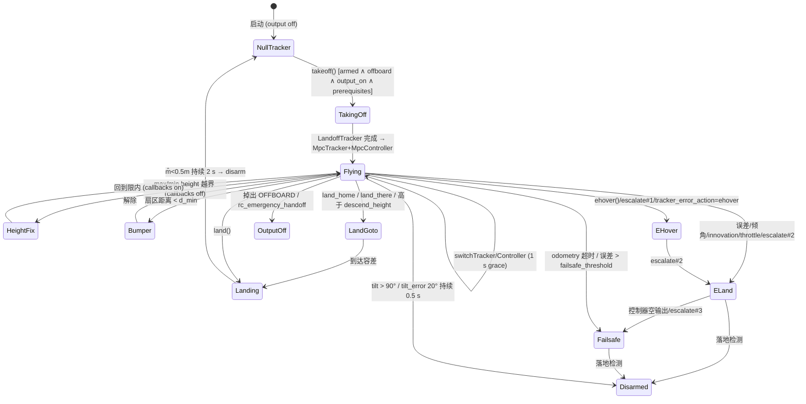
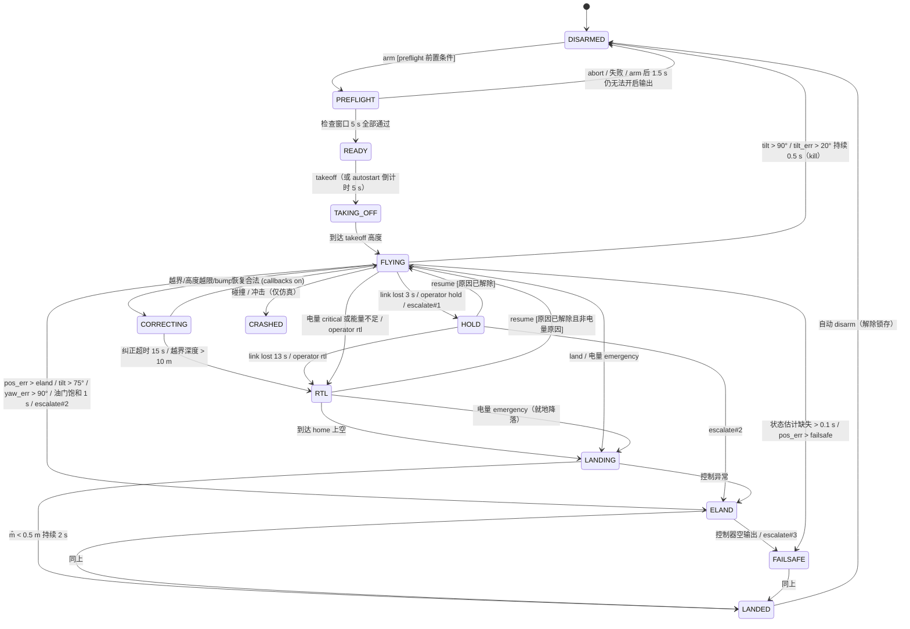

# R24 研究笔记：ctu-mrs/mrs_uav_system（MRS UAV System）
## 状态机、安全层、多机避碰，以及本项目 Safety & Health 模块设计

> 研究单元：r24 ｜ 日期：2026-09-28 ｜ 对应设计：`docs/01-design.md` §26–§30（Drone Simulation / 状态模型 / 多机 / 控制模式）、§36–§37（通信与频率）、§38–§40（UI）、§49（V0.6 Multi-UAV）
>
> 仓库快照：`refs/sim/mrs_uav_system` @ `3340bfe`（2026-08-03，★640，分支 `ros2`）。这是一个**元仓库**，一共只有 41 个文件：README、两个 metapackage 的 `package.xml`/`CMakeLists.txt`、docker bake 和 CI 脚本，**没有一行算法代码**。
>
> 为了满足"深入读源码"的要求，我把真正承载逻辑的子仓库 shallow clone 到了 `.cache/research/r24/`（`refs/` 未做任何改动）：
>
> | 子仓库（`ros2` 分支） | ★ | 最后推送 | 主要内容 |
> |---|---|---|---|
> | `mrs_uav_core` | 8 | 2026-08-14 | Core 元包，用 gitman 列出 11 个子模块 |
> | `mrs_uav_managers` | 30 | 2026-09-21 | **UavManager / ControlManager / SafetyAreaManager** / Constraint / Gain / Estimation / Transform，约 47k 行 |
> | `mrs_uav_trackers` | 45 | 2026-09-27 | LandoffTracker、LineTracker、**MpcTracker（含多机避碰）**、MidairActivation、Flip |
> | `mrs_uav_controllers` | 96 | 2026-09-21 | Se3Controller、MpcController、FailsafeController、MidairActivation |
> | `mrs_multirotor_simulator` | 12 | 2026-09-21 | **header-only 多旋翼动力学、级联控制器、混控器**、碰撞、boids 插件、400 机 demo |
> | `mrs_lib` | 9 | 2026-09-21 | `safety_zone`（Prism/SafetyZone）、`errorgraph`、`quadratic_throttle_model` 等 |
> | `mrs_msgs` / `mrs_uav_hw_api` / `mrs_uav_status` / `mrs_uav_autostart` / `mrs_uav_modules` / `mrs_mpc_solvers` | — | 2026-01 ~ 2026-08 | 消息定义、硬件抽象、TUI 状态面板、自动起飞与 preflight、CVXGEN 求解器 |
>
> 本机实测产物：`.cache/research/r24/mrs_mock.py`。内容是 `mrs_multirotor_simulator` 核心的 numpy 向量化移植，外加 LineTracker 风格的参考生成器、Safety FSM 原型、MpcTracker 避碰逻辑，附带基准测试和 6 个故障注入场景。第 3.1 节和第 4.11 节的数字都来自它。

---

## 0. 结论速览

| 仓库 / 子模块 | 定位 | 复用方式 | 落点版本 | 推荐度 |
|---|---|---|---|---|
| `mrs_uav_system`（元仓库本体） | 发布入口：metapackage、PPA、docker、依赖清单 | **reference**：只用来理解整体栈和依赖 | — | ★★☆☆☆ |
| `mrs_multirotor_simulator/..._core`（`multirotor_model.hpp`、`controllers/*.hpp`、`mixer.hpp`） | 18 状态刚体，一阶电机，RK4，位置→速度→加速度→姿态→角速度→混控的完整级联 | **port**：numpy 向量化后作为 MVP Mock Dynamics。**已实测**：稳定，400 机 RTF 1.6 | V0.1（MVP）/ V0.4（风阻耦合） | ★★★★★ |
| `mrs_uav_managers/control_manager`（`timerSafety`、eland/ehover/failsafe、escalating failsafe、bumper、reference 校验） | 飞行中的安全裁决层：控制误差、倾角、状态估计超时、跟踪器/控制器异常 | **port**：阈值、语义和互锁（latch、grace、callbacks_enabled）全部移植进 Safety FSM | V0.2 | ★★★★★ |
| `mrs_uav_managers/uav_manager`（takeoff 前置条件、landing FSM、max/min height、max throttle、flight timer） | 任务级飞行生命周期 | **port**：起降流程、高度纠正、落地检测 | V0.2 | ★★★★★ |
| `mrs_uav_managers/safety_area_manager` + `mrs_lib/safety_zone` | 多边形棱柱地理围栏 + 禁飞棱柱，点和路径校验（每米 20 步离散） | **port**：Geofence 服务 + 轨迹截断/吸附 | V0.2 | ★★★★★ |
| `mrs_uav_trackers/line_tracker.cpp` | 梯形速度参考生成，含 STOP_MOTION 刹车 | **port**：Mock 的 GoTo/RTL 参考生成器 | V0.1 | ★★★★☆ |
| `mrs_uav_trackers/mpc_tracker.cpp`（`checkTrajectoryForCollisions`） | 多机：共享预测轨迹，按优先级爬升 + 减速避让 | **port**：只移植避碰逻辑，不移植 MPC | V0.6 | ★★★★☆ |
| `mrs_uav_controllers`（Se3 / Failsafe / Emergency） | 几何控制律、前馈式失效下降 | **reference**（Se3 控制律）+ **port**（Failsafe 前馈下降语义） | V0.4 / V0.2 | ★★★☆☆ |
| `mrs_lib/errorgraph` + `mrs_uav_status/topic_info.cpp` | 依赖图根因分析；话题频率红黄绿三色 | **port**：Health Registry | V0.2–V0.3 | ★★★★☆ |
| `mrs_uav_autostart` | preflight：静止、离地高度、陀螺仪、话题存活、在围栏内，加 5 s 安全倒计时 | **port**：Preflight 检查项 | V0.2 | ★★★☆☆ |
| `mrs_msgs`（ControlManagerDiagnostics / UavManagerDiagnostics / FutureTrajectory / Prism / ObstacleSectors） | 数据契约 | **port**：字段语义并入我们的 `DroneState` / `SafetyStatus` / `GeofencePrism` | V0.1 | ★★★★☆ |
| `mrs_mpc_solvers`（CVXGEN 生成，约 2.4 万行 LDL） | 固定 40 步 QP | **skip**：不可再生成，也不需要 | — | ★☆☆☆☆ |
| 完整 ROS2 Jazzy 栈（PPA 安装） | 作为可选的"MRS-SITL 后端" | **skip（MVP）/ reference（V0.6+）** | V0.6+ 可选 | ★★☆☆☆ |

**实现者先读这几条**

1. **元仓库没有代码。** 值得搬的是三块：`mrs_multirotor_simulator` 核心的动力学和级联（纯 Eigen、header-only、零 ROS 依赖），ControlManager 和 UavManager 的安全语义与阈值，SafetyZone 的几何校验。三块都能无损移植到 Python/numpy，MVP 完全不需要装 ROS2。
2. **MRS 的安全层按严重度分梯级，并且会锁存（latch）。** 梯级依次是 `hover` → `ehover` → `eland` → `failsafe` → `disarm`。锁存由 `eland_triggered_` 和 `failsafe_triggered_` 实现：已处于 eland 时不能再退回 hover，已处于 failsafe 时不能再退回 eland。另有两条关键规则：
   - 切换 tracker/controller 后有 **1.0 s grace**，期间只允许 disarm 类检查生效。
   - 执行任何安全动作时都会把 `callbacks_enabled_` 置为 false，用户指令一律被拒。

   这三条规则可以原样照搬，也是我们 Safety FSM 的骨架。
3. **MRS 没有电池 failsafe，也没有地面链路 failsafe。** 模拟器里的电池是常量桩（`hw_api_plugin.cpp::publishBatteryState`：15.8 V、charge 0.8）。电池只出现在 TUI 显示里：单节电压低于 3.7 V 显示黄色，低于 3.6 V 显示红色。MRS 定位为"机载全自主"，所以只处理 odometry 超时（0.1 s → failsafe）。**电量和失联策略必须参考 PX4 自行设计**：BAT_LOW 0.15 / CRIT 0.07 / EMERGEN 0.05，COM_DL_LOSS_T 10 s，COM_FAIL_ACT_T 5 s。第 4 节给出了完整设计，并用原型验证过。
4. **原型实测暴露了两处设计要点**（第 4.11 节）：
   - 剩余时间要算到 emergency 阈值为止，不能算到 0%。否则 RTL 途中就会触发 emergency 降落。
   - 参考生成器切换目标时，必须先按加速度约束刹车（MRS 的 `STOP_MOTION_STATE`）。否则位置误差瞬间超过 eland 阈值，会被误判升级到 failsafe。
5. **多机避碰（MpcTracker）的机制很简单。** 每架机以 2 Hz 广播未来约 7.8 s 的预测轨迹（40 点，dt1=0.01、dt2=0.2），超过 1 s 未更新即视为过期。判定"碰撞"的条件是：水平距离小于 5 m，且高度差小于 2.9 m。发生冲突时，**优先级低的一方**（uav 编号大的一方）把高度抬到对方高度 + 3 m，同时按"首次冲突步"做二次方减速，最低降到 0.25 倍。该逻辑是 O(N²·H)：N=20 时单次 13.6 ms，N 更大时必须加 KD-tree/网格粗筛。
6. **性能结论。** 纯 numpy 的逐机 Python FSM 每次 tick 约 363 µs/机，太慢。安全检查应拆成两层：
   - "向量化快检"：400 机每 tick 149 µs，跑 100 Hz。
   - "事件驱动的逐机 FSM"：只在有事件时推进，跑 10 Hz。

   动力学方面，400 机 100 Hz 单进程 RTF 为 1.6。MVP 的 1–50 机规模下，RTF 在 3.9 以上。

---

## 1. 仓库概览

### 1.1 元仓库本体

```
mrs_uav_system/
├── README.md                     # 组件表、PPA/Docker 安装、构建状态、论文引用
├── ros_packages/
│   ├── mrs_uav_system/           # metapackage: exec_depend mrs_uav_core + mrs_uav_modules
│   └── mrs_uav_system_full/      # + deployment, flightforge/gazebo 仿真, octomap 规划,
│                                 #   open_vins, point_lio, px4_api, dji_tello_api, 传感器驱动
├── docker/                       # docker-bake.hcl: mrs_uav_system_core → mrs_uav_system (multiarch)
├── .ci/ .github/                 # 复用 ctu-mrs/ci_scripts 的 ros_build_test / ros_package_build
└── .fig/                         # 各机型实拍与仿真图（f330/f450/f550/t650/x500/naki/m690）
```

- **平台**：ROS 2 **Jazzy**（Ubuntu 24.04）。RMW 推荐 **zenoh**（`mrs_uav_core/package.xml` 同时依赖 `rmw_zenoh_cpp` 和 `rmw_cyclonedds_cpp`），C++20。所有节点作为 composable node 加载进 `uav_core_container`（`component_container_events_cbg`，开启 intra-process）。
- **安装**：通过自建 PPA（`ppa2-stable` / `ppa2-unstable`）用 `apt install ros-jazzy-mrs-uav-system-full` 安装，或者使用 `ctumrs/mrs_uav_system` 多架构镜像（amd64/arm64）。
- **文档**：README 自己承认"网站只触及皮毛"，官方建议直接读各包 README、launch 文件和源码。论文为 Baca et al., *The MRS UAV System*, JINTR 2021（doi 10.1007/s10846-021-01383-5）。
- **ROS1→ROS2 迁移**：README 链接了一个实时迁移图。`ros2` 分支是默认分支；Core 所有关键包在 2026-09 仍在活跃提交。

### 1.2 依赖树（从 manifest 和 `.gitman.yml` 梳理）

```
mrs_uav_system_full
├── mrs_uav_system
│   ├── mrs_uav_core  (gitman: ros_packages/.gitman.yml)
│   │   ├── mrs_lib                       ← safety_zone / errorgraph / throttle model / 滤波器
│   │   ├── mrs_msgs                      ← 全部消息与服务
│   │   ├── mrs_uav_hw_api                ← HW API 插件接口 + HwApiManager（含 BatteryState 转发）
│   │   ├── mrs_uav_managers              ← ★ 状态机与安全层
│   │   ├── mrs_uav_trackers              ← ★ 参考生成 + 多机避碰
│   │   ├── mrs_uav_controllers           ← SE(3)/MPC/Failsafe 控制器
│   │   ├── mrs_uav_state_estimators
│   │   ├── mrs_multirotor_simulator      ← ★ 轻量动力学仿真（替代 HW）
│   │   ├── mrs_uav_autostart             ← preflight + 自动起飞
│   │   ├── mrs_uav_trajectory_generation
│   │   ├── mrs_uav_status                ← ncurses TUI（话题频率、电池、模式）
│   │   └── mrs_uav_testing               ← 集成测试框架
│   └── mrs_uav_modules  (mrs_modules_msgs, mrs_serial, mrs_rviz_plugins, mrs_utils)
├── mrs_uav_deployment, mrs_uav_flightforge_simulator, mrs_uav_gazebo_simulator
├── mrs_octomap_mapping_planning, mrs_open_vins_core, mrs_point_lio_core
├── mrs_uav_px4_api, mrs_uav_dji_tello_api
└── ouster_ros, depthai-ros, mrs_realsense, mrs_icm_imu_driver, odin_ros_driver
```

另有一个隐藏依赖：trackers 和 controllers 都 `depend mrs_mpc_solvers`。这个包是 **CVXGEN 生成的 C 代码**：`solver.cpp` 注释里写着 "In CVXGEN, you can say"，`ldl.cpp` 有 21k 行，问题规模硬编码为 320 维（`eval_gap` 里写死了 `i < 320`）。

### 1.3 运行时架构（单机，全部位于 `/uavX` 命名空间）

```
               ┌──────────── UavManager (10 Hz timers) ────────────┐
 takeoff/land ─┤ takeoff 前置条件 · landing FSM · max/min height   │
 land_home ────┤ max throttle · flight timer · midair activation   │
               └───────┬──────────────── switchTracker/Controller ─┘
                       │ emergencyReference / eland / ehover 服务
               ┌───────▼──────────── ControlManager ───────────────┐
 reference ───►│ setReference ─► validate (SafetyArea 点+路径)      │
 trajectory ──►│ ┌──────────┐  TrackerCommand  ┌────────────┐      │
 velocity ────►│ │ Tracker  │ ───────────────► │ Controller │──────┼──► HW API (PX4 / Sim)
               │ │ (plugin) │ ◄── last output ─│ (plugin)   │      │
               │ └──────────┘                  └────────────┘      │
               │ timerSafety 100 Hz · timerEland 10 Hz ·            │
               │ timerFailsafe 100 Hz · timerBumper 20 Hz           │
               └───▲──────────────▲───────────────▲──────────────────┘
                   │UavState      │Prism/valid    │constraints/gains
         EstimationManager   SafetyAreaManager   Constraint/GainManager
```

---

## 2. 源码结构与关键模块

以下路径均以子仓库名开头。它们都 clone 在 `.cache/research/r24/<repo>/`。

### 2.1 ControlManager：控制主循环与插件切换

文件：`mrs_uav_managers/src/control_manager/control_manager.cpp`，8989 行。

**主循环**

`callbackUavState`/`callbackOdometry` 触发 `updateTrackers()`（L8447）→ `updateControllers()`（L8547）→ `publish()`（L8661）。控制是**由状态驱动的**：没有新的 odometry，就没有新的控制输出。

- `updateTrackers()` 对所有 tracker 调用 `update(uav_state, last_control_output)`，但只取 active tracker 的返回值。命令为空或无效时，按 `tracker_error_action`（默认 `eland`）处理。**如果 ehover 用的 tracker 自己也返回空，则直接 `failsafe()`**。
- `updateControllers()`：active controller 返回空输出时，按当前状态逐级升级：已处于 failsafe → `toggleOutput(false)`；已处于 eland → `failsafe()`；否则 → `eland()`。

**插件接口**（`include/mrs_uav_managers/tracker.h`、`controller.h`）

- `Tracker`：`activate(last_cmd)`、`deactivate()`、`update(uav_state, last_ctrl_out) -> optional<TrackerCommand>`、`setReference/VelocityReference/TrajectoryReference`、`hover()`、`start/stop/resumeTrajectoryTracking()`、`enableCallbacks()`、`setConstraints()`、`switchOdometrySource()`。
- `Controller`：`activate(last_output)`、`updateActive(state, cmd)`、`updateInactive(...)`、`resetDisturbanceEstimators()`、`setConstraints()`。
- 设计要点：**非激活的插件也会持续调用 `update`**，这样切换时可以从上一条命令平滑接管。新 tracker 通过 `activate(last_tracker_cmd)` 从上一条参考继续。

**`switchTracker()`（L8192）/ `switchController()`（L8328）**

1. 校验前置条件：有 odometry；若启用了 innovation 检查，还需要有 innovation。
2. 目标插件存在，且不是当前已激活的插件。
3. 调用 `activate(...)` 激活新插件，失败则拒绝切换。
4. 刷新 `controller_tracker_switch_time_`（后面的 1 s grace 就从这个时间开始算）。
5. `deactivate()` 旧插件。特殊情况：从 NullTracker 切出时，要重新激活当前 controller；切到 NullTracker 时，要停用 controller 并清空 `last_tracker_cmd_`。
6. 切换 controller 后，**重启当前 tracker**（先 deactivate 再 `activate({})`），然后把约束重新下发给 controllers。

**`isFlyingNormally()`（L6776）**

```
callbacks_enabled && output_enabled && offboard && armed
&& active_controller ∉ {EmergencyController, FailsafeController}
&& active_tracker ∉ {NullTracker, LandoffTracker, ehover_tracker}
```

这个谓词被 bumper、max/min height、autostart 等所有"只在正常飞行时生效"的逻辑复用。**我们应当同样导出一个 `flyingNormally` 布尔量。**

**参考校验**

- `setReference()`（L5912）依次检查：`callbacks_enabled_`、有限值、TF 变换、`isPointInSafetyArea3d(goal)`，以及当有上一条命令时的 `isPathToPointInSafetyArea3d(last_cmd.position → goal)`。
- 轨迹（约 L6271）逐点校验。遇到无效段时：
  - `snap_to_safety_area=false`：**从第一个无效点处截断**。
  - `snap_to_safety_area=true`：先把 z 饱和到 [min_z, max_z]，再把"无效段两端的有效点"之间做水平直线插值，插值失败则截断。
  - 整条轨迹都无效，或起点无效，一律拒绝。
- `callbackToggleOutput`（L4663）：位置不在 2D 围栏内、处于紧急降落后、或缺少 HW API 状态时，**拒绝打开输出**。

### 2.2 ControlManager 的安全裁决 `timerSafety()`（L2664，100 Hz）

以下内容是本单元的核心，按源码顺序整理：

| # | 检查 | 默认阈值（`config/public/control_manager.yaml`、`controllers.yaml`） | 动作 | grace（切换后 1 s 内跳过） |
|---|---|---|---|---|
| 1 | UavState/Odometry 缺失 | `odometry_max_missing_time: 0.1 s` | `timeoutUavState` → **failsafe** | 否 |
| 2 | 位置控制误差 ‖p_ref − p‖ | Se3: failsafe 2.5 m；Mpc: 4.5 m；Emergency: 4.0 m | **failsafe** | 是 |
| 3 | 里程计 innovation ‖·‖，或航向 innovation > π/2 | Se3: 1.5 m；Mpc: 2.5 m | **eland** | 是 |
| 4 | 绝对倾角 acos(z_b·z_w) | `tilt_limit.eland: 75°` | **eland** | 是 |
| 5 | 位置误差 | 大于 eland_threshold/2（Se3: 0.75 m）→ ungrip；大于 eland_threshold（1.5 m）→ **eland** | ungrip / eland | 是 |
| 6 | 航向误差 | 大于 45° → ungrip；大于 90° → **eland** | ungrip / eland | 是 |
| 7 | 绝对倾角 | `tilt_limit.disarm: 90°` | **disarm** | **否** |
| 8 | 倾角误差 acos(z_b·z_d) 持续超限 | 20°，持续 0.5 s；起飞 ramping 期间不计 | `toggleOutput(false)` + **disarm**（判定为电机/桨失效） | 是（切换后重置计时） |
| 9 | 空中掉出 OFFBOARD | — | `toggleOutput(false)`（交还遥控） | 否 |

互锁规则：

- 升级到 eland 的检查都带 `!failsafe_triggered_ && !eland_triggered_` 条件，保证只触发一次、只能向上升级。
- `rc_emergency_handoff.enabled=true` 时，所有"落地类"动作（eland、failsafe）都**改为关闭输出、交给安全员遥控**。适用于水面等不适合立即降落的场景。
- `hover_throttle_range_check` 在 [0.2, 0.7] 范围之外时拒绝启动，属于配置合理性校验。

**安全动作的实现**

- `hover()`（L7316）：调用 active tracker 的 `hover()`。eland/failsafe 已触发时拒绝。
- `ehover()`（L7355）：`ungripSrv()`，然后切到 `ehover_tracker`（LandoffTracker，必须成功），再切到 `EmergencyController`（失败可以继续），最后令 `callbacks_enabled_=false`。
- `eland()`（L7426）：切到 ehover tracker 和 EmergencyController，调用 tracker 的 eland 服务，然后 `LANDING_STATE`、关闭 odometry 切换回调、`callbacks_enabled_=false`，由 `timerEland`（10 Hz）检测落地。
- `failsafe()`（L7521）：
  - 若最低输出模态是 POSITION（例如 HW 只接受位置），failsafe 无法做前馈，**降级为 eland**。
  - 若配置了降落伞，先尝试开伞。
  - 否则直接 `activate(FailsafeController)`（不经过 tracker），停掉 eland 计时器、启动 failsafe 计时器、`bumper_enabled_=false`，并记录 `landing_uav_mass_=getMass()`。
- **FailsafeController**（`mrs_uav_controllers/config/public/failsafe_controller.yaml`）："半受控下坠"。throttle 从当前值的 98% 开始，以 0.015/s 线性递减；如果只能输出加速度，就以 0.2 m/s² 下降；如果只能输出速度，就以 1.0 m/s 下降。
- `escalatingFailsafe()`（L7636）+ `getNextEscFailsafeState()`（L7757）：由服务或 RC 通道 7（阈值 0.5）触发，两次触发间隔至少 2.0 s。第 1 次 → ehover，第 2 次 → eland，第 3 次 → failsafe（默认关闭），之后为 FINISHED。可以按配置跳过某一级。

**落地检测**（`timerEland` L3055 / `timerFailsafe` L3149 / `UavManager::timerLanding` L763）

- 基于油门的质量估计：`m̂ = throttleToForce(throttle)/g`。当 `m̂ < 0.5 · m_landing` 或 `throttle < 0.01` **持续 2.0 s** 时判定已着陆，然后关闭输出并 disarm。
- 拿不到油门时（UavManager 一侧），改用 `vz > −0.1 m/s` 持续 3 s 判定。
- `throttleToForce`（`mrs_lib/include/mrs_lib/quadratic_throttle_model.h`）：`F = N·(a·T² + b·T + c)`，旧版为 `F = N·((T − b)/a)²`。

**Obstacle bumper**（`timerBumper` L3451 → `bumperPushFromObstacle` L6989，20 Hz）

- 输入 `ObstacleSectors`：n 个水平扇区的最近障碍距离，再加上"下"和"上"两个扇区。−1 表示无障碍，−2 表示无数据。
- 安全距离：`d_min = 1.2 m + 1.5 · v²/(2a)`，也就是在基础距离上加 1.5 倍刹停距离（`derived_from_dynamics: true`）。
- 最近扇区距离小于 d_min 时，朝其**反方向**发出 goto，目标在 `fcu_untilted` 系下，距离为 `d_min + overshoot − d`。同时关闭所有 tracker 的回调，并按需切换到 MpcTracker + Se3Controller。障碍解除后恢复原来的 tracker、controller 和回调。
- 只在 `isFlyingNormally()` 为真时生效（正在 repulse 的过程中除外）。

### 2.3 UavManager：任务级生命周期

文件：`mrs_uav_managers/src/uav_manager.cpp`，2968 行。

**起飞**（`callbackTakeoff` L1529）的前置条件：

- odometry 存在；
- world origin 就绪；
- HW API 状态存在且新于 5 s；
- **armed**；
- **offboard**；
- ControlManager 诊断存在，且 **active tracker 为 NullTracker**；
- GainManager 和 ConstraintManager 在运行；
- 控制输出已开启；
- 若不是第一次起飞，上次估计的质量偏差不超过 1 kg。

流程如下：

1. 关闭 odometry 切换。
2. 切换到起飞用的 controller 和 tracker（MpcController + LandoffTracker）。任一切换失败都会 `toggleControlOutput(false)` 并 disarm。
3. 等待 0.3 s，给电机 ramp 留时间。
4. 调用 tracker 的 takeoff 服务，失败则 `elandSrv()`。
5. 记录 home 点（`land_there_reference_`），启动 `timerTakeoff`。

`timerTakeoff` 检测到 tracker 不再是 LandoffTracker、或 tracker 没有目标时，判定起飞完成，切换到 MpcTracker + MpcController。

**降落 FSM**（`LandingStates_t`：IDLE / GOTO / LANDING）

- `landWithDescendImpl`（L2442）：如果高度 ≥ `descend_height(2.0) + 1`，先用 emergencyReference 垂直下降到 2 m（GOTO），再慢速降落。
- `callbackLandHome` / `callbackLandThere`：先 goto 到 home 点或指定点（GOTO），位置容差 0.1 m、航向容差 0.1 rad 满足后再降落。如果中途 tracker 丢失了目标，会重发参考。
- LANDING 阶段检查 active tracker 必须是 landing tracker（否则告警），并使用上述油门质量法判断落地。落地后切到 NullTracker 并 disarm。

**周期检查**（10 Hz，只在 `flying_normally` 时运行）

- `timerMaxHeight`（L1045）：`height > max_z` 时关闭回调，emergencyReference 到 `max_z − 0.25`，回到限高以下后恢复回调。`max_z` 取安全区上限和估计器给出上限中较小的一个（`ControlManager::getMaxZ` L6889）。
- `timerMinHeight`（L1158）：`height < 0.5 m` 时上升到 `0.75 m`。
- `timerMaxthrottle`（L1292，30 Hz）：`throttle ≥ 0.8` 持续 0.5 s 时 ungrip（抛载荷），持续 1.0 s 时 **eland**。
- `timerFlightTime`（L1255）：可选的最大飞行时间，到时后 land。
- `timerMidairActivation`（L1424）：空中接管模式，0.5 s 内等不到 OFFBOARD 就回退。

`UavManagerDiagnostics.state` 定义了 INVALID / IDLING / TAKING_OFF / FLYING / LANDING / EMERGENCY 六种状态，但当前 `uav_manager.cpp` **并没有填充 `diag.state`**，只填了 flight_time、home 和当前经纬度。**我们的 UI 需要一个显式的 flight_state，这一点要自己补上。**

### 2.4 SafetyAreaManager 与 `mrs_lib::safety_zone`

**数据模型**

`SafetyZone`（`mrs_lib/src/safety_zone/safety_zone.cpp`）由一个外边界 `Prism` 和若干障碍 `Prism` 组成，障碍存在 `map<int, Prism>` 里。每个 `Prism`（`prism.cpp`）包含：

- 一个 boost::geometry 多边形：点数少于 3 时抛异常；自动闭合；方向错误时自动 reverse；调用 `is_valid` 校验；
- `[min_z, max_z]` 高度区间；
- `horizontal_frame` / `vertical_frame`，两者可以不同。例如水平用 `latlon_origin`，垂直用 AGL 相关的 frame。

**校验逻辑**

- 点合法：`isPointValid(p) = border.isPointIn(p) ∧ ∀obs: ¬obs.isPointIn(p)`，其中 `isPointIn` 等于 `bg::within(xy, polygon) ∧ min_z ≤ z ≤ max_z`。
- 路径合法：`isPathValid(a, b)` 把线段离散为 `ceil(|b−a| · 20)` 个点逐个检查（`_discretization_steps_ = 20`，见 `safety_zone.h` L74）。

**服务层**（`mrs_uav_managers/src/safety_area_manager.cpp`，1984 行）

- 查询接口：`point_in_safety_area_{2d,3d}`、`path_in_safety_area_{2d,3d}`、`get_max_z`/`get_min_z`、`is_safety_area_enabled`；
- 运行时修改：`add_obstacle`、`set_obstacle`、`set_safety_border`（可选择保留已有障碍）、`toggle_safety_area`、`update_world_origin`（整体平移）；
- 10 Hz 发布 `SafetyAreaManagerDiagnostics`：enabled、`position_valid_2d/3d`、border、obstacles；
- 配置示例：`mrs_multirotor_simulator/tmux/mrs_one_drone/config/world_config.yaml`。

**设计特点：围栏是"指令准入"层，不是"位置闭环"层。** MRS 对"当前位置越界"本身不采取动作，只在 diag 里报告 `position_valid`，autostart 据此禁止起飞，toggleOutput 据此禁止开启输出。真正的防线只有两道：拒绝越界指令，以及 max/min height 纠正。**我们的 Mock 环境有风扰，操作员也可能通过速度/RC 等不经校验的指令把飞机推出围栏，所以必须补上"越界回拉"（CORRECTING）。**

### 2.5 其它 Manager

- **ConstraintManager**（`config/public/constraint_manager/*.yaml`）：约束档位 slow/medium/fast 分别对应水平 1/4/8 m/s，**按估计器类型限制可用档位**，例如估计器为 `other` 时只允许 slow，切换估计器时自动回到默认档位。这可以用来实现"定位降级 → 自动限速"。
- **GainManager**：Se3 增益档位 supersoft/soft/...，例如 soft 档水平 kp=6、kv=3，垂直 kp=15、kv=8。
- **EstimationManager**：`StateMachine::changeState()`（L142）使用**白名单式的转移校验**：
  - 状态集合：UNINITIALIZED / INITIALIZED / READY_FOR_FLIGHT / TAKING_OFF / FLYING / HOVER / LANDING / LANDED / ESTIMATOR_SWITCHING / DUMMY / EMERGENCY / FAILSAFE / ERROR；
  - 每个目标状态列出合法的前驱状态，不合法的转移直接拒绝并打日志；
  - 切换估计器时记住 `pre_switch_state_`，切换完成后回到原状态。

  **这种"显式转移表 + 拒绝非法转移"的写法建议照搬到我们的 Flight FSM。**

### 2.6 Trackers

- **LandoffTracker**：状态为 IDLE / LANDED / STOP_MOTION / HOVER / ACCELERATING / DECELERATING / STOPPING。
  - 起飞：1.0 m/s，加速度 0.3 m/s²。
  - 降落：0.5 m/s，加速度 0.3 m/s²。
  - eland：0.5 m/s，加速度 1.0 m/s²。
  - 控制误差超过 0.7 m 时暂停推进参考。
- **LineTracker**（`src/line_tracker.cpp`）：水平和垂直各自独立的梯形速度剖面。
  - `accelerateHorizontal()`（L1001）：朝向为 `atan2(goal − state)`；每步 `v += a·dt` 并饱和到 v_max；当"当前位置 + 刹停距离 v²/(2a)"距离目标小于 `2·v_max·dt` 时，进入 DECELERATING。
  - `decelerateHorizontal()`：`v −= a·dt`，减到 0 后进入 STOPPING。
  - `stopHorizontal()`：`state = 0.95·state + 0.05·goal`，做指数收敛。
  - `stopHorizontalMotion()`（STOP_MOTION）：**收到新目标时先以最大加速度刹停**，再重新规划。
- **MpcTracker**（`src/mpc_tracker.cpp`，4030 行）：
  - 12 个状态（x、y、z 各四阶：p/v/a/j），40 步预测，`dt1 = 1/100 s`、`dt2 = 0.2 s`，因此预测时域约为 0.01 + 39×0.2 ≈ 7.8 s。
  - x/y/z/heading 各自用一个 CVXGEN QP 求解，Q=[5000,0,0,0]，最多迭代 40 次；带速度、加速度、jerk、snap 约束。
  - **多机避碰**的细节见第 3.10 节。

### 2.7 Controllers

- **Se3Controller**（`src/se3_controller.cpp` L894–L1220）：
  - 误差：`Ep = Rp − Op`，`Ev = Rv − Ov`；
  - `Kp`、`Kv` 乘以 `(m + Δm)`，其中 Δm 为质量估计；
  - 合力：`f = m(g·e3 + Ra) + Kp∘Ep + Kv∘Ev + ∫(Ib_b + Iw_w)`；
  - 姿态分配 `rotation_matrix: 1` 采用 "baca（oblique projection）"；
  - `throttle_saturation 0.9`；输出倾角超过 90° 时返回空命令，从而触发上层 failsafe。
- **MpcController / EmergencyController**：EmergencyController 就是 MpcController 换一套参数的实例（`address` 同为 `mpc_controller::MpcController`，namespace 为 `emergency_controller`）。
- **每个控制器有独立的安全阈值**（`config/public/controllers.yaml`）。原因是不同控制器的正常跟踪误差量级不同。**这提示我们：阈值应当绑定在"控制模式/后端"上，而不是全局写死。**

### 2.8 mrs_multirotor_simulator（MVP 价值最高）

**核心**：`mrs_multirotor_simulator_core/include/.../uav_system/`，纯 Eigen + boost::odeint，不依赖 ROS。

- `multirotor_model.hpp`：18 维状态（x, v, R 的 9 个元素, ω），RK4 积分，一阶电机模型，二次空气阻力，外力/外力矩接口，地面约束和"起飞平台补丁"，并由速度差分构造 IMU 加速度。
- `uav_system.hpp::makeStep()`（L315）：按输入模态自上而下走级联：POSITION → VELOCITY_HDG → ACCELERATION_HDG → ATTITUDE → ATTITUDE_RATE → CONTROL_GROUP → ACTUATORS。**任意一层都可以作为外部输入的入口**，并支持 velocity/acceleration 前馈。
- `controllers/`：pid、position、velocity、acceleration（fd → Rd + throttle）、attitude（SO(3) 误差）、rate（乘以 J 缩放）、mixer（伪逆，PX4 风格归一化 + desaturation）。

**ROS 外壳**：`mrs_multirotor_simulator/src/multirotor_simulator.cpp`，负责以下几件事。

- 调度：`timerMain()`（L350）按 `clock_rate=400 Hz` 推进仿真时间，每满 `1/simulation_rate`（100 Hz）步进一次所有机体。
- 插件接口：每步之前先对所有 UAV 拍一张快照，供 UAV 插件使用（邻居状态），保证结果与迭代顺序无关。
- 碰撞：`handleCollisions()`（L485）用 nanoflann KD-tree 做半径搜索。距离小于 `crit = Σ(arm + prop)` 时，要么判定坠毁（crash），要么施加反弹力 `rebounce · r̂ · m1·m2/(m1+m2)`。
- 实时因子：`realtime_factor` 支持 0.01–10，可以动态调整。
- 插件：
  - `BoidsUavPlugin`：分离、对齐、聚合，加上一个巡航高度吸引项；
  - `NeighborCountUavPlugin`；
  - world 插件 `randomize_position`。
- 规模演示：`tmux/standalone_400_uavs`，400 架机，POSITION 输入，开启碰撞。
- 机型参数：`config/uavs/{x500,f450,f550,t650,a300,robofly,naki,f330}.yaml`。

### 2.9 健康监控相关

- **`mrs_lib/errorgraph`**：各节点上报 `ErrorgraphElement`（例如"等待 ControlManager/main"、"等待 topic X"），据此构建有向依赖图，用 `find_error_roots()` 找出根因，还能导出 DOT。UavManager 里大量使用的 `error_publisher_->addWaitingForNodeError({"EstimationManager","main"})` 就是在往这张图上报。
- **`mrs_uav_status/src/topic_info.cpp`**：滑动窗口统计话题频率。实际频率高于 0.9×期望为 GREEN，高于 0.5×期望为 YELLOW，否则为 RED。电池电压按 >17 V 判为 6S、否则判为 4S 折算到单节，低于 3.7 V 为黄、低于 3.6 V 为红；Wh 消耗 = ∫V·I dt。
- **`mrs_uav_autostart/src/automatic_start.cpp`**：preflight 要求在过去 5 s 窗口内同时满足以下条件：
  - 速度 < 0.3 m/s；
  - 高度 < 0.8 m；
  - 陀螺仪角速度 < 1 rad/s；
  - 指定话题在 5 s 内有数据；
  - `position_valid_2d`。

  满足后才自动开启输出。armed 且 offboard 之后，再倒计时 5 s（`safety_timeout`）才起飞，倒计时期间退出 offboard 即可中止。

### 2.10 状态机全景（MRS 原生）



---

## 3. 可复用算法与实现（伪代码与参数）

### 3.1 多旋翼动力学（port 自 `multirotor_model.hpp`，已验证）

**参数**（x500，`config/uavs/x500.yaml`）：

| 参数 | 值 |
|---|---|
| m | 2.0 kg |
| k_f | 2.7087e-7 N/rpm² |
| k_m | 0.07 |
| 臂长 l | 0.25 m |
| 机身高 h | 0.1 m |
| 桨半径 | 0.15 m |
| τ_motor | 0.03 s |
| rpm 范围 | [1170, 7800] |
| 阻力系数 c_d | 0.30 |

转动惯量：`J = diag(m(3l²+h²)/12, m(3l²+h²)/12, m·l²/2)`。

分配矩阵 `A`（4×4，行依次为 τx、τy、τz、T），先写出符号矩阵：

```
[-0.707  0.707  0.707 -0.707]·l·kf
[-0.707  0.707 -0.707  0.707]·l·kf
[-1     -1      1      1    ]·km·kf
[ 1      1      1      1    ]·kf
```

**方程**（我们的扩展：阻力使用相对风速 `v_rel = v − W(x,t)`，这就是 01-design §19 风场 → 动力学的接口）：

```
[τ; T]  = A · rpm²
ẋ       = v
v̇       = −g·e3 + (T/m)·R·e3 + F_ext/m − c_d·π·l²·|v_rel|·v_rel / m
Ṙ       = R·[ω]×
ω̇       = J⁻¹ (τ − ω × Jω + M_ext)
rpm    ← e^(−dt/τ)·rpm + (1 − e^(−dt/τ))·rpm_cmd        # 每个 step 后更新，积分期间 rpm 视为常量
rpm_cmd = rpm_min + (rpm_max − rpm_min)·clip(u, 0, 1)
ground : if z < z_ground ∧ vz < 0 → z = z_ground, v = 0, ω = 0   # z_ground 可取 World DSM 高程
```

**向量化伪代码**（N 架机共享参数，形状为 `(N,3)` / `(N,3,3)`；完整实现见 `mrs_mock.py::Fleet`）：

```python
def step(dt):
    k1 = f(x, v, R, w); k2 = f(x+dt/2*k1, ...); k3 = ...; k4 = ...   # RK4
    x, v, R, w = rk4_combine(...)
    R = U @ Vt  where U, S, Vt = svd(R)                               # 重正交化（每步一次）
    rpm = a*rpm + (1-a)*rpm_cmd
    ground_clamp()
```

**实测**（`mrs_mock.py::exp_step_response` / `exp_benchmark`，本机 8 核 CPU，numpy 2.5，单线程）：

| 指标 | 结果 |
|---|---|
| 理论悬停油门 `(√(mg/(n·kf)) − rpm_min)/(rpm_max − rpm_min)` | 0.465 |
| 仿真 10 s 时的油门 / 高度 | 0.464 / 9.95 m（目标 10 m） |
| 5 m/s、2 m/s² 的 50 m 平飞：超调 / 最大跟踪误差 | 0.5 m / 0.64 m |
| 突加 8 m/s 风后的稳态位置误差 / 倾角 | 0.09 m / 10.9° |
| N=1 / 10 / 50 / 100 / 400 的每步耗时（100 Hz，dt=0.01） | 1.76 / 1.87 / 2.55 / 3.75 / 6.36 ms |
| 对应实时因子 RTF | 5.7 / 5.4 / 3.9 / 2.7 / 1.6 |

结论：**MVP 的"无人机 mock"直接采用这一移植**，不需要 PX4 SITL，也不需要 GPU。每步的固定开销约 1.7 ms（numpy 调度开销）。如果需要支撑 1000 机以上，可以换 numba 或 JAX（CPU）。

### 3.2 级联控制器（port 自 `controllers/*.hpp`，增益来自 `config/controllers/*.yaml`）

| 层 | 输入 → 输出 | PID（kp, kd, ki） | 饱和 | 积分抗饱和阈值 |
|---|---|---|---|---|
| position | e_p → v_ref (+ v_ff) | 2.0, 0.15, 0.2 | 每轴 6 m/s | 1.0 |
| velocity | e_v → a_ref (+ a_ff) | 2.0, 0.05, 0.01 | 每轴 4 m/s² | 1.0 |
| acceleration | a_ref, ψ_ref → R_d, throttle | 解析计算 | — | — |
| attitude | e_R → ω_ref | 6.0, 0.05, 0.01 | roll/pitch 10 rad/s，yaw 1 rad/s | 0.1 |
| rate | e_ω → control group | 4·J, 0.04·J, 0 | — | 1.0 |

PID 细节（`pid.hpp`）：

- 微分项直接对误差差分：`d = (e − e_last)/dt`。第一步有微分冲击，可以接受。
- 只有当 `|u| < antiwindup` 时才累加积分。
- 输出在 ±sat 范围内饱和。

加速度到姿态的解析解（等价于 `acceleration_controller.hpp` 的 oblique projection，我推导出的闭式形式与源码数值一致）：

```
f_d  = m (a_ref + g e3)
z_d  = f_d / |f_d|
b_x  = (cos ψ, sin ψ, 0)
x_d  = normalize( b_x − (z_d·b_x / z_d.z) · e3 )   # 沿 e3 把 b_x 斜投影到 z_d⊥ 平面
y_d  = normalize( z_d × x_d );  R_d = [x_d y_d z_d]
thr  = ( sqrt( max(f_d·R e3, 0) / (kf·n) ) − rpm_min ) / (rpm_max − rpm_min)
```

姿态误差（`attitude_controller.hpp` L83）：

```
E   = ½(R_dᵀR − RᵀR_d)
e_R = [(E12 − E21)/2, (E20 − E02)/2, (E01 − E10)/2]   # 符号已包含负号，可直接作为 PID 的误差输入
```

### 3.3 混控器与 desaturation（`mixer.hpp`）

```
A⁺ = Aᵀ(AAᵀ)⁻¹
每行前两列 (roll, pitch) 归一化为单位向量；第 3 列取 sign ∈ {−1, 0, 1}；第 4 列全 1   # 与 PX4 control group 一致
u = A⁺ · [roll, pitch, yaw, thr]
if min(u) < 0: u += |min(u)|
if max(u) > 1:
    if thr > 0.01: 把 roll/pitch/yaw 缩放 mean(u)/thr 后重新计算 u   # 保油门、牺牲姿态
    else:          u /= max(u)
```

### 3.4 参考生成器 LineTracker（port，含 STOP_MOTION）

```python
def update(dt):
    if |vel_ref| > 0.05 and cos(vel_ref, goal - ref) < 0.98:          # STOP_MOTION：先刹停
        vel_ref -= a_max*dt along vel_ref（水平、垂直分开处理）; ref += vel_ref*dt; return
    d = goal - ref; dh = |d.xy|; dz = d.z
    s_h += (−a_h if s_h²/(2a_h) ≥ dh − 2·v_h·dt else +a_h)·dt; clip(0, v_h); s_h = min(s_h, dh/dt)
    s_v 同理
    vel_ref = [ŝ_dir·s_h, sign(dz)·s_v]; ref += vel_ref·dt
    return ref, vel_ref          # vel_ref 作为 position 环的速度前馈
```

建议参数（对应 ConstraintManager 的 medium 档）：水平 4–5 m/s、2 m/s²；上升/下降 2 m/s、1 m/s²；降落 1.0 m/s；eland 0.5 m/s。

### 3.5 落地检测（port）

```python
# 进入 LANDING / ELAND / FAILSAFE 时记下 m_landing = 当前质量估计（有质量估计器就用 m+Δm）
m_hat = throttle_to_force(throttle) / g      # mock 近似：(thr/thr_hover)² · m，因为 F ∝ rpm²，而 thr 与 rpm 成线性
if m_hat < 0.5*m_landing or throttle < 0.01 (or 与地面接触): 计时开始
if 已持续 > 2.0 s: output_off(); disarm()    # 清除 eland/failsafe 锁存
fallback（拿不到 throttle，例如 PX4 位置接口）: vz > −0.1 m/s 持续 3 s
```

### 3.6 地理围栏：点、路径、轨迹、运行时（port + 扩展）

```python
class GeofencePrism: polygon[(x,y)], min_z, max_z, frame="enu"      # 与 mrs_msgs/Prism 同构
class Geofence: border: GeofencePrism; nofly: list[GeofencePrism]; enabled
valid(p)       = pip(border, p.xy) ∧ border.min_z ≤ p.z ≤ border.max_z ∧ ∀n: ¬(pip(n, p.xy) ∧ n.min_z ≤ p.z ≤ n.max_z)
path_valid(a,b)= all(valid(a + t(b−a)) for t in linspace(0,1, ceil(|b−a|·20)+1))
signed_border_distance(p) = ±min_edge_distance(p.xy)          # + 表示在内部；用于 UI 的"距边界"指示和 WARN
validate_trajectory(pts, snap):                                 # 同 ControlManager 约 L6271
    for i, p in pts: if snap: p.z = clip(p.z, min_z, max_z)
    找到第一个无效段 [first_invalid, 下一个有效点)
    snap=False → 在 first_invalid 处截断；start 就无效 → 拒绝
    snap=True  → 在两个有效点之间做水平直线插值，插值点仍无效则截断
effective_max_z = min(fence.max_z, estimator.max_z, airframe.max_alt)  # getMaxZ 的"多源取小"
```

运行时回拉是 **MRS 没有的扩展**。触发条件为 FLYING 状态下 `signed_border_distance < 0`。处理方式：投影到最近边界点，沿指向多边形质心的方向内缩 2 m，高度 clip 到 `[min_z+1, max_z−1]`，然后进入 CORRECTING 并关闭用户指令。

- 回到合法区域 → FLYING；
- 回拉超过 15 s 仍未成功 → RTL；
- 越界深度超过 10 m → 直接 RTL。

高度纠正沿用 UavManager 的做法：`z > max_z` 时目标为 `max_z − 0.25`；`AGL < min_h(0.5)` 时目标为 `min_h + 0.25`。**AGL 用 World 的 DSM/点云高程计算**，UrbanScene3D 的楼顶就是地面。

### 3.7 障碍 bumper（从 World 几何派生扇区，V0.6）

MRS 的扇区数据来自传感器，而我们有 World 几何，可以直接查询。建议：

- 对每架机，在 16 个水平扇区上加"上"和"下"两个方向，向 World 的 SDF/occupancy（由点云体素化得到）做 ray-march 或最近点查询，得到 `sectors[18]`。
- 然后套用 `bumperPushFromObstacle` 的公式：

```
d_min_h = 1.2 + 1.5·v_h²/(2·a_h);   d_min_v = 1.2 + 1.5·v_v²/(2·a_v)
k = argmin sectors[0..n)
if sectors[k] < d_min_h: goto(fcu_untilted, dir = k·2π/n + π, dist = d_min_h + overshoot − sectors[k])
if 0 < down < d_min_v:  z += d_min_v − down + overshoot_v
if 0 < up   < d_min_v:  z −= d_min_v − up   + overshoot_v
```

### 3.8 多机避碰（port 自 `MpcTracker::checkTrajectoryForCollisions` L1853 与 `calculateMPC` L2149）

```python
# 每架机以 2 Hz 广播 FutureTrajectory{uav_name, priority, collision_avoidance, points[40]}（UTM/ENU 世界系）
R_col = 5.0; Z_thr = 2.9; CORR = 3.0; START_CLIMB = 25; SLOW_FULL = 10; SLOW_START = 25; COEF = 0.25; TIMEOUT = 1.0
for other in fresh(others, TIMEOUT):
    for v in range(40):
        if |me[v].xy − other[v].xy| < R_col and |me[v].z − other[v].z| < Z_thr:        # checkCollision
            if (not other.collision_avoidance) or other.priority < my.priority:         # 编号小的优先，编号大的让行
                if v <= START_CLIMB: safe_alt = max(safe_alt, other[v].z + CORR)
        if inflated(R_col+1, Z_thr+1): first = min(first, v)
if not avoiding: safe_alt −= 2.0·dt1               # 每次 MPC 迭代回落 2·dt1，即以 2 m/s 逐渐回落（源码为 −2/(1/dt1)）
# 速度调度
k = 1 if first ≤ SLOW_FULL else ((1 − (first−SLOW_FULL)/(SLOW_START−SLOW_FULL))² if first ≤ SLOW_START else 0)
v_max_h = v_max·(COEF·k + (1−k));  if safe_alt > lowest_z_of_my_traj: v_max_h = v_max·COEF
z_ref[i] = max(z_ref[i], safe_alt)               # 把 z 参考抬到安全高度以上
if 正在爬升: v_max_h *= (1 − vz/vz_max)          # 爬升期间抑制水平速度
```

原型验证：两机相距 20 m、各以 3 m/s 迎面飞行（`exp_avoidance`）。结果 uav2 的 `safe_alt=13 m`（10+3），uav1 保持原高度，两机的速度系数均为 0.437。

**我们的改进建议（V0.6）：**

1. 预测轨迹直接取 Mock 参考生成器未来 8 s 的输出，不需要 MPC。
2. 优先级不再按"uav 编号"，改为由 ANet 或任务层下发。例如"执行任务中的一方优先"，或者"电量低的一方优先"，避免低电量机被迫爬升。
3. 爬升目标高度要 clip 到 `effective_max_z`。如果抬不上去，改为水平侧移或悬停等待。
4. 用 KD-tree 或网格做粗筛：只有当 `|p_i − p_j| < (v_i+v_j)·T_h + R_col` 时才做逐点比较。
5. 最小间距 `min_sep`（默认 3 m）作为健康度指标上报；低于 `crit = Σ(arm+prop)` 时在仿真里按碰撞处理（crash 或反弹）。

**Boids**（`boids_uav_plugin.cpp`，用于演示集群，V0.6）：

```
sep += r/|r|²（邻居在 3 m 内）; ali = mean(v_j) − v; coh = mean(p_j) − p（感知半径 10 m 内）
v_des = 1.5·sep + 1.0·ali + 1.0·coh;  v_des.z += 2.0·(z_cruise − z)
先分配 z 分量（饱和到 v_max），水平分量用剩余预算 sqrt(v_max² − v_z²) 限幅
```

### 3.9 健康度（port 自 `topic_info.cpp` 和 `errorgraph`）

```python
class RateMonitor:  # 每个数据流一个（遥测、状态估计、link heartbeat、点云流、WS 推送等）
    window = N 个 1 s 桶; rate = mean(bucket_counts)
    color = GREEN if rate > 0.9·expected else YELLOW if rate > 0.5·expected else RED
class HealthGraph:  # errorgraph：节点 = 组件，边 = "waiting_for"
    report(component, errors=[{type: "waiting_for_node"/"waiting_for_topic"/"generic", target}])
    roots() = 有错误、且不再等待任何其它有错误节点的组件     # UI 只高亮根因
    stale: 组件超过 2× 上报周期未更新 → not_reporting
```

---

## 4. 在本项目中的落点：Safety & Health 模块设计（重点）

### 4.1 定位与边界

- **权威位置**：Safety & Health 运行在 **Simulation Service**（Python 后端）里，属于 Physical Runtime（01-design §4）。浏览器端只负责三件事：展示、下发操作指令、确认事件，**不做安全判定**。
- **后端无关**：同一套 FSM 同时服务三类后端：
  - Mock（MRS 动力学移植）：由我们执行动作；
  - PX4 SITL / P600 真机：通过 MAVSDK 下发 HOLD/RTL/LAND 模式，同时镜像 PX4 自己的 failsafe 状态；
  - 未来的 Isaac 后端。

  抽象成 `SafetyActuator` 接口，提供 `hold / rtl / land / eland / failsafe / disarm / goto_safe` 等方法。
- **单一权威原则**：后端是 PX4 时，**PX4 commander 的 failsafe 优先**，我们的 Supervisor 只做两件事：指令准入（围栏校验），以及 PX4 不覆盖的检查项（多机间隔、World 几何围栏、ANet 任务约束）。PX4 状态变化会作为事件回灌到 FSM（mirror 模式），避免出现双重动作。

### 4.2 分层结构

```
                    ┌───────────────── Safety & Health Service（每个 world/sim 一个） ───────────────────┐
 fleet state (N) ──►│ L0 FastGuard   100 Hz  向量化：tilt/tilt_err/pos_err/state_age/throttle         │
                    │ L1 MissionGuard 10 Hz  逐机：geofence/高度/电池/链路/preflight                   │
                    │ L2 FleetGuard   2–5 Hz 多机：预测轨迹冲突/最小间距/bumper 扇区                   │
                    │ L3 HealthGraph  1 Hz   组件频率/根因/not_reporting                               │
                    │           │ SafetyEvent{code, level, drone, action}                           │
                    │           ▼                                                                     │
                    │ ActionArbiter：按严重度取最大 · 锁存 · grace · 迟滞 · operator override         │
                    │           ▼                                                                     │
                    │ FlightFSM（每机）：显式转移表，非法转移拒绝（EstimationManager 风格）            │
                    │           ▼                                                                     │
                    │ SafetyActuator ──► Mock：参考生成器 / 控制模式；PX4：MAVSDK 模式；UI：事件       │
                    └───────────────────────────────────────────────────────────────────────────────┘
```

实测依据：逐机的 Python FSM 每次 tick 约 363 µs/机，无法以 100 Hz 覆盖几十架机。向量化快检在 400 机时为 149 µs/tick，围栏向量化检查 400 机为 0.93 ms。所以 **L0 必须向量化，L1 跑 10 Hz，FSM 只在有事件时推进**。

### 4.3 Flight FSM（每机）

**状态**：综合 MRS 的 UavManager/ControlManager、EstimationManager 的 SM，以及 PX4 的 RTL。

| 状态 | 含义 | accept_commands | 严重度 |
|---|---|---|---|
| `DISARMED` | 电机停转 | 仅 arm | — |
| `PREFLIGHT` | 已 arm，正在做 preflight 检查（5 s 窗口）并倒计时 | 仅 abort | — |
| `READY` | 在地面待命（等价于 NullTracker + output on） | takeoff | — |
| `TAKING_OFF` | LandoffTracker 语义，1 m/s | abort→LAND | 0 |
| `FLYING` | 正常飞行；子模式 HOVER/GOTO/MISSION/FOLLOW/ORBIT/SWARM | 全部（先校验） | 0 |
| `CORRECTING` | 可逆的自动纠正：限高、最低高度、围栏回拉、bumper、避碰爬升 | 否 | 1 |
| `HOLD` | 对应 MRS 的 ehover：原地悬停，忽略用户任务指令 | resume/rtl/land | 2 |
| `RTL` | 子阶段 CLIMB → CRUISE → DESCEND → LAND | resume（条件允许时）/land | 3 |
| `LANDING` | 正常降落；子阶段 GOTO_DESCEND（高于 2 m 时）→ DESCEND → TOUCHDOWN | escalate | 4 |
| `ELAND` | 紧急降落：EmergencyController 语义，0.5 m/s，**锁存** | escalate | 5 |
| `FAILSAFE` | 前馈下坠：1 m/s，或 throttle 以 0.015/s 递减，**锁存** | kill | 6 |
| `LANDED` | 触地检测通过，2 s 后自动 disarm | — | — |
| `CRASHED` | 仅在仿真中出现：倾角超过 90°、碰撞或触地冲击 | reset | 8 |



**转移表写法**（照搬 EstimationManager 的白名单式写法）：

```python
ALLOWED = {
  "PREFLIGHT": {"DISARMED"},
  "READY": {"PREFLIGHT", "LANDED"},
  "TAKING_OFF": {"READY"},
  "FLYING": {"TAKING_OFF", "CORRECTING", "HOLD", "RTL"},
  "CORRECTING": {"FLYING"},
  "HOLD": {"FLYING", "CORRECTING", "TAKING_OFF"},
  "RTL": {"FLYING", "CORRECTING", "HOLD"},
  "LANDING": {"FLYING", "CORRECTING", "HOLD", "RTL", "TAKING_OFF"},
  "ELAND": {"TAKING_OFF", "FLYING", "CORRECTING", "HOLD", "RTL", "LANDING"},
  "FAILSAFE": {"TAKING_OFF", "FLYING", "CORRECTING", "HOLD", "RTL", "LANDING", "ELAND"},
  "LANDED": {"LANDING", "ELAND", "FAILSAFE", "RTL"},
  "DISARMED": {"*"},          # kill 在任何状态下都允许
  "CRASHED": {"*"},
}
def go(new, reason):
    if state not in ALLOWED[new] and "*" not in ALLOWED[new]: return reject(reason)
    if failsafe_latched and new not in {"LANDED", "DISARMED", "CRASHED"}: return reject
    if eland_latched and new not in {"FAILSAFE", "LANDED", "DISARMED", "CRASHED"}: return reject
    if state in {"FLYING", "TAKING_OFF"}: prev_nominal = state
    state = new; switch_time = t; accept_commands = new in {"READY", "FLYING"}
    latch(new); emit(SafetyEvent(...)); actuator.apply(new)
```

### 4.4 ActionArbiter 规则

1. **取最大严重度**：同一 tick 内的多个事件，按 `level` 取最大值执行。
2. **只升不降**：自动转移只能提升严重度。例外只有三种：CORRECTING → FLYING（纠正完成），HOLD/RTL → FLYING（link 恢复、且配置了 `auto_resume`，或操作员点了 resume），LANDED → DISARMED。
3. **锁存**：进入 ELAND/FAILSAFE 后打上锁存，直到 LANDED/DISARMED 才解除。锁存期间 hover/hold/resume 一律拒绝（与 MRS `hover()`、`ehover()` 的拒绝逻辑一致）。
4. **grace**：切换控制模式或状态后 1.0 s 内，只执行 L0 中的 kill 类检查（tilt > 90°），其余控制误差类检查跳过。tilt_err 的计时在 grace 期间重置。
5. **迟滞与持续时间**：tilt_err 需持续 0.5 s；油门饱和需持续 1.0 s；link 丢失 3 s → HOLD、13 s → RTL；围栏 WARN 区为 5 m；电量阈值只在下降方向触发（不回退）。
6. **用户指令互斥**：非 FLYING/READY 状态下，`accept_commands=false`，REST/WS 返回 `409 SAFETY_ACTIVE`，并附带当前的 action 和 reason。
7. **操作员升级键**（escalating failsafe）：每按一次上升一级，HOLD → ELAND → FAILSAFE（第 3 级默认关闭）。两次之间至少间隔 2.0 s。UI 用 AlertDialog 二次确认。
8. **handoff 模式**（对应 `rc_emergency_handoff`）：开启后，所有"落地类"动作改为"暂停仿真 + 把控制权交给操作员手动遥控"。适用于教学演示或回放调试。

### 4.5 条件目录（默认参数）

| 类别 | 条件 | 默认值 | 动作 | 来源 | 层 | 版本 |
|---|---|---|---|---|---|---|
| 围栏-准入 | goto 目标或路径越界（路径每米 20 步） | — | 拒绝指令 | MRS setReference | 同步 | V0.2 |
| 围栏-准入 | 任务轨迹部分越界 | snap=false | 截断，或整条拒绝 | MRS trajectory | 同步 | V0.2 |
| 围栏-运行 | 距边界小于 5 m | 5 m | WARN（UI 红色描边） | 本项目 | L1 | V0.2 |
| 围栏-运行 | 已越界 | — | CORRECTING 回拉，内缩 2 m | 本项目 | L1 | V0.2 |
| 围栏-运行 | 越界超过 10 m，或回拉超过 15 s | 10 m / 15 s | RTL | 本项目 | L1 | V0.2 |
| 高度 | z > effective_max_z | offset 0.25 | CORRECTING 下降 | UavManager | L1 | V0.2 |
| 高度 | AGL < 0.5 m（DSM） | offset 0.25 | CORRECTING 上升 | UavManager | L1 | V0.2 |
| 电量 | soc ≤ 0.15 | BAT_LOW | WARN（只报一次） | PX4 | L1 | V0.2 |
| 电量 | soc ≤ 0.07，或 t_rem(→5%) < 1.3·t_rtl | BAT_CRIT | RTL | PX4 + 本项目 | L1 | V0.2 |
| 电量 | soc ≤ 0.05 | BAT_EMERGEN | LANDING（就地） | PX4 | L1 | V0.2 |
| 电量 | 单节电压 < 3.6 V（有电压模型时） | 3.7 黄 / 3.6 红 | WARN / RTL | mrs_uav_status | L1 | V0.4 |
| 链路 | GCS heartbeat 超时 | 1.5 s | WARN | 本项目 | L1 | V0.2 |
| 链路 | 超时 3 s | — | HOLD | PX4 COM_FAIL_ACT_T 思路 | L1 | V0.2 |
| 链路 | 超时 13 s | 3 + COM_DL_LOSS_T(10) | RTL（无 home 时 LAND） | PX4 | L1 | V0.2 |
| 链路 | 恢复 | < 1.5 s | HOLD → FLYING（若开启 auto_resume） | 本项目 | L1 | V0.2 |
| 估计 | 状态估计缺失 | 0.1 s | FAILSAFE | ControlManager | L0 | V0.2 |
| 估计 | innovation 过大 | 1.5 m / 航向 90° | ELAND | ControlManager | L0 | V0.5 |
| 估计 | 定位源降级（RTK → GPS → VIO） | — | 限速：slow 档 | ConstraintManager | L1 | V0.5 |
| 控制 | 位置误差 | 1.5 m（eland）/ 2.5 m（failsafe），按控制模式配置 | ELAND / FAILSAFE | ControlManager | L0 | V0.2 |
| 控制 | 倾角 | 75°（eland）/ 90°（kill） | ELAND / DISARM | ControlManager | L0 | V0.2 |
| 控制 | 倾角误差 | 20°，持续 0.5 s | DISARM（电机失效） | ControlManager | L0 | V0.2 |
| 控制 | 航向误差 | 90° | ELAND | ControlManager | L0 | V0.2 |
| 控制 | 油门饱和 | ≥ 0.8，持续 1 s | ELAND（0.5 s 时先抛载荷） | UavManager | L0 | V0.2 |
| 控制 | 参考生成器或控制器输出空/NaN | — | ELAND → FAILSAFE → 关闭输出 | ControlManager | L0 | V0.2 |
| 多机 | 预测冲突（5 m / 2.9 m） | — | CORRECTING：爬升 3 m + 减速到 0.25× | MpcTracker | L2 | V0.6 |
| 多机 | 实际间距 < min_sep（3 m） | — | HOLD（优先级低的一方）+ 事件 | 本项目 | L2 | V0.6 |
| 多机 | 间距 < Σ(arm+prop) | — | CRASHED（仿真） | multirotor_simulator | L0 | V0.6 |
| 障碍 | World 扇区距离 < 1.2 m + 1.5·刹停距离 | — | CORRECTING（反向推离） | bumper | L2 | V0.6 |
| 环境 | 风速 > 机型上限（P600 暂定 12 m/s） | — | WARN；持续油门饱和则按控制类处理 | 本项目 | L1 | V0.4 |
| preflight | 速度 < 0.3 m/s、高度 < 0.8 m、陀螺仪 < 1 rad/s、数据流存活、在围栏内、soc > 0.3、link OK、悬停油门 ∈ [0.2, 0.7] | 窗口 5 s | 阻止 arm/takeoff | autostart + ControlManager | 同步 | V0.2 |

### 4.6 电池模型与能量感知 RTL（原型已验证）

```python
P_hover = T^1.5 / sqrt(2·ρ·n·π·r²) / (FoM·η_motor) + P_avionics   # 动量理论；FoM=0.6，η=0.8，P_av=15 W
# x500：T=19.6 N → 约 232 W；4S 5 Ah（74 Wh）→ 悬停约 19 min（量级合理）
V_oc(soc) = cells·(3.3 + 0.9·soc − 0.2·e^(−20·soc) + 0.1·soc³);  I = P/V_oc;  V = V_oc − I·R_int
soc −= I·dt/(C·3600);  I_avg = 0.98·I_avg + 0.02·I                  # PX4 同样使用平均电流
t_rem_usable = (soc − BAT_EMERGEN)·C/I_avg·3600                     # ★ 算到 emergency 阈值为止，而非 0
t_rtl = d_home/v_cruise + max(0, z_rtl − z)/v_up + z_rtl/v_land (+ 逆风修正：d_home/(v_cruise − w_head))
if soc ≤ BAT_CRIT or t_rem_usable < 1.3·t_rtl: RTL
```

原型场景 `battery_rtl` 的对比（初始 soc=0.16，飞往 (80,−60,10) 后执行 RTL）：

- **修正前**（t_rem 算到 0%）：在 soc=0.08 时才触发 RTL，途中 soc 降到 0.05，触发 emergency 就地降落，落在 (14.7, −11.4)。
- **修正后**：在 soc=0.12 时触发 RTL，**落在 home (0.1, −0.1)，剩余 soc=0.06**。

### 4.7 链路策略（区分三种"失联"）

| 链路 | 检测 | 策略 | 说明 |
|---|---|---|---|
| 状态估计 / 遥测源（sim→supervisor） | 超过 0.1 s 无新状态 | FAILSAFE | 等价于 MRS 的 odometry 超时，是最危险的一类 |
| GCS / 操作员链路（browser↔server，或真机数传） | heartbeat 1–2 Hz | 1.5 s WARN → 3 s HOLD → 13 s RTL | PX4 语义。仿真里浏览器断开也算一种情形，可以按配置关闭（`gcs_loss_policy: ignore`，用于无人值守批量仿真） |
| ANet / 机间链路（V1.0） | 邻居的 FutureTrajectory 超过 1 s 未更新 | 把对方视为不避让的一方（`collision_avoidance=false`），本机主动让行 | MpcTracker 的 timeout 语义 |

### 4.8 数据契约

**配置**（`worlds/<id>/safety.yaml`，或存放在 world package 里）：

```yaml
safety:
  rates: {fast_guard_hz: 100, mission_guard_hz: 10, fleet_guard_hz: 5, health_hz: 1}
  grace_after_switch_s: 1.0
  handoff_mode: false
  geofence:
    frame: enu                     # 与 World 的 coordinate.json 一致
    border: {polygon: [[-300,-300],[300,-300],[300,300],[-300,300]], min_z: 0.0, max_z: 120.0}
    nofly: [{polygon: [[20,-10],[40,-10],[40,10],[20,10]], min_z: 0, max_z: 80, label: "Tower A"}]
    warn_margin_m: 5.0
    correct: {inset_m: 2.0, timeout_s: 15.0, hard_out_m: 10.0}
    min_agl_m: 0.5
    snap_trajectory: false
  battery: {low: 0.15, critical: 0.07, emergency: 0.05, rtl_margin: 1.3, takeoff_min: 0.3}
  link: {warn_s: 1.5, hold_s: 3.0, rtl_s: 13.0, auto_resume: true, gcs_loss_policy: hold_rtl}
  control:                          # 按控制模式/后端配置，与 MRS 的 controllers.yaml 同理
    mock_cascade: {eland_pos_err: 1.5, failsafe_pos_err: 2.5}
    px4_offboard: {eland_pos_err: 3.5, failsafe_pos_err: 4.5}
    tilt_eland_deg: 75
    tilt_kill_deg: 90
    tilt_err_kill: {deg: 20, s: 0.5}
    yaw_err_eland_deg: 90
    max_throttle: {value: 0.8, ungrip_s: 0.5, eland_s: 1.0}
    state_timeout_s: 0.1
  landing: {cutoff_mass_factor: 0.5, cutoff_s: 2.0, descend_height_m: 2.0, speed: 1.0, eland_speed: 0.5}
  rtl: {alt_m: 30.0, cruise_mps: 5.0, climb_mps: 2.0, land_mps: 1.0}
  separation: {radius_m: 5.0, z_threshold_m: 2.9, correction_m: 3.0, min_sep_m: 3.0, slow_coef: 0.25}
  escalation: {min_interval_s: 2.0, levels: [HOLD, ELAND]}     # 需要时再加 FAILSAFE
  preflight: {window_s: 5, max_speed: 0.3, max_height: 0.8, max_gyro: 1.0, countdown_s: 5}
```

**WebSocket 状态**（channel `safety`，5–10 Hz，只推差量）。每架机的 `DroneState` 增加一个 `safety` 子对象：

```ts
type FlightState = 'DISARMED'|'PREFLIGHT'|'READY'|'TAKING_OFF'|'FLYING'|'CORRECTING'|'HOLD'|'RTL'
                 |'LANDING'|'ELAND'|'FAILSAFE'|'LANDED'|'CRASHED';
interface SafetyStatus {
  flightState: FlightState; subMode?: string;          // 例如 RTL: 'CLIMB'|'CRUISE'|'DESCEND'|'LAND'
  level: number; acceptCommands: boolean; flyingNormally: boolean;
  latched: { eland: boolean; failsafe: boolean };
  reason?: { code: string; message: string; since: number };
  geofence: { inside2d: boolean; inside3d: boolean; borderDistM: number; altMarginM: number; aglM: number };
  battery:  { soc: number; voltage: number; current: number; whDrained: number;
              tRemainS: number; tRtlS: number; state: 'ok'|'low'|'critical'|'emergency' };
  link:     { gcsAgeS: number; telemAgeS: number; state: 'ok'|'degraded'|'lost' };
  estimator:{ source: 'mock'|'gps'|'rtk'|'vio'|'lio'; ageS: number; innovationM?: number };
  control:  { posErrM: number; tiltDeg: number; tiltErrDeg: number; yawErrDeg: number;
              throttle: number; hoverThrottle: number };
  separation?: { minDistM: number; nearestId: string; avoiding: boolean; safeAltM?: number; priority: number };
}
interface SafetyEvent {            // channel 'event'：带 seq，可靠投递，UI 可以 ack
  seq: number; t: number; droneId: string; code: string;  // 例如 'SAF.BAT.CRIT', 'SAF.LINK.LOST_HOLD'
  level: number; from: FlightState; to: FlightState; message: string; ack?: boolean;
}
interface HealthItem { component: string; expectedHz?: number; rateHz?: number;
  color: 'green'|'yellow'|'red'; waitingFor?: string[]; isRoot: boolean; notReporting: boolean }
```

事件码命名空间：

- `SAF.GEOFENCE.{REJECT,NEAR,BREACH,FAR_OUT,CORRECT_TIMEOUT}`
- `SAF.ALT.{MAX,MIN}`
- `SAF.BAT.{LOW,CRIT,EMERG,ENERGY_RTL}`
- `SAF.LINK.{DEGRADED,LOST_HOLD,LOST_RTL,RESTORED}`
- `SAF.EST.{TIMEOUT,INNOVATION,DEGRADED}`
- `SAF.CTRL.{POS_ERR_ELAND,POS_ERR_FAILSAFE,TILT_ELAND,TILT_KILL,TILT_ERR_KILL,YAW_ERR,THROTTLE_SAT,EMPTY_OUTPUT}`
- `SAF.SEP.{CONFLICT,AVOIDING,VIOLATION,COLLISION}`
- `SAF.OBS.PROXIMITY`
- `SAF.ENV.WIND_LIMIT`
- `SAF.OP.{ESCALATE,RESUME,KILL}`
- `HLT.<component>.{DEGRADED,DOWN,RESTORED}`

**指令**（REST 负责配置，WS 负责实时指令）：

```
POST /api/drones/{id}/cmd {type: arm|disarm|takeoff|land|rtl|hold|resume|goto|mission|escalate|kill, ...}
     → 200 {accepted, message} | 409 {code: 'SAFETY_ACTIVE'|'GEOFENCE_REJECT'|'PREFLIGHT_FAILED', reason}
PUT  /api/worlds/{wid}/safety/geofence   （飞行中修改：只允许扩大范围，或需要 admin 权限）
POST /api/drones/{id}/fault {type: motor_fail|link_drop|state_drop|battery_sag|gust, params}   # 故障注入，仅限 Mock
```

### 4.9 UI 映射

所有组件都用 shadcn，图标用 morphicons，禁用 emoji。

- **无人机卡片**（右侧 DRONES，01-design §38）：
  - `Badge` 显示 flightState：正常为科技灰描边；CORRECTING/HOLD 为白底红点；RTL/LANDING 为红色描边；ELAND/FAILSAFE/CRASHED 为实心红。**只用灰、黑、白、红四色，用强度（描边/实心/脉冲）表达等级**。
  - `Progress` 显示电量：标出 soc 以及 low/crit/emerg 三条刻度线，悬停 `Tooltip` 显示 `tRemainS` 与 `tRtlS`。
  - link 图标（morphicons 的 signal 类）在 ok 和 lost 之间用 morph 动画切换。
- **告警流**：`Alert` 列表 + `Sonner` toast，只有 level ≥ 3 才弹出。可以 ack；未 ack 的事件保留红色左边框。
- **紧急按钮**：`Button variant="destructive"`，按"HOLD → ELAND → FAILSAFE"逐级升级，每级之间 `AlertDialog` 确认，且间隔至少 2 s。KILL 需要长按 1 s，配合进度环。快捷键 Space 对应 HOLD，Shift+E 对应升级。
- **3D 场景**：
  - 围栏棱柱画成线框加半透明侧面，默认灰色，越界时变红并闪烁（transitions.dev 的 pulse）；禁飞棱柱用红色斜纹。
  - 避碰时，在两机的预测轨迹之间画红色连线，并显示 safeAlt。
  - bumper 扇区画成机体周围的环形扇面。
- **健康面板**：一个 `Sheet` 抽屉，内含 `Table`，列为 组件 / 期望 Hz / 实际 Hz / 状态点 / 等待。**根因行置顶加粗**（errorgraph 思想）。频率趋势小图使用 lieflat-charts 风格。
- **Timeline**（01-design §39）：SafetyEvent 以刻度标记叠加在时间轴上，点击即可跳转回放。

### 4.10 模块与目录落点（对应 01-design §42 的 repo 结构）

```
simulation/
├── dynamics/mrs_port.py        # §3.1–3.3 Fleet（RK4 + 级联 + 混控），风 → 相对风速阻力
├── reference/line_tracker.py   # §3.4（含 STOP_MOTION）、landoff、rtl 规划
├── safety/
│   ├── fast_guard.py           # L0 向量化检查
│   ├── mission_guard.py        # 围栏、高度、电池、链路、preflight
│   ├── fleet_guard.py          # 预测冲突、间距、bumper（依赖 world/sdf）
│   ├── geofence.py             # Prism / SafetyZone / 轨迹校验 / 回拉
│   ├── battery.py              # 功率模型 / OCV / t_rem / t_rtl
│   ├── flight_fsm.py           # 转移表 + 锁存 + arbiter
│   ├── actuator.py             # SafetyActuator：MockActuator / Px4MavsdkActuator
│   └── health.py               # RateMonitor + HealthGraph
└── scenarios/                  # 故障注入场景（§4.11），同时作为 CI 回归测试
```

### 4.11 验证场景（原型实测，全部通过，可直接作为 CI 用例）

| 场景 | 注入 | 期望 | 原型结果（`mrs_mock.py`） |
|---|---|---|---|
| validate_reference | goto 到禁飞棱柱内、穿越禁飞棱柱、到围栏外 | 三者都被拒 | "goal outside geofence" / "path leaves geofence" / "goal outside geofence" |
| fence_breach_correction | t=40 s 下发不经校验的速度指令到 x=−130，同时 6 m/s 顺风 | CORRECTING → 回到内部 | 42.33 s CORRECTING，47.45 s 回到 FLYING，悬停在 x=−98.1（内缩约 2 m） |
| link_loss_rtl | t=30 s GCS 断开 | 3 s HOLD，13 s RTL，在 home 降落 | 33.0 HOLD → 43.0 RTL → 104.3 s 着陆于 (0.1, 0.1) |
| battery_rtl | soc 初值 0.16，飞往 100 m 外 | 能量不足时 RTL，并在 home 降落 | 37.5 s RTL（soc 0.12，t_rem 78 s < 1.3×60 s）→ 104.4 s 在 home 着陆，soc 0.06 |
| motor_failure_disarm | t=15 s 3 号电机失效 | 迅速 kill | 15.40 s ELAND（tilt 超过 75°）→ 15.46 s DISARM（tilt 超过 90°）。四旋翼翻滚快于 tilt_err 的 0.5 s 计时，**tilt 限位会先触发** |
| estimator_dropout_failsafe | t=15 s 状态估计停止更新 | FAILSAFE 下坠，然后着陆 | 15.1 s FAILSAFE（0.11 s）→ 27.6 s 着陆并 disarm |
| （修正前）battery_rtl | t_rem 算到 0% | — | RTL 途中触发 emergency，就地降落，**失败** |
| （修正前）目标切换 | 参考生成器瞬间转向 | — | 位置误差 3.03 m，被误升级为 FAILSAFE，**失败** |

### 4.12 版本落点

| 版本 | Safety & Health 交付 | 来自 MRS 的内容 |
|---|---|---|
| **V0.1（MVP）** | Mock 动力学 + LineTracker；DroneState 带 `safety` 字段；围栏的可视化和指令准入；电池模型；FastGuard 的 tilt 与状态超时检查 | multirotor_simulator、LineTracker、Prism 与路径校验、mrs_msgs 字段 |
| **V0.2** | 完整 Flight FSM、RTL/HOLD/LAND/ELAND/FAILSAFE、escalation、preflight、link 策略、事件通道、健康面板、故障注入 | ControlManager/UavManager 语义与阈值、autostart、topic_info、errorgraph |
| V0.3 | 环境影响：风速上限 WARN、能见度影响传感器健康 | — |
| V0.4 | 风 → 相对风速阻力（已预留）、突风下的油门饱和 → ELAND、电压模型 | quadratic_throttle_model、FailsafeController 的前馈语义 |
| V0.5 | PX4/P600 后端：mirror 模式、MAVSDK 模式指令、innovation 检查、定位降级限速 | ConstraintManager 的"估计器 → 允许的约束档位"机制 |
| **V0.6** | 多机：预测轨迹共享、优先级避让、KD-tree 粗筛、min_sep、World-SDF bumper、boids 演示 | MpcTracker 避碰、multirotor_simulator 的碰撞处理和 boids |
| V1.0 | ANet：健康度和剩余能量作为 capability 约束；RTL 后由 ANet 重新分配任务；优先级由任务层决定 | — |

---

## 5. 对比与推荐

### 5.1 与同类安全层的对比

| 维度 | MRS（本单元） | PX4 commander（`refs/sim/PX4-Autopilot`） | Prometheus UAV_controller（见 r19） | 本项目设计 |
|---|---|---|---|---|
| 飞行状态机 | 分散在 UavManager 的 landing FSM、tracker/controller 组合与 EstimationManager 的 SM 中，**没有统一的 flight_state 输出** | nav_state + failsafe 框架，统一且成熟 | 控制状态机（INIT/MANUAL/HOVER/COMMAND/LAND 等） | 单一 Flight FSM + 显式转移表 |
| 控制完整性 | **最细**：位置误差、倾角、倾角误差、航向误差、innovation、油门饱和、空输出逐级升级 | 有姿态失效检测（FD_FAIL_*）等 | 较少 | 全部移植 MRS |
| 地理围栏 | 多边形棱柱 + 禁飞棱柱，点和路径准入，轨迹截断/吸附；**不做越界回拉** | GF 多边形/圆形，包含/排除，GF_ACTION | 盒形边界 → 降落 | MRS 准入 + 越界回拉 + RTL |
| 电池 | **没有**（只有 TUI 显示） | LOW/CRIT/EMERG 三级 + 剩余时间 + RTL | 依赖 PX4 | PX4 三级 + 能量感知 RTL（算到 emergency 阈值） |
| 失联 | 只处理 odometry 超时 | DL loss 10 s + 5 s hold 延迟 | 心跳 | 三类链路分开处理 |
| 多机 | **MPC 预测轨迹 + 优先级爬升避让** | 无 | 依赖 ego-swarm | 移植 MRS + 任务优先级 + 粗筛 |
| 人工兜底 | 升级按钮（RC/服务）、rc_emergency_handoff | kill 开关、终止 | 地面站指令 | 升级 + KILL 长按 + handoff 模式 |
| 可测试性 | 每个安全特性都有集成测试（`test/control_manager/eland_*`、`escalating_failsafe_*`、`failsafe_control_error`，`test/uav_manager/max_height_check` 等） | SITL 测试 | 少 | 故障注入场景 = CI |

### 5.2 单元内推荐排序（综合 star、2026 活跃度、契合度）

1. **`mrs_multirotor_simulator`（port）**：直接解决 MVP 的"无人机 mock"。零 ROS 依赖、可以向量化，已验证。
2. **`mrs_uav_managers`（port 语义）**：Safety FSM 的阈值和互锁规则几乎都来自这里，活跃度最高（2026-09 仍在提交）。
3. **`mrs_uav_trackers`（port LineTracker 与避碰）**：★45，活跃。
4. **`mrs_lib`（port safety_zone 与 errorgraph）**。
5. **`mrs_uav_status` / `mrs_uav_autostart`（port 检查项和配色逻辑）**。
6. **`mrs_uav_controllers`（reference）**：★96，是 star 最多的子仓库，但对 MVP 价值有限；Se3 控制律在 V0.4 高保真时再参考。
7. **`mrs_uav_system` 元仓库（reference）**：★640，用来了解依赖全景和发布方式。
8. **`mrs_mpc_solvers`（skip）**。

---

## 6. 风险与注意事项

1. **ROS2 Jazzy 与自建 PPA**。完整栈只支持 Ubuntu 24.04 + Jazzy，并依赖 ctu-mrs 的 PPA 和 zenoh RMW。本机不需要安装，MVP 也不应该依赖它。若 V0.6+ 需要"MRS-SITL 后端"，建议用官方 docker 镜像 `ctumrs/mrs_uav_system`，通过 rosbridge 或 zenoh 桥接到 Gateway。
2. **CVXGEN 求解器不可再生成**。`mrs_mpc_solvers` 是生成代码，问题规模写死为 40 步。修改时域或约束需要 CVXGEN 学术授权。**不要移植 MpcTracker 的 MPC 本体**，只移植它的避碰决策。
3. **`mrs_multirotor_simulator` 的几处细节**，移植时要注意：
   - `handleCollisions()` 使用 `nanoflann::metric_L2`，而 nanoflann 的 L2 返回的是**平方距离**。于是半径 3.0 实际对应约 1.73 m，`dist < crit_dist` 实际是在比较平方距离和米。移植时要统一使用欧氏距离。
   - `step()` 用 `R·L⁻¹`（L 为 Cholesky 下三角因子）重正交化，并不严格正交。我们改用 SVD（每步一次，开销可以忽略）。
   - `setStatePos` 的 heading 符号约定是 `AngleAxis(−heading)`，与 `extractHeading` 不一致，源码注释里已经承认。移植时统一采用 ENU、yaw 逆时针为正。
   - PID 首步有微分冲击；飞行器 spawn 时要先把 PID 的 `last_error` 预热成当前误差。
   - 电池只是常量桩，必须自己建模（§4.6）。
4. **油门落地检测依赖电机模型**。当 PX4 后端只暴露位置或速度接口、拿不到油门时，要回退到 `vz > −0.1 m/s` 持续 3 s，或者直接使用 PX4 的 `landed_state`。
5. **避碰的前提与局限**：
   - MpcTracker 只在估计器为 `lat_gps`/`lat_rtk` 时启用，需要 UTM 变换。
   - 优先级靠 `sscanf("uav%d")` 解析，命名不规范时会得到错误的优先级。
   - 避让方式只有"爬升"，可能与限高冲突。
   - 计算量为 O(N²·H)：N=20 时单次 13.6 ms，而 N=100 估计需要约 340 ms，必须加粗筛。
   - 广播只有 2 Hz、1 s 超时，高速相向时（相对速度 20 m/s）有效反应距离不足。V0.6 需要把广播频率提到 5–10 Hz，或者把碰撞半径设为与速度相关。
6. **Python 性能**。逐机 FSM 每次 tick 363 µs，路径校验每 127 m 需 0.8 ms（逐点 PIP）。解决办法：
   - L0 必须向量化；
   - 路径校验改为线段与多边形边的解析相交测试（O(K)），不再逐点离散；
   - 大规模时 L1 按机分片调度，例如每 tick 只处理 1/10 的机体。
7. **时间基准**。所有计时器（grace、持续时间、link 超时）必须使用**仿真时间**。RTF ≠ 1 或暂停时如果用墙钟，会误触发。链路超时是例外，它天然是墙钟语义：暂停仿真时应冻结 link 检查。
8. **AGL 与地面**。UrbanScene3D 是城市场景，楼顶和峡谷会让"AGL"语义变得复杂。需要 World 服务提供 DSM 高程查询（例如 `ground_z(x,y)`，由点云栅格化得到），min_height 检查和 mock 的地面约束都依赖它。
9. **不能把"电量下限"当作唯一依据**。t_rtl 依赖路径（要绕开禁飞区）和风。V0.6 起应改为用规划器求解的回家路径长度，逆风时修正地速。

---

## 7. 对设计文档（01-design.md）的优化建议

1. **新增一等模块 "Safety & Health"**，放在 Simulation Service 下。01-design 目前只在 §28 的 DroneState 里提到一个 `health` 字段，在 §30 第二阶段提到了"Collision Avoidance"，**没有安全层、没有失效策略、没有指令准入**。建议新增一章，写明 §4 的分层（Fast/Mission/Fleet/Health）、Flight FSM 和单一权威原则。
2. **§28 DroneState 需要细化**：
   - 用明确的 `flight_state` 枚举（§4.3）替代笼统的 `flight_mode`，另加 `sub_mode`；
   - `battery` 扩展为 soc/voltage/current/t_remain/t_rtl/state；
   - 增加 `link`、`estimator`、`control`（误差、倾角、油门）、`geofence`、`separation`；
   - 增加 `accept_commands` 和 `flying_normally`（MRS 的关键谓词）。
3. **§30 控制模式要补充**：Hold（等价于 ehover）、RTL（含阶段）、LandAt(point)、Resume、Emergency Escalate、Kill。另外应明确规定**用户指令被安全层拒绝时的返回语义**（409 加原因码）。
4. **§7 World Model 中的 "Restricted Area" 要结构化**，定义为 `GeofencePrism{polygon, min_z, max_z, frame, label}`（与 mrs_msgs/Prism 同构），分为 border 和 nofly 两类，写入 World Package 的 `semantic/geofence.json`。再增加 `ground_z(x,y)` 查询服务（DSM），供 AGL 检查和 mock 地面约束使用。
5. **§26 与 §29 的仿真后端需要调整**：
   - MVP 不应该从 PX4 SITL 起步，建议先用 **MRS 动力学的 numpy 移植**。单进程 1–400 机，RTF 1.6–5.7，无需 GPU，接口与 PX4 后端对齐（位置、速度、姿态多入口）。
   - PX4 SITL 放到 V0.2/V0.5，规模控制在 10 机以内（每个 SITL 实例占一个进程）。
   - "每机一个 PX4 SITL"的设计要写明规模上限。
6. **§37 频率表需要校正与补充**：
   - Mock 物理 100 Hz 即可（MRS 仿真就是 100 Hz，时钟 400 Hz）；
   - 安全快检 100 Hz，任务级安全 10 Hz，多机 2–5 Hz（预测轨迹广播至少 2 Hz，高速场景 5–10 Hz）；
   - WebSocket 分通道：`state` 10–30 Hz 的差量，`safety` 5–10 Hz，**`event` 为可靠有序投递（带 seq 与 ack）**，不能与高频状态混在同一个"尽力而为"的通道里。
7. **§19–§20 风场到动力学的接口可以说得更具体**：在动力学中用相对风速 `v − W(x,t)` 计算阻力（§3.1），而不是直接把风当作外力叠加。另外，风速上限和油门裕度应作为 Safety 条件。
8. **§35 仿真后端抽象**：增加 `SafetyActuator` 抽象，并定义 PX4 后端的 mirror 规则，避免 PX4 failsafe 与我们的 Supervisor 同时动作。
9. **§39 Timeline 与回放**：SafetyEvent 作为事件轨道持久化，回放时可以一键跳转到"首次异常"。这也是故障复盘和论文实验的基础。
10. **测试策略缺失**：借鉴 MRS"一个安全特性一个集成测试"的做法，建立故障注入场景库（motor_fail / link_drop / state_drop / battery_sag / gust / fence_push / head_on_pair），作为 CI 回归测试和 Demo 素材，原型中的 6 个场景可以直接转成用例。
11. **§31–§32 ANet**：capability 不仅包括传感器能力，还应包括**可用性**（flight_state、t_remain、健康度）。任务分配前先查询 Safety，RTL/ELAND 触发后自动发布"任务转交"事件。避碰优先级改由任务层下发（§3.8 改进 2）。
12. **§43 MVP 链路需要补一环**：`Drone Movement` 之前加上 "Command Validation（Geofence）"，之后加上 "Safety FSM → UI 告警"。否则 Demo 中的"控制无人机飞行"可能直接飞进楼里（UrbanScene3D 的建筑）。
